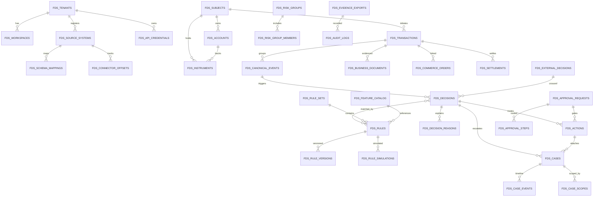
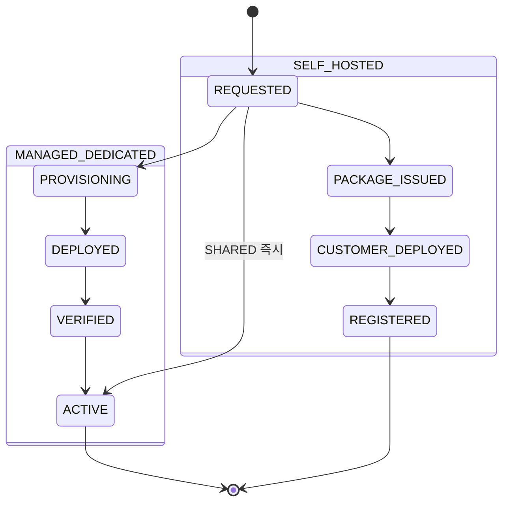

# FDS DB 설계서 (fds-svc 스키마)

> 정본: `.claude/skills/_shared/target-architecture.md` (PostgreSQL · Flyway · 서비스별 별도 스키마 · 멀티테넌시 · PII 마스킹 · 4-eyes).
> 입력 설계서: `docs/software/01-fdsSvc-sass.md` v1.1 (특히 §7 공통 데이터 모델, §8 event taxonomy, §9 수단/채널, §10 룰/feature, §11 action/case/결재, §13 멀티테넌시, §14 DDL, §16 PII/규제).
> 책임 서비스: **`services/fds-svc`** (Java 25, Spring Boot 3.5.x, 헥사고날, `adapter/out/persistence`). AML 규제 케이스는 `aml-svc`, 결재·감사·IAM 운영은 `bo-api`가 별도 스키마로 보유한다.

## 목차
1. [범위·원칙](#1-범위원칙)
2. [스키마 격리·멀티테넌시](#2-스키마-격리멀티테넌시)
3. [ERD](#3-erd)
4. [enum 사전 (코드값·표시값)](#4-enum-사전-코드값표시값)
5. [테이블 명세](#5-테이블-명세)
6. [인덱스 명세](#6-인덱스-명세)
7. [PII·감사·보존 정책](#7-pii감사보존-정책)
8. [Flyway 마이그레이션 순서](#8-flyway-마이그레이션-순서)
9. [서비스 경계 주의 (fds-svc vs aml-svc vs bo-api)](#9-서비스-경계-주의)
10. [downstream 확정 명칭](#10-downstream-확정-명칭)
11. [변경 이력](#11-변경-이력)

---

## 1. 범위·원칙

- 본 문서는 **fds-svc 소유 스키마 `fds`** 의 물리 데이터 모델을 확정한다. 모든 테이블 prefix `fds_`, 스키마 `fds`.
- 4서비스는 별도 스키마/DB를 갖는다: `fds`(fds-svc) · `aml`(aml-svc) · `bo`(bo-api). bo-web은 DB 미보유(bo-api 경유).
- 멀티테넌시 3단 격리(`tenant_id` / `workspace_id` / `data_scope`)를 **모든 운영 테이블**에 강제한다(§2).
- raw PII 미저장: 식별자는 tenant별 keyed hash 또는 token(`*_ref`, `*_hash`) 컬럼만 저장한다(§7).
- 감사 컬럼: 모든 운영 테이블에 `created_at` / `updated_at`, 변경 주체가 있는 테이블에 `created_by` / `updated_by`(운영자 subject token).
- 금액: `NUMERIC(24,8)`로 통화 원단위 + 소수 자릿수 보존(가상자산 8자리 수용). 표시 통화와 base 통화를 분리 저장. KRW는 정수부만 사용.
- enum은 DB에서 `VARCHAR` + CHECK 또는 애플리케이션 enum으로 관리(§4 코드값·표시값 병기). Flyway additive migration 원칙(§8).

---

## 2. 스키마 격리·멀티테넌시

설계서 §13(배포 모델 + 온보딩 프로비저닝 + 키 의미 재정의) 및 정본 `target-architecture.md` §4.1을 물리 모델에 다음과 같이 고정한다.

### 2.1 배포 모델 (deployment topology) — 격리의 1차 경계

격리는 DB 행/스키마 토글이 아니라 **배포 단위 결정**이다. 화면 라디오 즉석 선택이 아니라 **온보딩 프로비저닝 프로세스**의 산출이다. `fds_tenants.deployment_model`(구 `isolation_mode` 대체).

| 모델(`deployment_model`) | 의미 | 대상 | 프로비저닝 | tenant_id 의미 |
|---|---|---|---|---|
| **`MANAGED_DEDICATED`**(기본) | 플랫폼 클라우드에 **서비스별 전용 DB·스택** | 일반 금융사 | 온보딩 IaC(Terraform) 자동(승인→프로비저닝→배포→검증→운영전환) | 배포=서비스 단일 값 |
| **`SELF_HOSTED`** | **고객 자체 인프라**에 설치형 패키지(Helm/Docker) | 은행·고PII·내부망 요건 | 플랫폼은 산출물·가이드·라이선스 제공, 고객 측이 배포·등록 콜백 | 배포=서비스 단일 값 |
| **`SHARED`**(옵션) | 공유 DB + `tenant_id` 행 격리 | 소규모/체험 | 즉시(프로비저닝 없음) | 서비스 간 행 격리 키 |

- **한 서비스(테넌트) = 한 배포(전용 DB)** 가 기본. 전용 배포(`MANAGED_DEDICATED`/`SELF_HOSTED`)에서 서비스 간 격리는 **배포 경계**가 보장하며, `tenant_id`는 사실상 단일 값이다. `SHARED`에서만 `tenant_id`가 서비스 간 격리로 동작한다.
- "서비스 등록"은 격리 라디오가 아니라 **배포 유형 선택 + 온보딩 신청·상태**(`onboarding_status`) 관리다. 온보딩 상태머신은 §4.1a 참조.

### 2.2 멀티테넌시 키 (배포 내부 분리)

| 격리 키 | 컬럼 | 타입 | 역할 |
|---|---|---|---|
| tenant | `tenant_id` | `VARCHAR(64) NOT NULL` | **배포의 서비스(테넌트=서비스)**. 전용 배포에선 단일 값. 상위 기관(institution)이 운영하는 서비스 1종 = tenant 1개(1 기관 : N 서비스). 모든 `fds_*` PK 선두 컬럼, 모든 API `Tenant-Id` |
| workspace | `workspace_id` | `VARCHAR(64) NOT NULL DEFAULT 'default'` | 그 서비스의 **워크스페이스/환경**(retail/corporate, prod/sandbox). rule set·connector·case 큐·결재 분리 |
| data-scope | `data_scope` | `VARCHAR(128)` (nullable, 다중은 `fds_*_scope` 또는 JSONB) | 운영자 row-level **권한 필터**. 저장 격리 아님 — bo-api가 운영자 토큰 scope로 강제 필터 |

규칙:
- 모든 운영 테이블 PK는 `(tenant_id, workspace_id, <natural key>)` 순. UNIQUE·조회 인덱스도 `(tenant_id, workspace_id, ...)` 선두.
- 격리의 1차 경계는 **배포 모델**(§2.1)이다. 전용 배포는 배포 자체가 서비스(테넌트) 경계이며, 본 DDL은 단일 배포 내부 모델을 기술한다(`SHARED` 배포일 때만 `tenant_id` 행 격리가 서비스 간 경계로 동작). 테넌트=서비스이며 그 상위에 기관(institution)이 있다(1 기관 : N 서비스, §5.1 `institution_ref`).
- `sandbox` workspace 는 shadow-only(실제 action outbox 미발행). connector가 `workspace_id` 미지정 시 `default`로 적재.
- API key·OAuth2 client·webhook은 `(tenant_id, workspace_id)`에 바인딩(§5.29 `fds_api_credentials`).
- `data_scope`는 row 단위 다중 적용을 위해 핵심 운영 테이블(subject/transaction/case)에 `data_scope VARCHAR(128)` 단일 컬럼 + 보조 `fds_case_scopes`(다대다) 패턴 허용. bo-api는 `dataScope` 집합 IN 필터를 fds-svc 조회에 주입한다.
- 온보딩·배포 메타(`deployment_model`/`onboarding_status`/`default_region`/`infra_ref`)는 `fds_tenants`(§5.1)에 보존한다. 매니지드 전용 IaC 파이프라인 도구·self-hosted 라이선스 발급/검증 방식은 P8 인프라 설계에서 확정(오픈결정).

---

## 3. ERD

---

## 4. enum 사전 (코드값·표시값)

설계서 enum을 DB 코드값으로 확정한다. 코드값 = DB 저장값, 표시값 = UI 라벨(bo-web i18n 키 기준).

### 4.1 tenant_status / deployment_model / onboarding_status / ingest_mode / connector_status
| 도메인 | 코드값 | 표시값 |
|---|---|---|
| tenant_status | `ACTIVE` / `SUSPENDED` / `ONBOARDING` / `OFFBOARDED` | 활성/정지/온보딩/해지 (운영 생명주기 — onboarding_status와 직교) |
| deployment_model | `MANAGED_DEDICATED` / `SELF_HOSTED` / `SHARED` (3종) | 매니지드 전용/자체 인프라 설치형/소규모 공유 (구 isolation_mode 대체, §2.1) |
| onboarding_status | `REQUESTED` / `PROVISIONING` / `DEPLOYED` / `VERIFIED` / `ACTIVE` / `PACKAGE_ISSUED` / `CUSTOMER_DEPLOYED` / `REGISTERED` (8종) | 신청/프로비저닝중/배포완료/검증완료/운영전환 / 패키지발급/고객배포완료/등록완료 (§4.1a 상태머신) |
| ingest_mode | `REST_PUSH` / `QUEUE` / `POLLING` / `CDC` / `SNAPSHOT` (**5종**, FDS 정본) | REST 푸시/큐/폴링/CDC/스냅샷 (설계서 §2.3, §12). **`VENDOR_BRIDGE` 미추가** — vendor bridge 연동은 FDS 도메인 밖이라 AML(6종, §5.14)과 코드 집합을 달리함(의도적 cross-service 차이, 설계서 §11.6.8 근거) |
| connector_status | `HEALTHY` / `LAGGING` / `ERROR` / `DISABLED` | 정상/지연/오류/비활성 |

> **마이그레이션**: 구 `isolation_mode` enum(`SHARED`/`SCHEMA`/`DB`)은 폐기한다. 데이터 매핑은 `SHARED→SHARED`, `SCHEMA`/`DB → MANAGED_DEDICATED`(저장소 `V2__phase1_foundation.sql`, §8 매핑 주석). `deployment_model`/`onboarding_status` 정본은 설계서 §11.6.11/§11.6.11a, API `DeploymentModel`/`OnboardingStatus` enum과 1:1 동기화한다.

### 4.1a onboarding_status 상태머신 (§2.1, 설계서 §11.6.11a)

`tenant_status`(운영 생명주기)와 `onboarding_status`(온보딩 진행)는 직교한다. 배포 유형별 경로:

- 매니지드: `REQUESTED → PROVISIONING → DEPLOYED → VERIFIED → ACTIVE`.
- self-hosted: `REQUESTED → PACKAGE_ISSUED → CUSTOMER_DEPLOYED → REGISTERED`(인스턴스 등록 콜백으로 `REGISTERED` 도달).
- SHARED: `REQUESTED → ACTIVE`(즉시).
- 온보딩이 `ACTIVE` 또는 `REGISTERED`에 도달하면 `tenant_status`를 `ACTIVE`로 전환한다.

### 4.2 subject_type / actor_type (§8.2, §7.2)
| 도메인 | 코드값 |
|---|---|
| subject_type | `PERSON` / `BUSINESS` / `MERCHANT` / `EMPLOYEE_SUBJECT` |
| actor_type | `CUSTOMER` / `EMPLOYEE` / `SYSTEM` / `PARTNER` / `API_KEY` |

> **정본 정렬**: `subject_type`의 `BUSINESS`·`MERCHANT`·`EMPLOYEE_SUBJECT`는 설계서 §7.1 핵심 객체(Business Entity·Subject/Actor 분리)를 물리 모델로 흡수한 값이다. 설계서 §8.2가 `PERSON` 예시만 보였더라도 §7.1·§7.2의 객체 분류가 enum 정본 근거이며, 본 §4.2 4종을 정본으로 고정한다(설계서 §7에 subject_type enum 표 역삽입은 설계 측 후속 보강 대상). `actor`(actor_type/role) 프로파일은 별도 마스터를 두지 않고 `fds_subjects`(subject_type=`EMPLOYEE_SUBJECT`)로 흡수하며, 이벤트·거래는 `actor_ref` token만 보존한다(내부감사 룰 `actor.role=TELLER` feature는 canonical_payload·feature_snapshot에서 materialize).

### 4.3 instrument_type (§9.1)
`WALLET` / `BANK_ACCOUNT` / `CARD` / `VIRTUAL_ACCOUNT` / `CRYPTO_ADDRESS` / `CASH` / `MERCHANT_ACCOUNT` / `API_KEY` / `EMPLOYEE_ACCOUNT` / `CORPORATE_BANK_ACCOUNT` / `SELLER_SETTLEMENT_ACCOUNT` / `ESCROW_ACCOUNT`

### 4.4 channel_type (§9.2)
`CARD_PRESENT` / `CARD_NOT_PRESENT` / `ATM` / `BANK_TRANSFER` / `DOMESTIC_REMIT` / `CROSS_BORDER_REMIT` / `CASH_IN` / `INBOUND_REMIT` / `PG_PAYMENT` / `WALLET_PAYMENT` / `WALLET_WITHDRAWAL` / `VIRTUAL_ACCOUNT_DEPOSIT` / `CRYPTO_DEPOSIT` / `CRYPTO_WITHDRAWAL` / `EXCHANGE_TRADE` / `INTERNAL_OPERATION` / `BATCH_SETTLEMENT` / `TRADE_PAYMENT` / `CROSS_BORDER_ECOMMERCE_SETTLEMENT` / `MARKETPLACE_SELLER_PAYOUT` / `B2B_INVOICE_PAYMENT` (**21종**)

> **데이터 레이어 hanpass-ph 재그라운딩(§5.3, Flyway V16 `V16__ph_data_grounding.sql`)**: `CASH_IN`(월렛충전 cash-in/top-up — `walletchg-svc`), `INBOUND_REMIT`(파트너 인바운드 송금 — `inbound-svc`) 2종을 추가(19→21종). 저장소 `V16`이 `ck_fds_events_channel_type` CHECK를 21종으로 재정의하고 §5.5 corridor 4컬럼·§5.3a 소스 시드를 함께 적재한다. `CROSS_BORDER_REMIT`은 화면 라벨 '해외송금'(OVERSEAS_REMIT 의미, `remit-svc`)·`DOMESTIC_REMIT`은 국내송금(`domestic-svc`)에 대응한다. **채널 enum 변경은 데이터 레이어 한정이며 규제 임계(CTR/STR)·기한은 불변**이다.

### 4.5 payment_rail (§9.3)
`INTERNAL_LEDGER` / `CARD_NETWORK` / `ATM_SWITCH` / `BANK_ACH` / `OPEN_BANKING` / `FIRM_BANKING` / `CMS` / `BANK_CD_NETWORK` / `EASY_PAY` / `VAN_PG` / `SWIFT` / `LOCAL_RTP` / `PARTNER_API` / `BLOCKCHAIN` / `MANUAL_BACKOFFICE` / `ESCROW` / `MARKETPLACE_SETTLEMENT` / `TRADE_FINANCE`

### 4.6 control_capability (§9.4)
`CAN_BLOCK_BEFORE_AUTH` / `CAN_DECLINE_AUTH` / `CAN_HOLD_FUNDS` / `CAN_EXTEND_HOLD` / `CAN_RELEASE_HOLD` / `CAN_CANCEL_BEFORE_SETTLEMENT` / `CAN_REQUEST_REVERSAL` / `CAN_SUSPEND_INSTRUMENT` / `CAN_OPEN_CASE_ONLY`

### 4.7 decision (§11.1)
| 코드값 | 표시값 |
|---|---|
| `ALLOW` | 허용 |
| `MONITOR` | 모니터(기록만) |
| `REVIEW` | 검토 필요 |
| `CHALLENGE` | 추가 인증 |
| `BLOCK` | 차단 |
| `HOLD` | 자금 보류 |
| `FREEZE` | 동결 |
| `REPORT` | 규제 보고 후보 |

### 4.8 action_type (§11.2)
> **정본 = API `ActionType` enum(전수 23종)**. 본 DB enum은 API 명세 `docs/design/api/01-fds-api.md` §9 `ActionType`과 1:1로 동기화한다(설계서 §11.2/§15의 서술이 어긋날 경우 API enum이 우선). 코드값은 DB 저장값.

`DECLINE_AUTHORIZATION` / `BLOCK_TRANSACTION` / `HOLD_FUNDS` / `EXTEND_HOLD` / `RELEASE_HOLD` / `CANCEL_TRANSACTION` / `REQUEST_REVERSAL` / `SUSPEND_ACCOUNT` / `SUSPEND_INSTRUMENT` / `HOLD_SETTLEMENT` / `SUSPEND_SELLER_PAYOUT` / `INCREASE_RESERVE` / `REQUEST_ADDITIONAL_DOCUMENT` / `ADD_TO_GROUP` / `OPEN_CASE` / `SEND_ALERT` / `REQUIRE_SECOND_APPROVAL` / `BLOCK_WITHDRAWAL` / `SUSPEND_API_KEY` / `SUSPEND_EMPLOYEE_SESSION` / `REQUEST_TRAVEL_RULE_INFO` / `OPEN_AML_CASE` / `REGULATORY_REPORT` (23종)

> 위임: `OPEN_AML_CASE`, `REGULATORY_REPORT`, `REQUEST_TRAVEL_RULE_INFO`는 fds-svc가 후보를 생성하나 실제 케이스/보고 처리는 **aml-svc**로 위임된다(§9).
>
> **정규화 매핑(설계서 §15의 비정본 verb → 정본 enum)**: 설계서 §15에 흩어진 도메인별 'verb'는 본 enum에 다음으로 매핑하여 저장한다. 별도 코드값을 신설하지 않는다.
> - `SUSPEND_MERCHANT`(§15.5 PG / §15.8 마켓플레이스) → `SUSPEND_INSTRUMENT` (대상 `target_ref`=merchant/seller token). 미지원 채널은 `OPEN_CASE` + `case_type=MERCHANT_RISK`로 강등.
> - `SEND_SECURITY_ALERT`(§15.11 내부감사) → `SEND_ALERT`.
> - `CHALLENGE`/`REVIEW`(§15.2/§15.5) → action 아님. decision enum(§4.7)으로 분류. 추가 인증 의도면 `SEND_ALERT`로 매핑.
> - `OPEN_*_CASE`(`OPEN_CHARGEBACK_REVIEW`/`OPEN_MULE_ACCOUNT_CASE`/`OPEN_MERCHANT_RISK_CASE`/`OPEN_TRADE_FINANCE_CASE`/`OPEN_INTERNAL_AUDIT_CASE`/`OPEN_COMPLIANCE_CASE`) → `action_type=OPEN_CASE` + `case_type=<§4.10>` 조합. `OPEN_COMPLIANCE_CASE`(코인 룰 §10.2)는 `case_type=AML_REVIEW`(또는 Travel Rule 맥락 시 `CRYPTO_TRAVEL_RULE`)로 매핑.

### 4.9 action_status (§14.5 outbox)
`PENDING` / `APPROVAL_REQUIRED` / `APPROVED` / `SENT` / `ACKED` / `FAILED` / `CANCELLED`

> **`ACKED` 전이 트리거**: `SENT → ACKED`는 외부 시스템 어댑터가 조치 수신확인(ack)을 보고할 때 전이된다 — `fds-actions` relay 후 결과 콜백(`FdsActionResult.status='ACKED'`)을 `ActionResultConsumer`(`aws` 프로파일)가 수신해 해당 outbox row를 멱등 전이(`Action.markAcked()`). ack 실패 보고는 `SENT → FAILED`(백오프 재시도, §5.12). `aws` 프로파일이 아닌 로컬/stub 환경에서는 ack 콜백 경로가 비활성이라 `SENT`에 머문다.

### 4.10 case_type (§11.3)
`FRAUD_REVIEW` / `AML_REVIEW` / `CHARGEBACK_REVIEW` / `MULE_ACCOUNT_REVIEW` / `CRYPTO_TRAVEL_RULE` / `INTERNAL_AUDIT` / `MERCHANT_RISK` / `REGULATORY_REPORT` / `TRADE_FINANCE_REVIEW` / `ECOMMERCE_SETTLEMENT_REVIEW` / `B2B_INVOICE_REVIEW`

### 4.11 case_status / case_priority
| 도메인 | 코드값 |
|---|---|
| case_status | `OPEN` / `ASSIGNED` / `IN_REVIEW` / `ESCALATED` / `PENDING_APPROVAL` / `CLOSED_CONFIRMED` / `CLOSED_FALSE_POSITIVE` / `CLOSED_REPORTED` (8종, 표시: 신규/배정/조사중/규제전환/종결상신/사기확정종결/오탐종결/보고후종결). 종결 상태(`CLOSED_*`) → `IN_REVIEW` **재오픈(REOPEN)** 전이 허용(사유 필수·`SFDS_CASE:APPROVE` 이상·자기 종결 건 금지·감사 기록, 설계서 §11.6.1) |
| case_priority | `LOW` / `MEDIUM` / `HIGH` / `CRITICAL` (4종, 표시: 낮음/중간/높음/치명) |
| close_reason | `FP_THRESHOLD` / `FP_NORMAL_PATTERN` / `FP_DATA_QUALITY` / `CONFIRMED_FRAUD` / `CONFIRMED_MULE` / `CONFIRMED_ATO` / `ESCALATED_AML` / `OTHER` (8종, 표시: 오탐-임계과민/오탐-정상거래패턴/오탐-데이터품질/확정-사기거래/확정-대포통장/확정-도용/추가조사-AML이관/기타. 설계서 §11.6.1a 정합 — 종결 시 필수, 자유 텍스트는 `fds_case_events` `CLOSED` payload 보조 메모로 분리) |

> **status enum 정본**: `tenant_status`(§4.1)·`connector_status`(§4.1)·`case_status`·`case_priority`·`rule_status`/`rule_version_status`(§4.13)의 코드 집합은 본 DB §4를 정본으로 한다. 설계서 §14 DDL이 `status VARCHAR(32)`만 보이고 상태머신을 명시하지 않은 부분은 본 enum이 정본 코드 집합이며, 설계서 측 상태전이도 추가는 후속 보강 대상이다. PRD §11.1·PPT slide 27은 위 case_status 8종·case_priority 4종(`CRITICAL` 포함)을 그대로 참조한다.

### 4.12 approval (§11.5)
| 도메인 | 코드값 |
|---|---|
| approval_line | `SELF_APPROVAL_DISABLED` / `MAKER_CHECKER` / `COMPLIANCE_MANAGER` / `RISK_MANAGER` / `SECURITY_ADMIN` / `EXECUTIVE_APPROVAL` |
| approval_status | `DRAFT` / `SUBMITTED` / `APPROVED` / `REJECTED` / `CANCELLED` / `EXPIRED` / `EXECUTED` / `EXECUTION_FAILED` |

### 4.13 rule_status / rule_version_status
| 도메인 | 코드값 |
|---|---|
| rule_status | `DRAFT` / `PENDING_APPROVAL` / `ACTIVE` / `DISABLED` / `ARCHIVED` |
| rule_version_status | `DRAFT` / `SIMULATED` / `APPROVED` / `DEPLOYED` / `ROLLED_BACK` |

### 4.14 risk_group_type (§3.1, §10.1)
`BLACKLIST` / `WHITELIST` / `WATCHLIST` / `MULE_NETWORK` / `ALLOWLIST` / `DENYLIST`

### 4.15 document_type (§14.6)
`INVOICE` / `PURCHASE_ORDER` / `BILL_OF_LADING` / `AIR_WAYBILL` / `CUSTOMS_DECLARATION` / `DELIVERY_PROOF` / `TAX_INVOICE` / `PLATFORM_ORDER`

### 4.16 event_family (§8.1, `event_type` 접두)
`transaction` / `authorization` / `settlement` / `trade` / `invoice` / `order` / `seller` / `account` / `instrument` / `member` / `device` / `session` / `aml` / `case` / `employee` / `market`

### 4.17 export_format / export_status (§16.4)
| 도메인 | 코드값 |
|---|---|
| export_format | `CSV` / `EXCEL` / `PDF` / `JSON_API` |
| export_status | `REQUESTED` / `BUILDING` / `READY` / `DOWNLOADED` / `EXPIRED` / `FAILED` |

### 4.18 external_decision_mode (§12.6 Legacy Vendor Bridge)
`VENDOR_RESULT_INGEST` / `DB_MIRROR` / `DUAL_RUN` / `SHADOW_DECISION` / `RULE_MIGRATION`

### 4.19 transaction_type (§5.9 `fds_transactions.transaction_type` · 설계서 §8.3 `transaction.transactionType`)
| 코드값 | 표시값 | 대표 도메인(설계서 §4.1/§15) |
|---|---|---|
| `WITHDRAWAL` | 출금 | ATM 출금(§15.1)·지갑/코인 출금(§15.10) |
| `DEPOSIT` | 입금 | 가상계좌 입금·법정화폐/코인 입금(§15.10) |
| `TRANSFER` | 이체 | 국내송금·계좌이체(§15.3) |
| `REMITTANCE` | 송금(해외) | 해외송금(§15.4) |
| `PAYMENT` | 결제 | 카드 결제(§15.2)·PG(§15.5)·무역대금(§15.6)·B2B 인보이스(§15.9) |
| `REFUND` | 환불 | 카드/PG/이커머스 환불(§15.2·§15.7) |
| `REVERSAL` | 취소·역거래 | 거래 취소·reversal(§9.4 capability 연계) |
| `CHARGE` | 충전 | 지갑 충전(§4.1 Wallet) |
| `SETTLEMENT` | 정산 | PG/이커머스 해외정산(§15.7) |
| `PAYOUT` | 지급 | 마켓플레이스 셀러 정산 지급(§15.8) |
| `EXCHANGE` | 매매·체결 | 코인/증권 주문·체결(§15.10) |
| `ADJUSTMENT` | 수기 조정 | 내부 감사·수기 조정(§15.11) |

> **폐쇄 enum 정본(12종)**. 설계서 §8.3·연동 §4.2·API `TransactionDto.transactionType`은 본 enum을 참조한다(자유 문자열 금지, CHECK 제약 또는 앱 enum). 기존 문서 등장값 전수(`WITHDRAWAL`)를 포함하며, 지원 거래 도메인(설계서 §4.1·§15 전 도메인)을 커버하도록 확정. 도메인 verb 신설 시 본 표에 추가 후 파생 문서를 동기화한다.

---

## 5. 테이블 명세

모든 테이블은 스키마 `fds` 소속. 격리 컬럼 `tenant_id`, `workspace_id`는 §2 규칙으로 전 테이블 공통 적용(아래 표에서 명시). 감사 컬럼 `created_at`/`updated_at`은 운영 테이블 공통.

### 5.1 fds_tenants — 서비스 마스터(테넌트=서비스)
> **계층**: 기관(institution) → 서비스(테넌트, `tenant_id`) → 워크스페이스(`workspace_id`). `fds_tenants`의 1행 = 한 서비스(테넌트). 상위 기관 1개가 여러 서비스를 운영한다(**1 기관 : N 서비스**). 기관 식별은 `institution_ref`로 참조한다.

| 컬럼 | 타입 | NULL | 기본값 | 제약 | 설명 |
|---|---|---|---|---|---|
| tenant_id | VARCHAR(64) | N | | PK | SaaS 서비스 ID(테넌트=서비스, 격리 경계·PK 선두) |
| institution_ref | VARCHAR(64) | Y | | | **상위 기관(institution) 참조**. 납품받은 회사/금융기관 식별자. 1 기관 : N 서비스 관계의 외부 키(FK 아님·논리 참조). nullable·additive 신규 컬럼(후속 마이그레이션 §8에서 추가, 기존 row는 NULL 백필 후 매핑) |
| display_name | VARCHAR(160) | N | | | 표시명 |
| tenant_status | VARCHAR(32) | N | `'ONBOARDING'` | enum 4.1 | 운영 생명주기 상태(onboarding_status와 직교) |
| deployment_model | VARCHAR(32) | N | `'MANAGED_DEDICATED'` | enum 4.1 (`MANAGED_DEDICATED`/`SELF_HOSTED`/`SHARED`) | 배포 유형(구 isolation_mode 대체, §2.1) |
| onboarding_status | VARCHAR(32) | N | `'REQUESTED'` | enum 4.1 (8종) | 온보딩 진행 상태(§4.1a 상태머신) |
| default_region | VARCHAR(32) | N | `'KR'` | | 기본 리전(한국 우선)·전용 배포 region |
| infra_ref | VARCHAR(160) | Y | | | 배포 메타 참조(매니지드 IaC 워크스페이스/스택 ref, self-hosted 인스턴스/라이선스 ref). 발급·검증 방식은 P8 인프라 설계 확정 |
| retention_policy | JSONB | Y | | | 보존정책 override |
| compliance_policy | JSONB | N | `'{"base":"KR_BASE","packs":["EFIN","SPECIAL_AML","PIPA","INTERNAL_CONTROL"],"optional":[]}'` | 설계서 §16.2 | 규제 팩 토글 상태(named pack on/off). `base`=`KR_BASE` 필수·잠금(끄기 불가), `packs`=토글 ON, `optional`=Travel Rule/PCI(계약 후). 변경 4-eyes `subject_kind='POLICY_PACK'` |
| created_at | TIMESTAMPTZ | N | now() | | |
| updated_at | TIMESTAMPTZ | N | now() | | |

> **마이그레이션(저장소 `V2__phase1_foundation.sql`)**: 구 `isolation_mode` 컬럼(`V1__baseline.sql` 생성)은 `deployment_model`/`onboarding_status`/`infra_ref`/`compliance_policy` 추가 후 데이터 매핑(`SHARED→SHARED` & `onboarding_status='ACTIVE'`, `SCHEMA`/`DB → MANAGED_DEDICATED` & `onboarding_status='ACTIVE'`)·`ck_fds_tenants_deployment_model` CHECK를 거쳐 DROP한다(§8 매핑 주석). `default_region`은 기존 유지. 신규 서비스(테넌트) 등록은 `deployment_model` 선택 + `onboarding_status='REQUESTED'`로 시작한다.

> **마이그레이션(institution_ref·후속)**: 상위 기관 참조 컬럼 `institution_ref VARCHAR(64) NULL`은 **다음 마이그레이션에서 additive(nullable)로 추가**한다(1 기관 : N 서비스). 기존 row는 NULL로 시작 후 기관-서비스 매핑이 확정되면 백필한다. 기관 마스터 테이블 정식화는 후속 설계에서 확정.

### 5.2 fds_workspaces
| 컬럼 | 타입 | NULL | 기본값 | 제약 | 설명 |
|---|---|---|---|---|---|
| tenant_id | VARCHAR(64) | N | | PK, FK→fds_tenants | |
| workspace_id | VARCHAR(64) | N | | PK | retail/corporate/prod/sandbox |
| display_name | VARCHAR(160) | N | | | |
| is_sandbox | BOOLEAN | N | FALSE | | true면 shadow-only |
| created_at | TIMESTAMPTZ | N | now() | | |
| updated_at | TIMESTAMPTZ | N | now() | | |

### 5.3 fds_source_systems
| 컬럼 | 타입 | NULL | 기본값 | 제약 | 설명 |
|---|---|---|---|---|---|
| tenant_id | VARCHAR(64) | N | | PK | |
| workspace_id | VARCHAR(64) | N | `'default'` | PK | |
| source_system | VARCHAR(64) | N | | PK | hanpass-ph 트랜잭션 마이크로서비스 식별자(§5.3a 카탈로그) |
| display_name | VARCHAR(160) | N | | | |
| ingest_mode | VARCHAR(32) | N | | enum 4.1 | hanpass-ph 업스트림은 `REST_PUSH`(REST sync 인입, 연동 §7.1) 기준 |
| schema_version | VARCHAR(80) | N | | | `remit-svc.v1`·`walletchg-svc.v1` 등 |
| enabled | BOOLEAN | N | TRUE | | |
| fail_policy | VARCHAR(32) | N | `'CASE_ONLY'` | `FAIL_CLOSED`/`FAIL_OPEN`/`CASE_ONLY` | 실시간 판단 장애정책(D-14) |
| created_at | TIMESTAMPTZ | N | now() | | |
| updated_at | TIMESTAMPTZ | N | now() | | |

#### 5.3a 소스 시스템 카탈로그 (hanpass-ph 실서비스 재그라운딩)

데이터 레이어를 hanpass-ph 필리핀 송금/월렛 플랫폼의 실제 트랜잭션 마이크로서비스로 현행화한다(generic placeholder `card-processor`/`core-banking`/`atm-switch` 예시 대체). 업스트림은 **REST sync(`REST_PUSH`)** 로 canonical event를 인입하며, 모든 식별자는 원문 금지(token/keyed-HMAC).

| `source_system` | 역할 | emit하는 정규 이벤트 family(§4.16) | FDS `channel_type`(§4.4) |
|---|---|---|---|
| `member-svc` | 회원/KYC/CDD/제재·PEP 스크리닝 | `member.*`(customer.*/entity.*/beneficial-owner.* 흡수) | — (subject/instrument materialize 소스) |
| `walletchg-svc` | 월렛충전(cash-in/top-up) | `transaction.requested` | `CASH_IN` |
| `domestic-svc` | 국내송금(PHP) | `transaction.requested` | `DOMESTIC_REMIT` |
| `remit-svc` | 해외송금(cross-border) | `transaction.requested`, `settlement.posted`(→`settlement` family) | `CROSS_BORDER_REMIT`(화면 라벨 '해외송금') |
| `wallet-svc` | 월렛 원장(double-entry, transfer_links) | `account.*`, `settlement.posted` | — (account/원장 소스) |
| `tx-history-svc` | 회원 통합 이력(read model) | (read-only, emit 없음) | — |
| `inbound-svc` | 파트너 인바운드 송금 | `transaction.requested` | `INBOUND_REMIT` |

> **연동 키 매핑(§5.5·연동 §7.2 정본)**: member.`member_id`→`subject_ref`(tenant keyed HMAC), *.`wallet_transaction_id`/remit.`transfer_number`/walletchg.`charge_order_id`/domestic.`transaction_id`→`transaction_ref`, wallet.`wallet_id`→`account_ref`(instrument 보조키), remit.`account_hash`/domestic.(`proc_id`+`account_number`+`holder_name`)→`counterparty_ref`. **주의**: `member_id`는 `domestic-svc`만 `varchar(36)`, 그 외 `uuid` → 매핑 시 문자열 정규화 후 HMAC. **모든 원천 식별자는 token/keyed-HMAC로만 저장(원문 금지, §7).**
>
> **규제 레이어 병기(불변)**: 임계/기한/KoFIU 분류는 그대로 유지한다. PH 운영은 Policy Pack `PH_AMLC` 옵션(`PhRegulatoryThresholds`: CTR ₱500,000·Travel Rule ₱50,000·구조화 5BD·STR 5BD·near 0.90)으로 1줄 병기만 가능하며, **KR KoFIU 임계 숫자·기한을 교체하지 않는다.**

### 5.4 fds_schema_mappings
원천 payload → canonical field 매핑(§5.1, §12.5 PII allowlist 포함).
| 컬럼 | 타입 | NULL | 기본값 | 제약 | 설명 |
|---|---|---|---|---|---|
| tenant_id | VARCHAR(64) | N | | PK | |
| workspace_id | VARCHAR(64) | N | `'default'` | PK | |
| source_system | VARCHAR(64) | N | | PK | |
| schema_version | VARCHAR(80) | N | | PK | |
| mapping_def | JSONB | N | | | field map + pii_allowlist |
| status | VARCHAR(32) | N | `'DRAFT'` | rule_status 재사용 | 4-eyes 승인 대상 |
| created_by | VARCHAR(128) | Y | | | 운영자 token |
| updated_by | VARCHAR(128) | Y | | | |
| created_at / updated_at | TIMESTAMPTZ | N | now() | | |

### 5.5 fds_canonical_events
| 컬럼 | 타입 | NULL | 기본값 | 제약 | 설명 |
|---|---|---|---|---|---|
| tenant_id | VARCHAR(64) | N | | PK | |
| workspace_id | VARCHAR(64) | N | `'default'` | PK | |
| event_id | VARCHAR(160) | N | | PK | 원천 이벤트 id |
| idempotency_key | VARCHAR(256) | N | | UNIQUE(tenant,ws,key) | 중복 방지 |
| source_system | VARCHAR(64) | N | | | |
| schema_version | VARCHAR(80) | N | | | |
| event_type | VARCHAR(100) | N | | event_family 접두 | `transaction.requested` |
| event_family | VARCHAR(32) | N | | enum 4.16 | 라우팅·인덱스용 |
| occurred_at | TIMESTAMPTZ | N | | | 원천 발생 시각 |
| received_at | TIMESTAMPTZ | N | now() | | |
| subject_ref | VARCHAR(256) | Y | | | keyed hash/token |
| actor_ref | VARCHAR(256) | Y | | | |
| transaction_ref | VARCHAR(256) | Y | | | |
| instrument_ref | VARCHAR(256) | Y | | | token |
| counterparty_ref | VARCHAR(256) | Y | | | |
| channel_type | VARCHAR(64) | Y | | enum 4.4 | |
| payment_rail | VARCHAR(64) | Y | | enum 4.5 | |
| amount | NUMERIC(24,8) | Y | | | 표시 통화 금액 |
| currency | VARCHAR(12) | Y | | | |
| amount_base | NUMERIC(24,8) | Y | | | base 통화(USD) 환산. cross-border는 remit `usd_amount`/`report_amount`에서 산출 |
| base_currency | VARCHAR(12) | Y | | | base 통화 코드(cross-border 기본 `USD`) |
| send_country | VARCHAR(2) | Y | | | corridor 출발국(ISO-3166-1 alpha-2). cross-border(`remit-svc`/`inbound-svc`)에서 채움 |
| receive_country | VARCHAR(2) | Y | | | corridor 도착국. cross-border에서 채움 |
| send_currency | VARCHAR(12) | Y | | | corridor 송금 통화(미지정 시 `canonical_payload.corridor`로 표기 가능) |
| receive_currency | VARCHAR(12) | Y | | | corridor 수취 통화 |
| payload_hash | VARCHAR(128) | Y | | | `sha256:...` 원천 payload 해시 |
| canonical_payload | JSONB | N | | | PII 제거된 정규화 payload. cross-border corridor(`send_country`/`receive_country`/`send_currency`/`receive_currency`)는 본 컬럼 또는 `canonical_payload.corridor`에 표기 |
| data_scope | VARCHAR(128) | Y | | | row-level 가시 필터 |

> raw payload 미저장. `canonical_payload`는 PII 제거 후. 식별자는 모두 token/hash.
> **corridor / USD 정규화(hanpass-ph 재그라운딩, §5.3a)**: cross-border 정규 이벤트(`remit-svc`/`inbound-svc`, `channel_type=CROSS_BORDER_REMIT`/`INBOUND_REMIT`)는 corridor를 `send_country`/`receive_country`(varchar2)·`send_currency`/`receive_currency`로 명시한다(`canonical_payload.corridor` 표기 병행 허용). `amount_base`/`base_currency`(USD)는 remit `usd_amount`/`report_amount`에서 산출됨을 명시한다. 자재화 subject country(§5.6)는 remit/member 국적 매핑으로 도출한다. 본 corridor 필드는 **데이터 레이어 한정 — 규제 임계/기한 불변**.

### 5.6 fds_subjects
| 컬럼 | 타입 | NULL | 기본값 | 제약 | 설명 |
|---|---|---|---|---|---|
| tenant_id / workspace_id | VARCHAR(64) | N | (ws `'default'`) | PK | |
| subject_ref | VARCHAR(256) | N | | PK | keyed hash/token. hanpass-ph: `member-svc.member_id`(uuid; `domestic-svc`만 varchar(36) → 문자열 정규화 후) → tenant keyed HMAC(§5.3a) |
| subject_type | VARCHAR(32) | N | | enum 4.2 | |
| country | VARCHAR(8) | Y | | | 자재화 subject country = remit/member 국적 매핑(§5.5 corridor) |
| kyc_level | VARCHAR(32) | Y | | | |
| risk_rating | VARCHAR(32) | Y | | | |
| status | VARCHAR(32) | Y | | | |
| data_scope | VARCHAR(128) | Y | | | |
| first_seen_at | TIMESTAMPTZ | Y | | | |
| created_at / updated_at | TIMESTAMPTZ | N | now() | | |

### 5.7 fds_accounts
| 컬럼 | 타입 | NULL | 제약 | 설명 |
|---|---|---|---|---|
| tenant_id / workspace_id | VARCHAR(64) | N | PK | |
| account_ref | VARCHAR(256) | N | PK | token. hanpass-ph: `wallet-svc.wallet_id`(월렛 원장 키) → keyed HMAC(§5.3a) |
| subject_ref | VARCHAR(256) | Y | | 소유 subject |
| account_type | VARCHAR(32) | Y | | |
| institution_code | VARCHAR(80) | Y | | |
| country | VARCHAR(8) | Y | | |
| status | VARCHAR(32) | Y | | |
| opened_at | TIMESTAMPTZ | Y | | |
| created_at / updated_at | TIMESTAMPTZ | N | | |

### 5.8 fds_instruments
| 컬럼 | 타입 | NULL | 제약 | 설명 |
|---|---|---|---|---|
| tenant_id / workspace_id | VARCHAR(64) | N | PK | |
| instrument_ref | VARCHAR(256) | N | PK | token (카드/계좌/주소 hash) |
| subject_ref | VARCHAR(256) | Y | | |
| account_ref | VARCHAR(256) | Y | | |
| instrument_type | VARCHAR(64) | N | enum 4.3 | |
| institution_code | VARCHAR(80) | Y | | |
| country | VARCHAR(8) | Y | | |
| status | VARCHAR(32) | Y | | |
| first_seen_at | TIMESTAMPTZ | Y | | first-seen feature용 |
| created_at / updated_at | TIMESTAMPTZ | N | | |

### 5.9 fds_transactions
| 컬럼 | 타입 | NULL | 제약 | 설명 |
|---|---|---|---|---|
| tenant_id / workspace_id | VARCHAR(64) | N | PK | |
| transaction_ref | VARCHAR(256) | N | PK | |
| subject_ref / actor_ref / instrument_ref / counterparty_ref | VARCHAR(256) | Y | | token |
| transaction_type | VARCHAR(64) | N | enum 4.19 (12종 폐쇄) | 설계서 §8.3 `transactionType` 정본 참조 |
| direction | VARCHAR(32) | Y | `INBOUND`/`OUTBOUND` | |
| channel_type | VARCHAR(64) | Y | enum 4.4 | |
| payment_rail | VARCHAR(64) | Y | enum 4.5 | |
| amount / amount_base | NUMERIC(24,8) | Y | | |
| currency / base_currency | VARCHAR(12) | Y | | |
| status | VARCHAR(32) | Y | | |
| data_scope | VARCHAR(128) | Y | | |
| requested_at / completed_at | TIMESTAMPTZ | Y | | |
| created_at / updated_at | TIMESTAMPTZ | N | | |

### 5.10 fds_decisions
| 컬럼 | 타입 | NULL | 제약 | 설명 |
|---|---|---|---|---|
| tenant_id / workspace_id | VARCHAR(64) | N | PK | |
| decision_id | UUID | N | PK | |
| event_id | VARCHAR(160) | N | FK→fds_canonical_events | |
| transaction_ref | VARCHAR(256) | Y | | |
| subject_ref | VARCHAR(256) | Y | | |
| decision | VARCHAR(32) | N | enum 4.7 | |
| risk_score | NUMERIC(8,4) | Y | | 0~100 |
| matched_rules | JSONB | N | `'[]'` | rule_id+version 배열 |
| rule_set_version | VARCHAR(80) | Y | | 평가 시점 rule set 버전 |
| feature_snapshot | JSONB | Y | | 판단 입력 feature(증적) |
| input_event_hash | VARCHAR(128) | Y | | 원천 이벤트 hash 증적 |
| expires_at | TIMESTAMPTZ | Y | | 실시간 decision 만료 |
| data_scope | VARCHAR(128) | Y | | |
| created_at | TIMESTAMPTZ | N | now() | 불변(append-only) |

> **채널/금액/corridor 파생(현재 구현)**: 결정 목록·필터의 `channelType`/`currency`/`amount(min~max)`/corridor(`sendCountry`/`receiveCountry`) 축은 `fds_decisions`에 비정규화 저장되지 않고, **`fds_canonical_events`와 복합키 `(tenant_id, workspace_id, event_id)` LEFT JOIN으로 파생**한다(저장소 `DecisionJpaRepository`, 이벤트 부재 시 결정 행 보존). 향후 조회 성능·이벤트 보존정책 파기 대비를 위해 비정규화 컬럼화 가능(후속). 본 표는 현재 컬럼 집합 정본이다.

### 5.11 fds_decision_reasons
decision API의 reason code 정규화(§12.8 reasonCodes).
| 컬럼 | 타입 | NULL | 제약 | 설명 |
|---|---|---|---|---|
| tenant_id / workspace_id | VARCHAR(64) | N | PK | |
| decision_id | UUID | N | PK, FK→fds_decisions | |
| reason_code | VARCHAR(64) | N | PK | `NEW_BENEFICIARY` 등 |
| reason_detail | JSONB | Y | | feature 값·임계값 |

### 5.12 fds_actions (action outbox)
| 컬럼 | 타입 | NULL | 제약 | 설명 |
|---|---|---|---|---|
| tenant_id / workspace_id | VARCHAR(64) | N | PK | |
| action_id | UUID | N | PK | |
| decision_id | UUID | Y | FK→fds_decisions | |
| case_id | UUID | Y | FK→fds_cases | case-originated action |
| action_type | VARCHAR(64) | N | enum 4.8 | |
| target_system | VARCHAR(64) | Y | | |
| target_ref | VARCHAR(256) | Y | | token |
| status | VARCHAR(32) | N | `'PENDING'` | enum 4.9 |
| approval_request_id | UUID | Y | FK→fds_approval_requests | 결재 필요 시 |
| idempotency_key | VARCHAR(256) | N | UNIQUE(tenant,ws,key) | |
| retry_count | INT | N | 0 | DLQ 종단 임계 `MAX_RETRIES=5` |
| requested_at | TIMESTAMPTZ | N | now() | |
| completed_at | TIMESTAMPTZ | Y | | |
| next_attempt_at | TIMESTAMPTZ | Y | | 디스패처 백오프 스케줄(V13). NULL=즉시 가용; FAILED는 `now+30s·2^(attempt-1)`(상한 30m) 적재, `<= now` 경과분만 재클레임(연동 §6.2.1) |
| error_code | VARCHAR(120) | Y | | |
| created_by / updated_by | VARCHAR(128) | Y | | |

- **아웃박스 자동 디스패처(V13, 연동 §6.2.1)**: 스케줄드 디스패처가 `PENDING`/`APPROVED` + 백오프 경과 `FAILED` row를 `SELECT … FOR UPDATE SKIP LOCKED`로 원자 클레임(`status='SENT'`)해 다중 인스턴스 중복 relay를 방지한다. 클레임 인덱스 `ix_fds_actions_claim (tenant_id, workspace_id, status, next_attempt_at, requested_at)`. `retry_count >= 5` 도달 시 `FAILED → CANCELLED`(DLQ 종단) + `fds_audit_logs` `ACTION_DEAD_LETTER` 감사. 디스패처는 `aws` 프로파일 한정 활성.

### 5.13 fds_cases
| 컬럼 | 타입 | NULL | 제약 | 설명 |
|---|---|---|---|---|
| tenant_id / workspace_id | VARCHAR(64) | N | PK | |
| case_id | UUID | N | PK | |
| case_type | VARCHAR(64) | N | enum 4.10 | |
| subject_ref / transaction_ref | VARCHAR(256) | Y | | |
| origin_decision_id | UUID | Y | FK→fds_decisions | 발단 decision |
| status | VARCHAR(32) | N | `'OPEN'` | enum 4.11 |
| priority | VARCHAR(32) | Y | enum 4.11 | |
| assigned_to | VARCHAR(128) | Y | | 운영자 token |
| close_reason | VARCHAR(64) | Y | enum 4.11 | 종결 사유 코드(8종, `CLOSED_*` 전이 시 필수). 상세 메모(자유 텍스트)는 `fds_case_events` `CLOSED` payload로 보조 저장 |
| aml_case_id | VARCHAR(96) | Y | | aml-svc cross-ref(FK 아님). API `CaseDto.amlCaseRef` 매핑·integration §9.1과 동일 타입. AML 위임 케이스만 채움 |
| data_scope | VARCHAR(128) | Y | | |
| created_by / updated_by | VARCHAR(128) | Y | | |
| created_at / updated_at | TIMESTAMPTZ | N | now() | |

> `case_type IN (AML_REVIEW, CRYPTO_TRAVEL_RULE, REGULATORY_REPORT)`는 fds-svc에서 발단(origin)만 기록하고, 실제 조사·STR/CTR/Travel Rule 처리는 **aml-svc**가 보유(§9). fds_cases는 cross-reference(`aml_case_id VARCHAR(96) NULL`)만 보존하며, aml-svc 소유 본 케이스를 가리키는 식별자다(저장 격리상 FK 미설정). API `amlCaseRef`↔DB `aml_case_id`, integration §9.1 동일 타입으로 확정.

### 5.14 fds_case_events
case timeline(append-only).
| 컬럼 | 타입 | NULL | 제약 | 설명 |
|---|---|---|---|---|
| tenant_id / workspace_id | VARCHAR(64) | N | PK | |
| case_event_id | UUID | N | PK | |
| case_id | UUID | N | FK→fds_cases | |
| event_kind | VARCHAR(48) | N | `ASSIGNED`/`COMMENT`/`STATUS_CHANGE`/`EVIDENCE_ATTACHED`/`APPROVAL`/`CLOSED` | |
| payload | JSONB | Y | | masked |
| actor_subject | VARCHAR(128) | Y | | 수행 운영자 token |
| created_at | TIMESTAMPTZ | N | now() | 불변 |

### 5.15 fds_case_scopes
case의 다중 data-scope(다대다).
| 컬럼 | 타입 | NULL | 제약 |
|---|---|---|---|
| tenant_id / workspace_id | VARCHAR(64) | N | PK |
| case_id | UUID | N | PK, FK→fds_cases |
| data_scope | VARCHAR(128) | N | PK |

### 5.16 fds_rule_sets
| 컬럼 | 타입 | NULL | 제약 | 설명 |
|---|---|---|---|---|
| tenant_id / workspace_id | VARCHAR(64) | N | PK | rule set은 workspace 단위 |
| rule_set_id | VARCHAR(80) | N | PK | |
| display_name | VARCHAR(160) | N | | |
| active_version | VARCHAR(80) | Y | | 배포된 버전 |
| created_by / updated_by | VARCHAR(128) | Y | | |
| created_at / updated_at | TIMESTAMPTZ | N | | |

### 5.17 fds_rules
| 컬럼 | 타입 | NULL | 제약 | 설명 |
|---|---|---|---|---|
| tenant_id / workspace_id | VARCHAR(64) | N | PK | |
| rule_id | UUID | N | PK | |
| rule_set_id | VARCHAR(80) | N | FK→fds_rule_sets | |
| name | VARCHAR(160) | N | | |
| channel_scope | VARCHAR(64) | Y | enum 4.4 | 적용 채널 |
| dsl_source | TEXT | Y | | no-code 컴파일 전 표현 |
| rule_json | JSONB | N | | 컴파일된 룰 |
| decision_outcome | VARCHAR(32) | Y | enum 4.7 | hit 시 decision |
| status | VARCHAR(32) | N | `'DRAFT'` | enum 4.13 |
| created_by / updated_by | VARCHAR(128) | Y | | |
| created_at / updated_at | TIMESTAMPTZ | N | | |

### 5.18 fds_rule_versions
rule version rollback 증적(§2.1).
| 컬럼 | 타입 | NULL | 제약 | 설명 |
|---|---|---|---|---|
| tenant_id / workspace_id | VARCHAR(64) | N | PK | |
| rule_id | UUID | N | PK, FK→fds_rules | |
| version_no | INT | N | PK | |
| rule_json | JSONB | N | | 버전 스냅샷 |
| status | VARCHAR(32) | N | enum 4.13 | |
| approval_request_id | UUID | Y | FK→fds_approval_requests | 4-eyes 승인 |
| effective_from / effective_to | TIMESTAMPTZ | Y | | 적용 기간(증적) |
| created_by | VARCHAR(128) | Y | | |
| created_at | TIMESTAMPTZ | N | now() | |

### 5.19 fds_rule_simulations
rule 영향도 분석(§12.8 Rule Simulation API).
| 컬럼 | 타입 | NULL | 제약 | 설명 |
|---|---|---|---|---|
| tenant_id / workspace_id | VARCHAR(64) | N | PK | |
| simulation_id | UUID | N | PK | |
| rule_id | UUID | Y | FK→fds_rules | |
| rule_json | JSONB | N | | 평가한 룰 |
| sample_window | JSONB | Y | | 평가 데이터 기간 |
| estimated_hit_rate | NUMERIC(8,4) | Y | | 예상 hit rate |
| result_summary | JSONB | Y | | |
| created_by | VARCHAR(128) | Y | | |
| created_at | TIMESTAMPTZ | N | now() | |

### 5.20 fds_feature_catalog
no-code rule builder가 노출하는 feature 정의(§10.1).
| 컬럼 | 타입 | NULL | 제약 | 설명 |
|---|---|---|---|---|
| tenant_id | VARCHAR(64) | N | PK | global feature는 `'_global'` |
| workspace_id | VARCHAR(64) | N | PK | |
| feature_key | VARCHAR(96) | N | PK | `velocity.count.subject.24h` |
| category | VARCHAR(48) | N | | Subject/Velocity/AML 등 |
| value_type | VARCHAR(32) | N | `NUMBER`/`STRING`/`BOOL`/`ENUM` | |
| display_label | VARCHAR(160) | N | | UI 라벨 |
| enabled | BOOLEAN | N | TRUE | |
| created_at / updated_at | TIMESTAMPTZ | N | | |

### 5.21 fds_risk_groups
| 컬럼 | 타입 | NULL | 제약 | 설명 |
|---|---|---|---|---|
| tenant_id / workspace_id | VARCHAR(64) | N | PK | |
| group_id | VARCHAR(96) | N | PK | `mule_accounts` |
| group_type | VARCHAR(32) | N | enum 4.14 | |
| display_name | VARCHAR(160) | N | | |
| created_by / updated_by | VARCHAR(128) | Y | | 4-eyes 대상 |
| created_at / updated_at | TIMESTAMPTZ | N | | |

### 5.22 fds_risk_group_members
| 컬럼 | 타입 | NULL | 제약 | 설명 |
|---|---|---|---|---|
| tenant_id / workspace_id | VARCHAR(64) | N | PK | |
| group_id | VARCHAR(96) | N | PK, FK→fds_risk_groups | |
| member_ref | VARCHAR(256) | N | PK | token(계좌/주소/subject) |
| member_kind | VARCHAR(32) | N | `SUBJECT`/`INSTRUMENT`/`COUNTERPARTY` | |
| added_by | VARCHAR(128) | Y | | |
| expires_at | TIMESTAMPTZ | Y | | |
| created_at | TIMESTAMPTZ | N | now() | |

### 5.23 fds_approval_requests (결재 §11.5)
| 컬럼 | 타입 | NULL | 제약 | 설명 |
|---|---|---|---|---|
| tenant_id / workspace_id | VARCHAR(64) | N | PK | |
| approval_request_id | UUID | N | PK | |
| subject_kind | VARCHAR(48) | N | `ACTION`/`RULE`/`MAPPING`/`SECRET`/`GROUP`/`EXPORT`/`MERCHANT_NORMALIZE`/`CASE_CLOSE`/`POLICY_PACK` | 결재 대상 종류(9종). `CASE_CLOSE`=case 종결 4-eyes(대상=`fds_cases.case_id`). `POLICY_PACK`=규제 팩 토글 변경 4-eyes(대상=`fds_tenants.tenant_id`, 설계서 §11.5·§16.2). API §8 결재 매핑 |
| subject_ref | VARCHAR(256) | Y | | 대상 식별자 |
| approval_line | VARCHAR(48) | N | enum 4.12 | |
| status | VARCHAR(32) | N | `'DRAFT'` | enum 4.12 |
| payload_hash | VARCHAR(128) | N | | 결재 payload 고정 hash(변경 시 무효화) |
| maker_subject | VARCHAR(128) | N | | 상신자(승인자와 불일치 강제) |
| reason | TEXT | Y | | 상신 사유 |
| expires_at | TIMESTAMPTZ | Y | | 승인 만료 |
| max_executions | INT | Y | | 실행 가능 횟수 |
| payload_json | JSONB | Y | | 결재 대상 변경 명세(승인 relay 실행 입력). 예: `RULE` 활성화 결재는 `{"action":"ACTIVATE"}`. `ACTION`/`CASE_CLOSE`는 `subject_ref`로 대상을 재유도하므로 NULL 가능. 저장소 `V11__pr2_approval_exec.sql`에서 additive(nullable)로 추가 |
| created_at / updated_at | TIMESTAMPTZ | N | | |

> 제약: `CHECK(maker_subject <> checker_subject)`는 fds_approval_steps에서 보장. `SELF_APPROVAL_DISABLED`. AI agent는 maker만 가능(checker 불가)는 bo-api IAM에서 강제.

### 5.24 fds_approval_steps
| 컬럼 | 타입 | NULL | 제약 | 설명 |
|---|---|---|---|---|
| tenant_id / workspace_id | VARCHAR(64) | N | PK | |
| approval_request_id | UUID | N | PK, FK→fds_approval_requests | |
| step_no | INT | N | PK | |
| checker_subject | VARCHAR(128) | Y | | 승인자 token |
| decision | VARCHAR(32) | Y | `APPROVED`/`REJECTED` | |
| decided_at | TIMESTAMPTZ | Y | | |
| comment | TEXT | Y | | |

### 5.25 fds_business_documents (§14.6)
| 컬럼 | 타입 | NULL | 제약 | 설명 |
|---|---|---|---|---|
| tenant_id / workspace_id | VARCHAR(64) | N | PK | |
| document_ref | VARCHAR(256) | N | PK | |
| document_type | VARCHAR(64) | N | enum 4.15 | |
| source_system | VARCHAR(64) | N | | |
| subject_ref / counterparty_ref / transaction_ref | VARCHAR(256) | Y | | |
| document_no_hash | VARCHAR(256) | Y | | 인보이스 번호 hash |
| issue_date | DATE | Y | | |
| amount | NUMERIC(24,8) | Y | | |
| currency | VARCHAR(12) | Y | | |
| country_from / country_to | VARCHAR(8) | Y | | |
| document_status | VARCHAR(32) | Y | | |
| evidence_hash | VARCHAR(128) | Y | | |
| created_at | TIMESTAMPTZ | N | now() | |

### 5.26 fds_commerce_orders (§14.6)
| 컬럼 | 타입 | NULL | 제약 | 설명 |
|---|---|---|---|---|
| tenant_id / workspace_id | VARCHAR(64) | N | PK | |
| order_ref | VARCHAR(256) | N | PK | |
| marketplace_ref / seller_ref / buyer_ref / transaction_ref | VARCHAR(256) | Y | | |
| order_status | VARCHAR(32) | Y | | |
| amount | NUMERIC(24,8) | Y | | |
| currency | VARCHAR(12) | Y | | |
| shipping_country | VARCHAR(8) | Y | | |
| delivery_status | VARCHAR(32) | Y | | |
| ordered_at | TIMESTAMPTZ | Y | | |
| created_at | TIMESTAMPTZ | N | now() | |
| updated_at | TIMESTAMPTZ | N | now() | |

### 5.27 fds_settlements (§14.6)
| 컬럼 | 타입 | NULL | 제약 | 설명 |
|---|---|---|---|---|
| tenant_id / workspace_id | VARCHAR(64) | N | PK | |
| settlement_ref | VARCHAR(256) | N | PK | |
| settlement_type | VARCHAR(64) | N | | |
| seller_ref / merchant_ref / payout_instrument_ref | VARCHAR(256) | Y | | |
| amount / amount_base / reserve_amount / chargeback_exposure | NUMERIC(24,8) | Y | | |
| currency / base_currency | VARCHAR(12) | Y | | |
| status | VARCHAR(32) | Y | | |
| scheduled_at / paid_at | TIMESTAMPTZ | Y | | |
| created_at | TIMESTAMPTZ | N | now() | |
| updated_at | TIMESTAMPTZ | N | now() | |

### 5.28 fds_connector_offsets (§14.7)
| 컬럼 | 타입 | NULL | 제약 | 설명 |
|---|---|---|---|---|
| tenant_id / workspace_id | VARCHAR(64) | N | PK | |
| connector_id | VARCHAR(128) | N | PK | |
| source_system | VARCHAR(64) | N | | |
| cursor_value | TEXT | Y | | polling cursor |
| connector_status | VARCHAR(32) | N | `'HEALTHY'` | enum 4.1 |
| last_success_at | TIMESTAMPTZ | Y | | |
| last_error_code | VARCHAR(120) | Y | | |
| lag_seconds | BIGINT | Y | | reconciliation 지표 |
| updated_at | TIMESTAMPTZ | N | now() | |

### 5.29 fds_api_credentials (§12.8, §13.0)
API key/OAuth2 client/webhook을 `(tenant, workspace)`에 바인딩. **secret 원문 미저장 — hash만.**
| 컬럼 | 타입 | NULL | 제약 | 설명 |
|---|---|---|---|---|
| tenant_id / workspace_id | VARCHAR(64) | N | PK | |
| credential_id | VARCHAR(96) | N | PK | |
| credential_type | VARCHAR(32) | N | `API_KEY`/`OAUTH2_CLIENT`/`MTLS`/`WEBHOOK` | |
| secret_hash | VARCHAR(256) | Y | | HMAC secret keyed hash |
| scopes | JSONB | N | `'[]'` | `fds:event:write` 등 |
| ip_allowlist | JSONB | Y | | |
| webhook_url | VARCHAR(512) | Y | | callback URL |
| enabled | BOOLEAN | N | TRUE | |
| created_by / updated_by | VARCHAR(128) | Y | | secret 변경은 SECURITY_ADMIN 결재 |
| created_at / updated_at | TIMESTAMPTZ | N | | |

### 5.30 fds_external_decisions (§12.6 Legacy Vendor Bridge)
vendor 결과를 evidence로 보존(원천 이벤트 아님).
| 컬럼 | 타입 | NULL | 제약 | 설명 |
|---|---|---|---|---|
| tenant_id / workspace_id | VARCHAR(64) | N | PK | |
| external_decision_id | UUID | N | PK | |
| vendor_name | VARCHAR(96) | N | | 옥타솔루션 등 |
| vendor_decision_ref | VARCHAR(256) | Y | | cross-reference |
| bridge_mode | VARCHAR(32) | N | enum 4.18 | |
| transaction_ref | VARCHAR(256) | Y | | |
| fds_decision_id | UUID | Y | FK→fds_decisions | dual-run 비교 |
| vendor_decision | VARCHAR(32) | Y | | |
| evidence_hash | VARCHAR(128) | Y | | |
| received_at | TIMESTAMPTZ | N | now() | |

### 5.31 fds_evidence_exports (§12.7, §16.4)
| 컬럼 | 타입 | NULL | 제약 | 설명 |
|---|---|---|---|---|
| tenant_id / workspace_id | VARCHAR(64) | N | PK | |
| export_id | UUID | N | PK | |
| export_kind | VARCHAR(64) | N | `DECISION_TIMELINE`/`CASE_TIMELINE`/`DECISION_REPORT`/`CONNECTOR_RECON`/`FALSE_POSITIVE`/`PII_ACCESS` | evidence pack 종류 |
| export_format | VARCHAR(16) | N | enum 4.17 | |
| status | VARCHAR(32) | N | `'REQUESTED'` | enum 4.17 |
| query_params | JSONB | Y | | from/to 등 |
| manifest_hash | VARCHAR(128) | Y | | export manifest hash(증적) |
| approval_request_id | UUID | Y | FK→fds_approval_requests | 최종본은 결재 대상 |
| created_by | VARCHAR(128) | N | | |
| created_at / updated_at | TIMESTAMPTZ | N | | |

### 5.32 fds_audit_logs (§16.3 append-only)
| 컬럼 | 타입 | NULL | 제약 | 설명 |
|---|---|---|---|---|
| tenant_id / workspace_id | VARCHAR(64) | N | PK | |
| audit_id | UUID | N | PK | |
| audit_action | VARCHAR(64) | N | | `RULE_UPDATE`/`CONNECTOR_CHANGE`/`MAPPING_CHANGE`/`CASE_CLOSE`/`ACTION_OVERRIDE`/`RAW_DATA_ACCESS`/`PERMISSION_CHANGE` 등 |
| target_kind | VARCHAR(48) | Y | | |
| target_ref | VARCHAR(256) | Y | | |
| actor_subject | VARCHAR(128) | N | | 수행 주체 token |
| trace_id | VARCHAR(64) | Y | | 관측성 전파(§17) |
| before_hash / after_hash | VARCHAR(128) | Y | | 변경 전후 hash |
| detail | JSONB | Y | | masked |
| created_at | TIMESTAMPTZ | N | now() | 불변 |

### 5.33 fds_idempotency_keys (§12.8 장애 원칙)
| 컬럼 | 타입 | NULL | 제약 | 설명 |
|---|---|---|---|---|
| tenant_id / workspace_id | VARCHAR(64) | N | PK | |
| scope | VARCHAR(32) | N | PK | `EVENT`/`DECISION`/`ACTION` |
| idempotency_key | VARCHAR(256) | N | PK | |
| result_ref | VARCHAR(256) | Y | | 매핑된 결과 id |
| created_at | TIMESTAMPTZ | N | now() | TTL 정리 대상 |

### 5.34 fds_notify_channels (§13.2 alert channel · API §4.8)
tenant 알림 채널 설정(PRD TNT-002 ⑤). `(tenant_id, workspace_id)` scope 단위 **전체 교체·멱등**(PUT) — `(channel, target)` 자연키가 PK 후미를 이룬다. 채널 변경은 `fds_audit_logs`(`audit_action=NOTIFY_CHANNEL_CHANGE`)로 감사하고, webhook target URL 변경 시 credential 서명키 rotate 정책(§13.2 BR-003)과 연계(신호 기록 — 자동 rotate 상신은 4-eyes credential admin 경로 소관). 엔진 scope `fds:admin:source-system`, 운영자 역할 게이트(`SFDS_TENANT:ADMIN`)는 bo-api 소유.

| 컬럼 | 타입 | NULL | 제약 | 설명 |
|---|---|---|---|---|
| tenant_id / workspace_id | VARCHAR(64) | N | PK | workspace_id default `'default'` |
| channel | VARCHAR(32) | N | PK, CHECK(`SLACK`/`EMAIL`/`WEBHOOK`) | 알림 채널 종류(notify_channel_type) |
| target | VARCHAR(512) | N | PK | 채널명/주소/URL. WEBHOOK은 `http(s)` URL. raw PII 아님(운영 설정값) |
| events | VARCHAR(512) | N | DEFAULT `''` | 구독 webhook eventName(§9.1 4종) CSV. 빈 문자열=미구독 |
| created_at | TIMESTAMPTZ | N | now() | |

---

### 5.35 fds_webhook_outbox (§12.8 webhook callback · API §9 · 연동 §4.5/§6.2.2, 엔진 T10)
서비스 콜백(decision/case/action, API §9.1 4종)을 서비스 등록 URL로 **서명 HTTP POST** 발행하는 **transactional outbox**(액션 outbox `fds_actions`와 별개 채널 — relay 의미·상태머신 상이). 도메인 변경 트랜잭션 내에서 PENDING row 적재(`WebhookOutboxEmitter`) → 스케줄드 디스패처(`WebhookRelayScheduler`/`WebhookRelayService`, 연동 §6.2.2)가 `SELECT … FOR UPDATE SKIP LOCKED` 클레임 → endpoint(`fds_api_credentials` WEBHOOK·`webhook_url`·`secret_ciphertext`) 조회 → HMAC 서명(`hmac-sha256=<hex>` = HMAC-SHA256(secret, `timestamp + "." + payload`)) POST. 상태머신: `PENDING → DISPATCHING → DISPATCHED | (FAILED ↻ 지수 backoff) → DEAD_LETTERED`(DLQ). `payload`는 canonical camelCase envelope JSON(API §9.2, raw PII 미포함 — ref/hash/마스킹만), `payload_hash`=SHA-256(멱등 dedup). `sandbox` workspace는 미발행(shadow). 멀티테넌시 `(tenant_id, workspace_id, …)` 선두. (저장소 파일 `V15__webhook_outbox.sql`.)

| 컬럼 | 타입 | NULL | 제약 | 설명 |
|---|---|---|---|---|
| tenant_id / workspace_id | VARCHAR(64) | N | PK | workspace_id default `'default'` |
| outbox_id | UUID | N | PK | outbox row id |
| data_scope | VARCHAR(128) | Y | | 발행 scope 라벨(선택) |
| aggregate_type | VARCHAR(32) | N | CHECK(`DECISION`/`CASE`/`ACTION`) | 콜백 그룹핑 aggregate |
| aggregate_ref | VARCHAR(256) | N | | aggregate 참조(decisionId/caseId/actionId) |
| event_name | VARCHAR(64) | N | CHECK(`FdsDecisionCreated`/`FdsCaseOpened`/`FdsCaseStatusChanged`/`FdsActionResult`) | 콜백 이벤트(§9.1) |
| event_id | VARCHAR(96) | N | | 콜백 멱등 id(`evt_…`, at-least-once) |
| payload | JSONB | N | | canonical envelope(API §9.2, raw PII 미포함) |
| payload_hash | VARCHAR(96) | N | | SHA-256(payload), 멱등 dedup material |
| status | VARCHAR(32) | N | DEFAULT `PENDING`, CHECK(`PENDING`/`DISPATCHING`/`DISPATCHED`/`FAILED`/`DEAD_LETTERED`) | 상태머신 |
| attempt | INT | N | DEFAULT 0 | 전송 시도 횟수(MAX 5 → DLQ) |
| next_attempt_at | TIMESTAMPTZ | Y | | 지수 backoff 재시도 시각(NULL=즉시) |
| dispatched_at | TIMESTAMPTZ | Y | | 2xx 수신 시각 |
| error_code | VARCHAR(120) | Y | | `HTTP_<status>`/`TRANSPORT_ERROR`/`NO_WEBHOOK_ENDPOINT` |
| trace_id | VARCHAR(128) | Y | | MDC traceId |
| created_at | TIMESTAMPTZ | N | now() | |
| created_by | VARCHAR(128) | N | DEFAULT `system` | |

---

## 6. 인덱스 명세

| 테이블 | 인덱스 | 컬럼 | 목적 |
|---|---|---|---|
| fds_canonical_events | uq_events_idem | UNIQUE `(tenant_id, workspace_id, idempotency_key)` | dedup |
| fds_canonical_events | ix_events_subject_time | `(tenant_id, workspace_id, subject_ref, occurred_at DESC)` | subject velocity |
| fds_canonical_events | ix_events_tx | `(tenant_id, workspace_id, transaction_ref)` | transaction 단위 조회 |
| fds_canonical_events | ix_events_type_time | `(tenant_id, workspace_id, event_family, occurred_at DESC)` | family 라우팅/통계 |
| fds_decisions | ix_dec_event | `(tenant_id, workspace_id, event_id)` | event→decision |
| fds_decisions | ix_dec_tx | `(tenant_id, workspace_id, transaction_ref, created_at DESC)` | tx timeline |
| fds_decisions | ix_dec_decision_time | `(tenant_id, workspace_id, decision, created_at DESC)` | decision 추이 대시보드 |
| fds_actions | uq_action_idem | UNIQUE `(tenant_id, workspace_id, idempotency_key)` | action dedup |
| fds_actions | ix_action_status | `(tenant_id, workspace_id, status, requested_at)` | outbox relay·실패 큐 |
| fds_actions | ix_fds_actions_claim | `(tenant_id, workspace_id, status, next_attempt_at, requested_at)` | 디스패처 SKIP LOCKED 클레임(V13, 연동 §6.2.1) |
| fds_cases | ix_case_status | `(tenant_id, workspace_id, status, priority, updated_at DESC)` | case 큐·SLA |
| fds_cases | ix_case_assignee | `(tenant_id, workspace_id, assigned_to, status)` | 담당자 case |
| fds_cases | ix_case_aml_ref | `(tenant_id, workspace_id, aml_case_id)` WHERE `aml_case_id IS NOT NULL` | aml-svc cross-ref 역조회 |
| fds_case_events | ix_case_ev | `(tenant_id, workspace_id, case_id, created_at)` | timeline |
| fds_rules | ix_rules_set_status | `(tenant_id, workspace_id, rule_set_id, status)` | active rule 로딩 |
| fds_rule_versions | uq_rule_ver | UNIQUE `(tenant_id, workspace_id, rule_id, version_no)` | 버전 관리 |
| fds_risk_group_members | ix_group_member | `(tenant_id, workspace_id, member_ref)` | group match 룰 |
| fds_approval_requests | ix_appr_status | `(tenant_id, workspace_id, status, expires_at)` | 결재 대기·만료 |
| fds_connector_offsets | ix_conn_status | `(tenant_id, workspace_id, connector_status, lag_seconds DESC)` | connector health |
| fds_settlements | ix_settle_status | `(tenant_id, workspace_id, status, scheduled_at)` | 정산 보류 큐 |
| fds_audit_logs | ix_audit_action_time | `(tenant_id, workspace_id, audit_action, created_at DESC)` | 감사 조회 |
| fds_evidence_exports | ix_export_status | `(tenant_id, workspace_id, status, created_at DESC)` | export 큐 |
| fds_external_decisions | ix_ext_tx | `(tenant_id, workspace_id, transaction_ref)` | dual-run 비교 |
| fds_notify_channels | ix_fds_notify_channels_scope | `(tenant_id, workspace_id)` | 알림 채널 목록·전체교체 delete(V14, 엔진 T8) |
| fds_webhook_outbox | ux_fds_webhook_outbox_idem | UNIQUE `(tenant_id, workspace_id, aggregate_type, aggregate_ref, event_name, payload_hash)` | webhook 멱등 dedup(V15, 엔진 T10) |
| fds_webhook_outbox | ix_fds_webhook_outbox_claim | `(tenant_id, workspace_id, status, next_attempt_at, created_at)` | 디스패처 SKIP LOCKED 클레임(V15, 연동 §6.2.2) |

> 대용량 테이블(`fds_canonical_events`, `fds_decisions`, `fds_audit_logs`)은 `(tenant_id, occurred_at/created_at)` 월 단위 RANGE 파티션을 운영 옵션으로 둔다. 보존정책(§7)에 따라 파티션 단위 파기.

---

## 7. PII·감사·보존 정책

### 7.1 PII 미저장 (§16.1)
- 주민등록번호·카드 PAN·계좌번호·여권번호·휴대폰번호·CI/DI·가상자산 주소 **원문 저장 금지**.
- 식별자는 tenant별 **keyed hash(HMAC)** 또는 **token**으로만 저장 → `subject_ref`, `account_ref`, `instrument_ref`, `counterparty_ref`, `document_no_hash`, `target_ref`, `member_ref`.
- raw payload 미저장. 필요 시 tenant region 암호화 object storage에 저장하고 `payload_hash` reference만 DB 보존.
- ingest 단계에서 원천 payload에 주민번호/PAN 포함 시 reject 또는 tokenization 후 원문 폐기.
- secret(API key/HMAC/webhook): `fds_api_credentials.secret_hash`로만 저장. 원문 미저장.

### 7.2 감사 컬럼
- 운영 테이블 공통: `created_at`, `updated_at`.
- 변경 주체 보유 테이블: `created_by`, `updated_by`(운영자 subject token).
- append-only(불변): `fds_decisions`, `fds_decision_reasons`, `fds_case_events`, `fds_rule_versions`, `fds_audit_logs`, `fds_external_decisions` → UPDATE/DELETE 금지(트리거 또는 권한으로 강제).

### 7.3 보존·파기 (§13.3, §16)
| 데이터 | 보존 | 파기 |
|---|---|---|
| audit log / 감사 증적 | 7년 이상(금융권 감사) | 파티션 단위 만료 파기 |
| decision / case / action | tenant retention policy(`fds_tenants.retention_policy`), 기본 7년 | |
| canonical event | tenant 설정(기본 5년) | 파티션 파기 |
| evidence export 산출물 | manifest hash 보존 + 파일 TTL | 다운로드/삭제도 감사 |
| idempotency key | 단기 TTL(예: 30일) | 정리 job |
| ML feature snapshot | PII 제거 후 저장 | |

---

## 8. Flyway 마이그레이션 순서

스키마 `fds`. 네이밍 `V{n}__{desc}.sql`, additive only(롤백은 신규 보정 migration). `services/fds-svc` 빌드에 포함.

| 버전 | 파일 | 내용 |
|---|---|---|
| V1 | `V1__fds_schema.sql` | `CREATE SCHEMA fds`; search_path 설정 |
| V2 | `V2__tenant_workspace.sql` | fds_tenants, fds_workspaces |
| V3 | `V3__source_systems.sql` | fds_source_systems, fds_schema_mappings, fds_connector_offsets |
| V4 | `V4__canonical_events.sql` | fds_canonical_events (+ 파티션 옵션), fds_idempotency_keys |
| V5 | `V5__subject_account_instrument.sql` | fds_subjects, fds_accounts, fds_instruments |
| V6 | `V6__transactions.sql` | fds_transactions |
| V7 | `V7__decisions_actions.sql` | fds_decisions, fds_decision_reasons, fds_actions |
| V8 | `V8__cases.sql` | fds_cases, fds_case_events, fds_case_scopes |
| V9 | `V9__rules_features.sql` | fds_rule_sets, fds_rules, fds_rule_versions, fds_rule_simulations, fds_feature_catalog |
| V10 | `V10__risk_groups.sql` | fds_risk_groups, fds_risk_group_members |
| V11 | `V11__approval.sql` | fds_approval_requests, fds_approval_steps |
| V12 | `V12__commerce_trade.sql` | fds_business_documents, fds_commerce_orders, fds_settlements |
| V13 | `V13__api_credentials.sql` | fds_api_credentials |
| V14 | `V14__external_bridge.sql` | fds_external_decisions |
| V15 | `V15__evidence_audit.sql` | fds_evidence_exports, fds_audit_logs |
| V16 | `V16__indexes.sql` | §6 인덱스 일괄 생성 (CONCURRENTLY 옵션 별도 migration) |
| 논리 | (배포 모델/규제 팩) | `fds_tenants` `deployment_model`/`onboarding_status`/`infra_ref` 컬럼 추가(default `MANAGED_DEDICATED`/`REQUESTED`) → 데이터 매핑(`isolation_mode='SHARED'`→`deployment_model='SHARED'`, `SCHEMA`/`DB`→`MANAGED_DEDICATED`; 매핑 row는 `onboarding_status='ACTIVE'`) → `isolation_mode` DROP + `compliance_policy JSONB NOT NULL DEFAULT '{"base":"KR_BASE","packs":["EFIN","SPECIAL_AML","PIPA","INTERNAL_CONTROL"],"optional":[]}'` 추가(설계서 §16.2)·`subject_kind`에 `POLICY_PACK` 허용. **저장소 실제 파일은 `V2__phase1_foundation.sql`이 이 전환을 일괄 수행**한다(아래 매핑 주석) |

> **저장소 ↔ 설계 버전 매핑(실제 저장소 1:1)**: 위 V1~V16 행은 논리(설계) Flyway 순서이며, `services/fds-svc` 저장소는 누적 phase 마이그레이션(`V1~V9` baseline·phase1~8)과 후속 보강(`V10~V18`)을 사용한다. **배포 모델·규제 팩 전환(논리 'V17/V18'에 해당)은 별도 파일이 아니라 저장소 `V2__phase1_foundation.sql`이 일괄 수행**한다(`isolation_mode`는 `V1__baseline.sql`에서 생성 후 `V2`에서 `deployment_model`/`onboarding_status`/`infra_ref`/`compliance_policy` 추가·백필·`ck_fds_tenants_deployment_model` CHECK·`isolation_mode` DROP). §5.6~§5.15 materialized state(subject/account/instrument/transaction)는 저장소 `V12__materialized_state.sql`에서 생성된다.
>
> **저장소 후속 마이그레이션 표(V10~V18, 실제 파일명·내용 1:1)**: 위 논리 표와 별개로, 저장소에 실재하는 보강 마이그레이션은 다음과 같다.
>
> | 파일 | 내용 |
> |---|---|
> | `V10__pr1_query_admin.sql` | 조회·admin 보강(PR1) |
> | `V11__pr2_approval_exec.sql` | 결재 실행(PR2). `fds_approval_requests`에 `payload_json JSONB NULL` 컬럼 추가(결재 대상 변경 명세, §5.23) |
> | `V12__materialized_state.sql` | `fds_subjects`/`fds_accounts`/`fds_instruments`/`fds_transactions`/`fds_case_scopes` materialized state(§5.6~§5.9·§5.15). 설계 논리 V5/V6/V8 ↔ 저장소 V12 |
> | `V13__action_outbox_backoff.sql` | `fds_actions`에 `next_attempt_at TIMESTAMPTZ` 추가 + 클레임 인덱스 `ix_fds_actions_claim`(디스패처 SKIP LOCKED 백오프, §5.12·§6) |
> | `V14__notify_channels.sql` | `fds_notify_channels`(§5.34) + `ix_fds_notify_channels_scope`. 알림 채널 설정(엔진 T8 FDS-ENG-04). 의존 없음 |
> | `V15__webhook_outbox.sql` | `fds_webhook_outbox`(§5.35) + 멱등·클레임 인덱스(엔진 T10 ENG-WEBHOOK). 서명 webhook 콜백 transactional outbox |
> | `V16__ph_data_grounding.sql` | §4.4 `channel_type` 21종 closed CHECK 재정의(`ck_fds_events_channel_type`에 `CASH_IN`·`INBOUND_REMIT` 추가) + §5.5 corridor 4컬럼(`send_country`/`receive_country`/`send_currency`/`receive_currency`) 추가 + §5.3a hanpass-ph 소스 시스템 7종(`member-svc`/`walletchg-svc`/`domestic-svc`/`remit-svc`/`wallet-svc`/`tx-history-svc`/`inbound-svc`)·schema_mappings 시드(`tenant_demo` scope). 규제 임계/분류 불변 |
> | `V17__demo_ph_rules.sql` | **데모 전용 시드** — hanpass-ph 데모 룰 3종(CROSS_BORDER_REMIT·DOMESTIC_REMIT·CASH_IN ACTIVE 룰). `tenant_demo` scope·고정 UUID·`ON CONFLICT DO NOTHING`·운영(tenant_demo 부재) 시 0건. **DDL 아님** |
> | `V18__demo_approval_seed.sql` | **데모 전용 시드** — 승인 가능한 결재 2건(subject_kind=RULE, payload `{"action":"ACTIVATE"}`) + PENDING_APPROVAL 데모 룰 2종. `tenant_demo` scope·멱등·운영 시 0건. **DDL 아님** |

FK 의존: V7은 V4·V6, V8은 V7, V12는 V6, V14는 V7에 의존하므로 위 논리 순서 고정. 배포 모델·규제 팩 전환은 V2(`fds_tenants`) 이후 수행한다(저장소는 `V2__phase1_foundation.sql`이 담당).

---

## 9. 서비스 경계 주의

| 항목 | fds-svc (스키마 `fds`) | aml-svc (스키마 `aml`) | bo-api (스키마 `bo`) |
|---|---|---|---|
| canonical event / decision / action / rule | 소유 | — | 조회(admin API 경유) |
| AML/STR/CTR/Travel Rule 케이스 | 발단 `fds_cases`(origin) + cross-ref만 | **본 케이스·sanction/PEP screening·규제보고 소유** | 결재·감사 집약 |
| 결재(maker-checker) 실행 권한·운영자 IAM | `fds_approval_requests`(엔진 측 게이트) | — | **운영자 인증·권한·승인 라인 IAM 소유** |
| 감사 로그 | `fds_audit_logs`(엔진 동작) | aml 감사 | **운영자 행위 감사 집약** |

- fds-svc의 `OPEN_AML_CASE`/`REGULATORY_REPORT`/`REQUEST_TRAVEL_RULE_INFO` action은 aml-svc로 위임. cross-ref 컬럼 `fds_cases.aml_case_id VARCHAR(96) NULL`을 본 DB가 정본으로 확정(§5.13); API `amlCaseRef`·integration §9.1·tasks는 이 타입을 인용한다.
- **운영자 집계 API 소유 경계**: 대시보드·서비스 관리·감사 조회는 **bo-api**가 소유·집약·인증한다. fds-svc는 저수준 데이터(decision/action/case/rule/audit row) 조회 API만 제공하며, fds-svc API 명세에 운영자 집계 엔드포인트(대시보드/서비스/감사)를 두지 않는다. bo-api는 `fds_decisions`/`fds_cases`/`fds_audit_logs` 등을 `(tenant_id, workspace_id, data_scope)` 필터로 읽어 집계한다.
- **서비스 관리(배포/온보딩) 소유 경계**: 서비스(테넌트) 등록은 격리 토글이 아니라 **배포 유형 선택 + 온보딩 신청·상태 관리**다. bo-api가 `deployment_model`/`onboarding_status` 기준으로 소유·집약하며, 온보딩 프로비저닝/상태조회/self-hosted 등록 콜백 엔드포인트(`POST/GET /api/v1/bo/fds/tenants/{tenantId}/onboarding/**`)는 **bo-api 전용**이다. fds-svc 엔진 API에는 온보딩 엔드포인트를 두지 않는다. `fds_tenants`의 `deployment_model`/`onboarding_status`/`infra_ref`/`default_region`은 fds-svc 스키마가 소유하되 운영 변경은 bo-api 온보딩 워크플로우가 트리거한다.
- bo-web은 DB 미보유. bo-api 경유로만 `fds` 스키마 접근.
- `data_scope` 필터링은 bo-api가 운영자 토큰 scope로 fds-svc 조회에 주입(저장 격리 아님).

**엔티티 모델링 결정(ref-only / 마스터 미보유)**: 설계서 §7.1 핵심 객체 중 일부는 전용 마스터 테이블 없이 token ref로만 모델링한다. 결정 근거를 명문화한다.
- **Counterparty(상대방)**: 전용 마스터(`fds_counterparties`) 미보유. `counterparty_ref`(keyed hash/token)로만 참조하며, 속성은 `fds_canonical_events.canonical_payload`에 정규화 보존한다. 상대방은 tenant 외부 식별자라 마스터 materialize 가치 대비 PII 노출 위험이 커 ref-only로 확정.
- **Business Entity(buyer/seller/merchant/vendor/shipper)**: 전용 마스터 미보유. seller/merchant 프로파일(온보딩 age·risk grade 등 §15.7/§15.8 feature 입력)은 `fds_subjects`(subject_type=`MERCHANT`/`BUSINESS`)로 흡수하고, 주문·정산 맥락은 `fds_commerce_orders`·`fds_settlements`의 `*_ref` token으로 연결한다. AML 측 법인/실소유자 graph는 `aml-svc`(`aml_entities`/`aml_relationships`)가 소유한다.
- **Actor**: 전용 마스터 미보유. `actor_ref` token + `fds_subjects`(subject_type=`EMPLOYEE_SUBJECT`) 흡수(§4.2 주석 참조).

---

## 10. downstream 확정 명칭

API 설계·integration·tasks가 그대로 참조할 명칭을 확정한다.

- **스키마**: `fds` (fds-svc). 형제 스키마 `aml`, `bo`.
- **격리 키**: `tenant_id`(=배포의 서비스(테넌트=서비스)·전용 배포에선 단일 값·상위 기관 참조 `institution_ref`), `workspace_id`(default `'default'`, sandbox `'sandbox'`·워크스페이스/환경), `data_scope`(권한 필터).
- **배포/온보딩 메타(`fds_tenants`)**: `deployment_model`(`MANAGED_DEDICATED`/`SELF_HOSTED`/`SHARED`, 3종), `onboarding_status`(`REQUESTED`/`PROVISIONING`/`DEPLOYED`/`VERIFIED`/`ACTIVE`/`PACKAGE_ISSUED`/`CUSTOMER_DEPLOYED`/`REGISTERED`, 8종), `default_region`, `infra_ref`. 구 `isolation_mode` 컬럼·enum(`SHARED`/`SCHEMA`/`DB`) 폐기. API `DeploymentModel`/`OnboardingStatus` enum, `TenantDto.deploymentModel`/`onboardingStatus`/`region`/`infraRef` 필드와 1:1. 온보딩 엔드포인트는 bo-api 전용(`POST .../onboarding/provision`, `GET .../onboarding`, `POST .../onboarding/register`).
- **핵심 테이블**: `fds_canonical_events`, `fds_decisions`, `fds_decision_reasons`, `fds_actions`, `fds_cases`, `fds_case_events`, `fds_rules`, `fds_rule_versions`, `fds_rule_simulations`, `fds_feature_catalog`, `fds_risk_groups`, `fds_risk_group_members`, `fds_approval_requests`, `fds_approval_steps`, `fds_api_credentials`, `fds_external_decisions`, `fds_evidence_exports`, `fds_audit_logs`, `fds_idempotency_keys`, `fds_business_documents`, `fds_commerce_orders`, `fds_settlements`, `fds_connector_offsets`, `fds_schema_mappings`, `fds_source_systems`, `fds_subjects`, `fds_accounts`, `fds_instruments`, `fds_transactions`, `fds_tenants`, `fds_workspaces`.
- **PK 패턴**: `(tenant_id, workspace_id, <natural key>)`. decision/action/case/approval/export/audit는 `UUID` 식별자, event는 원천 `event_id`(VARCHAR).
- **enum 코드값**: §4 전체(decision 8종, **action_type 23종 — API `ActionType` enum이 정본, §4.8과 1:1**, case_type 11종, instrument 12종, **channel 21종**(`CASH_IN`·`INBOUND_REMIT` 추가, §4.4 hanpass-ph 재그라운딩), payment_rail 18종, capability 9종, approval_line 6종, approval_status 8종, **transaction_type 12종(§4.19, `fds_transactions.transaction_type` 폐쇄 CHECK)**). `subject_kind` **9종**(`CASE_CLOSE` case 종결 4-eyes + `POLICY_PACK` 규제 팩 토글 4-eyes 포함, 설계서 §11.5).
- **AML cross-ref 컬럼**: `fds_cases.aml_case_id VARCHAR(96) NULL`(API `amlCaseRef`, integration §9.1). FK 아님.
- **금액 타입**: `NUMERIC(24,8)`, base/표시 통화 분리(`amount`/`amount_base`, `currency`/`base_currency`).
- **증적 컬럼**: `payload_hash`, `input_event_hash`, `feature_snapshot`, `matched_rules`, `manifest_hash`, `evidence_hash`.

---

## 11. 변경 이력

| 일자 | 버전 | 변경 내용 | 비고 |
|---|---|---|---|
| 2026-06-21 | v2.0 | **코드 정합(저장소 fds-svc Flyway 실제 파일 1:1) — §8 마이그레이션 표 전면 교정·증적 컬럼 back-fill.** (1) §8 표의 논리 `V17__deployment_model.sql`/`V18__compliance_policy.sql`/`V19__notify_channels.sql` 행을 폐기하고, 저장소 실제 파일과 1:1 매핑 표(V10~V18) 신설: 배포 모델·규제 팩 전환(`deployment_model`/`onboarding_status`/`infra_ref`/`compliance_policy`·`isolation_mode` DROP)은 별도 파일이 아니라 **`V2__phase1_foundation.sql`** 이 수행함을 명시(`isolation_mode`는 `V1__baseline.sql` 생성). V11 `payload_json`·V12 materialized_state·V13 action_outbox_backoff(`next_attempt_at`)·V14 notify_channels·V15 webhook_outbox·V16 ph_data_grounding(channel 21종 CHECK·corridor 4컬럼·hanpass 소스 7종 시드)·V17 demo_ph_rules(데모 시드)·V18 demo_approval_seed(데모 시드) 실내용 기재. (2) §5.23 `fds_approval_requests`에 `payload_json JSONB NULL` 행 추가(V11). (3) §5.10 `fds_decisions` 채널/금액/corridor가 `fds_canonical_events` LEFT JOIN 파생(현재 구현)임을 주석화·향후 비정규화 예정. (4) §4.9 `ACKED` 전이 트리거(`SENT→ACKED`, `ActionResultConsumer`/`aws` 프로파일) 명시. (5) §4.4 hanpass 채널 재그라운딩 주석에 `(Flyway V16)` 병기. §5.1/§4.1 `(§8 V17)` 인라인 참조를 `V2__phase1_foundation.sql`로 정정. enum·컬럼 정본 코드 집합 불변. | data-modeler |
| 2026-06-19 | v1.9 | **테넌트=서비스 재정의 + 기관 참조(institution_ref) 컬럼 신설(1 기관 : N 서비스)**: §2.1/§2.2/§10 설명 텍스트의 '고객사'를 '서비스(테넌트=서비스)'로 정정(계층 기관→서비스(테넌트)→워크스페이스). §5.1 `fds_tenants`를 '서비스 마스터(테넌트=서비스)'로 라벨링하고 상위 기관 참조 컬럼 `institution_ref VARCHAR(64) NULL`(additive·후속 마이그레이션) 추가. `tenant_id`/`workspace_id`/RLS·scope 코드·PK 선두 규칙 불변(의미만 '서비스'). | data-modeler |
| 2026-06-18 | v1.8 | **데이터 레이어 hanpass-ph 소스 재그라운딩 — 소스 카탈로그·channel CASH_IN/INBOUND_REMIT·corridor·연동 키**(규제 레이어 불변): (1) §4.4 `channel_type`에 `CASH_IN`(월렛충전 top-up)·`INBOUND_REMIT`(파트너 인바운드) 2종 추가(19→21종) + hanpass-ph 매핑 주석. (2) §5.3 `fds_source_systems`를 hanpass-ph 트랜잭션 마이크로서비스로 예시화 + §5.3a 소스 카탈로그 표(`member-svc`/`walletchg-svc`/`domestic-svc`/`remit-svc`/`wallet-svc`/`tx-history-svc`/`inbound-svc`) 신설(REST sync 인입·연동 키 매핑·token/HMAC). (3) §5.5 `fds_canonical_events`에 corridor 컬럼(`send_country`/`receive_country`/`send_currency`/`receive_currency`) + `amount_base`(USD) 출처(remit `usd_amount`/`report_amount`) 주석. (4) §5.6/§5.7 subject_ref=member_id HMAC·account=wallet 매핑 주석. (5) §10 downstream enum channel 19→21종. **CTR/STR 임계·기한·KoFIU 분류 미변경(규제 불변)** — PH 운영은 Policy Pack `PH_AMLC` 옵션 병기만. | data-modeler |
| 2026-06-11 | v1.7 | QA HIGH #9(fds:db-wbs L269) 해소: §10 downstream enum 노트에 `transaction_type` 12종(§4.19, `fds_transactions.transaction_type` 폐쇄 CHECK) 추가 — 파생 문서(태스크 T-02 등) 참조 기준 명문화. | data-modeler |
| 2026-06-11 | v1.7 | **QA HIGH 이격(transaction_type enum 미정의, doc-consistency-report-all-latest L77) 해소**: §4.19 `transaction_type` 폐쇄 enum **12종** 신설(`WITHDRAWAL`/`DEPOSIT`/`TRANSFER`/`REMITTANCE`/`PAYMENT`/`REFUND`/`REVERSAL`/`CHARGE`/`SETTLEMENT`/`PAYOUT`/`EXCHANGE`/`ADJUSTMENT`) — 설계서·DB·연동 등장값 전수 수집(`WITHDRAWAL`) + 설계서 §4.1/§15 지원 거래 도메인 커버로 확정. §5.9 `fds_transactions.transaction_type` 제약을 enum 4.19 참조로 갱신. 설계서 §8.3은 본 enum 참조로 격상(설계서 v2.1). | data-modeler |
| 2026-06-10 | v1.6 | **QA 이격 DB 담당 정합화**: (1) §5.26 `fds_commerce_orders`에 `created_at TIMESTAMPTZ NOT NULL DEFAULT now()` 추가(§1 원칙: 전 운영 테이블 `created_at/updated_at` 강제 — QA issue #3 low). (2) §5.27 `fds_settlements`에 동일 누락 패턴으로 `created_at` 추가(§1 원칙). (3) §4.1 `ingest_mode` 설명에 '`VENDOR_BRIDGE` 미추가 — vendor bridge 연동은 FDS 도메인 밖, AML 6종과 의도적 cross-service 차이' 주석 명문화(설계서 §11.6.8 근거, QA cross #121). | data-modeler |
| 2026-06-10 | v1.5 | **준법감시인 검토 반영(설계서 v1.9 동기화)**: (1) §4.11에 `close_reason` enum **8종**(`FP_THRESHOLD`/`FP_NORMAL_PATTERN`/`FP_DATA_QUALITY`/`CONFIRMED_FRAUD`/`CONFIRMED_MULE`/`CONFIRMED_ATO`/`ESCALATED_AML`/`OTHER`) 추가 — §5.13 `fds_cases.close_reason` 제약을 enum 참조로 갱신(종결 시 필수, 상세 메모는 `fds_case_events` CLOSED payload 보조). (2) §4.11 `case_status`에 종결 상태(`CLOSED_*`)→`IN_REVIEW` **재오픈(REOPEN)** 전이 주석 추가(설계서 §11.6.1 정본). 컬럼·마이그레이션 추가 없음(기존 VARCHAR(64) 유지·코드 사전만 확정). | data-modeler |
| 2026-06-10 | v1.4 | **규제 팩(Policy Pack) 토글 모델 정합**(설계서 §16.2·§11.5 + 기능정의서 §3.2 ④ back-fill): (1) §5.1 `fds_tenants`에 `compliance_policy JSONB NOT NULL`(named pack 토글 상태: `base`=`KR_BASE` 필수·잠금, `packs`=토글 ON, `optional`=계약 게이트) 컬럼 추가. (2) `fds_approval_requests.subject_kind`에 **`POLICY_PACK`** 추가(8종→9종, 규제 팩 토글 4-eyes·대상=`fds_tenants.tenant_id`). (3) §8 V18 마이그레이션(`V18__compliance_policy.sql` additive+백필) 추가. (4) §10 enum 다운스트림 노트 subject_kind 9종 동기화. | data-modeler |
| 2026-06-06 | v1.0 | 정본(4서비스·PostgreSQL·Flyway) 및 설계서 `01-fdsSvc-sass.md` v1.1 기준 fds-svc DB 설계서 신규 생성. §14 DDL을 물리 모델로 확정하고 설계서 §7~17의 누락 엔티티(rule/version/simulation, feature catalog, risk group, approval, api credentials, external decisions, evidence export, audit log, idempotency, decision reasons, case events/scopes)를 보강. 3단 격리(`tenant_id/workspace_id/data_scope`)·PII 미저장·감사·보존·Flyway 순서 확정. enum 코드값/표시값 병기. aml-svc/bo-api 서비스 경계 명시. | data-modeler |
| 2026-06-06 | v1.1 | doc-consistency(fds) 정합화: (1) `fds_cases.aml_case_id VARCHAR(96) NULL`을 §5.13 명세 정식 행으로 추가(API `amlCaseRef`·integration §9.1 동일 타입, FK 아님) + 역조회 인덱스 `ix_case_aml_ref` 추가. (2) §4.8 action_type 정본을 **API `ActionType` enum(23종)**으로 명문화하고 설계서 §15 비정본 verb(SUSPEND_MERCHANT→SUSPEND_INSTRUMENT, SEND_SECURITY_ALERT→SEND_ALERT, OPEN_*_CASE→OPEN_CASE+case_type, CHALLENGE/REVIEW→decision)의 정규화 매핑 명시. (3) `subject_kind`에 `CASE_CLOSE` 추가(case 종결 4-eyes 대상 식별). (4) §9에 운영자 집계 API 소유 경계(대시보드/고객사/감사=bo-api 소유, fds-svc는 저수준 데이터 API만) 명문화. | data-modeler |
| 2026-06-06 | v1.2 | doc-consistency(fds) design-db low 5건 정합화(추적성 보강): (1) §4.2 `subject_type` 4종(`BUSINESS`/`MERCHANT`/`EMPLOYEE_SUBJECT` 포함)의 설계서 §7.1/§7.2 정본 근거 주석화 + actor 프로파일 `fds_subjects` 흡수 결정 명시. (2) §4.11 `case_status` 8종·`case_priority` 4종 표시값 병기 + tenant/connector/case/rule status enum 코드 집합이 본 DB §4 정본임을 명문화(PRD §11.1·PPT slide 27 참조 정렬). (3) §9에 엔티티 모델링 결정(Counterparty·Business Entity·Actor 마스터 미보유, ref-only/`fds_subjects` 흡수) 명문화. action_type/case_type/subject_kind enum은 v1.1에서 이미 정본 동기화 완료(잔존 이격 없음). | data-modeler |
| 2026-06-08 | v1.3 | **격리(isolation_mode) → 배포 모델(deployment topology) 재설계** 동기화(설계서 `01-fdsSvc-sass.md` v1.5 §13/§11.6.11/§11.6.11a/§14.1/§12.8 + 정본 target-architecture §4.1 기준): (1) §2를 '배포 모델(§2.1)+멀티테넌시 키 재정의(§2.2)'로 재작성 — 전용 배포가 기본, `tenant_id`=배포의 고객사(전용 단일)·`workspace_id`=서비스/환경·`data_scope`=권한 필터, 격리 1차 경계=배포. (2) §4.1에 `deployment_model`(3종)·`onboarding_status`(8종) enum 추가 + §4.1a 온보딩 상태머신(Mermaid) 신설, 구 `isolation_mode` enum(`SHARED`/`SCHEMA`/`DB`) 폐기 명시. (3) §5.1 `fds_tenants`: `isolation_mode` 컬럼 DROP → `deployment_model`(default `MANAGED_DEDICATED`)·`onboarding_status`(default `REQUESTED`)·`infra_ref` 추가, `default_region` 유지 + 마이그레이션 주석. (4) §8에 V17 마이그레이션(컬럼 추가/백필/DROP, `SHARED→SHARED`·`SCHEMA`/`DB→MANAGED_DEDICATED`) 추가. (5) §9에 고객사 관리(배포/온보딩) 소유 경계 추가(bo-api 전용 온보딩 엔드포인트, fds-svc 엔진 API 미보유). (6) §10 downstream 명칭에 배포/온보딩 메타·enum·엔드포인트 확정. | data-modeler |
| 2026-06-08 | v1.3.1 | doc-consistency(fds) cross:naming low 정합화: §4.1 `onboarding_status` 표시값 `CUSTOMER_DEPLOYED` 라벨을 '고객배포'→**'고객배포완료'**로 정정해 상위 설계서 `01-fdsSvc-sass.md` v1.5 §11.6.11a 정본 라벨과 동일화(코드값·종수·상태머신은 기존 일치, 표시 라벨만 동기화). default_region DEFAULT 'KR'·PII 여권번호 미저장 목록(§7.1)은 본 DB가 이미 정본이라 변경 없음(설계서 측 정렬 대상). | data-modeler |
| 2026-06-08 | v1.3.2 | QA #4 MED 정합화(cross:naming-tenancy-pii): §4.1a Mermaid 다이어그램에서 비정규 상태명 `ACTIVE_SHARED`(enum 8종 코드값에 없음) 제거 — `state "SHARED" as H { REQUESTED --> ACTIVE_SHARED : 즉시 }` 컨테이너를 최상위 전이 `REQUESTED --> ACTIVE : SHARED 즉시`로 교체. 본문 텍스트(§4.1a 하단 bullet)·설계서 §11.6.11a는 이미 `ACTIVE`로 올바르게 표기. enum 8종 코드값 및 그 외 상태머신 내용 변경 없음. | data-modeler |
