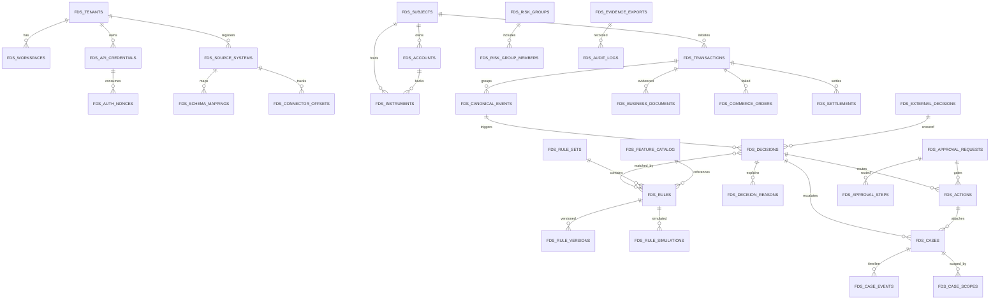
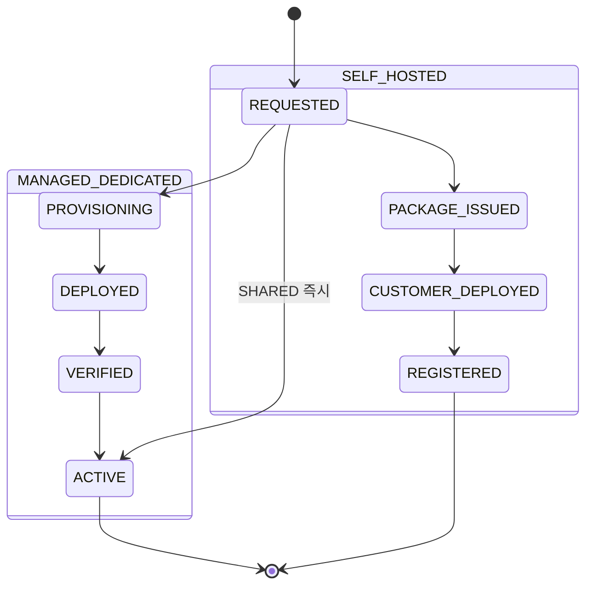

# FDS DB 설계서 (fds-svc 스키마) — hanpass-ph

> 정본: `.claude/skills/_shared/target-architecture.md` (PostgreSQL · Flyway · 서비스별 별도 스키마 · 멀티테넌시 · PII 마스킹 · 4-eyes).
> 입력 설계서: `docs/software/01-fdsSvc-sass.md` v1.1 (특히 §7 공통 데이터 모델, §8 event taxonomy, §9 수단/채널, §10 룰/feature, §11 action/case/결재, §13 멀티테넌시, §14 DDL, §16 PII/규제).
> 공통 inbound 인증 정본: [`../api/00-common-machine-auth.md`](../api/00-common-machine-auth.md) (wire v2·credential version·nonce replay 의미론).
> 책임 서비스: **`services/fds-svc`** (Java 25, Spring Boot 3.5.x, 헥사고날, `adapter/out/persistence`). AML 규제 케이스는 `aml-svc`, 결재·감사·IAM 운영은 `bo-api`가 별도 스키마로 보유한다.
>
> **대상 시스템 = hanpass-ph + 통화 프로필 배포**: 한국→필리핀 5거래유형을 기본으로 하며 AUD/KRW/JPY 분리 배포 metadata를 지원한다. 본 문서는 실제 저장소 Flyway(V1~V32)·도메인 enum과 1:1로 확정한다.

## 목차
1. [범위·원칙](#1-범위원칙)
2. [스키마 격리·멀티테넌시](#2-스키마-격리멀티테넌시)
3. [ERD](#3-erd)
4. [enum 사전 (코드값·표시값)](#4-enum-사전-코드값표시값)
5. [테이블 명세](#5-테이블-명세)
6. [인덱스 명세](#6-인덱스-명세)
7. [PII·감사·보존 정책](#7-pii감사보존-정책)
8. [Flyway 마이그레이션 순서](#8-flyway-마이그레이션-순서)
9. [서비스 경계 주의 (fds-svc vs aml-svc vs bo-api)](#9-서비스-경계-주의)
10. [downstream 확정 명칭](#10-downstream-확정-명칭)
11. [변경 이력](#11-변경-이력)

---

## 1. 범위·원칙

- 본 문서는 **fds-svc 소유 스키마 `fds`** 의 물리 데이터 모델을 확정한다. 모든 테이블 prefix `fds_`, 스키마 `fds`.
- 3서비스는 별도 스키마/DB를 갖는다: `fds`(fds-svc) · `aml`(aml-svc) · `bo`(bo-api). bo-web은 DB 미보유(bo-api 경유).
- 멀티테넌시 3단 격리(`tenant_id` / `workspace_id` / `data_scope`) 인프라를 **모든 운영 테이블**에 유지한다(§2). hanpass-ph는 단일 운영 테넌트(`tenant_demo`)로 가동하므로 `tenant_id`는 사실상 단일 값이며, 격리 키 컬럼·인덱스·PK 선두 규칙은 향후 다테넌트 확장 대비로 보존한다.
- raw PII 미저장: 식별자는 tenant별 keyed hash 또는 token(`*_ref`, `*_hash`) 컬럼만 저장한다(§7).
- 감사 컬럼: 모든 운영 테이블에 `created_at` / `updated_at`, 변경 주체가 있는 테이블에 `created_by` / `updated_by`(운영자 subject token).
- 금액: `NUMERIC(24,8)`로 통화 원단위 + 소수 자릿수 보존. 표시 통화(현지: PHP/KRW)와 base 통화(`USD` 환산)를 분리 저장. 금액 임계 판단은 **`phpEquivalent`(PHP 환산) feature** 기준이며 USD를 병기한다(§5.17, V22). KRW/PHP는 정수부만 사용.
- enum은 DB에서 `VARCHAR` + CHECK 또는 애플리케이션 enum으로 관리(§4 코드값·표시값 병기). Flyway additive migration 원칙(§8).

---

## 2. 스키마 격리·멀티테넌시

설계서 §13(배포 모델 + 온보딩 프로비저닝 + 키 의미 재정의) 및 정본 `target-architecture.md` §4.1을 물리 모델에 다음과 같이 고정한다.

### 2.1 배포 모델 (deployment topology) — 격리의 1차 경계

격리는 DB 행/스키마 토글이 아니라 **배포 단위 결정**이다. 화면 라디오 즉석 선택이 아니라 **온보딩 프로비저닝 프로세스**의 산출이다. `fds_tenants.deployment_model`(구 `isolation_mode` 대체).

| 모델(`deployment_model`) | 의미 | 대상 | 프로비저닝 | tenant_id 의미 |
|---|---|---|---|---|
| **`MANAGED_DEDICATED`**(기본) | 플랫폼 클라우드에 **서비스별 전용 DB·스택** | 일반 금융사 | 온보딩 IaC(Terraform) 자동(승인→프로비저닝→배포→검증→운영전환) | 배포=서비스 단일 값 |
| **`SELF_HOSTED`** | **고객 자체 인프라**에 설치형 패키지(Helm/Docker) | 은행·고PII·내부망 요건 | 플랫폼은 산출물·가이드·라이선스 제공, 고객 측이 배포·등록 콜백 | 배포=서비스 단일 값 |
| **`SHARED`**(옵션) | 공유 DB + `tenant_id` 행 격리 | 소규모/체험 | 즉시(프로비저닝 없음) | 서비스 간 행 격리 키 |

- **한 서비스(테넌트) = 한 배포(전용 DB)** 가 기본. 전용 배포(`MANAGED_DEDICATED`/`SELF_HOSTED`)에서 서비스 간 격리는 **배포 경계**가 보장하며, `tenant_id`는 사실상 단일 값이다. `SHARED`에서만 `tenant_id`가 서비스 간 격리로 동작한다.
- "서비스 등록"은 격리 라디오가 아니라 **배포 유형 선택 + 온보딩 신청·상태**(`onboarding_status`) 관리다. 온보딩 상태머신은 §4.1a 참조.

### 2.2 멀티테넌시 키 (배포 내부 분리)

| 격리 키 | 컬럼 | 타입 | 역할 |
|---|---|---|---|
| tenant | `tenant_id` | `VARCHAR(64) NOT NULL` | **배포의 서비스(테넌트=서비스)**. 전용 배포에선 단일 값. 상위 기관(institution)이 운영하는 서비스 1종 = tenant 1개(1 기관 : N 서비스). 모든 `fds_*` PK 선두 컬럼, 모든 API `Tenant-Id` |
| workspace | `workspace_id` | `VARCHAR(64) NOT NULL DEFAULT 'default'` | 그 서비스의 **워크스페이스/환경**(retail/corporate, prod/sandbox). rule set·connector·case 큐·결재 분리 |
| data-scope | `data_scope` | `VARCHAR(128)` (nullable, 다중은 `fds_*_scope` 또는 JSONB) | 운영자 row-level **권한 필터**. 저장 격리 아님 — bo-api가 운영자 토큰 scope로 강제 필터 |

규칙:
- 모든 운영 테이블 PK는 `(tenant_id, workspace_id, <natural key>)` 순. UNIQUE·조회 인덱스도 `(tenant_id, workspace_id, ...)` 선두.
- 격리의 1차 경계는 **배포 모델**(§2.1)이다. 전용 배포는 배포 자체가 서비스(테넌트) 경계이며, 본 DDL은 단일 배포 내부 모델을 기술한다(`SHARED` 배포일 때만 `tenant_id` 행 격리가 서비스 간 경계로 동작). 테넌트=서비스이며 그 상위에 기관(institution)이 있다(1 기관 : N 서비스, §5.1 `institution_ref`).
- `sandbox` workspace 는 shadow-only(실제 action outbox 미발행). connector가 `workspace_id` 미지정 시 `default`로 적재.
- API key·OAuth2 client·webhook은 `(tenant_id, workspace_id)`에 바인딩(§5.29 `fds_api_credentials`).
- `data_scope`는 row 단위 다중 적용을 위해 핵심 운영 테이블(subject/transaction/case)에 `data_scope VARCHAR(128)` 단일 컬럼 + 보조 `fds_case_scopes`(다대다) 패턴 허용. bo-api는 `dataScope` 집합 IN 필터를 fds-svc 조회에 주입한다.
- 온보딩·배포 메타(`deployment_model`/`onboarding_status`/`default_region`/`infra_ref`)는 `fds_tenants`(§5.1)에 보존한다. 매니지드 전용 IaC 파이프라인 도구·self-hosted 라이선스 발급/검증 방식은 P8 인프라 설계에서 확정(오픈결정).

### 2.3 행 수준 보안(RLS) 저장 격리 — `SHARED` 배포 방어선 (P0-13)

`SHARED` 배포에서 애플리케이션 `WHERE tenant_id = ?`(+`workspace_id`) predicate 누락 실수가 곧 교차 tenant 노출이 되지 않도록, PostgreSQL **Row-Level Security(RLS)** 를 DB 경계 방어선으로 둔다(코드=truth, 운영 runbook `aegis-aml/docs/ops/db-rls-isolation.md`).

- **격리 키**: `(tenant_id, workspace_id)` 2-튜플(§2.2). 애플리케이션 연결은 세션 GUC `app.tenant_id`·`app.workspace_id` 를 게시하고, `workspace_id` 컬럼을 가진 테이블은 정책이 두 값을 함께 검사(`AND`)하며, `fds_tenants`(테넌트 원장) 등 tenant-only 테이블은 `tenant_id` 만 검사한다. workspace 존재 여부는 하드코딩 목록이 아니라 마이그레이션이 `information_schema` 로 테이블별 판정해 정책 predicate 를 자동 분기한다. `data_scope` 는 RLS 키가 아니라 운영자 row-level 권한 필터로 현행 유지한다.
- **SET ROLE / set_config 모델**: 새 login credential 없이(가정 A1), 클러스터 전역 NOLOGIN role `aegis_app_runtime` 를 두고 애플리케이션 연결 획득 시 `SET ROLE aegis_app_runtime` + `set_config('app.tenant_id'|'app.workspace_id'|'app.elevated', …)` 를 실행한다(common-security `RlsSessionDataSource`). login user 가 superuser/owner 여도 세션이 non-owner role 로 강등되어 RLS 가 강제된다. Flyway 는 감싸지 않은 원본 DataSource(owner 권한)로 실행돼 정책 DDL·후속 데이터 마이그레이션이 전량 접근한다. role/grant 는 aml V47·bo V20 이 먼저 생성했어도 `IF NOT EXISTS` 로 멱등이다.
- **FORCE RLS + 정책 2종**: `tenant_id` 보유 전 테이블에 `ENABLE`+`FORCE ROW LEVEL SECURITY` 후 ① 정책 runtime(`TO aegis_app_runtime`): `(tenant_id = current_setting('app.tenant_id', true) [AND workspace_id = current_setting('app.workspace_id', true)]) OR current_setting('app.elevated', true) = 'on'`, ② 정책 owner(`TO <owner>`): 전량 허용(FORCE 하에서도 마이그레이션·운영 정비가 가능한 명시적·감사 가능 escape). GUC 미설정 세션은 `current_setting(…, true)=NULL → false → 0 row`(fail-closed).
- **elevated 경계**: 전 tenant 를 열거/정비하는 경로(스케줄러 `ActionRelay`·`WebhookRelay`·`MachineAuthNonceCleanup`·startup provisioner·production safety validator)는 `ElevatedDbContext.runElevated` 로 감싸 `app.elevated='on'` escape 를 탄다. `set_config` 는 비특권이라 elevated 는 **권한 경계가 아니라 코드 실수 방어**다(가정 A3).
- **비대상 테이블**: `tenant_id` 컬럼이 없는 전역/참조 테이블과 `flyway_schema_history` 는 격리 키가 없어 RLS 비대상이며, 마이그레이션 DO 루프가 `tenant_id` 보유 테이블만 열거하므로 자동 제외된다. 가드 테스트(`RlsCoverageGuardIntegrationTest`)가 대상 전 테이블의 `relrowsecurity AND relforcerowsecurity` 와 정책 2개 존재를 강제한다.
- **`_global` 공유행 읽기 예외(V23)**: `fds_feature_catalog` 는 tenant `'_global'` 로 시드되는 공유 참조 카탈로그(§5.20)라, 이 테이블에 한해 runtime 정책 USING 에 `tenant_id = '_global'` 읽기 허용을 추가한다(룰빌더 측정 기준 = tenant 전용 + 공유 피처 합집합, `FeatureCatalogJpaAdapter.findEnabled` 의 `tenant IN (<tenant>, '_global')` 계약). **쓰기(WITH CHECK)는 예외 없이 V18 과 동일** — tenant 세션은 `_global` 행을 쓸 수 없다(공유 카탈로그 변경은 owner·elevated 전용). 회귀 가드 `FeatureCatalogRlsIntegrationTest`.
- **코드 truth**: `services/fds-svc/.../db/migration/V18__rls_tenant_isolation.sql`, `services/fds-svc/.../global/config/RlsDataSourceConfiguration.java`, `services/common-security/.../rls/*`, `application.yml` `aegis.fds.rls`.

---

## 3. ERD

```mermaid
erDiagram
    FDS_TENANTS ||--o{ FDS_WORKSPACES : has
    FDS_TENANTS ||--o{ FDS_SOURCE_SYSTEMS : registers
    FDS_TENANTS ||--o{ FDS_API_CREDENTIALS : owns
    FDS_API_CREDENTIALS ||--o{ FDS_AUTH_NONCES : consumes
    FDS_SOURCE_SYSTEMS ||--o{ FDS_SCHEMA_MAPPINGS : maps
    FDS_SOURCE_SYSTEMS ||--o{ FDS_CONNECTOR_OFFSETS : tracks

    FDS_SUBJECTS ||--o{ FDS_ACCOUNTS : owns
    FDS_SUBJECTS ||--o{ FDS_INSTRUMENTS : holds
    FDS_ACCOUNTS ||--o{ FDS_INSTRUMENTS : backs
    FDS_SUBJECTS ||--o{ FDS_TRANSACTIONS : initiates

    FDS_CANONICAL_EVENTS ||--o{ FDS_DECISIONS : triggers
    FDS_TRANSACTIONS ||--o{ FDS_CANONICAL_EVENTS : groups
    FDS_DECISIONS ||--o{ FDS_ACTIONS : routes
    FDS_DECISIONS ||--o{ FDS_DECISION_REASONS : explains
    FDS_DECISIONS }o--o{ FDS_RULES : matched_by

    FDS_RULE_SETS ||--o{ FDS_RULES : contains
    FDS_RULES ||--o{ FDS_RULE_VERSIONS : versioned
    FDS_RULES ||--o{ FDS_RULE_SIMULATIONS : simulated
    FDS_FEATURE_CATALOG ||--o{ FDS_RULES : references
    FDS_RISK_GROUPS ||--o{ FDS_RISK_GROUP_MEMBERS : includes

    FDS_CASES ||--o{ FDS_CASE_EVENTS : timeline
    FDS_CASES ||--o{ FDS_CASE_SCOPES : scoped_by
    FDS_DECISIONS ||--o{ FDS_CASES : escalates
    FDS_ACTIONS ||--o{ FDS_CASES : attaches

    FDS_APPROVAL_REQUESTS ||--o{ FDS_APPROVAL_STEPS : routed
    FDS_APPROVAL_REQUESTS ||--o{ FDS_ACTIONS : gates

    FDS_TRANSACTIONS ||--o{ FDS_BUSINESS_DOCUMENTS : evidenced
    FDS_TRANSACTIONS ||--o{ FDS_COMMERCE_ORDERS : linked
    FDS_TRANSACTIONS ||--o{ FDS_SETTLEMENTS : settles

    FDS_EXTERNAL_DECISIONS ||--o{ FDS_DECISIONS : crossref
    FDS_EVIDENCE_EXPORTS ||--o{ FDS_AUDIT_LOGS : recorded
```

---

## 4. enum 사전 (코드값·표시값)

설계서 enum을 DB 코드값으로 확정한다. 코드값 = DB 저장값, 표시값 = UI 라벨(bo-web i18n 키 기준).

### 4.1 tenant_status / deployment_model / onboarding_status / ingest_mode / connector_status
| 도메인 | 코드값 | 표시값 |
|---|---|---|
| tenant_status | `ACTIVE` / `SUSPENDED` / `ONBOARDING` / `OFFBOARDED` | 활성/정지/온보딩/해지 (운영 생명주기 — onboarding_status와 직교) |
| deployment_model | `MANAGED_DEDICATED` / `SELF_HOSTED` / `SHARED` (3종) | 매니지드 전용/자체 인프라 설치형/소규모 공유 (구 isolation_mode 대체, §2.1) |
| onboarding_status | `REQUESTED` / `PROVISIONING` / `DEPLOYED` / `VERIFIED` / `ACTIVE` / `PACKAGE_ISSUED` / `CUSTOMER_DEPLOYED` / `REGISTERED` (8종) | 신청/프로비저닝중/배포완료/검증완료/운영전환 / 패키지발급/고객배포완료/등록완료 (§4.1a 상태머신) |
| ingest_mode | `REST_PUSH` / `QUEUE` / `POLLING` / `CDC` / `SNAPSHOT` (**5종**, FDS 정본) | REST 푸시/큐/폴링/CDC/스냅샷 (설계서 §2.3, §12). **`VENDOR_BRIDGE` 미추가** — vendor bridge 연동은 FDS 도메인 밖이라 AML(6종, §5.14)과 코드 집합을 달리함(의도적 cross-service 차이, 설계서 §11.6.8 근거) |
| connector_status | `HEALTHY` / `LAGGING` / `ERROR` / `DISABLED` | 정상/지연/오류/비활성 |

> **마이그레이션**: 구 `isolation_mode` enum(`SHARED`/`SCHEMA`/`DB`)은 폐기한다. 데이터 매핑은 `SHARED→SHARED`, `SCHEMA`/`DB → MANAGED_DEDICATED`(저장소 `V2__phase1_foundation.sql`, §8 매핑 주석). `deployment_model`/`onboarding_status` 정본은 설계서 §11.6.11/§11.6.11a, API `DeploymentModel`/`OnboardingStatus` enum과 1:1 동기화한다.

### 4.1a onboarding_status 상태머신 (§2.1, 설계서 §11.6.11a)

`tenant_status`(운영 생명주기)와 `onboarding_status`(온보딩 진행)는 직교한다. 배포 유형별 경로:

```mermaid
stateDiagram-v2
    [*] --> REQUESTED
    state "MANAGED_DEDICATED" as M {
        REQUESTED --> PROVISIONING
        PROVISIONING --> DEPLOYED
        DEPLOYED --> VERIFIED
        VERIFIED --> ACTIVE
    }
    state "SELF_HOSTED" as S {
        REQUESTED --> PACKAGE_ISSUED
        PACKAGE_ISSUED --> CUSTOMER_DEPLOYED
        CUSTOMER_DEPLOYED --> REGISTERED
    }
    REQUESTED --> ACTIVE : SHARED 즉시
    ACTIVE --> [*]
    REGISTERED --> [*]
```

- 매니지드: `REQUESTED → PROVISIONING → DEPLOYED → VERIFIED → ACTIVE`.
- self-hosted: `REQUESTED → PACKAGE_ISSUED → CUSTOMER_DEPLOYED → REGISTERED`(인스턴스 등록 콜백으로 `REGISTERED` 도달).
- SHARED: `REQUESTED → ACTIVE`(즉시).
- 온보딩이 `ACTIVE` 또는 `REGISTERED`에 도달하면 `tenant_status`를 `ACTIVE`로 전환한다.

### 4.2 subject_type / actor_type (§8.2, §7.2)
| 도메인 | 코드값 |
|---|---|
| subject_type | `PERSON` / `BUSINESS` / `MERCHANT` / `EMPLOYEE_SUBJECT` |
| actor_type | `CUSTOMER` / `EMPLOYEE` / `SYSTEM` / `PARTNER` / `API_KEY` |

> **정본 정렬**: `subject_type`의 `BUSINESS`·`MERCHANT`·`EMPLOYEE_SUBJECT`는 설계서 §7.1 핵심 객체(Business Entity·Subject/Actor 분리)를 물리 모델로 흡수한 값이다. 설계서 §8.2가 `PERSON` 예시만 보였더라도 §7.1·§7.2의 객체 분류가 enum 정본 근거이며, 본 §4.2 4종을 정본으로 고정한다(설계서 §7에 subject_type enum 표 역삽입은 설계 측 후속 보강 대상). `actor`(actor_type/role) 프로파일은 별도 마스터를 두지 않고 `fds_subjects`(subject_type=`EMPLOYEE_SUBJECT`)로 흡수하며, 이벤트·거래는 `actor_ref` token만 보존한다(내부감사 룰 `actor.role=TELLER` feature는 canonical_payload·feature_snapshot에서 materialize).

### 4.3 instrument_type (§9.1)
`WALLET` / `BANK_ACCOUNT` / `CARD` / `VIRTUAL_ACCOUNT` / `CRYPTO_ADDRESS` / `CASH` / `MERCHANT_ACCOUNT` / `API_KEY` / `EMPLOYEE_ACCOUNT` / `CORPORATE_BANK_ACCOUNT` / `SELLER_SETTLEMENT_ACCOUNT` / `ESCROW_ACCOUNT`

### 4.4 channel_type (§9.2 · 정본 `domain/enums/ChannelType.java` 21종 closed enum · `ck_fds_events_channel_type` CHECK)

**hanpass-ph 5거래유형 = 운영 채널(정본·실사용)**:

| 코드값 | 화면 라벨 | 거래유형 | source_system(§5.3a) | 도메인(`TransactionDomain`) |
|---|---|---|---|---|
| `CROSS_BORDER_REMIT` | 해외송금 | KR→PH 해외송금 | `remit-svc` | OTHER |
| `DOMESTIC_REMIT` | 국내송금 | PH 국내송금 | `domestic-svc` | DOMESTIC_TRANSFER |
| `CASH_IN` | 월렛충전 | 월렛 cash-in/top-up | `walletchg-svc` | WALLET |
| `WALLET_PAYMENT` | 월렛결제 | 지갑 가맹점 결제 | `wallet-svc` | WALLET |
| `WALLET_WITHDRAWAL` | ATM/지갑출금 | 지갑·ATM 출금 | `wallet-svc` | WALLET |
| `INBOUND_REMIT` | (파트너 인바운드) | 파트너 인바운드 송금 | `inbound-svc` | DOMESTIC_TRANSFER |

- `ChannelType` enum 자체는 **21종 closed**(`ck_fds_events_channel_type` CHECK, V16 재정의)이나, hanpass-ph 운영에서 인입·룰·집계되는 채널은 위 5유형(+파트너 인바운드 `INBOUND_REMIT`)으로 한정한다. 나머지 코드값(`CARD_PRESENT`/`CARD_NOT_PRESENT`/`ATM`/`BANK_TRANSFER`/`PG_PAYMENT`/`VIRTUAL_ACCOUNT_DEPOSIT`/`CRYPTO_DEPOSIT`/`CRYPTO_WITHDRAWAL`/`EXCHANGE_TRADE`/`INTERNAL_OPERATION`/`BATCH_SETTLEMENT`/`TRADE_PAYMENT`/`CROSS_BORDER_ECOMMERCE_SETTLEMENT`/`MARKETPLACE_SELLER_PAYOUT`/`B2B_INVOICE_PAYMENT`)은 enum 호환을 위해 코드값으로 존속하나 **hanpass-ph에서는 미사용**이다(데모 카드룰 `CARD_NOT_PRESENT`은 V22에서 `DISABLED`로 비활성). `CASH_IN`·`INBOUND_REMIT` 2종은 V16이 `ck_fds_events_channel_type` CHECK를 21종으로 재정의하며 함께 추가했고(§5.5 corridor 4컬럼·§5.3a 소스 시드 동반), corridor 정규화·USD 환산은 §5.5 참조.
- **규제 임계(CTR/STR)·기한은 채널 enum과 직교하며 불변**이다. PH AML(예: CTR ₱500,000)은 Policy Pack `PH_AMLC` 옵션으로 병기한다(§5.3a).

### 4.5 payment_rail (§9.3)
`INTERNAL_LEDGER` / `CARD_NETWORK` / `ATM_SWITCH` / `BANK_ACH` / `OPEN_BANKING` / `FIRM_BANKING` / `CMS` / `BANK_CD_NETWORK` / `EASY_PAY` / `VAN_PG` / `SWIFT` / `LOCAL_RTP` / `PARTNER_API` / `BLOCKCHAIN` / `MANUAL_BACKOFFICE` / `ESCROW` / `MARKETPLACE_SETTLEMENT` / `TRADE_FINANCE`

### 4.6 control_capability (§9.4)
`CAN_BLOCK_BEFORE_AUTH` / `CAN_DECLINE_AUTH` / `CAN_HOLD_FUNDS` / `CAN_EXTEND_HOLD` / `CAN_RELEASE_HOLD` / `CAN_CANCEL_BEFORE_SETTLEMENT` / `CAN_REQUEST_REVERSAL` / `CAN_SUSPEND_INSTRUMENT` / `CAN_OPEN_CASE_ONLY`

물리 store `fds_capabilities`는 PK `(tenant_id, workspace_id, source_system, capability)`와 위 9종 CHECK를 가진다. source-system update의 `capabilities`는 patch가 아니라 **전체 desired set**이며 필드가 존재하면 `[]`도 유효한 revoke-all이다. `MAPPING` checker EXECUTED 시 `CapabilityAdminPort`가 해당 복합 scope의 기존 행을 삭제하고 staged set을 정렬 저장하며, 빈 set이면 삭제만 커밋한다. 일반 source 설정과 capability set은 한 approval에 섞지 않는다.

### 4.7 decision (§11.1)
| 코드값 | 표시값 |
|---|---|
| `ALLOW` | 허용 |
| `MONITOR` | 모니터(기록만) |
| `REVIEW` | 검토 필요 |
| `CHALLENGE` | 추가 인증 |
| `BLOCK` | 차단 |
| `HOLD` | 자금 보류 |
| `FREEZE` | 동결 |
| `REPORT` | 규제 보고 후보 |

### 4.8 action_type (§11.2)
> **정본 = API `ActionType` enum(전수 22종)**. 본 DB enum은 API 명세 `docs/design/api/01-fds-api.md` §9 `ActionType`과 1:1로 동기화한다(설계서 §11.2/§15의 서술이 어긋날 경우 API enum이 우선). 코드값은 DB 저장값. **Travel Rule 기능 전면 제거(V9)로 `REQUEST_TRAVEL_RULE_INFO` 폐기**(구 23종→22종).

`DECLINE_AUTHORIZATION` / `BLOCK_TRANSACTION` / `HOLD_FUNDS` / `EXTEND_HOLD` / `RELEASE_HOLD` / `CANCEL_TRANSACTION` / `REQUEST_REVERSAL` / `SUSPEND_ACCOUNT` / `SUSPEND_INSTRUMENT` / `HOLD_SETTLEMENT` / `SUSPEND_SELLER_PAYOUT` / `INCREASE_RESERVE` / `REQUEST_ADDITIONAL_DOCUMENT` / `ADD_TO_GROUP` / `OPEN_CASE` / `SEND_ALERT` / `REQUIRE_SECOND_APPROVAL` / `BLOCK_WITHDRAWAL` / `SUSPEND_API_KEY` / `SUSPEND_EMPLOYEE_SESSION` / `OPEN_AML_CASE` / `REGULATORY_REPORT` (22종)

> 위임: `OPEN_AML_CASE`, `REGULATORY_REPORT`는 fds-svc가 후보를 생성하나 실제 케이스/보고 처리는 **aml-svc**로 위임된다(§9).
>
> **정규화 매핑(설계서 §15의 비정본 verb → 정본 enum)**: 설계서 §15에 흩어진 도메인별 'verb'는 본 enum에 다음으로 매핑하여 저장한다. 별도 코드값을 신설하지 않는다.
> - `SUSPEND_MERCHANT`(§15.5 PG / §15.8 마켓플레이스) → `SUSPEND_INSTRUMENT` (대상 `target_ref`=merchant/seller token). 미지원 채널은 `OPEN_CASE` + `case_type=MERCHANT_RISK`로 강등.
> - `SEND_SECURITY_ALERT`(§15.11 내부감사) → `SEND_ALERT`.
> - `CHALLENGE`/`REVIEW`(§15.2/§15.5) → action 아님. decision enum(§4.7)으로 분류. 추가 인증 의도면 `SEND_ALERT`로 매핑.
> - `OPEN_*_CASE`(`OPEN_CHARGEBACK_REVIEW`/`OPEN_MULE_ACCOUNT_CASE`/`OPEN_MERCHANT_RISK_CASE`/`OPEN_TRADE_FINANCE_CASE`/`OPEN_INTERNAL_AUDIT_CASE`/`OPEN_COMPLIANCE_CASE`) → `action_type=OPEN_CASE` + `case_type=<§4.10>` 조합. `OPEN_COMPLIANCE_CASE`(코인 룰 §10.2)는 `case_type=AML_REVIEW`로 매핑.

### 4.9 action_status (§14.5 outbox)
`PENDING` / `APPROVAL_REQUIRED` / `APPROVED` / `SENT` / `ACKED` / `FAILED` / `CANCELLED`

> **`ACKED` 전이 트리거**: `SENT → ACKED`는 외부 시스템 어댑터가 조치 수신확인(ack)을 보고할 때 전이된다 — `fds-actions` relay 후 결과 콜백(`FdsActionResult.status='ACKED'`)을 `ActionResultConsumer`(`aws` 프로파일)가 수신해 해당 outbox row를 멱등 전이(`Action.markAcked()`). ack 실패 보고는 `SENT → FAILED`(백오프 재시도, §5.12). `aws` 프로파일이 아닌 로컬/stub 환경에서는 ack 콜백 경로가 비활성이라 `SENT`에 머문다.

### 4.10 case_type (§11.3)
> **Travel Rule 기능 전면 제거(V9)로 `CRYPTO_TRAVEL_RULE` 폐기**(구 11종→10종). `fds_cases_case_type_check` CHECK를 10종으로 재생성.

`FRAUD_REVIEW` / `AML_REVIEW` / `CHARGEBACK_REVIEW` / `MULE_ACCOUNT_REVIEW` / `INTERNAL_AUDIT` / `MERCHANT_RISK` / `REGULATORY_REPORT` / `TRADE_FINANCE_REVIEW` / `ECOMMERCE_SETTLEMENT_REVIEW` / `B2B_INVOICE_REVIEW` (10종)

### 4.11 case_status / case_priority
| 도메인 | 코드값 |
|---|---|
| case_status | `OPEN` / `ASSIGNED` / `IN_REVIEW` / `ESCALATED` / `PENDING_APPROVAL` / `CLOSED_CONFIRMED` / `CLOSED_FALSE_POSITIVE` / `CLOSED_REPORTED` (8종, 표시: 신규/배정/조사중/규제전환/종결상신/사기확정종결/오탐종결/보고후종결). 종결 상태(`CLOSED_*`) → `IN_REVIEW` **재오픈(REOPEN)** 전이 허용(사유 필수·`SFDS_CASE:APPROVE` 이상·자기 종결 건 금지·감사 기록, 설계서 §11.6.1) |
| case_priority | `LOW` / `MEDIUM` / `HIGH` / `CRITICAL` (4종, 표시: 낮음/중간/높음/치명) |
| close_reason | `FP_THRESHOLD` / `FP_NORMAL_PATTERN` / `FP_DATA_QUALITY` / `CONFIRMED_FRAUD` / `CONFIRMED_MULE` / `CONFIRMED_ATO` / `ESCALATED_AML` / `OTHER` (8종, 표시: 오탐-임계과민/오탐-정상거래패턴/오탐-데이터품질/확정-사기거래/확정-대포통장/확정-도용/추가조사-AML이관/기타. 설계서 §11.6.1a 정합 — 종결 시 필수, 자유 텍스트는 `fds_case_events` `CLOSED` payload 보조 메모로 분리) |

> **status enum 정본**: `tenant_status`(§4.1)·`connector_status`(§4.1)·`case_status`·`case_priority`·`rule_status`/`rule_version_status`(§4.13)의 코드 집합은 본 DB §4를 정본으로 한다. 설계서 §14 DDL이 `status VARCHAR(32)`만 보이고 상태머신을 명시하지 않은 부분은 본 enum이 정본 코드 집합이며, 설계서 측 상태전이도 추가는 후속 보강 대상이다. PRD §11.1·PPT slide 27은 위 case_status 8종·case_priority 4종(`CRITICAL` 포함)을 그대로 참조한다.

### 4.12 approval (§11.5)
| 도메인 | 코드값 |
|---|---|
| approval_line | `SELF_APPROVAL_DISABLED` / `MAKER_CHECKER` / `COMPLIANCE_MANAGER` / `RISK_MANAGER` / `SECURITY_ADMIN` / `EXECUTIVE_APPROVAL` |
| approval_status | `DRAFT` / `SUBMITTED` / `APPROVED` / `REJECTED` / `CANCELLED` / `EXPIRED` / `EXECUTED` / `EXECUTION_FAILED` |

### 4.13 rule_status / rule_version_status
| 도메인 | 코드값 |
|---|---|
| rule_status | `DRAFT` / `PENDING_APPROVAL` / `ACTIVE` / `DISABLED` / `ARCHIVED` |
| rule_version_status | `DRAFT` / `SIMULATED` / `APPROVED` / `DEPLOYED` / `ROLLED_BACK` |

### 4.14 risk_group_type (§3.1, §10.1)
`BLACKLIST` / `WHITELIST` / `WATCHLIST` / `MULE_NETWORK` / `ALLOWLIST` / `DENYLIST` / `RISK_COUNTRY` (7종, Flyway V4·`RiskGroupType` 정본)

### 4.15 document_type (§14.6)
`INVOICE` / `PURCHASE_ORDER` / `BILL_OF_LADING` / `AIR_WAYBILL` / `CUSTOMS_DECLARATION` / `DELIVERY_PROOF` / `TAX_INVOICE` / `PLATFORM_ORDER`

### 4.16 event_family (§8.1, `event_type` 접두 · 정본 `domain/enums/EventFamily.java` 19종 · `ck_fds_events_family` CHECK)

`transaction` / `authorization` / `settlement` / `trade` / `invoice` / `order` / `seller` / `account` / `instrument` / `member` / `device` / `session` / `aml` / `case` / `employee` / `market` / **`remit`** / **`domestic`** / **`wallet`** (**19종**)

> **hanpass-ph 결제 taxonomy(V21 `V21__event_family_remit_domestic_wallet.sql`)**: `remit`(해외송금 `remit.transfer.requested`)·`domestic`(국내송금 `domestic.transfer.requested`)·`wallet`(월렛 `wallet.charge.requested`/`wallet.pay.requested`/`wallet.withdraw.requested`) 3종을 1급 캐논 패밀리로 수용한다. 저장소 V21이 `ck_fds_events_family` CHECK를 16종→19종으로 확장(`DROP CONSTRAINT IF EXISTS` 후 `ADD`)했고, 정본은 `domain/enums/EventFamily`(19종)다. `event_family`는 인입 필드가 아니라 `event_type` 접두(`<family>.<verb>`)에서 서버가 파생(`EventFamily.fromEventType`)해 `fds_canonical_events.event_family`에 적재한다. `aml`·`case`는 내부/aml-svc 위임 패밀리로 외부 커넥터 인입 불가(`isExternallyIngestable()=false`); `remit`/`domestic`/`wallet`은 거래성·외부 인입 가능. **DB 저장값은 대문자**(`TRANSACTION`/`REMIT`/…, CHECK 토큰), enum prefix는 소문자.

### 4.17 export_format / export_status (§16.4)
| 도메인 | 코드값 |
|---|---|
| export_format | `CSV` / `EXCEL` / `PDF` / `JSON_API` |
| export_status | `REQUESTED` / `BUILDING` / `READY` / `DOWNLOADED` / `EXPIRED` / `FAILED` |

### 4.18 external_decision_mode (§12.6 Legacy Vendor Bridge)
`VENDOR_RESULT_INGEST` / `DB_MIRROR` / `DUAL_RUN` / `SHADOW_DECISION` / `RULE_MIGRATION`

### 4.19 transaction_type (§5.9 `fds_transactions.transaction_type` · 설계서 §8.3 `transaction.transactionType`)
| 코드값 | 표시값 | 대표 도메인(설계서 §4.1/§15) |
|---|---|---|
| `WITHDRAWAL` | 출금 | ATM 출금(§15.1)·지갑/코인 출금(§15.10) |
| `DEPOSIT` | 입금 | 가상계좌 입금·법정화폐/코인 입금(§15.10) |
| `TRANSFER` | 이체 | 국내송금·계좌이체(§15.3) |
| `REMITTANCE` | 송금(해외) | 해외송금(§15.4) |
| `PAYMENT` | 결제 | 카드 결제(§15.2)·PG(§15.5)·무역대금(§15.6)·B2B 인보이스(§15.9) |
| `REFUND` | 환불 | 카드/PG/이커머스 환불(§15.2·§15.7) |
| `REVERSAL` | 취소·역거래 | 거래 취소·reversal(§9.4 capability 연계) |
| `CHARGE` | 충전 | 지갑 충전(§4.1 Wallet) |
| `SETTLEMENT` | 정산 | PG/이커머스 해외정산(§15.7) |
| `PAYOUT` | 지급 | 마켓플레이스 셀러 정산 지급(§15.8) |
| `EXCHANGE` | 매매·체결 | 코인/증권 주문·체결(§15.10) |
| `ADJUSTMENT` | 수기 조정 | 내부 감사·수기 조정(§15.11) |

> **폐쇄 enum 정본(12종)**. 설계서 §8.3·연동 §4.2·API `TransactionDto.transactionType`은 본 enum을 참조한다(자유 문자열 금지, CHECK 제약 또는 앱 enum). 기존 문서 등장값 전수(`WITHDRAWAL`)를 포함하며, 지원 거래 도메인(설계서 §4.1·§15 전 도메인)을 커버하도록 확정. 도메인 verb 신설 시 본 표에 추가 후 파생 문서를 동기화한다.

---

## 5. 테이블 명세

모든 테이블은 스키마 `fds` 소속. 격리 컬럼 `tenant_id`, `workspace_id`는 §2 규칙으로 전 테이블 공통 적용(아래 표에서 명시). 감사 컬럼 `created_at`/`updated_at`은 운영 테이블 공통.

### 5.1 fds_tenants — 서비스 마스터(테넌트=서비스)

> 선택 currency-profile의 FDS repeatable Flyway 팩은 exact profile tenant의 배포 metadata만
> `ACTIVE`/`MANAGED_DEDICATED`/onboarding `ACTIVE`, profile 관할·규제통화, 전체 `KR_BASE`
> compliance baseline으로 `ON CONFLICT DO NOTHING` bootstrap한다. 고객·이벤트는 만들지 않고
> 기존 운영자 tenant row도 덮어쓰지 않는다. BO onboarding API/state-machine의 일반 소유권은
> 변경하지 않는다.
> **계층**: 기관(institution) → 서비스(테넌트, `tenant_id`) → 워크스페이스(`workspace_id`). `fds_tenants`의 1행 = 한 서비스(테넌트). 상위 기관 1개가 여러 서비스를 운영한다(**1 기관 : N 서비스**). 기관 식별은 `institution_ref`로 참조한다.

| 컬럼 | 타입 | NULL | 기본값 | 제약 | 설명 |
|---|---|---|---|---|---|
| tenant_id | VARCHAR(64) | N | | PK | SaaS 서비스 ID(테넌트=서비스, 격리 경계·PK 선두) |
| institution_ref | VARCHAR(64) | Y | | | **상위 기관(institution) 참조**. 납품받은 회사/금융기관 식별자. 1 기관 : N 서비스 관계의 외부 키(FK 아님·논리 참조). nullable·additive 신규 컬럼(후속 마이그레이션 §8에서 추가, 기존 row는 NULL 백필 후 매핑) |
| display_name | VARCHAR(160) | N | | | 표시명 |
| tenant_status | VARCHAR(32) | N | `'ONBOARDING'` | enum 4.1 | 운영 생명주기 상태(onboarding_status와 직교) |
| deployment_model | VARCHAR(32) | N | `'MANAGED_DEDICATED'` | enum 4.1 (`MANAGED_DEDICATED`/`SELF_HOSTED`/`SHARED`) | 배포 유형(구 isolation_mode 대체, §2.1) |
| onboarding_status | VARCHAR(32) | N | `'REQUESTED'` | enum 4.1 (8종) | 온보딩 진행 상태(§4.1a 상태머신) |
| default_region | VARCHAR(32) | N | `'KR'` | | 기본 리전(한국 우선)·전용 배포 region |
| infra_ref | VARCHAR(160) | Y | | | 배포 메타 참조(매니지드 IaC 워크스페이스/스택 ref, self-hosted 인스턴스/라이선스 ref). 발급·검증 방식은 P8 인프라 설계 확정 |
| regulatory_currency | VARCHAR(3) | Y | | | **테넌트 규제통화 ISO 4217**(다통화, V30). 인입이 `RegulatoryAmountPolicy` 로 send/receive leg 중 이 통화와 일치하는 leg 금액을 `amount_base` 로 채택하고 `base_currency` 를 이 값으로 고정한다. NULL=미설정 → 서비스 전역 `fds.ingest.regulatory-currency` 폴백(기존 배포 무변경). AML `aml_tenants.base_currency`(V53) 와 대칭. **FX 환산 없음** — 일치 leg 가 없으면 `amount_base=null` 로 두는 기존 fail-safe 유지 |
| retention_policy | JSONB | Y | | | 보존정책 override |
| compliance_policy | JSONB | N | `'{"base":"KR_BASE","packs":["EFIN","SPECIAL_AML","PIPA","INTERNAL_CONTROL"],"optional":[]}'` | 설계서 §16.2 | 규제 팩 토글 상태(named pack on/off). `base`=`KR_BASE` 필수·잠금(끄기 불가), `packs`=토글 ON, `optional`=PCI(계약 후). 변경 4-eyes `subject_kind='POLICY_PACK'` |
| created_at | TIMESTAMPTZ | N | now() | | |
| updated_at | TIMESTAMPTZ | N | now() | | |

> **마이그레이션(저장소 `V2__phase1_foundation.sql`)**: 구 `isolation_mode` 컬럼(`V1__baseline.sql` 생성)은 `deployment_model`/`onboarding_status`/`infra_ref`/`compliance_policy` 추가 후 데이터 매핑(`SHARED→SHARED` & `onboarding_status='ACTIVE'`, `SCHEMA`/`DB → MANAGED_DEDICATED` & `onboarding_status='ACTIVE'`)·`ck_fds_tenants_deployment_model` CHECK를 거쳐 DROP한다(§8 매핑 주석). `default_region`은 기존 유지. 신규 서비스(테넌트) 등록은 `deployment_model` 선택 + `onboarding_status='REQUESTED'`로 시작한다.

> **마이그레이션(institution_ref·후속)**: 상위 기관 참조 컬럼 `institution_ref VARCHAR(64) NULL`은 **다음 마이그레이션에서 additive(nullable)로 추가**한다(1 기관 : N 서비스). 기존 row는 NULL로 시작 후 기관-서비스 매핑이 확정되면 백필한다. 기관 마스터 테이블 정식화는 후속 설계에서 확정.

### 5.2 fds_workspaces
| 컬럼 | 타입 | NULL | 기본값 | 제약 | 설명 |
|---|---|---|---|---|---|
| tenant_id | VARCHAR(64) | N | | PK, FK→fds_tenants | |
| workspace_id | VARCHAR(64) | N | | PK | retail/corporate/prod/sandbox |
| display_name | VARCHAR(160) | N | | | |
| is_sandbox | BOOLEAN | N | FALSE | | true면 shadow-only |
| created_at | TIMESTAMPTZ | N | now() | | |
| updated_at | TIMESTAMPTZ | N | now() | | |

### 5.3 fds_source_systems
| 컬럼 | 타입 | NULL | 기본값 | 제약 | 설명 |
|---|---|---|---|---|---|
| tenant_id | VARCHAR(64) | N | | PK | |
| workspace_id | VARCHAR(64) | N | `'default'` | PK | |
| source_system | VARCHAR(64) | N | | PK | hanpass-ph 트랜잭션 마이크로서비스 식별자(§5.3a 카탈로그) |
| display_name | VARCHAR(160) | N | | | |
| ingest_mode | VARCHAR(32) | N | | enum 4.1 | hanpass-ph 업스트림은 `REST_PUSH`(REST sync 인입, 연동 §7.1) 기준 |
| schema_version | VARCHAR(80) | N | | | `remit-svc.v1`·`walletchg-svc.v1` 등 |
| enabled | BOOLEAN | N | TRUE | | |
| fail_policy | VARCHAR(32) | N | `'CASE_ONLY'` | `FAIL_CLOSED`/`FAIL_OPEN`/`CASE_ONLY` | 실시간 판단 장애정책(D-14) |
| created_at | TIMESTAMPTZ | N | now() | | |
| updated_at | TIMESTAMPTZ | N | now() | | |

#### 5.3a 소스 시스템 카탈로그 (hanpass-ph 실서비스 재그라운딩)

데이터 레이어를 hanpass-ph 필리핀 송금/월렛 플랫폼의 실제 트랜잭션 마이크로서비스로 현행화한다(generic placeholder `card-processor`/`core-banking`/`atm-switch` 예시 대체). 업스트림은 **REST sync(`REST_PUSH`)** 로 canonical event를 인입하며, 모든 식별자는 원문 금지(token/keyed-HMAC).

> **BO 데모/시뮬레이터 집계 커넥터**: 로컬 BO 콘솔과 `tools/aml-ingest-simulator`는 FDS 탐지 결정과 AML TM에 같은 실시간 거래 payload를 넣기 위해 집계 source/connector id `HANPASS_PH`를 사용한다. 운영 fds-svc의 세부 source catalog(아래 7개 실서비스)와 구분하며, generic `atm-switch` seed는 사용하지 않는다.

| `source_system` | 역할 | emit하는 정규 이벤트 family(§4.16) | FDS `channel_type`(§4.4) |
|---|---|---|---|
| `member-svc` | 회원/KYC/CDD/제재·PEP 스크리닝 | `member.*`(customer.*/entity.*/beneficial-owner.* 흡수) | — (subject/instrument materialize 소스) |
| `walletchg-svc` | 월렛충전(cash-in/top-up) | `transaction.requested` | `CASH_IN` |
| `domestic-svc` | 국내송금(PHP) | `transaction.requested` | `DOMESTIC_REMIT` |
| `remit-svc` | 해외송금(cross-border) | `transaction.requested`, `settlement.posted`(→`settlement` family) | `CROSS_BORDER_REMIT`(화면 라벨 '해외송금') |
| `wallet-svc` | 월렛 원장(double-entry, transfer_links) | `account.*`, `settlement.posted` | — (account/원장 소스) |
| `tx-history-svc` | 회원 통합 이력(read model) | (read-only, emit 없음) | — |
| `inbound-svc` | 파트너 인바운드 송금 | `transaction.requested` | `INBOUND_REMIT` |

> **연동 키 매핑(§5.5·연동 §7.2 정본)**: member.`member_id`→`subject_ref`(tenant keyed HMAC), *.`wallet_transaction_id`/remit.`transfer_number`/walletchg.`charge_order_id`/domestic.`transaction_id`→`transaction_ref`, wallet.`wallet_id`→`account_ref`(instrument 보조키), remit.`account_hash`/domestic.(`proc_id`+`account_number`+`holder_name`)→`counterparty_ref`. **주의**: `member_id`는 `domestic-svc`만 `varchar(36)`, 그 외 `uuid` → 매핑 시 문자열 정규화 후 HMAC. **모든 원천 식별자는 token/keyed-HMAC로만 저장(원문 금지, §7).**
>
> **규제 레이어 병기(불변)**: 임계/기한/KoFIU 분류는 그대로 유지한다. PH 운영은 Policy Pack `PH_AMLC` 옵션(`PhRegulatoryThresholds`: CTR ₱500,000·구조화 5BD·STR 5BD·near 0.90)으로 1줄 병기만 가능하며, **KR KoFIU 임계 숫자·기한을 교체하지 않는다.**

### 5.4 fds_schema_mappings
원천 payload → canonical field 매핑(§5.1, §12.5 PII allowlist 포함).
| 컬럼 | 타입 | NULL | 기본값 | 제약 | 설명 |
|---|---|---|---|---|---|
| tenant_id | VARCHAR(64) | N | | PK | |
| workspace_id | VARCHAR(64) | N | `'default'` | PK | |
| source_system | VARCHAR(64) | N | | PK | |
| schema_version | VARCHAR(80) | N | | PK | |
| mapping_def | JSONB | N | | | field map + pii_allowlist |
| status | VARCHAR(32) | N | `'DRAFT'` | rule_status 재사용 | 4-eyes 승인 대상 |
| created_by | VARCHAR(128) | Y | | | 운영자 token |
| updated_by | VARCHAR(128) | Y | | | |
| created_at / updated_at | TIMESTAMPTZ | N | now() | | |

### 5.5 fds_canonical_events
| 컬럼 | 타입 | NULL | 기본값 | 제약 | 설명 |
|---|---|---|---|---|---|
| tenant_id | VARCHAR(64) | N | | PK | |
| workspace_id | VARCHAR(64) | N | `'default'` | PK | |
| event_id | VARCHAR(160) | N | | PK | 원천 이벤트 id |
| idempotency_key | VARCHAR(256) | N | | UNIQUE(tenant,ws,key) | 중복 방지 |
| source_system | VARCHAR(64) | N | | | |
| schema_version | VARCHAR(80) | N | | | |
| event_type | VARCHAR(100) | N | | event_family 접두 | `transaction.requested` |
| event_family | VARCHAR(32) | N | | enum 4.16 | 라우팅·인덱스용 |
| occurred_at | TIMESTAMPTZ | N | | | 원천 발생 시각 |
| received_at | TIMESTAMPTZ | N | now() | | |
| subject_ref | VARCHAR(256) | Y | | | keyed hash/token |
| actor_ref | VARCHAR(256) | Y | | | |
| transaction_ref | VARCHAR(256) | Y | | | |
| instrument_ref | VARCHAR(256) | Y | | | token |
| counterparty_ref | VARCHAR(256) | Y | | | |
| channel_type | VARCHAR(64) | Y | | enum 4.4 | |
| payment_rail | VARCHAR(64) | Y | | enum 4.5 | |
| amount | NUMERIC(24,8) | Y | | | 표시 통화 금액(레거시=send leg 하위호환) |
| currency | VARCHAR(12) | Y | | | |
| send_amount | NUMERIC(24,8) | Y | | | 송금 leg 금액(소스 제공값) — `transaction.sendAmount` 피처(V25, PLAN 20260717 R2) |
| receive_amount | NUMERIC(24,8) | Y | | | 수취 leg 금액(소스 제공값) — `transaction.receiveAmount` 피처(V25) |
| amount_base | NUMERIC(24,8) | Y | | | tenant 규제통화 금액 — **서버 파생**. velocity SUM·`transaction.amountBase`·전 통화 `baseEquivalent` 단일 원천, PHP에서만 `phpEquivalent` alias 추가. 미파생 시 null fail-safe |
| base_currency | VARCHAR(12) | Y | | | base 통화 코드(서버 파생 = 규제통화, 데모 `PHP`) |
| send_country | VARCHAR(2) | Y | | | corridor 출발국(ISO-3166-1 alpha-2). cross-border(`remit-svc`/`inbound-svc`)에서 채움 |
| receive_country | VARCHAR(2) | Y | | | corridor 도착국. cross-border에서 채움 |
| send_currency | VARCHAR(12) | Y | | | 송금 leg 통화(transaction 블록 값 우선, 미지정 시 corridor·`canonical_payload.corridor`로 표기 가능) |
| receive_currency | VARCHAR(12) | Y | | | 수취 leg 통화(transaction 블록 값 우선) |
| payload_hash | VARCHAR(128) | Y | | | `sha256:...` 원천 payload 해시 |
| device_ip | VARCHAR(64) | Y | | | 접속 IP(준식별자, 원값 저장) — `device.ip`/distinct ip velocity 피처 원천(V28, PLAN 20260717 U-F2) |
| device_locale | VARCHAR(16) | Y | | | 디바이스 로케일(BCP-47) — `device.locale` 피처 원천(V28, PLAN 20260717 U-F2, AML `NeutralDevice.locale` 동형) |
| canonical_payload | JSONB | N | | | PII 제거된 정규화 payload. cross-border corridor(`send_country`/`receive_country`/`send_currency`/`receive_currency`)는 본 컬럼 또는 `canonical_payload.corridor`에 표기. FDS/TM 공통 보조 신호 `geo.*`, `customer.accountAgeDays`, `account.changedWithinHours`, `device.changedWithinHours`, `behavior.*`, `election.*` 포함 가능 |
| data_scope | VARCHAR(128) | Y | | | row-level 가시 필터 |

> raw payload 미저장. `canonical_payload`는 PII 제거 후. 식별자는 모두 token/hash.
> **corridor / 규제통화 정규화(hanpass-ph 재그라운딩, §5.3a)**: cross-border 정규 이벤트(`remit-svc`/`inbound-svc`, `channel_type=CROSS_BORDER_REMIT`/`INBOUND_REMIT`)는 corridor를 `send_country`/`receive_country`(varchar2)·`send_currency`/`receive_currency`로 명시한다(`canonical_payload.corridor` 표기 병행 허용). 자재화 subject country(§5.6)는 remit/member 국적 매핑으로 도출한다. 본 corridor 필드는 **데이터 레이어 한정 — 규제 임계/기한 불변**.
> **send/receive leg·규제통화 파생(V25/V30/V31, 코드=truth)**: `amount_base/base_currency`는 클라이언트 입력이 아니라 tenant 규제통화와 일치하는 leg에서 서버 파생한다. 파생값이 velocity SUM·`transaction.amountBase`·전 통화 `transaction.baseEquivalent`의 단일 원천이며 PHP일 때만 `transaction.phpEquivalent` legacy alias를 추가한다. 구 canonical payload 환산값 독해는 제거됐다.

### 5.6 fds_subjects
| 컬럼 | 타입 | NULL | 기본값 | 제약 | 설명 |
|---|---|---|---|---|---|
| tenant_id / workspace_id | VARCHAR(64) | N | (ws `'default'`) | PK | |
| subject_ref | VARCHAR(256) | N | | PK | keyed hash/token. hanpass-ph: `member-svc.member_id`(uuid; `domestic-svc`만 varchar(36) → 문자열 정규화 후) → tenant keyed HMAC(§5.3a) |
| subject_type | VARCHAR(32) | N | | enum 4.2 | |
| country | VARCHAR(8) | Y | | | 자재화 subject country = remit/member 국적 매핑(§5.5 corridor) |
| kyc_level | VARCHAR(32) | Y | | | |
| risk_rating | VARCHAR(32) | Y | | | |
| status | VARCHAR(32) | Y | | | |
| data_scope | VARCHAR(128) | Y | | | |
| first_seen_at | TIMESTAMPTZ | Y | | | |
| nationality | VARCHAR(2) | Y | | | 고객 국적(ISO-3166 alpha-2, 비-PII) — 프로파일 스냅샷(V10). feature `customer.nationality`(STRING) 원천 |
| registered_at | TIMESTAMPTZ | Y | | | 회원 가입 시각(비-PII, V10) — feature `customer.signupAgeDays`(NUMBER = floor((occurredAt−registered_at)/일)) 파생 원천 |
| kyc_completed_at | TIMESTAMPTZ | Y | | | KYC 완료 시각(비-PII, V10) — feature `customer.kycAgeDays`(NUMBER = floor((occurredAt−kyc_completed_at)/일)) 파생 원천 |
| profile_source_event_id | VARCHAR(160) | Y | | | 마지막 적용 CDD 원천 eventId(V11, 동일 occurredAt tie-break) |
| profile_source_occurred_at | TIMESTAMPTZ | Y | | | 마지막 적용 CDD 원천 occurredAt(V11, outbox 역전 도착 방지) |
| age_years | INT | Y | | | 회원 연령(비-PII 파생값, V28) — 인입 시 `originator.dateOfBirth`(ISO-8601)를 occurredAt 기준 만 나이로 서버 파생 upsert, DOB 원문 미영속(가정 A2). feature `customer.ageYears`(NUMBER) 원천, 부재 시 미노출(fail-safe) |
| created_at / updated_at | TIMESTAMPTZ | N | now() | | |

> **프로파일 upsert 규칙(V10+V11, CDD-authoritative)**: AML `customer.cdd.completed`가 `FDS_CUSTOMER_PROFILE` outbox→내부 API로 전달한 non-null 값을 authoritative update한다. null은 기존값 보존한다. 거래 이벤트 `subject`의 구 프로필 스냅샷은 빈 컬럼을 최초 보충하는 legacy fallback일 뿐 기존 CDD 값을 덮어쓰지 못한다. V11 원천 버전을 `(profile_source_occurred_at, profile_source_event_id)`로 비교해 재시도 중 늦게 도착한 과거 CDD는 no-op한다. feature 컴퓨트는 이 마스터에서 파생하고 값 부재 시 미노출, 음수 경과일은 0 클램프한다.

### 5.7 fds_accounts
| 컬럼 | 타입 | NULL | 제약 | 설명 |
|---|---|---|---|---|
| tenant_id / workspace_id | VARCHAR(64) | N | PK | |
| account_ref | VARCHAR(256) | N | PK | token. hanpass-ph: `wallet-svc.wallet_id`(월렛 원장 키) → keyed HMAC(§5.3a) |
| subject_ref | VARCHAR(256) | Y | | 소유 subject |
| account_type | VARCHAR(32) | Y | | |
| institution_code | VARCHAR(80) | Y | | |
| country | VARCHAR(8) | Y | | |
| status | VARCHAR(32) | Y | | |
| opened_at | TIMESTAMPTZ | Y | | |
| created_at / updated_at | TIMESTAMPTZ | N | | |

### 5.8 fds_instruments
| 컬럼 | 타입 | NULL | 제약 | 설명 |
|---|---|---|---|---|
| tenant_id / workspace_id | VARCHAR(64) | N | PK | |
| instrument_ref | VARCHAR(256) | N | PK | token (카드/계좌/주소 hash) |
| subject_ref | VARCHAR(256) | Y | | |
| account_ref | VARCHAR(256) | Y | | |
| instrument_type | VARCHAR(64) | N | enum 4.3 | |
| institution_code | VARCHAR(80) | Y | | |
| country | VARCHAR(8) | Y | | |
| status | VARCHAR(32) | Y | | |
| first_seen_at | TIMESTAMPTZ | Y | | first-seen feature용 |
| created_at / updated_at | TIMESTAMPTZ | N | | |

### 5.9 fds_transactions
| 컬럼 | 타입 | NULL | 제약 | 설명 |
|---|---|---|---|---|
| tenant_id / workspace_id | VARCHAR(64) | N | PK | |
| transaction_ref | VARCHAR(256) | N | PK | |
| subject_ref / actor_ref / instrument_ref / counterparty_ref | VARCHAR(256) | Y | | token |
| transaction_type | VARCHAR(64) | N | enum 4.19 (12종 폐쇄) | 설계서 §8.3 `transactionType` 정본 참조 |
| direction | VARCHAR(32) | Y | `INBOUND`/`OUTBOUND` | |
| channel_type | VARCHAR(64) | Y | enum 4.4 | |
| payment_rail | VARCHAR(64) | Y | enum 4.5 | |
| amount / amount_base | NUMERIC(24,8) | Y | | |
| currency / base_currency | VARCHAR(12) | Y | | |
| status | VARCHAR(32) | Y | | |
| data_scope | VARCHAR(128) | Y | | |
| requested_at / completed_at | TIMESTAMPTZ | Y | | |
| created_at / updated_at | TIMESTAMPTZ | N | | |

### 5.10 fds_decisions
| 컬럼 | 타입 | NULL | 제약 | 설명 |
|---|---|---|---|---|
| tenant_id / workspace_id | VARCHAR(64) | N | PK | |
| decision_id | UUID | N | PK | |
| event_id | VARCHAR(160) | N | FK→fds_canonical_events | |
| transaction_ref | VARCHAR(256) | Y | | |
| subject_ref | VARCHAR(256) | Y | | |
| decision | VARCHAR(32) | N | enum 4.7 | |
| risk_score | NUMERIC(8,4) | Y | | 0~100 |
| matched_rules | JSONB | N | `'[]'` | rule_id+version 배열 |
| rule_set_version | VARCHAR(80) | Y | | 평가 시점 rule set 버전 |
| feature_snapshot | JSONB | Y | | 판단 입력 feature(증적) |
| input_event_hash | VARCHAR(128) | Y | | 원천 이벤트 hash 증적 |
| evaluation_phase | VARCHAR(16) | N | `DEFAULT 'INLINE'`, CHECK IN('INLINE','ASYNC') | **평가 단계(P0-07)**. 동기 REST 평가=`INLINE`, 사후 큐 소비 평가=`ASYNC`. 룰 수준 `evaluation_mode`(어느 rule 이 각 단계에 참여하는가)와 별개로, 결정이 어느 단계에서 났는지 기록. 자연 멱등키 구성요소 |
| event_occurred_at | TIMESTAMPTZ | Y | | **재현성 asOf(P0-07)**. 평가 시 사용한 event-time(velocity window 상한). 재평가가 동일 reason/score 를 재현하도록 고정. V19 이전 기존 row 는 정확 복원 불가로 nullable |
| expires_at | TIMESTAMPTZ | Y | | 실시간 decision 만료 |
| data_scope | VARCHAR(128) | Y | | |
| created_at | TIMESTAMPTZ | N | now() | 불변(append-only) |

> **채널/금액/corridor 파생(현재 구현)**: 결정 목록·필터의 `channelType`/`currency`/`amount(min~max)`/corridor(`sendCountry`/`receiveCountry`) 축은 `fds_decisions`에 비정규화 저장되지 않고, **`fds_canonical_events`와 복합키 `(tenant_id, workspace_id, event_id)` LEFT JOIN으로 파생**한다(저장소 `DecisionJpaRepository`, 이벤트 부재 시 결정 행 보존). 향후 조회 성능·이벤트 보존정책 파기 대비를 위해 비정규화 컬럼화 가능(후속). 본 표는 현재 컬럼 집합 정본이다.

> **자연 멱등키(P0-07·V19)**: `UNIQUE (tenant_id, workspace_id, event_id, evaluation_phase, COALESCE(rule_set_version, ''))` expression 인덱스(`ux_fds_decisions_event_phase`). 동일 event·단계·룰셋버전 재평가(특히 SQS redelivery·재시도)가 중복 결정을 만들지 못하게 하는 효과적 1회(effectively-once) 백스톱. 서비스의 멱등 게이트(`EvaluateDecisionService.evaluateByEventId` 가 평가 전 자연키 조회→기존 결정 replay)와 `saveIfAbsent`(경쟁 시 UNIQUE 위반 캐치 후 승자 read-back)가 이 인덱스에 결속한다. `rule_set_version` 은 (tenant, workspace) 단위 활성 룰셋 버전으로 event 에 독립적이라 평가 전 확정 가능. NULL 룰셋버전(매칭 룰 없음)은 `COALESCE(…, '')` 로 자연키에 포함. V19 는 이 UNIQUE 생성 전 기존 중복 그룹에서 `created_at DESC` 최신 1건만 남기고 종속 참조(reasons·external_decisions FK, cases.origin_decision_id 링크)를 정리한 뒤 stale 결정을 삭제한다.

> **velocity event-time 정합(P0-07)**: velocity/distinct 집계 쿼리(`velocityCount`/`velocitySum`/`subjectDistinct*`/`instrumentDistinctCountry`/`merchant*`)는 `occurred_at > :from AND occurred_at <= :asOf` 반개구간으로 통일(evidence window 와 동일). `FeatureComputeAdapter` 가 평가 이벤트의 `occurredAt` 을 `asOf` 상한으로 전달해, 과거 이벤트 재평가가 이후 발생 거래에 오염되지 않는다(결정론). 정상 실시간 평가는 `asOf≈now` 라 미래 이벤트가 없어 기존 값과 동일하다.

### 5.11 fds_decision_reasons
decision API의 reason code 정규화(§12.8 reasonCodes).
| 컬럼 | 타입 | NULL | 제약 | 설명 |
|---|---|---|---|---|
| tenant_id / workspace_id | VARCHAR(64) | N | PK | |
| decision_id | UUID | N | PK, FK→fds_decisions | |
| reason_code | VARCHAR(64) | N | PK | `NEW_BENEFICIARY` 등 |
| reason_detail | JSONB | Y | | feature 값·임계값 |

### 5.12 fds_actions (action outbox)
| 컬럼 | 타입 | NULL | 제약 | 설명 |
|---|---|---|---|---|
| tenant_id / workspace_id | VARCHAR(64) | N | PK | |
| action_id | UUID | N | PK | |
| decision_id | UUID | Y | FK→fds_decisions | |
| case_id | UUID | Y | FK→fds_cases | case-originated action |
| action_type | VARCHAR(64) | N | enum 4.8 | |
| target_system | VARCHAR(64) | Y | | |
| target_ref | VARCHAR(256) | Y | | token |
| status | VARCHAR(32) | N | `'PENDING'` | enum 4.9 |
| approval_request_id | UUID | Y | FK→fds_approval_requests | 결재 필요 시 |
| idempotency_key | VARCHAR(256) | N | UNIQUE(tenant,ws,key) | |
| retry_count | INT | N | 0 | DLQ 종단 임계 `MAX_RETRIES=5` |
| requested_at | TIMESTAMPTZ | N | now() | |
| completed_at | TIMESTAMPTZ | Y | | |
| next_attempt_at | TIMESTAMPTZ | Y | | 디스패처 백오프 스케줄(V13). NULL=즉시 가용; FAILED는 `now+30s·2^(attempt-1)`(상한 30m) 적재, `<= now` 경과분만 재클레임(연동 §6.2.1) |
| error_code | VARCHAR(120) | Y | | |
| created_by / updated_by | VARCHAR(128) | Y | | |

- **아웃박스 자동 디스패처(V13, 연동 §6.2.1)**: 스케줄드 디스패처가 `PENDING`/`APPROVED` + 백오프 경과 `FAILED` row를 `SELECT … FOR UPDATE SKIP LOCKED`로 원자 클레임(`status='SENT'`)해 다중 인스턴스 중복 relay를 방지한다. 클레임 인덱스 `ix_fds_actions_claim (tenant_id, workspace_id, status, next_attempt_at, requested_at)`. `retry_count >= 5` 도달 시 `FAILED → CANCELLED`(DLQ 종단) + `fds_audit_logs` `ACTION_DEAD_LETTER` 감사. 디스패처는 `aws` 프로파일 한정 활성.

### 5.13 fds_cases
| 컬럼 | 타입 | NULL | 제약 | 설명 |
|---|---|---|---|---|
| tenant_id / workspace_id | VARCHAR(64) | N | PK | |
| case_id | UUID | N | PK | |
| case_type | VARCHAR(64) | N | enum 4.10 | |
| subject_ref / transaction_ref | VARCHAR(256) | Y | | |
| origin_decision_id | UUID | Y | FK→fds_decisions | 발단 decision |
| status | VARCHAR(32) | N | `'OPEN'` | enum 4.11 |
| priority | VARCHAR(32) | Y | enum 4.11 | |
| assigned_to | VARCHAR(128) | Y | | 운영자 token |
| close_reason | VARCHAR(64) | Y | enum 4.11 | 종결 사유 코드(8종, `CLOSED_*` 전이 시 필수). 상세 메모(자유 텍스트)는 `fds_case_events` `CLOSED` payload로 보조 저장 |
| previous_status | VARCHAR(32) | Y | | **CASE_CLOSE 4-eyes 게이트 진입 직전 상태 보존(P0-10·V20)**. 종결 상신 시 `PENDING_APPROVAL` 로 전이하기 직전의 상태(`IN_REVIEW`/`ESCALATED`, enum 4.11)를 기록해 두고, 종결 승인 요청이 **반려**되면 이 값으로 복구한다(케이스가 `PENDING_APPROVAL` 에 고착되지 않고 재조사·재상신 가능). close 계류 중이 아닌 케이스는 NULL(기존 row 포함) |
| aml_case_id | VARCHAR(96) | Y | | aml-svc cross-ref(FK 아님). API `CaseDto.amlCaseRef` 매핑·integration §9.1과 동일 타입. AML 위임 케이스만 채움 |
| data_scope | VARCHAR(128) | Y | | |
| created_by / updated_by | VARCHAR(128) | Y | | |
| created_at / updated_at | TIMESTAMPTZ | N | now() | |

> `case_type IN (AML_REVIEW, REGULATORY_REPORT)`는 fds-svc에서 발단(origin)만 기록하고, 실제 조사·STR/CTR 처리는 **aml-svc**가 보유(§9). fds_cases는 cross-reference(`aml_case_id VARCHAR(96) NULL`)만 보존하며, aml-svc 소유 본 케이스를 가리키는 식별자다(저장 격리상 FK 미설정). API `amlCaseRef`↔DB `aml_case_id`, integration §9.1 동일 타입으로 확정.

### 5.14 fds_case_events
case timeline(append-only).
| 컬럼 | 타입 | NULL | 제약 | 설명 |
|---|---|---|---|---|
| tenant_id / workspace_id | VARCHAR(64) | N | PK | |
| case_event_id | UUID | N | PK | |
| case_id | UUID | N | FK→fds_cases | |
| event_kind | VARCHAR(48) | N | `ASSIGNED`/`COMMENT`/`STATUS_CHANGE`/`EVIDENCE_ATTACHED`/`APPROVAL`/`CLOSED` | |
| payload | JSONB | Y | | masked |
| actor_subject | VARCHAR(128) | Y | | 수행 운영자 token |
| created_at | TIMESTAMPTZ | N | now() | 불변 |

### 5.15 fds_case_scopes
case의 다중 data-scope(다대다).
| 컬럼 | 타입 | NULL | 제약 |
|---|---|---|---|
| tenant_id / workspace_id | VARCHAR(64) | N | PK |
| case_id | UUID | N | PK, FK→fds_cases |
| data_scope | VARCHAR(128) | N | PK |

### 5.16 fds_rule_sets
| 컬럼 | 타입 | NULL | 제약 | 설명 |
|---|---|---|---|---|
| tenant_id / workspace_id | VARCHAR(64) | N | PK | rule set은 workspace 단위 |
| rule_set_id | VARCHAR(80) | N | PK | |
| display_name | VARCHAR(160) | N | | |
| active_version | VARCHAR(80) | Y | | 배포된 버전 |
| created_by / updated_by | VARCHAR(128) | Y | | |
| created_at / updated_at | TIMESTAMPTZ | N | | |

> **통화 프로필 배포 bootstrap**: `config/currency-profiles/<code>.json`에서 생성한
> `fds-svc` 전용 repeatable Flyway 팩은 선택된 프로필의 exact tenant/default workspace에
> `default-ruleset` master 1행만 `active_version=NULL`, actor=`system:currency-profile`로
> `ON CONFLICT DO NOTHING` 삽입한다. 실제 `fds_rules`·`fds_rule_versions`·approval은 만들지
> 않으며, 룰 초안·simulation·활성화는 기존 Admin REST 및 maker-checker 4-eyes가 소유한다.
> 현재 per-rule activation은 master `active_version`을 갱신하지 않으므로 이 값은 이번
> 범위에서 NULL로 남고 향후 owner는 미정의다. 기존 PHP/운영자 rule-set metadata는
> repeatable 재적용으로 덮어쓰지 않는다.

### 5.17 fds_rules
| 컬럼 | 타입 | NULL | 제약 | 설명 |
|---|---|---|---|---|
| tenant_id / workspace_id | VARCHAR(64) | N | PK | |
| rule_id | UUID | N | PK | |
| rule_set_id | VARCHAR(80) | N | FK→fds_rule_sets | |
| name | VARCHAR(160) | N | | |
| channel_scope | VARCHAR(64) | Y | enum 4.4 | 적용 채널(hanpass: `CROSS_BORDER_REMIT`/`DOMESTIC_REMIT`/`CASH_IN`/`WALLET_PAYMENT`/`WALLET_WITHDRAWAL`) |
| dsl_source | TEXT | Y | | no-code 컴파일 전 표현(예: `IF channelType = CROSS_BORDER_REMIT AND phpEquivalent >= 280000 THEN REVIEW`) |
| rule_json | JSONB | N | | 컴파일된 룰 그래프(`cmp`/`velocity`/`and`). 금액 조건은 `transaction.phpEquivalent` feature 기준(V22). velocity 노드 `distinct_count`·`field` 문법은 아래 V10 노트 |
| decision_outcome | VARCHAR(32) | Y | enum 4.7 | hit 시 decision |
| evaluation_mode | VARCHAR(32) | N | `'INLINE_AND_ASYNC'` | 실시간 평가와 사후 모니터링 적용 범위. V1 CHECK는 `INLINE_AND_ASYNC`/`ASYNC_ONLY`, V3 `V3__c1213_rule_pack.sql`에서 `INLINE_ONLY`까지 확장 |
| status | VARCHAR(32) | N | `'DRAFT'` | enum 4.13 |
| created_by / updated_by | VARCHAR(128) | Y | | |
| created_at / updated_at | TIMESTAMPTZ | N | | |

> C-1213/M-2025 초기 룰팩(`V3__c1213_rule_pack.sql`, `V4__rule_variables_and_country_groups.sql`): feature catalog에 6h velocity, counterparty 24h amount sum, geo/customer/account/device/behavior/election 보조 신호를 등록하고 7개 ACTIVE 룰을 배포한다. VELOCITY는 `INLINE_AND_ASYNC`, DEVICE/GEO 제한 룰은 `INLINE_ONLY`, DEVICE/GEO 모니터링·BEHAVIOR·ELECTION 룰은 `ASYNC_ONLY`로 분리한다. 임계값·가중치·그룹 ID는 `fds_rule_variables`의 `valueRef`/`groupRef`로 참조하고, 위험국가 목록은 `fds_risk_groups`/`fds_risk_group_members`에 `RISK_COUNTRY`/`COUNTRY` 멤버로 관리한다.
>
> **velocity `distinct_count`·`field` 문법(V10, aegis-aml `docs/aml-data.md` §11.7.2)**: `rule_json` velocity 노드 집계(`agg`)는 기존 `count`(건수)/`sum`(금액합계)에 `distinct_count`(서로 다른 값 개수)가 추가됐다 — 예: `{"type":"velocity","agg":"distinct_count","field":"receiveCountry","dimension":"subject","window":"24h","op":">","value":3}`(24h 수취국가 distinct > 3). `field` 는 닫힌 화이트리스트 `{receiveCountry(수취국가), channelType(이용 채널)}`(`RuleDslParser.DISTINCT_FIELDS`) — `distinct_count` 에서 **필수**, `count`/`sum` 에서는 **금지**(파싱 거부, 폐그래머·임의 field 주입 불가). 사전계산 feature 키는 `velocity.distinct_count.<field>.subject.<window>`(dimension 1차 지원 `subject`, window ∈ `10m`/`1h`/`6h`/`24h`), COUNT(DISTINCT receive_country|channel_type) 는 기존 `velocityCount` 와 동형 계산(`CanonicalEventJpaRepository`). 기존 `velocity.count.*`/`velocity.sum.*` 키·문법은 불변(무회귀).
>
> **velocity 시간창 semantics(count/sum/distinct_count 공통)**: 창 경계는 `occurred_at >= (occurredAt−window)` — **반개구간 하한만 있고 상한이 없다**. 실시간 정순 인입(이벤트 `occurredAt` 단조 증가) 전제에서만 `(asOf−window, asOf]` 와 동치가 된다. 과거 시점으로 백데이트 인입(후방 격리)하면 이미 적재된 "미래" 이벤트가 창 집계에 섞이므로, 시뮬레이터·백필 트래픽은 반드시 **전방(미래)+정순**으로 시간대를 격리해야 한다 — 데모 S9b 시나리오(국적·distinct 룰 grounding)는 anchor+7일 전방 격리를 사용한다(`scripts/demo_ingest.py` `_S9B_BASE_MIN`).
>
> **phpEquivalent 임계 reference config(hanpass-ph, 역사적 V2 seed)**: 금액 임계 룰은 `transaction.phpEquivalent`(PHP 환산, `FeatureComputeAdapter`) feature로 정렬한다. USD×56 환산으로 demo 결정 동등을 유지하며 PH CTR(₱500,000)을 참고한다. reference 5룰: `CROSS_BORDER_REMIT` REVIEW ≥ ₱280,000(USD 5,000) · `CASH_IN` BLOCK ≥ ₱560,000(USD 10,000) · `DOMESTIC_REMIT` REVIEW ≥ ₱112,000(USD 2,000) · `WALLET_PAYMENT` REVIEW ≥ ₱168,000(USD 3,000) · `WALLET_WITHDRAWAL` CHALLENGE ≥ ₱84,000(USD 1,500). hanpass에 없는 카드(`CARD_NOT_PRESENT`) 룰은 항상 `DISABLED`다. V15가 알려진 고정 UUID reference를 production에서 비활성화하고 explicit `demo` profile repeatable만 5룰을 다시 활성화한다. 룰 정의는 평가 구성이고 event/decision/case 같은 business seed는 아니다.

### 5.18 fds_rule_versions
rule version rollback 증적(§2.1).
| 컬럼 | 타입 | NULL | 제약 | 설명 |
|---|---|---|---|---|
| tenant_id / workspace_id | VARCHAR(64) | N | PK | |
| rule_id | UUID | N | PK, FK→fds_rules | |
| version_no | INT | N | PK | |
| rule_json | JSONB | N | | 버전 스냅샷 |
| status | VARCHAR(32) | N | enum 4.13 | |
| approval_request_id | UUID | Y | FK→fds_approval_requests | 4-eyes 승인 |
| effective_from / effective_to | TIMESTAMPTZ | Y | | 적용 기간(증적) |
| created_by | VARCHAR(128) | Y | | |
| created_at | TIMESTAMPTZ | N | now() | |

### 5.18a fds_rule_variables
룰 DSL이 참조하는 tenant/workspace 범위 운영 변수. 룰 엔진은 평가 직전 ACTIVE 변수만 로딩하고, `rule_json`의 `valueRef`(비교/velocity 임계값)와 `groupRef`(위험그룹 ID)를 실제 값으로 치환한다.
| 컬럼 | 타입 | NULL | 제약 | 설명 |
|---|---|---|---|---|
| tenant_id / workspace_id | VARCHAR(64) | N | PK | |
| variable_key | VARCHAR(128) | N | PK | 예: `c1213.geo.risk_country.group` |
| value_type | VARCHAR(32) | N | `STRING`/`NUMBER`/`BOOLEAN`/`LIST`/`JSON` | |
| value_json | JSONB | N | | scalar/list/object 값 |
| status | VARCHAR(32) | N | `ACTIVE`/`DISABLED` | ACTIVE만 평가에 사용 |
| description | VARCHAR(512) | Y | | 운영 설명 |
| created_by / updated_by | VARCHAR(128) | Y | | |
| created_at / updated_at | TIMESTAMPTZ | N | | |

### 5.19 fds_rule_simulations
rule 영향도 분석(§12.8 Rule Simulation API).
| 컬럼 | 타입 | NULL | 제약 | 설명 |
|---|---|---|---|---|
| tenant_id / workspace_id | VARCHAR(64) | N | PK | |
| simulation_id | UUID | N | PK | |
| rule_id | UUID | Y | FK→fds_rules | |
| rule_json | JSONB | N | | 평가한 룰 |
| sample_window | JSONB | Y | | 평가 데이터 기간 |
| estimated_hit_rate | NUMERIC(8,4) | Y | | 예상 hit rate |
| result_summary | JSONB | Y | | |
| created_by | VARCHAR(128) | Y | | |
| created_at | TIMESTAMPTZ | N | now() | |

### 5.20 fds_feature_catalog
no-code rule builder가 노출하는 feature 정의(§10.1).
| 컬럼 | 타입 | NULL | 제약 | 설명 |
|---|---|---|---|---|
| tenant_id | VARCHAR(64) | N | PK | global feature는 `'_global'` |
| workspace_id | VARCHAR(64) | N | PK | |
| feature_key | VARCHAR(96) | N | PK | `velocity.count.subject.24h` |
| category | VARCHAR(48) | N | | Subject/Velocity/AML 등 |
| value_type | VARCHAR(32) | N | `NUMBER`/`STRING`/`BOOL`/`ENUM` | |
| display_label | VARCHAR(160) | N | | UI 라벨 |
| enabled | BOOLEAN | N | TRUE | |
| created_at / updated_at | TIMESTAMPTZ | N | | |

> **V10 프로파일·distinct velocity 시드(`V10__subject_profile_and_distinct_velocity_features.sql`)**: `_global`/`default` scope 로 11행을 upsert 한다 — Subject 3종 `customer.nationality`(STRING, "고객 국적(ISO 국가코드, 국적별 룰)")·`customer.signupAgeDays`(NUMBER, "가입 경과일(가입 후 N일 이내)")·`customer.kycAgeDays`(NUMBER, "KYC 완료 경과일(KYC 후 N일 이내)") + Velocity 8종 `velocity.distinct_count.{receiveCountry,channelType}.subject.{10m,1h,6h,24h}`(NUMBER, "N시간 내 수취국가 distinct 수(주체)" / "N시간 내 이용 채널 distinct 수(주체, 전 서비스영역)"). `ON CONFLICT (tenant_id, workspace_id, feature_key) DO UPDATE`(멱등).
>
> **V12 catalog-first core velocity 시드**: 엔진이 이미 실시간 계산하는 회원(subject) 기준 `velocity.count.subject.{10m,1h,6h,24h}`와 `velocity.sum.subject.{10m,1h,6h,24h}` 8개를 `_global/default`에 upsert한다. 룰 화면은 이 행과 V10 distinct/customer 행을 추상 종류 선택 없이 직접 노출한다.
>
> **V25 transaction leg 시드**: `_global`/`default` 신규 4행 upsert — `transaction.sendAmount`/`transaction.receiveAmount`(NUMBER, "송금 leg 금액"/"수취 leg 금액")·`transaction.sendCurrency`/`transaction.receiveCurrency`(STRING, "송금 leg 통화"/"수취 leg 통화"). 기존 `transaction.amountBase` 행 `display_label` 을 '거래금액(규제통화 환산·서버 파생)' 으로 UPDATE(키·활성·value_type 유지 — 값 원천만 서버 파생으로 전환).
>
> **V26 counterparty·merchant velocity 시드(PLAN 20260717 R3)**: `_global`/`default` 카탈로그 정의 행만 upsert(룰·데모 데이터 무변경) — `velocity.count\|sum.counterparty.{10m,1h,6h,24h}`(8종, 동일 수취처 유입)·`velocity.count.merchant.{10m,6h,24h}`(1h 는 V2 기존)+`velocity.sum.merchant.{10m,1h,6h,24h}`(가맹점 결제 7종)·`velocity.distinct_count.counterpartyRef.subject.{10m,1h,6h,24h}`(주체 distinct 수취처 4종 — U4 신설 `subjectDistinctCounterpartyRef` 쿼리가 계산)·`counterparty.institutionCode`(STRING, "수취 기관 코드"). 룰빌더 velocity 차원이 subject/instrument/counterparty/actor/merchant/device 6종으로 확장되고 distinct field 화이트리스트에 `counterpartyRef` 가 추가됐다(API §5.17). `ON CONFLICT … DO UPDATE`(멱등).
>
> **V27 device 피처 시드(originator/device 계약 개편, PLAN 20260717 U4 — 사용자 지시로 F-005 해제)**: `_global`/`default` cmp 조건용 정의 행 3종만 upsert — `device.os`(STRING, "디바이스 운영체제")·`device.version`(STRING, "디바이스 앱/OS 버전")·`device.ip`(STRING, "디바이스 접속 IP"). `device.deviceId` 는 기존 `deviceRef` 로 합류해 `velocity.*.device.<w>` 6차원(V26 이전부터 존재)에 결선되므로 신규 카탈로그 행 불필요. `ON CONFLICT … DO UPDATE`(멱등, V26 과 동일 패턴).
>
> **V28 룰 체계 개편 피처 시드(PLAN 20260717-fds-legacy-rule-overhaul U-F2 — 사용자 지시로 F-005 해제)**: `_global`/`default` 신규 13행 upsert(`ON CONFLICT … DO UPDATE` 멱등) — 윈도우 확장 대표 velocity 키 5종 `velocity.count.subject.{1m,30m,7d}`(NUMBER)·`velocity.sum.subject.{5m,30d}`(NUMBER), distinct 신규 3필드 대표 키 `velocity.distinct_count.deviceRef.subject.24h`·`velocity.distinct_count.ip.subject.1h`·`velocity.distinct_count.merchantRef.subject.1h`(전부 NUMBER), channel-scoped 대표 키 `velocity.count.subject.sameChannel.7d`(NUMBER, A9), 파생 피처 5종 `customer.ageYears`(NUMBER)·`time.hourOfDay`(NUMBER)·`time.isNight`(BOOL)·`device.firstSeenForSubject`(BOOL)·`device.locale`(STRING). 룰 DSL `window` 화이트리스트가 9종 `{1m,5m,10m,30m,1h,6h,24h,7d,30d}`(`RuleDslParser.ALLOWED_WINDOWS`)로, velocity 옵션 `scope`(`sameChannel`)가 신설됐다(API §5.17).
>
> **V29 velocity 1y 윈도우 대표 피처 시드(PLAN 20260719-fds-rule-window-1y-value-hints U3 — 사용자 지시로 F-006 잠금 경로 append-only 해제)**: `_global`/`default` 신규 6행 upsert(`ON CONFLICT … DO UPDATE` 멱등, V28 ③ 선례 동형) — `velocity.count.subject.1y`(NUMBER, "회원별 1년 거래 건수")·`velocity.sum.subject.1y`(NUMBER, "회원별 1년 거래 합산액(기준통화)")·`velocity.distinct_count.counterpartyRef.subject.1y`(NUMBER, "1년 내 distinct 수취처 수(주체)")·`velocity.count.counterparty.1y`(NUMBER, "수취처별 1년 유입 건수")·`velocity.count.subject.sameChannel.1y`(NUMBER, "동일 채널 1년 건수(주체)")·`velocity.sum.merchant.1y`(NUMBER, "가맹점별 1년 결제 합산액"). 룰 DSL `window` 화이트리스트가 10종 `{1m,5m,10m,30m,1h,6h,24h,7d,30d,1y}`(`RuleDslParser.ALLOWED_WINDOWS`)로 확장됐다 — `1y`=365일 고정(윤년 미보정), 반개구간 동일. 전 매트릭스(집계×차원×윈도우)가 아닌 대표 키만 등재하며, 그 외 조합 키(예 `velocity.sum.subject.1y` 이외 차원)는 카탈로그 미등재라도 bo-web 룰빌더 윈도우 셀렉터(키 재조합)와 cmp 노드 저작 경로로 정상 평가된다(카탈로그 대조 없음).

### 5.21 fds_risk_groups
| 컬럼 | 타입 | NULL | 제약 | 설명 |
|---|---|---|---|---|
| tenant_id / workspace_id | VARCHAR(64) | N | PK | |
| group_id | VARCHAR(96) | N | PK | `mule_accounts` |
| generation_id | UUID | N | `DEFAULT gen_random_uuid()` | 동일 scoped `group_id`의 master incarnation 식별자. V17이 기존 행을 행별 random UUID로 backfill한 뒤 default·NOT NULL을 강제한다. rename에는 보존하고 delete/recreate에는 새 UUID를 발급해 stale approval의 ABA 재결속을 막는다 |
| group_type | VARCHAR(32) | N | enum 4.14(`RISK_COUNTRY` 포함) | |
| display_name | VARCHAR(160) | N | | |
| created_by / updated_by | VARCHAR(128) | Y | | 4-eyes 대상 |
| created_at / updated_at | TIMESTAMPTZ | N | | |

### 5.22 fds_risk_group_members
| 컬럼 | 타입 | NULL | 제약 | 설명 |
|---|---|---|---|---|
| tenant_id / workspace_id | VARCHAR(64) | N | PK | |
| group_id | VARCHAR(96) | N | PK, FK→fds_risk_groups | |
| member_ref | VARCHAR(256) | N | PK | token(계좌/주소/subject) 또는 ISO 국가코드 |
| member_kind | VARCHAR(32) | N | `SUBJECT`/`INSTRUMENT`/`COUNTERPARTY`/`COUNTRY`/`VALUE` | |
| added_by | VARCHAR(128) | Y | | |
| expires_at | TIMESTAMPTZ | Y | | |
| created_at | TIMESTAMPTZ | N | now() | |

### 5.23 fds_approval_requests (결재 §11.5)
| 컬럼 | 타입 | NULL | 제약 | 설명 |
|---|---|---|---|---|
| tenant_id / workspace_id | VARCHAR(64) | N | PK | |
| approval_request_id | UUID | N | PK | |
| subject_kind | VARCHAR(48) | N | `ACTION`/`RULE`/`MAPPING`/`SECRET`/`GROUP`/`EXPORT`/`MERCHANT_NORMALIZE`/`CASE_CLOSE`/`POLICY_PACK`/`RULE_PARAM`/`TENANT_REGULATORY_CURRENCY` | 결재 대상 종류(**11종**, V32). `CASE_CLOSE`=case 종결 4-eyes(대상=`fds_cases.case_id`). `POLICY_PACK`=규제 팩 토글 변경 4-eyes(대상=`fds_tenants.tenant_id`, 설계서 §11.5·§16.2). `RULE_PARAM`=룰 변수(파라미터) 편집 4-eyes(대상=`fds_rules.rule_id`, V7 CHECK, API §5.9b·§8). `TENANT_REGULATORY_CURRENCY`=테넌트 규제통화 전환 4-eyes(대상=`fds_tenants.tenant_id`, V32 CHECK, 다통화 PLAN 20260818 U17, API §4.8a·§8). API §8 결재 매핑 |
| subject_ref | VARCHAR(256) | Y | | 대상 식별자 |
| approval_line | VARCHAR(48) | N | enum 4.12 | |
| status | VARCHAR(32) | N | `'DRAFT'` | enum 4.12 |
| payload_hash | VARCHAR(128) | N | | 결재 payload 고정 hash(변경 시 무효화) |
| maker_subject | VARCHAR(128) | N | | 상신자(승인자와 불일치 강제) |
| reason | TEXT | Y | | 상신 사유 |
| expires_at | TIMESTAMPTZ | Y | | 승인 만료 |
| max_executions | INT | Y | | 실행 가능 횟수 |
| payload_json | JSONB | Y | | 결재 대상 변경 명세(승인 relay 실행 입력). 예: `RULE` 활성화 결재는 `{"action":"ACTIVATE"}`. `MAPPING`은 P0-03부터 operation과 immutable BO checker marker를 함께 보존: field mapping=`requiredBoCapability:SFDS_MAPPING:APPROVE`, source-system capabilities 필드 존재-only=`SFDS_ACTION:APPROVE`(전체 desired set, `[]`=revoke-all), 일반 설정-only=`SFDS_CONNECTOR:OPERATE`. 위험그룹 master PUT은 `GROUP`/`RISK_MANAGER`, `action=MASTER_UPDATE`, exact `groupId`/저장 `groupType`, `SHA-256("tenant|workspace|groupId|generationId|groupType|displayName")`인 canonical `baseMasterHash`, 변경 필드, maker `reason`, 선택적 `causalTraceId`를 staged한다. ADD/REMOVE는 exact payload에 `SHA-256("tenant|workspace|groupId|generationId")`인 required `groupGenerationHash`를 포함한다. `MERCHANT_NORMALIZE`는 groupId 오름차순 exact `groups[{groupId,generationHash}]` snapshot을 보존하며 각 `generationHash`는 같은 generation hash 공식으로 산출한다. JSONB 자체의 key 물리 순서는 hash 의미가 아니며, strict shape 검증 뒤 각 action 전용 고정 semantic order로 재구성한다. `ACTION`/`CASE_CLOSE`는 `subject_ref`로 대상을 재유도하므로 NULL 가능. 저장소 `V11__pr2_approval_exec.sql`에서 additive(nullable)로 추가 |
| created_at / updated_at | TIMESTAMPTZ | N | | |

> 제약: `CHECK(maker_subject <> checker_subject)`는 fds_approval_steps에서 보장. `SELF_APPROVAL_DISABLED`. AI agent는 maker만 가능(checker 불가)는 bo-api IAM에서 강제. `payload_hash`는 상신 action·필드 payload의 drift를 막고, staged `payload_json.requiredBoCapability`는 결재 row 생성 뒤 변경하지 않는 checker/apply 판정 입력이다. source-system update는 capabilities와 일반 설정을 한 요청에 섞지 않으며, `MAPPING` marker 누락·미지 값인 legacy row는 bo-api 목록/상세/결정 exact capability 판정에서 fail-closed한다. 위험그룹 master/member/merchant-normalize 실행은 group row lock 뒤 payload에 결속된 generation hash와 current `generation_id`를 mutation 전에 비교한다. master PUT은 current master=`baseMasterHash`, ADD/REMOVE는 required `groupGenerationHash`, normalize는 정렬된 모든 `groups[].generationHash`가 일치해야 한다. delete/recreate로 generation이 달라진 stale approval은 새 master/member에 자동 재결속하지 않고 `EXECUTION_FAILED`로 끝난다. V17 적용 시 generation 증명이 없는 비종결 legacy `GROUP`/`MERCHANT_NORMALIZE` approval은 안전하게 `CANCELLED`로 이관한다. `MASTER_UPDATE`와 member/normalize hash는 JSONB parse 뒤 action별 고정 순서로 semantic payload를 재구성하는 같은 helper를 submit/current/apply 모두 사용하므로 key 재배열·입력 공백에 불변이다. payload drift·stale base·generation mismatch·멤버 재유입·상태/type 불일치 등 business 재검증 실패만 `EXECUTION_FAILED`다. group save/delete 또는 audit append persistence 예외는 전파하며, `ApprovalService.approve` 단일 트랜잭션이 step/status/master/audit를 모두 rollback해 원 approval row는 `SUBMITTED`·재시도 가능 상태로 남는다.

> **bo-api local companion V19 역사 보존 계약(코드=truth)**: `V19__cancel_legacy_group_approvals.sql`은 migration 전 존재한 `backoffice.bo_fds_connector_approval_requests.subject_kind='GROUP'` **모든 행(종결 이력 포함)**의 `requested_payload`를 exact 4필드 `{"action":"LEGACY_GENERATION_UNBOUND","migration":"V19","legacyPayload":<old jsonb>,"legacyPayloadHash":<old payload_hash>}` tombstone으로 감싸고, `payload_hash` 컬럼 원값은 그대로 보존한다. `DRAFT`/`SUBMITTED`/`APPROVED`/`APPROVED_PENDING_ENGINE`만 `CANCELLED`로 전환하며 기존 terminal 상태는 유지한다. terminal 상태의 exact marker와 `legacyPayloadHash == payload_hash`가 모두 맞는 행만 감사용 역사 projection으로 읽을 수 있고 승인·반려·apply 대상이 아니다. marker 유사 payload의 필드 누락·추가, action/migration 불일치, 빈 hash 또는 저장 hash drift는 fail-closed한다.

### 5.24 fds_approval_steps
| 컬럼 | 타입 | NULL | 제약 | 설명 |
|---|---|---|---|---|
| tenant_id / workspace_id | VARCHAR(64) | N | PK | |
| approval_request_id | UUID | N | PK, FK→fds_approval_requests | |
| step_no | INT | N | PK | |
| checker_subject | VARCHAR(128) | Y | | 승인자 token |
| decision | VARCHAR(32) | Y | `APPROVED`/`REJECTED` | |
| decided_at | TIMESTAMPTZ | Y | | |
| comment | TEXT | Y | | |

### 5.25 fds_business_documents (§14.6)
| 컬럼 | 타입 | NULL | 제약 | 설명 |
|---|---|---|---|---|
| tenant_id / workspace_id | VARCHAR(64) | N | PK | |
| document_ref | VARCHAR(256) | N | PK | |
| document_type | VARCHAR(64) | N | enum 4.15 | |
| source_system | VARCHAR(64) | N | | |
| subject_ref / counterparty_ref / transaction_ref | VARCHAR(256) | Y | | |
| document_no_hash | VARCHAR(256) | Y | | 인보이스 번호 hash |
| issue_date | DATE | Y | | |
| amount | NUMERIC(24,8) | Y | | |
| currency | VARCHAR(12) | Y | | |
| country_from / country_to | VARCHAR(8) | Y | | |
| document_status | VARCHAR(32) | Y | | |
| evidence_hash | VARCHAR(128) | Y | | |
| created_at | TIMESTAMPTZ | N | now() | |

### 5.26 fds_commerce_orders (§14.6)
| 컬럼 | 타입 | NULL | 제약 | 설명 |
|---|---|---|---|---|
| tenant_id / workspace_id | VARCHAR(64) | N | PK | |
| order_ref | VARCHAR(256) | N | PK | |
| marketplace_ref / seller_ref / buyer_ref / transaction_ref | VARCHAR(256) | Y | | |
| order_status | VARCHAR(32) | Y | | |
| amount | NUMERIC(24,8) | Y | | |
| currency | VARCHAR(12) | Y | | |
| shipping_country | VARCHAR(8) | Y | | |
| delivery_status | VARCHAR(32) | Y | | |
| ordered_at | TIMESTAMPTZ | Y | | |
| created_at | TIMESTAMPTZ | N | now() | |
| updated_at | TIMESTAMPTZ | N | now() | |

### 5.27 fds_settlements (§14.6)
| 컬럼 | 타입 | NULL | 제약 | 설명 |
|---|---|---|---|---|
| tenant_id / workspace_id | VARCHAR(64) | N | PK | |
| settlement_ref | VARCHAR(256) | N | PK | |
| settlement_type | VARCHAR(64) | N | | |
| seller_ref / merchant_ref / payout_instrument_ref | VARCHAR(256) | Y | | |
| payout_country | VARCHAR(2) | Y | | 정산 지급 국가(ISO alpha-2, V24). 인입 `settlement.payoutCountry`(api §5.1 SettlementDto) 소스 제공값 저장 → feature `settlement.payoutCountry` 노출 |
| amount / amount_base / reserve_amount / chargeback_exposure | NUMERIC(24,8) | Y | | |
| currency / base_currency | VARCHAR(12) | Y | | |
| status | VARCHAR(32) | Y | | |
| scheduled_at / paid_at | TIMESTAMPTZ | Y | | |
| created_at | TIMESTAMPTZ | N | now() | |
| updated_at | TIMESTAMPTZ | N | now() | |

> **Phase7 결정적 피처 계산 정의(V24, feature/fds-feature-ingest-coverage — 설계서 §15.7/§15.8 미정의분 코드=truth 명기)**: `seller.salesSpike`(BOOL) = current 24h 주문건수 ≥ max(3, 2 × prior 24h 건수), 윈도우 current=(occurredAt−24h, occurredAt] / prior=(occurredAt−48h, occurredAt−24h]. `seller.gmvSpike`(NUMBER) = current 24h 주문금액합 ÷ prior 24h 합(prior>0 일 때만 노출). `invoice.amountDeviation`(NUMBER) = 이벤트 금액 ÷ subject 과거 INVOICE(`fds_business_documents`) 평균 금액(과거 ≥1건·평균>0 일 때만). `vendor.onboardingAgeDays` = floor((occurredAt − subject 최초 문서 **발행일**(`issue_date` UTC 자정, 부재 문서만 있으면 `created_at` 폴백))/일). `invoice.amountDeviation` 의 "과거 인보이스" 도 발행일(`issue_date < occurredAt::date`) 우선·부재 시 `created_at < occurredAt` 폴백 — 업무시각 앵커로 재평가·재실행 결정론 보장(P0-07). `settlement.preSettlementAccountChange`(BOOL) = 직전 정산(`scheduled_at` fallback `paid_at` 앵커) 대비 `payout_instrument_ref` 상이. `counterparty.newBeneficiary`(BOOL, TRADE family) = subject→counterparty 과거 이벤트 0건. 전부 부재/앵커 없음 시 미노출(fail-safe). 외부 인텔리전스 19종은 인입 `externalSignals` pass-through(api §5.1) — 엔진 미계산. **결정론 보강(동일 브랜치)**: `trade.repeatedInvoiceNo`/`invoice.duplicateNo` 의 "다른 문서" 판정도 발행일 앵커(`issue_date <= occurredAt::date`, 당일 중복 포함) 우선·`created_at` 폴백 + 평가 이벤트 자기 문서(`document_ref`) 제외로 전환, §15.7/§15.8 주문 비율·구매자 집중도 쿼리는 상한(`ordered_at <= occurredAt`)을 갖는다(과거 이벤트 재평가 시 미래 주문 미유입, P0-07).

### 5.28 fds_connector_offsets (§14.7)
| 컬럼 | 타입 | NULL | 제약 | 설명 |
|---|---|---|---|---|
| tenant_id / workspace_id | VARCHAR(64) | N | PK | |
| connector_id | VARCHAR(128) | N | PK | |
| source_system | VARCHAR(64) | N | | |
| cursor_value | TEXT | Y | | polling cursor |
| connector_status | VARCHAR(32) | N | `'HEALTHY'` | enum 4.1 |
| last_success_at | TIMESTAMPTZ | Y | | |
| last_error_code | VARCHAR(120) | Y | | |
| lag_seconds | BIGINT | Y | | reconciliation 지표 |
| updated_at | TIMESTAMPTZ | N | now() | |

### 5.29 fds_api_credentials (§12.8, §13.0)
API key/OAuth2 client/webhook을 `(tenant, workspace)`에 바인딩. HMAC은 검증을 위해 공유 secret 복원이 필요하므로 **평문/hash가 아니라 AES-GCM `secret_ciphertext`를 저장**하고 요청 검증/발송 시점에만 복호화한다. raw secret은 DB·로그·조회 응답에 남기지 않는다.
| 컬럼 | 타입 | NULL | 제약 | 설명 |
|---|---|---|---|---|
| tenant_id / workspace_id | VARCHAR(64) | N | PK | |
| credential_id | VARCHAR(96) | N | PK | |
| credential_type | VARCHAR(32) | N | `API_KEY`/`OAUTH2_CLIENT`/`MTLS`/`WEBHOOK` | |
| secret_ciphertext | VARCHAR(512) | Y | | HMAC/OAuth/webhook 공유 secret의 AES-GCM 암호문. raw secret 미저장 |
| scopes | JSONB | N | `'[]'` | public/admin scope와 P0-04 내부 최소 scope `fds:internal:customer-profile:write`. BO→FDS row는 운영 typed API exact 9종만 보유하고 ingest/decision/profile scope 제외 |
| allowed_protocol_versions | JSONB | N | DEFAULT `'["v2"]'`; non-empty subset of `v1`/`v2` | migration 이전 row=`["v1","v2"]`, 신규 row=`["v2"]`; service policy와 교집합만 허용 |
| ip_allowlist | JSONB | Y | | |
| webhook_url | VARCHAR(512) | Y | | callback URL |
| enabled | BOOLEAN | N | TRUE | |
| created_by / updated_by | VARCHAR(128) | Y | | secret 변경은 SECURITY_ADMIN 결재 |
| created_at / updated_at | TIMESTAMPTZ | N | | |

credential rotation은 신규 credential ID 병행 발급→client 전환→최대 clock skew(5분)+nonce TTL(15분) 경과→구 credential 비활성화를 기본으로 한다([공통 인증 §6](../api/00-common-machine-auth.md#6-credential-전환회전)). 명시적 v2 실패 후 v1 fallback은 금지한다. 단, 생성·scope 변경·유예회전·폐기·last-used 이력과 credential별 사용 조건은 **P1-02 미완료 범위**이므로 이 권장 절차만으로 credential lifecycle 완료를 주장하지 않는다.

local/demo REST credential은 Flyway data seed가 아니다. 명시적 `local|demo` positive profile과 opt-in property가 함께 켜진 경우에만 환경의 32자 이상 secret을 정상 cipher로 암호화해 v2-only row로 provision한다. P0-04 provisioner는 simulator, BO typed delegation, AML customer-profile purpose를 다른 credential ID/secret으로 만들고 exact `(tenant,workspace)` row에 저장한다. BO row는 `fds:case:read/update`, `fds:action:write`, `fds:evidence:export`, `fds:rule:simulate`, admin 4종의 exact 9 scope, AML profile row는 `fds:internal:customer-profile:write` 하나만 가진다. 그 밖의 profile에는 provisioner가 등록되지 않는다. P0-02의 V15와 demo repeatable도 credential을 만들지 않는다. V15는 알려진 복합 demo tenant fingerprint 아래의 기존 credential을 `enabled=false`, `secret_ciphertext=NULL`로 격리하며, 재등록은 환경 provisioner만 담당한다.

`secret_ciphertext`를 여는 FDS master key는 DB row가 아니라 secret manager 주입값이다. production-class profile(`prod`/`production`/`aws`)은 Base64/Base64URL decode 기준 32 bytes 이상 random material만 허용하고 blank·공개 demo 값·저엔트로피 값을 startup에서 거부한다. 현 단일-key 암호문은 배포 실패 시 같은 secret-manager current version으로만 rollback하며 online key 교체를 시도하지 않는다. `keyId`·tenant/resource AAD·dual-read·background re-encryption·key-use audit는 **P1-03 미완료 범위**다.

### 5.29a fds_auth_nonces (P0-00, Flyway V14)

machine-auth v2의 credential-wide replay store. 인증 HMAC 검증 성공 뒤 scope/controller보다 먼저 `REQUIRES_NEW`로 원자 소비한다. invalid signature는 row를 만들지 않으며, valid signature 이후 업무 4xx/5xx·rollback이 발생해도 nonce는 소비된 채 유지한다. 업무 `Idempotency-Key` replay는 새 nonce로 인증한다.

| 컬럼 | 타입 | NULL | 제약 | 설명 |
|---|---|---|---|---|
| tenant_id / workspace_id | VARCHAR(64) | N | PK, FK→`fds_api_credentials` | FDS credential scope |
| credential_id | VARCHAR(96) | N | PK, FK→`fds_api_credentials` | API key ID |
| nonce_hash | VARCHAR(64) | N | PK, lowercase SHA-256 hex | raw `X-Nonce` 미저장 |
| protocol_version | VARCHAR(8) | N | CHECK `v2` | nonce는 v2 전용 |
| canonical_request_hash | VARCHAR(64) | N | lowercase SHA-256 hex | canonical 전문 대신 hash만 저장 |
| scope_context_hash | VARCHAR(64) | N | lowercase SHA-256 hex | 고정 9-key scopeContext hash |
| content_digest | VARCHAR(72) | N | `sha-256=` + 64 lowercase hex | 최종 raw body digest, body 자체 미저장 |
| consumed_at | TIMESTAMPTZ | N | DEFAULT now() | 원자 소비 시각 |
| expires_at | TIMESTAMPTZ | N | `> consumed_at` | 기본 TTL 15분, 설정 정책은 `nonce TTL > 2 × timestamp skew` 강제 |

PK `(tenant_id, workspace_id, credential_id, nonce_hash)`, FK `(tenant_id, workspace_id, credential_id)`→`fds_api_credentials` `ON DELETE CASCADE`. 단일 `INSERT ... ON CONFLICT ... WHERE expires_at <= consumed_at`가 동시성 경계라 같은 credential+nonce는 query/context/body가 달라도 만료 전 정확히 1회만 성공한다. raw nonce/body/signature/secret은 저장하지 않는다. expiry cleanup은 기본 1분 주기, tick당 최대 20 batch × 5,000 row를 각각 짧은 `REQUIRES_NEW` + `FOR UPDATE SKIP LOCKED`로 삭제한다. 정본 의미론은 [공통 인증 §4](../api/00-common-machine-auth.md#4-검증replay-의미론)를 따른다.

### 5.30 fds_external_decisions (§12.6 Legacy Vendor Bridge)
vendor 결과를 evidence로 보존(원천 이벤트 아님).
| 컬럼 | 타입 | NULL | 제약 | 설명 |
|---|---|---|---|---|
| tenant_id / workspace_id | VARCHAR(64) | N | PK | |
| external_decision_id | UUID | N | PK | |
| vendor_name | VARCHAR(96) | N | | 옥타솔루션 등 |
| vendor_decision_ref | VARCHAR(256) | Y | | cross-reference |
| bridge_mode | VARCHAR(32) | N | enum 4.18 | |
| transaction_ref | VARCHAR(256) | Y | | |
| fds_decision_id | UUID | Y | FK→fds_decisions | dual-run 비교 |
| vendor_decision | VARCHAR(32) | Y | | |
| evidence_hash | VARCHAR(128) | Y | | |
| received_at | TIMESTAMPTZ | N | now() | |

### 5.31 fds_evidence_exports (§12.7, §16.4)
| 컬럼 | 타입 | NULL | 제약 | 설명 |
|---|---|---|---|---|
| tenant_id / workspace_id | VARCHAR(64) | N | PK | |
| export_id | UUID | N | PK | |
| export_kind | VARCHAR(64) | N | `DECISION_TIMELINE`/`CASE_TIMELINE`/`DECISION_REPORT`/`CONNECTOR_RECON`/`FALSE_POSITIVE`/`PII_ACCESS` | evidence pack 종류 |
| export_format | VARCHAR(16) | N | enum 4.17 | |
| status | VARCHAR(32) | N | `'REQUESTED'` | enum 4.17 |
| query_params | JSONB | Y | | from/to 등 |
| manifest_hash | VARCHAR(128) | Y | | export manifest hash(증적, **논리 콘텐츠** 위 SHA-256 — §16.4·byte-level 앵커와 별개) |
| artifact_bytes | BYTEA | Y | | write-once rendered artifact 바이트. READY 시 고정, 다운로드 시 이 값을 그대로 serve(재렌더 금지). P0-12 CC1(V21) |
| object_checksum | VARCHAR(128) | Y | | `artifact_bytes`의 SHA-256(lowercase hex). 다운로드 시 재계산·비교로 at-rest 변조 탐지(byte-level 앵커). V21 |
| content_type | VARCHAR(64) | Y | | stored artifact 의 MIME type. V21 |
| rule_set_version | VARCHAR(64) | Y | | build 시점 rule-set version 스냅샷 핀(evidence provenance). 실값 스냅샷은 phase-2. V21 |
| model_version | VARCHAR(64) | Y | | build 시점 model version 스냅샷 핀. 실값 스냅샷은 phase-2. V21 |
| approval_request_id | UUID | Y | FK→fds_approval_requests | 최종본은 결재 대상 |
| created_by | VARCHAR(128) | N | | |
| created_at / updated_at | TIMESTAMPTZ | N | | |

### 5.32 fds_audit_logs (§16.3 append-only)
| 컬럼 | 타입 | NULL | 제약 | 설명 |
|---|---|---|---|---|
| tenant_id / workspace_id | VARCHAR(64) | N | PK | |
| audit_id | UUID | N | PK | |
| audit_action | VARCHAR(64) | N | | `RULE_UPDATE`/`GROUP_CREATE`/`GROUP_UPDATE`/`CONNECTOR_CHANGE`/`MAPPING_CHANGE`/`CASE_CLOSE`/`ACTION_OVERRIDE`/`RAW_DATA_ACCESS`/`PERMISSION_CHANGE` 등 |
| target_kind | VARCHAR(48) | Y | | |
| target_ref | VARCHAR(256) | Y | | |
| actor_subject | VARCHAR(128) | N | | 수행 주체 token |
| trace_id | VARCHAR(128) | Y | | 관측성 전파(§17, V16). 명시적 causal trace 우선·부재 시 request MDC |
| before_hash / after_hash | VARCHAR(128) | Y | | 변경 전후 hash |
| detail | JSONB | Y | | masked |
| prev_hash | VARCHAR(128) | Y | | 같은 `(tenant_id, workspace_id)` chain 직전 row 의 `row_hash`. chain 첫 row 는 GENESIS 상수 `"GENESIS"`. P0-12 CC2(V22) |
| row_hash | VARCHAR(128) | Y | | `SHA-256(prev_hash \| tenant \| workspace \| audit_id \| action \| actor \| target \| detail \| created_at)`(lowercase hex). `detail` 은 canonical(sorted-key·no-whitespace) 형태로 hash·persist 동시에. V22 |
| created_at | TIMESTAMPTZ | N | now() | 불변. scope(tenant,workspace)별 strictly-increasing 강제(직전과 같거나 이르면 +1µs, micros truncate — row_hash bit-for-bit 재현) |

> **P0-12 감사 hash chain·append-only(코드=truth, V22).** `fds_audit_logs` 는 `prev_hash`/`row_hash` 로 scope(`tenant_id, workspace_id`)별 tamper-evident hash chain 을 이룬다. chain 계산은 애플리케이션 `AuditLogJpaAdapter` 가 직전 row 를 `FOR UPDATE` 로 잠그고 결정론 수행하며, `AuditDetailCanonicalizer` 가 write-hash·chain-read 동일 입력(canonical detail)을 보장한다. `audit_id` 가 random UUID 라 tiebreaker 로 쓸 수 없어 scope별 `created_at` 을 strictly-increasing 하게 강제하고 micros 로 truncate 해 timestamptz round-trip 후에도 row_hash 를 bit-for-bit 재현한다. 도메인 `AuditHashChain.rowHash(...)` 가 단일 정본 공식이다. **append-only trigger** `fds.fds_audit_logs_append_only()` + `trg_fds_audit_logs_append_only BEFORE UPDATE OR DELETE ... FOR EACH ROW`(RAISE EXCEPTION)가 UPDATE/DELETE 를 차단하고 INSERT/SELECT/TRUNCATE 만 허용한다. trigger 는 role 무관(Flyway owner·`aegis_app_runtime` 모두 발동)이라 RLS(V18) 감사 write-permissive 예외와 병행해 무결성을 강제한다. 신규 인덱스 `ix_audit_chain_order (tenant_id, workspace_id, created_at, audit_id)`(생성 시각 오름차순)는 재계산 검증 job 의 chain 순서 스캔용이다. 변조 탐지 job `FdsAuditHashChainVerificationService`(+ scheduled `FdsAuditHashChainVerificationJob`, `@Scheduled(fixedDelayString="${aegis.fds.audit.chain-verify-interval-ms:300000}")`=기본 5분)가 각 scope chain 을 재계산해 (a) row_hash 불일치(row 필드 사후변조), (b) prev_hash 단절(link mismatch), (c) audit_id gap(row 삭제 — 생존 successor 의 prev_hash 가 삭제된 predecessor 의 row_hash 를 더는 못 가리킴), (d) genesis violation(첫 row 의 prev_hash ≠ GENESIS)을 탐지하고, scope별 첫 break 에서 `AUDIT_CHAIN_TAMPER` 감사(`audit_action=AUDIT_CHAIN_TAMPER`, free-form)를 기록 + 로그(silent 금지)한다. `fds_audit_logs.audit_action` 은 **free-form(allowlist CHECK 없음)** — aml 과 달리 CHECK 확장이 없다. **phase-2 BLOCKED**: Merkle signed batch·외부 timestamp·append-only DB role 분리.

P0-03 저수준 audit query는 이 테이블의 복합 scope를 그대로 사용한다. adapter port는 인증 context에서 받은 `(tenant_id, workspace_id)`를 모든 조건의 선두에 두고 `actor_subject`, `target_kind`, `target_ref`(BO unified projection의 subject kind/id), `trace_id`, 기간을 추가 필터한다. audit `target_kind`는 운영 resource 종류(`SOURCE_SYSTEM`/`CONNECTOR`/`NOTIFY_CHANNEL`/`RULE`/`RISK_GROUP` 등)이며 approval `subject_kind` 11종과 별도다. 따라서 `RULE_PARAM_UPDATE`의 target은 `RULE`, source-system capability/mapping apply의 target은 `SOURCE_SYSTEM`, 위험그룹 마스터 생성·승인 적용의 target은 `RISK_GROUP`/`group_id`다. `RiskGroupAdminService`는 POST master save 성공 뒤 `GROUP_CREATE`(after hash)를 append한다. PUT은 `GROUP`/`RISK_MANAGER` approval만 staged하고 row나 audit를 바꾸지 않으며, 다른 checker가 rename 또는 멤버 0인 `active=false` 정의 삭제를 적용한 뒤에만 `GROUP_UPDATE`(before/after hash)를 append한다. create actor는 signed end-user subject를 `TrustedActorResolver`로 해석한 token, update actor는 checker다. create `trace_id`는 request MDC, update는 staged causal trace 우선·부재 시 checker request MDC를 사용한다. 활성 master hash는 `(tenant_id, workspace_id, group_id, generation_id, group_type, display_name)`, 삭제 after hash는 `DELETED|tenant_id|workspace_id|group_id|generation_id|group_type` canonical 결합값의 SHA-256이다. 따라서 같은 scoped ID를 재생성해도 이전 generation의 approval/audit evidence와 충돌하지 않는다. detail에는 create의 `action`·`groupType` 또는 update의 `action`·선택적 `active=false`만 남겨 `display_name` 원문을 복제하지 않는다. 반려·자기승인·business 재검증 실패는 master를 보존하고 새 성공 audit row를 만들지 않으며 business failure만 approval을 `EXECUTION_FAILED`로 확정한다. group save/delete나 이 audit append가 실패하면 예외를 전파해 approval step/status와 effective master/audit write를 같은 트랜잭션에서 rollback하므로 원 approval은 `SUBMITTED`로 남아 재시도할 수 있다. 목록은 동일 predicate의 exact count와 `created_at DESC, audit_id ASC` stable order를 사용한다. 단건도 `findByScopeAndId(tenant,workspace,auditId)`만 노출해 타 scope UUID를 404로 숨기며 tenant/workspace override query나 unscoped `findAll`/ID 조회는 금지한다. `NOTIFY_CHANNEL_CHANGE`/target kind `NOTIFY_CHANNEL`의 모든 channel target은 SHA-256 token으로, `CONNECTOR_CHANGE`/target kind `CONNECTOR`의 자유입력 `reason`은 `[REDACTED]`로 기록·조회한다. BO 신규 detail은 raw `webhookHosts`를 저장하지 않고 역사 `webhookHosts[]`는 read-time 원소별 hash로 바꾼다. 역사 row는 defense-in-depth redaction을 거치고 민감 event의 malformed JSON은 원문 대신 redacted sentinel을 반환한다. V16은 감사 trace 컬럼만 128자로 넓히고, V17은 위험그룹 generation과 legacy pending cancellation을 적용한다.

### 5.33 fds_idempotency_keys (§12.8 장애 원칙)
| 컬럼 | 타입 | NULL | 제약 | 설명 |
|---|---|---|---|---|
| tenant_id / workspace_id | VARCHAR(64) | N | PK | |
| scope | VARCHAR(32) | N | PK, CHECK | `EVENT`/`DECISION`/`ACTION`/`AML_FEEDBACK`(4종, `ck_fds_idempotency_scope`). `AML_FEEDBACK`=aml→fds 피드백 이벤트 멱등 소비(V19, integration §3.3) |
| idempotency_key | VARCHAR(256) | N | PK | |
| result_ref | VARCHAR(256) | Y | | 매핑된 결과 id |
| created_at | TIMESTAMPTZ | N | now() | TTL 정리 대상 |

### 5.34 fds_notify_channels (§13.2 alert channel · API §4.8)
tenant 알림 채널 설정(PRD TNT-002 ⑤). `(tenant_id, workspace_id)` scope 단위 **전체 교체·멱등**(PUT) — `(channel, target)` 자연키가 PK 후미를 이룬다. 채널 변경은 `fds_audit_logs`(`audit_action=NOTIFY_CHANNEL_CHANGE`)로 감사하되 EMAIL/SLACK/WEBHOOK `target` 원문을 audit detail에 복제하지 않고 `sha256:<hex>`만 남긴다. webhook target URL 변경 시 credential 서명키 rotate 정책(§13.2 BR-003)과 연계(신호 기록 — 자동 rotate 상신은 4-eyes credential admin 경로 소관). 엔진 scope `fds:admin:source-system`, BO 사람 권한은 GET=`SFDS_TENANT:READ`, PUT=`SFDS_TENANT:ADMIN`(platform tenant admin)이다.

| 컬럼 | 타입 | NULL | 제약 | 설명 |
|---|---|---|---|---|
| tenant_id / workspace_id | VARCHAR(64) | N | PK | workspace_id default `'default'` |
| channel | VARCHAR(32) | N | PK, CHECK(`SLACK`/`EMAIL`/`WEBHOOK`) | 알림 채널 종류(notify_channel_type) |
| target | VARCHAR(512) | N | PK | 채널명/주소/URL. WEBHOOK은 `http(s)` URL. raw PII 아님(운영 설정값) |
| events | VARCHAR(512) | N | DEFAULT `''` | 구독 webhook eventName(§9.1 4종) CSV. 빈 문자열=미구독 |
| created_at | TIMESTAMPTZ | N | now() | |

---

### 5.35 fds_webhook_outbox (§12.8 webhook callback · API §9 · 연동 §4.5/§6.2.2, 엔진 T10)
서비스 콜백(decision/case/action, API §9.1 4종)을 서비스 등록 URL로 **서명 HTTP POST** 발행하는 **transactional outbox**(액션 outbox `fds_actions`와 별개 채널 — relay 의미·상태머신 상이). 도메인 변경 트랜잭션 내에서 PENDING row 적재(`WebhookOutboxEmitter`) → 스케줄드 디스패처(`WebhookRelayScheduler`/`WebhookRelayService`, 연동 §6.2.2)가 `SELECT … FOR UPDATE SKIP LOCKED` 클레임 → endpoint(`fds_api_credentials` WEBHOOK·`webhook_url`·`secret_ciphertext`) 조회 → HMAC 서명(`hmac-sha256=<hex>` = HMAC-SHA256(secret, `timestamp + "." + payload`)) POST. 상태머신: `PENDING → DISPATCHING → DISPATCHED | (FAILED ↻ 지수 backoff) → DEAD_LETTERED`(DLQ). `payload`는 canonical camelCase envelope JSON(API §9.2, raw PII 미포함 — ref/hash/마스킹만), `payload_hash`=SHA-256(멱등 dedup). `sandbox` workspace는 미발행(shadow). 멀티테넌시 `(tenant_id, workspace_id, …)` 선두. 현행 저장소 파일은 통합 `V1__baseline.sql`이며 구 논리 V15 의미가 흡수돼 있다. 이 outbound `timestamp + "." + payload` 공식은 inbound machine-auth v2([공통 API 정본](../api/00-common-machine-auth.md))와 별개다.

| 컬럼 | 타입 | NULL | 제약 | 설명 |
|---|---|---|---|---|
| tenant_id / workspace_id | VARCHAR(64) | N | PK | workspace_id default `'default'` |
| outbox_id | UUID | N | PK | outbox row id |
| data_scope | VARCHAR(128) | Y | | 발행 scope 라벨(선택) |
| aggregate_type | VARCHAR(32) | N | CHECK(`DECISION`/`CASE`/`ACTION`) | 콜백 그룹핑 aggregate |
| aggregate_ref | VARCHAR(256) | N | | aggregate 참조(decisionId/caseId/actionId) |
| event_name | VARCHAR(64) | N | CHECK(`FdsDecisionCreated`/`FdsCaseOpened`/`FdsCaseStatusChanged`/`FdsActionResult`) | 콜백 이벤트(§9.1) |
| event_id | VARCHAR(96) | N | | 콜백 멱등 id(`evt_…`, at-least-once) |
| payload | JSONB | N | | canonical envelope(API §9.2, raw PII 미포함) |
| payload_hash | VARCHAR(96) | N | | SHA-256(payload), 멱등 dedup material |
| status | VARCHAR(32) | N | DEFAULT `PENDING`, CHECK(`PENDING`/`DISPATCHING`/`DISPATCHED`/`FAILED`/`DEAD_LETTERED`) | 상태머신 |
| attempt | INT | N | DEFAULT 0 | 전송 시도 횟수(MAX 5 → DLQ) |
| next_attempt_at | TIMESTAMPTZ | Y | | 지수 backoff 재시도 시각(NULL=즉시) |
| dispatched_at | TIMESTAMPTZ | Y | | 2xx 수신 시각 |
| error_code | VARCHAR(120) | Y | | `HTTP_<status>`/`TRANSPORT_ERROR`/`NO_WEBHOOK_ENDPOINT` |
| trace_id | VARCHAR(128) | Y | | MDC traceId |
| created_at | TIMESTAMPTZ | N | now() | |
| created_by | VARCHAR(128) | N | DEFAULT `system` | |

### 5.36 fds_rule_param_overrides (룰 변수 편집 4-eyes · API §5.9b · V7)
룰 튜닝 변수(파라미터)의 tenant/workspace/rule 별 override 값. 변수 카탈로그는 `fds_rules.rule_json`의 수치 리프값에서 파생하며(별도 카탈로그 테이블 없음), 승인 완료된 `RULE_PARAM` 결재(§5.23)가 이 테이블에 override set을 **원자적으로 upsert**한다(`RuleParamService.applyApproved`). 판정 엔진은 결정마다 override를 fresh read(캐시 없음)해 새 임계값을 즉시 반영한다. 상신(maker)은 즉시 반영하지 않고 `fds_approval_requests`(subject_kind=`RULE_PARAM`, subjectRef=`rule_id`) 생성 → checker 승인 후 적용(작성자≠승인자). 멀티테넌시 `(tenant_id, workspace_id, …)` 선두. (저장소 파일 `V7__rule_param_overrides.sql`.)

| 컬럼 | 타입 | NULL | 제약 | 설명 |
|---|---|---|---|---|
| tenant_id | VARCHAR(64) | N | PK | |
| workspace_id | VARCHAR(64) | N | PK, DEFAULT `'default'` | |
| rule_id | UUID | N | PK | 대상 룰(`fds_rules.rule_id`) |
| param_key | VARCHAR(128) | N | PK | 변수 키(`rule_json` 리프 경로) |
| param_value | NUMERIC(20,6) | N | | override 값 |
| unit | VARCHAR(16) | Y | | 단위 자유 텍스트(예: `%`/`건`/`PHP`, 폐쇄 enum 아님) |
| updated_by | VARCHAR(128) | Y | | 적용 checker |
| updated_at | TIMESTAMPTZ | N | DEFAULT now() | |

- PK `pk_fds_rule_param_overrides (tenant_id, workspace_id, rule_id, param_key)`
- 인덱스 `ix_rule_param_overrides_rule (tenant_id, workspace_id, rule_id)` — 룰별 override 조회.

---

## 6. 인덱스 명세

| 테이블 | 인덱스 | 컬럼 | 목적 |
|---|---|---|---|
| fds_canonical_events | uq_events_idem | UNIQUE `(tenant_id, workspace_id, idempotency_key)` | dedup |
| fds_canonical_events | ix_events_subject_time | `(tenant_id, workspace_id, subject_ref, occurred_at DESC)` | subject velocity |
| fds_canonical_events | ix_events_tx | `(tenant_id, workspace_id, transaction_ref)` | transaction 단위 조회 |
| fds_canonical_events | ix_events_type_time | `(tenant_id, workspace_id, event_family, occurred_at DESC)` | family 라우팅/통계 |
| fds_canonical_events | ix_events_rest_tx_received | `(tenant_id, workspace_id, source_system, received_at DESC)` WHERE `transaction_ref IS NOT NULL` | REST 거래 인입 24h 건수·source별 마지막 수신 실측(V13) |
| fds_decisions | ix_dec_event | `(tenant_id, workspace_id, event_id)` | event→decision |
| fds_decisions | ix_dec_tx | `(tenant_id, workspace_id, transaction_ref, created_at DESC)` | tx timeline |
| fds_decisions | ix_dec_decision_time | `(tenant_id, workspace_id, decision, created_at DESC)` | decision 추이 대시보드 |
| fds_actions | uq_action_idem | UNIQUE `(tenant_id, workspace_id, idempotency_key)` | action dedup |
| fds_actions | ix_action_status | `(tenant_id, workspace_id, status, requested_at)` | outbox relay·실패 큐 |
| fds_actions | ix_fds_actions_claim | `(tenant_id, workspace_id, status, next_attempt_at, requested_at)` | 디스패처 SKIP LOCKED 클레임(V13, 연동 §6.2.1) |
| fds_cases | ix_case_status | `(tenant_id, workspace_id, status, priority, updated_at DESC)` | case 큐·SLA |
| fds_cases | ix_case_assignee | `(tenant_id, workspace_id, assigned_to, status)` | 담당자 case |
| fds_cases | ix_case_aml_ref | `(tenant_id, workspace_id, aml_case_id)` WHERE `aml_case_id IS NOT NULL` | aml-svc cross-ref 역조회 |
| fds_case_events | ix_case_ev | `(tenant_id, workspace_id, case_id, created_at)` | timeline |
| fds_rules | ix_rules_set_status | `(tenant_id, workspace_id, rule_set_id, status)` | active rule 로딩 |
| fds_rule_versions | uq_rule_ver | UNIQUE `(tenant_id, workspace_id, rule_id, version_no)` | 버전 관리 |
| fds_risk_group_members | ix_group_member | `(tenant_id, workspace_id, member_ref)` | group match 룰 |
| fds_approval_requests | ix_appr_status | `(tenant_id, workspace_id, status, expires_at)` | 결재 대기·만료 |
| fds_approval_requests | uk_fds_approval_pending_case_close | UNIQUE `(tenant_id, workspace_id, subject_ref)` WHERE `status='SUBMITTED' AND subject_kind='CASE_CLOSE'` | 같은 케이스 활성(SUBMITTED) CASE_CLOSE 승인 최대 1개(P0-10·V20). 애플리케이션 중복 가드(`findActiveBySubject`)를 통과하는 동시 요청 경쟁의 최종 방어선 → 위반 시 `FDS-APPROVAL-DUPLICATE`(409) |
| fds_connector_offsets | ix_conn_status | `(tenant_id, workspace_id, connector_status, lag_seconds DESC)` | connector health |
| fds_settlements | ix_settle_status | `(tenant_id, workspace_id, status, scheduled_at)` | 정산 보류 큐 |
| fds_audit_logs | ix_audit_action_time | `(tenant_id, workspace_id, audit_action, created_at DESC)` | 감사 조회 |
| fds_audit_logs | ix_audit_chain_order | `(tenant_id, workspace_id, created_at, audit_id)` | hash chain 재계산 검증 job 의 chain 순서 스캔(생성 시각 오름차순, P0-12 V22) |
| fds_evidence_exports | ix_export_status | `(tenant_id, workspace_id, status, created_at DESC)` | export 큐 |
| fds_external_decisions | ix_ext_tx | `(tenant_id, workspace_id, transaction_ref)` | dual-run 비교 |
| fds_notify_channels | ix_fds_notify_channels_scope | `(tenant_id, workspace_id)` | 알림 채널 목록·전체교체 delete(현행 통합 V1, 엔진 T8) |
| fds_webhook_outbox | ux_fds_webhook_outbox_idem | UNIQUE `(tenant_id, workspace_id, aggregate_type, aggregate_ref, event_name, payload_hash)` | webhook 멱등 dedup(현행 통합 V1, 엔진 T10) |
| fds_webhook_outbox | ix_fds_webhook_outbox_claim | `(tenant_id, workspace_id, status, next_attempt_at, created_at)` | 디스패처 SKIP LOCKED 클레임(현행 통합 V1, 연동 §6.2.2) |
| fds_auth_nonces | ix_fds_auth_nonces_expires_at | `(expires_at)` | 기본 1분 주기·tick당 최대 20×5,000건, batch별 `REQUIRES_NEW`/`SKIP LOCKED` 만료 정리(V14, P0-00) |

> 대용량 테이블(`fds_canonical_events`, `fds_decisions`, `fds_audit_logs`)은 `(tenant_id, occurred_at/created_at)` 월 단위 RANGE 파티션을 운영 옵션으로 둔다. 보존정책(§7)에 따라 파티션 단위 파기.

---

## 7. PII·감사·보존 정책

### 7.1 PII 미저장 (§16.1)
- 주민등록번호·카드 PAN·계좌번호·여권번호·휴대폰번호·CI/DI·가상자산 주소 **원문 저장 금지**.
- 식별자는 tenant별 **keyed hash(HMAC)** 또는 **token**으로만 저장 → `subject_ref`, `account_ref`, `instrument_ref`, `counterparty_ref`, `document_no_hash`, `target_ref`, `member_ref`.
- raw payload 미저장. 필요 시 tenant region 암호화 object storage에 저장하고 `payload_hash` reference만 DB 보존.
- ingest 단계에서 원천 payload에 주민번호/PAN 포함 시 reject 또는 tokenization 후 원문 폐기.
- secret(API key/HMAC/webhook): `fds_api_credentials.secret_ciphertext`에 AES-GCM 암호문만 저장. raw secret 미저장·미로그·조회 미노출.
- machine-auth replay: `fds_auth_nonces`에는 raw nonce/body/signature 대신 nonce/request/context hash와 content digest만 저장하고 15분 TTL 뒤 batch 파기한다.

### 7.2 감사 컬럼
- 운영 테이블 공통: `created_at`, `updated_at`.
- 변경 주체 보유 테이블: `created_by`, `updated_by`(운영자 subject token).
- append-only(불변): `fds_decisions`, `fds_decision_reasons`, `fds_case_events`, `fds_rule_versions`, `fds_audit_logs`, `fds_external_decisions` → UPDATE/DELETE 금지(트리거 또는 권한으로 강제).

### 7.3 보존·파기 (§13.3, §16)
| 데이터 | 보존 | 파기 |
|---|---|---|
| audit log / 감사 증적 | 7년 이상(금융권 감사) | 파티션 단위 만료 파기 |
| decision / case / action | tenant retention policy(`fds_tenants.retention_policy`), 기본 7년 | |
| canonical event | tenant 설정(기본 5년) | 파티션 파기 |
| evidence export 산출물 | manifest hash 보존 + 파일 TTL | 다운로드/삭제도 감사 |
| idempotency key | 단기 TTL(예: 30일) | 정리 job |
| ML feature snapshot | PII 제거 후 저장 | |

---

## 8. Flyway 마이그레이션 순서

스키마 `fds`. 네이밍 `V{n}__{desc}.sql`, additive only(기존 마이그레이션 수정·삭제 금지 — 롤백·변경은 신규 보정 migration). `services/fds-svc/src/main/resources/db/migration/`. 아래 표는 **저장소 실제 파일명·내용과 1:1**(현행 V1~V32, 누락 없음)이다.

| 버전 | 파일 | 내용(실제) | 비고 |
|---|---|---|---|
| V1 | `V1__baseline.sql` | `CREATE SCHEMA fds` + 현행 baseline 스키마. 핵심/운영 테이블(`fds_tenants`, `fds_workspaces`, `fds_source_systems`, `fds_schema_mappings`, `fds_canonical_events`, `fds_decisions`, `fds_actions`, `fds_cases`, `fds_rule_sets`, `fds_rules`, `fds_feature_catalog`, `fds_risk_groups`, `fds_approval_requests`, `fds_connector_offsets`, outbox/audit 등)와 기본 CHECK/인덱스 포함. `channel_type` 21종, `event_family` 19종, `fds_rules.evaluation_mode` 초기 CHECK(`INLINE_AND_ASYNC`/`ASYNC_ONLY`) 포함 | baseline |
| V2 | `V2__seed.sql` | 역사적 `tenant_demo`/`default` seed, source/schema mapping, feature catalog, rule set/rules/rule_versions, demo approval/cases/actions 등 초기 데이터. hanpass-ph phpEquivalent reference 룰 5종과 `CARD_NOT_PRESENT` disabled 행 포함. 적용 파일은 불변이며 V8/V15가 business/config 잔존을 forward 정리한다 | immutable historical seed |
| V3 | `V3__c1213_rule_pack.sql` | C-1213/M-2025 룰팩 additive seed. `ck_fds_rules_evaluation_mode`를 `INLINE_AND_ASYNC`/`INLINE_ONLY`/`ASYNC_ONLY`로 확장하고 6h velocity·device/geo·behavior/election 룰 7종 및 feature catalog를 upsert | additive seed |
| V4 | `V4__rule_variables_and_country_groups.sql` | 룰 임계값/가중치/그룹 참조를 `fds_rule_variables`·`fds_risk_groups`·`fds_risk_group_members`로 외부화. C-1213 룰 JSON을 `valueRef`/`groupRef` 기반으로 갱신 | additive seed |
| V5 | `V5__device_rule_requires_prior_different_device.sql` | device 변경 룰이 이전 device와 다른 경우만 발화하도록 feature catalog/rule JSON을 보강 | additive seed |
| V6 | `V6__neutral_block_features.sql` | AML 중립 5 product(카드/잔액/충전/국내송금) 신호를 `fds_feature_catalog`에 upsert. 키: `merchant.mcc`, `merchant.country`, `card.scheme`, `card.issuerCountry`, `card.international`, `balance.before`, `balance.after`, `balance.delta`, `funding.instrumentType`, `funding.autoTopup`, `funding.manualApproval`, `transfer.accountHolderNameMatch`, `transfer.fundingSourceType` | additive seed |
| V7 | `V7__rule_param_overrides.sql` | 룰 변수(파라미터) 편집 4-eyes 폐루프. 신규 테이블 `fds.fds_rule_param_overrides`(PK `(tenant_id, workspace_id, rule_id, param_key)`, `param_value numeric(20,6)`, `unit varchar(16)`, `updated_by`/`updated_at`, 인덱스 `ix_rule_param_overrides_rule`) + `fds_approval_requests.subject_kind` CHECK를 `RULE_PARAM` 추가로 재빌드(9종→10종). 승인 후 override set 원자 적용, 판정은 fresh read | additive |
| V8 | `V8__remove_demo_pending_rules.sql` | **데모 결재대기(PENDING_APPROVAL) 룰 시드 제거(REST-only 인입 원칙, sim-rest-only-closed-loop)**: V2 시드의 데모 결재대기 룰 2건(`11111111-0000-4000-a000-0000000000a1` PH 해외송금 신규룰 검토·`…a2` PH 카드 CNP 임계 상향)과 연결 4-eyes 결재요청 2건(`payload_hash sha256:demo-pending-rule-1/2`)을 DELETE — FK 자식(approval_steps → rule_param_overrides → rule_versions → approval_requests → rules) 방어적 선삭제, 멱등. ACTIVE 룰 정본(`00000000-…` 시리즈·`11111111-…-000000000002` 월렛충전 차단룰)은 유지. 데모 결재 데이터는 이후 REST 4-eyes 폐루프로만 생성한다 | 정리(DELETE) |
| V9 | `V9__drop_travel_rule.sql` | **Travel Rule 기능 전면 제거(feature/remove-travel-rule)**: (1) V2 seed 로 심어진 Travel Rule 피처 정의 `fds_feature_catalog.feature_key='crypto.travelRuleMissing'` DELETE. (2) 제거되는 enum 값 참조 잔존 row 정리(제약 재생성 선행) — `fds_actions` `action_type='REQUEST_TRAVEL_RULE_INFO'` · `fds_cases` `case_type='CRYPTO_TRAVEL_RULE'` DELETE. (3) `fds_actions_action_type_check` CHECK를 `DROP … ADD`로 **22종** 재생성(`REQUEST_TRAVEL_RULE_INFO` 제거). (4) `fds_cases_case_type_check` CHECK를 **10종** 재생성(`CRYPTO_TRAVEL_RULE` 제거). V1 baseline·V2 seed 는 수정 금지 원칙에 따라 travel 값을 그대로 담고(역사 기록), V9 가 신규 버전으로 제거. 운영에 잔존 이력 존재 시 아카이빙 후 적용. aml-svc 대칭 V31·bo-api V14 동반 | 정리(DELETE+CHECK 재생성) |
| V10 | `V10__subject_profile_and_distinct_velocity_features.sql` | **고객 프로파일 스냅샷 + distinct velocity feature(룰베이스 확장, aegis-aml `docs/aml-data.md` §11.7.1/§11.7.2)**: (1) `fds_subjects` 에 비-PII 프로파일 컬럼 3종 — `nationality varchar(2)`·`registered_at timestamptz`·`kyc_completed_at timestamptz`(전부 nullable, `ADD COLUMN IF NOT EXISTS`, CDD 인입 재투영으로 백필) — 국적 차원·가입경과일·KYC경과일 룰의 feature 원천(ISO 국가코드·타임스탬프만, 원문 성명/신분증 미수용 §16.1). (2) `fds_feature_catalog` 에 `_global`/`default` 시드 11행 upsert — `customer.nationality`/`customer.signupAgeDays`/`customer.kycAgeDays`(Subject 3종) + `velocity.distinct_count.{receiveCountry,channelType}.subject.{10m,1h,6h,24h}`(Velocity 8종), `ON CONFLICT … DO UPDATE`(멱등). REST-only 원칙 준수 — 룰 정의 카탈로그 행만 시드(Flyway 허용 선례 V3/V4/V6), 예시 룰 2종(국적 VN 24h 수취국 distinct·전채널 6h 건수)은 REST(4-eyes)로 생성. 기존 행 무변경(additive·무회귀) | additive |
| V11 | `V11__subject_profile_source_version.sql` | `fds_subjects.profile_source_event_id varchar(160)`·`profile_source_occurred_at timestamptz` additive 추가 + tenant/workspace/source-time 인덱스. AML outbox 재시도 역전 도착에서 과거 CDD가 최신 국적을 덮는 것을 방지 | additive |
| V12 | `V12__dynamic_rule_builder_core_features.sql` | `FeatureComputeAdapter`가 계산하는 subject count/sum의 10m/1h/6h/24h core feature 8개를 `_global/default` catalog에 멱등 upsert. catalog-first 룰 화면에서 거래건수·금액합계를 직접 선택하는 정본 | additive seed |
| V13 | `V13__rest_ingest_monitoring_index.sql` | REST 거래 인입 실측을 위한 partial index `ix_events_rest_tx_received (tenant_id, workspace_id, source_system, received_at DESC) WHERE transaction_ref IS NOT NULL`. 24h accepted 거래 count와 source별 최신 수신 조회 지원 | additive index |
| V14 | `V14__machine_auth_nonce_replay.sql` | P0-00 machine-auth v2. `fds_api_credentials.allowed_protocol_versions` 추가(기존 row `["v1","v2"]` backfill, 이후 DEFAULT `["v2"]`, non-empty subset CHECK) + `fds_auth_nonces` 생성(PK tenant/workspace/credential/nonce_hash, credential FK CASCADE, request/context hash·content digest·consumed/expires 시각, v2/hash/expiry CHECK) + expiry index | additive auth/replay |
| V15 | `V15__quarantine_demo_seed_configuration.sql` | P0-02 운영 seed 격리. V1~V14 checksum은 그대로 두고 알려진 **복합 demo fingerprint**(`tenant_demo` + Demo/데모 표시명 또는 exact demo infra ref)가 유지된 경우에만 tenant `OFFBOARDED`, source/mapping/rule/variable 비활성, deployed rule version `ROLLED_BACK`, 해당 demo tenant의 enabled credential disable+ciphertext 폐기, exact 미종결 demo approval `CANCELLED`로 forward 보정한다. ID 단독으로는 customer row를 변경하지 않고 모든 lineage/version row를 보존한다 | additive quarantine |
| V16 | `V16__widen_trace_ids_to_128.sql` | 공통 BO/admin 감사 correlation 상한과 맞춰 `fds_audit_logs.trace_id`만 `VARCHAR(64)→VARCHAR(128)`로 확장. 명시적 causal trace 우선·request MDC fallback을 수용하며 canonical event payload/식별자 계약은 무변경 | additive audit correlation |
| V17 | `V17__risk_group_generation.sql` | `fds_risk_groups.generation_id UUID`를 nullable add → 기존 행별 `gen_random_uuid()` backfill → `DEFAULT gen_random_uuid()` → NOT NULL 순으로 전환한다. generation 증명이 없는 legacy approval은 새 incarnation에 재결속할 수 없으므로 `subject_kind IN ('GROUP','MERCHANT_NORMALIZE') AND status IN ('DRAFT','SUBMITTED','APPROVED')`를 `CANCELLED`로 이관한다. master/member/merchant-normalize staged hash는 이후 generation-bound 계약을 사용한다 | additive ABA hardening |
| V18 | `V18__rls_tenant_isolation.sql` | P0-13 RLS 테넌트 격리. `tenant_id` 보유 전 `fds` 테이블에 `ENABLE`+`FORCE ROW LEVEL SECURITY` 후 runtime(`aegis_app_runtime`)·owner 정책 2종 부여(§2.2). `information_schema` 로 `workspace_id` 보유 테이블만 `AND workspace_id` predicate 분기. NOLOGIN role/grant 는 `IF NOT EXISTS` 멱등 | additive RLS |
| V19 | `V19__decision_phase_idempotency.sql` | **P0-07 phase별 semantic idempotency·event-time 정합**. `fds_decisions` 에 `evaluation_phase varchar(16) NOT NULL DEFAULT 'INLINE'`(CHECK IN('INLINE','ASYNC')) + `event_occurred_at timestamptz`(nullable) 추가. 자연 멱등키 `UNIQUE (tenant_id, workspace_id, event_id, evaluation_phase, COALESCE(rule_set_version,''))`(`ux_fds_decisions_event_phase`) 생성 — 생성 전 기존 중복 그룹에서 `created_at DESC` 최신 1건만 남기고 종속 참조(decision_reasons·external_decisions FK 삭제, cases.origin_decision_id 링크 NULL화) 정리 후 stale 결정 DELETE. `fds_decisions` 는 V18 RLS 대상이라 컬럼 추가만으로 정책 재적용 불요 | additive idempotency/event-time |
| V20 | `V20__case_close_reject_statemachine.sql` | **P0-10 CASE_CLOSE 반려·중복 승인 상태머신**. (1) `fds_cases.previous_status varchar(32) NULL` 추가 — CASE_CLOSE 4-eyes 게이트 진입 직전 상태(`IN_REVIEW`/`ESCALATED`)를 보존해 종결 상신 반려 시 복구용(케이스가 `PENDING_APPROVAL` 에 고착되지 않고 재조사·재상신 가능). (2) 부분 유니크 인덱스 생성 전 기존 중복 SUBMITTED CASE_CLOSE 방어적 정리 — 각 `(tenant_id, workspace_id, subject_ref)` 그룹에서 `created_at DESC, approval_request_id DESC` 최신 1건만 SUBMITTED 유지, 나머지 `REJECTED` supersede(P0-07 dedup 선정리 패턴과 동형). (3) 부분 유니크 인덱스 `uk_fds_approval_pending_case_close ON fds.fds_approval_requests (tenant_id, workspace_id, subject_ref) WHERE status='SUBMITTED' AND subject_kind='CASE_CLOSE'` — 같은 케이스 활성 CASE_CLOSE 승인 최대 1개(애플리케이션 가드 통과 경쟁의 최종 방어선 → `FDS-APPROVAL-DUPLICATE` 409). `fds_cases`·`fds_approval_requests` 는 V18 RLS 대상이라 컬럼·인덱스 추가만으로 정책 재적용 불요 | additive state machine/dedup |
| V21 | `V21__immutable_evidence_artifact_bytes.sql` | **P0-12 phase-1 CC1 불변 evidence artifact 바이트**. `fds.fds_evidence_exports` 에 `ADD COLUMN IF NOT EXISTS` 5종(전부 nullable) — `artifact_bytes bytea`(write-once rendered 바이트, READY 시 고정·다운로드 시 serve·재렌더 금지)·`object_checksum varchar(128)`(artifact_bytes 의 SHA-256 lowercase hex, 다운로드 시 재계산·비교로 at-rest 변조 탐지 byte-level 앵커)·`content_type varchar(64)`(stored MIME)·`rule_set_version varchar(64)`·`model_version varchar(64)`(build 시점 버전핀 — 실값 스냅샷은 phase-2). manifest_hash(논리 콘텐츠 hash)는 별개 앵커로 유지. `fds_evidence_exports` 는 V18 RLS 대상이라 컬럼 추가만으로 정책 재적용 불요 | additive immutable evidence |
| V22 | `V22__audit_hash_chain_append_only.sql` | **P0-12 phase-1 CC2 감사 hash chain·append-only**. `fds.fds_audit_logs` 에 `ADD COLUMN IF NOT EXISTS` `prev_hash varchar(128)`(scope별 chain 직전 row 의 row_hash·첫 row=GENESIS 상수)·`row_hash varchar(128)`(`SHA-256(prev_hash\|tenant\|workspace\|audit_id\|action\|actor\|target\|detail\|created_at)` lowercase hex, canonical detail) 추가 + 인덱스 `ix_audit_chain_order (tenant_id, workspace_id, created_at, audit_id)` + **append-only trigger** `fds.fds_audit_logs_append_only()` / `trg_fds_audit_logs_append_only BEFORE UPDATE OR DELETE ... FOR EACH ROW`(RAISE EXCEPTION — UPDATE/DELETE 차단, INSERT/SELECT/TRUNCATE 허용, role 무관 발동). chain 계산은 애플리케이션 `AuditLogJpaAdapter`(직전 row FOR UPDATE·created_at strictly-increasing 강제·micros truncate)·`AuditDetailCanonicalizer` 가 결정론 수행하고 도메인 `AuditHashChain.rowHash(...)` 가 단일 정본. 검증 job(`FdsAuditHashChainVerificationService`, 5분 주기)이 row_hash 불일치·prev_hash 단절·audit_id gap·genesis violation 시 `AUDIT_CHAIN_TAMPER` 감사 기록. `audit_action` 은 free-form(allowlist CHECK 없음). `fds_audit_logs` 는 V18 RLS 대상이라 컬럼 추가만으로 정책 재적용 불요. phase-2(Merkle signed batch·외부 timestamp·append-only DB role 분리) BLOCKED | additive audit integrity |
| V23 | `V23__feature_catalog_global_read.sql` | **피처 카탈로그 `_global` 공유행 RLS 읽기 허용(회귀 수정)**. `fds_feature_catalog` 는 공유 참조 카탈로그(피처 시드 전량 tenant `'_global'`, §5.20)인데 V18 일괄 정책이 `tenant_id = app.tenant_id` 만 허용해 tenant 세션에서 0행 → `GET /api/v1/admin/fds/feature-catalog` 빈 배열 → bo-web 룰빌더 측정 기준 셀렉트 공백 회귀. 이 테이블에 한해 `fds_rls_tenant` 정책을 `DROP … CREATE` 재정의 — **USING(읽기)** 에 `tenant_id = '_global'` 허용 추가, **WITH CHECK(쓰기)** 는 V18 과 동일 유지(tenant 세션의 `_global` 행 INSERT/UPDATE 차단 — 공유 카탈로그는 읽기 전테넌트/쓰기 owner·elevated 전용). 정책명·owner 정책 불변으로 `RlsCoverageGuardIntegrationTest` 계약 유지, 회귀 가드는 `FeatureCatalogRlsIntegrationTest` | RLS 보정(정책 재정의) |
| V24 | `V24__settlement_payout_country.sql` | **정산 지급국가 컬럼 + 계산 전환 7종 카탈로그 라벨 갱신(Phase7 피처 인입 커버리지, PLAN 20260716)**. ① `fds_settlements.payout_country VARCHAR(2)` NULL 허용 additive 추가(ISO alpha-2, 소스 제공값 → feature `settlement.payoutCountry` 계산 근거, §5.27). ② `fds_feature_catalog` tenant `'_global'` 공유행 중 결정적 계산 전환 7종(`counterparty.newBeneficiary`·`vendor.onboardingAgeDays`·`invoice.amountDeviation`·`seller.salesSpike`·`seller.gmvSpike`·`settlement.payoutCountry`·`settlement.preSettlementAccountChange`)의 `display_label` "(외부/후속)"→"(계산 지원)" UPDATE — 등재·enable 불변, V23 RLS 정책 비접촉(owner 권한 Flyway 실행이라 WITH CHECK 무관) | additive(컬럼+라벨) |
| V25 | `V25__transaction_send_receive_legs.sql` | **거래 send/receive leg 금액 컬럼 + 통화 4필드 카탈로그 + amountBase 라벨 갱신(PLAN 20260717 R2)**. (1) `fds.fds_canonical_events` 에 `send_amount numeric(24,8)`·`receive_amount numeric(24,8)` `ADD COLUMN IF NOT EXISTS`(nullable additive·기존 행 미백필 A9·NOT NULL 1단계 금지 준수, COMMENT 부기). `send_currency`/`receive_currency` 통화 컬럼은 기존 corridor 컬럼(V1) 재사용. (2) `fds_feature_catalog` `_global`/`default` 신규 4행 upsert — `transaction.sendAmount`/`transaction.receiveAmount`(NUMBER)·`transaction.sendCurrency`/`transaction.receiveCurrency`(STRING), `ON CONFLICT … DO UPDATE`(멱등). (3) `transaction.amountBase` 카탈로그 `display_label` 을 '거래금액(규제통화 환산·서버 파생)' 으로 UPDATE(키·활성·value_type 유지 — 값 원천만 서버 파생 규제통화 환산으로 전환됨을 표기, A3). 파괴적 변경(컬럼 drop) 없음 | additive(컬럼·카탈로그) |
| V26 | `V26__counterparty_merchant_velocity_catalog.sql` | **수취처(counterparty)·가맹점(merchant) velocity + 주체 distinct 수취처 카탈로그(PLAN 20260717 R3)**. `fds_feature_catalog` `_global`/`default` 카탈로그 정의 행만 추가(룰·룰팩·데모 데이터 무변경, REST-only): (1) `velocity.count\|sum.counterparty.{10m,1h,6h,24h}`(동일 수취처 유입 8종), (2) `velocity.count.merchant.{10m,6h,24h}`(1h 는 V2 기존) + `velocity.sum.merchant.{10m,1h,6h,24h}`(가맹점 결제 7종), (3) `velocity.distinct_count.counterpartyRef.subject.{10m,1h,6h,24h}`(주체 distinct 수취처 4종 — U4 신설 `subjectDistinctCounterpartyRef` 쿼리가 계산), (4) `counterparty.institutionCode`(STRING — 수취 기관 코드). 라벨 한국어(예 '동일 수취처 24시간 유입 건수'·'24시간 내 distinct 수취처 수(주체)'·'가맹점 1시간 결제 금액 합계'). additive·`ON CONFLICT … DO UPDATE` 멱등(기존 행 무영향) | additive seed(카탈로그) |
| V27 | `V27__device_feature_catalog.sql` | **디바이스(device) 피처 카탈로그(originator/device 계약 개편, PLAN 20260717 U4 — 사용자 지시로 F-005 해제)**. `fds_feature_catalog` `_global`/`default` cmp 조건용 정의 행 3종만 추가(룰·데모 데이터 무변경, REST-only): `device.os`/`device.version`/`device.ip`(전부 STRING, 라벨 '디바이스 운영체제'/'디바이스 앱/OS 버전'/'디바이스 접속 IP'). `device.deviceId` 는 기존 `deviceRef` 로 합류(coalesce)해 `velocity.*.device.<w>` 6차원(V26 이전부터 존재)에 그대로 결선되므로 신규 카탈로그 행 불필요. 스키마 컬럼 추가 없음(device 값은 `canonicalPayload` jsonb·기존 `device_ref` 컬럼에 저장). additive·`ON CONFLICT … DO UPDATE` 멱등(기존 행 무영향, V26 과 동일 패턴) | additive seed(카탈로그) |
| V28 | `V28__rule_overhaul_catalog_and_archive.sql` | **FDS 룰 체계 전면 개편 — canonical 컬럼 신설 + 피처 카탈로그 확장 + 레거시 시드 룰 21건 전량 아카이브(PLAN 20260717-fds-legacy-rule-overhaul U-F2 — 사용자 지시로 F-005 해제·룰 전량 대체).** ① `fds.fds_canonical_events` 에 `device_ip varchar(64)`·`device_locale varchar(16)` `ADD COLUMN`(nullable additive) + 부분 인덱스 `idx_fce_subject_device_ip ON (tenant_id, workspace_id, subject_ref, occurred_at) WHERE device_ip IS NOT NULL`(distinct ip velocity 집계 전용, `(subject_ref, occurred_at)` 축은 기존 `ix_fds_events_subject_time`(V1)이 이미 커버 — 본 인덱스는 device_ip 부분조건만 좁힘). ② `fds.fds_subjects` 에 `age_years int` `ADD COLUMN`(nullable additive, DOB→만 나이 서버 파생 스냅샷·DOB 원문 미영속). ③ `fds_feature_catalog` `_global`/`default` 신규 13행 upsert(`ON CONFLICT … DO UPDATE` 멱등, F-001 "≥ 시드 전량" additive 계약 준수) — 윈도우 확장 대표 velocity 키 5종(`velocity.count.subject.{1m,30m,7d}`·`velocity.sum.subject.{5m,30d}`)·distinct 신규 3필드(`velocity.distinct_count.{deviceRef,ip,merchantRef}.subject.{24h,1h,1h}`)·channel-scoped 대표 키(`velocity.count.subject.sameChannel.7d`)·파생 피처 5종(`customer.ageYears`(NUMBER)·`time.hourOfDay`(NUMBER)·`time.isNight`(BOOL)·`device.firstSeenForSubject`(BOOL)·`device.locale`(STRING)). ④ **§2.1 실측 인벤토리(PLAN 표) 21건 전량**(`00000000-…` 시리즈 7건 + `11111111-…`/`22222222-…` 시리즈 7건 + `33333333-…` C-1213 시리즈 7건) `fds_rules.status='ARCHIVED'` UPDATE(`WHERE status <> 'ARCHIVED' AND rule_id IN (…21개)`, 멱등 — 시드 상태 ACTIVE/DISABLED 무관 일괄, API 상태기계 밖 1회성 데이터 정리라 disable 경유 없이 ACTIVE→ARCHIVED 직행 허용, REST 경로만 `RuleStatus.allowedTransitions()` 준수). V8 이 이미 물리 DELETE 한 PENDING_APPROVAL 데모룰 2건(`11111111-…-0000000000a1`/`…a2`)은 대상 아님(포함해도 0행 매치로 무해). 신규 룰 INSERT 없음(REST-only, `scripts/setup_fds_rulepack.py`). 파괴적 컬럼 drop 없음 | additive(컬럼·카탈로그) + 정리(UPDATE 상태전이) |
| V29 | `V29__velocity_window_1y_catalog.sql` | **velocity 윈도우 1y(365일) 확장 — 대표 피처 카탈로그 6행 등재(PLAN 20260719-fds-rule-window-1y-value-hints U3 — 사용자 지시로 F-006 잠금 경로 append-only 해제).** 룰 빌더 측정조건 윈도우를 1주(7d)·1달(30d)에 이어 1년(1y)까지 가변 선택 가능하게 확장(`RuleDslParser.ALLOWED_WINDOWS` 10종화·`RuleEvidenceWindowResolver`·`CanonicalEventJpaRepository.velocityWindows`·`FeatureComputeAdapter.WINDOWS` 코드 확장, 스키마 변경 없음). `fds_feature_catalog` `_global`/`default` 신규 6행 upsert(`ON CONFLICT … DO UPDATE` 멱등, V28 ③ 선례 동형 — 전 매트릭스가 아닌 대표 키만) — `velocity.count.subject.1y`(NUMBER, '회원별 1년 거래 건수')·`velocity.sum.subject.1y`(NUMBER, '회원별 1년 거래 합산액(기준통화)')·`velocity.distinct_count.counterpartyRef.subject.1y`(NUMBER, '1년 내 distinct 수취처 수(주체)')·`velocity.count.counterparty.1y`(NUMBER, '수취처별 1년 유입 건수')·`velocity.count.subject.sameChannel.1y`(NUMBER, '동일 채널 1년 건수(주체)')·`velocity.sum.merchant.1y`(NUMBER, '가맹점별 1년 결제 합산액'). velocity 집계 canonical 이벤트 스캔 플로어는 기존 30일에서 1년으로 확장되며, 기존 9윈도우(1m~30d) 각각의 count/sum 은 `FILTER` 절로 윈도우별 명시 필터링되어 무회귀(스캔 플로어 확장의 영향을 받지 않음). 신규 컬럼·DDL 없음(순수 카탈로그 시드) | additive seed(카탈로그) |
| V30 | `V30__tenant_regulatory_currency.sql` | **다통화(법인별 자국통화) — 테넌트별 규제통화(feature/aml-multicurrency-reporting).** `fds_tenants`(§5.1)에 `regulatory_currency VARCHAR(3)` nullable additive 추가(`ADD COLUMN IF NOT EXISTS`, 멱등). 종전 FDS 규제통화는 서비스 전역 프로퍼티 `fds.ingest.regulatory-currency`(기본 `PHP`) 단일 값이라 **한 인스턴스에 통화가 다른 법인(호주 AUD·일본 JPY·한국 KRW)을 동시에 수용할 수 없었다** — AML 이 이미 테넌트별 바인딩(aml V53 `base_currency`/`reporting_currency`)을 갖고 있으므로 FDS 도 대칭으로 테넌트 행에 규제통화를 둔다. `IngestEventService` 가 `TenantRegistryPort.findById` 로 읽은 테넌트 행의 값을 우선 사용하고, NULL(미설정)이면 종전 전역 프로퍼티로 폴백한다(기존 배포 동작 무변경). **FX 환산은 도입하지 않는다** — `RegulatoryAmountPolicy`(F-005 잠금, 정책 자체·잠긴 테스트 무변경)는 send/receive leg 중 규제통화와 일치하는 leg 금액을 그대로 채택하고, 일치 leg 가 없으면 `amount_base=null` 로 두는 기존 fail-safe(A2)를 유지한다. 신규 인덱스·제약 없음, RLS(§ V18) 재적용 불요(PK 불변·컬럼 추가만). additive·멱등 | additive(nullable 컬럼) |
| V31 | `V31__base_equivalent_feature_catalog.sql` | `_global/default` enabled NUMBER `transaction.baseEquivalent`를 Transaction 카테고리·라벨 `거래금액(규제 기준통화)`로 upsert. 서버 파생 `amount_base`의 통화중립 rule alias이며 PHP-only `phpEquivalent`와 구분 | additive catalog |
| V32 | `V32__tenant_regulatory_currency_subject_kind.sql` | **다통화(법인별 자국통화) — 테넌트 규제통화 전환 4-eyes subject_kind(PLAN 20260818, U17).** `fds_approval_requests.subject_kind` CHECK 를 `DROP … ADD` 로 재빌드(10종 verbatim 보존, V7 동형 재빌드 선례) + `TENANT_REGULATORY_CURRENCY`(11번째 값) 추가. 대상=`fds_tenants.tenant_id`(`POST .../compliance/regulatory-currency:change`, API §4.8a). 신규 테이블·컬럼 없음(CHECK 재생성만) | additive CHECK 재생성 |

> **서비스 간 companion migration**: bo-api `V19__cancel_legacy_group_approvals.sql`은 위 V17의 local fallback 대응이다. 모든 기존 local `GROUP` payload를 원 JSONB와 원 `payload_hash`를 담은 exact 4필드 tombstone으로 보존하고, 비종결 4상태만 `CANCELLED`로 바꾼다. 이는 fds-svc V17 파일 목록에 포함되지 않는 bo-api migration이다.

명시적 `demo` profile만 정규 location 뒤 `classpath:db/demo`를 추가하고 repeatable `R__activate_demo_reference_configuration.sql`을 실행한다. 이 repeatable은 같은 복합 fingerprint의 tenant와 source/mapping/reference rule·variable만 재활성화하며, 의도적으로 비활성인 카드 rule은 복원하지 않는다. credential·event·transaction·decision·action·case·report·pending approval은 만들지 않아 business data의 유일한 유입 경로를 서명된 REST simulator로 유지한다. production-class profile은 `demo`/`local` 혼합과 active demo fingerprint를 readiness 전에 거부한다.

> **consolidate 주의**: 2026-06-30 이전 문서의 구 phase 파일(V10~V22 등)은 현행 저장소에 실재하지 않는다. 해당 스키마·CHECK·demo seed 의미는 V1/V2 baseline·seed와 V3~V6 additive seed로 흡수되었으므로, 본 표가 Flyway 정본이다.

---

## 9. 서비스 경계 주의

| 항목 | fds-svc (스키마 `fds`) | aml-svc (스키마 `aml`) | bo-api (스키마 `bo`) |
|---|---|---|---|
| canonical event / decision / action / rule | 소유 | — | 조회(admin API 경유) |
| AML/STR/CTR 케이스 | 발단 `fds_cases`(origin) + cross-ref만 | **본 케이스·sanction/PEP screening·규제보고 소유** | 결재·감사 집약 |
| 결재(maker-checker) 실행 권한·운영자 IAM | `fds_approval_requests`(엔진 측 게이트) | — | **운영자 인증·권한·승인 라인 IAM 소유** |
| 감사 로그 | `fds_audit_logs`(엔진 동작, scoped 저수준 query) | aml 감사 | **운영자 행위 감사 집약 + BO/engine unified projection** |

- fds-svc의 `OPEN_AML_CASE`/`REGULATORY_REPORT` action은 aml-svc로 위임. cross-ref 컬럼 `fds_cases.aml_case_id VARCHAR(96) NULL`을 본 DB가 정본으로 확정(§5.13); API `amlCaseRef`·integration §9.1·tasks는 이 타입을 인용한다.
- **운영자 집계 API 소유 경계**: 대시보드·서비스 관리·통합 감사 조회는 **bo-api**가 소유·집약·인증한다. fds-svc는 저수준 데이터 API와 `GET /api/v1/admin/fds/audit-events[/{auditId}]`만 제공한다. bo-api는 자기 `bo_audit_logs`(V18의 tenant/workspace/trace/subject 정규 컬럼)와 FDS/AML 원천을 같은 projection으로 exact-total merge하고 typed composite detail로 직접 조회한다. FDS/AML local projection은 각 domain의 explicit event allowlist/prefix만 사용하며 IAM/ROLE/SECURITY/unknown row는 `BO_SUPER_ADMIN` generic audit에만 둔다. 복원 불가 역사 BO row는 `platform/default`에 격리하며 FDS row의 scope를 추측하거나 재배정하지 않는다.
- **서비스 관리(배포/온보딩) 소유 경계**: 서비스(테넌트) 등록은 격리 토글이 아니라 **배포 유형 선택 + 온보딩 신청·상태 관리**다. bo-api가 `deployment_model`/`onboarding_status` 기준으로 소유·집약하며, 온보딩 프로비저닝/상태조회/self-hosted 등록 콜백 엔드포인트(`POST/GET /api/v1/bo/fds/tenants/{tenantId}/onboarding/**`)는 **bo-api 전용**이다. fds-svc 엔진 API에는 온보딩 엔드포인트를 두지 않는다. `fds_tenants`의 `deployment_model`/`onboarding_status`/`infra_ref`/`default_region`은 fds-svc 스키마가 소유하되 운영 변경은 bo-api 온보딩 워크플로우가 트리거한다.
- bo-web은 DB 미보유. bo-api 경유로만 `fds` 스키마 접근.
- `data_scope` 필터링은 bo-api가 운영자 토큰 scope로 fds-svc 조회에 주입(저장 격리 아님).

**엔티티 모델링 결정(ref-only / 마스터 미보유)**: 설계서 §7.1 핵심 객체 중 일부는 전용 마스터 테이블 없이 token ref로만 모델링한다. 결정 근거를 명문화한다.
- **Counterparty(상대방)**: 전용 마스터(`fds_counterparties`) 미보유. `counterparty_ref`(keyed hash/token)로만 참조하며, 속성은 `fds_canonical_events.canonical_payload`에 정규화 보존한다. 상대방은 tenant 외부 식별자라 마스터 materialize 가치 대비 PII 노출 위험이 커 ref-only로 확정.
- **Business Entity(buyer/seller/merchant/vendor/shipper)**: 전용 마스터 미보유. seller/merchant 프로파일(온보딩 age·risk grade 등 §15.7/§15.8 feature 입력)은 `fds_subjects`(subject_type=`MERCHANT`/`BUSINESS`)로 흡수하고, 주문·정산 맥락은 `fds_commerce_orders`·`fds_settlements`의 `*_ref` token으로 연결한다. AML 측 법인/실소유자 graph는 `aml-svc`(`aml_entities`/`aml_relationships`)가 소유한다.
- **Actor**: 전용 마스터 미보유. `actor_ref` token + `fds_subjects`(subject_type=`EMPLOYEE_SUBJECT`) 흡수(§4.2 주석 참조).

---

## 10. downstream 확정 명칭

API 설계·integration·tasks가 그대로 참조할 명칭을 확정한다.

- **스키마**: `fds` (fds-svc). 형제 스키마 `aml`, `bo`.
- **격리 키**: `tenant_id`(=배포의 서비스(테넌트=서비스)·전용 배포에선 단일 값·상위 기관 참조 `institution_ref`), `workspace_id`(default `'default'`, sandbox `'sandbox'`·워크스페이스/환경), `data_scope`(권한 필터).
- **배포/온보딩 메타(`fds_tenants`)**: `deployment_model`(`MANAGED_DEDICATED`/`SELF_HOSTED`/`SHARED`, 3종), `onboarding_status`(`REQUESTED`/`PROVISIONING`/`DEPLOYED`/`VERIFIED`/`ACTIVE`/`PACKAGE_ISSUED`/`CUSTOMER_DEPLOYED`/`REGISTERED`, 8종), `default_region`, `infra_ref`. 구 `isolation_mode` 컬럼·enum(`SHARED`/`SCHEMA`/`DB`) 폐기. API `DeploymentModel`/`OnboardingStatus` enum, `TenantDto.deploymentModel`/`onboardingStatus`/`region`/`infraRef` 필드와 1:1. 온보딩 엔드포인트는 bo-api 전용(`POST .../onboarding/provision`, `GET .../onboarding`, `POST .../onboarding/register`).
- **핵심 테이블**: `fds_canonical_events`, `fds_decisions`, `fds_decision_reasons`, `fds_actions`, `fds_cases`, `fds_case_events`, `fds_rules`, `fds_rule_versions`, `fds_rule_simulations`, `fds_feature_catalog`, `fds_risk_groups`, `fds_risk_group_members`, `fds_approval_requests`, `fds_approval_steps`, `fds_api_credentials`, `fds_auth_nonces`, `fds_external_decisions`, `fds_evidence_exports`, `fds_audit_logs`, `fds_idempotency_keys`, `fds_business_documents`, `fds_commerce_orders`, `fds_settlements`, `fds_connector_offsets`, `fds_schema_mappings`, `fds_source_systems`, `fds_subjects`, `fds_accounts`, `fds_instruments`, `fds_transactions`, `fds_tenants`, `fds_workspaces`.
- **PK 패턴**: `(tenant_id, workspace_id, <natural key>)`. decision/action/case/approval/export/audit는 `UUID` 식별자, event는 원천 `event_id`(VARCHAR).
- **enum 코드값**: §4 전체(decision 8종, **action_type 22종 — API `ActionType` enum이 정본, §4.8과 1:1**(Travel Rule 제거 V9), case_type 10종(Travel Rule 제거 V9), instrument 12종, **channel_type 21종 closed**(`ChannelType.java`·`ck_fds_events_channel_type` CHECK; hanpass-ph 운영 채널은 `CROSS_BORDER_REMIT`/`DOMESTIC_REMIT`/`CASH_IN`/`WALLET_PAYMENT`/`WALLET_WITHDRAWAL`(+`INBOUND_REMIT`) 5(+1)유형으로 한정, §4.4), **event_family 19종**(`EventFamily.java`·`ck_fds_events_family` CHECK; `REMIT`/`DOMESTIC`/`WALLET` 포함, V21, §4.16), payment_rail 18종, capability 9종, approval_line 6종, approval_status 8종, **transaction_type 12종(§4.19, `fds_transactions.transaction_type` 폐쇄 CHECK)**, idempotency scope 4종(`EVENT`/`DECISION`/`ACTION`/`AML_FEEDBACK`, V19)). `subject_kind` **11종**(`CASE_CLOSE` case 종결 4-eyes + `POLICY_PACK` 규제 팩 토글 4-eyes + `RULE_PARAM` 룰 변수 편집 4-eyes(V7, 대상=`fds_rules.rule_id`) + `TENANT_REGULATORY_CURRENCY` 테넌트 규제통화 전환 4-eyes(V32, 대상=`fds_tenants.tenant_id`, 다통화 PLAN 20260818 U17) 포함, 설계서 §11.5).
- **AML cross-ref 컬럼**: `fds_cases.aml_case_id VARCHAR(96) NULL`(API `amlCaseRef`, integration §9.1). FK 아님.
- **금액 타입**: `NUMERIC(24,8)`, base/표시 통화 분리(`amount`/`amount_base`, `currency`/`base_currency`).
- **증적 컬럼**: `payload_hash`, `input_event_hash`, `feature_snapshot`, `matched_rules`, `manifest_hash`, `evidence_hash`.

---

## 11. 변경 이력

| 일자 | 버전 | 변경 내용 | 비고 |
|---|---|---|---|
| 2026-08-19 | v4.15 | **다통화(법인별 자국통화) — 테넌트 규제통화 전환 4-eyes subject_kind 역전파(V32, 코드=truth, PLAN 20260818-currency-profile-bo-setup U13, r20 이격).** (1) **§5.23** `subject_kind` **10종→11종**(`TENANT_REGULATORY_CURRENCY` 추가, 대상=`fds_tenants.tenant_id`). (2) **§ 마이그레이션 표 V32 행 추가**(`V32__tenant_regulatory_currency_subject_kind.sql` — CHECK 재빌드만, 신규 테이블·컬럼 없음). (3) **헤더 "현행 V1~V31"→"V1~V32" 문구 갱신** + §10 downstream enum 노트 11종 동기화. | 코드 truth=`services/fds-svc/.../db/migration/V32__tenant_regulatory_currency_subject_kind.sql`·`adapter/in/rest/TenantAdminController`. API `01-fds-api.md` §4.8a·§8 동일 작업 단위. |
| 2026-08-17 | v4.14 | **통화중립 규제금액 feature(V31).** `_global/default` catalog에 `transaction.baseEquivalent` NUMBER를 추가하고, 서버 파생 `amount_base`를 전 통화 `amountBase/baseEquivalent`로 노출하며 `phpEquivalent`는 PHP-only legacy alias로 한정했다. | 코드 truth=`V31__base_equivalent_feature_catalog.sql`·`DomainFeatureKeys`·`FeatureComputeAdapter`. |
| 2026-08-15 | v4.13 | **다통화(법인별 자국통화) — 테넌트별 규제통화 역전파(V30, 코드=truth, feature/aml-multicurrency-reporting).** (1) **§5.1 `fds_tenants` 컬럼 1행 추가** — `regulatory_currency VARCHAR(3)` nullable additive. (2) **§ 마이그레이션 표 V30 행 추가**(`V30__tenant_regulatory_currency.sql`). 종전 서비스 전역 프로퍼티(`fds.ingest.regulatory-currency`) 단일 값은 1 인스턴스=1 통화 제약이라 호주(AUD)·일본(JPY)·한국(KRW) 법인 동거가 불가능했다. 인입이 테넌트 행의 값을 우선 사용하고 미설정이면 전역 프로퍼티로 폴백해 기존 배포는 무변경. **FX 환산 미도입** — 규제통화와 일치하는 leg 금액을 그대로 채택하는 `RegulatoryAmountPolicy`(F-005 잠금) 계약은 손대지 않았다(통화를 인자로 받으므로 정책·잠긴 테스트 무변경). | 코드 truth=`services/fds-svc/.../db/migration/V30__tenant_regulatory_currency.sql`·`domain/tenant/Tenant`·`adapter/out/persistence/{TenantJpaEntity,TenantRegistryJpaAdapter}`·`application/usecase/IngestEventService`. fds-svc 976건 전건 PASS(잠금 `RegulatoryAmountPolicyTest` 포함). |
| 2026-07-19 | v4.12 | **velocity 윈도우 1y(365일) 확장 역전파(V29, PLAN 20260719-fds-rule-window-1y-value-hints U3·U9 — 사용자 지시로 F-006 잠금 경로 append-only 해제).** (1) §8 마이그레이션 표에 실파일 1행 추가 — `V29__velocity_window_1y_catalog.sql`(대표 velocity 1y 피처 6행 upsert, 스키마 변경 없음) — + intro "V1~V28"→"V1~V29". (2) §5.20 feature catalog 에 V29 시드 note 신설 — `velocity.count\|sum.subject.1y`·`velocity.distinct_count.counterpartyRef.subject.1y`·`velocity.count.counterparty.1y`·`velocity.count.subject.sameChannel.1y`·`velocity.sum.merchant.1y` 6행, 룰 DSL window 화이트리스트 9종→10종(`1y` 추가) 병기. 기존 9윈도우(1m~30d)는 `CanonicalEventJpaRepository.velocityWindows` FILTER 절로 스캔 플로어(30d→1y) 확장에도 값 무회귀. API §5.8(01-fds-api.md v4.19)·`docs/aml-data.md` §11.7.8(aegis-aml) 1:1. | 코드 truth=`services/fds-svc/src/main/resources/db/migration/V29__velocity_window_1y_catalog.sql`·`domain/rule/{RuleDslParser,RuleEvidenceWindowResolver}`·`adapter/out/persistence/CanonicalEventJpaRepository`·`adapter/out/feature/FeatureComputeAdapter`. |
| 2026-07-18 | v4.11 | **FDS 룰 체계 전면 개편 역전파(V28, PLAN 20260717-fds-legacy-rule-overhaul U-F2·U-X1 — 사용자 지시로 F-005 해제·룰 전량 대체).** (1) §8 마이그레이션 표에 실파일 1행 추가 — `V28__rule_overhaul_catalog_and_archive.sql`(canonical `device_ip`/`device_locale` 컬럼 + 부분 인덱스 `idx_fce_subject_device_ip`·`fds_subjects.age_years` 컬럼·피처 카탈로그 13행 upsert·시드 룰 21건 `status='ARCHIVED'` UPDATE) — + intro "V1~V27"→"V1~V28". (2) §5.5 `fds_canonical_events` 에 `device_ip`/`device_locale` 행 추가. (3) §5.6 `fds_subjects` 에 `age_years` 행 추가. (4) §5.20 feature catalog 에 V28 시드 note 신설 — 윈도우 확장 대표 velocity 5종·distinct 신규 3필드 대표 키·channel-scoped 대표 키·파생 피처 5종(`customer.ageYears`/`time.hourOfDay`/`time.isNight`/`device.firstSeenForSubject`/`device.locale`), 룰 DSL window 화이트리스트 9종·`scope` 옵션 신설 병기. API §5.1/§5.17(01-fds-api.md v4.16)·02-aml-api.md 1:1. | 코드 truth=`services/fds-svc/src/main/resources/db/migration/V28__rule_overhaul_catalog_and_archive.sql`·`domain/rule/{RuleDslParser,RuleCondition,DomainFeatureKeys}`·`adapter/out/feature/FeatureComputeAdapter`·`adapter/out/persistence/{CanonicalEventJpaEntity,CanonicalEventJpaAdapter,SubjectStateJpaEntity,SubjectStateJpaAdapter}`·`domain/state/FdsSubject`·`adapter/in/rest/RuleAdminController`(archive)·`domain/enums/RuleStatus`. |
| 2026-07-17 | v4.10 | **FDS originator 주체 계약(subject 대체)·device 4필드 확장 역전파(V27, PLAN 20260717 U2~U4 — 사용자 지시로 F-005 해제).** (1) §8 마이그레이션 표에 실파일 1행 추가 — `V27__device_feature_catalog.sql`(cmp 조건용 `device.os`/`device.version`/`device.ip` 3키, `device.deviceId`는 기존 `deviceRef` 합류로 신규 행 불필요) — + intro "V1~V26"→"V1~V27". (2) §5.20 feature catalog 에 V27 시드 note 신설. 스키마 컬럼 추가 없음(device 는 canonicalPayload jsonb·기존 device_ref 컬럼 저장). API §5.1(`OriginatorDto`/`DeviceDto` 4필드·422 소재)·02-aml-api.md(§2.1a/§3.17 device 블록·설정형 룰 피처 4키) 1:1. | aegis-java-implementer. 코드=truth. 근거=`services/fds-svc/src/main/resources/db/migration/V27__device_feature_catalog.sql`·`domain/rule/DomainFeatureKeys`(`DEVICE_OS`/`DEVICE_VERSION`/`DEVICE_IP`)·`adapter/out/feature/FeatureComputeAdapter`. 02-aml-db.md 는 스키마 무변경(device=flat payload jsonb+코드 whitelist, 대상 아님) |
| 2026-07-17 | v4.9 | **거래 send/receive leg·규제통화 서버 파생 + counterparty/merchant velocity 카탈로그 역전파(V25·V26 + 누락 V24 보정, PLAN 20260717 R2/R3).** (1) §8 마이그레이션 표에 실파일 3행 추가 — `V24__settlement_payout_country.sql`(F-002 `fds_settlements.payout_country` + A군 7종 라벨, 완료분 표 back-fill)·`V25__transaction_send_receive_legs.sql`·`V26__counterparty_merchant_velocity_catalog.sql` — + intro "V1~V23"→"V1~V26"(V23 행은 v4.7 선반영). (2) §5.5 `fds_canonical_events` 에 `send_amount`/`receive_amount` NUMERIC(24,8) 행 추가 + `amount_base`/`base_currency` 설명을 **서버 파생 규제통화(데모 PHP)**로 갱신(구 base 통화 USD → 규제통화 전환·send/receive leg 파생 note 신설, 기존 행 미백필 A9). (3) §5.20 feature catalog 에 V25 transaction leg 4행(`transaction.sendAmount`/`receiveAmount`/`sendCurrency`/`receiveCurrency`)·`transaction.amountBase` 라벨 갱신 + V26 counterparty/merchant velocity(`velocity.count\|sum.counterparty\|merchant.<w>`·`velocity.distinct_count.counterpartyRef.subject.<w>`·`counterparty.institutionCode`) 시드 note 신설. API §5.1/§5.17·§6(`FDS-CONTRACT-VIOLATION`) 1:1. | data-modeler. 코드=truth. 근거=`services/fds-svc/src/main/resources/db/migration/{V24__settlement_payout_country,V25__transaction_send_receive_legs,V26__counterparty_merchant_velocity_catalog}.sql`·`adapter/out/persistence/{CanonicalEventJpaEntity,CanonicalEventJpaRepository}`(`subjectDistinctCounterpartyRef`)·`domain/event/RegulatoryAmountPolicy`·`domain/rule/{RuleDslParser,DomainFeatureKeys}`. 01-fds-api.md v4.14 동반 |
| 2026-07-16 | v4.8 | **Phase7 피처 인입 커버리지 역전파(V24, feature/fds-feature-ingest-coverage).** (1) §5.27 `fds_settlements` 에 `payout_country VARCHAR(2)` 1행 추가(소스 제공값 저장 → feature `settlement.payoutCountry`). (2) §5.27 하단에 Phase7 결정적 피처 계산 정의 note 신설 — `seller.salesSpike`(current24h ≥ max(3, 2×prior24h))·`seller.gmvSpike`(current÷prior, prior>0)·`invoice.amountDeviation`(금액÷과거 INVOICE 평균)·`vendor.onboardingAgeDays`·`settlement.preSettlementAccountChange`(직전 정산 payout_instrument_ref 상이)·`counterparty.newBeneficiary`(TRADE prior 0건), 부재 시 미노출 fail-safe·외부 인텔리전스 19종은 `externalSignals` pass-through(api §5.1 v4.13). (3) §8 마이그레이션 표 V24 1행 추가 + intro "V1~V23"→"V1~V24". 배경: 피처 카탈로그 input-slot 26종이 룰 조건 선택 가능하나 계산·인입 경로 부재로 발동 불가하던 갭 해소. | 코드 truth=fds-svc `db/migration/V24__settlement_payout_country.sql`·`adapter/out/feature/FeatureComputeAdapter`·`application/usecase/CommerceProjectionService`·port `{CommerceOrderStorePort,BusinessDocumentStorePort,SettlementStorePort}` |
| 2026-07-16 | v4.7 | **피처 카탈로그 `_global` 공유행 RLS 읽기 허용 역전파(V23).** (1) §2.3 RLS 절에 `_global` 공유행 읽기 예외 항목 신설 — `fds_feature_catalog` 한정 runtime 정책 USING 에 `tenant_id='_global'` 읽기 허용, WITH CHECK(쓰기)는 V18 유지(tenant 세션의 공유행 쓰기 fail-closed). (2) §8 마이그레이션 표에 V23 1행 추가(의존 V23→V18) + intro "V1~V22"→"V1~V23". 배경: V18 일괄 정책이 공유 카탈로그 시드를 tenant 세션에서 전량 필터 → bo-web 룰빌더(/fds/rules/new) 측정 기준 셀렉트 공백 회귀. | 코드 truth=`services/fds-svc/.../db/migration/V23__feature_catalog_global_read.sql`·`adapter/out/persistence/FeatureCatalogJpaAdapter`·회귀 가드 `FeatureCatalogRlsIntegrationTest` |
| 2026-07-15 | v4.6 | **P0-12 불변 evidence·감사 hash chain 무결성 역전파(V21·V22).** (1) §5.31 `fds_evidence_exports` 에 `artifact_bytes`(write-once rendered 바이트)·`object_checksum`(byte-level SHA-256 앵커)·`content_type`·`rule_set_version`·`model_version` 5행 추가(전부 nullable, V21). manifest_hash 는 **논리 콘텐츠** hash 로 별개 앵커임을 병기. (2) §5.32 `fds_audit_logs` 에 `prev_hash`·`row_hash` 2행 추가 + hash chain·append-only trigger·검증 job(5분) 후주 신설(V22) — scope별 tamper-evident chain(GENESIS·`created_at` strictly-increasing·micros truncate), `trg_fds_audit_logs_append_only`(UPDATE/DELETE 차단, role 무관), 변조 4클래스(row_hash 불일치·prev_hash 단절·audit_id gap·genesis violation) → `AUDIT_CHAIN_TAMPER` 감사. `audit_action` 은 free-form(allowlist CHECK 없음). (3) §6 인덱스에 `ix_audit_chain_order` 1행 추가. (4) §8 마이그레이션 표에 V21·V22 2행 추가(의존 V21→V18·V22→V18) + intro "V1~V20"→"V1~V22". phase-2(Merkle signed batch·외부 timestamp·append-only DB role 분리·evidence 실 row 포함·버전핀 실값) BLOCKED. | 코드 truth=`services/fds-svc/.../db/migration/{V21__immutable_evidence_artifact_bytes,V22__audit_hash_chain_append_only}.sql`·`domain/AuditHashChain`·`adapter/out/persistence/{AuditLogJpaAdapter,AuditDetailCanonicalizer}`·`adapter/in/scheduled/FdsAuditHashChainVerificationJob`·`application/usecase/{FdsAuditHashChainVerificationService,EvidenceExportService}`·`application/port/out/{AuditChainQueryPort,AuditLogPort}` |
| 2026-07-13 | v4.5 | **P0-13 SHARED 배포 DB 격리(RLS) 저장 방어선 역전파(V18).** §2.3 신설 — `SHARED` 배포 행 격리를 PostgreSQL RLS(격리 키 `(tenant_id, workspace_id)` 2-튜플, workspace 보유 테이블은 두 값 AND·tenant-only 테이블은 tenant_id 만 검사·information_schema 자동 분기, SET ROLE `aegis_app_runtime` + `set_config('app.tenant_id'/'app.workspace_id'/'app.elevated', …)` 모델, FORCE RLS + 정책 2종 runtime/owner, elevated 경계=코드 실수 방어, 비대상=tenant_id 없는 전역/참조 테이블)로 명문화. `data_scope` 는 RLS 키가 아니라 권한 필터로 유지(불변). 스키마 컬럼/enum 무변경. | 코드 truth=`services/fds-svc/.../db/migration/V18__rls_tenant_isolation.sql`·`global/config/RlsDataSourceConfiguration.java`·`common-security/.../rls/*`; runbook=`aegis-aml/docs/ops/db-rls-isolation.md` |
| 2026-07-13 | v4.4 | **P0-04 target-bound credential scope 정본.** 기존 `scopes JSONB`에 신규 DDL 없이 AML profile 최소 scope와 BO exact 9-scope purpose를 정의하고 local provisioner의 simulator/BO/AML-profile ID·secret 분리를 명시했다. | 코드 truth=`LocalMachineCredentialProvisioner`; 스키마/Flyway 무변경 |
| 2026-07-13 | v4.3 | **P0-03 위험그룹 generation ABA hardening.** FDS V17이 `generation_id`를 기존 행 random UUID backfill/default/NOT NULL로 추가하고 generation 증명이 없는 비종결 `GROUP`/`MERCHANT_NORMALIZE` approval을 `CANCELLED`로 이관한다. bo-api companion V19는 모든 기존 local `GROUP` 행을 원 payload/hash 보존 exact 4필드 tombstone으로 감싸고 비종결 4상태만 취소하며, terminal exact marker만 역사 read-only로 허용한다. master/audit hash, ADD/REMOVE `groupGenerationHash`, normalize 정렬 snapshot을 generation에 결속해 delete/recreate stale approval의 새 master/member mutation을 차단한다. | 코드 truth=FDS V17·BO V19·`RiskGroupAdminService`·`ApprovalService`·`FdsApprovalStubService` |
| 2026-07-13 | v4.2 | **P0-03 위험그룹 approval hash·rollback 의미 강화.** JSONB key order와 무관한 fixed semantic field-order serializer를 submit/current/apply에 공통 적용했다. business 재검증 실패만 `EXECUTION_FAILED`로 확정하고, group save/delete·audit persistence 예외는 approval transaction 전체를 rollback하여 원 row를 `SUBMITTED`·retryable로 유지한다. | 코드 truth=`RiskGroupAdminService.canonicalMasterUpdatePayload`·`ApprovalService.approve` |
| 2026-07-13 | v4.1 | **P0-03 위험그룹 master 4-eyes·감사 누락 보완.** POST create는 즉시 저장+`GROUP_CREATE`; PUT은 `GROUP`/`RISK_MANAGER` staged payload만 만들고, 다른 checker가 rename 또는 멤버 0인 `active=false` 정의 삭제를 적용한 뒤에만 `GROUP_UPDATE`를 append한다. update actor=checker, trace=staged causal trace 우선, before/after canonical SHA-256이며 반려·자기승인·실행 실패는 row/성공 감사 무변경이다. | 코드 truth=`RiskGroupAdminService`·`ApprovalService`·`RiskGroupAdminServiceTest` |
| 2026-07-13 | v4.0 | **P0-03 exact 결재 marker·감사 격리 query 경계.** `MAPPING` staged payload의 `requiredBoCapability` 3종, capability `[]` revoke-all·scoped 전체교체와 mixed source-system update 거부를 §4.6/§5.23에 명시했다. `fds_audit_logs` 복합 PK·action/time index를 scoped list/direct detail에 사용하고 approval subjectKind와 audit targetKind 분리, exact count·stable order·민감 detail redaction을 확정했다. V16은 audit trace만 128자로 확장하며 bo-api V18은 explicit domain local row와 engine row를 10,000행 window에서 exact-total merge한다. | 코드 truth=V16, SourceSystemAdminService/CapabilityAdminPort, audit query/redactor + bo-api V18 |
| 2026-07-12 | v3.9 | **P0-02 운영 Flyway demo seed·기본 secret 분리.** §5.29에 V15 credential quarantine·secret-manager FDS master key startup gate와 P1-02/P1-03 경계를 명시했다. §8에 실제 V15와 explicit `db/demo` repeatable을 추가하고, `tenant_demo` ID 단독이 아닌 표시명/infra의 복합 fingerprint만 격리하며 reference config와 REST-only business data를 분리했다. | 코드 truth=FDS V15·`db/demo/R__activate_demo_reference_configuration.sql`·production safety validators |
| 2026-07-12 | v3.8 | **P0-00 machine-auth v2 credential/replay 스키마 역전파.** §5.29에 `allowed_protocol_versions`(기존 `[v1,v2]`, 신규 `[v2]`)와 실제 AES-GCM `secret_ciphertext`를 반영하고, §5.29a `fds_auth_nonces`(credential-wide PK·hash/digest only·기본 15분 TTL, 정책 `>2×skew`·원자 consume·cleanup 최대 `20×5000/tick`) 및 expiry index를 신설했다. local/demo positive-profile provisioner는 Flyway seed가 아니며 P1-02 운영 lifecycle은 미완료임을 명시했다. §8에 실제 `V14__machine_auth_nonce_replay.sql`을 등재하고 구 hash 컬럼 오기를 전수 제거했다. outbound webhook secret 사용은 동일 ciphertext 복호화 경계로 유지한다. | 코드 truth=FDS V14·`common-security`; 공통 계약=`../api/00-common-machine-auth.md` |
| 2026-07-10 | v3.7 | **REST 거래 인입 모니터링 조회 인덱스 추가.** V13 `ix_events_rest_tx_received (tenant_id, workspace_id, source_system, received_at DESC) WHERE transaction_ref IS NOT NULL`을 §6에 반영. accepted canonical 거래 row의 24h 건수·마지막 수신 조회를 지원하며 스키마/컬럼 변경 없음. | data-modeler |
| 2026-07-10 | v3.6 | **FDS 고객 프로필 CDD-authoritative upsert 정합.** AML CDD outbox/internal API non-null 값은 갱신, null 보존, 거래 snapshot은 빈 값 bootstrap만 허용. V11 원천 eventId/occurredAt 컬럼으로 역전 도착 과거 projection을 차단. | data-modeler |
| 2026-07-09 | v3.5 | **FDS 룰베이스 확장 — 고객 프로파일 스냅샷·distinct velocity 반영(코드=truth, V10, feature/fds-rule-nationality-metric-conditions).** (1) §8 저장소 마이그레이션 표에 `V10__subject_profile_and_distinct_velocity_features.sql`(1:1) 행 추가 + "현행 V1~V9, 누락 없음" → "V1~V10"로 정정(헤더 Flyway 범위 표기도 V1~V10 로 동기). (2) §5.6 `fds_subjects` 에 비-PII 프로파일 컬럼 3종 `nationality varchar(2)`·`registered_at`·`kyc_completed_at` 행 추가 + COALESCE 보존 upsert 노트(거래 이벤트의 미동봉 null 이 CDD 원천 마스터를 지우지 않음, `SubjectStateJpaAdapter`) — feature `customer.nationality`(STRING)·`customer.signupAgeDays`/`customer.kycAgeDays`(NUMBER = floor((occurredAt−타임스탬프)/일), 음수 0 클램프, 부재 시 미노출) 원천, 기존 `customer.accountAgeDays` 보존(무회귀). (3) §5.17 `rule_json` velocity `distinct_count`·`field` 문법 노트 신설 — `field` 닫힌 화이트리스트 `{receiveCountry, channelType}`(`RuleDslParser.DISTINCT_FIELDS`), `distinct_count` 필수·`count`/`sum` 금지(폐그래머), 사전계산 키 `velocity.distinct_count.<field>.subject.<window>`(window 10m/1h/6h/24h). (4) §5.20 feature catalog V10 시드 노트(Subject 3종 + Velocity distinct 8종, `ON CONFLICT DO UPDATE` 멱등). | data-modeler. 코드=truth. 근거=`services/fds-svc/src/main/resources/db/migration/V10__subject_profile_and_distinct_velocity_features.sql`·`domain/rule/{VelocityAggregate,RuleCondition,RuleDslParser,DomainFeatureKeys}`·`adapter/out/persistence/{SubjectStateJpaEntity,SubjectStateJpaAdapter,CanonicalEventJpaRepository}`·`adapter/out/feature/FeatureComputeAdapter`·aegis-aml 491f46e. |
| 2026-07-09 | v3.4 | **Travel Rule 기능 전면 제거 반영(코드=truth, V9, feature/remove-travel-rule).** (1) §8 저장소 마이그레이션 표에 `V9__drop_travel_rule.sql`(1:1) 행 추가 + "현행 V1~V8, 누락 없음" → "V1~V9"로 정정. (2) §4.8 `action_type` **23종→22종**(`REQUEST_TRAVEL_RULE_INFO` 제거) + 위임 각주에서 제거(`OPEN_AML_CASE`/`REGULATORY_REPORT` 위임 유지). (3) §4.10 `case_type` **11종→10종**(`CRYPTO_TRAVEL_RULE` 제거) 및 §4.8 `OPEN_COMPLIANCE_CASE` 매핑 각주·§5.13 case_type 각주(532행)에서 Travel Rule 언급 제거. (4) §5.1 `compliance_policy.optional`=Travel Rule/PCI → **PCI**, §5.3a PH_AMLC 임계 병기에서 Travel Rule ₱50,000 제거. (5) §9 서비스 경계 표 "AML/STR/CTR/Travel Rule 케이스"→"AML/STR/CTR 케이스", 위임 서술에서 `REQUEST_TRAVEL_RULE_INFO` 제거, §10 downstream enum action_type 23종→22종·case_type 11종→10종 동기화. V1 baseline·V2 seed 의 travel 값은 수정 금지 원칙에 따라 역사 기록으로 보존하고 V9 가 신규 버전으로 제거한다. `crypto.travelRuleMissing` feature 정의도 V9 가 DELETE. aml-svc 대칭 V31(travel 테이블 DROP+enum CHECK 재생성)·bo-api V14(메뉴·결재라우팅·감사 allowlist 제거) 동반. | data-modeler. 코드=truth. 근거=`services/fds-svc/src/main/resources/db/migration/V9__drop_travel_rule.sql`·`domain/enums/ActionType`·`domain/enums/CaseType`·aegis-aml 84997e1. |
| 2026-07-07 | v3.3 | **데모 결재대기 룰 시드 제거 반영(코드=truth, V8, feature/sim-rest-only-closed-loop).** §8 저장소 마이그레이션 표에 `V8__remove_demo_pending_rules.sql`(1:1) 행 추가 + "현행 V1~V7, 누락 없음" → "V1~V8"로 정정. 사용자 지시 '데모데이터 절대 금지, 모든 데이터는 시뮬레이터 REST 인입'에 따라 V2 시드의 데모 결재대기(PENDING_APPROVAL) 룰 2건·4-eyes 결재요청 2건을 DELETE(FK 자식 방어적 선삭제·멱등). ACTIVE 룰 정본은 유지 — 룰/정책은 평가 기준(구성 정본), 결재 "대기 건" 은 비즈니스 데이터로 분류. aml-svc 도 대칭으로 V29(데모 워치리스트·데모 결재 제거)를 얹음(02-aml-db.md §7). | 코드=truth. 근거=`services/fds-svc/src/main/resources/db/migration/V8__remove_demo_pending_rules.sql`·aegis-aml `scripts/demo_ingest.py`(`ensure_watchlists`)·CLAUDE.md §시뮬레이터. |
| 2026-07-07 | v3.2 | **룰 변수(파라미터) 편집 4-eyes 폐루프 마이그레이션 반영(코드=truth, V7).** (1) §8 저장소 마이그레이션 표에 `V7__rule_param_overrides.sql`(1:1) 행 추가 + "현행 V1~V6, 누락 없음" → "V1~V7"로 정정. (2) §5.36 `fds_rule_param_overrides` 테이블 명세 신설(PK `(tenant_id, workspace_id, rule_id, param_key)`, `param_value numeric(20,6)`, `unit varchar(16)` 자유텍스트, `updated_by`/`updated_at`, 인덱스 `ix_rule_param_overrides_rule`). (3) §5.23 `fds_approval_requests.subject_kind` 9종 → **10종**(`RULE_PARAM` 추가, 대상=`fds_rules.rule_id`, V7가 CHECK를 `DROP … ADD`로 재빌드). (4) §10 downstream enum 노트 `subject_kind` 9종 → 10종 동기화. | aegis-java-implementer. 코드=truth. 근거=`services/fds-svc/src/main/resources/db/migration/V7__rule_param_overrides.sql`·`domain/enums/SubjectKind`(RULE_PARAM)·`application/usecase/RuleParamService`(override upsert·RULE_PARAM_UPDATE 감사)·API §5.9b·§8. |
| 2026-07-04 | v3.1 | **중립(canonical) 수집 블록 feature 마이그레이션 반영(코드=truth, feature/aml-neutral-canonical-ingest, additive).** §8 저장소 마이그레이션 표에 신규 파일 `V6__neutral_block_features.sql`(1:1) 행 추가 — `fds_feature_catalog`에 AML 중립 5 product(카드/잔액/충전/국내송금) 신호 feature 13종을 `_global`/`default` scope `ON CONFLICT DO UPDATE` upsert(시드·DDL 아님). 신규 룰팩 INSERT 없음(기존 C1213 이 cmp 노드로 소비 "가능"까지가 목표). 키=`merchant.mcc`·`merchant.country`·`card.scheme`·`card.issuerCountry`·`card.international`·`balance.before`·`balance.after`·`balance.delta`·`funding.instrumentType`·`funding.autoTopup`·`funding.manualApproval`·`transfer.accountHolderNameMatch`·`transfer.fundingSourceType`. §5.20·API §5.1·`domain/rule/DomainFeatureKeys` 1:1. | aegis-java-implementer. 코드=truth. 근거=`services/fds-svc/src/main/resources/db/migration/V6__neutral_block_features.sql`·`domain/rule/DomainFeatureKeys`. |
| 2026-06-30 | v3.0 | **hanpass-ph 재그라운딩 + 저장소 Flyway 정합**: (1) 헤더·§1에 대상 시스템=hanpass-ph(KR→PH 해외송금+PH 국내송금+지갑 5거래유형)·단일 운영 테넌트 `tenant_demo`(멀티테넌트 인프라는 보존)·금액 임계 `phpEquivalent`(PHP, USD 병기) 명문화. (2) §4.4 `channel_type`을 hanpass 5(+1)유형(`CROSS_BORDER_REMIT`/`DOMESTIC_REMIT`/`CASH_IN`/`WALLET_PAYMENT`/`WALLET_WITHDRAWAL`(+`INBOUND_REMIT`)) 중심으로 재서술(enum은 코드 truth대로 21종 closed 유지, 비-hanpass 채널은 enum 호환 존속·미사용·카드룰 disabled 명시). (3) §4.16 `event_family`를 19종(`REMIT`/`DOMESTIC`/`WALLET` 포함, `EventFamily.java`)으로 정정. (4) §5.17 `fds_rules`에 컬럼 `evaluation_mode`와 `phpEquivalent` 임계 정본(5룰·USD×56·PH CTR ₱500,000) 명문화. (5) §10 downstream enum 요약에 channel/event_family 코드 truth 반영. **현행 저장소는 이후 consolidate 되어 §8 정본 표의 V1~V6 파일만 실재한다.** | data-modeler |
| 2026-06-21 | v2.0 | **코드 정합(저장소 fds-svc Flyway 실제 파일 1:1) — §8 마이그레이션 표 전면 교정·증적 컬럼 back-fill.** (1) §8 표의 논리 `V17__deployment_model.sql`/`V18__compliance_policy.sql`/`V19__notify_channels.sql` 행을 폐기하고, 저장소 실제 파일과 1:1 매핑 표(V10~V18) 신설: 배포 모델·규제 팩 전환(`deployment_model`/`onboarding_status`/`infra_ref`/`compliance_policy`·`isolation_mode` DROP)은 별도 파일이 아니라 **`V2__phase1_foundation.sql`** 이 수행함을 명시(`isolation_mode`는 `V1__baseline.sql` 생성). V11 `payload_json`·V12 materialized_state·V13 action_outbox_backoff(`next_attempt_at`)·V14 notify_channels·V15 webhook_outbox·V16 ph_data_grounding(channel 21종 CHECK·corridor 4컬럼·hanpass 소스 7종 시드)·V17 demo_ph_rules(데모 시드)·V18 demo_approval_seed(데모 시드) 실내용 기재. (2) §5.23 `fds_approval_requests`에 `payload_json JSONB NULL` 행 추가(V11). (3) §5.10 `fds_decisions` 채널/금액/corridor가 `fds_canonical_events` LEFT JOIN 파생(현재 구현)임을 주석화·향후 비정규화 예정. (4) §4.9 `ACKED` 전이 트리거(`SENT→ACKED`, `ActionResultConsumer`/`aws` 프로파일) 명시. (5) §4.4 hanpass 채널 재그라운딩 주석에 `(Flyway V16)` 병기. §5.1/§4.1 `(§8 V17)` 인라인 참조를 `V2__phase1_foundation.sql`로 정정. enum·컬럼 정본 코드 집합 불변. | data-modeler |
| 2026-06-19 | v1.9 | **테넌트=서비스 재정의 + 기관 참조(institution_ref) 컬럼 신설(1 기관 : N 서비스)**: §2.1/§2.2/§10 설명 텍스트의 '고객사'를 '서비스(테넌트=서비스)'로 정정(계층 기관→서비스(테넌트)→워크스페이스). §5.1 `fds_tenants`를 '서비스 마스터(테넌트=서비스)'로 라벨링하고 상위 기관 참조 컬럼 `institution_ref VARCHAR(64) NULL`(additive·후속 마이그레이션) 추가. `tenant_id`/`workspace_id`/RLS·scope 코드·PK 선두 규칙 불변(의미만 '서비스'). | data-modeler |
| 2026-06-18 | v1.8 | **데이터 레이어 hanpass-ph 소스 재그라운딩 — 소스 카탈로그·channel CASH_IN/INBOUND_REMIT·corridor·연동 키**(규제 레이어 불변): (1) §4.4 `channel_type`에 `CASH_IN`(월렛충전 top-up)·`INBOUND_REMIT`(파트너 인바운드) 2종 추가(19→21종) + hanpass-ph 매핑 주석. (2) §5.3 `fds_source_systems`를 hanpass-ph 트랜잭션 마이크로서비스로 예시화 + §5.3a 소스 카탈로그 표(`member-svc`/`walletchg-svc`/`domestic-svc`/`remit-svc`/`wallet-svc`/`tx-history-svc`/`inbound-svc`) 신설(REST sync 인입·연동 키 매핑·token/HMAC). (3) §5.5 `fds_canonical_events`에 corridor 컬럼(`send_country`/`receive_country`/`send_currency`/`receive_currency`) + `amount_base`(USD) 출처(remit `usd_amount`/`report_amount`) 주석. (4) §5.6/§5.7 subject_ref=member_id HMAC·account=wallet 매핑 주석. (5) §10 downstream enum channel 19→21종. **CTR/STR 임계·기한·KoFIU 분류 미변경(규제 불변)** — PH 운영은 Policy Pack `PH_AMLC` 옵션 병기만. | data-modeler |
| 2026-06-11 | v1.7 | QA HIGH #9(fds:db-wbs L269) 해소: §10 downstream enum 노트에 `transaction_type` 12종(§4.19, `fds_transactions.transaction_type` 폐쇄 CHECK) 추가 — 파생 문서(태스크 T-02 등) 참조 기준 명문화. | data-modeler |
| 2026-06-11 | v1.7 | **QA HIGH 이격(transaction_type enum 미정의, doc-consistency-report-all-latest L77) 해소**: §4.19 `transaction_type` 폐쇄 enum **12종** 신설(`WITHDRAWAL`/`DEPOSIT`/`TRANSFER`/`REMITTANCE`/`PAYMENT`/`REFUND`/`REVERSAL`/`CHARGE`/`SETTLEMENT`/`PAYOUT`/`EXCHANGE`/`ADJUSTMENT`) — 설계서·DB·연동 등장값 전수 수집(`WITHDRAWAL`) + 설계서 §4.1/§15 지원 거래 도메인 커버로 확정. §5.9 `fds_transactions.transaction_type` 제약을 enum 4.19 참조로 갱신. 설계서 §8.3은 본 enum 참조로 격상(설계서 v2.1). | data-modeler |
| 2026-06-10 | v1.6 | **QA 이격 DB 담당 정합화**: (1) §5.26 `fds_commerce_orders`에 `created_at TIMESTAMPTZ NOT NULL DEFAULT now()` 추가(§1 원칙: 전 운영 테이블 `created_at/updated_at` 강제 — QA issue #3 low). (2) §5.27 `fds_settlements`에 동일 누락 패턴으로 `created_at` 추가(§1 원칙). (3) §4.1 `ingest_mode` 설명에 '`VENDOR_BRIDGE` 미추가 — vendor bridge 연동은 FDS 도메인 밖, AML 6종과 의도적 cross-service 차이' 주석 명문화(설계서 §11.6.8 근거, QA cross #121). | data-modeler |
| 2026-06-10 | v1.5 | **준법감시인 검토 반영(설계서 v1.9 동기화)**: (1) §4.11에 `close_reason` enum **8종**(`FP_THRESHOLD`/`FP_NORMAL_PATTERN`/`FP_DATA_QUALITY`/`CONFIRMED_FRAUD`/`CONFIRMED_MULE`/`CONFIRMED_ATO`/`ESCALATED_AML`/`OTHER`) 추가 — §5.13 `fds_cases.close_reason` 제약을 enum 참조로 갱신(종결 시 필수, 상세 메모는 `fds_case_events` CLOSED payload 보조). (2) §4.11 `case_status`에 종결 상태(`CLOSED_*`)→`IN_REVIEW` **재오픈(REOPEN)** 전이 주석 추가(설계서 §11.6.1 정본). 컬럼·마이그레이션 추가 없음(기존 VARCHAR(64) 유지·코드 사전만 확정). | data-modeler |
| 2026-06-10 | v1.4 | **규제 팩(Policy Pack) 토글 모델 정합**(설계서 §16.2·§11.5 + 기능정의서 §3.2 ④ back-fill): (1) §5.1 `fds_tenants`에 `compliance_policy JSONB NOT NULL`(named pack 토글 상태: `base`=`KR_BASE` 필수·잠금, `packs`=토글 ON, `optional`=계약 게이트) 컬럼 추가. (2) `fds_approval_requests.subject_kind`에 **`POLICY_PACK`** 추가(8종→9종, 규제 팩 토글 4-eyes·대상=`fds_tenants.tenant_id`). (3) §8 V18 마이그레이션(`V18__compliance_policy.sql` additive+백필) 추가. (4) §10 enum 다운스트림 노트 subject_kind 9종 동기화. | data-modeler |
| 2026-06-06 | v1.0 | 정본(4서비스·PostgreSQL·Flyway) 및 설계서 `01-fdsSvc-sass.md` v1.1 기준 fds-svc DB 설계서 신규 생성. §14 DDL을 물리 모델로 확정하고 설계서 §7~17의 누락 엔티티(rule/version/simulation, feature catalog, risk group, approval, api credentials, external decisions, evidence export, audit log, idempotency, decision reasons, case events/scopes)를 보강. 3단 격리(`tenant_id/workspace_id/data_scope`)·PII 미저장·감사·보존·Flyway 순서 확정. enum 코드값/표시값 병기. aml-svc/bo-api 서비스 경계 명시. | data-modeler |
| 2026-06-06 | v1.1 | doc-consistency(fds) 정합화: (1) `fds_cases.aml_case_id VARCHAR(96) NULL`을 §5.13 명세 정식 행으로 추가(API `amlCaseRef`·integration §9.1 동일 타입, FK 아님) + 역조회 인덱스 `ix_case_aml_ref` 추가. (2) §4.8 action_type 정본을 **API `ActionType` enum(23종)**으로 명문화하고 설계서 §15 비정본 verb(SUSPEND_MERCHANT→SUSPEND_INSTRUMENT, SEND_SECURITY_ALERT→SEND_ALERT, OPEN_*_CASE→OPEN_CASE+case_type, CHALLENGE/REVIEW→decision)의 정규화 매핑 명시. (3) `subject_kind`에 `CASE_CLOSE` 추가(case 종결 4-eyes 대상 식별). (4) §9에 운영자 집계 API 소유 경계(대시보드/고객사/감사=bo-api 소유, fds-svc는 저수준 데이터 API만) 명문화. | data-modeler |
| 2026-06-06 | v1.2 | doc-consistency(fds) design-db low 5건 정합화(추적성 보강): (1) §4.2 `subject_type` 4종(`BUSINESS`/`MERCHANT`/`EMPLOYEE_SUBJECT` 포함)의 설계서 §7.1/§7.2 정본 근거 주석화 + actor 프로파일 `fds_subjects` 흡수 결정 명시. (2) §4.11 `case_status` 8종·`case_priority` 4종 표시값 병기 + tenant/connector/case/rule status enum 코드 집합이 본 DB §4 정본임을 명문화(PRD §11.1·PPT slide 27 참조 정렬). (3) §9에 엔티티 모델링 결정(Counterparty·Business Entity·Actor 마스터 미보유, ref-only/`fds_subjects` 흡수) 명문화. action_type/case_type/subject_kind enum은 v1.1에서 이미 정본 동기화 완료(잔존 이격 없음). | data-modeler |
| 2026-06-08 | v1.3 | **격리(isolation_mode) → 배포 모델(deployment topology) 재설계** 동기화(설계서 `01-fdsSvc-sass.md` v1.5 §13/§11.6.11/§11.6.11a/§14.1/§12.8 + 정본 target-architecture §4.1 기준): (1) §2를 '배포 모델(§2.1)+멀티테넌시 키 재정의(§2.2)'로 재작성 — 전용 배포가 기본, `tenant_id`=배포의 고객사(전용 단일)·`workspace_id`=서비스/환경·`data_scope`=권한 필터, 격리 1차 경계=배포. (2) §4.1에 `deployment_model`(3종)·`onboarding_status`(8종) enum 추가 + §4.1a 온보딩 상태머신(Mermaid) 신설, 구 `isolation_mode` enum(`SHARED`/`SCHEMA`/`DB`) 폐기 명시. (3) §5.1 `fds_tenants`: `isolation_mode` 컬럼 DROP → `deployment_model`(default `MANAGED_DEDICATED`)·`onboarding_status`(default `REQUESTED`)·`infra_ref` 추가, `default_region` 유지 + 마이그레이션 주석. (4) §8에 V17 마이그레이션(컬럼 추가/백필/DROP, `SHARED→SHARED`·`SCHEMA`/`DB→MANAGED_DEDICATED`) 추가. (5) §9에 고객사 관리(배포/온보딩) 소유 경계 추가(bo-api 전용 온보딩 엔드포인트, fds-svc 엔진 API 미보유). (6) §10 downstream 명칭에 배포/온보딩 메타·enum·엔드포인트 확정. | data-modeler |
| 2026-06-08 | v1.3.1 | doc-consistency(fds) cross:naming low 정합화: §4.1 `onboarding_status` 표시값 `CUSTOMER_DEPLOYED` 라벨을 '고객배포'→**'고객배포완료'**로 정정해 상위 설계서 `01-fdsSvc-sass.md` v1.5 §11.6.11a 정본 라벨과 동일화(코드값·종수·상태머신은 기존 일치, 표시 라벨만 동기화). default_region DEFAULT 'KR'·PII 여권번호 미저장 목록(§7.1)은 본 DB가 이미 정본이라 변경 없음(설계서 측 정렬 대상). | data-modeler |
| 2026-06-08 | v1.3.2 | QA #4 MED 정합화(cross:naming-tenancy-pii): §4.1a Mermaid 다이어그램에서 비정규 상태명 `ACTIVE_SHARED`(enum 8종 코드값에 없음) 제거 — `state "SHARED" as H { REQUESTED --> ACTIVE_SHARED : 즉시 }` 컨테이너를 최상위 전이 `REQUESTED --> ACTIVE : SHARED 즉시`로 교체. 본문 텍스트(§4.1a 하단 bullet)·설계서 §11.6.11a는 이미 `ACTIVE`로 올바르게 표기. enum 8종 코드값 및 그 외 상태머신 내용 변경 없음. | data-modeler |
