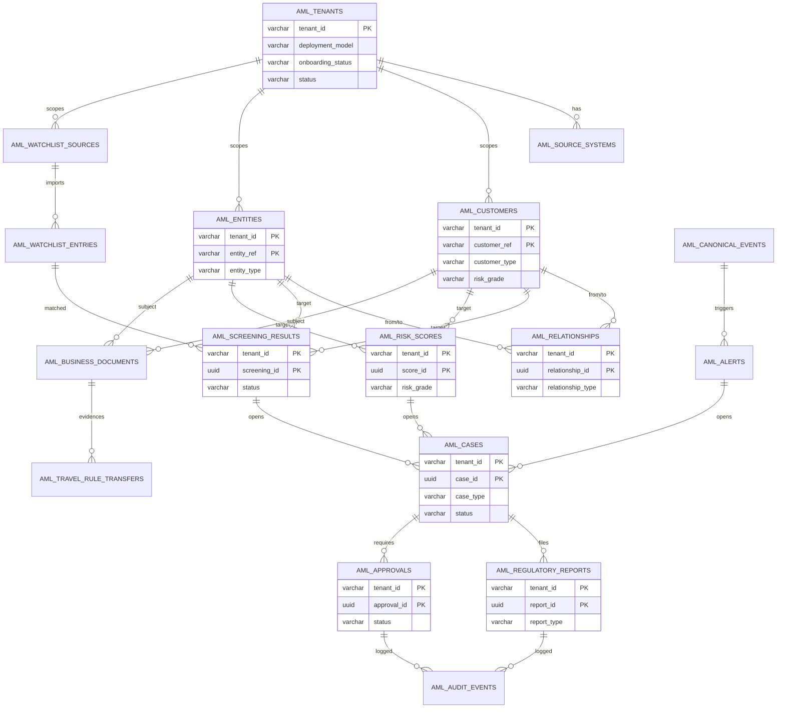
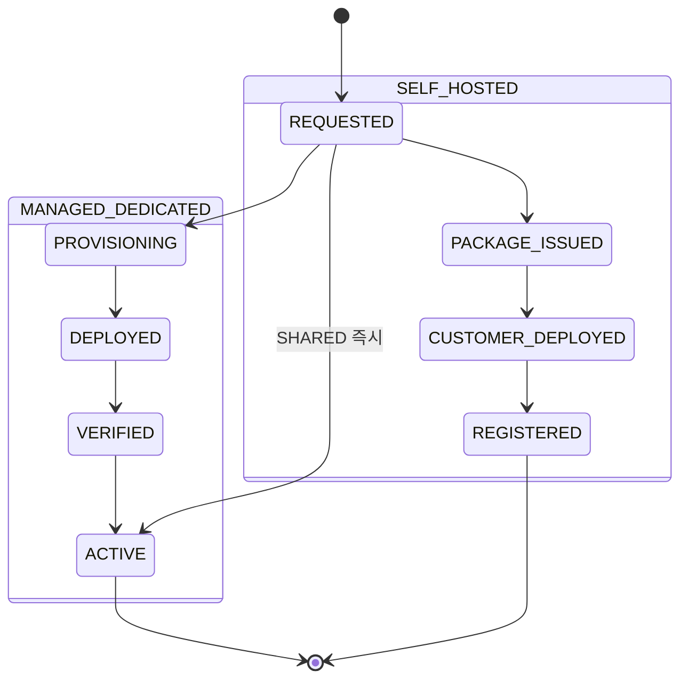

# AML Platform DB 설계서 (aml-svc)

> 정본: `.claude/skills/_shared/target-architecture.md` (PostgreSQL · Flyway, 서비스별 별도 스키마, 멀티테넌시, PII 마스킹, 4-eyes, 규제 Policy Pack STR/CTR/Travel Rule).
> 입력 진실: `docs/software/02-amlSvc-sass.md` (SaaS AML Platform 설계서) — 본 DB 설계서는 설계서 §7~§19의 데이터 모델·enum·규제 요건을 물리 모델로 확정한다.
> 책임 서비스: `services/aml-svc` (Java 25, Spring Boot 3.5.x, 헥사고날, `com.hanpass.aml`). 운영 콘솔·결재·감사 UI는 `bo-api`/`bo-web`가 본 스키마를 admin API 경유로 사용한다.

## 0. 설계 정본·스코프

| 항목 | 결정 | 근거 |
|---|---|---|
| RDBMS | PostgreSQL 16+ | 정본 §3 (bo-api/엔진 Flyway·PostgreSQL) |
| 마이그레이션 | Flyway (additive, `V<NN>__*.sql`) | 정본 §3, 설계서 §17 (additive migration) |
| 스키마 격리 | **`aml` 스키마 전용** (fds-svc·bo-api와 별도 스키마) | 정본 §5·과업 규칙 4 |
| 배포 모델 | **`MANAGED_DEDICATED`(기본·전용 DB·IaC)** / `SELF_HOSTED`(설치형) / `SHARED`(소규모 공유). 격리는 배포 단위 결정이며 온보딩 프로비저닝의 산출. 구 `isolation_mode`(`SHARED`/`SCHEMA`/`DB`) 폐기(정본 §4.1, D-06 결정 확정) | 정본 target-architecture §4.1, 설계서 §16 |
| PII | raw 미저장. `*_hash`(tenant-keyed HMAC) / `*_token`(tenant-managed tokenization)만 저장 (D-05) | 설계서 §19.2, D-05 |
| 금액 | 정수 최소단위 권장. 설계서 DDL의 `NUMERIC(24,8)`은 crypto/외화 소수 수용용으로 유지하되 `*_amount_minor BIGINT`(통화 최소단위) 병행 컬럼 제공 | 스킬 §2 |
| 감사 컬럼 | 전 운영 테이블 `created_at/created_by/updated_at/updated_by` + append-only 감사 evidence 별도 | 정본 §4, 설계서 §19.3 |
| 보존 | 테이블별 `retention_class` 정책(아래 §6) | 설계서 §16.3·§19 |

본 문서가 확정하는 명칭(스키마·테이블·컬럼·enum)은 API 명세서(`docs/design/api/02-aml-api.md`), 연동 명세(`docs/design/integration/02-aml-integration.md`), 태스크(`docs/tasks/aml/`), PRD가 그대로 참조한다.

---

## 1. 도메인 → 논리 모델 (ERD)

설계서 §7.1 핵심 객체와 §5.1(고객·법인 중심) 원칙을 ERD로 도출한다. AML은 거래가 아니라 **고객/법인/실소유자 graph**를 중심에 둔다.

> **Account / Instrument 엔티티 모델링 결정(설계서 §7.1·§8.1 account.\*/instrument.\* event family 대응).** AML 엔진은 계좌·instrument 전용 마스터 테이블(`aml_accounts`/`aml_instruments`)을 **보유하지 않는다**. 근거: (1) AML 도메인 중심은 고객/법인/실소유자 graph이며 계좌·instrument는 거래 맥락 속성으로, 자금 흐름 상태 추적은 FDS 엔진(fds-svc) 소유 경계다. (2) account.\*/instrument.\* canonical event는 `aml_canonical_events`(JSONB payload, PII는 ref/hash)에 그대로 보존되어 TM 윈도우·재screening 입력으로 materialize한다. (3) instrument 중 CRYPTO_ADDRESS(지갑주소)는 `aml_travel_rule_transfers.wallet_address_hash`·`aml_watchlist_entries.attributes`(지갑주소 hash)·screening `target_type=CRYPTO_ADDRESS`로 추적되어 단절되지 않는다. (4) 계좌·instrument의 `*_ref`/`*_hash`는 `aml_alerts.transaction_ref`·`aml_business_documents`·relationship `USES_ACCOUNT` edge로 graph에 연결한다. 별도 마스터가 필요해지면(예: instrument 단위 risk profile 누적) 추가는 §3에 additive 테이블로 가능하나 현 정본은 미보유다.


```mermaid
erDiagram
    AML_TENANTS ||--o{ AML_SOURCE_SYSTEMS : "has"
    AML_TENANTS ||--o{ AML_CUSTOMERS : "scopes"
    AML_TENANTS ||--o{ AML_ENTITIES : "scopes"
    AML_TENANTS ||--o{ AML_WATCHLIST_SOURCES : "scopes"

    AML_CUSTOMERS ||--o{ AML_RELATIONSHIPS : "from/to"
    AML_ENTITIES  ||--o{ AML_RELATIONSHIPS : "from/to"
    AML_CUSTOMERS ||--o{ AML_SCREENING_RESULTS : "target"
    AML_ENTITIES  ||--o{ AML_SCREENING_RESULTS : "target"
    AML_CUSTOMERS ||--o{ AML_RISK_SCORES : "target"
    AML_ENTITIES  ||--o{ AML_RISK_SCORES : "target"

    AML_WATCHLIST_SOURCES ||--o{ AML_WATCHLIST_ENTRIES : "imports"
    AML_WATCHLIST_ENTRIES ||--o{ AML_SCREENING_RESULTS : "matched"

    AML_CANONICAL_EVENTS ||--o{ AML_ALERTS : "triggers"
    AML_ALERTS ||--o{ AML_CASES : "opens"
    AML_SCREENING_RESULTS ||--o{ AML_CASES : "opens"
    AML_RISK_SCORES ||--o{ AML_CASES : "opens"
    AML_CASES ||--o{ AML_REGULATORY_REPORTS : "files"
    AML_CASES ||--o{ AML_APPROVALS : "requires"

    AML_CUSTOMERS ||--o{ AML_BUSINESS_DOCUMENTS : "subject"
    AML_ENTITIES  ||--o{ AML_BUSINESS_DOCUMENTS : "subject"
    AML_BUSINESS_DOCUMENTS ||--o{ AML_TRAVEL_RULE_TRANSFERS : "evidences"

    AML_APPROVALS ||--o{ AML_AUDIT_EVENTS : "logged"
    AML_REGULATORY_REPORTS ||--o{ AML_AUDIT_EVENTS : "logged"

    AML_TENANTS {
        varchar tenant_id PK
        varchar deployment_model
        varchar onboarding_status
        varchar status
    }
    AML_CUSTOMERS {
        varchar tenant_id PK
        varchar customer_ref PK
        varchar customer_type
        varchar risk_grade
    }
    AML_ENTITIES {
        varchar tenant_id PK
        varchar entity_ref PK
        varchar entity_type
    }
    AML_RELATIONSHIPS {
        varchar tenant_id PK
        uuid relationship_id PK
        varchar relationship_type
    }
    AML_SCREENING_RESULTS {
        varchar tenant_id PK
        uuid screening_id PK
        varchar status
    }
    AML_RISK_SCORES {
        varchar tenant_id PK
        uuid score_id PK
        varchar risk_grade
    }
    AML_CASES {
        varchar tenant_id PK
        uuid case_id PK
        varchar case_type
        varchar status
    }
    AML_REGULATORY_REPORTS {
        varchar tenant_id PK
        uuid report_id PK
        varchar report_type
    }
    AML_APPROVALS {
        varchar tenant_id PK
        uuid approval_id PK
        varchar status
    }
```

### 1.1 멀티테넌시 격리 전략 — 배포 모델 기반 (정본 §4.1)

격리는 DB 행/스키마 토글이 아니라 **배포 단위 결정**이다. 화면 라디오 즉석 선택이 아니라 **온보딩 프로비저닝 프로세스**의 산출이다. `aml_tenants.deployment_model`(구 `isolation_mode` 대체).

| 격리 키 | 컬럼 | 타입 | 역할 |
|---|---|---|---|
| tenant | `tenant_id` | `VARCHAR(64) NOT NULL` | **배포의 서비스(테넌트=서비스)**. 상위 기관(institution)이 운영하는 서비스 1종 = tenant 1개(1 기관 : N 서비스, §3.1 `institution_ref`). 전용 배포(`MANAGED_DEDICATED`/`SELF_HOSTED`)에선 사실상 단일 값. 모든 `aml_*` PK 선두 컬럼. `SHARED` 배포에서만 서비스 간 행 격리 키 |
| data-scope | `data_scope` | `VARCHAR(64)` (nullable) | 운영자 row-level **권한 필터** — 저장 격리 아님. bo-api가 운영자 토큰 scope로 강제 필터 |

> **`workspace_id` 미사용 결정(정본 §4 × 설계서 §16.2.1 합의)**: 정본 target-architecture §4는 `tenant_id`/`workspace_id`/`data_scope` 3-key를 언급하나, 본 aml-svc는 **`workspace_id`를 물리 컬럼으로 도입하지 않는다**. 근거: 설계서 §16.2.1 배포 내부 분리 키 표에서 `workspace_id` 행을 명시적으로 제외하고 `tenant_id` + `data_scope` 2-key 모델로 확정했다. `workspace`(retail/corporate, prod/sandbox 등 논리 환경 분리) 필요 시 `data_scope` 하위 규약 또는 future additive column으로 수용하며, 현 정본에서는 미도입이다. 미사용 결정 근거를 설계서 §16.2.1에서 참조·관리한다.

규칙:
- 모든 운영 테이블 PK 선두는 `tenant_id`. UNIQUE·조회 인덱스도 `tenant_id` 선두.
- 격리의 **1차 경계는 배포 모델**(§3.1 `aml_tenants.deployment_model`). 전용 배포는 배포 자체가 서비스(테넌트) 경계이며, 본 DDL은 단일 배포 내부 모델을 기술한다(`SHARED` 배포일 때만 `tenant_id` 행 격리가 서비스 간 경계로 동작). 테넌트=서비스이며 그 상위에 기관(institution)이 있다(1 기관 : N 서비스).
- `SHARED` 배포에서 행 단위 격리는 PostgreSQL **RLS 정책**(`app.current_tenant` 세션 변수)으로 보강한다.
- "서비스 등록"은 격리 라디오가 아니라 **배포 유형 선택 + 온보딩 신청·상태**(`onboarding_status`) 관리다. 온보딩 상태머신은 §5.28 참조.
- `data_scope`(영업점·법인그룹 등 하위 격리)는 `data_scope` 컬럼으로 표현하고 bo-api 권한과 매핑한다(정본 §4).
- 온보딩·배포 메타(`deployment_model`/`onboarding_status`/`default_region`/`infra_ref`)는 `aml_tenants`(§3.1)에 보존한다. 매니지드 전용 IaC 파이프라인·self-hosted 라이선스 발급/검증 방식은 P8 인프라 설계에서 확정(오픈결정).
- **서비스 관리(배포/온보딩) 소유 경계**: bo-api가 `deployment_model`/`onboarding_status` 기준으로 소유·집약하며, 온보딩 프로비저닝/상태조회/self-hosted 등록 콜백 엔드포인트는 **bo-api 전용**이다. aml-svc 엔진 API에는 온보딩 엔드포인트를 두지 않는다.

---

## 2. 물리 모델 — 공통 규약

### 2.1 공통 감사·테넌시 컬럼 (모든 운영 테이블)

| 컬럼 | 타입 | NULL | 기본값 | 설명 |
|---|---|---|---|---|
| `tenant_id` | VARCHAR(64) | N | — | 서비스(테넌트=서비스) 격리 키. 모든 PK·인덱스 선두 |
| `data_scope` | VARCHAR(64) | Y | NULL | 서비스 하위 격리(영업점·법인그룹). NULL=tenant 전역 |
| `created_at` | TIMESTAMPTZ | N | now() | 생성 시각 |
| `created_by` | VARCHAR(128) | N | 'system' | 생성 주체(운영자 ID·system·source-system) |
| `updated_at` | TIMESTAMPTZ | N | now() | 수정 시각(트리거/애플리케이션 갱신) |
| `updated_by` | VARCHAR(128) | Y | NULL | 최종 수정 주체 |
| `trace_id` | VARCHAR(64) | Y | NULL | 관측성 traceId 전파(설계서 §20.3). 동일 timeline 추적 |

> append-only 감사 테이블(`aml_audit_events`)·canonical event store(`aml_canonical_events`)는 불변이므로 `updated_*`를 두지 않는다.

### 2.2 PII 처리 규약 (설계서 §19.2, D-05)

- 주민번호·여권번호·계좌번호·카드번호·CI/DI **원문 컬럼 금지**.
- 식별은 `customer_ref`/`entity_ref`(원천 시스템 ref, 토큰/HMAC) 사용.
- 매칭 보조 필드는 **이름→hash / 문서번호→hash / 계좌→hash / 지갑주소→hash 의미 패턴**(tenant-keyed HMAC-SHA256)으로, 실제 컬럼명은 테이블별 prefix를 따른다: customer는 `name_hash`/`doc_hash`(§3.3), entity는 `legal_name_hash`/`biz_no_hash`(§3.4), watchlist는 `primary_name_hash`(§3.7), travel-rule은 `wallet_address_hash`(§3.14). (account_hash는 canonical event payload·`USES_ACCOUNT` edge 속성으로 보존, §1 Account/Instrument 미보유 결정.)
- 원문이 필요한 WLF matching은 메모리 일시 처리 후 폐기, 저장은 hash/token만(설계서 §19.2).
- `raw_payload`는 기본 미저장. `payload_hash`(sha256: `sha256:<hex>` 형식) 참조만 보존한다. **`stored` 플래그는 설계서 §8.2(2026-06-07 변경이력) 기준 폐기됨 — DB에 `stored` 컬럼을 두지 않는다**(QA issue #7 low 정합).
- **PII reveal 원천 = 가역암호 vault (T3 AML-ENG-03, ADR 2026-06-15 D1).** 위 hash 컬럼은 단방향이라 마스킹 토큰→원문 역참조가 불가능하다. reveal(`POST /internal/v1/aml/pii/reveal`, API §2.6)의 cleartext 산출 원천으로 **`aml_pii_vault`(§3.21)** 를 둔다. vault 는 원문의 **암호문(`ciphertext`)** 만 저장하므로 위 "원문(=평문) 컬럼 금지" 규약은 그대로 유지된다(평문 컬럼 0개). 암복호는 `SecretCipherPort`(AES-256-GCM, `aws`=KMS 스왑). reveal cleartext 는 이 요청 한정 transient — 영속·로그 금지(§19.2). **vault 적재 결선 완료(2026-06-29, 가정 A2 해소)** — 회원 등록·워치리스트 업로드 import 경로가 raw 식별정보를 동일 트랜잭션에서 암호화 upsert 하며, field 도메인은 4종 → 7종(NATIONALITY/GENDER/DOB 추가, V23)으로 확장됐다. 외부 feed fetch 는 원문 미가용 → hash-only 유지(§3.21).

### 2.3 enum 코드·표시값 병기 규약

enum은 컬럼에 **코드값(대문자 스네이크)** 저장, 표시값(라벨·다국어)은 bo-web/i18n에서 매핑. 본 문서 §5에 코드↔표시 매핑표를 둔다.

---

## 3. 테이블 명세

### 3.1 `aml_tenants` — 서비스 마스터(테넌트=서비스) (설계서 §17.1, §16)
> **계층**: 기관(institution) → 서비스(테넌트, `tenant_id`) → (논리)워크스페이스. `aml_tenants`의 1행 = 한 서비스(테넌트). 상위 기관 1개가 여러 서비스를 운영한다(**1 기관 : N 서비스**). 기관 식별은 `institution_ref`로 참조한다.

| 컬럼 | 타입 | NULL | 기본값 | 제약 | 설명 |
|---|---|---|---|---|---|
| `tenant_id` | VARCHAR(64) | N | — | PK | 서비스 ID(테넌트=서비스, 격리 경계·PK 선두) |
| `institution_ref` | VARCHAR(64) | Y | NULL | | **상위 기관(institution) 참조**. 납품받은 회사/금융기관 식별자. 1 기관 : N 서비스 관계의 외부 키(FK 아님·논리 참조). nullable·additive 신규 컬럼(후속 마이그레이션 §7에서 추가, 기존 row는 NULL 백필 후 매핑) |
| `display_name` | VARCHAR(160) | N | — | | 표시명 |
| `deployment_model` | VARCHAR(32) | N | `'MANAGED_DEDICATED'` | enum §5.28 (3종) | 배포 유형(구 `isolation_mode` 대체). `MANAGED_DEDICATED`/`SELF_HOSTED`/`SHARED`. 온보딩 프로비저닝의 산출 — 화면 라디오 즉석 변경 아님 |
| `onboarding_status` | VARCHAR(32) | N | `'REQUESTED'` | enum §5.28a (8종) | 온보딩 진행 상태. 상태머신: 매니지드=`REQUESTED→PROVISIONING→DEPLOYED→VERIFIED→ACTIVE`, self-hosted=`REQUESTED→PACKAGE_ISSUED→CUSTOMER_DEPLOYED→REGISTERED`, SHARED=`REQUESTED→ACTIVE` |
| `default_region` | VARCHAR(32) | N | `'KR'` | | 기본 데이터 리전(한국 우선, §16.3). 전용 배포 region. |
| `infra_ref` | VARCHAR(160) | Y | NULL | | 배포 메타 참조. 매니지드=Terraform stack/workspace ID, self-hosted=라이선스·설치 인스턴스 ID. 발급·검증 방식은 P8 인프라 설계 확정(오픈결정) |
| `status` | VARCHAR(32) | N | `'ONBOARDING'` | enum §5.28b (**4종**, FDS §11.6.7 동기화) | **운영 생명주기** — `onboarding_status`와 직교. `ONBOARDING`/`ACTIVE`/`SUSPENDED`/`OFFBOARDED` (QA cross #119 high·#127 medium 정합 — FDS `fds_tenants.tenant_status` 4종과 코드값·DEFAULT 동기화. 신규 등록 시 DEFAULT `'ONBOARDING'`, 온보딩 완료 시 `ACTIVE` 전환) |
| `policy_pack_code` | VARCHAR(64) | N | `'KR_DEFAULT'` | | 적용 Policy Pack(STR/CTR/Travel Rule) |
| `retention_policy` | JSONB | N | `'{}'` | | 서비스별 보존·파기 override |
| `created_at/created_by/updated_at/updated_by` | (공통 §2.1) | | | | 감사 컬럼 |

PK: `(tenant_id)`

> **마이그레이션(구현 정합)**: `deployment_model`/`onboarding_status`/`infra_ref` 컬럼 + `status` enum 4종(`ONBOARDING` 추가, `OFFBOARDING`→`OFFBOARDED`)·DEFAULT `'ONBOARDING'` 은 **구현 `V2__phase1_foundation.sql`(Phase 1)에서 일괄 추가**되었다(§7 참조). 구 `isolation_mode` 컬럼은 V2가 대체 컬럼을 추가하되 **DROP 하지 않아 V1 baseline에 잔존**한다(미사용·무해). 별도 `V17a/V17b/V20` 분할 마이그레이션은 **미구현**(구 설계 표의 가상 파일명).
> **마이그레이션(institution_ref·미구현)**: 상위 기관 참조 컬럼 `institution_ref VARCHAR(64) NULL`은 **어느 마이그레이션에도 부재 = 미구현(추후 예정)**. 본 테이블 정의는 설계 의도이며, 구현 시 additive(nullable)로 추가하고 기관-서비스 매핑 확정 후 백필한다.

### 3.2 `aml_source_systems` — 데이터 원천 (설계서 §17.1, §15)

| 컬럼 | 타입 | NULL | 기본값 | 제약 | 설명 |
|---|---|---|---|---|---|
| `tenant_id` | VARCHAR(64) | N | — | PK,FK→aml_tenants | |
| `source_system` | VARCHAR(64) | N | — | PK | 원천 코드. **hanpass-ph 실서비스 카탈로그(REST sync 인입 정본)**: `member-svc`(회원/KYC/CDD/제재·PEP zoloz 스크리닝 — `customer.*`/`entity.*`/`beneficial-owner.*`), `walletchg-svc`(월렛충전 cash-in — `transaction.requested`), `domestic-svc`(국내송금 PHP — `transaction.requested`), `remit-svc`(해외송금 cross-border, `sanction_screening_event`·`str_indicators` 보유 — `transaction.requested`·`settlement.posted`), `wallet-svc`(월렛 원장 `transfer_links` 자금그래프 — `account.*`·`settlement.posted`), `tx-history-svc`(회원 통합 이력 read model — 대상 360° 피드), `inbound-svc`(파트너 인바운드 송금 — `transaction.requested`). generic placeholder(core-banking/kyb/card/wallet/remit)는 위 실서비스의 예시 추상으로만 잔존 — 운영 등록값은 hanpass-ph 코드 |
| `ingest_mode` | VARCHAR(32) | N | — | enum | `REST_PUSH`/`QUEUE`/`POLLING`/`CDC`/`SNAPSHOT`/`VENDOR_BRIDGE` (§15) |
| `schema_version` | VARCHAR(80) | N | — | | schema registry 버전 |
| `auth_mode` | VARCHAR(32) | N | 'API_KEY_HMAC' | enum | `API_KEY_HMAC`/`OAUTH2`/`MTLS` (§15.7, D-13) |
| `secret_ref` | VARCHAR(256) | Y | NULL | | API key/secret **참조만**(원문 미저장, secret store) |
| `failure_policy` | VARCHAR(32) | N | 'MANUAL_REVIEW' | enum | `MANUAL_REVIEW`/`FAIL_CLOSED`/`DELAY_ALLOWED` (§15.7, D-14) |
| `enabled` | BOOLEAN | N | TRUE | | 활성 여부 |
| `status` | VARCHAR(32) | N | `'ACTIVE'` | enum | 운영 상태. `ACTIVE`/`DISABLED`(설계서 §17.1 DDL·§16.2.1 정본 — QA issue #4 HIGH 정합) |
| `data_scope` | VARCHAR(64) | Y | NULL | | 서비스 하위 격리(§2.1 공통 규약 — §2.1에서 전 운영 테이블 적용 원칙이 적용되는 테이블임을 명시. QA issue #5 MEDIUM 정합) |
| `created_at/created_by/updated_at/updated_by/trace_id` | (공통) | | | | |

PK: `(tenant_id, source_system)`

### 3.3 `aml_customers` — 개인/사업자 고객 (설계서 §9.1, §17.2)

| 컬럼 | 타입 | NULL | 기본값 | 제약 | 설명 |
|---|---|---|---|---|---|
| `tenant_id` | VARCHAR(64) | N | — | PK | |
| `customer_ref` | VARCHAR(256) | N | — | PK | 회원 주체 참조 키 = **회원 업무참조**(`member.member_id`=`originator.partyReference`, 예 `M-1001`, 비PII 업무참조 — 토큰화하지 않음, integration §10.2a). FDS `subject_ref`·canonical `payload.targetRef`·`aml_risk_scores.target_ref`·`aml_alerts.target_ref` 와 동일 값이라 온보딩(CDD→1차 RA)↔거래(TM→2차 RA)가 같은 회원 키로 이어진다. PII 속성(이름·CI·신분증)은 별도 토큰/vault. 업무참조 부재 레거시 경로만 `hmac(nationalIdentityKey)` 토큰 폴백(잔존 허용) |
| `customer_type` | VARCHAR(32) | N | — | enum | §5.1 customer_type |
| `name_hash` | VARCHAR(256) | Y | NULL | | 이름 HMAC(매칭용) |
| `doc_hash` | VARCHAR(256) | Y | NULL | | 신분증번호 HMAC |
| `country` | VARCHAR(8) | Y | NULL | | 거주/국적 ISO |
| `kyc_status` | VARCHAR(32) | Y | NULL | enum | §5.25 kyc_status(PENDING/VERIFIED/INCOMPLETE/EXPIRED/REJECTED). DB 물리 정본 |
| `risk_grade` | VARCHAR(32) | Y | NULL | enum | §5.2 risk_grade(최신 RA 결과 캐시) |
| `kyc_evidence` | JSONB | N | '{}' | | KYC checklist 상태(§7.3, 원문 아님) |
| `source_system` | VARCHAR(64) | Y | NULL | | 유입 원천 |
| `onboarding_at` | TIMESTAMPTZ | Y | NULL | | 온보딩 시각 |
| `next_review_due_at` | TIMESTAMPTZ | Y | NULL | | 주기적 재확인 예정(§11.2) |
| `is_pep` | BOOLEAN | N | FALSE | | 정치적 주요인물(PEP) 여부 — 경영진 승인(`PEP_APPROVAL`) EXECUTED 시 TRUE(V24). PEP 등재 시 `PEP_INDIVIDUALS` 참조 리스트 + RA 위험등급 HIGH 강제 상향(거래 허용+EDD) |
| `pep_approval_id` | UUID | Y | NULL | | PEP 확정 결재 row(`aml_approvals.approval_id`) 증거 링크(V24). 비-PEP은 NULL |
| `created_at/created_by/updated_at/updated_by/trace_id/data_scope` | (공통) | | | | |

PK: `(tenant_id, customer_ref)`

### 3.4 `aml_entities` — 법인/merchant/seller/vendor (설계서 §9.2, §17.2)

| 컬럼 | 타입 | NULL | 기본값 | 제약 | 설명 |
|---|---|---|---|---|---|
| `tenant_id` | VARCHAR(64) | N | — | PK | |
| `entity_ref` | VARCHAR(256) | N | — | PK | 원천 ref |
| `entity_type` | VARCHAR(64) | N | — | enum | §5.1 entity_type(LEGAL_ENTITY/MERCHANT/SELLER/VENDOR/VASP_CUSTOMER) |
| `legal_name_hash` | VARCHAR(256) | Y | NULL | | 법인명 HMAC |
| `biz_no_hash` | VARCHAR(256) | Y | NULL | | 사업자번호 HMAC |
| `country` | VARCHAR(8) | Y | NULL | | 설립/영업국 |
| `industry_code` | VARCHAR(64) | Y | NULL | | 업종(MCC 등) |
| `merchant_category` | VARCHAR(64) | Y | NULL | | MCC/marketplace category |
| `risk_grade` | VARCHAR(32) | Y | NULL | enum | 최신 RA 등급 |
| `kyb_evidence` | JSONB | N | '{}' | | KYB·UBO·대표자 checklist(§7.3) |
| `expected_activity` | JSONB | N | '{}' | | 예상 거래규모/국가(§9.2) |
| `status` | VARCHAR(32) | Y | NULL | enum | `ACTIVE`/`SUSPENDED`/`CLOSED` |
| `next_review_due_at` | TIMESTAMPTZ | Y | NULL | | |
| `created_at/created_by/updated_at/updated_by/trace_id/data_scope` | (공통) | | | | |

PK: `(tenant_id, entity_ref)`

### 3.5 `aml_relationships` — 고객/법인/UBO graph (설계서 §7.2, §9.3, §17.2)

| 컬럼 | 타입 | NULL | 기본값 | 제약 | 설명 |
|---|---|---|---|---|---|
| `tenant_id` | VARCHAR(64) | N | — | PK | |
| `relationship_id` | UUID | N | — | PK | |
| `from_ref` | VARCHAR(256) | N | — | | 주체 ref(customer/entity) |
| `to_ref` | VARCHAR(256) | N | — | | 대상 ref |
| `relationship_type` | VARCHAR(64) | N | — | enum | §5.3 relationship_type(OWNS/CONTROLS/REPRESENTS/...) |
| `ownership_percent` | NUMERIC(8,4) | Y | NULL | | 지분율(§9.3 변경 이력) |
| `is_ubo` | BOOLEAN | N | FALSE | | 실소유자 표식 |
| `effective_from` | TIMESTAMPTZ | Y | NULL | | 유효 시작 |
| `effective_to` | TIMESTAMPTZ | Y | NULL | | 유효 종료(NULL=현재) |
| `attributes` | JSONB | N | '{}' | | 추가 속성 |
| `created_at/created_by/updated_at/updated_by/trace_id` | (공통) | | | | |

PK: `(tenant_id, relationship_id)`

### 3.6 `aml_watchlist_sources` — 명단 source (설계서 §10.1, §17.3)

| 컬럼 | 타입 | NULL | 기본값 | 제약 | 설명 |
|---|---|---|---|---|---|
| `tenant_id` | VARCHAR(64) | N | — | PK | |
| `source_code` | VARCHAR(80) | N | — | PK | source 코드 |
| `source_type` | VARCHAR(64) | N | — | enum | §5.4 watchlist_source_type(SANCTIONS/PEP/RCA/ADVERSE_MEDIA/INTERNAL/LAW_ENFORCEMENT/VASP_RISK) |
| `provider` | VARCHAR(128) | Y | NULL | | 제공처(UN/OFAC/internal 등 — generic 유지). **hanpass-ph 정합**: 실시간 제재·PEP 스크리닝 신호 소스는 `member-svc`의 `zoloz_aml_screening`(`decision`/`risk_level`/`total_hits`/`hit_results`)으로, screening 결과(§3.8)에 `member-svc` decision 을 정합 매핑한다. `source_type`(§5.4 SANCTIONS/PEP/RCA/ADVERSE_MEDIA/INTERNAL/LAW_ENFORCEMENT/VASP_RISK)는 유지 |
| `status` | VARCHAR(32) | N | 'ACTIVE' | enum | `ACTIVE`/`DISABLED` |
| `active_version` | VARCHAR(80) | Y | NULL | | 적용 중 import 버전(4-eyes 승인본) |
| `last_imported_at` | TIMESTAMPTZ | Y | NULL | | freshness 모니터링(§20.2). **48h 신선도 초과 시 fail-closed**(스크리닝 차단·재import 강제 — `member-svc zoloz` 신호 포함 전 소스 동일 적용) |
| `created_at/created_by/updated_at/updated_by/trace_id` | (공통) | | | | |

PK: `(tenant_id, source_code)`

### 3.7 `aml_watchlist_entries` — 명단 항목 (설계서 §10.2, §17.3)

| 컬럼 | 타입 | NULL | 기본값 | 제약 | 설명 |
|---|---|---|---|---|---|
| `tenant_id` | VARCHAR(64) | N | — | PK | |
| `entry_id` | UUID | N | — | PK | |
| `source_code` | VARCHAR(80) | N | — | FK→aml_watchlist_sources | |
| `list_type` | VARCHAR(64) | N | — | enum | watchlist_source_type와 동일 도메인 |
| `subject_kind` | VARCHAR(32) | N | 'PERSON' | enum | §5.24 subject_kind(PERSON/ENTITY/VESSEL/CRYPTO_ADDRESS, §10.2) |
| `primary_name_hash` | VARCHAR(256) | Y | NULL | | 이름 HMAC |
| `normalized_tokens` | JSONB | N | '[]' | | 정규화 토큰(다국어/전사 matching) |
| `attributes` | JSONB | N | '{}' | | 생년/국적/문서 hash/지갑주소 hash 등(§10.2) |
| `version` | VARCHAR(80) | N | — | | import 버전 |
| `status` | VARCHAR(32) | N | 'ACTIVE' | enum | `ACTIVE`/`DELISTED` |
| `external_ref` | VARCHAR(120) | Y | NULL | | **소스 피드 안정 외부키**(OFAC `sdnEntry/uid` / UN `DATAID`, strong-alias 는 `uid:aka:n` 접미). 실 제재명단 일일 수집(real-sanctions-daily-import)의 멱등 upsert(delete-then-insert per version)·DELISTED 재조정 키. nullable — 기존/수동/CSV/DEMO 엔트리는 미보유. 부분 인덱스 `ix_wle_external_ref (tenant_id, source_code, external_ref) WHERE external_ref IS NOT NULL`(V8) |
| `created_at/created_by` | (공통, append 중심) | | | | |

PK: `(tenant_id, entry_id)`

### 3.8 `aml_screening_results` — WLF/제재 판정 (설계서 §10.3~§10.4, §17.3)

| 컬럼 | 타입 | NULL | 기본값 | 제약 | 설명 |
|---|---|---|---|---|---|
| `tenant_id` | VARCHAR(64) | N | — | PK | |
| `screening_id` | UUID | N | — | PK | API `screeningId`(§15.7 응답) |
| `target_ref` | VARCHAR(256) | N | — | | 대상 ref. CUSTOMER(회원 송금인)=회원 업무참조(integration §10.2a), COUNTERPARTY(외부 수취인)=안정키 토큰(이름+국가+전화 HMAC), ENTITY/wallet=원천 ref |
| `target_type` | VARCHAR(64) | N | — | enum | §5.23 target_type(CUSTOMER/ENTITY/COUNTERPARTY/CRYPTO_ADDRESS) |
| `status` | VARCHAR(32) | N | — | enum | §5.5 screening_status(NO_MATCH/POSSIBLE_MATCH/TRUE_MATCH/FALSE_POSITIVE/AUTO_DISCOUNTED/ESCALATED) |
| `score` | NUMERIC(8,4) | Y | NULL | | 유사도 score |
| `score_breakdown` | JSONB | N | '{}' | | name/dob/country/document/address/relationship 분해(§10.3). **hanpass-ph 정합**: `member-svc zoloz_aml_screening.hit_results`(매칭 후보·항목별 점수)를 본 분해로 정규화 — `risk_level`→§5.2 risk_grade, `total_hits`→`matched_entries` 카운트 매핑 |
| `reason_codes` | JSONB | N | '[]' | | reasonCodes(§15.7). zoloz `decision`(승인/거절/검토) 을 본 status(§5.5)로 정규화하고 reason 을 코드화 |
| `matched_entries` | JSONB | N | '[]' | | 후보 entry_id 목록 |
| `rule_version` | VARCHAR(80) | N | — | | 적용 WLF 룰/threshold 버전 |
| `decided_by` | VARCHAR(128) | Y | NULL | | 판정자(분석가) |
| `decided_at` | TIMESTAMPTZ | Y | NULL | | 판정 시각 |
| `expires_at` | TIMESTAMPTZ | Y | NULL | | 실시간 screening 만료(§15.7) |
| `created_at/created_by/updated_at/updated_by/trace_id` | (공통) | | | | |

PK: `(tenant_id, screening_id)`

> **`matched_candidates`는 영속 컬럼이 아니다(파생 enrich).** API §3.2 `ScreenResponse.matchedCandidates[]`(출처계보)는 본 테이블에 저장되지 않고, **bo-api가 `matched_entries`의 각 entry_id로 `aml_watchlist_entries` + `aml_watchlist_sources`를 2단 조인해 파생(enrich)**하는 응답 전용 필드다(가산·하위호환). 매핑: `entry_id` ↔ `aml_watchlist_entries.entry_id`(§3.7) → `aml_watchlist_entries.source_code` ↔ `aml_watchlist_sources.source_code`(§3.6) 2단 조인으로 `source_code`·`list_type`·`subject_kind`·`version`(entries)·`provider`·`source_type`·`last_imported_at`(sources)를 채운다. score/threshold/matchField는 본 테이블 `score_breakdown`·`matched_rules`에서 best-effort 파생, reasonCodes는 현재 null. raw PII 미포함(masked entry_id·출처·버전·점수·토큰개수만). 별도 DDL·마이그레이션 없음.

### 3.8a `aml_fp_whitelist` — 오탐(FP) 면제 화이트리스트 (설계서 §10.3~§10.4, §17.3)

> **가정 A**: 기존 §3 표는 `aml_fp_whitelist` 전용 절을 두지 않고 §5.16 subject_type·§5.19 event_category enum 에서만 참조했다(코드=truth 검증 결과 baseline `V1__baseline.sql`(schema-only, 구 V1~V25 통합)에 원형 테이블이 존재하고 V14 가 컬럼 3종을 additive 로 얹음). 본 절은 **disk 스키마(baseline 원형 + V14 additive) 기준으로 신설**한다(추측 없음, DDL 그대로). 마이그레이션 파일 주석의 "설계 DB §3.5" 참조는 통합 이전 번호로 현재 §3.8a 로 재배치(WLF 판정 §3.8 인접).

FP 면제는 WLF/제재 스크리닝 결과(§3.8)를 특정 매치 특성(matchFeature)에 대해 오탐으로 판정·면제하는 4-eyes 산출물이다. 판정 상태 `AUTO_DISCOUNTED`(§5.5)로 후속 동일 매치를 자동 낮춤한다.

| 컬럼 | 타입 | NULL | 기본값 | 제약 | 설명 |
|---|---|---|---|---|---|
| `tenant_id` | VARCHAR(64) | N | — | PK | |
| `whitelist_id` | UUID | N | gen_random_uuid() | PK | 화이트리스트 항목 id |
| `target_ref` | VARCHAR(256) | N | — | | 면제 대상 ref(customer/entity/counterparty/crypto) |
| `target_type` | VARCHAR(64) | N | — | enum,CHECK | `CUSTOMER`/`ENTITY`/`COUNTERPARTY`/`CRYPTO_ADDRESS`(`aml_fp_whitelist_target_type_check`) |
| `matched_entry_id` | VARCHAR(256) | N | — | | 오탐으로 판정된 워치리스트 엔트리 id(§3.7 `entry_id`) — **discount matchFeature 슬롯**. `screening_id`(발원 스크리닝 결과 id)와 **별개 슬롯**(과거 결함: `screening_id` 를 이 자리에 넣어 matchFeature 영구 불일치, run2 D2 회귀 방지) |
| `match_feature` | VARCHAR(512) | N | — | | discount 매칭 특성 키(`targetRef::matchedEntryId` 등 안정키) |
| `whitelist_version` | VARCHAR(80) | N | — | | 적용 룰/정책 버전 |
| `active` | BOOLEAN | N | TRUE | | 활성 여부(삭제=soft off) |
| `reason` | TEXT | Y | NULL | | **(V14)** 면제 사유(운영 뷰 표시) — 4-eyes 상신 시 maker 입력 |
| `expires_at` | TIMESTAMPTZ | Y | NULL | | **(V14)** 면제 만료일(nullable=무기한). `expires_at < now()` ⇒ **EXPIRED 파생 상태**(스케줄러 없음, 조회·discount 판정 시 파생, **가정 A5**) |
| `screening_id` | UUID | Y | NULL | | **(V14)** 발원 스크리닝 결과 id(§3.8 추적성) — `matched_entry_id`(워치리스트 엔트리 id)와 별개 슬롯 |
| `created_at` | TIMESTAMPTZ | N | now() | | 등록 시각 |
| `created_by` | VARCHAR(128) | N | 'system' | | 등록자(4-eyes maker/checker). 별도 `registered_by` 컬럼 없음 — V1 baseline `created_by` 재사용 |
| `trace_id` | VARCHAR(64) | Y | NULL | | 관측성 |

PK: `(tenant_id, whitelist_id)`. FK: `fk_aml_fp_whitelist_tenant → aml_tenants(tenant_id)`. 인덱스: `ix_fpw_feature (tenant_id, target_ref, active)`.

> **EXPIRED 파생(가정 A5)**: `expires_at` 만료는 별도 스케줄러/배치가 아니라 **조회·discount 판정 시점**에 `expires_at < now()` 를 EXPIRED 로 취급한다. 영속 상태 컬럼 아님(파생) — 만료 후에도 행은 `active=true` 로 남되 discount 에 미적용. V14 이전 행은 신규 3컬럼 NULL(하위호환·additive).

### 3.9 `aml_risk_scores` — 고객위험평가 (설계서 §11, §17.4)

| 컬럼 | 타입 | NULL | 기본값 | 제약 | 설명 |
|---|---|---|---|---|---|
| `tenant_id` | VARCHAR(64) | N | — | PK | |
| `score_id` | UUID | N | — | PK | `scoreId` |
| `target_ref` | VARCHAR(256) | N | — | | customer/entity ref |
| `target_type` | VARCHAR(64) | N | — | enum | §5.23 target_type(CUSTOMER/ENTITY 사용) |
| `model_code` | VARCHAR(80) | N | — | | RA 모델 코드 |
| `model_version` | VARCHAR(80) | N | — | | 적용 모델 버전(§11.3, 4-eyes 승인본) |
| `risk_score` | NUMERIC(8,4) | N | — | | 0~100 |
| `risk_grade` | VARCHAR(32) | N | — | enum | §5.2 risk_grade(LOW/MEDIUM/HIGH/PROHIBITED) |
| `factor_breakdown` | JSONB | N | '{}' | | factor별 점수·근거(§11.2) |
| `required_action` | VARCHAR(64) | Y | NULL | enum | §5.26 required_action(CDD_UPDATE/EDD/RELATIONSHIP_REVIEW/NONE) |
| `next_review_due_at` | TIMESTAMPTZ | Y | NULL | | 재심사 예정 |
| `is_override` | BOOLEAN | N | FALSE | | 수동 등급 조정 여부(4-eyes 대상) |
| `evaluated_at` | TIMESTAMPTZ | N | now() | | |
| `created_at/created_by/updated_at/updated_by/trace_id` | (공통) | | | | |

PK: `(tenant_id, score_id)`

> **RA 모델 템플릿(`aml_risk_models`) — `scenario`·`parameters` 컬럼(V11·V12, 코드=truth).** §3.9 의 `model_code`·`model_version` 이 참조하는 RA 모델 정의 테이블 `aml_risk_models`(통합 `V1__baseline.sql` 생성, PK `(tenant_id, model_code, version)`)에 **`scenario VARCHAR(32) NOT NULL DEFAULT 'ONBOARDING'`** + CHECK `aml_risk_models_scenario_check (scenario IN ('ONBOARDING','ONGOING'))` 이 `V11__ra_model_scenario.sql` 로 추가되었다(§7). 어느 모델 정의가 어느 RA 흐름에 소비되는지를 **자기서술**한다 — `ONBOARDING`(1차·회원가입 CDD 완료 시점 위험평가, 정본 `KR_DEFAULT_RA`) / `ONGOING`(2차·상시). 기존 `KR_DEFAULT_RA`(v1 APPROVED·v2 DRAFT)는 DEFAULT `'ONBOARDING'` 백필.
>
> **2차 상시 RA(ONGOING) 실환경화(V12).** `V12__ra_ongoing_model_activation.sql` 가 (1) `aml_risk_models` 에 **`parameters jsonb NOT NULL DEFAULT '{}'::jsonb`** additive 컬럼을 도입하고, (2) `KR_ONGOING_RA` v1 을 **DRAFT placeholder → APPROVED(ACTIVE)** 로 실환경화했다. ONGOING 모델의 전 규칙(트리거 families `[STR,CTR]`·디바운스 10분·룰 심각도 가중 9종·`lookbackDays` 30·건수 포화 5·최근성 버킷·1차 baseline `KR_DEFAULT_RA` 결합·EDD 자동 개시 임계)이 `parameters` JSONB 에 자기서술로 담기며, `weights` 는 `TRANSACTION_BEHAVIOR 0.7 / CUSTOMER 0.3`(거래 행태 주도). 엔진(`OngoingRaParameters`/`OngoingRaFactorDeriver`/`OngoingRaService`)은 이 정의만 소비하고 상수를 하드코딩하지 않는다. ONBOARDING 모델은 `parameters={}` 로 동작 불변. **`is_default=false` 유지 — 1차 온보딩 기본 평가 경로 `findActiveDefault → KR_DEFAULT_RA` 는 불변**. 도메인 enum `RaScenario`(2종)·`RiskModel.scenario`·`RiskModelJpaEntity.scenario`·`parameters` 와 1:1. 정책 메타만(PII 없음).

### 3.10 `aml_alerts` — TM/룰 경보 (설계서 §12, §17.4)

| 컬럼 | 타입 | NULL | 기본값 | 제약 | 설명 |
|---|---|---|---|---|---|
| `tenant_id` | VARCHAR(64) | N | — | PK | |
| `alert_id` | UUID | N | — | PK | `alertId` |
| `alert_type` | VARCHAR(64) | N | — | enum | §5.18 alert_type(TM_SCENARIO/SCREENING/RA/FDS_ESCALATION/VENDOR_ALERT). API `alertType` 정본 동기화 |
| `scenario_code` | VARCHAR(80) | Y | NULL | enum | §5.6 tm_scenario(STRUCTURING/RAPID_MOVEMENT/...) |
| `target_ref` | VARCHAR(256) | Y | NULL | | 대상 고객/법인 = 회원 업무참조(`member.member_id`=`originator.partyReference`, 예 `M-1001` — 비PII, 토큰화 안 함, integration §10.2a). `aml_customers.customer_ref`·canonical `payload.targetRef` 와 동일 값. **대상 360°(§3.16 뷰)·TM 알림 상세의 대상 링크 키** |
| `transaction_ref` | VARCHAR(256) | Y | NULL | | 관련 거래 ref. **hanpass-ph 정합**: `walletchg.charge_order_id`(충전)·`domestic.transaction_id`(국내)·`remit.transfer_number`(해외)·`*.wallet_transaction_id` 중 하나의 keyed token. TM 알림 상세 '관련 거래 목록'의 join 키 — 다건 거래는 `evidence.relatedTransactions[]`(아래)에 transaction_ref 배열로 보존 |
| `severity` | VARCHAR(32) | N | — | enum | §5.19 alert_severity(LOW/MEDIUM/HIGH/CRITICAL) |
| `status` | VARCHAR(32) | N | 'DETECTED' | enum,CHECK | §5.7 alert_status **6종 종결**(DETECTED/TRIAGED/CASE_OPENED/DISMISSED/ESCALATED/STR_RECOMMENDED, CHECK 6종). 이후 조사·보고·종결(INVESTIGATING/REPORTED/CLOSED)은 `aml_cases.status`(§5.9)가 인계 — alert enum에 미포함 |
| `evidence` | JSONB | N | '{}' | | **TM 알림 상세 데이터모델(정본).** ① 트리거: `scenarioCode`·`strIndicator`(데이터 신호 STR_001~015, `remit.str_indicators` 매핑) ·설명. ② 집계 패턴(측정값/기간/기준 충족, 예 `{ "measure":"분할충전 합계", "window":"5BD", "count":9, "amount":"480000.00", "currency":"PHP", "threshold":"…" }`). ③ `relatedTransactions[]`(관련 거래 — `transactionRef`·`channel`(충전/국내/해외)·`amount`·`currency`·`corridor`·`counterpartyRef`·`occurredAt`·`fdsDecisionRef` 링크). ④ `fundGraph`(자금그래프 funnel 미니뷰 — `wallet.transfer_links` 그래프 노드/엣지 요약). 모든 식별자 token/hash, raw PII 금지. **CTR/STR 룰 경로 변형(코드=truth, `Ctr/StrEvaluationService`→`TmAlertEvidenceAssembler`):** 룰 카탈로그(§11)로 발동한 TM 알림은 위와 **키 동형**이되 ① 트리거를 `{ ruleCode, strReasonCode(STR만), description(카탈로그 자연어) }`로 싣고, ② 집계는 **실측 윈도우 집계**(CTR=(member, banking day) 현금 채널 합산·건수, STR=주체 rolling 24h 건수·합산; `threshold`/`thresholdMet`은 수치 임계 룰 `STR_VELOCITY_CASH`·`STR_KYC_INCOME_MISMATCH`·CTR만), ③ `relatedTransactions[]`는 **주체 윈도우 형제거래**(최신순, 표시 캡 20; 빈 윈도우면 평가 거래 단건 폴백), ④ `fundGraph`는 윈도우 거래가 있으면 canonical 이벤트 파생 실 그래프(`source=CANONICAL_EVENTS`)·무거래 시만 `PLACEHOLDER_NO_TRANSFER_LINKS`, + `features`(velocity 스냅샷)·명단 룰 `watchlistMatch`. 윈도우 조회 실패는 fail-safe(발동 유지·현행 수준 evidence) |
| `source_origin` | VARCHAR(32) | N | 'AML' | enum | §5.20 source_origin(AML/FDS/VENDOR, §15.5 dual-run 구분) |
| `external_alert_ref` | VARCHAR(256) | Y | NULL | | 외부 vendor alert 식별자(Legacy Vendor Bridge `vendor_alert_id`). SaaS alert와 dual-run 구분 영속화(integration §7.3). `source_origin=VENDOR`일 때 채움 |
| `created_at/created_by/updated_at/updated_by/trace_id/data_scope` | (공통) | | | | |

PK: `(tenant_id, alert_id)`

### 3.11 `aml_cases` — CDD/EDD/조사 케이스 (설계서 §13, §17.4)

| 컬럼 | 타입 | NULL | 기본값 | 제약 | 설명 |
|---|---|---|---|---|---|
| `tenant_id` | VARCHAR(64) | N | — | PK | |
| `case_id` | UUID | N | — | PK | `caseId` |
| `case_type` | VARCHAR(64) | N | — | enum | §5.8 case_type(SANCTIONS_REVIEW/EDD_REVIEW/STR_REVIEW/...) |
| `target_ref` | VARCHAR(256) | Y | NULL | | 대상 고객/법인 |
| `origin_alert_id` | UUID | Y | NULL | FK→aml_alerts | 발단 alert |
| `origin_screening_id` | VARCHAR(96) | Y | NULL | | **(V15)** RA→EDD 착수 발단 screening/RA 스코어 id(추적성, FK 아님 — 문자열 참조 토큰, `origin_fds_case_ref` 와 동형). `origin_alert_id`(TM 알림 발단)와 **별개 슬롯** — 이 컬럼 부재로 위임(엔진) 경로에서 케이스 상세 '발단'이 `null` 로 유실되던 결함(D5·D8) 해소. 코드=truth: `CaseJpaEntity.originScreeningId`·`Case.originScreeningId` 와 1:1 |
| `origin_fds_case_ref` | VARCHAR(96) | Y | NULL | | FDS 위임 발단(cross-ref, FK 아님 — `fds` 스키마). fds-svc가 `OPEN_AML_CASE`/`REGULATORY_REPORT`/`REQUEST_TRAVEL_RULE_INFO` 위임 시 `fds_cases.aml_case_id ↔ aml_cases.case_id` 양방향 연결의 역참조. `source_origin=FDS`일 때 채움 |
| `status` | VARCHAR(32) | N | 'OPEN' | enum | §5.9 case_status(OPEN/INVESTIGATING/PENDING_APPROVAL/DISMISSED/REPORTED/CLOSED) |
| `priority` | VARCHAR(32) | Y | NULL | enum | §5.27 priority(LOW/MEDIUM/HIGH/URGENT) |
| `assigned_to` | VARCHAR(128) | Y | NULL | | 담당 분석가 |
| `edd_trigger` | VARCHAR(64) | Y | NULL | enum | §13.2 EDD trigger |
| `timeline` | JSONB | N | '[]' | | 처리 timeline(evidence, §15.6) |
| `due_at` | TIMESTAMPTZ | Y | NULL | | SLA 기한(§20.1 case.sla.breached) |
| `closed_at` | TIMESTAMPTZ | Y | NULL | | 종결 시각 |
| `created_at/created_by/updated_at/updated_by/trace_id/data_scope` | (공통) | | | | |

PK: `(tenant_id, case_id)`

### 3.12 `aml_regulatory_reports` — STR/CTR/Travel Rule 보고 증적 (설계서 §14, §17.4)

| 컬럼 | 타입 | NULL | 기본값 | 제약 | 설명 |
|---|---|---|---|---|---|
| `tenant_id` | VARCHAR(64) | N | — | PK | |
| `report_id` | UUID | N | — | PK | `reportId` |
| `report_type` | VARCHAR(64) | N | — | enum | §5.10 report_type(STR/CTR/TRAVEL_RULE/EDD_REGISTER/WLF_REGISTER/RA_REPORT/AUDIT_EXPORT) |
| `case_id` | UUID | Y | NULL | FK→aml_cases | 연관 케이스 |
| `target_ref` | VARCHAR(256) | Y | NULL | | 대상 |
| `status` | VARCHAR(32) | N | 'DRAFT' | enum | §5.11 report_status(DRAFT/UNDER_REVIEW/APPROVED/SUBMITTED/ACKNOWLEDGED/SUBMISSION_FAILED/REJECTED/CANCELLED — 8종, 설계서 §14.1a FIU 회신 폐루프) |
| `report_payload` | JSONB | N | '{}' | | 보고 본문(PII는 hash/token) |
| `approval_id` | UUID | Y | NULL | FK→aml_approvals | 결재 결과(§13.5) |
| `submitted_ref` | VARCHAR(256) | Y | NULL | | 외부 제출 식별자(§13.5 evidence) |
| `submitted_at` | TIMESTAMPTZ | Y | NULL | | 제출 시각 |
| `fiu_ack_ref` | VARCHAR(256) | Y | NULL | | FIU 접수번호(`ACKNOWLEDGED` 확정 시 저장, 설계서 §14.1a) |
| `submission_error_code` | VARCHAR(64) | Y | NULL | | 전송 실패/FIU 오류 반려 오류코드(`SUBMISSION_FAILED` 시 저장) |
| `resubmit_count` | INT | N | 0 | | 재제출 횟수(RESUBMIT — 기존 `:submit` 4-eyes 재사용, 회차별 이력 보존) |
| `ctr_exemption_code` | VARCHAR(64) | Y | NULL | | CTR 제외(면제) 사유 코드(설계서 §14.3 — `GOV_ENTITY`/`FINANCIAL_INSTITUTION`/`OTHER_STATUTORY`, `CANCELLED` 제외 처리 시 필수·감사 대상) |
| `closure_reason_code` | VARCHAR(64) | Y | NULL | | 종결(비제출) 사유 코드 — `REJECTED`/`CANCELLED` 전이 시 영속(설계서 §14.1a). `ctr_exemption_code`(CTR 면제 사유)와 **별개 의미·공존**. STR 미보고 사유 분포(API §2.7 `unreported-reasons`, PRD §12-B.3 ①)의 집계 원천. legacy 미영속 행은 통계에서 `UNSPECIFIED` 버킷(소급 seed 없음). 코드값(raw PII 아님). (T4 AML-ENG-04, V16 — **확정**) |
| `evidence_hash` | VARCHAR(128) | Y | NULL | | 제출 manifest hash(§19.4) |
| `subject_ref` | VARCHAR(256) | Y | NULL | | **CTR 멱등/집계 키** — 보고 주체(회원 UUID 등). `banking_day_key`와 함께 (테넌트,주체,영업일)당 CTR DRAFT 1건을 식별(V4). CTR/STR 통합, `CtrEvaluationService`. |
| `banking_day_key` | DATE | Y | NULL | | **CTR 영업일 키** — 거래 instant 의 PHT(Asia/Manila) 캘린더 일자(정산/집계 축, `BankingCalendar.bankingDayKey`). 동일 영업일 현금거래를 하나의 CTR DRAFT 로 합산(V4). |
| `report_amount` | NUMERIC(20,2) | Y | NULL | | **CTR 합산 금액** — freeze 된 서버 파생 PHP환산 합계(엔진 재계산 금지, BR-501). 동일 영업일 후속 현금거래 시 누적(CTR_DAILY 보완재, `accumulateCtr`)(V4). |
| `due_at` | TIMESTAMPTZ | Y | NULL | | **CTR 법정 기한** — 거래 영업일 +5영업일 17:00 PHT(PH_AMLC policy pack, `BankingCalendar.dueAt`, CTR_DUE_BUSINESS_DAYS=5)(V4). |
| `trigger_ref` | VARCHAR(256) | Y | NULL | | **STR 멱등 키** — 의심 트리거 참조. (테넌트,트리거)당 STR DRAFT 1건을 식별(V5). CTR/STR 통합, `StrEvaluationService`. |
| `str_reason_codes` | JSONB | Y | NULL | | **STR 사유코드 집합** — 발화된 의심 사유코드(`StrReasonCode`, §14 STR 8종)를 이 행에 누적 fold(제2 DRAFT 금지, UPSERT). 동일 트리거 후속 룰의 사유를 병합(V5). |
| `created_at/created_by/updated_at/updated_by/trace_id` | (공통) | | | | |

PK: `(tenant_id, report_id)`. 부분 UNIQUE: `ux_aml_ctr_draft (tenant_id, subject_ref, banking_day_key) WHERE report_type='CTR' AND status='DRAFT'`(V4) · `ux_aml_str_draft (tenant_id, trigger_ref) WHERE report_type='STR' AND status='DRAFT'`(V5). CTR/STR 멱등 upsert 계약(같은 영업일/트리거는 새 DRAFT 대신 기존 DRAFT 누적, DRAFT 이탈 후 신규 DRAFT 허용).

### 3.13 `aml_business_documents` — 상업 증빙(trade/commerce) (설계서 §7.3, §17.5)

| 컬럼 | 타입 | NULL | 기본값 | 제약 | 설명 |
|---|---|---|---|---|---|
| `tenant_id` | VARCHAR(64) | N | — | PK | |
| `document_ref` | VARCHAR(256) | N | — | PK | 증빙 ref |
| `document_type` | VARCHAR(64) | N | — | enum | §5.21 document_type(INVOICE/PO/BL/CUSTOMS/ORDER/SETTLEMENT) |
| `subject_ref` | VARCHAR(256) | Y | NULL | | 주체 customer/entity |
| `counterparty_ref` | VARCHAR(256) | Y | NULL | | 상대방 |
| `transaction_ref` | VARCHAR(256) | Y | NULL | | 관련 거래 |
| `amount` | NUMERIC(24,8) | Y | NULL | | 금액(외화/crypto 소수 수용) |
| `amount_minor` | BIGINT | Y | NULL | | 통화 최소단위 정수 병행 |
| `currency` | VARCHAR(12) | Y | NULL | | 통화 ISO |
| `country_from` | VARCHAR(8) | Y | NULL | | 선적/계약국 |
| `country_to` | VARCHAR(8) | Y | NULL | | 수취국 |
| `evidence_hash` | VARCHAR(128) | Y | NULL | | 증빙 원본 hash(원문 미저장) |
| `attributes` | JSONB | N | '{}' | | HS code/품목/단가 등(§18.5 TBML) |
| `created_at/created_by/updated_at/updated_by/trace_id/data_scope` | (공통) | | | | |

PK: `(tenant_id, document_ref)`

### 3.14 `aml_travel_rule_transfers` — 가상자산 Travel Rule (설계서 §14.1, §18.4, §17.5)

| 컬럼 | 타입 | NULL | 기본값 | 제약 | 설명 |
|---|---|---|---|---|---|
| `tenant_id` | VARCHAR(64) | N | — | PK | |
| `transfer_ref` | VARCHAR(256) | N | — | PK | 이전 ref |
| `originator_ref` | VARCHAR(256) | Y | NULL | | 송신 고객 ref |
| `beneficiary_ref` | VARCHAR(256) | Y | NULL | | 수신 고객 ref |
| `asset_code` | VARCHAR(32) | Y | NULL | | 가상자산 코드 |
| `chain` | VARCHAR(32) | Y | NULL | | 체인 |
| `wallet_address_hash` | VARCHAR(256) | Y | NULL | | 지갑주소 HMAC(원문 미저장) |
| `amount` | NUMERIC(24,8) | Y | NULL | | 수량(외화/crypto 소수 수용) |
| `amount_minor` | BIGINT | Y | NULL | | 통화 최소단위 정수 병행(§0 `*_amount_minor` 규약, integration payload `amountMinor`) |
| `originator_vasp` | VARCHAR(128) | Y | NULL | | 송신 VASP |
| `beneficiary_vasp` | VARCHAR(128) | Y | NULL | | 수신 VASP |
| `completeness_status` | VARCHAR(32) | Y | NULL | enum | §5.22 completeness_status(COMPLETE/MISSING_ORIGINATOR/MISSING_BENEFICIARY/INCOMPLETE) |
| `risk_status` | VARCHAR(32) | Y | NULL | enum | §5.15 risk_status: `CLEAR`/`SANCTIONED_ADDRESS`/`MIXER_EXPOSURE`/`HIGH_RISK`. **DB가 enum 정본**(CHECK 4종). exception 큐 트리거(integration §4.3/§9.3의 `REVIEW`)는 `HIGH_RISK`로 정규화 매핑(§5.15 주석) |
| `exception_reason` | VARCHAR(256) | Y | NULL | | exception 처리 사유(4-eyes) |
| `created_at/created_by/updated_at/updated_by/trace_id` | (공통) | | | | |

PK: `(tenant_id, transfer_ref)`

> 위 §3.1~§3.14가 정본 downstream의 **`aml_*` 도메인 테이블 14종**이다.

### 3.17 `aml_ira_reports` — 기관위험평가(IRA, ML/TF) 회차 (T1 AML-ENG-01, 부록 E v6.0-2 확정)

KoFIU 기관위험평가 지표 보고 회차. KR 확장 plugin 활성 서비스 한정(부록 E). 멀티테넌시 키 `(tenant_id, report_id)` — tenant 단위 규제보고(workspace 차원 없음).

| 컬럼 | 타입 | NULL | 기본값 | 제약 | 설명 |
|---|---|---|---|---|---|
| `tenant_id` | VARCHAR(64) | N | — | PK | |
| `report_id` | UUID | N | gen_random_uuid() | PK | 회차 식별자 |
| `report_year` | INTEGER | N | — | | 보고 연도 |
| `period` | VARCHAR(16) | N | — | | 회차/반기(예: `H1`) |
| `status` | VARCHAR(32) | N | 'DRAFT' | enum,CHECK | §5.31 ira_report_status 6종(DRAFT/CONFIRMED/SUBMITTED/ACKNOWLEDGED/SUBMISSION_FAILED/CANCELLED) |
| `indicator_total` | INTEGER | N | 0 | | 지표 총수 |
| `indicator_confirmed` | INTEGER | N | 0 | | 확정 지표 수(지표 확정 n/N) |
| `report_file_hash` | VARCHAR(128) | Y | NULL | | 보고파일 manifest hash(§19.4, CONFIRMED 전제) |
| `approval_id` | UUID | Y | NULL | FK→aml_approvals | 제출 4-eyes 결재(`IRA_SUBMIT`) |
| `submitted_ref` | VARCHAR(256) | Y | NULL | | 외부 제출 ref(=evidence_hash, FIU 폐루프 역참조) |
| `submitted_at` | TIMESTAMPTZ | Y | NULL | | 제출 시각 |
| `fiu_ack_ref` | VARCHAR(256) | Y | NULL | | FIU 접수번호 |
| `submission_error_code` | VARCHAR(64) | Y | NULL | | 전송 실패/FIU 반려 코드 |
| `fiu_score` | DOUBLE PRECISION | Y | NULL | | FIU 회신 점수 |
| `peer_average` | DOUBLE PRECISION | Y | NULL | | 동종 peer 평균(FIU 회신) |
| `evidence_hash` | VARCHAR(128) | Y | NULL | | 제출 manifest hash(§19.4) |
| `created_at/created_by/updated_at/updated_by/data_scope/trace_id` | (공통) | | | | `data_scope` 공통 컬럼은 존재(V13 DDL)하나 **IRA는 tenant 단위 규제보고 — workspace 차원 없음**(가정 A7). 회차는 tenant 전역이며 data_scope 하위 분기 미사용 |

PK: `(tenant_id, report_id)`. FK `(tenant_id)`→`aml_tenants`, `(tenant_id, approval_id)`→`aml_approvals`. 인덱스 `ix_ira_status (tenant_id, status, created_at DESC)`, UNIQUE `ux_ira_submitted (tenant_id, submitted_ref) WHERE submitted_ref IS NOT NULL`(FIU 폐루프 멱등). PII 미저장 — 지표는 집계 수치·evidence_hash 토큰만(§19.2).

상태머신: `DRAFT → CONFIRMED → SUBMITTED → ACKNOWLEDGED|SUBMISSION_FAILED`, `DRAFT|CONFIRMED → CANCELLED`. CONFIRMED는 전 마스터 지표 확정 시 자동 도출. SUBMITTED 회차는 cancel/편집 차단(FIU 폐루프 보존).

### 3.18 `aml_ira_indicators` — IRA 회차 지표값 (T1 AML-ENG-01)

회차별 지표값(자동 수집 + 수동 입력). 자동 수집(auto-collection)은 엔진 RA/TM/screening metric에서 파생(고객 위험분포·STR/CTR 건수·제재 적중률·PEP 노출 등) — bo-api 로컬 파생 아님.

| 컬럼 | 타입 | NULL | 기본값 | 제약 | 설명 |
|---|---|---|---|---|---|
| `tenant_id` | VARCHAR(64) | N | — | PK | |
| `report_id` | UUID | N | — | PK,FK→aml_ira_reports | |
| `indicator_code` | VARCHAR(64) | N | — | PK | 지표 코드(KR plugin 마스터 8종) |
| `label` | VARCHAR(128) | Y | NULL | | 표시명 |
| `unit` | VARCHAR(32) | Y | NULL | | 단위(ratio/percent/count/amount) |
| `source` | VARCHAR(16) | N | 'MANUAL' | enum,CHECK | §5.32 ira_indicator_source 2종(AUTO/MANUAL) |
| `auto_value` | DOUBLE PRECISION | Y | NULL | | 엔진 파생 자동값(AUTO) |
| `manual_value` | DOUBLE PRECISION | Y | NULL | | 수동 입력값 |
| `confirmed` | BOOLEAN | N | FALSE | | 지표 확정 여부 |
| `evidence_hash` | VARCHAR(128) | Y | NULL | | 증빙 hash 토큰(원문 미저장) |
| `note` | VARCHAR(512) | Y | NULL | | 비고 |

PK: `(tenant_id, report_id, indicator_code)`. FK `(tenant_id, report_id)`→`aml_ira_reports` ON DELETE CASCADE. 지표 마스터 8종: `CUSTOMER_RISK_DISTRIBUTION`/`HIGH_RISK_CUSTOMER_RATIO`/`STR_FILING_COUNT`/`CTR_FILING_COUNT`/`SANCTIONS_HIT_RATE`/`PEP_EXPOSURE`(AUTO 파생) · `CROSS_BORDER_VOLUME`/`TRAINING_COMPLETION`(MANUAL 전용 — 엔진 원천 부재).

### 3.19 `aml_high_risk_registry` — 당연고위험 레지스트리 헤더 (T2 AML-ENG-02, 부록 E v7.0 확정)

당연고위험 분류 정책의 tenant별 헤더(참조 리스트 변경 버전 관리). 멀티테넌시 키 `(tenant_id)` — tenant 단위 정책(workspace 차원 없음, 가정 A3). 분류 기준(criteria)은 엔진 seed 정책(read-only, 가정 A2)으로 별도 테이블 미보유 — 엔진이 코드로 보유하고 GET 응답에 read-only 파생.

| 컬럼 | 타입 | NULL | 기본값 | 제약 | 설명 |
|---|---|---|---|---|---|
| `tenant_id` | VARCHAR(64) | N | — | PK | |
| `version` | BIGINT | N | 1 | | 참조 리스트 변경 시마다 증가(결재 EXECUTED 적용 시점). subjectRef `UPDATE\|<version>` 와 일치 |
| `created_at/created_by/updated_at/updated_by` | (공통) | | | | |

PK: `(tenant_id)`. FK `(tenant_id)`→`aml_tenants`. 1 tenant = 1 row(GET 첫 접근 시 seed). PII 미저장.

### 3.20 `aml_high_risk_registry_items` — 참조 리스트 항목 (T2 AML-ENG-02)

참조 리스트(상품·VASP·고액자산가) 항목(편집 대상). 항목 일치 고객은 RA 강제 상향 재평가 대상(가정 A6·A7).

| 컬럼 | 타입 | NULL | 기본값 | 제약 | 설명 |
|---|---|---|---|---|---|
| `tenant_id` | VARCHAR(64) | N | — | PK,FK→aml_high_risk_registry | |
| `list_type` | VARCHAR(32) | N | — | PK,enum,CHECK | §5.33 reference_list_type 4종(PRODUCT/VASP/HIGH_NET_WORTH/PEP_INDIVIDUALS, 가정 A4·V24) |
| `subject_ref` | VARCHAR(128) | N | — | PK | tokenized 고객/상품 식별자(원문 미저장, §19.2) |
| `tier` | VARCHAR(16) | N | — | enum,CHECK | §5.34 classification_tier 2종(HIGH/VERY_HIGH, 가정 A5) |
| `label` | VARCHAR(128) | Y | NULL | | 마스킹 표시명 |

PK: `(tenant_id, list_type, subject_ref)`. FK `(tenant_id)`→`aml_high_risk_registry` ON DELETE CASCADE. 인덱스 `ix_hrr_items_subject (tenant_id, subject_ref)`(RA 강제 상향 매칭 조회). tier→RA 강제 floor: `VERY_HIGH`→PROHIBITED, `HIGH`→HIGH(상향만 보장, 가정 A6).

### 3.21 `aml_pii_vault` — PII reveal 가역암호 vault (T3 AML-ENG-03, ADR 2026-06-15 확정, 구 Flyway V15·V23 — 2026-06-30 consolidate 로 통합 `V1__baseline.sql`에 흡수, §7)

마스킹 토큰(`target_ref`)·필드별 원문의 **암호문** 역참조 저장소. reveal(`POST /internal/v1/aml/pii/reveal`, API §2.6)의 cleartext 산출 원천이다(§2.2). **평문 컬럼 0개** — `ciphertext` 만 저장(§2.2 "원문 컬럼 금지" 유지). 멀티테넌시 키 `(tenant_id, target_ref, field)` — PII reveal 은 고객 단위(workspace 차원 없음, 가정 A3).

| 컬럼 | 타입 | NULL | 기본값 | 제약 | 설명 |
|---|---|---|---|---|---|
| `tenant_id` | VARCHAR(64) | N | — | PK,FK→aml_tenants | |
| `target_ref` | VARCHAR(128) | N | — | PK | tokenized 대상 식별자(원문 미저장, §19.2) |
| `field` | VARCHAR(16) | N | — | enum,CHECK | §5.35 pii_field 7종(NAME/DOC/ACCOUNT/WALLET/NATIONALITY/GENDER/DOB, §2.2 의미 패턴 + 식별정보 확장, V23) |
| `ciphertext` | TEXT | N | — | | `SecretCipherPort.encrypt(원문)`(AES-256-GCM, `aws`=KMS). 평문 절대 미저장 |
| `created_at/updated_at` | TIMESTAMPTZ | N | now() | | upsert 시 갱신 |

PK: `(tenant_id, target_ref, field)`. FK `(tenant_id)`→`aml_tenants`. 인덱스 `ix_aml_pii_vault_target (tenant_id, target_ref)`(target 단위 reveal 역참조). reveal 은 복호화로 transient cleartext 산출 — 영속·로그 금지(§19.2, 가정 A6). **vault 적재 결선 완료(2026-06-29, 가정 A2 해소)** — 회원 등록(`RegisterCustomerService`)이 raw name/nationality/gender/dob 를 동일 트랜잭션에서 `(tenant_id, customerRef, field)` 로 암호화 upsert, 워치리스트 업로드 import(`WatchlistImportService.uploadImport`)가 entry 원문 name/nationality/dob 를 `(tenant_id, entryId, field)` 로 암호화 upsert. 외부 feed fetch 는 원문 미가용 → hash-only 유지(vault 미적재). field 도메인은 4종 → 7종(NATIONALITY/GENDER/DOB 추가, V23).

### 3.22 `aml_periodic_review_policy` — 위험등급별 EDD 재이행주기 정책 (구 Flyway V25 — 2026-06-30 consolidate 로 통합 `V1__baseline.sql`(스키마)+`V2__seed.sql`(default 시드)에 흡수, §7)

위험등급(`risk_grade`)별 주기적 재확인(periodic review) 주기를 tenant 단위로 보관하는 정책 store다. RA 가 등급별 cadence 로 `aml_customers.next_review_due_at`(§3.3)·`aml_risk_scores.next_review_due_at`(§3.9)를 산정하고, 재심사 임박 큐(API §2.7 `due-for-review`)가 이 주기와 회원 기한을 결합해 노출한다. 정책 변경은 4-eyes(`PERIODIC_REVIEW_CHANGE`, §5.16) — 결재 EXECUTED 시 정책 저장 + 등급별 회원 `next_review_due_at` 재계산. **정책 메타만 — PII 없음.**

| 컬럼 | 타입 | NULL | 기본값 | 제약 | 설명 |
|---|---|---|---|---|---|
| `tenant_id` | VARCHAR(64) | N | — | PK | 서비스(테넌트=서비스) 격리 키. `'default'`=baseline(미설정 tenant 가 해석하는 기본 정책) |
| `risk_grade` | VARCHAR(32) | N | — | PK,enum,CHECK | §5.2 risk_grade 4종(`LOW`/`MEDIUM`/`HIGH`/`PROHIBITED`) |
| `cadence_months` | INT | N | — | CHECK ≥ 0 | 재확인 주기(개월). **위험할수록 짧게** — 0=즉시 재심사(due=asOf) |
| `grace_period_days` | INT | N | 14 | | 임박 유예 기간(일) — due 전 임박 표시 윈도우 |
| `updated_at` | TIMESTAMPTZ | N | now() | | upsert 시 갱신 |

PK: `(tenant_id, risk_grade)`. **FK 미설정** — `'default'` baseline row 가 fresh DB 간 portable하며, tenant-specific override 는 동일 PK 로 upsert 한다. baseline 시드(`ON CONFLICT DO NOTHING` 멱등): `default` LOW **12** / MEDIUM **6** / HIGH **3** / PROHIBITED **0**, grace **14** (위험할수록 짧은 주기·PROHIBITED 즉시). 도메인 값객체 `PeriodicReviewPolicy`(application port `PeriodicReviewPolicyStorePort`)와 1:1.

### 3.22a `aml_ctr_thresholds` — 테넌트·통화별 CTR 보고 임계 (Flyway V3, CTR/STR 통합)

CTR(고액현금거래보고) 발동 임계를 **테넌트·통화별**로 보관하는 정책 store다. `CtrEvaluationService`가 거래의 freeze 된 PHP환산액(`report_amount`)을 이 임계와 비교해 CTR_SINGLE(단건)·CTR_DAILY(영업일 합산) 발동을 판정한다. 임계 변경은 4-eyes(bo-api `CTR_THRESHOLD`, §5.16 후주) — **hot-reload 우회 불가**(승인 EXECUTED 시에만 반영). CTR 룰 카탈로그(`AmlReportRuleCatalog`)는 코드이며, 구체 통화 임계값만 이 테이블(per-tenant)에 둔다.

| 컬럼 | 타입 | NULL | 기본값 | 제약 | 설명 |
|---|---|---|---|---|---|
| `tenant_id` | VARCHAR(64) | N | — | PK | 서비스(테넌트=서비스) 격리 키. `tenant_demo`=hanpass-ph |
| `currency` | VARCHAR(3) | N | — | PK | 통화 코드(ISO 4217, 예 `PHP`/`KRW`) |
| `threshold_amount` | NUMERIC(20,2) | N | — | | CTR 발동 임계 금액(해당 통화 기준) |
| `updated_at` | TIMESTAMPTZ | Y | NULL(aml-svc) / now()(bo-api) | | 최종 변경 시각 |
| `updated_by` | VARCHAR(128)(aml-svc) / VARCHAR(120)(bo-api) | Y | NULL | | 최종 변경 주체(4-eyes checker) |

PK: `(tenant_id, currency)`. baseline 시드(멱등): `tenant_demo` PHP **500,000** / KRW **10,000,000**(bo-api 는 `platform`·`tenant_demo` 양쪽 동일값). 도메인 port `CtrThresholdPort`와 1:1. 정책 메타만 — **PII 없음**.

### 3.22b `aml_ph_banking_calendar` — 필리핀 영업일 캘린더 (Flyway V3·V6, CTR/STR 통합)

CTR/STR 보고 기한 산정을 위한 **필리핀 영업일/공휴일 override** store다. 주말(토/일)은 코드(`BankingCalendar.isWeekend`)에서 판정하고, 이 테이블에는 **공휴일 행(is_business_day=false)**과 근무 토요일 등 override 행만 둔다. `BankingCalendar.plusBusinessDays`가 이 캘린더를 소비해 `due_at`(거래 영업일 +5영업일 17:00 PHT)을 계산한다.

| 컬럼 | 타입 | NULL | 기본값 | 제약 | 설명 |
|---|---|---|---|---|---|
| `tenant_id` | VARCHAR(64) | N | — | PK | 서비스(테넌트=서비스) 격리 키 |
| `calendar_date` | DATE | N | — | PK | 대상 일자 |
| `is_business_day` | BOOLEAN | N | — | | false=공휴일(비영업), true=근무일 override |
| `holiday_name` | VARCHAR(128)(aml-svc) / VARCHAR(160)(bo-api) | Y | NULL | | 공휴일 명칭 |

PK: `(tenant_id, calendar_date)`. baseline 시드(멱등): **2026 PH 고정일 정규 공휴일 8종(V3)** + **이동/종교 공휴일 11종(V6 — Holy Week·Eid 등)**. 이동 공휴일은 매년 음력/포고령 변동 → **연도 롤오버 시 신규 additive 마이그레이션 또는 테넌트 캘린더 admin 으로 시드**(적용된 마이그레이션 편집 금지). 도메인 port `BankingCalendarPort`와 1:1. 정책 메타만 — **PII 없음**.

### 3.22c `aml_country_risk_sources` / `aml_country_risk_import_runs` — 국가위험 FATF 일일 수집 소스·run 이력 (Flyway V16, country-risk-daily-import)

국가위험 등급표(`aml_country_risk`, V1 baseline — `tenant_id`/`country_code`/`version`/`status`(DRAFT/ACTIVE/SUPERSEDED CHECK)/`risk_grade`(4종 CHECK)/`basis JSONB`/`effective_from`)의 **FATF 일일 웹 자동 수집**을 떠받치는 전용 소스 메타 + run 이력 테이블이다(`aml_watchlist_sources` 제재명단 수집과 별개 체계, 가정 A6). 일일 스케줄러(`CountryRiskImportScheduler`, cron 기본 `0 40 3 * * *`·`aml.country-risk.import.enabled` 기본 false·single-flight) 또는 수동 트리거(`POST /admin/aml/country-risk:import`, API §3.12)가 FATF black(Call for Action)→`PROHIBITED` / grey(Increased Monitoring)→`HIGH` 결정적 매핑(`FatfGradeMapping`)으로 시스템 provenance(`FATF_DAILY`) ACTIVE 버전을 결재 없이 자동 적용하고 run diff 를 감사 기록한다. **MANUAL(4-eyes) ACTIVE 등급이 우선 — 자동 수집은 해당 국가를 건너뛰고 `suppressedManual` 로 기록**한다(가정 A8). 수집 버전은 black+grey 목록의 canonical SHA-256(`FatfListHtmlParser.canonicalVersion`) — 동일 버전 재수집은 `SKIPPED_UNCHANGED` no-op(버전 증식 없음), 실패는 fail-safe(기존 등급 유지·`FAILED` 기록). 소스 `status='DISABLED'` 이면 `CountryRiskSyncService` 진입에서 **fetch/apply 없이 no-op skip**(수동 트리거는 `SKIPPED_UNCHANGED` 반환, 기존 등급 무영향 — kill-switch, QA 런 10 M-1). 국가별 provenance URL 은 목록 소속에 따라 분기 — black 유래 국가는 black-list URL, grey 유래 국가는 grey-list URL 을 `source_url` 에 저장(`FetchedCountryRiskFeed.sourceUrlFor(isBlack)`, QA 런 10 M-3).

**V16 이 `aml_country_risk` 에 얹은 provenance 컬럼 3종(additive)**:

| 컬럼 | 타입 | NULL | 기본값 | 제약 | 설명 |
|---|---|---|---|---|---|
| `provenance` | VARCHAR(32) | N | `'MANUAL'` | CHECK (`MANUAL`(수동 4-eyes)/`FATF_DAILY`(FATF 일일 자동 수집)) | 이 등급 버전의 출처 — enum `CountryRiskProvenance` 1:1. 기존 행은 DEFAULT 로 `MANUAL` 백필 |
| `source_url` | VARCHAR(512) | Y | NULL | | 자동 수집분의 원천 URL(FATF 공개 목록) — black 유래=black-list URL / grey 유래=grey-list URL(국가별 분기, M-3). 수동 행 NULL |
| `as_of` | TIMESTAMPTZ | Y | NULL | | 소스 관측 시점(수집 시각 기준). 수동 행 NULL |

**`aml_country_risk_sources`** (수집 소스 메타):

| 컬럼 | 타입 | NULL | 기본값 | 제약 | 설명 |
|---|---|---|---|---|---|
| `tenant_id` | VARCHAR(64) | N | — | PK | 서비스(테넌트=서비스) 격리 키 |
| `source_code` | VARCHAR(80) | N | — | PK | 소스 코드(`FATF_DAILY`) |
| `provider` | VARCHAR(256) | Y | NULL | | 제공자 표시명(FATF Call for Action + Increased Monitoring) |
| `status` | VARCHAR(32) | N | `'ACTIVE'` | CHECK (`ACTIVE`(수집 대상)/`DISABLED`(중지)) | 소스 운영 상태 — DISABLED 는 스케줄 스윕 제외(kill-switch) |
| `active_version` | VARCHAR(80) | Y | NULL | | 현재 적용된 canonical 버전(SHA-256). 첫 성공 적용 전 NULL |
| `last_imported_at` | TIMESTAMPTZ | Y | NULL | | 마지막 APPLIED 시각. 첫 성공 적용 전 NULL |
| `last_checked_at` | TIMESTAMPTZ | Y | NULL | | 마지막 수집 시도 시각(성공/실패 무관) |
| `last_status` | VARCHAR(32) | Y | NULL | CHECK (NULL 또는 `APPLIED`(적용)/`SKIPPED_UNCHANGED`(무변경 no-op)/`FAILED`(실패)) | 마지막 시도 결과 |
| `last_error` | VARCHAR(512) | Y | NULL | | 마지막 실패 사유(성공 시 NULL) |
| `created_at`/`updated_at` | TIMESTAMPTZ | N | now() | | 공통 감사 |

**`aml_country_risk_import_runs`** (수집 run 이력 — 상태 패널의 감사/diff, 시도당 1행):

| 컬럼 | 타입 | NULL | 기본값 | 제약 | 설명 |
|---|---|---|---|---|---|
| `run_id` | UUID | N | — | PK | run 식별자 |
| `tenant_id` | VARCHAR(64) | N | — | | 서비스(테넌트) 격리 키 |
| `source_code` | VARCHAR(80) | N | — | | 소스 코드(`FATF_DAILY`) |
| `started_at` | TIMESTAMPTZ | N | now() | | run 시작 시각 |
| `finished_at` | TIMESTAMPTZ | Y | NULL | | run 종료 시각 |
| `status` | VARCHAR(32) | N | — | CHECK (`APPLIED`/`SKIPPED_UNCHANGED`/`FAILED`) | run 결과(`SyncResult.status` 1:1) |
| `version` | VARCHAR(80) | Y | NULL | | 수집된 canonical 버전(SHA-256). 실패 시 NULL |
| `diff` | JSONB | N | `'{}'` | | run 변경 요약 — 신규(added)/상향(upgraded)/하향(downgraded)/이탈(delisted)/수동보존(suppressedManual) ISO 코드 목록 |
| `error` | VARCHAR(512) | Y | NULL | | 실패 사유(FAILED 시) |

인덱스: `ix_country_risk_runs_recent (tenant_id, source_code, started_at DESC)` — 상태 패널 최근 run 10건 조회. **`aml_country_risk` 단일 ACTIVE 불변식(V17)**: 부분 UNIQUE 인덱스 `ux_country_risk_active (tenant_id, country_code) WHERE status='ACTIVE'` — 국가당 ACTIVE 등급 최대 1개를 DB 로 보장(수집 트랜잭션의 supersede→promote 순서를 스키마가 강제, QA 런 10 M-2). 조회는 `findFirstBy...StatusOrderByEffectiveFromDesc` 로 최신 ACTIVE 를 결정적 선택. 시드(V16, 멱등): `tenant_demo` 한정 `FATF_DAILY` 소스 1행(`active_version`·`last_imported_at`=NULL 필수 — never-applied 소스는 freshness 게이트 비대상, 운영 비오염). RA GEOGRAPHY 파생(1차 RA)은 조회 포트 `LookupCountryRiskUseCase.gradeFor()/isHighRisk()` 로 최신 ACTIVE 등급만 소비(provenance 비결합). ISO 국가코드·정책 메타만 — **PII 없음**.

### 3.15 지원 인프라 테이블 (도메인 14종을 떠받치는 필수 보조)

설계서 §8(canonical event), §13.5(결재·아웃박스), §15.7(idempotency), §19.3(append-only audit), API §1.1(인증)이 요구하는 보조 테이블 6종(canonical_events/approvals/audit_events/evidence_exports/outbox/**api_credentials**).

#### `aml_api_credentials` — API 인증 자격증명 (API §1.1, 구현 V2)

> 외부 source system / 내부 mesh 가 aml-svc 엔진 API 호출 시 사용하는 자격증명. HMAC 공유 secret 은 대칭키이므로 `secret_ciphertext`에 암호화 저장(AES-GCM, env/property 키 — aws 프로파일에서 KMS 스왑). raw secret 미저장. **`webhook_url`(V17 추가)은 `credential_type=WEBHOOK enabled` 자격증명의 콜백 URL 정본**(integration §3.4·API §8). `aml_source_systems` 에는 webhook URL 컬럼이 없다.

| 컬럼 | 타입 | NULL | 기본값 | 제약 | 설명 |
|---|---|---|---|---|---|
| `tenant_id` | VARCHAR(64) | N | — | PK,FK→aml_tenants | 서비스(테넌트=서비스) 격리 키 |
| `credential_id` | VARCHAR(96) | N | — | PK | 자격증명 식별자 |
| `credential_type` | VARCHAR(32) | N | — | CHECK 4종 | `API_KEY`/`OAUTH2_CLIENT`/`MTLS`/`WEBHOOK` |
| `secret_ciphertext` | VARCHAR(512) | Y | NULL | | HMAC/OAuth secret 암호문(AES-GCM·KMS 스왑). raw secret 미저장 |
| `webhook_url` | VARCHAR(512) | Y | NULL | | (V17) `WEBHOOK` 자격증명의 고객 콜백 URL — 서명 발송 대상 정본 |
| `scopes` | JSONB | N | '[]' | | 부여 scope 배열 |
| `enabled` | BOOLEAN | N | TRUE | | 활성 여부 |
| `created_by/updated_by` | VARCHAR(128) | Y | NULL | | |
| `created_at/updated_at` | TIMESTAMPTZ | N | now() | | |

PK: `(tenant_id, credential_id)` · FK `(tenant_id)`→`aml_tenants`. 마이그레이션에 자격증명 secret 미시드(암호화 at-rest, V2 주석).


#### `aml_canonical_events` — 정규화 이벤트 store (설계서 §8.2, append-only)

| 컬럼 | 타입 | NULL | 제약 | 설명 |
|---|---|---|---|---|
| `tenant_id` | VARCHAR(64) | N | PK | |
| `event_id` | VARCHAR(256) | N | PK | 원천 eventId |
| `source_system` | VARCHAR(64) | N | FK | |
| `schema_version` | VARCHAR(80) | N | | |
| `idempotency_key` | VARCHAR(256) | N | UNIQUE(tenant_id,...) | 중복 ingest 방지(§15.7) |
| `event_type` | VARCHAR(80) | N | | §8.1 event family(transaction.completed 등). **hanpass-ph 소스별 emit**: `member-svc`→customer.*/entity.*/beneficial-owner.*, `walletchg/domestic/remit/inbound-svc`→transaction.requested, `remit/wallet-svc`→settlement.posted, `wallet-svc`→account.* |
| `occurred_at` | TIMESTAMPTZ | N | | |
| `payload` | JSONB | N | | 정규화 payload(PII는 ref/hash). **corridor 주석(hanpass-ph)**: cross-border 거래(remit-svc)는 `corridor` 객체(`sendCountry`/`receiveCountry`·`sendCurrency`/`receiveCurrency` ← `remit.send_country/receive_country`·`send_currency/receive_currency`)와 USD 정규화 `amountBase`(← `remit.usd_amount/report_amount`)를 payload 에 보존. TM corridor 시나리오·대상 360°의 거래 corridor 표시 입력 |
| `payload_hash` | VARCHAR(128) | N | NOT NULL | **API 요청 DTO(`IngestEventRequest.payloadHash`)는 optional — DB는 서버 채움 NOT NULL.** 호출자가 미제공 시 aml-svc ingest 어댑터가 수신 raw payload의 sha256을 자동 계산하여 INSERT. raw_payload 원문 미저장은 §2.2 기준(설계서 §8.2 폐기 `stored` 플래그 미사용). (QA 이격 aml:db-api HIGH 정합 완료: API §3.1 `payloadHash` optional 방향 확정, DB NOT NULL 유지. QA #7 low: `stored` 참조 제거 완료) |
| `trace_id` | VARCHAR(64) | Y | | |
| `created_at/created_by` | (공통) | | | append-only |

PK: `(tenant_id, event_id)` · UNIQUE: `(tenant_id, idempotency_key)`

#### `aml_approvals` — 결재(maker-checker / 4-eyes) (설계서 §13.4~§13.5)

| 컬럼 | 타입 | NULL | 제약 | 설명 |
|---|---|---|---|---|
| `tenant_id` | VARCHAR(64) | N | PK | |
| `approval_id` | UUID | N | PK | |
| `subject_type` | VARCHAR(64) | N | enum,CHECK | §5.16 subject_type 19종: `WLF_DECISION`/`FP_WHITELIST`/`RA_MODEL`/`RISK_OVERRIDE`/`EDD_CLOSE`/`STR_SUBMIT`/`CTR_SUBMIT`/`TRAVEL_RULE_EXCEPTION`/`WATCHLIST_IMPORT`/`COUNTRY_RISK`/`POLICY_PACK`/`SECRET_CHANGE`/`RELATIONSHIP_REJECT`/`TM_SCENARIO`/`CHECKLIST_CHANGE`/`PERIODIC_REVIEW_CHANGE`/`IRA_SUBMIT`/`HIGH_RISK_REGISTRY`/`PEP_APPROVAL` (§13.5). **API `ApprovalDto.subjectType` enum이 정본**(전수), DB는 이를 동기화. V09 DDL CHECK 16종 → V13 17종(`IRA_SUBMIT`) → V14 18종(`HIGH_RISK_REGISTRY`) → V24 19종(`PEP_APPROVAL`). |
| `subject_ref` | VARCHAR(256) | N | | 결재 대상 식별(case_id/report_id 등) |
| `approval_line` | VARCHAR(64) | N | enum | §5.12 approval_line(MAKER_CHECKER/AML_OFFICER/COMPLIANCE_MANAGER/REPORTING_OFFICER/SECURITY_ADMIN/EXECUTIVE_APPROVAL) |
| `status` | VARCHAR(32) | N | enum | §5.13 approval_status(DRAFT/SUBMITTED/APPROVED/REJECTED/CANCELLED/EXPIRED/EXECUTED/EXECUTION_FAILED) |
| `maker_id` | VARCHAR(128) | N | | 상신자 |
| `checker_id` | VARCHAR(128) | Y | | 승인자 (CHECK: maker_id ≠ checker_id) |
| `payload_hash` | VARCHAR(128) | N | | 결재 payload 고정 hash(§13.5: 변경 시 무효화) |
| `reason` | VARCHAR(512) | Y | | 승인/반려 사유 |
| `expires_at` | TIMESTAMPTZ | Y | | 승인 만료. **결재함 만료 임박 뱃지·정렬**의 원천 — API `ApprovalSummary/Detail.expiresAt` 로 노출(run3 D13). `null`=무기한(뱃지 미표시) |
| `staged_payload` | TEXT | Y | | 상신 시점 고정 canonical payload(§13.5 drift guard 자기일관성). **결재 상신 내용·변경 전→후(as-is/to-be) 파생 소스** — API `ApprovalDetail.stagedPayload` 로 노출(masked/tokenized only, 원문 PII 미저장 §19.2, run3 D13). `null`=live 파생 subject/legacy 행 |
| `executed_at` | TIMESTAMPTZ | Y | | 실행 시각(결재≠실행 분리 저장) |
| `created_at/created_by/updated_at/updated_by/trace_id` | (공통) | | | |

PK: `(tenant_id, approval_id)` · CHECK: `maker_id <> checker_id` (SELF_APPROVAL_DISABLED, §13.5)

> **상신일시(submittedAt) = `created_at` 매핑(run3 D13, 신규 컬럼 없음·가정 G5)**: 결재함 위임(엔진) 경로에서 상신일시·만료·변경내역·상신내용이 전부 `null` 로 내려와 정렬·만료 뱃지·변경 전후 표가 무력화되던 결함을 해소한다. 별도 `requested_at` 컬럼을 신설하지 않고 기존 `created_at`(상신 시점 DB default `now()`)을 API `ApprovalSummary/Detail.submittedAt` 으로, `expires_at` 을 `.expiresAt` 으로, `staged_payload` 를 `.stagedPayload`(변경 전→후 파생 소스)로 결선한다. 도메인 `ApprovalRequest.{submittedAt,expiresAt}` 는 `created_at`/`expires_at` 를 read-only(`created_at` 은 `insertable=false·updatable=false`)로 매핑해 DB default 를 보존한다. 코드=truth: `ApprovalJpaEntity.{createdAt,expiresAt}`·`ApprovalController.{ApprovalSummary,ApprovalDetail}` 와 1:1.

#### `aml_audit_events` — append-only 감사 evidence (설계서 §19.3, hash chain)

| 컬럼 | 타입 | NULL | 제약 | 설명 |
|---|---|---|---|---|
| `tenant_id` | VARCHAR(64) | N | PK | |
| `audit_id` | BIGINT (IDENTITY) | N | PK | 순번 |
| `event_category` | VARCHAR(64) | N | enum | `WATCHLIST_IMPORT`/`WLF_DECISION`/`FP_WHITELIST`/`RA_MODEL_CHANGE`/`RISK_OVERRIDE`/`TM_SCENARIO_CHANGE`/`CASE_APPROVAL`/`REPORT_LIFECYCLE`/`RAW_DATA_ACCESS`/`POLICY_CHANGE` (§19.3) |
| `actor` | VARCHAR(128) | N | | 주체(운영자/AI agent/system) |
| `subject_ref` | VARCHAR(256) | Y | | 대상 |
| `detail` | JSONB | N | | 변경 전후·사유(masked) |
| `prev_hash` | VARCHAR(128) | Y | | 직전 row hash(hash chain) |
| `row_hash` | VARCHAR(128) | N | | 본 row hash |
| `trace_id` | VARCHAR(64) | Y | | |
| `created_at` | TIMESTAMPTZ | N | | append-only(수정·삭제 불가) |

PK: `(tenant_id, audit_id)`

#### `aml_evidence_exports` — 검사 대응 export 증적 (설계서 §15.6, §19.4, D-11)

| 컬럼 | 타입 | NULL | 제약 | 설명 |
|---|---|---|---|---|
| `tenant_id` | VARCHAR(64) | N | PK | |
| `export_id` | UUID | N | PK | |
| `export_type` | VARCHAR(64) | N | enum | `CDD_EDD`/`WLF_REGISTER`/`RA_REPORT`/`TM_HISTORY`/`STR_EVIDENCE`/`CTR_EVIDENCE`/`TRAVEL_RULE`/`WATCHLIST_CHANGE`/`VENDOR_CROSSREF`/`PII_ACCESS` |
| `status` | VARCHAR(32) | N | DEFAULT 'PENDING' | export 진행 상태. `PENDING`/`PROCESSING`/`COMPLETED`/`FAILED`. API `EvidenceExportResponse.status` backing 컬럼(QA #19 정합) |
| `format` | VARCHAR(16) | N | enum | `CSV`/`EXCEL`/`PDF`/`API` |
| `filter_params` | JSONB | N | | 기간/필터(재생성 query snapshot) |
| `row_count` | BIGINT | Y | | row 수 |
| `manifest_hash` | VARCHAR(128) | Y | | hash manifest(§19.4) |
| `requested_by` | VARCHAR(128) | N | | 생성자(사유 포함) |
| `reason` | VARCHAR(512) | N | DEFAULT '' | export 사유. NOT NULL(QA #20 정합 — API `EvidenceExportResponse.reason` 필수와 일치). 기존 nullable 행은 V18 백필 후 NOT NULL 강화 |
| `created_at` | TIMESTAMPTZ | N | | |

PK: `(tenant_id, export_id)`

#### `aml_outbox` — 트랜잭셔널 아웃박스 (설계서 §13.5, integration §8.1, T-16 선행)

> 결재 `EXECUTED`·report 제출·webhook callback·fds-feedback 발행을 **도메인 변경과 동일 트랜잭션**으로 기록하고 `OutboxDispatcher`가 poll→publish→mark(at-least-once + 소비자 멱등). integration §8.1 snake_case 컬럼명을 정본 채택.

| 컬럼 | 타입 | NULL | 기본값 | 제약 | 설명 |
|---|---|---|---|---|---|
| `tenant_id` | VARCHAR(64) | N | — | PK | 서비스(테넌트=서비스) 격리 키 |
| `outbox_id` | UUID | N | — | PK | 아웃박스 항목 ID |
| `data_scope` | VARCHAR(64) | Y | NULL | | 하위 격리(§1.1) |
| `aggregate_type` | VARCHAR(64) | N | — | enum | **6종**: `REGULATORY_REPORT`/`CASE`/`SCREENING`/`FDS_FEEDBACK`/`WEBHOOK`/`IRA_REPORT` (발행 집합체). 인라인 CHECK는 V4 생성 시 5종 → **V13에서 `IRA_REPORT` 추가(6종)**(IRA 제출 폐루프 enqueue, §3.17·integration §8.1) |
| `aggregate_ref` | VARCHAR(256) | N | — | | 발단 집합체 식별(report_id/case_id 등) |
| `event_type` | VARCHAR(80) | N | — | | 발행 이벤트(`report.submission.requested`/`webhook.callback.requested`/`fds.feedback.applied` 등, integration §3.4) |
| `payload` | JSONB | N | '{}' | | 발행 payload(PII는 ref/hash) |
| `payload_hash` | VARCHAR(128) | N | — | | payload sha256(멱등·변조감지) |
| `status` | VARCHAR(32) | N | 'PENDING' | enum | §5.17 outbox_status(`PENDING`/`DISPATCHING`/`DISPATCHED`/`FAILED`) |
| `attempt` | INTEGER | N | 0 | | 발행 시도 횟수 |
| `next_attempt_at` | TIMESTAMPTZ | Y | NULL | | 재시도 backoff 예정(poller `SELECT ... FOR UPDATE SKIP LOCKED`) |
| `published_at` | TIMESTAMPTZ | Y | NULL | | 발행 완료 시각(DISPATCHED) |
| `trace_id` | VARCHAR(64) | Y | NULL | | 관측성 traceId 전파 |
| `created_at/created_by` | (공통, append 중심) | | | | |

PK: `(tenant_id, outbox_id)` · UNIQUE: `(tenant_id, aggregate_type, aggregate_ref, event_type, payload_hash)` (발행 멱등)

### 3.16 대상 360° 통합 뷰 (read model, 신규 — hanpass-ph 재그라운딩)

> **물리 마스터 테이블 미보유** — `tx-history-svc` 회원 통합 이력(read model) + `member-svc` CDD/screening + `wallet-svc` `transfer_links` 자금그래프를 결합한 **읽기 전용 통합 대상뷰**다. RA-003 드릴다운·CASE 타임라인·TM 알림 상세의 공통 골격이며, API `GET /api/v1/bo/aml/subjects/{customerRef}/360`(API §2.x·§3.x)·`GET /aml/customers/{customerRef}/profile`(CDD-002)의 backing 모델로 투영한다(별도 영속 테이블이 아닌 join/aggregation 산출).

| 결합 축 | 원천(hanpass-ph) | AML 매핑 | 비고 |
|---|---|---|---|
| 신원·CDD·screening | `member-svc`(`zoloz_aml_screening`) | `aml_customers`·`aml_screening_results`·`aml_risk_scores` | risk_grade·next_review_due_at·당연고위험 사유 |
| 거래 이력(360° 피드) | `tx-history-svc`(read model) | `aml_canonical_events`(transaction.*) + `aml_alerts.transaction_ref` | 충전/국내/해외 통합 타임라인·corridor |
| 자금그래프(funnel) | `wallet-svc`(`transfer_links`) | `aml_relationships`(`USES_ACCOUNT`/`REPEATED_PAYEE`) | TM 알림 `evidence.fundGraph` 미니뷰 원천 |

- 식별 키: `customer_ref`(= `member.member_id` keyed HMAC). **주의**: `member_id` 가 `domestic-svc`만 varchar(36) 이므로 통합뷰 join 시 문자열 정규화(trim·case) 필요.
- raw PII 미노출(token/hash·마스킹). STR 건수 등 tipping-off 민감 항목은 준법감시 전담 scope 한정 투영(§19.2a).

---

## 4. 인덱스 설계

| 테이블 | 인덱스 | 컬럼 | 용도 |
|---|---|---|---|
| aml_customers | `ux_customers_pk` | (tenant_id, customer_ref) | PK |
| aml_customers | `ix_customers_risk` | (tenant_id, risk_grade, next_review_due_at) | 고위험·재심사 조회(§20.2) |
| aml_customers | `ix_customers_name_hash` | (tenant_id, name_hash) | WLF 후보 매칭 |
| aml_entities | `ix_entities_name_hash` | (tenant_id, legal_name_hash) | 법인 매칭 |
| aml_entities | `ix_entities_risk` | (tenant_id, risk_grade) | 고위험 법인 |
| aml_relationships | `ix_rel_from` | (tenant_id, from_ref) | UBO graph 탐색 |
| aml_relationships | `ix_rel_to` | (tenant_id, to_ref, is_ubo) | 역방향·UBO 탐색 |
| aml_watchlist_entries | `ix_wle_source_ver` | (tenant_id, source_code, version) | import diff/적용 |
| aml_watchlist_entries | `ix_wle_name` | (tenant_id, primary_name_hash) | 매칭 인덱스 |
| aml_watchlist_entries | `gin_wle_tokens` | GIN(normalized_tokens) | fuzzy 토큰 매칭(D-02 보조) |
| aml_screening_results | `ix_scr_target` | (tenant_id, target_ref, created_at DESC) | 대상별 이력 |
| aml_screening_results | `ix_scr_status` | (tenant_id, status, created_at) | 검토 큐(POSSIBLE_MATCH) |
| aml_risk_scores | `ix_ra_target` | (tenant_id, target_ref, evaluated_at DESC) | 최신 등급 |
| aml_risk_scores | `ix_ra_grade` | (tenant_id, risk_grade, evaluated_at) | 등급 분포(§20.2) |
| aml_alerts | `ix_alert_status` | (tenant_id, status, severity, created_at) | alert backlog/triage |
| aml_alerts | `ix_alert_target` | (tenant_id, target_ref) | 대상별 |
| aml_cases | `ix_case_status` | (tenant_id, status, due_at) | SLA·작업 큐 |
| aml_cases | `ix_case_type` | (tenant_id, case_type, status) | 유형별 |
| aml_cases | `ix_case_assignee` | (tenant_id, assigned_to, status) | 담당자별 |
| aml_regulatory_reports | `ix_report_type` | (tenant_id, report_type, status, created_at) | 기간별 제출 조회 |
| aml_canonical_events | `ux_event_idem` | UNIQUE(tenant_id, idempotency_key) | 중복 ingest 차단 |
| aml_canonical_events | `ix_event_type_time` | (tenant_id, event_type, occurred_at) | TM 윈도우 집계 |
| aml_approvals | `ix_appr_status` | (tenant_id, status, subject_type) | 결재 대기 큐 |
| aml_audit_events | `ix_audit_cat` | (tenant_id, event_category, created_at) | 감사 조회 |
| aml_alerts | `ix_alert_ext_ref` | (tenant_id, external_alert_ref) WHERE external_alert_ref IS NOT NULL | vendor dual-run cross-ref 역조회 |
| aml_business_documents | `ix_bizdoc_tx` | (tenant_id, transaction_ref) | 거래-증빙 정합(TBML) |
| aml_travel_rule_transfers | `ix_trt_risk` | (tenant_id, risk_status, completeness_status) | exception 큐 |
| aml_outbox | `ux_outbox_idem` | UNIQUE(tenant_id, aggregate_type, aggregate_ref, event_type, payload_hash) | 발행 멱등 |
| aml_outbox | `ix_outbox_dispatch` | (tenant_id, status, next_attempt_at) | poller 발행 큐(PENDING/FAILED 재시도) |

---

## 5. enum 코드·표시값 정의 (코드 ↔ 표시 병기)

> 컬럼 저장은 코드값. 표시값은 bo-web i18n 매핑.

### 5.28 deployment_model / onboarding_status / status (`aml_tenants`, §3.1, 정본 §4.1)

> **구 `isolation_mode` enum(`SHARED`/`SCHEMA`/`DB`) 폐기**. 아래 3 enum이 대체. FDS `fds_tenants` enum(§4.1 / §4.1a)과 코드값·종수 100% 동기화.

#### §5.28 deployment_model (3종) — 배포 유형

| 코드값 | 표시값 | 의미 | 프로비저닝 |
|---|---|---|---|
| `MANAGED_DEDICATED` | 매니지드 전용 | 플랫폼 클라우드에 **서비스별 전용 DB·스택** | 온보딩 IaC(Terraform) 자동 파이프라인 — 승인→프로비저닝→배포→검증→운영전환 |
| `SELF_HOSTED` | 자체 인프라 설치형 | **고객 자체 인프라**에 설치형 패키지(Helm/Docker) | 플랫폼은 설치 패키지·가이드·라이선스 제공, 고객 측이 배포·등록 콜백 |
| `SHARED` | 소규모 공유 | 공유 DB + `tenant_id` 행 격리 | 즉시(프로비저닝 없음) |

#### §5.28a onboarding_status (8종) — 온보딩 진행 상태 (운영 생명주기 `status`와 직교)

| 코드값 | 표시값 | 적용 경로 |
|---|---|---|
| `REQUESTED` | 신청 | 전 경로 시작 |
| `PROVISIONING` | 프로비저닝중 | `MANAGED_DEDICATED` |
| `DEPLOYED` | 배포완료 | `MANAGED_DEDICATED` |
| `VERIFIED` | 검증완료 | `MANAGED_DEDICATED` |
| `ACTIVE` | 운영전환 | `MANAGED_DEDICATED`, `SHARED` |
| `PACKAGE_ISSUED` | 패키지발급 | `SELF_HOSTED` |
| `CUSTOMER_DEPLOYED` | 고객배포완료 | `SELF_HOSTED` |
| `REGISTERED` | 등록완료 | `SELF_HOSTED` |


```mermaid
stateDiagram-v2
    [*] --> REQUESTED
    state "MANAGED_DEDICATED" as M {
        REQUESTED --> PROVISIONING
        PROVISIONING --> DEPLOYED
        DEPLOYED --> VERIFIED
        VERIFIED --> ACTIVE
    }
    state "SELF_HOSTED" as S {
        REQUESTED --> PACKAGE_ISSUED
        PACKAGE_ISSUED --> CUSTOMER_DEPLOYED
        CUSTOMER_DEPLOYED --> REGISTERED
    }
    REQUESTED --> ACTIVE : SHARED 즉시
    ACTIVE --> [*]
    REGISTERED --> [*]
```

- 온보딩이 `ACTIVE` 또는 `REGISTERED`에 도달하면 `aml_tenants.status`를 `ACTIVE`로 전환한다.
- 표시 라벨(특히 `CUSTOMER_DEPLOYED` '고객배포완료')의 최종 정본은 bo-web i18n 키로 일원화(오픈결정).

#### §5.28b status (**4종**, FDS §11.6.7 동기화) — 운영 생명주기 (`onboarding_status`와 직교)

> **QA cross #119 high 정합**: FDS `fds_tenants.tenant_status`(ONBOARDING/ACTIVE/SUSPENDED/OFFBOARDED 4종)와 코드값·종수 동기화. 구 3종(`ACTIVE`/`SUSPENDED`/`OFFBOARDING`) 폐기. `ONBOARDING` 추가(온보딩 진행 중 상태), `OFFBOARDING`→`OFFBOARDED` 교정(해지 완료 상태. 진행 중 상태는 `onboarding_status` 축이 담당). DEFAULT `'ACTIVE'` → `'ONBOARDING'` 변경(신규 등록 직후 초기 상태). 설계서 §16.0c도 이 4종으로 동기화 대상.

| 코드값 | 표시값 | 비고 |
|---|---|---|
| `ONBOARDING` | 온보딩중 | 신규 등록·온보딩 진행 (DEFAULT) |
| `ACTIVE` | 활성 | 온보딩 완료·운영 중 |
| `SUSPENDED` | 정지 | 일시 정지 |
| `OFFBOARDED` | 해지완료 | 해지·데이터 반출·파기 진행 완료 |

---

### 5.1 customer_type / entity_type (설계서 §9.1)
| 코드 | 표시 | 대상 |
|---|---|---|
| `PERSON` | 개인 | customer |
| `SOLE_PROPRIETOR` | 개인사업자 | customer |
| `LEGAL_ENTITY` | 법인 | entity |
| `MERCHANT` | 가맹점 | entity |
| `SELLER` | 셀러 | entity |
| `VASP_CUSTOMER` | 거래소 회원 | customer/entity |
| `EMPLOYEE` | 내부 직원 | customer |
| `VENDOR` | 공급업체 | entity |

### 5.2 risk_grade (설계서 §11.2)
`LOW`(낮음) / `MEDIUM`(중간) / `HIGH`(높음) / `PROHIBITED`(거래금지)

### 5.3 relationship_type (설계서 §7.2)
`OWNS`(소유) / `CONTROLS`(지배) / `REPRESENTS`(대표/대리) / `OPERATES`(운영) / `USES_ACCOUNT`(계좌사용) / `PAYS_TO`(반복수취) / `RELATED_TO`(관련) / `EMPLOYED_BY`(고용)

### 5.4 watchlist_source_type (설계서 §10.1)
`SANCTIONS`(제재) / `PEP`(정치인) / `RCA`(PEP관련자) / `ADVERSE_MEDIA`(부정뉴스) / `INTERNAL`(내부블랙) / `LAW_ENFORCEMENT`(수사기관) / `VASP_RISK`(가상자산위험)

### 5.5 screening_status (설계서 §10.4)
`NO_MATCH`(매칭없음) / `POSSIBLE_MATCH`(검토필요) / `TRUE_MATCH`(확정) / `FALSE_POSITIVE`(오탐) / `AUTO_DISCOUNTED`(자동낮춤) / `ESCALATED`(상위승인)

> 실시간 API 응답값 `POTENTIAL_MATCH`(§15.7)는 `POSSIBLE_MATCH`와 동일 의미의 API 별칭. 저장값은 `POSSIBLE_MATCH`로 정규화.

### 5.6 tm_scenario (설계서 §12.1)
`STRUCTURING` / `RAPID_MOVEMENT` / `MULE_NETWORK` / `HIGH_RISK_CORRIDOR` / `SHELL_MERCHANT` / `REFUND_LAUNDERING` / `TRADE_MISPRICING` / `ROUND_TRIPPING` / `CRYPTO_OFF_RAMP` / `INTERNAL_OVERRIDE_ABUSE`

### 5.7 alert_status (설계서 §12.2 → §13 case 인계)
`DETECTED` → `TRIAGED` → `CASE_OPENED` → (`DISMISSED` | `ESCALATED` | `STR_RECOMMENDED`)

> **alert_status는 6종으로 종결**(`DETECTED`/`TRIAGED`/`CASE_OPENED`/`DISMISSED`/`ESCALATED`/`STR_RECOMMENDED`)하며 **DB가 물리 정본**(CHECK 6종). 설계서 §12.2 alert lifecycle 후반 전이로 거론되는 `INVESTIGATING`/`REPORTED`/`CLOSED`는 **alert가 아니라 case 단계**의 상태로, `CASE_OPENED`(또는 `STR_RECOMMENDED`)에서 `aml_cases`가 개설된 이후 `case_status`(§5.9 `INVESTIGATING`/…/`REPORTED`/`CLOSED`)가 담당한다. 즉 alert는 case 인계 시점에 6종 종결값(`CASE_OPENED`/`DISMISSED`/`ESCALATED`/`STR_RECOMMENDED`)에 멈추고, 이후 조사·보고·종결 라이프사이클은 `aml_cases.status`로 영속된다. 설계서 §12.2를 'alert 6종 + 이후는 case_status 인계'로 1:1 정합(파생→정본 역삽입 권고). `INVESTIGATING`/`REPORTED`/`CLOSED`는 alert enum에 추가하지 않는다(`aml_alerts.status` CHECK 위반).

### 5.8 case_type (설계서 §13.3 + §18 도메인 확장)
`SANCTIONS_REVIEW` / `PEP_REVIEW` / `EDD_REVIEW` / `STR_REVIEW` / `CTR_REVIEW` / `TBML_REVIEW` / `VASP_TRAVEL_RULE_REVIEW` / `MERCHANT_AML_REVIEW` / `INTERNAL_CONTROL_REVIEW` / `MULE_ACCOUNT_REVIEW` / `B2B_INVOICE_REVIEW` / `ECOMMERCE_SETTLEMENT_REVIEW`

### 5.9 case_status (설계서 §13.3a, §13)
`OPEN` / `INVESTIGATING` / `PENDING_APPROVAL` / `DISMISSED` / `REPORTED` / `CLOSED`

> **case_status 정본 출처는 설계서 §13.3a**(case 라이프사이클). §12.2는 alert lifecycle(§5.7)이므로 인용에서 분리한다. alert(§5.7)에서 거론되는 `INVESTIGATING`/`REPORTED`/`CLOSED`는 alert가 아니라 본 case_status가 보유·영속하는 상태다(§5.7 인계 주석 참조). DB가 case_status 물리 정본이며 6종을 설계서 §13.3a에 1:1 정합.

### 5.10 report_type (설계서 §14.1)
`STR` / `CTR` / `TRAVEL_RULE` / `EDD_REGISTER` / `WLF_REGISTER` / `RA_REPORT` / `AUDIT_EXPORT`

### 5.11 report_status (설계서 §13.5, §14.1a)
`DRAFT` / `UNDER_REVIEW` / `APPROVED` / `SUBMITTED` / `ACKNOWLEDGED` / `SUBMISSION_FAILED` / `REJECTED` / `CANCELLED` (8종)

> **FIU 회신 폐루프(설계서 §14.1a 정본).** `SUBMITTED`(전송 완료·회신 대기) → `ACKNOWLEDGED`(FIU 접수, `fiu_ack_ref` 저장, 종단) | `SUBMISSION_FAILED`(전송 실패/FIU 오류 반려, `submission_error_code` 저장). `SUBMISSION_FAILED → UNDER_REVIEW`(정정 후 재제출 RESUBMIT — 기존 `:submit` 4-eyes 재사용, `resubmit_count` 증가). 기각·취소(`REJECTED`/`CANCELLED`) 전이는 사유 코드 필수 + 보고책임자 결재(4-eyes, 자기승인 금지). CTR 제외 처리는 `CANCELLED` + `ctr_exemption_code`로 기록.

### 5.12 approval_line (설계서 §13.5)
`MAKER_CHECKER` / `AML_OFFICER` / `COMPLIANCE_MANAGER` / `REPORTING_OFFICER` / `SECURITY_ADMIN` / `EXECUTIVE_APPROVAL` (+ `SELF_APPROVAL_DISABLED` 불변식은 CHECK 제약으로 강제)

### 5.13 approval_status (설계서 §13.5)
`DRAFT` → `SUBMITTED` → (`APPROVED` | `REJECTED` | `CANCELLED` | `EXPIRED`) → (`EXECUTED` | `EXECUTION_FAILED`)

### 5.14 ingest_mode (설계서 §15)
`REST_PUSH` / `QUEUE` / `POLLING` / `CDC` / `SNAPSHOT` / `VENDOR_BRIDGE`

### 5.15 risk_status — Travel Rule 위험 (설계서 §14.1, §18.4)
`CLEAR`(정상) / `SANCTIONED_ADDRESS`(제재주소) / `MIXER_EXPOSURE`(믹서노출) / `HIGH_RISK`(고위험)

> **DB가 정본 enum**(CHECK 4종). integration §4.3/§9.3 payload의 `REVIEW`는 본 enum에 없으므로 `HIGH_RISK`로 정규화 매핑한다(exception 큐 트리거는 `risk_status IN (HIGH_RISK, SANCTIONED_ADDRESS, MIXER_EXPOSURE)` 또는 `completeness_status=INCOMPLETE`). integration의 `REVIEW` 표기는 본 enum 4종으로 교정 대상.

### 5.16 subject_type — 결재 대상 (설계서 §13.5) — **19종(확정)**

| 코드값 | 표시값 | 결재 트리거 |
|---|---|---|
| `WLF_DECISION` | WLF 판정 | WLF true-match 확정·FP 화이트리스트 변경 |
| `FP_WHITELIST` | FP 화이트리스트 | FP 화이트리스트 등록/삭제 |
| `RA_MODEL` | RA 모델 변경 | RA 모델·임계값 활성화 |
| `RISK_OVERRIDE` | 위험 등급 수동조정 | risk_grade 수동 override |
| `EDD_CLOSE` | EDD 종결 | EDD 케이스 종결 승인 |
| `STR_SUBMIT` | STR 제출 | 의심거래보고 제출 |
| `CTR_SUBMIT` | CTR 제출 | 고액현금거래보고 제출 |
| `TRAVEL_RULE_EXCEPTION` | Travel Rule 예외 | 예외 사유 확정 승인 |
| `WATCHLIST_IMPORT` | 명단 임포트 | 워치리스트 신규 버전 적용 |
| `COUNTRY_RISK` | 국가위험 변경 | 고위험국 분류 변경 |
| `POLICY_PACK` | Policy Pack 변경 | KR_DEFAULT 등 Policy Pack 활성화 |
| `SECRET_CHANGE` | 시크릿 변경 | API key/auth_mode 변경 |
| `RELATIONSHIP_REJECT` | 관계 거절 | UBO·관계인 등록 거절 |
| `TM_SCENARIO` | TM 시나리오 변경 | TM 시나리오 활성화(`tm-scenarios/{code}:activate`, 4-eyes) |
| `CHECKLIST_CHANGE` | CDD 체크리스트 변경 | CDD checklist 항목 변경·상신(§13.4 CDD, T-12). **API 정본 코드값** — 구 `CDD_CHECKLIST`는 비정본이므로 사용 금지 |
| `PERIODIC_REVIEW_CHANGE` | 주기적 재확인 변경 | periodic review 기준·주기 변경(§11.2 재심사) |
| `IRA_SUBMIT` | 기관위험평가 제출/취소 | IRA(기관위험평가, ML/TF) 회차 보고파일 제출·취소(부록 E v6.0-2, T1 AML-ENG-01). `SUBMIT`\|`reportId` / `CANCEL`\|`reportId` subjectRef 접두로 분기 |
| `HIGH_RISK_REGISTRY` | 당연고위험 레지스트리 변경 | 당연고위험 참조 리스트(상품·VASP·고액자산가) 변경 상신(부록 E v7.0, T2 AML-ENG-02). `UPDATE`\|`<version>` subjectRef, 전체 staged payload drift guard. 결재 EXECUTED 시 적용 + 일치 고객 RA 강제 상향 재평가 트리거 |
| `PEP_APPROVAL` | PEP 경영진 승인 | 정치적 주요인물(PEP) 경영진 승인 상신. 승인선 `EXECUTIVE_APPROVAL`. subjectRef=customer_ref, staged payload `tenant\|customerRef\|action=PEP` self-consistency drift guard. 결재 EXECUTED 시 `aml_customers.is_pep=TRUE` + `PEP_INDIVIDUALS` 참조 리스트 등재(tier HIGH) + RA 위험등급 HIGH 강제 상향 재평가(거래 허용+EDD) 폐루프 |

> **CTR/STR 룰·임계 4-eyes = bo-api 애플리케이션 계층(aml-svc DB CHECK 19종 유지, 코드=truth)**: CTR/STR 모니터링 통합(2026-07-01)의 두 결재 대상 — `CTR_THRESHOLD`(CTR 규제 임계 변경, 승인선 `POLICY_ADMIN`, hot-reload 우회 불가·§3.22a)·`REPORT_RULE`(CTR/STR 룰 활성화 파이프라인, 승인선 `POLICY_ADMIN`) — 은 **bo-api 데모 백오피스의 애플리케이션 enum `AmlApprovalDtos.SubjectType`(19→21종)** 과 스텁 스토어(`AmlStubStore`) 4-eyes 로 다룬다. aml-svc 엔진의 `aml_approvals.subject_type` CHECK·도메인 `ApprovalSubjectType` 는 **19종 그대로**(이 두 값은 엔진 결재 대상이 아님) — DB CHECK 협소화 없음. bo-api DB 측 변경은 `bo_audit_logs` `chk_bo_audit_logs_event` 에 P4 이벤트코드 3종 추가(`CTR_THRESHOLD_CHANGE_SUBMITTED`·`REPORT_RULE_ACTIVATE_SUBMITTED`·`AMLC_SUBMISSION_DELEGATED`, bo-api V6)로 국한된다. 결재 subject_type 배정은 기능정의서 `docs/plan/03-bo-iam-approval-functional-spec.md` §4.2(REPORTING_OFFICER/COMPLIANCE) 정본.
> **PEP_APPROVAL 추가(18→19종, 확정)**: PEP(정치적 주요인물) 경영진 승인 → 당연고위험 레지스트리 등재 → RA 위험등급 HIGH 상향 폐루프. 승인선=`EXECUTIVE_APPROVAL`(`ApprovalLineResolver`). 기존 인프라 최대 재사용 — 4-eyes `ApprovalRequest`(maker≠checker), HRR 참조 리스트 `PEP_INDIVIDUALS`(tier HIGH), HRR 강제 RA 재평가(`reassessRegisteredSubjects`, 가정 A6·A7 floor HIGH 재사용, RA 채점 로직 미중복). 결재 EXECUTED 시 ① `aml_customers.is_pep=TRUE`·`pep_approval_id` 증거 링크 ② `PEP_INDIVIDUALS` 리스트에 customer_ref 병합(기존 항목 보존+추가, version bump) ③ RA HIGH 강제 상향(PROHIBITED 아님 — PEP는 거래 허용+EDD) ④ markExecuted. 동일 트랜잭션, audit `POLICY_CHANGE`. V24 `aml_approvals.subject_type` CHECK 19종으로 갱신(V3 인라인 + V14/V18 명명 CHECK DROP 후 19종 단일 제약 통합).
> **HIGH_RISK_REGISTRY 추가(17→18종, 확정)**: T2(AML-ENG-02)로 aml-svc 엔진에 당연고위험 레지스트리(HRR) admin surface 정식 구축(부록 E v7.0 "제안 상태" → "확정"). scope `aml:admin:high-risk-registry`(가정 A1). 분류 기준(criteria)은 read-only seed(가정 A2), PUT 변경 대상은 참조 리스트로 한정. `HIGH_RISK_REGISTRY` 단일 subjectType이 참조 리스트 변경을 `UPDATE|<version>` subjectRef + 전체 staged payload self-consistency drift guard(PERIODIC_REVIEW_CHANGE/SECRET_CHANGE 군)로 커버. maker≠checker 일관. 적용은 결재 EXECUTED 시점이며 이때 일치 고객을 엔진 RA가 강제 상향 재평가(VERY_HIGH→PROHIBITED·HIGH→HIGH floor, 상향만 보장, 가정 A6·A7). V14 `aml_approvals.subject_type` CHECK 18종으로 갱신(V3 인라인 + V13 명명 CHECK 양쪽 DROP 후 18종 단일 제약 통합).
> **IRA_SUBMIT 추가(16→17종, 확정)**: T1(AML-ENG-01)로 aml-svc 엔진에 IRA admin surface 정식 구축(부록 E v6.0-2 "제안 상태" → "확정"). `IRA_SUBMIT` 단일 subjectType이 submit·cancel 양 액션을 `subjectRef` 접두(`SUBMIT|`/`CANCEL|`)로 커버(STR_SUBMIT 패턴 차용). maker≠checker·payload drift guard 일관(submit 라인은 live 지표 재파생, cancel 라인은 staged self-consistency). V13 `aml_approvals.subject_type` CHECK 17종으로 갱신.
> **API `ApprovalDto.subjectType` enum이 정본(전수)**, DB `aml_approvals.subject_type`은 이를 동기화한다. `TM_SCENARIO`는 TM 시나리오 활성화 결재 대상으로 추가(API §3.7·PRD §11.1 동기화). `CHECKLIST_CHANGE`(구 `CDD_CHECKLIST` — QA 이격 aml:db-api HIGH 해소: API 정본 코드값으로 교정)·`PERIODIC_REVIEW_CHANGE`는 T-12 결재 상신 API 계약(`PUT .../cdd/checklists/{id}`, API §10) 착수 전 필수. API §3.7 ApprovalDto·§10 등재표도 본 16종(`CHECKLIST_CHANGE` 포함)으로 동기화해야 한다. V09 `aml_approvals.subject_type` DDL CHECK 제약도 16종 기준(`CHECKLIST_CHANGE` 포함)으로 갱신.

### 5.17 outbox_status (integration §8.1)
`PENDING`(대기) / `DISPATCHING`(발행중) / `DISPATCHED`(발행완료) / `FAILED`(실패·재시도)

### 5.30 evidence_export_status (`aml_evidence_exports.status`, QA #19)
`PENDING`(대기) / `PROCESSING`(생성중) / `COMPLETED`(완료) / `FAILED`(실패)

> API `EvidenceExportResponse.status` 필드의 backing enum. DB가 물리 정본.

### 5.31 ira_report_status (`aml_ira_reports.status`, T1 AML-ENG-01, 부록 E v6.0-2)
`DRAFT`(작성중) / `CONFIRMED`(지표 확정 N/N) / `SUBMITTED`(제출·FIU 회신 대기) / `ACKNOWLEDGED`(FIU 접수, fiu_score·peer_average 회신) / `SUBMISSION_FAILED`(전송 실패/FIU 반려) / `CANCELLED`(취소)

> 상태머신 `DRAFT→CONFIRMED→SUBMITTED→ACKNOWLEDGED|SUBMISSION_FAILED`, `DRAFT|CONFIRMED→CANCELLED`. DB가 물리 정본(CHECK 6종, V13). 도메인 enum `IraReportStatus`와 1:1.

### 5.32 ira_indicator_source (`aml_ira_indicators.source`, T1 AML-ENG-01)
`AUTO`(엔진 RA/TM/screening metric 파생) / `MANUAL`(수동 입력 — CROSS_BORDER_VOLUME·TRAINING_COMPLETION 등 엔진 원천 부재 지표)

### 5.33 reference_list_type (`aml_high_risk_registry_items.list_type`, T2 AML-ENG-02, 부록 E v7.0)
`PRODUCT`(당연고위험 상품군) / `VASP`(가상자산사업자) / `HIGH_NET_WORTH`(고액자산가) / `PEP_INDIVIDUALS`(정치적 주요인물)

> DB가 물리 정본(CHECK 4종, V14 3종 → V24 `PEP_INDIVIDUALS` 추가). 도메인 enum `ReferenceListType`·bo-api 계약(가정 A4)과 1:1. `PEP_INDIVIDUALS`는 PEP 경영진 승인(`PEP_APPROVAL`) EXECUTED 시 등재(tier HIGH) → RA 위험등급 HIGH 강제 상향(V24).

### 5.34 classification_tier (`aml_high_risk_registry_items.tier`, T2 AML-ENG-02, 부록 E v7.0)
`HIGH`(당연고위험) / `VERY_HIGH`(당연초고위험)

> DB가 물리 정본(CHECK 2종, V14). 도메인 enum `ClassificationTier`와 1:1. tier→RA 강제 floor: `VERY_HIGH`→PROHIBITED·`HIGH`→HIGH(상향만 보장, 가정 A6).

### 5.35 pii_field (`aml_pii_vault.field`, T3 AML-ENG-03, ADR 2026-06-15, V23 확장)
`NAME`(이름) / `DOC`(신분증·문서번호) / `ACCOUNT`(계좌) / `WALLET`(지갑주소) / `NATIONALITY`(국적) / `GENDER`(성별) / `DOB`(생년월일)

> DB가 물리 정본(CHECK 7종, V23 — V15 4종에서 확장). 도메인 enum `PiiField`와 1:1. `NAME`/`DOC`/`ACCOUNT`/`WALLET` 은 §2.2 hash 의미 패턴(이름/문서번호/계좌/지갑주소)과 정합, `NATIONALITY`/`GENDER`/`DOB` 은 회원 본인·워치리스트 엔트리 식별정보 reveal 을 위한 ingest 시점 원문(2026-06-29 결선). reveal vault(§3.21) 키의 일부.

> DB가 물리 정본(CHECK 2종, V13). 도메인 enum `IraIndicatorSource`와 1:1.

### 5.18 alert_type (설계서 §12, `aml_alerts.alert_type`)
| 코드 | 표시 | 비고 |
|---|---|---|
| `TM_SCENARIO` | 거래모니터링 시나리오 | TM 룰 경보 |
| `SCREENING` | WLF/제재 스크리닝 | screening 발단 alert |
| `RA` | 위험평가 | risk 등급 변동 alert |
| `FDS_ESCALATION` | FDS 에스컬레이션 | fds-svc 위임 발단(`source_origin=FDS`) |
| `VENDOR_ALERT` | 외부 벤더 경보 | Legacy Vendor Bridge(`source_origin=VENDOR`) |

> **API `TransactionEvaluateResponse.alertType` enum이 정본(전수)**, DB `aml_alerts.alert_type`은 이를 동기화(OpenAPI enum 제약 적용 권고).

### 5.19 alert_severity (설계서 §12, `aml_alerts.severity`)
`LOW`(낮음) / `MEDIUM`(중간) / `HIGH`(높음) / `CRITICAL`(심각)

### 5.20 source_origin (설계서 §15.5 dual-run, `aml_alerts.source_origin`)
`AML`(SaaS 엔진) / `FDS`(fds-svc 위임) / `VENDOR`(Legacy Vendor Bridge)

> AML/FDS/VENDOR dual-run 산출 alert를 구분 영속화(integration §7.3). `VENDOR`일 때 `external_alert_ref` 채움.

### 5.21 document_type (설계서 §7.3, `aml_business_documents.document_type`)
| 코드 | 표시 |
|---|---|
| `INVOICE` | 인보이스 |
| `PO` | 발주서(Purchase Order) |
| `BL` | 선하증권(Bill of Lading) |
| `CUSTOMS` | 통관서류 |
| `ORDER` | 주문서 |
| `SETTLEMENT` | 정산명세 |

> §3.13 컬럼·설계서 §7.3 값 집합과 1:1. TBML(§18.5) 증빙 분류 정본.

### 5.22 completeness_status — Travel Rule 정보완전성 (설계서 §14.1·§18.4, `aml_travel_rule_transfers.completeness_status`)
| 코드 | 표시 |
|---|---|
| `COMPLETE` | 완전(송수신 정보 충족) |
| `MISSING_ORIGINATOR` | 송신정보 누락 |
| `MISSING_BENEFICIARY` | 수신정보 누락 |
| `INCOMPLETE` | 불완전(부분 누락) |

> §5.15 risk_status와 동급 enum. exception 큐 트리거는 `completeness_status=INCOMPLETE` 또는 `risk_status IN (HIGH_RISK, SANCTIONED_ADDRESS, MIXER_EXPOSURE)`(§3.14, §5.15).

### 5.23 target_type — screening/risk 대상 축 (`aml_screening_results.target_type`, `aml_risk_scores.target_type`)
| 코드 | 표시 | 적용 |
|---|---|---|
| `CUSTOMER` | 고객 | screening·risk |
| `ENTITY` | 법인 | screening·risk |
| `COUNTERPARTY` | 거래상대방 | screening |
| `CRYPTO_ADDRESS` | 지갑주소 | screening |

> risk_scores.target_type은 `CUSTOMER`/`ENTITY` 2종만 사용. subject_kind(§5.24, watchlist entry 주체 분류)와는 축이 다르다(대상 vs 명단주체).

### 5.24 subject_kind — watchlist entry 주체 (설계서 §10.2, `aml_watchlist_entries.subject_kind`)
`PERSON`(개인) / `ENTITY`(법인) / `VESSEL`(선박) / `CRYPTO_ADDRESS`(지갑주소)

### 5.25 kyc_status (설계서 §13.1 CDD, `aml_customers.kyc_status`)
`PENDING`(대기) / `VERIFIED`(검증완료) / `INCOMPLETE`(미비) / `EXPIRED`(만료) / `REJECTED`(반려)

> **DB가 물리 정본으로 신규 도입**한 enum. 설계서 §13.1 CDD에 5종 코드값 (case_status처럼) 파생→정본 역삽입 권고.

### 5.26 required_action — RA 후속조치 (설계서 §11.2, `aml_risk_scores.required_action`)
`CDD_UPDATE`(CDD 갱신) / `EDD`(강화실사) / `RELATIONSHIP_REVIEW`(관계 재검토) / `NONE`(없음)

### 5.27 priority — case 우선순위 (`aml_cases.priority`)
`LOW`(낮음) / `MEDIUM`(중간) / `HIGH`(높음) / `URGENT`(긴급)

### 5.29 edd_trigger — EDD 강화실사 발동 사유 (설계서 §13.2, `aml_cases.edd_trigger`)

| 코드값 | 표시값 | 설명(설계서 §13.2) |
|---|---|---|
| `WLF_TRUE_MATCH` | WLF 확정 매칭 | 제재·PEP·adverse media 확정 매칭 |
| `HIGH_RA_SCORE` | 고위험 RA 점수 | 고객위험평가 HIGH 등급 산출 |
| `HIGH_RISK_COUNTRY` | 고위험 국가 | 고위험 국가 관련 거래·관계 |
| `UNUSUAL_TRANSACTION` | 이상 거래 | TM alert 상위 위험 발동 |
| `COMPLEX_OWNERSHIP` | 복잡한 소유구조 | UBO 불명확·복잡한 법인 구조 |
| `TRADE_MISMATCH` | 무역 불일치 | 무역 증빙 불일치(TBML 징후) |
| `CRYPTO_RISK` | 가상자산 위험 | mixer 노출·제재주소·Travel Rule 정보 누락 |
| `INTERNAL_OVERRIDE` | 내부 승인 우회 | 내부 승인 우회·내부통제 예외 |

> **DB가 edd_trigger 물리 정본(§3.11 컬럼 참조)**. 설계서 §13.2 Trigger 표를 SCREAMING_SNAKE_CASE 코드값으로 확정한 enum이다. `aml_cases.edd_trigger` 컬럼의 허용값은 본 8종이다. QA 이격(aml:db-api LOW) 해소 — 설계서 §13.2 및 API §3.5 CaseDto `eddTrigger` 필드에도 본 8종 코드값 목록을 반영해야 한다.

---

## 6. 보존·파기 정책 (설계서 §16.3, §19)

| retention_class | 적용 테이블 | 기본 보존 | 파기 방식 |
|---|---|---|---|
| `REGULATORY_LONG` | aml_regulatory_reports, aml_audit_events, aml_evidence_exports | 최소 5년+ (특정금융정보법 기준, tenant override) | 보존기간 경과 후 archive→파기, audit는 영구 chain |
| `CASE_EVIDENCE` | aml_cases, aml_screening_results, aml_risk_scores, aml_alerts | 5년 | tenant policy 기준 파기 |
| `IDENTITY` | aml_customers, aml_entities, aml_relationships | 거래종료+법정기간 | offboarding 시 hash/token 유지·식별정보 파기 |
| `EVENT_RAW` | aml_canonical_events | TM 윈도우 + 감사기간(예 1~2년) | 만료 후 집계 보존·원본 파기 |
| `WATCHLIST` | aml_watchlist_sources/entries | active+직전 버전 + 변경이력 | delisted 버전 archive |
| `TRANSIENT` | aml_outbox | DISPATCHED 후 단기(예 7~30일) | 발행 완료·감사 evidence 이관 후 purge(발행 사실은 aml_audit_events 보존) |

- raw PII는 §2.2에 따라 애초에 미저장(hash/token만). 파기는 token 매핑 폐기로 갈음.
- 보존정책은 `aml_tenants.retention_policy` JSONB로 tenant별 override.
- **법정 수치 정본(설계서 §19.3)**: STR/CTR 보고기록·고객확인(CDD) 기록·의심거래 관련 자료 = **5년**(특정금융정보법 제5조의4), 감사로그(`aml_audit_events`) = **7년**(`REGULATORY_LONG` 7년 override, hash chain 영구).

---

## 7. 마이그레이션 순서 (Flyway, additive)

스키마: `aml`. 파일 위치: `services/aml-svc/src/main/resources/db/migration/`. **본 표는 실제 구현 파일(V1~V16, fresh-DB Flyway 검증 통과)과 1:1 일치한다** — 구 누적 마이그레이션 체인(구 phase 단위 `V1~V25`)은 2026-06-30 `AML-ENGINE-FIX: consolidate Flyway baselines`(commit 9a3ac74)로 **검증된 최종 상태의 pg_dump 를 단일 `V1__baseline.sql`(schema-only DDL) + `V2__seed.sql`(data-only bootstrap/demo seed)로 통합(consolidate)**되었다. 이후 CTR/STR 모니터링 통합(feature/aml-ctr-str-monitoring, 2026-07-01)이 `V3`~`V6` 을, 이어 TM 룰코드(`V7`)·실 제재명단 수집(`V8`)·WLF 수취인 임계(`V9`)·워치리스트 브라우즈 인덱스(`V10`)·RA 모델 시나리오(`V11`)·2차 상시 RA(ONGOING) 모델 활성화(`V12`)·RA 당연고위험(HRR 강제 상향) 사유 영속(`V13`)·FP whitelist 등록 메타데이터 영속(`V14`)·케이스 발단(origin) 계보 `origin_screening_id`(`V15`)·국가위험 FATF 일일 웹 수집(`V16`)을 additive 로 얹었다. 아래는 코드(truth) 기준.

| 버전 | 파일 | 내용 | 의존 |
|---|---|---|---|
| V1 | `V1__baseline.sql` | **통합 베이스라인(schema-only)** — 구 누적 체인(구 V1~V25)의 검증된 최종 스키마를 pg_dump 로 통합. `aml` 스키마 전 테이블 DDL: 도메인 14종(§3.1~§3.14) + IRA(§3.17~§3.18)·HRR(§3.19~§3.20)·PII vault(§3.21)·주기재확인정책(§3.22) + 지원 6종(§3.15 canonical_events/approvals/audit_events/evidence_exports/api_credentials/outbox). `aml_approvals.subject_type` CHECK **19종**(§5.16, `ck_aml_approvals_subject_type`) — CTR/STR 룰·임계 4-eyes(`CTR_THRESHOLD`·`REPORT_RULE`)는 **bo-api 애플리케이션 계층(`AmlApprovalDtos.SubjectType`, §5.16 후주)** 소관이라 aml-svc DB CHECK 는 19종 유지. 데모/부트스트랩 row 는 V2 로 분리. | — |
| V2 | `V2__seed.sql` | **통합 시드(data-only)** — 구 누적 체인의 검증된 최종 데이터 상태를 통합. demo tenant(`tenant_demo`=hanpass-ph)·source·정책 baseline(KR_DEFAULT country risk·checklist·periodic review policy)·데모 TM 시나리오·데모 watchlist·데모 결재 폐루프 시드 등. **gated** — `tenant_demo` 부재 시 데모 전용 행 미삽입(운영 비오염). 멱등(ON CONFLICT DO NOTHING). | V1 |
| V3 | `V3__ctr_str_rules_foundation.sql` | **CTR/STR 보고 룰 통합 P1 — 기반**: (1) `aml_ctr_thresholds` 생성(§3.22a, PK `(tenant_id, currency)`, `threshold_amount NUMERIC(20,2) NOT NULL`·`updated_at`·`updated_by`) — 테넌트·통화별 CTR 보고 임계(`CtrThresholdPort`). (2) `aml_ph_banking_calendar` 생성(§3.22b, PK `(tenant_id, calendar_date)`, `is_business_day BOOLEAN NOT NULL`·`holiday_name`) — 주말은 코드 판정(`BankingCalendar`), 공휴일 행(is_business_day=false)만 저장(`BankingCalendarPort`). (3) 시드: `tenant_demo` CTR 임계(PHP 500,000 / KRW 10,000,000) + 2026 PH 고정일 공휴일(New Year's Day·Araw ng Kagitingan·Labor Day·Independence Day·National Heroes Day·Bonifacio Day·Christmas Day·Rizal Day). CTR/STR 룰 카탈로그는 코드(`AmlReportRuleCatalog`)이며 DB 아님. additive·멱등. | V1,V2 |
| V4 | `V4__ctr_report_idempotency.sql` | **CTR/STR 통합 P2 — CTR 멱등/일합산**: `aml_regulatory_reports`에 CTR 컬럼 4종 추가(`ADD COLUMN IF NOT EXISTS`, 전부 nullable — legacy/비-CTR 행 무영향): `subject_ref VARCHAR(256)`·`banking_day_key DATE`·`report_amount NUMERIC(20,2)`·`due_at TIMESTAMPTZ`(freeze 된 서버 파생 PHP환산 합계 + 법정 기한). 부분 UNIQUE `ux_aml_ctr_draft (tenant_id, subject_ref, banking_day_key) WHERE report_type='CTR' AND status='DRAFT'` — (테넌트,주체,영업일)당 열린 CTR DRAFT 정확히 1건, 동일 영업일 후속 현금거래는 `report_amount` 누적(CTR_DAILY 보완재). `CtrEvaluationService` upsert 계약과 일치. additive. | V1~V3 |
| V5 | `V5__str_report_evaluation.sql` | **CTR/STR 통합 P3 — STR 멱등/사유코드**: `aml_regulatory_reports`에 STR 컬럼 2종 추가(`ADD COLUMN IF NOT EXISTS`, nullable): `trigger_ref VARCHAR(256)`·`str_reason_codes JSONB`(누적 의심 사유코드 집합). 부분 UNIQUE `ux_aml_str_draft (tenant_id, trigger_ref) WHERE report_type='STR' AND status='DRAFT'` — (테넌트,트리거)당 열린 STR DRAFT 정확히 1건, 동일 트리거 후속 룰은 사유코드를 이 행에 fold(제2 DRAFT 생성 금지, UPSERT). `StrEvaluationService` upsert 계약과 일치. additive. | V1~V4 |
| V6 | `V6__ph_banking_calendar_2026_movable_holidays.sql` | **CTR/STR 통합 QA 수정 — 2026 이동/종교 공휴일 시드**: V3 은 고정일 정규 공휴일만 시드해 이동 공휴일(Holy Week·Eid 등)이 `BankingCalendar.plusBusinessDays`에서 영업일로 오판 → CTR/STR `due_at` 과소산정. `tenant_demo` 2026 이동 공휴일 11종 추가(Chinese New Year·Maundy Thursday·Good Friday·Black Saturday·Eidul Fitr·Eidul Adha·All Saints' Day·All Souls' Day·Feast of the Immaculate Conception·Christmas Eve·Last Day of the Year). 연도 롤오버 시 신규 additive 마이그레이션/테넌트 캘린더 admin 으로 시드(적용된 마이그레이션 편집 금지). additive·멱등(ON CONFLICT DO NOTHING, V3 무변경). | V1~V5 |
| V7 | `V7__tm_alert_rule_codes.sql` | **TM 알림 룰코드 정합**(TM 라이브 룰베이스화 관련). additive. | V1~V6 |
| V8 | `V8__real_sanctions_watchlist_sources.sql` | **실 무료 공개 제재명단 일일 수집(real-sanctions-daily-import)**: (1) `aml_watchlist_entries.external_ref VARCHAR(120)` 추가(`ADD COLUMN IF NOT EXISTS`, nullable — 기존/DEMO 행 무영향) — 소스 피드 안정 외부키(OFAC uid / UN DATAID). (2) 부분 인덱스 `ix_wle_external_ref (tenant_id, source_code, external_ref) WHERE external_ref IS NOT NULL`. (3) `tenant_demo` 공개 제재 소스 2종 시드(`ON CONFLICT DO NOTHING`) — `OFAC_SDN`(provider `US Treasury OFAC — sanctionslistservice.ofac.treas.gov sdn.xml`)·`UN_CONSOLIDATED`(provider `UN Security Council — scsanctions.un.org consolidated.xml`), 둘 다 `source_type='SANCTIONS'`·**`active_version`·`last_imported_at`=NULL 필수**(never-applied 소스는 48h freshness 게이트 비대상 — 값 세팅 시 첫 수집 전 게이트가 전 스크리닝 차단). `DEMO_SANCTIONS` 무변경. additive·멱등. | V1~V7 |
| V9 | `V9__wlf_receiver_possible_threshold.sql` | **WLF POSSIBLE 임계 수취인 계약 정합**: 데모 정책팩(`tenant_demo`) `parameters.wlf.possible-threshold` `0.66`→`0.65` UPDATE. 수취인(COUNTERPARTY) 스크리닝 계약은 이름+국가 2필드뿐이라 최대 점수 name(0.55)+country(0.10)=0.65 — 0.66이면 정확일치+국가일치도 구조적으로 POSSIBLE_MATCH 불가(실명단 E2E 실측). 운영 테넌트는 정책팩 4-eyes로 자체 튜닝. 멱등(0.66일 때만 갱신). | V8 |
| V10 | `V10__watchlist_entry_browse_indexes.sql` | **워치리스트 엔트리 브라우즈 인덱스**(feature/watchlist-entries-browser): ① `ix_wle_created (tenant_id, created_at DESC)` — 최신순 정렬+추가일 범위(addedFrom/To) 조회. ② `ix_wle_country (tenant_id, (attributes->>'country'))` — 국적(ISO-2) facet. 이름 토큰 필터는 기존 `gin_wle_tokens`(V1) 재사용. additive·멱등(`IF NOT EXISTS`). | V9 |
| V11 | `V11__ra_model_scenario.sql` | **RA 모델 시나리오 정본화 — 1차 온보딩 RA 실환경화**(feature/ra-onboarding-lifecycle): (1) `aml_risk_models.scenario VARCHAR(32) NOT NULL DEFAULT 'ONBOARDING'` 추가 + CHECK `aml_risk_models_scenario_check (scenario IN ('ONBOARDING','ONGOING'))` — 어느 모델 정의가 어느 RA 흐름(1차 온보딩 / 2차 상시)에 소비되는지 자기서술(§3.9). 기존 `KR_DEFAULT_RA`(v1 APPROVED·v2 DRAFT)는 DEFAULT `'ONBOARDING'` 로 자동 백필. (2) 2차 상시 RA `KR_ONGOING_RA` v1 **DRAFT placeholder** 1행 시드(`scenario='ONGOING'`·`is_default=false`·가중치 `{"TRANSACTION_BEHAVIOR":1}`(불변식 총합>0 자리만)·임계 40/70/90·`effective_from=NULL`) — 활성화·거래가중 재평가·주기 단축·EDD 자동 개시는 다음 단계(V12) 대상. additive·멱등(`ON CONFLICT (tenant_id, model_code, version) DO NOTHING`). | V1~V10 |
| V12 | `V12__ra_ongoing_model_activation.sql` | **2차 상시 RA(ONGOING) 모델 활성화·정의 확정 — V11 placeholder 의 다음 단계**(요구 1·5, 기능정의서 §6.1 BR-006): (1) `aml_risk_models.parameters jsonb NOT NULL DEFAULT '{}'::jsonb` **additive 컬럼** — 모델의 거래 가중 서열·lookback·최근성·건수 포화·디바운스·baseline 결합·EDD 임계 정의를 담는 JSON. ONBOARDING 모델은 `{}` 로 동작 불변(엔진이 상수 하드코딩 없이 이 정의만 소비). (2) `KR_ONGOING_RA` v1 을 **`DRAFT`→`APPROVED`(ACTIVE)** 화하며 정의 확정 — `weights` `{"TRANSACTION_BEHAVIOR":0.7,"CUSTOMER":0.3}`(거래 행태 주도 + 1차 baseline 결합), `parameters`={ `trigger`(families `["STR","CTR"]`·debounceMinutes 10) · `ruleSeverityWeights`(9종: STR_SANCTION/STR_PEP 100·STR_STRUCTURED 85·STR_VELOCITY_CASH/STR_NO_PURPOSE/STR_THIRD_PARTY/STR_KYC_INCOME_MISMATCH 70·CTR_SINGLE/CTR_DAILY 40) · `lookbackDays` 30 · `countSaturation` 5 · `recencyBuckets`(7d×1.0·30d×0.6) · `baseline`(modelCode `KR_DEFAULT_RA`) · `eddOpen`(onStrDraft·minAlertSeverity HIGH·trigger UNUSUAL_TRANSACTION) }, `effective_from=now()`. `is_default=false` 유지 — 1차 온보딩 기본 평가 경로(`findActiveDefault → KR_DEFAULT_RA`)는 불변. additive·멱등(`WHERE status='DRAFT'`: 이미 APPROVED 면 무변경). | V1~V11 |
| V13 | `V13__ra_mandatory_high_risk.sql` | **RA 당연고위험(HRR 강제 상향) 사유 영속**(결함 #1/#8, §3.9): `aml_risk_scores`에 컬럼 2종 추가 — (1) `mandatory_high_risk boolean NOT NULL DEFAULT false`(강제 floor 상향 여부 — 점수와 무관하게 정책 floor 로 상향된 행. 수동 4-eyes RISK_OVERRIDE(`is_override=true`)와 **구분**). (2) `mandatory_high_risk_reasons jsonb NOT NULL DEFAULT '[]'::jsonb`(사유 코드 목록, 예: `["SANCTION"]`·`["PEP"]`·`["HIGH_RISK_REGISTRY"]`). 매치된 명단 근거(screeningId/entryId 참조 토큰)는 `factor_breakdown.forcedFloor.evidence` 에 수록 — 원문 PII 미저장(§19.2). 기존 행은 default(false / `'[]'`)로 하위호환(NOT NULL+DEFAULT 안전). API §3.3 `RiskScoreResponse.{mandatoryHighRisk,mandatoryHighRiskReasons,forcedFloorEvidence}` 와 정합. additive. | V1~V12 |
| V14 | `V14__fp_whitelist_registration_metadata.sql` | **FP whitelist 등록 메타데이터 영속**(run2 결함 D2/D7, §3.8a `aml_fp_whitelist`): `aml_fp_whitelist`에 컬럼 3종 추가(`ADD COLUMN`, 전부 nullable — 기존 행 NULL 하위호환·additive) — (1) `reason text`(면제 사유, 운영 뷰 표시 — 4-eyes 상신 시 maker 입력). (2) `expires_at timestamptz`(면제 만료일, nullable=무기한. `expires_at < now()` ⇒ **EXPIRED 파생 상태** — 스케줄러 신설 없음, 조회·discount 판정 시점 파생, **가정 A5**). (3) `screening_id uuid`(면제를 촉발한 발원 스크리닝 결과 id, §3.8 추적성 — `matched_entry_id`(워치리스트 엔트리 id)와 **별개 슬롯**. 과거 결함: `screening_id` 를 `matched_entry_id` 자리에 넣어 discount matchFeature 영구 불일치(run2 D2 회귀 방지)). 등록자(registered_by)는 기존 `created_by` 컬럼(V1 baseline, 4-eyes maker/checker) 재사용 — 신규 컬럼 없음. API §3.2(matchedRules.score·ScreenResponse.createdAt)·§10(ESCALATED staging / AUTO_DISCOUNTED 즉시적용)·FP 등록 §(reason·expiresAt·단건 matchedEntryId — 배치 아님, 코드=truth) 정합. additive·멱등 안전. | V1~V13 |
| V15 | `V15__case_origin_screening.sql` | **케이스 발단(origin) 계보 — `origin_screening_id` 영속**(run3 결함 D5/D8, §3.11 `aml_cases`): `aml_cases`에 컬럼 1종 추가(`ADD COLUMN`, nullable — 기존 행 NULL 하위호환·additive) — `origin_screening_id character varying(96)`(RA→EDD 착수를 촉발한 발원 스크리닝/RA 스코어 id, 추적성 — `origin_alert_id`(TM 알림 발단)와 **별개 슬롯**). `origin_alert_id`·`edd_trigger`(EDD 착수 사유)는 **V1 baseline 기존 컬럼(추가 금지)**. 이 컬럼 부재로 `fromEngineDetail` 이 `originScreeningId=null` 로 하드코딩되어 위임(엔진) 경로에서 케이스 상세 '발단' 추적성이 유실되던 원천을 해소한다(알림→케이스 전환의 `originAlertId`, RA→EDD 착수의 `originScreeningId`·`eddTrigger` 계보가 생성→재조회에서 실값 보존). API §케이스 `CaseDetail.originScreeningId`·`CreateCaseRequest.{originAlertId,originScreeningId,eddTrigger}` 와 정합. additive·멱등 안전. | V1~V14 |
| V16 | `V16__country_risk_daily_import.sql` | **국가위험 FATF 일일 웹 수집(country-risk-daily-import, §3.22c)**: (1) `aml_country_risk`(V1 baseline 원형 — PK 없음·`(tenant_id, country_code, version)` 행 단위, `risk_grade`/`status` CHECK)에 **컬럼 3종 additive** — ① `provenance VARCHAR(32) NOT NULL DEFAULT 'MANUAL'` + CHECK `aml_country_risk_provenance_check (provenance IN ('MANUAL','FATF_DAILY'))`(기존 행은 DEFAULT 로 `MANUAL` 백필 — 사람 4-eyes 승인분과 자동 수집분 구분, enum `CountryRiskProvenance` 1:1), ② `source_url VARCHAR(512)`(nullable — 자동 수집분의 원천 URL), ③ `as_of TIMESTAMPTZ`(nullable — 소스 관측 시점. 수동 행은 둘 다 NULL 유지). (2) **신규 테이블 `aml_country_risk_sources`**(수집 소스 메타, §3.22c) — PK `(tenant_id, source_code)`, `status` CHECK (`ACTIVE`/`DISABLED`), `last_status` CHECK (NULL 또는 `APPLIED`/`SKIPPED_UNCHANGED`/`FAILED`), `active_version`/`last_imported_at`/`last_checked_at`/`last_error`. (3) **신규 테이블 `aml_country_risk_import_runs`**(수집 run 이력/diff, §3.22c) — PK `run_id UUID`, `status` CHECK 3종(APPLIED/SKIPPED_UNCHANGED/FAILED), `diff JSONB DEFAULT '{}'` NOT NULL(신규/상향/하향/이탈/수동보존 ISO 목록), `error VARCHAR(512)`, 인덱스 `ix_country_risk_runs_recent (tenant_id, source_code, started_at DESC)`. (4) `tenant_demo` 한정 `FATF_DAILY` 소스 1행 시드(provider = FATF Call for Action + Increased Monitoring, **`active_version`·`last_imported_at`=NULL 필수** — never-applied 소스는 freshness 게이트 비대상, `ON CONFLICT DO NOTHING`·운영 비오염). MANUAL ACTIVE 등급은 자동 수집이 덮지 않음(suppressedManual, 가정 A8). additive·멱등(`IF NOT EXISTS`). | V1~V15 |
| V17 | `V17__country_risk_active_unique.sql` | **국가위험 단일 ACTIVE 불변식(country-risk-daily-import 가정 A4·A8, QA 런 10 M-2)**: `aml_country_risk` 는 `(tenant_id, country_code)` 당 전체 버전 이력을 DRAFT→ACTIVE→SUPERSEDED 로 보관하되 **동시에 ACTIVE 인 행은 국가당 최대 1개**여야 한다. 수집 트랜잭션(`CountryRiskIngestTransaction`)이 신규 승격 전 직전 ACTIVE 를 supersede 하지만 스키마 차원의 강제가 없어 동시 apply/수동 오버라이드가 2행 ACTIVE 를 남길 수 있었다 — **부분 UNIQUE 인덱스 `ux_country_risk_active (tenant_id, country_code) WHERE status='ACTIVE'`** 로 "국가당 ACTIVE 등급 1개" 불변식을 DB 보장으로 승격. `CREATE UNIQUE INDEX IF NOT EXISTS`(additive·멱등). | V1~V16 |

> **회원 주체 키 통일(memberRef) — 마이그레이션 신규 없음(값 정책 변경)**: AML 회원 주체 참조 키를 업무참조(`M-xxxx`)로 통일(integration §10.2a)한 변경은 `payload->>'targetRef'`·`aml_risk_scores.target_ref`·`aml_alerts.target_ref`·`aml_customers.customer_ref` 등 **기존 컬럼의 값**을 hmac 토큰에서 업무참조로 바꾸는 것이라 **스키마 변경이 없다** — Flyway 신규 마이그레이션을 추가하지 않는다(당시 V15 소진 상태 — 이후 V16 은 국가위험 일일 수집이 사용). 기존 `hmac-sha256:*` 주체 행은 데이터 마이그레이션 없이 잔존을 허용하고(정리 배치 없음), 데모/재적재 환경은 시뮬레이터 재실행으로 업무참조 키로 재적재한다(조회 경로는 구 토큰 행도 값 비교라 무크래시).
>
> **bo-api(스키마 `bo`) CTR/STR 마이그레이션(참고 — 데모 백오피스 소관, 코드=truth)**: bo-api 는 `services/bo-api/src/main/resources/db/migration/` 에 별도 체인(V1 baseline·V2 seed·V3 hanpass_demo_scope·V4 fds_hanpass_connector)을 두며, CTR/STR 모니터링은 다음 3개를 additive 로 얹는다 — **V5 `V5__ctr_str_rules_foundation.sql`**(`backoffice.aml_ctr_thresholds`·`backoffice.aml_ph_banking_calendar` 생성 + `platform`·`tenant_demo` CTR 임계 PHP 500,000/KRW 10,000,000 + 2026 PH 고정일 공휴일 7종 시드; 룰 카탈로그는 코드), **V6 `V6__ctr_str_monitoring_audit_events.sql`**(`backoffice.bo_audit_logs` `chk_bo_audit_logs_event` CHECK 에 P4 이벤트코드 3종 추가 — `CTR_THRESHOLD_CHANGE_SUBMITTED`·`REPORT_RULE_ACTIVATE_SUBMITTED`·`AMLC_SUBMISSION_DELEGATED`, 기존 allowlist 전량 보존 후 append), **V7 `V7__ph_banking_calendar_2026_movable_holidays.sql`**(aml-svc V6 대칭 — `platform`·`tenant_demo` 2026 이동 공휴일 11종씩 additive 시드). bo-api CTR/STR 4-eyes(`CTR_THRESHOLD`·`REPORT_RULE`)는 `AmlApprovalDtos.SubjectType`(21종) 애플리케이션 enum + 스텁 스토어(`AmlStubStore`)로 다루며 별도 approvals CHECK 컬럼 협소화 없음. 이어 국가위험 일일 수집이 **V8 `V8__country_risk_import_audit_event.sql`** 을 additive 로 얹는다 — `backoffice.bo_audit_logs` 의 `chk_bo_audit_logs_event` CHECK 재생성(V6 allowlist 전량 보존 verbatim + 신규 이벤트코드 1종 append): **`COUNTRY_RISK_IMPORT_TRIGGERED`**(bo-web `POST .../country-risk:import` 수동 트리거 감사, `AmlCountryRiskService#triggerImport` emit — `AuditEventConstraintTest` 가드).

> **구 누적 체인(구 V1~V25) → 통합(consolidate) 정리**: 통합 이전 §7 표가 기술하던 phase 단위 파일(`V1__baseline`·`V2__phase1_foundation`·`V3__phase2_wlf`·…·`V25__periodic_review_policy`)은 **더 이상 저장소에 존재하지 않는다**(2026-06-30 consolidate 로 삭제·통합). 그 DDL/데이터가 의도한 **모든 스키마·CHECK·시드는 통합 `V1__baseline.sql`(schema) + `V2__seed.sql`(data)에 최종 상태 그대로 흡수**되어 있다 — deployment_model/onboarding_status/infra_ref, source_systems status/data_scope, tenant status 4종, evidence_export status 4종·reason NOT NULL, 보고 FIU 폐루프 컬럼(fiu_ack_ref·submission_error_code·resubmit_count·ctr_exemption_code·closure_reason_code), IRA/HRR/PII vault(field 7종)/주기재확인정책, aml_approvals.subject_type 19종, aml_outbox.aggregate_type 6종, 데모 TM 시나리오 등. `institution_ref`(상위 기관 참조)는 통합 baseline 에도 부재 = **미구현(추후 예정)**.
>
> 롤백: Flyway는 forward-only이므로 각 V는 idempotent하게 작성하고, 데이터 변형은 별도 보정 마이그레이션으로 분리. 운영 롤백은 `UNDO` 대신 보상 마이그레이션 + feature flag로 처리한다.
>
> **위험등급별 차등 TM 임계 = `aml_tm_scenarios.dsl`(JSONB) 구조 확장, Flyway 없음**(코드=truth, grep 검증). `aml_tm_scenarios` 스키마(컬럼·CHECK·인덱스)는 **무변경**이며, velocity 노드의 위험등급별 차등 임계는 기존 `dsl` JSONB 문서에 **optional `thresholds` 키**(등급 키 `RiskGrade` 4종·값 numeric·미지 키/비숫자 reject=closed grammar·미설정 등급=base `value` fallback, API §3.4c)를 더한 것이다 — 별도 컬럼·테이블·마이그레이션 없음. 엔진(`aml-svc TmScenarioDslParser`/`TmCondition.Velocity`)이 평가 시 거래 주체 고객 위험등급으로 effective threshold를 선택한다(고위험=강화). `dsl` velocity 노드 구조 예시:
>
> ```jsonc
> { "type": "velocity", "agg": "count", "dimension": "subject", "window": "7d",
>   "op": ">=", "value": 5,
>   "thresholds": { "HIGH": 3, "PROHIBITED": 1 } }   // optional 등급별 강화 임계(미설정 등급=value)
> ```

---

## 8. 정본·상위 문서 동기화 확인

| 정본/설계서 요건 | 본 DB 반영 |
|---|---|
| 별도 스키마(4서비스) | `aml` 스키마 전용 (§0, V01) |
| 배포 모델(deployment topology) | `aml_tenants.deployment_model`(3종)·`onboarding_status`(8종)·`infra_ref`·`default_region`='KR'. 구 `isolation_mode` 폐기(V17a/b). 격리 1차 경계=배포, 온보딩 상태머신 §5.28a. 정본 §4.1·설계서 §16 동기화 |
| 멀티테넌시(tenant/data-scope) | 전 테이블 `tenant_id` PK 선두(배포 내부 분리, 테넌트=서비스·상위 기관 참조 `institution_ref`) + `data_scope`(권한 필터) + RLS — `SHARED`에서만 `tenant_id` 행 격리가 서비스 간 경계로 동작 (§1.1, §2.1) |
| raw PII 미저장·토큰/해시 | `*_hash`/`*_token`/`*_ref`, payload_hash, 원문 컬럼 없음 (§2.2) |
| 감사 컬럼·append-only 감사 | 공통 감사 컬럼 + aml_audit_events hash chain (§2.1, §3.15) |
| 4-eyes(작성자≠승인자) | aml_approvals + CHECK `maker_id<>checker_id` (§3.15) |
| 트랜잭셔널 아웃박스(report/webhook/fds-feedback/IRA 발행) | aml_outbox(구현 V4 생성) + 발행 멱등 UNIQUE + status enum(§3.15, §5.17) + aggregate_type 6종(V13 `IRA_REPORT` 추가) — integration §8.1 정본 동기화 |
| API 인증 자격증명 + webhook 콜백 URL | aml_api_credentials(구현 V2, credential_type 4종, `secret_ciphertext`·`webhook_url`(V17)) — `WEBHOOK enabled` 행이 콜백 URL 정본(integration §3.4·API §8). aml_source_systems 에 webhook URL 없음 |
| Account/Instrument 핵심 객체(설계서 §7.1) | 전용 마스터 미보유 결정(§1) — canonical event JSONB·`*_ref`/`*_hash`·CRYPTO_ADDRESS screening/travel-rule로 추적 |
| Policy Pack STR/CTR/Travel Rule | report_type enum + aml_regulatory_reports + aml_travel_rule_transfers + KR_DEFAULT seed (§3.12, §3.14, V15) |
| traceId 관측성 | 전 테이블 `trace_id` (§2.1, §20.3) |
| aml-svc=com.hanpass.aml 헥사고날 | out/persistence 어댑터가 본 `aml_*` 테이블 매핑 (설계서 §6.2) |
| bo-api/bo-web 정본 매핑 | 결재·감사·evidence export 테이블을 admin API 경유 사용 (설계서 §6.1) |
| `workspace_id` 미사용 결정 | 정본 §4 3-key 중 `workspace_id`는 본 서비스 미도입 — 설계서 §16.2.1의 2-key(tenant+data_scope) 결정 기록(§1.1 주석) |
| `subject_type` 16종 확정(`CHECKLIST_CHANGE`·`PERIODIC_REVIEW_CHANGE` 추가, 구 `CDD_CHECKLIST` 교정) | §5.16 enum 16종 확정(API 정본 `CHECKLIST_CHANGE` 채택) — T-12 착수 전 API §3.7·§10 동기화 필수. §3.15 인라인 목록·V09 CHECK 제약 동기화 완료 |
| `edd_trigger` enum 8종 물리 정본 | §5.29 신설 — 설계서 §13.2 코드값 SCREAMING_SNAKE_CASE 확정 |
| `payload_hash` NOT NULL 서버 자동계산 결정 | `aml_canonical_events.payload_hash` NOT NULL 유지; 서버 sha256 자동계산 방식으로 API 정합 — API §3.1 IngestEventRequest 주석 추가 필요 |
| `aml_source_systems.status` + `data_scope` 추가(QA #4 HIGH·#5 MEDIUM) | §3.2에 `status VARCHAR(32) NOT NULL DEFAULT 'ACTIVE'`·`data_scope VARCHAR(64)` 정식 행 추가. V20 마이그레이션. 설계서 §17.1 DDL·§16.2.1과 일치 |
| `aml_tenants.status` 4종 동기화·DEFAULT 변경(QA cross #119 HIGH·#127 MEDIUM) | §3.1 `status` DEFAULT `'ACTIVE'`→`'ONBOARDING'`·3종→4종(`ONBOARDING`/`ACTIVE`/`SUSPENDED`/`OFFBOARDED`). §5.28b 4종으로 교체. V20 마이그레이션. FDS §11.6.7·`fds_tenants.tenant_status` 4종과 동기화 |
| `stored` 플래그 폐기(QA #7 low) | §2.2 '`stored=false` 플래그' 표현 제거 + 설계서 §8.2(2026-06-07 폐기 확정) 근거 명시. §3.15 `aml_canonical_events.payload_hash` 설명에서 `stored=false` 참조 제거 |

---

## 변경 이력

| 일자 | 변경 | 비고 |
|---|---|---|
| 2026-07-05 | **국가위험 단일 ACTIVE 불변식 + 수집 정합 역전파(V17, QA 런 10 수정, 코드=truth, feature/aml-country-risk-daily-import).** **§7 마이그레이션 표에 V17 행 추가**(`V17__country_risk_active_unique.sql`, 의존 V1~V16) — 부분 UNIQUE 인덱스 `ux_country_risk_active (tenant_id, country_code) WHERE status='ACTIVE'`(국가당 ACTIVE 등급 1개 DB 보장, M-2·`CREATE UNIQUE INDEX IF NOT EXISTS` additive·멱등). **§3.22c 갱신**: (1) 소스 `status='DISABLED'` no-op skip(kill-switch, M-1 — fetch/apply 없이 SKIPPED_UNCHANGED). (2) 국가별 provenance URL 분기(black→black-list URL / grey→grey-list URL, M-3 — `source_url` 설명·narrative). (3) 최신 ACTIVE 결정적 조회(`findFirstBy...StatusOrderByEffectiveFromDesc`). (4) run diff `delisted` 는 이력 diff JSONB 에 영속(L-1 — 기존 서술 유지, 실배선 확정). | data-modeler. 코드=truth. 근거=`services/aml-svc/.../db/migration/V17__country_risk_active_unique.sql`(disk)·`application/usecase/CountryRiskSyncService`(DISABLED gate)·`adapter/out/feed/FatfCountryRiskFeedAdapter`(black/greyUrl)·`application/port/out/CountryRiskFeedPort.FetchedCountryRiskFeed.sourceUrlFor`·`adapter/out/persistence/{CountryRiskJpaRepository,CountryRiskSourceJpaAdapter}`(delisted diff). API §3.12 동기화. |
| 2026-07-05 | **국가위험 FATF 일일 웹 수집 역전파 — provenance 컬럼 3종 + 소스/run 테이블 2종(V16, 코드=truth, feature/aml-country-risk-daily-import).** **§7 마이그레이션 표에 V16 행 추가**(`V16__country_risk_daily_import.sql`, 의존 V1~V15) + 표 헤더 prose 를 실파일 V1~V16 1:1 로 갱신. (1) `aml_country_risk` 컬럼 3종 additive — `provenance VARCHAR(32) NOT NULL DEFAULT 'MANUAL'` + CHECK 2종(`MANUAL`/`FATF_DAILY`, enum `CountryRiskProvenance` 1:1·기존 행 MANUAL 백필)·`source_url VARCHAR(512)`·`as_of TIMESTAMPTZ`(수동 행 NULL). (2) **§3.22c 신설** — 신규 테이블 `aml_country_risk_sources`(소스 메타, PK `(tenant_id, source_code)`, status CHECK ACTIVE/DISABLED·last_status CHECK 3종)·`aml_country_risk_import_runs`(run 이력/diff, PK `run_id UUID`, status CHECK 3종·`diff JSONB`·인덱스 `ix_country_risk_runs_recent`). FATF black→PROHIBITED/grey→HIGH 결정적 매핑(`FatfGradeMapping`)·canonical 버전 SHA-256·UNCHANGED no-op·실패 fail-safe(기존 등급 유지·FAILED 기록)·**MANUAL 오버라이드 우선(suppressedManual)** 명문화. `tenant_demo` FATF_DAILY 소스 시드(active_version NULL). (3) **bo-api V8 참고 주석 추가**(`V8__country_risk_import_audit_event.sql` — `chk_bo_audit_logs_event` allowlist 에 `COUNTRY_RISK_IMPORT_TRIGGERED` 1종 append). | data-modeler. 코드=truth. 근거=`services/aml-svc/.../db/migration/V16__country_risk_daily_import.sql`(disk 검증)·`domain/enums/CountryRiskProvenance`·`domain/policy/FatfGradeMapping`·`adapter/in/scheduled/CountryRiskImportScheduler`(cron 0 40 3, enabled 기본 false, single-flight)·`application/port/in/{SyncCountryRiskUseCase,LookupCountryRiskUseCase}`·bo-api `db/migration/V8__country_risk_import_audit_event.sql`. API §2.7/§3.12·기능정의서 §12-A.3 동기화. |
| 2026-07-05 | **FP whitelist 등록 메타데이터 영속 역전파 — `aml_fp_whitelist.{reason,expires_at,screening_id}`(V14, 코드=truth, fix/aml-fds-spec-backprop-20260704).** **§7 마이그레이션 표에 V14 행 추가**(`V14__fp_whitelist_registration_metadata.sql`, 의존 V1~V13) + 표 헤더 prose 를 실파일 V1~V14 1:1 로 갱신(직전 backprop 이 V13 까지만 등재). `aml_fp_whitelist` 에 컬럼 3종 additive(전부 nullable·기존 행 NULL 하위호환): (1) `reason text`(면제 사유, 4-eyes maker 입력). (2) `expires_at timestamptz`(만료일, nullable=무기한. `< now()` ⇒ **EXPIRED 파생 상태** — 스케줄러 없음, 조회·discount 판정 시점 파생, **가정 A5**). (3) `screening_id uuid`(발원 스크리닝 결과 id, §3.8 추적성 — `matched_entry_id` 워치리스트 엔트리 id 와 **별개 슬롯**, run2 D2 회귀 방지). **§3.8a `aml_fp_whitelist` 전용 절 신설**(disk baseline 원형 + V14 additive 기준, **가정 A** 명시 — 기존 §3 표에 전용 절 부재였음. §5.16/§5.19 enum 참조만 존재). matchFeature 슬롯 정합(screening_id ↔ matched_entry_id 별개) 명문화. API §3.2(`matchedRules.score`·`ScreenResponse.createdAt`)·§10(ESCALATED staging / AUTO_DISCOUNTED 즉시적용)·FP 등록 §(`reason`·`expiresAt`) 동기화. | data-modeler. 코드=truth. 근거=`services/aml-svc/.../db/migration/V14__fp_whitelist_registration_metadata.sql`(disk 검증)·`adapter/out/persistence/FpWhitelistJpaEntity`·`application/port/{in/WhitelistFalsePositiveUseCase,out/FpWhitelistStorePort}`·bo-api `aml/screening/dto/ScreeningDtos.{MatchedRule.score,ScreeningSummary/Detail.createdAt,FpWhitelistRegisterRequest.{reason,expiresAt},FpWhitelistStatus.EXPIRED}`. API §3.2/§10/FP 등록 §·§7 동기화. |
| 2026-07-05 | **RA 당연고위험(HRR 강제 상향) 사유 영속 역전파 — `aml_risk_scores.{mandatory_high_risk,mandatory_high_risk_reasons}`(V13, 코드=truth, fix/aml-ra-flow-backprop).** **§7 마이그레이션 표에 V13 행 추가**(`V13__ra_mandatory_high_risk.sql`, 의존 V1~V12) — `aml_risk_scores` 에 컬럼 2종 추가: (1) `mandatory_high_risk boolean NOT NULL DEFAULT false`(강제 floor 상향 여부 — 점수 무관 정책 floor, 수동 4-eyes `is_override=true` 와 구분). (2) `mandatory_high_risk_reasons jsonb NOT NULL DEFAULT '[]'::jsonb`(사유 코드 목록 예 `["SANCTION"]`·`["PEP"]`). 매치 명단 근거(screeningId/entryId 참조 토큰)는 `factor_breakdown.forcedFloor.evidence` 수록 — 원문 PII 미저장(§19.2). 기존 행 default 하위호환·additive. 표 헤더 prose 를 실파일 V1~V13 1:1 로 갱신. API §3.3 `RiskScoreResponse.{mandatoryHighRisk,mandatoryHighRiskReasons,forcedFloorEvidence}` 동기화. | data-modeler. 코드=truth. 근거=`services/aml-svc/.../db/migration/V13__ra_mandatory_high_risk.sql`(disk 검증)·bo-api `aml/ra/dto/RaDtos.{RiskScore.forcedFloorEvidence,ForcedFloorEvidence}`. API §3.3/§7 동기화. |
| 2026-07-04 | **2차 상시 RA(ONGOING) 모델 실환경화 역전파 — `aml_risk_models.parameters`·`KR_ONGOING_RA` ACTIVE(V12, 코드=truth).** (1) **§7 마이그레이션 표에 V12 행 추가**(`V12__ra_ongoing_model_activation.sql`, 의존 V1~V11) — `aml_risk_models.parameters jsonb NOT NULL DEFAULT '{}'::jsonb` additive 컬럼 + `KR_ONGOING_RA` v1 `DRAFT→APPROVED` (weights `TRANSACTION_BEHAVIOR 0.7/CUSTOMER 0.3` + parameters: trigger families `[STR,CTR]`·debounce 10m·ruleSeverityWeights 9종·lookback 30d·countSaturation 5·recencyBuckets·baseline `KR_DEFAULT_RA`·eddOpen HIGH/UNUSUAL_TRANSACTION). `is_default=false` 유지. 표 헤더 prose 를 실파일 V1~V12 1:1 로 갱신. (2) **§3.9 후주 갱신** — `parameters` 컬럼 문서화 + ONGOING 을 DRAFT placeholder → APPROVED(ACTIVE) 실환경화로 정정. 엔진이 parameters 만 소비(상수 하드코딩 없음), 1차 온보딩 경로 `findActiveDefault → KR_DEFAULT_RA` 불변 명시. 정책 메타만(PII 없음). | data-modeler. 코드=truth. 근거=`services/aml-svc/.../db/migration/V12__ra_ongoing_model_activation.sql`(disk 검증)·`domain/risk/{OngoingRaParameters,OngoingRaFactorDeriver}`·`application/usecase/OngoingRaService`·bo-api `aml/ra/dto/RaDtos`(RaModel/RaModelVersion.parameters·RiskScore.{scenario,reassessmentAlerts,reviewShortened}). API §2.7/§3.3·기능정의서 §6.1 BR-006 동기화. |
| 2026-07-04 | **2차 상시 RA(ONGOING) 실환경화 역전파 — `aml_risk_models.parameters`·`KR_ONGOING_RA` ACTIVE(V12, 코드=truth).** V11 이 `KR_ONGOING_RA` v1 을 DRAFT placeholder 로 선반영한 데 이어 `V12__ra_ongoing_model_activation.sql` 이 그 다음 단계를 실환경화했음을 반영. (1) **§7 마이그레이션 표에 V12 행 추가**(의존 V1~V11) + 표 헤더 prose 를 실파일 V1~V12 1:1 로 갱신(V11 행 "다음 단계 예정"→"다음 단계(V12) 대상"). 내용: `aml_risk_models.parameters jsonb NOT NULL DEFAULT '{}'::jsonb` additive 컬럼(ONGOING 정의를 자기서술로 담음·ONBOARDING 은 `{}` 동작 불변) + `KR_ONGOING_RA` v1 `DRAFT→APPROVED(ACTIVE)`·`weights` `TRANSACTION_BEHAVIOR 0.7/CUSTOMER 0.3`·trigger `[STR,CTR]`·ruleSeverityWeights 9종·lookbackDays 30·countSaturation 5·recencyBuckets 2·baseline `KR_DEFAULT_RA`·eddOpen(HIGH/UNUSUAL_TRANSACTION)·멱등(`WHERE status='DRAFT'`). (2) **§3.9 후주 정정** — DRAFT placeholder→APPROVED(ACTIVE)·`parameters` 컬럼·엔진(`OngoingRaFactorDeriver`)이 정의만 소비(상수 하드코딩 없음) 문서화. **`is_default=false` 유지 — 1차 온보딩 기본 평가 경로 `findActiveDefault → KR_DEFAULT_RA` 불변** 명시. | data-modeler. 코드=truth. 근거=`services/aml-svc/.../db/migration/V12__ra_ongoing_model_activation.sql`(disk 검증)·`domain/risk/{OngoingRaParameters,OngoingRaFactorDeriver}`·`application/usecase/OngoingRaService`·`RiskModel.parameters`. API §2.7/§3.3·기능정의서 §6.1 BR-006 동기화. |
| 2026-07-04 | **RA 모델 시나리오 정본화 역전파 — `aml_risk_models.scenario`(V11, 코드=truth, feature/ra-onboarding-lifecycle).** (1) **§7 마이그레이션 표에 V11 행 추가**(`V11__ra_model_scenario.sql`, 의존 V1~V10) — `aml_risk_models.scenario VARCHAR(32) NOT NULL DEFAULT 'ONBOARDING'` + CHECK `(scenario IN ('ONBOARDING','ONGOING'))` additive + `KR_ONGOING_RA` v1 DRAFT placeholder(`scenario='ONGOING'`·`is_default=false`) 1행 멱등 시드. 표 헤더 prose 를 실파일 V1~V11 1:1 로 갱신(직전 backprop 이 V10 까지만 등재). (2) **§3.9 후주 신설** — `aml_risk_scores.model_code`/`model_version` 이 참조하는 RA 모델 정의 테이블 `aml_risk_models`(통합 baseline 생성)의 `scenario` 컬럼을 문서화: `ONBOARDING`(1차 온보딩 RA·정본 `KR_DEFAULT_RA`) / `ONGOING`(2차 상시·`KR_ONGOING_RA` DRAFT placeholder). **활성화·거래가중 재평가·주기 단축·EDD 자동 개시는 다음 단계 예정(미구현)** 명시. 도메인 `RaScenario`(2종)·`RiskModel.scenario`·`RiskModelJpaEntity.scenario` 1:1. 정책 메타만(PII 없음). | data-modeler. 코드=truth. 근거=`services/aml-svc/.../db/migration/V11__ra_model_scenario.sql`(disk 검증)·`domain/enums/RaScenario`·`domain/risk/RiskModel`·`adapter/out/persistence/RiskModelJpaEntity`·`adapter/in/rest/RiskModelAdminController`(draft `scenario` default ONBOARDING)·bo-api `aml/ra/dto/RaDtos`(RaScenario·RaModel/RaModelVersion.scenario). API §2.7/§3.3·기능정의서 §6.1 BR-006 동기화. |
| 2026-07-03 | **CTR/STR 룰 경로 TM 알림 evidence 완전화 역전파(코드=truth, fix/aml-tm-rule-alert-evidence).** `aml_alerts.evidence`(§3.10) **스키마 무변경**(JSONB 내부 구조만 — Flyway 없음). §3.10 `evidence` 행에 **CTR/STR 룰 경로 변형** 명문화: 룰 카탈로그(§11)로 발동한 TM 알림 evidence 는 시나리오 경로와 **키 동형**이되 ① 트리거 `{ ruleCode, strReasonCode(STR만), description(카탈로그 자연어) }`, ② **실측 윈도우 집계**(CTR=(member, banking day) 현금 채널 합산·**실측 건수**(하드코딩 count=1 제거) / STR=주체 rolling 24h 건수·합산; `threshold`/`thresholdMet`은 수치 임계 룰 `STR_VELOCITY_CASH`·`STR_KYC_INCOME_MISMATCH`·CTR만), ③ `relatedTransactions[]`=주체 윈도우 형제거래(`aml_canonical_events` transaction-bearing family 파생, 최신순, 표시 캡 20; 빈 윈도우면 평가 거래 단건 폴백), ④ `fundGraph`=윈도우 거래 있으면 canonical 이벤트 파생 실 그래프(`source=CANONICAL_EVENTS`)·무거래 시만 `PLACEHOLDER_NO_TRANSFER_LINKS` + `features`(velocity 스냅샷)·명단 룰 `watchlistMatch`. 윈도우 조회 실패는 fail-safe(발동 유지·현행 수준 evidence). API §3.4a `evidence` 동기화. | data-modeler. 코드=truth. 근거=aml-svc `application/usecase/{TmAlertEvidenceAssembler(신규),CtrEvaluationService.persistCtrAlert,StrEvaluationService.persistStrAlerts}`·`domain/tm/{AlertEvidence,FundGraphBuilder,SubjectTransaction}`·`application/port/out/CanonicalEventWindowPort.findTransactionsForSubject`. Flyway 신규 파일 부재(evidence JSONB 내부 구조만). |
| 2026-07-01 | **CTR/STR 모니터링 통합 역전파(코드=truth, feature/aml-ctr-str-monitoring).** (1) **§7 마이그레이션 표 전면 재작성** — 2026-06-30 consolidate(commit 9a3ac74)로 구 누적 phase 체인(구 V1~V25)이 통합 `V1__baseline.sql`(schema-only)+`V2__seed.sql`(data-only)로 재편된 사실을 반영하고, CTR/STR 통합 additive 4파일(`V3__ctr_str_rules_foundation`·`V4__ctr_report_idempotency`·`V5__str_report_evaluation`·`V6__ph_banking_calendar_2026_movable_holidays`)을 등재 → 실제 저장소(V1~V6)와 1:1. bo-api(`bo`) CTR/STR 3파일(V5 foundation·V6 audit_events 이벤트코드 3종·V7 이동공휴일)을 참고 주석으로 명시. (2) **§3.22a `aml_ctr_thresholds` 신설**(PK `(tenant_id, currency)`, PHP 500,000/KRW 10,000,000 시드, `CtrThresholdPort`, hot-reload 우회 불가). (3) **§3.22b `aml_ph_banking_calendar` 신설**(PK `(tenant_id, calendar_date)`, 2026 PH 고정일 8종+이동 11종 시드, `BankingCalendarPort`). (4) **§3.12 `aml_regulatory_reports` 컬럼 6종 추가**(`subject_ref`·`banking_day_key`·`report_amount`·`due_at` CTR 멱등/집계·V4, `trigger_ref`·`str_reason_codes` STR·V5) + 부분 UNIQUE `ux_aml_ctr_draft`/`ux_aml_str_draft`. (5) **§5.16 후주** — CTR/STR 4-eyes(`CTR_THRESHOLD`·`REPORT_RULE`)는 **bo-api 애플리케이션 계층(`AmlApprovalDtos.SubjectType` 19→21종)** 소관이며 **aml-svc `aml_approvals.subject_type` CHECK 는 19종 유지**(엔진 결재 대상 아님)임을 명문화, bo-api DB 변경은 `bo_audit_logs` 이벤트코드 3종 추가로 국한. | data-modeler. 코드=truth. 근거=`services/aml-svc/.../db/migration/{V1__baseline,V2__seed,V3~V6}`·`domain/report/{AmlReportRuleCatalog,BankingCalendar}`·`domain/enums/{AmlReportRuleCode,ApprovalSubjectType(19),StrIndicator}`·`application/usecase/{CtrEvaluationService,StrEvaluationService}`·`adapter/out/submission/MockAmlcSubmissionAdapter`·bo-api `db/migration/{V5,V6,V7}`·`AmlApprovalDtos.SubjectType(21)`. API §2.7/§3.6/§14·기능정의서 §7/§9.1/§12-B.3·§03 §4.2 동기화. |
| 2026-06-29 | **위험등급별 차등 TM 임계 = dsl JSONB 구조 확장·Flyway 없음 명시(코드=truth).** `aml_tm_scenarios` 스키마(컬럼·CHECK·인덱스) **무변경**이며 신규 마이그레이션 없음을 grep 검증 후 명문화. (1) **§7 V5 행 보강** — `aml_tm_scenarios.dsl` velocity 노드의 위험등급별 차등 임계 optional `thresholds`가 스키마 무변경 dsl 구조 확장임을 표기. (2) **§7 마이그레이션 표 직후 주석 신설** — 차등 임계는 기존 `dsl`(JSONB)에 optional `thresholds` 키(등급 키 `RiskGrade` 4종·값 numeric·미지 키/비숫자 reject=closed grammar·미설정 등급=base `value` fallback, API §3.4c)를 더한 것(별도 컬럼·테이블·마이그레이션 없음)임을 명시 + `dsl` velocity 노드 구조 예시(`thresholds:{HIGH:3,PROHIBITED:1}`) 추가. 엔진이 평가 시 거래 주체 고객 위험등급으로 effective threshold 선택(고위험=강화). | data-modeler. 코드=truth. 근거=`services/aml-svc/.../domain/tm/{TmScenarioDslParser(parseThresholdsByGrade),TmCondition.Velocity(effectiveThreshold)}`·`db/migration/`(신규 V 부재 grep 검증). API §3.4c·§3.4a·기능정의서 §12-A.6 동기화. |
| 2026-06-29 | **위험등급별 EDD 재이행주기 정책 역삽입(EDD 브랜치, 코드=truth).** (1) **§7 마이그레이션 표에 V25 행 추가**(`V25__periodic_review_policy.sql`, 의존 V1~V24) — V23=pii_vault_fields(WLF)·V24=pep_approval(PEP)와 **별개 V번호**(머지 순서 WLF→PEP→EDD, V번호당 마이그레이션 1개 불변식 유지, 충돌·중복 없음). (2) **§3.22 `aml_periodic_review_policy` 테이블 신설** — PK `(tenant_id, risk_grade)`, `risk_grade` CHECK 4종·`cadence_months` CHECK ≥0·`grace_period_days` DEFAULT 14·`updated_at`, FK 미설정(`'default'` baseline portable). `'default'` baseline 시드 LOW 12 / MEDIUM 6 / HIGH 3 / PROHIBITED 0, grace 14(**위험할수록 짧게**·PROHIBITED 0=즉시). 정책 메타만(PII 없음). | aml-java-implementer. 근거=`services/aml-svc/.../db/migration/V25__periodic_review_policy.sql`(disk 검증)·`domain/cdd/PeriodicReviewPolicy`·`application/port/out/PeriodicReviewPolicyStorePort`·`application/usecase/CddEddService.approvePeriodicReviewChange`(4-eyes 정책 저장+등급별 `next_review_due_at` 재계산)·`RiskAssessmentService`(등급별 cadence 산정). API §2.7(엔진·bo-api GET 2종)·§3.11·기능정의서 §12-A.5 동기화. |
| 2026-06-29 | **마이그레이션 V번호 충돌 해소 — V23=pii_vault_fields(WLF), V24=pep_approval(PEP) 분리 확정(코드=truth).** 직전 PEP 정합이 `V23__pii_vault_fields.sql`(WLF 브랜치 실파일)을 phantom 으로 오판하고 PEP 를 V23 에 이중 배정했으나, 두 기능 브랜치가 각기 다른 V번호를 추가한 별개 마이그레이션임을 재검증: WLF/PII reveal 브랜치 = `V23__pii_vault_fields.sql`(aml_pii_vault.field 4→7종), PEP 브랜치 = `V24__pep_approval.sql`(aml_customers is_pep/pep_approval_id·subject_type 18→19종·list_type 3→4종). (1) **§7 마이그레이션 표** — V23 행을 실제 `V23__pii_vault_fields.sql`(field 7종 확장)로 복원하고, PEP 는 **신규 V24 행**(`V24__pep_approval.sql`, 의존 V1~V23)으로 분리(V번호당 마이그레이션 1개 불변식 유지). (2) **PEP 관련 V번호 표기를 전부 V23→V24 로 정정** — §3.3 is_pep/pep_approval_id, §3.20 list_type, §5.16 subject_type 19종 CHECK·후주, §5.33 reference_list_type. (3) §5.35 pii_field 7종·§3.21·§2.2 의 V23(WLF 소관)은 그대로 유지. (4) 용어 '당면고위험'→'당연고위험' 정정. | aml-java-implementer. 근거=`aegis-aml/services/aml-svc/.../db/migration/{V23__pii_vault_fields.sql(WLF),V24__pep_approval.sql(PEP)}`(disk 검증: V23·V24 별개 파일 실재)·`domain/enums/{ApprovalSubjectType(19),ReferenceListType(4)}`·`ApprovalLineResolver`(PEP_APPROVAL→EXECUTIVE_APPROVAL)·`domain/identity/Customer`(isPep·pepApprovalId·withPepApproved)·`application/usecase/PepApprovalService`. 기존 4-eyes·HRR `reassessRegisteredSubjects` 재사용(RA 채점 미중복). API §3.7 ApprovalDto 동기화 필요. |
| 2026-06-29 | **T3 AML-ENG-03 PII vault field 도메인 확장 + 적재 결선 역삽입(코드=truth).** (1) **§5.35 pii_field enum 4종→7종** — `NATIONALITY`(국적)/`GENDER`(성별)/`DOB`(생년월일) 추가, 도메인 `PiiField`(7종)와 1:1, CHECK 7종(V23). (2) **§3.21 `aml_pii_vault.field` 행** 7종으로 갱신 + 표제 `Flyway V15·V23` 병기. (3) **§7 마이그레이션 표에 V21·V22·V23 행 추가**(실제 저장소 파일과 1:1 정합 — 누락 보완): V21 `aml_customers.onboarding_at` 기본값·백필, V22 데모 TM 시나리오 10종, V23 `aml_pii_vault.field` CHECK 7종 확장. (4) **§2.2·§3.21 "vault 적재 후속(가정 A2)" → "결선 완료(2026-06-29)"** — 회원 등록(`RegisterCustomerService`) raw name/nationality/gender/dob, 워치리스트 업로드 import(`WatchlistImportService.uploadImport`) entry 원문 name/nationality/dob 를 동일 트랜잭션 암호화 upsert; 외부 feed fetch 는 원문 미가용 → hash-only 유지. | data-modeler. 근거=`services/aml-svc/.../domain/pii/PiiField.java`(7종)·`db/migration/V23__pii_vault_fields.sql`·`RegisterCustomerService`·`WatchlistImportService`. ADR 2026-06-15 가정 A2 해소. API §2.6·기능정의서 §3.1 동기화. |
| 2026-06-21 | **WLF matchedCandidates 출처계보(가산) 반영.** §3.8 `aml_screening_results`에 `matched_candidates`가 **영속 컬럼이 아닌 파생(enrich) 응답 필드**임을 주석 명시 — API §3.2 `ScreenResponse.matchedCandidates[]`는 bo-api가 `matched_entries`의 entry_id로 `aml_watchlist_entries`(`entry_id`→`source_code`·`list_type`·`subject_kind`·`version`) + `aml_watchlist_sources`(`source_code`→`provider`·`source_type`·`last_imported_at`) 2단 조인해 산출. score/threshold/matchField는 `score_breakdown`·`matched_rules` best-effort, reasonCodes null. raw PII 미포함. 별도 DDL·마이그레이션 없음. | data-modeler. 코드=truth. API §3.2 동기화. |
| 2026-06-21 | **코드 기준 마이그레이션·지원 테이블 정합화(이격 리포트 AML, 코드=truth).** (1) **§7 마이그레이션 표 전면 교정** — 구 설계 가상 표(`V01~V20`·`V17a/V17b` 분할안)를 실제 구현 파일 **V1~V20**(baseline·phase1~9·bo_case_admin·staged_payload·ira_surface·high_risk_registry·pii_vault·report_closure_reason·**webhook_callback_url(V17)**·**approval_subject_type_line(V18)**·**demo_ph_scenarios(V19)**·**demo_approval_seed(V20)**)과 1:1로 재작성. (2) **deployment_model/onboarding_status/status 4종·source_systems status·evidence_export status·report FIU 폐루프 컬럼은 미구현이 아니라 V2/V8/V6 phase 마이그레이션에 흡수 구현됨**을 grep 검증 후 명시. 구 `isolation_mode` 는 V1 잔존(DROP 안 됨). `institution_ref` 만 어느 마이그레이션에도 부재 = **미구현(추후 예정)**. (3) **§3.15 `aml_api_credentials` 테이블 명세 신설**(PK `(tenant_id, credential_id)`, credential_type 4종, `secret_ciphertext`·`webhook_url`(V17), 구현 V2) + 지원 테이블 5종→6종. (4) **§3.15 `aml_outbox.aggregate_type` 5종→6종**(`IRA_REPORT` 추가, V13). (5) §3.17 IRA `data_scope` 는 코드상 컬럼 존재 확인 → 제거 대신 'tenant 단위·workspace 미사용' 주석(이격7 코드 반증 → 미적용·주석). (6) §3.1 V17/V20 가상 마이그레이션 prose·institution_ref 후속 주석 교정. §8 동기화 표 갱신. | data-modeler. 근거=`services/aml-svc/.../db/migration/V1~V20` + V2 `aml_api_credentials`·V17 `webhook_url`·V13 outbox 6종. 이격1~7,17,18,23 반영. |
| 2026-06-19 | **테넌트=서비스 재정의 + 기관 참조(institution_ref) 컬럼 신설(1 기관 : N 서비스).** §1.1/§2.1/§8 설명 텍스트의 '고객사'를 '서비스(테넌트=서비스)'로 정정(계층 기관→서비스(테넌트)→워크스페이스). §3.1 `aml_tenants`를 '서비스 마스터(테넌트=서비스)'로 라벨링하고 상위 기관 참조 컬럼 `institution_ref VARCHAR(64) NULL`(additive·후속 마이그레이션) 추가. §3.17 IRA·§3.15 outbox·§5.28 deployment_model 설명의 '고객사' 정정. `tenant_id`/`data_scope`/RLS `app.current_tenant`·scope 코드·PK 선두 규칙 불변(의미만 '서비스'). | data-modeler. 컬럼명·enum·경로 불변(라벨/설명만). |
| 2026-06-19 | **데이터 레이어 hanpass-ph 재그라운딩 + TM 알림 evidence·거래·대상360° 재설계.** §3.2 `aml_source_systems.source_system` 카탈로그를 hanpass-ph 7실서비스(member/walletchg/domestic/remit/wallet/tx-history/inbound-svc)로 현행화(REST sync). §3.6/§3.7 watchlist provider 를 `member-svc zoloz_aml_screening` 신호로 정합·48h 신선도 fail-closed 명시. §3.8 screening score_breakdown/reason_codes 를 zoloz decision/risk_level/total_hits/hit_results 로 매핑. §3.10 `aml_alerts.transaction_ref`·`evidence` 를 **TM 알림 상세 데이터모델**(트리거·집계 패턴·관련 거래 목록·자금그래프 funnel)로 보강. §3.15 canonical_events `event_type`/`payload` 에 hanpass-ph 소스별 emit·corridor(send/receive country·currency·USD amount_base) 주석. **§3.16 대상 360° 통합 뷰 신설**(tx-history + member CDD/screening + wallet transfer_links read model). **규제 레이어(CTR/STR 임계·기한·KoFIU 의심유형) 불변** — 데이터 신호(`StrIndicator`·`sanction_screening_event`)만 매핑하고 규제 STR 분류는 KR 정본 유지. | data-modeler. 식별자 원문 금지(token/keyed-HMAC). domestic-svc `member_id` varchar(36) join 정규화 주의. PRD §1.5/§7·API §2~§3·integration §3/§7 동기화. |
| 2026-06-15 | **T4 (AML-ENG-04) STR 통계 원천 — 보고 종결 사유 컬럼 역삽입 (확정).** **§3.12 `aml_regulatory_reports`에 `closure_reason_code VARCHAR(64)` 컬럼 추가** — nullable(기존 행 무영향). `REJECTED`/`CANCELLED` 종결 시 사유 코드 영속(설계서 §14.1a), STR 미보고 사유 분포(API §2.7 `GET /admin/aml/reports/stats/unreported-reasons`, PRD §12-B.3 ①) 집계 원천. `ctr_exemption_code`(CTR 면제 사유)와 별개 의미·공존. legacy 미영속 행은 통계에서 `UNSPECIFIED`(소급 seed 없음). 코드값(raw PII 아님). **§7 V16(구현 `V16__report_closure_reason.sql`) 마이그레이션 등재**(구현 V1~V15 의존, `ADD COLUMN IF NOT EXISTS` additive only). 지연일수 분포(`str-delay`)는 신규 컬럼 없이 기존 `created_at`/`submitted_at`에서 파생. 정본=태스크 `20260615-exposed-gap-development-tasks.md` §T4·plan `docs/ai/plans/2026-06-15-t4-aml-stat-source-surface.md`·API §2.7/§3.6·PRD §12-B.3. | aegis-java-implementer. API §2.7 stats 행·§3.6 DelayBucket/UnreportedReason DTO와 동기화. |
| 2026-06-15 | **T3 (AML-ENG-03) PII reveal vault 역삽입 (확정).** (1) **§3.21 `aml_pii_vault` 신설** — PK `(tenant_id, target_ref, field)`, `ciphertext`(평문 미저장, AES-256-GCM `SecretCipherPort`), FK→aml_tenants, `ix_aml_pii_vault_target`. reveal(`POST /internal/v1/aml/pii/reveal`, API §2.6) cleartext 산출 원천(가역암호 vault — §2.2 "원문 컬럼 금지" 유지). (2) **§2.2 보강** — "PII reveal 원천 = 가역암호 vault" 명문화(단방향 hash 로는 역참조 불가, vault 는 암호문만 저장하므로 평문 컬럼 금지 유지). (3) **§5.35 pii_field enum 신설** — 4종(NAME/DOC/ACCOUNT/WALLET, CHECK, 도메인 `PiiField` 1:1). (4) **§7 V15(구현 `V15__phase_pii_vault.sql`) 마이그레이션 등재**(구현 V1~V14 의존, additive only). 정본=태스크 `20260615-exposed-gap-development-tasks.md` §T3·ADR `docs/ai/decisions/2026-06-15-aml-eng-03-pii-reveal.md`. vault 적재 시점·전 필드 확장은 후속(가정 A2). | aegis-java-implementer. API §2.6 reveal 행과 동기화. |
| 2026-06-10 | **QA 이격 DB 담당 정합화 (doc-consistency-report-all 기준)**: (1) **HIGH §3.2 `aml_source_systems`에 `status` 컬럼 추가** — `status VARCHAR(32) NOT NULL DEFAULT 'ACTIVE'`(`ACTIVE`/`DISABLED` enum, 설계서 §17.1 DDL·§16.2.1 정본·QA #4). (2) **MEDIUM §3.2 `aml_source_systems`에 `data_scope` 컬럼 추가** — `data_scope VARCHAR(64) Y NULL`(§2.1 공통 규약 전 운영 테이블 적용 원칙, QA #5). (3) **LOW §2.2 `stored` 플래그 폐기 명문화** — §2.2 `stored=false` 표현 제거(설계서 §8.2 2026-06-07 폐기 확정, QA #7); §3.15 `aml_canonical_events.payload_hash` 설명에서 `stored=false` 참조도 제거. (4) **HIGH §5.28b `aml_tenants.status` 4종 동기화** — 3종(`ACTIVE`/`SUSPENDED`/`OFFBOARDING`) 폐기 → 4종(`ONBOARDING`/`ACTIVE`/`SUSPENDED`/`OFFBOARDED`) 신설, §3.1 DEFAULT `'ACTIVE'` → `'ONBOARDING'` 변경(FDS §11.6.7·`fds_tenants.tenant_status` 동기화, QA cross #119 HIGH·#127 MEDIUM). (5) §7 V20 마이그레이션 신설(aml_source_systems 컬럼 추가·aml_tenants.status 4종 갱신·OFFBOARDING→OFFBOARDED 데이터 마이그레이션). (6) §8 동기화 확인 표에 4개 항목 추가. | data-modeler. 설계서 §16.0c도 4종으로 동기화 대상(파생→정본 역삽입). |
| 2026-06-10 | **준법감시인 검토 반영(상위 정본=설계서 §14.1a/§14.3/§19.3 2026-06-10 갱신) 동기화.** (1) **§5.11 report_status 8종 확장** — `ACKNOWLEDGED`(FIU 접수)·`SUBMISSION_FAILED`(전송 실패/FIU 오류 반려) 추가 + FIU 회신 폐루프·재제출(RESUBMIT)·기각/취소 4-eyes 통제 주석. (2) **§3.12 `aml_regulatory_reports` 컬럼 4종 추가** — `fiu_ack_ref`(FIU 접수번호)·`submission_error_code`(오류코드)·`resubmit_count`(재제출 횟수)·`ctr_exemption_code`(CTR 제외 사유 코드, §14.3 제외 처리=CANCELLED+코드·4-eyes·감사). (3) **§6 보존정책 법정 수치 명문화** — STR/CTR·CDD·의심거래 자료 5년(특금법 §5의4)·감사로그 7년. (4) **§7 V19 마이그레이션 등재**(V10 의존). | data-modeler. API §3.6 DTO·연동 §3.4/§5.4·PRD §1.7/§9 동기화 대상. |
| 2026-06-08 | **QA #19/#20 DB 정합화(aml:db-api)**: §3.15 `aml_evidence_exports`에 `status VARCHAR(32) NOT NULL DEFAULT 'PENDING'` 컬럼 추가(API `EvidenceExportResponse.status` backing, QA #19 HIGH); `reason VARCHAR(512)` nullable→`NOT NULL DEFAULT ''` 강화(API 필수 일치, QA #20 MED). §5.30 `evidence_export_status` enum(4종) 신설. §7 V18 마이그레이션 등재(V14 의존). QA #21 확인 — `aml_risk_scores` §3.9의 `target_type`·`model_code`·`is_override` 3컬럼 기존 존재 확인, DB 변경 불필요(API §3.3 추가 대상). QA #24 — DB 변경 불필요. | data-modeler |
| 2026-06-06 | 신규 작성(부트스트랩). 설계서 `02-amlSvc-sass.md` §7~§19를 물리 모델로 확정: `aml` 전용 스키마, 도메인 14종(aml_tenants/source_systems/customers/entities/relationships/watchlist_sources/watchlist_entries/screening_results/risk_scores/alerts/cases/regulatory_reports/business_documents/travel_rule_transfers) + 지원 4종(canonical_events/approvals/audit_events/evidence_exports). 멀티테넌시(tenant_id PK+RLS+data_scope), PII hash/token, 감사 컬럼, append-only audit+hash chain, 4-eyes CHECK, 보존정책, enum 코드·표시 병기, 인덱스, Flyway V01~V15 순서 확정. 정본 4서비스·별도 스키마·규제 Policy Pack 100% 반영. | 정본=`target-architecture.md`, 입력 진실=설계서. `docs/plan/02-aml-sass-functional-spec.md`·PPT는 본 명칭 기준 정합화 대상. API/integration/tasks는 §3 테이블·§5 enum·§7 마이그레이션 명칭을 참조한다. |
| 2026-06-06 | doc-consistency(fds) 정합화 연동: `aml_cases.origin_fds_case_ref VARCHAR(96) NULL`(cross-ref, FK 아님) 추가. fds-svc `fds_cases.aml_case_id`(VARCHAR(96))와 동일 폭으로 FDS↔AML 위임 케이스 양방향 cross-ref 확정. `source_origin=FDS`일 때 채움. | 운영자 집계(대시보드/고객사/감사)는 bo-api 소유 경계 유지. aml-svc는 저수준 데이터 API만 제공. |
| 2026-06-07 | doc-consistency(aml) DB 담당 이격 2차 정합화(높음 1 + 낮음/횡단): (1) **HIGH `alert_status`↔enum 정합** — alert_status는 6종 종결(DB CHECK 6종)로 확정하고 설계서 §12.2 후반 전이(INVESTIGATING/REPORTED/CLOSED)는 `aml_cases.status`(§5.9)가 인계함을 §5.7·§3.10 명문화(alert enum에 3종 미추가, 설계서 §12.2 '6종+case 인계'로 파생→정본 역삽입 권고). (2) §5.9 case_status 출처 인용 '(§12.2,§13)'→'(§13.3a,§13)' 교정(alert/case 상태머신 분리). (3) **§5 정본 enum 표 전수 보강** — §5.18 alert_type(API `alertType` 정본 동기화)·§5.19 alert_severity·§5.20 source_origin·§5.21 document_type·§5.22 completeness_status·§5.23 target_type·§5.24 subject_kind·§5.25 kyc_status(DB 물리 정본)·§5.26 required_action·§5.27 priority 추가, §3 본문 inline enum을 §5 매핑표로 1:1 참조 연결(§2.3 코드↔표시 병기 규약 충족). (4) §2.2 PII 명명 규약을 '의미 패턴'으로 정정해 실제 컬럼명(name_hash/doc_hash/legal_name_hash/biz_no_hash/primary_name_hash/wallet_address_hash)과 일치. | 정본=`target-architecture.md`+설계서·DB·API. action_type/subjectType/alertType 마스터=API enum(전수), HTTP 상태코드=API §4. 운영자 집계(대시보드/고객사/감사)는 bo-api 소유·집약·인증, aml-svc/fds-svc는 저수준 데이터 API만 제공(엔진 API에 집계 엔드포인트 미추가). FDS↔AML 위임 cross-ref는 `fds_cases.aml_case_id`(fds-db §3)·`aml_cases.origin_fds_case_ref`(§3.11) 양 정식 행 유지. | data-modeler |
| 2026-06-08 | **QA 리포트 db-api/design-db 이격 정합화(3차)**: (1) §3.15 `aml_canonical_events.payload_hash` 설명 보강 — 'API 요청 DTO는 optional, DB는 서버 채움 NOT NULL' 계약을 첫 문장에 명시. NOT NULL 제약 열 명기. QA aml:db-api HIGH(payload_hash 필수 여부 모순) 정합 완료. (2) §3.15 `aml_approvals.subject_type` 16종·§5.16·V09 CHECK 제약은 이전 2차 정합(2026-06-08)에서 완료 확인 — 변경 없음. (3) §5.29 `edd_trigger` 8종 권고 주석 유지 — 변경 없음. | data-modeler |
| 2026-06-08 | **doc-consistency-report-aml QA 이격 DB 담당 항목 2차 정합화(aml:design-db HIGH + aml:db-api HIGH 연계 해소)**: (1) **HIGH `subject_type` enum 코드값 교정 + 16종 완전화** — §3.15 `aml_approvals` 인라인 목록을 14종→16종으로 갱신하고, 비정본 코드값 `CDD_CHECKLIST` → API 정본 `CHECKLIST_CHANGE`로 교정(QA aml:db-api HIGH 해소). §5.16 enum 표도 동일 교정(`CHECKLIST_CHANGE` 코드값·설명 및 후주 갱신). §7 V09 migration 내용란에 `subject_type` CHECK 16종 목록 명기(CHECKLIST_CHANGE 포함). §8 동기화 확인 표 갱신. T-12 결재 상신 API 착수 전 API §3.7·§10도 `CHECKLIST_CHANGE`로 동기화 필요. | data-modeler |
| 2026-06-08 | **doc-consistency-report-aml QA 이격 DB 담당 항목 정합화(이전 기록)**: (1) **HIGH `subject_type` enum 16종 확정** — §5.16에 `CDD_CHECKLIST`(CDD checklist 변경·상신, T-12 결재 착수 전 필수)·`PERIODIC_REVIEW_CHANGE`(주기적 재확인 기준 변경) 2종 추가(기존 14종 → 16종). `aml_approvals.subject_type` DDL CHECK 및 API §3.7 ApprovalDto·§10 등재표 동기화 필요. (2) **LOW `edd_trigger` enum §5.29 신설** — 설계서 §13.2 Trigger 표를 SCREAMING_SNAKE_CASE 코드값 8종으로 물리화(`WLF_TRUE_MATCH`/`HIGH_RA_SCORE`/`HIGH_RISK_COUNTRY`/`UNUSUAL_TRANSACTION`/`COMPLEX_OWNERSHIP`/`TRADE_MISMATCH`/`CRYPTO_RISK`/`INTERNAL_OVERRIDE`). API §3.5 CaseDto `eddTrigger` 및 설계서 §13.2 동기화 필요. (3) **HIGH `aml_canonical_events.payload_hash` 정합 결정** — NOT NULL 유지, 서버 sha256 자동계산 방식으로 API 정합(API §3.1 IngestEventRequest `payloadHash` optional 허용, 미제공 시 aml-svc ingest 어댑터 자동계산). §3.15 canonical_events 명세에 결정 주석 추가. (4) **MEDIUM `workspace_id` 미사용 결정 명문화** — §1.1 격리 키 표에 주석 추가: 정본 §4 3-key 중 `workspace_id`는 설계서 §16.2.1의 2-key(tenant+data_scope) 합의에 따라 미도입. (5) §5.28b enum 재작성은 이전 이력(배포 모델 동기화) 참조. | data-modeler |
| 2026-06-08 | **격리(isolation_mode) → 배포 모델(deployment topology) 재설계** 동기화(설계서 §16 + 정본 target-architecture §4.1 + FDS DB §2/§4.1/§4.1a/§5.1/§8 V17): (1) §0 설계 정본 '고객사 격리' 행 → '배포 모델' 행으로 교체(MANAGED_DEDICATED 기본·D-06 결정 확정). (2) §1 ERD `aml_tenants` 박스에 `deployment_model`·`onboarding_status` 추가. (3) §1.1 멀티테넌시 전면 재작성 — 배포 모델 1차 경계 원칙·분리 키 재정의(tenant_id=배포의 고객사·전용 배포=단일값·data_scope=권한필터)·고객사 관리 소유 경계(bo-api 전용 온보딩 엔드포인트). (4) §3.1 `aml_tenants` DDL: `isolation_mode` DROP → `deployment_model`(DEFAULT 'MANAGED_DEDICATED')·`onboarding_status`(DEFAULT 'REQUESTED')·`infra_ref`(VARCHAR 160) 추가, `default_region` DEFAULT 'KR'(대문자) 정규화, `status` 운영 생명주기 직교 설명 추가 + 마이그레이션 V17 주석. (5) §5.28·§5.28a·§5.28b 신설 — deployment_model(3종)·onboarding_status(8종·Mermaid 상태머신)·status(3종) enum + FDS §4.1/§4.1a 100% 동기화. (6) §7 마이그레이션에 V17a(컬럼 추가·백필)·V17b(isolation_mode DROP) 2단 추가. (7) §8 동기화 확인 표에 배포 모델·멀티테넌시 행 갱신. | data-modeler |
| 2026-06-07 | doc-consistency(aml) DB 담당 이격 정합화: (1) **`aml_outbox` 지원 테이블 신규**(§3.15) — integration §8.1 snake_case 컬럼 정본 채택(outbox_id/aggregate_type/aggregate_ref/event_type/payload/payload_hash/status/attempt/next_attempt_at/published_at), 발행 멱등 UNIQUE + `ix_outbox_dispatch`·`ux_outbox_idem` 인덱스 + §5.17 outbox_status enum + retention `TRANSIENT` + Flyway V16(T-16 선행). (2) `aml_alerts.external_alert_ref VARCHAR(256) NULL` 정식 행 추가(§3.10, vendor dual-run cross-ref) + `ix_alert_ext_ref`. (3) `aml_travel_rule_transfers.amount_minor BIGINT NULL` 추가(§3.14, §0 amount_minor 병행 규약). (4) `risk_status` enum §5.15 정본 명문화 — integration `REVIEW`→`HIGH_RISK` 정규화 매핑(DB enum 4종 정본). (5) `aml_approvals.subject_type`에 `TM_SCENARIO` 추가(§5.16) — **API `ApprovalDto.subjectType` enum이 정본(전수)**, DB 동기화. (6) Account/Instrument 전용 마스터 미보유 결정 §1/§8 명문화(canonical event JSONB·`*_ref`/`*_hash`·CRYPTO_ADDRESS 추적). | 정본=`target-architecture.md`. action_type/subjectType 마스터=API enum, HTTP 상태코드=API 명세. 운영자 집계(대시보드/고객사/감사)는 bo-api 소유·집약·인증, aml-svc는 저수준 데이터 API만 제공(엔진 API에 집계 엔드포인트 미추가). case_status(§5.9)·case_type(§5.8)·report_status(§5.11)는 DB가 물리 정본이며 상위 설계서 §13/§14에 상태머신·enum 승격 권고(파생→정본 역삽입). | data-modeler |
