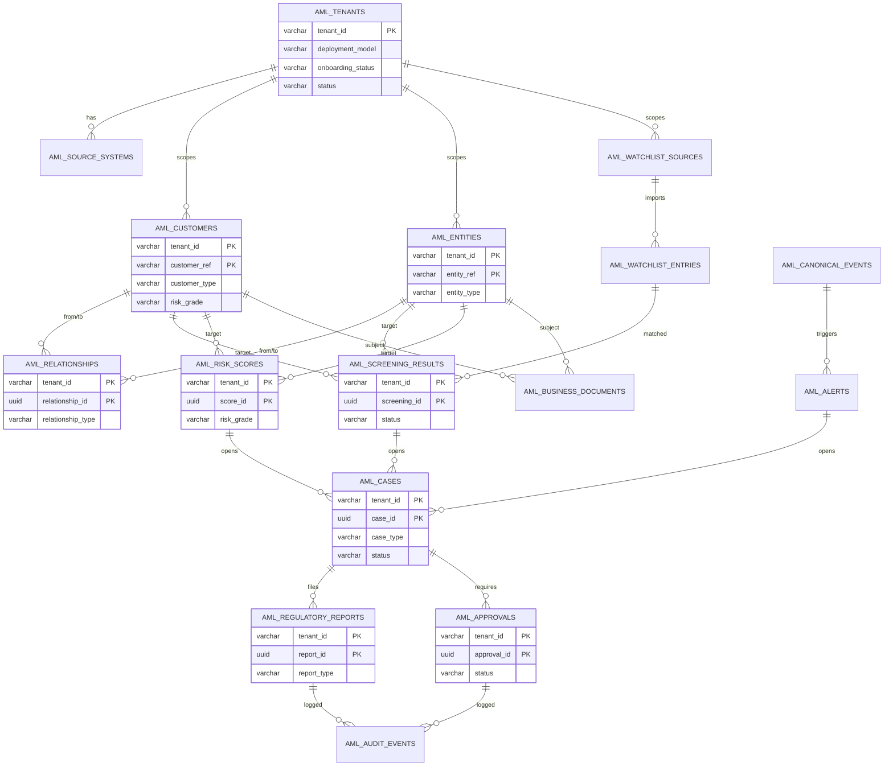
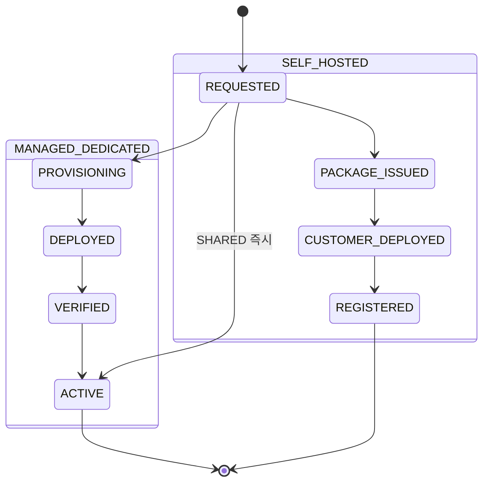

# AML Platform DB 설계서 (aml-svc · hanpass-ph)

> 정본: `.claude/skills/_shared/target-architecture.md` (PostgreSQL · Flyway, 서비스별 별도 스키마, 멀티테넌시, PII 마스킹, 4-eyes, 규제 Policy Pack STR/CTR).
> 입력 진실: `docs/software/02-amlSvc-sass.md` (SaaS AML Platform 설계서) — 본 DB 설계서는 설계서 §7~§19의 데이터 모델·enum·규제 요건을 물리 모델로 확정한다.
> 공통 inbound 인증 정본: [`../api/00-common-machine-auth.md`](../api/00-common-machine-auth.md) (wire v2·credential version·nonce replay 의미론).
> **그라운딩 = hanpass-ph AML RegOps(필리핀 송금·월렛 운영자)**. 실거래 5유형 — 해외송금(remit), 국내송금(domestic, PHP), 월렛충전(wallet charge·cash-in), 월렛결제(wallet pay), 월렛출금(wallet withdraw). 단일 운영 테넌트 `tenant_demo` = hanpass-ph 서비스. **카드결제·crypto off-ramp·trade(TBML)·PG/이커머스/마켓플레이스/B2B 인보이스 등 비-hanpass 채널은 본 정본 서술 대상이 아니다**(스키마에 잔존하는 advanced-domain 테이블·enum 값은 §7 Phase 7~9 미사용 잔존으로 분리 표기).
> 책임 서비스: `services/aml-svc` (Java 25, Spring Boot 3.5.x, 헥사고날, `com.aegis.aml`). 운영 콘솔·결재·감사 UI는 `bo-api`/`bo-web`가 본 스키마를 admin API 경유로 사용한다.

## 0. 설계 정본·스코프

| 항목 | 결정 | 근거 |
|---|---|---|
| RDBMS | PostgreSQL 16+ | 정본 §3 (bo-api/엔진 Flyway·PostgreSQL) |
| 마이그레이션 | Flyway (additive, `V<NN>__*.sql`) | 정본 §3, 설계서 §17 (additive migration) |
| 스키마 격리 | **`aml` 스키마 전용** (fds-svc·bo-api와 별도 스키마) | 정본 §5·과업 규칙 4 |
| 배포 모델 | **`MANAGED_DEDICATED`(기본·전용 DB·IaC)** / `SELF_HOSTED`(설치형) / `SHARED`(소규모 공유). 격리는 배포 단위 결정이며 온보딩 프로비저닝의 산출. 구 `isolation_mode`(`SHARED`/`SCHEMA`/`DB`) 폐기(정본 §4.1, D-06 결정 확정) | 정본 target-architecture §4.1, 설계서 §16 |
| PII | raw 미저장. `*_hash`(tenant-keyed HMAC) / `*_token`(tenant-managed tokenization)만 저장 (D-05) | 설계서 §19.2, D-05 |
| 금액 | hanpass-ph 다통화(KRW/PHP/USD/VND/IDR…) 수용. `NUMERIC(24,8)`은 외화 소수 수용용, `*_amount_minor BIGINT`(통화 최소단위) 병행 컬럼 제공. TM 금액 임계는 **`phpEquivalent`(PHP 환산)** 정본(§5.6a·V28) | 스킬 §2 |
| 감사 컬럼 | 전 운영 테이블 `created_at/created_by/updated_at/updated_by` + append-only 감사 evidence 별도 | 정본 §4, 설계서 §19.3 |
| 보존 | 테이블별 `retention_class` 정책(아래 §6) | 설계서 §16.3·§19 |

본 문서가 확정하는 명칭(스키마·테이블·컬럼·enum)은 API 명세서(`docs/design/api/02-aml-api.md`), 연동 명세(`docs/design/integration/02-aml-integration.md`), 태스크(`docs/tasks/aml/`), PRD가 그대로 참조한다.

---

## 1. 도메인 → 논리 모델 (ERD)

설계서 §7.1 핵심 객체와 §5.1(고객·법인 중심) 원칙을 ERD로 도출한다. AML은 거래가 아니라 **고객/법인/실소유자 graph**를 중심에 둔다.

> **Account / Instrument 엔티티 모델링 결정(설계서 §7.1·§8.1 account.\*/instrument.\* event family 대응).** AML 엔진은 계좌·instrument 전용 마스터 테이블(`aml_accounts`/`aml_instruments`)을 **보유하지 않는다**. 근거: (1) AML 도메인 중심은 회원(고객)/실소유자 graph이며 월렛계좌·instrument는 거래 맥락 속성으로, 자금 흐름 상태 추적은 FDS 엔진(fds-svc) 소유 경계다. (2) account.\*/instrument.\* canonical event(hanpass `wallet-svc` account.\*)는 `aml_canonical_events`(JSONB payload, PII는 ref/hash)에 그대로 보존되어 TM 윈도우·재screening 입력으로 materialize한다. (3) 계좌·instrument의 `*_ref`/`*_hash`는 `aml_alerts.transaction_ref`·relationship `USES_ACCOUNT`/`PAYS_TO` edge로 graph에 연결한다(hanpass `wallet-svc transfer_links` 자금그래프 §3.16). 별도 마스터가 필요해지면 추가는 §3에 additive 테이블로 가능하나 현 정본은 미보유다.


```mermaid
erDiagram
    AML_TENANTS ||--o{ AML_SOURCE_SYSTEMS : "has"
    AML_TENANTS ||--o{ AML_CUSTOMERS : "scopes"
    AML_TENANTS ||--o{ AML_ENTITIES : "scopes"
    AML_TENANTS ||--o{ AML_WATCHLIST_SOURCES : "scopes"

    AML_CUSTOMERS ||--o{ AML_RELATIONSHIPS : "from/to"
    AML_ENTITIES  ||--o{ AML_RELATIONSHIPS : "from/to"
    AML_CUSTOMERS ||--o{ AML_SCREENING_RESULTS : "target"
    AML_ENTITIES  ||--o{ AML_SCREENING_RESULTS : "target"
    AML_CUSTOMERS ||--o{ AML_RISK_SCORES : "target"
    AML_ENTITIES  ||--o{ AML_RISK_SCORES : "target"

    AML_WATCHLIST_SOURCES ||--o{ AML_WATCHLIST_ENTRIES : "imports"
    AML_WATCHLIST_ENTRIES ||--o{ AML_SCREENING_RESULTS : "matched"

    AML_CANONICAL_EVENTS ||--o{ AML_ALERTS : "triggers"
    AML_ALERTS ||--o{ AML_CASES : "opens"
    AML_SCREENING_RESULTS ||--o{ AML_CASES : "opens"
    AML_RISK_SCORES ||--o{ AML_CASES : "opens"
    AML_CASES ||--o{ AML_REGULATORY_REPORTS : "files"
    AML_CASES ||--o{ AML_APPROVALS : "requires"

    AML_CUSTOMERS ||--o{ AML_BUSINESS_DOCUMENTS : "subject"
    AML_ENTITIES  ||--o{ AML_BUSINESS_DOCUMENTS : "subject"

    AML_APPROVALS ||--o{ AML_AUDIT_EVENTS : "logged"
    AML_REGULATORY_REPORTS ||--o{ AML_AUDIT_EVENTS : "logged"

    AML_TENANTS {
        varchar tenant_id PK
        varchar deployment_model
        varchar onboarding_status
        varchar status
    }
    AML_CUSTOMERS {
        varchar tenant_id PK
        varchar customer_ref PK
        varchar customer_type
        varchar risk_grade
    }
    AML_ENTITIES {
        varchar tenant_id PK
        varchar entity_ref PK
        varchar entity_type
    }
    AML_RELATIONSHIPS {
        varchar tenant_id PK
        uuid relationship_id PK
        varchar relationship_type
    }
    AML_SCREENING_RESULTS {
        varchar tenant_id PK
        uuid screening_id PK
        varchar status
    }
    AML_RISK_SCORES {
        varchar tenant_id PK
        uuid score_id PK
        varchar risk_grade
    }
    AML_CASES {
        varchar tenant_id PK
        uuid case_id PK
        varchar case_type
        varchar status
    }
    AML_REGULATORY_REPORTS {
        varchar tenant_id PK
        uuid report_id PK
        varchar report_type
    }
    AML_APPROVALS {
        varchar tenant_id PK
        uuid approval_id PK
        varchar status
    }
```

### 1.1 멀티테넌시 격리 전략 — 배포 모델 기반 (정본 §4.1)

격리는 DB 행/스키마 토글이 아니라 **배포 단위 결정**이다. 화면 라디오 즉석 선택이 아니라 **온보딩 프로비저닝 프로세스**의 산출이다. `aml_tenants.deployment_model`(구 `isolation_mode` 대체).

| 격리 키 | 컬럼 | 타입 | 역할 |
|---|---|---|---|
| tenant | `tenant_id` | `VARCHAR(64) NOT NULL` | **배포의 서비스(테넌트=서비스)**. 상위 기관(institution)이 운영하는 서비스 1종 = tenant 1개(1 기관 : N 서비스, §3.1 `institution_ref`). 전용 배포(`MANAGED_DEDICATED`/`SELF_HOSTED`)에선 사실상 단일 값. 모든 `aml_*` PK 선두 컬럼. `SHARED` 배포에서만 서비스 간 행 격리 키 |
| data-scope | `data_scope` | `VARCHAR(64)` (nullable) | 운영자 row-level **권한 필터** — 저장 격리 아님. bo-api가 운영자 토큰 scope로 강제 필터 |

> **`workspace_id` 미사용 결정(정본 §4 × 설계서 §16.2.1 합의)**: 정본 target-architecture §4는 `tenant_id`/`workspace_id`/`data_scope` 3-key를 언급하나, 본 aml-svc는 **`workspace_id`를 물리 컬럼으로 도입하지 않는다**. 근거: 설계서 §16.2.1 배포 내부 분리 키 표에서 `workspace_id` 행을 명시적으로 제외하고 `tenant_id` + `data_scope` 2-key 모델로 확정했다. `workspace`(retail/corporate, prod/sandbox 등 논리 환경 분리) 필요 시 `data_scope` 하위 규약 또는 future additive column으로 수용하며, 현 정본에서는 미도입이다. 미사용 결정 근거를 설계서 §16.2.1에서 참조·관리한다.

규칙:
- 모든 운영 테이블 PK 선두는 `tenant_id`. UNIQUE·조회 인덱스도 `tenant_id` 선두.
- 격리의 **1차 경계는 배포 모델**(§3.1 `aml_tenants.deployment_model`). 전용 배포는 배포 자체가 서비스(테넌트) 경계이며, 본 DDL은 단일 배포 내부 모델을 기술한다(`SHARED` 배포일 때만 `tenant_id` 행 격리가 서비스 간 경계로 동작). 테넌트=서비스이며 그 상위에 기관(institution)이 있다(1 기관 : N 서비스).
- `SHARED` 배포에서 행 단위 격리는 PostgreSQL **RLS 정책**으로 보강한다(세션 GUC `app.tenant_id`·`app.elevated` 기반, §1.2).
- "서비스 등록"은 격리 라디오가 아니라 **배포 유형 선택 + 온보딩 신청·상태**(`onboarding_status`) 관리다. 온보딩 상태머신은 §5.28 참조.
- `data_scope`(영업점·법인그룹 등 하위 격리)는 `data_scope` 컬럼으로 표현하고 bo-api 권한과 매핑한다(정본 §4).
- 온보딩·배포 메타(`deployment_model`/`onboarding_status`/`default_region`/`infra_ref`)는 `aml_tenants`(§3.1)에 보존한다. 매니지드 전용 IaC 파이프라인·self-hosted 라이선스 발급/검증 방식은 P8 인프라 설계에서 확정(오픈결정).
- **서비스 관리(배포/온보딩) 소유 경계**: bo-api가 `deployment_model`/`onboarding_status` 기준으로 소유·집약하며, 온보딩 프로비저닝/상태조회/self-hosted 등록 콜백 엔드포인트는 **bo-api 전용**이다. aml-svc 엔진 API에는 온보딩 엔드포인트를 두지 않는다.

### 1.2 행 수준 보안(RLS) 저장 격리 — `SHARED` 배포 방어선 (P0-13)

`SHARED` 배포에서 애플리케이션 `WHERE tenant_id = ?` predicate 누락 실수가 곧 교차 tenant 노출이 되지 않도록, PostgreSQL **Row-Level Security(RLS)** 를 DB 경계 방어선으로 둔다(코드=truth, 운영 runbook `aegis-aml/docs/ops/db-rls-isolation.md`).

- **격리 키**: `tenant_id` 단일 차원(AML workspace 미도입 — §1.1). 애플리케이션 연결은 세션 GUC `app.tenant_id` 를 게시하고(workspace 는 canonical `default` 고정), 정책이 이를 검사한다. `data_scope` 는 RLS 키가 아니라 운영자 row-level 권한 필터로 현행 유지한다.
- **SET ROLE / set_config 모델**: 새 login credential 없이(가정 A1), 클러스터 전역 NOLOGIN role `aegis_app_runtime` 를 두고 애플리케이션 연결 획득 시 `SET ROLE aegis_app_runtime` + `set_config('app.tenant_id'|'app.workspace_id'|'app.elevated', …)` 를 실행한다(common-security `RlsSessionDataSource`). 이로써 login user 가 superuser/owner 여도 세션이 non-owner role 로 강등되어 RLS 가 강제된다. Flyway 는 감싸지 않은 원본 DataSource(owner 권한)로 실행돼 정책 DDL·후속 데이터 마이그레이션이 전량 접근한다.
- **FORCE RLS + 정책 2종**: `tenant_id` 보유 전 테이블에 `ENABLE`+`FORCE ROW LEVEL SECURITY` 후 ① 정책 runtime(`TO aegis_app_runtime`): `tenant_id = current_setting('app.tenant_id', true) OR current_setting('app.elevated', true) = 'on'`, ② 정책 owner(`TO <owner>`): 전량 허용(FORCE 하에서도 마이그레이션·운영 정비가 가능한 명시적·감사 가능 escape). GUC 미설정 세션은 `current_setting(…, true)=NULL → false → 0 row`(fail-closed).
- **elevated 경계**: 특정 tenant 에 매이지 않고 전 tenant 를 열거/정비하는 경로(스케줄러 6종·outbox relay 열거·startup provisioner·production safety validator)는 `ElevatedDbContext.runElevated` 로 감싸 `app.elevated='on'` escape 를 탄다. `set_config` 는 비특권이라 elevated 는 **권한 경계가 아니라 코드 실수 방어**다(가정 A3).
- **비대상 테이블**: `tenant_id` 컬럼이 없는 글로벌/참조 테이블(국가·달력·enum 참조 등)과 `flyway_schema_history` 는 격리 키가 없어 RLS 비대상이며, 마이그레이션 DO 루프가 `tenant_id` 보유 테이블만 열거하므로 자동 제외된다. 가드 테스트(`RlsCoverageGuardIntegrationTest`)가 대상 전 테이블의 `relrowsecurity AND relforcerowsecurity` 와 정책 2개 존재를 강제한다.
- **코드 truth**: `services/aml-svc/.../db/migration/V47__rls_tenant_isolation.sql`, `services/aml-svc/.../global/config/RlsDataSourceConfiguration.java`, `services/common-security/.../rls/{RlsSessionDataSource,ElevatedDbContext,TenantSessionContext,TenantSessionContextProvider}.java`, `application.yml` `aegis.aml.rls`.

---

## 2. 물리 모델 — 공통 규약

### 2.1 공통 감사·테넌시 컬럼 (모든 운영 테이블)

| 컬럼 | 타입 | NULL | 기본값 | 설명 |
|---|---|---|---|---|
| `tenant_id` | VARCHAR(64) | N | — | 서비스(테넌트=서비스) 격리 키. 모든 PK·인덱스 선두 |
| `data_scope` | VARCHAR(64) | Y | NULL | 서비스 하위 격리(영업점·법인그룹). NULL=tenant 전역 |
| `created_at` | TIMESTAMPTZ | N | now() | 생성 시각 |
| `created_by` | VARCHAR(128) | N | 'system' | 생성 주체(운영자 ID·system·source-system) |
| `updated_at` | TIMESTAMPTZ | N | now() | 수정 시각(트리거/애플리케이션 갱신) |
| `updated_by` | VARCHAR(128) | Y | NULL | 최종 수정 주체 |
| `trace_id` | VARCHAR(64) | Y | NULL | 도메인/canonical lineage 기본 폭. 관측성 traceId 전파(설계서 §20.3). 동일 timeline 추적 |

> append-only 감사 테이블(`aml_audit_events`)·canonical event store(`aml_canonical_events`)는 불변이므로 `updated_*`를 두지 않는다.
> P0-03 예외: BO/admin audit correlation인 `aml_audit_events.trace_id`만 V46에서 `VARCHAR(128)`로 확장한다. canonical ingest·`aml_canonical_events`·CDD history를 포함한 나머지 `trace_id`는 `docs/aml-data.md`의 64자/422 계약을 유지한다.

### 2.2 PII 처리 규약 (설계서 §19.2, D-05)

- 여권번호·외국인등록번호·신분증번호·계좌번호·전화번호·생년월일 **원문 컬럼 금지**(hanpass-ph 회원·수취인 식별정보).
- 식별은 `customer_ref`(= `member.member_id` keyed HMAC)/`entity_ref`(원천 시스템 ref, 토큰/HMAC) 사용.
- 매칭 보조 필드는 **이름→hash / 문서번호→hash / 계좌→hash / 월렛계좌→hash 의미 패턴**(tenant-keyed HMAC-SHA256)으로, 실제 컬럼명은 테이블별 prefix를 따른다: customer는 `name_hash`/`doc_hash`(§3.3), entity는 `legal_name_hash`/`biz_no_hash`(§3.4), watchlist는 `primary_name_hash`(§3.7). (account_hash는 canonical event payload·`USES_ACCOUNT` edge 속성으로 보존, §1 Account/Instrument 미보유 결정.) WLF receiver(해외송금 수취인)는 **이름+수취국+전화 정규화 토큰**(원문 아님)으로 매칭한다(§3.7 `normalized_tokens`).
- 원문이 필요한 WLF matching은 메모리 일시 처리 후 폐기, 저장은 hash/token만(설계서 §19.2).
- `raw_payload`는 기본 미저장. `payload_hash`(sha256: `sha256:<hex>` 형식) 참조만 보존한다. **`stored` 플래그는 설계서 §8.2(2026-06-07 변경이력) 기준 폐기됨 — DB에 `stored` 컬럼을 두지 않는다**(QA issue #7 low 정합).
- **PII reveal 원천 = 가역암호 vault (T3 AML-ENG-03, ADR 2026-06-15 D1).** 위 hash 컬럼은 단방향이라 마스킹 토큰→원문 역참조가 불가능하다. reveal(`POST /internal/v1/aml/pii/reveal`, API §2.6)의 cleartext 산출 원천으로 **`aml_pii_vault`(§3.21)** 를 둔다. vault 는 원문의 **암호문(`ciphertext`)** 만 저장하므로 위 "원문(=평문) 컬럼 금지" 규약은 그대로 유지된다(평문 컬럼 0개). field 도메인은 **7종**(NAME/DOC/ACCOUNT/WALLET + NATIONALITY/GENDER/DOB, §5.35·V23 — hanpass-ph 회원/워치리스트 식별정보 reveal). 현행 암복호는 `SecretCipherPort`의 AES-256-GCM + secret-manager env/property 단일 key이며, `aws` KMS keyId/AAD/dual-read 교체는 P1-03이다. reveal cleartext 는 이 요청 한정 transient — 영속·로그 금지(§19.2). **vault 적재 결선 완료(2026-06-29, 가정 A2 해소)** — 회원 등록·워치리스트 업로드 import 경로가 raw 식별정보를 동일 트랜잭션에서 암호화 upsert 하며(field 4종 → 7종 확장, V23), **외부 제재 feed(OFAC/UN 일일수집)도 2026-07-15 부로 vault 적재 결선**(파서가 raw NAME/NATIONALITY/DOB 를 vault 전용으로 운반, sync ingest 가 배치 암호화 upsert + 기존 설치본 백필 — §3.21).

### 2.3 enum 코드·표시값 병기 규약

enum은 컬럼에 **코드값(대문자 스네이크)** 저장, 표시값(라벨·다국어)은 bo-web/i18n에서 매핑. 본 문서 §5에 코드↔표시 매핑표를 둔다.

---

## 3. 테이블 명세

### 3.1 `aml_tenants` — 서비스 마스터(테넌트=서비스) (설계서 §17.1, §16)
> **계층**: 기관(institution) → 서비스(테넌트, `tenant_id`) → (논리)워크스페이스. `aml_tenants`의 1행 = 한 서비스(테넌트). 상위 기관 1개가 여러 서비스를 운영한다(**1 기관 : N 서비스**). 기관 식별은 `institution_ref`로 참조한다.

| 컬럼 | 타입 | NULL | 기본값 | 제약 | 설명 |
|---|---|---|---|---|---|
| `tenant_id` | VARCHAR(64) | N | — | PK | 서비스 ID(테넌트=서비스, 격리 경계·PK 선두) |
| `institution_ref` | VARCHAR(64) | Y | NULL | | **상위 기관(institution) 참조**. 납품받은 회사/금융기관 식별자. 1 기관 : N 서비스 관계의 외부 키(FK 아님·논리 참조). nullable·additive 신규 컬럼(후속 마이그레이션 §7에서 추가, 기존 row는 NULL 백필 후 매핑) |
| `display_name` | VARCHAR(160) | N | — | | 표시명 |
| `deployment_model` | VARCHAR(32) | N | `'MANAGED_DEDICATED'` | enum §5.28 (3종) | 배포 유형(구 `isolation_mode` 대체). `MANAGED_DEDICATED`/`SELF_HOSTED`/`SHARED`. 온보딩 프로비저닝의 산출 — 화면 라디오 즉석 변경 아님 |
| `onboarding_status` | VARCHAR(32) | N | `'REQUESTED'` | enum §5.28a (8종) | 온보딩 진행 상태. 상태머신: 매니지드=`REQUESTED→PROVISIONING→DEPLOYED→VERIFIED→ACTIVE`, self-hosted=`REQUESTED→PACKAGE_ISSUED→CUSTOMER_DEPLOYED→REGISTERED`, SHARED=`REQUESTED→ACTIVE` |
| `default_region` | VARCHAR(32) | N | `'KR'` | | 기본 데이터 리전(한국 우선, §16.3). 전용 배포 region. |
| `infra_ref` | VARCHAR(160) | Y | NULL | | 배포 메타 참조. 매니지드=Terraform stack/workspace ID, self-hosted=라이선스·설치 인스턴스 ID. 발급·검증 방식은 P8 인프라 설계 확정(오픈결정) |
| `status` | VARCHAR(32) | N | `'ONBOARDING'` | enum §5.28b (**4종**, FDS §11.6.7 동기화) | **운영 생명주기** — `onboarding_status`와 직교. `ONBOARDING`/`ACTIVE`/`SUSPENDED`/`OFFBOARDED` (QA cross #119 high·#127 medium 정합 — FDS `fds_tenants.tenant_status` 4종과 코드값·DEFAULT 동기화. 신규 등록 시 DEFAULT `'ONBOARDING'`, 온보딩 완료 시 `ACTIVE` 전환) |
| `policy_pack_code` | VARCHAR(64) | N | `'KR_DEFAULT'` | | 적용 Policy Pack **코드값**(STR/CTR). **관할(jurisdiction)과 직교** — 코드값은 `KR_DEFAULT`(레거시 명칭)이나 실제 관할은 아래 `jurisdiction` 이 정본이다. tenant_demo=`KR_DEFAULT` 코드 + `PH` 관할 공존(P0-16) |
| `jurisdiction` | VARCHAR(2) | Y | NULL | | **규제(발신) 관할 국가 ISO 3166-1 alpha-2**(P0-16, V53). 중립 인입 corridor 서버 파생의 발신국 정본(`DOMESTIC=J-J`·`CROSS_BORDER=J-dest`) — 구 service-global `PH` 상수(@Value) 대체. tenant_demo=`PH`(hanpass-ph). NULL=미바인딩 → ingest fail-closed(422 `AML.TENANT_POLICY_UNBOUND`) |
| `base_currency` | VARCHAR(3) | Y | NULL | | **테넌트 기준통화 ISO 4217**(P0-16, V53). CTR/금액 TM 임계가 이 통화(native)로 해석된다. `phpEquivalent` 는 `base_currency='PHP'` 일 때만 payload 에 생성(그 외 통화중립 `baseEquivalent`+`baseCurrency` 만·완전 FX 환산은 phase-2 A1). tenant_demo=`PHP`. NULL=미바인딩 → fail-closed |
| `reporting_currency` | VARCHAR(3) | Y | NULL | | **규제 보고통화 ISO 4217**(P0-16, V53). tenant_demo=`PHP` |
| `timezone` | VARCHAR(40) | Y | NULL | | **테넌트 타임존**(IANA, P0-16, V53). tenant_demo=`Asia/Manila` |
| `policy_pack_version` | VARCHAR(32) | Y | NULL | | **활성 Policy Pack revision 핀**(P0-16, V53). `TenantPolicyResolver` 가 `(tenant, policy_pack_code, policy_pack_version)` 로 `aml_policy_packs`(§3.14) 활성 revision 을 조인·evidence 고정에 사용. 미존재/비-effective revision → fail-closed(422). tenant_demo backfill=현재 활성 revision(저장소 truth 서브쿼리, 활성 pack 부재 시 NULL). **정책 팩 4-eyes 활성화(EXECUTED, `PolicyPackService.approveChange`) 시 같은 트랜잭션에서 새 ACTIVE revision 으로 자동 전진**(`policy_pack_code` 일치 + 기존 pin NOT NULL 행 한정 — NULL pin(미프로비저닝) 은 불변, `TenantJpaRepository.advancePolicyPackPin`) |
| `retention_policy` | JSONB | N | `'{}'` | | 서비스별 보존·파기 override |
| `created_at/created_by/updated_at/updated_by` | (공통 §2.1) | | | | 감사 컬럼 |

PK: `(tenant_id)`

> **마이그레이션(구현 정합)**: `deployment_model`/`onboarding_status`/`infra_ref` 컬럼 + `status` enum 4종(`ONBOARDING` 추가, `OFFBOARDING`→`OFFBOARDED`)·DEFAULT `'ONBOARDING'` 은 **구현 `V2__phase1_foundation.sql`(Phase 1)에서 일괄 추가**되었다(§7 참조). 구 `isolation_mode` 컬럼은 V2가 대체 컬럼을 추가하되 **DROP 하지 않아 V1 baseline에 잔존**한다(미사용·무해). 별도 `V17a/V17b` 분할 마이그레이션은 **미구현**(구 설계 표의 가상 파일명). 실제 `V17`~`V20` 은 국가위험 수집·RA 온보딩 파생/floor 파라미터로 채워졌다(§7 정본) — 구 설계 표의 가상 `V20`(분할안·`demo_approval_seed`)과는 무관하다.
> **마이그레이션(institution_ref·미구현)**: 상위 기관 참조 컬럼 `institution_ref VARCHAR(64) NULL`은 **어느 마이그레이션에도 부재 = 미구현(추후 예정)**. 본 테이블 정의는 설계 의도이며, 구현 시 additive(nullable)로 추가하고 기관-서비스 매핑 확정 후 백필한다.
> **마이그레이션(관할·통화·Policy Pack revision 바인딩, P0-16 V53)**: `jurisdiction`/`base_currency`/`reporting_currency`/`timezone`/`policy_pack_version` 5컬럼은 **`V53__tenant_jurisdiction_currency_binding.sql`(§7)에서 nullable additive 추가**된다(1단계 NOT NULL 금지 — 기존 행 backfill 후). `tenant_demo` 는 `PH`/`PHP`/`PHP`/`Asia/Manila` 로 backfill 하고 `policy_pack_version` 은 `aml_policy_packs`(§3.14)의 활성 revision(`status='ACTIVE' AND active=true`) 서브쿼리 결과로 핀한다(하드코딩 아님 — 활성 pack 부재 시 NULL 로 두어 prod startup 검증·ingest fail-closed 가 잡음). **`policy_pack_code` 는 여전히 `KR_DEFAULT`(코드값)이나 `jurisdiction=PH`** — 코드값 명칭과 실제 관할은 직교하며 하나의 배포에서 공존한다(레거시 명칭 정정). `TenantPolicyResolver.resolve(tenantId, asOf)` → `TenantPolicyBinding`(jurisdiction·baseCurrency·reportingCurrency·timezone·policyPackCode·policyPackVersion·policyPackEffectiveFrom)이 이 컬럼 + 핀 revision 조인을 corridor·`phpEquivalent` 게이팅·CTR/TM 통화 해석·evidence 고정의 단일 정본으로 삼는다. 컬럼 추가는 RLS 정책(§1.2 V47)에 무영향(PK `(tenant_id)` 불변·재적용 불요). KR 테넌트(2테넌트 테스트용)는 후속에서 REST 바인딩(API §)으로 추가한다.
> **evidence Policy Pack revision fragment(P0-16, §19.2 인접·정책 메타만·PII 없음)**: 제출·screening·RA·TM 이 동일 tenant Policy Pack revision 을 지시하도록, 핀 revision 을 evidence JSONB 에 고정한다 — `policyPack{ code, version, effectiveFrom, jurisdiction, baseCurrency, reportingCurrency }`(엔진 `TenantPolicyEvidence.stamp`, 단일 `policyPack` 키 nesting·기존 키 무충돌·additive). 수록면: WLF screening `aml_screening_results.score_breakdown.policyPack`(§3.8)·CTR/STR `aml_alerts.evidence.policyPack`(§3.10) + 보고 payload·RA `aml_risk_scores.factor_breakdown.policyPack`(§3.9)·custom-rule evidence. 정책 메타 토큰만(코드·버전·시각·관할·통화) — raw PII 미포함(§19.2 불변). **WLF asOf=screen-time 이라 revision 전환 엣지에서 짧은 시차 한계가 있으나 정상상태(steady-state)는 동일 revision 을 지시한다.** best-effort — 미바인딩(unbound) tenant 는 evidence 블록만 생략하고(`resolveForEvidence`) 결정을 재차단하지 않는다(ingest 게이트는 이미 §3.1 V53 fail-closed 가 담당).

### 3.2 `aml_source_systems` — 데이터 원천 (설계서 §17.1, §15)

| 컬럼 | 타입 | NULL | 기본값 | 제약 | 설명 |
|---|---|---|---|---|---|
| `tenant_id` | VARCHAR(64) | N | — | PK,FK→aml_tenants | |
| `source_system` | VARCHAR(64) | N | — | PK | 원천 코드. **hanpass-ph 실서비스 카탈로그(REST sync 인입 정본)**: `member-svc`(회원/KYC/CDD/제재·PEP zoloz 스크리닝 — `customer.*`/`entity.*`/`beneficial-owner.*`), `walletchg-svc`(월렛충전 cash-in — `transaction.requested`), `domestic-svc`(국내송금 PHP — `transaction.requested`), `remit-svc`(해외송금 cross-border, `sanction_screening_event`·`str_indicators` 보유 — `transaction.requested`·`settlement.posted`), `wallet-svc`(월렛 원장 `transfer_links` 자금그래프 — `account.*`·`settlement.posted`), `tx-history-svc`(회원 통합 이력 read model — 대상 360° 피드), `inbound-svc`(파트너 인바운드 송금 — `transaction.requested`). 운영 등록값은 위 hanpass-ph 실서비스 코드(카드/PG/이커머스 등 비-hanpass 채널 소스는 등록하지 않음) |
| `ingest_mode` | VARCHAR(32) | N | — | enum | `REST_PUSH`/`QUEUE`/`POLLING`/`CDC`/`SNAPSHOT`/`VENDOR_BRIDGE` (§15) |
| `schema_version` | VARCHAR(80) | N | — | | schema registry 버전 |
| `auth_mode` | VARCHAR(32) | N | 'API_KEY_HMAC' | enum | `API_KEY_HMAC`/`OAUTH2`/`MTLS` (§15.7, D-13) |
| `secret_ref` | VARCHAR(256) | Y | NULL | | API key/secret **참조만**(원문 미저장, secret store) |
| `failure_policy` | VARCHAR(32) | N | 'MANUAL_REVIEW' | enum | `MANUAL_REVIEW`/`FAIL_CLOSED`/`DELAY_ALLOWED` (§15.7, D-14) |
| `enabled` | BOOLEAN | N | TRUE | | 활성 여부 |
| `status` | VARCHAR(32) | N | `'ACTIVE'` | enum | 운영 상태. `ACTIVE`/`DISABLED`(설계서 §17.1 DDL·§16.2.1 정본 — QA issue #4 HIGH 정합) |
| `data_scope` | VARCHAR(64) | Y | NULL | | 서비스 하위 격리(§2.1 공통 규약 — §2.1에서 전 운영 테이블 적용 원칙이 적용되는 테이블임을 명시. QA issue #5 MEDIUM 정합) |
| `created_at/created_by/updated_at/updated_by/trace_id` | (공통) | | | | |

PK: `(tenant_id, source_system)`

### 3.3 `aml_customers` — 개인/사업자 고객 (설계서 §9.1, §17.2)

| 컬럼 | 타입 | NULL | 기본값 | 제약 | 설명 |
|---|---|---|---|---|---|
| `tenant_id` | VARCHAR(64) | N | — | PK | |
| `customer_ref` | VARCHAR(256) | N | — | PK | 회원 주체 참조 키 = **회원 업무참조**(`member.member_id`=`originator.partyReference`, 예 `M-1001`, 비PII 업무참조 — 토큰화하지 않음, integration §10.2a). FDS `subject_ref`·canonical `payload.targetRef`·`aml_risk_scores.target_ref`·`aml_alerts.target_ref` 와 동일 값이라 온보딩(CDD→1차 RA)↔거래(TM→2차 RA)가 같은 회원 키로 이어진다. PII 속성(이름·CI·신분증)은 별도 토큰/vault. 업무참조 부재 레거시 경로만 `hmac(nationalIdentityKey)` 토큰 폴백(잔존 허용) |
| `customer_type` | VARCHAR(32) | N | — | enum | §5.1 customer_type |
| `name_hash` | VARCHAR(256) | Y | NULL | | 이름 HMAC(매칭용) |
| `doc_hash` | VARCHAR(256) | Y | NULL | | 신분증번호 HMAC |
| `country` | VARCHAR(8) | Y | NULL | | 거주/국적 ISO |
| `kyc_status` | VARCHAR(32) | Y | NULL | enum | §5.25 kyc_status(PENDING/VERIFIED/INCOMPLETE/EXPIRED/REJECTED). DB 물리 정본 |
| `risk_grade` | VARCHAR(32) | Y | NULL | enum | §5.2 risk_grade(최신 RA 결과 캐시) |
| `kyc_evidence` | JSONB | N | '{}' | | CDD 시점 PII-safe projection. 닫힌 KYC 코드(`occupation`,`sourceOfFunds`,`declaredIncomeBand`,`kycLevel`,`residenceCountry`)와 ISO `nationality`, 소스 등록시각 `registeredAt`만 보존한다. raw 이름/DOB/문서번호는 금지하며 안전한 masked birth-year 정본이 없으면 profile `birthYearMasked=null` |
| `source_system` | VARCHAR(64) | Y | NULL | | 유입 원천(hanpass `member-svc` 등) |
| `onboarding_at` | TIMESTAMPTZ | Y | now() | | 가입(등록) 시각. **DEFAULT now()**(V21) — CDD/RA 파이프라인 가입 윈도우 집계 원천(`pipeline-stats`). 기존 null 행은 `created_at`로 백필 |
| `is_pep` | BOOLEAN | N | FALSE | | **PEP 여부**(V24). PEP 경영진 승인(EXECUTIVE_APPROVAL) 확정 시 TRUE. PEP 등재 시 당연고위험 레지스트리(`PEP_INDIVIDUALS`) + RA 위험등급 HIGH 강제 상향(거래 허용+EDD). 기존 행 비-PEP |
| `pep_approval_id` | UUID | Y | NULL | | **PEP 경영진 승인 결재 링크**(V24). `PEP_APPROVAL` 결재 row의 `approval_id`(증거). 승인 EXECUTED 시 당연고위험 레지스트리 등재 + RA 강제 상향 폐루프(§5.16 PEP_APPROVAL). 비-PEP은 NULL |
| `next_review_due_at` | TIMESTAMPTZ | Y | NULL | | 주기적 재확인 예정(§11.2, cadence 정책 §3.22) |
| `created_at/created_by/updated_at/updated_by/trace_id/data_scope` | (공통) | | | | |

PK: `(tenant_id, customer_ref)`

> **마이그레이션**: `onboarding_at` DEFAULT now()·백필·`ix_aml_customers_onboarding`은 **V21**, `is_pep`·`pep_approval_id`는 **V24**(PEP 경영진 승인 폐루프).

### 3.4 `aml_entities` — 법인/merchant/seller/vendor (설계서 §9.2, §17.2)

| 컬럼 | 타입 | NULL | 기본값 | 제약 | 설명 |
|---|---|---|---|---|---|
| `tenant_id` | VARCHAR(64) | N | — | PK | |
| `entity_ref` | VARCHAR(256) | N | — | PK | 원천 ref |
| `entity_type` | VARCHAR(64) | N | — | enum | §5.1 entity_type 5종(LEGAL_ENTITY 실사용 + MERCHANT/SELLER/VENDOR/VASP_CUSTOMER 잔존·미사용) |
| `legal_name_hash` | VARCHAR(256) | Y | NULL | | 법인명 HMAC |
| `biz_no_hash` | VARCHAR(256) | Y | NULL | | 사업자번호 HMAC |
| `country` | VARCHAR(8) | Y | NULL | | 설립/영업국 |
| `industry_code` | VARCHAR(64) | Y | NULL | | 업종(MCC 등) |
| `merchant_category` | VARCHAR(64) | Y | NULL | | MCC/marketplace category |
| `risk_grade` | VARCHAR(32) | Y | NULL | enum | 최신 RA 등급 |
| `kyb_evidence` | JSONB | N | '{}' | | KYB·UBO·대표자 checklist(§7.3) |
| `expected_activity` | JSONB | N | '{}' | | 예상 거래규모/국가(§9.2) |
| `status` | VARCHAR(32) | Y | NULL | enum | `ACTIVE`/`SUSPENDED`/`CLOSED` |
| `next_review_due_at` | TIMESTAMPTZ | Y | NULL | | |
| `created_at/created_by/updated_at/updated_by/trace_id/data_scope` | (공통) | | | | |

PK: `(tenant_id, entity_ref)`

### 3.5 `aml_relationships` — 고객/법인/UBO graph (설계서 §7.2, §9.3, §17.2)

| 컬럼 | 타입 | NULL | 기본값 | 제약 | 설명 |
|---|---|---|---|---|---|
| `tenant_id` | VARCHAR(64) | N | — | PK | |
| `relationship_id` | UUID | N | — | PK | |
| `from_ref` | VARCHAR(256) | N | — | | 주체 ref(customer/entity) |
| `to_ref` | VARCHAR(256) | N | — | | 대상 ref |
| `relationship_type` | VARCHAR(64) | N | — | enum | §5.3 relationship_type(OWNS/CONTROLS/REPRESENTS/...) |
| `ownership_percent` | NUMERIC(8,4) | Y | NULL | | 지분율(§9.3 변경 이력) |
| `is_ubo` | BOOLEAN | N | FALSE | | 실소유자 표식 |
| `effective_from` | TIMESTAMPTZ | Y | NULL | | 유효 시작 |
| `effective_to` | TIMESTAMPTZ | Y | NULL | | 유효 종료(NULL=현재) |
| `attributes` | JSONB | N | '{}' | | 추가 속성 |
| `created_at/created_by/updated_at/updated_by/trace_id` | (공통) | | | | |

PK: `(tenant_id, relationship_id)`

### 3.6 `aml_watchlist_sources` — 명단 source (설계서 §10.1, §17.3)

| 컬럼 | 타입 | NULL | 기본값 | 제약 | 설명 |
|---|---|---|---|---|---|
| `tenant_id` | VARCHAR(64) | N | — | PK | |
| `source_code` | VARCHAR(80) | N | — | PK | source 코드 |
| `source_type` | VARCHAR(64) | N | — | enum | §5.4 watchlist_source_type(SANCTIONS/PEP/RCA/ADVERSE_MEDIA/INTERNAL/LAW_ENFORCEMENT/VASP_RISK) |
| `provider` | VARCHAR(128) | Y | NULL | | 제공처(UN/OFAC/internal 등 — generic 유지). **hanpass-ph 정합**: 실시간 제재·PEP 스크리닝 신호 소스는 `member-svc`의 `zoloz_aml_screening`(`decision`/`risk_level`/`total_hits`/`hit_results`)으로, screening 결과(§3.8)에 `member-svc` decision 을 정합 매핑한다. `source_type`(§5.4 SANCTIONS/PEP/RCA/ADVERSE_MEDIA/INTERNAL/LAW_ENFORCEMENT/VASP_RISK)는 유지 |
| `status` | VARCHAR(32) | N | 'ACTIVE' | enum | `ACTIVE`/`DISABLED` |
| `active_version` | VARCHAR(80) | Y | NULL | | 적용 중 import 버전(4-eyes 승인본) |
| `last_imported_at` | TIMESTAMPTZ | Y | NULL | | freshness 모니터링(§20.2). **48h 신선도 초과 시 fail-closed**(스크리닝 차단·재import 강제 — `member-svc zoloz` 신호 포함 전 소스 동일 적용) |
| `readiness_status` | VARCHAR(16) | N | 'MISSING' | enum,CHECK | **source readiness 상태기계(P0-06, V50)** — "지금 스크리닝에 실제 사용 가능한가"를 표현(생명주기 `status`(ACTIVE/DISABLED)와 직교). CHECK `ck_aml_watchlist_sources_readiness (readiness_status IN ('MISSING','IMPORTING','READY','STALE','FAILED','OVERRIDDEN'))`. §5.37 watchlist_readiness_status(6종) — `MISSING`(적용본 없음)/`IMPORTING`(fetch/import 진행 중, 네트워크 fetch 전 세팅)/`READY`(적용본 有·48h 이내)/`STALE`(적용본 48h 초과·파생)/`FAILED`(최근 import 실패)/`OVERRIDDEN`(긴급 override 로 강제 사용가능·시한부). backfill: `active_version` 有 → `READY`, 그 외 DEFAULT `MISSING`. 전이는 도메인 메서드(`WatchlistSource.markImporting/markReady/markFailed/markStale/override/clearOverride`)만 — 불법 점프(적용본 없이 READY) 불가. 도메인 `WatchlistReadinessStatus` enum·CHECK 와 1:1 |
| `readiness_override_expires_at` | TIMESTAMPTZ | Y | NULL | | **긴급 override 만료 시각(P0-06, V50)** — `OVERRIDDEN` 상태에서만 non-null. 게이트/조회 시 만료 판정(만료 시 자동 원상=파생 readiness 로 회귀). 사유·승인자·영향 건수는 감사(§3.15 `aml_audit_events` 카테고리 `WATCHLIST_READINESS`)에 남기고 이 컬럼은 시한만 보유 |
| `created_at/created_by/updated_at/updated_by/trace_id` | (공통) | | | | |

PK: `(tenant_id, source_code)`

> **effectiveReadiness(파생 시맨틱) — 게이트가 신뢰하는 값(P0-06)**: 스크리닝 게이트(`WatchlistReadinessGate`)는 저장 `readiness_status` 컬럼을 맹신하지 않고 적용본(`active_version`)+신선도 사실로부터 **effectiveReadiness(now)** 를 파생해 판정한다(stale 한 stored READY·만료된 override 불신). 규칙: ① `OVERRIDDEN` 이고 `readiness_override_expires_at` 미도래 → `OVERRIDDEN`(유효), 만료 → 아래 파생으로 회귀(clear 된 것처럼). ② `FAILED`/`IMPORTING` → stored 값 그대로(fetch 진행/직전 import 실패는 version+freshness 로 파생 불가한 in-flight 전이라 저장 컬럼이 소유). ③ 그 외(stored `MISSING`/`READY`/`STALE`) → 사실 파생: `active_version`+`last_imported_at` 有·48h 이내 ⇒ `READY`, 적용본 48h 초과 ⇒ `STALE`, 적용본 없음 ⇒ `MISSING`. 이로써 stored 컬럼이 READY 로 전진하지 못한(예: 직접 seed) 적용본+fresh 소스도 사용가능 판정된다. `isScreeningReady(now)` = effective ∈ {`READY`, 유효 `OVERRIDDEN`}. 코드 truth=도메인 `WatchlistSource.effectiveReadiness/deriveFromFacts/isScreeningReady`, `STALE_AFTER_SECONDS`=48h.

### 3.6a `aml_mandatory_watchlist_sources` — 필수 명단 source 정책 (P0-06, V51)

tenant(+jurisdiction)별 **"스크리닝에 반드시 준비돼야 하는 source"** 정책. fail-closed 게이트(§3.6 effectiveReadiness)는 이 정책의 각 활성 entry 가 screening-ready(`READY` 또는 유효 `OVERRIDDEN`) 또는 승인된 `NOT_APPLICABLE` 여야 통과시키고, 하나라도 미준비면 **`SCREENING_UNAVAILABLE`**(NO_MATCH 아님·미탐 방지)로 차단한다. 정책이 비어있는 신규 tenant = 정책상 fail-closed(freshness 게이트의 vacuous-truth[빈 목록 allMatch=true] fail-open 제거).

| 컬럼 | 타입 | NULL | 기본값 | 제약 | 설명 |
|---|---|---|---|---|---|
| `tenant_id` | VARCHAR(64) | N | — | PK,FK→aml_tenants | |
| `jurisdiction` | VARCHAR(8) | N | '*' | PK | 관할권 = tenant `defaultRegion` 단위(세분 jurisdiction=phase-2 A2). 와일드카드 센티넬 `'*'`(nullable 차원을 PK 로 total 유지 — 애플리케이션이 `null`↔`'*'` 접기). 게이트에서 `'*'` 는 항상 적용 |
| `source_type` | VARCHAR(64) | N | — | PK,enum,CHECK | §5.4 watchlist_source_type. CHECK `ck_aml_mandatory_ws_source_type (source_type IN ('SANCTIONS','PEP','RCA','ADVERSE_MEDIA','INTERNAL','LAW_ENFORCEMENT','VASP_RISK'))` |
| `source_code` | VARCHAR(80) | N | '*' | PK | 특정 source 코드 고정 시 지정, 미지정(`'*'`)이면 해당 source_type 의 아무 등록 source 로 충족. 와일드카드 센티넬 `'*'` |
| `capability` | VARCHAR(16) | N | 'PROD' | enum,CHECK | §5.38 watchlist_source_capability(2종). CHECK `ck_aml_mandatory_ws_capability (capability IN ('PROD','NOT_APPLICABLE'))`. `PROD`=반드시 screening-ready / `NOT_APPLICABLE`=범위 밖(실 PEP/RCA provider 미연동 phase-2 A1 — 승인된 waiver 로만 통과) |
| `not_applicable_reason` | TEXT | Y | NULL | | `NOT_APPLICABLE` 사유(범위 밖 근거) |
| `not_applicable_approved_by` | VARCHAR(128) | Y | NULL | | waiver 승인자 |
| `not_applicable_expires_at` | TIMESTAMPTZ | Y | NULL | | waiver 만료 — 미도래(non-expired)여야 유효. 만료 시 게이트가 `NOT_APPLICABLE_UNAPPROVED` 로 fail-closed |
| `required_from` | TIMESTAMPTZ | N | now() | | 정책 발효 시점 |
| `deprecated_at` | TIMESTAMPTZ | Y | NULL | | 폐기 시점(nullable=활성). 게이트는 `deprecated_at` 미도래 entry 만 열거(`isActive(now)`) |
| `created_at/updated_at` | TIMESTAMPTZ | N | now() | | |

PK: `(tenant_id, jurisdiction, source_type, source_code)`. FK `fk_aml_mandatory_ws_tenant (tenant_id)`→`aml_tenants`. 인덱스 `ix_aml_mandatory_ws_tenant (tenant_id, deprecated_at)`(게이트 활성 정책 열거). RLS: V47 동형 정책 2종(`aml_rls_tenant` runtime·`aml_rls_owner`) 명시 적용(DO 루프 경과 후 테이블이라 명시). **데이터 seed 없음(테이블만) — REST-only 적재**: 정책은 시뮬레이터/부트스트랩이 `POST /api/v1/admin/aml/mandatory-sources`(API §, scope `aml:admin:watchlist`)로만 삽입한다(Flyway 데모 시드 금지 원칙).

### 3.6b `aml_wlf_rescreen_jobs` — WLF 명단 갱신 후 durable 재검색 배치 (P0-06, V52)

`SanctionsIngestTransaction.ingestAndApply` 성공(신규 `active_version`) 후 갱신 명단으로 기존 screening 된 활성 subject 를 재검색하는 durable 배치의 job 헤더. P0-08 `aml_txn_fanout_jobs/steps`(V48) 동형 durable claim→execute→recordStep 패턴을 재사용하되 거래 fan-out 과 혼선을 막으려 rescreen 전용 테이블로 분리한다.

| 컬럼 | 타입 | NULL | 기본값 | 제약 | 설명 |
|---|---|---|---|---|---|
| `tenant_id` | VARCHAR(64) | N | — | PK | |
| `job_id` | UUID | N | — | PK | surrogate |
| `source_code` | VARCHAR(80) | N | — | | 갱신된 명단 source |
| `from_version` | VARCHAR(80) | Y | NULL | | 직전 `active_version`(첫 import 시 null) |
| `to_version` | VARCHAR(80) | N | — | UNIQUE | 신규 적용본(자연키 성분) |
| `status` | VARCHAR(24) | N | 'PENDING' | enum,CHECK | §5.39 rescreen_job_status(5종). CHECK `ck_aml_wlf_rescreen_jobs_status (status IN ('PENDING','IN_PROGRESS','COMPLETED','RETRYING','DEAD_LETTERED'))` |
| `sla_due_at` | TIMESTAMPTZ | Y | NULL | | SLA 기한(reconciliation 초과 판정) |
| `target_count` | INTEGER | N | 0 | CHECK≥0 | 재검색 대상 subject 수 |
| `completed_count` | INTEGER | N | 0 | CHECK≥0 | 완료 target 수 |
| `failed_count` | INTEGER | N | 0 | CHECK≥0 | 실패(DEAD_LETTERED) target 수 |
| `created_at/updated_at` | TIMESTAMPTZ | N | now() | | |

PK: `(tenant_id, job_id)`. **자연키 멱등** UNIQUE `ux_aml_wlf_rescreen_jobs_nat (tenant_id, source_code, to_version)` — 같은 source·to_version 재적용 시 신규 job 0(`ON CONFLICT DO NOTHING`). CHECK `ck_aml_wlf_rescreen_jobs_counts (target_count>=0 AND completed_count>=0 AND failed_count>=0)`. reconciliation 인덱스 `ix_aml_wlf_rescreen_jobs_open (status, sla_due_at) WHERE status IN ('PENDING','IN_PROGRESS','RETRYING','DEAD_LETTERED')`(미완료·SLA 초과 집계). RLS: V47 동형 정책 2종 명시 적용.

### 3.6c `aml_wlf_rescreen_targets` — 재검색 대상 subject 상태 (P0-06, V52)

rescreen job 당 재검색 대상 subject 의 개별 상태(원자 claim·backoff·재시도 추적). worker 가 `FOR UPDATE SKIP LOCKED RETURNING` 으로 due target 을 claim(→ `IN_PROGRESS` lease 원자 전이, 이중 claim 차단)해 `WlfScreeningService.screen` 을 멱등 재실행한다.

| 컬럼 | 타입 | NULL | 기본값 | 제약 | 설명 |
|---|---|---|---|---|---|
| `tenant_id` | VARCHAR(64) | N | — | PK | |
| `job_id` | UUID | N | — | PK,FK→jobs | |
| `subject_ref` | VARCHAR(256) | N | — | PK | 재검색 대상 subject 참조(회원 키/COUNTERPARTY 안정키) |
| `subject_kind` | VARCHAR(24) | N | — | | subject 종류(CUSTOMER/COUNTERPARTY 등) |
| `status` | VARCHAR(24) | N | 'PENDING' | enum,CHECK | §5.40 rescreen_target_status(6종). CHECK `ck_aml_wlf_rescreen_targets_status (status IN ('PENDING','IN_PROGRESS','SUCCEEDED','RETRYING','DEAD_LETTERED','NOT_APPLICABLE'))`. `NOT_APPLICABLE`=vault NAME 소실 등 재검색 불가(false SUCCEEDED 아님) |
| `attempts` | INTEGER | N | 0 | CHECK≥0 | 시도 횟수(exp backoff·재시도 예산 소진 시 DEAD_LETTERED) |
| `next_attempt_at` | TIMESTAMPTZ | Y | NULL | | 다음 시도 시각(RETRYING backoff) |
| `last_error` | VARCHAR(256) | Y | NULL | | 비-PII 코드만(예외 클래스명·사유 코드 — 원문/PII 미포함, §19.2) |
| `screening_id` | UUID | Y | NULL | | 재검색 결과 스크리닝 id(§3.8) |
| `created_at/updated_at` | TIMESTAMPTZ | N | now() | | |

PK: `(tenant_id, job_id, subject_ref)`. FK `fk_aml_wlf_rescreen_targets_job (tenant_id, job_id)`→`aml_wlf_rescreen_jobs` `ON DELETE CASCADE`. CHECK `ck_aml_wlf_rescreen_targets_attempts (attempts>=0)`. claim 인덱스 `ix_aml_wlf_rescreen_targets_claim (status, next_attempt_at) WHERE status IN ('RETRYING','IN_PROGRESS','PENDING')`(RETRYING due·IN_PROGRESS lease 만료 크래시 복구·PENDING stale enqueue 크래시 복구). RLS: V47 동형 정책 2종 명시 적용. durable rescreen 파이프라인(트리거·worker·reconciliation·outcome→RA/feedback) 정본은 integration §, software §.

### 3.7 `aml_watchlist_entries` — 명단 항목 (설계서 §10.2, §17.3)

| 컬럼 | 타입 | NULL | 기본값 | 제약 | 설명 |
|---|---|---|---|---|---|
| `tenant_id` | VARCHAR(64) | N | — | PK | |
| `entry_id` | UUID | N | — | PK | |
| `source_code` | VARCHAR(80) | N | — | FK→aml_watchlist_sources | |
| `list_type` | VARCHAR(64) | N | — | enum | watchlist_source_type와 동일 도메인 |
| `subject_kind` | VARCHAR(32) | N | 'PERSON' | enum | §5.24 subject_kind(PERSON/ENTITY/VESSEL/CRYPTO_ADDRESS, §10.2) |
| `primary_name_hash` | VARCHAR(256) | Y | NULL | | 이름 HMAC |
| `normalized_tokens` | JSONB | N | '[]' | | 정규화 토큰(다국어/전사 matching) |
| `attributes` | JSONB | N | '{}' | | 생년/국적/문서 hash/지갑주소 hash 등(§10.2) |
| `version` | VARCHAR(80) | N | — | | import 버전 |
| `status` | VARCHAR(32) | N | 'ACTIVE' | enum | `ACTIVE`/`DELISTED` |
| `external_ref` | VARCHAR(120) | Y | NULL | | **소스 피드 안정 외부키**(OFAC `sdnEntry/uid` / UN `DATAID`, strong-alias 는 `uid:aka:n` 접미). **`(tenant_id, source_code, external_ref)` 는 entry_id 승계(carry-over) 식별키**(2026-07-20, fix/wlf-hit-rawdata-approval-context — 구 "delete-then-insert per version" 서술 대체) — 실 제재명단 일일 수집(real-sanctions-daily-import) 재sync 시 동일 external_ref 의 기존 entry가 있으면 그 `entry_id` 를 승계해 재적재(신규 subject 만 새 id), 명단에서 탈락한 subject 는 물리 삭제 대신 `status='DELISTED'` 로 보존한다(후보 매칭 쿼리는 `status='ACTIVE'` 필터라 재노출되지 않음 — §5.24 인접, 아래 `status` 컬럼). 레거시 2세대 중복(동일 external_ref 다행)은 활성 버전 행 우선·차선 최신 생성행이 id-carrier 가 되고 나머지는 DELISTED 잔류(삭제 없음). nullable — 기존/수동/CSV/DEMO 엔트리는 미보유(SIM_PEP 등 — 임포트 경로는 삭제·프룬이 없어 비영향). 부분 인덱스 `ix_wle_external_ref (tenant_id, source_code, external_ref) WHERE external_ref IS NOT NULL`(V8) |
| `normalized_name` | TEXT | Y | NULL | | **WLF 후보 recall(P0-05 phase-1) 파생 컬럼**(V49). `normalized_tokens`를 공백 조인한 정규화 문자열(import 시점의 NFKD+발음구별부호 제거+소문자화 = `TextNormalizer` 파이프라인과 동형). pg_trgm `word_similarity` 후보전략(S3)이 이 컬럼을 대상으로 부분·오타 토큰 일치를 회수한다. 기존 행은 V49 backfill 로 채운다. GIN 인덱스 `gin_wle_normalized_name_trgm`(§7) |
| `phonetic_codes` | JSONB | N | '[]' | | **WLF 후보 recall(P0-05 phase-1) 파생 컬럼**(V49). 라틴 토큰별 double-metaphone(commons-codec `DoubleMetaphone`) 코드 배열. phonetic 집합 교집합 후보전략(S4)이 발음 유사(Smith/Smythe·Catherine/Katharine)를 회수한다. import(delete-then-insert) 시 계산해 적재하며 기존 행은 재수집 전까지 `'[]'` 유지(S4 미기여·S1~S3 정상). GIN 인덱스 `gin_wle_phonetic_codes`(§7, `jsonb_path_ops`) |
| `created_at/created_by` | (공통, append 중심) | | | | |

PK: `(tenant_id, entry_id)`

### 3.8 `aml_screening_results` — WLF/제재 판정 (설계서 §10.3~§10.4, §17.3)

| 컬럼 | 타입 | NULL | 기본값 | 제약 | 설명 |
|---|---|---|---|---|---|
| `tenant_id` | VARCHAR(64) | N | — | PK | |
| `screening_id` | UUID | N | — | PK | API `screeningId`(§15.7 응답) |
| `target_ref` | VARCHAR(256) | N | — | | 대상 ref. **WLF sender**=회원(`CUSTOMER`, `member.member_id` keyed HMAC/회원 업무참조) / **WLF receiver**=송금 수취인(`COUNTERPARTY`, 이름+국가(+전화) 정규화 토큰), ENTITY/wallet=원천 ref |
| `target_type` | VARCHAR(64) | N | — | enum | §5.23 target_type(CUSTOMER/ENTITY/COUNTERPARTY/CRYPTO_ADDRESS). hanpass WLF는 `CUSTOMER`(sender)+`COUNTERPARTY`(receiver) 2축 사용 |
| `transaction_ref` | VARCHAR(80) | Y | NULL | | sender(`CUSTOMER`) + receiver(`COUNTERPARTY`) 스크리닝 2건을 **한 송금 거래로 묶는** 그룹 키(API §3.2). nullable(비송금 스크리닝 무영향). raw PII 아님(거래번호 ref). 도메인 `ScreeningResult.transactionRef`와 1:1 |
| `status` | VARCHAR(32) | N | — | enum | §5.5 screening_status(NO_MATCH/POSSIBLE_MATCH/TRUE_MATCH/FALSE_POSITIVE/AUTO_DISCOUNTED/ESCALATED) |
| `score` | NUMERIC(8,4) | Y | NULL | | 유사도 score |
| `score_breakdown` | JSONB | N | '{}' | | name/dob/country/document/address/relationship/negative 분해(§10.3) + 결과 생성 시점의 `appliedPolicy` 스냅샷 `{profile,configVersion,ruleVersion,definitionHash,reviewThreshold,highConfidenceThreshold,confidenceBand}`. 정책팩 변경 후에도 과거 결과를 동일하게 재현하도록 실제 적용값을 영속한다. **hanpass-ph 정합**: `member-svc zoloz_aml_screening.hit_results`(매칭 후보·항목별 점수)를 본 분해로 정규화 — `risk_level`→§5.2 risk_grade, `total_hits`→`matched_entries` 카운트 매핑 |
| `reason_codes` | JSONB | N | '[]' | | reasonCodes(§15.7). zoloz `decision`(승인/거절/검토) 을 본 status(§5.5)로 정규화하고 reason 을 코드화 |
| `matched_entries` | JSONB | N | '[]' | | 후보 entry_id 목록 |
| `rule_version` | VARCHAR(80) | N | — | | 적용 WLF 룰/threshold 버전 |
| `decided_by` | VARCHAR(128) | Y | NULL | | 판정자(분석가) |
| `decided_at` | TIMESTAMPTZ | Y | NULL | | 판정 시각 |
| `expires_at` | TIMESTAMPTZ | Y | NULL | | 실시간 screening 만료(§15.7) |
| `created_at/created_by/updated_at/updated_by/trace_id` | (공통) | | | | |

PK: `(tenant_id, screening_id)` · 인덱스 `ix_aml_screening_txn (tenant_id, transaction_ref)`(거래번호별 sender+receiver 묶음 조회, V29)

> **`matched_candidates`는 영속 컬럼이 아니다(파생 enrich).** API §3.2 `ScreenResponse.matchedCandidates[]`(출처계보)는 본 테이블에 저장되지 않고, **bo-api가 `matched_entries`의 각 entry_id로 `aml_watchlist_entries` + `aml_watchlist_sources`를 2단 조인해 파생(enrich)**하는 응답 전용 필드다(가산·하위호환). 매핑: `entry_id` ↔ `aml_watchlist_entries.entry_id`(§3.7) → `aml_watchlist_entries.source_code` ↔ `aml_watchlist_sources.source_code`(§3.6) 2단 조인으로 `source_code`·`list_type`·`subject_kind`·`version`(entries)·`provider`·`source_type`·`last_imported_at`(sources)를 채운다. score/threshold/matchField는 본 테이블 `score_breakdown`·`matched_rules`에서 best-effort 파생, reasonCodes는 현재 null. raw PII 미포함(masked entry_id·출처·버전·점수·토큰개수만). 별도 DDL·마이그레이션 없음.

### 3.8a `aml_fp_whitelist` — 오탐(FP) 면제 화이트리스트 (설계서 §10.3~§10.4, §17.3)

> **정본**: `V1__baseline.sql` 원형 테이블 + `V14__fp_whitelist_registration_metadata.sql` additive 컬럼 3종(`reason`/`expires_at`/`screening_id`) 기준이다.

FP 면제는 WLF/제재 스크리닝 결과(§3.8)를 특정 매치 특성(matchFeature)에 대해 오탐으로 판정·면제하는 4-eyes 산출물이다. 판정 상태 `AUTO_DISCOUNTED`(§5.5)로 후속 동일 매치를 자동 낮춤한다.

| 컬럼 | 타입 | NULL | 기본값 | 제약 | 설명 |
|---|---|---|---|---|---|
| `tenant_id` | VARCHAR(64) | N | — | PK | |
| `whitelist_id` | UUID | N | gen_random_uuid() | PK | 화이트리스트 항목 id |
| `target_ref` | VARCHAR(256) | N | — | | 면제 대상 ref(customer/entity/counterparty/crypto) |
| `target_type` | VARCHAR(64) | N | — | enum,CHECK | `CUSTOMER`/`ENTITY`/`COUNTERPARTY`/`CRYPTO_ADDRESS`(`aml_fp_whitelist_target_type_check`) |
| `matched_entry_id` | VARCHAR(256) | N | — | | 오탐으로 판정된 워치리스트 엔트리 id(§3.7 `entry_id`) — **discount matchFeature 슬롯**. `screening_id`(발원 스크리닝 결과 id)와 **별개 슬롯**(과거 결함: `screening_id` 를 이 자리에 넣어 matchFeature 영구 불일치, run2 D2 회귀 방지) |
| `match_feature` | VARCHAR(512) | N | — | | discount 매칭 특성 키(`targetRef::matchedEntryId` 등 안정키) |
| `whitelist_version` | VARCHAR(80) | N | — | | 적용 룰/정책 버전 |
| `active` | BOOLEAN | N | TRUE | | 활성 여부(삭제=soft off) |
| `reason` | TEXT | Y | NULL | | **(V14)** 면제 사유(운영 뷰 표시) — 4-eyes 상신 시 maker 입력 |
| `expires_at` | TIMESTAMPTZ | Y | NULL | | **(V14)** 면제 만료일(nullable=무기한). `expires_at < now()` ⇒ **EXPIRED 파생 상태**(스케줄러 없음, 조회·discount 판정 시 파생, **가정 A5**) |
| `screening_id` | UUID | Y | NULL | | **(V14)** 발원 스크리닝 결과 id(§3.8 추적성) — `matched_entry_id`(워치리스트 엔트리 id)와 별개 슬롯 |
| `created_at` | TIMESTAMPTZ | N | now() | | 등록 시각 |
| `created_by` | VARCHAR(128) | N | 'system' | | 등록자(4-eyes maker/checker). 별도 `registered_by` 컬럼 없음 — V1 baseline `created_by` 재사용 |
| `trace_id` | VARCHAR(64) | Y | NULL | | 관측성 |

PK: `(tenant_id, whitelist_id)`. FK: `fk_aml_fp_whitelist_tenant → aml_tenants(tenant_id)`. 인덱스: `ix_fpw_feature (tenant_id, target_ref, active)`.

> **EXPIRED 파생(가정 A5)**: `expires_at` 만료는 별도 스케줄러/배치가 아니라 **조회·discount 판정 시점**에 `expires_at < now()` 를 EXPIRED 로 취급한다. 영속 상태 컬럼 아님(파생) — 만료 후에도 행은 `active=true` 로 남되 discount 에 미적용. V14 이전 행은 신규 3컬럼 NULL(하위호환·additive).

### 3.9 `aml_risk_scores` — 고객위험평가 (설계서 §11, §17.4)

| 컬럼 | 타입 | NULL | 기본값 | 제약 | 설명 |
|---|---|---|---|---|---|
| `tenant_id` | VARCHAR(64) | N | — | PK | |
| `score_id` | UUID | N | — | PK | `scoreId` |
| `target_ref` | VARCHAR(256) | N | — | | customer/entity ref |
| `target_type` | VARCHAR(64) | N | — | enum | §5.23 target_type(CUSTOMER/ENTITY 사용) |
| `model_code` | VARCHAR(80) | N | — | | RA 모델 코드 |
| `model_version` | VARCHAR(80) | N | — | | 적용 모델 버전(§11.3, 4-eyes 승인본) |
| `risk_score` | NUMERIC(8,4) | N | — | | 0~100 |
| `risk_grade` | VARCHAR(32) | N | — | enum | §5.2 risk_grade(LOW/MEDIUM/HIGH/PROHIBITED) |
| `factor_breakdown` | JSONB | N | '{}' | | factor별 점수·근거(§11.2) |
| `required_action` | VARCHAR(64) | Y | NULL | enum | §5.26 required_action(CDD_UPDATE/EDD/RELATIONSHIP_REVIEW/NONE) |
| `next_review_due_at` | TIMESTAMPTZ | Y | NULL | | 재심사 예정 |
| `is_override` | BOOLEAN | N | FALSE | | 수동 등급 조정 여부(4-eyes 대상) |
| `evaluated_at` | TIMESTAMPTZ | N | now() | | |
| `created_at/created_by/updated_at/updated_by/trace_id` | (공통) | | | | |

PK: `(tenant_id, score_id)`

> **RA 모델 템플릿(`aml_risk_models`) — `scenario`·`parameters` 컬럼(V11·V12, 코드=truth).** §3.9 의 `model_code`·`model_version` 이 참조하는 RA 모델 정의 테이블 `aml_risk_models`(통합 `V1__baseline.sql` 생성, PK `(tenant_id, model_code, version)`)에 **`scenario VARCHAR(32) NOT NULL DEFAULT 'ONBOARDING'`** + CHECK `aml_risk_models_scenario_check (scenario IN ('ONBOARDING','ONGOING'))` 이 `V11__ra_model_scenario.sql` 로 추가되었다(§7). 어느 모델 정의가 어느 RA 흐름에 소비되는지를 **자기서술**한다 — `ONBOARDING`(1차·회원가입 CDD 완료 시점 위험평가, 정본 `KR_DEFAULT_RA`) / `ONGOING`(2차·상시). 기존 `KR_DEFAULT_RA`(v1 APPROVED·v2 DRAFT)는 DEFAULT `'ONBOARDING'` 백필.
>
> **2차 상시 RA(ONGOING) 실환경화(V12).** `V12__ra_ongoing_model_activation.sql` 가 (1) `aml_risk_models` 에 **`parameters jsonb NOT NULL DEFAULT '{}'::jsonb`** additive 컬럼을 도입하고, (2) `KR_ONGOING_RA` v1 을 **DRAFT placeholder → APPROVED(ACTIVE)** 로 실환경화했다. ONGOING 모델의 전 규칙(트리거 families `[STR,CTR]`·디바운스 10분·룰 심각도 가중 9종·`lookbackDays` 30·건수 포화 5·최근성 버킷·1차 baseline `KR_DEFAULT_RA` 결합·EDD 자동 개시 임계)이 `parameters` JSONB 에 자기서술로 담기며, `weights` 는 `TRANSACTION_BEHAVIOR 0.7 / CUSTOMER 0.3`(거래 행태 주도). 엔진(`OngoingRaParameters`/`OngoingRaFactorDeriver`/`OngoingRaService`)은 이 정의만 소비하고 상수를 하드코딩하지 않는다. V12 시점 ONBOARDING은 `{}`였으나 V19/V20/V34가 CDD 파생·국가 floor·SANCTION/PEP 점수를 채웠다. **`is_default=false` 유지 — 1차 온보딩 기본 평가 경로 `findActiveDefault → KR_DEFAULT_RA` 는 불변**. 도메인 enum `RaScenario`(2종)·`RiskModel.scenario`·`RiskModelJpaEntity.scenario`·`parameters` 와 1:1. 정책 메타만(PII 없음).
>
> **1차 온보딩 RA 파생(V19)·국가위험 등급 기반 강제 floor(V20) — `parameters.countryFloor` 스키마(코드=truth).** `KR_DEFAULT_RA`(ONBOARDING) 의 `parameters` JSONB 에 `V19__ra_onboarding_derivation_parameters.sql` 이 GEOGRAPHY/CUSTOMER/SCREENING 파생 규칙(`geographyGradeScore`·`sofRisk`·`kycLevelRisk`·`occupationRisk`·`screening{matchScore,noMatchScore,floorGrade}`)을, `V20__ra_onboarding_country_floor_parameters.sql` 이 **`countryFloor`** 키를 additive 병합한다(§7). **`parameters.countryFloor`** = `{ "<국가위험 등급>": "<floor 등급>" }` 맵(키·값 모두 §5.2 `RiskGrade` — 실값 `{ "PROHIBITED": "HIGH", "HIGH": "MEDIUM" }`, MEDIUM/LOW/미등재 키는 매핑 부재=floor 없음). 엔진(`OnboardingRaFactorDeriver#countryFloorFor`)이 국적·거주국 국가위험 ACTIVE 등급(§3.22c `LookupCountryRiskUseCase`)을 이 맵으로 각각 조회해 최소 착지 등급을 도출하고, 최종 강제 floor 는 `max(screening.floorGrade, 국적 countryFloor, 거주국 countryFloor)`(상향만·개별 판정, 가정 A1)로 결합한다. 파생 사유는 `aml_risk_scores.mandatory_high_risk_reasons`(§3.9·V13)에 **`HIGH_RISK_COUNTRY_NATIONALITY`**(국적 유래)·**`HIGH_RISK_COUNTRY_RESIDENCE`**(거주국 유래) 코드로 영속된다 — 이 **국가위험 floor 는 명단 매치 floor(`screening.floorGrade` → SANCTION/PEP)·당연고위험(HRR) 레지스트리 floor(§5.33) 와 구분**되며(HRR 아님), evidence 참조 원소(`factor_breakdown.forcedFloor.evidence`)는 추가하지 않는다(명단 매치 전용, 가정 A2). 도메인 `OnboardingRaParameters.countryFloor`(Map<RiskGrade,RiskGrade>) 와 1:1. 정책 메타만(PII 없음).
>
> **2차 상시 RA(ONGOING) 로의 당연고위험 강제 floor 승계 — `mandatory_high_risk`·`mandatory_high_risk_reasons`·`factor_breakdown.forcedFloor` 마커(코드=truth, 마이그레이션 신규 없음).** V13 이 도입한 `aml_risk_scores.mandatory_high_risk`(boolean)·`mandatory_high_risk_reasons`(jsonb) 컬럼과 `factor_breakdown.forcedFloor{floor,reasons,evidence}` 마커는 **1차(ONBOARDING) baseline 행뿐 아니라 2차(ONGOING) 재산정 행에도 baseline 으로부터 승계되어 기록**된다(엔진 `OngoingRaService#inheritMandatoryFloor`). baseline 점수 행이 강제 floor(`mandatory_high_risk=true ∧ is_override=false`, **가정 A1**)일 때, 2차 재산정 행은 (a) `mandatory_high_risk=true`, (b) `mandatory_high_risk_reasons` = baseline reasons 병합(순서 보존 dedupe), (c) `factor_breakdown.forcedFloor` 마커 승계 — baseline 에 파싱 가능한 마커가 없는 legacy 행은 `{floor:HIGH, reasons:baseline reasons, evidence:[]}` 로 합성(**가정 A2**), (d) 재산정 등급이 floor 미만이면 `risk_grade`·`required_action`·`next_review_due_at` 을 floor(기본 HIGH) 기준으로 재산정한 값을 기록한다. **수동 4-eyes override baseline(`is_override=true`)은 승계 대상이 아니다**(재량 조정이지 강제 floor 아님). 승계 대상 floor 는 baseline 행 전체를 승계원으로 쓰므로 baseline 이 담은 floor 종류(국가위험 floor·명단 매치 floor·HRR 레지스트리 floor)와 무관하며 신규 사유 코드를 도입하지 않는다. **스키마·마이그레이션 신규 없음** — 기존 V13 컬럼 2종 + `factor_breakdown` JSONB(§3.9) 를 그대로 재사용한다(§7 표에 신규 행 없음). API §3.3 `RiskScoreResponse.{mandatoryHighRisk,mandatoryHighRiskReasons,forcedFloorEvidence}` 는 시나리오 무관하게 ONGOING 행에도 동일하게 적용된다. 정책 메타만(PII 없음).

> **RA 버전 설정 폐루프(V35).** `aml_risk_models.copied_from_version VARCHAR(80)`은 같은 `(tenant_id,model_code)` 원본 버전을 참조한다. V35는 기존 **DRAFT** ONBOARDING weight JSON만 실제 소비 catalog `GEOGRAPHY/CUSTOMER/SCREENING` 3종으로 정리하고 APPROVED weight 정의는 4-eyes 없이 바꾸지 않는다. 이후 ACTIVE 복제 시 서비스가 catalog를 신규 DRAFT에 투영한다. ONGOING `trigger.families`의 `FDS` 보강은 신규 정책 도입이 아니라 V34에서 ACTIVE에 이미 추가한 FDS rule weight와 당시 런타임(families 미적용)의 실제 FDS 재평가 의미를 명시적으로 보존하는 결함 보정이다. V35 이전 `SUBMITTED RA_MODEL`은 구 subject-only hash·simulation 없는 계약이라 자동 변환/승인하지 않고 `CANCELLED`로 안전 전환하며, 운영자는 full-definition simulation 후 재상신한다. 중복 APPROVED 사전 guard 뒤 생성하는 partial UNIQUE `ux_ra_model_active_scenario(tenant_id,scenario) WHERE status='APPROVED'`가 시나리오별 실제 ACTIVE 1개를 강제한다. `is_default`는 ONBOARDING 활성화 트랜잭션에서 새 버전으로 이전한다.

### 3.9a `aml_ra_model_simulations` — RA 모델 시뮬레이션 증거(V35)

| 컬럼 | 타입 | NULL | 설명 |
|---|---|---|---|
| `tenant_id`, `simulation_id` | VARCHAR(64), UUID | N | 복합 PK. tenant 격리·실행 식별자 |
| `model_code`, `model_version`, `scenario` | VARCHAR(80), VARCHAR(80), VARCHAR(32) | N | candidate FK→`aml_risk_models`; scenario=`ONBOARDING\|ONGOING` |
| `definition_hash` | VARCHAR(80) | N | candidate 전체 canonical 정의 hash. 활성화 drift guard |
| `baseline_version`, `baseline_definition_hash` | VARCHAR(80) | Y | 실행 시 같은 scenario ACTIVE 기준선. bootstrap은 NULL |
| `sample_population`, `sample_size` | VARCHAR(32), INTEGER | N | `RECENT_90D_NEW\|ALL_ACTIVE\|HIGH_RISK_ONLY`, 0 이상·tenant별 최대 500 |
| `period_from`, `period_to` | TIMESTAMPTZ | Y | 표본 평가기간 |
| `grade_distribution`, `baseline_distribution`, `grade_shift` | JSONB | N/Y/N | candidate/ACTIVE 등급 분포와 부호 delta |
| `configuration_changes`, `operational_impact` | JSONB | N | 설정 diff와 평가/등급이동/CDD 단축/EDD 예상 집계. raw PII 없음 |
| `evaluated_at` | TIMESTAMPTZ | N | 실행·이력 정렬 시각 |

PK `(tenant_id,simulation_id)`, candidate FK `(tenant_id,model_code,model_version)`, 최신 조회 인덱스 `(tenant_id,model_code,model_version,evaluated_at DESC)`. append-only 분석 증거이며 고객 점수/상태를 직접 변경하지 않는다.

### 3.10 `aml_alerts` — TM/룰 경보 (설계서 §12, §17.4)

| 컬럼 | 타입 | NULL | 기본값 | 제약 | 설명 |
|---|---|---|---|---|---|
| `tenant_id` | VARCHAR(64) | N | — | PK | |
| `alert_id` | UUID | N | — | PK | `alertId` |
| `alert_type` | VARCHAR(64) | N | — | enum | §5.18 alert_type(TM_SCENARIO/SCREENING/RA/FDS_ESCALATION/VENDOR_ALERT). API `alertType` 정본 동기화 |
| `scenario_code` | VARCHAR(80) | Y | NULL | 식별자 CHECK | **TM_SCENARIO 알림의 발동 룰 코드**. built-in `AmlReportRuleCode` 10종 또는 V33 사용자 정의 안정 코드(`[A-Z][A-Z0-9_]{2,79}`)를 저장한다. 레거시 시나리오 10종 기존 행은 보존. 부분 UNIQUE `ux_alert_tm(tenant_id, transaction_ref, scenario_code)` 로 (transactionRef, ruleCode) 멱등. API `ruleCode`(§3.4a) 정본 매핑 |
| `target_ref` | VARCHAR(256) | Y | NULL | | 대상 고객/법인 = 회원 업무참조/토큰(`member.member_id`→`customer_ref`). `aml_customers.customer_ref`·canonical `payload.targetRef` 와 동일 값. **대상 360°(§3.16 뷰)·TM 알림 상세의 대상 링크 키** |
| `transaction_ref` | VARCHAR(256) | Y | NULL | | 관련 거래 ref. **hanpass-ph 정합**: `walletchg.charge_order_id`(충전)·`domestic.transaction_id`(국내)·`remit.transfer_number`(해외)·`*.wallet_transaction_id` 중 하나의 keyed token. TM 알림 상세 '관련 거래 목록'의 join 키 — 다건 거래는 `evidence.relatedTransactions[]`(아래)에 transaction_ref 배열로 보존 |
| `severity` | VARCHAR(32) | N | — | enum | §5.19 alert_severity(LOW/MEDIUM/HIGH/CRITICAL) |
| `status` | VARCHAR(32) | N | 'DETECTED' | enum,CHECK | §5.7 alert_status **6종 종결**(DETECTED/TRIAGED/CASE_OPENED/DISMISSED/ESCALATED/STR_RECOMMENDED, CHECK 6종). 이후 조사·보고·종결(INVESTIGATING/REPORTED/CLOSED)은 `aml_cases.status`(§5.9)가 인계 — alert enum에 미포함 |
| `evidence` | JSONB | N | '{}' | | **TM 알림 상세 데이터모델(정본).** ① 트리거: 발동 CTR/STR 룰 `ruleCode`·STR 전용 `strReasonCode`·룰 자연어 `description`(v9.21 — 정상 신규 경로, 레거시 `scenarioCode`/`strIndicator`는 기존 행 호환용). ② 집계 패턴(측정값/기간/기준 충족, 예 `{ "measure":"분할충전 합계", "window":"5BD", "count":9, "amount":"480000.00", "currency":"PHP", "threshold":"…" }`). CTR/STR 룰 경로는 실측 윈도우 집계(CTR=(member, banking day) 현금 채널 합산·건수, STR=주체 rolling 24h 건수·합산; `threshold`/`thresholdMet`은 수치 임계 룰과 CTR만). ③ `relatedTransactions[]`(관련 거래 — `transactionRef`·`memberRef`·`channel`·`amount`·`currency`·`corridor`·`counterpartyRef`·`occurredAt`·`fdsDecisionRef` 링크, 최신순 표시 캡 20; 빈 윈도우면 평가 거래 단건 폴백). ④ `fundGraph`(자금그래프 funnel 미니뷰 — `{ nodes[], edges[], path[], source }`). 노드 kind 는 product 별 파생(v9.33, 코드=truth `FundGraphBuilder`): 루트 `SUBJECT`, WALLET_TOPUP→`FUNDING_SOURCE`, CARD_PAYMENT/WALLET_PAYMENT→`MERCHANT`, CROSS_BORDER_REMITTANCE/DOMESTIC_TRANSFER→`COUNTERPARTY`, 신호 전무만 `UNKNOWN_CP` 폴백. TM evidence 경로 label 은 토큰만(§19.2 원문 미저장); Subject360 fund-view read 경로에서만 COUNTERPARTY label 을 vault reveal(`SUBJECT360_FUND_VIEW`·`RAW_DATA_ACCESS`)로 해석한다. ⑤ `watchlistMatch`(STR_PEP·STR_SANCTION 전용, v9.22~v9.26 — WLF 동형 명단 매칭 계보: `listType`·`entryId`·`entryName`(마스킹)·`sourceCode`·`provider`·`matchScore?`·`nameScore?`·`matchReasonCodes?`·`screeningRef?`·`origin`·`entryIdentity?`·`matchedParty?`·`partyRef?`·`partyIdentity?`·`additionalMatches?`; 계보 부재 시 KYC_PEP_FLAG fallback). 모든 식별자 token/hash, raw PII 금지. **스키마 무변경 — JSONB 내부 확장(마이그레이션 없음)** |
| `source_origin` | VARCHAR(32) | N | 'AML' | enum | §5.20 source_origin(AML/FDS/VENDOR, §15.5 dual-run 구분) |
| `external_alert_ref` | VARCHAR(256) | Y | NULL | | 외부 vendor alert 식별자(Legacy Vendor Bridge `vendor_alert_id`). SaaS alert와 dual-run 구분 영속화(integration §7.3). `source_origin=VENDOR`일 때 채움 |
| `disposition_reason` | VARCHAR(64) | Y | NULL | | **오탐 종결(DISMISSED) 처분 사유 코드(V30)**. `:dismiss`(API §2.4) 전이 시 기록한 사유 코드 문자열(예 `FALSE_POSITIVE` 계열). **도메인 불변식상 `status=DISMISSED` 에서만 non-null**(그 외 상태·기존 행은 NULL). 룰 효과성 오탐율(오탐율 = DISMISSED/알림, 기능정의서 §12-B.3)·감사의 실집계 근거. CHECK 미부과(코드 카탈로그는 bo-api/bo-web 강제·엔진 하위호환 optional). API `dispositionReason`(§3.4a) 정본 매핑 |
| `disposition_actor` | VARCHAR(128) | Y | NULL | | **오탐 종결(DISMISSED) 처분 행위자(V30)**. `:dismiss` 를 수행한 분석가 식별값. `disposition_reason` 과 동일 불변식(DISMISSED 에서만 non-null). raw PII 아님(운영 행위자 참조). API `dispositionActor`(§3.4a) 정본 매핑 |
| `created_at/created_by/updated_at/updated_by/trace_id/data_scope` | (공통) | | | | |

PK: `(tenant_id, alert_id)`

### 3.10a `aml_tm_scenarios` — TM 시나리오 정의(룰 DSL) (설계서 §12.1, 구현 V5)

레거시 거래모니터링 시나리오의 tenant별 버전 정의(임계·윈도우·DSL 그래프). v9.21 이후 실 알림 발동에서는 제외된 호환/백테스트 store다. 신규 사용자 정의 실평가 룰은 §3.10b가 정본이며 `TM_SCENARIO` 승인선을 공유한다.

| 컬럼 | 타입 | NULL | 기본값 | 제약 | 설명 |
|---|---|---|---|---|---|
| `tenant_id` | VARCHAR(64) | N | — | PK,FK→aml_tenants | |
| `scenario_code` | VARCHAR(80) | N | — | PK,CHECK 10종 | §5.6 tm_scenario(도메인 `TmScenario` 1:1). CHECK는 10종 전부 허용하나 **hanpass-ph 운영 ACTIVE는 6종**(§5.6 주석) |
| `version` | VARCHAR(80) | N | — | PK | 버전(예 `v1`/`v2`/`v3`) |
| `status` | VARCHAR(32) | N | 'DRAFT' | CHECK 3종 | §5.6b tm_scenario_status(DRAFT/ACTIVE/SUPERSEDED). scenario_code당 단일 ACTIVE |
| `severity` | VARCHAR(32) | N | 'MEDIUM' | CHECK | §5.19 alert_severity(LOW/MEDIUM/HIGH/CRITICAL) |
| `parameters` | JSONB | N | '{}' | | 가이드 폼 평탄 키(임계·윈도우·금액통화 표시 정본). 미가용 차원(거래상대 분산·순환 hop 등)은 본 parameters로 표현 |
| `dsl` | JSONB | N | '{}' | | 시나리오 룰 그래프(`cmp`/`velocity`/`and`/`or` 노드). 금액 leaf는 **`transaction.phpEquivalent`**(PHP 환산, V28)·속도는 `velocity.<count\|sum>.subject.<window>` |
| `is_default` | BOOLEAN | N | FALSE | | 기본 시나리오 표식 |
| `effective_from` | TIMESTAMPTZ | Y | NULL | | 발효 시각 |
| `created_at/created_by/updated_at/updated_by` | (공통) | | | | |

PK: `(tenant_id, scenario_code, version)` · 인덱스 `ix_tm_scenario_active (tenant_id, scenario_code, status)`(ACTIVE 정의 조회).

> **hanpass-ph 데모 ACTIVE 6종(구현 시드).** `tenant_demo` 한정 ACTIVE 시나리오는 **STRUCTURING**(채널 IN [DOMESTIC_REMIT,CASH_IN] + 24h count≥5, v2) · **HIGH_RISK_CORRIDOR**(CROSS_BORDER_REMIT + phpEquivalent≥280000, v3) · **RAPID_MOVEMENT**(2h count≥3 + phpEquivalent≥56000) · **MULE_NETWORK**(7d count≥8) · **REFUND_LAUNDERING**(7d count≥6 + phpEquivalent≥28000) · **ROUND_TRIPPING**(14d count≥4 + phpEquivalent≥112000)다(V19/V22/V26/V28). 나머지 4종(SHELL_MERCHANT·TRADE_MISPRICING·CRYPTO_OFF_RAMP·INTERNAL_OVERRIDE_ABUSE)은 advanced-domain(비-hanpass) 잔존값으로 hanpass 데모에서 미활성.

### 3.10b `aml_configurable_report_rules` — 사용자 정의 STR/CTR TM 룰 (Flyway V33)

법정 보고 기준선 `AmlReportRuleCatalog` 10종은 코드 잠금으로 유지하고, 운영자가 추가하는 TM 탐지 overlay만 저장하는 버전형 정책 store다. DRAFT는 실평가하지 않으며 `TM_SCENARIO` 4-eyes 승인 EXECUTED 후 ACTIVE 버전만 `POST /aml/v1/transaction-events` 평가에 참여한다.

| 컬럼 | 타입 | NULL | 제약/설명 |
|---|---|---|---|
| `tenant_id` | VARCHAR(64) | N | PK 선두, 테넌트 격리 |
| `rule_code` | VARCHAR(80) | N | PK, 대문자 안정 코드, `STR_`/`CTR_` 잠금 접두 금지 |
| `version` | VARCHAR(80) | N | PK, `\|` 금지(approval subjectRef delimiter) |
| `family` | VARCHAR(8) | N | CHECK `STR`/`CTR` |
| `display_name` / `description` | VARCHAR(160) / VARCHAR(1000) | N | 업무 표시명·자연어 설명 |
| `reason_code` | VARCHAR(64) | Y | STR은 `StrReasonCode` 8종 필수, CTR은 NULL |
| `severity` | VARCHAR(32) | N | LOW/MEDIUM/HIGH/CRITICAL |
| `status` | VARCHAR(32) | N | DRAFT/ACTIVE/SUPERSEDED |
| `parameters` / `dsl` | JSONB | N | 비PII 정책값·bounded safe DSL |
| `effective_from` | TIMESTAMPTZ | Y | 승인 활성화 시각 |
| `created_at/by`, `updated_at/by` | 공통 | N/Y | 정책 감사 메타 |

PK `(tenant_id, rule_code, version)`, partial UNIQUE `ux_configurable_report_rule_active(tenant_id, rule_code) WHERE status='ACTIVE'`, family 조회 인덱스. V33은 `aml_alerts.scenario_code` CHECK를 닫힌 enum에서 대문자 안정 식별자 패턴으로 완화한다. 멱등 UNIQUE `ux_alert_tm(tenant_id,transaction_ref,scenario_code)`는 그대로 유지되어 custom rule replay도 알림 1건을 보장한다.

### 3.11 `aml_cases` — CDD/EDD/조사 케이스 (설계서 §13, §17.4)

| 컬럼 | 타입 | NULL | 기본값 | 제약 | 설명 |
|---|---|---|---|---|---|
| `tenant_id` | VARCHAR(64) | N | — | PK | |
| `case_id` | UUID | N | — | PK | `caseId` |
| `case_type` | VARCHAR(64) | N | — | enum | §5.8 case_type(SANCTIONS_REVIEW/EDD_REVIEW/STR_REVIEW/...) |
| `target_ref` | VARCHAR(256) | Y | NULL | | 대상 고객/법인 |
| `origin_alert_id` | UUID | Y | NULL | FK→aml_alerts | 발단 alert |
| `origin_screening_id` | VARCHAR(96) | Y | NULL | | **(V15)** RA→EDD 착수 발단 screening/RA 스코어 id(추적성, FK 아님 — 문자열 참조 토큰, `origin_fds_case_ref` 와 동형). `origin_alert_id`(TM 알림 발단)와 **별개 슬롯** — 이 컬럼 부재로 위임(엔진) 경로에서 케이스 상세 '발단'이 `null` 로 유실되던 결함(D5·D8) 해소. 코드=truth: `CaseJpaEntity.originScreeningId`·`Case.originScreeningId` 와 1:1 |
| `origin_fds_case_ref` | VARCHAR(96) | Y | NULL | | FDS 위임 발단(cross-ref, FK 아님 — `fds` 스키마). fds-svc가 `OPEN_AML_CASE`/`REGULATORY_REPORT` 위임 시 `fds_cases.aml_case_id ↔ aml_cases.case_id` 양방향 연결의 역참조. `source_origin=FDS`일 때 채움 |
| `status` | VARCHAR(32) | N | 'OPEN' | enum | §5.9 case_status(OPEN/INVESTIGATING/PENDING_APPROVAL/DISMISSED/REPORTED/CLOSED) |
| `priority` | VARCHAR(32) | Y | NULL | enum | §5.27 priority(LOW/MEDIUM/HIGH/URGENT) |
| `assigned_to` | VARCHAR(128) | Y | NULL | | 담당 분석가 |
| `edd_trigger` | VARCHAR(64) | Y | NULL | enum | §13.2 EDD trigger |
| `timeline` | JSONB | N | '[]' | | 처리 timeline(evidence, §15.6) |
| `due_at` | TIMESTAMPTZ | Y | NULL | | SLA 기한(§20.1 case.sla.breached) |
| `closed_at` | TIMESTAMPTZ | Y | NULL | | 종결 시각 |
| `created_at/created_by/updated_at/updated_by/trace_id/data_scope` | (공통) | | | | |

PK: `(tenant_id, case_id)`. V43 partial UNIQUE `ux_aml_cases_origin_alert(tenant_id,origin_alert_id) WHERE origin_alert_id IS NOT NULL`가 동일 alert의 중복 case 전환을 DB에서도 차단한다. 업그레이드 시 기존 중복은 삭제하지 않고 lifecycle 진행도(`REPORTED`→`CLOSED`→`DISMISSED`→`PENDING_APPROVAL`→`INVESTIGATING`→`OPEN`)가 가장 높은 행이 link를 유지하며, 같은 상태는 `(created_at,case_id)` 오름차순으로 결정한다. 나머지 행은 `origin_alert_id=NULL`로 바꿔 보존한다. 종결 상신 시 `PENDING_APPROVAL`, 반려 시 직전 조사상태 복원, 승인 시 terminal 전이라는 도메인 불변식을 적용한다.

### 3.12 `aml_regulatory_reports` — STR/CTR 보고 증적 (설계서 §14, §17.4)

| 컬럼 | 타입 | NULL | 기본값 | 제약 | 설명 |
|---|---|---|---|---|---|
| `tenant_id` | VARCHAR(64) | N | — | PK | |
| `report_id` | UUID | N | — | PK | `reportId` |
| `report_type` | VARCHAR(64) | N | — | enum | §5.10 report_type(STR/CTR/EDD_REGISTER/WLF_REGISTER/RA_REPORT/AUDIT_EXPORT — 6종, V31 `TRAVEL_RULE` 제거) |
| `case_id` | UUID | Y | NULL | FK→aml_cases | 연관 케이스 |
| `target_ref` | VARCHAR(256) | Y | NULL | | 대상 |
| `status` | VARCHAR(32) | N | 'DRAFT' | enum | §5.11 report_status(DRAFT/UNDER_REVIEW/APPROVED/SUBMITTED/ACKNOWLEDGED/SUBMISSION_FAILED/REJECTED/CANCELLED — 8종, 설계서 §14.1a FIU 회신 폐루프) |
| `report_payload` | JSONB | N | '{}' | | 보고 본문(PII는 hash/token) |
| `approval_id` | UUID | Y | NULL | FK→aml_approvals | 결재 결과(§13.5) |
| `submitted_ref` | VARCHAR(256) | Y | NULL | | 외부 제출 식별자(§13.5 evidence) |
| `submitted_at` | TIMESTAMPTZ | Y | NULL | | 제출 시각 |
| `fiu_ack_ref` | VARCHAR(256) | Y | NULL | | FIU 접수번호(`ACKNOWLEDGED` 확정 시 저장, 설계서 §14.1a) |
| `submission_error_code` | VARCHAR(64) | Y | NULL | | 전송 실패/FIU 오류 반려 오류코드(`SUBMISSION_FAILED` 시 저장) |
| `resubmit_count` | INT | N | 0 | | 재제출 횟수(RESUBMIT — 기존 `:submit` 4-eyes 재사용, 회차별 이력 보존) |
| `ctr_exemption_code` | VARCHAR(64) | Y | NULL | | CTR 제외(면제) 사유 코드(설계서 §14.3 — `GOV_ENTITY`/`FINANCIAL_INSTITUTION`/`OTHER_STATUTORY`, `CANCELLED` 제외 처리 시 필수·감사 대상) |
| `closure_reason_code` | VARCHAR(64) | Y | NULL | | 종결(비제출) 사유 코드 — `REJECTED`/`CANCELLED` 전이 시 영속(설계서 §14.1a). `ctr_exemption_code`(CTR 면제 사유)와 **별개 의미·공존**. STR 미보고 사유 분포(API §2.7 `unreported-reasons`, PRD §12-B.3 ①)의 집계 원천. legacy 미영속 행은 통계에서 `UNSPECIFIED` 버킷(소급 seed 없음). 코드값(raw PII 아님). (T4 AML-ENG-04, V16 — **확정**) |
| `evidence_hash` | VARCHAR(128) | Y | NULL | | 제출 manifest hash(§19.4) |
| `subject_ref` | VARCHAR(256) | Y | NULL | | **CTR 멱등/집계 키** — 보고 주체(회원 UUID 등). `banking_day_key`와 함께 (테넌트,주체,영업일)당 CTR DRAFT 1건을 식별(V4). CTR/STR 통합, `CtrEvaluationService`. |
| `banking_day_key` | DATE | Y | NULL | | **CTR 영업일 키** — 거래 instant 의 PHT(Asia/Manila) 캘린더 일자(정산/집계 축, `BankingCalendar.bankingDayKey`). 동일 영업일 현금거래를 하나의 CTR DRAFT 로 합산(V4). |
| `report_amount` | NUMERIC(20,2) | Y | NULL | | **CTR 합산 금액** — freeze 된 서버 파생 PHP환산 합계(엔진 재계산 금지, BR-501). 동일 영업일 후속 현금거래 시 누적(CTR_DAILY 보완재, `accumulateCtr`)(V4). |
| `due_at` | TIMESTAMPTZ | Y | NULL | | **CTR 법정 기한** — 거래 영업일 +5영업일 17:00 PHT(PH_AMLC policy pack, `BankingCalendar.dueAt`, CTR_DUE_BUSINESS_DAYS=5)(V4). |
| `trigger_ref` | VARCHAR(256) | Y | NULL | | **STR 멱등 키** — 의심 트리거 참조. (테넌트,트리거)당 STR DRAFT 1건을 식별(V5). CTR/STR 통합, `StrEvaluationService`. |
| `str_reason_codes` | JSONB | Y | NULL | | **STR 사유코드 집합** — 발화된 의심 사유코드(`StrReasonCode`, §14 STR 8종)를 이 행에 누적 fold(제2 DRAFT 금지, UPSERT). 동일 트리거 후속 룰의 사유를 병합(V5). |
| `created_at/created_by/updated_at/updated_by/trace_id` | (공통) | | | | |

PK: `(tenant_id, report_id)`. V43 partial UNIQUE `ux_aml_reports_case_type(tenant_id,report_type,case_id) WHERE report_type IN ('STR','CTR') AND case_id IS NOT NULL`로 케이스/type당 보고 하나를 보장한다. 업그레이드 중복은 삭제하지 않고 lifecycle 진행도(`ACKNOWLEDGED`→`SUBMITTED`→`SUBMISSION_FAILED`→`CANCELLED`→`REJECTED`→`APPROVED`→`UNDER_REVIEW`→`DRAFT`)가 가장 높은 행이 link를 유지하며, 같은 상태는 `(created_at,report_id)` 오름차순으로 결정한다. 나머지는 `case_id=NULL`로 보존한다. `case_id` 연결은 DRAFT에서만 최초 설정 가능하고 이후 불변이다. 케이스 `REPORTED` 종결은 `STR_REVIEW→STR`, `CTR_REVIEW→CTR`의 연결 보고가 `SUBMITTED` 또는 `ACKNOWLEDGED`일 때만 허용한다.

PK: `(tenant_id, report_id)`. 부분 UNIQUE: `ux_aml_ctr_draft (tenant_id, subject_ref, banking_day_key) WHERE report_type='CTR' AND status='DRAFT'`(V4) · `ux_aml_str_draft (tenant_id, trigger_ref) WHERE report_type='STR' AND status='DRAFT'`(V5). CTR/STR 멱등 upsert 계약(같은 영업일/트리거는 새 DRAFT 대신 기존 DRAFT 누적, DRAFT 이탈 후 신규 DRAFT 허용).

> **규제 제출 durable boundary 관련 필드는 이 테이블에 추가하지 않는다(P0-11, 코드=truth).** provider 접수 hash·provider message id·eAMLA 포털 접수번호(`amlc_submission_ref`)·form schema 스냅샷은 `aml_regulatory_reports` 컬럼이 아니라 **전용 제출 job 테이블 `aml_report_submission_jobs`(§3.12a, V54)** 에 고정된다 — 본 테이블(report)의 컬럼·CHECK·인덱스는 **무변경**이다. report 는 `submitted_ref`·`fiu_ack_ref`·`submission_error_code`·`evidence_hash`(기존 컬럼)로 제출 계보를 유지하고, provider transmission 회차의 durable 재시도·receipt 대사는 제출 job 이 담당한다.

### 3.12a `aml_report_submission_jobs` — 규제 제출 durable worker job (P0-11, V54)

| 컬럼 | 타입 | NULL | 기본값 | 제약 | 설명 |
|---|---|---|---|---|---|
| `tenant_id` | VARCHAR(64) | N | — | PK | 멀티테넌시 격리키(AML SHARED = `tenant_id` 단일 차원, §1.1) |
| `job_id` | UUID | N | — | PK | surrogate job 키 |
| `report_id` | UUID | N | — | 자연키 | 대상 보고(`aml_regulatory_reports.report_id`, §3.12) 논리 참조 |
| `submitted_ref` | VARCHAR(256) | N | — | 자연키 | 제출 식별자(= report `submitted_ref` = manifest `evidence_hash`, 결정적 외부 제출 id). provider `submit` 멱등 키. **payload 파생이라 RESUBMIT 후에도 불변** → generation 구분은 `resubmit_count` 담당 |
| `resubmit_count` | INT | N | 0 | ≥0 CHECK·자연키 | 제출 generation(enqueue 시점 report `resubmit_count`). **자연키에 편입** — FIU 논리거절(REJECT→SUBMISSION_FAILED) 후 RESUBMIT(`resubmit_count++`)는 `submitted_ref` 동일하지만 새 논리 제출이므로 generation 이 없으면 직전 거절로 terminal(ACKED)된 job 과 자연키 충돌해 재제출이 영구 no-op(H1). transient 재시도=같은 generation(같은 job·멱등), 정당 재제출=새 generation(새 job·1회 전송) |
| `status` | VARCHAR(24) | N | 'PENDING' | enum | §5.41 submission_job_status(PENDING/IN_PROGRESS/ACKED/FAILED/DEAD_LETTERED — 5종) |
| `attempts` | INT | N | 0 | ≥0 CHECK | 재시도 회차(exp backoff·max attempts 소진 시 DEAD_LETTERED) |
| `next_attempt_at` | TIMESTAMPTZ | Y | NULL | | 다음 재시도 시각(FAILED 재무장 시 backoff 만료 시각) |
| `last_error` | VARCHAR(256) | Y | NULL | | 직전 실패 사유 코드(예외 클래스명·사유 코드 — **비-PII 코드만**, §19.2 원문 미포함) |
| `provider_receipt_hash` | VARCHAR(128) | Y | NULL | | provider 접수 receipt hash(ACKED 시 기록·reconciliation 대사용) |
| `provider_message_id` | VARCHAR(128) | Y | NULL | | provider 회신 message id(callback 이중 대사 키·`tenant + report + submitted_ref` 파생) |
| `amlc_submission_ref` | VARCHAR(256) | Y | NULL | | eAMLA(AMLC) 포털 lodgement 접수번호(`AmlcSubmissionPort` 위임 반환, §14.1a·§5.4) |
| `form_schema_version` | VARCHAR(32) | Y | NULL | | 제출 시점 form schema 버전 스냅샷(정정·재현용, 실 form versioning 은 phase-2 BLOCKED) |
| `form_effective_date` | DATE | Y | NULL | | form 시행일 스냅샷 |
| `created_at/updated_at` | TIMESTAMPTZ | N | now() | | 생성·갱신 시각 |

PK: `(tenant_id, job_id)`. 자연키 UNIQUE `ux_aml_report_submission_jobs_nat (tenant_id, report_id, submitted_ref, resubmit_count)` — 같은 report·submitted_ref·generation 재-enqueue 시 신규 job 0(`ON CONFLICT DO NOTHING`, transient 재시도=논리 제출 1건), 새 generation(RESUBMIT)은 새 job(정당 재제출 1회 전송·H1 방지). claim 인덱스 `ix_aml_report_submission_jobs_claim (status, next_attempt_at) WHERE status IN ('PENDING','FAILED','IN_PROGRESS')`(worker `FOR UPDATE SKIP LOCKED RETURNING` claim → `IN_PROGRESS` 원자 lease 전이·이중 claim 차단, P0-08 V48·P0-06 V52 동형; **PENDING 은 즉시 due — enqueue 가 prod async 유일 트리거이므로 stale 게이트 없음·크래시 복구는 IN_PROGRESS lease 만료로 처리, M1**)·reconciliation 인덱스 `ix_aml_report_submission_jobs_open (status) WHERE status IN ('PENDING','IN_PROGRESS','FAILED','DEAD_LETTERED')`(미대사·미완료·DLQ 집계). reconciliation(`findUnreconciledSubmissions`)은 report 의 live `resubmit_count` 로 **current-generation job** 만 조인(`j.resubmit_count = r.resubmit_count`) → 과거 generation 의 terminal ACKED 가 현재 SUBMITTED 를 가리지 못한다(H1). RLS: V47 DO 루프 경과 후 테이블이라 V47 동형 정책 2종(`aml_rls_tenant`(runtime, `tenant_id` 일치 OR `app.elevated='on'`)·`aml_rls_owner`(owner 전량)) 명시 ENABLE+FORCE(`RlsCoverageGuardIntegrationTest` 통과). durable 제출 파이프라인(enqueue·claim·submit→ack/fail·reconciliation·provider boundary)은 integration §. additive. **prod 는 async worker 강제(sync-close=false), 비-prod 는 sync-close 데모 유지**(§3.1 provider guard). **payload↔receipt hash 대사는 실 provider receipt semantics 필요 → phase-1 은 receipt 존재(missing receipt)·DEAD_LETTERED 집계로 한정, hash 파생 대사는 phase-2 BLOCKED(M2).**

### 3.13 advanced-domain 잔존 테이블 (비-hanpass, 운영 미사용)

> **hanpass-ph 정본 스코프 밖**. 아래 테이블은 advanced-domain 팩(Phase 8)에서 생성된 스키마 잔존 테이블로, hanpass-ph 송금·월렛 운영(거래 5유형)에서는 **데이터 미적재·운영 미사용**이다. 스키마(DDL)는 코드 truth로 존재하므로 명세만 유지하고, 본 정본 서술의 1차 대상에서 분리한다. 운영 채널과 무관(TBML 무역).

- **`aml_business_documents`**(구현 V1 baseline, 설계서 §7.3) — 상업 증빙(INVOICE/PO/BL/CUSTOMS/ORDER/SETTLEMENT, §5.21). PK `(tenant_id, document_ref)`. TBML(무역기반 자금세탁) 증빙 분류용. **hanpass 미사용**(무역 채널 부재). Travel Rule 전면 제거(V31)와 무관하게 유지된다.
- **`aml_travel_rule_transfers`** — **제거됨(V31, 2026-07-09 Travel Rule 전면 제거)**. 구 가상자산 Travel Rule 이전 테이블(originator/beneficiary ref·`wallet_address_hash`·`asset_code`/`chain`·`completeness_status`/`risk_status`·인덱스 `ix_trt_risk`)이 `DROP TABLE ... CASCADE`(FK·인덱스·PK 동반)로 삭제됐다. 도메인 `TravelRuleTransfer`·enum `CompletenessStatus`/`TravelRuleRiskStatus`·`ManageTravelRuleUseCase`/`TravelRuleService`/`TravelRuleStorePort`/`TravelRuleController`(REST `/api/v1/admin/aml/travel-rule/**`) 전량 삭제와 lockstep. 관련 enum 서술(§5.15·§5.22)도 제거 표식으로 갱신.

> 위 §3.1~§3.12 + §3.8a(FP whitelist) + §3.10a(TM 시나리오)가 hanpass-ph 운영 정본 도메인이며, §3.13의 `aml_business_documents` 1종만 잔존 테이블이다(`aml_travel_rule_transfers`는 V31 로 DROP).

### 3.14 `aml_policy_packs` — 버전형 규제·엔진 정책 원장 (설계서 §5.3·§14.3)

| 컬럼 | 타입 | NULL | 기본값 | 제약 | 설명 |
|---|---|---|---|---|---|
| `tenant_id` | VARCHAR(64) | N | — | PK, FK→aml_tenants | tenant 단위 정책 경계(workspace 분리 없음) |
| `pack_code` | VARCHAR(80) | N | — | PK | 예: `KR_DEFAULT` |
| `version` | VARCHAR(80) | N | — | PK | 정책팩 버전. WLF 전용 rule/config version과 별개 |
| `status` | VARCHAR(32) | N | `DRAFT` | CHECK | `DRAFT`/`ACTIVE`/`SUPERSEDED`/`REJECTED`(결재 반려로 미발효 종결) |
| `baseline_locked` | BOOLEAN | N | false | | 기준팩 잠금 표시 |
| `active` | BOOLEAN | N | true | | pack 기능 활성 여부 |
| `plugins` / `mandatory_plugins` | JSONB | N | `{}` | | 기능 플러그인 메타(PII 없음) |
| `parameters` | JSONB | N | `{}` | | STR/CTR/WLF 등 typed parameter 원장. AML-WLF-005가 별도 테이블을 만들지 않고 아래 WLF 키를 projection/edit |
| `effective_from` | TIMESTAMPTZ | Y | NULL | | checker 승인 후 적용 시점 |
| `created_at` / `updated_at` | TIMESTAMPTZ | N | now() | | 버전 감사 시각 |

PK `(tenant_id, pack_code, version)`, 인덱스 `ix_policy_pack_active(tenant_id,pack_code,status)`. 변경은 active row lock 아래 pack당 DRAFT 1건만 허용한다. `POLICY_PACK` EXECUTED 시 기존 ACTIVE→SUPERSEDED, 후보→ACTIVE로 원자 전환하며 `effective_from`은 checker 실행시각을 서버가 기록한다. 반려 시 후보 DRAFT→REJECTED로 함께 종결하고 전체 이력의 최대 version 다음 번호를 재상신에 사용한다.

V37은 배포 전에 이미 `aml_approvals.status=REJECTED`였지만 후보가 DRAFT로 남은 legacy 고아를 tenant와 안전한 `packCode|version[|effectiveFrom]` subject key가 모두 일치할 때만 REJECTED로 종결한다. V38 frozen Java migration은 DRAFT를 제외한 ACTIVE/SUPERSEDED/REJECTED 이력 각각을 그 행에 저장된 legacy WLF band/profile에서 canonical profile/hash로 보강하며 `created_at`/`updated_at`/`effective_from`을 바꾸지 않는다. pending DRAFT의 parameters와 approval payloadHash/stagedPayload는 byte 그대로 보존하고, 이후 checker hash 검증을 통과한 승인 전이에서 동일 profile 의미의 canonical storage projection을 적용한다.

WLF canonical `parameters` 키(모든 값은 JSON string decimal/version):

- 서버 소유: `wlf.config-version`, `wlf.rule-version`, `wlf.definition-hash`.
- profile: `wlf.profile.{sanctions|pep}.weight.{name|date-of-birth|country|document|address|relationship}`, `wlf.profile.{sanctions|pep}.negative-penalty`, `wlf.profile.{sanctions|pep}.review-threshold`, `wlf.profile.{sanctions|pep}.high-confidence-threshold`.
- legacy bridge: `wlf.possible-threshold`, `wlf.true-threshold`는 SANCTIONS band를 미러한다. canonical 소비자는 profile 키를 사용하며 신규 편집에서 임의 WLF 키·서버 소유 키를 거부한다.

SANCTIONS·PEP 두 profile과 weight 6종은 닫힌 집합이다. PEP/RCA 명단은 PEP, 그 외 명단군은 SANCTIONS에 귀속한다. WLF 정의 hash는 WLF profile subset만 canonicalize하므로 CTR/TM 등 무관한 정책팩 변경은 `wlf.rule-version`을 증가시키거나 §3.8a FP whitelist를 불필요하게 무효화하지 않는다. WLF profile 변경에만 config/rule version이 함께 증가한다.

### 3.17 `aml_ira_reports` — 기관위험평가(IRA, ML/TF) 회차 (T1 AML-ENG-01, 부록 E v6.0-2 확정)

KoFIU 기관위험평가 지표 보고 회차. KR 확장 plugin 활성 서비스 한정(부록 E). 멀티테넌시 키 `(tenant_id, report_id)` — tenant 단위 규제보고(workspace 차원 없음).

| 컬럼 | 타입 | NULL | 기본값 | 제약 | 설명 |
|---|---|---|---|---|---|
| `tenant_id` | VARCHAR(64) | N | — | PK | |
| `report_id` | UUID | N | gen_random_uuid() | PK | 회차 식별자 |
| `report_year` | INTEGER | N | — | | 보고 연도 |
| `period` | VARCHAR(16) | N | — | | 회차/반기(예: `H1`) |
| `status` | VARCHAR(32) | N | 'DRAFT' | enum,CHECK | §5.31 ira_report_status 6종(DRAFT/CONFIRMED/SUBMITTED/ACKNOWLEDGED/SUBMISSION_FAILED/CANCELLED) |
| `indicator_total` | INTEGER | N | 0 | | 지표 총수 |
| `indicator_confirmed` | INTEGER | N | 0 | | 확정 지표 수(지표 확정 n/N) |
| `report_file_hash` | VARCHAR(128) | Y | NULL | | 보고파일 manifest hash(§19.4, CONFIRMED 전제) |
| `approval_id` | UUID | Y | NULL | FK→aml_approvals | 제출 4-eyes 결재(`IRA_SUBMIT`) |
| `submitted_ref` | VARCHAR(256) | Y | NULL | | 외부 제출 ref(=evidence_hash, FIU 폐루프 역참조) |
| `submitted_at` | TIMESTAMPTZ | Y | NULL | | 제출 시각 |
| `fiu_ack_ref` | VARCHAR(256) | Y | NULL | | FIU 접수번호 |
| `submission_error_code` | VARCHAR(64) | Y | NULL | | 전송 실패/FIU 반려 코드 |
| `fiu_score` | DOUBLE PRECISION | Y | NULL | | FIU 회신 점수 |
| `peer_average` | DOUBLE PRECISION | Y | NULL | | 동종 peer 평균(FIU 회신) |
| `evidence_hash` | VARCHAR(128) | Y | NULL | | 제출 manifest hash(§19.4) |
| `created_at/created_by/updated_at/updated_by/data_scope/trace_id` | (공통) | | | | `data_scope` 공통 컬럼은 존재(V13 DDL)하나 **IRA는 tenant 단위 규제보고 — workspace 차원 없음**(가정 A7). 회차는 tenant 전역이며 data_scope 하위 분기 미사용 |

PK: `(tenant_id, report_id)`. FK `(tenant_id)`→`aml_tenants`, `(tenant_id, approval_id)`→`aml_approvals`. 인덱스 `ix_ira_status (tenant_id, status, created_at DESC)`, UNIQUE `ux_ira_submitted (tenant_id, submitted_ref) WHERE submitted_ref IS NOT NULL`(FIU 폐루프 멱등). PII 미저장 — 지표는 집계 수치·evidence_hash 토큰만(§19.2).

상태머신: `DRAFT → CONFIRMED → SUBMITTED → ACKNOWLEDGED|SUBMISSION_FAILED`, `DRAFT|CONFIRMED → CANCELLED`. CONFIRMED는 전 마스터 지표 확정 시 자동 도출. SUBMITTED 회차는 cancel/편집 차단(FIU 폐루프 보존).

### 3.18 `aml_ira_indicators` — IRA 회차 지표값 (T1 AML-ENG-01)

회차별 지표값(자동 수집 + 수동 입력). 자동 수집(auto-collection)은 엔진 RA/TM/screening metric에서 파생(고객 위험분포·STR/CTR 건수·제재 적중률·PEP 노출 등) — bo-api 로컬 파생 아님.

| 컬럼 | 타입 | NULL | 기본값 | 제약 | 설명 |
|---|---|---|---|---|---|
| `tenant_id` | VARCHAR(64) | N | — | PK | |
| `report_id` | UUID | N | — | PK,FK→aml_ira_reports | |
| `indicator_code` | VARCHAR(64) | N | — | PK | 지표 코드(KR plugin 마스터 8종) |
| `label` | VARCHAR(128) | Y | NULL | | 표시명 |
| `unit` | VARCHAR(32) | Y | NULL | | 단위(ratio/percent/count/amount) |
| `source` | VARCHAR(16) | N | 'MANUAL' | enum,CHECK | §5.32 ira_indicator_source 2종(AUTO/MANUAL) |
| `auto_value` | DOUBLE PRECISION | Y | NULL | | 엔진 파생 자동값(AUTO) |
| `manual_value` | DOUBLE PRECISION | Y | NULL | | 수동 입력값 |
| `confirmed` | BOOLEAN | N | FALSE | | 지표 확정 여부 |
| `evidence_hash` | VARCHAR(128) | Y | NULL | | 증빙 hash 토큰(원문 미저장) |
| `note` | VARCHAR(512) | Y | NULL | | 비고 |

PK: `(tenant_id, report_id, indicator_code)`. FK `(tenant_id, report_id)`→`aml_ira_reports` ON DELETE CASCADE. 지표 마스터 8종: `CUSTOMER_RISK_DISTRIBUTION`/`HIGH_RISK_CUSTOMER_RATIO`/`STR_FILING_COUNT`/`CTR_FILING_COUNT`/`SANCTIONS_HIT_RATE`/`PEP_EXPOSURE`(AUTO 파생) · `CROSS_BORDER_VOLUME`/`TRAINING_COMPLETION`(MANUAL 전용 — 엔진 원천 부재).

### 3.19 `aml_high_risk_registry` — 당연고위험 레지스트리 헤더 (T2 AML-ENG-02, 부록 E v7.0 확정)

당연고위험 분류 정책의 tenant별 헤더(참조 리스트 변경 버전 관리). 멀티테넌시 키 `(tenant_id)` — tenant 단위 정책(workspace 차원 없음, 가정 A3). 분류 기준(criteria)은 엔진 seed 정책(read-only, 가정 A2)으로 별도 테이블 미보유 — 엔진이 코드로 보유하고 GET 응답에 read-only 파생.

| 컬럼 | 타입 | NULL | 기본값 | 제약 | 설명 |
|---|---|---|---|---|---|
| `tenant_id` | VARCHAR(64) | N | — | PK | |
| `version` | BIGINT | N | 1 | | 참조 리스트 변경 시마다 증가(결재 EXECUTED 적용 시점). subjectRef `UPDATE\|<version>` 와 일치 |
| `created_at/created_by/updated_at/updated_by` | (공통) | | | | |

PK: `(tenant_id)`. FK `(tenant_id)`→`aml_tenants`. 1 tenant = 1 row(GET 첫 접근 시 seed). PII 미저장.

### 3.20 `aml_high_risk_registry_items` — 참조 리스트 항목 (T2 AML-ENG-02)

참조 리스트(상품·VASP·고액자산가·PEP) 항목(편집 대상). 항목 일치 고객은 RA 강제 상향 재평가 대상(가정 A6·A7).

| 컬럼 | 타입 | NULL | 기본값 | 제약 | 설명 |
|---|---|---|---|---|---|
| `tenant_id` | VARCHAR(64) | N | — | PK,FK→aml_high_risk_registry | |
| `list_type` | VARCHAR(32) | N | — | PK,enum,CHECK | §5.33 reference_list_type **5종**(PRODUCT/VASP/HIGH_NET_WORTH + **PEP_INDIVIDUALS**(V24) + **RA_HIGH_RISK_CUSTOMERS**(V28)). PEP 경영진 승인(§5.16 PEP_APPROVAL) EXECUTED 시 PEP 개인이 `PEP_INDIVIDUALS`·tier=HIGH로, RA 당연고위험 등재 승인(§5.16 HRR_REGISTRATION) EXECUTED 시 해당 회원이 `RA_HIGH_RISK_CUSTOMERS`로 등재 |
| `subject_ref` | VARCHAR(128) | N | — | PK | tokenized 고객/상품 식별자(원문 미저장, §19.2) |
| `tier` | VARCHAR(16) | N | — | enum,CHECK | §5.34 classification_tier 2종(HIGH/VERY_HIGH, 가정 A5) |
| `label` | VARCHAR(128) | Y | NULL | | 마스킹 표시명 |

PK: `(tenant_id, list_type, subject_ref)`. FK `(tenant_id)`→`aml_high_risk_registry` ON DELETE CASCADE. 인덱스 `ix_hrr_items_subject (tenant_id, subject_ref)`(RA 강제 상향 매칭 조회). tier→RA 강제 floor: `VERY_HIGH`→PROHIBITED, `HIGH`→HIGH(상향만 보장, 가정 A6).

### 3.21 `aml_pii_vault` — PII reveal 가역암호 vault (T3 AML-ENG-03, ADR 2026-06-15 확정, 구 Flyway V15·V23 — 2026-06-30 consolidate 로 통합 `V1__baseline.sql`에 흡수, §7)

마스킹 토큰(`target_ref`)·필드별 원문의 **암호문** 역참조 저장소. reveal(`POST /internal/v1/aml/pii/reveal`, API §2.6)의 cleartext 산출 원천이다(§2.2). **평문 컬럼 0개** — `ciphertext` 만 저장(§2.2 "원문 컬럼 금지" 유지). 멀티테넌시 키 `(tenant_id, target_ref, field)` — PII reveal 은 고객 단위(workspace 차원 없음, 가정 A3).

| 컬럼 | 타입 | NULL | 기본값 | 제약 | 설명 |
|---|---|---|---|---|---|
| `tenant_id` | VARCHAR(64) | N | — | PK,FK→aml_tenants | |
| `target_ref` | VARCHAR(128) | N | — | PK | tokenized 대상 식별자(원문 미저장, §19.2) |
| `field` | VARCHAR(16) | N | — | enum,CHECK | §5.35 pii_field 7종(NAME/DOC/ACCOUNT/WALLET/NATIONALITY/GENDER/DOB, §2.2 의미 패턴 + 식별정보 확장, V23) |
| `ciphertext` | TEXT | N | — | | `SecretCipherPort.encrypt(원문)`(AES-256-GCM, `aws`=KMS). 평문 절대 미저장 |
| `created_at/updated_at` | TIMESTAMPTZ | N | now() | | upsert 시 갱신 |

PK: `(tenant_id, target_ref, field)`. FK `(tenant_id)`→`aml_tenants`. 인덱스 `ix_aml_pii_vault_target (tenant_id, target_ref)`(target 단위 reveal 역참조). reveal 은 복호화로 transient cleartext 산출 — 영속·로그 금지(§19.2, 가정 A6). **vault 적재 결선 완료(2026-06-29, 가정 A2 해소)** — 회원 등록(`RegisterCustomerService`)이 raw name/nationality/gender/dob 를 동일 트랜잭션에서 `(tenant_id, customerRef, field)` 로 암호화 upsert, 워치리스트 업로드 import(`WatchlistImportService.uploadImport`)가 entry 원문 name/nationality/dob 를 `(tenant_id, entryId, field)` 로 암호화 upsert. **외부 제재 feed(OFAC_SDN·UN_CONSOLIDATED 일일수집)도 결선(2026-07-15, fix/wlf-screening-detail-scope)** — 파서(`OfacSdnXmlParser`·`UnConsolidatedXmlParser`)가 raw NAME/NATIONALITY/DOB 를 vault 전용으로 운반(entry row·attributes 미저장 불변)하고 `SanctionsIngestTransaction` 이 동일 트랜잭션에서 **JDBC 배치 upsert**(~10⁵ 행/버전, row-by-row JPA 는 sync 타임아웃 클래스). **entry_id 는 안정 승계, vault 는 삭제 없이 upsert 만(2026-07-20, fix/wlf-hit-rawdata-approval-context — 구 "교체·prune entryId vault 행 삭제" 서술 대체)**: `(tenant, source_code, external_ref)` 기준 재적재 entry는 기존 entry_id를 승계하고(§3.7), vault 행은 이 안정 id 에 upsert 로만 갱신되어 물리 삭제가 없다(고아 증식은 안정 id 승계로 애초에 발생하지 않음 — 명단 탈락 subject 는 DELISTED 보존이라 그 vault 행도 계속 조회 가능). 버전 프룬(`pruneVersionsExcept`)도 폐지 — 과거 버전 entry 행은 DELISTED 로 보존되며 별도 프룬 배치가 없다. 기존 미적재 설치본은 다음 sync 가 externalRef 재대사로 기존 entryId 에 백필(`backfillRevealVault`, 무변경). **수취인(COUNTERPARTY) 스크리닝 프로젝션도 결선(2026-07-15, fix/wlf-detail-auto-reveal)** — `WlfScreeningService.screen` 이 COUNTERPARTY 대상 요청의 신원(이름 토큰 결합·국가·생년)을 스크리닝 `targetRef` 키로 암호화 upsert(수취인 키는 호출자 생성 안정키라 중립 인입 vault 키(hmac 토큰)와 상이 — WLF 상세 reveal 키 드리프트 해소; CUSTOMER 는 CDD/인입 경로 raw 가 정본이라 미투영). field 도메인은 4종 → 7종(NATIONALITY/GENDER/DOB 추가, V23).

### 3.22 `aml_periodic_review_policy` — 위험등급별 EDD 재이행주기 정책 (구 Flyway V25 — 2026-06-30 consolidate 로 통합 `V1__baseline.sql`(스키마)+`V2__seed.sql`(default 시드)에 흡수, §7)

위험등급(`risk_grade`)별 주기적 재확인(periodic review) 주기를 tenant 단위로 보관하는 정책 store다. RA 가 등급별 cadence 로 `aml_customers.next_review_due_at`(§3.3)·`aml_risk_scores.next_review_due_at`(§3.9)를 산정하고, 재심사 임박 큐(API §2.7 `due-for-review`)가 이 주기와 회원 기한을 결합해 노출한다. 정책 변경은 4-eyes(`PERIODIC_REVIEW_CHANGE`, §5.16) — 결재 EXECUTED 시 정책 저장 + 등급별 회원 `next_review_due_at` 재계산. **정책 메타만 — PII 없음.**

| 컬럼 | 타입 | NULL | 기본값 | 제약 | 설명 |
|---|---|---|---|---|---|
| `tenant_id` | VARCHAR(64) | N | — | PK | 서비스(테넌트=서비스) 격리 키. `'default'`=baseline(미설정 tenant 가 해석하는 기본 정책) |
| `risk_grade` | VARCHAR(32) | N | — | PK,enum,CHECK | §5.2 risk_grade 4종(`LOW`/`MEDIUM`/`HIGH`/`PROHIBITED`) |
| `cadence_months` | INT | N | — | CHECK ≥ 0 | 재확인 주기(개월). **위험할수록 짧게** — 0=즉시 재심사(due=asOf) |
| `grace_period_days` | INT | N | 14 | | 임박 유예 기간(일) — due 전 임박 표시 윈도우 |
| `updated_at` | TIMESTAMPTZ | N | now() | | upsert 시 갱신 |

PK: `(tenant_id, risk_grade)`. **FK 미설정** — `'default'` baseline row 가 fresh DB 간 portable하며, tenant-specific override 는 동일 PK 로 upsert 한다. baseline 시드(`ON CONFLICT DO NOTHING` 멱등): `default` LOW **12** / MEDIUM **6** / HIGH **3** / PROHIBITED **0**, grace **14** (위험할수록 짧은 주기·PROHIBITED 즉시). 도메인 값객체 `PeriodicReviewPolicy`(application port `PeriodicReviewPolicyStorePort`)와 1:1.

### 3.22a `aml_ctr_thresholds` — 테넌트·통화별 CTR 보고 임계 (Flyway V3, CTR/STR 통합)

CTR(고액현금거래보고) 발동 임계를 **테넌트·통화별**로 보관하는 정책 store다. `CtrEvaluationService`가 거래의 freeze 된 PHP환산액(`report_amount`)을 이 임계와 비교해 CTR_SINGLE(단건)·CTR_DAILY(영업일 합산) 발동을 판정한다. 임계 변경은 4-eyes(bo-api `CTR_THRESHOLD`, §5.16 후주) — **hot-reload 우회 불가**(승인 EXECUTED 시에만 반영). CTR 룰 카탈로그(`AmlReportRuleCatalog`)는 코드이며, 구체 통화 임계값만 이 테이블(per-tenant)에 둔다.

| 컬럼 | 타입 | NULL | 기본값 | 제약 | 설명 |
|---|---|---|---|---|---|
| `tenant_id` | VARCHAR(64) | N | — | PK | 서비스(테넌트=서비스) 격리 키. `tenant_demo`=hanpass-ph |
| `currency` | VARCHAR(3) | N | — | PK | 통화 코드(ISO 4217, 예 `PHP`/`KRW`) |
| `threshold_amount` | NUMERIC(20,2) | N | — | | CTR 발동 임계 금액(해당 통화 기준) |
| `updated_at` | TIMESTAMPTZ | Y | NULL(aml-svc) / now()(bo-api) | | 최종 변경 시각 |
| `updated_by` | VARCHAR(128)(aml-svc) / VARCHAR(120)(bo-api) | Y | NULL | | 최종 변경 주체(4-eyes checker) |

PK: `(tenant_id, currency)`. baseline 시드(멱등): `tenant_demo` PHP **500,000** / KRW **10,000,000**(bo-api 는 `platform`·`tenant_demo` 양쪽 동일값). 도메인 port `CtrThresholdPort`와 1:1. 정책 메타만 — **PII 없음**.

### 3.22b `aml_ph_banking_calendar` — 필리핀 영업일 캘린더 (Flyway V3·V6, CTR/STR 통합)

CTR/STR 보고 기한 산정을 위한 **필리핀 영업일/공휴일 override** store다. 주말(토/일)은 코드(`BankingCalendar.isWeekend`)에서 판정하고, 이 테이블에는 **공휴일 행(is_business_day=false)**과 근무 토요일 등 override 행만 둔다. `BankingCalendar.plusBusinessDays`가 이 캘린더를 소비해 `due_at`(거래 영업일 +5영업일 17:00 PHT)을 계산한다.

| 컬럼 | 타입 | NULL | 기본값 | 제약 | 설명 |
|---|---|---|---|---|---|
| `tenant_id` | VARCHAR(64) | N | — | PK | 서비스(테넌트=서비스) 격리 키 |
| `calendar_date` | DATE | N | — | PK | 대상 일자 |
| `is_business_day` | BOOLEAN | N | — | | false=공휴일(비영업), true=근무일 override |
| `holiday_name` | VARCHAR(128)(aml-svc) / VARCHAR(160)(bo-api) | Y | NULL | | 공휴일 명칭 |

PK: `(tenant_id, calendar_date)`. baseline 시드(멱등): **2026 PH 고정일 정규 공휴일 8종(V3)** + **이동/종교 공휴일 11종(V6 — Holy Week·Eid 등)**. 이동 공휴일은 매년 음력/포고령 변동 → **연도 롤오버 시 신규 additive 마이그레이션 또는 테넌트 캘린더 admin 으로 시드**(적용된 마이그레이션 편집 금지). 도메인 port `BankingCalendarPort`와 1:1. 정책 메타만 — **PII 없음**.

### 3.22c `aml_country_risk_sources` / `aml_country_risk_import_runs` — 국가위험 일일 수집 소스·run 이력 (Flyway V16·V18·V21, country-risk-daily-import)

국가위험 등급표(`aml_country_risk`, V1 baseline — `tenant_id`/`country_code VARCHAR(3)`/`version`/`status`(DRAFT/ACTIVE/SUPERSEDED CHECK)/`risk_grade`(4종 CHECK)/`basis JSONB`/`effective_from`)의 **일일 웹 자동 수집**을 떠받치는 전용 소스 메타 + run 이력 테이블이다(`aml_watchlist_sources` 제재명단 수집과 별개 체계, 가정 A6). 신규 등록·변경 command와 canonical CDD lookup은 실제 ISO alpha-2만 허용한다. 과거 규약이 허용했던 3자리 저장행/결재 subject는 의미가 불명확해 임의 2자리 backfill하지 않으며 persistence·기존 pending 읽기 전용 legacy rehydrate로만 보존한다(신규 3자리 write 불가). **수집 소스는 제공자 선택형(`aml.country-risk.feed.provider`) — 기본 `EU_COMMISSION`(EU 집행위 고위험 제3국 페이지), 대안 `FATF`(black/grey 목록 페이지)**. FATF 페이지가 현재 HTTP 403(Akamai 봇 차단)으로 수집 불가여서 EU 집행위를 기본 정본으로 승격했고, FATF 어댑터·파서·설정은 차단 해제 대비 보존한다. 일일 스케줄러(`CountryRiskImportScheduler`, cron 기본 `0 40 3 * * *`·`aml.country-risk.import.enabled` 기본 false·single-flight) 또는 수동 트리거(`POST /admin/aml/country-risk:import`, API §3.12)가 활성 제공자별 결정적 매핑으로 시스템 provenance ACTIVE 버전을 결재 없이 자동 적용하고 run diff 를 감사 기록한다.
- **EU_COMMISSION(기본)** — EU 고위험 제3국 페이지(301→landing, 최종 200)의 단일 표("High-risk third country" 헤더)에서 국가명을 추출, 결정적 국가명→ISO-2 매핑 상수(`EuHighRiskCountryIso`, 26개국 전량 — DPRK→KP·Russian Federation→RU·Côte d'Ivoire→CI·DR Congo→CD·Trinidad and Tobago→TT·British Virgin Islands→VG 등)로 해소. **단일 고위험 목록(black/grey 구분 없음) → 전부 `HIGH`**(BR: FATF black 상당국도 EU 목록에선 구분 불가, RA GEOGRAPHY 파생엔 HIGH/PROHIBITED 동일 효과라 보수성 유지). provenance `EU_COMMISSION`, basis `EU_HIGH_RISK_THIRD_COUNTRY`. 미래 신규 국가명 미매핑 시 해당 행 skip + 경고 로그 + run diff `unmapped` 기록(ISO 위조 금지). canonical 버전 = 정렬 ISO 코드 SHA-256(`eu-<hash12>`, `EuHighRiskListHtmlParser.canonicalVersion`).
- **FATF(대안)** — black(Call for Action)→`PROHIBITED` / grey(Increased Monitoring)→`HIGH` 결정적 매핑(`FatfGradeMapping`), provenance `FATF_DAILY`, canonical 버전 `fatf-<hash12>`.

**MANUAL(4-eyes) ACTIVE 등급이 우선 — 자동 수집은 해당 국가를 건너뛰고 `suppressedManual` 로 기록**한다(가정 A8). 동일 버전 재수집은 `SKIPPED_UNCHANGED` no-op(버전 증식 없음), 실패는 fail-safe(기존 등급 유지·`FAILED` 기록). 소스 `status='DISABLED'` 이면 `CountryRiskSyncService` 진입에서 **fetch/apply 없이 no-op skip**(수동 트리거는 `SKIPPED_UNCHANGED` 반환, 기존 등급 무영향 — kill-switch, QA 런 10 M-1). 이탈(delist) 판정은 **동일 제공자 provenance 의 ACTIVE 버전만** supersede — 제공자 전환이 타 제공자/수동 ACTIVE 를 지우지 않는다. 국가별 provenance URL 은 소스 URL 을 `source_url` 에 저장(EU=단일 고위험 URL, FATF=목록 소속별 black/grey URL 분기, `FetchedCountryRiskFeed.sourceUrlFor(isBlack)`, QA 런 10 M-3).

**V16 이 `aml_country_risk` 에 얹은 provenance 컬럼 3종(additive)** (V18 이 provenance CHECK 를 `EU_COMMISSION` 추가로 확대):

| 컬럼 | 타입 | NULL | 기본값 | 제약 | 설명 |
|---|---|---|---|---|---|
| `provenance` | VARCHAR(32) | N | `'MANUAL'` | CHECK (`MANUAL`(수동 4-eyes)/`FATF_DAILY`(FATF 자동 수집)/`EU_COMMISSION`(EU 집행위 자동 수집, V18)) | 이 등급 버전의 출처 — enum `CountryRiskProvenance` 1:1. 기존 행은 DEFAULT 로 `MANUAL` 백필. V18 이 CHECK 를 `EU_COMMISSION` 포함으로 확대(additive·기존 값 보존) |
| `source_url` | VARCHAR(512) | Y | NULL | | 자동 수집분의 원천 URL(EU 고위험 제3국 URL / FATF 목록 URL) — FATF 는 black 유래=black-list URL / grey 유래=grey-list URL(국가별 분기, M-3), EU 는 단일 고위험 URL. 수동 행 NULL |
| `as_of` | TIMESTAMPTZ | Y | NULL | | 소스 관측 시점(수집 시각 기준). 수동 행 NULL |

**`aml_country_risk_sources`** (수집 소스 메타):

| 컬럼 | 타입 | NULL | 기본값 | 제약 | 설명 |
|---|---|---|---|---|---|
| `tenant_id` | VARCHAR(64) | N | — | PK | 서비스(테넌트=서비스) 격리 키 |
| `source_code` | VARCHAR(80) | N | — | PK | 소스 코드(`FATF_DAILY`) |
| `provider` | VARCHAR(256) | Y | NULL | | 제공자 표시명. V18 이 데모 소스 라벨을 EU 집행위(High-risk third countries, delegated regulation (EU) 2016/1675)로 갱신. 활성 제공자 정본은 `aml.country-risk.feed.provider`(상태 패널은 라이브 feed provider 를 우선 표기) |
| `status` | VARCHAR(32) | N | `'ACTIVE'` | CHECK (`ACTIVE`(수집 대상)/`DISABLED`(중지)) | 소스 운영 상태 — DISABLED 는 스케줄 스윕 제외(kill-switch) |
| `active_version` | VARCHAR(80) | Y | NULL | | 현재 적용된 canonical 버전(SHA-256). 첫 성공 적용 전 NULL |
| `last_imported_at` | TIMESTAMPTZ | Y | NULL | | 마지막 APPLIED 시각. 첫 성공 적용 전 NULL |
| `last_checked_at` | TIMESTAMPTZ | Y | NULL | | 마지막 수집 시도 시각(성공/실패 무관) |
| `last_status` | VARCHAR(32) | Y | NULL | CHECK (NULL 또는 `APPLIED`(적용)/`SKIPPED_UNCHANGED`(무변경 no-op)/`FAILED`(실패)) | 마지막 시도 결과 |
| `last_error` | VARCHAR(512) | Y | NULL | | 마지막 실패 사유(성공 시 NULL) |
| `created_at`/`updated_at` | TIMESTAMPTZ | N | now() | | 공통 감사 |

**`aml_country_risk_import_runs`** (수집 run 이력 — 상태 패널의 감사/diff, 시도당 1행):

| 컬럼 | 타입 | NULL | 기본값 | 제약 | 설명 |
|---|---|---|---|---|---|
| `run_id` | UUID | N | — | PK | run 식별자 |
| `tenant_id` | VARCHAR(64) | N | — | | 서비스(테넌트) 격리 키 |
| `source_code` | VARCHAR(80) | N | — | | 소스 코드(`FATF_DAILY`) |
| `started_at` | TIMESTAMPTZ | N | now() | | run 시작 시각 |
| `finished_at` | TIMESTAMPTZ | Y | NULL | | run 종료 시각 |
| `status` | VARCHAR(32) | N | — | CHECK (`APPLIED`/`SKIPPED_UNCHANGED`/`FAILED`) | run 결과(`SyncResult.status` 1:1) |
| `version` | VARCHAR(80) | Y | NULL | | 수집된 canonical 버전(SHA-256). 실패 시 NULL |
| `diff` | JSONB | N | `'{}'` | | run 변경 요약 — 신규(added)/상향(upgraded)/하향(downgraded)/이탈(delisted)/수동보존(suppressedManual) ISO 코드 목록 |
| `error` | VARCHAR(512) | Y | NULL | | 실패 사유(FAILED 시) |

인덱스: `ix_country_risk_runs_recent (tenant_id, source_code, started_at DESC)` — 상태 패널 최근 run 10건 조회. **`aml_country_risk` 단일 ACTIVE 불변식(V17)**: 부분 UNIQUE 인덱스 `ux_country_risk_active (tenant_id, country_code) WHERE status='ACTIVE'` — 국가당 ACTIVE 등급 최대 1개를 DB 로 보장(수집 트랜잭션의 supersede→promote 순서를 스키마가 강제, QA 런 10 M-2). 조회는 `findFirstBy...StatusOrderByEffectiveFromDesc` 로 최신 ACTIVE 를 결정적 선택. 시드(V16, 멱등): `tenant_demo` 한정 `FATF_DAILY` 소스 1행(`active_version`·`last_imported_at`=NULL 필수 — never-applied 소스는 freshness 게이트 비대상, 운영 비오염). **데모 수동 기준선(V21, 멱등)**: `tenant_demo` 에 ACTIVE 수동(`MANUAL`) 등급이 없는 국가만 삽입해 4등급 표본을 보장한다 — `KR=LOW`, `AE=MEDIUM`, `MM=HIGH`, `KP/CU/IR=PROHIBITED`. `KP`/`CU`/`IR` 은 EU 단일 고위험 목록이 금지국가를 구분하지 못하는 한계를 수동 4-eyes 기준선으로 보완하는 행이며, 자동 수집은 MANUAL ACTIVE 를 덮지 않고 `suppressedManual` 로 보존한다. RA GEOGRAPHY 파생(1차 RA)은 조회 포트 `LookupCountryRiskUseCase.gradeFor()/isHighRisk()` 로 최신 ACTIVE 등급만 소비(provenance 비결합). ISO 국가코드·정책 메타만 — **PII 없음**.

### 3.22d `aml_periodic_review_policy` — 위험등급별 EDD 재이행 주기 정책 (Flyway V1 baseline)

| 컬럼 | 타입 | NULL | 기본값 | 제약 | 설명 |
|---|---|---|---|---|---|
| `tenant_id` | VARCHAR(64) | N | — | PK | `'default'` baseline 행 = fresh-DB 이식용(FK 미설정). tenant override는 동일 PK upsert |
| `risk_grade` | VARCHAR(32) | N | — | PK,CHECK 4종 | §5.2 risk_grade(LOW/MEDIUM/HIGH/PROHIBITED) |
| `cadence_months` | INT | N | — | CHECK ≥0 | 재확인 주기(개월). PROHIBITED=0(즉시) |
| `grace_period_days` | INT | N | 14 | | 유예일 |
| `updated_at` | TIMESTAMPTZ | N | now() | | |

PK: `(tenant_id, risk_grade)`. seed: `default` LOW 12 / MEDIUM 6 / HIGH 3 / PROHIBITED 0(grace 14d). tenant 전용 행 부재 시 `default` baseline 적용.

### 3.22e `aml_report_rule_params` — CTR/STR 룰 튜너블 파라미터 오버라이드 (Flyway V22, report-rule-conditions-editing)

CTR/STR 보고 룰 카탈로그(API §11, `AmlReportRuleCatalog`)의 **튜너블 파라미터 per-tenant 오버라이드 store**다. 카탈로그 기본값이 정본이며 행이 있는 튜플만 대체한다. V41부터 `REPORT_RULE_PARAM` 승인과 staged payload를 aml-svc가 소유한다. bo-api는 상신을 엔진에 위임하고, checker EXECUTED 시점에만 전체 editable set을 이 테이블에 **원자 upsert**한다. 승인 전에는 기존 effective 값이 유지되고, STR 평가가 같은 resolve 경로를 소비한다. **CTR 단건/일합산 임계는 이 테이블에 두지 않는다** — `aml_ctr_thresholds`가 단일 정본이다.

| 컬럼 | 타입 | NULL | 기본값 | 제약 | 설명 |
|---|---|---|---|---|---|
| `tenant_id` | VARCHAR(64) | N | — | PK | 테넌트 격리 키 |
| `rule_code` | VARCHAR(64) | N | — | PK | `AmlReportRuleCode` 룰 코드 |
| `param_key` | VARCHAR(64) | N | — | PK | 카탈로그 `RuleParamSpec` 스키마 한정 키(스키마 외 키·비편집 키 reject) — `income_multiplier`(STR_KYC_INCOME_MISMATCH)·`count_threshold`/`window_hours`(STR_VELOCITY_CASH)·`band_lower`/`band_upper`/`min_consecutive_days`(STR_STRUCTURED) |
| `param_value` | NUMERIC(20,6) | N | — | | 오버라이드 값 — 카탈로그 min/max 범위 + `band_upper > band_lower` 교차검증 통과분만 원자 반영 |
| `unit` | VARCHAR(16) | Y | NULL | | 단위 라벨(배·건·시간·PHP 등, 카탈로그 파생) |
| `updated_at` | TIMESTAMPTZ | Y | NULL | | 반영 시각 |
| `updated_by` | VARCHAR(128) | Y | NULL | | 반영 주체(4-eyes 승인 계보 actor) |

PK: `(tenant_id, rule_code, param_key)`. bo-api 는 동형 구조 `backoffice.aml_report_rule_params`(bo-api V9 — NUMERIC(20,6) 동일·`updated_at` DEFAULT now()·`updated_by` VARCHAR(120))를 데모 stub 로컬 폐루프 반영면으로 둔다. `STR_PEP`/`STR_SANCTION` 의 `name_match_threshold`(실명 매칭 임계 0.92)는 WLF 매칭 정본 결합으로 **읽기전용 표시 전용**(편집 후속) — 오버라이드 행을 만들지 않는다. 정책값만 — **PII 없음**.

### 3.22f `aml_member_cdd_history` — 회원원장 CDD/EDD append-only 이력 (Flyway V26, member-ledger-history)

원장(`aml_customers`, §3.3)은 회원의 **현재 상태**만 upsert 로 보존한다. "회원(memberRef)이 **언제 어떤 유형의 실사를 어떤 결과로** 수행했는가"는 이 **불변(append-only) 이력**이 정본이다 — 회원원장 요약·CDD/EDD 히스토리 화면(AML-CDD-004 / AML-MBR-001, read-only)의 소스. 회원 키 `member_ref` = `aml_customers.customer_ref` = `originator.partyReference`(엔진 targetRef) **단일 키**(CDD 인입·1차 RA·거래·WLF 전부 이 키로 연결). `nationalIdentityKey`는 PII 취급하며 partyReference 부재 시 tenant-keyed fallback 토큰으로만 사용한다. API §2.x `/admin/aml/members/{memberRef}/{ledger|cdd-history}`(엔진)·bo-api `/api/v1/bo/aml/members/{memberRef}/*` 위임 read 의 조회 대상이다.

| 컬럼 | 타입 | NULL | 기본값 | 제약 | 설명 |
|---|---|---|---|---|---|
| `tenant_id` | VARCHAR(64) | N | — | PK 선두(멀티테넌시) | 테넌트 격리 키 |
| `history_id` | UUID | N | — | PK | 이력 항목 식별자(append 마다 신규 발급) |
| `member_ref` | VARCHAR(256) | N | — | | 회원 키(= `aml_customers.customer_ref` = `nationalIdentityKey`) |
| `history_type` | VARCHAR(32) | N | — | CHECK 6종(V27) | §5.36 `cdd_history_type`(`CDD_INITIAL`/`CDD_REVIEW`/`EDD_OPENED`/`EDD_CLOSED`/`CDD_REISSUE_REQUESTED`/`EDD_REISSUE_REQUESTED`) — 엔진 `CddHistoryType` 와 1:1 |
| `kyc_status` | VARCHAR(32) | Y | NULL | | 수행 시점 스냅샷 KYC 상태(§5.25 `kyc_status`) |
| `risk_grade` | VARCHAR(32) | Y | NULL | | 수행 시점 스냅샷 위험등급(§5.2 `risk_grade`) |
| `source_event_id` | VARCHAR(128) | Y | NULL | | 인입 이벤트 id(CDD 경로에서만 — `customer.cdd.completed`) |
| `trace_id` | VARCHAR(64) | Y | NULL | | 인입 trace id |
| `actor` | VARCHAR(128) | Y | NULL | | 수행 주체(system / operator subject) |
| `details` | JSONB | N | `'{}'` | | 비-PII 부가 근거(사유 코드·EDD 트리거·최종 상태·kycLevel 등 참조 토큰만) |
| `occurred_at` | TIMESTAMPTZ | N | — | | 수행(발생) 시각 — 최신순 정렬 키 |
| `created_at` | TIMESTAMPTZ | N | now() | | 적재 시각 |

PK: `(history_id)`. 인덱스 `ix_aml_member_cdd_history_member (tenant_id, member_ref, occurred_at DESC)`(회원별 최신순 페이지·요약 카운트)·`ix_aml_member_cdd_history_member_type (tenant_id, member_ref, history_type)`(유형 필터). 멀티테넌시 키 `(tenant_id, member_ref)` 선두. **append-only**(UPDATE/DELETE 없음, `append` 는 항상 신규 `history_id` INSERT). **raw PII 미적재** — `kyc_status`/`risk_grade` 는 enum 스냅샷, `details` 는 참조 토큰·사유 코드만(§19.2). 표시명·문서번호 미노출(프로필 마스킹 소관). 적재 지점 3종: (a) `customer.cdd.completed` 인입(`AmlEventIngestService`) — projection upsert **전** 원장 존재 여부로 `CDD_INITIAL`(최초)/`CDD_REVIEW`(재이행) 판정, (b) EDD 착수/종료(`CddEddService`) — `EDD_OPENED`/`EDD_CLOSED`(4-eyes 승인 실행), (c) CDD/EDD **즉시 재이행 접수**(`DueDiligenceReissueService`, V27) — `CDD_REISSUE_REQUESTED`/`EDD_REISSUE_REQUESTED`, 멱등 키 `source_event_id = 'reissue-req:' + requestId`(중복 요청 replay 판정, `ix_aml_member_cdd_history_source_event`). 실 재이행 수행은 **계정계 연동 예정**(`AccountSystemReissuePort` no-op 아답터, 코드 토큰 `TODO(계정계-연동)`) — 계정계가 재수행 후 `customer.cdd.completed` 재인입 시 (a) 경로 `CDD_REVIEW` 로 폐루프가 닫힌다. 정책·스냅샷 메타만.

### 3.15 지원 인프라 테이블 (도메인 테이블을 떠받치는 필수 보조)

설계서 §8(canonical event), §13.5(결재·아웃박스), §15.7(idempotency), §19.3(append-only audit), API §1.1(인증)이 요구하는 보조 테이블 7종(canonical_events/approvals/audit_events/evidence_exports/outbox/**api_credentials/auth_nonces**). hanpass-ph 운영 도메인 테이블(§3.1~§3.12, §3.8a FP whitelist, §3.10a TM 시나리오, §3.17~§3.22 IRA/HRR/PII vault/cadence) 전반을 떠받친다.

#### `aml_api_credentials` — API 인증 자격증명 (API §1.1, 구현 V2)

> 외부 source system / 내부 mesh 가 aml-svc 엔진 API 호출 시 사용하는 자격증명. HMAC 공유 secret 은 대칭키이므로 `secret_ciphertext`에 암호화 저장(AES-GCM, 현행 env/property 단일 key). raw secret 미저장. KMS alias/version·`keyId`/AAD·dual-read/re-encryption은 P1-03 범위이며 현행 `aws` profile이 자동 제공한다고 보지 않는다. **`webhook_url`(V17 추가)은 `credential_type=WEBHOOK enabled` 자격증명의 콜백 URL 정본**(integration §3.4·API §8). `aml_source_systems` 에는 webhook URL 컬럼이 없다.

| 컬럼 | 타입 | NULL | 기본값 | 제약 | 설명 |
|---|---|---|---|---|---|
| `tenant_id` | VARCHAR(64) | N | — | PK,FK→aml_tenants | 서비스(테넌트=서비스) 격리 키 |
| `credential_id` | VARCHAR(96) | N | — | PK | 자격증명 식별자 |
| `credential_type` | VARCHAR(32) | N | — | CHECK 4종 | `API_KEY`/`OAUTH2_CLIENT`/`MTLS`/`WEBHOOK` |
| `secret_ciphertext` | VARCHAR(512) | Y | NULL | | HMAC/OAuth secret 암호문(AES-GCM·현행 단일 key, KMS/keyId는 P1-03). raw secret 미저장 |
| `webhook_url` | VARCHAR(512) | Y | NULL | | (V17) `WEBHOOK` 자격증명의 고객 콜백 URL — 서명 발송 대상 정본 |
| `scopes` | JSONB | N | '[]' | | 부여 scope 배열. P0-04 FDS escalation row는 `aml:internal:fds-escalation:write` 하나만, BO row는 기존 union + `aml:pii:reveal` + `COMPLIANCE` |
| `allowed_protocol_versions` | JSONB | N | `'["v2"]'` | non-empty subset of `v1`/`v2` | migration 이전 row=`["v1","v2"]`, 신규 row=`["v2"]`; service policy와 교집합만 허용 |
| `enabled` | BOOLEAN | N | TRUE | | 활성 여부 |
| `created_by/updated_by` | VARCHAR(128) | Y | NULL | | |
| `created_at/updated_at` | TIMESTAMPTZ | N | now() | | |

PK: `(tenant_id, credential_id)` · FK `(tenant_id)`→`aml_tenants`. 마이그레이션에 자격증명 secret 미시드(암호화 at-rest, V2 주석). 명시적 v2 실패 후 v1 fallback은 금지하며, 회전은 새 credential ID 병행 발급→client 전환→clock skew(5분)+nonce TTL(15분) 경과→구 credential 비활성화를 기본으로 한다([공통 인증 §6](../api/00-common-machine-auth.md#6-credential-전환회전)). 단, 생성·scope 변경·유예회전·폐기·last-used 이력과 credential별 사용 조건은 **P1-02 미완료 범위**다.

local/demo provisioner는 Flyway business/demo seed가 아니다. 명시적 `local|demo` positive profile과 opt-in property가 모두 참일 때 환경 secret(32자 이상)을 정상 cipher로 암호화해 v2-only row를 만든다. REST simulator, bo-api AML 위임, FDS escalation credential은 서로 다른 ID/secret으로 저장한다. BO credential의 scope 배열은 STR 접근용 `COMPLIANCE`와 internal PII reveal용 `aml:pii:reveal`을 포함하고, FDS row는 `aml:internal:fds-escalation:write`만 가진다. AML credential PK에는 workspace가 없지만 outbound resolver는 exact `(purpose,tenant,workspace)` target을 고르고 AML canonical wire workspace는 항상 `default`다. 다른 profile에서는 provisioner가 등록되지 않는다. P0-02 V45와 demo repeatable도 credential을 만들지 않는다. V45는 알려진 demo 복합 fingerprint에 묶인 기존 credential을 `enabled=false`, `secret_ciphertext=NULL`로 격리한다.

credential cipher key·PII HMAC key·evidence download token secret은 secret manager 주입값이다. production-class profile(`prod`/`production`/`aws`)은 각각 Base64/Base64URL decode 기준 32 bytes 이상 random material만 허용하고 blank·공개 local/demo 값·저엔트로피 값을 startup에서 거부한다. 현 단일-key 암호문은 배포 실패 시 같은 secret-manager current version으로만 rollback하며 online key 교체를 시도하지 않는다. `keyId`·tenant/resource AAD·dual-read·background re-encryption·key-use audit는 **P1-03 미완료 범위**다.

#### `aml_auth_nonces` — machine-auth v2 replay store (P0-00, Flyway V44)

AML은 물리 workspace를 사용하지 않으므로 nonce namespace도 `(tenant_id, credential_id)`까지만 둔다. HMAC 성공 뒤 scope/controller보다 먼저 `REQUIRES_NEW`로 원자 소비한다. invalid signature는 nonce를 소비하지 않고, valid signature 이후 업무 4xx/5xx·rollback이 발생해도 소비는 유지한다. 업무 `Idempotency-Key` replay는 새 nonce로 인증한다.

| 컬럼 | 타입 | NULL | 기본값 | 제약 | 설명 |
|---|---|---|---|---|---|
| `tenant_id` | VARCHAR(64) | N | — | PK, FK→`aml_api_credentials` | 서비스 격리 키 |
| `credential_id` | VARCHAR(96) | N | — | PK, FK→`aml_api_credentials` | API key ID |
| `nonce_hash` | VARCHAR(64) | N | — | PK, lowercase SHA-256 hex | raw `X-Nonce` 미저장 |
| `protocol_version` | VARCHAR(8) | N | — | CHECK `v2` | nonce는 v2 전용 |
| `canonical_request_hash` | VARCHAR(64) | N | — | lowercase SHA-256 hex | canonical 전문 대신 hash만 저장 |
| `scope_context_hash` | VARCHAR(64) | N | — | lowercase SHA-256 hex | AML `workspace=default`를 포함한 고정 9-key context hash |
| `content_digest` | VARCHAR(72) | N | — | `sha-256=` + 64 lowercase hex | 최종 raw body digest, body 자체 미저장 |
| `consumed_at` | TIMESTAMPTZ | N | `clock_timestamp()` | | 원자 소비 시각 |
| `expires_at` | TIMESTAMPTZ | N | — | `> consumed_at` | 기본 TTL 15분, 설정 정책은 `nonce TTL > 2 × timestamp skew` 강제 |

PK `(tenant_id, credential_id, nonce_hash)`, FK `(tenant_id, credential_id)`→`aml_api_credentials` `ON DELETE CASCADE`. 단일 `INSERT ... ON CONFLICT ... WHERE expires_at <= consumed_at`가 동시성 경계라 같은 credential+nonce는 query/context/body가 달라도 만료 전 정확히 1회만 성공한다. raw nonce/body/signature/secret은 저장하지 않는다. expiry index `(expires_at, tenant_id, credential_id, nonce_hash)`와 기본 1분 주기·tick당 최대 20 batch × 5,000 row의 짧은 `REQUIRES_NEW`/`FOR UPDATE SKIP LOCKED` cleanup을 사용한다([공통 인증 §4](../api/00-common-machine-auth.md#4-검증replay-의미론)).


#### `aml_canonical_events` — 정규화 이벤트 store (설계서 §8.2, append-only)

| 컬럼 | 타입 | NULL | 제약 | 설명 |
|---|---|---|---|---|
| `tenant_id` | VARCHAR(64) | N | PK | |
| `event_id` | VARCHAR(256) | N | PK | 원천 eventId |
| `source_system` | VARCHAR(64) | N | FK | |
| `schema_version` | VARCHAR(80) | N | | |
| `idempotency_key` | VARCHAR(256) | N | UNIQUE(tenant_id,...) | 중복 ingest 방지(§15.7) |
| `event_type` | VARCHAR(80) | N | | §8.1 event family(transaction.completed 등). **hanpass-ph 소스별 emit**: `member-svc`→customer.*/entity.*/beneficial-owner.*, `walletchg/domestic/remit/inbound-svc`→transaction.requested, `remit/wallet-svc`→settlement.posted, `wallet-svc`→account.* |
| `occurred_at` | TIMESTAMPTZ | N | | |
| `payload` | JSONB | N | | 정규화 payload(PII는 ref/hash). **corridor 주석(hanpass-ph)**: cross-border 거래(remit-svc)는 `corridor` 객체(`sendCountry`/`receiveCountry`·`sendCurrency`/`receiveCurrency` ← `remit.send_country/receive_country`·`send_currency/receive_currency`)와 USD 정규화 `amountBase`(← `remit.usd_amount/report_amount`)를 payload 에 보존. TM corridor 시나리오·대상 360°의 거래 corridor 표시 입력 |
| `payload_hash` | VARCHAR(128) | N | NOT NULL | **API 요청 DTO(`IngestEventRequest.payloadHash`)는 optional — DB는 서버 채움 NOT NULL.** 호출자가 미제공 시 aml-svc ingest 어댑터가 수신 raw payload의 sha256을 자동 계산하여 INSERT. raw_payload 원문 미저장은 §2.2 기준(설계서 §8.2 폐기 `stored` 플래그 미사용). (QA 이격 aml:db-api HIGH 정합 완료: API §3.1 `payloadHash` optional 방향 확정, DB NOT NULL 유지. QA #7 low: `stored` 참조 제거 완료) |
| `trace_id` | VARCHAR(64) | Y | | |
| `created_at/created_by` | (공통) | | | append-only |

PK: `(tenant_id, event_id)` · UNIQUE: `(tenant_id, idempotency_key)`

V36은 1차 RA 설정의 최근 CDD 입력 카탈로그를 위해 partial index `ix_aml_cdd_event_received (tenant_id, created_at DESC) WHERE event_type='customer.cdd.completed'`를 추가한다. 조회는 먼저 `(tenant_id, payload->>'customerRef')`별 최신 수신 행을 window function으로 선정한 뒤 지정 categorical JSON 경로만 DB 내부에서 집계한다. 최종 SELECT는 코드·건수·최종 수신시각만 반환하고 payload/customerRef/eventId를 애플리케이션 경계로 내보내지 않는다.

#### `aml_cdd_onboarding_decisions` — CDD 온보딩 업무결정 불변 projection (V42)

`customer.cdd.completed` 최초 처리에서 산출한 1차 RA와 앱 업무결정을 이벤트/멱등키별로 고정한다. PK `(tenant_id,event_id)`, UNIQUE `(tenant_id,idempotency_key)`, FK `(tenant_id,event_id)`→`aml_canonical_events`, nullable FK `(tenant_id,score_id)`→`aml_risk_scores`다.

| 컬럼 | 타입 | NULL | 제약/설명 |
|---|---|---|---|
| `tenant_id`,`event_id` | VARCHAR(64/256) | N | 복합 PK·canonical event FK |
| `idempotency_key` | VARCHAR(256) | N | tenant별 UNIQUE; replay snapshot 키 |
| `target_ref` | VARCHAR(256) | N | memberRef=`originator.partyReference` |
| `decision` | VARCHAR(32) | N | `APPROVE`/`REJECT`/`EDD_REQUIRED` |
| `score_id`,`risk_score`,`risk_grade`,`required_action`,`model_version` | snapshot | Y | 전부 null 또는 전부 non-null CHECK; 최초 RA snapshot |
| `reason` | VARCHAR(64) | N | 결정 사유 enum |
| `created_at` | TIMESTAMPTZ | N | 최초 결정 시각, 변경 불가 |

인덱스 `ix_aml_cdd_onboarding_decisions_target(tenant_id,target_ref,created_at DESC)`. 후속 RA나 모델 변경으로 갱신하지 않으며, replay가 현행 값을 재평가해 의사결정을 바꾸는 것을 금지한다. raw PII 없음.

#### `aml_approvals` — 결재(maker-checker / 4-eyes) (설계서 §13.4~§13.5)

| 컬럼 | 타입 | NULL | 제약 | 설명 |
|---|---|---|---|---|
| `tenant_id` | VARCHAR(64) | N | PK | |
| `approval_id` | UUID | N | PK | |
| `subject_type` | VARCHAR(64) | N | enum,CHECK | §5.16 엔진 subject **21종**. V31에서 Travel Rule 제거 후 20종, V41에서 `REPORT_RULE_PARAM` 추가. API `ApprovalDto.subjectType`·도메인 `ApprovalSubjectType`과 전수 동기화 |
| `subject_ref` | VARCHAR(256) | N | | 결재 대상 식별(case_id/report_id 등) |
| `approval_line` | VARCHAR(64) | N | enum | §5.12 approval_line(MAKER_CHECKER/AML_OFFICER/COMPLIANCE_MANAGER/REPORTING_OFFICER/SECURITY_ADMIN/EXECUTIVE_APPROVAL) |
| `status` | VARCHAR(32) | N | enum | §5.13 approval_status(DRAFT/SUBMITTED/APPROVED/REJECTED/CANCELLED/EXPIRED/EXECUTED/EXECUTION_FAILED) |
| `maker_id` | VARCHAR(128) | N | | 상신자 |
| `checker_id` | VARCHAR(128) | Y | | 승인자 (CHECK: maker_id ≠ checker_id) |
| `payload_hash` | VARCHAR(128) | N | | 결재 payload 고정 hash(§13.5: 변경 시 무효화) |
| `reason` | VARCHAR(512) | Y | | 승인/반려 사유 |
| `expires_at` | TIMESTAMPTZ | Y | | 승인 만료. **결재함 만료 임박 뱃지·정렬**의 원천 — API `ApprovalSummary/Detail.expiresAt` 로 노출(run3 D13). `null`=무기한(뱃지 미표시) |
| `staged_payload` | TEXT | Y | | 상신 시점 고정 canonical payload(§13.5 drift guard 자기일관성). **결재 상신 내용·변경 전→후(as-is/to-be) 파생 소스** — API `ApprovalDetail.stagedPayload` 로 노출(masked/tokenized only, 원문 PII 미저장 §19.2, run3 D13). `null`=live 파생 subject/legacy 행 |
| `executed_at` | TIMESTAMPTZ | Y | | 실행 시각(결재≠실행 분리 저장) |
| `created_at/created_by/updated_at/updated_by/trace_id` | (공통) | | | |

PK: `(tenant_id, approval_id)` · CHECK: `maker_id <> checker_id` (SELF_APPROVAL_DISABLED, §13.5)

> **상신일시(submittedAt) = `created_at` 매핑(run3 D13, 신규 컬럼 없음·가정 G5)**: 결재함 위임(엔진) 경로에서 상신일시·만료·변경내역·상신내용이 전부 `null` 로 내려와 정렬·만료 뱃지·변경 전후 표가 무력화되던 결함을 해소한다. 별도 `requested_at` 컬럼을 신설하지 않고 기존 `created_at`(상신 시점 DB default `now()`)을 API `ApprovalSummary/Detail.submittedAt` 으로, `expires_at` 을 `.expiresAt` 으로, `staged_payload` 를 `.stagedPayload`(변경 전→후 파생 소스)로 결선한다. 도메인 `ApprovalRequest.{submittedAt,expiresAt}` 는 `created_at`/`expires_at` 를 read-only(`created_at` 은 `insertable=false·updatable=false`)로 매핑해 DB default 를 보존한다. 코드=truth: `ApprovalJpaEntity.{createdAt,expiresAt}`·`ApprovalController.{ApprovalSummary,ApprovalDetail}` 와 1:1.

#### `aml_audit_events` — append-only 감사 evidence (설계서 §19.3, hash chain)

| 컬럼 | 타입 | NULL | 제약 | 설명 |
|---|---|---|---|---|
| `tenant_id` | VARCHAR(64) | N | PK | |
| `audit_id` | BIGINT (IDENTITY) | N | PK | 순번 |
| `event_category` | VARCHAR(64) | N | enum,CHECK | **14종**(§19.3, V34·V50·V56, CHECK `aml_audit_events_event_category_check`, 도메인 `AuditEventCategory` 1:1) `WATCHLIST_IMPORT`/`WATCHLIST_READINESS`(V50)/`WLF_DECISION`/`FP_WHITELIST`/`RA_MODEL_CHANGE`/`RA_REVIEW`/`RISK_OVERRIDE`/`TM_SCENARIO_CHANGE`/`CASE_APPROVAL`/`REPORT_LIFECYCLE`/`RAW_DATA_ACCESS`/`POLICY_CHANGE`/`EXPORT_TAMPER`(P0-12·V56 — evidence artifact 무결성 위반 탐지)/`AUDIT_CHAIN_TAMPER`(P0-12·V56 — 감사 chain 변조/삭제 탐지) |
| `actor` | VARCHAR(128) | N | | 주체(운영자/AI agent/system) |
| `subject_ref` | VARCHAR(256) | Y | | 대상 |
| `detail` | JSONB | N | | 변경 전후·사유(masked). row_hash 입력은 canonical(sorted-key·no-whitespace) 직렬화(`AuditDetailCanonicalizer` — write-hash·chain-read 동일 입력) |
| `prev_hash` | VARCHAR(128) | Y | | **hash chain 링크(P0-12·V56)** — tenant 별 직전 row(audit_id 순)의 `row_hash`, 첫 row 는 GENESIS 상수. append 시 직전 row 를 FOR UPDATE 로 잠그고 결정론 계산(`AuditEventJpaAdapter`). pre-P0-12 legacy row 는 NULL(검증 job 이 미검증 leg 로 관용) |
| `row_hash` | VARCHAR(128) | Y | | **본 row hash(P0-12·V56)** — `sha256(prev_hash\|tenant\|audit_id\|event_category\|actor\|subject_ref\|detail(canonical)\|created_at)` 결정론. legacy row 는 NULL |
| `trace_id` | VARCHAR(128) | Y | | admin 감사 correlation(V46). 명시적 causal trace 우선, 부재 시 request MDC; canonical 계약과 별도 |
| `created_at` | TIMESTAMPTZ | N | | append-only(수정·삭제 불가) |

PK: `(tenant_id, audit_id)`

> **append-only 강제 + tamper-evident hash chain(P0-12 phase-1 CC2, V56).** (1) **append-only trigger** — `trg_aml_audit_events_append_only BEFORE UPDATE OR DELETE ... FOR EACH ROW` 가 `RAISE EXCEPTION`(`restrict_violation`)으로 UPDATE/DELETE 를 **role 무관**(app `aegis_app_runtime`·Flyway 고권한·owner 모두) 차단한다(INSERT/SELECT 만·TRUNCATE 는 허용) — RLS(§1.2 V47) 감사 write-permissive 예외와 병행해 감사 원장의 사후 변경/삭제를 원천 차단. (2) **hash chain** — append 시 (tenant)별 직전 `row_hash` 를 `prev_hash` 로 링크하고 `row_hash=sha256(prev_hash\|tenant\|audit_id\|event_category\|actor\|subject_ref\|detail(canonical)\|created_at)` 를 계산·저장(첫 row=GENESIS 상수). `created_at` 은 micros 로 truncate 해 timestamptz round-trip 후 재계산이 bit-for-bit 재현되게 한다(chain 순서는 `audit_id` 오름차순 스캔). (3) **변조 탐지 job** — `AuditHashChainVerificationJob`(scheduled `AuditChainVerificationScheduler`, 기본 15분)이 tenant 별 chain 을 재계산하되 무결성은 **`prev_hash` 링크에만** 의존한다: **`row_hash` 재계산 불일치=변조(`ROW_HASH_MISMATCH`)**, **중간 row 삭제=successor 의 `prev_hash` 가 삭제된 predecessor 의 `row_hash` 를 더는 가리키지 못해 링크 단절(`PREV_HASH_BREAK`)** 로 탐지하면 로그 + `AUDIT_CHAIN_TAMPER` 감사(자기 chain 확장)를 남긴다(silent 금지). **`audit_id` 산술 gap 검사는 쓰지 않는다** — `audit_id` 는 단일 전역 IDENTITY 시퀀스(`aml_audit_events_audit_id_seq`)라 tenant 별 비연속(예 3, 7, 8)이 정상이며, id 연속성으로 삭제를 판정하면 무결한 chain 을 오탐한다. 컬럼 추가·trigger 만이라 RLS 재적용 불요. **Merkle signed batch·외부 timestamp·append-only DB role 분리는 phase-2 BLOCKED.**

#### `aml_evidence_exports` — 검사 대응 export 증적 (설계서 §15.6, §19.4, D-11)

| 컬럼 | 타입 | NULL | 제약 | 설명 |
|---|---|---|---|---|
| `tenant_id` | VARCHAR(64) | N | PK | |
| `export_id` | UUID | N | PK | |
| `export_type` | VARCHAR(64) | N | enum | `CDD_EDD`/`WLF_REGISTER`/`RA_REPORT`/`TM_HISTORY`/`STR_EVIDENCE`/`CTR_EVIDENCE`/`WATCHLIST_CHANGE`/`VENDOR_CROSSREF`/`PII_ACCESS` (9종, V31 `TRAVEL_RULE` 제거) |
| `status` | VARCHAR(32) | N | DEFAULT 'PENDING' | export 진행 상태. `PENDING`/`PROCESSING`/`COMPLETED`/`FAILED`. API `EvidenceExportResponse.status` backing 컬럼(QA #19 정합) |
| `format` | VARCHAR(16) | N | enum | `CSV`/`EXCEL`/`PDF`/`API` |
| `filter_params` | JSONB | N | | 기간/필터(재생성 query snapshot) |
| `row_count` | BIGINT | Y | | row 수 |
| `manifest_hash` | VARCHAR(128) | Y | | hash manifest(§19.4) |
| `requested_by` | VARCHAR(128) | N | | 생성자(사유 포함) |
| `reason` | VARCHAR(512) | N | DEFAULT '' | export 사유. NOT NULL(QA #20 정합 — API `EvidenceExportResponse.reason` 필수와 일치). 기존 nullable 행은 V18 백필 후 NOT NULL 강화 |
| `artifact_bytes` | BYTEA | Y | | **불변(write-once) 렌더 산출물 bytes(P0-12 CC1, V55)** — export 생성(COMPLETED) 시 렌더한 bytes 를 1회 저장하고, 다운로드는 재생성·원천 재조회 없이 이 값을 serve 한다(다운로드 rebuild 결함 차단). 기존 행 NULL(legacy 폴백) |
| `object_checksum` | VARCHAR(128) | Y | | **저장 `artifact_bytes` 의 SHA-256(hex, P0-12 CC1, V55)** — 다운로드 시 재계산해 저장값과 비교(불일치=변조), `manifest_hash` 존재 검증과 함께 통과해야 serve. 불일치 시 차단(`ExportTamperException`→409 `AML.EXPORT_TAMPER`)+`EXPORT_TAMPER` 감사(§5 audit_event_category) |
| `content_type` | VARCHAR(64) | Y | | 저장 artifact 의 MIME type(P0-12, V55) |
| `policy_pack_version` | VARCHAR(64) | Y | | **생성 시점 버전 핀(P0-12, V55)** — Policy Pack revision. 생성 경로에서 확보 가능한 값만 채우고 불가 시 NULL(phase-1 경계·**실값 스냅샷은 phase-2**) |
| `rule_set_version` | VARCHAR(64) | Y | | 생성 시점 룰셋 버전 핀(P0-12, V55·실값 phase-2) |
| `model_version` | VARCHAR(64) | Y | | 생성 시점 모델 버전 핀(P0-12, V55·실값 phase-2) |
| `watchlist_version` | VARCHAR(64) | Y | | 생성 시점 명단 버전 핀(P0-12, V55·실값 phase-2) |
| `created_at` | TIMESTAMPTZ | N | | |

PK: `(tenant_id, export_id)`

> **불변 evidence artifact(P0-12 phase-1 CC1, V55).** 생성 시점에 렌더한 bytes 를 `artifact_bytes` 에 write-once 로 저장하고 그 SHA-256 을 `object_checksum` 에 고정한다. 다운로드는 **저장 bytes 를 serve**(재렌더·원천 업무 DB 재조회 없음)하며 `object_checksum` 재계산·저장값 비교 + `manifest_hash` 검증을 통과해야 한다 — 불일치 시 `ExportTamperException`(→409 `AML.EXPORT_TAMPER`, API §4)로 **차단**하고 `EXPORT_TAMPER` 감사(§5 audit_event_category)를 남긴다(경보·silent 금지). 원천 업무 DB 가 export 후 바뀌어도 download bytes·hash 는 불변이다. 컬럼 추가만이라 RLS(§1.2 V47) 재적용 불요. **S3 WORM(Object Lock)·legal hold·파기 승인/증명·export type 별 구성 분화·버전핀 실값 스냅샷은 phase-2 BLOCKED.**

#### `aml_outbox` — 트랜잭셔널 아웃박스 (설계서 §13.5, integration §8.1, T-16 선행)

> 결재 `EXECUTED`·report 제출·webhook callback·fds-feedback 발행을 **도메인 변경과 동일 트랜잭션**으로 기록하고 `OutboxDispatcher`가 poll→publish→mark(at-least-once + 소비자 멱등). integration §8.1 snake_case 컬럼명을 정본 채택.

| 컬럼 | 타입 | NULL | 기본값 | 제약 | 설명 |
|---|---|---|---|---|---|
| `tenant_id` | VARCHAR(64) | N | — | PK | 서비스(테넌트=서비스) 격리 키 |
| `outbox_id` | UUID | N | — | PK | 아웃박스 항목 ID |
| `data_scope` | VARCHAR(64) | Y | NULL | | 하위 격리(§1.1) |
| `aggregate_type` | VARCHAR(64) | N | — | enum | **7종**: `REGULATORY_REPORT`/`CASE`/`SCREENING`/`FDS_FEEDBACK`/`WEBHOOK`/`IRA_REPORT`/`FDS_CUSTOMER_PROFILE`. V32가 CDD→FDS 프로필 outbox 타입을 CHECK에 추가 |
| `aggregate_ref` | VARCHAR(256) | N | — | | 발단 집합체 식별(report_id/case_id 등) |
| `event_type` | VARCHAR(80) | N | — | | 발행 이벤트(`report.submission.requested`/`webhook.callback.requested`/`fds.feedback.applied` 등, integration §3.4) |
| `payload` | JSONB | N | '{}' | | 발행 payload(PII는 ref/hash) |
| `payload_hash` | VARCHAR(128) | N | — | | payload sha256(멱등·변조감지) |
| `status` | VARCHAR(32) | N | 'PENDING' | enum | §5.17 outbox_status(`PENDING`/`DISPATCHING`/`DISPATCHED`/`FAILED`) |
| `attempt` | INTEGER | N | 0 | | 발행 시도 횟수 |
| `next_attempt_at` | TIMESTAMPTZ | Y | NULL | | 재시도 backoff 예정(poller `SELECT ... FOR UPDATE SKIP LOCKED`) |
| `published_at` | TIMESTAMPTZ | Y | NULL | | 발행 완료 시각(DISPATCHED) |
| `trace_id` | VARCHAR(64) | Y | NULL | | 관측성 traceId 전파 |
| `created_at/created_by` | (공통, append 중심) | | | | |

PK: `(tenant_id, outbox_id)` · UNIQUE: `(tenant_id, aggregate_type, aggregate_ref, event_type, payload_hash)` (발행 멱등)

### 3.16 대상 360° 통합 뷰 (read model, 신규 — hanpass-ph 재그라운딩)

> **물리 마스터 테이블 미보유** — `tx-history-svc` 회원 통합 이력(read model) + `member-svc` CDD/screening + `wallet-svc` `transfer_links` 자금그래프를 결합한 **읽기 전용 통합 대상뷰**다. RA-003 드릴다운·CASE 타임라인·TM 알림 상세의 공통 골격이며, API `GET /api/v1/bo/aml/subjects/{customerRef}/360`(API §2.x·§3.x)·`GET /aml/customers/{customerRef}/profile`(CDD-002)의 backing 모델로 투영한다(별도 영속 테이블이 아닌 join/aggregation 산출).

| 결합 축 | 원천(hanpass-ph) | AML 매핑 | 비고 |
|---|---|---|---|
| 신원·CDD·screening | `member-svc`(`zoloz_aml_screening`) | `aml_customers`·`aml_screening_results`·`aml_risk_scores` | risk_grade·next_review_due_at·당연고위험 사유 |
| 거래 이력(360° 피드) | `tx-history-svc`(read model) | `aml_canonical_events`(transaction.*) + `aml_alerts.transaction_ref` | 충전/국내/해외 통합 타임라인·corridor |
| 자금그래프(funnel) | `wallet-svc`(`transfer_links`) | `aml_relationships`(`USES_ACCOUNT`/`REPEATED_PAYEE`) | TM 알림 `evidence.fundGraph` 미니뷰 원천 |

- 식별 키: `customer_ref`(= `member.member_id` keyed HMAC). **주의**: `member_id` 가 `domestic-svc`만 varchar(36) 이므로 통합뷰 join 시 문자열 정규화(trim·case) 필요.
- raw PII 미노출(token/hash·마스킹). STR 건수 등 tipping-off 민감 항목은 준법감시 전담 scope 한정 투영(§19.2a).

---

## 4. 인덱스 설계

| 테이블 | 인덱스 | 컬럼 | 용도 |
|---|---|---|---|
| aml_customers | `ux_customers_pk` | (tenant_id, customer_ref) | PK |
| aml_customers | `ix_customers_risk` | (tenant_id, risk_grade, next_review_due_at) | 고위험·재심사 조회(§20.2) |
| aml_customers | `ix_customers_name_hash` | (tenant_id, name_hash) | WLF 후보 매칭 |
| aml_entities | `ix_entities_name_hash` | (tenant_id, legal_name_hash) | 법인 매칭 |
| aml_entities | `ix_entities_risk` | (tenant_id, risk_grade) | 고위험 법인 |
| aml_relationships | `ix_rel_from` | (tenant_id, from_ref) | UBO graph 탐색 |
| aml_relationships | `ix_rel_to` | (tenant_id, to_ref, is_ubo) | 역방향·UBO 탐색 |
| aml_watchlist_entries | `ix_wle_source_ver` | (tenant_id, source_code, version) | import diff/적용 |
| aml_watchlist_entries | `ix_wle_name` | (tenant_id, primary_name_hash) | 매칭 인덱스 |
| aml_watchlist_entries | `gin_wle_tokens` | GIN(normalized_tokens) | fuzzy 토큰 매칭(D-02 보조) |
| aml_watchlist_entries | `gin_wle_normalized_name_trgm` | GIN(normalized_name public.gin_trgm_ops) | WLF 후보 recall(P0-05) trigram `word_similarity` 부분·오타 회수(S3, V49) |
| aml_watchlist_entries | `gin_wle_phonetic_codes` | GIN(phonetic_codes jsonb_path_ops) | WLF 후보 recall(P0-05) double-metaphone 집합 교집합(S4, V49) |
| aml_mandatory_watchlist_sources | `ix_aml_mandatory_ws_tenant` | (tenant_id, deprecated_at) | 필수 source 정책 활성 열거(readiness 게이트, P0-06 V51) |
| aml_wlf_rescreen_jobs | `ux_aml_wlf_rescreen_jobs_nat` | UNIQUE(tenant_id, source_code, to_version) | rescreen 배치 자연키 멱등(P0-06 V52) |
| aml_wlf_rescreen_jobs | `ix_aml_wlf_rescreen_jobs_open` | (status, sla_due_at) WHERE status IN ('PENDING','IN_PROGRESS','RETRYING','DEAD_LETTERED') | reconciliation 미완료·SLA 초과 집계(P0-06 V52) |
| aml_wlf_rescreen_targets | `ix_aml_wlf_rescreen_targets_claim` | (status, next_attempt_at) WHERE status IN ('RETRYING','IN_PROGRESS','PENDING') | worker claim 후보(SKIP LOCKED·backoff·크래시 복구, P0-06 V52) |
| aml_report_submission_jobs | `ux_aml_report_submission_jobs_nat` | UNIQUE(tenant_id, report_id, submitted_ref, resubmit_count) | 제출 job 자연키 멱등(같은 generation 재-enqueue 신규 0=논리 제출 1건·RESUBMIT 새 generation=새 job·1회 전송, P0-11 V54) |
| aml_report_submission_jobs | `ix_aml_report_submission_jobs_claim` | (status, next_attempt_at) WHERE status IN ('PENDING','FAILED','IN_PROGRESS') | worker claim 후보(SKIP LOCKED→IN_PROGRESS lease·backoff·크래시 복구, P0-11 V54) |
| aml_report_submission_jobs | `ix_aml_report_submission_jobs_open` | (status) WHERE status IN ('PENDING','IN_PROGRESS','FAILED','DEAD_LETTERED') | reconciliation 미대사·미완료·DLQ 집계(P0-11 V54) |
| aml_screening_results | `ix_scr_target` | (tenant_id, target_ref, created_at DESC) | 대상별 이력 |
| aml_screening_results | `ix_scr_status` | (tenant_id, status, created_at) | 검토 큐(POSSIBLE_MATCH) |
| aml_risk_scores | `ix_ra_target` | (tenant_id, target_ref, evaluated_at DESC) | 최신 등급 |
| aml_risk_scores | `ix_ra_grade` | (tenant_id, risk_grade, evaluated_at) | 등급 분포(§20.2) |
| aml_alerts | `ix_alert_status` | (tenant_id, status, severity, created_at) | alert backlog/triage |
| aml_alerts | `ix_alert_target` | (tenant_id, target_ref) | 대상별 |
| aml_cases | `ix_case_status` | (tenant_id, status, due_at) | SLA·작업 큐 |
| aml_cases | `ix_case_type` | (tenant_id, case_type, status) | 유형별 |
| aml_cases | `ix_case_assignee` | (tenant_id, assigned_to, status) | 담당자별 |
| aml_regulatory_reports | `ix_report_type` | (tenant_id, report_type, status, created_at) | 기간별 제출 조회 |
| aml_canonical_events | `ux_event_idem` | UNIQUE(tenant_id, idempotency_key) | 중복 ingest 차단 |
| aml_canonical_events | `ix_event_type_time` | (tenant_id, event_type, occurred_at) | TM 윈도우 집계 |
| aml_approvals | `ix_appr_status` | (tenant_id, status, subject_type) | 결재 대기 큐 |
| aml_audit_events | `ix_audit_cat` | (tenant_id, event_category, created_at) | 감사 조회 |
| aml_alerts | `ix_alert_ext_ref` | (tenant_id, external_alert_ref) WHERE external_alert_ref IS NOT NULL | vendor dual-run cross-ref 역조회 |
| aml_business_documents | `ix_bizdoc_tx` | (tenant_id, transaction_ref) | 거래-증빙 정합(TBML) |
| aml_outbox | `ux_outbox_idem` | UNIQUE(tenant_id, aggregate_type, aggregate_ref, event_type, payload_hash) | 발행 멱등 |
| aml_outbox | `ix_outbox_dispatch` | (tenant_id, status, next_attempt_at) | poller 발행 큐(PENDING/FAILED 재시도) |

---

## 5. enum 코드·표시값 정의 (코드 ↔ 표시 병기)

> 컬럼 저장은 코드값. 표시값은 bo-web i18n 매핑.

### 5.28 deployment_model / onboarding_status / status (`aml_tenants`, §3.1, 정본 §4.1)

> **구 `isolation_mode` enum(`SHARED`/`SCHEMA`/`DB`) 폐기**. 아래 3 enum이 대체. FDS `fds_tenants` enum(§4.1 / §4.1a)과 코드값·종수 100% 동기화.

#### §5.28 deployment_model (3종) — 배포 유형

| 코드값 | 표시값 | 의미 | 프로비저닝 |
|---|---|---|---|
| `MANAGED_DEDICATED` | 매니지드 전용 | 플랫폼 클라우드에 **서비스별 전용 DB·스택** | 온보딩 IaC(Terraform) 자동 파이프라인 — 승인→프로비저닝→배포→검증→운영전환 |
| `SELF_HOSTED` | 자체 인프라 설치형 | **고객 자체 인프라**에 설치형 패키지(Helm/Docker) | 플랫폼은 설치 패키지·가이드·라이선스 제공, 고객 측이 배포·등록 콜백 |
| `SHARED` | 소규모 공유 | 공유 DB + `tenant_id` 행 격리 | 즉시(프로비저닝 없음) |

#### §5.28a onboarding_status (8종) — 온보딩 진행 상태 (운영 생명주기 `status`와 직교)

| 코드값 | 표시값 | 적용 경로 |
|---|---|---|
| `REQUESTED` | 신청 | 전 경로 시작 |
| `PROVISIONING` | 프로비저닝중 | `MANAGED_DEDICATED` |
| `DEPLOYED` | 배포완료 | `MANAGED_DEDICATED` |
| `VERIFIED` | 검증완료 | `MANAGED_DEDICATED` |
| `ACTIVE` | 운영전환 | `MANAGED_DEDICATED`, `SHARED` |
| `PACKAGE_ISSUED` | 패키지발급 | `SELF_HOSTED` |
| `CUSTOMER_DEPLOYED` | 고객배포완료 | `SELF_HOSTED` |
| `REGISTERED` | 등록완료 | `SELF_HOSTED` |


```mermaid
stateDiagram-v2
    [*] --> REQUESTED
    state "MANAGED_DEDICATED" as M {
        REQUESTED --> PROVISIONING
        PROVISIONING --> DEPLOYED
        DEPLOYED --> VERIFIED
        VERIFIED --> ACTIVE
    }
    state "SELF_HOSTED" as S {
        REQUESTED --> PACKAGE_ISSUED
        PACKAGE_ISSUED --> CUSTOMER_DEPLOYED
        CUSTOMER_DEPLOYED --> REGISTERED
    }
    REQUESTED --> ACTIVE : SHARED 즉시
    ACTIVE --> [*]
    REGISTERED --> [*]
```

- 온보딩이 `ACTIVE` 또는 `REGISTERED`에 도달하면 `aml_tenants.status`를 `ACTIVE`로 전환한다.
- 표시 라벨(특히 `CUSTOMER_DEPLOYED` '고객배포완료')의 최종 정본은 bo-web i18n 키로 일원화(오픈결정).

#### §5.28b status (**4종**, FDS §11.6.7 동기화) — 운영 생명주기 (`onboarding_status`와 직교)

> **QA cross #119 high 정합**: FDS `fds_tenants.tenant_status`(ONBOARDING/ACTIVE/SUSPENDED/OFFBOARDED 4종)와 코드값·종수 동기화. 구 3종(`ACTIVE`/`SUSPENDED`/`OFFBOARDING`) 폐기. `ONBOARDING` 추가(온보딩 진행 중 상태), `OFFBOARDING`→`OFFBOARDED` 교정(해지 완료 상태. 진행 중 상태는 `onboarding_status` 축이 담당). DEFAULT `'ACTIVE'` → `'ONBOARDING'` 변경(신규 등록 직후 초기 상태). 설계서 §16.0c도 이 4종으로 동기화 대상.

| 코드값 | 표시값 | 비고 |
|---|---|---|
| `ONBOARDING` | 온보딩중 | 신규 등록·온보딩 진행 (DEFAULT) |
| `ACTIVE` | 활성 | 온보딩 완료·운영 중 |
| `SUSPENDED` | 정지 | 일시 정지 |
| `OFFBOARDED` | 해지완료 | 해지·데이터 반출·파기 진행 완료 |

---

### 5.1 customer_type / entity_type (설계서 §9.1)

**customer_type — 3종(도메인 `CustomerType` 1:1).** hanpass-ph 회원은 개인(`PERSON`)이 절대다수.

| 코드 | 표시 | 비고 |
|---|---|---|
| `PERSON` | 개인 | hanpass 회원 기본 |
| `SOLE_PROPRIETOR` | 개인사업자 | |
| `EMPLOYEE` | 내부 직원 | 내부통제 대상 |

**entity_type — 5종(도메인 `EntityType` 1:1).** hanpass-ph 운영에서 실사용은 `LEGAL_ENTITY`(파트너/정산법인) 중심. `MERCHANT`/`SELLER`/`VENDOR`/`VASP_CUSTOMER`는 enum 잔존값(비-hanpass advanced-domain — 운영 미사용).

| 코드 | 표시 | 비고 |
|---|---|---|
| `LEGAL_ENTITY` | 법인 | 파트너·정산법인 |
| `MERCHANT` | 가맹점 | 잔존(미사용) |
| `SELLER` | 셀러 | 잔존(미사용) |
| `VENDOR` | 공급업체 | 잔존(미사용) |
| `VASP_CUSTOMER` | 거래소 회원 | 잔존(미사용, 비-hanpass) |

### 5.2 risk_grade (설계서 §11.2)
`LOW`(낮음) / `MEDIUM`(중간) / `HIGH`(높음) / `PROHIBITED`(거래금지)

### 5.3 relationship_type (설계서 §7.2)
`OWNS`(소유) / `CONTROLS`(지배) / `REPRESENTS`(대표/대리) / `OPERATES`(운영) / `USES_ACCOUNT`(계좌사용) / `PAYS_TO`(반복수취) / `RELATED_TO`(관련) / `EMPLOYED_BY`(고용)

### 5.4 watchlist_source_type (설계서 §10.1)
`SANCTIONS`(제재) / `PEP`(정치인) / `RCA`(PEP관련자) / `ADVERSE_MEDIA`(부정뉴스) / `INTERNAL`(내부블랙) / `LAW_ENFORCEMENT`(수사기관) / `VASP_RISK`(가상자산위험)

### 5.5 screening_status (설계서 §10.4)
`NO_MATCH`(매칭없음) / `POSSIBLE_MATCH`(검토필요) / `TRUE_MATCH`(확정) / `FALSE_POSITIVE`(오탐) / `AUTO_DISCOUNTED`(자동낮춤) / `ESCALATED`(상위승인)

> 실시간 API 응답값 `POTENTIAL_MATCH`(§15.7)는 `POSSIBLE_MATCH`와 동일 의미의 API 별칭. 저장값은 `POSSIBLE_MATCH`로 정규화.

### 5.6 tm_scenario (설계서 §12.1, 도메인 `TmScenario` 10종 1:1)

코드(`aml_tm_scenarios.scenario_code` CHECK)는 10종 전부 허용하나, **hanpass-ph 운영 ACTIVE는 6종**이다.

| 코드값 | 표시 | hanpass 운영 |
|---|---|---|
| `STRUCTURING` | 분할입금 | ✅ ACTIVE(채널 DOMESTIC_REMIT/CASH_IN, 24h count≥5) |
| `HIGH_RISK_CORRIDOR` | 고위험회랑 | ✅ ACTIVE(CROSS_BORDER_REMIT, phpEquivalent≥280000) |
| `RAPID_MOVEMENT` | 급속이동 | ✅ ACTIVE(2h count≥3, phpEquivalent≥56000) |
| `MULE_NETWORK` | 뮬 네트워크 | ✅ ACTIVE(7d count≥8) |
| `REFUND_LAUNDERING` | 환불세탁 | ✅ ACTIVE(7d count≥6, phpEquivalent≥28000) |
| `ROUND_TRIPPING` | 순환거래 | ✅ ACTIVE(14d count≥4, phpEquivalent≥112000) |
| `SHELL_MERCHANT` | 셸 가맹점 | ✖ 잔존(비-hanpass advanced-domain) |
| `TRADE_MISPRICING` | 무역 부정가격 | ✖ 잔존(비-hanpass TBML) |
| `CRYPTO_OFF_RAMP` | 가상자산 출금 | ✖ 잔존(비-hanpass crypto) |
| `INTERNAL_OVERRIDE_ABUSE` | 내부승인 남용 | ✖ 잔존 |

### 5.6a tm 금액 임계 feature — `phpEquivalent` (V28)

금액 기반 TM 시나리오의 `cmp` leaf feature는 **`transaction.phpEquivalent`**(PHP 환산, fds-svc 대칭)다. 임계는 hanpass-ph 기준액(PHP). 환산 기준 = 기존 USD 임계 × 56(데모 동등 유지). `velocity`(건수)·채널(`transaction.channelType`) cmp는 금액 무관.

### 5.6b tm_scenario_status (`aml_tm_scenarios.status`, 도메인 `TmScenarioStatus`)
`DRAFT`(작성중) / `ACTIVE`(활성·scenario_code당 단일) / `SUPERSEDED`(대체됨)

### 5.7 alert_status (설계서 §12.2 → §13 case 인계)
`DETECTED` → `TRIAGED` → `CASE_OPENED` → (`DISMISSED` | `ESCALATED` | `STR_RECOMMENDED`)

> **alert_status는 6종으로 종결**(`DETECTED`/`TRIAGED`/`CASE_OPENED`/`DISMISSED`/`ESCALATED`/`STR_RECOMMENDED`)하며 **DB가 물리 정본**(CHECK 6종). 설계서 §12.2 alert lifecycle 후반 전이로 거론되는 `INVESTIGATING`/`REPORTED`/`CLOSED`는 **alert가 아니라 case 단계**의 상태로, `CASE_OPENED`(또는 `STR_RECOMMENDED`)에서 `aml_cases`가 개설된 이후 `case_status`(§5.9 `INVESTIGATING`/…/`REPORTED`/`CLOSED`)가 담당한다. 즉 alert는 case 인계 시점에 6종 종결값(`CASE_OPENED`/`DISMISSED`/`ESCALATED`/`STR_RECOMMENDED`)에 멈추고, 이후 조사·보고·종결 라이프사이클은 `aml_cases.status`로 영속된다. 설계서 §12.2를 'alert 6종 + 이후는 case_status 인계'로 1:1 정합(파생→정본 역삽입 권고). `INVESTIGATING`/`REPORTED`/`CLOSED`는 alert enum에 추가하지 않는다(`aml_alerts.status` CHECK 위반).

### 5.8 case_type (설계서 §13.3, 도메인 `CaseType` 11종 1:1, V31 `VASP_TRAVEL_RULE_REVIEW` 제거)

hanpass-ph 운영 사용: `SANCTIONS_REVIEW`/`PEP_REVIEW`/`EDD_REVIEW`/`STR_REVIEW`/`CTR_REVIEW`/`INTERNAL_CONTROL_REVIEW`/`MULE_ACCOUNT_REVIEW`. 잔존(비-hanpass advanced-domain): `TBML_REVIEW`/`MERCHANT_AML_REVIEW`/`B2B_INVOICE_REVIEW`/`ECOMMERCE_SETTLEMENT_REVIEW`.

`SANCTIONS_REVIEW` / `PEP_REVIEW` / `EDD_REVIEW` / `STR_REVIEW` / `CTR_REVIEW` / `TBML_REVIEW` / `MERCHANT_AML_REVIEW` / `INTERNAL_CONTROL_REVIEW` / `MULE_ACCOUNT_REVIEW` / `B2B_INVOICE_REVIEW` / `ECOMMERCE_SETTLEMENT_REVIEW`

> **V31 `VASP_TRAVEL_RULE_REVIEW` 제거(12→11종, 2026-07-09 Travel Rule 전면 제거)**: 도메인 `CaseType` 에서 삭제. V31 이 `aml_cases_case_type_check`·`ck_aml_cases_case_type` 두 CHECK 를 11종으로 재생성하며, 재생성 전 `case_type='VASP_TRAVEL_RULE_REVIEW'` row 를 DELETE.

### 5.9 case_status (설계서 §13.3a, §13)
`OPEN` / `INVESTIGATING` / `PENDING_APPROVAL` / `DISMISSED` / `REPORTED` / `CLOSED`

> **case_status 정본 출처는 설계서 §13.3a**(case 라이프사이클). §12.2는 alert lifecycle(§5.7)이므로 인용에서 분리한다. alert(§5.7)에서 거론되는 `INVESTIGATING`/`REPORTED`/`CLOSED`는 alert가 아니라 본 case_status가 보유·영속하는 상태다(§5.7 인계 주석 참조). DB가 case_status 물리 정본이며 6종을 설계서 §13.3a에 1:1 정합.

### 5.10 report_type (설계서 §14.1) — **6종(V31 `TRAVEL_RULE` 제거)**
`STR` / `CTR` / `EDD_REGISTER` / `WLF_REGISTER` / `RA_REPORT` / `AUDIT_EXPORT`

> **V31 `TRAVEL_RULE` 제거(7→6종, 2026-07-09 Travel Rule 전면 제거)**: 도메인 `ReportType` 에서 삭제. V31 이 `aml_regulatory_reports_report_type_check` CHECK 를 6종으로 재생성하며, 재생성 전 `report_type='TRAVEL_RULE'` row 를 DELETE.

### 5.11 report_status (설계서 §13.5, §14.1a)
`DRAFT` / `UNDER_REVIEW` / `APPROVED` / `SUBMITTED` / `ACKNOWLEDGED` / `SUBMISSION_FAILED` / `REJECTED` / `CANCELLED` (8종)

> **FIU 회신 폐루프(설계서 §14.1a 정본).** `SUBMITTED`(전송 완료·회신 대기) → `ACKNOWLEDGED`(FIU 접수, `fiu_ack_ref` 저장, 종단) | `SUBMISSION_FAILED`(전송 실패/FIU 오류 반려, `submission_error_code` 저장). `SUBMISSION_FAILED → UNDER_REVIEW`(정정 후 재제출 RESUBMIT — 기존 `:submit` 4-eyes 재사용, `resubmit_count` 증가). 기각·취소(`REJECTED`/`CANCELLED`) 전이는 사유 코드 필수 + 보고책임자 결재(4-eyes, 자기승인 금지). CTR 제외 처리는 `CANCELLED` + `ctr_exemption_code`로 기록.

### 5.12 approval_line (설계서 §13.5)
`MAKER_CHECKER` / `AML_OFFICER` / `COMPLIANCE_MANAGER` / `REPORTING_OFFICER` / `SECURITY_ADMIN` / `EXECUTIVE_APPROVAL` (+ `SELF_APPROVAL_DISABLED` 불변식은 CHECK 제약으로 강제)

### 5.13 approval_status (설계서 §13.5)
`DRAFT` → `SUBMITTED` → (`APPROVED` | `REJECTED` | `CANCELLED` | `EXPIRED`) → (`EXECUTED` | `EXECUTION_FAILED`)

### 5.14 ingest_mode (설계서 §15)
`REST_PUSH` / `QUEUE` / `POLLING` / `CDC` / `SNAPSHOT` / `VENDOR_BRIDGE`

### 5.15 risk_status — Travel Rule 위험 — **제거됨(V31, 2026-07-09 Travel Rule 전면 제거)**

> **제거됨(V31).** 구 `aml_travel_rule_transfers.risk_status`(가상자산 Travel Rule 이송 위험) enum 은 도메인 `TravelRuleRiskStatus` 삭제·테이블 DROP(§3.13)과 함께 제거됐다. 구 코드값(`CLEAR`(정상)/`SANCTIONED_ADDRESS`(제재주소)/`MIXER_EXPOSURE`(믹서노출)/`HIGH_RISK`(고위험) — CHECK 4종)은 더 이상 물리 스키마에 존재하지 않는다. 섹션 번호는 다른 참조(§5.16 등) 안정성을 위해 제자리 표식으로 보존한다.

### 5.16 subject_type — 결재 대상 (설계서 §13.5) — **21종(확정, 도메인 `ApprovalSubjectType` 1:1, V41)**

| 코드값 | 표시값 | 결재 트리거 |
|---|---|---|
| `WLF_DECISION` | WLF 판정 | WLF true-match 확정·FP 화이트리스트 변경 |
| `FP_WHITELIST` | FP 화이트리스트 | FP 화이트리스트 등록/삭제 |
| `RA_MODEL` | RA 모델 변경 | RA 모델·임계값 활성화 |
| `RISK_OVERRIDE` | 위험 등급 수동조정 | risk_grade 수동 override |
| `EDD_CLOSE` | EDD 종결 | EDD 케이스 종결 승인 |
| `STR_SUBMIT` | STR 제출 | 의심거래보고 제출 |
| `CTR_SUBMIT` | CTR 제출 | 고액현금거래보고 제출 |
| `WATCHLIST_IMPORT` | 명단 임포트 | 워치리스트 신규 버전 적용 |
| `COUNTRY_RISK` | 국가위험 변경 | 고위험국 분류 변경 |
| `POLICY_PACK` | Policy Pack 변경 | KR_DEFAULT 등 Policy Pack 활성화 |
| `SECRET_CHANGE` | 시크릿 변경 | API key/auth_mode 변경 |
| `RELATIONSHIP_REJECT` | 관계 거절 | UBO·관계인 등록 거절 |
| `TM_SCENARIO` | TM 시나리오 변경 | TM 시나리오 활성화(`tm-scenarios/{code}:activate`, 4-eyes) |
| `CHECKLIST_CHANGE` | CDD 체크리스트 변경 | CDD checklist 항목 변경·상신(§13.4 CDD, T-12). **API 정본 코드값** — 구 `CDD_CHECKLIST`는 비정본이므로 사용 금지 |
| `PERIODIC_REVIEW_CHANGE` | 주기적 재확인 변경 | periodic review 기준·주기 변경(§11.2 재심사) |
| `IRA_SUBMIT` | 기관위험평가 제출/취소 | IRA(기관위험평가, ML/TF) 회차 보고파일 제출·취소(부록 E v6.0-2, T1 AML-ENG-01). `SUBMIT`\|`reportId` / `CANCEL`\|`reportId` subjectRef 접두로 분기 |
| `HIGH_RISK_REGISTRY` | 당연고위험 레지스트리 변경 | 당연고위험 참조 리스트(상품·VASP·고액자산가) 변경 상신(부록 E v7.0, T2 AML-ENG-02). `UPDATE`\|`<version>` subjectRef, 전체 staged payload drift guard. 결재 EXECUTED 시 적용 + 일치 고객 RA 강제 상향 재평가 트리거 |
| `PEP_APPROVAL` | PEP 경영진 승인 | 정치적 주요인물(PEP) 경영진 승인 상신. 승인선 `EXECUTIVE_APPROVAL`. subjectRef=customer_ref, staged payload `tenant\|customerRef\|action=PEP` self-consistency drift guard. 결재 EXECUTED 시 `aml_customers.is_pep=TRUE` + `PEP_INDIVIDUALS` 참조 리스트 등재(tier HIGH) + RA 위험등급 HIGH 강제 상향 재평가(거래 허용+EDD) 폐루프 |
| `CTR_THRESHOLD` | CTR 규제 임계 변경 | 통화별 CTR 단건/일합산 임계 변경 상신. 승인선 `REPORTING_OFFICER`. subjectRef=currency, staged payload `tenant\|currency\|thresholdAmount\|reason` self-consistency drift guard. 결재 EXECUTED 시 `aml_ctr_thresholds` upsert + `POLICY_CHANGE` 감사. bo-api `POST /api/v1/bo/aml/ctr-thresholds/{currency}:update`는 엔진 연결 시 aml-svc admin 상신 API로 위임한다 |
| `HRR_REGISTRATION` | 당연고위험 등재 승인 | RA 당연고위험 분류 회원의 `RA_HIGH_RISK_CUSTOMERS` 레지스트리 등재 상신(V28). 승인선 `EXECUTIVE_APPROVAL`(고위경영진 수동승인). RA 평가(1차 온보딩·2차 상시)가 `mandatoryHighRisk=true`(CUSTOMER 대상) 산출 시 엔진이 자동 상신(maker `system:ra-engine`, tier=PROHIBITED→VERY_HIGH·그 외 HIGH)하며 RA 상세 수동 상신(`POST .../high-risk-registry/registrations`, API §2)도 동일 subjectType. 이미 등재(EXECUTED)/상신 대기(PENDING)는 멱등 no-op(재평가 루프 종료 불변식). 결재 EXECUTED 시에만 `RA_HIGH_RISK_CUSTOMERS` 등재 + RA 강제 상향 재평가 확정 |
| `REPORT_RULE_PARAM` | CTR/STR 고정 룰 파라미터 변경 | 룰 코드를 subjectRef로 하여 전체 editable parameter set을 원자 상신. 승인선 `COMPLIANCE_MANAGER`. staged payload `tenant\|ruleCode\|afterPairs\|beforePairs`, payload hash drift guard, maker≠checker. EXECUTED 시에만 `aml_report_rule_params` upsert(V41) |

> **CTR/STR 룰·임계 4-eyes 경계(코드=truth)**: `CTR_THRESHOLD`와 `REPORT_RULE_PARAM`은 aml-svc 엔진 결재 대상이다. bo-api는 인증 maker로 상신 자체를 위임하고 실제 engine approvalId를 반환한다. EXECUTED 시 엔진이 각각 `aml_ctr_thresholds`와 `aml_report_rule_params`를 반영한다. `REPORT_RULE` 룰 활성화만 bo-api 애플리케이션 승인 경계를 유지한다. 운영 엔진 미연결은 fail-closed, 비운영만 stub fallback이다.
> **TRAVEL_RULE_EXCEPTION 제거(21→20종, 확정, V31)**: Travel Rule 기능 전면 제거(2026-07-09, feature/remove-travel-rule)로 도메인 `TravelRuleTransfer`·`TravelRuleService`·`TravelRuleController`(REST `/api/v1/admin/aml/travel-rule/**`) 삭제와 함께 결재 대상 `TRAVEL_RULE_EXCEPTION`(Travel Rule 예외 사유 확정 승인)을 제거한다. V31 이 `aml_approvals.subject_type` CHECK 를 재생성(21→20종)하며, 재생성 전 잔존 `subject_type='TRAVEL_RULE_EXCEPTION'` row 를 DELETE(제약 위반 방지). 도메인 `ApprovalSubjectType` enum 과 lockstep(bo-api `ApprovalSubjectType` 은 원래 `TRAVEL_RULE_EXCEPTION` 미보유이므로 22종 불변).
> **HRR_REGISTRATION 추가(20→21종, 확정, V28)**: RA 당연고위험 분류 → 고위경영진 수동승인 → `RA_HIGH_RISK_CUSTOMERS` 등재 폐루프(코드=truth, feature/aml-hrr-ra-registration). RA 평가(`RiskAssessmentService`)가 `mandatoryHighRisk=true`·CUSTOMER 대상 점수를 영속하면 `RegisterHighRiskCustomerUseCase`(`HighRiskCustomerRegistrationService`)로 자동 상신한다 — maker는 시스템 주체 `system:ra-engine`(4-eyes maker≠checker 유지, 가정 A3), tier는 등급 PROHIBITED→`VERY_HIGH`·그 외→`HIGH`, reason에 `mandatoryHighRiskReasons` 병기. 이미 등재(EXECUTED)/상신 대기(PENDING) 회원은 **멱등 no-op**(가정 A6 — `approve → reassess → evaluate → 자동 상신 훅` 재진입 루프 종료 불변식). 순수 모델 점수 HIGH(비-mandatory)는 자동 상신 대상 아님(가정 A5). 승인선 `EXECUTIVE_APPROVAL`(`ApprovalLineResolver`), 결재 EXECUTED 시 ① `RA_HIGH_RISK_CUSTOMERS` 참조 리스트 등재(§5.33, 기존 항목 보존+추가) ② RA 강제 상향 재평가(`reassessRegisteredSubjects` 재사용). V28 `aml_approvals.subject_type` CHECK 20→21종 + `aml_high_risk_registry_items.list_type` CHECK 4→5종(단일 마이그레이션, V23 DROP/ADD 전량 보존 패턴).
> **PEP_APPROVAL 추가(18→19종, 확정)**: PEP(정치적 주요인물) 경영진 승인 → 당연고위험 레지스트리 등재 → RA 위험등급 HIGH 상향 폐루프. 승인선=`EXECUTIVE_APPROVAL`(`ApprovalLineResolver`). 기존 인프라 최대 재사용 — 4-eyes `ApprovalRequest`(maker≠checker), HRR 참조 리스트 `PEP_INDIVIDUALS`(tier HIGH), HRR 강제 RA 재평가(`reassessRegisteredSubjects`, 가정 A6·A7 floor HIGH 재사용, RA 채점 로직 미중복). 결재 EXECUTED 시 ① `aml_customers.is_pep=TRUE`·`pep_approval_id` 증거 링크 ② `PEP_INDIVIDUALS` 리스트에 customer_ref 병합(기존 항목 보존+추가, version bump) ③ RA HIGH 강제 상향(PROHIBITED 아님 — PEP는 거래 허용+EDD) ④ markExecuted. 동일 트랜잭션, audit `POLICY_CHANGE`. V24 `aml_approvals.subject_type` CHECK 18→19종(V3 인라인 + V14/V18 명명 CHECK DROP 후 19종 단일 제약 통합).
> **HIGH_RISK_REGISTRY 추가(17→18종, 확정)**: T2(AML-ENG-02)로 aml-svc 엔진에 당연고위험 레지스트리(HRR) admin surface 정식 구축(부록 E v7.0 "제안 상태" → "확정"). scope `aml:admin:high-risk-registry`(가정 A1). 분류 기준(criteria)은 read-only seed(가정 A2), PUT 변경 대상은 참조 리스트로 한정. `HIGH_RISK_REGISTRY` 단일 subjectType이 참조 리스트 변경을 `UPDATE|<version>` subjectRef + 전체 staged payload self-consistency drift guard(PERIODIC_REVIEW_CHANGE/SECRET_CHANGE 군)로 커버. maker≠checker 일관. 적용은 결재 EXECUTED 시점이며 이때 일치 고객을 엔진 RA가 강제 상향 재평가(VERY_HIGH→PROHIBITED·HIGH→HIGH floor, 상향만 보장, 가정 A6·A7). V14 `aml_approvals.subject_type` CHECK 18종으로 갱신(V3 인라인 + V13 명명 CHECK 양쪽 DROP 후 18종 단일 제약 통합).
> **IRA_SUBMIT 추가(16→17종, 확정)**: T1(AML-ENG-01)로 aml-svc 엔진에 IRA admin surface 정식 구축(부록 E v6.0-2 "제안 상태" → "확정"). `IRA_SUBMIT` 단일 subjectType이 submit·cancel 양 액션을 `subjectRef` 접두(`SUBMIT|`/`CANCEL|`)로 커버(STR_SUBMIT 패턴 차용). maker≠checker·payload drift guard 일관(submit 라인은 live 지표 재파생, cancel 라인은 staged self-consistency). V13 `aml_approvals.subject_type` CHECK 17종으로 갱신.
> **API `ApprovalDto.subjectType` enum이 정본(전수)**이며 DB CHECK와 도메인 enum을 V41 기준 21종으로 동기화한다. 과거 V09/V31의 16/20종 설명은 마이그레이션 역사이며 현재 effective 집합은 `REPORT_RULE_PARAM` 포함 21종이다.

### 5.17 outbox_status (integration §8.1)
`PENDING`(대기) / `DISPATCHING`(발행중) / `DISPATCHED`(발행완료) / `FAILED`(실패·재시도)

### 5.30 evidence_export_status (`aml_evidence_exports.status`, QA #19)
`PENDING`(대기) / `PROCESSING`(생성중) / `COMPLETED`(완료) / `FAILED`(실패)

> API `EvidenceExportResponse.status` 필드의 backing enum. DB가 물리 정본.

### 5.31 ira_report_status (`aml_ira_reports.status`, T1 AML-ENG-01, 부록 E v6.0-2)
`DRAFT`(작성중) / `CONFIRMED`(지표 확정 N/N) / `SUBMITTED`(제출·FIU 회신 대기) / `ACKNOWLEDGED`(FIU 접수, fiu_score·peer_average 회신) / `SUBMISSION_FAILED`(전송 실패/FIU 반려) / `CANCELLED`(취소)

> 상태머신 `DRAFT→CONFIRMED→SUBMITTED→ACKNOWLEDGED|SUBMISSION_FAILED`, `DRAFT|CONFIRMED→CANCELLED`. DB가 물리 정본(CHECK 6종, V13). 도메인 enum `IraReportStatus`와 1:1.

### 5.32 ira_indicator_source (`aml_ira_indicators.source`, T1 AML-ENG-01)
`AUTO`(엔진 RA/TM/screening metric 파생) / `MANUAL`(수동 입력 — CROSS_BORDER_VOLUME·TRAINING_COMPLETION 등 엔진 원천 부재 지표)

### 5.33 reference_list_type (`aml_high_risk_registry_items.list_type`, T2 AML-ENG-02, 부록 E v7.0)
`PRODUCT`(당연고위험 상품군) / `VASP`(가상자산사업자) / `HIGH_NET_WORTH`(고액자산가) / `PEP_INDIVIDUALS`(정치적 주요인물) / `RA_HIGH_RISK_CUSTOMERS`(당연고위험 지정 고객)

> DB가 물리 정본(CHECK **5종**, V14 3종 → V24 `PEP_INDIVIDUALS` → V28 `RA_HIGH_RISK_CUSTOMERS` 추가). 도메인 enum `ReferenceListType`·bo-api 계약(가정 A4)과 1:1. `PEP_INDIVIDUALS`는 PEP 경영진 승인(§5.16 `PEP_APPROVAL`) EXECUTED 시 등재(tier HIGH) → RA 위험등급 HIGH 강제 상향(V24). `RA_HIGH_RISK_CUSTOMERS`는 RA(1차·2차) 당연고위험 분류 회원이 고위경영진 수동승인(§5.16 `HRR_REGISTRATION`, 승인선 `EXECUTIVE_APPROVAL`) EXECUTED 시 자동 등재(V28) — 두 종류 모두 HRR 화면 직접 편집(CSV 변경 상신) 대상이 아니라 **승인 폐루프 자동 등재**이며, 화면 ② 참조 리스트 관리에서는 read-only 로 노출된다. 운영자 CSV 변경 상신(`HIGH_RISK_REGISTRY` 4-eyes) 대상은 PRODUCT/VASP/HIGH_NET_WORTH 3종으로 한정. 엔진 `HighRiskRegistry.normalize` 가 enum 전량을 빈 리스트로 시드하므로 GET 응답에는 항상 5종이 포함된다(bo-web은 사전 미등록 코드 fail-soft 라벨).

### 5.34 classification_tier (`aml_high_risk_registry_items.tier`, T2 AML-ENG-02, 부록 E v7.0)
`HIGH`(당연고위험) / `VERY_HIGH`(당연초고위험)

> DB가 물리 정본(CHECK 2종, V14). 도메인 enum `ClassificationTier`와 1:1. tier→RA 강제 floor: `VERY_HIGH`→PROHIBITED·`HIGH`→HIGH(상향만 보장, 가정 A6).

### 5.35 pii_field (`aml_pii_vault.field`, T3 AML-ENG-03, ADR 2026-06-15, V23 확장)
`NAME`(이름) / `DOC`(신분증·문서번호) / `ACCOUNT`(계좌) / `WALLET`(지갑주소) / `NATIONALITY`(국적) / `GENDER`(성별) / `DOB`(생년월일)

> DB가 물리 정본(CHECK **7종**, V15 4종 → V23 NATIONALITY/GENDER/DOB 추가). 도메인 enum `PiiField`와 1:1. `NAME`/`DOC`/`ACCOUNT`/`WALLET` 은 §2.2 hash 의미 패턴(이름/문서번호/계좌/지갑주소)과 정합, `NATIONALITY`/`GENDER`/`DOB` 은 회원 본인·워치리스트 엔트리 식별정보 reveal 을 위한 ingest 시점 원문(2026-06-29 결선, hanpass-ph 회원/워치리스트 WLF reveal 백킹). reveal vault(§3.21) 키의 일부.

### 5.36 cdd_history_type (`aml_member_cdd_history.history_type`, §3.22f, V26·V27)
`CDD_INITIAL`(최초 CDD 이행 — 원장 미존재 시 첫 `customer.cdd.completed` 인입) / `CDD_REVIEW`(재이행 CDD — 기존 회원 후속 재인입) / `EDD_OPENED`(EDD 착수 — 케이스 개시·트리거 병기) / `EDD_CLOSED`(EDD 종료 — 4-eyes 승인 실행·최종 상태 병기) / `CDD_REISSUE_REQUESTED`(CDD 즉시 재이행 접수 — RA 상세 관리자 액션, 계정계 지시, V27) / `EDD_REISSUE_REQUESTED`(EDD 즉시 재이행 접수 — 동일, V27)

> DB가 물리 정본(CHECK **6종** — V26 4종 + V27 재이행 접수 2종). 도메인 enum `CddHistoryType` 및 bo-api `MemberLedgerDtos.HistoryType` 와 1:1. `CDD_*` 는 원장 존재 여부로 판정(§3.22f 적재 지점 a), `EDD_*` 는 EDD 착수/종료(`CddEddService`, 적재 지점 b), `*_REISSUE_REQUESTED` 는 즉시 재이행 접수(`DueDiligenceReissueService`, 적재 지점 c) — 실 재이행은 **계정계 연동 예정**(`TODO(계정계-연동)`), 계정계 재수행 결과의 `customer.cdd.completed` 재인입이 `CDD_REVIEW` 로 폐루프를 닫는다.

### 5.37 watchlist_readiness_status (`aml_watchlist_sources.readiness_status`, §3.6, P0-06 V50)
`MISSING`(적용본 없음 — 사용 가능 데이터 없음) / `IMPORTING`(fetch/import 진행 중 — 네트워크 fetch 전·apply 전 세팅) / `READY`(적용본 有·48h 신선도 이내 — 사용가능) / `STALE`(적용본이 48h 창 초과 — 파생, 오래된 명단은 미탐 위험) / `FAILED`(최근 fetch/import 실패 — 데이터 불신) / `OVERRIDDEN`(긴급 override 로 강제 사용가능·시한부)

> DB가 물리 정본(CHECK **6종**, `ck_aml_watchlist_sources_readiness`, V50). 도메인 enum `WatchlistReadinessStatus` 와 1:1. 생명주기 `status`(ACTIVE/DISABLED, §5.x)와 **직교**. 게이트는 저장 컬럼이 아니라 **effectiveReadiness(now) 파생값**을 신뢰한다(§3.6 후주 — OVERRIDDEN 유효/만료·FAILED·IMPORTING 은 stored, 그 외 적용본+신선도 사실 파생). 전이는 도메인 메서드(`markImporting/markReady/markFailed/markStale/override/clearOverride`)만.

### 5.38 watchlist_source_capability (`aml_mandatory_watchlist_sources.capability`, §3.6a, P0-06 V51)
`PROD`(운영 — 반드시 screening-ready(READY/유효 OVERRIDDEN)) / `NOT_APPLICABLE`(범위 밖 — 실 PEP/RCA provider 미연동 phase-2 A1, 사유·승인자·만료 있는 유효 waiver 로만 통과)

> DB가 물리 정본(CHECK **2종**, `ck_aml_mandatory_ws_capability`, V51). 도메인 enum `WatchlistSourceCapability` 와 1:1. 필수 정책의 각 활성 entry 가 capability 별 판정을 통과해야 스크리닝 fail-closed 게이트를 넘는다(미준수=`SCREENING_UNAVAILABLE`).

> **screening readiness 사유코드(비-persistent, `ScreeningReadinessReason` — API `SCREENING_UNAVAILABLE.details`)**: 게이트가 fail-closed 할 때 노출하는 사유(원문 PII 없음·source type/code 만) — `NO_MANDATORY_POLICY`(필수 정책 미설정 = 기본 fail-closed, strict)·`NO_READY_SOURCE`(정책 없음 fallback: screening-ready source 0건)·`MISSING_SOURCE`(필수 source 미등록)·`NOT_READY`(적용본 없음 MISSING/IMPORTING)·`STALE`(48h 초과)·`FAILED`(직전 import 실패)·`NOT_APPLICABLE_UNAPPROVED`(NOT_APPLICABLE 인데 유효 waiver 없음). enum 만·테이블 미저장.

### 5.39 rescreen_job_status (`aml_wlf_rescreen_jobs.status`, §3.6b, P0-06 V52)
`PENDING`(enqueue·대상 산출 대기) / `IN_PROGRESS`(worker 재검색 진행) / `COMPLETED`(전 target terminal) / `RETRYING`(일부 target 재시도 중) / `DEAD_LETTERED`(재시도 예산 소진 target 존재)

> DB가 물리 정본(CHECK **5종**, `ck_aml_wlf_rescreen_jobs_status`, V52). 도메인 enum `RescreenJobStatus` 와 1:1. P0-08 fanout job status(§V48)와 동형 durable 패턴(자연키 멱등·claim·reconciliation).

### 5.40 rescreen_target_status (`aml_wlf_rescreen_targets.status`, §3.6c, P0-06 V52)
`PENDING`(재검색 대기) / `IN_PROGRESS`(claim lease) / `SUCCEEDED`(재검색 완료·`screening_id` 보유) / `RETRYING`(exp backoff 재시도) / `DEAD_LETTERED`(재시도 예산 소진) / `NOT_APPLICABLE`(vault NAME 소실 등 재검색 불가 — false SUCCEEDED 아님)

> DB가 물리 정본(CHECK **6종**, `ck_aml_wlf_rescreen_targets_status`, V52). 도메인 enum `RescreenTargetStatus` 와 1:1. worker 가 `FOR UPDATE SKIP LOCKED RETURNING` 으로 claim(→IN_PROGRESS 원자 lease·이중 claim 차단)해 `WlfScreeningService.screen` 멱등 재실행(idempotencyKey=`rescreen:<jobId>:<subjectRef>`).

### 5.41 submission_job_status (`aml_report_submission_jobs.status`, §3.12a, P0-11 V54)
`PENDING`(제출 대기·enqueue 직후) / `IN_PROGRESS`(worker claim lease) / `ACKED`(provider 논리 결과 전달 완료 — 접수/논리 반려 모두 terminal, report 자체는 `ACKNOWLEDGED`∨`SUBMISSION_FAILED`·후자는 RESUBMIT 재-enqueue) / `FAILED`(일시 전송 실패·exp backoff 재무장) / `DEAD_LETTERED`(재시도 예산 소진·운영자 attention)

> DB가 물리 정본(CHECK **5종**, `ck_aml_report_submission_jobs_status`, V54). 도메인 enum `SubmissionJobStatus` 와 1:1. `ACKED`/`DEAD_LETTERED`=terminal. worker 가 `FOR UPDATE SKIP LOCKED RETURNING` 으로 claim(→IN_PROGRESS 원자 lease·이중 제출 차단)해 `ReportSubmissionPort.submit`(멱등 `submitted_ref`)+`AmlcSubmissionPort.lodge` 실행. `report_status`(§5.11)와 직교 — job status 는 provider transmission 회차 상태, report status 는 규제 보고 자체의 lifecycle.

> DB가 물리 정본(CHECK 2종, V13). 도메인 enum `IraIndicatorSource`와 1:1.

### 5.18 alert_type (설계서 §12, `aml_alerts.alert_type`)
| 코드 | 표시 | 비고 |
|---|---|---|
| `TM_SCENARIO` | 거래모니터링 시나리오 | TM 룰 경보 |
| `SCREENING` | WLF/제재 스크리닝 | screening 발단 alert |
| `RA` | 위험평가 | risk 등급 변동 alert |
| `FDS_ESCALATION` | FDS 에스컬레이션 | fds-svc 위임 발단(`source_origin=FDS`) |
| `VENDOR_ALERT` | 외부 벤더 경보 | Legacy Vendor Bridge(`source_origin=VENDOR`) |

> **API `TransactionEvaluateResponse.alertType` enum이 정본(전수)**, DB `aml_alerts.alert_type`은 이를 동기화(OpenAPI enum 제약 적용 권고).

### 5.19 alert_severity (설계서 §12, `aml_alerts.severity`)
`LOW`(낮음) / `MEDIUM`(중간) / `HIGH`(높음) / `CRITICAL`(심각)

### 5.20 source_origin (설계서 §15.5 dual-run, `aml_alerts.source_origin`)
`AML`(SaaS 엔진) / `FDS`(fds-svc 위임) / `VENDOR`(Legacy Vendor Bridge)

> AML/FDS/VENDOR dual-run 산출 alert를 구분 영속화(integration §7.3). `VENDOR`일 때 `external_alert_ref` 채움.

### 5.21 document_type (설계서 §7.3, `aml_business_documents.document_type`)
| 코드 | 표시 |
|---|---|
| `INVOICE` | 인보이스 |
| `PO` | 발주서(Purchase Order) |
| `BL` | 선하증권(Bill of Lading) |
| `CUSTOMS` | 통관서류 |
| `ORDER` | 주문서 |
| `SETTLEMENT` | 정산명세 |

> §3.13 컬럼·설계서 §7.3 값 집합과 1:1. TBML(§18.5) 증빙 분류 정본.

### 5.22 completeness_status — Travel Rule 정보완전성 — **제거됨(V31, 2026-07-09 Travel Rule 전면 제거)**

> **제거됨(V31).** 구 `aml_travel_rule_transfers.completeness_status`(가상자산 Travel Rule 이송 정보완전성) enum 은 도메인 `CompletenessStatus` 삭제·테이블 DROP(§3.13)과 함께 제거됐다. 구 코드값(`COMPLETE`(완전)/`MISSING_ORIGINATOR`(송신정보 누락)/`MISSING_BENEFICIARY`(수신정보 누락)/`INCOMPLETE`(불완전) — §5.15 risk_status 동급 enum)은 더 이상 물리 스키마에 존재하지 않는다. 섹션 번호는 다른 참조 안정성을 위해 제자리 표식으로 보존한다.

### 5.23 target_type — screening/risk 대상 축 (`aml_screening_results.target_type`, `aml_risk_scores.target_type`)
| 코드 | 표시 | 적용 |
|---|---|---|
| `CUSTOMER` | 고객 | screening·risk |
| `ENTITY` | 법인 | screening·risk |
| `COUNTERPARTY` | 거래상대방 | screening |
| `CRYPTO_ADDRESS` | 지갑주소 | screening |

> risk_scores.target_type은 `CUSTOMER`/`ENTITY` 2종만 사용. subject_kind(§5.24, watchlist entry 주체 분류)와는 축이 다르다(대상 vs 명단주체).

### 5.24 subject_kind — watchlist entry 주체 (설계서 §10.2, `aml_watchlist_entries.subject_kind`)
`PERSON`(개인) / `ENTITY`(법인) / `VESSEL`(선박) / `CRYPTO_ADDRESS`(지갑주소)

### 5.25 kyc_status (설계서 §13.1 CDD, `aml_customers.kyc_status`)
`PENDING`(대기) / `VERIFIED`(검증완료) / `INCOMPLETE`(미비) / `EXPIRED`(만료) / `REJECTED`(반려)

> **DB가 물리 정본으로 신규 도입**한 enum. 설계서 §13.1 CDD에 5종 코드값 (case_status처럼) 파생→정본 역삽입 권고.

### 5.26 required_action — RA 후속조치 (설계서 §11.2, `aml_risk_scores.required_action`)
`CDD_UPDATE`(CDD 갱신) / `EDD`(강화실사) / `RELATIONSHIP_REVIEW`(관계 재검토) / `NONE`(없음)

### 5.27 priority — case 우선순위 (`aml_cases.priority`)
`LOW`(낮음) / `MEDIUM`(중간) / `HIGH`(높음) / `URGENT`(긴급)

### 5.29 edd_trigger — EDD 강화실사 발동 사유 (설계서 §13.2, `aml_cases.edd_trigger`)

| 코드값 | 표시값 | 설명(설계서 §13.2) |
|---|---|---|
| `WLF_TRUE_MATCH` | WLF 확정 매칭 | 제재·PEP·adverse media 확정 매칭 |
| `HIGH_RA_SCORE` | 고위험 RA 점수 | 고객위험평가 HIGH 등급 산출 |
| `HIGH_RISK_COUNTRY` | 고위험 국가 | 고위험 국가 관련 거래·관계 |
| `UNUSUAL_TRANSACTION` | 이상 거래 | TM alert 상위 위험 발동 |
| `COMPLEX_OWNERSHIP` | 복잡한 소유구조 | UBO 불명확·복잡한 법인 구조 |
| `TRADE_MISMATCH` | 무역 불일치 | 무역 증빙 불일치(TBML 징후) |
| `CRYPTO_RISK` | 가상자산 위험 | mixer 노출·제재주소(advanced-domain, hanpass 미사용). Travel Rule 정보 누락 트리거는 V31 제거 |
| `INTERNAL_OVERRIDE` | 내부 승인 우회 | 내부 승인 우회·내부통제 예외 |

> **DB가 edd_trigger 물리 정본(§3.11 컬럼 참조)**. 설계서 §13.2 Trigger 표를 SCREAMING_SNAKE_CASE 코드값으로 확정한 enum이다. `aml_cases.edd_trigger` 컬럼의 허용값은 본 8종이다. QA 이격(aml:db-api LOW) 해소 — 설계서 §13.2 및 API §3.5 CaseDto `eddTrigger` 필드에도 본 8종 코드값 목록을 반영해야 한다.

---

## 6. 보존·파기 정책 (설계서 §16.3, §19)

| retention_class | 적용 테이블 | 기본 보존 | 파기 방식 |
|---|---|---|---|
| `REGULATORY_LONG` | aml_regulatory_reports, aml_audit_events, aml_evidence_exports | 최소 5년+ (특정금융정보법 기준, tenant override) | 보존기간 경과 후 archive→파기, audit는 영구 chain |
| `CASE_EVIDENCE` | aml_cases, aml_screening_results, aml_risk_scores, aml_alerts | 5년 | tenant policy 기준 파기 |
| `IDENTITY` | aml_customers, aml_entities, aml_relationships | 거래종료+법정기간 | offboarding 시 hash/token 유지·식별정보 파기 |
| `EVENT_RAW` | aml_canonical_events | TM 윈도우 + 감사기간(예 1~2년) | 만료 후 집계 보존·원본 파기 |
| `WATCHLIST` | aml_watchlist_sources/entries | active+직전 버전 + 변경이력 | delisted 버전 archive |
| `TRANSIENT` | aml_outbox | DISPATCHED 후 단기(예 7~30일) | 발행 완료·감사 evidence 이관 후 purge(발행 사실은 aml_audit_events 보존) |
| `AUTH_REPLAY` | aml_auth_nonces | 소비 후 기본 15분(`>2×skew`) | 기본 1분 주기·tick당 최대 20×5,000건, batch별 REQUIRES_NEW/SKIP LOCKED purge; hash/digest only |

- raw PII는 §2.2에 따라 애초에 미저장(hash/token만). 파기는 token 매핑 폐기로 갈음.
- 보존정책은 `aml_tenants.retention_policy` JSONB로 tenant별 override.
- **법정 수치 정본(설계서 §19.3)**: STR/CTR 보고기록·고객확인(CDD) 기록·의심거래 관련 자료 = **5년**(특정금융정보법 제5조의4), 감사로그(`aml_audit_events`) = **7년**(`REGULATORY_LONG` 7년 override, hash chain 영구).

---

## 7. 마이그레이션 순서 (Flyway, additive)

스키마: `aml`. 파일 위치: `services/aml-svc/src/main/resources/db/migration/`. **본 표는 실제 구현 파일(V1~V23, V26~V38, V41~V49, fresh-DB Flyway 검증 통과)과 1:1 일치한다** — 구 누적 마이그레이션 체인(구 phase 단위 `V1~V25`)은 2026-06-30 `AML-ENGINE-FIX: consolidate Flyway baselines`(commit 9a3ac74)로 **검증된 최종 상태의 pg_dump 를 단일 `V1__baseline.sql`(schema-only DDL) + `V2__seed.sql`(data-only bootstrap/demo seed)로 통합(consolidate)**되었다. 이후 CTR/STR 모니터링 통합(feature/aml-ctr-str-monitoring, 2026-07-01)이 `V3`~`V6` 을, 이어 TM 룰코드(`V7`)·실 제재명단 수집(`V8`)·WLF 수취인 임계(`V9`)·워치리스트 브라우즈 인덱스(`V10`)·RA 모델 시나리오(`V11`)·2차 상시 RA(ONGOING) 모델 활성화(`V12`)·RA 당연고위험(HRR 강제 상향) 사유 영속(`V13`)·FP whitelist 등록 메타데이터 영속(`V14`)·케이스 발단(origin) 계보 `origin_screening_id`(`V15`)·국가위험 일일 웹 수집(`V16`)·국가위험 단일 ACTIVE 불변식(`V17`)·국가위험 수집 소스 제공자화(EU 집행위 기본·FATF 대안 provenance, `V18`)·1차 온보딩 RA 엔진 CDD 파생 파라미터 정본(`V19`)·1차 온보딩 RA 국가위험 등급 기반 강제 floor 파라미터(`V20`)·데모 국가위험 수동 기준선(`V21`)·CTR/STR 룰 튜너블 파라미터 오버라이드(`V22`)·CTR 임계 엔진 결재 subject 확장(`V23`)·회원원장 CDD/EDD append-only 이력 신설(`V26`)·CDD/EDD 즉시 재이행 요청 접수 이력 유형 확장(`V27`)·RA 당연고위험 등재 폐루프(`V28`)·데모 시드 비즈니스 데이터 제거(`V29`)·알림 처분 메타(`V30`)·Travel Rule 제거(`V31`)·FDS 프로필 outbox(`V32`)·사용자 정의 보고룰(`V33`)·RA retry/FDS 점수(`V34`)·RA 버전 설정 폐루프(`V35`)·최근 CDD 카탈로그 인덱스(`V36`)·Policy Pack 반려 고아 종결(`V37`)·WLF SANCTIONS/PEP profile 이력 canonical backfill(`V38`)·lifecycle invariant(`V41~V43`)·machine-auth credential/replay(`V44`)·운영 demo fingerprint 격리(`V45`)·admin 감사 trace 폭 확장(`V46`)·거래 fan-out 완전성·durable retry 추적(`V48`)·WLF 후보 recall trigram/phonetic 보강(`V49`)·WLF source readiness 상태기계(`V50`)·필수 watchlist source 정책(`V51`)·WLF 명단 갱신 후 durable rescreen 배치(`V52`)·tenant 관할·통화·Policy Pack revision 바인딩(`V53`)·규제 제출 durable worker job(`V54`)·불변 evidence artifact bytes·버전 핀(`V55`)·감사 hash chain append-only(`V56`)·EU/UK/AU/JP 4개 공개 제재소스 seed(`V60`)를 additive 로 얹었다(**본 표 1:1 파일 범위 V41~V56,V60** — `V57`~`V59`는 별도 진행 중인 작업분(AMLC credential·규제제출 참조번호·HRR 등록 콜백)의 역전파가 아직 본 표에 반영되지 않은 상태이며, 해당 브랜치 병합 시 각자 행을 추가한다). **V24·V25 및 V39·V40은 예약·공번이며 재사용하지 않는다.** 아래는 코드(truth) 기준.

| 버전 | 파일 | 내용 | 의존 |
|---|---|---|---|
| V1 | `V1__baseline.sql` | **통합 베이스라인(schema-only)** — 구 누적 체인(구 V1~V25)의 검증된 최종 스키마를 pg_dump 로 통합. `aml` 스키마 전 테이블 DDL: 도메인 14종(§3.1~§3.14) + IRA(§3.17~§3.18)·HRR(§3.19~§3.20)·PII vault(§3.21)·주기재확인정책(§3.22) + 지원 6종(§3.15 canonical_events/approvals/audit_events/evidence_exports/api_credentials/outbox). `aml_approvals.subject_type` CHECK **19종**(§5.16, `ck_aml_approvals_subject_type`)에서 시작했고, CTR 임계 엔진 결재는 V23에서 20종으로 확장된다. 데모/부트스트랩 row 는 V2 로 분리. | — |
| V2 | `V2__seed.sql` | **통합 시드(data-only, immutable history)** — 구 누적 체인의 검증된 최종 데이터 상태를 통합. demo tenant(`tenant_demo`=hanpass-ph)·source·정책 baseline(KR_DEFAULT country risk·checklist·periodic review policy)·데모 TM 시나리오·데모 watchlist·데모 결재 폐루프 시드 등. 적용 파일은 checksum 불변이며 V29가 business seed, V45가 ACTIVE reference/credential 잔존을 forward 격리한다. 멱등(ON CONFLICT DO NOTHING). | V1 |
| V3 | `V3__ctr_str_rules_foundation.sql` | **CTR/STR 보고 룰 통합 P1 — 기반**: (1) `aml_ctr_thresholds` 생성(§3.22a, PK `(tenant_id, currency)`, `threshold_amount NUMERIC(20,2) NOT NULL`·`updated_at`·`updated_by`) — 테넌트·통화별 CTR 보고 임계(`CtrThresholdPort`). (2) `aml_ph_banking_calendar` 생성(§3.22b, PK `(tenant_id, calendar_date)`, `is_business_day BOOLEAN NOT NULL`·`holiday_name`) — 주말은 코드 판정(`BankingCalendar`), 공휴일 행(is_business_day=false)만 저장(`BankingCalendarPort`). (3) 시드: `tenant_demo` CTR 임계(PHP 500,000 / KRW 10,000,000) + 2026 PH 고정일 공휴일(New Year's Day·Araw ng Kagitingan·Labor Day·Independence Day·National Heroes Day·Bonifacio Day·Christmas Day·Rizal Day). CTR/STR 룰 카탈로그는 코드(`AmlReportRuleCatalog`)이며 DB 아님. additive·멱등. | V1,V2 |
| V4 | `V4__ctr_report_idempotency.sql` | **CTR/STR 통합 P2 — CTR 멱등/일합산**: `aml_regulatory_reports`에 CTR 컬럼 4종 추가(`ADD COLUMN IF NOT EXISTS`, 전부 nullable — legacy/비-CTR 행 무영향): `subject_ref VARCHAR(256)`·`banking_day_key DATE`·`report_amount NUMERIC(20,2)`·`due_at TIMESTAMPTZ`(freeze 된 서버 파생 PHP환산 합계 + 법정 기한). 부분 UNIQUE `ux_aml_ctr_draft (tenant_id, subject_ref, banking_day_key) WHERE report_type='CTR' AND status='DRAFT'` — (테넌트,주체,영업일)당 열린 CTR DRAFT 정확히 1건, 동일 영업일 후속 현금거래는 `report_amount` 누적(CTR_DAILY 보완재). `CtrEvaluationService` upsert 계약과 일치. additive. | V1~V3 |
| V5 | `V5__str_report_evaluation.sql` | **CTR/STR 통합 P3 — STR 멱등/사유코드**: `aml_regulatory_reports`에 STR 컬럼 2종 추가(`ADD COLUMN IF NOT EXISTS`, nullable): `trigger_ref VARCHAR(256)`·`str_reason_codes JSONB`(누적 의심 사유코드 집합). 부분 UNIQUE `ux_aml_str_draft (tenant_id, trigger_ref) WHERE report_type='STR' AND status='DRAFT'` — (테넌트,트리거)당 열린 STR DRAFT 정확히 1건, 동일 트리거 후속 룰은 사유코드를 이 행에 fold(제2 DRAFT 생성 금지, UPSERT). `StrEvaluationService` upsert 계약과 일치. additive. | V1~V4 |
| V6 | `V6__ph_banking_calendar_2026_movable_holidays.sql` | **CTR/STR 통합 QA 수정 — 2026 이동/종교 공휴일 시드**: V3 은 고정일 정규 공휴일만 시드해 이동 공휴일(Holy Week·Eid 등)이 `BankingCalendar.plusBusinessDays`에서 영업일로 오판 → CTR/STR `due_at` 과소산정. `tenant_demo` 2026 이동 공휴일 11종 추가(Chinese New Year·Maundy Thursday·Good Friday·Black Saturday·Eidul Fitr·Eidul Adha·All Saints' Day·All Souls' Day·Feast of the Immaculate Conception·Christmas Eve·Last Day of the Year). 연도 롤오버 시 신규 additive 마이그레이션/테넌트 캘린더 admin 으로 시드(적용된 마이그레이션 편집 금지). additive·멱등(ON CONFLICT DO NOTHING, V3 무변경). | V1~V5 |
| V7 | `V7__tm_alert_rule_codes.sql` | **TM 알림 룰 스코프 정합 — `ck_aml_alerts_scenario_code` CHECK 확장**: TM 알림 발동을 CTR/STR 룰 카탈로그로 한정하면서(레거시 시나리오 발동 폐기, 기능정의서 v9.21) `aml_alerts.scenario_code` 칼럼에 CTR/STR 룰 코드가 저장되므로, CHECK 를 **레거시 시나리오 10종(STRUCTURING·RAPID_MOVEMENT·MULE_NETWORK·HIGH_RISK_CORRIDOR·SHELL_MERCHANT·REFUND_LAUNDERING·TRADE_MISPRICING·ROUND_TRIPPING·CRYPTO_OFF_RAMP·INTERNAL_OVERRIDE_ABUSE) ∪ CTR/STR 룰 10종(CTR_SINGLE·CTR_DAILY·STR_PEP·STR_SANCTION·STR_KYC_INCOME_MISMATCH·STR_STRUCTURED·STR_NO_PURPOSE·STR_THIRD_PARTY·STR_VELOCITY_CASH·STR_MANUAL)** 합집합으로 확장(`DROP CONSTRAINT IF EXISTS` 후 재생성, 레거시 기존 행 보존). `ux_alert_tm(tenant_id, transaction_ref, scenario_code)` 부분 UNIQUE·V1 baseline 무변경. `CtrEvaluationService`·`StrEvaluationService` 룰 코드 영속 계약과 일치. additive. | V1~V6 |
| V8 | `V8__real_sanctions_watchlist_sources.sql` | **실 무료 공개 제재명단 일일 수집(real-sanctions-daily-import)**: (1) `aml_watchlist_entries.external_ref VARCHAR(120)` 추가(`ADD COLUMN IF NOT EXISTS`, nullable — 기존/DEMO 행 무영향) — 소스 피드 안정 외부키(OFAC uid / UN DATAID). (2) 부분 인덱스 `ix_wle_external_ref (tenant_id, source_code, external_ref) WHERE external_ref IS NOT NULL`. (3) `tenant_demo` 공개 제재 소스 2종 시드(`ON CONFLICT DO NOTHING`) — `OFAC_SDN`(provider `US Treasury OFAC — sanctionslistservice.ofac.treas.gov sdn.xml`)·`UN_CONSOLIDATED`(provider `UN Security Council — scsanctions.un.org consolidated.xml`), 둘 다 `source_type='SANCTIONS'`·**`active_version`·`last_imported_at`=NULL 필수**(never-applied 소스는 48h freshness 게이트 비대상 — 값 세팅 시 첫 수집 전 게이트가 전 스크리닝 차단). `DEMO_SANCTIONS` 무변경. additive·멱등. | V1~V7 |
| V9 | `V9__wlf_receiver_possible_threshold.sql` | **WLF POSSIBLE 임계 수취인 계약 정합**: 데모 정책팩(`tenant_demo`) `parameters.wlf.possible-threshold` `0.66`→`0.65` UPDATE. 수취인(COUNTERPARTY) 스크리닝 계약은 이름+국가 2필드뿐이라 최대 점수 name(0.55)+country(0.10)=0.65 — 0.66이면 정확일치+국가일치도 구조적으로 POSSIBLE_MATCH 불가(실명단 E2E 실측). 운영 테넌트는 정책팩 4-eyes로 자체 튜닝. 멱등(0.66일 때만 갱신). | V8 |
| V10 | `V10__watchlist_entry_browse_indexes.sql` | **워치리스트 엔트리 브라우즈 인덱스**(feature/watchlist-entries-browser): ① `ix_wle_created (tenant_id, created_at DESC)` — 최신순 정렬+추가일 범위(addedFrom/To) 조회. ② `ix_wle_country (tenant_id, (attributes->>'country'))` — 국적(ISO-2) facet. 이름 토큰 필터는 기존 `gin_wle_tokens`(V1) 재사용. additive·멱등(`IF NOT EXISTS`). | V9 |
| V11 | `V11__ra_model_scenario.sql` | **RA 모델 시나리오 정본화 — 1차 온보딩 RA 실환경화**(feature/ra-onboarding-lifecycle): (1) `aml_risk_models.scenario VARCHAR(32) NOT NULL DEFAULT 'ONBOARDING'` 추가 + CHECK `aml_risk_models_scenario_check (scenario IN ('ONBOARDING','ONGOING'))` — 어느 모델 정의가 어느 RA 흐름(1차 온보딩 / 2차 상시)에 소비되는지 자기서술(§3.9). 기존 `KR_DEFAULT_RA`(v1 APPROVED·v2 DRAFT)는 DEFAULT `'ONBOARDING'` 로 자동 백필. (2) 2차 상시 RA `KR_ONGOING_RA` v1 **DRAFT placeholder** 1행 시드(`scenario='ONGOING'`·`is_default=false`·가중치 `{"TRANSACTION_BEHAVIOR":1}`(불변식 총합>0 자리만)·임계 40/70/90·`effective_from=NULL`) — 활성화·거래가중 재평가·주기 단축·EDD 자동 개시는 다음 단계(V12) 대상. additive·멱등(`ON CONFLICT (tenant_id, model_code, version) DO NOTHING`). | V1~V10 |
| V12 | `V12__ra_ongoing_model_activation.sql` | **2차 상시 RA(ONGOING) 모델 활성화·정의 확정 — V11 placeholder 의 다음 단계**(요구 1·5, 기능정의서 §6.1 BR-006): (1) `aml_risk_models.parameters jsonb NOT NULL DEFAULT '{}'::jsonb` **additive 컬럼** — 모델의 거래 가중 서열·lookback·최근성·건수 포화·디바운스·baseline 결합·EDD 임계 정의를 담는 JSON. ONBOARDING 모델은 `{}` 로 동작 불변(엔진이 상수 하드코딩 없이 이 정의만 소비). (2) `KR_ONGOING_RA` v1 을 **`DRAFT`→`APPROVED`(ACTIVE)** 화하며 정의 확정 — `weights` `{"TRANSACTION_BEHAVIOR":0.7,"CUSTOMER":0.3}`(거래 행태 주도 + 1차 baseline 결합), `parameters`={ `trigger`(families `["STR","CTR"]`·debounceMinutes 10) · `ruleSeverityWeights`(9종: STR_SANCTION/STR_PEP 100·STR_STRUCTURED 85·STR_VELOCITY_CASH/STR_NO_PURPOSE/STR_THIRD_PARTY/STR_KYC_INCOME_MISMATCH 70·CTR_SINGLE/CTR_DAILY 40) · `lookbackDays` 30 · `countSaturation` 5 · `recencyBuckets`(7d×1.0·30d×0.6) · `baseline`(modelCode `KR_DEFAULT_RA`) · `eddOpen`(onStrDraft·minAlertSeverity HIGH·trigger UNUSUAL_TRANSACTION) }, `effective_from=now()`. `is_default=false` 유지 — 1차 온보딩 기본 평가 경로(`findActiveDefault → KR_DEFAULT_RA`)는 불변. additive·멱등(`WHERE status='DRAFT'`: 이미 APPROVED 면 무변경). | V1~V11 |
| V13 | `V13__ra_mandatory_high_risk.sql` | **RA 당연고위험(HRR 강제 상향) 사유 영속**(결함 #1/#8, §3.9): `aml_risk_scores`에 컬럼 2종 추가 — (1) `mandatory_high_risk boolean NOT NULL DEFAULT false`(강제 floor 상향 여부 — 점수와 무관하게 정책 floor 로 상향된 행. 수동 4-eyes RISK_OVERRIDE(`is_override=true`)와 **구분**). (2) `mandatory_high_risk_reasons jsonb NOT NULL DEFAULT '[]'::jsonb`(사유 코드 목록, 예: `["SANCTION"]`·`["PEP"]`·`["HIGH_RISK_REGISTRY"]`). 매치된 명단 근거(screeningId/entryId 참조 토큰)는 `factor_breakdown.forcedFloor.evidence` 에 수록 — 원문 PII 미저장(§19.2). 기존 행은 default(false / `'[]'`)로 하위호환(NOT NULL+DEFAULT 안전). API §3.3 `RiskScoreResponse.{mandatoryHighRisk,mandatoryHighRiskReasons,forcedFloorEvidence}` 와 정합. additive. | V1~V12 |
| V14 | `V14__fp_whitelist_registration_metadata.sql` | **FP whitelist 등록 메타데이터 영속**(run2 결함 D2/D7, §3.8a `aml_fp_whitelist`): `aml_fp_whitelist`에 컬럼 3종 추가(`ADD COLUMN`, 전부 nullable — 기존 행 NULL 하위호환·additive) — (1) `reason text`(면제 사유, 운영 뷰 표시 — 4-eyes 상신 시 maker 입력). (2) `expires_at timestamptz`(면제 만료일, nullable=무기한. `expires_at < now()` ⇒ **EXPIRED 파생 상태** — 스케줄러 신설 없음, 조회·discount 판정 시점 파생, **가정 A5**). (3) `screening_id uuid`(면제를 촉발한 발원 스크리닝 결과 id, §3.8 추적성 — `matched_entry_id`(워치리스트 엔트리 id)와 **별개 슬롯**. 과거 결함: `screening_id` 를 `matched_entry_id` 자리에 넣어 discount matchFeature 영구 불일치(run2 D2 회귀 방지)). 등록자(registered_by)는 기존 `created_by` 컬럼(V1 baseline, 4-eyes maker/checker) 재사용 — 신규 컬럼 없음. API §3.2(matchedRules.score·ScreenResponse.createdAt)·§10(ESCALATED staging / AUTO_DISCOUNTED 즉시적용)·FP 등록 §(reason·expiresAt·단건 matchedEntryId — 배치 아님, 코드=truth) 정합. additive·멱등 안전. | V1~V13 |
| V15 | `V15__case_origin_screening.sql` | **케이스 발단(origin) 계보 — `origin_screening_id` 영속**(run3 결함 D5/D8, §3.11 `aml_cases`): `aml_cases`에 컬럼 1종 추가(`ADD COLUMN`, nullable — 기존 행 NULL 하위호환·additive) — `origin_screening_id character varying(96)`(RA→EDD 착수를 촉발한 발원 스크리닝/RA 스코어 id, 추적성 — `origin_alert_id`(TM 알림 발단)와 **별개 슬롯**). `origin_alert_id`·`edd_trigger`(EDD 착수 사유)는 **V1 baseline 기존 컬럼(추가 금지)**. 이 컬럼 부재로 `fromEngineDetail` 이 `originScreeningId=null` 로 하드코딩되어 위임(엔진) 경로에서 케이스 상세 '발단' 추적성이 유실되던 원천을 해소한다(알림→케이스 전환의 `originAlertId`, RA→EDD 착수의 `originScreeningId`·`eddTrigger` 계보가 생성→재조회에서 실값 보존). API §케이스 `CaseDetail.originScreeningId`·`CreateCaseRequest.{originAlertId,originScreeningId,eddTrigger}` 와 정합. additive·멱등 안전. | V1~V14 |
| V16 | `V16__country_risk_daily_import.sql` | **국가위험 FATF 일일 웹 수집(country-risk-daily-import, §3.22c)**: (1) `aml_country_risk`(V1 baseline 원형 — PK 없음·`(tenant_id, country_code, version)` 행 단위, `risk_grade`/`status` CHECK)에 **컬럼 3종 additive** — ① `provenance VARCHAR(32) NOT NULL DEFAULT 'MANUAL'` + CHECK `aml_country_risk_provenance_check (provenance IN ('MANUAL','FATF_DAILY'))`(기존 행은 DEFAULT 로 `MANUAL` 백필 — 사람 4-eyes 승인분과 자동 수집분 구분, enum `CountryRiskProvenance` 1:1), ② `source_url VARCHAR(512)`(nullable — 자동 수집분의 원천 URL), ③ `as_of TIMESTAMPTZ`(nullable — 소스 관측 시점. 수동 행은 둘 다 NULL 유지). (2) **신규 테이블 `aml_country_risk_sources`**(수집 소스 메타, §3.22c) — PK `(tenant_id, source_code)`, `status` CHECK (`ACTIVE`/`DISABLED`), `last_status` CHECK (NULL 또는 `APPLIED`/`SKIPPED_UNCHANGED`/`FAILED`), `active_version`/`last_imported_at`/`last_checked_at`/`last_error`. (3) **신규 테이블 `aml_country_risk_import_runs`**(수집 run 이력/diff, §3.22c) — PK `run_id UUID`, `status` CHECK 3종(APPLIED/SKIPPED_UNCHANGED/FAILED), `diff JSONB DEFAULT '{}'` NOT NULL(신규/상향/하향/이탈/수동보존 ISO 목록), `error VARCHAR(512)`, 인덱스 `ix_country_risk_runs_recent (tenant_id, source_code, started_at DESC)`. (4) `tenant_demo` 한정 `FATF_DAILY` 소스 1행 시드(provider = FATF Call for Action + Increased Monitoring, **`active_version`·`last_imported_at`=NULL 필수** — never-applied 소스는 freshness 게이트 비대상, `ON CONFLICT DO NOTHING`·운영 비오염). MANUAL ACTIVE 등급은 자동 수집이 덮지 않음(suppressedManual, 가정 A8). additive·멱등(`IF NOT EXISTS`). | V1~V15 |
| V17 | `V17__country_risk_active_unique.sql` | **국가위험 단일 ACTIVE 불변식(country-risk-daily-import 가정 A4·A8, QA 런 10 M-2)**: `aml_country_risk` 는 `(tenant_id, country_code)` 당 전체 버전 이력을 DRAFT→ACTIVE→SUPERSEDED 로 보관하되 **동시에 ACTIVE 인 행은 국가당 최대 1개**여야 한다. 수집 트랜잭션(`CountryRiskIngestTransaction`)이 신규 승격 전 직전 ACTIVE 를 supersede 하지만 스키마 차원의 강제가 없어 동시 apply/수동 오버라이드가 2행 ACTIVE 를 남길 수 있었다 — **부분 UNIQUE 인덱스 `ux_country_risk_active (tenant_id, country_code) WHERE status='ACTIVE'`** 로 "국가당 ACTIVE 등급 1개" 불변식을 DB 보장으로 승격. `CREATE UNIQUE INDEX IF NOT EXISTS`(additive·멱등). | V1~V16 |
| V18 | `V18__country_risk_eu_commission_provenance.sql` | **국가위험 수집 소스 제공자화 — EU 집행위 기본·FATF 대안(country-risk-daily-import, FATF 403 봇 차단 대응)**: 수집 소스가 제공자 선택형(`aml.country-risk.feed.provider` — 기본 `EU_COMMISSION`·대안 `FATF`)이 되면서 EU 집행위 수집분에 provenance `EU_COMMISSION` 을 스탬프한다. (1) `aml_country_risk_provenance_check` CHECK 를 **`MANUAL`/`FATF_DAILY`/`EU_COMMISSION` 3종**으로 재생성(additive·기존 값 보존·백필 불필요 — 허용 집합만 확대). (2) `tenant_demo` `FATF_DAILY` 소스 행의 `provider` 라벨을 EU 집행위(High-risk third countries, delegated regulation (EU) 2016/1675)로 UPDATE — `source_code` 는 단일 일일 수집 소스 키라 불변(run 이력·유니크 인덱스 보존), 라벨만 기본 소스에 맞춤(활성 제공자 정본은 feed 설정). `DROP CONSTRAINT IF EXISTS`+재생성·조건부 UPDATE(멱등). | V1~V17 |
| V19 | `V19__ra_onboarding_derivation_parameters.sql` | **1차 온보딩 RA 엔진 CDD 파생 파라미터 정본(요구 런 11, 기능정의서 §5.1, feature/aml-onboarding-ra-cdd-derivation)**: 1차 RA(ONBOARDING)의 GEOGRAPHY/CUSTOMER/SCREENING 파생 규칙을 시뮬레이터 클라 계산에서 **엔진 정본(모델 `parameters` JSONB)**으로 이관한다 — 엔진(`OnboardingRaFactorDeriver`)은 이 정의만 소비하고 상수를 하드코딩하지 않는다(엔진 흔들림 금지, `RaModelContractTest` 정합). `aml_risk_models` 의 `KR_DEFAULT_RA`(scenario=`ONBOARDING`, `parameters='{}'` 인 v1 APPROVED·v2 DRAFT)를 파생 규칙으로 UPDATE — `geographyGradeScore{PROHIBITED:100,HIGH:100,MEDIUM:60,LOW:15,unlisted:15}`(국적×거주국 max 결합)·`sofRisk{SALARY:10,BUSINESS:45,REMITTANCE:40,INVESTMENT:55,default:30}`·`kycLevelRisk{SIMPLIFIED:60,STANDARD:30,ENHANCED:20,FULL:20,default:30}`·`occupationRisk{default:0}`(예약 슬롯)·`screening{matchScore:100,noMatchScore:0,floorGrade:HIGH}`. **스키마 변경 없음**(기존 `parameters` jsonb 컬럼 재사용, V12 가 additive 도입)·비파괴·멱등(`WHERE parameters='{}'`). ONGOING(`KR_ONGOING_RA`) parameters 무변경. | V1~V18 |
| V20 | `V20__ra_onboarding_country_floor_parameters.sql` | **1차 온보딩 RA 국가위험 등급-기반 강제 floor 파라미터 정본(기능정의서 §5.1, feature/aml-onboarding-ra-country-risk-floor, 사용자 승인)**: GEOGRAPHY 점수가 `KR_DEFAULT_RA` 가중치상 총점을 고위험으로 끌어올리지 못하는 경우(실측 M-9002, 국적 IR=HIGH → 총점 12 → LOW 착지)를 결정적으로 보정하기 위해, 국적/거주국 **국가위험 ACTIVE 등급 → 최소 착지 등급(상향만)** 규칙을 `parameters` 에 병합한다 — 엔진(`OnboardingRaFactorDeriver`)은 이 정의만 소비하고 상수를 하드코딩하지 않는다(엔진 흔들림 금지, `RaModelContractTest`). `aml_risk_models` 의 `KR_DEFAULT_RA`(scenario=`ONBOARDING`, v1 APPROVED·v2 DRAFT 모두 백필)에 **`countryFloor{PROHIBITED:HIGH, HIGH:MEDIUM}`**(MEDIUM/LOW/미등재 → floor 없음, 값 ∈ `RiskGrade`) 병합. 파생 시 사유 코드 `HIGH_RISK_COUNTRY_NATIONALITY`/`HIGH_RISK_COUNTRY_RESIDENCE` 2종으로 노출되며 명단 매치 floor(`screening.floorGrade`)·HRR 레지스트리 floor 와 **구분**된다(§3.9). **스키마 변경 없음**(기존 `parameters` jsonb 컬럼에 additive 병합)·비파괴·멱등(`WHERE NOT (parameters ? 'countryFloor')`). ONGOING(`KR_ONGOING_RA`) parameters 무변경. | V1~V19 |
| V21 | `V21__demo_country_risk_manual_baseline.sql` | **데모 국가위험 수동 기준선 보강(사용자 지적: KP/CU 금지국가 및 4등급 표본 누락)**: EU_COMMISSION 자동 수집은 단일 고위험 목록이라 `PROHIBITED` 를 판별하지 못하므로, `tenant_demo` 에 ACTIVE 수동 등급이 없는 경우에만 4등급 표본을 보강한다 — `KR=LOW(CPI)`, `AE=MEDIUM(CPI)`, `MM=HIGH(EU_HIGH_RISK_THIRD_COUNTRY)`, `KP=PROHIBITED(FATF_BLACKLIST/UN_SANCTIONS/OFAC_SANCTIONS)`, `CU=PROHIBITED(OFAC_SANCTIONS)`, `IR=PROHIBITED(FATF_BLACKLIST/OFAC_SANCTIONS)`. `provenance='MANUAL'` 로 시드해 자동 수집이 덮지 않으며, `ux_country_risk_active` 와 충돌하지 않도록 기존 ACTIVE 행이 있으면 삽입하지 않는다. 스키마 변경 없음·데모 데이터만·멱등. | V1~V20 |
| V22 | `V22__aml_report_rule_params.sql` | **CTR/STR 룰 튜너블 파라미터 오버라이드(§3.22e, feature/aml-report-rule-conditions-editing)**: 신규 테이블 `aml_report_rule_params`(PK `(tenant_id, rule_code, param_key)`·`param_value NUMERIC(20,6)`·`unit`·`updated_at/by`) 생성 — bo-api 🔒 `REPORT_RULE_PARAM` 4-eyes EXECUTED 가 위임하는 엔진 admin `POST /api/v1/admin/aml/report-rules/{ruleCode}:update-params`(API §2.7) 의 원자 upsert 반영면이자 STR 평가 resolve 원천(카탈로그 기본값 정본·무-오버라이드 시 기존 동작 보존). CTR 임계는 `aml_ctr_thresholds`(§3.22a) 단일 정본 유지 — 본 테이블 비저장. `CREATE TABLE IF NOT EXISTS` additive·시드 없음·PII 없음. | V1~V21 |
| V23 | `V23__ctr_threshold_approval_subject.sql` | **CTR 임계 변경 엔진 결재 대상화(aml-ctr-threshold-engine-approval)**: `aml_approvals.subject_type` CHECK 를 재생성해 `CTR_THRESHOLD`를 추가(19→20종). bo-api `POST /api/v1/bo/aml/ctr-thresholds/{currency}:update`가 엔진 연결 시 aml-svc admin `POST /api/v1/admin/aml/ctr-thresholds/{currency}:update`로 상신을 위임하고, 결재함 `GET /api/v1/admin/aml/approvals`에 `CTR_THRESHOLD`가 노출되도록 한다. 결재 EXECUTED 시 `aml_ctr_thresholds` upsert. | V1~V22 |
| V26 | `V26__member_cdd_history.sql` | **회원원장 CDD/EDD append-only 이력 신설(§3.22f, member-ledger-history)**: 신규 테이블 `aml_member_cdd_history` 생성 — `history_type` CHECK **4종**(§5.36 `CDD_INITIAL`/`CDD_REVIEW`/`EDD_OPENED`/`EDD_CLOSED`), PK `(history_id)`, 스냅샷 컬럼(`kyc_status`·`risk_grade`·`source_event_id`·`trace_id`·`actor`·`details` jsonb·`occurred_at`·`created_at`). 인덱스 `ix_aml_member_cdd_history_member (tenant_id, member_ref, occurred_at DESC)`·`ix_aml_member_cdd_history_member_type (tenant_id, member_ref, history_type)`. 원장(`aml_customers`)은 현재 상태만 upsert 하므로 "언제 어떤 실사를 어떤 결과로" 는 이 append-only 이력이 정본(회원원장 요약·CDD/EDD 히스토리 화면 AML-CDD-004/AML-MBR-001 소스). 적재: (a) `customer.cdd.completed` 인입(`AmlEventIngestService`) → 원장 존재 여부로 `CDD_INITIAL`/`CDD_REVIEW`, (b) EDD 착수/종료(`CddEddService`) → `EDD_OPENED`/`EDD_CLOSED`. 멀티테넌시 키 `(tenant_id, member_ref)` 선두·raw PII 미적재(enum 스냅샷·참조 토큰만, §19.2). additive·비파괴. **(V번호 주: 구 changelog(2026-06-29)의 `V24__pep_approval.sql`(PEP)·`V25__periodic_review_policy.sql`(periodic)는 2026-06-30 consolidate 로 `V1__baseline.sql`+`V2__seed.sql`에 흡수·삭제되어 디스크에 부재하나, 그 논리적 V번호 점유와의 재사용 checksum 충돌을 피하려 member-cdd-history 는 다음 자유 번호 V26 을 점유 — V24·V25 는 예약·공번, 충돌 없음.)** | V1~V23(V24·V25 공번) |
| V27 | `V27__member_reissue_request_history.sql` | **CDD/EDD 즉시 재이행 요청 접수 이력 유형 확장(§3.22f·§5.36, member-reissue-request)**: `aml_member_cdd_history.history_type` CHECK 를 4종→**6종**으로 재생성(`CDD_REISSUE_REQUESTED`·`EDD_REISSUE_REQUESTED` 추가, additive·비파괴) + 멱등 접수 인덱스 `ix_aml_member_cdd_history_source_event (tenant_id, member_ref, source_event_id)` 신설. RA 상세(AML-RA-003) '관리자 액션' 패널에서 관리자가 주기와 무관하게 계정계(core banking/member-svc)에 즉시 재이행을 지시할 때 접수 사실을 append(`source_event_id='reissue-req:'+requestId` 로 중복 요청 replay 판정). 실 재이행은 **계정계 연동 예정**(`AccountSystemReissuePort` no-op 아답터, 코드 토큰 `TODO(계정계-연동)`) — 계정계 재수행 결과의 `customer.cdd.completed` 재인입이 `CDD_REVIEW` 로 폐루프를 닫는다(원장 상태 무변경). | V26 |
| V28 | `V28__hrr_registration_subject_and_customer_list.sql` | **RA 당연고위험 등재 폐루프(§5.16 `HRR_REGISTRATION`·§5.33 `RA_HIGH_RISK_CUSTOMERS`, hrr-ra-registration)**: CHECK 제약 2건을 additive 재생성(DROP/ADD 전량 보존, V23 패턴) — ① `aml_approvals.subject_type` 20→**21종**(`HRR_REGISTRATION` 추가 — RA `mandatoryHighRisk` 회원 등재 상신, 승인선 `EXECUTIVE_APPROVAL` 고위경영진 수동승인) ② `aml_high_risk_registry_items.list_type` 4→**5종**(`RA_HIGH_RISK_CUSTOMERS` 추가 — 당연고위험 지정 고객, 승인 EXECUTED 시에만 등재). RA 평가가 당연고위험 CUSTOMER 산출 시 자동 상신(maker `system:ra-engine`)·이미 등재/PENDING 멱등 no-op(재평가 루프 종료). 도메인 `ApprovalSubjectType`/`ReferenceListType` enum 과 lockstep. | V26~V27 |
| V29 | `V29__remove_demo_seed_business_data.sql` | **데모 시드 비즈니스 데이터 제거(REST-only 인입 원칙, sim-rest-only-closed-loop)**: V2 시드가 심어 둔 데모 "비즈니스" 데이터를 DELETE 로 정리(V2 자체는 checksum 불변) — ① 데모 제재 워치리스트 `DEMO_SANCTIONS`(freshness → entries 7건 → sources 순, FK 안전) ② 데모 결재(결재대기) 3건(`created_by='demo-seed' AND status='SUBMITTED'` — RA_MODEL/CHECKLIST_CHANGE/COUNTRY_RISK). 이후 워치리스트는 시뮬레이터 셋업 스테이지가 REST 로만 적재한다(OFAC_SDN·UN_CONSOLIDATED `POST …/watchlist-sources/{code}/sync` 자동적용 + SIM_PEP(PEP(정치적 주요인물)) 소스 등록·임포트·4-eyes apply). 정책/룰 정본(국가위험 baseline V21·TM 시나리오·RA 모델·룰팩)은 평가 기준이므로 유지. 스키마 변경 없음·멱등. | V2, V8 |
| V30 | `V30__alert_disposition_reason.sql` | **알림 오탐 종결(DISMISSED) 처분 사유·행위자 영속(§3.10 `aml_alerts`, alert-triage-disposition)**: `aml_alerts` 에 `disposition_reason VARCHAR(64) NULL`·`disposition_actor VARCHAR(128) NULL` 2컬럼 additive 추가(`ADD COLUMN IF NOT EXISTS`, V1 baseline 무변경). `/aml/tm` 오탐 종결(`:dismiss`, API §2.4) 시 처분 사유 코드·행위자를 기록해 룰 효과성 오탐율(오탐율 = DISMISSED/알림, 기능정의서 §12-B.3) 실집계 근거를 남긴다. 두 컬럼 모두 NULL 허용(기존 행·비-DISMISSED 알림은 NULL)이며 도메인 불변식상 **DISMISSED 전이에서만 non-null**로 채워진다(`domain/Alert.dismiss(reason,actor)`). `disposition_reason` 은 사유 코드 문자열(예 `FALSE_POSITIVE` 계열)로 CHECK 미부과 — 코드 카탈로그는 bo-api/bo-web 이 강제(엔진은 하위호환 optional). additive·멱등. | V1 |
| V31 | `V31__drop_travel_rule.sql` | **Travel Rule 기능 전면 제거(2026-07-09, feature/remove-travel-rule)**: VASP Travel Rule 이송·예외·보고 표면을 완전 삭제(도메인 `TravelRuleTransfer`·enum `CompletenessStatus`/`TravelRuleRiskStatus`·`ManageTravelRuleUseCase`/`TravelRuleService`/`TravelRuleStorePort`/`TravelRuleTransferJpa*`/`TravelRuleController`(REST `/api/v1/admin/aml/travel-rule/**`) 삭제와 lockstep). ① **잔존 travel row DELETE**(제약 재생성/DROP 실패 방지) — `aml_approvals`(`subject_type='TRAVEL_RULE_EXCEPTION'`)·`aml_cases`(`case_type='VASP_TRAVEL_RULE_REVIEW'`)·`aml_evidence_exports`(`export_type='TRAVEL_RULE'`)·`aml_regulatory_reports`(`report_type='TRAVEL_RULE'`)·`aml_canonical_events`(family `travel-rule`). ② **`aml_travel_rule_transfers` DROP TABLE ... CASCADE**(FK·인덱스 `ix_trt_risk`·PK 동반, §3.13). ③ **닫힌 enum CHECK 제약 5종 재생성**(travel 값 제거) — `ck_aml_approvals_subject_type`(subject_type **20종**, §5.16)·`ck_aml_events_family`(family **19종**)·`aml_cases_case_type_check`+`ck_aml_cases_case_type`(case_type **11종**, §5.8)·`aml_evidence_exports_export_type_check`(export_type **9종**, §3.19)·`aml_regulatory_reports_report_type_check`(report_type **6종**, §5.10). ④ **`CRYPTO_OFF_RAMP` TM 시나리오 `dsl`(jsonb)에서 `crypto.travelRuleGap` 조건만 제거**(시나리오 자체 유지 — 조건 5→4: `sanctionedWallet`/`mixerExposure`/`immediateOffRamp`/`apiKeyBulkWithdrawal`). V1 baseline·V2 seed·V23·V28 등 기존 마이그레이션은 수정 금지 원칙에 따라 travel 값을 그대로 담고 있으며(역사적 사실), 본 V31 이 신규 버전으로 제거한다. 운영 전환 시 감사/보고 아카이빙이 필요하면 이 삭제 전 별도 반출 절차 선행. | V1~V30 |
| V32 | `V32__fds_customer_profile_outbox_type.sql` | `aml_outbox_aggregate_type_check`를 6종→7종으로 재생성하여 `FDS_CUSTOMER_PROFILE` 허용. CDD accepted 트랜잭션의 PII-safe 프로필 outbox 원자 enqueue | V1~V31 |
| V33 | `V33__configurable_report_rules.sql` | 운영자 작성 STR/CTR overlay 룰 버전 테이블 `aml_configurable_report_rules`와 rule별 단일 ACTIVE partial UNIQUE 신설; `aml_alerts.scenario_code`를 bounded identifier CHECK로 전환 | V1~V32 |
| V34 | `V34__ra_review_retry_and_fds_scoring.sql` | CDD 자동평가 retry `aml_ra_evaluation_jobs`, SANCTION/PEP 검토 `aml_ra_reviews`, ONBOARDING listType 점수, ONGOING FDS rule 가중치, 감사 `RA_REVIEW` 보강 | V1~V33 |
| V35 | `V35__ra_model_version_configuration.sql` | 구 SUBMITTED RA_MODEL 안전 취소(재시뮬레이션 필요), `aml_risk_models.copied_from_version` self-FK, 실제 factor catalog/FDS trigger 정합, scenario별 APPROVED partial UNIQUE, append-only `aml_ra_model_simulations`(정의 hash·baseline·모집단·분포·diff·운영영향) 신설 | V1~V34 |
| V36 | `V36__cdd_onboarding_input_catalog_index.sql` | 최근 CDD 입력 카탈로그의 tenant+수신시각 조회를 위한 partial index `ix_aml_cdd_event_received (tenant_id, created_at DESC) WHERE event_type='customer.cdd.completed'` 추가. append-only 데이터/JSON 계약 무변경 | V1~V35 |
| V37 | `V37__policy_pack_rejected_status.sql` | `aml_policy_packs.status` CHECK에 `REJECTED`를 추가하고, tenant-scoped POLICY_PACK `REJECTED` approval의 안전한 subject key와 정확히 일치하는 legacy 고아 DRAFT만 REJECTED로 종결. pending/타 tenant/타 subject/malformed ref 불변, 컬럼·PII 추가 없음 | V1~V36 |
| V38 | `com.aegis.aml.adapter.out.persistence.migration.V38__CanonicalizeWlfEngineProfileHistory` | checksum-pinned frozen Java migration. 모든 ACTIVE/SUPERSEDED/REJECTED 정책팩 이력 행의 저장 legacy/typed 값에서 config/rule version·definition hash와 SANCTIONS/PEP profile(weight 6종·negative penalty·review/high-confidence threshold)을 결정적으로 보강. pending DRAFT 및 created/updated/effective timestamp 불변, 독립 테이블·PII 추가 없음 | V1~V37 |
| V41 | `V41__report_rule_param_approval_subject.sql` | `aml_approvals.subject_type` CHECK에 `REPORT_RULE_PARAM`을 추가(20→21종). 엔진이 고정 CTR/STR 룰 파라미터의 상신·checker 실행·원자 적용을 소유하며 승인선 `COMPLIANCE_MANAGER` | V1~V38(V39·V40 공번) |
| V42 | `V42__cdd_onboarding_decisions.sql` | `aml_cdd_onboarding_decisions` 생성. 이벤트/멱등키별 `APPROVE`/`REJECT`/`EDD_REQUIRED`와 최초 RA snapshot을 불변 저장하고 canonical event/risk score FK·score all-or-none CHECK·target index를 구성 | V41 |
| V43 | `V43__case_alert_report_lifecycle_invariants.sql` | 동일 origin alert당 case 하나와 case/type당 STR·CTR report 하나를 partial UNIQUE로 보장. 기존 중복 행은 삭제하지 않고 lifecycle 진행도가 가장 높은 행을 우선하며 같은 상태는 oldest `(created_at,UUID)`로 결정해 link 유지, 나머지 lineage를 NULL 처리하는 결정적 remediation 후 index 생성. manual/null lineage는 허용 | V42 |
| V44 | `V44__machine_auth_nonce_replay.sql` | P0-00 machine-auth v2. `aml_api_credentials.allowed_protocol_versions` 추가(기존 row `["v1","v2"]` backfill, 이후 DEFAULT `["v2"]`, non-empty subset CHECK) + `aml_auth_nonces` 생성(PK tenant/credential/nonce_hash, credential FK CASCADE, request/context hash·content digest·consumed/expires 시각, v2/hash/expiry CHECK) + expiry index | V43 |
| V45 | `V45__quarantine_demo_seed_configuration.sql` | P0-02 운영 seed forward 격리. `tenant_demo` ID나 `demo` 부분 문자열이 아니라 V2 immutable seed의 timestamp·actor·표시명·배포 metadata exact composite가 모두 일치할 때만 credential ciphertext 폐기, source/watchlist/country-risk source 비활성, ACTIVE checklist/country/policy·APPROVED RA model·ACTIVE TM scenario를 inert 상태(`SUPERSEDED`)로 전환한다. status가 없는 CTR threshold·PH banking calendar reference row는 exact tenant에 한해 제거한다. 알려진 seed maker/actor의 미종결 approval은 `CANCELLED`, tenant는 `OFFBOARDED`로 만들며 business·audit 계보는 보존한다 | V44 |
| V46 | `V46__widen_trace_ids_to_128.sql` | BO/admin 감사 correlation을 위해 `aml_audit_events.trace_id`만 `VARCHAR(64)→VARCHAR(128)`로 확장. `aml_canonical_events`, `aml_member_cdd_history` 등 canonical/업무 lineage의 trace 폭과 `docs/aml-data.md` 최대 64자·422 계약은 변경하지 않는다 | V45 |
| V48 | `V48__txn_fanout_completeness_jobs.sql` | **거래 fan-out 완전성·durable retry 추적(P0-08, feature/p0-08-aml-fanout-durable-completeness)**: accepted canonical 거래 이벤트마다 side-effect(vault·sender/receiver WLF·TM·CTR·STR·ongoing RA) 결과를 추적하는 신규 테이블 2종. ① `aml_txn_fanout_jobs`(PK `(tenant_id, job_id)`·UNIQUE `(tenant_id, event_id)`·FK `(tenant_id, event_id)`→`aml_canonical_events`·`status` CHECK **5종** `PENDING`/`IN_PROGRESS`/`FULLY_EVALUATED`/`RETRYING`/`DEAD_LETTERED`, `transaction_ref`·`data_scope`·`trace_id`) — 이벤트당 1건(멱등). ② `aml_txn_fanout_steps`(PK `(tenant_id, job_id, step)`·FK `(tenant_id, job_id)`→jobs ON DELETE CASCADE·`step` CHECK **7종** `PII_VAULT`/`SENDER_WLF`/`RECEIVER_WLF`/`TM`/`CTR`/`STR`/`ONGOING_RA`·`status` CHECK **6종** `PENDING`/`IN_PROGRESS`/`SUCCEEDED`/`RETRYING`/`DEAD_LETTERED`/`NOT_APPLICABLE`·`attempt`(≥0 CHECK)·`next_attempt_at`·`last_error`(비-PII 코드만·§19.2)) — job 당 side-effect 상태. worker 는 부분 인덱스 `ix_aml_txn_fanout_steps_claim (status, next_attempt_at) WHERE status IN ('RETRYING','IN_PROGRESS','PENDING')` 로 `FOR UPDATE SKIP LOCKED` claim(claim UPDATE 가 `IN_PROGRESS` 로 원자 lease 전이해 이중 claim 차단). 성공 경로는 종전대로 동기 인라인(lifecycle 즉시 read 타이밍 보존)이며 실패 step 만 RETRYING/DEAD_LETTERED 로 추적해 멱등 재시도한다(best-effort 삼킴 제거). RLS: V47 DO 루프가 이미 지나갔으므로 두 테이블에 V47 동형 정책 2종(`aml_rls_tenant`(runtime, `tenant_id` 일치 OR `app.elevated='on'`)·`aml_rls_owner`(owner 전량))을 명시 ENABLE+FORCE. additive. | V46,V47 |
| V50 | `V50__watchlist_source_readiness.sql` | **WLF source readiness 상태기계(P0-06 1부, feature/p0-06-wlf-source-readiness-rescreen)**: `aml_watchlist_sources`(§3.6)에 readiness 상태기계 컬럼 additive 추가 — (1) `readiness_status VARCHAR(16) NOT NULL DEFAULT 'MISSING'`(DEFAULT 로 기존 행 NOT NULL 안전) + CHECK `ck_aml_watchlist_sources_readiness (readiness_status IN ('MISSING','IMPORTING','READY','STALE','FAILED','OVERRIDDEN'))` — 생명주기 `status`(ACTIVE/DISABLED)와 직교, "지금 스크리닝 사용가능한가" 표현. (2) `readiness_override_expires_at TIMESTAMPTZ`(긴급 override 만료 시각·`OVERRIDDEN` 에서만 non-null·만료 시 자동 원상). backfill: `active_version` 有 → `READY`, 그 외 DEFAULT `MISSING`(STALE 은 저장하지 않고 조회/게이트 시 effectiveReadiness 파생). 감사 카테고리 allowlist 확장 — `aml_audit_events_event_category_check` 재생성(기존 값 전량 보존 + **`WATCHLIST_READINESS`** append, 긴급 override 등 readiness 전이 감사). effectiveReadiness 파생 시맨틱은 §3.6 후주. additive·멱등(`ADD COLUMN IF NOT EXISTS`). | V49 |
| V51 | `V51__mandatory_watchlist_sources.sql` | **필수 watchlist source 정책 — fail-closed 게이트 기반(P0-06 1부, §3.6a)**: 신규 테이블 `aml_mandatory_watchlist_sources`(PK `(tenant_id, jurisdiction, source_type, source_code)`, `jurisdiction`/`source_code` 는 nullable 차원을 애플리케이션이 `'*'` 센티넬로 접어 PK total 유지, `capability` CHECK 2종 `PROD`/`NOT_APPLICABLE`·DEFAULT `PROD`, `source_type` CHECK 7종, `not_applicable_reason/approved_by/expires_at`·`required_from`·`deprecated_at`) 생성. FK `(tenant_id)`→`aml_tenants`, 인덱스 `ix_aml_mandatory_ws_tenant (tenant_id, deprecated_at)`. tenant(+jurisdiction)의 각 활성 필수 source 가 screening-ready(READY/유효 OVERRIDDEN) 또는 승인 NOT_APPLICABLE 여야 스크리닝 통과(미준수=SCREENING_UNAVAILABLE). **데이터 seed 없음(테이블만) — REST-only 적재**(정책 데이터는 `POST /api/v1/admin/aml/mandatory-sources` 로만, Flyway 데모 시드 금지). RLS: V47 DO 루프 경과 후 테이블이라 V47 동형 정책 2종(`aml_rls_tenant`(runtime, tenant 일치 OR `app.elevated='on'`)·`aml_rls_owner`) 명시 ENABLE+FORCE(`RlsCoverageGuardIntegrationTest` 통과). additive. | V44,V47 |
| V53 | `V53__tenant_jurisdiction_currency_binding.sql` | **tenant 관할·통화·Policy Pack revision 바인딩(P0-16, feature/p0-16-tenant-policy-pack-binding, §3.1)**: `aml_tenants`(§3.1)에 컬럼 5종 additive 추가(`ADD COLUMN IF NOT EXISTS`, 전부 nullable — 1단계 NOT NULL 금지) — `jurisdiction VARCHAR(2)`(규제 발신 관할 ISO 3166-1 alpha-2)·`base_currency VARCHAR(3)`(기준통화 ISO 4217)·`reporting_currency VARCHAR(3)`(보고통화)·`timezone VARCHAR(40)`(IANA)·`policy_pack_version VARCHAR(32)`(활성 Policy Pack revision 핀). `tenant_demo` backfill=`PH`/`PHP`/`PHP`/`Asia/Manila` + `policy_pack_version`=`aml_policy_packs`(§3.14) 활성 revision(`status='ACTIVE' AND active=true`·`effective_from DESC` LIMIT 1) 서브쿼리 핀(하드코딩 `'v1'` 대신 저장소 truth — 활성 pack 부재 시 NULL 로 두어 prod startup 검증·ingest fail-closed 가 잡음). `policy_pack_code` 는 여전히 `KR_DEFAULT`(코드값)이나 `jurisdiction=PH` 공존(코드값 명칭과 실제 관할 직교·레거시 정정). 이 바인딩이 중립 인입 corridor 서버 파생(발신국=`jurisdiction`)·`phpEquivalent` 게이팅(base_currency=`PHP` 일 때만·그 외 통화중립 `baseEquivalent`+`baseCurrency`)·CTR/금액 TM 통화 해석·evidence Policy Pack revision 고정(§19.2 인접 후주)의 단일 정본이며, 구 service-global PH/PHP `@Value` 기본을 대체한다. 바인딩 누락(jurisdiction/base_currency null·핀 revision 미존재·비-effective) 시 `TenantPolicyResolver` 가 `TenantPolicyUnboundException`(→422 `AML.TENANT_POLICY_UNBOUND`) 로 fail-closed(미탐·오보고 방지). PK `(tenant_id)` 불변·컬럼 추가만이라 RLS(§1.2 V47) 재적용 불요. additive·멱등. KR 테넌트(2테넌트 테스트)는 후속 REST 바인딩(API §)으로 추가. **완전 FX conversion(rate/source/asOf/rounding/hash·cross-currency)은 phase-2(A1)** — phase-1 은 native 통화만이라 CTR/금액 TM 임계가 PHP-native 인 상태로 KRW 테넌트 CTR/금액룰은 미발동(가짜 PH CTR 누출 없음이 phase-1 보장). | V44,V52 |
| V52 | `V52__wlf_rescreen_jobs.sql` | **WLF 명단 갱신 후 durable rescreen 배치(P0-06 2부, §3.6b·§3.6c)**: 명단 apply(신규 active_version) 후 기존 screening 된 활성 subject 재검색을 추적하는 신규 테이블 2종(P0-08 V48 fanout durable 패턴 재사용·rescreen 전용 분리). ① `aml_wlf_rescreen_jobs`(PK `(tenant_id, job_id)`·**자연키 UNIQUE `(tenant_id, source_code, to_version)`**(멱등, `ON CONFLICT DO NOTHING`)·`status` CHECK **5종** `PENDING`/`IN_PROGRESS`/`COMPLETED`/`RETRYING`/`DEAD_LETTERED`·`from_version`/`to_version`·`sla_due_at`·`target/completed/failed_count` CHECK≥0). ② `aml_wlf_rescreen_targets`(PK `(tenant_id, job_id, subject_ref)`·FK `(tenant_id, job_id)`→jobs `ON DELETE CASCADE`·`subject_kind`·`status` CHECK **6종** `PENDING`/`IN_PROGRESS`/`SUCCEEDED`/`RETRYING`/`DEAD_LETTERED`/`NOT_APPLICABLE`·`attempts` CHECK≥0·`next_attempt_at`·`last_error`(비-PII 코드만·§19.2)·`screening_id`). worker 는 claim 인덱스 `ix_aml_wlf_rescreen_targets_claim (status, next_attempt_at) WHERE status IN ('RETRYING','IN_PROGRESS','PENDING')` 로 `FOR UPDATE SKIP LOCKED` claim(→`IN_PROGRESS` lease 원자 전이·이중 claim 차단), reconciliation 은 `ix_aml_wlf_rescreen_jobs_open (status, sla_due_at) WHERE status IN ('PENDING','IN_PROGRESS','RETRYING','DEAD_LETTERED')` 로 미완료·SLA 초과 집계. RLS: V47 동형 정책 2종 명시 적용. durable 파이프라인(트리거·worker·outcome→RA/feedback·reconciliation) 정본은 integration §. additive. | V48,V51 |
| V54 | `V54__report_submission_jobs.sql` | **규제 제출 durable worker job(P0-11, feature/p0-11-regulatory-submission-boundary, §3.12a)**: 신규 테이블 `aml_report_submission_jobs` 생성 — approveSubmit(APPROVED→SUBMITTED) 후 실 KoFIU/ProviderSvc 게이트웨이로의 제출을 동기 sync-close(데모) 대신 durable 재시도·대사하는 job 추적. PK `(tenant_id, job_id)`(surrogate)·**자연키 UNIQUE `(tenant_id, report_id, submitted_ref, resubmit_count)`**(멱등, `ON CONFLICT DO NOTHING` — 같은 report·submitted_ref·generation 재-enqueue 시 신규 job 0=논리 제출 1건, RESUBMIT 새 generation=새 job·1회 전송·H1 방지·receipt 보존)·`resubmit_count` CHECK≥0(자연키·enqueue 시점 report generation)·`status` CHECK **5종** `PENDING`/`IN_PROGRESS`/`ACKED`/`FAILED`/`DEAD_LETTERED`·`attempts` CHECK≥0·`next_attempt_at`·`last_error`(비-PII 코드만·§19.2)·`provider_receipt_hash`·`provider_message_id`·`amlc_submission_ref`(eAMLA 포털 lodgement 접수번호)·`form_schema_version`/`form_effective_date`(제출 시점 form 스냅샷). worker claim 인덱스 `ix_aml_report_submission_jobs_claim (status, next_attempt_at) WHERE status IN ('PENDING','FAILED','IN_PROGRESS')`(`FOR UPDATE SKIP LOCKED` claim→`IN_PROGRESS` lease 원자 전이·이중 claim 차단, P0-08 V48·P0-06 V52 동형; **PENDING 즉시 due·stale 게이트 없음·크래시 복구=IN_PROGRESS lease 만료, M1**)·reconciliation 인덱스 `ix_aml_report_submission_jobs_open (status) WHERE status IN ('PENDING','IN_PROGRESS','FAILED','DEAD_LETTERED')`(미대사·미완료·DLQ 집계). RLS: V47 DO 루프 경과 후 테이블이라 V47 동형 정책 2종(`aml_rls_tenant`(runtime, tenant 일치 OR `app.elevated='on'`)·`aml_rls_owner`) 명시 ENABLE+FORCE. `aml_regulatory_reports`(report) 컬럼은 **무변경**(provider receipt/messageId/form 스냅샷은 이 job 테이블에만). durable 파이프라인(worker·callback 이중 대사·reconciliation·provider boundary)은 integration §. prod async worker 강제(sync-close=false)·비-prod sync-close 데모. additive. | V44,V53 |
| V49 | `V49__wlf_candidate_recall_trgm_phonetic.sql` | **WLF 후보 생성 recall 보강(P0-05 phase-1, feature/p0-05-wlf-candidate-recall)**: 후보 단계가 exact-only(primary_name_hash 동치 OR normalized_tokens 교집합)라 오타/변형 토큰 1건이 fuzzy 매처 이전에 대상을 후보에서 탈락시키던 미탐(false-negative)을 4전략 UNION recall 로 확장하기 위한 파생 컬럼·인덱스. (1) `CREATE EXTENSION IF NOT EXISTS pg_trgm`·`fuzzystrmatch` **`WITH SCHEMA public`**(Flyway search_path=`aml`이나 런타임 word_similarity 는 unqualified 호출 — public 이 기본 search_path 라 해소·운영 runbook 도 public 사전설치 전제). (2) `aml_watchlist_entries` 2컬럼 `ADD COLUMN IF NOT EXISTS` — `normalized_name text`(정규화 토큰 space-join)·`phonetic_codes jsonb NOT NULL DEFAULT '[]'`(라틴 토큰 double-metaphone 배열). 둘 다 constant/nullable default 라 PG≥11 metadata-only add(테이블 rewrite 없음). (3) `normalized_name` backfill(`normalized_tokens` string_agg, 전 행 UPDATE) — `phonetic_codes` 는 backfill 불가(dmetaphone 스칼라≠import 계산 DoubleMetaphone pair)라 `'[]'` 유지 후 다음 재수집(delete-then-insert)에 재적재(S4 만 미기여·S1~S3 정상, recall 무회귀). (4) GIN 2종 `gin_wle_normalized_name_trgm (normalized_name public.gin_trgm_ops)`(S3 word_similarity)·`gin_wle_phonetic_codes (phonetic_codes jsonb_path_ops)`(S4 @> 교집합). RLS: `aml_watchlist_entries` additive 컬럼/인덱스 변경 — V47 FORCE-RLS 정책이 전 컬럼 이미 커버해 재적용 불요. 운영 락 예산: ADD COLUMN(metadata-only·짧은 ACCESS EXCLUSIVE)·backfill UPDATE(off-peak 권고)·GIN 2종(대규모 테넌트는 out-of-band `CREATE INDEX CONCURRENTLY` 권고, 여기 IF NOT EXISTS 는 멱등 catch-up). cross-script(키릴/아랍/한글 원문) transliteration 은 phase-2 후속. additive. | V48 |
| V55 | `V55__evidence_export_immutable_artifact.sql` | **불변 evidence artifact 저장 + 버전 핀(P0-12 phase-1 CC1, feature/p0-12-immutable-evidence-audit-integrity, §3.15 `aml_evidence_exports`)**: 다운로드 rebuild 결함(생성 시 manifest hash 만 저장·artifact bytes 미저장 → 원천 업무 DB 변경 시 download bytes 가 최초 manifest hash 와 어긋남)을 닫는다. `aml_evidence_exports` 에 컬럼 7종 additive(`ADD COLUMN IF NOT EXISTS`, 전부 nullable) — `artifact_bytes bytea`(생성 시점 렌더 bytes write-once)·`object_checksum varchar(128)`(생성 bytes 의 SHA-256)·`content_type varchar(64)` + 버전 핀 4종 `policy_pack_version`·`rule_set_version`·`model_version`·`watchlist_version varchar(64)`(생성 경로 확보값만·불가 시 NULL, **실값 스냅샷 phase-2**). 다운로드는 저장 bytes 를 serve(재렌더·원천 재조회 없음)+`object_checksum` 재계산·저장값 비교+`manifest_hash` 검증 → 불일치 차단(`ExportTamperException`→409 `AML.EXPORT_TAMPER`)+`EXPORT_TAMPER` 감사. 컬럼 추가만이라 RLS(V47) 재적용 불요. **S3 WORM·legal hold·파기 승인/증명·export type 별 구성 분화는 phase-2 BLOCKED.** additive·멱등. | V47 |
| V56 | `V56__audit_hash_chain_append_only.sql` | **감사 hash chain + append-only trigger + 변조 카테고리(P0-12 phase-1 CC2, §3.15 `aml_audit_events`)**: (1) chain 컬럼 2종 additive `prev_hash varchar(128)`·`row_hash varchar(128)`(기존 legacy row 는 NULL — 검증 job 이 미검증 leg 로 관용). append 시 (tenant)별 직전 `row_hash` 를 `prev_hash` 로 링크하고 `row_hash=sha256(prev\|tenant\|audit_id\|event_category\|actor\|subject_ref\|detail(canonical)\|created_at)` 결정론 계산(`AuditEventJpaAdapter`, 직전 row FOR UPDATE·첫 row=GENESIS·created_at micros truncate). (2) **append-only trigger** `trg_aml_audit_events_append_only BEFORE UPDATE OR DELETE ... FOR EACH ROW RAISE EXCEPTION`(role 무관 UPDATE/DELETE 차단·TRUNCATE 허용) — RLS(V47) 감사 write-permissive 예외와 병행해 사후 변경/삭제 원천 차단. (3) 감사 카테고리 allowlist 확장 — `aml_audit_events_event_category_check` 재생성(V50 의 12종 전량 보존 + **`EXPORT_TAMPER`·`AUDIT_CHAIN_TAMPER`** append = **14종**, 도메인 `AuditEventCategory` enum 1:1). 변조 탐지 job(`AuditHashChainVerificationJob`, 기본 15분)이 chain 재계산으로 `row_hash` 불일치(변조·`ROW_HASH_MISMATCH`)·중간 row 삭제(successor `prev_hash` 링크 단절·`PREV_HASH_BREAK`)를 탐지하면 로그+`AUDIT_CHAIN_TAMPER` 감사(silent 금지) — 무결성은 `prev_hash` 링크에만 의존하고 **`audit_id` 산술 gap 검사는 쓰지 않는다**(단일 전역 시퀀스라 tenant 별 비연속이 정상). 컬럼 추가·trigger 만이라 RLS 재적용 불요. **Merkle signed batch·외부 timestamp·append-only DB role 분리는 phase-2 BLOCKED.** additive·멱등. | V50,V55 |
| V60 | `V60__eu_uk_au_jp_sanctions_watchlist_sources.sql` | **EU/UK/AU/JP 4개 공개 제재소스 seed(real-sanctions-daily-import 확장, §3.6)**: V8 패턴을 그대로 따르는 `tenant_demo` 공개 제재 소스 4행 추가 시드(`ON CONFLICT (tenant_id, source_code) DO NOTHING`) — `EU_CFSL`(provider `EU Commission FSD — webgate.ec.europa.eu xmlFullSanctionsList`)·`UK_OFSI`(provider `UK OFSI (HMT) — ofsistorage.blob.core.windows.net ConList.xml`)·`AU_DFAT`(provider `Australia DFAT — dfat.gov.au Consolidated List (XLSX)`)·`JP_MOF_FEFTA`(provider `Japan MOF (FEFTA) — mof.go.jp economic_sanctions CSV`), 전부 `source_type='SANCTIONS'`·`status='ACTIVE'`·**`active_version`·`last_imported_at`=NULL 필수**(V8 과 동일 근거 — never-applied 소스는 48h freshness 게이트 비대상, 값 세팅 시 첫 수집 전 게이트가 전 스크리닝을 차단). **스키마 변경 없음**(V8 이 이미 만든 `external_ref` 컬럼·부분 인덱스 재사용) — additive·멱등 seed 전용. 기존 `OFAC_SDN`·`UN_CONSOLIDATED`·`DEMO_SANCTIONS` 무변경. | V8,V51 |

명시적 `demo` profile만 정규 migration/Java migration 뒤 `classpath:db/demo`를 추가하고 repeatable `R__activate_demo_reference_configuration.sql`을 실행한다. 같은 exact 복합 fingerprint의 tenant와 source/watchlist/country-risk source, CTR threshold·PH banking calendar, 각 자연키의 최신 checklist/country/policy/RA/TM reference 정의만 재활성화·복원한다. credential ciphertext·watchlist entry·customer/event·alert/case/report·pending approval은 삽입하지 않으며 business data는 REST simulator만 만든다. production-class effective profile은 `local`/`demo` 혼합, `db/demo` location, active demo fingerprint를 readiness 전에 거부한다.

> **회원 주체 키 통일(memberRef) — 마이그레이션 신규 없음(값 정책 변경)**: AML 회원 주체 참조 키를 업무참조(`M-xxxx`)로 통일(integration §10.2a)한 변경은 `payload->>'targetRef'`·`aml_risk_scores.target_ref`·`aml_alerts.target_ref`·`aml_customers.customer_ref` 등 **기존 컬럼의 값**을 hmac 토큰에서 업무참조로 바꾸는 것이라 **스키마 변경이 없다** — Flyway 신규 마이그레이션을 추가하지 않는다(당시 V15 소진 상태 — 이후 V16 은 국가위험 일일 수집이 사용). 기존 `hmac-sha256:*` 주체 행은 데이터 마이그레이션 없이 잔존을 허용하고(정리 배치 없음), 데모/재적재 환경은 시뮬레이터 재실행으로 업무참조 키로 재적재한다(조회 경로는 구 토큰 행도 값 비교라 무크래시).
>
> **bo-api(스키마 `bo`) CTR/STR 마이그레이션(참고 — 데모 백오피스 소관, 코드=truth)**: bo-api 는 `services/bo-api/src/main/resources/db/migration/` 에 별도 체인(V1 baseline·V2 seed·V3 hanpass_demo_scope·V4 fds_hanpass_connector)을 두며, CTR/STR 모니터링은 다음 3개를 additive 로 얹는다 — **V5 `V5__ctr_str_rules_foundation.sql`**(`backoffice.aml_ctr_thresholds`·`backoffice.aml_ph_banking_calendar` 생성 + `platform`·`tenant_demo` CTR 임계 PHP 500,000/KRW 10,000,000 + 2026 PH 고정일 공휴일 7종 시드; 룰 카탈로그는 코드), **V6 `V6__ctr_str_monitoring_audit_events.sql`**(`backoffice.bo_audit_logs` `chk_bo_audit_logs_event` CHECK 에 P4 이벤트코드 3종 추가 — `CTR_THRESHOLD_CHANGE_SUBMITTED`·`REPORT_RULE_ACTIVATE_SUBMITTED`·`AMLC_SUBMISSION_DELEGATED`, 기존 allowlist 전량 보존 후 append), **V7 `V7__ph_banking_calendar_2026_movable_holidays.sql`**(aml-svc V6 대칭 — `platform`·`tenant_demo` 2026 이동 공휴일 11종씩 additive 시드). bo-api `CTR_THRESHOLD`는 엔진 연결 시 aml-svc 결재 상신으로 위임하고, 비운영 미연결 환경에서만 스텁 스토어(`AmlStubStore`) fallback을 사용한다. `REPORT_RULE`은 bo-api 애플리케이션 enum + 스텁 결재 경계를 유지한다. 이어 국가위험 일일 수집이 **V8 `V8__country_risk_import_audit_event.sql`** 을 additive 로 얹는다 — `backoffice.bo_audit_logs` 의 `chk_bo_audit_logs_event` CHECK 재생성(V6 allowlist 전량 보존 verbatim + 신규 이벤트코드 1종 append): **`COUNTRY_RISK_IMPORT_TRIGGERED`**(bo-web `POST .../country-risk:import` 수동 트리거 감사, `AmlCountryRiskService#triggerImport` emit — `AuditEventConstraintTest` 가드). 이어 CTR/STR 룰 파라미터 편집이 **V9 `V9__aml_report_rule_params.sql`** 을 additive 로 얹는다 — ① `backoffice.aml_report_rule_params` 생성(aml-svc V22 §3.22e 와 동형, PK `(tenant_id, rule_code, param_key)`·`NUMERIC(20,6)` — 🔒 `REPORT_RULE_PARAM` 4-eyes EXECUTED 반영분의 데모 stub 로컬 폐루프 store, CTR 임계는 `aml_ctr_thresholds` 정본 재사용·비저장), ② `chk_bo_audit_logs_event` CHECK 재생성(V8 allowlist 전량 verbatim 보존 + 신규 이벤트코드 1종 append: **`REPORT_RULE_PARAM_CHANGE_SUBMITTED`**). bo-api `AmlApprovalDtos.SubjectType` 은 21→**22종**(`REPORT_RULE_PARAM` — 승인선 COMPLIANCE, 룰 단위 파라미터 셋 원자 제출)이 되며 엔진 `aml_approvals.subject_type` CHECK 는 `CTR_THRESHOLD` 포함 20종이다. 이어 RA 상세 관리자 액션(즉시 재이행)이 **V10 `V10__due_diligence_reissue_audit_event.sql`** 을 additive 로 얹는다 — `chk_bo_audit_logs_event` CHECK 재생성(V9 allowlist 전량 verbatim 보존 + 신규 이벤트코드 1종 append: **`DUE_DILIGENCE_REISSUE_REQUESTED`**, `AmlReissueService#requestReissue` emit — `AuditEventConstraintTest` 가드. 라이브 검증에서 allowlist 누락이 위임 성공 후 감사 기록 500 을 유발해 적발·수정). 이어 RA 당연고위험 등재가 **V11 `V11__hrr_registration_audit_event.sql`** 을 additive 로 얹는다 — ① `chk_bo_audit_logs_event` CHECK 재생성(V10 allowlist 전량 verbatim 보존 + 신규 이벤트코드 1종 append: **`HRR_REGISTRATION_SUBMITTED`**, `AmlHighRiskRegistryService#submitRegistration` emit — `AuditEventConstraintTest` 가드), ② `bo_approval_routes` 에 `('platform', 'HRR_REGISTRATION', 1, 'EXECUTIVE_APPROVAL', required)` 라우팅 seed 멱등 삽입(`ON CONFLICT DO NOTHING` — 승인선 실 결정은 서비스 `approvalLineFor` 소관, seed 는 bo-web 결재 라우팅 뷰 정합용). 이로써 bo-api `AmlApprovalDtos.SubjectType` 은 22→**23종**(`HRR_REGISTRATION`, `TRAVEL_RULE_EXCEPTION` 미보유이므로 V31 무영향), 엔진 `aml_approvals.subject_type` CHECK 는 V28 에서 21종이었다가 **V31 에서 20종**(`TRAVEL_RULE_EXCEPTION` 제거)이 된다. 이어 FDS 룰 변수 편집(SFDS-RULE-002, docs/plan/01)이 **V12 `V12__fds_rule_param_audit_event.sql`** 로 `chk_bo_audit_logs_event` 에 `FDS_RULE_PARAM_CHANGE_SUBMITTED` 1종을 append 한 뒤, 알림 lifecycle 처분(alert-triage-disposition)이 **V13 `V13__alert_disposition_audit_events.sql`** 을 additive 로 얹는다 — `chk_bo_audit_logs_event` CHECK 재생성(V12 allowlist 전량 verbatim 보존 + 신규 이벤트코드 **4종** append: **`AML_ALERT_TRIAGED`·`AML_ALERT_DISMISSED`·`AML_ALERT_ESCALATED`·`AML_ALERT_STR_RECOMMENDED`**, `AmlTmService` 의 알림 처분 위임 4액션 emit — `AuditEventConstraintTest` 가드). 4종 모두 단일 행위자 lifecycle 전이(비-4-eyes, 가정 G2 — 케이스 `:close`(EDD_CLOSE)·FDS CASE_CLOSE 만 2인 결재 유지)이며 오탐 종결(`AML_ALERT_DISMISSED`)이 룰 효과성 오탐율(§12-B.3)의 실 분모를 만든다.

> 이어 bo-api **V14 `V14__remove_travel_rule.sql`**은 Travel Rule 메뉴/권한을 제거하고, **V15 `V15__wlf_engine_menu.sql`**은 AML-WLF-005 `WLF 엔진 조절`(`/aml/wlf-engine`, 설정 영역 sort 435)과 `BO_SUPER_ADMIN`·`AML_POLICY_ADMIN` 권한을 additive 등록한다. WLF 설정값 자체는 bo-api DB에 복제하지 않고 aml-svc §3.14 Policy Pack만 사용한다.
>
> **구 누적 체인(구 V1~V25) → 통합(consolidate) 정리**: 통합 이전 §7 표가 기술하던 phase 단위 파일(`V1__baseline`·`V2__phase1_foundation`·`V3__phase2_wlf`·…·`V25__periodic_review_policy`)은 **더 이상 저장소에 존재하지 않는다**(2026-06-30 consolidate 로 삭제·통합). 그 DDL/데이터가 의도한 **모든 스키마·CHECK·시드는 통합 `V1__baseline.sql`(schema) + `V2__seed.sql`(data)에 최종 상태 그대로 흡수**되어 있다 — deployment_model/onboarding_status/infra_ref, source_systems status/data_scope, tenant status 4종, evidence_export status 4종·reason NOT NULL, 보고 FIU 폐루프 컬럼(fiu_ack_ref·submission_error_code·resubmit_count·ctr_exemption_code·closure_reason_code), IRA/HRR/PII vault(field 7종)/주기재확인정책, aml_approvals.subject_type 19종, aml_outbox.aggregate_type 6종, 데모 TM 시나리오 등. `institution_ref`(상위 기관 참조)는 통합 baseline 에도 부재 = **미구현(추후 예정)**.
>
> 롤백: Flyway는 forward-only이므로 각 V는 idempotent하게 작성하고, 데이터 변형은 별도 보정 마이그레이션으로 분리. 운영 롤백은 `UNDO` 대신 보상 마이그레이션 + feature flag로 처리한다.
>
> **위험등급별 차등 TM 임계 = `aml_tm_scenarios.dsl`(JSONB) 구조 확장, Flyway 없음**(코드=truth, grep 검증). `aml_tm_scenarios` 스키마(컬럼·CHECK·인덱스)는 **무변경**이며, velocity 노드의 위험등급별 차등 임계는 기존 `dsl` JSONB 문서에 **optional `thresholds` 키**(등급 키 `RiskGrade` 4종·값 numeric·미지 키/비숫자 reject=closed grammar·미설정 등급=base `value` fallback, API §3.4c)를 더한 것이다 — 별도 컬럼·테이블·마이그레이션 없음. 엔진(`aml-svc TmScenarioDslParser`/`TmCondition.Velocity`)이 평가 시 거래 주체 고객 위험등급으로 effective threshold를 선택한다(고위험=강화). `dsl` velocity 노드 구조 예시:
>
> ```jsonc
> { "type": "velocity", "agg": "count", "dimension": "subject", "window": "7d",
>   "op": ">=", "value": 5,
>   "thresholds": { "HIGH": 3, "PROHIBITED": 1 } }   // optional 등급별 강화 임계(미설정 등급=value)
> ```

---

## 8. 정본·상위 문서 동기화 확인

| 정본/설계서 요건 | 본 DB 반영 |
|---|---|
| 별도 스키마(4서비스) | `aml` 스키마 전용 (§0, V01) |
| 배포 모델(deployment topology) | `aml_tenants.deployment_model`(3종)·`onboarding_status`(8종)·`infra_ref`·`default_region`='KR'. 구 `isolation_mode` 폐기(V17a/b). 격리 1차 경계=배포, 온보딩 상태머신 §5.28a. 정본 §4.1·설계서 §16 동기화 |
| 멀티테넌시(tenant/data-scope) | 전 테이블 `tenant_id` PK 선두(배포 내부 분리, 테넌트=서비스·상위 기관 참조 `institution_ref`) + `data_scope`(권한 필터) + RLS — `SHARED`에서만 `tenant_id` 행 격리가 서비스 간 경계로 동작 (§1.1, §2.1) |
| raw PII 미저장·토큰/해시 | `*_hash`/`*_token`/`*_ref`, payload_hash, 원문 컬럼 없음 (§2.2) |
| 감사 컬럼·append-only 감사 | 공통 감사 컬럼 + aml_audit_events hash chain (§2.1, §3.15) |
| 4-eyes(작성자≠승인자) | aml_approvals + CHECK `maker_id<>checker_id` (§3.15) |
| 트랜잭셔널 아웃박스(report/webhook/fds-feedback/IRA 발행) | aml_outbox(구현 V4 생성) + 발행 멱등 UNIQUE + status enum(§3.15, §5.17) + aggregate_type 6종(V13 `IRA_REPORT` 추가) — integration §8.1 정본 동기화 |
| API 인증 자격증명 + webhook 콜백 URL | aml_api_credentials(구현 V2, credential_type 4종, `secret_ciphertext`·`webhook_url`(V17), 알려진 demo fingerprint ciphertext 격리 V45) — `WEBHOOK enabled` 행이 콜백 URL 정본(integration §3.4·API §8). aml_source_systems 에 webhook URL 없음. master key online rotation은 P1-03 |
| machine-auth protocol/replay | `aml_api_credentials.allowed_protocol_versions` + `aml_auth_nonces`(V44). AML workspace=`default`, raw nonce/body/signature/secret 미저장, credential-wide 기본 15분(`>2×skew`) 원자 consume·cleanup 최대 `20×5000/tick`; P1-02 credential lifecycle은 별도 미완료 |
| Account/Instrument 핵심 객체(설계서 §7.1) | 전용 마스터 미보유 결정(§1) — canonical event JSONB·`*_ref`/`*_hash`·CRYPTO_ADDRESS screening으로 추적 |
| Policy Pack STR/CTR | report_type enum(6종, V31 `TRAVEL_RULE` 제거) + aml_regulatory_reports(§3.12) + KR_DEFAULT seed. 구 Travel Rule transfers 테이블(§3.13)은 V31 로 DROP |
| traceId 관측성 | 전 테이블 `trace_id` (§2.1, §20.3) |
| aml-svc=com.aegis.aml 헥사고날 | out/persistence 어댑터가 본 `aml_*` 테이블 매핑 (설계서 §6.2) |
| bo-api/bo-web 정본 매핑 | 결재·감사·evidence export 테이블을 admin API 경유 사용 (설계서 §6.1) |
| `workspace_id` 미사용 결정 | 정본 §4 3-key 중 `workspace_id`는 본 서비스 미도입 — 설계서 §16.2.1의 2-key(tenant+data_scope) 결정 기록(§1.1 주석) |
| `subject_type` 16종 확정(`CHECKLIST_CHANGE`·`PERIODIC_REVIEW_CHANGE` 추가, 구 `CDD_CHECKLIST` 교정) | §5.16 enum 16종 확정(API 정본 `CHECKLIST_CHANGE` 채택) — T-12 착수 전 API §3.7·§10 동기화 필수. §3.15 인라인 목록·V09 CHECK 제약 동기화 완료 |
| `edd_trigger` enum 8종 물리 정본 | §5.29 신설 — 설계서 §13.2 코드값 SCREAMING_SNAKE_CASE 확정 |
| `payload_hash` NOT NULL 서버 자동계산 결정 | `aml_canonical_events.payload_hash` NOT NULL 유지; 서버 sha256 자동계산 방식으로 API 정합 — API §3.1 IngestEventRequest 주석 추가 필요 |
| `aml_source_systems.status` + `data_scope` 추가(QA #4 HIGH·#5 MEDIUM) | §3.2에 `status VARCHAR(32) NOT NULL DEFAULT 'ACTIVE'`·`data_scope VARCHAR(64)` 정식 행 추가. V20 마이그레이션. 설계서 §17.1 DDL·§16.2.1과 일치 |
| `aml_tenants.status` 4종 동기화·DEFAULT 변경(QA cross #119 HIGH·#127 MEDIUM) | §3.1 `status` DEFAULT `'ACTIVE'`→`'ONBOARDING'`·3종→4종(`ONBOARDING`/`ACTIVE`/`SUSPENDED`/`OFFBOARDED`). §5.28b 4종으로 교체. V20 마이그레이션. FDS §11.6.7·`fds_tenants.tenant_status` 4종과 동기화 |
| `stored` 플래그 폐기(QA #7 low) | §2.2 '`stored=false` 플래그' 표현 제거 + 설계서 §8.2(2026-06-07 폐기 확정) 근거 명시. §3.15 `aml_canonical_events.payload_hash` 설명에서 `stored=false` 참조 제거 |

---

## 변경 이력

| 일자 | 변경 | 비고 |
|---|---|---|
| 2026-07-24 | **워치리스트(제재) 실 공개 소스 4종 신규 추가 역전파(V60, feature/aml-watchlist-4-sanctions-sources U15).** real-sanctions-daily-import(V8) 아키텍처를 그대로 확장 — 신규 도메인/포트/스키마 변경 없음, adapter+config+scheduler+seed 추가만. (1) **§7 마이그레이션 표 V60 행 추가**(`V60__eu_uk_au_jp_sanctions_watchlist_sources.sql`, 의존 V8·V51) — `tenant_demo` 공개 제재 소스 4행 additive 시드: EU Consolidated Financial Sanctions List(`EU_CFSL`)·UK OFSI(HMT) Consolidated List(`UK_OFSI`)·Australia DFAT Consolidated List(`AU_DFAT`)·Japan MOF(FEFTA) 경제제재 명단(`JP_MOF_FEFTA`), 전부 `active_version`·`last_imported_at`=NULL(V8 과 동일 근거 — never-applied 소스는 48h freshness 게이트 비대상). (2) 헤더 prose·1:1 파일 범위에 `V60` 추가(**V57~V59는 별도 진행 중인 작업분의 역전파 미반영 상태**로 표기). 스키마 변경 없음(`aml_watchlist_sources`·`external_ref` 기존 컬럼 재사용). WLF-C10(신규 4소스) 엔진 케이스 신설 대상(`docs/qa/engine-rule-cases.md`). | 코드 truth=`services/aml-svc/.../db/migration/V60__eu_uk_au_jp_sanctions_watchlist_sources.sql`·`adapter/out/feed/{EuCfslFeedAdapter,EuCfslXmlParser,UkOfsiFeedAdapter,UkOfsiXmlParser,AuDfatFeedAdapter,AuDfatXlsxParser,JpMofFeftaFeedAdapter,JpMofFeftaCsvParser,MinimalXlsxSheetReader,WatchlistFeedRouter,SanctionsImportScheduler}`. API §2.4·integration §7.4 동기화. |
| 2026-07-20 | **§2.2·§3.7·§3.21 sanctions sync entry-id 안정화·삭제/프룬 폐기 역전파(코드=truth, fix/wlf-hit-rawdata-approval-context U2/U8).** 로컬 스택 실측(고아 스크리닝 84건 — 매치 entry_id 가 `aml_watchlist_entries`·`aml_pii_vault` 양쪽에서 소실)으로 구 "delete-then-insert per version" 서술을 폐기하고 안정 식별자 계약으로 대체한다 — `SanctionsIngestTransaction.ingestAndApply` 가 매 sync 마다 `(tenant, source_code, external_ref)` 기준으로 기존 `entry_id` 를 **승계**해 재적재(신규 subject 만 새 id)하고, 명단에서 탈락한 subject 행은 물리 삭제 대신 `status='DELISTED'` 로 **보존**(후보 매칭은 `status='ACTIVE'` 필터라 재노출 없음), `aml_pii_vault` 행은 이 안정 id 에 **upsert 만**(삭제 없음) 갱신한다. 버전 프룬(`pruneVersionsExcept`)도 폐지 — 과거 버전 entry 는 DELISTED 보존이라 프룬 배치가 불필요. §3.7 `external_ref` 컬럼 설명·§2.2/§3.21 vault 결선 문단의 "교체·prune entryId vault 행 삭제" 서술을 갱신했다. **스키마·마이그레이션 변경 없음**(V57 미발생 — `status`/`external_ref` 컬럼·인덱스 기존재). WLF-C08(entry-id 안정성) 케이스 신설 대상. bo-web 결재 상세 FP_WHITELIST 표시 컨텍스트 카드(U4, `AmlApprovalQueue`)는 표시 계층 전용이라 본 DB 문서 비접촉(§03-bo-iam-approval-functional-spec.md 결재 상세 절 참조). | 코드 truth=aml-svc `SanctionsIngestTransaction`(class javadoc 참조)·`WatchlistEntryStorePort#{findBySource,deleteByEntryIds}`·`WatchlistEntryJpaAdapter`·`SanctionsEntryIdentityStabilityIntegrationTest`. integration §7.4·plan §02 WLF 스크리닝 상세 절 동기화. |
| 2026-07-15 | **§3.1 `policy_pack_version` pin 자동 전진 규약 추가(코드=truth, fix/scenario-closed-loop-verification).** 정책 팩 4-eyes 활성화(EXECUTED, `PolicyPackService.approveChange`)가 같은 트랜잭션에서 테넌트 pin 을 새 ACTIVE revision 으로 자동 전진함을 §3.1 컬럼 설명에 명문화 — `policy_pack_code` 일치 + 기존 pin NOT NULL 행 한정 JPQL UPDATE(`TenantJpaRepository.advancePolicyPackPin`), NULL pin(미프로비저닝) 불변. 전진 부재 시 pin 이 SUPERSEDED 에 남아 `TenantPolicyResolver` fail-closed 로 중립 인입 전체 422 차단되던 결함 교정. **스키마·마이그레이션 무변경**(V53 컬럼 재사용). | 코드 truth=aml-svc `PolicyPackService#approveChange`·`TenantRegistryPort#advancePolicyPackPin`·`TenantRegistryJpaAdapter`. API §2.7 후주 동기화 |
| 2026-07-15 | **§2.2·§3.21 제재 feed(OFAC/UN) vault 적재 결선 정정(코드=truth, fix/wlf-screening-detail-scope).** "외부 feed fetch 는 원문 미가용 → hash-only 유지(vault 미적재)" 서술을 폐기하고 일일수집 경로의 vault 적재를 명문화 — 파서가 raw NAME/NATIONALITY/DOB 를 vault 전용으로 운반(entry row·attributes 평문 미저장 불변, 평문 컬럼 0개 규약 유지), `SanctionsIngestTransaction` 이 동일 트랜잭션 JDBC 배치 upsert + 교체/prune entryId vault 행 삭제(고아 증식 방지) + 기존 미적재 설치본 externalRef 재대사 백필(`backfillRevealVault`, 기존 entryId 보존 — 참조 스크리닝 해소 유지). WLF 상세의 SANCTIONS 매칭 후보 원문 reveal 503(no vault entry) 갭 해소. **스키마·마이그레이션 무변경**(기존 `aml_pii_vault` PK upsert 만 사용). | 코드 truth=aml-svc `WatchlistFeedPort.WatchlistFeedEntry(+raw 3필드)`·`OfacSdnXmlParser`·`UnConsolidatedXmlParser`·`SanctionsIngestTransaction`·`SanctionsSyncService`·`PiiVaultPersistenceAdapter`(upsertAll/deleteByTargetRefs/findWatchlistEntriesMissingField). API §2.2·integration §7.4 동기화. |
| 2026-07-15 | **P0-12 불변 evidence·감사 무결성 역전파(V55·V56).** (1) **§3.15 `aml_evidence_exports` 컬럼 7행 추가**(CC1) — `artifact_bytes bytea`(write-once 렌더 bytes)·`object_checksum varchar(128)`(bytes 의 SHA-256)·`content_type varchar(64)` + 버전 핀 4종(`policy_pack_version`·`rule_set_version`·`model_version`·`watchlist_version`, 전부 nullable·실값 phase-2) + **불변 evidence 후주 신설**(다운로드=저장 bytes serve·object_checksum 재계산·manifest_hash 검증·불일치 시 `ExportTamperException`→409 `AML.EXPORT_TAMPER`+`EXPORT_TAMPER` 감사·원천 변경해도 download 불변). (2) **§3.15 `aml_audit_events` 컬럼 갱신 + 후주 신설**(CC2) — `prev_hash`/`row_hash`(nullable, legacy NULL 관용) 설명을 hash chain 정본으로 구체화(`sha256(prev\|tenant\|audit_id\|event_category\|actor\|subject_ref\|detail(canonical)\|created_at)`·GENESIS·`AuditEventJpaAdapter`), `event_category` 를 14종 CHECK 으로 갱신(V50 12종 + `EXPORT_TAMPER`·`AUDIT_CHAIN_TAMPER`), **append-only trigger(role 무관 UPDATE/DELETE 차단·TRUNCATE 허용)·변조 탐지 job(`AuditHashChainVerificationJob` 15분·`ROW_HASH_MISMATCH`(변조)/`PREV_HASH_BREAK`(중간 row 삭제=successor prev_hash 링크 단절)→`AUDIT_CHAIN_TAMPER` 감사·`audit_id` 산술 gap 미사용·silent 금지) 후주 신설**. (3) **§7 마이그레이션 표 V55·V56 행 추가**(의존 V47 / V50·V55) + 헤더 prose·1:1 파일 범위 `V41~V56` 갱신. append-only trigger 는 RLS(V47) 감사 write-permissive 예외와 병행해 감사 원장 사후 변경/삭제를 원천 차단한다. **S3 WORM(Object Lock)·legal hold·파기 승인/증명·Merkle signed batch·export type 별 구성 분화·버전핀 실값 스냅샷·append-only DB role 분리는 phase-2 BLOCKED.** | 코드 truth=`services/aml-svc/.../db/migration/{V55__evidence_export_immutable_artifact,V56__audit_hash_chain_append_only}.sql`·`application/usecase/EvidenceExportService`(verifyIntegrity)·`application/port/in/EvidenceExportUseCase`(ExportTamperException)·`application/usecase/audit/AuditHashChainVerificationJob`·`adapter/in/scheduled/AuditChainVerificationScheduler`·`adapter/out/persistence/{AuditEventJpaAdapter,AuditDetailCanonicalizer,AuditChainReadJpaAdapter}`·`domain/enums/AuditEventCategory`(14종)·`global/GlobalExceptionHandler`(409 `AML.EXPORT_TAMPER`). fds V21·V22 대칭. API §·software § 동기화. 스키마 `aml_evidence_exports` 7컬럼·`aml_audit_events` 2컬럼·감사 카테고리 2종 append·append-only trigger 신설. |
| 2026-07-14 | **P0-11 규제 제출 durable boundary 역전파(V54).** (1) **§3.12a `aml_report_submission_jobs` 신규 테이블** — approveSubmit(APPROVED→SUBMITTED) 후 실 KoFIU/ProviderSvc 게이트웨이 제출을 sync-close(데모) 대신 durable 재시도·대사하는 job 추적. PK `(tenant_id, job_id)`·자연키 UNIQUE `(tenant_id, report_id, submitted_ref, resubmit_count)`(멱등·같은 generation 재-enqueue=논리 제출 1건·RESUBMIT 새 generation=새 job·1회 전송)·`resubmit_count` CHECK≥0(자연키·generation)·`status` CHECK 5종(§5.41)·`attempts`·`next_attempt_at`·`last_error`(비-PII)·`provider_receipt_hash`·`provider_message_id`·`amlc_submission_ref`(eAMLA 포털 lodgement)·`form_schema_version`/`form_effective_date`(제출 시점 스냅샷). claim/reconciliation 인덱스 2종·V47 동형 RLS 2종. **QA 반영(H1/M1/M2)**: (H1) `submitted_ref`(=`evidence_hash`)는 payload 파생이라 RESUBMIT 후에도 불변 → generation(`resubmit_count`)을 자연키에 편입해야 FIU 논리거절 후 재제출이 직전 거절로 terminal(ACKED)된 job 과 자연키 충돌해 영구 no-op 되는 silent drop 을 막는다(정당 재제출 반드시 1회 전송). enqueue 가 report 현재 `resubmit_count` 전달·reconciliation 은 report live generation 으로 current-generation job 만 조인(`j.resubmit_count=r.resubmit_count`). (M1) PENDING 은 즉시 claim(stale 게이트 제거) — enqueue 가 prod async 유일 트리거·크래시 복구는 IN_PROGRESS lease 만료로 충분. (M2) reconciliation phase-1 은 receipt 존재(missing receipt)·DEAD_LETTERED 집계로 한정, dead sentinel(`RECEIPT_UNVERIFIED:`) hashMismatch 카운터 제거 — payload↔receipt hash 파생 대사는 실 provider receipt semantics 필요 → phase-2 BLOCKED. (2) **§3.12 report 테이블 후주 신설** — provider receipt/messageId/form 스냅샷은 report 컬럼이 아니라 제출 job 테이블에만(report 컬럼·CHECK·인덱스 무변경). (3) **§5.41 submission_job_status enum 신설**(5종·`report_status` §5.11 와 직교). (4) **§4 인덱스표 3행 추가**(`ux_aml_report_submission_jobs_nat`·`ix_..._claim`·`ix_..._open`). (5) **§7 마이그레이션 표 V54 행 추가**(`V54__report_submission_jobs.sql`, 의존 V44·V53) + 헤더 prose·1:1 파일 범위 `V41~V54` 갱신. durable worker(원자 claim SKIP LOCKED RETURNING→IN_PROGRESS lease→`ReportSubmissionPort.submit`(멱등 submitted_ref)+`AmlcSubmissionPort.lodge`→ack/fail·exp backoff·max attempts→DEAD_LETTERED)·prod async 강제(sync-close=false)·비-prod sync-close 데모. 실 FIU/ProviderSvc HTTP·mTLS/전자서명·form schema versioning·수동 DLQ UI 는 phase-2 BLOCKED. 감사는 기존 `REPORT_LIFECYCLE` 재사용(신규 카테고리 없음). | 코드 truth=`services/aml-svc/.../db/migration/V54__report_submission_jobs.sql`·`domain/report/{ReportSubmissionJob,SubmissionJobStatus,ReportSubmissionCapability}`·`application/usecase/RegulatoryReportService`(approveSubmit enqueue·process)·`application/usecase/report/{RegulatoryReportSubmissionWorker,SubmissionReconciliationService}`·`application/port/out/{ReportSubmissionJobStorePort,ReportSubmissionPort,AmlcSubmissionPort}`·`adapter/out/submission/{MockRegulatorSubmissionAdapter,MockAmlcSubmissionAdapter}`·`global/config/ProductionSafetyValidator`. 스키마 신규 1테이블·기존 report 테이블/enum 무변경. API §2.7·integration §9·software § 동기화. |
| 2026-07-14 | **P0-16 tenant 관할·통화·Policy Pack revision 강제 역전파(V53).** (1) **§3.1 `aml_tenants` 컬럼 5행 추가** — `jurisdiction VARCHAR(2)`(규제 발신 관할 ISO 3166-1 alpha-2)·`base_currency VARCHAR(3)`(기준통화 ISO 4217)·`reporting_currency VARCHAR(3)`·`timezone VARCHAR(40)`(IANA)·`policy_pack_version VARCHAR(32)`(활성 Policy Pack revision 핀), 전부 nullable additive. `policy_pack_code` 설명에 관할 직교 부기(코드값 `KR_DEFAULT` + 실제 관할 `PH` 공존·레거시 정정). tenant_demo backfill=`PH`/`PHP`/`PHP`/`Asia/Manila` + `policy_pack_version`=활성 revision 서브쿼리 핀(활성 pack 부재 시 NULL→fail-closed). (2) **§3.1 마이그레이션 후주 2건 신설** — V53 바인딩 규칙(`TenantPolicyResolver`→`TenantPolicyBinding` 단일 정본·구 service-global PH/PHP `@Value` 대체·미바인딩 422 `AML.TENANT_POLICY_UNBOUND` fail-closed) + evidence Policy Pack revision fragment(`policyPack{code·version·effectiveFrom·jurisdiction·baseCurrency·reportingCurrency}` — screening `score_breakdown`·CTR/STR `evidence`+보고 payload·RA `factor_breakdown`·custom-rule, 정책 메타만·PII 없음·WLF asOf=screen-time 한계·best-effort unbound 생략). (3) **§7 마이그레이션 표 V53 행 추가**(`V53__tenant_jurisdiction_currency_binding.sql`, 의존 V44·V52) + 헤더 prose·1:1 파일 범위 `V41~V53` 갱신. corridor 서버 파생 발신국=`jurisdiction`, `phpEquivalent` 는 base_currency=`PHP` 일 때만(그 외 통화중립 `baseEquivalent`+`baseCurrency`), 완전 FX conversion 은 phase-2(A1 — phase-1 native 통화만이라 KRW 테넌트 CTR/금액룰 미발동·가짜 PH CTR 누출 없음). KR 테넌트(2테넌트 테스트)는 후속 REST 바인딩. PK 불변·컬럼 추가만이라 RLS(V47) 재적용 불요. | 코드 truth=`services/aml-svc/.../db/migration/V53__tenant_jurisdiction_currency_binding.sql`·`domain/tenant/{TenantPolicyBinding,TenantPolicyEvidence,TenantPolicyUnboundException}`·`application/usecase/{TenantPolicyResolver,TenantPolicyBindingService,NeutralTransactionEventService}`·`application/port/{in/{ResolveTenantPolicyUseCase,BindTenantPolicyUseCase},out/TenantRegistryPort}`·`adapter/in/rest/TenantPolicyBindingAdminController`·`adapter/out/persistence/TenantRegistryJpaAdapter`·`global/config/ProductionSafetyValidator`. 스키마 `aml_tenants` 5컬럼 additive·기존 enum/테이블 무변경. API §·integration §·software § 동기화. |
| 2026-07-14 | **P0-06 WLF 필수 source readiness·재검색 역전파(V50·V51·V52).** (1) **§3.6 `aml_watchlist_sources` 컬럼 2행 추가** — `readiness_status VARCHAR(16) NOT NULL 'MISSING'`(readiness 상태기계 6종 CHECK, 생명주기 `status` 와 직교)·`readiness_override_expires_at TIMESTAMPTZ`(긴급 override 만료·자동 원상) + **effectiveReadiness 파생 시맨틱 후주 신설**(게이트가 저장 컬럼 대신 적용본+신선도 파생 신뢰: OVERRIDDEN 유효/만료·FAILED·IMPORTING stored·그 외 사실 파생 READY/STALE/MISSING). (2) **§3.6a `aml_mandatory_watchlist_sources` 신규 테이블**(필수 source 정책, PK `(tenant_id, jurisdiction, source_type, source_code)`·`'*'` 센티넬·`capability` PROD/NOT_APPLICABLE·FK→tenants·인덱스·RLS 2종, **데이터 seed 없음·REST-only 적재**). (3) **§3.6b `aml_wlf_rescreen_jobs`·§3.6c `aml_wlf_rescreen_targets` 신규 테이블 2종**(durable 재검색 배치·자연키 UNIQUE 멱등·job status 5종/target status 6종·claim/reconciliation 인덱스·CASCADE·RLS 2종). (4) **§4 인덱스표 4행 추가**(`ix_aml_mandatory_ws_tenant`·`ux_aml_wlf_rescreen_jobs_nat`·`ix_aml_wlf_rescreen_jobs_open`·`ix_aml_wlf_rescreen_targets_claim`). (5) **§7 마이그레이션 표 V50·V51·V52 행 추가**(의존 V49 / V44·V47 / V48·V51) + 헤더 prose·1:1 파일 범위 `V41~V52` 갱신. fail-closed readiness 게이트가 freshness gate vacuous-truth fail-open(빈 목록 allMatch=true)을 제거하고 미준수 시 `SCREENING_UNAVAILABLE`(NO_MATCH 아님·미탐 방지) 반환. 감사 카테고리 allowlist 에 `WATCHLIST_READINESS` append. 실 PEP/RCA provider 연동·세분 jurisdiction 은 phase-2(A1·A2 — mock 유지·승인 NOT_APPLICABLE 경로). | 코드 truth=`services/aml-svc/.../db/migration/{V50__watchlist_source_readiness,V51__mandatory_watchlist_sources,V52__wlf_rescreen_jobs}.sql`·`domain/enums/{WatchlistReadinessStatus,WatchlistSourceCapability}`·`domain/watchlist/{WatchlistSource(effectiveReadiness/deriveFromFacts/isScreeningReady),MandatoryWatchlistSource,ScreeningReadinessReason}`·`domain/rescreen/{RescreenJob,RescreenTarget,RescreenJobStatus,RescreenTargetStatus}`·`application/usecase/WlfScreeningService`·`application/usecase/rescreen/{RescreenBatchService,RescreenWorker,RescreenOutcomeService,RescreenReconciliationService,RescreenTargetResolver,RescreenSubjectScreener}`·`adapter/out/persistence/WatchlistReadinessGateAdapter`·`adapter/in/rest/MandatorySourceAdminController`. 스키마 신규 3테이블·`aml_watchlist_sources` 2컬럼·감사 카테고리 1종 append·기존 enum 무변경. API §·integration §·software § 동기화. |
| 2026-07-14 | **P0-05 WLF 후보 생성 recall 보강 역전파(V49).** §3.7 `aml_watchlist_entries` 컬럼표에 `normalized_name text`(정규화 토큰 space-join)·`phonetic_codes jsonb NOT NULL '[]'`(라틴 토큰 double-metaphone 배열) 2행 추가. §7 인덱스표에 `gin_wle_normalized_name_trgm`(GIN normalized_name public.gin_trgm_ops·S3 word_similarity)·`gin_wle_phonetic_codes`(GIN phonetic_codes jsonb_path_ops·S4 교집합) 2행 추가. §7 마이그레이션 표에 V49 행 추가(`V49__wlf_candidate_recall_trgm_phonetic.sql`, 의존 V48) + 표 헤더 prose·1:1 파일 범위를 `V41~V49` 로 갱신. 후보 단계를 exact-only(primary_name_hash·normalized_tokens 교집합)에서 S1 exact∪S2 토큰교집합∪S3 trigram word_similarity(pg_trgm)∪S4 double-metaphone 교집합 4전략 UNION recall 로 확장(정밀도는 후단 FuzzyMatchEngine 책임). pg_trgm/fuzzystrmatch 는 `WITH SCHEMA public` 사전설치 전제(운영 runbook). `phonetic_codes` 는 backfill 불가라 다음 재수집 전까지 `'[]'` 유지(S4 미기여·S1~S3 정상·recall 무회귀). cross-script transliteration 은 phase-2 후속. | 코드 truth=`services/aml-svc/.../db/migration/V49__wlf_candidate_recall_trgm_phonetic.sql`·`application/usecase/WlfScreeningService`·`adapter/out/persistence/WatchlistEntryJpaAdapter`·`application/port/out/WatchlistEntryStorePort`. 스키마 2컬럼·2 GIN 추가·기존 enum 무변경 |
| 2026-07-14 | **P0-08 거래 fan-out 완전성·durable retry 추적 역전파(V48).** §7 마이그레이션 표에 V48 행 추가(`V48__txn_fanout_completeness_jobs.sql`, 의존 V46·V47) + 표 헤더 prose·1:1 파일 범위를 `V41~V48` 로 갱신. accepted canonical 거래 이벤트마다 side-effect 완전성을 추적하는 신규 테이블 2종 — `aml_txn_fanout_jobs`(이벤트당 1건, `status` 5종 `PENDING`/`IN_PROGRESS`/`FULLY_EVALUATED`/`RETRYING`/`DEAD_LETTERED`, UNIQUE `(tenant_id, event_id)`·FK→canonical_events)·`aml_txn_fanout_steps`(job 당 side-effect, `step` 7종 `PII_VAULT`/`SENDER_WLF`/`RECEIVER_WLF`/`TM`/`CTR`/`STR`/`ONGOING_RA`·`status` 6종 `…`/`SUCCEEDED`/`NOT_APPLICABLE`·`attempt`/`next_attempt_at`/`last_error`). 성공 경로는 동기 인라인(즉시 read 타이밍 보존)·실패 step 만 RETRYING/DEAD_LETTERED 로 추적해 worker 가 `SKIP LOCKED` claim(부분 인덱스 `ix_aml_txn_fanout_steps_claim`, exp backoff 30s~30m)·멱등 재시도. best-effort 삼킴 제거. RLS 는 V47 동형 정책 2종을 명시 적용. | 코드 truth=`services/aml-svc/.../db/migration/V48__txn_fanout_completeness_jobs.sql`·`domain/fanout/{FanoutJobStatus,FanoutStepStatus,FanoutStepType,NeutralFanoutSteps,FanoutBackoff}`·`application/usecase/{NeutralTransactionEventService,TmEvaluationService,fanout/{FanoutRetryService,FanoutStepExecutor}}`·`adapter/in/scheduled/AmlFanoutRetryScheduler`. 스키마 신규 2테이블·기존 enum 무변경 |
| 2026-07-13 | **P0-13 SHARED 배포 DB 격리(RLS) 저장 방어선 역전파(V47).** §1.2 신설 — `SHARED` 배포 행 격리를 PostgreSQL RLS(격리 키 `tenant_id` 단일 차원, SET ROLE `aegis_app_runtime` + `set_config('app.tenant_id'/'app.elevated', …)` 모델, FORCE RLS + 정책 2종 runtime/owner, elevated 경계=코드 실수 방어, 비대상=tenant_id 없는 글로벌/참조 테이블)로 명문화. §1.1 stale `app.current_tenant` 세션 변수 표기를 실제 GUC `app.tenant_id`·`app.elevated`(§1.2)로 정정. `data_scope` 는 RLS 키가 아니라 권한 필터로 유지(불변). | 코드 truth=`services/aml-svc/.../db/migration/V47__rls_tenant_isolation.sql`·`global/config/RlsDataSourceConfiguration.java`·`common-security/.../rls/*`; runbook=`aegis-aml/docs/ops/db-rls-isolation.md`; 스키마 컬럼/enum 무변경 |
| 2026-07-13 | **P0-04 internal minimum-scope credential 정본.** 기존 `scopes JSONB`에 신규 DDL 없이 FDS escalation 전용 scope, BO `aml:pii:reveal` union, simulator/BO/FDS logical purpose 분리를 추가했다. | 코드 truth=`LocalMachineCredentialProvisioner`; 스키마/Flyway 무변경 |
| 2026-07-13 | **P0-03 admin 감사 trace 정합(V46).** §2.1 기본 trace 64 계약에 audit-only 예외를 명시하고 `aml_audit_events.trace_id VARCHAR(128)`·11종 event category(`RA_REVIEW` 포함)·명시적 causal trace 우선/MDC fallback을 반영했다. §7에 V46을 추가하되 canonical ingest/history의 64자/422를 그대로 유지했다. | 코드 truth=`V46__widen_trace_ids_to_128.sql`, `AuditEventJpaAdapter`/`AuditEventJpaEntity`; `docs/aml-data.md` 무변경 |
| 2026-07-12 | **P0-02 운영 Flyway demo seed·기본 secret 분리(V45).** §3.15에 credential quarantine·secret-manager AML cipher/PII/evidence key startup gate와 P1-02/P1-03 경계를 명시했다. §7에 실제 V45와 explicit `db/demo` repeatable을 추가하고, `tenant_demo` ID/부분 문자열이 아닌 V2 immutable seed provenance의 exact 복합 fingerprint만 격리한다. FATF source·CTR threshold·PH calendar를 포함한 reference config와 REST-only business data를 분리했다. API/DTO/event 계약은 변경하지 않았다. | 코드 truth=AML V45·`db/demo/R__activate_demo_reference_configuration.sql`·`ProductionSafetyValidator` |
| 2026-07-12 | **P0-00 machine-auth v2 credential/replay 스키마 역전파(V44).** §3.15 `aml_api_credentials.allowed_protocol_versions`(기존 `[v1,v2]`, 신규 `[v2]`)와 `aml_auth_nonces`(credential-wide PK·hash/digest only·기본 15분 TTL, `>2×skew`·원자 consume·cleanup 최대 `20×5000/tick`)를 추가하고 §6 보존·§7 실제 migration·§8 정본 매핑을 동기화했다. AML은 물리 workspace 없이 canonical `workspace=default`를 사용한다. local/demo positive-profile provisioner는 simulator/BO credential을 분리하고 BO에 `COMPLIANCE`를 부여하지만, P1-02 운영 lifecycle은 미완료다. | 코드 truth=`V44__machine_auth_nonce_replay.sql`·`common-security`; 공통 계약=`../api/00-common-machine-auth.md` |
| 2026-07-12 | **2차 상시 RA(ONGOING) 당연고위험 강제 floor 승계 명문화(§3.9 후주, 마이그레이션 신규 없음).** V13 `aml_risk_scores.mandatory_high_risk`·`mandatory_high_risk_reasons` 컬럼과 `factor_breakdown.forcedFloor` 마커가 1차(ONBOARDING) baseline 뿐 아니라 2차(ONGOING) 재산정 행에도 baseline 으로부터 승계 기록됨(`OngoingRaService#inheritMandatoryFloor` — `mandatory_high_risk=true ∧ ¬is_override` 조건, override 제외 가정 A1, legacy 마커 합성 가정 A2, floor 미만 등급/action/next_review_due_at 재산정)을 §3.9 후주에 추가. **스키마·§7 마이그레이션 신규 행 없음**(기존 V13 컬럼·JSONB 재사용). | docs-only 역전파. 코드=truth. 근거=aml-svc `application/usecase/OngoingRaService#inheritMandatoryFloor`(L169·L239~287)·`domain/risk/ForcedFloorMarker`. plan §6.1 BR-006a·API §3.3 동기화. |
| 2026-07-12 | **AML lifecycle 폐루프 V41~V43 역전파.** `REPORT_RULE_PARAM` 엔진 승인 subject(21종), 불변 `aml_cdd_onboarding_decisions`, origin alert당 case/case type당 STR·CTR report partial UNIQUE와 비삭제 upgrade remediation, case→report row-lock 순서·반려 복원·type-matched REPORTED 종결 불변식을 반영했다. | 코드=truth. `V41__report_rule_param_approval_subject.sql`·`V42__cdd_onboarding_decisions.sql`·`V43__case_alert_report_lifecycle_invariants.sql`. |
| 2026-07-11 | **Policy Pack 반려 종결 상태(V37).** POLICY_PACK 결재 반려 시 후보 DRAFT를 `REJECTED`로 원자 종결하고, 배포 전 거절 approval의 tenant-scoped 고아 DRAFT도 안전한 subject key 일치 시만 backfill해 다음 상신을 차단하지 않는다. version 이력을 재사용하지 않는 계약을 §3.14·§7에 반영했다. | data-modeler. 코드=truth. |
| 2026-07-11 | **WLF SANCTIONS/PEP profile 정책팩 이력 보강(V38).** §3.14 canonical WLF JSONB 키와 §3.8 결과시점 appliedPolicy snapshot을 명문화했다. frozen Java migration은 모든 effective/terminal 이력을 각 행의 저장값에서 canonicalize/hash하며 pending DRAFT·approval payload·감사 timestamp를 보존한다. legacy DRAFT는 승인 hash 검증 뒤 동일 의미 storage projection으로 승격된다. 새 테이블·PII 없음. | data-modeler. 코드=truth. |
| 2026-07-10 | **CDD→FDS 고객 프로필 outbox DB 계약(V32).** `aml_outbox.aggregate_type` 7종에 `FDS_CUSTOMER_PROFILE` 추가. 실 REST 폐루프에서 발견된 SQLSTATE 23514를 해소하고 Testcontainers enqueue 회귀 추가. | data-modeler. 코드=truth. |
| 2026-07-09 | **Travel Rule 기능 전면 제거 역전파(V31, 코드=truth, feature/remove-travel-rule).** (1) **§7 표 V31 행 추가**(`V31__drop_travel_rule.sql`) + 헤더 prose 범위 V26~V30→V26~V31 갱신(추가 체인에 V30·V31 서술 보강). (2) **§3.13 advanced-domain 잔존 테이블** — `aml_travel_rule_transfers` 를 "제거됨(V31, DROP TABLE CASCADE)" 표식으로 대체(originator/beneficiary·wallet_address_hash·completeness_status/risk_status·인덱스 `ix_trt_risk` 삭제, 도메인 `TravelRuleTransfer`·`TravelRuleService`·`TravelRuleController` 전량 삭제와 lockstep). `aml_business_documents` 는 유지(travel 만 제거). (3) **§5 enum 갱신** — §5.16 subject_type 21→**20종**(`TRAVEL_RULE_EXCEPTION` 제거, 표 행 삭제 + V31 후주)·§5.8 case_type 12→**11종**(`VASP_TRAVEL_RULE_REVIEW` 제거)·§5.10 report_type 7→**6종**(`TRAVEL_RULE` 제거)·§3.19 export_type **9종**(`TRAVEL_RULE` 제거)·events family **19종**. §5.15 risk_status·§5.22 completeness_status 는 enum 자체가 코드에서 삭제되어 "제거됨(V31)" 제자리 표식 처리(섹션 번호 보존). (4) **ERD(§2)** `AML_TRAVEL_RULE_TRANSFERS` 관계선 제거, 헤더/§0/§3.12 헤더의 "STR/CTR/Travel Rule"→"STR/CTR", §1/§8 매핑 표·인덱스 표(`ix_trt_risk`)·§5.29 CRYPTO_RISK 서술·§3.11 `origin_fds_case_ref`(REQUEST_TRAVEL_RULE_INFO) 등 잔존 travel 참조 현행화. V31 CHECK 재생성 전 잔존 travel row DELETE(subject_type/case_type/export_type/report_type/family) + `CRYPTO_OFF_RAMP` dsl 에서 `crypto.travelRuleGap` 조건만 제거(시나리오 유지, 조건 5→4). | data-modeler. 코드=truth, feature/remove-travel-rule, aegis-aml 84997e1. 근거=`services/aml-svc/.../db/migration/V31__drop_travel_rule.sql`·`domain/enums/{ApprovalSubjectType(20),EventFamily(19),CaseType(11),ExportType(9),ReportType(6)}`(`TravelRuleRiskStatus`·`CompletenessStatus` 삭제)·`domain/travelrule/*`·`application/{port/in/ManageTravelRuleUseCase,port/out/TravelRuleStorePort,usecase/TravelRuleService}`·`adapter/{in/rest/TravelRuleController,out/persistence/TravelRuleTransferJpa*}` 삭제. fds V9·bo-api V14 대칭 제거(01-fds-db.md·03-bo-iam-approval-functional-spec.md §5). |
| 2026-07-08 | **알림 오탐 종결 처분 사유·행위자 컬럼 + 감사 allowlist 역전파(V30·bo-api V13, 코드=truth, feature/aml-fds-case-triage-disposition).** (1) **§3.10 `aml_alerts` 컬럼 2행 신설** — `disposition_reason VARCHAR(64) NULL`·`disposition_actor VARCHAR(128) NULL`(V30), 도메인 불변식상 `status=DISMISSED` 에서만 non-null·CHECK 미부과(코드 카탈로그는 bo-api/bo-web 강제·엔진 하위호환 optional), API `dispositionReason`/`dispositionActor`(§3.4a) 1:1. (2) **§7 표 V30 행 추가**(`V30__alert_disposition_reason.sql` — `ADD COLUMN IF NOT EXISTS` additive·V1 baseline 무변경) + 헤더 prose 범위 V26~V29→V26~V30 갱신. (3) **bo-api V12·V13 참고 註 추가** — `chk_bo_audit_logs_event` allowlist 에 V12 `FDS_RULE_PARAM_CHANGE_SUBMITTED` 뒤 V13 알림 lifecycle 처분 이벤트 **4종**(`AML_ALERT_TRIAGED`·`AML_ALERT_DISMISSED`·`AML_ALERT_ESCALATED`·`AML_ALERT_STR_RECOMMENDED`) append(V12 verbatim 보존, 비-4-eyes G2). 오탐 종결(`AML_ALERT_DISMISSED`)이 룰 효과성 오탐율(§12-B.3)의 실 분모. | aegis-java-implementer(spec). 코드=truth·가정 G1~G3. 근거=aml-svc `V30__alert_disposition_reason.sql`·`domain/Alert.dismiss(reason,actor)`(DISMISSED 한정 불변식)·`adapter/in/rest/AlertController`(DismissRequest·AlertDto.dispositionReason/Actor), bo-api `V13__alert_disposition_audit_events.sql`·`aml/tm/service/AmlTmService`(감사 4종·위임·stub·prod fail-closed). API §2.4/§2.5a/§3.4a·plan §7.1/§8.1/§12-B.3 동기화. |
| 2026-07-07 | **데모 시드 비즈니스 데이터 제거 역전파(V29, 코드=truth, feature/sim-rest-only-closed-loop).** §7 표 V29 행 추가(`V29__remove_demo_seed_business_data.sql`) + 헤더 prose 범위 V26~V27→V26~V29 갱신. 데모 워치리스트(`DEMO_SANCTIONS` 소스+엔트리 7건)와 데모 결재 3건(demo-seed SUBMITTED)을 DELETE — 사용자 지시 '데모데이터 절대 금지, 모든 데이터는 시뮬레이터 REST 인입'에 따른 REST-only 원칙 정본화. 워치리스트 적재는 시뮬레이터 셋업(`ensure_watchlists()`)의 실 공개 제재명단 sync(OFAC_SDN·UN_CONSOLIDATED)와 SIM_PEP(PEP(정치적 주요인물)) REST 임포트(4-eyes)로 대체. 해외송금 WLF 는 시뮬레이터가 거래당 2회(`POST /api/v1/aml/screen` sender/receiver) 동행 수행. fds-svc 도 대칭으로 V8(데모 결재대기 룰 2건+결재요청 2건 제거)을 얹음(01-fds-db.md §8). | 코드=truth. 근거=`V29__remove_demo_seed_business_data.sql`·`scripts/demo_ingest.py`(`ensure_watchlists`/`wlf_screen_pair`)·`scripts/demo_stream.py`·aegis-aml CLAUDE.md §시뮬레이터·docs/aml-data.md §11.6. |
| 2026-07-07 | **RA 당연고위험 등재 폐루프 역전파(V28·bo-api V11, 코드=truth, feature/aml-hrr-ra-registration).** (1) **§7 표 V28 행 추가**(`V28__hrr_registration_subject_and_customer_list.sql`) — `aml_approvals.subject_type` CHECK 20→21종(`HRR_REGISTRATION`)·`aml_high_risk_registry_items.list_type` CHECK 4→5종(`RA_HIGH_RISK_CUSTOMERS`) additive 재생성. (2) **§5.16 21종 갱신** — 표에 `HRR_REGISTRATION` 행(승인선 `EXECUTIVE_APPROVAL` 고위경영진 수동승인) + 후주(RA `mandatoryHighRisk` CUSTOMER 산출 시 엔진 자동 상신 maker `system:ra-engine`·tier PROHIBITED→VERY_HIGH/그 외 HIGH·이미 등재/PENDING 멱등 no-op 재평가 루프 종료·EXECUTED 시에만 등재+RA 강제 상향 재평가). (3) **§5.33 5종 갱신** — `RA_HIGH_RISK_CUSTOMERS` 추가, PEP_INDIVIDUALS 와 함께 승인 폐루프 자동 등재 2종(화면 read-only)·운영자 CSV 변경 상신 3종 경계 명문화, 엔진 normalize 전량 시드(GET 항상 5종) 명시. (4) **§3.15/§3.20 컬럼 표 동기화**(21종·5종). (5) **bo-api V11 참고 註 추가** — `chk_bo_audit_logs_event` allowlist `HRR_REGISTRATION_SUBMITTED` append(V10 verbatim 보존) + `bo_approval_routes` EXECUTIVE_APPROVAL 라우팅 seed, bo-api SubjectType 22→23종. | aegis-java-implementer. 코드=truth. 근거=`V28__hrr_registration_subject_and_customer_list.sql`·`domain/enums/{ApprovalSubjectType,ReferenceListType}`·`application/usecase/{RiskAssessmentService#submitHighRiskRegistrationIfMandatory,HighRiskCustomerRegistrationService}`·`adapter/in/rest/HighRiskRegistryAdminController(/registrations)`, bo-api `V11__hrr_registration_audit_event.sql`·`AmlHighRiskRegistryService`. API §2/§3.7/§10·PRD §12-B.6·§03 §4.2 동기화. |
| 2026-07-07 | **CDD/EDD 즉시 재이행 요청 접수 이력 역전파(V27, 코드=truth, feature/aml-ra-detail-admin-actions).** §3.22f 적재 지점 (c) 신설·§5.36 enum 4종→6종(`CDD_REISSUE_REQUESTED`/`EDD_REISSUE_REQUESTED`)·§7 표 V27 행 추가(`V27__member_reissue_request_history.sql` — history_type CHECK 재생성 + 멱등 접수 인덱스 `ix_aml_member_cdd_history_source_event`). RA 상세 '관리자 액션' 패널의 즉시 재이행 지시 접수를 회원원장 이력에 append(`source_event_id='reissue-req:'+requestId` 멱등), 실 재이행은 **계정계 연동 예정**(`AccountSystemReissuePort` no-op, 코드 토큰 `TODO(계정계-연동)`) — 계정계 재수행 후 `customer.cdd.completed` 재인입이 `CDD_REVIEW` 폐루프. **bo-api V10 참고 註 추가** — `chk_bo_audit_logs_event` allowlist 에 `DUE_DILIGENCE_REISSUE_REQUESTED` 1종 append(V9 verbatim 보존). | aegis-java-implementer. 코드=truth. 근거=`V27__member_reissue_request_history.sql`·`DueDiligenceReissueService`·`AccountSystemReissuePort`/`NoopAccountSystemReissueAdapter`·`CddController.reissue`, bo-api `aml/reissue/*`. API §2.x(reissue)·§5.36 동기화. |
| 2026-07-07 | **회원원장 CDD/EDD append-only 이력 역전파(V26) + bo-api `types` 필터 계약 정합(코드=truth, fix/aml-member-ledger-types-filter-v24-backprop).** 디스크 member-cdd-history 마이그레이션(`aml.aml_member_cdd_history` 신설)이 §7 표·§3.x 미등재이던 이격 해소 + V번호 충돌 회피 rename. (1) **§3.22f 신설** — `aml_member_cdd_history`(PK `(history_id)`·`history_type` CHECK 4종·스냅샷 `kyc_status`/`risk_grade`·참조 `source_event_id`/`trace_id`/`actor`·`details` jsonb·`occurred_at`, 인덱스 `(tenant_id,member_ref,occurred_at DESC)`·`(tenant_id,member_ref,history_type)`) — 원장 현재상태 upsert 와 별개 append-only 실사 이력 정본(AML-CDD-004/AML-MBR-001 소스), 멀티테넌시 `(tenant_id,member_ref)` 선두·raw PII 미적재. 적재 (a) `customer.cdd.completed`→`CDD_INITIAL`/`CDD_REVIEW`, (b) EDD→`EDD_OPENED`/`EDD_CLOSED`. (2) **§5.36 `cdd_history_type` enum 신설**(4종, 엔진 `CddHistoryType`·bo-api `MemberLedgerDtos.HistoryType` 1:1). (3) **§7 표에 V26 행 추가** + 헤더 prose 갱신(V1~V23, V26). (4) **API §2.x 회원원장 read cross-ref `DB §3.4`→`DB §3.22f` 정정**(§3.4=`aml_entities` 오참조 해소, 엔진·bo-api 참조 코드 Javadoc `DB §3.4`→`DB §3.22f` 통일). **V번호 충돌 해소**: 구 changelog(2026-06-29)의 `V24__pep_approval.sql`(PEP)·`V25__periodic_review_policy.sql`(periodic)는 2026-06-30 consolidate 로 `V1__baseline.sql`+`V2__seed.sql`에 흡수·삭제되어 디스크에 부재하나, 그 **논리적 V번호 점유(V24·V25)와의 재사용 checksum 충돌을 피하려** 디스크 파일을 `V24__member_cdd_history.sql`→`V26__member_cdd_history.sql` **rename**(내용 무변경). V24·V25 는 예약·공번. Testcontainers fresh-DB Flyway 로 V1~V26 전건 적용 검증(`MemberLedgerCddHistoryIntegrationTest`·`DemoSixTypesAmlFlywayIntegrationTest`). (5) **bo-api `types` 필터 계약 정합**(H-1, 코드): bo-api `AmlMemberLedgerController.history` 파라미터 `String types`→`List<String> types`(엔진 `MemberLedgerController` 대칭·반복 `types=A&types=B` 전량 수용, 단일 String 이 첫 값만 수용해 2번째 유형 CDD_REVIEW/EDD_CLOSED 를 유실하던 결함 해소), 서비스 `history(List<String>)`·`parseTypes(List<String>)`(원소 내 콤마 재-split, unknown 무시), `AmlMemberLedgerControllerTest`(@WebMvcTest) 회귀 신설(반복·콤마·미지정·RBAC). | aegis-java-implementer. 코드=truth. 근거=`services/aml-svc/.../db/migration/V26__member_cdd_history.sql`(disk rename)·`domain/identity/MemberCddHistory`·`domain/enums/CddHistoryType`·`application/usecase/{AmlEventIngestService,CddEddService,MemberLedgerService}`·`adapter/{in/rest/MemberLedgerController,out/persistence/MemberCddHistoryJpa*}`, bo-api `aml/memberledger/{controller/AmlMemberLedgerController,service/AmlMemberLedgerService,dto/MemberLedgerDtos}`. API §2.x(member ledger read)·§5.36 동기화. |
| 2026-07-06 | **CTR/STR 룰 튜너블 파라미터 오버라이드 역전파(V22·bo-api V9, 코드=truth, feature/aml-report-rule-conditions-editing).** (1) **§3.22e 신설** — `aml_report_rule_params`(PK `(tenant_id, rule_code, param_key)`·`NUMERIC(20,6)`·카탈로그 `RuleParamSpec` 스키마 한정·min/max+`band_upper>band_lower` 교차검증·무-오버라이드 시 기본값 보존·CTR 임계는 §3.22a 단일 정본 비저장·`name_match_threshold` 읽기전용). (2) **§7 표에 V22 행 추가** + 헤더 prose V1~V22 갱신. (3) **bo-api 참고 註 V9 추가** — `backoffice.aml_report_rule_params` 동형 + `chk_bo_audit_logs_event` allowlist `REPORT_RULE_PARAM_CHANGE_SUBMITTED` append(V8 verbatim 보존). (4) **§5.16 후주 갱신** — bo-api `AmlApprovalDtos.SubjectType` 21→**22종**(`REPORT_RULE_PARAM`, 승인선 COMPLIANCE, EXECUTED 시 stub 로컬 반영/엔진 `:update-params` 위임·운영 fail-closed), 엔진 CHECK 19종 불변. | aegis-java-implementer. 코드=truth. 근거=aml-svc `db/migration/V22__aml_report_rule_params.sql`(disk)·`domain/report/{RuleParamSpec,RuleConditionSpec,AmlReportRuleCatalog}`·`application/usecase/{ReportRuleParamService,StrEvaluationService}`·`domain/tm/StrSignalDeriver`(인자 주입)·`adapter/{in/rest/ReportRuleParamAdminController,out/persistence/ReportRuleParamJpa*}`, bo-api `db/migration/V9__aml_report_rule_params.sql`·`aml/reports/service/AmlReportRuleParamService`·`AmlApprovalDtos.SubjectType.REPORT_RULE_PARAM`. API §2.7/§3.6a·기능정의서 §12-B.3·§03 §4.2 동기화. |
| 2026-07-06 | **자금그래프(fundGraph) 상대방 노드 상품별 파생 역전파(코드=truth, feature/aml-fundgraph-product-nodes).** `aml_alerts.evidence`(§3.10) **스키마 무변경**(JSONB 내부 구조만 — Flyway 없음; canonical payload 무변경, 투영·빌더·read-path 만 변경). §3.10 `evidence` ④ `fundGraph` 를 product 별 노드 파생으로 명문화 — 종전 counterpartyRef 단일 축(null ⇒ 전부 `UNKNOWN_CP`) → 루트 `SUBJECT` + WALLET_TOPUP→`FUNDING_SOURCE`(충전수단 `fundingInstrumentType`·기본 INBOUND)·CARD_PAYMENT/WALLET_PAYMENT→`MERCHANT`(가맹점 `merchantRef`·`merchantCountry` 보조·기본 OUTBOUND)·CROSS_BORDER_REMITTANCE/DOMESTIC_TRANSFER→`COUNTERPARTY`(`counterpartyRef` 토큰)·신호 전무만 `UNKNOWN_CP` 폴백. 출력 shape `{nodes,edges,path,source=CANONICAL_EVENTS}`·cap(MAX_TRANSACTIONS 50·MAX_EDGES 20) 불변. **TM evidence 경로 label 은 토큰만**(§19.2); Subject360 fund-view read 경로만 COUNTERPARTY label 을 vault reveal(신규 사유 `SUBJECT360_FUND_VIEW`·`RAW_DATA_ACCESS`, 국가=destinationCountry∥corridor 목적지 축)로 `이름 (국가)` 해석(fail-safe → 토큰). | aegis-java-implementer. 코드=truth. 근거=aml-svc `domain/tm/{SubjectTransaction(+product,merchantRef,fundingInstrumentType,merchantCountry,destinationCountry),FundGraphBuilder(product 스위치·KIND_FUNDING_SOURCE/KIND_MERCHANT/KIND_COUNTERPARTY)}`·`adapter/out/persistence/CanonicalEventWindowAdapter`(투영 5컬럼)·`application/usecase/{CounterpartyNameResolver(reason/caller 파라미터화),EvidenceTimelineService.subjectFundView}`. API §3.4a `evidence` 동기화. Flyway 신규 파일 부재. |
| 2026-07-05 | **데모 국가위험 수동 기준선 보강(V21, 코드=truth, fix/aml-country-risk-ra-evidence).** EU 집행위 자동 수집은 단일 고위험 목록이라 금지국가를 구분하지 못하므로 `tenant_demo` 국가위험 표에 수동(MANUAL) ACTIVE 기준선을 additive 시드 — `KR=LOW`, `AE=MEDIUM`, `MM=HIGH`, `KP/CU/IR=PROHIBITED`. 기존 ACTIVE 행이 있으면 삽입하지 않아 수동 4-eyes/운영 데이터 비오염. **§3.22c·§7 마이그레이션 표에 V21 행 추가**. | aegis-java-implementer. 코드=truth. 근거=`services/aml-svc/.../db/migration/V21__demo_country_risk_manual_baseline.sql`(disk)·bo-api `AmlCountryRiskService` fallback stub·기능정의서 §12-A.3 동기화. |
| 2026-07-05 | **1차 온보딩 RA 엔진 CDD 파생 파라미터 정본(V19, 코드=truth, feature/aml-onboarding-ra-cdd-derivation, 요구 런 11).** 1차 RA(ONBOARDING)의 GEOGRAPHY/CUSTOMER/SCREENING 파생 규칙을 시뮬레이터 클라 계산에서 **엔진 정본(모델 `parameters` JSONB)**으로 이관 — 엔진이 `customer.cdd.completed` 인입(API §2.1 step 7d) 시 CDD 데이터로부터 직접 파생. **§7 마이그레이션 표에 V19 행 추가**(`V19__ra_onboarding_derivation_parameters.sql`, 의존 V1~V18) — `KR_DEFAULT_RA`(ONBOARDING) 의 `parameters='{}'` 를 `geographyGradeScore`(PROHIBITED/HIGH=100·MEDIUM=60·LOW/unlisted=15, 국적×거주국 max 결합)·`sofRisk`·`kycLevelRisk`(CUSTOMER=(SOF+KYC)/2)·`occupationRisk`(예약 슬롯 default 0)·`screening`(matchScore 100·floorGrade HIGH·noMatchScore 0)로 UPDATE. 스키마 변경 없음(기존 jsonb 컬럼 재사용, V12 가 additive 도입)·비파괴·멱등(`WHERE parameters='{}'`)·ONGOING 무변경. | aegis-java-implementer. 코드=truth. 근거=`services/aml-svc/.../db/migration/V19__ra_onboarding_derivation_parameters.sql`(disk)·`domain/risk/{OnboardingRaParameters,OnboardingRaFactorDeriver}`·`application/{port/in/DeriveOnboardingRaUseCase,usecase/OnboardingRaDerivationService}`·`AmlEventIngestService`(step 7d)·`RiskAssessmentService.materialize`(derivedFactors 정본·override 강등)·`AssessRiskUseCase.EvaluateCommand.derivedFactors`·`LookupCountryRiskUseCase.gradeFor`(§3.22c 국가위험 정본 소비). 테스트 `OnboardingRaFactorDeriverTest`·`OnboardingRaDerivationServiceTest`·`OnboardingRaDerivationIntegrationTest`. 기능정의서 §5.1(v9.27)·API §2.1(step 7d)/§3.3(factors 강등) 동기화. |
| 2026-07-05 | **국가위험 수집 소스 제공자화 — EU 집행위 고위험 제3국 기본·FATF 대안(V18, 코드=truth, fix/aml-country-risk-eu-source).** FATF 페이지 HTTP 403(Akamai 봇 차단)으로 수집 항상 FAILED → 대체 정본 **EU 집행위 고위험 제3국 페이지**를 기본 제공자로 승격(`aml.country-risk.feed.provider` 기본 `EU_COMMISSION`·대안 `FATF`, FATF 어댑터/파서/설정 보존). **§7 마이그레이션 표에 V18 행 추가**(`V18__country_risk_eu_commission_provenance.sql`, 의존 V1~V17) — `aml_country_risk_provenance_check` CHECK 를 `MANUAL`/`FATF_DAILY`/`EU_COMMISSION` 3종으로 확대(additive·백필 불필요)·데모 소스 `provider` 라벨 EU 집행위로 UPDATE(멱등). **§3.22c 갱신**: (1) 제공자 선택형 서술·EU 단일 고위험 목록→전부 HIGH(basis `EU_HIGH_RISK_THIRD_COUNTRY`)·결정적 국가명→ISO-2 매핑 26개국(`EuHighRiskCountryIso`)·미매핑 skip+`unmapped` 기록·canonical `eu-<hash12>`. (2) provenance CHECK 3종·source_url(EU 단일/FATF 분기)·provider 라벨. (3) 이탈 판정=동일 제공자 provenance ACTIVE 만 supersede(제공자 전환 시 타 provenance 보존). | aegis-java-implementer. 코드=truth. 근거=`services/aml-svc/.../db/migration/V18__country_risk_eu_commission_provenance.sql`(disk)·`domain/enums/CountryRiskProvenance`(EU_COMMISSION·isAutoImport)·`adapter/out/feed/{EuCountryRiskFeedAdapter,EuHighRiskListHtmlParser,EuHighRiskCountryIso,SanctionsHtmlHttpFetcher,CountryRiskFeedConfig,FatfCountryRiskFeedAdapter}`·`application/usecase/CountryRiskIngestTransaction`(provenance-aware). API §2.7/§3.12·기능정의서 §12-A.3 동기화. |
| 2026-07-05 | **국가위험 단일 ACTIVE 불변식 + 수집 정합 역전파(V17, QA 런 10 수정, 코드=truth, feature/aml-country-risk-daily-import).** **§7 마이그레이션 표에 V17 행 추가**(`V17__country_risk_active_unique.sql`, 의존 V1~V16) — 부분 UNIQUE 인덱스 `ux_country_risk_active (tenant_id, country_code) WHERE status='ACTIVE'`(국가당 ACTIVE 등급 1개 DB 보장, M-2·`CREATE UNIQUE INDEX IF NOT EXISTS` additive·멱등). **§3.22c 갱신**: (1) 소스 `status='DISABLED'` no-op skip(kill-switch, M-1 — fetch/apply 없이 SKIPPED_UNCHANGED). (2) 국가별 provenance URL 분기(black→black-list URL / grey→grey-list URL, M-3 — `source_url` 설명·narrative). (3) 최신 ACTIVE 결정적 조회(`findFirstBy...StatusOrderByEffectiveFromDesc`). (4) run diff `delisted` 는 이력 diff JSONB 에 영속(L-1 — 기존 서술 유지, 실배선 확정). | data-modeler. 코드=truth. 근거=`services/aml-svc/.../db/migration/V17__country_risk_active_unique.sql`(disk)·`application/usecase/CountryRiskSyncService`(DISABLED gate)·`adapter/out/feed/FatfCountryRiskFeedAdapter`(black/greyUrl)·`application/port/out/CountryRiskFeedPort.FetchedCountryRiskFeed.sourceUrlFor`·`adapter/out/persistence/{CountryRiskJpaRepository,CountryRiskSourceJpaAdapter}`(delisted diff). API §3.12 동기화. |
| 2026-07-05 | **국가위험 FATF 일일 웹 수집 역전파 — provenance 컬럼 3종 + 소스/run 테이블 2종(V16, 코드=truth, feature/aml-country-risk-daily-import).** **§7 마이그레이션 표에 V16 행 추가**(`V16__country_risk_daily_import.sql`, 의존 V1~V15) + 표 헤더 prose 를 실파일 V1~V16 1:1 로 갱신. (1) `aml_country_risk` 컬럼 3종 additive — `provenance VARCHAR(32) NOT NULL DEFAULT 'MANUAL'` + CHECK 2종(`MANUAL`/`FATF_DAILY`, enum `CountryRiskProvenance` 1:1·기존 행 MANUAL 백필)·`source_url VARCHAR(512)`·`as_of TIMESTAMPTZ`(수동 행 NULL). (2) **§3.22c 신설** — 신규 테이블 `aml_country_risk_sources`(소스 메타, PK `(tenant_id, source_code)`, status CHECK ACTIVE/DISABLED·last_status CHECK 3종)·`aml_country_risk_import_runs`(run 이력/diff, PK `run_id UUID`, status CHECK 3종·`diff JSONB`·인덱스 `ix_country_risk_runs_recent`). FATF black→PROHIBITED/grey→HIGH 결정적 매핑(`FatfGradeMapping`)·canonical 버전 SHA-256·UNCHANGED no-op·실패 fail-safe(기존 등급 유지·FAILED 기록)·**MANUAL 오버라이드 우선(suppressedManual)** 명문화. `tenant_demo` FATF_DAILY 소스 시드(active_version NULL). (3) **bo-api V8 참고 주석 추가**(`V8__country_risk_import_audit_event.sql` — `chk_bo_audit_logs_event` allowlist 에 `COUNTRY_RISK_IMPORT_TRIGGERED` 1종 append). | data-modeler. 코드=truth. 근거=`services/aml-svc/.../db/migration/V16__country_risk_daily_import.sql`(disk 검증)·`domain/enums/CountryRiskProvenance`·`domain/policy/FatfGradeMapping`·`adapter/in/scheduled/CountryRiskImportScheduler`(cron 0 40 3, enabled 기본 false, single-flight)·`application/port/in/{SyncCountryRiskUseCase,LookupCountryRiskUseCase}`·bo-api `db/migration/V8__country_risk_import_audit_event.sql`. API §2.7/§3.12·기능정의서 §12-A.3 동기화. |
| 2026-07-05 | **FP whitelist 등록 메타데이터 영속 역전파 — `aml_fp_whitelist.{reason,expires_at,screening_id}`(V14, 코드=truth, fix/aml-fds-spec-backprop-20260704).** **§7 마이그레이션 표에 V14 행 추가**(`V14__fp_whitelist_registration_metadata.sql`, 의존 V1~V13) + 표 헤더 prose 를 실파일 V1~V14 1:1 로 갱신(직전 backprop 이 V13 까지만 등재). `aml_fp_whitelist` 에 컬럼 3종 additive(전부 nullable·기존 행 NULL 하위호환): (1) `reason text`(면제 사유, 4-eyes maker 입력). (2) `expires_at timestamptz`(만료일, nullable=무기한. `< now()` ⇒ **EXPIRED 파생 상태** — 스케줄러 없음, 조회·discount 판정 시점 파생, **가정 A5**). (3) `screening_id uuid`(발원 스크리닝 결과 id, §3.8 추적성 — `matched_entry_id` 워치리스트 엔트리 id 와 **별개 슬롯**, run2 D2 회귀 방지). **§3.8a `aml_fp_whitelist` 전용 절 신설**(disk baseline 원형 + V14 additive 기준, **가정 A** 명시 — 기존 §3 표에 전용 절 부재였음. §5.16/§5.19 enum 참조만 존재). matchFeature 슬롯 정합(screening_id ↔ matched_entry_id 별개) 명문화. API §3.2(`matchedRules.score`·`ScreenResponse.createdAt`)·§10(ESCALATED staging / AUTO_DISCOUNTED 즉시적용)·FP 등록 §(`reason`·`expiresAt`) 동기화. | data-modeler. 코드=truth. 근거=`services/aml-svc/.../db/migration/V14__fp_whitelist_registration_metadata.sql`(disk 검증)·`adapter/out/persistence/FpWhitelistJpaEntity`·`application/port/{in/WhitelistFalsePositiveUseCase,out/FpWhitelistStorePort}`·bo-api `aml/screening/dto/ScreeningDtos.{MatchedRule.score,ScreeningSummary/Detail.createdAt,FpWhitelistRegisterRequest.{reason,expiresAt},FpWhitelistStatus.EXPIRED}`. API §3.2/§10/FP 등록 §·§7 동기화. |
| 2026-07-05 | **RA 당연고위험(HRR 강제 상향) 사유 영속 역전파 — `aml_risk_scores.{mandatory_high_risk,mandatory_high_risk_reasons}`(V13, 코드=truth, fix/aml-ra-flow-backprop).** **§7 마이그레이션 표에 V13 행 추가**(`V13__ra_mandatory_high_risk.sql`, 의존 V1~V12) — `aml_risk_scores` 에 컬럼 2종 추가: (1) `mandatory_high_risk boolean NOT NULL DEFAULT false`(강제 floor 상향 여부 — 점수 무관 정책 floor, 수동 4-eyes `is_override=true` 와 구분). (2) `mandatory_high_risk_reasons jsonb NOT NULL DEFAULT '[]'::jsonb`(사유 코드 목록 예 `["SANCTION"]`·`["PEP"]`). 매치 명단 근거(screeningId/entryId 참조 토큰)는 `factor_breakdown.forcedFloor.evidence` 수록 — 원문 PII 미저장(§19.2). 기존 행 default 하위호환·additive. 표 헤더 prose 를 실파일 V1~V13 1:1 로 갱신. API §3.3 `RiskScoreResponse.{mandatoryHighRisk,mandatoryHighRiskReasons,forcedFloorEvidence}` 동기화. | data-modeler. 코드=truth. 근거=`services/aml-svc/.../db/migration/V13__ra_mandatory_high_risk.sql`(disk 검증)·bo-api `aml/ra/dto/RaDtos.{RiskScore.forcedFloorEvidence,ForcedFloorEvidence}`. API §3.3/§7 동기화. |
| 2026-07-04 | **2차 상시 RA(ONGOING) 모델 실환경화 역전파 — `aml_risk_models.parameters`·`KR_ONGOING_RA` ACTIVE(V12, 코드=truth).** (1) **§7 마이그레이션 표에 V12 행 추가**(`V12__ra_ongoing_model_activation.sql`, 의존 V1~V11) — `aml_risk_models.parameters jsonb NOT NULL DEFAULT '{}'::jsonb` additive 컬럼 + `KR_ONGOING_RA` v1 `DRAFT→APPROVED` (weights `TRANSACTION_BEHAVIOR 0.7/CUSTOMER 0.3` + parameters: trigger families `[STR,CTR]`·debounce 10m·ruleSeverityWeights 9종·lookback 30d·countSaturation 5·recencyBuckets·baseline `KR_DEFAULT_RA`·eddOpen HIGH/UNUSUAL_TRANSACTION). `is_default=false` 유지. 표 헤더 prose 를 실파일 V1~V12 1:1 로 갱신. (2) **§3.9 후주 갱신** — `parameters` 컬럼 문서화 + ONGOING 을 DRAFT placeholder → APPROVED(ACTIVE) 실환경화로 정정. 엔진이 parameters 만 소비(상수 하드코딩 없음), 1차 온보딩 경로 `findActiveDefault → KR_DEFAULT_RA` 불변 명시. 정책 메타만(PII 없음). | data-modeler. 코드=truth. 근거=`services/aml-svc/.../db/migration/V12__ra_ongoing_model_activation.sql`(disk 검증)·`domain/risk/{OngoingRaParameters,OngoingRaFactorDeriver}`·`application/usecase/OngoingRaService`·bo-api `aml/ra/dto/RaDtos`(RaModel/RaModelVersion.parameters·RiskScore.{scenario,reassessmentAlerts,reviewShortened}). API §2.7/§3.3·기능정의서 §6.1 BR-006 동기화. |
| 2026-07-04 | **2차 상시 RA(ONGOING) 실환경화 역전파 — `aml_risk_models.parameters`·`KR_ONGOING_RA` ACTIVE(V12, 코드=truth).** V11 이 `KR_ONGOING_RA` v1 을 DRAFT placeholder 로 선반영한 데 이어 `V12__ra_ongoing_model_activation.sql` 이 그 다음 단계를 실환경화했음을 반영. (1) **§7 마이그레이션 표에 V12 행 추가**(의존 V1~V11) + 표 헤더 prose 를 실파일 V1~V12 1:1 로 갱신(V11 행 "다음 단계 예정"→"다음 단계(V12) 대상"). 내용: `aml_risk_models.parameters jsonb NOT NULL DEFAULT '{}'::jsonb` additive 컬럼(ONGOING 정의를 자기서술로 담음·ONBOARDING 은 `{}` 동작 불변) + `KR_ONGOING_RA` v1 `DRAFT→APPROVED(ACTIVE)`·`weights` `TRANSACTION_BEHAVIOR 0.7/CUSTOMER 0.3`·trigger `[STR,CTR]`·ruleSeverityWeights 9종·lookbackDays 30·countSaturation 5·recencyBuckets 2·baseline `KR_DEFAULT_RA`·eddOpen(HIGH/UNUSUAL_TRANSACTION)·멱등(`WHERE status='DRAFT'`). (2) **§3.9 후주 정정** — DRAFT placeholder→APPROVED(ACTIVE)·`parameters` 컬럼·엔진(`OngoingRaFactorDeriver`)이 정의만 소비(상수 하드코딩 없음) 문서화. **`is_default=false` 유지 — 1차 온보딩 기본 평가 경로 `findActiveDefault → KR_DEFAULT_RA` 불변** 명시. | data-modeler. 코드=truth. 근거=`services/aml-svc/.../db/migration/V12__ra_ongoing_model_activation.sql`(disk 검증)·`domain/risk/{OngoingRaParameters,OngoingRaFactorDeriver}`·`application/usecase/OngoingRaService`·`RiskModel.parameters`. API §2.7/§3.3·기능정의서 §6.1 BR-006 동기화. |
| 2026-07-04 | **RA 모델 시나리오 정본화 역전파 — `aml_risk_models.scenario`(V11, 코드=truth, feature/ra-onboarding-lifecycle).** (1) **§7 마이그레이션 표에 V11 행 추가**(`V11__ra_model_scenario.sql`, 의존 V1~V10) — `aml_risk_models.scenario VARCHAR(32) NOT NULL DEFAULT 'ONBOARDING'` + CHECK `(scenario IN ('ONBOARDING','ONGOING'))` additive + `KR_ONGOING_RA` v1 DRAFT placeholder(`scenario='ONGOING'`·`is_default=false`) 1행 멱등 시드. 표 헤더 prose 를 실파일 V1~V11 1:1 로 갱신(직전 backprop 이 V10 까지만 등재). (2) **§3.9 후주 신설** — `aml_risk_scores.model_code`/`model_version` 이 참조하는 RA 모델 정의 테이블 `aml_risk_models`(통합 baseline 생성)의 `scenario` 컬럼을 문서화: `ONBOARDING`(1차 온보딩 RA·정본 `KR_DEFAULT_RA`) / `ONGOING`(2차 상시·`KR_ONGOING_RA` DRAFT placeholder). **활성화·거래가중 재평가·주기 단축·EDD 자동 개시는 다음 단계 예정(미구현)** 명시. 도메인 `RaScenario`(2종)·`RiskModel.scenario`·`RiskModelJpaEntity.scenario` 1:1. 정책 메타만(PII 없음). | data-modeler. 코드=truth. 근거=`services/aml-svc/.../db/migration/V11__ra_model_scenario.sql`(disk 검증)·`domain/enums/RaScenario`·`domain/risk/RiskModel`·`adapter/out/persistence/RiskModelJpaEntity`·`adapter/in/rest/RiskModelAdminController`(draft `scenario` default ONBOARDING)·bo-api `aml/ra/dto/RaDtos`(RaScenario·RaModel/RaModelVersion.scenario). API §2.7/§3.3·기능정의서 §6.1 BR-006 동기화. |
| 2026-07-03 | **CTR/STR 룰 경로 TM 알림 evidence 완전화 역전파(코드=truth, fix/aml-tm-rule-alert-evidence).** `aml_alerts.evidence`(§3.10) **스키마 무변경**(JSONB 내부 구조만 — Flyway 없음). §3.10 `evidence` 행에 **CTR/STR 룰 경로 변형** 명문화: 룰 카탈로그(§11)로 발동한 TM 알림 evidence 는 시나리오 경로와 **키 동형**이되 ① 트리거 `{ ruleCode, strReasonCode(STR만), description(카탈로그 자연어) }`, ② **실측 윈도우 집계**(CTR=(member, banking day) 현금 채널 합산·**실측 건수**(하드코딩 count=1 제거) / STR=주체 rolling 24h 건수·합산; `threshold`/`thresholdMet`은 수치 임계 룰 `STR_VELOCITY_CASH`·`STR_KYC_INCOME_MISMATCH`·CTR만), ③ `relatedTransactions[]`=주체 윈도우 형제거래(`aml_canonical_events` transaction-bearing family 파생, 최신순, 표시 캡 20; 빈 윈도우면 평가 거래 단건 폴백), ④ `fundGraph`=윈도우 거래 있으면 canonical 이벤트 파생 실 그래프(`source=CANONICAL_EVENTS`)·무거래 시만 `PLACEHOLDER_NO_TRANSFER_LINKS` + `features`(velocity 스냅샷)·명단 룰 `watchlistMatch`. 윈도우 조회 실패는 fail-safe(발동 유지·현행 수준 evidence). API §3.4a `evidence` 동기화. | data-modeler. 코드=truth. 근거=aml-svc `application/usecase/{TmAlertEvidenceAssembler(신규),CtrEvaluationService.persistCtrAlert,StrEvaluationService.persistStrAlerts}`·`domain/tm/{AlertEvidence,FundGraphBuilder,SubjectTransaction}`·`application/port/out/CanonicalEventWindowPort.findTransactionsForSubject`. Flyway 신규 파일 부재(evidence JSONB 내부 구조만). |
| 2026-07-02 | **TM 알림 발동을 CTR/STR 룰 카탈로그로 한정 — 레거시 시나리오 발동 폐기 역전파(코드=truth, fix/aml-tm-ctr-str-rule-scope, 기능정의서 v9.21).** (1) **§7 마이그레이션 표에 V7 행 추가**(`V7__tm_alert_rule_codes.sql`, 의존 V1~V6) — `ck_aml_alerts_scenario_code` CHECK 를 레거시 시나리오 10종 ∪ CTR/STR 룰 10종 합집합으로 확장(DROP IF EXISTS 후 재생성, 기존 행 보존). 표 서두 "V1~V6"→"V1~V7". (2) **§3.10 `aml_alerts.scenario_code` 컬럼 설명 개정** — TM_SCENARIO 알림에 CTR/STR 룰 코드(`AmlReportRuleCode`)를 저장(신규 발동 정본), `ux_alert_tm(tenant_id, transaction_ref, scenario_code)` 로 (transactionRef, ruleCode) 멱등, API `ruleCode`(§3.4a) 매핑. 레거시 시나리오 코드는 폐기되고 TM-002 설정 화면에만 잔존. `aml_tm_scenarios` 테이블·CHECK 는 무변경(설정 전용). | data-modeler. 코드=truth. 근거=`services/aml-svc/.../db/migration/V7__tm_alert_rule_codes.sql`·`application/usecase/{TmEvaluationService,CtrEvaluationService,StrEvaluationService}`·`adapter/in/rest/AlertController`(ruleCode). API §3.4/§3.4a·기능정의서 §7.1 BR-010 동기화. |
| 2026-07-01 | **CTR/STR 모니터링 통합 역전파(코드=truth, feature/aml-ctr-str-monitoring).** (1) **§7 마이그레이션 표 전면 재작성** — 2026-06-30 consolidate(commit 9a3ac74)로 구 누적 phase 체인(구 V1~V25)이 통합 `V1__baseline.sql`(schema-only)+`V2__seed.sql`(data-only)로 재편된 사실을 반영하고, CTR/STR 통합 additive 4파일(`V3__ctr_str_rules_foundation`·`V4__ctr_report_idempotency`·`V5__str_report_evaluation`·`V6__ph_banking_calendar_2026_movable_holidays`)을 등재 → 실제 저장소(V1~V6)와 1:1. bo-api(`bo`) CTR/STR 3파일(V5 foundation·V6 audit_events 이벤트코드 3종·V7 이동공휴일)을 참고 주석으로 명시. (2) **§3.22a `aml_ctr_thresholds` 신설**(PK `(tenant_id, currency)`, PHP 500,000/KRW 10,000,000 시드, `CtrThresholdPort`, hot-reload 우회 불가). (3) **§3.22b `aml_ph_banking_calendar` 신설**(PK `(tenant_id, calendar_date)`, 2026 PH 고정일 8종+이동 11종 시드, `BankingCalendarPort`). (4) **§3.12 `aml_regulatory_reports` 컬럼 6종 추가**(`subject_ref`·`banking_day_key`·`report_amount`·`due_at` CTR 멱등/집계·V4, `trigger_ref`·`str_reason_codes` STR·V5) + 부분 UNIQUE `ux_aml_ctr_draft`/`ux_aml_str_draft`. (5) **§5.16 후주** — 당시 CTR/STR 4-eyes(`CTR_THRESHOLD`·`REPORT_RULE`)는 bo-api 애플리케이션 계층으로 도입했으나, 현행은 `CTR_THRESHOLD`가 엔진 CHECK 20종(V23)에 포함되고 `REPORT_RULE`은 bo-api 계층을 유지한다. bo-api DB 변경은 `bo_audit_logs` 이벤트코드 3종 추가로 국한. | data-modeler. 코드=truth. 근거=`services/aml-svc/.../db/migration/{V1__baseline,V2__seed,V3~V6}`·`domain/report/{AmlReportRuleCatalog,BankingCalendar}`·`domain/enums/{AmlReportRuleCode,ApprovalSubjectType,StrIndicator}`·`application/usecase/{CtrEvaluationService,StrEvaluationService}`·`adapter/out/submission/MockAmlcSubmissionAdapter`·bo-api `db/migration/{V5,V6,V7}`. API §2.7/§3.6/§14·기능정의서 §7/§9.1/§12-B.3·§03 §4.2 동기화. |
| 2026-06-30 | **hanpass-ph AML DB 정본 재그라운딩(코드=truth).** (1) **헤더/§0** hanpass-ph 그라운딩(거래 5유형 remit/domestic/wallet charge·pay·withdraw, `tenant_demo`=hanpass-ph 단일 운영 테넌트) 명시, 패키지 `com.hanpass.aml`→`com.aegis.aml` 정정, 금액 TM 임계 `phpEquivalent`(PHP) 정본. **카드결제·crypto off-ramp·trade(TBML)·PG/이커머스/B2B 등 비-hanpass advanced-domain 분리**. (2) **신규 §3.8a `aml_fp_whitelist`·§3.10a `aml_tm_scenarios`·§3.22 `aml_periodic_review_policy` 테이블 명세 추가**(기존 미문서화 코드 truth). (3) **§3.3 `aml_customers`에 `onboarding_at` default·`is_pep`·`pep_approval_id`**, **§3.8 `aml_screening_results.transaction_ref`(WLF sender+receiver 묶음)** 컬럼 반영. (4) **§3.13 advanced-domain 잔존(business_documents/travel_rule_transfers) 비-hanpass·미사용 분리**(스키마 truth 유지·DDL 명세 축약). (5) **§5 enum 갱신** — §5.1 customer_type 3종/entity_type 5종, §5.6 tm_scenario hanpass ACTIVE 6종·§5.6a phpEquivalent·§5.6b tm_scenario_status, §5.8 case_type advanced 분리, §5.16 subject_type 19종(PEP_APPROVAL), §5.33 reference_list_type 4종(PEP_INDIVIDUALS), §5.35 pii_field 7종. WLF=sender(member UUID, CUSTOMER)+receiver(이름+국가+전화, COUNTERPARTY)+FP 화이트리스트. **주**: 원문은 §7 표를 구 phase 체인(V1~V29)으로 기술했으나 코드 저장소 실제 상태는 2026-06-30 consolidate 후 V1~V7 이므로(위 07-01 항목) §7 표는 consolidated 기준으로 유지한다(구 V1~V29 의 스키마·CHECK·시드는 V1/V2 에 흡수). | data-modeler. 근거=`services/aml-svc/.../db/migration/V1~V29`(consolidate 전) + `domain/enums/EventFamily(20)`·`TmScenario(10)`·`screening/ScreeningResult`(transactionRef)·`FalsePositiveWhitelist`. hanpass-ph 재그라운딩. |
| 2026-06-29 | **위험등급별 차등 TM 임계 = dsl JSONB 구조 확장·Flyway 없음 명시(코드=truth).** `aml_tm_scenarios` 스키마(컬럼·CHECK·인덱스) **무변경**이며 신규 마이그레이션 없음을 grep 검증 후 명문화. (1) **§7 V5 행 보강** — `aml_tm_scenarios.dsl` velocity 노드의 위험등급별 차등 임계 optional `thresholds`가 스키마 무변경 dsl 구조 확장임을 표기. (2) **§7 마이그레이션 표 직후 주석 신설** — 차등 임계는 기존 `dsl`(JSONB)에 optional `thresholds` 키(등급 키 `RiskGrade` 4종·값 numeric·미지 키/비숫자 reject=closed grammar·미설정 등급=base `value` fallback, API §3.4c)를 더한 것(별도 컬럼·테이블·마이그레이션 없음)임을 명시 + `dsl` velocity 노드 구조 예시(`thresholds:{HIGH:3,PROHIBITED:1}`) 추가. 엔진이 평가 시 거래 주체 고객 위험등급으로 effective threshold 선택(고위험=강화). | data-modeler. 코드=truth. 근거=`services/aml-svc/.../domain/tm/{TmScenarioDslParser(parseThresholdsByGrade),TmCondition.Velocity(effectiveThreshold)}`·`db/migration/`(신규 V 부재 grep 검증). API §3.4c·§3.4a·기능정의서 §12-A.6 동기화. |
| 2026-06-29 | **위험등급별 EDD 재이행주기 정책 역삽입(EDD 브랜치, 코드=truth).** (1) **§7 마이그레이션 표에 V25 행 추가**(`V25__periodic_review_policy.sql`, 의존 V1~V24) — V23=pii_vault_fields(WLF)·V24=pep_approval(PEP)와 **별개 V번호**(머지 순서 WLF→PEP→EDD, V번호당 마이그레이션 1개 불변식 유지, 충돌·중복 없음). (2) **§3.22 `aml_periodic_review_policy` 테이블 신설** — PK `(tenant_id, risk_grade)`, `risk_grade` CHECK 4종·`cadence_months` CHECK ≥0·`grace_period_days` DEFAULT 14·`updated_at`, FK 미설정(`'default'` baseline portable). `'default'` baseline 시드 LOW 12 / MEDIUM 6 / HIGH 3 / PROHIBITED 0, grace 14(**위험할수록 짧게**·PROHIBITED 0=즉시). 정책 메타만(PII 없음). | aml-java-implementer. 근거=`services/aml-svc/.../db/migration/V25__periodic_review_policy.sql`(disk 검증)·`domain/cdd/PeriodicReviewPolicy`·`application/port/out/PeriodicReviewPolicyStorePort`·`application/usecase/CddEddService.approvePeriodicReviewChange`(4-eyes 정책 저장+등급별 `next_review_due_at` 재계산)·`RiskAssessmentService`(등급별 cadence 산정). API §2.7(엔진·bo-api GET 2종)·§3.11·기능정의서 §12-A.5 동기화. |
| 2026-06-29 | **마이그레이션 V번호 충돌 해소 — V23=pii_vault_fields(WLF), V24=pep_approval(PEP) 분리 확정(코드=truth).** 직전 PEP 정합이 `V23__pii_vault_fields.sql`(WLF 브랜치 실파일)을 phantom 으로 오판하고 PEP 를 V23 에 이중 배정했으나, 두 기능 브랜치가 각기 다른 V번호를 추가한 별개 마이그레이션임을 재검증: WLF/PII reveal 브랜치 = `V23__pii_vault_fields.sql`(aml_pii_vault.field 4→7종), PEP 브랜치 = `V24__pep_approval.sql`(aml_customers is_pep/pep_approval_id·subject_type 18→19종·list_type 3→4종). (1) **§7 마이그레이션 표** — V23 행을 실제 `V23__pii_vault_fields.sql`(field 7종 확장)로 복원하고, PEP 는 **신규 V24 행**(`V24__pep_approval.sql`, 의존 V1~V23)으로 분리(V번호당 마이그레이션 1개 불변식 유지). (2) **PEP 관련 V번호 표기를 전부 V23→V24 로 정정** — §3.3 is_pep/pep_approval_id, §3.20 list_type, §5.16 subject_type 19종 CHECK·후주, §5.33 reference_list_type. (3) §5.35 pii_field 7종·§3.21·§2.2 의 V23(WLF 소관)은 그대로 유지. (4) 용어 '당면고위험'→'당연고위험' 정정. | aml-java-implementer. 근거=`aegis-aml/services/aml-svc/.../db/migration/{V23__pii_vault_fields.sql(WLF),V24__pep_approval.sql(PEP)}`(disk 검증: V23·V24 별개 파일 실재)·`domain/enums/{ApprovalSubjectType(19),ReferenceListType(4)}`·`ApprovalLineResolver`(PEP_APPROVAL→EXECUTIVE_APPROVAL)·`domain/identity/Customer`(isPep·pepApprovalId·withPepApproved)·`application/usecase/PepApprovalService`. 기존 4-eyes·HRR `reassessRegisteredSubjects` 재사용(RA 채점 미중복). API §3.7 ApprovalDto 동기화 필요. |
| 2026-06-29 | **T3 AML-ENG-03 PII vault field 도메인 확장 + 적재 결선 역삽입(코드=truth).** (1) **§5.35 pii_field enum 4종→7종** — `NATIONALITY`(국적)/`GENDER`(성별)/`DOB`(생년월일) 추가, 도메인 `PiiField`(7종)와 1:1, CHECK 7종(V23). (2) **§3.21 `aml_pii_vault.field` 행** 7종으로 갱신 + 표제 `Flyway V15·V23` 병기. (3) **§7 마이그레이션 표에 V21·V22·V23 행 추가**(실제 저장소 파일과 1:1 정합 — 누락 보완): V21 `aml_customers.onboarding_at` 기본값·백필, V22 데모 TM 시나리오 10종, V23 `aml_pii_vault.field` CHECK 7종 확장. (4) **§2.2·§3.21 "vault 적재 후속(가정 A2)" → "결선 완료(2026-06-29)"** — 회원 등록(`RegisterCustomerService`) raw name/nationality/gender/dob, 워치리스트 업로드 import(`WatchlistImportService.uploadImport`) entry 원문 name/nationality/dob 를 동일 트랜잭션 암호화 upsert; 외부 feed fetch 는 원문 미가용 → hash-only 유지. | data-modeler. 근거=`services/aml-svc/.../domain/pii/PiiField.java`(7종)·`db/migration/V23__pii_vault_fields.sql`·`RegisterCustomerService`·`WatchlistImportService`. ADR 2026-06-15 가정 A2 해소. API §2.6·기능정의서 §3.1 동기화. |
| 2026-06-21 | **WLF matchedCandidates 출처계보(가산) 반영.** §3.8 `aml_screening_results`에 `matched_candidates`가 **영속 컬럼이 아닌 파생(enrich) 응답 필드**임을 주석 명시 — API §3.2 `ScreenResponse.matchedCandidates[]`는 bo-api가 `matched_entries`의 entry_id로 `aml_watchlist_entries`(`entry_id`→`source_code`·`list_type`·`subject_kind`·`version`) + `aml_watchlist_sources`(`source_code`→`provider`·`source_type`·`last_imported_at`) 2단 조인해 산출. score/threshold/matchField는 `score_breakdown`·`matched_rules` best-effort, reasonCodes null. raw PII 미포함. 별도 DDL·마이그레이션 없음. | data-modeler. 코드=truth. API §3.2 동기화. |
| 2026-06-21 | **코드 기준 마이그레이션·지원 테이블 정합화(이격 리포트 AML, 코드=truth).** (1) **§7 마이그레이션 표 전면 교정** — 구 설계 가상 표(`V01~V20`·`V17a/V17b` 분할안)를 실제 구현 파일 **V1~V20**(baseline·phase1~9·bo_case_admin·staged_payload·ira_surface·high_risk_registry·pii_vault·report_closure_reason·**webhook_callback_url(V17)**·**approval_subject_type_line(V18)**·**demo_ph_scenarios(V19)**·**demo_approval_seed(V20)**)과 1:1로 재작성. (2) **deployment_model/onboarding_status/status 4종·source_systems status·evidence_export status·report FIU 폐루프 컬럼은 미구현이 아니라 V2/V8/V6 phase 마이그레이션에 흡수 구현됨**을 grep 검증 후 명시. 구 `isolation_mode` 는 V1 잔존(DROP 안 됨). `institution_ref` 만 어느 마이그레이션에도 부재 = **미구현(추후 예정)**. (3) **§3.15 `aml_api_credentials` 테이블 명세 신설**(PK `(tenant_id, credential_id)`, credential_type 4종, `secret_ciphertext`·`webhook_url`(V17), 구현 V2) + 지원 테이블 5종→6종. (4) **§3.15 `aml_outbox.aggregate_type` 5종→6종**(`IRA_REPORT` 추가, V13). (5) §3.17 IRA `data_scope` 는 코드상 컬럼 존재 확인 → 제거 대신 'tenant 단위·workspace 미사용' 주석(이격7 코드 반증 → 미적용·주석). (6) §3.1 V17/V20 가상 마이그레이션 prose·institution_ref 후속 주석 교정. §8 동기화 표 갱신. | data-modeler. 근거=`services/aml-svc/.../db/migration/V1~V20` + V2 `aml_api_credentials`·V17 `webhook_url`·V13 outbox 6종. 이격1~7,17,18,23 반영. **(2026-07-05 정정: 이 이력이 열거한 `webhook_callback_url(V17)`·`approval_subject_type_line(V18)`·`demo_ph_scenarios(V19)`·`demo_approval_seed(V20)` 는 2026-06-30 consolidate 로 통합 baseline 에 흡수·삭제되어 디스크에 실재하지 않는다. 현행 실파일 V16~V20 은 국가위험 일일수집(V16)·단일 ACTIVE(V17)·EU 집행위 provenance(V18)·RA 온보딩 파생(V19)·RA 국가위험 floor(V20) 이다 — §7 표 정본 참조.)** |
| 2026-06-19 | **테넌트=서비스 재정의 + 기관 참조(institution_ref) 컬럼 신설(1 기관 : N 서비스).** §1.1/§2.1/§8 설명 텍스트의 '고객사'를 '서비스(테넌트=서비스)'로 정정(계층 기관→서비스(테넌트)→워크스페이스). §3.1 `aml_tenants`를 '서비스 마스터(테넌트=서비스)'로 라벨링하고 상위 기관 참조 컬럼 `institution_ref VARCHAR(64) NULL`(additive·후속 마이그레이션) 추가. §3.17 IRA·§3.15 outbox·§5.28 deployment_model 설명의 '고객사' 정정. `tenant_id`/`data_scope`/RLS `app.current_tenant`·scope 코드·PK 선두 규칙 불변(의미만 '서비스'). | data-modeler. 컬럼명·enum·경로 불변(라벨/설명만). |
| 2026-06-19 | **데이터 레이어 hanpass-ph 재그라운딩 + TM 알림 evidence·거래·대상360° 재설계.** §3.2 `aml_source_systems.source_system` 카탈로그를 hanpass-ph 7실서비스(member/walletchg/domestic/remit/wallet/tx-history/inbound-svc)로 현행화(REST sync). §3.6/§3.7 watchlist provider 를 `member-svc zoloz_aml_screening` 신호로 정합·48h 신선도 fail-closed 명시. §3.8 screening score_breakdown/reason_codes 를 zoloz decision/risk_level/total_hits/hit_results 로 매핑. §3.10 `aml_alerts.transaction_ref`·`evidence` 를 **TM 알림 상세 데이터모델**(트리거·집계 패턴·관련 거래 목록·자금그래프 funnel)로 보강. §3.15 canonical_events `event_type`/`payload` 에 hanpass-ph 소스별 emit·corridor(send/receive country·currency·USD amount_base) 주석. **§3.16 대상 360° 통합 뷰 신설**(tx-history + member CDD/screening + wallet transfer_links read model). **규제 레이어(CTR/STR 임계·기한·KoFIU 의심유형) 불변** — 데이터 신호(`StrIndicator`·`sanction_screening_event`)만 매핑하고 규제 STR 분류는 KR 정본 유지. | data-modeler. 식별자 원문 금지(token/keyed-HMAC). domestic-svc `member_id` varchar(36) join 정규화 주의. PRD §1.5/§7·API §2~§3·integration §3/§7 동기화. |
| 2026-06-15 | **T4 (AML-ENG-04) STR 통계 원천 — 보고 종결 사유 컬럼 역삽입 (확정).** **§3.12 `aml_regulatory_reports`에 `closure_reason_code VARCHAR(64)` 컬럼 추가** — nullable(기존 행 무영향). `REJECTED`/`CANCELLED` 종결 시 사유 코드 영속(설계서 §14.1a), STR 미보고 사유 분포(API §2.7 `GET /admin/aml/reports/stats/unreported-reasons`, PRD §12-B.3 ①) 집계 원천. `ctr_exemption_code`(CTR 면제 사유)와 별개 의미·공존. legacy 미영속 행은 통계에서 `UNSPECIFIED`(소급 seed 없음). 코드값(raw PII 아님). **§7 V16(구현 `V16__report_closure_reason.sql`) 마이그레이션 등재**(구현 V1~V15 의존, `ADD COLUMN IF NOT EXISTS` additive only). 지연일수 분포(`str-delay`)는 신규 컬럼 없이 기존 `created_at`/`submitted_at`에서 파생. 정본=태스크 `20260615-exposed-gap-development-tasks.md` §T4·plan `docs/ai/plans/2026-06-15-t4-aml-stat-source-surface.md`·API §2.7/§3.6·PRD §12-B.3. | aegis-java-implementer. API §2.7 stats 행·§3.6 DelayBucket/UnreportedReason DTO와 동기화. |
| 2026-06-15 | **T3 (AML-ENG-03) PII reveal vault 역삽입 (확정).** (1) **§3.21 `aml_pii_vault` 신설** — PK `(tenant_id, target_ref, field)`, `ciphertext`(평문 미저장, AES-256-GCM `SecretCipherPort`), FK→aml_tenants, `ix_aml_pii_vault_target`. reveal(`POST /internal/v1/aml/pii/reveal`, API §2.6) cleartext 산출 원천(가역암호 vault — §2.2 "원문 컬럼 금지" 유지). (2) **§2.2 보강** — "PII reveal 원천 = 가역암호 vault" 명문화(단방향 hash 로는 역참조 불가, vault 는 암호문만 저장하므로 평문 컬럼 금지 유지). (3) **§5.35 pii_field enum 신설** — 4종(NAME/DOC/ACCOUNT/WALLET, CHECK, 도메인 `PiiField` 1:1). (4) **§7 V15(구현 `V15__phase_pii_vault.sql`) 마이그레이션 등재**(구현 V1~V14 의존, additive only). 정본=태스크 `20260615-exposed-gap-development-tasks.md` §T3·ADR `docs/ai/decisions/2026-06-15-aml-eng-03-pii-reveal.md`. vault 적재 시점·전 필드 확장은 후속(가정 A2). | aegis-java-implementer. API §2.6 reveal 행과 동기화. |
| 2026-06-10 | **QA 이격 DB 담당 정합화 (doc-consistency-report-all 기준)**: (1) **HIGH §3.2 `aml_source_systems`에 `status` 컬럼 추가** — `status VARCHAR(32) NOT NULL DEFAULT 'ACTIVE'`(`ACTIVE`/`DISABLED` enum, 설계서 §17.1 DDL·§16.2.1 정본·QA #4). (2) **MEDIUM §3.2 `aml_source_systems`에 `data_scope` 컬럼 추가** — `data_scope VARCHAR(64) Y NULL`(§2.1 공통 규약 전 운영 테이블 적용 원칙, QA #5). (3) **LOW §2.2 `stored` 플래그 폐기 명문화** — §2.2 `stored=false` 표현 제거(설계서 §8.2 2026-06-07 폐기 확정, QA #7); §3.15 `aml_canonical_events.payload_hash` 설명에서 `stored=false` 참조도 제거. (4) **HIGH §5.28b `aml_tenants.status` 4종 동기화** — 3종(`ACTIVE`/`SUSPENDED`/`OFFBOARDING`) 폐기 → 4종(`ONBOARDING`/`ACTIVE`/`SUSPENDED`/`OFFBOARDED`) 신설, §3.1 DEFAULT `'ACTIVE'` → `'ONBOARDING'` 변경(FDS §11.6.7·`fds_tenants.tenant_status` 동기화, QA cross #119 HIGH·#127 MEDIUM). (5) §7 V20 마이그레이션 신설(aml_source_systems 컬럼 추가·aml_tenants.status 4종 갱신·OFFBOARDING→OFFBOARDED 데이터 마이그레이션). (6) §8 동기화 확인 표에 4개 항목 추가. | data-modeler. 설계서 §16.0c도 4종으로 동기화 대상(파생→정본 역삽입). |
| 2026-06-10 | **준법감시인 검토 반영(상위 정본=설계서 §14.1a/§14.3/§19.3 2026-06-10 갱신) 동기화.** (1) **§5.11 report_status 8종 확장** — `ACKNOWLEDGED`(FIU 접수)·`SUBMISSION_FAILED`(전송 실패/FIU 오류 반려) 추가 + FIU 회신 폐루프·재제출(RESUBMIT)·기각/취소 4-eyes 통제 주석. (2) **§3.12 `aml_regulatory_reports` 컬럼 4종 추가** — `fiu_ack_ref`(FIU 접수번호)·`submission_error_code`(오류코드)·`resubmit_count`(재제출 횟수)·`ctr_exemption_code`(CTR 제외 사유 코드, §14.3 제외 처리=CANCELLED+코드·4-eyes·감사). (3) **§6 보존정책 법정 수치 명문화** — STR/CTR·CDD·의심거래 자료 5년(특금법 §5의4)·감사로그 7년. (4) **§7 V19 마이그레이션 등재**(V10 의존). | data-modeler. API §3.6 DTO·연동 §3.4/§5.4·PRD §1.7/§9 동기화 대상. |
| 2026-06-08 | **QA #19/#20 DB 정합화(aml:db-api)**: §3.15 `aml_evidence_exports`에 `status VARCHAR(32) NOT NULL DEFAULT 'PENDING'` 컬럼 추가(API `EvidenceExportResponse.status` backing, QA #19 HIGH); `reason VARCHAR(512)` nullable→`NOT NULL DEFAULT ''` 강화(API 필수 일치, QA #20 MED). §5.30 `evidence_export_status` enum(4종) 신설. §7 V18 마이그레이션 등재(V14 의존). QA #21 확인 — `aml_risk_scores` §3.9의 `target_type`·`model_code`·`is_override` 3컬럼 기존 존재 확인, DB 변경 불필요(API §3.3 추가 대상). QA #24 — DB 변경 불필요. | data-modeler |
| 2026-06-06 | 신규 작성(부트스트랩). 설계서 `02-amlSvc-sass.md` §7~§19를 물리 모델로 확정: `aml` 전용 스키마, 도메인 14종(aml_tenants/source_systems/customers/entities/relationships/watchlist_sources/watchlist_entries/screening_results/risk_scores/alerts/cases/regulatory_reports/business_documents/travel_rule_transfers) + 지원 4종(canonical_events/approvals/audit_events/evidence_exports). 멀티테넌시(tenant_id PK+RLS+data_scope), PII hash/token, 감사 컬럼, append-only audit+hash chain, 4-eyes CHECK, 보존정책, enum 코드·표시 병기, 인덱스, Flyway V01~V15 순서 확정. 정본 4서비스·별도 스키마·규제 Policy Pack 100% 반영. | 정본=`target-architecture.md`, 입력 진실=설계서. `docs/plan/02-aml-sass-functional-spec.md`·PPT는 본 명칭 기준 정합화 대상. API/integration/tasks는 §3 테이블·§5 enum·§7 마이그레이션 명칭을 참조한다. |
| 2026-06-06 | doc-consistency(fds) 정합화 연동: `aml_cases.origin_fds_case_ref VARCHAR(96) NULL`(cross-ref, FK 아님) 추가. fds-svc `fds_cases.aml_case_id`(VARCHAR(96))와 동일 폭으로 FDS↔AML 위임 케이스 양방향 cross-ref 확정. `source_origin=FDS`일 때 채움. | 운영자 집계(대시보드/고객사/감사)는 bo-api 소유 경계 유지. aml-svc는 저수준 데이터 API만 제공. |
| 2026-06-07 | doc-consistency(aml) DB 담당 이격 2차 정합화(높음 1 + 낮음/횡단): (1) **HIGH `alert_status`↔enum 정합** — alert_status는 6종 종결(DB CHECK 6종)로 확정하고 설계서 §12.2 후반 전이(INVESTIGATING/REPORTED/CLOSED)는 `aml_cases.status`(§5.9)가 인계함을 §5.7·§3.10 명문화(alert enum에 3종 미추가, 설계서 §12.2 '6종+case 인계'로 파생→정본 역삽입 권고). (2) §5.9 case_status 출처 인용 '(§12.2,§13)'→'(§13.3a,§13)' 교정(alert/case 상태머신 분리). (3) **§5 정본 enum 표 전수 보강** — §5.18 alert_type(API `alertType` 정본 동기화)·§5.19 alert_severity·§5.20 source_origin·§5.21 document_type·§5.22 completeness_status·§5.23 target_type·§5.24 subject_kind·§5.25 kyc_status(DB 물리 정본)·§5.26 required_action·§5.27 priority 추가, §3 본문 inline enum을 §5 매핑표로 1:1 참조 연결(§2.3 코드↔표시 병기 규약 충족). (4) §2.2 PII 명명 규약을 '의미 패턴'으로 정정해 실제 컬럼명(name_hash/doc_hash/legal_name_hash/biz_no_hash/primary_name_hash/wallet_address_hash)과 일치. | 정본=`target-architecture.md`+설계서·DB·API. action_type/subjectType/alertType 마스터=API enum(전수), HTTP 상태코드=API §4. 운영자 집계(대시보드/고객사/감사)는 bo-api 소유·집약·인증, aml-svc/fds-svc는 저수준 데이터 API만 제공(엔진 API에 집계 엔드포인트 미추가). FDS↔AML 위임 cross-ref는 `fds_cases.aml_case_id`(fds-db §3)·`aml_cases.origin_fds_case_ref`(§3.11) 양 정식 행 유지. | data-modeler |
| 2026-06-08 | **QA 리포트 db-api/design-db 이격 정합화(3차)**: (1) §3.15 `aml_canonical_events.payload_hash` 설명 보강 — 'API 요청 DTO는 optional, DB는 서버 채움 NOT NULL' 계약을 첫 문장에 명시. NOT NULL 제약 열 명기. QA aml:db-api HIGH(payload_hash 필수 여부 모순) 정합 완료. (2) §3.15 `aml_approvals.subject_type` 16종·§5.16·V09 CHECK 제약은 이전 2차 정합(2026-06-08)에서 완료 확인 — 변경 없음. (3) §5.29 `edd_trigger` 8종 권고 주석 유지 — 변경 없음. | data-modeler |
| 2026-06-08 | **doc-consistency-report-aml QA 이격 DB 담당 항목 2차 정합화(aml:design-db HIGH + aml:db-api HIGH 연계 해소)**: (1) **HIGH `subject_type` enum 코드값 교정 + 16종 완전화** — §3.15 `aml_approvals` 인라인 목록을 14종→16종으로 갱신하고, 비정본 코드값 `CDD_CHECKLIST` → API 정본 `CHECKLIST_CHANGE`로 교정(QA aml:db-api HIGH 해소). §5.16 enum 표도 동일 교정(`CHECKLIST_CHANGE` 코드값·설명 및 후주 갱신). §7 V09 migration 내용란에 `subject_type` CHECK 16종 목록 명기(CHECKLIST_CHANGE 포함). §8 동기화 확인 표 갱신. T-12 결재 상신 API 착수 전 API §3.7·§10도 `CHECKLIST_CHANGE`로 동기화 필요. | data-modeler |
| 2026-06-08 | **doc-consistency-report-aml QA 이격 DB 담당 항목 정합화(이전 기록)**: (1) **HIGH `subject_type` enum 16종 확정** — §5.16에 `CDD_CHECKLIST`(CDD checklist 변경·상신, T-12 결재 착수 전 필수)·`PERIODIC_REVIEW_CHANGE`(주기적 재확인 기준 변경) 2종 추가(기존 14종 → 16종). `aml_approvals.subject_type` DDL CHECK 및 API §3.7 ApprovalDto·§10 등재표 동기화 필요. (2) **LOW `edd_trigger` enum §5.29 신설** — 설계서 §13.2 Trigger 표를 SCREAMING_SNAKE_CASE 코드값 8종으로 물리화(`WLF_TRUE_MATCH`/`HIGH_RA_SCORE`/`HIGH_RISK_COUNTRY`/`UNUSUAL_TRANSACTION`/`COMPLEX_OWNERSHIP`/`TRADE_MISMATCH`/`CRYPTO_RISK`/`INTERNAL_OVERRIDE`). API §3.5 CaseDto `eddTrigger` 및 설계서 §13.2 동기화 필요. (3) **HIGH `aml_canonical_events.payload_hash` 정합 결정** — NOT NULL 유지, 서버 sha256 자동계산 방식으로 API 정합(API §3.1 IngestEventRequest `payloadHash` optional 허용, 미제공 시 aml-svc ingest 어댑터 자동계산). §3.15 canonical_events 명세에 결정 주석 추가. (4) **MEDIUM `workspace_id` 미사용 결정 명문화** — §1.1 격리 키 표에 주석 추가: 정본 §4 3-key 중 `workspace_id`는 설계서 §16.2.1의 2-key(tenant+data_scope) 합의에 따라 미도입. (5) §5.28b enum 재작성은 이전 이력(배포 모델 동기화) 참조. | data-modeler |
| 2026-06-08 | **격리(isolation_mode) → 배포 모델(deployment topology) 재설계** 동기화(설계서 §16 + 정본 target-architecture §4.1 + FDS DB §2/§4.1/§4.1a/§5.1/§8 V17): (1) §0 설계 정본 '고객사 격리' 행 → '배포 모델' 행으로 교체(MANAGED_DEDICATED 기본·D-06 결정 확정). (2) §1 ERD `aml_tenants` 박스에 `deployment_model`·`onboarding_status` 추가. (3) §1.1 멀티테넌시 전면 재작성 — 배포 모델 1차 경계 원칙·분리 키 재정의(tenant_id=배포의 고객사·전용 배포=단일값·data_scope=권한필터)·고객사 관리 소유 경계(bo-api 전용 온보딩 엔드포인트). (4) §3.1 `aml_tenants` DDL: `isolation_mode` DROP → `deployment_model`(DEFAULT 'MANAGED_DEDICATED')·`onboarding_status`(DEFAULT 'REQUESTED')·`infra_ref`(VARCHAR 160) 추가, `default_region` DEFAULT 'KR'(대문자) 정규화, `status` 운영 생명주기 직교 설명 추가 + 마이그레이션 V17 주석. (5) §5.28·§5.28a·§5.28b 신설 — deployment_model(3종)·onboarding_status(8종·Mermaid 상태머신)·status(3종) enum + FDS §4.1/§4.1a 100% 동기화. (6) §7 마이그레이션에 V17a(컬럼 추가·백필)·V17b(isolation_mode DROP) 2단 추가. (7) §8 동기화 확인 표에 배포 모델·멀티테넌시 행 갱신. | data-modeler |
| 2026-06-07 | doc-consistency(aml) DB 담당 이격 정합화: (1) **`aml_outbox` 지원 테이블 신규**(§3.15) — integration §8.1 snake_case 컬럼 정본 채택(outbox_id/aggregate_type/aggregate_ref/event_type/payload/payload_hash/status/attempt/next_attempt_at/published_at), 발행 멱등 UNIQUE + `ix_outbox_dispatch`·`ux_outbox_idem` 인덱스 + §5.17 outbox_status enum + retention `TRANSIENT` + Flyway V16(T-16 선행). (2) `aml_alerts.external_alert_ref VARCHAR(256) NULL` 정식 행 추가(§3.10, vendor dual-run cross-ref) + `ix_alert_ext_ref`. (3) `aml_travel_rule_transfers.amount_minor BIGINT NULL` 추가(§3.14, §0 amount_minor 병행 규약). (4) `risk_status` enum §5.15 정본 명문화 — integration `REVIEW`→`HIGH_RISK` 정규화 매핑(DB enum 4종 정본). (5) `aml_approvals.subject_type`에 `TM_SCENARIO` 추가(§5.16) — **API `ApprovalDto.subjectType` enum이 정본(전수)**, DB 동기화. (6) Account/Instrument 전용 마스터 미보유 결정 §1/§8 명문화(canonical event JSONB·`*_ref`/`*_hash`·CRYPTO_ADDRESS 추적). | 정본=`target-architecture.md`. action_type/subjectType 마스터=API enum, HTTP 상태코드=API 명세. 운영자 집계(대시보드/고객사/감사)는 bo-api 소유·집약·인증, aml-svc는 저수준 데이터 API만 제공(엔진 API에 집계 엔드포인트 미추가). case_status(§5.9)·case_type(§5.8)·report_status(§5.11)는 DB가 물리 정본이며 상위 설계서 §13/§14에 상태머신·enum 승격 권고(파생→정본 역삽입). | data-modeler |
## V34 RA 수동검토·자동 재처리·FDS 가중치 (2026-07-10)

- `aml.aml_ra_evaluation_jobs`: PK `(tenant_id,event_id)`, canonical event FK, `PENDING|PROCESSING|COMPLETED`, attempts/reason/next-attempt. `FOR UPDATE SKIP LOCKED` claim과 memberRef advisory xact lock으로 다중 worker/인입 경쟁을 직렬화한다. 기존 ONBOARDING score가 이벤트 시점 이상을 이미 포함하면 완료 처리해 중복 append를 막는다.
- `aml.aml_ra_reviews`: PK `(tenant_id,review_id)`, UNIQUE `(tenant_id,score_id)`, risk score FK. `REQUIRED|COMPLETED`, SANCTION/PEP reason code JSON, 세 체크 boolean, note/actor/timestamps. COMPLETED는 세 체크+actor+timestamp를 DB CHECK로 강제한다.
- ONBOARDING model `parameters.screening.listTypeScores={SANCTION:100,PEP:90}`를 additive 보강한다. 기존 `matchScore`는 하위호환 fallback이다.
- ONGOING model `parameters.ruleSeverityWeights`에 `FDS_DECISION_APPLIED=55`, `FDS_CASE_ESCALATED=80`을 additive 보강한다.
- `aml_audit_events.event_category`에 `RA_REVIEW`를 추가한다.
