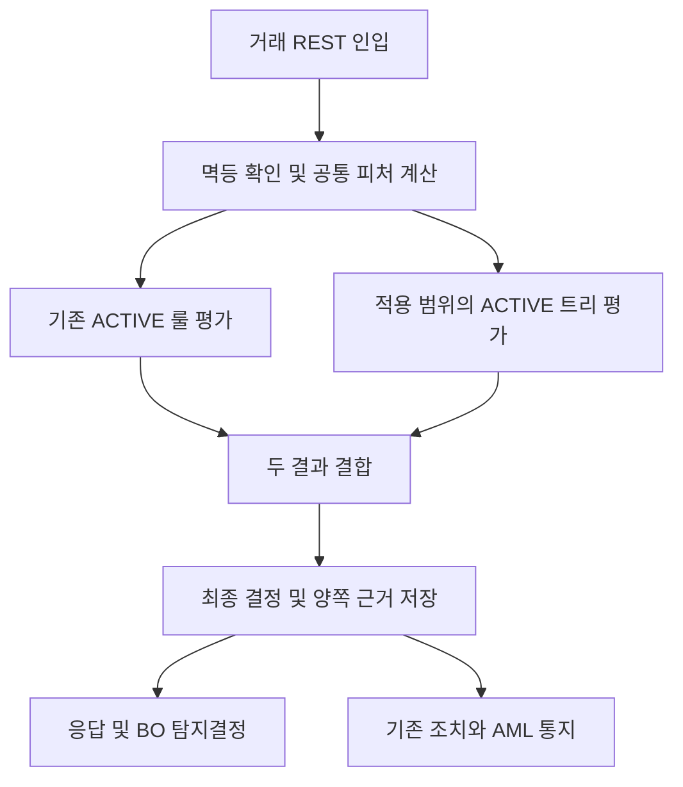

# FDS 정책 디시전트리 계약

2026-09-08 사용자 요청에 따른 개발 계약. 기존 룰 엔진과 거래 피처 기반 트리를 모두 평가한다. 구현 전달 브랜치 `feature/fds-dual-evaluation-delivery`. 2026-09-09 로컬 검증에서 FDS51+횡단9 전건 성공 증거를 확보했으며, 상세 결과는 코드 저장소 `docs/qa/fds-dual-evaluation-verification-20260909.md`와 PLAN을 따른다. PR/CI/merge 상태는 별도 전달 기록으로 구분한다.

## 3. 거래 평가 계약

- 두 평가를 **항상 각각 호출**한다. 룰 BLOCK이어도 트리를 short-circuit하지 않는다. 동시 스레드 실행은 필요 없으며 두 평가 모두 요청 처리 안에서 끝난다.
- `POST /api/v1/fds/events`의 동기 인입 결선, `/api/v1/fds/events/evaluate`, `/api/v1/fds/decisions/evaluate`, ASYNC consumer의 공통 평가 경로를 모두 다룬다.
- 기존 FeatureComputePort의 **같은 snapshot을 1회 계산**하여 양쪽에 제공한다. 트리 evaluator 내부에 DB/HTTP/현재 시각 조회는 없다.
- 거래의 tenant/workspace/channel/evaluationPhase에 적용되는 활성 트리 1개를 조회한다. 한 트리를 여러 정확한 scope에 배포할 수 있지만 scope당 배포 포인터는 1개다. wildcard 우선순위·복수 트리 충돌을 만들지 않는다.
- 적용 가능한 트리가 없으면 `NOT_CONFIGURED`이고 기존 룰 결과가 최종이다. 미설정을 tree ALLOW/PASS로 위장하지 않는다. 룰만·트리만 구성된 scope도 각각 명시적으로 지원한다.
- 정상 신규 결정은 ruleOutcome, treeOutcome(nullable), treeStatus, treeId/version/hash, visited node/leaf/reasonCode, finalOutcome을 증거로 남긴다.
- 최종 `matchedRules`에는 실제 룰만 들어간다. 트리 단독 적중을 가짜 ruleId/룰명으로 합성하지 않는다.
- 기존 riskScore 산식은 **최종 outcome의 기존 RiskScoringPolicy 매핑**을 사용한다. tree 확률·ML 점수는 만들지 않는다.

### 3.1 결합표 (구현 계약 A1)

정본 software §11.1에 이중 평가 결합이 미정의 — 기존 severity 순서를 명시적 결합표로 확장한다. enum ordinal에 의존하는 새 코드는 만들지 않는다.
트리 leaf는 ALLOW/MONITOR/REVIEW/CHALLENGE/BLOCK 5종, 기존 룰 8종은 유지한다.

| 룰 ↓ / 트리 → | ALLOW | MONITOR | REVIEW | CHALLENGE | BLOCK |
|---|---|---|---|---|---|
| ALLOW | ALLOW | MONITOR | REVIEW | CHALLENGE | BLOCK |
| MONITOR | MONITOR | MONITOR | REVIEW | CHALLENGE | BLOCK |
| REVIEW | REVIEW | REVIEW | REVIEW | CHALLENGE | BLOCK |
| CHALLENGE | CHALLENGE | CHALLENGE | CHALLENGE | CHALLENGE | BLOCK |
| BLOCK | BLOCK | BLOCK | BLOCK | BLOCK | BLOCK |
| HOLD | HOLD | HOLD | HOLD | HOLD | HOLD |
| FREEZE | FREEZE | FREEZE | FREEZE | FREEZE | FREEZE |
| REPORT | REPORT | REPORT | REPORT | REPORT | REPORT |

최종 outcome만 기존 DecisionActionRouter에 **1회** 전달한다. REVIEW→CHALLENGE일 때 OPEN_CASE가 아니라 SEND_ALERT가 되는 기존 action 매핑까지 테스트한다.
양쪽 조치를 합집합으로 실행하지 않는다. 룰의 강도를 낮추지 않는 계약이며 기존 BLOCK 오탐 해제 기능은 이번 범위가 아니다.
트리 단독 BLOCK도 진짜 최종 BLOCK으로 계정계 응답 및 기존 AML 통지를 발생시킨다. 별도 tree evidence를 조회 가능하게 하되 기존 AML matchedRules 계약은 유지한다.

### 3.2 실패·멱등·트리 교체 (구현 계약 A2)

- 선택된 트리의 피처 누락은 정의된 missing 간선을 따른다. 타입 오류/정의 손상/한도 초과는 `ERROR`, 후보 outcome=null, 진단 code만 저장한다.
- 트리 오류 발생 시 유효한 룰 outcome과 **REVIEW fallback**을 위 결합 순서로 비교한다. rule BLOCK 이상은 유지하며 오류를 ALLOW로 통과시키지 않는다.
- 공통 feature compute 자체 실패는 기존 source-system fail_policy 계약을 유지하고 두 평가 상태를 `NOT_EVALUATED`로 기록한다. 기존 FAIL_OPEN을 이번 기능에서 임의로 변경하지 않는다.
- 저장/배포 조회 인프라 실패를 rule-only 성공으로 삼키지 않는다. 기존 트랜잭션 실패 경로로 반환하며 부분 결정·부분 outbox를 남기지 않는다.
- 기존 결정 자연키 `(tenant,workspace,event,phase,ruleSetVersion)`와 Idempotency-Key 계약을 유지한다. treeVersion을 ruleSetVersion 문자열에 덧붙이지 않는다.
- 기존 replay/동시 저장 패자는 저장된 최종 결정·tree evidence를 그대로 반환하고 두 평가/부작용을 재실행하지 않는다(경쟁 중 계산이 수행됐더라도 저장 승자만 발행).
- tree v2 배포 후 새 거래는 v2, 이전 동일 거래 replay는 v1 근거 그대로. ASYNC 단계는 기존 독립 단계·룰셋버전 계약을 유지한다.
- 트리 정의·버전은 평가 중 불변이다. 배포 조회에서 읽은 id/version/hash와 실제 사용 정의를 하나로 결속한다. 속도 최적화 캐시는 1차에 추가하지 않는다.

## 4. 트리 문법·등록·관리 메뉴

### 4.1 독립 정책 트리

- 입력은 materialized 거래 피처. branch는 featureKey/operator/typedValue, true/false/missing 대상 nodeId. leaf는 outcome/reasonCode.
- compound AND/OR는 순차 branch로 표현한다. 기존 RuleDslParser의 문법·missing 의미는 수정하지 않는다.
- number는 BigDecimal, boolean/string은 정확 타입. null/키 부재는 missing, 타입 불일치는 ERROR.
- 숫자 연산 EQ/NE/GT/GTE/LT/LTE, boolean/string EQ/NE. 잘못된 타입·연산 조합은 draft validation에서 거부한다.
- root 1개, nodeId 중복/미정 간선/cycle/도달 불가 거부. 최대 node=128, root depth 0 기준 간선 깊이=16(방문 node≤17), JSON=64KiB.
- 금액 피처는 서버 파생 baseEquivalent/amountBase를 사용한다. 등록 화면은 기준통화·값 타입·단위를 노출한다.
- feature catalog와 실제 materialized key를 검증한다. 원문 PII나 임의 code/SpEL/SQL 실행식은 받지 않는다.
- 트리 예시 템플릿은 초안 생성만 수행하며 자동 활성화는 제공하지 않는다. 운영자가 설정하는 범용 관리 기능이므로 특정 채널·업무 임계를 **제품 코드**에 고정하지 않는다. 채널별 기본(baseline) 정의는 제품 코드가 아닌 **통화 프로파일 배포 자산**(`config/decision-trees/<code>.json` → 통화 팩 `R__baseline_decision_trees.sql`)으로 제공하며, 활성 포인터는 여전히 4-eyes 가 소유한다(§5, 2026-09-09 사용자 지시).

### 4.2 관리 UX·라이프사이클

- FDS 탐지 정책 영역에 **디시전트리 관리** 메뉴 `/fds/decision-trees` 추가. 목록·검색·상태·적용 채널/단계·현재 배포 버전·작성일 제공.
- `/new`: 이름/설명, 카탈로그 피처 선택, 조건·분기·leaf 입력, 구조 검증, 초안 저장. JSON 코드만 입력하는 화면으로 대체하지 않는다.
- `/{treeId}`: 초안 편집, 버전 목록·차이, 분기 구조, 테스트 거래 simulation, 적용 범위 선택, 활성화/중지/롤백 상신, 승인 이력.
- 편집은 새 draft version으로 저장한다. 활성/승인대기 버전은 불변. 버전 번호/내용 hash를 분리하고 optimistic revision을 검사한다.
- simulation은 같은 evaluator로 저장 snapshot에 대해 실행한다. snapshot 없음/빈 객체=UNAVAILABLE, 개별 feature 부재는 missing. 현재 고객/그룹 데이터로 과거 snapshot을 대체하지 않는다.
- 샘플 대상 결정 ID는 명시 최대 50개, 한 scope·phase로 제한. 총수=성공+미평가+오류, leaf/branch coverage와 원결정·트리·결합 후보를 제공한다. 동일 request idempotency 유지.
- 활성화와 롤백은 동일 tree version/hash의 성공 simulationId를 요구한다. simulation input IDs·버전·시각·결과를 보존한다.
- 배포 상태는 scope별 포인터가 소유한다. 상신 시 기존 활성 포인터는 그대로 유지; 승인 실행 시에만 교체한다. 중지/rollback도 4-eyes 및 generation 검사 대상이다.
- archive는 활성 배포/승인대기 참조가 없는 트리만 허용한다. version/실결정 evidence를 hard delete하지 않는다.
- 권한: `SFDS_RULE:READ` 조회, `AUTHOR` 초안/시뮬레이션, `OPERATE` 배포 상신/중지/롤백/archive, `APPROVE` 승인/반려. UI 숨김과 BE 권한을 모두 검사한다.
- 기존 공통 form/table/status/modal을 재사용한다. node 편집/trace가 반복되는 부분은 components/common으로 추출한다. ko/en 동시, keyboard 입력/간선 선택/오류 focus 지원.
- `/fds/decisions/{decisionId}`에 **룰 평가 / 트리 평가 / 최종 결정**을 별도 표기하고 사용 버전과 분기 경로 표시. NOT_CONFIGURED/ERROR/NOT_EVALUATED를 번역된 상태로 구분한다.

### 4.3 저장·API·결재

- 구현 테이블: `fds_decision_trees`, `fds_decision_tree_versions`, `fds_tree_simulations`, `fds_tree_deployments`; `fds_decisions`에 nullable `tree_evaluation JSONB` 추가(기존 행 nullable).
- tenant/workspace 선두 복합키·FK·RLS. deployment PK에 channel/evaluationPhase, generation 포함. 동일 scope 동시 상신은 409, 승인 시 이전 generation이 다르면 stale approval 거부.
- simulation은 JSON 결과+고정 input IDs/hash를 저장하고 policy/evidence 보존 정책 적용, 자동 purge 없음. list는 페이지 size 1~100, default 20.
- 새 approval subjectKind `DECISION_TREE`를 engine enum/DB CHECK/BO exact permission/FE ko·en·결재 필터에 함께 추가한다. RULE subjectKind로 위장하지 않는다.
- 승인 payloadHash는 target tree/version/content hash, scope, 원하는 배포/중지 상태, 이전 generation, simulationId에 결속한다. maker/checker는 인증 principal에서 도출, self approval 409, 변조/stale 409.
- 엔진 `/api/v1/admin/fds/decision-trees`; BO `/api/v1/bo/fds/decision-trees` typed routes/client. 기존 BO admin 경로 별칭을 복사해 generic passthrough를 만들지 않는다.
- create POST 201, list/detail GET 200, draft version POST 201, simulations POST 201(동일 key replay 200), deployments POST 202, archive POST 200. 승인/반려는 기존 결재함 경로 사용.
- get version/simulation은 treeId 하위 조회. 잘못된 문법/크기/피처·입력 400/413, 인증 401, 권한 403, scope 밖·없음 404, revision/state/payload/idempotency conflict 409, 엔진 unavailable 503. 공통 error envelope와 trace 규약 유지.
- 비밀/원문 PII/전체 snapshot을 UI에 반환하지 않는다. trace는 nodeId·피처 label·operator·분기 결과·reasonCode, 허용된 값만 마스킹/요약한다.
- tree-only BLOCK의 ruleDecision=ALLOW, matchedRules=[]는 정직한 결과다. 최종 BLOCK 근거는 treeEvaluation과 reasonCode로 조회. AML 통지의 기존 필수 필드를 비우거나 가짜 룰로 채우지 않는다.

## 구현 계약 보충 (2026-09-09)

### HTTP 경로 및 응답

엔진 base = `/api/v1/admin/fds/decision-trees`, BO base = `/api/v1/bo/fds/decision-trees`.
BO는 typed delegate이며 엔진 미구성 시 503; 엔진 저장소를 직접 조회하거나 stub 정책을 생성하지 않는다.

| method / path suffix | 요청 | 응답 / 권한 |
|---|---|---|
| GET / | query, includeArchived, page(0~1000000), size(1~100; 기본20) | `{rows,total,page,size}` / READ |
| POST / | name, description, definition | Tree / 201 / AUTHOR |
| GET /{treeId} | — | `{tree,versions,deployments}` / READ |
| POST /{treeId}/versions | name, description, definition, expectedRevision | 새 immutable version을 가진 Tree / 201 / AUTHOR |
| GET /{treeId}/versions[/{version}] | — | VersionView 배열 또는 단건 / READ |
| POST /{treeId}/simulations | version, decisionIds(1~50 distinct UUID); Idempotency-Key 필수 | Simulation / 엔진 201(신규)·200(replay), BO 200 / AUTHOR |
| GET /{treeId}/simulations[/{simulationId}] | — | 최근 50건 또는 단건 / READ |
| GET /deployments | — | tenant/workspace의 scope 포인터 목록 / READ |
| GET /context | — | `{regulatoryCurrency}` / READ; tenant 설정 우선, 서비스 설정 fallback, 둘 다 없으면 null |
| POST /{treeId}/deployments | operation(ACTIVATE/STOP/ROLLBACK), channelType, evaluationPhase, version, expectedGeneration, simulationId, reason | `{approvalRequestId,payloadHash,status:SUBMITTED}` / 202 / OPERATE |
| POST /{treeId}/archive | expectedRevision | Tree / 200 / OPERATE |

STOP은 version/simulationId를 보내지 않으며 현재 활성 treeId를 대상으로 한다. ROLLBACK은 같은 활성 트리의 더 낮은 버전과 그 버전의 simulation 증거를 선택한다.
실제 승인/반려는 기존 결재 API를 사용한다. 새 `DECISION_TREE` subject의 checker 권한은 정확히 `SFDS_RULE:APPROVE`이다.

Tree: tenantId, workspaceId, treeId, name, description, latestVersion, revision, archived, createdBy, createdAt, updatedAt.
VersionView: treeId, version, definition, definitionHash, createdBy, createdAt, numericLiterals, browserEditable.
Deployment: channelType, evaluationPhase, treeId(nullable), version(nullable), generation, pendingApprovalId(nullable), updatedBy, updatedAt.

### 숫자 및 개인정보 경계

- Draft/version 요청은 원문 JSON에서 scoped BigDecimal mapper로 파싱한다. BO version definition readback도 exact decimal reader를 사용한다. 다른 API의 mapper 설정은 바꾸지 않는다.
- 브라우저 입력은 원문 decimal과 JS 직렬화 결과를 정확히 대조해 underflow나 subnormal 반올림을 거부한다.
- numericLiterals는 nodeId별 정확한 숫자 표기 문자열이다. 브라우저가 손실 없이 편집할 수 없는 버전은 browserEditable=false로 제공한다. 화면은 이 값을 정확히 조회하고 편집만 제한하며, 저장된 버전의 simulation/배포는 가능하다. API BigDecimal 값의 범위를 JS Number에 맞춰 줄이지 않는다.
- 문자열 literal은 기존 ForbiddenPiiScanner의 이메일/주민번호/카드/계좌 패턴을 검사한다. opaque ref의 숫자 예외와 canonical hex hash는 유지한다. hash 항목의 원문 전화/계좌형 값은 거부한다. 에러·trace에 거부된 원문 값을 넣지 않는다.
- 기존 feature catalog의 BOOL은 트리 BOOLEAN, ENUM은 STRING으로 정규화한다. 기존 카탈로그와 룰 DSL의 타입 어휘는 변경하지 않는다.
- TreeEvaluation.path는 nodeId, featureKey, operator, branch(TRUE/FALSE/MISSING)만 반환한다. 실제 고객 피처 값과 비교 literal은 결정 trace에 포함하지 않는다.

### 결정 증거 및 실패

신규 정상 결정 응답은 기존 필드에 ruleDecision, treeEvaluation을 추가한다. 상세 BO projection은 evaluationPhase도 전달한다.
TreeEvaluation = status, treeId, version, definitionHash, outcome(nullable), leafId, reasonCode, path.
상태는 EVALUATED / NOT_CONFIGURED / NOT_EVALUATED / ERROR이며 simulation은 UNAVAILABLE도 사용한다. 기존 결정의 증거가 없는 경우 nullable로 유지한다.
공통 피처 계산 실패는 기존 fail_policy를 따른다. 트리 자체 오류는 ERROR로 기록하고 기존 룰과 REVIEW fallback을 결합한다.
인입 저장과 평가 트랜잭션은 기존 계약대로 분리된다. 평가 인프라 장애 시 인입은 보존하되 decision=null이며, 부분 결정/조치/outbox는 생성하지 않는다.
`matchedRules`에는 실제 룰만 유지한다. tree-only BLOCK도 기존 BLOCK 통지 채널로 AML에 전달하며, 빈 matchedRules를 가짜 룰로 채우지 않는다.
BO 판정 요약은 EVALUATED/ERROR 트리가 있을 때 룰 평가·트리 평가·최종 결과를 각각 표시한다. 트리 단독 차단을 인입/데이터 품질 오류로 설명하지 않는다. 새 FDS_TREE_EVALUATED/FDS_TREE_ERROR 사유와 알려진 피처 라벨은 ko/en 카탈로그를 따른다.

### 거버넌스·저장

- FDS V37: tree/version/simulation/deployment 4테이블, tenant/workspace 선두 복합키·FK·forced RLS. version update/delete 불가.
- FDS V38: `DECISION_TREE` approval CHECK 확장, simulation 증거 update/delete 불가.
- FDS V39: fds_decisions.tree_evaluation nullable JSONB 추가. 저장 값은 `{ruleDecision,treeEvaluation}`. 기존 자연 멱등키 및 과거 행은 변경하지 않는다.
- 배포 상신/승인은 tree master → scope 포인터 순서로 잠근다. 같은 scope 동시 상신은 1건만 성공한다. 승인 대기 중 새 draft version을 만들어도 pending version/hash는 불변이다.
- 승인 payload는 tree/version/hash·scope·operation·generation·simulationId에 결속한다. JPA approval INSERT는 JDBC 포인터 FK 갱신 전에 flush하여 같은 트랜잭션에서 원자적으로 반영한다.
- 조회·시뮬레이션·승인 후 사용 버전 이력은 archive 후에도 보존한다. 기존 event/decision/outbox replay는 최초 결과를 반환하며 tree 배포 교체로 중복 조치를 생성하지 않는다.

### BO 메뉴 및 시뮬레이터

FDS 설정의 정책 그룹에 `/fds/decision-trees`를 추가한다(기존 FDS 14개 메뉴 보존 + 신규1 = 15).
`/new`는 AUTHOR, 목록/상세는 READ, 배포·중지·롤백·보관은 OPERATE, 결재는 APPROVE로 분리한다.
화면은 조건·TRUE/FALSE/MISSING 분기 편집, 버전 비교, 저장 결정 표본 simulation, 성공 이력 선택, 승인 요청, 결정 경로 조회를 제공한다.
등록/상세는 context API의 기준통화를 표시한다. 조건은 값 타입과 단위 의미를 안내하며 transaction.amountBase는 조회한 기준통화, transaction.amount는 거래 통화로 표시한다. 미설정 통화를 임의 보충하지 않는다.
시뮬레이션 통계는 총수=평가 완료+오류+미평가이며, 선택 버전의 전체 leaf 수 및 branch×3(TRUE/FALSE/MISSING) 간선 수를 커버리지 분모로 삼는다. 성공 행에서 중복을 제거한 유효 방문만 분자로 센다. 버전/해시가 다르면 커버리지를 표시하지 않는다. 결과 표는 원결정·룰·트리·결합 후보를 나란히 제공하며, 결과 trace에 leaf 사유 코드도 표시한다.
sim-web `setup.fds-tree`는 BO에서 설정한 포인터를 읽기 확인하며, `fds.dual-evaluate`는 명시 memberRef/ref로 실제 거래를 인입한다.
미완성 preview는 requiredParams/body=null/signed=false를 반환하고 execute는 필수 키 누락을 거부한다. 사업 식별자를 자동 채우지 않는다.

### 검증 증거의 구분

FDS-C46~C51은 REST 경계/조합/버전/복원과 실제 BO·sim-web 브라우저 흐름을 검증한다.
2×2 테넌트·워크스페이스 및 ASYNC lookup, 저장소 손상·인프라 fault는 명시된 Testcontainers 클래스와 결합한다. 이러한 in-process 증거를 실제 REST 실행이라고 표시하지 않는다.
유효한 scope의 조회 200과 다른 workspace에 원래 인증키를 보낸 요청의 401/FDS-AUTH-002를 구분한다. 후자는 credential의 tenant/workspace 결속 검사이며, 올바른 인증 후의 403 권한 검사·404 리소스 격리 검사를 대체하지 않는다.
기존 FDS45 + 신규6 + 횡단9 = 60개의 선택된 카탈로그 사례가 gate이며, 모든 결과·원복·미실행 여부는 코드 저장소 PLAN 및 case artifact에 남긴다.

## 5. PH baseline 트리 팩 (2026-09-09 사용자 지시)

초기 배포 시 `/fds/decision-trees` 목록이 비어 있지 않도록, 필리핀 서비스 구조(hanpass-ph 5 상품 + 파트너 인바운드)에 맞춘 기본 정책 트리 5종을 **PHP 통화 팩 마이그레이션**으로 등록한다. 활성 포인터는 마이그레이션이 만들지 않는다.

### 5.1 자산·정본

- 정본: 코드 저장소 `config/decision-trees/php.json`(통화 프로파일 글롭 `config/currency-profiles/*.json` 밖). 금액 literal 은 `{"ctrRatio": r}` 로 적고 생성기가 `round_to(r × ctrThresholdAmount, roundingUnit)` 정수로 치환한다(₱500,000 기준: 1.0→500,000·0.9→450,000·0.4→200,000·0.2→100,000·0.1→50,000·0.04→20,000·4.0→2,000,000). `ctrRatio` 는 룰팩 `_ratios.json` 과 별개의 트리 전용 비율 축이다.
- 생성물: `services/fds-svc/src/main/resources/db/currency/php/R__baseline_decision_trees.sql`(`scripts/generate_currency_packs.py`, `--check` parity). `fds_decision_trees` + `fds_decision_tree_versions`(version 1) 만 `tenant_demo/default` 에 `ON CONFLICT DO NOTHING` 으로 시드하며 `fds_workspaces` 행이 있을 때만 쓴다. `created_by = 'system:currency-profile'`, tree_id 는 `(tenant, workspace, code)` 기반 결정적 UUIDv5. 통화 수치(CTR 임계·반올림 단위·테넌트)는 프로파일 JSON 을 참조만 하며 복제하지 않는다(F-078 단일 정본 원칙 유지). `fds_tree_deployments`·`fds_tree_simulations`·`fds_approval_requests`·감사 로그는 만들지 않는다.
- hash: `definition_hash` 는 엔진 `DecisionTreeCodec.hash` 와 동일한 직렬화(record 필드 순서·null 포함·정수 literal)로 생성하고 Testcontainers 테스트(`FdsPhBaselineDecisionTreePackIntegrationTest`)가 parity 를 고정한다. 정본이 바뀌어도 version 1 은 덮어쓰지 않는다 — 개정은 관리 메뉴/REST 의 새 버전 경로다.

### 5.2 트리 5종

| 코드 | 적용 scope(채널 × INLINE/ASYNC) | 분기(→ leaf) |
|---|---|---|
| `PH_CROSS_BORDER_REMIT_BASELINE` (PH 해외송금 baseline) | CROSS_BORDER_REMIT | [KYC 경과 ≤1일 ∧ ≥200k]→REVIEW · [계정변경 ≤24h ∧ ≥100k]→REVIEW · [신규단말 ∧ 심야 ∧ ≥50k]→REVIEW · 24h 수취국 distinct ≥3→REVIEW · 30일 합계 ≥2,000k→MONITOR · else ALLOW |
| `PH_DOMESTIC_TRANSFER_BASELINE` (PH 국내송금·인바운드 baseline) | DOMESTIC_REMIT · INBOUND_REMIT · BANK_TRANSFER | 명의 불일치→REVIEW · [신규 수취인 ∧ 계정변경 ≤24h ∧ ≥20k]→REVIEW · [신규 수취인 ∧ 신규단말 ∧ ≥50k]→REVIEW · 1:N 패턴→REVIEW · 24h 수취인 distinct ≥5→REVIEW · N:1 패턴→REVIEW · [가입 ≤3일 ∧ ≥100k]→REVIEW · 24h 합계 ≥500k→MONITOR · else ALLOW |
| `PH_WALLET_CASH_IN_BASELINE` (PH 월렛충전 baseline) | CASH_IN | ≥CTR(500k)→REVIEW(GATE-02 BLOCK@560k 직하 구간) · [450k≤ ∧ 동일채널 7일 ≥3건]→REVIEW · 24h 합계 ≥500k→MONITOR · [VOUCHER ∧ ≥100k]→REVIEW · 수동승인→MONITOR · [가입 ≤1일 ∧ ≥100k]→REVIEW · 10분 ≥3건→MONITOR · else ALLOW |
| `PH_WALLET_PAYMENT_BASELINE` (PH 월렛결제 baseline) | WALLET_PAYMENT | [해외 가맹점 ∧ ≥100k]→REVIEW · [신규단말 ∧ 단말변경 ≤24h ∧ ≥50k]→REVIEW · [10분 ≥5건 ∧ 심야]→REVIEW / [10분 ≥5건]→MONITOR · 가맹점 10분 ≥30건→MONITOR · [잔액 전액 소진 ∧ ≥100k]→MONITOR · else ALLOW |
| `PH_WALLET_WITHDRAWAL_BASELINE` (PH 월렛출금(ATM) baseline) | WALLET_WITHDRAWAL | [계정변경 ≤24h ∧ ≥50k]→REVIEW · [3시간 내 단말 교체 ∧ ≥50k]→REVIEW · [심야 ∧ 1h ≥3건]→REVIEW · [잔액 전액 인출 ∧ 가입 ≤7일]→REVIEW · 동일채널 7일 ≥10건→MONITOR · else ALLOW |

공통 규약: leaf 는 ALLOW/MONITOR/REVIEW 만 쓴다 — CHALLENGE(SEND_ALERT)가 룰 REVIEW(OPEN_CASE)를 덮어 케이스 개설이 사라지는 §3.1 결합 특성 때문이며, BLOCK 은 룰팩(BL·GATE-02)이 담당한다. MONITOR 는 기록만(액션 0). 결측 간선(onMissing)은 룰 DSL 과 같은 미발동 경로다. 심야는 엔진 `time.hourOfDay` 가 UTC 기준이므로 UTC 14~22(PHT 22~06)로 표현한다. 룰팩 22종의 단일 조건(GATE 금액·XLS-B01·LGC-03·XLS-21·XLS-01)과 같은 leaf 는 두지 않고 신호 조합만 판정한다. `counterparty.firstForSubject` 는 국내이체 도메인에서만 산출되므로 국내송금 트리 전용이다. 카드결제(CARD_NOT_PRESENT) 트리는 범위 밖(후속 후보). 월렛결제 트리의 `merchant.country NE 'PH'` 는 인입 소스가 가맹점 국가를 ISO 3166-1 alpha-2 대문자로 보낸다는 계약을 전제한다(엔진은 국가코드를 정규화하지 않으므로 `ph`/`PHL` 은 해외로 판정된다). `time.hourOfDay` 는 엔진 상수 `JURISDICTION_ZONE=UTC` 전제이며 이 상수가 바뀌면 심야 분기 3곳의 시간대를 함께 개정해야 한다.

### 5.3 활성화·검증

- 활성화는 `scripts/setup_fds_decision_trees.py`(룰팩 ⓪‴ 과 동형·멱등): 채널·단계별로 이미 활성이면 건너뛰고(`ALREADY_ACTIVE`), 저장 결정이 없으면 `SKIPPED_NO_DECISION`, 타인 상신 대기 중이면 `PENDING_OTHER`(미적용·건너뜀), 있으면 결정 최대 5건(응답 순 앞 5건)으로 simulation(전 행 EVALUATED 아니면 실패 행 제외 후 새 키로 1회 재시도) → maker 상신(ACTIVATE) → checker 승인 → 포인터 확인(`ACTIVATED`). 상태 코드와 종료코드: 종료 0 = 전 scope ∈ {`ACTIVATED`, `ALREADY_ACTIVE`, `SKIPPED_NO_DECISION`, `PENDING_OTHER`}(`PENDING_OTHER`·`SKIPPED_NO_DECISION` 은 적용되지 않은 상태이므로 운영자가 출력 JSON 으로 확인), 종료 1 = `MISSING_ASSET`(팩 미적용 — 트리를 생성하지 않음)·`SIMULATION_NOT_PROVING`. 옵션: `--dry-run`(GET 만, 예정 상태 `WOULD_ACTIVATE`/`WOULD_STOP`), `--scope CHANNEL:PHASE`(반복, 부분 실행), `--create-missing`(팩 미적용 스택에서만 정본 정의를 REST 로 등록, 기본 off), `--stop`(baseline 포인터를 STOP 상신·승인으로 되돌림 — `STOPPED`/`NOT_ACTIVE`). sim-web ⑪ 스테이지 `setup.fds-tree-baseline` 이 같은 함수를 호출한다. 운영 배포에서는 같은 스크립트 또는 관리 메뉴의 4-eyes 로 적용한다.
- 검증은 `scripts/verify_fds_decision_tree_baseline.py`: 팩 parity → 채널별 프라이밍 거래 → 활성화 → 트리별 미발동/발동 거래(격리 주체 `SIM-DTB-`) 의 `treeEvaluation`·최종 결정·케이스 개설 대조 → replay 멱등 → 원상복원(`finally`). 엔진 카탈로그 행(FDS-C52~C55)은 잠금 해제 지시 후 append 한다.
