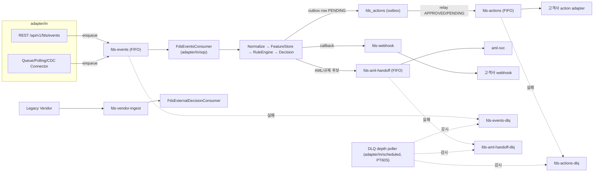
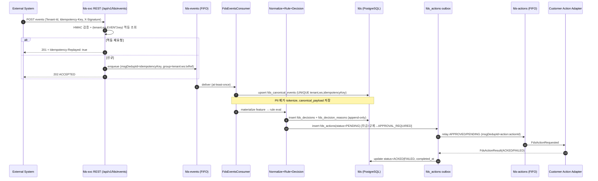
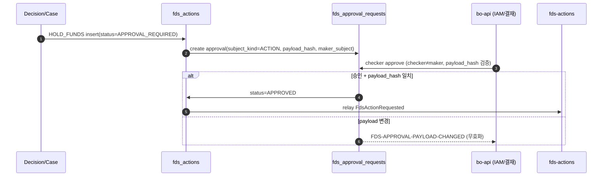
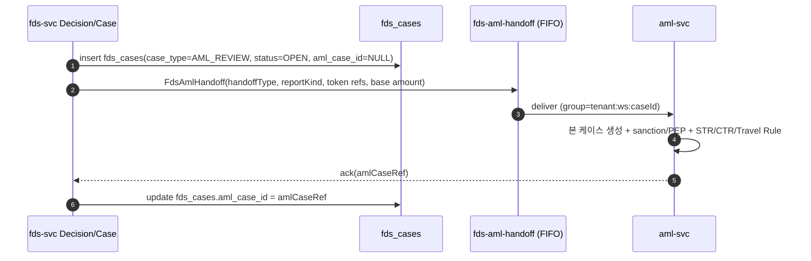
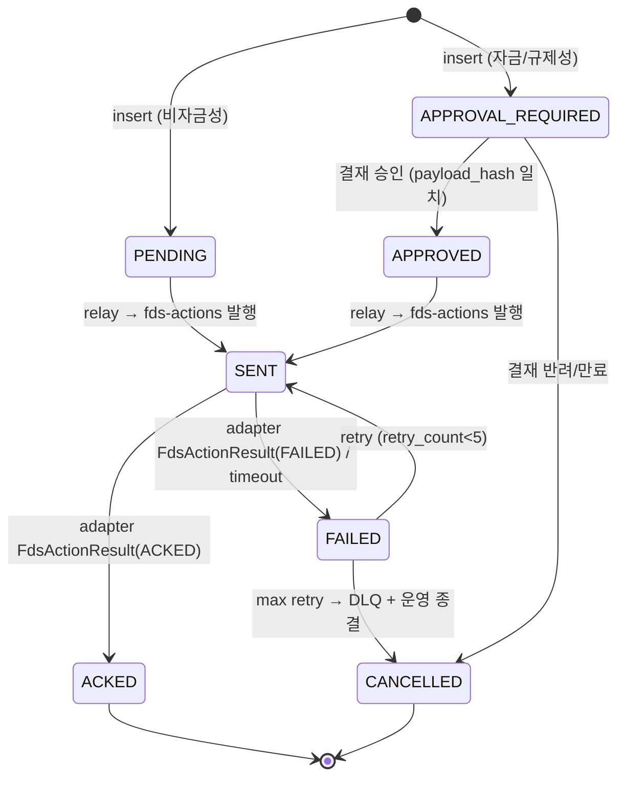
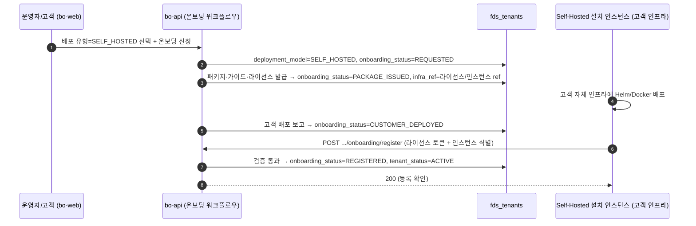

# FDS 이벤트·연동 명세서 (fds-svc Integration)

> 정본: `.claude/skills/_shared/target-architecture.md` (4서비스 모노레포 · 비동기 SQS · 서비스 경계 · 멀티테넌시 tenant/workspace/data-scope · PII 마스킹 · 4-eyes · 한국 Policy Pack).
> 입력 설계서: `docs/software/01-fdsSvc-sass.md` v1.9 (§8 Canonical Event Taxonomy, §11.2 action_type 23종·§11.2a 별칭 매핑, §11 Action/Case/결재, §11.5 subject_kind **9종**(POLICY_PACK 포함), §11.6.1 case_status·REOPEN 전이, §11.6.1a close_reason **8종**(`FP_THRESHOLD`/`FP_NORMAL_PATTERN`/`FP_DATA_QUALITY`/`CONFIRMED_FRAUD`/`CONFIRMED_MULE`/`CONFIRMED_ATO`/`ESCALATED_AML`/`OTHER`), §11.6.11 `deployment_model`(3종)·§11.6.11a `onboarding_status`(8종) 상태머신, §12 외부 시스템 연동, §12.8 고객사 관리=배포 유형+온보딩, §13 배포 모델·온보딩 프로비저닝·멀티테넌시 키 재정의, §16 PII/규제, §16.2 named 규제 팩 카탈로그).
> 입력 DB: `docs/design/db/01-fds-db.md` v1.5 (스키마 `fds`, 멀티테넌시 `tenant_id/workspace_id/data_scope`, enum 코드값 §4, action_type 23종 정본 §4.8, close_reason 8종 §4.11, subject_kind **9종** §5.23, `fds_actions` outbox §5.12, `fds_cases.aml_case_id` §5.13, `fds_idempotency_keys` §5.33, **배포 모델 `fds_tenants.deployment_model`(3종, §4.1/§5.1)·`onboarding_status`(8종, §4.1a 상태머신)·`default_region`·`infra_ref`, 구 `isolation_mode` 폐기**).
> 입력 API: `docs/design/api/01-fds-api.md` v2.0 (base path `/api/v1`, 헤더 `Tenant-Id/Workspace-Id/Source-System/Idempotency-Key`, scope 11종(전체 `fds:` prefix 통일), `ActionType` 23종 정본, `amlCaseRef`, `SubjectKind` **9종**(POLICY_PACK 포함, §1.1·§5.12·§8·§13), `DeploymentModel`(3종)·`OnboardingStatus`(8종)·`TenantDto`(`deploymentModel`/`onboardingStatus`/`region`/`infraRef`, `isolationMode` 폐기), 운영자 집계·온보딩 API는 bo-api 소유·엔진 API 미포함).
> 참조 구현: `hanpass-ph/services/fds-svc/adapter/in/sqs`(SQS consumer·헤더 `idempotencyKey/correlationId/traceparent`), `adapter/out/sqs`(FIFO `messageGroupId`+`messageDeduplicationId`, message attributes `eventType/source/idempotencyKey`), `adapter/in/scheduled`(DLQ depth poller PT60S).
> 책임 서비스: **`services/fds-svc`** (`com.hanpass.fds.adapter.in.sqs` / `adapter.out.external` / `adapter.in.scheduled`). AML/STR/CTR/Travel Rule 본 처리는 **aml-svc**, 운영자 IAM·결재 집약·감사는 **bo-api**, UI는 **bo-web**(bo-api 경유).

## 목차
1. [범위·원칙](#1-범위원칙)
2. [큐 토폴로지·비동기 경계](#2-큐-토폴로지비동기-경계)
3. [이벤트 카탈로그](#3-이벤트-카탈로그)
4. [메시지 스키마 (JSON)](#4-메시지-스키마-json)
5. [비동기 흐름 (시퀀스 다이어그램)](#5-비동기-흐름-시퀀스-다이어그램)
6. [멱등성·재처리·DLQ·순서보장](#6-멱등성재처리dlq순서보장)
7. [커넥터·필드매핑 (원천→canonical)](#7-커넥터필드매핑-원천canonical)
8. [아웃박스 상태머신·Capability 매트릭스](#8-아웃박스-상태머신capability-매트릭스)
9. [규제 제출 흐름 (STR/CTR/Travel Rule) — aml-svc 위임](#9-규제-제출-흐름-strctrtravel-rule--aml-svc-위임)
10. [멀티테넌시 라우팅·PII 미전파](#10-멀티테넌시-라우팅pii-미전파)
11. [관측성·재제출](#11-관측성재제출)
12. [downstream 확정 명칭](#12-downstream-확정-명칭)
13. [변경 이력](#13-변경-이력)

---

## 1. 범위·원칙

- 본 문서는 **fds-svc의 비동기 메시지 경계**(SQS in/out), **외부 커넥터 수집·정규화**, **action outbox 상태머신**, **규제 제출(STR/CTR/Travel Rule) 위임 흐름**을 확정한다.
- 모든 이벤트·메시지·아웃박스 필드는 DB 설계서(`01-fds-db.md`)의 컬럼·enum과 API 설계서(`01-fds-api.md`)의 DTO·헤더와 **100% 동일 명칭**을 사용한다. 신규 명칭은 도입하지 않는다. `fds_cases.aml_case_id`(= API `amlCaseRef`)는 DB §5.13 v1.1에서 정식 컬럼으로 확정되었으며 본 문서는 그 타입(`VARCHAR(96) NULL`)을 참조한다(§9, §12).
- **직렬화 규약**: 모든 큐 메시지 키는 **camelCase**로 직렬화하고 DB 컬럼(snake_case)과 1:1 매핑한다(예 `errorCode`↔`error_code`). `action_type` 마스터는 **API `ActionType` enum 23종(전수)** 이 정본이며, 설계서 §15의 도메인 verb(`SUSPEND_MERCHANT`/`SEND_SECURITY_ALERT`/`OPEN_*_CASE`)는 §8.2 정규화 매핑으로 환원해 enum 코드로만 전파한다.
- **운영자 집계 API 경계**: 대시보드·고객사 관리·감사 조회는 **bo-api**가 소유·집약·인증한다. fds-svc는 저수준 데이터 API·비동기 큐만 제공하며, 본 연동 명세는 운영자 집계 엔드포인트를 정의하지 않는다.
- **비동기 SQS 전제**(정본 §3): ingest·action relay·규제 제출은 큐 기반. REST Push(`POST /api/v1/fds/events`)는 수신 후 내부 큐 `fds-events`로 적재(API §4.1과 정합). 실시간 `POST /api/v1/fds/decisions/evaluate`만 동기.
- **raw PII 미전파**: 큐 페이로드·아웃박스·규제 위임 메시지에 원문 식별자/payload 금지. token/hash(`*_ref`, `*_hash`)·마스킹만 전파한다(설계서 §16.1, DB §7.1).
- **멱등성·순서보장·DLQ·재처리**는 모든 큐에 필수(§6). 격리키 `(tenant_id, workspace_id)`를 메시지 속성과 FIFO group 결정에 사용한다.
- **배포 모델(deployment topology) 라우팅**(설계서 §13.0/§13.0b, DB §2.1, 정본 target-architecture §4.1): AML/FDS는 **고객사별 전용 배포가 기본**이다. `fds_tenants.deployment_model` ∈ `MANAGED_DEDICATED`(매니지드 전용)/`SELF_HOSTED`(자체 인프라 설치형)/`SHARED`(소규모 공유). **전용 배포(`MANAGED_DEDICATED`/`SELF_HOSTED`)에서 고객사 간 격리는 배포 경계(전용 DB/스택)가 보장하므로 `tenant_id`는 단일 배포 내 상수이고 큐 라우팅은 배포 엔드포인트(전용 큐/계정) 단위**다. `SHARED`에서만 공유 큐 위에서 `tenant_id`가 고객사 간 행 라우팅으로 동작한다(§10.1). 큐 메시지의 `(tenantId, workspaceId)`는 어느 모델에서나 필수이며 — 전용 배포에서는 *배포 내부 분리*(workspace/data-scope), 공유 배포에서는 *고객사 격리 + 내부 분리* 의미로 쓰인다.

---

## 2. 큐 토폴로지·비동기 경계

fds-svc는 정본 헥사고날 `adapter/in/sqs`(consumer) · `adapter/out/external`+`adapter/out/sqs`(publisher) · `adapter/in/scheduled`(폴링/DLQ 모니터)로 비동기 I/O를 배치한다.

> **큐 토폴로지의 배포 범위(deployment scope)**: 아래 큐 세트는 **하나의 배포 단위로 프로비저닝**된다. 전용 배포(`MANAGED_DEDICATED`/`SELF_HOSTED`)는 고객사마다 **전용 큐 세트**(매니지드 전용 계정/VPC의 SQS, 또는 self-hosted 고객 인프라의 브로커)를 가지며 — 큐 자체가 고객사 격리 경계다. `SHARED`만 **공유 큐**를 두고 message attribute·FIFO group의 `tenantId`로 고객사를 분리한다(§1·§10.1). 따라서 논리명(`fds-events` 등)은 동일하되 물리 큐는 배포별로 분리된다(전용) 또는 단일(공유).

| 큐(논리명) | 종류 | 방향 | 발행자 | 구독자 | DLQ | 정렬키(FIFO group) |
|---|---|---|---|---|---|---|
| `fds-events` | FIFO | inbound | Queue/REST/CDC connector | `FdsEventsConsumer` (fds-svc) | `fds-events-dlq` | `tenantId:workspaceId:transactionRef`(없으면 `subjectRef`/`eventId`) |
| `fds-actions` | FIFO | outbound | fds-svc action relay (`SqsFdsActionPublisher`) | 고객사 action adapter / 내부 adapter | `fds-actions-dlq` | `tenantId:workspaceId:targetRef` |
| `fds-aml-handoff` | FIFO | outbound | fds-svc (AML/규제 후보) | **aml-svc** consumer | `fds-aml-handoff-dlq` | `tenantId:workspaceId:caseId` |
| `fds-webhook` | Standard | outbound | fds-svc (decision/case/action callback) | 고객사 webhook 수신 endpoint | `fds-webhook-dlq` | — (순서 무관, idempotencyKey dedup) |
| `fds-vendor-ingest` | Standard | inbound | Legacy Vendor Bridge connector | `FdsExternalDecisionConsumer` | `fds-vendor-ingest-dlq` | — |



- `sandbox` workspace 메시지는 `fds-actions`·`fds-aml-handoff`·`fds-webhook`로 **발행하지 않는다**(shadow-only, DB §2 sandbox 규칙). `fds_actions` outbox에는 `SENT` 대신 `SHADOW` 의미로 status 미전이(설계서 §13.0).
- 모든 큐 메시지 속성(message attributes)은 참조 구현 정합: `eventType`, `source=fds-svc`, `idempotencyKey`, `correlationId`, `traceparent`(W3C traceparent ↔ `fds_audit_logs.trace_id`).

---

## 3. 이벤트 카탈로그

이벤트명은 설계서 §8.1 event family(`transaction`·`authorization`·…·`market`)와 DB enum `event_family`(§4.16)를 접두로 한다. canonical `eventType` = `<family>.<verb>`.

### 3.1 Inbound — canonical event (`fds-events`)

> **소스 시스템 = hanpass-ph 실서비스(데이터 레이어 재그라운딩, DB §5.3a)**: 아래 `발행자(source_system)` 열은 hanpass-ph 트랜잭션 마이크로서비스로 현행화한다(generic `card-processor`/`core-banking`/`atm-switch` 대체). 거래 인입 소스는 `walletchg-svc`(`CASH_IN`)·`domestic-svc`(`DOMESTIC_REMIT`)·`remit-svc`(`CROSS_BORDER_REMIT`)·`inbound-svc`(`INBOUND_REMIT`), 회원/KYC는 `member-svc`, 월렛 원장/정산은 `wallet-svc`(`settlement.posted`)·통합 이력 read model은 `tx-history-svc`. 업스트림은 **`REST_PUSH`(REST sync)** 로 인입(§7.1). 식별자는 token/keyed-HMAC(원문 금지). **규제(CTR/STR) 임계·기한 불변.**

| eventType (예시) | family | 발행자(source_system) | 구독자 | 트리거 | 핵심 페이로드 키 |
|---|---|---|---|---|---|
| `transaction.requested` | transaction | walletchg-svc(`CASH_IN`) / domestic-svc(`DOMESTIC_REMIT`) / remit-svc(`CROSS_BORDER_REMIT`) / inbound-svc(`INBOUND_REMIT`) | FdsEventsConsumer | 거래 요청 발생 | `transaction.transactionRef`,`amount`,`currency`,`channel.channelType`,`corridor`(cross-border) |
| `authorization.requested` / `.approved` / `.declined` | authorization | (카드 도메인 — hanpass-ph 미사용 시 N/A) | FdsEventsConsumer | 승인 단계 | `transaction.transactionRef`,`instrument.instrumentRef` |
| `transaction.completed` / `.refunded` | transaction | 전 거래 소스(walletchg/domestic/remit/inbound) | FdsEventsConsumer | 거래 완료/환불 | `transaction.status` |
| `settlement.calculated` / `.payout.requested` / `.payout.completed` / `settlement.posted` | settlement | remit-svc / wallet-svc(원장 double-entry) | FdsEventsConsumer | 정산/원장 posting | `settlementRef`,`reserveAmount`,`amountBase`(USD) |
| `trade.invoice.issued` / `trade.document.submitted` / `trade.document.matched` | trade | trade-finance | FdsEventsConsumer | 무역금융 증빙(무역대금) | `documentRef`,`documentType`,`amount` |
| `invoice.approved` / `invoice.paid` | invoice | b2b-payment | FdsEventsConsumer | B2B 인보이스 | `documentRef`,`approverRole` |
| `order.created` / `.shipped` / `.cancelled` | order | ecommerce / marketplace | FdsEventsConsumer | 주문 단계 | `orderRef`,`sellerRef`,`deliveryStatus` |
| `seller.onboarded` | seller | marketplace | FdsEventsConsumer | 셀러 등록 | `sellerRef`,`country` |
| `account.debited` / `.credited` | account | wallet-svc(월렛 원장 double-entry, transfer_links) | FdsEventsConsumer | 계좌/원장 이동 | `accountRef`,`amount` |
| `instrument.registered` / `.suspended` | instrument | wallet-svc / member-svc | FdsEventsConsumer | 수단 등록/정지 | `instrumentRef`,`instrumentType` |
| `member.kyc.updated` / `customer.*` / `entity.*` / `beneficial-owner.*` | member | member-svc(회원/KYC/CDD/제재·PEP) | FdsEventsConsumer | KYC/CDD/스크리닝 변경 | `subjectRef`,`kycLevel` |
| `device.changed` / `session.started` | device/session | app-gateway / atm-switch | FdsEventsConsumer | 기기·세션 신호 | `subjectRef`,`device`,`session` |
| `market.order.created` / `market.trade.executed` | market | crypto-exchange | FdsEventsConsumer | 거래소 주문·체결(§15.10 `trade.order.created`/`trade.executed` 정본 환원) | `transaction.transactionRef` |
| `employee.limit.changed` / `employee.approval.override` | employee | internal-audit | FdsEventsConsumer | 내부자 작업 | `actor.actorRef`,`actor.role` |

> `aml.*`·`case.*` family는 fds-svc 내부 생성·aml-svc 위임 이벤트로, inbound ingest 대상이 아니다(§9).
>
> **도메인 verb → 정본 `event_family` 정규화 (완전 매핑, 누락 0)**: 설계서 §15 도메인별 이벤트의 `eventType`은 그대로 수신하되(설계서 §15는 비정본 접두를 쓰며, 정규화는 본 연동 §3.1에서 흡수한다 — 설계서 직접 수정 없음), consumer가 도출·저장하는 `event_family`는 **DB §4.16 정본 enum 16종(`transaction`/`authorization`/`settlement`/`trade`/`invoice`/`order`/`seller`/`account`/`instrument`/`member`/`device`/`session`/`aml`/`case`/`employee`/`market`)으로만** 분류한다. 설계서 §15에 등장하는 **모든 도메인 접두**를 아래 표로 정본 16종에 환원하며(임의 신설 금지·가장 가까운 정본 값), 정본 enum에 직접 대응하는 접두(`transaction`/`authorization`/`settlement`/`invoice`/`order`/`seller`/`account`/`instrument`/`member`/`device`/`session`/`employee`/`market`)는 항등(identity) 매핑이다. `eventType`(full verb)은 `event_type` 컬럼에 원형 보존되므로 의미 손실은 없다.
>
> | 도메인 verb 예(`eventType`, 설계서 §15) | 접두 | 정본 여부 | 저장 `event_family`(정본 §4.16) | 근거 |
> |---|---|---|---|---|
> | `atm.session.started`(§15.1) | `atm` | 비정본 | `session` | ATM 세션 개시 = 세션 신호 → `session`(§15.1 feature가 device/session 기반, §3.1 `session.started`와 동일 family). channel은 `ATM`(§4.4)로 거래 이벤트와 구분 |
> | `cash.dispensed`(§15.1) | `cash` | 비정본 | `transaction` | 현금 인출 완료 = 거래 결과 신호 → `transaction`(`channel_type=ATM`(§4.4)) |
> | `capture.completed`(§15.2) | `capture` | 비정본 | `transaction` | 카드 매입(capture) = 거래 정산 단계 → `transaction`(authorization 이후 자금 확정 거래) |
> | `refund.requested`(§15.2/15.3/15.7) | `refund` | 비정본 | `transaction` | 환불 = 역방향 거래 → `transaction`(§3.1 `transaction.refunded`와 동일 family) |
> | `chargeback.opened`(§15.2/15.7) | `chargeback` | 비정본 | `case` | 지급거절 분쟁 개시 = 케이스 발단(조사 대상) → `case`(`case_type=CHARGEBACK_REVIEW/MERCHANT_RISK`류, DB §4.10 정본 — `CHARGEBACK`(접미 `_REVIEW` 미포함)은 CHECK 제약 위반이므로 `CHARGEBACK_REVIEW`로 확정). 자금 흐름 관점으론 `transaction`도 근접하나, `*.opened`는 분쟁 케이스 개시 의미가 우세하여 `case`로 확정 |
> | `fiat.deposit.requested` / `fiat.deposit.completed`(§15.10) | `fiat` | 비정본 | `transaction` | 법정화폐 입금 = 거래 → `transaction`(거래소 fiat 입금, `channel_type=VIRTUAL_ACCOUNT_DEPOSIT`/`BANK_TRANSFER`(§4.4)) |
> | `crypto.withdrawal.requested` / `crypto.withdrawal.completed` / `crypto.deposit.received`(§15.10) | `crypto` | 비정본 | `transaction` | 가상자산 입출금 = 거래 → `transaction`(`channel_type=CRYPTO_WITHDRAWAL`/`CRYPTO_DEPOSIT`(§4.4)) |
> | `wallet.address.registered`(§15.10) | `wallet` | 비정본 | `instrument` | 지갑 주소 = `instrument_type=CRYPTO_ADDRESS`(§4.3) 등록 → instrument 등록류 |
> | `wallet.payment.requested` / `wallet.withdrawal.requested` | `wallet` | 비정본 | `transaction` | `channel_type=WALLET_PAYMENT`/`WALLET_WITHDRAWAL`(§4.4) → 거래 |
> | `trade.invoice.issued` / `trade.document.submitted` / `trade.document.matched`(§15.6) | `trade` | 정본(무역금융) | `trade` | **무역금융 도메인 → `trade`**(항등). `payment_rail=TRADE_FINANCE`/`channel_type=TRADE_PAYMENT`(§4.4/§4.5). §3.1 `trade.invoice.issued`·`trade.document.matched` 카탈로그 행과 동일 |
> | `trade.order.created` / `trade.executed`(§15.10) | `trade`→`market` | 비정본(거래소) | `market` | **거래소 체결 도메인 → `market`**. 설계서 §15.10이 `trade.*` 접두를 거래소 체결에 재사용하나, 정본은 거래소 체결=`market`(`channel_type=EXCHANGE_TRADE`(§4.4))로 환원해 §3.1 카탈로그 `market.order.created`/`market.trade.executed`와 일치 |
>
> **`trade.executed` 충돌 단일화 주석**: DB §4.16 enum에 `trade`·`market` 양자 존재 확인 → **무역금융=`trade`, 거래소 체결=`market`로 정본 구분 확정**(설계서 §15.6 무역대금은 `trade`, §15.10 거래소 `trade.order.created`/`trade.executed`는 `market`으로 환원). 따라서 §3.1 카탈로그의 `market.trade.executed`가 §15.10 `trade.executed`의 정본 family이며, 설계 서술(`trade` 접두 재사용)과 연동 카탈로그(`market`) 충돌은 본 매핑으로 해소된다.
>
> 위 매핑으로도 의미가 어긋나는 신규 도메인 family가 실제로 필요해지면 **임의 신설 없이 'DB 정본 보강 필요'**(DB §4.16 enum 확장)로 상신한다(본 연동 문서가 DB enum을 직접 수정하지 않는다). 현 시점 §15 전 접두는 위 표로 100% 환원되어 추가 보강 불필요.

### 3.2 Internal/Outbound — fds-svc 발행

| 이벤트(메시지) | 큐 | 발행자 | 구독자 | 트리거 | 핵심 키 |
|---|---|---|---|---|---|
| `FdsDecisionCreated` | `fds-webhook` | Decision Engine | 고객사 webhook | `fds_decisions` insert | `decisionId`,`decision`,`reasonCodes`,`riskScore`,`recommendedActions`(action_type[]) |
| `FdsActionRequested` | `fds-actions` | Action relay | 고객사 action adapter | `fds_actions.status` → relay | `actionId`,`actionType`,`targetSystem`,`targetRef`,`idempotencyKey` |
| `FdsCaseOpened` | `fds-webhook` | Case Mgmt | 고객사 webhook | `fds_cases` origin 생성 | `caseId`,`caseType`,`priority`,`originDecisionId` |
| `FdsCaseStatusChanged` | `fds-webhook` | Case Mgmt | 고객사 webhook | `fds_cases` 상태 전이 | `caseId`,`fromStatus`,`toStatus`,`closeReason`(nullable, string(64), 8종: `FP_THRESHOLD`/`FP_NORMAL_PATTERN`/`FP_DATA_QUALITY`/`CONFIRMED_FRAUD`/`CONFIRMED_MULE`/`CONFIRMED_ATO`/`ESCALATED_AML`/`OTHER` — 설계서 §11.6.1a·DB §4.11) |
| `FdsAmlHandoff` | `fds-aml-handoff` | Decision/Case → AML 위임 | **aml-svc** | `OPEN_AML_CASE`/`REGULATORY_REPORT`/`REQUEST_TRAVEL_RULE_INFO` action | `caseId`,`amlCaseRef`,`handoffType`,`reasonCodes` |
| `FdsActionResult` | (내부 ack) | action adapter → fds-svc | Action relay | adapter 응답(SENT→ACKED/FAILED 전이) | `actionId`,`actionType`(action_type 23종, 필수),`status`(enum `action_status`, DB §4.9 / API §10 OpenAPI `ActionStatus` 7종, 통상 `ACKED`/`FAILED`),`errorCode`(nullable),`completedAt`(nullable, `completedAt`↔`completed_at`) |

> 콜백(webhook) 4종(`FdsDecisionCreated`/`FdsCaseOpened`/`FdsCaseStatusChanged`/`FdsActionResult`)의 핵심 payload·envelope는 **API §9.1/§9.2가 정본**이며 본 표는 이와 1:1 정렬한다. `FdsCaseOpened`(`priority`/`originDecisionId`)와 `FdsCaseStatusChanged`(`fromStatus`/`toStatus`/`closeReason`)는 별개 이벤트로 분리하고, `FdsActionResult`는 `actionType`(action_type 23종)을 필수 포함한다(`status`는 `action_status` enum 기준). 보조필드 `amlCaseRef`는 `data` 외 cross-ref 보존용으로만 사용한다(필수 payload 아님).
> 모든 outbound 메시지 키는 **camelCase 직렬화**이며 DB 컬럼(snake_case)과 1:1 매핑한다(`errorCode`↔`error_code`, `fromStatus`↔`from_status`, `toStatus`↔`to_status`, `closeReason`↔`close_reason`, `originDecisionId`↔`origin_decision_id`).
> **`recommendedActions`는 DB 컬럼 1:1 매핑이 아니다.** 정본 `fds_decisions`(DB §5.10)에는 `recommended_actions` 컬럼이 존재하지 않는다 — recommended action은 별도 저장 방식으로, 해당 decision으로 생성된 **`fds_actions` outbox row(DB §5.12)의 `action_type` 집합을 webhook 시점에 투영(projection)**한 **파생 배열**이다(`fds_actions.decision_id = fds_decisions.decision_id`로 조인). 각 원소는 enum `action_type`(23종, DB §4.8) 코드값만 사용하며, 도메인 verb(`SUSPEND_MERCHANT`/`SEND_SECURITY_ALERT`)는 §8.2 정규화 매핑으로 환원해 enum 코드로만 전파한다. (decision의 정본 저장은 `decision`/`matched_rules`/`feature_snapshot`(DB §5.10) + `fds_decision_reasons`(§5.11) + `fds_actions`(§5.12)로 분산되며, 단일 `recommended_actions` 컬럼은 없다.)

---

## 4. 메시지 스키마 (JSON)

타입: `string`/`integer`/`decimal(24,8)`(문자열 직렬화)/`uuid`/`datetime`(ISO-8601 TZ)/`enum`. 필수 = ●. 버전은 envelope `schemaVersion`(원천 schema) + 메시지 `messageVersion`(`v1`).

### 4.1 공통 envelope (큐 message attributes ↔ 본문)

| 속성/필드 | 타입 | 필수 | DB/헤더 매핑 | 비고 |
|---|---|---|---|---|
| `tenantId` | string(64) | ● | `tenant_id` / `Tenant-Id` | partition·라우팅 키 |
| `workspaceId` | string(64) | ● | `workspace_id` / `Workspace-Id` | default `default`, sandbox `sandbox`(shadow) |
| `sourceSystem` | string(64) | ●(event) | `source_system` / `Source-System` | connector 식별 |
| `idempotencyKey` | string(256) | ● | `idempotency_key` / `Idempotency-Key` | dedup(§6), FIFO `messageDeduplicationId` |
| `messageVersion` | enum | ● | — | `v1` |
| `correlationId` | string | ● | — | 참조 구현 message attr |
| `traceparent` | string | △ | `fds_audit_logs.trace_id` | W3C traceparent |
| `eventType` | string(100) | ● | `event_type` | message attr `eventType`. canonical `<family>.<verb>` |
| `eventId` | string(160) | ● | `event_id`(PK, NOT NULL) | canonical event 식별자(설계서 §8.3 필수, DB §5.5 PK) |
| `occurredAt` | datetime | ● | `occurred_at`(NOT NULL) | 원천 발생 시각(ISO-8601 TZ) |
| `schemaVersion` | string(80) | ●(event) | `schema_version` | 원천 mapping 버전(API §5.1과 동일). 등록 mapping 존재 검증 |
| `eventFamily` | enum | (서버 파생) | `event_family`(§4.16) | **입력 아님** — consumer가 `eventType` 접두(`<family>`)에서 도출, 저장 시 DB `event_family`로 기록. 발신측 미전송(읽기전용 파생값) |

> **Cross-service envelope 정책(`workspaceId` ↔ `dataScope`) — 정본**: FDS envelope는 **`workspaceId` 최상위 필수**(`dataScope` 미탑재, §7)이고, AML envelope(`02-aml-integration.md` §4.1)는 **`dataScope` 최상위(선택)**(`workspaceId` 미탑재 — AML `workspace_id` 미적용·보류, AML 설계서 §16.2.1)다. 이는 **의도된 비대칭**이며, **FDS→AML 핸드오프(`fds-aml-handoff`) 시 핸드오프 어댑터(aml-svc 소비 측)가 `workspaceId`→`dataScope`로 변환**한다(`default`→`default` 매핑 포함; `sandbox`는 outbound 미발행·핸드오프 비대상 §7). 교차 주석: FDS 설계서 §8.2/§8.3 ↔ AML 설계서 §8.2.

### 4.2 IngestEventMessage (`fds-events`) — `fds_canonical_events`

`POST /api/v1/fds/events`(API §5.1)와 동일 구조. 큐 본문은 정규화 **이전 원천 payload가 아니라 매핑 대상 raw**가 아닌, connector가 1차 수집한 payload + envelope. 정규화(PII 제거·token화)는 consumer가 수행 후 `fds_canonical_events.canonical_payload`로 저장.

```json
{
  "tenantId": "tenant_bank_a",
  "workspaceId": "default",
  "sourceSystem": "remit-svc",
  "schemaVersion": "remit-svc.v1",
  "messageVersion": "v1",
  "eventId": "remit-evt-001",
  "idempotencyKey": "remit-svc:remit-evt-001",
  "eventType": "transaction.requested",
  "occurredAt": "2026-06-06T10:00:00+09:00",
  "correlationId": "corr-7f3c",
  "traceparent": "00-8f3c...-...-01",
  "subject":      { "subjectType": "PERSON", "subjectRef": "subj_hmac_123", "country": "PH" },
  "actor":        { "actorType": "CUSTOMER", "actorRef": "subj_hmac_123" },
  "transaction":  { "transactionRef": "remit_transfer_no_token", "transactionType": "REMITTANCE",
                    "direction": "OUTBOUND", "amount": "30000.00", "currency": "PHP",
                    "amountBase": "530.00", "baseCurrency": "USD",
                    "corridor": { "sendCountry": "PH", "receiveCountry": "KR",
                                  "sendCurrency": "PHP", "receiveCurrency": "KRW" },
                    "status": "REQUESTED" },
  "instrument":   { "instrumentType": "WALLET", "instrumentRef": "wallet_token_123",
                    "accountRef": "wallet_id_hmac_123", "institutionCode": "HANPASS" },
  "counterparty": { "counterpartyType": "BANK_ACCOUNT", "counterpartyRef": "acct_hash_token", "country": "KR" },
  "channel":      { "channelType": "CROSS_BORDER_REMIT", "paymentRail": "PARTNER_API" },
  "location":     { "country": "PH", "city": "Manila", "ipCountry": "PH" },
  "payloadHash":  "sha256:..."
}
```

> 필수/조건부는 설계서 §8.3·API §5.1과 동일하며 **입력 필드 집합도 API §5.1 IngestEventRequest와 동일**하다. `eventFamily`는 **입력 필드가 아니다** — consumer가 `eventType` 접두(`<family>`)에서 도출해 `fds_canonical_events.event_family`로 저장하는 **서버 파생(읽기전용)** 값이므로 ingest 본문에 싣지 않는다(§4.1). `instrumentRef`/`subjectRef`/`accountRef`는 tenant별 **keyed hash/token**(원문 금지). `rawPayload`·PAN·주민번호 포함 시 consumer가 **reject(→DLQ, reason `FDS-PII-REJECTED`) 또는 tokenization 후 폐기**.

### 4.3 FdsActionRequested (`fds-actions`) — `fds_actions` outbox relay

```json
{
  "tenantId": "tenant_bank_a",
  "workspaceId": "default",
  "messageVersion": "v1",
  "actionId": "b1e2...-uuid",
  "decisionId": "a0c1...-uuid",
  "caseId": null,
  "actionType": "HOLD_FUNDS",
  "targetSystem": "core-banking",
  "targetRef": "acct_hmac_123",
  "idempotencyKey": "action:b1e2...-uuid",
  "approvalRequestId": "f9a0...-uuid",
  "reasonCodes": ["MULE_ACCOUNT_GROUP", "TRANSFER_VELOCITY"],
  "requestedAt": "2026-06-06T10:00:03+09:00",
  "correlationId": "corr-7f3c",
  "traceparent": "00-8f3c...-...-01"
}
```

- `actionType` ∈ enum `action_type`(DB §4.8, 23종). `targetRef`는 token. 자금/규제성 action은 `approvalRequestId` 필수(미승인 시 발행 금지, §8). **비자금성 action은 `approvalRequestId=null`**(API §5.7 ActionResponse와 동일, nullable).
- 응답(adapter→fds-svc) `FdsActionResult`: `{ "actionId", "actionType", "status": "ACKED|FAILED", "errorCode", "completedAt" }` → `fds_actions.status`/`completed_at`/`error_code` 갱신. `actionType`(action_type 23종)은 **필수**, `status`는 `action_status` enum(DB §4.9 / API §10 OpenAPI `ActionStatus` 7종) 기준이다(API §9.1 정합). 키는 camelCase(`errorCode`↔`error_code`, `completedAt`↔`completed_at`).

### 4.4 FdsAmlHandoff (`fds-aml-handoff`) — aml-svc 위임 (raw PII 미전파)

```json
{
  "tenantId": "tenant_exch_c",
  "workspaceId": "default",
  "messageVersion": "v1",
  "handoffType": "REGULATORY_REPORT",
  "caseId": "c7d8...-uuid",
  "amlCaseRef": null,
  "originDecisionId": "a0c1...-uuid",
  "caseType": "CRYPTO_TRAVEL_RULE",
  "reportKind": "TRAVEL_RULE",
  "subjectRef": "subj_hmac_999",
  "transactionRef": "wd-tx-777",
  "reasonCodes": ["TRAVEL_RULE_MISSING", "CRYPTO_ADDRESS_RISK"],
  "evidenceHash": "sha256:...",
  "amountBase": "15000000.00",
  "baseCurrency": "KRW",
  "occurredAt": "2026-06-06T10:01:00+09:00",
  "correlationId": "corr-9a0b",
  "traceparent": "00-9a0b...-...-01"
}
```

- `handoffType` ∈ `OPEN_AML_CASE` / `REGULATORY_REPORT` / `REQUEST_TRAVEL_RULE_INFO`(action_type 서브셋). `reportKind` ∈ `STR` / `CTR` / `TRAVEL_RULE`(§9).
- **식별자는 모두 token/hash, 금액은 base 통화만, 원문 payload·문서번호 원문 미전파**. aml-svc는 `amlCaseRef`(aml-svc가 생성한 본 케이스 id)를 ack로 회신 → fds-svc가 `fds_cases.aml_case_id`에 기록(§9).

### 4.5 Webhook callback (`fds-webhook`) — 고객사 수신

decision/case/action 콜백. **envelope·핵심 payload는 API §9.1/§9.2가 정본**이며 본 예시는 그 래퍼 구조를 따른다. 공통 envelope = `schemaVersion`/`eventFamily`(콜백 그룹핑, 서버 파생)/`eventName`/`eventId`/`tenantId`/`workspaceId`/`occurredAt`/`traceId` + `data{}` 래퍼. `eventName` ∈ `FdsDecisionCreated`/`FdsCaseOpened`/`FdsCaseStatusChanged`/`FdsActionResult`. `X-Signature: hmac-sha256=...`(credential `secret_hash` 기반) 서명 + `X-Webhook-Timestamp`(±5분 replay 방어). `eventId` 기준 멱등(at-least-once). PII 없음(token/마스킹). 키는 모두 camelCase.

> **webhook `eventFamily` ≠ canonical `event_family`(DB §4.16, 16종)** — 도메인 분리 주석(정본 = API §9 webhook 계약). webhook envelope의 `eventFamily`는 **콜백 그룹핑 enum**(`decision`/`case`/`action`)으로, `eventName` 접두에서 서버가 도출하는 별개 값 도메인이다. 이는 ingest 경로의 canonical `event_family`(설계서 §8.1 / DB §4.16 16종: `transaction`/`authorization`/…/`market`)와 **동일 키명이지만 다른 값 집합**이며, `decision`/`case`/`action`은 16종 enum 멤버가 아니다. 따라서 §4.1 envelope 표·§4.2 ingest 본문의 `eventFamily`(=canonical `event_family` 파생, 16종)와, 본 §4.5 webhook envelope의 `eventFamily`(=콜백 그룹핑, decision/case/action)는 **경로별로 분리된 도메인**이다. API §9.2 L507 '`eventName` 접두에서 도출(저장 시 DB `event_family`)'의 '저장 시'는 콜백 그룹핑 값을 그대로 16종 enum에 저장한다는 의미가 아니라 콜백 발행 기록의 분류 라벨을 가리킨다(혼동 방지). 신규 키명 도입 없이 API 정본 필드명 `eventFamily`를 유지하되, 값 도메인만 경로별 분리한다.

`FdsDecisionCreated`:

```json
{
  "schemaVersion": "fds.webhook.v1",
  "eventFamily": "decision",
  "eventName": "FdsDecisionCreated",
  "eventId": "evt_8f3c...",
  "tenantId": "tenant_bank_a", "workspaceId": "default",
  "occurredAt": "2026-06-06T10:00:02+09:00",
  "traceId": "8f3c...",
  "data": {
    "decisionId": "a0c1...-uuid", "decision": "REVIEW",
    "reasonCodes": ["NEW_BENEFICIARY","TRANSFER_VELOCITY"], "riskScore": "82.0000",
    "recommendedActions": ["OPEN_CASE","HOLD_FUNDS"]
  }
}
```

`FdsCaseOpened` / `FdsCaseStatusChanged`(API §9.1 핵심 payload):

```json
{
  "schemaVersion": "fds.webhook.v1", "eventFamily": "case",
  "eventName": "FdsCaseStatusChanged", "eventId": "evt_9a0b...",
  "tenantId": "tenant_bank_a", "workspaceId": "default",
  "occurredAt": "2026-06-06T10:05:00+09:00", "traceId": "9a0b...",
  "data": { "caseId": "c7d8...-uuid", "fromStatus": "IN_REVIEW",
            "toStatus": "CLOSED_FALSE_POSITIVE", "closeReason": "FP_NORMAL_PATTERN" }
}
```

- `FdsCaseOpened.data` = `caseId`/`caseType`/`priority`/`originDecisionId`. `FdsCaseStatusChanged.data` = `caseId`/`fromStatus`/`toStatus`/`closeReason`(nullable). 두 이벤트는 별개이며 단일 `status` 표기로 병합하지 않는다(API §9.1).
- `FdsActionResult`(외부 콜백 노출 시) `data` = `actionId`/`actionType`(필수)/`status`(action_status)/`errorCode`(nullable). adapter→fds-svc 내부 ack 채널은 §4.3.
- `riskScore`는 정본 타입 `decimal(8,4)`(DB `risk_score NUMERIC(8,4)`)이며 decimal 직렬화 규약(§4 머리말)에 따라 문자열(`"82.0000"`)로 직렬화한다.

### 4.6 ExternalDecisionMessage (`fds-vendor-ingest`) — `fds_external_decisions`

API §5.14 `ExternalDecisionRequest`와 동일. `bridgeMode` ∈ enum `external_decision_mode`(DB §4.18). 원천 이벤트 아님 — **evidence로만 저장**.

---

## 5. 비동기 흐름 (시퀀스 다이어그램)

### 5.1 Ingest → Decision → Action outbox → relay



### 5.2 자금성 action — 4-eyes 결재 게이트 (relay hold)



### 5.3 AML/규제 위임 handoff



---

## 6. 멱등성·재처리·DLQ·순서보장

### 6.1 멱등성

- **이중 방어**: (1) API 진입 시 `fds_idempotency_keys`(scope `EVENT`/`DECISION`/`ACTION`, DB §5.33) 조회, (2) 저장 시 `fds_canonical_events`/`fds_actions`의 `UNIQUE (tenant_id, workspace_id, idempotency_key)`.
- **FIFO `messageDeduplicationId` = `idempotencyKey`**(참조 구현 `SqsFdsActionPublisher`). 5분 dedup window 내 중복 SQS 메시지 자동 제거 + DB UNIQUE로 영구 dedup.
- 재요청 시 신규 처리 없이 저장 결과 재반환(API §3.3, `Idempotency-Replayed: true`). key 동일·payload 상이 → `FDS-IDEMPOTENT-CONFLICT`(409).

### 6.2 재처리·재시도

| 큐 | 재시도 | maxReceiveCount → DLQ | 비고 |
|---|---|---|---|
| `fds-events` | visibility timeout 후 재수신 | 5회 | consumer는 멱등(재처리 안전) |
| `fds-actions` | `retry_count` 증가, 지수 백오프 | 5회 | `fds_actions.retry_count`/`error_code` 기록 |
| `fds-aml-handoff` | 재시도 | 5회 | aml-svc ack 없으면 재발행(멱등키=caseId) |
| `fds-webhook` | 지수 백오프 | 8회 | 고객 endpoint 장애 허용폭 큼 |

- 재처리는 **부작용 멱등**이 전제: `fds_canonical_events` upsert, `fds_actions` UNIQUE, `fds_cases.aml_case_id` set은 이미 처리됐으면 no-op.
- DB write 후 큐 발행 실패 대비: action은 **outbox 패턴**(DB `fds_actions` insert가 진실, relay는 별도 스케줄러가 `status=PENDING/APPROVED` row를 발행)으로 at-least-once 보장.

#### 6.2.1 아웃박스 자동 디스패처 (확정 — `adapter/in/scheduled/ActionRelayScheduler`)

`fds_actions` outbox는 **스케줄드 디스패처**로 자동 배수된다(구현 정본 `ActionRelayService`/`ActionRelayScheduler`/`SchedulingConfig`).

- **활성 프로파일**: `@EnableScheduling`·디스패처는 **`aws`(운영) 프로파일 한정**(`@Profile("aws")`). 테스트/로컬은 비활성 — 통합 테스트는 use case 직접 호출로 결정론적 구동.
- **relay sweep**(`fixedDelay` 기본 `aegis.fds.action.relay-interval-ms=5000`): `tenantsWorkspacesWithDispatchable`로 `(tenant_id, workspace_id)` 팬아웃 → 각 scope에 `relayPending(batch)`.
- **retry sweep**(기본 `aegis.fds.action.retry-interval-ms=30000`): `retryFailed(batch)` — DLQ 종단 처리 후 백오프 경과 `FAILED` 재발행. `aegis.fds.action.batch-size` 기본 100.
- **멀티 인스턴스 안전**: 클레임은 `UPDATE fds.fds_actions SET status='SENT' WHERE (tenant_id, workspace_id, action_id) IN (SELECT … FOR UPDATE SKIP LOCKED) RETURNING …`. 동시 디스패처 인스턴스가 동일 row를 **중복 클레임하지 않는다**(SKIP LOCKED). 클레임 대상 = `PENDING`/`APPROVED`, 또는 `FAILED`(`retry_count < 5` ∧ `next_attempt_at IS NULL OR next_attempt_at <= now`). `APPROVAL_REQUIRED`는 클레임 제외(4-eyes 미승인).
- **지수 백오프**: relay 전송 실패 시 `retry_count++` + `next_attempt_at = now + 30s·2^(attempt-1)`(상한 30m). 백오프 시각은 `fds_actions.next_attempt_at`(DB §5.12)에 적재되어 디스패처가 경과분만 재클레임한다.

#### 6.2.2 Webhook 아웃박스 자동 디스패처 (확정 — `adapter/in/scheduled/WebhookRelayScheduler`, T10)

고객사 콜백(`FdsDecisionCreated`/`FdsCaseOpened`/`FdsCaseStatusChanged`/`FdsActionResult`, §4.5)은 **액션 outbox(`fds_actions`)와 별개 채널**인 `fds_webhook_outbox`(DB §5.35, Flyway V15)에 적재되어 전용 스케줄드 디스패처로 **고객사 등록 URL로 서명 HTTP POST** 발행된다(구현 정본 `WebhookOutboxEmitter`(producer)/`WebhookRelayService`(`RelayWebhookUseCase`)/`HttpWebhookSenderAdapter`(전송)/`WebhookRelayScheduler`).

- **transactional outbox producer**: decision 생성 트랜잭션 내에서 `WebhookOutboxEmitter.emitDecisionCreated`가 canonical envelope(§4.5/API §9.2, camelCase·`schemaVersion=fds.webhook.v1`·서버 파생 `eventFamily`·`riskScore` 문자열 "82.0000")를 직렬화해 `PENDING` row를 적재한다(도메인 변경과 원자적). `sandbox` workspace는 **미발행(shadow)**. 멱등 dedup = `(tenant_id, workspace_id, aggregate_type, aggregate_ref, event_name, payload_hash)` UNIQUE — 동일 이벤트 재발행 시 `eventId`·payload 불변(at-least-once). 핵심 1종(`FdsDecisionCreated`) 결선 + 나머지 3종은 동일 `enqueue` 헬퍼 payload 슬롯(후속 결선).
- **활성 프로파일**: `@Profile("aws")` 한정. 테스트/로컬은 비활성 — 통합 테스트는 use case 직접 호출로 결정론적 구동.
- **relay sweep**(기본 `aegis.fds.webhook.relay-interval-ms=5000`): `tenantsWorkspacesWithDispatchable` 팬아웃 → scope별 `relayPending(batch)`. 각 row는 endpoint 조회(`fds_api_credentials` `credential_type=WEBHOOK`·`webhook_url`·`secret_ciphertext`) → secret을 **서명 시점에만** 복호 → `WebhookSignature.sign(secret, ts, rawBody)` = `hmac-sha256=<hex>`(HMAC-SHA256(secret, `timestamp + "." + rawBody`)) → `X-Signature`/`X-Webhook-Timestamp`(epoch ms)/`Content-Type: application/json` POST. 2xx → `DISPATCHED`.
- **retry sweep**(기본 `aegis.fds.webhook.retry-interval-ms=30000`): `retryFailed(batch)`. `aegis.fds.webhook.batch-size` 기본 100. 비2xx/타임아웃 → `FAILED` + `attempt++` + `next_attempt_at = now + 30s·2^(attempt-1)`(상한 24h, §6.2 8회 정합).
- **멀티 인스턴스 안전**: 클레임 = `UPDATE fds.fds_webhook_outbox SET status='DISPATCHING' WHERE (tenant_id, workspace_id, outbox_id) IN (SELECT … FOR UPDATE SKIP LOCKED) RETURNING …`. 동시 인스턴스 중복 클레임 없음. 클레임 대상 = `PENDING`, 또는 `FAILED`(`attempt < 5` ∧ `next_attempt_at IS NULL OR <= now`).
- **서명 material 분리(정본)**: 아웃바운드 webhook 서명 = HMAC-SHA256(secret, `timestamp + "." + rawBody`)이며 **인바운드 ingest 필터**(`IngestAuthenticationFilter`)의 material(`timestamp + "\n" + apiKey + "\n" + body`)과 **다르다** — 혼용 금지. 양 엔진(fds/aml) 아웃바운드 서명 material·헤더는 동일(API FDS §9.3 / AML §8.3).
- **서명키 rotate 연계**: 발행측은 현행 `secret_ciphertext`로 서명하고 `/admin/fds/credentials/{id}/rotate`로 회전한다(수신 측 dual-secret 검증 기간 무중단). 회전 자체는 기존 credential rotate 경로 재사용.

### 6.3 DLQ

- 각 큐는 전용 DLQ(`*-dlq`). `adapter/in/scheduled`의 **DLQ depth poller(PT60S, 참조 구현 `FdsActionsDlqDepthPoller`)**가 `APPROXIMATE_NUMBER_OF_MESSAGES`를 메트릭(`fds.action.failed`, `fds.ingest.rejected`)으로 노출.
- **action outbox DLQ 종단(확정)**: `fds_actions` row가 `retry_count`가 `MAX_RETRIES(5)`에 도달하면 디스패처(`retryFailed`)가 **DLQ 종단으로 `CANCELLED` 전이**(상태머신 §8 `FAILED → CANCELLED`)하고, `error_code`를 유지한 채 `fds_audit_logs`에 `audit_action='ACTION_DEAD_LETTER'`(targetKind=`ACTION`, targetRef=`action_id`, raw PII 미포함) 감사 1건을 남긴다. 관측 메트릭: relay 성공 `fds.action.sent`, 전송 실패 `fds.action.failed`, DLQ 종단 `fds.action.dlq`(Micrometer 카운터, 구현 `ActionRelayService`).
- **webhook outbox DLQ 종단(확정, T10)**: `fds_webhook_outbox` row가 `attempt`이 `MAX_RETRIES(5)`에 도달하면 `retryFailed`가 **`DEAD_LETTERED` 종단 전이**하고, 콜백 endpoint 미설정(`NO_WEBHOOK_ENDPOINT`)도 즉시 DLQ로 종단한다. 각 종단은 `fds_audit_logs`에 `audit_action='WEBHOOK_DEAD_LETTER'`(targetKind=`WEBHOOK`, targetRef=`outbox_id`, raw PII 미포함) 감사 1건 + 메트릭 `fds.webhook.sent`/`fds.webhook.failed`/`fds.webhook.dlq`(구현 `WebhookRelayService`).
- DLQ 진입 사유 코드: `FDS-PII-REJECTED`, `FDS-SCHEMA-UNKNOWN`, `FDS-VALIDATION-002`(enum 불일치), `ADAPTER_TIMEOUT`, `ADAPTER_REJECTED`, `HTTP_<status>`/`TRANSPORT_ERROR`/`NO_WEBHOOK_ENDPOINT`(webhook). 모두 `fds_audit_logs`(또는 `fds_connector_offsets.last_error_code`)에 기록.
- DLQ 메시지는 **재제출(replay)** 가능: `POST /api/v1/admin/fds/connectors/{connectorId}/replay`(API §4.8) → DLQ→원큐 재투입. 재투입도 멱등키로 dedup.

### 6.4 순서보장

- FIFO group = `tenantId:workspaceId:<orderKey>`. 동일 transaction의 event는 같은 group으로 **transaction 단위 순서 보장**(설계서 §7.3 transaction-event 분리 정합). cross-transaction 병렬 처리.
- `fds-webhook`은 Standard(순서 무관) + idempotencyKey dedup. 고객 수신측 순서 의존 금지.

---

## 7. 커넥터·필드매핑 (원천→canonical)

### 7.1 커넥터 모드 (설계서 §12 ↔ DB `ingest_mode` §4.1)

| 모드(`ingest_mode`) | adapter 위치 | 수집 방식 | 상태 추적 |
|---|---|---|---|
| `REST_PUSH` | `adapter/in/rest` | `POST /api/v1/fds/events` → `fds-events` 적재 | `fds_idempotency_keys` |
| `QUEUE` | `adapter/in/sqs` | Kafka/SQS/RabbitMQ/PubSub consume → `fds-events` | message attr |
| `POLLING` | `adapter/in/scheduled` | cursor 기반 API 조회 | `fds_connector_offsets.cursor_value`/`lag_seconds`/`connector_status` |
| `CDC` | `adapter/in/scheduled` | DB change stream → semantic mapping | `fds_connector_offsets` + PII allowlist |
| `SNAPSHOT` | `adapter/in/scheduled` | 초기 기준데이터 import | offset = batch cursor |

- **hanpass-ph 재그라운딩**: hanpass-ph 트랜잭션 마이크로서비스(`member-svc`/`walletchg-svc`/`domestic-svc`/`remit-svc`/`wallet-svc`/`tx-history-svc`/`inbound-svc`, DB §5.3a)는 **`REST_PUSH`(REST sync)** 로 canonical event를 인입한다. DLQ·멱등은 기존 그대로 유지(§6). 데이터 레이어 한정이며 규제(CTR/STR) 임계·기한은 불변.
- POLLING/CDC 필수: cursor·replay window·stable ordering·page checksum·rate limit(설계서 §12.3/§12.5). CDC는 **PII column allowlist**(`fds_schema_mappings.mapping_def.pii_allowlist`)가 필수.
- connector health/replay는 `GET /api/v1/admin/fds/connectors`·`/replay`(API §4.8)로 운영. `connector_status` enum(`HEALTHY`/`LAGGING`/`ERROR`/`DISABLED`, DB §4.1).

### 7.2 필드매핑 (`fds_schema_mappings.mapping_def`)

원천 payload → canonical field. 매핑은 4-eyes 결재 대상(`subject_kind=MAPPING`, API §8). PII allowlist 외 식별자는 **tokenize 또는 drop**.

| canonical 경로 | DB 컬럼 | 변환 규칙 (hanpass-ph 원천 키, DB §5.3a) |
|---|---|---|
| `subject.subjectRef` | `fds_canonical_events.subject_ref` | `member-svc.member_id`(uuid; `domestic-svc`만 varchar(36) → 문자열 정규화 후) → tenant keyed HMAC |
| `actor.actorRef` | `actor_ref` | 행위자ID(직원/고객) → tenant keyed HMAC(token, 원문 금지) |
| `transaction.transactionRef` | `transaction_ref` | `wallet_transaction_id` / remit.`transfer_number` / walletchg.`charge_order_id` / domestic.`transaction_id` → token(transaction 단위 순서·조회 키, 인덱스 `ix_events_tx` DB §5.5) |
| `counterparty.counterpartyRef` | `counterparty_ref` | remit.`account_hash` / domestic.(`proc_id`+`account_number`+`holder_name`) → tenant keyed HMAC/token(마스터 미보유, ref-only DB §9) |
| `instrument.instrumentRef` | `instrument_ref` | PAN/계좌/주소 → token(원문 폐기, `FDS-PII-REJECTED` if 원문 잔존) |
| (instrument 보조키) `account.walletId` | `account_ref` | wallet-svc.`wallet_id`(월렛 원장 키) → keyed HMAC(DB §5.7) |
| `transaction.amount`/`currency` | `amount`/`currency` | `decimal(24,8)`, 표시 통화(PHP 등) |
| `transaction.amountBase`/`baseCurrency` | `amount_base`/`base_currency` | **base 통화 USD** — cross-border는 remit `usd_amount`/`report_amount`에서 산출(§5.2 materialize) |
| `corridor.sendCountry`/`receiveCountry`/`sendCurrency`/`receiveCurrency` | `send_country`/`receive_country`/`send_currency`/`receive_currency` | cross-border(`remit-svc`/`inbound-svc`) corridor → ISO-3166 alpha-2·통화코드(미탑재 시 `canonical_payload.corridor`, DB §5.5) |
| `channel.channelType` | `channel_type` | 원천 채널 → enum `channel_type`(**21종** — `CASH_IN`·`INBOUND_REMIT` 포함, DB §4.4) |
| `channel.paymentRail` | `payment_rail` | → enum `payment_rail`(18종) |
| `eventType` | `event_type` + `event_family` | `<family>.<verb>`, family는 §4.16 enum |
| `payloadHash` | `payload_hash` | `sha256:` (raw payload 미저장) |

매핑 예시(`mapping_def` JSONB):

```json
{
  "schemaVersion": "remit-svc.v1",
  "piiAllowlist": [],
  "fields": {
    "subject.subjectRef": { "from": "$.member_id", "transform": "NORMALIZE_STR_HMAC_TENANT" },
    "transaction.transactionRef": { "from": "$.transfer_number", "transform": "TOKENIZE" },
    "counterparty.counterpartyRef": { "from": "$.account_hash", "transform": "HMAC_TENANT" },
    "transaction.amount": { "from": "$.amount", "transform": "DECIMAL_24_8" },
    "transaction.amountBase": { "from": "$.usd_amount", "transform": "DECIMAL_24_8" },
    "transaction.baseCurrency": { "const": "USD" },
    "corridor.sendCountry": { "from": "$.send_country" },
    "corridor.receiveCountry": { "from": "$.receive_country" },
    "channel.channelType": { "const": "CROSS_BORDER_REMIT" },
    "channel.paymentRail": { "const": "PARTNER_API" },
    "eventType": { "from": "$.eventName", "map": { "REMIT_REQ": "transaction.requested", "REMIT_SETTLED": "settlement.posted" } }
  }
}
```

### 7.3 Legacy Vendor Bridge 커넥터 (설계서 §12.6)

`fds-vendor-ingest` 큐 또는 `POST /api/v1/fds/external-decisions`. vendor 결과는 `fds_external_decisions`(evidence)로만 저장(`bridge_mode` enum). dual-run 시 `fds_decision_id` cross-ref. **고객/벤더 DB에 직접 write 금지**.

---

## 8. 아웃박스 상태머신·Capability 매트릭스

### 8.1 `fds_actions` outbox 상태머신 (`action_status` enum, DB §4.9 / API §10 OpenAPI `ActionStatus` 7종)



- 전이 규칙: `APPROVAL_REQUIRED` row는 승인 전 relay 금지. `sandbox` workspace는 `PENDING/APPROVED`에서 발행하지 않고 shadow 보존.
- `PENDING/APPROVED → SENT`는 디스패처 클레임(`SELECT … FOR UPDATE SKIP LOCKED`, §6.2.1)이 원자적으로 수행한다. `SENT → FAILED` 시 `retry_count++` + `next_attempt_at`(지수 백오프)를 적재하고, `FAILED → SENT` 재발행은 `next_attempt_at <= now` 경과분만 재클레임한다. `FAILED → CANCELLED`(max retry)는 `fds.action.dlq` 메트릭 + `ACTION_DEAD_LETTER` 감사를 동반한다(§6.3).
- 상태 전이 위반 → `FDS-STATE-CONFLICT`. 승인 없이 실행 시도 → `FDS-APPROVAL-REQUIRED`. 승인 후 payload 변경 → `FDS-APPROVAL-PAYLOAD-CHANGED`(§5.2).
- 모든 전이는 `fds_actions.updated_at`·`fds_audit_logs`(action override 등) 기록.

### 8.2 Capability 매트릭스 (action_type × control_capability, 설계서 §9.4/§11.2)

action 발행 전 대상 `target_system`의 capability(`fds_source_systems` 또는 tenant capability 설정) 검증. 미지원 시 **`OPEN_CASE`로 강등**(case-only).

| action_type | 요구 capability | 미지원 시 |
|---|---|---|
| `DECLINE_AUTHORIZATION` | `CAN_DECLINE_AUTH` | `OPEN_CASE` |
| `BLOCK_TRANSACTION` / `BLOCK_WITHDRAWAL` | `CAN_BLOCK_BEFORE_AUTH` | `OPEN_CASE` |
| `HOLD_FUNDS` / `HOLD_SETTLEMENT` | `CAN_HOLD_FUNDS` | `OPEN_CASE` |
| `EXTEND_HOLD` | `CAN_EXTEND_HOLD` | `OPEN_CASE` |
| `RELEASE_HOLD` | `CAN_RELEASE_HOLD` (+4-eyes) | `OPEN_CASE` |
| `CANCEL_TRANSACTION` | `CAN_CANCEL_BEFORE_SETTLEMENT` | `REQUEST_REVERSAL` |
| `REQUEST_REVERSAL` | `CAN_REQUEST_REVERSAL` | `OPEN_CASE` |
| `SUSPEND_ACCOUNT` / `SUSPEND_INSTRUMENT` / `SUSPEND_API_KEY` / `SUSPEND_EMPLOYEE_SESSION` | `CAN_SUSPEND_INSTRUMENT` | `OPEN_CASE` |
| `SUSPEND_MERCHANT`(도메인 verb → `SUSPEND_INSTRUMENT`, `targetRef`=merchant/seller token) | `CAN_SUSPEND_INSTRUMENT` | `OPEN_CASE` + `case_type=MERCHANT_RISK` |
| `SUSPEND_SELLER_PAYOUT` / `INCREASE_RESERVE` | `CAN_HOLD_FUNDS` | `OPEN_CASE` |
| `OPEN_CASE` / `OPEN_AML_CASE` / `SEND_ALERT` / `ADD_TO_GROUP` / `REQUEST_ADDITIONAL_DOCUMENT` / `REQUIRE_SECOND_APPROVAL` | `CAN_OPEN_CASE_ONLY` (항상 가능) | — |
| `REGULATORY_REPORT` / `REQUEST_TRAVEL_RULE_INFO` | aml-svc 위임(§9) | handoff 큐 |

> `SUSPEND_MERCHANT`·`SEND_SECURITY_ALERT`(§15.5/§15.8/§15.11 도메인 verb)는 정본 `action_type` enum(23종)에 독립 코드로 존재하지 않는다. 정규화 매핑(설계서 §11.2a / DB §4.8 주석 / API §3 action_type 마스터 규약)에 따라 `SUSPEND_MERCHANT`=`SUSPEND_INSTRUMENT`(대상=`MERCHANT_ACCOUNT`), `SEND_SECURITY_ALERT`=`SEND_ALERT`로 환원해 `fds_actions.action_type`에 저장한다. 자동 제어 불가 tenant는 `OPEN_CASE`(`case_type=MERCHANT_RISK`)로 강등한다.

### 8.3 4-eyes 게이트 (설계서 §11.4/§11.5, API §8 정합)

자금성(`HOLD_FUNDS`/`RELEASE_HOLD`/`CANCEL_TRANSACTION`/`REQUEST_REVERSAL`/`HOLD_SETTLEMENT`)·규제성(`REGULATORY_REPORT`/`OPEN_AML_CASE`)·정책변경(rule activate/rollback·group member·mapping·credential·export 최종본·merchant normalize)·**case 종결**·**규제 팩 토글**은 `fds_approval_requests`(`subject_kind` **9종** ∈ `ACTION`/`RULE`/`MAPPING`/`SECRET`/`GROUP`/`EXPORT`/`MERCHANT_NORMALIZE`/`CASE_CLOSE`/`POLICY_PACK`) 생성 → checker(≠maker) 승인 후 relay. `subject_kind` enum은 DB 정본 `fds_approval_requests.subject_kind` **9종**(DB §5.23)·API §1.1·§5.12·§8·§13과 1:1이다. **case 종결(`POST /api/v1/fds/cases/{caseId}/close`)은 `CASE_CLOSE`(subjectRef=`case_id`)로 매핑**한다(ACTION 아님, API §8 정합). **규제 팩 토글(`POLICY_PACK`)은 `subjectRef=tenant_id`, `approvalLine=COMPLIANCE_MANAGER`**, named pack on/off·확장 활성화(설계서 §16.2). `approval_line` 기본값 요약은 아래 표를 따르며(정본 = API §8), 신규 `subject_kind` 추가 시 본 표와 동기화 필수.

| subject_kind | subjectRef | 기본 approvalLine | 비고 |
|---|---|---|---|
| `ACTION` | `action_id` | `MAKER_CHECKER` | 자금성 action(HOLD_FUNDS 등). 대규모=`EXECUTIVE_APPROVAL` |
| `RULE` | `rule_id` | `COMPLIANCE_MANAGER` | rule activate/rollback |
| `MAPPING` | `source_system` | `MAKER_CHECKER` | schema mapping(source-system 구성 도메인, subjectRef=`source_system`) |
| `SECRET` | `credential_id` | `SECURITY_ADMIN` | credential |
| `GROUP` | `group_id` | `RISK_MANAGER` | risk group member |
| `EXPORT` | `export_id` | `COMPLIANCE_MANAGER` | evidence export 최종본 |
| `MERCHANT_NORMALIZE` | `merchant_ref` | `RISK_MANAGER` | merchant 정규화(대규모 예외=`EXECUTIVE_APPROVAL`) |
| `CASE_CLOSE` | `case_id` | `COMPLIANCE_MANAGER` | 케이스 종결(자기 종결 재오픈 금지, API §8 정합) |
| `POLICY_PACK` | `tenant_id` | `COMPLIANCE_MANAGER` | 규제 팩 토글(설계서 §16.2) |

---

## 9. 규제 제출 흐름 (STR/CTR/Travel Rule) — aml-svc 위임

설계서 §11.3·§16.2(특금법 STR/CTR, 가상자산 Travel Rule)·DB §9 서비스 경계를 따른다. **fds-svc는 후보(origin)만 생성, 본 제출·증빙·재제출은 aml-svc 소유.**

### 9.1 `fds_cases.aml_case_id` 확정 (open decision 해소)

- 미확정이던 cross-ref 컬럼명을 **`fds_cases.aml_case_id VARCHAR(96) NULL`** 로 확정한다(DB §5.13 주석, API `amlCaseRef` ↔ 본 컬럼). API DTO `amlCaseRef` = `fds_cases.aml_case_id`. aml-svc 본 케이스 PK를 참조 보관.
- 메시지 필드명: handoff/webhook/ack 모두 `amlCaseRef`(직렬화) ↔ DB `aml_case_id`.

### 9.2 제출 종류 매핑

| reportKind | case_type(origin) | 트리거 reasonCode 예 | 규제 근거 |
|---|---|---|---|
| `STR` | `AML_REVIEW` | `STRUCTURING`,`SANCTION_HIT` | 특금법 의심거래보고 |
| `CTR` | `AML_REVIEW` | 고액현금(임계 초과) | 특금법 고액현금거래보고 |
| `TRAVEL_RULE` | `CRYPTO_TRAVEL_RULE` | `TRAVEL_RULE_MISSING`,`CRYPTO_ADDRESS_RISK` | 가상자산 Travel Rule |

### 9.3 흐름·증빙·재제출

1. fds-svc: rule hit → `fds_decisions`(REPORT/FREEZE) → `fds_cases`(origin, `aml_case_id=NULL`) → `FdsAmlHandoff` 발행(§4.4). **token/hash·base 금액만, 원문 미전파.**
2. aml-svc: 본 케이스 생성·sanction/PEP·STR/CTR/Travel Rule 제출 → `amlCaseRef` ack.
3. fds-svc: `fds_cases.aml_case_id=amlCaseRef` 기록 + `fds_case_events`(event_kind `STATUS_CHANGE`) append.
4. **증빙**: 제출 증적은 aml-svc 소유. fds-svc는 `evidenceHash`·`input_event_hash`·`feature_snapshot`·`payload_hash`를 cross-ref로 보존(`fds_evidence_exports`로 export 가능, export 최종본은 4-eyes).
5. **재제출**: aml-svc 제출 실패/반려 시 `fds-aml-handoff` 멱등 재발행(키=caseId). fds-svc는 신규 case 생성 없이 동일 origin에 재handoff. DLQ 진입 시 §6.3 replay.

> fds-svc API에서 AML/Travel Rule 본 처리 시도는 `FDS-AML-DELEGATED`(409)로 거부(API §6).

---

## 10. 멀티테넌시 라우팅·PII 미전파

### 10.1 라우팅 (deployment_model + tenant/workspace/data-scope)

**tenant_id 라우팅 의미는 `deployment_model`에 따라 재정의된다**(설계서 §13.0b, DB §2.1·§2.2, 정본 target-architecture §4.1). 격리의 1차 경계는 *배포*이며, `tenant_id`는 전용 배포에서 *배포 내부 상수*, 공유 배포에서만 *고객사 간 행 라우팅 키*다.

| deployment_model | 큐 토폴로지 | `tenantId` 의미 | 고객사 간 격리 보장 |
|---|---|---|---|
| `MANAGED_DEDICATED`(기본) | 고객사 **전용** 큐 세트(전용 계정/VPC의 `fds-events`/`fds-actions`/…) | 배포 내 **단일 상수**(배포=고객사). 라우팅은 **배포 엔드포인트 단위** | 전용 DB/스택·전용 큐 **배포 경계** |
| `SELF_HOSTED` | 고객 인프라 내 **설치 인스턴스 전용** 큐(고객 측 브로커). 플랫폼 ↔ 인스턴스는 등록 콜백·라이선스 채널만 | 인스턴스 내 **단일 상수**(배포=고객사). 플랫폼은 행 라우팅 미수행 | 고객 인프라(물리) **배포 경계** |
| `SHARED` | **공유** 큐 위에서 message attribute·FIFO group으로 tenant 분리 | **고객사 간 행 라우팅 키**(`Tenant-Id` 헤더 → partition·rule set·connector 선택) | `tenant_id` 행 필터 |

- **모든 메시지는 `(tenantId, workspaceId)` 필수**. 전용 배포에서도 envelope에 동일하게 싣되, `tenantId`는 **배포 식별·감사용 단일 상수**이고 고객사 간 격리는 배포 경계가 보장한다(consumer는 `tenant_id` 행 필터로 고객사 격리를 *대체하지 않는다*). `SHARED`에서만 consumer가 envelope `tenantId`로 `fds` 스키마 partition·rule set·connector 설정을 선택한다.
- `workspaceId`(= 그 고객사의 서비스/환경, 예 `retail`/`corporate`·`prod`/`sandbox`)는 **모든 배포 모델에서** rule set·connector·case 큐·결재 라인 분리에 쓰인다. `workspaceId` 미지정 connector → `default`. `sandbox` → outbound 큐(`fds-actions`/`fds-aml-handoff`/`fds-webhook`) **미발행**(shadow-only).
- API key/OAuth2 client/webhook은 `(tenantId, workspaceId)` 바인딩(`fds_api_credentials`). cross-workspace 메시지 라우팅은 명시 scope 필요 → 위반 `FDS-AUTHZ-003`.
- `dataScope`는 **메시지에 싣지 않는다**(조회·조치 권한 필터, bo-api가 운영자 토큰 claim으로 fds-svc 조회 시 주입). 비동기 처리 경로에는 적용 없음.
- 고객사 등록·배포 유형 선택·온보딩 신청/상태는 **본 비동기 경로가 아니라 bo-api 온보딩 워크플로우**(`/api/v1/bo/fds/tenants/**` + `/onboarding/**`)가 소유한다. 본 연동 명세는 라우팅 결과만 소비하며 온보딩 엔드포인트를 정의하지 않는다(DB §9, API §11.2 경계). self-hosted 인스턴스 등록 콜백(`REGISTERED`) 연동은 §10.2.

### 10.2 self-hosted 인스턴스 등록 콜백 연동 (`onboarding_status=REGISTERED`)

`SELF_HOSTED` 배포는 플랫폼이 자동 프로비저닝하지 못하므로, 산출물(설치형 패키지 Helm/Docker·가이드·라이선스) 발급(`PACKAGE_ISSUED`) → 고객 자체 배포(`CUSTOMER_DEPLOYED`) 후, **설치 인스턴스가 플랫폼에 등록 콜백**을 보내 `REGISTERED`에 도달한다(설계서 §11.6.11a·§13.0a, DB §4.1a 상태머신). 이 콜백은 **bo-api 전용 `POST /api/v1/bo/fds/tenants/{tenantId}/onboarding/register`** 가 수신하며, fds-svc 엔진 API·비동기 큐에는 추가하지 않는다.



- 등록 콜백 payload는 **token/라이선스 ref만**(raw PII·시크릿 평문 금지). `infra_ref`(라이선스/설치 인스턴스 ID)는 token reference로만 보관한다.
- 등록 콜백은 **멱등**(같은 인스턴스 식별·라이선스로 재호출 시 `REGISTERED` 유지, no-op). 라이선스 발급·검증 방식(라이선스 서버 vs 오프라인 토큰)은 P8 인프라 설계에서 확정(오픈결정, DB §2.2 승계).
- 등록 후 그 self-hosted 인스턴스의 fds-svc는 **자체 큐(고객 측 브로커)** 로 ingest/action/handoff를 처리한다 — 플랫폼 공유 큐 위 `tenant_id` 행 라우팅을 받지 않는다(전용 배포 경계).

### 10.3 raw PII 미전파 (설계서 §16.1, DB §7.1)

| 통제 지점 | 규칙 |
|---|---|
| ingest 메시지 | 식별자는 keyed hash/token(`subject_ref`,`instrument_ref`,`account_ref`,`counterparty_ref`,`document_no_hash`). 원문 PAN/주민번호/계좌 포함 시 consumer reject(`FDS-PII-REJECTED`)→DLQ 또는 tokenize 후 폐기 |
| action 메시지 | `targetRef` token만. 금액은 필요 최소 |
| aml handoff | token/hash + base 금액. 원문 payload·문서번호 원문 금지 |
| webhook | token + 마스킹. PII 없음. `X-Signature` 서명 |
| raw payload | 미저장·미전파. `payload_hash`만. 필요 시 tenant region 암호화 object storage + hash reference |
| secret | `secret_hash`만. credential 생성 시 평문 1회 응답 후 미보존(API §5.13) |

---

## 11. 관측성·재제출

### 11.1 메트릭 (설계서 §17.1 정합)

| 메트릭 | 소스 |
|---|---|
| `fds.ingest.received` / `.accepted` / `.rejected` / `.duplicate` | `fds-events` consumer |
| `fds.connector.lag` | `fds_connector_offsets.lag_seconds` |
| `fds.action.sent` / `.failed` / `.dlq` | `fds_actions` 디스패처(`ActionRelayService`): relay 성공 / 전송 실패(백오프) / DLQ 종단(max retry → CANCELLED) |
| `fds.case.opened` | `fds_cases` insert |
| `fds.aml.handoff` / `.aml.handoff.failed` | `fds-aml-handoff` / DLQ poller |

- traceId(`traceparent`) + correlationId를 모든 경계(in/out) 로그에 전파(정본 §4 관측성, 참조 구현 MDC `correlationId`/`traceparent`).

### 11.2 reconciliation·재제출

- connector reconciliation job(`adapter/in/scheduled`): 원천 시퀀스 vs `fds_canonical_events` 누락 비교 → 누락분 replay. 결과는 `fds_evidence_exports`(`export_kind=CONNECTOR_RECON`)로 증적화.
- DLQ replay: `POST /api/v1/admin/fds/connectors/{connectorId}/replay`. 모든 replay·dead-letter·중복 처리 이력은 `fds_audit_logs`로 append-only 감사(설계서 §2.1 "connector 장애·replay·중복 처리 감사 가능").

---

## 12. downstream 확정 명칭

PRD·PPT·tasks가 그대로 참조할 연동 명칭을 확정한다.

- **입력 버전 핀**: 설계서 v1.9 / DB v1.5 / API v2.0 / Integration v1.9(본 문서).
- **큐(논리명)**: `fds-events`(FIFO, in) · `fds-actions`(FIFO, out) · `fds-aml-handoff`(FIFO, out→aml-svc) · `fds-webhook`(Standard, out) · `fds-vendor-ingest`(Standard, in). 각 `*-dlq`.
- **메시지 타입**: `IngestEventMessage` / `FdsActionRequested` / `FdsActionResult` / `FdsAmlHandoff` / `FdsDecisionCreated` / `FdsCaseOpened` / `FdsCaseStatusChanged` / `ExternalDecisionMessage`.
- **`FdsActionResult` 필드**: `actionId` / `actionType`(action_type 23종, 필수) / `status`(action_status) / `errorCode`(nullable, `errorCode`↔`error_code`) / `completedAt`(nullable, `completedAt`↔`completed_at`).
- **공통 envelope 키(입력/전송)**: `tenantId`,`workspaceId`,`sourceSystem`,`schemaVersion`,`idempotencyKey`,`messageVersion`(`v1`),`correlationId`,`traceparent`,`eventType`,`eventId`(필수, →`event_id` PK),`occurredAt`(필수, →`occurred_at`). `eventFamily`는 **전송 필드가 아니라 `eventType` 접두에서 서버가 도출**해 DB `event_family`로 저장하는 읽기전용 파생값이다(API §5.1 IngestEventRequest와 입력 필드 일치, §4.1/§4.2).
- **Webhook 콜백 계약(API §9 정본)**: envelope = `schemaVersion`/`eventFamily`(**콜백 그룹핑** enum `decision`/`case`/`action`, 서버 파생 — canonical `event_family` 16종과 동일 키명·별개 값 도메인, §4.5)/`eventName`/`eventId`/`tenantId`/`workspaceId`/`occurredAt`/`traceId` + `data{}` 래퍼. payload: `FdsDecisionCreated`=`decisionId`/`decision`/`reasonCodes`/`riskScore`/`recommendedActions`, `FdsCaseOpened`=`caseId`/`caseType`/`priority`/`originDecisionId`, `FdsCaseStatusChanged`=`caseId`/`fromStatus`/`toStatus`/`closeReason`(**nullable, string(64), 8종**: `FP_THRESHOLD`/`FP_NORMAL_PATTERN`/`FP_DATA_QUALITY`/`CONFIRMED_FRAUD`/`CONFIRMED_MULE`/`CONFIRMED_ATO`/`ESCALATED_AML`/`OTHER` — 설계서 §11.6.1a·DB §4.11), `FdsActionResult`=`actionId`/`actionType`(필수)/`status`(action_status)/`errorCode`(nullable). 키 전부 camelCase(`errorCode`↔`error_code`, `fromStatus`↔`from_status`, `originDecisionId`↔`origin_decision_id`, `closeReason`↔`close_reason`).
- **FIFO 규약**: `messageDeduplicationId = idempotencyKey`, `messageGroupId = tenantId:workspaceId:<orderKey>`(events=transactionRef, actions=targetRef, aml-handoff=caseId).
- **outbox 상태**: `action_status` = `PENDING`/`APPROVAL_REQUIRED`/`APPROVED`/`SENT`/`ACKED`/`FAILED`/`CANCELLED`(+sandbox shadow 미발행).
- **AML cross-ref 확정**: `fds_cases.aml_case_id VARCHAR(96) NULL` = API/메시지 `amlCaseRef`. handoff `handoffType` ∈ `OPEN_AML_CASE`/`REGULATORY_REPORT`/`REQUEST_TRAVEL_RULE_INFO`, `reportKind` ∈ `STR`/`CTR`/`TRAVEL_RULE`.
- **DLQ 사유 코드**: `FDS-PII-REJECTED`,`FDS-SCHEMA-UNKNOWN`,`FDS-VALIDATION-002`,`ADAPTER_TIMEOUT`,`ADAPTER_REJECTED`.
- **재제출**: `POST /api/v1/admin/fds/connectors/{connectorId}/replay`(DLQ/connector replay), reconciliation `export_kind=CONNECTOR_RECON`.
- **PII 미전파**: 모든 큐 token/hash·마스킹, raw payload·secret 원문 금지.
- **4-eyes subject_kind(정본 DB §5.23 / API §1.1·§5.12·§8·§13, **9종**)**: `ACTION`/`RULE`/`MAPPING`/`SECRET`/`GROUP`/`EXPORT`/`MERCHANT_NORMALIZE`/`CASE_CLOSE`/`POLICY_PACK`. approvalLine 정본(API §8): `ACTION`=`MAKER_CHECKER`(대규모 `EXECUTIVE_APPROVAL`), `RULE`=`COMPLIANCE_MANAGER`, `MAPPING`=`MAKER_CHECKER`(subjectRef=`source_system`), `SECRET`=`SECURITY_ADMIN`, `GROUP`=`RISK_MANAGER`, `EXPORT`=`COMPLIANCE_MANAGER`, `MERCHANT_NORMALIZE`=`RISK_MANAGER`(대규모 `EXECUTIVE_APPROVAL`), `CASE_CLOSE`=`COMPLIANCE_MANAGER`(subjectRef=`case_id`, ACTION 아님), `POLICY_PACK`=`COMPLIANCE_MANAGER`(subjectRef=`tenant_id`, 설계서 §16.2). §8.3에 인라인 요약 표 포함.
- **배포 모델 라우팅(deployment topology, 정본 target-architecture §4.1 / DB §2.1 / API §11.2)**: `deployment_model` ∈ `MANAGED_DEDICATED`(기본)/`SELF_HOSTED`/`SHARED`(enum `DeploymentModel` 3종). **전용 배포(`MANAGED_DEDICATED`/`SELF_HOSTED`)는 배포=고객사 단일** — 큐 라우팅은 배포 엔드포인트(전용 큐 세트/고객 인스턴스 브로커) 단위이고 `tenantId`는 배포 내 상수, 고객사 간 격리는 배포 경계(전용 DB/스택·고객 인프라)가 보장. **`SHARED`만** 공유 큐 위에서 `Tenant-Id` 헤더 행 라우팅(§10.1). `workspaceId`는 전 모델에서 서비스/환경(`retail`/`corporate`·`prod`/`sandbox`) 분리, `dataScope`는 메시지 미탑재 권한 필터. 구 `isolation_mode`(`SHARED`/`SCHEMA`/`DB`) 행/스키마 토글·격리 라디오 UI는 폐기.
- **온보딩 상태머신·등록 콜백(`OnboardingStatus` 8종)**: `REQUESTED`/`PROVISIONING`/`DEPLOYED`/`VERIFIED`/`ACTIVE`/`PACKAGE_ISSUED`/`CUSTOMER_DEPLOYED`/`REGISTERED`. 매니지드 `REQUESTED→PROVISIONING→DEPLOYED→VERIFIED→ACTIVE` / self-hosted `REQUESTED→PACKAGE_ISSUED→CUSTOMER_DEPLOYED→REGISTERED` / SHARED `REQUESTED→ACTIVE`. `ACTIVE`/`REGISTERED` 도달 시 `tenant_status=ACTIVE`(직교). **self-hosted 등록 콜백 = bo-api 전용 `POST /api/v1/bo/fds/tenants/{tenantId}/onboarding/register`**(§10.2, 멱등·라이선스 ref만). 온보딩 프로비저닝/상태조회/등록 엔드포인트(`POST .../onboarding/provision`, `GET .../onboarding`, `POST .../onboarding/register`)는 **bo-api 전용**이며 fds-svc 엔진 API·비동기 큐에 미추가.
- **고객사 등록 흐름**: 격리 토글이 아니라 **배포 유형 선택 + 온보딩 신청/상태**(읽기 표시). 화면 명칭: '배포 유형 선택', '온보딩 신청', '온보딩 상태'. `TenantDto` = `tenantId`/`deploymentModel`/`onboardingStatus`/`region`(=`default_region`)/`infraRef`(=`infra_ref`), `isolationMode` 필드 폐기.

---

## 13. 변경 이력

| 일자 | 버전 | 변경 내용 | 비고 |
|---|---|---|---|
| 2026-06-18 | v2.2 | **데이터 레이어 hanpass-ph 소스 재그라운딩 — event family·연동 키·corridor·channel**(규제 불변): (1) §3.1 inbound 카탈로그 `발행자(source_system)` 열을 hanpass-ph 트랜잭션 마이크로서비스(`walletchg-svc`/`domestic-svc`/`remit-svc`/`inbound-svc`/`member-svc`/`wallet-svc`/`tx-history-svc`)로 현행화 + event family·channel 매핑 주석. (2) §4.2 IngestEventMessage 예시를 `remit-svc` cross-border(corridor·`amountBase`=USD)로 교체. (3) §7.1에 hanpass-ph 업스트림 `REST_PUSH`(REST sync) 인입 주석. (4) §7.2 필드매핑을 hanpass-ph 원천 키(`member_id`/`transfer_number`/`charge_order_id`/`transaction_id`/`wallet_id`/`account_hash` 등)·corridor 4필드·channel 21종·`amount_base`(USD)로 구체화 + `mapping_def` JSON 예시를 `remit-svc.v1`로 교체. DLQ는 기존 유지. **CTR/STR 임계·기한·KoFIU 분류 미변경(규제 불변)**. | integration-designer |
| 2026-06-11 | v2.1 | QA HIGH cross(L307) 해소: §4.1에 cross-service envelope 정책 명문화 — FDS envelope=`workspaceId` 최상위 필수 / AML envelope=`dataScope` 최상위(의도된 비대칭), `fds-aml-handoff` 어댑터(aml-svc 소비 측)가 `workspaceId`→`dataScope` 변환(`default` 매핑 포함). 양 설계서(FDS §8.2/§8.3·AML §8.2) 교차 주석과 동기. | integration-designer |
| 2026-06-11 | v2.0 | **doc-consistency-report-all-latest 연동 담당 HIGH/MEDIUM 이격 정합(fds:design-integration·fds:dbapi-integration)**. **(1) HIGH §8.3·§12 approvalLine 8개 행 전면 교체(API §8 정본)** — 구 `CHECKER`/`SECURITY_OFFICER`/`SFDS_CASE:APPROVE`를 API §8 정본 값으로: `ACTION`=`MAKER_CHECKER`(대규모 `EXECUTIVE_APPROVAL`), `RULE`=`COMPLIANCE_MANAGER`, `MAPPING`=`MAKER_CHECKER`, `SECRET`=`SECURITY_ADMIN`, `GROUP`=`RISK_MANAGER`, `EXPORT`=`COMPLIANCE_MANAGER`, `MERCHANT_NORMALIZE`=`RISK_MANAGER`(대규모 `EXECUTIVE_APPROVAL`), `CASE_CLOSE`=`COMPLIANCE_MANAGER`. **(2) MEDIUM §8.3 `MAPPING.subjectRef` 교체** — 구 `mapping_id`→`source_system`(API §8 line 517 정본: source-system 구성 도메인의 subjectRef=`source_system`). **(3) §12 downstream 4-eyes 요약 동기화** — approvalLine 전수 정본값 반영. 정본 = API §8 lines 513-523·approval_line enum 6종(`SELF_APPROVAL_DISABLED`/`MAKER_CHECKER`/`COMPLIANCE_MANAGER`/`RISK_MANAGER`/`SECURITY_ADMIN`/`EXECUTIVE_APPROVAL`). | integration-designer |
| 2026-06-10 | v1.9 | **doc-consistency-report-all-latest 연동 담당 이격 정합(#27·#28·#30·#31·#37·#38·#39·#40)**. **(1) #38 HIGH §4.5 `FdsCaseStatusChanged` 예시 enum 정정** — `closeReason: "RESOLVED_FALSE_POSITIVE"`(비정본) → `"FP_NORMAL_PATTERN"`(설계서 §11.6.1a 정본 8종). `toStatus`는 `CLOSED_FALSE_POSITIVE`로 유지(case_status 정본). **(2) #27 HIGH §4.5 `closeReason` 비정본 제거** — 동일 예시 값 정정(상기 동일 처리). **(3) #28·#37 HIGH §8.3 subject_kind 8종→9종** — `POLICY_PACK`(규제 팩 토글, subjectRef=`tenant_id`, approvalLine=`COMPLIANCE_MANAGER`, 설계서 §16.2) 추가·인라인 요약 표 신설(DB §5.23·API §1.1·§5.12·§8·§13 9종 정본). **(4) #30 MED §3.2 `FdsCaseStatusChanged` closeReason 필드 상세화** — nullable + string(64) 타입·close_reason 8종 목록(`FP_THRESHOLD`/`FP_NORMAL_PATTERN`/`FP_DATA_QUALITY`/`CONFIRMED_FRAUD`/`CONFIRMED_MULE`/`CONFIRMED_ATO`/`ESCALATED_AML`/`OTHER`, 설계서 §11.6.1a·DB §4.11) 명시. **(5) #31 LOW §12 approval_line 기본값** — §8.3에 subject_kind-approvalLine 인라인 요약 표 추가(POLICY_PACK 포함). **(6) #40 LOW §3.2·§12 closeReason 타입 제약** — 'string(64, nullable)' 및 VARCHAR(64) 제약 주석 추가. **(7) #39 MED 헤더 API 버전 핀 갱신** — v1.5→v2.0, 설계서 v1.5→v1.9, DB v1.3→v1.5. §12에 입력 버전 핀 행 명시. 정본 = 설계서 §11.6.1a·§11.5·§16.2 / DB §4.11·§5.23 / API v2.0 §1.1·§5.12·§8·§13. | integration-designer |
| 2026-06-08 | v1.8 | doc-consistency-report-fds-latest #20/#22 연동 담당 이격 정합. (1) **#20 LOW §3.1 trade-finance 행** `eventType` 열에 `trade.document.submitted` 추가(설계서 §15.6 정본; 기존 `invoice.issued`/`document.matched`만 있던 누락 해소). (2) **#22 MED §3.2 카탈로그 `FdsActionResult` 핵심 키**에 `completedAt`(nullable, `completedAt`↔`completed_at`) 추가, §12 downstream `FdsActionResult` 필드 목록에 동일 필드 및 camelCase 매핑 병기(§4.3 정본과 정합). | integration-designer |
| 2026-06-08 | v1.7 | doc-consistency-report-fds-latest 이격 중 **연동 담당분(db-api-integration 교차 2건) 정본 동기화**. (1) **HIGH(§3-5): `case_type=CHARGEBACK` 비정본 코드값 → `CHARGEBACK_REVIEW`** — §3.1 `chargeback.opened` 정규화 행의 `case_type=CHARGEBACK/MERCHANT_RISK`를 DB §4.10 정본 enum(`CHARGEBACK_REVIEW`, 접미 `_REVIEW` 포함; `MERCHANT_RISK`는 양쪽 일치)으로 정정. `CHARGEBACK`은 `fds_cases.case_type` CHECK 제약 위반이므로 저장 불가임을 주석 명시. (2) **LOW(§3-5): §7.2 필드매핑 표에 `actor_ref`/`transaction_ref`/`counterparty_ref` 3개 행 추가** — DB §5.5 `fds_canonical_events` 인덱싱·조회 대상 ref 컬럼(`subject_ref`/`actor_ref`/`transaction_ref`/`instrument_ref`/`counterparty_ref`)의 원천→canonical 매핑을 전수 명시(`actor.actorRef→actor_ref`, `transaction.transactionRef→transaction_ref`(인덱스 `ix_events_tx`), `counterparty.counterpartyRef→counterparty_ref`(ref-only, DB §9 마스터 미보유)). 전부 keyed hash/token, 원문 금지. 정본 = DB §4.10/§5.5/§9 · target-architecture. ※ §3-4(design-integration) 이격(`payloadHash` 평면 구조·`workspaceId` 필수·`transactionType`·`aml.*` inbound 주석·`messageVersion`·`location.city`=Seoul·`trade.*` 무역금융 구체화)은 리포트 권고상 **연동 명세가 구현 정본**이며 본 문서가 이미 정합(설계서 §8 측 수정 소관)이므로 본 문서 무변경. | integration-designer |
| 2026-06-08 | v1.6 | doc-consistency-report-fds-latest 이격 중 **연동 담당분(design-integration 1건 + dbapi-integration 3건) 정본 동기화**. (1) **design-integration: webhook `eventFamily` 값 도메인 분리(decision/case)** — §4.5 webhook envelope의 `eventFamily`는 **콜백 그룹핑 enum**(`decision`/`case`/`action`)으로, ingest 경로 canonical `event_family`(설계서 §8.1 / DB §4.16 **16종**)와 **동일 키명·별개 값 집합**임을 명시 분리(정본 위치 = API §9 webhook 계약). `decision`/`case`/`action`은 16종 enum 멤버 아님을 §4.5 주석·§12 downstream에 고정. API 정본 필드명 `eventFamily` 유지(신규 키명 미도입), 값 도메인만 경로별 분리. (2) **dbapi-integration: `action_status` enum 교차참조 라벨 `§4.9` 모호성 제거** — `action_status §4.9`가 API §4.9(Approval API)와 충돌하던 표기를 `action_status`(**DB §4.9** / API §10 OpenAPI `ActionStatus` 7종)로 출처 분리(§3.2 카탈로그·§4.3·§8.1 제목). (3) **dbapi-integration: `FdsDecisionCreated.recommendedActions` 타입 주석 부기** — §3.2 카탈로그 행에 `(action_type[])` 추가해 API §9.1과 표 레벨 1:1 정렬(의미 기존 일치). (4) **dbapi-integration(중간): POST /api/v1/fds/events 성공코드** — 비동기 큐 적재 의미상 신규 수신=202 Accepted, 멱등 재반환=200/201이 정본이며 본 §5.1 시퀀스는 이미 해당 표기(202/201)로 정합. 리포트 권고대로 **201 단일 표기 정정은 API 정본(api-designer §5.2/§4.1/§10) 소관**이므로 본 연동 문서는 변경 없이 유지(다운스트림 타깃=현 §5.1). 정본 = API §9/§10 OpenAPI · DB §4.9 · target-architecture. | integration-designer |
| 2026-06-08 | v1.5 | **격리(isolation_mode) → 배포 모델(deployment topology) 재설계** 동기화(설계서 `01-fdsSvc-sass.md` v1.5 §13/§11.6.11/§11.6.11a/§12.8 + DB `01-fds-db.md` v1.3 §2.1/§2.2/§4.1/§5.1/§9 + API `01-fds-api.md` v1.5 §10/§11.2 + 정본 target-architecture §4.1). 본 문서는 연동 명세이므로 **온보딩 엔드포인트는 bo-api 전용으로 두고 fds-svc 비동기 큐·엔진 API에 추가하지 않으며 라우팅 의미·등록 콜백 연동만 재정의**한다. (1) **§1 원칙에 배포 모델 라우팅 항 추가** — `deployment_model`(`MANAGED_DEDICATED` 기본/`SELF_HOSTED`/`SHARED`), 전용 배포=배포=고객사 단일·라우팅은 배포 엔드포인트 단위·고객사 간 격리는 배포 경계 보장, `SHARED`만 공유 큐 위 `Tenant-Id` 헤더 행 라우팅. (2) **§10.1을 'deployment_model + tenant/workspace/data-scope'로 재작성** — 모델별 큐 토폴로지·`tenantId` 의미·격리 보장 표 신설(전용=전용/인스턴스 큐·단일 상수, SHARED=공유 큐 행 라우팅), `workspaceId`(서비스/환경)·`dataScope`(권한 필터, 메시지 미탑재) 의미 재정의, 온보딩=bo-api 워크플로우 소유 명시. (3) **§10.2 self-hosted 인스턴스 등록 콜백 연동 신설**(기존 PII 절은 §10.3으로 재번호) — `PACKAGE_ISSUED→CUSTOMER_DEPLOYED→REGISTERED` 시퀀스(Mermaid), 등록 콜백=bo-api 전용 `POST .../onboarding/register`(멱등·라이선스 ref만·PII/시크릿 금지), 등록 후 전용 큐 처리(공유 행 라우팅 미수신). (4) **§12 downstream에 배포 모델 라우팅·온보딩 상태머신(8종)·등록 콜백·고객사 등록 흐름·`TenantDto`(`deploymentModel`/`onboardingStatus`/`region`/`infraRef`, `isolationMode` 폐기) 확정**. (5) 입력 핀 갱신(설계서 v1.2→v1.5·DB v1.1→v1.3·API v1.x→v1.5). 폐기: `isolation_mode` 행/스키마 토글·격리 라디오 UI. ⚠ 오픈결정 승계: self-hosted 라이선스 발급·검증 방식(라이선스 서버 vs 오프라인 토큰)·매니지드 IaC 파이프라인 도구는 P8 인프라 설계 확정, `SHARED` 실제 제공 여부는 영업 정책 대기. | integration-designer |
| 2026-06-07 | v1.4 | **잔존 높음(이벤트 패밀리 정규화 매핑 누락) DB 정본 기준 정정.** (1) **§3.1 정규화 표를 §15 전 도메인 접두 완전 매핑으로 확장(누락 0)** — 기존 표는 `wallet`/`crypto`만 포섭해 비정본 접두 `atm`/`cash`/`capture`/`refund`/`chargeback`/`fiat`/`trade`(거래소)가 미환원, consumer의 `event_family` 분류 불능이었음. DB §4.16 정본 16종으로 임의 신설 없이 환원: `atm.session.started`→`session`, `cash.dispensed`→`transaction`, `capture.completed`→`transaction`, `refund.*`→`transaction`, `chargeback.opened`→`case`(분쟁 케이스 개시), `fiat.deposit.*`→`transaction`, `crypto.*`(입출금)→`transaction`, `wallet.address.registered`→`instrument`. 정본 직접 대응 접두는 항등 매핑 명시. §15 전 접두 100% 환원으로 추가 'DB 보강' 불필요 확인. (2) **`trade.executed` 충돌(설계 `trade`↔카탈로그 `market`) 단일화** — DB §4.16에 `trade`·`market` 양자 존재 확인 후 정본 구분 확정: **무역금융(§15.6 무역대금)=`trade`, 거래소 체결(§15.10 `trade.order.created`/`trade.executed`)=`market`**. §15.10의 `trade.*` 접두는 `market`으로 환원해 §3.1 카탈로그 `market.trade.executed`와 일치. 카탈로그 `trade`/`market` 행 트리거 서술 명확화(무역금융 vs 거래소). 근거 §3.1 주석 1줄 명시. 정본=DB §4.16·target-architecture. 설계서 §15(비정본 접두)는 미수정, 정규화는 연동 §3.1에서 흡수. | integration-designer |
| 2026-06-07 | v1.3 | doc-consistency-fds 잔존 높음 이격(연동 담당) 2건 DB 정본 기준 정정. (1) **eventType family ↔ `event_family` enum 미포섭 해소** — §3.1 주석에 도메인 verb(`wallet.*`/`crypto.*`) → 정본 `event_family`(DB §4.16 enum 16종) 정규화 표 추가. 비정본 접두(`wallet`/`crypto`)는 신설 없이 가장 가까운 정본 값으로 매핑(`wallet.address.registered`→`instrument`, `wallet.*payment/withdrawal`·`crypto.*deposit/withdrawal`→`transaction`, `crypto.trade.executed`→`market`). `eventType` full verb는 `event_type` 컬럼에 원형 보존(의미 무손실), 실제 신규 family 필요 시 임의 신설 금지·'DB 정본 보강 필요'(§4.16 확장) 상신 명시(DB 직접 미수정). (2) **`recommendedActions` ↔ `recommended_actions` 컬럼 1:1 매핑 단언 오류 제거** — 정본 `fds_decisions`(DB §5.10)에 `recommended_actions` 컬럼 부재 확인. §3.2 주석에서 존재하지 않는 컬럼 1:1 매핑 단언을 삭제하고, `recommendedActions`를 해당 decision의 `fds_actions` outbox row(DB §5.12) `action_type` 집합을 webhook 시점에 투영한 **파생 배열**로 정정(decision 정본 저장은 `decision`/`matched_rules`/`feature_snapshot` + `fds_decision_reasons` + `fds_actions`로 분산, 단일 컬럼 없음). 정본=DB §4.16/§5.10/§5.11/§5.12·target-architecture. | integration-designer |
| 2026-06-06 | v1.2 | doc-consistency-fds 재검증(api-integration·db-integration·design-integration 담당분) 정본(API §9/§5.12/§8 · DB §5.5/§5.23) 동기화. (1) **Webhook 콜백 계약을 API §9.1/§9.2 정본과 1:1 정렬** — §3.2 카탈로그에서 `FdsCaseOpened`(`caseId`/`caseType`/`priority`/`originDecisionId`)와 `FdsCaseStatusChanged`(`caseId`/`fromStatus`/`toStatus`/`closeReason` nullable)를 별개 행으로 분리(기존 병합·`status`/`amlCaseRef` 단일 표기 제거), `FdsActionResult`에 `actionType`(action_type 23종, 필수) 추가·`status`=`action_status` enum 기준 명시. (2) **§4.5 webhook 예시를 API §9.2 envelope 래퍼(`schemaVersion`/`eventFamily`/`eventName`/`eventId`/`tenantId`/`workspaceId`/`occurredAt`/`traceId`+`data{}`)로 정정** — 기존 평면 구조 폐기, `FdsCaseStatusChanged` from/to 예시 추가, `riskScore` decimal(8,4) 직렬화 규약 명시. (3) **§8.3 4-eyes `subject_kind`에 `CASE_CLOSE` 추가(7→8종)** — case 종결=`CASE_CLOSE`(subjectRef=`case_id`, ACTION 아님, API §8 정합). (4) **§4.1 envelope 표에 `eventId`(●,→`event_id` PK)·`occurredAt`(●,→`occurred_at`) 행 추가**(DB §5.5 NOT NULL·설계서 §8.3 필수), §12 envelope 키 동기화. (5) **§4.3 `FdsActionResult`에 `actionType` 필수 추가**, 비자금성 action `approvalRequestId=null`(API §5.7 nullable) 보강. (6) §12 downstream에 webhook 콜백 계약(envelope·payload·camelCase 매핑) 명문화. errorCode/fromStatus/toStatus/closeReason/originDecisionId camelCase 통일 재확인. 정본=API/DB enum·target-architecture. | integration-designer |
| 2026-06-06 | v1.1 | doc-consistency 이격(연동 담당) 정합: (1) §8.2 capability 매트릭스에 `SUSPEND_MERCHANT` 행 추가 — 정본 `action_type` 23종에 독립 코드가 아니므로 `SUSPEND_INSTRUMENT`(대상=`MERCHANT_ACCOUNT`)로 정규화, 미지원 tenant는 `OPEN_CASE`(`case_type=MERCHANT_RISK`)로 강등(설계서 §11.2a / DB §4.8 / API §3 정합). `SEND_SECURITY_ALERT→SEND_ALERT` 매핑 주석 추가. (2) `eventFamily`를 **입력 필드에서 격하/서버 파생 표기** — §4.1 envelope 표·§4.2 ingest 본문·§12에서 `eventType` 접두 도출(저장 시 DB `event_family`)·발신측 미전송으로 명시, API §5.1 IngestEventRequest 입력 필드와 일치. (3) §4.1 envelope 표에 `eventFamily`(서버 파생)·`schemaVersion`(`schema_version`) 행 추가, §12 envelope 키와 정합. (4) `errorCode` camelCase 통일 — §3.2 `FdsActionResult` 키 `error_code`→`errorCode`(DB `error_code` 매핑 주석), camelCase 직렬화 규약 명문화. (5) §3.2 `FdsDecisionCreated` 핵심 키에 `recommendedActions` 추가. (6) 헤더 입력 버전 갱신(설계서 v1.2·DB v1.1), `aml_case_id` DB §5.13 확정 반영, 운영자 집계 API(대시보드/고객사/감사) bo-api 소유 경계 명문화. 정본=API/DB enum·target-architecture. | integration-designer |
| 2026-06-06 | v1.0 | 정본(4서비스·비동기 SQS) 및 설계서 `01-fdsSvc-sass.md` v1.1 + DB `01-fds-db.md` v1.0 + API `01-fds-api.md` v1.0 기준 fds-svc 이벤트·연동 명세서 신규 생성. 큐 토폴로지(`fds-events`/`fds-actions`/`fds-aml-handoff`/`fds-webhook`/`fds-vendor-ingest` + DLQ), 이벤트 카탈로그(§8 taxonomy 정합), 메시지 스키마 JSON(DB/API 필드 매핑), 시퀀스 다이어그램(ingest→decision→outbox relay / 4-eyes 게이트 / AML handoff), 멱등성·재처리·DLQ·FIFO 순서보장(참조 구현 `SqsFdsActionPublisher`/`FdsEventsConsumer`/DLQ poller 정합), 커넥터·필드매핑(`fds_schema_mappings`), 아웃박스 상태머신·capability 매트릭스, 규제 제출(STR/CTR/Travel Rule) aml-svc 위임 흐름·증빙·재제출 확정. **open decision 해소: `fds_cases.aml_case_id VARCHAR(96) NULL` = `amlCaseRef` 확정.** 멀티테넌시 라우팅(tenant/workspace, sandbox shadow)·raw PII 미전파 통제. | integration-designer |
