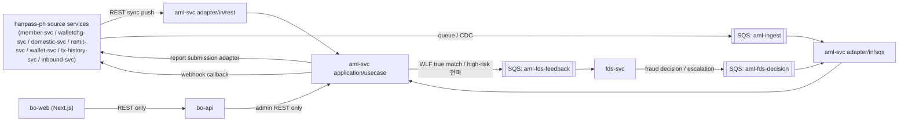
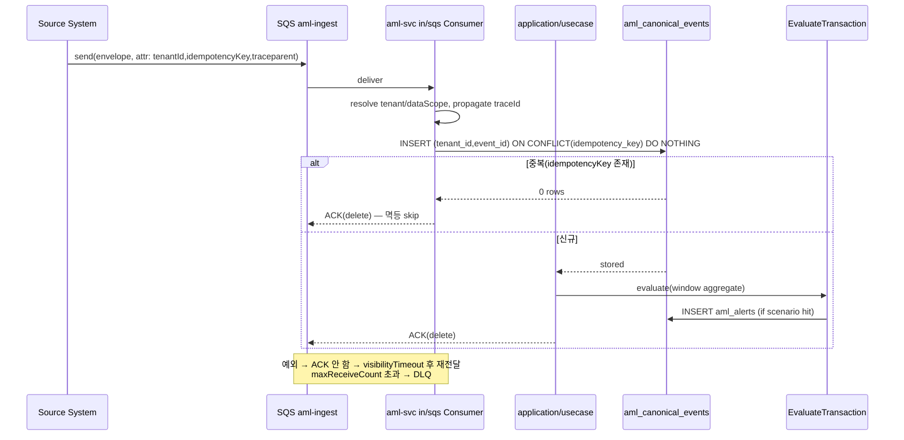
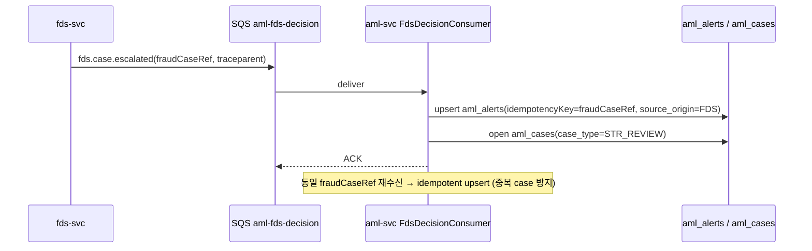
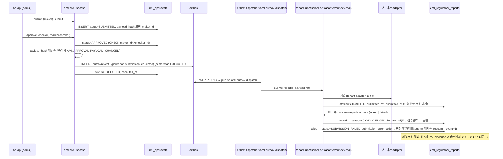
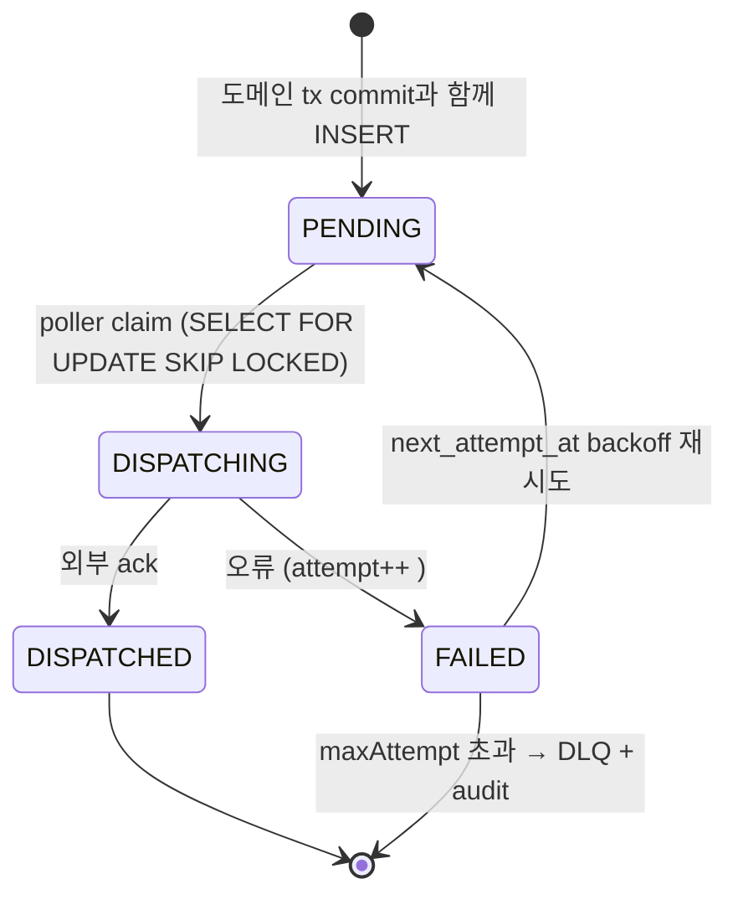
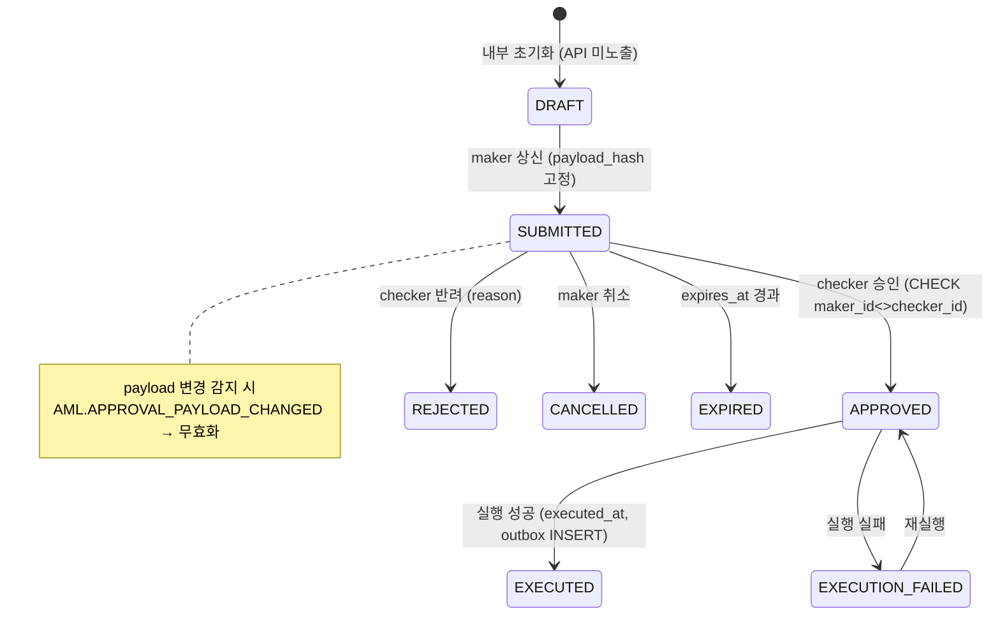
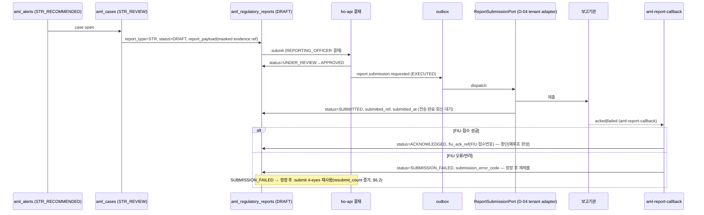
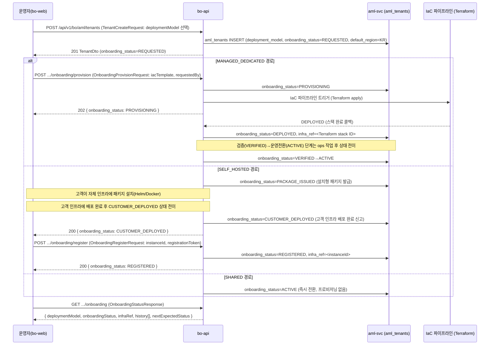

# AML 이벤트·연동 명세서 (aml-svc Integration)

> 정본: `.claude/skills/_shared/target-architecture.md`(4서비스 모노레포·비동기 SQS·멀티테넌시·PII 마스킹·4-eyes·Policy Pack STR/CTR/Travel Rule).
> 입력 진실: `docs/software/02-amlSvc-sass.md`(§8 Canonical Event Taxonomy·§12 TM·§13 결재·§14 Reporting·§15 외부연동·§19 감사).
> 동기화 대상: `docs/design/db/02-aml-db.md`(테이블·컬럼·enum), `docs/design/api/02-aml-api.md`(엔드포인트·DTO·scope·에러).
> 참조 구현: `hanpass-ph/services/fds-svc/adapter/in/sqs/FdsEventsConsumer`(SQS consumer 패턴), `adapter/out/external`(외부 어댑터).
> 본 문서는 부트스트랩 신규 작성이다. 명칭·필드·타입·enum·엔드포인트는 위 정본·DB·API와 100% 동기화하며, 충돌 시 정본 > 설계서 > DB/API 순으로 우선한다.

## 목차

1. [범위·경계·전제](#1-범위경계전제)
2. [메시징 토폴로지(SQS)](#2-메시징-토폴로지sqs)
3. [이벤트 카탈로그](#3-이벤트-카탈로그)
4. [메시지 envelope·스키마(JSON)](#4-메시지-envelope스키마json)
5. [비동기 흐름 시퀀스(Mermaid)](#5-비동기-흐름-시퀀스mermaid)
6. [멱등성·재처리·DLQ·순서보장](#6-멱등성재처리dlq순서보장)
7. [커넥터·필드매핑(원천→canonical)](#7-커넥터필드매핑원천canonical)
8. [아웃박스·결재 상태머신(4-eyes)](#8-아웃박스결재-상태머신4-eyes)
9. [규제 제출 연동(STR/CTR/Travel Rule)](#9-규제-제출-연동strctrtravel-rule)
10. [멀티테넌시 라우팅·PII 미전파](#10-멀티테넌시-라우팅pii-미전파)
11. [관측성·운영](#11-관측성운영)
12. [Capability 매트릭스](#12-capability-매트릭스)
13. [변경 이력](#13-변경-이력)

---

## 1. 범위·경계·전제

본 문서는 `aml-svc`(`com.hanpass.aml`)의 **인바운드(이벤트 수신)·아웃바운드(외부 제출·서비스 간 연동)** 비동기 연동을 정의한다. 동기 REST 계약은 `02-aml-api.md`가 정본이며, 본 문서는 그 위에서 **큐·이벤트·커넥터·아웃박스**만 다룬다.

### 1.1 서비스 경계 (정본 §3·§6.1)



규칙:
- 엔진 간(`fds-svc`↔`aml-svc`) 연동은 **event 연동 우선**(오픈결정 D-07), 직접 DB 공유 금지. 동기가 불가피하면 Internal API(`/internal/v1/aml/*`, mTLS+`X-Internal-Service`).
- `bo-web`은 `bo-api` 경유만(엔진 직접 호출 금지). 결재·감사·evidence export는 `bo-api`→`aml-svc` Admin API.
- 모든 메시지·커넥터·아웃박스는 `tenantId`·`dataScope`·`traceId`를 전파한다(정본 §4 관측성·멀티테넌시).
- raw PII는 큐·이벤트·외부 제출 어디에도 평문 전파 금지. ref(token)/hash/`payloadHash`만 흐른다(§10).
- **직렬화 규약**: 모든 큐·webhook 메시지 키는 **camelCase**로 직렬화하고 DB 컬럼(snake_case)과 1:1 매핑한다(예 `errorCode`↔`error_code`, `payloadHash`↔`payload_hash`, `sourceSchemaVersion`↔`schema_version`). enum 코드값은 DB §5·API §3와 동일하며 도메인 verb·별칭은 정본 enum으로 환원해 전파한다(예 WLF `POTENTIAL_MATCH`→`POSSIBLE_MATCH`, Travel Rule `REVIEW`→`HIGH_RISK`).
- **`eventFamily`는 입력 필드가 아니다(서버 파생)**: consumer가 `eventType` 접두(`<family>`)에서 도출하는 **읽기전용 파생값**이며 발신측·ingest 본문(API §3.1 `IngestEventRequest`)에 싣지 않는다. aml-svc는 별도 `event_family` 컬럼을 두지 않고 `aml_canonical_events.event_type`(VARCHAR(80))에 `<family>.<verb>` 전체를 저장하므로, `eventFamily`는 라우팅·관측성·webhook envelope(API §8.2)용 투영(projection)으로만 쓴다.
- **운영자 집계 API 경계**: 대시보드(플랫폼·서비스별)·서비스 관리·운영자 감사 조회는 **bo-api**가 소유·집약·인증한다(API §9 정본 결정). aml-svc(엔진)는 저수준 데이터 API·비동기 큐만 제공하며, 본 연동 명세는 운영자 집계 엔드포인트를 정의하지 않는다. PRD/PPT의 해당 화면은 호출 대상을 bo-api(`/api/v1/bo/aml/**`)로 명시한다.

### 1.2 어댑터 매핑 (헥사고날, 설계서 §6.2)

| 방향 | 어댑터 패키지 | 책임 | port |
|---|---|---|---|
| in | `adapter/in/rest` | 동기 ingest/screen/RA/TM/evidence (02-aml-api) | `IngestEventUseCase`·`ScreenUseCase`·`EvaluateRiskUseCase`·`EvaluateTransactionUseCase` |
| in | `adapter/in/sqs` | 대량 거래·정산·crypto·order·employee·FDS decision consumer | `IngestEventUseCase`·`EvaluateTransactionUseCase` |
| in | `adapter/in/scheduled` | polling/CDC/snapshot import, periodic review, watchlist freshness | `IngestEventUseCase`·`ManageWatchlistUseCase` |
| out | `adapter/out/external` | report submission adapter, fds-svc client, legacy vendor bridge, watchlist source importer, adverse-media/blockchain intel, webhook | `ReportSubmissionPort`·`FdsCasePort`·`AuditEvidencePort` |
| out | `adapter/out/persistence` | `aml_canonical_events`·`aml_approvals`·아웃박스 테이블 | `CanonicalEventStorePort` 등 |

---

## 2. 메시징 토폴로지(SQS)

정본은 비동기 메시징을 **SQS**로 고정한다(`target-architecture.md` §3). 참조 구현 `FdsEventsConsumer`와 동일하게 `io.awspring.cloud.sqs.annotation.SqsListener` 기반, `@ConditionalOnProperty(hanpass.aml-events.consumer-enabled)`로 토글한다.

### 2.1 큐 카탈로그

| 큐 논리명 | 방향 | 발행자 | 구독자 | 페이로드 family | DLQ | 비고 |
|---|---|---|---|---|---|---|
| `aml-ingest` | in | 외부 source system / connector | `aml-svc` IngestEventConsumer | `customer.*`·`entity.*`·`beneficial-owner.*`·`account.*`·`instrument.*`·`transaction.*`·`settlement.*`·`trade.*`·`invoice.*`·`order.*`·`crypto.*`·`employee.*` | `aml-ingest-dlq` | 대량 비동기 ingest. SW §8.1 IN 방향 15종 family 중 비동기 수신 대상(screening.*·case.*·vendor.*·fds.* 제외) |
| `aml-ingest.fifo` | in | core-banking / 정산 | `aml-svc` IngestEventConsumer(FIFO) | 동일 customer/account 순서보장 필요 이벤트 | `aml-ingest-dlq` | `MessageGroupId=tenantId:subjectRef` |
| `aml-fds-decision` | in | `fds-svc` | `aml-svc` FdsDecisionConsumer | `fds.decision.*`·`fds.case.escalated` | `aml-fds-decision-dlq` | D-07 event 연동 |
| `aml-screening-async` | internal | `aml-svc` ScreenUseCase | `aml-svc` ScreeningWorker | `screening.requested` | `aml-screening-dlq` | 대량 재screening·watchlist 재적용 |
| `aml-fds-feedback` | out | `aml-svc` | `fds-svc` | `aml.screening.true_match`·`aml.customer.high_risk`·`aml.case.str_recommended` | (구독자 DLQ) | WLF true match / high-risk 전파·STR 후보 전파 |
| `aml-outbox-dispatch` | out | `aml-svc` outbox poller | `aml-svc` OutboxDispatcher | report submit·webhook·fds-feedback dispatch | `aml-outbox-dlq` | 트랜잭셔널 아웃박스 |
| `aml-report-callback` | in | 외부 보고기관 / 제출 adapter | `aml-svc` ReportCallbackConsumer | `report.submission.acked`·`report.submission.failed` | `aml-report-callback-dlq` | 제출 결과 수신 |

- 큐 물리명은 `deployment_model`(DB `aml_tenants.deployment_model`, §10.1)에 따라 결정된다. `MANAGED_DEDICATED`/`SELF_HOSTED`(전용 배포): 서비스별 전용 큐 `aml-ingest-{tenantId}-{env}` (배포 단위 격리, 큐 자체가 서비스 경계). `SHARED`(공유 배포): 공용 큐 `aml-ingest-{env}` + 메시지 attribute `tenantId`로 행 라우팅·RLS. 구 `isolation_mode(SCHEMA/DB)` 기준 큐 분리 폐기 — `deployment_model` 기준으로 통일(V17a/V17b 마이그레이션 완료 후 적용). 라우팅은 §10.
- 모든 큐 메시지 attribute: `tenantId`, `idempotencyKey`, `traceparent`(W3C trace context), `dataScope`, `schemaVersion`(참조 구현 `FdsEventsConsumer.stringHeaders` 확장).

---

## 3. 이벤트 카탈로그

이벤트명은 `<domain>.<verb>` 소문자. `eventType`은 `aml_canonical_events.event_type`(VARCHAR(80))에 그대로 저장되며 API `IngestEventRequest.eventType`(§02-aml-api 3.1)와 1:1.

### 3.1 인바운드 — 외부 source → aml-svc (`aml-ingest`)

| eventType | 발행자(source_system 예) | 트리거 | 핵심 페이로드 키(ref/hash) | 후속 usecase | 산출 |
|---|---|---|---|---|---|
| `customer.created` | member-svc | 개인 고객 생성 | `customer.customerRef`(←`member.member_id`)·`customerType`·`country` | IngestEvent→ScreenSubject | `aml_customers`, `aml_screening_results` |
| `customer.kyc-updated` | member-svc | KYC/CDD 갱신·zoloz 스크리닝 | `customer.customerRef`·`kycStatus`·`docHash` | IngestEvent→EvaluateRisk | `aml_customers`, `aml_risk_scores` |
| `customer.status-changed` | member-svc | 상태 변경 | `customer.customerRef`·`status` | IngestEvent | `aml_customers` |
| `entity.created` | member-svc(kyb) | 법인/merchant/seller 생성 | `entity.entityRef`·`entityType`·`legalNameHash` | IngestEvent→ScreenSubject | `aml_entities` |
| `entity.updated` | member-svc(kyb) | 법인 정보 변경 | `entity.entityRef`·`industryCode` | IngestEvent | `aml_entities` |
| `beneficial-owner.changed` | member-svc(kyb) | UBO/대표자 변경 | `relationship.fromRef`·`toRef`·`relationshipType`·`ownershipPercent` | IngestEvent→ScreenSubject(UBO) | `aml_relationships`, `aml_screening_results` |
| `account.created` / `account.closed` | wallet-svc | 월렛/계좌 개설·폐쇄(`transfer_links` 자금그래프) | `account.accountHash`·`customerRef` | IngestEvent | (graph 보강) |
| `instrument.registered` | wallet-svc·member-svc | 지갑/가상계좌 등록 | `instrument.walletAddressHash`·`chain` | IngestEvent→ScreenSubject(crypto) | `aml_screening_results` |
| `transaction.requested` | walletchg-svc(충전)·domestic-svc(국내)·remit-svc(해외)·inbound-svc(인바운드) | 자금 이동 요청 | `transaction.transactionRef`(←`charge_order_id`/`transaction_id`/`transfer_number`/`wallet_transaction_id`)·`amount`·`amountMinor`·`currency`·`direction`·`corridor` | IngestEvent→EvaluateTransaction | `aml_canonical_events` |
| `transaction.completed` | walletchg/domestic/remit/inbound-svc | 거래 완료 | `transaction.transactionRef`·`counterparty.counterpartyRef`·`channelType` | EvaluateTransaction(TM) | `aml_alerts` |
| `transaction.cancelled` / `transaction.refunded` | card·pg | 취소/환불 | `transaction.transactionRef`·`originalTransactionRef` | EvaluateTransaction(refund_laundering) | `aml_alerts` |
| `settlement.executed` / `settlement.posted` | remit-svc·wallet-svc | 해외송금 정산·월렛 원장 정산 | `entity.entityRef`·`amountMinor`·`payoutAccountHash`(←`remit.account_hash`) | EvaluateTransaction·EvaluateRisk | `aml_alerts` |
| `trade.invoiced` / `trade.shipped` | trade·b2b | 무역대금·선적·통관 | `document.documentRef`·`amount`·`countryFrom`·`countryTo` | EvaluateTransaction(trade_mispricing) | `aml_business_documents`, `aml_alerts` |
| `invoice.issued` | b2b | B2B 인보이스 | `document.documentRef`·`subjectRef`·`counterpartyRef` | EvaluateTransaction | `aml_business_documents` |
| `order.placed` / `order.refunded` | ecommerce | 주문·반품 | `document.documentRef`·`sellerRef` | EvaluateTransaction(round_tripping) | `aml_business_documents` |
| `crypto.deposit` / `crypto.withdrawal` | crypto-exchange | 가상자산 입출금 | `transfer.transferRef`·`assetCode`·`walletAddressHash` | EvaluateTransaction(crypto_off_ramp)·TravelRule | `aml_travel_rule_transfers`, `aml_alerts` |
| `crypto.travel-rule-submitted` | crypto-exchange·vasp | Travel Rule 정보 전달 | `transfer.transferRef`·`originatorRef`·`beneficiaryRef`·`originatorVasp`·`beneficiaryVasp` | ManageTravelRule | `aml_travel_rule_transfers` |
| `employee.operation` | audit·iam·hr | 내부자 작업/override | `employeeRef`·`operationType`·`targetRef` | EvaluateTransaction(internal_override_abuse) | `aml_alerts` |
| `vendor.alert-ingested` | legacy-vendor-bridge | 기존 벤더 alert/case 수신 | `externalAlertRef`·`vendorVerdict`·`targetRef` | IngestEvent(source_origin=`VENDOR`) | `aml_alerts`(source_origin=`VENDOR`) |

> **hanpass-ph 소스 재그라운딩 주석(REST sync)**: 발행자 열의 source_system 은 hanpass-ph 7실서비스(DB §3.2 카탈로그 정본)다 — `member-svc`(회원/KYC/CDD/제재·PEP zoloz → customer.*/entity.*/beneficial-owner.*), `walletchg-svc`(월렛충전 cash-in), `domestic-svc`(국내송금 PHP), `remit-svc`(해외송금 cross-border, `sanction_screening_event`·`str_indicators` 보유 → transaction.requested·settlement.posted), `wallet-svc`(월렛 원장 `transfer_links` 자금그래프 → account.*·settlement.posted), `inbound-svc`(파트너 인바운드). `tx-history-svc`(회원 통합 이력 read model)는 ingest 발행자가 아니라 **대상 360°(DB §3.16)** 피드 소스다. card/pg/crypto-exchange/trade/ecommerce 등 잔존 generic 발행자는 hanpass-ph 실서비스의 예시 추상이며, 운영 등록값은 위 7코드다. corridor(remit `send/receive_country·currency`·USD `usd_amount/report_amount`→`amountBase`)는 transaction payload 에 보존(§4.2)된다.

> **`vendor.*` family 정합 주석**: `vendor.alert-ingested`의 `vendor.*` family는 SW §8.1 AML Canonical Event Taxonomy **15종 중 하나로 등재**되어 있다(SW §8.1 v1.x, Legacy Vendor Bridge 경유 `source_origin=VENDOR` 행 포함). 본 연동 명세에서는 독립 family 선언 대신 **`IngestEvent(source_origin=VENDOR)`** 경로로 흡수한다 — 즉 `vendor.alert-ingested`는 `source_origin=VENDOR`를 태그한 일반 ingest event로 처리되며, SW §8.1 `vendor.*` 행과 본 표의 `eventType`·`eventFamily` 라우팅은 동기화 완료 상태이다.

### 3.2 인바운드 — fds-svc → aml-svc (`aml-fds-decision`, D-07)

| eventType | 트리거 | 핵심 키 | 후속 | 산출 |
|---|---|---|---|---|
| `fds.case.escalated` | FDS fraud case → STR 후보 위임 | `fraudCaseRef`·`targetRef`·`transactionRef`·`severity`·`suggestedCaseType` | ManageCase(`STR_REVIEW`) | `aml_alerts`(alert_type=`FDS_ESCALATION`, source_origin=`FDS`) → `aml_cases` |
| `fds.decision.applied` | FDS hold/block 결정 → AML EDD 트리거 | `transactionRef`·`decision`·`targetRef` | EvaluateRisk·ManageCase(`EDD_REVIEW`) | `aml_alerts`, `aml_cases` |

> `fds.case.escalated`의 동기 fallback 경로는 `POST /internal/v1/aml/fds-escalations`(`FdsEscalationRequest`, 02-aml-api §3.10)이며 큐 경로는 동일 payload를 비동기로 수신한다(둘 다 `idempotencyKey=fraudCaseRef`로 멱등). `fds.decision.applied`는 **비동기 큐(`aml-fds-decision`) 전용**으로 대응 동기 REST 계약이 없다(`fds-escalations`는 escalated 전용). 동기 fallback이 필요해지면 API §2.6/§3.10에 `decision` 수신 DTO를 신설한 뒤 본 표를 갱신한다.

### 3.3 아웃바운드 — aml-svc → fds-svc (`aml-fds-feedback`)

| eventType | 트리거 | 핵심 키 | 구독자 처리 |
|---|---|---|---|
| `aml.screening.true_match` | WLF `TRUE_MATCH` 결재(EXECUTED) | `targetRef`·`screeningId`·`watchlistSourceType` | fds-svc block/watchlist 반영 |
| `aml.customer.high_risk` | RA `risk_grade` HIGH/PROHIBITED 확정 | `targetRef`·`scoreId`·`riskGrade` | fds-svc risk group 전파 |
| `aml.case.str_recommended` | alert `STR_RECOMMENDED` | `caseId`·`targetRef` | fds-svc evidence cross-ref |

### 3.4 아웃박스 dispatch (`aml-outbox-dispatch`) / 제출 콜백 (`aml-report-callback`)

| eventType | 트리거 | 키 | 외부 대상 |
|---|---|---|---|
| `report.submission.requested` | STR/CTR/Travel Rule 결재 EXECUTED | `reportId`·`reportType`·`approvalId` | ReportSubmissionPort → tenant adapter(D-04). dispatch 시 status=`SUBMITTED`(전송 완료·회신 대기) |
| `report.submission.acked` | FIU/보고기관 접수 회신 | `reportId`·`fiuAckRef`(FIU 접수번호) | → `aml_regulatory_reports.fiu_ack_ref` 저장, status=`ACKNOWLEDGED`(종단 — 폐루프 완성, 설계서 §14.1a) |
| `report.submission.failed` | 전송 실패·FIU 오류 반려 | `reportId`·`submissionErrorCode`(API §3.6·§8.1 정본) | → `submission_error_code` 저장, status=`SUBMISSION_FAILED` → 운영자 정정 후 재제출(§6.2) |
| `webhook.callback.requested` | screening/case/report 상태 변경 | `subjectRef`·`eventName`(API §8.1) | 고객 webhook URL(서명) — **콜백 URL 원천 = `aml_api_credentials`(`credential_type=WEBHOOK` `enabled=true`).`webhook_url`(DB §3.15, 구현 V17)**. 공유 secret = 동일 행 `secret_ciphertext`(서명 시점만 복호). **`aml_source_systems` 에는 webhook URL 컬럼 없음**(fds-svc `fds_api_credentials.webhook_url` 미러) |

> webhook 아웃박스 row는 서비스 콜백 envelope(API §8.2 정본)을 발행한다. envelope 키: `schemaVersion`(`aml.webhook.v1`)·`eventName`(`AmlScreeningResolved`/`AmlCaseStatusChanged`/`AmlReportSubmitted`)·`eventFamily`(`screening`/`case`/`report`, **`eventName` 접두에서 서버 파생** — 입력 아님)·`eventId`·`tenantId`·`dataScope`·`occurredAt`·`traceId`·`data`. 모든 키 camelCase, payload는 token/hash·마스킹만(원문 미포함). 서명·재시도·멱등은 API §8.3/§8.4 정본.

---

## 4. 메시지 envelope·스키마(JSON)

### 4.1 공통 envelope (모든 큐 메시지)

API `IngestEventRequest`(02-aml-api §3.1)·`aml_canonical_events` 컬럼과 1:1. raw PII 없음.

```json
{
  "schemaVersion": "aml.event.v1",
  "tenantId": "tenant_bank_a",
  "dataScope": "default",
  "sourceSystem": "core-banking",
  "sourceSchemaVersion": "core-banking.v1",
  "eventId": "evt-001",
  "idempotencyKey": "core-banking:evt-001",
  "eventType": "transaction.completed",
  "occurredAt": "2026-06-06T10:00:00Z",
  "traceId": "00-4bf92f...-01",
  "payloadHash": "sha256:...",
  "payload": { }
}
```

> `eventFamily`(`transaction`)는 **본문에 싣지 않는다** — consumer가 `eventType` 접두에서 파생한다(§1 규칙). `schemaVersion`(envelope 버전 `aml.event.v1`, DB 매핑 없음)과 `sourceSchemaVersion`(원천 스키마 버전 = DB `aml_canonical_events.schema_version` = API §3.1 `schemaVersion` 필드)을 **2축으로 분리**하며, 동일 키 의미 충돌이 없도록 webhook envelope(API §8.2, `schemaVersion=aml.webhook.v1`·`eventFamily` 파생)와 키 의미를 정합한다. `payloadHash`는 **최상위 필드**로 위치하며 API §3.1 `IngestEventRequest.payloadHash`(R=— 선택, 서버 자동계산)와 경로·필수 여부를 일치시킨다(구 `rawPayload.payloadHash` 중첩 구조 폐기).

| 필드 | 타입 | 필수 | DB 매핑 | 규칙 |
|---|---|---|---|---|
| `schemaVersion` | string | Y | — | 메시지 envelope 버전(`aml.event.v1`). breaking은 `.v2` |
| `tenantId` | string | Y | `tenant_id` | 라우팅·RLS 키(§10) |
| `dataScope` | string | N | `data_scope` | 운영자 row-level 권한 필터(영업점·법인그룹 하위 격리, **NULL=tenant 전역**, §10.1 정본·DB §2.1·API §1.1 정본=선택). 미제공 시 tenant 전역 접근 권한 적용 |
| `sourceSystem` | string | Y | `source_system` | 미등록 시 `AML.UNKNOWN_SOURCE_SYSTEM` |
| `sourceSchemaVersion` | string | Y | `schema_version` | source 스키마 버전(Schema Registry 조회 키) |
| `eventId` | string | Y | `event_id`(PK) | 원천 식별자 |
| `idempotencyKey` | string | Y | `idempotency_key`(UNIQUE) | `<source>:<eventId>` 권장 |
| `eventType` | string | Y | `event_type` | §3 카탈로그 `<family>.<verb>`(API §3.1 `IngestEventRequest.eventType` 1:1) |
| `eventFamily` | string | (서버 파생) | — | **입력 아님** — consumer가 `eventType` 접두(`<family>`)에서 도출하는 읽기전용 파생값. aml-svc는 `event_family` 컬럼 미보유(§1 규칙)이므로 라우팅·관측성·webhook envelope(API §8.2)용 투영. 발신측 미전송 |
| `occurredAt` | string(date-time) | Y | `occurred_at` | 원천 발생 시각 |
| `traceId` | string | N | `trace_id` | 없으면 consumer가 생성. REST=`X-Trace-Id` 헤더 ↔ 큐=envelope `traceId` 본문(API §1.1 매핑) |
| `payloadHash` | string | N | `payload_hash`(NOT NULL) | raw payload sha256. **선택(미제공 시 aml-svc ingest 어댑터가 수신 payload의 sha256을 자동 계산하여 INSERT — 서버 자동계산 방식 확정, API §3.1 정본)**. 호출자가 직접 계산해 제공해도 무방(서버 값 우선). 구 `rawPayload.payloadHash` 중첩 경로 폐기 — 최상위 키로 통일(API §3.1·DB `payload_hash` NOT NULL 1:1) |
| `payload` | object | Y | `payload`(JSONB) | 정규화 payload(ref/hash만) |

> **Cross-service envelope 정책(`workspaceId` ↔ `dataScope`) — 정본**: AML envelope는 **`dataScope` 최상위(선택)**(`workspaceId` 미탑재 — AML `workspace_id` 미적용·보류, SW §16.2.1)이고, FDS envelope(`01-fds-integration.md` §4.1)는 **`workspaceId` 최상위 필수**(`dataScope` 미탑재)다. 이는 **의도된 비대칭**이며, **FDS→AML 핸드오프(`fds-aml-handoff`, §9) 시 핸드오프 어댑터(aml-svc 소비 측)가 FDS `workspaceId`→AML `dataScope`로 변환**한다(`default`→`default` 매핑 포함). 교차 주석: AML 설계서 §8.2 ↔ FDS 설계서 §8.2/§8.3.

### 4.2 transaction payload (canonical, 설계서 §8.2)

```json
{
  "customer": { "customerRef": "cust_hmac_123", "customerType": "PERSON", "country": "KR", "riskGrade": "MEDIUM" },
  "counterparty": { "counterpartyRef": "bene_hmac_999", "counterpartyType": "PERSON", "country": "VN" },
  "transaction": {
    "transactionRef": "tx_123", "direction": "OUTBOUND",
    "amount": "9500000.00000000", "amountMinor": 9500000, "currency": "KRW",
    "purpose": "REMITTANCE", "channelType": "BANK_TRANSFER",
    "corridor": { "sendCountry": "KR", "receiveCountry": "PH", "sendCurrency": "KRW", "receiveCurrency": "PHP" },
    "amountBase": "7000.00"
  },
  "screeningContext": { "requiresSanctionsScreening": true, "requiresTravelRule": false }
}
```

> 금액은 `amount`(NUMERIC(24,8) 문자열, 외화/crypto 소수 수용) + `amountMinor`(BIGINT 정수 최소단위) 병행(DB §3 규약과 일치).
> **corridor·amountBase(hanpass-ph cross-border, remit-svc)**: `corridor`(`sendCountry`/`receiveCountry` ← `remit.send_country/receive_country`, `sendCurrency`/`receiveCurrency` ← `remit.send_currency/receive_currency`)와 USD 정규화 `amountBase`(← `remit.usd_amount/report_amount`)는 cross-border 거래에 한해 채운다(국내 walletchg/domestic 은 corridor 동일국·생략 가능). TM corridor 시나리오·대상 360° 거래 표시·canonical event payload(DB §3.15)에 보존. 임계·기준금액은 규제 레이어(Policy Pack) 정본 — 본 필드는 데이터 신호일 뿐 임계 교체 아님.

### 4.3 crypto / Travel Rule payload (`aml_travel_rule_transfers`)

```json
{
  "transfer": {
    "transferRef": "trt_001", "assetCode": "BTC",
    "amount": "0.50000000", "amountMinor": 50000000,
    "originatorRef": "orig_hmac", "beneficiaryRef": "bene_hmac",
    "originatorVasp": "vasp-a", "beneficiaryVasp": "vasp-b",
    "walletAddressHash": "hmac:...", "chain": "BTC",
    "completenessStatus": "INCOMPLETE", "riskStatus": "HIGH_RISK",
    "exceptionReason": null
  }
}
```

> `riskStatus`는 DB §5.15 정본 enum 4종(`CLEAR`/`SANCTIONED_ADDRESS`/`MIXER_EXPOSURE`/`HIGH_RISK`)만 사용한다(`aml_travel_rule_transfers.risk_status` CHECK). 외부/구 페이로드의 비정본 `REVIEW`는 consumer가 **`HIGH_RISK`로 정규화**(DB §5.15 주석)한 뒤 저장하며, exception 큐 트리거(§9.3)도 `HIGH_RISK` 기준이다.
>
> `exceptionReason`은 DB `aml_travel_rule_transfers.exception_reason VARCHAR(256) NULL`(DB §3.14)에 매핑된다. exception 확정 시 결재(4-eyes `TRAVEL_RULE_EXCEPTION`) 사유를 여기에 채워 전달하며, `TRAVEL_RULE_EXCEPTION` 결재 EXECUTED 이후 아웃박스(§9.3) dispatch payload에도 포함시킨다. `completenessStatus`가 `MISSING_ORIGINATOR`·`MISSING_BENEFICIARY`·`INCOMPLETE` 중 하나이거나 `riskStatus`가 고위험일 때 exception 큐 트리거 대상이 되며, exception 확정 사유를 이 필드에 명시한다.

### 4.4 fds-decision payload (`FdsEscalationRequest` 호환)

```json
{
  "fraudCaseRef": "fds_case_777", "targetRef": "cust_hmac_123",
  "transactionRef": "tx_123", "severity": "HIGH",
  "suggestedCaseType": "STR_REVIEW", "evidence": { "ruleHits": ["RAPID_MOVEMENT"] }
}
```

### 4.5 outbox dispatch payload (report submission)

```json
{
  "outboxId": "ob_...", "tenantId": "tenant_bank_a", "dataScope": "default",
  "aggregateType": "REGULATORY_REPORT", "aggregateRef": "report_id_uuid",
  "eventType": "report.submission.requested",
  "reportType": "STR", "approvalId": "appr_uuid",
  "payloadHash": "sha256:...", "traceId": "00-...", "attempt": 1
}
```

Travel Rule exception 확정(`TRAVEL_RULE_EXCEPTION` 결재 EXECUTED) 시 `reportType=TRAVEL_RULE`이며 `exceptionReason` 필드를 추가로 포함한다:

```json
{
  "outboxId": "ob_...", "tenantId": "tenant_bank_a", "dataScope": "default",
  "aggregateType": "REGULATORY_REPORT", "aggregateRef": "transfer_rule_id_uuid",
  "eventType": "report.submission.requested",
  "reportType": "TRAVEL_RULE", "approvalId": "appr_uuid",
  "exceptionReason": "MISSING_ORIGINATOR: 송신자 정보 제출 불가(고객 거부)",
  "payloadHash": "sha256:...", "traceId": "00-...", "attempt": 1
}
```

> 외부 제출 payload 본문은 `aml_regulatory_reports.report_payload`(JSONB)를 참조하며 메시지에는 ref·hash만 싣는다(PII·증적 본문 미전파). `exceptionReason`은 DB `aml_travel_rule_transfers.exception_reason`(DB §3.14) 값을 passthrough하며 원문 PII를 포함하지 않는다.

---

## 5. 비동기 흐름 시퀀스(Mermaid)

### 5.1 Ingest → 정규화 → TM (멱등·재시도)



### 5.2 실시간 WLF screening (동기 + fail 정책)

```mermaid
sequenceDiagram
    participant SYS as Onboarding System
    participant REST as aml-svc in/rest POST /api/v1/aml/screen
    participant WLF as ScreenSubject UseCase
    participant IDX as ScreeningIndexPort
    participant DB as aml_screening_results
    SYS->>REST: ScreenRequest (Idempotency-Key, X-Signature)
    REST->>WLF: screen(subject ref/hash)
    WLF->>IDX: match(normalized_tokens)
    alt 엔진 정상
        IDX-->>WLF: candidates + score
        WLF->>DB: INSERT screening_results(status=NO_MATCH|POSSIBLE_MATCH|TRUE_MATCH)
        WLF-->>REST: ScreenResponse(POSSIBLE_MATCH 정규화: POTENTIAL→POSSIBLE)
    else 엔진 장애 (D-14)
        WLF-->>REST: AML.SCREENING_REQUIRES_REVIEW(422) 또는 AML.SCREENING_UNAVAILABLE(503)
        Note over REST,SYS: source_systems.failure_policy=MANUAL_REVIEW|FAIL_CLOSED (DB §3.2 컬럼; DTO=failurePolicy API §3.9)
    end
```

### 5.3 FDS escalation → STR 후보 (event 연동 D-07)



### 5.4 결재(4-eyes) → 아웃박스 → 외부 제출 → 콜백



---

## 6. 멱등성·재처리·DLQ·순서보장

### 6.1 멱등성

- **저장 멱등**: `aml_canonical_events` UNIQUE `(tenant_id, idempotency_key)` + `INSERT ... ON CONFLICT DO NOTHING`. 중복 메시지는 0 rows → 즉시 ACK(`AML.IDEMPOTENCY_CONFLICT`는 동기 API에서만 노출, 큐는 silent skip).
- **처리 멱등**: alert/case upsert는 자연키(`fraudCaseRef`, `transactionRef`, `scenario_code`+window)로 dedupe. report 제출은 `approvalId`로 1회만 dispatch.
- **헤더 키**: 메시지 attribute `idempotencyKey`(참조 구현 `FdsEventsConsumer`와 동일 헤더명).

### 6.2 재처리(retry)

| 단계 | 정책 |
|---|---|
| 일시 오류(DB lock, 외부 timeout) | ACK 안 함 → SQS `visibilityTimeout` 후 재전달, exponential backoff(redrive policy) |
| `maxReceiveCount` | 5회(기본). 초과 시 DLQ 이동 |
| 결정적 오류(스키마 위반·미등록 source) | 재시도 무의미 → 즉시 DLQ + `aml_audit_events`(category=`POLICY_CHANGE`/ingest reject) 기록 |
| report 제출 실패(`report.submission.failed`) | `aml_regulatory_reports.status=SUBMISSION_FAILED`(`submission_error_code` 저장, 설계서 §14.1a) → 운영자 정정 후 재제출(RESUBMIT: 기존 `:submit` 4-eyes 신규 결재 사이클 재사용, `resubmit_count` 증가·회차별 재제출 evidence 별도 보존) |

### 6.3 DLQ 운영

- 큐별 전용 DLQ(§2.1). DLQ 메시지는 원본 attribute + `failureReason`·`failedAt` 부가.
- DLQ replay: 운영자 트리거 → 원본 큐 재투입(멱등키로 중복 무해). replay 이력은 `aml_audit_events`.
- DLQ depth는 `aml.ingest.dlq.depth` metric·alert(§11).

### 6.4 순서보장

- 기본 큐는 at-least-once·순서 미보장. 순서가 의미 있는 경우(동일 customer/account의 `customer.created`→`customer.kyc-updated`, `transaction.requested`→`completed`)는 `aml-ingest.fifo`(`MessageGroupId = tenantId + ":" + subjectRef`, `MessageDeduplicationId = idempotencyKey`).
- 순서 역전 내성: usecase는 `occurredAt` 기준 last-writer-wins로 상태 머지(out-of-order 이벤트가 최신 상태 덮어쓰지 않도록 가드).

---

## 7. 커넥터·필드매핑(원천→canonical)

### 7.1 커넥터(ingest mode) — `aml_source_systems.ingest_mode` enum과 1:1

| 커넥터 | ingest_mode | 어댑터 | 동작 | 멱등 키 |
|---|---|---|---|---|
| REST Push | `REST_PUSH` | in/rest | 외부가 `POST /api/v1/aml/events` 동기 전송 | `Idempotency-Key` |
| Queue | `QUEUE` | in/sqs | SQS consumer(§2) | attr `idempotencyKey` |
| Polling | `POLLING` | in/scheduled | 주기적 read(API/DB replica) | `<source>:<cursor>` |
| CDC | `CDC` | in/scheduled | change stream → canonical | `<source>:<lsn>` |
| Snapshot | `SNAPSHOT` | in/scheduled | 전체/증분 file import | `<source>:<snapshotId>:<row>` |
| Vendor Bridge | `VENDOR_BRIDGE` | out/external→in(설계서 §8.1 기준 IN방향: 외부 벤더가 데이터를 내보내고 aml-svc가 수신·정규화) | 벤더 export/replica → canonical event(`source_origin=VENDOR`) — 물리 흐름은 벤더→adapter/out/external pull→aml-svc ingest | `<vendor>:<alertId>` |

> 모든 커넥터는 **Schema Registry**(`SchemaRegistryPort`)로 `sourceSchemaVersion`을 검증하고, **PII Tokenization**(`PiiTokenizationPort`)을 통과시킨 뒤 canonical event로 정규화한다. 어느 커넥터도 raw PII를 `aml_*`에 저장하지 않는다.

### 7.2 필드매핑 (원천 → canonical, PII는 ref/hash)

> 원천 필드는 **hanpass-ph 실서비스 컬럼**(DB §3.2 카탈로그). 식별자 원문은 절대 저장하지 않고 keyed HMAC token / hash 로만 흐른다. **주의**: `member_id` 가 `domestic-svc`만 varchar(36) 이므로 통합뷰 join 전 문자열 정규화(trim·case)한다.

| 원천 필드(hanpass-ph 서비스) | canonical 경로 | 변환 | DB 컬럼 |
|---|---|---|---|
| `member.member_id`(member-svc) | `payload.customer.customerRef` / FDS `subjectRef` | tenant-keyed HMAC token | `aml_customers.customer_ref` |
| `member.member_name` | `payload.customer.nameHash` | HMAC-SHA256(tenant key) | `aml_customers.name_hash` |
| `member` rrn/passport/doc_no | `payload.customer.docHash` | HMAC, 원문 폐기 | `aml_customers.doc_hash` |
| `member` corp_name(kyb) | `payload.entity.legalNameHash` | normalize→HMAC | `aml_entities.legal_name_hash` |
| `member` biz_no(kyb) | `payload.entity.bizNoHash` | HMAC | `aml_entities.biz_no_hash` |
| `remit.account_hash` / wallet account_no | `payload.*.accountHash` / counterparty·recipient ref | HMAC | (`account_hash`) |
| `wallet_address`(wallet-svc) | `payload.transfer.walletAddressHash` | HMAC | `aml_*.wallet_address_hash` |
| `amount` + `currency` | `payload.transaction.amount`+`amountMinor` | NUMERIC(24,8)+BIGINT(minor) | `amount`/`amount_minor` |
| `remit.usd_amount`/`report_amount` | `payload.transaction.amountBase` | USD 정규화 | (canonical payload) |
| `wallet_transaction_id` / `remit.transfer_number` / `walletchg.charge_order_id` / `domestic.transaction_id` | `payload.transaction.transactionRef` | passthrough/token | `transaction_ref` |
| `remit.send_country/receive_country`·`send_currency/receive_currency` | `payload.transaction.corridor.*` | passthrough(ISO) | (canonical payload) |
| `member.zoloz_aml_screening`(decision/risk_level/total_hits/hit_results) | `payload`·screening 정규화 | zoloz→§5.5 status·§5.2 risk_grade·score_breakdown | `aml_screening_results` |
| `remit.str_indicators`(STR_001~015) | `evidence.strIndicator`(데이터 신호) | 데이터 신호 매핑(규제 STR 분류는 KR 정본) | `aml_alerts.evidence` |
| `counterparty_*` | `payload.counterparty.*Ref/*Hash` | HMAC/token | — |
| `country`/`nationality` | `payload.*.country` | ISO-3166 alpha-2 | `country` |
| `event_ts` | `occurredAt` | ISO-8601 UTC | `occurred_at` |
| (원천 전체) | `payloadHash` | sha256, 서버 자동계산(미제공 시 ingest 어댑터 INSERT) | `payload_hash` |

### 7.3 Legacy Vendor Bridge 매핑 (설계서 §15.5)

| 벤더 export 필드 | canonical | 비고 |
|---|---|---|
| `vendor_alert_id` | `aml_alerts.external_alert_ref` | DB §3.10 정식 컬럼(VARCHAR(256) NULL, `ix_alert_ext_ref`). SaaS alert와 dual-run 구분 저장, `source_origin=VENDOR`일 때 채움 |
| `vendor_verdict` | `aml_alerts.evidence.vendorVerdict` | 표준 evidence field로 변환(벤더 schema 원문 미노출) |
| (dual-run) | `aml_alerts.source_origin=VENDOR` | analyst final decision은 별도 저장 |

---

## 8. 아웃박스·결재 상태머신(4-eyes)

### 8.1 트랜잭셔널 아웃박스

외부 부작용(report 제출·webhook·fds-feedback)은 **도메인 변경과 같은 트랜잭션**으로 `outbox`에 기록 후, `OutboxDispatcher`가 poll→publish→mark. at-least-once + 소비자 멱등으로 정확히 한 번 효과.

물리 테이블은 **`aml_outbox`(DB §3.15, 구현 Flyway V4 생성)** 가 정본이다. 핵심 컬럼: `tenant_id`·`outbox_id`(PK), `data_scope`, `aggregate_type`(**6종** `REGULATORY_REPORT`/`CASE`/`SCREENING`/`FDS_FEEDBACK`/`WEBHOOK`/`IRA_REPORT` — `IRA_REPORT`는 V13에서 추가, IRA 제출 폐루프 enqueue), `aggregate_ref`, `event_type`(`report.submission.requested`/`webhook.callback.requested`/`fds.feedback.applied` 등 §3.4), `payload`(JSONB, ref/hash), `payload_hash`, `status`(§5.17 outbox_status: PENDING/DISPATCHING/DISPATCHED/FAILED), `attempt`, `next_attempt_at`, `published_at`, `trace_id`, **`created_at`·`created_by`**(공통 감사 컬럼, append 중심 — DB §3.15 정본). 발행 멱등 UNIQUE `(tenant_id, aggregate_type, aggregate_ref, event_type, payload_hash)`, dispatch 인덱스 `ix_outbox_dispatch (tenant_id, status, next_attempt_at)`.



### 8.2 결재(approval) 상태머신 — `aml_approvals` (설계서 §13.5, DB §3)

`status` enum(approval_status): `DRAFT/SUBMITTED/APPROVED/REJECTED/CANCELLED/EXPIRED/EXECUTED/EXECUTION_FAILED`. 🔒 Admin 엔드포인트(`:apply`/`:activate`/`:close`/`:submit`/`:approve` 등, 02-aml-api §2.7)는 모두 이 머신을 통과.

> **`DRAFT`는 내부 전이 상태로 API 미노출.** `DRAFT`는 결재 객체의 내부 초기화 단계이며 외부 호출자(bo-api/bo-web)에게 노출되지 않는다. API 표면 첫 관찰 가능 상태는 `SUBMITTED`(상신 완료, 202 응답)이다(API §1.5 정본). PRD/화면은 `DRAFT` 배지 표시 불필요.



불변식:
- `maker_id ≠ checker_id` — DB CHECK 제약명 `SELF_APPROVAL_DISABLED`(DB §3.15·§5.12), 위반 시 API 에러코드 **`AML.SELF_APPROVAL_FORBIDDEN`**(API §3·§7 정본, 409). 제약명(DB)과 errorCode(API)는 역할이 다른 동일 4-eyes 불변식의 두 표현이다.
- `payload_hash` 고정. APPROVED 후 대상 payload 변경 시 `AML.APPROVAL_PAYLOAD_CHANGED`로 무효화.
- 결재 완료(`APPROVED`)와 실행(`EXECUTED`, `executed_at`) 분리 저장.
- AI agent는 `SUBMITTED`까지만 가능, `APPROVED` 불가(설계서 §13.5).
- 모든 전이는 `aml_audit_events`(category=`CASE_APPROVAL`/`REPORT_LIFECYCLE` 등) append-only 기록.

### 8.3 결재 대상(subject_type) ↔ 아웃박스 효과

| subject_type | 결재 후 EXECUTED 부작용 | 아웃박스 event |
|---|---|---|
| `STR_SUBMIT`/`CTR_SUBMIT` | 외부 보고기관 제출 | `report.submission.requested` |
| `TRAVEL_RULE_EXCEPTION` | exception 확정·증적 보존 | `report.submission.requested`(TRAVEL_RULE) |
| `WLF_DECISION`(TRUE_MATCH) | fds 전파 | `aml.screening.true_match` |
| `RISK_OVERRIDE`(→HIGH) | fds risk group 전파 | `aml.customer.high_risk` |
| `WATCHLIST_IMPORT` | 명단 version apply | (내부, audit) |
| `RA_MODEL`/`TM_SCENARIO`/`COUNTRY_RISK`/`POLICY_PACK` | 모델·정책 활성화 | (내부, audit) |
| `FP_WHITELIST`/`EDD_CLOSE`/`RELATIONSHIP_REJECT`/`SECRET_CHANGE` | 상태 확정 | (내부, audit) |
| `CHECKLIST_CHANGE` | CDD/EDD checklist 정책 버전 활성화(정책 store 갱신) | (내부, audit) |
| `PERIODIC_REVIEW_CHANGE` | periodic review 주기 설정 갱신(등급별 재확인 주기 policy store 반영) | (내부, audit) |

> 본 표는 API §3.7 `ApprovalDto.subjectType` 16종 정본 전수를 커버한다(v1.5 `CHECKLIST_CHANGE`·`PERIODIC_REVIEW_CHANGE` 2종 추가로 16종 완비). API §3.7 추가·변경 시 본 표와 동기화 필수.

---

## 9. 규제 제출 연동(STR/CTR/Travel Rule)

### 9.1 STR 제출 흐름 (설계서 §14.2·§14.1a, 4-eyes)



- report_type enum(DB §5.10): `STR/CTR/TRAVEL_RULE/EDD_REGISTER/WLF_REGISTER/RA_REPORT/AUDIT_EXPORT`.
- **report_status(8종 정본, 설계서 §14.1a·DB §5.11)**: `DRAFT`/`UNDER_REVIEW`/`APPROVED`/`SUBMITTED`/`REJECTED`/`CANCELLED`/`ACKNOWLEDGED`/`SUBMISSION_FAILED`. `SUBMITTED`=외부 전송 완료(FIU 회신 대기). `ACKNOWLEDGED`=FIU 접수 확정(`fiu_ack_ref` 저장, 종단). `SUBMISSION_FAILED`=전송 실패/FIU 오류 반려(`submission_error_code` 저장). `REJECTED`/`CANCELLED`=4-eyes 기각/취소(사유 코드 필수·REPORTING_OFFICER 결재, 설계서 §14.1a).
- 제출 식별자(`submitted_ref`)·FIU 접수번호(`fiu_ack_ref`)·결과는 결재 완료와 별도 evidence로 보존(설계서 §13.5·§14.1a 폐루프). **재제출 전략**: `SUBMISSION_FAILED` 건은 보고 본문 정정 후 **기존 `:submit` 4-eyes 결재 절차 재사용**(`resubmit_count` 증가·회차별 이력 보존, §6.2). 신규 report 생성·`supersedesReportId` 방식은 사용하지 않는다.

### 9.2 CTR — 데이터 수집·검증 보조 및 면제(제외) 처리

- `transaction.completed`·`crypto.*` ingest 시 tenant policy pack `effective version`의 기준금액으로 CTR 후보 집계(`aml_canonical_events` window aggregation). 기준금액·대상은 policy pack version으로 관리(법령 변경 수용).
- CTR evidence export는 `aml_evidence_exports`(export_type=`CTR_EVIDENCE`) + manifest hash.
- **CTR 제외(면제) 처리(설계서 §14.3, API §3.6 정본)**: 법정 면제 대상 확정 시 `aml_regulatory_reports.status=CANCELLED`로 전이하며, `ctr_exemption_code`(면제 사유 코드, 설계서 §14.3 법정 제외 규칙)를 **필수** 기록한다. 면제 확정은 **REPORTING_OFFICER 4-eyes 결재**(`subject_type=CTR_SUBMIT`, 자기승인 금지)를 거친다. 결재 EXECUTED 후 아웃박스에 면제 감사 이벤트를 기록하며, 증적은 `aml_evidence_exports`로 보존한다. 면제 결재 흐름:

  ```
  CTR 후보 → DRAFT → :submit(REPORTING_OFFICER) → APPROVED → 면제 사유 확정
    → status=CANCELLED + ctr_exemption_code 기록(4-eyes EXECUTED) → 감사 append-only
  ```

  비면제 건은 §9.1 STR 흐름과 동일하게 `:submit` → 외부 제출(`CTR_SUBMIT`) → SUBMITTED → ACKNOWLEDGED 폐루프.

### 9.3 Travel Rule — VASP 정보 보존·전달 (설계서 §18.4)

- `crypto.travel-rule-submitted` 수신 → `aml_travel_rule_transfers`(completeness_status/risk_status). `risk_status`는 DB §5.15 enum 4종만(`CLEAR`/`SANCTIONED_ADDRESS`/`MIXER_EXPOSURE`/`HIGH_RISK`), 비정본 `REVIEW`는 `HIGH_RISK`로 정규화(§4.3).
- `completeness_status∈{MISSING_ORIGINATOR, MISSING_BENEFICIARY, INCOMPLETE}` 또는 `risk_status∈{HIGH_RISK,SANCTIONED_ADDRESS,MIXER_EXPOSURE}` → exception 큐(`ix_trt_risk`) → `VASP_TRAVEL_RULE_REVIEW` case → exception 확정은 🔒결재(`TRAVEL_RULE_EXCEPTION`). `completeness_status` 3종(DB §5.22: `MISSING_ORIGINATOR`=송신정보 누락·`MISSING_BENEFICIARY`=수신정보 누락·`INCOMPLETE`=복합 누락)은 모두 불완전 상태로 간주해 동일 exception 큐로 라우팅한다.
- originator/beneficiary는 ref/hash, VASP는 코드(`originator_vasp`/`beneficiary_vasp`). raw 송수신자 PII 미전파.

### 9.4 증빙·재제출

- 모든 제출(STR/CTR/TravelRule)은 `aml_evidence_exports`로 manifest hash·row count·query snapshot 저장(D-11 UI+API+manifest hash).
- **재제출 전략(설계서 §14.1a·DB §3.12·API §3.6 정본)**: `SUBMISSION_FAILED` 건은 **기존 report row를 유지**하며 보고 본문 정정 후 **`:submit` 4-eyes 결재 절차를 재사용**한다. `resubmit_count`(DB `aml_regulatory_reports.resubmit_count`)를 증가시키고 회차별 제출·회신 이력을 evidence로 보존한다. **신규 report 생성·`supersedesReportId` 방식은 사용하지 않는다.** 재제출 흐름:
  ```
  SUBMISSION_FAILED → 정정(보고 본문) → :submit(REPORTING_OFFICER 4-eyes, resubmit_count+1)
    → APPROVED → 아웃박스 dispatch → SUBMITTED → FIU 회신 → ACKNOWLEDGED 또는 재귀 SUBMISSION_FAILED
  ```
- 재제출 각 회차의 증적(payload, fiu_ack_ref, submission_error_code, 결재 이력)은 append-only로 보존한다.

---

## 10. 멀티테넌시 라우팅·PII 미전파

### 10.1 라우팅 — 배포 모델(deployment_model) 기준 (정본 §4.1, API §1.1 · DB §5.28)

`aml_tenants.deployment_model`(DB §5.28, 구 `isolation_mode` 폐기 V17a/V17b)이 **큐·연결 풀·RLS 라우팅의 1차 결정 인자**다. 격리는 DB 행/스키마 토글이 아니라 배포 단위 결정이며, 화면 즉석 선택값이 아니라 온보딩 프로비저닝 프로세스의 산출이다.

| deployment_model | 큐 라우팅 | DB 연결 풀 | `tenantId` 의미 | `app.current_tenant` RLS | 비고 |
|---|---|---|---|---|---|
| `MANAGED_DEDICATED`(기본) | 전용 큐 `aml-ingest-{tenantId}-{env}` | 전용 connection pool / 전용 DB | 배포=서비스 **단일 값** — 라우팅은 배포 엔드포인트(DNS·큐 이름) 단위 | RLS 세션변수 설정은 내부 분리 보조용(단일 tenant라 행 격리 역할 없음) | 일반 금융사 기본. IaC 온보딩 자동 |
| `SELF_HOSTED` | 고객 인프라 내 전용 큐(고객 관리) | 고객 인프라 내 전용 DB | 배포=서비스 **단일 값** — 플랫폼 연결 없음, 고객 인프라 경계 | 동일(단일 tenant) | 은행·고PII·내부망. 설치형 패키지 |
| `SHARED` | 공용 큐 `aml-ingest-{env}` | 공유 connection pool | `tenantId` = 서비스 간 **행 격리 키** — `Tenant-Id` 헤더 행 라우팅·`app.current_tenant` 세션변수 강제 | RLS `app.current_tenant` 필수 — 서비스 간 행 격리 | 소규모/체험. 즉시 프로비저닝 |

- **`tenantId` 라우팅 의미 재정의(정본 §4.1·API §1.1)**: `tenantId`는 **서비스(테넌트) 격리 경계**의 식별자다(계층: 기관 → 서비스(테넌트) → 워크스페이스). 전용 배포(`MANAGED_DEDICATED`/`SELF_HOSTED`)에서 `tenantId`는 배포의 서비스를 나타내는 사실상 **단일 값**이다. 메시지 attribute/헤더의 `Tenant-Id`는 배포 엔드포인트(큐 이름·DNS 레코드) 라우팅의 식별 레이블이며 동일 배포 내 서비스 간 행 격리에 사용되지 않는다. **`SHARED` 배포에서만** `Tenant-Id`가 서비스 간 행 라우팅·RLS(`app.current_tenant` 세션변수) 격리 키로 동작한다.
- **`data_scope` 의미 재정의(API §1.1·정본 §4)**: `data_scope`는 저장 격리 경계가 아니라 **운영자 row-level 조회·조치 권한 필터**(영업점·법인그룹 하위 격리, bo-api 권한 매핑)다. 배포 모델과 독립적으로 동작한다.
- consumer는 처리 전 `aml_source_systems`로 `(tenantId, sourceSystem)` 유효성 검증(deployment_model과 무관하게 동일 규칙).
- `traceId`는 ingest→screening→RA→TM→case→report→export 전 구간 전파(설계서 §20.3), 하나의 `caseId`/`reportId`는 동일 `traceId` timeline.

### 10.2 raw PII 미전파 (정본 §4, 설계서 §19.2)

- 큐·이벤트·아웃박스·외부 제출 payload·webhook 어디에도 평문 PII 금지. 전파 가능 항목: `*Ref`(token), `*Hash`(tenant-keyed HMAC), `payloadHash`(sha256), 코드/enum.
- WLF matching용 원문은 `PiiTokenizationPort`에서 일시 처리 후 폐기(`secret_ref`만 저장, D-05 tenant-managed tokenization).
- `aml:pii:reveal` scope 보유 운영자만 원문 접근, 접근 시 `aml_audit_events`(category=`RAW_DATA_ACCESS`) 기록.
- 외부 webhook/report 메시지는 ref/hash + 서명만. evidence 본문은 권한·사유·기간 제한 export(`aml_evidence_exports`)로만 반출.

### 10.3 온보딩 프로비저닝 연동 흐름 (bo-api 소유, deployment_model 기준)

서비스 온보딩은 격리 방식 라디오가 아닌 **배포 유형 선택 + 온보딩 신청·상태 관리**다. aml-svc 엔진은 `aml_tenants`의 `deployment_model`/`onboarding_status`/`infra_ref`를 스키마로 보유하며, 상태 전이는 bo-api 온보딩 워크플로우가 트리거한다(엔진 API에 온보딩 엔드포인트 미추가 — API §9·§1.1 정본).



- 큐/이벤트에는 온보딩 상태 변화를 별도 발행하지 않는다. 상태 이력은 `aml_tenants`(DB) + bo-api `GET .../onboarding`(조회)로만 노출.
- `onboarding_status` 상태머신(API §5 `OnboardingStatus` enum, DB §5.28a): 허용되지 않는 전이는 `409 AML.ONBOARDING_INVALID_STATE_TRANSITION`.
- `deployment_model`은 온보딩 완료 후 **불변** — PUT 직접 변경 시 `409 AML.TENANT_DEPLOYMENT_MODEL_IMMUTABLE`. 변경 필요 시 재온보딩(기존 tenant offboarding 후 신규 등록).

---

## 11. 관측성·운영

| metric | 출처 | alert |
|---|---|---|
| `aml.ingest.received` | in/sqs·in/rest | — |
| `aml.ingest.dlq.depth` | DLQ | depth>0 즉시 |
| `aml.ingest.lag` | SQS ApproximateAgeOfOldestMessage | SLA 초과 |
| `aml.screening.requested`/`true_match`/`false_positive` | ScreenUseCase | — |
| `aml.outbox.pending` | outbox poller | 적체 시 |
| `aml.report.submission.failed` | ReportCallbackConsumer | 즉시 |
| `aml.tm.alert.created` / `aml.case.sla.breached` | TM/case | SLA 위반 |

- 경계별(consumer 진입/이탈, 외부 호출) 구조화 로그에 `tenantId`·`sourceSystem`·`idempotencyKey`·`traceId`·`eventType` 포함.
- connector health·watchlist freshness·reconciliation report(설계서 §15.5)는 in/scheduled가 주기 점검.

---

## 12. Capability 매트릭스

| Capability | 큐/엔드포인트 | 멱등 | 4-eyes | PII | 규제 |
|---|---|---|---|---|---|
| Event ingest | `aml-ingest` / `POST /api/v1/aml/events` | UNIQUE idempotency_key | — | ref/hash only | — |
| 실시간 screening | `POST /api/v1/aml/screen` | Idempotency-Key | — | 일시처리·폐기 | Sanctions/PEP |
| TM evaluate | `aml-ingest` / `POST /api/v1/aml/transactions/evaluate` | tx natural key | — | ref/hash | — |
| FDS escalation | `aml-fds-decision` / `POST /internal/v1/aml/fds-escalations` | fraudCaseRef | — | ref | STR 후보 |
| WLF true match 전파 | `aml-fds-feedback` | screeningId | 🔒 WLF_DECISION | ref | — |
| STR/CTR/Travel Rule 제출 | `aml-outbox-dispatch`→adapter | approvalId | 🔒 `STR_SUBMIT`/`CTR_SUBMIT`/`TRAVEL_RULE_EXCEPTION` | masked ref | STR/CTR/TravelRule |
| Evidence export | `POST /api/v1/evidence/aml/exports` | exportId | reason+권한 | manifest hash | Audit |
| Vendor bridge | `VENDOR_BRIDGE` connector | vendor alertId | — | 표준 evidence | dual-run |
| Merchant AML review | `settlement.*`/`entity.*` → `MERCHANT_AML_REVIEW` case | entityRef+scenario | 🔒 case 결재 | ref/hash | — |

> **merchant 제재/정지 경계**: aml-svc는 instrument·merchant를 **직접 정지하지 않는다**(자금 흐름 제어는 fds-svc 소유 경계). FDS의 `SUSPEND_MERCHANT`(→정본 `SUSPEND_INSTRUMENT`, fds-integration §8.2)에 대응하는 AML 측 capability는 (a) `MERCHANT_AML_REVIEW`(필요 시 `ECOMMERCE_SETTLEMENT_REVIEW`) case 개설(case_type 정본=DB §5.8 enum 12종, 비정본 `MERCHANT_RISK` 미사용), (b) RA `risk_grade` HIGH/PROHIBITED 확정 시 `aml.customer.high_risk` 아웃박스(§3.3)로 fds-svc에 전파해 fds-svc가 `SUSPEND_INSTRUMENT`(대상=`MERCHANT_ACCOUNT`)를 집행하는 흐름이다. AML enum/아웃박스에 `SUSPEND_MERCHANT` 독립 코드는 두지 않는다.

---

## 13. 변경 이력

| 일자 | 버전 | 변경 | 비고 |
|---|---|---|---|
| 2026-06-21 | v2.4 | **코드 기준 outbox·webhook 정합(이격 리포트 AML).** (1) **§3.4 + §8.1 `aml_outbox.aggregate_type` 5종→6종** — `IRA_REPORT` 추가(IRA 제출 폐루프 enqueue, 구현 V13). 물리 테이블 마이그레이션 표기를 `Flyway V16` → 실제 **V4 생성**으로 교정. (2) **§3.4 `webhook.callback.requested` 콜백 URL 원천 명문화** — `aml_api_credentials`(`credential_type=WEBHOOK enabled`).`webhook_url`(구현 V17)이 정본이며 공유 secret은 동일 행 `secret_ciphertext`. **`aml_source_systems`에 webhook URL 컬럼 없음** 명시(fds-svc `fds_api_credentials.webhook_url` 미러). | integration-designer. 근거=`aml-svc/.../db/migration/V13`(outbox 6종)·V17(webhook_url)·V2(api_credentials). 이격6·18·21 반영. DB §3.15 동기화. |
| 2026-06-19 | v2.3 | 테넌트=서비스 재정의(기관 → 서비스(테넌트=`tenant_id`) → 워크스페이스). 설명 텍스트의 "고객사"를 "서비스"로 치환(§1 운영자 집계 경계·§2.1 큐 카탈로그·§3.4 webhook envelope·§10.1 deployment_model 라우팅 표·`tenantId` 의미 재정의·§10.3 온보딩). `tenant_id`/`tenantId`/`Tenant-Id`·큐명(`aml-ingest-{tenantId}-{env}`)·RLS(`app.current_tenant`)·scope 코드명 불변(의미만 서비스). | integration-designer |
| 2026-06-19 | v2.2 | **데이터 레이어 hanpass-ph 재그라운딩(REST sync).** §1.1 외부 시스템 박스를 hanpass-ph 7실서비스(member/walletchg/domestic/remit/wallet/tx-history/inbound-svc)로 교체. §3.1 인바운드 event family 발행자(source_system)를 실서비스별로 매핑(member-svc=customer/entity/beneficial-owner, walletchg/domestic/remit/inbound=transaction.requested, remit/wallet=settlement.posted, wallet=account.*) + 재그라운딩 주석(tx-history-svc=대상 360° 피드). §4.2 transaction payload 에 `corridor`(send/receive country·currency ← remit)·`amountBase`(USD ← remit usd_amount/report_amount) 추가. §7.2 필드매핑을 hanpass-ph 실컬럼(member_id/wallet_transaction_id/transfer_number/charge_order_id/transaction_id·account_hash·zoloz_aml_screening·str_indicators)으로 현행화. **규제 임계·기한 불변** — `str_indicators`·`sanction_screening_event`는 데이터 신호로만 매핑(규제 STR 분류 KR 정본 유지). | integration-designer. 식별자 keyed-HMAC. domestic-svc member_id varchar(36) join 정규화. DB §3.2/§3.8/§3.10/§3.15/§3.16·API·PRD §1.5/§7 동기화. |
| 2026-06-11 | v2.1 | QA HIGH(L145) 해소: §3.4 `report.submission.failed` 핵심 키 `errorCode` → `submissionErrorCode`(API §3.6·§8.1 정본, DB `submission_error_code` 1:1). | integration-designer |
| 2026-06-11 | v2.0 | QA HIGH cross(L307) 해소: §4.1에 cross-service envelope 정책 명문화 — AML envelope=`dataScope` 최상위(선택) / FDS envelope=`workspaceId` 최상위 필수(의도된 비대칭), `fds-aml-handoff` 어댑터(aml-svc 소비 측)가 FDS `workspaceId`→AML `dataScope` 변환(`default` 매핑 포함). 양 설계서(AML §8.2·FDS §8.2/§8.3) 교차 주석과 동기. | integration-designer |
| 2026-06-11 | v1.9 | **doc-consistency-report-all-latest 연동 담당 이격 정합(aml:design-integration·aml:dbapi-integration)**. **(1) HIGH §2.1 `aml-ingest` 페이로드 family 3종 추가** — `account.*`·`instrument.*`·`beneficial-owner.*`를 큐 카탈로그 페이로드 family 열에 추가(SW §8.1 IN 방향 15종 정본과 정합, 기존 9종에서 12종으로 확장). **(2) HIGH §8.2 `DRAFT` 내부 전이 주석 추가** — API §1.5 정본(`DRAFT`는 내부 전이 상태, API 미노출)에 맞춰 §8.2 상태머신 도입부에 '내부 전이·API 미노출' 주석 및 Mermaid 레이블 추가. **(3) MEDIUM §12 capability 매트릭스 `TR_SUBMIT` → `TRAVEL_RULE_EXCEPTION`** — 비정본 코드 `TR_SUBMIT`를 API §3.7·SW §13.4 정본 `TRAVEL_RULE_EXCEPTION`으로 교체. 정본 = SW §8.1(IN 방향 family 15종) / API §1.5(DRAFT 내부 전이) / API §3.7(subjectType `TRAVEL_RULE_EXCEPTION`). | integration-designer |
| 2026-06-10 | v1.8 | **doc-consistency-report-all-latest 연동 담당 이격 정합(#32·#33·#34·#35·#36·#41·#42·#43·#44)**. **(1) #32·#41 HIGH §9.1 report_status 6종→8종** — 본문 열거를 설계서 §14.1a·API §3.6 정본 8종(`DRAFT`/`UNDER_REVIEW`/`APPROVED`/`SUBMITTED`/`REJECTED`/`CANCELLED`/`ACKNOWLEDGED`/`SUBMISSION_FAILED`)으로 교체. **(2) #33·#42 HIGH §9.4 재제출 전략 전면 교체** — `supersedesReportId` 방식(신규 report 생성) 삭제, 설계서 §14.1a·DB §3.12·API §3.6 정본인 **기존 `:submit` 4-eyes 재사용+`resubmit_count` 증가** 방식으로 전면 교체. **(3) #34 MED §9.1 시퀀스 FIU 회신 폐루프 추가** — `SUBMITTED`(전송 완료·회신 대기) → `report.submission.acked` → `ACKNOWLEDGED`(FIU 접수번호 `fiu_ack_ref`, 종단) / `report.submission.failed` → `SUBMISSION_FAILED`(오류코드 저장, 정정 후 재제출) 분기 시퀀스 추가. **(4) #35·#43 MED §9.1 `submittedRef`→`fiuAckRef`** — 시퀀스 내 FIU 접수번호 식별자 키명을 `fiuAckRef`로 통일(설계서 §14.1a·연동 §3.4(v1.7) 정본). **(5) #36 LOW §7.1 Vendor Bridge 방향 주석** — 물리 흐름(벤더→adapter/out/external pull→aml-svc ingest) 및 설계서 §8.1 IN방향 기준 주석 추가. **(6) #44 LOW §9.2 CTR 면제(ctrExemptionCode) 흐름 추가** — 법정 면제 시 `status=CANCELLED`+`ctr_exemption_code` 필수+REPORTING_OFFICER 4-eyes 결재 흐름 및 증적 보존 명세 신설(설계서 §14.3·API §3.6 정본). 정본 = 설계서 §14.1a·§14.3 / DB §3.12·§5.11 / API §3.6. | integration-designer |
| 2026-06-10 | v1.7 | **준법감시인 검토 반영 — FIU 제출 회신 폐루프 동기화**(상위 정본=설계서 §14.1a·DB §3.12/§5.11·API §3.6 2026-06-10 갱신). **(1) §3.4 콜백 이벤트 효과 정정** — `report.submission.acked`: 키 `submittedRef`→`fiuAckRef`(FIU 접수번호), 효과 `status=SUBMITTED`→`status=ACKNOWLEDGED`+`fiu_ack_ref` 저장(종단). `report.submission.failed`: 효과 `status=REJECTED`→`status=SUBMISSION_FAILED`+`submission_error_code` 저장. `report.submission.requested` dispatch 시 `status=SUBMITTED`(전송 완료·회신 대기) 명시. **(2) §5.4 시퀀스** — 전송 완료(SUBMITTED) → FIU 회신(acked→ACKNOWLEDGED / failed→SUBMISSION_FAILED) 폐루프로 재작성. **(3) §6.2 재처리** — 제출 실패 효과를 `SUBMISSION_FAILED`+정정 후 재제출(기존 `:submit` 4-eyes 재사용, `resubmit_count` 증가)로 정정. | integration-designer. 정본=설계서 §14.1a(report_status 8종)·DB §5.11. webhook `AmlReportSubmitted` payload 확장은 API §8.1 정본 동기 완료. |
| 2026-06-08 | v1.6 | doc-consistency-report-aml-latest QA 이격 중 **연동 담당** 3건 정합(정본=API §3.1 서버 자동계산 확정·SW §8.1 15종 정본). **(1) #34 HIGH §4.1 `payloadHash` 방향 정정**: 필수 `Y` → `N`(선택)으로 수정, 설명을 '서버 자동계산(미제공 시 aml-svc ingest 어댑터 sha256 자동 INSERT — API §3.1 정본)'으로 교체. '호출자 반드시 전송' 문구 삭제. §4.1 prose 주석도 `R=— 선택, 서버 자동계산`으로 동기화. **(2) #35 MED §7.2 필드매핑 `payloadHash` 경로 수정**: 구 `rawPayload.payloadHash` 중첩 경로를 최상위 `payloadHash`로 교체, 변환 설명을 '서버 자동계산' 방식으로 갱신. **(3) #30 HIGH §3.1 `vendor.*` family 카운트 수정**: '14종에 포함되지 않는다' → 'SW §8.1 15종 중 하나로 등재되어 있다'로 수정, SW §8.1 정본 동기화 완료 상태 명시. | integration-designer. 정본=API §3.1(payloadHash R=— 선택, 서버 자동계산 방식 확정, 2026-06-08)·SW §8.1(vendor.* 15종 등재). |
| 2026-06-08 | v1.5 | doc-consistency-report-aml-latest QA 이격 중 **연동 담당** 항목 정합(정본=API §3.1·§1.1·§3.7·§5 `OnboardingStatus`·target-architecture §4.1): **(1) `aml:db-api-integration` HIGH — `payloadHash` JSON 경로·필수 여부 수정(§4.1)**: 구 `rawPayload.payloadHash` 중첩 구조를 최상위 `payloadHash: string` 으로 수정(API §3.1 정본 경로 일치). envelope 표의 `rawPayload.payloadHash` 행(서버 파생, 선택)을 `payloadHash`(Y=필수, 호출자 계산·전송 명시)로 교체 — API §3.1 `payloadHash` R=필수 정본과 동기화. **(2) `aml:db-api-integration` MEDIUM — `dataScope` 필수 여부 수정(§4.1)**: envelope 표 `dataScope` 필수 `Y` → `N`(선택, NULL=tenant 전역) 으로 정정 — API §1.1 정본(N=선택)과 동기화. **(3) `aml:db-api-integration` HIGH — `OnboardingStatus` SELF_HOSTED 경로 `CUSTOMER_DEPLOYED` 상태 추가(§10.3)**: Mermaid 시퀀스에서 `PACKAGE_ISSUED→REGISTERED` 바로 전이하던 구조를 `PACKAGE_ISSUED→CUSTOMER_DEPLOYED→REGISTERED` 3단계 완전 상태머신으로 수정 — API §5 `OnboardingStatus` enum 8종(정본: `CUSTOMER_DEPLOYED` 포함) 및 target-architecture §4.1 `SELF_HOSTED` 상태머신과 동기화. **(4) `aml:db-api-integration` MEDIUM — §8.3 결재 subject_type `CHECKLIST_CHANGE`·`PERIODIC_REVIEW_CHANGE` 2종 추가**: 아웃박스 효과 표에 두 항목 추가(내부, audit) — API §3.7 `ApprovalDto.subjectType` 16종 정본 전수 커버 달성. **(5) `aml:design-integration` MEDIUM — §2.1 큐 카탈로그 `aml-fds-feedback` 페이로드 family에 `aml.case.str_recommended` 추가**: SW §12.3 아웃바운드 이벤트로 명시된 `aml.case.str_recommended`를 `aml-fds-feedback` 큐 페이로드 family 열에 등재. | integration-designer. 정본=API §3.1(payloadHash R=필수)·API §1.1(dataScope N=선택)·API §3.7(subjectType 16종)·API §5 OnboardingStatus enum·SW §12.3·target-architecture §4.1. API §3.1 payloadHash 필수 여부는 API 명세가 정본이며(R=필수, 호출자 계산·전송), DB NOT NULL과 일치. CUSTOMER_DEPLOYED 상태는 API §5 enum·target-architecture §4.1 자기호스팅 상태머신 근거. |
| 2026-06-08 | v1.4 | doc-consistency-report-aml-latest QA 이격 중 **연동 담당** 항목 정합(정본=DB §3.14/§3.15/§5.22·SW §8.1·target-architecture §4): **(1) `aml:sw-integration` HIGH — `vendor.*` family·`IngestVendorAlert` 교정(§3.1)**: `vendor.alert-ingested` 후속 usecase를 `IngestVendorAlert`(SW §6.2 미정의)에서 **`IngestEvent(source_origin=VENDOR)`**로 교정. `vendor.*` family는 SW §8.1 미등재이므로 독립 family 선언 없이 기존 `IngestEvent` 경로로 흡수하며, SW §8.1 갱신 후 연동 §3.1 `eventType`·`eventFamily` 라우팅 재정렬 예정임을 주석 명시. **(2) `aml:sw-integration` MEDIUM — `aml_outbox.created_by` 컬럼 매핑 추가(§8.1)**: 핵심 컬럼 열거에 **`created_at`·`created_by`**(공통 감사 컬럼, append 중심) 추가 — DB §3.15 정본 동기화. **(3) `aml:db-api-integration` MEDIUM — `exception_reason` payload 매핑(§4.3·§4.5)**: §4.3 Travel Rule payload JSON에 `exceptionReason` 필드 추가(DB `aml_travel_rule_transfers.exception_reason VARCHAR(256) NULL` 매핑, DB §3.14). §4.5 outbox dispatch payload에 Travel Rule exception 확정 케이스(`reportType=TRAVEL_RULE`, `exceptionReason` 포함) 예시 추가. **(4) `aml:db-api-integration` MEDIUM — `completeness_status` exception 트리거 조건 완전화(§9.3)**: `completeness_status=INCOMPLETE` 단일 조건을 **`completeness_status∈{MISSING_ORIGINATOR, MISSING_BENEFICIARY, INCOMPLETE}`** 3종(DB §5.22 정본)으로 확장 — `MISSING_ORIGINATOR`(송신정보 누락)·`MISSING_BENEFICIARY`(수신정보 누락)·`INCOMPLETE`(복합 누락) 모두 동일 exception 큐 라우팅 명시. **(5) `aml:db-api-integration` LOW — `dataScope` envelope 설명 교정(§4.1)**: 필드 설명 "멀티테넌시 격리"를 **"운영자 row-level 권한 필터(영업점·법인그룹 하위 격리, NULL=tenant 전역, §10.1 정본·DB §2.1)"**으로 업데이트 — §10.1·DB §2.1 재정의와 동기화. | integration-designer. 정본=DB §3.14/§3.15/§5.22·SW §8.1 미등재 vendor.* 편입 결정·target-architecture §4. vendor.* family SW §8.1 추가는 system-architect 담당(QA 이격 상위 SW 담당). completeness_status 3종 트리거 기준은 DB §5.22 정본 채택. exceptionReason PII 없음(사유 텍스트, raw 신원정보 미포함) 확인. |
| 2026-06-08 | v1.3 | **격리(isolation_mode) → 배포 모델(deployment topology) 재설계** 동기화(설계서 §16 + DB §3.1/§5.28/§5.28a/V17a/V17b + API §1.1/§3.16/§9 + 정본 target-architecture §4.1). **(1) §2.1 큐 카탈로그** — 큐 물리명 규칙을 `deployment_model` 기준으로 재정의: 전용 배포(`MANAGED_DEDICATED`/`SELF_HOSTED`)는 서비스별 전용 큐 `aml-ingest-{tenantId}-{env}`, `SHARED`는 공용 큐 + attribute `tenantId` 행 라우팅. 구 `isolation_mode(SCHEMA/DB)` 기준 큐 분리 폐기 명시(V17a/V17b 마이그레이션 완료 후 적용). **(2) §10.1 라우팅 전면 재작성** — `isolation_mode` → `deployment_model` 기준 3행 라우팅 표(배포 모델별 큐/DB 풀/tenantId 의미/RLS 동작), `tenantId` 의미 재정의(전용 배포=단일 값·배포 엔드포인트 라우팅 레이블, SHARED=서비스 간 행 격리 키), `data_scope` 의미 재정의(저장 격리 → 운영자 row-level 권한 필터). **(3) §10.3 신설** — 온보딩 프로비저닝 연동 흐름(bo-api 소유): MANAGED_DEDICATED IaC 경로·SELF_HOSTED 설치형 등록 콜백 경로·SHARED 즉시 경로 Mermaid sequenceDiagram + 불변식(deployment_model 불변·상태전이 오류코드) 명시. | integration-designer. 정본=DB §5.28/§5.28a·API §1.1/§3.16/§9·target-architecture §4.1. 구 isolation_mode 큐 분리·RLS 행격리 기준은 SHARED 한정으로 축소. tenantId 라우팅=전용 배포 엔드포인트 기준으로 확정. data_scope=권한 필터 재정의(저장 격리 아님) |
| 2026-06-07 | v1.2 | doc-consistency(aml) **연동 담당** 잔여 이격 정합(정본=DB §5.8·API enum): (1) **`aml:db-integration` 비정본 `case_type=MERCHANT_RISK` 교정** — §12 merchant 경계 주석에서 `MERCHANT_AML_REVIEW`/`MERCHANT_RISK` 병기를 정본 DB §5.8 enum(12종, `MERCHANT_AML_REVIEW`·필요 시 `ECOMMERCE_SETTLEMENT_REVIEW`)으로 환원하고 `MERCHANT_RISK`는 비정본 미사용 명시(software §13 도메인 enum과도 일치). (2) **`aml:api-integration` `fds.decision.applied` 동기 fallback 경계 명문화** — §3.2 주석에서 동기 REST `fds-escalations`는 `fds.case.escalated` 전용이고 `fds.decision.applied`는 비동기 큐(`aml-fds-decision`) 전용으로 대응 동기 계약 없음을 분리(동기 fallback 필요 시 API §2.6/§3.10에 `decision` DTO 신설 후 갱신). `SUSPEND_MERCHANT` 경계·`eventFamily` 서버 파생·envelope 키·errorCode camelCase는 v1.1에서 정본(API/DB) 동기 완료 — 재검 일치. | integration-designer. 정본=DB §5.8 enum·API enum(전수)·`target-architecture.md`. 운영자 집계(대시보드/서비스/감사)=bo-api 소유, 엔진 연동 명세 미정의. |
| 2026-06-07 | v1.1 | doc-consistency(aml) **연동 담당** 이격 정합화(정본=API/DB enum·`target-architecture.md`): (1) **`eventFamily` 입력필드 격하/서버 파생 표기** — §1 규칙·§4.1 envelope 표(서버 파생 행 신설, DB 매핑 없음)·§4.1 JSON 주석·§3.4 webhook envelope에서 `eventType`/`eventName` 접두 도출·발신측 미전송 명문화. aml-svc는 `event_family` 컬럼 미보유(`aml_canonical_events.event_type`에 `<family>.<verb>` 전체 저장)임을 명시. (2) **envelope 키(eventFamily/schemaVersion) 정합** — `schemaVersion`(envelope `aml.event.v1`, DB 매핑 없음)·`sourceSchemaVersion`(원천=DB `schema_version`=API §3.1 `schemaVersion`) 2축 분리 재확인, webhook envelope(API §8.2 `aml.webhook.v1`·`eventFamily` 파생)와 키 의미 정합. `payloadHash` **server-computed**(DB NOT NULL, 발신측 입력 advisory) 표기. (3) **errorCode camelCase 통일** — §1 직렬화 규약 명문화(`errorCode`↔`error_code`·`payloadHash`↔`payload_hash`·`sourceSchemaVersion`↔`schema_version`), `SELF_APPROVAL_DISABLED`(DB CHECK 제약명) vs `AML.SELF_APPROVAL_FORBIDDEN`(API errorCode 정본) 역할 구분(§8.2). (4) **SUSPEND_MERCHANT capability** — §12에 `MERCHANT_AML_REVIEW` capability 행 + merchant 정지는 AML 미보유(fds-svc `SUSPEND_INSTRUMENT` 소유), AML은 case 개설·`aml.customer.high_risk` 아웃박스 전파로 fds-svc에 위임 명시. (5) Travel Rule `risk_status=REVIEW`→**`HIGH_RISK` 정규화**(DB §5.15 enum 4종 정본, §4.3·§9.3). (6) `aml_outbox` 물리 테이블 DB §3.15 정본 반영(§8.1 "추가 권장" 해소, 컬럼·status enum·멱등 UNIQUE·인덱스 동기화). (7) `aml_alerts.external_alert_ref` DB §3.10 정식 컬럼 반영(§7.3), `failure_policy`(DB 컬럼)↔`failurePolicy`(DTO) 표기 분리(§5.2), `traceId` REST 헤더↔큐 본문 매핑 주석. (8) 운영자 집계 API(대시보드/서비스/감사) **bo-api 소유 경계** 명문화(엔진 API 미정의, §1). | integration-designer. 정본=API/DB enum·`target-architecture.md`. HTTP 상태코드=API 명세 정본. action_type/subjectType 마스터=API enum(전수). |
| 2026-06-06 | v1.0 | 신규 작성(부트스트랩). 정본 `target-architecture.md`(4서비스·SQS·멀티테넌시·PII·4-eyes·STR/CTR/Travel Rule)와 설계서 `02-amlSvc-sass.md` §8/§12/§13/§14/§15/§19, DB `02-aml-db.md`(테이블·컬럼·enum), API `02-aml-api.md`(엔드포인트·DTO·scope·에러) 100% 동기화. SQS 큐 토폴로지(7종)·이벤트 카탈로그·canonical envelope(JSON, `aml_canonical_events` 1:1)·시퀀스(ingest/screen/FDS escalation/결재→아웃박스→제출)·멱등(UNIQUE idempotency_key)·재시도·DLQ·FIFO 순서보장·커넥터 6종(ingest_mode enum)·필드매핑(원천→canonical, PII ref/hash)·아웃박스 상태머신·결재(4-eyes maker≠checker, payload_hash 무효화) 상태머신·STR/CTR/Travel Rule 제출·재제출·멀티테넌시 라우팅(RLS+isolation_mode)·raw PII 미전파 확정. 참조 구현 `fds-svc` `FdsEventsConsumer`(SqsListener) 헤더 규약(idempotencyKey/traceparent) 반영. | 정본 우선. report 제출 어댑터=tenant별(D-04), FDS 연동=event 우선(D-07), screening 장애=MANUAL_REVIEW/FAIL_CLOSED(D-14). `outbox` 물리 테이블 컬럼은 DB 설계서에 추가 권장(downstream). |
