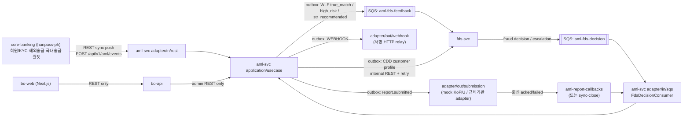
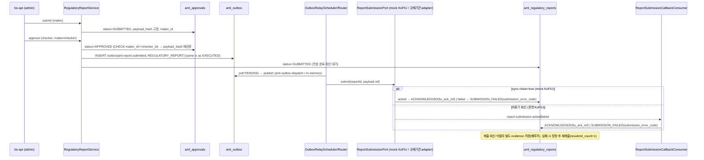
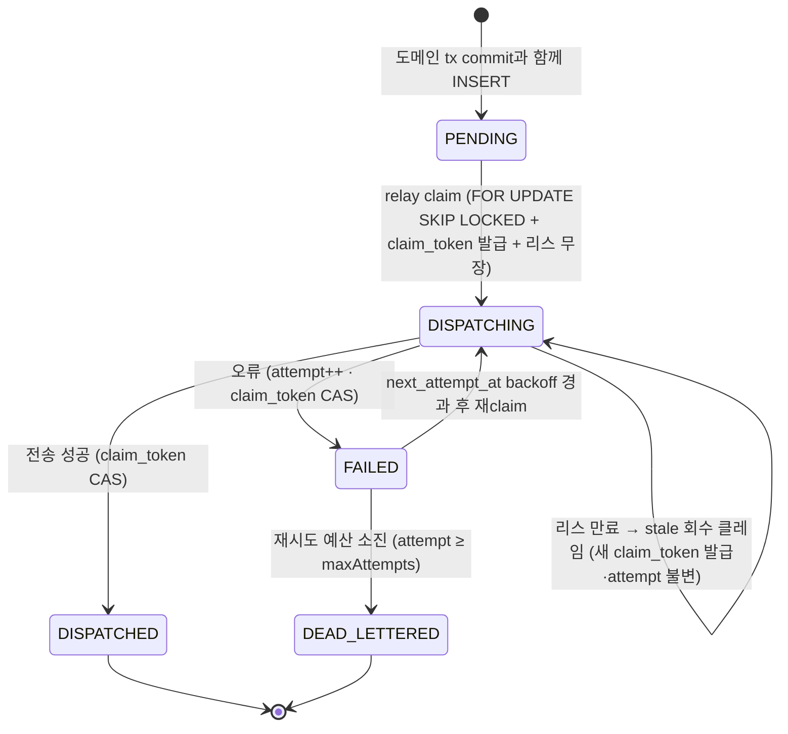
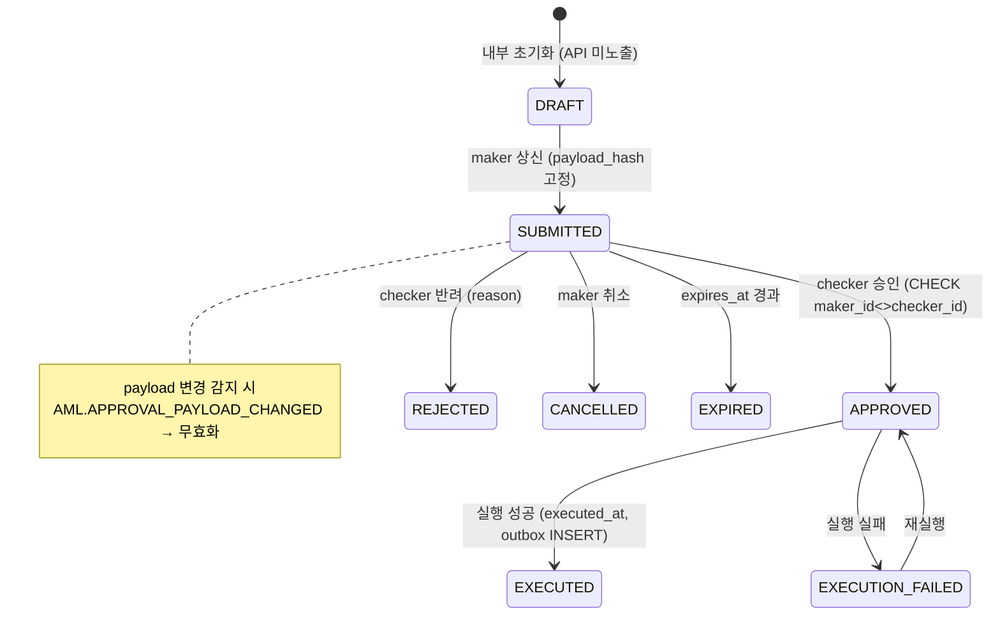
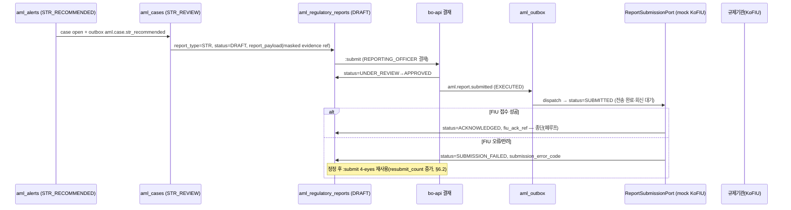

# AML 이벤트·연동 명세서 (aml-svc Integration) — hanpass-ph

> **시스템 그라운딩**: 본 명세는 **hanpass-ph AML RegOps** 의 AML 엔진(aml-svc) 연동 정본이다. 단일 운영 테넌트는 **`tenant_demo`(= hanpass-ph)** 이며, 단일 원천 시스템은 **`core-banking`**(스키마 버전 `core-banking.v1`, 커넥터 `REST_PUSH`)이다(코드 truth: `V2__phase1_foundation.sql` seed). 멀티테넌트 인프라 키(`tenant_id`·`data_scope`·아웃박스)는 **코드 truth 로 유지**하되 실제 운영 행은 hanpass-ph 단일 테넌트뿐이다. 거래 이벤트는 **hanpass eventType taxonomy**(`remit.*`(해외송금) · `domestic.*`(국내송금) · `wallet.*`(월렛충전/결제/출금) · 호환 `transaction.*`)로 인입되며, 거래 채널은 hanpass-ph 6유형 — `CASH_IN`(월렛충전) · `DOMESTIC_REMIT`(국내송금) · `CROSS_BORDER_REMIT`(해외송금) · `WALLET_PAYMENT`(월렛결제) · `WALLET_WITHDRAWAL`(월렛/ATM출금) · `CARD_NOT_PRESENT`(카드결제) — 이다(코드 truth: `V26__demo_six_types_aml.sql`).
> **닫힌 enum 보존**: `EventFamily`(코드 truth: `domain/enums/EventFamily.java`, **19종**)의 비-hanpass 멤버 — Phase 8 Advanced Domain Pack 패밀리(`trade`·`invoice`·`crypto`·`settlement`·`order`·`seller`·`market`·`internal`·`audit`) 및 Legacy Vendor Bridge(`vendor`) — 는 **삭제하지 않고 코드/스키마에 보존**하되 **hanpass-ph 미사용**(확장 슬롯)임을 명시한다. 구 가상자산 `travel-rule` 패밀리는 Travel Rule 기능 전면 제거(aegis-aml 84997e1, aml V31 DROP)로 `EventFamily`·canonical 이벤트에서 삭제됐다 — `travel-rule.*` 이벤트는 더 이상 수용되지 않는다(`NeutralEventValidator`/strict gate 거부). 본 연동 명세는 hanpass-ph 가 실제로 발행·소비하는 흐름만 정본으로 다루며, Phase 8 Advanced Domain 연동은 §13(스키마 잔존 노트)으로만 남긴다.
>
> 정본: `.claude/skills/_shared/aegis-stack.md`(4서비스 모노레포·비동기 SQS·멀티테넌시·PII 마스킹·4-eyes·Policy Pack STR/CTR).
> 입력 설계서: `docs/software/02-amlSvc-sass.md`(§8 Canonical Event Taxonomy·§12 TM·§13 결재·§14 Reporting·§15 외부연동·§19 감사).
> 동기화 대상: `docs/design/db/02-aml-db.md`(테이블·컬럼·enum), `docs/design/api/02-aml-api.md`(엔드포인트·DTO·scope·에러).
> 공통 inbound 인증 정본: [`../api/00-common-machine-auth.md`](../api/00-common-machine-auth.md) (wire v2 canonical request·credential version·durable nonce·전환/회전).
> 참조 구현(코드 truth, 책임 서비스 `services/aml-svc`, 실제 패키지 `com.aegis.aml`): `adapter/in/rest/AmlEventController`(REST ingest)·`adapter/in/sqs/FdsDecisionConsumer`(`@SqsListener` FDS 결정 소비)·`adapter/in/sqs/ReportSubmissionCallbackConsumer`(FIU 회신)·`adapter/out/messaging`(outbox relay 라우터·SQS publisher)·`adapter/out/webhook`(서명 webhook relay)·`adapter/out/submission`(규제 제출 어댑터)·`adapter/out/feed`·`adapter/in/scheduled`(watchlist reconciliation).
> 명칭·필드·타입·enum·엔드포인트는 위 코드·정본·DB·API 와 일치한다. 충돌 시 **코드(truth) > 정본 > 설계서 > DB/API** 순으로 우선하며, 추측 명칭은 도입하지 않는다.

## 목차

1. [범위·경계·전제](#1-범위경계전제)
2. [메시징 토폴로지(SQS)](#2-메시징-토폴로지sqs)
3. [이벤트 카탈로그](#3-이벤트-카탈로그)
4. [메시지 envelope·스키마(JSON)](#4-메시지-envelope스키마json)
5. [비동기 흐름 시퀀스(Mermaid)](#5-비동기-흐름-시퀀스mermaid)
6. [멱등성·재처리·DLQ·순서보장](#6-멱등성재처리dlq순서보장)
7. [커넥터·필드매핑(원천→canonical)](#7-커넥터필드매핑원천canonical)
8. [아웃박스·결재 상태머신(4-eyes)](#8-아웃박스결재-상태머신4-eyes)
9. [규제 제출 연동(STR/CTR)](#9-규제-제출-연동strctr)
10. [멀티테넌시 라우팅·PII 미전파](#10-멀티테넌시-라우팅pii-미전파)
11. [관측성·운영](#11-관측성운영)
12. [Capability 매트릭스](#12-capability-매트릭스)
13. [Phase 8 Advanced Domain — 스키마 잔존 노트(hanpass-ph 미사용)](#13-phase-8-advanced-domain--스키마-잔존-노트hanpass-ph-미사용)
14. [변경 이력](#14-변경-이력)

---

## 1. 범위·경계·전제

본 문서는 `aml-svc`(`com.aegis.aml`)의 **인바운드(이벤트 수신)·아웃바운드(외부 제출·서비스 간 연동)** 연동을 정의한다. 동기 REST 계약은 `02-aml-api.md`가 정본이며, 본 문서는 그 위에서 **이벤트·커넥터·아웃박스·큐**만 다룬다.

### 1.1 서비스 경계 (hanpass-ph 단일 테넌트)


```mermaid
flowchart LR
    CB["core-banking (hanpass-ph)<br/>회원/KYC·해외송금·국내송금·월렛"]
    CB -->|REST sync push<br/>POST /api/v1/aml/events| AMLIN["aml-svc adapter/in/rest"]
    AMLIN --> AMLAPP["aml-svc application/usecase"]
    FDS["fds-svc"] -->|fraud decision / escalation| SQSFDS[["SQS: aml-fds-decision"]]
    SQSFDS --> AMLSQS["aml-svc adapter/in/sqs<br/>FdsDecisionConsumer"]
    AMLSQS --> AMLAPP
    AMLAPP -->|outbox: WLF true_match / high_risk / str_recommended| SQSFB[["SQS: aml-fds-feedback"]]
    SQSFB --> FDS
    AMLAPP -->|outbox: CDD customer profile<br/>internal REST + retry| FDS
    AMLAPP -->|outbox: report.submitted| SUB["adapter/out/submission<br/>(mock KoFIU / 규제기관 adapter)"]
    SUB -->|회신 acked/failed| CBQ["aml-report-callbacks<br/>(또는 sync-close)"]
    CBQ --> AMLSQS
    AMLAPP -->|outbox: WEBHOOK| WH["adapter/out/webhook<br/>(서명 HTTP relay)"]
    BOAPI["bo-api"] -->|admin REST only| AMLAPP
    BOWEB["bo-web (Next.js)"] -->|REST only| BOAPI
```

규칙:
- **이벤트 인입은 동기 REST 가 정본 경로다(코드 truth)**. hanpass-ph core-banking 은 `POST /api/v1/aml/events`(`AmlEventController`, scope `aml:event:write`)로 canonical 이벤트를 멱등 전송한다. 별도 `@SqsListener` ingest consumer 는 **현재 구현되어 있지 않다**(`aml-canonical-events` 큐는 config 선언만 존재, consumer 미구현 — §2.1 주석).
- 엔진 간(`fds-svc`→`aml-svc`) 연동은 **event(SQS) 연동**이다(코드 truth: `FdsDecisionConsumer` `@SqsListener("aml-fds-decision")`). `fds.case.escalated`의 동기 fallback Internal API(`/internal/v1/aml/fds-escalations`)는 wire v2-only, `aml:internal:fds-escalation:write`, signed exact caller/dataScope/idempotency를 수신 엔진에서 강제한다.
- AML→FDS 고객 프로필은 `customer.cdd.completed`와 원자적으로 `FDS_CUSTOMER_PROFILE` outbox를 생성하고, relay가 `PUT /internal/v1/fds/customer-profiles/{memberRef}`로 전달한다. sender는 exact `(AML_FDS_PROFILE,tenant,workspace)` credential과 `fds:internal:customer-profile:write`로 final member URI와 동일 JSON bytes를 v2 서명한다. 이는 거래 승인 중 외부 조회가 아니라 사전 materialization이며 실패는 outbox retry/backoff로 재시도한다.
- `bo-web`은 `bo-api` 경유만(엔진 직접 호출 금지). 결재·감사·evidence export 는 `bo-api`→`aml-svc` Admin/Internal API.
- 모든 메시지·커넥터·아웃박스는 `tenantId`(=`tenant_demo`)·`dataScope`·`traceId`를 전파한다.
- raw PII 는 큐·이벤트·외부 제출 어디에도 평문 전파 금지. ref(token)/hash/`payloadHash`만 흐른다(§10).
- **직렬화 규약**: 모든 큐·webhook 메시지 키는 **camelCase**로 직렬화하고 DB 컬럼(snake_case)과 1:1 매핑한다(예 `submissionErrorCode`↔`submission_error_code`, `payloadHash`↔`payload_hash`, `schemaVersion`↔`schema_version`). enum 코드값은 DB §5·API §3와 동일하며 도메인 verb·별칭은 정본 enum 으로 환원해 전파한다(예 WLF `POTENTIAL_MATCH`→`POSSIBLE_MATCH`).
- **`eventFamily`는 입력 필드가 아니다(서버 파생)**: consumer 가 `eventType` 접두(`<family>`)에서 도출하는 **읽기전용 파생값**이다(코드 truth: `EventFamily.fromEventType`). aml-svc 는 별도 `event_family` 컬럼을 두지 않고 `aml_canonical_events.event_type`(VARCHAR(80))에 `<family>.<verb>` 전체를 저장하므로, `eventFamily`는 라우팅·관측성·webhook envelope(API §8.2)용 투영(projection)으로만 쓴다.
- **운영자 집계 API 경계**: 대시보드·서비스 관리·운영자 감사 조회는 **bo-api**가 소유·집약·인증한다(API §9 정본). aml-svc(엔진)는 저수준 데이터 API·비동기 큐만 제공하며, 본 연동 명세는 운영자 집계 엔드포인트를 정의하지 않는다.
- REST inbound machine-auth는 raw path/query·Tenant-Id·AML `workspace=default`·고정 9-key scopeContext·최종 body digest·±5분 timestamp·16-byte nonce를 함께 서명하고 nonce를 credential-wide 원자 소비한다([공통 인증 정본](../api/00-common-machine-auth.md)). 기본 TTL 15분은 `2×skew`보다 엄격히 길고 cleanup은 기본 1분마다 최대 `20×5000` row다. source header는 `Source-System`만 정본이다. 기존 credential은 `[v1,v2]`, 신규 credential은 `[v2]`이며 명시적 v2 실패를 v1로 fallback하지 않는다. v1은 RFC3339 offset timestamp 호환을 유지하고 v2는 UTC `Z`만 허용한다.
- 서버는 servlet normalized route로 filter/scope coverage를 판단하면서 raw path를 서명하고, dispatch 의미가 달라질 수 있는 ambiguous raw path와 duplicate singleton header를 body/nonce 처리 전에 거부한다. signed client는 redirect를 자동 추종하지 않고 target 변경 시 새 nonce로 다시 서명한다. bo-api 공용 engine `RestClient`는 `DONT_FOLLOW`를 강제하며 origin 302·target 0회·`X-Api-Key` 미전달을 실제 검증한다. `X-Trace-Id`/`X-Correlation-Id`는 관측성 계보로 전파하지만 고정 9-key scopeContext에는 포함하지 않는다.
- local/demo credential bootstrap/provisioner는 `local|demo` positive profile + opt-in에서만 허용되고 Flyway business seed가 아니다. simulator→AML/FDS, BO→AML/FDS, AML→FDS profile, FDS→AML escalation의 여섯 logical purpose는 서로 다른 ID/secret이며 target별로 등록한다. BO→AML은 `aml:pii:reveal`과 `COMPLIANCE`, 서비스 간 credential은 각 내부 endpoint 단일 scope만 가진다.
- disposable engine verification은 별도 opt-in `AEGIS_AML_LOCAL_ADDITIONAL_CREDENTIALS_JSON`으로 tenant/scope 음성 경계용 v2-only credential을 추가할 수 있다. 각 행은 exact tenant와 최소 scopes에 결속되고 정상 암호화 저장 후 평문이 폐기되며, `local|demo` 외 profile에서는 component 자체가 비활성이다. 운영 credential 생성·회전 API나 Flyway data seed를 대체하지 않는다.
- **적용 경계(2026-07-13)**: P0-04로 AML/FDS internal prefix v2-only, 양방향 service REST signer, bo-api→FDS signer, receiver-side 최소 scope, bootstrap-off local lifecycle을 완료했다. 남은 미완료는 multipart raw-byte signer(P0-14), 생성·scope 변경·자동 유예회전·폐기·last-used·사용 조건(P1-02)이다.
- **hanpass-ph REST 업무 분류(2026-07-01 코드 정합)**: FDS 탐지 결정과 AML TM은 같은 실시간 거래 payload(`memberRef`,`transactionRef`,`channel`,`amount`,`currency`,`counterpartyRef`,`corridor`)를 기준으로 한다. 여기 나열 키는 AML 엔진 저장 flat canonical payload(정본 표 = API §2.1a "엔진 저장 flat canonical payload")의 부분집합이며, `corridor` 는 서버 파생 문자열(`{reg}-{dest}`, 예 `PH-PH`), `counterpartyRef` 는 단일 canonical 상대방 토큰(flat payload·WLF screen key·vault 공유)이다 — 키 전수·파생 규칙 정본은 API §2.1a flat payload 표를 참조한다. FDS는 룰 기반 실시간 차단/보류/허용 결정, AML TM은 동일 거래 feed를 CTR/STR 사후 모니터링 evidence로 사용한다. AML REST 수신 카탈로그는 거래 TM 1종(`/transactions/evaluate`) + 고객 라이프사이클 4종(CDD 승인·정보수정·KYC/CDD 재이행·EDD) + RA 1종 + WLF 1종으로 운영 화면에 분류한다(API §2.1 주석).

### 1.2 어댑터 매핑 (헥사고날, 코드 truth)

| 방향 | 어댑터 패키지 | 책임 | port |
|---|---|---|---|
| in | `adapter/in/rest` | 동기 ingest(`AmlEventController`)·screen·RA·TM·evidence·내부(`FdsEscalationInternalController`·`ScreenInternalController`·`CustomerRiskInternalController`·`PiiRevealInternalController`)·watchlist admin·audit | `IngestAmlEventUseCase`·`ScreenSubjectUseCase`·`EvaluateRiskUseCase`·`EvaluateTransactionUseCase` 등 |
| in | `adapter/in/sqs` | `FdsDecisionConsumer`(`@SqsListener aml-fds-decision`)·`ReportSubmissionCallbackConsumer`(FIU 회신, 직접 호출/REST callback 시드) | `ConsumeFdsDecisionUseCase`·`AcknowledgeReportUseCase` |
| in | `adapter/in/scheduled` | `OutboxRelayScheduler`(아웃박스 drain)·`WatchlistReconciliationScheduler`(명단 freshness) | `RelayOutboxUseCase`·`ReconcileWatchlistUseCase` |
| out | `adapter/out/messaging` | `OutboxRelayRouter`(WEBHOOK→callback, FDS_CUSTOMER_PROFILE→internal REST, 그 외→SQS)·`SqsOutboxRelayPublisher`(aws)·`InMemoryOutboxRelayPublisher`(local)·`HighRiskOutboxAdapter` | `OutboxRelayPort`·`OutboxMessagingPort`·`HighRiskEventPort` |
| out | `adapter/out/external` | `HttpFdsCustomerProfileSenderAdapter`(CDD profile projection) | `FdsCustomerProfileSenderPort` |
| out | `adapter/out/webhook` | `HttpWebhookRelayAdapter`(서명 customer callback, egress SSRF 정책 `WebhookUrlPolicy`+no-redirect P0-17) | `WebhookSenderPort` |
| out | `adapter/out/submission` | `MockRegulatorSubmissionAdapter`(mock KoFIU, 운영시 규제기관 어댑터) | `ReportSubmissionPort` |
| out | `adapter/out/feed` | `MockWatchlistFeedAdapter`(명단 import) | `WatchlistFeedPort` |
| out | `adapter/out/persistence` | `aml_canonical_events`·`aml_approvals`·`aml_outbox`(`OutboxJpaAdapter`)·watchlist·vendor-migration 등 | `CanonicalEventStorePort`·`OutboxStorePort` 등 |

---

## 2. 메시징 토폴로지(SQS)

정본은 비동기 메시징을 **SQS**로 고정한다(`aegis-stack.md`). 참조 구현은 `io.awspring.cloud.sqs.annotation.SqsListener` 기반이며, AWS SQS auto-config 는 **`aws` 프로파일에서만 활성**이다 — base `application.yml` 은 `spring.autoconfigure.exclude: SqsAutoConfiguration` 로 **항상 제외**(비-aws 는 브로커 불필요)하고, **`application-aws.yml` 이 `spring.autoconfigure.exclude: []` 로 exclusion 을 해제**(+`spring.cloud.aws.region`·`sqs.enabled=true`·큐명 바인딩)해 `SqsTemplate` 이 auto-wire 된다(코드 truth, P0-14 CC1). 로컬/CI 는 브로커 없이 구동하고 FDS-decision consumer 는 휴면, 아웃박스 relay 는 `InMemoryOutboxRelayPublisher`로 동작한다.

**aws transport startup fail-closed(P0-14 CC1, `CapabilityStartupValidator`).** 엔진은 startup 에 **security tier**(PROD=활성 프로파일 `prod`/`production`/`aws`)와 **message transport**(aws SQS vs local/in-process)를 분리 판정해 `[capability] aml capability=… securityTier=… transport=… sqsTemplate=… queues=…` 한 줄을 출력한다. `aws` transport 인데 `SqsTemplate` bean 이 부재(auto-config 미해제)하거나 큐명(`aegis.aml.queue.*`)이 미바인딩이면 **fail-closed**(`IllegalStateException`) — consumer/publisher 가 큐에 붙지 못한 채 인/아웃바운드 메시지를 조용히 유실하는 mis-provisioning 을 startup 에서 차단한다. secret tier 검증은 `ProductionSafetyValidator` 소관이고 본 guard 는 tier 를 보고만 한다.

### 2.1 큐 카탈로그 (코드 truth)

| 큐 논리명 | 방향 | 발행자 | 구독자 | 페이로드 | DLQ | 비고 |
|---|---|---|---|---|---|---|
| `aml-fds-decision` | in | `fds-svc` | `FdsDecisionConsumer`(`@SqsListener`) | `fds.case.escalated`·`fds.decision.applied` | `aml-fds-decision-dlq` | **구현됨**. config `aegis.aml.queue.fds-decisions`(기본 `aml-fds-decision`) |
| `aml-fds-feedback` | out | `aml-svc` outbox relay(`SqsOutboxRelayPublisher`, aws) | `fds-svc` | `aml.screening.true_match`·`aml.customer.high_risk`(aggregate `FDS_FEEDBACK`) | (구독자 DLQ) | aws 프로파일에서 `aggregate_type=FDS_FEEDBACK` 행만 라우팅. config `aegis.aml.queue.fds-feedback` |
| `aml-outbox-dispatch` | out | `aml-svc` outbox relay(`SqsOutboxRelayPublisher`, aws) | 외부/하위 소비자 | `aml.report.submitted`(REGULATORY_REPORT)·`aml.case.str_recommended`(CASE)·IRA·SCREENING 등 비-WEBHOOK·비-FDS_FEEDBACK 행 | `aml-outbox-dlq` | aws 프로파일 fallback 큐. config `aegis.aml.queue.outbox-dispatch` |
| `aml-report-callbacks` | in | 규제기관/제출 adapter | `ReportSubmissionCallbackConsumer.onCallback` | `report.submission.acked`·`report.submission.failed` | `aml-report-callback-dlq` | **`@SqsListener` 미선언** — sync-close(`sync-close=true`, mock KoFIU) 또는 REST callback/test seam 으로 직접 호출. 운영 KoFIU 비동기 회신 시 큐 바인딩 추가 |
| `aml-canonical-events` | (예정) | core-banking | (consumer 미구현) | canonical event | — | config `aegis.aml.queue.canonical-events` 선언만 존재. **현재 ingest 는 REST 전용**(§1.1). 대량 비동기 ingest consumer 는 net-new 후속 |

- **WEBHOOK 아웃박스 행은 SQS 가 아니라 HTTP relay 로 전송된다**(코드 truth: `OutboxRelayRouter` — `aggregate_type=WEBHOOK` → `WebhookSenderPort.send`, 그 외 → `OutboxMessagingPort.publish`). 즉 webhook 은 큐를 거치지 않고 `adapter/out/webhook/HttpWebhookRelayAdapter`(서명 callback)로 직접 발송한다.
- 큐 물리명은 `deployment_model`(DB `aml_tenants.deployment_model`, §10.1)에 따라 결정된다. `MANAGED_DEDICATED`(hanpass-ph 기본)/`SELF_HOSTED`(전용 배포): 배포 단위 전용 큐(배포 엔드포인트가 서비스 경계). `SHARED`(공유 배포): 공용 큐 + 메시지 attribute `tenantId` 행 라우팅·RLS. 라우팅은 §10.
- 메시지 attribute(코드 truth `SqsOutboxRelayPublisher.publish`): `tenantId`, `eventType`, `aggregateType`, `aggregateRef`, `idempotencyKey`(=`payloadHash`). consumer 측은 `traceId`·`dataScope`를 envelope 본문에서 전파한다.

---

## 3. 이벤트 카탈로그

이벤트명은 `<family>.<verb>` 소문자. `eventType`은 `aml_canonical_events.event_type`(VARCHAR(80))에 그대로 저장되며 API `IngestEventRequest.eventType`(§02-aml-api 3.1)와 1:1. 인입 시 `EventFamily.fromEventType`이 **strict gate**로 동작해 미등재 패밀리는 `REJECTED`(코드 truth: `AmlEventIngestService` step 3, DB family CHECK `V27`와 이중 방어).

### 3.1 인바운드 — core-banking → aml-svc (REST `POST /api/v1/aml/events`)

> 발행자(`source_system`)는 hanpass-ph 단일 원천 **`core-banking`**(`core-banking.v1`)이다. ingest 는 동기 REST 전용(§1.1·§2.1).

> **hanpass-ph 소스 재그라운딩 주석(REST sync)**: 발행자 열의 source_system 은 hanpass-ph 7실서비스(DB §3.2 카탈로그 정본)다 — `member-svc`(회원/KYC/CDD/제재·PEP zoloz → customer.*/entity.*/beneficial-owner.*), `walletchg-svc`(월렛충전 cash-in), `domestic-svc`(국내송금 PHP), `remit-svc`(해외송금 cross-border, `sanction_screening_event`·`str_indicators` 보유 → transaction.requested·settlement.posted), `wallet-svc`(월렛 원장 `transfer_links` 자금그래프 → account.*·settlement.posted), `inbound-svc`(파트너 인바운드). `tx-history-svc`(회원 통합 이력 read model)는 ingest 발행자가 아니라 **대상 360°(DB §3.16)** 피드 소스다. card/pg/crypto-exchange/trade/ecommerce 등 잔존 generic 발행자는 hanpass-ph 실서비스의 예시 추상이며, 운영 등록값은 위 7코드다. corridor(remit `send/receive_country·currency`·USD `usd_amount/report_amount`→`amountBase`)는 transaction payload 에 보존(§4.2)된다.

> **`vendor.*` family 정합 주석**: `vendor.alert-ingested`의 `vendor.*` family는 SW §8.1 AML Canonical Event Taxonomy **15종 중 하나로 등재**되어 있다(SW §8.1 v1.x, Legacy Vendor Bridge 경유 `source_origin=VENDOR` 행 포함). 본 연동 명세에서는 독립 family 선언 대신 **`IngestEvent(source_origin=VENDOR)`** 경로로 흡수한다 — 즉 `vendor.alert-ingested`는 `source_origin=VENDOR`를 태그한 일반 ingest event로 처리되며, SW §8.1 `vendor.*` 행과 본 표의 `eventType`·`eventFamily` 라우팅은 동기화 완료 상태이다.

### 3.1a 인바운드 — 중립(canonical) 동기 수집 (`POST /aml/v1/transaction-events`, 코드=truth)

위 §3.1 의 `POST /api/v1/aml/events` REST ingest 가 canonical 이벤트 정본 경로다. 이와 **병존**하는 **동기 REST 단일 수집 표면**이 소스 중립(canonical) 수집 API 다(API 02-aml §2.1a). 원천 시스템은 5 product(해외송금·국내송금·카드결제·월렛충전·월렛결제)를 단일 Envelope(`docs/aml-data.md` §3~§7)로 **하나의 POST** 로 보내고, aml-svc 는 그 요청 안에서 WLF + CTR/STR 을 동기 팬아웃한다(별도 큐 왕복 없음). 시뮬레이터·데모·경량 원천은 이 경로를 사용한다. 대량 비동기 ingest 는 `aml-canonical-events` consumer 가 아직 없어 net-new 후속이다(§2.1).

P0-01부터 `/aml/v1/**`는 common machine-auth filter의 실제 coverage이며 본 endpoint와 §3.1
canonical ingest 모두 `aml:event:write`를 요구한다. `/aml/v1/**` authenticated traffic은 migration 전
dual credential에도 route policy로 v2-only다. Neutral `Source-System`은 선택이고 제공 시 서명
context에만 exact 결합되며 서버 소유 neutral source mapping을 덮어쓰지 않는다. `Idempotency-Key`는
생략 시 body `eventId`를 사용한다. `X-Data-Scope`는 P0-01에서 무결성 결합만 하므로 서명 뒤 tamper는
401이지만 credential별 data-scope allowlist는 도입하지 않는다.

| product(중립) | canonical eventType | EventFamily | engine channelType | 후속 usecase(동기 팬아웃) | 산출 |
|---|---|---|---|---|---|
| CROSS_BORDER_REMITTANCE | `remit.transfer.<verb>` | REMIT | `CROSS_BORDER_REMIT` | IngestEvent→Screen(sender+receiver)→EvaluateTm(TM/STR) | `aml_canonical_events`·`aml_screening_results`·`aml_alerts` |
| DOMESTIC_TRANSFER | `domestic.transfer.<verb>` | DOMESTIC | `DOMESTIC_REMIT` | IngestEvent→Screen(sender+receiver)→EvaluateTm(차명 STR) | `aml_canonical_events`·`aml_alerts` |
| CARD_PAYMENT | `transaction.card-payment.<verb>` | TRANSACTION | `CARD_PAYMENT` | IngestEvent→Screen(sender)→EvaluateTm(고위험 MCC 등) | `aml_canonical_events`·`aml_alerts` |
| WALLET_TOPUP | `wallet.charge.<verb>` | WALLET | `CASH_IN`(현금성=CTR 대상) | IngestEvent→Screen(sender)→EvaluateTm→**CTR/STR** | `aml_canonical_events`·`aml_alerts`(CTR DRAFT) |
| WALLET_PAYMENT | `wallet.pay.<verb>` | WALLET | `WALLET_PAYMENT` | IngestEvent→Screen(sender)→EvaluateTm(pass-through STR) | `aml_canonical_events`·`aml_alerts` |

- `<verb>`=lifecycle 소문자(`created`/`completed`/`cancelled`/`refunded`/`reversed`). WALLET_TOPUP(`CASH_IN`)만 CTR 현금성 게이트에 걸려 CTR 일합산 DRAFT 를 연다(나머지는 STR/TM 만).
- **CTR 순증(net)**: reversal verb(CANCELLED/REFUNDED/REVERSED, `relatedReference` 필수)는 signed-negative `amountBase`로 저장되어 동일 `(tenant, subject, bankingDay)` 일합산이 원거래를 순증 차감한다(임계 회피 구조화 탐지).
- **WLF 범위**: 신규 ACCEPTED의 originator(sender)는 전 product 동기 screen, counterparty(receiver)는 CROSS_BORDER_REMITTANCE와 DOMESTIC_TRANSFER에서 추가 screen(기존 sender/receiver 2회 계약 §2.2). WLF 실패(stale/unavailable 포함)는 인입 동기 응답을 막지 않되 **정상 완료로 은폐하지 않고**(P0-08 — 종전 best-effort 삼킴 제거) 해당 fan-out step 을 `RETRYING`으로 기록해 durable worker 가 재개한다(§3.1b). REPLAYED/DUPLICATE는 WLF를 재실행하지 않는다.
- **PII·멱등 경계**: canonical payload용 `targetRef`/`counterpartyRef` 비PII 안정 토큰만 gate 전에 파생한다. raw 성명·신분증·계좌·전화는 신규 ACCEPTED에서만 `aml_pii_vault` 암호문으로 적재 후 소멸하고 canonical payload·응답·로그에는 남기지 않는다. raw PII는 canonical hash에 포함되지 않으므로 REPLAYED/DUPLICATE 요청 body는 vault/WLF/TM에 사용하지 않으며 `evaluation=null`이다.

### 3.1b 거래 fan-out 완전성·durable retry (P0-08, 코드=truth)

canonical 이벤트가 ACCEPTED 되면 §3.1a 의 side-effect(PII vault 적재·sender/receiver WLF·TM·CTR·STR·2차 상시(ONGOING) RA)를 **동기 인라인으로 실행하되 각 결과를 fan-out job/step 에 기록**한다 — 성공 경로 타이밍(lifecycle 즉시 read-back)은 종전 그대로 보존하면서, 실패를 삼키지 않고(best-effort 제거) 추적한다. 이벤트당 `aml_txn_fanout_jobs` 1건(멱등 UNIQUE `(tenant, eventId)`)과 적용 step 별 `aml_txn_fanout_steps`(적용 안 되는 step 은 `NOT_APPLICABLE` — 예 국내송금 RECEIVER_WLF 아님·비현금성 CTR 아님)를 남기고, 각 step 은 성공 시 `SUCCEEDED`, 실패 시 `RETRYING`(WLF stale/unavailable·CTR/STR/RA REQUIRES_NEW 실패·vault decrypt 실패 포함)로 armed 된다. job 상태는 step 들로부터 재계산된다 — 전부 `SUCCEEDED`/`NOT_APPLICABLE`=`FULLY_EVALUATED`, 하나라도 `RETRYING`=`RETRYING`, 예산 소진 `DEAD_LETTERED` 존재 시 `DEAD_LETTERED`.

durable worker(`AmlFanoutRetryScheduler`→`FanoutRetryService`)는 elevated DB context(RLS §V47 cross-tenant claim)에서 `RETRYING`(due)·crash 복구 후보를 부분 인덱스로 `FOR UPDATE SKIP LOCKED` claim(claim UPDATE 가 `IN_PROGRESS` 로 원자 lease 전이)하고, 저장된 canonical flat payload + vault(암호문 복호)로 비-PII 컨텍스트를 재구성해 각 side-effect 를 **멱등 재시도**(WLF `(tenant, idempotencyKey)`·TM 알림 `(tenant, txn, scenario)`·CTR `(tenant, subject, bankingDay)`·STR `(tenant, trigger)` 자연키로 이중 생성 없음)한다. 재시도 backoff 는 지수 30s→30m(`OutboxRelayService` 동형)·`MAX_ATTEMPTS=5` 소진 시 `DEAD_LETTERED`(운영자 replay). **본 fan-out completeness 는 §8 아웃박스 relay(FDS feedback·report submission·webhook 발행)와 별개의 신규 방어선**이다 — 아웃박스는 accepted 후 외부 발행의 durability 를, fan-out job/step 은 인입 side-effect 평가의 완전성(미완 step 미은폐·재개)을 보장한다. replay(body 재전송) 시 이미 완료된 step 은 재실행하지 않고 미완(`RETRYING`/`PENDING`) step 만 재개한다.

#### 3.1b-1 지연 성공 시 신호 소비 단계 재무장 (2026-08-13, 코드=truth)

위 durable retry 는 **각 step 을 독립적으로** 되살린다. 그런데 step 들이 서로 독립이 아닌 축이 하나 있다 — **WLF 스크리닝 결과를 읽어서 평가하는 하위 단계**다. 인입은 WLF → TM/CTR/STR/RA 순서로 실행하지만 WLF 실패가 형제 단계 진행을 막지 않으므로(각 step 독립 가드·위 §3.1b), **WLF 만 실패한 인입의 STR·2차 상시 RA 는 스크리닝 신호 없이 `SUCCEEDED` 로 끝난다**. 이후 워커가 WLF step 만 claim 해 재시도하면 스크리닝 행은 뒤늦게 생기지만, 이미 `SUCCEEDED` 인 하위 단계를 다시 깨우는 경로가 없어 **그 위험 신호는 영원히 소비되지 않았다**(수취인 PEP 이름 위험 신호·송금인 제재 매칭이 STR·2차 RA 에 도달하지 못한다). readiness 가 잠시 `STALE` 이었다가 복구되는 **정상 장애 복구 경로**에서 발생한다.

- **선언(도메인 정본)** — `NeutralFanoutSteps.signalConsumersOf(producer)` 가 신호 생산 step 과 소비 step 의 관계를 순수 도메인으로 선언한다: producer `{SENDER_WLF, RECEIVER_WLF}` → consumer `{STR, ONGOING_RA}`.
  - `STR` 포함 근거 — STR 평가가 양당사자 스크리닝 행을 읽어 `pep`·`sanctionHit`·`PEP_NAME_RISK_SIGNAL` 입력을 만든다(WLF 신호의 **직접** 소비자).
  - `ONGOING_RA` 포함 근거 — STR 알럿 가중을 소비한다(§10 BR-013). STR 재실행 안에서도 RA 가 돌지만 STR step 은 자기 오류만 검사하므로, RA 를 명시 재무장하지 않으면 재실행 중 RA 실패가 **거짓 `SUCCEEDED`** 로 남는다(§3.1b 가 없애려던 바로 그 은폐).
  - `CTR` 제외 근거 — 입력이 현금 채널·임계·영업일뿐이고 스크리닝 행을 읽지 않는다. `TM` 제외 근거 — step 계약이 "TM 파이프라인이 완료됐다"이고 두 consumer 의 재실행이 그 파이프라인을 다시 돌린다(세 번째 중복 평가만 늘고 새 추적은 없다). `PII_VAULT` 제외 근거 — 하위가 아니라 WLF 의 **선행 입력**이라 vault 지연 성공 → WLF 재시도 성공 → 재무장으로 체인이 이미 이어진다.
- **전이(포트 계약)** — `FanoutJobStorePort.rearmSucceededSteps(tenant, jobId, steps)` 는 대상 step 중 **현재 `SUCCEEDED` 인 행만** `RETRYING`(`attempt=0`·`next_attempt_at=now()`·`last_error=NULL`)으로 되돌린다. `RETRYING`/`IN_PROGRESS` 는 이미 실행 예정/진행 중이라 제외(같은 sweep 에서 두 producer 가 연달아 성공해도 두 번째 재무장이 0행이 되는 **자연 dedupe** 이기도 하다), `DEAD_LETTERED` 는 재시도 예산을 소진한 운영 결정 상태라 제외(부활은 replay `resumeUnfinishedSteps` 의 몫 — 신호 하나로 조용히 되살리지 않는다), `PENDING`/`NOT_APPLICABLE` 은 각각 인라인 진행 중·비적용이라 제외.
- **발동 지점** — `FanoutStepExecutor.retry` 의 **성공 직후에만**(워커 경로) 호출한다. 인입 인라인 경로에는 넣지 않는다 — 인라인 성공 시점의 하위 단계는 아직 `PENDING` 이고 곧 그 신호를 보고 평가되므로 재무장 대상 자체가 없다.
- **멱등** — 재평가는 새 산출물을 만드는 것이 아니라 기존 자연키를 다시 만난다: TM 알럿 `(tenant, transaction_ref, scenario_code)` UNIQUE · STR/CTR 보고 `(tenant, trigger)` · 2차 상시 RA 디바운스(창 내 + **발동 계보(alertId 집합) 동일**이면 skip) · WLF 스크리닝 행 `(tenant, idempotency_key)`. 즉 **신호가 실제로 바뀐 경우에만** 새 알럿·점수가 생긴다.
- **순환 불가(구조적 보장)** — producer 집합과 consumer 집합이 **서로소**이고 consumer 는 아무 신호도 생산하지 않는다(`signalConsumersOf(STR) = ∅`). 재무장 그래프는 **깊이 1 의 DAG** 이므로 재시도 횟수·동시성과 무관하게 순환이 존재할 수 없다. 한 이벤트의 추가 재평가 횟수 상한은 **지연 성공한 WLF step 수**(≤2) × 재시도 예산(`MAX_ATTEMPTS=5`) × 운영 replay 횟수다.
- **스키마 무변경** — `SUCCEEDED → RETRYING` 은 `V48` 의 `status` CHECK(6종)가 이미 허용하는 값이므로 **Flyway 신규 마이그레이션 0**(DB §7 V48 행 무변경). claim SQL·backoff·`MAX_ATTEMPTS`·`DEAD_LETTERED`·`resumeUnfinishedSteps` 계약도 무변경이며, 재무장은 오류가 아니므로 `last_error` 에 마커를 심지 않고 비운다. 관측은 `FanoutStepExecutor` INFO 로그 1줄(producer·재무장 step 수·tenant·job).
- **잔여(보고)** — 재평가마다 `MONITORED_TRANSACTIONS` 미터링이 1건 더 계상된다. 이는 §3.1b 의 기존 성질(STR·RA 가 함께 실패하면 재시도가 TM 을 두 번 돌린다)이며 본 조항이 발생 조건을 "WLF 지연 성공"으로 넓혔을 뿐이다. 과금 정합이 필요하면 계상 자체를 거래 참조 멱등으로 바꾸는 별건이다.

### 3.1c 명단 갱신 후 durable rescreen 파이프라인 (P0-06, 코드=truth)

WLF 명단 source 가 새 버전을 apply(`SanctionsIngestTransaction.ingestAndApply` 성공·신규 `active_version`)하면 갱신된 명단으로 **기존에 screening 된 활성 subject 를 자동 재검색**한다. §3.1b 의 P0-08 fan-out durable 패턴(원자 claim→execute→recordStep·exp backoff·DEAD_LETTERED)을 재사용하되 거래 fan-out 과 혼선을 막으려 **rescreen 전용 job/target**(DB §3.6b `aml_wlf_rescreen_jobs`·§3.6c `aml_wlf_rescreen_targets`)으로 분리한다.

- **트리거·enqueue(`RescreenBatchService.triggerRescreen`)**: apply 성공 **afterCommit**(무거운 대상 산출을 동기 ingest/apply 트랜잭션에 중첩하지 않음·P0-08 교훈)에 `REQUIRES_NEW` 로 rescreen job 을 enqueue 한다 — **자연키 UNIQUE `(tenant, source_code, to_version)`** 멱등(같은 버전 재적용 시 신규 job 0, `ON CONFLICT DO NOTHING`). 트리거 실패는 로그만·sync caller 로 미전파(fail-safe) — 유실 job 은 reconciliation sweep + 다음 sync 의 멱등 enqueue 로 복구.
- **영향 subject 산출(`RescreenTargetResolver`, 가정 A3 conservative/recall-first)**: 정밀 영향 집합(신규/변경/delist entry 에 새로 매칭될 subject)은 entry-level delta join 이 필요하므로, phase-1 은 **해당 tenant 가 이제껏 screening 한 전 subject** 를 keyset 페이지(`subject_ref` 순·대규모 tenant bounded memory)로 열거해 target 1건씩 멱등 enqueue(`ON CONFLICT DO NOTHING`) — over-screen(recall 우선, 진양성 미탐 없음), entry-level delta 최적화는 후속.
- **worker(`RescreenWorker`→`RescreenSubjectScreener`)**: 고정 주기로 due target 을 부분 인덱스 `ix_aml_wlf_rescreen_targets_claim` 로 `FOR UPDATE SKIP LOCKED RETURNING` claim(→`IN_PROGRESS` lease 원자 전이·이중 screen 없음). cross-tenant claim 은 elevated DB context(RLS §V47)를 최외곽 경계로 열되 각 store op 은 자기 tenant 를 실어 나른다(P0-13 교훈 — screen 트랜잭션 안에 중첩 금지). target 별로 vault 암호문(NAME/DOB/NATIONALITY) 복호→토큰/해시(원문 미영속·§19.2)→`WlfScreeningService.screen` 을 **멱등 재실행**(idempotencyKey=`rescreen:<jobId>:<subjectRef>`) 한다. 결과 있으면 `SUCCEEDED`(신규 `screening_id` 보유), vault NAME 소실 등 재검색 불가 subject 는 `NOT_APPLICABLE`(false SUCCEEDED 아님), 일시 실패는 exp backoff `RETRYING`·재시도 예산 소진 시 `DEAD_LETTERED`. per-target 실패는 격리(한 subject 가 배치 abort 금지). 배치 후 각 job 상태·counts 를 target 들로부터 재계산(전부 terminal=`COMPLETED`).
- **결과 diff → case/RA/EDD/feedback(`RescreenOutcomeService`)**: rescreen 결과를 subject 의 직전 WLF 상태와 diff 한다 — **상승(escalation)**: (직전 비매치→POSSIBLE/TRUE/ESCALATED, 또는 POSSIBLE→TRUE/ESCALATED) 시 신규 WLF 매치와 동일 downstream 을 태운다: review-queue 노출(이미 `screen()` 이 결과 영속·큐 픽업)·`TRUE_MATCH` 는 FDS true-match feedback 재발행(`FdsFeedbackOutboxEmitter#emitScreeningTrueMatch`, outbox ON CONFLICT 멱등)·모든 상승은 `TriggerOngoingRaUseCase#reassess`(RA 재산정·주기 단축·EDD 자동 개시 — debounce/멱등). **하강(delist·TRUE→NO_MATCH)**: 자동 종결하지 않고 구조화 로그/집계(케이스 재평가 신호). 전 downstream 은 멱등(outbox payload-hash·RA debounce)이라 claimed target replay 가 alert/RA 이중 실행을 만들지 않으며, outcome 실패는 로그로 삼킴(rescreen 자체는 이미 성공 — worker 격리).
- **reconciliation(`RescreenReconciliationService`, 완료조건 2 "누락·실패 reconciliation")**: 주기 sweep 이 미완료 job(`PENDING`/`IN_PROGRESS`/`RETRYING`/`DEAD_LETTERED`)의 비-terminal target·dead letter 를 집계하고 SLA 초과(`sla_due_at` 경과·non-COMPLETED)를 flag 해 reconciliation 로그/메트릭에 노출한다(silent 종료 금지·`ix_aml_wlf_rescreen_jobs_open`). cross-tenant open-job 열거라 elevated DB context 최외곽. bo-api 가 운영자 노출 표면을 소유한다.
- **capability/NOT_APPLICABLE(phase-2 A1)**: 실 PEP/RCA provider 연동(auth/paging/diff/SLA/fallback)은 phase-2 — phase-1 은 mock 유지, 필수 PEP/RCA 는 승인된 `NOT_APPLICABLE` waiver 로만 게이트 통과(§3.6a·API §2.2). 세분 jurisdiction 차등은 phase-2(A2 — tenant `defaultRegion` 단위).

### 3.1d tenant Policy Pack revision 핀·evidence 동일 revision 지시 (P0-16, 코드=truth)

중립 인입이 통화·발신국을 **tenant 행 바인딩**(DB §3.1 `aml_tenants.jurisdiction`·`base_currency`·`reporting_currency`·`timezone`·`policy_pack_version`, V53)에서 해소하도록, `TenantPolicyResolver.resolve(tenantId, asOf)` 가 `(tenant + asOf)` → `TenantPolicyBinding` 을 확정한다 — 구 service-global PH/PHP `@Value` 기본을 대체한다. 핵심은 **tenant 가 특정 Policy Pack revision 에 핀**(`policy_pack_version` — `aml_policy_packs`(DB §3.14) `(tenant, pack_code, version)` 활성 revision)된다는 점이며, resolver 는 "현재 활성 revision" 이 아니라 **핀된 exact revision** 을 조인해 corridor·통화·임계 해석이 안정·evidence 고정 가능하게 한다(핀 revision 미존재·비-ACTIVE·effective_from 미도달 → `TenantPolicyUnboundException`→422 `AML.TENANT_POLICY_UNBOUND` fail-closed).

- **timezone fail-closed**: 활성 binding의 `timezone`은 필수 유효 IANA ZoneId다. REST binding PATCH null·blank·invalid 값은 write 전에 `400 AML.VALIDATION_ERROR`이고, nullable migration으로 남은 legacy missing/invalid timezone은 resolver/달력에서 `TenantPolicyUnboundException`→`422 AML.TENANT_POLICY_UNBOUND`로 인입을 차단한다(Manila 기본값 없음). `report_cutoff_time`은 optional legacy compatibility로 유지한다.
- **evidence 동일 revision 지시(개념)**: 제출·screening·RA·TM 이 **같은 tenant Policy Pack revision** 을 지시하도록, 핀 revision 을 각 산출물의 evidence 에 `policyPack{ code, version, effectiveFrom, jurisdiction, baseCurrency, reportingCurrency }` fragment 로 고정한다(엔진 `TenantPolicyEvidence`) — WLF screening `score_breakdown`·CTR/STR alert `evidence`+보고 payload·RA `factor_breakdown`·custom-rule evidence(DB §3.1 §19.2 인접 후주). 이로써 한 거래 흐름의 판정·보고 근거가 어느 규제 revision 아래 산출됐는지 감사·재현 가능하다. 정책 메타 토큰만(코드·버전·시각·관할·통화) — raw PII 미포함(§19.2 불변).
- **한계·경계**: WLF `asOf`=screen-time 이라 revision 전환 엣지에서 짧은 시차가 있으나 정상상태(steady-state)는 동일 revision 을 지시한다. evidence 고정은 best-effort — 미바인딩(unbound) tenant 는 evidence 블록만 생략(`resolveForEvidence`)하고 결정을 재차단하지 않는다(ingest 게이트가 이미 fail-closed 담당). 완전 FX conversion(cross-currency rate/source/asOf/rounding/hash)은 phase-2(A1) — phase-1 은 native 통화만이라 CTR/금액 TM 임계가 base_currency-native 로 해석된다(KRW 테넌트 CTR/금액룰 미발동 = 가짜 PH CTR 누출 없음).

### 3.2 인바운드 — fds-svc → aml-svc (`aml-fds-decision`, D-07)

| eventType(family) | 트리거 | 핵심 페이로드 키(ref/hash) | 후속 처리 | 산출 |
|---|---|---|---|---|
| `customer.created`(CUSTOMER) | 개인 회원 생성 | `customer.customerRef`·`customerType`·`country` | identity projection → ScreenSubject | `aml_customers`, `aml_screening_results` |
| `customer.kyc-updated`(CUSTOMER) | KYC/CDD 갱신(zoloz 스크리닝 결과 반영) | `customer.customerRef`·`kycStatus`·`docHash` | identity projection → EvaluateRisk | `aml_customers`, `aml_risk_scores` |
| `customer.status-changed`(CUSTOMER) | 회원 상태 변경 | `customer.customerRef`·`status` | identity projection | `aml_customers` |
| `entity.created`/`entity.updated`(ENTITY) | 법인/파트너 생성·변경(KYB) | `entity.entityRef`·`entityType`·`legalNameHash`·`industryCode` | identity projection → ScreenSubject | `aml_entities` |
| `beneficial-owner.changed`(BENEFICIAL_OWNER) | UBO/대표자 변경 | `relationship.fromRef`·`toRef`·`relationshipType`·`ownershipPercent` | identity projection(UBO) → ScreenSubject | `aml_relationships`, `aml_screening_results` |
| `remit.transfer.requested`/`remit.transfer.completed`(REMIT) | 해외송금(cross-border) 요청·완료 | `transaction.transactionRef`(←`remit.transfer_number`)·`amount`·`amountMinor`·`currency`·`corridor`·`amountBase`·`channelType=CROSS_BORDER_REMIT` | EvaluateTransaction(TM) | `aml_canonical_events`, `aml_alerts` |
| `domestic.transfer.requested`/`domestic.transfer.completed`(DOMESTIC) | 국내송금(PHP) 요청·완료 | `transaction.transactionRef`(←`domestic.transaction_id`)·`amount`·`channelType=DOMESTIC_REMIT` | EvaluateTransaction(TM) | `aml_canonical_events`, `aml_alerts` |
| `wallet.charge.requested`(WALLET) | 월렛충전(cash-in) | `transaction.transactionRef`(←`wallet.charge_order_id`)·`amount`·`channelType=CASH_IN` | EvaluateTransaction(TM) | `aml_canonical_events`, `aml_alerts` |
| `wallet.pay.requested`(WALLET) | 월렛결제 | `transaction.transactionRef`·`amount`·`channelType=WALLET_PAYMENT` | EvaluateTransaction(TM) | `aml_canonical_events`, `aml_alerts` |
| `wallet.withdraw.requested`(WALLET) | 월렛/ATM 출금 | `transaction.transactionRef`(←`wallet.wallet_transaction_id`)·`amount`·`channelType=WALLET_WITHDRAWAL` | EvaluateTransaction(TM) | `aml_canonical_events`, `aml_alerts` |
| `transaction.requested`/`transaction.completed`(TRANSACTION) | 호환 일반 거래 패밀리(채널 무관 canonical) | `transaction.transactionRef`·`amount`·`direction`·`channelType` | EvaluateTransaction(TM) | `aml_canonical_events`, `aml_alerts` |

> **TM velocity·fund-graph 참여 패밀리(코드 truth `EventFamily.isTransactionBearing`)**: `TRANSACTION`·`REMIT`·`DOMESTIC`·`WALLET`. hanpass-ph 6채널은 이 4패밀리로 인입되어 velocity window·자금그래프 funnel 에 집계된다.
> **corridor·amountBase(해외송금)**: `corridor`(`sendCountry`/`receiveCountry`/`sendCurrency`/`receiveCurrency` ← `remit.send_country/receive_country/send_currency/receive_currency`)와 USD 정규화 `amountBase`(← `remit.usd_amount/report_amount`)는 cross-border(`remit.*`)에 한해 채운다(국내 `domestic`/`wallet` 은 corridor 동일국·생략 가능). TM corridor 시나리오(`HIGH_RISK_CORRIDOR` v3, `V26`)·canonical event payload 에 보존. 임계·기준금액은 규제 레이어(Policy Pack) 정본 — 본 필드는 데이터 신호일 뿐 임계 교체 아님.
> **zoloz/str_indicators(데이터 신호)**: `customer.kyc-updated` 의 zoloz 스크리닝 결과(decision/risk_level/total_hits/hit_results)와 해외송금 `str_indicators`는 screening/evidence 데이터 신호로만 매핑하며, 규제 STR 분류는 KR Policy Pack 정본을 따른다(§7.2).

### 3.2 인바운드 — fds-svc → aml-svc (`aml-fds-decision`, SQS)

코드 truth: `FdsDecisionConsumer`(`@SqsListener`) → `FdsDecisionService`(`ConsumeFdsDecisionUseCase`).

| eventType | 트리거 | 핵심 키 | 후속(case type 매핑) | 산출 |
|---|---|---|---|---|
| `fds.case.escalated` | FDS fraud case → AML 후보 위임 | `tenantId`·`eventId`(=`fdsEventId`)·`fdsCaseRef`·`targetRef`·`transactionRef`·`action`·`severity`·`dataScope` | `REGULATORY_REPORT`→`STR_REVIEW`, `OPEN_AML_CASE`→`EDD_REVIEW`, 기타/legacy→`STR_REVIEW` | `aml_alerts`(alert_type=`FDS_ESCALATION`, source_origin=`FDS`) → `aml_cases` |
| `fds.decision.applied` | FDS hold/block 결정 → AML EDD 트리거 | `tenantId`·`eventType`·`targetRef`·`transactionRef`·`action`·`severity` | `EDD_REVIEW`(edd_trigger=`UNUSUAL_TRANSACTION`) | `aml_alerts`, `aml_cases` |

> 멱등: 두 이벤트 모두 부분 UNIQUE `(tenant_id, origin_fds_case_ref, fds_event_id) WHERE source_origin='FDS'` 기반 `INSERT … ON CONFLICT DO NOTHING`(코드 truth `FdsDecisionService` 주석)으로 재전달 시 단일 alert·단일 case 만 생성된다. `eventId` 미제공 시 `fdsCaseRef` fallback.
> `severity`는 FDS 라우팅 힌트로 AML alert severity 를 결정하되, 미상/비정상 값은 eventType 기본값(escalated→`HIGH`, applied→`MEDIUM`)으로 안전 fallback. aml-svc 는 FDS `action_type` 을 소유·재현하지 않고 **AML case trigger 로만 해석**한다(action ownership 경계).
> `fds.case.escalated`의 동기 fallback 경로는 `POST /internal/v1/aml/fds-escalations`(`FdsEscalationInternalController`)다. `fds.decision.applied`는 **비동기 큐 전용**(대응 동기 REST 계약 없음).
> **ONGOING RA side effect.** 동일 `targetRef=memberRef`로 영속된 FDS alert는 현재 ACTIVE ONGOING 모델의 `trigger.families`에 `FDS`가 포함될 때만 재평가 입력이 된다. engine은 해당 모델의 `ruleSeverityWeights`·lookback·최근성·포화·baseline·EDD 규칙을 소비하고 새 점수에 ACTIVE `modelVersion`을 기록한다. 결과는 AML CDD 기한 단축/EDD 판단이며 FDS 거래 action을 역으로 변경하지 않는다.

### 3.3 아웃바운드 — aml-svc → fds-svc (`aml-fds-feedback`, aggregate `FDS_FEEDBACK`)

코드 truth: `FdsFeedbackOutboxEmitter`·`HighRiskOutboxAdapter` → outbox `FDS_FEEDBACK` → aws 프로파일에서 `SqsOutboxRelayPublisher`가 `aml-fds-feedback`로 라우팅.

| eventType | 트리거 | 핵심 키 | 구독자 처리 |
|---|---|---|---|
| `aml.screening.true_match` | WLF `TRUE_MATCH` 결재(EXECUTED) | `screeningId`·`targetRef`·`targetType`·`watchlistSourceType`·`reasonCodes` | fds-svc block/watchlist 반영 |
| `aml.customer.high_risk` | RA `risk_grade` HIGH/PROHIBITED 확정 | `targetRef`·`scoreId`·`riskGrade` | fds-svc risk group 전파 |

### 3.4 아웃바운드 — 아웃박스 dispatch(`aml-outbox-dispatch`) / STR 후보 / 제출 회신

| eventType | 트리거 | 키 | 외부 대상 / 비고 |
|---|---|---|---|
| `aml.case.str_recommended` | alert `STR_RECOMMENDED`(case open) | `caseId`·`targetRef`(aggregate `CASE`) | fds-svc evidence cross-ref(코드 truth `AlertTriageService`) |
| `aml.report.submitted` | STR/CTR 결재 EXECUTED → 제출 dispatch | `reportId`·`reportType`·`approvalId`·`submittedRef`·`evidenceHash`·`amlcSubmissionRef`(AMLC 포털 접수번호)(aggregate `REGULATORY_REPORT`) | `ReportSubmissionPort` → 규제기관 adapter(FIU acked/failed outcome, 무변경). dispatch 시 status=`SUBMITTED`(전송 완료·회신 대기, 코드 truth `RegulatoryReportService`). **AMLC 포털 lodgement 은 §1.4-C 결정(feature/aml-reports-amlc-migration)으로 `AmlcSubmissionPort` 실 구현체 `PlaywrightAmlcSubmissionAdapter`가 테넌트별 저장 계정(`AmlcCredentialPort`)으로 브라우저 자동화(Playwright)를 통해 aml-svc가 AMLC 포털에 직접 lodge 한다** — ProviderSvc 위임이 아니다(구 설계 §14.1a·§5.4 "ProviderSvc 위임" 서술 대체, non-prod `mode=mock`은 `MockAmlcSubmissionAdapter` 결정적 접수번호 유지). 반환 `amlcSubmissionRef`(lodgement 영수)는 dispatch payload·감사(`APPROVE_SUBMIT_REPORT`)에 provenance 로 기록되고 `aml_regulatory_reports.amlc_submission_ref`(DB §3.12, V58)에도 직접 결선(이중 lodge 방지) |
| `report.submission.acked` | FIU/규제기관 접수 회신 | `tenantId`·`submittedRef`·`fiuAckRef` | `ReportSubmissionCallbackConsumer.onCallback` → status=`ACKNOWLEDGED`(종단, `fiu_ack_ref` 저장, 폐루프 완성 설계서 §14.1a) |
| `report.submission.failed` | 전송 실패·FIU 오류 반려 | `tenantId`·`submittedRef`·`submissionErrorCode`(API §3.6·§8.1 정본) | → status=`SUBMISSION_FAILED`(`submission_error_code` 저장) → 운영자 정정 후 재제출(§6.2) |
| `webhook.callback.requested` | screening/case/report 상태 변경 | `subjectRef`·`eventName`(API §8.1, aggregate `WEBHOOK`) | **SQS 미경유** — `OutboxRelayRouter`가 `WebhookSenderPort`로 서명 HTTP 전송. 콜백 URL 원천 = `aml_api_credentials`(`credential_type=WEBHOOK enabled`).`webhook_url`(DB §3.15, 구현 `V17`). 공유 secret = 동일 행 `secret_ciphertext`(서명 시점만 복호). **그 행의 런타임 등재·교체 경로 = admin REST `GET\|PUT /api/v1/admin/aml/webhook-credential`(API §2.7a, 2026-08-10 신설 — 조회 `aml:case:read`/쓰기 `aml:admin:policy`, upsert·즉시 반영·4-eyes 없음, AES-GCM 암호문 저장·응답에 시크릿 필드 없음)** — 종전 유일 수단이던 DB 직접 INSERT 를 대체한다(스키마 무변경). 목적지 없이 **서명 시크릿만** 등재하는 `webhook_url=NULL` 구성도 유효하다(요청별 `webhook_target_url` 오버라이드 이벤트용). **`aml_source_systems` 에는 webhook URL 컬럼 없음**(fds-svc `fds_api_credentials.webhook_url` 미러). **전송 직전 egress SSRF 재검증(P0-17, API §8 정본)** — `WebhookUrlPolicy` 위반·redirect(3xx) 미추종은 delivery 실패로 outbox `FAILED`+지수 backoff에 수렴 |

> webhook 아웃박스 row 는 서비스 콜백 envelope(API §8.2 정본)을 발행한다(코드 truth `WebhookOutboxEmitter`). envelope 키: `schemaVersion`(`aml.webhook.v1`)·`eventName`(`AmlScreeningResolved`/`AmlCaseStatusChanged`/`AmlReportSubmitted`)·`eventFamily`(`screening`/`case`/`report`, **`eventName` 접두에서 서버 파생** — 입력 아님)·`eventId`·`tenantId`·`dataScope`·`occurredAt`·`traceId`·`data`. 모든 키 camelCase, `data`는 token/hash·마스킹만(원문 미포함). 서명·재시도·멱등은 API §8.3/§8.4 정본.
> **서명 경계**: 위 outbound webhook은 `HMAC-SHA256(secret, timestamp + "." + rawBody)`를 유지한다. 이는 [inbound machine-auth v2](../api/00-common-machine-auth.md)의 preamble/raw query/scopeContext/content digest/nonce canonical bytes와 별개이며 혼용하지 않는다. **(2026-08-10)** 이 `secret` 의 저장 정본은 테넌트 `aml_api_credentials`(`credential_type=WEBHOOK`)의 `secret_ciphertext` 이고 등재 경로는 API §2.7a 하나뿐이다 — 아웃박스 행이 `webhook_target_url`(V59)로 목적지를 오버라이드해도 **서명 시크릿은 테넌트 소유**로 불변(가정 A5 무변경). 등재된 WEBHOOK 자격증명은 `scopes=[]` 로 고정돼 **인바운드 호출 권한을 갖지 않는다**(아웃바운드 서명 전용 — 위 경계의 저장 측 대응).

---

## 4. 메시지 envelope·스키마(JSON)

### 4.1 공통 envelope (ingest REST body + canonical event)

API `IngestEventRequest`(02-aml-api §3.1)·`aml_canonical_events` 컬럼과 1:1(코드 truth `AmlEventController.IngestEventRequest`·`AmlEventIngestService`). raw PII 없음.

```json
{
  "tenantId": "tenant_demo",
  "dataScope": "default",
  "sourceSystem": "core-banking",
  "schemaVersion": "core-banking.v1",
  "eventId": "evt-001",
  "idempotencyKey": "core-banking:evt-001",
  "eventType": "remit.transfer.completed",
  "occurredAt": "2026-06-06T10:00:00Z",
  "payloadHash": "sha256:...",
  "payload": { }
}
```

> REST ingest 는 `Tenant-Id`·`Idempotency-Key` 헤더가 권위(authoritative)이며, body 의 `idempotencyKey`/`sourceSystem`은 헤더와 일치해야 한다(불일치 ⇒ `REJECTED`, 코드 truth `AmlEventIngestService` step 0). `X-Trace-Id` 헤더 ↔ canonical `trace_id` 매핑. `eventFamily`는 **본문에 싣지 않는다** — `eventType` 접두에서 파생한다(§1 규칙).

| 필드 | 타입 | 필수 | DB 매핑 | 규칙 |
|---|---|---|---|---|
| `tenantId` | string | Y(헤더 `Tenant-Id`) | `tenant_id` | 라우팅·RLS 키(§10). 운영값 `tenant_demo` |
| `dataScope` | string | N | `data_scope` | 운영자 row-level 권한 필터(**NULL=tenant 전역**, §10.1·DB §2.1·API §1.1). 미제공 시 tenant 전역 |
| `sourceSystem` | string | Y | `source_system` | 미등록 시 REJECTED(`SCHEMA_UNKNOWN`). 운영값 `core-banking` |
| `schemaVersion` | string | Y | `schema_version` | source 스키마 버전. 등록 버전과 불일치 시 REJECTED(`SCHEMA_UNKNOWN`). 운영값 `core-banking.v1` |
| `eventId` | string | Y | `event_id`(PK) | 원천 식별자 |
| `idempotencyKey` | string | Y(헤더 `Idempotency-Key`) | `idempotency_key`(UNIQUE) | `<source>:<eventId>` 권장. body 값은 헤더와 일치 필수 |
| `eventType` | string | Y | `event_type` | §3 카탈로그 `<family>.<verb>`. `EventFamily` strict gate(미등재 ⇒ REJECTED) |
| `occurredAt` | string(date-time) | N | `occurred_at` | 원천 발생 시각. 미제공 시 수신 시각. 파싱 실패 ⇒ REJECTED(500 아님) |
| `payloadHash` | string | N | `payload_hash`(NOT NULL) | raw payload sha256. **선택 — 미제공 시 ingest 어댑터가 payload sha256 자동 계산 INSERT**(코드 truth `AmlEventIngestService.sha256`). 호출자 제공 시 그 값 사용 |
| `payload` | object/string | N | `payload`(JSONB) | 정규화 payload(ref/hash만). 미제공 시 `{}` |

> **Cross-service envelope 정책(`dataScope`) — AML**: AML envelope 는 `dataScope` 최상위(선택)이며 `workspaceId`는 미탑재(AML `workspace_id` 미적용·보류). FDS envelope(`01-fds-integration.md` §4.1)는 `workspaceId` 최상위다 — 의도된 비대칭. FDS→AML 핸드오프(`fds.case.escalated` 소비) 시 핸드오프 어댑터가 FDS `workspaceId`→AML `dataScope`로 변환(`default`→`default` 포함).

> **비-prod 라이브 인입·시뮬레이터 계약(v9.26)**: 데모/시뮬레이터 인입 테스트 이벤트는 payload 안에 `transaction`(nested) 객체를 실어 TM 라이브 평가(`AmlTmService.ingestLiveTransaction`)를 구동한다(주체별 rolling 윈도우 카운터 유지, prod 프로파일 미노출). 시뮬레이터(`tools/aml-ingest-simulator`)는 §4.2 규격으로 수취인 풀을 구성한다 — **국내송금 이벤트는 `receiverName` 만**, **해외송금 이벤트는 `receiverName`+`receiverCountry`**, 풀에 **진양성(데모 명단 동명 합성 인물) 소수 + 깨끗한 이름 다수**를 섞어 실전 흐름(인입→실명 매칭→알림→식별정보 비교 정합)을 재현한다(깨끗한 이름은 미발동). FDS 인입과 대칭 필드.

> **데모 회원 등록 선행 이벤트(데이터 정직화 v9.27, 기능정의서 §1.11 BR-DEMO-HONESTY)**: 데모(비-prod) 데이터는 REST 인입 원천만 존재하므로, 시뮬레이터는 거래 인입에 **앞서 회원 등록 이벤트**를 인입한다 — `{eventType:"member", member:{memberRef, name, nationality, gender, dob, declaredIncomePhp}}`. bo-api 는 이를 **인메모리 member vault**(상한·eviction·전송값=열람값 reveal)에 upsert 하며 이것이 회원 identity·신고소득의 유일 원천이다(hash 파생 회원 프로필 폐기). 미등록 회원의 거래 인입은 처리하되 identity 의존 판정(명단 매칭·소득 룰)은 skip 한다(데이터 없으면 미평가가 정직). 회원 풀에는 진양성(명단 동명) 소수 + 소득 불일치 유발용 저소득 회원을 포함하고, 거래 payload 에 가끔 명의 불일치용 `senderHolderName`(회원 실명 ≠ 명의인)을 실어 `STR_THIRD_PARTY` 실신호를 재현한다. WLF 스크리닝(§4.2 송금 인입)은 sender=member vault 이름·receiver=payload 이름/국가로 실매칭 레코드 2건을 만든다.

### 4.2 transaction payload (canonical, hanpass-ph)

```json
{
  "customer": { "customerRef": "cust_hmac_123", "customerType": "PERSON", "country": "KR", "riskGrade": "MEDIUM" },
  "counterparty": { "counterpartyRef": "bene_hmac_999", "counterpartyType": "PERSON", "country": "PH" },
  "transaction": {
    "transactionRef": "remit_tx_123", "direction": "OUTBOUND",
    "amount": "9500000.00000000", "amountMinor": 9500000, "currency": "KRW",
    "purpose": "REMITTANCE", "channelType": "CROSS_BORDER_REMIT",
    "corridor": { "sendCountry": "KR", "receiveCountry": "PH", "sendCurrency": "KRW", "receiveCurrency": "PHP" },
    "amountBase": "7000.00", "receiverRef": "RCPT-24010042"
  },
  "screeningContext": { "requiresSanctionsScreening": true }
}
```

> 금액은 `amount`(NUMERIC(24,8) 문자열, 외화/crypto 소수 수용) + `amountMinor`(BIGINT 정수 최소단위) 병행(DB §3 규약과 일치). `channelType`은 hanpass-ph 6유형(`CASH_IN`/`DOMESTIC_REMIT`/`CROSS_BORDER_REMIT`/`WALLET_PAYMENT`/`WALLET_WITHDRAWAL`/`CARD_NOT_PRESENT`)이며 TM DSL feature `transaction.channelType`·`transaction.amountBase`로 평가된다(코드 truth `V26`). 해외송금 receiver(수취인) 스크리닝은 `counterparty`/recipientInfo 정규화 토큰으로 수행한다(WLF receiver 매치, `V26` 데모 엔트리).
> **`receiverRef`(v9.25, nullable)**: 송금 거래(`DOMESTIC_REMIT`·`CROSS_BORDER_REMIT`)의 **비-PII 운영 수취인 식별자**(`RCPT-2401NNNN`, FDS/AML 공용 시뮬레이터 계약 — `HanpassPhTransactionPayload` 마지막 필드로 additive 가산). 송금 수취인의 STR_PEP·STR_SANCTION 동시 명단 평가(기능정의서 §7.1 BR-013)에서 수취인 COUNTERPARTY WLF 스크리닝(transactionRef 그룹)의 대상 키로 쓰인다. 수취인 이름·국적 등 원문은 reveal 체계로만(raw PII 미탑재). 비송금 채널·부재 시 수취인 평가 없음.
> **수취인 정보 규격 `receiverName`·`receiverCountry`(v9.26, nullable, additive)**: 송금 수취인의 실명 매칭 발동(기능정의서 §7.1 BR-011/BR-013)을 위해 인입 payload 에 수취인 이름·수취 국가가 가산된다 — **국내송금(`DOMESTIC_REMIT`)은 `receiverName` 만**, **해외송금(`CROSS_BORDER_REMIT`)은 `receiverName` + `receiverCountry`**(ISO 수취 국가=국적). **성별·생년월일은 규격상 제공되지 않는다**(수취인 가용 필드 = 국내 `[NAME]`/해외 `[NAME, NATIONALITY]`). `receiverRef` 는 서버가 `sha256(receiverName|receiverCountry)` 로 파생(payload 의 기존 `receiverRef` 우선). 원문 이름·국가는 영속 금지(매칭은 transient), reveal 용 수취인 identity 는 안정키→identity upsert. 매칭은 WLF 데모 매처 실명 대조로 수행하며 이름 sub-score `nameScore ≥ 0.92` 일 때만 발동(합성 조작 금지).
> **corridor·amountBase(hanpass-ph cross-border, remit-svc)**: `corridor`(`sendCountry`/`receiveCountry` ← `remit.send_country/receive_country`, `sendCurrency`/`receiveCurrency` ← `remit.send_currency/receive_currency`)와 USD 정규화 `amountBase`(← `remit.usd_amount/report_amount`)는 cross-border 거래에 한해 채운다(국내 walletchg/domestic 은 corridor 동일국·생략 가능). TM corridor 시나리오·대상 360° 거래 표시·canonical event payload(DB §3.15)에 보존. 임계·기준금액은 규제 레이어(Policy Pack) 정본 — 본 필드는 데이터 신호일 뿐 임계 교체 아님.

### 4.3 fds-decision payload (`aml-fds-decision`, `FdsEscalationRequest` 호환)

코드 truth `FdsDecisionConsumer.parse`가 읽는 키:

```json
{
  "tenantId": "tenant_demo",
  "eventType": "fds.case.escalated",
  "eventId": "action:uuid",
  "fdsCaseRef": "fds_case_777",
  "targetRef": "cust_hmac_123",
  "transactionRef": "remit_tx_123",
  "action": "OPEN_AML_CASE",
  "severity": "HIGH",
  "dataScope": "default"
}
```

### 4.4 outbox row → dispatch payload (코드 truth `aml_outbox`)

아웃박스 행은 `payload`(JSONB) 본문을 그대로 publish 한다. FDS feedback / report submission 예:

```json
{ "screeningId": "scr_...", "targetRef": "cust_hmac_123", "targetType": "CUSTOMER",
  "watchlistSourceType": "DEMO_SANCTIONS", "reasonCodes": ["NAME_MATCH"] }
```

> 외부 제출(`aml.report.submitted`) payload 본문은 `aml_regulatory_reports.report_payload`(JSONB)를 참조하며 메시지에는 ref·hash·코드만 싣는다(PII·증적 본문 미전파). SQS 헤더(코드 truth `SqsOutboxRelayPublisher`): `tenantId`·`eventType`·`aggregateType`·`aggregateRef`·`idempotencyKey`(=`payloadHash`).

CDD→FDS 프로필 outbox(`aggregateType=FDS_CUSTOMER_PROFILE`, `eventType=aml.customer.profile.updated`)는 `sourceEventId/occurredAt/nationality/country/registeredAt/kycCompletedAt/kycLevel/dataScope`만 싣는다. `aggregateRef=customerRef(=memberRef)`, FDS `Workspace-Id=default`이며 raw name·DOB·document/hash는 금지한다. signed `X-Data-Scope`는 body `dataScope`와 exact 일치하고 `Idempotency-Key=payloadHash`, `X-Internal-Service=aml-svc`를 canonical context에 결합한다. FDS는 `(tenant,workspace,memberRef)`로 멱등 upsert하고 CDD non-null 값은 authoritative update, null은 기존값 보존한다. outbox 재시도 역전 도착은 `(occurredAt, sourceEventId)`가 더 오래된 경우 no-op한다.

---

## 5. 비동기 흐름 시퀀스(Mermaid)

### 5.1 REST Ingest → 정규화 → TM (멱등·strict gate)

```mermaid
sequenceDiagram
    participant CB as core-banking
    participant REST as aml-svc in/rest POST /api/v1/aml/events
    participant APP as AmlEventIngestService
    participant DB as aml_canonical_events
    participant TM as EvaluateTransaction
    CB->>REST: ingest(Tenant/Source/Idempotency + Timestamp + Auth-Version:2 + Nonce + Signature + body)
    REST->>REST: normalized route/ambiguous path·duplicate header gate → v2 HMAC → nonce 원자 consume
    REST->>APP: ingest(command)
    APP->>APP: header/body 일치 → tenant active → source/schema 검증
    APP->>APP: EventFamily.fromEventType (strict gate; 미등재 ⇒ REJECTED)
    APP->>DB: existsByIdempotencyKey? / existsByEventId? → 신규면 forced INSERT
    alt 중복 idempotencyKey
        DB-->>REST: REPLAYED (200)
    else event_id 충돌
        DB-->>REST: DUPLICATE (409)
    else 신규
        DB-->>APP: STORED → identity projection
        APP->>TM: evaluate(velocity window)
        TM->>DB: INSERT aml_alerts (scenario hit 시)
        APP-->>REST: ACCEPTED (202)
    end
```

### 5.1a 중립 동기 수집 → 검증 → 토큰화 → WLF + CTR/STR (단일 POST, 코드=truth)

> **P0-01 적용 완료**: `/aml/v1/**`는 normalized servlet route 기준 common machine-auth
> filter의 실제 coverage다. scope/role attribute 부재는 filter가 local/demo opt-in에서 설정한 공통
> `Boolean.TRUE` bootstrap marker 외에는 403이며, 테스트도 attribute를 직접 주입하지 않고 실제
> filter chain을 통과한다.

```mermaid
sequenceDiagram
    participant SRC as 원천/시뮬레이터
    participant REST as NeutralTransactionEventController<br/>POST /aml/v1/transaction-events
    participant APP as NeutralTransactionEventService
    participant VAL as NeutralEventValidator(domain)
    participant TOKEN as PiiToken
    participant ING as IngestAmlEvent(멱등)
    participant VAULT as aml_pii_vault
    participant WLF as ScreenSubject
    participant TM as EvaluateTm → CTR/STR
    SRC->>REST: Envelope(5 product) + Tenant-Id + Idempotency-Key(=eventId) + v2 headers
    REST->>REST: normalized route/raw-path gate → v2 HMAC → nonce consume → aml:event:write
    alt 인증·scope 실패
        REST-->>SRC: 401 AML-AUTH-001/002 또는 403 AML-AUTHZ-002
        Note over REST,TM: controller/usecase 미진입 → canonical/PII/WLF/TM/CTR·STR/RA 업무 row 0<br/>valid-signed scope 403은 이미 소비한 auth nonce 유지
    else 인증·scope 통과
        REST->>APP: toDomain()
        APP->>VAL: validate(event, tenantBaseCurrency)
        alt 위반 존재
            VAL-->>APP: [violations]
            APP-->>REST: REJECTED
            REST-->>SRC: 422 { violations[] }
        else 유효
            APP->>TOKEN: subjectRef=partyReference(업무참조), counterpartyRef=안정 토큰 파생
            APP->>ING: ingest(flat canonical payload, targetRef=subjectRef(업무참조)/counterpartyRef=토큰)
            alt DUPLICATE(동일 키 다른 내용)
                ING-->>APP: DUPLICATE
                APP-->>REST: 409 { status=DUPLICATE, evaluation=null }
            else REPLAYED(동일 canonical payload)
                ING-->>APP: REPLAYED
                APP-->>REST: 200 { status=REPLAYED, evaluation=null }
            else 신규 ACCEPTED
                ING-->>APP: ACCEPTED
                APP->>VAULT: sender/receiver raw PII 암호문 upsert
                APP->>WLF: screen(sender; receiver=remit/domestic) — best-effort
                APP->>TM: evaluate(signed amountBase, channelType) → CTR/STR 사이드이펙트
                TM-->>APP: alerts[]
                APP-->>REST: 202 ACCEPTED + evaluation{decision,alertCount,firedRuleCodes,screened}
            end
        end
    end
    Note over APP,TM: 동기 HOLD 오케스트레이션 없음(가정 G6, decision=PASS/REPORT advisory)<br/>WLF 실패는 인입 실패로 전파 안 함(screened=false)
```

**사용자 정의 룰 fan-out(v9.44).** `EvaluateTm`은 잠금 기준선 CTR/STR 평가와 독립된 `REQUIRES_NEW` 경계에서 `aml_configurable_report_rules` ACTIVE 버전을 로드한다. 현재 거래 scalar와 DSL이 참조한 subject count/sum window만 materialize하고, 발동 시 `(tenant,transactionRef,ruleCode)` 멱등 TM 알림을 적재한다. DRAFT/SUPERSEDED는 평가하지 않는다. 사용자 정의 룰 오류는 해당 overlay만 fail-safe skip하며 법정 CTR/STR 기준선 평가와 인입 수용을 오염시키지 않는다. 응답 `evaluation.firedRuleCodes`에는 built-in/custom 코드가 함께 반환된다.

### 5.2 실시간 WLF screening (동기 + fail 정책)

```mermaid
sequenceDiagram
    participant SYS as core-banking onboarding
    participant REST as aml-svc in/rest POST /api/v1/aml/screen
    participant WLF as ScreenSubject UseCase
    participant DB as aml_screening_results
    SYS->>REST: ScreenRequest (Idempotency-Key, X-Signature)
    REST->>WLF: screen(subject ref/hash, recipientInfo)
    alt 엔진 정상
        WLF->>DB: INSERT screening_results(status=NO_MATCH|POSSIBLE_MATCH|TRUE_MATCH)
        WLF-->>REST: ScreenResponse(POSSIBLE_MATCH 정규화: POTENTIAL→POSSIBLE)
    else 엔진 장애
        WLF-->>REST: AML.SCREENING_REQUIRES_REVIEW(422) 또는 AML.SCREENING_UNAVAILABLE(503)
        Note over REST,SYS: source_systems.failure_policy=MANUAL_REVIEW|FAIL_CLOSED (DB §3.2; DTO failurePolicy)
    end
```

### 5.3 FDS escalation → STR 후보 (event 연동)


```mermaid
sequenceDiagram
    participant FDS as fds-svc
    participant Q as SQS aml-fds-decision
    participant C as FdsDecisionConsumer/Service
    participant DB as aml_alerts / aml_cases
    FDS->>Q: fds.case.escalated(fdsCaseRef, eventId, action, severity)
    Q->>C: deliver
    C->>DB: INSERT aml_alerts ON CONFLICT DO NOTHING (source_origin=FDS, fds_event_id)
    alt insert win
        C->>DB: triage → action 매핑 case open (STR_REVIEW/EDD_REVIEW)
    else replay
        C-->>Q: 기존 alert 반환 (no duplicate case)
    end
    C-->>Q: ACK
```

### 5.4 결재(4-eyes) → 아웃박스 → 외부 제출 → 회신


```mermaid
sequenceDiagram
    participant BO as bo-api (admin)
    participant APP as RegulatoryReportService
    participant APR as aml_approvals
    participant OB as aml_outbox
    participant RLY as OutboxRelayScheduler/Router
    participant SUB as ReportSubmissionPort (mock KoFIU / 규제기관 adapter)
    participant RPT as aml_regulatory_reports
    participant CB as ReportSubmissionCallbackConsumer
    BO->>APP: submit (maker)
    APP->>APR: status=SUBMITTED, payload_hash 고정, maker_id
    BO->>APP: approve (checker, maker≠checker)
    APP->>APR: status=APPROVED (CHECK maker_id<>checker_id) → payload_hash 재검증
    APP->>OB: INSERT outbox(aml.report.submitted, REGULATORY_REPORT) [same tx as EXECUTED]
    APP->>RPT: status=SUBMITTED (전송 완료·회신 대기)
    RLY->>OB: poll PENDING → publish (aml-outbox-dispatch / in-memory)
    RLY->>SUB: submit(reportId, payload ref)
    alt sync-close=true (mock KoFIU)
        SUB->>RPT: acked → ACKNOWLEDGED(fiu_ack_ref) | failed → SUBMISSION_FAILED(submission_error_code)
    else 비동기 회신 (운영 KoFIU)
        SUB-->>CB: report.submission.acked|failed
        CB->>RPT: ACKNOWLEDGED(fiu_ack_ref) | SUBMISSION_FAILED(submission_error_code)
    end
    Note over RPT: 제출·회신·식별자 별도 evidence 저장(폐루프). 실패 시 정정 후 재제출(resubmit_count+1)
```

---

## 6. 멱등성·재처리·DLQ·순서보장

### 6.1 멱등성

- **저장 멱등(코드 truth)**: `aml_canonical_events` UNIQUE `(tenant_id, idempotency_key)` + pre-check(`existsByIdempotencyKey`/`existsByEventId`) + forced INSERT 의 동시성 race 분류(REPLAYED/DUPLICATE). 동기 API 는 REPLAYED=200·DUPLICATE=409·REJECTED=422·ACCEPTED=202 로 응답.
- **처리 멱등**: FDS escalation alert 는 부분 UNIQUE `(tenant_id, origin_fds_case_ref, fds_event_id) WHERE source_origin='FDS'` 로 dedupe(§3.2). 아웃박스 발행은 UNIQUE `(tenant_id, aggregate_type, aggregate_ref, event_type, payload_hash)` 로 1회만 dispatch. report 회신은 `submittedRef`로 멱등(중복 callback 안전).

### 6.2 재처리(retry)

| 단계 | 정책 |
|---|---|
| 일시 오류(DB lock·외부 timeout) | consumer 예외 → SQS redrive(`FdsDecisionConsumer`·`ReportSubmissionCallbackConsumer`는 예외 재던짐). 아웃박스 relay 는 `FAILED`+`next_attempt_at` 백오프(§8.1) |
| `maxReceiveCount` 초과 | DLQ 이동 |
| 결정적 오류(스키마 위반·미등록 source·미등재 family) | REST ingest 는 즉시 `REJECTED`(저장 안 함). 큐는 DLQ + audit |
| report 제출 실패(`report.submission.failed`) | `aml_regulatory_reports.status=SUBMISSION_FAILED`(`submission_error_code`) → 정정 후 **기존 `:submit` 4-eyes 재사용**, `resubmit_count` 증가·동일 report/evidence 계보와 회차별 결과 보존. local/demo mock reject bucket은 최초 회차만 실패하고 공식 재제출은 ACK(§9.1) |

### 6.3 DLQ·순서보장

- 큐별 전용 DLQ(§2.1). DLQ replay 는 운영자 트리거 → 원본 큐 재투입(멱등키로 중복 무해). replay 이력은 `aml_audit_events`.
- DLQ depth 는 `aml.ingest.dlq.depth`/`aml.outbox.dlq.depth` metric·alert(§11).
- 순서 역전 내성: usecase 는 `occurredAt` 기준 last-writer-wins 로 상태 머지(out-of-order 이벤트가 최신 상태 덮어쓰지 않도록 가드).
- **LocalStack SQS smoke(P0-14 CC1, 코드=truth)**: `aws` 프로파일 outbox relay publish/consume·redelivery(visibility timeout 재수신)·`maxReceiveCount` 초과 DLQ 이동을 LocalStack 호환 SQS API 로 검증한다(`SqsOutboxRelaySqsSmokeIntegrationTest`). 실 AWS prod 계정 container 검증은 phase-2(A1) 후속이다.

---

## 7. 커넥터·필드매핑(원천→canonical)

### 7.1 커넥터(ingest mode) — `aml_source_systems.ingest_mode` enum과 1:1

hanpass-ph 운영 원천은 `core-banking`(ingest_mode=`REST_PUSH`) 단일이다. 닫힌 enum 나머지 모드는 코드/스키마 보존(미사용 슬롯).

| 커넥터 | ingest_mode | 어댑터 | 동작 | 멱등 키 | hanpass-ph |
|---|---|---|---|---|---|
| REST Push | `REST_PUSH` | in/rest `AmlEventController` | core-banking 동기 전송 `POST /api/v1/aml/events` | `Idempotency-Key` | **운영(core-banking)** |
| Queue | `QUEUE` | (consumer 미구현) | 대량 비동기 ingest | attr `idempotencyKey` | 미사용(`aml-canonical-events` 큐 net-new 후속) |
| Polling/CDC/Snapshot | `POLLING`/`CDC`/`SNAPSHOT` | in/scheduled | 주기 read / change stream / file import | `<source>:<cursor|lsn|snapshotId>` | 미사용 |
| Vendor Bridge | `VENDOR_BRIDGE` | out/external→in | legacy 벤더 export → canonical(`source_origin=VENDOR`) | `<vendor>:<alertId>` | 미사용(Vendor Bridge 슬롯, §13) |

### 7.2 필드매핑 (원천 → canonical, PII는 ref/hash)

> 원천 필드는 hanpass-ph core-banking 통합 모델 컬럼이다. 식별자 원문은 절대 저장하지 않고 tenant-keyed HMAC token / hash 로만 흐른다(코드 truth: `aegis.aml.pii.hmac-key` 기반 토큰화).

| 원천 필드(hanpass-ph) | canonical 경로 | 변환 | DB 컬럼 |
|---|---|---|---|
| `member.member_id`(member-svc) | `payload.customer.customerRef` / FDS `subjectRef` / canonical `targetRef` | **회원 업무참조 그대로**(비PII 업무참조 예 `M-1001`, passthrough) — 회원 주체 키는 토큰화하지 않는다(§10.2a) | `aml_customers.customer_ref` / `aml_risk_scores.target_ref` / `aml_alerts.target_ref` |
| `member.member_name` | `payload.customer.nameHash` | HMAC-SHA256(tenant key) | `aml_customers.name_hash` |
| `member` rrn/passport/doc_no | `payload.customer.docHash` | HMAC, 원문 폐기 | `aml_customers.doc_hash` |
| `member` corp_name(kyb) | `payload.entity.legalNameHash` | normalize→HMAC | `aml_entities.legal_name_hash` |
| `member` biz_no(kyb) | `payload.entity.bizNoHash` | HMAC | `aml_entities.biz_no_hash` |
| `remit.account_hash` / wallet account_no | `payload.*.accountHash` / counterparty·recipient ref | HMAC | (`account_hash`) |
| `wallet_address`(wallet-svc) | `payload.transfer.walletAddressHash` | HMAC | `aml_*.wallet_address_hash` |
| `amount` + `currency` | `payload.transaction.amount`+`amountMinor` | NUMERIC(24,8)+BIGINT(minor) | `amount`/`amount_minor` |
| `remit.usd_amount`/`report_amount` | `payload.transaction.amountBase` | USD 정규화 | (canonical payload) |
| `remit.transfer_number`/`domestic.transaction_id`/`wallet.charge_order_id`/`wallet.wallet_transaction_id` | `payload.transaction.transactionRef` | passthrough/token | `transaction_ref` |
| `remit.send_country/receive_country`·`send_currency/receive_currency` | `payload.transaction.corridor.*` | passthrough(ISO) | (canonical payload) |
| (거래 채널) | `payload.transaction.channelType` | hanpass-ph 6유형 코드 | (canonical payload) |
| `zoloz_aml_screening`(decision/risk_level/total_hits/hit_results) | `payload`·screening 정규화 | zoloz→screening status·risk_grade·score_breakdown(데이터 신호) | `aml_screening_results` |
| `remit.str_indicators`(STR_001~015) | `evidence.strIndicator` | 데이터 신호 매핑(규제 STR 분류는 KR Policy Pack 정본) | `aml_alerts.evidence` |
| `nationality`/`country` | `payload.*.country` | ISO-3166 alpha-2 | `country` |
| `event_ts` | `occurredAt` | ISO-8601 UTC | `occurred_at` |
| (원천 전체) | `payloadHash` | sha256, 서버 자동계산(미제공 시 ingest 어댑터 INSERT) | `payload_hash` |

> 모든 커넥터는 `sourceSchemaVersion`(=`core-banking.v1`) 검증과 PII 토큰화를 통과한 뒤 canonical event 로 정규화한다. 어느 경로도 raw PII 를 `aml_*`에 저장하지 않는다.

### 7.4 외부 명단 수집 — 워치리스트 피드 소스 라우팅 (real-sanctions-daily-import, 코드=truth)

무료·무인증 공개 제재 명단을 일일 수집해 `DEMO_SANCTIONS` 데모 명단을 실데이터로 병행/대체하는 흐름. `WatchlistFeedPort`(out)의 `@Primary WatchlistFeedRouter`가 `source_code`로 transport 를 라우팅한다 — `OFAC_SDN`→`OfacSdnFeedAdapter`, `UN_CONSOLIDATED`→`UnConsolidatedFeedAdapter`, `EU_CFSL`→`EuCfslFeedAdapter`, `UK_OFSI`→`UkOfsiFeedAdapter`, `AU_DFAT`→`AuDfatFeedAdapter`, `JP_MOF_FEFTA`→`JpMofFeftaFeedAdapter`, `DILISENSE_CONSOLIDATED`→`DilisenseConsolidatedFeedAdapter`(제재명단(SANCTIONS)·정치적주요인물(PEP)·범죄감시(LAW_ENFORCEMENT) 통합, 키 미설정 시 mock 폴백 없이 설정 오류 FAILED), 그 외→`MockWatchlistFeedAdapter`(DEMO 데모 피드·기존 fail-closed 라이브 가드 보존). 신규 의존성 0(JDK `HttpClient`+StAX, dilisense 는 기존 의존성 Jackson). 신규 공개 4소스는 source-agnostic 도메인·포트·usecase·persistence·entry-id carry-over/DELISTED 로직을 변경하지 않고 어댑터·파서·라우팅·스케줄러·V60 seed만 확장했으며, AU xlsx는 자체 `MinimalXlsxSheetReader`로 Apache POI 의존을 추가하지 않는다.

**소스(OFAC/UN 실증 2026-07-04, GET+redirect-follow)**
| 소스 | URL(설정 기본값) | 특성 |
|---|---|---|
| OFAC SDN | `https://sanctionslistservice.ofac.treas.gov/api/publicationpreview/exports/sdn.xml` | ~28MB·19,129건. GET 200(→302 서명 S3 1회 리다이렉트). 레거시 `treasury.gov/ofac/downloads/sdn.xml`은 이 URL로 302. `Publish_Date`→버전 `ofac-yyyy-MM-dd`. |
| UN Consolidated | `https://scsanctions.un.org/resources/xml/en/consolidated.xml` | ~2MB·INDIVIDUAL 730+ENTITY 272. GET 200(→302 Azure blob SAS). **HEAD는 404 — 반드시 GET**. 루트 `dateGenerated`→버전 `un-yyyy-MM-dd`. |
| dilisense AML Database | `https://api.dilisense.com/v1/getConsolidatedFile`(전량)·`/v1/getConsolidatedDelta?previous=<version>`(delta) | 상업 라이선스·API 키 게이트(`x-api-key` 헤더). 응답 본문은 JSON Lines(줄당 1 레코드). 응답 헤더 `file-version`→버전 `dilisense-<file-version>`. 최근 동기화(≤13일)가 dilisense 버전이면 delta 우선 시도, 실패/헤더 부재/13일 초과 시 전량 폴백. **2026-08-10 라이브 실측(키 최초 확보)**: 전량 **597,038,659 B(569.38 MiB)**·**1,025,647 레코드**·`file-version` `1786362119315`, **`Content-Length` 없음(`Transfer-Encoding: chunked`)** 이라 사전 크기 판단 불가. 필드 명명은 **snake_case**. 전용 사이즈 하드캡 `aml.watchlist.dilisense.max-bytes` = **1 GiB**(실측 대비 약 1.80배 여유 — 종전 256 MiB 는 실측을 2.22배 초과해 임포트가 FAILED 였다). 상세는 아래 **실 피드 스키마 실측 정정** 소절. |

| EU 통합 금융제재 명단(EU Consolidated Financial Sanctions List) | `https://webgate.ec.europa.eu/fsd/fsf/public/files/xmlFullSanctionsList/content?token=dG9rZW4tMjAxNw` | ~25MB·`sanctionEntity` 6,017건·`nameAlias` 30,306개. GET 200(리다이렉트 없음, 고정 공개 토큰 `token-2017`(base64)로 EU Login 없이 접근). 루트 `generationDate`→버전 `eu-yyyy-MM-dd`. |
| UK OFSI(HMT) 통합제재 명단 | `https://ofsistorage.blob.core.windows.net/publishlive/2022format/ConList.xml` | ~54MB·`FinancialSanctionsTarget` 19,761행(GroupID 로 name-variation 행 그룹핑). GET 200(Azure Blob, 인증 불요). **경로에 반드시 `/2022format/` 포함**(구 경로 `/publishlive/ConList.xml`은 404). 루트 생성일자 속성 없음(§버전 전략 참조). |
| 호주 DFAT 통합제재 명단(Australia Sanctions Consolidated List) | `https://www.dfat.gov.au/sites/default/files/Australian_Sanctions_Consolidated_List.xlsx` | ~1.3MB(XLSX)·데이터 행 11,068행. GET 200(인증 불요). **XML/CSV 미제공 — XLSX 전용**(§AU 예외 참조). 구 파일명 `regulation8_consolidated.xlsx`는 404. |
| 일본 자산동결 등 조치 대상자 리스트(FEFTA, 소관=재무성 MOF) | 목록 페이지 `https://www.mof.go.jp/policy/international_policy/gaitame_kawase/gaitame/economic_sanctions/list.html` → `<a href="./shisantouketsu{yyyyMMdd}.csv">` 링크 파싱으로 CSV 실제 URL 발견 | 목록 페이지 GET 200 → 발견 CSV GET 200, UTF-8 BOM·~3.3MB·데이터 행 2,866행·32컬럼. **CSV 파일명에 갱신일자가 박혀있어 고정 URL 없음 — 2단계 discovery 필수**(§JP 예외 참조). |

라이선스: OFAC·UN·EU·UK·AU·JP 6종은 공개데이터(무료·인증 불요)이고, `DILISENSE_CONSOLIDATED`는 상업 라이선스·API 키 인증 소스다.

**AU_DFAT 예외(XLSX 전용, 가정 A-AU1)**: 공식 소스가 XML/CSV 를 제공하지 않아 유일하게 xlsx 바이트를 파싱한다. Apache POI 등 신규 의존성 추가 없이 자체 `MinimalXlsxSheetReader`(zip 내 `xl/sharedStrings.xml`+`xl/worksheets/sheet1.xml` 최소 StAX 판독, entry 바이트 상한 가드로 zip-bomb 방어)로 시트 데이터를 읽고, 별도로 `docProps/core.xml`의 `dcterms:modified`를 버전 앵커로 추출한다. `AuDfatXlsxParser`가 19컬럼(Reference/Name/Type/Name Type/Alias Strength/…)을 해석하며, `Name Type=Original Script`와 `Name Type=Alias ∧ Alias Strength=Weak` 행은 드롭한다(OFAC weak-aka recall 정책과 동형).

**JP_MOF_FEFTA 예외(2단계 discovery, 가정 A-JP2)**: CSV 다운로드 URL 이 갱신일자를 파일명에 포함해 고정되지 않으므로, ① 목록 페이지 HTML 을 `SanctionsHtmlHttpFetcher`로 fetch 후 정규식(`href="([^"]*shisantouketsu(\d{8})\.csv)"`)으로 CSV href·8자리 날짜를 추출, ② `URI.resolve`로 상대경로를 절대 URL 화해 CSV 를 fetch 하는 2단계로 실제 다운로드 URL 을 매 sync 마다 재발견한다. CSV 파일명의 8자리 날짜(`yyyyMMdd`)가 그대로 버전(`jp-yyyy-MM-dd`)이 된다.

**버전 전략(소스별, 신규 4소스)**

| 소스 | 버전 파생 규칙 |
|---|---|
| `EU_CFSL` | 루트 `export/@generationDate`(date-part) → `eu-yyyy-MM-dd` |
| `UK_OFSI` | 문서 내 모든 `FinancialSanctionsTarget/LastUpdated` 행의 **최댓값**(루트에 생성일자 속성 없음) → `uk-yyyy-MM-dd` |
| `AU_DFAT` | xlsx `docProps/core.xml`의 `dcterms:modified`(date-part) → `au-yyyy-MM-dd` |
| `JP_MOF_FEFTA` | 목록 페이지에서 discovery 된 CSV 파일명의 8자리 날짜(`shisantouketsu{yyyyMMdd}.csv`) → `jp-yyyy-MM-dd` |

**dilisense AML Database 상세(Phase 0, PLAN 20260731-dilisense-watchlist-feed·20260803-dilisense-source-import-completion)**: **(2026-08-10 필드명 정정, aegis-aml main `e29f9ab0`)** 아래 매핑 서술의 필드명은 **camelCase 로 기술돼 있으나 실 피드는 snake_case** 다 — 각각 `entityType`→**`entity_type`**, `givenNames`/`lastNames`→**`given_names`/`last_names`**, `dateOfBirth`→**`date_of_birth`**, `sourceType`→**`source_type`**, `sourceId`→**`source_id`**, `aliasNames`→**`alias_names`** 로 읽는다(`id`·`name`·`citizenship`·`jurisdiction`·`links`·`functions`·`gender` 는 실 피드에서도 동일 철자). 파서는 **snake_case 1순위·camelCase 폴백**으로 두 철자를 모두 수용하므로 아래 매핑의 **의미·산출 결과는 그대로 유효**하며, 철자만 정정 대상이다(근거·실측·잔여 제약은 아래 **실 피드 스키마 실측 정정** 소절). 전량(consolidated) 응답은 JSON Lines 줄당 1 subject 레코드, delta 응답은 줄당 `{"type":"ADD"|"UPDATE"|"DELETE","record":{…}}`(`record` 는 항상 완전 치환 객체 — 부분 patch 아님, `DELETE` 는 `record.id` 만 사용). `DilisenseJsonlParser`가 두 모드를 공유 매핑(`mapRecord`)으로 처리한다 — `id`→`external_ref`(부재/공백 시 malformed 로 스킵), `entityType`→`SubjectKind`(키워드 매치, 불명확 시 필드형태 추론), `name` 또는 `givenNames`/`lastNames`→이름 토큰(`SanctionsNameTokens.tokenize`)+vault 전용 raw 원문, `dateOfBirth`→`dob`, `citizenship`(PERSON)/`jurisdiction`(ENTITY)→국적+ISO-2 `country` 파생, `aliasNames`→별도 엔트리(`id:alias:sha256[0..8]`, 안정 키). per-entry `sourceType`→`WatchlistSourceType` 파생(키워드 부분일치, 알 수 없는 값은 `SANCTIONS` 로 fail-open):

| dilisense `sourceType` | 도메인 `WatchlistSourceType` |
|---|---|
| `SANCTION`(부분일치 `sanction`) | `SANCTIONS`(제재) |
| `CRIMINAL`(부분일치 `criminal`/`wanted`/`enforcement`/`interpol`) | `LAW_ENFORCEMENT`(범죄감시) |
| `PEP`(부분일치 `pep`) | `PEP`(정치적주요인물) |
| (그 외 `rca`/`relative`/`associate` 부분일치) | `RCA` |

API 키는 host env `AML_WATCHLIST_DILISENSE_API_KEY`(compose 미가공 경유, `aml.watchlist.dilisense.api-key`) 로 주입하며, `aml.watchlist.dilisense.enabled`(기본 false)·`base-url`(기본 `https://api.dilisense.com`) 도 설정 가능. **실 레코드 포맷 확정분**~~(부록 A 6건 실측, PLAN 20260803 — F-024 의 "미확정" 표기를 확정으로 갱신)~~: `sourceType` 문자열은 `SANCTION`/`CRIMINAL`/`PEP` 확정(`entityType`은 `INDIVIDUAL`/`ENTITY` 확정), `sanctionDetails`·`otherInformation`·`companyNumber`·`pepType`·`positions`·`politicalParties`·`occupations`·`description`·`placeOfBirth`·`gender`·`address` 등은 파서가 무해 통과(수신은 하되 영속·응답 노출은 하지 않는 필드 — §19.2 raw PII 미저장 규약과 별개로, 이들은 애초에 신원 raw PII 가 아니라 미채택 메타데이터). **(2026-08-10 정정, aegis-aml main `e29f9ab0`)** 위 "확정" 의 **출처 표기(취소선)가 사실이 아니었다** — 근거로 든 6건 샘플(`services/aml-svc/src/test/resources/watchlist/dilisense-real-sample.jsonl`)은 실 응답이 아니라 **키 확보 전 가정했던 camelCase 스키마**였고, 그 시점까지 dilisense 실 API 로 검증된 적은 **한 번도 없었다**. 실 피드 대조 결과 **값 자체는 맞았으나**(단수 `SANCTION`/`CRIMINAL`/`PEP`, `INDIVIDUAL`/`ENTITY`) **필드명이 snake_case(`source_type`·`entity_type`)** 이고 **값 집합도 불완전**했다 — 실측에 `source_type=OTHER` 247건, `entity_type` 에 `UNKNOWN` 9,647·`VESSEL` 4,725·`AIRCRAFT` 342·`OBJECT` 14 가 존재한다(전량 분포는 아래 **실 피드 스키마 실측 정정** 소절). 무해 통과 필드 목록의 결론(수신하되 미영속)은 실 피드에서도 그대로 유효하며, 실 철자만 snake_case 다(`sanction_details`·`other_information`·`place_of_birth`·`citizenship_remarks` 등). 일일 스케줄러(`SanctionsImportScheduler`, U5b)에 `DILISENSE_CONSOLIDATED` 가 기존 6소스와 동일 sweep 대상으로 편입되어 있으며, API 키 미설정 시 매 sweep 마다 `DilisenseConfigurationException`→`FAILED`(fail-safe 흡수, 예외 미전파)로 스킵된다.

**dilisense 전송·delta 처리:** JSON Lines 전량(`/v1/getConsolidatedFile`)/delta(`/v1/getConsolidatedDelta?previous=`) 2-엔드포인트를 `DilisenseHttpFetcher`가 스트리밍 fetch(줄 단위·max-bytes 하드캡)하고 `DilisenseJsonlParser`가 파싱한다. 헤더 인증(`x-api-key`, 키는 env `AML_WATCHLIST_DILISENSE_API_KEY` 전용, 기본 빈값 — 미설정/비활성 시 `DilisenseConfigurationException`으로 sync `FAILED`(설정 오류) — **mock 폴백 없음**, 실패 사유는 `FETCH_FAILED` 감사 `detail.error`). per-entry `list_type` 파생(제재명단(SANCTIONS)/정치적주요인물(PEP)/친인척·측근(RCA)/법집행(LAW_ENFORCEMENT) + 미지값 SANCTIONS 폴백·경고 로그·진단 카운터, `AUTO_APPLY_IMPORT` 감사에 합류). **per-entry list_type 은 sync 경로 전용**(수동 `imports:fetch` 경로는 미승계 — 소스 타입(SANCTIONS)으로 적재). delta 는 `DilisenseDeltaMerger`가 `previous` 2주 유효·13일 마진으로 전량 자동 폴백하며, baseline `status==ACTIVE` 한정으로 재구성(`DELISTED` 비부활). 동기화 골격은 위 파이프라인을 그대로 공유(delta 는 어댑터 내부에서 전량 집합으로 재구성해 흡수).

**실 피드 스키마 실측 정정(2026-08-10 라이브 계측, 코드=truth aegis-aml main `e29f9ab0`)**: F-024(소스 추가)·F-027(임포트 편입)은 **API 키가 없어 실 API 로 한 번도 검증되지 않은 상태**에서 작성됐고, 사용자가 키를 열어 처음 실 피드에 붙이자 위 두 소절의 전제 중 **필드 명명 규칙이 전면 불일치**함이 드러났다. 아래가 실측 정본이다.

| 항목 | 실측(전량 1회 통과 × 3회 계측 일치) |
|---|---|
| 전량 파일 크기 | **597,038,659 B(569.38 MiB)** — `Content-Length` 없음(`Transfer-Encoding: chunked`) |
| 레코드 수 | **1,025,647**(JSON 파싱 실패 0) · `file-version` `1786362119315` |
| 파생 엔트리 총수 | **1,503,937** = 레코드 1,025,647 + 별칭(`alias_names`) **478,290** |
| `source_type` 분포 | `PEP` **805,263(78.5%)** · `SANCTION` 204,116(19.9%) · `CRIMINAL` 16,021(1.6%) · `OTHER` 247(0.02%) |
| `entity_type` 분포 | `INDIVIDUAL` 925,625 · `ENTITY` 85,294 · `UNKNOWN` 9,647 · `VESSEL` 4,725 · `AIRCRAFT` 342 · `OBJECT` 14 |
| 필드 명명 | **snake_case** — `source_type`·`alias_names`·`entity_type`·`date_of_birth`·`last_names`·`source_id` |
| 공급자 널 센티널 | 문자열 `nan`(pandas export 산물) — `alias_names` **42건**·`last_names` **42건**. 대문자 `Nan` 은 **실존 인명 6건**(별칭 1·성 5) |

- **필드명 해석 규칙(코드=truth `DilisenseJsonlParser#pick`)**: **snake_case 1순위 → camelCase 폴백**. 두 철자 모두 부재하면 값을 **합성하지 않고 부재로 두고** 진단 카운터로 계수한다(조용한 폴백 금지). camelCase 폴백은 공급자가 철자를 바꿔도 필드가 조용히 비지 않도록 남긴 스키마 변형 안전장치이며, F-024/F-027 계약(매핑 의미·엔트리 키·delta 처리)은 **무변경**이다.
- **미정정 시 업무 영향(잠재 결함)**: camelCase 만 읽던 종전 파서로 이 피드를 적재하면 ① `source_type` 미인식으로 **1,025,647건 전량이 `SANCTIONS` 폴백** — 실제 구성상 PEP 805,263 + CRIMINAL 16,021 = **80.1% 가 제재로 오분류**되고, 제재 매칭은 이 시스템의 **유일 차단 경로**이므로 그대로 **부당 차단**이 된다. ② `alias_names` 미인식으로 **별칭 엔트리 478,290건 전량 유실** — 제재 대상이 별칭으로 인입되면 **미탐**이 된다. ③ `entity_type`·`date_of_birth`·`last_names`·`source_id` 도 동일하게 유실된다. **단 이 오분류가 실데이터에 반영된 적은 없다** — 아래 사이즈 캡 초과로 임포트가 한 번도 성공하지 못해 `DILISENSE_CONSOLIDATED.active_version` 은 계속 `NULL` 이었다(DB §7 V62).
- **다중값 보존(2026-08-12, `wlf-pep-axis-v2` 코로보레이터 4상태의 입력 층 — 코드=truth `DilisenseJsonlParser`)**: `date_of_birth`·`citizenship`(개인)/`jurisdiction`(법인) 은 **배열**이며 종전 파서는 **첫 값만** 엔트리 `attributes` 에 남겼다. 이중국적 PEP 는 정상이고 고객이 신고한 국적이 두 번째 값일 수 있어, 첫 값만 남기면 **실재하는 일치를 잃고 불일치로 판정**된다(미탐). 단수 키 `dob`·`nationality`·`country`(ISO-2)는 기존 소비자를 위해 **무변경**으로 두고, 값이 **2개 이상일 때만** 복수 키 `dobs`·`nationalities`(원문)·`countries`(ISO-2 정규화·중복제거)를 **길이 상한 없이 전량** 덧붙인다 — 150만 행 규모에서 단일 값까지 복수 키로 중복 저장하면 얻는 정보 없이 JSONB 페이로드만 커진다.

  > **상한 5 제거(2026-08-13, 코드=truth 정정)**. 도입 시점 구현은 두 필드를 **앞 5개로 잘라** 담았고 본 절도 그렇게 적었으나(`각 최대 5개`), 그 절단은 단순한 정보 손실이 아니라 **판정을 뒤집는 손실**이었다 — 코로보레이터를 성립시키는 값이 여섯 번째에 있으면 매처는 남은 5개만 보고 "모른다(`UNKNOWN_*`)"가 아니라 **"다른 사람이다(`MISMATCH`)"** 로 판정하고, PEP 축 정책은 있는 증거를 우선하므로 `PEP_CORROBORATION_REQUIRED` 로 억제한다. 결과(진성 PEP `NO_MATCH`)뿐 아니라 **억제 사유까지 거짓**이 된다. 실 dilisense 피드 census(전량 파일 선두 228,339 레코드 = 26.5% + delta 27,969, 전수 계수·표본추출 아님)에서 `date_of_birth` 6개 이상이 **35건 실재**(최대 13, 전부 SANCTION 소스), `citizenship`·`jurisdiction` 은 초과 0, 상한 제거로 늘어나는 값은 **80개/1,120 B**(인덱스 영향 0 — `attributes` 기반 인덱스는 단수 스칼라 `country` 하나뿐이고 후보 회수 SQL 은 이 배열을 타지 않는다)였다. **상한이 지키는 것이 없고 잃는 것이 미탐**이므로 제거한다.
  >
  > 대신 **조용한 통과도 남기지 않는다** — 길이가 **20** 을 넘는 코로보레이터 배열은 진단 키 `wideMultiValueFields` 로 **계수만 하고 값은 보존**한다(`ParsedFile.diagnostics()` → `AUTO_APPLY_IMPORT` 감사 detail, 값>0 일 때만 합류). 임계 20 은 실측 최대(13) 바깥이라 정상 데이터에서는 0건이고 벤더 데이터 품질 사고만 걸린다. 단수 키(`dob`·`nationality`·`country`) 계약·조건부 부착 조건(2개 이상)·DB 스키마·Flyway·delta 처리는 **무변경**이며, 배포 후 첫 sync 에서 6개 이상 DOB 를 가진 소수 엔트리만 `contentFingerprint` 변경으로 재적재된다(실측 구간 기준 0.014%). 함께 **첫 국적이 ISO-2 로 정규화되지 않아도 뒤의 값이 정규화되면 그것을 단수 `country` 로 쓴다**(종전에는 첫 값 하나만 시도하고 실패하면 `country` 자체가 비어 국가 코로보레이터가 통째로 사라졌다). WLF 코로보레이터 비교는 이 배열의 **교집합**으로 하고 생년월일은 `yyyy`·`yyyy-MM-dd`·`dd/MM/yyyy`·`yyyyMMdd` 를 명시 파싱한다(설계서 §10.3b). **DB 스키마·Flyway·엔트리 키·delta 처리 무변경**(JSONB `attributes` 내 조건부 가산 키).
- **PEP 직위 목록(`functions`) 상한 5 제거 + 전용 광폭 진단 `wideFunctionFields`(2026-08-13, 코드=truth)**: `attributes.functions` 는 종전 **앞 5개로 잘려** 담겼고, 실 피드 census(전량 파일 선두 228,339 레코드 = 26.5% 표본)에서 **60.8%(138,774건)** 가 그 상한에 걸려 **238,056개 값이 표시 없이** 버려지고 있었다(최대 60). 잘린 목록은 "직위가 5개인 사람" 과 화면·API 에서 구분되지 않으므로 **왜 이 사람이 PEP 인지의 설명이 임의로 잘렸다는 사실 자체가 감춰진다** — 코로보레이터 절단과 달리 **매칭 판정은 바뀌지 않고**(`functions` 는 코로보레이터가 아니다) 바뀌는 것은 분석가가 보는 근거의 완결성이다. 상한을 제거해 **전량 보존**하고, 대신 길이 20 초과를 **별도 진단 키 `wideFunctionFields`** 로 계수한다.
  > **`wideMultiValueFields` 와 키를 나눈 것이 요점이다.** 두 신호는 임계 20 만 공유할 뿐 뜻도 조치도 다르다 — 코로보레이터 배열이 넓은 것은 벤더 데이터 품질 사고 신호이고 그 값이 잘리면 **진성 PEP 미탐**을 만들지만, `functions` 가 넓은 것은 경력이 긴 PEP 라는 뜻일 뿐이며 실 피드에서 20 초과가 **정상적으로** 나타난다(census 최대 60). 한 키로 합치면 조치가 필요한 미탐 위험 신호가 정상 데이터에 희석돼 읽을 수 없게 되고, 위 조항의 "코로보레이터 배열은 `wideMultiValueFields` 로 계수" 서술도 거짓이 된다.
  >
  > **`refs`(`links`)의 상한 5 는 의도적으로 유지한다** — 같은 census 에서 `links` 는 최대 3 이라 **절단이 실제로 0건**이다. 관측된 절단이 없는 축을 "일관성" 을 이유로 함께 바꾸면 근거 없는 범위 확대이고, 이 상한은 벤더가 링크를 폭증시킬 때의 페이로드 방어선으로 남는다. 실측이 뒤집히면(절단 발생) 그때 근거를 갖고 바꾼다.
  >
  > **후보 회수 SQL·인덱스 영향 0** — `functions` 는 `attributes` JSONB 내부 값이고 후보 회수는 이 배열을 타지 않는다. DB 스키마·Flyway·엔트리 키·delta 처리 무변경이며, 배포 후 첫 sync 에서 6개 이상 `functions` 를 가진 엔트리가 `contentFingerprint` 변경으로 재적재된다.
- **공급자 널 센티널 `nan` 부재 처리**: `alias_names`·`last_names` 에 한해 **정확히 소문자 `nan`** 만 부재로 처리하고 계수한다 — 그대로 적재하면 **존재하지 않는 인물이 제재 명단에 생겨** 오탐·부당차단 벡터가 되기 때문이다. 매칭은 **대소문자 구분**이 필수다(같은 실측에서 대문자 `Nan` 이 실존 인명 6건). 주 이름(`name`)에는 **미적용** — 삭제하지 않고 이상 신호로 **계수만** 한다(실측 0건). 신규 진단 키 `placeholderNamesDropped`·`placeholderPrimaryNames` 는 기존 진단 카운터와 동일하게 **값>0 일 때만** `AUTO_APPLY_IMPORT` 감사 detail 에 합류한다(기존 키의 순서·값 불변).
- **사이즈 캡(dilisense 전용만 상향)**: `aml.watchlist.dilisense.max-bytes`(env `AML_WATCHLIST_DILISENSE_MAX_BYTES`) 기본값 **256 MiB → 1 GiB**. 공용 제재피드 캡(`AML_WATCHLIST_SANCTIONS_MAX_BYTES`)은 **무변경**이고, **캡 초과 시 동작도 종전대로 `FAILED`(부분 적재 없음)** 다 — 명단 부분 적재는 스크리닝에 구멍을 만든다. 캡은 런어웨이 방지 하드캡이므로 비활성화하지 않고, 명단이 커져 다시 초과하면 실측 후 상향한다.
- **~~남은 제약 — 임포트는 여전히 불가(라이브 실증)~~ — 2026-08-12 해제(아래 스트리밍 인제스트 조항 참조). 이하는 당시 실측 기록으로 보존한다**: 위 정정 후 라이브 sync 는 **HTTP 500 + `java.lang.OutOfMemoryError: Java heap space`** 로 실패했다(84.7초, 컨테이너 생존, 메모리 1.479 GiB/2 GiB). 원인은 `parseFull` 이 엔트리 **1,503,937개**를 **힙 `List` 에 전량 적재**하는 F-024 계약이고 aml-svc 최대 힙이 약 1 GiB 이기 때문이며, **후속 재설계 대상**이다. 조사에서 `getConsolidatedFile?includes=<source_id>` **서버측 필터가 실제 동작**함이 실증돼 소스 단위 분할 임포트가 유력 후보이나 **미구현**이다. 현재 상태는 DB §7 V62 註 참조(`active_version = NULL`).
- **(2026-08-12 정정 — 위 「임포트 여전히 불가」 조항 해제)** OOM 은 `parseFull` 이 엔트리 1,503,937개를 힙 `List` 에 전량 적재하던 F-024 계약 때문이었고, 이후 **스트리밍 인제스트**(코드=truth `SanctionsStreamIngestTransaction`+`DilisenseHttpFetcher`+`DilisenseJsonlParser` 스트리밍 모드, aegis-aml main `ac3b4faa`)가 그 계약을 대체해 dilisense 임포트가 **실제로 성립한다**. 공개 6소스(OFAC/UN/EU/UK/AU/JP)는 단일 트랜잭션 경로(`SanctionsIngestTransaction`)를 **무수정**으로 유지하고, `WatchlistFeedPort.supportsStreaming(source)` 가 true 인 소스만 스트리밍 경로를 탄다.
  - **staging ↔ promotion 분리(원자적 전환)**: 배치는 트랜잭션 1건씩 **신규 version 으로 stage** 하고, 피드가 전량 소진된 뒤에만 `active_version` 을 승격(`promote`)한다. 중도 사망한 run 은 아무것도 가리키지 않는 version 에 행을 남길 뿐이라 **부분 명단이 활성화되지 않는다**(후보 회수는 적용본 `active_version` 으로 제한).
  - **잔여물(residue) 보상**: entry-id 캐리오버는 계속 등재된 주체를 기존 `entry_id` 그대로 신규 version 으로 **이동**시키므로, 중도 실패 시 그 주체가 활성 명단에서 조용히 사라진다. `stageBatch` 는 **직전 version 의 ACTIVE 상태에서 옮긴 행만** 보고하고, 실패 시 호출자가 정확히 그 행들만 복원한다(`restoreEntriesToPreviousVersion`). 신규 삽입 행·이미 DELISTED 였던 행은 복원 대상이 아니다(run 이전에도 활성 명단 밖).
  - **reveal vault**: 각 배치가 행과 **같은 트랜잭션**에서 암호화 원본을 upsert(삭제 없음)하므로 스트리밍 경로에는 별도 vault 백필 probe 가 필요 없다.
- **sync run 리스·소유권 CAS(V67, 코드=truth `SanctionsSyncLease`·`SanctionsSyncService`·`SanctionsStreamIngestTransaction`)**: 스케줄러 sweep(JVM 단위 single-flight)과 admin REST 트리거는 같은 유스케이스를 호출하고 두 aml-svc 인스턴스는 서로를 직렬화하지 않는다. 그래서 **소스 단위 리스**를 둔다.
  - **획득(상호배제)** — `acquire` 는 리스가 비었거나 만료됐을 때만 잡는 조건부 UPDATE 다(`sync_run_id`·`sync_lease_expires_at`, TTL `aml.watchlist.sync-lease.ttl-seconds` **기본 900초**, 배치마다 갱신). **어떤 상태 변경보다 먼저** — 특히 `markImporting` 보다 먼저 — 잡으므로, 경합에서 진 run 이 승자의 readiness 를 fail-close 시키지 않는다. 실패한 run 은 `SyncResult(SKIPPED_CONCURRENT_RUN)` 성격으로 즉시 종료한다.
  - **소유권(CAS)** — `stillOwns` 는 같은 조건부 UPDATE 이며, 공유 상태를 바꾸는 모든 단계(배치 적재 `stageBatch`·`markImporting`·승격 `promote`·`touchUnchanged`·실패 보상)가 **자기 `@Transactional` 첫 문장**에서 이를 통과해야 실행된다(호출 직전 사전 점검은 왕복 절약용이고 결정적 가드는 트랜잭션 내부다). 리스가 만료돼 다른 run 이 이어받은 뒤 늦게 깨어난 run 은 승격도 보상도 하지 못한다.
  - **진 run 의 종료 계약** — 소유권을 잃은 run 은 `SanctionsSyncSupersededException` 으로 **예외 없이 `superseded` 종료**하며 readiness·`active_version` 을 **무변경**으로 둔다. 종전에는 늦게 실패한 run 의 보상이 먼저 승격한 run 의 `active_version` 에서 행을 빼내 이전 version 으로 되돌려 그 주체들이 제재 명단에서 사라졌다(미탐).
  - **리스가 만료 기반인 이유** — 프로세스가 죽어도 소스가 영구 잠기지 않게 하기 위해서다(잠기면 명단이 늙어 48h freshness fail-close 로 이어진다). 세션 advisory lock 은 배치마다 커넥션이 풀로 반납돼, 트랜잭션 advisory lock 은 첫 커밋에 풀려 수십 분짜리 멀티 트랜잭션 run 을 감싸지 못한다.
  - **unchanged 스킵의 로컬 무결성 조건** — publisher version 이 같아도 "ACTIVE 행은 전부 `active_version` 에 있다" 불변식이 깨져 있으면 스킵하지 않고 재적재해 치유한다(DB §4 `ix_wle_active_version`). 이 조건이 없으면 위 구멍이 고착된다.
- 운영 절차(키 주입·스텁 검증·영속 DB staleness 함정·수동 복구)는 구현 레포 운영 문서 `aegis-aml/docs/ops/dilisense-watchlist-source.md` §1~§4 가 정본이며 본 절과 동일 실측치를 쓴다.

EU_CFSL·UK_OFSI·AU_DFAT·JP_MOF_FEFTA 4종의 URL·특성 상세는 문서 미등재(선행 드리프트) — 코드=truth(각 피드 어댑터 클래스), 별도 정정 과제.

라이선스: OFAC·UN·EU·UK·AU·JP 는 공개데이터(무료·무인증). **dilisense AML Database 는 상업 라이선스·API 키 인증 소스**(`x-api-key`, 전량 하루 50회 쿼터) — 키는 운영 env(`AML_WATCHLIST_DILISENSE_API_KEY`)로만 주입하며 저장소에 보관하지 않는다. 재배포·보존 조건은 제공자 계약을 따른다(계약 확인 전 외부 재배포 금지).

**fetch·파싱(OFAC/UN XML 경로 — memory-safe·XXE 방어)**: `SanctionsXmlHttpFetcher`(JDK `HttpClient`, `Redirect.NORMAL`, connect 10s·read 120s·**64MB 스트림 상한 가드**·IO 재시도 2회 백오프). 리다이렉트 SAS/서명 URL 은 매 요청 원 URL 시작·캐시 금지(가정 A11). StAX 스트리밍 파서(`OfacSdnXmlParser`·`UnConsolidatedXmlParser`, `SUPPORT_DTD=false`·`IS_SUPPORTING_EXTERNAL_ENTITIES=false` = XXE 무해)가 `sdnEntry`/`INDIVIDUAL`·`ENTITY` 단위 소비. 매핑: 인물→`PERSON`, 단체/항공기→`ENTITY`, 선박→`VESSEL`; 이름→대문자 `normalized_tokens`(entry row 에 raw PII 미저장·§19.2, primary_name_hash=null); attributes{uid/dataId·program/unListType·dob?·nationality?·country?(ISO-2 매치 키)·listedReason}; **raw 원문 3필드(NAME/NATIONALITY/DOB)는 feed entry 에 vault 전용으로 동반 운반**(2026-07-15, fix/wlf-screening-detail-scope) — entry row·attributes·API 응답에는 미노출, ingest 가 `aml_pii_vault` 에 암호화 배치 upsert 해 WLF 상세의 SANCTIONS 매칭 후보 원문 reveal(BR-007, DB §3.21)을 결선; **strong aka(OFAC `category=strong`)·good-quality alias(UN, Low 제외)만 별도 엔트리**(recall↑, 가정 A3) `external_ref=uid:aka:n`. **country(ISO-2) 파생 fallback 체인**: OFAC `nationality → citizenship → addressList/address/country`, UN `NATIONALITY/VALUE(스코프 파싱) → INDIVIDUAL_ADDRESS·ENTITY_ADDRESS/COUNTRY` — 단체(ENTITY)·선박(VESSEL)은 국적 블록이 없어 주소 국가 fallback 이 없으면 `attributes.country` 부재 → 수취인(이름+국가 2필드, 최대 0.55+0.10) 스크리닝이 임계(0.65)에 구조적으로 미달해 제재 기업 수취인이 영구 미탐이 된다(feature/sim-rest-only-closed-loop 후속 fix 로 해소, 코드=truth `OfacSdnXmlParser`·`UnConsolidatedXmlParser`).

**신규 4소스 파서(EU/UK/AU/JP, 코드=truth `EuCfslXmlParser`·`UkOfsiXmlParser`·`AuDfatXlsxParser`·`JpMofFeftaCsvParser`)도 동일 memory-safe·XXE-hardened 원칙을 공유**하되 각 소스 스키마에 맞는 그룹핑·recall 정책을 쓴다 — `EU_CFSL`은 `sanctionEntity`의 `nameAlias` 0..n 중 `@strong != "false"`(weak 제외)만 aka 로 분리(`external_ref=logicalId:aka:aliasLogicalId`); `UK_OFSI`는 행 단위 `FinancialSanctionsTarget`을 `GroupID`로 그룹핑해 `AliasType=Primary name` 행을 주 엔트리로, 나머지 행 전부를 aka(`external_ref=groupId:aka:n`)로 승격(weak-alias 개념 없음 — 모든 name-variation 행이 매칭 후보); `AU_DFAT`/`JP_MOF_FEFTA`의 그룹핑·weak-alias 드롭 정책은 각 예외 소절(§AU·§JP) 참조. 4개 파서 전부 `SanctionsNameTokens`(대문자·공백/구두점 분리 토큰화)와 `CountryIso.normalize`를 재사용해 국가 매칭 키가 기존 OFAC/UN 과 동형이다.

**동기화 파이프라인 — 7개 소스 공통(OFAC/UN/EU/UK/AU/JP/dilisense, `SanctionsSyncService`+`SanctionsIngestTransaction`, 가정 A1·A4·A5, entry-id 안정화 2026-07-20 fix/wlf-hit-rawdata-approval-context U2 — 구 "delete-then-insert per version·prune" 서술 대체)**: 파이프라인은 `WatchlistFeedPort.fetchFeed(source)` 반환(`FetchedFeed(version, entries)`)만 소비하는 source-agnostic 로직이라 신규 4소스도 이 1개 경로를 그대로 탄다. fetch(트랜잭션 밖) → publish 버전 결정 → **동일 버전이면 SKIP**(freshness·`last_imported_at`만 갱신, `SKIP_UNCHANGED`) → 아니면 **carry-over 재적재**: 소스 전 버전·전 상태 엔트리를 `external_ref` 로 인덱싱(레거시 2세대 중복은 active-version 행 우선·차선 최신 생성 행이 id-carrier)해, 재sync 되는 각 subject 를 기존 **entry_id 승계**로 스테이징(신규 subject 만 새 id) → 스테이징된 entry_id 를 배치 삭제 후 재삽입(동일 버전 재실행·carry-over 재적재 모두 이 1스텝으로 커버, **vault 행은 이 삭제에 포함되지 않음**) + raw 원문 3필드 암호화 배치 upsert(안정 entry_id 키, `PiiVaultPersistenceAdapter.upsertAll`, ~10⁵ 행/버전이라 row-by-row JPA 금지) → **auto-apply**(공개·권위 소스는 사람 승인 없이 `active_version` 승격, actor `system:sanctions-sync`; 기존 수동 업로드→`imports:apply` 4-eyes 경로는 불변) → **전면 delist 재조정**(`status='ACTIVE' AND version <> 신버전` 전건 → `DELISTED`, 물리 삭제 없음 — carry-over 로 현존 subject 는 이미 신버전 행으로 재적재되므로 잔여 구버전 ACTIVE 행은 명단 탈락 subject 또는 레거시 중복) → 감사 → **vault 백필**(`backfillRevealVault`, APPLIED·UNCHANGED 양 경로 fail-safe — 잔존 전 버전(DELISTED 포함) 중 vault NAME 미보유 엔트리를 externalRef 재대사로 **기존 entryId 그대로** 백필해 vault 적재 이전 설치본을 치유; 감사 action `VAULT_BACKFILL`) → `ReconcileWatchlistUseCase`로 freshness 스냅샷 갱신. **버전 프룬(`pruneVersionsExcept`)은 폐지** — entry_id 승계 + DELISTED 보존이 대체하므로 과거 버전 entry·vault 행이 더 이상 물리 삭제되지 않고, 재sync 이후에도 과거 스크리닝의 `matched_entries` entry_id 가 항상 해소되어 워치리스트 원문 reveal 이 유지된다(감사 detail 의 `pruned` 키는 삭제, `delisted` 카운트는 유지).


**스케줄·수동 트리거**: `SanctionsImportScheduler`(`adapter/in/scheduled`, `@Profile("!test")`, cron 기본 `0 20 3 * * *` UTC=마닐라 11:20, `aml.watchlist.sanctions.enabled` **기본 false**·데모 compose 만 env `true`, single-flight `AtomicBoolean`). 즉시 실행은 `POST .../watchlist-sources/{code}/sync`(API §2.4, scope `aml:admin:watchlist`) 수동 트리거. `DILISENSE_CONSOLIDATED` 는 기존 6소스와 같은 일일 sweep 대상이며, API 키 미설정·비활성 시 `DilisenseConfigurationException`을 `FAILED`로 흡수한다.

**장애 시 동작(fail-safe·fail-closed)**: 외부망/파싱/DB 실패는 **예외 미전파** — `SyncResult(FAILED)`로 흡수, ERROR 로그 + 감사(`WATCHLIST_IMPORT`·action `FETCH_FAILED`), 소스 무변경(`last_imported_at`·freshness **미갱신**). 이후 `aml_watchlist_sources.last_imported_at` 48h 초과 시 `WatchlistFreshnessGateAdapter`가 해당 적용 소스로의 스크리닝을 **fail-closed 차단**(설계 의도 — 우회 금지). 감사 action: `AUTO_APPLY_IMPORT`(성공)·`SKIP_UNCHANGED`(동일 버전)·`FETCH_FAILED`(실패), category `WATCHLIST_IMPORT`(가정 A2). `AUTO_APPLY_IMPORT` 의 detail 에는 소스에 따라 파서 진단 카운터(미지 `sourceType` 등, **값>0 인 키만**)가 뒤에 덧붙을 수 있다(dilisense 경로 — 기존 7키의 순서·값은 불변). 설정 오류(키 미설정·비활성)로 인한 실패도 동일하게 `FETCH_FAILED`(`detail.error` = 예외 클래스 단순명)로 흡수된다. **데이터 없는 2xx 방어(v4.7)** — fetch 계층(`SanctionsXmlHttpFetcher`)은 2xx 라도 '데이터 없는 상태'(202/203/204/205) 또는 빈 본문(첫 바이트 없음)을 성공으로 통과시키지 않는다. 기존 `max-attempts`·백오프 안에서 재시도(202 는 비동기 생성 중일 수 있음 — 재시도 중 정상 본문이 오면 기존과 동일 적재)하고, 소진 시 `SanctionsFeedEmptyBodyException`(IllegalStateException 하위, HTTP 상태·쿼리 redact URL 포함) 으로 실패해 위 fail-safe 경로에 흡수된다 — `FETCH_FAILED` 감사 `detail.error` 로 '외부 빈 응답'이 즉시 구분된다(2026-07-31 OFAC 202/빈본문 실측 근거). 수동 `imports:fetch` 경로에서는 기존과 동일하게 409(상태 충돌)로 표면화된다. 감사 action 3종·48h fail-closed 게이트 계약 무변경.

**bo-api 위임**: `POST /api/v1/bo/aml/watchlist-sources/{code}/sync` → `AmlEngineClient` 순수 위임(운영자 감사 후 엔진 호출). 제재명단 수집은 엔진 전용 표면 → **비위임(stub) 모드 fail-closed 503 `AML.ENGINE_UNAVAILABLE`**(위조 성공 카운트가 48h 게이트 오갱신 방지, 4-eyes 계약 대상 아님·가정 A10).

---

## 8. 아웃박스·결재 상태머신(4-eyes)

### 8.1 트랜잭셔널 아웃박스 (코드 truth `aml_outbox`)

외부 부작용(report 제출·fds-feedback·webhook·STR 후보)은 **도메인 변경과 같은 트랜잭션**으로 `aml_outbox`에 기록 후, `OutboxRelayScheduler`가 poll→publish→mark. at-least-once + 소비자 멱등으로 정확히 한 번 효과.

물리 테이블 **`aml_outbox`(DB §3.15, 구현 Flyway `V4` 생성)**. 핵심 컬럼: `tenant_id`·`outbox_id`(PK), `data_scope`, `aggregate_type`(**6종** `REGULATORY_REPORT`/`CASE`/`SCREENING`/`FDS_FEEDBACK`/`WEBHOOK`/`IRA_REPORT` — `IRA_REPORT`는 `V13`에서 추가, CHECK `aml_outbox_aggregate_type_check`), `aggregate_ref`, `event_type`(`aml.report.submitted`/`aml.screening.true_match`/`aml.customer.high_risk`/`aml.case.str_recommended`/`webhook.callback.requested` 등 §3), `payload`(JSONB, ref/hash), `payload_hash`, `status`(outbox_status **5종**: PENDING/DISPATCHING/DISPATCHED/FAILED/**DEAD_LETTERED** — `DEAD_LETTERED` 는 `V65`에서 CHECK `aml_outbox_status_check` 재생성으로 추가), `attempt`, `next_attempt_at`, `dispatched_at`(종전 본 절이 `published_at` 으로 적던 컬럼의 실제 이름 — 2026-08-12 정정), **`claim_token`(uuid, `V66` — 클레임 소유권 CAS 키)**, `webhook_target_url`(`V59`), `trace_id`, `created_at`·`created_by`. 발행 멱등 UNIQUE `(tenant_id, aggregate_type, aggregate_ref, event_type, payload_hash)`, dispatch 인덱스 `(tenant_id, status, next_attempt_at)`.

라우팅(코드 truth `OutboxRelayRouter`): `aggregate_type=WEBHOOK` → `WebhookSenderPort`(HTTP), 그 외 → `OutboxMessagingPort`(aws=`SqsOutboxRelayPublisher`: `FDS_FEEDBACK`→`aml-fds-feedback`, 나머지→`aml-outbox-dispatch` / local=`InMemoryOutboxRelayPublisher`).


```mermaid
stateDiagram-v2
    [*] --> PENDING : 도메인 tx commit과 함께 INSERT
    PENDING --> DISPATCHING : relay claim (FOR UPDATE SKIP LOCKED + claim_token 발급 + 리스 무장)
    DISPATCHING --> DISPATCHED : 전송 성공 (claim_token CAS)
    DISPATCHING --> FAILED : 오류 (attempt++ · claim_token CAS)
    DISPATCHING --> DISPATCHING : 리스 만료 → stale 회수 클레임 (새 claim_token 발급·attempt 불변)
    FAILED --> DISPATCHING : next_attempt_at backoff 경과 후 재claim
    FAILED --> DEAD_LETTERED : 재시도 예산 소진 (attempt ≥ maxAttempts)
    DISPATCHED --> [*]
    DEAD_LETTERED --> [*]
```

**상태 기계 상세(V65·V66, 코드=truth `OutboxRelayService`·`OutboxJpaAdapter`·`OutboxStorePort`)**

- **재시도 상한 집행** — 상한은 도메인 값객체 `OutboxRetryPolicy(maxAttempts)`(설정 `aegis.aml.outbox.max-attempts`, **기본 5**; 0·음수는 오설정으로 보고 기본값 복귀) 하나로 정의하고 **릴레이 서비스(전이 결정)와 영속 어댑터(claim 술어)에 같은 빈으로 주입**한다(`OutboxRetryConfig`). 한쪽만 알면 상한이 조용히 무력화되며, 실제로 상한이 서비스 상수로만 있던 동안 라이브 `FAILED` 행이 `attempt=48` 까지 재claim 돼 외부 webhook 을 무기한 중복 호출했다. 상한 도달 행은 **dispatchable 이 아니고**(`claimBatch`·`tenantsWithDispatchable` 동일 술어), 상한 도입 이전에 이미 초과해 있던 행은 `findExhausted` 수렴 스윕이 `DEAD_LETTERED` 로 종료시킨다(DB 직접 수술 금지).
- **종료 상태 `DEAD_LETTERED`(V65, DB §5.17)** — 재시도 예산 소진 종료(DLQ). claim 대상 밖이므로 어떤 스윕도 다시 집지 못한다. 종료 상태는 `DISPATCHED`·`DEAD_LETTERED` 2종(`OutboxStatus.isTerminal()`).
- **클레임 소유권 CAS(V66)** — claim 1회당 `claim_token`(uuid)을 새로 발급하고(`claimBatch` / stale 회수 클레임), 전이 3종 `markDispatched`·`markFailed`·`markDeadLettered` 는 호출자가 들고 온 토큰과 `IS NOT DISTINCT FROM` 대조가 성립할 때만 적용한 뒤 토큰을 NULL 로 되돌린다. 리스(`next_attempt_at` 의 `DISPATCHING` 중 의미)만으로는 "누군가 정당하게 들고 있다"까지만 보장돼, 리스가 만료된 릴레이의 늦은 전이가 **다른** 릴레이의 활성 클레임을 풀어 같은 이벤트를 병렬 배달했다.
- **0행 적용은 예외가 아니라 보고 대상** — 전이 3종의 계약이 `void → boolean` 으로 바뀌었다. CAS 가 0행을 맞히는 것("이미 다른 소유자가 처리")은 정상 결과이므로 예외를 던지지 않지만 **성공도 아니므로** 반환값으로 되돌려 계수·로깅한다(삼키면 운영 성공/DLQ 집계와 행의 실제 상태가 어긋난다). 반환 극성은 "이상 신호"이며 스텁하지 않은 테스트 더블은 종전대로 "전이 적용됨"을 읽는다.
- **stale 회수는 읽기가 아니라 클레임** — `findStaleDispatching` 은 리스 만료 행을 `FOR UPDATE SKIP LOCKED` + 리스 재무장 + 새 `claim_token` 발급으로 **claim** 한다(한 행에 회수자 1명). 종전 순수 SELECT 였을 때는 두 회수자가 같은 행을 각각 무조건 `markFailed` 해 활성 리스를 풀었다. 클레임은 배달 시도가 아니므로 `attempt` 를 올리지 않는다.
- **릴레이 스윕 격리(기아 방지)** — 아웃박스 relay 는 전용 스케줄러 `outboxRelayTaskScheduler`(기본 풀 2)에서만 돌고 공용 스케줄러 풀은 `aegis.aml.scheduling.pool-size`(기본 4)다. Spring 기본 1스레드 공용 풀에서는 장시간 잡(WLF rescreen statement timeout 반복)이 스레드를 점유해 `fixedDelay` 5s 인 relay 스윕이 영구 기아에 빠졌다(실측 스윕 지연 5분41초→11분01초→14분01초, 그동안 `FDS_CUSTOMER_PROFILE` 미전달). 스톨 감시 틱(30s)이 스윕 미완료 60s 초과 시 WARN + 누적 카운터를 남긴다.

### 8.2 결재(approval) 상태머신 — `aml_approvals`

`status` enum(approval_status): `DRAFT/SUBMITTED/APPROVED/REJECTED/CANCELLED/EXPIRED/EXECUTED/EXECUTION_FAILED`. 🔒 Admin 엔드포인트(`:submit`/`:approve`/`:apply`/`:activate`/`:close` 등, 02-aml-api §2.7)는 모두 이 머신을 통과.

> **`DRAFT`는 내부 전이 상태로 API 미노출.** API 표면 첫 관찰 가능 상태는 `SUBMITTED`(202).


```mermaid
stateDiagram-v2
    [*] --> DRAFT : 내부 초기화 (API 미노출)
    DRAFT --> SUBMITTED : maker 상신 (payload_hash 고정)
    SUBMITTED --> APPROVED : checker 승인 (CHECK maker_id<>checker_id)
    SUBMITTED --> REJECTED : checker 반려 (reason)
    SUBMITTED --> CANCELLED : maker 취소
    SUBMITTED --> EXPIRED : expires_at 경과
    APPROVED --> EXECUTED : 실행 성공 (executed_at, outbox INSERT)
    APPROVED --> EXECUTION_FAILED : 실행 실패
    EXECUTION_FAILED --> APPROVED : 재실행
    note right of SUBMITTED
      payload 변경 감지 시
      AML.APPROVAL_PAYLOAD_CHANGED → 무효화
    end note
```

불변식:
- `maker_id ≠ checker_id` — DB CHECK 제약명 `SELF_APPROVAL_DISABLED`, 위반 시 API 에러코드 `AML.SELF_APPROVAL_FORBIDDEN`(409).
- `payload_hash` 고정. APPROVED 후 대상 payload 변경 시 `AML.APPROVAL_PAYLOAD_CHANGED` 무효화(코드 truth `ApprovalPayloadRecomputer`).
- 결재 완료(`APPROVED`)와 실행(`EXECUTED`, `executed_at`) 분리. AI agent 는 `SUBMITTED`까지만, `APPROVED` 불가.
- 모든 전이는 `aml_audit_events`(category=`CASE_APPROVAL`/`REPORT_LIFECYCLE` 등) append-only 기록.

### 8.3 결재 대상(subject_type) ↔ 아웃박스 효과

| subject_type | 결재 후 EXECUTED 부작용 | 아웃박스 event(aggregate) |
|---|---|---|
| `STR_SUBMIT`/`CTR_SUBMIT`/`IRA_SUBMIT` | 외부 보고기관 제출 | `aml.report.submitted`(REGULATORY_REPORT/IRA_REPORT) |
| `WLF_DECISION`(TRUE_MATCH) | fds 전파 | `aml.screening.true_match`(FDS_FEEDBACK) |
| `RISK_OVERRIDE`(→HIGH) | fds risk group 전파 | `aml.customer.high_risk`(FDS_FEEDBACK) |
| `WATCHLIST_IMPORT` | 명단 version apply | (내부, audit) |
| `RA_MODEL`/`TM_SCENARIO`/`COUNTRY_RISK`/`POLICY_PACK` | 모델·정책 활성화 | (내부, audit) |
| `FP_WHITELIST`/`EDD_CLOSE`/`RELATIONSHIP_REJECT`/`SECRET_CHANGE`/`CHECKLIST_CHANGE`/`PERIODIC_REVIEW_CHANGE` | 상태 확정/정책 버전 활성화 | (내부, audit) |

> 본 표는 API §3.7 `ApprovalDto.subjectType` 정본 전수를 커버한다. API §3.7 변경 시 동기화 필수.

---

## 9. 규제 제출 연동(STR/CTR)

### 9.1 STR 제출 흐름 (4-eyes, FIU 폐루프)

코드 truth: `RegulatoryReportService`(`ManageRegulatoryReportUseCase`+`AcknowledgeReportUseCase`), outbox `aml.report.submitted`, `MockRegulatorSubmissionAdapter`(mock KoFIU, `sync-close=true` 기본).


```mermaid
sequenceDiagram
    participant ALERT as aml_alerts (STR_RECOMMENDED)
    participant CASE as aml_cases (STR_REVIEW)
    participant RPT as aml_regulatory_reports (DRAFT)
    participant BO as bo-api 결재
    participant OB as aml_outbox
    participant ADP as ReportSubmissionPort (mock KoFIU)
    participant FIU as 규제기관(KoFIU)
    ALERT->>CASE: case open + outbox aml.case.str_recommended
    CASE->>RPT: report_type=STR, status=DRAFT, report_payload(masked evidence ref)
    RPT->>BO: :submit (REPORTING_OFFICER 결재)
    BO->>RPT: status=UNDER_REVIEW→APPROVED
    BO->>OB: aml.report.submitted (EXECUTED)
    OB->>ADP: dispatch → status=SUBMITTED (전송 완료·회신 대기)
    alt FIU 접수 성공
        ADP->>RPT: status=ACKNOWLEDGED, fiu_ack_ref — 종단(폐루프)
    else FIU 오류/반려
        ADP->>RPT: status=SUBMISSION_FAILED, submission_error_code
        Note over RPT,BO: 정정 후 :submit 4-eyes 재사용(resubmit_count 증가, §6.2)
    end
```

- report_type enum(DB §5.10, 코드 truth `ReportType` 6종): `STR/CTR/EDD_REGISTER/WLF_REGISTER/RA_REPORT/AUDIT_EXPORT`(구 `TRAVEL_RULE` 은 Travel Rule 전면 제거로 삭제).
- **report_status(8종 정본, DB §5.11)**: `DRAFT`/`UNDER_REVIEW`/`APPROVED`/`SUBMITTED`/`REJECTED`/`CANCELLED`/`ACKNOWLEDGED`/`SUBMISSION_FAILED`. `SUBMITTED`=외부 전송 완료(회신 대기). `ACKNOWLEDGED`=FIU 접수 확정(`fiu_ack_ref` 저장, 종단). `SUBMISSION_FAILED`=전송 실패/FIU 오류 반려(`submission_error_code`).
- **데모 폐루프**: `sync-close=true`(mock KoFIU)일 때 approve-submit 단계에서 제출 어댑터가 FIU 회신을 동기 결정한다. `mock.reject-demo=true`이면 manifest `evidenceHash` 마지막 hex nibble `0` bucket의 **최초 제출(`resubmit_count=0`)만** `SUBMISSION_FAILED`/`SUBMISSION_REJECTED`가 된다. 같은 report를 공식 `:submit`+새 4-eyes 사이클로 재제출하면 `resubmit_count>0`이므로 동일 bucket이어도 결정적으로 `ACKNOWLEDGED`가 되어 실패→재제출 폐루프를 닫는다. 운영 KoFIU 비동기 회신 시 `ReportSubmissionCallbackConsumer`가 `aml-report-callbacks` 회신을 소비하며 이 mock 전용 선택 규칙을 적용하지 않는다.
- 제출 식별자(`submitted_ref`)·manifest `evidence_hash`·FIU 접수번호(`fiu_ack_ref`)·결과는 결재 완료와 별도 evidence 로 보존(폐루프). 재제출은 같은 report row에서 기존 `:submit` 4-eyes를 재사용해 `resubmit_count`를 증가시키며 report/evidence 계보를 유지한다. 신규 report 생성·`supersedesReportId` 방식 미사용.

### 9.2 CTR — 데이터 수집·검증 보조 및 면제(제외) 처리

- 거래 ingest(`remit.*`/`domestic.*`/`wallet.*`/`transaction.*`) 시 tenant policy pack effective version 기준금액으로 CTR 후보 집계(`aml_canonical_events` window aggregation). 기준금액·대상은 policy pack version 으로 관리.
- CTR evidence export 는 `aml_evidence_exports`(export_type=`CTR_EVIDENCE`) + manifest hash.
- **CTR 제외(면제)**: 법정 면제 확정 시 `aml_regulatory_reports.status=CANCELLED`로 전이하며 `ctr_exemption_code`를 **필수** 기록한다(코드 truth `RegulatoryReportService` cancel = CTR exemption 동일 전이). 면제 확정은 REPORTING_OFFICER 4-eyes(`subject_type=CTR_SUBMIT`, 자기승인 금지)·증적 `aml_evidence_exports` 보존.

### 9.3 증빙·재제출

- 모든 제출(STR/CTR)은 `aml_evidence_exports`로 manifest hash·row count·query snapshot 저장.
- **재제출**: `SUBMISSION_FAILED` 건은 기존 report row 유지·보고 본문 정정 후 `:submit` 4-eyes 재사용, `resubmit_count` 증가·동일 manifest evidence 계보와 회차별 증적(payload/fiu_ack_ref/submission_error_code/결재 이력) append-only 보존. local/demo mock의 reject bucket도 최초 회차만 실패하며 `resubmit_count>0`인 공식 재제출은 ACK한다.

### 9.4 제출 durable worker·provider boundary·reconciliation (P0-11, 코드=truth)

approveSubmit(APPROVED→SUBMITTED) 이 성공하면 실 KoFIU/ProviderSvc 게이트웨이로의 제출을 **sync-close(데모) 대신 durable 하게** 재시도·대사한다. §3.1b(P0-08 fan-out durable)·§3.1c(P0-06 rescreen durable) 의 원자 claim→execute→record·exp backoff·DEAD_LETTERED 패턴을 재사용하되 **제출 전용 job 테이블 `aml_report_submission_jobs`**(DB §3.12a, V54)로 분리한다.

- **enqueue(`RegulatoryReportService#approveSubmit`)**: SUBMITTED 전이와 같은 트랜잭션에서 제출 job 을 **자연키 `(tenant, report_id, submitted_ref, resubmit_count)` 멱등**(`ON CONFLICT DO NOTHING`)으로 enqueue 한다 — 같은 generation 재-enqueue(transient 재시도) 시 신규 job 0·**기관 측 논리 제출 1건**·receipt 보존, RESUBMIT(새 `resubmit_count`) 시 새 job·**정당 재제출 1회 전송**. `submitted_ref`(= manifest `evidence_hash`)는 payload 파생이라 RESUBMIT 후에도 불변이므로 generation 을 자연키에 편입해야 FIU 논리거절(REJECT→SUBMISSION_FAILED) 후 재제출이 직전 거절로 terminal(ACKED)된 job 과 충돌해 영구 no-op 되는 **silent drop(H1)** 을 막는다. enqueue 는 report 현재 `resubmit_count`(=`submitted.getResubmitCount()`)를 job 에 전달한다. `submitted_ref`·form schema 스냅샷(`form_schema_version`/`form_effective_date`)을 이때 고정한다(정정·재현용). **prod 는 async worker 강제(sync-close=false), 비-prod 는 sync-close 데모**(§9.1) — 두 경로 모두 동일한 멱등 acknowledge/fail 전이로 수렴.
- **worker(`RegulatoryReportSubmissionWorker`, `@Scheduled`)**: 고정 주기로 due job 을 claim 인덱스 `ix_aml_report_submission_jobs_claim` 로 `FOR UPDATE SKIP LOCKED RETURNING` claim(→`IN_PROGRESS` lease 원자 전이·**이중 제출 차단**)한다. **PENDING 은 stale 게이트 없이 즉시 due(M1)** — enqueue 가 prod async 유일 트리거라 fresh PENDING 을 1분 지연 없이 claim 해야 하며, 크래시 복구는 IN_PROGRESS lease 만료로 충분(이중 claim 은 원자 SKIP LOCKED RETURNING 이 방지). cross-tenant claim 은 elevated DB context(RLS §V47)를 최외곽 경계로 열되 각 store op 은 자기 tenant 를 실어 나른다(P0-13 교훈 — 제출 트랜잭션 안에 중첩 금지). job 별로 `ProcessReportSubmissionUseCase#process`(**트랜잭션 없는 오케스트레이터, fix/amlc-lodge-transaction-boundary**) → **`AmlcLodgementCoordinator#lodgeIfAbsent`**(AMLC 포털 lodgement — 이미 `amlc_submission_ref` 가 있으면 브라우저 호출 자체를 생략, 없으면 `mode=browser` 시 `PlaywrightAmlcSubmissionAdapter`로 브라우저 자동화를 **DB 트랜잭션·행락 완전 밖에서** 수행하고 성공 시에만 `persistIfAbsent`(짧은 단독 `@Transactional`, `findByIdForUpdate` 재확인)로 접수번호를 원자 커밋 — `mode=mock` 시 `MockAmlcSubmissionAdapter` 결정적 접수번호) → `self.closeFiuLoopForWorker`(cross-bean 경유 별도 `@Transactional`)에서 **`ReportSubmissionPort.submit`**(멱등 `submitted_ref` — 규제기관/KoFIU acked/failed 결과 전송)를 실행하고 결과를 기록: provider 논리 결과 전달 완료(접수∨논리 반려) = `ACKED`(terminal — provider receipt hash·message id·AMLC ref 기록, report 자체는 `ACKNOWLEDGED`∨`SUBMISSION_FAILED`)·일시 전송 실패 = `FAILED`(exp backoff 재무장)·재시도 예산 소진 = `DEAD_LETTERED`. per-job 실패는 격리(한 제출이 배치 abort 금지). **재시도해도 기관 논리 제출은 1개·receipt 보존**. **checker 의 `approveSubmit`(4-eyes 승인, 동기 트랜잭션)은 AMLC 포털을 절대 호출하지 않는다** — 브라우저 세션(수 초~`navigationTimeoutMs`)이 승인 트랜잭션의 DB 커넥션·row 락을 붙잡아 동시 승인을 정체시키거나(과거 결함), lodge 성공 후 같은 트랜잭션이 롤백돼 접수번호가 유실·재시도 시 실 포털 중복 제출로 번지는 것을 구조적으로 차단하기 위함(fix/amlc-lodge-transaction-boundary, H1).
- **provider boundary(§14.1a·§5.4, feature/aml-reports-amlc-migration §1.4-C 로 일부 대체)**: `ReportSubmissionPort`(FIU acked/failed outcome)는 여전히 aml-svc 가 기관 HTTP 를 **직접 소유하지 않고** ProviderSvc 로 위임하는 seam 이다(무변경, §1.6-A). 그러나 `AmlcSubmissionPort`(AMLC 포털 lodgement receipt)는 **더 이상 ProviderSvc 위임이 아니다** — 실 구현체 `PlaywrightAmlcSubmissionAdapter`가 테넌트별 저장 계정(`AmlcCredentialPort`, DB §3.12b V57)으로 aml-svc 프로세스 내에서 브라우저 자동화(Playwright for Java)를 통해 AMLC 포털에 직접 로그인·업로드·접수번호 파싱을 수행한다(구 "ProviderSvc AMLC adapter 위임" 서술 대체). 데모/dev(`mode=mock`)는 `MockAmlcSubmissionAdapter` 가 결정적 receipt 를 산출하고, `ReportSubmissionPort`(FIU 아웃컴) 데모는 여전히 `MockRegulatorSubmissionAdapter` 가 결정적 outcome 을 산출해 submit→ACK/REJECT→reconcile 폐루프를 실 sandbox/실 포털 없이 검증한다(완료조건 1 — 실 FIU sandbox 접속은 phase-2 BLOCKED; 실 AMLC 포털 셀렉터/DOM 대조는 go-live 전 별도 필요, §1.6-G).
- **callback 이중 대사(`RegulatoryReportController#callback`→`AcknowledgeReportUseCase#callback`)**: FIU 회신 `POST /reports/{id}/callback`(전용 scope `aml:report:callback`, API §2.7)은 body `FiuCallbackRequest{ status, submittedRef, messageId, fiuAckRef, errorCode }` 를 제출 job 과 **이중 대사**한다 — (1) `reportId↔submittedRef`(∨`fiuAckRef`) echo 일치 + (2) 제출 job `provider_message_id`(= `tenant + report + submitted_ref` 파생) 일치. 불일치/미존재 job = spoof/stale → 거부(silent no-op 아님). replay 는 HMAC nonce(v2) + `submittedRef` 멱등 + `SUBMITTED` 상태가드로 이중 봉쇄(이미 terminal report = `200` no-op).
- **reconciliation(`SubmissionReconciliationService`, `@Scheduled`, phase-1)**: 주기 sweep 이 report 의 live `resubmit_count` 로 **current-generation job** 만 조인(`j.resubmit_count = r.resubmit_count`)해 (a) `SUBMITTED` 인데 current-generation `ACKED` job 부재(no job∨open — provider receipt 미기록=missing receipt)·(b) `DEAD_LETTERED`(재시도 소진·운영자 attention)를 집계·리포트한다(`ix_aml_report_submission_jobs_open`). 과거 generation 의 terminal ACKED 는 무시되어 현재 SUBMITTED 를 가리지 못한다(**H1** — 재제출 대사 누락 방지). **silent 종료 금지** — 운영 SUBMITTED 카운트가 실 provider 접수와 항상 정합하도록 cross-tenant open-job 열거를 elevated DB context 최외곽에서 수행하고 bo-api 가 운영자 노출 표면을 소유한다. **M2**: phase-1 은 receipt 존재+DEAD_LETTERED 로 한정한다 — payload hash(`evidence_hash`)↔provider receipt hash 파생 대사는 실 provider receipt semantics(mock 은 offline 재현 불가한 `fiuAckRef` 파생)가 필요하므로 **phase-2 BLOCKED**. 항상 0 인 dead sentinel(`RECEIPT_UNVERIFIED:`) hashMismatch 카운터는 제거(코드가 실제 검증하는 것과 일치).
- **prod guard(`ProductionSafetyValidator`)**: prod startup 은 provider 가 `mock://`·unset·`sync-close=true`·capability `MOCK_SYNC`/`BLOCKED_ASYNC_FIU` 이면 거부(위조 FIU 접수·데모 우회 차단). capability enum `ReportSubmissionCapability`(`PROD_KR_FIU`/`PROD_PH_FIU`/`SANDBOX_PROVIDER_SVC`/`MOCK_SYNC`/`BLOCKED_ASYNC_FIU`) — 실 FIU/ProviderSvc 표면을 declare 하되 provider 미연결이면 `BLOCKED_ASYNC_FIU` 로 fail-fast.
- **phase-2 BLOCKED**: 실 KoFIU/ProviderSvc HTTP·인증서/mTLS/전자서명·eAMLA form schema versioning·정정 절차 상태머신 확장·수동 DLQ UI 는 phase-2. 감사는 기존 `REPORT_LIFECYCLE` 카테고리 재사용(신규 카테고리 없음).

---

## 10. 멀티테넌시 라우팅·PII 미전파

### 10.1 라우팅 — 배포 모델(deployment_model) 기준

`aml_tenants.deployment_model`(DB §5.28)이 큐·연결 풀·RLS 라우팅의 1차 결정 인자다. hanpass-ph 운영 테넌트 `tenant_demo`는 **`MANAGED_DEDICATED`**(기본, `V2` seed)다.

| deployment_model | 큐 라우팅 | DB 연결 풀 | `tenantId` 의미 | RLS | hanpass-ph |
|---|---|---|---|---|---|
| `MANAGED_DEDICATED`(기본) | 배포 단위 전용 큐 | 전용 connection pool / 전용 DB | 배포=서비스 **단일 값**(`tenant_demo`) — 라우팅은 배포 엔드포인트 단위 | 세션변수는 내부 분리 보조용 | **운영(tenant_demo)** |
| `SELF_HOSTED` | 고객 인프라 내 전용 큐 | 고객 인프라 내 전용 DB | 배포=서비스 단일 값, 플랫폼 연결 없음 | 동일(단일 tenant) | 미사용 슬롯 |
| `SHARED` | 공용 큐 + attr `tenantId` | 공유 connection pool | 서비스 간 **행 격리 키** — `Tenant-Id` 행 라우팅·`app.current_tenant` 강제 | RLS 필수 | 미사용 슬롯 |

- **`tenantId`**: 서비스(테넌트) 격리 경계 식별자. 전용 배포(hanpass-ph)에서는 사실상 단일 값(`tenant_demo`)이며 메시지 attribute `Tenant-Id`는 배포 엔드포인트 라우팅 레이블이다. `SHARED`에서만 서비스 간 행 라우팅·RLS 키.
- **`data_scope`**: 저장 격리가 아니라 운영자 row-level 조회·조치 권한 필터(bo-api 권한 매핑). 배포 모델과 독립.
- consumer 는 처리 전 `aml_source_systems`로 `(tenantId, sourceSystem)` 유효성 검증(코드 truth `AmlEventIngestService` step 2).
- `traceId`는 ingest→screening→RA→TM→case→report→export 전 구간 전파, 하나의 `caseId`/`reportId`는 동일 `traceId` timeline.

### 10.2 raw PII 미전파

- 큐·이벤트·아웃박스·외부 제출 payload·webhook 어디에도 평문 PII 금지. 전파 가능: `*Ref`(token), `*Hash`(tenant-keyed HMAC, `aegis.aml.pii.hmac-key`), `payloadHash`(sha256), 코드/enum.
- WLF matching 원문은 토큰화 시점만 일시 처리 후 폐기. `aml:pii:reveal` scope 운영자만 원문 접근(`PiiRevealInternalController`), 접근 시 `aml_audit_events`(category=`RAW_DATA_ACCESS`) 기록.
- 외부 webhook/report 메시지는 ref/hash + 서명만. evidence 본문은 권한·사유·기간 제한 export(`aml_evidence_exports`, 만료 토큰 서명)로만 반출.

### 10.2a 회원 주체 참조 키 정책 (§19.2 — 업무참조 vs PII 토큰)

- **회원(고객) 주체 참조 키 = 업무참조**: 회원(originator) 을 가리키는 주체 키는 원천 회원번호(`member.member_id` = `originator.partyReference`, 예 `M-1001`)를 **토큰화하지 않고 그대로** 쓴다. 이는 비PII 업무참조로, FDS `subject_ref`·AML CDD `aml_customers.customer_ref`·`aml_risk_scores.target_ref`·`aml_alerts.target_ref`·canonical `payload.targetRef`·velocity window·2차 상시 RA 가 **동일한 회원 키**를 공유하게 한다. 이로써 온보딩(CDD→1차 RA)과 거래(중립 인입→TM→2차 RA)가 같은 회원 id 로 이어진다(주체 키 단절 방지).
- **PII 속성만 토큰화**: 실PII(성명·`nationalIdentityKey`(CI/동일인 해시)·신분증·전화)는 종전대로 tenant-keyed HMAC 토큰/`aml_pii_vault` 암호문으로만 흐른다(§10.2). 즉 "주체 **참조 키**"는 업무참조, "주체의 **PII 속성**"은 토큰 — 둘을 분리한다. vault upsert 키도 업무참조를 쓴다(reveal 이 같은 키로 해소).
- **상대방(counterparty, 외부인)은 토큰 유지**: 외부인은 `member_id`(업무참조)가 없으므로 기존 안정키 토큰(이름+국가+전화 파생 HMAC)을 그대로 쓴다(`FalsePositiveWhitelist` 안정성 유지 — 거래 간 AUTO_DISCOUNTED 회귀 금지).
- **업무참조 부재 fail-safe**: 레거시/타 인입 경로로 업무참조가 없는 회원 이벤트는 `tokenize(nationalIdentityKey)` 토큰으로 폴백한다(주체 유실 방지). 이 경로에서만 주체 키가 토큰 형태일 수 있다.
- **구 토큰 주체 행 잔존 정책(데이터 이행)**: 과거 회원 주체를 `hmac-sha256:*` 토큰으로 적재한 기존 행은 **데이터 마이그레이션 없이 잔존**을 허용한다(정리 배치 없음, Flyway 신규 마이그레이션 없음 — 값 정책 변경이라 스키마 무변경). 데모/재적재 환경에서는 시뮬레이터 재실행으로 업무참조 키로 재적재된다. 조회 경로는 구 토큰 주체 행을 만나도 (값 비교이므로) 크래시 없이 표시하며, 구 vault 토큰 키 행은 orphan 으로 잔존 허용한다(신규 reveal 은 업무참조 키로 해소).

### 10.3 온보딩 프로비저닝 연동 흐름 (bo-api 소유, hanpass-ph는 ACTIVE 단일 테넌트)

aml-svc 엔진은 `aml_tenants`의 `deployment_model`/`onboarding_status`/`infra_ref`를 스키마로 보유하며 상태 전이는 bo-api 온보딩 워크플로우가 트리거한다(엔진 API 에 온보딩 엔드포인트 미추가). hanpass-ph `tenant_demo`는 `onboarding_status=ACTIVE`(seed) 단일 운영이다. `deployment_model`은 온보딩 완료 후 불변(PUT 변경 시 `409 AML.TENANT_DEPLOYMENT_MODEL_IMMUTABLE`), `onboarding_status` 허용 외 전이는 `409 AML.ONBOARDING_INVALID_STATE_TRANSITION`. 큐/이벤트에 온보딩 상태 변화는 별도 발행하지 않는다.

---

## 11. 관측성·운영

| metric | 출처 | alert |
|---|---|---|
| `aml.ingest.received` | in/rest `AmlEventController` | — |
| `aml.ingest.dlq.depth`/`aml.outbox.dlq.depth` | DLQ | depth>0 즉시 |
| `aml.screening.requested`/`true_match`/`false_positive` | ScreenUseCase | — |
| `aml.outbox.pending` | outbox relay | 적체 시 |
| `aml.report.submission.failed` | ReportSubmissionCallbackConsumer / 제출 어댑터 | 즉시 |
| `aml.tm.alert.created` / `aml.case.sla.breached` | TM/case | SLA 위반 |

- 경계별(ingest·consumer 진입/이탈, 외부 호출) 구조화 로그에 `tenantId`·`sourceSystem`·`idempotencyKey`·`traceId`·`eventType` 포함(코드 truth `AmlEventIngestService`·`FdsDecisionService` 로그).
- watchlist freshness·reconciliation 은 `WatchlistReconciliationScheduler`가 주기 점검.

---

## 12. Capability 매트릭스

| Capability | 큐/엔드포인트 | 멱등 | 4-eyes | PII | 규제 |
|---|---|---|---|---|---|
| Event ingest | `POST /api/v1/aml/events`(REST) | UNIQUE idempotency_key | — | ref/hash only | — |
| Neutral transaction ingest | `POST /aml/v1/transaction-events`(REST, machine-auth v2 + `aml:event:write`) | `Idempotency-Key` 또는 body `eventId`; UNIQUE idempotency_key | — | ACCEPTED만 transient→vault, canonical은 ref/hash | WLF+CTR/STR fan-out |
| 실시간 screening | `POST /api/v1/aml/screen` | Idempotency-Key | — | 일시처리·폐기 | Sanctions/PEP |
| TM evaluate | `POST /api/v1/aml/transactions/evaluate` | tx natural key | — | ref/hash | — |
| FDS escalation 소비 | `aml-fds-decision` / `POST /internal/v1/aml/fds-escalations` | (origin_fds_case_ref, fds_event_id) | — | ref | STR 후보 |
| WLF true match 전파 | `aml-fds-feedback`(FDS_FEEDBACK) | screeningId | 🔒 WLF_DECISION | ref | — |
| high-risk 전파 | `aml-fds-feedback`(FDS_FEEDBACK) | scoreId | 🔒 RISK_OVERRIDE | ref | — |
| STR 후보 전파 | `aml-outbox-dispatch`(CASE) | caseId | — | ref | STR |
| STR/CTR 제출 | `aml-outbox-dispatch`(REGULATORY_REPORT)→submission adapter | approvalId | 🔒 `STR_SUBMIT`/`CTR_SUBMIT` | masked ref | STR/CTR |
| 고객 webhook | `WEBHOOK` outbox → HTTP relay(서명) | publish key | — | masked ref+서명 | — |
| Evidence export | `POST /api/v1/evidence/aml/exports` | exportId | reason+권한 | manifest hash·만료토큰 | Audit |

> **merchant 제재/정지 경계**: aml-svc 는 instrument·merchant 를 직접 정지하지 않는다(자금 흐름 제어는 fds-svc 소유). AML 측 capability 는 (a) `MERCHANT_AML_REVIEW` case 개설(case_type 정본=DB §5.8 enum 12종, 비정본 `MERCHANT_RISK` 미사용), (b) RA `risk_grade` HIGH/PROHIBITED 확정 시 `aml.customer.high_risk` 아웃박스(§3.3)로 fds-svc 에 전파해 fds-svc 가 `SUSPEND_INSTRUMENT`를 집행하는 흐름이다. AML enum/아웃박스에 `SUSPEND_MERCHANT` 독립 코드는 두지 않는다.

---

## 13. Phase 8 Advanced Domain — 스키마 잔존 노트(hanpass-ph 미사용)

본 절은 **hanpass-ph 가 운영에서 사용하지 않으나 코드/스키마에 보존**된 net-new/Advanced Domain 연동 표면을 한 곳에 모은다(삭제 금지·확장 슬롯). hanpass-ph 정본 흐름은 §3~§12 이며, 아래는 **미사용**이다.

- **EventFamily 비-hanpass 멤버**(코드 truth `EventFamily.java`, 19종): `trade`·`invoice`·`crypto`·`settlement`·`order`·`seller`·`market`·`internal`·`audit`(Advanced Domain Pack) 및 `vendor`(Legacy Vendor Bridge). strict gate 는 이들을 허용(미등재 reject 방지)하나 hanpass-ph core-banking 은 발행하지 않는다. **구 `travel-rule` 패밀리는 삭제**(Travel Rule 전면 제거, aml V31)로 이 목록에 없다.
- **Advanced Domain projection**(코드 truth `AdvancedDomainIngestService`·`VendorAlertProjectionService`·business-document projection): `trade.*`/`invoice.*` → `aml_business_documents`, `crypto.*`/`settlement.*`/`order.*`/`internal.*` → AdvancedSignal/TM alert + review/EDD case. hanpass-ph 는 인입 이벤트가 없어 no-op.
- **Legacy Vendor Bridge**(`VendorMigrationService`·`aml_alerts.external_alert_ref`·`source_origin=VENDOR`·dual-run): 기존 벤더 alert/case 수신·비교 표면 보존. hanpass-ph 단일 원천 운영에서 미사용.
- **case_type 확장 멤버**(DB §5.8, 코드 truth `CaseType` 11종): `TBML_REVIEW`·`B2B_INVOICE_REVIEW`·`ECOMMERCE_SETTLEMENT_REVIEW` 등은 Advanced Domain 전용으로 hanpass-ph 미발생. **구 `VASP_TRAVEL_RULE_REVIEW` 는 Travel Rule 전면 제거로 `CaseType` 에서 삭제됐다.**

> 위 표면은 향후 hanpass-ph 외 도메인 확장 시 활성화된다. 본 명세 §3~§12 의 hanpass-ph 정본 흐름과 충돌하지 않으며, 스키마·enum·코드 보존 원칙(닫힌 enum 삭제 금지)을 유지한다.

---

## 14. 변경 이력

| 일자 | 버전 | 변경 | 비고 |
|---|---|---|---|
| 2026-08-13 | v4.14 | **§7.4 dilisense `functions` 절단 제거 + 전용 광폭 진단 `wideFunctionFields` 분리 역전파(코드=truth, aegis-aml `feature/pep-name-risk-score-scaling` `206b7558`. DB 스키마·Flyway·엔트리 키·delta·후보 회수 SQL·인덱스 전부 무변경).** 코로보레이터 2필드의 상한 5 는 v4.13 에서 제거했으나 **PEP 직위 목록(`functions`)의 상한 5 는 그대로 남아 있었고**, 실 피드 census(선두 228,339 레코드 = 26.5% 표본)에서 **60.8%(138,774건)** 가 걸려 **238,056개 값이 표시 없이 버려지고** 있었다(최대 60). 잘린 목록은 "직위가 5개인 사람" 과 구분되지 않으므로 **왜 이 사람이 PEP 인지의 설명이 임의로 잘렸다는 사실 자체가 감춰진다**. 코로보레이터 절단과 달리 매칭 판정은 바뀌지 않고(`functions` 는 코로보레이터가 아니다) 바뀌는 것은 근거의 완결성이므로, 전량 보존으로 바꾸되 광폭 계수는 **별도 키 `wideFunctionFields`** 로 분리한다 — `wideMultiValueFields` 와 임계 20 만 공유할 뿐 뜻이 반대다(코로보레이터 광폭 = 미탐 위험 신호·정상 데이터에서 0건 / `functions` 광폭 = 정상, census 최대 60). 한 키로 합치면 조치가 필요한 신호가 정상 데이터에 희석되고 **v4.13 이 등재한 "코로보레이터 배열은 `wideMultiValueFields` 로 계수" 서술도 거짓이 된다.** **`refs`(`links`)의 상한 5 는 유지** — 같은 census 에서 최대 3 이라 절단이 실제로 0건이고, 관측된 절단이 없는 축을 일관성을 이유로 바꾸는 것은 근거 없는 범위 확대다(실측이 뒤집히면 그때 바꾼다). | 코드=truth. 근거=aml-svc `adapter/out/feed/DilisenseJsonlParser`(`wideAware(values, diagnostics, diagnosticKey)` 3-인자화 · `DIAG_WIDE_FUNCTION_FIELDS` · `attributes.functions = List.copyOf(functions)` · `refs` 는 `cap(links, 5)` 유지). 검증=`DilisenseFunctionsTruncationRegressionTest`(6개 이상 전량 보존 + 20 초과 전용 계수)·`DilisenseMultiValueTruncationRegressionTest`(`wideMultiValueFields` 정확값 단언 무수정 green). 소프트웨어 설계서 §10.3b 동일 작업 단위. |
| 2026-08-13 | v4.13 | **지연 성공 시 신호 소비 단계 재무장(§3.1b-1 신설) + dilisense 코로보레이터 배열 상한 5 제거(§7.4 정정) 역전파 — 재리뷰 REJECT 높음 3건 해소분(코드=truth, aegis-aml main `3d3f8bc0`. DB 스키마·Flyway·엔트리 키·delta·claim/backoff 계약 전부 무변경).** (1) **§3.1b-1 신설** — §3.1b 의 durable retry 가 각 step 을 독립 복구하는데 **WLF 스크리닝 신호를 읽는 하위 단계는 독립이 아니다**. WLF 만 실패한 인입의 STR·2차 상시 RA 는 **신호 없이 `SUCCEEDED`** 로 끝나고, 워커가 WLF 만 되살려도 이미 성공한 하위 단계를 깨우는 경로가 없어 위험 신호가 **영원히 소비되지 않았다**(readiness `STALE`→복구라는 정상 장애 복구 경로에서 발생). `NeutralFanoutSteps.signalConsumersOf` 가 producer `{SENDER_WLF, RECEIVER_WLF}` → consumer `{STR, ONGOING_RA}` 를 도메인으로 선언하고, `FanoutJobStorePort.rearmSucceededSteps` 가 **재시도 성공 직후에만** 대상 step 중 `SUCCEEDED` 행만 `RETRYING`(attempt 0·due now·`last_error` NULL)으로 되돌린다. `CTR`(스크리닝 미소비)·`TM`(두 consumer 재실행이 파이프라인 재수행)·`PII_VAULT`(WLF 의 선행 입력) 제외 근거, 멱등(TM 알럿 자연키·보고 trigger 키·ONGOING 디바운스 계보 동일 skip), 순환 불가(producer·consumer 서로소 + consumer 무생산 = 깊이 1 DAG), `DEAD_LETTERED`/`IN_PROGRESS`/`PENDING` 미대상 근거를 함께 명문화. `SUCCEEDED → RETRYING` 은 V48 `status` CHECK 가 이미 허용하는 값이라 **Flyway 신규 0**. (2) **§7.4 다중값 보존 조항 사실 정정** — 종전 본문의 `각 최대 5개`(도입 시점 실제 동작)를 **상한 없는 전량 보존**으로 교정하고 근거를 실측으로 고정한다: 절단분만 남으면 매처가 `UNKNOWN` 이 아니라 **`MISMATCH`** 로 읽어 **억제 결과와 억제 사유가 함께 거짓**이 되며, 실 피드 census(선두 228,339 레코드 26.5% + delta 27,969, 전수 계수) 결과 `date_of_birth` 6개 이상 35건 실재(최대 13)·국적 초과 0·증가분 80값/1,120 B·인덱스 영향 0 이었다. 상한 대신 길이 20 초과를 **`wideMultiValueFields` 진단으로 계수(값은 보존)** 해 조용한 통과를 없앤다. | 코드=truth. 근거=aml-svc `domain/fanout/NeutralFanoutSteps`(`signalConsumersOf`)·`application/port/out/FanoutJobStorePort`(`rearmSucceededSteps`)·`adapter/out/persistence/FanoutJobJpaAdapter`·`application/usecase/fanout/FanoutStepExecutor`·`adapter/out/feed/DilisenseJsonlParser`(`wideAware`·`WIDE_MULTIVALUE_THRESHOLD`). 검증=`WlfLateRetryRearmIntegrationTest`(Testcontainers·red 실증)·`DilisenseMultiValueTruncationRegressionTest`·`FanoutDomainTest`·`FanoutStepExecutorTest`. 소프트웨어 설계서 §15.9·§10.2b·API §2.4·§3.2 동일 작업 단위. |
| 2026-08-12 | v4.12 | **§7.4 dilisense 파서 다중값 보존 역전파(코드=truth, aegis-aml main `d9520f0b`. DB 스키마·Flyway·엔트리 키·delta 처리 무변경).** `date_of_birth`·`citizenship`/`jurisdiction` 배열의 **첫 값만** 보존하던 매핑에 조건부 복수 키 `dobs`·`nationalities`·`countries`(각 최대 5, 값 2개 이상일 때만)를 가산하고, 첫 국적이 ISO-2 로 정규화되지 않으면 **뒤의 값을 단수 `country` 로 승격**한다 — 이중국적 PEP 의 실재 일치를 잃고 불일치로 판정하던 미탐 경로를 막는다. 단수 키(`dob`·`nationality`·`country`)는 무변경. | 코드=truth. 근거=aml-svc `adapter/out/feed/DilisenseJsonlParser`·`domain/watchlist/{CountryIso,BirthDate}`. 소프트웨어 설계서 §10.3b(PEP 축 정책 `wlf-pep-axis-v2` 코로보레이터 4상태) 동일 작업 단위. |
| 2026-08-12 | v4.11 | **아웃박스 상태기계(V65·V66)·제재 sync run 리스(V67)·dilisense 스트리밍 인제스트 역전파(코드=truth, aegis-aml main `beba9987`·`a03e4c77`·`0f6c253e`·`ac3b4faa`·`596ec1ab`).** (1) **§8.1 상태 다이어그램 개정** — `FAILED → DEAD_LETTERED`(재시도 예산 소진 종료) 전이와 `DISPATCHING → DISPATCHING`(리스 만료 stale 회수 클레임·attempt 불변) 자기 전이를 명시하고, 종전 `FAILED → PENDING` 백오프 표기를 실제 경로인 `FAILED → DISPATCHING` 재claim 으로 정정. (2) **§8.1 「상태 기계 상세」 6항 신설** — 재시도 상한 단일 정의(`OutboxRetryPolicy`, `aegis.aml.outbox.max-attempts` 기본 5)를 **릴레이·claim 술어 양쪽에 같은 빈으로 주입**(한쪽만 알면 상한 무력화, 라이브 `attempt=48`), `DEAD_LETTERED` 종료·claim 대상 제외, **`claim_token` 소유권 CAS**(전이 3종), **전이 계약 `void→boolean`**(CAS 0행은 예외 아님·성공도 아님 → 반환·계수), stale 회수는 읽기가 아니라 클레임, relay 전용 스케줄러 격리(공용 풀 기아 실측 5분41초→14분01초). (3) **§8.1 컬럼 목록 정정** — status 5종, `published_at`→**`dispatched_at`**, `claim_token`·`webhook_target_url` 추가. (4) **§7.4 sync run 리스 조항 신설** — 획득(상호배제, `markImporting` 선행)·소유권 CAS(트랜잭션 첫 문장)·진 run 의 `superseded` 무변경 종료·만료 기반 자가 치유·unchanged 스킵의 로컬 무결성 조건. (5) **§7.4 「임포트 여전히 불가」 조항 해제** — 스트리밍 인제스트(staging↔promotion 분리·잔여물 보상·배치 내 vault upsert)로 대체됐음을 명문화하고 종전 서술은 당시 실측 기록으로 보존. | 코드=truth. 근거=aml-svc `application/usecase/{OutboxRelayService,SanctionsSyncLease,SanctionsSyncService,SanctionsStreamIngestTransaction}`·`application/port/out/OutboxStorePort`·`adapter/out/persistence/OutboxJpaAdapter`·`adapter/in/scheduled/OutboxRelayScheduler`·`global/config/{OutboxRetryConfig,SchedulingConfig}`·`domain/outbox/OutboxRetryPolicy`·`domain/enums/OutboxStatus`. DDL=DB §7 V64~V67 동일 작업 단위 |
| 2026-08-10 | v4.10 | **§7.4 dilisense 실 피드 스키마 실측 정정 역전파(코드=truth, aegis-aml main `e29f9ab0`, 로컬 CI 전 스텝 PASS).** 사용자가 API 키를 열어 **처음으로 실 피드에 연결**하면서, 키가 없어 실 API 로 검증된 적 없던 F-024(소스 추가)·F-027(임포트 편입) 구간의 전제가 무너진 것을 정정한다. (1) **필드 명명 규칙 전면 불일치(치명)** — 실 피드는 **snake_case**(`source_type`·`alias_names`·`entity_type`·`date_of_birth`·`last_names`·`source_id`) 인데 파서가 camelCase 만 읽고 있었다. 실측: `source_type` 미인식 시 **1,025,647건 전량 `SANCTIONS` 폴백**(실제 구성 PEP 805,263 + CRIMINAL 16,021 = **80.1% 제재 오분류** → 제재는 유일 차단 경로라 **부당 차단**), `alias_names` 미인식 시 **별칭 478,290건 전량 유실**(별칭 인입 **미탐**). 파서는 **snake_case 1순위·camelCase 폴백**, 둘 다 부재 시 **합성 없이 부재 + 진단 계수**. **이 오분류가 실데이터에 반영된 적은 없다**(캡 초과로 임포트 성공 0·`active_version=NULL`, 잠재 결함). (2) **사이즈 캡** — 실측 597,038,659 B(569.38 MiB, `Content-Length` 없음·chunked)가 256 MiB 캡을 **2.22배 초과**해 sync 가 FAILED 였다. **dilisense 전용 캡만 1 GiB** 로 상향(공용 `AML_WATCHLIST_SANCTIONS_MAX_BYTES` **무변경**, 초과 시 `FAILED`·부분 적재 없음 **유지**). (3) **공급자 널 센티널 `nan`** — `alias_names` 42건·`last_names` 42건을 **정확히 소문자만** 부재 처리·계수(대문자 `Nan` 이 **실존 인명 6건**이라 대소문자 구분 필수), 주 이름은 미적용(계수만). 진단 키 `placeholderNamesDropped`·`placeholderPrimaryNames` 는 값>0 일 때만 `AUTO_APPLY_IMPORT` detail 에 합류(기존 키 순서·값 불변). (4) **사실 반전 정정 2건(원 서술 취소선 보존, 순삭제 0)** — v4.8 이 등재한 「부록 A 6건 실측 기반 실 레코드 포맷 확정분」은 **실 응답이 아니라 키 확보 전 가정한 camelCase 샘플**(`dilisense-real-sample.jsonl`)에 근거해 **출처 표기가 사실이 아니었고**, 값 집합도 불완전했다(`source_type=OTHER` 247, `entity_type` 에 `UNKNOWN`/`VESSEL`/`AIRCRAFT`/`OBJECT` 존재). dilisense 상세 단락 머리에 **필드명 정정 註**를 달아 camelCase 서술을 snake_case 로 읽도록 고정(매핑 의미·엔트리 키·delta 계약 **무변경**). (5) **소스 표 dilisense 행**에 라이브 실측(크기·레코드 수·`file-version`·chunked·snake_case·1 GiB 캡) append + **「실 피드 스키마 실측 정정」 소절 신설**(실측표·해석 규칙·업무 영향·`nan` 처리·캡·남은 제약). (6) **남은 제약(미구현 명시)** — 정정 후 라이브 sync 는 **500 + `OutOfMemoryError: Java heap space`**(84.7초, 컨테이너 생존, 1.479 GiB/2 GiB). 원인은 `parseFull` 이 엔트리 **1,503,937개**를 힙 List 에 전량 적재하는 F-024 계약 vs 최대 힙 약 1 GiB. `getConsolidatedFile?includes=<source_id>` 서버측 필터 동작은 실증됐으나 **분할 임포트는 미구현**·후속 재설계 대상. 큐·이벤트·envelope·감사 action 3종·48h fail-closed 게이트 계약 **무변경**. | integration-designer. 코드 truth=`services/aml-svc/.../adapter/out/feed/{DilisenseJsonlParser,DilisenseConsolidatedFeedAdapter}`·`src/main/resources/application.yml`(`aml.watchlist.dilisense.max-bytes`). 테스트 `DilisenseLiveSchemaParserTest`·픽스처 `dilisense-live-schema-sample.jsonl`(실 응답 채취 공개 제재명단 7건, 키·PII 미포함). 운영 문서 `aegis-aml/docs/ops/dilisense-watchlist-source.md` §3·§3′. DB §7 V62 註 동기화(같은 커밋). API 무변경(REST 계약·응답 DTO·outcome enum 불변). |
| 2026-08-10 | v4.9 | **§3.4 아웃바운드 webhook 목적지·서명 시크릿의 런타임 등재 경로 반영(코드=truth, aegis-aml main `a0d1e5d9`).** (1) **`webhook.callback.requested` 행** — 콜백 URL 원천(`aml_api_credentials.webhook_url`)·공유 secret(`secret_ciphertext`) 서술은 **무변경**이고, 그 행의 **등재·교체 경로가 admin REST `GET\|PUT /api/v1/admin/aml/webhook-credential`(API §2.7a — 조회 `aml:case:read`/쓰기 `aml:admin:policy`, upsert·즉시 반영·4-eyes 없음, AES-GCM 암호문 저장·응답에 시크릿 필드 없음)로 신설**됐음을 명시했다(종전 유일 수단 DB 직접 INSERT 대체 — REST-only 원칙). `webhook_url=NULL`(서명 시크릿만) 등재도 유효. (2) **§3.4 서명 경계 註** — `secret` 저장 정본이 테넌트 WEBHOOK 자격증명 행이고 `webhook_target_url`(V59) 목적지 오버라이드에도 **서명 시크릿은 테넌트 소유 불변**(가정 A5)이며, 등재 행은 `scopes=[]` 로 고정돼 **인바운드 권한 0** 임을 추가했다. **이벤트·큐·아웃박스 라우팅·envelope·서명 공식·SSRF 재검증 시점 전부 무변경**(등재 시점 SSRF 검증은 의도적으로 미도입 — 전송 직전 `WebhookUrlPolicy` 재검증 계약과 RA-C12 ⑦ 기대 보존). 스키마 변경 0. | integration-designer. 코드 truth=aml-svc `adapter/in/rest/WebhookCredentialAdminController`·`application/usecase/WebhookCredentialAdminService`·`adapter/out/persistence/WebhookCredentialAdminJpaAdapter`·(릴레이 `HttpWebhookRelayAdapter`·`WebhookEndpointJpaAdapter` **무수정**). API §2.7a·§8.3, DB §3.15 동기화. 엔진 케이스 RA-C14~C18 + RA-C12 라이브 PASS. |
| 2026-08-03 | v4.8 | **§7.4 dilisense AML Database 소스 역전파(F-024 잔여분 완결 — U7, feature/dilisense-source-import-completion, Phase 0 PLAN 20260731·20260803).** §7.4 제목·라우팅 문장에 `DILISENSE_CONSOLIDATED`→`DilisenseConsolidatedFeedAdapter` 1행 추가, 소스 표에 dilisense 1행(JSONL 전량/delta 계약·`file-version` 헤더·API 키 게이트) 추가, dilisense 상세 단락 신설(per-entry `sourceType`→`WatchlistSourceType` 파생 표, API 키 env 주입, 부록 A 6건 실측 기반 실 레코드 포맷 확정분 — F-024 "미확정" 표기를 확정으로 갱신, 일일 스케줄러 sweep 편입). **EU_CFSL·UK_OFSI·AU_DFAT·JP_MOF_FEFTA 4종 상술은 본 개정 범위 밖**(별도 미머지 문서 브랜치 소유 — 해당 브랜치 머지 시 동일 §7.4 에 병합). | integration-designer. 코드 truth=`adapter/out/feed/{DilisenseConsolidatedFeedAdapter,DilisenseJsonlParser,DilisenseHttpFetcher,DilisenseDeltaMerger,WatchlistFeedRouter}`·`adapter/in/scheduled/SanctionsImportScheduler`·Flyway `V62`(DB §7). API §10·DB §7 동기화(같은 커밋) |
| 2026-07-31 | v4.7 | **§7.4 제재 피드 2xx 빈 본문 방어 역전파(코드=truth, fix/sanctions-feed-empty-body-diagnostics).** 장애 시 동작 블록에 1문단 추가 — fetch 계층(`SanctionsXmlHttpFetcher`)이 데이터 없는 2xx(202/203/204/205)·빈 본문(첫 바이트 없음)을 성공으로 통과시키지 않고 기존 재시도·백오프 안에서 재시도 후 소진 시 `SanctionsFeedEmptyBodyException`(IllegalStateException 하위)으로 fail-safe 경로에 흡수됨을 명문화 — `FETCH_FAILED` 감사 `detail.error` 로 외부 빈 응답이 즉시 구분되고, 수동 `imports:fetch` 경로는 기존과 동일하게 409 로 표면화(계약 보존). 감사 action 3종·48h fail-closed 게이트 계약 무변경. 배경: 2026-07-31 OFAC 실측 장애(HTTP 202+빈 본문, WAF/차단 성격 — 코드로 복구 불가·진단·가시화 전용). DB·API 스키마 무변경(db/api 문서 비접촉). | integration-designer. 코드 truth=`services/aml-svc/.../adapter/out/feed/{SanctionsXmlHttpFetcher,SanctionsFeedEmptyBodyException}`. 스키마·API·큐·enum 무변경(db/api 문서 비접촉) |
| 2026-07-31 | v4.6 | **§7.4 dilisense AML Database 명단 소스 추가 역전파(코드=truth, feature/dilisense-watchlist-feed, Phase 0 — API 키 미보유).** 제목을 '외부 명단 수집 — 워치리스트 피드 소스 라우팅'으로 정정하고 라우팅 산문을 코드=truth 7종 전량(`OFAC_SDN`·`UN_CONSOLIDATED`·`EU_CFSL`·`UK_OFSI`·`AU_DFAT`·`JP_MOF_FEFTA`·`DILISENSE_CONSOLIDATED`)으로 재작성. 소스 표에 dilisense 1행 append(미실증 명기)+EU/UK/AU/JP 4종 URL·특성 미등재(선행 드리프트) 각주. fetch·파싱 소제를 OFAC/UN XML 경로 한정으로 좁히고, dilisense 전용 하위 단락 신설(JSON Lines 전량/delta 2-엔드포인트·`x-api-key` 인증·per-entry `list_type` 파생(SANCTIONS/PEP/RCA/LAW_ENFORCEMENT, sync 경로 전용·수동 `imports:fetch` 미승계)·delta baseline ACTIVE 한정). 스케줄·수동 트리거 단락에 `DILISENSE_CONSOLIDATED` 스케줄러 미참여(수동 sync 전용) 명기. **라이선스 문장 정정**(기존 「상업 라이선스 소스는 미사용」이 dilisense 추가로 거짓이 되던 내부 반증 제거 — dilisense 는 상업 라이선스·API 키 인증 소스로 명문화). 장애 시 동작 블록에 파서 진단 카운터 append·설정 오류의 `FETCH_FAILED` 흡수 1문장 추가(3종 action·48h fail-closed 게이트 계약 무변경). DB·API 스키마 무변경(db/api 문서 비접촉). | integration-designer. 코드 truth=`services/aml-svc/.../adapter/out/feed/{DilisenseConsolidatedFeedAdapter,DilisenseJsonlParser,DilisenseHttpFetcher,DilisenseDeltaMerger,WatchlistFeedRouter}`. 스키마·큐·enum 무변경 |
| 2026-07-24 | v4.5 | **§7.4 워치리스트(제재) 실 공개 소스 4종 신규 추가 역전파(코드=truth, feature/aml-watchlist-4-sanctions-sources U15).** 기존 real-sanctions-daily-import 아키텍처(OFAC/UN)를 그대로 확장 — `WatchlistFeedRouter` 라우팅 6종(EU_CFSL/UK_OFSI/AU_DFAT/JP_MOF_FEFTA 신규 4행), §7.4 소스표 4행 추가(URL·특성), fetch/파싱 절에 4개 신규 파서(EU/UK/AU/JP) 공통 memory-safe·XXE-hardened 원칙 및 그룹핑/recall 정책 요약 신설, AU_DFAT(XLSX 전용, 자체 `MinimalXlsxSheetReader`)·JP_MOF_FEFTA(2단계 discovery — 목록 페이지 HTML→CSV href regex→CSV) 예외를 별도 소절로 명시, 소스별 버전 전략 표(EU=`generationDate`·UK=행 `LastUpdated` 최댓값·AU=`docProps/core.xml` `dcterms:modified`·JP=CSV 파일명 8자리 날짜) 신설, 동기화 파이프라인 절 리드인에 "6개 소스 공통" 일반화 문구 추가. 도메인/포트/usecase/persistence/carry-over·DELISTED 로직은 **1줄도 변경 없음**(신규 어댑터+config+scheduler+V60 seed 추가만). WLF 스크리닝(`POST /api/v1/aml/screen`) 계약 무변경(후보 풀만 확대). WLF-C10(신규 4소스) 엔진 케이스 신설 대상. | integration-designer. 코드 truth=`services/aml-svc/.../adapter/out/feed/{EuCfslFeedAdapter,EuCfslXmlParser,UkOfsiFeedAdapter,UkOfsiXmlParser,AuDfatFeedAdapter,AuDfatXlsxParser,JpMofFeftaFeedAdapter,JpMofFeftaCsvParser,MinimalXlsxSheetReader,WatchlistFeedRouter}`·`adapter/in/scheduled/SanctionsImportScheduler`·Flyway `V60`(DB §7). API §2.4·DB §7 V60 동기화. 기존 enum/큐 무변경 |
| 2026-07-21 | v4.4 | **AMLC lodge 트랜잭션 경계 분리(QA 발견 H1 수정, 코드=truth, fix/amlc-lodge-transaction-boundary).** §9.4 worker 절 정정 — `approveSubmit`(4-eyes 승인, 동기 트랜잭션)이 브라우저 자동화(AMLC 포털 lodge)를 직접 호출하던 결함을 제거하고, lodge 는 신규 `AmlcLodgementCoordinator`(비-`@Transactional` 오케스트레이터 `lodgeIfAbsent` + 단독 `@Transactional persistIfAbsent`)를 통해 **오직 비동기 워커(`process()`)** 에서만, **어떤 DB 트랜잭션·행락도 없이** 수행하도록 재설계 — 승인 트랜잭션의 커넥션/락 점유 및 lodge-성공-후-커밋-실패 시 접수번호 유실(재시도 시 실 포털 중복 제출)을 구조적으로 차단. 동시 클레임 경쟁 시 `persistIfAbsent`가 `findByIdForUpdate` 재확인으로 기존 값을 우선하고 방금 만든 접수번호는 `AMLC_LODGEMENT_ORPHANED` 감사로 보존(대사용, 폐기 아님). 확인번호 저장 전 길이(128자)·형식 화이트리스트 검증 추가(M1, 셀렉터 오탐 시 DB insert 실패로 인한 동일 롤백창을 사전 차단). bo-web `AmlReport` 목록·상세에 `amlcSubmissionRef` 결선(M3, 이전 누락). 큐·enum·API 계약 무변경. | integration-designer. 코드 truth=aml-svc `application/usecase/report/AmlcLodgementCoordinator`(신규)·`application/usecase/RegulatoryReportService`·`adapter/out/submission/PlaywrightAmlcSubmissionAdapter`, bo-web `lib/aml-reports.ts`·`components/aml/{AmlReportList,AmlReportDetail}`. §9.4 동기화 |
| 2026-07-21 | v4.3 | **AML 보고 제출 KoFIU→AMLC(GoTRACS) 전환 — provider boundary 서술 정정(코드=truth, feature/aml-reports-amlc-migration §1.4-C).** §3.4 `aml.report.submitted` 이벤트·§9.4 provider boundary 절의 "`AmlcSubmissionPort` → ProviderSvc AMLC adapter 위임(FDS/aml-svc 직접 포털 제출 안 함)" 서술을 **대체** — 실 구현체 `PlaywrightAmlcSubmissionAdapter`가 테넌트별 저장 계정(신규 `aml_amlc_credentials`, DB §3.12b V57, `AmlcCredentialPort`)으로 aml-svc 프로세스 내에서 브라우저 자동화(Playwright for Java)를 통해 AMLC 포털에 **직접** 로그인·업로드·접수번호 파싱을 수행함을 명시(`aegis.aml.report.submission.amlc.mode=browser`, non-prod/mock=`MockAmlcSubmissionAdapter` 유지). `ReportSubmissionPort`(FIU acked/failed outcome, ProviderSvc 위임)는 **무변경**(§1.6-A) — 두 포트의 위임 여부가 분리됨을 명확히 구분. `amlc_submission_ref` 는 이제 `aml_report_submission_jobs`(§3.12a, V54) provenance 에코 뿐 아니라 `aml_regulatory_reports`(DB §3.12, V58)에도 직접 결선되어 이중 lodge 방지 판단에 쓰인다. 신규 admin REST `GET/PUT /api/v1/admin/aml/amlc-credential`(API §2.7)는 이벤트/큐 무변경(동기 REST). | integration-designer. 코드 truth=aml-svc `application/port/out/{AmlcSubmissionPort,AmlcCredentialPort}`·`adapter/out/submission/PlaywrightAmlcSubmissionAdapter`·`application/usecase/{AmlcCredentialAdminService,RegulatoryReportService}`·`domain/report/{AmlcCredential,RegulatoryReport}`. API §2.7·DB §3.12/§3.12b/§7 V57·V58·software § 동기화. 큐·enum 무변경 |
| 2026-07-20 | v4.2 | **§7.4 sanctions 동기화 파이프라인 entry-id 안정화 역전파(코드=truth, fix/wlf-hit-rawdata-approval-context U2/U8).** 구 "delete-then-insert 멱등 적재(교체 entryId vault 행 선삭제)→`pruneVersionsExcept`(최근 2버전만 보존, prune 대상 entryId vault 행 동반 삭제)" 파이프라인 서술을 **entry-id 승계(carry-over)·DELISTED 보존·vault upsert-only(삭제 없음)** 로 대체: `(tenant, source_code, external_ref)` 기준 기존 entry_id 를 승계해 재적재(신규 subject 만 새 id) → 스테이징 id 배치 삭제-재삽입은 entry 행에만 적용(**vault 행은 삭제 대상에서 제외**, 안정 id 에 upsert) → 명단 탈락 subject 는 전면 delist 재조정으로 `DELISTED` 보존(물리 삭제 없음, 후보 매칭은 ACTIVE 필터라 재노출 없음) → **버전 프룬 폐지**(`pruneVersionsExcept` 호출 제거). 배경: 로컬 스택 실측(고아 스크리닝 84건 — 재sync 로 matched entry_id 가 물리 삭제되어 워치리스트 원문 reveal 이 파괴)의 근본 원인 교정. **스키마·큐·enum 무변경**. | integration-designer. 코드 truth=`services/aml-svc/.../application/usecase/SanctionsIngestTransaction`(class javadoc)·`application/port/out/WatchlistEntryStorePort#{findBySource,deleteByEntryIds}`. API §2.2·DB §2.2/§3.7/§3.21 동기화 |
| 2026-07-15 | v4.1 | **§7.4 제재 일일수집 vault 원문 결선·백필 역전파(코드=truth, fix/wlf-screening-detail-scope).** fetch·파싱 절 — 파서가 raw 원문 3필드(NAME/NATIONALITY/DOB)를 feed entry 에 **vault 전용으로 동반 운반**(entry row·attributes·API 응답 미노출, §19.2 불변) 명문화. 동기화 파이프라인 절 — delete-then-insert 단계에 교체 entryId vault 행 선삭제+신규 entryId 배치 암호화 upsert(`PiiVaultPersistenceAdapter.upsertAll`, ~10⁵ 행/버전), prune 단계에 대상 entryId vault 행 동반 삭제(고아 증식 방지), 말미에 **vault 백필 단계 신설**(`backfillRevealVault` — APPLIED·UNCHANGED 양 경로 fail-safe, 잔존 전 버전(DELISTED 포함) NAME 미보유 엔트리를 externalRef 재대사로 기존 entryId 그대로 치유, 감사 `VAULT_BACKFILL`). 배경: 일일수집 엔트리 vault 미적재로 WLF 상세 SANCTIONS 매칭 후보 원문 reveal 이 503 이던 갭(수동 업로드 import 경로만 결선돼 있던 비대칭) 해소. | integration-designer. 코드 truth=`services/aml-svc/.../application/usecase/{SanctionsSyncService,SanctionsIngestTransaction}`·`application/port/out/{WatchlistFeedPort,PiiVaultPort}`·`adapter/out/feed/{OfacSdnXmlParser,UnConsolidatedXmlParser}`·`adapter/out/persistence/pii/PiiVaultPersistenceAdapter`. API §2.2·DB §2.2/§3.21 동기화. 스키마·큐·enum 무변경 |
| 2026-07-14 | v4.0 | **P0-11 규제 제출 durable worker·provider boundary·reconciliation 연동 역전파(코드=truth, feature/p0-11-regulatory-submission-boundary).** §9.4 신설 — approveSubmit(APPROVED→SUBMITTED) 후 제출을 sync-close(데모) 대신 §3.1b(P0-08)·§3.1c(P0-06) durable 패턴 재사용·**제출 전용 job**(DB §3.12a `aml_report_submission_jobs`, V54)로 분리해 명문화: enqueue(자연키 `(tenant, report_id, submitted_ref, resubmit_count)` 멱등·form 스냅샷 고정·prod async 강제/비-prod sync-close)·worker(`RegulatoryReportSubmissionWorker` `SKIP LOCKED RETURNING` claim→IN_PROGRESS lease·PENDING 즉시 due(M1)·`ReportSubmissionPort.submit`(멱등)+`AmlcSubmissionPort.lodge`→ACKED/FAILED/DEAD_LETTERED·exp backoff·기관 논리 제출 1건·receipt 보존)·provider boundary(aml-svc↔ProviderSvc 위임 seam·mock 어댑터 2종·§14.1a·§5.4)·callback 이중 대사(`reportId↔submittedRef`+제출 job `provider_message_id`·불일치/미존재 거부·replay=nonce v2+submittedRef 멱등+SUBMITTED 가드)·reconciliation(current-generation job 조인·SUBMITTED↔job≠ACKED missing receipt·DEAD_LETTERED 집계·silent 종료 금지·phase-1)·prod guard(`ProductionSafetyValidator` — mock/unset/sync-close/capability 거부)·capability enum 5종. **QA 반영(H1/M1/M2)**: (H1) `submitted_ref`(=`evidence_hash`)는 payload 파생이라 RESUBMIT 후 불변 → generation(`resubmit_count`)을 제출 job 자연키에 편입해 FIU 논리거절 후 재제출이 terminal ACKED job 과 충돌해 영구 no-op 되는 silent drop 을 차단(정당 재제출 1회 전송)·reconciliation 은 report live generation 조인으로 과거 terminal ACKED 가 현재 SUBMITTED 를 가리지 못하게. (M1) fresh PENDING 즉시 claim(stale 게이트 제거·크래시 복구=IN_PROGRESS lease). (M2) reconciliation phase-1 은 missing receipt+DEAD_LETTERED 로 한정·dead hashMismatch sentinel 제거(payload↔receipt hash 대사=phase-2 BLOCKED). 실 FIU/ProviderSvc HTTP·mTLS/전자서명·form schema versioning·수동 DLQ UI phase-2 BLOCKED. 콜백 엔드포인트 계약은 API §2.7 정본. 감사는 기존 `REPORT_LIFECYCLE` 재사용. | integration-designer. 코드 truth=`services/aml-svc/.../application/usecase/RegulatoryReportService`·`application/usecase/report/{RegulatoryReportSubmissionWorker,SubmissionReconciliationService}`·`application/port/in/ProcessReportSubmissionUseCase`·`application/port/out/{ReportSubmissionPort,AmlcSubmissionPort,ReportSubmissionJobStorePort}`·`domain/report/{ReportSubmissionJob,SubmissionJobStatus,ReportSubmissionCapability}`·`adapter/in/rest/RegulatoryReportController`·`adapter/out/submission/{MockRegulatorSubmissionAdapter,MockAmlcSubmissionAdapter}`·`global/config/ProductionSafetyValidator`·Flyway `V54`(DB §3.12a·§7). API §2.7/§1.1·DB §3.12a/§5.41/§7·software § 동기화. 기존 enum/큐 무변경(SQS `aml-report-callbacks` 회신 경로 유지) |
| 2026-07-14 | v3.9 | **P0-16 tenant Policy Pack revision 핀·evidence 동일 revision 지시 연동 역전파(코드=truth, feature/p0-16-tenant-policy-pack-binding).** §3.1d 신설 — 중립 인입이 통화·발신국을 tenant 행 바인딩(DB §3.1 `aml_tenants.jurisdiction`·`base_currency`·`reporting_currency`·`timezone`·`policy_pack_version`, V53)에서 `TenantPolicyResolver.resolve(tenant, asOf)`→`TenantPolicyBinding` 으로 해소함을 명문화(구 service-global PH/PHP @Value 대체). tenant 가 특정 Policy Pack revision(`policy_pack_version`)에 핀되어 resolver 가 "현재 활성" 이 아닌 **핀된 exact revision** 을 조인(미존재·비-ACTIVE·effective_from 미도달→422 `AML.TENANT_POLICY_UNBOUND` fail-closed). **evidence 동일 revision 지시**: 제출·screening·RA·TM 이 핀 revision 을 `policyPack{code·version·effectiveFrom·jurisdiction·baseCurrency·reportingCurrency}` fragment 로 고정(screening `score_breakdown`·CTR/STR `evidence`+보고 payload·RA `factor_breakdown`·custom-rule) — 판정·보고 근거가 어느 규제 revision 아래 산출됐는지 감사·재현. WLF asOf=screen-time 시차 한계·best-effort unbound 생략·완전 FX phase-2(A1 — native 통화만·KRW 테넌트 CTR/금액룰 미발동). | integration-designer. 코드 truth=`services/aml-svc/.../application/usecase/{TenantPolicyResolver,NeutralTransactionEventService}`·`domain/tenant/{TenantPolicyBinding,TenantPolicyEvidence,TenantPolicyUnboundException}`·`adapter/in/rest/TenantPolicyBindingAdminController`·Flyway `V53`(DB §7). API §2.7/§4/§2.1a·DB §3.1/§7·software §5.5 동기화. 기존 enum/큐 무변경 |
| 2026-07-14 | v3.8 | **P0-06 명단 갱신 후 durable rescreen 파이프라인 연동 역전파.** §3.1c 신설 — WLF source apply(신규 active_version) 후 §3.1b P0-08 fan-out durable 패턴을 재사용하는 **rescreen 전용 job/target**(DB §3.6b·§3.6c) 파이프라인을 명문화: 트리거·enqueue(afterCommit·`REQUIRES_NEW`·자연키 `(tenant, source_code, to_version)` 멱등)·영향 subject 산출(가정 A3 conservative — 이제껏 screening 한 전 subject keyset 페이지·over-screen recall 우선)·worker(`SKIP LOCKED RETURNING` claim→IN_PROGRESS lease·vault 복호→멱등 `WlfScreeningService.screen`·`NOT_APPLICABLE`(NAME 소실)·exp backoff·`DEAD_LETTERED`·per-target 격리·elevated cross-tenant 최외곽)·결과 diff→case/RA/EDD/feedback(상승=review 노출·TRUE_MATCH FDS feedback 재발행·ongoing RA 재산정/EDD, 하강=로그만·전량 멱등)·reconciliation(미완료·SLA 초과 집계·silent 종료 금지)·capability NOT_APPLICABLE phase-2(A1 mock 유지·A2 세분 jurisdiction). readiness fail-closed 게이트(SCREENING_UNAVAILABLE)는 API §2.2 정본. | integration-designer. 코드 truth=`services/aml-svc/.../application/usecase/rescreen/{RescreenBatchService,RescreenWorker,RescreenOutcomeService,RescreenReconciliationService,RescreenTargetResolver,RescreenSubjectScreener}`·`domain/rescreen/*`·`adapter/out/persistence/{RescreenJobJpaAdapter,RescreenTargetJpaAdapter,WatchlistReadinessGateAdapter}`·Flyway `V50~V52`(DB §7). API §2.2/§2.7·DB §3.6/§3.6a~§3.6c 동기화. 기존 enum 무변경 |
| 2026-07-14 | v3.7 | **P0-08 거래 fan-out 완전성·durable retry 연동 역전파.** §3.1b 신설 — accepted canonical 거래마다 vault·sender/receiver WLF·TM·CTR·STR·ongoing RA 를 **동기 인라인 실행하되 fan-out job/step 에 결과 기록**(성공 타이밍 보존·best-effort 삼킴 제거)하고, 실패 step 은 durable worker 가 `SKIP LOCKED` claim·exp backoff 30s~30m·`DEAD_LETTERED` 로 멱등 재시도함을 명문화. WLF stale/unavailable 을 정상완료로 은폐하지 않고 `RETRYING`으로 armed(§3.1a WLF 범위 bullet 정정). replay 는 미완 step 만 재개. 본 방어선은 §8 아웃박스 relay 와 별개(외부 발행 durability vs 인입 side-effect 평가 완전성). | integration-designer. 코드 truth=`services/aml-svc/.../application/usecase/{NeutralTransactionEventService,TmEvaluationService,fanout/{FanoutRetryService,FanoutStepExecutor}}`·`adapter/in/scheduled/AmlFanoutRetryScheduler`·`domain/fanout/*`·Flyway `V48__txn_fanout_completeness_jobs.sql`(DB §7). API/기존 enum 무변경 |
| 2026-07-13 | v3.6 | **P0-04 양방향 내부 REST service-auth 완료.** AML→FDS profile과 FDS→AML non-AWS fallback을 exact target/final URI/same bytes wire v2로 전환하고 receiver-side caller/dataScope/minimum scope를 강제했다. 6 logical purpose provisioning과 bootstrap-off lifecycle을 정본화했으며 SQS primary 경계는 유지한다. | integration-designer. P0-14 multipart·P1-02 lifecycle은 후속 |
| 2026-07-13 | v3.5 | **P0-03 mock KoFIU 결정적 실패→재제출 폐루프.** reject-demo bucket은 최초 제출(`resubmit_count=0`)만 `SUBMISSION_REJECTED`로 닫고, 같은 report의 공식 `:submit` 4-eyes 재사용은 evidence 계보를 보존·count를 증가시켜 동일 bucket도 ACK한다. 운영 비동기 callback 계약은 불변이다. | integration-designer. 코드 truth=`MockRegulatorSubmissionAdapter`·`RegulatoryReportService`·`MockRegulatorSubmissionAdapterTest` |
| 2026-07-12 | v3.4 | **P0-01 AML neutral ingest auth-first 연동 경계 확정.** `/aml/v1/**` 실제 filter coverage·route별 v2-only와 두 ingest의 `aml:event:write`를 반영하고, §5.1a를 normalized route→v2 HMAC→nonce consume→scope→controller 순서로 변경했다. scope/role attribute 부재는 공통 `Boolean.TRUE` bootstrap marker 외 403, 인증 실패 업무 row 0, valid-signed scope 403 nonce 보존을 명시했다. Neutral `Source-System`/`Idempotency-Key` 예외와 `X-Data-Scope` tamper 401 경계를 §3.1a에 고정하고 capability 표에 neutral ingest를 추가했다. | API/DB schema 무변경. 코드 truth=AML filter/guard·실 filter-chain REST 테스트 |
| 2026-07-12 | v3.3 | **P0-00 공통 inbound machine-auth wire v2 연동 전환.** REST ingest sequence를 normalized servlet route/ambiguous path·duplicate singleton gate→v2 HMAC→credential-wide nonce 원자 consume→업무 멱등 순으로 정정하고 canonical 공식은 `../api/00-common-machine-auth.md`를 단일 정본으로 참조했다. AML `workspace=default`, v1 offset/v2 UTC `Z`, TTL `>2×skew`, cleanup `20×5000/tick`, signed redirect 거부, trace/correlation context 제외, local/demo simulator/BO credential 분리와 BO `COMPLIANCE`·signed actor 경계를 반영했다. P0-01/P0-04/P0-14와 P1-02 lifecycle은 미완료다. outbound webhook `timestamp + "." + rawBody`는 inbound v2와 분리해 유지했다. | integration-designer. 코드 truth=`common-security`, AML V44, bo-api AML signer·`RestClientConfig`/`RestClientConfigTest`, Python simulator transport |
| 2026-07-10 | v3.2 | **AML CDD→FDS 고객 프로필 outbox/REST 동기화 추가.** §1 토폴로지·경계·adapter 표에 `FDS_CUSTOMER_PROFILE` route와 `HttpFdsCustomerProfileSenderAdapter` 추가, §4.4에 PII-safe payload·memberRef/workspace·멱등/authoritative update 규칙 명시. AML V32가 aggregate CHECK를 7종으로 확장. | integration-designer |
| 2026-07-09 | v3.1 | **Travel Rule 기능 전면 제거 정합(코드=truth).** (1) 헤더 닫힌 enum 보존 주석에서 `travel-rule` 패밀리 제거·`EventFamily` **19종** 명시 + `travel-rule.*` 이벤트 미수용(`NeutralEventValidator`/strict gate 거부) 명문화. (2) §9 제목·TOC `규제 제출 연동(STR/CTR/Travel Rule)`→`(STR/CTR)`, 앵커 동기화. (3) §9.1 `report_type` enum `STR/CTR/TRAVEL_RULE/…`→**`STR/CTR/EDD_REGISTER/WLF_REGISTER/RA_REPORT/AUDIT_EXPORT`**(코드 truth `ReportType` 6종). (4) **§9.3 Travel Rule 소절 삭제**(TravelRuleController/Service/도메인·`aml_travel_rule_transfers` 삭제) — 후속 §9.4→§9.3 재번호. (5) §3.2 `fds.case.escalated` 케이스 매핑에서 `REQUEST_TRAVEL_RULE_INFO`→`VASP_TRAVEL_RULE_REVIEW` 행 제거, §5.3 시퀀스 `VASP_...` 제거. (6) §8.3 subject_type 행에서 `TRAVEL_RULE_EXCEPTION` 제거(`ApprovalSubjectType` 20종). (7) §13 잔존 노트 — Travel Rule 항 삭제, `EventFamily`(19종)·projection·`case_type`(`CaseType` 11종)에서 `travel-rule`/`VASP_TRAVEL_RULE_REVIEW` 제거·삭제 명시. (8) §1 직렬화 예시·adapter 표·`aegis-stack` 참조에서 Travel Rule 제거. **STR/CTR 제출·FDS 위임(`OPEN_AML_CASE`) 흐름 자체는 유지·CRYPTO_OFF_RAMP TM 시나리오 존치**. 과거 changelog 행은 역사 기록으로 보존. | 코드=truth. 근거=aegis-aml 84997e1(feature/remove-travel-rule)·aml `EventFamily`(19종)/`ReportType`(6종)/`CaseType`(11종)/`ApprovalSubjectType`(20종)·`NeutralEventValidator`·V31 DROP(fds V9·bo-api V14 동반). integration-designer |
| 2026-07-07 | v2.9 | **제재명단 파서 country(ISO-2) fallback 체인 반영(코드=truth, fix/wlf-entity-country-fds-phpequiv).** §9 fetch·파싱 절의 attributes 에 `country?(ISO-2 매치 키)` 추가 + fallback 체인 명문화 — OFAC `nationality → citizenship → addressList/address/country`, UN `NATIONALITY/VALUE(스코프 파싱, 문서순 첫 VALUE 오인 제거) → INDIVIDUAL_ADDRESS·ENTITY_ADDRESS/COUNTRY`. 배경: 단체(ENTITY)·선박은 국적 블록이 없어 country 부재 → 수취인(이름+국가 2필드, 최대 0.65) 스크리닝이 임계 0.65 에 도달 불가(제재 기업 수취인 영구 미탐)이던 결함 해소. 기적재 엔트리는 동일 버전 SKIP_UNCHANGED 라 재파싱되지 않음 — 신선 DB 재수집 또는 신규 publish 버전부터 반영. | 코드=truth. 근거=`OfacSdnXmlParser`·`UnConsolidatedXmlParser`(+파서 단위테스트 fixture 주소 블록). 시뮬레이터 `demo_ingest.py` 제재 수취인 선정도 country 보유 엔트리로 한정. |
| 2026-07-04 | v2.8 | **중립(canonical) 동기 수집 흐름 반영(코드=truth, feature/aml-neutral-canonical-ingest, additive).** (1) **§3.1a 신설** — REST canonical ingest 와 병존하는 동기 REST 단일 수집 표면(`POST /aml/v1/transaction-events`) 매핑 표(5 product → canonical eventType·EventFamily·channelType·후속 usecase·산출). WALLET_TOPUP(`CASH_IN`)만 CTR 현금성, reversal 순증 차감, WLF sender 전 product·receiver=remit, PII 토큰화 경계 명문화. (2) **§5.1a 신설** — 단일 POST → 검증(422) → 토큰화·vault → 멱등 ingest → WLF + CTR/STR 동기 팬아웃 Mermaid 시퀀스(HOLD 미구현 가정 G6, WLF best-effort). 원천은 시뮬레이터·경량, 대량 비동기 ingest 는 consumer 미구현으로 후속. | aegis-java-implementer. 코드=truth. 근거=aml-svc `NeutralTransactionEventController`·`NeutralTransactionEventService`·`ProductEventTypeMapper`·`NeutralEventValidator`. API 02-aml §2.1a/§3.17 동기화. |
| 2026-07-02 | v2.7 | **데모 회원 등록 선행 인입 이벤트 명문화(데이터 정직화, 코드=truth, feature/aml-demo-data-honesty, 기능정의서 v9.27).** **§4.1** 에 데모 회원 등록 선행 이벤트(`{eventType:"member", member:{memberRef,name,nationality,gender,dob,declaredIncomePhp}}`) 추가 — bo-api 인메모리 member vault(상한·eviction·전송값=열람값 reveal)에 upsert, 회원 identity·신고소득 유일 원천(hash 파생 회원 프로필 폐기), 미등록 회원 거래는 identity 의존 판정(명단·소득) skip. 시뮬레이터는 거래 인입에 앞서 회원 풀(진양성 명단 동명 + 저소득)을 등록하고, 거래 payload 에 명의 불일치용 `senderHolderName`(STR_THIRD_PARTY 실신호)을 실는다. WLF 스크리닝은 sender=vault 이름·receiver=payload 이름/국가로 실매칭 레코드 2건 생성(§4.2). DB 스키마 무변경. | integration-designer. 근거=bo-api `AmlDemoMemberVault`·`AmlScreeningRecordStore`·`AmlTmService`(라이브 결선)·`IngestTestController`(member 이벤트), `tools/aml-ingest-simulator`(회원 등록 선행). API §3.1/§3.2·기능정의서 §1.11 BR-DEMO-HONESTY 동기화. DB 불변. |
| 2026-07-02 | v2.6 | **송금 수취인 정보 규격 명문화 + 비-prod 라이브 인입 시뮬레이터 계약(코드=truth, feature/aml-tm-real-watchlist-matching, 기능정의서 v9.26).** (1) **§4.2 payload** — `receiverName`·`receiverCountry`(nullable, additive) 명문화: 수취인 정보 규격 **국내송금=이름만 / 해외송금=이름+수취 국가(국적)**(성별·생년월일 미제공, 가용 필드 국내 [NAME]/해외 [NAME,NATIONALITY]), `receiverRef`=서버 `sha256(name\|country)` 파생, 원문 미영속·매칭 transient, 실명 매칭 발동 기준 nameScore ≥ 0.92. (2) **§4.1 시뮬레이터 계약** — 인입 테스트 이벤트 payload 의 `transaction`(nested) 객체가 TM 라이브 평가(`ingestLiveTransaction`) 구동(prod 미노출), 시뮬레이터 수취인 풀=진양성(명단 동명) 소수+깨끗 다수. DB 스키마 무변경. | integration-designer. 근거=common `HanpassPhTransactionPayload`(receiverName·receiverCountry), aml-svc `StrEvaluationService`·`FuzzyMatchEngine`, bo-api `AmlStrLiveReportStore`(실명 매칭)·`AmlTmService.ingestLiveTransaction`, `tools/aml-ingest-simulator`. API §3.4/§3.4a·기능정의서 §7.1 BR-011/013 동기화. DB 불변. |
| 2026-07-02 | v2.5 | **송금 수취인 동시 명단 평가용 `receiverRef` 인입 payload 가산(코드=truth, feature/aml-tm-receiver-screening, 기능정의서 v9.25).** §4.2 transaction payload 에 **`receiverRef`(nullable, 비-PII 운영 수취인 식별자 `RCPT-2401NNNN`)** 추가 — 송금 거래(DOMESTIC_REMIT·CROSS_BORDER_REMIT)의 수취인 STR_PEP·STR_SANCTION 동시 평가(§7.1 BR-013)에서 수취인 COUNTERPARTY WLF 스크리닝(transactionRef 그룹) 대상 키. FDS/AML 공용 시뮬레이터 계약(`HanpassPhTransactionPayload` additive 마지막 필드, FDS 룰 로직 무변경). 수취인 원문은 reveal 체계로만(raw PII 미탑재). DB 스키마 무변경. | integration-designer. 근거=common `HanpassPhTransactionPayload.receiverRef`, aml-svc `StrEvaluationService`(수취인 COUNTERPARTY 계보 평가)·`ScreeningResultStorePort.findCounterpartyScreenings`. API §3.4a·기능정의서 §7.1 BR-013 동기화. DB 불변. |
| 2026-06-30 | v3.0 | **hanpass-ph 재그라운딩(코드 truth 우선).** 시스템=hanpass-ph AML RegOps 단일 운영 테넌트 `tenant_demo`·단일 원천 `core-banking`(`core-banking.v1`)로 확정. **(1) §1.1 서비스 경계**를 core-banking REST ingest + fds-svc SQS 위임 + 규제기관 submission + 서명 webhook relay 로 재작성(가상 7실서비스/다서비스 발행자 박스 제거). **(2) §2.1 큐 카탈로그**를 코드 truth 로 정정 — 실제 `@SqsListener`는 `aml-fds-decision`(FdsDecisionConsumer)뿐, ingest 는 REST 전용(`aml-canonical-events`는 config 선언만·consumer 미구현 명시), `aml-report-callbacks`는 `@SqsListener` 미선언(sync-close/REST callback), webhook 은 SQS 미경유 HTTP relay. **(3) §3 이벤트 카탈로그**를 hanpass eventType taxonomy(`remit.*`/`domestic.*`/`wallet.*`/`transaction.*` + identity `customer.*`/`entity.*`/`beneficial-owner.*`)·6채널(`CASH_IN`/`DOMESTIC_REMIT`/`CROSS_BORDER_REMIT`/`WALLET_PAYMENT`/`WALLET_WITHDRAWAL`/`CARD_NOT_PRESENT`)로 교체. 비-hanpass family(crypto/trade/invoice/order/settlement/travel-rule/vendor 등) 인바운드 행 제거. **(4) 아웃박스 event 명칭**을 코드 truth 로 정정 — `aml.report.submitted`(구 `report.submission.requested`)·`aml.screening.true_match`·`aml.customer.high_risk`·`aml.case.str_recommended`, aggregate_type 6종 라우팅(WEBHOOK→HTTP / FDS_FEEDBACK→aml-fds-feedback / 그 외→aml-outbox-dispatch). **(5) §9.3 Travel Rule** 을 hanpass-ph 미사용 슬롯으로 격하. **(6) §13 신설** — Phase 8 Advanced Domain·Vendor Bridge·Travel Rule 스키마/코드 잔존 노트(삭제 금지·미사용 명시). **(7) 패키지명** `com.hanpass.aml`→`com.aegis.aml`(코드 truth) 정정. **(8) §4.1 envelope** 를 실제 `IngestEventRequest`(헤더 권위·payloadHash 선택 서버계산·occurredAt 선택) 기준으로 정합. 멀티테넌트 인프라(tenant_id·data_scope·outbox)는 코드 truth 로 유지, 운영 행은 hanpass-ph 단일. | integration-designer. 코드 truth=`AmlEventController`·`AmlEventIngestService`·`EventFamily`·`FdsDecisionConsumer/Service`·`FdsFeedbackOutboxEmitter`·`HighRiskOutboxAdapter`·`WebhookOutboxEmitter`·`OutboxRelayRouter`·`SqsOutboxRelayPublisher`·`ReportSubmissionCallbackConsumer`·`RegulatoryReportService`·`application.yml`·`V2/V4/V13/V26/V27`. |
| 2026-06-21 | v2.4 | **코드 기준 outbox·webhook 정합(이격 리포트 AML).** (1) **§3.4 + §8.1 `aml_outbox.aggregate_type` 5종→6종** — `IRA_REPORT` 추가(IRA 제출 폐루프 enqueue, 구현 V13). 물리 테이블 마이그레이션 표기를 `Flyway V16` → 실제 **V4 생성**으로 교정. (2) **§3.4 `webhook.callback.requested` 콜백 URL 원천 명문화** — `aml_api_credentials`(`credential_type=WEBHOOK enabled`).`webhook_url`(구현 V17)이 정본이며 공유 secret은 동일 행 `secret_ciphertext`. **`aml_source_systems`에 webhook URL 컬럼 없음** 명시(fds-svc `fds_api_credentials.webhook_url` 미러). | integration-designer. 근거=`aml-svc/.../db/migration/V13`(outbox 6종)·V17(webhook_url)·V2(api_credentials). 이격6·18·21 반영. DB §3.15 동기화. |
| 2026-06-19 | v2.3 | 테넌트=서비스 재정의(기관 → 서비스(테넌트=`tenant_id`) → 워크스페이스). 설명 텍스트의 "고객사"를 "서비스"로 치환(§1 운영자 집계 경계·§2.1 큐 카탈로그·§3.4 webhook envelope·§10.1 deployment_model 라우팅 표·`tenantId` 의미 재정의·§10.3 온보딩). `tenant_id`/`tenantId`/`Tenant-Id`·큐명(`aml-ingest-{tenantId}-{env}`)·RLS(`app.current_tenant`)·scope 코드명 불변(의미만 서비스). | integration-designer |
| 2026-06-19 | v2.2 | **데이터 레이어 hanpass-ph 재그라운딩(REST sync).** §1.1 외부 시스템 박스를 hanpass-ph 7실서비스(member/walletchg/domestic/remit/wallet/tx-history/inbound-svc)로 교체. §3.1 인바운드 event family 발행자(source_system)를 실서비스별로 매핑(member-svc=customer/entity/beneficial-owner, walletchg/domestic/remit/inbound=transaction.requested, remit/wallet=settlement.posted, wallet=account.*) + 재그라운딩 주석(tx-history-svc=대상 360° 피드). §4.2 transaction payload 에 `corridor`(send/receive country·currency ← remit)·`amountBase`(USD ← remit usd_amount/report_amount) 추가. §7.2 필드매핑을 hanpass-ph 실컬럼(member_id/wallet_transaction_id/transfer_number/charge_order_id/transaction_id·account_hash·zoloz_aml_screening·str_indicators)으로 현행화. **규제 임계·기한 불변** — `str_indicators`·`sanction_screening_event`는 데이터 신호로만 매핑(규제 STR 분류 KR 정본 유지). | integration-designer. 식별자 keyed-HMAC. domestic-svc member_id varchar(36) join 정규화. DB §3.2/§3.8/§3.10/§3.15/§3.16·API·PRD §1.5/§7 동기화. |
| 2026-06-11 | v2.1 | QA HIGH(L145) 해소: §3.4 `report.submission.failed` 핵심 키 `errorCode` → `submissionErrorCode`(API §3.6·§8.1 정본, DB `submission_error_code` 1:1). | integration-designer |
| 2026-06-11 | v2.0 | QA HIGH cross(L307) 해소: §4.1에 cross-service envelope 정책 명문화 — AML envelope=`dataScope` 최상위(선택) / FDS envelope=`workspaceId` 최상위 필수(의도된 비대칭), `fds-aml-handoff` 어댑터(aml-svc 소비 측)가 FDS `workspaceId`→AML `dataScope` 변환(`default` 매핑 포함). 양 설계서(AML §8.2·FDS §8.2/§8.3) 교차 주석과 동기. | integration-designer |
| 2026-06-11 | v1.9 | **doc-consistency-report-all-latest 연동 담당 이격 정합(aml:design-integration·aml:dbapi-integration)**. **(1) HIGH §2.1 `aml-ingest` 페이로드 family 3종 추가** — `account.*`·`instrument.*`·`beneficial-owner.*`를 큐 카탈로그 페이로드 family 열에 추가(SW §8.1 IN 방향 15종 정본과 정합, 기존 9종에서 12종으로 확장). **(2) HIGH §8.2 `DRAFT` 내부 전이 주석 추가** — API §1.5 정본(`DRAFT`는 내부 전이 상태, API 미노출)에 맞춰 §8.2 상태머신 도입부에 '내부 전이·API 미노출' 주석 및 Mermaid 레이블 추가. **(3) MEDIUM §12 capability 매트릭스 `TR_SUBMIT` → `TRAVEL_RULE_EXCEPTION`** — 비정본 코드 `TR_SUBMIT`를 API §3.7·SW §13.4 정본 `TRAVEL_RULE_EXCEPTION`으로 교체. 정본 = SW §8.1(IN 방향 family 15종) / API §1.5(DRAFT 내부 전이) / API §3.7(subjectType `TRAVEL_RULE_EXCEPTION`). | integration-designer |
| 2026-06-10 | v1.8 | **doc-consistency-report-all-latest 연동 담당 이격 정합(#32·#33·#34·#35·#36·#41·#42·#43·#44)**. **(1) #32·#41 HIGH §9.1 report_status 6종→8종** — 본문 열거를 설계서 §14.1a·API §3.6 정본 8종(`DRAFT`/`UNDER_REVIEW`/`APPROVED`/`SUBMITTED`/`REJECTED`/`CANCELLED`/`ACKNOWLEDGED`/`SUBMISSION_FAILED`)으로 교체. **(2) #33·#42 HIGH §9.4 재제출 전략 전면 교체** — `supersedesReportId` 방식(신규 report 생성) 삭제, 설계서 §14.1a·DB §3.12·API §3.6 정본인 **기존 `:submit` 4-eyes 재사용+`resubmit_count` 증가** 방식으로 전면 교체. **(3) #34 MED §9.1 시퀀스 FIU 회신 폐루프 추가** — `SUBMITTED`(전송 완료·회신 대기) → `report.submission.acked` → `ACKNOWLEDGED`(FIU 접수번호 `fiu_ack_ref`, 종단) / `report.submission.failed` → `SUBMISSION_FAILED`(오류코드 저장, 정정 후 재제출) 분기 시퀀스 추가. **(4) #35·#43 MED §9.1 `submittedRef`→`fiuAckRef`** — 시퀀스 내 FIU 접수번호 식별자 키명을 `fiuAckRef`로 통일(설계서 §14.1a·연동 §3.4(v1.7) 정본). **(5) #36 LOW §7.1 Vendor Bridge 방향 주석** — 물리 흐름(벤더→adapter/out/external pull→aml-svc ingest) 및 설계서 §8.1 IN방향 기준 주석 추가. **(6) #44 LOW §9.2 CTR 면제(ctrExemptionCode) 흐름 추가** — 법정 면제 시 `status=CANCELLED`+`ctr_exemption_code` 필수+REPORTING_OFFICER 4-eyes 결재 흐름 및 증적 보존 명세 신설(설계서 §14.3·API §3.6 정본). 정본 = 설계서 §14.1a·§14.3 / DB §3.12·§5.11 / API §3.6. | integration-designer |
| 2026-06-10 | v1.7 | **준법감시인 검토 반영 — FIU 제출 회신 폐루프 동기화**(상위 정본=설계서 §14.1a·DB §3.12/§5.11·API §3.6 2026-06-10 갱신). **(1) §3.4 콜백 이벤트 효과 정정** — `report.submission.acked`: 키 `submittedRef`→`fiuAckRef`(FIU 접수번호), 효과 `status=SUBMITTED`→`status=ACKNOWLEDGED`+`fiu_ack_ref` 저장(종단). `report.submission.failed`: 효과 `status=REJECTED`→`status=SUBMISSION_FAILED`+`submission_error_code` 저장. `report.submission.requested` dispatch 시 `status=SUBMITTED`(전송 완료·회신 대기) 명시. **(2) §5.4 시퀀스** — 전송 완료(SUBMITTED) → FIU 회신(acked→ACKNOWLEDGED / failed→SUBMISSION_FAILED) 폐루프로 재작성. **(3) §6.2 재처리** — 제출 실패 효과를 `SUBMISSION_FAILED`+정정 후 재제출(기존 `:submit` 4-eyes 재사용, `resubmit_count` 증가)로 정정. | integration-designer. 정본=설계서 §14.1a(report_status 8종)·DB §5.11. webhook `AmlReportSubmitted` payload 확장은 API §8.1 정본 동기 완료. |
| 2026-06-08 | v1.6 | doc-consistency-report-aml-latest QA 이격 중 **연동 담당** 3건 정합(정본=API §3.1 서버 자동계산 확정·SW §8.1 15종 정본). **(1) #34 HIGH §4.1 `payloadHash` 방향 정정**: 필수 `Y` → `N`(선택)으로 수정, 설명을 '서버 자동계산(미제공 시 aml-svc ingest 어댑터 sha256 자동 INSERT — API §3.1 정본)'으로 교체. '호출자 반드시 전송' 문구 삭제. §4.1 prose 주석도 `R=— 선택, 서버 자동계산`으로 동기화. **(2) #35 MED §7.2 필드매핑 `payloadHash` 경로 수정**: 구 `rawPayload.payloadHash` 중첩 경로를 최상위 `payloadHash`로 교체, 변환 설명을 '서버 자동계산' 방식으로 갱신. **(3) #30 HIGH §3.1 `vendor.*` family 카운트 수정**: '14종에 포함되지 않는다' → 'SW §8.1 15종 중 하나로 등재되어 있다'로 수정, SW §8.1 정본 동기화 완료 상태 명시. | integration-designer. 정본=API §3.1(payloadHash R=— 선택, 서버 자동계산 방식 확정, 2026-06-08)·SW §8.1(vendor.* 15종 등재). |
| 2026-06-08 | v1.5 | doc-consistency-report-aml-latest QA 이격 중 **연동 담당** 항목 정합(정본=API §3.1·§1.1·§3.7·§5 `OnboardingStatus`·target-architecture §4.1): **(1) `aml:db-api-integration` HIGH — `payloadHash` JSON 경로·필수 여부 수정(§4.1)**: 구 `rawPayload.payloadHash` 중첩 구조를 최상위 `payloadHash: string` 으로 수정(API §3.1 정본 경로 일치). envelope 표의 `rawPayload.payloadHash` 행(서버 파생, 선택)을 `payloadHash`(Y=필수, 호출자 계산·전송 명시)로 교체 — API §3.1 `payloadHash` R=필수 정본과 동기화. **(2) `aml:db-api-integration` MEDIUM — `dataScope` 필수 여부 수정(§4.1)**: envelope 표 `dataScope` 필수 `Y` → `N`(선택, NULL=tenant 전역) 으로 정정 — API §1.1 정본(N=선택)과 동기화. **(3) `aml:db-api-integration` HIGH — `OnboardingStatus` SELF_HOSTED 경로 `CUSTOMER_DEPLOYED` 상태 추가(§10.3)**: Mermaid 시퀀스에서 `PACKAGE_ISSUED→REGISTERED` 바로 전이하던 구조를 `PACKAGE_ISSUED→CUSTOMER_DEPLOYED→REGISTERED` 3단계 완전 상태머신으로 수정 — API §5 `OnboardingStatus` enum 8종(정본: `CUSTOMER_DEPLOYED` 포함) 및 target-architecture §4.1 `SELF_HOSTED` 상태머신과 동기화. **(4) `aml:db-api-integration` MEDIUM — §8.3 결재 subject_type `CHECKLIST_CHANGE`·`PERIODIC_REVIEW_CHANGE` 2종 추가**: 아웃박스 효과 표에 두 항목 추가(내부, audit) — API §3.7 `ApprovalDto.subjectType` 16종 정본 전수 커버 달성. **(5) `aml:design-integration` MEDIUM — §2.1 큐 카탈로그 `aml-fds-feedback` 페이로드 family에 `aml.case.str_recommended` 추가**: SW §12.3 아웃바운드 이벤트로 명시된 `aml.case.str_recommended`를 `aml-fds-feedback` 큐 페이로드 family 열에 등재. | integration-designer. 정본=API §3.1(payloadHash R=필수)·API §1.1(dataScope N=선택)·API §3.7(subjectType 16종)·API §5 OnboardingStatus enum·SW §12.3·target-architecture §4.1. API §3.1 payloadHash 필수 여부는 API 명세가 정본이며(R=필수, 호출자 계산·전송), DB NOT NULL과 일치. CUSTOMER_DEPLOYED 상태는 API §5 enum·target-architecture §4.1 자기호스팅 상태머신 근거. |
| 2026-06-08 | v1.4 | doc-consistency-report-aml-latest QA 이격 중 **연동 담당** 항목 정합(정본=DB §3.14/§3.15/§5.22·SW §8.1·target-architecture §4): **(1) `aml:sw-integration` HIGH — `vendor.*` family·`IngestVendorAlert` 교정(§3.1)**: `vendor.alert-ingested` 후속 usecase를 `IngestVendorAlert`(SW §6.2 미정의)에서 **`IngestEvent(source_origin=VENDOR)`**로 교정. `vendor.*` family는 SW §8.1 미등재이므로 독립 family 선언 없이 기존 `IngestEvent` 경로로 흡수하며, SW §8.1 갱신 후 연동 §3.1 `eventType`·`eventFamily` 라우팅 재정렬 예정임을 주석 명시. **(2) `aml:sw-integration` MEDIUM — `aml_outbox.created_by` 컬럼 매핑 추가(§8.1)**: 핵심 컬럼 열거에 **`created_at`·`created_by`**(공통 감사 컬럼, append 중심) 추가 — DB §3.15 정본 동기화. **(3) `aml:db-api-integration` MEDIUM — `exception_reason` payload 매핑(§4.3·§4.5)**: §4.3 Travel Rule payload JSON에 `exceptionReason` 필드 추가(DB `aml_travel_rule_transfers.exception_reason VARCHAR(256) NULL` 매핑, DB §3.14). §4.5 outbox dispatch payload에 Travel Rule exception 확정 케이스(`reportType=TRAVEL_RULE`, `exceptionReason` 포함) 예시 추가. **(4) `aml:db-api-integration` MEDIUM — `completeness_status` exception 트리거 조건 완전화(§9.3)**: `completeness_status=INCOMPLETE` 단일 조건을 **`completeness_status∈{MISSING_ORIGINATOR, MISSING_BENEFICIARY, INCOMPLETE}`** 3종(DB §5.22 정본)으로 확장 — `MISSING_ORIGINATOR`(송신정보 누락)·`MISSING_BENEFICIARY`(수신정보 누락)·`INCOMPLETE`(복합 누락) 모두 동일 exception 큐 라우팅 명시. **(5) `aml:db-api-integration` LOW — `dataScope` envelope 설명 교정(§4.1)**: 필드 설명 "멀티테넌시 격리"를 **"운영자 row-level 권한 필터(영업점·법인그룹 하위 격리, NULL=tenant 전역, §10.1 정본·DB §2.1)"**으로 업데이트 — §10.1·DB §2.1 재정의와 동기화. | integration-designer. 정본=DB §3.14/§3.15/§5.22·SW §8.1 미등재 vendor.* 편입 결정·target-architecture §4. vendor.* family SW §8.1 추가는 system-architect 담당(QA 이격 상위 SW 담당). completeness_status 3종 트리거 기준은 DB §5.22 정본 채택. exceptionReason PII 없음(사유 텍스트, raw 신원정보 미포함) 확인. |
| 2026-06-08 | v1.3 | **격리(isolation_mode) → 배포 모델(deployment topology) 재설계** 동기화(설계서 §16 + DB §3.1/§5.28/§5.28a/V17a/V17b + API §1.1/§3.16/§9 + 정본 target-architecture §4.1). **(1) §2.1 큐 카탈로그** — 큐 물리명 규칙을 `deployment_model` 기준으로 재정의: 전용 배포(`MANAGED_DEDICATED`/`SELF_HOSTED`)는 서비스별 전용 큐 `aml-ingest-{tenantId}-{env}`, `SHARED`는 공용 큐 + attribute `tenantId` 행 라우팅. 구 `isolation_mode(SCHEMA/DB)` 기준 큐 분리 폐기 명시(V17a/V17b 마이그레이션 완료 후 적용). **(2) §10.1 라우팅 전면 재작성** — `isolation_mode` → `deployment_model` 기준 3행 라우팅 표(배포 모델별 큐/DB 풀/tenantId 의미/RLS 동작), `tenantId` 의미 재정의(전용 배포=단일 값·배포 엔드포인트 라우팅 레이블, SHARED=서비스 간 행 격리 키), `data_scope` 의미 재정의(저장 격리 → 운영자 row-level 권한 필터). **(3) §10.3 신설** — 온보딩 프로비저닝 연동 흐름(bo-api 소유): MANAGED_DEDICATED IaC 경로·SELF_HOSTED 설치형 등록 콜백 경로·SHARED 즉시 경로 Mermaid sequenceDiagram + 불변식(deployment_model 불변·상태전이 오류코드) 명시. | integration-designer. 정본=DB §5.28/§5.28a·API §1.1/§3.16/§9·target-architecture §4.1. 구 isolation_mode 큐 분리·RLS 행격리 기준은 SHARED 한정으로 축소. tenantId 라우팅=전용 배포 엔드포인트 기준으로 확정. data_scope=권한 필터 재정의(저장 격리 아님) |
| 2026-06-07 | v1.2 | doc-consistency(aml) **연동 담당** 잔여 이격 정합(정본=DB §5.8·API enum): (1) **`aml:db-integration` 비정본 `case_type=MERCHANT_RISK` 교정** — §12 merchant 경계 주석에서 `MERCHANT_AML_REVIEW`/`MERCHANT_RISK` 병기를 정본 DB §5.8 enum(12종, `MERCHANT_AML_REVIEW`·필요 시 `ECOMMERCE_SETTLEMENT_REVIEW`)으로 환원하고 `MERCHANT_RISK`는 비정본 미사용 명시(software §13 도메인 enum과도 일치). (2) **`aml:api-integration` `fds.decision.applied` 동기 fallback 경계 명문화** — §3.2 주석에서 동기 REST `fds-escalations`는 `fds.case.escalated` 전용이고 `fds.decision.applied`는 비동기 큐(`aml-fds-decision`) 전용으로 대응 동기 계약 없음을 분리(동기 fallback 필요 시 API §2.6/§3.10에 `decision` DTO 신설 후 갱신). `SUSPEND_MERCHANT` 경계·`eventFamily` 서버 파생·envelope 키·errorCode camelCase는 v1.1에서 정본(API/DB) 동기 완료 — 재검 일치. | integration-designer. 정본=DB §5.8 enum·API enum(전수)·`target-architecture.md`. 운영자 집계(대시보드/서비스/감사)=bo-api 소유, 엔진 연동 명세 미정의. |
| 2026-06-07 | v1.1 | doc-consistency(aml) **연동 담당** 이격 정합화(정본=API/DB enum·`target-architecture.md`): (1) **`eventFamily` 입력필드 격하/서버 파생 표기** — §1 규칙·§4.1 envelope 표(서버 파생 행 신설, DB 매핑 없음)·§4.1 JSON 주석·§3.4 webhook envelope에서 `eventType`/`eventName` 접두 도출·발신측 미전송 명문화. aml-svc는 `event_family` 컬럼 미보유(`aml_canonical_events.event_type`에 `<family>.<verb>` 전체 저장)임을 명시. (2) **envelope 키(eventFamily/schemaVersion) 정합** — `schemaVersion`(envelope `aml.event.v1`, DB 매핑 없음)·`sourceSchemaVersion`(원천=DB `schema_version`=API §3.1 `schemaVersion`) 2축 분리 재확인, webhook envelope(API §8.2 `aml.webhook.v1`·`eventFamily` 파생)와 키 의미 정합. `payloadHash` **server-computed**(DB NOT NULL, 발신측 입력 advisory) 표기. (3) **errorCode camelCase 통일** — §1 직렬화 규약 명문화(`errorCode`↔`error_code`·`payloadHash`↔`payload_hash`·`sourceSchemaVersion`↔`schema_version`), `SELF_APPROVAL_DISABLED`(DB CHECK 제약명) vs `AML.SELF_APPROVAL_FORBIDDEN`(API errorCode 정본) 역할 구분(§8.2). (4) **SUSPEND_MERCHANT capability** — §12에 `MERCHANT_AML_REVIEW` capability 행 + merchant 정지는 AML 미보유(fds-svc `SUSPEND_INSTRUMENT` 소유), AML은 case 개설·`aml.customer.high_risk` 아웃박스 전파로 fds-svc에 위임 명시. (5) Travel Rule `risk_status=REVIEW`→**`HIGH_RISK` 정규화**(DB §5.15 enum 4종 정본, §4.3·§9.3). (6) `aml_outbox` 물리 테이블 DB §3.15 정본 반영(§8.1 "추가 권장" 해소, 컬럼·status enum·멱등 UNIQUE·인덱스 동기화). (7) `aml_alerts.external_alert_ref` DB §3.10 정식 컬럼 반영(§7.3), `failure_policy`(DB 컬럼)↔`failurePolicy`(DTO) 표기 분리(§5.2), `traceId` REST 헤더↔큐 본문 매핑 주석. (8) 운영자 집계 API(대시보드/서비스/감사) **bo-api 소유 경계** 명문화(엔진 API 미정의, §1). | integration-designer. 정본=API/DB enum·`target-architecture.md`. HTTP 상태코드=API 명세 정본. action_type/subjectType 마스터=API enum(전수). |
| 2026-06-06 | v1.0 | 신규 작성(부트스트랩). 정본 `target-architecture.md`(4서비스·SQS·멀티테넌시·PII·4-eyes·STR/CTR/Travel Rule)와 설계서 `02-amlSvc-sass.md` §8/§12/§13/§14/§15/§19, DB `02-aml-db.md`(테이블·컬럼·enum), API `02-aml-api.md`(엔드포인트·DTO·scope·에러) 100% 동기화. SQS 큐 토폴로지(7종)·이벤트 카탈로그·canonical envelope(JSON, `aml_canonical_events` 1:1)·시퀀스(ingest/screen/FDS escalation/결재→아웃박스→제출)·멱등(UNIQUE idempotency_key)·재시도·DLQ·FIFO 순서보장·커넥터 6종(ingest_mode enum)·필드매핑(원천→canonical, PII ref/hash)·아웃박스 상태머신·결재(4-eyes maker≠checker, payload_hash 무효화) 상태머신·STR/CTR/Travel Rule 제출·재제출·멀티테넌시 라우팅(RLS+isolation_mode)·raw PII 미전파 확정. 참조 구현 `fds-svc` `FdsEventsConsumer`(SqsListener) 헤더 규약(idempotencyKey/traceparent) 반영. | 정본 우선. report 제출 어댑터=tenant별(D-04), FDS 연동=event 우선(D-07), screening 장애=MANUAL_REVIEW/FAIL_CLOSED(D-14). `outbox` 물리 테이블 컬럼은 DB 설계서에 추가 권장(downstream). |
