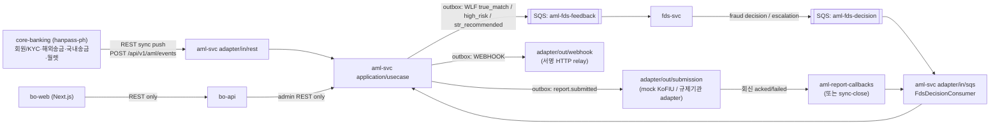
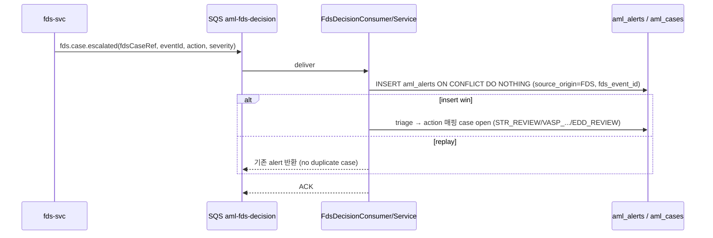
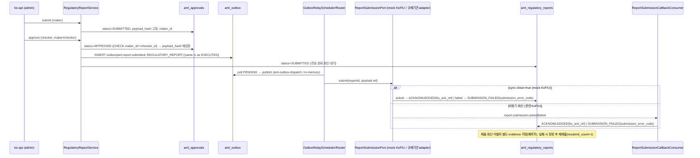
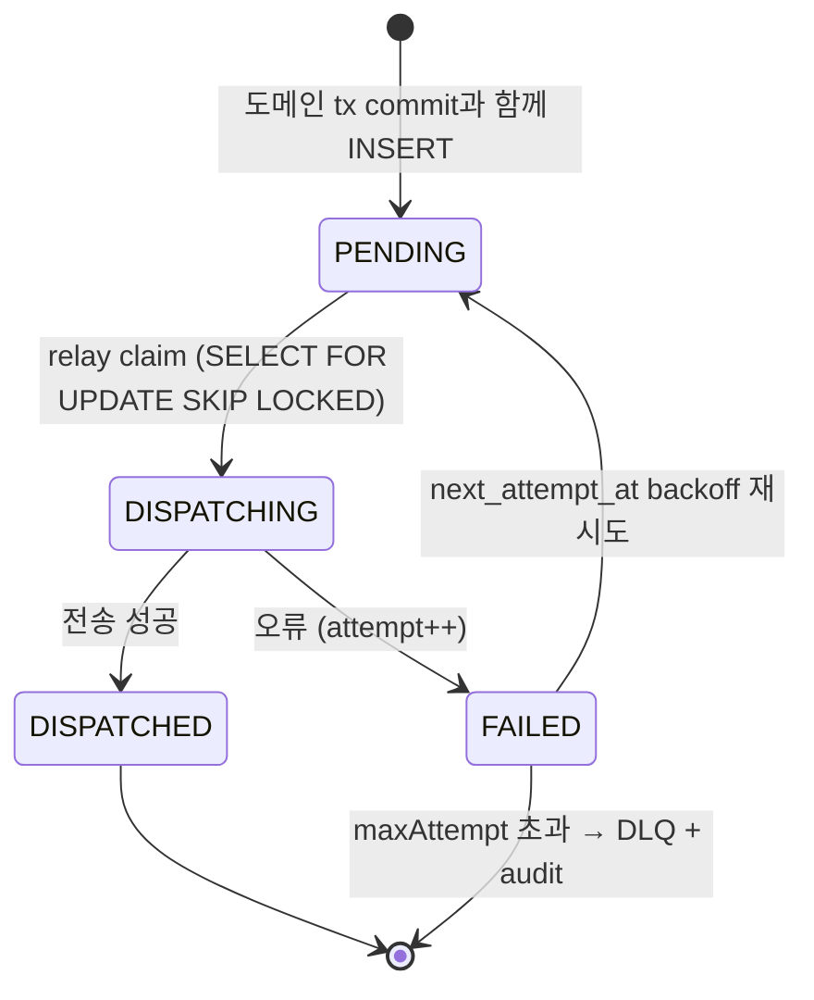
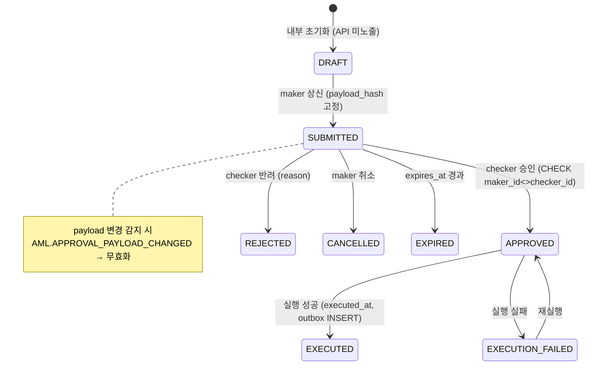
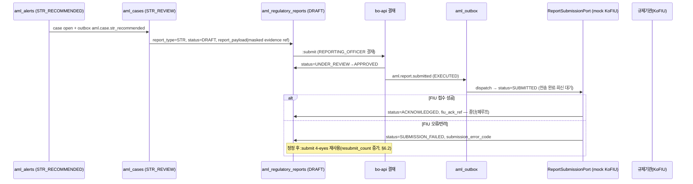

# AML 이벤트·연동 명세서 (aml-svc Integration) — hanpass-ph

> **시스템 그라운딩**: 본 명세는 **hanpass-ph AML RegOps** 의 AML 엔진(aml-svc) 연동 정본이다. 단일 운영 테넌트는 **`tenant_demo`(= hanpass-ph)** 이며, 단일 원천 시스템은 **`core-banking`**(스키마 버전 `core-banking.v1`, 커넥터 `REST_PUSH`)이다(코드 truth: `V2__phase1_foundation.sql` seed). 멀티테넌트 인프라 키(`tenant_id`·`data_scope`·아웃박스)는 **코드 truth 로 유지**하되 실제 운영 행은 hanpass-ph 단일 테넌트뿐이다. 거래 이벤트는 **hanpass eventType taxonomy**(`remit.*`(해외송금) · `domestic.*`(국내송금) · `wallet.*`(월렛충전/결제/출금) · 호환 `transaction.*`)로 인입되며, 거래 채널은 hanpass-ph 6유형 — `CASH_IN`(월렛충전) · `DOMESTIC_REMIT`(국내송금) · `CROSS_BORDER_REMIT`(해외송금) · `WALLET_PAYMENT`(월렛결제) · `WALLET_WITHDRAWAL`(월렛/ATM출금) · `CARD_NOT_PRESENT`(카드결제) — 이다(코드 truth: `V26__demo_six_types_aml.sql`).
> **닫힌 enum 보존**: `EventFamily`(코드 truth: `domain/enums/EventFamily.java`)의 비-hanpass 멤버 — Phase 8 Advanced Domain Pack 패밀리(`trade`·`invoice`·`crypto`·`travel-rule`·`settlement`·`order`·`seller`·`market`·`internal`·`audit`) 및 Legacy Vendor Bridge(`vendor`) — 는 **삭제하지 않고 코드/스키마에 보존**하되 **hanpass-ph 미사용**(확장 슬롯)임을 명시한다. 본 연동 명세는 hanpass-ph 가 실제로 발행·소비하는 흐름만 정본으로 다루며, Phase 8 Advanced Domain 연동은 §13(스키마 잔존 노트)으로만 남긴다.
>
> 정본: `.claude/skills/_shared/aegis-stack.md`(4서비스 모노레포·비동기 SQS·멀티테넌시·PII 마스킹·4-eyes·Policy Pack STR/CTR/Travel Rule).
> 입력 설계서: `docs/software/02-amlSvc-sass.md`(§8 Canonical Event Taxonomy·§12 TM·§13 결재·§14 Reporting·§15 외부연동·§19 감사).
> 동기화 대상: `docs/design/db/02-aml-db.md`(테이블·컬럼·enum), `docs/design/api/02-aml-api.md`(엔드포인트·DTO·scope·에러).
> 참조 구현(코드 truth, 책임 서비스 `services/aml-svc`, 실제 패키지 `com.aegis.aml`): `adapter/in/rest/AmlEventController`(REST ingest)·`adapter/in/sqs/FdsDecisionConsumer`(`@SqsListener` FDS 결정 소비)·`adapter/in/sqs/ReportSubmissionCallbackConsumer`(FIU 회신)·`adapter/out/messaging`(outbox relay 라우터·SQS publisher)·`adapter/out/webhook`(서명 webhook relay)·`adapter/out/submission`(규제 제출 어댑터)·`adapter/out/feed`·`adapter/in/scheduled`(watchlist reconciliation).
> 명칭·필드·타입·enum·엔드포인트는 위 코드·정본·DB·API 와 일치한다. 충돌 시 **코드(truth) > 정본 > 설계서 > DB/API** 순으로 우선하며, 추측 명칭은 도입하지 않는다.

## 목차

1. [범위·경계·전제](#1-범위경계전제)
2. [메시징 토폴로지(SQS)](#2-메시징-토폴로지sqs)
3. [이벤트 카탈로그](#3-이벤트-카탈로그)
4. [메시지 envelope·스키마(JSON)](#4-메시지-envelope스키마json)
5. [비동기 흐름 시퀀스(Mermaid)](#5-비동기-흐름-시퀀스mermaid)
6. [멱등성·재처리·DLQ·순서보장](#6-멱등성재처리dlq순서보장)
7. [커넥터·필드매핑(원천→canonical)](#7-커넥터필드매핑원천canonical)
8. [아웃박스·결재 상태머신(4-eyes)](#8-아웃박스결재-상태머신4-eyes)
9. [규제 제출 연동(STR/CTR/Travel Rule)](#9-규제-제출-연동strctrtravel-rule)
10. [멀티테넌시 라우팅·PII 미전파](#10-멀티테넌시-라우팅pii-미전파)
11. [관측성·운영](#11-관측성운영)
12. [Capability 매트릭스](#12-capability-매트릭스)
13. [Phase 8 Advanced Domain — 스키마 잔존 노트(hanpass-ph 미사용)](#13-phase-8-advanced-domain--스키마-잔존-노트hanpass-ph-미사용)
14. [변경 이력](#14-변경-이력)

---

## 1. 범위·경계·전제

본 문서는 `aml-svc`(`com.aegis.aml`)의 **인바운드(이벤트 수신)·아웃바운드(외부 제출·서비스 간 연동)** 연동을 정의한다. 동기 REST 계약은 `02-aml-api.md`가 정본이며, 본 문서는 그 위에서 **이벤트·커넥터·아웃박스·큐**만 다룬다.

### 1.1 서비스 경계 (hanpass-ph 단일 테넌트)


```mermaid
flowchart LR
    CB["core-banking (hanpass-ph)<br/>회원/KYC·해외송금·국내송금·월렛"]
    CB -->|REST sync push<br/>POST /api/v1/aml/events| AMLIN["aml-svc adapter/in/rest"]
    AMLIN --> AMLAPP["aml-svc application/usecase"]
    FDS["fds-svc"] -->|fraud decision / escalation| SQSFDS[["SQS: aml-fds-decision"]]
    SQSFDS --> AMLSQS["aml-svc adapter/in/sqs<br/>FdsDecisionConsumer"]
    AMLSQS --> AMLAPP
    AMLAPP -->|outbox: WLF true_match / high_risk / str_recommended| SQSFB[["SQS: aml-fds-feedback"]]
    SQSFB --> FDS
    AMLAPP -->|outbox: report.submitted| SUB["adapter/out/submission<br/>(mock KoFIU / 규제기관 adapter)"]
    SUB -->|회신 acked/failed| CBQ["aml-report-callbacks<br/>(또는 sync-close)"]
    CBQ --> AMLSQS
    AMLAPP -->|outbox: WEBHOOK| WH["adapter/out/webhook<br/>(서명 HTTP relay)"]
    BOAPI["bo-api"] -->|admin REST only| AMLAPP
    BOWEB["bo-web (Next.js)"] -->|REST only| BOAPI
```

규칙:
- **이벤트 인입은 동기 REST 가 정본 경로다(코드 truth)**. hanpass-ph core-banking 은 `POST /api/v1/aml/events`(`AmlEventController`, scope `aml:event:write`)로 canonical 이벤트를 멱등 전송한다. 별도 `@SqsListener` ingest consumer 는 **현재 구현되어 있지 않다**(`aml-canonical-events` 큐는 config 선언만 존재, consumer 미구현 — §2.1 주석).
- 엔진 간(`fds-svc`→`aml-svc`) 연동은 **event(SQS) 연동**이다(코드 truth: `FdsDecisionConsumer` `@SqsListener("aml-fds-decision")`). 동기 fallback 은 Internal API(`/internal/v1/aml/fds-escalations`, `FdsEscalationInternalController`).
- `bo-web`은 `bo-api` 경유만(엔진 직접 호출 금지). 결재·감사·evidence export 는 `bo-api`→`aml-svc` Admin/Internal API.
- 모든 메시지·커넥터·아웃박스는 `tenantId`(=`tenant_demo`)·`dataScope`·`traceId`를 전파한다.
- raw PII 는 큐·이벤트·외부 제출 어디에도 평문 전파 금지. ref(token)/hash/`payloadHash`만 흐른다(§10).
- **직렬화 규약**: 모든 큐·webhook 메시지 키는 **camelCase**로 직렬화하고 DB 컬럼(snake_case)과 1:1 매핑한다(예 `submissionErrorCode`↔`submission_error_code`, `payloadHash`↔`payload_hash`, `schemaVersion`↔`schema_version`). enum 코드값은 DB §5·API §3와 동일하며 도메인 별칭은 정본 enum 으로 환원해 전파한다(예 WLF `POTENTIAL_MATCH`→`POSSIBLE_MATCH`).
- **`eventFamily`는 입력 필드가 아니다(서버 파생)**: consumer 가 `eventType` 접두(`<family>`)에서 도출하는 **읽기전용 파생값**이다(코드 truth: `EventFamily.fromEventType`). aml-svc 는 별도 `event_family` 컬럼을 두지 않고 `aml_canonical_events.event_type`(VARCHAR(80))에 `<family>.<verb>` 전체를 저장하므로, `eventFamily`는 라우팅·관측성·webhook envelope(API §8.2)용 투영(projection)으로만 쓴다.
- **운영자 집계 API 경계**: 대시보드·서비스 관리·운영자 감사 조회는 **bo-api**가 소유·집약·인증한다(API §9 정본). aml-svc(엔진)는 저수준 데이터 API·비동기 큐만 제공하며, 본 연동 명세는 운영자 집계 엔드포인트를 정의하지 않는다.

### 1.2 어댑터 매핑 (헥사고날, 코드 truth)

| 방향 | 어댑터 패키지 | 책임 | port |
|---|---|---|---|
| in | `adapter/in/rest` | 동기 ingest(`AmlEventController`)·screen·RA·TM·evidence·내부(`FdsEscalationInternalController`·`ScreenInternalController`·`CustomerRiskInternalController`·`PiiRevealInternalController`)·watchlist admin·travel-rule·audit | `IngestAmlEventUseCase`·`ScreenSubjectUseCase`·`EvaluateRiskUseCase`·`EvaluateTransactionUseCase` 등 |
| in | `adapter/in/sqs` | `FdsDecisionConsumer`(`@SqsListener aml-fds-decision`)·`ReportSubmissionCallbackConsumer`(FIU 회신, 직접 호출/REST callback 시드) | `ConsumeFdsDecisionUseCase`·`AcknowledgeReportUseCase` |
| in | `adapter/in/scheduled` | `OutboxRelayScheduler`(아웃박스 drain)·`WatchlistReconciliationScheduler`(명단 freshness) | `RelayOutboxUseCase`·`ReconcileWatchlistUseCase` |
| out | `adapter/out/messaging` | `OutboxRelayRouter`(WEBHOOK→relay / 그 외→SQS)·`SqsOutboxRelayPublisher`(aws)·`InMemoryOutboxRelayPublisher`(local)·`HighRiskOutboxAdapter` | `OutboxRelayPort`·`OutboxMessagingPort`·`HighRiskEventPort` |
| out | `adapter/out/webhook` | `HttpWebhookRelayAdapter`(서명 customer callback) | `WebhookSenderPort` |
| out | `adapter/out/submission` | `MockRegulatorSubmissionAdapter`(mock KoFIU, 운영시 규제기관 어댑터) | `ReportSubmissionPort` |
| out | `adapter/out/feed` | `MockWatchlistFeedAdapter`(명단 import) | `WatchlistFeedPort` |
| out | `adapter/out/persistence` | `aml_canonical_events`·`aml_approvals`·`aml_outbox`(`OutboxJpaAdapter`)·watchlist·vendor-migration 등 | `CanonicalEventStorePort`·`OutboxStorePort` 등 |

---

## 2. 메시징 토폴로지(SQS)

정본은 비동기 메시징을 **SQS**로 고정한다(`aegis-stack.md`). 참조 구현은 `io.awspring.cloud.sqs.annotation.SqsListener` 기반이며, AWS SQS auto-config 는 **`aws` 프로파일에서만 활성**(코드 truth: `application.yml` `spring.autoconfigure.exclude: SqsAutoConfiguration`)이다 — 로컬/CI 는 브로커 없이 구동하고 FDS-decision consumer 는 휴면, 아웃박스 relay 는 `InMemoryOutboxRelayPublisher`로 동작한다.

### 2.1 큐 카탈로그 (코드 truth)

| 큐 논리명 | 방향 | 발행자 | 구독자 | 페이로드 | DLQ | 비고 |
|---|---|---|---|---|---|---|
| `aml-fds-decision` | in | `fds-svc` | `FdsDecisionConsumer`(`@SqsListener`) | `fds.case.escalated`·`fds.decision.applied` | `aml-fds-decision-dlq` | **구현됨**. config `aegis.aml.queue.fds-decisions`(기본 `aml-fds-decision`) |
| `aml-fds-feedback` | out | `aml-svc` outbox relay(`SqsOutboxRelayPublisher`, aws) | `fds-svc` | `aml.screening.true_match`·`aml.customer.high_risk`(aggregate `FDS_FEEDBACK`) | (구독자 DLQ) | aws 프로파일에서 `aggregate_type=FDS_FEEDBACK` 행만 라우팅. config `aegis.aml.queue.fds-feedback` |
| `aml-outbox-dispatch` | out | `aml-svc` outbox relay(`SqsOutboxRelayPublisher`, aws) | 외부/하위 소비자 | `aml.report.submitted`(REGULATORY_REPORT)·`aml.case.str_recommended`(CASE)·IRA·SCREENING 등 비-WEBHOOK·비-FDS_FEEDBACK 행 | `aml-outbox-dlq` | aws 프로파일 fallback 큐. config `aegis.aml.queue.outbox-dispatch` |
| `aml-report-callbacks` | in | 규제기관/제출 adapter | `ReportSubmissionCallbackConsumer.onCallback` | `report.submission.acked`·`report.submission.failed` | `aml-report-callback-dlq` | **`@SqsListener` 미선언** — sync-close(`sync-close=true`, mock KoFIU) 또는 REST callback/test seam 으로 직접 호출. 운영 KoFIU 비동기 회신 시 큐 바인딩 추가 |
| `aml-canonical-events` | (예정) | core-banking | (consumer 미구현) | canonical event | — | config `aegis.aml.queue.canonical-events` 선언만 존재. **현재 ingest 는 REST 전용**(§1.1). 대량 비동기 ingest consumer 는 net-new 후속 |

- **WEBHOOK 아웃박스 행은 SQS 가 아니라 HTTP relay 로 전송된다**(코드 truth: `OutboxRelayRouter` — `aggregate_type=WEBHOOK` → `WebhookSenderPort.send`, 그 외 → `OutboxMessagingPort.publish`). 즉 webhook 은 큐를 거치지 않고 `adapter/out/webhook/HttpWebhookRelayAdapter`(서명 callback)로 직접 발송한다.
- 큐 물리명은 `deployment_model`(DB `aml_tenants.deployment_model`, §10.1)에 따라 결정된다. `MANAGED_DEDICATED`(hanpass-ph 기본)/`SELF_HOSTED`(전용 배포): 배포 단위 전용 큐(배포 엔드포인트가 서비스 경계). `SHARED`(공유 배포): 공용 큐 + 메시지 attribute `tenantId` 행 라우팅·RLS. 라우팅은 §10.
- 메시지 attribute(코드 truth `SqsOutboxRelayPublisher.publish`): `tenantId`, `eventType`, `aggregateType`, `aggregateRef`, `idempotencyKey`(=`payloadHash`). consumer 측은 `traceId`·`dataScope`를 envelope 본문에서 전파한다.

---

## 3. 이벤트 카탈로그

이벤트명은 `<family>.<verb>` 소문자. `eventType`은 `aml_canonical_events.event_type`(VARCHAR(80))에 그대로 저장되며 API `IngestEventRequest.eventType`(§02-aml-api 3.1)와 1:1. 인입 시 `EventFamily.fromEventType`이 **strict gate**로 동작해 미등재 패밀리는 `REJECTED`(코드 truth: `AmlEventIngestService` step 3, DB family CHECK `V27`와 이중 방어).

### 3.1 인바운드 — core-banking → aml-svc (REST `POST /api/v1/aml/events`)

> 발행자(`source_system`)는 hanpass-ph 단일 원천 **`core-banking`**(`core-banking.v1`)이다. ingest 는 동기 REST 전용(§1.1·§2.1).

| eventType(family) | 트리거 | 핵심 페이로드 키(ref/hash) | 후속 처리 | 산출 |
|---|---|---|---|---|
| `customer.created`(CUSTOMER) | 개인 회원 생성 | `customer.customerRef`·`customerType`·`country` | identity projection → ScreenSubject | `aml_customers`, `aml_screening_results` |
| `customer.kyc-updated`(CUSTOMER) | KYC/CDD 갱신(zoloz 스크리닝 결과 반영) | `customer.customerRef`·`kycStatus`·`docHash` | identity projection → EvaluateRisk | `aml_customers`, `aml_risk_scores` |
| `customer.status-changed`(CUSTOMER) | 회원 상태 변경 | `customer.customerRef`·`status` | identity projection | `aml_customers` |
| `entity.created`/`entity.updated`(ENTITY) | 법인/파트너 생성·변경(KYB) | `entity.entityRef`·`entityType`·`legalNameHash`·`industryCode` | identity projection → ScreenSubject | `aml_entities` |
| `beneficial-owner.changed`(BENEFICIAL_OWNER) | UBO/대표자 변경 | `relationship.fromRef`·`toRef`·`relationshipType`·`ownershipPercent` | identity projection(UBO) → ScreenSubject | `aml_relationships`, `aml_screening_results` |
| `remit.transfer.requested`/`remit.transfer.completed`(REMIT) | 해외송금(cross-border) 요청·완료 | `transaction.transactionRef`(←`remit.transfer_number`)·`amount`·`amountMinor`·`currency`·`corridor`·`amountBase`·`channelType=CROSS_BORDER_REMIT` | EvaluateTransaction(TM) | `aml_canonical_events`, `aml_alerts` |
| `domestic.transfer.requested`/`domestic.transfer.completed`(DOMESTIC) | 국내송금(PHP) 요청·완료 | `transaction.transactionRef`(←`domestic.transaction_id`)·`amount`·`channelType=DOMESTIC_REMIT` | EvaluateTransaction(TM) | `aml_canonical_events`, `aml_alerts` |
| `wallet.charge.requested`(WALLET) | 월렛충전(cash-in) | `transaction.transactionRef`(←`wallet.charge_order_id`)·`amount`·`channelType=CASH_IN` | EvaluateTransaction(TM) | `aml_canonical_events`, `aml_alerts` |
| `wallet.pay.requested`(WALLET) | 월렛결제 | `transaction.transactionRef`·`amount`·`channelType=WALLET_PAYMENT` | EvaluateTransaction(TM) | `aml_canonical_events`, `aml_alerts` |
| `wallet.withdraw.requested`(WALLET) | 월렛/ATM 출금 | `transaction.transactionRef`(←`wallet.wallet_transaction_id`)·`amount`·`channelType=WALLET_WITHDRAWAL` | EvaluateTransaction(TM) | `aml_canonical_events`, `aml_alerts` |
| `transaction.requested`/`transaction.completed`(TRANSACTION) | 호환 일반 거래 패밀리(채널 무관 canonical) | `transaction.transactionRef`·`amount`·`direction`·`channelType` | EvaluateTransaction(TM) | `aml_canonical_events`, `aml_alerts` |

> **TM velocity·fund-graph 참여 패밀리(코드 truth `EventFamily.isTransactionBearing`)**: `TRANSACTION`·`REMIT`·`DOMESTIC`·`WALLET`. hanpass-ph 6채널은 이 4패밀리로 인입되어 velocity window·자금그래프 funnel 에 집계된다.
> **corridor·amountBase(해외송금)**: `corridor`(`sendCountry`/`receiveCountry`/`sendCurrency`/`receiveCurrency` ← `remit.send_country/receive_country/send_currency/receive_currency`)와 USD 정규화 `amountBase`(← `remit.usd_amount/report_amount`)는 cross-border(`remit.*`)에 한해 채운다(국내 `domestic`/`wallet` 은 corridor 동일국·생략 가능). TM corridor 시나리오(`HIGH_RISK_CORRIDOR` v3, `V26`)·canonical event payload 에 보존. 임계·기준금액은 규제 레이어(Policy Pack) 정본 — 본 필드는 데이터 신호일 뿐 임계 교체 아님.
> **zoloz/str_indicators(데이터 신호)**: `customer.kyc-updated` 의 zoloz 스크리닝 결과(decision/risk_level/total_hits/hit_results)와 해외송금 `str_indicators`는 screening/evidence 데이터 신호로만 매핑하며, 규제 STR 분류는 KR Policy Pack 정본을 따른다(§7.2).

### 3.2 인바운드 — fds-svc → aml-svc (`aml-fds-decision`, SQS)

코드 truth: `FdsDecisionConsumer`(`@SqsListener`) → `FdsDecisionService`(`ConsumeFdsDecisionUseCase`).

| eventType | 트리거 | 핵심 키 | 후속(case type 매핑) | 산출 |
|---|---|---|---|---|
| `fds.case.escalated` | FDS fraud case → AML 후보 위임 | `tenantId`·`eventId`(=`fdsEventId`)·`fdsCaseRef`·`targetRef`·`transactionRef`·`action`·`severity`·`dataScope` | `REGULATORY_REPORT`→`STR_REVIEW`, `REQUEST_TRAVEL_RULE_INFO`→`VASP_TRAVEL_RULE_REVIEW`, `OPEN_AML_CASE`→`EDD_REVIEW`, 기타/legacy→`STR_REVIEW` | `aml_alerts`(alert_type=`FDS_ESCALATION`, source_origin=`FDS`) → `aml_cases` |
| `fds.decision.applied` | FDS hold/block 결정 → AML EDD 트리거 | `tenantId`·`eventType`·`targetRef`·`transactionRef`·`action`·`severity` | `EDD_REVIEW`(edd_trigger=`UNUSUAL_TRANSACTION`) | `aml_alerts`, `aml_cases` |

> 멱등: 두 이벤트 모두 부분 UNIQUE `(tenant_id, origin_fds_case_ref, fds_event_id) WHERE source_origin='FDS'` 기반 `INSERT … ON CONFLICT DO NOTHING`(코드 truth `FdsDecisionService` 주석)으로 재전달 시 단일 alert·단일 case 만 생성된다. `eventId` 미제공 시 `fdsCaseRef` fallback.
> `severity`는 FDS 라우팅 힌트로 AML alert severity 를 결정하되, 미상/비정상 값은 eventType 기본값(escalated→`HIGH`, applied→`MEDIUM`)으로 안전 fallback. aml-svc 는 FDS `action_type` 을 소유·재현하지 않고 **AML case trigger 로만 해석**한다(action ownership 경계).
> `fds.case.escalated`의 동기 fallback 경로는 `POST /internal/v1/aml/fds-escalations`(`FdsEscalationInternalController`)다. `fds.decision.applied`는 **비동기 큐 전용**(대응 동기 REST 계약 없음).

### 3.3 아웃바운드 — aml-svc → fds-svc (`aml-fds-feedback`, aggregate `FDS_FEEDBACK`)

코드 truth: `FdsFeedbackOutboxEmitter`·`HighRiskOutboxAdapter` → outbox `FDS_FEEDBACK` → aws 프로파일에서 `SqsOutboxRelayPublisher`가 `aml-fds-feedback`로 라우팅.

| eventType | 트리거 | 핵심 키 | 구독자 처리 |
|---|---|---|---|
| `aml.screening.true_match` | WLF `TRUE_MATCH` 결재(EXECUTED) | `screeningId`·`targetRef`·`targetType`·`watchlistSourceType`·`reasonCodes` | fds-svc block/watchlist 반영 |
| `aml.customer.high_risk` | RA `risk_grade` HIGH/PROHIBITED 확정 | `targetRef`·`scoreId`·`riskGrade` | fds-svc risk group 전파 |

### 3.4 아웃바운드 — 아웃박스 dispatch(`aml-outbox-dispatch`) / STR 후보 / 제출 회신

| eventType | 트리거 | 키 | 외부 대상 / 비고 |
|---|---|---|---|
| `aml.case.str_recommended` | alert `STR_RECOMMENDED`(case open) | `caseId`·`targetRef`(aggregate `CASE`) | fds-svc evidence cross-ref(코드 truth `AlertTriageService`) |
| `aml.report.submitted` | STR/CTR 결재 EXECUTED → 제출 dispatch | `reportId`·`reportType`·`approvalId`(aggregate `REGULATORY_REPORT`) | `ReportSubmissionPort` → 규제기관 adapter. dispatch 시 status=`SUBMITTED`(전송 완료·회신 대기, 코드 truth `RegulatoryReportService`) |
| `report.submission.acked` | FIU/규제기관 접수 회신 | `tenantId`·`submittedRef`·`fiuAckRef` | `ReportSubmissionCallbackConsumer.onCallback` → status=`ACKNOWLEDGED`(종단, `fiu_ack_ref` 저장) |
| `report.submission.failed` | 전송 실패·FIU 오류 반려 | `tenantId`·`submittedRef`·`submissionErrorCode` | → status=`SUBMISSION_FAILED`(`submission_error_code` 저장) → 운영자 정정 후 재제출(§6.2) |
| `webhook.callback.requested` | screening/case/report 상태 변경 | `subjectRef`·`eventName`(API §8.1, aggregate `WEBHOOK`) | **SQS 미경유** — `OutboxRelayRouter`가 `WebhookSenderPort`로 서명 HTTP 전송. 콜백 URL 원천 = `aml_api_credentials`(`credential_type=WEBHOOK enabled`).`webhook_url`(DB §3.15, 구현 `V17`). 공유 secret = 동일 행 `secret_ciphertext`(서명 시점만 복호) |

> webhook 아웃박스 row 는 서비스 콜백 envelope(API §8.2 정본)을 발행한다(코드 truth `WebhookOutboxEmitter`). envelope 키: `schemaVersion`(`aml.webhook.v1`)·`eventName`(`AmlScreeningResolved`/`AmlCaseStatusChanged`/`AmlReportSubmitted`)·`eventFamily`(`screening`/`case`/`report`, **`eventName` 접두에서 서버 파생** — 입력 아님)·`eventId`·`tenantId`·`dataScope`·`occurredAt`·`traceId`·`data`. 모든 키 camelCase, `data`는 token/hash·마스킹만(원문 미포함). 서명·재시도·멱등은 API §8.3/§8.4 정본.

---

## 4. 메시지 envelope·스키마(JSON)

### 4.1 공통 envelope (ingest REST body + canonical event)

API `IngestEventRequest`(02-aml-api §3.1)·`aml_canonical_events` 컬럼과 1:1(코드 truth `AmlEventController.IngestEventRequest`·`AmlEventIngestService`). raw PII 없음.

```json
{
  "tenantId": "tenant_demo",
  "dataScope": "default",
  "sourceSystem": "core-banking",
  "schemaVersion": "core-banking.v1",
  "eventId": "evt-001",
  "idempotencyKey": "core-banking:evt-001",
  "eventType": "remit.transfer.completed",
  "occurredAt": "2026-06-06T10:00:00Z",
  "payloadHash": "sha256:...",
  "payload": { }
}
```

> REST ingest 는 `Tenant-Id`·`Idempotency-Key` 헤더가 권위(authoritative)이며, body 의 `idempotencyKey`/`sourceSystem`은 헤더와 일치해야 한다(불일치 ⇒ `REJECTED`, 코드 truth `AmlEventIngestService` step 0). `X-Trace-Id` 헤더 ↔ canonical `trace_id` 매핑. `eventFamily`는 **본문에 싣지 않는다** — `eventType` 접두에서 파생한다(§1 규칙).

| 필드 | 타입 | 필수 | DB 매핑 | 규칙 |
|---|---|---|---|---|
| `tenantId` | string | Y(헤더 `Tenant-Id`) | `tenant_id` | 라우팅·RLS 키(§10). 운영값 `tenant_demo` |
| `dataScope` | string | N | `data_scope` | 운영자 row-level 권한 필터(**NULL=tenant 전역**, §10.1·DB §2.1·API §1.1). 미제공 시 tenant 전역 |
| `sourceSystem` | string | Y | `source_system` | 미등록 시 REJECTED(`SCHEMA_UNKNOWN`). 운영값 `core-banking` |
| `schemaVersion` | string | Y | `schema_version` | source 스키마 버전. 등록 버전과 불일치 시 REJECTED(`SCHEMA_UNKNOWN`). 운영값 `core-banking.v1` |
| `eventId` | string | Y | `event_id`(PK) | 원천 식별자 |
| `idempotencyKey` | string | Y(헤더 `Idempotency-Key`) | `idempotency_key`(UNIQUE) | `<source>:<eventId>` 권장. body 값은 헤더와 일치 필수 |
| `eventType` | string | Y | `event_type` | §3 카탈로그 `<family>.<verb>`. `EventFamily` strict gate(미등재 ⇒ REJECTED) |
| `occurredAt` | string(date-time) | N | `occurred_at` | 원천 발생 시각. 미제공 시 수신 시각. 파싱 실패 ⇒ REJECTED(500 아님) |
| `payloadHash` | string | N | `payload_hash`(NOT NULL) | raw payload sha256. **선택 — 미제공 시 ingest 어댑터가 payload sha256 자동 계산 INSERT**(코드 truth `AmlEventIngestService.sha256`). 호출자 제공 시 그 값 사용 |
| `payload` | object/string | N | `payload`(JSONB) | 정규화 payload(ref/hash만). 미제공 시 `{}` |

> **Cross-service envelope 정책(`dataScope`) — AML**: AML envelope 는 `dataScope` 최상위(선택)이며 `workspaceId`는 미탑재(AML `workspace_id` 미적용·보류). FDS envelope(`01-fds-integration.md` §4.1)는 `workspaceId` 최상위다 — 의도된 비대칭. FDS→AML 핸드오프(`fds.case.escalated` 소비) 시 핸드오프 어댑터가 FDS `workspaceId`→AML `dataScope`로 변환(`default`→`default` 포함).

### 4.2 transaction payload (canonical, hanpass-ph)

```json
{
  "customer": { "customerRef": "cust_hmac_123", "customerType": "PERSON", "country": "KR", "riskGrade": "MEDIUM" },
  "counterparty": { "counterpartyRef": "bene_hmac_999", "counterpartyType": "PERSON", "country": "PH" },
  "transaction": {
    "transactionRef": "remit_tx_123", "direction": "OUTBOUND",
    "amount": "9500000.00000000", "amountMinor": 9500000, "currency": "KRW",
    "purpose": "REMITTANCE", "channelType": "CROSS_BORDER_REMIT",
    "corridor": { "sendCountry": "KR", "receiveCountry": "PH", "sendCurrency": "KRW", "receiveCurrency": "PHP" },
    "amountBase": "7000.00"
  },
  "screeningContext": { "requiresSanctionsScreening": true }
}
```

> 금액은 `amount`(NUMERIC(24,8) 문자열) + `amountMinor`(BIGINT 정수 최소단위) 병행(DB §3 규약). `channelType`은 hanpass-ph 6유형(`CASH_IN`/`DOMESTIC_REMIT`/`CROSS_BORDER_REMIT`/`WALLET_PAYMENT`/`WALLET_WITHDRAWAL`/`CARD_NOT_PRESENT`)이며 TM DSL feature `transaction.channelType`·`transaction.amountBase`로 평가된다(코드 truth `V26`). 해외송금 receiver(수취인) 스크리닝은 `counterparty`/recipientInfo 정규화 토큰으로 수행한다(WLF receiver 매치, `V26` 데모 엔트리).

### 4.3 fds-decision payload (`aml-fds-decision`, `FdsEscalationRequest` 호환)

코드 truth `FdsDecisionConsumer.parse`가 읽는 키:

```json
{
  "tenantId": "tenant_demo",
  "eventType": "fds.case.escalated",
  "eventId": "action:uuid",
  "fdsCaseRef": "fds_case_777",
  "targetRef": "cust_hmac_123",
  "transactionRef": "remit_tx_123",
  "action": "OPEN_AML_CASE",
  "severity": "HIGH",
  "dataScope": "default"
}
```

### 4.4 outbox row → dispatch payload (코드 truth `aml_outbox`)

아웃박스 행은 `payload`(JSONB) 본문을 그대로 publish 한다. FDS feedback / report submission 예:

```json
{ "screeningId": "scr_...", "targetRef": "cust_hmac_123", "targetType": "CUSTOMER",
  "watchlistSourceType": "DEMO_SANCTIONS", "reasonCodes": ["NAME_MATCH"] }
```

> 외부 제출(`aml.report.submitted`) payload 본문은 `aml_regulatory_reports.report_payload`(JSONB)를 참조하며 메시지에는 ref·hash·코드만 싣는다(PII·증적 본문 미전파). SQS 헤더(코드 truth `SqsOutboxRelayPublisher`): `tenantId`·`eventType`·`aggregateType`·`aggregateRef`·`idempotencyKey`(=`payloadHash`).

---

## 5. 비동기 흐름 시퀀스(Mermaid)

### 5.1 REST Ingest → 정규화 → TM (멱등·strict gate)

```mermaid
sequenceDiagram
    participant CB as core-banking
    participant REST as aml-svc in/rest POST /api/v1/aml/events
    participant APP as AmlEventIngestService
    participant DB as aml_canonical_events
    participant TM as EvaluateTransaction
    CB->>REST: ingest(Tenant-Id, Idempotency-Key, body)
    REST->>APP: ingest(command)
    APP->>APP: header/body 일치 → tenant active → source/schema 검증
    APP->>APP: EventFamily.fromEventType (strict gate; 미등재 ⇒ REJECTED)
    APP->>DB: existsByIdempotencyKey? / existsByEventId? → 신규면 forced INSERT
    alt 중복 idempotencyKey
        DB-->>REST: REPLAYED (200)
    else event_id 충돌
        DB-->>REST: DUPLICATE (409)
    else 신규
        DB-->>APP: STORED → identity projection
        APP->>TM: evaluate(velocity window)
        TM->>DB: INSERT aml_alerts (scenario hit 시)
        APP-->>REST: ACCEPTED (202)
    end
```

### 5.2 실시간 WLF screening (동기 + fail 정책)

```mermaid
sequenceDiagram
    participant SYS as core-banking onboarding
    participant REST as aml-svc in/rest POST /api/v1/aml/screen
    participant WLF as ScreenSubject UseCase
    participant DB as aml_screening_results
    SYS->>REST: ScreenRequest (Idempotency-Key, X-Signature)
    REST->>WLF: screen(subject ref/hash, recipientInfo)
    alt 엔진 정상
        WLF->>DB: INSERT screening_results(status=NO_MATCH|POSSIBLE_MATCH|TRUE_MATCH)
        WLF-->>REST: ScreenResponse(POSSIBLE_MATCH 정규화: POTENTIAL→POSSIBLE)
    else 엔진 장애
        WLF-->>REST: AML.SCREENING_REQUIRES_REVIEW(422) 또는 AML.SCREENING_UNAVAILABLE(503)
        Note over REST,SYS: source_systems.failure_policy=MANUAL_REVIEW|FAIL_CLOSED (DB §3.2; DTO failurePolicy)
    end
```

### 5.3 FDS escalation → STR 후보 (event 연동)


```mermaid
sequenceDiagram
    participant FDS as fds-svc
    participant Q as SQS aml-fds-decision
    participant C as FdsDecisionConsumer/Service
    participant DB as aml_alerts / aml_cases
    FDS->>Q: fds.case.escalated(fdsCaseRef, eventId, action, severity)
    Q->>C: deliver
    C->>DB: INSERT aml_alerts ON CONFLICT DO NOTHING (source_origin=FDS, fds_event_id)
    alt insert win
        C->>DB: triage → action 매핑 case open (STR_REVIEW/VASP_.../EDD_REVIEW)
    else replay
        C-->>Q: 기존 alert 반환 (no duplicate case)
    end
    C-->>Q: ACK
```

### 5.4 결재(4-eyes) → 아웃박스 → 외부 제출 → 회신


```mermaid
sequenceDiagram
    participant BO as bo-api (admin)
    participant APP as RegulatoryReportService
    participant APR as aml_approvals
    participant OB as aml_outbox
    participant RLY as OutboxRelayScheduler/Router
    participant SUB as ReportSubmissionPort (mock KoFIU / 규제기관 adapter)
    participant RPT as aml_regulatory_reports
    participant CB as ReportSubmissionCallbackConsumer
    BO->>APP: submit (maker)
    APP->>APR: status=SUBMITTED, payload_hash 고정, maker_id
    BO->>APP: approve (checker, maker≠checker)
    APP->>APR: status=APPROVED (CHECK maker_id<>checker_id) → payload_hash 재검증
    APP->>OB: INSERT outbox(aml.report.submitted, REGULATORY_REPORT) [same tx as EXECUTED]
    APP->>RPT: status=SUBMITTED (전송 완료·회신 대기)
    RLY->>OB: poll PENDING → publish (aml-outbox-dispatch / in-memory)
    RLY->>SUB: submit(reportId, payload ref)
    alt sync-close=true (mock KoFIU)
        SUB->>RPT: acked → ACKNOWLEDGED(fiu_ack_ref) | failed → SUBMISSION_FAILED(submission_error_code)
    else 비동기 회신 (운영 KoFIU)
        SUB-->>CB: report.submission.acked|failed
        CB->>RPT: ACKNOWLEDGED(fiu_ack_ref) | SUBMISSION_FAILED(submission_error_code)
    end
    Note over RPT: 제출·회신·식별자 별도 evidence 저장(폐루프). 실패 시 정정 후 재제출(resubmit_count+1)
```

---

## 6. 멱등성·재처리·DLQ·순서보장

### 6.1 멱등성

- **저장 멱등(코드 truth)**: `aml_canonical_events` UNIQUE `(tenant_id, idempotency_key)` + pre-check(`existsByIdempotencyKey`/`existsByEventId`) + forced INSERT 의 동시성 race 분류(REPLAYED/DUPLICATE). 동기 API 는 REPLAYED=200·DUPLICATE=409·REJECTED=422·ACCEPTED=202 로 응답.
- **처리 멱등**: FDS escalation alert 는 부분 UNIQUE `(tenant_id, origin_fds_case_ref, fds_event_id) WHERE source_origin='FDS'` 로 dedupe(§3.2). 아웃박스 발행은 UNIQUE `(tenant_id, aggregate_type, aggregate_ref, event_type, payload_hash)` 로 1회만 dispatch. report 회신은 `submittedRef`로 멱등(중복 callback 안전).

### 6.2 재처리(retry)

| 단계 | 정책 |
|---|---|
| 일시 오류(DB lock·외부 timeout) | consumer 예외 → SQS redrive(`FdsDecisionConsumer`·`ReportSubmissionCallbackConsumer`는 예외 재던짐). 아웃박스 relay 는 `FAILED`+`next_attempt_at` 백오프(§8.1) |
| `maxReceiveCount` 초과 | DLQ 이동 |
| 결정적 오류(스키마 위반·미등록 source·미등재 family) | REST ingest 는 즉시 `REJECTED`(저장 안 함). 큐는 DLQ + audit |
| report 제출 실패(`report.submission.failed`) | `aml_regulatory_reports.status=SUBMISSION_FAILED`(`submission_error_code`) → 정정 후 **기존 `:submit` 4-eyes 재사용**, `resubmit_count` 증가·회차별 evidence 보존 |

### 6.3 DLQ·순서보장

- 큐별 전용 DLQ(§2.1). DLQ replay 는 운영자 트리거 → 원본 큐 재투입(멱등키로 중복 무해). replay 이력은 `aml_audit_events`.
- DLQ depth 는 `aml.ingest.dlq.depth`/`aml.outbox.dlq.depth` metric·alert(§11).
- 순서 역전 내성: usecase 는 `occurredAt` 기준 last-writer-wins 로 상태 머지(out-of-order 이벤트가 최신 상태 덮어쓰지 않도록 가드).

---

## 7. 커넥터·필드매핑(원천→canonical)

### 7.1 커넥터(ingest mode) — `aml_source_systems.ingest_mode` enum과 1:1

hanpass-ph 운영 원천은 `core-banking`(ingest_mode=`REST_PUSH`) 단일이다. 닫힌 enum 나머지 모드는 코드/스키마 보존(미사용 슬롯).

| 커넥터 | ingest_mode | 어댑터 | 동작 | 멱등 키 | hanpass-ph |
|---|---|---|---|---|---|
| REST Push | `REST_PUSH` | in/rest `AmlEventController` | core-banking 동기 전송 `POST /api/v1/aml/events` | `Idempotency-Key` | **운영(core-banking)** |
| Queue | `QUEUE` | (consumer 미구현) | 대량 비동기 ingest | attr `idempotencyKey` | 미사용(`aml-canonical-events` 큐 net-new 후속) |
| Polling/CDC/Snapshot | `POLLING`/`CDC`/`SNAPSHOT` | in/scheduled | 주기 read / change stream / file import | `<source>:<cursor|lsn|snapshotId>` | 미사용 |
| Vendor Bridge | `VENDOR_BRIDGE` | out/external→in | legacy 벤더 export → canonical(`source_origin=VENDOR`) | `<vendor>:<alertId>` | 미사용(Vendor Bridge 슬롯, §13) |

### 7.2 필드매핑 (원천 → canonical, PII는 ref/hash)

> 원천 필드는 hanpass-ph core-banking 통합 모델 컬럼이다. 식별자 원문은 절대 저장하지 않고 tenant-keyed HMAC token / hash 로만 흐른다(코드 truth: `aegis.aml.pii.hmac-key` 기반 토큰화).

| 원천 필드(hanpass-ph) | canonical 경로 | 변환 | DB 컬럼 |
|---|---|---|---|
| `member_id` | `payload.customer.customerRef` | tenant-keyed HMAC token | `aml_customers.customer_ref` |
| `member_name` | `payload.customer.nameHash` | HMAC-SHA256(tenant key) | `aml_customers.name_hash` |
| rrn/passport/doc_no | `payload.customer.docHash` | HMAC, 원문 폐기 | `aml_customers.doc_hash` |
| corp_name / biz_no(KYB) | `payload.entity.legalNameHash`/`bizNoHash` | normalize→HMAC | `aml_entities.legal_name_hash`/`biz_no_hash` |
| `remit.account_hash` / wallet account_no | `payload.*.accountHash` | HMAC | (`account_hash`) |
| `amount`+`currency` | `payload.transaction.amount`+`amountMinor` | NUMERIC(24,8)+BIGINT(minor) | `amount`/`amount_minor` |
| `remit.usd_amount`/`report_amount` | `payload.transaction.amountBase` | USD 정규화 | (canonical payload) |
| `remit.transfer_number`/`domestic.transaction_id`/`wallet.charge_order_id`/`wallet.wallet_transaction_id` | `payload.transaction.transactionRef` | passthrough/token | `transaction_ref` |
| `remit.send_country/receive_country`·`send_currency/receive_currency` | `payload.transaction.corridor.*` | passthrough(ISO) | (canonical payload) |
| (거래 채널) | `payload.transaction.channelType` | hanpass-ph 6유형 코드 | (canonical payload) |
| `zoloz_aml_screening`(decision/risk_level/total_hits/hit_results) | `payload`·screening 정규화 | zoloz→screening status·risk_grade·score_breakdown(데이터 신호) | `aml_screening_results` |
| `remit.str_indicators`(STR_001~015) | `evidence.strIndicator` | 데이터 신호 매핑(규제 STR 분류는 KR Policy Pack 정본) | `aml_alerts.evidence` |
| `nationality`/`country` | `payload.*.country` | ISO-3166 alpha-2 | `country` |
| `event_ts` | `occurredAt` | ISO-8601 UTC | `occurred_at` |
| (원천 전체) | `payloadHash` | sha256, 서버 자동계산(미제공 시 ingest 어댑터 INSERT) | `payload_hash` |

> 모든 커넥터는 `sourceSchemaVersion`(=`core-banking.v1`) 검증과 PII 토큰화를 통과한 뒤 canonical event 로 정규화한다. 어느 경로도 raw PII 를 `aml_*`에 저장하지 않는다.

---

## 8. 아웃박스·결재 상태머신(4-eyes)

### 8.1 트랜잭셔널 아웃박스 (코드 truth `aml_outbox`)

외부 부작용(report 제출·fds-feedback·webhook·STR 후보)은 **도메인 변경과 같은 트랜잭션**으로 `aml_outbox`에 기록 후, `OutboxRelayScheduler`가 poll→publish→mark. at-least-once + 소비자 멱등으로 정확히 한 번 효과.

물리 테이블 **`aml_outbox`(DB §3.15, 구현 Flyway `V4` 생성)**. 핵심 컬럼: `tenant_id`·`outbox_id`(PK), `data_scope`, `aggregate_type`(**6종** `REGULATORY_REPORT`/`CASE`/`SCREENING`/`FDS_FEEDBACK`/`WEBHOOK`/`IRA_REPORT` — `IRA_REPORT`는 `V13`에서 추가, CHECK `aml_outbox_aggregate_type_check`), `aggregate_ref`, `event_type`(`aml.report.submitted`/`aml.screening.true_match`/`aml.customer.high_risk`/`aml.case.str_recommended`/`webhook.callback.requested` 등 §3), `payload`(JSONB, ref/hash), `payload_hash`, `status`(outbox_status: PENDING/DISPATCHING/DISPATCHED/FAILED), `attempt`, `next_attempt_at`, `published_at`, `trace_id`, `created_at`·`created_by`. 발행 멱등 UNIQUE `(tenant_id, aggregate_type, aggregate_ref, event_type, payload_hash)`, dispatch 인덱스 `(tenant_id, status, next_attempt_at)`.

라우팅(코드 truth `OutboxRelayRouter`): `aggregate_type=WEBHOOK` → `WebhookSenderPort`(HTTP), 그 외 → `OutboxMessagingPort`(aws=`SqsOutboxRelayPublisher`: `FDS_FEEDBACK`→`aml-fds-feedback`, 나머지→`aml-outbox-dispatch` / local=`InMemoryOutboxRelayPublisher`).


```mermaid
stateDiagram-v2
    [*] --> PENDING : 도메인 tx commit과 함께 INSERT
    PENDING --> DISPATCHING : relay claim (SELECT FOR UPDATE SKIP LOCKED)
    DISPATCHING --> DISPATCHED : 전송 성공
    DISPATCHING --> FAILED : 오류 (attempt++)
    FAILED --> PENDING : next_attempt_at backoff 재시도
    FAILED --> [*] : maxAttempt 초과 → DLQ + audit
    DISPATCHED --> [*]
```

### 8.2 결재(approval) 상태머신 — `aml_approvals`

`status` enum(approval_status): `DRAFT/SUBMITTED/APPROVED/REJECTED/CANCELLED/EXPIRED/EXECUTED/EXECUTION_FAILED`. 🔒 Admin 엔드포인트(`:submit`/`:approve`/`:apply`/`:activate`/`:close` 등, 02-aml-api §2.7)는 모두 이 머신을 통과.

> **`DRAFT`는 내부 전이 상태로 API 미노출.** API 표면 첫 관찰 가능 상태는 `SUBMITTED`(202).


```mermaid
stateDiagram-v2
    [*] --> DRAFT : 내부 초기화 (API 미노출)
    DRAFT --> SUBMITTED : maker 상신 (payload_hash 고정)
    SUBMITTED --> APPROVED : checker 승인 (CHECK maker_id<>checker_id)
    SUBMITTED --> REJECTED : checker 반려 (reason)
    SUBMITTED --> CANCELLED : maker 취소
    SUBMITTED --> EXPIRED : expires_at 경과
    APPROVED --> EXECUTED : 실행 성공 (executed_at, outbox INSERT)
    APPROVED --> EXECUTION_FAILED : 실행 실패
    EXECUTION_FAILED --> APPROVED : 재실행
    note right of SUBMITTED
      payload 변경 감지 시
      AML.APPROVAL_PAYLOAD_CHANGED → 무효화
    end note
```

불변식:
- `maker_id ≠ checker_id` — DB CHECK 제약명 `SELF_APPROVAL_DISABLED`, 위반 시 API 에러코드 `AML.SELF_APPROVAL_FORBIDDEN`(409).
- `payload_hash` 고정. APPROVED 후 대상 payload 변경 시 `AML.APPROVAL_PAYLOAD_CHANGED` 무효화(코드 truth `ApprovalPayloadRecomputer`).
- 결재 완료(`APPROVED`)와 실행(`EXECUTED`, `executed_at`) 분리. AI agent 는 `SUBMITTED`까지만, `APPROVED` 불가.
- 모든 전이는 `aml_audit_events`(category=`CASE_APPROVAL`/`REPORT_LIFECYCLE` 등) append-only 기록.

### 8.3 결재 대상(subject_type) ↔ 아웃박스 효과

| subject_type | 결재 후 EXECUTED 부작용 | 아웃박스 event(aggregate) |
|---|---|---|
| `STR_SUBMIT`/`CTR_SUBMIT`/`IRA_SUBMIT` | 외부 보고기관 제출 | `aml.report.submitted`(REGULATORY_REPORT/IRA_REPORT) |
| `WLF_DECISION`(TRUE_MATCH) | fds 전파 | `aml.screening.true_match`(FDS_FEEDBACK) |
| `RISK_OVERRIDE`(→HIGH) | fds risk group 전파 | `aml.customer.high_risk`(FDS_FEEDBACK) |
| `WATCHLIST_IMPORT` | 명단 version apply | (내부, audit) |
| `RA_MODEL`/`TM_SCENARIO`/`COUNTRY_RISK`/`POLICY_PACK` | 모델·정책 활성화 | (내부, audit) |
| `FP_WHITELIST`/`EDD_CLOSE`/`RELATIONSHIP_REJECT`/`SECRET_CHANGE`/`CHECKLIST_CHANGE`/`PERIODIC_REVIEW_CHANGE`/`TRAVEL_RULE_EXCEPTION` | 상태 확정/정책 버전 활성화 | (내부, audit) |

> 본 표는 API §3.7 `ApprovalDto.subjectType` 정본 전수를 커버한다. API §3.7 변경 시 동기화 필수.

---

## 9. 규제 제출 연동(STR/CTR/Travel Rule)

### 9.1 STR 제출 흐름 (4-eyes, FIU 폐루프)

코드 truth: `RegulatoryReportService`(`ManageRegulatoryReportUseCase`+`AcknowledgeReportUseCase`), outbox `aml.report.submitted`, `MockRegulatorSubmissionAdapter`(mock KoFIU, `sync-close=true` 기본).


```mermaid
sequenceDiagram
    participant ALERT as aml_alerts (STR_RECOMMENDED)
    participant CASE as aml_cases (STR_REVIEW)
    participant RPT as aml_regulatory_reports (DRAFT)
    participant BO as bo-api 결재
    participant OB as aml_outbox
    participant ADP as ReportSubmissionPort (mock KoFIU)
    participant FIU as 규제기관(KoFIU)
    ALERT->>CASE: case open + outbox aml.case.str_recommended
    CASE->>RPT: report_type=STR, status=DRAFT, report_payload(masked evidence ref)
    RPT->>BO: :submit (REPORTING_OFFICER 결재)
    BO->>RPT: status=UNDER_REVIEW→APPROVED
    BO->>OB: aml.report.submitted (EXECUTED)
    OB->>ADP: dispatch → status=SUBMITTED (전송 완료·회신 대기)
    alt FIU 접수 성공
        ADP->>RPT: status=ACKNOWLEDGED, fiu_ack_ref — 종단(폐루프)
    else FIU 오류/반려
        ADP->>RPT: status=SUBMISSION_FAILED, submission_error_code
        Note over RPT,BO: 정정 후 :submit 4-eyes 재사용(resubmit_count 증가, §6.2)
    end
```

- report_type enum(DB §5.10): `STR/CTR/TRAVEL_RULE/EDD_REGISTER/WLF_REGISTER/RA_REPORT/AUDIT_EXPORT`.
- **report_status(8종 정본, DB §5.11)**: `DRAFT`/`UNDER_REVIEW`/`APPROVED`/`SUBMITTED`/`REJECTED`/`CANCELLED`/`ACKNOWLEDGED`/`SUBMISSION_FAILED`. `SUBMITTED`=외부 전송 완료(회신 대기). `ACKNOWLEDGED`=FIU 접수 확정(`fiu_ack_ref` 저장, 종단). `SUBMISSION_FAILED`=전송 실패/FIU 오류 반려(`submission_error_code`).
- **데모 폐루프**: `sync-close=true`(mock KoFIU)일 때 approve-submit 단계에서 제출 어댑터가 FIU 회신을 동기 결정(`mock.reject-demo`로 ~1/16 SUBMISSION_FAILED 데모). 운영 KoFIU 비동기 회신 시 `ReportSubmissionCallbackConsumer`가 `aml-report-callbacks` 회신을 소비.
- 제출 식별자(`submitted_ref`)·FIU 접수번호(`fiu_ack_ref`)·결과는 결재 완료와 별도 evidence 로 보존(폐루프). 재제출은 기존 `:submit` 4-eyes 재사용(`resubmit_count` 증가). 신규 report 생성·`supersedesReportId` 방식 미사용.

### 9.2 CTR — 데이터 수집·검증 보조 및 면제(제외) 처리

- 거래 ingest(`remit.*`/`domestic.*`/`wallet.*`/`transaction.*`) 시 tenant policy pack effective version 기준금액으로 CTR 후보 집계(`aml_canonical_events` window aggregation). 기준금액·대상은 policy pack version 으로 관리.
- CTR evidence export 는 `aml_evidence_exports`(export_type=`CTR_EVIDENCE`) + manifest hash.
- **CTR 제외(면제)**: 법정 면제 확정 시 `aml_regulatory_reports.status=CANCELLED`로 전이하며 `ctr_exemption_code`를 **필수** 기록한다(코드 truth `RegulatoryReportService` cancel = CTR exemption 동일 전이). 면제 확정은 REPORTING_OFFICER 4-eyes(`subject_type=CTR_SUBMIT`, 자기승인 금지)·증적 `aml_evidence_exports` 보존.

### 9.3 Travel Rule — VASP 정보 보존·전달 (hanpass-ph 미사용 슬롯)

> Travel Rule(crypto VASP) 흐름은 Phase 8 Advanced Domain Pack(`travel-rule.*`/`crypto.*` 패밀리)에 속하며 **hanpass-ph 운영에서는 미사용**이다. `aml_travel_rule_transfers` 테이블·`TravelRuleService`·`VASP_TRAVEL_RULE_REVIEW` case type 은 스키마/코드로 보존(§13)된다.
> `fds.case.escalated`의 `REQUEST_TRAVEL_RULE_INFO` 액션 매핑(→`VASP_TRAVEL_RULE_REVIEW`)은 코드 truth `FdsDecisionService`에 잔존하나, hanpass-ph fds-svc 는 해당 액션을 발행하지 않는다. exception 큐·`TRAVEL_RULE_EXCEPTION` 결재 세부는 §13 잔존 노트 참조.

### 9.4 증빙·재제출

- 모든 제출(STR/CTR)은 `aml_evidence_exports`로 manifest hash·row count·query snapshot 저장.
- **재제출**: `SUBMISSION_FAILED` 건은 기존 report row 유지·보고 본문 정정 후 `:submit` 4-eyes 재사용, `resubmit_count` 증가·회차별 증적(payload/fiu_ack_ref/submission_error_code/결재 이력) append-only 보존.

---

## 10. 멀티테넌시 라우팅·PII 미전파

### 10.1 라우팅 — 배포 모델(deployment_model) 기준

`aml_tenants.deployment_model`(DB §5.28)이 큐·연결 풀·RLS 라우팅의 1차 결정 인자다. hanpass-ph 운영 테넌트 `tenant_demo`는 **`MANAGED_DEDICATED`**(기본, `V2` seed)다.

| deployment_model | 큐 라우팅 | DB 연결 풀 | `tenantId` 의미 | RLS | hanpass-ph |
|---|---|---|---|---|---|
| `MANAGED_DEDICATED`(기본) | 배포 단위 전용 큐 | 전용 connection pool / 전용 DB | 배포=서비스 **단일 값**(`tenant_demo`) — 라우팅은 배포 엔드포인트 단위 | 세션변수는 내부 분리 보조용 | **운영(tenant_demo)** |
| `SELF_HOSTED` | 고객 인프라 내 전용 큐 | 고객 인프라 내 전용 DB | 배포=서비스 단일 값, 플랫폼 연결 없음 | 동일(단일 tenant) | 미사용 슬롯 |
| `SHARED` | 공용 큐 + attr `tenantId` | 공유 connection pool | 서비스 간 **행 격리 키** — `Tenant-Id` 행 라우팅·`app.current_tenant` 강제 | RLS 필수 | 미사용 슬롯 |

- **`tenantId`**: 서비스(테넌트) 격리 경계 식별자. 전용 배포(hanpass-ph)에서는 사실상 단일 값(`tenant_demo`)이며 메시지 attribute `Tenant-Id`는 배포 엔드포인트 라우팅 레이블이다. `SHARED`에서만 서비스 간 행 라우팅·RLS 키.
- **`data_scope`**: 저장 격리가 아니라 운영자 row-level 조회·조치 권한 필터(bo-api 권한 매핑). 배포 모델과 독립.
- consumer 는 처리 전 `aml_source_systems`로 `(tenantId, sourceSystem)` 유효성 검증(코드 truth `AmlEventIngestService` step 2).
- `traceId`는 ingest→screening→RA→TM→case→report→export 전 구간 전파, 하나의 `caseId`/`reportId`는 동일 `traceId` timeline.

### 10.2 raw PII 미전파

- 큐·이벤트·아웃박스·외부 제출 payload·webhook 어디에도 평문 PII 금지. 전파 가능: `*Ref`(token), `*Hash`(tenant-keyed HMAC, `aegis.aml.pii.hmac-key`), `payloadHash`(sha256), 코드/enum.
- WLF matching 원문은 토큰화 시점만 일시 처리 후 폐기. `aml:pii:reveal` scope 운영자만 원문 접근(`PiiRevealInternalController`), 접근 시 `aml_audit_events`(category=`RAW_DATA_ACCESS`) 기록.
- 외부 webhook/report 메시지는 ref/hash + 서명만. evidence 본문은 권한·사유·기간 제한 export(`aml_evidence_exports`, 만료 토큰 서명)로만 반출.

### 10.3 온보딩 프로비저닝 (bo-api 소유, hanpass-ph는 ACTIVE 단일 테넌트)

aml-svc 엔진은 `aml_tenants`의 `deployment_model`/`onboarding_status`/`infra_ref`를 스키마로 보유하며 상태 전이는 bo-api 온보딩 워크플로우가 트리거한다(엔진 API 에 온보딩 엔드포인트 미추가). hanpass-ph `tenant_demo`는 `onboarding_status=ACTIVE`(seed) 단일 운영이다. `deployment_model`은 온보딩 완료 후 불변(PUT 변경 시 `409 AML.TENANT_DEPLOYMENT_MODEL_IMMUTABLE`), `onboarding_status` 허용 외 전이는 `409 AML.ONBOARDING_INVALID_STATE_TRANSITION`. 큐/이벤트에 온보딩 상태 변화는 별도 발행하지 않는다.

---

## 11. 관측성·운영

| metric | 출처 | alert |
|---|---|---|
| `aml.ingest.received` | in/rest `AmlEventController` | — |
| `aml.ingest.dlq.depth`/`aml.outbox.dlq.depth` | DLQ | depth>0 즉시 |
| `aml.screening.requested`/`true_match`/`false_positive` | ScreenUseCase | — |
| `aml.outbox.pending` | outbox relay | 적체 시 |
| `aml.report.submission.failed` | ReportSubmissionCallbackConsumer / 제출 어댑터 | 즉시 |
| `aml.tm.alert.created` / `aml.case.sla.breached` | TM/case | SLA 위반 |

- 경계별(ingest·consumer 진입/이탈, 외부 호출) 구조화 로그에 `tenantId`·`sourceSystem`·`idempotencyKey`·`traceId`·`eventType` 포함(코드 truth `AmlEventIngestService`·`FdsDecisionService` 로그).
- watchlist freshness·reconciliation 은 `WatchlistReconciliationScheduler`가 주기 점검.

---

## 12. Capability 매트릭스

| Capability | 큐/엔드포인트 | 멱등 | 4-eyes | PII | 규제 |
|---|---|---|---|---|---|
| Event ingest | `POST /api/v1/aml/events`(REST) | UNIQUE idempotency_key | — | ref/hash only | — |
| 실시간 screening | `POST /api/v1/aml/screen` | Idempotency-Key | — | 일시처리·폐기 | Sanctions/PEP |
| TM evaluate | `POST /api/v1/aml/transactions/evaluate` | tx natural key | — | ref/hash | — |
| FDS escalation 소비 | `aml-fds-decision` / `POST /internal/v1/aml/fds-escalations` | (origin_fds_case_ref, fds_event_id) | — | ref | STR 후보 |
| WLF true match 전파 | `aml-fds-feedback`(FDS_FEEDBACK) | screeningId | 🔒 WLF_DECISION | ref | — |
| high-risk 전파 | `aml-fds-feedback`(FDS_FEEDBACK) | scoreId | 🔒 RISK_OVERRIDE | ref | — |
| STR 후보 전파 | `aml-outbox-dispatch`(CASE) | caseId | — | ref | STR |
| STR/CTR 제출 | `aml-outbox-dispatch`(REGULATORY_REPORT)→submission adapter | approvalId | 🔒 `STR_SUBMIT`/`CTR_SUBMIT` | masked ref | STR/CTR |
| 고객 webhook | `WEBHOOK` outbox → HTTP relay(서명) | publish key | — | masked ref+서명 | — |
| Evidence export | `POST /api/v1/evidence/aml/exports` | exportId | reason+권한 | manifest hash·만료토큰 | Audit |

> **merchant 제재/정지 경계**: aml-svc 는 instrument·merchant 를 직접 정지하지 않는다(자금 흐름 제어는 fds-svc 소유). AML 측 capability 는 (a) `MERCHANT_AML_REVIEW` case 개설(case_type 정본=DB §5.8 enum 12종, 비정본 `MERCHANT_RISK` 미사용), (b) RA `risk_grade` HIGH/PROHIBITED 확정 시 `aml.customer.high_risk` 아웃박스(§3.3)로 fds-svc 에 전파해 fds-svc 가 `SUSPEND_INSTRUMENT`를 집행하는 흐름이다. AML enum/아웃박스에 `SUSPEND_MERCHANT` 독립 코드는 두지 않는다.

---

## 13. Phase 8 Advanced Domain — 스키마 잔존 노트(hanpass-ph 미사용)

본 절은 **hanpass-ph 가 운영에서 사용하지 않으나 코드/스키마에 보존**된 net-new/Advanced Domain 연동 표면을 한 곳에 모은다(삭제 금지·확장 슬롯). hanpass-ph 정본 흐름은 §3~§12 이며, 아래는 **미사용**이다.

- **EventFamily 비-hanpass 멤버**(코드 truth `EventFamily.java`): `trade`·`invoice`·`crypto`·`travel-rule`·`settlement`·`order`·`seller`·`market`·`internal`·`audit`(Advanced Domain Pack) 및 `vendor`(Legacy Vendor Bridge). strict gate 는 이들을 허용(미등재 reject 방지)하나 hanpass-ph core-banking 은 발행하지 않는다.
- **Advanced Domain projection**(코드 truth `AdvancedDomainIngestService`·`VendorAlertProjectionService`·business-document projection): `trade.*`/`invoice.*` → `aml_business_documents`, `crypto.*`/`travel-rule.*`/`settlement.*`/`order.*`/`internal.*` → AdvancedSignal/TM alert + review/EDD case. hanpass-ph 는 인입 이벤트가 없어 no-op.
- **Travel Rule**(`aml_travel_rule_transfers`·`TravelRuleService`·`ManageTravelRuleUseCase`·`VASP_TRAVEL_RULE_REVIEW` case·`TRAVEL_RULE_EXCEPTION` 결재·report_type `TRAVEL_RULE`): VASP originator/beneficiary·completeness/risk status·exception 큐 라우팅 로직 보존. `risk_status` enum 4종(`CLEAR`/`SANCTIONED_ADDRESS`/`MIXER_EXPOSURE`/`HIGH_RISK`), `completeness_status` 3종(`MISSING_ORIGINATOR`/`MISSING_BENEFICIARY`/`INCOMPLETE`)은 DB §5.15/§5.22 보존. hanpass-ph 미사용.
- **Legacy Vendor Bridge**(`VendorMigrationService`·`aml_alerts.external_alert_ref`·`source_origin=VENDOR`·dual-run): 기존 벤더 alert/case 수신·비교 표면 보존. hanpass-ph 단일 원천 운영에서 미사용.
- **case_type 확장 멤버**(DB §5.8 12종): `TBML_REVIEW`·`VASP_TRAVEL_RULE_REVIEW`·`B2B_INVOICE_REVIEW`·`ECOMMERCE_SETTLEMENT_REVIEW` 등은 Advanced Domain 전용으로 hanpass-ph 미발생.

> 위 표면은 향후 hanpass-ph 외 도메인 확장 시 활성화된다. 본 명세 §3~§12 의 hanpass-ph 정본 흐름과 충돌하지 않으며, 스키마·enum·코드 보존 원칙(닫힌 enum 삭제 금지)을 유지한다.

---

## 14. 변경 이력

| 일자 | 버전 | 변경 | 비고 |
|---|---|---|---|
| 2026-06-30 | v3.0 | **hanpass-ph 재그라운딩(코드 truth 우선).** 시스템=hanpass-ph AML RegOps 단일 운영 테넌트 `tenant_demo`·단일 원천 `core-banking`(`core-banking.v1`)로 확정. **(1) §1.1 서비스 경계**를 core-banking REST ingest + fds-svc SQS 위임 + 규제기관 submission + 서명 webhook relay 로 재작성(가상 7실서비스/다서비스 발행자 박스 제거). **(2) §2.1 큐 카탈로그**를 코드 truth 로 정정 — 실제 `@SqsListener`는 `aml-fds-decision`(FdsDecisionConsumer)뿐, ingest 는 REST 전용(`aml-canonical-events`는 config 선언만·consumer 미구현 명시), `aml-report-callbacks`는 `@SqsListener` 미선언(sync-close/REST callback), webhook 은 SQS 미경유 HTTP relay. **(3) §3 이벤트 카탈로그**를 hanpass eventType taxonomy(`remit.*`/`domestic.*`/`wallet.*`/`transaction.*` + identity `customer.*`/`entity.*`/`beneficial-owner.*`)·6채널(`CASH_IN`/`DOMESTIC_REMIT`/`CROSS_BORDER_REMIT`/`WALLET_PAYMENT`/`WALLET_WITHDRAWAL`/`CARD_NOT_PRESENT`)로 교체. 비-hanpass family(crypto/trade/invoice/order/settlement/travel-rule/vendor 등) 인바운드 행 제거. **(4) 아웃박스 event 명칭**을 코드 truth 로 정정 — `aml.report.submitted`(구 `report.submission.requested`)·`aml.screening.true_match`·`aml.customer.high_risk`·`aml.case.str_recommended`, aggregate_type 6종 라우팅(WEBHOOK→HTTP / FDS_FEEDBACK→aml-fds-feedback / 그 외→aml-outbox-dispatch). **(5) §9.3 Travel Rule** 을 hanpass-ph 미사용 슬롯으로 격하. **(6) §13 신설** — Phase 8 Advanced Domain·Vendor Bridge·Travel Rule 스키마/코드 잔존 노트(삭제 금지·미사용 명시). **(7) 패키지명** `com.hanpass.aml`→`com.aegis.aml`(코드 truth) 정정. **(8) §4.1 envelope** 를 실제 `IngestEventRequest`(헤더 권위·payloadHash 선택 서버계산·occurredAt 선택) 기준으로 정합. 멀티테넌트 인프라(tenant_id·data_scope·outbox)는 코드 truth 로 유지, 운영 행은 hanpass-ph 단일. | integration-designer. 코드 truth=`AmlEventController`·`AmlEventIngestService`·`EventFamily`·`FdsDecisionConsumer/Service`·`FdsFeedbackOutboxEmitter`·`HighRiskOutboxAdapter`·`WebhookOutboxEmitter`·`OutboxRelayRouter`·`SqsOutboxRelayPublisher`·`ReportSubmissionCallbackConsumer`·`RegulatoryReportService`·`application.yml`·`V2/V4/V13/V26/V27`. 미커밋(워크트리 `feature/hanpass-ph-docs-grounding`). |
| 이전 이력 | v1.0~v2.4 | (4서비스·SQS·멀티테넌시 부트스트랩~코드 정합 이력) — v3.0 hanpass-ph 재그라운딩으로 가상 다서비스·Phase 8 인바운드 표면이 §13 잔존 노트로 이관됨. 상세 이력은 git 추적. | — |
