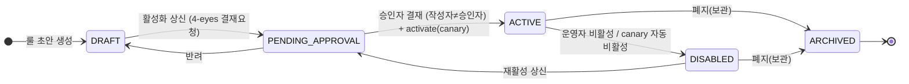
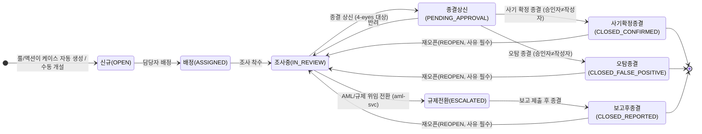
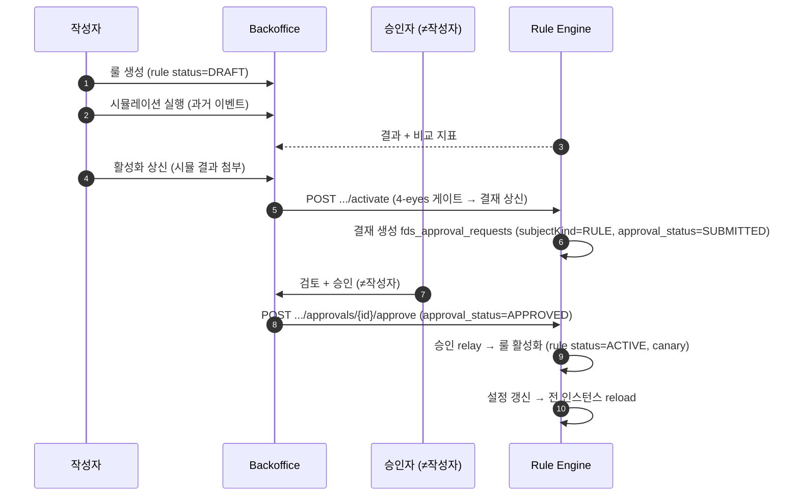
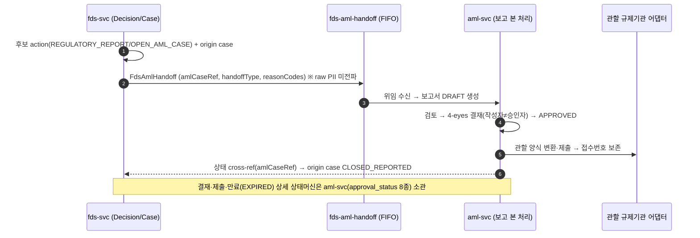

# 백오피스 SaaS FDS Platform 관리 - 기능정의서

## 문서 정보

| 항목 | 내용 |
|------|------|
| **문서 ID** | FS-FDS-001 |
| **버전** | 6.0 |
| **작성일** | 2026-06-19 |
| **작성자** | SM Kim |
| **상태** | 메뉴 IA 운영/설정 2영역 재구성: §1.0 정보구조·메뉴 체계 신설, §16.1 인벤토리 영역/기능그룹 열 추가·순서 재정렬, 짝 PPT v8.0 재빌드 |
| **정본 아키텍처** | `.claude/skills/_shared/target-architecture.md` (4서비스 모노레포·Java25 헥사고날·Next.js·멀티테넌시·PII 마스킹·4-eyes·한국 Policy Pack·§4.1 배포 모델) |
| **입력 설계서** | `docs/software/01-fdsSvc-sass.md` v1.9 |
| **파생 정합** | DB `docs/design/db/01-fds-db.md` **v2.0** · API `docs/design/api/01-fds-api.md` **v2.6** · Integration `docs/design/integration/01-fds-integration.md` **v2.4** · Tasks `docs/tasks/fds/00-overview.md` |
| **짝 문서(PPT)** | `docs/plan/BO-FDS-SASS-Planning_v8.0.pptx` (도형 기반 · 멀티탭 상세 탭 연속 전개: TNT-002 5탭·RULE-002 5탭·CASE-002 4탭 + 드릴다운 진입 트리거 배너 + TNT-002 ④ Policy Pack 6팩 + 룰 빌더 ①~⑦ 정본 순서·DEC-003 진입 배너·알림 채널 경로 정본화 + v6.0 벤치마크 보강(SFDS-STAT-001[2탭]·RULE-001 효과성 컬럼) + v7.0 데이터 인입 가시성 보강(SFDS-CONN-004·CONN-001/002 인입 신호) + **v8.0 nav_tree 운영/설정 2영역·3단 NAV 재구성**, 49슬라이드·기능 ID **34**(SFDS-DASH ~ SFDS-AUDIT, **RULE-001~006·STAT-001·CONN-001~004** 포함)) |

### 변경 이력

| 버전 | 일자 | 작성자 | 변경 내역 |
|------|------|--------|----------|
| **6.4** | **2026-06-21** | **SM Kim** | **룰 추천 엔드포인트·빌더 인라인 시뮬 반영(코드 정합).** §6.3 SFDS-RULE-003(룰 빌더) 하단에 두 보조 패널 신설 — ① **인라인 시뮬레이션**(작성 중 미저장 `ruleJson`을 기존 `POST /api/v1/admin/fds/rules/simulations`로 즉시 백테스트, 결과 표시는 SFDS-RULE-006과 공통 컴포넌트 재사용) ② **룰 추천**(수치형 피처 select + 목표 적중률% + 방향 → `POST .../rules/recommendations`로 단일 피처 임계값 percentile 역산·엔진 재평가 검증 → 추천 임계값·예상 적중률·대안 ±1·2%p, `[빌더에 적용]`으로 `featureKey`·`threshold` 주입). API 행·데이터 항목 표·BR-012/BR-013 추가. 모두 read-only(결재 불필요), 비율은 거래(이벤트) 기준, 표본 최대 500건 근사(비수치/빈 표본 graceful). 권한·규제·임계·화면 수 불변. | SM Kim |
| **6.3** | **2026-06-21** | **SM Kim** | **코드 정합(bo-web FDS 구현 truth 기준) — 탐지 결정·조사 단일 통합 콘솔 재정의 + 이벤트 독립 브라우즈 + 케이스 조사 콘솔 보강.** ① **§8 SFDS-DEC-001/002/003 재정의**: 3개 분리 화면 → **단일 조사 콘솔**(`/fds/decisions`, 좌 결정 목록 / 우 3단 스토리 ① 수신 거래 ② 행동 맥락·FDS 판정 ③ 조사 흐름). §8.1 목록 첫 컬럼 **거래번호·내역**(`transactionRef` mono) + 핵심/상세 필터 분리 + TM 알림 `?ref=` 딥링크 선필터. §8.2 ① 연결 이벤트 무결성 박스(`payload_hash`·정규화·원문 미저장)·발생시각 `GET /events/{eventId}` 보강 / ② 판정 요지 자동 문장 + 위험 점수 막대(0~100, `role=meter`) + 발동 룰 카드 + 후속조치 배지 + 사유 코드. §8.3 ② 행동 맥락(평소 vs 이번 — 평소 중앙값 USD·이상배수·최근 건수·정상비율, baseline=`amountBase` USD 현재 건 제외 과거 중앙값, 이력 부족 시 "비교 기준 부족") + ③ 케이스 딥링크 분기(caseId 유→[케이스], 무→[케이스 미생성] disabled). ② **§9.1 SFDS-EVT-001 재정의**: 단건 역참조 전용 → **거래 인입 내역(원본 이벤트) 독립 브라우즈 목록+상세**(`GET /events` 목록, 필터 소스·채널·대상·거래·기간·`eventId` 직접조회 / 목록 컬럼 이벤트·소스/금액·회랑/정규화 배지/발생시각 / 결정 상세 `?eventId=` 딥링크 수신). ③ **§11.2 SFDS-CASE-002 보강**: ③ 위험 프로파일에 **AML 위험 등급 배지**(aml-svc 위임 조회·참조 표시만)·당연고위험·AML 위임 딥링크 + ④ **조사 체크리스트**(가이드형 `buildChecklist`/`summarizeConclusion`) + ② 행동 맥락 패널 재사용. ④ **§8.1/§9.1/§11.1 회원 키 SubjectKey 일관**(마스킹 + 클릭 시 `/aml/subjects/{token}` 360 딥링크 — 구현 라우트). 권한·규제·임계·화면 수 불변. | SM Kim |
| **6.2** | **2026-06-19** | **SM Kim** | **테넌트 개념 재정의 — 고객사→서비스(테넌트)·상위 기관 신설(기관→서비스→워크스페이스)·§1.7/§3/§1.0 재기술.** ① **계층 재정의**: 시스템을 납품받은 **기관(institution)**[배포·계약 주체, 1 기관 : N 서비스] → **서비스(=테넌트, `tenant_id`, 국내송금·해외송금·월렛충전·회원 등, 격리 경계)** → **워크스페이스(`workspace_id`, retail/corporate·prod/sandbox 등)**. 화면 라벨 "고객사"→"서비스", workspace 라벨 "서비스"→"워크스페이스". ② **§1.7 멀티테넌시·배포 모델** 키 3종 의미·배포 모델·격리 원칙을 새 계층으로 재기술, **§3 서비스 관리**(구 고객사 관리) 섹션·용어 콜아웃·SFDS-TNT-001/002/003 화면(목록·상세 5탭·등록)·BR 재기술, **§1.0 IA** 메뉴 "고객사 관리(SFDS-TNT)"→"서비스 관리(SFDS-TNT)", **§1.1/§1.3 역할·권한**(고객사 관리자→서비스 관리자·전체 고객사→전체 서비스), **§16.1/§16.2/§16.4** 매핑·권한 매트릭스·결정사항 동기화. ③ **내부 코드 불변**: `tenant_id`·`workspace_id`·`Tenant-Id`·`Workspace-Id`·RLS·scope(`SFDS_*`·`fds:admin:*`)·`deployment_model`·`onboarding_status` 등은 의미만 "서비스"로 두고 그대로 유지. `fds_tenants`=서비스 마스터(테넌트=서비스)+상위 기관 참조 필드(DB 컬럼은 별도 정본). 단독 "고객"(end-customer)·`fds_subjects`/merchant·규제·채널 21종·corridor 내용 불변. 화면 수·규제 내용 불변. |
| **6.1** | **2026-06-18** | **SM Kim** | **데이터 레이어 hanpass-ph 소스 재그라운딩 — 소스 카탈로그·channel CASH_IN/INBOUND_REMIT·corridor·연동 키(규제 불변).** ① **§3.2 ⑤ 연결된 소스 시스템**을 hanpass-ph 트랜잭션 마이크로서비스(`member-svc`/`walletchg-svc`/`domestic-svc`/`remit-svc`/`wallet-svc`/`tx-history-svc`/`inbound-svc`, REST sync)로 현행화(generic `core-banking`/`atm-switch` 대체). ② **§4.0 ④ 소스 시스템 카탈로그 신설** + 채널 21종(`CASH_IN`·`INBOUND_REMIT` 추가)·corridor·base 통화 USD 명시(DB §5.3a·§4.4·§5.5·연동 §3.1/§7 정본). ③ **§8.1 SFDS-DEC-001 검색조건에 금액/통화/corridor/채널 추가**(데이터 기반 — API 필터·와이어프레임·데이터 항목·BR-001). **CTR/STR 임계·기한·KoFIU 분류 미변경(규제 불변)** — PH 운영은 Policy Pack `PH_AMLC` 옵션 병기만. 화면 수·규제 내용 불변. |
| **6.0** | **2026-06-19** | **SM Kim** | **메뉴 IA 운영/설정 2영역 재구성 — §1.0 정보구조·메뉴 체계 신설(운영: 조사·모니터링/케이스·처리/거버넌스·보고, 설정: 연동·데이터/탐지 정책/감사·증적), §16.1 인벤토리에 영역/기능그룹 열 추가·순서 재정렬. 화면 34종·콘텐츠 불변. 짝 PPT `BO-FDS-SASS-Planning_v8.0.pptx` 재빌드(nav_tree 2영역·3단 NAV).** |
| **5.0** | **2026-06-12** | **SM Kim** | **데이터 인입 가시성 보강 — 33→34화면, 47→49슬라이드.** ① **§4.0 데이터 인입 유형(확정) 신설**: 연동 방식(`ingest_mode` 5종, DB §4.1·API §4.8 정본) × 화면 표시 신호(REST Push=마지막 수신·TPS·● 수신중 / 큐=depth·lag·DLQ·마지막 메시지 / 폴링=마지막·다음 폴링·주기·커서 / CDC=change stream lag / 스냅샷=최근 스냅샷·초기 적재(백필) 진행률)와 **수신 API 카탈로그 5종**(`POST /api/v1/fds/events`(비동기 202)·`:batch`(최대 500·초기 적재 겸용)·`POST .../decisions/evaluate`(동기)·`POST .../external-decisions`(벤더)·`GET .../events/{eventId}`, API §4.1·§5.1 정본), **인입 신호 상태 3종**(● 수신중/⚠ 지연/✕ 중단)을 PRD 확정 표로 고정. ② **§4.4 SFDS-CONN-004 신설(수신 API 카탈로그·인입 라이브 모니터링, 2탭)**: ① 이 고객사가 사용하는 수신 API 전체 리스트(용도·방식·인증·24h 호출량·마지막 호출·신호) ② 커넥터×연동 방식별 라이브 모니터링(마지막 수신 n초 전 ● 신호·TPS·마지막/다음 폴링·큐 depth/lag/DLQ 적체(`fds-events-dlq`·`fds-vendor-ingest-dlq`, depth poller PT60S — integration §2·§6 정본)·초기 적재 진행률). 집계 API **제안** bo-api `GET /api/v1/bo/fds/ingest/catalog`·`GET .../ingest/health`(후속 API 정합). ③ **§4.1 CONN-001 보강**: `마지막 수신`·`신호(●/⚠/✕)` 컬럼 추가 + 상단 `[인입 모니터링 → SFDS-CONN-004]`(BR-005). ④ **§4.2 CONN-002 보강**: 폴링=다음 폴링 예정·주기, 큐=depth·DLQ 적체, 라이브 신호 표시(BR-006). ⑤ 부록 16.1 행·16.2 권한 주석 추가. ⑥ 짝 PPT `BO-FDS-SASS-Planning_v7.0.pptx` 재빌드·렌더 검증. |
| **4.0** | **2026-06-12** | **SM Kim** | **실계 AML 운영 시스템 벤치마크(GTone AML RBA Xpress 80화면, `docs/samples/gtone/1~80.png` — AML PRD v6.0/v7.0 §12-B·부록 H) FDS 적용 검토 — 32→33화면, 45→47슬라이드.** ① **§6.7 SFDS-STAT-001 신설(룰 효과성 통계, 2탭)**: 룰 라이프사이클(정의→임계값→시뮬레이션→배치→**효과성 평가**) 폐루프 완성(gtone 33 STR 룰평가 모니터링·54~56 룰별 요약 통계 벤치마크, AML-STAT-001 대응) — ① 룰 효과성(룰별 평가→탐지→차단/보류→케이스 전환 퍼널·전환율·전월 대비·튜닝 권고 ⚠, 행 ▶ → RULE-002·[백테스트] → RULE-006) ② 오탐 피드백 분석(케이스 종결 사유 `FP_*` 3종 분포·룰별 오탐율 추이·튜닝 후보 — §11.2 BR-002 오탐 피드백 폐루프의 분석 화면). API **제안** bo-api `GET /api/v1/bo/fds/stats/rules`·`GET .../stats/false-positives`(집계 소유 bo-api — 후속 API 정합 필요). ② **§6.1 RULE-001 보강**: 목록에 효과성 요약 컬럼(최근 30일 탐지·오탐율 — 화면 파생값) + 행 컨텍스트 `[효과성 ▶ → SFDS-STAT-001]` 드릴다운(BR-006). ③ **비적용 판정 기록**: 스크리닝 시뮬레이션(=SFDS-RULE-006 백테스트 기보유)·명단 만료/연장 생명주기(=SFDS-GRP-001/002 기보유)·대상 360°(=SFDS-DEC-003 기보유)·당연고위험 레지스트리(RA 등급 개념 없음 — 그룹·명단으로 수용)·CDD 프로필/기관 위험평가(IRA)/교육·자격(EDU)/보고기관 정보(특금법·KoFIU 소관 — aml-svc 위임, §13 책임 경계). ④ 부록 16.1에 SFDS-STAT-001 행·16.2에 권한 주석 추가. ⑤ 짝 PPT `BO-FDS-SASS-Planning_v6.0.pptx` 재빌드(NAV '룰 관리' 그룹)·렌더 검증. |
| **3.9** | **2026-06-11** | **SM Kim** | **정합성 QA HIGH #2 해소 — 짝 PPT `BO-FDS-SASS-Planning_v5.3.pptx` 재빌드.** ① §11.2 BR-006(재오픈)에 '재오픈은 `PATCH /api/v1/fds/cases/{caseId}` body `{status: IN_REVIEW, reason}`로 처리(API §5.6, 전용 엔드포인트 없음)' 명시. ② 짝 PPT: TNT-002 ⑤ 소스 시스템 표를 PRD §3.2 정본 5컬럼(소스 시스템/연동 방식/사용/지연/최근 오류)으로 확장(#3)·CONN-002 `…/connectors/{id}`→`{connectorId}` 정정(#5). PPT 변경 이력: "v5.3 \| QA 정합화: TNT-002 ⑤ 소스표 5컬럼·CONN-002 경로 변수 정정". |
| **3.8** | **2026-06-11** | **SM Kim** | **정합성 QA HIGH 3건(L189·L190·L191) 해소 — 짝 PPT `BO-FDS-SASS-Planning_v5.2.pptx` 재빌드.** ① §16.1 SFDS-TNT-002(탭⑤) 행에 `GET/PUT /api/v1/admin/fds/notify-channels` 추가·소유 fds-svc(bo-api 집약 경유) 정정(§3.2 본문 일치). ② §4.2·§16.1 connector 경로 변수 `{id}`→`{connectorId}` 전수 통일(API §4.8 v2.2 정본). ③ §7.3 `usage` 독립 필드 삭제 — 용도는 `groupType`(risk_group_type 6종) enum에 포함 명시, 화면 라디오 `용도(=groupType)` 병기. PPT 변경 이력: "v5.2 \| QA 정합화: GRP-003 용도 필드 groupType 통합 표기". |
| **3.7** | **2026-06-11** | **SM Kim** | **정합성 QA 높음 이격 해소(doc-consistency-report-all-latest FDS 담당분) — 짝 PPT `BO-FDS-SASS-Planning_v5.1.pptx` 재빌드.** ① **§7.3 SFDS-GRP-003**: `source`·`autoEnrollOnHit`·`defaultExpiryDays`·`description` 4필드를 **읽기 전용(서버 관리, PUT 영속 제외)**으로 표시 — PUT 영속 대상은 `displayName`·`active`뿐(API §5.18 정본, L199). ② **§3.2 TNT-002 탭⑤**: 미정의 경로 `GET /api/v1/admin/fds/connectors/notify-channels` → 신설 정본 `GET/PUT /api/v1/admin/fds/notify-channels`(API v2.1 §4.8 — 설계서 §13.2 alert channel 실재 기능, 설계서↔API↔PRD 3자 일치, L200). ③ **헤더 기능 ID 정정**: 31 → **32**(RULE-001~006 포함, RULE-006 반영, L255). ④ 짝 PPT: 슬라이드 23 룰 빌더 단계를 §6.3 정본 ①~⑦ 순서로 정정(L225)·슬라이드 32 DEC-003 진입 경로 배너 추가(L254). PPT 변경 이력: "v5.1 \| 정합성 QA 높음 이격 해소(룰 빌더 순서·DEC-003 진입 배너 등)". |
| **3.6** | **2026-06-10** | **SM Kim** | **QA 정합화 — 짝 PPT `BO-FDS-SASS-Planning_v5.0.pptx` 재빌드.** ① **§10.1 ACT-001 조치 종류 23종**: API `ActionType` enum 정본(23종)으로 확장 — 기존 16종에 `REQUIRE_SECOND_APPROVAL`·`BLOCK_WITHDRAWAL`·`SUSPEND_API_KEY`·`SUSPEND_EMPLOYEE_SESSION`·`REQUEST_TRAVEL_RULE_INFO`·`OPEN_AML_CASE`·`REGULATORY_REPORT` 추가, PPT info_panel 동기화. ② **§3.2 ③ 마스킹·보안 탭 Capability 패널**: '케이스 전용' 행(CAN_OPEN_CASE_ONLY) 추가 — 룰 동작이 Capability 벗어날 때 케이스만 생성됨을 TNT-002 ③ 탭에 명시. ③ **§3.2 ⑤ 알림·소스 탭 소스 시스템명 정정**: `core-bank`→`core-banking`, `txn-stream`→`atm-switch`, `kyc-feed`→`audit-log/legacy-card`(PRD §3.2 ⑤ 및 ACT-002 Capability 매트릭스 정본). ④ **§13.1 REG-001 드릴다운 표기**: 테이블 타이틀에 `행 ▶ → SFDS-REG-002` 명시. ⑤ **§6.3 RULE-003 빌더 ④⑦ 항목** 별도 행으로 분리 표기(집계 기간·탐지 시 동작 7단계 빌더 완성). |
| **3.5** | **2026-06-10** | **SM Kim** | **준법감시인 검토 반영 — 짝 PPT `BO-FDS-SASS-Planning_v4.8.pptx` 재빌드.** ① **(F1) 결재함 POLICY_PACK 반영 확인·PPT 정합**: §12.1은 이미 `subject_kind` 9종(규제 팩 변경 행 포함) 정본 — 생성기 `appr_001`에 "규제 팩 변경/tenant_bank_a/COMPLIANCE_MANAGER" 행 추가, 기능 설명 8종→9종 정정. ② **(F2) 케이스 재오픈(REOPEN) 신설**: §1.6.1 상태머신에 종결 상태(`CLOSED_*`)→조사중(`IN_REVIEW`) 재오픈 전이 추가, §11.2 BR-006(사유 필수·`SFDS_CASE:APPROVE` 이상·자기 종결 건 금지 4-eyes·감사 기록·횟수 무제한·SLA 재기산) + [재오픈] 버튼(종결 상태에서만 노출, 사유 모달) — 설계서 v1.9 §11.6.1 정본 동기화. ③ **(F3) 종결 사유 코드(`close_reason` 8종) 도입**: 오탐-임계과민/오탐-정상거래패턴/오탐-데이터품질/확정-사기거래/확정-대포통장/확정-도용/추가조사-AML이관/기타 — §11.2 종결 모달 "종결 사유 코드(필수, 드롭다운)"+"상세 메모(선택)" 분리, BR-007 신설, DB v1.5 §4.11·API v1.9 §5.5 동기화. ④ **(F4) 케이스 상태 표시 "신규(OPEN)" 통일**(§1.6.1 mermaid 한국어 라벨 전수). ⑤ **(F5) §11.2 하단 [코멘트] 버튼 제거**(코멘트 탭으로 일원화, PPT 정합). ⑥ **(F6) 그룹 종류 9종 열거 통일**(회원·계좌·수단·단말기·가맹점·셀러·IP·이메일·상대방 — §1.1·§7 본문·§7.1·§7.3·PPT GRP 화면 동일 순서). |
| **3.4** | **2026-06-10** | **SM Kim** | **TNT-002 ④ Policy Pack 규제 팩 미리보기 정합 + 토글/스테이징 상호작용 명문화(§3.2 ④).** ① 짝 PPT 슬라이드 9가 "규제 팩 한국 기본" 한 줄 요약만 렌더하던 것을, 생성기 `tnt_002_policy`를 6행 표(한국 기본팩·전자금융거래법·특금법·개인정보보호법·내부통제기준 / Travel Rule·PCI + 팩별 트리거·보고 양식)로 확장. ② **상호작용 모델 명확화** — 규제 팩 = **미리 정의된 카탈로그**를 고객사별 **토글(ON/OFF) 활성화**하는 구조임을 화면·BR에 명문화. **한국 기본팩 ON 잠금**(끄기 불가), Travel Rule/PCI는 도메인 계약 후만 ON. 토글은 **즉시 반영이 아니라 스테이징 → 영향 미리보기(STR 6·CTR 2) → 일괄 [변경 상신] → 4-eyes 결재**(개별 토글마다 상신 아님). ③ 각 팩 보고 후보 큐 **[→ SFDS-REG-001] 드릴다운** 추가. BR-001~004를 토글/스테이징/잠금 규칙으로 재서술. 짝 PPT `BO-FDS-SASS-Planning_v4.7.pptx` 재빌드·렌더 검증(슬라이드 9 토글 표·스테이징 콜아웃 겹침 없음). ④ **변경 QA 즉시 정합**(policy-ra-change-qa): `[→ SFDS-REG-001]` 드릴다운을 PRD §3.2 ④ 와이어프레임·데이터항목·BR-005에 명문화(생성기와 화면요소 집합 일치)·BR-004 감사 대상 문구(토글·상신·결재)·생성기 셀 용어(KoFIU 포맷·'비즈니스' 제거)·**BR-006 AML 모델 차이 교차참조** 추가. ⑤ **설계/DB/API 정본 back-fill 완료**(policy-ra-change-qa 재검 #14/#15/#16 해소): FDS 설계서 §16.2 named 팩 카탈로그(`KR_BASE`·`EFIN`·`SPECIAL_AML`·`PIPA`·`INTERNAL_CONTROL`·`TRAVEL_RULE`/`PCI`)·§14.1 `fds_tenants.compliance_policy JSONB`·§11.5 `subjectKind` 9종(`POLICY_PACK`) 신설, DB `01-fds-db.md` v1.4(컬럼·enum·V18)·API `01-fds-api.md` v1.6(SubjectKind enum·매핑표)·PRD §16.5·§12.1·§3.2 ④ BR-002 동기화. |
| **3.3** | **2026-06-09** | **SM Kim** | **화면 ID 간 드릴다운 진입 트리거 명시.** 드릴다운/상세 화면(SFDS-TNT-002·RULE-002·CASE-002·DEC-002·MAP-002·CONN-002·ACT-002) 첫 슬라이드 상단에 **'↩ 진입 경로' 배너** 추가 — 어느 목록 화면 어느 [행 ▶/버튼]으로 진입하는지 명시. 소스 목록 화면(TNT/CONN/MAP/RULE/DEC/CASE -001) 표 행에 ▶ + "→ SFDS-XXX-002" 아웃바운드 표기. 짝 PPT `BO-FDS-SASS-Planning_v4.6.pptx` 재빌드, 렌더 검증 통과. |
| **3.2** | **2026-06-08** | **SM Kim** | **멀티탭 상세 화면 탭 연속 전개(SKILL §1.6) — TNT-002(5탭)에 이어 SFDS-RULE-002(현재버전 조건/버전 히스토리/기준값/최근 Hit/결재 로그 5탭)·SFDS-CASE-002(개요·증적/타임라인/연결 결정·거래/코멘트 4탭)를 1탭=1슬라이드·같은 부모 탭 바로 전개**(빈 탭 제거, 탭별 실내용, 이전←/다음→). 기능 ID 수(31) 불변, 짝 PPT `BO-FDS-SASS-Planning_v4.5.pptx`(45슬라이드) 재빌드. 렌더 검증 통과. |
| **3.1** | **2026-06-08** | **SM Kim** | **§3.2 SFDS-TNT-002 5탭 연속 전개 재구성** — 구 7탭(기본정보·배포온보딩·마스킹·알림·조치권한·PolicyPack·소스) 나열을 **5탭 연속 전개(① 기본 정보 / ② 배포·온보딩 / ③ 마스킹·보안 / ④ Policy Pack / ⑤ 알림·소스)** 로 재편. 기능 ID(SFDS-TNT-002) 단일 화면·동일 탭 바 유지, 탭 간 이전←/다음→ 흐름·API 연결 전수 명시. §3.1 BR-003 상세 진입 설명 5탭 표기 갱신. §3.3 SFDS-TNT-003 별도 생성 화면 분리 명시. §16.1 부록 SFDS-TNT-002 행 탭 구성 반영. 짝 PPT `BO-FDS-SASS-Planning_v4.3` 포인터 유지(PPT 재생성 없음). |
| **3.0** | **2026-06-08** | **SM Kim** | **doc-consistency 잔존 이격(api-prd #23~#28·prd-ppt #29~#31) 정합 — API v1.7 §4.x·§5.x 정본 기준 필드명·path 변수명·단서 문구·샘플 행 동기화.** ① **§7.3 SFDS-GRP-003**: `groupCode`→`groupId`(API §5.19 정본), BR-001 '중복 그룹 코드'→'중복 그룹 ID', 에러코드 표 동기화. ② **§7.3 SFDS-GRP-003**: `kind`→`groupType`(화면 레이블 '종류' 유지, API §5.18·§5.19 정본), BR-002 수정. ③ **§12.1 SFDS-APPR-001**: API 셀 '필터 파라미터 미정의' 단서 문구 삭제 → API v1.7 §4.9 공식 정의 참조로 교체. ④ **§4.2·§16.1 SFDS-CONN-002**: path `{connectorId}`→`{id}`(API §4.8 정본). ⑤ **§4.3·§5.2·§10.2 SFDS-CONN-003·MAP-002·ACT-002**: path `{sourceSystem}`→`{id}`(주석 '({id}=source_system)' 병기, API §4.8 정본). ⑥ **§13.1·§13.2**: aml-svc cross-ref `ApprovalStatus`에 'EXECUTED/EXECUTION_FAILED는 aml-svc 내부 전이, FDS cross-ref 표시 외' 명시. ⑦ **§12.1 와이어프레임**: `CASE_CLOSE`·`MERCHANT_NORMALIZE` 샘플 행 추가(§16.5 8종 정본). **짝 PPT `BO-FDS-SASS-Planning_v4.3.pptx` 재빌드**(prd-ppt #29~#31): DASH-001 필터에서 '고객사 전체 ▼'·'서비스 전체 ▼' 제거(기간 단일축, PRD §2.1 BR-001 정본), RULE-001 컬럼 헤더 '도메인'→'도메인/채널'(PRD §6.1 정본), APPR-001 샘플 행 8종 기존 유지 확인. 렌더-QA(soffice→PDF→pdftoppm, slide 3·13·30 Read 검증) 겹침·넘침 없음 확인. |
| **2.9** | **2026-06-08** | **SM Kim** | **doc-consistency 잔존 이격(기획 담당분: api-prd·prd-ppt) 정합 — 상위 정본(DB §5.x·API §4/§5/§8·설계서 §8.3) 기준 명칭·필드·enum·엔드포인트 동기화.** ① **§16.1 매핑표 SFDS-DEC-003**: Subject 타임라인 API를 폐기 표기 `GET /fds/decisions+/cases 필터 머지` → 정본 `GET /api/v1/evidence/fds/cases/{caseId}/timeline`(§8.3·API §4.5)로 정정. ② **§3.2 조치 권한 탭**: 내부 코드 `action_capability` → `capabilities`(SourceSystemDto API §5.17 정본)로 정정. ③ **§7.1/§7.3 그룹 코드**: `group_code` → `groupId`(RiskGroupDto API §5.19 정본)로 정정. ④ **§7.1/§7.3 용도(RiskGroupType)**: API §10 OpenAPI enum 6종 중 `BLACKLIST/WHITELIST`는 레거시 호환 enum·신규 화면 미노출 명문화(화면 노출 4종 `DENYLIST/ALLOWLIST/WATCHLIST/MULE_NETWORK`). ⑤ **§16.5 4-eyes 표**: SFDS-ACT-002 Capability 매트릭스 변경(`PUT /admin/fds/source-systems/{id}`, `MAPPING`/`MAKER_CHECKER`) 행 추가(API §8 정합). ⑥ **§12.1 SFDS-APPR-001 필터**: `?subjectKind=&status=&maker=` 3종이 API §4.9 엔드포인트 표에 미정의임을 명시(API 정의 선행 필요). **짝 PPT `BO-FDS-SASS-Planning_v4.2.pptx` 재빌드**(prd-ppt 3-7): DASH-001 고객사별 건전성 표 케이스SLA 컬럼 추가·도메인 필터 제거(PRD §2.1 BR-001 기간 단일축), CONN-002 [설정 변경(승인)] 버튼 추가(PUT /source-systems/{id} 4-eyes), RULE-003 버튼 [시뮬레이션 후 결재 상신(SUBMITTED)] enum 병기, APPR-001 샘플 행 8종 전수(CASE_CLOSE·MERCHANT_NORMALIZE 추가). 렌더-QA(soffice→PDF→pdftoppm 110/150dpi, slide 3·9·15·30 Read 검증) 겹침·넘침 없음 확인. |
| **2.8** | **2026-06-08** | **SM Kim** | **doc-consistency 이격 리포트(기획 담당분: api-prd·prd-ppt·roadmap-prd) 정합 — 격리(isolation_mode)→배포 모델(deployment_model) 재설계를 정본(API v1.5·DB v1.3·설계서 v1.5·target-architecture §4.1)에 100% 동기화.** ① **PRD §3.3 등록 화면**: 폐기 `격리 방식` 라디오(DB분리/스키마분리/공유)·`isolation` 필드·BR-002를 **배포 유형 선택(`deployment_model` 3종 매니지드 전용/자체 인프라 설치형/소규모 공유)+온보딩 상태(`onboarding_status` 8종, 읽기)+인프라 참조(`infra_ref`, 읽기)**로 교체. 데이터 항목·BR-002/003을 '배포 유형은 온보딩 프로비저닝 산출, 변경 시 재배포·마이그레이션'으로 재기술(§1.7·§3.1·§3.2 일관). ② **§16.4 D-01**: 'DB 격리(SHARED/SCHEMA/DB)'·`isolation_mode`를 deployment_model 3종+온보딩 프로비저닝(읽기)으로 정정. ③ **§16.1 매핑표**: SFDS-TNT-003 배포·온보딩 행에 bo-api `/api/v1/bo/fds/tenants/{id}/onboarding/**`(P8) 추가. ④ **버전 핀 정정**: 입력 설계서 v1.2→v1.5·DB v1.2→v1.3·API v1.2→v1.5, 짝 PPT 포인터 v4.0→v4.1로 갱신(맺음말 포함). ⑤ **§2.2 DASH-002 필터**: `고객사·서비스(workspace retail/corporate)·기간` 3축 명문화(PPT slide 4 정합). ⑥ **§8.1 DEC-001 호출 API**: `?ruleNo=&subjectRef=&transactionRef=&decision=&from=&to=`로 보강(화면 필터 전수 대응). ⑦ **§6.3 RULE-003 버튼 경계**: `[시뮬레이션 후 결재 상신]`을 RULE-005 `/activate`🔒(4-eyes) 딥링크로 명시(BR-011 신설). **짝 PPT `BO-FDS-SASS-Planning_v4.1.pptx` 재빌드**: TNT-001 컬럼·필터(배포 유형·온보딩 상태)·TNT-002 둘째 탭(배포·온보딩)·TNT-003 폼(배포 유형+온보딩)·DASH-002 필터 3축·ACT-001 배지 '승인됨🔒' 통일·커버 PRD v2.7→본 v2.8 기준 32화면 정합. |
| **2.7** | **2026-06-07** | **SM Kim** | **짝 PPT 시나리오 흐름 연결 보강(`BO-FDS-SASS-Planning_v4.0.pptx` 재빌드, AML 덱과 동일 수준) — 화면 간 끊긴 흐름을 잇고 '목록→상세→액션→결과' 연결을 전수 명시(PRD 본문은 흐름 서술만 보강, 화면 정의·enum·책임 경계 무변경).** ① **목록→상세 딥링크 전수**: 모든 목록·큐 화면(고객사 SFDS-TNT-001·커넥터 CONN-001·스키마 MAP-001·룰 RULE-001·그룹 GRP-001·결정 DEC-001·이벤트 EVT-001·케이스 CASE-001·규제 보고 REG-001)에 '행 클릭 → SFDS-XXX 상세' 흐름 콜아웃과 info 딥링크 추가(끊긴 진입 경로 제거). ② **버튼→시나리오 명시**: 각 화면 주요 버튼 클릭 시 다음 화면·상태 전이·결재 게이트를 콜아웃/info에 명문화 — CONN-002 [일시중지]/[재개]/[커서 이동]/[재처리](멱등·감사), GRP-002 [추가(2인)]/[해제]/[연장](4-eyes·즉시 효과), CASE-002 [배정]/[규제 보고 전환→REG-001]/[종결 상신]→[종결 승인(2인)], APPR-001 [승인](2인)→BE relay 실행 결과(RULE→ACTIVE·ACTION→발행·MAPPING→effective·GROUP→명단 반영·CASE_CLOSE→종결), MAP-002 [변경 결재(2인)]→APPR-001. ③ **핵심 플로우 상호 참조**: 탐지 결정 → 액션(ACT-001) → 케이스(CASE-001) → 결재(APPR-001) → 규제 보고(REG-001)/Evidence 연쇄를 DEC-001 콜아웃·DEC-002 후속 조치 딥링크 패널(그룹·액션·케이스·타임라인)로 연결. ④ **대시보드 드릴다운**: DASH-001 플랫폼 알림 각 항목에 '[클릭 → SFDS-XXX]' 드릴다운 표기. ⑤ **CASE-001 `[+ 케이스]` 액션 버튼 노출 보정**(누락 수정). 렌더-QA(soffice→PDF→pdftoppm 90/150dpi, 보강 화면 다수 Read 검증): APPR-001 콜아웃 relay 매핑 줄바꿈 겹침 1회 발견 → 5줄 분할로 수정·재렌더 후 겹침·넘침 없음 확인. PRD 화면별 정의·BR은 무변경(흐름 서술만 보강), 짝 문서 포인터 v4.0 유지. |
| **2.6** | **2026-06-07** | **SM Kim** | **doc-consistency 잔존 높음 이격 H1(룰 라이프사이클 비존재 엔드포인트·상태 오용) 해소 — API §4.6·§5.12·§8·DB §5.23 정본으로 PRD 본문 정정(PPT 무수정, PRD 단방향).** §6.5 SFDS-RULE-005 4-eyes 워크플로 시퀀스·BR이 **정본 API에 없는** `POST .../submit` 엔드포인트와 룰 `status=REVIEW` 상태 전이를 참조하던 것을 정정. API §4.6에는 `/submit`이 없고(`/activate`·`/disable`·`/rollback`·`/rules`·`/{ruleId}`·`/versions`·`/simulations`만 존재), `REVIEW`는 API §7.1 `decision` enum 값이라 룰/결재 상태로는 오용. ① **시퀀스 다이어그램 정정**: `BO->>FDS: POST .../submit (status=REVIEW)` 행 제거 → 활성화 상신을 `POST .../activate (4-eyes 게이트)` → `fds_approval_requests` 생성(`subjectKind=RULE`, `approval_status=SUBMITTED`) → 승인 `POST .../approvals/{id}/approve`(`approval_status=APPROVED`) → 승인 relay로 룰 활성(`rule status=ACTIVE`)으로 재기술. ② **BR-001**: 비존재 `submit` 표기 제거, '활성화 상신=`/activate` + 4-eyes 결재 게이트(`subjectKind=RULE`, `approval_status=상신(SUBMITTED)`)'로 정정. ③ **BR-002/003**: 승인은 결재함(SFDS-APPR-001) `/approvals/{approvalRequestId}/approve`로 처리·결재 미승인 시 relay 차단(`FDS-APPROVAL-REQUIRED`)으로 명문화. ④ **BR-004**: `rollback`도 동일 4-eyes 결재 게이트(`subjectKind=RULE`) 대상임을 추가(API §8). 상태 용어 `REVIEW`→`SUBMITTED`로 라이프사이클 전반 일관화. `target-architecture.md` §4(4-eyes·결재 게이트) 정본 준수. PPT는 수정하지 않음(시각 정합은 차기 재빌드 시 반영). |
| **2.5** | **2026-06-07** | **SM Kim** | **짝 PPT 도형 기반 전면 재생성(`BO-FDS-SASS-Planning_v4.0.pptx`).** 기존 v3.1 PPT가 와이어프레임을 ASCII 박스 문자(┌─┐│└┘)로 그려 가시성이 붕괴된 것을 폐기하고, `wireframe_lib.py`(python-pptx) 컴포넌트로 **실제 rect 도형**(맑은 고딕·Ant Design 팔레트, 시각 정본=`docs/plan/sample.pptx`)으로 전면 재작성. 슬라이드 33장 = 커버 + 변경 이력 + 기능 ID **전수 31화면**(SFDS-DASH-001/002·TNT-001/002/003·CONN-001/002/003·MAP-001/002·RULE-001~005·GRP-001/002/003·DEC-001/002/003·EVT-001·ACT-001/002·CASE-001/002·APPR-001·REG-001/002·EXP-001·AUDIT-001, ID 순 누락 없음). 각 슬라이드 좌 75% 와이어프레임(도형) + 우 25% 기능 설명(권한·필터·컬럼·동작·API). 화면별 archetype: 대시보드=필터+KPI카드+콜아웃+패널 / 목록·큐=필터+표 / 상세=탭칩+좌우 패널 / 마스터생성·폼=라벨+입력 박스(form_panel). 표시 용어·enum 표시값·책임 경계(REG-002 직접 결재·제출 버튼 부재, aml-svc 위임)는 본 PRD를 1:1 진실로 동기화. PRD 본문 무변경(PPT 단방향 재빌드), 짝 문서 포인터를 v4.0으로 갱신. |
| 1.0 | 2026-06-06 | SM Kim | 최초 작성(참고 초안) — 백오피스 12개 화면 그룹(24화면) 정의. |
| **2.4** | **2026-06-07** | **SM Kim** | **doc-consistency 리포트(prd-ppt) 잔존 높음 이격 REG-002(책임 경계 위배) 해소 — PPT(`BO-FDS-SASS-Planning_v3.1.pptx` slide 32)를 정본으로 PRD 본문 정정(PPT 재빌드 없음, PRD 단방향 정합).** **SFDS-REG-002(보고 후보 상세 / aml-svc 위임 추적, §13.2)** 레이아웃이 규제 보고의 **직접 결재·제출 버튼**(`[반려]`·`[승인]`·`[규제기관 제출]`)과 승인자 코멘트 입력을 노출하여 책임 경계(규제 본 처리=aml-svc 위임 소관)를 위배하던 것을 정정. ① **레이아웃**: 검토 기록·승인자 코멘트·`[반려]`·`[승인]`·`[규제기관 제출]` 버튼을 제거하고, PPT slide 32 와 동일하게 `[위임 흐름] 4단계(후보 action(REGULATORY_REPORT)→FdsAmlHandoff→aml-svc DRAFT/4-eyes/제출→cross-ref CLOSED_REPORTED)` + 단일 `[aml-svc 보고서로 이동]` 딥링크(`※결재·제출 버튼은 AML 화면 소관`)로 교체. 관할 양식에 `(aml-svc 소관)` 병기. ② **데이터 항목 표 신설**: 상태 배지·제출 기한·위임 흐름(읽기 전용)·`[aml-svc 보고서로 이동]` 딥링크(직접 결재·제출 동작 없음)를 전수 명시하고 각 요소의 aml-svc 소관 경계를 병기. ③ **개요 설명·BR-001 보강**: FDS 백오피스 동작을 '보고 후보 식별 → aml-svc 핸드오프(`REGULATORY_REPORT` 액션) → 위임 후 상태 조회'로 한정하고 직접 결재·제출 버튼 부재를 명시(`target-architecture.md` §4 규제 Policy Pack=aml 소관·fds 핸드오프 정본 준수). 흐름 소제목 '후보 위임·제출' → '후보 위임·상태조회'로 정정. PPT slide 32 와 표시·동작 1:1 일치(PPT 무수정). |
| **2.3** | **2026-06-06** | **SM Kim** | **doc-consistency 리포트(prd-ppt) 잔존 높음 이격 APPR-001·EXP-001·ACT-001 해소 — PPT(`BO-FDS-SASS-Planning_v3.1.pptx` slide 25·29·30)를 정본으로 PRD 본문 보강·정정(PPT 재빌드 없음, PRD 단방향 정합).** ① **SFDS-APPR-001 결재함 화면 전용 섹션 신설(§12)**: PPT slide 29 검색(`유형/상태/상신자`+대상)·컬럼(결재 종류·대상·상신자·결재 라인·상태)·버튼([승인]🔒·[반려]·▶펼침)·배지(`subject_kind` 8종/`approval_line` 6종/`approval_status` 8종·`payload_hash` 무결성)를 ASCII 와이어프레임·데이터 항목 표·BR(self-approval 방지·payload 무결성·결재 라인 기본값)로 1:1 정본화. API `GET /admin/fds/approvals·/{id}/approve🔒·/reject`. ② **SFDS-EXP-001 Evidence Export 화면 전용 섹션 신설(§14)**: PPT slide 30 입력(export 종류·형식·기간·최종본 체크)·드롭다운(`export_kind` 6종·`export_format` 4종)·버튼([생성 요청]·[다운로드])·`export_status` 6종(요청됨/생성중/준비완료/다운로드됨/만료/실패) 상태 배지를 1:1 정의하고 API §4.5·§5.11(`exportKind`·`exportFormat`·`queryParams`·`manifestHash`) 필드를 화면 데이터 항목으로 매핑. 최종본=`subject_kind=EXPORT`/컴플라이언스 책임자 4-eyes🔒. ③ **SFDS-ACT-001 내부 모순 정정(§10.1)**: action relay BE 자동재시도(아웃박스)가 정본 — 레이아웃 하단 버튼 `[재시도]`→`[상태 조회]`(PPT slide 25), BR-002/003을 BE outbox 자동 재시도·DLQ BE 운영으로 정정(운영자 수동 재시도 버튼 제거), 상태 배지 샘플 `성공`/`재시도`를 `action_status` enum 표시값(발행/승인됨🔒/대기/실패⚠)으로 정정, 권한·API·§1.3 권한 매트릭스 동기화. ④ **섹션 번호 재정렬(메뉴 순서 정합)**: 결재함=§12, 규제 보고=§13(was §12), Evidence=§14, 감사=§15(was §13), 부록=§16(was §14) — TOC·내부 §자기참조 갱신. PPT는 이미 정합이므로 재빌드하지 않음. |
| **2.2** | **2026-06-06** | **SM Kim** | **doc-consistency 리포트(api-prd·prd-ppt 담당분) 정정 — 정정된 정본(설계서 v1.2·DB v1.2·API v1.2)에 PRD/PPT 한 쌍 정합.** ① **운영자 집계 화면 호출 대상=bo-api 경로로 명시**: 대시보드(SFDS-DASH-001/002)·고객사 관리(SFDS-TNT-001/002/003)·감사(SFDS-AUDIT-001) 경로를 폐기된 엔진 직접 경로 `/api/v1/admin/fds/dashboard\|tenants\|audit`에서 **bo-api 소유 `/api/v1/bo/fds/*`**로 전수 교체(§2·§3·§13·§14.1), 고객사 수정 경로 bare `PUT /api/v1/bo/fds/tenants/{id}`로 단일화(API §11.2·§12 정본). ② **그룹 멤버 종류 정합**: 화면 표시 분류 9종 ↔ 저장 `member_kind` **3종**(`SUBJECT/INSTRUMENT/COUNTERPARTY`, DB §5·API §5.10) 환원 매핑 명시(§7.1·§7.3). ③ **케이스 enum 정본화**(§11.1): `case_priority` **4종**(치명/높음/중간/낮음 = CRITICAL/HIGH/MEDIUM/LOW), `case_status` **8종**(신규/배정/조사중/규제전환/종결상신/사기확정종결/오탐종결/보고후종결, DB §4.11). ④ **결재 게이트 enum 정본화**: `subject_kind` **8종**(`CASE_CLOSE` 추가, DB §5.23·API §5.12), case 종결 4-eyes 매핑 `ACTION`→`CASE_CLOSE`(대상=`case_id`)로 정정(§14.5). ⑤ **표시/추적성 보정**: Capability enum 명칭 `control_capability`(DB §4.6) 병기(§10.2), SFDS-CONN-001 목록 풋터 `총 5 (사용 4)` 보정(§4.1), §14.1 매핑 정본 포인터 API §10→§11. 짝 PPT `BO-FDS-SASS-Planning_v3.1.pptx`(v3.0 → v3.1 재빌드)를 동일 enum·용어·경로로 정합. |
| **2.1** | **2026-06-06** | **SM Kim** | **doc-consistency 정합성 리포트(api-prd·prd-ppt 이격) 반영 — PRD/PPT 한 쌍 정정.** ① **HTTP 상태코드 = API §6 정본화**(§14.3·§6.5 BR·§7.2 BR): 중복=`400`(FDS-VALIDATION-001), 결재 누락=`409`(FDS-APPROVAL-REQUIRED), maker=checker=`409`(FDS-APPROVAL-SELF), raw PII=`422`(FDS-PII-REJECTED), rate limit=`429`(FDS-RATE-LIMIT), 그룹 멤버 중복=`409`(FDS-IDEMPOTENT-CONFLICT, 멱등 충돌로 의미 분리). ② **운영자 집계 API 소유 경계 명시**: 대시보드(SFDS-DASH-001/002)·고객사 관리(SFDS-TNT-001/002/003)·감사 조회(SFDS-AUDIT-001)는 **bo-api 소유·집약·인증**(fds-svc/aml-svc는 저수준 데이터 API만, 엔진 API 명세에 운영자 집계 엔드포인트 미추가) — §1.1 경계·§14.1 소유 열 추가. ③ **PPT enum 전수**(v3.0): 그룹 종류 9종(EMAIL/MERCHANT/SELLER 포함)·용도 4종(DENYLIST/ALLOWLIST/WATCHLIST/MULE_NETWORK, BLACKLIST/WHITELIST 삭제)·`approval_line` 6종(EXECUTIVE_APPROVAL). ④ **표시 용어 통일**: action_status `SENT`=`발행`, 자격증명 회전 요청(승인 필요), `channel_type` 19종(DB §4.4) 확정. 짝 PPT를 `BO-FDS-SASS-Planning_v3.0.pptx`로 재빌드. |
| **2.0** | **2026-06-06** | **SM Kim** | **설계서 `01-fdsSvc-sass.md` v1.1 정본 + DB/API/integration 파생과 100% 동기화 재생성.** ① 참조 경로 정정(`software-new/22-1` → `software/01-fdsSvc-sass.md` v1.1). ② API 경로 정본화: 모든 Admin API `/api/v1/admin/fds/*`, 외부/위임 API `/api/v1/fds/*`·`/api/v1/evidence/fds/*` (API §4). ③ 격리키 3단(`tenant_id/workspace_id/data_scope`) 반영 — workspace(retail/corporate/prod/sandbox) 신설, sandbox=shadow-only. ④ enum 코드값을 DB §4 사전과 1:1 정합(tenant_status·rule_status·case_status·action_status·approval_line·approval_status·export_status·risk_group_type 등 정정). ⑤ 에러 코드 prefix `FDS-*`(API §6)로 통일. ⑥ 4-eyes 게이트를 `subject_kind`(ACTION/RULE/MAPPING/SECRET/GROUP/EXPORT/MERCHANT_NORMALIZE/CASE_CLOSE 8종)·`approval_line`(6종)·결재 상태머신(8종)으로 정합(API §8). ⑦ AML/STR/CTR/Travel Rule 본 처리 aml-svc 위임 명시 — `amlCaseRef`=`fds_cases.aml_case_id`, FDS는 후보·origin·cross-ref만 보유. ⑧ 비동기 큐(`fds-events`/`fds-actions`/`fds-aml-handoff`/`fds-webhook`/`fds-vendor-ingest`)·outbox 상태머신 반영(integration §2·§8). ⑨ 결재함(maker-checker)·실시간 판단 장애정책(D-14) 화면 반영. 한국어 표시 용어 통일 + enum 괄호 병기, 문장형 룰 빌더 + 자연어 미리보기, raw PII 미저장·토큰/해시 마스킹 유지. |

## 목차

1. [1.0 정보구조(IA)·메뉴 체계](#10-정보구조ia메뉴-체계-정본)
2. [개요](#1-개요)
3. [플랫폼 대시보드](#2-플랫폼-대시보드)
4. [서비스 관리](#3-서비스-관리)
5. [소스 시스템·커넥터 관리](#4-소스-시스템커넥터-관리)
6. [스키마·필드 매핑 관리](#5-스키마필드-매핑-관리)
7. [룰 관리](#6-룰-관리)
8. [그룹·명단 관리](#7-그룹명단-관리)
9. [결정(Decision) 조회·조사](#8-결정decision-조회조사)
10. [이벤트 조회](#9-이벤트-조회)
11. [액션·아웃박스 운영](#10-액션아웃박스-운영)
12. [케이스 관리](#11-케이스-관리)
13. [결재함 (maker-checker)](#12-결재함-maker-checker)
14. [규제 보고 (Policy Pack)](#13-규제-보고-policy-pack)
15. [Evidence Export (검사대응)](#14-evidence-export-검사대응)
16. [감사 로그](#15-감사-로그)
17. [부록](#16-부록)

---

## 1.0 정보구조(IA)·메뉴 체계 (정본)

좌측 NAV는 **운영(OPERATIONS) / 설정(CONFIGURATION)** 2영역으로 분리하며, 각 영역은 기능그룹 → 메뉴 3단으로 구성한다. 운영 영역이 위, 설정 영역이 아래. 운영자가 매일 쓰는 탐지·조사·케이스가 상단에 오고, 셋업·정책 화면은 설정 영역으로 내린다. 상세 화면은 NAV 항목이 아니라 목록 행/버튼 드릴다운으로 진입한다.

| 영역 | 기능그룹 | 메뉴(화면 ID) |
|---|---|---|
| **운영** | 조사·모니터링 | 플랫폼 대시보드(SFDS-DASH-001/002) · 탐지 결정(SFDS-DEC-001/002/003) · 이벤트 조회(SFDS-EVT-001) · 룰 효과 통계(SFDS-STAT-001) |
| **운영** | 케이스·처리 | 케이스 관리(SFDS-CASE-001/002) · 액션 운영(SFDS-ACT-001/002) |
| **운영** | 거버넌스·보고 | 결재함(SFDS-APPR-001) · 규제 보고(SFDS-REG-001/002) |
| **설정** | 연동·데이터 | 서비스 관리(SFDS-TNT-001/002/003) · 커넥터 관리(SFDS-CONN-001~004) · 스키마·매핑(SFDS-MAP-001/002) |
| **설정** | 탐지 정책 | 룰 관리(SFDS-RULE-001~006) · 그룹·명단(SFDS-GRP-001/002/003) |
| **설정** | 감사·증적 | 감사 로그(SFDS-AUDIT-001) · Evidence(SFDS-EXP-001) |

> 본문 §2~§15 섹션 번호는 역사적 호환을 위해 유지된다. 메뉴 순서·소속 영역의 정본은 본 표(§1.0) · §16.1 인벤토리 · 짝 PPT(NAV)다.

## 1. 개요

### 1.1 문서 목적

본 문서는 **SaaS FDS Platform**(설계서 `docs/software/01-fdsSvc-sass.md` v1.1)의 **백오피스(Admin Console) 관리·운영** 기능에 대한 기능정의서입니다. 본 플랫폼은 특정 월렛·송금 서비스 하나가 아니라, 시스템을 납품받은 **기관(institution)** 이 운영하는 **여러 서비스(국내송금·해외송금·월렛충전·회원 등, 내부 코드 `tenant_id` = 테넌트)** 의 거래·회원·계좌·기기·정산·감사 이벤트를 연동하면 실시간 또는 비동기로 이상거래를 탐지·조치하는 **멀티서비스(멀티테넌트)·멀티도메인 위험 탐지 플랫폼**입니다.

> **서비스 경계(정본 §3, 설계서 §6.1)**: 본 백오피스 화면은 **`bo-web`(Next.js)** 가 렌더하고 **`bo-api`** 경유로만 데이터에 접근합니다(엔진 직접 호출 금지). 탐지·룰·결정·액션·케이스·결재 게이트는 **`fds-svc`** 엔진(`com.hanpass.fds` 헥사고날)이, 운영자 IAM·승인 라인 정책·감사 집약은 `bo-api`가, **AML/STR/CTR/Travel Rule 본 케이스·sanction/PEP·규제보고 처리는 `aml-svc`** 가 담당합니다. FDS는 AML 후보(`OPEN_AML_CASE`/`REGULATORY_REPORT`/`REQUEST_TRAVEL_RULE_INFO`)·origin case만 생성하고 `amlCaseRef`(=`fds_cases.aml_case_id`) cross-ref만 노출합니다.
>
> **운영자 집계 API 소유 경계(정본)**: **대시보드(SFDS-DASH-001/002)·서비스 관리(SFDS-TNT-001/002/003)·감사 조회(SFDS-AUDIT-001)** 는 **`bo-api`가 소유·집약·인증**하는 운영자 집계 엔드포인트입니다. `fds-svc`/`aml-svc`는 저수준 데이터 API만 제공하며, 엔진 API 명세(`docs/design/api`)에는 운영자 집계 엔드포인트(대시보드/서비스/감사)를 두지 않습니다. 이들 화면의 호출 대상은 **bo-api 소유 경로 `/api/v1/bo/fds/*`**(대시보드/서비스/감사)이며, 과거 엔진 직접 경로 `/api/v1/admin/fds/dashboard|tenants|audit`는 **폐기**되었습니다(API §11.2·§12). 나머지 화면의 API 경로는 fds-svc 엔진 엔드포인트(`/api/v1/fds/*`, `/api/v1/admin/fds/*`)이며 bo-web은 항상 bo-api를 통해 호출합니다(§16.1 소유 열 참조).

따라서 본 백오피스는 단일 회사 내부 운영 화면(참조 구현 Hanpass PH FdsSvc)과 달리, 다음 두 종류의 사용자를 함께 고려합니다.

- **플랫폼 운영자** — SaaS 사업자 측. 전체 서비스의 ingest·decision·action·case 건전성, 커넥터 lag, SLA, 데이터 품질을 모니터링·운영합니다.
- **서비스 관리자** — 기관/서비스 측. 자기 서비스(테넌트) 범위 안에서 룰·그룹·케이스·규제 보고를 운영합니다.

백오피스는 아래 6가지 운영 책무를 화면으로 제공합니다.

1. **플랫폼 모니터링** — 전체 서비스·서비스별 ingest/decision/action/case 현황, 커넥터 지연, 스키마 검증 실패, SLA
2. **서비스·연동 관리** — 서비스 등록·설정(격리·리전·보존·마스킹·Policy Pack), 소스 시스템·커넥터(REST Push/Queue/Polling/Snapshot/CDC), 스키마·필드 매핑·PII 정책
3. **룰 운영** — 멀티도메인 feature catalog 기반 룰 정의(문장형 빌더/DSL 토글), 기준값 빠른 변경, 버전·4-eyes 결재·활성·롤백·중지(canary)
4. **명단 운영** — 차단/허용/감시/뮬 네트워크 그룹(종류 9종: 회원·계좌·수단·단말기·가맹점·셀러·IP·이메일·상대방) 정의·등록·해제·연장
5. **조사·조치** — 결정(Decision) 조회·판정 근거, 대상(Subject) 타임라인, 원본 이벤트 조회, 액션 아웃박스·Capability 매트릭스, 케이스 조사·종결(4-eyes)
6. **규제·감사** — 한국 Policy Pack(STR/CTR/Travel Rule) 보고 큐 결재·제출, 운영 변경 감사 로그(append-only, 7년)

### 1.2 플랫폼 구성요소 (관련 모듈)

플랫폼은 단일 서비스가 아니라 ingest→정규화→탐지→조치 파이프라인의 여러 모듈로 구성됩니다(`§6`). 백오피스 화면은 각 모듈의 상태를 조회·운영합니다.

| 구성요소 | 역할 | BO 연동 화면 |
|----------|------|--------------|
| **Ingest** | 외부 시스템 이벤트 수신 (REST Push / Queue / Polling / Snapshot / CDC) | 커넥터 관리(SFDS-CONN) |
| **Normalization** | 외부 payload → canonical event 변환, 스키마 검증, PII 토큰화/해시 | 스키마·매핑(SFDS-MAP) |
| **Feature Store** | subject·account·instrument·counterparty·device 상태 머터리얼라이즈 | 룰 빌더 측정 항목(SFDS-RULE) |
| **Rule Engine** | DSL 기반 룰 평가(threshold·velocity·group match), 내부 materialized state만 사용 | 룰 관리(SFDS-RULE) |
| **ML Scoring** | 외부 또는 내장 ML 점수 수신·평가 (외부 모델 제공/내장 소관) | 결정 상세 판정 근거(SFDS-DEC) |
| **Decision Engine** | 허용/기록만/검토/추가인증/차단/자금보류/동결/규제보고 결정 | 결정 조회(SFDS-DEC) |
| **Action Router** | 서비스 시스템 Capability별 차단/보류/취소/해제/케이스 조치 전달 | 액션 아웃박스(SFDS-ACT) |
| **Case Management** | 조사 케이스, 4-eyes 승인, 증적 관리 | 케이스 관리(SFDS-CASE) |
| **Audit & Compliance** | 7년 이상 감사 로그, 규정 리포트, PII 통제 | 규제 보고(SFDS-REG)·감사(SFDS-AUDIT) |

> **책임 경계** — FDS 룰 평가는 **내부 머터리얼라이즈 상태만** 사용하며 평가 중 외부 API를 실시간 조회하지 않습니다(`§5.2`). 외부 조회(ML 점수, 제재·PEP 명단 대조, 주소 위험 점수 등)는 ingest/enrichment 단계에서 미리 적재되거나 **외부 스크리닝 소관**으로 결과 reference만 평가 입력으로 사용합니다.

### 1.3 권한 매핑 (tenant / workspace / data-scope 기반)

단일 회사 BO 권한이 아니라 **서비스(테넌트)·워크스페이스·데이터스코프 기반** 권한으로 설계합니다(`§13.2`, `§13.4`). 동일 기능이라도 **조회는 `:READ`, 작성·운영은 `:AUTHOR`/`:OPERATE`, 결재는 `:APPROVE`, 정의·마스터는 `:ADMIN`** 으로 분리하며, 모든 권한은 사용자에게 부여된 **서비스 스코프(전체 / 특정 서비스 / 없음)** 안에서만 작동합니다.

| 기능 영역 | 필요 권한 | Role 매핑 | 설명 |
|-----------|----------|-----------|------|
| 플랫폼 대시보드 (전체 서비스) | `SFDS_PLATFORM:READ` | `SFDS_PLATFORM_OPS` | 전 서비스 ingest/decision/action/case·커넥터 건전성 |
| 서비스별 대시보드 / 전 화면 조회 | `SFDS:READ` | `SFDS_VIEWER` 이상 | 자신의 서비스 스코프 내 조회 |
| 서비스 목록/상세 조회 | `SFDS_TENANT:READ` | `SFDS_PLATFORM_OPS` / `TENANT_ADMIN` | 서비스 설정 조회 |
| 서비스 등록/설정 변경 | `SFDS_TENANT:ADMIN` | `SFDS_PLATFORM_ADMIN` | 격리·리전·보존·마스킹·Policy Pack (플랫폼 운영자 전용) |
| 커넥터·소스시스템 조회 | `SFDS_CONNECTOR:READ` | `SFDS_VIEWER` | ingest 상태·lag·오류 조회 |
| 커넥터 운영 (replay·재처리·enable) | `SFDS_CONNECTOR:OPERATE` | `SFDS_OPS` | cursor/offset 운영, 일시중지 |
| 커넥터 secret/서명키 변경 | `SFDS_CONNECTOR:APPROVE` | `SFDS_APPROVER` | 4-eyes 필수 (`§11.4`) |
| 스키마·필드매핑 조회 | `SFDS_MAPPING:READ` | `SFDS_VIEWER` | 스키마 버전·검증 실패 조회 |
| 필드매핑·PII 정책 변경 | `SFDS_MAPPING:APPROVE` | `SFDS_APPROVER` | 매핑 변경 4-eyes (`§11.4`) |
| 룰 목록/상세/히스토리 조회 | `SFDS_RULE:READ` | `SFDS_VIEWER` | 룰 본문·버전·결재 로그 조회 |
| 룰 작성/버전 작성 | `SFDS_RULE:AUTHOR` | `SFDS_AUTHOR` | 룰 작성, 결재 요청 |
| 룰 결재 승인/반려·활성·롤백 | `SFDS_RULE:APPROVE` | `SFDS_APPROVER` | 4-eyes 승인 (작성자 ≠ 승인자) |
| 기준값 빠른 변경 / 중지·재개 | `SFDS_RULE:OPERATE` | `SFDS_OPS` | hot-reload, 일시중지 |
| 그룹/명단 조회 | `SFDS_GROUP:READ` | `SFDS_VIEWER` | 차단/허용/감시 그룹·멤버 조회 |
| 명단 멤버 추가/해제/연장 | `SFDS_GROUP:OPERATE` | `SFDS_OPS` | CSV 일괄 등록, 해제(사유 필수) |
| 그룹 정의 생성/수정/비활성 | `SFDS_GROUP:ADMIN` | `SFDS_ADMIN` | 새 그룹(코드·종류·용도·정책) 생성·수정 |
| 결정/이벤트/타임라인 조회 | `SFDS_DECISION:READ` | `SFDS_VIEWER` | 탐지 결과·조사 화면 |
| 액션 아웃박스 조회/상태조회 | `SFDS_ACTION:OPERATE` | `SFDS_OPS` | 발행 큐 모니터링·상태 조회(재시도는 BE 아웃박스 자동·DLQ 재처리는 BE 운영) |
| Capability 매트릭스 변경 | `SFDS_ACTION:APPROVE` | `SFDS_APPROVER` | Capability 변경 4-eyes (`§11.4`) |
| 케이스 조회/배정 | `SFDS_CASE:READ` / `SFDS_CASE:OPERATE` | `SFDS_VIEWER` / `SFDS_ANALYST` | 케이스 조사·증적 |
| 케이스 종결 (4-eyes) | `SFDS_CASE:APPROVE` | `SFDS_APPROVER` | 내부 감사 case 등 종결 4-eyes |
| 규제 보고 후보 조회·위임 추적 | `SFDS_REG:READ` | `SFDS_VIEWER` / `SFDS_ANALYST` | 보고 후보·근거·aml-svc 위임 상태 조회(`amlCaseRef`). **본 처리는 FDS 권한 아님** |
| 규제 보고 본 처리 (작성·검토·승인·제출) | — (**aml-svc 위임 소관**) | — (AML PRD) | 보고서 작성·4-eyes 결재·관할 규제기관 제출은 `aml-svc` 권한(한국 Policy Pack). FDS 백오피스는 핸드오프(`REGULATORY_REPORT`)·상태 조회만 |
| 감사 로그 조회 | `SFDS_AUDIT:READ` | `SFDS_VIEWER` / 감사 | 룰·커넥터·매핑·case·원문접근 변경 이력 |

> **self-approval 방지**: 같은 사용자 ID 는 작성·승인을 동시 수행할 수 없습니다 (`FDS-APPROVAL-SELF`). 룰·커넥터 secret·필드매핑·Capability·케이스 종결 모두 동일 원칙(`§11.4`). 규제 보고서의 4-eyes 결재(작성자≠승인자)는 본 처리 소관인 **aml-svc** 에서 강제하며 FDS 백오피스 범위가 아닙니다(`§13`).
> **데이터스코프**: 서비스 관리자/분석가/CS는 자신에게 부여된 서비스 범위의 데이터만 조회·운영합니다. 플랫폼 운영자만 전체 서비스 횡단 조회가 가능하며, 서비스 데이터 원문 접근은 별도 통제(break-glass + 감사)를 따릅니다(`§13.4`).

### 1.4 데이터 엔티티 (백오피스 관점)

DB 설계서(`01-fds-db.md` §5, 스키마 `fds`) 기준 주요 테이블입니다. 모든 `fds_*` 테이블은 `tenant_id` 다음에 `workspace_id`(NOT NULL DEFAULT `default`) 격리 컬럼을 가지며, 백오피스는 운영자 data-scope에 따라 조회를 강제 필터링합니다(`§13.0`).

| 엔티티 | 설명 | 주요 식별자(격리: `tenant_id, workspace_id`) |
|--------|------|------------|
| `fds_tenants` | SaaS 서비스 마스터(테넌트=서비스, `tenant_status`·`deployment_model`·`onboarding_status`·리전·`infra_ref` + 상위 기관 참조 필드 — 1 기관 : N 서비스, DB 컬럼은 별도 정본) | `tenant_id (PK)` |
| `fds_source_systems` | 이벤트 원천 시스템(`ingest_mode`·`schema_version`·`enabled`·`fail_policy`) | `tenant_id`, `source_system` |
| `fds_schema_mappings` | 외부 payload→canonical 필드 매핑·PII allowlist | `tenant_id`, `source_system`, `schema_version` |
| `fds_connector_offsets` | 커넥터 운영 상태(cursor·last error·`lag_seconds`·`connector_status`) | `tenant_id`, `connector_id` |
| `fds_api_credentials` | API 자격증명(`credential_type`·`scopes`·`secret_hash`, 원문 미저장) | `tenant_id`, `credential_id` |
| `fds_canonical_events` | 정규화 이벤트(`payload_hash`, raw 미저장) | `tenant_id`, `event_id`, `idempotency_key (UNIQUE)` |
| `fds_idempotency_keys` | 멱등 store(중복 방지) | `tenant_id`, `idempotency_key` |
| `fds_subjects` / `fds_accounts` / `fds_instruments` | 위험 판단 대상·계정·수단 상태 머터리얼라이즈 | `tenant_id`, `*_ref` |
| `fds_transactions` | 거래 단위(여러 이벤트 머지) | `tenant_id`, `transaction_ref` |
| `fds_decisions` / `fds_decision_reasons` | 결정 1건(`decision`·`risk_score`·`matched_rules`) + 사유(`reason_code`) | `tenant_id`, `decision_id` |
| `fds_actions` | 액션 아웃박스(`action_type`·`target_system`·`status`·`error_code`) | `tenant_id`, `action_id`, `idempotency_key (UNIQUE)` |
| `fds_cases` / `fds_case_events` | 조사 케이스(`case_type`·`status`·`priority`·`assigned_to`·`aml_case_id`) + 타임라인(append-only) | `tenant_id`, `case_id` |
| `fds_business_documents` / `fds_commerce_orders` / `fds_settlements` | 상업 증빙·이커머스 주문·정산(commerce/trade evidence) | `tenant_id`, `*_ref` |
| `fds_rule_sets` / `fds_rules` / `fds_rule_versions` / `fds_rule_simulations` | 룰셋·룰 메타(`rule_status`)·버전 본문(`rule_version_status`)·시뮬레이션(예상 hit rate) | `tenant_id`, `rule_id` |
| `fds_feature_catalog` | no-code 룰 빌더 측정 항목 카탈로그 | `tenant_id`, `feature_key` |
| `fds_risk_groups` / `fds_risk_group_members` | 명단 그룹(`risk_group_type`)·멤버(`member_kind`) | `tenant_id`, `group_id` |
| `fds_approval_requests` / `fds_approval_steps` | 결재(`subject_kind`·`approval_line`·`approval_status`·`payload_hash`) + 단계 | `tenant_id`, `approval_request_id` |
| `fds_external_decisions` | Legacy Vendor 결과(evidence, `bridge_mode`) | `tenant_id`, `transaction_ref` |
| `fds_evidence_exports` | 검사대응 export(`export_kind`·`export_format`·`export_status`·`manifest_hash`) | `tenant_id`, `export_id` |
| `fds_audit_logs` | append-only 감사 로그(`trace_id`, 7년) | `tenant_id`, `audit_id` |

> **AML 위임**: 별도 `fds_regulatory_reports` 테이블은 두지 않습니다. STR/CTR/Travel Rule 본 케이스·보고는 `aml-svc`가 보유하며, FDS는 `fds_cases`(origin) + `aml_case_id`(=`amlCaseRef`)로 cross-ref만 유지합니다.

### 1.5 룰 상태 머신 (백오피스 표시 기준)

룰(`Rule`, `rule_status` DB §4.13)과 개별 버전(`RuleVersion`, `rule_version_status`)은 별도 상태 머신을 가지며 서비스·워크스페이스 스코프 안에서 운영됩니다. 활성화·롤백은 결재 게이트(`fds_approval_requests`, `subject_kind=RULE`)를 통과합니다.



> **버전 상태머신**: 룰 본문(버전)은 `DRAFT → SIMULATED → APPROVED → DEPLOYED → ROLLED_BACK`(`rule_version_status`). 시뮬레이션 후 결재·배포하며, 롤백 시 직전 `APPROVED`/`DEPLOYED` 버전으로 복귀합니다.
> **canary guard**: 룰 activate 직후 일정 기간(예: 5분) 평가량 충분 + hit 비율이 임계 초과면 자동 `DISABLED` + 알림. 대시보드·룰 상세에 자동 비활성 사유를 노출합니다.

### 1.6 케이스·규제 보고 상태 머신

#### 1.6.1 케이스 (조사) — `case_status` DB §4.11



> 종결 상태 3종(`CLOSED_CONFIRMED`/`CLOSED_FALSE_POSITIVE`/`CLOSED_REPORTED`)은 화면에서 "사기 확정 종결 / 오탐 종결 / 보고 후 종결"로 표시합니다. `CLOSED_FALSE_POSITIVE`는 false positive feedback(`/feedback`)에 누적되어 룰 튜닝 근거가 됩니다. 케이스 상태 표시 용어는 전 화면에서 위 mermaid 라벨과 동일하게 **"신규(OPEN)"** 형식으로 통일합니다(§11.1 상태 컬럼 정합).
> **재오픈(REOPEN)**: 종결 상태(`CLOSED_*`)에서 조사중(`IN_REVIEW`)으로 재오픈할 수 있습니다(설계서 §11.6.1 정본) — ① 재오픈 사유 입력 필수(모달), ② 책임자(`SFDS_CASE:APPROVE` 권한) 이상만 가능, ③ 자기가 종결(승인)한 건은 본인이 재오픈 불가(4-eyes), ④ 감사 로그 기록. 재오픈 횟수 제한 없음, 재오픈 시 SLA 재기산(§11.2 BR-006).

#### 1.6.2 규제 보고 (STR/CTR/Travel Rule) — **aml-svc 위임**

규제 보고의 **본 처리·결재·제출은 `aml-svc`** 가 담당합니다(정본 §4). FDS는 `caseType IN (AML_REVIEW, CRYPTO_TRAVEL_RULE, REGULATORY_REPORT)` origin case와 후보 action(`OPEN_AML_CASE`/`REGULATORY_REPORT`/`REQUEST_TRAVEL_RULE_INFO`)만 생성하고, `fds-aml-handoff` 큐로 위임한 뒤 `amlCaseRef`(=`fds_cases.aml_case_id`)로 진행 상태를 cross-ref 표시합니다. 결재(`DRAFT/SUBMITTED/APPROVED/REJECTED/CANCELLED/EXPIRED/EXECUTED/EXECUTION_FAILED`, `approval_status` DB §4.12) 상태머신과 관할 제출 화면은 **AML 기능정의서(`docs/plan/02-aml-sass-functional-spec.md`)** 소관입니다.

```mermaid
flowchart LR
    FDS["fds-svc: REGULATORY_REPORT/OPEN_AML_CASE 후보 + origin case"] -->|fds-aml-handoff (amlCaseRef)| AML["aml-svc: STR/CTR/Travel Rule 본 처리·4-eyes 결재·관할 제출"]
    AML -.상태 cross-ref.-> FDS
```

> 본 PRD의 §13(규제 보고)는 **FDS origin 화면(후보 큐·트리거·cross-ref 표시)** 만 다루며, 보고서 작성·승인·제출 상세 워크플로는 aml-svc PRD를 정본으로 합니다.

### 1.7 멀티테넌시·배포 모델 원칙

SaaS 제품이지만 AML/FDS는 고객 PII·규제·내부보안 요건상 **서비스별 전용 배포가 기본**입니다(공유 SaaS DB가 기본이 아님 — 정본 `target-architecture §4.1`, 설계서 §13.0).

**계층(정본)**: 시스템을 납품받은 **기관(institution)** [상위, 배포·계약 주체]이 운영·연동하는 **서비스(=테넌트, 국내송금·해외송금·월렛충전·회원 등)** 가 격리 경계이며, 각 서비스 내부의 세부 환경/구분은 **워크스페이스**(리테일/기업, 운영/샌드박스 등)로 나뉩니다 — **기관 → 서비스(테넌트) → 워크스페이스**, **1 기관 : N 서비스(테넌트)**. 화면 라벨은 "서비스"·"워크스페이스"이며, 내부 코드(`tenant_id`·`Tenant-Id`·RLS·scope 이름)는 의미만 "서비스"로 두고 그대로 유지합니다. 멀티테넌시 키 3종(`tenant_id` / `workspace_id` / `data_scope`)의 의미를 전용 배포 기준으로 재정의합니다.

| 키 | 의미(재정의) | 예시 | BO 반영 |
|------|------|------|---------|
| **`tenant_id`** | **배포의 서비스(테넌트)**. 전용 배포(매니지드 전용/자체 인프라 설치형)에서는 **배포=서비스이므로 단일 값**. 서비스 간 격리는 배포 경계가 보장. 상위 **기관**은 별도 참조(1 기관 : N 서비스) | 국내송금, 해외송금, 월렛충전 | 전용 배포는 배포 엔드포인트 단위 라우팅(헤더 상수). SHARED만 `Tenant-Id` 헤더 행 라우팅. 화면 상단 서비스 선택/배지 |
| **`workspace_id`** | 그 서비스의 **워크스페이스(세부 환경/구분)** | `retail`/`corporate`, `prod`/`sandbox` | 룰셋·커넥터·케이스 큐·결재 라인을 워크스페이스 단위 분리. 미지정 시 `default`. `Workspace-Id` 헤더 |
| **`data_scope`** | 운영자 row-level 가시 범위(**권한 필터**) | `domain=CARD`, `region=KR`, `branch=B001` | 저장 격리가 아니라 **조회·조치 권한 필터**. bo-api가 운영자 토큰의 data-scope 집합으로 fds-svc 조회를 강제 IN 필터링 |

**배포 모델(`deployment_model`) 3종** — 격리는 화면 라디오 즉석 선택이 아니라 **온보딩 프로비저닝 프로세스의 산출**입니다.

| 배포 유형(표시) | 내용 | tenant_id 의미 |
|------|------|------|
| **매니지드 전용**(`MANAGED_DEDICATED`, 기본) | 플랫폼 클라우드에 서비스별 전용 DB·스택, 온보딩 IaC(Terraform) 자동 프로비저닝 | 배포=서비스 단일 |
| **자체 인프라 설치형**(`SELF_HOSTED`) | 기관 자체 인프라에 설치형 패키지(Helm/Docker). 플랫폼은 산출물·가이드·라이선스만 제공 | 배포=서비스 단일(기관 인프라) |
| **소규모 공유**(`SHARED`) | 소규모/체험용 공유 DB + tenant 행 격리 | 공유 DB 위 행 격리 키 |

| 원칙 | 내용 | BO 반영 |
|------|------|---------|
| **서비스 격리** | 전용 배포(매니지드 전용/자체 인프라 설치형)는 **배포 경계가 1차 격리 경계**, SHARED만 행 격리. 격리는 온보딩 프로비저닝의 산출(D-01) | 서비스 상세·등록에 **배포 유형 표시·온보딩 상태(읽기)** |
| **샌드박스** | `sandbox` 워크스페이스는 별도 격리·**shadow-only**(실제 action 미발행, `fds-actions`/`fds-aml-handoff`/`fds-webhook` 미발행) | 워크스페이스 선택 시 샌드박스 배지·"shadow only" 표시 |
| **권한 분리** | 플랫폼 운영자 ↔ 서비스 관리자 ↔ 내부 support 권한 분리 | data-scope 기반 화면 노출 |
| **원문 접근 제한** | raw payload·식별자 원문 접근은 원칙적 미제공, 필요 시 break-glass + 감사 | 마스킹 응답, 복호화 UI 없음 |
| **데이터 레지던시** | 한국 고객은 한국 리전 저장·처리 원칙, 해외 리전은 서비스별 별도 계약 | 서비스 설정에 리전 표시 |
| **로그 보존** | 금융권 감사 요구에 맞춘 장기 보존 정책 서비스별 설정 | 서비스 설정에 보존 기간 |
| **PII 원칙** | raw 계좌·카드·주민번호 미저장, 토큰/keyed hash만 저장 | 화면 표시는 BE 마스킹 |

화면 상단에는 사용자 권한에 따라 **서비스 선택 드롭다운 + 워크스페이스 선택**(플랫폼 운영자) 또는 **서비스·워크스페이스 스코프 배지**(서비스 관리자, 자기 스코프 고정)를 노출합니다. cross-workspace 접근은 명시적 권한이 있어야 하며, 없으면 `FDS-AUTHZ-003`으로 차단합니다.

#### 1.7.1 온보딩 상태 머신 (`onboarding_status`, 배포 모델별)

서비스 등록은 '격리 토글'이 아니라 **배포 유형 선택 + 온보딩 신청**이며, 이후 프로비저닝 진행 상태를 `onboarding_status`(8종)로 읽기 표시합니다. `onboarding_status`는 운영 생명주기인 `tenant_status`(온보딩/운영중/정지/해지)와 **직교**합니다.

| 배포 유형 | 온보딩 상태 흐름 (괄호=내부 코드) |
|------|------|
| **매니지드 전용** | 신청(`REQUESTED`) → 프로비저닝 중(`PROVISIONING`) → 배포됨(`DEPLOYED`) → 검증됨(`VERIFIED`) → 활성(`ACTIVE`) |
| **자체 인프라 설치형** | 신청(`REQUESTED`) → 패키지 발급(`PACKAGE_ISSUED`) → 고객 배포(`CUSTOMER_DEPLOYED`) → 등록 완료(`REGISTERED`) |
| **소규모 공유** | 신청(`REQUESTED`) → 활성(`ACTIVE`) |

> 온보딩이 `활성(ACTIVE)`/`등록 완료(REGISTERED)`에 도달하면 운영 생명주기 `tenant_status`가 `운영중(ACTIVE)`으로 전환됩니다. `onboarding_status` 전체 8종: `REQUESTED / PROVISIONING / DEPLOYED / VERIFIED / ACTIVE / PACKAGE_ISSUED / CUSTOMER_DEPLOYED / REGISTERED`(DB §4.1·설계서 §11.6.11a).

---

## 2. 플랫폼 대시보드

### 2.1 SFDS-DASH-001 · 플랫폼 운영 대시보드 (전체 서비스)

| 항목 | 내용 |
|------|------|
| **기능 ID** | SFDS-DASH-001 |
| **권한** | `SFDS_PLATFORM:READ` |
| **API** | `GET /api/v1/bo/fds/dashboard` (**bo-api 소유·집약·인증**. 운영자 집계 엔드포인트로 fds-svc 저수준 데이터 API를 bo-api가 집약. 과거 엔진 직접 경로 `/api/v1/admin/fds/dashboard`는 폐기 — API §11.2) |
| **목적** | 전체 서비스의 ingest/decision/action/case 건전성과 커넥터 lag·SLA를 단일 화면에서 모니터링 (플랫폼 운영자 전용) |

#### 화면 레이아웃

```
┌──────────────────────────────────────────────────────────────────────────┐
│ 플랫폼 운영 대시보드  (전체 서비스)        기간: [최근 24시간 ▼]          │
├──────────────────────────────────────────────────────────────────────────┤
│ ┌─ 수신 이벤트 ───────┐ ┌─ 결정 ────────────┐ ┌─ 조치·케이스 ────────┐    │
│ │ 4,182,402 건        │ │ 312,940 건         │ │ 1,204 건 차단·보류    │    │
│ │ 정상 99.7%          │ │ 차단 0.31%         │ │ 케이스 신규 88        │    │
│ │ 검증 실패 0.3%      │ │ 추가인증 0.12%     │ │ 동결 12               │    │
│ └─────────────────────┘ └────────────────────┘ └───────────────────────┘    │
│                                                                            │
│ [ 플랫폼 알림 ]                                                            │
│  • [PG B / card-processor] 커넥터 지연 312초 — 임계 초과       [커넥터]  │
│  • [은행 A] 스키마 검증 실패 4,201건 — 매핑 점검 필요          [매핑]    │
│  • [거래소 C] 액션 발행 실패 큐 적체 58건                     [아웃박스] │
│  • 규제 보고 제출 기한 임박(전 서비스) 6건                    [규제 큐]  │
│                                                                            │
│ ┌─ 서비스별 건전성 ────────────────────────────────────────────────────┐ │
│ │ 서비스     │ 수신     │ 검증실패 │ 커넥터lag │ 액션실패 │ 케이스SLA │ │
│ │ ───────────┼──────────┼──────────┼───────────┼──────────┼───────────│ │
│ │ 은행 A     │ 2.1M     │ 4,201 ⚠  │ 12초      │ 0        │ 정상      │ │
│ │ PG B       │ 1.4M     │ 0        │ 312초 ⚠   │ 2        │ 정상      │ │
│ │ 거래소 C   │ 0.6M     │ 0        │ 8초       │ 58 ⚠     │ 임박 3    │ │
│ │ ...        │          │          │           │          │           │ │
│ └──────────────────────────────────────────────────────────────────────┘ │
└──────────────────────────────────────────────────────────────────────────┘
```

#### 표시 데이터 항목

| 영역 | 항목 | 소스 지표 (`§17.1`) |
|------|------|----------|
| 수신 이벤트 | 수신·정상·검증 실패 비율 | `fds.ingest.received`, `.accepted`, `.rejected` |
| 결정 | 결정 건수, 차단/추가인증 비율 | `fds.decision.created`, `fds.rule.evaluated` |
| 조치·케이스 | 차단·보류·케이스 신규·동결 건수 | `fds.action.sent`, `fds.case.opened` |
| 플랫폼 알림 | 커넥터 지연, 스키마 검증 실패, 액션 실패 적체, 보고 기한 임박 | `fds.connector.lag`, `.rejected`, `fds.action.failed` |
| 서비스별 건전성 | 서비스, 수신, 검증실패, 커넥터lag, 액션실패, 케이스SLA | 서비스별 집계 |

#### 비즈니스 규칙

- **BR-001**: 기간 필터는 `최근 1h / 24h / 7d / 30d` 프리셋 + 커스텀 범위.
- **BR-002**: 플랫폼 알림의 각 항목은 해당 상세 화면(서비스 대시보드·커넥터·매핑·아웃박스·규제 큐)으로 딥링크. 대시보드는 read-only.
- **BR-003**: 서비스별 건전성 행 클릭 → 서비스별 상세 대시보드(SFDS-DASH-002). 임계 초과 셀은 ⚠ + 색상 강조.
- **BR-004**: 집계는 30~60초 캐시 허용(실시간 정합성보다 가용성 우선), 마지막 갱신 시각 표기.
- **BR-005**: 본 화면은 **플랫폼 운영자 전용**. 서비스 관리자는 자기 서비스만 보는 SFDS-DASH-002로 진입.

### 2.2 SFDS-DASH-002 · 서비스별 상세 대시보드

| 항목 | 내용 |
|------|------|
| **기능 ID** | SFDS-DASH-002 |
| **권한** | `SFDS:READ` (자기 서비스 스코프) |
| **API** | `GET /api/v1/bo/fds/tenants/{tenantId}/dashboard` (**bo-api 소유·집약·인증**. 폐기 경로 `/api/v1/admin/fds/tenants/{tenantId}/dashboard` 대체 — API §11.2) |
| **목적** | 선택한 서비스의 ingest 상태·스키마 실패·결정 추이·액션 실패 큐·케이스 SLA·룰 hit rate·오탐을 모니터링 |

#### 화면 레이아웃

```
┌──────────────────────────────────────────────────────────────────────────┐
│서비스 대시보드 [서비스: 은행 A ▼][워크스페이스: retail ▼] 기간:[24시간 ▼]│
├──────────────────────────────────────────────────────────────────────────┤
│ ┌─ 수신 상태 ─────────┐ ┌─ 결정 추이 ───────┐ ┌─ 케이스 SLA ─────────┐   │
│ │ 수신 2.1M           │ │ 차단 142          │ │ 진행 88              │   │
│ │ 정상 2.09M          │ │ 검토 88           │ │ 기한 임박 3 ⚠        │   │
│ │ 검증 실패 4,201 ⚠   │ │ 추가인증 31       │ │ 기한 초과 0          │   │
│ └─────────────────────┘ └────────────────────┘ └───────────────────────┘   │
│                                                                            │
│ ┌─ 커넥터 상태 ───────────────────┐ ┌─ 액션 실패 큐 ──────────────────┐ │
│ │ core-banking   정상  lag 12초   │ │ 발행 1,204 / 성공 1,202 / 실패 2│ │
│ │ atm-switch     정상  lag 8초    │ │ 재시도 대기 2  미처리(DLQ) 0    │ │
│ │ audit-log(폴링)지연  lag 312초⚠ │ │                                 │ │
│ └─────────────────────────────────┘ └─────────────────────────────────┘ │
│                                                                            │
│ ┌─ 룰 hit rate / 오탐 ──────────────────────────────────────────────────┐ │
│ │ 룰 번호       │ 동작     │ 평가    │ 탐지 │ hit율 │ 오탐(피드백)    │ │
│ │ ──────────────┼──────────┼─────────┼──────┼───────┼─────────────────│ │
│ │ [MULE_BANK]   │ 거래차단 │ 88,402  │ 142  │ 0.16% │ 12              │ │
│ │ [ATM_GEO]     │ 추가인증 │ 12,004  │ 31   │ 0.26% │ 5               │ │
│ └──────────────────────────────────────────────────────────────────────┘ │
└──────────────────────────────────────────────────────────────────────────┘
```

#### 표시 데이터 항목

| 영역 | 항목 |
|------|------|
| 수신 상태 | 수신·정상·검증 실패(스키마/서명) 건수 |
| 결정 추이 | 차단·검토·추가인증 건수 추이 |
| 케이스 SLA | 진행·기한 임박·기한 초과 케이스 수 |
| 커넥터 상태 | 소스시스템별 정상/지연 + lag(초) |
| 액션 실패 큐 | 발행·성공·실패·재시도 대기·미처리(DLQ) 건수 |
| 룰 hit rate / 오탐 | 룰 번호·동작·평가·탐지·hit율·오탐 피드백 건수 |

#### 비즈니스 규칙

- **BR-001**: 플랫폼 운영자는 상단 [서비스] 드롭다운으로 서비스 전환. 서비스 관리자는 자기 서비스로 고정(드롭다운 비활성, 스코프 배지 표시).
- **BR-001a (필터 축)**: 상단 필터는 `서비스 / 워크스페이스(workspace, retail·corporate·prod·sandbox) / 기간` 3축이다. `워크스페이스` 드롭다운은 멀티 workspace 서비스에서 workspace_id 단위로 집계 범위를 좁히며(`§1.7` 격리키), 단일 workspace 서비스는 `전체`로 고정 표시한다. `sandbox` 선택 시 shadow-only 배지를 표시한다.
- **BR-002**: 각 카드·행은 해당 상세(커넥터·아웃박스·케이스·룰 상세)로 딥링크.
- **BR-003**: 검증 실패·커넥터 지연·DLQ 적체 등 임계 초과 항목은 ⚠ + 색상 강조.
- **BR-004**: 오탐(피드백) 건수는 케이스 종결 시 "오탐" 분류 누적 — 룰 튜닝 우선순위 근거.

---

## 3. 서비스 관리

서비스(=테넌트)는 SaaS 운영의 마스터입니다. 플랫폼 운영자가 서비스를 **등록(마스터 생성)** 하면서 **배포 유형을 선택하고 온보딩을 신청**하며, 리전·보존·마스킹·알림·Capability·Policy Pack 을 설정합니다.

> **용어·계층(준법감시실 친화 표기)**: 최상위 **기관(institution)** [시스템을 납품받은 회사/금융기관 — 배포·계약 주체]은 여러 **서비스**(화면 표시 용어, 내부 코드 `tenant_id` = 테넌트, 예: 국내송금·해외송금·월렛충전·회원)를 운영하며 — **1 기관 : N 서비스(테넌트)** — 각 서비스는 다시 여러 **워크스페이스**(내부 코드 `workspace_id`, 예: 리테일/기업, 운영/샌드박스)를 가질 수 있습니다. 계층은 **기관 → 서비스(테넌트) → 워크스페이스**이며, 테넌트 격리 경계 = 서비스입니다. 워크스페이스 단위로 룰셋·커넥터·케이스 큐·결재가 각각 분리됩니다. 내부 코드(`tenant_id`·`Tenant-Id`·RLS·scope 이름)는 그대로 유지하되 의미만 "서비스"입니다.
> **배포 모델(`deployment_model`)**: AML/FDS는 고객 PII·규제·내부보안 요건상 **서비스별 전용 배포가 기본**입니다. 서비스별로 ① 기본 **매니지드 전용**(`MANAGED_DEDICATED`, 플랫폼 클라우드에 서비스별 전용 DB·스택, 온보딩 IaC 자동 프로비저닝) ② **자체 인프라 설치형**(`SELF_HOSTED`, 기관 인프라에 Helm/Docker 설치형 패키지, 플랫폼은 산출물·가이드·라이선스만) ③ **소규모 공유**(`SHARED`, 소규모/체험용 공유 DB + tenant 행 격리) 중 **온보딩 프로비저닝으로 결정**합니다. 격리는 화면 라디오 즉석 선택이 아니라 온보딩 프로비저닝의 산출이며, 진행 상태는 `onboarding_status`(8종)로 읽기 표시합니다(`§1.7.1`). 호출 대상은 모두 bo-api(`/api/v1/bo/fds/tenants/**` + `/onboarding/**`)이며 bo-web→bo-api 경유만 허용(엔진 직접호출 금지).

### 3.1 SFDS-TNT-001 · 서비스 목록

| 항목 | 내용 |
|------|------|
| **기능 ID** | SFDS-TNT-001 |
| **권한** | `SFDS_TENANT:READ` (목록 조회) / `SFDS_TENANT:ADMIN` (신규 버튼) |
| **API** | `GET /api/v1/bo/fds/tenants?status=&region=&deploymentModel=` (**bo-api 소유·집약·인증**. 서비스 관리 운영자 엔드포인트는 bo-api가 소유. 폐기 경로 `/api/v1/admin/fds/tenants` 대체 — API §11.2) |

#### 화면 레이아웃

```
┌──────────────────────────────────────────────────────────────────────────┐
│ 서비스 목록                                                  [+ 새 서비스] │
├──────────────────────────────────────────────────────────────────────────┤
│ [상태 ▼] [리전 ▼] [배포 유형 ▼]                            🔍 서비스명    │
├──────────────────────────────────────────────────────────────────────────┤
│ 서비스 ID     │ 표시명     │ 배포 유형      │ 온보딩 상태│ 리전 │ 상태   │ │
│ ──────────────┼────────────┼────────────────┼───────────┼──────┼────────┼│
│ tenant_bank_a │ 은행 A     │ 매니지드 전용  │ 활성      │ 한국 │ 운영중 │▶│
│ tenant_pg_b   │ PG B       │ 자체 인프라설치│ 등록 완료 │ 한국 │ 운영중 │▶│
│ tenant_cx_c   │ 거래소 C   │ 매니지드 전용  │ 활성      │ 한국 │ 운영중 │▶│
│ tenant_mp_d   │ 마켓플레이스 D│ 소규모 공유  │ 프로비저닝중│한국│ 온보딩 │▶│
├──────────────────────────────────────────────────────────────────────────┤
│ ◀ 1 2 ... ▶                                            총 18건 (운영중 14)│
└──────────────────────────────────────────────────────────────────────────┘
```

#### 데이터 항목

| 컬럼(표시) | 설명 (괄호=내부 코드) |
|------|------|
| 서비스 ID | 시스템 식별자(`tenant_id`), 변경 불가 |
| 표시명 | 사람이 읽는 서비스명(`display_name`) |
| 배포 유형 | 매니지드 전용 / 자체 인프라 설치형 / 소규모 공유 (`MANAGED_DEDICATED / SELF_HOSTED / SHARED`, `deployment_model` DB §5) (`§13.1`) |
| 온보딩 상태 | 신청/프로비저닝중/배포됨/검증됨/활성 · 패키지 발급/고객 배포/등록 완료 (`onboarding_status` 8종, DB §4.1, 읽기 표시) (`§1.7.1`) |
| 리전 | 한국 / 기타 (`default_region`) |
| 상태 | 온보딩 / 운영중 / 정지 / 해지 (`ONBOARDING / ACTIVE / SUSPENDED / OFFBOARDED`) (`tenant_status`, DB §4.1, onboarding_status와 직교) |

#### 비즈니스 규칙

- **BR-001**: 필터 `상태 / 리전 / 배포 유형` 3축 + `서비스명` 텍스트 검색.
- **BR-002**: 본 화면은 **플랫폼 운영자 전용**. 서비스 관리자는 자기 서비스 1건만(상세로 직행).
- **BR-003**: 행 클릭 → 서비스 상세(SFDS-TNT-002, **5탭: ① 기본 정보 / ② 배포·온보딩 / ③ 마스킹·보안 / ④ Policy Pack / ⑤ 알림·소스**). `[+ 새 서비스]` 는 `SFDS_TENANT:ADMIN` 만 노출(진입 시 별도 생성 화면 SFDS-TNT-003으로 이동, 상세 5탭과 분리).
- **BR-004**: 조회 결과 1만 건 초과 시 팝업 노출 — 기간/조건 좁히기 안내 후 재조회 요청.

### 3.2 SFDS-TNT-002 · 서비스 상세 / 설정 (5탭 연속 전개)

| 항목 | 내용 |
|------|------|
| **기능 ID** | SFDS-TNT-002 |
| **권한** | 조회 `SFDS_TENANT:READ` / 설정 변경 `SFDS_TENANT:ADMIN` |
| **API** | `GET /api/v1/bo/fds/tenants/{id}` · `PUT /api/v1/bo/fds/tenants/{id}` · `GET /api/v1/bo/fds/tenants/{id}/onboarding` · `GET /api/v1/admin/fds/source-systems` · `GET/PUT /api/v1/admin/fds/notify-channels` (알림 채널, API §4.8 정본) (**bo-api 소유·집약·인증** — API §11.2) |

**한 화면(기능 ID 동일 SFDS-TNT-002)에 공통 탭 바 `[① 기본 정보] [② 배포·온보딩] [③ 마스킹·보안] [④ Policy Pack] [⑤ 알림·소스]`** 를 유지한 채 탭 클릭·이전←/다음→ 버튼으로 연속 전개합니다. 탭별로 슬라이드 PPT 슬라이드 6~10에 1:1 대응합니다.

> **SFDS-TNT-003(서비스 등록)은 별도 생성 화면**입니다. 상세 5탭과 탭 바를 공유하지 않으며, 서비스 목록(SFDS-TNT-001)의 `[+ 새 서비스]` 버튼에서 진입합니다(§3.3 참조).

---

#### 탭 ① 기본 정보 (PPT 슬라이드 6)

```
┌──────────────────────────────────────────────────────────────────────────┐
│ 서비스 상세  >  은행 A (tenant_bank_a)                                    │
├─ [① 기본 정보] [② 배포·온보딩] [③ 마스킹·보안] [④ Policy Pack] [⑤ 알림·소스] ┤
│                                                                            │
│  서비스 ID    tenant_bank_a          (변경 불가)                          │
│  표시명       [은행 A_____________]  [편집]                                │
│  운영 상태    ● 운영중 (ACTIVE)      [상태 변경 ▼]                        │
│  배포 리전    한국 리전                                                    │
│  생성일       2025-01-15                                                   │
│                                                                            │
│  ─ 요약 (다른 탭 바로가기) ────────────────────────────────────────────── │
│  배포 유형    매니지드 전용  [→ ② 배포·온보딩]                            │
│  마스킹       토큰/keyed hash  [→ ③ 마스킹·보안]                          │
│  Policy Pack  한국 기본팩 외 1  [→ ④ Policy Pack]                        │
│  알림 채널    Slack·이메일  [→ ⑤ 알림·소스]                               │
│                                                                     [다음 ②→]│
└──────────────────────────────────────────────────────────────────────────┘
```

| 항목 (괄호=내부 코드) | 설명 |
|------|------|
| 서비스 ID (`tenant_id`) | 시스템 식별자, 변경 불가(immutable) |
| 표시명 (`display_name`) | 사람이 읽는 서비스명. `SFDS_TENANT:ADMIN`만 편집 가능 |
| 운영 상태 (`tenant_status`) | 온보딩 / 운영중 / 정지 / 해지 (`ONBOARDING/ACTIVE/SUSPENDED/OFFBOARDED`). `SFDS_TENANT:ADMIN`만 변경 |
| 배포 리전 (`default_region`) | 읽기 전용 — 온보딩 프로비저닝 산출 |
| 생성일 (`created_at`) | 읽기 전용 |
| 요약 패널 | 배포 유형·마스킹·Policy Pack·알림 채널 요약 + 해당 탭 바로가기 링크 |

**비즈니스 규칙**

- **BR-001**: 표시명·운영 상태 변경은 `SFDS_TENANT:ADMIN` 전용. 변경 내역은 감사 로그(SFDS-AUDIT-001)에 기록.
- **BR-002**: 운영 상태를 `정지(SUSPENDED)` 또는 `해지(OFFBOARDED)`로 변경하면 모든 소스 시스템 ingest 자동 중단 → 영향 안내 모달 노출 후 확인.
- **BR-003**: 요약 패널의 각 항목은 해당 탭으로 직접 이동하는 바로가기 역할만 수행(편집 불가).

---

#### 탭 ② 배포·온보딩 (PPT 슬라이드 7)

```
┌──────────────────────────────────────────────────────────────────────────┐
│ 서비스 상세  >  은행 A (tenant_bank_a)                                    │
├─ [① 기본 정보] [② 배포·온보딩] [③ 마스킹·보안] [④ Policy Pack] [⑤ 알림·소스] ┤
│                                                                            │
│  배포 유형      매니지드 전용 (MANAGED_DEDICATED)  (읽기)                 │
│  온보딩 상태    ● 활성 (ACTIVE)  (읽기)                                   │
│                 REQUESTED → PROVISIONING → DEPLOYED → VERIFIED → ACTIVE   │
│  인프라 참조    managed/kr/bank-a-stack  (infra_ref · 읽기)               │
│  망 연계        전용선(VPN) 커넥터                                        │
│                                                                            │
│  ─ 온보딩 진행 이력 ────────────────────────────────────────────────────  │
│  일시                 단계                 비고                            │
│  2025-01-10 09:00    신청 (REQUESTED)      플랫폼 운영자 등록              │
│  2025-01-12 14:30    프로비저닝 중         IaC Terraform 자동 실행         │
│  2025-01-14 11:00    배포됨 (DEPLOYED)     스택 프로비저닝 완료            │
│  2025-01-14 15:00    검증됨 (VERIFIED)     샘플 이벤트 검증 통과           │
│  2025-01-15 09:00    활성 (ACTIVE)         운영 생명주기 운영중 전환        │
│                                                                            │
│  ─ 데이터 보존 정책 ────────────────────────────────────────────────────  │
│  거래·결정         13개월 hot / 7년 cold                                  │
│  감사 로그         7년 (하향 불가)                                        │
│                                                          [←① 이전] [다음 ③→]│
└──────────────────────────────────────────────────────────────────────────┘
```

| 항목 (괄호=내부 코드) | 설명 |
|------|------|
| 배포 유형 (`deployment_model`) | 매니지드 전용 / 자체 인프라 설치형 / 소규모 공유 (`MANAGED_DEDICATED/SELF_HOSTED/SHARED`). **읽기 전용** — 온보딩 프로비저닝 산출. 변경 시 재배포·마이그레이션 필요(별도 운영) |
| 온보딩 상태 (`onboarding_status`) | 8종 (`REQUESTED/PROVISIONING/DEPLOYED/VERIFIED/ACTIVE/PACKAGE_ISSUED/CUSTOMER_DEPLOYED/REGISTERED`). **읽기 전용** — 프로비저닝 진행에 따라 자동 갱신 (`§1.7.1`) |
| 인프라 참조 (`infra_ref`) | 온보딩 프로비저닝 산출 참조 키. **읽기 전용** |
| 망 연계 | 인터넷(서명) / 전용선(VPN). **읽기 전용** |
| 온보딩 진행 이력 | 단계별 일시·비고. append-only 표시(편집 불가) |
| 데이터 보존 정책 | 거래·결정 13개월 hot / 7년 cold · 감사 7년. **감사 로그 보존은 하향 불가** |

**비즈니스 규칙**

- **BR-001**: 배포 유형·온보딩 상태·인프라 참조는 모두 **읽기 전용**. 화면에서 변경하지 않음(`§1.7`·`§1.7.1`).
- **BR-002**: 매니지드 전용 온보딩 콜백은 IaC(Terraform) 자동 프로비저닝 → `/api/v1/bo/fds/tenants/{id}/onboarding` 상태 갱신. 자체 인프라 설치형은 패키지 발급(`PACKAGE_ISSUED`)→고객 배포(`CUSTOMER_DEPLOYED`)→등록 완료(`REGISTERED`) 흐름이며 고객 콜백으로 상태 갱신.
- **BR-003**: 데이터 보존 기간 중 감사 로그 최소 7년은 하향 불가. 변경 시도 시 안내 후 차단.

---

#### 탭 ③ 마스킹·보안 (PPT 슬라이드 8)

```
┌──────────────────────────────────────────────────────────────────────────┐
│ 서비스 상세  >  은행 A (tenant_bank_a)                                    │
├─ [① 기본 정보] [② 배포·온보딩] [③ 마스킹·보안] [④ Policy Pack] [⑤ 알림·소스] ┤
│                                                                            │
│  ─ 마스킹 정책 ────────────────────────────────────────────────────────── │
│  계좌·카드·주소·주민번호   토큰 / keyed hash만 저장 (원문 미저장)         │
│  화면 표시               앞 3 + 뒤 4 노출, 중간 ** (원문 노출 없음)       │
│  복호화 UI               제공하지 않음                                    │
│  원문 접근               미제공 (필요 시 break-glass + 감사)              │
│                                                                            │
│  ─ 조치 권한 (Capability) ─────────────────────────────────────────────── │
│  조치 종류          적용 여부    비고                                      │
│  차단 (BLOCK)       ●           실시간 차단                               │
│  자금 보류 (HOLD)   ●           잠정 보류                                 │
│  해제 (RELEASE)     ●           보류 해제                                 │
│  취소 (CANCEL)      ●           거래 취소                                 │
│  케이스 전용        ○           조치 없음, 케이스만 생성                  │
│                                                                            │
│  ※ Capability 변경은 SFDS-ACT-002 매트릭스 화면에서 4-eyes 결재로 처리   │
│     [→ Capability 매트릭스(SFDS-ACT-002)]                                 │
│                                                          [←② 이전] [다음 ④→]│
└──────────────────────────────────────────────────────────────────────────┘
```

| 항목 (괄호=내부 코드) | 설명 |
|------|------|
| 마스킹 정책 (`masking_policy`) | 민감 식별자 저장 방식 — 토큰 / keyed hash만 저장, 원문 미저장 |
| 화면 표시 규칙 | 앞 3자리 + 뒤 4자리 노출, 중간 `**` 마스킹 |
| 복호화 UI | 제공하지 않음(break-glass 방식 별도 운영) |
| 원문 접근 정책 | 미제공 원칙. 필요 시 break-glass + 감사 로그 기록 |
| 조치 권한 (`capabilities`, SourceSystemDto API §5.17) | 이 서비스 시스템에서 허용된 조치 집합 — 차단·자금 보류·해제·취소·케이스 전용 등. 조회 전용(변경 경로: SFDS-ACT-002 Capability 매트릭스, 4-eyes 결재) |

**비즈니스 규칙**

- **BR-001**: 마스킹 정책은 화면에서 변경 불가(원문 미저장·토큰/keyed hash 원칙). 복호화 UI를 제공하지 않음(`§13.3`, `§16.1`).
- **BR-002**: 조치 권한(`capabilities`) 변경은 **본 탭에서 직접 수정하지 않음** — SFDS-ACT-002 Capability 매트릭스 화면에서 `PUT /api/v1/admin/fds/source-systems/{id}` 4-eyes 결재(`subject_kind=MAPPING`, `approval_line=MAKER_CHECKER`)로만 처리(`§16.5`).
- **BR-003**: Capability 변경 이력은 결재함(SFDS-APPR-001)과 감사 로그(SFDS-AUDIT-001)에 기록.

---

#### 탭 ④ Policy Pack (PPT 슬라이드 9)

```
┌──────────────────────────────────────────────────────────────────────────┐
│ 서비스 상세  >  은행 A (tenant_bank_a)                                    │
├─ [① 기본 정보] [② 배포·온보딩] [③ 마스킹·보안] [④ Policy Pack] [⑤ 알림·소스] ┤
│                                                                            │
│  ─ 적용 규제 팩 — 미리 정의된 팩을 토글로 활성/비활성 ──────────────────── │
│  팩 이름               토글 상태        트리거·보고 양식                   │
│  한국 기본팩            ● ON (잠금·필수)  STR/CTR 기본 양식, KoFIU 포맷     │
│  전자금융거래법          ● ON  [▸끄기]    전자금융거래 이상행위 보고         │
│  특금법 (AML/CFT)        ● ON  [▸끄기]    의심거래·고액현금 보고(STR/CTR)    │
│  개인정보보호법          ● ON  [▸끄기]    개인정보 침해 대응 보고           │
│  내부통제기준            ● ON  [▸끄기]    내부 감사 케이스 생성             │
│  Travel Rule / PCI       ○ OFF [▸켜기]*   *가상자산·카드 계약 후 활성화      │
│                                                                            │
│  ─ 변경 스테이징(미저장) · 일괄 상신 ──────────────────────────────────── │
│  스테이징된 토글 변경 → 영향 미리보기: STR 6건 · CTR 2건 (즉시 반영 아님)  │
│  각 팩이 생성하는 보고 후보 큐 → [→ SFDS-REG-001 규제 보고]                │
│  [변경 상신 → 4-eyes 결재]  ※ 스테이징 변경을 한 번에 상신(SFDS_TENANT:ADMIN)│
│                                                          [←③ 이전] [다음 ⑤→]│
└──────────────────────────────────────────────────────────────────────────┘
```

| 항목 (괄호=내부 코드) | 설명 |
|------|------|
| 적용 규제 팩 (`compliance_policy`) | **미리 정의된 관할별 규제 팩 카탈로그** — 한국 기본(`KR_BASE`·잠금)·전자금융거래법(`EFIN`)·특금법(`SPECIAL_AML`)·개인정보보호법(`PIPA`)·내부통제기준(`INTERNAL_CONTROL`)·Travel Rule(`TRAVEL_RULE`)/PCI(`PCI`) (설계서 §16.2 카탈로그) — 서비스별 **토글로 활성(ON)/비활성(OFF)** |
| 토글 상태 | 팩별 ON/OFF. 한국 기본팩은 **ON 잠금(끄기 불가)**, Travel Rule/PCI는 도메인 계약 후에만 ON 가능 |
| 트리거·보고 양식 | 각 팩이 생성하는 보고 유형 및 양식 포맷(읽기) |
| 변경 스테이징 | 토글 변경을 즉시 반영하지 않고 스테이징 → 영향받는 STR/CTR 보고 건수 미리보기 → 일괄 상신 |
| 규제 보고 드릴다운 | `[→ SFDS-REG-001 규제 보고]` — 각 팩이 생성하는 보고 후보 큐로 이동(읽기) |

**비즈니스 규칙**

- **BR-001**: 규제 팩은 **미리 정의된 카탈로그**이며 화면은 서비스별 **토글(ON/OFF) 활성화 뷰**다. 토글 변경은 `SFDS_TENANT:ADMIN` 전용.
- **BR-002**: 토글은 **즉시 반영하지 않고 스테이징**한다 → 영향받는 보고 유형·건수(STR/CTR)를 미리보기로 표시 → **스테이징된 변경을 일괄 `[변경 상신]`**(개별 토글마다 상신 아님) → **4-eyes 결재**(`subjectKind=POLICY_PACK`, 대상=`tenant_id`, 기본 라인 `COMPLIANCE_MANAGER` · 설계서 §11.5·§16.2, API §8) 승인 후 effective. 팩 변경은 규제 보고 큐(SFDS-REG-001) 양식·트리거에 반영된다.
- **BR-003**: 한국 기본팩은 **ON 잠금**(최소 규제 요건·비활성화 불가). Travel Rule / PCI는 해당 비즈니스 도메인 **계약 후에만 토글 ON 가능**(미계약 시 비활성).
- **BR-004**: Policy Pack 토글·상신·결재 이력은 감사 로그(SFDS-AUDIT-001)에 기록.
- **BR-005**: 각 팩이 생성하는 보고 후보 큐는 `[→ SFDS-REG-001 규제 보고]` 드릴다운으로 이동(읽기). 팩 토글이 보고 양식·트리거에 미치는 영향을 SFDS-REG-001에서 확인.
- **BR-006(모델 차이 — 의도된 설계)**: FDS는 **법령·관할별 규제 팩을 개별 토글하는 카탈로그 모델**이다. **AML 정책팩(AML 기능정의서 §13.2 ④)은 단일 `KR_DEFAULT` baseline 번들(필수·잠금) + 국가·업권 확장 plugin** 모델로, 서비스별 규제 책임 범위 차이에 따른 **의도된 구조 차이**다(AML PRD §13.2 ④ BR-005 참조).

---

#### 탭 ⑤ 알림·소스 (PPT 슬라이드 10)

```
┌──────────────────────────────────────────────────────────────────────────┐
│ 서비스 상세  >  은행 A (tenant_bank_a)                                    │
├─ [① 기본 정보] [② 배포·온보딩] [③ 마스킹·보안] [④ Policy Pack] [⑤ 알림·소스] ┤
│                                                                            │
│  ─ 알림 채널 ──────────────────────────────────────────────────────────── │
│  유형           대상·주소                     이벤트                      │
│  Slack          #risk-bank-a                  케이스 신규·SLA 임박        │
│  이메일         ops-bank-a@example.com        정기 리포트·장애 알림       │
│  웹훅(Webhook)  https://bank-a.example/hook   FdsDecisionCreated          │
│                                                                            │
│  ─ 연결된 소스 시스템 (hanpass-ph 실서비스) ─────────────────────────────── │
│  소스 시스템       연동 방식     사용     지연     최근 오류               │
│  remit-svc         REST Push     ○        8초      —                      │
│  walletchg-svc     REST Push     ○        6초      —                      │
│  domestic-svc      REST Push     ○        9초      —                      │
│  member-svc        REST Push     ○        12초     —                      │
│  inbound-svc       REST Push     ○        14초     —                      │
│  (상세 및 운영 → SFDS-CONN-001/002 연계)                                  │
│                                                          [←④ 이전]        │
└──────────────────────────────────────────────────────────────────────────┘
```

| 항목 (괄호=내부 코드) | 설명 |
|------|------|
| 알림 채널 (`alert_channel`) | Slack 채널명, 이메일 주소, 웹훅 URL 목록. 알림 이벤트 유형 표시 |
| 웹훅 이벤트 | `FdsDecisionCreated` 등 구독 이벤트 종류 |
| 연결된 소스 시스템 | 이 서비스에 등록된 소스 시스템·커넥터 요약(소스시스템명·연동 방식·사용 여부·지연·최근 오류). 상세 운영은 SFDS-CONN-001/002 연계. **소스 시스템 = hanpass-ph 트랜잭션 마이크로서비스**(`member-svc`/`walletchg-svc`/`domestic-svc`/`remit-svc`/`wallet-svc`/`tx-history-svc`/`inbound-svc`, REST sync 인입 — DB §5.3a·연동 §3.1/§7 정본). 데이터 레이어 한정이며 규제(CTR/STR) 임계·기한 불변. |

**비즈니스 규칙**

- **BR-001**: 알림 채널 변경은 `SFDS_TENANT:ADMIN` 전용(`PUT /api/v1/admin/fds/notify-channels`, API §4.8 — 전체 교체·멱등). 변경 내역은 감사 로그에 기록.
- **BR-002**: 소스 시스템 목록은 **조회 전용 요약** — 신규 등록·운영(재처리/일시중지/재개)은 SFDS-CONN-001/002 화면 소관. 지연 임계 초과(⚠) 행 클릭 시 SFDS-CONN-002 커넥터 상세로 딥링크.
- **BR-003**: 웹훅 알림 엔드포인트 URL 변경은 서명키 정책(SFDS-CONN-003 4-eyes)과 연계.

---

#### 공통 비즈니스 규칙 (전 탭)

- **BR-공통-001**: 모든 설정 변경은 `SFDS_TENANT:ADMIN`(플랫폼 운영자) 전용. 조회는 `SFDS_TENANT:READ`. 변경 항목은 감사 로그(SFDS-AUDIT-001)에 7년 보존.
- **BR-공통-002**: 탭 간 이동은 "이전 ← / 다음 →" 버튼 또는 탭 바 클릭. 탭 바는 5탭 모두 항상 노출(활성 탭 강조). 탭 전환 시 페이지 새로고침 없이 섹션 교체(SPA 방식).
- **BR-공통-003**: `SFDS-TNT-003(서비스 등록)`은 본 상세 탭과 **별도 화면**(탭 바 미공유). 목록(SFDS-TNT-001)의 `[+ 새 서비스]` 버튼에서만 진입(`§3.3`).
- **BR-공통-004**: 권한 조회 `SFDS_TENANT:READ` / 변경 `SFDS_TENANT:ADMIN`. API: `GET /api/v1/bo/fds/tenants/{id}` (전체 상세 조회), `PUT /api/v1/bo/fds/tenants/{id}` (기본정보·알림·Policy Pack 변경), `GET /api/v1/bo/fds/tenants/{id}/onboarding` (배포·온보딩 이력), `GET /api/v1/admin/fds/source-systems` (소스 시스템 요약).

### 3.3 SFDS-TNT-003 · 서비스 등록 (마스터 생성)

| 항목 | 내용 |
|------|------|
| **기능 ID** | SFDS-TNT-003 |
| **권한** | `SFDS_TENANT:ADMIN` |
| **API** | `POST /api/v1/bo/fds/tenants` (등록) (**bo-api 소유·집약·인증**. 폐기 경로 `/api/v1/admin/fds/tenants` 대체 — API §11.2) |

서비스 **마스터(틀)를 생성**하는 화면입니다. **SFDS-TNT-002(서비스 상세 5탭)와 탭 바를 공유하지 않는 별도 생성 화면**으로, 서비스 목록(SFDS-TNT-001)의 `[+ 새 서비스]` 버튼에서만 진입합니다. 소스 시스템·커넥터·룰·그룹은 등록 후 각 화면에서 추가합니다.

#### 화면 레이아웃

```
┌──────────────────────────────────────────────────────────────────────────┐
│ 서비스 등록 / 수정                                                        │
├──────────────────────────────────────────────────────────────────────────┤
│ 서비스 ID *     [tenant_bank_a____]  영문 소문자·숫자·_ (생성 후 변경 불가)│
│ 표시명 *        [은행 A_______________________]                            │
│ 배포 유형 *     [매니지드 전용 ▼]  매니지드 전용 / 자체 인프라 설치형 / 소규모 공유 │
│ 온보딩 상태       신청 (REQUESTED)  ※프로비저닝 진행에 따라 자동 갱신·읽기 전용 │
│ 인프라 참조       —  ※온보딩 프로비저닝 산출(읽기)                         │
│ 리전 *          [한국 리전 ▼]   (해외 리전은 별도 계약·법무 검토 필요)     │
│ 데이터 보존 *   거래·결정 [13]개월 hot / [7]년 cold · 감사 [7]년          │
│ 마스킹 정책 *   [✓] 민감 식별자 토큰/해시만 저장 (원문 미저장)            │
│ Policy Pack *   [✓] 한국 기본팩(잠금) [✓] 전자금융거래법 [✓] 특금법         │
│                 [✓] 개인정보보호법 [✓] 내부통제기준 │ 추가(계약 후): [ ] Travel Rule [ ] PCI │
│ 알림 채널       [Slack #risk-bank-a___] [ops-bank-a@___]                  │
│ 망 연계         (●) 인터넷(서명)  ( ) 전용선(VPN)                         │
│                                                       [취소] [등록]      │
└──────────────────────────────────────────────────────────────────────────┘
```

#### 데이터 항목

| 필드 | 설명 |
|------|------|
| `tenantId` | 서비스 식별자(immutable). 생성 후 변경 불가 |
| `displayName` | 서비스 표시명 |
| `deploymentModel` | 배포 유형 — 매니지드 전용 / 자체 인프라 설치형 / 소규모 공유 (`MANAGED_DEDICATED / SELF_HOSTED / SHARED`, `deployment_model` DB §5). 등록 시 선택, 실제 격리는 온보딩 프로비저닝의 산출 (`§1.7`) |
| `onboardingStatus` | 온보딩 상태(읽기) — 신청/프로비저닝중/배포됨/검증됨/활성 · 패키지 발급/고객 배포/등록 완료 (`onboarding_status` 8종, DB §4.1, 프로비저닝 진행에 따라 자동 갱신) (`§1.7.1`) |
| `infraRef` | 인프라 참조(읽기) — 온보딩 프로비저닝 산출(`infra_ref`) |
| `region` | 데이터 레지던시 리전. 한국 기본, 해외는 별도 동의·계약 |
| `dataRetention` | 거래·결정 hot/cold 기간, 감사 보존(최소 7년) |
| `maskingPolicy` | 민감 식별자 토큰/해시 저장 원칙 |
| `compliance_policy` | 규제 팩 토글 상태(JSONB) — 한국 기본(`KR_BASE`·잠금) + 기본 ON 4팩(`EFIN`·`SPECIAL_AML`·`PIPA`·`INTERNAL_CONTROL`) + 계약 게이트(`TRAVEL_RULE`/`PCI`), 설계서 §16.2 카탈로그 |
| `alertChannel` | Slack·이메일·웹훅 |
| `networkLink` | 인터넷(서명) / 전용선(VPN) |

#### 비즈니스 규칙

- **BR-001**: `tenantId` 는 immutable·unique. 생성 후 변경·중복 생성 차단 → `FDS-VALIDATION-001`(중복 ID).
- **BR-002**: 배포 유형(`deployment_model`)은 등록 시 선택하되 실제 격리는 **온보딩 프로비저닝 프로세스의 산출**이며(화면 즉석 선택 아님), 온보딩 상태(`onboarding_status` 8종, 읽기)·인프라 참조(`infra_ref`, 읽기)·리전은 화면에서 변경하지 않습니다. 배포 유형 변경이 필요하면 재배포·마이그레이션 절차(별도 운영) (`§1.7`).
- **BR-003**: 등록 직후 상태는 `온보딩(ONBOARDING)`이며 온보딩 상태는 `신청(REQUESTED)`. 매니지드 전용은 프로비저닝→배포→검증→`활성(ACTIVE)`, 자체 인프라 설치형은 패키지 발급→고객 배포→`등록 완료(REGISTERED)` 도달 시 운영 생명주기 `tenant_status`가 `운영중(ACTIVE)`으로 전환됩니다(`§1.7.1`).
- **BR-004**: 해외 리전 선택 시 별도 동의·계약·법무 검토 체크 없이는 저장 차단(`§13.4`).
- **BR-005**: 데이터 보존·감사 보존 최소값(감사 7년)은 하향 불가. 서비스 생성·수정 이력은 감사 로그에 7년 보존.

---

## 4. 소스 시스템·커넥터 관리

서비스는 자기 시스템 이벤트를 소스 시스템·커넥터로 연동합니다. 커넥터는 REST Push / Queue / Polling / Snapshot / CDC 유형을 지원하며(`§12`), 백오피스는 ingest 상태·lag·오류·replay 를 운영합니다.

### 4.0 데이터 인입 유형 (확정 — v5.0)

데이터가 플랫폼으로 들어오는 **인입 유형과 화면 표시 신호를 아래 표로 확정**합니다. 모든 인입 화면(CONN-001/002/004·DASH-002)은 이 표의 신호 항목을 표준으로 사용합니다.

**① 연동 방식(`ingest_mode` 5종, DB §4.1·API §4.8 정본) × 화면 표시 신호**

| 연동 방식(표시) | 내부 코드 | 화면 표시 신호(확정) |
|---|---|---|
| REST 전송 | `REST_PUSH` | **마지막 수신 시각(n초 전)·● 수신중 신호·수신율(TPS)**·서명 검증 실패 건수 |
| 큐 | `QUEUE` | **큐 적체(depth)·소비 지연(lag)·DLQ 적체 건수·마지막 메시지 수신 시각** — `fds-events`(FIFO)·`fds-vendor-ingest`(Standard), DLQ depth poller PT60S(integration §2·§6) |
| 폴링 | `POLLING` | **마지막 폴링 시각·다음 폴링 예정·폴링 주기·현재 커서** |
| 변경수집 | `CDC` | change stream **지연(lag)**·마지막 변경분 적용 시각 |
| 스냅샷 | `SNAPSHOT` | **최근 스냅샷 일시·초기 적재(백필) 진행률 %**·대상 건수/완료 건수 |

**② 수신 API 카탈로그 (Public API — API §4.1·§5.1 정본)**

| API | 용도 | 방식 |
|---|---|---|
| `POST /api/v1/fds/events` | canonical event 수신(단건) — 내부 큐 `fds-events` 적재 | 비동기 **202 Accepted**(멱등 재반환 200/201) |
| `POST /api/v1/fds/events:batch` | 다건 수신(최대 500) — **초기 셋업(백필) 적재 겸용** | 비동기 202 |
| `POST /api/v1/fds/decisions/evaluate` | 실시간 거래 판단(ALLOW/BLOCK/HOLD…) | **동기** |
| `POST /api/v1/fds/external-decisions` | 벤더 결과 evidence 수신(Legacy Vendor Bridge) | 비동기 |
| `GET /api/v1/fds/events/{eventId}` | 수신 이벤트 상태·정규화 결과 조회(마스킹) | 동기 조회 |

**③ 인입 신호 상태(확정 3종, 화면 파생값)**: **● 수신중**(임계 내 수신 지속 — 기본 60초 내 마지막 수신) / **⚠ 지연**(lag·폴링 간격 SLA 초과) / **✕ 중단**(수신 두절·커넥터 DISABLED/ERROR). 인증은 API Key+HMAC(`Source-System` 헤더, API §3).

**④ 소스 시스템 카탈로그 (hanpass-ph 실서비스 — 데이터 레이어 재그라운딩, DB §5.3a·연동 §3.1)**

데이터 소스는 hanpass-ph 필리핀 송금/월렛 플랫폼의 실제 트랜잭션 마이크로서비스다(generic placeholder `card-processor`/`core-banking`/`atm-switch` 대체). 업스트림은 **REST sync(`REST_PUSH`)** 로 canonical event를 인입한다.

| 소스 시스템(`source_system`) | 역할 | FDS 채널(`channel_type`) |
|---|---|---|
| `member-svc` | 회원/KYC/CDD/제재·PEP 스크리닝 | — (대상·수단 자재화) |
| `walletchg-svc` | 월렛충전(cash-in/top-up) | `CASH_IN` |
| `domestic-svc` | 국내송금(PHP) | `DOMESTIC_REMIT` |
| `remit-svc` | 해외송금(cross-border) | `CROSS_BORDER_REMIT`(화면 '해외송금') |
| `wallet-svc` | 월렛 원장(double-entry) | — (계좌·정산) |
| `tx-history-svc` | 회원 통합 이력(read model) | — |
| `inbound-svc` | 파트너 인바운드 송금 | `INBOUND_REMIT` |

- **채널 21종**(DB §4.4): 기존 19종에 `CASH_IN`(월렛충전)·`INBOUND_REMIT`(파트너 인바운드)을 추가. cross-border(`remit-svc`/`inbound-svc`)는 corridor(출발국/도착국·송금/수취 통화)와 base 통화 **USD**(remit `usd_amount`/`report_amount` 산출)를 정규 이벤트에 명시한다(DB §5.5·연동 §7.2).
- 모든 원천 식별자는 token/keyed-HMAC(원문 금지). 연동 키 매핑은 연동 §7.2 정본.
- **규제 불변**: CTR/STR 임계·기한·KoFIU 분류는 그대로 유지하며, 본 카탈로그는 데이터 레이어만 현행화한다. PH 운영 시 Policy Pack `PH_AMLC` 옵션 병기만 가능(규제 숫자 교체 금지).

### 4.1 SFDS-CONN-001 · 소스 시스템·커넥터 목록

| 항목 | 내용 |
|------|------|
| **기능 ID** | SFDS-CONN-001 |
| **권한** | `SFDS_CONNECTOR:READ` (목록 조회) / `SFDS_CONNECTOR:OPERATE` (신규/운영 버튼) |
| **API** | `GET /api/v1/admin/fds/source-systems` · `/api/v1/admin/fds/connectors` |

#### 화면 레이아웃

```
┌──────────────────────────────────────────────────────────────────────────┐
│ 소스 시스템·커넥터  [서비스: 은행 A ▼]                       [+ 새 커넥터] │
├──────────────────────────────────────────────────────────────────────────┤
│ [연동 방식 ▼] [사용 ▼] [상태 ▼]                          🔍 소스시스템    │
├──────────────────────────────────────────────────────────────────────────┤
│ 소스 시스템   │ 연동 방식  │ 사용 │ 스키마 버전     │ 지연  │ 최근 오류 │ │
│ ──────────────┼────────────┼──────┼─────────────────┼───────┼───────────┼│
│ core-banking  │ 큐(Queue)  │ ○    │ core-banking.v2 │ 12초  │ —         │▶│
│ atm-switch    │ REST Push  │ ○    │ atm-switch.v1   │ 8초   │ —         │▶│
│ audit-log     │ 폴링       │ ○    │ audit-log.v1    │ 312초⚠│ 페이지타임아웃│▶│
│ legacy-card   │ CDC        │ ○    │ legacy-card.v1  │ 24초  │ —         │▶│
│ snapshot-init │ 스냅샷     │ —    │ snapshot.v1     │ —     │ 완료      │▶│
├──────────────────────────────────────────────────────────────────────────┤
│ ◀ 1 ▶                                                          총 5 (사용 4)│
└──────────────────────────────────────────────────────────────────────────┘
```

#### 데이터 항목

| 컬럼(표시) | 설명 (괄호=내부 코드) |
|------|------|
| 소스 시스템 | 원천 시스템 식별자(`source_system`) |
| 연동 방식 | REST Push / 큐(Queue) / 폴링(Polling) / 스냅샷(Snapshot) / CDC (`ingest_mode`) (`§12`) |
| 사용 | 활성/비활성 (`enabled`) |
| 스키마 버전 | 적용 스키마 버전(`schema_version`) |
| 지연 | 커넥터 지연 초(`lag_seconds`), 임계 초과 시 ⚠ |
| **마지막 수신 (v5.0)** | 마지막 이벤트 수신 시각(n초/분 전 상대 표시) — 화면 파생값 |
| **신호 (v5.0)** | 인입 신호 상태 3종(§4.0 ③): ● 수신중 / ⚠ 지연 / ✕ 중단 |
| 최근 오류 | 마지막 오류(`last_error_code`) 요약 |

#### 비즈니스 규칙

- **BR-001**: 필터 `연동 방식 / 사용 / 상태` 3축 + `소스시스템` 텍스트 검색.
- **BR-002**: 지연(lag) 임계 초과·최근 오류 존재 행은 ⚠ + 색상 강조.
- **BR-003**: 행 클릭 → 커넥터 상세/운영(SFDS-CONN-002). `[+ 새 커넥터]` 는 `SFDS_CONNECTOR:OPERATE` 만 노출.
- **BR-004**: 좌측 메뉴는 `커넥터 목록` / `커넥터 등록` 2개 서브 메뉴로 구성(서브 시나리오).
- **BR-005 (v5.0)**: 상단 `[인입 모니터링]` 버튼 → **SFDS-CONN-004**(수신 API 카탈로그·인입 라이브 모니터링). `마지막 수신`·`신호` 컬럼은 §4.0 ③ 확정 신호 표준을 따른다(● 수신중=기본 60초 내 수신, 임계는 소스별 설정).

### 4.2 SFDS-CONN-002 · 커넥터 상세 / 운영

| 항목 | 내용 |
|------|------|
| **기능 ID** | SFDS-CONN-002 |
| **권한** | 조회 `SFDS_CONNECTOR:READ` / 운영 `SFDS_CONNECTOR:OPERATE` |
| **API** | `GET /api/v1/admin/fds/connectors/{connectorId}` · `POST .../{connectorId}/replay` · `/pause` · `/resume` (API §4.8 정본 — connector 경로 변수 `{connectorId}` 전수 통일) |

#### 화면 레이아웃 (연동 방식별 운영 패널)

```
┌──────────────────────────────────────────────────────────────────────────┐
│ audit-log 커넥터 (폴링)  [서비스: 은행 A]            상태: 지연  [일시중지] │
├──────────────────────────────────────────────────────────────────────────┤
│ 연동 방식  폴링(Polling)   스키마 버전  audit-log.v1                       │
│ 현재 커서  cursor=2026-06-06T09:58:00Z   마지막 성공  2026-06-06 09:58     │
│ 지연       312초 ⚠   최근 오류  페이지 타임아웃 (page checksum 불일치)     │
├─ 처리 현황 (24시간) ───────────────────────────────────────────────────────┤
│  수신 88,402  정상 88,201  중복(dedup) 180  검증 실패 21                  │
├─ 재처리 / 운영 ────────────────────────────────────────────────────────────┤
│  재처리 범위  [from 2026-06-06 09:00] ~ [to 2026-06-06 10:00]  [재처리]   │
│  ※ 폴링: cursor·replay window·page checksum / 큐: offset replay /          │
│     CDC: change stream 재적용 / REST Push: 수신 로그 재처리                │
│                  [커서 이동(=오프셋 replay)] [일시중지] [재개] [설정 변경(승인)]│
└──────────────────────────────────────────────────────────────────────────┘
```

#### 데이터 항목

| 영역 | 항목 |
|------|------|
| 기본 | 연동 방식, 스키마 버전, 현재 커서/오프셋, 마지막 성공 시각, 지연, 최근 오류 |
| **인입 신호 (v5.0)** | §4.0 표준 신호 — **마지막 수신(n초 전)·● 수신중/⚠ 지연/✕ 중단** + 방식별: 폴링=**다음 폴링 예정·폴링 주기** / 큐=**큐 적체(depth)·DLQ 적체** / REST=수신율(TPS) / 스냅샷=초기 적재 진행률 % |
| 처리 현황 | 수신·정상·중복(dedup)·검증 실패 건수 |
| 재처리/운영 | 재처리 범위(기간/오프셋)·커서 이동 = **오프셋 replay**(`POST /connectors/{connectorId}/replay`), 일시중지/재개(`/pause`·`/resume`), 설정 변경(`PUT /source-systems/{id}` 4-eyes) |

연동 방식별 운영 항목(`§12`): 폴링=cursor·replay window·stable ordering·page checksum·rate limit / 큐=offset replay / CDC=change stream 재적용·PII allowlist / REST Push=서명 검증·수신 로그 재처리 / 스냅샷=초기 적재 진행률.

#### 비즈니스 규칙

- **BR-001**: 재처리(replay)·커서 이동·일시중지/재개는 `SFDS_CONNECTOR:OPERATE`. 모든 운영 작업은 감사 로그에 기록.
- **BR-002**: 재처리는 멱등 보장(같은 idempotencyKey 중복 수신 시 dedup). 재처리 범위 입력 필수.
- **BR-003**: 커넥터 secret/서명키 변경은 본 화면이 아니라 등록/수정(SFDS-CONN-003)에서 **4-eyes** 로만 수행(`§11.4`).
- **BR-004**: CDC 커넥터는 row update 순서와 business event 순서가 다를 수 있음을 안내(semantic mapping 필요), PII column allowlist 미설정 시 운영 차단.
- **BR-005**: 일시중지 시 수신 적체·재개 시 적체 해소 진행률 표시. 장기 중지 시 알림.
- **BR-006 (v5.0)**: 기본 패널에 §4.0 확정 신호를 상시 표시한다 — 폴링 커넥터는 `마지막 폴링·다음 폴링 예정·주기`, 큐 커넥터는 `depth·lag·DLQ 적체`, REST는 `마지막 수신·TPS`, 스냅샷은 `초기 적재 진행률`. 큐·DLQ 수치는 표시 전용(재처리 운영은 BE 아웃박스/DLQ poller 소관 — §10.1 ACT 원칙과 동일).

### 4.3 SFDS-CONN-003 · 커넥터 등록 / 수정

| 항목 | 내용 |
|------|------|
| **기능 ID** | SFDS-CONN-003 |
| **권한** | 작성 `SFDS_CONNECTOR:OPERATE` / secret·서명키 변경 승인 `SFDS_CONNECTOR:APPROVE` |
| **API** | `POST /api/v1/admin/fds/source-systems` · `PUT .../source-systems/{id}` ({id}=source_system) · `POST /api/v1/admin/fds/credentials/{credentialId}/rotate` (4-eyes) (API §4.8 정본) |

#### 화면 레이아웃

```
┌──────────────────────────────────────────────────────────────────────────┐
│ 커넥터 등록 / 수정  [서비스: 은행 A]                                       │
├──────────────────────────────────────────────────────────────────────────┤
│ 소스 시스템 *   [core-banking_______]  (생성 후 변경 불가)                │
│ 연동 방식 *     (●) 큐  ( ) REST Push  ( ) 폴링  ( ) CDC  ( ) 스냅샷       │
│ 스키마 버전 *   [core-banking.v2 ▼]   (스키마 레지스트리 SFDS-MAP-001)    │
│ 사용            [✓] 활성                                                   │
│ ── 큐 설정 ────────────────────────────────────────────────────────────── │
│ 큐 종류         [SQS ▼] (Kafka/SQS/RabbitMQ/PubSub)  대기열 [arn:...___]   │
│ ── 서명/시크릿 (변경은 2인 승인) ──────────────────────────────────────── │
│ 서명키          ●●●●●●●●  앞3+뒤4만 표시   [자격증명 회전 요청(승인 필요)]│
│                                                       [취소] [저장]      │
└──────────────────────────────────────────────────────────────────────────┘
```

#### 데이터 항목

| 필드 | 설명 |
|------|------|
| `sourceSystem` | 소스 시스템 식별자(immutable) |
| `ingestMode` | 큐 / REST Push / 폴링 / CDC / 스냅샷 |
| `schemaVersion` | 적용 스키마 버전(레지스트리에서 선택) |
| `enabled` | 활성 여부 |
| 연동 방식별 설정 | 큐: 종류·대기열 ARN / REST Push: 엔드포인트·서명키 / 폴링: 조회 URL·cursor·page size·rate limit / CDC: change stream·PII allowlist / 스냅샷: 대상·적재 모드 |
| 서명키/시크릿 | BE 마스킹 표시(앞3+뒤4), 변경은 4-eyes |

#### 비즈니스 규칙

- **BR-001**: 일반 설정(스키마 버전·활성·폴링 주기 등) 변경은 `SFDS_CONNECTOR:OPERATE` 단독. **secret/서명키 변경은 `SFDS_CONNECTOR:APPROVE` 4-eyes** (작성자 ≠ 승인자) (`§11.4`).
- **BR-002**: 서명키·시크릿은 화면에 원문 미표시(앞3+뒤4 마스킹). 변경은 "변경 요청 → 다른 승인자 승인 → 적용" 흐름.
- **BR-003**: 소스 시스템 식별자는 immutable. 변경 필요 시 새 커넥터 등록.
- **BR-004**: 등록 후 검증(샘플 이벤트 1건 정상 정규화) 통과 전에는 운영 ingest 비활성.

### 4.4 SFDS-CONN-004 · 수신 API 카탈로그·인입 라이브 모니터링 (v5.0 신설, 2탭)

> **v5.0 신설(데이터 인입 가시성).** "어떤 API로 데이터가 들어오는지"의 전체 리스트와 "지금 데이터가 계속 들어오고 있는지"의 라이브 신호를 한 화면에서 확인한다. 데이터 유형·신호 표준은 §4.0(확정) 정본.

| 항목 | 내용 |
|------|------|
| **기능 ID** | SFDS-CONN-004 |
| **진입** | NAV `커넥터 관리` 그룹 / SFDS-CONN-001 상단 `[인입 모니터링]` 버튼 |
| **권한** | `SFDS_CONNECTOR:READ` (read-only 집계) |
| **API(제안)** | **bo-api** `GET /api/v1/bo/fds/ingest/catalog` · `GET /api/v1/bo/fds/ingest/health` — **집계 소유=bo-api(운영자 집계 경계 — §2 대시보드 원칙), 후속 API 정합 필요** |

- **구성**: 탭 `① 수신 API 카탈로그`/`② 인입 라이브 모니터링`.
  - **① 수신 API 카탈로그**: 이 서비스가 사용하는 수신 API 전체 리스트(§4.0 ② 정본 5종) — 컬럼: API 경로·용도·방식(동기/비동기 202)·인증(API Key+HMAC)·24h 호출량·마지막 호출·신호(●/⚠/✕). 하단에 **연동 방식 × 표시 신호 확정표(§4.0 ① 5종 — 큐 행에 `fds-events`(FIFO)·`fds-vendor-ingest`·DLQ 큐 정본 병기)를 표로 상시 표시**(파생 표시·편집 불가). **초기 셋업(백필) 적재**는 `POST .../events:batch` 행에 용도 병기(최근 백필 일시·진행률 ▶ → ② 탭 스냅샷 행).
  - **② 인입 라이브 모니터링**: 커넥터(소스 시스템)×연동 방식별 라이브 상태 — REST=마지막 수신(n초 전)·TPS·●, 큐=`fds-events` depth·lag·DLQ 적체(`fds-events-dlq`·`fds-vendor-ingest-dlq`, depth poller PT60S)·마지막 메시지, 폴링=마지막 폴링·다음 폴링 예정·주기·커서, CDC=stream lag, 스냅샷=최근 스냅샷·초기 적재 진행률 %. 행 `▶` → SFDS-CONN-002(커넥터 상세·재처리).
- **BR-001**: 전 항목 **read-only 집계 파생값**(bo-api 소유, 30~60초 캐시·자동 새로고침 토글·raw PII 미포함). 신호 상태는 §4.0 ③ 확정 3종(● 수신중/⚠ 지연/✕ 중단)만 사용.
- **BR-002**: ⚠/✕ 행은 색상 강조 + SFDS-DASH-001 플랫폼 알림과 동일 이벤트 소스 — 알림 클릭 시 본 화면 ② 탭(커넥터 컨텍스트)으로 딥링크. 운영 조치(재처리·일시중지)는 SFDS-CONN-002로 드릴다운(본 화면은 모니터링 전용).
- **BR-003**: ① 카탈로그의 호출량·마지막 호출은 게이트웨이 집계 파생값. API 정의 자체(경로·인증·스키마)는 §4.0 ② 확정 표가 정본이며 화면에서 편집 불가.

---

## 5. 스키마·필드 매핑 관리

외부 payload 를 canonical event 로 변환하는 스키마·필드 매핑·PII 정책을 관리합니다(`§6`, `§13.2`). 매핑·PII 정책 변경은 정규화 결과 전체에 영향을 미치므로 4-eyes 입니다.

### 5.1 SFDS-MAP-001 · 스키마 레지스트리

| 항목 | 내용 |
|------|------|
| **기능 ID** | SFDS-MAP-001 |
| **권한** | `SFDS_MAPPING:READ` |
| **API** | `GET /api/v1/admin/fds/source-systems?status=` |

#### 화면 레이아웃

```
┌──────────────────────────────────────────────────────────────────────────┐
│ 스키마 레지스트리  [서비스: 은행 A ▼]                                      │
├──────────────────────────────────────────────────────────────────────────┤
│ [소스 시스템 ▼] [상태 ▼]                                  🔍 스키마 버전   │
├──────────────────────────────────────────────────────────────────────────┤
│ 스키마 버전        │ 소스 시스템  │ 상태   │ 검증 실패(24h)│ 적용 시작    │ │
│ ───────────────────┼──────────────┼────────┼───────────────┼──────────────┼│
│ core-banking.v2    │ core-banking │ 운영중 │ 0             │ 2026-05-01   │▶│
│ core-banking.v1    │ core-banking │ 폐지   │ —             │ 2026-01-01   │▶│
│ atm-switch.v1      │ atm-switch   │ 운영중 │ 0             │ 2026-01-01   │▶│
│ audit-log.v1       │ audit-log    │ 운영중 │ 21 ⚠          │ 2026-01-01   │▶│
└──────────────────────────────────────────────────────────────────────────┘
```

#### 데이터 항목

| 컬럼(표시) | 설명 (괄호=내부 코드) |
|------|------|
| 스키마 버전 | 스키마 식별·버전(`schema_version`) (`§8`) |
| 소스 시스템 | 적용 소스 시스템 |
| 상태 | 운영중 / 후보 / 폐지 (`ACTIVE / CANDIDATE / RETIRED`) |
| 검증 실패(24h) | 스키마/서명 검증 실패 건수, 임계 초과 시 ⚠ |
| 적용 시작 | effective 시작일 |

#### 비즈니스 규칙

- **BR-001**: 필터 `소스 시스템 / 상태` + `스키마 버전` 검색. 검증 실패 발생 버전은 ⚠.
- **BR-002**: 행 클릭 → 필드 매핑/PII 정책(SFDS-MAP-002). 검증 실패 건수는 검증 실패 이벤트 조회(SFDS-EVT 검증실패 필터)로 딥링크.
- **BR-003**: 스키마는 JSON Schema 기준(`§19` D-02 권장). 검증 실패 이벤트는 정규화되지 않고 reject 집계.

### 5.2 SFDS-MAP-002 · 필드 매핑 / PII 정책

| 항목 | 내용 |
|------|------|
| **기능 ID** | SFDS-MAP-002 |
| **권한** | 조회 `SFDS_MAPPING:READ` / 변경 `SFDS_MAPPING:APPROVE` (4-eyes) |
| **API** | `PUT /api/v1/admin/fds/source-systems/{id}/mappings` ({id}=source_system, 4-eyes 상신) · 결재 `POST /api/v1/admin/fds/approvals/{approvalRequestId}/approve` · `/reject` (API §4.8 정본) |

#### 화면 레이아웃

```
┌──────────────────────────────────────────────────────────────────────────┐
│ 필드 매핑 / PII 정책 — core-banking.v2  [서비스: 은행 A]      [변경 결재] │
├──────────────────────────────────────────────────────────────────────────┤
│ 외부 필드(payload)        │ 정규화 항목         │ PII 처리        │ 필수 │ │
│ ──────────────────────────┼─────────────────────┼─────────────────┼──────┼│
│ customer.ssn              │ (저장 안 함)        │ 수신 즉시 폐기  │ —    │ │
│ account.number           │ 수단 식별자         │ keyed hash      │ ○    │ │
│ card.pan                  │ (저장 안 함)        │ 토큰화 후 폐기  │ —    │ │
│ txn.amount               │ 거래 금액           │ 그대로          │ ○    │ │
│ txn.currency             │ 통화                │ 그대로          │ ○    │ │
│ device.ip                │ 접속 IP             │ 마스킹          │ —    │ │
├─ PII allowlist (저장 허용 컬럼) ───────────────────────────────────────────┤
│  허용: amount · currency · channelType · institutionCode · country        │
│  금지: ssn · pan · raw account · raw address · phone (원문)               │
│                                                       [취소] [변경 결재]  │
└──────────────────────────────────────────────────────────────────────────┘
```

#### 데이터 항목

| 컬럼(표시) | 설명 |
|------|------|
| 외부 필드(payload) | 원천 payload 경로 |
| 정규화 항목 | canonical event 항목으로의 매핑(미저장 항목은 "저장 안 함") |
| PII 처리 | 그대로 / 마스킹 / keyed hash / 토큰화 후 폐기 / 수신 즉시 폐기 (`§16.1`) |
| 필수 | 정규화 필수 항목 여부(`§8.3`) |
| PII allowlist | CDC·스냅샷 저장 허용 컬럼 화이트리스트(`§12.5`) |

#### 비즈니스 규칙

- **BR-001**: 필드 매핑·PII 정책 변경은 **`SFDS_MAPPING:APPROVE` 4-eyes** (작성자 ≠ 승인자) (`§11.4`).
- **BR-002**: 주민번호·카드 PAN 등 고민감 식별자는 정규화 항목으로 매핑 불가 — 수신 단계에서 토큰화 후 원문 폐기 또는 reject (`§16.1`). 원문 저장 매핑 시도 시 `FDS-PII-REJECTED`.
- **BR-003**: CDC·스냅샷 소스는 PII allowlist 필수. allowlist 외 컬럼은 자동 제외(`§12.5`).
- **BR-004**: 매핑 변경은 새 스키마 버전 candidate 로 작성·결재 후 effective 전환(기존 버전 보존). 변경 이력 감사 로그 7년.
- **BR-005**: 필수 항목(`tenantId/sourceSystem/eventId/eventType/occurredAt/channelType` 등) 매핑 누락 시 결재 차단(`§8.3`).

---

## 6. 룰 관리

룰 관리는 FDS 운영의 핵심 화면입니다. SaaS 멀티도메인 특성상 룰 빌더는 **도메인/채널 선택**과 **멀티도메인 feature catalog**(`§10.1`)를 반영하며, **목록 → 상세 → 빌더 → 결재 → 활성화** 라이프사이클을 4-eyes 로 통제합니다. 모든 룰은 서비스 스코프 안에서 운영됩니다.

### 6.1 SFDS-RULE-001 · 룰 목록

| 항목 | 내용 |
|------|------|
| **기능 ID** | SFDS-RULE-001 |
| **권한** | `SFDS_RULE:READ` (목록 조회) / `SFDS_RULE:AUTHOR` (신규 버튼) |
| **API** | `GET /api/v1/admin/fds/rules?ruleSetId=&channelScope=&status=` |

#### 화면 레이아웃

```
┌──────────────────────────────────────────────────────────────────────────┐
│ 룰 목록  [서비스: 은행 A ▼]                                     [+ 새 룰]  │
├──────────────────────────────────────────────────────────────────────────┤
│ [도메인 ▼] [채널 ▼] [상태 ▼] [동작 ▼] [평가 ▼]            🔍 룰 번호      │
├──────────────────────────────────────────────────────────────────────────┤
│ 룰 번호      │ 이름                       │ 도메인  │ 동작    │ 평가 │ 상태 │
│ ─────────────┼────────────────────────────┼─────────┼─────────┼──────┼──────│
│ [MULE_BANK]  │ 대포통장 수취 즉시 차단    │ 국내송금│ 거래차단│ 즉시 │운영중│
│ [ATM_GEO]    │ 해외 IP ATM 출금 추가인증  │ ATM출금 │ 추가인증│ 즉시 │운영중│
│ [CNP_VEL]    │ 신규기기 CNP 다발 차단     │ 카드결제│ 승인거부│ 즉시 │운영중│
│ [CRYPTO_RISK]│ 고위험 주소 출금 자금보류  │가상자산 │ 자금보류│ 사후 │운영중│
│ [TBML_INV]   │ 인보이스 단가 이상 검토    │ 무역대금│ 검토    │ 사후 │비활성│⚠
│ [SETTLE_HOLD]│ 신규 셀러 환불급증 정산보류│ 정산    │ 자금보류│ 사후 │운영중│
├──────────────────────────────────────────────────────────────────────────┤
│ ◀ 1 2 3 ... ▶                                       총 142건 (운영중 118)│
└──────────────────────────────────────────────────────────────────────────┘
```

#### 데이터 항목

| 컬럼(표시) | 설명 (괄호=내부 코드) |
|------|------|
| 룰 번호 | 시스템 식별자(예: `[MULE_BANK]`), 변경 불가. 별칭 함께 표시 |
| 이름 | 사람이 읽는 룰명 |
| 도메인/채널 | 카드결제 / PG / 국내송금 / 해외송금 / 지갑충전 / 파트너인바운드 / ATM출금 / 계좌이체 / 가상계좌 / 가상자산 / 내부감사 / 무역대금 / 이커머스정산 / 정산 / B2B인보이스 (도메인 표시 묶음, 정본 `channel_type` enum은 **21종** DB §4.4 — `CARD_PRESENT/CARD_NOT_PRESENT/ATM/BANK_TRANSFER/DOMESTIC_REMIT/CROSS_BORDER_REMIT/CASH_IN/INBOUND_REMIT/PG_PAYMENT/WALLET_PAYMENT/WALLET_WITHDRAWAL/VIRTUAL_ACCOUNT_DEPOSIT/CRYPTO_DEPOSIT/CRYPTO_WITHDRAWAL/EXCHANGE_TRADE/INTERNAL_OPERATION/BATCH_SETTLEMENT/TRADE_PAYMENT/CROSS_BORDER_ECOMMERCE_SETTLEMENT/MARKETPLACE_SELLER_PAYOUT/B2B_INVOICE_PAYMENT` — `CASH_IN`(월렛충전)·`INBOUND_REMIT`(파트너 인바운드) hanpass-ph 재그라운딩 추가) (`§9.2` channelType) |
| 동작 | 허용 / 모니터(기록만) / 검토 필요 / 추가 인증 / 차단 / 자금 보류 / 동결 / 규제 보고 후보 (`ALLOW/MONITOR/REVIEW/CHALLENGE/BLOCK/HOLD/FREEZE/REPORT`, `decision` 8종 DB §4.7) |
| 평가 | 즉시(실시간) / 사후(비동기) (`INLINE_AND_ASYNC / ASYNC_ONLY`) |
| 상태 | 작성 / 결재대기 / 운영중 / 비활성 / 보관 (`DRAFT/PENDING_APPROVAL/ACTIVE/DISABLED/ARCHIVED`, `rule_status` DB §4.13) |
| **효과성 요약 (v4.0 벤치마크 보강)** | 최근 30일 탐지 건수 · 오탐율(%) — **화면 파생값**(결정·케이스 종결 피드백 집계, 별도 저장 없음). 효과성 상세는 `[효과성 ▶ → SFDS-STAT-001]` 드릴다운 |

#### 비즈니스 규칙

- **BR-001**: 필터 `도메인 / 채널 / 상태 / 동작 / 평가` 5축 + `룰 번호` 텍스트 검색. 통합 검색어는 두지 않음(정확 식별 우선).
- **BR-002**: `비활성`(특히 자동 비활성) 행은 ⚠ + 비활성 사유 툴팁. (룰 상태 enum `rule_status` DISABLED 표시값)
- **BR-003**: 즉시 평가 + 실패 시에도 차단(fail-closed) 룰은 별도 뱃지(차단 영향 큰 룰 식별).
- **BR-004**: 행 클릭 → 룰 상세(SFDS-RULE-002). `[+ 새 룰]` 은 `SFDS_RULE:AUTHOR` 만 노출.
- **BR-005**: 조회 결과 1만 건 초과 시 팝업 노출 — 기간/조건 좁히기 안내 후 재조회.
- **BR-006 (v4.0 벤치마크 보강)**: 목록에 **효과성 요약 컬럼(최근 30일 탐지 건수·오탐율 %)** 을 표시한다 — 화면 파생값(탐지 결정·케이스 종결 `FP_*` 피드백 집계). 오탐율 비정상(과소·과다 추출) 룰은 튜닝 후보 배지 ⚠. 룰 행 `[효과성 ▶]` 클릭 시 **SFDS-STAT-001 룰 효과성 통계**로 드릴다운(룰 번호 컨텍스트) — 실계 운영 시스템의 룰 라이프사이클(정의→임계값→시뮬레이션→배치→효과성 평가) 벤치마크 반영(AML-TM-001 ② BR-006과 동일 패턴).

### 6.2 SFDS-RULE-002 · 룰 상세 + 버전 히스토리

| 항목 | 내용 |
|------|------|
| **기능 ID** | SFDS-RULE-002 |
| **권한** | `SFDS_RULE:READ` |
| **API** | `GET /api/v1/admin/fds/rules/{ruleId}` · `GET /api/v1/admin/fds/rules/{ruleId}/versions` |

#### 화면 레이아웃

```
┌──────────────────────────────────────────────────────────────────────────┐
│ [MULE_BANK] 대포통장 수취 즉시 차단              상태: ACTIVE  [비활성]  │
├──────────────────────────────────────────────────────────────────────────┤
│ 룰 도메인: 국내송금 · 계좌이체 채널 · 거래차단 · 즉시(실시간) 평가         │
│ 적용 시작 2026-05-01   현재버전 v2 (감시 그룹 추가)                       │
├─ 탭: [현재버전 조건] [버전 히스토리] [기준값] [최근 Hit] [결재 로그] ────┤
│                                                                            │
│ [탐지 조건 요약]                                                          │
│  수취 계좌가 '대포통장 의심' 명단에 있으면, 그 계좌로의 송금을 차단        │
│                                                                            │
│ 단계별 동작                                                               │
│  탐지 기준  │ 대상=수취 계좌 / 조건=명단(대포통장 의심)에 포함            │
│  현재 거래  │ 같은 수취 계좌로 송금(요청)할 때                            │
│  탐지 시 동작│ 거래 차단 + 케이스 자동 개설(대포통장 조사)                │
│                                                                            │
│  [새 버전 만들기] [시뮬레이션 실행] [기준값 빠른변경] [롤백]              │
└──────────────────────────────────────────────────────────────────────────┘
```

> **표시 원칙**: 운영자 화면에는 내부 변수·필드명(`groupBy`, `target`, `beneficiaryInstrumentRef`, `<<THRESHOLD_*>>` 등)을 노출하지 않고, "대상 / 조건 / 측정 / 기간 / 기준값 / 동작" 의 업무 용어와 자연어 문장으로만 표시한다. 원본 DSL(JSON)은 `현재버전 조건` 탭의 고급 보기 또는 룰 빌더의 DSL 토글에서만 확인한다.

#### 버전 히스토리 탭

```
ver │ status      │ author        │ approver      │ activatedAt        │ changeNote
────┼─────────────┼───────────────┼───────────────┼────────────────────┼──────────
 v2 │ ACTIVE      │ rule.eng      │ compliance.l  │ 2026-05-01 09:10   │ 감시 그룹 추가
 v1 │ SUPERSEDED  │ rule.eng      │ compliance.l  │ 2026-03-01 00:00   │ 최초
```

#### 비즈니스 규칙

- **BR-001**: 상세는 룰 도메인·상태·현재 버전(기본 정보) + **탐지 조건 요약(자연어)** + **단계별 동작** + 탭(버전/기준값/최근 hit/결재 로그)으로 구성. 내부 변수·필드명 미노출.
- **BR-002**: 액션 버튼은 권한·상태별 노출/활성화:
  | 버튼 | 노출 권한 | 활성 조건 |
  |------|----------|----------|
  | 새 버전 만들기 | `SFDS_RULE:AUTHOR` | status ≠ ARCHIVED |
  | 시뮬레이션 | `SFDS_RULE:AUTHOR` | 버전 존재 |
  | 기준값 빠른변경 | `SFDS_RULE:OPERATE` | status = ACTIVE |
  | 비활성화 / 재개 | `SFDS_RULE:OPERATE` | ACTIVE↔DISABLED |
  | 롤백 | `SFDS_RULE:APPROVE` | SUPERSEDED 버전 존재 |
- **BR-003**: 버전 히스토리는 작성자·승인자·결재 시각·changeNote 를 7년 보존 표시. 작성자=승인자 위반은 시스템상 불가하나 로그에서 검증 가능.
- **BR-004**: 최근 Hit 탭은 결정 조회(SFDS-DEC-001)로 ruleNo 프리필터된 링크.

### 6.3 SFDS-RULE-003 · 룰 빌더 (멀티도메인, 문장형)

| 항목 | 내용 |
|------|------|
| **기능 ID** | SFDS-RULE-003 |
| **권한** | `SFDS_RULE:AUTHOR` |
| **API** | `[임시저장(DRAFT)]`=`POST /api/v1/admin/fds/rules` (초안 DRAFT) · `PUT /api/v1/admin/fds/rules/{ruleId}` (수정) · `GET /api/v1/admin/fds/feature-catalog`. `[인라인 시뮬레이션]`=`POST /api/v1/admin/fds/rules/simulations` (작성 중 `ruleJson` 즉시 백테스트, 결과 표시는 SFDS-RULE-006과 공통) · `[룰 추천]`=`POST /api/v1/admin/fds/rules/recommendations` (목표 적중률 → 단일 피처 임계값 역산, read-only). `[시뮬레이션 후 결재 상신]`=활성화 결재 게이트(SFDS-RULE-005) `POST /api/v1/admin/fds/rules/{ruleId}/activate` 🔒(4-eyes)로 이관(딥링크) — API §4.6 |

#### 화면 레이아웃 (문장형 "쉬운 구성" + DSL 토글)

운영자는 변수명·필드명을 직접 입력하지 않고, **업무 용어 드롭다운과 값 입력으로 문장을 구성**합니다. 멀티도메인 플랫폼이므로 ① 도메인/채널을 먼저 선택하면, 그에 맞는 ② 탐지 대상·③ 측정 항목(feature catalog `§10.1`)이 필터링됩니다. **⑥ 추가 조건에서는 여러 조건을 AND(모두 만족)/OR(하나라도)로 결합**하며, 각 조건은 `필드 + 연산자 + 값`으로 구성하고 그룹(괄호)으로 `(A AND B) OR C` 처럼 중첩할 수 있습니다. 하단 자연어 미리보기로 결합 논리를 확인한 뒤 결재를 상신합니다. 고급 사용자는 `DSL(JSON)` 토글로 내부 표현을 직접 편집합니다(`§19` D-03).

```
┌──────────────────────────────────────────────────────────────────────────┐
│ 룰 빌더 (업무 용어 기반)  [서비스: 은행 A]   모드: [쉬운 구성] [DSL(JSON)] │
├──────────────────────────────────────────────────────────────────────────┤
│ ruleNo* [__________]   이름* [____________________]                       │
│ ① 도메인/채널* [가상자산 출금 ▼]   탐지 시 동작* [자금보류 ▼]            │
│ 평가 방식 [사후 ▼]    적용 시작* [2026-06-10 00:00]                       │
├─ 조건 구성 (문장형) ───────────────────────────────────────────────────────┤
│ ② 탐지 대상 기준 [회원별 ▼] (회원/계좌/수단/상대방/단말기/가맹점/셀러/직원)│
│ ③ 측정 항목      [지갑주소 위험점수 ▼]  (금액합계/건수/서로다른상대방수/  │
│                  주소위험점수/믹서노출/환불비율/단가편차 …도메인별)       │
│ ④ 집계 기간      [최근] [24] [시간 ▼]  동안                               │
│ ⑤ 기준값(임계치) [80] [점 ▼]  이상이면 탐지                              │
│ ⑥ 추가 조건   결합방식: (●) 모두 만족(AND)   ( ) 하나라도(OR)             │
│   조건1 [등록 경과일 ▼] [미만 ▼] [7 일]                            [✕]    │
│    └ AND                                                                   │
│   조건2 [Travel Rule 정보 ▼] [상태 ▼] [누락]                       [✕]    │
│    └ AND                                                                   │
│   조건3 [상대방 위험등급 ▼] [이상 ▼] [High]                        [✕]    │
│   [+ 조건 추가]  [+ 그룹(괄호) 추가]              그룹 간 결합 [AND ▼]     │
│ ⑦ 탐지 시 동작   [자금보류 ▼]  ☑ 컴플라이언스 케이스 자동 개설           │
├────────────────────────────────────────────────────────────────────────── │
│ [룰 미리보기 — 자연어]                                                    │
│  가상자산 출금에서, 회원별 출금 지갑주소 위험점수가 80점 이상 이고,       │
│  추가조건[등록 7일 미만 AND Travel Rule 정보 누락 AND 상대방 위험등급 High↑]│
│  을 모두 만족하면 → 자금 보류 + 컴플라이언스 케이스 자동 개설             │
│                     [임시저장(DRAFT)] [시뮬레이션 후 결재 상신(SUBMITTED)] │
└──────────────────────────────────────────────────────────────────────────┘
```

#### 화면(업무 용어) ↔ 내부 표현(DSL) 매핑 (`§8`, `§10`)

운영자에게는 좌측 "업무 용어"만 노출되며, 우측 "내부 표현(DSL)"은 시스템이 자동 변환·저장합니다.

| 화면(업무 용어) | 내부 표현(DSL) |
|-----------------|----------------|
| ① 도메인/채널 / 탐지 시 동작 / 평가 방식 | `channelType` / `action(decision)` / `evaluationMode` |
| ② 탐지 대상 기준 — 회원별·계좌별·수단별·상대방별·단말기별·가맹점별·셀러별·직원별 | `groupBy` (subjectRef / accountRef / instrumentRef / counterpartyRef / deviceId / merchantRef / sellerRef / actorRef) |
| ③ 측정 항목 — 금액합계 / 건수 / 서로다른상대방수 / 주소위험점수 / 믹서노출 / 환불비율 / 단가편차 등 | `feature` + `operator` (`§10.1` feature catalog: Velocity·Transaction·Counterparty·Crypto·Commerce·Settlement·Trade …) |
| ④ 집계 기간 — 최근 N 시간/일 | `window.durationSeconds` |
| ⑤ 기준값(임계치) — 금액·건수·점수 값 | `thresholdParams[]` |
| ⑥ 추가 조건 — 여러 조건을 **AND(모두 만족)/OR(하나라도)** 로 결합. 각 조건 = 필드 + 연산자 + 값. 그룹(괄호)으로 `(A AND B) OR C` 중첩 결합 | `conditions[]` + `logicalOperator(AND/OR)`, 각 cond `{ field, op(GTE/LTE/LT/GT/EQ/IN/IS_NULL/IN_GROUP/NOT_IN_GROUP), value, groupRef? }`, 중첩 `conditionGroups[]{ logicalOperator, conditions[] }` |
| ⑦ 탐지 시 동작 — 허용/기록만/검토/추가인증/승인거부/차단/자금보류/동결/규제보고 | `action(decision)` (`§11.1`) → action router `§11.2` 매핑 |
| 케이스/그룹 자동 개설 체크 | `autoOpenCase` / `autoEnrollOnHit` |
| 다단계(과거 집계 + 현재 거래) | `stages[]` (LOOKBACK / CURRENT) |
| `쉬운 구성` ↔ `DSL(JSON)` 토글 | 문장형 폼 ↔ stages JSON 양방향 동기화 |

#### 빌더 하단 패널 (인라인 시뮬레이션 + 룰 추천)

룰 빌더 하단에 **작성 중인 룰을 떠나지 않고** 쓰는 두 보조 패널이 붙는다. 모두 **read-only(결재 불필요)** 이며, 모집단(분포·적중률)은 **거래(이벤트) 기준 비율**이고 **표본은 최대 500건 근사**다.

| 패널(표시) | 데이터 항목 | 설명 (괄호=내부/매핑) |
|------|------|------|
| ① 인라인 시뮬레이션 | 작성 중 조건(미저장 `ruleJson`)·기간(`sampleWindow{from,to}`)·탐지(Hit)·차단 영향·추정 오탐 | 작성 중 조건을 기존 `POST /api/v1/admin/fds/rules/simulations`로 **즉시 백테스트**. 결과 표시는 **SFDS-RULE-006과 공통 컴포넌트** 재사용(§6.6) |
| ② 룰 추천 | 측정 피처(수치형 select)·목표 적중률(%)·방향(이상/이하)·추천 임계값·예상 적중률·대안(±1·2%p) | 목표 적중률 → **단일 피처 임계값 역산**(`POST /api/v1/admin/fds/rules/recommendations`). `[빌더에 적용]`으로 `featureKey`·`threshold`(=⑤ 기준값) 주입. "표본 최대 500건 근사" 안내 표시 |

#### 비즈니스 규칙

- **BR-001**: `ruleId`/`ruleSetId` 는 immutable·unique(서비스·워크스페이스 내). ARCHIVED 룰 식별자도 재할당 금지 → `FDS-VALIDATION-001`(중복 룰 식별자). 표시명 변경은 `name`(displayName) 사용.
- **BR-002**: ①~⑦ 업무 용어 선택값은 시스템이 내부 필드(feature catalog `§10.1`)로 변환·검증. ① 도메인/채널 선택에 맞지 않는 측정 항목은 목록에서 제외. 변환 불가/미존재 항목 선택 시 `FDS-VALIDATION-002`. 운영자는 필드명을 직접 입력하지 않음.
- **BR-003**: ④ 집계 기간은 1초 ~ 30일 범위로만 선택.
- **BR-004**: ⑦ 동작 = 거래차단/승인거부 + 적용 시작이 24시간 이내이면 즉시 영향 **경고**(저장 가능, 확인 모달).
- **BR-005**: 평가 방식 = 즉시(실시간) 선택 시 인라인 SLO 검증 — 과거 집계 단계는 사전집계 방식 강제, 인라인 중 대량 조회가 필요한 룰은 거부(`§5.2`). 추가 결재 필요.
- **BR-006**: 실패 시에도 차단(fail-closed)은 명단/제재류 핵심 차단 룰만 허용 + 결재 필수(`§19` D-01).
- **BR-007**: `쉬운 구성`(문장형)과 `DSL(JSON)` 양방향 동기화. JSON 스키마 위반은 저장 차단. 운영 화면 기본은 ‘쉬운 구성’, DSL 토글은 고급 사용자용.
- **BR-008**: 하단 자연어 미리보기는 ①~⑦ 을 한 문장으로 렌더하여 결재 전 의미 확인.
- **BR-009**: 룰은 **내부 머터리얼라이즈 상태만** 사용. 평가 중 외부 API 실시간 조회 항목(ML 점수·제재명단·주소 위험)은 측정 항목으로 직접 선택 불가 — ingest/enrichment 적재 값 또는 외부 스크리닝 결과 reference 만 사용(`§5.2`).
- **BR-011 (버튼↔엔드포인트 경계)**: `[임시저장(DRAFT)]`은 본 화면 `POST /rules`(DRAFT 생성)·`PUT /rules/{ruleId}`(수정)로 처리한다. 하단 `[시뮬레이션 후 결재 상신(SUBMITTED)]`은 본 화면에서 직접 상신하지 않고 **활성화 결재 게이트(SFDS-RULE-005) `POST /rules/{ruleId}/activate` 🔒(4-eyes)** 로 이관(딥링크)되어 결재 요청(`fds_approval_requests`, `subjectKind=RULE`, `approval_status=상신(SUBMITTED)`)을 생성한다(`§6.5` BR-001, API §4.6).
- **BR-010 (추가 조건 AND/OR 결합)**: ⑥ 추가 조건은 **여러 조건을 AND(모두 만족) 또는 OR(하나라도)로 결합**한다. 각 조건 = `필드 + 연산자(이상/이하/미만/초과/같음/포함/누락/명단 포함·제외) + 값`이며, **그룹(괄호)으로 `(A AND B) OR C` 중첩 결합**을 지원한다(`conditionGroups[]`). 기본 조건(①~⑤)과 추가 조건은 기본 **AND**로 결합하되 토글 가능. 빈 조건·필드 미선택은 저장 차단(`FDS-VALIDATION-002`), 자연어 미리보기는 결합 논리(AND/OR·괄호)를 한 문장으로 렌더한다.
- **BR-012 (인라인 시뮬레이션)**: 빌더 하단 ① 인라인 시뮬레이션은 작성 중(미저장 `ruleJson`) 조건을 기존 `POST /api/v1/admin/fds/rules/simulations`로 **즉시 백테스트**한다. 결과 표시는 **SFDS-RULE-006(룰 시뮬레이션)과 공통 컴포넌트**를 재사용한다(중복 화면 아님). read-only(결재 불필요)이며, 결과 비율은 **거래(이벤트) 기준**·표본 **최대 500건 근사**다.
- **BR-013 (룰 추천)**: ② 룰 추천은 **수치형 피처 select + 목표 적중률(%) + 방향(이상=GTE/이하=LTE)** 입력으로 `POST /api/v1/admin/fds/rules/recommendations`를 호출해 **목표 적중률 percentile로 단일 피처 임계값을 역산**하고, 추천 임계값을 단일조건 룰로 **엔진 재평가**해 예상 적중률을 검증한다. 추천 임계값·예상 적중률·인접 대안(±1·2%p)을 제시하고, `[빌더에 적용]`으로 `featureKey`·`threshold`(=⑤ 기준값)를 폼에 주입한다. read-only(결재 불필요), 비율은 **거래 기준**·표본 **최대 500건 근사**, 비수치 피처/빈 표본은 graceful(`sampleSize=0`)이다. raw PII·개별 피처값은 미반환(집계·임계값만).

### 6.4 SFDS-RULE-004 · 기준값(임계치) 빠른 변경 (Hot-reload)

| 항목 | 내용 |
|------|------|
| **기능 ID** | SFDS-RULE-004 |
| **권한** | `SFDS_RULE:OPERATE` |
| **API** | `PUT /api/v1/admin/fds/rules/{ruleId}` (임계 파라미터만 수정, 본문 불변) |

#### 화면/동작

운영 중 룰 본문은 그대로 두고 **임계치 값만** 변경하는 빠른 경로. 사유·티켓ID 필수.

```
┌─ 기준값 빠른 변경 — [CRYPTO_RISK]  [서비스: 은행 A] ──────────┐
│ 현재 기준값  80 점   →   새 기준값 [85] 점                    │
│ 변경 사유*      [오탐 비율 상승 반영________________________]  │
│ 처리 티켓 번호* [OPS-2026-0517]                              │
│                                       [취소] [적용(약 30초)] │
└──────────────────────────────────────────────────────────────┘
```

#### 비즈니스 규칙

- **BR-001**: 사유·티켓ID 미입력 시 제출 불가. 변경은 기준값 UPSERT + 결재 감사 기록.
- **BR-002**: 적용 후 약 30초 안에 전체 시스템(전 인스턴스)에 반영(설정 갱신 poll). 화면에 반영 예상 시간 안내.
- **BR-003**: 빠른 경로는 **룰 본문(조건·단계) 변경 불가** — 본문 변경은 새 버전(SFDS-RULE-003) + 4-eyes.
- **BR-004**: 규제 수치(CTR 임계치 등 규제 보고 트리거 기준값)는 본 빠른 경로 **금지** — 반드시 4-eyes(규제 보고 설정 SFDS-REG).

### 6.5 SFDS-RULE-005 · 결재·활성화·롤백·중지 (라이프사이클)

| 항목 | 내용 |
|------|------|
| **기능 ID** | SFDS-RULE-005 |
| **권한** | 요청 `SFDS_RULE:AUTHOR` / 승인·활성·롤백 `SFDS_RULE:APPROVE` / 중지·재개 `SFDS_RULE:OPERATE` |
| **API** | `POST /api/v1/admin/fds/rules/{ruleId}/activate` 🔒 · `/rollback` 🔒 · `/disable` · 결재 `GET /api/v1/admin/fds/approvals`·`/approve`·`/reject` |

#### 4-eyes 워크플로



#### 비즈니스 규칙

- **BR-001**: 활성화 상신(`activate`)은 별도 `submit` 단계 없이 **4-eyes 결재 게이트**로 처리된다 — `POST .../activate` 호출 시 즉시 활성되지 않고 결재 요청(`fds_approval_requests`, `subjectKind=RULE`)이 생성되어 결재 상태(`approval_status`)가 `상신(SUBMITTED)`이 된다. 상신 시 시뮬레이션 결과 첨부 권장(결재 화면에 비교 지표 표시). 즉시(실시간) 평가 룰은 시뮬레이션 첨부 **필수**.
- **BR-002**: 결재 승인(`approve`) 시 작성자(maker) = 승인자(checker) → `FDS-APPROVAL-SELF` (409). 승인은 결재함(SFDS-APPR-001)의 `POST .../approvals/{approvalRequestId}/approve` 로 처리.
- **BR-003**: 결재 미승인(`approval_status`가 `승인(APPROVED)` 미도달) 상태에서 룰 활성화가 relay되지 않으며, 결재 누락 상태로 활성화를 재시도하면 `FDS-APPROVAL-REQUIRED` (409).
- **BR-004**: `rollback` 도 활성화와 동일하게 **4-eyes 결재 게이트** 대상(`subjectKind=RULE`) — `POST .../rollback` 호출 시 결재 상신(`approval_status=상신(SUBMITTED)`) 후 승인 relay로 이전 SUPERSEDED 버전으로 복귀한다(사유 필수). 롤백 상신·승인 이력은 결재 감사에 기록.
- **BR-005**: `suspend` 는 사유 + 재개 예정일 입력. canary 자동 SUSPEND 와 구분 표기.
- **BR-006**: 동시 수정 충돌은 optimistic lock → `FDS-STATE-CONFLICT` (409).
- **BR-007**: activate 후 canary 기간 hit율·평가량 초과 시 자동 DISABLED(비활성) + 알림(`§1.5`).

### 6.6 SFDS-RULE-006 · 룰 시뮬레이션 (백테스트)

| 항목 | 내용 |
|------|------|
| **기능 ID** | SFDS-RULE-006 |
| **권한** | `SFDS_RULE:AUTHOR` (`fds:rule:simulate`) |
| **API** | `POST /api/v1/admin/fds/rules/simulations` (실행) · `GET /api/v1/admin/fds/rules/simulations/{simulationId}` (결과 조회) |

#### 화면/동작

룰을 **신규로 만들 때(룰 빌더 SFDS-RULE-003 의 미저장 `ruleJson`)나 기존 룰(`ruleId`) 기반**에서, **과거 적재 이벤트의 날짜 범위(`sampleWindow {from, to}`)를 선택해 시뮬레이션(백테스트)** 한다. 시스템은 해당 기간의 과거 이벤트에 룰을 가상 적용해 예상 탐지(Hit)·차단 영향·추정 오탐을 산출하며 현재 운영 룰과 비교할 수 있다. 결과는 결재 상신(SFDS-RULE-005) 시 첨부하며, 즉시(실시간) 평가 룰은 시뮬레이션 첨부가 **필수**다(`§6.5` BR-001).

```
┌──────────────────────────────────────────────────────────────────────────┐
│ 룰 시뮬레이션 (백테스트)  [서비스: 은행 A]                                │
├─ 시뮬레이션 설정 ─────────────────────────────────────────────────────────┤
│ 대상 룰*    (●) 신규 빌더 룰(미저장 ruleJson)   ( ) 기존 룰 [MULE_BANK ▼] │
│ 과거 데이터 기간*  [2026-05-01 00:00]  ~  [2026-05-31 23:59]             │
│             빠른선택: [최근 7일] [최근 30일] [최근 90일]                  │
│ 평가 범위   도메인 [가상자산 출금 ▼]  채널 [전체 ▼]  ☑ 현재 운영 룰과 비교│
│                                                  [시뮬레이션 실행]        │
├─ 결과 ────────────────────────────────────────────────────────────────────┤
│ 탐지(Hit) 1,284건 │ 차단 시 영향 902건 │ 추정 오탐 6.4% │ 평가 412,900건 │
│ [샘플 Hit] 일시 · 대상(식별자) · 측정값 · 점수 · 시 동작                  │
│ [권고] 임계치 80→78점이면 Hit +14% · 추정 오탐 +2.1%p                     │
│        [결과 저장(simulationId)] [결과 첨부해 결재 상신] [룰 빌더로]       │
└──────────────────────────────────────────────────────────────────────────┘
```

#### 데이터 항목

| 항목(표시) | 설명 (괄호=내부/매핑) |
|------|------|
| 대상 룰 | 신규 빌더 룰(미저장 `ruleJson`) 또는 기존 룰(`ruleId`) (`§5.9` RuleSimulationRequest) |
| 과거 데이터 기간 | 시뮬레이션 대상 과거 이벤트 범위(`sampleWindow{from,to}`) · 빠른선택 7/30/90일 |
| 평가 범위 | 도메인/채널 필터 · 현재 운영 룰과 비교 여부 |
| 탐지(Hit) 건수 | 기간 내 예상 적중 건수 + 예상 Hit율(`estimatedHitRate`) |
| 차단 시 영향 | 룰 동작(자금보류/차단 등) 적용 시 영향 건수(`resultSummary`) |
| 추정 오탐 | 예상 오탐 비율(현재 룰 대비 증감)(`resultSummary`) |
| 평가 이벤트 | 시뮬레이션이 평가한 과거 이벤트 총수 |
| 샘플 Hit | 상위 점수 적중 표본(일시·대상·측정값·점수·시 동작) |

#### 비즈니스 규칙

- **BR-001**: 시뮬레이션은 **과거 적재 이벤트(read-only)만** 사용 — 실거래·실액션을 발생시키지 않는 가상 평가다.
- **BR-002**: `과거 데이터 기간`은 적재 보존 범위 내 선택(예: hot 13개월). 시작 > 종료·미래 일자는 입력 차단.
- **BR-003**: raw PII 미노출 — 대상 식별자는 토큰/마스킹 표시.
- **BR-004**: 결과는 `simulationId` 로 저장되어 결재 상신(`§6.5`) 시 첨부·비교 지표로 사용. 즉시 평가 룰은 첨부 필수.
- **BR-005**: 권고(임계치 조정 시 Hit·오탐 변화)는 참고용 추정치 — 실제 적용은 빌더(SFDS-RULE-003) 또는 빠른 변경(SFDS-RULE-004)으로 수행.

### 6.7 SFDS-STAT-001 · 룰 효과성 통계 (v4.0 벤치마크 보강, 2탭)

> **v4.0 신설.** 실운영 AML 솔루션 벤치마크(GTone 80화면 — gtone 33 룰평가 모니터링·54~56 룰별 요약 통계, AML PRD §12-B.3 AML-STAT-001 대응)에서 도출한 **룰 라이프사이클 폐루프의 마지막 단계(효과성 평가)** 화면. 정의(RULE-003)→임계값(RULE-004)→시뮬레이션(RULE-006)→운영(RULE-005)까지는 기보유였으나 **운영 후 효과성 평가**가 누락돼 있었음 → 본 화면으로 폐루프 완성. API는 **제안**이며 후속 설계·API 정합이 필요하다.

| 항목 | 내용 |
|------|------|
| **기능 ID** | SFDS-STAT-001 |
| **진입** | NAV `룰 관리` 그룹 / SFDS-RULE-001 룰 행 `[효과성 ▶]`(룰 번호 컨텍스트) |
| **권한** | `SFDS_RULE:READ` (read-only 집계) |
| **API(제안)** | **bo-api** `GET /api/v1/bo/fds/stats/rules` · `GET /api/v1/bo/fds/stats/false-positives` — **집계 소유=bo-api(운영자 집계 화면 경계 — §2 대시보드와 동일 원칙), 후속 API 정합 필요** |

- **구성**: 탭 `① 룰 효과성`/`② 오탐 피드백 분석`. ① 기간(최근 30일 기본) KPI 카드(평가 이벤트·탐지·차단/보류·케이스 전환율) + **룰별 효과성 표**(룰 번호·동작·평가 이벤트·탐지·탐지율 %·케이스 전환·오탐율(피드백) %·전월 대비 변동·튜닝 권고 배지 ⚠) — 행 `▶` → SFDS-RULE-002(룰 상세), `[백테스트]` → SFDS-RULE-006. ② 오탐 피드백 분석 — 케이스 종결 사유 `FP_*` 3종(오탐-임계과민/오탐-정상거래패턴/오탐-데이터품질) 분포 + 룰별 오탐율 추이 + 튜닝 후보 목록(권고 사유: 임계 과민·데이터 품질) → `[임계치 빠른 변경] → SFDS-RULE-004` / `[룰 빌더] → SFDS-RULE-003`.
- **BR-001**: 전 항목 **read-only 집계 파생값**(bo-api 소유, 30~60초 캐시·raw PII 미포함 — DASH-001/002와 동일 원칙). 개별 건 드릴다운은 SFDS-DEC-001(결정)·SFDS-CASE-001(케이스)로 연결.
- **BR-002**: ② 오탐 피드백은 **케이스 종결 사유 코드 `FP_*` 누적**(§11.2 BR-002 폐루프)이 원천 — 종결 사유 코드 8종 중 `FP_THRESHOLD`/`FP_NORMAL_PATTERN`/`FP_DATA_QUALITY` 3종 집계(DB §4.11 `close_reason`). DASH-002 '룰 hit rate/오탐' 위젯의 상세 분석 화면.
- **BR-003**: 효과성 지표는 룰 튜닝 거버넌스의 판단 근거만 제공 — 임계 조정·중지·재작성은 SFDS-RULE-003/004/005 결재(4-eyes `RULE`) 경유(본 화면에서 직접 변경 불가).

---

## 7. 그룹·명단 관리

차단/허용/감시/뮬 네트워크 명단은 종류 9종(회원·계좌·수단·단말기·가맹점·셀러·IP·이메일·상대방) 식별자를 차단/허용/감시합니다(`§10.1` Group feature). 탐지 시 대상이 자동 등록되며, 운영자가 수동 등록·해제·연장합니다.

### 7.1 SFDS-GRP-001 · 그룹 목록 / 멤버 조회

| 항목 | 내용 |
|------|------|
| **기능 ID** | SFDS-GRP-001 |
| **권한** | `SFDS_GROUP:READ` |
| **API** | `GET /api/v1/admin/fds/risk-groups` · `GET /api/v1/admin/fds/risk-groups/{groupId}/members` |

#### 화면 레이아웃

```
┌──────────────────────────────────────────────────────────────────────────┐
│ 그룹 목록 / 멤버  [서비스: 은행 A ▼]                          [+ 새 그룹]  │
├──────────────────────────────────────────────────────────────────────────┤
│ 그룹 코드               │ 종류    │ 용도   │ 등록 방식 │ 활성 멤버 │   │
│ ────────────────────────┼─────────┼────────┼───────────┼───────────┼───│
│ MULE_ACCOUNTS           │ 계좌    │ 차단   │ 수동      │   1,204   │ ▶│
│ WATCHLIST_PEP_REF       │ 회원    │ 감시   │ 자동      │     342   │ ▶│
│ BLACKLIST_IP            │ IP      │ 차단   │ 수동      │     156   │ ▶│
│ ALLOWLIST_VIP           │ 회원    │ 허용   │ 수동      │      88   │ ▶│
│ MULE_NETWORK_DEVICE     │ 단말기  │ 감시   │ 자동      │     420   │ ▶│
├──────────────────────────────────────────────────────────────────────────┤
│ ▶ MULE_ACCOUNTS 멤버 (1,204)         🔍 [식별자]   [+ 멤버 추가] [CSV]   │
│  식별자(마스킹)  │ 사유         │ 등록일       │ 만료일     │ [해제]     │
│  110****4567     │ 대포통장 신고│ 2026-05-20   │ —          │ 해제       │
│  220****8901     │ 다발 차단    │ 2026-05-22   │ 2026-06-21 │ 해제       │
└──────────────────────────────────────────────────────────────────────────┘
```

#### 데이터 항목

| 컬럼(표시) | 설명 (괄호=내부 코드) |
|------|------|
| 그룹 코드 | 그룹 식별자(`groupId`, RiskGroupDto API §5.19 정본) |
| 종류(표시 분류) | 회원 / 계좌 / 수단 / 단말기 / 가맹점 / 셀러 / IP / 이메일 / 상대방 — **화면 표시 분류 9종**. 저장 멤버 종류(`member_kind`)는 **3종 `SUBJECT/INSTRUMENT/COUNTERPARTY`**(DB §5·API §5.10 정본)로 환원되며, 계좌·수단은 `INSTRUMENT`, 회원·단말기·가맹점·셀러는 `SUBJECT`, IP·이메일·상대방은 `COUNTERPARTY`로 매핑(`§7.3` 주석) |
| 용도 | 차단 / 허용 / 감시 / 뮬 네트워크 (`DENYLIST/ALLOWLIST/WATCHLIST/MULE_NETWORK`, `risk_group_type` DB §4.14 화면 노출 4종. `RiskGroupType` API §10 enum 6종 중 `BLACKLIST/WHITELIST`는 레거시 호환 enum으로 신규 화면 미노출, 그룹 코드 접두만 사용하고 용도값에서는 제외) |
| 등록 방식 | 수동 / 자동(룰 hit 시) (`MANUAL/AUTO`) |
| 활성 멤버 | 현재 활성 멤버 수 |
| 멤버 식별자 | kind 별 식별자(계좌해시/IP/이메일 등), PII 마스킹 |

#### 비즈니스 규칙

- **BR-001**: 종류·용도에 따라 멤버 식별자 표기가 달라짐. 자동(AUTO) 그룹은 룰 hit 자동 등록(`enrolledByRuleNo` 표시).
- **BR-002**: 멤버 조회는 페이지네이션 + 식별자 검색. 만료 임박(7일 이내) 멤버 하이라이트.
- **BR-003**: 식별자(IP/이메일/계좌)는 PII 일 수 있어 BE 마스킹(앞3+뒤4). 원문 노출 기능 없음.
- **BR-004**: 좌측 메뉴는 `그룹 목록` / `그룹 등록` 2개 서브 메뉴. `[+ 새 그룹]` 은 `SFDS_GROUP:ADMIN` 만 노출되며 그룹 등록(SFDS-GRP-003)으로 이동.

### 7.2 SFDS-GRP-002 · 멤버 추가·해제·연장 (CSV)

| 항목 | 내용 |
|------|------|
| **기능 ID** | SFDS-GRP-002 |
| **권한** | `SFDS_GROUP:OPERATE` |
| **API** | `POST /api/v1/admin/fds/risk-groups/{groupId}/members` 🔒 · `DELETE /api/v1/admin/fds/risk-groups/{groupId}/members/{memberRef}` 🔒 |

#### 동작

- **단건/일괄 추가**: 식별자 종류 + 식별자 + 사유 + 만료일. CSV 업로드로 대량 등록(검증 후 미리보기 → 확정).
- **해제**: 사유 필수. 해제 이력 보존(7년).
- **연장**: 만료일 갱신(사유 권장).

#### 비즈니스 규칙

- **BR-001**: 동일 멤버 중복 등록 → `FDS-IDEMPOTENT-CONFLICT`(중복 멤버) (409). CSV 일괄 시 중복/형식오류 행은 스킵하고 결과 리포트 표시.
- **BR-002**: 해제는 즉시 효과(인라인 차단 캐시 무효화). 허용 명단 누락으로 정상 거래가 차단된 회원은 허용 명단 즉시 추가로 구제.
- **BR-003**: **self-service 방지** — 운영자 본인 또는 관련 계정의 그룹/차단 상태 직접 변경 불가(컴플라이언스 정책).
- **BR-004**: 만료일 비우면 영구. 자동 등록 그룹의 기본 만료는 그룹 정의값(SFDS-GRP-003)을 따름.
- **BR-005**: 식별자가 PII(계좌·이메일 등)인 경우 CSV 업로드 값도 정규화 단계 정책에 따라 토큰/해시로 저장(원문 미저장).

### 7.3 SFDS-GRP-003 · 그룹 등록 / 수정 (마스터 생성)

| 항목 | 내용 |
|------|------|
| **기능 ID** | SFDS-GRP-003 |
| **권한** | `SFDS_GROUP:ADMIN` |
| **API** | `POST /api/v1/admin/fds/risk-groups` (생성) · `PUT /api/v1/admin/fds/risk-groups/{groupId}` (수정) |

차단/허용/감시 **그룹 자체(틀)를 생성·수정**하는 화면입니다. 멤버는 여기서 등록하지 않고, 생성된 그룹에 대해 SFDS-GRP-001/002 에서 등록합니다.

#### 화면 레이아웃

```
┌──────────────────────────────────────────────────────────────────────────┐
│ 그룹 등록 / 수정  [서비스: 은행 A]                                        │
├──────────────────────────────────────────────────────────────────────────┤
│ 그룹 코드 *     [MULE_ACCOUNTS______]  영문 대문자·숫자·_ (생성 후 변경 불가)│
│ 그룹 종류 *     [계좌 ▼] (회원/계좌/수단/단말기/가맹점/셀러/IP/이메일/상대방)│
│ 용도(=groupType) * (●) 차단  ( ) 허용  ( ) 감시  ( ) 뮬 네트워크          │
│ 등록 방식       수동 등록           (읽기 전용 — 서버 관리, PUT 영속 제외)│
│ 룰 hit 자동등록 ✓ 사용              (읽기 전용 — 룰 빌더에서 관리)        │
│ 기본 만료(일)   90  비우면 영구     (읽기 전용 — 멤버 등록 정책에서 관리) │
│ 설명            대포통장 의심 계좌 차단 그룹 (읽기 전용 — 컬럼 부재)      │
│                                                       [취소] [등록]      │
└──────────────────────────────────────────────────────────────────────────┘
```

#### 데이터 항목

| 필드 | 설명 |
|------|------|
| `groupId` | 그룹 식별자(immutable). 영문 대문자·숫자·`_`. 생성 후 변경 불가 (API §5.19 RiskGroupDto 정본) |
| `종류`(화면 표시 분류, 독립 API 필드 아님) | 회원/계좌/수단/단말기/가맹점/셀러/IP/이메일/상대방 — 화면 표시 분류 9종. 저장 멤버 종류 `member_kind`는 **3종**(`SUBJECT/INSTRUMENT/COUNTERPARTY`, DB §5·API §5.10)으로 환원(계좌·수단→`INSTRUMENT`, 회원·단말기·가맹점·셀러→`SUBJECT`, IP·이메일·상대방→`COUNTERPARTY`) |
| `groupType`(용도) | 차단(DENYLIST) / 허용(ALLOWLIST) / 감시(WATCHLIST) / 뮬 네트워크(MULE_NETWORK) — **독립 `usage` 필드는 없으며, 용도는 `groupType`(`risk_group_type`, DB §4.14 6종) enum에 포함**되어 표현·저장된다(API §5.18·§5.19 정본). `RiskGroupType` API §10 OpenAPI enum 6종 중 **`BLACKLIST/WHITELIST`는 레거시 호환 enum으로 신규 화면 미노출**(그룹 코드 접두로만 사용, 화면 노출 4종) |
| `source` | 수동(MANUAL) / 자동(AUTO) — **읽기 전용(서버 관리, PUT 영속 제외)**: `fds_risk_groups` 컬럼 부재, 룰 빌더·멤버 정책에서 파생 표시(API §5.18 정본) |
| `autoEnrollOnHit` | 룰 탐지 시 대상 자동 추가 여부 — **읽기 전용(서버 관리, PUT 영속 제외)**: 룰 빌더(SFDS-RULE-003 `autoEnrollOnHit`)에서 관리·표시만(API §5.18 정본) |
| `defaultExpiryDays` | 등록 멤버 기본 만료 일수(비우면 영구) — **읽기 전용(서버 관리, PUT 영속 제외)**: 멤버 등록 정책(SFDS-GRP-002 만료)에서 관리·표시만(API §5.18 정본) |
| `description` | 그룹 용도 설명 — **읽기 전용(서버 관리, PUT 영속 제외)**: `fds_risk_groups` 컬럼 부재(API §5.18 정본) |

> **PUT 영속 대상은 `displayName`·`active`(+`groupType` 에코)뿐**이다(API §5.18 RiskGroupUpsertRequest 정본). 위 4개 필드(`source`/`autoEnrollOnHit`/`defaultExpiryDays`/`description`)는 화면에 **읽기 전용**으로 표시하며 본 화면 PUT으로 영속되지 않는다.

#### 비즈니스 규칙

- **BR-001**: `groupId` 는 immutable·unique(서비스 내). 생성 후 변경·중복 차단 → `FDS-VALIDATION-001`(중복 그룹 ID). 비활성은 멤버 0 확인 후 가능.
- **BR-002**: `groupType`(용도)·종류(화면 분류)는 생성 후 변경 불가(멤버 식별자 체계 상이). 변경 필요 시 새 그룹 생성.
- **BR-003**: 자동(AUTO) + `autoEnrollOnHit=true` 그룹만 룰 빌더(SFDS-RULE-003)의 "그룹 자동등록" 대상으로 선택 가능.
- **BR-004**: 그룹은 정의(틀)만 생성하며, 멤버 등록·해제·연장은 SFDS-GRP-001/002 에서 수행.
- **BR-005**: 그룹 생성·수정·비활성 이력은 감사 로그(SFDS-AUDIT-001)에 7년 보존.

---

## 8. 결정(Decision) 조회·조사

> **화면 구성(재정의 — 단일 통합 조사 콘솔)**: SFDS-DEC-001/002/003 은 **3개 분리 화면이 아니라 하나의 조사 콘솔**(`/fds/decisions`, "탐지 결정·조사")로 구현된다. **좌측 결정 목록**(SFDS-DEC-001)에서 인입 거래 판정을 선택하면 **우측 3단 스토리**가 "무엇이 들어와, 어떤 룰로, 어떻게 판정됐는지"를 순서대로 보여준다: **① 수신 거래**(SFDS-DEC-002 대상 거래 + 연결 이벤트 무결성) → **② 행동 맥락**(SFDS-DEC-003 평소 vs 이번) + **FDS 판정**(SFDS-DEC-002 판정 근거) → **③ 조사 흐름**(타임라인 + 케이스·이벤트 딥링크). 각 SFDS-DEC ID 는 콘솔 내부의 영역(목록/판정/조사 흐름)에 대응한다.

### 8.1 SFDS-DEC-001 · 결정 목록

| 항목 | 내용 |
|------|------|
| **기능 ID** | SFDS-DEC-001 |
| **권한** | `SFDS_DECISION:READ` |
| **API** | `GET /api/v1/fds/decisions?ruleNo=&subjectRef=&transactionRef=&decision=&channelType=&currency=&amountMin=&amountMax=&sendCountry=&receiveCountry=&from=&to=` (화면 필터 룰 번호·대상·동작·채널·통화·금액·corridor·기간 전수 대응 — API §4.2. 채널/통화/corridor 필드는 hanpass-ph 데이터 레이어 재그라운딩, DB §5.5) |

#### 화면 레이아웃

조사 콘솔 좌측 패널. 핵심 필터(기간·채널·결정·대상·거래)는 상시 노출하고, 부가 필터(룰 번호·통화·금액·corridor)는 [룰·금액·국가 펼치기]로 접어 둔다(동작은 보존).

```
┌──────────────────────────────────────────────────────────────────────────┐
│ 탐지 결정·조사  [SFDS-DEC-001/002/003]                    [raw PII 미표시] │
│ 실시간 인입 거래 FDS 자동 판정 조사 콘솔 — 무엇이 들어와, 어떤 룰로, 어떻게│
├──────────────────────────────────────────────────────────────────────────┤
│ 기간 [from]~[to]  채널 [▼]  결정 [▼]  대상 [______]  거래 [______]        │
│ 상세 필터 [룰·금액·국가 펼치기 ▾]  (룰 번호·통화·금액 min~max·송신국·수신국)│
├──────────── 목록(좌) ──────────────┬──────────── 3단 스토리(우) ──────────┤
│ 거래번호·내역      │판정    │발동룰 │시각 │ ① 수신 거래 / ② 행동맥락·FDS판정 │
│ ───────────────────┼────────┼───────┼──── │   ③ 조사 흐름                     │
│ remit_91a          │차단 88점│PH고액 │11:02│                                  │
│  해외송금·18.2M/원·PH→KR                                                    │
│ wallet_8f2         │검토 61점│충전급증│10:58│                                  │
│  월렛충전·200K/원                                                           │
└────────────────────────────────────┴──────────────────────────────────────┘
```

> 판정 = 거래가 어떻게 처리됐는지(허용/검토/추가인증/차단/보류…) + 위험 점수. 한 거래가 여러 룰에 걸리면 발동 룰이 함께 묶여 한 결정으로 표시된다. 첫 컬럼은 **거래번호·내역**(`transactionRef` mono + 채널·금액·회랑 보조줄)으로, 운영자가 "어떤 거래인지"를 먼저 식별하게 한다.

#### 데이터 항목

| 컬럼(표시) | 설명 |
|------|------|
| 거래번호·내역 | `transactionRef`(mono, 첫 컬럼) + 보조줄에 채널(`channel_type` 21종)·금액(`amount`/`currency`)·회랑(`send_country`→`receive_country`). cross-border는 base 통화 USD(`amount_base`) 맥락. hanpass-ph 데이터 레이어 필드(DB §5.5) |
| 판정 | 결정 배지(허용/검토/추가인증/차단/자금보류/동결/규제보고, `decision`) + 위험 점수(`risk_score`, 0~100) |
| 발동 룰 | 결정을 만든 룰명/번호(`matched_rules`). 미발동 시 "룰 미발동(정상)" |
| 시각 | 결정 생성 시각(`created_at`) |

#### 비즈니스 규칙

- **BR-001**: 핵심 필터 `기간 / 채널 / 결정 / 대상 / 거래(transactionRef)`, 상세 필터 `룰 번호 / 통화 / 금액(min~max) / corridor(송신국→수신국)`(접힘 기본). 채널·통화·corridor 필터는 hanpass-ph 데이터 레이어 기반(DB §5.5·연동 §7.2, 연결 canonical event LEFT JOIN 파생) — 규제 임계·기한과 무관(데이터 검색 조건). **TM 알림 상세 "FDS 판정" 딥링크(`/fds/decisions?ref=…`)는 거래 참조를 선필터**로 받아 해당 거래 판정을 바로 연다(Phase 2 M2).
- **BR-002**: 결정은 최근 13개월 즉시 조회, 그 이상은 장기 보관소 링크. 조회 범위가 보관 기간 밖이면 안내.
- **BR-003**: 행 클릭 → 우측 3단 스토리(① 수신 거래 → ② 행동 맥락·FDS 판정 → ③ 조사 흐름)로 같은 화면 내에서 펼침(별도 라우트 이동 없음).
- **BR-004**: 조회 결과 1만 건 초과 시 팝업 노출 — 기간/조건 좁히기 안내 후 재조회.
- **BR-005**: 대상 회원 키는 SubjectKey 컴포넌트로 마스킹 표시하고, 클릭 시 `/aml/subjects/{token}` 360 딥링크로 이동한다(`§1.7`·§11 일관).

### 8.2 SFDS-DEC-002 · 결정 상세 (① 수신 거래 + ② FDS 판정)

조사 콘솔 우측 스토리의 **① 수신 거래** + **② FDS 판정** 영역. 목록 행 클릭 시 같은 화면에서 펼쳐지며, 사유 코드는 단건 GET 으로 보강한다.

| 항목 | 내용 |
|------|------|
| **기능 ID** | SFDS-DEC-002 |
| **권한** | `SFDS_DECISION:READ` |
| **API** | `GET /api/v1/fds/decisions/{decisionId}` (단건, `reasonCodes`·`matchedRules`·`featureSnapshot` 보강) + `GET /api/v1/fds/events/{eventId}` (① 연결 이벤트 무결성·`occurredAt`) |

#### ① 수신 거래 (무엇이 들어왔나)

```
① 수신 거래
  채널 [해외송금]   금액/통화 [18,200,000원]   회랑 [PH→KR]
  회원 키 [subj_8f.. ↗360]   거래 Ref [remit_91a]   소스 [remit-svc]
  발생시각 [06-06 11:02:01]   ← GET /events/{eventId} occurredAt 보강
  ┌ 연결 이벤트 무결성 ───────────────────────────────────┐
  │ payload_hash  sha256:9a3f…   정규화 NORMALIZED          │
  │ 원문  미저장 (토큰/해시만)                              │
  └────────────────────────────────────────────────────────┘
```

| 영역 | 항목 |
|------|------|
| 수신 거래 | 채널(`channel_type`), 금액/통화(`amount`/`currency`), 회랑(corridor), 회원 키(`subject_ref`, SubjectKey↗360), 거래 Ref(`transaction_ref`), 소스(`source_system`), **발생시각**(`occurredAt` — 결정에 없으므로 `GET /events/{eventId}`로 보강) |
| 연결 이벤트 무결성 | `payload_hash`(`sha256:…`) · 정규화 상태(`normalizationStatus`) · **원문 미저장(토큰/해시만)** 박스 — 판정 근거가 된 이벤트의 무결성을 한눈에 |

#### ② FDS 판정 (어떻게 판정했나)

```
② FDS 판정    [차단]                                  rule_set v2025.06
  판정 요지: ‘PH 해외송금 고액 검토’ 룰 발동 → 차단, 케이스 개설.   (자동 문장)
  위험 점수 ▕████████████░░░░░▏ 88 / 100   (role=meter, 0~100)
  발동 룰   [PH 해외송금 고액 검토  R12·v3]  [차단]
  후속 조치 [케이스 개설] [거래 차단]            사유 [NEW_BENEFICIARY] [HIGH_AMOUNT]
```

| 영역 | 항목 |
|------|------|
| 판정 헤드라인 | 결정 배지(`decision`) + 평가 룰셋 버전(`ruleSetVersion`) |
| 판정 요지(자동 문장) | 발동 룰 + 결정 + 대표 후속조치로 합성한 **사람이 읽는 한 문장**(예: "‘PH 해외송금 고액 검토’ 룰 발동 → 차단, 케이스 개설."). 룰 미발동 시 "발동된 룰이 없어 정상 처리(허용)되었습니다." |
| 위험 점수 막대 | `risk_score` 0~100 막대(`role=meter`, `aria-valuenow/min/max`). 결정 심각도에 따라 색상(차단=destructive/검토=warning/그 외=success) |
| 발동 룰 카드 | `matched_rules` 각 룰명·`R{ruleNo}·v{versionNo}` + 결정 배지. 미발동 시 "발동된 룰 없음(정상 통과)" |
| 후속 조치 배지 | `recommendedActions`(action_type 라벨 배지) |
| 사유 코드 | `reasonCodes`(단건 GET 보강, `NEW_BENEFICIARY` 등) |

#### 비즈니스 규칙

- **BR-001**: 판정 요지(자동 문장)·발동 룰 카드·사유 코드로 "왜 차단/탐지되었는지"를 사람이 읽도록 설명(감사·고객대응 핵심). 위험 점수 막대는 `role=meter`로 접근성 제공.
- **BR-002**: ML/위험 점수는 외부 모델 제공/내장 소관이며, 본 화면은 수신된 점수(`risk_score`)·발동 룰·사유만 표시(`§19` D-05). 점수 산출 로직은 표시 안 함.
- **BR-003**: ① 발생시각·연결 이벤트 무결성은 결정에 없는 필드라 `GET /events/{eventId}`로 보강한다. 원문은 미저장(토큰/해시만)임을 무결성 박스로 명시.
- **BR-004**: 후속 조치 배지 클릭/딥링크는 ③ 조사 흐름(SFDS-DEC-003)의 케이스·이벤트로 연결.

### 8.3 SFDS-DEC-003 · ② 행동 맥락(평소 vs 이번) + ③ 조사 흐름

조사 콘솔 우측 스토리의 **② 행동 맥락**(평소 vs 이번) 패널과 **③ 조사 흐름**(타임라인 + 딥링크) 영역. 행동 맥락은 대상의 과거 결정 이력을 자체 조회해 "이 고객 평소 vs 이번 거래"를 비교한다.

| 항목 | 내용 |
|------|------|
| **기능 ID** | SFDS-DEC-003 |
| **권한** | `SFDS_DECISION:READ` |
| **API** | ② 행동 맥락 `GET /api/v1/fds/decisions?subjectRef=…`(대상 과거 결정 이력) · ③ 조사 흐름 타임라인 `GET /api/v1/evidence/fds/cases/{caseId}/timeline`(케이스 있을 때만) |

#### ② 행동 맥락 (평소 vs 이번)

```
② 행동 맥락 — 평소 vs 이번                              subj_8f.. ↗360
  이 고객 평소 — 주로 해외송금, 평소 거래 중앙값 $1,200 (과거 24건, 대부분 92% 정상 허용)
  채널 분포 — 해외송금 18 · 월렛충전 4 · 국내송금 2
  ┌ 이번 ─────────────────────────────────────────────┐
  │ ⚠ 평소 대비 과다   $14,000 = 평소의 11.7배 · 과거 상위 2% │
  └────────────────────────────────────────────────────┘
  [최근 24시간 3건] [최근 7일 9건] [평소 중앙값 $1,200] [이번 이상배수 11.7배] [검토·차단 이력 2건]
  최근 거래 (시간순 · 참고) — 이상 판정이 아닌 참고 타임라인
```

| 영역 | 항목 |
|------|------|
| 평소 프로파일 | 주 채널(`primaryChannel`), **평소 거래 중앙값(USD)**(과거 N건 중앙값), 정상 비율(`normalRatio` %), 채널 분포 |
| 이번 거래 비교 | **이상 배수**(이번 `amountBase` ÷ 평소 중앙값), 과거 상위 P%. 비교 단위는 **`amountBase`(USD 환산)**, baseline 은 **현재 건 제외 과거 중앙값**. 평소 범위 초과 시 ⚠ 강조 |
| 신호 타일 | 최근 24시간 건수·최근 7일 건수·평소 중앙값(USD)·이번 이상배수·검토·차단 이력 건수 |
| 최근 거래 | 시간순 참고 타임라인(이상 판정 아님). 이번 케이스 거래·평소 범위 벗어난 행 강조 |

> **이력 부족 처리**: 비교 가능한 과거 정상 이력이 부족하면 헤드라인을 "이 고객 평소 — 비교 가능한 과거 정상 이력이 부족합니다."로, 비교 문구를 **"비교 기준 부족(과거 정상 이력 부족)"** 으로 정직하게 표기한다(허위 신호 금지).

#### ③ 조사 흐름

```
③ 조사 흐름
  [케이스]  (caseId 있음) → /fds/cases/{caseId}   |  [케이스 미생성](disabled, 정상 처리 안내)
  [이벤트]  → /fds/events?eventId=…
  Subject 타임라인 — itemType · label · 발생시각 (timeline 머지)
```

#### 비즈니스 규칙

- **BR-001**: 행동 맥락 baseline 은 `amountBase`(USD) 기준 **현재 건 제외 과거 중앙값**이며, 이상 배수·상위 P%·정상 비율을 lib 순수 헬퍼로 계산한다. 이력 부족 시 "비교 기준 부족"으로 표기.
- **BR-002**: ③ 케이스 딥링크는 `caseId` 유무로 분기 — **있으면 [케이스](`/fds/cases/{caseId}`) 활성, 없으면 [케이스 미생성] disabled** + "정상 처리되어 조사 케이스가 개설되지 않았습니다" 안내(정상/ALLOW 결정 케이스). [이벤트]는 `?eventId=` 딥링크로 SFDS-EVT-001 단건 프리셋.
- **BR-003**: Subject 타임라인은 케이스 timeline(`itemType`·`label`·`description`·`occurredAt`)을 머지(시간 desc)하며, 케이스가 없으면 "연결된 타임라인 항목이 없습니다". 조사 목적 조회는 감사 로그에 기록.
- **BR-004**: 대상 식별자(`subjectRef`)는 토큰/해시 기반이며 SubjectKey 컴포넌트로 마스킹 표시(클릭 시 `/aml/subjects/{token}` 360 딥링크). 원문 회원정보는 서비스 소스 시스템 소관(본 화면은 FDS 판단 이력만).

---

## 9. 이벤트 조회

### 9.1 SFDS-EVT-001 · 거래 인입 내역(원본 이벤트) 조회

> **화면 역할(재정의)**: hanpass-ph 등 소스에서 들어온 **원본 거래(정규화 canonical 이벤트)** 를 **독립 브라우즈 목록 + 상세**로 조회·검증하는 화면이다(단건 역참조 전용 아님). 탐지·판정의 근거가 된 거래를 결정·케이스에서 역추적하거나, 정규화 결과·`payload_hash` 무결성·원문 미저장(토큰/해시만)을 확인할 때 사용한다. 결정 상세(SFDS-DEC-002 ③ 조사 흐름)의 [이벤트] 딥링크(`?eventId=`)는 본 화면에서 단건 프리셋으로 수신한다. ※ 실시간 인입 상태(수신·지연·큐·TPS) 모니터링은 별도 인입 모니터 화면 소관.

| 항목 | 내용 |
|------|------|
| **기능 ID** | SFDS-EVT-001 |
| **권한** | `SFDS_DECISION:READ` |
| **API** | 목록 `GET /api/v1/fds/events?sourceSystem=&channelType=&subjectRef=&transactionRef=&from=&to=` (scope `fds:case:read`, API §4.1) · 단건 `GET /api/v1/fds/events/{eventId}` (정규화 결과·canonicalPayload·무결성) |

#### 화면 레이아웃

좌측 **인입 거래 목록** / 우측 **선택 이벤트 상세**(정규화·무결성 + canonicalPayload). `?eventId=` 딥링크 진입 시 해당 건만 단건 조회한다.

```
┌──────────────────────────────────────────────────────────────────────────┐
│ 거래 인입 내역 (원본 이벤트)  [SFDS-EVT-001]            [raw payload 미저장]│
├──────────────────────────────────────────────────────────────────────────┤
│ 소스 [____] 채널 [▼] 대상 [____] 거래 [____] 기간 [from]~[to]              │
│ eventId 직접조회 [evt-… (입력 시 해당 건만)]                          🔍   │
├───────────────── 목록 ────────────────┬───────────── 상세 ────────────────┤
│ 이벤트·소스      │ 금액·회랑 │정규화│발생 │ 정규화·무결성   [NORMALIZED ▾]   │
│ ─────────────────┼───────────┼──────┼──── │ 이벤트ID/소스/스키마/유형         │
│ evt_91a · remit  │18.2M/원   │ ✓    │11:02│ 채널/금액·통화/회랑/회원 키       │
│  CROSS_BORDER..  │ PH→KR     │      │     │ 거래 Ref / 발생시각              │
│ evt_8f2 · wallet │200K/원    │ ✓    │10:58│ ── 원문 무결성 ──                │
│  CASH_IN         │ —         │      │     │ payload_hash · 원문 미저장(토큰)  │
│ evt_55c · domes. │52K/원     │REJECT│10:55│ ── canonicalPayload (JSON) ──    │
└───────────────────────────────────────┴───────────────────────────────────┘
```

#### 표시 데이터

| 영역 | 항목 |
|------|------|
| 목록 컬럼 | 이벤트·소스(`eventId` mono + `sourceSystem`·`channelType` 라벨), 금액·회랑(`amount/currency` + corridor `send_country`→`receive_country`), 정규화 배지(`normalizationStatus`, REJECTED는 강조), 발생시각(`occurredAt`) |
| 상세(정규화·무결성) | `fds_canonical_events` 정규화 스키마(`§8.2`, `§14.2`): eventId, sourceSystem, schemaVersion, eventType, subjectRef(회원 키)/actorRef, transactionRef/instrumentRef/counterpartyRef, channelType/paymentRail, amount/currency/amountBase/baseCurrency, corridor, occurredAt |
| 원문 무결성 | `payload_hash`(`sha256:…`) · 원문 미저장(토큰/해시만) · REJECT 시 실패 사유(`rejectionReason`) |
| canonicalPayload | PII 제거된 정규화 payload(JSONB, 상세 패널에서 펼침) |

#### 비즈니스 규칙

- **BR-001**: 필터 `소스 시스템 / 채널 / 대상 / 거래 / 기간` + `eventId 직접조회`(입력 시 해당 건만 단건 조회). 검색 결과 1만 건 초과 시 팝업 노출 — 기간/조건 좁히기 안내 후 재조회.
- **BR-002**: 결정 상세(SFDS-DEC-002 ③ 조사 흐름) → [이벤트] 딥링크(`/fds/events?eventId=…`)로 본 화면에 단건 프리셋. 역으로 이벤트 → 해당 이벤트로 생성된 결정(SFDS-DEC) 역참조.
- **BR-003**: PII(IP·계좌해시·이메일 등)는 BE 마스킹(앞3+뒤4). raw payload 는 원칙적 미저장(`§13.3`, `§16.1`) — 저장된 경우에도 원문은 break-glass + 감사 기반 조회. 회원 키(`subjectRef`)는 SubjectKey 컴포넌트로 마스킹 표시(클릭 시 360 딥링크, `§1.7`).
- **BR-004**: 검증 실패(REJECTED) 이벤트는 정규화 배지 강조로 식별. 검증 실패 이벤트는 정규화되지 않으므로 `payload_hash` 와 실패 사유만 보존.
- **BR-005**: 13개월 hot 보관, 이상은 장기 보관소(서명 URL) 다운로드.

---

## 10. 액션·아웃박스 운영

탐지 결정에 따른 외부 조치는 서비스 시스템의 **Capability** 에 맞춰 발행됩니다(`§5.3`, `§9.4`). 모든 시스템이 hold/release 를 지원하지 않으므로 "하고 싶은 조치"와 "그 시스템에서 가능한 조치"를 분리합니다.

> **아웃박스·큐 구조(integration §5·§8)**: 액션은 **outbox 패턴**으로 `fds_actions`에 먼저 기록(DB가 진실)되고, relay 스케줄러가 `PENDING`/`APPROVED` row를 polling 하여 **`fds-actions`(FIFO)** 큐로 발행합니다(at-least-once, 멱등키=`action:{actionId}`). 자금성(`HOLD_FUNDS`/`RELEASE_HOLD`/`CANCEL_TRANSACTION`/`REQUEST_REVERSAL`/`HOLD_SETTLEMENT`)·규제성(`REGULATORY_REPORT`/`OPEN_AML_CASE`) action은 즉시 발행되지 않고 `APPROVAL_REQUIRED`로 hold → 결재함(§아래 결재함 화면) 승인 후 relay 합니다. 재시도 5회 초과분은 `fds-actions-dlq`로 이동하며, **`sandbox` 서비스는 shadow-only로 큐 발행하지 않습니다**.

### 10.1 SFDS-ACT-001 · 액션 큐 / 아웃박스

| 항목 | 내용 |
|------|------|
| **기능 ID** | SFDS-ACT-001 |
| **권한** | 조회 `SFDS_VIEWER` / 운영 모니터링 `SFDS_ACTION:OPERATE` (재시도는 BO 권한 아님 — BE relay 소관) |
| **API** | `GET /api/v1/fds/actions/{actionId}` (상태 조회). **재시도는 outbox relay(BE)가 자동 수행**하며 BO는 상태 조회만 한다(수동 재시도 엔드포인트 없음, relay=BE T-14). 자금/규제 액션은 결재함 승인 후 BE가 자동 relay. |

#### 화면 레이아웃

```
┌──────────────────────────────────────────────────────────────────────────┐
│ 액션 아웃박스  [서비스: 은행 A ▼]      발행 1,204 성공 1,202 실패 2 DLQ 0 │
├──────────────────────────────────────────────────────────────────────────┤
│ [조치 종류 ▼] [상태 ▼] [대상 시스템 ▼]                    🔍 추적 번호    │
├──────────────────────────────────────────────────────────────────────────┤
│ 발행시각        │ 조치 종류    │ 대상 시스템  │ 상태    │ 오류          │ │
│ ────────────────┼──────────────┼──────────────┼─────────┼───────────────┼│
│ 06-06 11:02:18  │ 거래 차단    │ core-banking │ 발행    │ —             │▶│
│ 06-06 11:00:05  │ 자금 보류    │ crypto-wallet│ 승인됨🔒│ —             │▶│
│ 06-06 10:59:40  │ 승인 거부    │ atm-switch   │ 대기    │ 일시적 응답없음│▶│
│ 06-06 10:55:20  │ 정산 보류    │ settlement   │ 실패 ⚠  │ 권한 없음(404)│▶│
├──────────────────────────────────────────────────────────────────────────┤
│ 하단: [상태 조회]   미처리(DLQ:fds-actions-dlq) 적체 시 알림              │
└──────────────────────────────────────────────────────────────────────────┘
```

#### 데이터 항목

| 컬럼(표시) | 설명 (괄호=내부 코드) |
|------|------|
| 발행시각 | 액션 발행 시각(`requested_at`) |
| 조치 종류 | 승인 거부(`DECLINE_AUTHORIZATION`) / 거래 차단(`BLOCK_TRANSACTION`) / 자금 보류(`HOLD_FUNDS`) / 보류 연장(`EXTEND_HOLD`) / 보류 해제(`RELEASE_HOLD`) / 거래 취소(`CANCEL_TRANSACTION`) / 거래 역행(`REQUEST_REVERSAL`) / 계정 정지(`SUSPEND_ACCOUNT`) / 수단 정지(`SUSPEND_INSTRUMENT`) / 정산 보류(`HOLD_SETTLEMENT`) / 셀러 지급정지(`SUSPEND_SELLER_PAYOUT`) / 유보금 증액(`INCREASE_RESERVE`) / 증빙 요청(`REQUEST_ADDITIONAL_DOCUMENT`) / 명단 추가(`ADD_TO_GROUP`) / 케이스 개설(`OPEN_CASE`) / 알림 발송(`SEND_ALERT`) / 2차 승인 요청(`REQUIRE_SECOND_APPROVAL`) / 출금 차단(`BLOCK_WITHDRAWAL`) / API 키 정지(`SUSPEND_API_KEY`) / 직원 세션 정지(`SUSPEND_EMPLOYEE_SESSION`) / Travel Rule 정보 요청(`REQUEST_TRAVEL_RULE_INFO`) / AML 케이스 개설(`OPEN_AML_CASE`) / 규제 보고(`REGULATORY_REPORT`) — 총 **23종** (API `ActionType` enum 정본) |
| 대상 시스템 | 조치 전달 대상(`target_system`) |
| 상태 | 대기 / 결재대기 / 승인됨 / 발행 / 수신확인 / 실패 / 취소 (`PENDING/APPROVAL_REQUIRED/APPROVED/SENT/ACKED/FAILED/CANCELLED`, `action_status` DB §4.9). 재시도 한계 초과분은 DLQ(`fds-actions-dlq`)로 이동 |
| 오류 | 실패 사유(`error_code`)·재시도 횟수(`retry_count`) 요약 |

#### 비즈니스 규칙

- **BR-001**: 필터 `조치 종류 / 상태 / 대상 시스템` + `추적 번호` 검색. 헤더에 발행·성공·실패·DLQ 요약 카운트.
- **BR-002**: 실패·미처리(DLQ) 행 ⚠ + 색상. **재시도는 BE 아웃박스(outbox) 자동 재시도가 정본**(지수 백오프, 멱등키=`action:{actionId}`)이며, 본 화면은 read-only 모니터링이다. 하단 `[상태 조회]` 버튼은 선택 액션의 최신 발행 상태·재시도 횟수를 재조회하는 용도이며, 운영자 수동 재시도 버튼은 제공하지 않는다(BE relay 소관). 자금성·규제성 액션은 `결재대기(APPROVAL_REQUIRED)` 상태로 hold되며 결재함(SFDS-APPR-001) 승인 후 BE가 자동 relay 한다.
- **BR-003**: 액션은 멱등(같은 `idempotencyKey` 중복 발행 방지). 재시도는 BE relay가 지수 백오프로 수행하고, 5회 초과분은 DLQ(`fds-actions-dlq`)로 이동한다. DLQ 적체 시 운영 알림이 발생하며, DLQ 재처리는 별도 BE 운영(릴레이/DLQ 재투입)으로 처리한다.
- **BR-004**: "권한 없음(404)" 류 실패는 대상 시스템 Capability 미지원 가능성 — Capability 매트릭스(SFDS-ACT-002) 점검 안내.
- **BR-005**: 상태 조회 등 본 화면의 운영 조회는 감사 로그에 기록한다. `sandbox` 서비스는 shadow-only로 큐 발행하지 않으므로 본 화면에 발행 행이 생성되지 않는다.

### 10.2 SFDS-ACT-002 · Capability 매트릭스

| 항목 | 내용 |
|------|------|
| **기능 ID** | SFDS-ACT-002 |
| **권한** | 조회 `SFDS_VIEWER` / 변경 `SFDS_ACTION:APPROVE` (4-eyes) |
| **API** | `GET /api/v1/admin/fds/source-systems` (capability 포함) · `PUT /api/v1/admin/fds/source-systems/{id}` ({id}=source_system) 🔒 (API §4.8 정본) |

#### 화면 레이아웃

소스 시스템별로 FDS 가 할 수 있는 조치를 정의합니다(`§9.4`). 룰 동작이 이 Capability 를 벗어나면 케이스 생성으로만 처리됩니다.

```
┌──────────────────────────────────────────────────────────────────────────┐
│ Capability 매트릭스  [서비스: 은행 A ▼]                       [변경 결재] │
├──────────────────────────────────────────────────────────────────────────┤
│ 소스 시스템   │차단전│승인거부│자금보류│보류해제│취소│정지│케이스만│      │
│ ──────────────┼──────┼────────┼────────┼────────┼────┼────┼────────┼──────│
│ core-banking  │  ○   │   —    │   ○    │   ○    │ ○  │ ○  │   —    │ ▶수정│
│ atm-switch    │  ○   │   ○    │   —    │   —    │ —  │ ○  │   —    │ ▶수정│
│ legacy-card   │  —   │   ○    │   —    │   —    │ —  │ ○  │   —    │ ▶수정│
│ audit-log     │  —   │   —    │   —    │   —    │ —  │ —  │   ○    │ ▶수정│
│ settlement    │  —   │   —    │   ○    │   ○    │ —  │ —  │   —    │ ▶수정│
└──────────────────────────────────────────────────────────────────────────┘
```

#### 데이터 항목

| Capability(표시) | 내부 코드 (`control_capability` 9종, DB §4.6 / `§9.4`) |
|------|------|
| 승인 전 차단 | `CAN_BLOCK_BEFORE_AUTH` |
| 승인 거부 | `CAN_DECLINE_AUTH` |
| 자금 보류 / 보류 연장 / 보류 해제 | `CAN_HOLD_FUNDS / CAN_EXTEND_HOLD / CAN_RELEASE_HOLD` |
| 정산 전 취소 / 역행 요청 | `CAN_CANCEL_BEFORE_SETTLEMENT / CAN_REQUEST_REVERSAL` |
| 수단/계정 정지 | `CAN_SUSPEND_INSTRUMENT` |
| 케이스 생성만 | `CAN_OPEN_CASE_ONLY` |

#### 비즈니스 규칙

- **BR-001**: Capability 변경은 **`SFDS_ACTION:APPROVE` 4-eyes** (작성자 ≠ 승인자) (`§11.4`). 외부 시스템 조치 범위 결정이므로 신중 통제.
- **BR-002**: 룰 동작이 대상 시스템 Capability 에 없으면 자동 조치 불가 → 케이스 생성만 수행(`CAN_OPEN_CASE_ONLY`). 룰 빌더에서 경고.
- **BR-003**: Capability 미지원 조치 발행 시 액션 실패(`§10.1` BR-004)로 표면화 → 매트릭스 점검.
- **BR-004**: Capability 변경 이력은 감사 로그 7년 보존.

---

## 11. 케이스 관리

조사 케이스는 도메인별 유형(`§11.3`)으로 분류되며, 증적·타임라인을 모아 4-eyes 로 종결합니다.

### 11.1 SFDS-CASE-001 · 케이스 목록

| 항목 | 내용 |
|------|------|
| **기능 ID** | SFDS-CASE-001 |
| **권한** | `SFDS_CASE:READ` |
| **API** | `GET /api/v1/fds/cases?status=&caseType=&priority=&assignedTo=&from=&to=` |

#### 화면 레이아웃

```
┌──────────────────────────────────────────────────────────────────────────┐
│ 케이스 목록  [서비스: 은행 A ▼]      진행 88  기한 임박 3  기한 초과 0     │
├──────────────────────────────────────────────────────────────────────────┤
│ [케이스 유형 ▼] [상태 ▼] [우선순위 ▼] [담당자 ▼]              🔍 대상     │
├──────────────────────────────────────────────────────────────────────────┤
│ 케이스 번호 │ 유형          │ 대상     │ 우선 │ 담당자    │ 상태     │SLA│ │
│ ────────────┼───────────────┼──────────┼──────┼───────────┼──────────┼───┼│
│ case_77f0   │ 대포통장 조사 │ subj_8f..│ 높음 │ analyst.a │ 조사중   │14h│▶│
│ case_77f1   │ AML 조사      │ subj_3a..│ 높음 │ —         │ 신규     │미배정│▶│
│ case_77f2   │ 무역금융 검토 │ subj_7c..│ 중간 │ analyst.b │ 종결 상신│ — │▶│
│ case_77f3   │ 내부 감사     │ actor_55.│ 높음 │ audit.c   │ 조사중   │8h │▶│
└──────────────────────────────────────────────────────────────────────────┘
```

#### 데이터 항목

| 컬럼(표시) | 설명 (괄호=내부 코드 `§11.3`) |
|------|------|
| 케이스 번호 | 케이스 식별자(`case_id`) |
| 유형 | 이상거래 조사 / AML 조사 / Chargeback / 대포통장 조사 / 가상자산 Travel Rule / 내부 감사 / 가맹점 리스크 / 규제 보고 / 무역금융 검토 / 이커머스 정산 검토 / B2B 인보이스 검토 (`FRAUD_REVIEW/AML_REVIEW/CHARGEBACK_REVIEW/MULE_ACCOUNT_REVIEW/CRYPTO_TRAVEL_RULE/INTERNAL_AUDIT/MERCHANT_RISK/REGULATORY_REPORT/TRADE_FINANCE_REVIEW/ECOMMERCE_SETTLEMENT_REVIEW/B2B_INVOICE_REVIEW`) |
| 대상 | subject 또는 actor(`subject_ref`, 내부 감사는 actor). **SubjectKey 컴포넌트로 일관 표시**(마스킹 + 클릭 시 `/aml/subjects/{token}` 360 딥링크, `§1.7`·SFDS-DEC/EVT 공통) |
| 우선순위 | 치명 / 높음 / 중간 / 낮음 (`CRITICAL/HIGH/MEDIUM/LOW`, `case_priority` 4종 DB §4.11) |
| 담당자 | 배정 분석가(`assigned_to`), 미배정 표시 |
| 상태 | 신규 / 배정 / 조사중 / 규제전환 / 종결 상신 / 사기확정종결 / 오탐종결 / 보고후종결 (`OPEN/ASSIGNED/IN_REVIEW/ESCALATED/PENDING_APPROVAL/CLOSED_CONFIRMED/CLOSED_FALSE_POSITIVE/CLOSED_REPORTED`, `case_status` 8종 DB §4.11) |
| SLA | 종결 기한 남은 시간, 임박/초과 강조 |

#### 비즈니스 규칙

- **BR-001**: 필터 `케이스 유형 / 상태 / 우선순위 / 담당자` + `대상` 검색. 헤더에 진행·기한 임박·기한 초과 요약.
- **BR-002**: 기한 임박/초과 행 색상 강조. 행 클릭 → 케이스 상세(SFDS-CASE-002).
- **BR-003**: 미배정 케이스는 분석가 배정(`SFDS_CASE:OPERATE`) 후 조사 착수.
- **BR-004**: 조회 결과 1만 건 초과 시 팝업 노출 — 기간/조건 좁히기 안내 후 재조회.

### 11.2 SFDS-CASE-002 · 케이스 상세 / 조사

| 항목 | 내용 |
|------|------|
| **기능 ID** | SFDS-CASE-002 |
| **권한** | 조사 `SFDS_CASE:OPERATE` / 종결 승인 `SFDS_CASE:APPROVE` (4-eyes) |
| **API** | `GET /api/v1/fds/cases/{caseId}` · `/events` · `PATCH /api/v1/fds/cases/{caseId}` · `POST .../assign` · `.../close` 🔒(내부감사·규제) · `.../feedback`. ③ 위험 프로파일의 AML 위험 등급은 **aml-svc 위임 조회**(참조 표시만, bo-api 경유) |

#### 화면 레이아웃

```
┌──────────────────────────────────────────────────────────────────────────┐
│ case_77f0 · 대포통장 조사   대상 subj_8f..   우선 높음   상태: 조사중      │
│                                                  종결 기한 14시간 남음     │
├─ 탭: [개요·증적] [타임라인] [연결 결정·거래] [코멘트] ─────────────────────┤
│                                                                            │
│ [개요·증적]                                                               │
│  트리거 룰 [MULE_BANK]   연결 결정 1건   연결 거래 1건                    │
│  증적: 수취 계좌 명단 일치(대포통장 의심) · 동일 계좌 다수 송신자 8명     │
│                                                                            │
│ [타임라인]  (대상 타임라인 SFDS-DEC-003 머지 뷰)                          │
│  06-06 11:02  거래차단 · 차단 · 명단 자동등록                            │
│                                                                            │
│ 담당자 [analyst.a ▼]                                                      │
│ 종결 사유 코드* [오탐-임계과민 ▼] (필수, 드롭다운 8종)                    │
│ 상세 메모 [_______________________________] (선택)                        │
│         [배정] [규제 보고 전환] [종결 상신]  [종결 승인(2인)]             │
│         [재오픈]  ← 종결 상태(CLOSED_*)에서만 노출 · 사유 입력 모달        │
└──────────────────────────────────────────────────────────────────────────┘
```

> 코멘트 작성·이력은 [코멘트] 탭에서 수행합니다(하단 별도 [코멘트] 버튼 없음 — 짝 PPT 정합).

#### 데이터 항목

| 영역 | 항목 |
|------|------|
| 개요·증적 | 트리거 룰, 연결 결정·거래·증빙, 위험 신호 요약 |
| 타임라인 | 대상 이벤트·결정·액션·그룹등록·보고 머지(SFDS-DEC-003 뷰) |
| ② 행동 맥락 | 대상 평소 vs 이번 비교(SFDS-DEC-003 행동 맥락 패널 재사용 — 평소 중앙값 USD·이상배수·최근 건수·정상비율, 이력 부족 시 "비교 기준 부족") |
| ③ 위험 프로파일 | **AML 위험 등급 배지**(`riskGrade`/`riskScore`, **aml-svc 위임 조회 — 참조 표시만**)·당연고위험 배지(`mandatoryHighRisk` + 사유)·**AML 위임**(`amlCaseRef` 있으면 [AML 케이스](`/aml/cases/{amlCaseRef}`) 딥링크, 없으면 "미위임")·회랑(corridor). RA 미산정(비고객·조회 불가)이면 "RA 미산정" 안내 |
| ④ 검토 체크리스트 | 가이드형 조사 콘솔 — 자동 신호 점검 항목(`buildChecklist`: 행동 맥락·위험 등급·corridor 등 신호를 ok/warn/info로 점검) + **종합 결론 제안**(`summarizeConclusion`: 정상/의심 톤). 운영자 판단 보조(자동 종결 아님) |
| 연결 결정·거래 | 결정 상세(SFDS-DEC-002)·이벤트(SFDS-EVT-001) 딥링크 |
| 코멘트 | 조사 코멘트 이력(작성자·시각) — 작성은 코멘트 탭에서(하단 버튼 없음) |
| 종결 | 담당자 배정, **종결 사유 코드**(필수, 드롭다운) — 오탐-임계과민 / 오탐-정상거래패턴 / 오탐-데이터품질 / 확정-사기거래 / 확정-대포통장 / 확정-도용 / 추가조사-AML이관 / 기타 (`close_reason` 8종 `FP_THRESHOLD/FP_NORMAL_PATTERN/FP_DATA_QUALITY/CONFIRMED_FRAUD/CONFIRMED_MULE/CONFIRMED_ATO/ESCALATED_AML/OTHER`, DB §4.11·설계서 §11.6.1a), 상세 메모(선택, 자유 텍스트 — 코드와 분리 보조 저장) |
| 재오픈 | [재오픈] 버튼(종결 상태에서만 노출) — 재오픈 사유(필수, 모달), 재오픈 시 상태 조사중(IN_REVIEW) 전이·SLA 재기산 |

#### 비즈니스 규칙

- **BR-001**: 케이스 종결은 **`SFDS_CASE:APPROVE` 4-eyes** (작성자 ≠ 승인자, 내부 감사 case 종결 포함 `§11.4`). 종결 상신 → 다른 승인자 종결.
- **BR-002**: 오탐 계열 종결(종결 사유 코드 `FP_*` 3종)은 룰 hit rate 오탐 피드백(SFDS-DASH-002)에 반영 — 룰 튜닝 근거.
- **BR-003**: "AML/규제 위임 전환"은 케이스를 `fds-aml-handoff` 큐로 aml-svc에 위임(`amlCaseRef` 발급)하고 origin case를 `ESCALATED`로 전이. 보고서 본 처리는 aml-svc 소관(§13).
- **BR-004**: 모든 배정·코멘트·전환·종결·재오픈 이력은 감사 로그 7년 보존.
- **BR-005**: 증적·연결 거래 식별자는 마스킹 적용. 원문 접근은 break-glass + 감사.
- **BR-006**: **재오픈(REOPEN)** — 종결 상태(`CLOSED_CONFIRMED`/`CLOSED_FALSE_POSITIVE`/`CLOSED_REPORTED`)의 케이스는 [재오픈]으로 조사중(`IN_REVIEW`)에 전이할 수 있다(§1.6.1·설계서 §11.6.1). **재오픈 전용 엔드포인트는 없으며 `PATCH /api/v1/fds/cases/{caseId}` body `{status: IN_REVIEW, reason: <재오픈 사유>}`로 처리한다(API §5.6 `CasePatchRequest`)**. 조건: ① 재오픈 사유 입력 필수(모달), ② 책임자(`SFDS_CASE:APPROVE` 권한) 이상만 가능, ③ 자기가 종결(승인)한 건은 본인이 재오픈 불가(4-eyes, 위반 시 `FDS-APPROVAL-SELF` 409), ④ 감사 로그 기록. 재오픈 횟수 제한 없음, 재오픈 시 SLA 재기산. [재오픈] 버튼은 종결 상태에서만 노출.
- **BR-007**: **종결 사유 코드 필수** — 종결 상신 시 종결 사유 코드(`close_reason` 8종, 드롭다운)를 필수 선택한다. 자유 텍스트 사유는 상세 메모(선택)로 분리 입력하며 코드와 별도 보조 저장(통계·룰 튜닝은 코드 축으로 집계).
- **BR-008**: **AML 위험 등급 배지(참조 표시만)** — ③ 위험 프로파일의 AML 위험 등급(`riskGrade`/`riskScore`·당연고위험)은 **aml-svc 위임 조회**(bo-api 경유) 결과를 **참조 표시**한다. FDS 화면에서 등급을 산정·변경하지 않으며(산정·변경은 aml-svc 소관, §13 책임 경계), 비고객이거나 조회 불가 시 "RA 미산정"으로 표기한다. `amlCaseRef` 있으면 [AML 케이스] 딥링크로 위임 케이스를 연다.
- **BR-009**: **조사 체크리스트(가이드형)** — ④ 검토 체크리스트는 자동 신호(행동 맥락·위험 등급·corridor 등)를 `buildChecklist`로 점검 항목(ok/warn/info)으로 제시하고 `summarizeConclusion`으로 종합 결론(정상/의심)을 **제안**한다. 운영자 판단 보조일 뿐 자동 종결·자동 조치를 수행하지 않으며, 최종 종결은 BR-001 4-eyes 결재로 처리한다.

---

## 12. 결재함 (maker-checker)

룰·자금/규제 액션·매핑·자격증명·명단·증적 export·케이스 종결 등 **4-eyes 결재 게이트(`fds_approval_requests`)** 가 필요한 작업을 한 곳에서 상신·승인·반려하는 결재 운영 화면입니다(`§11.4`, API §8). 각 작업 화면(룰 활성화·Capability 변경·매핑·자격증명·명단·Evidence export·케이스 종결)에서 상신된 결재 요청이 본 결재함으로 모이며, 승인자(checker)는 상신자(maker)와 동일 인물일 수 없습니다(`FDS-APPROVAL-SELF`).

### 12.1 SFDS-APPR-001 · 결재함 (maker-checker)

| 항목 | 내용 |
|------|------|
| **기능 ID** | SFDS-APPR-001 |
| **권한** | 조회 `SFDS_VIEWER` / 승인·반려 `SFDS_*:APPROVE` (결재 라인별 — 룰=`SFDS_RULE:APPROVE`, 매핑=`SFDS_MAPPING:APPROVE`, Capability/액션=`SFDS_ACTION:APPROVE`, 명단=`SFDS_GROUP`(운영) 상위 결재, 자격증명=`SECURITY_ADMIN`, export=`SFDS_REG:APPROVE`(컴플라이언스), 케이스 종결=`SFDS_CASE:APPROVE`) |
| **API** | `GET /api/v1/admin/fds/approvals?subjectKind=&status=&maker=` (대기 목록 — 필터 3종 `subjectKind`·`status`·`maker` API v1.7 §4.9 공식 정의) · `GET .../approvals/{approvalRequestId}` (단건, `payload_hash` 포함) · `POST .../approvals/{approvalRequestId}/approve` 🔒 (checker≠maker 강제) · `POST .../approvals/{approvalRequestId}/reject` |

#### 화면 레이아웃

```
┌──────────────────────────────────────────────────────────────────────────┐
│ 결재함 (maker-checker)  [서비스: 은행 A ▼]                  관리자 admin ▼ │
├──────────────────────────────────────────────────────────────────────────┤
│ [유형 ▼] [상태 ▼] [상신자 ▼]                              🔍 대상         │
├──────────────────────────────────────────────────────────────────────────┤
│ 결재 종류     │ 대상           │ 상신자   │ 결재 라인          │ 상태 │     │
│ ──────────────┼────────────────┼──────────┼────────────────────┼──────┼─────│
│ RULE 활성화      │ CRYPTO_RISK v3 │ rule.eng │ COMPLIANCE_MANAGER │ 상신 │▶│
│ ACTION 자금보류  │ case_77f0      │ analyst.a│ MAKER_CHECKER      │ 상신 │▶│
│ MAPPING 변경     │ core-banking.v3│ ops.a    │ MAKER_CHECKER      │ 상신 │▶│
│ SECRET 회전      │ atm-switch key │ ops.a    │ SECURITY_ADMIN     │ 상신 │▶│
│ GROUP 멤버추가   │ MULE +120건    │ analyst.b│ RISK_MANAGER       │ 상신 │▶│
│ EXPORT 최종본    │ 검사대응 pack  │ comp.a   │ COMPLIANCE_MANAGER │ 상신 │▶│
│ CASE_CLOSE 종결  │ case_91a2      │ analyst.a│ COMPLIANCE_MANAGER │ 상신 │▶│
│ MERCHANT_NORMALIZE│ mrc_5521      │ risk.a   │ RISK_MANAGER       │ 상신 │▶│
│ 규제 팩 변경     │ tenant_bank_a  │ admin.a  │ COMPLIANCE_MANAGER │ 상신 │▶│
├──────────────────────────────────────────────────────────────────────────┤
│ 선택 결재 → [승인]🔒 (checker≠maker) [반려]                               │
│ ※ payload_hash 고정 · 승인 후 payload 변경 시 무효(PAYLOAD-CHANGED)        │
└──────────────────────────────────────────────────────────────────────────┘
```

#### 데이터 항목

| 컬럼·요소(표시) | 설명 (괄호=내부 코드) |
|------|------|
| 결재 종류 | 결재 대상 작업 유형 — 케이스 액션 / 룰 활성화·롤백 / 필드매핑 변경 / 자격증명 회전 / 명단 멤버 / 증적 export 최종본 / high-risk 가맹점 정상화 / 케이스 종결 / **규제 팩 변경**(대상=`tenant_id`) (`subject_kind` **9종** `ACTION/RULE/MAPPING/SECRET/GROUP/EXPORT/MERCHANT_NORMALIZE/CASE_CLOSE/POLICY_PACK`, DB §5.23·API §5.12) |
| 대상 | 결재 대상 식별자(`subject_ref`) — 룰 번호·버전, 케이스 번호(`case_id`), 소스시스템 매핑 버전, 자격증명 키, 명단 멤버 건수, export pack 등 |
| 상신자 | 결재를 올린 maker(`maker_subject`). 승인자(checker)와 동일 인물일 수 없음 |
| 결재 라인 | 적용 결재 라인 — 자기승인 차단 / maker-checker / 컴플라이언스 책임자 / 리스크 책임자 / 보안 관리자 / 임원 승인 (`approval_line` **6종** `SELF_APPROVAL_DISABLED/MAKER_CHECKER/COMPLIANCE_MANAGER/RISK_MANAGER/SECURITY_ADMIN/EXECUTIVE_APPROVAL`, DB §4.12) |
| 상태 | 작성 / 상신 / 승인 / 반려 / 취소 / 만료 / 실행 / 실행실패 (`approval_status` **8종** `DRAFT/SUBMITTED/APPROVED/REJECTED/CANCELLED/EXPIRED/EXECUTED/EXECUTION_FAILED`, DB §4.12) |
| 검색·필터 | `유형(subject_kind)` / `상태(approval_status)` / `상신자(maker)` 드롭다운 + `대상` 텍스트 검색 |
| 버튼 | 행 펼침(▶ 상세·`payload_hash`·결재 단계 조회), **[승인]🔒** (checker≠maker), **[반려]** |
| 무결성 배지 | `payload_hash` 고정 표시 — 상신 시점 payload 해시. 승인 후 payload 변경 시 무효 |

#### 비즈니스 규칙

- **BR-001**: 필터 `유형(subject_kind 9종) / 상태(approval_status 8종) / 상신자` + `대상` 검색. 행 ▶ 펼침 시 결재 단건(`payload_hash`·결재 단계·만료 시각·최대 실행 횟수)을 조회.
- **BR-002**: **self-approval 방지** — 승인자(checker)는 상신자(maker)와 동일 사용자일 수 없다. 위반 시 `FDS-APPROVAL-SELF`(409)로 [승인] 차단. AI agent는 maker(상신)만 가능하며 checker(승인) 불가.
- **BR-003**: **payload 무결성** — 상신 시 `payload_hash`로 고정되며, 승인 시점에 payload가 변경되었으면 `FDS-APPROVAL-PAYLOAD-CHANGED`로 무효 처리하고 재상신을 요구한다.
- **BR-004**: 결재 라인은 작업 유형별 기본값을 따른다(§16.5 4-eyes 결재 대상 표) — 룰/케이스 종결/export 최종본=컴플라이언스 책임자, 명단/가맹점 정상화=리스크 책임자, 자격증명=보안 관리자, 매핑/케이스 액션=maker-checker, 대규모는 임원 승인. 승인 후 상태는 `승인(APPROVED)` → BE 실행 결과에 따라 `실행(EXECUTED)`/`실행실패(EXECUTION_FAILED)`로 전이한다.
- **BR-005**: 결재 누락 상태에서 대상 작업(예: 룰 활성화) 시도 시 `FDS-APPROVAL-REQUIRED`(409)로 차단된다. 모든 상신·승인·반려·만료 이력은 감사 로그(SFDS-AUDIT-001)에 7년 보존한다.
- **BR-006**: 서비스·워크스페이스 데이터스코프가 적용되어, 운영자는 자기 스코프의 결재 요청만 조회·결재할 수 있다.

---

## 13. 규제 보고 (Policy Pack) — FDS origin / aml-svc 위임

> **책임 경계(정본 §4)**: STR/CTR/Travel Rule 보고의 **본 처리(보고서 작성·4-eyes 결재·관할 규제기관 제출·접수번호 보존)는 `aml-svc`** 소관입니다. FDS는 **후보 생성·트리거·origin case·cross-ref 표시**만 담당하며, 보고를 `fds-aml-handoff`(FIFO) 큐로 `amlCaseRef`(=`fds_cases.aml_case_id`)와 함께 위임합니다. 따라서 본 절의 화면(SFDS-REG-001/002)은 **FDS 백오피스에서 "어떤 거래가 어떤 룰로 규제 보고 후보가 됐고, aml-svc에서 현재 어떤 상태인지"를 모니터링·추적**하는 뷰이며, 실제 보고서 결재·제출 워크플로 상세는 **AML 기능정의서(`docs/plan/02-aml-sass-functional-spec.md`)** 를 정본으로 합니다.

한국 Policy Pack(`§16.2`)을 기본으로 STR/CTR/Travel Rule 후보를 자동 생성합니다. 서비스별 관할에 따라 양식·트리거가 plugin 으로 적용됩니다(`§16.4`).

| 유형 | 명칭 | 트리거 기준 | 설명 |
|------|------|------------|------|
| **CTR** | 고액 현금성 거래 보고 | **금액 기준 (자동)** | 단일/누계가 기준 금액 이상이면 정상 거래라도 의무 보고 |
| **STR** | 의심 거래 보고 | **사유 기준 (금액 무관)** | 소득 대비 과다·분할·제3자 자금 등 의심 정황 시 보고 |
| **Travel Rule** | 가상자산 이전 정보 제공 | **가상자산 송수신 (특금법)** | 일정 금액 이상 가상자산 이전 시 송수신 정보 제공 의무 |

> **PEP·제재대상(SANCTION) 책임 경계**: 정치적 주요인물(PEP)·제재대상 명단은 외부 명단 DB 대조가 필요한 항목으로 **외부 스크리닝(서비스 KYC/WLF) 소관**입니다. FDS 는 그 결과 reference 만 평가 입력으로 사용하며, STR 사유 카탈로그에는 포함하지 않습니다(`§5.2`).

### 13.1 SFDS-REG-001 · 규제 보고 큐

| 항목 | 내용 |
|------|------|
| **기능 ID** | SFDS-REG-001 |
| **권한** | `SFDS_REG:AUTHOR` (검토) / `SFDS_REG:READ` (조회) |
| **API** | `GET /api/v1/fds/cases?caseType=REGULATORY_REPORT,AML_REVIEW,CRYPTO_TRAVEL_RULE` (FDS origin) → 본 처리·제출은 **aml-svc** API |

#### 화면 레이아웃

```
┌──────────────────────────────────────────────────────────────────────────┐
│ 규제 보고 큐  [서비스: 은행 A ▼]    기한 임박 12  24h내 2  기한 초과 0     │
├──────────────────────────────────────────────────────────────────────────┤
│ [보고 유형 ▼] [상태 ▼] [기한 이전 ____]                    🔍 대상        │
├──────────────────────────────────────────────────────────────────────────┤
│ 보고 번호   │유형│ 대상    │ 금액      │ 트리거 룰    │ 상태   │제출기한 │ │
│ ────────────┼────┼─────────┼───────────┼──────────────┼────────┼─────────┼│
│ reg_rep_01..│CTR │ subj_x..│ 520,000   │ [CTR_DAILY]  │ 검토중 │07-10 17시│▶│
│ reg_rep_02..│STR │ subj_y..│ —         │ [STR_KYC]    │ 검토중 │07-08 17시│▶│
│ reg_rep_03..│TR  │ subj_z..│ 0.5 BTC   │ [CRYPTO_TR]  │ 작성   │07-11 17시│▶│
├──────────────────────────────────────────────────────────────────────────┤
│ [ 보고 유형 안내 ]                                                        │
│  CTR  고액 현금성 — 기준 금액 이상이면 정상 거래도 의무 보고              │
│  STR  의심 거래 — 금액 무관, 의심 정황(소득 불일치·분할·제3자) 시 보고     │
│  TR   Travel Rule — 가상자산 이전 정보 제공 의무                          │
│  ※ PEP·제재 명단 대조는 외부 스크리닝(KYC/WLF) 소관                       │
└──────────────────────────────────────────────────────────────────────────┘
```

#### 데이터 항목

| 컬럼(표시) | 설명 |
|------|------|
| 보고(후보) 번호 | FDS origin case 식별자(`case_id`) + aml-svc cross-ref(`amlCaseRef`) |
| 유형 | CTR / STR / Travel Rule(TR) (`case_type` = `REGULATORY_REPORT`/`AML_REVIEW`/`CRYPTO_TRAVEL_RULE`) |
| 대상 | subject(마스킹) |
| 금액 | 보고 대상 금액·통화(STR 은 무관) |
| 트리거 룰 | 후보를 생성한 룰(matched rule) |
| 상태 | (aml-svc 결재 상태 cross-ref) 작성 / 상신 / 승인 / 제출 / 반려 / 만료 (`DRAFT/SUBMITTED/APPROVED/REJECTED/CANCELLED/EXPIRED`, `approval_status` DB §4.12). FDS origin case는 `ESCALATED`/`CLOSED_REPORTED`. `EXECUTED`/`EXECUTION_FAILED`는 aml-svc 내부 전이로 FDS cross-ref 표시 외(aml-svc PRD 소관) |
| 제출 기한 | 관할 마감 기한(임박/초과 강조) |

#### 비즈니스 규칙

- **BR-001**: 필터 `보고 유형 / 상태 / 기한 이전 / 대상`. 헤더에 기한 임박·24h 내·기한 초과 요약 카운트.
- **BR-002**: 기한 임박(≤24h) 행 경고색, 초과 행 위험색 + 컴플라이언스 책임자 알림.
- **BR-003**: CTR/STR/TR 구분 뱃지. 트리거 룰 표시. 행 클릭 → 상세(SFDS-REG-002).
- **BR-004**: **보고 유형 안내** 범례를 노출하고, PEP·제재 명단 대조는 외부 스크리닝 소관임을 명시(`§5.2`).
- **BR-005**: 적용 보고 유형은 서비스 Policy Pack 에 따라 달라짐(한국 기본 CTR/STR + Travel Rule 옵션). 미적용 유형은 큐에 표시 안 함.

### 13.2 SFDS-REG-002 · 보고 후보 상세 / aml-svc 위임 추적

| 항목 | 내용 |
|------|------|
| **기능 ID** | SFDS-REG-002 |
| **권한** | 조회 `SFDS_REG:READ` (FDS origin·트리거·근거). **보고서 검토·승인·제출은 aml-svc 권한** |
| **API** | (FDS) `GET /api/v1/fds/cases/{caseId}` + `amlCaseRef` → (aml-svc) 보고 검토·승인·제출 API (AML PRD 소관) |

> 본 화면은 FDS 백오피스에서 **후보 생성 근거(트리거 룰·집계값·기준값·연결 거래)와 aml-svc 위임 상태(`amlCaseRef`)** 를 추적합니다. **책임 경계**: 규제 보고 본 처리(STR/CTR/Travel Rule 의 실제 보고서 작성·4-eyes 결재·관할 제출)는 한국 Policy Pack 소관인 **aml-svc 위임** 영역으로, FDS 백오피스는 '보고 후보 식별 → aml-svc 핸드오프(`REGULATORY_REPORT` 액션) → 위임 후 상태 조회'까지만 담당합니다. 따라서 본 화면에는 **직접 결재·제출 버튼을 두지 않으며**, 보고서 작성·결재·제출은 aml-svc 화면(AML PRD)에서 수행하고 FDS 화면에는 `[aml-svc 보고서로 이동]` 딥링크만 둡니다.

#### 화면 레이아웃

```
┌──────────────────────────────────────────────────────────────────────────┐
│ CTR case_91a0 (amlCaseRef: aml_rep_01..)  상태: aml-svc 검토 중   제출 기한 2026-07-10 17:00 (관할 기준) │
├──────────────────────────────────────────────────────────────────────────┤
│ 대상: subj_x.. (KYC 2단계)   금액 50만 페소 (기준 통화 환산·환율 고정)     │
│ 트리거 [CTR_DAILY]   거래: 송금 tx_77f0, 충전 tx_88a1                     │
│ 근거: 영업일 누계 52만 페소 ≥ 기준 50만 페소                              │
│ 관할 양식: 한국 Policy Pack — CTR 표준 양식 v1 (aml-svc 소관)             │
├─ 위임 흐름 (FDS 후보 → fds-aml-handoff → aml-svc 본 처리) ─────────────────┤
│  1. 후보 action(REGULATORY_REPORT) + origin case                         │
│  2. FdsAmlHandoff(amlCaseRef·handoffType·reasonCodes)  ※raw PII 미전파    │
│  3. aml-svc: 보고서 DRAFT → 4-eyes 결재 → 관할 제출 → 접수번호            │
│  4. 상태 cross-ref → origin case CLOSED_REPORTED                         │
├────────────────────────────────────────────────────────────────────────── │
│                 [aml-svc 보고서로 이동]   ※결재·제출 버튼은 AML 화면 소관  │
└──────────────────────────────────────────────────────────────────────────┘
```

#### 데이터 항목

| 요소(표시) | 설명 (괄호=내부 코드 / 책임 경계) |
|------|------|
| 보고(후보) 번호 | FDS origin case 식별자(`case_id`) + aml-svc cross-ref(`amlCaseRef`) |
| 상태 (배지) | aml-svc 결재 상태 cross-ref(작성/상신/승인/제출/반려/만료 = `DRAFT/SUBMITTED/APPROVED/REJECTED/CANCELLED/EXPIRED`, `approval_status`). **FDS는 표시만 하며 상태 전이는 aml-svc 소관**. `EXECUTED`/`EXECUTION_FAILED`는 aml-svc 내부 전이로 FDS cross-ref 표시 외(aml-svc PRD 소관) |
| 제출 기한 | 관할 마감 기한(임박/초과 강조). 알림·`EXPIRED` 전이는 aml-svc 보고 상태머신 소관 |
| 대상·금액 | subject(마스킹)·보고 대상 금액·통화(기준 통화 환산·환율 고정). STR 은 금액 무관 |
| 트리거 / 거래 / 근거 | 후보를 생성한 룰(matched rule)·연결 거래·집계값·기준값(읽기 전용 근거) |
| 관할 양식 | 한국 Policy Pack 보고 양식 — **양식 정의·변환·제출은 aml-svc 소관**(FDS는 어떤 양식으로 위임되는지 안내만) |
| 위임 흐름(읽기 전용) | FDS 후보 → `fds-aml-handoff` → aml-svc 본 처리 4단계(후보 action·핸드오프·결재/제출·cross-ref). FDS 화면은 진행 단계 안내만 |
| [aml-svc 보고서로 이동] (딥링크) | aml-svc 보고서 화면으로 이동하는 딥링크. **직접 결재·제출 동작 없음**(결재·제출 버튼은 AML 화면 소관) |

> ※ 본 화면에는 `[반려]`·`[승인]`·`[규제기관 제출]` 등 **직접 결재·제출 버튼이 존재하지 않습니다**(책임 경계상 aml-svc 위임 영역). FDS 운영자가 수행하는 동작은 후보 근거 조회와 `[aml-svc 보고서로 이동]` 딥링크 진입뿐입니다.

#### 후보 위임·상태조회 흐름 (FDS → aml-svc)



#### 비즈니스 규칙

- **BR-001**: **책임 경계** — 규제 보고 본 처리(보고서 작성·4-eyes 결재(작성자≠승인자)·관할 제출)는 한국 Policy Pack 소관인 **aml-svc 위임** 영역이다. 본 화면은 `[반려]`·`[승인]`·`[규제기관 제출]` 등 **직접 결재·제출 버튼·승인자 코멘트 입력을 제공하지 않는다.** FDS 백오피스의 동작은 ① 보고 후보 식별·근거 조회 ② aml-svc 로 보고 핸드오프(`REGULATORY_REPORT` 액션, `fds-aml-handoff` 큐) ③ 위임 후 상태 조회(`amlCaseRef` cross-ref)·`[aml-svc 보고서로 이동]` 딥링크 진입으로 한정된다(`FDS-AML-DELEGATED` 안내). FDS 화면에서 직접 결재·제출은 불가하다.
- **BR-002**: 위임은 `fds-aml-handoff` 큐로 `amlCaseRef`와 함께 전달하며, **raw PII는 전파하지 않습니다**(token/hash·집계값만).
- **BR-003**: aml-svc 제출 결과(접수번호·제출시각·상태)는 `amlCaseRef`로 FDS origin case에 cross-ref 표시됩니다. 제출 완료 시 origin case는 `CLOSED_REPORTED`로 전이.
- **BR-004**: 기한 임박/초과 알림·`EXPIRED` 전이는 aml-svc 보고 상태머신 소관이며, FDS 큐 화면에는 위임 상태를 cross-ref로만 표기.
- **BR-005**: 후보 멱등성 — CTR은 동일 대상·영업일 1건, STR은 동일 트리거 중복 시 기존 origin case에 사유 누적(중복 위임 방지, 멱등키=`caseId`).
- **BR-006**: 제출 양식·기한은 서비스 관할(Policy Pack)별로 달라짐 — 한국 기본 외 관할은 plugin 으로 추가(`§16.4`).

---

## 14. Evidence Export (검사대응)

검사·감사·내부 점검 대응을 위해 결정·케이스 타임라인, 결정 리포트, 커넥터 보정, 오탐, 개인정보 접근 이력 등을 **운영자 self-service로 추출(export)** 하는 화면입니다(`§16.4`, API §4.5·§5.11). 추출 파일은 `manifest_hash`로 무결성을 보존하며, 규제기관 제출용 **최종본**은 4-eyes 결재(`subject_kind=EXPORT`, 컴플라이언스 책임자)를 통과해야 합니다. raw PII는 토큰/해시·마스킹 원칙을 유지합니다(원문 미포함).

### 14.1 SFDS-EXP-001 · Evidence Export (검사대응 self-service)

| 항목 | 내용 |
|------|------|
| **기능 ID** | SFDS-EXP-001 |
| **권한** | 추출 요청·다운로드 `SFDS_*:EXPORT` (스코프 — §16.2 Evidence Export 열: 플랫폼 운영·관리·승인자·운영·분석가·관리자) / **최종본(제출용)은 4-eyes** `SFDS_REG:APPROVE`(컴플라이언스 책임자) 🔒 |
| **API** | `POST /api/v1/evidence/fds/exports` 🔒(최종본 제출용 결재 필수) · `GET /api/v1/evidence/fds/exports/{exportId}` (상태·`manifest_hash`) · `GET /api/v1/evidence/fds/exports/{exportId}/download` (다운로드, 감사 기록) |

#### 화면 레이아웃

```
┌──────────────────────────────────────────────────────────────────────────┐
│ Evidence Export (검사대응)  [서비스: 은행 A ▼]              관리자 admin ▼ │
├──────────────────────────────────────────────────────────────────────────┤
│  Evidence Export self-service                                             │
│  ┌──────────────────────────────────────────────────────────────────┐    │
│  │ export 종류  [결정 리포트 ▼]                                       │    │
│  │   (결정 타임라인 / 케이스 타임라인 / 결정 리포트 /                 │    │
│  │    커넥터 보정 / 오탐 / 개인정보 접근)                             │    │
│  │ 형식         [PDF ▼]   (CSV / EXCEL / PDF / JSON_API)              │    │
│  │ 기간         [2026-01-01] ~ [2026-01-31]                          │    │
│  │ 최종본(제출용) [✓] → 4-eyes 결재 🔒 (컴플라이언스 책임자)          │    │
│  │                                         [취소] [생성 요청]         │    │
│  └──────────────────────────────────────────────────────────────────┘    │
│                                                                            │
│  생성 상태: 요청됨 → 생성중 → 준비완료     manifest hash 보존              │
│  [다운로드] (감사 기록)      상태: 다운로드됨 / 만료                       │
└──────────────────────────────────────────────────────────────────────────┘
```

#### 데이터 항목

| 입력·요소(표시) | 설명 (괄호=내부 코드, API §5.11) |
|------|------|
| export 종류 (드롭다운, 필수) | 결정 타임라인 / 케이스 타임라인 / 결정 리포트 / 커넥터 보정 / 오탐 / 개인정보 접근 (`exportKind`=`DECISION_TIMELINE`/`CASE_TIMELINE`/`DECISION_REPORT`/`CONNECTOR_RECON`/`FALSE_POSITIVE`/`PII_ACCESS`, `export_kind`) |
| 형식 (드롭다운, 필수) | CSV / EXCEL / PDF / JSON_API (`exportFormat`, `export_format` DB §4.17) |
| 기간 (필수) | 추출 대상 기간 `from`~`to` (`queryParams.from/to`, `query_params`) |
| 최종본(제출용) 체크 | 규제기관 제출용 최종본 여부. 체크 시 4-eyes 결재(`subject_kind=EXPORT`) 게이트 🔒 |
| [생성 요청] 버튼 | 추출 요청 → `exportId` 발급. 최종본은 결재함(SFDS-APPR-001) 승인 후 생성 |
| 생성 상태 배지 | 요청됨 / 생성중 / 준비완료 / 다운로드됨 / 만료 / 실패 (`exportStatus`=`REQUESTED`/`BUILDING`/`READY`/`DOWNLOADED`/`EXPIRED`/`FAILED`, `export_status` DB §4.17) |
| manifest hash | 추출 파일 무결성 해시(`manifestHash`, `READY` 시 발급, `manifest_hash`). evidence id로 추적 |
| [다운로드] 버튼 | `READY`/`DOWNLOADED` 상태에서만 활성. 다운로드 시 감사 로그 기록 |

#### 비즈니스 규칙

- **BR-001**: 입력은 `export 종류(export_kind 6종)` · `형식(export_format 4종)` · `기간(from~to)` 3개 필수. 미입력 시 [생성 요청] 비활성.
- **BR-002**: **최종본(제출용)** 체크 시 4-eyes 결재(`subject_kind=EXPORT`, 기본 결재 라인=컴플라이언스 책임자)가 강제된다(`§16.5`). 결재함(SFDS-APPR-001)에서 승인되어야 파일이 생성되며, 미승인 시 `FDS-APPROVAL-REQUIRED`(409)로 차단된다.
- **BR-003**: 생성 상태는 `요청됨(REQUESTED) → 생성중(BUILDING) → 준비완료(READY)`로 전이하며, 다운로드 시 `다운로드됨(DOWNLOADED)`, 보존 기한 경과 시 `만료(EXPIRED)`, 생성 오류 시 `실패(FAILED)`로 표시된다.
- **BR-004**: `READY` 시 `manifest_hash`를 발급·보존하여 추출 파일 무결성을 보장하고 evidence id로 추적한다. 추출 산출물에도 raw PII는 미포함(토큰/해시·마스킹)하며, 개인정보 접근(`PII_ACCESS`) export 자체도 감사 대상이다.
- **BR-005**: [다운로드]는 감사 로그(SFDS-AUDIT-001)에 기록한다. 서비스·워크스페이스 데이터스코프가 적용되어 자기 스코프 데이터만 추출할 수 있다.

---

## 15. 감사 로그

### 15.1 SFDS-AUDIT-001 · 운영 변경 감사 로그

| 항목 | 내용 |
|------|------|
| **기능 ID** | SFDS-AUDIT-001 |
| **권한** | `SFDS_AUDIT:READ` |
| **API** | `GET /api/v1/bo/fds/audit?subjectKind=&actor=&from=&to=` (**bo-api 소유·집약·인증**. 감사 조회 운영자 엔드포인트는 bo-api가 소유하며 fds-svc 저수준 감사 데이터(`fds_audit_logs`)를 집약. 폐기 경로 `/api/v1/admin/fds/audit` 대체 — API §11.2) |

#### 화면 레이아웃

```
┌──────────────────────────────────────────────────────────────────────────┐
│ 운영 변경 감사 로그  [서비스: 은행 A ▼]                                    │
├──────────────────────────────────────────────────────────────────────────┤
│ [대상 ▼] [작업자 ▼] 기간 [from]~[to]  대상 ID [______]            🔍     │
├──────────────────────────────────────────────────────────────────────────┤
│ 시각              │ 대상       │ 작업자    │ 작업           │ 대상 항목   │ │
│ ──────────────────┼────────────┼───────────┼────────────────┼─────────────┼│
│ 06-06 11:10       │ 룰         │ rule.eng  │ 새 버전 활성   │ [MULE_BANK] │▶│
│ 06-06 10:55       │ 커넥터     │ ops.a     │ 시크릿 변경    │ core-banking│▶│
│ 06-06 10:40       │ 필드매핑   │ ops.a     │ PII 정책 변경  │ core-bank.v2│▶│
│ 06-06 10:20       │ Capability │ approver.b│ 자금보류 허용  │ settlement  │▶│
│ 06-06 10:05       │ 원문 접근  │ analyst.c │ break-glass 조회│ subj_8f..   │▶│
└──────────────────────────────────────────────────────────────────────────┘
```

#### 감사 대상·보존 (`§16.3`)

| 사건 | 보관처 | 보존 |
|------|--------|------|
| 룰 생성/수정/승인/비활성/임계치 변경 | 결재 로그 + 감사 | 7년 |
| 커넥터 설정/시크릿 변경 | 감사 | 7년 |
| 필드 매핑/PII 정책 변경 | 감사 | 7년 |
| Capability 변경 | 감사 | 7년 |
| 케이스 배정/승인/종결 | 감사 | 7년 |
| 고위험 액션 override | 감사 | 7년 |
| 원문(raw data) 접근 (break-glass) | 감사 | 7년 |
| 관리자 권한 변경 | 감사 | 7년 |
| 규제 보고 상태 전이 | 보고 이력 | 7년 |

#### 비즈니스 규칙

- **BR-001**: 필터 `대상(룰/커넥터/매핑/Capability/케이스/원문접근/권한) / 작업자 / 기간 / 대상 ID`. 컬럼 `시각 · 대상 · 작업자 · 작업 · 대상 항목`. 2인 결재 위반·우회 시도 탐지 리포트(주기).
- **BR-002**: 개인정보 삭제 요청 시에도 결정·보고 로그의 식별자는 마스킹 치환(금융 7년 보존 의무와 충돌 회피).
- **BR-003**: 감사 로그는 append-only(수정·삭제 불가). 변경 전/후 값(diff) 표시.
- **BR-004**: 서비스 데이터스코프 적용 — 서비스 관리자는 자기 서비스 로그만, 플랫폼 운영자는 횡단 조회 가능.
- **BR-005**: 조회 결과 1만 건 초과 시 팝업 노출 — 기간/조건 좁히기 안내 후 재조회.

---

## 16. 부록

### 16.1 백오피스 화면 ↔ API 매핑 요약

모든 호출은 **bo-web → bo-api → fds-svc**(엔진 직접호출 금지). 🔒 = 4-eyes 결재 게이트(`fds_approval_requests`). 매핑은 API §11 BO 화면↔API와 1:1, 태스크 overview §5 인벤토리와 정합.

> **운영자 집계 API 소유 경계**: 대시보드(SFDS-DASH-001/002)·서비스 관리(SFDS-TNT-001/002/003)·감사 조회(SFDS-AUDIT-001)는 **bo-api가 소유·집약·인증**하는 운영자 집계 엔드포인트다. fds-svc는 저수준 데이터 API만 제공하며, 엔진 API 명세(`docs/design/api`)에는 이들 집계 엔드포인트를 두지 않는다. 아래 표에서 `(bo-api)` 표기 행이 이에 해당하며, 나머지 행은 bo-api가 fds-svc 엔진 엔드포인트를 위임 호출한다.

| 영역 › 기능그룹 | 화면 ID | 화면명 | 주요 API | 소유 | 태스크 |
|---|---------|--------|----------|---|---|
| 운영 › 조사·모니터링 | SFDS-DASH-001 | 플랫폼 운영 대시보드 | `GET /api/v1/bo/fds/dashboard` (bo-api 소유) | bo-api | T-20 |
| 운영 › 조사·모니터링 | SFDS-DASH-002 | 서비스별 대시보드 | `GET /api/v1/bo/fds/tenants/{id}/dashboard` (bo-api 소유) | bo-api | T-20 |
| 운영 › 조사·모니터링 | SFDS-DEC-001/002 | 결정 목록/상세 | `GET /api/v1/fds/decisions`, `/{decisionId}` | fds-svc | T-12 |
| 운영 › 조사·모니터링 | SFDS-DEC-003 | Subject 타임라인 | `GET /api/v1/evidence/fds/cases/{caseId}/timeline` (§8.3 정본, API §4.5) | fds-svc | T-12·T-16 |
| 운영 › 조사·모니터링 | SFDS-EVT-001 | 이벤트 조회 | `GET /api/v1/fds/events/{eventId}` | fds-svc | T-05 |
| 운영 › 조사·모니터링 | **SFDS-STAT-001** | **룰 효과성 통계(§6.7, v4.0 벤치마크 보강)** | **(제안)** `GET /api/v1/bo/fds/stats/rules` · `GET /api/v1/bo/fds/stats/false-positives` — **집계 소유 bo-api, 후속 API 정합 필요** | **bo-api** | T-11·T-16 |
| 운영 › 케이스·처리 | SFDS-CASE-001/002 | 케이스 목록/상세 | `GET /api/v1/fds/cases`, `/{id}`, `/events`, `PATCH`, `/assign`, `/close` 🔒, `/feedback` | fds-svc | T-16 |
| 운영 › 케이스·처리 | SFDS-CASE 액션 | 케이스 기반 조치 상신 | `POST /api/v1/fds/cases/{id}/actions` 🔒(자금/규제) | fds-svc | T-13·T-16·T-18 |
| 운영 › 케이스·처리 | SFDS-ACT-001 | 액션 아웃박스 | `GET /api/v1/fds/actions/{actionId}` (relay=BE T-14) | fds-svc | T-14 |
| 운영 › 케이스·처리 | SFDS-ACT-002 | Capability 매트릭스 | `GET /api/v1/admin/fds/source-systems`, `PUT .../{ss}` 🔒 | fds-svc | T-14 |
| 운영 › 거버넌스·보고 | SFDS-APPR-001 | 결재함(maker-checker) | `GET /api/v1/admin/fds/approvals`, `/{id}/approve`, `/reject` | fds-svc | T-15 |
| 운영 › 거버넌스·보고 | SFDS-REG-001/002 | 규제 보고 후보 큐/추적 | `GET /api/v1/fds/cases?caseType=REGULATORY_REPORT,…` → 본 처리 **aml-svc** | fds-svc | T-17 |
| 설정 › 연동·데이터 | SFDS-TNT-001 | 서비스 목록 | `GET /api/v1/bo/fds/tenants` (bo-api 소유) | bo-api | T-03 |
| 설정 › 연동·데이터 | SFDS-TNT-002 (탭①) | 서비스 상세 — 기본 정보 | `GET /api/v1/bo/fds/tenants/{id}` · `PUT /api/v1/bo/fds/tenants/{id}` (bo-api 소유) | bo-api | T-03 |
| 설정 › 연동·데이터 | SFDS-TNT-002 (탭②) | 서비스 상세 — 배포·온보딩 | `GET /api/v1/bo/fds/tenants/{id}/onboarding` (bo-api 소유) | bo-api | T-03·P8 |
| 설정 › 연동·데이터 | SFDS-TNT-002 (탭③) | 서비스 상세 — 마스킹·보안 | `GET /api/v1/bo/fds/tenants/{id}` (bo-api 소유) · Capability 조회(SFDS-ACT-002 연동) | bo-api | T-03 |
| 설정 › 연동·데이터 | SFDS-TNT-002 (탭④) | 서비스 상세 — Policy Pack | `GET/PUT /api/v1/bo/fds/tenants/{id}` (bo-api 소유) | bo-api | T-03 |
| 설정 › 연동·데이터 | SFDS-TNT-002 (탭⑤) | 서비스 상세 — 알림·소스 | `GET /api/v1/bo/fds/tenants/{id}` (bo-api 소유) · `GET /api/v1/admin/fds/source-systems` · `GET/PUT /api/v1/admin/fds/notify-channels` (API §4.8 정본, §3.2 본문과 일치) | fds-svc(알림·소스 정본, bo-api 집약 경유) | T-03·T-20 |
| 설정 › 연동·데이터 | SFDS-TNT-003 | 서비스 등록(별도 생성 화면, 상세 5탭과 분리) | `POST /api/v1/bo/fds/tenants` (bo-api 소유) | bo-api | T-03·P8 |
| 설정 › 연동·데이터 | SFDS-CONN-001/002 | 소스시스템·커넥터 목록·운영 | `GET /api/v1/admin/fds/source-systems`, `/connectors`, `POST .../connectors/{connectorId}/replay` (API §4.8 정본) | fds-svc | T-03·T-20·T-21 |
| 설정 › 연동·데이터 | SFDS-CONN-003 | 커넥터 등록·자격증명 | `POST /api/v1/admin/fds/source-systems`, `POST /api/v1/admin/fds/credentials` 🔒, `/rotate` 🔒 | fds-svc | T-03·T-04 |
| 설정 › 연동·데이터 | **SFDS-CONN-004** | **수신 API 카탈로그·인입 라이브 모니터링(§4.4, v5.0)** | **(제안)** `GET /api/v1/bo/fds/ingest/catalog` · `GET /api/v1/bo/fds/ingest/health` — **집계 소유 bo-api, 후속 API 정합 필요** | **bo-api** | T-03·T-20 |
| 설정 › 연동·데이터 | SFDS-MAP-001 | 소스/스키마 레지스트리 | `GET /api/v1/admin/fds/source-systems` | fds-svc | T-04 |
| 설정 › 연동·데이터 | SFDS-MAP-002 | 필드 매핑/PII 정책 | `PUT /api/v1/admin/fds/source-systems/{ss}/mappings` 🔒 | fds-svc | T-04 |
| 설정 › 탐지 정책 | SFDS-RULE-001 | 룰 목록 | `GET /api/v1/admin/fds/rule-sets`, `/rules` | fds-svc | T-09·T-11 |
| 설정 › 탐지 정책 | SFDS-RULE-002 | 룰 상세/버전 | `GET /api/v1/admin/fds/rules/{id}`, `/versions` | fds-svc | T-11 |
| 설정 › 탐지 정책 | SFDS-RULE-003 | 룰 빌더(문장형) | `GET /api/v1/admin/fds/feature-catalog`, `POST /api/v1/admin/fds/rules`, `PUT .../{id}` | fds-svc | T-09·T-11 |
| 설정 › 탐지 정책 | SFDS-RULE-004 | 임계 파라미터 변경 | `PUT /api/v1/admin/fds/rules/{id}` (임계만) | fds-svc | T-11 |
| 설정 › 탐지 정책 | SFDS-RULE-005 | 활성화·롤백·비활성 | `POST /api/v1/admin/fds/rules/{id}/activate` 🔒, `/rollback` 🔒, `/disable` | fds-svc | T-11 |
| 설정 › 탐지 정책 | SFDS-RULE-006 | 룰 시뮬레이션(백테스트, 과거 데이터) | `POST /api/v1/admin/fds/rules/simulations`, `GET /api/v1/admin/fds/rules/simulations/{simulationId}` | fds-svc | T-11 |
| 설정 › 탐지 정책 | SFDS-GRP-001 | 그룹 목록/멤버 | `GET /api/v1/admin/fds/risk-groups`, `/{id}/members` | fds-svc | T-10 |
| 설정 › 탐지 정책 | SFDS-GRP-002 | 멤버 추가/해제 | `POST` 🔒 / `DELETE` 🔒 `/api/v1/admin/fds/risk-groups/{id}/members` | fds-svc | T-10 |
| 설정 › 탐지 정책 | SFDS-GRP-003 | 그룹 등록/수정 | `POST/PUT /api/v1/admin/fds/risk-groups` | fds-svc | T-10 |
| 설정 › 감사·증적 | SFDS-AUDIT-001 | 감사 로그 | `GET /api/v1/bo/fds/audit` (bo-api 소유) | bo-api | T-16·T-19 |
| 설정 › 감사·증적 | SFDS-EXP-001 | evidence export | `POST /api/v1/evidence/fds/exports` 🔒(최종본), `/download` | fds-svc | T-19 |

### 16.2 백오피스 Role ↔ 화면 권한 매트릭스

| Role | 플랫폼 대시 | 서비스 대시 | 서비스 관리 | 커넥터 운영 | 매핑 결재 | 룰 작성 | 룰 결재 | 그룹 운영 | 그룹 생성 | 결정/케이스 | 액션 운영 | Capability 결재 | 규제 결재 | Evidence Export | 감사 |
|------|:--:|:--:|:--:|:--:|:--:|:--:|:--:|:--:|:--:|:--:|:--:|:--:|:--:|:--:|:--:|
| `SFDS_PLATFORM_OPS` | ✓ | ✓ | | | | | | | | ✓ | ✓ | | | ✓ | ✓ |
| `SFDS_PLATFORM_ADMIN` | ✓ | ✓ | ✓ | ✓ | ✓ | | ✓ | | ✓ | ✓ | ✓ | ✓ | | ✓ | ✓ |
| `SFDS_VIEWER` | | ✓ | | | | | | | | ✓(R) | | | | | ✓ |
| `SFDS_AUTHOR` | | ✓ | | | | ✓ | | | | ✓ | | | ✓ | | ✓ |
| `SFDS_APPROVER` | | ✓ | | | ✓ | | ✓ | | | ✓ | | ✓ | ✓ | ✓ | ✓ |
| `SFDS_OPS` | | ✓ | | ✓ | | | | ✓ | | ✓ | ✓ | | ✓(제출) | ✓ | ✓ |
| `SFDS_ANALYST` | | ✓ | | | | | | | | ✓(조사) | | | | ✓ | ✓ |
| `SFDS_ADMIN` | | ✓ | | ✓ | ✓ | ✓ | ✓ | ✓ | ✓ | ✓ | ✓ | ✓ | ✓ | ✓ | ✓ |

> **플랫폼 운영자**(`SFDS_PLATFORM_*`)만 전체 서비스 횡단 조회·서비스 관리. 나머지 Role 은 자신의 서비스 스코프 안에서만 작동. 서비스 등록/설정·격리·리전은 `SFDS_PLATFORM_ADMIN` 전용. 커넥터 secret·필드매핑·Capability·규제 보고·케이스 종결은 모두 4-eyes(작성자≠승인자).
>
> **SFDS-STAT-001 룰 효과성 통계(§6.7, v4.0)**: read-only 집계 화면으로 `SFDS_RULE:READ` 보유 Role(룰 작성·룰 결재 열 ✓ Role 및 `SFDS_VIEWER`)에 조회 허용 — 변경 동작이 없어 별도 매트릭스 열을 두지 않는다(튜닝 적용은 룰 작성/결재 권한 경유).
>
> **SFDS-CONN-004 수신 API 카탈로그·인입 라이브 모니터링(§4.4, v5.0)**: read-only 집계 화면으로 `SFDS_CONNECTOR:READ` 보유 Role(커넥터 운영 열 ✓ Role 및 `SFDS_VIEWER`)에 조회 허용 — 운영 조치는 SFDS-CONN-002(`SFDS_CONNECTOR:OPERATE`) 경유.
>
> **SFDS-EXP-001 Evidence Export(§14)**: 추출·다운로드는 `SFDS_*:EXPORT` 스코프 보유 Role(위 Evidence Export 열 ✓ — `SFDS_PLATFORM_OPS`·`SFDS_PLATFORM_ADMIN`·`SFDS_APPROVER`·`SFDS_OPS`·`SFDS_ANALYST`·`SFDS_ADMIN`). `SFDS_VIEWER`·`SFDS_AUTHOR` 제외(읽기/작성 전용). **최종본(제출용)은 4-eyes `SFDS_REG:APPROVE`**(`SFDS_APPROVER`·`SFDS_ADMIN`, 컴플라이언스 책임자). 교차 서비스 감사 열람(`AML_AUDITOR`·`AML_COMPLIANCE`)·플랫폼 슈퍼관리자(`BO_SUPER_ADMIN`)는 bo-api 인가에 포함(§14 scope 기반 — Role 매핑은 구현 정합 확정값).

### 16.3 백오피스 주요 에러 코드

| Code | HTTP | 화면 처리 |
|------|------|-----------|
| `FDS-VALIDATION-001`(중복 ID) | 400 | 서비스 ID 중복 — 다른 ID 입력 안내 |
| `FDS-NOT-FOUND` | 404 | 목록 새로고침 안내 |
| `FDS-STATE-CONFLICT` | 409 | 동시 수정 — 최신 버전 재조회 |
| `FDS-APPROVAL-REQUIRED` | 409 | 결재 미완 — 활성화 차단 |
| `FDS-VALIDATION-001`(중복 룰 식별자) | 400 | 룰 번호 중복(서비스 내) — 다른 번호 |
| `FDS-APPROVAL-SELF` | 409 | 작성자=승인자 — 다른 승인자 필요 |
| `FDS-VALIDATION-002` | 400 | 빌더 — 미존재/도메인 불일치 측정 항목 표시 |
| `FDS-PII-REJECTED` | 422 | 매핑 — 원문 저장 금지 항목 토큰화/폐기 안내 |
| `FDS-IDEMPOTENT-CONFLICT`(중복 멤버) | 409 | 중복 멤버 — CSV 결과 리포트 |
| `FDS-VALIDATION-001`(중복 그룹 ID) | 400 | 그룹 ID 중복 — 다른 ID 입력 안내 |
| `FDS-SCHEMA-UNKNOWN` | 422 | 커넥터 검증 실패 — 샘플 이벤트 점검 |
| `FDS-STATE-CONFLICT` | 409 | 대상 시스템 미지원 조치 — 케이스만 처리 |
| `FDS-RATE-LIMIT`(샘플 과다) | 429 | 기간/샘플 축소 안내 |

> **HTTP 상태코드 정본**: 본 표는 API 명세 §6을 정본으로 한다(중복 검증=400, 결재 누락=409, maker=checker=409, raw PII=422, rate limit=429). 그룹 멤버 중복은 멱등 충돌(`FDS-IDEMPOTENT-CONFLICT`, 409)로 분류해 상태 전이 위반(`FDS-STATE-CONFLICT`)과 의미를 구분한다.

### 16.4 오픈 결정사항 (설계서 §19 / 태스크 §7 → 백오피스 영향)

| 번호 | 결정 항목 | 권장(설계서) | 백오피스 영향 |
|---|------|------|--------------|
| D-01 | 배포 모델 (`deployment_model`: `MANAGED_DEDICATED`/`SELF_HOSTED`/`SHARED`) | 서비스별 전용 배포 기본(매니지드 전용), 소규모만 공유 | 서비스 등록(SFDS-TNT-003)에서 **배포 유형 선택** + 온보딩 상태(`onboarding_status` 8종, 읽기). 실제 격리는 화면 즉석 선택이 아니라 **온보딩 프로비저닝의 산출**(인프라 참조·리전 읽기 전용). 변경 시 재배포·마이그레이션 (`§1.7`·target-architecture §4.1) |
| D-02 | schema 관리 (JSON Schema / AsyncAPI / Protobuf) | JSON Schema + AsyncAPI | 소스/스키마 레지스트리(SFDS-MAP-001) 검증·표시 기준 |
| D-03 | rule DSL (자체 DSL / JSON logic / CEL) | 자체 DSL(+외부 score) 전제 | 룰 빌더(SFDS-RULE-003) DSL 토글·매핑표 표현 |
| D-04 | 실시간 평가 (sync / queue / hybrid) | hybrid | 룰 평가 방식(즉시/사후) 선택·인라인 SLO 검증 |
| D-05 | ML (외부 score / 내장 / 둘 다) | 초기 외부 score + 후속 내장 | 결정 상세(SFDS-DEC-002) 점수 표시·산출 로직 미노출(외부 소관) |
| D-06 | raw payload (미저장 / 암호화 / 서비스별) | **미저장 기본**(`payload_hash`만) | 이벤트 조회(SFDS-EVT)·매핑(SFDS-MAP) 마스킹·미저장 표시 |
| D-07 | connector SDK (Java / multi-language / no SDK) | Java + OpenAPI sample | 커넥터 등록(SFDS-CONN-003) 연동 방식·서명 안내 |
| D-08 | crypto 지원 (별도 제품 / domain pack) | domain pack | 룰 도메인·케이스 유형(Travel Rule)·규제(TR) 포함 |
| D-09 | 내부 감사 지원 (별도 제품 / domain pack) | domain pack | 룰 도메인(내부감사)·케이스 유형(INTERNAL_AUDIT)·actor 기반 조사 포함 |
| **D-14** | 실시간 판단 API 장애 정책 | domain별 tenant policy(`fail_policy`) | 커넥터/서비스 설정의 **장애정책**(`FAIL_CLOSED`/`FAIL_OPEN`/`CASE_ONLY`) 표시·결정 화면 상태 반영 |
| AML cross-ref | `amlCaseRef` = `fds_cases.aml_case_id`(VARCHAR(96) NULL) | 확정 | 규제 보고(SFDS-REG)·케이스 화면의 aml-svc 위임 상태 cross-ref |

### 16.5 4-eyes 결재 대상 (API §8, 설계서 §11.4/§11.5)

결재함(SFDS-APPR-001)에서 일괄 관리. `fds_approval_requests.subject_kind` **9종**(`ACTION/RULE/MAPPING/SECRET/GROUP/EXPORT/MERCHANT_NORMALIZE/CASE_CLOSE/POLICY_PACK`, `CASE_CLOSE`=case 종결 4-eyes(대상=`fds_cases.case_id`), `POLICY_PACK`=규제 팩 토글 변경 4-eyes(대상=`fds_tenants.tenant_id`, 설계서 §16.2), DB §5.23·API §5.12 정본) · `approval_line` **6종**(`SELF_APPROVAL_DISABLED/MAKER_CHECKER/COMPLIANCE_MANAGER/RISK_MANAGER/SECURITY_ADMIN/EXECUTIVE_APPROVAL`, DB §4.12) · `approval_status` 8종(`DRAFT/SUBMITTED/APPROVED/REJECTED/CANCELLED/EXPIRED/EXECUTED/EXECUTION_FAILED`). payload는 `payload_hash`로 고정되며 승인 후 변경 시 무효(`FDS-APPROVAL-PAYLOAD-CHANGED`). 상신자(maker)≠승인자(checker), AI agent는 maker만 가능.

| 작업(화면) | `subject_kind` | 기본 `approval_line` |
|---|---|---|
| 케이스 기반 자금/규제 action (SFDS-CASE) | `ACTION` | `MAKER_CHECKER` / 대규모 `EXECUTIVE_APPROVAL` |
| 내부감사·규제 case 종결 (SFDS-CASE-002) | `CASE_CLOSE` (대상=`case_id`) | `COMPLIANCE_MANAGER` |
| 룰 활성화·롤백 (SFDS-RULE-005) | `RULE` | `COMPLIANCE_MANAGER` |
| 필드 매핑/PII 변경 (SFDS-MAP-002) | `MAPPING` | `MAKER_CHECKER` |
| Capability 매트릭스 변경 (SFDS-ACT-002, `PUT /admin/fds/source-systems/{id}`) | `MAPPING` | `MAKER_CHECKER` |
| 명단 멤버 추가/제거 (SFDS-GRP-002) | `GROUP` | `RISK_MANAGER` |
| 자격증명 생성·회전 (SFDS-CONN-003) | `SECRET` | `SECURITY_ADMIN` |
| evidence export 최종본 (SFDS-EXP-001) | `EXPORT` | `COMPLIANCE_MANAGER` |
| high-risk merchant 정상화 | `MERCHANT_NORMALIZE` | `RISK_MANAGER` / `EXECUTIVE_APPROVAL` |
| 규제 팩 토글 변경 (SFDS-TNT-002 ④, `PUT /api/v1/bo/fds/tenants/{tenantId}` compliance_policy) | `POLICY_PACK` (대상=`tenant_id`) | `COMPLIANCE_MANAGER` |

### 16.6 비동기 큐 (integration §2)

| 큐 | 종류 | 방향 | 용도 | BO 가시성 |
|---|---|---|---|---|
| `fds-events` | FIFO | inbound | canonical event 수신 | 커넥터·이벤트 화면(수신/dedup/검증실패 카운트) |
| `fds-actions` | FIFO | outbound | action outbox relay | 액션 아웃박스(SFDS-ACT-001) |
| `fds-aml-handoff` | FIFO | outbound | AML/규제 후보 위임(→aml-svc) | 규제 보고 후보 큐(SFDS-REG-001) |
| `fds-webhook` | Standard | outbound | decision/case/action callback | 커넥터/연동 상태 |
| `fds-vendor-ingest` | Standard | inbound | Legacy Vendor 결과 ingest | (BE 전용, 대시보드 dual-run 비교) |

> `sandbox` 서비스는 `fds-actions`/`fds-aml-handoff`/`fds-webhook`로 **발행하지 않습니다**(shadow-only).

---

> 본 기능정의서(v3.6)는 설계서 `docs/software/01-fdsSvc-sass.md` v1.9를 정본으로 삼아 DB(`01-fds-db.md` v1.5)·API(`01-fds-api.md` v1.9)·integration(`01-fds-integration.md` v1.1)·tasks(`docs/tasks/fds/`)와 100% 동기화한 백오피스(Admin Console) 화면 정의서이다. 룰 엔진 내부 동작·DSL 평가 로직·DB DDL 상세·멀티테넌시 인프라는 설계서·DB 설계서를 정본으로 한다. 짝 문서 `docs/plan/BO-FDS-SASS-Planning_v5.0.pptx`(SFDS-TNT-002 5탭·SFDS-RULE-002 5탭·SFDS-CASE-002 4탭 탭 연속 전개 + 드릴다운 진입 트리거 배너 + APPR-001 POLICY_PACK 행·CASE-002 재오픈·종결 사유 코드 + REG-002 진입 배너 추가, 45슬라이드)는 본 문서의 기능 ID·권한·BR·표시 용어를 1:1 기준으로 한다.
