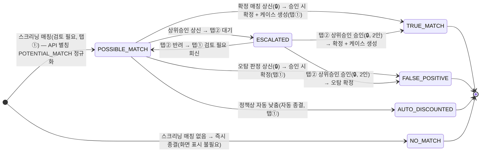
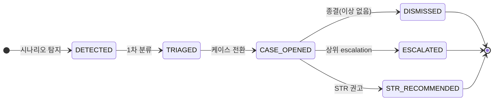
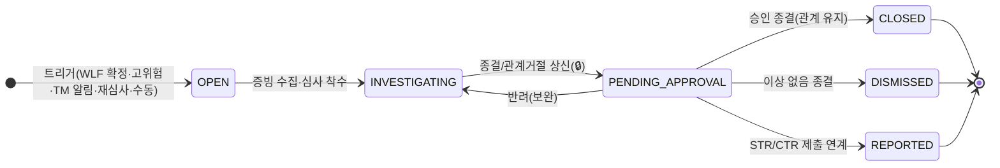
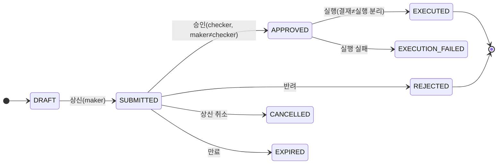
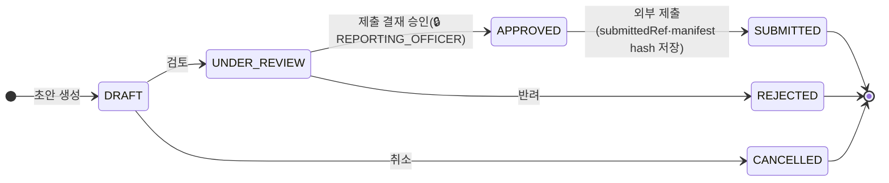

# 백오피스 SaaS AML Platform 관리 - 기능정의서

## 문서 정보

| 항목 | 내용 |
|------|------|
| **문서 ID** | FS-AML-SAAS-001 |
| **버전** | 5.3 |
| **작성일** | 2026-06-08 |
| **작성자** | Hanpass Global Team |
| **상태** | 초안 |
| **정본(아키텍처)** | `.claude/skills/_shared/target-architecture.md` (4서비스 모노레포 · Java 25 헥사고날 · Next.js · 멀티테넌시 · PII 마스킹 · 4-eyes · Policy Pack STR/CTR/Travel Rule) |
| **입력 진실(설계)** | `docs/software/02-amlSvc-sass.md` (SaaS AML Platform 설계서) |
| **파생 정합** | `docs/design/db/02-aml-db.md`(테이블·컬럼·enum) · `docs/design/api/02-aml-api.md`(엔드포인트·DTO·scope·에러) · `docs/design/integration/02-aml-integration.md`(큐·이벤트·아웃박스) · `docs/tasks/aml/00-overview.md`(태스크·BO 화면 인벤토리) |
| **짝 산출물** | `docs/plan/BO-AML-SAAS-Planning_v5.6.pptx` (와이어프레임 기획서 — 멀티탭 상세/플로우 화면 **탭 연속 전개** + **드릴다운 진입 트리거 배너**(↩ 진입 경로: 어느 화면 어느 행/버튼으로 진입). RA 순서 RA-001→RA-003(상세)→RA-002(설정). **TNT 3화면: 목록·상세[4탭]·등록**. 총 **23화면**(기능 ID 기준 불변) · **53슬라이드**. 단순 필터 탭 화면(CASE-001·APR-001)은 1슬라이드 유지) |

### 변경 이력

| 버전 | 일자 | 작성자 | 변경 내역 |
|------|------|--------|----------|
| **5.6** | **2026-06-09** | **Hanpass Global Team** | **화면 ID 간 드릴다운 진입 트리거 명시 + RA 순서 재배치.** ① 드릴다운 화면(AML-RA-003·WL-002·CASE-002·REP-002·TM-002) 첫 슬라이드 상단에 **'↩ 진입 경로' 배너** 추가 — 어느 화면 어느 [행 ▶/버튼]으로 진입하는지 명시(화면 간 흐름 단절 해소). ② **RA 순서 재배치**: RA-001(분포·고위험 목록)→**RA-003(대상 상세 드릴다운)**→RA-002(모델 관리)로 변경(기존 RA-001→RA-002→RA-003이 드릴다운을 무관한 설정 화면 뒤에 두어 흐름 단절). ③ 소스 화면(CASE-001·REP-001·TM-001 등) 행 ▶ + "→ AML-XXX" 아웃바운드 트리거 확인. 짝 PPT `BO-AML-SAAS-Planning_v5.6.pptx` 재빌드(렌더 검증: RA-003 등 진입 배너 표시·겹침 없음). |
| **5.5** | **2026-06-08** | **Hanpass Global Team** | **멀티탭 상세/플로우 화면 탭 연속 전개(SKILL §1.6) — 13화면 확장.** WLF·TNT에 이어 WL-001(소스목록/임포트이력/명단엔트리조회)·CTRY-001·RA-001/002/003·CDD-001·TM-001·CASE-002·REP-001/002·TR-001·PP-001·AUD-001을 **1탭=1슬라이드·같은 부모 탭 바**로 연속 전개(빈 라벨 탭 제거, 탭별 실내용 채움, 이전←/다음→ 교차참조). 단순 상태 필터 탭(CASE-001 내케이스/전체/기한임박/종결·APR-001 대기/내가상신/처리완료)은 1슬라이드 유지. 기능 ID 수(23) 불변, 슬라이드 29→53. 짝 PPT `BO-AML-SAAS-Planning_v5.5.pptx` 재빌드(렌더 검증: WL 13~15·CTRY·RA 등 탭 바 일관·겹침 없음). |
| **5.0** | **2026-06-08** | **Hanpass Global Team** | **격리(isolation_mode) → 배포 모델(deployment topology) 재설계 — FDS PRD(§3·§1.7.1)와 동일 패턴을 AML에 적용. 정본: target-architecture §4.1·aml-svc 설계서 §16·DB §5.28/§5.28a/§5.28b·API §3.16/§4/§5·integration §10.1/§10.3·tasks.** ① **§1.2 화면 범위** 표에 고객사 관리 3종(AML-TNT-001/002/003) + 온보딩 상태(AML-TNT-004) 신설. ② **§1.3 운영 주체** `격리(isolation_mode)` 폐기 → 배포 모델·온보딩 상태로 재기술. ③ **§1.5 데이터 엔티티** `aml_tenants` 설명에 `deployment_model/onboarding_status/infra_ref` 반영. ④ **§1.8 온보딩 상태 머신** 신설: 3경로 상태머신(매니지드/SHARED/설치형), `deployment_model` 표, `onboarding_status` 8종. ⑤ **§1.9 배포 모델 원칙** 신설. ⑥ **§1.4 권한** 고객사 관리 scope(`aml:admin:tenant`) 추가. ⑦ **§0-B 고객사 관리 섹션 신설** — AML-TNT-001(고객사 목록)·AML-TNT-002(고객사 상세)·AML-TNT-003(고객사 등록·배포 유형+온보딩 신청)·AML-TNT-004(온보딩 상태·프로비저닝·이력). ⑧ **부록 A** 고객사 관리 4행 추가. ⑨ **부록 E** D-06 결정 확정(격리→배포 모델). ⑩ **부록 F** deployment_model·onboarding_status 표시 용어 추가. ⑪ **짝 PPT `BO-AML-SAAS-Planning_v5.0.pptx` 재빌드** — AML-TNT-001/002/003/004 슬라이드 4장 추가(배포 유형+온보딩 상태, 격리 방식 라디오 제거). |
| **5.4** | **2026-06-08** | **Hanpass Global Team** | **TNT 4탭 연속 전개·온보딩 흡수·등록 분리, 24→23화면.** §13 고객사 관리를 3화면(AML-TNT-001·AML-TNT-002[4탭: 기본 정보/배포·온보딩/소스 시스템/정책팩]·AML-TNT-003)으로 재편. 구 AML-TNT-004(온보딩 상태·프로비저닝·이력)를 AML-TNT-002 ② 배포·온보딩 탭으로 흡수·폐기. AML-TNT-003(등록)을 상세 4탭과 분리된 별도 생성 화면으로 명확화. §1.2 화면 범위 카운트 24→23 정정. 부록 A·B TNT-004 행을 TNT-002 ② 탭으로 통합. |
| **5.3** | **2026-06-08** | **Hanpass Global Team** | **정합성 리포트(doc-consistency-report-aml-latest) PRD·PPT 담당 이격 정정 — API·PPT 정본 동기화(#36~#49).** ① **§11.1 결재 종류**: `TM_SCENARIO` 추가 → **16종** 확정(API §3.7, #36). ② **§3.1 이전 판정 이력**: `screeningHistory`를 '화면 파생값(GET .../screenings/{id} 호출 결과에서 파생)'으로 명시(#37). ③ **§3.2·§3.3 명단군**: `watchlistSourceType` → `WatchlistEntryDto.listType`(API §3.9 정본, #38). ④ **§3.2 상신 판정**: `requestedStatus`를 'payload 파생값'으로 명시(#39). ⑤ **부록 F**: `NO_MATCH|매칭없음` 추가. **§1.7 WLF 상태머신**: `NO_MATCH` 즉시 종결 전이 추가(#40). ⑥ **짝 PPT `BO-AML-SAAS-Planning_v5.3.pptx` 재빌드** — WLF-003: `status=TRUE_MATCH,FALSE_POSITIVE,AUTO_DISCOUNTED`(RESOLVED 제거, #41). APR-001: 결재 종류 16종(CHECKLIST_CHANGE·PERIODIC_REVIEW_CHANGE·TM_SCENARIO 포함, #42). TNT-003: 기본 리전 별표 제거·선택(기본값 KR, #43). WLF-002: 컬럼 7종(상신일·동작 추가·점수 제거, #44). WLF-003: 면제(FP_WHITELIST) 카드 추가(4종, #45). WLF-003: 평균 처리 SLA 단위 '일'로 통일(#46). CDD-001: `CHECKLIST_CHANGE`·`PERIODIC_REVIEW_CHANGE` enum 코드 표기(#47). DASH-001: '결재 대기' KPI 카드 추가(#48). APR-001: STR_SUBMIT·CTR_SUBMIT 분리 표기(#49). |
| **5.2** | **2026-06-08** | **Hanpass Global Team** | **§3 WLF 섹션을 PPT v5.1(슬라이드 8/9/10) 3화면 흐름으로 동기화 — 탭 시나리오 흐름 재구성(SKILL §1.6).** ① **§3 전면 재구성**: 구 §3(AML-WLF-001 큐 + §12-A.1 AML-WLF-002 판정 상세 드릴다운 분리) → 같은 부모 탭 바 **[검토 필요/상위승인/처리 이력]** 3화면 연속 전개. 구 판정 상세(드릴다운)는 AML-WLF-001 master-detail 내 흡수. ② **AML-WLF-001(검토 필요)**: 탭 active=검토 필요. 목록+하단 master-detail(매칭 후보·근거·점수 분해·이전 판정 이력) 통합. 판정 상신 버튼(확정 매칭/오탐/자동낮춤/상위승인, 4-eyes WLF_DECISION). 상신 후 ESCALATED 건 → 탭 ② 상위승인 이동. ③ **AML-WLF-002(상위 승인, 신규)**: ESCALATED 건 큐(상신자·상신판정·이전판정이력 포함). 승인(`approvals/{id}:approve`, 2인) → 확정+케이스생성+AML→FDS 전파. 반려(`approvals/{id}:reject`) → ① 검토 필요 회신. **API 정합 확인**: `POST .../screenings/{id}/decision/approve·/reject` 전용 엔드포인트는 API 명세 미존재 확인 → 일반 결재 엔진 `POST .../approvals/{id}:approve·:reject`(`aml:admin:approval`) 사용으로 명시(API 보강 불필요). ④ **AML-WLF-003(처리 이력, 신규)**: 확정/오탐/자동낮춤/면제 결과 요약 카드 + 처리 이력 표(스크리닝ID·대상·명단군·최종 판정·판정자/승인자·일시). 오탐 면제(FP_WHITELIST) 만료 후 재스크리닝 → ① 검토 필요 순환. AML-AUD-001 연결. ⑤ **§12-A.1** 구 AML-WLF-002 →폐기 표기(§3.2로 통합). ⑥ **§2 대시보드 운영 알림** WLF 딥링크 표시 용어 동기화. ⑦ **§1.2 화면 범위 표** WLF 3행(AML-WLF-001/002/003)으로 확장. ⑧ **부록 A·B·C** WLF 3화면 API·권한·결재 동기화. |
| **5.1** | **2026-06-08** | **Hanpass Global Team** | **정합성 리포트(doc-consistency-report-aml-latest) PRD 담당 이격 정정 — API §1.1 정본 동기화.** ① **§1.4 권한** 고객사 관리 scope `aml:admin:tenant`를 **`aml:admin:policy`** 로 교체(API §1.1 확정 13종 scope에 `aml:admin:tenant` 미존재; 고객사·온보딩 엔드포인트는 bo-api가 `aml:admin:policy` scope로 운용 — API §9·§5 OpenAPI, 이격 aml:api-prd HIGH). ② **§1.2·§13.1 API 필터** `region=` 쿼리 파라미터를 정본 API OpenAPI §5와 동기화하여 제거(API §5 GET /api/v1/bo/aml/tenants에 `region` 필터 미존재, 이격 aml:api-prd HIGH). ③ **§1.2·§1.7 결재 상태 머신 / 부록 F approval_status** 5종 → **7종** 확장(CANCELLED·EXECUTION_FAILED 추가 — §1.7 상태 머신에 이미 포함; 부록 F 표시 사전 동기화, 이격 aml:api-prd MEDIUM). ④ **§13.1 상태 컬럼 표시값** '온보딩' → API §3.16 TenantDto.status enum 3종(`ACTIVE`/`SUSPENDED`/`OFFBOARDING`)에 대응하는 한국어 표시값으로 정정, 복합 '온보딩' 배지는 `onboardingStatus` 조건으로 분리 명시(이격 aml:api-prd MEDIUM). ⑤ **§1.2 본문 화면 수** "총 20화면" → **"총 24화면"**(v5.0 TNT 4화면 추가 반영, 이격 aml:roadmap-sw-prd LOW). ⑥ **부록 A·B·C** 고객사 관리 화면 scope 표기를 `aml:admin:policy`로 일괄 정정. |
| 1.0 | 2026-06-06 | Hanpass Global Team | 최초 초안 — 비-SaaS AML BO를 SaaS로 일반화한 34화면 참고안. 설계 확정 전 산출물로, 미확정 엔티티(정책팩·국가위험·WLF 룰 마스터·고위험군 레지스트리 등)를 다수 포함. |
| **2.0** | **2026-06-06** | **Hanpass Global Team** | **설계서 `02-amlSvc-sass.md`(기준 진실)와 파생 DB/API/integration/tasks에 100% 정합화하여 전면 재작성(부트스트랩).** ① 데이터 엔티티를 확정 14 도메인 테이블 + 4 지원 테이블로 한정(미확정 엔티티 제거). ② 화면을 태스크 `00-overview` §5 **BO 화면 인벤토리 10종 + 종합 대시보드**로 재정렬(전부 `bo-web → bo-api → /api/v1/admin/aml/*` 경유). ③ 모든 엔드포인트·식별자·enum·결재 subjectType을 API §2/§3·DB §5와 1:1 매핑(`:apply`/`:activate`/`:close`/`:submit`/`:approve`/`:reject`/`:resolve-exception`/`:reject-relationship` 콜론 표기, 🔒4-eyes). ④ `POTENTIAL_MATCH→POSSIBLE_MATCH` 정규화, 표준 에러 `AML.*`, screening 장애 정책(D-14) 반영. ⑤ 권한 scope를 API §1.1 확정 scope(`aml:admin:*`, `aml:case:*`, `aml:evidence:export`, `aml:pii:reveal`)로 교체. ⑥ 문장형 룰 빌더(WLF 임계·RA factor·TM scenario)·자연어 미리보기 적용. |
| **2.1** | **2026-06-07** | **Hanpass Global Team** | **정합성 리포트(doc-consistency-aml) PRD/PPT 담당 이격을 정정된 정본(API 명세)에 동기화.** ① **운영자 집계 API 소유 경계(API §9)** — 대시보드(AML-DASH-001)·RA 분포(AML-RA-001)·운영자 감사 조회(AML-AUD-001)의 호출 대상을 **bo-api 소유 API(`/api/v1/bo/aml/dashboard`·`/tenants/{tenantId}/dashboard`·`/audit`)** 로 명시. 엔진 직접 집계 `GET /admin/aml/risk-scores` 미신설 확정(엔진은 저수준 위임만). §1.1·§1.2·§2.1·§5.1·§12.1·부록 A 반영. ② **HTTP 상태코드=API §4 정본** — 멱등 충돌·자기승인·payload 변경·상태 전이 위반 **409**, 검토요구 **422**, rate **429**, fail-closed/처리중 **503** 확정. 부록 D에 `AML.IDEMPOTENCY_CONFLICT`(409)·`AML.IDEMPOTENCY_PROCESSING`(503) 추가. ③ **결재 subjectType `TM_SCENARIO`** 정본(API §3.7) 유지 확인. ④ PPT 표시 용어·enum 전수(WLF 판정 컬럼·시나리오 10종·심각도 `매우높음`)·RA `requiredAction` 동기화하고, **표시 용어 통일 사전(부록 F)에 맞춰 PPT 라벨 정정**(WLF 표 헤더 `대상`→`대상(식별자)`, 대시보드 Travel Rule 카드 `예외 대기`→`예외 검토 대기`, Travel Rule 동작 버튼 `[예외]`→`[예외처리]`, RA·TM·케이스·보고·결재·감사 화면에 `대상=마스킹 식별자` 캡션 부기)하여 `BO-AML-SAAS-Planning_v2.1.pptx`로 재빌드(파일명 버전을 본문 v2.1과 일치). |
| **4.0** | **2026-06-07** | **Hanpass Global Team** | **시나리오 흐름 종합 재구성 — 목록→상세→액션→결과 전 흐름 연결(11→20화면) + 표시 용어 통일 사전(부록 F)에 '고객사(tenant_id)/서비스(workspace_id)' 추가, 화면 표시의 '고객사'를 '고객사'로 통일.** ① **후속 상세(드릴다운) 6종 신규** — WLF 판정 상세(AML-WLF-002), 명단 변경분 상세/디프 승인(AML-WL-002), RA 대상 상세/EDD 착수(AML-RA-003), TM 시나리오 빌더 상세(AML-TM-002), 케이스 상세(AML-CASE-002), 보고 상세/제출(AML-REP-002). 각 목록 화면(WLF-001·WL-001·RA-001·TM-001·CASE-001·REP-001)을 '목록' 전용으로 정리하고 '행 클릭 → AML-XXX' 후속 화면을 info_panel·하단 시나리오로 명시. ② **앞단 정책 관리 3종 신규** — 국가위험(고위험 국가) 관리(AML-CTRY-001, subjectType=`COUNTRY_RISK` 4-eyes, RA factor '고위험 국가'의 앞단), CDD/EDD 체크리스트·재심사 주기 관리(AML-CDD-001, checklist·periodic-review-policy 4-eyes), Policy Pack 관리(AML-PP-001, subjectType=`POLICY_PACK` 4-eyes, 한국 기본팩 + 고객사 jurisdiction). API §2.7 admin 정책 엔드포인트(`country-risk:change`·`cdd/checklists`·`policy-packs:change`)와 1:1. ③ **문장형 빌더 상세화** — RA factor 빌더(AML-RA-002)·TM 시나리오 빌더(AML-TM-002)의 ⑤ 추가조건을 AND/OR 결합·필드+연산자+값·그룹(괄호) 빌더로 구체화(자연어 미리보기 포함). ④ 짝 산출물 `BO-AML-SAAS-Planning_v4.0.pptx`로 재빌드(슬라이드 22장=커버+변경이력+기능 20). 4-eyes 표기는 PPT 화면에서 (2인) 텍스트(이모지 금지), PRD 본문은 🔒 유지. 렌더-QA(soffice→PDF→pdftoppm 90dpi) 신규·핵심 슬라이드 시각 검증 통과(condition_builder·드릴다운·흐름 연결, 겹침/넘침/빈 화면 없음). |
| **3.0 (PPT)** | **2026-06-07** | **Hanpass Global Team** | **짝 산출물 PPT 도형 기반 전면 재생성 — `BO-AML-SAAS-Planning_v3.0.pptx`.** 와이어프레임의 ASCII 박스 문자(┌─┐│└┘)를 폐기하고, 시각 정본(`docs/plan/sample.pptx`)·FDS v4.0(`BO-FDS-SASS-Planning_v4.0.pptx`)과 동일한 **실제 rect 도형(맑은 고딕·Ant Design 팔레트)** 으로 `wireframe_lib.py` 컴포넌트(`page_title·header_bar·nav_panel·breadcrumb_title·info_panel`·`filters·kpi_cards·callout·table_block·two_panels·panel_table·tab_chips·form_block`)를 사용해 재작성. 슬라이드 13장(1=커버 cover_slide / 2=변경 이력 history_slide / 3~13=기능 ID 전수 AML-DASH-001·WLF-001·WL-001·RA-001·RA-002·TM-001·CASE-001·REP-001·TR-001·APR-001·AUD-001). 좌 75% 와이어프레임(도형) + 우 25% info_panel(권한·필터·컬럼·동작·API). 표시 용어·enum은 PRD(부록 F 사전)와 1:1 동기화. PRD 본문은 변경 없음(PPT 재생성 전용). `cover_slide`에 `brand` 인자 추가(FDS 기존 호출 호환 유지). 렌더-QA(soffice→PDF→pdftoppm 90dpi) 13슬라이드 전수 시각 검증 통과(도형 가시성·겹침/넘침/빈 화면 없음). |

## 목차

1. [개요](#1-개요)
2. [AML 종합 현황 대시보드](#2-aml-종합-현황-대시보드)
3. [WLF 검토 (탭 바: 검토 필요 / 상위승인 / 처리 이력)](#3-wlf-검토-탭-바-검토-필요--상위승인--처리-이력)
4. [명단 소스·임포트 승인](#4-명단-소스임포트-승인)
5. [위험평가(RA) 분포·고위험 현황](#5-위험평가ra-분포고위험-현황)
6. [위험평가(RA) 모델 활성화·등급 조정](#6-위험평가ra-모델-활성화등급-조정)
7. [거래 모니터링(TM) 알림 적체·시나리오 관리](#7-거래-모니터링tm-알림-적체시나리오-관리)
8. [케이스 관리 (CDD/EDD·SLA·타임라인)](#8-케이스-관리-cddeddedd-slatimeline)
9. [규제 보고 (STR/CTR 후보·제출)](#9-규제-보고-strctr-후보제출)
10. [Travel Rule 예외 처리](#10-travel-rule-예외-처리)
11. [결재 대기함](#11-결재-대기함)
12. [감사·증적 Export·소스 시스템 관리](#12-감사증적-export소스-시스템-관리)
13. [고객사 관리 (배포 유형·온보딩 신청·상태)](#13-고객사-관리-배포-유형온보딩-신청상태)
14. [부록](#14-부록)

---

## 1. 개요

### 1.1 문서 목적

본 문서는 **SaaS AML Platform** 백오피스(준법감시실 운영 콘솔)의 관리·운영 기능에 대한 기능정의서(PRD)입니다. SaaS AML Platform 은 한국 금융시장에서 여러 금융서비스(은행·핀테크·PG·VAN·가상자산사업자·무역/B2B 결제·이커머스 플랫폼)가 **독립 고객사**로 연동하여, 자기 고객·법인·실소유자·거래·증빙·명단 데이터를 가지고 **고객확인(CDD)·강화된 고객확인(EDD)·요주의 명단 필터링(WLF)·고객위험평가(RA)·거래 모니터링(TM)·규제 보고(STR/CTR/Travel Rule)** 를 사람이 백오피스에서 검토·판정·결재·모니터링할 수 있도록 화면 단위로 정의합니다.

본 백오피스는 **`bo-web`(Next.js)** 화면이며, **`bo-api`(백오피스 백엔드)** 를 경유합니다. bo-web 은 AML 엔진을 직접 호출하지 않습니다(정본 §3·§4, API §0). 호출 대상은 화면 성격에 따라 둘로 나뉩니다(API §9 소유 경계).

- **운영자 집계 화면(대시보드·고객사 관리·운영자 감사 조회)**: **`bo-api` 소유 집계 API**(`/api/v1/bo/aml/**`)를 호출합니다. bo-api 가 소유·집약·인증하며, 내부적으로 `aml-svc` 저수준 Admin API를 위임 집계합니다. 엔진 API 에는 운영자 집계 엔드포인트(대시보드/고객사/감사 집계)를 추가하지 않습니다(API §0·§9).
- **운영(검토·판정·결재) 화면**: bo-api 를 경유하여 `aml-svc`(AML 엔진)의 Admin API(`/api/v1/admin/aml/*`)를 위임 호출합니다.

AML 엔진 자체의 ingest·screening·RA·TM 평가는 고객사 시스템이 Public API로 사용하며 본 백오피스의 화면 대상이 아닙니다(책임 경계 §1.6).

### 1.2 화면 범위 (태스크 BO 화면 인벤토리)

본 PRD의 화면 범위는 태스크 `docs/tasks/aml/00-overview.md` §5 **BO 화면 인벤토리 10종**과 운영 모니터링용 **종합 대시보드 1종**을 기준 골격으로 하며, **v4.0에서 목록→상세→액션→결과 흐름을 끊김 없이 잇기 위해 후속 상세(드릴다운) 6종과 앞단 정책 관리 3종을 추가하여 총 20화면**으로 확장합니다(§12-A). **v5.0에서 고객사 관리 4종(AML-TNT-001~004)을 추가하여 v5.0 기준 총 24화면**이었으나, **v5.4에서 고객사 관리를 3화면(AML-TNT-001 목록·AML-TNT-002 상세[4탭]·AML-TNT-003 등록)으로 재편하여 총 23화면(TNT 3: 목록·상세[4탭]·등록)**입니다. 구 AML-TNT-004(온보딩 상태)는 AML-TNT-002 ② 배포·온보딩 탭으로 통합되었습니다(§13.x 폐기 표기 참조). 후속 상세 화면은 NAV 항목이 아니라 목록 화면의 행/버튼 클릭으로 진입하는 드릴다운입니다. 모든 화면은 `bo-web → bo-api` 경유이며, 운영자 집계 화면은 **bo-api 소유 API(`/api/v1/bo/aml/**`)**, 운영(검토·판정·결재·정책) 화면은 bo-api 가 위임하는 **엔진 Admin API(`/api/v1/admin/aml/*`)** 를 사용합니다(API §9 소유 경계).

| # | 화면(기능 ID) | 태스크 | 주요 호출 API |
|---|---|---|---|
| 1 | AML 종합 현황 대시보드 (AML-DASH-001) | T-20 | **bo-api** `GET /api/v1/bo/aml/dashboard`·`/tenants/{tenantId}/dashboard` (집계 소유) |
| — | **고객사 목록 (AML-TNT-001)** | T-03 | **bo-api** `GET /api/v1/bo/aml/tenants` (배포 유형·온보딩 상태 필터) |
| — | **고객사 상세 4탭 (AML-TNT-002) — ①기본 정보 / ②배포·온보딩 / ③소스 시스템 / ④정책팩** | T-03·P8 | **bo-api** `GET/PUT /api/v1/bo/aml/tenants/{tenantId}` · `GET/POST .../onboarding` · `POST .../provision` · `POST .../register` · `GET .../source-systems` · `GET/POST .../policy-pack` |
| — | **고객사 등록 (AML-TNT-003, 별도 생성 화면)** | T-03 | **bo-api** `POST /api/v1/bo/aml/tenants` |
| 2 | WLF 검토 — ① 검토 필요 (AML-WLF-001) | T-10 | (엔진) `GET .../screenings?status=POSSIBLE_MATCH`, `POST .../screenings/{id}/decision` 🔒, `GET .../screenings/{id}`, `GET .../watchlist-entries` |
| — | WLF 검토 — ② 상위 승인 (AML-WLF-002) | T-10 | (엔진) `GET .../screenings?status=ESCALATED`, `GET/POST .../approvals/{id}:approve`, `POST .../approvals/{id}:reject` |
| — | WLF 검토 — ③ 처리 이력 (AML-WLF-003) | T-10 | (엔진) `GET .../screenings?status=TRUE_MATCH,FALSE_POSITIVE,AUTO_DISCOUNTED` |
| 3 | 명단 소스·임포트 승인 (AML-WL-001) | T-08 | (엔진) `admin/aml/watchlist-sources`, `imports/{version}:apply` 🔒, `watchlist-entries` |
| 4 | RA 분포·고위험 현황 (AML-RA-001) | T-11 | **bo-api** `GET /api/v1/bo/aml/dashboard`(분포 집계); (엔진) `ra-models`·`ra-models/{code}/simulate`·`/aml/customers/{ref}/risk` |
| 5 | RA 모델 활성화·등급 조정 (AML-RA-002) | T-11 | `ra-models/versions/{v}:activate` 🔒, `risk-scores/{id}/override` 🔒 |
| 6 | TM 알림 적체·시나리오 관리 (AML-TM-001) | T-14 | `admin/aml/tm-scenarios`, `simulate`, `:activate` 🔒, `GET /aml/alerts/{id}` |
| 7 | 케이스 관리 CDD/EDD·SLA (AML-CASE-001) | T-13 | `admin/aml/cdd/cases`, `PATCH`, `/timeline`, `:close` 🔒, `:reject-relationship` 🔒 |
| 8 | 규제 보고 STR/CTR 후보·제출 (AML-REP-001) | T-17 | `admin/aml/reports`, `:submit` 🔒 |
| 9 | Travel Rule 예외 처리 (AML-TR-001) | T-18 | `admin/aml/travel-rule/transfers`, `:resolve-exception` 🔒 |
| 10 | 결재 대기함 (AML-APR-001) | T-12 | `admin/aml/approvals`, `:approve`, `:reject` |
| 11 | 감사·증적 Export·소스 관리 (AML-AUD-001) | T-19, T-03 | 운영자 감사 집계=**bo-api** `GET /api/v1/bo/aml/audit`; (엔진) `POST /evidence/aml/exports`, `admin/aml/source-systems` 🔒, `admin/aml/audit-events`(저수준 위임) |

> **화면 비대상(BE 전용, 본 PRD 제외)**: 모노레포 스캐폴딩(T-01), Flyway·RLS·시드(T-02), PII 토큰화·canonical event store(T-05), Public API 게이트웨이(T-06), SQS·DLQ·FIFO 멱등(T-07), 트랜잭셔널 아웃박스 poller(T-16), Internal API·FDS event(T-15), Legacy Vendor connector(T-21). 스케줄러(periodic review·watchlist freshness)는 T-13/T-08 내 BE 항목.

### 1.3 운영 주체 (멀티테넌시)

SaaS 환경의 운영 주체는 2종이며, **고객사 스코프**(`Tenant-Id`)와 **data-scope**(`dataScope`, 영업점·법인그룹 하위 격리)로 화면·데이터 접근이 분리됩니다. 모든 화면 상단에 **고객사 선택 ▼**·**서비스 선택 ▼** 컨텍스트가 노출됩니다. 고객사/data-scope 경계 위반은 `AML.TENANT_MISMATCH`(RLS `app.current_tenant`로 강제, API §1.1).

> **표시 용어(부록 F)**: 화면 표시의 운영 주체는 **고객사**(상위, 내부코드 `tenant_id`)·**서비스**(하위, 내부코드 `workspace_id`)로 통일한다(1 고객사 : N 서비스). 본 절의 '고객사 스코프/data-scope/Tenant-Id'는 RLS·아키텍처 사실을 기술하는 내부 용어로 유지하되, 화면 라벨·필터는 '고객사/서비스'로 표시한다(PPT v4.0과 1:1 동기화).

| 운영 주체 | 고객사 스코프 | 책무 |
|-----------|---------------|------|
| **SaaS 운영자** (플랫폼) | **크로스고객사** (전체 또는 위임 고객사) | 소스 시스템 레지스트리·고객사 배포 모델 관리(`deployment_model`), 명단 소스 공통 운영, 플랫폼 모니터링 |
| **고객사 준법감시 담당/책임자** (고객사) | **자기 고객사 한정** | 자기 고객사의 WLF 판정·RA·TM·케이스·규제 보고·결재·증적 export |

> **PII 마스킹**: 모든 화면은 raw PII 를 노출하지 않고 식별자(`customerRef`/`entityRef` 토큰)·해시·점수 분해만 표시합니다(DB §2.2, API §1.6). 원문 접근이 불가피한 화면은 `aml:pii:reveal` scope + 사유 입력 + 감사 기록(`aml_audit_events`, `RAW_DATA_ACCESS`)을 요구합니다.

### 1.4 권한 매핑 (확정 scope)

백오피스 화면은 API §1.1 확정 권한 scope 로 접근을 통제합니다. 결재가 필요한 동작(🔒)은 **작성자≠승인자**(`aml_approvals` CHECK `maker_id<>checker_id`)를 강제합니다.

| 기능 영역 | 필요 scope | 화면 |
|-----------|-----------|------|
| 케이스·알림·결과·점수 조회 | `aml:case:read` | 전 조회 화면 |
| 케이스·판정·override·종결 상신 | `aml:case:update` | WLF 검토·RA 조정·케이스·보고 |
| 명단 소스·임포트·오탐 화이트리스트 | `aml:admin:watchlist` | 명단 소스·임포트 승인 |
| RA 모델·TM 시나리오 정책 | `aml:admin:policy` | RA 모델 활성화·TM 시나리오 |
| 결재 큐 조회·승인·반려 | `aml:admin:approval` | 결재 대기함 |
| 감사 로그 조회 | `aml:admin:audit` | 감사·증적 Export |
| 소스 시스템 등록·secret 변경 | `aml:admin:source-system` | 소스 시스템 관리 |
| 증적 pack export 생성 | `aml:evidence:export` | 감사·증적 Export |
| 원문(PII) 열람 | `aml:pii:reveal` | (사유+감사 필수) |
| **고객사 목록·상세 조회** | `aml:admin:policy` | **고객사 관리(SaaS 운영자 전용, bo-api 소유 엔드포인트 — API §9·§1.1)** |
| **고객사 등록·온보딩 신청** | `aml:admin:policy` | **고객사 등록(배포 유형 선택+온보딩 신청, bo-api 소유 — API §9)** |
| **온보딩 프로비저닝 트리거·등록** | `aml:admin:policy` | **AML-TNT-002 ② 배포·온보딩 탭(P8, MANAGED_DEDICATED/SELF_HOSTED 전용, bo-api 소유 — API §9; 구 AML-TNT-004 통합)** |

> **4-eyes 대상 동작**: WLF true/false positive 확정·오탐 화이트리스트 등록·RA 모델 활성화·등급 하향 override·EDD 종결·관계거절·STR/CTR 제출·Travel Rule 예외 확정·명단 import 적용·소스 secret 변경. 자기 승인 시 `AML.SELF_APPROVAL_FORBIDDEN`. 결재 후 payload 변경 시 `AML.APPROVAL_PAYLOAD_CHANGED`로 무효화.

### 1.5 데이터 엔티티 (백오피스 관점)

DB 설계서 §3 기준 **확정 도메인 테이블 14종 + 지원 인프라 4종**입니다. 모든 PK는 `(tenant_id, <id>)` 복합이며 `tenant_id`가 선두입니다. ID 컬럼은 API 식별자와 1:1(`screening_id↔screeningId` 등).

| 엔티티 | 설명 | 주요 식별자 |
|--------|------|------------|
| `aml_tenants` | 고객사 마스터 (표시명·배포 유형·온보딩 상태·운영 상태·기본 리전·인프라 참조·정책팩 코드). v5.0: `deployment_model`(3종)·`onboarding_status`(8종)·`infra_ref` 추가, `isolation_mode` 폐기(DB V17a/V17b) | `tenant_id` |
| `aml_source_systems` | 원천 시스템 (연동 방식·스키마 버전·인증 모드·장애 정책·secret 참조) | `tenant_id`, `source_system` |
| `aml_customers` | 개인 고객 (유형·국가·KYC 상태·위험등급, 이름 hash) | `tenant_id`, `customer_ref` |
| `aml_entities` | 법인·사업자·가맹점·셀러·공급업체 (유형·법인명 hash·업종·상태) | `tenant_id`, `entity_ref` |
| `aml_relationships` | 관계 그래프 (소유/지배/대표/운영/계좌사용/반복수취/관련/고용·지분율) | `tenant_id`, `relationship_id` |
| `aml_watchlist_sources` | 명단 소스 (소스 종류·상태·활성 버전 포인터) | `tenant_id`, `source_code` |
| `aml_watchlist_entries` | 명단 엔트리 (명단 종류·정규화 토큰·버전·상태, 이름 hash) | `tenant_id`, `entry_id` |
| `aml_screening_results` | 스크리닝 결과 1건 (대상·상태·점수·점수분해·매칭 엔트리·룰 버전·판정자) | `tenant_id`, `screening_id` |
| `aml_risk_scores` | RA 결과 (대상·점수·등급·factor breakdown·모델 버전·다음 재심사일) | `tenant_id`, `score_id` |
| `aml_alerts` | TM/FDS 알림 (시나리오·대상·거래·심각도·상태·근거·발생 출처) | `tenant_id`, `alert_id` |
| `aml_cases` | 케이스 (케이스 타입·대상·상태·우선순위·담당·EDD 트리거·기한·종결) | `tenant_id`, `case_id` |
| `aml_regulatory_reports` | 규제 보고 증적 (보고 종류·케이스·상태·payload·제출 참조·manifest hash) | `tenant_id`, `report_id` |
| `aml_business_documents` | 상업 증빙 (invoice/PO/B-L/order·금액·국가·doc hash) | `tenant_id`, `document_ref` |
| `aml_travel_rule_transfers` | Travel Rule 이전 (송신/수취 VASP·자산·완전성·위험·지갑주소 hash) | `tenant_id`, `transfer_ref` |
| `aml_canonical_events` | 정규화 이벤트 (event_type·payload·payload_hash·멱등키) | `tenant_id`, `event_id` |
| `aml_approvals` | 4-eyes 결재 (subjectType·라인·상태·maker≠checker·payload_hash·실행시각) | `tenant_id`, `approval_id` |
| `aml_audit_events` | append-only 감사 (카테고리·작업자·hash chain) | `tenant_id`, `audit_id` |
| `aml_evidence_exports` | 증적 pack export (유형·포맷·row count·manifest hash·다운로드) | `tenant_id`, `export_id` |

> ⚠ DB 후속 권장: 트랜잭셔널 아웃박스 물리 테이블 `aml_outbox`는 현재 지원 인프라(4종)에 미정의이며, 결재→제출 연동(integration)이 전제합니다. T-16 착수 전 DB 설계서에 추가 필요(데이터 모델러 협의). 본 PRD는 BE 전용 항목으로 화면 비대상.

### 1.6 책임 경계 (타 서비스 소관 제외)

| 항목 | 소관 | 본 PRD 처리 |
|------|------|------|
| canonical event ingest·정규화·PII 토큰화 | `aml-svc`(엔진, Public API) | 화면 비대상(BE), 결과만 조회 |
| 실시간 WLF/RA/TM 평가 호출 | 고객사 시스템(Public API) | 화면 비대상, 결과만 검토 |
| 실시간 거래 fraud 차단·ALLOW/BLOCK/HOLD | `fds-svc`(FDS 엔진) | 제외. FDS escalation은 알림으로 수신(`aml_alerts`, 발생 출처=FDS) |
| FDS→AML escalation·AML→FDS 전파 | `fds-svc` ↔ `aml-svc`(Internal API/event) | 화면 비대상(BE, T-15), 연계 알림만 표기 |
| 외부 보고기관 제출 어댑터 | 고객사별 `ReportSubmissionPort`(D-04) | 제출 결과(submittedRef·manifest hash)만 증적 표시 |
| 인증·RBAC·세션 | `bo-api`(Spring Security) | scope 표기만, IAM 화면은 bo-api PRD 소관 |

### 1.7 상태 머신 (백오피스 표시 기준)

#### WLF 매칭 판정 상태 (DB §5.5 screening_status)



#### TM 알림 라이프사이클 (DB §5.7 alert_status)



#### 케이스 상태 머신 (DB §5.9 case_status)



#### 결재 상태 머신 (DB §5.13 approval_status)



#### 보고 상태 머신 (DB §5.11 report_status)



### 1.8 배포 모델 (`deployment_model`) 원칙 (v5.0 신설)

AML/FDS는 고객 PII·거래·제재 데이터의 규제·보안 요건상 **고객사별 전용 배포가 기본**입니다(target-architecture §4.1·설계서 §16). 고객사 등록 시 **격리 방식 즉석 선택이 아니라 배포 유형을 선택하고 온보딩을 신청**합니다.

**배포 모델(`deployment_model`) 3종**

| 배포 유형(표시) | 내부 코드 | 의미 | 프로비저닝 방식 |
|---|---|---|---|
| **매니지드 전용** | `MANAGED_DEDICATED`(기본) | 플랫폼(우리 클라우드)에 고객사별 전용 DB·스택 | 온보딩 파이프라인 IaC(Terraform) 자동 — 승인→프로비저닝→배포→검증→운영전환 |
| **자체 인프라 설치형** | `SELF_HOSTED` | 고객 자체 인프라(데이터센터/VPC) 설치형 | 설치형 패키지(Helm/Docker) 고객 측 배포. 플랫폼은 산출물·가이드·라이선스 제공 |
| **소규모 공유** | `SHARED` | 공유 DB + `tenant_id` 행 격리 | 즉시(프로비저닝 없음) |

> 격리 방식 라디오 화면 컴포넌트는 완전 폐기됨. 화면에서 표시하는 것은 **배포 유형(선택)** + **온보딩 상태(읽기)** 입니다. 배포 유형 선택은 §13.3(AML-TNT-003 등록 화면), 온보딩 상태 읽기·프로비저닝 트리거는 §13.2 ② 배포·온보딩 탭(AML-TNT-002)에서 제공합니다.

### 1.9 온보딩 상태 머신 (`onboarding_status`, 배포 모델별) (v5.0 신설)

고객사 등록은 배포 유형 선택 + 온보딩 신청이며, 이후 프로비저닝 진행 상태를 `onboarding_status`(8종)로 읽기 표시합니다. `onboarding_status`는 운영 생명주기인 `status`(운영중·정지·해지)와 **직교**합니다(DB §5.28/§5.28a/§5.28b).

| 배포 유형 | 온보딩 상태 흐름 (괄호=내부 코드) |
|---|---|
| 매니지드 전용 | 신청(`REQUESTED`) → 프로비저닝중(`PROVISIONING`) → 배포됨(`DEPLOYED`) → 검증됨(`VERIFIED`) → 활성(`ACTIVE`) |
| 소규모 공유 | 신청(`REQUESTED`) → 활성(`ACTIVE`, 즉시) |
| 자체 인프라 설치형 | 신청(`REQUESTED`) → 패키지 발급(`PACKAGE_ISSUED`) → 고객 배포(`CUSTOMER_DEPLOYED`) → 등록 완료(`REGISTERED`) |

**표시 라벨 정본** (bo-web i18n 키로 일원화, 오픈결정 반영):

| 코드 | 표시 |
|---|---|
| `REQUESTED` | 신청 |
| `PROVISIONING` | 프로비저닝중 |
| `DEPLOYED` | 배포됨 |
| `VERIFIED` | 검증됨 |
| `ACTIVE` | 활성 |
| `PACKAGE_ISSUED` | 패키지 발급 |
| `CUSTOMER_DEPLOYED` | 고객배포완료 |
| `REGISTERED` | 등록 완료 |

> 온보딩이 `활성(ACTIVE)` 또는 `등록 완료(REGISTERED)`에 도달하면 운영 생명주기 `status`가 `운영중(ACTIVE)`으로 전환됩니다. 배포 유형(`deployment_model`)은 온보딩 완료 후 불변 — 변경 시 재배포·마이그레이션 절차(별도 운영).

### 1.10 케이스 타입 (크로스도메인, DB §5.8 case_type)

> *(구 §1.8, v5.0에서 §1.10으로 번호 변경)*

| 표시(한국어) | 내부 코드 | 주요 발생 도메인 |
|------|------|------|
| 제재 검토 | `SANCTIONS_REVIEW` | 전 도메인 |
| 요주의 인물 검토 | `PEP_REVIEW` | 전 도메인 |
| 강화된 고객확인 | `EDD_REVIEW` | 전 도메인 |
| 의심거래보고 검토 | `STR_REVIEW` | 전 도메인 |
| 고액현금거래 검토 | `CTR_REVIEW` | 송금·월렛·ATM·은행 |
| 무역기반 자금세탁 검토 | `TBML_REVIEW` | 무역대금·B2B |
| Travel Rule·지갑주소 검토 | `VASP_TRAVEL_RULE_REVIEW` | 코인거래소 |
| 가맹점·셀러 AML 검토 | `MERCHANT_AML_REVIEW` | 카드/PG·이커머스·마켓플레이스 |
| 대포통장·뮬계좌 검토 | `MULE_ACCOUNT_REVIEW` | 국내송금·월렛 |
| B2B 인보이스 검토 | `B2B_INVOICE_REVIEW` | B2B 인보이스 |
| 이커머스 정산 검토 | `ECOMMERCE_SETTLEMENT_REVIEW` | 이커머스 해외정산 |
| 내부통제·직원 행위 검토 | `INTERNAL_CONTROL_REVIEW` | 은행 내부감사 |

---

## 2. AML 종합 현황 대시보드

### 2.1 AML-DASH-001 · 고객사별 AML 종합 현황

| 항목 | 내용 |
|------|------|
| **기능 ID** | AML-DASH-001 |
| **태스크** | T-20 (관측성·운영 대시보드 데이터) |
| **권한** | `aml:case:read` (자기 고객사 / 크로스고객사=SaaS 운영자) |
| **API (호출 대상=bo-api 소유)** | **`GET /api/v1/bo/aml/dashboard`**(플랫폼·크로스고객사 집계) · **`GET /api/v1/bo/aml/tenants/{tenantId}/dashboard`**(고객사별 집계). bo-api 가 소유·집약·인증하며, 내부적으로 엔진 저수준 API(`GET /admin/aml/screenings`·`/approvals`·`/cdd/cases`·`/reports`·`/travel-rule/transfers`)를 위임 집계함(API §9). 엔진 직접 집계 엔드포인트는 신설하지 않음. |
| **목적** | WLF 검토 적체·명단 신선도·RA 분포·TM 알림 적체·케이스 SLA·STR/CTR 후보·Travel Rule 예외·결재 대기를 단일 화면에서 모니터링 |

#### 화면 레이아웃

```
┌──────────────────────────────────────────────────────────────────────────┐
│ AML 종합 현황       고객사 [은행 A ▼]   기간 [최근 7일 ▼]   관리자 admin ▼ │
├──────────────────────────────────────────────────────────────────────────┤
│ ┌─ 명단 필터링(WLF) ─┐ ┌─ 위험등급(RA) ────┐ ┌─ 거래 모니터링(TM) ──┐  │
│ │ 검토 필요   18     │ │ 높음   1,204 (3%)  │ │ 미처리 알림   126     │  │
│ │ 상위승인     2     │ │ 중간  12,880       │ │ 케이스 전환    42     │  │
│ │ 오탐 확정   33     │ │ 낮음  28,900       │ │ STR 권고       7      │  │
│ └────────────────────┘ └────────────────────┘ └───────────────────────┘  │
│ ┌─ 규제 보고 ────────┐ ┌─ Travel Rule ─────┐ ┌─ 케이스 SLA ─────────┐  │
│ │ STR 후보    9      │ │ 정보 누락     4    │ │ 진행중       58       │  │
│ │ CTR 데이터  21     │ │ 위험 지갑     2    │ │ 기한 임박     7       │  │
│ │ 제출 대기    3      │ │ 예외 검토 대기 1   │ │ 기한 초과     0       │  │
│ └────────────────────┘ └────────────────────┘ └───────────────────────┘  │
│ ┌─ 결재 대기 ────────┐                                                     │
│ │ 결재 대기    5     │ ← WLF 판정·RA 활성화·STR 제출·관계거절 등          │
│ └────────────────────┘                                                     │
│ [ 운영 알림 ]                                                              │
│  • 제재 명단 일일 갱신 누락 — 18시간 경과 (명단 import 실패)  [명단]       │
│  • WLF 검토 필요 적체 18건 · 상위승인 2건            [WLF 검토 ① 검토 필요]│
│  • 결재 만료 임박 2건                                         [결재 대기함]│
│  • EDD 재심사 기한 임박 고위험 고객 7명                       [케이스]     │
│ ┌─ 명단 소스 신선도 ────────────────┐ ┌─ 최근 위험평가 ──────────────┐ │
│ │ Dow Jones    최신   06-06 03:00   │ │ 모델 버전     RA-KR v4        │ │
│ │ OFAC SDN     지연 ⚠ 06-05 03:00   │ │ 평가 대상      41,984         │ │
│ │ UN 제재      최신   06-06 02:30   │ │ 신규 높음      +88            │ │
│ │ KoFIU 제재   최신   06-06 02:00   │ │ 등급 상향      312            │ │
│ └─────────────────────────────────────┘ └────────────────────────────────┘ │
└──────────────────────────────────────────────────────────────────────────┘
```

#### 표시 데이터 항목

| 영역 | 항목 | 출처 |
|------|------|------|
| 명단 필터링(WLF) | 검토 필요(`POSSIBLE_MATCH`)·상위승인(`ESCALATED`)·오탐 확정(`FALSE_POSITIVE`) 건수 | `aml_screening_results` |
| 위험등급(RA) | 높음(`HIGH`)·중간(`MEDIUM`)·낮음(`LOW`) 인원·비율 | `aml_risk_scores` |
| 거래 모니터링(TM) | 미처리 알림·케이스 전환(`CASE_OPENED`)·STR 권고(`STR_RECOMMENDED`) | `aml_alerts` |
| 규제 보고 | STR 후보·CTR 데이터·제출 대기(`UNDER_REVIEW`/`APPROVED`) | `aml_regulatory_reports` |
| Travel Rule | 정보 누락·위험 지갑·예외 검토 대기 | `aml_travel_rule_transfers` |
| 케이스 SLA | 진행중·기한 임박·기한 초과 | `aml_cases` |
| 결재 대기 | 결재 대기(`SUBMITTED`) 건수 | `aml_approvals` |
| 운영 알림 | 명단 갱신 누락·WLF 적체·결재 만료 임박·재심사 임박 | 다중 + 딥링크 |
| 명단 소스 신선도 | 소스별 최신/지연·마지막 갱신 시각 | `aml_watchlist_sources` |
| 최근 위험평가 | 모델 버전·평가 대상·신규 높음·등급 상향 | `aml_risk_scores` |

#### 비즈니스 규칙

- **BR-001**: 상단 **고객사 선택**으로 데이터 범위 결정. SaaS 운영자는 위임 고객사를 전환할 수 있고, 고객사 담당은 자기 고객사로 고정(전환 불가). 고객사/data-scope 경계는 RLS로 강제(`AML.TENANT_MISMATCH`).
- **BR-002**: 모든 카드 수치는 **bo-api 소유 집계 API**(`/api/v1/bo/aml/dashboard`)의 결과이며 raw PII·고객 식별 원문을 포함하지 않음(카운트·지표만, API §1.6·§9). bo-api 가 엔진 저수준 Admin API를 위임 집계하므로 본 화면은 엔진 API를 직접 호출하지 않음.
- **BR-003**: 운영 알림 각 항목은 해당 상세 화면으로 딥링크(WLF 검토 큐·결재 대기함·케이스·명단 소스). 임계 초과는 경고색 + ⚠.
- **BR-004**: 대시보드 집계는 수 분(30~60초) 캐시 허용. 마지막 갱신 시각 표기. 본 화면은 read-only(상태 변경 없음).
- **BR-005**: 크로스고객사 합산 화면에서도 개별 고객사 고객 식별 원문·케이스 상세는 노출하지 않음.

---

## 3. WLF 검토 (탭 바: 검토 필요 / 상위승인 / 처리 이력)

> **탭 시나리오 흐름**: WLF 검토 메뉴는 같은 부모 탭 바 **[검토 필요] / [상위승인] / [처리 이력]** 을 유지하며 세 화면(AML-WLF-001 / AML-WLF-002 / AML-WLF-003)을 순서대로 전개한다. 각 화면은 해당 탭이 `active` 상태로 표시된다.

---

### 3.1 AML-WLF-001 · WLF 검토 — ① 검토 필요 (master-detail + 판정 상신, 4-eyes)

| 항목 | 내용 |
|------|------|
| **기능 ID** | AML-WLF-001 |
| **태스크** | T-10 (False positive whitelist·analyst 검토 큐) |
| **권한** | 조회 `aml:case:read` / 판정 상신 `aml:case:update` / 오탐 화이트리스트 `aml:admin:watchlist` |
| **API** | `GET /api/v1/admin/aml/screenings?status=POSSIBLE_MATCH` · `GET .../screenings/{screeningId}` · `GET .../watchlist-entries`(매칭 후보, 마스킹) · `POST .../screenings/{screeningId}/decision`(🔒 `WLF_DECISION` — TRUE_MATCH/FALSE_POSITIVE/ESCALATED) · `POST .../screenings/fp-whitelist`(🔒 `FP_WHITELIST`) |
| **다음** | 판정 상신 후 상위 승인 건은 탭 **② 상위승인 →** 으로 이동 |

#### 화면 레이아웃

```
┌──────────────────────────────────────────────────────────────────────────┐
│ WLF 검토           고객사 [은행 A ▼]                       관리자 admin ▼  │
├─ 탭: [검토 필요 ●] [상위승인] [처리 이력] ────────────────────────────────┤
│ [명단군 ▼] [대상 유형 ▼] [점수 ▼] [기간 ▼]              🔍 대상 식별자    │
├──────────────────────────────────────────────────────────────────────────┤
│ 스크리닝ID │ 대상(식별자)│ 대상유형 │ 명단군    │ 점수 │ 상태       │선택 │
│ ───────────┼─────────────┼──────────┼───────────┼──────┼────────────┼─────┤
│ scr-9f3a   │ cust_…123   │ 개인     │ 제재      │ 0.92 │ 검토필요   │ ▶  │
│ scr-7c01   │ ent_…777    │ 법인     │ 부정뉴스  │ 0.71 │ 검토필요   │ ▶  │
├──────────────────────────────────────────────────────────────────────────┤
│ ▼ scr-9f3a [검토 필요] 상세                                                │
│   대상: cust_…123 (개인, 국적 KR)   적용 룰버전: WLF-KR v12                │
│ ┌─ 탭: [매칭 후보·근거] [점수 분해] [이전 판정 이력] ───────────────────┐ │
│ │ [매칭 후보·근거]                                                        │ │
│ │   후보: [entry_…A1 OFAC SDN] [entry_…B7 UN]  (마스킹 식별자)          │ │
│ │   사유 코드: 제재명 유사 · 생년 일치                                   │ │
│ │ [점수 분해]                                                             │ │
│ │   이름 유사 0.55 · 생년 0.20 · 국가 0.10 · 문서 0.07 · 관계 0.00      │ │
│ └──────────────────────────────────────────────────────────────────────┘ │
│   판정 [확정 매칭 ▼] (확정/오탐/자동낮춤/상위승인)  사유 [_________]       │
│   [확정 매칭 상신 🔒(2인)]  [오탐 상신 🔒(2인)]  [오탐 면제 등록 🔒(2인)] │
│                                             다음 → [② 상위승인] →         │
└──────────────────────────────────────────────────────────────────────────┘
```

#### 데이터 항목

| 컬럼(표시) | 설명 (괄호=내부 코드) |
|------|------|
| 스크리닝ID | 결과 식별자 (`screening_id`) |
| 대상(식별자) | 대상 토큰 (`customerRef`/`entityRef`/`counterpartyRef`/wallet, 마스킹) |
| 대상유형 | 개인(`CUSTOMER`) / 법인(`ENTITY`) / 상대방(`COUNTERPARTY`) / 지갑주소(`CRYPTO_ADDRESS`) |
| 명단군 | 제재(`SANCTIONS`)/정치인(`PEP`)/PEP관련자(`RCA`)/부정뉴스(`ADVERSE_MEDIA`)/내부블랙(`INTERNAL`)/수사기관(`LAW_ENFORCEMENT`)/가상자산위험(`VASP_RISK`) (DB §5.4) |
| 점수 | 유사도 score (점수 분해=이름/생년/국가/문서/주소/관계, API §3.2) |
| 상태 | 검토필요(`POSSIBLE_MATCH`)/확정(`TRUE_MATCH`)/오탐(`FALSE_POSITIVE`)/자동낮춤(`AUTO_DISCOUNTED`)/상위승인(`ESCALATED`) (DB §5.5) |
| 적용 룰버전 | WLF 룰/threshold 버전 (`ruleVersion`) |
| 매칭 후보 | 후보 명단 엔트리 id (`matchedEntries`, 마스킹·OFAC/UN 명칭 포함) |
| 점수 분해 | factor별 기여도 (이름 유사·생년·국가·문서·관계, `scoreBreakdown`) |
| 사유 코드 | 유사 판단 근거 코드 (`reasonCodes`, 화면 업무 용어 표시) |
| 이전 판정 이력 | 동일 대상의 과거 판정 이력 (`screeningHistory`) — **화면 파생값**. API DTO 직접 필드가 아니며, `GET .../screenings/{screeningId}` 호출 결과에서 파생 조회한다(동일 대상의 이전 판정 목록). |

#### 비즈니스 규칙

- **BR-001**: 탭 바는 **[검토 필요 ●] [상위승인] [처리 이력]** — 이 화면에서 `검토 필요` 탭이 `active`. 필터는 `명단군 / 대상 유형 / 점수 / 기간` + `대상 식별자` 텍스트. `status=POSSIBLE_MATCH` 건만 표시.
- **BR-002**: 목록 행 클릭 시 **동일 화면 하단에 master-detail 방식**으로 상세(매칭 후보·근거·점수 분해·이전 판정 이력)를 펼친다. 별도 탭 바를 가진 분리 화면으로 이동하지 않는다.
- **BR-003**: **판정 = 4-eyes**. `확정 매칭`(`TRUE_MATCH`) 또는 `오탐`(`FALSE_POSITIVE`) 상신 → `POST .../decision`(maker) → `202 approvalId`(SUBMITTED) → 승인(checker, maker≠checker, `POST .../approvals/{approvalId}:approve`) → 실행(EXECUTED). 결재 subjectType=`WLF_DECISION`. 자기 승인 시 `AML.SELF_APPROVAL_FORBIDDEN`.
- **BR-004**: `상위승인`(`ESCALATED`) 상신 → `POST .../decision`(status=ESCALATED, maker) → 결재 생성(subjectType=`WLF_DECISION`) → 탭 **② 상위승인**으로 이동. `자동낮춤`(`AUTO_DISCOUNTED`)은 결재 없이 상태 전이하되 사유·감사 기록.
- **BR-005**: `오탐 면제 등록`은 별도 결재(subjectType=`FP_WHITELIST`, `aml:admin:watchlist`). 면제(`FP_WHITELIST`) 만료 후 해당 대상 재스크리닝 → 탭 **① 검토 필요**로 순환 복귀.
- **BR-006**: `확정 매칭` 승인 시 케이스 자동 생성(`SANCTIONS_REVIEW`/`PEP_REVIEW`) + AML→FDS 전파(`aml.screening.true_match`, 화면 비대상 BE). 케이스 상세는 AML-CASE-002로 딥링크.
- **BR-007**: 점수·점수 분해·매칭 후보는 마스킹 식별자/해시만 표시. 원문 대조가 불가피하면 `aml:pii:reveal` + 사유 + 감사(`RAW_DATA_ACCESS`).
- **BR-008**: 상태 전이 위반은 `AML.INVALID_STATE_TRANSITION`. 결재 후 payload 변경 시 `AML.APPROVAL_PAYLOAD_CHANGED`로 무효화.

---

### 3.2 AML-WLF-002 · WLF 검토 — ② 상위 승인 (4-eyes, Maker-Checker)

| 항목 | 내용 |
|------|------|
| **기능 ID** | AML-WLF-002 |
| **태스크** | T-10 |
| **권한** | 조회 `aml:case:read` / 승인·반려 `aml:admin:approval` (maker≠checker 강제) |
| **API** | `GET /api/v1/admin/aml/screenings?status=ESCALATED` · `GET .../approvals?status=SUBMITTED&subjectType=WLF_DECISION` · `GET .../approvals/{approvalId}` · `POST .../approvals/{approvalId}:approve`(🔒 승인, 2인 checker) · `POST .../approvals/{approvalId}:reject`(🔒 반려) |
| **이전** | ← [① 검토 필요] 탭에서 상위승인 상신 시 진입 |
| **다음** | 승인→확정(케이스 생성 + AML→FDS 전파) → [③ 처리 이력 →] |

> **API 정합 확인**: `POST .../screenings/{id}/decision/approve` 및 `POST .../screenings/{id}/decision/reject` 전용 엔드포인트는 API 명세(`docs/design/api/02-aml-api.md`) §2에 **미존재**. 상위 승인의 실제 승인·반려는 일반 결재 엔진 `POST .../approvals/{approvalId}:approve` / `:reject`(§2 결재 공통, `aml:admin:approval`)를 사용한다. **API 보강 불필요 — 현행 결재 엔진으로 처리됨**.

#### 화면 레이아웃

```
┌──────────────────────────────────────────────────────────────────────────┐
│ WLF 검토           고객사 [은행 A ▼]                       관리자 admin ▼  │
├─ 탭: [검토 필요] [상위승인 ●] [처리 이력] ────────────────────────────────┤
│ [명단군 ▼] [상신자 ▼] [기간 ▼]                           🔍 대상 식별자   │
├──────────────────────────────────────────────────────────────────────────┤
│ 스크리닝ID │ 대상(식별자)│ 명단군 │ 상신 판정   │ 상신자 │ 상신일  │ 동작 │
│ ───────────┼─────────────┼────────┼─────────────┼────────┼─────────┼──────┤
│ scr-5b22   │ cust_…908   │ 정치인 │ 확정 매칭   │ 김분석 │ 06-08   │ [심사]│
│ scr-4a11   │ ent_…555    │ 제재   │ 오탐        │ 박심사 │ 06-07   │ [심사]│
├──────────────────────────────────────────────────────────────────────────┤
│ ▼ scr-5b22 [상위승인] 상세                                                 │
│   대상: cust_…908 (개인, 국적 KR)   적용 룰버전: WLF-KR v12                │
│   상신 판정: 확정 매칭(TRUE_MATCH)   상신자: 김분석   상신 사유: PEP 고위험  │
│ ┌─ 이전 판정 이력 ─────────────────────────────────────────────────────┐ │
│ │ 06-07 검토필요 → (상신) 확정 매칭 — 김분석                            │ │
│ │ 05-20 오탐(FALSE_POSITIVE) — 이전 검토자                             │ │
│ └──────────────────────────────────────────────────────────────────────┘ │
│   ※ 상신자(김분석)와 동일인은 승인 불가(4-eyes)                           │
│   승인 사유 [_________]  반려 사유 [_________]                            │
│   [승인(확정·케이스 생성) 🔒(2인)]  [반려 → ① 검토 필요 회신]            │
│   ← 이전 [① 검토 필요]                            다음 → [③ 처리 이력] → │
└──────────────────────────────────────────────────────────────────────────┘
```

#### 데이터 항목

| 컬럼(표시) | 설명 (괄호=내부 코드) |
|------|------|
| 스크리닝ID | 결과 식별자 (`screening_id`) |
| 대상(식별자) | 대상 토큰 (마스킹, `targetRef`) |
| 명단군 | 제재/정치인/PEP관련자/부정뉴스 등 (`WatchlistEntryDto.listType` — API §3.9 정본) |
| 상신 판정 | 상신자가 요청한 판정 결과 — **payload 파생값**. 결재 payload에서 파생하며, 확정 매칭(`TRUE_MATCH`) / 오탐(`FALSE_POSITIVE`) 중 하나. API DTO의 독립 필드가 아님. |
| 상신자 | 판정 상신 작업자 (`makerId`) |
| 상신일 | 상신 일시 (`createdAt`, `approvals` 기준) |
| 이전 판정 이력 | 동일 스크리닝 대상의 이전 판정·결재 이력 |
| 승인 / 반려 사유 | checker 입력 사유 (`reason`, `ApprovalDecisionRequest`) |

#### 비즈니스 규칙

- **BR-001**: 탭 바는 **[검토 필요] [상위승인 ●] [처리 이력]** — 이 화면에서 `상위승인` 탭이 `active`. 필터는 `명단군 / 상신자 / 기간` + `대상 식별자`. `status=ESCALATED` + 결재 `SUBMITTED` 건 표시.
- **BR-002**: **승인 = 4-eyes**. 승인자(checker)는 상신자(maker)와 달라야 한다(`maker≠checker`, `AML.SELF_APPROVAL_FORBIDDEN`). 승인 API: `POST .../approvals/{approvalId}:approve`(`aml:admin:approval`). 승인 실행(EXECUTED) 시 스크리닝 상태 `ESCALATED` → `TRUE_MATCH`(확정) 또는 `FALSE_POSITIVE`(오탐) 전환 + 케이스 자동 생성(`SANCTIONS_REVIEW`/`PEP_REVIEW`) + AML→FDS 전파(BE).
- **BR-003**: **반려 = 탭 ① 검토 필요 회신**. 반려 API: `POST .../approvals/{approvalId}:reject`. 반려 시 스크리닝 상태 `ESCALATED` → `POSSIBLE_MATCH`로 복귀하여 탭 ① 검토 필요 큐에 재노출.
- **BR-004**: 상세 패널에서 **이전 판정 이력**을 표시해 동일 대상의 과거 판정 맥락을 확인할 수 있다.
- **BR-005**: 결재 payload_hash 고정. 상신 후 payload 변경 시 `AML.APPROVAL_PAYLOAD_CHANGED`로 무효화(재상신 필요). 만료(`EXPIRED`)된 결재는 실행되지 않음.
- **BR-006**: 승인·반려 결과는 탭 **③ 처리 이력**에 기록. 모든 결재 이력은 감사(`aml_audit_events`, eventCategory=`WLF_DECISION`)에 작업자·traceId 기록.

---

### 3.3 AML-WLF-003 · WLF 검토 — ③ 처리 이력 (신규)

| 항목 | 내용 |
|------|------|
| **기능 ID** | AML-WLF-003 |
| **태스크** | T-10 |
| **권한** | 조회 `aml:case:read` |
| **API** | `GET /api/v1/admin/aml/screenings?status=TRUE_MATCH,FALSE_POSITIVE,AUTO_DISCOUNTED` · `GET .../screenings/{screeningId}` |
| **이전** | ← [② 상위승인] 탭 또는 ① 검토 필요에서 판정 실행 완료 후 자동 집계 |

#### 화면 레이아웃

```
┌──────────────────────────────────────────────────────────────────────────┐
│ WLF 검토           고객사 [은행 A ▼]   기간 [최근 30일 ▼]   admin ▼       │
├─ 탭: [검토 필요] [상위승인] [처리 이력 ●] ────────────────────────────────┤
│ ┌─ 요약 카드 ────────────────────────────────────────────────────────┐   │
│ │  확정 매칭   12   │  오탐   33   │  자동낮춤   7   │  평균 SLA   1.4일 │   │
│ └────────────────────────────────────────────────────────────────────┘   │
│ [최종 판정 ▼] [명단군 ▼] [기간 ▼]                       🔍 대상 식별자    │
├──────────────────────────────────────────────────────────────────────────┤
│ 스크리닝ID │ 대상(식별자) │ 명단군  │ 최종 판정   │ 판정자/승인자  │ 일시   │
│ ───────────┼──────────────┼─────────┼─────────────┼────────────────┼───────┤
│ scr-5b22   │ cust_…908    │ 정치인  │ 확정        │ 김분석/이감리  │ 06-08 │
│ scr-9f3a   │ cust_…123    │ 제재    │ 확정        │ 박심사/이감리  │ 06-06 │
│ scr-7c01   │ ent_…777     │ 부정뉴스│ 오탐        │ 박심사/—       │ 06-05 │
│ scr-3d44   │ cust_…001    │ 제재    │ 자동낮춤    │ 시스템/—       │ 06-04 │
│ scr-2e11   │ cust_…555    │ 정치인  │ 면제        │ 김분석/이감리  │ 06-03 │
├──────────────────────────────────────────────────────────────────────────┤
│  오탐 면제(FP_WHITELIST)는 만료일 도달 후 재스크리닝 → ① 검토 필요 순환  │
│  감사 상세 보기 → [AML-AUD-001 감사·증적]                                 │
│  ← 이전 [② 상위승인]                                                     │
└──────────────────────────────────────────────────────────────────────────┘
```

#### 데이터 항목

| 컬럼(표시) | 설명 (괄호=내부 코드) |
|------|------|
| 스크리닝ID | 결과 식별자 (`screening_id`) |
| 대상(식별자) | 대상 토큰 (마스킹, `targetRef`) |
| 명단군 | 명단 종류 (`WatchlistEntryDto.listType` — API §3.9 정본) |
| 최종 판정 | 확정(`TRUE_MATCH`) / 오탐(`FALSE_POSITIVE`) / 자동낮춤(`AUTO_DISCOUNTED`) / 면제(`FP_WHITELIST`) / 매칭없음(`NO_MATCH`) (DB §5.5 + fp-whitelist 연계) |
| 판정자/승인자 | 상신 작업자(`makerId`) / 승인 작업자(`checkerId`). 자동낮춤·단독판정 시 승인자 `—` 표시 |
| 일시 | 판정 실행(EXECUTED) 시각 (`executedAt`) |
| 요약 카드 | 기간 내 확정·오탐·자동낮춤·면제 건수 + 평균 처리 SLA(일) |

#### 비즈니스 규칙

- **BR-001**: 탭 바는 **[검토 필요] [상위승인] [처리 이력 ●]** — 이 화면에서 `처리 이력` 탭이 `active`. 필터는 `최종 판정 / 명단군 / 기간` + `대상 식별자`. 기간 기본값 최근 30일.
- **BR-002**: 요약 카드는 기간 내 확정(`TRUE_MATCH`) / 오탐(`FALSE_POSITIVE`) / 자동낮춤(`AUTO_DISCOUNTED`) / 면제(`FP_WHITELIST`) 건수 + 평균 처리 SLA(검토필요→EXECUTED 경과일)를 표시한다. bo-api 또는 클라이언트 집계.
- **BR-003**: **오탐 면제(`FP_WHITELIST`) 만료 순환**: 면제 만료 후 해당 대상이 동일 명단군에서 재스크리닝되면 탭 **① 검토 필요**에 재노출된다. 처리 이력 테이블에서 면제 만료 예정일을 표기(만료일 D-7 이내 배지).
- **BR-004**: 본 화면은 **읽기 전용**. 상태 변경 동작 없음. 감사 상세 조회는 AML-AUD-001로 딥링크.
- **BR-005**: 확정 판정 건은 자동 생성된 케이스(AML-CASE-002)로 딥링크 제공.
- **BR-006**: 모든 처리 이력은 `aml_screening_results` + `aml_approvals`(결재 기록) 기반. append-only 감사(`aml_audit_events`)에 작업자·traceId 기록.

---

## 4. 명단 소스·임포트 승인

### 4.1 AML-WL-001 · 명단 소스 / 임포트 / 변경분 승인 (4-eyes)

| 항목 | 내용 |
|------|------|
| **기능 ID** | AML-WL-001 |
| **태스크** | T-08 (Watchlist source import·diff·승인·인덱스) |
| **권한** | 조회 `aml:admin:watchlist` / 임포트 적용 `aml:admin:watchlist`(🔒) |
| **API** | `GET /api/v1/admin/aml/watchlist-sources` · `POST .../watchlist-sources` · `POST .../watchlist-sources/{sourceCode}/imports`(diff 생성·DRAFT) · `POST .../watchlist-sources/{sourceCode}/imports/{version}:apply`(🔒 active_version 승격) · `GET .../watchlist-entries`(masked) |

#### 화면 레이아웃

```
┌──────────────────────────────────────────────────────────────────────────┐
│ 명단 소스 / 임포트     고객사 [은행 A ▼]                     [+ 새 소스]   │
├─ 탭: [소스 목록] [임포트 이력] [명단 엔트리 조회] ────────────────────────┤
│ [명단 종류 ▼] [상태 ▼]                                      🔍 소스명     │
├──────────────────────────────────────────────────────────────────────────┤
│ 소스 코드   │ 제공자     │ 명단 종류        │ 활성 버전 │ 마지막 갱신 │상태 │
│ ────────────┼────────────┼──────────────────┼───────────┼─────────────┼─────┤
│ OFAC_SDN    │ 美 재무부  │ 제재             │ v141      │ 06-05 03:00 │지연⚠│
│ UN_CONSOL   │ UN         │ 제재             │ v88       │ 06-06 02:30 │운영 │
│ DOWJONES_WL │ Dow Jones  │ 정치인·제재      │ v512      │ 06-06 03:00 │운영 │
│ INTERNAL_BL │ 자체       │ 내부블랙         │ v23       │ 06-06 09:00 │운영 │
├──────────────────────────────────────────────────────────────────────────┤
│ ▶ OFAC_SDN — 임포트 이력                        [임포트 업로드(diff 생성)] │
│   버전 │ 수신 시각   │ 수신 건수 │ 신규/변경/삭제 │ 검증     │ 상태       │
│   v142 │ 06-06 03:00 │ 12,043    │ +18 / 6 / 2    │ 통과     │ 검토대기   │
│   v141 │ 06-05 03:00 │ 12,027    │ +9  / 3 / 0    │ 통과     │ 적용완료   │
│   ▶ v142: 변경분 미리보기 가능 · [변경분 적용 상신 🔒] [반려]              │
└──────────────────────────────────────────────────────────────────────────┘
```

#### 데이터 항목

| 컬럼(표시) | 설명 (괄호=내부 코드) |
|------|------|
| 소스 코드 | 명단 소스 식별자 (`source_code`, immutable) |
| 명단 종류 | 제재/정치인/PEP관련자/부정뉴스/내부블랙/수사기관/가상자산위험 (`source_type`, DB §5.4) |
| 활성 버전 | 현재 매칭에 사용되는 버전 (`active_version`) |
| 상태 | 운영(`ACTIVE`) / 비활성(`DISABLED`) (`WatchlistSourceDto.status`) + 신선도(최신/지연) |
| 마지막 갱신 | 최근 임포트 성공 시각 (`lastImportedAt`) |
| (임포트) 수신 건수 | 이번 수신 총 엔트리 수 |
| 신규/변경/삭제 | 직전 버전 대비 증분(diff) 건수 |
| 검증 | 건수·포맷·중복·급증·서명·checksum 검증 결과(통과/경고/실패) |
| (엔트리) 정규화 토큰 | 매칭 토큰·이름 hash (raw PII 미저장) |

#### 비즈니스 규칙

- **BR-001**: 탭은 `소스 목록` / `임포트 이력` / `명단 엔트리 조회`. 명단 엔트리는 masked(`GET .../watchlist-entries`).
- **BR-002**: 임포트 업로드 시 직전 active_version 대비 **변경분(diff)** 를 산출해 `DRAFT`로 보관. **적용은 4-eyes**(`:apply`, subjectType=`WATCHLIST_IMPORT`) — 상신(maker) → 승인(checker, maker≠checker) → active_version 승격(EXECUTED).
- **BR-003**: 변경분 급증(임계 배수 초과)·서명/checksum 실패는 `검증=경고/실패`로 표시하고 반영 보류. 적용 승인 후에만 명단 반영 + 영향 대상 재스크리닝(BE 트리거).
- **BR-004**: 공통(플랫폼) 소스는 SaaS 운영자만 정의·임포트, 고객사는 사용권 범위에서 조회·매칭. 운영 범위·라이선스는 소스 메타로 관리.
- **BR-005**: 임포트는 멱등 — 동일 버전 중복 수신 시 1건만 반영. 적용 후 미탐 위험 확인 시 직전 정상 버전으로 롤백(롤백도 결재·감사).
- **BR-006**: 모든 소스 등록·임포트·적용·반려·롤백 이력은 감사 보존(`aml_audit_events`).

> ⚠ 오픈결정 D-02: WLF 검색엔진은 본 화면 기준 PostgreSQL GIN(`normalized_tokens`) fallback 전제. OpenSearch 채택 시 엔트리 동기화 인덱서가 별도(화면 무영향).

---

## 5. 위험평가(RA) 분포·고위험 현황

### 5.1 AML-RA-001 · RA 점수 분포 / 고위험 현황

| 항목 | 내용 |
|------|------|
| **기능 ID** | AML-RA-001 |
| **태스크** | T-11 (RA 모델·factor catalog·simulation·등급·override) |
| **권한** | 조회 `aml:case:read` / 시뮬레이션 `aml:admin:policy` |
| **API** | **점수 분포·고위험 현황 집계 = bo-api** `GET /api/v1/bo/aml/dashboard`(소유·집약, API §9). **엔진 직접 집계 `GET /admin/aml/risk-scores`는 미신설**(정정). 엔진 저수준 조회는 `GET /api/v1/admin/aml/ra-models`·`POST .../ra-models/{modelCode}/simulate`·`GET /api/v1/aml/customers/{customerRef}/risk` 사용. |

#### 화면 레이아웃

```
┌──────────────────────────────────────────────────────────────────────────┐
│ RA 분포 · 고위험 현황   고객사 [은행 A ▼]   모델 [RA-KR v4 ▼]  admin ▼   │
├─ 탭: [점수 분포] [고위험 목록] [시뮬레이션] ──────────────────────────────┤
│ ┌─ 등급 분포 ───────────────────────┐ ┌─ 다음 재심사 예정 ────────────┐ │
│ │ 낮음    28,900 (68%)  ████████     │ │ 30일 내      1,204            │ │
│ │ 중간    12,880 (30%)  ███          │ │ 기한 임박      88 ⚠           │ │
│ │ 높음     1,204 ( 3%)  █            │ │ 기한 초과       0            │ │
│ │ 거래금지     0 ( 0%)               │ │ 모델 버전   RA-KR v4 (활성)  │ │
│ └─────────────────────────────────────┘ └────────────────────────────────┘ │
│ [고위험 목록] 대상(식별자) │ 유형 │ 점수 │ 등급 │ 주요 factor │ 재심사일 │
│ ───────────────────────────┼──────┼──────┼──────┼─────────────┼──────────┤
│ cust_…501                  │ 개인 │ 88   │ 높음 │ 고위험국가  │ 06-20    │▶
│ ent_…220                   │ 법인 │ 91   │ 높음 │ UBO 불명    │ 06-12 ⚠  │▶
├──────────────────────────────────────────────────────────────────────────┤
│ [시뮬레이션] 샘플 모집단 [최근 90일 신규 ▼]  모델 [RA-KR v5 초안 ▼]       │
│   결과: 높음 +142 / 중간 -88 / 낮음 -54   오탐 영향 추정 +6%   [시뮬레이션 실행]│
└──────────────────────────────────────────────────────────────────────────┘
```

#### 데이터 항목

| 항목(표시) | 설명 (괄호=내부 코드) |
|------|------|
| 등급 분포 | 낮음(`LOW`)/중간(`MEDIUM`)/높음(`HIGH`)/거래금지(`PROHIBITED`) 인원·비율 (DB §5.2) |
| 대상(식별자) | 고객/법인 토큰 (`targetRef`, 마스킹) |
| 점수 | 0~100 위험점수 (`riskScore`) |
| 주요 factor | factor breakdown 상위 근거 (고위험국가·UBO 불명·WLF match 등, API §3.3) |
| 재심사일 | 다음 주기 재심사 예정일 (`nextReviewDueAt`) |
| 모델 버전 | 적용 RA 모델 버전 (`modelVersion`) |
| (시뮬레이션) 영향 | 등급 이동·오탐 영향 추정 (`POST .../simulate`, 결재 불필요) |

#### 비즈니스 규칙

- **BR-001**: 탭은 `점수 분포` / `고위험 목록`(`riskGrade=HIGH/PROHIBITED`) / `시뮬레이션`. 모델 선택으로 분포 재계산.
- **BR-002**: 시뮬레이션은 **분석 설정**으로 결재 불필요(설계서 §13.5). 모델 활성화는 AML-RA-002에서 4-eyes.
- **BR-003**: 재심사 기한 임박/초과는 ⚠ + 케이스 화면(EDD 재심사) 딥링크. 본 화면은 분포·조회 중심, 등급 변경 동작 없음.
- **BR-004**: 점수·factor는 설명가능성 원칙(설계서 §5.2)에 따라 factor별 점수·근거를 분해 표시. raw PII 미노출.
- **BR-005**: `requiredAction`(CDD 갱신/EDD/관계검토/없음)은 고위험 목록 행 상세에 표기, 케이스 생성으로 연결.

---

## 6. 위험평가(RA) 모델 활성화·등급 조정

### 6.1 AML-RA-002 · RA 모델 활성화 / 등급 수동 조정 (4-eyes)

| 항목 | 내용 |
|------|------|
| **기능 ID** | AML-RA-002 |
| **태스크** | T-11 |
| **권한** | 모델 정책 `aml:admin:policy`(🔒 활성화) / 등급 조정 `aml:case:update`(🔒 하향) |
| **API** | `GET /api/v1/admin/aml/ra-models` · `POST .../ra-models/{modelCode}/versions/{version}:activate`(🔒) · `POST .../risk-scores/{scoreId}/override`(🔒 하향) |

#### 화면 레이아웃 — 모델 활성화 (문장형 factor 빌더)

```
┌──────────────────────────────────────────────────────────────────────────┐
│ RA 모델 관리      고객사 [은행 A ▼]   모델 [RA-KR ▼]          admin ▼     │
├─ 탭: [버전 목록] [factor 편집] [등급 조정 이력] ──────────────────────────┤
│ 버전 │ 상태       │ factor 수 │ 작성자 │ 작성일   │ 동작                  │
│ ─────┼────────────┼───────────┼────────┼──────────┼───────────────────────┤
│ v5   │ 작성중      │ 14        │ 김분석 │ 06-05    │ [시뮬레이션][활성화 상신🔒]│
│ v4   │ 활성        │ 13        │ 이감리 │ 03-01    │ (현재 적용)           │
├──────────────────────────────────────────────────────────────────────────┤
│ ▶ v5 factor 편집 — 문장형 빌더                                            │
│   ① 대상: 개인·법인 고객                                                  │
│   ② 측정 항목: [고위험 국가 거주 여부]                                    │
│   ③ 가중치: [+25점]   ④ 등급 임계: 높음 [70점] / 거래금지 [90점]          │
│   ⑤ 추가조건: [실소유자 확인 미완료] 이면 [+15점]                         │
│   ── 자연어 미리보기 ──────────────────────────────────────────────────  │
│   "고위험 국가 거주 고객은 25점을 가산하고, 실소유자 확인이 미완료이면     │
│    15점을 추가 가산한다. 합산 점수가 70점 이상이면 '높음', 90점 이상이면   │
│    '거래금지' 등급으로 분류한다."                                         │
│                                  [임시저장] [시뮬레이션] [활성화 상신 🔒] │
└──────────────────────────────────────────────────────────────────────────┘
```

#### 화면 레이아웃 — 등급 수동 조정(override)

```
┌──────────────────────────────────────────────────────────────────────────┐
│ ▶ 등급 수동 조정 — score-…77 (cust_…501)                                  │
│   현재 등급: 높음(88점)   조정 → [중간 ▼]   사유 [EDD 완료·근거 보강____] │
│   ※ 하향 조정은 4-eyes 결재 대상                       [등급 조정 상신 🔒]│
└──────────────────────────────────────────────────────────────────────────┘
```

#### 데이터 항목 / 문장형 룰 빌더

| 빌더 요소 | 입력 | 설명 |
|------|------|------|
| ① 대상 | 개인·법인 고객 | 평가 대상 유형 |
| ② 측정 항목 | factor catalog(고위험 국가·UBO·KYC 완성도·거래 행동·WLF match 등, 설계서 §11.1) | 변수·필드명 비노출, 업무 용어로 선택 |
| ③ 가중치 | +N점 | factor별 가산/감산 |
| ④ 등급 임계 | 높음/거래금지 점수 | 등급 경계 |
| ⑤ 추가조건 | 조건 → 추가 점수 | 복합 조건 |
| ⑥ 동작 | 등급 분류 | 결과 등급(낮음/중간/높음/거래금지) |

#### 비즈니스 규칙

- **BR-001**: **모델 활성화 = 4-eyes**(`:activate`, subjectType=`RA_MODEL`, `aml:admin:policy`). 활성화 전 시뮬레이션(AML-RA-001) 권장. 활성 버전은 1개, 이전 버전과 비교 리포트 보존(설계서 §11.3).
- **BR-002**: **등급 하향 조정 = 4-eyes**(`override`, subjectType=`RISK_OVERRIDE`, `aml:case:update`). 상향·동일은 사유 기록 후 즉시 반영 가능하되 감사. 사유 필수.
- **BR-003**: factor·가중치·임계는 **문장형 빌더 + 자연어 미리보기**로 편집. 내부 DSL/모델 artifact는 화면 비노출(설계서 §2.6). 변수·필드명 금지.
- **BR-004**: 활성화·조정 결재는 payload_hash 고정. 승인 후 본문 변경 시 `AML.APPROVAL_PAYLOAD_CHANGED` 무효화. 자기 승인 시 `AML.SELF_APPROVAL_FORBIDDEN`.
- **BR-005**: 모든 버전·시뮬레이션·활성화·조정 이력 보존(versioned approval, 설계서 §5.3).

---

## 7. 거래 모니터링(TM) 알림 적체·시나리오 관리

### 7.1 AML-TM-001 · TM 알림 적체 / 시나리오 관리 (4-eyes)

| 항목 | 내용 |
|------|------|
| **기능 ID** | AML-TM-001 |
| **태스크** | T-14 (TM 엔진·scenario·alert lifecycle) |
| **권한** | 조회 `aml:case:read` / 케이스 전환 `aml:case:update` / 시나리오 정책 `aml:admin:policy`(🔒 활성화) |
| **API** | `GET /api/v1/aml/alerts/{alertId}` · `GET /api/v1/admin/aml/tm-scenarios` · `POST .../tm-scenarios/{scenarioCode}/simulate` · `POST .../tm-scenarios/{scenarioCode}:activate`(🔒) |

#### 화면 레이아웃 — 알림 적체

```
┌──────────────────────────────────────────────────────────────────────────┐
│ TM 알림 적체 · 시나리오   고객사 [은행 A ▼]                   admin ▼      │
├─ 탭: [알림 적체] [시나리오 관리] ─────────────────────────────────────────┤
│ [시나리오 ▼] [심각도 ▼] [상태 ▼] [기간 ▼]                  🔍 대상 식별자 │
├──────────────────────────────────────────────────────────────────────────┤
│ 알림ID    │ 시나리오        │ 대상(식별자)│ 심각도 │ 상태       │ 동작     │
│ ──────────┼─────────────────┼─────────────┼────────┼────────────┼──────────┤
│ alt-3301  │ 구조화거래      │ cust_…12    │ 높음   │ 탐지       │ [케이스] │
│ alt-3290  │ 뮬 네트워크     │ ent_…77     │ 매우높음│ 1차분류    │ [케이스] │
│ alt-3277  │ FDS escalation  │ cust_…90    │ 높음   │ 케이스생성 │ ▶       │
├──────────────────────────────────────────────────────────────────────────┤
│ ▶ alt-3301 근거: 최근 7일 9건 분할 입금 합계 9,500만원(보고 기준 회피 의심)│
│            [케이스 생성(STR_REVIEW)] [기각(사유)] [상위 escalation]        │
└──────────────────────────────────────────────────────────────────────────┘
```

#### 화면 레이아웃 — 시나리오 관리 (문장형 빌더)

```
┌──────────────────────────────────────────────────────────────────────────┐
│ ▶ 시나리오 [구조화거래(STRUCTURING)] — 문장형 빌더                        │
│   ① 대상: 개인·법인 고객의 입금 거래                                      │
│   ② 측정: [거래 건수]  ③ 기간: [최근 7일]                                 │
│   ④ 기준값: [9건 이상] 이고 합산 금액 [9,000만원 이상]                     │
│   ⑤ 추가조건: 개별 금액이 [고액현금거래 기준] 미만                        │
│   ⑥ 동작: [높음] 심각도 알림 생성 → 케이스 후보(STR_REVIEW)               │
│   ── 자연어 미리보기 ──────────────────────────────────────────────────  │
│   "최근 7일 동안 개별 금액이 고액현금거래 기준 미만인 입금이 9건 이상이고  │
│    합산 9,000만원 이상이면, '구조화거래' 높음 알림을 생성한다."            │
│                        [임시저장] [시뮬레이션] [시나리오 변경 적용 🔒]    │
└──────────────────────────────────────────────────────────────────────────┘
```

#### 데이터 항목

| 항목(표시) | 설명 (괄호=내부 코드) |
|------|------|
| 시나리오 | 구조화거래(`STRUCTURING`)/급속이동(`RAPID_MOVEMENT`)/뮬 네트워크(`MULE_NETWORK`)/고위험 corridor(`HIGH_RISK_CORRIDOR`)/허위가맹점(`SHELL_MERCHANT`)/환불세탁(`REFUND_LAUNDERING`)/무역가격조작(`TRADE_MISPRICING`)/순환거래(`ROUND_TRIPPING`)/가상자산 현금화(`CRYPTO_OFF_RAMP`)/내부승인 남용(`INTERNAL_OVERRIDE_ABUSE`) (DB §5.6) |
| 심각도 | 낮음/중간/높음/매우높음 (`LOW`/`MEDIUM`/`HIGH`/`CRITICAL`, API §3.4) |
| 상태 | 탐지(`DETECTED`)/1차분류(`TRIAGED`)/케이스생성(`CASE_OPENED`)/기각(`DISMISSED`)/escalation(`ESCALATED`)/STR권고(`STR_RECOMMENDED`) (DB §5.7) |
| 발생 출처 | TM 엔진 / FDS escalation(`source_origin=FDS`, alert_type=`FDS_ESCALATION`) |
| 근거 | alert evidence(거래 패턴·집계 근거) |

#### 비즈니스 규칙

- **BR-001**: 탭은 `알림 적체` / `시나리오 관리`. 알림 적체 필터는 `시나리오 / 심각도 / 상태 / 기간` + `대상 식별자`.
- **BR-002**: 케이스 전환은 `aml:case:update`로 케이스 생성(AML-CASE-001 연동). 기각·escalation은 사유 기록 후 상태 전이(결재 불필요), 감사 보존.
- **BR-003**: **시나리오 변경 적용 = 4-eyes**(`:activate`, subjectType=`TM_SCENARIO`로 결재, `aml:admin:policy`). 적용 전 시뮬레이션 권장(결재 불필요).
- **BR-004**: 시나리오는 **문장형 빌더(①대상 ②측정 ③기간 ④기준값 ⑤추가조건 ⑥동작) + 자연어 미리보기**. 내부 scenario DSL 비노출.
- **BR-005**: FDS escalation 알림(`source_origin=FDS`)은 fds-svc Internal API(`/internal/v1/aml/fds-escalations`)로 수신된 결과만 표시(연동은 BE, T-15). 본 화면은 결과 검토만.

---

## 8. 케이스 관리 (CDD/EDD·SLA·timeline)

### 8.1 AML-CASE-001 · 케이스 목록 / 상세 / 종결·관계거절 (4-eyes)

| 항목 | 내용 |
|------|------|
| **기능 ID** | AML-CASE-001 |
| **태스크** | T-13 (CDD/EDD workflow·case 관리·periodic review·SLA) |
| **권한** | 조회 `aml:case:read` / 생성·변경·메모 `aml:case:update` / 종결·관계거절 `aml:case:update`(🔒) |
| **API** | `GET /api/v1/admin/aml/cdd/cases` · `GET .../cdd/cases/{caseId}` · `POST .../cdd/cases` · `PATCH .../cdd/cases/{caseId}` · `POST .../cdd/cases/{caseId}/timeline` · `POST .../cdd/cases/{caseId}:close`(🔒) · `POST .../cdd/cases/{caseId}:reject-relationship`(🔒) |

#### 화면 레이아웃

```
┌──────────────────────────────────────────────────────────────────────────┐
│ 케이스 관리       고객사 [은행 A ▼]                          [+ 케이스]    │
├─ 탭: [내 케이스] [전체] [기한 임박] [종결] ───────────────────────────────┤
│ [케이스 타입 ▼] [상태 ▼] [우선순위 ▼] [담당자 ▼]          🔍 대상 식별자  │
├──────────────────────────────────────────────────────────────────────────┤
│ 케이스ID │ 타입            │ 대상(식별자)│ 상태       │ 우선 │ 담당 │ 기한 │
│ ─────────┼─────────────────┼─────────────┼────────────┼──────┼──────┼──────┤
│ case-771 │ 강화된 고객확인 │ cust_…501   │ 조사중     │ 높음 │ 김분석│06-20│▶
│ case-760 │ 제재 검토       │ cust_…123   │ 승인대기   │ 긴급 │ 이감리│06-08⚠│▶
│ case-744 │ Travel Rule 검토│ ent_…220    │ 조사중     │ 중간 │ 박심사│06-25│▶
├──────────────────────────────────────────────────────────────────────────┤
│ ▶ case-771 상세                                                            │
│   타입: 강화된 고객확인(EDD_REVIEW)  발단: score-…77(RA 높음)             │
│   상태: 조사중  담당: 김분석  기한: 06-20  우선: 높음                      │
│   ── timeline ──────────────────────────────────────────────────────────  │
│   06-05 생성(RA 높음 트리거) · 06-05 담당 배정 · 06-06 증빙 요청 메모      │
│   [메모/증빙 추가]  [상태·담당·우선 변경]                                  │
│   [종결 상신 🔒]   [관계거절·온보딩 보류 상신 🔒]                          │
└──────────────────────────────────────────────────────────────────────────┘
```

#### 데이터 항목

| 컬럼(표시) | 설명 (괄호=내부 코드) |
|------|------|
| 케이스ID | 케이스 식별자 (`case_id`) |
| 타입 | §1.8 케이스 타입 (`case_type`, DB §5.8) |
| 대상(식별자) | 대상 토큰 (`targetRef`, 마스킹) |
| 상태 | 신규(`OPEN`)/조사중(`INVESTIGATING`)/승인대기(`PENDING_APPROVAL`)/이상없음(`DISMISSED`)/보고(`REPORTED`)/종결(`CLOSED`) (DB §5.9) |
| 우선순위 | 낮음/중간/높음/긴급 (`LOW`/`MEDIUM`/`HIGH`/`URGENT`, API §3.5) |
| EDD 트리거 | WLF 확정·RA 높음·고위험국가·이상거래·UBO 불명 등 (`eddTrigger`, 설계서 §13.2) |
| 발단 | 발단 alert/screening (`originAlertId`/`originScreeningId`) |
| 기한 / 종결 | SLA 기한 / 종결 시각 (`dueAt`/`closedAt`) |
| timeline | 처리 이력·메모·증빙 (`timeline`, `CaseTimelineEntryRequest`) |

#### 비즈니스 규칙

- **BR-001**: 탭은 `내 케이스` / `전체` / `기한 임박` / `종결`. 필터는 `케이스 타입 / 상태 / 우선순위 / 담당자` + `대상 식별자`. 기한 임박/초과는 ⚠.
- **BR-002**: 생성(`POST cases`)·상태/담당/우선 변경(`PATCH`)·메모/증빙(`/timeline`)은 결재 불필요(`aml:case:update`). 메모·증빙은 timeline append, 수정 불가(증적 무결성).
- **BR-003**: **케이스 종결(EDD 종결) = 4-eyes**(`:close`, subjectType=`EDD_CLOSE`). **관계거절·온보딩 보류 확정 = 4-eyes**(`:reject-relationship`, subjectType=`RELATIONSHIP_REJECT`). 상신(maker)→승인(checker, maker≠checker).
- **BR-004**: 케이스는 WLF 확정·RA 높음·TM 알림·주기 재심사·수동에서 생성(발단 식별자 연결). STR/CTR 필요 시 AML-REP-001로 보고 초안 연계(상태 `REPORTED`).
- **BR-005**: periodic review(주기 재심사) 스케줄은 BE(T-13)에서 케이스 자동 생성. 본 화면은 결과 처리.
- **BR-006**: 모든 timeline·상태 전이·결재는 `traceId`로 연결되어 case timeline evidence(`GET /evidence/aml/cases/{caseId}/timeline`)와 1:1 추적(설계서 §20.3). 상태 전이 위반은 `AML.INVALID_STATE_TRANSITION`.

---

## 9. 규제 보고 (STR/CTR 후보·제출)

### 9.1 AML-REP-001 · STR/CTR 후보 / 제출 (4-eyes)

| 항목 | 내용 |
|------|------|
| **기능 ID** | AML-REP-001 |
| **태스크** | T-17 (Regulatory Reporting·제출·재제출) |
| **권한** | 조회 `aml:case:read` / 초안 생성 `aml:case:update` / 제출 `aml:case:update`(🔒 REPORTING_OFFICER) |
| **API** | `GET /api/v1/admin/aml/reports?reportType=STR&status=` · `POST .../reports`(DRAFT) · `POST .../reports/{reportId}:submit`(🔒) |

#### 화면 레이아웃

```
┌──────────────────────────────────────────────────────────────────────────┐
│ 규제 보고       고객사 [은행 A ▼]                            [+ 보고 초안] │
├─ 탭: [STR 후보] [CTR 데이터] [제출 이력] ─────────────────────────────────┤
│ [보고 종류 ▼] [상태 ▼] [기간 ▼]                            🔍 대상 식별자 │
├──────────────────────────────────────────────────────────────────────────┤
│ 보고ID   │ 종류 │ 대상(식별자)│ 케이스   │ 상태       │ 제출 참조        │
│ ─────────┼──────┼─────────────┼──────────┼────────────┼──────────────────┤
│ rep-220  │ STR  │ cust_…501   │ case-771 │ 검토중     │ —                │▶
│ rep-218  │ CTR  │ cust_…12    │ case-744 │ 제출완료   │ FIU-2026-000218  │▶
│ rep-215  │ STR  │ ent_…77     │ case-760 │ 승인       │ (제출 대기)      │▶
├──────────────────────────────────────────────────────────────────────────┤
│ ▶ rep-220 — STR 후보 상세                                                  │
│   대상: cust_…501  발생: 구조화거래 의심(case-771)                        │
│   본문(요약): 7일 9건 분할 입금 9,500만원 · WLF 제재 유사 0.92            │
│   ※ 본문 PII는 hash/token으로 보존 · 첨부 증빙 manifest hash 표기          │
│   [본문 편집(초안)]   [제출 상신 🔒 (보고 책임자)]                        │
│   제출 후: 제출 참조(submittedRef)·제출 시각·증빙 manifest hash 저장       │
└──────────────────────────────────────────────────────────────────────────┘
```

#### 데이터 항목

| 컬럼(표시) | 설명 (괄호=내부 코드) |
|------|------|
| 보고ID | 보고 식별자 (`report_id`) |
| 종류 | STR/CTR/Travel Rule/EDD 등록부/WLF 등록부/RA 리포트/감사 export (`report_type`, DB §5.10) |
| 상태 | 초안(`DRAFT`)/검토중(`UNDER_REVIEW`)/승인(`APPROVED`)/제출완료(`SUBMITTED`)/반려(`REJECTED`)/취소(`CANCELLED`) (DB §5.11) |
| 케이스 | 연관 케이스 (`caseId`) |
| 본문 | 보고 payload(PII는 hash/token, `reportPayload`) |
| 제출 참조 | 외부 제출 식별자 (`submittedRef`, 제출 후) |
| 증빙 manifest hash | 제출 증적 hash (`evidenceHash`) |

#### 비즈니스 규칙

- **BR-001**: 탭은 `STR 후보` / `CTR 데이터` / `제출 이력`. 필터는 `보고 종류 / 상태 / 기간`. STR 후보는 WLF 확정·EDD 거절·TM 고위험·FDS escalation·무역 증빙 불일치·crypto 고위험·내부 의심행위·분석가 수동 등에서 생성(설계서 §14.2).
- **BR-002**: 초안 생성(`POST reports`)·본문 편집은 결재 불필요. **제출 = 4-eyes**(`:submit`, subjectType=`STR_SUBMIT`/`CTR_SUBMIT`, approval_line=`REPORTING_OFFICER`). 상신(maker)→승인(checker, maker≠checker)→외부 제출(EXECUTED).
- **BR-003**: 제출 방식은 고객사별 어댑터(SaaS 직접/고객사 시스템/파일 export, D-04). 제출 결과는 `submittedRef`·제출 시각·증빙 manifest hash를 별도 evidence로 저장(설계서 §13.5).
- **BR-004**: CTR 기준금액·보고 대상은 한국 policy pack effective version(설계서 §14.3). 본문 PII는 hash/token으로만 보존(원문 미저장).
- **BR-005**: 제출 실패·재제출은 상태·이력 보존(트랜잭셔널 아웃박스→report.submission.requested/acked/failed, BE T-16). 본 화면은 상태·결과 표기.

---

## 10. Travel Rule 예외 처리

### 10.1 AML-TR-001 · Travel Rule 이전 / 예외 처리 (4-eyes)

| 항목 | 내용 |
|------|------|
| **기능 ID** | AML-TR-001 |
| **태스크** | T-18 (Travel Rule transfer·exception 처리) |
| **권한** | 조회 `aml:case:read` / 예외 확정 `aml:case:update`(🔒) |
| **API** | `GET /api/v1/admin/aml/travel-rule/transfers?riskStatus=&completenessStatus=` · `POST .../travel-rule/transfers/{transferRef}:resolve-exception`(🔒) |

#### 화면 레이아웃

```
┌──────────────────────────────────────────────────────────────────────────┐
│ Travel Rule 예외   고객사 [거래소 C ▼]                       admin ▼      │
├─ 탭: [예외 큐] [전체 이전] [처리 이력] ───────────────────────────────────┤
│ [완전성 ▼] [위험 ▼] [기간 ▼]                              🔍 이전 식별자  │
├──────────────────────────────────────────────────────────────────────────┤
│ 이전ID   │ 송신VASP │ 수취VASP │ 자산 │ 완전성   │ 위험      │ 동작       │
│ ─────────┼──────────┼──────────┼──────┼──────────┼───────────┼────────────┤
│ tr-9001  │ VASP_A   │ VASP_B   │ BTC  │ 정보누락 │ —         │ [예외처리] │
│ tr-8990  │ VASP_A   │ (미확인) │ ETH  │ 정보누락 │ 위험지갑  │ [예외처리] │
│ tr-8977  │ VASP_A   │ VASP_C   │ USDT │ 완전     │ —         │ ▶         │
├──────────────────────────────────────────────────────────────────────────┤
│ ▶ tr-8990 예외 상세                                                        │
│   수취 VASP 정보 미확인 · 수취 지갑주소(hash) 위험 명단 매칭              │
│   처리 [추가확인 요청 ▼] (추가확인/보류/반송/케이스 생성)  사유 [_______] │
│   ※ 예외 확정은 4-eyes 결재 대상         [예외 처리 확정 상신 🔒]         │
└──────────────────────────────────────────────────────────────────────────┘
```

#### 데이터 항목

| 컬럼(표시) | 설명 (괄호=내부 코드) |
|------|------|
| 이전ID | Travel Rule 이전 식별자 (`transfer_ref`) |
| 송신/수취 VASP | 송신·수취 가상자산사업자 |
| 자산 | 가상자산 종류 |
| 완전성 | 완전 / 정보 누락 (`completenessStatus`) |
| 위험 | 위험 지갑·제재 지갑 매칭 (`riskStatus`, 지갑주소 hash 매칭) |
| 처리 | 추가확인·보류·반송·케이스 생성 (예외 결정) |

#### 비즈니스 규칙

- **BR-001**: 탭은 `예외 큐`(정보 누락·위험 지갑) / `전체 이전` / `처리 이력`. 필터는 `완전성 / 위험 / 기간` + `이전 식별자`.
- **BR-002**: **예외 처리 확정 = 4-eyes**(`:resolve-exception`, subjectType=`TRAVEL_RULE_EXCEPTION`). 상신(maker)→승인(checker, maker≠checker)→확정(EXECUTED).
- **BR-003**: 수취 지갑주소·송수신 정보는 hash/token으로만 표시(raw 미저장, 설계서 §19.2). 위험 지갑 매칭은 명단(`VASP_RISK`) 기반.
- **BR-004**: 예외 확정 시 케이스(`VASP_TRAVEL_RULE_REVIEW`) 또는 보고(Travel Rule report) 연계 가능. 제출은 AML-REP-001 흐름.
- **BR-005**: 예외 결정·결재·증빙(manifest hash) 보존. 제출 어댑터는 고객사별(D-04).

---

## 11. 결재 대기함

### 11.1 AML-APR-001 · 결재 대기함 / 승인·반려

| 항목 | 내용 |
|------|------|
| **기능 ID** | AML-APR-001 |
| **태스크** | T-12 (4-eyes 결재 엔진·payload_hash·실행 분리) |
| **권한** | 조회 `aml:admin:approval` / 승인·반려 `aml:admin:approval` (maker≠checker 강제) |
| **API** | `GET /api/v1/admin/aml/approvals?status=SUBMITTED` · `GET .../approvals/{approvalId}` · `POST .../approvals/{approvalId}:approve` · `POST .../approvals/{approvalId}:reject` |

#### 화면 레이아웃

```
┌──────────────────────────────────────────────────────────────────────────┐
│ 결재 대기함       고객사 [은행 A ▼]                          admin ▼      │
├─ 탭: [대기] [내가 상신] [처리 완료] ──────────────────────────────────────┤
│ [결재 종류 ▼] [결재 라인 ▼] [기간 ▼]                       🔍 상신자/대상 │
├──────────────────────────────────────────────────────────────────────────┤
│ 결재ID   │ 결재 종류           │ 대상       │ 결재 라인        │ 상신자 │만료│
│ ─────────┼─────────────────────┼────────────┼──────────────────┼────────┼────┤
│ apr-551  │ WLF 판정 확정       │ scr-9f3a   │ Maker-Checker    │ 김분석 │2h⚠│▶
│ apr-549  │ STR 제출            │ rep-215    │ 보고 책임자      │ 박심사 │1d │▶
│ apr-544  │ RA 모델 활성화      │ RA-KR v5   │ 준법감시 책임자  │ 이감리 │3d │▶
│ apr-540  │ 명단 import 적용    │ OFAC v142  │ Maker-Checker    │ 김분석 │6h │▶
├──────────────────────────────────────────────────────────────────────────┤
│ ▶ apr-551 상세                                                             │
│   종류: WLF 판정 확정(WLF_DECISION)  대상: scr-9f3a → 확정 매칭(TRUE_MATCH)│
│   상신자: 김분석  사유: 제재명·생년 일치  payload 잠금(hash) 정상         │
│   ※ 상신자와 동일인은 승인 불가          사유 [_________]                 │
│                                          [승인]  [반려]                   │
└──────────────────────────────────────────────────────────────────────────┘
```

#### 데이터 항목

| 컬럼(표시) | 설명 (괄호=내부 코드) |
|------|------|
| 결재ID | 결재 식별자 (`approval_id`) |
| 결재 종류 | WLF 판정 확정(`WLF_DECISION`)/오탐 면제(`FP_WHITELIST`)/RA 모델 활성화(`RA_MODEL`)/등급 조정(`RISK_OVERRIDE`)/EDD 종결(`EDD_CLOSE`)/STR 제출(`STR_SUBMIT`)/CTR 제출(`CTR_SUBMIT`)/Travel Rule 예외(`TRAVEL_RULE_EXCEPTION`)/명단 import(`WATCHLIST_IMPORT`)/국가위험(`COUNTRY_RISK`)/정책팩(`POLICY_PACK`)/secret 변경(`SECRET_CHANGE`)/관계거절(`RELATIONSHIP_REJECT`)/체크리스트 정책 변경(`CHECKLIST_CHANGE`)/재심사 주기 변경(`PERIODIC_REVIEW_CHANGE`)/TM 시나리오 변경(`TM_SCENARIO`) (API §3.7, 총 **16종**) |
| 대상 | 결재 대상 참조 (`subjectRef`: case_id/report_id/screening_id 등) |
| 결재 라인 | Maker-Checker/AML 책임자/준법감시 책임자/보고 책임자/보안 관리자/임원 (`approval_line`, DB §5.12) |
| 상태 | 대기(`SUBMITTED`)/승인(`APPROVED`)/반려(`REJECTED`)/취소(`CANCELLED`)/만료(`EXPIRED`)/실행(`EXECUTED`)/실행실패(`EXECUTION_FAILED`) (DB §5.13) |
| 상신자 / 만료 | 상신자(`makerId`) / 만료까지 남은 시간(`expiresAt`) |

#### 비즈니스 규칙

- **BR-001**: 탭은 `대기`(`status=SUBMITTED`) / `내가 상신` / `처리 완료`. 필터는 `결재 종류 / 결재 라인 / 기간` + `상신자/대상`. 만료 임박은 ⚠.
- **BR-002**: **승인은 maker≠checker 강제**. 상신자 본인이 승인 시 `AML.SELF_APPROVAL_FORBIDDEN`. 결재 라인별 승인 권한 확인.
- **BR-003**: 결재 대상 payload는 `payload_hash`로 고정. 상신 후 대상 본문이 바뀌면 `AML.APPROVAL_PAYLOAD_CHANGED`로 무효화(재상신 필요).
- **BR-004**: **결재 승인 ≠ 실행**. 승인(`APPROVED`) 후 엔진이 실제 동작을 실행(`EXECUTED`/`EXECUTION_FAILED`). 실행 결과·시각(`executedAt`)을 별도 표기(설계서 §13.5).
- **BR-005**: 결재에는 사유·만료시간이 포함. 만료(`EXPIRED`)·취소(`CANCELLED`)는 실행되지 않음. AI agent는 상신·초안만 가능, 승인자 불가(설계서 §13.5).
- **BR-006**: 모든 결재 상신·승인·반려·실행은 감사(`aml_audit_events`)에 작업자·traceId 기록.

---

## 12. 감사·증적 Export·소스 시스템 관리

### 12.1 AML-AUD-001 · 감사 로그 / 증적 Export / 소스 시스템 관리

| 항목 | 내용 |
|------|------|
| **기능 ID** | AML-AUD-001 |
| **태스크** | T-19 (Audit evidence hash chain·evidence export), T-03 (source system 레지스트리) |
| **권한** | 감사 조회 `aml:admin:audit` / 증적 export `aml:evidence:export` / 소스 등록·secret `aml:admin:source-system`(🔒 secret) |
| **API** | **운영자 감사 조회·집계 = bo-api** `GET /api/v1/bo/aml/audit?eventCategory=&actor=&from=&to=`(소유·집약·인증, API §9; 내부적으로 엔진 `GET /admin/aml/audit-events` 저수준 위임). 증적·소스는 엔진 직접: `POST /api/v1/evidence/aml/exports` · `GET /api/v1/evidence/aml/exports/{exportId}` · `GET /api/v1/admin/aml/source-systems` · `POST /api/v1/admin/aml/source-systems`(🔒 secret). |

#### 화면 레이아웃

```
┌──────────────────────────────────────────────────────────────────────────┐
│ 감사 · 증적 Export · 소스   고객사 [은행 A ▼]                admin ▼      │
├─ 탭: [감사 로그] [증적 Export] [소스 시스템] ─────────────────────────────┤
│ [감사 카테고리 ▼] [기간 ▼]                                🔍 작업자/대상  │
├──────────────────────────────────────────────────────────────────────────┤
│ [감사 로그]                                                                │
│ 시각        │ 카테고리      │ 작업자 │ 대상      │ 내용             │ 체인 │
│ ────────────┼───────────────┼────────┼───────────┼──────────────────┼──────┤
│ 06-06 10:21 │ 결재 승인     │ 이감리 │ apr-551   │ WLF 확정 승인    │ ✓   │
│ 06-06 10:05 │ 원문 접근     │ 박심사 │ cust_…501 │ EDD 증빙 열람    │ ✓   │
│ 06-06 03:00 │ 명단 import   │ 시스템 │ OFAC v142 │ 변경분 +18/6/2   │ ✓   │
├──────────────────────────────────────────────────────────────────────────┤
│ [증적 Export]                                            [+ 증적 생성]     │
│   유형 [STR 증적 ▼]  포맷 [PDF ▼]  기간 [2026-01~03]  사유 [검사 대응___] │
│   생성 이력: exp-77 STR증적 PDF 1,204행 manifest 0xab… [다운로드]         │
├──────────────────────────────────────────────────────────────────────────┤
│ [소스 시스템]                                            [+ 소스 등록 🔒]  │
│   소스 시스템    │ 연동 방식 │ 인증 모드     │ 장애 정책      │ 활성       │
│   core-banking   │ 큐        │ API Key+HMAC  │ 수동검토       │ ✓         │
│   onboarding     │ REST 전송 │ mTLS          │ 차단(fail-closed)│ ✓        │
└──────────────────────────────────────────────────────────────────────────┘
```

#### 데이터 항목

| 항목(표시) | 설명 (괄호=내부 코드) |
|------|------|
| (감사) 카테고리 | 결재 승인/반려·원문 접근(`RAW_DATA_ACCESS`)·명단 import·정책 변경·케이스 종결 등 (`event_category`) |
| 체인 | append-only hash chain 검증(✓/위변조 ⚠) (`aml_audit_events`) |
| (증적) 유형 | CDD/EDD·WLF 등록부·RA 리포트·TM 이력·STR/CTR 증적·Travel Rule·명단 변경·벤더 cross-ref·PII 접근 (`exportType`, API §3.8) |
| (증적) 포맷 | CSV/Excel/PDF/API (`format`) |
| (증적) manifest hash | 재생성 가능 query snapshot + manifest hash (`manifestHash`) |
| (소스) 연동 방식 | REST 전송/큐/폴링/변경수집/스냅샷/벤더브릿지 (`ingest_mode`, DB §5.14) |
| (소스) 인증 모드 | API Key+HMAC / OAuth2 / mTLS (`authMode`) |
| (소스) 장애 정책 | 수동검토(`MANUAL_REVIEW`)/차단(`FAIL_CLOSED`)/지연허용(`DELAY_ALLOWED`) (`failurePolicy`, D-14) |

#### 비즈니스 규칙

- **BR-001**: 탭은 `감사 로그` / `증적 Export` / `소스 시스템`. 감사 필터는 `감사 카테고리 / 기간` + `작업자/대상`. 감사는 append-only(수정·삭제 불가), hash chain 검증 표시. **운영자 감사 로그 조회·집계는 bo-api 소유 API**(`GET /api/v1/bo/aml/audit`)를 호출하며, bo-api 가 엔진 append-only 저수준 감사(`GET /admin/aml/audit-events`)를 위임 집약함(API §9).
- **BR-002**: **증적 Export**는 생성자·사유·기간·필터·row count·manifest hash를 남김(`POST /evidence/aml/exports`, API §3.8). 다운로드 URL은 만료형. 각 row에 evidence id·case id 포함.
- **BR-003**: 원문(PII) 열람 이력(`RAW_DATA_ACCESS`)은 `aml:pii:reveal` scope + 사유 + 자동 감사. 본 화면에서 원문 접근 이력을 조회·export.
- **BR-004**: **소스 시스템 등록·secret 변경 = 4-eyes**(`POST source-systems`, subjectType=`SECRET_CHANGE`, `aml:admin:source-system`). secret(`secretRef`)은 응답에서 마스킹(원문 비노출).
- **BR-005**: 장애 정책(`failurePolicy`)은 screening 장애 시 onboarding·수취인·출금주소 등록 처리(D-14): 수동검토(`AML.SCREENING_REQUIRES_REVIEW` 422) 또는 차단(`AML.SCREENING_UNAVAILABLE` 503). batch TM ingest는 replay·reconciliation 전제 지연 허용.
- **BR-006**: 모든 증적·감사 보존 기간은 보존정책(retention_class)에 따름(REGULATORY_LONG 등, DB §6). 검사 대응 export·access audit는 고객사별 제공(설계서 §16.3).

---

## 12-A. 신규 후속·앞단 화면 (v4.0 · 시나리오 흐름 연결)

> v4.0에서 목록→상세→액션→결과 흐름을 끊김 없이 잇기 위해 후속 상세(드릴다운) 6종과 앞단 정책 관리 3종을 신설했다. 화면 표시의 운영 주체는 **고객사**(`tenant_id`)·**서비스**(`workspace_id`, 1 고객사:N 서비스)로 통일한다. 4-eyes는 `🔒`(PPT 화면 표시는 (2인) 텍스트)로 표기한다.

### 12-A.1 AML-WLF-002 (변경됨) · 구 WLF 판정 상세 → §3.2로 통합

> **v5.1 재구성**: 구 AML-WLF-002(WLF 판정 상세 — 별도 탭 분리 화면)는 폐기되었다. 판정 상세(매칭 후보·근거·점수 분해·이전 판정 이력)는 AML-WLF-001 화면 내 **master-detail**로 통합(§3.1 BR-002)되고, 상위 승인 화면은 **AML-WLF-002(§3.2)**로 재편되었다. 처리 이력은 **AML-WLF-003(§3.3)**으로 신설되었다. 부록 A·B·C는 아래 §3.2·§3.3 기준으로 동기화된다.

### 12-A.2 AML-WL-002 · 명단 변경분 상세 / 디프 승인 (드릴다운, 4-eyes)

| 항목 | 내용 |
|------|------|
| **기능 ID** | AML-WL-002 |
| **진입** | AML-WL-001 임포트 이력의 변경분(검토대기) 클릭(소스 코드·버전 컨텍스트) |
| **권한** | 조회·임포트 적용 `aml:admin:watchlist`🔒 |
| **API** | `POST .../watchlist-sources/{code}/imports/{ver}:apply`🔒(WATCHLIST_IMPORT) · `GET .../watchlist-entries`(masked) |

- **구성**: ① 변경분 요약(직전 활성 버전 대비 수신·신규/변경/삭제 건수), ② 검증 게이트(건수·포맷·중복·급증 임계·서명/checksum), ③ 변경 엔트리 디프(추가/변경/삭제 · 정규화 토큰 hash·마스킹·근거), ④ 적용 액션.
- **BR-001**: 적용 = 4-eyes(`WATCHLIST_IMPORT`). 상신 → 승인(maker≠checker) → 활성 버전 승격(EXECUTED). 승인 후에만 명단 반영 + 영향 대상 재스크리닝(BE 트리거).
- **BR-002**: 변경분 급증·서명/checksum 실패는 `검증=경고/실패`로 반영 보류. 적용 후 미탐 위험 시 직전 정상 버전 롤백(롤백도 결재·감사). 임포트 멱등(동일 버전 1건만).

### 12-A.3 AML-CTRY-001 · 국가위험(고위험 국가) 관리 (앞단, 4-eyes)

| 항목 | 내용 |
|------|------|
| **기능 ID** | AML-CTRY-001 |
| **위치** | RA factor '고위험 국가'의 **앞단 관리 화면**(국가별 위험등급 마스터, 정책 store) |
| **권한** | 조회·변경 상신 `aml:admin:policy`🔒(변경) |
| **API** | `GET .../country-risk` · `POST .../country-risk:change`🔒(subjectType=`COUNTRY_RISK`) |

- **구성**: 탭 `국가위험 등급표`/`변경 상신·이력`. 컬럼 국가(ISO)·위험 등급(낮음/중간/높음/거래금지)·근거(FATF blacklist/greylist·제재·고위험 corridor)·버전·적용 시점.
- **BR-001**: 변경 = 4-eyes(`COUNTRY_RISK`). 상신 → 승인 → 정책 store(versioned artifact) 반영(EXECUTED). 실행 후 **변경 국가 관련 대상 RA 재평가 트리거**. RA factor '고위험 국가 거주'(AML-RA-002 ② 측정)에 연동.
- **BR-002**: 정책 store(versioned) · 물리 마스터 테이블 미보유(설계서 §2.6). 모든 변경 상신·승인·적용 감사 보존.

### 12-A.4 AML-RA-003 · RA 대상 상세 / EDD 착수 (드릴다운)

| 항목 | 내용 |
|------|------|
| **기능 ID** | AML-RA-003 |
| **진입** | AML-RA-001 고위험 목록 행 클릭(대상 식별자 컨텍스트) |
| **권한** | 조회 `aml:case:read` / EDD 케이스 생성 `aml:case:update` |
| **API** | `GET /aml/customers/{customerRef}/risk` · `POST .../cdd/cases`(EDD 착수) |

- **구성**: 탭 `factor breakdown`/`관계·UBO`/`재심사 이력`. ① 대상/등급(점수·등급·재심사일·권고 조치 `requiredAction`), ② factor breakdown(고위험 국가·UBO 불명·WLF match·고위험국가 송금·거래 행동 등 기여도 분해), ③ EDD 체크리스트 실행(항목·필수·증빙·상태, 정의는 AML-CDD-001).
- **BR-001**: `[EDD 케이스 착수]` → **케이스 자동 생성(강화된 고객확인) → AML-CASE-002 이동**(발단=`score_id`). 등급 조정 필요 시 → AML-RA-002(RISK_OVERRIDE 4-eyes).
- **BR-002**: 점수·factor는 설명가능성 원칙(설계서 §5.2)으로 분해 표시. raw PII 미노출(토큰).

### 12-A.5 AML-CDD-001 · CDD/EDD 체크리스트 / 재심사 주기 관리 (앞단, 4-eyes)

| 항목 | 내용 |
|------|------|
| **기능 ID** | AML-CDD-001 |
| **권한** | 조회·변경 상신 `aml:admin:policy`🔒(변경) |
| **API** | `GET/POST .../cdd/checklists` · `PUT .../cdd/checklists/{id}`🔒 · `PUT .../cdd/periodic-review-policy`🔒 |

- **구성**: 탭 `체크리스트 정의`/`재심사 주기`/`변경 이력`. ① 체크리스트 항목(항목·필수여부·증빙 유형·위험 트리거, 업무 용어·변수명 비노출 §2.6), ② periodic review 등급별 재확인 주기(개월)·유예 기간(일).
- **BR-001**: 체크리스트 변경 = 4-eyes(설계서 §13.4 'CDD checklist 변경'). 재심사 주기 변경 = 4-eyes(`periodic-review-policy`). 조회·초안(GET/POST)은 결재 불필요(§13.5).
- **BR-002**: 정책 store(versioned) · 물리 마스터 미보유. 재심사 스케줄은 BE(T-13)가 케이스 자동 생성 → AML-CASE-001. AML-RA-003 EDD 체크리스트 실행이 본 정의를 따름.

### 12-A.6 AML-TM-002 · TM 시나리오 빌더 상세 (드릴다운, 4-eyes)

| 항목 | 내용 |
|------|------|
| **기능 ID** | AML-TM-002 |
| **진입** | AML-TM-001 시나리오 목록 클릭(시나리오 코드 컨텍스트) |
| **권한** | 시나리오 정책 `aml:admin:policy`🔒(적용) |
| **API** | `GET .../tm-scenarios` · `POST .../tm-scenarios/{code}/simulate` · `POST .../tm-scenarios/{code}:activate`🔒(TM_SCENARIO) |

- **구성**: **문장형 빌더** ①대상 ②측정 ③기간 ④기준값 ⑤추가조건 ⑥동작. ⑤ 추가조건은 **AND/OR 결합 빌더**(필드+연산자+값, 그룹 괄호)로 구조화거래·반복·고위험국가·비정상정산 패턴을 구성. 자연어 미리보기.
- **BR-001**: 시나리오 변경 적용 = 4-eyes(`TM_SCENARIO`·준법감시 책임자). 적용 전 시뮬레이션(과거기간 백테스트) 권장(결재 불필요).
- **BR-002**: 내부 scenario DSL 비노출(업무 용어 드롭다운). payload_hash 고정·변경 시 무효화·자기 승인 차단.

### 12-A.7 AML-CASE-002 · 케이스 상세 (드릴다운, 4-eyes)

| 항목 | 내용 |
|------|------|
| **기능 ID** | AML-CASE-002 |
| **진입** | AML-CASE-001 행 클릭(케이스ID 컨텍스트) |
| **권한** | 변경·메모 `aml:case:update` / 종결·관계거절 `aml:case:update`🔒 |
| **API** | `GET .../cdd/cases/{id}` · `PATCH` · `POST .../cdd/cases/{id}/timeline` · `:close`🔒(EDD_CLOSE) · `:reject-relationship`🔒(RELATIONSHIP_REJECT) |

- **구성**: 탭 `타임라인`/`CDD/EDD 체크`/`관계·UBO`/`증빙`. ① 개요(타입·대상·상태·우선·담당·발단), ② SLA/종결(기한·경과·EDD 트리거), ③ 처리 타임라인(생성·배정·메모·증빙, append-only·수정 불가), ④ 조치 액션.
- **BR-001**: 메모·증빙·상태/담당/우선 변경은 결재 불필요(timeline append). 종결 = 4-eyes(`EDD_CLOSE`). 관계거절·온보딩 보류 = 4-eyes(`RELATIONSHIP_REJECT`).
- **BR-002**: STR/CTR 필요 시 → **AML-REP-002 보고 초안 연계**(케이스 상태 `REPORTED`). 모든 timeline·전이·결재 traceId 1:1 추적. 전이 위반 `AML.INVALID_STATE_TRANSITION`.

### 12-A.8 AML-REP-002 · 보고 상세 / 제출 (드릴다운, 4-eyes)

| 항목 | 내용 |
|------|------|
| **기능 ID** | AML-REP-002 |
| **진입** | AML-REP-001 행 클릭(보고ID 컨텍스트) |
| **권한** | 초안 편집 `aml:case:update` / 제출 `aml:case:update`🔒(REPORTING_OFFICER) |
| **API** | `GET .../reports/{id}` · `POST .../reports/{id}:submit`🔒(STR_SUBMIT/CTR_SUBMIT) |

- **구성**: 탭 `보고 본문`/`첨부 증빙`/`제출 이력`. ① 개요(보고ID·종류·대상·케이스·상태·발생), ② 증빙 manifest(첨부·manifest hash·제출 어댑터 D-04), ③ 본문(의심 거래 요약·WLF 근거·RA 근거, PII는 hash/token).
- **BR-001**: 초안 편집 결재 불필요. 제출 = 4-eyes(`STR_SUBMIT`/`CTR_SUBMIT`·보고 책임자) → 승인 → 외부 제출(EXECUTED). 제출 후 `submittedRef`·제출 시각·manifest hash 저장, 케이스 상태 `REPORTED`.
- **BR-002**: 본문 PII는 hash/token 보존(원문 미저장). 제출 실패·재제출 상태·이력 보존(아웃박스 BE).

### 12-A.9 AML-PP-001 · Policy Pack 관리 (앞단, 4-eyes)

| 항목 | 내용 |
|------|------|
| **기능 ID** | AML-PP-001 |
| **권한** | 조회·변경 상신 `aml:admin:policy`🔒(변경) |
| **API** | `POST .../policy-packs:change`🔒(subjectType=`POLICY_PACK`) · `aml_tenants.policy_pack_code` |

- **구성**: 탭 `적용 팩/기준금액`/`변경 상신·이력`. ① 적용 팩(한국 기본팩 `KR_DEFAULT` + 고객사 jurisdiction 확장·effective 버전), ② 보고 기준금액(CTR 고액현금·STR·Travel Rule·분할 의심 임계, effective version), ③ 영역별 기본 반영(CDD/STR/CTR/Sanctions/PEP/VASP/Privacy/Audit, 설계서 §19.1).
- **BR-001**: 변경 = 4-eyes(`POLICY_PACK`·준법감시 책임자). 상신 → 승인 → tenant policy pack effective version 갱신(EXECUTED). 법령·감독규정 변경 가능성으로 effective version 관리(설계서 §14.3).
- **BR-002**: CTR/STR/Travel Rule 기준금액은 AML-REP-001/002·AML-TM-002에 연동. 국가별 확장은 별도 jurisdiction plugin.

---

## 13. 고객사 관리 (배포 유형·온보딩 신청·상태)

> **v5.0 신설, v5.4 재편**. 격리 방식(`isolation_mode`) 라디오 컴포넌트 완전 폐기. 고객사 등록은 **배포 유형 선택 + 온보딩 신청**이며, 격리는 온보딩 프로비저닝의 산출입니다(§1.8·§1.9·target-architecture §4.1). 모든 화면 호출 대상은 **bo-api 소유 `/api/v1/bo/aml/tenants/**`** + **`/onboarding/**`** (aml-svc 엔진 API에 온보딩 엔드포인트 미추가 — API §9·§3.16). 권한 scope는 API §1.1 확정 13종 중 **`aml:admin:policy`**(고객사·온보딩 bo-api 소유 엔드포인트 보호, `aml:admin:tenant` 없음). **v5.4부터 3화면 구조**: AML-TNT-001(목록) · AML-TNT-002(상세, 4탭: 기본 정보/배포·온보딩/소스 시스템/정책팩) · AML-TNT-003(등록, 별도 생성 화면). 행 클릭 → AML-TNT-002 상세(4탭) / `[+ 새 고객사]` → AML-TNT-003 등록.

### 13.1 AML-TNT-001 · 고객사 목록

| 항목 | 내용 |
|------|------|
| **기능 ID** | AML-TNT-001 |
| **태스크** | T-03 (고객사·소스 시스템 레지스트리) |
| **권한** | 조회·관리 `aml:admin:policy` (SaaS 운영자 전용, bo-api 소유 엔드포인트 — API §9·§1.1) |
| **API (호출 대상=bo-api 소유)** | `GET /api/v1/bo/aml/tenants?deploymentModel=&onboardingStatus=&status=` |

#### 화면 레이아웃

```
┌──────────────────────────────────────────────────────────────────────────┐
│ 고객사 관리         플랫폼 운영자                  [+ 새 고객사]          │
├──────────────────────────────────────────────────────────────────────────┤
│ [배포 유형 ▼] [온보딩 상태 ▼] [운영 상태 ▼] [리전 ▼]    🔍 고객사명     │
├──────────────────────────────────────────────────────────────────────────┤
│ 고객사 ID   │ 표시명      │ 배포 유형       │ 온보딩 상태  │ 리전 │ 상태 │
│ ────────────┼─────────────┼─────────────────┼──────────────┼──────┼──────┤
│ tnnt-001    │ 은행 A      │ 매니지드 전용   │ 활성         │ KR   │ 운영중│▶
│ tnnt-002    │ 핀테크 B    │ 자체 인프라 설치형│ 고객배포완료 │ KR   │ 운영중│▶
│ tnnt-003    │ 소규모 C    │ 소규모 공유     │ 활성         │ KR   │ 운영중│▶
├──────────────────────────────────────────────────────────────────────────┤
│ 총 3 고객사 (매니지드 전용 2 · 자체 인프라 설치형 1 · 소규모 공유 1)       │
└──────────────────────────────────────────────────────────────────────────┘
```

#### 데이터 항목

| 컬럼(표시) | 설명 (괄호=내부 코드) |
|------|------|
| 고객사 ID | 고객사 식별자 (`tenant_id`, 등록 후 불변) |
| 표시명 | 고객사 표시 이름 (`display_name`) |
| 배포 유형 | 매니지드 전용 / 자체 인프라 설치형 / 소규모 공유 (`MANAGED_DEDICATED / SELF_HOSTED / SHARED`, `deployment_model` DB §5.28) |
| 온보딩 상태 | 신청/프로비저닝중/배포됨/검증됨/활성 · 패키지 발급/고객배포완료/등록 완료 (`onboarding_status` 8종, DB §5.28a, 읽기) |
| 리전 | 배포 리전 (`default_region`, 기본 `KR`) |
| 상태 | 운영중(`ACTIVE`) / 정지(`SUSPENDED`) / 해지(`OFFBOARDING`) — 운영 생명주기(`status`, API §3.16 TenantDto.status 3종, `onboarding_status`와 직교). 온보딩 진행 중인 고객사는 `onboardingStatus`가 `ACTIVE`/`REGISTERED` 미도달 상태로 표시하며, '온보딩' 배지는 별도 `onboardingStatus` 조건(`REQUESTED`/`PROVISIONING`/`DEPLOYED`/`VERIFIED`/`PACKAGE_ISSUED`/`CUSTOMER_DEPLOYED`)으로 렌더링 — `status` enum 값이 아님 |

#### 비즈니스 규칙

- **BR-001**: 필터는 `배포 유형 / 온보딩 상태 / 운영 상태 / 리전` 4축 + `고객사명` 텍스트 검색. `리전` 필터는 API §5 OpenAPI GET `/api/v1/bo/aml/tenants`의 `region=` 쿼리 파라미터(`required: false`)에 대응하며, 미입력 시 전체 리전 표시. 리전 값은 TenantDto 응답 필드(`region`) 기반.
- **BR-002**: 본 화면은 **SaaS 운영자(플랫폼) 전용**. 고객사 담당은 자기 고객사만 상세로 직행.
- **BR-003**: 행 클릭 → 고객사 상세(AML-TNT-002 ① 기본 정보 탭). `[+ 새 고객사]` 버튼은 `aml:admin:policy` scope 보유 SaaS 운영자에게만 노출되며, 클릭 시 AML-TNT-003(고객사 등록) 화면으로 이동합니다(상세 4탭과 분리된 별도 생성 화면).
- **BR-004**: 온보딩 상태 배지 색상 — 활성/등록완료=녹색, 프로비저닝중/검증됨/고객배포완료=주황, 신청=회색, 정지=빨강.

---

### 13.2 AML-TNT-002 · 고객사 상세 (4탭 — 기본 정보 / 배포·온보딩 / 소스 시스템 / 정책팩)

> **v5.4 재편**: 한 화면(기능 ID 동일)에 4개 탭이 같은 부모 탭 바로 연속 전개됩니다. 구 AML-TNT-004(온보딩 상태·프로비저닝·이력)의 내용 전체가 **② 배포·온보딩 탭으로 흡수**되었습니다. AML-TNT-001 목록에서 행 클릭 시 ① 기본 정보 탭으로 진입하며, 탭 바는 4개 탭 내내 동일하게 유지됩니다. 탭 간 이동: 이전 ←/다음 → 버튼 및 탭 클릭.

| 항목 | 내용 |
|------|------|
| **기능 ID** | AML-TNT-002 |
| **태스크** | T-03·P8 |
| **권한** | 조회·변경 `aml:admin:policy` (표시명·운영 상태 변경 가능, 배포 유형·온보딩 상태·인프라 참조 읽기 전용. bo-api 소유 엔드포인트 — API §9·§1.1) |
| **API** | `GET/PUT /api/v1/bo/aml/tenants/{tenantId}` (표시명·운영 상태 변경) · `GET /api/v1/bo/aml/tenants/{tenantId}/onboarding` · `POST .../onboarding/provision` (매니지드 IaC 트리거, MANAGED_DEDICATED 전용) · `POST .../onboarding/register` (설치형 등록 콜백, SELF_HOSTED 전용) · `GET .../source-systems` · `GET/POST .../policy-pack` · `POST .../policy-packs:change` (2인 4-eyes, POLICY_PACK) |

#### ① 기본 정보 탭 (active: 기본 정보)

```
┌──────────────────────────────────────────────────────────────────────────┐
│ 고객사 상세         고객사 관리 > 은행 A                     admin ▼      │
├─ [기본 정보*] [배포·온보딩] [소스 시스템] [정책팩] ──────────────────────┤
│  고객사 ID       tnnt-001                          (등록 후 불변)         │
│  표시명          은행 A                             [편집]                │
│  리전            KR                                (온보딩 후 읽기 전용)  │
│  운영 상태       운영중 (ACTIVE)                    [변경]                │
│  생성일          2026-06-08                                               │
├──────────────────────────────────────────────────────────────────────────┤
│  요약                                                                     │
│  배포 유형   매니지드 전용       [→ 배포·온보딩 탭]                       │
│  온보딩 상태 활성               [→ 배포·온보딩 탭]                       │
│  소스        3건 연결            [→ 소스 시스템 탭]                       │
│  정책팩      한국 기본팩 (KR_DEFAULT)               [→ 정책팩 탭]         │
│                                          [다음: 배포·온보딩 →]           │
└──────────────────────────────────────────────────────────────────────────┘
```

**데이터 항목**

| 항목(표시) | 필드 | 설명 |
|------|------|------|
| 고객사 ID | `tenant_id` | 등록 후 불변 |
| 표시명 | `display_name` | 변경 가능 — `PUT .../tenants/{tenantId}` (displayName) |
| 리전 | `default_region` | 온보딩 완료 후 읽기 전용 |
| 운영 상태 | `status` 3종 | 운영중/정지/해지 — `PUT .../tenants/{tenantId}` (status) |
| 생성일 | `createdAt` | 읽기 전용 |
| 요약 바로가기 | — | 배포 유형·온보딩 상태·소스 건수·정책팩을 한줄 요약 + 각 탭 바로가기 링크 |

**비즈니스 규칙**

- **BR-001**: ① 탭에서 변경 가능한 필드는 `표시명(displayName)`·`운영 상태(status)`. 리전·배포 유형·온보딩 상태는 읽기 전용.
- **BR-002**: `PUT /api/v1/bo/aml/tenants/{tenantId}` 변경 허용 필드: `displayName / status`. `deploymentModel` 직접 변경 시도 시 `409 AML.TENANT_DEPLOYMENT_MODEL_IMMUTABLE`.
- **BR-003**: 요약 카드의 각 항목 클릭 또는 [다음: 배포·온보딩 →] 버튼으로 ② 탭 이동.

#### ② 배포·온보딩 탭 (active: 배포·온보딩)

> **구 AML-TNT-004(온보딩 상태·프로비저닝·이력) 전체가 이 탭으로 통합되었습니다.** 배포 유형·온보딩 상태·인프라 참조(읽기) + 온보딩 진행 이력 + 매니지드 전용 IaC 트리거(`provision`) + 자체 인프라 설치형 등록 콜백(`register`) 포함.

```
┌──────────────────────────────────────────────────────────────────────────┐
│ 고객사 상세         고객사 관리 > 은행 A                     admin ▼      │
├─ [기본 정보] [배포·온보딩*] [소스 시스템] [정책팩] ──────────────────────┤
│  배포 유형      매니지드 전용 (MANAGED_DEDICATED)                         │
│                 ※ 읽기 전용 — 변경 시 재배포·마이그레이션 절차           │
│  온보딩 상태    프로비저닝중                                              │
│                 신청 → 프로비저닝중 → 배포됨 → 검증됨 → 활성             │
│  인프라 참조    tf-stack/aml-tnnt-001-kr  ※ 읽기 전용                   │
│  기본 리전      KR                                                        │
├──────────────────────────────────────────────────────────────────────────┤
│  온보딩 진행 이력                                                         │
│  시각              상태          작업자                                   │
│  2026-06-08 09:05  프로비저닝중  시스템                                   │
│  2026-06-08 09:00  신청          admin                                    │
├──────────────────────────────────────────────────────────────────────────┤
│  [매니지드 전용 — IaC 프로비저닝 트리거]                                  │
│  IaC 템플릿   [aml-dedicated-kr-v2 ▼]    대상 리전  [KR ▼]              │
│                                           [IaC 프로비저닝 시작]          │
│  ※ 프로비저닝 진행 상태는 파이프라인이 자동 갱신(P8 태스크)              │
│  [자체 인프라 설치형 — 고객 등록 콜백]                                    │
│  설치 인스턴스 ID   [_____________________]                               │
│  등록 토큰           [_____________________]  ※ 보안 채널로 전달됨        │
│  콜백 엔드포인트    [_____________________]                               │
│                                           [설치형 등록 처리]             │
│                             [← 이전: 기본 정보]  [다음: 소스 시스템 →]  │
└──────────────────────────────────────────────────────────────────────────┘
```

**데이터 항목**

| 항목(표시) | 필드 | 설명 |
|------|------|------|
| 배포 유형 | `deployment_model` | 읽기 전용 3종 (`MANAGED_DEDICATED / SELF_HOSTED / SHARED`) |
| 온보딩 상태 | `onboarding_status` | 읽기 전용 8종 — 현재 상태 + 경로 표시 |
| 인프라 참조 | `infra_ref` | 읽기 전용. 매니지드=Terraform stack/workspace ID, 설치형=라이선스·설치 인스턴스 ID |
| 기본 리전 | `default_region` | 읽기 전용 |
| 온보딩 진행 이력 | `history[]` | 상태 전이 시각·작업자 목록 |
| (매니지드) IaC 템플릿 | `iacTemplate` | 프로비저닝 파이프라인 템플릿 선택 |
| (설치형) 등록 토큰 | `registrationToken` | 설치형 고객 등록 인증 토큰 — 오픈결정: 인증 방식(서명·mTLS) P8 인프라 설계 확정 |
| (설치형) 콜백 엔드포인트 | `callbackEndpoint` | 고객 측 설치 인스턴스 콜백 엔드포인트 |

**비즈니스 규칙**

- **BR-001**: 배포 유형·온보딩 상태·인프라 참조·리전은 **읽기 전용**. 이 탭에서 직접 변경하지 않음.
- **BR-002**: **매니지드 전용 IaC 파이프라인 트리거** (`POST .../onboarding/provision`): `onboarding_status=PROVISIONING`으로 전이 → 202 반환. 이후 상태는 파이프라인이 자동 갱신(P8). `MANAGED_DEDICATED` 외 배포 모델 호출 시 `422 AML.ONBOARDING_PROVISION_NOT_APPLICABLE`.
- **BR-003**: **자체 인프라 설치형 등록 콜백** (`POST .../onboarding/register`): `SELF_HOSTED` 전용. 등록 토큰 불일치 시 `401 AML.INVALID_REGISTRATION_TOKEN`. `SELF_HOSTED` 외 배포 모델 호출 시 `422 AML.ONBOARDING_REGISTER_NOT_APPLICABLE`.
- **BR-004**: 상태머신 허용 전이 외 호출 시 `409 AML.ONBOARDING_INVALID_STATE_TRANSITION`.
- **BR-005**: `deployment_model` 직접 변경 시도 시 `409 AML.TENANT_DEPLOYMENT_MODEL_IMMUTABLE`. 온보딩 완료 후 불변.
- **BR-006**: IaC 트리거·설치형 등록 버튼은 P8 태스크 완료 전까지 비활성. 이력 조회는 P8 이전에도 제공.

#### ③ 소스 시스템 탭 (active: 소스 시스템)

```
┌──────────────────────────────────────────────────────────────────────────┐
│ 고객사 상세         고객사 관리 > 은행 A                     admin ▼      │
├─ [기본 정보] [배포·온보딩] [소스 시스템*] [정책팩] ──────────────────────┤
│  이 고객사(tnnt-001)에 연결된 소스 시스템                                 │
│  소스 ID   │ 종류         │ 연결 상태 │ 최근 동기화          │            │
│  ──────────┼──────────────┼───────────┼──────────────────────┼────────── │
│  src-core  │ 핵심(CORE)   │ 정상      │ 2026-06-08 09:00     │ [▶]       │
│  src-txn   │ 거래(TRANS.) │ 정상      │ 2026-06-08 08:55     │ [▶]       │
│  src-kyc   │ KYC          │ 오류      │ 2026-06-08 08:00     │ [▶]       │
│                                                                           │
│  ※ 명단 소스 관리는 AML-WL-001에서 운영합니다(소관 분리).                │
│                             [← 이전: 배포·온보딩]  [다음: 정책팩 →]     │
└──────────────────────────────────────────────────────────────────────────┘
```

**데이터 항목**

| 컬럼(표시) | 필드 | 설명 |
|------|------|------|
| 소스 ID | `source_system` | 소스 시스템 식별자 |
| 종류 | `sourceType` | 핵심(`CORE`) / 거래(`TRANSACTION`) / KYC (`KYC`) |
| 연결 상태 | `connectionStatus` | 정상/오류/미연결 |
| 최근 동기화 | `lastSyncedAt` | 마지막 동기화 일시 |
| 상세 버튼 | — | [▶] 클릭 시 AML-AUD-001 소스 시스템 상세로 이동 |

**비즈니스 규칙**

- **BR-001**: 이 탭은 이 고객사에 연결된 소스 시스템 목록을 **읽기 전용**으로 표시합니다. `GET .../source-systems?tenantId={tenantId}` 호출.
- **BR-002**: 소스 시스템 등록·인증 secret 변경은 AML-AUD-001(감사·증적·소스 관리)에서 수행하며, 이 탭은 연결 현황 조회 전용입니다(소관 분리).
- **BR-003**: 명단 소스(`watchlist_sources`) 관리는 AML-WL-001 연계이며 이 탭 대상이 아닙니다.

#### ④ 정책팩 탭 (active: 정책팩)

```
┌──────────────────────────────────────────────────────────────────────────┐
│ 고객사 상세         고객사 관리 > 은행 A                     admin ▼      │
├─ [기본 정보] [배포·온보딩] [소스 시스템] [정책팩*] ──────────────────────┤
│  현재 적용 정책팩                                                         │
│  정책팩 코드      한국 기본팩 (KR_DEFAULT)                                │
│  버전             v2.1                                                    │
│  CTR 기준금액     1,000만원 이상                                          │
│  RA 위험 임계     높음(HIGH) 이상 → EDD 자동 트리거                       │
│  관할(jurisdiction)  KR                                                  │
│                                                                           │
│  ※ 정책팩 변경은 2인 결재(4-eyes, POLICY_PACK)가 필요합니다.             │
│     변경 상신 → 결재 대기함(AML-APR-001)에서 승인·반려                   │
│                                          [정책팩 변경 상신]              │
│                             [← 이전: 소스 시스템]                        │
└──────────────────────────────────────────────────────────────────────────┘
```

**데이터 항목**

| 항목(표시) | 필드 | 설명 |
|------|------|------|
| 정책팩 코드 | `policy_pack_code` | 한국 기본팩(`KR_DEFAULT`) 또는 고객사 커스텀 jurisdiction |
| 버전 | `policyPackVersion` | 현재 적용 버전 |
| CTR 기준금액 | `ctrThreshold` | CTR 보고 기준 금액 |
| RA 위험 임계 | `raHighThreshold` | EDD 자동 트리거 위험 등급 기준 |
| 관할 | `jurisdiction` | 규제 관할 코드 |

**비즈니스 규칙**

- **BR-001**: 정책팩 현황은 읽기 전용. `GET .../tenants/{tenantId}/policy-pack` 호출.
- **BR-002**: 정책팩 변경은 **4-eyes(2인 결재, subjectType=`POLICY_PACK`)** 필수. `[정책팩 변경 상신]` 버튼 → `POST .../policy-packs:change` → 결재 대기함(AML-PP-001 연계, AML-APR-001에서 승인·반려).
- **BR-003**: 정책팩 상세 관리(팩 생성·버전 이력)는 AML-PP-001에서 운영합니다(소관 분리).

---

### 13.3 AML-TNT-003 · 고객사 등록 (별도 생성 화면)

> **AML-TNT-001 목록의 `[+ 새 고객사]` 버튼에서 진입하는 별도 생성 화면**입니다. AML-TNT-002 상세 4탭과 분리되어 있으며, 등록 성공 후 AML-TNT-002 ① 기본 정보 탭으로 이동합니다.

| 항목 | 내용 |
|------|------|
| **기능 ID** | AML-TNT-003 |
| **태스크** | T-03 |
| **권한** | `aml:admin:policy` (SaaS 운영자 전용, bo-api 소유 엔드포인트 — API §9·§1.1) |
| **API** | `POST /api/v1/bo/aml/tenants` (201 반환, `onboarding_status=REQUESTED` 초기화) |

#### 화면 레이아웃

```
┌──────────────────────────────────────────────────────────────────────────┐
│ 고객사 등록         고객사 관리 > 새 고객사                  admin ▼      │
├──────────────────────────────────────────────────────────────────────────┤
│ [등록 폼]                                                                  │
│  고객사 ID *        [___________________________]  ※ 등록 후 불변         │
│  표시명 *           [___________________________]                          │
│  기본 리전          [KR ▼]  KR / SG / JP (선택, 기본값 KR)                │
│  정책팩             [한국 기본팩 ▼]                                        │
│                                                                            │
│  배포 유형 *        [매니지드 전용 ▼]                                      │
│                     ● 매니지드 전용   — 플랫폼 클라우드에 전용 DB·스택    │
│                                         온보딩 IaC(Terraform) 자동 프로비저닝│
│                     ○ 자체 인프라 설치형 — 고객 인프라에 Helm/Docker 설치  │
│                                         플랫폼은 패키지·가이드·라이선스 제공│
│                     ○ [소규모 공유]   — 공유 DB + 행 격리 (체험/소규모)   │
│                                                                            │
│  온보딩 상태        신청 (REQUESTED)  ※ 등록 후 프로비저닝 진행에 따라 자동 갱신│
│                                                                            │
│  ※ 실제 격리는 화면 선택 즉시가 아니라 온보딩 프로비저닝 프로세스의 산출  │
│    매니지드 전용은 AML-TNT-002 ② 배포·온보딩 탭에서 IaC 트리거 필요      │
│    자체 인프라 설치형은 패키지 발급 후 고객이 직접 설치                   │
│                                          [취소]  [등록 및 온보딩 신청]    │
└──────────────────────────────────────────────────────────────────────────┘
```

#### 데이터 항목

| 필드(표시) | 필수 | 설명 (괄호=내부 코드) |
|------|------|------|
| 고객사 ID | 필수 | 등록 후 불변 식별자 (`tenant_id`) |
| 표시명 | 필수 | 화면 표시명 (`display_name`) |
| 기본 리전 | 선택(기본값 KR) | KR / SG / JP (`default_region`, `TenantCreateRequest.region`, API §3.16·§5 OpenAPI) |
| 정책팩 | 선택 | 한국 기본팩 `KR_DEFAULT` 기본 (`policy_pack_code`) |
| 배포 유형 | 필수 | 매니지드 전용 / 자체 인프라 설치형 / 소규모 공유 (`MANAGED_DEDICATED / SELF_HOSTED / SHARED`). 등록 후 불변 |
| 온보딩 상태 | 읽기 | 등록 시 `신청(REQUESTED)` 자동 설정 (`onboardingStatus`) |

#### 비즈니스 규칙

- **BR-001**: 등록 폼에 **격리 방식 라디오(isolation_mode) 없음**. 배포 유형 3종 선택 + 온보딩 상태 읽기 전용(등록 시 `신청(REQUESTED)` 자동 초기화).
- **BR-002**: 배포 유형(`deployment_model`)은 등록 시 선택하되 실제 격리는 **온보딩 프로비저닝 프로세스의 산출**. 배포 유형 변경이 필요하면 재배포·마이그레이션 절차(별도 운영).
- **BR-003**: 등록 직후 온보딩 상태 `신청(REQUESTED)`. 매니지드 전용은 AML-TNT-002 ② 배포·온보딩 탭에서 IaC 트리거 필요, 소규모 공유는 즉시 `활성(ACTIVE)`, 자체 인프라 설치형은 패키지 발급 → 고객 배포 → 등록 완료 흐름.
- **BR-004**: 등록 성공(201) → **AML-TNT-002 ① 기본 정보 탭**으로 이동. 소규모 공유는 온보딩 완료 즉시 운영 생명주기 `status=ACTIVE`.
- **BR-005**: 이 화면은 AML-TNT-002 상세 4탭과 **분리된 별도 생성 화면**. AML-TNT-001 목록 `[+ 새 고객사]`에서만 진입 가능.

---

### 13.x (폐기) AML-TNT-004 · 온보딩 상태 / 프로비저닝 / 이력

> **v5.4에서 폐기 처리됨.** 본 절의 내용(온보딩 상태·프로비저닝·이력·IaC 트리거·설치형 등록 콜백) 전체가 **AML-TNT-002 ② 배포·온보딩 탭으로 통합**되었습니다. 기능 ID `AML-TNT-004`는 더 이상 독립 화면으로 존재하지 않으며, 관련 API(`GET .../onboarding`·`POST .../provision`·`POST .../register`)는 AML-TNT-002의 ② 배포·온보딩 탭 호출로 귀속됩니다. 부록 A·B의 `AML-TNT-004` 행도 AML-TNT-002 ② 탭으로 통합되었습니다.

---

## 14. 부록

### 부록 A. 화면 ↔ Admin API 정합표 (전수)

> 모든 화면은 `bo-web → bo-api` 경유. **운영자 집계 화면(대시보드·고객사 관리·운영자 감사 조회)은 bo-api 소유 API(`/api/v1/bo/aml/**`)**, 운영(검토·판정·결재) 화면은 bo-api 가 위임하는 엔진 Admin API(`/api/v1/admin/aml/*`, 증적은 `/api/v1/evidence/aml/*`)를 호출(API §9). 🔒=4-eyes.

| 기능 ID | 화면 | API (호출 대상) |
|---|---|---|
| AML-DASH-001 | 종합 현황 대시보드(고객사·서비스 필터) | **bo-api** `GET /api/v1/bo/aml/dashboard` · `GET /api/v1/bo/aml/tenants/{tenantId}/dashboard` (집계 소유; 엔진 저수준 위임) |
| AML-TNT-001 | 고객사 목록 | **bo-api** `GET /api/v1/bo/aml/tenants?deploymentModel=&onboardingStatus=&status=&region=` (bo-api 소유 — API §9; `region=` 쿼리 파라미터 optional, API §5 OpenAPI 정의) |
| AML-TNT-002 ① | 고객사 상세 — 기본 정보 탭 | **bo-api** `GET /api/v1/bo/aml/tenants/{tenantId}` · `PUT /api/v1/bo/aml/tenants/{tenantId}` (displayName·status 변경) |
| AML-TNT-002 ② | 고객사 상세 — 배포·온보딩 탭 (구 AML-TNT-004 통합) | **bo-api** `GET .../tenants/{tenantId}/onboarding` · `POST .../onboarding/provision` (P8, MANAGED_DEDICATED 전용, 202) · `POST .../onboarding/register` (P8, SELF_HOSTED 전용) |
| AML-TNT-002 ③ | 고객사 상세 — 소스 시스템 탭 | **bo-api** `GET .../source-systems?tenantId={tenantId}` (연결 현황 조회, AML-AUD-001 연계) |
| AML-TNT-002 ④ | 고객사 상세 — 정책팩 탭 | **bo-api** `GET .../tenants/{tenantId}/policy-pack` · `POST .../policy-packs:change`🔒(POLICY_PACK, 2인, AML-PP-001 연계) |
| AML-TNT-003 | 고객사 등록 (별도 생성 화면 — 배포 유형 선택 + 온보딩 신청) | **bo-api** `POST /api/v1/bo/aml/tenants` (201, onboarding_status=REQUESTED 초기화) → 성공 후 AML-TNT-002 ① 이동 |
| AML-WLF-001 | WLF 검토 — ① 검토 필요 (master-detail + 판정 상신) | (엔진) `GET .../screenings?status=POSSIBLE_MATCH` · `GET .../screenings/{id}` · `GET .../watchlist-entries` · `POST .../screenings/{id}/decision`🔒(WLF_DECISION) · `POST .../screenings/fp-whitelist`🔒(FP_WHITELIST) |
| AML-WLF-002 | WLF 검토 — ② 상위 승인 (4-eyes, 결재 엔진) | (엔진) `GET .../screenings?status=ESCALATED` · `GET .../approvals?status=SUBMITTED&subjectType=WLF_DECISION` · `GET .../approvals/{id}` · `POST .../approvals/{id}:approve`🔒 · `POST .../approvals/{id}:reject`🔒 |
| AML-WLF-003 | WLF 검토 — ③ 처리 이력 (읽기 전용) | (엔진) `GET .../screenings?status=TRUE_MATCH,FALSE_POSITIVE,AUTO_DISCOUNTED` · `GET .../screenings/{id}` |
| AML-WL-001 | 명단 소스·임포트(목록) | (엔진) `GET/POST .../watchlist-sources` · `POST .../watchlist-sources/{code}/imports`(diff 생성). 변경분 클릭 → AML-WL-002 |
| AML-WL-002 | 명단 변경분 상세/디프 승인(드릴다운) | (엔진) `POST .../watchlist-sources/{code}/imports/{ver}:apply`🔒 · `GET .../watchlist-entries` |
| AML-CTRY-001 | 국가위험(고위험 국가) 관리 | (엔진) `GET .../country-risk` · `POST .../country-risk:change`🔒(COUNTRY_RISK) |
| AML-RA-001 | RA 분포·고위험(목록) | **bo-api** `GET /api/v1/bo/aml/dashboard`(분포 집계); (엔진) `POST .../ra-models/{code}/simulate`. 고위험 행 클릭 → AML-RA-003 |
| AML-RA-002 | RA 활성화·factor 빌더·등급 조정 | `POST .../ra-models/{code}/versions/{v}:activate`🔒 · `POST .../risk-scores/{id}/override`🔒 |
| AML-RA-003 | RA 대상 상세 / EDD 착수(드릴다운) | (엔진) `GET /aml/customers/{ref}/risk` · `POST .../cdd/cases`(EDD 착수) |
| AML-CDD-001 | CDD/EDD 체크리스트·재심사 주기 관리 | (엔진) `GET/POST .../cdd/checklists` · `PUT .../cdd/checklists/{id}`🔒 · `PUT .../cdd/periodic-review-policy`🔒 |
| AML-TM-001 | TM 알림·시나리오(목록) | `GET /aml/alerts/{id}` · `GET .../tm-scenarios`. 시나리오 클릭 → AML-TM-002 |
| AML-TM-002 | TM 시나리오 빌더 상세(드릴다운) | `POST .../tm-scenarios/{code}/simulate` · `POST .../tm-scenarios/{code}:activate`🔒(TM_SCENARIO) |
| AML-CASE-001 | 케이스 목록 | `GET .../cdd/cases` · `POST .../cdd/cases`. 행 클릭 → AML-CASE-002 |
| AML-CASE-002 | 케이스 상세(드릴다운) | `GET/PATCH .../cdd/cases/{id}` · `POST .../cdd/cases/{id}/timeline` · `:close`🔒 · `:reject-relationship`🔒 |
| AML-REP-001 | 규제 보고(STR/CTR 후보 목록) | `GET/POST .../reports`. 행 클릭 → AML-REP-002 |
| AML-REP-002 | 보고 상세/제출(드릴다운) | `GET .../reports/{id}` · `POST .../reports/{id}:submit`🔒 |
| AML-PP-001 | Policy Pack 관리 | (엔진) `POST .../policy-packs:change`🔒(POLICY_PACK) · `aml_tenants.policy_pack_code` |
| AML-TR-001 | Travel Rule 이전/예외(예외 처리 inline) | `GET .../travel-rule/transfers` · `POST .../travel-rule/transfers/{ref}:resolve-exception`🔒 |
| AML-APR-001 | 결재 대기함 | `GET .../approvals?status=SUBMITTED` · `GET .../approvals/{id}` · `:approve` · `:reject` |
| AML-AUD-001 | 감사·증적·소스 | 운영자 감사 집계=**bo-api** `GET /api/v1/bo/aml/audit`(엔진 `GET .../audit-events` 저수준 위임); (엔진) `POST /evidence/aml/exports` · `GET /evidence/aml/exports/{id}` · `GET .../source-systems` · `POST .../source-systems`🔒 |

### 부록 B. 권한 매트릭스 (scope × 화면)

| 화면 | read | case:update | admin:watchlist | admin:policy | admin:approval | admin:audit | admin:source-system | evidence:export | pii:reveal |
|---|---|---|---|---|---|---|---|---|---|
| AML-DASH-001 | ● | | | | | | | | |
| AML-TNT-001 | | | | ● | | | | | |
| AML-TNT-002 (① 기본 정보 / ② 배포·온보딩 / ③ 소스 시스템 / ④ 정책팩) | | | | ● | | | | | |
| AML-TNT-003 | | | | ● | | | | | |
| AML-WLF-001 (① 검토 필요) | ● | ● | ● | | | | | | △ |
| AML-WLF-002 (② 상위 승인) | ● | | | | ● | | | | |
| AML-WLF-003 (③ 처리 이력) | ● | | | | | | | | |
| AML-WL-001 | | | ● | | | | | | |
| AML-RA-001 | ● | | | ● | | | | | |
| AML-RA-002 | ● | ● | | ● | | | | | |
| AML-TM-001 | ● | ● | | ● | | | | | |
| AML-CASE-001 | ● | ● | | | | | | | △ |
| AML-REP-001 | ● | ● | | | | | | | |
| AML-TR-001 | ● | ● | | | | | | | |
| AML-APR-001 | | | | | ● | | | | |
| AML-AUD-001 | | | | | | ● | ● | ● | △ |

> ●=필요, △=원문 열람 시 추가 scope. 모든 권한은 `Tenant-Id`/`dataScope` 스코프 안에서 평가(RLS). 고객사 관리 화면(AML-TNT-001·AML-TNT-002[4탭]·AML-TNT-003)은 SaaS 운영자 전용이며 `aml:admin:policy`(bo-api 소유 엔드포인트 — API §9·§1.1) scope를 사용한다. 구 AML-TNT-004는 v5.4에서 AML-TNT-002 ② 배포·온보딩 탭으로 통합됨.

### 부록 C. 4-eyes 결재 대상 (subjectType ↔ 화면 ↔ API)

| subjectType | 화면 | API(콜론 action) | 결재 라인 |
|---|---|---|---|
| `WLF_DECISION` | WLF 검토 — ① 검토 필요(상신) · ② 상위 승인(승인·반려) | ① 상신: `screenings/{id}/decision`(status=TRUE_MATCH/FALSE_POSITIVE/ESCALATED) → `202 approvalId`. ② 승인: `approvals/{id}:approve` / `approvals/{id}:reject` | Maker-Checker |
| `FP_WHITELIST` | WLF 검토 — ① 검토 필요 (오탐 면제 등록) | `screenings/fp-whitelist` | Maker-Checker |
| `WATCHLIST_IMPORT` | 명단 소스·임포트 | `imports/{ver}:apply` | Maker-Checker |
| `RA_MODEL` | RA 활성화 | `ra-models/.../versions/{v}:activate` | 준법감시 책임자 |
| `RISK_OVERRIDE` | RA 등급 조정 | `risk-scores/{id}/override` | Maker-Checker |
| `TM_SCENARIO` | TM 시나리오 | `tm-scenarios/{code}:activate` | 준법감시 책임자 |
| `EDD_CLOSE` | 케이스 관리 | `cdd/cases/{id}:close` | AML 책임자 |
| `RELATIONSHIP_REJECT` | 케이스 관리 | `cdd/cases/{id}:reject-relationship` | AML 책임자 |
| `STR_SUBMIT` / `CTR_SUBMIT` | 규제 보고 | `reports/{id}:submit` | 보고 책임자 |
| `TRAVEL_RULE_EXCEPTION` | Travel Rule 예외 | `travel-rule/transfers/{ref}:resolve-exception` | 보고 책임자 |
| `SECRET_CHANGE` | 소스 시스템 | `source-systems`(POST) | 보안 관리자 |
| `COUNTRY_RISK` | 국가위험 관리(AML-CTRY-001) | `country-risk:change` | 준법감시 책임자 |
| `POLICY_PACK` | Policy Pack 관리(AML-PP-001) | `policy-packs:change` | 준법감시 책임자 |
| `CHECKLIST_CHANGE` | CDD/EDD 체크리스트 정책 변경(AML-CDD-001) | `cdd/checklists/{id}`(PUT) | 준법감시 책임자 |
| `PERIODIC_REVIEW_CHANGE` | CDD/EDD 재심사 주기 변경(AML-CDD-001) | `cdd/periodic-review-policy`(PUT) | 준법감시 책임자 |

> 흐름: ① 상신(maker) → `202 approvalId`(SUBMITTED) → ② 승인(checker, maker≠checker) → APPROVED → ③ 실행 → EXECUTED. payload_hash 고정(변경 시 `AML.APPROVAL_PAYLOAD_CHANGED`).

### 부록 D. 표준 에러 코드 (화면 표시)

> HTTP 상태코드 정본 = API §4. 멱등 충돌·결재/자기승인·payload 변경·상태 전이 위반은 모두 **409**, screening 검토요구 **422**, rate limit **429**, fail-closed/처리 중 **503**으로 확정.

| code | HTTP | 화면 처리 |
|---|---|---|
| `AML.BAD_REQUEST` | 400 | 입력 검증 실패(필수/타입/enum) — 필드 인라인 오류 |
| `AML.FORBIDDEN_SCOPE` | 403 | scope 부족 — 버튼 비활성/접근 차단 |
| `AML.TENANT_MISMATCH` | 403 | 고객사/data-scope 경계 위반(RLS) |
| `AML.SCREENING_NOT_FOUND`/`CASE_NOT_FOUND`/`REPORT_NOT_FOUND`/`APPROVAL_NOT_FOUND` | 404 | 리소스 없음 |
| `AML.IDEMPOTENCY_CONFLICT` | 409 | 동일 멱등키·다른 payload 충돌 — 재시도 차단 |
| `AML.SELF_APPROVAL_FORBIDDEN` | 409 | 자기 승인 차단(maker==checker) |
| `AML.APPROVAL_PAYLOAD_CHANGED` | 409 | 결재 후 payload 변경 무효화 — 재상신 안내 |
| `AML.INVALID_STATE_TRANSITION` | 409 | case/report/approval 상태 전이 위반 |
| `AML.SCREENING_REQUIRES_REVIEW` | 422 | screening 장애 manual-review(D-14) |
| `AML.RATE_LIMITED` | 429 | metering/quota 초과 |
| `AML.IDEMPOTENCY_PROCESSING` | 503 | 동일 멱등키 처리 중(`Retry-After`) |
| `AML.SCREENING_UNAVAILABLE` | 503 | WLF 엔진 장애 fail-closed(D-14) |
| `AML.TENANT_DEPLOYMENT_MODEL_IMMUTABLE` | 409 | 배포 유형(`deploymentModel`) PUT 직접 변경 시도 — 화면: 오류 메시지 + 재배포·마이그레이션 절차 안내 |
| `AML.TENANT_NOT_FOUND` | 404 | 대상 고객사 없음 |
| `AML.ONBOARDING_PROVISION_NOT_APPLICABLE` | 422 | MANAGED_DEDICATED 아닌 배포 모델에 provision 호출 |
| `AML.ONBOARDING_REGISTER_NOT_APPLICABLE` | 422 | SELF_HOSTED 아닌 배포 모델에 register 호출 |
| `AML.INVALID_REGISTRATION_TOKEN` | 401 | 자체 인프라 설치형 등록 토큰 불일치 |
| `AML.ONBOARDING_INVALID_STATE_TRANSITION` | 409 | 온보딩 상태머신 허용되지 않는 전이 |

### 부록 E. 오픈 결정사항 (설계서 §22와 정합)

| 번호 | 결정 항목 | 본 PRD 반영 |
|---|---|---|
| D-01 | 명단 source(고객사/공통/hybrid) | 명단 소스 화면 운영 범위(공통/고객사)로 표기(AML-WL-001) |
| D-02 | WLF 검색엔진(OpenSearch/PostgreSQL trigram) | PostgreSQL GIN fallback 전제, 화면 무영향(AML-WL-001 BR) |
| D-04 | report 제출(SaaS 직접/고객사/파일) | 고객사별 어댑터, 제출 결과·manifest만 증적(AML-REP-001) |
| D-05 | raw PII(tokenization) | 전 화면 hash/token 표시, 원문은 `aml:pii:reveal`+감사 |
| D-06 | **배포 모델(`deployment_model`: MANAGED_DEDICATED/SELF_HOSTED/SHARED) — 결정 확정** | 고객사별 전용 배포 기본(매니지드 전용), 소규모만 공유. 고객사 등록 화면에서 배포 유형 선택 + 온보딩 상태(`onboarding_status` 8종) 읽기. 실제 격리는 화면 즉석 선택 아님 — 온보딩 프로비저닝의 산출. 구 `isolation_mode`(SHARED/SCHEMA/DB) 완전 폐기(DB V17a/V17b). 변경 시 재배포·마이그레이션 (`§1.8`·target-architecture §4.1) |
| D-07 | FDS 연동(event 우선) | FDS escalation 알림만 수신·표시(AML-TM-001, BE 연동) |
| D-11 | evidence export(UI+API+manifest) | 증적 Export 화면 + manifest hash(AML-AUD-001) |
| D-13 | 외부 API 인증(API Key+HMAC/OAuth2/mTLS) | 소스 인증 모드 표기(AML-AUD-001) |
| D-14 | screening 장애(manual-review/fail-closed) | 소스 장애 정책 + 표준 에러(AML-AUD-001, 부록 D) |

> ⚠ DB 후속 권장: `aml_outbox` 물리 테이블 미정의(integration 트랜잭셔널 아웃박스 전제) — T-16 착수 전 DB 설계서 추가 필요. 본 PRD는 BE 전용으로 화면 비대상.

> **v5.0 신규 오픈결정(고객사 배포 모델)**:
> 1. `SELF_HOSTED` 등록 토큰(`registrationToken`) 인증 방식(서명·mTLS 등) 상세 — API 명세 §3.16·P8 인프라 설계에서 확정.
> 2. 온보딩 상태 표시 라벨(특히 `CUSTOMER_DEPLOYED` '고객배포완료') 최종 문구 — bo-web i18n 키로 일원화(PRD 부록 F 잠정 표시값, bo-web 단계 확정).
> 3. `MANAGED_DEDICATED` IaC 파이프라인 도구 상세(Terraform 외 ArgoCD 등) — P8 인프라 설계에서 확정.

### 부록 F. 표시 용어 통일 사전 (코드 ↔ 표시)

| 도메인 | 코드 | 표시 |
|---|---|---|
| 운영 주체(상위) | tenant_id | **고객사** (화면 표시 '고객사' 전면 통일) |
| 운영 주체(하위) | workspace_id | **서비스** (1 고객사 : N 서비스) |
| 배포 유형 | `MANAGED_DEDICATED` | **매니지드 전용** |
| 배포 유형 | `SELF_HOSTED` | **자체 인프라 설치형** |
| 배포 유형 | `SHARED` | **소규모 공유** |
| 온보딩 상태 | `REQUESTED` | 신청 |
| 온보딩 상태 | `PROVISIONING` | 프로비저닝중 |
| 온보딩 상태 | `DEPLOYED` | 배포됨 |
| 온보딩 상태 | `VERIFIED` | 검증됨 |
| 온보딩 상태 | `ACTIVE` | 활성 |
| 온보딩 상태 | `PACKAGE_ISSUED` | 패키지 발급 |
| 온보딩 상태 | `CUSTOMER_DEPLOYED` | 고객배포완료 |
| 온보딩 상태 | `REGISTERED` | 등록 완료 |
| 운영 생명주기 | `status` - `ACTIVE` | 운영중 |
| 운영 생명주기 | `status` - `SUSPENDED` | 정지 |
| 운영 생명주기 | `status` - `OFFBOARDING` | 해지 |
| country risk band | LOW/MEDIUM/HIGH/PROHIBITED | 낮음/중간/높음/거래금지 (국가위험 등급, RA 등급과 동일 축) |
| 추가 subjectType | COUNTRY_RISK/POLICY_PACK | 국가위험/정책팩 |
| screening_status | POSSIBLE_MATCH/TRUE_MATCH/FALSE_POSITIVE/AUTO_DISCOUNTED/ESCALATED/NO_MATCH | 검토필요/확정/오탐/자동낮춤/상위승인/매칭없음 |
| WLF 처리 이력 최종 판정 표시 | FP_WHITELIST (오탐 면제 등록 결재 완료) | **면제** (처리 이력 탭에서만 사용 — `screening_status` enum과 별도, fp-whitelist 결재 EXECUTED 결과로 파생) |
| risk_grade | LOW/MEDIUM/HIGH/PROHIBITED | 낮음/중간/높음/거래금지 |
| alert_status | DETECTED/TRIAGED/CASE_OPENED/DISMISSED/ESCALATED/STR_RECOMMENDED | 탐지/1차분류/케이스생성/기각/상위승인/STR권고 |
| case_status | OPEN/INVESTIGATING/PENDING_APPROVAL/DISMISSED/REPORTED/CLOSED | 신규/조사중/승인대기/이상없음/보고/종결 |
| report_status | DRAFT/UNDER_REVIEW/APPROVED/SUBMITTED/REJECTED/CANCELLED | 초안/검토중/승인/제출완료/반려/취소 |
| approval_status | SUBMITTED/APPROVED/REJECTED/CANCELLED/EXECUTED/EXPIRED/EXECUTION_FAILED | 대기/승인/반려/취소/실행/만료/실행실패 (7종, §1.7 상태머신 정본 — CANCELLED·EXECUTION_FAILED 포함) |
| approval_line | MAKER_CHECKER/AML_OFFICER/COMPLIANCE_MANAGER/REPORTING_OFFICER/SECURITY_ADMIN/EXECUTIVE_APPROVAL | Maker-Checker/AML 책임자/준법감시 책임자/보고 책임자/보안 관리자/임원 |
| ingest_mode | REST_PUSH/QUEUE/POLLING/CDC/SNAPSHOT/VENDOR_BRIDGE | REST 전송/큐/폴링/변경수집/스냅샷/벤더브릿지 |

> 본 사전은 PPT 표시 용어와 1:1 동기화한다(QA 기준).
