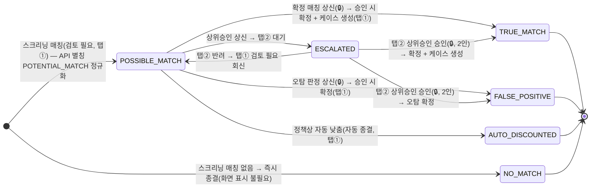
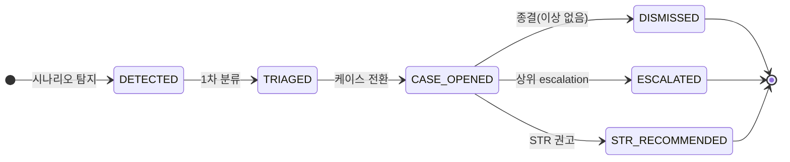
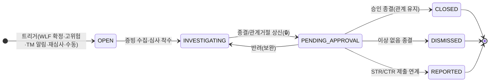
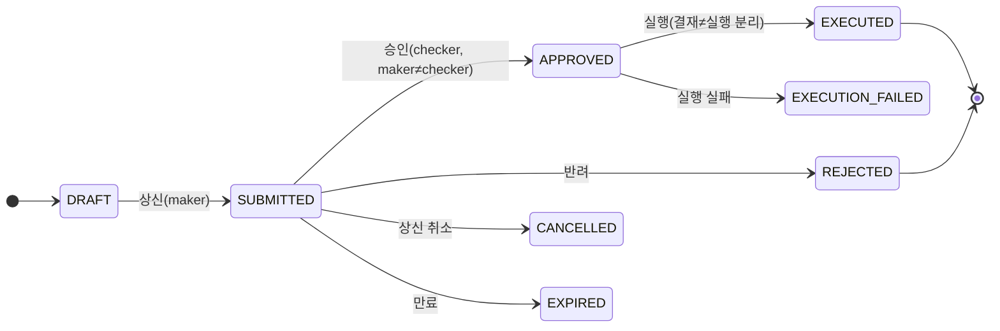
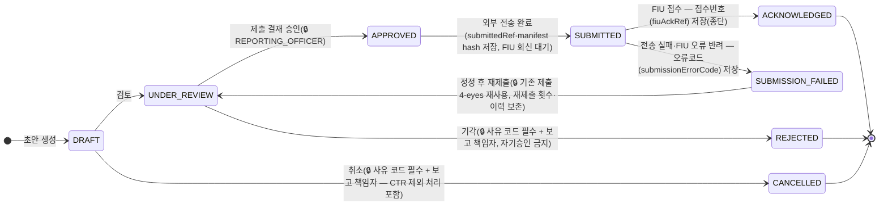

# hanpass-ph AML RegOps 백오피스 - 기능정의서

## 문서 정보

| 항목 | 내용 |
|------|------|
| **문서 ID** | FS-AML-SAAS-001 |
| **버전** | 9.84 |
| **작성일** | 2026-08-13 |
| **작성자** | Hanpass Global Team |
| **상태** | 초안 |
| **정본(아키텍처)** | `.claude/skills/_shared/target-architecture.md` (4서비스 모노레포 · Java 25 헥사고날 · Next.js · 멀티테넌시 · PII 마스킹 · 4-eyes · Policy Pack STR/CTR) |
| **입력 진실(설계)** | `docs/software/02-amlSvc-sass.md` (SaaS AML Platform 설계서) |
| **파생 정합** | `docs/design/db/02-aml-db.md`(테이블·컬럼·enum) · `docs/design/api/02-aml-api.md`(엔드포인트·DTO·scope·에러) · `docs/design/integration/02-aml-integration.md`(큐·이벤트·아웃박스) · `docs/tasks/aml/00-overview.md`(태스크·BO 화면 인벤토리) |
| **짝 산출물** | `docs/plan/BO-AML-SAAS-Planning_v9.2.pptx` (와이어프레임 기획서 — 멀티탭 상세/플로우 화면 **탭 연속 전개** + **드릴다운 진입 트리거 배너**. RA 순서 RA-001→RA-003→**CDD-002(고객 프로필 드릴다운)**→RA-002→**HRR-001(당연고위험 레지스트리)**→CDD-001. **TNT 3화면: 목록·상세[4탭, ① 보고기관 정보 패널·③ 소스 시스템 탭 인입 신호(연동 방식·마지막 수신·●)·④ 정책팩 기본 번들/확장 plugin]·등록**. **v6.0 벤치마크 4화면(§12-B.1~4)** + **v7.0 벤치마크 2차 3화면(§12-B.5~7)** + **v8.0 데이터 인입 가시성 보강: AML-ING-001 수신 API 카탈로그·인입 라이브 모니터링[2탭, §12.2]·데이터 인입 유형 확정(§1.11)**. PPT는 **32화면·70슬라이드**를 유지하며, v9.44의 **AML-WLF-005 WLF 엔진 조절은 원본 PPT 슬라이드가 없는 Markdown-only 33번째 화면**이다(PPT 재빌드 후속). 단순 필터 탭 화면은 1슬라이드 유지) |

### 변경 이력

| 버전 | 일자 | 작성자 | 변경 내역 |
|------|------|--------|----------|
| **9.84** | **2026-08-13** | **Hanpass Global Team** | **§12-B.8 BR-007 3개 조항 사실 정정·보강 — 재리뷰 REJECT 높음 3건 해소분 역전파(코드=truth, aegis-aml main `3d3f8bc0`. BR 신설 0·화면 인벤토리·권한·결재·엔드포인트·PPT 슬라이드 수 불변).** ① **회원 축 「식별자 정규화」 — 등재 값을 잘라서 보지 않는다**: v9.83 이 등재한 "국적 배열 교집합" 은 **명단 값 앞 5개에 대해서만** 성립했다(구현이 생년월일·국적 배열을 앞 5개로 절단). 일치를 만드는 값이 여섯 번째에 있으면 판정은 "확인 불가" 가 아니라 **"불일치"** 가 되어 우선순위상 억제되므로 **미탐 결과와 억제 사유가 함께 거짓**이 되고 확인 불가 귀결 노브로도 구제되지 않는다. 실 피드에서 생년월일 6개 이상 등재가 실재(최대 13)함을 확인해 상한을 제거하고, 20개 초과 배열은 **임포트 감사에 계수만 하고 값은 보존**한다(조용한 폐기 제거). ② **수취인 축 — 스크리닝이 늦게 성립해도 가산은 소급된다**: v9.83 의 "위험 신호가 실제로 가산된다" 는 스크리닝이 거래 인입과 **동시에** 성립했을 때만 참이었다. 명단 준비 상태가 잠시 무너졌다 복구되는 정상 경로에서는 스크리닝만 뒤늦게 성공하고 이미 끝난 STR 평가·2차 상시 RA 를 다시 하지 않아 **위험 신호가 영원히 소비되지 않았다**(화면에는 신호 행만 남고 알림·RA 가산 없음, 송금인 축에서는 제재 룰 미발동으로 번진다). 이제 지연 성공 시 그 거래의 STR·2차 RA 를 다시 평가하며 재평가는 자연키·디바운스에 흡수돼 중복 알림·중복 보고가 없다(연동 §3.1b-1 정본). ③ **시뮬레이션 일치 — 후보 회수 설정까지 같아야 한다**: v9.83 의 "같은 판정 로직·같은 정책값" 은 **판정 축만** 닫은 것이었고 회수 설정(상한·유사도 하한·음성학)은 시뮬레이션이 자체 기본값을 썼다. 회수 상한을 조정한 테넌트에서는 같은 판정 로직으로도 **본 후보 집합이 달라 결과가 반대로 갈린다** — 운영자가 실운영에 없는 보류율로 임계를 4-eyes 승인하는 정책 결정 오염이다. 이제 실운영 회수 설정을 그대로 읽어 돌고, 어떤 설정으로 어디까지 회수했는지(설정 출처·상한·절단 축)를 시뮬레이션 응답 근거에 싣는다(화면 입력 항목 신설 0, 현 단계 BO 미노출). | 코드=truth. 근거=aml-svc `adapter/out/feed/DilisenseJsonlParser`·`domain/fanout/NeutralFanoutSteps`·`application/port/out/FanoutJobStorePort`·`application/usecase/fanout/FanoutStepExecutor`·`application/port/in/ScreenSubjectUseCase`·`application/usecase/{WlfScreeningService,ScreeningOperationsService}`. API §2.4·§3.2 · 연동 §3.1b-1·§7.4 · 소프트웨어 설계서 §10.3b·§15.9 동일 작업 단위. 엔진 케이스 카탈로그 무수정(append-only·완화 0). PPT 재빌드는 후속. |
| **9.83** | **2026-08-12** | **Hanpass Global Team** | **§12-B.8 BR-007 개정(정책 축 `wlf-pep-axis-v1` → `wlf-pep-axis-v2`) + BO 도달 동선 신설 — 독립 리뷰 REJECT 높음 4건 해소분 역전파(코드=truth, aegis-aml main `d9520f0b`).** ① **BR-007 회원 축 — 코로보레이터 4상태 분리**: 요건 미달 원인을 **불일치**(`PEP_CORROBORATION_REQUIRED`)와 **확인 불가**(**`PEP_CORROBORATION_UNKNOWN` 신설**)로 가르고 식별자별 판정 4종(일치/불일치/확인 불가–명단 값 없음/확인 불가–고객 값 없음)을 근거에 싣는다. 확인 불가 귀결은 설정 `customer.unknown-outcome`(기본 억제·오설정 부팅 거부). 생년월일 4포맷 명시 파싱·국적 ISO2/ISO3/국가명 배열 교집합으로 입력 손실 제거. ② **BR-007 수취인 축 서술 정정(v1 거짓 서술 교정)** — v1 이 "검토 큐·STR 이름 룰 계보·2차 RA 가중 **제외**"라고 적었으나, 강등 행은 실제로 **STR PEP 신호로 집계되고 그 알림 가중을 통해 송금인의 2차 상시 RA 로 가산**된다(계보 `origin=PEP_NAME_RISK_SIGNAL`). 차단은 여전히 무발생(제재가 유일 차단 경로). §10 BR-011·BR-013 도 origin 3종화로 동기화. ③ **BR-007 제재 회귀 방지 불변식 2층화** — v1 의 "후보 선택 이전 판정"은 후보 상한 통과분 **내부에서만** 참이었다. 후보 회수 상한을 **명단축(제재·법집행 / PEP / 기타)별**로 적용해 **제재·법집행이 PEP 물량에 잘리지 않음**을 계약으로 세운다(구 전역 상한에서는 동일 이름 PEP 다수가 진짜 제재 엔트리를 후보 밖으로 밀어내 `NO_MATCH`→송금 통과였다 — 이번 라운드 최중량 규제 결함). ④ **BR-007 시뮬레이션 일치·대상 유형 신뢰 경계 신설** — `:simulate` 가 실운영과 같은 판정 로직·정책값을 쓰고(구: 반대 결과로 임계 튜닝·4-eyes 승인 오염), 등록 회원의 수취인 선언은 더 엄격한 회원 축으로 정정(`WLF_TARGET_ROLE_MISMATCH`). ⑤ **BO 도달 동선(신규 BR 2건)** — §3.1 **BR-015**(목록 PEP 축 배지 + 상세 근거 카드, 불일치/확인 불가 문구 구분)·§3.3 **BR-008**(처리 이력 `PEP 축 정책` 필터 4값 — 전체/강등 건만/수취인 이름 위험 신호만/**확인 불가로 강등된 건만**) + 데이터 항목 각 1행, §12-B.1 **BR-004**(시뮬레이션 화면이 같은 근거 카드 재사용), §12-B.8 BR-004 에 축별 회수 상한 1문장. **화면 인벤토리·PPT 슬라이드 수·권한·결재·엔드포인트 불변**(라벨은 ko/en 동시 등록). | 코드=truth. 근거=aml-svc `domain/screening/match/{PepAxisPolicy,WlfMatchVerdict,MatchScore}`·`domain/screening/PepNameRiskSignal`·`domain/watchlist/{BirthDate,CountryIso}`·`application/service/ScreeningAxisResolver`·`application/port/out/WatchlistEntryStorePort.RecallAxis`·`application/usecase/{WlfScreeningService,ScreeningOperationsService,StrEvaluationService,TransactionReportSideEffectRunner}`·`global/config/WlfPepAxisConfig`, bo-api `ScreeningDtos.PepAxisEvidence`, bo-web `components/aml/{PepAxisBadge,PepAxisEvidenceCard,AmlWlfReview,WlfSingleSimulation}`·`lib/aml-screening.ts`·`messages/bundles/{ko,en}/aml-monitoring.json`. API §3.2·§2.4·§3.4a·소프트웨어 설계서 §10.2b-1·§10.3b 동일 작업 단위. 엔진 케이스 카탈로그 WLF-C19 갱신(append-only·완화 0). PPT 재빌드는 후속. |
| **9.82** | **2026-08-12** | **Hanpass Global Team** | **§12-B.8 AML-WLF-005 BR-007 신설 — PEP 축 분리 정책(사용자 결정, 코드=truth, aegis-aml `staging/round15` `e7d53836`).** dilisense 편입으로 PEP 명단이 100만 건 규모가 되자 이름만으로 승격하던 판정이 데모 회원 9명 중 6명(66.7%)을 `POSSIBLE_MATCH` 로 만들어 진짜 제재 매치가 묻히는 알럿 피로가 실측됐다. 사용자 결정("회원가입할때 RA 할때는 국적, 생년월일을 추가하여 PEP 인증하게 하고 WLF 할때 수취인에 경우에는 이름으로 위험 점수 가산으로 처리")을 업무 규칙으로 확정한다 — ① **대상은 `list_type=PEP` 뿐**(제재(SANCTIONS)·범죄감시(LAW_ENFORCEMENT) 무변경 — 제재는 유일 차단 경로), ② **회원(CUSTOMER) 축**은 국적 또는 생년(年) 중 1개 이상 코로보레이터 요구(미충족 시 승격 없이 `PEP_CORROBORATION_REQUIRED`, 미탐 방향 선택을 명시적으로 감수), ③ **수취인(COUNTERPARTY) 축**은 이름 일치를 매치가 아닌 위험 신호로 강등(`PEP_NAME_RISK_SIGNAL` + 점수·계보 보존, 검토 큐·STR 이름 룰·2차 RA 가중 제외), ④ **축 판정을 후보 선택 이전에 계산**해 강등된 PEP 가 제재 후보를 밀어내지 못하게 하는 제재 회귀 방지 불변식, ⑤ 억제 결과 한정 `scoreBreakdown.pepAxis` 감사 블록, ⑥ 설정(`aegis.aml.wlf.pep-axis.*`) 1개(`enabled=false`)로 이전 동작 복귀·충족 불가능 설정은 부팅 거부. **BR-004 에 축 분리 적용 1문장 병기.** 실측 6/9 → **2/9(22.2%)**, 제재 회귀 0. **화면 레이아웃·컬럼·권한·결재·API 엔드포인트 불변**(BR 1건 신설 + BR-004 1문장, 화면 인벤토리·PPT 슬라이드 수 불변). | 코드=truth. 근거=aml-svc `domain/screening/match/PepAxisPolicy`(정책 축 도입 시 `wlf-pep-axis-v1` → 같은 날 `d9520f0b` 에서 **`wlf-pep-axis-v2`** 로 회전, v9.83)·`application/usecase/WlfScreeningService`. API §3.2(`reasonCodes` 2종·`scoreBreakdown.pepAxis`)·소프트웨어 설계서 §10.3a·§10.4 동일 작업 단위 동기화. 엔진 케이스 카탈로그 WLF-C19 갱신 |
| **9.81** | **2026-08-10** | **Hanpass Global Team** | **§4.1 AML-WL-001 `DILISENSE_CONSOLIDATED` 표기 註 신설 — 소스 「명단 종류」와 실제 엔트리 구성비의 괴리(코드=truth, aegis-aml main `e29f9ab0`, 라이브 실측).** 사용자가 dilisense API 키를 열어 처음으로 실 피드에 연결하면서 전량 1,025,647 레코드 구성이 **PEP 78.5% · 제재 19.9% · 범죄감시 1.6% · 기타 0.02%** 로 실측됐다. 이 소스는 카탈로그상 `source_type=SANCTIONS` 라 목록 표 「명단 종류」에 **`제재`** 로 보이지만 실제로는 **PEP 우위 혼합 명단**이고, WLF 판정·1차 RA 사유(§3.1 (a) `SANCTION`/`PEP`)는 소스 종류가 아니라 **엔트리별 `list_type`**(엔진 sync 경로 파생, integration §7.4)을 따르므로 화면 표기를 매칭 결과의 성격으로 읽으면 **PEP 히트를 제재 차단 사안으로 과대 판단**할 수 있다 — 이 오독 위험을 註로 고정한다. 함께 이 소스가 현재 **미임포트**(활성 버전 `—`·상태 `비활성`)인 것이 정상 상태임을 명기한다(사유=전량 파일 힙 OOM·분할 임포트 미구현, DB §7 V62 註). **무변경** — 화면 레이아웃·컬럼·데이터 항목·BR-001~007·권한·API·부록 A/B/C 전부 불변(註 1건 추가만). 화면 인벤토리 32화면 유지, PPT 슬라이드 수 불변(Markdown-only 註). | 코드=truth. 근거=aml-svc `adapter/out/feed/DilisenseJsonlParser`(per-entry `source_type`→`list_type` 파생·snake_case 정합). integration §7.4 「실 피드 스키마 실측 정정」·DB §7 V62 註 동기화(같은 커밋). API 무변경. |
| **9.80** | **2026-08-10** | **Hanpass Global Team** | **§12.3 AML-WHK-001 콜백 자격증명 설정 화면 신설 + §1.0 IA·§1.2 인벤토리·부록 A/B 동기화(코드=truth, aegis-aml main `48e8e697`).** ① **§12.3 신설** — 신규 화면 `/aml/webhook-credential`(아웃바운드 콜백 목적지 + HMAC 서명 시크릿 등록/교체, **설정 › 연동·데이터** NAV leaf, Markdown-only). 종전에는 이 자격증명을 **machine credential 로만** 바꿀 수 있어 운영자 표면 자체가 없었다(엔진 REST 는 2026-08-10 v9.79 시점 이미 신설 — API §2.7a). 화면 계약: 조회 **`aml:case:read` 또는 `aml:admin:policy`** / 저장 **`aml:admin:policy`**, **4-eyes 미적용 즉시반영**(AMLC 계정 설정 §9.2 결정 C 동급), **시크릿 전면 비노출**(마스킹조차 아님 — 조회 응답에 필드 자체가 없고 편집 Modal 입력 전용·기존 값 미리채움 금지), `webhookUrl=null` 은 **"오버라이드 전용"** 정확 표기(자리표시자로 덮는 거짓 표시 금지·미등록 상태와 구분), 쓰기 scope 미보유 세션은 **편집 진입점 0 + 읽기 전용 안내**, 등록 현황 패널은 AMLC 계정 설정과 **공통 컴포넌트 공유**(화면별 복제 금지)·ko/en 동시 등재. **읽기 scope 를 엔진과 1:1 로 좁히지 않은 근거** — `aml:admin:policy` 보유 유일 역할 `AML_POLICY_ADMIN` 이 `aml:case:read` 를 갖지 않아 좁히면 **유일한 쓰기 권한자가 덮어쓸 대상을 보지 못하는 모순**이 생기고, 이 화면이 주는 것은 시크릿 없는 마스킹 뷰라 이미 쓸 수 있는 역할에게 읽기를 여는 것은 노출 증가가 아니다. ② **§1.0 IA 표** 설정 › 연동·데이터에 `콜백 자격증명(AML-WHK-001)` 추가 + NAV leaf 註 신설(`lib/nav.ts` `aml-config-connect`, 메뉴 카탈로그 행 = bo-api Flyway **V23**, additive·멱등). ③ **§1.2 인벤토리** 총 31→**32화면**(PPT 슬라이드 수는 불변 — AML-WLF-005 와 같은 Markdown-only 신설, PPT 재빌드 후속) + 화면 표 행 추가. ④ **부록 A/B** 행 추가(부록 B 는 조회 대체 가능 표기 `○` 를 도입해 두 scope 중 하나로 열리는 조회를 표현). ⑤ **무변경** — 엔진 계약·권한·감사·마스킹·SSRF 처리 시점, 4-eyes 결재 대상(부록 C, 신규 subjectType 0), 타 화면 정의 전부 무변경. | 근거=aegis-aml bo-api `aml/webhook/{controller/WebhookCredentialController,service/WebhookCredentialService,dto/WebhookCredentialDtos}`·`db/migration/V23__webhook_credential_menu.sql`, bo-web `components/aml/AmlWebhookCredentialSettings`·`components/common/CredentialStatusPanel`·`hooks/useAmlWebhookCredential`·`lib/{aml-webhook-credential,nav}.ts`·`app/(authorized)/aml/webhook-credential`·`messages/bundles/{ko,en}/aml-monitoring.json`, aml-svc `adapter/out/persistence/WebhookCredentialAdminJpaAdapter#save`(미등록 테넌트 400). API §2.7a(bo-api 위임 표면·미등록 테넌트 400 정정)·§6, DB §7 bo-api 註 동기화. 코드=truth. PPT 재빌드는 후속. |
| **9.79** | **2026-08-10** | **Hanpass Global Team** | **§12-B.3 AML-STAT-001 BR-008·BR-009 개정 — ① 설정형 룰 미활성 DRAFT 폐기(`:discard`)로 중복 버전 정리 경로 성립 + ② 룰 상세 보강 API 마운트 게이트(코드=truth, aegis-aml main `76681955`).** ① **BR-008 — 중복 버전 정리(폐기)**: 같은 날 v9.78 이 연 승계 저작 경로에서 제안 버전이 이미 점유된 경우를 닫는다. 설정형 룰 PK 가 `tenantId + ruleCode + version` 이라 점유 버전으로는 저장이 거부되므로, 빌더는 점유자 상태로 갈라 처리한다 — **미활성 `DRAFT` 점유는 그 사실을 명시하고 명시적 폐기 액션으로만 정리**(**자동·무단 폐기 0** — 남의 저작물일 수 있어 확인이 선행), **`ACTIVE`/`SUPERSEDED` 점유는 폐기를 제안하지 않고 위쪽 첫 빈 버전을 제안**(정책 계보 보존), 버전 표기가 `v<숫자>` 규칙 밖이면 **추측하지 않고 사용자 입력**을 받는다. 신규 계약은 폐기 1건뿐이다 — **엔진 `POST .../configurable-report-rules/{ruleCode}:discard`**(body `{version, actorId}`, 200 `{ruleCode, version, status(DISCARDED\|ALREADY_ABSENT), alreadyAbsent}`)와 **bo-api `POST /api/v1/bo/aml/report-rules/configurable/{ruleCode}:discard`**(fail-closed 위임, 엔진 미가용 503). **권한은 저작과 동일한 `aml:admin:policy` 이고 4-eyes 를 요구하지 않는다** — DRAFT 저작 자체가 단독 권한이며 그 버전은 한 번도 효력을 가진 적이 없다(평가 미참여·발동 0·알럿 0). `:activate`·`:retire` 의 🔒`TM_SCENARIO` 4-eyes 는 **무변경**이고, `ACTIVE`·`SUPERSEDED`·알럿 결속 버전은 409 로 거부한다. **4-eyes 우회 차단** — 같은 버전의 활성화 상신이 PENDING 이면 폐기 409(폐기 후 재저작 시 대기 결재가 미상신 DRAFT 를 발효시키는 구멍 차단). **멱등** — 이미 없는 버전 재폐기는 200 `ALREADY_ABSENT`·신규 부작용 0. 폐기는 감사 이벤트(`CUSTOM_RULE_DRAFT_DISCARDED`)를 남긴다. 비-admin 세션에는 폐기 액션 미노출. ② **BR-009 — 룰 상세 보강 API 마운트 게이트**: 룰 상세(`/aml/stats/report-rules/{ruleCode}`)가 편집 불가 세션에서도 `GET /api/v1/bo/aml/report-rules/{ruleCode}`(`aml:admin:policy`)를 호출해 확정 403 을 만들던 것을 **편집 가능 세션에서만 마운트**하도록 시나리오 효과성 상세(v9.77 F-042 ④)와 동형화했다. 보강 소비처 4종(`pendingApprovalId`·`pendingParamApprovalId`·`conditions[]` 폴백·오버라이드 배지) 모두 **표시 등가** — 편집 불가 세션은 종전에도 403 이라 값이 부재했다(**계약·권한 무변경, 기능 영향 0 · 콘솔/감사 노이즈 제거**). ③ **불변** — 설정형 룰 in-place 수정 금지(감사 계보 — 반드시 새 버전), 법정 카탈로그 룰의 파라미터 편집(🔒`REPORT_RULE_PARAM`, BR-007)·`name_match_threshold` read-only·STR tipping-off 게이트 우선순위·`ruleMetaUnavailable` 강등 처리 **무변경**. DDL 변경 0. | 근거=aegis-aml aml-svc `adapter/in/rest/ConfigurableReportRuleAdminController#discard`·`application/usecase/ConfigurableReportRuleService#discardDraft`, bo-api `aml/reports/controller/AmlReportRuleController#discardConfigurableRule`·`aml/reports/service/AmlConfigurableReportRuleService#discard`, bo-web `lib/aml-configurable-rules.ts`(`planAmlConfigurableRuleVersion`)·`components/aml/AmlConfigurableRuleBuilder`·`components/aml/AmlReportRuleDetail`·`hooks/useAmlStats.ts`. 테스트 `ConfigurableReportRuleDiscard{Controller,Service}Test`·`AmlConfigurableReportRuleServiceTest`·`AmlConfigurableRuleBuilder.versionConflict.test.tsx`·`AmlReportRuleDetail.enrichmentGate.test.tsx`. API §2.4 `:discard` 동기화(DB 무변경). |
| **9.78** | **2026-08-10** | **Hanpass Global Team** | **§12-B.3 AML-STAT-001 BR-009·BR-008 개정 — 설정형(`source=CUSTOM`) 룰 임계 수정을 "새 버전 저작" 경로로 성립(같은 날 v9.77 이 "본 범위 밖"으로 남겨둔 갭을 **신규 REST 계약 없이** 닫음, 코드=truth, aegis-aml main `8fc131dd`).** ① **종전 "범위 밖" 조항 개정** — v9.77 ③ 이 "설정형(`AML_SIM_*`·`source=CUSTOM`)은 편집 영역 미노출 + 안내(설정형 DSL 임계 편집은 본 범위 밖·신규 REST 계약 금지)"로 확정했던 조항을, **설정형 룰이 파라미터 편집 폼(🔒`REPORT_RULE_PARAM`) 대상이 아니라는 구분은 그대로 둔 채** 별도 경로로 임계 수정을 성립시키는 것으로 개정한다 — 설정형 룰은 이미 `tenantId + ruleCode + version` 버전 자산이고 목록 응답이 `parameters`·`dsl` 을 그대로 실으므로, **임계 수정 = 기존 버전 프리필 → 새 버전 DRAFT 저작 → 시뮬레이션 → 🔒`TM_SCENARIO` 4-eyes 활성화**(활성화 시 이전 ACTIVE 버전 `SUPERSEDED`)다. ② **신규 계약 0** — 신규 엔드포인트·신규 DTO 필드가 없고 기존 BR-008 경로(`GET/POST /api/v1/bo/aml/report-rules/configurable`·`.../configurable/{ruleCode}/simulate`·`.../configurable/{ruleCode}:activate`)를 그대로 재사용한다(**엔진(aml-svc)·bo-api diff 0** — bo-web 표시·저작 계층 한정). ③ **진입 게이트** — 시나리오 효과성 상세의 설정형 룰에서 `aml:admin:policy` 보유 **그리고** 룰군(STR/CTR) 확정 시에만 새 버전 저작 진입점을 노출하고, STR tipping-off 차단·`ruleMetaUnavailable`(v9.76)·고아 `scenarioCode`·비admin 은 **종전 안내 유지**(v9.77 게이트 우선순위 그대로 — 룰군을 추정해 진입점을 만들지 않는다). ④ **원본 승계 저작(BR-008 반영)** — 빌더가 원본 버전의 `displayName`·`description`·`reasonCode`·`severity`·`parameters`·`dsl` 을 승계하고 **룰 코드는 고정**, 버전은 다음 값을 제안한다. 원본 조회 실패는 빈 빌더로 강등하되 **그 사실을 표시**한다(조용한 빈 폼 금지). ⑤ **표현 불가 DSL 은 실패 처리** — 빌더 표현 범위는 `and`/`or` 루트 + `cmp`/`velocity` 리프이며, 엔진 전용 `not`/`always`·FDS 전용 `in_group`·카탈로그 밖 피처/연산자·깊이 초과는 **추측 합성 없이 실패**로 처리해 DRAFT 저장을 차단한다(라이브 실증: `device.os` 피처 룰). ⑥ **불변** — in-place 수정 금지(감사 계보 보존 — 반드시 새 버전), 법정 카탈로그 룰 경로(v9.77 임계·변수 편집)·`name_match_threshold` read-only·집계 산식·`conditions[]` 동일 생산자·`family` 서버 정본 **무변경**. ⑦ **i18n** — 설정형 룰 빌더의 측정기준 표시 라벨 38종·그룹 라벨 9종을 ko/en 카탈로그로 이관(**DSL 피처 키는 계약이라 무번역**). | 근거=aegis-aml bo-web `lib/aml-configurable-rules.ts`(DSL→빌더 역변환·왕복 불변식)·`components/aml/AmlConfigurableRuleBuilder`(프리필)·`components/aml/AmlScenarioStatsDetail`(`CONFIGURABLE_AUTHORABLE` 모드)·`app/(authorized)/aml/stats/configurable-rules/new`·messages ko/en. 엔진 `ConfigurableReportRuleService`(DRAFT→`TM_SCENARIO` 상신→`approveActivate` 시 이전 ACTIVE `supersede()`) 무변경. API 02-aml-api.md **무수정**(계약 변경 0 — §2.4·§2.7 configurable 계약이 이미 정본, 거짓이 된 서술 없음). DB·software 무수정(스키마·구조 변경 0). 코드=truth. PPT 재빌드는 후속. |
| **9.77** | **2026-08-10** | **Hanpass Global Team** | **§12-B.3 AML-STAT-001 BR-009 개정 — 시나리오 효과성 상세에 임계·변수 편집 영역 이식(사용자 지시로 종전 "미이식" 결정 해제, 코드=truth, aegis-aml feature/aml-scenario-param-edit).** ① **종전 결정 해제** — v9.73(2026-08-06) ③ 이 확정했던 "임계·변수 편집 폼 미이식(편집 정본은 룰 상세 단일)" 조항을 **2026-08-10 사용자 지시**("STR 룰들 상세 화면에서 발동조건의 임계값들을 수정할 수 있어야 한다")로 해제하고, `/aml/stats/scenarios/{scenarioCode}` 의 발동 조건 섹션 아래에 임계·변수 편집 영역을 표시한다(aegis-aml 완료 요건 F-036 의 해당 조항 해제). ② **정본은 계속 1개** — 화면은 2곳(룰 상세·시나리오 효과성 상세)이나 편집 UI 는 룰 상세(BR-007)와 **동일 공통 편집 컴포넌트를 공유**하고(화면별 복제 저작 금지) API 도 기존 계약을 재사용한다 — **신규 엔드포인트·신규 DTO 필드 없음**(`GET /api/v1/bo/aml/report-rules/{ruleCode}` 의 `params[]`·`pendingParamApprovalId` + `POST .../report-rules/{ruleCode}:update-params` 202). ③ **범위 = 법정 카탈로그 룰(`source=BUILT_IN`)만** — 설정형(`AML_SIM_*`·`source=CUSTOM`)은 편집 영역 미노출·안내만(설정형 DSL 임계 편집은 범위 밖·신규 REST 계약 금지), `STR_PEP`·`STR_SANCTION` 의 `name_match_threshold` 는 WLF 결속 read-only 로 표시만 유지(엔진 거부 — BR-007 동일). ④ **권한·결재 무변경** — 편집 영역 노출은 `aml:admin:policy` 한정(미보유는 룰 상세와 동일한 읽기 전용 안내), 조건 표시는 종전대로 `aml:case:read`(BR-003), 상신은 🔒`REPORT_RULE_PARAM` 4-eyes 룰 단위 원자 셋. ⑤ **게이트 무변경** — STR tipping-off 이중 게이트(서버 `strRestricted` + 화면 전담 재확인)와 `ruleMetaUnavailable`(v9.76)·고아 `scenarioCode` 강등에서는 편집 영역도 함께 미노출하되 효과성 KPI 는 계속 표시한다. **엔드포인트·스코프·4-eyes·집계 산식·`conditions[]` 동일 생산자·`family` 서버 정본 무변경.** | 근거=aegis-aml bo-web `components/aml/AmlScenarioStatsDetail`·룰 상세와 공유하는 공통 편집 컴포넌트(`components/common/RuleParamEditForm` 계열 — FDS §6.2 SFDS-RULE-002 와도 공유)·`hooks/useAmlStats`, bo-api `aml/reports/**`(`:update-params` 위임 경로) 무변경. API 02-aml-api.md **무수정**(계약 변경 0 — §2.7·§3.6 서술이 편집 화면 위치를 제약하지 않음). 코드=truth. PPT 재빌드는 후속. |
| **9.76** | **2026-08-07** | **Hanpass Global Team** | **§12-B.3 AML-STAT-001 BR-009 — 설정형 룰 조회 장애와 진짜 고아 시나리오 표시 구분(코드=truth, aegis-aml fix/aml-scenario-meta-degrade-distinction).** `GET /api/v1/bo/aml/stats/scenarios` 행에 nullable `ruleMetaUnavailable`을 additive로 신설한다. 엔진 미가용·CTR/STR 목록 조회 일부/전부 실패로 미등재 여부를 확정할 수 없으면 `true`, 성공 빈 카탈로그의 진짜 고아와 정상 메타 행은 필드 생략(`NON_NULL`). 화면은 고아를 "카탈로그 미등재", 장애를 "룰 정보를 불러오지 못함"으로 구분하고 두 경우 모두 KPI 집계를 계속 표시한다. STR tipping-off·조건 동일 생산자·임계 편집 단일 정본·엔드포인트/스코프/4-eyes 계약은 무변경. 설정형 목록은 한 응답의 모든 고아 행이 요청 스코프 조회 결과를 공유해 CTR/STR family별 최대 1회 호출한다. | 근거=bo-api `AmlStatsService.CustomRuleLookup`·`StatsDtos.ScenarioRow`, bo-web `AmlScenarioStatsDetail`·messages ko/en, 신규 분리 회귀 `AmlStatsScenarioRuleMetaAvailabilityTest`·`AmlScenarioStatsDetailRuleMetaAvailability.test.tsx`. API §3.6 동기화. |
| **9.75** | **2026-08-06** | **Hanpass Global Team** | **§7.1 BR-002a 개정(오탐 종결 자유 메모 보조 저장·회수) + §12-B.6 BR-007 신설(분류 기준 팩터 라벨 로케일 정합)(코드=truth, aegis-aml fix/tm-dismiss-note-and-hrr-labels).** ① **§7.1 BR-002a** — 처분 모달의 자유 메모(판단 근거)가 bo-api 요청 DTO 에 필드가 없어 조용히 폐기되던 결함을 닫고, 엔진 계약(`:dismiss` `{reason, actor}`·`disposition_reason` 코드 컬럼, API §2.4)이 자유 텍스트를 담지 못하므로 **bo-api 감사(`AML_ALERT_DISMISSED`) detail 의 `note` 로 보조 저장 → 알림 상세 재조회 시 회수**(API §2.5a body `note?`, §3.4a bo-api 상세 한정 `dispositionNote`)하는 규약을 명문화했다(FDS §11.2 BR-007·DB §4.11 동형). 통계·룰 튜닝 집계 축은 사유 코드 그대로이며, 메모는 원문 미번역·공백은 미저장이다. ② **§12-B.6 BR-007 신설** — ① 분류 기준 팩터 라벨 4종은 엔진 시드 **코드값**이므로 프론트 카탈로그(`enum.hrrFactor.*` ko/en)에서 매핑하고 미등록 코드만 엔진 `label` 로 fail-soft 폴백한다(영문 화면 한국어 라벨 잔존 해소). | 근거=aegis-aml bo-api `aml/tm/dto/TmDtos`(AlertDismissRequest.note·AlertDetail.dispositionNote)·`aml/tm/service/AmlTmService`(감사 note 보조 저장·getAlert 회수)·`audit/service/AuditLogService.latestSubjectDetail`, bo-web `components/aml/{AmlTmAlertDetailSections,AmlHighRiskRegistry}`·`lib/{aml-tm,aml-hrr}`·messages ko/en. 엔진(aml-svc) diff 0. API §2.5a·§3.4a 동기화. |
| **9.74** | **2026-08-06** | **Hanpass Global Team** | **§12-B.3 AML-STAT-001 BR-005·BR-006·BR-009 — BUILT_IN 발동 조건 표시를 aml-svc 실제 평가식에 일치화(코드=truth, aegis-aml fix/aml-rule-condition-display-parity).** `STR_STRUCTURED`는 `[lower, upper)`이므로 상한 `<0.99`, `STR_THIRD_PARTY`는 수치 점수 없이 명시 match false 또는 명의 토큰 불일치, `STR_NO_PURPOSE`는 목적부재/행동이상 4신호 합계 `>=2`, `STR_PEP`·`STR_SANCTION`은 boolean `=TRUE` 발동 게이트와 read-only 점수 참고행을 함께 표시한다. bo-api가 aml-svc 카탈로그를 복제하는 모듈 경계는 유지하되 양쪽 조건 수·라벨·연산자·값·단위·paramKey를 대조하는 테스트로 드리프트를 차단한다. 화면 2곳(룰 상세·시나리오 효과성 상세)은 동일 서버 생산자를 계속 공유하며 엔드포인트·권한·4-eyes 계약은 무변경. |
| **9.73** | **2026-08-06** | **Hanpass Global Team** | **§12-B.3 AML-STAT-001 BR-009 신설 — ② 시나리오 효과성 패널 행▶ 상세에 룰 카탈로그 정보·발동 조건(임계) 노출(코드=truth, aegis-aml feature/aml-scenario-detail-conditions).** 시나리오 효과성 상세(`/aml/stats/scenarios/{scenarioCode}`)가 알림/케이스 카운트·전환율만 실어 **어떤 조건·임계에서 룰이 발동하는지 알 수 없던 결함**(사용자 관측)을 해소한다. ① **BR-009 신설** — 상세 화면이 KPI 위에 룰 카탈로그 정보(자연어 설명·평가 모드·발동 액션·STR 사유코드)와 발동 조건 행(`conditions[]`, resolve 된 임계·윈도우·밴드)을 룰 상세(BR-006)와 **동일 공통 컴포넌트·동일 생산자**로 표시한다. ② **데이터 정본은 서버** — `GET /api/v1/bo/aml/stats/scenarios` 응답 `ScenarioRow` 에 보강 7필드(`family`·`reasonCode`·`evaluationMode`·`actions`·`naturalLanguage`·`source`·`conditions[]`)와 `strRestricted` 를 additive 로 신설(API §3.6). 설정형 룰(`AML_SIM_*`)은 코드 접두로 룰군을 파생할 수 없어 화면 휴리스틱을 쓰지 않는다. 근거는 `scenarioCode` ≡ 룰 코드(v9.21). ③ **임계·변수 편집 폼은 미이식** — 편집 정본은 룰 상세(`aml:admin:policy`+🔒`REPORT_RULE_PARAM`, BR-007) 단일 유지(이중 정본 금지). ④ **STR tipping-off 이중 게이트** — 서버(비전담에 보강 필드 미노출·`strRestricted=true`)와 화면(전담 재확인) 양쪽 적용, 효과성 지표는 계속 노출. 고아 `scenarioCode` 는 합성 없이 정직한 빈 상태. **엔드포인트·스코프·4-eyes·집계 산식 무변경.** | 근거=bo-api `aml/stats/dto/StatsDtos.ScenarioRow`·`aml/stats/service/AmlStatsService`·`aml/stats/controller/AmlStatsController`, bo-web `components/aml/AmlScenarioStatsDetail`·`components/common/{RuleCatalogInfo,RuleConditionRows(RuleConditionsSection)}`·`components/aml/ruleCatalogItems`·`lib/aml-stats`·messages ko/en. API 02-aml-api.md §3.6(2026-08-06 항목) 동기화. 코드=truth. PPT 재빌드는 후속. |
| **9.72** | **2026-08-05** | **Hanpass Global Team** | **§12-A.5 BR-003 신설(운영 재실사 예정일 단조 단축) + §12-B.6 BR-004 개정(승인 히스토리 감사 추적성)(코드=truth, aegis-aml fix/ra-review-due-monotonic-and-audit).** ① **§12-A.5 BR-003 신설** — 운영 재실사 예정일(고객 캐시 `next_review_due_at` = API §3.3 `operativeNextReviewDueAt`)은 **앞당김만·소급 지연 없음**이며, 이 min-clamp 를 2차 상시 RA(§6.1 BR-006a)뿐 아니라 **전 RA 평가 경로**(1차 온보딩·거버넌스 강제 재평가)에 적용한다. 실측 결함: HIGH_NET_WORTH 참조 리스트에서 무관한 1건을 제거한 4-eyes 결재가 등재 주체 전건을 재평가하면서 **잔류 회원 M-1003·M-1007 의 재실사 기한을 2026-10-25 → 2026-11-03(+9일) 연장**시켰다(고위험 주체 재심사가 조용히 미뤄짐). 기한 연장은 4-eyes `PERIODIC_REVIEW_CHANGE`·재이행 완료의 권한으로 한정한다. 점수 행 자신의 `nextReviewDueAt`(평가 시점 산출값)은 clamp 대상 아님. ② **§12-B.6 BR-004 개정** — ③ 승인 히스토리의 참조 리스트 변경 행이 대상 `UPDATE|<version>`·변경 요약 공백으로 무엇이 바뀐 결재인지 식별 불가하던 결함 해소: 대상은 카탈로그 라벨(ko/en), 변경 요약은 엔진이 staged payload 에서 파생한 **적용 결과 스냅샷**(API §3.7 `detail`, `ApprovalSummary` 에도 동봉해 목록만으로 완결). **한계 명문화** — 결재 행에 변경 전 상태가 없어 항목 단위 add/remove diff 는 산출 불가(결과 스냅샷으로 대신·화면 각주). ③ **§12-B.3 draftCount 기준 통일**(API §3.6a) — BUILT_IN·CUSTOM 모두 엔진 위임 배치에서 `null`('집계 불가'), 비위임에서 라이브 store 실집계. 화면·엔드포인트·4-eyes 계약 무변경(응답 필드 additive). | 근거=aegis-aml aml-svc `application/usecase/RiskAssessmentService#cacheGrade`(min-clamp)·`adapter/in/rest/{HighRiskRegistryApprovalDigest,ApprovalController}`(ApprovalSummary.detail), bo-api `aml/approval/service/AmlApprovalService#fromEngineSummary`·`aml/stats/service/AmlStatsService#customOverviewRows`, bo-web `components/aml/AmlHighRiskRegistry`·messages `aml-monitoring.json`(ko/en). 회귀 테스트 `RiskAssessmentServiceReviewDueMonotonicTest`·`HighRiskRegistryApprovalDigestTest`·`AmlStatsServiceCustomRuleDraftCountTest`·`AmlHighRiskRegistry.auditTrail.test.tsx`, 엔진 케이스 `docs/qa/engine-rule-cases.md` RA-C13(append). API §2.7/§3.6a/§3.7 동기화. 코드=truth. PPT 재빌드는 후속. |
| **9.71** | **2026-08-05** | **Hanpass Global Team** | **§7.1 AML-TM-001 BR-002a 보강 — 오탐 종결 사유·처리자 실표시(코드=truth, fix/tm-disposition-reason-passthrough, T7R N-8 정정).** BR-002a 가 요구하던 "종결 상태 행은 처분 배지·사유를 표시"가 실제로는 **표시되지 않았다** — 엔진은 `dispositionReason`/`dispositionActor` 를 내려줬지만 bo-api 투영(`AmlTmService$EngineAlert`)이 두 필드를 버려 사유가 **쓰기 전용**(입력만 되고 회수 불가)이었고, bo-web `dismissReasonLabel()` 은 정의만 되고 호출부가 0이었다. ① **알림 상세 「처분 근거」 블록 신설** — 집계 근거 요약 바로 아래에 종결 사유(카탈로그 6종 라벨 ko/en 매핑·미상 코드는 원본 코드 폴백)와 처리자를 표시하고, 사유 부재 시 블록 자체를 감춘다(서버 값 조작·추측 표기 금지). ② **알림 목록 상태 칸 병기** — DISMISSED 행의 상태 배지 아래에 종결 사유 라벨을 덧붙여 목록에서도 회수 가능하게 한다. ③ **처분 안내 문구 정정** — "상태·처분 사유는 상단 배지에서 확인" → 상태는 배지·사유/처리자는 처분 근거 블록으로 정정(ko/en 동시). 발동 로직·상태기계·감사·4-eyes 계약은 무변경(표시·투영만 additive). | 근거=bo-api `aml/tm/service/AmlTmService`(EngineAlert 14→16·fromEngineSummary/fromEngineDetail·dismissAlert 사유 에코·stub `recordLiveDisposition`)·`aml/tm/dto/TmDtos`, bo-web `components/aml/AmlTmAlertDetailSections`(DispositionSection)·`AmlTmAlertDetailPage`·`AmlTmAlerts`·`lib/aml-tm.ts`·messages ko/en. API §2.5a/§3.4a 동기화. 코드=truth. 사용자 지시로 aegis-aml 완료요건 F-021 잠금 해제(잠금 테스트는 리플렉션 인자 수만 보정·계약 무변경). PPT 재빌드는 후속. |
| **9.70** | **2026-08-05** | **Hanpass Global Team** | **§12-B.3 AML-STAT-001 BR-005 개정(룰 개요 DRAFT 카운트 정직화·튜닝 권고 기준 통일) + §7.1 AML-TM-001 목록 근거 요약 설정형 룰 파생 + i18n 서버 문자열 분류(코드=truth, aegis-aml `fix/bo-stats-tm-summary-i18n` — verify-V2 N-1~N-4).** ① **BR-005 개정** — ② 룰 효과성 표의 `draftCount` 는 엔진 위임 배치에서 **`null`(집계 불가)** 이며 화면은 "집계 불가"로 표기한다(구 "소스 없으면 0" 폐기 — 조용한 0 이 "발동한 초안 없음"으로 오독됐다). 룰별 DRAFT 귀속의 대체 정본 경로 부재를 확인했다(엔진 `ReportSummary` 룰코드 미탑재·`reportCount` 는 STR_RECOMMENDED 알림 수). **튜닝 권고는 BUILT_IN·CUSTOM 공통 알림 lifecycle 휴리스틱**(오탐율·케이스 전환율)으로 통일 — 구 BUILT_IN 기준(`draftCount>=5`)은 위임 배치에서 항상 false 라 기능이 사문화됐다. ② **§7.1 목록 근거 요약** — 설정형(CUSTOM) 룰 알림도 `aggregationSummary` 를 갖는다(API §3.4a — bo-api 파생). evidence 형상이 다른 단건 술어 룰이라 `trigger.strReasonCode`·`features` 에서 STR 지표·채널·통화를 폴백 파생하고 집계 수치(기간·실값/임계·관련거래)는 합성하지 않는다. 실측 101/188건이 근거요약 없음(`-`)이던 bo-api 파생 드리프트 해소(엔진 무변경). ③ **i18n** — 서버 문자열을 **코드값**(CDD/EDD 체크리스트 `itemKey`·`evidenceType`·`riskTrigger` → 프론트 카탈로그 매핑, 카탈로그 밖은 서버 라벨 폴백)과 **자유문구**(알럿 `evidence.trigger.description` — 법정 룰=엔진 상수·설정형=운영자 입력, 번역 대상 아님 → 화면에 "룰 정의 원문" 출처 표기)로 분류. ④ **로그인 순간 4xx/5xx 3건 제거** — CSRF 프리플라이트 GET(bo-api 는 CSRF disable → 항상 405) 제거, 헤더 결재함 배지 폴러를 테넌트 준비 후에만 발사(Tenant-Id 없는 호출 → AML 401·FDS 503 fail-closed). 화면 구성·권한 스코프·엔드포인트 불변. | 근거=aegis-aml bo-api `AmlStatsService`(`overviewRow`·`tuningRecommended`)·`AmlTmService#aggregationSummaryFromEvidence`·`StatsDtos`, bo-web `lib/{aml-stats,aml-tm,aml-cdd,api}.ts`·`hooks/usePendingApprovalCount.ts`·`components/aml/{AmlStatistics,AmlReportRuleDetail,AmlTmAlerts,AmlRiskDetail,AmlCaseDetail,AmlCddPolicy,AmlTmAlertDetailSections}`·messages(ko/en 동시). API §3.6a·§3.4a·§2.7 동기화. 코드=truth. PPT 재빌드는 후속. |
| **9.69** | **2026-08-05** | **Hanpass Global Team** | **백오피스 화면 계층 결함 4건 교정 — RA 상세 단계 집계 정규화·TM 알럿 건수 노출·명단 딥링크 조건부·HRR 승인 히스토리 대상/결재 시점(코드=truth, fix/bo-ra-hrr-screen-defects, E2E 검증 verify-T2 FAIL-1~5).** ① **§12-A.4 BR-004 ③ 개정(단계 집계 정규화)** — 단계(1차/2차) 카드의 집계를 요인 값 단순합('기여도 합')에서 **활성 모델 가중치 합으로 정규화한 '점수 기여'**(엔진 `riskScore = Σweighted / Σweight` 의 단계별 분자, 1차+2차=riskScore)로 교체. 균등 가중 1차 모델(`KR_DEFAULT_RA` Σweight=10)에서 점수 13 인 회원에게 '기여도 합 130.00' 을 노출하던 10배 스케일 결함 해소. 요인 막대(0~100)는 정본 유지, 활성 모델 팩터 미상 시 점수 합성 없이 요인 수만 표기(bo-web `lib/aml-risk.ts` `scoreContribution`). ② **§12-A.4 BR-002 개정(2차 활동 입력)** — `profile.activitySummary.alertCount`(TM 알럿 총건수)를 2차 활동 입력 첫 항목으로 노출(재평가 사유 계보는 발동 알럿만 나열 — 워크플로우 가이드 ⑩-3 화면 확인 가능성 확보). ③ **§12-A.4 BR-004 ① 후속(딥링크 계약)** — 매치 엔트리(`entryId`)를 가진 근거에만 `[명단 엔트리 조회 ▶]` 를 렌더. 당연고위험 레지스트리 사유(`HIGH_NET_WORTH`·`RA_HIGH_RISK_CUSTOMERS`)는 명단 매치가 아니어서 `?listType=` 필터가 엔트리 0건 화면으로 가는 dead-end 였다. ④ **§12-B.6 BR-004 개정(승인 히스토리)** — v9.41 의 두 subjectType 병합 표시 후속으로 **대상 컬럼**(`subjectLabel ?? subjectRef`) 필수화 + **결재 시점**을 엔진 목록 요약 `ApprovalSummary.executedAt` 으로 결선(종전 bo-api 목록 경로 null 하드코딩 → EXECUTED 행도 항상 `-`). ⑤ **§12-A.10 회원 키 안내 문구 교정(문서 무변경·코드 교정)** — 화면 안내가 PII-safe fallback 인 `nationalIdentityKey` 를 '단일 키'로 소개하던 이격을 정본(`memberRef = originator.partyReference`)에 맞춰 ko·en 카탈로그 동시 수정. | 근거=aegis-aml bo-web `lib/aml-risk.ts`·`components/aml/{AmlRiskDetail,AmlHighRiskRegistry,AmlMemberLedger}`·`components/common/WatchlistMatchEvidencePanel`·`lib/aml-cdd.ts`·messages `aml-customer.json`/`aml-monitoring.json`(ko/en), aml-svc `adapter/in/rest/ApprovalController.ApprovalSummary`, bo-api `aml/approval/service/AmlApprovalService`. API §3.7(ApprovalSummary executedAt) 동기화. 엔진 평가 로직·RA 산식 무변경. 코드=truth. PPT 재빌드는 후속. |
| **9.68** | **2026-08-02** | **Hanpass Global Team** | **§12-A.6 AML-TM-002 BR-002 — TM 시나리오 activate 기존 dsl 원문 보존·차등 임계 왕복 복원 역전파(코드=truth, fix/tm-scenario-dsl-preserve-thresholds — FX-U1·FX-U2 QA 이격 정정).** v9.60(2026-08-01) 자유형 전환 시 미구현으로 남았던 결함 2건(activate 가 항상 fallback dsl 을 합성해 기존 velocity/thresholds 를 덮어씀, decode 가 등급별 차등 임계 평탄 키를 복원하지 않음)을 해소. BR-002 에 **적용(`:activate`) 시 기존 정의 편집=활성 dsl 원문 보존(parameters 만 갱신) / 최초 저작=velocity·thresholds 미합성 generic fallback(구조 DSL 저작은 aml-svc draft 전용)** 경계를 1줄 보강. 화면·엔드포인트·4-eyes(`TM_SCENARIO`) 계약 무변경 — dsl 컴파일 경계 명문화만. | 근거=bo-api `aml/tm/scenario/ScenarioDslCodec`(decode 2-pass thresholdsByGrade 복원)·`aml/tm/service/AmlTmService`(activate 기존 dsl read-back). API 02-aml-api.md(2026-08-02 항목) 동기화. 원 PLAN=`docs/ai/plans/20260801-remove-legacy-tm-scenarios.md`§U4/Q6. 코드=truth. PPT 재빌드는 후속. |
| **9.67** | **2026-08-01** | **Hanpass Global Team** | **레거시 TM 시나리오 정의 10종 제거 + 자유형 저작 전환 역전파(코드=truth, refactor/remove-legacy-tm-scenarios).** v9.21 확정 사실(TM 알림 발동 정본=CTR/STR 룰 카탈로그, F-025 실측)에 따라 거래 인입 경로에서 전혀 발동하지 않는 `aml_tm_scenarios` 레거시 정의 10종(닫힌 enum `TmScenario`)이 관리 혼동 방지를 위해 전량 제거됐다(DB §7 V61). ① **§7.1 BR-010 표(레거시 시나리오 행)** — "발동에서 폐기(설정 전용 잔존)"→"**정의 자체 제거, 자유형 저작 경로로 전환**"으로 개정, hanpass ACTIVE 6종·advanced-domain 4종 임계표는 과거 시드 이력으로 재표기. ② **§7.1 BR-010 본문** — 정의 제거 부기. ③ **§12-A.6 AML-TM-002** — 목록/드릴다운 정상 상태=빈 목록, `scenarioCode` 자유형(예약 코드 `CUSTOM_RULE` 거부)·`displayName`=코드 원문 명시. ④ **§12-B.3 AML-STAT-001 BR-003** — TM 시나리오 빌더 정의 제거 부기. **CTR/STR 룰 카탈로그·설정형 룰(`aml_configurable_report_rules`)·4-eyes(`TM_SCENARIO`) 흐름은 무변경.** | 근거=aml-svc `domain/tm/TmScenarioDefinition`·`application/port/out/TmScenarioStorePort`(findAll 신설)·`db/migration/V61__remove_legacy_tm_scenarios.sql`, bo-api `aml/tm/service/AmlTmService`(빈 목록·generic decode)·`aml/tm/scenario/ScenarioDslCodec`. API 02-aml-api.md·DB 02-aml-db.md·software 02-amlSvc-sass.md(2026-08-01 항목) 동기화. 코드=truth. PPT 재빌드는 후속. |
| **9.66** | **2026-07-29** | **Hanpass Global Team** | **§12-B.8 AML-WLF-005 BR-004(평가 적용) 본문 개정 — WLF 이름 강한 일치 검토 승격(escalation floor, 코드=truth).** 「후보가 존재할 때 `score < reviewThreshold`는 `NO_MATCH`, 이상은 `POSSIBLE_MATCH`; `highConfidenceThreshold` 이상은 `confidenceBand=HIGH`로 우선순위만 높인다」 문장을 「후보가 존재할 때 `score < reviewThreshold`는 `NO_MATCH`, 이상은 `POSSIBLE_MATCH`이되, 이름 성분 점수가 `highConfidenceThreshold` 이상이고 negative 신호가 0인 강한 이름 일치는 overall이 `reviewThreshold` 미달이어도 `POSSIBLE_MATCH`(사유 코드 `NAME_HIGH_CONFIDENCE`·`confidenceBand=REVIEW`)로 승격한다(escalation floor). 오탐 화이트리스트 `AUTO_DISCOUNTED`는 승격보다 우선한다」로 개정. 후보 0건 시 status·confidenceBand 모두 `NO_MATCH` 고정 문장·고신뢰도 분석가 4-eyes 없이 자동 `TRUE_MATCH` 아님 문장은 불변. 동률 문장에 승자 선정 축 병기(승격 적격 후보는 review band 미만·NO_MATCH band 초과 중간 순위, 동률 시 점수→entryId 안정 순서 불변). | 근거=aml-svc WLF 스코어링 엔진(`domain`·`application/usecase/WlfScreeningService`). 소프트웨어 설계서 §10.3a·API §3.2 동일 작업 단위 개정. 엔진 케이스 카탈로그 WLF-C18(`docs/qa/engine-rule-cases.md`) 신규 검증. 코드=truth. PPT 재빌드는 후속. |
| **9.65** | **2026-07-28** | **Hanpass Global Team** | **§3.1 AML-WLF-001 목록 신선도 명문화 + WLF 스크리닝 신규 insert 응답 `createdAt` non-null 보장(코드=truth, fix/wlf-freshness-createdat).** ① **§3.1 WLF 3탭(검토/상위 승인/처리 이력) 목록 신선도** — 수동 `[새로고침]` 버튼(즉시 재조회, 화면 헤더 전 운영자 노출) + **30초 자동 갱신**(폴링) + **창 포커스 복귀 시 재조회** 를 명문화(화면(WLF) 한정 조회 정책 — 전역 query-client 기본값(staleTime 30s·refetchOnWindowFocus false·폴링 없음)은 불변, 백그라운드 탭 폴링 없음). ② `POST /api/v1/aml/screen` 신규 영속 결과(유효 Idempotency-Key insert)의 응답 `createdAt` non-null 보장(insert 후 DB `created_at` read-back, 신규/replay 응답 대칭) — WLF 검토 목록·상세의 생성 시각 표기 신뢰성 보강. 엔드포인트·DTO·매칭 룰·결재 흐름 무변경. | 근거=aegis-aml bo-web `components/common/RefreshButton.tsx`(신규 공통 추출)·`components/aml/AmlWlfReview.tsx`(`WLF_LIST_FRESHNESS` 상수·수동 새로고침 핸들러)·`hooks/useAmlScreening.ts`, aml-svc `adapter/out/persistence/{ScreeningResultInserter,ScreeningResultJpaAdapter}`. API §3.2 `ScreeningResponse.createdAt`·엔진 케이스 WLF-C17(`docs/qa/engine-rule-cases.md`) 동기화. 코드=truth. PPT 재빌드는 후속. |
| **9.64** | **2026-07-27** | **Hanpass Global Team** | **§7.1 명단 룰·제3자 명의 룰의 이름 판정기 파급 명문화 + 토큰 정렬 대칭성(코드=truth, feature/wlf-name-similarity-matching QA 반영).** v9.54 의 매처 개선(`wlf-name-v3`)이 **bo-api 라이브 규제 보고 룰 2종의 발동 판정에 직접 영향**함을 등재한다 — `StubNameMatcher` 는 이름과 달리 데모 stub 전용이 아니며, ① `AmlStrLiveReportStore.holderNameMismatch` 가 `nameScore < 0.92` 에서 **STR_THIRD_PARTY**(BR-011 계약 3)를 발동시키고 ② `AmlWatchlistMatchLineage.screen(...).fired()` 가 `nameScore >= 0.92` 에서 **STR_PEP·STR_SANCTION**(BR-011 명단 룰, STR_SANCTION 은 RESTRICT 액션·CRITICAL 심각도 동반)을 발동시킨다. **감소 방향**: 구분자만 다른 동일인(`MARIASANTOS`/`MARIA SANTOS` 0.9167→1.0, `KIMCHULSU`/`KIM CHUL SU` 0.8182→1.0)과 경칭 접미 차이(`… LENIN SR`/`… LENIN` 0.9063→≥0.92)가 STR_THIRD_PARTY 를 더 이상 발동시키지 않는다 — **동일인을 '제3자 명의'로 보고하던 오탐의 제거**(사용자 결정 2026-07-27). **증가 방향과 그 상한**: 신규 발동은 **명단 등재명과 철자가 정확히 같고 표기만 다른 경우**(구분자 변형 `IVANOVSERGEI`·어순 역전 `SERGEI IVANOV` — 둘 다 1.0)로 **국한된다**. 이번 개선의 주 표적인 **토큰 결손 회복(containment)은 이 룰들을 전혀 건드리지 않는다** — 3토큰 등재명의 containment 상한이 `1 − 0.4/3 = 0.8667` 로 0.92 게이트 아래이기 때문이다(`NGUYEN MINH` vs `nguyen thi minh` 미발동). 성만 공유(`IVANOV DMITRI` 0.6154)·무관(`MARIA SANTOS` 0.2308)·명단종류 교차(SANCTIONS 엔트리 → PEP 룰) 모두 미발동으로 격리 유지. **추가 정정**: 토큰 정렬(`alignedTokenSet`/`alignedContainment`)이 좌측 순서 그리디라 `f(a,b) ≠ f(b,a)` 로 **비대칭**이던 것을 **페어 강도 내림차순 배정**으로 교체해 인자 순서 독립성을 확보했다(동점은 쌍의 두 토큰을 사전순 정렬한 방향 독립 키로 해소 — 감사 재현성). 최적 배정은 아니며(강한 쌍 선점이 더 나은 총합을 막을 수 있음) 두 토큰이 서로의 근접 변형인 드문 경우로 한정돼 미채택. `score_breakdown.nameMatcher.components` 는 `LinkedHashMap` 보존으로 **직렬화 키 순서까지 결정적**이다(감사 증거). containment 의 감점 계수 0.4 는 이진 표현 불가라 4-of-5 가 0.92 대신 0.9199999999999999 로 계산되므로, 두 소비자의 임계 비교에 1e-9 허용오차를 두어 **판정이 반올림 비트로 갈리지 않게** 했다. | 근거=bo-api `StubNameMatcher`(페어강도 align·클래스 javadoc 에 라이브 소비자 2종 명시)·`AmlStrLiveReportStore.holderNameMismatch`·`AmlWatchlistMatchLineage`(NAME_SCORE_EPSILON), aml-svc `NameSimilarity.align`·`MatchScore.NameMatch`·`FuzzyMatchEngine.PHONETIC_CAP`. 검증=`StubNameMatcherLiveConsumerTest`(6 — 감소 3·증가 2·증가 상한 1·격리·허용오차)·`FuzzyMatchEngineTest`(`phoneticCeilingIsBoundedByTheCapAlone`·`tokenAlignmentDoesNotDependOnWhichNameIsPassedFirst`). DB 불변. |
| **9.63** | **2026-07-27** | **Hanpass Global Team** | **§3 WLF 이름 유사도 매처 전면 확장 — 구분자 무관·토큰 정렬·토큰 결손 포함·음성학 도입(코드=truth, feature/wlf-name-similarity-matching).** 기존 매처는 `nameScore = exact≥1 ? 1 : max(tokenSet, edit)` 3종뿐이어서 **동일 인물의 표기 변형을 놓쳤다** — 공백 없이 입력된 이름(`PAKCHANGHO`)이 명단 엔트리(`pak chang ho`)를 후보로 확보하고도 토큰 교집합 0 + 공백 2개분 편집거리 감점으로 `name 0.8333`·`overall 0.5583` NO_MATCH 로 떨어졌다(라이브 실측). 매처를 **7종 `max` 블렌드(`wlf-name-v3`)** 로 확장한다 — ① `compact` 구분자 제거 편집거리(표기 변형 회복) ② `alignedTokenSet` 토큰 1:1 그리디 정렬 퍼지 Jaccard(**Jaro-Winkler 하한 0.85** — `chang↔chng` 0.947 통과 / `john↔jane` 0.700 차단, 분모 `max(|a|,|b|)`) ③ `alignedContainment` 토큰 결손 포함관계(짧은 이름이 긴 이름에 **완전 포함**될 때만 답하고 `min` 분모 + 누락 비율 감점 `LENGTH_IMBALANCE_PENALTY 0.4`, `MIN_ALIGNED_TOKENS 2`·완전포함 가드로 부분 포함 차단 — 미들네임 누락형 회복) ④ `phoneticSimilarity` double-metaphone 일치(**상한 0.80** — 후보검색 전용이던 자산을 스코어에 반영). **사유 코드는 독립 2트랙**으로 바뀐다 — 지배 컴포넌트 코드를 name>0 이면 항상 1건 발급(`NAME_EXACT_MATCH`/`NAME_COMPACT_MATCH`/`NAME_TOKEN_ALIGNMENT`/`NAME_TOKEN_CONTAINMENT`/`NAME_TOKEN_SET`/`NAME_EDIT_DISTANCE`/`NAME_PHONETIC`, 점수에 기여한 유사도가 증거에 남지 않던 설명가능성 결함 해소) + 기존 `<LISTTYPE>_NAME_SIMILARITY` 는 발화 조건 무수정 + `score≥0.85` OR 추가(하위호환). **`rule_version` 은 회전하지 않는다** — 정책팩 `definitionHash` 가 가중치·페널티·임계만 해시하므로 이름 산식 축은 `scoreBreakdown.nameMatcher.version`·`candidateStrategy.nameMatcherVersion` 으로 별도 핀한다(회전 시 승인된 오탐 화이트리스트 전건 무효화). **임계·가중치 무변경**(정책팩 4-eyes 사안). **정량 게이트**: 골든 코퍼스(합성 63케이스·하드네거티브 18) recall SANCTIONS 0.8065→**1.0000**·PEP 0.8571→**1.0000**, precision SANCTIONS 0.9615→**0.9688**·PEP **1.0000** 유지(신규 오탐 0) — floor 0.80/0.85→**0.95** 상향. **잔여 리스크**: ⓐ containment 전이 조건은 `0.55·cont + c ≥ thr` 이며 **보증되는 명제는 '국가 단독(c=0.10)으로는 전이 불가' 하나**다 — 생년연도만 일치(c=0.15)·문서해시 일치(c=0.25) 등 조합에서는 `k-of-(k+1)` 형태가 전이할 수 있다 ⓑ 음성학 상한 0.80 이 보장하는 것은 **'이름 단독 0.44'** 뿐이다 — 총점은 `0.44 + c`(c = 일치한 코로보레이터 가중합)이므로 국가+생년(c=0.20)까지는 0.64 로 미달이나 **주소가 더해지면(c=0.25) 0.69, 관계까지면 0.74 로 기본 임계에서도 리뷰 대역에 진입한다**. 식별자 3개 이상이 함께 일치하는 상황이라 동작 자체는 방어 가능하나, 음성학은 이번에 처음 채점되는 컴포넌트이므로 **순수 신규 진입 경로**이며 골든 코퍼스가 address/relationship 을 싣지 않아 이를 측정하지 못한다(`FuzzyMatchEngineTest.phoneticCeilingIsBoundedByTheCapAlone` 이 수치를 고정) ⓒ **2-of-4 이상의 토큰 결손은 설계상 미회복** ⓓ 조인 문자열 편집거리의 **접두 편향**(공유 접두가 길면 다른 성도 0.83대) — 선재 약점이며 본 개정 범위 밖 ⓔ 한글·비라틴 교차 스크립트 음역은 범위 밖. **`nameMatcher` 키가 없는 과거 결과는 `wlf-name-v1` 로 해석**(코드에 남지 않으므로 문서가 유일 정본). BR-007(마스킹 토큰·파생 속성만 계산, 원문 PII 미보유) 불변 — 신규 컴포넌트는 전부 토큰/코드만 다룬다. §9.16 의 `nameScore=exact≥1?1:max(tokenSet,edit)` 미러 서술은 본 개정으로 대체된다(bo-api `StubNameMatcher` 동반 동기화, 단 `commons-codec` 미보유로 **음성학 컴포넌트만 미러 제외** — javadoc 에 편차 명시). | 근거=aml-svc `NameSimilarity`(compact·jaroWinkler·alignedTokenSet·alignedContainment·phoneticSimilarity)·`FuzzyMatchEngine`(`NAME_MATCHER_VERSION`/`TOKEN_MATCH_FLOOR`/`PHONETIC_CAP`/`LENGTH_IMBALANCE_PENALTY`/`MIN_ALIGNED_TOKENS`)·`MatchScore.NameMatch`·`WlfScreeningService`(nameMatcherVersion 핀)·`ScreeningOperationsService`(simulate 증거 대칭, `SimulateResult` 시그니처 무변경), bo-api `StubNameMatcher`, bo-web `AML_WLF_REASON_CODE_LABEL`+ko/en 카탈로그. 검증=`NameSimilarityTest`(19)·`FuzzyMatchEngineTest`(30)·`WlfNameSimilarityScreeningIntegrationTest`(10, Testcontainers)·`WlfMatcherPrecisionRecallIntegrationTest`(골든 floor 상향)·엔진 케이스 **WLF-C11~C16** append. API §3.2 동기화. DB 불변. |
| **9.62** | **2026-07-24** | **Hanpass Global Team** | **§3.3 AML-WLF-003 처리 이력 큐 응답을 전역 createdAt 최신순으로 정렬(코드=truth, aegis-aml fix/aml-wlf-queue-global-sort).** 다중 상태 스크리닝 큐(`GET /api/v1/admin/aml/screenings?status=...`)가 상태별 이어붙임(TRUE_MATCH→FALSE_POSITIVE→AUTO_DISCOUNTED→NO_MATCH 그룹 순)이라 **전역 날짜순이 아니던 결함**을 해소 — sim-web `wlf_screen_pair`(거래당 sender+receiver 2 leg)로 방금 인입한 거래(예: REMIT12345)가 처리 이력 표 상단(최신)에 노출되지 않고 종결 상태 뒤 그룹으로 밀리던 문제. `ScreeningController.queue` 가 병합 결과를 **createdAt DESC(null 은 맨 뒤) 안정 정렬**해 반환하며, 동점(equal createdAt)은 상태 목록 순서를 보존한다(기존 다중 상태 병합 계약 불변). **엔진 룰·임계·상태 파생 무변경** — WLF 조회(read) 표면 정렬만. 엔드포인트·DTO·enum·마이그레이션 무변경. | 근거=aegis-aml aml-svc `adapter/in/rest/ScreeningController`(`QUEUE_ORDER` comparator·`queue()` 정렬)·`ScreeningControllerTest#queueSortsMergedStatusesByCreatedAtDesc`. API 계약 불변(응답 순서 계약만 명문화). DB 스키마 불변. PPT 재빌드는 후속. |
| **9.61** | **2026-07-22** | **Hanpass Global Team** | **AML-IRA-001(기관 위험평가 ML/TF 지표 보고)·AML-EDU-001(내부통제 교육·자격 관리) 메뉴 제거(사용자 지시, 코드=truth, fix/remove-aml-ira-edu-menus).** bo-web AML NAV 에서 두 벤치마크 보강 화면(§12-B.2·§12-B.4)을 삭제 — nav 항목·라우트(`/aml/ira`·`/aml/edu`)·전용 컴포넌트/훅/lib·i18n 키(`nav.item.aml-ira`·`aml-edu`, `amlCust.meta.{ira,edu}`, `amlCust.edu`, `amlMon.ira` ko/en 대칭) 제거. **§12-B.2·§12-B.4 는 §13.x 폐기 표기로 전환**(스펙 본문은 이력 보존), §1.0 NAV 인벤토리(운영/거버넌스·보고 IRA, 설정/감사·증적·내부통제 EDU) 및 화면 수(33→31) 갱신. bo-api/aml-svc read 엔드포인트는 유지(메뉴 제거 범위 — 미노출 dead 경로 무해, 후속 정리 backlog). 엔진 경로 무접촉(UI/NAV 전용) — 사용자 지시로 시뮬레이터 엔진 게이트 면제(엔진 코드 무변경=회귀 불가). 검증: bo-web tsc·lint·prettier·vitest 760(nav IA 잠금 AML 21)·build PASS. | 근거=aegis-aml bo-web `lib/nav.ts`(`AML_ITEMS.ira`·`edu` 제거)·`lib/nav.test.ts`(AML 23→21)·삭제 `components/aml/{AmlIraReport,AmlEducation}.tsx`·`hooks/{useAmlIra,useAmlEdu}.ts`·`lib/{aml-ira,aml-edu}.ts`·`app/(authorized)/aml/{ira,edu}`·`messages/**`. 코드=truth. PPT 재빌드는 후속. |
| **9.60** | **2026-07-22** | **Hanpass Global Team** | **§5.1 AML-RA-001 BR-010 신설("TM 진입 시 2차 고정" 1차/2차 탭 상호배제) + §12-A.4 BR-002-1 정합(코드=truth, feature/ra-tm-2nd-stage-fixed-scenario-consistency, F-017 후속).** ① **§5.1 BR-010 신설** — 회원의 평가구분(1차/2차)을 "상시평가(ONGOING) 점수가 이력에 하나라도 있으면 2차, 없으면 1차"로 고정(온보딩 모델 재평가(system 재점수)가 2차 진입 회원을 1차로 되돌리지 않음). **1차 RA 내역 탭**에 `excludeOngoingTargets=true`(신규 API §2.7 파라미터)를 항상 동봉해 2차 진입 회원을 제외 — 회원은 정확히 한 탭에만 노출. **2차 RA 내역 탭**은 무변경. ② **§12-A.4 BR-002-1 정합** — 상세 평가구분 표기가 "최신 evaluated_at" 이 아니라 **stage-aware operative 선정**(API §2.3) 기준임을 명시, BR-010 과의 항상 일치를 명문화. 산정(scoring) 로직·Flyway 무변경(read-model 선정·목록 술어만). | 근거=aegis-aml aml-svc `application/port/in/AssessRiskUseCase#findOperativeForTarget`·`application/usecase/RiskAssessmentService`·`adapter/in/rest/{CustomerRiskController,CustomerRiskInternalController,RiskScoreAdminController}`, bo-api `aml/ra/{controller/AmlRiskReadController,service/AmlRaService}`, bo-web `hooks/useAmlRisk.ts`·`components/aml/AmlRiskMonitoring.tsx`. 엔진 케이스 카탈로그 RA-C10(`docs/qa/engine-rule-cases.md`) 검증. API §2.3/§2.6/§2.7 동기화. 코드=truth. PPT 재빌드는 후속. |
| **9.59** | **2026-07-22** | **Hanpass Global Team** | **§5.1 AML-RA-001 BR-009 신설(③ 고위험 목록 현재 상태 dedupe·평가구분 라벨 정합) + §12-A.4 AML-RA-003 BR-002-1 신설 + i18n 원시 키 노출 수정(코드=truth, feature/ra-i18n-raw-key-and-stage-label-consistency).** ① **§5.1 BR-009 신설** — `고위험·EDD` 탭(③ 고위험 목록)에 `latestPerTarget=true` 서버 dedupe 를 적용해 1차/2차 내역 탭과 동일한 "회원별 현재 상태" 목록 의미론으로 전환(구 dedupe 미지정 — 회원의 stale 1차 행이 목록에 남아 상세의 최신 2차 행과 평가구분(단계)이 어긋나던 결함 해소). 목록·상세 평가구분 도출을 회원 최신 행 `scenario`(§API 3.3) 기준으로 단일화하고 라벨 1:1 매핑(목록 축약 `1차`/`2차` ↔ 상세 풀표기 `1차 (신규 온보딩)`/`2차 (활동 기반)`) — ①/② 내역 탭은 서버 scenario 필터로 조회된 탭 자체 단계라 정합 대상에서 제외. ② **§12-A.4 BR-002-1 신설** — RA 상세 평가구분 표기가 BR-009 매핑과 1:1 임을 명문화. ③ **i18n 원시 키 노출 수정** — `/aml/ra` 인입회원 등록 윈도우 타일(`enum.registrationWindow.*`)·평가단계 배지 3개소(`enum.raStage.*.shortLabel`)가 `t()`/`enumLabel()` 없이 렌더되던 결함을 호출부 래핑으로 수정(카탈로그 키 재사용, 신규 키 없음, F-014 HRR 수정과 동일 패턴). ④ **§API 3.3 `scenario`/`reassessmentAlerts`/`reviewShortened` explicit 동봉** — 계약 이행 역전파는 별도 `docs/design/api/02-aml-api.md` 변경이력 참조. 엔진 산정 로직(domain/application) 무변경 — 엔진 케이스 카탈로그 RA-C09(`docs/qa/engine-rule-cases.md`) 추가 검증. | 근거=aegis-aml aml-svc `adapter/in/rest/support/RiskScoreScenarioProjection`·`RiskScoreAdminController`·`CustomerRiskController`, bo-api `aml/ra/service/AmlRaService`, bo-web `components/aml/AmlRiskMonitoring.tsx`·`lib/aml-risk.ts`(`raStageForScenario`)·`hooks/useAmlRisk.ts`(`latestPerTarget` 고위험 목록 쿼리). API §2.7/§3.3 동기화. 코드=truth. PPT 재빌드는 후속. |
| **9.58** | **2026-07-21** | **Hanpass Global Team** | **§9 규제 보고 — AMLC lodge 트랜잭션 경계 분리(QA 발견 H1 수정, 코드=truth, fix/amlc-lodge-transaction-boundary).** ① **§9.1 BR-011 보강** — AMLC 포털 lodge(브라우저 자동화)는 checker 의 4-eyes 승인(동기 REST)이 아니라 **오직 비동기 워커에서만, DB 트랜잭션·행락 없이** 수행됨을 명시(승인 응답 시점엔 `amlcSubmissionRef` 가 아직 비어있을 수 있고, 이후 워커가 채운다). 확인번호는 저장 전 길이(128자)·형식 검증을 거친다(실패 시 워커가 재시도). ② **§9.1 AML-REP-001 화면 보강** — 보고 목록·상세에 `amlcSubmissionRef`(AMLC 접수번호) 컬럼/항목을 `submittedRef`(제출 참조)와 별도로 노출(이전 누락 보완, 값 없으면 "-"). 화면 ID·라우팅·권한 스코프 무변경. | 근거=aegis-aml aml-svc `application/usecase/report/AmlcLodgementCoordinator`(신규)·`application/usecase/RegulatoryReportService`, bo-web `lib/aml-reports.ts`·`components/aml/{AmlReportList,AmlReportDetail}`. API §3.6·integration §9.4 동기화. 코드=truth. PPT 재빌드는 후속. |
| **9.57** | **2026-07-21** | **Hanpass Global Team** | **§9 규제 보고 — KoFIU→AMLC(GoTRACS) 실 브라우저 자동화 제출 전환 + AMLC 계정 설정 화면 신설(코드=truth, feature/aml-reports-amlc-migration).** ① **§9.1 BR-011 개정** — AMLC 포털 lodgement 이 `mode=mock`(데모 결정적 접수번호)·`mode=browser`(prod 기본, aml-svc `PlaywrightAmlcSubmissionAdapter` 가 테넌트별 저장 계정으로 브라우저 자동화를 통해 AMLC 포털에 **직접** 로그인·업로드)로 분기함을 명시 — 구 "ProviderSvc 위임" 전제 서술 폐기(§1.4-C). ② **§9.2 AML-REP-004 신설** — 신규 화면 `/aml/reports/amlc-account`(테넌트별 AMLC 포털 로그인 계정 관리, `aml:case:read`/`update`, **4-eyes 미적용** — RI 헤더 편집과 동급 즉시반영). 조회는 시크릿 완전 미노출(`configured`/`username`/`enabled`/`updatedAt`/`updatedBy`만), 비밀번호 입력란은 항상 입력전용. | 근거=aegis-aml aml-svc `adapter/in/rest/AmlcCredentialAdminController`·`application/usecase/AmlcCredentialAdminService`·`adapter/out/submission/PlaywrightAmlcSubmissionAdapter`, bo-api `aml/amlc/*`, bo-web `components/aml/AmlAmlcAccountSettings`·`app/(authorized)/aml/reports/amlc-account`. API §2.7·DB §3.12/§3.12b/§7 V57·V58·integration §3.4/§9.4 동기화. 코드=truth. PPT 재빌드는 후속. |
| **9.56** | **2026-07-20** | **Hanpass Global Team** | **§1.0 IA 표 — 설정/탐지·심사 정책 그룹 메뉴 나열 순서를 코드 정본(`lib/nav.ts` `aml-config-policy.items`)과 재정합(QA FAIL 수정, F1, 코드=truth).** v9.55 에서 그룹 소속 이동(운영/조사·모니터링 → 설정/탐지·심사 정책)은 반영했으나 그룹 내부 나열 순서가 `lib/nav.ts` 배열 순서([`cdd`, `countryRisk`, `wlfEngine`, `stats`, `ctrStats`, `raModels`])와 불일치하던 결함을 교정 — `CDD 체크리스트 정책(AML-CDD-001) · 국가위험 관리(AML-CTRY-001) · WLF 엔진 조절(AML-WLF-005) · STR·룰 효과성 통계(AML-STAT-001) · CTR·룰 효과성 통계(AML-STAT-001) · RA 모델 관리(AML-RA-002)` 순으로 재배열(`TM 시나리오 관리(AML-TM-002)`는 nav.ts 미대응 기존 표기라 선두 유지, 신규 창작 아님). 화면 ID·API·권한 스코프·라우팅 무변경(표기 순서만). | 근거=aegis-aml bo-web `lib/nav.ts`(`AML_ITEMS`: `AML_ITEMS.cdd`·`AML_ITEMS.countryRisk`·`AML_ITEMS.wlfEngine`·`AML_ITEMS.stats`·`AML_ITEMS.ctrStats`·`AML_ITEMS.raModels`가 `aml-config-policy.items` 배열 순서). FIX PLAN `docs/ai/plans/fix-20260720-detection-policy-ia-backprop-prettier-engine-gate.md` F1. 코드=truth. PPT 재빌드는 후속. |
| **9.55** | **2026-07-20** | **Hanpass Global Team** | **§1.0 IA — STR·CTR 룰 효과성 통계(AML-STAT-001)를 탐지·심사 정책 그룹으로 이동(사용자 지시, 코드=truth, feature/aml-detection-policy-stats-ra-menus).** ① **§1.0 IA 표 갱신** — 종전 운영/조사·모니터링 소속이던 `STR·탐지 효과성 통계`·`CTR·탐지 효과성 통계`(둘 다 AML-STAT-001)를 설정/탐지·심사 정책 그룹으로 이동(RA 모델 관리(AML-RA-002, "RA 스코어 조절")는 이미 해당 그룹 소속 — §1.0 표기를 실 배치와 재정합). 화면 ID·라우팅(`/aml/stats`·`/aml/stats/ctr`·`/aml/ra-models`)·API·권한 스코프·tipping-off 게이트 무변경(bo-web NAV 소속만 이동). ② **`docs/superpowers/specs/2026-06-18-menu-ia-operation-setting-design.md` §5 수용기준 갱신** — "통계는 운영에 위치" 원칙에 STR/CTR 룰 효과성 통계 예외(탐지·심사 정책 배치, 사용자 지시 근거)를 명문화. | 근거=aegis-aml bo-web `lib/nav.ts`(`aml-ops-monitor`에서 `stats`·`ctrStats` 제거, `aml-config-policy`로 재배치)·`lib/nav.test.ts`(섹션 소속 잠금 테스트). PLAN `docs/ai/plans/20260720-aml-detection-policy-stats-ra-menus.md`. API/DB 계약 무변경. 코드=truth. PPT 재빌드는 후속. |
| **9.54** | **2026-07-20** | **Hanpass Global Team** | **§12-A.10 AML-MBR-001 회원관리·§12-B.7 AML-CDD-002 고객 CDD 프로필 원장 — CDD 1차 RA 인입 데이터 전면 가시화(코드=truth, feature/aml-cdd-visibility).** ① **공통 신원 요약 카드 신설** — RA-003·CDD-002·회원관리 3화면이 각자 구현하던 identity 블록(표시명·유형·국적/설립국·KYC 상태·등록일·온보딩일 + PERSON 분기 신원확인·문서 hash·생년·성별 + ENTITY 분기 설립국·대표자)을 공통 컴포넌트(bo-web `IdentitySummaryCard`)로 통합해 3화면에 동일 표기·동일 마스킹·동일 reveal 배선으로 노출한다(회원관리는 원장요약 아래·CDD 스냅샷 위 배치, 문서 미정의 지점 — 배치는 가정). ② **성별·생년 마스킹+reveal 신규 노출** — `person.genderMasked`(vault 존재 시 고정 토큰, `MaskedCell field="GENDER"` reveal)·`person.birthYearMasked`(CDD 인입 dob 로부터 파생한 출생연도, `YYYY-**-**`, 월·일·원문 미노출)를 3화면에 표시(구 구현 미배선 갭 해소, 원문 read model 비영속). ③ **거주국(원장) 노출** — top-level `country`(PERSON 분기에서 종전 드롭되던 필드) 를 CDD 스냅샷 `residenceCountry`(신고 거주국)와 라벨 구분해 병기. ④ **CddSnapshotPanel 노출 전환** — `declaredIncomeBand`(신고소득 구간, 20260709 미노출 결정을 20260720 사용자 승인으로 전환)·`kycVerifiedAt`(§4.3 실사 완료 시점, verbatim 표기) 행을 4개 소비 화면(케이스상세·RA상세·회원원장·고객프로필)에 additive 노출. 안전한 masked DOB projection 미보유 회원은 여전히 `-` 정직 렌더(합성 금지, 신규 인입 회원부터 값 확인). RA 스코어 산식·엔진 룰 무변경(read model 필드 파리티 확장). | 근거=aegis-aml bo-web `components/aml/{IdentitySummaryCard,CddSnapshotPanel,AmlRiskDetail,AmlCustomerProfile,AmlMemberLedger}`·`lib/aml-cdd.ts`·messages `aml-customer.json`(ko/en), bo-api `aml/profile/{dto/CustomerProfileDtos,service/AmlCustomerProfileService}`, aml-svc `application/usecase/{IdentityProjectionService,EvidenceTimelineService}`. API §3.9·엔진 RA 케이스 RA-C08(`docs/qa/engine-rule-cases.md`) 동기화. 코드=truth. PPT 재빌드는 후속. |
| **9.53** | **2026-07-20** | **Hanpass Global Team** | **§3.1 AML-WLF-001 BR-013 신설(워치리스트 원문 재sync 후 유지, 코드=truth, fix/wlf-hit-rawdata-approval-context — 로컬 스택 고아 스크리닝 84건 실측 근본원인 교정).** sanctions 일일 재sync(OFAC/UN) 가 entry_id 를 매 버전 재생성(delete-then-insert)하며 명단 탈락 subject 도 물리 삭제하던 구 동작을 폐기 — `(tenant, source_code, external_ref)` 기준 **entry_id 안정 승계** + 명단 탈락 subject `DELISTED` 보존(삭제 없음) + reveal vault upsert-only(삭제 없음) 로 교정, 과거 스크리닝의 `matchedEntries` id 가 재sync 이후에도 항상 해소되어 국적 일치(COUNTRY_MATCH) 히트를 포함한 워치리스트 원문 섹션이 PEP 히트와 동형으로 노출됨을 명문화(BR-013). 매칭 룰·reveal 게이트(BR-007)는 무변경 — 식별자 수명주기 계약만 다룬다. | 근거=aml-svc `SanctionsIngestTransaction`(entry-id carry-over·DELISTED reconcile·vault upsert-only). DB §2.2/§3.7/§3.21·integration §7.4 동기화. 코드=truth. PPT 재빌드는 후속. |
| **9.52** | **2026-07-19** | **Hanpass Global Team** | **§3.3 AML-WLF-003 — 처리 이력 화면 거래번호(`transactionRef`) 그룹핑·컬럼·클라이언트 검색 필터 신설(코드=truth, PLAN 20260719-wlf-history-transaction-group, bo-web 전용·백엔드/엔진 API 계약 변경 없음).** ① **데이터 항목 표**에 거래번호(`transactionRef`) 행 추가 — 해외송금 송금인(CUSTOMER)·수취인(COUNTERPARTY) 2건 스크리닝의 그룹 키(API §3.2), 미보유 행은 "-" 표시. ② **BR-007 신설** — 거래번호 보유 이력은 §3.1 검토 필요 화면과 동형의 거래번호 그룹(송금인·수취인 역할 라벨)으로 노출(읽기 전용, BR-004 유지 — 상태 변경 동작 없음·판정자/승인자/처리일시 메타만 표기)하고, 미보유 행은 평면 표 폴백. 검색 필터(거래번호·대상 식별자·스크리닝ID)는 bo-api `GET .../screenings` 가 `q` 파라미터를 수용하지 않는 실측에 따라 **클라이언트 측 부분일치**로 구현. | 근거=bo-web `components/aml/{AmlWlfReview.tsx,AmlWlfTransactionGroups.tsx}`·`lib/aml-screening.ts`(`screeningMatchesQuery`·`groupScreeningsByTransaction` 재사용). API/DB 계약·엔진 룰 변경 없음. 코드=truth. PPT 재빌드는 후속. |
| **9.51** | **2026-07-18** | **Hanpass Global Team** | **§12-B.3 AML-STAT-001 — 설정형 STR/CTR 룰 측정기준 2키 확장(`device.locale`·`customer.ageYears`, 코드=truth, PLAN 20260717-fds-legacy-rule-overhaul U-A1/U-A2 — FDS 룰 체계 전면 개편 동형, 사용자 지시로 F-005 해제, aml-svc 무-Flyway).** ① **`device` 블록에 `locale` 5번째 필드 추가**(§2.1a·§3.17, 02-aml-api.md 동반) — `NeutralDevice` record 5-컴포넌트(`deviceId,os,version,ip,locale`) 확장, 기존 4-인자 생성자는 하위호환 유지(`locale=null`, 잠금 테스트 `DeviceSignalsIngestParityIntegrationTest` 무수정). 설정형 STR/CTR 룰 조건 피처(`ConfigurableRuleDslPolicy.SCALAR_FEATURES`)에 `device.locale` 이 v9.50 의 4키(`device.deviceId`/`os`/`version`/`ip`)에 additive 로 5번째 등재. ② **`customer.ageYears` 설정형 피처 신설** — `originator.dateOfBirth`(ISO-8601)를 이벤트 시점(occurredAt) 기준 만 나이로 파생해 `SCALAR_FEATURES` 에 등록(FDS `customer.ageYears`, 01-fds-api.md 와 동형 파생 로직·DOB 원문 미영속·부재 시 미노출 fail-safe, 가정 A2). ③ **법정 CTR2·STR8 카탈로그 룰은 불변**(설정형 룰만 두 키를 조건 피처로 소비 가능). bo-web 측정기준 카탈로그(`lib/aml-configurable-rules.ts`) 등재는 기존 하드코딩 한국어 `displayLabel` 관례를 그대로 유지(i18n 미전환 — 가정 A11(b)). 화면·엔드포인트·4-eyes(`REPORT_RULE_PARAM`/`TM_SCENARIO`) 계약 무변경(신규 조건 피처 select 값만 추가). Flyway 없음(flat payload jsonb + 코드 whitelist, FDS 는 V28 신설). | 근거=aml-svc `domain/neutral/NeutralDevice`(locale 5-컴포넌트)·`domain/neutral/NeutralEventValidator`(locale ≤16자·제어문자 422)·`adapter/in/rest/NeutralTransactionEventController`·`application/usecase/NeutralTransactionEventService`(addDeviceSignals·ageYears 파생)·`application/port/in/EvaluateTmUseCase`(ageYears 전달)·`domain/tm/ConfigurableRuleDslPolicy`(SCALAR_FEATURES 2키 추가). bo-web `lib/aml-configurable-rules.ts`. 01-fds-api.md v4.16·01-fds-db.md v4.10·02-aml-api.md(2026-07-18 항목) 동기화. 코드=truth. PPT 재빌드는 후속. |
| **9.50** | **2026-07-17** | **Hanpass Global Team** | **§12-B.3 AML-STAT-001 — 설정형 STR/CTR 룰 device 측정항목 신규 노출(코드=truth, PLAN 20260717 U6~U7 — 사용자 지시로 F-005 해제, aml-svc 무-Flyway).** 중립 인입(`POST /aml/v1/transaction-events`) Envelope 에 `device{deviceId,os,version,ip}` 블록이 신설되면서, 설정형(custom) STR/CTR 룰 조건 빌더(§12-B.3 BR-003/BR-007, `aml_configurable_report_rules`)가 소비 가능한 조건 피처(`ConfigurableRuleDslPolicy.SCALAR_FEATURES`)에 `device.deviceId`/`device.os`/`device.version`/`device.ip` 4키가 추가됐다 — **법정 CTR2·STR8 카탈로그 룰은 불변**(소비 안 함). flat payload `device` 서브트리 및 재시도 경로(`FanoutRetryService`) 복원은 FDS externalSignals 결선과 동형 패턴. 화면·엔드포인트·4-eyes(`REPORT_RULE_PARAM`/`TM_SCENARIO`) 계약 무변경(신규 조건 피처 select 값만 추가, 프론트 코드 변경 없음, PLAN A10). FDS 대칭은 01-fds-sass-functional-spec.md §6.20/6.21 참조. | 근거=aml-svc `adapter/in/rest/NeutralTransactionEventController`(DeviceDto)·`domain/neutral/{NeutralTransactionEvent,NeutralDevice}`·`application/usecase/NeutralTransactionEventService`(addDeviceSignals)·`domain/tm/ConfigurableRuleDslPolicy`(SCALAR_FEATURES)·`application/usecase/fanout/FanoutRetryService`. API 02-aml-api.md §2.1a/§3.17 v(신규) 동기화. DB 스키마 무변경. 코드=truth. PPT 재빌드는 후속. |
| **9.49** | **2026-07-15** | **Hanpass Global Team** | **§3.1 AML-WLF-001 상세 식별정보를 사유 게이트 없는 자동 열람으로 전환 + 수취인 신원 vault 프로젝션(코드=truth, fix/wlf-detail-auto-reveal — 사용자 결정: "WLF 상세에서 감춰놓지 말고 모두 노출").** ① **상세 패널 `식별정보(reveal 게이트)` 행 → `식별정보(자동 열람)`** — WLF 상세 모달의 회원 본인 식별정보·매칭 후보 원문은 `aml:pii:reveal` 권한 보유 시 **진입 시점 자동 reveal**(고정 사유 `WLF review detail auto-reveal`, 필드별 `RAW_DATA_ACCESS` 감사 동일 기록)로 원문을 바로 표시한다. BR-007 은 **권한·감사 축 유지 / 사유 입력 UX 축만 WLF 상세 한정 제거**(백엔드 reveal 계약·타 화면 게이트 불변). **미보유 필드·조회 실패는 "—" 강등**(구 fail-closed 에러 토스트 — "WLF 엔진 장애" 오탐 메시지로 승격되던 결함 해소; 값 없음 ≠ 장애). scope 미보유는 마스킹 토큰 유지. ② **수취인(COUNTERPARTY) 신원 vault 프로젝션(엔진)** — `POST /api/v1/aml/screen` 이 COUNTERPARTY 대상일 때 요청 신원(이름 토큰 결합·국가·생년)을 **스크리닝 `targetRef` 키로 vault 암호화 upsert** — 수취인 키는 호출자(시뮬레이터) 생성 안정키라 인입 경로 vault 키(hmac 토큰)와 달라 상세 reveal 이 영구 미해소이던 키 드리프트 해소. 기존(프로젝션 이전) 수취인 스크리닝은 신원 원문이 미보존이라 "—" 로 남고, 신규 스크리닝부터 표시. | 근거=bo-web `PiiRevealRow`(`AutoRevealValue`·`auto` prop)·`AmlWlfReview`·`AmlMatchCandidateList`·messages(ko/en `aml.pii.autoReveal*`), aml-svc `WlfScreeningService`(5a COUNTERPARTY vault 프로젝션)·`WlfScreeningServiceTest`. API 계약 불변(reveal·screen DTO 무변경). DB 스키마 불변. PPT 재빌드는 후속. |
| **9.48** | **2026-07-12** | **Hanpass Global Team** | **§12-A.4 AML-RA-003 BR-006 신설(당연고위험 폐루프 5단계 흐름도·고위경영진 승인/반려 액션·목록 배지·필터) + §12-B.6 AML-HRR-001 BR-006 신설(참조 리스트 시뮬레이터 REST 적재·승인 소화 체인·A1 후속 제안)(코드=truth, feature/aml-hrr-closed-loop-visualization).** ① **§12-A.4 BR-006 신설** — RA 상세 등재 패널(`HrrRegistrationSection`)을 **당연고위험(HRR) 5단계 폐루프 흐름도**(공통 스테퍼 `FlowStepper`·`lib/aml-hrr-flow.ts deriveHrrFlow` 순수 도출)로 확장: ①분류(`mandatoryHighRiskReasons`)→②자동상신(`HRR_REGISTRATION`·maker `system:ra-engine`)→③고위경영진 승인/반려(`EXECUTIVE_APPROVAL`)→④`RA_HIGH_RISK_CUSTOMERS` 등재(read-back)→⑤forcedFloor 반영, 현재 단계 `aria-current` 강조. ③ 인접에 **[경영진 승인]/[반려] 액션**(scope `aml:admin:approval`, 4-eyes maker≠checker·자기승인 차단, 공통 결재함 `:approve`/`:reject` 재사용) — 성공 시 RA read·결재함·등재 read-back 무효화로 등재·floor 폐루프 반영. 미상신은 기존 수동 상신 모달(maker `aml:case:update`) 유지·반려 종단은 재상신 허용. **등재 상태 read-back 위임 신설** `GET /api/v1/bo/aml/high-risk-registry/registrations/{customerRef}`(scope `aml:case:read` — `registered`/`pending`/`pendingApprovalId`/`tier`/`registeredAt`). **AML-RA-001 ③ 고위험 목록**에 당연고위험 배지+사유 라벨(`MandatoryFloorReasonList` 재사용)·`당연고위험만` 토글(서버 `mandatoryHighRisk=true`). ② **§12-B.6 BR-006 신설** — ② 참조 리스트 3종(PRODUCT/VASP/HIGH_NET_WORTH)·자동상신 승인 소화를 시뮬레이터가 실 admin REST 4-eyes(⓪′ `ensure_high_risk_registry` PUT+`:approve`·⓪″ `digest_hrr_approvals` ~70% `:approve`/~30% PENDING 잔류)로 셋업(REST-only·멱등, CDD 선행). **가정 A1 후속 제안 명시** — 엔진 강제상향 실매칭은 회원 subjectRef 멤버십(HIGH_NET_WORTH)만, product/채널 차원 자동분류(HIGH_RISK_PRODUCT·CRYPTO_VASP)는 canonical 모델 선행 필요한 범위 밖 후속. i18n(ko/en) `hrrFlow.*`·목록 라벨 동시 추가. **가정 A2(EXECUTIVE_APPROVAL 라인-역할 강제 미구현·scope 게이트만)는 §03 §4.2 참조.** | 근거=aegis-aml aml-svc `adapter/in/rest/RiskScoreAdminController`·`adapter/out/persistence/RiskScoreJpaAdapter`(`mandatoryHighRisk` 서버 필터), bo-api `aml/ra/{controller/AmlRiskReadController,service/AmlRaService}`(passthrough)·`aml/registry/{controller/AmlHighRiskRegistryController(/registrations/{customerRef}),service/AmlHighRiskRegistryService.registrationState,dto/HighRiskRegistryDtos.HrrRegistrationState}`·`V16__demo_executive_checker.sql`, bo-web `components/aml/{HrrRegistrationSection,AmlRiskMonitoring}`·`components/common/FlowStepper`·`lib/aml-hrr-flow`·messages `aml-monitoring.json`(ko/en), `scripts/{demo_ingest,demo_stream}.py`(ensure_high_risk_registry·digest_hrr_approvals·seed_sanction_personas). API §2.7(`mandatoryHighRisk`)·§2/§3.7(registrations read-back)·§03 §4.2 동기화. 코드=truth. PPT 재빌드는 후속. |
| **9.47** | **2026-07-12** | **Hanpass Global Team** | **AML-PP-001 Policy Pack 관리 화면 제거(코드=truth, aegis-aml fix/watchlist-enum-labels-policy-pack-removal) + 명단 화면 enum 라벨 표기 결함 수정.** ① **화면 제거** — 범용 Policy Pack 관리(`/aml/policy-pack`, AML-PP-001)를 제거(§12-A.9 제거 스텁, § 번호 보존). 개별 룰 관리 화면(TM AML-TM-002·RA AML-RA-002·WLF AML-WLF-005·CDD AML-CDD-001·국가위험 AML-CTRY-001)이 정책 기준 편집을 각자 소관으로 제공하므로 범용 화면이 중복. **Policy Pack 데이터 모델·`POLICY_PACK` 4-eyes·`policy-packs:change` API 계약은 불변** — 화면 접점만 AML-WLF-005(typed 투영·편집)·TNT-002 ④(서비스별 뷰·변경 상신)로 대체. §1.0 IA 탐지·심사 정책 leaf 제거(설정 AML 메뉴 24→23), §13.2 ④·§부록 화면-API/subjectType/역할 표의 AML-PP-001 참조 정리. ② **명단·심사 화면 상태 라벨 표기 결함** — 워치리스트 소스/엔트리/임포트 상태·내부명단 오탐면제 상태·주체구분 옵션·WLF 심사 결재 상태·RA 상세 단계 라벨이 i18n 키(`enum.*`) 원문으로 노출되던 결함을 `enumLabel` 정본 헬퍼 경유로 수정(구현 상세 — 카탈로그 키·화면 구성 불변). | 근거=aegis-aml bo-web `lib/nav.ts`·`app/(authorized)/aml/policy-pack` 삭제·`AmlPolicyPackManager`/`useAmlPolicyPack`/`lib/aml-policy-pack` 삭제·`enumLabel` 적용 7파일. PPT 재빌드는 후속. |
| **9.46** | **2026-07-12** | **Hanpass Global Team** | **§6.1 BR-006a 신설(2차 상시 RA 당연고위험 강제 floor 승계) + resolveGrade riskSummary 등급 폴백 역전파(코드=truth, docs-only 역전파, aml-lifecycle-closed-loop-20).** ① **§6.1 BR-006a 신설** — 2차(ONGOING) 재산정이 1차(ONBOARDING) baseline 의 당연고위험 강제 floor(`mandatoryHighRisk=true ∧ ¬isOverride`)를 승계함을 명문화: (a) `mandatoryHighRisk=true` (b) reasons 순서보존 dedupe 병합 (c) `factor_breakdown.forcedFloor` 마커 승계(legacy 부재 시 `{floor:HIGH,reasons,evidence:[]}` 합성, 가정 A2) (d) floor 미만 등급 상향 + 액션·주기 재산정. override baseline 은 승계 제외(가정 A1). baseline floor 종류(국가위험/명단/HRR) 무관 승계·신규 사유 코드 없음·**마이그레이션 신규 없음**(기존 V13 컬럼·`factor_breakdown` JSONB 재사용). ② **API §3.9 riskSummary 등급 폴백** — bo-api BFF `resolveGrade` 가 엔진 profile top-level `riskGrade` → `latestRiskScore.riskGrade` → `LOW` 순으로 폴백해 riskScore↔riskGrade 를 동일 소스로 정렬((LOW, 85.39) 모순 방지, 가정 A4)함을 API §3.9 `CustomerProfileDto` 후주에 명문화(§3.3 은 포인터). **정본 부재 → 확장 상태였던 지점을 코드 truth 로 역전파**(스키마/API 계약 변경 없음). | 근거=aml-svc `application/usecase/OngoingRaService#inheritMandatoryFloor`(L169·L239~287)·`domain/risk/ForcedFloorMarker`, bo-api `aml/profile/service/AmlCustomerProfileService#resolveGrade`(L390~407). DB §3.9 후주·API §3.9 동기화. 마이그레이션 신규 없음. 코드=truth. PPT 재빌드는 후속. |
| **9.45** | **2026-07-12** | **Hanpass Global Team** | **CDD→1차 RA→WLF/TM/FDS→2차 RA→케이스→STR/CTR 보고 실 REST 폐루프 및 4-eyes 불변식 보강.** CDD 응답에 exact replay 불변 `APPROVE/REJECT/EDD_REQUIRED`+RA snapshot(동일 key 다른 body=409), 고정 CTR/STR 룰 파라미터를 aml-svc 소유 `REPORT_RULE_PARAM` 결재로 전환, 알림당 case·case당 type-matched report 1건 및 case-linked draft/detail/deeplink, case 종결 `PENDING_APPROVAL`/반려복원/`STR_REVIEW→STR`·`CTR_REVIEW→CTR` REPORTED 제출검증, principal 기반 maker 신뢰경계를 적용한다. RA/CDD 상세는 CDD profile·WLF 근거·exact activity/case/screening·실제 관계/UBO edge·별도 최근 거래상대방 count·30일 서버-paged 거래 feed를 엔진 read model로 표시하고 `degraded`를 0으로 위장하지 않는다. simulator는 동일 거래 snapshot으로 WLF 선검사 후 AML/FDS를 평가하며 설정 A/B·replay 불변·원복을 disposable 격리 DB live gate로 검증한다. | 근거=aegis-aml aml V41~V43, CDD decision/case-linked report/RA evidence DTO, `scripts/verify_aml_lifecycle_closed_loop.py`. 코드=truth. |
| **9.44** | **2026-07-11** | **Hanpass Global Team** | **AML-WLF-005 WLF 엔진 조절 신설(`/aml/wlf-engine`, 설정 › 탐지·심사 정책, Markdown-only).** RA 모델 관리와 같은 설정 라이프사이클을 WLF에 적용해 ① 버전 현황 ② 프로필 기준(SANCTIONS/PEP 하위 탭) ③ 시뮬레이션을 제공하고, 프로필별 6가중치(NAME/DATE_OF_BIRTH/COUNTRY/DOCUMENT/ADDRESS/RELATIONSHIP)·negative penalty·검토 임계·고신뢰 임계를 편집한다. 별도 설정 저장소를 만들지 않고 **Policy Pack 파라미터를 유일 정본**으로 사용하는 typed projection/editor이며 변경은 기존 `POLICY_PACK` 4-eyes로 상신한다. PEP/RCA는 PEP 프로필, 나머지 명단군은 SANCTIONS 프로필을 적용하고, 신규 스크리닝 결과의 `appliedPolicy`에 프로필·임계·confidenceBand·configVersion·ruleVersion·definitionHash를 스냅샷해 WLF 검토에서 표시한다. 단건 simulation은 ACTIVE 프로필과 `sourceTypes`로 명단군을 선택하며, 실제 REST 인입 시뮬레이터로 설정 A/B에 따른 PEP/제재 밴딩 변화·룰버전·멱등 replay·기존 결과 불변·원설정 복원을 폐루프 검증한다. 구 BR-009의 “별도 설정 없음/읽기 전용”은 “전용 typed 편집 화면 + Policy Pack 단일 저장·결재”로 개정. | 근거=AML-WLF-005·API/DB/설계서 WLF 설정 계약. PPT 원본 슬라이드 없음(Markdown-only), 재빌드는 후속. |
| **9.43** | **2026-07-09** | **Hanpass Global Team** | **Travel Rule 기능 전면 제거(코드=truth, feature/remove-travel-rule, aegis-aml 84997e1, aml V31·bo-api V14·fds V9).** FDS·AML 양 도메인에서 Travel Rule 을 현 단계 불필요로 판단해 완전 삭제 — AML 영향: ① **화면·메뉴 제거** — AML-TR-001(Travel Rule 이전/예외 처리) 화면·라우트(`/aml/travel-rule`)·컴포넌트(`AmlTravelRule.tsx`)·훅(`useAmlTravelRule`)·`lib/aml-travel-rule` 삭제, §1.0 IA 케이스·처리 그룹에서 leaf 제거, §1.2 인벤토리 9번 제거 스텁, §10 은 제거 스텁으로 보존(§ 번호 유지). ② **대시보드(AML-DASH-001)** Travel Rule 집계 카드·`AmlDashboardResponse.travelRule` record 제거. ③ **enum/테이블 제거** — 케이스 타입 `VASP_TRAVEL_RULE_REVIEW`(§1.10 12→**11종**), 보고 유형 `TRAVEL_RULE`(`report_type` **6종**: STR/CTR/EDD_REGISTER/WLF_REGISTER/RA_REPORT/AUDIT_EXPORT), export 유형 `TRAVEL_RULE`, 결재 subject `TRAVEL_RULE_EXCEPTION`(bo-api `AmlApprovalDtos.SubjectType` 23→**22종**·aml-svc `ApprovalSubjectType` 21→**20종**, Flyway aml **V31**), `aml_travel_rule_transfers` 테이블 DROP. ④ **정책팩 병기 정정** — PH_AMLC 규제 팩 서술에서 Travel Rule 임계(₱50,000) 병기 제거, ⑤ 결재 종류·증적 유형·정책팩 기준금액·역할 권한 목록에서 Travel Rule 항목 제거. i18n(ko/en) travel 키 제거. 과거 이력(v9.5-hpg §10 보존·v2.1 대시보드 카드 등)은 역사 기록으로 유지. | 근거=aegis-aml `services/{aml-svc,bo-api,bo-web}` 84997e1(Travel Rule 도메인·API·화면·enum·Flyway 삭제), `V31__drop_travel_rule.sql`·`V14__drop_travel_rule.sql`·`V9__drop_travel_rule.sql`. §03 IAM 정의서·DB/API 정본 동기화. 코드=truth. PPT 재빌드는 후속. |
| **9.42** | **2026-07-08** | **Hanpass Global Team** | **§7.1 AML-TM-001 + §8.1 AML-CASE-001 + §12-B.3 AML-STAT-001 — 알림→케이스 트리아지·처분(disposition) 폐루프 UX(코드=truth, feature/aml-fds-case-triage-disposition, aml V30·bo-api V13).** ① **§7.1 BR-002a 신설(알림 상태기계 트리아지·처분 UX)** — 알림 목록·상세의 동작을 상태별 노출(DETECTED: [1차분류]·[케이스 전환(확인 후 `:triage`→`:open-case` 순차 자동, G3)] / TRIAGED: [케이스 전환]·[오탐 종결]·[상위 승인]·[STR 권고] / 종결: 처분 배지·사유), 오탐 종결(`:dismiss`)은 공통 `DispositionReasonModal` 로 **사유 필수**(공백 400·오탐율 실 분모), 상단 `StatusFlowGuide` 깔때기 안내(aria-label), 감사 4종(bo-api V13·비-4-eyes G2). **BR-002b 신설(409 표면화)** — 불법 전이 `AML.STATE_CONFLICT` 를 bo-api 가 기대/실제 상태 토큰만 구조화(free-text 미에코 G8)·bo-web i18n 사용자 라벨 매핑("먼저 1차분류하세요"·버튼 무반응 해소). ② **§8.1 BR-002a 신설(조사관 작업대 재구성)** — 케이스 상세에 발단 계보(`originAlertId` 알림 요약+딥링크)·조사 증적(timeline append)·처분(`:close` EDD_CLOSE 4-eyes·공통 모달·STR 케이스는 보고 흐름 링크)·감사 표시. ③ **§12-B.3 BR-004 개정** — 오탐율(=DISMISSED/알림)·케이스 전환율(a/A)이 처분 실데이터 유입으로 **0이 아닌 실값** 산출 가능해짐(기존 산식 재사용·신규 통계 스키마 없음, G5). | 근거=aml-svc `domain/Alert`(dismiss reason/actor)·`adapter/in/rest/AlertController`(`:triage`/`:dismiss`/`:escalate`/`:recommend-str`·AlertDto.dispositionReason)·`V30`, bo-api `aml/tm/{controller/AmlTmController(4 액션),service/AmlTmService(위임·stub·감사 4종·prod fail-closed)}`·`proxy/AmlEngineClient`(409 상태 토큰 구조화)·`V13`, bo-web `components/aml/{AmlTmAlerts,AmlTmAlertDetailPage,AmlCaseDetail}`·`components/common/{DispositionReasonModal,StatusFlowGuide}`·`lib/{aml-tm,error-messages}`·messages ko/en. API §2.4/§2.5a/§3.4a·DB §3.10/§7(V30) 동기화. 코드=truth·가정 G1~G3. PPT 재빌드는 후속. |
| **9.41** | **2026-07-07** | **Hanpass Global Team** | **§12-B.6 AML-HRR-001 — RA 당연고위험 자동 등재 폐루프(BR-005 신설) + 참조 리스트 5종 + 승인 히스토리 `HRR_REGISTRATION` 병합(코드=truth, feature/aml-hrr-ra-registration, aml V28·bo-api V11).** ① **BR-005 신설** — 회원관리 RA(1차·2차)가 당연고위험(`mandatoryHighRisk`) 분류 시 엔진이 `HRR_REGISTRATION` 결재 **자동 상신**(maker `system:ra-engine`) → **고위경영진 수동승인(승인선 `EXECUTIVE_APPROVAL`)** → 결재 EXECUTED 시에만 `RA_HIGH_RISK_CUSTOMERS` 등재 확정+RA 강제 상향(멱등 no-op 재평가 루프 종료). RA 상세(AML-RA-003) 등재 패널(`HrrRegistrationSection`)에서 수동 상신·상태 확인. ② **BR-002 개정** — 참조 리스트 4→**5종**(`RA_HIGH_RISK_CUSTOMERS` 추가), 승인 폐루프 자동 등재 2종(PEP·RA) read-only vs 운영자 CSV 관리 3종 경계 명문화. ③ **BR-004 개정** — ③ 승인 히스토리에 `HIGH_RISK_REGISTRY`+`HRR_REGISTRATION` 두 subjectType 병합 조회. **버그 정정 계보**: bo-web 참조 리스트 타입 사전이 3종에 고정되어 엔진 5종 응답에 "unknown reference-list type from engine" 크래시 → 5종 정합+미지 코드 fail-soft 라벨로 해소. | 근거=aml-svc `RiskAssessmentService#submitHighRiskRegistrationIfMandatory`·`HighRiskCustomerRegistrationService`·`HighRiskRegistryAdminController(/registrations)`·`V28`, bo-api `AmlHighRiskRegistryService`·`V11`(감사+라우팅 seed), bo-web `AmlHighRiskRegistry`·`HrrRegistrationSection`·`lib/aml-hrr.ts`(5종·fail-soft). API §2/§3.7(21종)/§10·DB §5.16/§5.33/§7(V28)·§03 §4.2 동기화. 코드=truth. PPT 재빌드는 후속. |
| **9.40** | **2026-07-07** | **Hanpass Global Team** | **§12-A.10 AML-MBR-001 회원관리(회원원장·CDD/EDD 히스토리) 신설 + §12-A.4 AML-RA-003 BR-005 관리자 액션 패널(즉시 재이행) 명문화(코드=truth 역전파, 문서 미정의 지점 → 코드 truth 신설, d25615a·f6c7a85).** ① **§12-A.10 AML-MBR-001 신설** — 종전 §12·인벤토리 미정의였던 `회원관리` 메뉴(`/aml/members`, NAV leaf, scope `aml:case:read` 순수 read)를 코드(bo-web `AmlMemberLedger`·`lib/nav.ts` AML-MBR-001, bo-api `AmlMemberLedgerController`, aml-svc `MemberLedgerController`)로 신설. 회원번호(`memberRef`=`originator.partyReference`=`aml_customers.customer_ref` 단일 키; `nationalIdentityKey`는 PII fallback 토큰) 검색 → 원장 요약 + CDD/EDD 히스토리(유형별 탭·서버 페이징 20건·최신순·마스킹). 원장(`aml_customers`)은 현재 상태만 upsert 하므로 "언제 어떤 실사를 어떤 결과로" 정본은 append-only 이력(`aml_member_cdd_history`, DB §3.22f). 이력 유형 6종(§5.36 `cdd_history_type` V26·V27). ② **§12-A.4 AML-RA-003 BR-005 신설** — SubjectPanel 아래 '관리자 액션' 패널(bo-web `AmlRaAdminActions`) 4종: EDD 요청·CDD 주기 변경(4-eyes `PERIODIC_REVIEW_CHANGE`)·CDD/EDD **즉시 재이행 접수**(net-new, `POST /api/v1/bo/aml/members/{memberRef}/reissue:request`→엔진 위임, `202 ReissueResponse{...,status(ACCEPTED\|REPLAYED)}`, `requestId` 멱등·결재 불요 운영 지시). 접수 시 회원원장 이력에 `CDD_REISSUE_REQUESTED`/`EDD_REISSUE_REQUESTED` append(원장 무변경). **실 재이행 수행은 계정계 연동 예정**(`AccountSystemReissuePort` no-op·`TODO(계정계-연동)`) — 계정계 재수행 후 `customer.cdd.completed` 재인입이 `CDD_REVIEW` 폐루프. AML-RA-003 API·권한 행에 review-cycle:change·reissue:request 반영. | 근거=bo-web `components/aml/{AmlMemberLedger,AmlRaAdminActions}`·`lib/nav.ts`(AML-MBR-001)·`lib/aml-member-ledger`·`hooks/useAmlMemberLedger`, bo-api `aml/{memberledger,reissue}/*`, aml-svc `adapter/in/rest/{MemberLedgerController,CddController.reissue}`·`application/usecase/{MemberLedgerService,DueDiligenceReissueService}`·`domain/enums/CddHistoryType`·`adapter/out/external/NoopAccountSystemReissueAdapter`. API §2.x(member ledger read·reissue)·DB §3.22f/§5.36/§7(V26·V27)·bo-api V10 동기화. 코드=truth. PPT 재빌드는 후속. |
| **9.39** | **2026-07-06** | **Hanpass Global Team** | **§12-B.3 AML-STAT-001 — 룰 발동조건 표시 + 임계·변수 편집(🔒 `REPORT_RULE_PARAM`) + TM 평가 반영 폐루프(코드=truth, feature/aml-report-rule-conditions-editing).** ① **BR-003 개정(표시/편집 권한 분리)** — 발동 조건 행(`conditions[]`, FDS 룰 조건 행 동형)의 **표시는 `aml:case:read`**(stats overview 확장, 조회 사용자도 발동 조건을 봄), **변경 실행은 `aml:admin:policy`+4-eyes 한정**(구 "read-only" 서술을 표시=read/편집 섹션=admin 으로 개정, tipping-off·권한 불변식 유지). ② **BR-007 신설** — 룰 상세 편집 섹션에서 룰 단위 전체 파라미터 셋 원자 상신(`POST .../report-rules/{ruleCode}:update-params`, 202) → 🔒 `REPORT_RULE_PARAM`(bo-api subjectType 21→**22종**, 승인선 **COMPLIANCE** §03 §4.2) → EXECUTED 시 submit-time 위임(엔진 aml-svc admin `:update-params`·`aml.aml_report_rule_params` V22 / stub `backoffice.aml_report_rule_params` V9·운영 fail-closed) → TM CTR/STR 평가가 오버라이드 resolve(수정값 실적용·무-오버라이드 시 기존 동작 보존). 편집 6키(income_multiplier·count_threshold·window_hours·band_lower/upper·min_consecutive_days), CTR 임계=`CTR_THRESHOLD` 정본 재사용, STR_PEP/SANCTION `name_match_threshold` 읽기전용(편집 후속). ③ **③ 구성** — 상세 화면에 발동 조건 카드·편집 섹션 임베드. | 근거=bo-web `components/aml/AmlReportRuleDetail`(조건·편집)·`components/common/RuleConditionRows`(FDS/AML 공용 추출)·`hooks/useAmlStats`·`lib/aml-stats`, bo-api `AmlReportRuleController(:update-params)`·`ReportRuleDtos.{RuleConditionView,RuleParamView}`·`AmlReportRuleParamService`·`V9__aml_report_rule_params.sql`, aml-svc `ReportRuleParamAdminController`·`ReportRuleParamService`·`StrSignalDeriver`(인자 주입)·`V22__aml_report_rule_params.sql`. API §2.7/§3.6a·DB §3.22e/§7 V22·§03 §4.2 동기화. 코드=truth. PPT 재빌드는 후속. |
| **9.38** | **2026-07-06** | **Hanpass Global Team** | **§12-B.3 AML-STAT-001 ② 룰 효과성 행 클릭 = 룰 상세 드릴다운 신설(코드=truth, feature/aml-stats-report-rule-detail).** ② 룰 효과성 표의 룰코드 행 클릭이 무조건 규제 보고 목록(`/aml/reports`)으로 리다이렉트하던 결함을 **해당 룰 상세(`/aml/stats/report-rules/{ruleCode}`)** 드릴다운으로 교체 — **§구성 개정·BR-006 신설·부록 A API 열 보강**. 상세 화면은 카탈로그 정보(룰코드·한국어 라벨·자연어 설명·평가 모드·발동 액션·상태·STR 사유코드) + 효과성 KPI 4종(30일 발동·DRAFT 발동·최근 발동·튜닝 권고) 표시. **scope 비대칭**: 주 데이터=stats overview(`GET .../stats/report-rules?family=`, `aml:case:read`)에서 `ruleCode` 행 매칭, `GET .../report-rules/{ruleCode}`(`aml:admin:policy`)는 `pendingApprovalId` 보강 전용·403 조용한 강등(권한 완화 없음). family는 룰코드 접두(`CTR_`/`STR_`) 클라이언트 파생, STR family 상세는 tipping-off 전담 게이트, 미지 룰코드는 not-found(합성 금지). read-only(BR-003 — 활성화·임계 조정은 규제 보고 룰 관리 4-eyes 안내), 별도 NAV leaf 없이 ② 행에서만 진입(scenarios 드릴다운 선례 동형). CTR/STR 공용 진입점 1곳(`AmlStatistics`) 수정으로 STR·CTR 두 메뉴 동시 해소. bo-web 단독(bo-api 계약·Flyway 불변 — 상세 API stub 네이티브 결선 확인). | 근거=bo-web `components/aml/{AmlStatistics(onRowClick·Callout),AmlReportRuleDetail(신규)}`·`app/(authorized)/aml/stats/report-rules/[ruleCode]/page.tsx`(신규)·`hooks/useAmlStats`(`useAmlReportRule`)·`lib/aml-stats`(`AmlReportRuleView`·`reportRuleFamilyOf`)·`AmlStatistics.routing.test.tsx`·`AmlReportRuleDetail.test.tsx`(신규), bo-api `AmlReportRuleController`·`ReportRuleDtos.ReportRuleView` 기존재. API §2.7/§3.6a 동기화(계약 변경 없음). 코드=truth. PPT 재빌드는 후속. |
| **9.37** | **2026-07-06** | **Hanpass Global Team** | **§5.1 AML-RA-001 1차·2차 RA 내역 — 서버 필터 4종 전환·최근 30일 인입·처리필요 체크박스·회원별 최신 1건 중복 제거(코드=truth, feature/aml-ra-list-filters-dedupe).** v9.31 가 후속 과제로 남긴 "서버측 scenario 필터"를 해소하고 목록 의미론을 서버 정본으로 전환 — ① **1차 RA 내역** = 최근 30일 인입(온보딩, `aml_customers.created_at`) 회원의 1차(ONBOARDING) RA 회원별 최신 1건·전 등급(`scenario=ONBOARDING&latestPerTarget=true&registeredWithinDays=30`, 인입 필터는 기본 ON 체크박스로 해제 가능) + 서버 페이징(ListPager 총건수). ② **2차 RA 내역** = 최신 2차(ONGOING) 재평가 **회원(targetRef)별 최신 1건(중복 제거)**·전 등급(`scenario=ONGOING&latestPerTarget=true`) — STR/CTR 반복 발동으로 쌓인 재평가 이력 다행 노출 결함 해소, dedupe 먼저 선정 후 상태 필터 적용("현재 상태" 의미론, API §2.7). 기존 조회 페이지 내 클라이언트 `raScenarioStage` 파생 필터·`rowStageFilter` 재필터 폐기. ③ **처리필요(권고 조치) 체크박스 필터** 신설(1차·2차 공통, 공통 컴포넌트 `FilterCheckboxGroup`) — 조치 없음(`NONE`, 레거시 null 포섭)·CDD 갱신(`CDD_UPDATE`)·강화된 고객확인(`EDD`)·관계 검토(`RELATIONSHIP_REVIEW`) 다중 선택 → `requiredAction` 서버 필터. ④ 2차 탭 `최근 30일 인입 회원만` 체크박스(기본 off)·`재평가 대기/임박만 보기` 토글 유지. BR-008 개정·내역 데이터 표 갱신. | 근거=aml-svc `RiskScoreAdminController`(scenario·requiredAction·registeredWithinDays·latestPerTarget)·`AssessRiskUseCase.ScoreListQuery`·`RiskScoreJpaRepository`(scenario=모델 레지스트리 exists-join·NONE null 포섭·인입 exists-join·latestPerTarget max(evaluated_at) 상관 서브쿼리, count 동일 술어)·`RaListFilterDedupeIntegrationTest`(6케이스)·`RiskScoreAdminControllerTest`, bo-api `AmlRaService.RiskScoreListFilter`(4필드·위임 pass-through·stub 패리티)·`AmlRiskReadController`, bo-web `FilterBar.FilterCheckboxGroup`(공통)·`useAmlRisk.buildHighRiskQuery`·`AmlRiskMonitoring`(RaListFilterControls 공통 서브컴포넌트·서버 필터 전환·ListPager)·`AmlRiskMonitoring.ongoing.test.tsx`. API §2.7 동기화. 코드=truth. PPT 재빌드는 후속. |
| **9.36** | **2026-07-05** | **Hanpass Global Team** | **§12-A.3·§12-A.4 — 국가위험 4등급/금지국가 기준선 및 RA 상세 입력 원장 노출 보강(코드=truth, fix/aml-country-risk-ra-evidence).** ① 국가위험 화면은 EU 집행위 자동 수집의 한계(단일 고위험 목록→HIGH)를 명확히 표시하고, 금지국가(`PROHIBITED`)는 FATF black/제재/수동 4-eyes 기준선으로 관리한다. 데모 기준선은 `KP`·`CU`·`IR` 을 `MANUAL/PROHIBITED` 로 보강하고 `LOW/MEDIUM/HIGH/PROHIBITED` 4등급 표본을 모두 제공한다(DB §3.22c/§7 V21). ② RA-003 요인분석 탭에 **평가 입력 원장**을 추가해 현재 RA 점수만이 아니라 CDD/KYC 입력(고객유형·국적/설립국·KYC 상태·마스킹 신원/대표자/UBO), RA 결과 대조(프로필 riskSummary vs 현재 score), 2차 활동 입력(스크리닝·케이스·관계·STR 건수)을 함께 표시한다. STR 건수는 tipping-off guard 를 유지하고 raw PII 는 노출하지 않는다. | 근거=bo-web `AmlCountryRisk`(등급 커버리지·금지국가 요약)·`AmlRiskDetail`(`RaInputEvidencePanel`, `useAmlCustomerProfile`)·`lib/aml-risk`(EU/FATF basis/provenance 라벨), bo-api `AmlCountryRiskService` fallback stub, aml-svc `V21__demo_country_risk_manual_baseline.sql`. DB §3.22c/§7 동기화. 코드=truth. PPT 재빌드는 후속. |
| **9.35** | **2026-07-05** | **Hanpass Global Team** | **§5(RA 콜아웃) — 1차 온보딩 RA 국가위험 등급 기반 강제 floor 도입(V20, 코드=truth, 사용자 승인, feature/aml-onboarding-ra-country-risk-floor).** GEOGRAPHY 점수가 KR_DEFAULT_RA 가중치상 고위험을 만들지 못하는 경우(실측 M-9002 국적 IR=HIGH→총점 12→LOW)를 결정적으로 보정하기 위해, **국적/거주국 국가위험 ACTIVE 등급 → 최소 착지 등급 강제 floor**(`PROHIBITED→HIGH`·`HIGH→MEDIUM`, MEDIUM/LOW/미등재=floor 없음)를 §5.1 (b′) bullet 로 신설. 국적·거주국 **개별 판정** 후 `forcedFloorGrade = max(screening floor, 국적 floor, 거주국 floor)`(**상향만**), 사유 코드 **`HIGH_RISK_COUNTRY_NATIONALITY`/`HIGH_RISK_COUNTRY_RESIDENCE`** 2종 분리 병기. **명단 매치 floor(`screening.floorGrade`)·당연고위험(HRR) 레지스트리 floor 와 구분**(화면/breakdown 에서 "국가위험 floor" 라벨, HRR 아님). floor 상향 시 등급별 재이행 주기 재산정(§12-A.5). floor 매핑은 **모델 정본**(`aml_risk_models.parameters.countryFloor`, DB §3.9·§7 V20)에서 소비·엔진 상수 하드코딩 없음(`RaModelContractTest`). 국가위험 floor 는 evidence 원소 미추가(가정 A2 — `forcedFloorEvidence` 명단 전용)·reasons 코드로만 노출. | 근거=aml-svc `domain/risk/{OnboardingRaParameters#countryFloorFor,OnboardingRaFactorDeriver}`(REASON_HIGH_RISK_COUNTRY_NATIONALITY/RESIDENCE·max floor 결합)·`V20__ra_onboarding_country_floor_parameters.sql`(`parameters.countryFloor` additive 병합·멱등·ONGOING 무변경). API §3.3(`mandatoryHighRiskReasons` 값집합 2종 추가)·DB §3.9(§3.9 후주 countryFloor 스키마)/§7(V20 행) 동기화. bo-web 라벨 사전(`lib/aml-risk.ts`)·`MandatoryFloorReasonList` 공통 컴포넌트에서 한국어 라벨/국가위험 floor·HRR 구분 배지 매핑(A5). 코드=truth. PPT 재빌드는 후속. |
| **9.34** | **2026-07-05** | **Hanpass Global Team** | **§5(RA 콜아웃)·§5.1 AML-RA-001 — 1차 RA를 엔진이 CDD 데이터로 직접 산출(SANCTION/PEP 명단 비교 + 국적별 리스크, 코드=truth, feature/aml-onboarding-ra-cdd-derivation).** v9.18 이 데모·시뮬레이터가 GEOGRAPHY/CUSTOMER sub-score 를 클라이언트에서 계산해 `POST /risk-assessments/evaluate` override 로 보내던 방식을, **엔진(`OnboardingRaDerivationService`)이 `customer.cdd.completed` 인입(API §2.1 step 7d) 시 CDD 데이터로부터 직접 파생**하도록 이관 — 별도 evaluate 호출·클라 계산 없음. 산출 규칙(ACTIVE ONBOARDING 모델 `KR_DEFAULT_RA` 의 `parameters` JSONB 정본=V19 소비, 엔진 상수 하드코딩 없음): **(a) SCREENING** = 회원 WLF 스크리닝(SANCTION/PEP·주체 키 `memberRef`) 매치(POSSIBLE/TRUE, 비 AUTO_DISCOUNTED) 시 100 + **위험등급 HIGH 강제 상향(floor)** + 사유(list_type SANCTION/PEP) + 근거 참조 토큰(screeningId/entryId/listType, 원문 미기록 §19.2), 무매치=0; **(b) GEOGRAPHY** = 국적/거주국 × 국가위험 정본(`LookupCountryRiskUseCase`) → PROHIBITED/HIGH=100·MEDIUM=60·LOW/미등재=15, nationality×residenceCountry **max 결합**(가정 A2); **(c) CUSTOMER** = `(sofRisk[sourceOfFunds]+kycLevelRisk[kycLevel])/2`(시뮬레이터 매핑 정본 이관·occupation 예약, 가정 A3). **fail-safe(스크리닝 미가용=stale/미수입)** = 1차 RA **평가 보류**(스코어 미생성)·CDD 인입 성공(§15.5·§20.2 fail-closed, 가정 A4). evaluate API 의 `factors`/`highRiskCountry`/`wlfTrueMatch` = **보조 입력 강등**(엔진 파생 factors 출처 `cdd:*` 정본·override 출처 `override`, 하위호환). 시뮬레이터 `ra_factors()`·`_HIGH_RISK_COUNTRIES`·`_SOF_RISK`·`_KYC_LEVEL_RISK`·온보딩 evaluate POST 제거(CDD 이벤트만 전송+RA read-back). | 근거=aml-svc `domain/risk/{OnboardingRaParameters,OnboardingRaFactorDeriver}`·`application/{port/in/DeriveOnboardingRaUseCase,usecase/OnboardingRaDerivationService}`·`AmlEventIngestService`(step 7d)·`RiskAssessmentService.materialize`(derivedFactors 정본·override 강등)·`AssessRiskUseCase.EvaluateCommand.derivedFactors`·`V19__ra_onboarding_derivation_parameters.sql`, `scripts/demo_ingest.py`(클라 계산 제거). 테스트 `OnboardingRaFactorDeriverTest`·`OnboardingRaDerivationServiceTest`·`OnboardingRaDerivationIntegrationTest`(①고위험국적→GEOGRAPHY②SANCTION매치→SCREENING+floor+근거③무매치저위험→LOW·+12개월④stale→보류). API §2.1(step 7d)/§3.3(factors 강등)·DB §3.9/§7(V19) 동기화. 코드=truth. PPT 재빌드는 후속. |
| **9.33** | **2026-07-05** | **Hanpass Global Team** | **§12-A.3 AML-CTRY-001 — 국가위험 수집 소스 제공자화(EU 집행위 기본·FATF 대안, 코드=truth, fix/aml-country-risk-eu-source).** v9.32 로 도입한 FATF 일일 수집이 **FATF 페이지 HTTP 403(Akamai 봇 차단)으로 항상 FAILED**(fail-safe 는 정상)임을 실측 → 대체 정본 **EU 집행위 고위험 제3국 페이지**를 기본 제공자로 승격. **수집 소스 제공자 선택형(`aml.country-risk.feed.provider` 기본 `EU_COMMISSION`·대안 `FATF`, FATF 어댑터·파서·설정 보존)**: ① **BR-003 개정** — EU 단일 고위험 목록 → 전부 높음(`HIGH`, basis `EU_HIGH_RISK_THIRD_COUNTRY`, 출처 `EU_COMMISSION`), 국가명→ISO-2 결정적 매핑 26개국(DPRK→KP·Russian Federation→RU·Côte d'Ivoire→CI·DR Congo→CD·Trinidad and Tobago→TT·British Virgin Islands→VG 등), 미래 신규 미매핑 시 skip+run diff `unmapped`, 이탈 판정=동일 제공자 출처만 supersede(제공자 전환 안전). ② **① 등급표** provenance 배지에 `EU 집행위 자동 수집(EU_COMMISSION)` 추가, 근거에 EU 고위험 제3국. ③ **② 일일 수집 상태** — 활성 제공자(EU 기본/FATF 대안) 표기, **소스 URL 제공자별 분기**(EU=단일 고위험 URL(greyUrl)·blackUrl null / FATF=black·grey 쌍). ④ 부록 E v6.0-4 표기 유지(CPI 등 잔여 지표). | 근거=aml-svc `V18__country_risk_eu_commission_provenance.sql`·`domain/enums/CountryRiskProvenance`(EU_COMMISSION)·`adapter/out/feed/{EuCountryRiskFeedAdapter,EuHighRiskListHtmlParser,EuHighRiskCountryIso,CountryRiskFeedConfig,SanctionsHtmlHttpFetcher,FatfCountryRiskFeedAdapter}`·`application/usecase/CountryRiskIngestTransaction`(provenance-aware), bo-api `AmlCountryRiskService`(EU 기본 stub·provider EU_COMMISSION)·`CountryRiskDtos`(Provenance.EU_COMMISSION·FeedProvider·RiskBasisSource.EU_HIGH_RISK_THIRD_COUNTRY). DB §3.22c/§7 V18·API §2.7/§3.12 동기화. 코드=truth. bo-web 소스 URL 분기 표기·PPT 재빌드는 후속. |
| **9.32** | **2026-07-05** | **Hanpass Global Team** | **§12-A.3 AML-CTRY-001 — 국가위험 FATF 일일 웹 자동 수집 도입(코드=truth, feature/aml-country-risk-daily-import).** v6.0 이후 오픈결정으로 남았던 "외부 지표 자동 갱신 후속" 중 **FATF blacklist/greylist 를 일일 자동 수집으로 해소**: ① **화면 2탭→3탭**(`① 국가위험 등급표`/`② 일일 수집 상태`(신설)/`③ 변경 상신·이력`) — ① 에 출처(provenance) 배지(`FATF 자동 수집(FATF_DAILY)`+`asOf` / `수동 조정(MANUAL)`), ② 에 소스 메타 카드(소스명·URL·최종 수집시각·적용 버전·최종 상태)+최근 run 변경 내역(신규/상향/하향/이탈/수동보존 diff)+**[지금 수집]** 수동 트리거(scope `aml:admin:policy`, 감사 `COUNTRY_RISK_IMPORT_TRIGGERED`, 실패 시 기존 등급 유지 fail-safe 안내). ② **BR-003 신설** — 일일 스케줄러(cron 기본 03:40·enabled 기본 off·single-flight), black→거래금지(`PROHIBITED`)/grey→높음(`HIGH`) 결정적 매핑, canonical SHA-256 버전·무변경 no-op·실패 fail-safe, **수동(MANUAL) 오버라이드 우선(자동 수집이 덮지 않음·suppressedManual)**. ③ API 표에 `GET .../country-risk/import-status`·`POST .../country-risk:import` 추가(자동 수집은 4-eyes 비대상 — 수동 변경만 🔒 COUNTRY_RISK 불변). ④ 부록 E v6.0-4 오픈결정 부분 해소 표기(CPI 등 잔여 지표만 잔존)·부록 B 매핑 갱신. | 근거=aml-svc `V16__country_risk_daily_import.sql`·`CountryRiskImportScheduler`·`FatfGradeMapping`·`CountryRiskProvenance`·`SyncCountryRiskUseCase`·`LookupCountryRiskUseCase`(1차 RA GEOGRAPHY 파생 소비 예정), bo-api `AmlCountryRiskController`(:import/import-status 위임)·`V8__country_risk_import_audit_event.sql`, bo-web `components/aml/AmlCountryRisk.tsx`(3탭·지금 수집). DB §3.22c/§7 V16·API §2.7/§3.12 동기화. 코드=truth. PPT 재빌드는 후속. |
| **9.31** | **2026-07-05** | **Hanpass Global Team** | **§5.1 AML-RA-001 2차 RA 내역 탭 필터 의미 정정(코드=truth, feature/aml-ongoing-ra-tab-filter-fix).** 2차 RA 내역 테이블이 `reviewDueSoon=true`를 상시 고정 전송해 '재평가 대기/임박(30일 내)' 행만 조회하던 결함(탭 이름/설명='재평가 내역'과 데이터='임박 전용' 모순, STR 발동으로 방금 2차 재평가된 회원[예: MEDIUM·다음 재심사 2026-12-31]이 미노출)을 해소 — **§내역 데이터 표·BR-008 개정**: ① 2차 내역 기본 = **STR/CTR 발동 최신 2차(ONGOING) 재평가 전체**(`risk-scores?riskGrade=LOW,MEDIUM,HIGH,PROHIBITED`, 상시 `reviewDueSoon` 제거), ② `재평가 대기/임박만 보기` **명시적 토글(기본 off)** — on 시에만 `reviewDueSoon=true` 전송·상태 표기 `재평가 대기/임박`, ③ 조회 기준 패널에 `단계=2차(ONGOING)` 추가·상태 동적화. `risk-scores`는 `scenario` 서버 파라미터 미제공 → 2차 단계 한정은 조회 페이지(≤50건) 내 `scenario`(부재 시 재평가 계보·factor) 파생 **클라이언트 필터**(`raScenarioStage`), 서버측 scenario 필터는 후속 과제. bo-web 단독(bo-api `GET /risk-scores` 계약·Flyway 불변), 1차 RA·고위험 탭 회귀 없음. | 근거=bo-web `components/aml/AmlRiskMonitoring`(`OngoingRaTab` reviewDueSoon 상시 제거·`ReviewDueSoonToggle`·`RaStageHistoryTable.rowStageFilter`)·`lib/aml-risk`(`raScenarioStage` 기존재)·`AmlRiskMonitoring.ongoing.test.tsx`(임박 아닌 ONGOING 노출·토글 on 임박만·ONBOARDING 미노출·1차 filters 불변). API §5.1 동기화(계약 변경 없음). 코드=truth. PPT 재빌드는 후속. |
| **9.30** | **2026-07-05** | **Hanpass Global Team** | **§12-A.4 AML-RA-003 BR-004 — RA 상세 설명가능성 3건 보강(코드=truth, feature/aml-ra-detail-evidence-run7).** ① **신원 대조 패널** — WLF 강제 상향 근거(`forcedFloorEvidence`) 존재 시 factor breakdown 탭에 2열 비교 그리드(좌=회원 신원 이름·국적·성별·생년월일 4필드 마스킹+reveal 게이트 `aml:pii:reveal`+`RAW_DATA_ACCESS`/우=대조 명단 엔트리 원본값 공개 plaintext, §API 2.7 `entryIds` 배치 조회), 스크리닝 상세 `matchedCandidates[].reasonCodes`로 일치 필드 뱃지 하이라이트. 회원 raw 신원 응답 평문 동봉 금지—reveal 전용, 명단 원본은 공개데이터 예외(§19.2·설계서 §1.6). ② **2차(ONGOING) 재평가 발동 알림별 근거 의심거래 목록** — `reassessmentAlerts` 각 행 확장 시 근거거래 페이징(거래번호·일시·상품·금액·상대 마스킹, 기존 `GET .../alerts/{alertId}/related-transactions` §API 2.4 재사용) + `[TM 알림 상세 ▶]`(`/aml/tm/alerts/{alertId}`) 딥링크·graceful. ③ **점수 표기 규약** — RA factor 기여도 0~100 스케일("45.22" 점수·% 아님), WLF 매치 점수 0~1 소수 % 유지(공용 점수 막대 `max` 계약 1/100 구분, 4522% 스케일 버그 해소). RA 응답 계약·Flyway 변경 없음(aml-svc V16 미사용). | 근거=bo-web `components/common/{ScoreBreakdownBars,WatchlistMatchEvidencePanel}`·`components/aml/{AmlRiskDetail,RaReassessmentLineage,AmlMatchCandidateList}`·`hooks/useAmlWatchlist`(`useAmlWatchlistEntriesByIds`)·`lib/{aml-screening,aml-watchlist,aml-risk}`, bo-api `aml/watchlist/{controller/AmlWatchlistController,service/AmlWatchlistService}`(`entryIds` passthrough), aml-svc `WatchlistAdminController`·`WatchlistEntryQueryService.listByIds`·`AlertController`(related-transactions)·`PiiField`(NAME/NATIONALITY/GENDER/DOB) 기존재. API §2.7·§2.4·§3.3 동기화. 코드=truth. PPT 재빌드는 후속. |
| **9.29** | **2026-07-04** | **Hanpass Global Team** | **§6.1 AML-RA-002 BR-006 — 2차 상시 RA(ONGOING) 실환경 ACTIVE 정정(코드=truth, V12).** 9.28 이 2차 상시 `KR_ONGOING_RA` 를 DRAFT placeholder·"다음 단계 예정(§6.1 미정의)"로 명문화했으나, `V12__ra_ongoing_model_activation.sql` 로 **`DRAFT→APPROVED(ACTIVE)`** 실환경화되어 BR-006 을 정정: `KR_ONGOING_RA v1` 이 STR/CTR 발동 시 거래 가중 재평가→재이행 주기 단축(앞당기기만)→EDD 자동 개시(STR draft·심각도 HIGH·`UNUSUAL_TRANSACTION`)를 수행하는 실운영 모델이며, 정의는 모델 `parameters` JSONB(DB §3.9)에 자기서술(엔진 상수 하드코딩 없음)·화면은 2차 RA 탭에서 `reassessmentAlerts`·`reviewShortened`(API §3.3)로 표시. 1차 온보딩 정본(`KR_DEFAULT_RA`=ONBOARDING, §5.1)·`is_default=false` 기본 경로 불변. **문서 미정의 지점 없음**(§6.1 미정의 문구 제거). | 근거=aml-svc `db/migration/V12__ra_ongoing_model_activation.sql`(disk 검증)·`domain/risk/{OngoingRaParameters,OngoingRaFactorDeriver}`·`application/usecase/OngoingRaService`, bo-api `aml/ra/dto/RaDtos`(RaModel/RaModelVersion.parameters·RiskScore.{scenario,reassessmentAlerts,reviewShortened})·`aml/ra/service/AmlRaService`(passthrough). DB §3.9/§7 V12·API §2.7/§3.3 동기화. 코드=truth. PPT 재빌드는 후속. |
| **9.28** | **2026-07-04** | **Hanpass Global Team** | **§6.1 AML-RA-002 RA 모델 시나리오 구분 역전파(코드=truth, feature/ra-onboarding-lifecycle).** RA 모델 정의(`aml_risk_models`)에 `scenario`(ONBOARDING/ONGOING) 컬럼(V11)이 도입돼 어느 모델이 어느 RA 흐름(1차 온보딩 / 2차 상시)에 소비되는지 자기서술함을 §6.1 **BR-006** 신설로 반영 — 기존 정본 `KR_DEFAULT_RA`=`ONBOARDING`(회원가입 CDD 완료 1회 평가, §5.1 정합), 2차 상시 `KR_ONGOING_RA`=`ONGOING` **DRAFT placeholder(is_default=false) 1행만 시딩·읽기 표시**. **활성화·거래가중 재평가·주기 단축·EDD 자동 개시 흐름은 §6.1 미정의 — 다음 단계 예정(추측 금지)** 임을 명문화. | 근거=aml-svc `V11__ra_model_scenario.sql`·`domain/enums/RaScenario`·`domain/risk/RiskModel.scenario`·`adapter/out/persistence/RiskModelJpaEntity`·`adapter/in/rest/RiskModelAdminController`(draft `scenario` default ONBOARDING), bo-api `aml/ra/dto/RaDtos`(RaScenario·RaModel/RaModelVersion.scenario). DB §3.9/§7 V11·API §2.7/§3.3 동기화. 코드=truth. PPT 재빌드는 후속. |
| **9.27** | **2026-07-02** | **Hanpass Global Team** | **데모 데이터 정직화 — 사건·판정·식별 데이터를 REST 인입 원천으로 한정 역전파(코드=truth, feature/aml-demo-data-honesty).** §1.11 **BR-DEMO-HONESTY 신설**(데모 stub 의 사건/판정/식별 데이터는 REST 인입 이벤트만 원천, hash 파생·즉석 시드·seed% 가공 합성 금지; 참조/설정 정본[워치리스트 엔트리·CTR/STR 룰 카탈로그·영업일 캘린더·TM-002 템플릿]만 시드 유지). ① 회원 등록 인입 이벤트(`{eventType:"member", member:{…declaredIncomePhp}}`)→인메모리 member vault(회원 identity·신고소득 유일 원천, 미등록 회원 거래는 identity 의존 판정 skip). ② **§3.2 WLF 스크리닝=실 인입 레코드**(송금 인입당 sender CUSTOMER+receiver COUNTERPARTY 2건·transactionRef 쌍 그룹·인메모리 상한·랜덤 UUID screeningId; 데모 멤버 즉석 행·hash 인코딩 id 폐기; **부분 식별[이름+국가] 수취인은 overall 상한 0.65 로 자동 NO_MATCH — 엔진 FuzzyMatchEngine[전체 가중치 합 정규화] 동형, TM 명단 룰 nameScore 축과의 비대칭은 의도된 정직 동작·후속 매처 재정규화 검토**; FP 화이트리스트 시드 폐기[등록 액션만]·벌크런=업로드 행 실매칭 카운트). ③ **§7.1 TM 알림·§9.1 규제 보고 DRAFT=라이브 인입만**(백로그 시드·stub id·합성 evidence·비-TM 4종 시드 폐기, 미지 id not-found), STR 신호 실데이터화(`STR_KYC_INCOME_MISMATCH`=거래액>신고소득×5·`STR_THIRD_PARTY`=senderHolderName 명의 불일치, hash 합성 폐기). ④ **§12.2 인입 헬스=실 트래픽만**(가공 fixture 폐기, 없으면 0/―). ⑤ 빈 목록 정직 문구("합성 데이터를 표시하지 않습니다 — 실 인입 대기"). raw PII 미탑재·reveal 감사·prod fail-closed·(거래·룰)당 1건·멱등 불변. | 근거=bo-api `AmlDemoMemberVault`(회원 vault)·`AmlScreeningRecordStore`(실 인입 스크리닝 레코드·엔진 동형 밴딩)·`AmlScreeningService`(스토어 기반 큐/상세·FP 시드/벌크런 실카운트)·`AmlTmService`(라이브 인입 결선·STR 실신호)·`AmlStrLiveReportStore`·`AmlReportService`(라이브 보고만)·`IngestTestController`(member 이벤트), 시뮬레이터(회원 등록 선행·senderHolderName). API §3.2·integration §4 동기화. DB 불변. PPT 재빌드는 후속. |
| **9.26** | **2026-07-02** | **Hanpass Global Team** | **명단 룰(STR_PEP·STR_SANCTION) 발동을 실명 매칭으로 전환 + 송금 수취인 정보 규격 명문화 역전파(코드=truth, feature/aml-tm-real-watchlist-matching).** §7.1 AML-TM-001: **BR-011 개정**(발동 자체가 실명 매칭 — 당사자 이름[+해외 수취 국가 보조]을 WLF 데모 매처 `StubNameMatcher` 로 ACTIVE 명단 엔트리와 매칭, `nameScore ≥ 0.92`[WLF TRUE 임계값을 이름 축에 적용]일 때만 발동; hash 합성 발동·임의 엔트리·가공 점수 폐기; 계보=실매칭 엔트리·실 복합점수(matchScore)+nameScore+matchReasonCodes; 데모 자동 발동은 [스크리닝 매칭→분석가 4-eyes 확정→STR] 폐루프의 압축 근사임을 명시 — 실엔진 라이브는 0.66 POSSIBLE 캡·TRUE_MATCH=분석가 확정·회원 발동은 pep_flag). **BR-013 개정**(수취인 정보 규격 — 국내송금=이름만/해외송금=이름+수취 국가, 성별·생년월일 규격상 미제공; 인입 payload `receiverName`·`receiverCountry` 가산·수취인 참조=`sha256(name|country)` 파생 안정키·수취인 가용 필드 국내 [NAME]/해외 [NAME,NATIONALITY]; 화면 비교 표 "제공 안 됨(국내송금: 이름만)"/"제공 안 됨(송금 수취인 정보 규격)" 표기; 비-prod 라이브 인입=nested transaction→ingestLiveTransaction). | 근거=aml-svc `StrEvaluationService`·`FuzzyMatchEngine`·`MatchRuleSet`(nameScore·0.92)·`WlfScreeningService`(0.66 POSSIBLE 캡·TRUE_MATCH 분석가 확정), bo-api `AmlStrLiveReportStore`(실명 매칭 발동)·`AmlWatchlistMatchLineage`(실매칭 lineage)·`AmlDemoPiiCatalog`(회원/수취인 신원 정본)·`HanpassPhTransactionPayload`(receiverName·receiverCountry), 시뮬레이터 수취인 풀(진양성 동명 소수+깨끗 다수). API §3.4a/§3.4·integration §4.2 동기화. DB 불변. PPT 재빌드는 후속. |
| **9.25** | **2026-07-02** | **Hanpass Global Team** | **송금 거래(국내/해외) STR_PEP·STR_SANCTION 을 회원+수취인 당사자별 동시 평가 — 매칭 당사자 구분 역전파(코드=truth, feature/aml-tm-receiver-screening).** §7.1 AML-TM-001: **BR-013 신설**(송금 채널 DOMESTIC_REMIT·CROSS_BORDER_REMIT 만 수취인 COUNTERPARTY 스크리닝 계보(transactionRef 그룹·TRUE_MATCH 우선)로 STR_PEP·STR_SANCTION 동시 평가, 계보 부재 시 skip·합성 금지; 알림 (거래·룰)당 1건 유지 + `evidence.watchlistMatch.matchedParty`·`partyRef`·`additionalMatches[]`(대표=회원 우선)·bo-api `partyIdentity` projection; STR_SANCTION RESTRICT·심각도 수취인 동일; 보고 payload 당사자 구분; 인입 `receiverRef` 가산). BR-012 자동 표시(v9.24 — 진입 시 reveal·감사) 명문화. ①-b ASCII 에 당사자 배지·수취인 비교 열·additionalMatches 반복 반영. | 근거=aml-svc `StrEvaluationService`(당사자별 평가·`findCounterpartyScreenings`·TRUE_MATCH 우선)·`AlertEvidence.WatchlistMatch`(matchedParty·additionalMatches), bo-api `AmlTmService`(partyIdentity read-time projection)·`AmlStrLiveReportStore`·`HanpassPhTransactionPayload`(receiverRef), bo-web `AmlTmAlertDetailSections`(당사자 배지·수취인 열). API §3.4a/§3.6·integration(receiverRef) 동기화. DB 불변. PPT 재빌드는 후속. |
| **9.24** | **2026-07-02** | **Hanpass Global Team** | **명단 룰(STR_PEP·STR_SANCTION) 알림 상세에 WLF 동형 식별정보 비교(참고) 역전파(코드=truth, feature/aml-tm-watchlist-identity-compare).** §7.1 AML-TM-001 ①-b 명단 매칭 근거에 **"식별정보 비교(참고)" 표**(4행 이름·국적·성별·생년월일 × 2열 원거래 대상(회원)/명단 엔트리) 신설 — 데이터 원천 AlertDetail `subjectIdentity`(공용 `SubjectIdentity` 타입) + `evidence.watchlistMatch.entryIdentity`, `fields ⊆ {NAME,NATIONALITY,GENDER,DOB}` 중 서버 가용 필드만, 셀별 마스킹+원문 열람은 기존 `POST /bo/aml/pii/reveal`(§2.6, RAW_DATA_ACCESS 감사) 재사용(신규 엔드포인트 없음), 본문 raw PII 미탑재, bo-api read-time projection(엔진 API 무변경), 명단 룰 한정·identity 부재 시 숨김. **BR-012 신설**. | 근거=bo-api `AmlTmService`(subjectIdentity·entryIdentity read-time projection)·`ScreeningDtos.SubjectIdentity`(공용)·`PiiRevealService`, bo-web `AmlTmAlertDetailPanel`(식별정보 비교 표). API §3.4a 동기화. DB 불변. PPT 재빌드는 후속. |
| **9.23** | **2026-07-02** | **Hanpass Global Team** | **AML-TM-001 알림 상세를 전용 페이지로 전환 + 룰 특성별 구성 역전파(코드=truth, feature/aml-tm-alert-detail-page).** §7.1 AML-TM-001: (1) 목록 행 클릭 동작을 인라인/모달 → **전용 상세 페이지 `/aml/tm/alerts/{alertId}`** 이동으로 갱신(딥링크·새로고침·404 목록 안내, 목록 액션은 목록 유지, **백엔드 API 무변경** = 기존 `GET /aml/alerts/{alertId}` 재사용). (2) 상세 화면 레이아웃 블록 신설 — 룰 특성별: **명단 룰(STR_PEP·STR_SANCTION)은 ①-b 명단 매칭 근거 상단 배치·② 집계 근거(임계/기준치) 숨김**(의미 불일치 해소, 데이터 무변경·표시 구성만), 집계·임계형은 ② 유지, SIGNAL 계열은 탐지 신호, ③ 관련 거래 풀폭·비-truncate(회원번호·거래번호 전체 노출·표 내부 가로 스크롤), ④ 대상 360°, ⑤ 자금그래프. BR-007 개정. | 근거=bo-web `app/aml/tm/alerts/[alertId]/page.tsx`(전용 페이지·404)·`AmlTmAlerts`(행→라우팅)·`AmlTmAlertDetailPanel`(룰 특성별 섹션·풀폭 관련거래). API/DB 무변경. PPT 재빌드는 후속. |
| **9.22** | **2026-07-02** | **Hanpass Global Team** | **STR_PEP·STR_SANCTION 알림에 WLF 동형 명단 매칭 근거(watchlistMatch) 가산 역전파(코드=truth, feature/aml-tm-pep-match-evidence).** §7.1 AML-TM-001 알림 상세 데이터 모델 ⑤ `evidence.watchlistMatch`(명단종류·엔트리·마스킹 이름·소스코드·제공처·점수·연계 WLF 판정·origin) 신설 + **BR-011 신설**(WLF 동형 lineage — 엔진은 대상 최신 스크리닝 매칭 엔트리 중 룰 listType 일치 항목 resolve, 계보 부재 시 `origin=KYC_PEP_FLAG` 정직 fallback·조작 금지, STR 보고 payload `watchlistMatches[]` 동반, 비-명단 룰 미표시, 발동 로직 불변). 알림 상세 ASCII 에 STR_PEP "명단 매칭 근거" 패널 예시 추가. 스키마 변경 없음(evidence JSONB 확장). | 근거=aml-svc `application/usecase/StrEvaluationService`(resolveWatchlistMatch·screening lineage·KYC_PEP_FLAG fallback)·`domain/tm/AlertEvidence.WatchlistMatch`·`application/port/out/WatchlistEntryStorePort.findByEntryId`, bo-api `AmlStrLiveReportStore`·`AmlTmService`(데모 워치리스트 결정적 매칭), bo-web `lib/aml-tm.ts`·`AmlTmAlertDetailPanel`(명단 매칭 근거 섹션). API §3.4a 동기화. DB 스키마 불변. PPT 재빌드는 후속. |
| **9.21** | **2026-07-02** | **Hanpass Global Team** | **TM 알림 발동을 CTR/STR 룰 카탈로그로 한정 — 레거시 시나리오 발동 폐기 역전파(코드=truth, fix/aml-tm-ctr-str-rule-scope).** (1) **§7.1 AML-TM-001 BR-010** — v9.20 의 "모니터링 = TM + CTR + STR 동시 평가"를 **"TM 알림 = CTR/STR 룰 발동의 산출물"**로 개정: 엔진(`TmEvaluationService`)의 ACTIVE 시나리오→`TM_SCENARIO` 알림 영속 제거, CtrEvaluationService·StrEvaluationService 가 발동 룰마다 TM 알림을 보고 DRAFT 와 원자적 멱등 영속(`scenario_code` 칼럼=룰 코드, 기존 `ux_alert_tm` 재사용). 레거시 `ScenarioCode`(구조화거래·고위험 회랑 등 10종) 발동 폐기. 알림 목록/상세 컬럼·필터를 시나리오→룰(사유코드)로, 심각도 매핑(제재매칭=매우높음·그 외 STR=높음·CTR=중간) 명문화. (2) **§7.2/§12-A.6 AML-TM-002** — 시나리오 빌더는 **설정 전용**(발동과 분리) 콜아웃. (3) **§12-B.3 AML-STAT-001** — ② 효과성 행 코드 값=룰 코드(필드명 `scenarioCode` 유지)·라벨=룰 라벨, TM-002 드릴다운 제거(규제 보고 룰 관리로 안내). | 근거=aml-svc `application/usecase/{TmEvaluationService,CtrEvaluationService,StrEvaluationService,TransactionReportSideEffectRunner}`·`domain/report/AmlReportRule`(alertSeverity)·`domain/tm/AlertEvidence`(rule trigger)·`adapter/in/rest/AlertController`(ruleCode·rule 필터)·`db/migration/V7__tm_alert_rule_codes.sql`, bo-api `AmlTmService`·`TmDtos`·stats, bo-web `lib/aml-tm.ts`·`AmlTmAlerts`·상세 패널·`lib/aml-stats.ts`. API §3.4/§3.4a·DB §3.10/§마이그레이션(V7) 동기화. 코드=truth. PPT 재빌드는 후속. |
| **9.20** | **2026-07-01** | **Hanpass Global Team** | **CTR/STR 모니터링 통합 역전파(코드=truth, feature/aml-ctr-str-monitoring).** (1) **§9.1 AML-REP-001** — CTR/STR 룰 카탈로그(BR-009: CTR 2종 + STR 8종, `AmlReportRuleCatalog`)·멱등 보고 DRAFT/사유코드 UPSERT(BR-010: `ux_aml_ctr_draft`/`ux_aml_str_draft`, `str_reason_codes` fold, TEMP_FREEZE>STR>CTR)·보고 기한 PH_AMLC 5영업일+PII sha256(BR-011: CTR 거래일+5BD 17:00 PHT·STR 의심확정+5BD, eAMLA `amlc_submission_ref`, KR default 옵션 보존) 3개 BR 신설. (2) **§7.1 AML-TM-001** — 모니터링 = TM + CTR + STR 동시 평가(BR-010) 명문화(단일 인입 파이프라인의 서로 다른 산출물·우선순위 표기). (3) **§12-B.3 AML-STAT-001** — API 에 `GET /stats/report-rules?family=CTR|STR` 추가 + CTR/STR 메뉴별 룰 개요(BR-005) 신설. | 근거=aml-svc `domain/report/{AmlReportRuleCatalog,BankingCalendar}`·`domain/enums/{AmlReportRuleCode,StrReasonCode}`·`application/usecase/{CtrEvaluationService,StrEvaluationService,TransactionReportSideEffectRunner}`·`adapter/out/submission/MockAmlcSubmissionAdapter`, bo-api `AmlReportRuleController`·`AmlCtrThresholdController`·`AmlStatsService`. API §2.7/§3.6/§3.6a/§11·DB §3.12/§3.22a/§3.22b·integration §3.4 동기화. 코드=truth. PPT 재빌드는 후속. |
| **9.19** | **2026-07-01** | **Hanpass Global Team** | **§7.1 AML-TM-001 라이브 인입을 FDS처럼 룰베이스로 정합(코드 정합) — 채널→시나리오 하드매핑 폐기.** 데모(비-prod) 시뮬레이터 거래가 인입될 때 "채널→시나리오 단순 매핑으로 무조건 HIGH 알림 1건(집계 count=1·기준초과 true·관련거래 1건)"을 만들던 결함 해소. 이제 bo-api 라이브 인입(`IngestTestController`→`AmlTmService.ingestLiveTransaction`)이 **주체(회원)별 rolling 윈도우**에 거래를 누적해 **ACTIVE THRESHOLD 시나리오(STRUCTURING/RAPID_MOVEMENT/MULE_NETWORK/HIGH_RISK_CORRIDOR/ROUND_TRIPPING)의 설정 임계(금액 합산·건수·윈도우·다상대)로 실제 집계 평가** → **임계 충족 시에만** `TM_SCENARIO` 알림 발동/멱등 갱신((tenant,subject,scenario) upsert), 미충족 거래는 미발동(FDS ALLOW 대응). DRAFT(REFUND_LAUNDERING/TRADE_MISPRICING)·SIGNAL 계열 미발동 불변. 상세 ② 집계 근거에 **건수 기준·거래상대(다상대) 기준** 행 추가(순환거래=다수 상대방이 관련거래 다건으로 노출), ③ 관련 거래는 집계를 구성한 **윈도우 형제거래 다건**. 시뮬레이터는 회원 풀을 소수로 제한해 velocity 누적. 시나리오 임계=`ScenarioTemplates`(룰 관리) 단일 정본, raw PII 불변. | 근거=bo-api `AmlTmService`(appendLiveTxn·evaluateLiveScenario·upsertLiveAlert·windowFor·effectiveSeverity)·`IngestTestController`, aml-svc `TmEvaluationService.addRelatedTransactions`(windowPort 형제거래), bo-web `lib/aml-tm.ts`·`AmlTmAlertDetailPanel`(건수/다상대 임계 행), `tools/aml-ingest-simulator`(MEMBER_POOL). API §3.4a 동기화. 코드=truth. PPT 재빌드는 후속. |
| **9.18** | **2026-06-30** | **Hanpass Global Team** | **데모·시뮬레이터를 hanpass-ph 6 거래유형 기준으로 정렬 — WLF sender+receiver 양방향·RA 회원가입 기준 명문화(전체 그림 보강, 코드 정합) — 엔진 도메인 무변경.** v9.16/9.17(WLF 매치 알고리즘·식별정보)이 매치 상세 측면만 반영한 것을 보강 — ① **§3 WLF 절 콜아웃 신설**: WLF 스크리닝이 **해외송금(`remit-svc` cross-border)의 sender(회원, `CUSTOMER`) + receiver(상대방, `COUNTERPARTY`) 양방향**임을 명문화(수취국 PH/VN/ID 제재 = 진양성, aml-svc `V26` receiver 워치리스트 엔트리·bo-api 스텁 sender+receiver). 비-cross-border 거래는 sender만. ② **§5 RA 절 콜아웃 신설**: 데모·시뮬레이터의 1차 RA = **회원가입(`member-svc`) 시점 1회**·factor=`nationality`/`occupation`/`sourceOfFunds`/`kycLevel`(거래 기준 factor 1차 제거, 화면 ① 1차 RA와 1:1). ③ 시뮬레이터(`scripts/demo_ingest.py`·`demo_stream.py`)가 6 거래유형 생성·sender/receiver WLF·회원 온보딩 RA를 구동함을 명시. 엔진 도메인/enum/규제(CTR/STR) 불변 — 6유형 정렬은 데모/시뮬레이터/시드 한정. | 근거=`scripts/demo_ingest.py`·`demo_stream.py`(6유형·sender/receiver·회원 RA), aml-svc `V26`(STRUCTURING v2·HIGH_RISK_CORRIDOR v3·receiver 워치리스트), bo-api `AmlScreeningService`(sender+receiver)·`AmlRaService`(회원 KYC factor)·`AmlTmService.channelFor`. API §2.2/§3.2(WLF sender+receiver·COUNTERPARTY) 동기화. 코드=truth. PPT 재빌드는 후속. |
| **9.17** | **2026-06-30** | **Hanpass Global Team** | **WLF 매치 상세 식별정보 4필드 통일 — 회원·매칭 후보 모두 이름·국적·성별·생년월일(코드 정합).** §3.1 AML-WLF-001 상세 패널 `식별정보(reveal 게이트)` 행·BR-007 을 갱신 — **회원 본인 식별정보**와 **워치리스트 엔트리 원문(매칭 후보)** 을 모두 **NAME/NATIONALITY/GENDER/DOB 4필드 균일**로 노출(이전: 회원=이름/국적/성별, 후보=명단 기재명/국적/생년 — 각 3필드 비대칭 해소). **데이터 없는 필드는 공백**(수취자=상대방(`COUNTERPARTY`)·비-customer 주체는 성별·생년월일 미보유 가능 → 공백; 데모 내부 명단 `wl-internal-002`(KHALID, Omar/AE)는 성별·생년월일 미보유 → 공백). reveal stub 은 인식된 데모 주체의 미보유 식별필드에 빈 값(`""`) 반환(placeholder 아님). **reveal 게이트 불변** — `aml:pii:reveal` scope·사유·`RAW_DATA_ACCESS` 감사·BR-007 마스킹 불변, scope 없으면 `[원문 보기]` 버튼 숨김, vault 미적재 필드 fail-closed. | 근거=bo-api `ScreeningDetail.subjectIdentity.fields`(CUSTOMER·counterparty 모두 4필드)·reveal stub(미보유 식별필드 빈 값). API §1.6/§3.2(`subjectIdentity.fields` 3→4·주체 무관 균일) 동기화. PPT 재빌드는 후속. |
| **9.16** | **2026-06-30** | **Hanpass Global Team** | **데모(비위임) WLF 스크리닝을 엔진 매칭 알고리즘 미러로 — 회원 실제 이름 기반 실매칭(코드 정합).** §3 WLF 스크리닝 절에 **데모(localhost·aml-svc 미가동·비위임) 스크리닝 = 엔진 매칭 알고리즘 미러** 명문화(기존 "고정 후보·고정 점수[일률 81%]" 인상 제거). bo-api `StubNameMatcher`가 aml-svc 엔진 1차요소(`TextNormalizer`·`NameSimilarity`·`FuzzyMatchEngine`·`MatchRuleSet`)를 충실히 미러하여 **회원 본인 실제 이름을 워치리스트와 정규화·유사도 계산**하고 **검토 임계(0.66) 이상 후보만** 부착한다 — ① 정규화(NFKD 분해·발음부호 제거·소문자·구두점→공백·토큰화·중복제거, **한글은 라틴과 토큰 교집합 0**), ② 유사도(exact/tokenSet Jaccard/editDistance, `nameScore=exact≥1?1:max(tokenSet,edit)`), ③ 가중합(name 0.55·date 0.10·country 0.10·document 0.15·address 0.05·relationship 0.05, **분모=전체 가중치 합 1.0** — 미제공 컴포넌트는 분자 0·분모 유지로 엔진과 1:1), 임계 `0.66`/`0.92`. **닮은 회원만 POSSIBLE_MATCH, 한국 이름 등 비유사는 NO_MATCH**(검증: 김민준→0.0 NO_MATCH·IVANOV 완전일치→0.75 POSSIBLE·IVANOV/Sergey 1글자변형→≈0.708 POSSIBLE `SANCTIONS_NAME_SIMILARITY`·생년/국적 미제공 name-only 완전일치→0.55 NO_MATCH). **BR-007 유지**(마스킹 토큰·파생 속성만 계산, 원문 PII 미보유·미영속, 응답은 마스킹 토큰·점수·reason code). | 근거=bo-api `StubNameMatcher`(possibleThreshold 0.66·trueThreshold 0.92·full weight sum 1.0)·`StubNameMatcherTest`(데모 검증), aml-svc `TextNormalizer`/`NameSimilarity`/`FuzzyMatchEngine`/`MatchRuleSet` 미러. API §3.2(reason code `<LISTTYPE>_NAME_SIMILARITY`·데모 점수분해 서브셋·가중 분모) 동기화. PPT 재빌드는 후속. |
| **9.15** | **2026-06-29** | **Hanpass Global Team** | **위험등급별 차등 TM 임계 명문화(코드 정합).** ① **§12-A.6 AML-TM-002 구성** — 수치 임계 필드(NUMBER/AMOUNT)에 **위험등급별 차등 임계 입력**(기본값 + LOW/MEDIUM/HIGH/PROHIBITED 등급별 오버라이드, 접기 영역, **미입력 등급=기본값**) 명문화(고위험=강화=낮은 임계로 더 일찍 발동) + 자연어 미리보기(등급별 강화 임계 문장 병기). ② **BR-002 보강** — 차등 임계는 평탄 키 `<key>.thresholds.<등급>`(예 `minAmount.thresholds.HIGH`)로 왕복·엔진 velocity `thresholds`로 컴파일(API §3.4c). ③ **BR-003 평가 규칙 신설** — 거래 평가 시 **거래 주체 고객 위험등급으로 TM 임계 선택**(고위험=강화), **등급 미설정·고객 미조회·위험등급 미상=기본 임계** fallback, 발동 시 evidence에 적용 등급(`appliedRiskGrade`, 기본 적용=null)·effective threshold 기록(API §3.4a). 데모 `RAPID_MOVEMENT` 기본 ₱1,000,000·HIGH ₱500,000 예시. | 근거=aml-svc `TmScenarioDslParser`·`TmCondition.Velocity`(thresholdsByGrade·effectiveThreshold)·`TmEvaluationService`(고객 등급 1회 조회·appliedRiskGrade)·`AlertEvidence`, bo-api `TmDtos.CriterionField.thresholdsByGrade`·`ScenarioDslCodec`·`ScenarioTemplates`(RAPID base ₱1,000,000·HIGH ₱500,000), bo-web `GradeThresholdInputs`·`lib/aml-tm.ts`. API §3.4c·§3.4a·§2.5a·DB §3.10(dsl, Flyway 없음) 동기화. PPT 재빌드는 후속. |
| **9.14** | **2026-06-29** | **Hanpass Global Team** | **위험등급별 EDD 재이행주기 정책 + 재심사 임박 큐 화면 명문화(코드 정합).** ① **§12-A.5 AML-CDD-001 ② '재심사 주기' 정본화** — 위험등급별 재이행주기(periodic review) 기본값 **LOW 12 / MEDIUM 6 / HIGH 3 / PROHIBITED 0 개월·유예 14일**(위험할수록 짧게·거래금지=즉시) 명시 + 현재값 표시. ② **재이행(재심사) 임박 큐 화면 신설**(`/aml/customers/review-queue`, 'EDD 재이행 임박 회원 큐', AML-CDD-001 ②, read-only 집계) — 컬럼 **회원(마스킹)·위험등급·재확인 주기·다음 기한·임박일수(음수=경과)**, 필터 **위험등급·임박 기간(30/60/90/180일)**, 행 클릭→회원 상세. bo-api `GET /api/v1/bo/aml/customers/due-for-review?riskGrade=&windowDays=`(scope `aml:case:read`). ③ **회원 상세 '다음 재심사 기한'·재이행주기·임박/경과 배지 표시**(`reviewCadenceMonths`·`nextReviewDueAt`, 유예 기간 내 임박 강조). ④ **BR-001 재이행주기 변경 = 4-eyes `PERIODIC_REVIEW_CHANGE`**(결재 EXECUTED 시 정책 저장 + 등급별 `nextReviewDueAt` 재계산 폐루프). | 근거=aml-svc `PeriodicReviewPolicy`·`CddEddService.approvePeriodicReviewChange`(4-eyes)·`CddController`(GET periodic-review-policy·due-for-review)·V25, bo-api `AmlReviewQueueController`·`AmlCddPolicyController`·`AmlCustomerProfileService.reviewCadenceMonths`, bo-web `AmlReviewQueue`(`/aml/customers/review-queue`)·`AmlCustomerProfile`·nav `aml-review-queue`. API §2.7·§9·§3.11·§3.4b·DB §3.22(V25)·§5.16 동기화. PPT 재빌드는 후속. |
| **9.13** | **2026-06-29** | **Hanpass Global Team** | **회원 PEP(정치적 주요인물) 경영진 4-eyes 승인 처리 플로우 + 회원 상세 PEP 섹션 추가(코드 정합).** ① **AML-CDD-002(고객 CDD 프로필 원장)를 2탭→3탭으로 확장** — `③ PEP(정치적 주요인물) 관리` 탭 신설(BR-004): 현재 PEP 상태(`isPep`)·결재 상태(`pepApprovalStatus`)·증거 링크(`pepApprovalId`) 표시 + `[PEP 경영진 승인 상신]` 액션 + PEP 결재 히스토리(공통 결재함 `?subjectType=PEP_APPROVAL` 재사용). ② **회원 PEP 처리 플로우 명문화** — **경영진 4-eyes 승인(subjectType=`PEP_APPROVAL`·승인선 `EXECUTIVE_APPROVAL`) → 당연고위험 레지스트리 `PEP_INDIVIDUALS` 등재(tier HIGH) → RA 위험등급 HIGH 강제 상향**(PROHIBITED 아님 — **거래 허용 + EDD 의무**, FATF RBA). ③ **AML-HRR-001 BR-002 보강** — 참조 리스트 4종(`PRODUCT`·`VASP`·`HIGH_NET_WORTH`+**`PEP_INDIVIDUALS`**, DB §5.33 V24)이며 `PEP_INDIVIDUALS`는 HRR 화면 직접 편집이 아니라 PEP 승인 폐루프로 자동 등재됨을 명시. ④ §1.4 권한 매핑에 'PEP 경영진 승인 상신'(`aml:case:update`)·§1.2 인벤토리 CDD-002에 `:submit-pep-approval` 추가. **용어 '당연고위험' 통일**(당면 아님). | 근거=aml-svc `PepApprovalService`·`ApprovalLineResolver`(PEP_APPROVAL→EXECUTIVE_APPROVAL)·`Customer`(isPep·pepApprovalId)·HRR `reassessRegisteredSubjects` 재사용, bo-api `AmlPepApprovalService`. API §2(`:submit-pep-approval`)·§3.4b/§3.9(PEP 필드)·§3.7(19종)·DB §3.3/§5.16/§5.33(V24) 동기화. PPT 재빌드는 후속. |
| **9.12** | **2026-06-29** | **Hanpass Global Team** | **당연고위험 레지스트리(AML-HRR-001)에 ③ 승인 히스토리 탭 추가 — 공통 결재 조회 재사용(코드 정합·백엔드 신규 없음).** §12-B.6 AML-HRR-001을 2탭→**3탭**으로 확장 — `① 당연고위험 분류 기준`·`② 참조 리스트 관리`에 더해 **③ 승인 히스토리** 탭 신설(BR-004). 참조 리스트 변경(②, BR-002)의 **4-eyes 결재 이력**(상태[상신/승인/반려/반영]·변경 요약·상신자 `makerId`·승인자 `checkerId`·상신/결재 시점)을 `DataTable`로 최신순(submittedAt desc) 표시하고, 행 상세는 모달에서 **변경 전→후 표**(공통 `ApprovalChangesTable` 추출)로 노출 — 변경 상신→결재 결과를 같은 화면에서 폐루프 확인. **공통 결재 조회 `GET /api/v1/bo/aml/approvals?subjectType=HIGH_RISK_REGISTRY`(API §8 결재함) 재사용**으로 HRR 전용 히스토리 엔드포인트·백엔드 신규 없음(subjectType 고정 래퍼·직접 fetch 금지). 권한 조회 `aml:case:read`(read-only). 분류 기준 read-only seed·참조 리스트 변경 `🔒`·즉시 동기 재평가 무변경. | 근거=bo-web `AmlHighRiskRegistry`(③ ApprovalHistoryTab)·`useAmlHrrApprovals`(subjectType 고정 래퍼)·공통 `ApprovalChangesTable`. 공통 `/approvals`(API §8) 재사용 — HRR 전용 엔드포인트 미신설. PPT 재빌드는 후속. |
| **9.11** | **2026-06-29** | **Hanpass Global Team** | **WLF 매치 상세 — 회원/엔트리 식별정보 원문 reveal 게이트 보강(코드 정합).** §3.1 AML-WLF-001 상세 패널에 **식별정보(reveal 게이트)** 행 신설 — **회원 본인 식별정보**(이름/국적/성별) + **워치리스트 엔트리 원문**(명단 기재명/국적/생년)을 `subjectIdentity`(마스킹 토큰 + reveal 가능 필드 키, API §3.2) 기반으로 표시하고, 권한 `aml:pii:reveal` 보유 시 각 필드 `[원문 보기]` → 사유 입력 → `POST /internal/v1/aml/pii/reveal`(`field`∈ NAME/NATIONALITY/GENDER/DOB) → 이 요청 한정 cleartext + `RAW_DATA_ACCESS` 감사. **scope 없으면 버튼 숨김**, vault 미적재 필드는 fail-closed. **BR-007 보강** — 원문 reveal 경로가 매치 상세의 회원/엔트리 식별정보에 적용됨을 명문화(BR-007 자체=권한·사유·감사 게이트 불변, 무조건 cleartext 아님). reveal `field` 도메인 4종→7종(NATIONALITY/GENDER/DOB, DB §5.35 V23). 판정·4-eyes·prod fail-closed 무변경. | 근거=aml-svc `PiiField`(7종)·`RegisterCustomerService`/`WatchlistImportService`(vault 적재 결선), bo-api `ScreeningDtos.SubjectIdentity`·`PiiRevealDtos.ALLOWED_FIELDS`(7종). API §1.6/§2.6/§3.2·DB §3.21/§5.35/§7(V23) 동기화. PPT 재빌드는 후속. |
| **9.10** | **2026-06-27** | **Hanpass Global Team** | **TM 알림 증거를 시나리오 계열(정의)에 일치 — SIGNAL 계열 발화 신호(코드 정합).** §7.1 AML-TM-001 알림 상세: "모든 시나리오가 동일 거래집계 증거를 내던" 결함 해소. **SIGNAL 계열**(SHELL_MERCHANT 셸 가맹·TRADE_MISPRICING 무역 가격조작·CRYPTO_OFF_RAMP 가상자산 현금화·INTERNAL_OVERRIDE_ABUSE 내부승인 남용)은 상세에 **② 탐지 신호(Signals)** 섹션 — 발화한 통제 신호(예 WLF 오버라이드·의심거래 미보고·EDD 미실시 승인) 목록으로 "무엇이 왜 걸렸는지" 노출(거래집계 미사용, evidence.signals). **THRESHOLD 계열**은 ② 집계 + ③ 관련거래 유지, HIGH_RISK_CORRIDOR corridor 를 설정 고위험국가(PH-IR 등)로 정합. 검증 테스트(전 ACTIVE 시나리오 evidence↔계열 일치) 추가. ACTIVE-only·임계 구동·마스킹 불변. | 근거=bo-api `AmlTmService`(family-aware evidence)·bo-web `AmlTmAlertDetailPanel.SignalsSection`. API §3.4a 동기화. |
| **9.9** | **2026-06-27** | **Hanpass Global Team** | **TM 회원번호·거래번호 식별자 일관 노출(코드 정합) — TM·FDS 필수 식별자.** §7.1 AML-TM-001: ① 알림 목록 회원 키 컬럼을 **「회원 · 거래번호」**로 보강(대표 거래번호 `transactionRef` 서브라인 추가). ③ 관련 거래내역 표 선두에 **회원번호** 컬럼(SubjectKey, 360 딥링크) 추가 — 각 행이 거래번호 + 회원번호를 함께 표시해 "이 회원의 거래 목록"임을 명시(`relatedTransactions[].subjectRef` = 알림 subject, API §3.4a 동기화). 회원번호/거래번호는 업무 식별자로 그대로 노출한다. 프론트 공통 `SubjectTxnCell`(회원+거래번호 셀) 신설. 자금그래프·점수·4-eyes 무변경. | 근거=bo-web `AmlTmAlerts`·`AmlTmAlertDetailPanel`·`SubjectTxnCell`, bo-api `AlertSummary.transactionRef`. |
| **9.8** | **2026-06-27** | **Hanpass Global Team** | **AML-WLF-001~002 검토/상위승인 상세를 팝업(Modal)로 전환 + 매칭 후보 판단 근거 강화(코드 정합).** §3.1: ① 검토 필요·② 상위 승인 상세를 인라인 master-detail → **행 클릭 시 상세 팝업(Modal, max-w-3xl·스크롤)**으로 전환(전체폭 리스트 + 팝업 패턴, FDS #87/AML·FDS #89 일관). 매칭 후보 카드(§3.1 ① 상세)에 **명단군(SANCTIONS/PEP) 강조 + 등재 분류(공개 분류값=제재 프로그램/PEP 카테고리, 인물 식별 PII 아님) + 후보별 일치 근거(제재명 유사·생년 일치·국적 일치 등 한글 라벨)** 표시 — 분석가가 cleartext 명단 기재명 없이 매칭 정당성을 판단(BR-007 유지). **명단 기재명/국적/생년 cleartext 미노출**(노출은 `aml:pii:reveal`+`RAW_DATA_ACCESS` 경로, 범위 밖). 판정·오탐면제 4-eyes·엔진 위임·prod fail-closed 무변경. | 근거=bo-web `AmlWlfReview`·`AmlMatchCandidateList`, bo-api `MatchedCandidate.classification`/`reasonCodes`. API §3.2 동기화. |
| **9.7** | **2026-06-27** | **Hanpass Global Team** | **TM 알림 evidence 임계가 시나리오 설정값으로 구동(코드 정합) + 시나리오 금액 임계 기본값 PHP·PH_AMLC 정렬.** §7.1 AML-TM-001 알림 상세 `aggregationSummary.threshold` 를 **하드코딩(₱500,000) 제거하고 시나리오의 설정 기준필드(편집 폐루프 = executed override→pending overlay→template)에서 파생**하도록 명문화 — 1차 금액 임계(STRUCTURING `singleAmountCeiling`·RAPID `minAmount`·HIGH_RISK_CORRIDOR `corridorAmountThreshold`·REFUND `minRefundAmount`·ROUND `cycleAmountThreshold`), 금액 임계 없는 시나리오(MULE 건수기반·SIGNAL 4종)는 `threshold=null`(AggregationSummary 전 필드 nullable, API §3.4a), `thresholdMet` 은 정직 파생(합산≥임계 / 건수≥임계 / 신호형 true). 시나리오 카탈로그 금액 임계 **기본값 통화 KRW→PHP** 정렬 + 값 PH_AMLC 정렬(STRUCTURING 단건 상한 = CTR **₱500,000**, BR-009 PH_AMLC). ACTIVE 시나리오만 발동(불변). 엔진 무변경·비-prod stub 가시화·prod fail-closed. | 근거=bo-api `AmlTmService.configuredThreshold`/`effectiveFields`/`ScenarioTemplates`. DB §3.10 evidence(PHP) 불변. |
| **9.6** | **2026-06-24** | **Hanpass Global Team** | **§5.1 AML-RA-001에 CDD·RA 처리 현황 통계(kycStatus 분포·RA 처리 상태·인입·기간별 처리량) 신설, `customers/pipeline-stats` 엔드포인트 코드 정합. 부록 H KYC 통계 backlog 해소.** RA-001을 기존 `점수 분포`·`고위험 목록` 2탭에 더해 **`CDD·RA 처리 현황`** 통계 섹션으로 확장(BR-001 갱신) — ① **kycStatus 분포**(PENDING/VERIFIED/INCOMPLETE/EXPIRED/REJECTED — `aml_customers.kyc_status`), ② **RA 처리 상태**(평가완료=`evaluated_at` 존재 / 재평가대기=`next_review_due_at≤now` target별 최신 score / 미평가=customer 있으나 score 없음), ③ **인입 회원**(24h/7d/30d — 등록 시각 `aml_customers.onboarding_at` coalesce `created_at`), ④ **기간별 처리량**(`aml_risk_scores.evaluated_at` 일별 histogram). bo-api 소유 `GET /api/v1/bo/aml/ra/pipeline-stats?histogramDays=`(엔진 위임 `GET /api/v1/admin/aml/customers/pipeline-stats`, scope `aml:case:read`, 응답 `CddRaPipeline`)·집계 출처(`aml_customers`·`aml_risk_scores`)·tenant 스코프·PII 집계만·read-only·비-prod stub/prod fail-closed·tipping-off 무관 명시. DB: aml-svc V21(`aml_customers.onboarding_at` DEFAULT now() + null 백필, additive). | 근거=aml-svc `CddRaPipelineController`·bo-api `RaPipelineStatsController`·V21. PPT 재빌드는 후속. |
| **9.5** | **2026-06-24** | **Hanpass Global Team** | **STAT-001 시나리오 효과성에 STR 전환·보고/케이스 전환율·관련 거래건수/총액 추가(코드 정합, TM `aggregationSummary` 파생).** §12-B.3 ② 룰 효과성 표에 `reportCount`(STR 전환 B)·`conversionRate`(보고 전환율 B/A)·`caseConversionRate`(케이스 전환율 a/A)·`relatedTxnCount`(관련 거래건수)·`relatedTxnAmount`(관련 거래총액) 항목 가산 + BR-004 신설(bo-api `GET /api/v1/bo/aml/stats/scenarios` ScenarioRow read-only 파생 — 관련 거래건수/총액=TM alert evidence `aggregationSummary`(relatedCount/relatedAmount), STR 전환=`status=STR_RECOMMENDED` 집계, 엔진 무변경·비-prod stub 가시화·prod fail-closed). TM-002(`scenarioCode`) 드릴다운·tipping-off(① 전담) 불변. | 근거=bo-api ScenarioRow·TM alert aggregationSummary. |
| **9.5-hpg** | **2026-06-30** | **Hanpass Global Team** | **hanpass-ph 재그라운딩 — 코드 truth(`EventFamily`·`TmScenario`·`CaseType`·`AmlWlfTransactionGroups`·Flyway V19/V22/V26/V27/V28) 기준 hanpass-ph AML 기능정의서로 한정(origin/main 병합, 동일자 v9.20/v9.18 그라운딩과 병존).** ① **제목·§1.1**: "SaaS AML Platform"→**hanpass-ph AML RegOps 백오피스**, 운영 대상=거래 5유형(remit/domestic/wallet), 운영 테넌트=hanpass-ph 단일(`tenant_demo`). 멀티테넌시 기제는 코드 정본 유지하되 일반화(은행·핀테크·PG·가상자산·무역/B2B·이커머스·다서비스) 제거. ② **§3 WLF**: 해외송금 **거래당 sender(`CUSTOMER`)·receiver(`COUNTERPARTY`) 2회 스크리닝**(거래번호 그룹)·**FP 화이트리스트(receiver 키 기준 거래간 유효)** 명문화(BR-011·소스 주석). ③ **§7 TM**: hanpass-ph ACTIVE 6종(STRUCTURING·HIGH_RISK_CORRIDOR·RAPID_MOVEMENT·MULE_NETWORK·REFUND_LAUNDERING·ROUND_TRIPPING) **phpEquivalent 임계 표** 추가, advanced-domain 4종(SHELL_MERCHANT·TRADE_MISPRICING·CRYPTO_OFF_RAMP·INTERNAL_OVERRIDE_ABUSE)은 미발화 표기. ④ **§1.5·§1.10**: enum 1:1 보존하되 비-hanpass(가맹점·셀러·무역증빙·VASP·TBML·B2B·이커머스 등)을 **플랫폼 멀티테넌시 capacity(hanpass-ph 비운영)** 로 분리. ⑤ **§10 Travel Rule**: 가상자산 VASP=hanpass-ph 비운영 범위 주석(화면은 코드 정본 보존). ⑥ 화면 mock 서비스 selector(은행 A/핀테크 B/거래소 C)→hanpass-ph 단일. **enum/엔드포인트/필드 삭제 없음(코드 1:1 유지) — 운영 scope 한정만.** 주: 이후 v9.21~v9.25(TM 룰 한정·상세 페이지·watchlistMatch·식별정보 비교·수취인 스크리닝)가 §7.1 을 최신화한다. | 근거=`aml-svc`·`bo-web/components/aml`·`lib/aml-screening.ts`·Flyway 시드. PPT 재빌드는 후속. |
| **9.4** | **2026-06-21** | **Hanpass Global Team** | **메뉴 IA leaf 추가(코드 정합, bo-web `lib/nav.ts`=정본) — WLF 시뮬·대상360조회·TM시나리오 설정분리·내부명단·소스시스템.** §1.0 메뉴 IA 표에 신규 leaf 등재·라벨 변경: ① **운영›조사·모니터링** — `WLF 시뮬레이션`(AML-WLF-004, `/aml/wlf/simulation`) leaf 노출, `거래 모니터링(TM)`→**`거래 경보(TM)`**(AML-TM-001), `STR·룰 효과성 통계`→**`STR·탐지 효과성 통계`**(AML-STAT-001). ② **운영›고객위험·심사** — **`대상 360 조회`**(AML-SUBJ-001, `/aml/subjects`, scope `aml:case:read` — 검색 entry, customerRef/transactionRef/walletRef 입력→대상360°/CDD/RA 이동) leaf 신규. ③ **설정›연동·데이터** — **`소스 시스템 관리`**(AML-AUD-001 ③ 소스탭 진입점, `/aml/audit?tab=source-systems`)·**`내부 명단·오탐 면제`**(AML-WL-003, `/aml/watchlist/internal`) leaf 신규. ④ **설정›탐지·심사 정책** — **`TM 시나리오 관리`**(AML-TM-002, `/aml/tm/scenarios`) leaf 신규(TM-001 운영 ↔ TM-002 설정 분리). ⑤ **설정›감사·증적·내부통제** — `감사·증적 Export`→**`감사 로그·증적 Export`**. 부록 A에 AML-SUBJ-001 행 신규, 부록 B 권한에 AML-SUBJ-001(`aml:case:read`) 신규. 화면 콘텐츠·기존 ID 불변(WLF-004·WL-003·TM-002·AUD-001 파생을 메뉴 leaf로 노출만). | 근거=`bo-web` `lib/nav.ts`·`AmlSubjectSearch.tsx`(AML-SUBJ-001). PPT 재빌드는 후속. |
| **9.3** | **2026-06-21** | **Hanpass Global Team** | **코드 기준 RA 등급 조정·점수 목록 정합화(이격 리포트 AML, 구현=정본).** ① **§6.1 AML-RA-002 등급 수동 조정** — 블라인드 `scoreId` 직접 입력 방식을 폐기하고 **위험점수 목록 조회(등급 필터+`targetRef`)→행 선택→현재 등급 기준 하향 가능 등급만 select→사유→4-eyes 상신** 흐름으로 BR-002a 신설(`POST .../risk-scores/{scoreId}/override`, body `RiskOverrideRequest{ targetGrade(하향만)·reason 필수·makerId }`, 서버가 하향 아니면 거부). ② **§5.1 AML-RA-001** — 엔진 직접 집계 "`GET /admin/aml/risk-scores` 미신설" 단언 폐기, 실제 구현(목록 `GET .../risk-scores` + 분포 `GET .../risk-scores/distribution`, `RiskScoreAdminController`, scope `aml:case:read`) 반영. bo-api dashboard 집계와 공존. | 근거=`aml-svc` RiskModelAdminController·RiskScoreAdminController. API §2.7/§3.3 동기화. PPT 재빌드는 후속. |
| **9.2** | **2026-06-19** | **Hanpass Global Team** | **테넌트 개념 재정의 — 고객사→서비스(테넌트), 상위 기관 신설(기관→서비스→워크스페이스), 부록 F 용어사전·§1.3/§1.5/§0-B(§13)/§1.0 재기술.** 운영 계층을 **기관(institution, 신설 상위 — 시스템을 납품받은 회사/금융기관, 배포·계약 주체) → 서비스(=테넌트, `tenant_id`, 테넌트 격리 경계) → 워크스페이스(`workspace_id`)** 3단으로 재정의(1 기관 : N 서비스(테넌트)). 화면 라벨 '고객사'→'서비스', workspace 라벨 '서비스'→'워크스페이스', 상단 컨텍스트 2단('고객사·서비스')→3단('기관·서비스·워크스페이스'). §1.0 IA·§1.3 운영 주체·§1.5 `aml_tenants`(서비스 마스터+기관 참조 필드 신설 명시)·§13 서비스 관리(AML-TNT-001/002/003 명칭)·부록 F 용어사전(기관/서비스=tenant_id/워크스페이스=workspace_id) 재기술. **내부 코드·식별자 불변**(`tenant_id`·`Tenant-Id`·`workspace_id`·RLS `app.current_tenant`·scope·`AML.TENANT_*`는 그대로, 의미만 '서비스'). 개인 고객(`aml_customers`·`customer_ref`·고객 프로필)·규제 임계·STR/CTR 분류 불변. DB 정합(기관 참조 필드)은 별도 처리. |
| **9.1** | **2026-06-19** | **Hanpass Global Team** | **데이터 레이어 hanpass-ph 재그라운딩 + TM 알림 evidence·거래·대상360° 재설계(규제 레이어 불변).** ① **§1.5 데이터 엔티티**: `aml_source_systems` 를 hanpass-ph 7실서비스(member/walletchg/domestic/remit/wallet/tx-history/inbound-svc) 카탈로그로 현행화 + **연동 키 매핑 주석**(member_id→customerRef·transactionRef←charge_order_id/transaction_id/transfer_number/wallet_transaction_id·corridor·amountBase, zoloz 스크리닝, domestic varchar(36) join 정규화) + **대상 360° 통합 뷰 주석**. ② **§1.11 ②**: `/events` 수신 카탈로그를 hanpass-ph 7실서비스 REST sync 로 현행화. ③ **§3 WLF**: 스크리닝 소스를 `member-svc zoloz_aml_screening`(decision/risk_level/total_hits/hit_results)로 정합·48h fail-closed·PH_AMLC 1줄 병기. ④ **§7 TM 전면 재설계**: AML-TM-001 알림 상세 데이터모델(트리거·strIndicator·집계 패턴·**관련 거래 목록**·**대상 360°**·**자금그래프 funnel**) + 검색조건 보강(채널·corridor·customerRef) + **역할 분리 명문화**(TM 알림 트리아지 vs TM 시나리오 빌더 4-eyes) + **시나리오 카탈로그 데이터화**(`StrIndicator` STR_001~015 기반·규제 STR 분류 KoFIU 별도 유지). ⑤ **§5.1 RA-001·§9.1 REP-001** 검색조건 보강(채널·corridor·customerRef) + 대상 360° 연계. **임계/기한(CTR ₩10,000,000·STR 3영업일·KoFIU 의심유형) 불변** — PH 운영은 Policy Pack `PH_AMLC` 옵션 1줄 병기만. 정본 동기화: DB §3.2/§3.6/§3.8/§3.10/§3.15/§3.16·API §2.5a/§3.1/§3.2/§3.4/§3.4a/§3.4b·integration §1.1/§3.1/§4.2/§7.2. | 식별자 원문 금지(token/keyed-HMAC). PPT 재빌드는 후속. |
| **9.0** | **2026-06-19** | **Hanpass Global Team** | **메뉴 IA 운영/설정 2영역 재구성 — §1.0 정보구조·메뉴 체계 신설(운영: 조사·모니터링/고객위험·심사/케이스·처리/거버넌스·보고, 설정: 연동·데이터/탐지·심사 정책/감사·증적·내부통제). 혼재 메뉴를 화면 ID 단위로 분리: TM 알림(TM-001)↔TM 시나리오 빌더(TM-002), RA 분포·고객위험(RA-001/003)↔RA 모델 관리(RA-002), 고객 프로필(CDD-002)↔CDD 체크리스트 정책(CDD-001). 화면 32종·콘텐츠 불변. 짝 PPT `BO-AML-SAAS-Planning_v9.0.pptx` 재빌드(nav_tree 2영역·3단·분리 NAV).** |
| **8.0** | **2026-06-12** | **Hanpass Global Team** | **데이터 인입 가시성 보강 — 31→32화면, 68→70슬라이드.** ① **§1.11 데이터 인입 유형(확정) 신설**: 연동 방식(`ingest_mode` 6종, 부록 F 정본) × 화면 표시 신호(REST 전송=마지막 수신·TPS·● 수신중 / 큐=`aml-ingest`(+`.fifo`) depth·lag·DLQ 적체·마지막 메시지(integration §2.1 큐 카탈로그 정본) / 폴링=마지막·다음 폴링·주기·커서 / 변경수집(CDC)=stream lag / 스냅샷=최근 스냅샷·초기 적재(백필) 진행률 / 벤더브릿지=마지막 벤더 경보)와 **수신 API 카탈로그**(`POST /api/v1/aml/events`(canonical ingest)·`POST .../screen`(동기 WLF)·`POST .../risk-assessments/evaluate`(동기 RA)·`POST .../transactions/evaluate`(동기 TM) — API §3.1~3.4 정본, 초기 셋업(백필)=`/events` 대량 적재·SNAPSHOT 모드), **인입 신호 상태 3종**(● 수신중/⚠ 지연/✕ 중단)을 PRD 확정 표로 고정. ② **§12.2 AML-ING-001 신설(수신 API 카탈로그·인입 라이브 모니터링, 2탭)** — gtone 78(RA/WLF 실시간 송수신 모니터링) 벤치마크의 SaaS 구현. 집계 API **제안** bo-api `GET /api/v1/bo/aml/ingest/catalog`·`GET .../ingest/health`(후속 API 정합, 부록 E v8.0). ③ **§13.2 ③ 소스 시스템 탭 보강**: `연동 방식(ingest 모드)`·`마지막 수신`·`신호(●/⚠/✕)` 컬럼 + `[인입 모니터링 ▶ → AML-ING-001]`(BR 추가). ④ §1.2 표·§1.4 권한·부록 A·B 행, 부록 F 인입 신호 상태 표시 추가. ⑤ 짝 PPT `BO-AML-SAAS-Planning_v8.0.pptx` 재빌드·렌더 검증. |
| **7.0** | **2026-06-12** | **Hanpass Global Team** | **실계 벤치마크 2차 보강(GTone 80장 재검토 — 부록 H 잔여 backlog 반영, 28→31화면, 62→68슬라이드).** ① **§12-B.5~7 신설(벤치마크 보강 화면 3종)**: AML-WL-003(내부 요주의 명단·오탐 면제 생명주기 — 자체 블랙리스트 수기 등록(diff 초안→WL-002 4-eyes 적용 재사용)·오탐 면제(FP_WHITELIST) 등록→활성→만료→해제 생명주기·만료/해제 시 재스크리닝 순환, gtone 9~10), AML-HRR-001(당연고위험 레지스트리 — 점수 무관 등급 강제 상향 분류 기준(국가·업종·상품·VASP·WLF 확정·고액자산가) + 상품/VASP/고액자산가 참조 리스트 관리·4-eyes, gtone 18~21), AML-CDD-002(고객 CDD 프로필 원장 — 개인/법인 360° 읽기 전용 뷰: 신원확인·자금원천·거래목적·실소유자 확인 면제 + 위험·활동 요약(RA 등급·재이행 예정일·당연고위험 사유·케이스·STR 건수[전담 한정]), gtone 26~27). ② **기존 화면 보강**: AML-TNT-002 ① 기본 정보에 **보고기관 정보(KoFIU 보고 헤더 — 보고기관 코드·보고 책임자·담당자) 패널** 신설(gtone 42) — AML-REP-002 ① 보고 본문 헤더에 파생 결합 명시. AML-RA-003 ①·AML-CASE-002 ①에 `[고객 프로필 ▶ → AML-CDD-002]` 아웃바운드 트리거, AML-WLF-003에 `[면제 현황 ▶ → AML-WL-003 ②]` 트리거, **(QA #5 정합) AML-WLF-001·AML-WL-001 ①에 `[시뮬레이션] → AML-WLF-004` 진입 트리거 명시**(§3.1 BR-010·§4.1 BR-007). ③ **부록 H 커버리지 갱신**: 내부 요주의[9]·White List[10]·당연고위험 레지스트리[18~21]·CDD 프로필[26~27] 후속→신설, 보고기관[42] 후속→보강. 잔여 backlog=KYE·KYC 통계 상세·배치 스텝 시각화. ④ **부록 A·B** 신규 3화면 행 추가(제안 API — 후속 정합 표기), **부록 E** v7.0 신규 오픈결정 3건, **부록 F** 오탐 면제 생명주기·당연고위험 표시 용어 추가. ⑤ 짝 PPT `BO-AML-SAAS-Planning_v7.0.pptx` 재빌드·렌더 검증. |
| **6.0** | **2026-06-12** | **Hanpass Global Team** | **실계 AML 시스템 벤치마크 보강(GTone AML RBA Xpress 운영 화면 80장 전수 분석, `docs/samples/gtone/1~80.png`) — 24→28화면, 53→62슬라이드.** ① **§12-B 신설(벤치마크 보강 화면 4종)**: AML-WLF-004(스크리닝 시뮬레이션·임의 수행 — 단건 퍼지 매칭 사전 테스트 + 템플릿 업로드 일괄 스크리닝, 유사도 임계 조정), AML-IRA-001(기관 위험평가(ML/TF) KoFIU 지표 보고 — 회차·지표 등록(자동/수기·증빙)·결과 결재·보고파일 생성·FIU 회신 peer 비교, KR 정책팩 확장 plugin), AML-STAT-001(STR·룰 효과성 통계 — 보고 퍼널·지연 보고 일수·미보고 사유·시나리오별 알림→보고 전환율), AML-EDU-001(내부통제 교육·자격 관리 — 교육 과정·이수율·자격 보유 매트릭스, IRA 운영위험 지표 원천). ② **기존 화면 보강**: AML-CTRY-001 ① 등급표 근거 소스 분해(FATF 고위험/이행취약·UN/OFAC/EU 제재·부패인식지수 — 정책팩 KR 산정 근거 파생 표시), AML-TM-001 ② 시나리오 관리 효과성 요약 컬럼(최근 30일 알림→케이스 전환율, 화면 파생값 · 행 ▶ → AML-STAT-001), AML-REP-002 ① 보고 본문 의심유형 코드(KoFIU 분류, KR 정책팩 코드표) 필드. ③ **부록 H 신설**: GTone 80화면 ↔ 본 PRD 커버리지 매핑(충족/보강/후속 backlog — KYE·고객 CDD 프로필 원장·당연고위험 자동분류·White List 만료 등). ④ **부록 A·B** 신규 4화면 행 추가(제안 API — 후속 설계·DB·API 정합 필요 표기), **부록 E** v6.0 신규 오픈결정 4건 등재. ⑤ 짝 PPT `BO-AML-SAAS-Planning_v6.0.pptx` 재빌드(NAV 15그룹 — '기관 RBA 보고'·'통계·내부통제' 신설)·렌더 검증. |
| **5.15** | **2026-06-11** | **Hanpass Global Team** | **정합성 QA HIGH(L214 — SCREENS 화면 수 선언 불일치) 해소 — 짝 PPT `BO-AML-SAAS-Planning_v5.15.pptx` 재빌드.** ① **§1.2 화면 범위 표에 AML-CTRY-001·AML-CDD-001 행 등재**(앞단 정책 관리 — §12-A.3·§12-A.5, v4.0부터 화면 수에 포함돼 있었으나 표 미등재). ② **총 화면 수 23→24 정정**(헤더·§1.2·커버 동기) — 검증 산식: §1.2 표 16 + §12-A 활성 8 = 생성기 SCREENS 고유 기능 ID 24종 = 51 기능 슬라이드+커버/이력 2 = 53슬라이드. 구 '23'은 v5.2 WLF 재구성 순증 +1(드릴다운 1 폐기·신규 2) 미합산 수치였고, QA 권고의 '25'는 CTRY·CDD 중복 가산 산술 오류로 채택하지 않음. PPT 변경 이력: "v5.15 \| QA 정합화: 화면 범위 표 CTRY·CDD 등재(24화면)". |
| **5.14** | **2026-06-11** | **Hanpass Global Team** | **정합성 QA HIGH #4·#18 해소 — 짝 PPT `BO-AML-SAAS-Planning_v5.14.pptx` 재빌드.** ① **부록 C(§14)**에 `STR_SUBMIT`/`CTR_SUBMIT` **(:reject/:cancel 재사용)** 행 추가 — 신규 subjectType 없이 결재 사이클 재사용, `reasonCode` 필수·보고 책임자 4-eyes(API §10 정본). `:submit` 행 결재 라인도 STR=준법감시(COMPLIANCE) 전담·CTR=보고 책임자로 분리(API §10·§19.2a). ② 짝 PPT 슬라이드 31·32: TM-001 탭 레이블 '시나리오 목록'→**'시나리오 관리'**(PRD §7.1 정본 동기). PPT 변경 이력: "v5.14 \| QA 정합화: TM-001 탭 명칭 정정". |
| **5.13** | **2026-06-11** | **Hanpass Global Team** | **정합성 QA HIGH(L207) 해소 — 짝 PPT `BO-AML-SAAS-Planning_v5.13.pptx` 재빌드.** §9.1·§12-A.8·부록 A에 `POST .../reports/{reportId}:reject`(화면 [기각] 버튼)·`:cancel` 엔드포인트 기재(API §2.7 정본) — 사유 코드(`reasonCode`) 필수 + `REPORTING_OFFICER` 4-eyes(자기승인 금지, CTR 제외 시 `ctrExemptionCode` 병기). PPT 변경 이력: "v5.13 \| QA 정합화: 보고 기각·취소 결재 엔드포인트 표기". |
| **5.12** | **2026-06-11** | **Hanpass Global Team** | **정합성 QA 높음 이격 해소(테넌트 상태 4종·정책팩 경로 정정 등).** ① **§13.1·§13.2·부록 F** `TenantDto.status` **4종**(`ONBOARDING`/`ACTIVE`/`SUSPENDED`/`OFFBOARDED`, API §3.16·DB §5.28b V20 정본) 전면 정정 — 구 3종(`OFFBOARDING`) 폐기. ② **§13.2 ③ BR-001·부록 A** `?tenantId=` 쿼리 파라미터 표기 제거 → `Tenant-Id` 헤더 방식(API §1.1 정본). ③ **§1.2·§13.2 ④·부록 A** 미존재 `GET/POST .../tenants/{id}/policy-pack` 경로 제거 — 조회는 `GET /bo/aml/tenants/{id}` 응답 `policyPackCode` **파생 표시**로 재기술, 변경은 `POST /admin/aml/policy-packs:change`로 교체. ④ 짝 PPT `BO-AML-SAAS-Planning_v5.12.pptx` 재빌드 — DASH-001 결재 대기 KPI 7→**5**(PRD §2.1 정본), TNT-001 상태 4종, TNT-002 ④·PP-001 정책팩 API 표기 정정. |
| **5.11** | **2026-06-11** | **Hanpass Global Team** | **QA 정합화 — 짝 PPT `BO-AML-SAAS-Planning_v5.11.pptx` 재빌드.** ① **§3.3 WLF-003 ASCII 5카드**: 요약 카드를 확정 매칭 12·오탐 48·자동낮춤 126·면제(FP_WHITELIST) 9·평균 처리 SLA 2.3일 5카드로 확장(PPT v5.10 정본 동기화). ② **TM-001 ② 표 타이틀**: 아웃바운드 `행 ▶ → AML-TM-002 (시나리오 빌더)` 명시. ③ **WLF-003 KPI 카드 순서**: 자동낮춤→면제 순서 정합(BR-002 기준). |
| **5.10** | **2026-06-10** | **Hanpass Global Team** | **QA 정합화 — 짝 PPT `BO-AML-SAAS-Planning_v5.10.pptx` 재빌드.** ① **§3.1 WLF-001 하단 상세 탭**: '이전 판정 이력' 3번째 탭 추가 — master-detail 하단이 매칭 후보·근거/점수 분해/이전 판정 이력 3탭임을 PPT와 PRD에 명시. ② **§3.1 판정 드롭다운**: '상위승인 상신' 옵션 추가 — 판정 선택지가 확정 매칭/오탐/자동낮춤/상위승인 상신 4종임을 명시. ③ **§9 REP-001 ① STR 후보 컬럼**: '종류' 컬럼 추가 — STR/CTR 구분을 목록에서 직접 확인 가능. ④ **§3.3 WLF-003 KPI 카드**: '평균 처리 SLA(2.3일)' 5번째 카드 추가. ⑤ **§2.1 DASH-001 기한 임박 보고 카드**: "STR D-3 1 · CTR 1 ⚠" — D-3 임박 표시 명시(법정 SLA 3영업일 기준). ⑥ **§13.2 TNT-002 ③ 소스 시스템**: src-kyc 연결 상태 '지연 ⚠' → '오류'로 정정. ⑦ **§5·§7·§8·§10 소스 화면 드릴다운 ID 표기**: case_001/ra_001/wlf_001/rep_001/tm_001 표 타이틀에 `행 ▶ → AML-XXX` 아웃바운드 ID 추가. |
| **5.9** | **2026-06-10** | **Hanpass Global Team** | **준법감시인 검토 반영 — FIU 회신 폐루프·tipping-off 통제·법정 기한 SLA·CTR 제외대상 관리 신설(높음 4건 + 중간·낮음 7건).** **(A1·높음)** §1.7 보고 상태머신을 설계서 §14.1a 폐루프로 확장 — `SUBMITTED` 이후 `접수(ACKNOWLEDGED)`(FIU 접수번호 저장, 종단)·`제출실패(SUBMISSION_FAILED)`(오류코드 저장) 전이 + `정정 후 재제출`(기존 제출 4-eyes 재사용, 재제출 횟수·이력 보존). §9 REP-001/§12-A.8 REP-002 ③ 제출 이력에 FIU 접수번호·오류코드·재제출 이력 컬럼과 `[정정 후 재제출]` 버튼(SUBMISSION_FAILED 한정) 추가. **(A2·높음)** 정보누설금지(tipping-off, 특정금융정보법 §4의2) 통제 — STR 화면 전담 role(COMPLIANCE scope) 한정 조회·비전담 노출 금지·상시 경고 배너·열람 감사 BR을 §8/§9/§12-A.8에 추가, 부록 B 권한 매트릭스에 STR 조회 전담 경계 명시(설계서 §19.2a). **(A3·높음)** STR/CTR 법정 보고 기한 SLA — STR=의심 확정 후 지체 없이(내부 SLA 3영업일)·CTR=거래일+30일(설계서 §14.4). REP-001 목록 '보고 기한' 컬럼+D-3 임박/초과 ⚠ 배지, DASH-001 '기한 임박 보고' KPI 카드. **(A4·높음)** CTR 제외(면제)대상 관리 — REP-001 ② CTR 데이터 탭에 `[제외 처리]` 버튼·제외 사유 코드 드롭다운·제외 이력, BR(사유 필수+책임자 4-eyes·감사, 설계서 §14.3). **(A5)** 법정 보존기간 수치 명문화(STR/CTR·CDD·의심거래 자료 5년/특금법 §5의4, 감사로그 7년 — §12.1 BR). **(A6)** WLF 임계값(0.66/0.92)·룰버전=정책팩 파라미터·4-eyes BR(§3.1). **(A7)** STR 후보 기각/취소 사유 코드 필수+보고책임자 4-eyes(§1.7·§9 BR). **(A8)** TM 알림 목록 '발생 출처(AML 모니터링/FDS 에스컬레이션)' 컬럼·필터(§7.1). **(A9)** AML-TNT-004 잔존 표기 전수 확인 — 'AML-TNT-002 ② 배포·온보딩 탭으로 통합·폐기' 일원화 유지 확인. **(A10)** CTR 기준 문구 "1거래 1천만원 이상 현금거래(정책팩 정본 기준)" 통일. **(A11)** 부록 G 결재 라인 표시 사전 신설. 짝 PPT `BO-AML-SAAS-Planning_v5.9.pptx` 재빌드·렌더 검증. |
| **5.8** | **2026-06-10** | **Hanpass Global Team** | **정책팩 상호작용 모델 명문화 — 기본 번들(잠금)/확장 plugin(토글) 구분(§13.2 ④·§12-A.9).** AML 정책팩이 FDS(법령별 팩 개별 토글)와 달리 **단일 기본 번들 `KR_DEFAULT`(필수 baseline·잠금·끄기 불가) + 국가·업권 확장 plugin(기본팩 위에 토글 추가)** 구조임을 설계서 §5.5·§19.1에 근거해 화면·BR에 명문화. ① TNT-002 ④ 정책팩 탭을 `[기본 Policy Pack(필수·잠금)]` + `[확장 Policy Pack(plugin·토글)]` 2영역 + 기본팩 구성 미리보기(개별 영역 토글 아님)로 재구성. ② AML-PP-001 ① 적용 팩을 기본(필수·잠금)/확장(plugin 토글) 라벨로 정정. ③ BR-004(기본팩 잠금·일괄 적용)·BR-005(확장 plugin 토글·4-eyes·FDS와 모델 차이) 신설. 파라미터(CTR·RA임계)는 effective 버전 종속·4-eyes. 짝 PPT `BO-AML-SAAS-Planning_v5.8.pptx` 재빌드·렌더 검증(정책팩 탭 2영역+구성표 겹침 없음). ④ **변경 QA 즉시 정합**(policy-ra-change-qa): RA-002 탭 번호 오기(③→④ 등급 조정·ra_003 참조)·rep_001 CTR 카드 버전(v9→v12)·정책팩 CTR 표기(1,000만원)·부록 A simulate를 RA-002로 이동 정정. ⑤ **설계서 정본 보강** — `02-amlSvc-sass.md §5.5`에 기본 번들(KR_DEFAULT 필수·잠금)+확장 plugin(토글) 상호작용 모델을 명문화하여 PRD BR-004/005 근거(§19.x→§5.5·§19.1) 정합. |
| **5.7** | **2026-06-10** | **Hanpass Global Team** | **RA 시뮬레이션 위치 정정 + 정책팩 기본 룰 미리보기 + 정책팩 버전 정합.** ① **모델 시뮬레이션을 AML-RA-001(모니터링)에서 AML-RA-002(모델 관리) ③ 시뮬레이션 탭으로 이동** — RA-001은 `점수 분포`/`고위험 목록` 2탭(순수 모니터링·`aml:case:read`), RA-002는 `버전 목록`/`factor 편집`/`시뮬레이션`/`등급 조정 이력` 4탭으로 **셋업→편집→검증→활성화 자기완결 흐름** 구성(시뮬레이션 권한 `aml:admin:policy`이 모니터링과 분리되던 불일치 해소). ② **AML-TNT-002 ④ 정책팩 탭에 KR_DEFAULT 기본 룰 미리보기** 추가(영역별 기본 반영 압축 + `[기본팩 전체 보기 ▶ → AML-PP-001]` 드릴다운) — 정책팩이 어떤 룰 기반인지 진입 지점에서 확인. ③ **정책팩 effective 버전 정합 통일** — TNT-002·PP-001을 `v12`(effective 2026-05-01)로 일치(기존 v12/v2.1/v9 혼재 정정). 짝 PPT `BO-AML-SAAS-Planning_v5.7.pptx` 재빌드(렌더 검증: RA-002 ③ 시뮬레이션 진입 배너·정책팩 미리보기 표 겹침 없음). |
| **5.6** | **2026-06-09** | **Hanpass Global Team** | **화면 ID 간 드릴다운 진입 트리거 명시 + RA 순서 재배치.** ① 드릴다운 화면(AML-RA-003·WL-002·CASE-002·REP-002·TM-002) 첫 슬라이드 상단에 **'↩ 진입 경로' 배너** 추가 — 어느 화면 어느 [행 ▶/버튼]으로 진입하는지 명시(화면 간 흐름 단절 해소). ② **RA 순서 재배치**: RA-001(분포·고위험 목록)→**RA-003(대상 상세 드릴다운)**→RA-002(모델 관리)로 변경(기존 RA-001→RA-002→RA-003이 드릴다운을 무관한 설정 화면 뒤에 두어 흐름 단절). ③ 소스 화면(CASE-001·REP-001·TM-001 등) 행 ▶ + "→ AML-XXX" 아웃바운드 트리거 확인. 짝 PPT `BO-AML-SAAS-Planning_v5.6.pptx` 재빌드(렌더 검증: RA-003 등 진입 배너 표시·겹침 없음). |
| **5.5** | **2026-06-08** | **Hanpass Global Team** | **멀티탭 상세/플로우 화면 탭 연속 전개(SKILL §1.6) — 13화면 확장.** WLF·TNT에 이어 WL-001(소스목록/임포트이력/명단엔트리조회)·CTRY-001·RA-001/002/003·CDD-001·TM-001·CASE-002·REP-001/002·TR-001·PP-001·AUD-001을 **1탭=1슬라이드·같은 부모 탭 바**로 연속 전개(빈 라벨 탭 제거, 탭별 실내용 채움, 이전←/다음→ 교차참조). 단순 상태 필터 탭(CASE-001 내케이스/전체/기한임박/종결·APR-001 대기/내가상신/처리완료)은 1슬라이드 유지. 기능 ID 수(23) 불변, 슬라이드 29→53. 짝 PPT `BO-AML-SAAS-Planning_v5.5.pptx` 재빌드(렌더 검증: WL 13~15·CTRY·RA 등 탭 바 일관·겹침 없음). |
| **5.0** | **2026-06-08** | **Hanpass Global Team** | **격리(isolation_mode) → 배포 모델(deployment topology) 재설계 — FDS PRD(§3·§1.7.1)와 동일 패턴을 AML에 적용. 정본: target-architecture §4.1·aml-svc 설계서 §16·DB §5.28/§5.28a/§5.28b·API §3.16/§4/§5·integration §10.1/§10.3·tasks.** ① **§1.2 화면 범위** 표에 고객사 관리 3종(AML-TNT-001/002/003) + 온보딩 상태(AML-TNT-004) 신설. ② **§1.3 운영 주체** `격리(isolation_mode)` 폐기 → 배포 모델·온보딩 상태로 재기술. ③ **§1.5 데이터 엔티티** `aml_tenants` 설명에 `deployment_model/onboarding_status/infra_ref` 반영. ④ **§1.8 온보딩 상태 머신** 신설: 3경로 상태머신(매니지드/SHARED/설치형), `deployment_model` 표, `onboarding_status` 8종. ⑤ **§1.9 배포 모델 원칙** 신설. ⑥ **§1.4 권한** 고객사 관리 scope(`aml:admin:tenant`) 추가. ⑦ **§0-B 고객사 관리 섹션 신설** — AML-TNT-001(고객사 목록)·AML-TNT-002(고객사 상세)·AML-TNT-003(고객사 등록·배포 유형+온보딩 신청)·AML-TNT-004(온보딩 상태·프로비저닝·이력). ⑧ **부록 A** 고객사 관리 4행 추가. ⑨ **부록 E** D-06 결정 확정(격리→배포 모델). ⑩ **부록 F** deployment_model·onboarding_status 표시 용어 추가. ⑪ **짝 PPT `BO-AML-SAAS-Planning_v5.0.pptx` 재빌드** — AML-TNT-001/002/003/004 슬라이드 4장 추가(배포 유형+온보딩 상태, 격리 방식 라디오 제거). |
| **5.4** | **2026-06-08** | **Hanpass Global Team** | **TNT 4탭 연속 전개·온보딩 흡수·등록 분리, 24→23화면.** §13 고객사 관리를 3화면(AML-TNT-001·AML-TNT-002[4탭: 기본 정보/배포·온보딩/소스 시스템/정책팩]·AML-TNT-003)으로 재편. 구 AML-TNT-004(온보딩 상태·프로비저닝·이력)를 AML-TNT-002 ② 배포·온보딩 탭으로 흡수·폐기. AML-TNT-003(등록)을 상세 4탭과 분리된 별도 생성 화면으로 명확화. §1.2 화면 범위 카운트 24→23 정정. 부록 A·B TNT-004 행을 TNT-002 ② 탭으로 통합. |
| **5.3** | **2026-06-08** | **Hanpass Global Team** | **정합성 리포트(doc-consistency-report-aml-latest) PRD·PPT 담당 이격 정정 — API·PPT 정본 동기화(#36~#49).** ① **§11.1 결재 종류**: `TM_SCENARIO` 추가 → **16종** 확정(API §3.7, #36). ② **§3.1 이전 판정 이력**: `screeningHistory`를 '화면 파생값(GET .../screenings/{id} 호출 결과에서 파생)'으로 명시(#37). ③ **§3.2·§3.3 명단군**: `watchlistSourceType` → `WatchlistEntryDto.listType`(API §3.9 정본, #38). ④ **§3.2 상신 판정**: `requestedStatus`를 'payload 파생값'으로 명시(#39). ⑤ **부록 F**: `NO_MATCH|매칭없음` 추가. **§1.7 WLF 상태머신**: `NO_MATCH` 즉시 종결 전이 추가(#40). ⑥ **짝 PPT `BO-AML-SAAS-Planning_v5.3.pptx` 재빌드** — WLF-003: `status=TRUE_MATCH,FALSE_POSITIVE,AUTO_DISCOUNTED`(RESOLVED 제거, #41). APR-001: 결재 종류 16종(CHECKLIST_CHANGE·PERIODIC_REVIEW_CHANGE·TM_SCENARIO 포함, #42). TNT-003: 기본 리전 별표 제거·선택(기본값 KR, #43). WLF-002: 컬럼 7종(상신일·동작 추가·점수 제거, #44). WLF-003: 면제(FP_WHITELIST) 카드 추가(4종, #45). WLF-003: 평균 처리 SLA 단위 '일'로 통일(#46). CDD-001: `CHECKLIST_CHANGE`·`PERIODIC_REVIEW_CHANGE` enum 코드 표기(#47). DASH-001: '결재 대기' KPI 카드 추가(#48). APR-001: STR_SUBMIT·CTR_SUBMIT 분리 표기(#49). |
| **5.2** | **2026-06-08** | **Hanpass Global Team** | **§3 WLF 섹션을 PPT v5.1(슬라이드 8/9/10) 3화면 흐름으로 동기화 — 탭 시나리오 흐름 재구성(SKILL §1.6).** ① **§3 전면 재구성**: 구 §3(AML-WLF-001 큐 + §12-A.1 AML-WLF-002 판정 상세 드릴다운 분리) → 같은 부모 탭 바 **[검토 필요/상위승인/처리 이력]** 3화면 연속 전개. 구 판정 상세(드릴다운)는 AML-WLF-001 master-detail 내 흡수. ② **AML-WLF-001(검토 필요)**: 탭 active=검토 필요. 목록+하단 master-detail(매칭 후보·근거·점수 분해·이전 판정 이력) 통합. 판정 상신 버튼(확정 매칭/오탐/자동낮춤/상위승인, 4-eyes WLF_DECISION). 상신 후 ESCALATED 건 → 탭 ② 상위승인 이동. ③ **AML-WLF-002(상위 승인, 신규)**: ESCALATED 건 큐(상신자·상신판정·이전판정이력 포함). 승인(`approvals/{id}:approve`, 2인) → 확정+케이스생성+AML→FDS 전파. 반려(`approvals/{id}:reject`) → ① 검토 필요 회신. **API 정합 확인**: `POST .../screenings/{id}/decision/approve·/reject` 전용 엔드포인트는 API 명세 미존재 확인 → 일반 결재 엔진 `POST .../approvals/{id}:approve·:reject`(`aml:admin:approval`) 사용으로 명시(API 보강 불필요). ④ **AML-WLF-003(처리 이력, 신규)**: 확정/오탐/자동낮춤/면제 결과 요약 카드 + 처리 이력 표(스크리닝ID·대상·명단군·최종 판정·판정자/승인자·일시). 오탐 면제(FP_WHITELIST) 만료 후 재스크리닝 → ① 검토 필요 순환. AML-AUD-001 연결. ⑤ **§12-A.1** 구 AML-WLF-002 →폐기 표기(§3.2로 통합). ⑥ **§2 대시보드 운영 알림** WLF 딥링크 표시 용어 동기화. ⑦ **§1.2 화면 범위 표** WLF 3행(AML-WLF-001/002/003)으로 확장. ⑧ **부록 A·B·C** WLF 3화면 API·권한·결재 동기화. |
| **5.1** | **2026-06-08** | **Hanpass Global Team** | **정합성 리포트(doc-consistency-report-aml-latest) PRD 담당 이격 정정 — API §1.1 정본 동기화.** ① **§1.4 권한** 고객사 관리 scope `aml:admin:tenant`를 **`aml:admin:policy`** 로 교체(API §1.1 확정 13종 scope에 `aml:admin:tenant` 미존재; 고객사·온보딩 엔드포인트는 bo-api가 `aml:admin:policy` scope로 운용 — API §9·§5 OpenAPI, 이격 aml:api-prd HIGH). ② **§1.2·§13.1 API 필터** `region=` 쿼리 파라미터를 정본 API OpenAPI §5와 동기화하여 제거(API §5 GET /api/v1/bo/aml/tenants에 `region` 필터 미존재, 이격 aml:api-prd HIGH). ③ **§1.2·§1.7 결재 상태 머신 / 부록 F approval_status** 5종 → **7종** 확장(CANCELLED·EXECUTION_FAILED 추가 — §1.7 상태 머신에 이미 포함; 부록 F 표시 사전 동기화, 이격 aml:api-prd MEDIUM). ④ **§13.1 상태 컬럼 표시값** '온보딩' → API §3.16 TenantDto.status enum 3종(`ACTIVE`/`SUSPENDED`/`OFFBOARDING`)에 대응하는 한국어 표시값으로 정정, 복합 '온보딩' 배지는 `onboardingStatus` 조건으로 분리 명시(이격 aml:api-prd MEDIUM). ⑤ **§1.2 본문 화면 수** "총 20화면" → **"총 24화면"**(v5.0 TNT 4화면 추가 반영, 이격 aml:roadmap-sw-prd LOW). ⑥ **부록 A·B·C** 고객사 관리 화면 scope 표기를 `aml:admin:policy`로 일괄 정정. |
| 1.0 | 2026-06-06 | Hanpass Global Team | 최초 초안 — 비-SaaS AML BO를 SaaS로 일반화한 34화면 참고안. 설계 확정 전 산출물로, 미확정 엔티티(정책팩·국가위험·WLF 룰 마스터·고위험군 레지스트리 등)를 다수 포함. |
| **2.0** | **2026-06-06** | **Hanpass Global Team** | **설계서 `02-amlSvc-sass.md`(기준 진실)와 파생 DB/API/integration/tasks에 100% 정합화하여 전면 재작성(부트스트랩).** ① 데이터 엔티티를 확정 14 도메인 테이블 + 4 지원 테이블로 한정(미확정 엔티티 제거). ② 화면을 태스크 `00-overview` §5 **BO 화면 인벤토리 10종 + 종합 대시보드**로 재정렬(전부 `bo-web → bo-api → /api/v1/admin/aml/*` 경유). ③ 모든 엔드포인트·식별자·enum·결재 subjectType을 API §2/§3·DB §5와 1:1 매핑(`:apply`/`:activate`/`:close`/`:submit`/`:approve`/`:reject`/`:resolve-exception`/`:reject-relationship` 콜론 표기, 🔒4-eyes). ④ `POTENTIAL_MATCH→POSSIBLE_MATCH` 정규화, 표준 에러 `AML.*`, screening 장애 정책(D-14) 반영. ⑤ 권한 scope를 API §1.1 확정 scope(`aml:admin:*`, `aml:case:*`, `aml:evidence:export`, `aml:pii:reveal`)로 교체. ⑥ 문장형 룰 빌더(WLF 임계·RA factor·TM scenario)·자연어 미리보기 적용. |
| **2.1** | **2026-06-07** | **Hanpass Global Team** | **정합성 리포트(doc-consistency-aml) PRD/PPT 담당 이격을 정정된 정본(API 명세)에 동기화.** ① **운영자 집계 API 소유 경계(API §9)** — 대시보드(AML-DASH-001)·RA 분포(AML-RA-001)·운영자 감사 조회(AML-AUD-001)의 호출 대상을 **bo-api 소유 API(`/api/v1/bo/aml/dashboard`·`/tenants/{tenantId}/dashboard`·`/audit`)** 로 명시. 엔진 직접 집계 `GET /admin/aml/risk-scores` 미신설 확정(엔진은 저수준 위임만). §1.1·§1.2·§2.1·§5.1·§12.1·부록 A 반영. ② **HTTP 상태코드=API §4 정본** — 멱등 충돌·자기승인·payload 변경·상태 전이 위반 **409**, 검토요구 **422**, rate **429**, fail-closed/처리중 **503** 확정. 부록 D에 `AML.IDEMPOTENCY_CONFLICT`(409)·`AML.IDEMPOTENCY_PROCESSING`(503) 추가. ③ **결재 subjectType `TM_SCENARIO`** 정본(API §3.7) 유지 확인. ④ PPT 표시 용어·enum 전수(WLF 판정 컬럼·시나리오 10종·심각도 `매우높음`)·RA `requiredAction` 동기화하고, **표시 용어 통일 사전(부록 F)에 맞춰 PPT 라벨 정정**(WLF 표 헤더 `대상`→`대상(식별자)`, 대시보드 Travel Rule 카드 `예외 대기`→`예외 검토 대기`, Travel Rule 동작 버튼 `[예외]`→`[예외처리]`, RA·TM·케이스·보고·결재·감사 화면에 `대상=마스킹 식별자` 캡션 부기)하여 `BO-AML-SAAS-Planning_v2.1.pptx`로 재빌드(파일명 버전을 본문 v2.1과 일치). |
| **4.0** | **2026-06-07** | **Hanpass Global Team** | **시나리오 흐름 종합 재구성 — 목록→상세→액션→결과 전 흐름 연결(11→20화면) + 표시 용어 통일 사전(부록 F)에 '고객사(tenant_id)/서비스(workspace_id)' 추가, 화면 표시의 '고객사'를 '고객사'로 통일.** ① **후속 상세(드릴다운) 6종 신규** — WLF 판정 상세(AML-WLF-002), 명단 변경분 상세/디프 승인(AML-WL-002), RA 대상 상세/EDD 착수(AML-RA-003), TM 시나리오 빌더 상세(AML-TM-002), 케이스 상세(AML-CASE-002), 보고 상세/제출(AML-REP-002). 각 목록 화면(WLF-001·WL-001·RA-001·TM-001·CASE-001·REP-001)을 '목록' 전용으로 정리하고 '행 클릭 → AML-XXX' 후속 화면을 info_panel·하단 시나리오로 명시. ② **앞단 정책 관리 3종 신규** — 국가위험(고위험 국가) 관리(AML-CTRY-001, subjectType=`COUNTRY_RISK` 4-eyes, RA factor '고위험 국가'의 앞단), CDD/EDD 체크리스트·재심사 주기 관리(AML-CDD-001, checklist·periodic-review-policy 4-eyes), Policy Pack 관리(AML-PP-001, subjectType=`POLICY_PACK` 4-eyes, 한국 기본팩 + 고객사 jurisdiction). API §2.7 admin 정책 엔드포인트(`country-risk:change`·`cdd/checklists`·`policy-packs:change`)와 1:1. ③ **문장형 빌더 상세화** — RA factor 빌더(AML-RA-002)·TM 시나리오 빌더(AML-TM-002)의 ⑤ 추가조건을 AND/OR 결합·필드+연산자+값·그룹(괄호) 빌더로 구체화(자연어 미리보기 포함). ④ 짝 산출물 `BO-AML-SAAS-Planning_v4.0.pptx`로 재빌드(슬라이드 22장=커버+변경이력+기능 20). 4-eyes 표기는 PPT 화면에서 (2인) 텍스트(이모지 금지), PRD 본문은 🔒 유지. 렌더-QA(soffice→PDF→pdftoppm 90dpi) 신규·핵심 슬라이드 시각 검증 통과(condition_builder·드릴다운·흐름 연결, 겹침/넘침/빈 화면 없음). |
| **3.0 (PPT)** | **2026-06-07** | **Hanpass Global Team** | **짝 산출물 PPT 도형 기반 전면 재생성 — `BO-AML-SAAS-Planning_v3.0.pptx`.** 와이어프레임의 ASCII 박스 문자(┌─┐│└┘)를 폐기하고, 시각 정본(`docs/plan/sample.pptx`)·FDS v4.0(`BO-FDS-SASS-Planning_v4.0.pptx`)과 동일한 **실제 rect 도형(맑은 고딕·Ant Design 팔레트)** 으로 `wireframe_lib.py` 컴포넌트(`page_title·header_bar·nav_panel·breadcrumb_title·info_panel`·`filters·kpi_cards·callout·table_block·two_panels·panel_table·tab_chips·form_block`)를 사용해 재작성. 슬라이드 13장(1=커버 cover_slide / 2=변경 이력 history_slide / 3~13=기능 ID 전수 AML-DASH-001·WLF-001·WL-001·RA-001·RA-002·TM-001·CASE-001·REP-001·TR-001·APR-001·AUD-001). 좌 75% 와이어프레임(도형) + 우 25% info_panel(권한·필터·컬럼·동작·API). 표시 용어·enum은 PRD(부록 F 사전)와 1:1 동기화. PRD 본문은 변경 없음(PPT 재생성 전용). `cover_slide`에 `brand` 인자 추가(FDS 기존 호출 호환 유지). 렌더-QA(soffice→PDF→pdftoppm 90dpi) 13슬라이드 전수 시각 검증 통과(도형 가시성·겹침/넘침/빈 화면 없음). |

## 목차

1.0 [정보구조(IA)·메뉴 체계 (정본)](#10-정보구조ia메뉴-체계-정본)
1. [개요](#1-개요)
2. [AML 종합 현황 대시보드](#2-aml-종합-현황-대시보드)
3. [WLF 검토 (탭 바: 검토 필요 / 상위승인 / 처리 이력)](#3-wlf-검토-탭-바-검토-필요--상위승인--처리-이력)
4. [명단 소스·임포트 승인](#4-명단-소스임포트-승인)
5. [위험평가(RA) 분포·고위험 현황](#5-위험평가ra-분포고위험-현황)
6. [위험평가(RA) 모델 활성화·등급 조정](#6-위험평가ra-모델-활성화등급-조정)
7. [거래 모니터링(TM) 알림 적체·시나리오 관리](#7-거래-모니터링tm-알림-적체시나리오-관리)
8. [케이스 관리 (CDD/EDD·SLA·타임라인)](#8-케이스-관리-cddeddedd-slatimeline)
9. [규제 보고 (STR/CTR 후보·제출)](#9-규제-보고-strctr-후보제출)
10. [Travel Rule 예외 처리 — 제거됨(2026-07-09)](#10-travel-rule-예외-처리--제거됨2026-07-09)
11. [결재 대기함](#11-결재-대기함)
12. [감사·증적 Export·소스 시스템 관리](#12-감사증적-export소스-시스템-관리)
13. [서비스 관리 (배포 유형·온보딩 신청·상태)](#13-서비스-관리-배포-유형온보딩-신청상태)
14. [부록](#14-부록)

---

## 1.0 정보구조(IA)·메뉴 체계 (정본)

좌측 NAV는 **운영(OPERATIONS) / 설정(CONFIGURATION)** 2영역으로 분리하며, 각 영역은 기능그룹 → 메뉴 3단으로 구성한다. 운영자가 매일 쓰는 검토·조사·케이스·보고가 운영 영역(상단), 정책·모델·소스 셋업은 설정 영역(하단)에 위치한다. **운영 동작과 설정이 한 메뉴에 섞여 있던 곳은 화면 ID 단위로 운영/설정에 분리**했다.

| 영역 | 기능그룹 | 메뉴(화면 ID) |
|---|---|---|
| **운영** | 조사·모니터링 | AML 종합 대시보드(AML-DASH-001) · WLF 검토(AML-WLF-001~003) · WLF 시뮬레이션(AML-WLF-004) · 거래 경보(TM)(AML-TM-001) |
| **운영** | 고객위험·심사 | RA 분포·고객위험(AML-RA-001/003) · 대상 360 조회(AML-SUBJ-001) · 고객 프로필(AML-CDD-002) · 고위험 등록부(AML-HRR-001) |
| **운영** | 케이스·처리 | 케이스 관리(AML-CASE-001/002) |
| **운영** | 거버넌스·보고 | 규제 보고 STR/CTR(AML-REP-001/002) · 결재 대기함(AML-APR-001) |
| **설정** | 연동·데이터 | 서비스 관리(AML-TNT-001/002/003) · Ingest 카탈로그(AML-ING-001) · 명단 소스·임포트(AML-WL-001/002) · 내부 명단·오탐 면제(AML-WL-003) · **콜백 자격증명(AML-WHK-001)** · 소스 시스템 관리(AML-AUD-001 ③ 파생) |
| **설정** | 탐지·심사 정책 | TM 시나리오 관리(AML-TM-002) · CDD 체크리스트 정책(AML-CDD-001) · 국가위험 관리(AML-CTRY-001) · **WLF 엔진 조절(AML-WLF-005)** · **STR·룰 효과성 통계(AML-STAT-001)** · **CTR·룰 효과성 통계(AML-STAT-001)** · RA 모델 관리(AML-RA-002) |
| **설정** | 감사·증적 | 감사 로그·증적 Export(AML-AUD-001) |

**혼재 메뉴 분리(운영 ↔ 설정):**

| 기존 단일 메뉴 | → 운영 | → 설정 |
|---|---|---|
| TM 알림·시나리오 | 거래 경보(TM)(TM-001) | TM 시나리오 관리(TM-002) |
| RA·CDD | RA 분포·고객위험(RA-001/003), 대상 360 조회(SUBJ-001), 고객 프로필(CDD-002) | RA 모델 관리(RA-002), CDD 체크리스트 정책(CDD-001) |
| WLF/명단 | WLF 검토(WLF-001~003), WLF 시뮬레이션(WLF-004) | **WLF 엔진 조절(WLF-005)**, 명단 소스·임포트(WL-001/002), 내부 명단·오탐 면제(WL-003) |

> 상세·드릴다운 화면(예: AML-CDD-002, AML-RA-003)은 NAV 직접 항목이자 목록 행 드릴다운으로도 진입한다. 본문 §2~§12 섹션 번호는 유지되며, 메뉴 순서·소속 영역 정본은 본 표(§1.0)·인벤토리·짝 PPT(NAV)다.
> **v9.4 메뉴 leaf 신규(코드 정합 — bo-web `lib/nav.ts`)**: `대상 360 조회`(AML-SUBJ-001, `/aml/subjects`, scope `aml:case:read`)는 customerRef·transactionRef·walletRef 검색 entry로, 입력 후 대상 360°/고객 CDD(AML-CDD-002)/RA 상세(AML-RA-003)로 이동하는 신규 화면이다(드릴다운 진입점인 대상 360° 통합 뷰와 구분되는 검색 entry). `WLF 시뮬레이션`(AML-WLF-004, `/aml/wlf/simulation`, scope WLF 검토와 동일)·`내부 명단·오탐 면제`(AML-WL-003, `/aml/watchlist/internal`)·`TM 시나리오 관리`(AML-TM-002, `/aml/tm/scenarios`)·`소스 시스템 관리`(AML-AUD-001 ③ 소스탭 진입점, `/aml/audit?tab=source-systems`)는 기존 화면을 메뉴 leaf로 노출한 것으로 화면 ID·콘텐츠는 불변이다.
> **v9.44 WLF 운영/설정 분리**: `/aml/wlf`는 결과 검토·판정만 담당하고, `/aml/wlf-engine`(AML-WLF-005)은 SANCTIONS/PEP 프로필 설정·버전·시뮬레이션만 담당한다. AML-WLF-005는 원본 PPT에 없는 **Markdown-only 신규 NAV leaf**다.
> **v9.55 STR·CTR 룰 효과성 통계·RA 스코어 조절 → 탐지·심사 정책 이동(사용자 지시)**: AML-STAT-001(STR·CTR 룰 효과성 통계)은 종전 운영/조사·모니터링에 있었으나, 사용자 지시에 따라 설정/탐지·심사 정책으로 이동한다(운영은 검토·조사·케이스·보고 실행 화면, 설정은 정책·모델·튜닝 화면이라는 §1.0 원칙과, STR/CTR 룰 효과성 통계가 결국 시나리오·임계룰 정책 튜닝 근거 지표라는 점을 정합 근거로 삼음). RA 모델 관리(AML-RA-002, "RA 스코어 조절")는 이미 탐지·심사 정책 소속으로, 본 이동은 §1.0 표기를 실 배치와 재정합한 것이다. 화면 ID·API·권한 스코프 무변경(NAV 소속만 이동). 근거=aegis-aml bo-web `lib/nav.ts`(`AML_ITEMS.stats`·`AML_ITEMS.ctrStats`·`AML_ITEMS.raModels`를 `aml-config-policy`로 재배치).
> **v9.80 콜백 자격증명(AML-WHK-001) NAV leaf 신규(코드=truth, aegis-aml main `48e8e697`)**: 아웃바운드 콜백 목적지·서명 시크릿 설정 화면 `/aml/webhook-credential`을 **설정 › 연동·데이터**에 신규 배치한다(`lib/nav.ts` `aml-config` → `aml-config-connect` 섹션, `서비스 관리`·`Ingest 카탈로그`·`명단 소스` 다음 4번째 항목 — 배열 순서 정본은 코드). 종전에는 이 자격증명을 machine credential 로만 바꿀 수 있어 **운영자 화면 자체가 없었다**. 메뉴 가시 scope 는 `aml:case:read` **또는** `aml:admin:policy`(둘 중 하나 보유 시 노출)이며 동적 메뉴 카탈로그 행은 bo-api Flyway **V23 `V23__webhook_credential_menu.sql`**(`BO_SUPER_ADMIN`·`AML_POLICY_ADMIN`·`AML_VIEWER`, additive·멱등)이 등재한다. 화면 정의는 §12.3.

---

## 1. 개요

### 1.1 문서 목적

본 문서는 **hanpass-ph AML RegOps 백오피스**(준법감시실 운영 콘솔)의 관리·운영 기능에 대한 기능정의서(PRD)입니다. 운영 시스템은 **hanpass-ph**(필리핀 송금·월렛 사업)의 AML 백오피스이며, hanpass-ph 가 영위하는 **결제 거래 5유형 — 해외송금(remit) · 국내송금(domestic) · 월렛충전·월렛결제·ATM출금(wallet)** 을 대상으로, 자기 회원(개인)·수취인·거래·증빙·명단 데이터를 가지고 **고객확인(CDD)·강화된 고객확인(EDD)·요주의 명단 필터링(WLF)·고객위험평가(RA)·거래 모니터링(TM)·규제 보고(STR/CTR)** 를 사람이 백오피스에서 검토·판정·결재·모니터링할 수 있도록 화면 단위로 정의합니다.

> **거래 taxonomy(코드 정본 — `EventFamily`)**: AML 캐논 이벤트의 거래-운반 family 는 **`REMIT`(해외송금)·`DOMESTIC`(국내송금)·`WALLET`(월렛충전·결제·ATM출금)** 3종이다(`com.aegis.aml.domain.enums.EventFamily`, Flyway V27). 채널 5유형은 `CASH_IN`(월렛충전)·`DOMESTIC_REMIT`(국내송금)·`CROSS_BORDER_REMIT`(해외송금)·`WALLET_PAYMENT`(월렛결제)·`WALLET_WITHDRAWAL`(ATM출금)이며 모두 위 3 family 로 귀속된다(V26). 카드결제(`CARD_NOT_PRESENT`)는 FDS 채널로 AML 결제 family 범위 밖이다.

> **멀티테넌시 · 운영 테넌트(코드 정본 유지)**: 플랫폼은 `tenant_id` 행 격리 멀티테넌시를 코드 사실로 보유하나(RLS `app.current_tenant`·`Tenant-Id` 헤더), **본 PRD가 정의하는 운영 테넌트는 hanpass-ph 단일**(`tenant_demo`, display_name 'Demo Tenant', region KR, policy_pack `KR_DEFAULT` — `aml-svc` V2 시드)이다. 멀티테넌시 기제는 유지하되, 화면·시나리오·임계는 hanpass-ph 운영으로 한정한다. 타 도메인(은행·핀테크·PG·가상자산·무역/B2B·이커머스)·다서비스 일반화는 본 hanpass-ph 기능정의서의 대상이 아니며, 코드에 enum/필드로 존재하는 비-hanpass 값은 **플랫폼 멀티테넌시 capacity(hanpass-ph 비운영)** 로만 표기한다.

본 백오피스는 **`bo-web`(Next.js)** 화면이며, **`bo-api`(백오피스 백엔드)** 를 경유합니다. bo-web 은 AML 엔진을 직접 호출하지 않습니다(정본 §3·§4, API §0). 호출 대상은 화면 성격에 따라 둘로 나뉩니다(API §9 소유 경계).

- **운영자 집계 화면(대시보드·서비스 관리·운영자 감사 조회)**: **`bo-api` 소유 집계 API**(`/api/v1/bo/aml/**`)를 호출합니다. bo-api 가 소유·집약·인증하며, 내부적으로 `aml-svc` 저수준 Admin API를 위임 집계합니다. 엔진 API 에는 운영자 집계 엔드포인트(대시보드/서비스/감사 집계)를 추가하지 않습니다(API §0·§9).
- **운영(검토·판정·결재) 화면**: bo-api 를 경유하여 `aml-svc`(AML 엔진)의 Admin API(`/api/v1/admin/aml/*`)를 위임 호출합니다.

AML 엔진 자체의 ingest·screening·RA·TM 평가는 서비스(테넌트) 시스템이 Public API로 사용하며 본 백오피스의 화면 대상이 아닙니다(책임 경계 §1.6).

### 1.2 화면 범위 (태스크 BO 화면 인벤토리)

본 PRD의 화면 범위는 태스크 `docs/tasks/aml/00-overview.md` §5 **BO 화면 인벤토리 10종**과 운영 모니터링용 **종합 대시보드 1종**을 기준 골격으로 하며, **v4.0에서 목록→상세→액션→결과 흐름을 끊김 없이 잇기 위해 후속 상세(드릴다운) 6종과 앞단 정책 관리 3종을 추가하여 총 20화면**으로 확장합니다(§12-A). **v5.0에서 서비스 관리 4종(AML-TNT-001~004)을 추가하여 v5.0 기준 총 24화면**이었으나, **v5.2에서 WLF를 3화면으로 재구성(구 WLF-002 판정 상세 드릴다운 폐기 + 상위승인·처리 이력 2화면 신설, 순증 +1)하고 v5.4에서 서비스 관리를 3화면(AML-TNT-001 목록·AML-TNT-002 상세[4탭]·AML-TNT-003 등록)으로 재편하여 총 24화면**이었고, **v6.0에서 실계 AML 운영 시스템 벤치마크(GTone AML RBA Xpress 80화면 분석, §12-B·부록 H) 기반 보강 화면 4종(AML-WLF-004 스크리닝 시뮬레이션·임의 수행, AML-IRA-001 기관 위험평가 지표 보고, AML-STAT-001 STR·룰 효과성 통계, AML-EDU-001 내부통제 교육·자격 관리)을 추가하여 총 28화면**이었으며, **v7.0에서 벤치마크 2차 보강(부록 H 잔여 backlog) 화면 3종(AML-WL-003 내부 요주의 명단·오탐 면제 생명주기, AML-HRR-001 당연고위험 레지스트리, AML-CDD-002 고객 CDD 프로필 원장)을 추가하여 총 31화면**이었고, **v8.0에서 데이터 인입 가시성 보강 화면 1종(AML-ING-001 수신 API 카탈로그·인입 라이브 모니터링, §12.2)을 추가하여 총 32화면**, **v9.44에서 AML-WLF-005 WLF 엔진 조절 1종을 추가하여 총 33화면**이었고, **v9.58에서 AML-IRA-001(기관 위험평가 지표 보고)·AML-EDU-001(내부통제 교육·자격 관리) 2종을 제거하여 총 31화면**이었고, **v9.80에서 아웃바운드 콜백 자격증명 설정 1종(AML-WHK-001 콜백 자격증명 설정, §12.3 — 설정 › 연동·데이터 NAV leaf)을 추가하여 총 32화면**이다(사용자 지시, §12-B.2·§12-B.4 §13.x 폐기 표기). AML-WLF-005는 원본 PPT 슬라이드가 없는 Markdown-only 화면이므로 기존 PPT 32화면·70슬라이드는 유지한다(**v9.80 AML-WHK-001 도 동일하게 Markdown-only 신설**이라 PPT 슬라이드 수는 불변, PPT 재빌드는 후속). 구 AML-TNT-004(온보딩 상태)는 AML-TNT-002 ② 배포·온보딩 탭으로 통합되었습니다(§13.x 폐기 표기 참조). 후속 상세 화면은 NAV 항목이 아니라 목록 화면의 행/버튼 클릭으로 진입하는 드릴다운입니다. 모든 화면은 `bo-web → bo-api` 경유이며, 운영자 집계 화면은 **bo-api 소유 API(`/api/v1/bo/aml/**`)**, 운영(검토·판정·결재·정책) 화면은 bo-api 가 위임하는 **엔진 Admin API(`/api/v1/admin/aml/*`)** 를 사용합니다(API §9 소유 경계).

| # | 화면(기능 ID) | 태스크 | 주요 호출 API |
|---|---|---|---|
| 1 | AML 종합 현황 대시보드 (AML-DASH-001) | T-20 | **bo-api** `GET /api/v1/bo/aml/dashboard`·`/tenants/{tenantId}/dashboard` (집계 소유) |
| — | **서비스 목록 (AML-TNT-001)** | T-03 | **bo-api** `GET /api/v1/bo/aml/tenants` (배포 유형·온보딩 상태 필터) |
| — | **서비스 상세 4탭 (AML-TNT-002) — ①기본 정보 / ②배포·온보딩 / ③소스 시스템 / ④정책팩** | T-03·P8 | **bo-api** `GET/PUT /api/v1/bo/aml/tenants/{tenantId}` (정책팩은 `policyPackCode` 파생 표시) · `GET/POST .../onboarding` · `POST .../provision` · `POST .../register` · `GET .../source-systems` · `POST /api/v1/admin/aml/policy-packs:change`🔒 |
| — | **서비스 등록 (AML-TNT-003, 별도 생성 화면)** | T-03 | **bo-api** `POST /api/v1/bo/aml/tenants` |
| 2 | WLF 검토 — ① 검토 필요 (AML-WLF-001) | T-10 | (엔진) `GET .../screenings?status=POSSIBLE_MATCH`, `POST .../screenings/{id}/decision` 🔒, `GET .../screenings/{id}`, `GET .../watchlist-entries` |
| — | **스크리닝 시뮬레이션·임의 수행 (AML-WLF-004, 벤치마크 보강 — §12-B.1)** | T-10 | (엔진) `POST .../screenings:simulate` · `POST .../screenings:bulk-run` **(제안 — 후속 API 정합, 부록 E v6.0)** |
| — | **WLF 엔진 조절 (AML-WLF-005, 설정·3탭 — §12-B.8, Markdown-only)** | T-10 | **bo-api** `GET /api/v1/bo/aml/wlf-engine-config` · `POST /api/v1/bo/aml/wlf-engine-config:change`🔒(`POLICY_PACK`) → 엔진 동일 Admin API 위임 |
| — | WLF 검토 — ② 상위 승인 (AML-WLF-002) | T-10 | (엔진) `GET .../screenings?status=ESCALATED`, `GET/POST .../approvals/{id}:approve`, `POST .../approvals/{id}:reject` |
| — | WLF 검토 — ③ 처리 이력 (AML-WLF-003) | T-10 | (엔진) `GET .../screenings?status=TRUE_MATCH,FALSE_POSITIVE,AUTO_DISCOUNTED` |
| 3 | 명단 소스·임포트 승인 (AML-WL-001) | T-08 | (엔진) `admin/aml/watchlist-sources`, `imports/{version}:apply` 🔒, `watchlist-entries` |
| — | **내부 요주의 명단·오탐 면제 생명주기 (AML-WL-003, 벤치마크 2차 보강 — §12-B.5)** | T-08·T-10 | (엔진) `POST .../watchlist-sources/{code}/entries:draft`(수기 등록→diff 초안) · `GET .../screenings/fp-whitelist` · `POST .../fp-whitelist/{id}:revoke` 🔒 **(제안 — 후속 API 정합, 부록 E v7.0)** |
| — | **국가위험(고위험 국가) 관리 (AML-CTRY-001, 앞단 정책 — §12-A.3, v9.32 FATF 일일 자동 수집)** | T-11 | (엔진) `GET .../country-risk` · `GET .../country-risk/import-status` · `POST .../country-risk:import`(수동 수집 트리거 — 결재 없음) · `POST .../country-risk:change` 🔒(subjectType=`COUNTRY_RISK`) |
| 4 | RA 분포·고위험 현황 (AML-RA-001, 2탭·모니터링) | T-11 | **bo-api** `GET /api/v1/bo/aml/dashboard`(분포 집계); (엔진) `ra-models`·`/aml/customers/{ref}/risk` |
| 5 | RA 모델 관리·시뮬레이션·등급 조정 (AML-RA-002, 4탭) | T-11 | `ra-models/{code}/simulate`(③ 시뮬레이션), `ra-models/versions/{v}:activate` 🔒, `risk-scores/{id}/override` 🔒 |
| — | **당연고위험 레지스트리 (AML-HRR-001, 벤치마크 2차 보강 — §12-B.6)** | T-11 | (엔진) `GET .../high-risk-registry` · `PUT .../high-risk-registry/reference-lists/{listType}` 🔒(subjectType=`HIGH_RISK_REGISTRY`, scope `aml:admin:high-risk-registry`) **(확정 — T2 AML-ENG-02 aml-svc 엔진 구축, 부록 E v7.0 해소. bo-api 실위임은 후속 T13)** |
| — | **고객 CDD 프로필 원장 (AML-CDD-002, 벤치마크 2차 보강 — §12-B.7, 드릴다운)** | T-13 | (엔진) `GET /aml/customers/{ref}/profile`(read-only 파생) **(제안 — 후속 API 정합, 부록 E v7.0)** |
| 6 | TM 알림 적체·시나리오 관리 (AML-TM-001/002) | T-14 | `GET /api/v1/bo/aml/tm-scenarios/{code}`(정의 read model), `admin/aml/tm-scenarios`, `simulate`, `:activate` 🔒, `GET /aml/alerts/{id}` |
| — | **CDD/EDD 체크리스트·재심사 주기 관리 (AML-CDD-001, 앞단 정책 — §12-A.5)** | T-13 | (엔진) `GET/POST .../cdd/checklists` · `PUT .../cdd/checklists/{id}` 🔒 · `PUT .../cdd/periodic-review-policy` 🔒 |
| 7 | 케이스 관리 CDD/EDD·SLA (AML-CASE-001) | T-13 | `admin/aml/cdd/cases`, `PATCH`, `/timeline`, `:close` 🔒, `:reject-relationship` 🔒 |
| 8 | 규제 보고 STR/CTR 후보·제출 (AML-REP-001) | T-17 | `admin/aml/reports`, `:submit` 🔒 |
| — | **기관 위험평가(ML/TF) 지표 보고 (AML-IRA-001, 벤치마크 보강 — §12-B.2, KR 정책팩 확장 plugin)** | T-17 | (엔진) `GET/POST .../ira/reports` · `POST .../ira/reports/{id}:submit` 🔒 **(제안 — 후속 API 정합, 부록 E v6.0)** |
| ~~9~~ | ~~Travel Rule 예외 처리 (AML-TR-001)~~ — **제거됨(2026-07-09, Travel Rule 전면 제거 — aegis-aml 84997e1, aml V31·bo-api V14)** | — | — |
| 10 | 결재 대기함 (AML-APR-001) | T-12 | `admin/aml/approvals`, `:approve`, `:reject` |
| 11 | 감사·증적 Export·소스 관리 (AML-AUD-001) | T-19, T-03 | 운영자 감사 집계=**bo-api** `GET /api/v1/bo/aml/audit`; (엔진) `POST /evidence/aml/exports`, `admin/aml/source-systems` 🔒, `admin/aml/audit-events`(저수준 위임) |
| — | **수신 API 카탈로그·인입 라이브 모니터링 (AML-ING-001, 데이터 인입 가시성 — §12.2, v8.0)** | T-03·T-20 | **bo-api(제안)** `GET /api/v1/bo/aml/ingest/catalog` · `GET /api/v1/bo/aml/ingest/health` **(집계 소유 bo-api — 후속 API 정합, 부록 E v8.0)** |
| — | **콜백 자격증명 설정 (AML-WHK-001, 아웃바운드 콜백 목적지·서명 시크릿 — §12.3, v9.80)** | T-03 | **bo-api** `GET/PUT /api/v1/bo/aml/webhook-credential` → 엔진 `GET/PUT /api/v1/admin/aml/webhook-credential` **fail-closed 위임**(API §2.7a, 읽기 `aml:case:read`\|`aml:admin:policy` / 쓰기 `aml:admin:policy`) |
| — | **STR/CTR·룰 효과성 통계 (AML-STAT-001, 벤치마크 보강 — §12-B.3)** | T-20 | **bo-api** `GET /api/v1/bo/aml/stats/str` · `GET /api/v1/bo/aml/stats/ctr` · `GET /api/v1/bo/aml/stats/scenarios` **(집계 소유 bo-api, API §9 경계)** |
| — | **내부통제 교육·자격 관리 (AML-EDU-001, 벤치마크 보강 — §12-B.4)** | T-20 | **bo-api** `GET/POST /api/v1/bo/aml/training/courses` · `GET .../training/records` · `GET/POST .../certifications` **(제안 — bo-api 소유, 후속 API 정합, 부록 E v6.0)** |

> **화면 비대상(BE 전용, 본 PRD 제외)**: 모노레포 스캐폴딩(T-01), Flyway·RLS·시드(T-02), PII 토큰화·canonical event store(T-05), Public API 게이트웨이(T-06), SQS·DLQ·FIFO 멱등(T-07), 트랜잭셔널 아웃박스 poller(T-16), Internal API·FDS event(T-15), Legacy Vendor connector(T-21). 스케줄러(periodic review·watchlist freshness)는 T-13/T-08 내 BE 항목.

### 1.3 운영 주체 (멀티테넌시)

SaaS 환경의 운영 주체는 2종이며, **서비스 스코프**(테넌트, `Tenant-Id`)와 **data-scope**(`dataScope`, 영업점·법인그룹 하위 격리)로 화면·데이터 접근이 분리됩니다. 모든 화면 상단에 **기관 선택 ▼**·**서비스 선택 ▼**·**워크스페이스 선택 ▼** 컨텍스트가 노출됩니다(문맥에 따라 기관·서비스 2단). 서비스(테넌트)/data-scope 경계 위반은 `AML.TENANT_MISMATCH`(RLS `app.current_tenant`로 강제, API §1.1).

> **표시 용어(부록 F)·계층 모델**: 운영 계층은 **기관(institution, 신설 상위 — 시스템을 납품받은 회사/금융기관, 배포·계약 주체) → 서비스(=테넌트, 내부코드 `tenant_id` — 기관이 운영·연동하는 서비스 종류: 국내송금·해외송금·월렛충전·회원 등, **테넌트 격리 경계**) → 워크스페이스(내부코드 `workspace_id` — 서비스 내 세부 환경/구분)** 3단이다(**1 기관 : N 서비스(테넌트)**). 화면 라벨은 **기관 / 서비스 / 워크스페이스**로 표시한다. 본 절의 '서비스 스코프/data-scope/Tenant-Id'는 RLS·아키텍처 사실을 기술하는 내부 용어로 유지하며(코드·식별자 `tenant_id`·`Tenant-Id`·`workspace_id`·RLS `app.current_tenant`·scope 이름은 그대로 두고 **의미만 "서비스"**), 화면 라벨·필터는 '서비스/워크스페이스'로 표시한다.

| 운영 주체 | 서비스(테넌트) 스코프 | 책무 |
|-----------|---------------|------|
| **SaaS 운영자** (플랫폼) | **크로스서비스** (전체 또는 위임 서비스) | 소스 시스템 레지스트리·서비스 배포 모델 관리(`deployment_model`), 명단 소스 공통 운영, 플랫폼 모니터링 |
| **서비스 준법감시 담당/책임자** (기관·서비스) | **자기 서비스 한정** | 자기 서비스(테넌트)의 WLF 판정·RA·TM·케이스·규제 보고·결재·증적 export |

> **PII 마스킹**: 모든 화면은 raw PII 를 노출하지 않고 식별자(`customerRef`/`entityRef` 토큰)·해시·점수 분해만 표시합니다(DB §2.2, API §1.6). 원문 접근이 불가피한 화면은 `aml:pii:reveal` scope + 사유 입력 + 감사 기록(`aml_audit_events`, `RAW_DATA_ACCESS`)을 요구합니다.

### 1.4 권한 매핑 (확정 scope)

백오피스 화면은 API §1.1 확정 권한 scope 로 접근을 통제합니다. 결재가 필요한 동작(🔒)은 **작성자≠승인자**(`aml_approvals` CHECK `maker_id<>checker_id`)를 강제합니다.

| 기능 영역 | 필요 scope | 화면 |
|-----------|-----------|------|
| 케이스·알림·결과·점수 조회 | `aml:case:read` | 전 조회 화면 |
| 케이스·판정·override·종결 상신 | `aml:case:update` | WLF 검토·RA 조정·케이스·보고 |
| 명단 소스·임포트·오탐 화이트리스트 | `aml:admin:watchlist` | 명단 소스·임포트 승인 |
| RA 모델·TM 시나리오·WLF 엔진 정책 | `aml:admin:policy` | RA 모델 활성화·TM 시나리오·WLF 엔진 조절(AML-WLF-005) |
| 결재 큐 조회·승인·반려 | `aml:admin:approval` | 결재 대기함 |
| 감사 로그 조회 | `aml:admin:audit` | 감사·증적 Export |
| 소스 시스템 등록·secret 변경 | `aml:admin:source-system` | 소스 시스템 관리 |
| 증적 pack export 생성 | `aml:evidence:export` | 감사·증적 Export |
| 원문(PII) 열람 | `aml:pii:reveal` | (사유+감사 필수) |
| **서비스 목록·상세 조회** | `aml:admin:policy` | **서비스 관리(SaaS 운영자 전용, bo-api 소유 엔드포인트 — API §9·§1.1)** |
| **서비스 등록·온보딩 신청** | `aml:admin:policy` | **서비스 등록(배포 유형 선택+온보딩 신청, bo-api 소유 — API §9)** |
| **온보딩 프로비저닝 트리거·등록** | `aml:admin:policy` | **AML-TNT-002 ② 배포·온보딩 탭(P8, MANAGED_DEDICATED/SELF_HOSTED 전용, bo-api 소유 — API §9; 구 AML-TNT-004 통합)** |
| **스크리닝 시뮬레이션·임의 수행** | `aml:admin:watchlist` | **AML-WLF-004(§12-B.1, 벤치마크 보강 — 시뮬레이션은 읽기 전용, 임의 수행은 감사 기록)** |
| **기관 위험평가 지표 보고** | `aml:admin:ira` (제출 🔒 보고 책임자, T1 확정 — 부록 E v6.0-2의 `aml:admin:policy`를 전용 scope로 확정, API §3.x 정합) | **AML-IRA-001(§12-B.2, KR 정책팩 확장 plugin)** |
| **STR/CTR·룰 효과성 통계 조회** | `aml:case:read` (STR 통계는 준법감시 전담 한정 — tipping-off §19.2a) | **AML-STAT-001(§12-B.3)** |
| **내부통제 교육·자격 관리** | `aml:admin:policy` | **AML-EDU-001(§12-B.4)** |
| **내부 요주의 명단 등록·오탐 면제 생명주기** | `aml:admin:watchlist` (등록·해제 🔒) | **AML-WL-003(§12-B.5, 벤치마크 2차 보강)** |
| **당연고위험 레지스트리 관리** | `aml:admin:high-risk-registry` (변경 🔒 준법감시 책임자, T2 확정 — 부록 E v7.0 미정의의 `aml:admin:policy`를 IRA 동형 전용 scope로 확정, 가정 A1) | **AML-HRR-001(§12-B.6, 벤치마크 2차 보강)** |
| **고객 CDD 프로필 원장 조회** | `aml:case:read` (read-only · 원문 열람 `aml:pii:reveal`+감사, STR 건수는 준법감시 전담 한정 — tipping-off §19.2a) | **AML-CDD-002(§12-B.7, 벤치마크 2차 보강 — 드릴다운)** |
| **PEP(정치적 주요인물) 경영진 승인 상신** | `aml:case:update` (상신 🔒4-eyes `PEP_APPROVAL`·승인선 `EXECUTIVE_APPROVAL` — 경영진 결재, 승인/반려는 공통 결재함 `aml:admin:approval`) | **AML-CDD-002 ③ PEP 관리(§12-B.7, v9.13)** |
| **수신 API 카탈로그·인입 모니터링 조회** | `aml:admin:source-system` (read-only 집계) | **AML-ING-001(§12.2, v8.0 데이터 인입 가시성)** |

> **4-eyes 대상 동작**: WLF true/false positive 확정·오탐 화이트리스트 등록·RA 모델 활성화·등급 하향 override·EDD 종결·관계거절·STR/CTR 제출·명단 import 적용·소스 secret 변경. 자기 승인 시 `AML.SELF_APPROVAL_FORBIDDEN`. 결재 후 payload 변경 시 `AML.APPROVAL_PAYLOAD_CHANGED`로 무효화.

### 1.5 데이터 엔티티 (백오피스 관점)

DB 설계서 §3 기준 **확정 도메인 테이블 14종 + 지원 인프라 4종**입니다. 모든 PK는 `(tenant_id, <id>)` 복합이며 `tenant_id`가 선두입니다. ID 컬럼은 API 식별자와 1:1(`screening_id↔screeningId` 등).

| 엔티티 | 설명 | 주요 식별자 |
|--------|------|------------|
| `aml_tenants` | 서비스 마스터(테넌트=서비스 — 표시명·배포 유형·온보딩 상태·운영 상태·기본 리전·인프라 참조·정책팩 코드). v5.0: `deployment_model`(3종)·`onboarding_status`(8종)·`infra_ref` 추가, `isolation_mode` 폐기(DB V17a/V17b). **상위 기관(institution) 참조 필드(예 `institution_ref`/`org_id`) 신설 — 1 기관 : N 서비스(테넌트)** (DB 정합은 별도 처리) | `tenant_id` (+ 기관 참조) |
| `aml_source_systems` | 원천 시스템 (연동 방식·스키마 버전·인증 모드·장애 정책·secret 참조). **hanpass-ph 실서비스 카탈로그(REST sync, DB §3.2 정본)**: `member-svc`(회원/KYC/CDD/제재·PEP zoloz)·`walletchg-svc`(월렛충전)·`domestic-svc`(국내송금 PHP)·`remit-svc`(해외송금, `sanction_screening_event`·`str_indicators` 보유)·`wallet-svc`(월렛 원장 `transfer_links` 자금그래프)·`tx-history-svc`(통합 이력 read model — 대상 360° 피드)·`inbound-svc`(파트너 인바운드) | `tenant_id`, `source_system` |
| `aml_customers` | hanpass-ph 회원(개인) (유형·국가·KYC 상태·위험등급, 이름 hash) | `tenant_id`, `customer_ref` |
| `aml_entities` | 법인·사업자 (유형·법인명 hash·업종·상태). hanpass-ph 운영은 개인 회원 중심이며, 가맹점·셀러·공급업체 유형은 **플랫폼 멀티테넌시 capacity(hanpass-ph 비운영)** | `tenant_id`, `entity_ref` |
| `aml_relationships` | 관계 그래프 (소유/지배/대표/운영/계좌사용/반복수취/관련/고용·지분율) | `tenant_id`, `relationship_id` |
| `aml_watchlist_sources` | 명단 소스 (소스 종류·상태·활성 버전 포인터) | `tenant_id`, `source_code` |
| `aml_watchlist_entries` | 명단 엔트리 (명단 종류·정규화 토큰·버전·상태, 이름 hash) | `tenant_id`, `entry_id` |
| `aml_screening_results` | 스크리닝 결과 1건 (대상·상태·점수·점수분해·매칭 엔트리·룰 버전·판정자) | `tenant_id`, `screening_id` |
| `aml_risk_scores` | RA 결과 (대상·점수·등급·factor breakdown·모델 버전·다음 재심사일) | `tenant_id`, `score_id` |
| `aml_alerts` | TM/FDS 알림 (시나리오·대상·거래·심각도·상태·근거·발생 출처) | `tenant_id`, `alert_id` |
| `aml_cases` | 케이스 (케이스 타입·대상·상태·우선순위·담당·EDD 트리거·기한·종결) | `tenant_id`, `case_id` |
| `aml_regulatory_reports` | 규제 보고 증적 (보고 종류·케이스·상태·payload·제출 참조·manifest hash) | `tenant_id`, `report_id` |
| `aml_business_documents` | 상업 증빙 (invoice/PO/B-L/order·금액·국가·doc hash). 무역/B2B 증빙 기반이며 hanpass-ph(송금·월렛) 운영 비대상 — **플랫폼 멀티테넌시 capacity(hanpass-ph 비운영)** | `tenant_id`, `document_ref` |
| `aml_canonical_events` | 정규화 이벤트 (event_type·payload·payload_hash·멱등키) | `tenant_id`, `event_id` |
| `aml_approvals` | 4-eyes 결재 (subjectType·라인·상태·maker≠checker·payload_hash·실행시각) | `tenant_id`, `approval_id` |
| `aml_audit_events` | append-only 감사 (카테고리·작업자·hash chain) | `tenant_id`, `audit_id` |
| `aml_evidence_exports` | 증적 pack export (유형·포맷·row count·manifest hash·다운로드) | `tenant_id`, `export_id` |

> ⚠ DB 후속 권장: 트랜잭셔널 아웃박스 물리 테이블 `aml_outbox`는 현재 지원 인프라(4종)에 미정의이며, 결재→제출 연동(integration)이 전제합니다. T-16 착수 전 DB 설계서에 추가 필요(데이터 모델러 협의). 본 PRD는 BE 전용 항목으로 화면 비대상.

> **hanpass-ph 연동 키 매핑(원문 금지·keyed HMAC, integration §7.2·API §3.1 정본)**: `member.member_id`→`customer_ref`(/ FDS `subject_ref`), `transactionRef`←`walletchg.charge_order_id`(충전)/`domestic.transaction_id`(국내)/`remit.transfer_number`(해외)/`*.wallet_transaction_id`, `remit.account_hash`→상대/수취 ref, corridor(`remit.send_country/receive_country`·`send_currency/receive_currency`)·USD `amountBase`(←`remit.usd_amount/report_amount`)는 거래 이벤트 payload 에 보존. 제재·PEP 신호는 `member-svc zoloz_aml_screening`(decision/risk_level/total_hits/hit_results)으로 정합. **주의**: `member_id` 가 `domestic-svc`만 varchar(36) → 통합뷰 join 시 문자열 정규화. **규제 레이어 불변** — `str_indicators`·`sanction_screening_event`는 **데이터 신호**로만 매핑하고 규제 STR 분류(KoFIU)·임계·기한은 KR 정본 유지(PH 운영은 Policy Pack `PH_AMLC` 옵션으로 1줄 병기, §3·§9).

> **대상 360° 통합 뷰(신규, DB §3.16·API §2.5a·§3.4b)**: `tx-history-svc` 회원 이력 + `member-svc` CDD/screening + `wallet-svc` `transfer_links` 자금그래프를 결합한 읽기 전용 통합 대상뷰(`GET /api/v1/bo/aml/subjects/{customerRef}/360`). AML-RA-003 드릴다운·AML-CASE-002 타임라인·AML-TM-001 알림 상세의 공통 골격(§5.1·§7.1·§8 연계).

### 1.6 책임 경계 (타 서비스 소관 제외)

| 항목 | 소관 | 본 PRD 처리 |
|------|------|------|
| canonical event ingest·정규화·PII 토큰화 | `aml-svc`(엔진, Public API) | 화면 비대상(BE), 결과만 조회 |
| 실시간 WLF/RA/TM 평가 호출 | 서비스(테넌트) 시스템(Public API) | 화면 비대상, 결과만 검토 |
| 실시간 거래 fraud 차단·ALLOW/BLOCK/HOLD | `fds-svc`(FDS 엔진) | 제외. FDS escalation은 알림으로 수신(`aml_alerts`, 발생 출처=FDS) |
| FDS→AML escalation·AML→FDS 전파 | `fds-svc` ↔ `aml-svc`(Internal API/event) | 화면 비대상(BE, T-15), 연계 알림만 표기 |
| 외부 보고기관 제출 어댑터 | 서비스별 `ReportSubmissionPort`(D-04) | 제출 결과(submittedRef·manifest hash)만 증적 표시 |
| 인증·RBAC·세션 | `bo-api`(Spring Security) | scope 표기만, IAM 화면은 bo-api PRD 소관 |

### 1.7 상태 머신 (백오피스 표시 기준)

#### WLF 매칭 판정 상태 (DB §5.5 screening_status)


```mermaid
stateDiagram-v2
    direction LR
    [*] --> POSSIBLE_MATCH : 스크리닝 매칭(검토 필요, 탭①) — API 별칭 POTENTIAL_MATCH 정규화
    [*] --> NO_MATCH : 스크리닝 매칭 없음 → 즉시 종결(화면 표시 불필요)
    POSSIBLE_MATCH --> AUTO_DISCOUNTED : 정책상 자동 낮춤(자동 종결, 탭①)
    POSSIBLE_MATCH --> FALSE_POSITIVE : 오탐 판정 상신(🔒) → 승인 시 확정(탭①)
    POSSIBLE_MATCH --> TRUE_MATCH : 확정 매칭 상신(🔒) → 승인 시 확정 + 케이스 생성(탭①)
    POSSIBLE_MATCH --> ESCALATED : 상위승인 상신 → 탭② 대기
    ESCALATED --> TRUE_MATCH : 탭② 상위승인 승인(🔒, 2인) → 확정 + 케이스 생성
    ESCALATED --> FALSE_POSITIVE : 탭② 상위승인 승인(🔒, 2인) → 오탐 확정
    ESCALATED --> POSSIBLE_MATCH : 탭② 반려 → 탭① 검토 필요 회신
    TRUE_MATCH --> [*]
    FALSE_POSITIVE --> [*]
    AUTO_DISCOUNTED --> [*]
    NO_MATCH --> [*]
```

#### TM 알림 라이프사이클 (DB §5.7 alert_status)


```mermaid
stateDiagram-v2
    direction LR
    [*] --> DETECTED : 시나리오 탐지
    DETECTED --> TRIAGED : 1차 분류
    TRIAGED --> CASE_OPENED : 케이스 전환
    CASE_OPENED --> DISMISSED : 종결(이상 없음)
    CASE_OPENED --> ESCALATED : 상위 escalation
    CASE_OPENED --> STR_RECOMMENDED : STR 권고
    DISMISSED --> [*]
    ESCALATED --> [*]
    STR_RECOMMENDED --> [*]
```

#### 케이스 상태 머신 (DB §5.9 case_status)


```mermaid
stateDiagram-v2
    direction LR
    [*] --> OPEN : 트리거(WLF 확정·고위험·TM 알림·재심사·수동)
    OPEN --> INVESTIGATING : 증빙 수집·심사 착수
    INVESTIGATING --> PENDING_APPROVAL : 종결/관계거절 상신(🔒)
    PENDING_APPROVAL --> CLOSED : 승인 종결(관계 유지)
    PENDING_APPROVAL --> DISMISSED : 이상 없음 종결
    PENDING_APPROVAL --> REPORTED : STR/CTR 제출 연계
    PENDING_APPROVAL --> INVESTIGATING : 반려(보완)
    CLOSED --> [*]
    DISMISSED --> [*]
    REPORTED --> [*]
```

#### 결재 상태 머신 (DB §5.13 approval_status)


```mermaid
stateDiagram-v2
    direction LR
    [*] --> DRAFT
    DRAFT --> SUBMITTED : 상신(maker)
    SUBMITTED --> APPROVED : 승인(checker, maker≠checker)
    SUBMITTED --> REJECTED : 반려
    SUBMITTED --> CANCELLED : 상신 취소
    SUBMITTED --> EXPIRED : 만료
    APPROVED --> EXECUTED : 실행(결재≠실행 분리)
    APPROVED --> EXECUTION_FAILED : 실행 실패
    EXECUTED --> [*]
    REJECTED --> [*]
```

#### 보고 상태 머신 (DB §5.11 report_status — 8종, FIU 회신 폐루프)


```mermaid
stateDiagram-v2
    direction LR
    [*] --> DRAFT : 초안 생성
    DRAFT --> UNDER_REVIEW : 검토
    UNDER_REVIEW --> APPROVED : 제출 결재 승인(🔒 REPORTING_OFFICER)
    APPROVED --> SUBMITTED : 외부 전송 완료(submittedRef·manifest hash 저장, FIU 회신 대기)
    SUBMITTED --> ACKNOWLEDGED : FIU 접수 — 접수번호(fiuAckRef) 저장(종단)
    SUBMITTED --> SUBMISSION_FAILED : 전송 실패·FIU 오류 반려 — 오류코드(submissionErrorCode) 저장
    SUBMISSION_FAILED --> UNDER_REVIEW : 정정 후 재제출(🔒 기존 제출 4-eyes 재사용, 재제출 횟수·이력 보존)
    UNDER_REVIEW --> REJECTED : 기각(🔒 사유 코드 필수 + 보고 책임자, 자기승인 금지)
    DRAFT --> CANCELLED : 취소(🔒 사유 코드 필수 + 보고 책임자 — CTR 제외 처리 포함)
    ACKNOWLEDGED --> [*]
    REJECTED --> [*]
    CANCELLED --> [*]
```

> **폐루프(설계서 §14.1a)**: `제출완료(SUBMITTED)`는 전송 완료(회신 대기) 상태이며, FIU 회신으로 `접수(ACKNOWLEDGED)` 또는 `제출실패(SUBMISSION_FAILED)`가 확정됩니다. 제출실패 건은 본문 정정 후 **기존 제출 4-eyes 결재 절차를 재사용**해 재제출하며 재제출 횟수·회차별 이력을 보존합니다. **기각·취소 전이는 사유 코드 필수 + 보고 책임자 결재(4-eyes, 자기승인 금지)** 통제를 거칩니다(설계서 §14.1a — CTR 제외 처리는 취소 전이 + 제외 사유 코드 재사용, §14.3).

### 1.8 배포 모델 (`deployment_model`) 원칙 (v5.0 신설)

AML/FDS는 고객 PII·거래·제재 데이터의 규제·보안 요건상 **서비스(테넌트)별 전용 배포가 기본**입니다(target-architecture §4.1·설계서 §16). 서비스 등록 시 **격리 방식 즉석 선택이 아니라 배포 유형을 선택하고 온보딩을 신청**합니다.

**배포 모델(`deployment_model`) 3종**

| 배포 유형(표시) | 내부 코드 | 의미 | 프로비저닝 방식 |
|---|---|---|---|
| **매니지드 전용** | `MANAGED_DEDICATED`(기본) | 플랫폼(우리 클라우드)에 서비스(테넌트)별 전용 DB·스택 | 온보딩 파이프라인 IaC(Terraform) 자동 — 승인→프로비저닝→배포→검증→운영전환 |
| **자체 인프라 설치형** | `SELF_HOSTED` | 고객 자체 인프라(데이터센터/VPC) 설치형 | 설치형 패키지(Helm/Docker) 고객 측 배포. 플랫폼은 산출물·가이드·라이선스 제공 |
| **소규모 공유** | `SHARED` | 공유 DB + `tenant_id` 행 격리 | 즉시(프로비저닝 없음) |

> 격리 방식 라디오 화면 컴포넌트는 완전 폐기됨. 화면에서 표시하는 것은 **배포 유형(선택)** + **온보딩 상태(읽기)** 입니다. 배포 유형 선택은 §13.3(AML-TNT-003 등록 화면), 온보딩 상태 읽기·프로비저닝 트리거는 §13.2 ② 배포·온보딩 탭(AML-TNT-002)에서 제공합니다.

### 1.9 온보딩 상태 머신 (`onboarding_status`, 배포 모델별) (v5.0 신설)

서비스 등록은 배포 유형 선택 + 온보딩 신청이며, 이후 프로비저닝 진행 상태를 `onboarding_status`(8종)로 읽기 표시합니다. `onboarding_status`는 운영 생명주기인 `status`(온보딩중·운영중·정지·해지완료)와 **직교**합니다(DB §5.28/§5.28a/§5.28b).

| 배포 유형 | 온보딩 상태 흐름 (괄호=내부 코드) |
|---|---|
| 매니지드 전용 | 신청(`REQUESTED`) → 프로비저닝중(`PROVISIONING`) → 배포됨(`DEPLOYED`) → 검증됨(`VERIFIED`) → 활성(`ACTIVE`) |
| 소규모 공유 | 신청(`REQUESTED`) → 활성(`ACTIVE`, 즉시) |
| 자체 인프라 설치형 | 신청(`REQUESTED`) → 패키지 발급(`PACKAGE_ISSUED`) → 고객 배포(`CUSTOMER_DEPLOYED`) → 등록 완료(`REGISTERED`) |

**표시 라벨 정본** (bo-web i18n 키로 일원화, 오픈결정 반영):

| 코드 | 표시 |
|---|---|
| `REQUESTED` | 신청 |
| `PROVISIONING` | 프로비저닝중 |
| `DEPLOYED` | 배포됨 |
| `VERIFIED` | 검증됨 |
| `ACTIVE` | 활성 |
| `PACKAGE_ISSUED` | 패키지 발급 |
| `CUSTOMER_DEPLOYED` | 고객배포완료 |
| `REGISTERED` | 등록 완료 |

> 온보딩이 `활성(ACTIVE)` 또는 `등록 완료(REGISTERED)`에 도달하면 운영 생명주기 `status`가 `운영중(ACTIVE)`으로 전환됩니다. 배포 유형(`deployment_model`)은 온보딩 완료 후 불변 — 변경 시 재배포·마이그레이션 절차(별도 운영).

### 1.10 케이스 타입 (크로스도메인, DB §5.8 case_type)

> *(구 §1.8, v5.0에서 §1.10으로 번호 변경)*

`aml_cases.case_type` enum 은 코드 정본 11종(`com.aegis.aml.domain.enums.CaseType`)이다(2026-07-09 Travel Rule 전면 제거로 `VASP_TRAVEL_RULE_REVIEW` 삭제, aml V31·구 12종). **hanpass-ph 운영이 실제 생성하는 케이스 타입은 아래 ‘hanpass-ph 운영’ 6종**이며, 나머지 5종은 enum 1:1 정합을 위해 보존하는 **플랫폼 멀티테넌시 capacity(hanpass-ph 비운영)** 다.

| 표시(한국어) | 내부 코드 | hanpass-ph 발생 거래유형 | 범위 |
|------|------|------|------|
| 제재 검토 | `SANCTIONS_REVIEW` | 해외송금·국내송금·월렛(WLF 확정) | hanpass-ph 운영 |
| 요주의 인물 검토 | `PEP_REVIEW` | 해외송금·국내송금·월렛(WLF PEP) | hanpass-ph 운영 |
| 강화된 고객확인 | `EDD_REVIEW` | 회원(고위험·재이행) | hanpass-ph 운영 |
| 의심거래보고 검토 | `STR_REVIEW` | 전 거래유형 | hanpass-ph 운영 |
| 고액현금거래 검토 | `CTR_REVIEW` | 해외송금·월렛충전·ATM출금 | hanpass-ph 운영 |
| 대포통장·뮬계좌 검토 | `MULE_ACCOUNT_REVIEW` | 국내송금·월렛 | hanpass-ph 운영 |
| 무역기반 자금세탁 검토 | `TBML_REVIEW` | (무역대금·B2B) | 멀티테넌시 capacity — hanpass-ph 비운영 |
| 가맹점·셀러 AML 검토 | `MERCHANT_AML_REVIEW` | (카드/PG·이커머스·마켓플레이스) | 멀티테넌시 capacity — hanpass-ph 비운영 |
| B2B 인보이스 검토 | `B2B_INVOICE_REVIEW` | (B2B 인보이스) | 멀티테넌시 capacity — hanpass-ph 비운영 |
| 이커머스 정산 검토 | `ECOMMERCE_SETTLEMENT_REVIEW` | (이커머스 해외정산) | 멀티테넌시 capacity — hanpass-ph 비운영 |
| 내부통제·직원 행위 검토 | `INTERNAL_CONTROL_REVIEW` | (내부감사) | 멀티테넌시 capacity — hanpass-ph 비운영 |

### 1.11 데이터 인입 유형 (확정 — v8.0)

데이터가 플랫폼으로 들어오는 **인입 유형과 화면 표시 신호를 아래 표로 확정**합니다. 인입 관련 화면(AML-ING-001·AML-TNT-002 ③·AML-DASH-001 소스 신선도)은 이 표의 신호 항목을 표준으로 사용합니다.

**① 연동 방식(`ingest_mode` 6종 — 부록 F·API §5.14 정본) × 화면 표시 신호**

> **REST 전용 운영(2026-06-26 확정).** bo-web/bo-api 인입 화면(AML-ING-001 ② 라이브·AML-TNT-002 ③ 소스 시스템)과 stub/엔진 위임 표시 레이어는 **`REST_PUSH`만 노출**합니다 — 실제 수신 API 구성(§1.11 ② 4종)이 모두 REST(HTTP) 기반이고, FDS 커넥터 REST 전용화(SFDS-CONN-004)와 동일 규격으로 맞춥니다. 엔진 레지스트리에 비-REST 소스가 있어도 표시에서 제외됩니다. 나머지 5종(`QUEUE`/`POLLING`/`CDC`/`SNAPSHOT`/`VENDOR_BRIDGE`)은 **enum·표준 신호 정의로는 유지(미사용·예정)**하되 현재 화면에 노출하지 않습니다. 큐 메트릭(`aml-ingest`·`.fifo`·`-dlq`)은 REST 푸시 이벤트의 내부 SQS 인입 파이프라인 가시성으로 **유지**합니다(integration §2.1).

> **BR-DEMO-HONESTY (데모 데이터 정직화 — 코드=truth v9.27, feature/aml-demo-data-honesty).** 데모(비-prod stub)의 **사건·판정·식별 데이터는 REST 인입 이벤트만을 원천**으로 한다 — hash 파생·즉석 시드·seed% 가공 등 **합성 생성은 전면 금지**한다. 참조/설정 정본(**워치리스트 명단 엔트리·CTR/STR 룰 카탈로그·영업일 캘린더·TM-002 시나리오 템플릿**)만 시드로 유지한다. 파생 규칙: ① **회원 identity·신고소득**은 회원 등록 인입 이벤트(`{eventType:"member", member:{memberRef,name,nationality,gender,dob,declaredIncomePhp}}`)로 적재되는 **인메모리 member vault**(상한·eviction·전송값=열람값 reveal)가 유일 원천이며, 미등록 회원의 거래 인입은 identity 의존 판정(명단 매칭·소득 룰)을 **skip**한다(데이터 없으면 미평가가 정직). ② **WLF 스크리닝**은 송금 거래 인입마다 sender(CUSTOMER, 회원 vault 이름)+receiver(COUNTERPARTY, payload 이름/국가) **2건의 실매칭 레코드**(인메모리·상한·`transactionRef` 쌍 그룹)로 생성되며, 데모 멤버 즉석 행·hash 인코딩 screeningId 은 폐기된다(§3.2). ③ **TM 알림·규제 보고 DRAFT**는 **라이브 인입 산출물만** 존재하고, 백로그 대표 시드·자기서술 stub id·합성 evidence·비-TM 4종(SCREENING/RA/VENDOR/FDS 에스컬레이션) 시드는 폐기된다 — **미지의 알림/보고 id 는 not-found**(§7.1·§9.1). ④ **FP 화이트리스트**는 등록 액션(4-eyes)으로만 생성되며 시드 폐기, **벌크런 결과 카운트는 업로드 행 실매칭**(transient, 파일 미보존)으로 산출한다(§3.2·§12-B.1). ⑤ **인입 헬스**는 실 시뮬레이터 트래픽만 반영하고 가공 지표는 폐기(없으면 0/―, §12.2). ⑥ **빈 상태 정직 문구**: 인입 전 빈 목록에는 "합성 데이터를 표시하지 않습니다 — 실 인입 대기" 관성 문구를 노출한다(공통 EmptyState). raw PII 미탑재·reveal 감사·prod fail-closed·(거래·룰)당 1건·멱등은 불변.

| 연동 방식(표시) | 내부 코드 | 화면 표시 신호(확정) |
|---|---|---|
| REST 전송 (현재 노출) | `REST_PUSH` | **마지막 수신 시각(n초 전)·● 수신중 신호·수신율(TPS)**·서명(HMAC) 검증 실패 건수 |
| 큐 (미노출·예정) | `QUEUE` | **큐 적체(depth)·소비 지연(lag)·DLQ 적체·마지막 메시지 수신 시각** — `aml-ingest`(대량)·`aml-ingest.fifo`(순서보장)·`aml-ingest-dlq`(integration §2.1 큐 카탈로그 정본) |
| 폴링 (미노출·예정) | `POLLING` | **마지막 폴링 시각·다음 폴링 예정·폴링 주기·현재 커서** (`adapter/in/scheduled`) |
| 변경수집 (미노출·예정) | `CDC` | change stream **지연(lag)**·마지막 변경분 적용 시각 |
| 스냅샷 (미노출·예정) | `SNAPSHOT` | **최근 스냅샷 일시·초기 적재(백필) 진행률 %**·대상/완료 건수 |
| 벤더브릿지 (미노출·예정) | `VENDOR_BRIDGE` | 마지막 벤더 경보 수신 시각·`source_origin=VENDOR` 인입 건수 |

**② 수신 API 카탈로그 (Public API — API §3.1~§3.4 정본)**

| API | 용도 | 방식 |
|---|---|---|
| `POST /api/v1/aml/events` | canonical event 수신(고객·법인·실소유자·계좌·거래·정산 등, integration §2.1) — **hanpass-ph 7실서비스 REST sync**: member-svc(customer/entity/beneficial-owner·zoloz 스크리닝)·walletchg-svc(충전)·domestic-svc(국내송금)·remit-svc(해외송금·corridor·str_indicators)·wallet-svc(원장·transfer_links)·inbound-svc(인바운드). `tx-history-svc`는 대상 360° read 소스(ingest 미발행). **초기 셋업(백필) 대량 적재 겸용(SNAPSHOT 모드 연계)** | 비동기(큐 적재) |
| `POST /api/v1/aml/screen` | 요주의 명단 스크리닝(WLF) 요청 | **동기** |
| `POST /api/v1/aml/risk-assessments/evaluate` | 고객위험평가(RA) 평가 요청 | **동기** |
| `POST /api/v1/aml/transactions/evaluate` | 거래 모니터링(TM) 평가 요청 | **동기** |

**③ 인입 신호 상태(확정 3종, 화면 파생값)**: **● 수신중**(임계 내 수신 지속 — 기본 60초 내 마지막 수신) / **⚠ 지연**(lag·폴링 간격 SLA 초과) / **✕ 중단**(수신 두절·소스 비활성). 인증은 API Key+HMAC / OAuth2 / mTLS(API §1·D-13, 소스별 `authMode`).

---

## 2. AML 종합 현황 대시보드

### 2.1 AML-DASH-001 · 서비스별 AML 종합 현황

| 항목 | 내용 |
|------|------|
| **기능 ID** | AML-DASH-001 |
| **태스크** | T-20 (관측성·운영 대시보드 데이터) |
| **권한** | `aml:case:read` (자기 서비스 / 크로스서비스=SaaS 운영자) |
| **API (호출 대상=bo-api 소유)** | **`GET /api/v1/bo/aml/dashboard`**(플랫폼·크로스서비스 집계) · **`GET /api/v1/bo/aml/tenants/{tenantId}/dashboard`**(서비스별 집계). bo-api 가 소유·집약·인증하며, 내부적으로 엔진 저수준 API(`GET /admin/aml/screenings`·`/approvals`·`/cdd/cases`·`/reports`)를 위임 집계함(API §9). 엔진 직접 집계 엔드포인트는 신설하지 않음. |
| **목적** | WLF 검토 적체·명단 신선도·RA 분포·TM 알림 적체·케이스 SLA·STR/CTR 후보·결재 대기를 단일 화면에서 모니터링 |

#### 화면 레이아웃

```
┌──────────────────────────────────────────────────────────────────────────┐
│ AML 종합 현황       서비스 [hanpass-ph ▼]   기간 [최근 7일 ▼]   관리자 admin ▼ │
├──────────────────────────────────────────────────────────────────────────┤
│ ┌─ 명단 필터링(WLF) ─┐ ┌─ 위험등급(RA) ────┐ ┌─ 거래 모니터링(TM) ──┐  │
│ │ 검토 필요   18     │ │ 높음   1,204 (3%)  │ │ 미처리 알림   126     │  │
│ │ 상위승인     2     │ │ 중간  12,880       │ │ 케이스 전환    42     │  │
│ │ 오탐 확정   33     │ │ 낮음  28,900       │ │ STR 권고       7      │  │
│ └────────────────────┘ └────────────────────┘ └───────────────────────┘  │
│ ┌─ 규제 보고 ────────┐ ┌─ 케이스 SLA ─────────┐                          │
│ │ STR 후보    9      │ │ 진행중       58       │                          │
│ │ CTR 데이터  21     │ │ 기한 임박     7       │                          │
│ │ 제출 대기    3      │ │ 기한 초과     0       │                          │
│ └────────────────────┘ └───────────────────────┘                          │
│ ┌─ 결재 대기 ────────┐ ┌─ 기한 임박 보고 ───┐                              │
│ │ 결재 대기    5     │ │ STR D-3 1·CTR 1 ⚠ │ ← 법정 보고 기한 임박·초과   │
│ └────────────────────┘ └────────────────────┘    (설계서 §14.4 SLA)        │
│ [ 운영 알림 ]                                                              │
│  • 제재 명단 일일 갱신 누락 — 18시간 경과 (명단 import 실패)  [명단]       │
│  • WLF 검토 필요 적체 18건 · 상위승인 2건            [WLF 검토 ① 검토 필요]│
│  • 결재 만료 임박 2건                                         [결재 대기함]│
│  • EDD 재심사 기한 임박 고위험 고객 7명                       [케이스]     │
│ ┌─ 명단 소스 신선도 ────────────────┐ ┌─ 최근 위험평가 ──────────────┐ │
│ │ Dow Jones    최신   06-06 03:00   │ │ 모델 버전     RA-KR v4        │ │
│ │ OFAC SDN     지연 ⚠ 06-05 03:00   │ │ 평가 대상      41,984         │ │
│ │ UN 제재      최신   06-06 02:30   │ │ 신규 높음      +88            │ │
│ │ KoFIU 제재   최신   06-06 02:00   │ │ 등급 상향      312            │ │
│ └─────────────────────────────────────┘ └────────────────────────────────┘ │
└──────────────────────────────────────────────────────────────────────────┘
```

#### 표시 데이터 항목

| 영역 | 항목 | 출처 |
|------|------|------|
| 명단 필터링(WLF) | 검토 필요(`POSSIBLE_MATCH`)·상위승인(`ESCALATED`)·오탐 확정(`FALSE_POSITIVE`) 건수 | `aml_screening_results` |
| 위험등급(RA) | 높음(`HIGH`)·중간(`MEDIUM`)·낮음(`LOW`) 인원·비율 | `aml_risk_scores` |
| 거래 모니터링(TM) | 미처리 알림·케이스 전환(`CASE_OPENED`)·STR 권고(`STR_RECOMMENDED`) | `aml_alerts` |
| 규제 보고 | STR 후보·CTR 데이터·제출 대기(`UNDER_REVIEW`/`APPROVED`) | `aml_regulatory_reports` |
| 케이스 SLA | 진행중·기한 임박·기한 초과 | `aml_cases` |
| 결재 대기 | 결재 대기(`SUBMITTED`) 건수 | `aml_approvals` |
| 기한 임박 보고 | 법정 보고 기한 D-3 임박·초과 건수(STR=제출 결재 승인 후 3영업일, CTR=거래일+30일 — **화면 파생값**, 설계서 §14.4) | `aml_regulatory_reports` |
| 운영 알림 | 명단 갱신 누락·WLF 적체·결재 만료 임박·재심사 임박·보고 기한 임박 | 다중 + 딥링크 |
| 명단 소스 신선도 | 소스별 최신/지연·마지막 갱신 시각 | `aml_watchlist_sources` |
| 최근 위험평가 | 모델 버전·평가 대상·신규 높음·등급 상향 | `aml_risk_scores` |

#### 비즈니스 규칙

- **BR-001**: 상단 **서비스 선택**으로 데이터 범위 결정. SaaS 운영자는 위임 서비스를 전환할 수 있고, 서비스 담당은 자기 서비스로 고정(전환 불가). 서비스(테넌트)/data-scope 경계는 RLS로 강제(`AML.TENANT_MISMATCH`).
- **BR-002**: 모든 카드 수치는 **bo-api 소유 집계 API**(`/api/v1/bo/aml/dashboard`)의 결과이며 raw PII·고객 식별 원문을 포함하지 않음(카운트·지표만, API §1.6·§9). bo-api 가 엔진 저수준 Admin API를 위임 집계하므로 본 화면은 엔진 API를 직접 호출하지 않음.
- **BR-003**: 운영 알림 각 항목은 해당 상세 화면으로 딥링크(WLF 검토 큐·결재 대기함·케이스·명단 소스). 임계 초과는 경고색 + ⚠.
- **BR-004**: 대시보드 집계는 수 분(30~60초) 캐시 허용. 마지막 갱신 시각 표기. 본 화면은 read-only(상태 변경 없음).
- **BR-005**: 크로스서비스 합산 화면에서도 개별 서비스의 고객 식별 원문·케이스 상세는 노출하지 않음.
- **BR-006**: **기한 임박 보고 카드** — STR/CTR 법정 보고 기한(설계서 §14.4: STR=제출 결재 승인 후 3영업일, CTR=거래일+30일)의 D-3 임박·초과 건수를 표시. 클릭 시 AML-REP-001 목록(보고 기한 컬럼·⚠ 배지)으로 드릴다운.

---

## 3. WLF 검토 (탭 바: 검토 필요 / 상위승인 / 처리 이력)

> **탭 시나리오 흐름**: WLF 검토 메뉴는 같은 부모 탭 바 **[검토 필요] / [상위승인] / [처리 이력]** 을 유지하며 세 화면(AML-WLF-001 / AML-WLF-002 / AML-WLF-003)을 순서대로 전개한다. 각 화면은 해당 탭이 `active` 상태로 표시된다.

> **WLF/제재 스크리닝 소스(hanpass-ph 정합)**: 실시간 제재·PEP 스크리닝 신호 소스는 `member-svc zoloz_aml_screening`(`decision`/`risk_level`/`total_hits`/`hit_results`)이며, 점수 분해·상태(§3.2)·매칭 후보는 이를 정규화한 결과다. 명단군(`source_type` SANCTIONS/PEP/RCA/ADVERSE_MEDIA/INTERNAL/LAW_ENFORCEMENT/VASP_RISK)·provider 도메인은 불변, 48h 신선도 초과 시 fail-closed(DB §3.6·API §3.2). 매칭 가중치·negative penalty·검토/고신뢰 임계는 **Policy Pack 파라미터가 유일 정본**이며 AML-WLF-005의 typed projection/editor에서 4-eyes로 변경한다(BR-009). `PEP`/`RCA`는 PEP 프로필, 그 밖의 명단군은 SANCTIONS 프로필을 사용한다.

> **WLF 스크리닝 대상 = 해외송금 sender + receiver 양방향(hanpass-ph 6 거래유형 기준, 코드 정합, v9.18)**: WLF/제재 스크리닝은 **해외송금(`remit-svc` cross-border)** 거래의 **송금인(sender = 회원 본인, `targetType=CUSTOMER`)** 과 **수취인(receiver = 상대방, `targetType=COUNTERPARTY`)** 을 **둘 다** 스크리닝한다(수취국 PH/VN/ID 제재 대상 = 진양성 시연). 이전에 sender만 보던 단일 주체 인상을 보강 — receiver 스크리닝은 워치리스트 receiver 엔트리(aml-svc Flyway `V26` PH/VN/ID 엔트리)와 매칭하며, sender·receiver 매칭 후보·식별정보(§3.1 reveal 게이트)는 동일 `subjectIdentity` 4필드(NAME/NATIONALITY/GENDER/DOB) 균일 구조로 노출된다(주체 무관, COUNTERPARTY 미보유 필드는 공백). 데모(비위임)에서도 bo-api 스텁 스크리닝이 sender + receiver를 모두 평가한다. 회원가입(member-svc)·국내송금·월렛 등 비-cross-border 거래는 sender(회원)만 스크리닝. **명단군·reveal 게이트 불변, 매칭 파라미터는 적용 시점 ACTIVE WLF 프로필을 사용**한다. 6유형 정렬은 데모/시뮬레이터/시드 한정(엔진 도메인 비변경).

> **WLF 거래당 sender·receiver 2회 스크리닝(hanpass-ph 해외송금 정본 — 코드 `AmlWlfTransactionGroups`·`lib/aml-screening`·`ScreeningController.transactionRef`)**: hanpass-ph 해외송금은 **거래번호(`transactionRef`)당 WLF 스크리닝이 2회** 발생한다 — **송금인(sender, `targetType=CUSTOMER`, 회원 UUID 키)** 과 **수취인(receiver, `targetType=COUNTERPARTY`, 이름+국가+전화로 합성한 거래간 안정 키)**. 중립 거래 인입과 명시 screen 호출은 역할별 동일 멱등키를 공유하여 DB에는 송금인 1건·수취인 1건만 생성한다. 검토 큐는 거래번호 단위로 역할별 최신 1건만 한 그룹으로 묶어 표시하며, 기존 중복/재스크리닝 감사 행은 삭제하지 않는다(그룹 헤더 = 거래번호, `2건 (송금인·수취인)`). 상태는 raw enum/message key가 아니라 번역된 업무 라벨(예: `POSSIBLE_MATCH` → `검토 필요`)로 표시한다. **FP 화이트리스트(오탐 면제)** 는 receiver 키 기준으로 거래간 유효하다 — 동일 키의 후속 거래 스크리닝에서 자동 낮춤(`FalsePositiveWhitelist`·`FpWhitelistStorePort`, 현 룰버전 일치 시에만, §13.5). 데모 진양성 명단: 송금인 매치(JUAN/MARIA, V19) + 수취국 PH/VN/ID receiver 매치(V26). 국내송금·월렛 거래는 회원(sender) 단건 스크리닝. 이 receiver COUNTERPARTY 스크리닝 계보는 TM STR_PEP·STR_SANCTION 수취인 명단 평가(§7.1 BR-013)에도 재사용된다.

> **데모(비위임) 스크리닝 = 엔진 매칭 알고리즘 미러(코드 정합, v9.16)**: localhost 데모(aml-svc 엔진 미가동·비위임)에서는 더 이상 스크리닝ID 해시 기반의 **고정 후보·고정 점수**(예 일률 81%)를 만들지 않는다. bo-api 스텁(`StubNameMatcher`)은 과거 기본 매처의 결정적 요소(`TextNormalizer`·`NameSimilarity`·`FuzzyMatchEngine`·`MatchRuleSet`)를 미러한다. 다만 **가변 WLF 설정의 완료 검증에는 이 스텁을 사용하지 않고 실제 aml-svc REST 인입 폐루프만 사용**한다(§12-B.8 BR-006). 기본 가중치(name 0.55·date 0.10·country 0.10·document 0.15·address 0.05·relationship 0.05)와 정규화/유사도 설명은 bootstrap 설정이며, 런타임 판단은 적용된 SANCTIONS/PEP 프로필의 6가중치·negative penalty·임계를 따른다.

> **스크리닝 큐 = 실 인입 레코드(데이터 정직화, 코드=truth v9.27, BR-DEMO-HONESTY)**: 데모 스크리닝 큐/상세는 **더 이상 데모 멤버 집합을 즉석 생성하지 않는다**. 송금 거래 인입마다 sender(CUSTOMER, 회원 vault 이름)+receiver(COUNTERPARTY, payload 이름/국가) **2건의 실매칭 레코드**를 적재하고, 큐/상세는 그 레코드만 읽는다 — **인입 전이면 큐가 비어 있다**. 밴딩은 `score >= appliedPolicy.reviewThreshold`일 때 `POSSIBLE_MATCH`, 미만이면 `NO_MATCH`이며 `TRUE_MATCH`는 분석가 4-eyes 산물이다. bootstrap 이름+국가 exact-match score는 기본 가중치에서 0.65이고, 설정 폐루프 검증기는 완전한 A/B 프로필을 상신해 SANCTIONS 가중치 변화와 SIM_PEP 문서 불일치 negative penalty 변화를 각각 결정적으로 증명한다. 각 결과는 당시 `appliedPolicy`를 스냅샷하므로 설정 변경 전 결과의 분류·근거는 재해석하지 않는다. **FP 화이트리스트 시드(3행)는 폐기**되어 등록 액션(4-eyes 폐루프)으로만 생성되고, 벌크런 결과 카운트는 업로드 행을 실매처로 대조한 실제 카운트다.

---

### 3.1 AML-WLF-001 · WLF 검토 — ① 검토 필요 (master-detail + 판정 상신, 4-eyes)

| 항목 | 내용 |
|------|------|
| **기능 ID** | AML-WLF-001 |
| **태스크** | T-10 (False positive whitelist·analyst 검토 큐) |
| **권한** | 조회 `aml:case:read` / 판정 상신 `aml:case:update` / 오탐 화이트리스트 `aml:admin:watchlist` |
| **API** | `GET /api/v1/admin/aml/screenings?status=POSSIBLE_MATCH` · `GET .../screenings/{screeningId}` · `GET .../watchlist-entries`(매칭 후보, 마스킹) · `POST .../screenings/{screeningId}/decision`(🔒 `WLF_DECISION` — TRUE_MATCH/FALSE_POSITIVE/ESCALATED) · `POST .../screenings/fp-whitelist`(🔒 `FP_WHITELIST`) |
| **다음** | 판정 상신 후 상위 승인 건은 탭 **② 상위승인 →** 으로 이동 |

#### 화면 레이아웃

```
┌──────────────────────────────────────────────────────────────────────────┐
│ WLF 검토           서비스 [hanpass-ph ▼]                       관리자 admin ▼  │
├─ 탭: [검토 필요 ●] [상위승인] [처리 이력] ────────────────────────────────┤
│ [명단군 ▼] [대상 유형 ▼] [점수 ▼] [기간 ▼]              🔍 대상 식별자    │
├──────────────────────────────────────────────────────────────────────────┤
│ 스크리닝ID │ 대상(식별자)│ 대상유형 │ 명단군    │ 점수 │ 상태       │선택 │
│ ───────────┼─────────────┼──────────┼───────────┼──────┼────────────┼─────┤
│ scr-9f3a   │ cust_…123   │ 개인     │ 제재      │ 0.92 │ 검토필요   │ ▶  │
│ scr-7c01   │ ent_…777    │ 법인     │ 부정뉴스  │ 0.71 │ 검토필요   │ ▶  │
├──────────────────────────────────────────────────────────────────────────┤
│ ▼ scr-9f3a [검토 필요] 상세                                                │
│   대상: cust_…123 (개인, 국적 KR)   적용: SANCTIONS / WLF-KR v12         │
│   config 7 · 검토 0.65 · 고신뢰 0.92 · band HIGH · hash ab…91           │
│ ┌─ 탭: [매칭 후보·근거] [점수 분해] [이전 판정 이력] ───────────────────┐ │
│ │ [매칭 후보·근거]                                                        │ │
│ │   후보: [entry_…A1 OFAC SDN] [entry_…B7 UN]  (마스킹 식별자)          │ │
│ │   사유 코드: 제재명 유사 · 생년 일치                                   │ │
│ │ [점수 분해]                                                             │ │
│ │   이름 유사 0.55 · 생년 0.20 · 국가 0.10 · 문서 0.07 · 관계 0.00      │ │
│ └──────────────────────────────────────────────────────────────────────┘ │
│   판정 [확정 매칭 ▼] (확정/오탐/자동낮춤/상위승인)  사유 [_________]       │
│   [확정 매칭 상신 🔒(2인)]  [오탐 상신 🔒(2인)]  [오탐 면제 등록 🔒(2인)] │
│                                             다음 → [② 상위승인] →         │
└──────────────────────────────────────────────────────────────────────────┘
```

#### 데이터 항목

| 컬럼(표시) | 설명 (괄호=내부 코드) |
|------|------|
| 스크리닝ID | 결과 식별자 (`screening_id`) |
| 대상(식별자) | 회원번호/대상 식별자 (`customerRef`/`entityRef`/`counterpartyRef`/wallet). 회원번호·거래번호는 노출하고 이름·생년 등 원문 PII 는 reveal 게이트 적용 |
| 대상유형 | 개인(`CUSTOMER`) / 법인(`ENTITY`) / 상대방(`COUNTERPARTY`) / 지갑주소(`CRYPTO_ADDRESS`) |
| 명단군 | 제재(`SANCTIONS`)/정치인(`PEP`)/PEP관련자(`RCA`)/부정뉴스(`ADVERSE_MEDIA`)/내부블랙(`INTERNAL`)/수사기관(`LAW_ENFORCEMENT`)/가상자산위험(`VASP_RISK`) (DB §5.4) |
| 점수 | 유사도 score (점수 분해=이름/생년/국가/문서/주소/관계, API §3.2) |
| 상태 | 검토필요(`POSSIBLE_MATCH`)/확정(`TRUE_MATCH`)/오탐(`FALSE_POSITIVE`)/자동낮춤(`AUTO_DISCOUNTED`)/상위승인(`ESCALATED`) (DB §5.5) |
| 적용 룰버전 | WLF 룰/threshold 버전 (`ruleVersion`) |
| 적용 정책 스냅샷 | `appliedPolicy` — 적용 프로필(SANCTIONS/PEP)·`configVersion`·검토 임계·고신뢰 임계·`confidenceBand`·`ruleVersion`·`definitionHash`. 설정 변경 후에도 기존 결과는 당시 값을 유지 |
| 매칭 후보 | 후보 명단 엔트리 id (`matchedEntries`, 마스킹·OFAC/UN 명칭 포함) |
| 점수 분해 | factor별 기여도(이름 유사·생년·국가·문서·주소·관계·negative, `scoreBreakdown`). 가중 분모는 결과에 스냅샷된 ACTIVE 프로필의 6가중치 합(bootstrap=1.0)이며, 미제공 컴포넌트는 분자 0·분모 유지(API §3.2) |
| 사유 코드 | 유사 판단 근거 코드 (`reasonCodes`, 화면 업무 용어 표시) |
| PEP 축 정책 근거 | 축 분리 정책(BR-007)이 매치를 **강등**한 행에만 실리는 근거 블록 (`pepAxis`, API §3.2). 목록 행에는 **배지**(사유코드 라벨 — 수취인 이름 위험 신호 / 추가 식별자 부족 / 추가 식별자 확인 불가)로, 상세에는 **근거 카드**(정책 버전·축 판정·정책이 없었다면의 상태·밴드·위험 점수·**추가 식별자별 판정(국적/생년월일 × 일치·불일치·확인 불가[명단 값 없음]·확인 불가[고객 값 없음])**·확인 불가 귀결·역할 불일치 시 선언된 축)로 표시한다. 블록이 없으면 정책 비적용 행이다. 코드 문자열은 노출하지 않고 ko/en 카탈로그 라벨로 표기 |
| 이전 판정 이력 | 동일 대상의 과거 판정 이력 (`screeningHistory`) — **화면 파생값**. API DTO 직접 필드가 아니며, `GET .../screenings/{screeningId}` 호출 결과에서 파생 조회한다(동일 대상의 이전 판정 목록). |
| 식별정보(자동 열람) | **회원 본인 식별정보**와 **워치리스트 엔트리 원문(매칭 후보)** 을 모두 **이름·국적·성별·생년월일(NAME/NATIONALITY/GENDER/DOB) 4필드 균일**로 표시(`subjectIdentity` = 마스킹 토큰 + reveal 가능 필드 키, API §3.2). **WLF 상세는 사유 입력 게이트 없이 진입 시 자동 열람(v9.49)** — 권한 `aml:pii:reveal` 보유 시 각 필드를 렌더 시점에 자동 reveal(`POST /bo/aml/pii/reveal`, 고정 사유 `WLF review detail auto-reveal`)해 원문을 바로 표시하고, **열람 사실은 필드별 `RAW_DATA_ACCESS` 감사에 동일하게 기록**된다(BR-007 의 권한·감사 축 유지 — 사유 입력 UX 축만 제거, 하단에 감사 안내 1줄 표기). **데이터가 없는 필드·조회 실패는 "—"**(툴팁으로 값 없음/일시 오류 구분 — 화면을 차단하는 fail-closed 에러로 승격하지 않음; 수취자(`COUNTERPARTY`)·비-customer 주체는 성별·생년월일 미보유 가능). **scope 없으면 마스킹 토큰만 표시**(자동 열람 미발동). 다른 화면(RA 상세 신원 대조·TM 명단 비교 등)의 reveal 은 기존 사유 입력 게이트 유지 |

#### 비즈니스 규칙

- **BR-001**: 탭 바는 **[검토 필요 ●] [상위승인] [처리 이력]** — 이 화면에서 `검토 필요` 탭이 `active`. 필터는 `명단군 / 대상 유형 / 점수 / 기간` + `대상 식별자` 텍스트. `status=POSSIBLE_MATCH` 건만 표시.
- **BR-002**: 목록 행 클릭 시 **동일 화면 하단에 master-detail 방식**으로 상세(매칭 후보·근거·점수 분해·이전 판정 이력)를 펼친다. 별도 탭 바를 가진 분리 화면으로 이동하지 않는다.
- **BR-003**: **판정 = 4-eyes**. `확정 매칭`(`TRUE_MATCH`) 또는 `오탐`(`FALSE_POSITIVE`) 상신 → `POST .../decision`(maker) → `202 approvalId`(SUBMITTED) → 승인(checker, maker≠checker, `POST .../approvals/{approvalId}:approve`) → 실행(EXECUTED). 결재 subjectType=`WLF_DECISION`. 자기 승인 시 `AML.SELF_APPROVAL_FORBIDDEN`.
- **BR-004**: `상위승인`(`ESCALATED`) 상신 → `POST .../decision`(status=ESCALATED, maker) → 결재 생성(subjectType=`WLF_DECISION`) → 탭 **② 상위승인**으로 이동. `자동낮춤`(`AUTO_DISCOUNTED`)은 결재 없이 상태 전이하되 사유·감사 기록.
- **BR-005**: `오탐 면제 등록`은 별도 결재(subjectType=`FP_WHITELIST`, `aml:admin:watchlist`). 면제(`FP_WHITELIST`) 만료 후 해당 대상 재스크리닝 → 탭 **① 검토 필요**로 순환 복귀.
- **BR-006**: `확정 매칭` 승인 시 케이스 자동 생성(`SANCTIONS_REVIEW`/`PEP_REVIEW`) + AML→FDS 전파(`aml.screening.true_match`, 화면 비대상 BE). 케이스 상세는 AML-CASE-002로 딥링크.
- **BR-007**: 점수·점수 분해·매칭 후보는 마스킹 식별자/해시만 표시. 원문 대조가 불가피하면 `aml:pii:reveal` + 사유 + 감사(`RAW_DATA_ACCESS`). **(v9.17 — 식별정보 4필드 통일, 코드 정합)** 이 원문 reveal 경로는 매치 상세의 **회원 본인 식별정보** 와 **워치리스트 엔트리 원문(매칭 후보)** 에 적용되며, 양쪽 모두 **이름·국적·성별·생년월일(NAME/NATIONALITY/GENDER/DOB) 4필드 균일**로 노출된다(이전: 회원=이름/국적/성별, 후보=명단 기재명/국적/생년 — 각 3필드 비대칭, `subjectIdentity`, API §3.2). reveal 가능 `field` = `NAME`/`NATIONALITY`/`GENDER`/`DOB`(전체 7종 도메인의 식별정보 서브셋, API §1.6·§2.6·DB §5.35 V23). 무조건 cleartext 가 아니라 **권한·사유·감사 게이트**를 거치며(`aml:pii:reveal` scope 없으면 `[원문 보기]` 버튼 자체를 숨김), 원문이 vault 에 적재되지 않거나 주체가 보유하지 않는 필드(예 수취자=상대방의 성별·생년월일)는 **공백**으로 둔다(reveal stub 은 인식 주체의 미보유 필드에 빈 값 `""` 반환). cleartext 는 이 요청 한정 transient — 화면·로그에 영속하지 않는다.
- **BR-008**: 상태 전이 위반은 `AML.INVALID_STATE_TRANSITION`. 결재 후 payload 변경 시 `AML.APPROVAL_PAYLOAD_CHANGED`로 무효화.

- **BR-009 (v9.44 개정)**: **WLF 매칭 설정 변경 통제** — AML-WLF-001은 결과에 스냅샷된 `appliedPolicy`를 읽기 표시하고 편집하지 않는다. 가중치·negative penalty·검토/고신뢰 임계는 별도 저장소가 아니라 **Policy Pack 파라미터 단일 정본**이며, 전용 설정 화면 AML-WLF-005(`/aml/wlf-engine`)가 이를 typed projection/editor로 조회·상신한다. 변경은 기존 `POLICY_PACK` 4-eyes(작성자≠승인자)를 거쳐 EXECUTED 이후 신규 평가부터 적용한다.
- **BR-010 (v7.0 — QA 정합)**: 화면 상단(헤더 우측)에 **`[시뮬레이션]` 버튼 → AML-WLF-004** 아웃바운드 트리거를 둔다(§12-B.1 진입 경로의 소스 측 명시) — 단건 퍼지 매칭 사전 테스트·임의 수행(일괄) 도구 화면으로 이동.
- **BR-011 (hanpass-ph 거래당 sender·receiver 그룹 — 코드 정본 `AmlWlfTransactionGroups`)**: 해외송금 건은 검토 큐를 **거래번호(`transactionRef`) 단위 그룹**으로 묶어 표시한다 — 그룹 헤더(거래번호) 아래 **송금인(`CUSTOMER`)·수취인(`COUNTERPARTY`) 역할별 최신 각 1건**(거래당 2회 스크리닝)을 나열하고, 각 행에서 상세 열람·`[오탐 면제]`(FP 화이트리스트, 4-eyes `FP_WHITELIST`)를 수행한다. 동일 거래·역할의 과거 결과가 남아 있어도 현재 그룹에는 중복 노출하지 않는다. `transactionRef` 없는 건(국내송금·월렛 단건)은 평면 행으로 폴백한다. 역할 라벨은 송금인/수취인(`wlfRoleLabel`), 대상유형 미정의 시 일반 대상유형 라벨로 폴백. 상태 배지는 `amlMon.enum.screeningStatus.*` 번역을 해석해 raw enum/message key를 노출하지 않는다.
- **BR-012 (appliedPolicy 설명가능성)**: WLF 상세는 `appliedPolicy.profile`·`configVersion`·`reviewThreshold`·`highConfidenceThreshold`·`confidenceBand`·`ruleVersion`·`definitionHash`를 한 카드에 표시한다. `highConfidenceThreshold`는 설명·우선순위 신호이며 자동 `TRUE_MATCH` 전이 조건이 아니다. 결과와 정책 스냅샷이 불완전하면 현재 ACTIVE 설정을 과거 결과에 추정 적용하지 않고 미확인으로 표시한다.
- **BR-013 (2026-07-20, 워치리스트 원문 유지 — 코드=truth, fix/wlf-hit-rawdata-approval-context)**: 스크리닝 상세의 매칭 후보(`matchedEntries`) 워치리스트 원문 섹션(BR-007 의 매칭 후보 4필드 reveal)은 **제재명단(OFAC/UN) 일일 재sync 이후에도 그대로 열람 가능**하다 — sanctions sync 는 `(tenant, source_code, external_ref)` 기준 안정 `entry_id` 승계(DB §3.7)로 재적재하고 명단 탈락 subject 는 삭제 대신 `DELISTED` 보존하며 원문 vault 는 삭제 없이 upsert 만 하므로(DB §2.2/§3.21, integration §7.4), 과거 스크리닝이 참조하는 `matchedEntries` id 는 재sync 뒤에도 항상 해소되고 국적 일치(COUNTRY_MATCH 동반) 히트를 포함한 워치리스트 원문 섹션이 PEP 히트와 동형으로 노출된다(엔트리에 실제 없는 필드만 "—"). 매칭 룰(가중치·임계·프로파일)·reveal 게이트(BR-007)는 무변경 — 본 항목은 식별자 수명주기 계약만 다룬다.
- **BR-014 (2026-07-28, 목록 신선도 — 코드=truth, fix/wlf-freshness-createdat)**: WLF 검토 3탭(① 검토 필요/② 상위 승인/③ 처리 이력) 목록은 **화면(WLF) 한정 조회 정책**으로 신선도를 보강한다 — (a) 헤더의 수동 `[새로고침]` 버튼(전 운영자 노출, 클릭 시 목록 즉시 재조회), (b) **30초 자동 갱신**(폴링), (c) **브라우저 창 포커스 복귀 시 재조회**. 전역 query-client 기본값(staleTime 30초·`refetchOnWindowFocus` false·폴링 없음)은 **불변**이며 본 정책은 WLF 3탭 목록 쿼리에만 적용(백그라운드 탭 폴링 없음, 다른 화면 조회 정책에 영향 없음). 판정·4-eyes·매칭 룰은 무변경. 함께, `POST /api/v1/aml/screen` 신규 영속 결과(유효 Idempotency-Key insert)의 응답 `createdAt` 은 non-null 이 보장돼(insert 후 DB `created_at` read-back, 신규/replay 응답 대칭) 목록·상세의 생성 시각 표기 신뢰성이 보강된다(미영속·blank 키 경로는 null 가능, API §3.2).
- **BR-015 (2026-08-12, PEP 축 강등 건의 도달성 — 코드=truth, BR-007 v2)**: 축 분리 정책으로 강등된 행은 `status=NO_MATCH` 라 **이 화면의 기본 큐(`POSSIBLE_MATCH`)에 뜨지 않는다.** 그래서 (a) 목록 행 상태 칸에 상태 배지와 나란히 **PEP 축 배지**(사유코드 라벨)를 붙이고, (b) 상세에 **PEP 축 근거 카드**를 표시해 "이름 점수는 높은데 왜 매치가 아닌가"와 "어느 추가 식별자가 불일치이고 어느 것이 확인 불가인가"를 화면에서 읽게 한다. 근거 카드는 **불일치(등재 값과 다름)** 와 **확인 불가(명단 값 없음 / 고객 값 없음)** 를 다른 문구로 구분한다 — 조치가 갈리기 때문이다(명단 보강 vs CDD 수집 보강). 강등 건 자체의 조회 동선은 ③ 처리 이력 탭 필터(§3.3 BR-008)다. 판정·4-eyes·매칭 룰·권한은 무변경이며 표시 축만 가산한다.

---

### 3.2 AML-WLF-002 · WLF 검토 — ② 상위 승인 (4-eyes, Maker-Checker)

| 항목 | 내용 |
|------|------|
| **기능 ID** | AML-WLF-002 |
| **태스크** | T-10 |
| **권한** | 조회 `aml:case:read` / 승인·반려 `aml:admin:approval` (maker≠checker 강제) |
| **API** | `GET /api/v1/admin/aml/screenings?status=ESCALATED` · `GET .../approvals?status=SUBMITTED&subjectType=WLF_DECISION` · `GET .../approvals/{approvalId}` · `POST .../approvals/{approvalId}:approve`(🔒 승인, 2인 checker) · `POST .../approvals/{approvalId}:reject`(🔒 반려) |
| **이전** | ← [① 검토 필요] 탭에서 상위승인 상신 시 진입 |
| **다음** | 승인→확정(케이스 생성 + AML→FDS 전파) → [③ 처리 이력 →] |

> **API 정합 확인**: `POST .../screenings/{id}/decision/approve` 및 `POST .../screenings/{id}/decision/reject` 전용 엔드포인트는 API 명세(`docs/design/api/02-aml-api.md`) §2에 **미존재**. 상위 승인의 실제 승인·반려는 일반 결재 엔진 `POST .../approvals/{approvalId}:approve` / `:reject`(§2 결재 공통, `aml:admin:approval`)를 사용한다. **API 보강 불필요 — 현행 결재 엔진으로 처리됨**.

#### 화면 레이아웃

```
┌──────────────────────────────────────────────────────────────────────────┐
│ WLF 검토           서비스 [hanpass-ph ▼]                       관리자 admin ▼  │
├─ 탭: [검토 필요] [상위승인 ●] [처리 이력] ────────────────────────────────┤
│ [명단군 ▼] [상신자 ▼] [기간 ▼]                           🔍 대상 식별자   │
├──────────────────────────────────────────────────────────────────────────┤
│ 스크리닝ID │ 대상(식별자)│ 명단군 │ 상신 판정   │ 상신자 │ 상신일  │ 동작 │
│ ───────────┼─────────────┼────────┼─────────────┼────────┼─────────┼──────┤
│ scr-5b22   │ cust_…908   │ 정치인 │ 확정 매칭   │ 김분석 │ 06-08   │ [심사]│
│ scr-4a11   │ ent_…555    │ 제재   │ 오탐        │ 박심사 │ 06-07   │ [심사]│
├──────────────────────────────────────────────────────────────────────────┤
│ ▼ scr-5b22 [상위승인] 상세                                                 │
│   대상: cust_…908 (개인, 국적 KR)   적용 룰버전: WLF-KR v12                │
│   상신 판정: 확정 매칭(TRUE_MATCH)   상신자: 김분석   상신 사유: PEP 고위험  │
│ ┌─ 이전 판정 이력 ─────────────────────────────────────────────────────┐ │
│ │ 06-07 검토필요 → (상신) 확정 매칭 — 김분석                            │ │
│ │ 05-20 오탐(FALSE_POSITIVE) — 이전 검토자                             │ │
│ └──────────────────────────────────────────────────────────────────────┘ │
│   ※ 상신자(김분석)와 동일인은 승인 불가(4-eyes)                           │
│   승인 사유 [_________]  반려 사유 [_________]                            │
│   [승인(확정·케이스 생성) 🔒(2인)]  [반려 → ① 검토 필요 회신]            │
│   ← 이전 [① 검토 필요]                            다음 → [③ 처리 이력] → │
└──────────────────────────────────────────────────────────────────────────┘
```

#### 데이터 항목

| 컬럼(표시) | 설명 (괄호=내부 코드) |
|------|------|
| 스크리닝ID | 결과 식별자 (`screening_id`) |
| 대상(식별자) | 대상 토큰 (마스킹, `targetRef`) |
| 명단군 | 제재/정치인/PEP관련자/부정뉴스 등 (`WatchlistEntryDto.listType` — API §3.9 정본) |
| 상신 판정 | 상신자가 요청한 판정 결과 — **payload 파생값**. 결재 payload에서 파생하며, 확정 매칭(`TRUE_MATCH`) / 오탐(`FALSE_POSITIVE`) 중 하나. API DTO의 독립 필드가 아님. |
| 상신자 | 판정 상신 작업자 (`makerId`) |
| 상신일 | 상신 일시 (`createdAt`, `approvals` 기준) |
| 이전 판정 이력 | 동일 스크리닝 대상의 이전 판정·결재 이력 |
| 승인 / 반려 사유 | checker 입력 사유 (`reason`, `ApprovalDecisionRequest`) |

#### 비즈니스 규칙

- **BR-001**: 탭 바는 **[검토 필요] [상위승인 ●] [처리 이력]** — 이 화면에서 `상위승인` 탭이 `active`. 필터는 `명단군 / 상신자 / 기간` + `대상 식별자`. `status=ESCALATED` + 결재 `SUBMITTED` 건 표시.
- **BR-002**: **승인 = 4-eyes**. 승인자(checker)는 상신자(maker)와 달라야 한다(`maker≠checker`, `AML.SELF_APPROVAL_FORBIDDEN`). 승인 API: `POST .../approvals/{approvalId}:approve`(`aml:admin:approval`). 승인 실행(EXECUTED) 시 스크리닝 상태 `ESCALATED` → `TRUE_MATCH`(확정) 또는 `FALSE_POSITIVE`(오탐) 전환 + 케이스 자동 생성(`SANCTIONS_REVIEW`/`PEP_REVIEW`) + AML→FDS 전파(BE).
- **BR-003**: **반려 = 탭 ① 검토 필요 회신**. 반려 API: `POST .../approvals/{approvalId}:reject`. 반려 시 스크리닝 상태 `ESCALATED` → `POSSIBLE_MATCH`로 복귀하여 탭 ① 검토 필요 큐에 재노출.
- **BR-004**: 상세 패널에서 **이전 판정 이력**을 표시해 동일 대상의 과거 판정 맥락을 확인할 수 있다.
- **BR-005**: 결재 payload_hash 고정. 상신 후 payload 변경 시 `AML.APPROVAL_PAYLOAD_CHANGED`로 무효화(재상신 필요). 만료(`EXPIRED`)된 결재는 실행되지 않음.
- **BR-006**: 승인·반려 결과는 탭 **③ 처리 이력**에 기록. 모든 결재 이력은 감사(`aml_audit_events`, eventCategory=`WLF_DECISION`)에 작업자·traceId 기록.

---

### 3.3 AML-WLF-003 · WLF 검토 — ③ 처리 이력 (신규)

| 항목 | 내용 |
|------|------|
| **기능 ID** | AML-WLF-003 |
| **태스크** | T-10 |
| **권한** | 조회 `aml:case:read` |
| **API** | `GET /api/v1/admin/aml/screenings?status=TRUE_MATCH,FALSE_POSITIVE,AUTO_DISCOUNTED` · `GET .../screenings/{screeningId}` — 다중 상태 응답은 **전역 createdAt 최신순**으로 정렬(상태그룹 순 아님, v9.57). |
| **이전** | ← [② 상위승인] 탭 또는 ① 검토 필요에서 판정 실행 완료 후 자동 집계 |

#### 화면 레이아웃

```
┌──────────────────────────────────────────────────────────────────────────┐
│ WLF 검토           서비스 [hanpass-ph ▼]   기간 [최근 30일 ▼]   admin ▼       │
├─ 탭: [검토 필요] [상위승인] [처리 이력 ●] ────────────────────────────────┤
│ ┌─ 요약 카드 ────────────────────────────────────────────────────────┐   │
│ │  확정 매칭  12  │  오탐  48  │  자동낮춤  126  │  면제(FP_WHITELIST)  9  │  평균 처리 SLA  2.3일 │   │
│ └────────────────────────────────────────────────────────────────────┘   │
│ [최종 판정 ▼] [명단군 ▼] [PEP 축 정책 ▼] [기간 ▼]        🔍 대상 식별자    │
├──────────────────────────────────────────────────────────────────────────┤
│ 스크리닝ID │ 대상(식별자) │ 명단군  │ 최종 판정   │ 판정자/승인자  │ 일시   │
│ ───────────┼──────────────┼─────────┼─────────────┼────────────────┼───────┤
│ scr-5b22   │ cust_…908    │ 정치인  │ 확정        │ 김분석/이감리  │ 06-08 │
│ scr-9f3a   │ cust_…123    │ 제재    │ 확정        │ 박심사/이감리  │ 06-06 │
│ scr-7c01   │ ent_…777     │ 부정뉴스│ 오탐        │ 박심사/—       │ 06-05 │
│ scr-3d44   │ cust_…001    │ 제재    │ 자동낮춤    │ 시스템/—       │ 06-04 │
│ scr-2e11   │ cust_…555    │ 정치인  │ 면제        │ 김분석/이감리  │ 06-03 │
├──────────────────────────────────────────────────────────────────────────┤
│  오탐 면제(FP_WHITELIST)는 만료일 도달 후 재스크리닝 → ① 검토 필요 순환  │
│  감사 상세 보기 → [AML-AUD-001 감사·증적]                                 │
│  ← 이전 [② 상위승인]                                                     │
└──────────────────────────────────────────────────────────────────────────┘
```

#### 데이터 항목

| 컬럼(표시) | 설명 (괄호=내부 코드) |
|------|------|
| 스크리닝ID | 결과 식별자 (`screening_id`) |
| 대상(식별자) | 대상 토큰 (마스킹, `targetRef`) |
| 명단군 | 명단 종류 (`WatchlistEntryDto.listType` — API §3.9 정본) |
| 최종 판정 | 확정(`TRUE_MATCH`) / 오탐(`FALSE_POSITIVE`) / 자동낮춤(`AUTO_DISCOUNTED`) / 면제(`FP_WHITELIST`) / 매칭없음(`NO_MATCH`) (DB §5.5 + fp-whitelist 연계) |
| 판정자/승인자 | 상신 작업자(`makerId`) / 승인 작업자(`checkerId`). 자동낮춤·단독판정 시 승인자 `—` 표시 |
| 일시 | 판정 실행(EXECUTED) 시각 (`executedAt`) |
| 요약 카드 | 기간 내 확정·오탐·자동낮춤·면제 건수 + 평균 처리 SLA(일) |
| 거래번호 | 해외송금 거래번호 (`transactionRef`) — 송금인(CUSTOMER)·수취인(COUNTERPARTY) 2건 스크리닝의 그룹 키(API §3.2). 미보유 행 "-" |
| PEP 축 정책 | 축 분리 정책(§12-B.8 BR-007)이 강등한 행의 배지·근거(`pepAxis`, API §3.2). 필터 값은 `전체` / `강등 건만` / `수취인 이름 위험 신호만` / **`확인 불가로 강등된 건만`** 4종 |

#### 비즈니스 규칙

- **BR-001**: 탭 바는 **[검토 필요] [상위승인] [처리 이력 ●]** — 이 화면에서 `처리 이력` 탭이 `active`. 필터는 `최종 판정 / 명단군 / PEP 축 정책 / 기간` + `대상 식별자`. 기간 기본값 최근 30일.
- **BR-002**: 요약 카드는 기간 내 확정(`TRUE_MATCH`) / 오탐(`FALSE_POSITIVE`) / 자동낮춤(`AUTO_DISCOUNTED`) / 면제(`FP_WHITELIST`) 건수 + 평균 처리 SLA(검토필요→EXECUTED 경과일)를 표시한다. bo-api 또는 클라이언트 집계.
- **BR-003**: **오탐 면제(`FP_WHITELIST`) 만료 순환**: 면제 만료 후 해당 대상이 동일 명단군에서 재스크리닝되면 탭 **① 검토 필요**에 재노출된다. 처리 이력 테이블에서 면제 만료 예정일을 표기(만료일 D-7 이내 배지). **(v7.0 보강)** 면제 카드에 `[면제 현황 ▶ → AML-WL-003 ②]` 아웃바운드 트리거 — 면제 생명주기(활성/만료/해제) 관리 화면 드릴다운(§12-B.5).
- **BR-004**: 본 화면은 **읽기 전용**. 상태 변경 동작 없음. 감사 상세 조회는 AML-AUD-001로 딥링크.
- **BR-005**: 확정 판정 건은 자동 생성된 케이스(AML-CASE-002)로 딥링크 제공.
- **BR-006**: 모든 처리 이력은 `aml_screening_results` + `aml_approvals`(결재 기록) 기반. append-only 감사(`aml_audit_events`)에 작업자·traceId 기록.
- **BR-008 (2026-08-12, PEP 축 강등 건 조회 동선 — 코드=truth, §12-B.8 BR-007 v2)**: 축 분리 정책 강등 건은 `status=NO_MATCH` 라 ① 검토 필요 큐에 없고 이 이력 탭에만 남는다. 그래서 **`PEP 축 정책` 셀렉트**를 둔다 — `전체`(기본, 전건 통과) / `강등 건만`(근거 블록 보유 행 전부) / `수취인 이름 위험 신호만`(`PEP_NAME_RISK_SIGNAL`) / **`확인 불가로 강등된 건만`**(`PEP_CORROBORATION_UNKNOWN` — 불일치가 아니라 "몰라서" 보류된 잠재 미탐군). `강등 건만` 은 확인 불가 건도 함께 남긴다. 기존 필터(최종 판정·명단군·기간)와 클라이언트 측 검색(BR-007)은 **AND 결합**이며, bo-api `GET .../screenings` 가 이 파라미터를 수용하지 않으므로 클라이언트 측 필터다(기존 검색 필터와 동일 방식). 목록 행에는 상태 배지와 나란히 PEP 축 배지가, 상세에는 근거 카드가 붙는다(§3.1 BR-015 동형). 본 화면 읽기 전용 원칙(BR-004)은 불변.
- **BR-007**: 거래번호(`transactionRef`) 보유 이력은 §3.1 검토 필요 화면 동형의 **거래번호 그룹(송금인·수취인 역할 라벨)** 으로 노출하고, 미보유 행은 평면 표로 폴백한다. 검색 필터는 거래번호·대상 식별자·스크리닝ID **클라이언트 측 부분일치**(bo-api `GET .../screenings` 는 `q` 파라미터를 수용하지 않음 — 코드 실측)로 그룹·평면 행을 함께 좁힌다. 그룹 행도 읽기 전용(BR-004 유지 — 판정자/승인자/처리일시 메타만 표기, 상태 변경 동작 없음).

---

## 4. 명단 소스·임포트 승인

### 4.1 AML-WL-001 · 명단 소스 / 임포트 / 변경분 승인 (4-eyes)

| 항목 | 내용 |
|------|------|
| **기능 ID** | AML-WL-001 |
| **태스크** | T-08 (Watchlist source import·diff·승인·인덱스) |
| **권한** | 조회 `aml:admin:watchlist` / 임포트 적용 `aml:admin:watchlist`(🔒) |
| **API** | `GET /api/v1/admin/aml/watchlist-sources` · `POST .../watchlist-sources` · `POST .../watchlist-sources/{sourceCode}/imports`(diff 생성·DRAFT) · `POST .../watchlist-sources/{sourceCode}/imports/{version}:apply`(🔒 active_version 승격) · `GET .../watchlist-entries`(masked) |

#### 화면 레이아웃

```
┌──────────────────────────────────────────────────────────────────────────┐
│ 명단 소스 / 임포트     서비스 [hanpass-ph ▼]                     [+ 새 소스]   │
├─ 탭: [소스 목록] [임포트 이력] [명단 엔트리 조회] ────────────────────────┤
│ [명단 종류 ▼] [상태 ▼]                                      🔍 소스명     │
├──────────────────────────────────────────────────────────────────────────┤
│ 소스 코드   │ 제공자     │ 명단 종류        │ 활성 버전 │ 마지막 갱신 │상태 │
│ ────────────┼────────────┼──────────────────┼───────────┼─────────────┼─────┤
│ OFAC_SDN    │ 美 재무부  │ 제재             │ v141      │ 06-05 03:00 │지연⚠│
│ UN_CONSOL   │ UN         │ 제재             │ v88       │ 06-06 02:30 │운영 │
│ DOWJONES_WL │ Dow Jones  │ 정치인·제재      │ v512      │ 06-06 03:00 │운영 │
│ INTERNAL_BL │ 자체       │ 내부블랙         │ v23       │ 06-06 09:00 │운영 │
├──────────────────────────────────────────────────────────────────────────┤
│ ▶ OFAC_SDN — 임포트 이력                        [임포트 업로드(diff 생성)] │
│   버전 │ 수신 시각   │ 수신 건수 │ 신규/변경/삭제 │ 검증     │ 상태       │
│   v142 │ 06-06 03:00 │ 12,043    │ +18 / 6 / 2    │ 통과     │ 검토대기   │
│   v141 │ 06-05 03:00 │ 12,027    │ +9  / 3 / 0    │ 통과     │ 적용완료   │
│   ▶ v142: 변경분 미리보기 가능 · [변경분 적용 상신 🔒] [반려]              │
└──────────────────────────────────────────────────────────────────────────┘
```

#### 데이터 항목

| 컬럼(표시) | 설명 (괄호=내부 코드) |
|------|------|
| 소스 코드 | 명단 소스 식별자 (`source_code`, immutable) |
| 명단 종류 | 제재/정치인/PEP관련자/부정뉴스/내부블랙/수사기관/가상자산위험 (`source_type`, DB §5.4) |
| 활성 버전 | 현재 매칭에 사용되는 버전 (`active_version`) |
| 상태 | 운영(`ACTIVE`) / 비활성(`DISABLED`) (`WatchlistSourceDto.status`) + 신선도(최신/지연) |
| 마지막 갱신 | 최근 임포트 성공 시각 (`lastImportedAt`) |
| (임포트) 수신 건수 | 이번 수신 총 엔트리 수 |
| 신규/변경/삭제 | 직전 버전 대비 증분(diff) 건수 |
| 검증 | 건수·포맷·중복·급증·서명·checksum 검증 결과(통과/경고/실패) |
| (엔트리) 정규화 토큰 | 매칭 토큰·이름 hash (raw PII 미저장) |

#### 비즈니스 규칙

- **BR-001**: 탭은 `소스 목록` / `임포트 이력` / `명단 엔트리 조회`. 명단 엔트리는 masked(`GET .../watchlist-entries`).
- **BR-002**: 임포트 업로드 시 직전 active_version 대비 **변경분(diff)** 를 산출해 `DRAFT`로 보관. **적용은 4-eyes**(`:apply`, subjectType=`WATCHLIST_IMPORT`) — 상신(maker) → 승인(checker, maker≠checker) → active_version 승격(EXECUTED).
- **BR-003**: 변경분 급증(임계 배수 초과)·서명/checksum 실패는 `검증=경고/실패`로 표시하고 반영 보류. 적용 승인 후에만 명단 반영 + 영향 대상 재스크리닝(BE 트리거).
- **BR-004**: 공통(플랫폼) 소스는 SaaS 운영자만 정의·임포트, 서비스는 사용권 범위에서 조회·매칭. 운영 범위·라이선스는 소스 메타로 관리.
- **BR-005**: 임포트는 멱등 — 동일 버전 중복 수신 시 1건만 반영. 적용 후 미탐 위험 확인 시 직전 정상 버전으로 롤백(롤백도 결재·감사).
- **BR-006**: 모든 소스 등록·임포트·적용·반려·롤백 이력은 감사 보존(`aml_audit_events`).
- **BR-007 (v7.0 — QA 정합)**: ① 소스 목록 표 상단에 **`[시뮬레이션]` 버튼 → AML-WLF-004** 아웃바운드 트리거를 둔다(§12-B.1 진입 경로의 소스 측 명시) — 적재된 명단에 대한 단건 매칭 사전 테스트·임의 수행 도구로 이동.

> **v9.81 `DILISENSE_CONSOLIDATED` 표기 註 — 소스 「명단 종류」와 실제 엔트리 구성비의 괴리(코드=truth, aegis-aml main `e29f9ab0`, 2026-08-10 라이브 실측)**: 이 소스는 소스 카탈로그에 `source_type='SANCTIONS'` 로 등록돼 있어 목록 표 **「명단 종류」 컬럼에 `제재` 로 표시**되지만, 실제 명단 구성은 **PEP 78.5%(805,263) · 제재 19.9%(204,116) · 범죄감시 1.6%(16,021) · 기타 0.02%(247)**(전량 1,025,647 레코드 실측) 인 **혼합 명단**이다. 엔진은 sync 경로에서 엔트리마다 `list_type` 을 개별 파생(제재/PEP/RCA/법집행 — integration §7.4)하고 **WLF 판정·1차 RA 사유(§3.1 (a) `SANCTION`/`PEP`)는 소스 종류가 아니라 이 per-entry `list_type` 을 따르므로**, 화면의 `제재` 표기를 **매칭 결과의 성격으로 읽지 않는다**(운영자 오독 시 PEP 히트를 제재 차단 사안으로 과대 판단할 수 있다). 소스 종류 표기 자체는 코드=truth 이므로 변경하지 않으며, 본 개정은 **표기 의미의 註 추가만**(컬럼·API·BR 무변경)이다. ~~또한 이 소스는 현재 **미임포트** 상태라 목록에서 활성 버전 `—`·상태 `비활성`으로 보이는 것이 정상이다(사유는 DB §7 V62 註 — 전량 파일 힙 OOM, 분할 임포트 미구현).~~ **(2026-08-12 해제)** 스트리밍 인제스트(배치 단위 staging + 완주 후 승격, integration §7.4)로 이 소스는 **정상 임포트된다** — 목록의 활성 버전·상태는 마지막 sync 결과를 그대로 표시하며, 「미임포트가 정상」이라는 종전 안내는 더 이상 유효하지 않다. 위 「명단 종류 vs 엔트리 구성비」 오독 주의는 그대로 유효하다(오히려 실제 임포트 이후 더 중요하다).
>
> ⚠ 오픈결정 D-02: WLF 검색엔진은 본 화면 기준 PostgreSQL GIN(`normalized_tokens`) fallback 전제. OpenSearch 채택 시 엔트리 동기화 인덱서가 별도(화면 무영향).

---

## 5. 위험평가(RA) 분포·고위험 현황

> **RA 평가 기준 = 회원가입(member-svc) 시점 KYC factor(hanpass-ph 6 거래유형 기준, 코드 정합, v9.18)**: 데모·시뮬레이터에서 1차 RA는 **회원가입(`member-svc` 온보딩) 시점 1회** 수행하며, factor는 **회원 속성** — `nationality`(고위험국)·`occupation`(직업)·`sourceOfFunds`(자금원천)·`kycLevel`(KYC 단계)이다(거래 기준 factor는 1차에서 제거 — 거래 기반 신호는 2차 활동 재평가·TM 소관). 시뮬레이터(`scripts/demo_ingest.py`·`demo_stream.py`)는 거래 생성과 별개로 회원 온보딩마다 RA를 1회 트리거하며, 회원 마스터를 위 `member-svc` 필드로 채운다. 엔진 RA 모델/factor catalog/등급 산식은 비변경 — 6유형 정렬은 데모/시뮬레이터/시드가 사용하는 factor 입력의 정합일 뿐이다(화면 ① 1차 RA = KYC/국적/직업/고객속성과 1:1).

> **1차 RA는 엔진이 CDD 데이터로부터 직접 산출한다(코드=truth, v9.34)**: v9.18 이 데모·시뮬레이터가 factor sub-score 를 클라이언트에서 계산해 `POST /risk-assessments/evaluate` override 로 보내던 방식을, **엔진(`OnboardingRaDerivationService`)이 `customer.cdd.completed` 인입(API §2.1 step 7d) 시 CDD 데이터로부터 직접 파생**하도록 이관했다(별도 evaluate 호출·클라 계산 없음). 산출 규칙(모두 ACTIVE ONBOARDING 모델 `KR_DEFAULT_RA` 의 `parameters` JSONB 정본=V19 이 소비, 엔진 상수 하드코딩 없음):
> - **(a) SCREENING = 회원 WLF 스크리닝(SANCTION/PEP)** — 주체 키=`memberRef`, 인입 시점 이름(vault·transient)·국적·생년으로 명단 매치. `POSSIBLE_MATCH`/`TRUE_MATCH`(비 `AUTO_DISCOUNTED`) 시 SCREENING=100 + **RA 위험등급 HIGH 강제 상향(floor)** + 사유 `SANCTION`/`PEP`(매치 엔트리 `list_type`) + 근거 참조(`screeningId`/`entryId`/`listType`, 참조 토큰만·원문 미기록 §19.2). 무매치=0·floor 없음.
> - **(b) GEOGRAPHY = 국적/거주국 × 국가위험 정본** — `LookupCountryRiskUseCase` ACTIVE 등급과 대조해 결정적 산출: **PROHIBITED/HIGH=100 · MEDIUM=60 · LOW/미등재=15**. nationality × residenceCountry 는 **max 등급** 결합(가정 A2, residenceCountry 부재 시 `country` 폴백).
> - **(b′) 국가위험 등급 기반 강제 floor(V20, 코드=truth, 사용자 승인)** — GEOGRAPHY 점수가 KR_DEFAULT_RA 가중치상 총점을 고위험으로 끌어올리지 못하는 경우(실측 M-9002, 국적 IR=HIGH → 총점 12 → LOW 착지)를 결정적으로 보정하기 위해, **국적/거주국의 국가위험 ACTIVE 등급을 최소 착지 등급으로 승격**한다: **PROHIBITED → HIGH · HIGH → MEDIUM**(MEDIUM/LOW/미등재 → floor 없음). 국적·거주국을 **개별 판정**한 뒤 최종 강제 등급은 `forcedFloorGrade = max(screening floor, 국적 floor, 거주국 floor)`(**상향만**)이며, 사유 코드는 **`HIGH_RISK_COUNTRY_NATIONALITY`**(고위험 국적)·**`HIGH_RISK_COUNTRY_RESIDENCE`**(고위험 거주국) 2종으로 **분리 병기**한다(해당하는 것만·중복 제거). 이 국가위험 floor 는 **(a) 명단 매치 floor(`screening.floorGrade`)·당연고위험(HRR) 레지스트리 floor 와 구분**된다 — factor breakdown/화면에서 "국가위험 floor" 로 라벨하며 HRR 사유(§12-B.6)로 표기하지 않는다. floor 로 등급이 상향되면 등급별 재이행 주기가 재산정된다(§12-A.5 cadence 적용). floor 매핑(`PROHIBITED→HIGH`·`HIGH→MEDIUM`)은 **모델 정본**(`aml_risk_models.parameters.countryFloor`, DB §3.9·§7 V20)에서 소비하며 엔진(`OnboardingRaFactorDeriver`)은 상수를 하드코딩하지 않는다(엔진 흔들림 금지, `RaModelContractTest`). 국가위험 floor 는 **evidence 원소를 추가하지 않고**(가정 A2 — `forcedFloorEvidence` 는 명단 매치 전용) reasons 코드로만 노출된다.
> - **(c) CUSTOMER = kyc_evidence 파생** — `CUSTOMER = clamp((sofRisk[sourceOfFunds] + kycLevelRisk[kycLevel]) / 2 + occupationRisk[occupation])`(시뮬레이터 매핑을 엔진 정본 이관, 가정 A3). 세 값은 CDD categorical code를 exact 매칭하고 미등록 값은 각 맵의 `default`를 적용한다. occupation은 평균 항목이 아닌 가산 조정값이다.
> - **fail-safe(스크리닝 미가용) = 평가 보류**: 테넌트 워치리스트가 stale/미수입(48h freshness 게이트 false)이면 **1차 RA 를 보류**(스코어 미생성)하고 **CDD 인입 자체는 성공**한다(§15.5·§20.2 fail-closed 정합, 거짓 NO_MATCH 회피·거짓 HIGH 미양산, 가정 A4). freshness 는 boolean 선검사이며 예외를 전파하지 않아 인입 트랜잭션을 rollback-only 오염시키지 않는다.
> - **evaluate API 의 `factors`/`highRiskCountry`/`wlfTrueMatch` = 보조 입력 강등(하위호환)**: 엔진 파생 factors(출처 라벨 `cdd:*`)가 정본이며 request override(출처 `override`)는 그 위에 얹히는 테스트·수동 재평가용 보조 입력이다(기존 evaluate API 는 불변). 시뮬레이터 `scripts/demo_ingest.py` 의 `ra_factors()`·`_HIGH_RISK_COUNTRIES`·`_SOF_RISK`·`_KYC_LEVEL_RISK`·온보딩 evaluate POST 는 제거됐고, CDD 이벤트만 전송하면 엔진이 1차 RA 를 산출한다.
> - **CDD 앱 업무결정(v9.45/V42)**: `POST /api/v1/aml/events`의 `customer.cdd.completed` 응답은 최초 1차 RA snapshot과 함께 `APPROVE`/`REJECT`/`EDD_REQUIRED`를 반환한다. KYC 거절/PROHIBITED는 REJECT, EDD·고위험 WLF·보류는 EDD_REQUIRED, 나머지는 APPROVE. 이벤트/멱등키별 projection을 불변 저장하므로 replay는 모델 변경·후속 재평가 뒤에도 최초 `scoreId/riskScore/riskGrade/requiredAction/modelVersion/reason`을 그대로 반환한다.

### 5.1 AML-RA-001 · RA 점수 분포 / 고위험 현황

| 항목 | 내용 |
|------|------|
| **기능 ID** | AML-RA-001 |
| **태스크** | T-11 (RA 모델·factor catalog·simulation·등급·override) |
| **권한** | 조회 `aml:case:read` (모델 시뮬레이션은 AML-RA-002 ③ 시뮬레이션 탭으로 이동) |
| **API** | **점수 분포·고위험 현황 집계 = bo-api** `GET /api/v1/bo/aml/dashboard`(소유·집약, API §9). **CDD·RA 처리 현황 통계 = bo-api** `GET /api/v1/bo/aml/ra/pipeline-stats?histogramDays=`(소유, 엔진 위임·비-prod stub/prod fail-closed) → 엔진 `GET /api/v1/admin/aml/customers/pipeline-stats?histogramDays=`(scope `aml:case:read`, 응답 `CddRaPipeline` — `kycStatusCounts`·`raProcessing`·`registrationWindow`·`periodHistogram`·`generatedAt`) — **구현됨**. **엔진 모니터링 목록·분포 = `GET /api/v1/admin/aml/risk-scores`(목록·`riskGrade`/`modelVersion` 필터)·`GET .../risk-scores/distribution`(등급 분포) — 구현됨**(`RiskScoreAdminController`, scope `aml:case:read`). 엔진 저수준 조회는 `GET /api/v1/admin/aml/ra-models`·`GET /api/v1/aml/customers/{customerRef}/risk`도 사용. (모델 시뮬레이션 `POST .../ra-models/{modelCode}/simulate`는 AML-RA-002 소관) |

#### 화면 레이아웃

```
┌──────────────────────────────────────────────────────────────────────────┐
│ 고객 위험평가(RA) 2단계 운영   서비스 [hanpass-ph ▼] 모델 [RA-KR v4 ▼] admin ▼│
├─ 탭: [전체 요약] [1차 RA] [2차 RA] [고위험·EDD] ─────────────────────────┤
│ 1차 고객 위험평가(KYC/국적/직업·고객속성/이름 스크리닝/이용서비스)        │
│   → 2차 활동 기반 재평가(거래/FDS 위임/TM 반복 적중/관계·UBO) → EDD/케이스 │
│ ┌─ 전체 요약 KPI ─────────────────────────────────────────────────────┐ │
│ │ 1차 평가완료 41,820 │ 1차 미평가 292 │ 2차 재평가 대기 88 ⚠ │ 최근 30일 인입 1,240 │
│ └─────────────────────────────────────────────────────────────────────┘ │
│ ┌─ 등급 분포 ───────────────────────┐ ┌─ 다음 재심사 예정 ────────────┐ │
│ │ 낮음    28,900 (68%)  ████████     │ │ 30일 내      1,204            │ │
│ │ 중간    12,880 (30%)  ███          │ │ 기한 임박      88 ⚠           │ │
│ │ 높음     1,204 ( 3%)  █            │ │ 기한 초과       0            │ │
│ │ 거래금지     0 ( 0%)               │ │ 모델 버전   RA-KR v4 (활성)  │ │
│ └─────────────────────────────────────┘ └────────────────────────────────┘ │
│ [고위험·EDD] 대상(식별자) │ 유형 │ 점수 │ 등급 │ 주요 factor │ 재심사일 │
│ ───────────────────────────┼──────┼──────┼──────┼─────────────┼──────────┤
│ cust_…501                  │ 개인 │ 88   │ 높음 │ 고위험국가  │ 06-20    │▶
│ ent_…220                   │ 법인 │ 91   │ 높음 │ UBO 불명    │ 06-12 ⚠  │▶
│   └ 행 클릭 → AML-RA-003 (대상 상세·EDD 착수)                             │
│ ※ 모델 초안 검증·시뮬레이션은 AML-RA-002 ③ 시뮬레이션 탭에서 수행          │
└──────────────────────────────────────────────────────────────────────────┘
```

#### 화면 레이아웃 — [1차 RA] / [2차 RA] 탭 (read-only 통계)

```
┌──────────────────────────────────────────────────────────────────────────┐
│ 1차 RA   서비스 [은행 A ▼]   기간 [최근 30일 ▼]                 admin ▼   │
├─ 탭: [전체 요약] [1차 RA active] [2차 RA] [고위험·EDD] ──────────────────┤
│ ┌─ KYC 상태 분포 ────────────────┐ ┌─ RA 처리 상태 ─────────────────┐    │
│ │ 인증완료(VERIFIED)  39,210      │ │ 1차 평가완료 41,820            │    │
│ │ 진행중(PENDING)        980      │ │ 1차 미평가      292            │    │
│ │ 미비(INCOMPLETE)       420      │ │ 최근 24h 인입    42            │    │
│ │ 만료(EXPIRED)          210      │ └────────────────────────────────┘    │
│ │ 거절(REJECTED)          84      │ ┌─ 인입 회원(신규 등록) ─────────┐    │
│ └────────────────────────────────┘ │ 24시간       42                │    │
│                                     │ 7일         310                │    │
│                                     │ 30일      1,240                │    │
│                                     └────────────────────────────────┘    │
│ [1차 RA 내역] 대상 │ 단계 │ 점수·등급 │ 1차 주요 요인 │ 평가시각 │ 재심사일 │
│   cust_…501        │ 1차  │ 62 중간    │ country, screening │ 06-24 │ 12-24 │▶
└──────────────────────────────────────────────────────────────────────────┘
┌──────────────────────────────────────────────────────────────────────────┐
│ 2차 RA   서비스 [은행 A ▼]   기간 [최근 30일 ▼]                 admin ▼   │
├─ 탭: [전체 요약] [1차 RA] [2차 RA active] [고위험·EDD] ──────────────────┤
│ ┌─ 2차 재평가 상태 ───────────────┐ ┌─ 기간별 처리량(일별 RA 평가 건수) ┐ │
│ │ 재평가 대기      88 ⚠           │ │ 06-18 ▆ 06-19 ▇ 06-20 █ ...       │ │
│ │ 최근 14일 처리량 420            │ └──────────────────────────────────┘ │
│ │ 집계 기준 2026-06-25 10:00      │ [재평가 대기 대상] 대상/등급/요인/재심사일 ▶ RA-003 │
│ └─────────────────────────────────┘                                      │
│ [2차 RA 내역] 대상 │ 단계 │ 점수·등급 │ 2차 주요 요인 │ 평가시각 │ 재심사일 │
│   cust_…777        │ 2차  │ 88 높음    │ behavior, fds │ 06-25 │ 06-30 ⚠ │▶
│ ※ read-only 통계(PII 미노출·집계만) · 비-prod stub / prod fail-closed       │
└──────────────────────────────────────────────────────────────────────────┘
```

#### 데이터 항목

| 항목(표시) | 설명 (괄호=내부 코드) |
|------|------|
| 등급 분포 | 낮음(`LOW`)/중간(`MEDIUM`)/높음(`HIGH`)/거래금지(`PROHIBITED`) 인원·비율 (DB §5.2) |
| 대상(식별자) | 고객/법인 토큰 (`targetRef`, 마스킹) |
| 점수 | 0~100 위험점수 (`riskScore`) |
| 주요 factor | factor breakdown 상위 근거. 화면에서는 1차(KYC·국적/국가위험·직업/고객속성·이름 스크리닝/제재·PEP·이용 서비스/채널)와 2차(거래행동·FDS 위임·TM 적중·관계/UBO·crypto/trade) 요인으로 분류 표시 (API §3.3) |
| 재심사일 | 다음 주기 재심사 예정일 (`nextReviewDueAt`) |
| 모델 버전 | 적용 RA 모델 버전 (`modelVersion`) |
| KYC 상태 분포 | 고객 KYC 상태별 건수 (`kycStatusCounts` — PENDING/VERIFIED/INCOMPLETE/EXPIRED/REJECTED, 출처 `aml_customers.kyc_status`) |
| RA 처리 상태 | 평가완료(`evaluated`=`evaluated_at` 존재)/재평가대기(`pendingReview`=`next_review_due_at≤now`·target별 최신 score)/미평가(`notEvaluated`=customer 있으나 score 없음) (`raProcessing`) |
| 인입 회원 | 신규 등록 회원 24h/7d/30d (`registrationWindow.count24h/7d/30d` — 등록 시각 `aml_customers.onboarding_at` coalesce `created_at`) |
| 기간별 처리량 | 일별 RA 평가 건수 histogram (`periodHistogram[].date·evaluatedCount` — `aml_risk_scores.evaluated_at`, `histogramDays` 파라미터) |
| 1차 RA 내역 | **최근 30일 인입(온보딩) 회원의 1차(ONBOARDING) RA — 회원별 최신 1건, 전 등급, 2차(ONGOING) 진입 회원 제외**(`risk-scores?riskGrade=LOW,MEDIUM,HIGH,PROHIBITED&scenario=ONBOARDING&latestPerTarget=true&registeredWithinDays=30&excludeOngoingTargets=true` — 인입 필터는 기본 ON 체크박스, 해제 시 전체 기간; `excludeOngoingTargets=true` 는 항상 동봉되는 고정 조건, BR-010) + 1차 주요 요인(KYC·국적/국가위험·이름 스크리닝·이용 서비스/채널). 서버 페이징(`page/size`, `ListPager` 총건수 노출) |
| 2차 RA 내역 | **STR/CTR 발동 최신 2차(ONGOING) 재평가 내역 — 회원별 최신 1건(중복 제거), 전 등급**(`risk-scores?riskGrade=LOW,MEDIUM,HIGH,PROHIBITED&scenario=ONGOING&latestPerTarget=true` — **서버측 scenario 필터·dedupe 로 전환**, 기존 조회 페이지 내 클라이언트 파생 필터 폐기) + 2차 주요 요인(거래행동·FDS 위임·TM 적중·관계/UBO·crypto/trade). `재평가 대기/임박(30일 내)만 보기` 토글(기본 off) → `&reviewDueSoon=true`. `최근 30일 인입 회원만` 체크박스(기본 off) → `&registeredWithinDays=30`. 서버 페이징 동일 |
| 처리필요(권고 조치) 필터 | 1차·2차 내역 공통 **체크박스 다중 선택**(공통 컴포넌트 `FilterCheckboxGroup`) — 조치 없음(`NONE`)·CDD 갱신(`CDD_UPDATE`)·강화된 고객확인(`EDD`)·관계 검토(`RELATIONSHIP_REVIEW`). 선택 시 `&requiredAction=<콤마 목록>` 서버 필터(`NONE` 은 레거시 null 행 포섭). 기본 전체 해제=필터 없음 |
| 내역 조회 기준 표시 | 테이블 상단에 기간·등급·단계·상태·건수 조건을 고정 표시하며 **실제 전송 필터와 동적 정합**(예: 1차 기간=`최근 30일 인입`/`제한 없음`, 상태=`회원별 최신 1건`). 기본 건수는 API 기본값 `page=0,size=50`에 맞춰 `최대 50건`+서버 페이징 |

#### 비즈니스 규칙

- **BR-001**: 탭은 `전체 요약` / `1차 RA` / `2차 RA` / `고위험·EDD` **4탭(순수 모니터링·read-only)**. 상단에는 **1차 고객 위험평가(KYC 완료 시 국적·직업/고객속성·이름 스크리닝[제재·PEP]·이용 서비스/채널 기반)** → **2차 활동 기반 재평가(거래내역·FDS 위임/에스컬레이션·TM 반복 적중·관계/UBO·crypto/trade 신호 기반)** → **EDD/케이스 후속 조치** 흐름을 고정 표시한다. `전체 요약`은 1차/2차 KPI와 등급 분포를 함께 보여주고, `1차 RA`는 KYC·인입·최초평가 처리와 **1차 RA 내역 테이블**, `2차 RA`는 재평가 대기·기간별 처리량·거래/FDS/TM 기반 재평가 대상과 **2차 RA 내역 테이블**, `고위험·EDD`는 높음/거래금지 목록과 EDD 진입을 담당한다. 모델 버전 필터로 분포 조회. **모델 초안 시뮬레이션은 AML-RA-002 ③ 시뮬레이션 탭으로 이동**(모델 저작 활동·권한 `aml:admin:policy`이 모니터링 `aml:case:read`과 분리). 본 화면은 분포·통계 조회만, 변경 동작 없음.
- **BR-007 (v9.6 CDD·RA 처리 현황 통계)**: `pipeline-stats` 응답은 화면에서 **1차 RA 탭과 2차 RA 탭으로 분리 표시**한다. `1차 RA`는 ① KYC 상태 분포(`kycStatusCounts`) ② **1차 평가완료**=`evaluated` ③ **1차 미평가**=`notEvaluated` ④ 인입 회원(24h/7d/30d, `registrationWindow`)을 표시한다. `2차 RA`는 ① **2차 재평가대기**=`pendingReview` ② 기간별 처리량(일별 평가 건수 histogram, `periodHistogram`) ③ 재평가 대기/고위험 대상 목록을 표시한다. **API = bo-api 소유** `GET /api/v1/bo/aml/ra/pipeline-stats?histogramDays=`(엔진 위임 `GET /api/v1/admin/aml/customers/pipeline-stats`, scope `aml:case:read`, 응답 `CddRaPipeline`). **집계 출처 = `aml_customers`(`kyc_status`·`onboarding_at`) + `aml_risk_scores`(`evaluated_at`·`next_review_due_at`)**, **tenant 스코프·PII 집계만**(raw 식별자 미노출). **비-prod stub / prod fail-closed**(엔진 미가용 시 운영 환경은 빈/오류 반환). **tipping-off 무관**(케이스·STR 미연계 순수 처리량 지표). DB: aml-svc V21 — `aml_customers.onboarding_at` DEFAULT now() + 기존 null 백필(additive). 부록 H **KYC 통계 상세 backlog 해소**.
- **BR-008 (내역 조회 기준 가시성·서버 필터 정본, v9.37 개정)**: `1차 RA 내역`과 `2차 RA 내역` 테이블은 통계와 별도로 **조회 기준 패널**을 먼저 표시하고, 표시 조건은 실제 전송 필터와 동적으로 정합한다. **1차 기본 기준 = `기간=최근 30일 인입`(체크박스 기본 ON, 해제 시 `제한 없음`), `등급=전체`, `단계=1차(ONBOARDING)`, `상태=회원별 최신 1건`** — 최근 인입 회원의 RA 상태가 전부 보이도록 서버 `scenario=ONBOARDING&latestPerTarget=true&registeredWithinDays=30` 을 전송한다. **2차 기본 기준 = `기간=제한 없음`, `등급=전체`, `단계=2차(ONGOING)`, `상태=회원별 최신 1건(중복 제거)`** — STR/CTR 반복 발동으로 같은 회원의 재평가 이력이 여러 건 쌓여도 **회원(targetRef)별 최신 1건만** 노출한다(서버 `latestPerTarget=true`, dedupe 먼저 선정 후 등급/조치 상태 필터 적용 — API §2.7). `재평가 대기/임박(30일 내)만 보기` **명시적 토글(기본 off)** → `reviewDueSoon=true`·상태 표기 `재평가 대기/임박`. `최근 30일 인입 회원만` 체크박스(2차 기본 off) → `registeredWithinDays=30`. **처리필요(권고 조치) 체크박스 필터**(NONE·CDD_UPDATE·EDD·RELATIONSHIP_REVIEW, 다중 선택) → `requiredAction` 서버 필터. 기간별 추이는 `periodHistogram` 통계로 확인한다. (v9.31 의 "조회 페이지 내 클라이언트 scenario 파생 필터·서버측 scenario 필터 후속 과제"는 본 개정으로 **해소** — 서버 필터가 정본, `rowStageFilter` 클라 재필터 제거.)
- **BR-009 (v9.49 — ③ 고위험 목록 현재 상태 dedupe·평가구분 라벨 정합, 코드=truth, feature/ra-i18n-raw-key-and-stage-label-consistency)**: `고위험·EDD` 탭(③ 고위험 목록)도 1차/2차 내역 탭과 동일한 **"현재 상태" 의미론**을 적용한다 — 서버 조회에 `latestPerTarget=true` 를 동봉해 **회원(targetRef)별 최신 1건만** 노출하고, 등급/조치 등 상태 필터는 dedupe 이후 outer 적용한다(BR-008 의 1차/2차 내역과 동일 원칙, API §2.7). 이전에는 dedupe 미지정으로 회원의 과거(stale) 1차 행이 목록에 남아, 같은 회원의 상세(§12-A.4 AML-RA-003)가 보여주는 **최신 2차 행**과 평가구분(단계)이 어긋나는 결함이 있었다(예: 목록 "1차" 배지 vs 상세 "2차 (활동 기반)"). **평가구분 도출은 목록·상세 공히 회원 최신 행의 `scenario`(§API 3.3, ONBOARDING=1차/ONGOING=2차) 기준으로 단일화**하고, **표기 라벨은 1:1 매핑**한다 — 목록 배지(축약형) `1차`↔`ONBOARDING`·`2차`↔`ONGOING`, 상세(풀 표기) `1차 (신규 온보딩)`↔`ONBOARDING`·`2차 (활동 기반)`↔`ONGOING`. 단, ①1차/②2차 **내역 탭**의 행 배지는 서버 `scenario` 필터로 조회된 탭 자체의 단계이므로(정의상 일치) 본 정합 대상에서 제외한다(정합 대상 표면 = ③ 고위험 목록과 상세). i18n 원시 메시지 키(`enum.raStage.*`·`enum.registrationWindow.*`) 미노출 회귀도 본 개정에 포함.
- **BR-010 (v9.57 — "TM 진입 시 2차 고정" 1차/2차 탭 상호배제·상세 파리티, 코드=truth, feature/ra-tm-2nd-stage-fixed-scenario-consistency)**: 회원의 평가구분(1차/2차)은 **상시평가(ONGOING) 점수가 이력에 하나라도 있으면 2차, 없으면 1차**로 고정한다 — 온보딩 모델 재평가(system 재점수)가 2차 진입 회원을 1차로 되돌리지 않는다(BR-009 의 "회원 최신 행 `scenario`" 원칙을 상세·목록 공통의 stage-aware operative 선정 규칙으로 구체화). ① **1차 RA 내역 탭**은 `scenario=ONBOARDING` 에 더해 **`excludeOngoingTargets=true`** 를 항상 동봉해 2차 진입 회원(상시평가 점수 보유)을 목록에서 제외한다(API §2.7). ② **2차 RA 내역 탭**은 `scenario=ONGOING` 현행 유지(변경 없음). ③ 결과적으로 **회원은 정확히 한 탭에만 노출**되며, ④ 그 평가구분은 상세(AML-RA-003, §12-A.4 BR-002-1)의 표기와 **항상 일치**한다(엔진 `GET /aml/customers/{ref}/risk` 도 동일 stage-aware operative 선정, API §2.3). `고위험·EDD` 탭(BR-009)·내역 탭 자체의 dedupe(`latestPerTarget=true`)는 무변경. | 근거=aml-svc `AssessRiskUseCase#findOperativeForTarget`·`RiskScoreAdminController`, bo-web `hooks/useAmlRisk.ts`·`components/aml/AmlRiskMonitoring.tsx`(`InitialRaTab`). 엔진 케이스 카탈로그 RA-C10(`docs/qa/engine-rule-cases.md`) 검증.
- **BR-002**: 고위험 목록 행 클릭 → AML-RA-003(대상 상세·EDD 착수) 드릴다운. 본 화면은 분포·조회 중심, 등급 변경 동작 없음.
- **BR-003**: 재심사 기한 임박/초과는 ⚠ + 케이스 화면(EDD 재심사) 딥링크. 본 화면은 분포·조회 중심, 등급 변경 동작 없음.
- **BR-004**: 점수·factor는 설명가능성 원칙(설계서 §5.2)에 따라 factor별 점수·근거를 분해 표시. raw PII 미노출.
- **BR-005**: `requiredAction`(CDD 갱신/EDD/관계검토/없음)은 고위험 목록 행 상세에 표기, 케이스 생성으로 연결.
- **BR-006 (대상 360° 연계)**: 고위험 목록 행 → AML-RA-003 드릴다운은 **대상 360° 통합 뷰**(`GET /api/v1/bo/aml/subjects/{customerRef}/360`, DB §3.16·API §2.5a·§3.4b)를 골격으로 한다 — `tx-history-svc` 통합 거래 이력(채널·corridor) + `member-svc` CDD/screening(zoloz) + `wallet-svc` 자금그래프 결합. RA-003·CASE-002·TM-001 알림 상세 공통.

---

### RA 운영 보강 — 1차 검토와 스코어 조절 (2026-07-10)

- RA 상세의 EDD 액션 옆에는 `onboardingReview.status=REQUIRED`인 SANCTION/PEP 대상만 **[1차 RA 검토 완료]**를 표시한다. 신원·명단 근거·후속조치 세 체크가 모두 선택되어야 완료 가능하며 완료 actor/메모/시각을 표시한다. `AUTO_COMPLETED` 일반 고객에는 버튼을 표시하지 않는다.
- `CDD 이행 주기 관리` 바로 다음 메뉴를 **RA 스코어 조절**(`/aml/ra-models`)로 둔다. ONBOARDING은 SANCTION/PEP 비교점수, ONGOING은 STR/CTR/FDS 코드별 가중치·lookback·포화·debounce·EDD 임계를 편집한다.
- ACTIVE 버전은 화면에서 직접 덮어쓰지 않는다. **새 초안으로 복제 → 저장 → 시뮬레이션 → 활성화 상신 → maker/checker 승인** 흐름을 고정한다. family에 활성화 결재 대기 버전이 있으면 모든 복제 버튼을 비활성화하고 엔진도 family lock 안에서 거부한다. 과거 DRAFT는 불변 이력으로 표시하며 그 정의를 새 server-numbered DRAFT로 복제하는 동선만 제공한다.
- 1차 처리 현황은 `evaluated/notEvaluated`와 별도로 `manualReviewRequired`를 표시해 자동평가 누락과 명단 검토 대기를 혼동하지 않는다.
- 2차 RA는 거래 차단 화면이 아니다. 동일 회원의 AML TM과 FDS 이력을 점수화하고 CDD 재이행 주기 단축·EDD 요청 여부를 보여준다.

## 6. 위험평가(RA) 모델 활성화·등급 조정

### 6.1 AML-RA-002 · RA 모델 관리 — 버전·factor 편집·시뮬레이션·등급 수동 조정 (4-eyes)

| 항목 | 내용 |
|------|------|
| **기능 ID** | AML-RA-002 |
| **태스크** | T-11 |
| **권한** | 모델 정책·시뮬레이션 `aml:admin:policy`(🔒 활성화) / 등급 조정 `aml:case:update`(🔒 하향) |
| **API** | `GET /api/v1/admin/aml/ra-models` · `POST .../{modelCode}/versions:copy` · `POST .../ra-models`(DRAFT 전체 저장) · `POST .../{modelCode}/simulate`(시뮬레이션·결재 불필요) · `POST .../{modelCode}/versions/{version}:activate`(`simulationId` 필수·🔒) · `POST .../risk-scores/{scoreId}/override`(🔒 하향) |
| **탭** | ① 버전 목록 / ② factor 편집 / ③ **시뮬레이션** / ④ 등급 조정 이력 (모델 저작 흐름: 셋업→편집→검증→활성화) |

#### 화면 레이아웃 — 모델 활성화 (1차·2차 typed 정의 편집)

```
┌──────────────────────────────────────────────────────────────────────────┐
│ RA 스코어 조절    서비스 [hanpass-ph ▼]   1차/2차 모델             admin ▼     │
├─ 탭: [버전 목록] [factor 편집] [시뮬레이션] [등급 조정 이력] ─────────────┤
│ 버전 │ 상태       │ factor 수 │ 작성자 │ 작성일   │ 동작                  │
│ ─────┼────────────┼───────────┼────────┼──────────┼───────────────────────┤
│ v5   │ 작성중      │ 14        │ 김분석 │ 06-05    │ [시뮬레이션][활성화 상신🔒]│
│ v4   │ 활성        │ 13        │ 이감리 │ 03-01    │ (현재 적용)           │
├──────────────────────────────────────────────────────────────────────────┤
│ ▶ v5 정의 편집 — ONBOARDING                                               │
│   상대가중치: [지역 25] [고객 35] [스크리닝 40]                           │
│   CDD 파생: 국가등급·자금원천·KYC·직업 / SANCTION·PEP·country floor       │
│   등급 임계: 중간 [40] / 높음 [70] / 거래금지 [90]                        │
│ ── ONGOING 선택 시 ────────────────────────────────────────────────────  │
│   상대가중치: [거래행동 70] [1차 baseline 30]                             │
│   trigger [STR✓ CTR✓ FDS✓] / 룰가중치 / lookback·포화·최근성·EDD          │
│                  [저장] [저장된 초안 시뮬레이션 → ③] [활성화 상신 🔒]    │
└──────────────────────────────────────────────────────────────────────────┘
```

#### 화면 레이아웃 — ③ 시뮬레이션 (모델 초안 검증 · 분석 전용 · 결재 불필요)

```
┌──────────────────────────────────────────────────────────────────────────┐
│ ↩ 진입 경로: ② factor 편집에서 [시뮬레이션] 클릭 → 편집한 v5 초안 검증     │
├──────────────────────────────────────────────────────────────────────────┤
│ 비교 [KR_DEFAULT_RA v5 DRAFT vs ACTIVE v4]  모집단 [최근 90일 신규 ▼]      │
│ replay 기간 2026-04-12 ~ 2026-07-11 · 표본 500 · 실제 평가 487             │
│          LOW   MEDIUM   HIGH   PROHIBITED                                  │
│ baseline 310      140      45        5                                     │
│ candidate 280      155      47        5     delta -30 / +15 / +2 / 0       │
│ 설정 diff: weights.GEOGRAPHY 20→25 · parameters.screening.PEP 90→95         │
│ 운영 영향: 등급변경 47 · 재이행 단축 18 · EDD 후보 7                       │
│ [시뮬레이션 실행] (실제 고객 등급·주기 변경 없음) [활성화 상신 🔒]          │
└──────────────────────────────────────────────────────────────────────────┘
```

#### 화면 레이아웃 — 등급 수동 조정(override)

```
┌──────────────────────────────────────────────────────────────────────────┐
│ ▶ 등급 수동 조정 — score-…77 (cust_…501)                                  │
│   현재 등급: 높음(88점)   조정 → [중간 ▼]   사유 [EDD 완료·근거 보강____] │
│   ※ 하향 조정은 4-eyes 결재 대상                       [등급 조정 상신 🔒]│
└──────────────────────────────────────────────────────────────────────────┘
```

#### 데이터 항목 / 문장형 룰 빌더

| 빌더 요소 | 입력 | 설명 |
|------|------|------|
| ① 평가 단계 | 1차(ONBOARDING) / 2차(ONGOING) | 서로 다른 ACTIVE·편집 정의·simulation 기준선을 갖는다. |
| ② 상대가중치 | 1차=`GEOGRAPHY/CUSTOMER/SCREENING`, 2차=`TRANSACTION_BEHAVIOR/CUSTOMER` | 각 `0..100`, 합계 양수. 실제 엔진 factor catalog 밖의 임의 키는 만들지 않는다. |
| ③ 1차 규칙 | 국가위험 등급점수·자금원천·KYC 수준·직업·SANCTION/PEP match/no-match/floor·국가 floor | `OnboardingRaParameters` 전체를 업무 라벨로 편집한다. |
| ④ 2차 규칙 | STR/CTR/FDS trigger·rule-code 가중치·lookback·포화·debounce·최근성·1차 baseline·EDD 조건 | `OngoingRaParameters` 전체를 업무 라벨로 편집한다. baseline은 유일한 1차 family `KR_DEFAULT_RA` 고정이며 rule code는 `STR_`/`CTR_`/`FDS_` prefix를 검증한다. 정수값은 exact integer이고 lookback 1~3650일·포화 1~200건·debounce 0~525600분이다. |
| ⑤ 등급 임계 | 중간/높음/거래금지 점수 | `0 <= medium < high < prohibited <= 100` |
| ⑥ 버전 메타 | 현재 ACTIVE·적용시각·복제 원본·작성/수정자·최신 simulation·결재대기 | 버전 행과 단계별 운영 카드에 항상 표시한다. |
| ⑦ 현재 활성 상세 | 1차/2차 ACTIVE의 상대가중치·임계·전체 typed parameters·definition hash·작성/수정/적용 메타 | 모델별 `[현재 활성 설정 상세 보기]` disclosure에서 읽기 전용으로 표시한다. `activeVersion`과 `status=ACTIVE`가 함께 일치하지 않으면 다른 버전을 추정하지 않는다. |
| ⑧ 최근 CDD 매칭 | 최근 90일 고객별 최신 CDD의 자금원천·고객확인 수준·직업·국적·거주국 코드별 건수/최종 수신시각 | 현재 1차 정의의 `명시 매핑/default 적용/최근 미관측/CDD 계약 외` 상태를 함께 표시하고 관측 refresh는 DRAFT를 변경하지 않는다. 국가는 ACTIVE 국가위험 등급→점수/floor와 결합하며 미등록 ISO는 AML-CTRY-001로 연결한다. 축별 100개 상한 밖 정상 코드 수(`truncatedCodeCount`)와 비정상 redaction 수(`ignoredValueCount`)를 분리 안내한다. |

#### 비즈니스 규칙

- **BR-001**: **모델 활성화 = 4-eyes**(`:activate`, subjectType=`RA_MODEL`, `aml:admin:policy`). 각 tenant+scenario의 실제 ACTIVE는 1개다. ACTIVE/과거 버전을 서버에서 신규 `v{N+1}` DRAFT로 복제→전체 정의 저장→③ 시뮬레이션→`simulationId`로 활성화 상신한다. ACTIVE와 결재 대기 DRAFT는 직접 수정하지 않는다. 승인 실행 시 같은 scenario의 기존 ACTIVE는 SUPERSEDED되고 새 ACTIVE/default가 원자 적용되며 이후 신규 평가가 새 `modelVersion`을 기록한다.
- **BR-001a**: **③ 시뮬레이션**은 저장된 DRAFT를 같은 scenario의 현재 ACTIVE와 실제 tenant 비PII 표본으로 비교하는 **분석 전용**(`POST .../simulate`, 권한 `aml:admin:policy`, 결재 불필요·등급 변경 없음)이다. 모집단은 최근 90일 신규/전체 현재대상/현재 고위험으로 실제 구분하고 최대 500건을 재생한다. 화면과 이력은 candidate/baseline 버전·definition hash, 모집단·실제 replay 기간·표본/평가 건수, **candidate/baseline 절대 등급분포와 이동 delta**, 설정 diff, 2차 재평가·CDD 기한 단축·EDD 예상 영향을 함께 보존·표시한다. RA 확정 label이 없으면 오탐률을 합성하지 않는다. 활성화는 성공한 동일 definition hash의 `simulationId`가 필수이며 저장 후 변경된(stale) 결과는 거부한다.
- **BR-002**: **등급 하향 조정 = 4-eyes**(`override`, subjectType=`RISK_OVERRIDE`, `aml:case:update`). 상향·동일은 사유 기록 후 즉시 반영 가능하되 감사. 사유 필수.
- **BR-002a**: **조정 대상 선택은 위험점수 목록에서**(블라인드 `scoreId` 직접 입력 금지). 흐름: ④ 등급 조정 탭 → **위험점수 목록 조회**(`GET /api/v1/admin/aml/risk-scores`, 등급 필터+`targetRef` 검색) → **행 선택**(현재 등급·점수 컨텍스트 확보) → 조정 등급 select 는 **현재 등급 기준 하향 가능 등급만 노출**(상향·동일 불가) → 사유 입력 → `[등급 조정 상신 🔒]`(`POST .../risk-scores/{scoreId}/override`, body `RiskOverrideRequest{ targetGrade(하향만)·reason(필수)·makerId }`). 서버는 하향이 아니면 거부. maker≠checker.
- **BR-003**: factor·가중치·임계·scenario parameters는 실제 엔진의 닫힌 스키마를 **typed 업무 폼 + 자연어 설명**으로 편집한다. 임의 condition/factor 키를 생성하거나 저장 시 폐기하는 범용 빌더는 사용하지 않는다. 내부 JSON 키는 API 계약으로 유지하되 화면 라벨은 업무 용어를 쓴다. 선택 버전의 full definition이 누락·오류이면 UI 상수나 ACTIVE 정의를 합성하지 않고 오류 경로를 표시해 편집/저장을 차단한다.
- **BR-003a (CDD REST 정합)**: 1차 자금원천은 canonical 6종, 고객확인 수행 수준은 `NONE/SIMPLIFIED/STANDARD/ENHANCED`, 직업은 안전 categorical code를 exact 매칭한다. CUSTOMER 수식은 `clamp((SOF + 고객확인 수준 잔여위험)/2 + 직업 가산점)`이다. `KYC 단계 점수`라는 모호한 표현은 **고객확인 수행 수준(잔여위험)**으로 표시하고 고위험 판정 결과로 수행된 EDD와 분리한다. 기존 ACTIVE의 `REMITTANCE/FULL` 등 계약 외 legacy와 canonical 누락의 default 적용을 숨기지 않는다. DRAFT 편집에서 SOF/KYC는 canonical+`default` 외 임의 key 추가·rename을 허용하지 않고, 직업은 대문자 안전 분류코드(`[A-Z][A-Z0-9_]{0,63}`)만 저장한다. 계약 외 legacy key는 읽기/삭제만 가능하며 저장 전 제거하도록 안내한다. 엔진도 save·simulate·activate/approve 전에 같은 key 집합과 scenario별 top-level/nested unknown key를 검증해 직접 API 우회를 차단한다. 카탈로그 API는 aggregate 코드/건수/시각만 반환하며 raw CDD/PII는 화면에 노출하지 않는다.
- **BR-004**: 활성화·조정 결재는 payload_hash 고정. 승인 후 본문 변경 시 `AML.APPROVAL_PAYLOAD_CHANGED` 무효화. 자기 승인 시 `AML.SELF_APPROVAL_FORBIDDEN`.
- **BR-005**: 모든 버전·복제 계보·canonical definition hash·시뮬레이션·활성화·조정 이력을 보존한다(versioned approval, 설계서 §5.3). 엔진 미연결 BFF는 write/simulation을 가짜 성공시키지 않고 fail-closed한다.
- **BR-006 (RA 시나리오 구분, 코드=truth)**: RA 모델 정의는 `scenario`로 어느 런타임이 소비하는지 자기서술한다. ① `ONBOARDING`(1차, `KR_DEFAULT_RA`, default)은 CDD 완료에서 GEOGRAPHY/CUSTOMER/SCREENING과 V19/V20/V34의 전체 `OnboardingRaParameters`를 소비한다. ② `ONGOING`(2차, `KR_ONGOING_RA`, non-default)은 같은 회원의 STR/CTR/**FDS** 신호에서 TRANSACTION_BEHAVIOR/CUSTOMER와 전체 `OngoingRaParameters`를 소비해 재이행 주기를 앞당기고 EDD를 판단한다. 목록·버전·편집·simulation은 scenario를 혼합하지 않고 각각의 현재 ACTIVE와 정의를 자기서술하며, 화면은 `reassessmentAlerts`·`reviewShortened`·실제 `modelVersion`을 표시한다.
- **BR-006a (2차 상시 RA 당연고위험 강제 floor 승계, 코드=truth, v9.46 — `OngoingRaService#inheritMandatoryFloor`)**: 2차(ONGOING) 재산정은 **1차(ONBOARDING) baseline 이 담은 당연고위험 강제 상향(forced floor)을 승계**한다. baseline 점수 행이 강제 floor(`mandatoryHighRisk=true ∧ isOverride=false`, **가정 A1**)일 때에만 2차 재산정 결과에 다음 4요소를 승계한다: **(a)** `mandatoryHighRisk=true` 상향, **(b)** `mandatoryHighRiskReasons` = baseline reasons 병합(순서 보존 dedupe), **(c)** `factor_breakdown.forcedFloor{floor,reasons,evidence}` 마커 승계 — baseline 에 파싱 가능한 마커가 없는 legacy 행은 `{floor:HIGH, reasons:baseline reasons, evidence:[]}` 합성(**가정 A2**), **(d)** 2차 재산정 등급이 floor 미만이면 floor(기본 HIGH)로 상향 + 발동 액션(`requiredAction`)·재이행 주기(`next_review_due_at`) 재산정. **override baseline(`isOverride=true`)은 승계 대상이 아니다** — 4-eyes override 는 재량 등급 조정이지 강제 floor 가 아니기 때문(**가정 A1**). floor 상향으로 재산정된 `next_review_due_at` 은 이어지는 앞당김(min-clamp) 로직이 보존한다(§12-A.5 **BR-003**, 앞당김만·소급 지연 없음 — v9.72 부터 이 min-clamp 는 2차 상시 RA 뿐 아니라 **전 RA 평가 경로**의 운영 재실사 예정일에 적용된다). **승계 대상 floor 는 baseline 행 전체를 승계원으로 쓰므로 baseline 이 담은 floor 종류(국가위험 floor §5.1 (b′)·명단 매치 floor(`screening.floorGrade`)·당연고위험(HRR) 레지스트리 floor)와 무관하게 그대로 승계**되며, 신규 사유 코드를 도입하지 않는다. 마이그레이션·스키마 신규 없음(기존 V13 `mandatory_high_risk`/`mandatory_high_risk_reasons` 컬럼 + `factor_breakdown` JSONB 재사용, DB §3.9 후주).
- **BR-007 (tenant/workspace 격리)**: RA 편집 selection·dirty form·simulation 결과·modal과 비동기 mutation callback은 현재 `(tenantId, workspaceId)` scope key에 결속한다. scope 전환 시 이전 state를 즉시 폐기하며 동일 `modelCode@version`이 다른 tenant에 있어도 이전 tenant 정의를 현재 헤더로 저장하지 않는다.

---

## 7. 거래 모니터링(TM) 알림 적체·시나리오 관리

### 7.1 AML-TM-001 · TM 알림 적체 / 시나리오 관리 (4-eyes)

| 항목 | 내용 |
|------|------|
| **기능 ID** | AML-TM-001 |
| **태스크** | T-14 (TM 엔진·scenario·alert lifecycle) |
| **권한** | 조회 `aml:case:read` / 케이스 전환 `aml:case:update` / 시나리오 정책 `aml:admin:policy`(🔒 활성화) |
| **API** | `GET /api/v1/aml/alerts/{alertId}`(상세 데이터모델 §3.4a evidence·relatedTransactions·subject360Ref — **전용 상세 페이지 `/aml/tm/alerts/{alertId}` 가 재사용, API 무변경**) · `GET /api/v1/bo/aml/subjects/{customerRef}/360`(대상 360° §2.5a) · `GET /api/v1/admin/aml/tm-scenarios` · `POST .../tm-scenarios/{scenarioCode}/simulate` · `POST .../tm-scenarios/{scenarioCode}:activate`(🔒) |

#### 화면 레이아웃 — 알림 적체

```
┌──────────────────────────────────────────────────────────────────────────┐
│ TM 알림(분석가 트리아지)   서비스 [hanpass-ph ▼]                  admin ▼      │
├─ 탭: [알림 적체] [시나리오 관리] ─────────────────────────────────────────┤
│ [룰 ▼] [발생 출처 ▼] [심각도 ▼] [상태 ▼] [기간 ▼] [채널 ▼][corridor ▼]     │
│                                                       🔍 대상 식별자(customerRef)│
├──────────────────────────────────────────────────────────────────────────┤
│ 알림ID   │ 룰           │ 대상(식별자)│ 발생 출처        │심각도 │ 상태   │동작│
│ ─────────┼──────────────┼─────────────┼──────────────────┼───────┼────────┼────┤
│ alt-3301 │ CTR 단건보고 │ cust_…12    │ AML 모니터링     │ 중간  │ 탐지   │[케이스]│
│ alt-3290 │ STR 제재매칭 │ ent_…77     │ AML 모니터링     │매우높음│ 1차분류│[케이스]│
│ alt-3277 │ STR PEP      │ cust_…90    │ FDS 에스컬레이션 │ 높음  │케이스생성│ ▶ │
│                                                                            │
│ ※ 알림ID/룰 등 행 클릭 → 전용 상세 페이지 `/aml/tm/alerts/{alertId}` 이동    │
│   (동작 열 [케이스] 등 목록 액션은 목록에서 처리, 페이지 이동 없음)         │
└──────────────────────────────────────────────────────────────────────────┘
```

#### 화면 레이아웃 — 알림 상세 (전용 페이지 `/aml/tm/alerts/{alertId}`)

```
┌──────────────────────────────────────────────────────────────────────────┐
│ ← 목록   알림 alt-3277 · 룰 STR PEP(STR_PEP) · 심각도 높음 · 상태 케이스생성 │
│                                                        [대상 360° ▶]       │
├─ ① 탐지 조건 ──────────────────────────────────────────────────────────────┤
│  사유코드: PEP · 설명: PEP 관련 거래 STR 검토 플래그                        │
├─ ①-b 명단 매칭 근거 (STR_PEP·STR_SANCTION 상단 배치) ──────────────────────┤
│  [수취인 매칭] 명단종류: SANCTIONS · 소스: OFAC_SDN · 제공처: US Treasury OFAC │
│  매칭 이름(자동표시): Juan D**a C**z · 이름점수: 0.94 · 점수: 0.65 · 판정 scr…b2 ▶│
│  ┌─ 식별정보 비교(참고) ────────────────────────────────────────────────┐ │
│  │ 항목    │ 원거래 수취인            │ 명단 엔트리                    │ │
│  │ 이름    │ Juan D**a C**z           │ Juan D**a C**z                 │ │
│  │ 국적    │ PH                       │ PH                             │ │
│  │ 성별    │ 제공 안 됨(수취인 규격)  │ (명단에 없음)                  │ │
│  │ 생년월일│ 제공 안 됨(수취인 규격)  │ 1975-**-**                     │ │
│  └──────────────────────────────────────────────────────────────────────┘ │
│  ※ 당사자 배지 "회원(송금인) 매칭"/"수취인 매칭" — RECEIVER 면 좌측 열=수취인 │
│  ※ 수취인 정보 규격: 국내송금=이름만 / 해외송금=이름+국적(성별·생년월일 미제공)│
│  ※ 발동=실명 매칭(이름점수≥0.92, TM 명단 룰) — 데모는 4-eyes 폐루프 압축 근사 │
│  ※ 양당사자 동시 매칭이면 매칭 카드를 당사자별로 반복(additionalMatches)     │
│  ※ 셀 원문 자동 표시(v9.24 — 진입 시 reveal·RAW_DATA_ACCESS 감사, 클릭 불필요)│
│    · 규격상 없는 필드 "제공 안 됨(수취인 규격)" · 명단 미보유 "명단에 없음"    │
│  ※ 계보 없으면 "명단 매칭 계보 없음(KYC PEP 플래그 기반)" 표기              │
│  ※ 명단 룰은 ② 집계 근거(임계/기준치)를 숨김 — 의미 불일치 해소            │
├─ ③ 관련 거래 (풀폭·비-truncate, 회원번호·거래번호 전체 노출) ──────────────┤
│  회원번호        │ 거래번호       │채널│금액·통화 │corridor│상대    │시각 │FDS│
│  cust_1003       │ amltm-RMT-1003 │해외│₱120,000  │PH→VN   │bene_…9 │11:40│보류▶│
│  (표 내부 가로 스크롤 — 식별자 말줄임 없음)                                 │
├─ ④ 대상 360° ─────────────────────────────────────────────────────────────┤
│  대상 통합 뷰 링크(subject360Ref)                                          │
├─ ⑤ 자금그래프(funnel) ────────────────────────────────────────────────────┤
│  [충전 9건]→[월렛]→[해외송금 2건] (transfer_links 미니뷰)                   │
└──────────────────────────────────────────────────────────────────────────┘

  ▶ 집계·임계형 룰(CTR·STR_STRUCTURED·STR_VELOCITY_CASH 등) 상세는 ①-b 대신
    ② 집계 근거(측정/기간/임계/충족)를 유지 · SIGNAL 계열은 ② 탐지 신호(Signals)
```

#### 화면 레이아웃 — 시나리오 관리 (스키마 주도 빌더)

```
┌──────────────────────────────────────────────────────────────────────────┐
│ ▶ 시나리오 [고위험 회랑(HIGH_RISK_CORRIDOR)] — 기준 필드  데이터 신호:STR_004 │
│   방향: [출금 ▼]   고위험 국가: [이란][북한][시리아][미얀마]              │
│   회랑 윈도우: [최근 7일]   회랑 건수 임계: [3건 이상]                    │
│   회랑 합산금액 임계: [5,000만원 이상]                                    │
│   동작: [높음] 심각도 알림 생성 → 케이스 후보(STR_REVIEW)                 │
│   ── 자연어 미리보기 ──────────────────────────────────────────────────  │
│   "출금 방향, 고위험 국가 대상, 최근 7일 회랑 거래 3건 이상이고 합산금액  │
│    5,000만원 이상이면 '고위험 회랑' 높음 알림을 생성한다."                │
│                                  [시뮬레이션] [시나리오 변경 적용 🔒]      │
└──────────────────────────────────────────────────────────────────────────┘
```

#### 데이터 항목

| 항목(표시) | 설명 (괄호=내부 코드) |
|------|------|
| 룰 | **CTR/STR 보고 룰 카탈로그(`AmlReportRuleCatalog`)** 코드 — CTR 2종(CTR 단건보고 `CTR_SINGLE`·CTR 일합산보고 `CTR_DAILY`) + STR 8종(STR PEP `STR_PEP`·STR 제재매칭 `STR_SANCTION`·STR KYC소득불일치 `STR_KYC_INCOME_MISMATCH`·STR 구조화 `STR_STRUCTURED`·STR 목적부재 `STR_NO_PURPOSE`·STR 제3자명의 `STR_THIRD_PARTY`·STR 현금속도 `STR_VELOCITY_CASH`·STR 수동 `STR_MANUAL`). TM 알림의 발동 룰 코드는 `aml_alerts.scenario_code` 칼럼에 저장(DB §5.6, v9.21 CHECK 확장). 레거시 시나리오 코드(구조화거래 `STRUCTURING`·고위험 회랑 `HIGH_RISK_CORRIDOR` 등 10종)는 **발동 정본에서 폐기**되고 TM 시나리오 관리(AML-TM-002) 설정 화면에만 남는다 |
| 사유코드(STR 전용) | `StrReasonCode`(PEP/SANCTION/KYC_MISMATCH/STRUCTURED/NO_PURPOSE/THIRD_PARTY/UNUSUAL_PATTERN/MANUAL) — STR 룰 발동 시 `evidence.trigger.strReasonCode` 로 노출. CTR 룰은 사유코드 없음. 규제 STR 분류(KoFIU 의심유형)는 보고 단계에서 별도 유지 |
| 심각도 | 낮음/중간/높음/매우높음 (`LOW`/`MEDIUM`/`HIGH`/`CRITICAL`, API §3.4) — 룰 actions 기반: 제재매칭(`STR_SANCTION`, RESTRICT 차단)=매우높음(`CRITICAL`), 그 외 STR=높음(`HIGH`), CTR=중간(`MEDIUM`) |
| 레거시 시나리오(설정 전용, **2026-08-01 정의 10종 제거 — V61**) | 과거 `TmScenario` enum 10종(DB §5.6)은 **알림 발동에서 폐기**(BR-010)됐고, 거래 인입 경로에서 전혀 발동하지 않는 것이 v9.21 확정 사실이라(F-025 실측) `aml_tm_scenarios` 의 정의 행 자체가 제거됐다(관리 혼동 해소). TM 시나리오 관리(AML-TM-002)는 **닫힌 카탈로그가 아니라 자유형 코드 저작 경로**(형식 `^[A-Z][A-Z0-9_]{2,64}$`, 예약 코드 `CUSTOM_RULE` 거부)로 존치하며, 정상 상태는 **빈 목록**이다. 옛 hanpass-ph 설정 ACTIVE 6종·advanced-domain 4종 표는 아래 §의 과거 시드 이력으로만 남는다 |
| 상태 | 탐지(`DETECTED`)/1차분류(`TRIAGED`)/케이스생성(`CASE_OPENED`)/기각(`DISMISSED`)/escalation(`ESCALATED`)/STR권고(`STR_RECOMMENDED`) (DB §5.7) |
| 발생 출처 | **AML 모니터링**(`source_origin=AML`) / **FDS 에스컬레이션**(`source_origin=FDS`, alert_type=`FDS_ESCALATION`) / 벤더 경보(`VENDOR`) — 목록 컬럼·필터로 제공(DB §5.20, 부록 F) |
| 채널 | 충전(walletchg)/국내(domestic)/해외(remit)/인바운드(inbound) (hanpass-ph, 관련 거래·필터) |
| corridor | cross-border 거래의 송신/수취 국가·통화(remit `send/receive_country·currency`) — 필터·관련 거래 표시 |
| 근거(evidence) | **TM 알림 상세 데이터모델**(DB §3.10·API §3.4a `evidence`): ① 트리거(`ruleCode`·STR 전용 `strReasonCode`·룰 자연어 `description`), ② 집계 패턴(측정값/기간/기준 충족 — CTR 은 예 "1영업일 현금거래 합산 ₱600,000", STR 은 주체 rolling 윈도우), ③ 관련 거래 목록(`transactionRef`→충전/국내/해외·금액·통화·corridor·상대·시각·FDS decision 링크), ④ 자금그래프(funnel, `wallet.transfer_links`), ⑤ **명단 매칭 근거 `watchlistMatch`**(STR_PEP·STR_SANCTION 전용 — WLF 판정 동형: `listType`(PEP/SANCTIONS)·`entryId`(마스킹 토큰)·`entryName`(마스킹 이름)·`sourceCode`·`provider`(소스 제공처 이름)·`matchScore`(있으면)·`screeningRef`(연계 WLF 판정, 있으면)·`origin`(WATCHLIST_MATCH/KYC_PEP_FLAG)). 계보 부재 시 `origin=KYC_PEP_FLAG`(엔트리·제공처 생략) 정직 표기, 다른 룰 알림은 미포함 |
| 대상 360° | 대상 통합 뷰 링크(`subject360Ref` → `GET /api/v1/bo/aml/subjects/{customerRef}/360`, DB §3.16·API §2.5a·§3.4b) |

#### 레거시 hanpass-ph 시나리오 임계 (과거 사실 — 2026-08-01 V61 로 정의 전량 제거)

`TmEvaluationService.buildSnapshot` 가 `transaction.phpEquivalent`(hanpass-ph PHP 환산액)를 subject 의 최신 transaction-bearing 캐논 payload(`payload->>'phpEquivalent'`)에서 노출하는 기능 자체는 유지되나, 아래는 tenant_demo 가 과거(V19/V22/V26/V28) ACTIVE 로 시드했던 시나리오 6종의 임계·윈도우 **역사적 기록**이다 — v9.21 확정 사실(거래 인입 경로에서 전혀 발동하지 않음, F-025 실측)에 따라 **정의 행이 V61(2026-08-01)로 전량 DELETE** 됐고, 신선 배포의 `aml_tm_scenarios` 는 0행이 정상이다.

| 시나리오(코드) | 활성 버전(과거) | DSL 임계(과거 정본) | 심각도 |
|---|---|---|---|
| 구조화거래(`STRUCTURING`) | v2(V26) | AND( velocity count subject 24h ≥ 5, channelType ∈ {`DOMESTIC_REMIT`,`CASH_IN`} ) | 높음(`HIGH`) |
| 고위험 corridor(`HIGH_RISK_CORRIDOR`) | v3(V26·V28) | AND( `transaction.phpEquivalent` ≥ 280,000(PHP), channelType = `CROSS_BORDER_REMIT` ) | 중간(`MEDIUM`) |
| 급속이동(`RAPID_MOVEMENT`) | v1(V22·V28) | AND( velocity count subject 2h ≥ 3, `transaction.phpEquivalent` ≥ 56,000(PHP) ) | 높음(`HIGH`) |
| 뮬 네트워크(`MULE_NETWORK`) | v1(V22) | velocity count subject 7d ≥ 8 (거래상대 분산 임계 10 = parameters 가이드값) | 높음(`HIGH`) |
| 환불세탁(`REFUND_LAUNDERING`) | v1(V22·V28) | AND( velocity count subject 7d ≥ 6, `transaction.phpEquivalent` ≥ 28,000(PHP) ) | 중간(`MEDIUM`) |
| 순환거래(`ROUND_TRIPPING`) | v1(V22·V28) | AND( velocity count subject 14d ≥ 4, `transaction.phpEquivalent` ≥ 112,000(PHP) ) | 중간(`MEDIUM`) |

> PHP 임계는 데모 동등 유지 환산(기존 USD 임계 × 56, V28) — 과거 사실. **V61 이후 정본은 상단 서술(정의 0행·자유형 저작)** 이며, 신규 저작 시나리오도 거래 인입 경로에서 자동 발동하지 않는다(발동 정본=CTR/STR 룰 카탈로그). bo-api 데모 스텁의 `DEFAULT_DRAFT_SCENARIOS`·`ScenarioTemplates` 도 2026-08-01 삭제됐다(카탈로그 라벨 폐기 — 목록 name=코드 원문).

#### 비즈니스 규칙

- **BR-001 (검색조건 보강)**: 탭은 `알림 적체` / `시나리오 관리`. 알림 적체 필터는 `시나리오 / 발생 출처 / 심각도 / 상태 / 기간 / 채널 / corridor` + `대상 식별자(customerRef)` 텍스트. **발생 출처(AML 모니터링 / FDS 에스컬레이션)는 목록 컬럼·필터로 제공**하여 FDS 위임 알림을 즉시 식별(`source_origin`, DB §5.20). 채널(충전/국내/해외/인바운드)·corridor(remit cross-border)는 hanpass-ph 거래 데이터 필드(integration §4.2).
- **BR-002**: 케이스 전환은 `aml:case:update`로 케이스 생성(AML-CASE-001 연동). 기각·escalation은 사유 기록 후 상태 전이(결재 불필요), 감사 보존.
- **BR-002a (알림 상태기계 트리아지·처분 UX — 코드=truth, alert-triage-disposition)**: 알림 목록·상세의 **동작(액션)은 상태별로 노출**한다(상태기계 `DETECTED ─:triage─▶ TRIAGED ─{:open-case|:dismiss|:escalate|:recommend-str}─▶ 종결`, API §2.4). **탐지(DETECTED)** 행은 [1차분류](`:triage`)와 [케이스 전환]을 노출하되, **케이스 전환은 확인 다이얼로그 후 `:triage`→`:open-case` 를 순차 자동 실행**(중간 실패 시 잔여 단계만 재시도, 가정 G3)한다. **1차분류(TRIAGED)** 행은 [케이스 전환]·[오탐 종결]·[상위 승인](`:escalate`)·[STR 권고](`:recommend-str`)를 노출한다. **오탐 종결(`:dismiss`)** 은 `DispositionReasonModal`(사유 코드 select + 자유 메모, 공통 컴포넌트 3곳 재사용 — AML 오탐 종결·AML 케이스 `:close`·FDS 케이스 close)로 **사유를 필수 입력**받고(공백 시 400, 오탐율 §12-B.3 실 분모 확보), 성공 시 목록·통계 쿼리를 무효화한다. **자유 메모(판단 근거)는 코드와 분리해 보조 저장·회수한다(v9.75 — 코드=truth)**: 통계·룰 튜닝 집계는 사유 코드 축으로만 하고, 메모는 엔진 `:dismiss` 계약(`{reason, actor}`·`disposition_reason` VARCHAR(64) 코드 컬럼, API §2.4)에 자리가 없으므로 **bo-api 감사(`AML_ALERT_DISMISSED`) detail 의 `note` 로 보조 저장**하고 알림 **상세 재조회 시 bo-api 가 그 감사 항목에서 회수**해 `dispositionNote`(API §3.4a bo-api 상세 한정)로 내려준다 — FDS §11.2 BR-007·DB §4.11 의 "자유 텍스트 상세 메모는 코드와 분리 보조 저장" 규약 동형이다. 종전에는 화면이 메모를 받아 전송했지만 bo-api 요청 DTO 에 필드가 없어 조용히 폐기돼 어디에서도 회수되지 않았다(입력만 받고 버리는 입력란 금지). 메모는 분석가 작성 원문이므로 화면 언어로 번역하지 않으며, 공백만 입력하면 감사 detail 에 키를 만들지 않고 상세에도 행을 렌더하지 않는다(빈 값 합성 금지). **종결 상태(CASE_OPENED/DISMISSED/ESCALATED/STR_RECOMMENDED)** 행은 액션을 감추고 처분 배지·사유를 표시한다. **(v9.71 — 사유 실표시, 코드=truth)** 처분 사유의 표시 위치는 ⓐ **알림 상세 「처분 근거」 블록**(집계 근거 요약 직하 — 종결 사유 라벨 + 처리자(`dispositionActor`), 사유 부재 시 블록 숨김)과 ⓑ **알림 목록 상태 칸**(상태 배지 아래 사유 라벨 병기)이다. 사유 코드는 카탈로그 6종(`FALSE_POSITIVE_THRESHOLD`·`FALSE_POSITIVE_KNOWN_CUSTOMER`·`DUPLICATE_ALERT`·`DATA_QUALITY`·`NOT_SUSPICIOUS`·`OTHER`) 라벨로 ko/en 매핑하되 **카탈로그 밖 코드는 원본 코드 그대로 표기**한다(서버 값 조작·추측 표기 금지). 데이터 원천은 엔진 `AlertDto.dispositionReason`/`dispositionActor` 를 bo-api 가 `AlertSummary`(사유)·`AlertDetail`(사유+처리자)·`AlertActionResponse`(`:dismiss` 에코)로 verbatim passthrough 한 값이다(API §3.4a·§2.5a). 액션은 위임(엔진)/비운영 stub 동형, 4-eyes 비대상(케이스 `:close`(EDD_CLOSE)·FDS CASE_CLOSE만 결재, 가정 G2). 감사 이벤트 `AML_ALERT_TRIAGED`/`AML_ALERT_DISMISSED`/`AML_ALERT_ESCALATED`/`AML_ALERT_STR_RECOMMENDED`(bo-api V13). **깔때기 안내**: 목록·상세 상단에 `StatusFlowGuide`(DETECTED→TRIAGED→처분 4종 단계 배지 스트립, 현재 단계 하이라이트·aria-label 필수)를 배치해 다음 처분 액션을 안내한다.
- **BR-002b (불법 전이 사용자 안내 — 409 표면화, 가정 G8)**: 잘못된 순서의 액션(예 DETECTED 알림을 바로 케이스 전환)은 엔진이 **409 `AML.STATE_CONFLICT`** 를 반환한다. bo-api `AmlEngineClient` 가 엔진 free-text 를 에코하지 않고 안전한 **기대/실제 상태 토큰만** 구조화하며, bo-web(`lib/error-messages.ts`+i18n 카탈로그)이 "먼저 1차분류하세요" 같은 사용자 라벨로 매핑한다(구 불투명 `AML-PROXY-ERROR`·"버튼 무반응" 체감 해소). 비운영 stub 경로도 동일 상태기계를 모사해 동일 409 를 던진다.
- **BR-003**: **시나리오 변경 적용 = 4-eyes**(`:activate`, subjectType=`TM_SCENARIO`로 결재, `aml:admin:policy`). 적용 전 시뮬레이션 권장(결재 불필요).
- **BR-004 (시나리오 카탈로그 데이터화)**: 시나리오는 하드코딩 enum이 아니라 **`StrIndicator`(데이터 신호, STR_001~015) 기반 카탈로그**에 측정/기간/기준/소스필드(`remit.str_indicators`·corridor·channel)/evidence 를 매핑한다. UI 는 bo-api `ScenarioDefinition{family, fields[]}` 기반의 **스키마 주도 가이드 폼 + 자연어 미리보기**로 노출한다(내부 scenario DSL 비노출). 예: `HIGH_RISK_CORRIDOR`는 방향·고위험 국가·회랑 윈도우·건수/금액 임계, `STRUCTURING`은 윈도우·거래건수·단건 상한, SIGNAL 계열은 시그널 토글로 서로 다른 필드를 표시한다. **규제 STR 분류(KoFIU 의심유형)는 보고 단계(AML-REP-002)에서 별도 유지** — 본 카탈로그의 데이터 신호와 분리.
- **BR-005**: FDS escalation 알림(`source_origin=FDS`)은 fds-svc Internal API(`/internal/v1/aml/fds-escalations`)로 수신된 결과만 표시(연동은 BE, T-15). 본 화면은 결과 검토만. 관련 거래 목록의 FDS decision 링크는 거래별 fds 판정(`fdsDecisionRef`) 역참조.
- **BR-007 (알림 상세 데이터모델 · 전용 페이지, v9.23)**: 알림 목록 행(알림ID/룰 등) 클릭 시 **전용 상세 페이지 `/aml/tm/alerts/{alertId}`** 로 이동한다(기존 인라인/모달 팝업 폐기 — 딥링크·새로고침 지원, 미존재 alertId 는 404 후 목록 안내). 동작 열의 케이스 전환 등 **목록 액션은 목록에서 처리**(페이지 이동 없음). 백엔드 API 무변경(기존 `GET /aml/alerts/{alertId}` 재사용). 상세는 **룰 특성별 구성**: 헤더(알림 id·발동 룰·심각도·상태) → ① 탐지 조건 → (**명단 룰 STR_PEP·STR_SANCTION 은 ①-b 명단 매칭 근거(BR-011)를 상단 배치하고 ② 집계 근거(임계/기준치 행)를 숨김** — 임계 기반이 아닌 룰에 집계 임계를 보이던 의미 불일치 해소, **evidence 데이터 무변경 — 표시 구성만**) / 집계·임계형 룰(CTR·STR_STRUCTURED·STR_VELOCITY_CASH 등)은 **② 집계 근거 유지** / SIGNAL 계열은 **② 탐지 신호(Signals)**) → ③ **관련 거래**(풀폭·비-truncate — 회원번호·거래번호 전체 노출, 표 내부 가로 스크롤) → ④ **대상 360° 링크**(`subject360Ref`) → ⑤ **자금그래프(funnel) 미니뷰**(`wallet.transfer_links`). 회원번호/거래번호는 업무 식별자로 노출하고, 이름·계좌·지갑 등 원문 대조는 `aml:pii:reveal`+감사(`RAW_DATA_ACCESS`).
- **BR-011 (명단 룰 발동 = 실명 매칭 + 매칭 근거 lineage, 코드=truth v9.26)**: **STR_PEP·STR_SANCTION** 알림(명단 기반 룰)은 **발동 자체가 실명 매칭**이다 — 데모 정본(비-prod stub)은 당사자 **이름(+해외송금은 수취 국가(국적) 보조 신호)** 을 WLF 데모 매처(`StubNameMatcher`)로 ACTIVE 명단(룰 `listType` 일치)의 엔트리들과 매칭하고, **이름 sub-score(`nameScore`) ≥ 0.92**(TM 명단 룰의 현행 `name_match_threshold`; WLF overall 프로필 임계와 별도 축)일 때만 발동한다. 회원(송금인)도 동일하게 데모 프로필 이름으로 실매칭하며(수취인은 BR-013), 복합(overall) 점수는 가중치 구조상(이름 축 0.55·수취인 생년월일 부재) 0.92 도달이 불가하므로 발동 기준은 nameScore 다. 기존 hash 합성 발동(`isPep=hash%17`·`sanctionHit=hash%50`)·임의 엔트리 선정(`hash%size`)·가공 점수(`0.90+hash%10`)는 전면 폐기한다. 상세의 **"명단 매칭 근거" 섹션**(`evidence.watchlistMatch`)은 WLF 판정 화면(§3.2)과 동형으로 **명단종류(`listType` PEP/SANCTIONS)·소스코드(`sourceCode`)·제공처(`provider`)·매칭 엔트리(`entryId` 마스킹 토큰)·매칭 이름(`entryName`, WLF 동일 마스킹 — 전체 이름은 기존 PII reveal 범위)·매칭 점수(`matchScore` = 실제 overall)·이름 점수(`nameScore`)·매칭 사유(`matchReasonCodes`)·연계 WLF 판정(`screeningRef`, 딥링크는 후속)** 을 **실제 매칭된 엔트리·실 점수**로 채운다(비교 화면 양쪽이 유사 신원으로 정합). 실엔진(aml-svc)은 대상의 **최신 WLF 스크리닝 매칭 엔트리 중 룰 `listType` 일치** 항목을 계보로 삼는다(`origin=WATCHLIST_MATCH`). 계보를 찾지 못하면 조작 없이 `origin=KYC_PEP_FLAG`(엔트리·제공처 생략)로 "명단 매칭 계보 없음(KYC PEP 플래그 기반)"을 정직하게 표기한다. **(2026-08-12, PEP 축 분리 v2 — origin 3종화)** 히트 상태(`POSSIBLE_MATCH`/`TRUE_MATCH`/`ESCALATED`) 게이트에 **유일한 예외**가 생겼다: 축 분리 정책(§12-B.8 BR-007)이 수취인 이름 일치를 강등한 `NO_MATCH` 행(`PEP_NAME_RISK_SIGNAL`, **`listType=PEP` 한정**)은 STR_PEP 발동 원인을 실제로 제공했으므로 그 `matchedEntries` 를 계보로 승격하되 **`origin=PEP_NAME_RISK_SIGNAL`** 로 확정 매칭과 구분한다 — 계보를 숨기면 알림이 "왜 발동했는지"를 설명하지 못하고, 확정 매칭과 뭉치면 이름만 일치한 건이 확정 매칭으로 오독된다. 이 origin 은 **STR_SANCTION(제재) 계보에는 절대 나타나지 않으며** 차단 사유도 되지 않고, 대표 매칭 선택에서 확정 매칭을 밀어내지 않는다. STR 보고 DRAFT payload `watchlistMatches[]` 에도 동일 lineage(nameScore·matchReasonCodes 포함)가 실려 알림-보고 근거가 일치한다. **비-명단 룰(CTR·STR_STRUCTURED 등)·구 알림은 본 섹션 미표시**(evidence JSONB 확장, 스키마 무변경). **데모의 자동 발동은 [WLF 스크리닝 매칭 → 분석가 4-eyes 확정 → STR] 폐루프를 압축한 근사**임을 명시한다 — 실엔진 라이브는 스크리닝을 `score >= appliedPolicy.reviewThreshold`일 때 `POSSIBLE_MATCH`로 자동 판정하고 **`TRUE_MATCH`는 분석가 확정 산물(자동 승격 없음)**, 회원 발동은 KYC `pep_flag` 기반, 점수 산식도 엔진 `FuzzyMatchEngine` 과 비동형(데모 근사)이다.
- **BR-012 (식별정보 비교(참고) — WLF 동형, 코드=truth v9.24)**: 명단 룰(STR_PEP·STR_SANCTION) 상세의 ①-b "명단 매칭 근거"에 **"식별정보 비교(참고)" 표**를 함께 노출한다 — **4행(이름·국적·성별·생년월일) × 2열(원거래 대상(회원) / 명단 엔트리)**. 데이터 원천은 AlertDetail `subjectIdentity {targetRef, fields[]}`(원거래 대상 회원 — WLF 매치 상세와 **공용 `SubjectIdentity` 타입**) + `evidence.watchlistMatch.entryIdentity {entryRef, fields[]}`(명단 엔트리). `fields ⊆ {NAME, NATIONALITY, GENDER, DOB}` 중 **서버가 실제 보유한 필드만**(부분 식별 엔트리는 축소, 명단 미보유 필드는 "명단에 없음" 표시). **본문 raw PII 미탑재**(키/토큰만) — 셀별 마스킹 표시 + 원문 열람은 기존 `POST /api/v1/bo/aml/pii/reveal`(`aml:pii:reveal`+사유+`RAW_DATA_ACCESS` 감사, §2.6·§1.6) **재사용**(신규 엔드포인트 없음). bo-api read-time projection 으로 조립(**엔진 API 무변경**), 명단 룰 알림에만 포함하며 identity 부재(구 알림·`origin=KYC_PEP_FLAG` fallback) 시 비교 블록을 숨긴다. **식별정보 비교 셀은 원문을 자동 표시**(v9.24 — reveal 을 화면 진입 시 자동 수행·감사 기록, 클릭 열람 불필요; scope·`RAW_DATA_ACCESS` 감사 불변).
- **BR-013 (송금 수취인 동시 명단 평가 + 수취인 정보 규격, 코드=truth v9.26)**: **송금 채널**(국내송금 `DOMESTIC_REMIT`·해외송금 `CROSS_BORDER_REMIT`) 거래는 STR_PEP·STR_SANCTION 을 **회원(송금인)+수취인 당사자별로 동시 평가**한다. **수취인 정보 규격**(인입 payload·시뮬레이터·화면·매칭 공통): **국내송금은 수취인 이름만**(`receiverName`), **해외송금은 이름 + 수취 국가(국적)**(`receiverName` + `receiverCountry` ISO) — **성별·생년월일은 규격상 제공되지 않는다**. 인입 payload(`HanpassPhTransactionPayload`)에 비-PII `receiverName`·`receiverCountry`(nullable, additive)가 가산되고, 수취인 참조는 WLF 수취인 안정키 동형으로 **서버가 `sha256(name|country)` 파생 토큰**으로 만든다(payload 의 기존 `receiverRef` 가 오면 우선). 원문 이름·국가는 영속하지 않으며(매칭은 transient), reveal 용 수취인 identity 는 안정키→identity 로 upsert — **수취인 가용 필드 = 국내 [NAME] / 해외 [NAME, NATIONALITY]**(GENDER/DOB 없음). 수취인 신호는 **그 거래(transactionRef 그룹)의 수취인 COUNTERPARTY WLF 스크리닝 계보(TRUE_MATCH 우선·룰 `listType` 일치)만** 사용하며(합성 조작 금지), 계보 부재 시 수취인 평가를 **skip**(데이터 없으면 미발동이 정직). **(2026-08-12, PEP 축 분리 v2)** 수취인 PEP 는 축 분리 정책상 언제나 `NO_MATCH` 로 착지하므로, STR_PEP 에 한해 그 강등 행(`PEP_NAME_RISK_SIGNAL`)을 계보·신호로 사용한다(`origin=PEP_NAME_RISK_SIGNAL`, BR-011). 이 신호는 발동한 알림의 기존 가중을 통해 **송금인(회원)의 2차 상시 RA(거래행태)** 로 가산되며(귀속 대상은 언제나 회원 — 수취인은 RA 주체가 아니다), 한 거래에 여러 신호가 있으면 가장 강한 이름 일치 1건으로 대표한다. **STR_SANCTION 의 RESTRICT(차단) 매핑에는 영향이 없다** — 제재 매칭 경로는 이 신호를 읽지 않는다. **비송금 채널은 회원만**(현행). 알림은 **(거래·룰)당 1건 유지**(기존 `ux_alert_tm` 멱등 불변)하고 `evidence.watchlistMatch` 에 **`matchedParty`(MEMBER/RECEIVER)·`partyRef`** 를 가산, 양당사자 동시 매칭은 **`additionalMatches[]`(동일 스키마)** 로 나머지 당사자를 수록한다(대표=회원 우선). bo-api 는 read-time 으로 **`partyIdentity {targetRef, fields[]}`**(매칭 당사자 — `matchedParty=RECEIVER` 면 수취인, 채널별 가용 필드만)를 projection 한다. **STR_SANCTION RESTRICT(차단)·심각도 매핑은 수취인 매칭에도 동일** 적용. STR 보고 DRAFT payload `watchlistMatches[]` 에도 당사자 구분(matchedParty·partyRef)이 실린다. 상세 화면(①-b)은 당사자 배지("회원(송금인) 매칭"/"수취인 매칭")로 구분하고, RECEIVER 매칭이면 식별정보 비교 좌측 열이 원거래 수취인이며 규격상 없는 필드는 **"제공 안 됨(국내송금 수취인은 이름만)"**·해외 성별·생년월일 **"제공 안 됨(송금 수취인 정보 규격)"** 으로 명시한다(명단 열의 "명단에 없음"과 구분). **비-prod 라이브 인입**은 인입 테스트 이벤트의 `transaction`(nested) 객체가 TM 라이브 평가(`ingestLiveTransaction`)를 구동한다(카운터 유지, prod 프로파일 미노출).
- **BR-008 (역할 분리 명문화)**: **TM 알림(본 화면 ① 알림 적체 = 분석가 트리아지, 운영)** 과 **TM 시나리오 빌더(② → AML-TM-002, 준법감시 4-eyes 설정)** 의 책임을 분리한다 — 메뉴 IA 상 이미 분리(§1.0, TM-001↔TM-002). 알림 적체는 `aml:case:read`/`aml:case:update`(분석가), 시나리오 변경은 `aml:admin:policy` 4-eyes(준법감시).
- **BR-009 (Policy Pack 병기·규제 불변)**: 임계·기한·의심유형은 규제 레이어(Policy Pack) 정본이며 **불변**이다. 기본팩 `KR_DEFAULT`(CTR ₩10,000,000·STR 3영업일·KoFIU 의심유형) 위에 PH 운영은 **`PH_AMLC` 옵션**(CTR ₱500,000·구조화 5BD·STR 5BD·near 0.90, `StrIndicator` STR_001~015)으로 **1줄 병기만** 한다. **임계/기한 숫자를 화면에서 교체하지 않는다** — 화면 측정/기간/기준 값은 활성 정책팩 파라미터의 읽기 표시.
- **BR-006 (v6.0 벤치마크 보강)**: ② 시나리오 관리 목록에 **효과성 요약 컬럼(최근 30일 알림 건수·케이스 전환율 %)** 을 표시한다 — **화면 파생값**(알림 집계에서 파생, 별도 저장 없음). 시나리오 행 `▶` 클릭 시 효과성 상세는 **AML-STAT-001 ② 룰 효과성 통계**로 드릴다운(시나리오 코드 컨텍스트). 전환율이 비정상(과소·과다 추출)인 시나리오는 튜닝 후보 배지 ⚠ 표시 — 실계 운영 시스템의 룰 라이프사이클(정의→임계값→시뮬레이션→효과성 평가) 벤치마크 반영(부록 H).
- **BR-010 (TM 알림 = built-in 보고 룰 + 승인된 custom 탐지 룰의 산출물, v9.44 개정, **2026-08-01 레거시 정의 제거 부기**)**: 거래 인입 시 엔진은 잠금 기준선 CTR/STR 보고 룰과 `aml_configurable_report_rules` ACTIVE overlay를 함께 평가한다. 레거시 `TmScenario` 10종 발동은 계속 폐기하며, **2026-08-01(V61) 부터는 발동 폐기를 넘어 `aml_tm_scenarios` 의 정의 행 자체가 제거**됐다(자유형 코드로 재저작 가능하나 신규 저작도 이 발동 경로와 무관). built-in 발동은 보고 DRAFT+알림, custom 발동은 알림만 생성하며 모두 `ux_alert_tm(tenant,transactionRef,ruleCode)`로 멱등이다. custom DRAFT/SUPERSEDED는 미발동, 활성화는 `TM_SCENARIO` 4-eyes EXECUTED 후 반영한다. 법정 CTR/STR 보고 의미·우선순위는 built-in만 소유한다. **데이터 정직화**: 데모 TM 알림은 라이브 REST 인입 산출물만 존재하며 합성 seed는 금지한다.

---

## 8. 케이스 관리 (CDD/EDD·SLA·timeline)

### 8.1 AML-CASE-001 · 케이스 목록 / 상세 / 종결·관계거절 (4-eyes)

| 항목 | 내용 |
|------|------|
| **기능 ID** | AML-CASE-001 |
| **태스크** | T-13 (CDD/EDD workflow·case 관리·periodic review·SLA) |
| **권한** | 조회 `aml:case:read` / 생성·변경·메모 `aml:case:update` / 종결·관계거절 `aml:case:update`(🔒) |
| **API** | `GET /api/v1/admin/aml/cdd/cases` · `GET .../cdd/cases/{caseId}` · `POST .../cdd/cases` · `PATCH .../cdd/cases/{caseId}` · `POST .../cdd/cases/{caseId}/timeline` · `POST .../cdd/cases/{caseId}:close`(🔒) · `POST .../cdd/cases/{caseId}:reject-relationship`(🔒) |

#### 화면 레이아웃

```
┌──────────────────────────────────────────────────────────────────────────┐
│ 케이스 관리       서비스 [hanpass-ph ▼]                          [+ 케이스]    │
├─ 탭: [내 케이스] [전체] [기한 임박] [종결] ───────────────────────────────┤
│ [케이스 타입 ▼] [상태 ▼] [우선순위 ▼] [담당자 ▼]          🔍 대상 식별자  │
├──────────────────────────────────────────────────────────────────────────┤
│ 케이스ID │ 타입            │ 대상(식별자)│ 상태       │ 우선 │ 담당 │ 기한 │
│ ─────────┼─────────────────┼─────────────┼────────────┼──────┼──────┼──────┤
│ case-771 │ 강화된 고객확인 │ cust_…501   │ 조사중     │ 높음 │ 김분석│06-20│▶
│ case-760 │ 제재 검토       │ cust_…123   │ 승인대기   │ 긴급 │ 이감리│06-08⚠│▶
│ case-744 │ 고액현금거래검토│ cust_…220   │ 조사중     │ 중간 │ 박심사│06-25│▶
├──────────────────────────────────────────────────────────────────────────┤
│ ▶ case-771 상세                                                            │
│   타입: 강화된 고객확인(EDD_REVIEW)  발단: score-…77(RA 높음)             │
│   상태: 조사중  담당: 김분석  기한: 06-20  우선: 높음                      │
│   ── timeline ──────────────────────────────────────────────────────────  │
│   06-05 생성(RA 높음 트리거) · 06-05 담당 배정 · 06-06 증빙 요청 메모      │
│   [메모/증빙 추가]  [상태·담당·우선 변경]                                  │
│   [종결 상신 🔒]   [관계거절·온보딩 보류 상신 🔒]                          │
└──────────────────────────────────────────────────────────────────────────┘
```

#### 데이터 항목

| 컬럼(표시) | 설명 (괄호=내부 코드) |
|------|------|
| 케이스ID | 케이스 식별자 (`case_id`) |
| 타입 | §1.8 케이스 타입 (`case_type`, DB §5.8) |
| 대상(식별자) | 대상 토큰 (`targetRef`, 마스킹) |
| 상태 | 신규(`OPEN`)/조사중(`INVESTIGATING`)/승인대기(`PENDING_APPROVAL`)/이상없음(`DISMISSED`)/보고(`REPORTED`)/종결(`CLOSED`) (DB §5.9) |
| 우선순위 | 낮음/중간/높음/긴급 (`LOW`/`MEDIUM`/`HIGH`/`URGENT`, API §3.5) |
| EDD 트리거 | WLF 확정·RA 높음·고위험국가·이상거래·UBO 불명 등 (`eddTrigger`, 설계서 §13.2) |
| 발단 | 발단 alert/screening (`originAlertId`/`originScreeningId`) |
| 기한 / 종결 | SLA 기한 / 종결 시각 (`dueAt`/`closedAt`) |
| timeline | 처리 이력·메모·증빙 (`timeline`, `CaseTimelineEntryRequest`) |

#### 비즈니스 규칙

- **BR-001**: 탭은 `내 케이스` / `전체` / `기한 임박` / `종결`. 필터는 `케이스 타입 / 상태 / 우선순위 / 담당자` + `대상 식별자`. 기한 임박/초과는 ⚠.
- **BR-002**: 생성(`POST cases`)·상태/담당/우선 변경(`PATCH`)·메모/증빙(`/timeline`)은 결재 불필요(`aml:case:update`). 메모·증빙은 timeline append, 수정 불가(증적 무결성).
- **BR-003**: **케이스 결재 종결 = 4-eyes**(`:close`, subjectType=`EDD_CLOSE`) — **EDD_REVIEW(강화된 고객확인) 뿐 아니라 알림 트리아지·처분 폐루프에서 전환된 조사 케이스(STR_REVIEW·SAR_REVIEW·CDD)도 동일 `EDD_CLOSE` 결재 종결 경로를 공유**한다(엔진 `Case.closeApproved` 는 케이스 유형 가드 없이 존재·비종결 상태 불변식만 강제, 코드=truth·라이브 검증 fbb0673). **관계거절·온보딩 보류 확정 = 4-eyes**(`:reject-relationship`, subjectType=`RELATIONSHIP_REJECT`). 상신(maker)→승인(checker, maker≠checker). 회원원장 EDD 종료 이력(DB §3.22f)은 EDD_REVIEW 케이스에만 기록(알림 파생 조사 케이스는 EDD 이력 대상 아님).
- **BR-002a (조사관 작업대 재구성 — 발단 계보·증적·처분, 코드=truth alert-triage-disposition)**: 케이스 상세는 조사관 작업대로서 ① **발단 계보 패널** — `originAlertId`(TM 알림에서 개설된 케이스) 요약(발동 룰코드·심각도·evidence 요지)을 노출하고 알림 상세 `/aml/tm/alerts/{alertId}` 로 딥링크한다(`originScreeningId` 는 WLF 발단, 기존 계보 필드 재사용). ② **조사 증적** — `POST .../cdd/cases/{caseId}/timeline` append(코멘트·판단 근거 유형, 수정 불가·BR-002 무결성) UI. ③ **처분** — 케이스 종결(`:close`, EDD_CLOSE 4-eyes 202 → PENDING 배지)은 알림 오탐 종결과 동일한 공통 `DispositionReasonModal`(사유 코드 select + 메모)로 사유를 받고, STR 권고로 개설된 STR 케이스는 규제 보고 흐름(AML-REP-001)으로 링크한다. **알림에서 전환된 STR_REVIEW·SAR_REVIEW 등 조사 케이스도 EDD_REVIEW 와 동일하게 `EDD_CLOSE` 결재로 종결**한다(케이스 유형 무관 — BR-003·코드=truth, STR_REVIEW `:close` 400 결함 해소). ④ **감사 표시** — timeline 행에 행위자·시각·전이 이력을 노출한다. ⑤ **판단 재료 패널(코드=truth, edd-judgment-data)** — 공통 `CddSnapshotPanel`(CDD 온보딩 신고 정보: 직업(occupation)·자금출처(sourceOfFunds)·KYC 레벨·거주국 — **신고소득 구간(declaredIncomeBand)은 화면 미노출**: CDD 수집 항목이 아니라 EDD 추가 요청 시 별도 자료로 수령하는 정보라는 업무 확정, API `kycEvidence` 필드 자체는 유지)과 공통 `ActivitySummaryPanel`(최근 30일 건수·합계, **최근 3개월 평균** 거래액(= 최근 90일 Σ / min(3, 관측월수), API §monthlyAvgPhp) + **최근 30일 거래 리스트 임베드**(대상 360° 거래 피드 동일 소스, 최신순 **전량 표시** — 엔진 피드 캡 50 초과분만 360° 딥링크 안내) — 신고소득 대비 배율(incomeMultiple)은 API 파생만 유지·화면 미노출)을 배치한다. 두 패널은 RA 상세(AML-RA)·회원원장(AML-MEM)·고객 프로필(CDD-002)과 공유한다. (알림→케이스 발단 계보와 처분 UX 는 §7.1 BR-002a 트리아지 상태기계와 한 폐루프를 이룬다.)
- **BR-004**: 케이스는 WLF 확정·RA 높음·TM 알림·주기 재심사·수동에서 생성(발단 식별자 연결). STR/CTR 필요 시 AML-REP-001로 보고 초안 연계(상태 `REPORTED`).
- **BR-005**: periodic review(주기 재심사) 스케줄은 BE(T-13)에서 케이스 자동 생성. 본 화면은 결과 처리.
- **BR-006**: 모든 timeline·상태 전이·결재는 `traceId`로 연결되어 case timeline evidence(`GET /evidence/aml/cases/{caseId}/timeline`)와 1:1 추적(설계서 §20.3). 상태 전이 위반은 `AML.INVALID_STATE_TRANSITION`.
- **BR-007**: **정보누설금지(tipping-off, 특정금융정보법 §4의2) 경계** — STR 관련 케이스(`STR_REVIEW`)는 **준법감시 전담 role(COMPLIANCE scope)만 조회**합니다. 일반 상담/운영 화면에는 STR 진행 사실(케이스 존재 포함)을 플래그로 노출하지 않으며, STR 케이스 화면 상단에 상시 경고 배너("본 화면 정보의 외부 누설은 특정금융정보법 제4조의2 위반입니다")를 표시하고 열람을 감사(`aml_audit_events`)에 기록합니다(설계서 §19.2a).

---

## 9. 규제 보고 (STR/CTR 후보·제출)

### 9.1 AML-REP-001 · STR/CTR 후보 / 제출 (4-eyes)

| 항목 | 내용 |
|------|------|
| **기능 ID** | AML-REP-001 |
| **태스크** | T-17 (Regulatory Reporting·제출·재제출) |
| **권한** | 조회 `aml:case:read`(**준법감시 전담 role 한정** — tipping-off 경계, 설계서 §19.2a) / 초안 생성 `aml:case:update` / 제출 `aml:case:update`(🔒 REPORTING_OFFICER) |
| **API** | `GET /api/v1/admin/aml/reports?reportType=STR&status=` · `POST .../reports`(DRAFT) · `POST .../reports/{reportId}:submit`(🔒, 재제출 동일 재사용) · `POST .../reports/{reportId}:reject`(🔒, 화면 **[기각]** 버튼 — 사유 코드 필수) · `POST .../reports/{reportId}:cancel`(🔒, 보고 취소 — 사유 코드 필수, CTR 제외 시 `ctrExemptionCode` 병기) — 기각·취소 모두 `REPORTING_OFFICER` 4-eyes(API §2.7) |

#### 화면 레이아웃

```
┌──────────────────────────────────────────────────────────────────────────┐
│ 규제 보고       서비스 [hanpass-ph ▼]                            [+ 보고 초안] │
│ ⚠ 본 화면 정보의 외부 누설은 특정금융정보법 제4조의2 위반입니다 (상시 배너)│
├─ 탭: [STR 후보] [CTR 데이터] [제출 이력] ─────────────────────────────────┤
│ [보고 종류 ▼] [상태 ▼] [기간 ▼]                            🔍 대상 식별자 │
├──────────────────────────────────────────────────────────────────────────┤
│ 보고ID  │종류│ 대상(식별자)│ 케이스   │ 상태     │보고 기한 │ 제출 참조    │
│ ────────┼────┼─────────────┼──────────┼──────────┼──────────┼──────────────┤
│ rep-220 │STR │ cust_…501   │ case-771 │ 검토중   │ D-2 ⚠   │ —            │▶
│ rep-218 │CTR │ cust_…12    │ case-744 │ 접수     │ 완료     │FIU-2026-000218│▶
│ rep-215 │STR │ ent_…77     │ case-760 │ 승인     │ D-3 ⚠   │ (제출 대기)  │▶
│ rep-205 │STR │ cust_…61    │ case-701 │ 제출실패 │ 초과 ⚠  │ ERR-FORMAT-12│▶
├──────────────────────────────────────────────────────────────────────────┤
│ [CTR 데이터 탭]  CTR 기준: 1거래 1천만원 이상 현금거래(정책팩 정본 기준)   │
│   [제외 처리 🔒] 제외 사유 코드 [금융회사 간 거래 ▼] (국가·지자체/금융회사 │
│   간/기타 법정 제외)  ※ 사유 필수 + 책임자 승인(4-eyes) · 제외 이력 표시   │
├──────────────────────────────────────────────────────────────────────────┤
│ ▶ rep-220 — STR 후보 상세                                                  │
│   대상: cust_…501  발생: 구조화거래 의심(case-771)                        │
│   본문(요약): 7일 9건 분할 입금 9,500만원 · WLF 제재 유사 0.92            │
│   ※ 본문 PII는 hash/token으로 보존 · 첨부 증빙 manifest hash 표기          │
│   [본문 편집(초안)]  [제출 상신 🔒 (보고 책임자)]  [기각 🔒(사유 코드)]   │
│   제출 후: FIU 회신 폐루프 — 접수(FIU 접수번호) / 제출실패(오류코드)       │
└──────────────────────────────────────────────────────────────────────────┘
```

#### 데이터 항목

| 컬럼(표시) | 설명 (괄호=내부 코드) |
|------|------|
| 보고ID | 보고 식별자 (`report_id`) |
| 종류 | STR/CTR/EDD 등록부/WLF 등록부/RA 리포트/감사 export (`report_type` 6종, DB §5.10 — 2026-07-09 Travel Rule 제거, aml V31) |
| 상태 | 초안(`DRAFT`)/검토중(`UNDER_REVIEW`)/승인(`APPROVED`)/제출완료(`SUBMITTED`)/**접수(`ACKNOWLEDGED`)**/**제출실패(`SUBMISSION_FAILED`)**/반려(`REJECTED`)/취소(`CANCELLED`) (DB §5.11, 8종 — FIU 회신 폐루프) |
| 케이스 | 연관 케이스 (`caseId`) |
| **보고 기한** | 법정 보고 기한 — STR=제출 결재 승인 후 3영업일(지체 없이), CTR=거래일+30일. **화면 파생값**(설계서 §14.4), D-3 임박/초과 ⚠ 배지 |
| 본문 | 보고 payload(PII는 hash/token, `reportPayload`) |
| 제출 참조 | 외부 제출 식별자 (`submittedRef`, 제출 후) |
| **FIU 접수번호** | FIU 접수 확정 시 저장 (`fiuAckRef`, 접수 상태에서 표시) |
| **오류코드** | 전송 실패/FIU 오류 반려 코드 (`submissionErrorCode`, 제출실패 상태에서 표시) |
| **재제출 횟수** | 정정 후 재제출 회차 (`resubmitCount`) |
| **제외 사유 코드** | CTR 제외(면제) 사유 (`ctrExemptionCode`: 국가·지자체 거래/금융회사 간 거래/기타 법정 제외, 설계서 §14.3) |
| 증빙 manifest hash | 제출 증적 hash (`evidenceHash`) |

#### 비즈니스 규칙

- **BR-001 (검색조건 보강)**: 탭은 `STR 후보` / `CTR 데이터` / `제출 이력`. 필터는 `보고 종류 / 상태 / 기간 / 채널 / corridor` + `대상 식별자(customerRef)`. STR 후보는 hanpass-ph 운영 흐름 — WLF 확정·EDD 거절·TM 고위험(구조화·급속이동·뮬·고위험 corridor·환불세탁·순환거래)·FDS escalation·분석가 수동 — 에서 생성(설계서 §14.2). 채널(충전/국내/해외/인바운드)·corridor(remit cross-border)는 hanpass-ph 거래 데이터 필드.
- **BR-002**: 초안 생성(`POST reports`)·본문 편집은 결재 불필요. **제출 = 4-eyes**(`:submit`, subjectType=`STR_SUBMIT`/`CTR_SUBMIT`, approval_line=`REPORTING_OFFICER`). 상신(maker)→승인(checker, maker≠checker)→외부 제출(EXECUTED). **STR 후보 기각/보고 취소(`REJECTED`/`CANCELLED`)는 전용 엔드포인트 `POST .../reports/{reportId}:reject`(화면 [기각] 버튼)·`POST .../reports/{reportId}:cancel`(API §2.7)로 수행 — 사유 코드(`reasonCode`) 필수 + 보고 책임자 결재(4-eyes, `REPORTING_OFFICER`, 자기승인 금지)** (설계서 §14.1a).
- **BR-003**: 제출 방식은 서비스별 어댑터(SaaS 직접/서비스 시스템/파일 export, D-04). 제출 결과는 `submittedRef`·제출 시각·증빙 manifest hash를 별도 evidence로 저장(설계서 §13.5).
- **BR-004**: CTR 기준은 **"1거래 1천만원 이상 현금거래(정책팩 정본 기준)"** 으로 표기 통일 — 기준금액·보고 대상은 한국 policy pack effective version(설계서 §14.3). 본문 PII는 hash/token으로만 보존(원문 미저장). **규제 레이어 불변** — 기본팩 `KR_DEFAULT`(CTR ₩10,000,000·STR 3영업일·KoFIU 의심유형)이 정본이며, PH 운영은 **`PH_AMLC` 옵션**(CTR ₱500,000·구조화 5BD·STR 5BD)으로 정책팩에 **1줄 병기만** 한다(임계/기한 숫자 교체 금지). `StrIndicator`(STR_001~015)·`sanction_screening_event`는 데이터 신호로 매핑하되 규제 STR 분류는 KoFIU 정본 유지.
- **BR-005**: **FIU 회신 폐루프(설계서 §14.1a)** — 제출완료(`SUBMITTED`, 전송 완료·회신 대기) 후 FIU 회신으로 **접수(`ACKNOWLEDGED`, FIU 접수번호 저장, 종단)** 또는 **제출실패(`SUBMISSION_FAILED`, 오류코드 저장)** 가 확정됩니다(아웃박스→report.submission.requested/acked/failed, BE T-16). 제출실패 건은 본문 정정 후 **[정정 후 재제출]**(SUBMISSION_FAILED 상태에서만 노출, 기존 제출 4-eyes 재사용)로 재제출하며 재제출 횟수·회차별 이력을 보존합니다.
- **BR-006**: **법정 보고 기한 SLA(설계서 §14.4)** — 목록에 '보고 기한' 컬럼을 표시하고 **D-3 임박 / 초과 ⚠ 배지**를 렌더링. 대시보드(AML-DASH-001) '기한 임박 보고' 카드와 동일 기준(STR=제출 결재 승인 후 3영업일, CTR=거래일+30일).
- **BR-007**: **CTR 제외(면제)대상 관리(설계서 §14.3)** — ② CTR 데이터 탭의 **[제외 처리]** 는 법정 제외대상(국가·지자체와의 거래, 금융회사 간 거래 등)에 한해 **제외 사유 코드(드롭다운) 필수 + 책임자 승인(4-eyes, REPORTING_OFFICER)** 으로 처리(보고 취소 전이 재사용)하고 제외 이력(사유 코드·증적·처리자·승인자)을 표시·감사 보존.
- **BR-008**: **정보누설금지(tipping-off, 특정금융정보법 §4의2)** — 본 화면(STR 후보·보고)은 **준법감시 전담 role(COMPLIANCE scope)만 조회**하며, 화면 상단에 상시 경고 배너를 표시하고 열람을 감사 기록합니다. STR 진행 사실은 일반 상담/운영 화면에 노출 금지(설계서 §19.2a).
- **BR-009 (CTR/STR 룰 카탈로그·자동 후보 생성, CTR/STR 모니터링 통합 — 코드=truth, 2026-08-07 band proxy ACTIVE 복귀)**: 코드 소유 **보고 룰 카탈로그(`AmlReportRuleCatalog` 10종)** 중 **ACTIVE 9종**만 거래 평가로 STR/CTR 후보를 자동 생성한다 — **CTR 2종**(`CTR_SINGLE`·`CTR_DAILY`) + **STR 7종**(`STR_PEP`·`STR_SANCTION`(유일 차단)·`STR_KYC_INCOME_MISMATCH`·`STR_STRUCTURED`·`STR_NO_PURPOSE`·`STR_THIRD_PARTY`·`STR_VELOCITY_CASH`). `STR_KYC_INCOME_MISMATCH`는 production 숫자 소득 공급자 부재로 DRAFT 강등했던 이력 후, 고객 원장 `kycProfile.declaredIncomeBand`를 **유한 band 상한** PHP 월 소득 proxy로 금액화해 `EvaluateStrCommand.declaredIncome`에 공급하는 production 경로를 구현하고 ACTIVE 복귀했다. 유한 band는 `UNDER_1M_PHP=1,000,000`·`PHP_1M_TO_5M=5,000,000`·`PHP_5M_TO_10M=10,000,000`; 상한 없는 `OVER_10M_PHP`·부재·미상은 임의 하한/상수를 합성하지 않고 `null` → 미발동(fail-safe)한다. 상한 선택은 소득을 크게 잡아 `amountPhpEq > income × multiplier` 임계를 높이므로 오탐을 줄이고 명백한 과다 거래만 탐지하는 보수적 선택이다. 단위는 band·proxy=`PHP/MONTHLY`, 거래는 서버 고정 `amountPhpEq`=`PHP`; 룰은 월 소득 proxy와 거래 단건을 직접 비교하며 연/월·통화 재변환은 하지 않는다. 발동 값과 계보는 평가 진입에서 1회 resolve해 judge·condition·evidence가 공유한다(API §3.4a). **DRAFT 1종** `STR_MANUAL`만 컴플라이언스 수동 전용으로 자동 후보·활성화 파이프라인에서 제외한다. 그 외 룰 활성화·CTR 임계 변경은 관리 콘솔 4-eyes를 준수하고, 데모 규제 보고 후보는 라이브 인입 산출물만 존재한다(BR-DEMO-HONESTY).
- **BR-010 (멱등 보고 DRAFT·사유코드 UPSERT, 코드=truth)**: CTR 후보는 **(테넌트,주체,영업일)당 CTR DRAFT 정확히 1건**(부분 UNIQUE `ux_aml_ctr_draft`), 동일 영업일 후속 현금거래는 새 DRAFT 대신 합산액(`report_amount`)에 1회 누적. STR 후보는 **(테넌트,트리거)당 STR DRAFT 정확히 1건**(부분 UNIQUE `ux_aml_str_draft`), 동일 트리거에서 여러 STR 룰 발화 시 제2 DRAFT 를 만들지 않고 각 사유코드(`StrReasonCode`: PEP/SANCTION/KYC_MISMATCH/STRUCTURED/NO_PURPOSE/THIRD_PARTY/UNUSUAL_PATTERN/MANUAL)를 `str_reason_codes` 집합에 fold(UPSERT). 보고 의무 우선순위 표기 = **TEMP_FREEZE > STR > CTR**(BR-403, API §11.1).
- **BR-011 (보고 기한 = PH_AMLC 5영업일·PII sha256, 코드=truth, feature/aml-reports-amlc-migration 로 §1.4-C 갱신)**: hanpass-ph 정본(`PH_AMLC` policy pack)에서 **CTR 기한 = 거래일 +5영업일 17:00 PHT**, **STR 기한 = 의심확정 +5영업일**(필리핀 영업일 캘린더 `BankingCalendar`, DB §3.22b, 공휴일·주말 제외). CTR 발동 시 서버가 freeze 된 PHP환산 합계·기한(`due_at`)을 고정(재계산 금지, BR-501). KR default pack(CTR+30일·STR+3영업일, BR-006)은 policy pack 옵션으로 보존(상호 배타). AMLC 포털 lodgement 은 **raw PII 미전송** — 토큰화된 보고 참조·PDF 아티팩트만 전달한다. `mode=mock`(비-prod/데모)은 결정적 `amlc_submission_ref = AMLC-{sha256(tenant|reportId|reportType)[..12]}`(BR-601)를 산출하고, **`mode=browser`(prod 기본, §9.2)는 aml-svc 가 테넌트별 저장 계정으로 브라우저 자동화를 통해 AMLC 포털에 직접 로그인·업로드해 실 접수번호를 받는다** — 구 "위임 이벤트를 감사(연동 §3.4)" 서술(ProviderSvc 위임 전제)은 폐기, 실제로는 aml-svc 가 직접 lodge 한다. 본문 PII 는 hash/token 유지(원문 미저장).

### 9.2 AML-REP-004 · AMLC 계정 설정 (테넌트별 포털 로그인 계정, feature/aml-reports-amlc-migration)

| 항목 | 내용 |
|------|------|
| **기능 ID** | AML-REP-004 |
| **태스크** | feature/aml-reports-amlc-migration §1.4-A·B |
| **권한** | 조회 `aml:case:read` / 저장 `aml:case:update`(4-eyes 미적용 — 결정 C, RI 헤더 편집과 동급 즉시반영) |
| **API** | BO `GET/PUT /api/v1/bo/aml/amlc-credential`(엔진 위임 프록시, API §2.7) |
| **진입** | 별도 NAV 없음 — 규제 보고(AML-REP-001, `/aml/reports`) 화면의 진입 링크에서 `/aml/reports/amlc-account`로 이동(로그인 운영자의 앰비언트 서비스 대상 — 플랫폼 운영자의 타서비스 횡단 관리 화면 `/aml/tenants/{tenantId}`가 아님, §1.6-B) |

#### 화면 구성

```
┌──────────────────────────────────────────────────────────────────────────┐
│ AMLC 계정 설정                                                            │
│ [설정됨 ●] 계정: amlc-user-***  마지막 저장: 2026-07-21 (updatedBy)       │
├──────────────────────────────────────────────────────────────────────────┤
│ 아이디  [_______________]                                                 │
│ 비밀번호[_______________] (입력전용 — 저장된 값은 절대 표시하지 않음)     │
│                                                       [저장]              │
└──────────────────────────────────────────────────────────────────────────┘
```

#### 비즈니스 규칙

- **BR-001**: 계정(username+password)은 **서비스(테넌트)당 1쌍**만 관리한다(회사 전체 단일 계정 아님, §1.4-A). 저장은 upsert이며 4-eyes 결재 없이 즉시 반영된다.
- **BR-002**: 조회 응답은 **시크릿을 어떤 형태로도 노출하지 않는다**(마스킹조차 아님 — 필드 자체 부재) — 화면은 `configured`/`username`/`enabled`/`updatedAt`/`updatedBy`만 표시하고, 비밀번호 입력란은 항상 빈 값(입력전용, placeholder만)으로 렌더링한다.
- **BR-003**: 저장된 계정은 STR/CTR 보고 제출(§9.1 BR-011) 시 `PlaywrightAmlcSubmissionAdapter`(브라우저 자동화)가 AMLC 포털 로그인에 사용한다. 계정 미설정(`configured=false`) 상태에서 제출을 시도하면 로그인 실패로 lodge 가 거부된다(제출 자체의 4-eyes·재시도 흐름은 §9.1 BR-005 불변).

---

## 10. Travel Rule 예외 처리 — 제거됨(2026-07-09)

> **제거됨(2026-07-09, Travel Rule 전면 제거 — aegis-aml 84997e1, aml V31·bo-api V14)**: FDS·AML 양 도메인에서 Travel Rule(가상자산 VASP 간 이전·지갑주소 완전성/예외 처리) 기능을 현 단계 불필요로 판단해 완전 삭제했다. 화면(AML-TR-001)·라우트(`/aml/travel-rule`)·컴포넌트(`AmlTravelRule.tsx`)·훅(`useAmlTravelRule`)·엔드포인트(`admin/aml/travel-rule/transfers`·`:resolve-exception`)·테이블(`aml_travel_rule_transfers`)·enum(케이스 `VASP_TRAVEL_RULE_REVIEW`·보고/export `TRAVEL_RULE`·결재 `TRAVEL_RULE_EXCEPTION`)이 모두 제거됐다. 본 § 번호는 후속 § 참조 보존을 위해 스텁으로 남긴다.

---

## 11. 결재 대기함

### 11.1 AML-APR-001 · 결재 대기함 / 승인·반려

| 항목 | 내용 |
|------|------|
| **기능 ID** | AML-APR-001 |
| **태스크** | T-12 (4-eyes 결재 엔진·payload_hash·실행 분리) |
| **권한** | 조회 `aml:admin:approval` / 승인·반려 `aml:admin:approval` (maker≠checker 강제) |
| **API** | `GET /api/v1/admin/aml/approvals?status=SUBMITTED` · `GET .../approvals/{approvalId}` · `POST .../approvals/{approvalId}:approve` · `POST .../approvals/{approvalId}:reject` |

#### 화면 레이아웃

```
┌──────────────────────────────────────────────────────────────────────────┐
│ 결재 대기함       서비스 [hanpass-ph ▼]                          admin ▼      │
├─ 탭: [대기] [내가 상신] [처리 완료] ──────────────────────────────────────┤
│ [결재 종류 ▼] [결재 라인 ▼] [기간 ▼]                       🔍 상신자/대상 │
├──────────────────────────────────────────────────────────────────────────┤
│ 결재ID   │ 결재 종류           │ 대상       │ 결재 라인        │ 상신자 │만료│
│ ─────────┼─────────────────────┼────────────┼──────────────────┼────────┼────┤
│ apr-551  │ WLF 판정 확정       │ scr-9f3a   │ Maker-Checker    │ 김분석 │2h⚠│▶
│ apr-549  │ STR 제출            │ rep-215    │ 보고 책임자      │ 박심사 │1d │▶
│ apr-544  │ RA 모델 활성화      │ RA-KR v5   │ 준법감시 책임자  │ 이감리 │3d │▶
│ apr-540  │ 명단 import 적용    │ OFAC v142  │ Maker-Checker    │ 김분석 │6h │▶
├──────────────────────────────────────────────────────────────────────────┤
│ ▶ apr-551 상세                                                             │
│   종류: WLF 판정 확정(WLF_DECISION)  대상: scr-9f3a → 확정 매칭(TRUE_MATCH)│
│   상신자: 김분석  사유: 제재명·생년 일치  payload 잠금(hash) 정상         │
│   ※ 상신자와 동일인은 승인 불가          사유 [_________]                 │
│                                          [승인]  [반려]                   │
└──────────────────────────────────────────────────────────────────────────┘
```

#### 데이터 항목

| 컬럼(표시) | 설명 (괄호=내부 코드) |
|------|------|
| 결재ID | 결재 식별자 (`approval_id`) |
| 결재 종류 | WLF 판정 확정(`WLF_DECISION`)/오탐 면제(`FP_WHITELIST`)/RA 모델 활성화(`RA_MODEL`)/등급 조정(`RISK_OVERRIDE`)/EDD 종결(`EDD_CLOSE`)/STR 제출(`STR_SUBMIT`)/CTR 제출(`CTR_SUBMIT`)/명단 import(`WATCHLIST_IMPORT`)/국가위험(`COUNTRY_RISK`)/정책팩(`POLICY_PACK`)/secret 변경(`SECRET_CHANGE`)/관계거절(`RELATIONSHIP_REJECT`)/체크리스트 정책 변경(`CHECKLIST_CHANGE`)/재심사 주기 변경(`PERIODIC_REVIEW_CHANGE`)/TM 시나리오 변경(`TM_SCENARIO`) (API §3.7, 총 **15종** — 2026-07-09 `TRAVEL_RULE_EXCEPTION` 제거, 전체 subjectType 정본은 §14 부록·API §3.7) |
| 대상 | 결재 대상 참조 (`subjectRef`: case_id/report_id/screening_id 등) |
| 결재 라인 | Maker-Checker/AML 책임자/준법감시 책임자/보고 책임자/보안 관리자/임원 (`approval_line`, DB §5.12) |
| 상태 | 대기(`SUBMITTED`)/승인(`APPROVED`)/반려(`REJECTED`)/취소(`CANCELLED`)/만료(`EXPIRED`)/실행(`EXECUTED`)/실행실패(`EXECUTION_FAILED`) (DB §5.13) |
| 상신자 / 만료 | 상신자(`makerId`) / 만료까지 남은 시간(`expiresAt`) |

#### 비즈니스 규칙

- **BR-001**: 탭은 `대기`(`status=SUBMITTED`) / `내가 상신` / `처리 완료`. 필터는 `결재 종류 / 결재 라인 / 기간` + `상신자/대상`. 만료 임박은 ⚠.
- **BR-002**: **승인은 maker≠checker 강제**. 상신자 본인이 승인 시 `AML.SELF_APPROVAL_FORBIDDEN`. 결재 라인별 승인 권한 확인.
- **BR-003**: 결재 대상 payload는 `payload_hash`로 고정. 상신 후 대상 본문이 바뀌면 `AML.APPROVAL_PAYLOAD_CHANGED`로 무효화(재상신 필요).
- **BR-004**: **결재 승인 ≠ 실행**. 승인(`APPROVED`) 후 엔진이 실제 동작을 실행(`EXECUTED`/`EXECUTION_FAILED`). 실행 결과·시각(`executedAt`)을 별도 표기(설계서 §13.5).
- **BR-005**: 결재에는 사유·만료시간이 포함. 만료(`EXPIRED`)·취소(`CANCELLED`)는 실행되지 않음. AI agent는 상신·초안만 가능, 승인자 불가(설계서 §13.5).
- **BR-006**: 모든 결재 상신·승인·반려·실행은 감사(`aml_audit_events`)에 작업자·traceId 기록.

---

## 12. 감사·증적 Export·소스 시스템 관리

### 12.1 AML-AUD-001 · 감사 로그 / 증적 Export / 소스 시스템 관리

| 항목 | 내용 |
|------|------|
| **기능 ID** | AML-AUD-001 |
| **태스크** | T-19 (Audit evidence hash chain·evidence export), T-03 (source system 레지스트리) |
| **권한** | 감사 조회 `aml:admin:audit` / 증적 export `aml:evidence:export` / 소스 등록·secret `aml:admin:source-system`(🔒 secret) |
| **API** | **운영자 감사 조회·집계 = bo-api** `GET /api/v1/bo/aml/audit?eventCategory=&actor=&from=&to=`(소유·집약·인증, API §9; 내부적으로 엔진 `GET /admin/aml/audit-events` 저수준 위임). 증적·소스는 엔진 직접: `POST /api/v1/evidence/aml/exports` · `GET /api/v1/evidence/aml/exports/{exportId}` · `GET /api/v1/admin/aml/source-systems` · `POST /api/v1/admin/aml/source-systems`(🔒 secret). |

감사 필터는 BO exact `event` 텍스트 검색과 AML engine enum `eventCategory` 선택을 별도 control/query로 제공한다(11종). 한 필터를 다른 source 의미로 재사용하지 않는다. configured engine의 bodyless/incomplete audit page는 빈 화면 성공으로 대체하지 않고 `502 BO-PROXY-FAILED`로 노출하며, 명시적 `{content:[],totalElements:0}`만 정상 빈 결과다.

#### 화면 레이아웃

```
┌──────────────────────────────────────────────────────────────────────────┐
│ 감사 · 증적 Export · 소스   서비스 [hanpass-ph ▼]                admin ▼      │
├─ 탭: [감사 로그] [증적 Export] [소스 시스템] ─────────────────────────────┤
│ [감사 카테고리 ▼] [기간 ▼]                                🔍 작업자/대상  │
├──────────────────────────────────────────────────────────────────────────┤
│ [감사 로그]                                                                │
│ 시각        │ 카테고리      │ 작업자 │ 대상      │ 내용             │ 체인 │
│ ────────────┼───────────────┼────────┼───────────┼──────────────────┼──────┤
│ 06-06 10:21 │ 결재 승인     │ 이감리 │ apr-551   │ WLF 확정 승인    │ ✓   │
│ 06-06 10:05 │ 원문 접근     │ 박심사 │ cust_…501 │ EDD 증빙 열람    │ ✓   │
│ 06-06 03:00 │ 명단 import   │ 시스템 │ OFAC v142 │ 변경분 +18/6/2   │ ✓   │
├──────────────────────────────────────────────────────────────────────────┤
│ [증적 Export]                                            [+ 증적 생성]     │
│   유형 [STR 증적 ▼]  포맷 [PDF ▼]  기간 [2026-01~03]  사유 [검사 대응___] │
│   생성 이력: exp-77 STR증적 PDF 1,204행 manifest 0xab… [다운로드]         │
├──────────────────────────────────────────────────────────────────────────┤
│ [소스 시스템]                                            [+ 소스 등록 🔒]  │
│   소스 시스템    │ 연동 방식 │ 인증 모드     │ 장애 정책      │ 활성       │
│   core-banking   │ 큐        │ API Key+HMAC  │ 수동검토       │ ✓         │
│   onboarding     │ REST 전송 │ mTLS          │ 차단(fail-closed)│ ✓        │
└──────────────────────────────────────────────────────────────────────────┘
```

#### 데이터 항목

| 항목(표시) | 설명 (괄호=내부 코드) |
|------|------|
| (감사) 카테고리 | 결재 승인/반려·원문 접근(`RAW_DATA_ACCESS`)·명단 import·정책 변경·케이스 종결 등 (`event_category`) |
| 체인 | append-only hash chain 검증(✓/위변조 ⚠) (`aml_audit_events`) |
| (증적) 유형 | CDD/EDD·WLF 등록부·RA 리포트·TM 이력·STR/CTR 증적·명단 변경·벤더 cross-ref·PII 접근 (`exportType`, API §3.8 — 2026-07-09 `TRAVEL_RULE` 제거) |
| (증적) 포맷 | CSV/Excel/PDF/API (`format`) |
| (증적) manifest hash | 재생성 가능 query snapshot + manifest hash (`manifestHash`) |
| (소스) 연동 방식 | REST 전송/큐/폴링/변경수집/스냅샷/벤더브릿지 (`ingest_mode`, DB §5.14) |
| (소스) 인증 모드 | API Key+HMAC / OAuth2 / mTLS (`authMode`) |
| (소스) 장애 정책 | 수동검토(`MANUAL_REVIEW`)/차단(`FAIL_CLOSED`)/지연허용(`DELAY_ALLOWED`) (`failurePolicy`, D-14) |

#### 비즈니스 규칙

- **BR-001**: 탭은 `감사 로그` / `증적 Export` / `소스 시스템`. 감사 필터는 `감사 카테고리 / 기간` + `작업자/대상`. 감사는 append-only(수정·삭제 불가), hash chain 검증 표시. **운영자 감사 로그 조회·집계는 bo-api 소유 API**(`GET /api/v1/bo/aml/audit`)를 호출하며, bo-api 가 엔진 append-only 저수준 감사(`GET /admin/aml/audit-events`)를 위임 집약함(API §9).
- **BR-002**: **증적 Export**는 생성자·사유·기간·필터·row count·manifest hash를 남김(`POST /evidence/aml/exports`, API §3.8). 다운로드 URL은 만료형. 각 row에 evidence id·case id 포함.
- **BR-003**: 원문(PII) 열람 이력(`RAW_DATA_ACCESS`)은 `aml:pii:reveal` scope + 사유 + 자동 감사. 본 화면에서 원문 접근 이력을 조회·export.
- **BR-004**: **소스 시스템 등록·secret 변경 = 4-eyes**(`POST source-systems`, subjectType=`SECRET_CHANGE`, `aml:admin:source-system`). secret(`secretRef`)은 응답에서 마스킹(원문 비노출).
- **BR-005**: 장애 정책(`failurePolicy`)은 screening 장애 시 onboarding·수취인·출금주소 등록 처리(D-14): 수동검토(`AML.SCREENING_REQUIRES_REVIEW` 422) 또는 차단(`AML.SCREENING_UNAVAILABLE` 503). batch TM ingest는 replay·reconciliation 전제 지연 허용.
- **BR-006**: 모든 증적·감사 보존 기간은 보존정책(retention_class)에 따름(DB §6). **법정 보존기간 수치(설계서 §19.3)**: STR/CTR 보고기록(`REGULATORY_LONG`)·고객확인(CDD) 기록(`CASE_EVIDENCE`·`IDENTITY`)·의심거래 관련 자료(`CASE_EVIDENCE`) = **5년**(특정금융정보법 제5조의4), **감사로그 = 7년**(`REGULATORY_LONG` 7년 override, hash chain 영구). 검사 대응 export·access audit는 서비스별 제공(설계서 §16.3).

---

### 12.2 AML-ING-001 · 수신 API 카탈로그·인입 라이브 모니터링 (v8.0 신설, 2탭)

> **v8.0 신설(데이터 인입 가시성).** "어떤 API로 데이터가 들어오는지"의 전체 리스트와 "지금 데이터가 계속 들어오고 있는지"의 라이브 신호를 한 화면에서 확인한다 — gtone 78(RA/WLF 실시간 송수신 모니터링) 벤치마크의 SaaS 구현. 데이터 유형·신호 표준은 §1.11(확정) 정본.

| 항목 | 내용 |
|------|------|
| **기능 ID** | AML-ING-001 |
| **진입** | NAV `감사·증적` 그룹(소스 시스템 관리 인접) / AML-TNT-002 ③ 소스 시스템 탭 `[인입 모니터링 ▶]` / AML-DASH-001 소스 신선도 클릭 |
| **권한** | `aml:admin:source-system` (read-only 집계) |
| **API(제안)** | **bo-api** `GET /api/v1/bo/aml/ingest/catalog` · `GET /api/v1/bo/aml/ingest/health` — **집계 소유=bo-api(API §9 경계 준수), 후속 API 정합 필요(부록 E v8.0)** |

- **구성(단일 페이지 APM 대시보드 — 2026-06-26 재구성)**: FDS 커넥터 APM(SFDS-CONN) 규격과 정렬한 한 페이지 수직 배치(기존 2탭 폐지). 자동 새로고침(기본 ON·5초)으로 실시간 인입 가시화.
  - **① 상단 KPI 카드 4종**: 24h 수신(호출 합)·24h 오류(합)·라이브 소스(최근 수신/전체)·DLQ 적체(합).
  - **② 수신 API 트래픽(APM)**: 수신 API(§1.11 ② 정본 4종)를 **용도 그룹**(이벤트 인입(비동기) / 실시간 판정(동기))으로 묶어 **API 카드**로 표시 — 카드: API 경로·용도·24h 호출/오류·**트래픽 비중 막대**·**LIVE 펄스 배지**(최근 60초 내 수신)·최근 호출(상대시간)·인증(`authMode`). 카탈로그 호출량·마지막 호출은 실측(테스트 시뮬레이터/게이트웨이 집계) 반영.
  - **③ 라이브 소스(APM 카드)**: 소스별 카드 — 소스명·연동방식·신호(●/⚠/✕)·마지막 수신(상대시간)·LIVE 펄스. 카드 클릭 → AML-AUD-001 ③(소스 시스템 관리·장애 정책).
  - **④ 큐 메트릭**: `aml-ingest`·`.fifo`·`-dlq` depth·lag·DLQ(REST 푸시 이벤트의 내부 SQS 인입 파이프라인, **유지**).
  - **⑤ 연동 방식 × 표시 신호 확정표(§1.11 ①)**: 상시 표시·편집 불가 파생 표시. **REST 전용 운영(2026-06-26, §1.11 ① 참조)** — 노출 소스는 모두 `REST_PUSH`, 비-REST 5종은 §1.11 표준 정의로만 유지(미노출·예정).
- **BR-001**: 전 항목 **read-only 집계 파생값**(bo-api 소유, 5초 자동 새로고침 토글·raw PII 미포함 — DASH-001과 동일 원칙). 신호 상태는 §1.11 ③ 확정 3종만 사용. 카드 LIVE 펄스는 최근 60초 내 수신 기준 파생. **데이터 정직화(코드=truth v9.27, BR-DEMO-HONESTY)**: 인입 헬스·콜카운트·큐 depth 등은 **실 시뮬레이터 트래픽만** 반영한다 — seed 파생 가공 지표(fixture)는 폐기되어 실 트래픽이 없으면 **0/― 로 정직 표시**한다(합성 오버레이 없음).
- **BR-002**: ⚠/✕ 행은 색상 강조 + AML-DASH-001 운영 알림과 동일 이벤트 소스(소스 신선도 알림 클릭 → 본 화면 ② 탭 딥링크). 운영 조치(소스 비활성·secret 변경 🔒)는 AML-AUD-001 ③ 소관(본 화면은 모니터링 전용).
- **BR-003**: ① 카탈로그의 호출량·마지막 호출은 게이트웨이 집계 파생값. API 정의 자체(경로·인증)는 §1.11 ② 확정 표가 정본이며 화면에서 편집 불가. screening 장애 정책(D-14 fail-closed/manual-review) 상태는 소스별 배지로 병기.

### 12.3 AML-WHK-001 · 콜백 자격증명 설정 (아웃바운드 콜백 목적지 + 서명 시크릿, v9.80 신설 · Markdown-only)

> **v9.80 신설(코드=truth, aegis-aml main `48e8e697`).** AML 알림 아웃바운드 콜백(§규제 보고·케이스·스크리닝 상태 변경 webhook)의 **목적지 URL** 과 **HMAC 서명 시크릿**을 운영자가 화면에서 등록·교체하는 설정 화면이다. 종전에는 이 값을 machine credential 로만 바꿀 수 있어(엔진 admin REST 직접 호출) **운영자 표면 자체가 없었다**. 저장 계약·검증·감사의 정본은 엔진(API §2.7a)이며 본 화면은 그 위임 표면이다.

| 항목 | 내용 |
|------|------|
| **기능 ID** | AML-WHK-001 |
| **태스크** | 요건 F-048 후속(BO 운영자 표면) |
| **진입** | NAV **설정 › 연동·데이터**(`/aml/webhook-credential` — 서비스 관리·Ingest 카탈로그·명단 소스 옆, §1.0). 메뉴 카탈로그 행은 bo-api Flyway **V23**(additive·멱등, `BO_SUPER_ADMIN`·`AML_POLICY_ADMIN`·`AML_VIEWER`) |
| **권한** | 조회 **`aml:case:read` 또는 `aml:admin:policy`**(+`BO_SUPER_ADMIN`) / 저장 **`aml:admin:policy`**(+`BO_SUPER_ADMIN`) — **4-eyes 미적용**(즉시 반영, AMLC 계정 설정 §9.2 결정 C 와 동급) |
| **API** | BO `GET/PUT /api/v1/bo/aml/webhook-credential`(엔진 `GET/PUT /api/v1/admin/aml/webhook-credential` **fail-closed 위임**, API §2.7a). 엔진 미가용 시 **503**(로컬 stub 없음) |

#### 화면 구성

```
┌──────────────────────────────────────────────────────────────────────────┐
│ 콜백 자격증명 설정                                          [AML-WHK-001] │
│ AML 알림 아웃바운드 콜백의 목적지와 HMAC 서명 시크릿                      │
├─ 등록 현황 ──────────────────────────────────────────────────────────────┤
│ 등록 상태   [등록됨 ●] / [미등록]                                         │
│ 콜백 목적지  https://example.com/aml/callback   (미등재 시 "-",           │
│                                                  URL 없으면 "오버라이드 전용") │
│ 서명 시크릿  보관 중 (비표시) / 없음      ← 값·마스킹 문자열 모두 미표시   │
│ 사용 여부   사용 / 미사용                                                 │
│ 최종 변경   2026-08-10 17:20   변경자  admin                              │
│                                        [자격증명 등록/교체]  ← 쓰기 권한자만 │
├─ (Modal) 콜백 자격증명 등록/교체 ────────────────────────────────────────┤
│ 콜백 목적지(URL) [___________________] 비우면 오버라이드 전용으로 등록     │
│ 서명 시크릿      [___________________] (입력 전용 · 기존 값 미리채움 없음) │
│ [x] 사용함                                                    [저장]      │
└──────────────────────────────────────────────────────────────────────────┘
```

#### 데이터 항목 (조회 = 엔진 마스킹 뷰 7필드, 시크릿 필드 자체 부재)

| 컬럼(표시) | 설명 (괄호=내부 코드) |
|------|------|
| 등록 상태 | 등록됨/미등록 (`configured`) — 미등록이면 나머지 항목은 "-" |
| 콜백 목적지 | 아웃바운드 콜백 URL (`webhookUrl`). **`null` = "오버라이드 전용"**(요청별 목적지 오버라이드 이벤트용 등록) |
| 서명 시크릿 | **존재 여부만** — "보관 중 (비표시)"/"없음" (`secretConfigured` 불리언) |
| 사용 여부 | 사용/미사용 (`enabled`) |
| 최종 변경 / 변경자 | `updatedAt` / `updatedBy` |

#### 비즈니스 규칙

- **BR-001 (시크릿 전면 비노출)**: 조회 응답에는 **시크릿 필드 자체가 없다**(평문·암호문·마스킹 힌트 어느 것도 아님 — 존재 여부 불리언 `secretConfigured` 까지만). 화면은 마스킹된 문자열조차 렌더하지 않으며, 시크릿은 **편집 Modal 의 입력 전용 필드**로만 존재하고 **기존 값을 미리 채우지 않는다**(교체할 때마다 새 값을 다시 입력). 저장 형태는 엔진의 AES-GCM 암호문이며 응답·로그·감사 detail 어디에도 남지 않는다(API §2.7a).
- **BR-002 (목적지 표기 정확성)**: `webhookUrl=null` 은 **"오버라이드 전용"** 으로 표기한다 — 목적지가 있는 것처럼 자리표시자로 덮으면 거짓 표시다. **미등록 상태에서는 이 문구를 쓰지 않는다**(등록 자체가 없는 것과 목적지만 없는 것은 다른 상태다). 목적지를 비우고 저장하면 빈 문자열이 아니라 `null` 로 전송된다.
- **BR-003 (권한 분리 — 표시=read / 변경=admin)**: 저장은 `aml:admin:policy` 보유자만 가능하며, **쓰기 scope 미보유 세션에는 편집 진입점을 아예 렌더하지 않고 읽기 전용 안내만 표시**한다(서버 게이트와 같은 정확 scope 판정 재사용 — 눌러서 403 을 받게 두지 않는다). **조회는 두 scope 중 하나**(`aml:case:read` 또는 `aml:admin:policy`)로 연다 — `aml:admin:policy` 를 가진 유일한 역할 `AML_POLICY_ADMIN` 이 `aml:case:read` 를 갖지 않아 읽기를 1:1 로 좁히면 **유일한 쓰기 권한자가 덮어쓸 대상을 보지 못하는 모순**이 생기고, 이 화면이 주는 것은 시크릿 없는 마스킹 뷰라 **이미 값을 바꿀 수 있는 역할에게 읽기를 여는 것은 노출 증가가 아니다**(API §2.7a 근거 동일).
- **BR-004 (저장 계약·거부 처리)**: 저장은 **upsert·즉시 반영·4-eyes 없음**이다. 판정 권위는 전적으로 엔진이며 bo-api 는 자체 검증을 두지 않는다 — 빈·공백 시크릿 **400**, 검증 actor 누락 **400**, scope 미보유 **403**, 미등록 테넌트 **400**(`unknown tenant`)이 원 상태·에러코드 그대로 화면까지 올라온다. **거부되어도 기존 등재분은 훼손되지 않는다**. 화면은 빈 시크릿을 전송 전에 한 번 더 막는다(중복 방어). 값 무변경 재저장은 멱등(행 갱신·감사 없음).
- **BR-005 (공통화)**: 등록 현황 패널(상태 배지 + 메타 행 + 액션 슬롯)은 AMLC 계정 설정(§9.2 AML-REP-004)과 겹치는 마크업을 **공통 컴포넌트로 추출해 양쪽이 공유**한다(화면별 복제 저작 금지). 사용자 노출 문자열은 ko/en 카탈로그에 **동시** 등재한다.
- **BR-006 (범위 밖)**: 저장 시점 SSRF 검증은 **하지 않는다**(엔진 결정 — 목적지는 매 전송 직전 `WebhookUrlPolicy` 로 재검증되며, 사설 IP 목적지도 등재는 정상 완료되고 전달 단계에서 실패로 수렴한다. API §8). 콜백 전송·재시도·서명 공식은 본 화면 소관이 아니다.

---

## 12-A. 신규 후속·앞단 화면 (v4.0 · 시나리오 흐름 연결)

> v4.0에서 목록→상세→액션→결과 흐름을 끊김 없이 잇기 위해 후속 상세(드릴다운) 6종과 앞단 정책 관리 3종을 신설했다. 화면 표시의 운영 주체는 **기관(institution, 상위)** → **서비스(=테넌트, `tenant_id`)** → **워크스페이스(`workspace_id`)** 계층으로 통일한다(1 기관 : N 서비스(테넌트)). 4-eyes는 `🔒`(PPT 화면 표시는 (2인) 텍스트)로 표기한다.

### 12-A.1 AML-WLF-002 (변경됨) · 구 WLF 판정 상세 → §3.2로 통합

> **v5.1 재구성**: 구 AML-WLF-002(WLF 판정 상세 — 별도 탭 분리 화면)는 폐기되었다. 판정 상세(매칭 후보·근거·점수 분해·이전 판정 이력)는 AML-WLF-001 화면 내 **master-detail**로 통합(§3.1 BR-002)되고, 상위 승인 화면은 **AML-WLF-002(§3.2)**로 재편되었다. 처리 이력은 **AML-WLF-003(§3.3)**으로 신설되었다. 부록 A·B·C는 아래 §3.2·§3.3 기준으로 동기화된다.

### 12-A.2 AML-WL-002 · 명단 변경분 상세 / 디프 승인 (드릴다운, 4-eyes)

| 항목 | 내용 |
|------|------|
| **기능 ID** | AML-WL-002 |
| **진입** | AML-WL-001 임포트 이력의 변경분(검토대기) 클릭(소스 코드·버전 컨텍스트) |
| **권한** | 조회·임포트 적용 `aml:admin:watchlist`🔒 |
| **API** | `POST .../watchlist-sources/{code}/imports/{ver}:apply`🔒(WATCHLIST_IMPORT) · `GET .../watchlist-entries`(masked) |

- **구성**: ① 변경분 요약(직전 활성 버전 대비 수신·신규/변경/삭제 건수), ② 검증 게이트(건수·포맷·중복·급증 임계·서명/checksum), ③ 변경 엔트리 디프(추가/변경/삭제 · 정규화 토큰 hash·마스킹·근거), ④ 적용 액션.
- **BR-001**: 적용 = 4-eyes(`WATCHLIST_IMPORT`). 상신 → 승인(maker≠checker) → 활성 버전 승격(EXECUTED). 승인 후에만 명단 반영 + 영향 대상 재스크리닝(BE 트리거).
- **BR-002**: 변경분 급증·서명/checksum 실패는 `검증=경고/실패`로 반영 보류. 적용 후 미탐 위험 시 직전 정상 버전 롤백(롤백도 결재·감사). 임포트 멱등(동일 버전 1건만).

### 12-A.3 AML-CTRY-001 · 국가위험(고위험 국가) 관리 (앞단, 4-eyes)

| 항목 | 내용 |
|------|------|
| **기능 ID** | AML-CTRY-001 |
| **위치** | RA factor '고위험 국가'의 **앞단 관리 화면**(국가별 위험등급 마스터, 정책 store) |
| **권한** | 조회·변경 상신·수동 수집 트리거 `aml:admin:policy`🔒(변경) |
| **API** | `GET .../country-risk` · `GET .../country-risk/import-status` · `POST .../country-risk:import`(수동 수집 트리거 — 결재 없음) · `POST .../country-risk:change`🔒(subjectType=`COUNTRY_RISK`) |

- **구성**: 탭 3개 — `① 국가위험 등급표`/`② 일일 수집 상태`/`③ 변경 상신·이력`(v9.32 — 일일 자동 수집 도입으로 ② 신설). ① 등급표 — 컬럼 국가(ISO)·위험 등급(낮음/중간/높음/거래금지)·근거(EU 고위험 제3국·FATF blacklist/greylist·제재·고위험 corridor)·버전·적용 시점 + **출처(provenance) 배지**: `EU 집행위 자동 수집(EU_COMMISSION)` / `FATF 자동 수집(FATF_DAILY)`(수집 관측 시점 `asOf` 병기) / `수동 조정(MANUAL)`(4-eyes 승인분). 등급표 상단에는 **4등급 커버리지 요약(LOW/MEDIUM/HIGH/PROHIBITED 건수)과 거래금지 ISO 목록**을 표시해 금지국가가 HIGH 에 섞여 보이지 않도록 한다. **(v6.0 벤치마크 보강 → v9.32/v9.33 부분 해소)** 근거 컬럼의 산정 근거 소스 분해 중 **고위험 국가 목록은 일일 웹 자동 수집으로 실데이터 갱신**되며(더 이상 파생 표시 아님), UN/OFAC/EU 제재·부패인식지수(TI CPI) 등 잔여 외부 지표는 파생 표시·후속 오픈결정 유지(부록 E v6.0-4). ② 일일 수집 상태 — **소스 메타 카드**(활성 제공자(EU 집행위 기본/FATF 대안)·원천 URL·최종 수집시각·현재 적용 버전·최종 상태 성공/무변경/실패+오류) + **최근 수집 run 변경 내역**(수집 시각·상태·신규/상향/하향/이탈/수동보존 diff) + **[지금 수집]** 수동 트리거 버튼(scope `aml:admin:policy` 보유 시 활성, 동기 실행 결과 표시. 감사 `COUNTRY_RISK_IMPORT_TRIGGERED`). **소스 URL 표기는 제공자별 분기** — EU 는 단일 고위험 제3국 URL(`greyUrl`, `blackUrl` null), FATF 는 black/grey 쌍. 수집 실패 시 "기존 등급 데이터는 그대로 유지(fail-safe)" 안내. ③ 변경 상신·이력 — 수동 등급 변경 4-eyes 상신(COUNTRY_RISK)·결재 이력.
- **신규 국가 동선**: ① 등급표 상단 `[국가 위험등급 추가]`에서 실제 ISO 3166-1 alpha-2·위험등급·선택 근거 다중값·필수 감사사유를 입력한다. 기존 ACTIVE 국가는 신규 대신 행의 `[등급 변경]`으로 안내한다. 발효일은 입력하지 않고 checker 승인 실행시점을 사용하며 성공 문구는 즉시 등록이 아닌 `COUNTRY_RISK 결재 상신 완료`와 결재함 링크를 표시한다. maker는 브라우저 입력이 아니라 인증 principal에서 파생하고 감사사유에 고객 PII 입력 금지를 안내한다.
- **BR-001**: 수동 변경 = 4-eyes(`COUNTRY_RISK`). 상신 → 승인 → 정책 store(versioned artifact) 반영(EXECUTED). 실행 후 **변경 국가 관련 대상 RA 재평가 트리거**. RA factor '고위험 국가 거주'(AML-RA-002 ② 측정)에 연동 — RA GEOGRAPHY 파생은 조회 포트(`LookupCountryRiskUseCase.gradeFor()/isHighRisk()`)로 최신 유효(ACTIVE) 등급만 소비(출처 무관).
- **BR-001a**: 동일 batch ISO 중복·동일 국가 live pending·동시 version 충돌은 거부/직렬화한다. hash는 riskBand/basis 전체를 고정한다. 승인 후 변경 ISO가 최신 CDD의 nationality/residenceCountry인 고객은 그 **동일 최신 CDD snapshot**으로 ACTIVE ONBOARDING 정의를 append-only 재평가한다. batch는 한 modelCode+version을 pin하며 customer lock 뒤 latest eventId/국가를 재검증해 후보 이후 다른 국가로 이동한 stale snapshot은 skip한다. 기존 WLF 결과가 없거나 재평가에 실패하면 신규 WLF/usage 독립 쓰기 없이 정책 ACTIVE·승인 EXECUTED·RA score를 모두 rollback한다. BFF는 상신 응답의 approvalId/status와 국가표 riskBand를 검증하고 비정상 엔진 응답을 성공·LOW로 축소하지 않는다.
- **BR-002**: 정책 store(versioned, `aml_country_risk` + 수집 소스/run 이력 DB §3.22c V16). 모든 변경 상신·승인·적용·수집 run 감사 보존.
- **BR-003 (v9.32 — 일일 자동 수집 / v9.33 — 제공자 선택형)**: 일일 스케줄러(cron 기본 03:40 UTC — 제재명단 03:20 과 시차, `aml.country-risk.import.enabled` 기본 off·데모 compose 에서 활성, single-flight)가 활성 제공자 목록을 수집해 시스템 출처 유효 버전을 **결재 없이 즉시 적용**한다(수집 diff 감사). **수집 소스는 제공자 선택형(`aml.country-risk.feed.provider`) — 기본 `EU_COMMISSION`(EU 집행위 고위험 제3국 페이지, 봇 차단 없음), 대안 `FATF`(현재 HTTP 403 Akamai 봇 차단으로 수집 항상 실패라 대안으로 강등)**:
  - **EU 집행위(기본)** — 단일 고위험 목록 → **전부 높음(`HIGH`)**(EU 목록만으로는 거래금지(`PROHIBITED`) 구분 불가), 출처 `EU_COMMISSION`, 근거 `EU_HIGH_RISK_THIRD_COUNTRY`, 국가명→ISO-2 결정적 매핑 26개국(미래 신규 미매핑 시 건너뛰고 run diff `unmapped` 기록). 금지국가 판정은 FATF black/제재/수동 4-eyes 기준선이 담당한다.
  - **FATF(대안)** — black(Call for Action)→거래금지(`PROHIBITED`) / grey(Increased Monitoring)→높음(`HIGH`), 출처 `FATF_DAILY`.

  수집 버전=목록 canonical SHA-256 — 동일 목록 재수집은 무변경 no-op(버전 증식 없음), 수집 실패는 fail-safe(기존 등급 유지·실패 기록). **수동(MANUAL) 오버라이드 우선 — 4-eyes 로 승인된 수동 유효 등급은 자동 수집이 덮지 않고 `수동보존(suppressedManual)` 으로 기록**한다. 활성 제공자 목록에서 이탈(delisted)한 **동일 제공자 출처** 등급만 자동 강등·정리(수동 등급·타 제공자 출처는 불변 — 제공자 전환 안전). 데모 기준선(DB §7 V21)은 `KP`·`CU`·`IR` 을 `MANUAL/PROHIBITED` 로 보강하고, `KR=LOW`·`AE=MEDIUM`·`MM=HIGH` 를 함께 제공해 4등급 UI/RA 파생 검증이 가능하게 한다.

### 12-A.4 AML-RA-003 · RA 대상 상세 / EDD 착수 (드릴다운)

| 항목 | 내용 |
|------|------|
| **기능 ID** | AML-RA-003 |
| **진입** | AML-RA-001 고위험 목록 행 클릭(대상 식별자 컨텍스트) |
| **권한** | 조회 `aml:case:read` / EDD 케이스 생성·주기 변경·즉시 재이행 접수 `aml:case:update` / **당연고위험 등재 상신 `aml:case:update`·경영진 승인/반려 `aml:admin:approval`**(v9.48 BR-006) |
| **API** | `GET /aml/customers/{customerRef}/risk` · `POST .../cdd/cases`(EDD 착수) · `POST /api/v1/bo/aml/customers/{customerRef}/review-cycle:change`🔒(PERIODIC_REVIEW_CHANGE) · `POST /api/v1/bo/aml/members/{memberRef}/reissue:request`(즉시 재이행 접수, API §2.x) · **`GET /api/v1/bo/aml/high-risk-registry/registrations/{customerRef}`**(당연고위험 등재 상태 read-back, v9.48) · **`POST /api/v1/bo/aml/high-risk-registry/registrations`🔒(HRR_REGISTRATION·승인선 EXECUTIVE_APPROVAL)**·**공통 결재함 `:approve`/`:reject`**(경영진 승인/반려, §8 재사용) |

- **구성**: 탭 `factor breakdown`/`관계·UBO`/`재심사 이력`. ① 대상/등급(점수·등급·재심사일·권고 조치 `requiredAction`), ② factor breakdown(고위험 국가·UBO 불명·WLF match·고위험국가 송금·거래 행동 등 기여도 분해), ③ EDD 체크리스트 실행(항목·필수·증빙·상태, 정의는 AML-CDD-001).
- **BR-001**: `[EDD 케이스 착수]` → **케이스 자동 생성(강화된 고객확인) → AML-CASE-002 이동**(발단=`score_id`). 등급 조정 필요 시 → AML-RA-002(RISK_OVERRIDE 4-eyes).
- **BR-002-1 (v9.49 — 평가구분(단계) 표기, §5.1 BR-009 참조; v9.57 — stage-aware operative 선정 정합, §5.1 BR-010 참조)**: 상단 대상 패널의 평가구분(단계)은 대상의 **stage-aware operative 점수 행**(`GET .../risk`, "TM 진입 시 2차 고정" — 상시평가(ONGOING) 점수가 이력에 하나라도 있으면 최신 ONGOING 점수, 없으면 최신 ONBOARDING 점수, API §2.3)의 `scenario`(§API 3.3) 기준 풀 표기 `1차 (신규 온보딩)`/`2차 (활동 기반)` 로 노출한다 — 온보딩 모델 재평가(system 재점수)가 이 표기를 1차로 되돌리지 않는다. AML-RA-001 ③ 고위험 목록의 축약 배지(`1차`/`2차`)와 **동일 단계 값**(1:1 매핑, §5.1 BR-009), 1차/2차 내역 탭과의 상호배제(§5.1 BR-010)와도 **항상 일치**하며, 목록·상세 어느 경로로 진입해도 같은 회원은 같은 단계로 보인다.
- **BR-002**: 점수·factor는 설명가능성 원칙(설계서 §5.2)으로 분해 표시한다. 화면에서는 동일 `factorBreakdown`을 **1차 고객 위험평가 요인**(KYC 원장·국적/국가위험·직업/고객속성·이름 스크리닝/제재·PEP·이용 서비스/채널)과 **2차 활동 기반 재평가 요인**(거래행동·FDS 위임/에스컬레이션·TM 반복 적중·관계/UBO·crypto/trade)으로 나누어 표시한다. factor breakdown 탭에는 **평가 입력 원장**을 함께 표시해 사용자가 점수 분해와 원천 입력을 대조할 수 있어야 한다 — CDD/KYC 공통 원장(고객유형·국적/설립국·KYC 상태·신원확인 상태), 개인/법인별 추가 원장(생년 마스킹, 대표자/UBO 요약), RA 결과 대조(`riskSummary` vs 현재 score), 2차 활동 입력(**TM 알럿 건수**·스크리닝·케이스·관계·STR 건수)을 영역 분리한다. **(v9.69)** 2차 활동 입력의 첫 항목은 `profile.activitySummary.alertCount`(TM 알럿 총건수)다 — 재평가 사유 계보(`reassessmentAlerts`)는 이번 재산정을 발동시킨 알럿만 나열하므로 대상 누적 알럿 수를 별도로 노출해야 워크플로우 가이드 ⑩-3(「TM 알럿 수·관련 거래 수·트리거가 ④ 인입 건과 정합」)을 화면에서 확인할 수 있다. raw PII 미노출(토큰/마스킹); STR 건수는 tipping-off guard 를 유지한다.
- **BR-003 (v7.0 보강)**: ① 상단 대상 패널에 `[고객 프로필 ▶ → AML-CDD-002]` 아웃바운드 트리거 — 고객 CDD 프로필 원장(신원확인·자금원천·거래목적 read-only) 드릴다운. factor breakdown의 '당연고위험 사유'는 AML-HRR-001 분류 기준 파생 표기(§12-B.6 BR-001).
- **BR-005 (관리자 액션 패널 — 문서 미정의, 코드 truth로 신설)**: 종전 §12-A.4 에 미정의였던 **'관리자 액션' 패널**(SubjectPanel 아래·탭 밖, bo-web `AmlRaAdminActions`)을 명문화한다 — 엔진 자동 재평가와 별개로 관리자가 회원 1명 대상으로 직접 취하는 운영 액션 4종. **① EDD 요청** — 강화된 고객확인(EDD_REVIEW) 케이스 착수(기존 `POST .../cdd/cases` 재사용, 착수 사유 입력·발원 스크리닝 `originScreeningId`=`forcedFloorEvidence[].screeningId`, 착수 후 AML-CASE-002 이동). **② CDD 재이행 주기 변경** — 다음 재이행 예정일(`nextReviewDueAt`) 수동 조정을 2인 결재(`PERIODIC_REVIEW_CHANGE`, `POST .../review-cycle:change`)로 상신(승인 EXECUTED 시 반영, date-only 수용). **③ CDD 즉시 재이행 / ④ EDD 즉시 재이행** — 주기와 무관하게 계정계(코어뱅킹)에 CDD/EDD 재수행을 지시하는 **접수 액션**(net-new, `POST /api/v1/bo/aml/members/{memberRef}/reissue:request`, 요청 `{reissueType(CDD\|EDD), reason, requestId}`, 응답 `202 ReissueResponse{requestId, historyId, historyType(CDD_REISSUE_REQUESTED\|EDD_REISSUE_REQUESTED), status(ACCEPTED\|REPLAYED)}`). 멱등 키 `requestId`(모달 오픈 시 1회 발급) — 재클릭·재전송은 동일 키로 `REPLAYED`(신규 이력 없음). 접수 시 회원원장 CDD/EDD 이력(§12-A.10 AML-MBR-001, DB §3.22f)에 append 되고 **원장 상태는 무변경**이다. 실 재이행 수행은 **계정계 연동 예정**(`AccountSystemReissuePort` no-op 아답터, 코드 토큰 `TODO(계정계-연동)`) — 계정계가 재수행 후 `customer.cdd.completed` 재인입 시 `CDD_REVIEW` 로 이력에 반영되며 폐루프가 닫힌다. ①(EDD 케이스 착수)과 ④(EDD 즉시 재이행)는 별개 액션이다. 액션 후 훅이 회원 히스토리·프로필·케이스·결재함을 무효화해 화면 폐루프를 닫는다. common(Modal·ChangeRequestModal·Callout·Badge) 조합.
- **BR-006 (v9.48 — 당연고위험 폐루프 흐름도·고위경영진 승인/반려 액션, 코드=truth)**: RA 상세의 등재 패널(bo-web `HrrRegistrationSection`)을 **당연고위험(HRR) 5단계 폐루프 흐름도**(공통 스테퍼 컴포넌트 `FlowStepper`, `lib/aml-hrr-flow.ts` `deriveHrrFlow` 순수 도출)로 확장한다 — 엔진이 당연고위험(`mandatoryHighRisk=true ∧ targetType=CUSTOMER`)으로 분류한 회원만 렌더하며, 흐름을 **① 분류(`mandatoryHighRiskReasons` 사유 코드·`MandatoryFloorReasonList` 라벨) → ② 자동상신(`HRR_REGISTRATION` 결재 approvalId·상신시각·maker `system:ra-engine`) → ③ 고위경영진 승인/반려(`EXECUTIVE_APPROVAL`·checker·결재상태) → ④ `RA_HIGH_RISK_CUSTOMERS` 등재(등재 read-back — 등재여부·등재시각) → ⑤ forcedFloor 반영(강제 floor 등급)** 로 1:1 매핑하고 진행이 멈춘 단계 하나를 현재(current)로 강조한다(`aria-current`). ③ 단계 인접에 **[경영진 승인]/[반려] 액션**(scope `aml:admin:approval`, 4-eyes maker≠checker — 본인 상신 건은 자기승인 차단)을 배치하며, 대기중(`HRR_REGISTRATION` SUBMITTED) 결재의 approvalId 로 공통 결재함(`:approve`/`:reject`)을 호출한다. 승인 성공 시 RA read(`GET .../risk`)·결재함·등재 read-back(④)을 무효화해 등재·floor 상향이 화면 폐루프로 즉시 반영된다. 미상신(NONE) 상태에서는 기존 수동 등재 상신 모달(maker scope `aml:case:update`)을 유지하고, 반려 종단은 재상신을 허용한다. **등재 상태는 신규 read-back 위임 `GET /api/v1/bo/aml/high-risk-registry/registrations/{customerRef}`**(API §2·§3.7·§3.x, scope `aml:case:read`)로 바인딩한다(`registered`/`pending`/`pendingApprovalId`/`tier`/`registeredAt`) — 없으면 결재 상태(승인 EXECUTED=등재)로 폴백한다. **RA 목록(AML-RA-001 ③ 고위험 목록)에도 당연고위험 식별 보강**: `mandatoryHighRisk` 컬럼에 **당연고위험 배지 + 사유 코드 라벨**(`MandatoryFloorReasonList` 재사용, 하드코딩 금지)을 표시하고 **`당연고위험만` 토글 필터**(서버 `mandatoryHighRisk=true` 전송, react-query 키 확장)를 제공한다(§5.1 서버 필터·§API 2.7).
- **BR-004 (run7 — 설명가능성 3건 보강)**: ① factor breakdown 탭에 **STR/제재명단(WLF) 매치 시 신원 대조 패널** — `forcedFloorEvidence`(§API 3.3, WLF 강제 상향 근거) 존재 시 **2열 비교 그리드**로 좌=**회원 신원**(이름·국적·성별·생년월일 4필드, 마스킹 기본 + `[열람]` 클릭 시 reveal — `aml:pii:reveal` scope + 사유 + `RAW_DATA_ACCESS` 감사, §API 2.6 `/pii/reveal`)/우=**대조된 명단 엔트리 원본값**(공개 제재명단 데이터 — 기재명 토큰·국적·생년월일·프로그램 등 plaintext, §API 2.7 `entryIds` 배치 조회). 어느 필드가 일치해 걸렸는지 시각적 대조 — 스크리닝 상세 `matchedCandidates[].reasonCodes`(`DOB_MATCH`/`NATIONALITY_MATCH` 등, §API 3.2)로 일치 필드 뱃지 하이라이트(색 의존 금지·텍스트 병기, 토큰 부재 시 생략). 명단측만 공개데이터 예외로 원문 노출, **회원 raw 신원은 응답 평문 동봉 금지 — reveal 경로로만** 해소(§19.2·설계서 §1.6). ② **2차(ONGOING) 재평가 발동 알림별 근거 의심거래 목록** — 재평가 사유(`reassessmentAlerts`: alertId·ruleCode·severity) 각 행 확장(expand) 시 발동 알림의 근거(관련) 거래를 **페이징 목록**으로 노출(거래번호·일시·상품/채널·금액·통화·상대방 마스킹) — 기존 TM 근거거래 조회(`GET /api/v1/bo/aml/alerts/{alertId}/related-transactions`, §API 2.4·§3.4d) 재사용 + `[TM 알림 상세 ▶ → AML-TM-001 알림 상세]`(`/aml/tm/alerts/{alertId}`) 딥링크. 조회 실패 시 graceful(합성 금지). '2차 활동 기반 재평가 요인(거래행동)'의 "왜 이 점수인가"가 거래 목록으로 설명가능. ③ **요인 기여도 점수 표기 규약** — RA factor 기여도는 **0~100 스케일**로 막대 폭·값 텍스트("45.22" 점수 형식, % 아님)를 표시한다. WLF 매치 점수(0~1 소수)는 기존 % 표기 유지 — 공용 점수 막대 컴포넌트가 스케일 계약(`max` 기본 1, RA 는 100)으로 두 축을 구분한다(과거 0~100 factor 를 0~1 % 로 오해석해 4522% 로 표기하던 스케일 버그 해소). **(v9.69 — 단계 집계 정규화)** 단계(1차/2차) 카드의 집계 표기는 요인 값의 단순합이 아니라 **활성 RA 모델 가중치 합으로 정규화한 "점수 기여"**(엔진 산식 `riskScore = Σweighted / Σweight` 의 단계별 분자)다 — 1차 기여 + 2차 기여 = `riskScore`. 요인 막대 값(0~100)과 스케일이 다르므로 각주로 구분을 명시하고, 활성 모델 팩터(가중치)를 알 수 없으면 점수를 합성하지 않고 **요인 수**만 표기한다. 종전 "기여도 합"(요인 값 단순합)은 균등 가중 1차 모델(`KR_DEFAULT_RA` Σweight=10)에서 점수의 10배(예: 점수 13 · 합계 130.00)로 표기되어 폐기했다.

### 12-A.5 AML-CDD-001 · CDD/EDD 체크리스트 / 재심사 주기 관리 (앞단, 4-eyes)

| 항목 | 내용 |
|------|------|
| **기능 ID** | AML-CDD-001 |
| **권한** | 조회·변경 상신 `aml:admin:policy`🔒(변경) / **② 재이행 임박 큐 조회 `aml:case:read`** |
| **API** | `GET/POST .../cdd/checklists` · `PUT .../cdd/checklists/{id}`🔒 · `GET/PUT .../cdd/periodic-review-policy`(PUT🔒) / **bo-api `GET /api/v1/bo/aml/cdd/periodic-review-policy` · `GET /api/v1/bo/aml/customers/due-for-review?riskGrade=&windowDays=`** |

- **구성**: 탭 `체크리스트 정의`/`재심사 주기`/`변경 이력`. ① 체크리스트 항목(항목·필수여부·증빙 유형·위험 트리거, 업무 용어·변수명 비노출 §2.6), ② **위험등급별 재이행주기(periodic review) 정책** — 등급별 재확인 주기(개월)·유예 기간(일). **현재값 표시 기본 LOW 12 / MEDIUM 6 / HIGH 3 / PROHIBITED 0 개월·유예 14일**(위험할수록 짧게, 거래금지(`PROHIBITED`)는 0=즉시 재심사).
- **② 재이행(재심사) 임박 큐 화면(`/aml/customers/review-queue`, 'EDD 재이행 임박 회원 큐')**: 위험등급별 재확인 주기 정책 + 회원 `nextReviewDueAt` 을 결합한 **read-only 집계 큐**. 컬럼 = **회원번호·위험등급·재확인 주기(개월)·다음 기한·임박일수(`daysUntilDue`, 음수=기한 경과(overdue))**. 필터 = **위험등급(전체/등급별)·임박 기간(30/60/90/180일)**. 행 클릭 → 회원 상세(다음 재심사 기한·임박/경과 표시). 위험할수록 짧은 주기가 드러나도록 주기 컬럼을 함께 표기하고 기한 경과는 강조한다. raw PII 미노출(회원번호는 업무 식별자로 노출, 원문 이름 등은 미노출).
- **BR-001**: 체크리스트 변경 = 4-eyes(설계서 §13.4 'CDD checklist 변경'). **재이행주기 변경 = 4-eyes(`subjectType=PERIODIC_REVIEW_CHANGE`, `PUT .../cdd/periodic-review-policy`)** — 결재 EXECUTED 시 정책 저장 + 등급별 회원 `nextReviewDueAt` 재계산(폐루프). 조회·초안(GET/POST)은 결재 불필요(§13.5).
- **BR-002**: 정책 store(`aml_periodic_review_policy`, DB §3.22 V25) · 등급별 재이행주기 정본. 재심사 스케줄은 RA 가 등급별 cadence 로 `nextReviewDueAt` 산정 → 임박 큐 노출/케이스 자동 생성(AML-CASE-001). AML-RA-003 EDD 체크리스트 실행이 본 정의를 따름.
- **BR-003 (v9.72 — 운영 재실사 예정일 단조 단축, 코드=truth)**: 회원의 **운영 재실사 예정일**(고객 캐시 `next_review_due_at`, API §3.3 `operativeNextReviewDueAt`)은 **앞당김만 반영하고 뒤로 밀지 않는다**(소급 지연 없음). RA 재평가는 그 자체가 회원의 재심사 이벤트가 아니므로, **모든 RA 평가 경로**(1차 온보딩·2차 상시·당연고위험 레지스트리 변경/PEP 경영진 승인이 유발하는 거버넌스 강제 재평가)가 산출한 예정일은 기존 예정일과 **min-clamp** 되어 반영된다 — 산출값이 기존보다 이르면 앞당기고, 늦으면 기존값을 유지한다. 종전에는 2차 상시 RA(BR-006a)에만 clamp 가 있어 **참조 리스트 변경 결재(§12-B.6 BR-003)가 등재 주체 전건을 재평가할 때, 목록에서 제거되지도 않은 잔류 회원의 재실사 기한이 재평가 시점 기준으로 연장**되는 결함이 있었다(고위험 주체의 재심사가 조용히 미뤄짐). 기한을 **뒤로 미루는 것은 명시적 결재 경로의 권한**이다 — 재이행주기 정책 변경·회원별 재심사 주기 조정(둘 다 4-eyes `PERIODIC_REVIEW_CHANGE`, BR-001)과 재이행 완료만 예정일을 늦출 수 있다. 점수 행 자신의 `nextReviewDueAt` (평가 시점 산출값)은 clamp 대상이 아니며 화면은 두 값을 구분 표기한다(API §3.3).

### 12-A.6 AML-TM-002 · TM 시나리오 빌더 상세 (드릴다운, 4-eyes)

| 항목 | 내용 |
|------|------|
| **기능 ID** | AML-TM-002 |
| **진입** | AML-TM-001 시나리오 목록 클릭(시나리오 코드 컨텍스트) |
| **권한** | 시나리오 정책 `aml:admin:policy`🔒(적용) |
| **API** | `GET /api/v1/bo/aml/tm-scenarios/{code}`(정의 read model) · `POST .../tm-scenarios/{code}/simulate` · `POST .../tm-scenarios/{code}:activate`🔒(TM_SCENARIO) |

> **실평가 룰 통합(v9.44) + 레거시 정의 10종 제거(**2026-08-01, V61**)**. v9.44 는 레거시 닫힌 시나리오(`STRUCTURING`·`HIGH_RISK_CORRIDOR` 등 10종)를 설정·백테스트 호환용으로만 남기고 신규 운영 화면에는 노출하지 않았으나, **2026-08-01(V61) 부터는 정의 자체가 `aml_tm_scenarios` 에서 전량 제거**됐다(v9.21 확정 사실 — 거래 인입 경로에서 전혀 발동하지 않음, F-025 실측). `scenarioCode` 는 이제 닫힌 enum 이 아니라 **자유형**(형식 `^[A-Z][A-Z0-9_]{2,64}$`, 예약 코드 `CUSTOM_RULE` 은 오라우팅 방지를 위해 draft 단계에서 거부)이며, 본 화면(AML-TM-002)의 목록/드릴다운 진입은 **정상적으로 비어 있다**(신규 저작 가능하나 발동과 무관, `displayName`=코드 원문 — 카탈로그 라벨 폐기). 운영자가 실제로 탐지에 쓰는 STR/CTR 룰은 `aml_configurable_report_rules`의 안전 DSL·버전·DRAFT→ACTIVE 수명주기를 사용하며, 4-eyes(`TM_SCENARIO`, subjectRef=`CUSTOM_RULE|ruleCode|version`) 승인 완료 후 실제 `POST /aml/v1/transaction-events` TM 평가에 참여해 `aml_alerts.scenario_code=ruleCode` 알림을 생성한다(본 V61 변경과 무관 — 무변경). STR/CTR 통계의 `[룰 추가]`와 본 TM 시나리오 관리 화면은 동일 사용자 정의 룰/빌더를 사용한다.

- **구성**: bo-api가 내려준 `ScenarioDefinition{family, severity, fields[]}`를 단일 공통 폼으로 렌더하는 **스키마 주도 빌더**. THRESHOLD 계열은 윈도우·건수·금액·국가·방향 등 수치/선택 필드, SIGNAL 계열은 시그널 토글을 표시한다. `HIGH_RISK_CORRIDOR`는 방향·고위험 국가·회랑 윈도우·회랑 건수·회랑 합산금액 임계를 직접 확인·수정한다. **수치 임계 필드(NUMBER/AMOUNT)는 위험등급별 차등 임계 입력**(기본값 + LOW/MEDIUM/HIGH/PROHIBITED 등급별 오버라이드, 접을 수 있는 영역, **미입력 등급=기본값 적용**)을 제공한다 — 고위험 고객을 더 엄격한(보통 낮은) 임계로 강화 발동시키기 위함. 자연어 미리보기(등급별 차등이 있으면 등급별 강화 임계를 문장으로 함께 표시).
- **BR-001**: 시나리오 변경 적용 = 4-eyes(`TM_SCENARIO`·준법감시 책임자). 적용 전 시뮬레이션(과거기간 백테스트) 권장(결재 불필요).
- **BR-002**: 내부 scenario DSL 비노출(업무 용어 필드). 편집값은 `fields → parameters`로 평탄화되고 bo-api가 엔진 DSL로 컴파일한다. 위험등급별 차등 임계는 평탄 키 `<key>.thresholds.<등급>`(예 `minAmount.thresholds.HIGH`)로 왕복되어 엔진 velocity 노드의 optional `thresholds`로 컴파일된다(API §3.4c). **적용(`:activate`) 시 기존 정의 편집은 활성 버전의 dsl 원문을 보존(차등 임계 무손실 운반)하고 parameters만 갱신하며, 최초 저작은 velocity/thresholds 를 합성하지 않는 generic fallback(구조 DSL 저작은 aml-svc draft 전용, 2026-08-02)**. payload_hash 고정·변경 시 무효화·자기 승인 차단.
- **BR-003 (평가 규칙)**: 거래 평가 시 **거래 주체 고객의 위험등급으로 TM 임계를 선택**한다(고위험=강화=낮은 임계로 더 일찍 발동). 등급별 오버라이드가 설정되지 않은 등급, 또는 고객 미조회·**위험등급 미상**이면 **기본 임계(base 값)**를 적용한다. 발동 시 TM 알림 증거(evidence)에 적용된 등급(`appliedRiskGrade`, 기본 적용 시 null)과 해당 등급의 effective threshold가 기록된다(API §3.4a). 데모 시나리오 `RAPID_MOVEMENT`는 기본 ₱1,000,000·HIGH ₱500,000으로 차등 구성(예시).
- **BR-004 (사용자 정의 STR/CTR 룰)**: 룰 코드·룰군(STR/CTR)·이름·설명·심각도·STR 사유코드·AND/OR 조건을 작성해 DRAFT 저장 → 샘플 피처 시뮬레이션 → 활성화 상신한다. 허용 조건은 현재 거래 scalar(`amountBase`·`phpEquivalent`·direction·channelType·product·currency·country·비PII risk signal)와 회원 subject count/sum velocity(1h~30d)로 닫고, 임의 표현식·미지 피처·`always`·빈 AND/OR 그룹은 거부한다. 사용자 정의 룰은 TM 알림 overlay이며 법정 CTR 현금성/임계/영업일 집계나 STR DRAFT 자동 생성의 잠금 기준선 10종을 변경·우회하지 않는다. 목록/조건 조회는 `aml:case:read`, 추가·시뮬레이션·활성화는 `aml:admin:policy`이며 maker는 인증 주체에서만 파생한다.

### 12-A.7 AML-CASE-002 · 케이스 상세 (드릴다운, 4-eyes)

| 항목 | 내용 |
|------|------|
| **기능 ID** | AML-CASE-002 |
| **진입** | AML-CASE-001 행 클릭(케이스ID 컨텍스트) |
| **권한** | 변경·메모 `aml:case:update` / 종결·관계거절 `aml:case:update`🔒 |
| **API** | `GET .../cdd/cases/{id}` · `PATCH` · `POST .../cdd/cases/{id}/timeline` · `:close`🔒(EDD_CLOSE) · `:reject-relationship`🔒(RELATIONSHIP_REJECT) · BO `POST /api/v1/bo/aml/reports/str-drafts` body `{caseId}` · `GET /api/v1/bo/aml/reports?reportType=STR&amlCaseRef={caseId}` |

- **구성**: 탭 `타임라인`/`CDD/EDD 체크`/`관계·UBO`/`증빙`. ① 개요(타입·대상·상태·우선·담당·발단), ② SLA/종결(기한·경과·EDD 트리거), ③ 처리 타임라인(생성·배정·메모·증빙 + **4-eyes 처분 증적** — 종결 상신/승인/반려·관계거절 상신/승인, append-only·수정 불가), ④ 조치 액션.
- **BR-001**: 메모·증빙·상태/담당/우선 변경은 결재 불필요(timeline append). 종결 = 4-eyes(`EDD_CLOSE`). 종결 상신 성공 즉시 `PENDING_APPROVAL`, checker 승인 시 terminal 전이, reject 시 직전 조사상태 복원. **상신·승인·반려 각 시점에 케이스 타임라인에 append-only 처분 증적을 남긴다**(`CLOSE_SUBMITTED`/`CLOSE_APPROVED`/`CLOSE_REJECTED`, actor=maker/checker·note=사유 원문 — 종결 배너가 안내하는 '처분 결과와 사유는 개요·타임라인에서 확인' 계약의 실체. 관계거절도 동형 `RELATIONSHIP_REJECT_SUBMITTED`/`RELATIONSHIP_REJECT_APPROVED`). maker는 인증 principal이 정본이며 body maker 위조·self-approval을 차단한다. 관계거절·온보딩 보류 = 4-eyes(`RELATIONSHIP_REJECT`).
- **BR-002**: STR 필요 시 `[STR 보고서 작성]`이 case-linked STR DRAFT를 엔진에서 멱등 생성/연결하고 해당 report 상세로 이동한다. `(tenant,originAlertId)`당 case 하나, `(tenant,reportType,caseId)`당 STR/CTR 하나. `REPORTED` 종결은 `STR_REVIEW→STR`, `CTR_REVIEW→CTR`의 연결 보고가 `SUBMITTED`/`ACKNOWLEDGED`일 때만 상신·checker 실행 가능하다. 모든 timeline·전이·결재 traceId 1:1 추적. 전이 위반 `AML.INVALID_STATE_TRANSITION`.
- **BR-003 (v7.0 보강)**: ① 타임라인 탭 개요(대상 식별자)에 `[고객 프로필 ▶ → AML-CDD-002]` 아웃바운드 트리거 — 대상 고객의 CDD 프로필 원장(read-only) 드릴다운(§12-B.7).

### 12-A.8 AML-REP-002 · 보고 상세 / 제출 (드릴다운, 4-eyes)

| 항목 | 내용 |
|------|------|
| **기능 ID** | AML-REP-002 |
| **진입** | AML-REP-001 행 클릭(보고ID 컨텍스트) |
| **권한** | 조회 — **준법감시 전담 role 한정**(tipping-off, 설계서 §19.2a) / 초안 편집 `aml:case:update` / 제출·재제출 `aml:case:update`🔒(REPORTING_OFFICER) |
| **API** | BO `GET /api/v1/bo/aml/reports/{id}` · `POST /api/v1/bo/aml/reports/str-drafts` · `POST .../reports/{id}:submit`🔒(STR_SUBMIT/CTR_SUBMIT — **재제출도 동일 결재 사이클 재사용**) · `:reject`🔒 · `:cancel`🔒 — 사유 코드 필수, `REPORTING_OFFICER` 4-eyes |

- **구성**: 탭 `보고 본문`/`첨부 증빙`/`제출 이력`. ① 개요(보고ID·종류·대상·케이스·상태·발생) + **상단 상시 경고 배너("본 화면 정보의 외부 누설은 특정금융정보법 제4조의2 위반입니다")** + **(v6.0 벤치마크 보강) 의심유형 코드(보고 분류)** — STR 본문에 KoFIU 의심유형 분류 코드(예: 실명노출 기피·자금출처 불분명 등 계층 코드)를 드롭다운으로 선택·복수 지정(보고 payload 필드, **KR 정책팩 코드표 파생** — 시나리오별 기본 의심유형 자동 제안 + 수동 보정), **(v7.0 보강) 보고 본문 헤더에 보고기관 정보(보고기관 코드·보고기관명·보고 책임자·담당자 — AML-TNT-002 ① 서비스 설정 파생) 자동 결합**, ② 증빙 manifest(첨부·manifest hash·제출 어댑터 D-04), ③ **제출 이력 — FIU 회신 폐루프 추적**: 회차별 제출 이력 표(제출 시각·상태·**FIU 접수번호(fiuAckRef)·오류코드(submissionErrorCode)·재제출 회차(resubmitCount)**) + **[정정 후 재제출] 버튼(제출실패 `SUBMISSION_FAILED` 상태에서만 노출)**. 본문(의심 거래 요약·WLF 근거·RA 근거, PII는 hash/token).
- **BR-001**: 초안 편집 결재 불필요. case-linked STR은 `caseId` 계보를 상세/목록/딥링크에서 보존한다. 제출 = 4-eyes(`STR_SUBMIT`/`CTR_SUBMIT`) → 승인 → 외부 제출(EXECUTED); maker는 인증 principal이 정본이다. 전송 완료 시 `submittedRef`·제출 시각·manifest hash 저장 후 연결 case의 `REPORTED` 종결이 가능하다. FIU 회신은 `ACKNOWLEDGED`/`SUBMISSION_FAILED`로 확정한다.
- **BR-002**: **[정정 후 재제출]** 은 `SUBMISSION_FAILED` 상태에서만 활성 — 본문 정정(검토중 복귀) 후 **기존 제출 4-eyes 결재 절차(`:submit`)를 그대로 재사용**하며 재제출 횟수(`resubmitCount`)·회차별 제출/회신 이력을 보존. 기각/취소는 전용 엔드포인트 `:reject`([기각])·`:cancel`로 수행 — 사유 코드(`reasonCode`) 필수 + 보고 책임자(`REPORTING_OFFICER`) 4-eyes(§9.1 BR-002, API §2.7).
- **BR-003**: 본문 PII는 hash/token 보존(원문 미저장). tipping-off — 본 화면 열람은 감사 기록, STR 진행 사실 비전담 노출 금지(설계서 §19.2a).

### 12-A.9 AML-PP-001 · Policy Pack 관리 — **제거됨(2026-07-12, v9.47)**

> **화면 제거 스텁(§ 번호 보존).** Policy Pack 전용 관리 화면(`/aml/policy-pack`)은 2026-07-12 제거되었다 — 개별 룰 관리 화면(TM 시나리오 관리 AML-TM-002 · RA 모델 관리 AML-RA-002 · WLF 엔진 조절 AML-WLF-005 · CDD 체크리스트 정책 AML-CDD-001 · 국가위험 관리 AML-CTRY-001 · 보고 룰 파라미터 AML-REP-*)이 정책 기준 편집을 각자 소관으로 제공하므로 범용 화면이 중복이었다. **Policy Pack 데이터 모델·4-eyes 계약은 불변**: `aml_policy_packs` 단일 원장, `POST .../policy-packs:change`🔒(subjectType=`POLICY_PACK`), effective version 관리(설계서 §14.3), 기본 팩 `KR_DEFAULT`(필수 baseline·잠금)+확장 plugin(토글) 모델(§5.5·§19.1)은 그대로 유지되며 — 화면 접점만 AML-WLF-005(typed 투영·편집)와 TNT-002 ④ 정책팩 탭(서비스별 뷰·변경 상신)으로 대체된다. 과거 이력(v4.0 신설·v5.7/v5.8 상호작용 모델)은 역사 기록으로 유지.

### 12-A.10 AML-MBR-001 · 회원관리 — 회원원장·CDD/EDD 히스토리 (조회, 문서 미정의 → 코드 truth로 신설)

> **문서 미정의 지점 — 코드 truth로 신설(v9.40).** 종전 §12·인벤토리에 미정의였던 화면이다. bo-web `회원관리` 메뉴(`AmlMemberLedger`, `lib/nav.ts` `AML-MBR-001`)·bo-api `AmlMemberLedgerController`·aml-svc `MemberLedgerController`(admin) 코드를 정본으로 신규 서술한다. 원장(`aml_customers`, DB §3.3)은 회원의 현재 상태만 upsert 로 보존하므로 "회원이 언제 어떤 실사를 어떤 결과로 수행했는가"의 정본은 append-only 이력 테이블(`aml_member_cdd_history`, DB §3.22f)이며, 본 화면이 그 read-only 조회면이다.

| 항목 | 내용 |
|------|------|
| **기능 ID** | AML-MBR-001 |
| **영역/진입** | 운영 › 고객위험·심사 (NAV leaf `회원관리`, `/aml/members`) — 회원번호 검색 entry |
| **권한** | 조회 `aml:case:read`(순수 read · RA 메뉴와 동일 역할 집합) |
| **API** | (bo-api 위임) `GET /api/v1/bo/aml/members/{memberRef}/ledger`(원장 요약) · `GET /api/v1/bo/aml/members/{memberRef}/cdd-history?types=&page=&size=`(이력 페이지) — 엔진 `GET /api/v1/admin/aml/members/{memberRef}/{ledger\|cdd-history}` 위임(API §2.x·DB §3.22f) |

- **구성**: **회원번호(memberRef = `originator.partyReference` = `aml_customers.customer_ref` 단일 키; `nationalIdentityKey`는 PII fallback 토큰) 검색** → ① **원장 요약**(현재 KYC 상태·위험 등급·재실사 예정일 등, AML-CDD-002 프로필 원장 재사용·마스킹) + **공통 신원 요약 카드**(`IdentitySummaryCard`, v9.54 신설 — 원장 요약 아래·CDD 스냅샷 위 배치, 문서 미정의 지점 → 가정: 표시명/유형/국적/KYC 상태/등록일/온보딩일 + PERSON 분기 신원확인·문서 hash·생년(`birthYearMasked`, `YYYY-**-**`)·성별(`genderMasked`, 고정 토큰)·거주국(`country`) + ENTITY 분기 설립국·대표자, RA-003·CDD-002 와 동일 컴포넌트 공유) + ② **CDD/EDD 히스토리** 유형별 목록(탭 `CDD 히스토리`/`EDD 히스토리`, react-query·서버 페이징 20건, 최신순). 이력 행 = 이력 유형·KYC 상태·위험 등급 스냅샷·인입 이벤트/trace·수행 주체·발생 시각(masked 스냅샷, raw PII 미노출 §19.2). 유형 필터 `types`(반복 파라미터, 예 `types=CDD_INITIAL&types=EDD_OPENED`).
- **BR-001**: 이력 유형(`history_type`, DB §5.36 `cdd_history_type`) **6종** — `CDD_INITIAL`(최초 CDD 이행 — 원장 미존재 시 첫 `customer.cdd.completed` 인입)·`CDD_REVIEW`(재이행 CDD — 기존 회원 후속 재인입)·`EDD_OPENED`(EDD 착수)·`EDD_CLOSED`(EDD 종료, 4-eyes 승인 실행)·`CDD_REISSUE_REQUESTED`·`EDD_REISSUE_REQUESTED`(CDD/EDD 즉시 재이행 접수 — AML-RA-003 ⑤ 관리자 액션 BR-005, 계정계 지시). 적재 지점 3종: (a) `customer.cdd.completed` 인입, (b) EDD 착수/종료, (c) 즉시 재이행 접수.
- **BR-002**: **순수 read** — 본 화면에서 변경 액션 없음(4-eyes 없음). RA 상세(AML-RA-003)·프로필 원장(AML-CDD-002)과 중복하지 않고 링크로 연결한다. 즉시 재이행 등 액션은 AML-RA-003 '관리자 액션' 패널 소관(BR-005). 이력은 append-only(수정·삭제 불가) — 실사 이력의 감사 신뢰성 확보.
- **BR-003**: raw PII 미노출 — 회원번호는 업무 식별자로 노출, `kyc_status`/`risk_grade` 는 enum 스냅샷, `details` 는 참조 토큰·사유 코드만(§19.2). 회원 키 단일 정본(memberRef) 으로 CDD 인입·1차 RA·거래·WLF 전부 연결된다(§5.1·DB §3.22f).

---

## 12-B. 실계 벤치마크 보강 화면 (v6.0 · GTone AML RBA Xpress 80화면 분석)

> **v6.0 신설 · v7.0 확장 · v9.44 제품 설정 추가.** 실운영 중인 한국 AML 솔루션(GTone AML RBA Xpress, `docs/samples/gtone/1~80.png` 전수 캡처)을 벤치마크한 7종(§12-B.1~7)에, v9.44 WLF 엔진 조절(§12-B.8)을 제품 설정 화면으로 추가했다. §12-B.8은 GTone/PPT 원본 슬라이드가 없는 Markdown-only 화면이며 API·DB·설계 정본과 함께 확정한다. 4-eyes는 `🔒` 표기.

### 12-B.1 AML-WLF-004 · 스크리닝 시뮬레이션·임의 수행 (도구 화면, 2탭)

| 항목 | 내용 |
|------|------|
| **기능 ID** | AML-WLF-004 |
| **진입** | AML-WLF-001 상단 `[시뮬레이션]` 버튼 / AML-WL-001 ① 소스 목록 `[시뮬레이션]` 버튼 (NAV 항목 아님 — 도구 화면) |
| **권한** | `aml:admin:watchlist` (시뮬레이션=읽기 전용 · 임의 수행=감사 기록) |
| **API(제안)** | `POST .../screenings:simulate`(단건, 결재 불필요) · `POST .../screenings:bulk-run`(일괄 임의 수행) — **후속 API 정합 필요** |

- **구성**: 탭 `① 단건 시뮬레이션`/`② 임의 수행(일괄)`. ① 대상 정보 입력(이름·한글→영문 음역 `[변환]`·개인/법인·국가·생년월일) + **명단군(`sourceTypes`) 선택** → 적용 프로필(SANCTIONS/PEP)·ACTIVE 임계·매칭 후보(적중률 %·근거 분해)를 즉시 조회한다. 임시 what-if 임계를 입력한 경우 저장하지 않고 결과에 ACTIVE 대비 차이를 명시한다. ② 템플릿 다운로드 → 파일 업로드 → `[일괄 스크리닝 수행]` → 수행 이력(수행일시·수행자·대상 건수·검출 건수·유사도)·건별 검출 결과.
- **BR-001**: ① 단건 시뮬레이션은 **분석 전용(스크리닝 결과 미생성·결재 불필요)** — `sourceTypes`가 `PEP`/`RCA`이면 PEP 프로필, 그 밖이면 SANCTIONS 프로필로 평가한다. 임시 what-if 값은 저장하지 않으며 실제 정책 반영은 AML-WLF-005의 Policy Pack 4-eyes 경로만 사용한다.
- **BR-004 (2026-08-12, 실운영 판정 일치 — 코드=truth, §12-B.8 BR-007 v2)**: ① 단건 시뮬레이션은 실운영 스크리닝과 **같은 판정 로직·같은 정책값**을 사용한다(PEP 축 분리 정책·이름 강한 일치 승격 포함). 이전에는 시뮬레이션이 축 정책을 건너뛰어 같은 입력이 시뮬레이션 `REVIEW` / 실운영 `NO_MATCH` 로 갈렸고, 운영자가 실운영에 존재하지 않는 보류율을 근거로 임계를 조정하거나 AML-WLF-005 의 4-eyes 승인을 낼 수 있었다 — 표시 불일치가 아니라 **정책 결정을 오염시키는 결함**이었다. 축 정책이 시뮬레이션 결과를 강등하면 응답에 실운영과 **같은 형태의 PEP 축 근거**가 실리고 화면은 §3.1 과 **같은 근거 카드 컴포넌트**를 재사용한다(새 화면·새 라벨 없음). 임시 what-if 임계는 **검토 임계에만** 적용되고 고신뢰 임계에는 적용되지 않는다. 대상 유형(`targetType`) 신뢰 경계도 실운영과 동일하게 적용한다(등록 회원의 수취인 선언 → 회원 축 정정).
- **BR-002**: ② 임의 수행은 정규 배치와 별개의 **수시(ad-hoc) 스크리닝** — 검출 건은 정규 흐름과 동일하게 `POSSIBLE_MATCH` 생성 → AML-WLF-001 ① 검토 필요 큐 유입. 수행 자체를 감사(`aml_audit_events`) 기록, 대량 수행은 rate limit(429) 적용.
- **BR-003**: 업로드 파일의 대상 정보는 처리 후 **원문 미보존(즉시 토큰화·D-05)**. raw PII 표시 없음.

### 12-B.2 AML-IRA-001 · 기관 위험평가(ML/TF) 지표 보고 (KR 정책팩 확장 plugin, 3탭) — 🗑️ 폐기(v9.61, 2026-07-22, 사용자 지시 메뉴 제거)

> **🗑️ 폐기(v9.61)**: 이 화면(NAV `/aml/ira`)은 사용자 지시로 bo-web 에서 제거되었다(fix/remove-aml-ira-edu-menus). 아래 스펙은 이력 보존용이며 현행 NAV·라우트에 존재하지 않는다. bo-api/aml-svc read 엔드포인트는 후속 정리 backlog.

| 항목 | 내용 |
|------|------|
| **기능 ID** | AML-IRA-001 |
| **위치** | 한국 감독기관(KoFIU) **기관 위험평가(ML/TF RBA) 지표 보고** — `KR_DEFAULT` 위 **KR 확장 plugin**(§12-A.9 BR-004 모델)으로 활성화된 서비스에만 노출 |
| **권한** | `aml:admin:policy` / 제출 `🔒`(보고 책임자) / 조회 `aml:case:read` |
| **API(제안)** | `GET/POST .../ira/reports`(회차) · `PUT .../ira/reports/{id}/indicators`(지표값) · `POST .../ira/reports/{id}:submit`🔒 — **후속 API 정합 필요(subjectType `IRA_SUBMIT` 신설 포함)** |

- **구성**: 탭 `① 보고 회차·지표 등록`/`② 결과·제출 결재`/`③ 보고 현황(FIU 회신)`. ① 회차 관리(보고 기준일·데이터 기준월 — **자동지표 산출 배치 수행 후 데이터 기준월 잠금**) + 지표 등록 그리드(지표번호·위험구분(고유/운영)·카테고리·지표명·배점·입력방식(자동/수동)·직전값·입력값(인라인 편집)·증빙 첨부·항목상태(미확정/확정), 진행 카운터 `확정 n / 전체 N`). ② 지표 점수 집계·확정/취소·`[보고파일 생성]`·제출 결재(🔒 보고 책임자). ③ FIU 회신 점수·peer 그룹 평균·순위·최근 3회차 추이 비교(점수 변동 ±).
- **BR-001**: 입력값은 3원천 — **자동 수집**(케이스·WLF·RA·교육 통계 등 플랫폼 내부 집계 파생), **직전 보고값 복사**, **수기 입력(증빙 첨부 필수)**. 자동/수동 구분은 지표 마스터 속성.
- **BR-002**: 제출 = 4-eyes(`IRA_SUBMIT` 제안·보고 책임자). 확정 후 입력값 변경 시 확정 해제 + 재확정 필요(payload_hash 고정 원칙 준용). 회차·지표값·증빙·결재 전 과정 감사 보존(5년).
- **BR-003**: 지표 마스터(번호·산식·배점·평가구분)는 **KR 확장 plugin 정책 store(versioned)** — 감독기관 고시 개정 시 plugin 버전 갱신(4-eyes `POLICY_PACK`). 운영위험 지표 중 교육·자격 항목은 AML-EDU-001 데이터를 자동 수집 원천으로 사용.

### 12-B.3 AML-STAT-001 · STR·룰 효과성 통계 (집계·모니터링, 2탭)

| 항목 | 내용 |
|------|------|
| **기능 ID** | AML-STAT-001 |
| **진입** | NAV `통계·내부통제`(② 룰 효과성 = CTR/STR 룰 코드 기준) — STR `/aml/stats` · CTR `/aml/stats/ctr` |
| **권한** | `aml:case:read` — **STR 통계 탭은 준법감시 전담 role 한정(tipping-off §19.2a)** |
| **API** | **bo-api** `GET /api/v1/bo/aml/stats/str` · `GET /api/v1/bo/aml/stats/ctr` · `GET /api/v1/bo/aml/stats/scenarios` · **`GET /api/v1/bo/aml/stats/report-rules?family=CTR\|STR`(룰군별 룰 개요)** · `GET /api/v1/bo/aml/report-rules/{ruleCode}` · `GET /api/v1/bo/aml/ctr-thresholds`(통화별 CTR effective/pending 임계) · `POST /api/v1/bo/aml/ctr-thresholds/{currency}:update`🔒(`CTR_THRESHOLD`, 엔진 연결 시 AML 결재함 상신 위임) · `POST /api/v1/bo/aml/report-rules/{ruleCode}:activate`🔒(`REPORT_RULE`) · `POST /api/v1/bo/aml/report-rules/{ruleCode}:update-params`🔒(`REPORT_RULE_PARAM`, 룰 상세 편집 섹션 — BR-007 / 시나리오 효과성 상세 편집 영역 — BR-009, 2026-08-10 공통 컴포넌트 공유 이식) · `GET\|POST /api/v1/bo/aml/report-rules/configurable` · `POST .../configurable/{ruleCode}/simulate` · `POST .../configurable/{ruleCode}:activate`🔒(`TM_SCENARIO` — 설정형 룰 추가(BR-008) 및 **설정형 룰 임계 수정 = 새 버전 저작**(BR-009, 2026-08-10 v9.78 — 신규 계약 없이 기존 경로 재사용)) — **집계 소유=bo-api(API §9 경계 준수)** |

- **구성**: STR 메뉴(`/aml/stats`)와 CTR 메뉴(`/aml/stats/ctr`) 모두 탭 `① 일별 통계`/`② 룰 효과성` 동일 규격. ①은 `GET /api/v1/bo/aml/stats/{str|ctr}` 응답 `dailyTrend[]`(`date`, `count`, `cumulativeCount`)를 사용해 **일별 발생 건수와 기간 내 누적 건수 선형 그래프**를 표시한다. `검토 중`·`FIU 보고`·`FIU 접수` 같은 진행 상태 KPI/퍼널과 지연 분포·미보고 사유 표는 일별 통계 화면의 주 표시 항목에서 제외한다(필요 시 API 하위호환 필드로만 유지). ② 룰별 효과성 표 — 각 행의 **코드 값은 CTR/STR 룰 코드**(`ScenarioRow.scenarioCode` 필드명은 유지하되 값=`AmlReportRuleCode`, 화면 라벨=룰 라벨), 알림 건수(A)·케이스 전환(a)·**보고 전환(B, `reportCount`)**·**보고 전환율(B/A=`conversionRate`)**·**케이스 전환율(a/A=`caseConversionRate`)**·**관련 거래건수(`relatedTxnCount`)·관련 거래총액(`relatedTxnAmount`)**(BR-004 read-only 집계 파생값 — TM alert evidence `aggregationSummary` 출처)·전월 대비 변동·튜닝 권고 배지 ⚠. **AML-TM-002 시나리오 빌더 드릴다운은 제거**되었고(레거시 시나리오 발동 폐기, v9.21), **② 룰 효과성 표의 룰코드 행 클릭은 해당 룰 상세(`/aml/stats/report-rules/{ruleCode}` — 카탈로그 정보 + 효과성 KPI)로 드릴다운**한다(구 "규제 보고 목록으로 이동" 폐기, BR-006). 룰 튜닝(활성화·임계 조정)은 상세 화면에서 규제 보고 룰 관리(§9.1 BR-009 `REPORT_RULE`/`CTR_THRESHOLD` 4-eyes)로 안내한다. tipping-off 보호(① STR 통계 전담 한정)는 본 ② 효과성 표와 무관하게 불변이나, STR family 룰 상세에도 동일 전담 게이트가 적용된다(BR-006).
- **BR-001**: 전 항목 **read-only 집계 파생값**(bo-api 소유, 30~60초 캐시·raw PII 미포함 — DASH-001과 동일 원칙). 개별 건 드릴다운은 AML-REP-001/AML-TM-001로 연결.
- **BR-002**: ① STR 통계는 준법감시 전담 role에만 노출(비전담 메뉴 미노출·tipping-off). 일별 통계는 보고 `createdAt` 기준 날짜 버킷으로 산출하고 raw PII나 개별 보고 행을 노출하지 않는다.
- **BR-003 (v9.39 개정 — 표시/편집 권한 분리)**: ② 효과성 지표는 룰 튜닝 거버넌스 입력이다. **발동 조건 행(`conditions[]`)의 표시는 조회 권한(`aml:case:read`) 범위** — 통계 사용자도 각 룰이 언제 발동하는지 본다(stats overview 확장, tipping-off 전담 게이트는 STR family 불변). 반면 **변경 실행(활성화·CTR 임계 조정·룰 파라미터 편집)은 전부 관리 권한(`aml:admin:policy`) + 4-eyes 한정** — `REPORT_RULE`/`CTR_THRESHOLD`(§9.1 BR-009) 및 룰 파라미터 `REPORT_RULE_PARAM`(BR-007) 경유. `CTR_THRESHOLD`는 엔진 연결 시 aml-svc 결재 상신으로 위임되어 AML 결재함에 `REPORTING_OFFICER` 라인으로 노출된다. 구 서술 "본 화면은 read-only"는 **표시=read / 편집 섹션=admin 한정**으로 개정한다(권한 없는 사용자에게 편집 UI 미노출·조건 표시는 유지). 레거시 TM 시나리오 빌더(AML-TM-002)는 설정 전용이며 발동과 분리(v9.21) — **2026-08-01(V61) 부터는 정의 10종 자체가 제거**돼 목록이 정상적으로 비고, 자유형 코드로 재저작해도 발동과는 여전히 무관하다.
- **BR-004 (코드 정합)**: ② 효과성 표의 STR 전환(`reportCount`)·보고 전환율(`conversionRate`=B/A)·케이스 전환율(`caseConversionRate`=a/A)·관련 거래건수(`relatedTxnCount`)·관련 거래총액(`relatedTxnAmount`)은 **bo-api가 read-only로 파생**한다(`GET /api/v1/bo/aml/stats/scenarios` ScenarioRow). 관련 거래건수·총액은 **TM alert evidence `aggregationSummary`(relatedCount/relatedAmount)** 에서, STR 전환은 alert `status=STR_RECOMMENDED` 집계에서 산출하며 엔진은 무변경(read-only 집계 파생). 비-prod stub 환경에서 가시화하되 **prod는 fail-closed**(소스 부재 시 노출 없음) 원칙을 DASH-001과 동일하게 따른다. **(v9.42 — 오탐율 실집계 가능화, 코드=truth alert-triage-disposition)**: **오탐율(=`DISMISSED`/알림)·케이스 전환율(a/A=CASE_OPENED+ESCALATED+STR_RECOMMENDED/알림)** 은 종전 구조적으로 0이었다(알림 lifecycle 처분 액션이 UI/BFF 에 없어 알림이 전부 DETECTED 정지). §7.1 BR-002a 트리아지·처분 폐루프(`:triage`/`:dismiss`/`:escalate`/`:recommend-str` bo-api 위임 + `aml_alerts.disposition_reason` V30 영속)가 실 처분 데이터를 유입하면서 **두 지표가 0이 아닌 실값으로 산출된다** — 산식은 기존 정본을 재사용(신규 통계 스키마 없음, 가정 G5). `dispositionReason` 은 향후 사유 코드별 오탐 분해(룰 튜닝 근거)의 소스로 확장 가능하다.
- **BR-005 (CTR/STR 메뉴별 룰 개요, CTR/STR 모니터링 통합 — 코드=truth)**: ② 룰 효과성 탭은 **메뉴별로 룰군을 분리 조회**한다 — **CTR·탐지 효과성 통계 메뉴는 `family=CTR`(CTR 룰 개요 CTR_SINGLE·CTR_DAILY)**, **STR·탐지 효과성 통계 메뉴는 `family=STR`(STR 룰 개요 8종)**. `GET /api/v1/bo/aml/stats/report-rules?family=CTR|STR`(응답 `ReportRuleOverviewRow[]`, API §3.6a) 는 룰코드·family·reportType·reasonCode·evaluationMode·actions·status(ACTIVE/DRAFT — EXECUTED 활성화 반영)·자연어 설명·발동 카운트(엔진 알림 lifecycle 집계 정본)·DRAFT 카운트(비위임 라이브 store 실집계, 엔진 위임 배치는 `null`=집계 불가)·최근 발동 시각·튜닝 권고(BUILT_IN·CUSTOM 공통 알림 lifecycle 휴리스틱)를 카탈로그 순서로 제공한다. `family=STR`은 STR 퍼널과 동일한 tipping-off 전담(COMPLIANCE) 게이트 — 비전담 `403`, CTR은 열림. 룰 개요 행은 report-rule 상세로 drilldown 하며, 상세 화면은 `GET /api/v1/bo/aml/report-rules/{ruleCode}` 를 표시하고 CTR 룰(CTR_SINGLE·CTR_DAILY) 및 STR_STRUCTURED는 `GET /api/v1/bo/aml/ctr-thresholds`의 통화별 effective 임계를 병기한다. CTR_SINGLE은 단건 `amountPhpEq >= effectiveAmount`, CTR_DAILY는 동일 영업일 누계 `>= effectiveAmount`, `STR_STRUCTURED`는 effective 임계의 **`[0.90, 0.99)`** 구간에서 일 현금합산이 3영업일 연속인 경우로 표시한다. `STR_THIRD_PARTY`는 수치 점수가 아니라 명의 match false/토큰 불일치, `STR_NO_PURPOSE`는 4종 행동신호 합계 `>=2`, `STR_PEP`·`STR_SANCTION`은 실제 boolean `=TRUE` 게이트와 read-only 점수 참고행을 함께 표시한다(API §3.6a). DRAFT 룰 활성화만 `POST .../{ruleCode}:activate`🔒(`REPORT_RULE`)로 상신한다. 룰 조건·액션 자체 편집은 코드 카탈로그 정본 밖의 별도 룰 파라미터 관리 워크플로우에서 다룬다.
- **BR-006 (② 룰 효과성 행 클릭 = 룰 상세 드릴다운 — 코드=truth, feature/aml-stats-report-rule-detail)**: ② 룰 효과성 표의 룰코드 행을 클릭하면 **해당 룰 상세 화면(`/aml/stats/report-rules/{ruleCode}`)** 으로 이동한다(구 동작 "규제 보고 목록 `/aml/reports` 리다이렉트"는 폐기). 상세 화면은 **카탈로그 정보**(룰코드·한국어 라벨·자연어 설명·평가 모드·발동 액션·상태 ACTIVE/DRAFT·STR 사유코드)와 **효과성 KPI 4종**(30일 발동·DRAFT 발동·최근 발동 시각·튜닝 권고)을 표시한다. **scope 비대칭 처리**: 상세 화면의 **주 데이터는 stats overview**(`GET /api/v1/bo/aml/stats/report-rules?family=` — `aml:case:read`, 통계 화면과 동일 권한)에서 `ruleCode` 행을 찾아 쓰고, `GET /api/v1/bo/aml/report-rules/{ruleCode}`(`aml:admin:policy`)는 **`pendingApprovalId`(활성화 대기) 보강 전용**으로만 호출한다 — 분석가 계정에서 상세 API가 `403`이어도 화면 전체를 오류로 승격하지 않고 보강 표기만 조용히 생략한다(권한 완화 없이 화면 접근성 유지). family는 룰코드 접두(`CTR_`/`STR_`)로 클라이언트에서 파생하며, **STR family 룰 상세는 ① 통계와 동일한 tipping-off 전담(COMPLIANCE) 게이트**를 적용해 비전담은 경고만 렌더하고 조회를 선제 차단한다. 미지 룰코드는 정직한 not-found 안내(합성 데이터 금지). 상세 화면은 **발동 조건 행(`conditions[]` — FDS 룰 조건 행과 동형: 피처·연산자·값·단위, resolved 현재값)** 을 카탈로그 정보와 함께 표시하고(표시=조회 권한, BR-003 개정), `aml:admin:policy` 보유자에게만 **임계·변수 편집 섹션(BR-007, 🔒 `REPORT_RULE_PARAM`)** 을 임베드한다 — 활성화·CTR 임계 조정은 종전대로 규제 보고 룰 관리(4-eyes)로 안내. 별도 NAV leaf 없이 ② 룰 효과성 행에서만 진입하는 드릴다운(AML-STAT-001 하위, scenarios 드릴다운 선례 동형).
- **BR-007 (룰 임계·변수 편집 = 엔진 소유 4-eyes `REPORT_RULE_PARAM` + TM 평가 반영 폐루프, v9.45)**: 룰 상세에서 전체 editable parameter set을 원자 상신한다. bo-api는 인증 principal의 maker로 aml-svc `:update-params`에 **상신 자체를 위임**하고 engine 응답의 ruleCode/staged/UUID approvalId/status=`SUBMITTED`/subjectType=`REPORT_RULE_PARAM` 전체를 fail-closed 검증한 뒤 실제 approvalId를 반환한다. aml-svc는 카탈로그/범위/`band_upper>band_lower` 검증, 룰별 advisory lock 기반 pending 단일성·body maker 위조·대소문자 변형 self-approval 차단, `tenant|rule|after|before` staged payload/hash 고정을 수행한다(V41). checker가 common approval을 EXECUTED할 때만 `aml_report_rule_params`를 원자 upsert하며 그 전 신규 평가에는 기존 값이 유지된다. 편집 가능 키는 income_multiplier·count_threshold·window_hours·band_lower·band_upper·min_consecutive_days 6개다. PEP/SANCTION의 WLF threshold와 `STR_THIRD_PARTY.name_match_threshold`는 read-only다. THIRD_PARTY 판단은 현 canonical input에서 명시 match flag/token inequality이며 numeric similarity를 소비하지 않으므로 편집 노출 시 no-op이 되기 때문이다(**엔진 기준 서술 — v9.55 보강**: `StrEvaluationService.isThirdParty` 는 해시 불일치만 소비한다. 다만 **bo-api 라이브 경로**(`AmlStrLiveReportStore.holderNameMismatch`)는 같은 `name_match_threshold` 파라미터를 이름 매처 점수(`nameScore < 임계`)와 비교하므로, 그 경로에서는 numeric similarity 가 실제로 소비된다 — §v9.55 참조. 파라미터 편집 노출 정책 자체는 엔진 기준이므로 변경 없다). CTR 임계/WLF 축 분리는 기존과 동일하고, 비운영 엔진 미연결에서만 stub fallback을 허용한다. REST A/B는 경계 거래의 미발동→발동, 기존 replay 불변, 원값 복원을 검증한다.
- **BR-008 (룰 추가 + 실평가 통계 통합, v9.44 · 2026-08-10 v9.78 원본 승계 저작 보강 · 2026-08-10 v9.79 중복 버전 정리(폐기) 보강)**: STR `/aml/stats`와 CTR `/aml/stats/ctr`의 룰 효과성 탭에 관리 권한(`aml:admin:policy`) 보유자만 `[STR 룰 추가]`/`[CTR 룰 추가]`를 노출한다. 생성/시뮬레이션/활성화 BFF는 `/api/v1/bo/aml/report-rules/configurable/**`이며 aml-svc로 fail-closed 위임한다. 개요 `rules[]`는 `source=BUILT_IN|CUSTOM`을 포함하고 CUSTOM의 30일 발동·오탐·케이스 전환은 실제 `aml_alerts.scenario_code` lifecycle 집계에서 산출한다. STR family의 조회/tipping-off 전담 경계는 기존과 동일하다. **원본 승계 저작(v9.78 — 설정형 룰 임계 수정의 실행 경로, BR-009 진입)**: 룰 저작 화면은 **백지 신규 저작**과 **기존 설정형 룰 승계**(원본 룰 코드를 동반해 진입) 두 모드를 갖는다. 승계 모드에서는 원본 버전의 `displayName`·`description`·`reasonCode`·`severity`·`parameters`·`dsl` 을 **프리필**하고 **룰 코드는 고정**(같은 룰의 다음 버전을 만드는 것이므로 변경 불가)하며 버전은 다음 값을 제안한다 — 운영자는 임계만 고쳐 새 버전을 저작한다. 원본 조회에 실패하면 **빈 빌더로 강등하되 그 사실을 표시**한다(조용한 빈 폼으로 원본을 잃은 채 저작하게 두지 않는다). **DSL 역변환 표현 범위**는 컴파일러 산출물과 대칭인 `and`/`or` 루트 + `cmp`/`velocity` 리프(루트가 단일 리프면 AND 1항으로 정규화)까지이며, 엔진 전용 `not`/`always`·FDS 전용 `in_group`·카탈로그 밖 피처/연산자·깊이 초과·왕복 불가 값은 **추측으로 합성하지 않고 실패로 처리**해 DRAFT 저장을 차단한다(원본과 다른 룰이 조용히 저작되는 것을 막는다). 승계 저작도 신규 저작과 **동일 계약**을 쓴다 — 신규 엔드포인트·신규 DTO 필드 없음, DRAFT 생성 → 시뮬레이션 → 🔒`TM_SCENARIO` 4-eyes 활성화(활성화 시 이전 ACTIVE 버전 `SUPERSEDED`). 설정형 룰 빌더의 측정기준 표시 라벨 38종·그룹 라벨 9종은 ko/en 카탈로그에서 매핑하고 **DSL 피처 키 자체는 계약이므로 번역하지 않는다**. **중복 버전 정리 — 미활성 DRAFT 폐기(v9.79)**: 설정형 룰의 PK 는 `tenantId + ruleCode + version` 이라 이미 있는 버전으로는 저장이 거부된다. 빌더는 제안 버전의 점유자 상태로 갈라 처리한다 — ① **비어 있음**: 그대로 저작. ② **미활성 `DRAFT` 점유**: 그 사실을 명시하고 **명시적 폐기 액션**으로만 정리한 뒤 재저작을 연다(**자동·무단 폐기 0** — 남의 저작물일 수 있어 확인이 선행돼야 한다). ③ **`ACTIVE`/`SUPERSEDED` 점유**: 효력을 가졌던 정책 계보이므로 **폐기를 제안하지 않고** 위쪽의 첫 **빈** 버전을 제안한다(점유 중인 DRAFT 도 건너뛴다). ④ **버전 표기가 `v<숫자>` 규칙 밖**: 추측하지 않고 사용자 입력을 받는다. 폐기 계약은 **엔진 `POST /api/v1/admin/aml/configurable-report-rules/{ruleCode}:discard`**(body `{version, actorId}`, 200 `{ruleCode, version, status(DISCARDED|ALREADY_ABSENT), alreadyAbsent}`)와 그 **bo-api 위임 `POST /api/v1/bo/aml/report-rules/configurable/{ruleCode}:discard`**(판정은 전부 엔진 소유, 엔진 미가용 시 503 fail-closed — bo-api 자체 판정 없음, API §2.4)다. **권한은 DRAFT 저작과 동일한 `aml:admin:policy` 이며 4-eyes 를 요구하지 않는다** — 저작 자체가 단독 권한이고 그 버전은 **한 번도 효력을 가진 적이 없기** 때문이다(TM 평가 미참여·발동 0·알럿 0). 반대로 효력 자산을 다루는 활성화(`:activate`)·회수(`:retire`)의 🔒`TM_SCENARIO` 4-eyes 는 **무변경**이다. **거부 3종(409)** — `ACTIVE`/`SUPERSEDED` 버전(계보 보존, 무력화는 회수 경로), 해당 버전에 결속된 TM 알럿이 있는 경우, **같은 버전의 활성화 상신이 PENDING 인 경우**(폐기 후 같은 버전을 재저작하면 대기 결재가 **maker 가 상신하지 않은** DRAFT 를 발효시킬 수 있어 4-eyes 우회 구멍이 된다 — 대기 결재를 먼저 정리해야 한다). **멱등** — 이미 없는 버전의 재폐기는 200 `ALREADY_ABSENT` 이며 신규 부작용이 없다(감사 이벤트도 남기지 않는다). 실제 폐기는 감사 이벤트(`CUSTOM_RULE_DRAFT_DISCARDED`)를 남기고 해당 DRAFT 행을 물리 삭제한다. **비-admin 세션에는 폐기 액션을 노출하지 않는다**(표시=read / 변경=admin, BR-003 분리 그대로).
- **BR-009 (② 시나리오 효과성 패널 행▶ 상세 = 룰 발동 조건·임계 노출 + 임계 수정 경로, 2026-08-06 신설 · 2026-08-10 1차 개정(v9.77 — 법정 카탈로그 룰 임계·변수 편집 영역 이식) · 2026-08-10 2차 개정(v9.78 — 설정형 룰 = 새 버전 저작 경로) · 2026-08-10 3차 개정(v9.79 — 룰 상세 보강 API 마운트 게이트 동형화) — 코드=truth, feature/aml-scenario-detail-conditions → feature/aml-scenario-param-edit → aegis-aml main `8fc131dd` → `76681955`)**: ② 룰 효과성 탭 상단 **시나리오 효과성 패널**의 행▶ 상세(`/aml/stats/scenarios/{scenarioCode}` — 룰 개요 표의 행▶ 룰 상세(BR-006)와는 별개 진입)는 기존 효과성 KPI 5종(30일 알림·케이스 전환·케이스 전환율·보고 전환율·오탐율)·관련 거래 각주 **위에** **① 룰 카탈로그 정보**(자연어 설명·평가 모드(evaluationMode)·발동 액션(actions)·STR 사유코드)와 **② 발동 조건 행(`conditions[]` — 임계·윈도우·밴드가 resolve 된 현재값)** 을 표시한다. 종전에는 이 상세가 카운트·전환율만 실어 **어떤 조건·임계에서 발동하는지 알 수 없었다**(사용자 관측). 데이터는 `GET /api/v1/bo/aml/stats/scenarios` 응답 행의 보강 필드(API §3.6 `ScenarioRow`)이며 근거는 **`scenarioCode` ≡ 룰 코드**(v9.21)다. **표시 정본은 서버** — 설정형 룰(`AML_SIM_*` 등)은 코드 접두로 룰군을 파생할 수 없으므로 화면이 룰군을 추정하지 않는다(`family` 서버 제공). `conditions[]`는 룰 상세(BR-006)와 **동일 생산자**를 재사용해 두 화면의 조건 문자열이 항상 일치하며, 화면 컴포넌트(카탈로그 정보 카드·발동 조건 섹션)도 공통 추출분을 공유한다. **임계·변수 편집 영역(2026-08-10 개정 — 종전 "미이식" 결정 해제)**: 신설 시점(2026-08-06, v9.73 ③)에는 **편집 폼을 이식하지 않고** 편집 정본을 룰 상세(`aml:admin:policy` + 🔒`REPORT_RULE_PARAM`, BR-007) 단일로 유지했다(이중 정본 금지). **2026-08-10 사용자 지시**("STR 룰들 상세 화면에서 발동조건의 임계값들을 수정할 수 있어야 한다")로 이 결정을 해제하고, 본 상세는 **② 발동 조건 행 아래에 임계·변수 편집 영역을 표시**한다(aegis-aml 완료 요건 F-036 의 "편집 폼 미이식" 조항 해제). **이중 정본 금지 원칙은 유지된다** — 화면은 2곳(룰 상세·시나리오 효과성 상세)이지만 **편집 UI 는 룰 상세(BR-007)와 동일한 공통 편집 컴포넌트를 공유**하며(화면별 복제 저작 금지), API 도 **신규 계약 없이 기존 계약을 그대로 재사용**한다 — 조회 `GET /api/v1/bo/aml/report-rules/{ruleCode}`(`params[]`·`pendingParamApprovalId`), 상신 `POST .../report-rules/{ruleCode}:update-params`(202). **결재**: 🔒`REPORT_RULE_PARAM` 4-eyes·룰 단위 전체 editable set 원자 상신(BR-007 무변경 — 검증·advisory lock·pending 단일성·EXECUTED 시 반영 전부 동일). **범위 제한 — 임계 수정 경로는 룰 출처에 따라 둘로 갈린다(정본 구분 유지)**: 카탈로그 `params[]` 를 가진 **법정 카탈로그 룰(`source=BUILT_IN`)만** 위 **임계·변수 편집 영역(파라미터 편집 폼, 🔒`REPORT_RULE_PARAM`)** 을 노출한다. **설정형 룰(`AML_SIM_*` 등 `source=CUSTOM`)은 지금도 파라미터 편집 폼의 대상이 아니다** — 카탈로그 `params[]` 가 없고 임계가 룰 정의(DSL) 안에 있어 in-place 수정 계약 자체가 없기 때문이다. 1차 개정(v9.77) 시점에는 여기서 "설정형 DSL 임계 편집은 본 범위 밖(신규 REST 계약 금지)"이라는 안내만 남겼으나, **2026-08-10 2차 개정(v9.78)으로 신규 REST 계약 없이 그 갭을 닫는다** — 설정형 룰은 이미 `tenantId + ruleCode + version` 으로 버전 관리되고 목록 응답이 `parameters`·`dsl` 을 그대로 싣기 때문에, **설정형 룰의 임계 수정 ≡ 새 버전 저작**으로 성립한다: **기존 버전 프리필 → 새 버전 DRAFT 저작 → 시뮬레이션 → 🔒`TM_SCENARIO` 4-eyes 활성화**(활성화 시 이전 ACTIVE 버전 `SUPERSEDED`, BR-008 경로 그대로 — 신규 엔드포인트·신규 DTO 필드 0, 엔진·bo-api 무변경). 따라서 본 상세의 설정형 룰에는 **파라미터 편집 폼 대신 "새 버전 저작" 진입점**을 두며, 두 경로를 한 폼으로 합치지 않는다(법정 카탈로그 룰은 값만 바꾸는 in-place 파라미터 오버라이드, 설정형 룰은 정의 자체를 승계해 새 버전을 만드는 저작 — 결재 유형도 `REPORT_RULE_PARAM` vs `TM_SCENARIO` 로 다르다). **설정형 룰의 in-place 수정은 금지**한다 — 감사 계보(어느 버전이 언제 무엇으로 평가했는가) 보존을 위해 반드시 새 버전으로 간다. 진입점 노출 조건은 `aml:admin:policy` 보유 **그리고** 룰군(STR/CTR) 확정(서버 `family`)이며, 룰군을 모르면 저작 화면이 원본 버전을 조회할 수 없으므로 **추정하지 않고 종전 안내만 남긴다**. 승계 저작의 프리필·표현 불가 DSL 실패 처리는 BR-008 정본을 따른다. `STR_PEP`·`STR_SANCTION` 의 `name_match_threshold` 는 WLF 결속 read-only 라 **표시만 하고 편집 대상에 넣지 않는다**(엔진이 거부 — BR-007 동일). **권한**: 조건 **표시**는 조회 권한(`aml:case:read`, BR-003 동일 원칙)이고, **편집 영역은 `aml:admin:policy` 보유자에게만 노출**한다 — 미보유자에게는 룰 상세와 동일한 읽기 전용 안내를 표시한다(권한 완화 없음, BR-003 "표시=read / 편집=admin" 분리 그대로). **STR tipping-off**: STR 룰의 설명·조건·임계는 준법감시 전담 한정이며 서버(보강 필드 미노출 + `strRestricted=true`)와 화면(전담 여부 재확인) **양쪽에서 게이트**한다 — 차단 시에도 효과성 지표는 계속 노출된다(집계에는 tipping-off 제한 없음). 차단 시에는 조건·임계와 함께 **임계·변수 편집 영역과 설정형 룰의 새 버전 저작 진입점도 미노출**이다(전담 게이트가 편집·저작 노출보다 선행 — v9.78 에서도 우선순위 동일). 카탈로그·설정형 어디에도 없는 고아 `scenarioCode`는 값을 **합성하지 않고** "카탈로그 미등재" 빈 상태 문구를 표시한다. **설정형 룰 조회 장애 강등(v9.76)**: 엔진 미가용 또는 CTR/STR 목록 조회 실패로 고아 여부를 확정할 수 없으면 서버가 nullable `ruleMetaUnavailable=true`를 싣고, 화면은 고아 문구 대신 "룰 정보를 불러오지 못함"과 재시도 안내를 표시한다. 두 상태(고아·조회 장애) 모두 조건·임계와 **임계·변수 편집 영역·설정형 새 버전 저작 진입점**은 숨기되 기존 효과성 KPI는 계속 표시한다(강등 시 편집·저작 진입점을 만들지 않는다 — 룰 메타 미확정 상태에서 상신 금지). **보강 API 마운트 게이트(3차 개정 v9.79 — 룰 상세와 동형화)**: 본 상세(시나리오 효과성 상세)는 편집 가능 세션에서만 보강 조회를 마운트하는 훅 경계를 이미 갖고 있었고(F-042 ④), **룰 상세(BR-006/BR-007, `/aml/stats/report-rules/{ruleCode}`)** 는 그렇지 않아 **편집 불가 세션에서도 `GET /api/v1/bo/aml/report-rules/{ruleCode}`(`aml:admin:policy`)를 호출해 확정 403 을 만들고 있었다.** 이를 본 상세와 **같은 경계로 동형화**해 룰 상세도 **편집 가능 세션에서만** 보강 조회를 마운트한다. 보강 값 소비처 4종(`pendingApprovalId`·`pendingParamApprovalId`·`conditions[]` 폴백·오버라이드 배지)은 모두 **표시 등가** — 편집 불가 세션은 종전에도 403 이라 값이 부재했으므로 화면 표시가 달라지지 않는다(**API 계약·권한 판정 무변경, 기능 영향 0 · 불필요한 403 과 콘솔/감사 노이즈 제거**). 조건·임계 **표시**가 조회 권한(`aml:case:read`) 범위라는 BR-003 원칙은 그대로이며, 보강 조회는 admin 전용 편집 메타(대기 결재 id·오버라이드 여부)의 소스라서 편집 세션 경계와 일치시키는 것이 정합이다.

### 12-B.4 AML-EDU-001 · 내부통제 교육·자격 관리 (2탭) — 🗑️ 폐기(v9.61, 2026-07-22, 사용자 지시 메뉴 제거)

> **🗑️ 폐기(v9.61)**: 이 화면(NAV `/aml/edu`)은 사용자 지시로 bo-web 에서 제거되었다(fix/remove-aml-ira-edu-menus). 아래 스펙은 이력 보존용이며 현행 NAV·라우트에 존재하지 않는다. bo-api/aml-svc read 엔드포인트는 후속 정리 backlog.

| 항목 | 내용 |
|------|------|
| **기능 ID** | AML-EDU-001 |
| **위치** | NAV `통계·내부통제` — 임직원 AML 교육·전문자격 관리(특정금융정보법 §5 내부통제 의무 — 교육·연수) |
| **권한** | `aml:admin:policy`(등록·관리) / 조회 `aml:case:read` |
| **API(제안)** | **bo-api** `GET/POST /api/v1/bo/aml/training/courses` · `GET .../training/records` · `GET/POST .../certifications` — **bo-api 소유(IAM·조직 연계), 후속 API 정합 필요** |

- **구성**: 탭 `① 교육 과정·이수 현황`/`② 자격 보유 현황`. ① 교육 과정 표(과정명·제작 기관·교육 형태·대상(전담부서 포함)·기간·교육 시간·이수자 수·이수율 %) + 미이수자 목록(기준 기간 프리셋: 직전 1년) + `[과정 등록]`. ② 직원×자격 보유 매트릭스(자격 종류·취득일) + 템플릿 다운로드→파일 업로드 일괄 등록.
- **BR-001**: 교육 이수·자격 보유 데이터는 **AML-IRA-001 운영위험 지표의 자동 수집 원천**(§12-B.2 BR-003). 기준일자 단위 스냅샷 보존(감독·검사 증적).
- **BR-002**: 임직원 식별 정보는 사번·표시명 수준(인사 원장 비보유 — IAM/조직 연계는 bo-api 소관, §1.6 책임 경계 준용). 등록·변경은 감사 기록.
- **BR-003**: 교육 미이수·자격 미달 임계는 알림(대시보드 운영 알림 연계 후보 — 후속 오픈결정, 부록 E v6.0).

### 12-B.5 AML-WL-003 · 내부 요주의 명단·오탐 면제 생명주기 (v7.0 신설, 2탭)

| 항목 | 내용 |
|------|------|
| **기능 ID** | AML-WL-003 |
| **위치** | NAV `명단 소스·임포트` 그룹 — 기관 자체 명단의 **입력 단**(gtone 9 내부 요주의 인물관리·10 White List 관리 벤치마크) |
| **권한** | `aml:admin:watchlist` (등록·해제 `🔒`) |
| **API(제안)** | `POST .../watchlist-sources/{code}/entries:draft`(수기 등록 → diff 초안 생성) · `GET .../screenings/fp-whitelist`(면제 현황) · `POST .../fp-whitelist/{id}:revoke`🔒(면제 해제) — **후속 API 정합 필요(부록 E v7.0)** |

- **구성**: 탭 `① 내부 요주의 명단 등록·관리`/`② 오탐 면제(White List) 관리`. ① 자체 블랙리스트(내부 명단 소스, 예 `INTERNAL_BL`) 엔트리 **수기 등록 폼**(개인/법인·국문명/영문명·생년월일·국적·등록 사유) + 등록 건 목록(엔트리·사유·적용 시작일(발효일)·결재 상태·사용 여부). ② WLF 판정에서 등록된 오탐 면제(FP_WHITELIST) 건의 **생명주기 관리** — 대상(식별자)·매칭 엔트리·등록 사유·등록일·만료일·상태(활성/만료/해제) 목록 + `[면제 해제]`🔒 + 만료 임박 ⚠ 배지.
- **BR-001**: ① 수기 등록은 **즉시 반영이 아니라 diff 초안 생성** — 기존 명단 임포트 흐름(AML-WL-002 디프 승인, subjectType=`WATCHLIST_IMPORT` 4-eyes)을 그대로 재사용해 승인 후 활성 버전으로 반영(별도 결재 종류 신설 없음). 적용 시작일(발효일) 도래 시점부터 스크리닝 매칭 대상.
- **BR-002**: ② 오탐 면제는 등록(AML-WLF-001 `FP_WHITELIST` 4-eyes — 기존)→활성→**만료(만료일 도래 자동)**→해제(수동 `🔒`) 생명주기를 가지며, **만료·해제 시 해당 대상 재스크리닝 트리거 → 검출 시 AML-WLF-001 ① 검토 필요 큐 순환**(§3.3 BR과 동일 원칙의 관리 화면). 면제 현황은 AML-WLF-003 처리 이력 `[면제 현황 ▶]`에서도 진입.
- **BR-003**: 내부 명단 엔트리·면제 등록/해제/만료 전 이력 감사 보존(`aml_audit_events`). 등록 사유 필수. PII는 정규화 토큰(hash) 표시(D-05).

### 12-B.6 AML-HRR-001 · 당연고위험 레지스트리 (v7.0 신설, v9.12 승인 히스토리 탭 추가 — 3탭, v9.41 RA 당연고위험 자동 등재 폐루프)

| 항목 | 내용 |
|------|------|
| **기능 ID** | AML-HRR-001 |
| **위치** | NAV `RA·CDD` 그룹 — RA 점수와 무관하게 등급을 강제 상향하는 **당연고위험(필수 고위험) 분류의 정본**(gtone 18~21 상품 리스트·가상자산사업자·고액자산가·고위험군 벤치마크) |
| **권한** | 조회 `aml:case:read` / 변경 `aml:admin:policy` (`🔒` 준법감시 책임자) |
| **API(확정)** | `GET .../high-risk-registry` · `PUT .../high-risk-registry/reference-lists/{listType}`🔒(subjectType=`HIGH_RISK_REGISTRY`, scope `aml:admin:high-risk-registry`) — **T2 AML-ENG-02로 aml-svc 엔진 정식 구축(부록 E v7.0 해소). criteria read-only seed(가정 A2), PUT 변경 대상은 참조 리스트(PRODUCT/VASP/HIGH_NET_WORTH). bo-api 실위임은 후속 T13** · **(v9.41)** `POST .../high-risk-registry/registrations`🔒(subjectType=`HRR_REGISTRATION`, 승인선 `EXECUTIVE_APPROVAL`) — RA 당연고위험 회원 등재 상신(엔진 자동+RA 상세 수동) · `GET .../high-risk-registry/registrations/{customerRef}` — 등재 상태 read-back(API §2) |

- **구성**: 탭 `① 당연고위험 분류 기준`/`② 참조 리스트 관리`/`③ 승인 히스토리`(v9.12 신설). ① 팩터별 분류 기준 조회 — **당연고위험**(고위험 국가[AML-CTRY-001 파생]·고위험 업종·고위험 상품/서비스·STR 보고 다발·FDS 이상거래 연계)·**당연초고위험**(WLF 확정 매칭·고액자산가·기타 위험 대상) 팩터와 해당 코드 목록(팩터 행 선택 → 우측 코드 상세). ② 참조 리스트 관리 — **상품/서비스 위험 리스트**(상품·분류·위험도)·**가상자산사업자(VASP) 식별 리스트**(법인명·사업자번호·키워드)·**고액자산가 기준**(기준금액·추출 주기), 템플릿 다운로드→파일 업로드 일괄 등록 + 변경 상신 `🔒`. ③ 승인 히스토리 — 본 레지스트리(참조 리스트) 변경과 회원 등재 결재의 **4-eyes 결재 이력**(상태·결재 종류·**대상**·변경 요약·상신자·승인자·상신/결재 시점)을 최신순 표로 조회(BR-004).
- **BR-001**: 당연고위험 해당 대상은 RA 모델 점수와 **별개로 등급 강제 상향**(당연고위험→높음, 당연초고위험→높음+EDD 즉시 트리거) — RA 결과(AML-RA-003 ① factor breakdown)에 '당연고위험 사유'가 별도 표기되어 점수 분해와 구분된다. 모델 가중치(AML-RA-002)와 독립된 오버라이드 규칙의 가시화.
- **BR-002 (v7.0 — T2 확정)**: 분류 기준(criteria)은 read-only seed(가정 A2)이며, **참조 리스트 변경만** `🔒`(subjectType=`HIGH_RISK_REGISTRY`, 준법감시 책임자) + 전 이력 감사(`POLICY_CHANGE`). 국가 팩터는 AML-CTRY-001(COUNTRY_RISK)이 정본이며 본 화면은 파생 표시(이중 관리 금지). 참조 리스트 종류는 5종(`PRODUCT`·`VASP`·`HIGH_NET_WORTH` + **`PEP_INDIVIDUALS`**(V24) + **`RA_HIGH_RISK_CUSTOMERS`**(V28), DB §5.33). **`PEP_INDIVIDUALS`(정치적 주요인물) 리스트는 본 화면에서 직접 편집하지 않고 회원별 PEP 경영진 승인(AML-CDD-002 ③, subjectType=`PEP_APPROVAL`·승인선 `EXECUTIVE_APPROVAL`)이 EXECUTED될 때 자동 등재(tier HIGH)되고, `RA_HIGH_RISK_CUSTOMERS`(당연고위험 지정 고객) 리스트는 RA 당연고위험 등재 승인(BR-005, subjectType=`HRR_REGISTRATION`·승인선 `EXECUTIVE_APPROVAL`)이 EXECUTED될 때 자동 등재된다** — 본 화면 ② 는 승인 폐루프 자동 등재 2종을 read-only 로 노출하며, 템플릿 CSV 변경 상신 대상은 운영자 관리 3종(PRODUCT/VASP/HIGH_NET_WORTH)으로 한정한다(bo-web `AML_HRR_MANAGED_LIST_TYPES`).
- **BR-003 (v7.0 — T2 확정)**: 참조 리스트 갱신은 결재 EXECUTED 시점에 적용되며, 일치 고객을 **즉시 동기 batch로 RA 강제 상향 재평가**(엔진 RA 유스케이스 연계, tier→forced floor: VERY_HIGH→PROHIBITED·HIGH→HIGH, 상향만 보장, 가정 A6·A7). 0건은 no-op. 고액자산가 추출 결과의 개별 확정·예외는 케이스(AML-CASE-001) 흐름 재사용.
- **BR-004 (v9.12 — 승인 히스토리 탭)**: ③ 승인 히스토리는 참조 리스트 변경의 4-eyes 결재 이력을 노출한다 — 상태(상신/승인/반려/반영)·변경 요약·상신자(`makerId`)·승인자(`checkerId`)·상신/결재 시점을 표(`DataTable`)로 최신순(submittedAt desc) 정렬해 표시하고, 행 상세는 모달에서 **변경 전→후 표**(공통 `ApprovalChangesTable`)로 노출한다. **공통 결재 조회 `GET /api/v1/bo/aml/approvals?subjectType=HIGH_RISK_REGISTRY`(API §8 결재함) 재사용으로 HRR 전용 히스토리 엔드포인트·백엔드 신규 없음** — subjectType 고정 래퍼(직접 fetch 금지)로 ② 참조 리스트 변경 상신(BR-002)의 결과를 같은 화면에서 폐루프 확인. 권한 조회 `aml:case:read`(read-only). **(v9.72 — 감사 추적성)** 참조 리스트 변경 행은 대상이 엔진 내부 토큰 `UPDATE|<version>` 이고 변경 요약이 비어 있어 **무엇이 바뀐 결재인지 식별할 수 없던 결함**을 해소한다: ⓐ **대상** 열은 코드 토큰 대신 프론트 카탈로그 라벨(`참조 리스트 변경 (v10)` / `Reference list change (v10)`, ko·en)로 표기하고, ⓑ **변경 요약** 열은 엔진이 staged payload 에서 파생한 **적용 결과 스냅샷**(`v<version> · PRODUCT=n · VASP=n · HIGH_NET_WORTH=n · PEP_INDIVIDUALS=n · RA_HIGH_RISK_CUSTOMERS=n`, API §3.7 `detail`)을 **목록만으로** 노출한다(상세 재조회 없음). 결재 행에는 **변경 전 상태가 남지 않으므로** 추가/제거된 개별 `subjectRef` diff 는 산출할 수 없고 결과 스냅샷으로 대신하며, 화면은 그 사실을 표 하단 각주로 밝힌다(추측 금지). 리스트가 0건이 된 경우도 보이도록 전 `listType` 을 항상 포함한다. **(v9.41)** RA 당연고위험 등재 승인(BR-005, `subjectType=HRR_REGISTRATION`) 건도 동일 탭에서 함께 조회한다 — 참조 리스트 변경(`HIGH_RISK_REGISTRY`)과 회원 등재(`HRR_REGISTRATION`) 두 subjectType 축을 병합 표시(공통 결재함 재사용, 전용 엔드포인트 미신설). **(병합 표시 후속 정합)** 두 축이 한 표에 섞이므로 **대상 컬럼**(`subjectLabel ?? subjectRef`)을 필수로 노출한다. **결재 시점**은 엔진 목록 요약 `ApprovalSummary.executedAt`을 그대로 표기하며 미실행 건만 `-`다.
- **BR-005 (v9.41 — RA 당연고위험 자동 등재 폐루프, 코드=truth)**: 회원관리 RA(1차 온보딩·2차 상시 위험평가)가 회원을 **당연고위험(`mandatoryHighRisk=true`, CUSTOMER 대상)으로 분류하면 엔진이 `HRR_REGISTRATION` 결재를 자동 상신**한다(maker=시스템 주체 `system:ra-engine`, tier=PROHIBITED→VERY_HIGH·그 외 HIGH, reason에 당연고위험 사유 코드 병기). **승인선은 `EXECUTIVE_APPROVAL`(고위경영진 수동승인)** — 자동 등재가 아니라 결재라인을 타고, **결재 EXECUTED 시에만** ② 참조 리스트의 `RA_HIGH_RISK_CUSTOMERS`(당연고위험 지정 고객) 리스트에 등재가 확정되고 RA 강제 상향 재평가가 트리거된다. 이미 등재(EXECUTED)/상신 대기(PENDING) 회원의 재상신은 **멱등 no-op**(승인→재평가→재상신 재진입 루프 종료 불변식) — 오류가 아니다. RA 상세(AML-RA-003) 화면의 등재 패널(bo-web `HrrRegistrationSection`)에서 **수동 상신·등재 결재 상태(미상신/대기/등재됨) 확인**이 가능하며(동일 `POST .../registrations` 진입점, v9.47 폐루프 흐름도로 확장 — §12-A.4 BR-006), 승인/반려는 공통 결재함(`:approve`/`:reject`)이 `HRR_REGISTRATION` 을 동일 라우팅한다. 등재 결과는 ③ 승인 히스토리(BR-004)와 ② 참조 리스트(read-only)에 폐루프로 반영된다.
- **BR-006 (v9.48 — 참조 리스트 시뮬레이터 REST 적재·승인 소화 체인, 코드=truth)**: 데모 데이터는 DB 시드 금지(REST-only) 원칙에 따라 ② 참조 리스트 3종(`PRODUCT`·`VASP`·`HIGH_NET_WORTH`)과 자동상신 결재 소화도 시뮬레이터가 **실 admin REST 4-eyes 로만** 셋업한다. **⓪′ 참조 리스트 적재(`ensure_high_risk_registry`)**: `GET .../high-risk-registry` read-back 으로 목표 항목 포함 여부를 확인(멱등 — 이미 포함 시 상신 생략)한 뒤 부족분만 `PUT .../reference-lists/{listType}`(maker `sim-maker`) → 202 approvalId → 공통 결재함 `:approve`(checker `sim-checker`, maker≠checker) 로 적용한다(승인선 `HIGH_RISK_REGISTRY` — §12-A.5·§4.2). `HIGH_NET_WORTH` 는 실 회원 키(`memberRef`)를 등재해 EXECUTED 시 엔진 `reassessRegisteredSubjects` 가 HIGH floor 를 강제 상향하는 **실매칭 강제상향을 검증**하며, 이 셋업은 **① CDD 인입(1차 RA)보다 선행**해야 등재 회원이 CDD 후 재평가로 상향된다. **⓪″ 자동상신 승인 소화(`digest_hrr_approvals`)**: CDD 인입 후 `GET .../approvals?status=SUBMITTED` → `subjectType=HRR_REGISTRATION` 클라 필터 → 회원 키 stable-hash 기준 **약 70% 만 `:approve`**(checker `sim-exec-checker`, maker `system:ra-engine` 이므로 4-eyes 충족) 하고 **나머지 약 30% 는 PENDING 잔류**(결재함·흐름도 데모 대상). 멱등(SUBMITTED 상태만 소화)이라 재실행 시 EXECUTED 건은 목록에 없어 재처리되지 않는다. 승인 후 등재·강제상향을 `GET .../registrations/{ref}`·`GET /customers/{ref}/risk` 로 read-back 검증한다. **후속 제안(가정 A1 — product-차원 엔진 매칭 미구현)**: 엔진 `HighRiskRegistry.classify(subjectRef)` 는 **회원 subjectRef 멤버십 매칭만** 강제상향을 발화한다. `PRODUCT`·`VASP` 참조 리스트는 현재 **분류 기준 카탈로그 성격**(상품 코드·제휴 사업자 코드 등재)으로만 적재되며, 상품코드/채널 차원을 회원 거래에 매칭해 `HIGH_RISK_PRODUCT`·`CRYPTO_VASP` 로 자동분류하는 룰은 canonical 모델(`docs/aml-data.md`) 정의가 선행되어야 한다 — **본 단계 범위 밖의 후속 과제**로 남긴다(BR-002 참조 리스트 종류는 불변).

- **BR-007 (v9.75 — 분류 기준 팩터 라벨 로케일 정합, 코드=truth)**: ① 분류 기준의 팩터 라벨은 엔진이 시드 정책 상수로 내려주는 **코드값**(`SANCTIONS_NEXUS`·`HIGH_RISK_GEOGRAPHY`·`HIGH_RISK_PRODUCT`·`CRYPTO_VASP`)에 붙은 고정 표시 문자열이지 운영자가 작성한 자유문구가 아니다 — 따라서 화면은 **엔진 `label` 을 그대로 렌더하지 않고 프론트 카탈로그(`enum.hrrFactor.*`, ko/en 동시)에서 라벨을 매핑**한다(② 참조 리스트 헤더 `enum.hrrListType.*` 와 동일 규약). 종전에는 영문 로케일에서도 한국어 시드 라벨(`제재 연계` 등)이 그대로 노출됐다. **사전에 없는 신규 팩터 코드는 엔진 `label` 로 fail-soft 폴백**해 화면이 빈칸이 되지 않게 한다(엔진이 팩터를 추가해도 즉시 깨지지 않는 계약).

### 12-B.7 AML-CDD-002 · 고객 CDD 프로필 원장 (v7.0 신설, 드릴다운, v9.13 PEP 섹션 추가 — 3탭)

| 항목 | 내용 |
|------|------|
| **기능 ID** | AML-CDD-002 |
| **진입** | AML-RA-003 ① / AML-CASE-002 ① / AML-WLF-001 하단 상세에서 `[고객 프로필 ▶]` 클릭 (NAV 항목 아님 — 드릴다운, gtone 26~27 개인/법인고객 정보 조회 벤치마크) |
| **권한** | `aml:case:read` (read-only) / 원문 열람 `aml:pii:reveal`+사유+감사 / **STR 보고 건수는 준법감시 전담 role 한정(tipping-off §19.2a)** / **PEP 경영진 승인 상신 `aml:case:update`(🔒4-eyes `PEP_APPROVAL`)** |
| **API(제안/확정)** | `GET /aml/customers/{ref}/profile`(엔진 ingest 데이터 파생·read-only — `isPep`·`pepApprovalStatus`·`pepApprovalId` 포함, API §3.9 CustomerProfileDto) · **(확정) `POST /api/v1/admin/aml/customers/{ref}:submit-pep-approval`🔒(bo-api 위임, API §2·§3.7 `PEP_APPROVAL`·승인선 `EXECUTIVE_APPROVAL`)** · PEP 결재 이력 `GET /api/v1/bo/aml/approvals?subjectType=PEP_APPROVAL`(공통 결재함 재사용) |

- **구성**: 탭 `① CDD 프로필(신원확인·검증)`/`② 위험·활동 요약`/`③ PEP(정치적 주요인물) 관리`(v9.13 신설). ① 고객 유형(개인/법인)별 KYC 수집 항목 원장(마스킹) — **공통 신원 요약 카드**(`IdentitySummaryCard`, v9.54 — 식별자·유형·국적/설립국·소스 등록일·AML 온보딩일·KYC 상태, RA-003·회원관리와 공유) + PERSON 분기(신원확인 증표 구분·검증 방법·대면 여부·고객 상태·**문서 hash**·**생년**(`birthYearMasked`, CDD 인입 dob 로부터 파생한 출생연도 `YYYY-**-**`, 월·일·원문 미노출)·**성별**(`genderMasked`, vault 존재 시 고정 토큰, `MaskedCell field="GENDER"` reveal — 원문 열람은 기존 감사 경로)·**거주국(원장)**(`country`, CDD 스냅샷 `residenceCountry` 와 별개 라벨로 병기)) + PersonCard 잔여(직업·업종·자금 원천·거래 목적·**신고소득 구간**(`declaredIncomeBand`, 20260709 미노출 결정 → 20260720 사용자 승인으로 노출 전환)·**실사 완료 시점**(`kycVerifiedAt`, ISO-8601 verbatim)) + 법인(법인 유형·업종·상장 여부·비영리 설립목적 검증·**실소유자(UBO) 확인 면제 여부**·대표자 요약). 안전한 masked DOB projection이 없으면 생년은 `-`로 표시하며 raw vault 값이나 placeholder를 합성하지 않는다(신규 CDD 인입 회원부터 값 확인, 기존 회원은 재인입 전까지 `-` 정직 렌더). 이 원장은 **1차 고객 위험평가 입력 원장**으로 표시한다. ② 위험·활동 요약 — **1차 RA 결과**(RA 등급·위험 점수·재이행 예정일·당연고위험 사유)와 **2차 활동 기반 재평가 신호**(스크리닝 이력 exact 건수·진행/전체 케이스 exact 건수·STR 보고 건수[전담 한정]·실제 관계/UBO edge 수·최근 30일 distinct 거래상대방 수)를 의미별로 분리한다. 최근 30일 거래피드는 서버 page/size로 실제 다음 페이지를 조회하며 exact total과 `degraded`를 표시한다(→ AML-RA-003 ②). ③ PEP 관리 — 현재 PEP 상태(`isPep` 배지: PEP 확정/비-PEP)·진행 중 결재 상태(`pepApprovalStatus`: 상신/승인/반려·미상신)·증거 링크(`pepApprovalId`) + `[PEP 경영진 승인 상신]` 액션 + PEP 결재 히스토리 표(상신/승인/반려·상신자·승인자·시점, 공통 결재함 재사용).
- **BR-001**: ①·② 는 **read-only 원장**(전 항목 조회 전용) — CDD 데이터의 수집·수정은 서비스(테넌트) 소스 시스템 소관(Public API ingest, §1.6 책임 경계)이며 백오피스에서 편집하지 않는다. 항목 변경 이력은 ingest 이벤트 기준 표시. ③ PEP 관리만 변경성 액션(경영진 승인 상신)을 가진다.
- **BR-002**: 전 화면 PII 마스킹(이름·실명번호·연락처·주소 = 토큰/hash) — 원문 열람은 `aml:pii:reveal` + 사유 입력 + `RAW_DATA_ACCESS` 감사. STR 보고 건수·플래그는 준법감시 전담 role에만 렌더링(비전담은 항목 자체 미노출 — tipping-off).
- **BR-003**: ② 활동 요약의 케이스·스크리닝·보고 수치는 각 도메인의 **tenant+target exact 서버 집계**(별도 저장 없음)다. `relationshipCount`는 실제 `aml_relationships` 관계/UBO edge, `recentCounterpartyCount`는 최근 30일 distinct 거래상대방으로 서로 대체하지 않는다. 집계/피드 `degraded=true`이면 0을 실제 0건으로 표시하지 않고 경고하며 합성하지 않는다. 거래 더 보기는 같은 capped 응답으로 이동하는 링크가 아니라 다음 page를 요청·병합한다. 드릴다운 — 케이스 → AML-CASE-002, 스크리닝 → AML-WLF-003, RA 상세 → AML-RA-003.
- **BR-004 (v9.13 — PEP 경영진 4-eyes 처리 폐루프)**: ③ PEP 관리의 `[PEP 경영진 승인 상신]`은 **회원의 PEP 등재를 경영진 결재선(`EXECUTIVE_APPROVAL`)으로 상신**하는 4-eyes(subjectType=`PEP_APPROVAL`) 액션이다(상신자=현재 운영자, maker≠checker는 승인 시 엔진 재검증). 처리 플로우: **① 경영진 4-eyes 승인 → ② 당연고위험 레지스트리 `PEP_INDIVIDUALS` 참조 리스트 등재(tier HIGH, AML-HRR-001 ② 재사용) → ③ RA 위험등급 HIGH 강제 상향 재평가**(HRR 강제 재평가 `reassessRegisteredSubjects` 재사용, 상향만 보장). **PEP는 PROHIBITED(거래 금지)가 아니라 HIGH(거래 허용 + EDD 의무)** — PEP라는 사실만으로 거래를 차단하지 않고 강화된 고객확인(EDD) 대상으로 관리한다(FATF RBA). 승인/반려는 별도 화면 신설 없이 공통 결재함(`:approve`/`:reject`)이 `PEP_APPROVAL`을 동일 라우팅한다. 결재 EXECUTED 시 `aml_customers.is_pep=TRUE`·`pep_approval_id` 증거 링크가 영속되고 ③ 상태·② RA 등급에 즉시 반영된다(폐루프). PEP 등재 항목은 분류 기준 변경이 아니라 참조 리스트 추가이므로 기존 항목 보존+추가(version bump).

### 12-B.8 AML-WLF-005 · WLF 엔진 조절 (설정, 3탭 · v9.44 Markdown-only 신설)

> 이 화면은 기존 GTone/PPT 슬라이드에서 파생하지 않은 제품 설정 화면이다. 원본 PPT 슬라이드 번호는 **없음**이며, 본 Markdown PRD·구현이 우선 정본이다.

| 항목 | 내용 |
|------|------|
| **기능 ID / 경로** | AML-WLF-005 / `/aml/wlf-engine` |
| **위치** | 설정 › 탐지·심사 정책 › WLF 엔진 조절 |
| **권한** | 조회·시뮬레이션·변경 상신 `aml:admin:policy`(메뉴 role `BO_SUPER_ADMIN`/`AML_POLICY_ADMIN`); 승인·반려는 공통 결재함 `aml:admin:approval` |
| **API** | **bo-api** `GET /api/v1/bo/aml/wlf-engine-config` · `POST /api/v1/bo/aml/wlf-engine-config:change`🔒 → 엔진 `GET /api/v1/admin/aml/wlf-engine-config` · `POST /api/v1/admin/aml/wlf-engine-config:change`🔒 |
| **결재** | 기존 subjectType `POLICY_PACK`, 작성자≠승인자, EXECUTED 이후 신규 스크리닝부터 적용 |

- **구성(AML-RA-002 설정 패턴 동형)**: 탭 `① 버전 현황` / `② 프로필 기준` / `③ 시뮬레이션`. ① ACTIVE·후보 버전 목록에 Policy Pack code/version·상태·configVersion·WLF 전용 ruleVersion·definitionHash·effectiveFrom을 표시하고, 각 행을 펼쳐 SANCTIONS/PEP 6가중치·negative penalty·검토/고신뢰 임계를 읽기 전용으로 확인한다. DRAFT 행은 checker가 staged 실값을 검토한 뒤 공통 결재함에서 처리하도록 안내한다. ②는 SANCTIONS/PEP 하위 탭에서 각각 6가중치(`NAME`/`DATE_OF_BIRTH`/`COUNTRY`/`DOCUMENT`/`ADDRESS`/`RELATIONSHIP`)·`negativePenalty`·`reviewThreshold`·`highConfidenceThreshold`를 전체 정의 단위로 편집한다. ③은 별도 공통 단건 시뮬레이션이며 현재 ACTIVE 프로필을 사용하고, 저장하지 않은 편집값이 있으면 시뮬레이션에 포함되지 않음을 경고한다.
- **초기/하위호환 값**: `tenant_demo` ACTIVE Policy Pack은 V9 수취인 계약 보정에 따라 SANCTIONS·PEP 모두 NAME 0.55, DATE_OF_BIRTH 0.10, COUNTRY 0.10, DOCUMENT 0.15, ADDRESS 0.05, RELATIONSHIP 0.05, negativePenalty 0.20, reviewThreshold 0.65, highConfidenceThreshold 0.92로 bootstrap/canonicalize한다. 다른 tenant의 legacy pack에 저장된 WLF band가 전혀 없을 때 schema/code fallback은 reviewThreshold 0.66, highConfidenceThreshold 0.92이며 가중치·negativePenalty는 동일하다. 화면은 언제나 ACTIVE Policy Pack projection의 실제값을 표시하고 프론트 상수로 합성하지 않는다.
- **프로필 매핑**: `PEP`·`RCA` 명단은 PEP 프로필을, `SANCTIONS`·`ADVERSE_MEDIA`·`INTERNAL`·`LAW_ENFORCEMENT`·`VASP_RISK`는 SANCTIONS 프로필을 사용한다. 미지 명단군을 임의 프로필로 추정하지 않는다.

#### 비즈니스 규칙

- **BR-001 (단일 정본)**: AML-WLF-005는 별도 설정 테이블/로컬 저장소가 아니라 **Policy Pack `aml_policy_packs.parameters`의 `wlf.*` typed 키 집합을 투영·편집**한다. 정책팩 변경을 상신하는 다른 접점(TNT-002 ④ 정책팩 탭)과 본 화면이 같은 정의·버전·`definitionHash`를 가리켜야 하며, 한쪽에서 변경된 ACTIVE 정의가 다른 쪽 조회에 즉시 일치해야 한다(범용 Policy Pack 화면 AML-PP-001은 제거됨 — §12-A.9 스텁).
- **BR-002 (닫힌 스키마 검증)**: 프로필 집합은 SANCTIONS/PEP, 가중치 집합은 위 6종으로 고정한다. 모든 수는 유한한 `0..1`, 프로필별 가중치 합은 양수, `0 ≤ reviewThreshold < highConfidenceThreshold ≤ 1`, reason은 필수다. 키 누락·미지 키·NaN/Infinity·역전 임계는 상신 전에 거부한다.
- **BR-003 (버전·결재·동시성)**: 변경 상신은 조회한 `expectedActiveRuleVersion`을 필수로 보내며 현재 적용 정책팩(`status=ACTIVE && active=true`)과 다르면 409로 재조회시킨다. 두 프로필 전체 정의를 canonicalize해 candidate configVersion·WLF 전용 ruleVersion을 증가시키고 `definitionHash`를 계산한다. pack당 미결 DRAFT는 1건만 허용하며 기존 `POLICY_PACK` 결재를 생성한다. maker/checker는 인증 principal에서만 서버 파생하고 body `checkerId`로 다른 명의를 주입할 수 없다. 호출자 예약/소급 적용시각은 받지 않고 승인 EXECUTED 시각부터 신규 평가에 적용한다. 반려 후보는 `REJECTED`로 종결한다. 승인 전 ACTIVE와 평가 결과는 바뀌지 않으며 WLF 파라미터가 아닌 Policy Pack 변경은 WLF ruleVersion을 불필요하게 증가시키지 않는다.
- **BR-004 (평가 적용, r11 개정 — 2026-07-29 이름 강한 일치 검토 승격)**: 평가 시작 시 ACTIVE 전체 정의를 1회 pin하고 모든 후보에 같은 ruleVersion을 적용한다. 각 후보 엔트리는 명단군에 해당하는 프로필의 가중합과 negative penalty로 계산한다. **후보가 0건이면 reviewThreshold가 0이어도 status와 `confidenceBand`는 모두 `NO_MATCH`**이며, 후보가 존재할 때 `score < reviewThreshold`는 `NO_MATCH`, 이상은 `POSSIBLE_MATCH`이되, **이름 성분 점수가 `highConfidenceThreshold` 이상이고 negative 신호가 0인 강한 이름 일치는 overall이 `reviewThreshold` 미달이어도 `POSSIBLE_MATCH`(사유 코드 `NAME_HIGH_CONFIDENCE`·`confidenceBand=REVIEW`)로 승격**한다(escalation floor). 오탐 화이트리스트 `AUTO_DISCOUNTED`는 승격보다 우선한다. `highConfidenceThreshold` 이상은 그 외 경우 `confidenceBand=HIGH`로 우선순위만 높인다. **고신뢰도 분석가 4-eyes 없이 자동 `TRUE_MATCH`가 아니다.** 동률은 entryId 안정 순서로 결정하되, 승격 적격(이름 성분 ≥ `highConfidenceThreshold` ∧ negative 신호 0) 후보는 review band 미만·NO_MATCH band 초과의 중간 순위로 취급하며(review band 이상 후보를 밀어내지 못한다), 동률 시 점수→entryId 안정 순서 비교는 불변이다. **PEP 명단 한정 축 분리(BR-007, 2026-08-12)**: 위 판정은 `list_type=PEP` 후보에 한해 BR-007 의 축 판정을 **후보 선택 이전에** 함께 적용하며, 회원(CUSTOMER) 축 코로보레이터 미충족·수취인(COUNTERPARTY) 축 이름 일치는 `POSSIBLE_MATCH` 로 승격하지 않고 `confidenceBand=NO_MATCH` 로 착지한다. 그보다 앞선 **후보 회수 단계의 상한도 명단축별로 적용**해 제재·법집행 후보가 PEP 물량에 잘리지 않게 한다(BR-007 제재 회귀 방지 불변식 ①). 제재(SANCTIONS) 판정 경로는 무변경이다.
- **BR-005 (검토 설명가능성·과거 불변)**: 신규 결과는 `appliedPolicy={profile,configVersion,ruleVersion,definitionHash,reviewThreshold,highConfidenceThreshold,confidenceBand}`를 저장하고 AML-WLF-001~003 상세에 표시한다. 설정 변경 전 결과는 당시 스냅샷을 유지하며 현재 ACTIVE 값으로 소급 재분류하지 않는다. FP 화이트리스트는 WLF ruleVersion이 일치할 때만 재사용한다.
- **BR-006 (실 REST 폐루프 DoD)**: 완료 검증은 bo-api stub/화면 mock/DB 직접 시드가 아니라 실제 `aml-svc` REST로 수행한다. 먼저 Admin/BFF `screenings:simulate`에서 대상유형·DOB·국가·문서 hash와 `sourceTypes=['SANCTIONS']`/`['PEP','RCA']` 필터·ACTIVE 프로필 표시를 검증한다. 이어 Public `POST /api/v1/aml/screen`에는 PEP·SANCTIONS의 결정적 명단 후보와 고유 `Idempotency-Key`/`transactionRef`를 사용한다. 설정 A/B를 각각 4-eyes EXECUTED한 뒤 SANCTIONS 가중치와 PEP 문서 불일치 negative penalty 변화, `POSSIBLE_MATCH↔NO_MATCH`, 프로필·ruleVersion·definitionHash·confidenceBand, 동일 멱등키 replay, 설정 변경 전 결과 불변을 검증한다. live suite는 동일 `ScenarioTransaction` 5상품을 **WLF preflight→AML→FDS** 순서로 fan-out하고 replay의 AML/FDS/WLF 결과 불변, bo-api WLF ACTIVE 설정·sender/receiver 검토행, bo-web `/aml/wlf-engine`·`/aml/wlf` route까지 확인한다. 검증기는 ruleVersion·정책/승인 이력을 회전시키므로 `WLF_CONFIG_ALLOW_MUTATION=1`과 `AEGIS_DISPOSABLE_DB=1` 이중 opt-in을 요구하는 disposable local DB 전용이며, 마지막 단계는 최초 profile 값을 새 결재로 재적용한다(FP whitelist version·이력은 롤백 불가).
- **BR-007 (PEP 축 분리 정책 — 2026-08-12 사용자 결정, 정책 축 `wlf-pep-axis-v2`)**: 제재(SANCTIONS)와 정치적주요인물(PEP)을 같은 매칭 축에서 판정하지 않는다. **대상은 `list_type=PEP` 뿐**이며 `SANCTIONS`·`LAW_ENFORCEMENT` 등 나머지 명단은 **무변경**이다 — 제재는 이 시스템의 유일한 차단 경로이므로 어떤 축에서도 완화하지 않는다.
  - **배경**: dilisense 편입으로 PEP 명단이 100만 건 규모가 되면서 흔한 이름은 전 세계 공직자 명단 안에 동명이인이 있는 것이 정상이 됐다. 이름 유사도만으로 승격하면 데모 회원 9명 중 **6명(66.7%)** 이 `POSSIBLE_MATCH` 가 되고(2026-08-12 라이브 실측), 그 큐 안의 진짜 제재 매치까지 신뢰를 잃는다(알럿 피로).
  - **회원(`CUSTOMER`) 축 — 추가 식별자 요구**: 회원가입 CDD → 1차 RA 경로에서는 **국적 또는 생년(年) 중 1개 이상**이 함께 일치할 때만 PEP 매치로 인정한다(국적은 정확 일치, 생년월일은 생년 일치까지 인정). 이름만 일치하는 PEP 후보는 매치로 승격하지 않는다.
  - **회원 축 — 왜 안 맞았는지를 구분한다(v2, 코로보레이터 4상태)**: 요건 미달의 원인은 **불일치**(등재 값과 실제로 다르다)와 **확인 불가**(명단·고객 어느 쪽에 값이 없거나 읽히지 않는다)로 나뉘며 **서로 다른 사유코드**를 남긴다 — 불일치는 **`PEP_CORROBORATION_REQUIRED`**, 확인 불가는 **`PEP_CORROBORATION_UNKNOWN`**. v1 은 둘을 같은 코드·같은 `NO_MATCH` 로 뭉갰고, 규제 관점에서 "다른 사람이다"와 "모른다"는 반대 상황이라 진짜 PEP 가 조용히 미탐이 될 수 있었다. 근거에는 추가 식별자별 판정 상태 4종(**일치(`MATCH`) / 불일치 — 등재 값과 다름(`MISMATCH`) / 확인 불가 — 명단 값 없음(`UNKNOWN_LIST_DATA`) / 확인 불가 — 고객 값 없음(`UNKNOWN_TARGET_DATA`)**)이 그대로 실려, 조치가 갈리는 지점(명단 보강 vs CDD 수집 보강)이 화면에 남는다. 판정 우선순위는 **일치 > 불일치 > 확인 불가**다 — 불일치는 있는 증거, 결측은 없는 증거이므로 국적이 명백히 다른 후보를 "생년을 몰라서 판단 유보"로 올리면 제거하려던 오탐이 그대로 돌아온다(라이브 탈락 4건이 전부 국적 불일치). 확인 불가 건의 귀결은 설정 `customer.unknown-outcome`(기본 `SUPPRESS` = 억제, `MATCH` = 강등하지 않음)이 정하며 어느 쪽이든 사유는 불일치와 구분돼 남는다. **미탐 방향의 선택임을 명시적으로 감수하되, 그 미탐이 통계에서 사라지지 않게 한다.**
  - **회원 축 — 식별자 정규화(오탐·오판 제거)**: 생년월일은 `yyyy`·`yyyy-MM-dd`·`dd/MM/yyyy`·`yyyyMMdd` 를 명시 파싱하고(구: 문자열 앞 4자리 비교 — 명단 `07/09/1963` 과 고객 `1963-09-07` 이 같은 생년인데 불일치로 판정됐다), 국적은 ISO2·ISO3·국가명을 정규화해 **배열 교집합**으로 본다(구: 첫 값 하나만 보존 — 다중국적의 실제 일치를 잃었다). 읽히지 않는 값은 다름의 증거가 아니라 **확인 불가**로 접는다.
    - **등재 값은 잘라서 보지 않는다(v2 보강 — 2026-08-13 사실 정정)**: 위 "배열 교집합" 은 v2 등재 시점에는 **명단 값 앞 5개에 대해서만** 성립했다(구현이 생년월일·국적 배열을 앞 5개로 잘라 담고 있었다). 이 절단은 단순한 정보 손실이 아니라 **판정을 뒤집는 손실**이다 — 일치를 만드는 값이 여섯 번째에 있으면 남은 5개만 본 판정은 "모른다(확인 불가)"가 아니라 **"다른 사람이다(불일치)"** 가 되고, 위 우선순위(일치 > 불일치 > 확인 불가)에 따라 `PEP_CORROBORATION_REQUIRED` 로 억제된다. **결과(진성 PEP 미탐)뿐 아니라 억제 사유까지 거짓**이 되므로 확인 불가 귀결 노브를 바꿔도 구제되지 않는다. 실 명단 피드 실측에서 생년월일 6개 이상 등재가 **실재**(최대 13건)함을 확인해 상한을 제거했고, 대신 **비정상적으로 넓은 배열**(20개 초과)은 임포트 감사에 **계수만 하고 값은 보존**한다 — 조용히 버리는 동작을 남기지 않는다.
  - **수취인(`COUNTERPARTY`) 축 — 위험 신호로 강등**: 해외송금 수취인은 구조적으로 이름과 송금 국가밖에 없고 그 국가는 등재 인물의 국적이 아니다. 따라서 이름 일치를 **매치 판정이 아니라 위험 신호**로만 기록한다 — 사유코드 **`PEP_NAME_RISK_SIGNAL`**, 스크리닝 행의 점수·`matchedEntries` 계보는 **그대로 보존**되고 `status` 만 매치가 되지 않는다.
  - **수취인 축 — 그 위험 신호는 실제로 가산된다(v2 정정)**: 사용자 결정의 "이름으로 위험 점수 가산"이 성립하려면 점수가 어딘가에서 소비돼야 한다. 강등된 행은 ① **STR PEP 룰의 이름 신호로 집계**되고, ② 그 발동 알럿의 기존 가중을 통해 **송금인(회원)의 2차 상시 RA(거래행태)로 가산**된다. STR 근거의 명단 매칭 계보에는 확정 매칭(`WATCHLIST_MATCH`)과 구분되는 **`origin=PEP_NAME_RISK_SIGNAL`** 로 실린다(§10 BR-011·BR-013). 가산 귀속 대상이 송금인인 이유는 수취인이 CDD·1차 RA·재실사 주기를 갖지 않아 귀속시킬 RA 주체가 없고, "이 회원이 PEP 이름과 일치하는 수취인에게 송금한다"는 사실이 **회원의 거래행태 위험**이기 때문이다. 한 거래에 여러 신호가 있으면 **가장 강한 이름 일치 1건**으로 대표한다(합산은 같은 인물을 두 번 센다). **차단은 여전히 발생하지 않는다** — 제재 매칭 경로는 이 신호를 읽지 않으므로 송금 판정(ALLOW/HOLD)·`status` 는 무변경이며, 제재가 유일한 차단 경로라는 원칙은 그대로다. ※ 이 항목은 v1 서술("검토 큐·STR 이름 룰 계보·2차 RA 가중에 들어가지 않는다")을 **정정**한 것이다 — 기본 검토 큐(`POSSIBLE_MATCH`)에 뜨지 않는다는 사실만 유효하며, 강등 건은 §3.1·§3.3 의 배지·근거 카드·이력 탭 필터로 도달한다.
  - **수취인 축 — 스크리닝이 늦게 성립해도 가산은 소급된다(v2 보강 — 2026-08-13)**: 위 가산은 스크리닝이 **거래 인입과 동시에 성립했을 때만** 성립했다. 명단 준비 상태가 잠시 무너졌다가 복구되는 정상 경로에서는 스크리닝만 뒤늦게 성공하고 이미 끝난 STR 평가·2차 상시 RA 산정을 다시 하지 않아 **그 위험 신호가 영원히 소비되지 않았다** — 화면에는 수취인 이름 위험 신호 행이 보이는데 STR PEP 알럿도 회원의 2차 RA 가산도 없는 상태가 되고, 같은 결함이 **송금인 제재 매칭**에서는 `STR_SANCTION` 미발동으로 번진다. 이제 스크리닝이 지연 성공하면 **그 거래의 STR 평가와 2차 상시 RA 산정을 다시 수행**하며, 재평가는 기존 알림·보고·점수의 자연키와 디바운스에 흡수돼 **신호가 실제로 바뀐 경우에만** 새 알림·점수가 생긴다(중복 알림·중복 보고 없음). 처리 계약은 연동 §3.1b-1 이 정본이다.
  - **제재 회귀 방지 불변식 — 2층(v2 보강)**: ① **회수 층** — 후보 상한(cap)을 전체 후보 1개가 아니라 **명단축(제재·법집행 / PEP / 기타)별**로 적용한다. **제재·법집행 후보는 PEP 물량에 잘리지 않는다.** v1 서술의 "후보 선택 이전 판정"은 cap 을 통과한 후보 집합 **내부에서만** 참이었고, 100만 건 규모 PEP 명단에서 흔한 이름은 동일 이름 PEP 가 상한을 가득 채워 진짜 제재 엔트리를 후보 집합 밖으로 밀어냈다 — 그 엔트리는 정책 평가에 도달조차 못 하고 결과는 `NO_MATCH`, 송금은 그대로 통과였다. ② **선택 층** — 축 판정은 후보 선택 이전에 후보별로 계산하고, 강등 대상 후보는 점수와 무관하게 순위 0으로 취급한다. 절단이 발생하면 어느 축이 잘렸는지를 근거에 남기며(제재 축 절단은 즉시 미탐 조사 대상, PEP 축 절단은 대형 명단의 정상 상태), 회수 결과는 이전 대비 **누락 없이 순증**한다.
  - **설명가능성**: 억제된 결과에는 `scoreBreakdown.pepAxis` 감사 블록(`applied`·`policyVersion`·`axis`·`listType`·`decision`·`suppressedStatus`·`suppressedBand`·`riskScore`·`entryId`·`reviewThreshold`, 회원 축 두 갈래는 코로보레이터 3키 + **`corroboration`(식별자별 4상태)**·**`unknownOutcome`**, 역할 불일치 시 **`declaredAxis`·`axisMismatch`** 추가)이 붙어 운영자가 "왜 이 PEP 가 매치가 아닌가"와 "그럼에도 위험은 얼마인가"를 한 행에서 읽는다(API §3.2). 억제되지 않은 결과에는 블록 자체가 없다.
  - **BO 도달성(v2 신설)**: 강등 건은 `status=NO_MATCH` 라 기본 검토 큐에서 빠지므로, 목록 행에 **축 정책 배지**(사유코드 라벨)를, 상세에 **PEP 축 근거 카드**(축 판정·식별자별 4상태·확인 불가 귀결·역할 불일치)를, 처리 이력 탭에 **`PEP 축 정책` 필터**(전체 / 강등 건만 / 수취인 이름 위험 신호만 / **확인 불가로 강등된 건만**)를 둔다(§3.1·§3.3). 시뮬레이션 화면도 같은 근거 카드를 재사용한다(§12-B.1). 라벨은 ko/en 카탈로그에 동시 등록하며 코드 문자열을 화면에 노출하지 않는다.
  - **시뮬레이션 일치(v2 신설)**: AML-WLF-004 ①·AML-WLF-005 ③ 단건 시뮬레이션은 실운영 스크리닝과 **같은 판정 로직·같은 정책값**을 사용한다. 이전에는 시뮬레이션이 축 분리 정책과 이름 강한 일치 승격을 건너뛰어 같은 입력이 시뮬레이션 `REVIEW` / 실운영 `NO_MATCH` 로 갈렸고, 운영자가 **실운영에 존재하지 않는 보류율을 근거로 임계를 조정하거나 4-eyes 승인을 낼 수 있었다**(정책 결정 오염). 임시 what-if 임계는 검토 임계에만 적용되고 고신뢰 임계에는 적용되지 않는다.
  - **시뮬레이션 일치 — 후보를 무엇으로 회수하는지까지 같아야 한다(v2 보강 — 2026-08-13 사실 정정)**: 위 조항은 **판정 로직·정책값 축만** 닫은 것이었고, **후보 회수 설정**(회수 상한·유사도 하한·음성학 사용 여부)은 시뮬레이션이 자체 기본값을, 실운영이 테넌트 설정값을 쓰고 있었다. 두 값이 다른 테넌트에서는 **같은 판정 로직을 태워도 본 후보 집합이 달라 결과가 반대로 갈린다** — 회수 상한을 올린 테넌트에서 상한 밖에 있던 진성 제재 후보는 실운영에서는 잡히고 시뮬레이션에서는 `NO_MATCH` 이며, 상한을 낮춘 테넌트에서는 반대로 시뮬레이션에만 없는 매치가 뜬다. 운영자는 그 보류율을 근거로 임계를 4-eyes 승인하므로 이는 표시 불일치가 아니라 **정책 결정 오염**이다. 이제 시뮬레이션은 **실운영이 실제로 쓰는 회수 설정을 그대로 읽어** 돈다(자체 기본값 조립 없음). 회수 설정은 what-if 입력이 아니므로 화면·요청에 새 입력 항목을 만들지 않으며, 대신 **어떤 설정으로 어디까지 회수했는지**(설정 출처·상한·절단 여부와 잘린 명단축)를 시뮬레이션 응답 근거에 실어 운영자가 **잘린 후보 집합 위의 판정**인지 확인할 수 있게 한다(API §3.2). 현 단계에서 이 근거는 엔진 응답까지만 실리고 BO 화면에는 노출되지 않는다.
  - **대상 유형 신뢰 경계(v2 신설)**: 스크리닝 요청이 선언한 대상 유형(`targetType`)을 그대로 믿지 않는다 — **등록 회원의 키로 수취인(`COUNTERPARTY`) 스크리닝이 들어오면 서버가 더 엄격한 회원(`CUSTOMER`) 축으로 정정**한다(회원을 수취인으로 선언해 코로보레이터 요구를 우회하던 경로 차단). 요청을 거부하지는 않으며 불일치 사실은 사유코드 `WLF_TARGET_ROLE_MISMATCH` 와 근거의 `declaredAxis`·`axisMismatch` 로 남는다. 정상 호출(수취인 키는 회원 키와 다른 파생 키)에는 영향이 없다.
  - **조정 축**: 값은 전부 설정(`aegis.aml.wlf.pep-axis.*`)으로 노출되며 기본값이 정책 정본이다. `enabled=false` 한 개로 이 변경 이전 동작으로 완전히 복귀한다. 충족 불가능한 설정(요구 코로보레이터 수 > 인정 코로보레이터 수)은 **부팅 시점에 거부**한다 — 모든 PEP 를 조용히 미탐으로 만드는 오설정을 런타임에 방치하지 않는다. **확인 불가 귀결 노브(`customer.unknown-outcome`)의 오타·미지원 값도 조용히 기본값으로 흘리지 않고 부팅에서 거부**한다(운영자가 의도한 정책과 실제 정책이 달라지는 것을 막는다).
  - **실측 효과(v1 도입 시점 측정)**: 데모 회원 `POSSIBLE_MATCH` **6/9(66.7%) → 2/9(22.2%)**. 국가 불일치 동명이인 4건이 전건 탈락하고, 남는 2명은 이름+국적 동시 일치로 정당한 매치다. **제재 회귀 0**. v2 는 이 억제 여부 자체를 바꾸지 않고 **사유 해상도와 소비 경로**를 더한 판이므로 이 수치는 그대로 유효하다(불일치 4건은 v2 에서도 `PEP_CORROBORATION_REQUIRED`).

---

## 13. 서비스 관리 (배포 유형·온보딩 신청·상태)

> **v5.0 신설, v5.4 재편, v9.2 테넌트=서비스 재정의**. **TNT=tenant=서비스**(테넌트 격리 경계). 멀티테넌시 기제(`tenant_id` 행 격리)는 코드 정본으로 유지하나, **본 PRD 운영 테넌트는 hanpass-ph 단일**(`tenant_demo`)이다 — 서비스 목록은 hanpass-ph 1건을 표시한다(추가 서비스 등록은 플랫폼 멀티테넌시 capacity). 격리 방식(`isolation_mode`) 라디오 컴포넌트 완전 폐기. 서비스 등록은 **배포 유형 선택 + 온보딩 신청**이며, 격리는 온보딩 프로비저닝의 산출입니다(§1.8·§1.9·target-architecture §4.1). 모든 화면 호출 대상은 **bo-api 소유 `/api/v1/bo/aml/tenants/**`** + **`/onboarding/**`** (aml-svc 엔진 API에 온보딩 엔드포인트 미추가 — API §9·§3.16). 권한 scope는 API §1.1 확정 13종 중 **`aml:admin:policy`**(서비스·온보딩 bo-api 소유 엔드포인트 보호, `aml:admin:tenant` 없음). **v5.4부터 3화면 구조**: AML-TNT-001(목록) · AML-TNT-002(상세, 4탭: 기본 정보/배포·온보딩/소스 시스템/정책팩) · AML-TNT-003(등록, 별도 생성 화면). 행 클릭 → AML-TNT-002 상세(4탭) / `[+ 새 서비스]` → AML-TNT-003 등록.

### 13.1 AML-TNT-001 · 서비스 목록

| 항목 | 내용 |
|------|------|
| **기능 ID** | AML-TNT-001 |
| **태스크** | T-03 (서비스(테넌트)·소스 시스템 레지스트리) |
| **권한** | 조회·관리 `aml:admin:policy` (SaaS 운영자 전용, bo-api 소유 엔드포인트 — API §9·§1.1) |
| **API (호출 대상=bo-api 소유)** | `GET /api/v1/bo/aml/tenants?deploymentModel=&onboardingStatus=&status=` |

#### 화면 레이아웃

```
┌──────────────────────────────────────────────────────────────────────────┐
│ 서비스 관리         플랫폼 운영자                  [+ 새 서비스]          │
├──────────────────────────────────────────────────────────────────────────┤
│ [배포 유형 ▼] [온보딩 상태 ▼] [운영 상태 ▼] [리전 ▼]    🔍 서비스명     │
├──────────────────────────────────────────────────────────────────────────┤
│ 서비스 ID   │ 표시명      │ 배포 유형       │ 온보딩 상태  │ 리전 │ 상태 │
│ ────────────┼─────────────┼─────────────────┼──────────────┼──────┼──────┤
│ tenant_demo │ hanpass-ph  │ 매니지드 전용   │ 활성         │ KR   │ 운영중│▶
├──────────────────────────────────────────────────────────────────────────┤
│ 총 1 서비스 (hanpass-ph · 매니지드 전용 · KR · KR_DEFAULT) — 운영 테넌트   │
└──────────────────────────────────────────────────────────────────────────┘
```

#### 데이터 항목

| 컬럼(표시) | 설명 (괄호=내부 코드) |
|------|------|
| 서비스 ID | 서비스(테넌트) 식별자 (`tenant_id`, 등록 후 불변) |
| 표시명 | 서비스 표시 이름 (`display_name`) |
| 배포 유형 | 매니지드 전용 / 자체 인프라 설치형 / 소규모 공유 (`MANAGED_DEDICATED / SELF_HOSTED / SHARED`, `deployment_model` DB §5.28) |
| 온보딩 상태 | 신청/프로비저닝중/배포됨/검증됨/활성 · 패키지 발급/고객배포완료/등록 완료 (`onboarding_status` 8종, DB §5.28a, 읽기) |
| 리전 | 배포 리전 (`default_region`, 기본 `KR`) |
| 상태 | 온보딩중(`ONBOARDING`) / 운영중(`ACTIVE`) / 정지(`SUSPENDED`) / 해지완료(`OFFBOARDED`) — 운영 생명주기(`status`, API §3.16 TenantDto.status **4종**(DB §5.28b·V20 정본), `onboarding_status`와 직교). 신규 등록 직후 기본값은 `ONBOARDING`이며, 온보딩 진행 단계 상세 배지는 별도 `onboardingStatus` 조건(`REQUESTED`/`PROVISIONING`/`DEPLOYED`/`VERIFIED`/`PACKAGE_ISSUED`/`CUSTOMER_DEPLOYED`)으로 렌더링 — `status` enum 값이 아님 |

#### 비즈니스 규칙

- **BR-001**: 필터는 `배포 유형 / 온보딩 상태 / 운영 상태 / 리전` 4축 + `서비스명` 텍스트 검색. `리전` 필터는 API §5 OpenAPI GET `/api/v1/bo/aml/tenants`의 `region=` 쿼리 파라미터(`required: false`)에 대응하며, 미입력 시 전체 리전 표시. 리전 값은 TenantDto 응답 필드(`region`) 기반.
- **BR-002**: 본 화면은 **SaaS 운영자(플랫폼) 전용**. 서비스 담당은 자기 서비스만 상세로 직행.
- **BR-003**: 행 클릭 → 서비스 상세(AML-TNT-002 ① 기본 정보 탭). `[+ 새 서비스]` 버튼은 `aml:admin:policy` scope 보유 SaaS 운영자에게만 노출되며, 클릭 시 AML-TNT-003(서비스 등록) 화면으로 이동합니다(상세 4탭과 분리된 별도 생성 화면).
- **BR-004**: 온보딩 상태 배지 색상 — 활성/등록완료=녹색, 프로비저닝중/검증됨/고객배포완료=주황, 신청=회색, 정지=빨강.

---

### 13.2 AML-TNT-002 · 서비스 상세 (4탭 — 기본 정보 / 배포·온보딩 / 소스 시스템 / 정책팩)

> **v5.4 재편**: 한 화면(기능 ID 동일)에 4개 탭이 같은 부모 탭 바로 연속 전개됩니다. 구 AML-TNT-004(온보딩 상태·프로비저닝·이력)의 내용 전체가 **② 배포·온보딩 탭으로 흡수**되었습니다. AML-TNT-001 목록에서 행 클릭 시 ① 기본 정보 탭으로 진입하며, 탭 바는 4개 탭 내내 동일하게 유지됩니다. 탭 간 이동: 이전 ←/다음 → 버튼 및 탭 클릭.

| 항목 | 내용 |
|------|------|
| **기능 ID** | AML-TNT-002 |
| **태스크** | T-03·P8 |
| **권한** | 조회·변경 `aml:admin:policy` (표시명·운영 상태 변경 가능, 배포 유형·온보딩 상태·인프라 참조 읽기 전용. bo-api 소유 엔드포인트 — API §9·§1.1) |
| **API** | `GET/PUT /api/v1/bo/aml/tenants/{tenantId}` (표시명·운영 상태 변경, 정책팩은 응답 `policyPackCode` 파생 표시) · `GET /api/v1/bo/aml/tenants/{tenantId}/onboarding` · `POST .../onboarding/provision` (매니지드 IaC 트리거, MANAGED_DEDICATED 전용) · `POST .../onboarding/register` (설치형 등록 콜백, SELF_HOSTED 전용) · `GET .../source-systems` · `POST /api/v1/admin/aml/policy-packs:change` (2인 4-eyes, POLICY_PACK) |

#### ① 기본 정보 탭 (active: 기본 정보)

```
┌──────────────────────────────────────────────────────────────────────────┐
│ 서비스 상세         서비스 관리 > hanpass-ph                     admin ▼      │
├─ [기본 정보*] [배포·온보딩] [소스 시스템] [정책팩] ──────────────────────┤
│  서비스 ID       tnnt-001                          (등록 후 불변)         │
│  표시명          hanpass-ph                             [편집]                │
│  리전            KR                                (온보딩 후 읽기 전용)  │
│  운영 상태       운영중 (ACTIVE)                    [변경]                │
│  생성일          2026-06-08                                               │
├──────────────────────────────────────────────────────────────────────────┤
│  요약                                                                     │
│  배포 유형   매니지드 전용       [→ 배포·온보딩 탭]                       │
│  온보딩 상태 활성               [→ 배포·온보딩 탭]                       │
│  소스        3건 연결            [→ 소스 시스템 탭]                       │
│  정책팩      한국 기본팩 (KR_DEFAULT)               [→ 정책팩 탭]         │
├──────────────────────────────────────────────────────────────────────────┤
│  보고기관 정보 (KoFIU 보고 헤더 — v7.0 보강)                    [편집]    │
│  보고기관 코드  LR0160        보고기관명  hanpass-ph 준법감시실               │
│  보고 책임자    김책임 (compliance.lead)   담당자  이담당 (02-1234-5678)  │
│  ※ STR/CTR 보고 본문 헤더(AML-REP-002 ①)에 파생 결합                    │
│                                          [다음: 배포·온보딩 →]           │
└──────────────────────────────────────────────────────────────────────────┘
```

**데이터 항목**

| 항목(표시) | 필드 | 설명 |
|------|------|------|
| 서비스 ID | `tenant_id` | 등록 후 불변 |
| 표시명 | `display_name` | 변경 가능 — `PUT .../tenants/{tenantId}` (displayName) |
| 리전 | `default_region` | 온보딩 완료 후 읽기 전용 |
| 운영 상태 | `status` 4종 | 온보딩중/운영중/정지/해지완료(`ONBOARDING`/`ACTIVE`/`SUSPENDED`/`OFFBOARDED`) — `PUT .../tenants/{tenantId}` (status) |
| 생성일 | `createdAt` | 읽기 전용 |
| 요약 바로가기 | — | 배포 유형·온보딩 상태·소스 건수·정책팩을 한줄 요약 + 각 탭 바로가기 링크 |
| **보고기관 정보 (v7.0 보강)** | `reportingInstitution`(제안) | KoFIU 보고 헤더 — 보고기관 코드·보고기관명·보고 책임자·담당자·연락처. STR/CTR 보고 본문(AML-REP-002 ①) 헤더에 파생 결합(gtone 42 보고기관정보관리 벤치마크). **후속 API 정합 필요(부록 E v7.0)** |

**비즈니스 규칙**

- **BR-001**: ① 탭에서 변경 가능한 필드는 `표시명(displayName)`·`운영 상태(status)`. 리전·배포 유형·온보딩 상태는 읽기 전용.
- **BR-002**: `PUT /api/v1/bo/aml/tenants/{tenantId}` 변경 허용 필드: `displayName / status`. `deploymentModel` 직접 변경 시도 시 `409 AML.TENANT_DEPLOYMENT_MODEL_IMMUTABLE`.
- **BR-003**: 요약 카드의 각 항목 클릭 또는 [다음: 배포·온보딩 →] 버튼으로 ② 탭 이동.
- **BR-004 (v7.0 보강)**: **보고기관 정보**(보고기관 코드·보고기관명·보고 책임자·담당자·연락처)는 서비스(테넌트) 단위 설정이며, STR/CTR 보고파일 생성 시 보고 본문 헤더(AML-REP-002 ①)에 자동 결합된다. 변경은 `aml:admin:policy` + 감사 기록(보고 책임자 변경은 결재 라인 표시(부록 G)와 일관해야 함). 데이터 모델·API는 후속 정합(부록 E v7.0).

#### ② 배포·온보딩 탭 (active: 배포·온보딩)

> **구 AML-TNT-004(온보딩 상태·프로비저닝·이력) 전체가 이 탭으로 통합되었습니다.** 배포 유형·온보딩 상태·인프라 참조(읽기) + 온보딩 진행 이력 + 매니지드 전용 IaC 트리거(`provision`) + 자체 인프라 설치형 등록 콜백(`register`) 포함.

```
┌──────────────────────────────────────────────────────────────────────────┐
│ 서비스 상세         서비스 관리 > hanpass-ph                     admin ▼      │
├─ [기본 정보] [배포·온보딩*] [소스 시스템] [정책팩] ──────────────────────┤
│  배포 유형      매니지드 전용 (MANAGED_DEDICATED)                         │
│                 ※ 읽기 전용 — 변경 시 재배포·마이그레이션 절차           │
│  온보딩 상태    프로비저닝중                                              │
│                 신청 → 프로비저닝중 → 배포됨 → 검증됨 → 활성             │
│  인프라 참조    tf-stack/aml-tnnt-001-kr  ※ 읽기 전용                   │
│  기본 리전      KR                                                        │
├──────────────────────────────────────────────────────────────────────────┤
│  온보딩 진행 이력                                                         │
│  시각              상태          작업자                                   │
│  2026-06-08 09:05  프로비저닝중  시스템                                   │
│  2026-06-08 09:00  신청          admin                                    │
├──────────────────────────────────────────────────────────────────────────┤
│  [매니지드 전용 — IaC 프로비저닝 트리거]                                  │
│  IaC 템플릿   [aml-dedicated-kr-v2 ▼]    대상 리전  [KR ▼]              │
│                                           [IaC 프로비저닝 시작]          │
│  ※ 프로비저닝 진행 상태는 파이프라인이 자동 갱신(P8 태스크)              │
│  [자체 인프라 설치형 — 고객 등록 콜백]                                    │
│  설치 인스턴스 ID   [_____________________]                               │
│  등록 토큰           [_____________________]  ※ 보안 채널로 전달됨        │
│  콜백 엔드포인트    [_____________________]                               │
│                                           [설치형 등록 처리]             │
│                             [← 이전: 기본 정보]  [다음: 소스 시스템 →]  │
└──────────────────────────────────────────────────────────────────────────┘
```

**데이터 항목**

| 항목(표시) | 필드 | 설명 |
|------|------|------|
| 배포 유형 | `deployment_model` | 읽기 전용 3종 (`MANAGED_DEDICATED / SELF_HOSTED / SHARED`) |
| 온보딩 상태 | `onboarding_status` | 읽기 전용 8종 — 현재 상태 + 경로 표시 |
| 인프라 참조 | `infra_ref` | 읽기 전용. 매니지드=Terraform stack/workspace ID, 설치형=라이선스·설치 인스턴스 ID |
| 기본 리전 | `default_region` | 읽기 전용 |
| 온보딩 진행 이력 | `history[]` | 상태 전이 시각·작업자 목록 |
| (매니지드) IaC 템플릿 | `iacTemplate` | 프로비저닝 파이프라인 템플릿 선택 |
| (설치형) 등록 토큰 | `registrationToken` | 설치형 고객 등록 인증 토큰 — 오픈결정: 인증 방식(서명·mTLS) P8 인프라 설계 확정 |
| (설치형) 콜백 엔드포인트 | `callbackEndpoint` | 고객 측 설치 인스턴스 콜백 엔드포인트 |

**비즈니스 규칙**

- **BR-001**: 배포 유형·온보딩 상태·인프라 참조·리전은 **읽기 전용**. 이 탭에서 직접 변경하지 않음.
- **BR-002**: **매니지드 전용 IaC 파이프라인 트리거** (`POST .../onboarding/provision`): `onboarding_status=PROVISIONING`으로 전이 → 202 반환. 이후 상태는 파이프라인이 자동 갱신(P8). `MANAGED_DEDICATED` 외 배포 모델 호출 시 `422 AML.ONBOARDING_PROVISION_NOT_APPLICABLE`.
- **BR-003**: **자체 인프라 설치형 등록 콜백** (`POST .../onboarding/register`): `SELF_HOSTED` 전용. 등록 토큰 불일치 시 `401 AML.INVALID_REGISTRATION_TOKEN`. `SELF_HOSTED` 외 배포 모델 호출 시 `422 AML.ONBOARDING_REGISTER_NOT_APPLICABLE`.
- **BR-004**: 상태머신 허용 전이 외 호출 시 `409 AML.ONBOARDING_INVALID_STATE_TRANSITION`.
- **BR-005**: `deployment_model` 직접 변경 시도 시 `409 AML.TENANT_DEPLOYMENT_MODEL_IMMUTABLE`. 온보딩 완료 후 불변.
- **BR-006**: IaC 트리거·설치형 등록 버튼은 P8 태스크 완료 전까지 비활성. 이력 조회는 P8 이전에도 제공.

#### ③ 소스 시스템 탭 (active: 소스 시스템)

```
┌──────────────────────────────────────────────────────────────────────────┐
│ 서비스 상세         서비스 관리 > hanpass-ph                     admin ▼      │
├─ [기본 정보] [배포·온보딩] [소스 시스템*] [정책팩] ──────────────────────┤
│  이 서비스(tnnt-001)에 연결된 소스 시스템            [인입 모니터링 ▶]    │
│  소스 ID  │ 종류        │ 연동 방식 │ 연결 상태 │ 마지막 수신  │ 신호 │   │
│  ─────────┼─────────────┼───────────┼───────────┼──────────────┼──────┼── │
│  src-core │ 핵심(CORE)  │ REST 전송 │ 정상      │ 8초 전       │ ●   │[▶]│
│  src-txn  │ 거래(TRANS.)│ 큐        │ 정상      │ 2초 전       │ ●   │[▶]│
│  src-kyc  │ KYC         │ 폴링      │ 오류      │ 38분 전      │ ✕   │[▶]│
│                                                                           │
│  ※ 명단 소스 관리는 AML-WL-001에서 운영합니다(소관 분리).                │
│  ※ 신호·폴링 시점·큐 적체 상세는 [인입 모니터링 ▶ → AML-ING-001]         │
│                             [← 이전: 배포·온보딩]  [다음: 정책팩 →]     │
└──────────────────────────────────────────────────────────────────────────┘
```

**데이터 항목**

| 컬럼(표시) | 필드 | 설명 |
|------|------|------|
| 소스 ID | `source_system` | 소스 시스템 식별자 |
| 종류 | `sourceType` | 핵심(`CORE`) / 거래(`TRANSACTION`) / KYC (`KYC`) |
| **연동 방식 (v8.0)** | `ingestMode` | §1.11 ① — **REST 전용 운영(2026-06-26)**: 현재 노출은 `REST_PUSH`만(비-REST 엔진 소스는 필터). enum 6종은 표준 정의로 유지. |
| 연결 상태 | `connectionStatus` | 정상/오류/미연결 |
| **마지막 수신 (v8.0)** | — | 마지막 이벤트 수신 시각(n초/분 전 상대 표시) — 화면 파생값 (구 `최근 동기화` 대체) |
| **신호 (v8.0)** | — | 인입 신호 상태 3종(§1.11 ③): ● 수신중 / ⚠ 지연 / ✕ 중단 |
| 상세 버튼 | — | [▶] 클릭 시 AML-AUD-001 소스 시스템 상세로 이동 |

**비즈니스 규칙**

- **BR-001**: 이 탭은 이 서비스(테넌트)에 연결된 소스 시스템 목록을 **읽기 전용**으로 표시합니다. `GET .../source-systems` 호출 — 서비스(테넌트) 식별은 쿼리 파라미터가 아니라 **`Tenant-Id` 헤더**(API §1.1 정본)로 전달.
- **BR-002**: 소스 시스템 등록·인증 secret 변경은 AML-AUD-001(감사·증적·소스 관리)에서 수행하며, 이 탭은 연결 현황 조회 전용입니다(소관 분리).
- **BR-003**: 명단 소스(`watchlist_sources`) 관리는 AML-WL-001 연계이며 이 탭 대상이 아닙니다.
- **BR-004 (v8.0)**: `연동 방식`·`마지막 수신`·`신호` 컬럼은 §1.11 확정 표준을 따른다. 상단 `[인입 모니터링 ▶]` → **AML-ING-001**(수신 API 카탈로그·폴링 시점·큐 적체·초기 적재 진행률 상세).

#### ④ 정책팩 탭 (active: 정책팩)

```
┌──────────────────────────────────────────────────────────────────────────┐
│ 서비스 상세         서비스 관리 > hanpass-ph                     admin ▼      │
├─ [기본 정보] [배포·온보딩] [소스 시스템] [정책팩*] ──────────────────────┤
│  ─ 기본 Policy Pack — 필수 baseline · 잠금 ─────────────────────────────── │
│  정책팩 코드      한국 기본팩 (KR_DEFAULT)   ● 기본 적용 (필수·끄기 불가) │
│  버전             v12  (effective 2026-05-01)                            │
│  CTR 기준금액     1거래 1천만원 이상 현금거래 (정책팩 정본·4-eyes 변경)    │
│  RA 위험 임계     고위험 0.75 이상 → EDD 자동 트리거 (4-eyes 변경)        │
│  ─ 확장 Policy Pack — plugin · 토글 추가 ───────────────────────────────── │
│  관할(jurisdiction)   KR 단일                                            │
│  국가 확장 plugin     ○ 없음  [▸추가]    업권 확장 plugin  ○ 없음 [▸추가] │
│  ── 기본팩(KR_DEFAULT) 구성 — 필수 baseline 일괄 적용(개별 영역 토글 아님) ─ │
│  CDD / 재심사          고객확인·실소유자(UBO)·자금출처 · 등급별 재심사 주기│
│  STR / CTR             의심거래 보고 / 1거래 1천만원↑ 현금거래 수집·검증  │
│  Sanctions·PEP·RCA / VASP  명단 필터링·정치인(PEP/RCA) · VASP 위험 스크리닝 │
│  RA 임계 / Privacy·Audit  고위험 0.75↑→EDD / 최소수집·append-only 증적   │
│  [정책 기준 편집 ▶ → AML-WLF-005 · AML-RA-002 · AML-TM-002]              │
│  ※ 정책팩 변경(파라미터·확장 토글)은 2인 결재(4-eyes, POLICY_PACK) 필요  │
│                          [정책팩 변경 상신]   [← 이전: 소스 시스템]       │
└──────────────────────────────────────────────────────────────────────────┘
```

**데이터 항목**

| 항목(표시) | 필드 | 설명 |
|------|------|------|
| 기본 정책팩 코드 | `policy_pack_code` | 한국 기본팩(`KR_DEFAULT`) — **필수 baseline·잠금(끄기 불가)**, AML 최소 요건 일괄 적용 |
| 버전 | `policyPackVersion` | 현재 적용(effective) 버전 — WLF 엔진 조절(AML-WLF-005)이 표시하는 Policy Pack 버전과 동일 값(v12) |
| CTR 기준금액 / RA 위험 임계 | `ctrThreshold` / `raHighThreshold` | 기본팩 **파라미터**(1거래 1천만원 이상 현금거래 / 0.75) — effective 버전 종속·4-eyes 변경, CTR 표기는 "1거래 1천만원 이상 현금거래(정책팩 정본 기준)"로 통일 |
| 확장 plugin | — | **국가(jurisdiction)·업권 확장 plugin** — 기본팩 위에 **토글로 추가 활성화**(현재 hanpass-ph: KR 단일·확장 없음) |
| 기본팩 구성 미리보기 | — | KR_DEFAULT 영역별 기본 반영(CDD·STR/CTR·Sanctions/PEP·RCA/VASP·RA임계·Privacy/Audit) — **일괄 적용(개별 토글 아님)**. 영역별 기준 편집은 소관 화면(AML-WLF-005·AML-RA-002·AML-TM-002·AML-CDD-001·AML-CTRY-001) 드릴다운 |

**비즈니스 규칙**

- **BR-001**: 정책팩 현황은 읽기 전용. 별도 정책팩 조회 엔드포인트는 없으며 `GET /api/v1/bo/aml/tenants/{tenantId}` 응답의 `policyPackCode` 필드에서 **파생 표시**한다(API §3.16 TenantDto 정본).
- **BR-002**: 정책팩 변경(파라미터·확장 토글)은 **4-eyes(2인 결재, subjectType=`POLICY_PACK`)** 필수. `[정책팩 변경 상신]` 버튼 → `POST .../policy-packs:change` → 결재 대기함(AML-APR-001에서 승인·반려).
- **BR-003**: 범용 Policy Pack 관리 화면(AML-PP-001)은 제거되었다(§12-A.9 스텁) — 정책 기준 편집은 각 소관 화면(WLF=AML-WLF-005·RA=AML-RA-002·TM=AML-TM-002·CDD=AML-CDD-001·국가위험=AML-CTRY-001)에서 수행하고, 본 탭은 서비스별 정책팩 현황·변경 상신 접점을 유지한다.
- **BR-004**: **기본 팩(KR_DEFAULT)은 필수 baseline·잠금** — 개별 영역(CDD·STR/CTR·Sanctions/PEP·RCA/VASP·RA임계·Privacy/Audit)은 **일괄 적용으로 개별 토글 불가**(AML 최소 요건). 영역별 상세 기준은 소관 화면(AML-WLF-005 등)에서 확인. effective 버전은 WLF 엔진 조절(AML-WLF-005) 표시 버전과 **동일 값(v12)으로 정합**.
- **BR-005**: **확장 Policy Pack은 plugin 토글** — 국가·업권 확장을 기본팩 위에 추가 활성화(설계서 §5.5·§19.1 "국가·업권별 확장은 plugin으로 추가"). 확장 토글도 4-eyes(POLICY_PACK). **(FDS와 차이**: AML은 단일 `KR_DEFAULT` baseline 번들(필수·잠금)+확장 plugin, FDS(SFDS-TNT-002 ④)는 **법령·관할별 규제 팩을 개별 토글하는 카탈로그** 모델 — 서비스별 규제 책임 범위 차이로 의도된 구조. FDS PRD §3.2 ④ BR-006 참조.)

---

### 13.3 AML-TNT-003 · 서비스 등록 (별도 생성 화면)

> **AML-TNT-001 목록의 `[+ 새 서비스]` 버튼에서 진입하는 별도 생성 화면**입니다. AML-TNT-002 상세 4탭과 분리되어 있으며, 등록 성공 후 AML-TNT-002 ① 기본 정보 탭으로 이동합니다.

| 항목 | 내용 |
|------|------|
| **기능 ID** | AML-TNT-003 |
| **태스크** | T-03 |
| **권한** | `aml:admin:policy` (SaaS 운영자 전용, bo-api 소유 엔드포인트 — API §9·§1.1) |
| **API** | `POST /api/v1/bo/aml/tenants` (201 반환, `onboarding_status=REQUESTED` 초기화) |

#### 화면 레이아웃

```
┌──────────────────────────────────────────────────────────────────────────┐
│ 서비스 등록         서비스 관리 > 새 서비스                  admin ▼      │
├──────────────────────────────────────────────────────────────────────────┤
│ [등록 폼]                                                                  │
│  서비스 ID *        [___________________________]  ※ 등록 후 불변         │
│  표시명 *           [___________________________]                          │
│  기본 리전          [KR ▼]  KR / SG / JP (선택, 기본값 KR)                │
│  정책팩             [한국 기본팩 ▼]                                        │
│                                                                            │
│  배포 유형 *        [매니지드 전용 ▼]                                      │
│                     ● 매니지드 전용   — 플랫폼 클라우드에 전용 DB·스택    │
│                                         온보딩 IaC(Terraform) 자동 프로비저닝│
│                     ○ 자체 인프라 설치형 — 고객 인프라에 Helm/Docker 설치  │
│                                         플랫폼은 패키지·가이드·라이선스 제공│
│                     ○ [소규모 공유]   — 공유 DB + 행 격리 (체험/소규모)   │
│                                                                            │
│  온보딩 상태        신청 (REQUESTED)  ※ 등록 후 프로비저닝 진행에 따라 자동 갱신│
│                                                                            │
│  ※ 실제 격리는 화면 선택 즉시가 아니라 온보딩 프로비저닝 프로세스의 산출  │
│    매니지드 전용은 AML-TNT-002 ② 배포·온보딩 탭에서 IaC 트리거 필요      │
│    자체 인프라 설치형은 패키지 발급 후 고객이 직접 설치                   │
│                                          [취소]  [등록 및 온보딩 신청]    │
└──────────────────────────────────────────────────────────────────────────┘
```

#### 데이터 항목

| 필드(표시) | 필수 | 설명 (괄호=내부 코드) |
|------|------|------|
| 서비스 ID | 필수 | 등록 후 불변 식별자 (`tenant_id`) |
| 표시명 | 필수 | 화면 표시명 (`display_name`) |
| 기본 리전 | 선택(기본값 KR) | KR / SG / JP (`default_region`, `TenantCreateRequest.region`, API §3.16·§5 OpenAPI) |
| 정책팩 | 선택 | 한국 기본팩 `KR_DEFAULT` 기본 (`policy_pack_code`) |
| 배포 유형 | 필수 | 매니지드 전용 / 자체 인프라 설치형 / 소규모 공유 (`MANAGED_DEDICATED / SELF_HOSTED / SHARED`). 등록 후 불변 |
| 온보딩 상태 | 읽기 | 등록 시 `신청(REQUESTED)` 자동 설정 (`onboardingStatus`) |

#### 비즈니스 규칙

- **BR-001**: 등록 폼에 **격리 방식 라디오(isolation_mode) 없음**. 배포 유형 3종 선택 + 온보딩 상태 읽기 전용(등록 시 `신청(REQUESTED)` 자동 초기화).
- **BR-002**: 배포 유형(`deployment_model`)은 등록 시 선택하되 실제 격리는 **온보딩 프로비저닝 프로세스의 산출**. 배포 유형 변경이 필요하면 재배포·마이그레이션 절차(별도 운영).
- **BR-003**: 등록 직후 온보딩 상태 `신청(REQUESTED)`. 매니지드 전용은 AML-TNT-002 ② 배포·온보딩 탭에서 IaC 트리거 필요, 소규모 공유는 즉시 `활성(ACTIVE)`, 자체 인프라 설치형은 패키지 발급 → 고객 배포 → 등록 완료 흐름.
- **BR-004**: 등록 성공(201) → **AML-TNT-002 ① 기본 정보 탭**으로 이동. 소규모 공유는 온보딩 완료 즉시 운영 생명주기 `status=ACTIVE`.
- **BR-005**: 이 화면은 AML-TNT-002 상세 4탭과 **분리된 별도 생성 화면**. AML-TNT-001 목록 `[+ 새 서비스]`에서만 진입 가능.

---

### 13.x (폐기) AML-TNT-004 · 온보딩 상태 / 프로비저닝 / 이력

> **v5.4에서 폐기 처리됨.** 본 절의 내용(온보딩 상태·프로비저닝·이력·IaC 트리거·설치형 등록 콜백) 전체가 **AML-TNT-002 ② 배포·온보딩 탭으로 통합**되었습니다. 기능 ID `AML-TNT-004`는 더 이상 독립 화면으로 존재하지 않으며, 관련 API(`GET .../onboarding`·`POST .../provision`·`POST .../register`)는 AML-TNT-002의 ② 배포·온보딩 탭 호출로 귀속됩니다. 부록 A·B의 `AML-TNT-004` 행도 AML-TNT-002 ② 탭으로 통합되었습니다.

---

## 14. 부록

### 부록 A. 화면 ↔ Admin API 정합표 (전수)

> 모든 화면은 `bo-web → bo-api` 경유. **운영자 집계 화면(대시보드·서비스 관리·운영자 감사 조회)은 bo-api 소유 API(`/api/v1/bo/aml/**`)**, 운영(검토·판정·결재) 화면은 bo-api 가 위임하는 엔진 Admin API(`/api/v1/admin/aml/*`, 증적은 `/api/v1/evidence/aml/*`)를 호출(API §9). 🔒=4-eyes.

> **영역 귀속 정본**: §1.0 표 참조. 아래 표에 `영역 › 기능그룹` 컬럼을 추가하여 혼재 분리 화면(TM-001 운영 ↔ TM-002 설정, RA-001/003 운영 ↔ RA-002 설정, CDD-002 운영 ↔ CDD-001 설정)의 소속을 명시한다.

| 기능 ID | 영역 › 기능그룹 | 화면 | API (호출 대상) |
|---|---|---|---|
| AML-DASH-001 | 운영 › 조사·모니터링 | 종합 현황 대시보드(서비스·워크스페이스 필터) | **bo-api** `GET /api/v1/bo/aml/dashboard` · `GET /api/v1/bo/aml/tenants/{tenantId}/dashboard` (집계 소유; 엔진 저수준 위임) |
| AML-TNT-001 | 설정 › 연동·데이터 | 서비스 목록 | **bo-api** `GET /api/v1/bo/aml/tenants?deploymentModel=&onboardingStatus=&status=&region=` (bo-api 소유 — API §9; `region=` 쿼리 파라미터 optional, API §5 OpenAPI 정의) |
| AML-TNT-002 ① | 설정 › 연동·데이터 | 서비스 상세 — 기본 정보 탭 | **bo-api** `GET /api/v1/bo/aml/tenants/{tenantId}` · `PUT /api/v1/bo/aml/tenants/{tenantId}` (displayName·status 변경) |
| AML-TNT-002 ② | 설정 › 연동·데이터 | 서비스 상세 — 배포·온보딩 탭 (구 AML-TNT-004 통합) | **bo-api** `GET .../tenants/{tenantId}/onboarding` · `POST .../onboarding/provision` (P8, MANAGED_DEDICATED 전용, 202) · `POST .../onboarding/register` (P8, SELF_HOSTED 전용) |
| AML-TNT-002 ③ | 설정 › 연동·데이터 | 서비스 상세 — 소스 시스템 탭 | **bo-api** `GET .../source-systems` (`Tenant-Id` 헤더, API §1.1 — 연결 현황 조회, AML-AUD-001 연계) |
| AML-TNT-002 ④ | 설정 › 연동·데이터 | 서비스 상세 — 정책팩 탭 | **bo-api** `GET /api/v1/bo/aml/tenants/{tenantId}` (`policyPackCode` 파생 표시) · `POST /api/v1/admin/aml/policy-packs:change`🔒(POLICY_PACK, 2인) |
| AML-TNT-003 | 설정 › 연동·데이터 | 서비스 등록 (별도 생성 화면 — 배포 유형 선택 + 온보딩 신청) | **bo-api** `POST /api/v1/bo/aml/tenants` (201, onboarding_status=REQUESTED 초기화) → 성공 후 AML-TNT-002 ① 이동 |
| AML-WLF-001 | 운영 › 조사·모니터링 | WLF 검토 — ① 검토 필요 (master-detail + 판정 상신) | (엔진) `GET .../screenings?status=POSSIBLE_MATCH` · `GET .../screenings/{id}` · `GET .../watchlist-entries` · `POST .../screenings/{id}/decision`🔒(WLF_DECISION) · `POST .../screenings/fp-whitelist`🔒(FP_WHITELIST) |
| AML-WLF-002 | 운영 › 조사·모니터링 | WLF 검토 — ② 상위 승인 (4-eyes, 결재 엔진) | (엔진) `GET .../screenings?status=ESCALATED` · `GET .../approvals?status=SUBMITTED&subjectType=WLF_DECISION` · `GET .../approvals/{id}` · `POST .../approvals/{id}:approve`🔒 · `POST .../approvals/{id}:reject`🔒 |
| AML-WLF-003 | 운영 › 조사·모니터링 | WLF 검토 — ③ 처리 이력 (읽기 전용) | (엔진) `GET .../screenings?status=TRUE_MATCH,FALSE_POSITIVE,AUTO_DISCOUNTED` · `GET .../screenings/{id}` |
| AML-WLF-005 | **설정 › 탐지·심사 정책** | WLF 엔진 조절(3탭 — 버전 현황/프로필 기준/시뮬레이션, SANCTIONS·PEP 하위 탭, `/aml/wlf-engine`, Markdown-only) | **bo-api** `GET /api/v1/bo/aml/wlf-engine-config` · `POST /api/v1/bo/aml/wlf-engine-config:change`🔒(`POLICY_PACK`) → 엔진 동일 Admin API 위임 |
| AML-WL-001 | 설정 › 연동·데이터 | 명단 소스·임포트(목록) | (엔진) `GET/POST .../watchlist-sources` · `POST .../watchlist-sources/{code}/imports`(diff 생성). 변경분 클릭 → AML-WL-002 |
| AML-WL-002 | 설정 › 연동·데이터 | 명단 변경분 상세/디프 승인(드릴다운) | (엔진) `POST .../watchlist-sources/{code}/imports/{ver}:apply`🔒 · `GET .../watchlist-entries` |
| AML-CTRY-001 | 설정 › 탐지·심사 정책 | 국가위험(고위험 국가) 관리 — 자동 수집 + 미등록 ISO-2 신규/기존 변경 수동 4-eyes(3탭) | (엔진) `GET .../country-risk` · `GET .../country-risk/import-status` · `POST .../country-risk:import` · `POST .../country-risk:change`🔒(신규/변경 공용, COUNTRY_RISK) |
| AML-RA-001 | 운영 › 고객위험·심사 | RA 분포·고위험(목록·2탭 모니터링) | **bo-api** `GET /api/v1/bo/aml/dashboard`(분포 집계). 고위험 행 클릭 → AML-RA-003 (시뮬레이션은 AML-RA-002 ③ 소관) |
| AML-RA-002 | **설정 › 탐지·심사 정책** | 1차/2차 ACTIVE 상세·최근 CDD 입력 매칭·모델 편집·시뮬레이션·등급 조정(4탭) — **설정 영역** | `GET .../ra-models` · `GET .../ra-models/onboarding-input-catalog` · `POST .../ra-models/{code}/simulate` · `POST .../ra-models/{code}/versions/{v}:activate`🔒 · `POST .../risk-scores/{id}/override`🔒 |
| AML-RA-003 | 운영 › 고객위험·심사 | RA 대상 상세 / EDD 착수(드릴다운) | (엔진) `GET /aml/customers/{ref}/risk` · `POST .../cdd/cases`(EDD 착수) |
| AML-SUBJ-001 | 운영 › 고객위험·심사 | 대상 360 조회(검색 entry — customerRef/transactionRef/walletRef 입력→대상360°/CDD/RA 이동, v9.4 코드 정합) | **bo-api** `GET /api/v1/bo/aml/subjects/{customerRef}/360`(scope `aml:case:read`, DB §3.16·API §2.5a·§3.4b). 진입 후 대상 360° 통합 뷰 → AML-CDD-002(고객 프로필)·AML-RA-003(RA 상세) 드릴다운. 알림·전체 케이스·진행 케이스는 엔진 activity-summary의 대상별 exact count를 사용해 200건 목록 상한으로 절단하지 않으며, 진행 케이스에는 `PENDING_APPROVAL`을 포함한다. |
| AML-CDD-001 | **설정 › 탐지·심사 정책** | CDD/EDD 체크리스트·재심사 주기 관리 — **설정 영역** (CDD-002 운영 ↔ CDD-001 설정 분리) | (엔진) `GET/POST .../cdd/checklists` · `PUT .../cdd/checklists/{id}`🔒 · `PUT .../cdd/periodic-review-policy`🔒 |
| AML-TM-001 | **운영 › 조사·모니터링** | TM 알림·시나리오(목록) — **운영 영역(TM 알림 TM-001)** (TM-001 운영 ↔ TM-002 설정 분리) | `GET /aml/alerts/{id}` · `GET .../tm-scenarios`. 시나리오 클릭 → AML-TM-002 |
| AML-TM-002 | **설정 › 탐지·심사 정책** | TM 시나리오 관리(스키마 주도 빌더) — **설정 영역(TM-002)** (TM-001 운영 ↔ TM-002 설정 분리, **v9.4 메뉴 leaf `TM 시나리오 관리` `/aml/tm/scenarios` 노출**; AML-TM-001 시나리오 행 드릴다운 병존) | `GET /api/v1/bo/aml/tm-scenarios/{code}`(정의 read model) · `POST .../tm-scenarios/{code}/simulate` · `POST .../tm-scenarios/{code}:activate`🔒(TM_SCENARIO) |
| AML-CASE-001 | 운영 › 케이스·처리 | 케이스 목록 | `GET .../cdd/cases` · `POST .../cdd/cases`. 행 클릭 → AML-CASE-002 |
| AML-CASE-002 | 운영 › 케이스·처리 | 케이스 상세(드릴다운) | `GET/PATCH .../cdd/cases/{id}` · `POST .../cdd/cases/{id}/timeline` · `:close`🔒 · `:reject-relationship`🔒 |
| AML-REP-001 | 운영 › 거버넌스·보고 | 규제 보고(STR/CTR 후보 목록) | `GET/POST .../reports` · `POST .../reports/{reportId}:reject`🔒([기각])·`:cancel`🔒(사유 코드 필수, REPORTING_OFFICER 4-eyes). 행 클릭 → AML-REP-002 |
| AML-REP-002 | 운영 › 거버넌스·보고 | 보고 상세/제출(드릴다운) | `GET .../reports/{id}` · `POST .../reports/{id}:submit`🔒 · `:reject`🔒·`:cancel`🔒(사유 코드 필수, REPORTING_OFFICER 4-eyes) |
| ~~AML-TR-001~~ | — | ~~Travel Rule 이전/예외~~ — **제거됨(2026-07-09 Travel Rule 전면 제거, aegis-aml 84997e1·aml V31·bo-api V14)** | — |
| AML-APR-001 | 운영 › 거버넌스·보고 | 결재 대기함 | `GET .../approvals?status=SUBMITTED` · `GET .../approvals/{id}` · `:approve` · `:reject` |
| AML-AUD-001 | 설정 › 감사·증적·내부통제 | 감사 로그·증적 Export·소스 시스템 관리(③ 소스탭 — **v9.4 메뉴 leaf `소스 시스템 관리` `/aml/audit?tab=source-systems` 진입점 추가 노출**) | 운영자 감사 집계=**bo-api** `GET /api/v1/bo/aml/audit`(엔진 `GET .../audit-events` 저수준 위임); (엔진) `POST /evidence/aml/exports` · `GET /evidence/aml/exports/{id}` · `GET .../source-systems` · `POST .../source-systems`🔒 |
| AML-WLF-004 | 운영 › 조사·모니터링 | 스크리닝 시뮬레이션·임의 수행(§12-B.1 — **v9.4 메뉴 leaf `WLF 시뮬레이션` `/aml/wlf/simulation` 노출**, AML-WLF-001·AML-WL-001 진입 트리거 병존) | (엔진·**제안**) `POST .../screenings:simulate`(단건·결재 불필요) · `POST .../screenings:bulk-run`(일괄·감사 기록) — **후속 API 정합 필요(부록 E v6.0)** |
| AML-IRA-001 | 운영 › 거버넌스·보고 | 기관 위험평가 지표 보고(KR plugin, §12-B.2) | (엔진·**제안**) `GET/POST .../ira/reports` · `PUT .../ira/reports/{id}/indicators` · `POST .../ira/reports/{id}:submit`🔒(IRA_SUBMIT 제안) — **후속 API 정합 필요** |
| AML-STAT-001 | 운영 › 조사·모니터링 | STR/CTR·룰 효과성 통계(§12-B.3) | **bo-api** `GET /api/v1/bo/aml/stats/str` · `GET /api/v1/bo/aml/stats/ctr` · `GET /api/v1/bo/aml/stats/scenarios` · `GET /api/v1/bo/aml/stats/report-rules?family=`(② 룰 개요, 주 데이터) · `GET /api/v1/bo/aml/report-rules/{ruleCode}`(② 룰 상세 드릴다운 보강 — `pendingApprovalId`, `aml:admin:policy`·403 조용한 강등, BR-006)(집계 소유 — API §9 경계 준수) |
| AML-EDU-001 | 설정 › 감사·증적·내부통제 | 내부통제 교육·자격 관리(§12-B.4) | **bo-api(제안)** `GET/POST /api/v1/bo/aml/training/courses` · `GET .../training/records` · `GET/POST .../certifications` — **후속 API 정합 필요** |
| AML-WL-003 | 설정 › 연동·데이터 | 내부 요주의 명단·오탐 면제 생명주기(§12-B.5 — **v9.4 메뉴 leaf `내부 명단·오탐 면제` `/aml/watchlist/internal` 노출**) | (엔진·**제안**) `POST .../watchlist-sources/{code}/entries:draft`(수기 등록→diff 초안, 적용은 WL-002 `:apply`🔒 재사용) · `GET .../screenings/fp-whitelist` · `POST .../fp-whitelist/{id}:revoke`🔒 — **후속 API 정합 필요(부록 E v7.0)** |
| AML-HRR-001 | 운영 › 고객위험·심사 | 당연고위험 레지스트리(§12-B.6) | (엔진·**확정**) `GET .../high-risk-registry` · `PUT .../high-risk-registry/reference-lists/{listType}`🔒(subjectType=`HIGH_RISK_REGISTRY`, scope `aml:admin:high-risk-registry`) — **T2 AML-ENG-02 aml-svc 엔진 구축(부록 E v7.0 해소). bo-api 실위임 후속 T13** |
| AML-CDD-002 | **운영 › 고객위험·심사** | 고객 CDD 프로필 원장(§12-B.7, 드릴다운, 3탭 — ③ PEP 관리 v9.13) — **운영 영역** (CDD-002 운영 ↔ CDD-001 설정 분리) | (엔진·**제안**) `GET /aml/customers/{ref}/profile`(read-only 파생 — 진입: AML-RA-003 ①·AML-CASE-002 ①·AML-WLF-001 `[고객 프로필 ▶]`) + **(확정) `POST /api/v1/admin/aml/customers/{ref}:submit-pep-approval`🔒(PEP 경영진 승인 상신, subjectType=`PEP_APPROVAL`·승인선 `EXECUTIVE_APPROVAL`, 엔진 V24)** — read-only 원장 후속 API 정합(부록 E v7.0) |
| AML-MBR-001 | **운영 › 고객위험·심사** | 회원관리 — 회원원장·CDD/EDD 히스토리(§12-A.10, 조회 · **v9.40 코드 truth 신설**, 회원번호 검색 entry) | **bo-api** `GET /api/v1/bo/aml/members/{memberRef}/ledger`(원장 요약) · `GET /api/v1/bo/aml/members/{memberRef}/cdd-history?types=&page=&size=`(이력 페이지) → 엔진 `GET /api/v1/admin/aml/members/{memberRef}/{ledger\|cdd-history}` 위임(scope `aml:case:read`, API §2.x·DB §3.22f·§5.36) |
| AML-WHK-001 | 설정 › 연동·데이터 | 콜백 자격증명 설정 — 아웃바운드 콜백 목적지·HMAC 서명 시크릿 등록/교체(§12.3, **v9.80 신설·Markdown-only**, 4-eyes 미적용 즉시반영) | **bo-api** `GET/PUT /api/v1/bo/aml/webhook-credential`(조회 `aml:case:read`\|`aml:admin:policy` / 저장 `aml:admin:policy`) → 엔진 `GET/PUT /api/v1/admin/aml/webhook-credential` fail-closed 위임(API §2.7a). 조회 응답에 **시크릿 필드 없음**(`secretConfigured` 불리언까지만) |
| AML-ING-001 | 설정 › 연동·데이터 | 수신 API 카탈로그·인입 라이브 모니터링(§12.2, v8.0) | **bo-api(제안)** `GET /api/v1/bo/aml/ingest/catalog` · `GET /api/v1/bo/aml/ingest/health`(집계 소유 — API §9 경계) — **후속 API 정합 필요(부록 E v8.0)**. 수신 API 자체 정본 = §1.11 ②(API §3.1~§3.4) |

### 부록 B. 권한 매트릭스 (scope × 화면)

| 화면 | read | case:update | admin:watchlist | admin:policy | admin:approval | admin:audit | admin:source-system | evidence:export | pii:reveal |
|---|---|---|---|---|---|---|---|---|---|
| AML-DASH-001 | ● | | | | | | | | |
| AML-TNT-001 | | | | ● | | | | | |
| AML-TNT-002 (① 기본 정보 / ② 배포·온보딩 / ③ 소스 시스템 / ④ 정책팩) | | | | ● | | | | | |
| AML-TNT-003 | | | | ● | | | | | |
| AML-WLF-001 (① 검토 필요) | ● | ● | ● | | | | | | △ |
| AML-WLF-002 (② 상위 승인) | ● | | | | ● | | | | |
| AML-WLF-003 (③ 처리 이력) | ● | | | | | | | | |
| AML-WLF-005 (WLF 엔진 조절) | | | | ● | | | | | |
| AML-WL-001 | | | ● | | | | | | |
| AML-RA-001 | ● | | | | | | | | |
| AML-SUBJ-001 (대상 360 조회 검색 entry, v9.4) | ● | | | | | | | | △ |
| AML-RA-002 | ● | ● | | ● | | | | | |
| AML-TM-001 | ● | ● | | ● | | | | | |
| AML-CASE-001 | ● | ● | | | | | | | △ |
| AML-REP-001 | ● | ● | | | | | | | |
| AML-TR-001 | ● | ● | | | | | | | |
| AML-APR-001 | | | | | ● | | | | |
| AML-AUD-001 | | | | | | ● | ● | ● | △ |
| AML-WLF-004 (§12-B.1) | | | ● | | | | | | |
| AML-IRA-001 (§12-B.2) | ● | | | ● | | | | | |
| AML-STAT-001 (§12-B.3) | ● | | | | | | | | |
| AML-EDU-001 (§12-B.4) | ● | | | ● | | | | | |
| AML-WL-003 (§12-B.5) | | | ● | | | | | | |
| AML-HRR-001 (§12-B.6) | ● | | | ● | | | | | |
| AML-CDD-002 (§12-B.7) | ● | | | | | | | | △ |
| AML-ING-001 (§12.2, v8.0) | | | | | | | ● | | |
| AML-WHK-001 (§12.3, v9.80) | ○ | | | ● | | | | | |

> ●=필요, ○=조회 대체 가능(둘 중 하나 보유 시 조회 가능 — AML-WHK-001 은 `aml:case:read` **또는** `aml:admin:policy` 로 열리고, 저장은 `aml:admin:policy` 전용). △=원문 열람 시 추가 scope. 모든 권한은 `Tenant-Id`/`dataScope` 스코프 안에서 평가(RLS). 서비스 관리 화면(AML-TNT-001·AML-TNT-002[4탭]·AML-TNT-003)은 SaaS 운영자 전용이며 `aml:admin:policy`(bo-api 소유 엔드포인트 — API §9·§1.1) scope를 사용한다. 구 AML-TNT-004는 v5.4에서 AML-TNT-002 ② 배포·온보딩 탭으로 통합·폐기됨.
>
> **STR 조회 전담 경계(tipping-off, 특정금융정보법 §4의2 — 설계서 §19.2a)**: AML-REP-001/AML-REP-002 및 STR 관련 케이스(`STR_REVIEW`) 화면의 `aml:case:read`는 **준법감시 전담 role(COMPLIANCE scope 보유 준법감시 조직 계정)에만 부여**한다. 일반 운영·상담 role에는 해당 메뉴·검색·딥링크·STR 플래그를 노출하지 않으며, 모든 열람은 감사(`aml_audit_events`) 기록 대상이다.

### 부록 C. 4-eyes 결재 대상 (subjectType ↔ 화면 ↔ API)

| subjectType | 화면 | API(콜론 action) | 결재 라인 |
|---|---|---|---|
| `WLF_DECISION` | WLF 검토 — ① 검토 필요(상신) · ② 상위 승인(승인·반려) | ① 상신: `screenings/{id}/decision`(status=TRUE_MATCH/FALSE_POSITIVE/ESCALATED) → `202 approvalId`. ② 승인: `approvals/{id}:approve` / `approvals/{id}:reject` | Maker-Checker |
| `FP_WHITELIST` | WLF 검토 — ① 검토 필요 (오탐 면제 등록) | `screenings/fp-whitelist` | Maker-Checker |
| `WATCHLIST_IMPORT` | 명단 소스·임포트 | `imports/{ver}:apply` | Maker-Checker |
| `RA_MODEL` | RA 활성화 | `ra-models/.../versions/{v}:activate` | 준법감시 책임자 |
| `RISK_OVERRIDE` | RA 등급 조정 | `risk-scores/{id}/override` | Maker-Checker |
| `TM_SCENARIO` | TM 시나리오 | `tm-scenarios/{code}:activate` | 준법감시 책임자 |
| `EDD_CLOSE` | 케이스 관리 | `cdd/cases/{id}:close` | AML 책임자 |
| `RELATIONSHIP_REJECT` | 케이스 관리 | `cdd/cases/{id}:reject-relationship` | AML 책임자 |
| `STR_SUBMIT` / `CTR_SUBMIT` | 규제 보고 | `reports/{id}:submit` (`reportType` 분기) | STR=준법감시(COMPLIANCE) 전담 · CTR=보고 책임자 (API §10·§19.2a tipping-off) |
| `STR_SUBMIT` / `CTR_SUBMIT` **(재사용)** | 규제 보고 — 기각·취소 | `reports/{id}:reject` · `reports/{id}:cancel` (`reportType` 분기, **신규 subjectType 없이 결재 사이클 재사용** — 사유 코드 `reasonCode` 필수, CTR 제외 시 `ctrExemptionCode` 병기, API §10 정본) | 보고 책임자 (자기승인 금지) |
| `SECRET_CHANGE` | 소스 시스템 | `source-systems`(POST) | 보안 관리자 |
| `COUNTRY_RISK` | 국가위험 관리(AML-CTRY-001) | `country-risk:change` | 준법감시 책임자 |
| `POLICY_PACK` | WLF 엔진 조절(AML-WLF-005) · 서비스 상세 정책팩 탭(AML-TNT-002 ④) | `policy-packs:change` · `wlf-engine-config:change`(동일 Policy Pack payload/결재 정본) | 준법감시 책임자 |
| `CHECKLIST_CHANGE` | CDD/EDD 체크리스트 정책 변경(AML-CDD-001) | `cdd/checklists/{id}`(PUT) | 준법감시 책임자 |
| `PERIODIC_REVIEW_CHANGE` | CDD/EDD 재심사 주기 변경(AML-CDD-001) | `cdd/periodic-review-policy`(PUT) | 준법감시 책임자 |
| `REPORT_RULE_PARAM` | CTR/STR 고정 룰 임계·변수 변경(AML-STAT-001) | `report-rules/{ruleCode}:update-params` | 준법감시 책임자(`COMPLIANCE_MANAGER`, 엔진 소유 V41) |

> 흐름: ① 상신(maker) → `202 approvalId`(SUBMITTED) → ② 승인(checker, maker≠checker) → APPROVED → ③ 실행 → EXECUTED. payload_hash 고정(변경 시 `AML.APPROVAL_PAYLOAD_CHANGED`).

### 부록 D. 표준 에러 코드 (화면 표시)

> HTTP 상태코드 정본 = API §4. 멱등 충돌·결재/자기승인·payload 변경·상태 전이 위반은 모두 **409**, screening 검토요구 **422**, rate limit **429**, fail-closed/처리 중 **503**으로 확정.

| code | HTTP | 화면 처리 |
|---|---|---|
| `AML.BAD_REQUEST` | 400 | 입력 검증 실패(필수/타입/enum) — 필드 인라인 오류 |
| `AML.FORBIDDEN_SCOPE` | 403 | scope 부족 — 버튼 비활성/접근 차단 |
| `AML.TENANT_MISMATCH` | 403 | 서비스(테넌트)/data-scope 경계 위반(RLS) |
| `AML.SCREENING_NOT_FOUND`/`CASE_NOT_FOUND`/`REPORT_NOT_FOUND`/`APPROVAL_NOT_FOUND` | 404 | 리소스 없음 |
| `AML.IDEMPOTENCY_CONFLICT` | 409 | 동일 멱등키·다른 payload 충돌 — 재시도 차단 |
| `AML.SELF_APPROVAL_FORBIDDEN` | 409 | 자기 승인 차단(maker==checker) |
| `AML.APPROVAL_PAYLOAD_CHANGED` | 409 | 결재 후 payload 변경 무효화 — 재상신 안내 |
| `AML.INVALID_STATE_TRANSITION` | 409 | case/report/approval 상태 전이 위반 |
| `AML.SCREENING_REQUIRES_REVIEW` | 422 | screening 장애 manual-review(D-14) |
| `AML.RATE_LIMITED` | 429 | metering/quota 초과 |
| `AML.IDEMPOTENCY_PROCESSING` | 503 | 동일 멱등키 처리 중(`Retry-After`) |
| `AML.SCREENING_UNAVAILABLE` | 503 | WLF 엔진 장애 fail-closed(D-14) |
| `AML.TENANT_DEPLOYMENT_MODEL_IMMUTABLE` | 409 | 배포 유형(`deploymentModel`) PUT 직접 변경 시도 — 화면: 오류 메시지 + 재배포·마이그레이션 절차 안내 |
| `AML.TENANT_NOT_FOUND` | 404 | 대상 서비스(테넌트) 없음 |
| `AML.ONBOARDING_PROVISION_NOT_APPLICABLE` | 422 | MANAGED_DEDICATED 아닌 배포 모델에 provision 호출 |
| `AML.ONBOARDING_REGISTER_NOT_APPLICABLE` | 422 | SELF_HOSTED 아닌 배포 모델에 register 호출 |
| `AML.INVALID_REGISTRATION_TOKEN` | 401 | 자체 인프라 설치형 등록 토큰 불일치 |
| `AML.ONBOARDING_INVALID_STATE_TRANSITION` | 409 | 온보딩 상태머신 허용되지 않는 전이 |

### 부록 E. 오픈 결정사항 (설계서 §22와 정합)

| 번호 | 결정 항목 | 본 PRD 반영 |
|---|---|---|
| D-01 | 명단 source(서비스/공통/hybrid) | 명단 소스 화면 운영 범위(공통/서비스)로 표기(AML-WL-001) |
| D-02 | WLF 검색엔진(OpenSearch/PostgreSQL trigram) | PostgreSQL GIN fallback 전제, 화면 무영향(AML-WL-001 BR) |
| D-04 | report 제출(SaaS 직접/서비스/파일) | 서비스별 어댑터, 제출 결과·manifest만 증적(AML-REP-001) |
| D-05 | raw PII(tokenization) | 전 화면 hash/token 표시, 원문은 `aml:pii:reveal`+감사 |
| D-06 | **배포 모델(`deployment_model`: MANAGED_DEDICATED/SELF_HOSTED/SHARED) — 결정 확정** | 서비스(테넌트)별 전용 배포 기본(매니지드 전용), 소규모만 공유. 서비스 등록 화면에서 배포 유형 선택 + 온보딩 상태(`onboarding_status` 8종) 읽기. 실제 격리는 화면 즉석 선택 아님 — 온보딩 프로비저닝의 산출. 구 `isolation_mode`(SHARED/SCHEMA/DB) 완전 폐기(DB V17a/V17b). 변경 시 재배포·마이그레이션 (`§1.8`·target-architecture §4.1) |
| D-07 | FDS 연동(event 우선) | FDS escalation 알림만 수신·표시(AML-TM-001, BE 연동) |
| D-11 | evidence export(UI+API+manifest) | 증적 Export 화면 + manifest hash(AML-AUD-001) |
| D-13 | 외부 API 인증(API Key+HMAC/OAuth2/mTLS) | 소스 인증 모드 표기(AML-AUD-001) |
| D-14 | screening 장애(manual-review/fail-closed) | 소스 장애 정책 + 표준 에러(AML-AUD-001, 부록 D) |

> ⚠ DB 후속 권장: `aml_outbox` 물리 테이블 미정의(integration 트랜잭셔널 아웃박스 전제) — T-16 착수 전 DB 설계서 추가 필요. 본 PRD는 BE 전용으로 화면 비대상.

> **v5.0 신규 오픈결정(서비스 배포 모델)**:
> 1. `SELF_HOSTED` 등록 토큰(`registrationToken`) 인증 방식(서명·mTLS 등) 상세 — API 명세 §3.16·P8 인프라 설계에서 확정.
> 2. 온보딩 상태 표시 라벨(특히 `CUSTOMER_DEPLOYED` '고객배포완료') 최종 문구 — bo-web i18n 키로 일원화(PRD 부록 F 잠정 표시값, bo-web 단계 확정).
> 3. `MANAGED_DEDICATED` IaC 파이프라인 도구 상세(Terraform 외 ArgoCD 등) — P8 인프라 설계에서 확정.

> **v6.0 신규 오픈결정(실계 벤치마크 보강 — §12-B·부록 H)**: 아래 4건은 PRD·PPT 선반영(화면 정의) 상태이며 **설계서·DB·API·integration·태스크 후속 정합**이 필요하다(마스터 파이프라인 ① ~ ⑤ 단계 역전파 대상).
> 1. **스크리닝 시뮬레이션·임의 수행 API**(AML-WLF-004) — `POST .../screenings:simulate`(분석 전용)·`:bulk-run`(수시 일괄, POSSIBLE_MATCH 생성) 엔드포인트 신설 여부·rate limit·감사 이벤트 카테고리 — API·설계서 확정 필요.
> 2. **기관 위험평가(IRA) 데이터 모델**(AML-IRA-001) — 지표 마스터(KR plugin 정책 store)·회차/지표값/증빙 물리 테이블·subjectType `IRA_SUBMIT` 신설·자동 수집 집계 경로 — 설계서·DB·API 확정 필요. KR 확장 plugin 과금·노출 조건 포함.
> 3. **통계 집계 API 소유**(AML-STAT-001) — `GET /api/v1/bo/aml/stats/*`는 bo-api 소유 집계(API §9 경계 준수)로 제안. 룰 효과성 지표 정의(전환율·변동·튜닝 권고 기준) 확정 필요.
> 4. **내부통제 교육·자격 모듈**(AML-EDU-001) — bo-api 소유(IAM·조직 연계) 제안. 임직원 식별 범위(사번·표시명)·보존 기간·IRA 자동 수집 매핑 확정 필요. 외부 지표 소스 자동 갱신 파이프라인(AML-CTRY-001 근거 소스 분해 표시의 원천) 중 **FATF blacklist/greylist 는 2026-07-05 일일 웹 자동 수집으로 해소(§12-A.3 BR-003, DB §3.22c V16)**, 제재 명단은 실 수집 기구현(OFAC SDN·UN Consolidated, aml-svc V8) — **CPI 등 잔여 지표만 본 건에 잔존**.

> **v7.0 신규 오픈결정(벤치마크 2차 보강 — §12-B.5~7·부록 H)**: 아래 3건은 PRD·PPT 선반영(화면 정의) 상태이며 **설계서·DB·API·integration·태스크 후속 정합**이 필요하다.
> 1. **내부 명단 수기 등록·오탐 면제 생명주기 API**(AML-WL-003) — `POST .../watchlist-sources/{code}/entries:draft`(수기 엔트리→diff 초안, 적용은 기존 `:apply` 4-eyes 재사용)·`GET .../screenings/fp-whitelist`·`POST .../fp-whitelist/{id}:revoke`🔒 신설 여부와 면제 만료 자동 전이(스케줄러)·재스크리닝 트리거 경로 — API·설계서 확정 필요.
> 2. ~~**당연고위험 레지스트리 데이터 모델**(AML-HRR-001)~~ — **✅ T2 AML-ENG-02로 확정·해소**: 물리 테이블 `aml_high_risk_registry`(헤더, DB §3.19)·`aml_high_risk_registry_items`(참조 리스트, DB §3.20) 채택, subjectType `HIGH_RISK_REGISTRY` 신설(DB §5.16, V14, 18종), scope `aml:admin:high-risk-registry`(가정 A1), criteria read-only seed(가정 A2), RA 강제 상향은 엔진 RA 유스케이스(`AssessRiskUseCase.EvaluateCommand.forcedFloorGrade`) 연계, 리스트 갱신 시 **즉시 동기 batch 재평가**(가정 A7) 채택. bo-api 실위임은 후속 T13.
> 3. **고객 CDD 프로필 원장 API + 보고기관 정보**(AML-CDD-002·AML-TNT-002 ① 보강) — `GET /aml/customers/{ref}/profile`(ingest 파생 read-only) 응답 스키마(개인/법인 분기·마스킹 정책)와 STR 건수 전담 한정 렌더링 방식, 서비스(테넌트) 보고기관 정보(`reportingInstitution`) 저장 위치(aml_tenants 확장 vs 별도 설정) 및 REP 보고 본문 헤더 결합 — 설계서·DB·API 확정 필요.

> **v8.0 신규 오픈결정(데이터 인입 가시성 — §1.11·§12.2)**:
> 1. **인입 집계 API**(AML-ING-001) — bo-api `GET /api/v1/bo/aml/ingest/catalog`·`GET .../ingest/health` 신설(게이트웨이 호출량·큐 depth/lag/DLQ·폴링 커서·백필 진행률 집계 경로 — CloudWatch/SQS 지표 위임 vs 자체 집계) — 설계서·API 확정 필요. 인입 신호 임계(● 수신중 기본 60초·⚠ 지연 SLA)는 소스별 설정값으로 외부화 여부 포함.
> 2. **마지막 수신·신호의 표시 원천** — `SourceSystemDto`에 `lastReceivedAt`·파생 신호 추가 vs bo-api health 응답 전용 — API 확정 필요(AML-TNT-002 ③ 컬럼 원천).

### 부록 F. 표시 용어 통일 사전 (코드 ↔ 표시)

| 도메인 | 코드 | 표시 |
|---|---|---|
| 운영 주체(최상위) | (institution_ref/org_id, 신설) | **기관**(institution) — 시스템을 납품받은 회사/금융기관, 배포·계약 주체 (1 기관 : N 서비스(테넌트)) |
| 운영 주체(테넌트 격리 경계) | tenant_id | **서비스**(=테넌트) — 기관이 운영·연동하는 서비스 종류(국내송금·해외송금·월렛충전·회원 등). 코드 `tenant_id`·`Tenant-Id`·RLS `app.current_tenant`·scope 이름은 그대로 두고 의미만 '서비스' |
| 운영 주체(하위 환경) | workspace_id | **워크스페이스** — 서비스 내 세부 환경/구분 |
| 배포 유형 | `MANAGED_DEDICATED` | **매니지드 전용** |
| 배포 유형 | `SELF_HOSTED` | **자체 인프라 설치형** |
| 배포 유형 | `SHARED` | **소규모 공유** |
| 온보딩 상태 | `REQUESTED` | 신청 |
| 온보딩 상태 | `PROVISIONING` | 프로비저닝중 |
| 온보딩 상태 | `DEPLOYED` | 배포됨 |
| 온보딩 상태 | `VERIFIED` | 검증됨 |
| 온보딩 상태 | `ACTIVE` | 활성 |
| 온보딩 상태 | `PACKAGE_ISSUED` | 패키지 발급 |
| 온보딩 상태 | `CUSTOMER_DEPLOYED` | 고객배포완료 |
| 온보딩 상태 | `REGISTERED` | 등록 완료 |
| 운영 생명주기 | `status` - `ONBOARDING` | 온보딩중 (신규 등록 기본값) |
| 운영 생명주기 | `status` - `ACTIVE` | 운영중 |
| 운영 생명주기 | `status` - `SUSPENDED` | 정지 |
| 운영 생명주기 | `status` - `OFFBOARDED` | 해지완료 |
| country risk band | LOW/MEDIUM/HIGH/PROHIBITED | 낮음/중간/높음/거래금지 (국가위험 등급, RA 등급과 동일 축) |
| 추가 subjectType | COUNTRY_RISK/POLICY_PACK | 국가위험/정책팩 |
| screening_status | POSSIBLE_MATCH/TRUE_MATCH/FALSE_POSITIVE/AUTO_DISCOUNTED/ESCALATED/NO_MATCH | 검토필요/확정/오탐/자동낮춤/상위승인/매칭없음 |
| WLF 처리 이력 최종 판정 표시 | FP_WHITELIST (오탐 면제 등록 결재 완료) | **면제** (처리 이력 탭에서만 사용 — `screening_status` enum과 별도, fp-whitelist 결재 EXECUTED 결과로 파생) |
| risk_grade | LOW/MEDIUM/HIGH/PROHIBITED | 낮음/중간/높음/거래금지 |
| alert_status | DETECTED/TRIAGED/CASE_OPENED/DISMISSED/ESCALATED/STR_RECOMMENDED | 탐지/1차분류/케이스생성/기각/상위승인/STR권고 |
| case_status | OPEN/INVESTIGATING/PENDING_APPROVAL/DISMISSED/REPORTED/CLOSED | 신규/조사중/승인대기/이상없음/보고/종결 |
| report_status | DRAFT/UNDER_REVIEW/APPROVED/SUBMITTED/ACKNOWLEDGED/SUBMISSION_FAILED/REJECTED/CANCELLED | 초안/검토중/승인/제출완료/**접수**/**제출실패**/반려/취소 (8종, FIU 회신 폐루프 — 설계서 §14.1a) |
| 알림 발생 출처 (source_origin) | AML/FDS/VENDOR | AML 모니터링/FDS 에스컬레이션/벤더 경보 (TM 알림 목록 컬럼·필터, DB §5.20) |
| CTR 제외 사유 (ctr_exemption_code) | GOV_ENTITY/FINANCIAL_INSTITUTION/OTHER_STATUTORY | 국가·지자체 거래/금융회사 간 거래/기타 법정 제외 (설계서 §14.3) |
| approval_status | SUBMITTED/APPROVED/REJECTED/CANCELLED/EXECUTED/EXPIRED/EXECUTION_FAILED | 대기/승인/반려/취소/실행/만료/실행실패 (7종, §1.7 상태머신 정본 — CANCELLED·EXECUTION_FAILED 포함) |
| approval_line | MAKER_CHECKER/AML_OFFICER/COMPLIANCE_MANAGER/REPORTING_OFFICER/SECURITY_ADMIN/EXECUTIVE_APPROVAL | Maker-Checker/AML 책임자/준법감시 책임자/보고 책임자/보안 관리자/임원 |
| ingest_mode | REST_PUSH/QUEUE/POLLING/CDC/SNAPSHOT/VENDOR_BRIDGE | REST 전송/큐/폴링/변경수집/스냅샷/벤더브릿지 |
| 오탐 면제 생명주기 (v7.0, AML-WL-003 ② — 화면 파생 상태) | ACTIVE/EXPIRED/REVOKED | 활성/만료/해제 (fp-whitelist 등록 EXECUTED 이후 생명주기 — `screening_status` enum과 별도) |
| 인입 신호 상태 (v8.0, §1.11 ③ — 화면 파생 상태) | RECEIVING/LAGGING/STALLED | **● 수신중 / ⚠ 지연 / ✕ 중단** (인입 화면 표준 신호 — AML-ING-001·AML-TNT-002 ③·DASH 소스 신선도) |
| 당연고위험 구분 (v7.0, AML-HRR-001 — 제안) | MANDATORY_HIGH/MANDATORY_CRITICAL | 당연고위험/당연초고위험 (RA 점수와 무관한 등급 강제 상향 분류 — 후속 정합, 부록 E v7.0) |

> 본 사전은 PPT 표시 용어와 1:1 동기화한다(QA 기준).

### 부록 G. 결재 라인 표시 사전 (approval_line enum ↔ 한국어 표시, v5.9 신설)

> PRD·PPT 전 화면(결재 대기함·REP·RA·정책 화면)의 결재 라인 표시는 아래 사전으로 **단일 통일**한다(화면 간 혼용 금지 — 예: '보고책임자'(붙여쓰기) 표기는 사용하지 않고 '보고 책임자'로 통일). 코드 정본 = DB §5.12 `approval_line`.

| 코드(enum) | 한국어 표시(정본) | 주요 사용 화면 |
|---|---|---|
| `MAKER_CHECKER` | Maker-Checker | WLF 판정(AML-WLF-001/002)·오탐 면제·명단 import(AML-WL-002)·등급 조정(AML-RA-002 ④) |
| `AML_OFFICER` | AML 책임자 | 케이스 종결·관계거절(AML-CASE-001/002) |
| `COMPLIANCE_MANAGER` | 준법감시 책임자 | RA 모델 활성화(AML-RA-002)·TM 시나리오(AML-TM-002)·국가위험(AML-CTRY-001)·정책팩 변경 상신(AML-TNT-002 ④)·**WLF 엔진 조절(AML-WLF-005)**·체크리스트/재심사 주기(AML-CDD-001) |
| `REPORTING_OFFICER` | 보고 책임자 | STR/CTR 제출·기각·취소·CTR 제외 처리·재제출(AML-REP-001/002)·CTR 임계 변경(`CTR_THRESHOLD`) |
| `SECURITY_ADMIN` | 보안 관리자 | 소스 시스템 secret 변경(AML-AUD-001 ③) |
| `EXECUTIVE_APPROVAL` | 임원 | 대량 정책 변경·고위험 고객 일괄 처리(예외적) |

### 부록 H. 실계 벤치마크 커버리지 매핑 (v6.0 신설 — GTone AML RBA Xpress 80화면)

> 실운영 한국 AML 솔루션 **GTone AML RBA Xpress**의 백오피스 전 화면 캡처(`docs/samples/gtone/1~80.png`)를 모듈 단위로 분석하여 본 PRD 화면과 대조한 결과. **충족**=기존 화면이 동등 기능 보유, **보강**=v6.0에서 기존 화면에 반영, **신설**=v6.0 §12-B 신규 화면, **후속**=가치 있으나 미반영(차기 backlog).

| GTone 모듈·화면(캡처) | 핵심 기능 | 본 PRD 대응 | 커버리지 |
|---|---|---|---|
| 메인 대시보드 [1] | 일배치 파이프라인 스텝 모니터링·위험등급 분포·STR/WL 추이 | AML-DASH-001(KPI·운영 알림·소스 신선도) | 충족 (배치 스텝 시각화는 후속) |
| WLF — Watch List 등록·검색·적재현황 [2~4] | 명단 적재·버전·증분(Add/Del) 이력 | AML-WL-001(소스·임포트·엔트리)·AML-WL-002(디프 승인) | 충족 |
| WLF — 시뮬레이션·임의 수행 [5~6] | 이름 퍼지 매칭 사전 테스트(유사도 임계)·ad-hoc 일괄 스크리닝 | **AML-WLF-004 신설(§12-B.1)** | **신설** |
| WLF — 엔진 가중치·프로필 설정 | GTone/PPT 원본 화면 없음(제품 설정 요구) | **AML-WLF-005 신설(§12-B.8, Markdown-only)** — SANCTIONS/PEP typed profile·버전·시뮬레이션·Policy Pack 4-eyes | **제품 신설(v9.44)** |
| WLF — 검색결과(알럿 검토)·국가관리 [7~8] | 매칭 검토·결재, FATF Grey/Black 국가 | AML-WLF-001/002/003·AML-CTRY-001 | 충족 (국가 근거 소스 분해=**보강**) |
| WLF — 내부 요주의 인물관리 [9] | 기관 자체 블랙리스트(결재·발효일) | **AML-WL-003 ① 신설(§12-B.5, v7.0)** — 수기 등록→diff 초안→WL-002 4-eyes 적용 재사용 | **신설(v7.0)** |
| WLF — White List 관리 [10] | 오탐 화이트리스트 생명주기(등록→만료→해제) | **AML-WL-003 ② 신설(§12-B.5, v7.0)** — 활성/만료/해제 생명주기 + 만료·해제 시 재스크리닝 순환 | **신설(v7.0)** |
| RA — 평가 현황·시뮬레이션(개별/가중치)·모델/항목점수/기준관리 [11~16] | 위험등급 현황·what-if·factor 가중치·등급 컷오프 | AML-RA-001/002/003(factor 빌더·시뮬레이션·override) | 충족 |
| RA — 국가위험점수관리 [17] | FATF·UN·OFAC·EU·CPI 등 외부 지표 합산 → 국가 점수 | AML-CTRY-001 근거 소스 분해 | **보강** (지표 자동 갱신=후속, 부록 E v6.0-4) |
| RA — 상품/VASP/고액자산가 리스트·고위험군·재확인주기 [18~23] | 당연고위험 레지스트리·재이행 도래 관리 | **AML-HRR-001 신설(§12-B.6, v7.0)** — 분류 기준(당연고위험/당연초고위험)+참조 리스트(상품·VASP·고액자산가) 4-eyes · 재이행 도래는 AML-CDD-001·케이스 자동 생성 | **신설(v7.0)** |
| KYE — 임직원 스크리닝 [24~25] | 임직원 WLF 결재·수행 이력 | 미대응 (임직원 도메인 비보유 — §1.6 책임 경계) | 후속 (bo-api IAM 연계 검토) |
| 고객정보조회(개인/법인 CDD 프로필) [26~27] | 자금원천·거래목적·실소유자 면제 등 CDD 전항목 원장 | **AML-CDD-002 신설(§12-B.7, v7.0)** — 360° read-only 원장(CDD 프로필+위험·활동 요약), RA-003·CASE-002에서 드릴다운 | **신설(v7.0)** |
| TMS — STR 결재·검색·파일생성·임의보고·의심유형·룰평가 [28~34] | STR 워크플로·KoFIU 파일·수동 발의·의심유형 코드·룰 효과성 | AML-REP-001/002(제출·폐루프)·AML-CASE-002 | 충족 + 의심유형 코드=**보강** · 룰평가=**AML-STAT-001 신설** (STR 수동 발의는 케이스 수동 생성으로 수용) |
| TMS — 룰셋/설정값/배치 관리 [35~40] | 룰 정의·임계값 분리 결재·시뮬레이션·배치 모니터링 | AML-TM-001/002(문장형 빌더·simulate·4-eyes) | 충족 (배치 모니터링은 BE 운영 도구 — 화면 비대상) |
| TMS — 결재 미등록건·보고기관정보·기간별 거래정보 [41~43] | 결재 누락 방지·보고기관 마스터·보고 첨부 거래내역 | AML-APR-001·AML-REP-002 ② 증빙 + **보고기관 정보=AML-TNT-002 ① 패널 보강(v7.0)** — REP-002 ① 보고 본문 헤더 파생 결합 | 충족 (**보고기관 정보=보강 v7.0**) |
| RBA — KoFIU 지표보고 6화면 [44~49] | 기관 위험평가 지표 152종 등록·결재·보고·peer 비교 | **AML-IRA-001 신설(§12-B.2)** | **신설** |
| RBA — 내부통제(교육·자격) [50~52] | 교육 과정·이수 실적·자격 보유 매트릭스 | **AML-EDU-001 신설(§12-B.4)** | **신설** |
| 보고서·통계 [53~58] | STR 보고/미보고 현황·지연일수·룰별 퍼널·유효성·KYC 통계 | **AML-STAT-001 신설(§12-B.3)** + AML-DASH-001 + **KYC 통계=AML-RA-001 CDD·RA 처리 현황 탭(v9.6, §5.1 BR-007)** | **신설** (**KYC 통계 상세 backlog 해소 v9.6** — kycStatus 분포·RA 처리 상태·인입·기간별 처리량, `pipeline-stats`) |
| 시스템관리 — 결재선·임계치 결재 [62~64] | 결재 라우팅 정의·임계값 변경 결재 | AML-APR-001 + 부록 C·G(결재 라인 사전) — 결재선 정의는 bo-api IAM 소관 | 충족 (§1.6 경계) |
| 시스템관리 — 사용자·권한 4계층·로그 [66~75] | RBAC(그룹>직무>메뉴>페이지 CRUD)·접근 감사 | bo-api(Spring Security)·AML-AUD-001 — IAM 화면은 bo-api PRD 소관 | 충족 (§1.6 경계) |
| 시스템관리 — 공통코드·기준값·모니터링·쿼리 [76~80] | 코드 사전·파라미터·인터페이스 모니터링 | 정책팩 파라미터(AML-WLF-005·AML-TNT-002 ④)·소스 시스템(AML-AUD-001 ③) | 충족 (저수준 운영 도구는 화면 비대상) |

> **벤치마크 횡단 관찰(설계 반영 원칙)**: ① 실계 시스템은 **모든 변경성 데이터에 전자결재(Maker-Checker)** 를 적용 — 본 PRD 4-eyes(부록 C) 체계와 합치. ② **룰 라이프사이클 분해**(정의→임계값→시뮬레이션→배치→효과성 평가)에서 효과성 평가가 누락돼 있었음 → AML-STAT-001로 폐루프 완성. ③ **기관 위험평가(RBA 지표 보고)와 내부통제(교육·자격)** 는 한국 시장 필수 운영 업무로 SaaS 차별화 요소 → KR 확장 plugin(IRA)·공통 모듈(EDU)로 수용. ④ **(v7.0 갱신)** 1차 backlog 6건 중 5건 반영 — 내부 명단 등록 UI·White List 만료 관리(→AML-WL-003), 당연고위험 레지스트리(→AML-HRR-001), CDD 프로필 원장(→AML-CDD-002), 보고기관 정보 설정(→AML-TNT-002 ① 보강). ⑤ **(v9.6 갱신)** **KYC 통계 상세 backlog 해소** — AML-RA-001 `CDD·RA 처리 현황` 탭(§5.1 BR-007)으로 kycStatus 분포·RA 처리 상태(평가완료/재평가대기/미평가)·인입 회원(24h/7d/30d)·기간별 처리량을 수용(bo-api `GET /api/v1/bo/aml/ra/pipeline-stats`, 엔진 `customers/pipeline-stats` 위임, 출처 `aml_customers`·`aml_risk_scores`). **잔여 후속 backlog: KYE 임직원 스크리닝(bo-api IAM 연계), 대시보드 일배치 파이프라인 스텝 시각화.**
