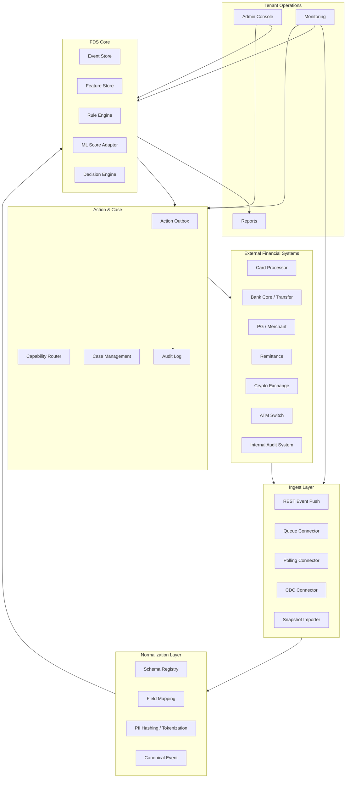
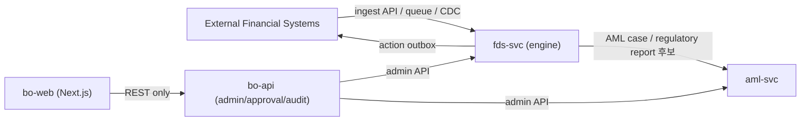
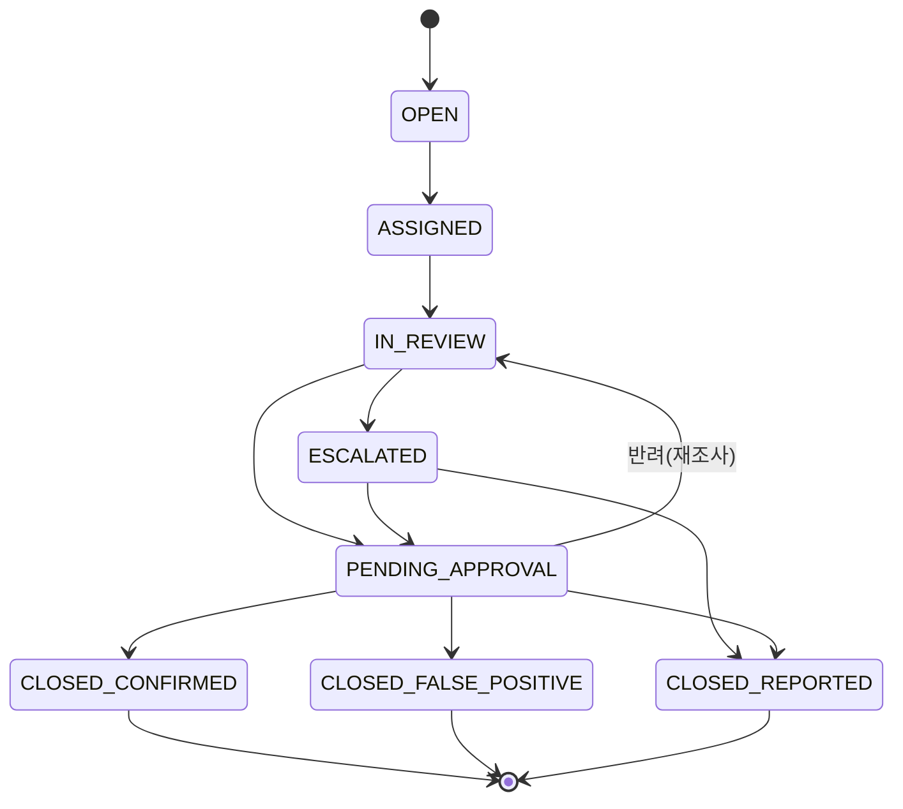
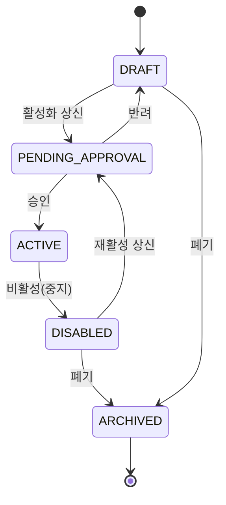
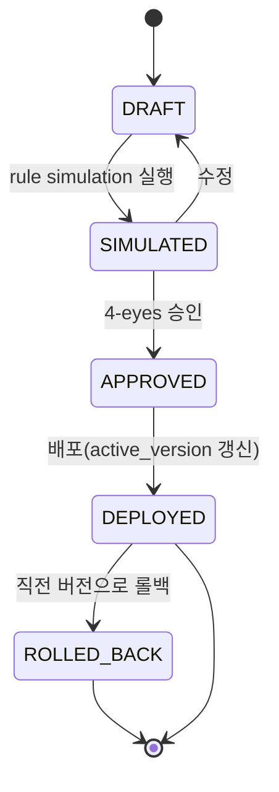
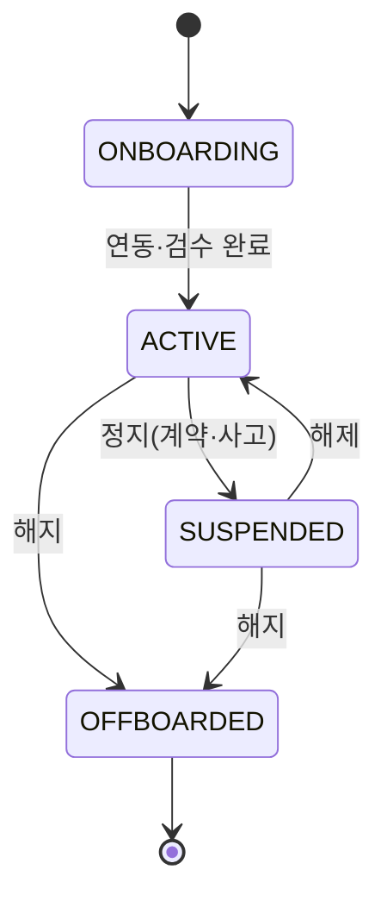
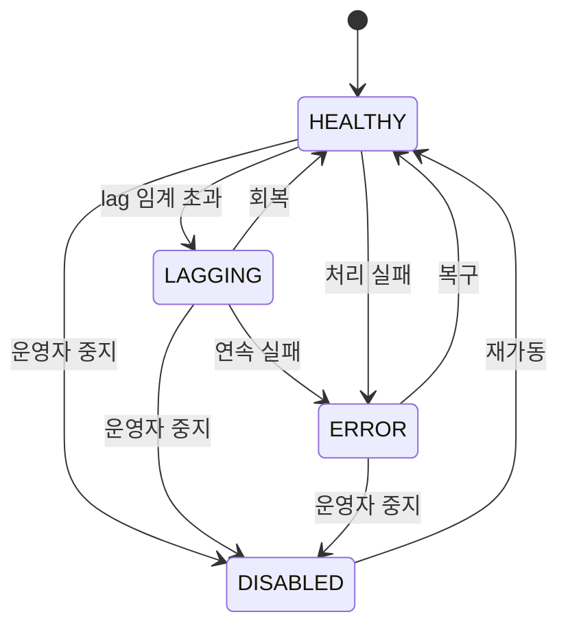
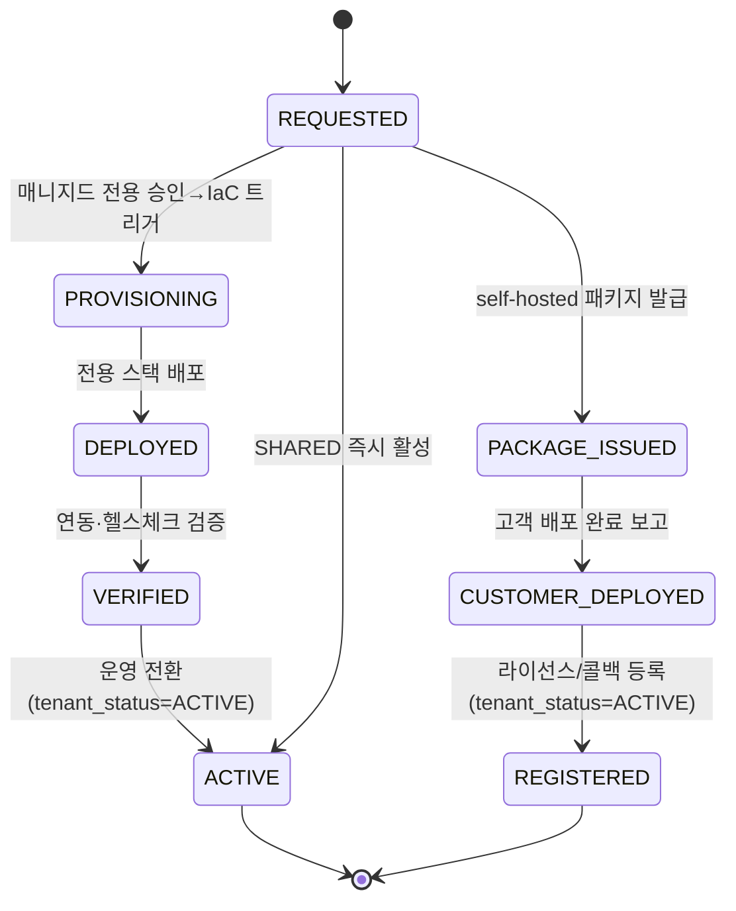
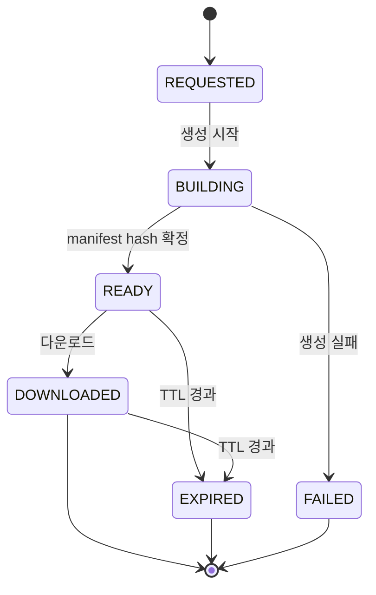
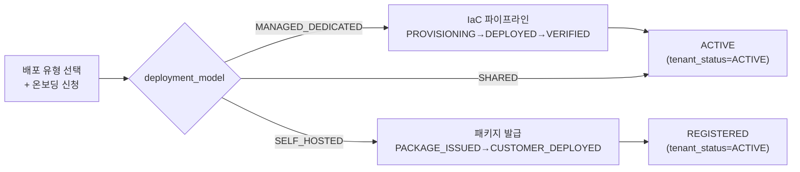

# SaaS FDS Platform 신규 구축 설계서

## 목차

1. [문서 목적](#1-문서-목적)
2. [제품 방향](#2-제품-방향)
3. [참조 구현으로서의 Hanpass FdsSvc](#3-참조-구현으로서의-hanpass-fdssvc)
4. [지원 대상 금융 도메인](#4-지원-대상-금융-도메인)
5. [핵심 설계 원칙](#5-핵심-설계-원칙)
6. [플랫폼 아키텍처](#6-플랫폼-아키텍처)
7. [공통 데이터 모델](#7-공통-데이터-모델)
8. [Canonical Event Taxonomy](#8-canonical-event-taxonomy)
9. [거래 수단·채널 모델](#9-거래-수단채널-모델)
10. [룰 엔진과 Feature Catalog](#10-룰-엔진과-feature-catalog)
11. [Action·Case·Investigation 모델](#11-actioncaseinvestigation-모델)
12. [외부 시스템 연동 방식](#12-외부-시스템-연동-방식)
13. [SaaS 멀티테넌시](#13-saas-멀티테넌시)
14. [데이터베이스 설계 방향](#14-데이터베이스-설계-방향)
15. [도메인별 확장 예시](#15-도메인별-확장-예시)
16. [보안·컴플라이언스·감사](#16-보안컴플라이언스감사)
17. [운영·관측성](#17-운영관측성)
18. [구축 로드맵](#18-구축-로드맵)
19. [오픈 결정사항](#19-오픈-결정사항)
20. [부록 A. 산출물 일습 매핑](#부록-a-산출물-일습-매핑-downstream)
21. [부록 B. 변경 이력](#부록-b-변경-이력)

---

## 1. 문서 목적

본 문서는 기존 Hanpass PH `FdsSvc`를 참조 구현(reference implementation)으로 삼아, **한국 금융시장**에서 여러 금융서비스에 독립적으로 연동 가능한 **SaaS형 FDS(Fraud Detection System) 플랫폼**을 신규 구축하기 위한 설계 기준서이다.

대상은 특정 월렛·송금 서비스 하나가 아니라 다음과 같은 다양한 금융거래를 포괄하는 토탈 FDS 플랫폼이다.

- 카드 결제
- 국내 송금
- 해외 송금
- PG 거래
- 월렛 충전·결제·출금
- ATM 출금
- 은행 계좌 이체
- 가상계좌 입금
- 코인거래소 입출금·거래
- 은행 내부 감사·직원 이상행위 탐지
- 대출 실행·상환
- 보험금 청구·지급
- 파트너 정산·merchant settlement
- 무역대금 지급·수취
- 이커머스 해외판매대금 한국 정산
- 마켓플레이스 셀러 정산
- B2B 인보이스 지급

핵심 목표는 “각 금융서비스별로 FDS를 다시 만드는 것”이 아니라, 모든 금융 이벤트를 공통 모델로 정규화한 뒤 룰·ML·케이스·액션을 같은 플랫폼에서 운영하는 것이다.

---

## 2. 제품 방향

### 2.1 제품 정의

SaaS FDS Platform은 금융회사 또는 핀테크 사업자가 자기 시스템의 거래·회원·계좌·기기·KYC·정산·감사 이벤트를 연동하면, 실시간 또는 비동기로 이상거래를 탐지하고 조치할 수 있게 하는 멀티고객사 위험 탐지 플랫폼이다.

본 제품의 1차 사업 포지션은 단순 탐지 엔진이 아니라 **금융감독원·금융보안·내부감사 대응 증적을 자동화하는 FDS RegOps SaaS**이다. 고객사가 실제로 구매 가치를 느끼는 지점은 rule hit 자체보다 다음 질문에 즉시 답할 수 있는 운영 증적이다.

- 어떤 거래를 어떤 rule/model version으로 탐지했는가?
- 어떤 입력 feature와 원천 이벤트 snapshot으로 판단했는가?
- block/hold/release/review 조치가 언제, 누구의 승인으로 실행됐는가?
- false positive로 종결한 근거와 승인 이력은 무엇인가?
- 보이스피싱·계정탈취·가맹점 abuse·내부자 우회 승인에 대해 기간별 대응 자료를 바로 제출할 수 있는가?
- connector 장애, 누락, replay, 중복 처리 이력이 감사 가능하게 남아 있는가?

가장 중요한 제품 목표는 **개발팀 의존 없이 준법감시실·리스크관리·FDS 운영자가 직접 FDS를 운용할 수 있게 하는 것**이다. 개발팀의 역할은 초기 연동, 권한/IAM, 데이터 mapping, action adapter 구축까지로 제한하고, 이후 룰 변경·임계값 조정·watchlist 관리·case 처리·보고자료 생성·감사 대응은 비개발 조직이 UI와 승인 workflow로 수행해야 한다.

이를 위해 플랫폼은 다음을 기본 제공한다.

- no-code rule builder와 feature catalog
- 룰·그룹·threshold 변경의 maker-checker 승인
- 테스트 데이터 기반 rule simulation
- 배포 전 영향도 분석과 예상 hit rate
- rule version rollback
- case assignment, escalation, close reason 관리
- evidence export self-service
- 운영 대시보드와 connector health 확인
- 개발팀 개입 없는 tenant policy 변경 이력 관리

### 2.2 고객 유형

| 고객 유형 | 대표 사용처 |
|---|---|
| 전자금융·월렛 사업자 | 충전, 결제, 송금, 출금, 계정 탈취 탐지 |
| PG / VAN / 결제대행 | 카드 결제 fraud, merchant abuse, chargeback risk |
| 은행 | 계좌이체, ATM 출금, 내부 직원 감사, AML alert |
| 해외송금 사업자 | cross-border remittance, beneficiary risk, mule account |
| 국내송금 사업자 | 계좌 기반 송금, 보이스피싱, 대포통장 |
| 코인거래소 | fiat deposit/withdrawal, crypto withdrawal, market manipulation |
| 보험·대출 사업자 | 보험금 부정청구, 대출 실행 fraud, identity fraud |
| 무역·B2B 결제 사업자 | 인보이스 기반 지급, 무역대금, 공급망 금융 fraud |
| 이커머스·마켓플레이스 | 해외 셀러 정산, 가맹점/셀러 리스크, 정산 보류 |

### 2.3 제품 모듈

| 모듈 | 설명 |
|---|---|
| Ingest | 외부 시스템 이벤트 수신, polling, snapshot import, CDC adapter |
| Normalization | 외부 payload를 canonical event로 변환 |
| Feature Store | 회원·계좌·수단·거래·기기·상대방 상태 materialization |
| Rule Engine | DSL 기반 룰 평가, threshold, velocity, group match |
| ML Scoring | 외부 또는 내장 ML score 수신·평가 |
| Decision Engine | ALLOW/BLOCK/REVIEW/CHALLENGE/FREEZE 등 결정 |
| Action Router | 고객 시스템별 block/hold/cancel/release/case-only action 전달 |
| Case Management | 조사 케이스, 4-eyes 승인, 증적 관리 |
| Admin Console | 룰, connector, mapping, 감사, 리포트 관리 |
| Audit & Compliance | 7년 이상 감사로그, 규정 리포트, PII 통제 |
| Evidence Export | 감독기관·내부감사 제출용 CSV/PDF/Excel/API export |
| Legacy Vendor Bridge | 옥타솔루션 등 기존 FDS/AML 솔루션과 병행 연동·점진 대체 |

### 2.4 시장 진입 제품 포지션

초기 제품은 “기존 FDS 솔루션을 즉시 교체하는 엔진”보다 “기존 시스템과 병행 가능한 감사대응 자동화 허브”로 진입한다.

| 단계 | 제품 포지션 | 고객 가치 |
|---|---|---|
| 1단계 | Audit Evidence Hub | 기존 FDS/AML 판정, 고객사 거래 이벤트, 수동 조치 이력을 한곳에 보존 |
| 2단계 | FDS Event Gateway | DB 직접 insert 대신 API/queue/file/CDC로 표준 event ingest 제공 |
| 3단계 | Case & Report Automation | 조사·승인·종결·제출자료 생성을 자동화 |
| 4단계 | Rule/Decision Engine | 기존 벤더 의존 룰을 점진적으로 내장 FDS로 이전 |
| 5단계 | Full FDS SaaS | 탐지, 조치, 감사, 리포트, 운영 모니터링을 통합 제공 |

이 접근은 고객사가 이미 옥타솔루션 등 기존 솔루션을 사용하고 있어도 도입 가능하게 만든다. 초기에는 기존 솔루션의 결과를 수신하고, 운영 증적과 검사 대응 자료를 자동화한 뒤, 비용·유지보수·확장성 문제가 큰 영역부터 단계적으로 대체한다.

### 2.5 기존 벤더 대비 차별화 기준

| 기존 pain point | SaaS FDS 설계 기준 |
|---|---|
| 고객사 DB에 직접 insert하는 연동 | 표준 ingest API, queue, SFTP file, CDC, adapter SDK 제공 |
| 벤더 schema에 고객 서비스가 종속 | canonical event + mapping layer로 고객 도메인 분리 |
| 신규 상품 추가 시 연동 수정 과다 | domain pack과 schema version으로 확장 |
| 검사 대응 자료 수작업 | evidence snapshot, case timeline, report export 자동화 |
| 유지보수 품질 편차 | connector health, replay, dead-letter, mapping validation 대시보드 제공 |
| 판정 근거 설명 부족 | rule version, feature snapshot, input event hash, action approval을 함께 저장 |
| 룰 변경마다 개발팀 또는 벤더 요청 필요 | 준법감시실용 no-code rule builder, simulation, 승인 workflow 제공 |

### 2.6 준법감시실 자율 운영 원칙

SaaS FDS는 “개발팀이 만드는 시스템”이 아니라 “준법감시실이 운영하는 통제 플랫폼”이어야 한다.

| 운영 업무 | 준법감시실 직접 수행 | 개발팀 개입 필요 여부 |
|---|---|---|
| 룰 생성·수정·비활성 | 가능 | 불필요 |
| threshold 조정 | 가능 | 불필요 |
| watchlist/group 관리 | 가능 | 불필요 |
| rule simulation | 가능 | 불필요 |
| case 배정·검토·종결 | 가능 | 불필요 |
| false positive feedback | 가능 | 불필요 |
| 감사자료 export | 가능 | 불필요 |
| connector 신규 연동 | 불가 | 필요 |
| canonical schema 확장 | 제한적 | 필요 |
| action adapter 신규 개발 | 불가 | 필요 |

운영 UI는 개발자용 DSL 편집기가 아니라 준법감시 담당자가 이해할 수 있는 업무 언어로 제공해야 한다.

예시:

```text
최근 24시간 동안 동일 수취계좌로 5회 이상 송금했고
총액이 500만원 이상이며
고객 가입일이 7일 이내이면
REVIEW case를 생성한다.
```

내부적으로는 DSL 또는 JSON rule로 컴파일하되, 운영자는 조건, 기간, 금액, 국가, 채널, action을 화면에서 선택한다.

---

## 3. 참조 구현으로서의 Hanpass FdsSvc

Hanpass PH `FdsSvc`는 신규 SaaS FDS의 출발점으로 참고할 수 있지만, 그대로 복제하면 안 된다. 본 문서의 목표 시장은 한국이며, PH 특화 규정·서비스 결합은 참조 구현의 사례로만 사용한다.

### 3.1 재사용할 개념

| Hanpass FdsSvc 요소 | SaaS 플랫폼에서의 재사용 방향 |
|---|---|
| SQS 이벤트 기반 ingest | Queue connector 패턴으로 일반화 |
| `sourceService + eventType` 정규화 | `sourceSystem + schemaVersion + eventType` 정규화로 확장 |
| DSL 룰 엔진 | multi-domain feature catalog 기반 룰 엔진으로 확장 |
| materialized profile | subject/account/instrument/counterparty feature store로 확장 |
| outbox action relay | capability 기반 action router로 확장 |
| group 관리 | risk group, watchlist, allowlist, denylist 공통 모델로 확장 |
| AML/CTR/STR 큐 | jurisdiction별 regulatory case module로 분리 |
| AFASA freeze workflow | 한국형 지급정지·사고신고·분쟁거래 보류 workflow template의 참고 패턴으로 일반화 |

### 3.2 그대로 가져오면 안 되는 부분

| 현재 결합 | SaaS 신규 설계에서의 처리 |
|---|---|
| `WalletSvc` hold/release 중심 action | `HOLD_FUNDS`, `RELEASE_HOLD`, `CANCEL_TRANSACTION` 등 공통 action으로 추상화 |
| Hanpass 서비스명 이벤트 타입 | 외부 시스템별 adapter mapping으로 분리 |
| PH AML/AFASA 규정 중심 | 한국 전자금융·특금법·개인정보·금융보안 기준 policy pack으로 재설계 |
| 단일 회사 내부 BO 권한 | tenant / workspace / role / data-scope 기반 권한으로 확장 |
| 내부 DB schema 기준 materialization | SaaS 표준 canonical schema 기준 feature store로 재설계 |

---

## 4. 지원 대상 금융 도메인

SaaS FDS는 금융서비스 유형을 “서비스명”이 아니라 “거래 행위”와 “자금 수단” 기준으로 모델링한다.

### 4.1 거래 도메인

| 도메인 | 대표 이벤트 | 주요 리스크 |
|---|---|---|
| Card Payment | authorization, capture, refund, chargeback | 도난카드, CNP fraud, merchant abuse |
| PG / Merchant Payment | payment request, approval, settlement | 가맹점 이상거래, 허위 매출, 환불 남용 |
| Domestic Remittance | transfer request, account debit, payout | 보이스피싱, 대포통장, mule network |
| Cross-border Remittance | remit request, FX quote, payout | AML, sanction, beneficiary risk |
| Wallet | charge, pay, withdraw, balance change | 계정 탈취, 충전 후 즉시 출금, velocity |
| ATM Withdrawal | card insert, withdrawal request, cash dispensed | card skimming, mule withdrawal, geo anomaly |
| Bank Transfer | debit, credit, hold, reversal | unauthorized transfer, account takeover |
| Virtual Account | VA issued, deposit received, expired | 입금자 불일치, 사기 수취계좌 |
| Crypto Exchange | fiat deposit, crypto withdrawal, trade, address change | travel rule, wallet address risk, market abuse |
| Internal Bank Audit | employee action, approval override, manual adjustment | 내부자 위협, 권한 남용, 4-eyes 우회 |
| Loan / Insurance | application, disbursement, claim, payout | identity fraud, synthetic identity, claim abuse |
| Trade Payment | invoice issued, document matched, payment requested, settlement completed | 허위 인보이스, 가격 조작, 제재국 우회, 무역기반 자금세탁(TBML) |
| E-commerce Cross-border Settlement | order captured, seller payout requested, FX settlement, KRW payout | 허위 주문, 셀러 정산 사기, chargeback 회피, 해외자금 국내정산 리스크 |
| Marketplace Seller Settlement | seller onboarded, settlement calculated, payout held/released | 가짜 셀러, 정산 선지급 남용, 반품/환불 급증 |
| B2B Invoice Payment | invoice approved, payment scheduled, payment completed | invoice fraud, vendor impersonation, approval bypass |

### 4.2 공통 판단

모든 도메인은 아래 질문으로 정규화한다.

1. 누가 요청했는가? (`subject`, `actor`)
2. 어떤 자금 또는 가치가 움직이는가? (`transaction`, `asset`)
3. 어떤 수단에서 나가는가? (`fundingInstrument`)
4. 어디로 가는가? (`counterparty`, `beneficiaryInstrument`)
5. 어떤 채널에서 발생했는가? (`channel`, `paymentRail`)
6. 어떤 기기·위치·세션에서 발생했는가? (`device`, `location`, `session`)
7. 현재 조치 가능한가? (`controlCapability`)
8. 법규상 보고 또는 보존 의무가 있는가? (`jurisdiction`, `regulatoryFlags`)
9. 상업 증빙이 있는가? (`businessDocument`, `invoice`, `order`, `shipment`)
10. 정산 주체와 실제 수익자가 일치하는가? (`seller`, `merchant`, `ultimateBeneficiary`)

---

## 5. 핵심 설계 원칙

### 5.1 서비스별 스키마가 아니라 공통 금융 이벤트 모델

카드, 송금, ATM, 코인, 은행 감사마다 별도 테이블을 만들면 플랫폼이 빠르게 복잡해진다. 원천별 상세 payload는 adapter에서 처리하고, core는 공통 이벤트 모델만 본다.

### 5.2 룰 평가는 내부 materialized state만 사용

룰 평가 중 외부 API를 실시간 조회하지 않는다. 외부 조회는 ingest 또는 enrichment 단계에서 미리 materialize한다.

이유:

- 거래 승인 경로 지연 방지
- 외부 API 장애가 FDS decision에 직접 전파되는 것 방지
- 동일 이벤트 replay 시 같은 결과 재현
- 감사 증적 보존

### 5.3 Action은 capability 기반

모든 시스템이 hold/release를 지원하지 않는다. 어떤 시스템은 block만 가능하고, 어떤 시스템은 case 생성만 가능하다. 따라서 action은 “무엇을 하고 싶은지”와 “그 시스템에서 가능한지”를 분리한다.

### 5.4 Dedicated-deployment first (multi-tenant within deployment)

AML/FDS는 고객 PII·거래·제재 데이터의 규제·내부보안 요건이 커서 **고객사별 전용 배포가 기본**이다(공유 SaaS DB 아님). 격리는 DB 행/스키마 토글이 아니라 **배포 모델(`deployment_model`) + 온보딩 프로비저닝**의 산출이다(§13.0, target-architecture §4.1). `tenant_id`/`workspace_id`/`data_scope`는 **배포 내부 분리** 키이며, 전용 배포에서는 `tenant_id`가 사실상 단일 값이다. 제품은 처음부터 배포 모델 3종, tenant별 schema version, workspace별 룰셋·connector 설정을 고려해야 한다.

### 5.5 Compliance plugin

AML, STR, 고액현금거래 보고, 전자금융 이상거래 탐지, 보이스피싱 피해 의심거래, 가상자산 Travel Rule, 내부통제 규정은 국가·업권마다 다르다. core decision engine은 공통으로 두되, 한국 시장용 규정 리포트와 workflow는 별도 policy pack으로 분리한다.

---

## 6. 플랫폼 아키텍처



### 6.1 정본 아키텍처 매핑 (4서비스 모노레포)

본 설계서의 논리 컴포넌트는 정본(`.claude/skills/_shared/target-architecture.md`)의 **4서비스 모노레포**로 물리 배치된다. FDS 설계서의 책임 경계는 **`fds-svc`** 이며, 운영 콘솔·결재·감사 UI는 `bo-api`/`bo-web`가, AML 규제 케이스는 `aml-svc`가 담당한다.

| 논리 컴포넌트(본 문서) | 물리 서비스 | 비고 |
|---|---|---|
| Ingest / Normalization / Feature Store / Rule Engine / Decision / Action Router | `services/fds-svc` | FDS 엔진 백엔드 (Java 25, Spring Boot 3.5.x, 헥사고날) |
| AML/STR/CTR/Travel Rule regulatory case, sanction/PEP screening | `services/aml-svc` | AML 엔진. FDS는 `OPEN_AML_CASE`/`REGULATORY_REPORT` 후보를 aml-svc로 위임 |
| Admin Console, 결재(maker-checker), 감사·리포트 집약, IAM | `services/bo-api` | fds-svc·aml-svc admin API를 운영자용으로 집약·인증·감사 |
| no-code rule builder, case 화면, evidence export UI, 운영 대시보드 | `services/bo-web` | Next.js 16. bo-api 경유만 허용(엔진 직접 호출 금지) |



### 6.2 fds-svc 헥사고날 패키지 레이아웃

설계 표기(design notation)는 `com.hanpass.fds` 하위로 배치한다. 단, **구현(aegis-aml) 패키지 루트는 `com.aegis.fds`** 이다(정본 target-architecture §5 — `com.aegis.{fds,aml,backoffice}`, 로드맵 §0). 본 문서의 `com.hanpass.fds` 표기는 참조 구현(Hanpass FdsSvc)과 동일한 레이아웃을 보이기 위한 설계 표기이며, 실제 코드 패키지 루트는 `com.aegis.fds`로 치환한다. 도메인 불변식은 `domain`, 유스케이스·트랜잭션 경계는 `application`, I/O는 `adapter`.

```
com.hanpass.fds
├── domain/        # CanonicalEvent, Subject, Actor, Instrument, Transaction,
│                  #   Decision, Action, Case, RiskGroup, RuleSet 등 ADT·불변식
├── application/
│   ├── usecase/   # IngestEvent, EvaluateDecision, RouteAction, ManageCase,
│   │              #   ManageApproval, SimulateRule, ManageGroup, ExportEvidence,
│   │              #   ManageSourceSystem, VendorBridge
│   ├── port/in/   # IngestEventUseCase, EvaluateDecisionUseCase, RouteActionUseCase,
│   │              #   ManageCaseUseCase, ManageApprovalUseCase, SimulateRuleUseCase,
│   │              #   ManageGroupUseCase, ExportEvidenceUseCase,
│   │              #   ManageSourceSystemUseCase, VendorBridgeUseCase
│   │              #   (유스케이스↔API 그룹 정본은 API 명세 §4)
│   └── port/out/  # CanonicalEventStorePort, FeatureStorePort, ActionOutboxPort,
│                  #   AmlCasePort(aml-svc), SchemaRegistryPort,
│                  #   ApprovalStorePort, CaseStorePort, EvidenceExportPort
├── adapter/
│   ├── in/rest/        # Case·Action·Evidence·Admin·Approval·VendorBridge API 50종+
│   │                   #   (경로·요청·응답 정본은 API 명세 §4 — 본 주석은 그룹 요약)
│   │                   #   예) POST /api/v1/fds/events, POST /api/v1/fds/decisions/evaluate
│   ├── in/sqs/         # Queue Connector consumer
│   ├── in/scheduled/   # Polling/CDC/reconciliation jobs
│   ├── out/persistence/# fds_* 테이블 (PostgreSQL)
│   └── out/external/   # action adapter, aml-svc client, ML score client
└── global/        # tenant context, traceId 전파, 보안/마스킹 필터, 설정
```

> `adapter/in/rest`의 엔드포인트 전수·요청/응답 스키마 정본은 **API 명세(`docs/design/api/01-fds-api.md` §4)** 이며, 위 주석은 그룹 요약이다(Case·Action·Evidence·Admin·Approval·External Vendor Bridge). `port/in`의 유스케이스 포트는 API §4 그룹(ManageCase·ManageApproval·ExportEvidence·ManageGroup·ManageSourceSystem·VendorBridge 등)과 1:1 대응한다.
>
> bo-api·bo-web은 정본의 별도 레이아웃(패키지-바이-피처 / Next.js App Router)을 따르며, 본 문서의 enum·API·규칙을 그대로 입력으로 사용한다.

---

## 7. 공통 데이터 모델

SaaS FDS의 데이터 모델은 다음 상위 객체를 중심으로 잡는다.

### 7.1 핵심 객체

| 객체 | 의미 | 예시 |
|---|---|---|
| Tenant | SaaS 고객사 | 은행 A, PG B, 거래소 C |
| Source System | 이벤트 원천 시스템 | card-processor, core-banking, atm-switch |
| Subject | 위험 판단 대상 고객·회원·계좌주 | 개인, 법인, merchant |
| Actor | 이벤트를 수행한 행위자 | 고객, 직원, 시스템, 파트너 |
| Account | 금융 계정 | 은행 계좌, 월렛 계정, 거래소 계정 |
| Instrument | 자금 수단 | 카드, 계좌, 월렛, 가상계좌, crypto address |
| Counterparty | 상대방 | 수취인, merchant, exchange wallet, ATM |
| Business Entity | 상업 거래 주체 | buyer, seller, merchant, vendor, shipper |
| Business Document | 상업 증빙 | invoice, purchase order, bill of lading, customs declaration |
| Order | 이커머스 주문 | marketplace order, cart, shipment |
| Settlement | 정산 | merchant settlement, seller payout, cross-border KRW settlement |
| Transaction | 자금 또는 가치 이동 | 결제, 송금, 출금, 입금, 매매 |
| Event | 상태 변화 | requested, authorized, completed, failed |
| Decision | FDS 판단 결과 | allow, block, review, freeze |
| Action | 외부 조치 | hold, cancel, release, case |
| Case | 조사 케이스 | AML case, fraud case, internal audit case |

### 7.2 Subject와 Actor 분리

내부 감사나 은행 직원 권한 남용 탐지에서는 고객이 아니라 직원이 risk actor일 수 있다. 따라서 `subject`와 `actor`를 분리해야 한다.

| 시나리오 | Subject | Actor |
|---|---|---|
| 고객 카드 결제 | 카드회원 | 카드회원 |
| 은행 직원 수동 한도 변경 | 고객 계좌 | 직원 |
| 콜센터 환불 처리 | 고객 | 상담원 |
| 시스템 자동 정산 | merchant | batch system |
| 코인 출금 | 거래소 회원 | 거래소 회원 또는 API key |
| 무역대금 지급 | 수입자 또는 법인 | 법인 담당자 또는 ERP system |
| 이커머스 셀러 정산 | seller 또는 merchant | marketplace settlement batch |
| B2B 인보이스 지급 | buyer 법인 | 결재자 또는 회계 시스템 |

### 7.3 Transaction과 Event 분리

하나의 transaction에는 여러 event가 발생한다.

예: 카드 결제

```text
transaction.created
transaction.authorized
transaction.captured
transaction.refunded
chargeback.opened
```

예: ATM 출금

```text
atm.session.started
transaction.requested
transaction.authorized
cash.dispensed
transaction.completed
```

예: 코인 출금

```text
withdrawal.requested
address.screened
withdrawal.approved
blockchain.broadcasted
withdrawal.completed
```

FDS는 각 event를 평가하되, decision과 action은 transaction 단위로도 조회 가능해야 한다.

---

## 8. Canonical Event Taxonomy

### 8.1 최상위 event family

| Family | 설명 |
|---|---|
| `transaction.*` | 금융거래 요청·승인·완료·실패·환불 |
| `authorization.*` | 카드/ATM/계좌 승인 단계 |
| `settlement.*` | PG/merchant/partner 정산 |
| `trade.*` | 무역대금·선적·통관·무역금융 인보이스(`trade.invoice.issued` 등) |
| `invoice.*` | B2B 인보이스(`invoice.approved`·`invoice.paid`) 발행·승인·지급 |
| `order.*` | 이커머스 주문·배송·취소·반품 |
| `seller.*` | 셀러 온보딩·정산·보류 |
| `account.*` | 계좌 생성·상태 변경 |
| `instrument.*` | 카드/계좌/지갑/주소/가상계좌 등록·정지 |
| `member.*` | 회원/KYC/profile 변경 |
| `device.*` | 기기 등록·변경·위험 신호 |
| `session.*` | 로그인·API key·ATM session |
| `aml.*` | AML screening, sanction hit, travel rule |
| `case.*` | 조사 케이스 생성·승인·종결 |
| `employee.*` | 내부 직원 작업·승인·override |
| `market.*` | 코인/증권 주문·체결·시세 이상 |

> `aml.*`·`case.*` family는 **fds-svc 내부 생성·aml-svc 위임 이벤트**이며 외부 ingest 대상이 아니다(integration §3.1·§9 참조). 외부 connector가 `aml.*`/`case.*` event를 push해도 ingest에서 수용하지 않는다.

### 8.2 Canonical event 예시

```json
{
  "messageVersion": "v1",
  "tenantId": "tenant_bank_a",
  "workspaceId": "default",
  "sourceSystem": "atm-switch",
  "schemaVersion": "atm-switch.v1",
  "eventId": "atm-evt-001",
  "idempotencyKey": "atm-switch:atm-evt-001",
  "eventType": "transaction.requested",
  "correlationId": "corr-atm-evt-001",
  "occurredAt": "2026-06-06T19:00:00+09:00",
  "subject": {
    "subjectType": "PERSON",
    "subjectRef": "subj_hmac_123",
    "country": "KR"
  },
  "actor": {
    "actorType": "CUSTOMER",
    "actorRef": "subj_hmac_123"
  },
  "transaction": {
    "transactionRef": "atm-tx-001",
    "transactionType": "WITHDRAWAL",
    "direction": "OUTBOUND",
    "amount": "200000.00",
    "currency": "KRW",
    "amountBase": "200000.00",
    "baseCurrency": "KRW",
    "status": "REQUESTED"
  },
  "instrument": {
    "instrumentType": "CARD",
    "instrumentRef": "card_token_123",
    "accountRef": "acct_hmac_123",
    "institutionCode": "BANK01"
  },
  "counterparty": {
    "counterpartyType": "ATM",
    "counterpartyRef": "atm_0001",
    "country": "KR"
  },
  "channel": {
    "channelType": "ATM",
    "paymentRail": "ATM_SWITCH",
    "entryMode": "CARD_PRESENT"
  },
  "location": {
    "country": "KR",
    "city": "Seoul",
    "ipCountry": null
  },
  "payloadHash": "sha256:..."
}
```

### 8.3 필수 필드

| 필드 | 필수 여부 | 비고 |
|---|---|---|
| `messageVersion` | 필수 | 큐 메시지 직렬화 버전(enum `v1`, integration §4.1) |
| `schemaVersion` | 조건부 필수 | 이벤트 메시지 필수. `sourceSystem`별 canonical schema 버전(예 `atm-switch.v1`, integration §4.1) |
| `correlationId` | 필수 | end-to-end 추적 키. SQS message attribute로도 전파(integration §4.1) |
| `tenantId` | 필수 | multi-tenant partition key |
| `workspaceId` | 필수 | tenant 내 서비스/환경 분리 키. 미지정 시 `default`(§13.0b, integration §4.1) |
| `sourceSystem` | 필수 | connector와 schema 식별 |
| `eventId` | 필수 | 원천 이벤트 id |
| `idempotencyKey` | 필수 | 중복 방지 |
| `eventType` | 필수 | canonical event type |
| `occurredAt` | 필수 | 원천 발생 시각. ISO-8601 TZ 필수(UTC `Z` 또는 offset 모두 허용, 내부 저장은 UTC, integration §4.2) |
| `subject.subjectRef` | 조건부 필수 | 고객 중심 거래에는 필수 |
| `actor.actorRef` | 조건부 필수 | 내부 감사·직원 작업에는 필수 |
| `transaction.transactionRef` | 조건부 필수 | 거래 이벤트에는 필수 |
| `transaction.transactionType` | 조건부 필수 | 거래 이벤트에는 필수(enum 정본 DB §4.x, 예 `WITHDRAWAL`) |
| `amount/currency` | 조건부 필수 | 금액성 이벤트에는 필수 |
| `instrument.instrumentRef` | 권장 | 수단 기반 룰에 필요 |
| `channel.channelType` | 필수 | 도메인 routing과 룰 필드에 필요 |
| `payloadHash` | 권장 | 원천 payload 무결성 해시(최상위 평면 필드 `sha256:...`, integration §4.2) |

---

## 9. 거래 수단·채널 모델

### 9.1 Instrument type

| Type | 설명 | 예시 |
|---|---|---|
| `WALLET` | 전자지갑 계정 | wallet account |
| `BANK_ACCOUNT` | 은행 계좌 | CASA, checking, savings |
| `CARD` | 카드 | debit, credit, prepaid |
| `VIRTUAL_ACCOUNT` | 가상계좌 | VA deposit account |
| `CRYPTO_ADDRESS` | 블록체인 주소 | BTC/ETH/USDT address |
| `CASH` | 현금 취급점 | ATM, agent cash pickup |
| `MERCHANT_ACCOUNT` | merchant 정산 계정 | PG merchant |
| `API_KEY` | 시스템 행위 수단 | exchange API key, corporate API |
| `EMPLOYEE_ACCOUNT` | 내부 직원 계정 | bank teller, backoffice user |
| `CORPORATE_BANK_ACCOUNT` | 법인 계좌 | 무역대금 지급 계좌 |
| `SELLER_SETTLEMENT_ACCOUNT` | 셀러 정산 계좌 | 마켓플레이스 정산 계좌 |
| `ESCROW_ACCOUNT` | 에스크로 계정 | 구매확정 전 보관 계정 |

### 9.2 Channel type

| Channel | 설명 |
|---|---|
| `CARD_PRESENT` | 오프라인 카드 결제 |
| `CARD_NOT_PRESENT` | 온라인 카드 결제 |
| `ATM` | ATM 출금·조회 |
| `BANK_TRANSFER` | 계좌이체 |
| `DOMESTIC_REMIT` | 국내송금 |
| `CROSS_BORDER_REMIT` | 해외송금 |
| `PG_PAYMENT` | PG 결제 |
| `WALLET_PAYMENT` | 월렛 결제 |
| `WALLET_WITHDRAWAL` | 월렛 출금 |
| `VIRTUAL_ACCOUNT_DEPOSIT` | 가상계좌 입금 |
| `CRYPTO_DEPOSIT` | 가상자산 입금 |
| `CRYPTO_WITHDRAWAL` | 가상자산 출금 |
| `EXCHANGE_TRADE` | 코인/증권 주문·체결 |
| `INTERNAL_OPERATION` | 내부 직원 작업 |
| `BATCH_SETTLEMENT` | 정산 batch |
| `TRADE_PAYMENT` | 무역대금 지급·수취 |
| `CROSS_BORDER_ECOMMERCE_SETTLEMENT` | 해외 이커머스 판매대금 국내 정산 |
| `MARKETPLACE_SELLER_PAYOUT` | 마켓플레이스 셀러 정산 |
| `B2B_INVOICE_PAYMENT` | 법인 인보이스 지급 |

### 9.3 Payment rail

| Rail | 예시 |
|---|---|
| `INTERNAL_LEDGER` | 내부 원장 |
| `CARD_NETWORK` | Visa/Master/JCB/local card network |
| `ATM_SWITCH` | ATM network |
| `BANK_ACH` | ACH류 계좌이체 |
| `OPEN_BANKING` | 한국 오픈뱅킹 |
| `FIRM_BANKING` | 펌뱅킹 / 가상계좌 / 기업뱅킹 연계 |
| `CMS` | 자동이체 / 출금이체 |
| `BANK_CD_NETWORK` | CD/ATM 공동망 |
| `EASY_PAY` | 간편결제 / 선불전자지급수단 |
| `VAN_PG` | VAN/PG 결제망 |
| `SWIFT` | 해외 은행망 |
| `LOCAL_RTP` | 국가별 실시간 이체망 |
| `PARTNER_API` | 파트너 API 송금 |
| `BLOCKCHAIN` | on-chain transfer |
| `MANUAL_BACKOFFICE` | 내부 수동 처리 |
| `ESCROW` | 에스크로 보관·해제 |
| `MARKETPLACE_SETTLEMENT` | 마켓플레이스 정산 |
| `TRADE_FINANCE` | 무역금융 / 무역대금 결제 |

### 9.4 Control capability

거래 수단마다 FDS가 할 수 있는 조치가 다르다.

| Capability | 설명 |
|---|---|
| `CAN_BLOCK_BEFORE_AUTH` | 승인 전 block 가능 |
| `CAN_DECLINE_AUTH` | 카드/ATM authorization decline 가능 |
| `CAN_HOLD_FUNDS` | 자금 hold 가능 |
| `CAN_EXTEND_HOLD` | hold TTL 연장 가능 |
| `CAN_RELEASE_HOLD` | hold 해제 가능 |
| `CAN_CANCEL_BEFORE_SETTLEMENT` | settlement 전 취소 가능 |
| `CAN_REQUEST_REVERSAL` | 완료 후 reversal 요청 가능 |
| `CAN_SUSPEND_INSTRUMENT` | 계좌/카드/지갑 정지 가능 |
| `CAN_OPEN_CASE_ONLY` | 자동 제어 불가, case 생성만 가능 |

---

## 10. 룰 엔진과 Feature Catalog

### 10.1 Feature category

| Category | Feature 예시 |
|---|---|
| Subject | age, country, KYC level, risk rating, account age |
| Transaction | amount, currency, amount base, direction, status |
| Instrument | type, issuer, age, status, previous usage |
| Counterparty | beneficiary country, merchant MCC, crypto address risk |
| Device | device id, fingerprint, first seen, device change |
| Location | IP country, ATM city, geo distance |
| Velocity | count/sum in window by subject/instrument/counterparty |
| Behavior | baseline deviation, unusual channel, time-of-day anomaly |
| Group | blacklist, whitelist, watchlist, mule network group |
| AML | sanction hit, PEP, structuring, travel rule missing |
| Internal Audit | employee role, override count, approval bypass |
| Merchant | refund ratio, chargeback ratio, settlement anomaly |
| Crypto | address risk score, mixer exposure, chain hop count |
| Trade | invoice amount, HS code, shipment country, document mismatch |
| Commerce | seller age, order velocity, refund ratio, delivery status |
| Settlement | payout amount, reserve ratio, chargeback exposure, FX spread |
| Corporate Approval | approver role, approval chain, maker-checker distance |

### 10.2 룰 예시

ATM:

```text
IF channelType = ATM
AND amountBase >= 20000
AND ipCountry/memberCountry mismatch OR atmCountry/memberCountry mismatch
AND instrument.firstSeenDaysAgo <= 3
THEN REVIEW or DECLINE_AUTH
```

카드 CNP:

```text
IF channelType = CARD_NOT_PRESENT
AND merchantRiskLevel >= HIGH
AND device.firstSeenMinutesAgo <= 60
AND velocity.count(subject, 10m) >= 3
THEN DECLINE_AUTH
```

국내송금:

```text
IF channelType = BANK_TRANSFER
AND beneficiaryInstrumentRef IN_GROUP mule_accounts
THEN BLOCK_TRANSACTION
```

코인 출금:

```text
IF channelType = CRYPTO_WITHDRAWAL
AND cryptoAddressRiskScore >= 80
THEN HOLD_FUNDS + OPEN_COMPLIANCE_CASE
```

무역대금:

```text
IF channelType = TRADE_PAYMENT
AND invoiceAmountBase >= 100000000
AND shipmentCountry IN highRiskCountries
AND invoiceUnitPriceDeviation >= 30%
THEN HOLD_FUNDS + OPEN_TRADE_FINANCE_CASE
```

이커머스 해외정산:

```text
IF channelType = CROSS_BORDER_ECOMMERCE_SETTLEMENT
AND sellerAgeDays <= 30
AND refundRatio7d >= 0.3
AND payoutCountry != sellerRegisteredCountry
THEN HOLD_SETTLEMENT + OPEN_MERCHANT_RISK_CASE
```

B2B 인보이스 지급:

```text
IF channelType = B2B_INVOICE_PAYMENT
AND beneficiaryInstrumentChangedWithinDays <= 3
AND approverRole NOT_IN financeApproverRoles
THEN REQUIRE_SECOND_APPROVAL + OPEN_INTERNAL_AUDIT_CASE
```

은행 내부 감사:

```text
IF channelType = INTERNAL_OPERATION
AND actor.role = TELLER
AND operationType = LIMIT_OVERRIDE
AND velocity.count(actor, 1h) >= 5
THEN OPEN_INTERNAL_AUDIT_CASE
```

> 위 룰 예시의 `OPEN_*_CASE`·`OPEN_COMPLIANCE_CASE`는 가독성을 위한 별칭이다. 저장·전송 시에는 정본 `action_type`(+`case_type`)으로 환원한다(§11.2a 매핑). 예: `OPEN_COMPLIANCE_CASE` → `OPEN_AML_CASE`(`case_type=CRYPTO_TRAVEL_RULE`), `OPEN_TRADE_FINANCE_CASE` → `OPEN_CASE`(`case_type=TRADE_FINANCE_REVIEW`).

---

## 11. Action·Case·Investigation 모델

### 11.1 Decision

| Decision | 설명 |
|---|---|
| `ALLOW` | 허용 |
| `MONITOR` | 기록만 |
| `REVIEW` | 수동 검토 필요 |
| `CHALLENGE` | 추가 인증 필요 |
| `BLOCK` | 승인 전 차단 |
| `HOLD` | 자금 hold |
| `FREEZE` | 규정 기반 동결 |
| `REPORT` | 규제 보고 후보 |

### 11.2 Action

`action_type`의 정본은 **API 명세(`docs/design/api/01-fds-api.md` §5.7·§7·§10(OpenAPI) `ActionType` enum, 23종)** 이다(마스터 위치 §1.1 명시). DB(`fds_actions.action_type`)·integration capability matrix·본 설계서는 이 23종으로 동기화한다. API §9는 Webhook 콜백 계약이며 enum 마스터가 아니다. §15의 도메인별 '가능 action' 서술에 등장하는 `OPEN_*_CASE`·`SUSPEND_MERCHANT`·`SEND_SECURITY_ALERT`·`CHALLENGE`·`REVIEW` 같은 표현은 정규 `action_type` 코드가 아니며 §11.2a 매핑으로 환원한다.

| Action | 대상 |
|---|---|
| `DECLINE_AUTHORIZATION` | 카드/ATM/계좌 승인 |
| `BLOCK_TRANSACTION` | 송금/결제/출금 요청 |
| `HOLD_FUNDS` | 월렛/계좌/파트너 잔액 |
| `EXTEND_HOLD` | 기존 hold |
| `RELEASE_HOLD` | 기존 hold |
| `CANCEL_TRANSACTION` | settlement 전 거래 |
| `REQUEST_REVERSAL` | settlement 후 거래 |
| `SUSPEND_ACCOUNT` | 계정 |
| `SUSPEND_INSTRUMENT` | 카드/계좌/지갑/API key |
| `HOLD_SETTLEMENT` | merchant/seller 정산 |
| `SUSPEND_SELLER_PAYOUT` | 셀러 지급 |
| `INCREASE_RESERVE` | 정산 유보금 |
| `REQUEST_ADDITIONAL_DOCUMENT` | 증빙 보완 요청 |
| `ADD_TO_GROUP` | risk group |
| `OPEN_CASE` | fraud/internal audit/merchant 등 일반 case (서브타입은 `case_type`로 구분, §11.2a) |
| `SEND_ALERT` | 고객/운영자/Slack/email/보안 알림 |
| `REQUIRE_SECOND_APPROVAL` | 추가 결재 요구(2차 승인) |
| `BLOCK_WITHDRAWAL` | 코인/계좌 출금 차단 |
| `SUSPEND_API_KEY` | 거래소/법인 API key 정지 |
| `SUSPEND_EMPLOYEE_SESSION` | 내부 직원 세션 정지 |
| `REQUEST_TRAVEL_RULE_INFO` | Travel Rule 정보 요청(VASP) |
| `OPEN_AML_CASE` | AML/STR/Travel Rule 케이스를 aml-svc로 위임 생성 |
| `REGULATORY_REPORT` | 규제 보고 후보(STR/CTR/Travel Rule) 상신 |

> `OPEN_AML_CASE`/`REGULATORY_REPORT`는 fds-svc가 직접 종결하지 않고 aml-svc로 위임한다(§6.1, AmlCasePort). `SUSPEND_INSTRUMENT`는 카드/계좌/지갑/API key를 포괄하나, 코인 출금 차단은 의도가 다르므로 별도 `BLOCK_WITHDRAWAL`로 구분한다.

### 11.2a Action 별칭 → 정본 매핑

§15 도메인 예시 서술의 비정본 verb는 아래 규칙으로 정본 `action_type`(+필요 시 `case_type`)으로 환원한다. 정본 enum 외 값은 저장·전송하지 않는다.

| §15 서술 별칭 | 정본 action_type | 보조 키 (`case_type` 등) |
|---|---|---|
| `OPEN_CHARGEBACK_REVIEW` | `OPEN_CASE` | `case_type=CHARGEBACK_REVIEW` |
| `OPEN_MULE_ACCOUNT_CASE` | `OPEN_CASE` | `case_type=MULE_ACCOUNT_REVIEW` |
| `OPEN_MERCHANT_RISK_CASE` | `OPEN_CASE` | `case_type=MERCHANT_RISK` |
| `OPEN_TRADE_FINANCE_CASE` | `OPEN_CASE` | `case_type=TRADE_FINANCE_REVIEW` |
| `OPEN_INTERNAL_AUDIT_CASE` | `OPEN_CASE` | `case_type=INTERNAL_AUDIT` |
| `OPEN_COMPLIANCE_CASE` (§10.2 코인 룰) | `OPEN_AML_CASE` | `case_type=CRYPTO_TRAVEL_RULE` 또는 `AML_REVIEW` (aml-svc 위임) |
| `SUSPEND_MERCHANT` | `SUSPEND_INSTRUMENT` | 대상=`MERCHANT_ACCOUNT`; 자동 제어 불가 tenant는 `OPEN_CASE`(`case_type=MERCHANT_RISK`)로 강등 |
| `SEND_SECURITY_ALERT` | `SEND_ALERT` | 보안 등급 알림(internal audit) |
| `CHALLENGE` (§15.2) | decision `CHALLENGE`(§11.1) | action이 아닌 결정값. 추가 인증 유도는 `SEND_ALERT`로 표현 |
| `REVIEW` (§15.5) | decision `REVIEW`(§11.1) | action이 아닌 결정값. 수동 검토는 `OPEN_CASE`로 표현 |

### 11.3 Case type

| Case type | 설명 |
|---|---|
| `FRAUD_REVIEW` | 일반 이상거래 조사 |
| `AML_REVIEW` | AML/STR/CTR 조사 |
| `CHARGEBACK_REVIEW` | 카드/PG chargeback |
| `MULE_ACCOUNT_REVIEW` | 대포통장/자금세탁 네트워크 |
| `CRYPTO_TRAVEL_RULE` | travel rule 및 address risk |
| `INTERNAL_AUDIT` | 내부 직원 권한 남용 |
| `MERCHANT_RISK` | merchant abuse |
| `REGULATORY_REPORT` | 관할 규제 보고 |
| `TRADE_FINANCE_REVIEW` | 무역대금·무역기반 자금세탁 검토 |
| `ECOMMERCE_SETTLEMENT_REVIEW` | 해외 이커머스 정산 리스크 검토 |
| `B2B_INVOICE_REVIEW` | 인보이스 지급 fraud 검토 |

### 11.4 4-eyes

아래 action은 4-eyes를 기본으로 한다.

- 자금 hold 해제
- 계정 영구 정지 해제
- 규제 보고 제출
- 룰 활성화
- field mapping 변경
- connector secret 변경
- 내부 감사 case 종결
- high-risk merchant 정상화

### 11.5 결재 시스템

FDS SaaS에는 준법감시실·리스크관리·FDS 운영자가 개발팀 없이 업무를 처리할 수 있는 결재 시스템이 필요하다. 결재 시스템은 4-eyes보다 넓은 개념으로, 어떤 작업은 즉시 처리하고 어떤 작업은 결재 라인을 거쳐야 하는지 tenant policy로 판단한다.

결재 필요 여부는 다음 기준으로 결정한다.

| 구분 | 예시 | 결재 |
|---|---|---|
| 조회·요약 | case 목록 조회, decision 통계, masked evidence 조회 | 불필요 |
| 초안 생성 | 보고서 초안, evidence checklist, rule simulation | 불필요 |
| 내부 업무 생성 | case 생성, 담당자 배정 제안, 내부 ticket 생성 | 선택 |
| 고객 영향 조치 | 거래 차단, 계정 정지, 추가 인증 요구 | tenant policy |
| 자금 영향 조치 | hold, release, cancel, reversal, settlement 보류 | 필수 |
| 규제·감사 조치 | 규제 보고 제출, 검사 대응 export 최종본 생성 | 필수 |
| 정책 변경 | rule 활성화, threshold 변경, group/watchlist 반영 | 필수 |
| 보안 설정 변경 | connector secret, API key, webhook URL 변경 | 필수 |
| 예외 승인 | high-risk merchant 정상화, false positive 대량 등록 | 필수 |

결재 라인(`approval_line`)은 tenant별로 설정한다. 정본 enum은 DB `fds_approval_requests.approval_line`(`docs/design/db/01-fds-db.md` §4.12, **6종**)이며 API `ApprovalRequestDto.approvalLine`와 동일하다.

| 결재 라인 | 사용처 |
|---|---|
| `SELF_APPROVAL_DISABLED` | 작성자와 승인자가 같을 수 없음(자기결재 금지). 단독 라인이 아닌 **횡단 제약**으로도 동작하며, 모든 라인에 기본 강제된다 |
| `MAKER_CHECKER` | 작성자 1명 + 승인자 1명 |
| `COMPLIANCE_MANAGER` | 준법감시 책임자 승인 |
| `RISK_MANAGER` | 리스크관리 책임자 승인 |
| `SECURITY_ADMIN` | secret/API/webhook 변경 승인 |
| `EXECUTIVE_APPROVAL` | 대규모 지급정지, 대량 rule 변경, 외부 제출 |

> `SELF_APPROVAL_DISABLED`는 `CHECK(maker_subject <> checker_subject)`로 강제되는 횡단 제약이자 enum 멤버다(DB §4.12에서 6종으로 확정). 위반 시 API는 `FDS-APPROVAL-SELF`(409)를 반환한다.

#### approval_status 상태 모델 (정본: DB §4.12 / API §5.12 — 8종)

결재 요청(`fds_approval_requests.status`)의 상태머신은 다음 **8종**으로 고정한다. `DRAFT/SUBMITTED/APPROVED/REJECTED/CANCELLED/EXPIRED/EXECUTED/EXECUTION_FAILED`.

```text
DRAFT
  -> SUBMITTED                       # 상신(maker), checker 대기
       -> APPROVED                   # checker 승인
            -> EXECUTED              # relay/실행 성공
            -> EXECUTION_FAILED      # 실행 실패(재시도/감사 대상)
       -> REJECTED                   # checker 반려
       -> CANCELLED                  # maker/관리자 철회
       -> EXPIRED                    # 승인 만료(expiresAt 경과)
```

> **`APPROVAL_REQUIRED`는 approval_status가 아니다.** 자금/규제성 action 상신 시 대응 `fds_actions.status`가 `APPROVAL_REQUIRED`(action_status enum, DB §4: `PENDING/APPROVAL_REQUIRED/APPROVED/SENT/ACKED/FAILED/CANCELLED`)로 hold되어 결재 게이트를 거친다. 결재 요청 자체의 상태는 `SUBMITTED`다. 즉 동일 흐름을 action 축(`APPROVAL_REQUIRED`)과 approval 축(`SUBMITTED`)이 각각 표현하며, 두 enum을 혼동하지 않는다(API §4.3/§8 참조).

승인 범위(scope) 원칙: 각 승인은 단일 `payload_hash`에 바인딩되며 `subjectKind`(정본 DB `fds_approval_requests.subject_kind` / API `ApprovalRequestDto.subjectKind` **8종**: `ACTION`/`RULE`/`MAPPING`/`SECRET`/`GROUP`/`EXPORT`/`MERCHANT_NORMALIZE`/`CASE_CLOSE`), `approvalLine`, `expiresAt`, `maxExecutions`로 범위가 한정된다. 승인 후 payload가 바뀌면 결재를 무효화(`FDS-APPROVAL-PAYLOAD-CHANGED`)한다.

`subjectKind`별 결재 대상은 다음과 같다. case 종결(`POST /fds/cases/{caseId}/close`, 내부감사·규제 case)은 **`CASE_CLOSE`**(`subjectRef=fds_cases.case_id`)로 적재하며 `ACTION`이 아니다(API §8 일치, 4-eyes 게이트 분기 정합).

| subjectKind | 결재 대상 | 기본 approval_line |
|---|---|---|
| `ACTION` | 자금/규제성 action 상신(`fds_actions`, `subjectRef=action_id`) | 자금 영향 시 필수 |
| `RULE` | rule 활성화·rollback(`POST /admin/fds/rules/{ruleId}/activate`·`/rollback`) | `COMPLIANCE_MANAGER` |
| `MAPPING` | field mapping/PII allowlist 변경(`PUT /admin/fds/source-systems/{ss}/mappings`) | `MAKER_CHECKER` |
| `GROUP` | risk group 멤버 추가·제거(watchlist/denylist) | `RISK_MANAGER` |
| `SECRET` | credential 생성·secret/webhook 회전 | `SECURITY_ADMIN` |
| `EXPORT` | 검사 대응 evidence export 최종본 생성 | `COMPLIANCE_MANAGER` |
| `MERCHANT_NORMALIZE` | high-risk merchant 정상화(`POST /api/v1/admin/fds/merchants/{merchantRef}/normalize`) | `RISK_MANAGER`(기본) / `EXECUTIVE_APPROVAL`(대규모 예외) |
| `CASE_CLOSE` | 내부감사·규제 case 종결(`subjectRef=case_id`) | `COMPLIANCE_MANAGER` |

설계 원칙:

- 결재 상신자와 최종 승인자는 같을 수 없다.
- 결재 대상 payload는 hash로 고정하고, 승인 후 payload가 바뀌면 결재를 무효화한다.
- 승인에는 사유, 만료시간, 승인 범위, 실행 가능 횟수를 포함한다.
- 결재 완료와 실제 실행은 분리 저장한다.
- AI agent는 결재 상신과 초안 생성만 할 수 있고, 결재 승인자가 될 수 없다.
- emergency override는 별도 권한과 사후 감사 대상으로 둔다.

### 11.6 DB-정본 enum·상태머신 일괄 정본화

본 절은 물리 DB(`docs/design/db/01-fds-db.md` §4 enum 사전·§5 컬럼 인라인 정의)가 **정본으로 확정**했으나 본 설계서가 그동안 산문(prose)·예시로만 다루고 enum 표로 공식 열거하지 않았던 enum과 상태머신을 **일괄 역삽입**한다. 목적은 매 QA 라운드마다 enum별로 반복 승격되던 "설계서 미열거" 이격을 enum 클래스 전체 단위로 한 번에 근절하는 것이다.

원칙:

- **DB가 정본이다.** 아래 모든 표의 코드값·종수는 `docs/design/db/01-fds-db.md`의 해당 §4.x / §5.x를 인용 정본으로 하며 값·종수 100% 일치한다(추측·신설 금지).
- 이미 본 설계서가 enum 표로 명시한 enum은 여기서 중복 추가하지 않는다(decision §11.1, action_type §11.2, case_type §11.3, approval_line·approval_status·subject_kind §11.5, event_family §8.1, instrument_type §9.1, channel_type §9.2, payment_rail §9.3, control_capability §9.4, document_type §14.6, fail_policy §12.8/§19 D-14). 본 절은 **누락분만** 정본화한다.
- 한국어 표시값은 DB가 병기한 경우 그대로 인용하고, DB가 코드값만 정의한 경우 운영 라벨 권고치를 괄호로 부기한다(라벨 정본은 bo-web i18n 키, 코드값 정본은 DB).
- 상태형 enum(`case_status`·`rule_status`·`rule_version_status`·`tenant_status`·`onboarding_status`·`connector_status`·`export_status`)에는 상태 전이도를 함께 고정한다. `approval_status` 상태 전이는 §11.5에 이미 고정되어 있어 여기서는 재기재하지 않는다.

#### 11.6.1 case_status (8종) — DB §4.11 정본

| 코드값 | 표시값 |
|---|---|
| `OPEN` | 신규 |
| `ASSIGNED` | 배정 |
| `IN_REVIEW` | 조사중 |
| `ESCALATED` | 규제전환 |
| `PENDING_APPROVAL` | 종결상신 |
| `CLOSED_CONFIRMED` | 사기확정종결 |
| `CLOSED_FALSE_POSITIVE` | 오탐종결 |
| `CLOSED_REPORTED` | 보고후종결 |

case 종결(`CLOSED_*`)은 4-eyes 게이트(`subjectKind=CASE_CLOSE`, §11.5)를 거친 뒤 `PENDING_APPROVAL`에서 전이된다. `ESCALATED`는 AML 위임(`OPEN_AML_CASE`) 경로로, 실제 규제 케이스는 aml-svc가 보유하고 `fds_cases.aml_case_id` cross-ref만 채운다(§6.1, DB §5.13).



#### 11.6.2 case_priority (4종) — DB §4.11 정본

| 코드값 | 표시값 |
|---|---|
| `LOW` | 낮음 |
| `MEDIUM` | 중간 |
| `HIGH` | 높음 |
| `CRITICAL` | 치명 |

> PRD §11.1·PPT slide 27은 위 case_status 8종·case_priority 4종(`CRITICAL` 포함)을 그대로 참조한다(DB §4.11 주석 정렬).

#### 11.6.3 subject_type (4종) — DB §4.2 정본

§7.1 핵심 객체(Subject)·§7.2 Subject/Actor 분리의 물리 enum이다. `actor`(직원·시스템) 프로파일은 별도 마스터 없이 `fds_subjects`(subject_type=`EMPLOYEE_SUBJECT`)로 흡수한다(DB §4.2·§9).

| 코드값 | 표시값(권고) | 의미 |
|---|---|---|
| `PERSON` | 개인 | 개인 고객·회원 |
| `BUSINESS` | 법인 | 법인·기업 고객(무역·B2B buyer/vendor 포함) |
| `MERCHANT` | 가맹점 | PG/마켓플레이스 가맹점·셀러 프로파일 |
| `EMPLOYEE_SUBJECT` | 내부직원 | 내부감사 대상 직원(actor 흡수) |

#### 11.6.4 actor_type (5종) — DB §4.2 정본

§7.2 Actor 분류의 물리 enum. 이벤트 payload `actor.actorType`(§8.2)의 정본 값 집합이다.

| 코드값 | 표시값(권고) | 의미 |
|---|---|---|
| `CUSTOMER` | 고객 | 거래를 수행한 고객 본인 |
| `EMPLOYEE` | 직원 | 내부 직원(텔러·백오피스) |
| `SYSTEM` | 시스템 | 자동 batch·정산 시스템 |
| `PARTNER` | 파트너 | 제휴·위탁 파트너 |
| `API_KEY` | API키 | 시스템 연동 API key 행위자 |

#### 11.6.5 rule_status (5종) + 상태 전이 — DB §4.13 정본

`fds_rules.status`. no-code rule builder의 룰 생명주기다. 활성화·비활성은 4-eyes(`subjectKind=RULE`, §11.5)를 거친다.

| 코드값 | 표시값(권고) |
|---|---|
| `DRAFT` | 초안 |
| `PENDING_APPROVAL` | 승인대기 |
| `ACTIVE` | 활성 |
| `DISABLED` | 비활성 |
| `ARCHIVED` | 보관(폐기) |



#### 11.6.6 rule_version_status (5종) + 상태 전이 — DB §4.13 정본

`fds_rule_versions.status`. 룰 버전 단위의 시뮬레이션·승인·배포·롤백 증적 생명주기다(§2.1 rule version rollback).

| 코드값 | 표시값(권고) |
|---|---|
| `DRAFT` | 초안 |
| `SIMULATED` | 시뮬레이션완료 |
| `APPROVED` | 승인 |
| `DEPLOYED` | 배포 |
| `ROLLED_BACK` | 롤백 |



#### 11.6.7 tenant_status (4종) + 상태 전이 — DB §4.1 정본

`fds_tenants.tenant_status`. SaaS 고객사 **운영** 생명주기다(기본값 `ONBOARDING`). 배포 프로비저닝의 진행 단계는 별도 `onboarding_status`(§11.6.11a)로 추적하며, onboarding이 `ACTIVE`(매니지드/공유) 또는 `REGISTERED`(self-hosted)에 도달하면 `tenant_status`를 `ACTIVE`로 전환한다.

| 코드값 | 표시값 |
|---|---|
| `ONBOARDING` | 온보딩 |
| `ACTIVE` | 활성 |
| `SUSPENDED` | 정지 |
| `OFFBOARDED` | 해지 |



#### 11.6.8 ingest_mode (5종) — DB §4.1 정본

`fds_source_systems.ingest_mode`. §2.3 제품 모듈·§12 connector 방식의 코드 정본이다.

| 코드값 | 표시값 | 대응 §12 |
|---|---|---|
| `REST_PUSH` | REST 푸시 | §12.1 |
| `QUEUE` | 큐 | §12.2 |
| `POLLING` | 폴링 | §12.3 |
| `CDC` | CDC | §12.5 |
| `SNAPSHOT` | 스냅샷 | §12.4 |

#### 11.6.9 connector_status (4종) + 상태 전이 — DB §4.1 정본

`fds_connector_offsets.connector_status`. connector health 대시보드(§17.2)·reconciliation 지표다(기본값 `HEALTHY`).

| 코드값 | 표시값 |
|---|---|
| `HEALTHY` | 정상 |
| `LAGGING` | 지연 |
| `ERROR` | 오류 |
| `DISABLED` | 비활성 |



#### 11.6.10 fail_policy (3종) — DB §5.3 정본

`fds_source_systems.fail_policy`. 실시간 판단 장애 정책(§12.8 API 장애 원칙·§19 D-14). 코드 집합을 표로 고정한다(기본값 `CASE_ONLY`).

| 코드값 | 표시값(권고) | 의미 |
|---|---|---|
| `FAIL_CLOSED` | 보수적 차단 | 평가 불가 시 보수적으로 차단/보류 |
| `FAIL_OPEN` | 허용 통과 | 평가 불가 시 거래 허용 통과 |
| `CASE_ONLY` | 케이스만 | 자동 제어 없이 `REVIEW`+case 후보만 생성 |

#### 11.6.11 deployment_model (3종) — DB §5.1 정본

`fds_tenants.deployment_model`(구 `isolation_mode` 대체). 격리는 DB 행/스키마 토글이 아니라 **배포 단위 결정**이며, 화면 라디오 즉석 선택이 아니라 **온보딩 프로비저닝 프로세스의 산출**이다. 정본 target-architecture §4.1·본 설계서 §13.1·§19 D-01의 코드 정본이다(기본값 `MANAGED_DEDICATED`).

| 코드값 | 표시값(권고) | 의미 | 프로비저닝 |
|---|---|---|---|
| `MANAGED_DEDICATED` | 매니지드 전용 | 플랫폼 클라우드에 고객사별 **전용 DB·스택** (기본) | 온보딩 IaC(Terraform) 자동 프로비저닝 |
| `SELF_HOSTED` | 자체 인프라 설치형 | 고객 자체 인프라(데이터센터/VPC)에 설치형 패키지(Helm/Docker/installer) | 플랫폼은 산출물·가이드·라이선스만 제공, 고객이 배포 |
| `SHARED` | 소규모 공유 | 공유 DB + `tenant_id` 행 격리 (소규모/체험용 옵션) | 즉시(프로비저닝 없음) |

> **`isolation_mode`(구 `SHARED`/`SCHEMA`/`DB`)는 폐기**한다. 한 고객사 = 한 배포(전용 DB)가 기본이며, 전용 배포(`MANAGED_DEDICATED`/`SELF_HOSTED`)에서는 `tenant_id`가 사실상 단일 값이다(§13.0·§13.1). DB 마이그레이션은 `isolation_mode` 컬럼을 `deployment_model`로 교체하고 `onboarding_status`(§11.6.11a)·배포 메타(`default_region`·`infra_ref`)를 추가한다.

#### 11.6.11a onboarding_status (8종) + 상태 전이 — DB §4.1 정본

`fds_tenants.onboarding_status`. 고객사 등록은 격리 라디오가 아니라 **배포 유형 선택 + 온보딩 신청·상태** 관리다. 매니지드 전용은 운영자 카탈로그(bo-api)에서 IaC 파이프라인을 따라가고, self-hosted는 고객 단독 BO에서 설치형 패키지 발급·등록을 따라간다. `tenant_status`(§11.6.7, 운영 생명주기)와 직교한다 — onboarding이 `ACTIVE`/`REGISTERED`에 도달해야 `tenant_status=ACTIVE`로 운영 전환한다.

| 코드값 | 표시값(권고) | 적용 배포 모델 | 의미 |
|---|---|---|---|
| `REQUESTED` | 온보딩 신청 | MANAGED_DEDICATED, SHARED | 배포 유형 선택 + 온보딩 신청 접수 |
| `PROVISIONING` | 프로비저닝중 | MANAGED_DEDICATED | IaC(Terraform) 실행: DB·스택·시크릿·DNS 생성 |
| `DEPLOYED` | 배포완료 | MANAGED_DEDICATED | 전용 스택 배포 완료, 검증 대기 |
| `VERIFIED` | 검증완료 | MANAGED_DEDICATED | 연동·헬스체크·스모크 검증 통과 |
| `ACTIVE` | 운영전환 | MANAGED_DEDICATED, SHARED | 운영 전환 완료(SHARED는 신청 즉시 `ACTIVE` 가능) |
| `PACKAGE_ISSUED` | 패키지발급 | SELF_HOSTED | 설치형 패키지·가이드·라이선스 발급 |
| `CUSTOMER_DEPLOYED` | 고객배포완료 | SELF_HOSTED | 고객이 자체 인프라에 배포 완료(고객 보고) |
| `REGISTERED` | 등록완료 | SELF_HOSTED | 설치 인스턴스가 라이선스/콜백으로 플랫폼에 등록 |



> 표시값은 운영 라벨 **권고치**이며 코드값(8종)·종수·상태머신이 정본(DB §4.1)이다. `CUSTOMER_DEPLOYED`는 본 설계서 권고 라벨 '고객배포완료'와 DB §4.1 축약 '고객배포'가 1자 차이로 병존하나 코드값은 동일하며, 최종 표시 라벨 정본은 bo-web i18n 키로 일원화한다.
>
> 매니지드 전용 경로(`REQUESTED→PROVISIONING→DEPLOYED→VERIFIED→ACTIVE`)는 운영자 작업(ops)이며 화면 라디오가 아니다. self-hosted 경로(`PACKAGE_ISSUED→CUSTOMER_DEPLOYED→REGISTERED`)는 플랫폼이 자동 프로비저닝하지 못하므로 산출물 발급·고객 배포 보고·등록만 추적한다. `PROVISIONING` 실패는 재시도하며 감사 대상이다.

#### 11.6.12 risk_group_type (6종) — DB §4.14 정본

`fds_risk_groups.group_type`. §3.1 group 관리·§10.1 Group feature·watchlist/allowlist/denylist 공통 모델이다.

| 코드값 | 표시값(권고) |
|---|---|
| `BLACKLIST` | 블랙리스트 |
| `WHITELIST` | 화이트리스트 |
| `WATCHLIST` | 관찰대상 |
| `MULE_NETWORK` | 대포통장 네트워크 |
| `ALLOWLIST` | 허용목록 |
| `DENYLIST` | 차단목록 |

#### 11.6.13 member_kind (3종) — DB §5.22 정본

`fds_risk_group_members.member_kind`. risk group 멤버의 token 종류다.

| 코드값 | 표시값(권고) |
|---|---|
| `SUBJECT` | 주체(고객/직원) |
| `INSTRUMENT` | 수단(계좌/카드/주소) |
| `COUNTERPARTY` | 상대방 |

#### 11.6.14 case_event_kind (6종) — DB §5.14 정본

`fds_case_events.event_kind`. case timeline(append-only)의 이벤트 종류다.

| 코드값 | 표시값(권고) |
|---|---|
| `ASSIGNED` | 배정 |
| `COMMENT` | 코멘트 |
| `STATUS_CHANGE` | 상태변경 |
| `EVIDENCE_ATTACHED` | 증적첨부 |
| `APPROVAL` | 결재 |
| `CLOSED` | 종결 |

#### 11.6.15 export_kind / export_format / export_status — DB §5.31·§4.17 정본

evidence export(§12.7·§16.4)의 3개 보조 enum이다.

**export_kind (6종, DB §5.31)** — `fds_evidence_exports.export_kind`

| 코드값 | 표시값(권고) |
|---|---|
| `DECISION_TIMELINE` | 판단 타임라인 |
| `CASE_TIMELINE` | 케이스 타임라인 |
| `DECISION_REPORT` | 판단 리포트 |
| `CONNECTOR_RECON` | connector 정합 보정 |
| `FALSE_POSITIVE` | 오탐 관리 |
| `PII_ACCESS` | 개인정보 접근 이력 |

**export_format (4종, DB §4.17)** — `fds_evidence_exports.export_format`

| 코드값 | 표시값 |
|---|---|
| `CSV` | CSV |
| `EXCEL` | Excel |
| `PDF` | PDF |
| `JSON_API` | JSON API |

**export_status (6종, DB §4.17) + 상태 전이** — `fds_evidence_exports.status` (기본값 `REQUESTED`)

| 코드값 | 표시값(권고) |
|---|---|
| `REQUESTED` | 요청 |
| `BUILDING` | 생성중 |
| `READY` | 준비완료 |
| `DOWNLOADED` | 다운로드됨 |
| `EXPIRED` | 만료 |
| `FAILED` | 실패 |



> evidence export 최종본 생성은 4-eyes(`subjectKind=EXPORT`, §11.5)를 거치며, 생성·다운로드·삭제 모두 감사 대상이다(§16.4).

#### 11.6.16 credential_type (4종) — DB §5.29 정본

`fds_api_credentials.credential_type`. §12.8 API 인증 방식의 코드 정본이다.

| 코드값 | 표시값(권고) |
|---|---|
| `API_KEY` | API 키 |
| `OAUTH2_CLIENT` | OAuth2 클라이언트 |
| `MTLS` | mTLS |
| `WEBHOOK` | Webhook |

#### 11.6.17 bridge_mode / external_decision_mode (5종) — DB §4.18 정본

`fds_external_decisions.bridge_mode`. §12.6 Legacy Vendor Bridge 모드의 **코드 정본**이다(§12.6 표는 표시명만 기재했으므로 코드값을 여기서 고정한다).

| 코드값 | 표시값(§12.6) |
|---|---|
| `VENDOR_RESULT_INGEST` | Vendor Result Ingest |
| `DB_MIRROR` | Vendor DB Mirror Adapter |
| `DUAL_RUN` | Dual Run |
| `SHADOW_DECISION` | Shadow Decision |
| `RULE_MIGRATION` | Rule Migration |

#### 11.6.18 보조 enum (단순 종수 고정) — DB §5.x 정본

상태머신이 없거나 단순 값 집합인 보조 enum의 코드값을 표로 고정한다.

| enum | 코드값 | 정본 |
|---|---|---|
| `direction` (2종) | `INBOUND` / `OUTBOUND` (입금/출금) | DB §5.9 |
| 결재 단계 `decision` (2종) | `APPROVED` / `REJECTED` (승인/반려) | DB §5.24 `fds_approval_steps.decision` |
| feature `value_type` (4종) | `NUMBER` / `STRING` / `BOOL` / `ENUM` | DB §5.20 `fds_feature_catalog.value_type` |
| idempotency `scope` (3종) | `EVENT` / `DECISION` / `ACTION` | DB §5.33 `fds_idempotency_keys.scope` |
| mapping/schema `status` | `rule_status`(§11.6.5) 재사용 | DB §5.4 `fds_schema_mappings.status` |

> `fds_audit_logs.audit_action`(DB §5.32)은 DB가 `RULE_UPDATE`/`CONNECTOR_CHANGE`/`MAPPING_CHANGE`/`CASE_CLOSE`/`ACTION_OVERRIDE`/`RAW_DATA_ACCESS`/`PERMISSION_CHANGE` "등"으로 **개방형(open-ended)** 정의하므로 폐쇄 enum으로 고정하지 않는다(§16.3 감사 대상 행위 목록과 정렬). 신규 감사 행위 추가 시 코드값을 부가한다.

---

## 12. 외부 시스템 연동 방식

### 12.1 REST Push

외부 시스템이 FDS ingest API를 호출한다.

> 경로 표기 정본: 모든 REST 엔드포인트는 게이트웨이 prefix를 포함한 **`/api/v1/...`** 형태가 정본이다(API 명세 `docs/design/api/01-fds-api.md` §1.1·§3.1과 reconcile). 본 §12.x의 `/api/v1/...` HTTP 예시는 게이트웨이 정규화 경로이며, 과거 `/v1/...` 약식 표기는 동일 경로의 prefix 생략형으로 더 이상 사용하지 않는다.

```http
POST /api/v1/fds/events
Tenant-Id: tenant-a
Source-System: atm-switch
Idempotency-Key: atm-switch:evt-001
X-Signature: hmac-sha256=...
```

### 12.2 Queue Connector

Kafka, SQS, RabbitMQ, Pub/Sub 등 queue에서 consume한다.

권장:

- 실시간 거래
- 대량 이벤트
- replay 필요
- 장애 복구 중요

### 12.3 Polling Connector

외부 시스템 API를 cursor 기반으로 조회한다.

적합:

- 레거시 시스템
- event 발행 기능 없음
- batch성 감사 데이터
- 내부 은행 감사 로그

필수:

- cursor
- replay window
- stable ordering
- page checksum
- rate limit

### 12.4 Snapshot Import

초기 도입 시 과거 거래와 기준 데이터를 적재한다.

대상:

- subject profile
- account/instrument
- merchant
- beneficiary
- watchlist
- historical transaction summary
- employee/role map

### 12.5 CDC Connector

DB change stream을 canonical event로 변환한다.

주의:

- CDC는 도메인 이벤트가 아니므로 semantic mapping이 필요하다.
- PII column allowlist가 필수다.
- row update 순서와 business event 순서가 다를 수 있다.

### 12.6 Legacy Vendor Bridge

국내 핀테크·전자금융업자는 이미 옥타솔루션 등 기존 FDS/AML 솔루션을 사용 중일 수 있다. SaaS FDS는 기존 벤더를 즉시 제거하는 전제를 두지 않고, 병행 연동과 점진 대체를 지원해야 한다.

지원 모드:

| 모드 | 설명 | 목적 |
|---|---|---|
| Vendor Result Ingest | 기존 벤더의 alert/decision/case 결과를 SaaS FDS로 수신 | 감사 증적 통합 |
| Vendor DB Mirror Adapter | 고객이 통제하는 read-only replica 또는 export file을 표준 event로 변환 | DB 직접 insert 의존 완화 |
| Dual Run | 동일 event를 기존 벤더와 SaaS FDS가 동시에 평가 | 탐지율·false positive 비교 |
| Shadow Decision | SaaS FDS 결과를 action하지 않고 evidence로만 보존 | 전환 리스크 감소 |
| Rule Migration | 기존 벤더 rule을 SaaS rule DSL로 이전 | 벤더 종속 제거 |

설계 원칙:

- 고객 운영 DB 또는 기존 벤더 DB에 직접 write하지 않는다.
- 불가피하게 기존 벤더 DB insert가 필요한 고객은 별도 adapter가 담당하고 core domain은 vendor schema를 알지 않는다.
- vendor result는 원천 이벤트가 아니라 `external_decision` evidence로 저장한다.
- dual-run 기간에는 기존 벤더 decision, SaaS decision, 최종 고객 action을 분리 저장한다.
- 기존 벤더 장애 또는 연동 누락이 고객사의 FDS 운영 증적 누락으로 이어지지 않도록 heartbeat와 reconciliation job을 제공한다.

### 12.6a 비동기 토폴로지·핸드오프 (정본 위치 = integration 명세)

FDS의 ingest·action outbox·webhook·FDS→AML 핸드오프는 SQS 기반 비동기 토폴로지로 구성된다. **큐·메시지·컨슈머 명칭의 정본은 이벤트·연동 명세(`docs/design/integration/01-fds-*-integration.md`)이며**, 본 설계서는 산문으로 토폴로지를 기술하되 물리 명칭은 integration 명세를 인용한다(추측·신설 금지).

| 요소 | 역할 | 정본 위치 |
|---|---|---|
| `*-events` 큐 | canonical event ingest 적재(비동기 수신) | integration 명세 |
| `*-actions` 큐 | action outbox relay(자금/규제 action 전달) | integration 명세 |
| `*-webhook` 큐 | decision/case/action 콜백 발송·회전 | integration 명세 |
| `*-vendor-ingest` 큐 | Legacy Vendor Bridge 결과 수신(§12.6) | integration 명세 |
| `fds-aml-handoff` 큐 | FDS→AML 위임(`OPEN_AML_CASE`, `AmlCasePort`) 메시지 전달 | integration 명세 |
| `FdsAmlHandoff` 메시지 | 핸드오프 페이로드. AML 케이스 cross-ref 필드는 설계/DB 정본 **`aml_case_id`**(`fds_cases.aml_case_id`, §11.6.1·DB §5.13)와 동일 식별자다 | integration 명세(DTO 필드명 확정) |
| `FdsEventsConsumer` 컨슈머 | `fds-events` 큐 canonical event ingest 구독(adapter/in/sqs) | integration §2·§3.1 |
| `SqsFdsActionPublisher` | `fds-actions` 큐로 action outbox relay 발행 | integration §2·§3.2 |
| `FdsExternalDecisionConsumer` 컨슈머 | `fds-vendor-ingest` 큐 Legacy Vendor Bridge 결과 구독(§12.6) | integration §2·§3.1 |

> Decision 결과는 별도 컨슈머가 아니라 Decision Engine이 `fds_decisions` insert 시 `fds-webhook` 큐로 `FdsDecisionCreated`를 발행해 고객사 webhook으로 전달한다(integration §3.2). 즉 decision 구독 컨슈머(`FdsDecisionConsumer`)는 존재하지 않는다.

> `ESCALATED`/`OPEN_AML_CASE` 경로의 AML 케이스 cross-ref는 설계·DB 정본이 **`aml_case_id`**다(`amlCaseRef` 등 파생 표기는 본 정본으로 통일한다). 핸드오프 메시지 스키마의 DTO 필드명·SQS 토폴로지 물리 명칭은 integration 명세에서 정본화한다.

### 12.7 Evidence Export API

감독기관·내부감사 대응은 UI 다운로드만으로 부족하다. 고객사의 GRC, 내부 감사 시스템, 문서관리 시스템으로 evidence를 내보낼 수 있어야 한다.

```http
GET /api/v1/evidence/fds/cases/{caseId}/timeline
GET /api/v1/evidence/fds/reports/decisions?from=2026-01-01&to=2026-01-31
POST /api/v1/evidence/fds/exports
```

export 대상:

- decision timeline
- rule/model version snapshot
- input event hash와 feature snapshot
- action outbox와 delivery result
- case assignment / approval / close 이력
- false positive feedback
- connector 장애·replay·누락 보정 이력

### 12.8 Public API 제품화

SaaS FDS는 고객사 내부 시스템이 API로 직접 사용할 수 있는 외부 솔루션이어야 한다. 따라서 단순 event ingest API뿐 아니라, 실시간 판단, case 조회, evidence export, 운영 상태 조회를 포함한 **API-first product**로 설계한다.

API 제공 원칙:

- 모든 API는 tenant, source system, idempotency key, request signature를 기본으로 한다.
- 실시간 거래 판단 API와 비동기 event ingest API를 분리한다.
- API 응답은 고객 서비스가 바로 action할 수 있는 decision code와 reason code를 포함한다.
- 원천 payload는 core schema에 직접 저장하지 않고 canonical event로 정규화한다.
- OpenAPI 문서, sandbox tenant, sample payload, conformance test kit을 제공한다.
- API 호출량, monitored event 수, decision 수, evidence export 수를 과금 단위로 사용할 수 있게 metering한다.

주요 API group:

| API group | 용도 | 대표 endpoint | scope |
|---|---|---|---|
| Ingest API | 거래·고객·정산 event 수신 | `POST /api/v1/fds/events` | `fds:event:write` |
| Decision API | 승인 전 실시간 FDS 판단 | `POST /api/v1/fds/decisions/evaluate` | `fds:decision:evaluate` |
| Case API | case 조회·배정·상태 변경 | `GET /api/v1/fds/cases`, `PATCH /api/v1/fds/cases/{caseId}` | `fds:case:read`/`fds:case:update` |
| Action API | case 기반 수동 action 상신(outbox 등록) | `POST /api/v1/fds/cases/{caseId}/actions` | `fds:action:write` |
| Evidence API | 감사자료 조회·export | `POST /api/v1/evidence/fds/exports` | `fds:evidence:export` |
| Rule Simulation API | rule 변경 영향도 분석 | `POST /api/v1/admin/fds/rules/simulations` | `fds:rule:simulate` |
| Approval API | 결재 요청 조회·승인·반려(maker-checker) | `GET /api/v1/admin/fds/approvals`, `POST /api/v1/admin/fds/approvals/{approvalRequestId}/approve` | `fds:case:read`(조회)/운영자 IAM(승인·반려) |
| External Vendor Bridge API | 기존 벤더 decision/alert ingest·dual-run | `POST /api/v1/fds/external-decisions` | `fds:event:write` |
| Webhook API | decision/case/action callback | `POST {customerWebhookUrl}` | (outbound, signature) |
| Admin API | source, schema, key, scope 관리 | `GET /api/v1/admin/fds/source-systems` | `fds:admin:source-system`/`fds:admin:rule`/`fds:admin:group`/`fds:admin:credential` |

> API group·엔드포인트 전수의 정본은 API 명세(`docs/design/api/01-fds-api.md` §4)다. Action·Approval·External Vendor Bridge는 자금·규제성 action 상신과 4-eyes 결재, 벤더 병행 운영의 핵심 그룹이므로 본 표에 명시한다. Approval API 경로·파라미터(`/admin/` prefix, `{approvalRequestId}`)는 API §4.9, External Vendor Bridge(`POST /api/v1/fds/external-decisions`)는 API §4.10이 정본이다.

> Rule/Group/Credential 등 운영자 위임 Admin API는 `/api/v1/admin/fds/...` 네임스페이스로 제공하며 bo-api가 인증·집약한다(엔진 직접 노출 아님). simulation 경로 정본은 API 명세(`docs/design/api/01-fds-api.md` §4.6)의 `POST /api/v1/admin/fds/rules/simulations`이다.

실시간 판단 API 예시:

```http
POST /api/v1/fds/decisions/evaluate
Tenant-Id: tenant-a
Source-System: domestic-transfer
Idempotency-Key: transfer:T20260606-0001:evaluate
X-Signature: hmac-sha256=...
```

응답 예시:

```json
{
  "decisionId": "fds_dec_20260606_0001",
  "decision": "REVIEW",
  "reasonCodes": ["NEW_BENEFICIARY", "TRANSFER_VELOCITY"],
  "riskScore": 82.0000,
  "recommendedActions": ["OPEN_CASE", "HOLD_FUNDS"],
  "expiresAt": "2026-06-06T15:30:00+09:00"
}
```

> `riskScore`는 정본 `decimal(8,4)`(0~100, DB `fds_decisions.risk_score NUMERIC(8,4)` / API §5.4 `number,double`)다. Decision API 응답은 JSON `number`로 직렬화하고, Webhook(outbound) 페이로드는 정밀도 보존을 위해 `"82.0000"` 문자열로 직렬화한다(integration §4.5). `recommendedActions`는 §11.2 `action_type` 23종 코드값만 반환한다.

API 인증·권한:

| 방식 | 용도 |
|---|---|
| API Key + HMAC | 서버 간 기본 연동 |
| OAuth2 Client Credentials | 중대형 고객·권한 scope 세분화 |
| mTLS | 금융회사·고위험 action API |
| IP allowlist | 운영망 고정 고객 |
| Webhook signature | 고객 callback 위변조 방지 |

권한 scope(정본: API 명세 §2.3/§9, **11종** — 한국어 설명은 API §2.3/OpenAPI §10과 동일):

- `fds:event:write` — canonical event ingest 쓰기
- `fds:decision:evaluate` — 실시간 decision 평가 호출
- `fds:case:read` — case 목록·상세 조회
- `fds:case:update` — case 배정·상태 변경·코멘트
- `fds:evidence:export` — 감사자료 export 생성·다운로드
- `fds:rule:simulate` — rule 시뮬레이션 실행
- `fds:action:write` — case 기반 수동 action 상신(outbox 등록)
- `fds:admin:source-system` — source system/connector/mapping 관리
- `fds:admin:rule` — rule/rule-set/version/feature-catalog 관리
- `fds:admin:group` — risk group/멤버 관리
- `fds:admin:credential` — API credential/secret 회전 관리

> scope 설명의 정본은 **API §2.3**이다. 위 11종은 fds-svc 엔진이 검증하는 scope 집합이며, 운영자 IAM(역할↔scope 매핑·승인 라인 정책)은 bo-api가 소유·집약하고 bo-web은 bo-api를 경유한다.

#### 운영자 집계 API 소유 경계 (bo-api 소유)

운영 대시보드, 고객사 관리(목록/상세/등록/설정), 감사 로그 조회 같은 **운영자 집계·집약 API는 bo-api가 소유·집약·인증**한다. fds-svc(및 aml-svc)는 이를 위한 **저수준 데이터 API**(decision/action/case/connector/audit row 조회 등)만 제공하며, 엔진 API 명세(`docs/design/api/01-fds-api.md`)에는 다음 운영자 집계 엔드포인트를 **추가하지 않는다**.

| 운영자 집계 영역 | 소유 서비스 | bo-api 실경로(정본) | 엔진 측 제공 |
|---|---|---|---|
| 플랫폼/고객사별 대시보드 | **bo-api** | `GET /api/v1/bo/fds/dashboard`, `GET /api/v1/bo/fds/tenants/{tenantId}/dashboard` | fds-svc는 기간별 ingest/decision/action/case 카운트의 저수준 조회만 제공 |
| 고객사 관리 (목록/상세/**배포 유형 선택+온보딩 신청**/설정변경, `tenant_status`/`deployment_model`/`onboarding_status`/`region`) | **bo-api** | `GET/POST /api/v1/bo/fds/tenants`, `GET/PUT /api/v1/bo/fds/tenants/{tenantId}` | fds-svc는 `fds_tenants` row 단위 데이터 API만. **등록 시 `isolation_mode` 설정 없음** — `deployment_model` 선택 + 온보딩 신청 |
| **온보딩 프로비저닝 트리거**(매니지드 전용 IaC 실행) | **bo-api** | `POST /api/v1/bo/fds/tenants/{tenantId}/onboarding/provision` | fds-svc 미제공. bo-api가 IaC 파이프라인 트리거·감사 |
| **온보딩 상태 조회**(읽기) | **bo-api** | `GET /api/v1/bo/fds/tenants/{tenantId}/onboarding` | `onboarding_status`·단계 이력·`infra_ref` 읽기 표시 |
| **self-hosted 인스턴스 등록 콜백** | **bo-api** | `POST /api/v1/bo/fds/tenants/{tenantId}/onboarding/register` | 설치 인스턴스 라이선스/콜백 등록(`CUSTOMER_DEPLOYED→REGISTERED`) |
| 감사 로그 조회 | **bo-api** | `GET /api/v1/bo/fds/audit?subjectKind&actor&from&to` | fds-svc는 `fds_audit_logs` audit row 저수준 조회만 |

> **고객사 등록 흐름 전환**: 과거 "격리 방식(`isolation_mode`) 토글"은 폐기한다. 등록은 `deployment_model` 선택(매니지드 전용/자체 인프라 설치형/[소규모 공유]) + 온보딩 신청으로 한다. 매니지드 전용은 `POST .../onboarding/provision`이 IaC 파이프라인을 트리거하고 `onboarding_status`가 `PROVISIONING→DEPLOYED→VERIFIED→ACTIVE`로 진행된다(읽기 표시). self-hosted는 패키지 발급 후 `.../onboarding/register` 콜백으로 `REGISTERED`된다. fds-svc 엔진 API(`docs/design/api/01-fds-api.md`)에는 위 온보딩 엔드포인트를 **추가하지 않는다**(운영자 집계 경계).

> 운영자 집계 경로의 정본은 **bo-api `/api/v1/bo/fds/**`**(API 명세 §11.2)다. 과거 엔진 직접 경로 ~~`GET /api/v1/admin/fds/dashboard|tenants|audit`~~ 표기는 **폐기**한다(API 명세 §1.1 '과거 표기 폐기'와 동일 정렬). PRD/PPT의 대시보드·고객사 관리·감사 조회 화면은 호출 대상을 **bo-api**로 명시한다. 위 집계 엔드포인트를 엔진 API(`docs/design/api/01-fds-api.md` §4)에 추가하지 않는 것이 정본 경계다.

API 장애 원칙:

- 실시간 판단 API 장애 시 tenant policy(`fds_source_systems.fail_policy`)에 따라 `FAIL_CLOSED`, `FAIL_OPEN`, `CASE_ONLY` 3종 중 하나를 설정한다(D-14 정본 enum).
- 금융 사고 영향이 큰 domain은 `FAIL_CLOSED` 또는 `CASE_ONLY`(평가 불가 시 `REVIEW`+case 후보)를 기본값으로 한다.
- API timeout, retry, duplicate, late event는 idempotency store와 reconciliation report에 남긴다.

---

## 13. SaaS 멀티테넌시

> **핵심 전환(v1.5)**: AML/FDS는 고객 PII·거래·제재 데이터의 규제·내부보안 요건이 커서 **고객사별 전용 배포가 기본**이다(공유 SaaS DB 아님, 정본 target-architecture §4.1). 따라서 멀티테넌시는 ① **배포 모델(deployment topology)** + ② **온보딩 프로비저닝(IaC/설치형)** + ③ **배포 내부 분리 키(tenant/workspace/data-scope) 의미 재정의** 의 3층으로 구성된다. 격리는 화면 라디오로 즉석 선택하는 값이 아니라 **온보딩 프로비저닝 프로세스의 산출**이다.

### 13.0 배포 모델 (deployment topology)

격리는 DB 행/스키마 토글이 아니라 **배포 단위 결정**이다. `fds_tenants.deployment_model`(구 `isolation_mode` 대체, §11.6.11)이 정본 코드이며, **한 고객사 = 한 배포(전용 DB)** 가 기본이다.

| 모델 | 의미 | 대상 | 프로비저닝 |
|---|---|---|---|
| `MANAGED_DEDICATED`(기본) | 플랫폼(우리 클라우드)에 **고객사별 전용 DB·스택** | 일반 금융사·핀테크 | 온보딩 파이프라인 **IaC(Terraform)** 자동 — 승인→프로비저닝→시크릿/DNS→배포→검증→운영전환(ops 작업, 화면 라디오 아님) |
| `SELF_HOSTED` | **고객 자체 인프라**(데이터센터/VPC)에 설치형 | 은행·고PII·내부망 요건 | **설치형 패키지(Helm/Docker/installer)** 를 고객 측이 배포. 플랫폼은 산출물·가이드·라이선스만 제공(자동 프로비저닝 불가) |
| `SHARED`(옵션) | 공유 DB + `tenant_id` 행 격리 | 소규모/체험 | 즉시(프로비저닝 없음) |

- "고객사 등록"은 격리 라디오가 아니라 **배포 유형 선택 + 온보딩 신청·상태** 관리다. 매니지드 전용은 운영자 카탈로그(bo-api), self-hosted는 고객 단독 BO로 진행한다.
- 배포 메타: `fds_tenants.default_region`(예 `kr-central`), `fds_tenants.infra_ref`(매니지드는 Terraform workspace/stack ID, self-hosted는 라이선스/설치 인스턴스 ID).

#### 13.0a 온보딩 프로비저닝 (onboarding provisioning)

온보딩은 `fds_tenants.onboarding_status`(§11.6.11a) 상태머신으로 추적한다. 배포 모델별 경로가 다르다.

| 단계(매니지드 전용) | 작업 | 담당 |
|---|---|---|
| `REQUESTED` | 배포 유형 선택 + 온보딩 신청 접수, 승인 | bo-api(운영자) |
| `PROVISIONING` | IaC(Terraform) apply: 전용 DB·스택·시크릿·DNS 생성 | onboarding 파이프라인(IaC) |
| `DEPLOYED` | fds-svc/aml-svc/bo-api 전용 스택 배포 | onboarding 파이프라인 |
| `VERIFIED` | connector 연동·헬스체크·스모크 검증 | onboarding 파이프라인 |
| `ACTIVE` | 운영 전환(`tenant_status=ACTIVE`) | bo-api(운영자) |

| 단계(self-hosted) | 작업 | 담당 |
|---|---|---|
| `REQUESTED` | 배포 유형 선택 + 온보딩 신청 | 고객 BO |
| `PACKAGE_ISSUED` | 설치형 패키지(Helm/Docker)·가이드·라이선스 발급 | 플랫폼(릴리스 산출물) |
| `CUSTOMER_DEPLOYED` | 고객이 자체 인프라에 배포 완료 보고 | 고객 |
| `REGISTERED` | 설치 인스턴스가 라이선스/콜백으로 플랫폼에 등록(`tenant_status=ACTIVE`) | 고객 인스턴스 → 플랫폼 |

`SHARED`는 신청 즉시 `REQUESTED→ACTIVE`로 활성화한다(프로비저닝 없음).



### 13.0b 배포 내부 분리 키 (tenant / workspace / data-scope)

정본은 모든 데이터·API에 **tenant / workspace / data-scope** 3단 키를 요구한다. 이 키들은 **배포 내부 분리** 용도이며, 전용 배포에서는 의미가 다음과 같이 재정의된다.

| 단위 | 의미(재정의) | 예시 | 적용 |
|---|---|---|---|
| `tenantId` | **배포의 고객사**. 전용 배포(`MANAGED_DEDICATED`/`SELF_HOSTED`)에서는 사실상 **단일 값**(배포=고객사). `SHARED`에서만 고객사 간 격리로 동작 | 전용 배포: `tenant_bank_a` 단일 / 공유 배포: 여러 tenant | 모든 `fds_*` 테이블 partition key, 모든 API의 `Tenant-Id` 헤더 |
| `workspaceId` | **그 고객사의 서비스/환경** | 은행 A의 `retail` / `corporate`, `prod` / `sandbox` | rule set·connector·case 큐·결재 라인을 workspace 단위로 분리 |
| `dataScope` | 운영자 row-level **권한 필터** | `domain=CARD`, `region=KR`, `branch=B001` | 운영자가 볼 수 있는 subject·transaction·case 범위 제한 |

규칙:

- 모든 canonical event·decision·action·case는 `(tenantId, workspaceId)`로 귀속된다. `workspaceId` 미지정 connector는 tenant 기본 workspace(`default`)로 적재한다.
- 전용 배포에서 고객사 간 격리는 **배포 경계(전용 DB/스택)** 가 보장하므로 `tenant_id`는 단일 배포 내 상수다. 고객사 간 격리를 `tenant_id` 행 필터에 의존하지 않는다.
- `dataScope`는 저장 격리가 아니라 **조회·조치 권한 필터**다. bo-api는 운영자 토큰의 `dataScope` 집합으로 fds-svc 조회를 강제 필터링한다.
- API key·OAuth2 client·webhook은 `(tenantId, workspaceId)`에 바인딩된다. cross-workspace 접근은 명시적 권한이 있어야 한다.
- sandbox는 별도 workspace(`sandbox`)로 격리하며 실제 action은 발행하지 않는다(shadow only).

> `fds_*` 테이블은 `workspace_id VARCHAR(64) NOT NULL DEFAULT 'default'` 컬럼을 PK 다음 격리 키로 갖는다(14장 DDL 참조 시 additive 적용).

### 13.1 배포 내 데이터 분리 (deployment-internal data layout)

전용 배포가 기본이므로 "DB 격리"는 더 이상 화면 토글이 아니라 **배포 모델의 산출**이다.

| deployment_model | 배포 내부 데이터 분리 | 고객사 간 격리 보장 |
|---|---|---|
| `MANAGED_DEDICATED` | 고객사 전용 DB·스택. workspace는 같은 전용 DB 내 `(tenant_id, workspace_id)` 파티션 | 전용 DB/스택 경계 |
| `SELF_HOSTED` | 고객 인프라 내 단일 설치 인스턴스의 전용 DB | 고객 인프라 경계(물리 분리) |
| `SHARED` | 공유 DB + `(tenant_id, workspace_id)` 행 파티션 | `tenant_id` 행 필터(소규모/체험 한정) |

기본은 매니지드 전용(고객사별 전용 DB)으로 온보딩하며, 내부망·고PII 요건 고객은 self-hosted 설치형, 소규모/체험 고객만 공유 DB 옵션을 적용한다.

### 13.2 Tenant별 설정

- source system registry
- connector type
- schema version
- field mapping
- rule set
- action capability
- compliance policy
- data retention
- masking policy
- alert channel

### 13.3 Data residency

SaaS형 FDS는 국가별 data residency 요구를 고려해야 한다. 한국 시장용 기본 배포는 한국 리전 내 저장·처리를 원칙으로 한다.

| 데이터 | 원칙 |
|---|---|
| raw PII | 기본 저장 금지 |
| account/card number | token 또는 keyed hash만 저장 |
| raw payload | 저장하지 않거나 tenant region 내 암호화 저장 |
| audit log | tenant region 내 보관 |
| ML feature | PII 제거 후 저장 |

### 13.4 한국 SaaS 운영 전제

| 항목 | 기본 방향 |
|---|---|
| 리전 | 한국 리전 우선. 해외 리전 처리는 tenant별 별도 동의·계약·법무 검토 필요 |
| 데이터 분리 | **고객사별 전용 배포(`MANAGED_DEDICATED`) 기본**(전용 DB·스택). 은행·고PII·내부망 요건은 `SELF_HOSTED` 설치형, 소규모/체험만 `SHARED` 공유 DB. 격리는 온보딩 프로비저닝 산출(§13.0) |
| 접속 통제 | tenant admin, 운영자, 내부 support 권한 분리 |
| 원문 접근 | raw payload와 식별자 원문 접근은 원칙적으로 미제공. 필요 시 break-glass + 감사 |
| 로그 보존 | 금융권 감사 요구에 맞춰 장기 보존 정책 tenant별 설정 |
| 망/연계 | 금융사 내부망 연계가 필요한 경우 private link/VPN 전용 connector 제공 |

---

## 14. 데이터베이스 설계 방향

아래 DDL은 **개념 설계**이다 — 물리 DDL 정본은 `docs/design/db/01-fds-db.md` §5.x이다. 실제 구현은 서비스별 migration policy에 맞춰 additive migration으로 작성한다. 모든 `fds_*` 테이블은 §13.0b 규칙에 따라 `tenant_id` 다음에 `workspace_id VARCHAR(64) NOT NULL DEFAULT 'default'` 격리 컬럼을 **PK 두 번째 자리**에 가지며, PK·UNIQUE·조회 인덱스에 `(tenant_id, workspace_id, ...)` 순으로 포함한다. 본 §14 DDL은 핵심 테이블에 `workspace_id`를 명시 표기하되, 미표기 테이블도 동일 규칙이 적용된다(단일-tenant 모델이 아님). raw PII는 저장하지 않고 keyed hash/token만 저장한다(16.1).

### 14.1 Tenant와 source system

```sql
CREATE TABLE fds_tenants (
  tenant_id VARCHAR(64) PRIMARY KEY,
  display_name VARCHAR(160) NOT NULL,
  tenant_status VARCHAR(32) NOT NULL DEFAULT 'ONBOARDING',   -- §11.6.7 운영 생명주기
  deployment_model VARCHAR(32) NOT NULL DEFAULT 'MANAGED_DEDICATED', -- §11.6.11 (구 isolation_mode 대체)
  onboarding_status VARCHAR(32) NOT NULL DEFAULT 'REQUESTED', -- §11.6.11a 프로비저닝 상태머신
  default_region VARCHAR(32) NOT NULL DEFAULT 'KR',          -- 배포 리전(DB §5.1 정본, 한국 리전 우선 §13.3)
  infra_ref VARCHAR(160),                                    -- 매니지드: Terraform stack/workspace ID, self-hosted: 라이선스/설치 인스턴스 ID
  retention_policy JSONB,                                    -- 보존정책 override (DB §5.1, §7.3 tenant별 7년 감사 보존)
  created_at TIMESTAMPTZ NOT NULL DEFAULT now(),
  updated_at TIMESTAMPTZ NOT NULL DEFAULT now()
);
-- 마이그레이션: 구 isolation_mode(SHARED/SCHEMA/DB) 컬럼은 deployment_model로 교체하고 폐기한다.
-- SHARED→SHARED, SCHEMA/DB→MANAGED_DEDICATED로 매핑 후 컬럼 DROP.

CREATE TABLE fds_source_systems (
  tenant_id VARCHAR(64) NOT NULL,
  workspace_id VARCHAR(64) NOT NULL DEFAULT 'default', -- §13.0b 격리 키(PK 2번째 자리)
  source_system VARCHAR(64) NOT NULL,
  display_name VARCHAR(160) NOT NULL,
  ingest_mode VARCHAR(32) NOT NULL,
  enabled BOOLEAN NOT NULL DEFAULT TRUE,
  schema_version VARCHAR(80) NOT NULL,
  fail_policy VARCHAR(32) NOT NULL DEFAULT 'CASE_ONLY', -- 실시간 판단 장애정책 D-14 (FAIL_CLOSED/FAIL_OPEN/CASE_ONLY)
  created_at TIMESTAMPTZ NOT NULL DEFAULT now(),
  updated_at TIMESTAMPTZ NOT NULL DEFAULT now(),
  PRIMARY KEY (tenant_id, workspace_id, source_system) -- workspace별 동일 source_system 등록 허용
);
```

### 14.2 Event store

```sql
CREATE TABLE fds_canonical_events (
  tenant_id VARCHAR(64) NOT NULL,
  workspace_id VARCHAR(64) NOT NULL DEFAULT 'default', -- §13.0b 격리 키(PK 2번째 자리)
  event_id VARCHAR(160) NOT NULL,
  idempotency_key VARCHAR(256) NOT NULL,
  source_system VARCHAR(64) NOT NULL,
  schema_version VARCHAR(80) NOT NULL,
  event_type VARCHAR(100) NOT NULL,
  event_family VARCHAR(32) NOT NULL, -- §8.1 Canonical Event Taxonomy 라우팅·인덱스 분류
  occurred_at TIMESTAMPTZ NOT NULL,
  received_at TIMESTAMPTZ NOT NULL DEFAULT now(),
  subject_ref VARCHAR(256),
  actor_ref VARCHAR(256),
  transaction_ref VARCHAR(256),
  instrument_ref VARCHAR(256),
  counterparty_ref VARCHAR(256),
  channel_type VARCHAR(64),
  payment_rail VARCHAR(64),
  amount NUMERIC(24, 8),
  currency VARCHAR(12),
  amount_base NUMERIC(24, 8),
  base_currency VARCHAR(12),
  payload_hash VARCHAR(128),
  canonical_payload JSONB NOT NULL,
  data_scope VARCHAR(128), -- row-level 가시 필터(§13.0b)
  PRIMARY KEY (tenant_id, workspace_id, event_id),
  UNIQUE (tenant_id, workspace_id, idempotency_key)
);
```

### 14.3 Subject / account / instrument

```sql
CREATE TABLE fds_subjects (
  tenant_id VARCHAR(64) NOT NULL,
  workspace_id VARCHAR(64) NOT NULL DEFAULT 'default', -- §13.0b 격리 키(PK 2번째 자리)
  subject_ref VARCHAR(256) NOT NULL,
  subject_type VARCHAR(32) NOT NULL,
  country VARCHAR(8),
  kyc_level VARCHAR(32),
  risk_rating VARCHAR(32),
  status VARCHAR(32),
  data_scope VARCHAR(128),                             -- row-level 가시 필터(§13.0b)
  first_seen_at TIMESTAMPTZ,
  created_at TIMESTAMPTZ NOT NULL DEFAULT now(),        -- §1 원칙: 운영 테이블 감사 컬럼 강제
  updated_at TIMESTAMPTZ NOT NULL DEFAULT now(),
  PRIMARY KEY (tenant_id, workspace_id, subject_ref)
);

CREATE TABLE fds_accounts (
  tenant_id VARCHAR(64) NOT NULL,
  workspace_id VARCHAR(64) NOT NULL DEFAULT 'default', -- §13.0b 격리 키(PK 2번째 자리)
  account_ref VARCHAR(256) NOT NULL,
  subject_ref VARCHAR(256),
  account_type VARCHAR(32),
  institution_code VARCHAR(80),
  country VARCHAR(8),
  status VARCHAR(32),
  opened_at TIMESTAMPTZ,
  created_at TIMESTAMPTZ NOT NULL DEFAULT now(),
  updated_at TIMESTAMPTZ NOT NULL DEFAULT now(),
  PRIMARY KEY (tenant_id, workspace_id, account_ref)
);

CREATE TABLE fds_instruments (
  tenant_id VARCHAR(64) NOT NULL,
  workspace_id VARCHAR(64) NOT NULL DEFAULT 'default', -- §13.0b 격리 키(PK 2번째 자리)
  instrument_ref VARCHAR(256) NOT NULL,
  subject_ref VARCHAR(256),
  account_ref VARCHAR(256),
  instrument_type VARCHAR(64) NOT NULL,
  institution_code VARCHAR(80),
  country VARCHAR(8),
  status VARCHAR(32),
  first_seen_at TIMESTAMPTZ,
  created_at TIMESTAMPTZ NOT NULL DEFAULT now(),
  updated_at TIMESTAMPTZ NOT NULL DEFAULT now(),
  PRIMARY KEY (tenant_id, workspace_id, instrument_ref)
);
```

### 14.4 Transactions

```sql
CREATE TABLE fds_transactions (
  tenant_id VARCHAR(64) NOT NULL,
  workspace_id VARCHAR(64) NOT NULL DEFAULT 'default', -- §13.0b 격리 키(PK 2번째 자리)
  transaction_ref VARCHAR(256) NOT NULL,
  subject_ref VARCHAR(256),
  actor_ref VARCHAR(256),
  instrument_ref VARCHAR(256),
  counterparty_ref VARCHAR(256),
  transaction_type VARCHAR(64) NOT NULL,
  direction VARCHAR(32),
  channel_type VARCHAR(64),
  payment_rail VARCHAR(64),
  amount NUMERIC(24, 8),
  currency VARCHAR(12),
  amount_base NUMERIC(24, 8),
  base_currency VARCHAR(12),
  status VARCHAR(32),
  data_scope VARCHAR(128),                             -- row-level 가시 필터(§13.0b)
  requested_at TIMESTAMPTZ,
  completed_at TIMESTAMPTZ,
  created_at TIMESTAMPTZ NOT NULL DEFAULT now(),
  updated_at TIMESTAMPTZ NOT NULL DEFAULT now(),
  PRIMARY KEY (tenant_id, workspace_id, transaction_ref)
);
```

### 14.5 Decisions / actions / cases

```sql
CREATE TABLE fds_decisions (
  tenant_id VARCHAR(64) NOT NULL,
  workspace_id VARCHAR(64) NOT NULL DEFAULT 'default', -- §13.0b 격리 키(PK 2번째 자리)
  decision_id UUID NOT NULL,
  event_id VARCHAR(160) NOT NULL,                       -- FK→fds_canonical_events
  transaction_ref VARCHAR(256),
  subject_ref VARCHAR(256),
  decision VARCHAR(32) NOT NULL,
  risk_score NUMERIC(8, 4),                             -- 0~100
  matched_rules JSONB NOT NULL DEFAULT '[]'::jsonb,
  rule_set_version VARCHAR(80),                         -- 평가 시점 rule set 버전(증적)
  feature_snapshot JSONB,                               -- 판단 입력 feature 증적(§16.4 evidence pack 필수)
  input_event_hash VARCHAR(128),                        -- 원천 이벤트 hash 증적(§16.4)
  expires_at TIMESTAMPTZ,                               -- 실시간 decision 만료
  data_scope VARCHAR(128),                              -- row-level 가시 필터(§13.0b)
  created_at TIMESTAMPTZ NOT NULL DEFAULT now(),        -- 불변(append-only)
  PRIMARY KEY (tenant_id, workspace_id, decision_id)
);

CREATE TABLE fds_actions (
  tenant_id VARCHAR(64) NOT NULL,
  workspace_id VARCHAR(64) NOT NULL DEFAULT 'default', -- §13.0b 격리 키(PK 2번째 자리)
  action_id UUID NOT NULL,
  decision_id UUID,                                    -- FK→fds_decisions. case 기원 action은 decision 없이 생성 가능(nullable)
  case_id UUID,                                        -- FK→fds_cases. case-originated action
  action_type VARCHAR(64) NOT NULL,
  target_system VARCHAR(64),
  target_ref VARCHAR(256),
  status VARCHAR(32) NOT NULL DEFAULT 'PENDING',       -- action_status enum(§11.5)
  approval_request_id UUID,                            -- FK→fds_approval_requests. 결재 4-eyes 게이트 연결(§11.5)
  idempotency_key VARCHAR(256) NOT NULL,
  retry_count INT NOT NULL DEFAULT 0,
  requested_at TIMESTAMPTZ NOT NULL DEFAULT now(),
  completed_at TIMESTAMPTZ,
  error_code VARCHAR(120),
  created_by VARCHAR(128),                             -- 운영자 token(수동 action 상신)
  updated_by VARCHAR(128),
  PRIMARY KEY (tenant_id, workspace_id, action_id),
  UNIQUE (tenant_id, workspace_id, idempotency_key)
);

CREATE TABLE fds_cases (
  tenant_id VARCHAR(64) NOT NULL,
  workspace_id VARCHAR(64) NOT NULL DEFAULT 'default', -- §13.0b 격리 키(PK 2번째 자리)
  case_id UUID NOT NULL,
  case_type VARCHAR(64) NOT NULL,
  subject_ref VARCHAR(256),
  transaction_ref VARCHAR(256),
  origin_decision_id UUID,                             -- FK→fds_decisions. 발단 decision
  status VARCHAR(32) NOT NULL DEFAULT 'OPEN',
  priority VARCHAR(32),
  assigned_to VARCHAR(128),                            -- 운영자 token
  close_reason VARCHAR(64),                            -- 종결 사유 코드(§16.3 감사 필수)
  aml_case_id VARCHAR(96),                             -- aml-svc cross-ref(FK 아님, §6.1 AmlCasePort). AML 위임 케이스만 채움
  data_scope VARCHAR(128),                             -- row-level 가시 필터(§13.0b)
  created_by VARCHAR(128),
  updated_by VARCHAR(128),
  created_at TIMESTAMPTZ NOT NULL DEFAULT now(),
  updated_at TIMESTAMPTZ NOT NULL DEFAULT now(),
  PRIMARY KEY (tenant_id, workspace_id, case_id)
);
```

### 14.6 Commerce / trade evidence

무역대금, 이커머스 해외정산, 마켓플레이스 정산은 단순 자금 이동만으로 위험을 판단하기 어렵다. 주문, 인보이스, 선적, 통관, 반품, chargeback, 정산 보류액 같은 상업 증빙이 함께 있어야 한다.

```sql
CREATE TABLE fds_business_documents (
  tenant_id VARCHAR(64) NOT NULL,
  workspace_id VARCHAR(64) NOT NULL DEFAULT 'default', -- §13.0b 격리 키(PK 2번째 자리)
  document_ref VARCHAR(256) NOT NULL,
  document_type VARCHAR(64) NOT NULL,
  source_system VARCHAR(64) NOT NULL,
  subject_ref VARCHAR(256),
  counterparty_ref VARCHAR(256),
  transaction_ref VARCHAR(256),
  document_no_hash VARCHAR(256),
  issue_date DATE,
  amount NUMERIC(24, 8),
  currency VARCHAR(12),
  country_from VARCHAR(8),
  country_to VARCHAR(8),
  document_status VARCHAR(32),
  evidence_hash VARCHAR(128),
  created_at TIMESTAMPTZ NOT NULL DEFAULT now(),
  PRIMARY KEY (tenant_id, workspace_id, document_ref)
);

CREATE TABLE fds_commerce_orders (
  tenant_id VARCHAR(64) NOT NULL,
  workspace_id VARCHAR(64) NOT NULL DEFAULT 'default', -- §13.0b 격리 키(PK 2번째 자리)
  order_ref VARCHAR(256) NOT NULL,
  marketplace_ref VARCHAR(256),
  seller_ref VARCHAR(256),
  buyer_ref VARCHAR(256),
  transaction_ref VARCHAR(256),
  order_status VARCHAR(32),
  amount NUMERIC(24, 8),
  currency VARCHAR(12),
  shipping_country VARCHAR(8),
  delivery_status VARCHAR(32),
  ordered_at TIMESTAMPTZ,
  updated_at TIMESTAMPTZ NOT NULL DEFAULT now(),
  PRIMARY KEY (tenant_id, workspace_id, order_ref)
);

CREATE TABLE fds_settlements (
  tenant_id VARCHAR(64) NOT NULL,
  workspace_id VARCHAR(64) NOT NULL DEFAULT 'default', -- §13.0b 격리 키(PK 2번째 자리)
  settlement_ref VARCHAR(256) NOT NULL,
  settlement_type VARCHAR(64) NOT NULL,
  seller_ref VARCHAR(256),
  merchant_ref VARCHAR(256),
  payout_instrument_ref VARCHAR(256),
  amount NUMERIC(24, 8),
  currency VARCHAR(12),
  amount_base NUMERIC(24, 8),
  base_currency VARCHAR(12),
  reserve_amount NUMERIC(24, 8),
  chargeback_exposure NUMERIC(24, 8),
  status VARCHAR(32),
  scheduled_at TIMESTAMPTZ,
  paid_at TIMESTAMPTZ,
  updated_at TIMESTAMPTZ NOT NULL DEFAULT now(),
  PRIMARY KEY (tenant_id, workspace_id, settlement_ref)
);
```

Document type 예시:

| Type | 설명 |
|---|---|
| `INVOICE` | 상업 송장 |
| `PURCHASE_ORDER` | 발주서 |
| `BILL_OF_LADING` | 선하증권 |
| `AIR_WAYBILL` | 항공화물운송장 |
| `CUSTOMS_DECLARATION` | 수출입 신고 |
| `DELIVERY_PROOF` | 배송 증빙 |
| `TAX_INVOICE` | 세금계산서 |
| `PLATFORM_ORDER` | 이커머스 주문 증빙 |

### 14.7 Connector state

```sql
CREATE TABLE fds_connector_offsets (
  tenant_id VARCHAR(64) NOT NULL,
  workspace_id VARCHAR(64) NOT NULL DEFAULT 'default', -- §13.0b 격리 키(PK 2번째 자리)
  connector_id VARCHAR(128) NOT NULL,
  source_system VARCHAR(64) NOT NULL,
  cursor_value TEXT,
  connector_status VARCHAR(32) NOT NULL DEFAULT 'HEALTHY', -- connector health 대시보드(§17.2) 직결(enum DB §4.1)
  last_success_at TIMESTAMPTZ,
  last_error_code VARCHAR(120),
  lag_seconds BIGINT,                                  -- reconciliation 지표(BIGINT/int64)
  updated_at TIMESTAMPTZ NOT NULL DEFAULT now(),
  PRIMARY KEY (tenant_id, workspace_id, connector_id)
);
```

---

## 15. 도메인별 확장 예시

### 15.1 ATM 출금

필수 이벤트:

- `atm.session.started`
- `transaction.requested`
- `authorization.approved` 또는 `authorization.declined`
- `cash.dispensed`
- `transaction.completed`

주요 feature:

- ATM location
- card/instrument first seen
- withdrawal amount velocity
- same card multi-location
- member country vs ATM country
- time-of-day anomaly
- failed PIN attempts

가능 action:

- `DECLINE_AUTHORIZATION`
- `SUSPEND_INSTRUMENT`
- `OPEN_CASE`
- `SEND_ALERT`

### 15.2 카드 결제

필수 이벤트:

- `authorization.requested`
- `authorization.approved`
- `capture.completed`
- `refund.requested`
- `chargeback.opened`

주요 feature:

- merchant MCC
- merchant risk score
- card present / card not present
- device fingerprint
- BIN country
- velocity by card/merchant/device
- refund ratio
- chargeback ratio

가능 action:

- `DECLINE_AUTHORIZATION`
- `CHALLENGE`
- `OPEN_CHARGEBACK_REVIEW`
- `SUSPEND_INSTRUMENT`

### 15.3 국내송금·계좌이체

필수 이벤트:

- `transaction.requested`
- `account.debited`
- `account.credited`
- `transaction.completed`
- `transaction.refunded`

주요 feature:

- beneficiary account risk
- mule account group
- first transfer to beneficiary
- amount velocity
- account age
- device change
- same beneficiary from many subjects

가능 action:

- `BLOCK_TRANSACTION`
- `HOLD_FUNDS`
- `CANCEL_TRANSACTION`
- `OPEN_MULE_ACCOUNT_CASE`

### 15.4 해외송금

주요 feature:

- sender country
- receiver country
- corridor risk
- FX amount
- beneficiary reuse
- sanction/PEP hit
- travel rule completeness
- purpose of remittance

가능 action:

- `BLOCK_TRANSACTION`
- `HOLD_FUNDS`
- `OPEN_AML_CASE`
- `REGULATORY_REPORT`

### 15.5 PG 거래

주요 feature:

- merchant onboarding age
- MCC
- transaction spike
- refund ratio
- chargeback ratio
- split settlement
- same payer multi-merchant pattern

가능 action:

- `REVIEW`
- `HOLD_SETTLEMENT`
- `SUSPEND_MERCHANT`
- `OPEN_MERCHANT_RISK_CASE`

### 15.6 무역대금 지급·수취

필수 이벤트:

- `trade.invoice.issued`
- `trade.document.submitted`
- `trade.document.matched`
- `transaction.requested`
- `transaction.completed`
- `settlement.completed`

주요 feature:

- invoice amount
- buyer/seller country
- shipment country
- HS code / item category
- invoice unit price deviation
- repeated invoice number
- document mismatch
- new beneficiary account
- high-risk corridor
- split payment pattern
- related-party 거래 의심

가능 action:

- `HOLD_FUNDS`
- `REQUIRE_SECOND_APPROVAL`
- `OPEN_TRADE_FINANCE_CASE`
- `REQUEST_ADDITIONAL_DOCUMENT`
- `REGULATORY_REPORT`

### 15.7 이커머스 해외판매대금 한국 정산

필수 이벤트:

- `seller.onboarded`
- `order.created`
- `order.shipped`
- `order.cancelled`
- `refund.requested`
- `chargeback.opened`
- `settlement.calculated`
- `settlement.payout.requested`
- `settlement.payout.completed`

주요 feature:

- seller onboarding age
- seller registered country
- payout country
- order/refund/chargeback ratio
- delivery proof mismatch
- 급격한 매출 증가
- 동일 수취계좌 다중 seller 연결
- 정산 직전 계좌 변경
- FX settlement spread anomaly
- marketplace reserve ratio

가능 action:

- `HOLD_SETTLEMENT`
- `SUSPEND_SELLER_PAYOUT`
- `REQUEST_ADDITIONAL_DOCUMENT`
- `OPEN_MERCHANT_RISK_CASE`
- `REGULATORY_REPORT`

### 15.8 마켓플레이스 셀러 정산

주요 feature:

- seller risk grade
- gross merchandise value spike
- refund ratio
- delayed delivery ratio
- buyer concentration
- seller-bank-account mismatch
- reserve balance
- settlement acceleration request

가능 action:

- `HOLD_SETTLEMENT`
- `INCREASE_RESERVE`
- `SUSPEND_MERCHANT`
- `OPEN_MERCHANT_RISK_CASE`

### 15.9 B2B 인보이스 지급

주요 feature:

- vendor onboarding age
- invoice amount deviation
- bank account recently changed
- approver role mismatch
- duplicate invoice number
- weekend/after-hours approval
- invoice without purchase order
- buyer/vendor related-party signal

가능 action:

- `REQUIRE_SECOND_APPROVAL`
- `HOLD_FUNDS`
- `OPEN_INTERNAL_AUDIT_CASE`
- `REQUEST_ADDITIONAL_DOCUMENT`

### 15.10 코인거래소

필수 이벤트:

- `fiat.deposit.requested`
- `fiat.deposit.completed`
- `crypto.withdrawal.requested`
- `crypto.withdrawal.completed`
- `trade.order.created`
- `trade.executed`
- `wallet.address.registered`

주요 feature:

- blockchain address risk
- mixer exposure
- travel rule missing
- fiat deposit to crypto withdrawal latency
- new address withdrawal
- API key first use
- market manipulation pattern

가능 action:

- `HOLD_FUNDS`
- `BLOCK_WITHDRAWAL`
- `OPEN_AML_CASE`
- `REQUEST_TRAVEL_RULE_INFO`
- `SUSPEND_API_KEY`

### 15.11 은행 내부 감사

필수 이벤트:

- `employee.login`
- `employee.customer.viewed`
- `employee.limit.changed`
- `employee.manual.adjustment`
- `employee.approval.override`
- `case.closed`

주요 feature:

- employee role
- branch
- customer relation
- after-hours access
- override count
- approval bypass
- high-value account access
- repeated access without transaction

가능 action:

- `OPEN_INTERNAL_AUDIT_CASE`
- `REQUIRE_SECOND_APPROVAL`
- `SUSPEND_EMPLOYEE_SESSION`
- `SEND_SECURITY_ALERT`

---

## 16. 보안·컴플라이언스·감사

본 플랫폼의 1차 목표 시장은 한국이다. 따라서 기본 policy pack은 한국 금융회사·전자금융업자·PG·VAN·가상자산사업자·핀테크 사업자가 공통으로 요구받는 보안·이상거래탐지·개인정보·내부통제 기준을 전제로 한다.

### 16.1 PII 원칙

- 계좌번호, 카드 PAN, 주민등록번호, 여권번호 원문 저장 금지
- 계좌번호·카드번호·가상자산 주소는 tenant별 keyed hash 또는 token 사용
- raw payload는 기본 저장하지 않음
- 예외적으로 저장 시 tenant region 내 암호화 object storage에 저장하고 hash reference만 DB에 저장
- 한국 고객 대상 운영 기본 region은 한국 리전으로 둔다.
- 주민등록번호, 카드 PAN, 계좌번호, 여권번호, 휴대폰번호, CI/DI, 가상자산 주소는 별도 민감도 등급을 부여한다(DB §7.1 원문 미저장 대상 집합과 동일 명칭).
- 원천 payload에 주민등록번호 또는 카드 PAN이 포함되면 ingest 단계에서 reject 또는 tokenization 후 원문 폐기한다.

### 16.2 한국 시장 기본 규정 pack

| 영역 | 기본 반영 기준 |
|---|---|
| 전자금융 FDS | 전자금융거래법, 전자금융감독규정, 이상금융거래 탐지·대응 체계 |
| 금융보안 | 금융보안원 가이드, 침해사고 대응, 로그 보존, 접근통제 |
| 개인정보 | 개인정보보호법, 신용정보법, 개인정보 국외이전 제한, 목적 제한 |
| AML | 특정금융정보법, 고객확인, 의심거래보고(STR), 고액현금거래보고(CTR) |
| 보이스피싱 | 전기통신금융사기 피해 방지, 지급정지·사고신고·의심계좌 탐지 |
| 카드/PG | PCI DSS 범위 최소화, 가맹점 위험관리, chargeback evidence |
| 가상자산 | 특금법상 VASP 의무, Travel Rule, 지갑주소 위험평가 |
| 내부통제 | 금융회사 지배구조법, 내부통제기준, 권한 오남용·4-eyes |

### 16.3 감사 원칙

다음 행위는 모두 append-only audit log를 남긴다.

- 룰 생성/수정/승인/비활성
- connector 설정 변경
- field mapping 변경
- action capability 변경
- case assign/approve/close
- high-risk action override
- raw data access
- admin permission 변경

### 16.4 검사 대응 자동화 산출물

FDS SaaS는 탐지 이벤트를 저장하는 수준을 넘어, 금융감독원·금융보안원·내부감사·외부감사 요청에 제출 가능한 형태로 evidence pack을 자동 생성해야 한다.

기본 evidence pack:

| 산출물 | 포함 내용 |
|---|---|
| FDS 운영 현황 | 기간별 ingest/decision/action/case 통계, connector 누락 여부 |
| 룰 운영 이력 | 룰 생성·수정·승인·비활성, 적용 기간, 승인자, 변경 사유 |
| 이상거래 대응 이력 | 거래별 탐지 근거, action, 고객 통지 또는 보류 처리 여부 |
| 지급정지·보류 이력 | hold/release/cancel 요청, 외부 시스템 처리 결과, 실패 재시도 |
| false positive 관리 | 기각 사유, 재발 방지 rule feedback, 승인자 |
| 내부자 통제 | 관리자 권한 변경, override, raw data access, 4-eyes 우회 시도 |
| 장애·누락 보정 | connector lag, dead-letter, replay, reconciliation 결과 |
| 개인정보 접근 | 원문 접근 사유, 승인, 조회 범위, masking/tokenization 적용 |

생성 원칙:

- evidence export는 생성 시점의 query 결과만이 아니라 export manifest와 hash를 보존한다.
- 제출용 파일은 CSV/Excel/PDF를 지원하되, 원천 row와 audit row를 다시 추적할 수 있는 evidence id를 포함한다.
- export 생성·다운로드·삭제 요청도 감사 대상이다.
- 고객사가 기존 벤더를 병행 사용하는 경우 vendor decision id와 SaaS evidence id를 cross-reference로 보존한다.

### 16.5 규정 확장

SaaS FDS는 한국 policy pack을 기본으로 하되, 국가별 규정을 plugin처럼 추가 적용할 수 있어야 한다.

| 영역 | 예시 |
|---|---|
| AML | STR, CTR, sanction, PEP, structuring |
| Crypto | Travel Rule, wallet address screening, VASP 위험관리 |
| Card | PCI DSS 범위 최소화, chargeback evidence |
| Banking | 내부통제, 4-eyes, suspicious transfer monitoring, 지급정지 |
| Data Privacy | 개인정보보호법, 신용정보법, GDPR 등 tenant별 적용 |

---

## 17. 운영·관측성

### 17.1 주요 지표

| Metric | 설명 |
|---|---|
| `fds.ingest.received` | 수신 이벤트 수 |
| `fds.ingest.accepted` | 정상 처리 이벤트 수 |
| `fds.ingest.rejected` | schema/signature 실패 |
| `fds.ingest.duplicate` | dedup 처리 |
| `fds.connector.lag` | connector 지연 |
| `fds.rule.evaluated` | 룰 평가 수 |
| `fds.decision.created` | decision 수 |
| `fds.action.sent` | action 발행 수 |
| `fds.action.failed` | action 실패 수 |
| `fds.case.opened` | case 생성 수 |

### 17.2 운영 화면

- tenant별 ingest 상태
- connector lag / error
- schema validation 실패
- decision 추이
- action 실패 큐
- case SLA
- 룰 hit rate
- false positive feedback
- 데이터 품질 대시보드

---

## 18. 구축 로드맵

### Phase 0. 참조 구현 분석

- Hanpass FdsSvc 룰 엔진, event ingest, outbox, admin API 분석
- 재사용할 개념과 버릴 결합 분리
- SaaS target architecture 확정

### Phase 1. Canonical event + tenant foundation

- tenant/source system registry
- canonical event schema
- event store
- idempotency/dedup
- schema registry
- field mapping config
- public API gateway skeleton
- API key, HMAC, OAuth2 scope foundation

### Phase 2. Core rule engine MVP

- feature catalog
- simple DSL
- velocity/window
- group/watchlist
- decision store
- rule admin

### Phase 3. 주요 금융 도메인 1차 지원

우선순위:

1. domestic transfer
2. wallet / account transfer
3. card payment
4. PG payment
5. ATM withdrawal

### Phase 4. Action router + case management

- action outbox
- capability matrix
- case workflow
- 4-eyes approval
- action retry/alert

### Phase 5. Compliance Operations Console

- 준법감시실용 no-code rule builder
- rule simulation과 예상 hit rate 분석
- rule/model version approval workflow
- threshold, group, watchlist self-service 관리
- case SLA와 담당자 배정
- false positive feedback loop
- 개발팀 개입 없는 evidence export

> **프로그램 로드맵 매핑**: 본 §18 Phase 5(Compliance Operations Console)의 BO UI(no-code rule builder·simulation·false positive feedback)는 프로그램 로드맵 **P5-FDS-04(T-11 BO UI)·P5-FDS-07/08(T-16 BO UI)** 에서 bo-web이 완성한다(WBS `docs/tasks/fds/00-overview.md` §4, 로드맵 §3 P5). 엔진 T-11/T-16(rule builder·feature/feedback 처리)은 각각 P2/P4에서 선행 완성하고, P5는 bo-web UI만 구현하는 구분이다.

### Phase 6. Audit Evidence Hub + legacy bridge

- decision/case/action evidence timeline
- 감독기관·내부감사 제출용 export
- 기존 벤더 alert/decision ingest
- dual-run comparison
- vendor rule migration inventory
- connector reconciliation report

> **프로그램 로드맵 매핑**: 프로그램 로드맵 **P6('규제·교차연동·증적')** 는 본 §18 Phase 6(Audit Evidence Hub + legacy bridge)와 §16(운영·관측성·보안)을 재조합한 범위다. Phase 파일은 §18 Phase 6·§16을 입력으로 인용하며, 명칭 차이는 로드맵 Phase 기준(규제·교차연동·증적)을 정본으로 한다(로드맵 §2 P6).

### Phase 7. Advanced domain pack

- cross-border remittance
- crypto exchange
- bank internal audit
- merchant risk
- trade payment / TBML risk
- cross-border e-commerce settlement
- marketplace seller payout
- B2B invoice payment
- AML/regulatory reports

> **프로그램 로드맵 매핑**: 본 §18 Phase 7(Advanced domain pack)은 프로그램 로드맵에 미반영된 **별도 Phase 보류** 범위다. 로드맵 **P7('운영·관측성·하드닝')** 과는 내용이 상이하며, 로드맵 P7은 본 §16(운영·관측성·보안) 범위에 대응한다. Advanced domain pack은 후속 로드맵 확정 시 별도 Phase로 배치한다(로드맵 §2 P7).

### Phase 8. SaaS productization

- tenant onboarding
- connector SDK
- OpenAPI spec과 developer portal
- sandbox tenant와 conformance test kit
- billing/usage metering
- regional deployment
- compliance evidence pack

---

## 19. 오픈 결정사항

| 번호 | 결정 항목 | 선택지 | 권장 |
|---|---|---|---|
| D-01 | 배포 모델(deployment topology) | `MANAGED_DEDICATED` / `SELF_HOSTED` / `SHARED` | **고객사별 전용 배포 기본**: 매니지드 전용(IaC 자동 프로비저닝). 내부망·고PII는 self-hosted 설치형, 소규모/체험만 공유 DB (정본 target-architecture §4.1, `fds_tenants.deployment_model` 3종, §11.6.11) |
| D-02 | schema 관리 | JSON Schema / AsyncAPI / Protobuf | JSON Schema + AsyncAPI |
| D-03 | rule DSL | 자체 DSL / JSON logic / CEL | 자체 DSL 또는 CEL 검토 |
| D-04 | 실시간 평가 | sync API / queue only / hybrid | hybrid |
| D-05 | ML | 외부 score만 / 내장 모델 / 둘 다 | 초기 외부 score + 후속 내장 |
| D-06 | raw payload | 미저장 / 암호화 저장 / tenant별 선택 | 미저장 기본 |
| D-07 | connector SDK | Java only / multi-language / no SDK | Java + OpenAPI sample |
| D-08 | crypto 지원 | 별도 제품 / domain pack | domain pack |
| D-09 | 내부 감사 지원 | 별도 제품 / domain pack | domain pack |
| D-10 | 기존 벤더 병행 | 미지원 / result ingest / dual-run / full migration | result ingest + dual-run 우선 |
| D-11 | evidence export | UI 다운로드 / API / 고객 GRC 연동 | UI + API + manifest hash |
| D-12 | 준법감시실 자율 운영 범위 | 룰만 / 룰+케이스 / 룰+케이스+보고 | 룰+케이스+보고 |
| D-13 | 외부 API 인증 | API Key / OAuth2 / mTLS / 혼합 | API Key+HMAC 기본, OAuth2/mTLS 옵션 |
| D-14 | 실시간 판단 API 장애 정책 | `FAIL_OPEN` / `FAIL_CLOSED` / `CASE_ONLY` | domain별 tenant policy (FDS 정본 `fds_source_systems.fail_policy` 3종, DB·API §6 일치) |

> D-14 정본 enum은 `FAIL_OPEN`/`FAIL_CLOSED`/`CASE_ONLY` 3종(DB `fds_source_systems.fail_policy`, API §6)이다. `CASE_ONLY`는 평가 불가 시 `REVIEW`+case 후보로 강등한다(`manual-review`는 enum 값이 아니라 `CASE_ONLY`의 운영 표현이며, AML 화면의 `MANUAL_REVIEW`는 aml-svc `failure_policy` 별도 enum이다 — 혼동 금지).

---

## 결론

신규 SaaS FDS는 Hanpass `FdsSvc`를 그대로 복제하는 것이 아니라, 그 안의 좋은 구조인 이벤트 ingest, 룰 엔진, materialized state, outbox, 감사 워크플로를 일반화해야 한다.

가장 중요한 설계 결정은 다음 다섯 가지다.

1. 모든 금융서비스를 `Canonical Event`로 정규화한다.
2. 월렛·계좌·카드·ATM·코인주소·직원계정까지 `Instrument / Actor / Subject` 모델로 통합한다.
3. block, hold, release, cancel, case-only를 `Capability 기반 Action Router`로 분리한다.
4. 탐지 결과를 검사 대응 가능한 `Evidence Pack`으로 자동 생성한다.
5. 기존 FDS/AML 벤더를 즉시 대체하지 않고, result ingest와 dual-run으로 병행 도입한다.

이 구조를 잡으면 ATM 출금, 카드 결제, 국내송금, PG 거래, 해외송금, 코인거래소, 은행 내부 감사뿐 아니라 무역대금, 이커머스 해외판매대금 한국 정산, 마켓플레이스 셀러 정산, B2B 인보이스 지급처럼 상업 증빙과 정산 흐름이 섞인 금융서비스도 같은 FDS 플랫폼 위에 단계적으로 올릴 수 있다.

---

## 부록 A. 산출물 일습 매핑 (downstream)

본 설계서는 FDS 일습 부트스트랩의 **정본**이다. 아래 산출물은 본 문서의 enum·도메인 모델·API·규칙·규제를 그대로 입력으로 사용해 동기화 생성/정합화한다. (정본 경로 규칙: `target-architecture.md` §5)

| 단계 | 산출물 | 경로 | 본 문서 입력 |
|---|---|---|---|
| 설계 | DB 설계서/ERD | `docs/design/db/01-fds-*-db.md` | 14장 DDL, 13.0 격리키, enum |
| 설계 | API 명세서 | `docs/design/api/01-fds-*-api.md` | 12.8 API group, decision/reason code, scope |
| 설계 | 이벤트·연동 명세 | `docs/design/integration/01-fds-*-integration.md` | 8장 event taxonomy, 12장 connector, action outbox |
| 기획 | 기능정의서(PRD) | `docs/plan/01-fds-sass-functional-spec.md` | 2장 제품방향, 10·11장 룰/case, 16장 규제 (정본 기준 재정합) |
| 기획 | 기획서(PPT) | `docs/plan/BO-FDS-SASS-Planning_v*.pptx` | 동상 (참고 초안 → 설계서 기준 재생성) |
| 실행 | 개발 태스크/WBS | `docs/tasks/fds/00-overview.md` + `NN-*.md` | 18장 로드맵 Phase 0~8 |

> 기존 `docs/plan/01-fds-sass-functional-spec.md`와 `BO-FDS-SASS-Planning_v1.0.pptx`는 참고 초안이며 정본이 아니다. 본 설계서를 진실로 삼아 재생성·정합화한다.

---

## 부록 B. 변경 이력

| 일자 | 버전 | 변경 내용 | 비고 |
|---|---|---|---|
| 2026-06-08 | v1.8 | doc-consistency 리포트(설계서 담당분) HIGH/MED 정합 — design-db·design-api·design-integration·roadmap-design. (#9·#11) §14.3 `fds_subjects`/`fds_accounts`/`fds_instruments`에 `workspace_id` 추가·PK 3열 교체, `fds_subjects`에 `data_scope`·`created_at` 추가(DB §5.6~5.8). (#10) §14.4 `fds_transactions`에 `workspace_id`·`data_scope`·`created_at` 추가·PK 3열(DB §5.9). (#12) §14.6 `fds_business_documents`/`fds_commerce_orders`/`fds_settlements`에 `workspace_id` 추가·PK 3열(DB §5.25~5.27). (#13·#14) §12.8 External Vendor Bridge `POST /api/v1/fds/external-decisions`(API §4.10), Approval API `/admin/` prefix·`{approvalRequestId}`로 정정(API §4.9). (#17) §12.6a `FdsDecisionConsumer` 행 삭제 → 실존 `FdsEventsConsumer`/`SqsFdsActionPublisher`/`FdsExternalDecisionConsumer`로 교체, decision은 Decision Engine이 `fds-webhook`에 `FdsDecisionCreated` 발행 주석(integration §3.2). (#18·#19) §8.3 표에 `schemaVersion`(조건부 필수)·`correlationId`(필수) 추가. (#21) §8.2 `occurredAt` 예시 `+09:00` 통일·§8.3 비고에 ISO-8601 TZ 정책 명시. (#38) §18 Phase 5 주석을 P5-FDS-04(T-11)·P5-FDS-07/08(T-16) BO UI / 엔진 T-11·T-16=P2·P4 완성으로 교체. 정본=DB §5.x > integration §3·§4 > API §4. | system-architect | (1) **§14 DDL 정본 동기화**(HIGH design-db 5건 + cross 5건): `fds_decisions`에 `rule_set_version`/`feature_snapshot`/`input_event_hash`/`expires_at`/`data_scope`/`workspace_id` 추가; `fds_actions` `decision_id` nullable화 + `case_id`/`approval_request_id`/`retry_count`/`created_by`/`updated_by`/`workspace_id` 추가, status DEFAULT `'PENDING'`; `fds_cases`에 `origin_decision_id`/`close_reason`/`aml_case_id`/`data_scope`/`created_by`/`updated_by`/`workspace_id` 추가; `fds_source_systems`에 `workspace_id`/`fail_policy`/`updated_at` 추가 + PK `(tenant_id, workspace_id, source_system)`; `fds_tenants`에 `retention_policy`/`updated_at` 추가; `fds_canonical_events`에 `event_family`/`data_scope`/`workspace_id` 추가; `fds_connector_offsets`에 `connector_status`/`workspace_id` 추가. 핵심 테이블 PK에 `workspace_id` 명시(§14 서두 주석 강화, DB §5.x 물리 정본 위임). (2) **§6.2 패키지 루트**(HIGH roadmap-design): 정본 표기를 '설계 표기 `com.hanpass.fds` — 구현 `com.aegis.fds`'로 정정(target-architecture §5). (3) **§8 integration 구조 정합**(HIGH 2 + MEDIUM/LOW): §8.2 `rawPayload:{payloadHash,stored}` 중첩 → `payloadHash` 최상위 평면 필드(`stored` 삭제), `workspaceId`/`messageVersion`/`transaction.transactionType` 추가, `location.city` `Makati`→`Seoul`; §8.3 표에 동일 4행 추가; §8.1에 `aml.*`·`case.*` inbound 제외 주석 + `trade.*`/`invoice.*` 경계 명시. (4) **§6.2 헥사고날 포트·어댑터 보강·§12.8 API 그룹 표 보강**(MEDIUM): port/in·usecase 전수 + adapter/in/rest 그룹 요약, Action/Approval/External Vendor Bridge 3개 그룹 행·scope 열 추가, scope 11종 설명 인라인(API §2.3 정본 위임), 폐기 경로 취소선. (5) **§16.1 PII 명칭 통일**(cross): '가상자산 지갑주소'→'가상자산 주소', 영한 혼재 → DB §7.1 한국어 표기로 통일. (6) **§18 Phase 매핑 주석**(roadmap-design): Phase 5 BO UI=P5(bo-web), Phase 6=로드맵 P6 재조합, Phase 7=로드맵 미반영 보류 주석. 정본=DB §5.x > integration §4 > API §4/§5 > target-architecture. | system-architect |
| 2026-06-08 | v1.6 | doc-consistency 이격(설계서 담당분) 정본 정합 — design-api·roadmap-design·cross. (1) **REST 경로 prefix 통일**(design-api): §6.2 rest 어댑터 주석·§12.1/§12.7/§12.8 HTTP 예시·API group 표를 정본 API(§1.1·§3.1) `/api/v1/...`로 정정, §12.1에 경로 표기 정본 주석 추가(`/v1/...` 약식 폐기). (2) **MERCHANT_NORMALIZE 정합**(design-api): §11.5 subjectKind 표에 호출 엔드포인트 `POST /api/v1/admin/fds/merchants/{merchantRef}/normalize` 바인딩 + approval_line을 `RISK_MANAGER`(기본)/`EXECUTIVE_APPROVAL`(대규모 예외)로 API §8과 동일 표기. (3) **핸드오프·SQS 토폴로지 실재화**(roadmap-design): §12.6a 신설 — `*-events/*-actions/*-webhook/*-vendor-ingest`·`fds-aml-handoff` 큐, `FdsAmlHandoff` 메시지, `FdsDecisionConsumer` 컨슈머의 정본 위치를 integration 명세로 명시 링크, AML 케이스 cross-ref는 설계/DB 정본 `aml_case_id`로 통일(`amlCaseRef` 파생 표기 정정). (4) **default_region DEFAULT**(cross): §14.1 DDL `default_region`에 `DEFAULT 'KR'` 추가(DB §5.1 정본). (5) **CUSTOMER_DEPLOYED 라벨**(cross): §11.6.11a에 표시값=권고치·코드값/종수=DB 정본·라벨 정본=bo-web i18n 키 주석 추가. (6) **PII 여권번호**(cross): §16.1 민감도 등급 한국어 목록에 '여권번호' 추가(DB §7.1 미저장 대상 집합과 동일). 정본=target-architecture·API/DB. | system-architect |
| 2026-06-08 | v1.5 | **고객사 격리(isolation_mode) → 배포 모델(deployment topology) 재설계**(정본 target-architecture §4.1: 고객사별 전용 배포 기본). (1) §13 멀티테넌시를 '배포 모델 + 온보딩 프로비저닝(IaC/설치형) + 키 의미 재정의' 3층으로 재작성 — §13.0 `deployment_model` 3종(`MANAGED_DEDICATED`/`SELF_HOSTED`/`SHARED`), §13.0a 온보딩 프로비저닝(매니지드 IaC / self-hosted 설치형 경로표·flowchart), §13.0b tenant/workspace/data-scope 의미 재정의(전용 배포=tenant_id 단일), §13.1 배포 내 데이터 분리표. §13.4 데이터 분리 행·§5.4 원칙 갱신. (2) §11.6.11 `isolation_mode`(SHARED/SCHEMA/DB) → `deployment_model`(3종)로 교체 + §11.6.11a `onboarding_status`(8종: REQUESTED→PROVISIONING→DEPLOYED→VERIFIED→ACTIVE / PACKAGE_ISSUED→CUSTOMER_DEPLOYED→REGISTERED) 상태머신 신설, §11.6.7 tenant_status는 운영 생명주기로 직교 명시. (3) §14.1 `fds_tenants` DDL: `isolation_mode` → `deployment_model` enum + `onboarding_status` + 배포 메타(`default_region`·`infra_ref`) 추가·마이그레이션 주석. (4) §12.8 고객사 관리 API를 '격리 토글'→'배포 유형 선택+온보딩 신청/상태'로 — 프로비저닝 트리거(`POST .../onboarding/provision`)·온보딩 상태 조회(`GET .../onboarding`)·self-hosted 등록 콜백(`.../onboarding/register`) 엔드포인트 신설, `isolation_mode` 설정 제거. (5) §19 D-01 'DB 격리' → '배포 모델(deployment topology)'로 교체. 정본=target-architecture §4.1, DB 01-fds-db.md. | system-architect |
| 2026-06-07 | v1.4 | DB-정본 enum/상태머신 일괄 역삽입(설계서 미열거 이격 클래스 단위 근절): §11.6 신설 — DB(`docs/design/db/01-fds-db.md` §4·§5)가 정본 확정했으나 설계서가 산문/예시로만 다룬 enum을 일괄 정본화. (1) **상태형+전이도**: `case_status`(8종,§11.6.1)·`rule_status`(5종,§11.6.5)·`rule_version_status`(5종,§11.6.6)·`tenant_status`(4종,§11.6.7)·`connector_status`(4종,§11.6.9)·`export_status`(6종,§11.6.15) Mermaid 상태도 추가. (2) **값집합**: `case_priority`(4,§11.6.2)·`subject_type`(4,§11.6.3)·`actor_type`(5,§11.6.4)·`ingest_mode`(5,§11.6.8)·`fail_policy`(3,§11.6.10)·`isolation_mode`(3,§11.6.11)·`risk_group_type`(6,§11.6.12)·`member_kind`(3,§11.6.13)·`case_event_kind`(6,§11.6.14)·`export_kind`(6)/`export_format`(4)(§11.6.15)·`credential_type`(4,§11.6.16)·`bridge_mode`(5,§11.6.17)·보조 enum `direction`/단계`decision`/`value_type`/idempotency`scope`(§11.6.18). 각 표 코드값+한국어 표시값 병기, DB §4.x/§5.x 정본 인용 명시, 값·종수 100% 일치. `audit_action`은 DB 개방형이므로 폐쇄 enum 미고정. 이미 표로 명시된 enum(decision/action_type/case_type/approval·subject_kind/event_family/instrument/channel/payment_rail/capability/document_type)은 중복 미추가. 정본=DB 01-fds-db.md, target-architecture. | system-architect |
| 2026-06-06 | v1.3 | doc-consistency 잔여 이격(설계서 담당) 정합: (1) §11.2 `action_type` 마스터 참조를 API **§5.7·§7·§10(OpenAPI)**로 정정(§9는 Webhook 콜백, enum 마스터 아님). (2) §11.5 approval `subjectKind`를 정본 **8종**(…/`CASE_CLOSE`)으로 보강 + subjectKind별 결재대상·approval_line 매핑표 추가, case 종결=`CASE_CLOSE`(subjectRef=case_id, API §8 일치) 명문화. (3) §12.8 운영자 집계 API(대시보드/고객사/감사) bo-api 실경로 `/api/v1/bo/fds/**`(API §11.2) 병기 + 엔진 직접 경로 `/api/v1/admin/fds/dashboard\|tenants\|audit` 폐기 명시. (4) §19 D-14·§12.8 장애정책을 FDS 정본 enum `FAIL_OPEN`/`FAIL_CLOSED`/`CASE_ONLY` 3종으로 통일(manual-review는 `CASE_ONLY` 운영표현, AML `MANUAL_REVIEW`와 구분). 정본=API/DB enum, target-architecture. | system-architect |
| 2026-06-06 | v1.2 | doc-consistency 높음 이격(설계서 담당) 정합: (1) §12.8 Decision 응답 예시 `HOLD_TRANSACTION`→`HOLD_FUNDS` 정정. (2) §11.2 `action_type`를 API `ActionType` 정본 **23종**으로 동기화(REQUIRE_SECOND_APPROVAL/BLOCK_WITHDRAWAL/SUSPEND_API_KEY/SUSPEND_EMPLOYEE_SESSION/REQUEST_TRAVEL_RULE_INFO/OPEN_AML_CASE/REGULATORY_REPORT 추가). (3) §11.2a 신설 — `OPEN_*_CASE=OPEN_CASE+case_type`, `OPEN_COMPLIANCE_CASE=OPEN_AML_CASE(+CRYPTO_TRAVEL_RULE/AML_REVIEW)`, `SUSPEND_MERCHANT→SUSPEND_INSTRUMENT`, `SEND_SECURITY_ALERT→SEND_ALERT`, `CHALLENGE/REVIEW`는 decision으로 재분류. (4) §11.5 approval_status 8종 상태머신·scope(`subjectKind`/`payloadHash`/`expiresAt`/`maxExecutions`) 보강 + `APPROVAL_REQUIRED`는 approval_status가 아닌 action_status임을 명문화, `SELF_APPROVAL_DISABLED`를 횡단 제약으로 주석(approval_line 6종 유지). (5) §12.8 Rule Simulation 경로 `/api/v1/admin/fds/rules/simulations`로 정정, OAuth2 scope **11종**으로 보강, 운영자 집계 API(대시보드/고객사/감사) bo-api 소유 경계 명문화(엔진 API 미추가). 정본=API/DB enum, target-architecture. | system-architect |
| 2026-06-06 | v1.1 | 정본(4서비스 모노레포·Java25 헥사고날) 정합화: §6.1 4서비스 매핑·§6.2 `com.hanpass.fds` 헥사고날 레이아웃 추가, §13.0 `tenant/workspace/data-scope` 3단 격리 신설(`workspace_id` 격리키), §14 DDL 격리/PII 규칙 명시, 부록 A 산출물 일습 매핑·부록 B 변경 이력 추가. 도메인 모델·enum·규제 pack은 변경 없음(부트스트랩 정합화). | system-architect |
| (초기) | v1.0 | SaaS FDS Platform 신규 구축 설계서 초기 셋업 | — |
