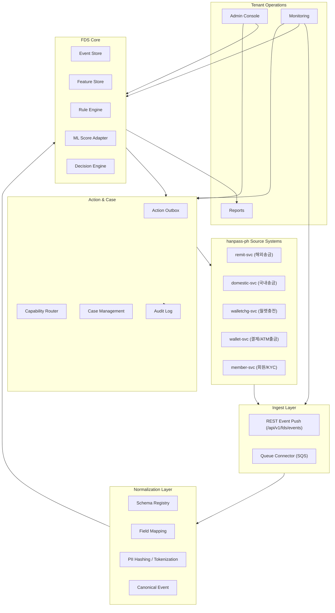
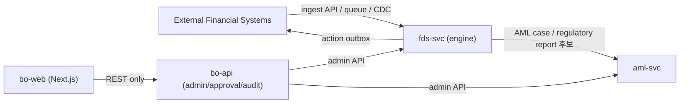
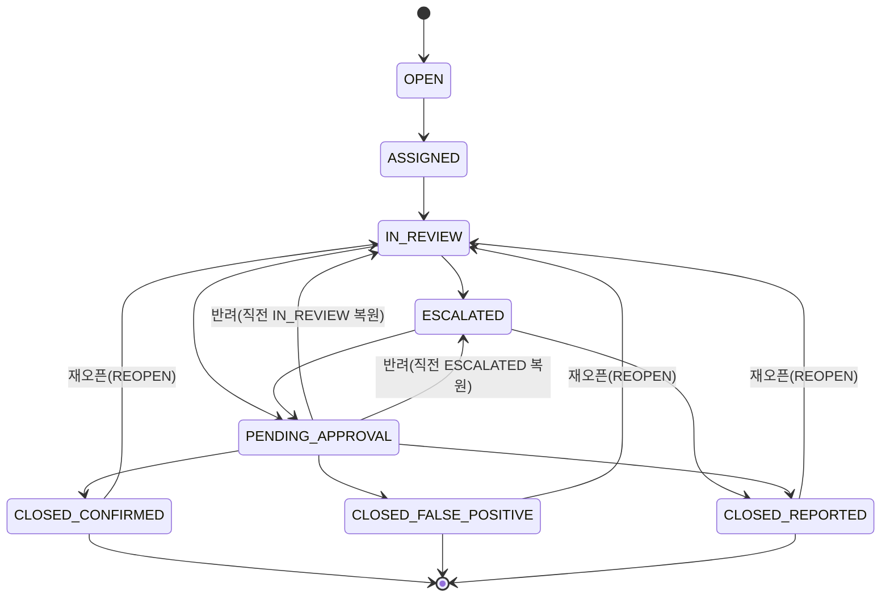
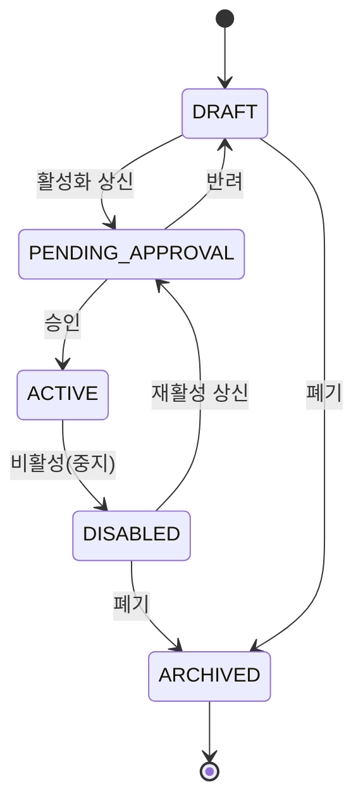
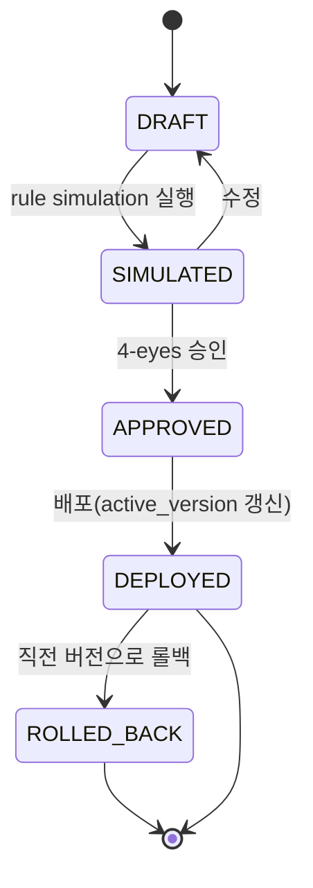
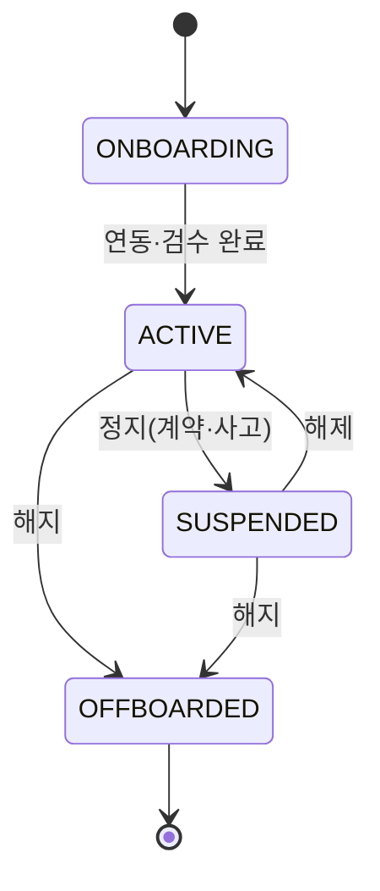
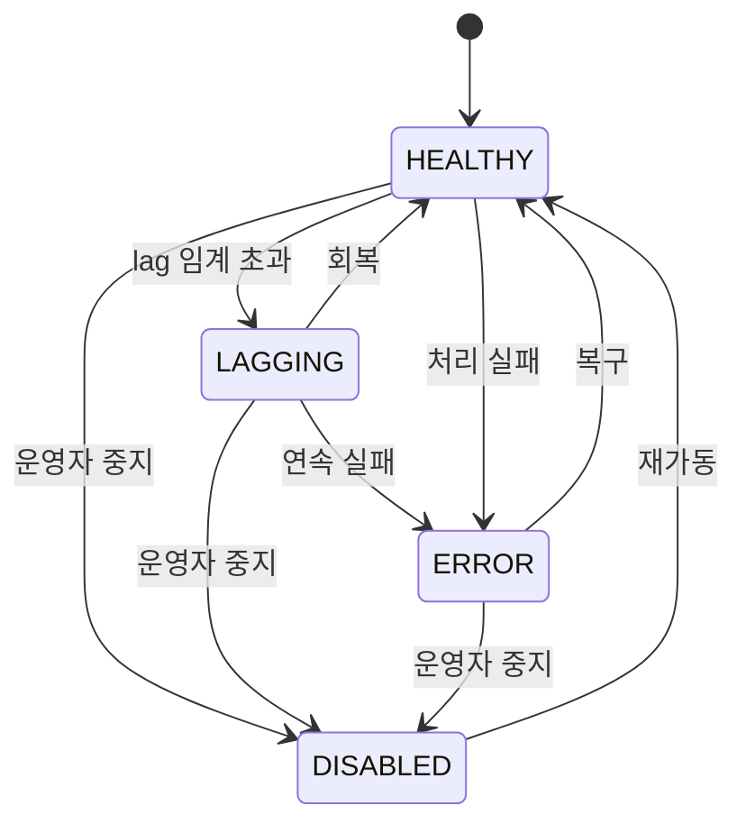
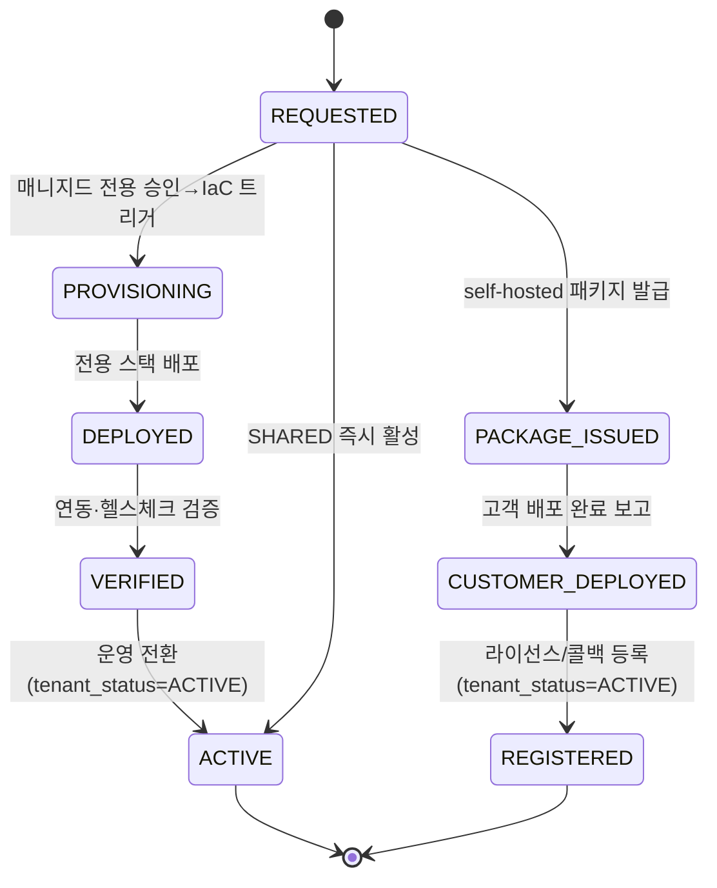
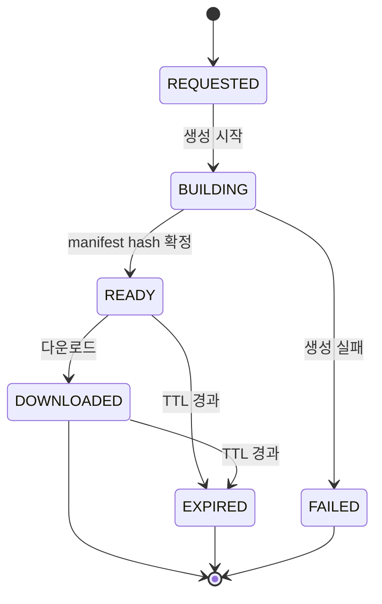
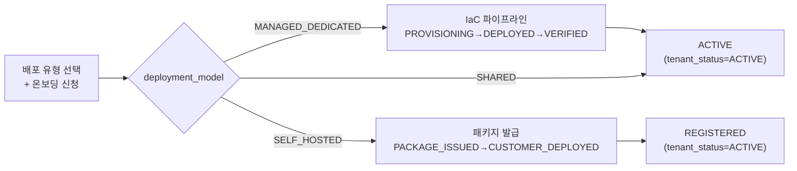

# hanpass-ph FDS(fds-svc) 소프트웨어 아키텍처 설계서

> 공통 inbound machine-auth 정본: [`../design/api/00-common-machine-auth.md`](../design/api/00-common-machine-auth.md) (P0-00 wire v2·credential version·durable nonce). 아웃바운드 webhook 서명은 별도 계약이다.

## 목차

1. [문서 목적](#1-문서-목적)
2. [제품 방향](#2-제품-방향)
3. [참조 구현으로서의 Hanpass FdsSvc](#3-참조-구현으로서의-hanpass-fdssvc)
4. [지원 대상 금융 도메인](#4-지원-대상-금융-도메인)
5. [핵심 설계 원칙](#5-핵심-설계-원칙)
6. [플랫폼 아키텍처](#6-플랫폼-아키텍처)
7. [공통 데이터 모델](#7-공통-데이터-모델)
8. [Canonical Event Taxonomy](#8-canonical-event-taxonomy)
9. [거래 수단·채널 모델](#9-거래-수단채널-모델)
10. [룰 엔진과 Feature Catalog](#10-룰-엔진과-feature-catalog)
11. [Action·Case·Investigation 모델](#11-actioncaseinvestigation-모델)
12. [외부 시스템 연동 방식](#12-외부-시스템-연동-방식)
13. [SaaS 멀티테넌시](#13-saas-멀티테넌시)
14. [데이터베이스 설계 방향](#14-데이터베이스-설계-방향)
15. [도메인별 확장 예시](#15-도메인별-확장-예시)
16. [보안·컴플라이언스·감사](#16-보안컴플라이언스감사)
17. [운영·관측성](#17-운영관측성)
18. [구축 로드맵](#18-구축-로드맵)
19. [오픈 결정사항](#19-오픈-결정사항)
20. [부록 A. 산출물 일습 매핑](#부록-a-산출물-일습-매핑-downstream)
21. [부록 B. 변경 이력](#부록-b-변경-이력)

---

## 1. 문서 목적

본 문서는 기존 Hanpass PH `FdsSvc`를 참조 구현(reference implementation)으로 삼아 구축한 **hanpass-ph 송금·월렛 서비스용 FDS(Fraud Detection System) 엔진(`fds-svc`)**의 소프트웨어 아키텍처 정본이다. 대상 시스템은 일반 멀티서비스 SaaS 플랫폼이 아니라 **hanpass-ph 한 운영 주체(테넌트 `tenant_demo`)의 FDS**이며, hanpass-ph가 실제로 발생시키는 송금·월렛 거래를 공통 캐논 이벤트로 정규화한 뒤 룰·케이스·액션을 운영한다.

대상 거래는 hanpass-ph가 운영하는 다음 5개 거래 채널이다(구현 정본 = `ChannelType` enum의 hanpass 운영 채널 + `scripts/demo_*` 시뮬레이터).

- 해외송금(`CROSS_BORDER_REMIT`) — `remit-svc`
- 국내송금(`DOMESTIC_REMIT`) — `domestic-svc`
- 월렛 충전(`CASH_IN`) — `walletchg-svc`
- 월렛 결제(`WALLET_PAYMENT`, PAY/QRPH) — `wallet-svc`
- ATM 출금(`WALLET_WITHDRAWAL`, DEBIT/ATM) — `wallet-svc`

> 파트너 인바운드 송금(`INBOUND_REMIT`, `inbound-svc`)은 소스 레지스트리에 예약돼 있으나 현재 시뮬레이터/룰에서 미운영이다.

핵심 목표는 hanpass-ph의 모든 거래 이벤트를 공통 모델로 정규화한 뒤 룰·케이스·액션을 같은 엔진에서 운영하고, 그 판단 근거를 검사 대응 가능한 증적으로 남기는 것이다. 멀티테넌시·캐논 이벤트 모델 등 인프라는 일반화돼 있으나(코드 truth), **운영 대상은 hanpass-ph 단일 테넌트**이다.

---

## 2. 제품 방향

### 2.1 제품 정의

hanpass-ph FDS(`fds-svc`)는 hanpass-ph가 자기 시스템의 송금·월렛 거래·회원·기기 이벤트를 연동하면, 실시간으로 이상거래를 탐지하고 조치할 수 있게 하는 위험 탐지 엔진이다. 엔진 자체는 멀티테넌시 인프라를 갖추고 있으나(코드 truth, §13), 운영 대상은 hanpass-ph 단일 테넌트이다.

본 엔진의 1차 운영 포지션은 단순 탐지 엔진이 아니라 **이상거래 판단·조치·증적을 자동화하는 FDS RegOps 엔진**이다. hanpass-ph 운영팀이 실제로 가치를 느끼는 지점은 rule hit 자체보다 다음 질문에 즉시 답할 수 있는 운영 증적이다.

- 어떤 거래를 어떤 rule/model version으로 탐지했는가?
- 어떤 입력 feature와 원천 이벤트 snapshot으로 판단했는가?
- block/hold/release/review 조치가 언제, 누구의 승인으로 실행됐는가?
- false positive로 종결한 근거와 승인 이력은 무엇인가?
- 보이스피싱·계정탈취·가맹점 abuse·내부자 우회 승인에 대해 기간별 대응 자료를 바로 제출할 수 있는가?
- connector 장애, 누락, replay, 중복 처리 이력이 감사 가능하게 남아 있는가?

가장 중요한 운영 목표는 **개발팀 의존 없이 hanpass-ph 준법감시·리스크·FDS 운영자가 직접 FDS를 운용할 수 있게 하는 것**이다. 개발팀의 역할은 초기 연동, 권한/IAM, 데이터 mapping, action adapter 구축까지로 제한하고, 이후 룰 변경·임계값 조정·watchlist 관리·case 처리·보고자료 생성·감사 대응은 비개발 조직이 UI와 승인 workflow로 수행해야 한다.

이를 위해 플랫폼은 다음을 기본 제공한다.

- no-code rule builder와 feature catalog
- 룰·그룹·threshold 변경의 maker-checker 승인
- 테스트 데이터 기반 rule simulation
- 배포 전 영향도 분석과 예상 hit rate
- rule version rollback
- case assignment, escalation, close reason 관리
- evidence export self-service
- 운영 대시보드와 connector health 확인
- 개발팀 개입 없는 tenant policy 변경 이력 관리

### 2.2 운영 대상 거래

hanpass-ph FDS는 hanpass-ph가 운영하는 송금·월렛 거래를 대상으로 한다(§1 5채널).

| hanpass-ph 거래 | 대표 탐지 대상 |
|---|---|
| 해외송금(`CROSS_BORDER_REMIT`, `remit-svc`) | 고액 송금, 수취인 재사용, corridor 위험, 보이스피싱·대포통장 |
| 국내송금(`DOMESTIC_REMIT`, `domestic-svc`) | 동일 수취계좌 velocity, 신규 수취인, 계정 탈취 |
| 월렛 충전(`CASH_IN`, `walletchg-svc`) | 고액 충전, 충전 후 즉시 출금, velocity |
| 월렛 결제(`WALLET_PAYMENT`, `wallet-svc` PAY/QRPH) | 가맹점 이상결제, 고액 결제 |
| ATM 출금(`WALLET_WITHDRAWAL`, `wallet-svc` DEBIT/ATM) | mule withdrawal, 고액 출금, geo anomaly |

> 멀티테넌시 인프라(§13)는 일반화돼 있으나 운영 테넌트는 hanpass-ph(`tenant_demo`) 단일이다.

### 2.3 엔진 모듈 (구현 정본)

아래는 `fds-svc` 구현 컴포넌트(유스케이스·어댑터)에 대응하는 모듈이다.

| 모듈 | 구현 컴포넌트(예) | 설명 |
|---|---|---|
| Ingest | `IngestEventService`, `adapter/in/rest`(`/events`), `adapter/in/sqs` | hanpass-ph 소스(remit/domestic/walletchg/wallet) 이벤트 수신·멱등·검증 |
| Feature Compute | `FeatureComputeAdapter`(`FeatureComputePort`) | 거래·채널·subject·velocity feature + `transaction.phpEquivalent`(PHP 환산) materialize |
| Rule Engine | `RuleEngine`(domain/rule), `RuleAdminService`, `RuleSimulationService` | DSL 기반 룰 평가, threshold, velocity, group match |
| Decision Engine | `EvaluateDecisionService` | `ALLOW`/`BLOCK`/`REVIEW`/`CHALLENGE` 등(`DecisionOutcome`) 결정 |
| Action Router | `ActionRelayService`, `ActionEmissionService`, `ActionOutboxPort` | capability 기반 block/hold/cancel/release/case-only action outbox 전달 |
| Case Management | `CaseWorkflowService`, `ApprovalService` | 조사 케이스, 4-eyes 승인, 증적 관리 |
| AML Handoff | `RestAmlHandoffPublisher`/`SqsAmlHandoffPublisher`(`AmlHandoffPort`) | `OPEN_AML_CASE`/`REGULATORY_REPORT` 후보를 aml-svc로 위임 |
| Admin | `RuleAdminService`·`ConnectorAdminService`·`SourceSystemAdminService`·`RiskGroupAdminService`·`NotifyChannelAdminService` 등 | 룰·connector·source·group·notify 관리 |
| Audit & Evidence | `AuditLogPort`, `EvidenceExportService`, `EvidenceTimelineService` | 감사로그, 증적 timeline, export(CSV/JSON/Excel/PDF) |
| Vendor Bridge(참조 인프라) | `ExternalDecisionService`, `ConnectorReconciliationService` | 기존 벤더 결정 ingest·dual-run·reconciliation. **hanpass-ph 현재 미운영, 인프라만 존재** |

> ML 스코어링 외부 어댑터는 현재 미구현이다. 룰 점수는 `RiskScoringPolicy`(domain)로 직렬화·합산하며, 외부 ML score 수신 포트는 후속(예정)이다.

### 2.4 도입 단계 (참조 로드맵)

아래는 참조 구현(Hanpass FdsSvc) 대비 hanpass-ph FDS 엔진의 단계적 도입 관점이다. 기존 벤더(예: 옥타솔루션) 병행 단계는 Vendor Bridge 인프라(§2.3)로 가능하나 현재 hanpass-ph 운영에는 적용하지 않는다.

| 단계 | 포지션 | 운영 가치 |
|---|---|---|
| 1단계 | Audit Evidence Hub | 기존 판정·거래 이벤트·수동 조치 이력을 한곳에 보존 |
| 2단계 | FDS Event Gateway | DB 직접 insert 대신 표준 event ingest(REST push) 제공 |
| 3단계 | Case & Report Automation | 조사·승인·종결·제출자료 생성을 자동화 |
| 4단계 | Rule/Decision Engine | 룰을 내장 FDS로 운영(현재 단계) |
| 5단계 | Full FDS | 탐지·조치·감사·리포트·모니터링 통합 운영 |

### 2.5 기존 벤더 대비 차별화 기준

| 기존 pain point | SaaS FDS 설계 기준 |
|---|---|
| 고객사 DB에 직접 insert하는 연동 | 표준 ingest API, queue, SFTP file, CDC, adapter SDK 제공 |
| 벤더 schema에 고객 서비스가 종속 | canonical event + mapping layer로 고객 도메인 분리 |
| 신규 상품 추가 시 연동 수정 과다 | domain pack과 schema version으로 확장 |
| 검사 대응 자료 수작업 | evidence snapshot, case timeline, report export 자동화 |
| 유지보수 품질 편차 | connector health, replay, dead-letter, mapping validation 대시보드 제공 |
| 판정 근거 설명 부족 | rule version, feature snapshot, input event hash, action approval을 함께 저장 |
| 룰 변경마다 개발팀 또는 벤더 요청 필요 | 준법감시실용 no-code rule builder, simulation, 승인 workflow 제공 |

### 2.6 준법감시실 자율 운영 원칙

SaaS FDS는 “개발팀이 만드는 시스템”이 아니라 “준법감시실이 운영하는 통제 플랫폼”이어야 한다.

| 운영 업무 | 준법감시실 직접 수행 | 개발팀 개입 필요 여부 |
|---|---|---|
| 룰 생성·수정·비활성 | 가능 | 불필요 |
| threshold 조정 | 가능 | 불필요 |
| watchlist/group 관리 | 가능 | 불필요 |
| rule simulation | 가능 | 불필요 |
| case 배정·검토·종결 | 가능 | 불필요 |
| false positive feedback | 가능 | 불필요 |
| 감사자료 export | 가능 | 불필요 |
| connector 신규 연동 | 불가 | 필요 |
| canonical schema 확장 | 제한적 | 필요 |
| action adapter 신규 개발 | 불가 | 필요 |

운영 UI는 개발자용 DSL 편집기가 아니라 준법감시 담당자가 이해할 수 있는 업무 언어로 제공해야 한다.

예시:

```text
최근 24시간 동안 동일 수취계좌로 5회 이상 송금했고
총액이 500만원 이상이며
고객 가입일이 7일 이내이면
REVIEW case를 생성한다.
```

내부적으로는 DSL 또는 JSON rule로 컴파일하되, 운영자는 조건, 기간, 금액, 국가, 채널, action을 화면에서 선택한다.

---

## 3. 참조 구현으로서의 Hanpass FdsSvc

Hanpass PH `FdsSvc`는 hanpass-ph FDS 엔진의 참조 구현이다. 그 구조(이벤트 ingest·룰 엔진·materialized state·outbox·감사 워크플로)를 헥사고날로 재구현하되, 운영 대상은 hanpass-ph 송금·월렛 5채널이다.

### 3.1 재사용할 개념

| Hanpass FdsSvc 요소 | hanpass-ph FDS 엔진에서의 재사용 방향 |
|---|---|
| SQS 이벤트 기반 ingest | REST push + Queue connector 패턴으로 인입 |
| `sourceService + eventType` 정규화 | `sourceSystem + schemaVersion + eventType` 정규화로 확장 |
| DSL 룰 엔진 | multi-domain feature catalog 기반 룰 엔진으로 확장 |
| materialized profile | subject/account/instrument/counterparty feature store로 확장 |
| outbox action relay | capability 기반 action router로 확장 |
| group 관리 | risk group, watchlist, allowlist, denylist 공통 모델로 확장 |
| AML/CTR/STR 큐 | jurisdiction별 regulatory case module로 분리 |
| AFASA freeze workflow | 한국형 지급정지·사고신고·분쟁거래 보류 workflow template의 참고 패턴으로 일반화 |

### 3.2 그대로 가져오면 안 되는 부분

| 현재 결합 | SaaS 신규 설계에서의 처리 |
|---|---|
| `WalletSvc` hold/release 중심 action | `HOLD_FUNDS`, `RELEASE_HOLD`, `CANCEL_TRANSACTION` 등 공통 action으로 추상화 |
| Hanpass 서비스명 이벤트 타입 | 외부 시스템별 adapter mapping으로 분리 |
| PH AML/AFASA 규정 중심 | 한국 전자금융·특금법·개인정보·금융보안 기준 policy pack으로 재설계 |
| 단일 회사 내부 BO 권한 | tenant / workspace / role / data-scope 기반 권한으로 확장 |
| 내부 DB schema 기준 materialization | SaaS 표준 canonical schema 기준 feature store로 재설계 |

---

## 4. 운영 대상 거래 도메인 (hanpass-ph)

hanpass-ph FDS는 거래를 “서비스명”이 아니라 “거래 행위”와 “자금 수단” 기준으로 모델링한다. 운영 대상은 hanpass-ph 5개 채널이다.

### 4.1 거래 도메인

| 도메인 | 채널(`ChannelType`) | 정규화 eventType | 주요 리스크 |
|---|---|---|---|
| 해외송금 | `CROSS_BORDER_REMIT`(`remit-svc`) | `remit.transfer.requested` | 고액 송금, 수취인 재사용, corridor 위험, 보이스피싱 |
| 국내송금 | `DOMESTIC_REMIT`(`domestic-svc`) | `domestic.transfer.requested` | 동일 수취계좌 velocity, 신규 수취인, 대포통장 |
| 월렛 충전 | `CASH_IN`(`walletchg-svc`) | `wallet.charge.requested` | 고액 충전, 충전 후 즉시 출금, velocity |
| 월렛 결제 | `WALLET_PAYMENT`(`wallet-svc` PAY/QRPH) | `wallet.pay.requested` | 가맹점 이상결제, 고액 결제 |
| ATM 출금 | `WALLET_WITHDRAWAL`(`wallet-svc` DEBIT/ATM) | `wallet.withdraw.requested` | mule withdrawal, 고액 출금, geo anomaly |

> 인입 정본 = `docs/integration/hanpass-ph-push-contract.md`. `ChannelType` enum에는 카드·PG·코인·무역·이커머스 등 다수 채널이 닫힌 enum으로 존재하나(§9.2), hanpass-ph는 위 5채널만 운영한다(나머지는 미사용). `INBOUND_REMIT`(`inbound-svc`)는 소스 레지스트리에 예약(미운영).

### 4.2 공통 판단

모든 거래는 아래 질문으로 정규화한다.

1. 누가 요청했는가? (`subject`, `actor`)
2. 어떤 자금 또는 가치가 움직이는가? (`transaction`, `asset`)
3. 어떤 수단에서 나가는가? (`fundingInstrument`)
4. 어디로 가는가? (`counterparty`, `beneficiaryInstrument`)
5. 어떤 채널에서 발생했는가? (`channel`, `paymentRail`)
6. 어떤 기기·위치·세션에서 발생했는가? (`device`, `location`, `session`)
7. 현재 조치 가능한가? (`controlCapability`)
8. 법규상 보고 또는 보존 의무가 있는가? (`jurisdiction`, `regulatoryFlags`)
9. 상업 증빙이 있는가? (`businessDocument`, `invoice`, `order`, `shipment`)
10. 정산 주체와 실제 수익자가 일치하는가? (`seller`, `merchant`, `ultimateBeneficiary`)

---

## 5. 핵심 설계 원칙

### 5.1 소스별 스키마가 아니라 공통 금융 이벤트 모델

해외송금·국내송금·월렛 충전/결제/출금 등 hanpass-ph 소스마다 별도 테이블을 만들면 엔진이 빠르게 복잡해진다. 원천(remit/domestic/walletchg/wallet)별 상세 payload는 adapter에서 처리하고, core는 공통 캐논 이벤트 모델만 본다.

### 5.2 룰 평가는 내부 materialized state만 사용

룰 평가 중 외부 API를 실시간 조회하지 않는다. 외부 조회는 ingest 또는 enrichment 단계에서 미리 materialize한다.

고객 국적·가입/KYC 경과일은 AML `customer.cdd.completed` 성공 트랜잭션의 outbox가 FDS 내부 프로필 API로 비동기 전달해 `fds_subjects`에 미리 materialize한다. 따라서 거래 승인 경로는 AML을 조회하지 않으며 거래마다 국적을 반복 전송하지 않는다. 기존 거래 스냅샷은 빈 프로필 bootstrap만 허용하고 CDD 값을 덮어쓰지 못한다.

이유:

- 거래 승인 경로 지연 방지
- 외부 API 장애가 FDS decision에 직접 전파되는 것 방지
- 동일 이벤트 replay 시 같은 결과 재현
- 감사 증적 보존

### 5.3 Action은 capability 기반

모든 시스템이 hold/release를 지원하지 않는다. 어떤 시스템은 block만 가능하고, 어떤 시스템은 case 생성만 가능하다. 따라서 action은 “무엇을 하고 싶은지”와 “그 시스템에서 가능한지”를 분리한다.

### 5.4 Dedicated-deployment first (multi-tenant within deployment)

FDS는 고객 PII·거래 데이터의 규제·내부보안 요건이 커서 **전용 배포가 기본**이다(공유 SaaS DB 아님). 격리는 DB 행/스키마 토글이 아니라 **배포 모델(`deployment_model`) + 온보딩 프로비저닝**의 산출이다(§13.0, target-architecture §4.1). `tenant_id`/`workspace_id`/`data_scope`는 **배포 내부 분리** 키이며, hanpass-ph 운영 배포에서는 `tenant_id`가 사실상 단일 값(`tenant_demo`)이다. 멀티테넌시 인프라(배포 모델·tenant별 schema version·workspace별 룰셋)는 코드 truth로 유지하되, 현재 운영 테넌트는 hanpass-ph 단일이다.

### 5.5 Compliance plugin

AML, STR, 고액현금거래 보고, 전자금융 이상거래 탐지, 보이스피싱 피해 의심거래, 내부통제 규정은 국가·업권마다 다르다. core decision engine은 공통으로 두되, 한국 시장용 규정 리포트와 workflow는 별도 policy pack으로 분리한다. (가상자산 Travel Rule 항목은 2026-07-09 Travel Rule 전면 제거로 삭제됨 — aegis-aml 84997e1, fds V9.)

---

## 6. 플랫폼 아키텍처


```mermaid
flowchart TB
    subgraph External["hanpass-ph Source Systems"]
        Remit["remit-svc (해외송금)"]
        Domestic["domestic-svc (국내송금)"]
        WalletChg["walletchg-svc (월렛충전)"]
        Wallet["wallet-svc (결제/ATM출금)"]
        Member["member-svc (회원/KYC)"]
    end

    subgraph Ingest["Ingest Layer"]
        Push["REST Event Push (/api/v1/fds/events)"]
        Queue["Queue Connector (SQS)"]
    end

    subgraph Normalize["Normalization Layer"]
        Schema["Schema Registry"]
        Mapper["Field Mapping"]
        PII["PII Hashing / Tokenization"]
        Canonical["Canonical Event"]
    end

    subgraph Core["FDS Core"]
        Store["Event Store"]
        Feature["Feature Store"]
        Rule["Rule Engine"]
        ML["ML Score Adapter"]
        Decision["Decision Engine"]
    end

    subgraph Action["Action & Case"]
        Outbox["Action Outbox"]
        Router["Capability Router"]
        Case["Case Management"]
        AuditLog["Audit Log"]
    end

    subgraph TenantOps["Tenant Operations"]
        Admin["Admin Console"]
        Reports["Reports"]
        Monitor["Monitoring"]
    end

    External --> Ingest --> Normalize --> Core --> Action
    Admin --> Core
    Admin --> Action
    Action --> External
    Core --> Reports
    Action --> AuditLog
    Monitor --> Ingest
    Monitor --> Core
    Monitor --> Action
```

### 6.1 정본 아키텍처 매핑 (4서비스 모노레포)

본 설계서의 논리 컴포넌트는 정본(`.claude/skills/_shared/target-architecture.md`)의 **4서비스 모노레포**로 물리 배치된다. FDS 설계서의 책임 경계는 **`fds-svc`** 이며, 운영 콘솔·결재·감사 UI는 `bo-api`/`bo-web`가, AML 규제 케이스는 `aml-svc`가 담당한다.

| 논리 컴포넌트(본 문서) | 물리 서비스 | 비고 |
|---|---|---|
| Ingest / Normalization / Feature Store / Rule Engine / Decision / Action Router | `services/fds-svc` | FDS 엔진 백엔드 (Java 25, Spring Boot 3.5.x, 헥사고날) |
| AML/STR/CTR regulatory case, sanction/PEP screening | `services/aml-svc` | AML 엔진. FDS는 `OPEN_AML_CASE`/`REGULATORY_REPORT` 후보를 aml-svc로 위임 (Travel Rule은 2026-07-09 전면 제거 — aegis-aml 84997e1) |
| Admin Console, 결재(maker-checker), 감사·리포트 집약, IAM | `services/bo-api` | fds-svc·aml-svc admin API를 운영자용으로 집약·인증·감사 |
| no-code rule builder, case 화면, evidence export UI, 운영 대시보드 | `services/bo-web` | Next.js 16. bo-api 경유만 허용(엔진 직접 호출 금지) |


```mermaid
flowchart LR
    Ext["External Financial Systems"] -->|ingest API / queue / CDC| FDS["fds-svc (engine)"]
    FDS -->|AML case / regulatory report 후보| AML["aml-svc"]
    BOWEB["bo-web (Next.js)"] -->|REST only| BOAPI["bo-api (admin/approval/audit)"]
    BOAPI -->|admin API| FDS
    BOAPI -->|admin API| AML
    FDS -->|action outbox| Ext
```

### 6.2 fds-svc 헥사고날 패키지 레이아웃

설계 표기(design notation)는 `com.hanpass.fds` 하위로 배치한다. 단, **구현(aegis-aml) 패키지 루트는 `com.aegis.fds`** 이다(정본 target-architecture §5 — `com.aegis.{fds,aml,backoffice}`, 로드맵 §0). 본 문서의 `com.hanpass.fds` 표기는 참조 구현(Hanpass FdsSvc)과 동일한 레이아웃을 보이기 위한 설계 표기이며, 실제 코드 패키지 루트는 `com.aegis.fds`로 치환한다. 도메인 불변식은 `domain`, 유스케이스·트랜잭션 경계는 `application`, I/O는 `adapter`.

```
com.hanpass.fds
├── domain/        # CanonicalEvent, Subject, Actor, Instrument, Transaction,
│                  #   Decision, Action, Case, RiskGroup, RuleSet 등 ADT·불변식
├── application/
│   ├── usecase/   # IngestEvent, EvaluateDecision, QueryDecisionEvidence, RouteAction, ManageCase,
│   │              #   ManageApproval, ManageRule, SimulateRule, ManageGroup, ExportEvidence,
│   │              #   ManageSourceSystem, VendorBridge
│   ├── port/in/   # IngestEventUseCase, EvaluateDecisionUseCase, RouteActionUseCase,
│   │              #   QueryDecisionEvidenceUseCase(판정 발동 룰 근거 거래 전수 조회, API §4.2),
│   │              #   ManageCaseUseCase, ManageApprovalUseCase,
│   │              #   ManageRuleUseCase, SimulateRuleUseCase,
│   │              #   ManageGroupUseCase, ExportEvidenceUseCase,
│   │              #   ManageSourceSystemUseCase, VendorBridgeUseCase
│   │              #   (유스케이스↔API 그룹 정본은 API 명세 §4)
│   └── port/out/  # CanonicalEventStorePort, FeatureStorePort, ActionOutboxPort,
│                  #   AmlCasePort(aml-svc), SchemaRegistryPort, DecisionEvidenceQueryPort,
│                  #   ApprovalStorePort, CaseStorePort, EvidenceExportPort
├── adapter/
│   ├── in/rest/        # Case·Action·Evidence·Admin·Approval·VendorBridge API 50종+
│   │                   #   (경로·요청·응답 정본은 API 명세 §4 — 본 주석은 그룹 요약)
│   │                   #   예) POST /api/v1/fds/events, POST /api/v1/fds/decisions/evaluate
│   ├── in/sqs/         # Queue Connector consumer
│   ├── in/scheduled/   # Polling/CDC/reconciliation jobs
│   │                   #   ActionRelayScheduler: fds_actions outbox 자동 디스패처
│   │                   #   (relay/retry sweep, @Profile("aws"), 연동 §6.2.1)
│   ├── out/persistence/# fds_* 테이블 (PostgreSQL)
│   └── out/external/   # action adapter, aml-svc client, ML score client
└── global/        # tenant context, traceId 전파, 보안/마스킹 필터, 설정
```

> `adapter/in/rest`의 엔드포인트 전수·요청/응답 스키마 정본은 **API 명세(`docs/design/api/01-fds-api.md` §4)** 이며, 위 주석은 그룹 요약이다(Case·Action·Evidence·Admin·Approval·External Vendor Bridge). `port/in`의 유스케이스 포트는 API §4 그룹(ManageCase·ManageApproval·ExportEvidence·ManageGroup·ManageSourceSystem·VendorBridge 등)과 1:1 대응한다. **`ManageRuleUseCase`는 룰 생성·수정·활성화·rollback(API §4.6 Rule Admin 11종, 4-eyes `subjectKind=RULE`)의 생명주기 관리 포트이며, `SimulateRuleUseCase`(룰 시뮬레이션/백테스트, `POST /api/v1/admin/fds/rules/simulations`)와 역할이 분리된다.** **Decision 조회 그룹(API §4.2)은 `DecisionQueryController`가 단건(`GET /decisions/{id}`)·목록(`GET /decisions`)에 더해 `GET /decisions/{decisionId}/evidence-transactions`(판정 발동 룰 근거 거래 전수 페이징, 요구2)를 제공한다 — 인바운드 포트 `QueryDecisionEvidenceUseCase`, 아웃바운드 포트 `DecisionEvidenceQueryPort`(발동 룰 evidence 윈도우 해소 + 근거 거래 조회), 응답 DTO `DecisionEvidenceTransactionsResponse`(API §5.4a).**
>
> bo-api·bo-web은 정본의 별도 레이아웃(패키지-바이-피처 / Next.js App Router)을 따르며, 본 문서의 enum·API·규칙을 그대로 입력으로 사용한다.

---

## 7. 공통 데이터 모델

hanpass-ph FDS의 데이터 모델은 다음 상위 객체를 중심으로 잡는다. Business Entity·Business Document·Order·Settlement(commerce/trade 도메인)는 `domain/commerce`·`domain/evidence`에 코드로 존재하나 hanpass-ph 5채널에서는 사용하지 않는 인프라 객체이다(닫힌 도메인 잔존).

### 7.1 핵심 객체

| 객체 | 의미 | 예시(hanpass-ph) |
|---|---|---|
| Tenant | 운영 주체(전용 배포) | hanpass-ph(`tenant_demo`) 단일 |
| Source System | 이벤트 원천 시스템 | remit-svc, domestic-svc, walletchg-svc, wallet-svc, member-svc / (AML) core-banking |
| Subject | 위험 판단 대상 회원·계좌주 | hanpass-ph 개인 회원 |
| Actor | 이벤트를 수행한 행위자 | 회원, 시스템 |
| Account | 금융 계정 | 월렛 계정, 송금 수취/출금 계좌 |
| Instrument | 자금 수단 | 월렛, 은행 계좌 |
| Counterparty | 상대방 | 송금 수취인, 결제 가맹점 |
| Business Entity / Document / Order / Settlement | 상업 거래 주체·증빙·주문·정산 | commerce/trade 인프라 객체 — **hanpass-ph 미사용** |
| Transaction | 자금 또는 가치 이동 | 송금, 출금, 충전, 결제 |
| Event | 상태 변화 | requested, authorized, completed, failed |
| Decision | FDS 판단 결과 | allow, block, review, challenge |
| Action | 외부 조치 | hold, cancel, release, case |
| Case | 조사 케이스 | fraud case, AML case(위임) |

### 7.2 Subject와 Actor 분리

대부분 hanpass-ph 거래는 회원 본인이 subject=actor이나, 시스템/배치가 actor일 수 있어 `subject`와 `actor`를 분리한다(인프라는 직원·API key actor도 지원).

| 시나리오 | Subject | Actor |
|---|---|---|
| 회원 송금/충전/결제 | 회원 | 회원 |
| ATM 출금 | 회원 | 회원 |
| 시스템 자동 처리 | 회원 | batch system |

### 7.3 Transaction과 Event 분리

하나의 transaction에는 여러 event가 발생한다.

예: 해외송금(`CROSS_BORDER_REMIT`)

```text
remit.transfer.requested
remit.transfer.authorized
remit.transfer.completed
remit.transfer.failed
```

예: 월렛 충전(`CASH_IN`)

```text
wallet.charge.requested
wallet.charge.authorized
wallet.charge.completed
```

예: ATM 출금(`WALLET_WITHDRAWAL`)

```text
wallet.withdraw.requested
wallet.withdraw.authorized
wallet.withdraw.completed
```

FDS는 각 event를 평가하되, decision과 action은 transaction 단위로도 조회 가능해야 한다.

---

## 8. Canonical Event Taxonomy

### 8.1 최상위 event family

`EventFamily` enum(구현 정본, 19종 닫힌 enum)은 다음과 같다. **hanpass-ph가 실제 운영하는 transaction-bearing family는 `remit.*`·`domestic.*`·`wallet.*`(+`transaction.*` 일반)** 이며, 나머지는 enum에 존재하나 hanpass-ph 미사용이다.

| Family | 설명 | hanpass-ph |
|---|---|---|
| `transaction.*` | 금융거래 요청·승인·완료·실패·환불(일반 캐논) | 운영(AML 정규 집계) |
| `remit.*` | 해외송금(`remit.transfer.requested`) | **운영** |
| `domestic.*` | 국내송금(`domestic.transfer.requested`) | **운영** |
| `wallet.*` | 월렛 충전/결제/출금(`wallet.charge.requested`·`wallet.pay.requested`·`wallet.withdraw.requested`) | **운영** |
| `authorization.*` | 카드/ATM/계좌 승인 단계 | 미사용 |
| `settlement.*` | 정산 | 미사용 |
| `trade.*` | 무역대금·선적·통관 | 미사용 |
| `invoice.*` | B2B 인보이스 | 미사용 |
| `order.*` / `seller.*` | 이커머스 주문·셀러 정산 | 미사용 |
| `account.*` / `instrument.*` | 계좌·수단 등록·상태 변경 | 인프라 |
| `member.*` | 회원/KYC/profile 변경 | 운영(회원 마스터) |
| `device.*` / `session.*` | 기기·세션 | 인프라 |
| `employee.*` / `market.*` | 내부 직원·시세 | 미사용 |
| `aml.*` / `case.*` | AML screening·조사 케이스 | 내부 생성·위임 |

> `remit.*`·`domestic.*`·`wallet.*`은 hanpass-ph 결제 taxonomy family이며 transaction-bearing(`CanonicalEvent.isTransactionBearing()` → `transactionRef`+`transactionType` 필수)이고 외부 ingest 대상이다.
>
> `aml.*`·`case.*` family는 **fds-svc 내부 생성·aml-svc 위임 이벤트**이며 외부 ingest 대상이 아니다(`EventFamily.isExternallyIngestable()=false`, integration §3.1·§9). 외부 connector가 `aml.*`/`case.*` event를 push해도 ingest에서 수용하지 않는다.

### 8.2 Canonical event 예시

hanpass-ph 해외송금(`remit-svc`) 인입 예시(`POST /api/v1/fds/events`):

```json
{
  "messageVersion": "v1",
  "tenantId": "tenant_demo",
  "workspaceId": "default",
  "sourceSystem": "remit-svc",
  "schemaVersion": "remit-svc.v1",
  "eventId": "remit-evt-001",
  "idempotencyKey": "remit-svc:remit-evt-001",
  "eventType": "remit.transfer.requested",
  "correlationId": "corr-remit-evt-001",
  "traceparent": "00-8f3c...-...-01",
  "occurredAt": "2026-06-06T19:00:00+09:00",
  "subject": {
    "subjectType": "PERSON",
    "subjectRef": "subj_hmac_123",
    "country": "KR"
  },
  "actor": {
    "actorType": "CUSTOMER",
    "actorRef": "subj_hmac_123"
  },
  "transaction": {
    "transactionRef": "RMT-0001",
    "transactionType": "REMITTANCE",
    "direction": "OUTBOUND",
    "amount": "5000.00",
    "currency": "KRW",
    "amountBase": "5000.00",
    "baseCurrency": "USD",
    "status": "REQUESTED",
    "phpEquivalent": "280000.00"
  },
  "instrument": {
    "instrumentType": "WALLET",
    "instrumentRef": "wallet_token_123",
    "accountRef": "acct_hmac_123"
  },
  "channel": {
    "channelType": "CROSS_BORDER_REMIT",
    "paymentRail": "PARTNER_API"
  },
  "corridor": {
    "sendCountry": "KR",
    "receiveCountry": "PH",
    "sendCurrency": "KRW",
    "receiveCurrency": "PHP"
  },
  "payloadHash": "sha256:..."
}
```

> `transaction.phpEquivalent`(결제액 PHP 환산)은 캐논 typed 컬럼이 아니라 `canonicalPayload.transaction.phpEquivalent`로 운반돼 `FeatureComputeAdapter`가 룰 feature `transaction.phpEquivalent`로 노출한다(부재/파싱불가 시 미노출, fail-safe). 룰 임계는 PHP 환산값으로 발화한다(§10.2). 캐논 스키마 정본에는 미정의 — 데모 grounding feature(예정).

### 8.3 필수 필드

| 필드 | 필수 여부 | 비고 |
|---|---|---|
| `messageVersion` | 필수 | 큐 메시지 직렬화 버전(enum `v1`, integration §4.1) |
| `schemaVersion` | 조건부 필수 | 이벤트 메시지 필수. `sourceSystem`별 canonical schema 버전(예 `atm-switch.v1`, integration §4.1) |
| `correlationId` | 필수 | end-to-end 추적 키. SQS message attribute로도 전파(integration §4.1) |
| `traceparent` | 선택 | W3C traceparent. 분산 추적 전파 ↔ `fds_audit_logs.trace_id`(integration §4.1) |
| `tenantId` | 필수 | multi-tenant partition key |
| `workspaceId` | 필수 | tenant 내 서비스/환경 분리 키. 미지정 시 `default`(§13.0b, integration §4.1) |
| `sourceSystem` | 필수 | connector와 schema 식별 |
| `eventId` | 필수 | 원천 이벤트 id |
| `idempotencyKey` | 필수 | 중복 방지 |
| `eventType` | 필수 | canonical event type |
| `occurredAt` | 필수 | 원천 발생 시각. ISO-8601 TZ 필수(UTC `Z` 또는 offset 모두 허용, 내부 저장은 UTC, integration §4.2) |
| `subject.subjectRef` | 조건부 필수 | 고객 중심 거래에는 필수 |
| `actor.actorRef` | 조건부 필수 | 내부 감사·직원 작업에는 필수 |
| `transaction.transactionRef` | 조건부 필수 | 거래 이벤트에는 필수 |
| `transaction.transactionType` | 조건부 필수 | 거래 이벤트에는 필수. **폐쇄 enum 정본 = DB §4.19 `transaction_type` 12종**(예 `WITHDRAWAL`) — 본 설계서는 enum을 재정의하지 않고 DB §4.19를 참조한다 |
| `amount/currency` | 조건부 필수 | 금액성 이벤트에는 필수 |
| `instrument.instrumentRef` | 권장 | 수단 기반 룰에 필요 |
| `channel.channelType` | 필수 | 도메인 routing과 룰 필드에 필요 |
| `payloadHash` | 권장 | 원천 payload 무결성 해시(최상위 평면 필드 `sha256:...`, integration §4.2) |

> **교차 주석(AML 설계서 §8.2 대응)**: FDS envelope는 `workspaceId` 최상위 필수, AML envelope는 `dataScope` 최상위(선택)로 **의도된 비대칭**이다(연동 §4.1 cross-service 정책 정본). FDS→AML 핸드오프(`fds-aml-handoff`) 시 핸드오프 어댑터(aml-svc 소비 측)가 `workspaceId`→`dataScope`로 변환한다(`default` 매핑 포함).

---

## 9. 거래 수단·채널 모델

### 9.1 Instrument type

| Type | 설명 | 예시 |
|---|---|---|
| `WALLET` | 전자지갑 계정 | wallet account |
| `BANK_ACCOUNT` | 은행 계좌 | CASA, checking, savings |
| `CARD` | 카드 | debit, credit, prepaid |
| `VIRTUAL_ACCOUNT` | 가상계좌 | VA deposit account |
| `CRYPTO_ADDRESS` | 블록체인 주소 | BTC/ETH/USDT address |
| `CASH` | 현금 취급점 | ATM, agent cash pickup |
| `MERCHANT_ACCOUNT` | merchant 정산 계정 | PG merchant |
| `API_KEY` | 시스템 행위 수단 | exchange API key, corporate API |
| `EMPLOYEE_ACCOUNT` | 내부 직원 계정 | bank teller, backoffice user |
| `CORPORATE_BANK_ACCOUNT` | 법인 계좌 | 무역대금 지급 계좌 |
| `SELLER_SETTLEMENT_ACCOUNT` | 셀러 정산 계좌 | 마켓플레이스 정산 계좌 |
| `ESCROW_ACCOUNT` | 에스크로 계정 | 구매확정 전 보관 계정 |

> `InstrumentType`은 닫힌 enum(12종)이다. hanpass-ph는 주로 `WALLET`(월렛)·`BANK_ACCOUNT`(송금 수취/출금계좌)를 사용하며, `CARD`/`VIRTUAL_ACCOUNT`/`CRYPTO_ADDRESS`/`MERCHANT_ACCOUNT`/법인·셀러·에스크로 계정은 미사용(닫힌 enum 잔존).

### 9.2 Channel type

`ChannelType`은 닫힌 enum(구현 정본, 21종)이다. **hanpass-ph가 운영하는 채널은 아래 ✅ 5종**이며, 나머지는 enum에 존재하나 미운영이다(닫힌 enum 잔존 — 향후 채널 확장 슬롯).

| Channel | 설명 | hanpass-ph |
|---|---|---|
| `CROSS_BORDER_REMIT` | 해외송금(`remit-svc`) | ✅ |
| `DOMESTIC_REMIT` | 국내송금(`domestic-svc`) | ✅ |
| `CASH_IN` | 월렛 충전(`walletchg-svc`, top-up) | ✅ |
| `WALLET_PAYMENT` | 월렛 결제(`wallet-svc` PAY/QRPH) | ✅ |
| `WALLET_WITHDRAWAL` | 월렛/ATM 출금(`wallet-svc` DEBIT) | ✅ |
| `INBOUND_REMIT` | 파트너 인바운드 송금(`inbound-svc`) | 예약(미운영) |
| `CARD_PRESENT` | 오프라인 카드 결제 | 미사용 |
| `CARD_NOT_PRESENT` | 온라인 카드 결제 | 미사용 |
| `ATM` | ATM 출금·조회 | 미사용 |
| `BANK_TRANSFER` | 계좌이체 | 미사용 |
| `PG_PAYMENT` | PG 결제 | 미사용 |
| `VIRTUAL_ACCOUNT_DEPOSIT` | 가상계좌 입금 | 미사용 |
| `CRYPTO_DEPOSIT` / `CRYPTO_WITHDRAWAL` | 가상자산 입출금 | 미사용 |
| `EXCHANGE_TRADE` | 코인/증권 주문·체결 | 미사용 |
| `INTERNAL_OPERATION` | 내부 직원 작업 | 미사용 |
| `BATCH_SETTLEMENT` | 정산 batch | 미사용 |
| `TRADE_PAYMENT` | 무역대금 지급·수취 | 미사용 |
| `CROSS_BORDER_ECOMMERCE_SETTLEMENT` | 해외 이커머스 판매대금 국내 정산 | 미사용 |
| `MARKETPLACE_SELLER_PAYOUT` | 마켓플레이스 셀러 정산 | 미사용 |
| `B2B_INVOICE_PAYMENT` | 법인 인보이스 지급 | 미사용 |

> 운영 5채널은 `wallet-svc`(PAY/QRPH→`WALLET_PAYMENT`, DEBIT/ATM→`WALLET_WITHDRAWAL`) 1개 소스가 2채널을 발생시킨다. `ChannelType.domain()`은 Phase 3 risk domain 분류(`WALLET`/`DOMESTIC_TRANSFER`/`OTHER` 등)에 쓰인다.

### 9.3 Payment rail

| Rail | 예시 |
|---|---|
| `INTERNAL_LEDGER` | 내부 원장 |
| `CARD_NETWORK` | Visa/Master/JCB/local card network |
| `ATM_SWITCH` | ATM network |
| `BANK_ACH` | ACH류 계좌이체 |
| `OPEN_BANKING` | 한국 오픈뱅킹 |
| `FIRM_BANKING` | 펌뱅킹 / 가상계좌 / 기업뱅킹 연계 |
| `CMS` | 자동이체 / 출금이체 |
| `BANK_CD_NETWORK` | CD/ATM 공동망 |
| `EASY_PAY` | 간편결제 / 선불전자지급수단 |
| `VAN_PG` | VAN/PG 결제망 |
| `SWIFT` | 해외 은행망 |
| `LOCAL_RTP` | 국가별 실시간 이체망 |
| `PARTNER_API` | 파트너 API 송금 |
| `BLOCKCHAIN` | on-chain transfer |
| `MANUAL_BACKOFFICE` | 내부 수동 처리 |
| `ESCROW` | 에스크로 보관·해제 |
| `MARKETPLACE_SETTLEMENT` | 마켓플레이스 정산 |
| `TRADE_FINANCE` | 무역금융 / 무역대금 결제 |

> `PaymentRail`은 닫힌 enum(18종)이다. hanpass-ph 송금/월렛은 주로 `PARTNER_API`(파트너 송금)·`INTERNAL_LEDGER`(내부 원장)·`EASY_PAY`(간편결제/선불)를 사용하며, 카드망·SWIFT·블록체인·무역금융 등은 미사용(닫힌 enum 잔존).

### 9.4 Control capability

거래 수단마다 FDS가 할 수 있는 조치가 다르다.

| Capability | 설명 |
|---|---|
| `CAN_BLOCK_BEFORE_AUTH` | 승인 전 block 가능 |
| `CAN_DECLINE_AUTH` | 카드/ATM authorization decline 가능 |
| `CAN_HOLD_FUNDS` | 자금 hold 가능 |
| `CAN_EXTEND_HOLD` | hold TTL 연장 가능 |
| `CAN_RELEASE_HOLD` | hold 해제 가능 |
| `CAN_CANCEL_BEFORE_SETTLEMENT` | settlement 전 취소 가능 |
| `CAN_REQUEST_REVERSAL` | 완료 후 reversal 요청 가능 |
| `CAN_SUSPEND_INSTRUMENT` | 계좌/카드/지갑 정지 가능 |
| `CAN_OPEN_CASE_ONLY` | 자동 제어 불가, case 생성만 가능 |

---

## 10. 룰 엔진과 Feature Catalog

### 10.1 Feature category

| Category | Feature 예시 |
|---|---|
| Subject | age, country, KYC level, risk rating, account age |
| Transaction | amount, currency, amount base, direction, status, **phpEquivalent(결제액 PHP 환산)** |
| Instrument | type, issuer, age, status, previous usage |
| Counterparty | beneficiary country, beneficiary account key |
| Device | device id, fingerprint, first seen, device change |
| Location | IP country, geo distance, corridor(send/receive country) |
| Velocity | count/sum in window by subject/instrument/counterparty |
| Behavior | baseline deviation, unusual channel, time-of-day anomaly |
| Group | blacklist, whitelist, watchlist, mule network group |
| AML | sanction hit, PEP, structuring(위임 후보) |

> `transaction.phpEquivalent`는 `FeatureComputeAdapter`가 `canonicalPayload.transaction.phpEquivalent`에서 독해해 노출하는 hanpass-ph grounding feature이다(부재 시 미노출). `RiskGroup`(watchlist/allowlist) 매칭은 `GroupMembership`로 룰에 노출된다.
>
> no-code 화면은 `측정항목 비교/시간창 집계` 두 추상 종류를 먼저 고르게 하지 않는다. 실제 enabled catalog를 카테고리별 첫 select로 직접 노출하고, subject count/sum 및 receiveCountry/channelType distinct의 10m/1h/6h/24h materialized key를 일반 `cmp` leaf로 컴파일한다. 조건 그룹은 최대 3단계 AND/OR 중첩이며 엔진의 폐쇄 `RuleDslParser`가 그대로 평가한다.
>
> `FeatureComputeAdapter`에는 Internal Audit·Merchant·Crypto·Trade·Commerce·Settlement(Phase 7 advanced domain) feature 계산 분기가 코드에 존재하나, 이는 `EventFamily`(trade/order/seller/invoice/employee/market)·미운영 채널에만 routing되며 **hanpass-ph 5채널에서는 트리거되지 않는다**(닫힌 분기 잔존). 외부 인텔리전스 의존 신호(주소 위험·HS code·risk grade 등)는 catalog input slot으로 룰 빌더가 값을 주입(연동 미정).

### 10.2 룰 예시 (hanpass-ph 운영 데모 룰)

임계는 결제액 PHP 환산(`transaction.phpEquivalent`) 기준이다(데모 룰 정본 = Flyway `V22__demo_rules_php_equivalent.sql`, USD 임계 × 56 환산). hanpass PH CTR(₱500,000)은 운영 임계 참고치이다.

해외송금 REVIEW:

```text
IF channelType = CROSS_BORDER_REMIT
AND transaction.phpEquivalent >= 280000
THEN REVIEW
```

국내송금 REVIEW(고액):

```text
IF channelType = DOMESTIC_REMIT
AND transaction.phpEquivalent >= 112000
THEN REVIEW
```

국내송금 velocity:

```text
IF channelType = DOMESTIC_REMIT
AND velocity.count(subject, 24h) >= 5
THEN REVIEW
```

월렛 충전 BLOCK:

```text
IF channelType = CASH_IN
AND transaction.phpEquivalent >= 560000
THEN BLOCK
```

월렛 결제 REVIEW:

```text
IF channelType = WALLET_PAYMENT
AND transaction.phpEquivalent >= 168000
THEN REVIEW
```

ATM 출금 CHALLENGE:

```text
IF channelType = WALLET_WITHDRAWAL
AND transaction.phpEquivalent >= 84000
THEN CHALLENGE
```

> 위 룰의 outcome(`REVIEW`/`BLOCK`/`CHALLENGE`)은 `DecisionOutcome` enum이며, `OPEN_AML_CASE`/`REGULATORY_REPORT` 후보는 §11.2a 매핑으로 정본 `action_type`(+`case_type`)으로 환원해 aml-svc로 위임한다. mule 계좌 등 `IN_GROUP` 매칭은 `RiskGroup`(watchlist)으로 노출한다.

---

## 11. Action·Case·Investigation 모델

### 11.1 Decision

| Decision | 설명 |
|---|---|
| `ALLOW` | 허용 |
| `MONITOR` | 기록만 |
| `REVIEW` | 수동 검토 필요 |
| `CHALLENGE` | 추가 인증 필요 |
| `BLOCK` | 승인 전 차단 |
| `HOLD` | 자금 hold |
| `FREEZE` | 규정 기반 동결 |
| `REPORT` | 규제 보고 후보 |

#### 11.1.1 riskScore 산출 정책 (D-05 1차 룰 파생, 확정)

`riskScore`(API §5.4 `decimal(8,4)`, 0~100, DB `fds_decisions.risk_score NUMERIC(8,4)`)는 decision 산출 시 항상 비-null로 결선한다. 산출은 **outcome severity → score 결정론적·단조 매핑**(룰 파생 1차 정책)으로 한다. severity 순서(위 Decision 표 = DB §4.7 enum 선언 순서 `ALLOW<MONITOR<REVIEW<CHALLENGE<BLOCK<HOLD<FREEZE<REPORT`)를 [0,100]에 단조 사상한다:

| outcome | riskScore |
|---|---|
| `ALLOW` | `0.0000` |
| `MONITOR` | `15.0000` |
| `REVIEW` | `40.0000` |
| `CHALLENGE` | `55.0000` |
| `BLOCK` | `70.0000` |
| `HOLD` | `80.0000` |
| `FREEZE` | `90.0000` |
| `REPORT` | `100.0000` |

산출값은 `decimal(8,4)`(scale 4, HALF_UP)로 정규화한다(`RiskScoringPolicy`). 멱등 재요청(idempotent replay)은 영속 decision의 score를 그대로 반환하며 **재산출하지 않는다**. fail-policy(D-14) 분기·event-missing 분기도 동일 정책으로 산출한다(예: 기본 `REVIEW`→`40.0000`).

> **D-05 후속 확장**: 외부 ML score 수신 시 그 값을 우선하고, 미수신(룰 only 워크스페이스)에서는 본 룰 파생 정책을 fallback으로 사용한다. matched rule 가산 severity(weight) 모델은 룰 스키마에 score 필드가 없어 본 라운드 비채택이며, 룰 스키마 확장 시 재논의한다. (PRD BR-002: 화면은 수신 점수만 표시, 산출 로직 미노출.)

### 11.2 Action

`action_type`의 정본은 **API 명세(`docs/design/api/01-fds-api.md` §5.7·§7·§10(OpenAPI) `ActionType` enum, 22종)** 이다(마스터 위치 §1.1 명시). DB(`fds_actions.action_type`)·integration capability matrix·본 설계서는 이 22종으로 동기화한다(2026-07-09 Travel Rule 전면 제거로 `REQUEST_TRAVEL_RULE_INFO` 삭제 — aegis-aml 84997e1, fds V9). API §9는 Webhook 콜백 계약이며 enum 마스터가 아니다. §15의 도메인별 '가능 action' 서술에 등장하는 `OPEN_*_CASE`·`SUSPEND_MERCHANT`·`SEND_SECURITY_ALERT`·`CHALLENGE`·`REVIEW` 같은 표현은 정규 `action_type` 코드가 아니며 §11.2a 매핑으로 환원한다.

| Action | 대상 |
|---|---|
| `DECLINE_AUTHORIZATION` | 카드/ATM/계좌 승인 |
| `BLOCK_TRANSACTION` | 송금/결제/출금 요청 |
| `HOLD_FUNDS` | 월렛/계좌/파트너 잔액 |
| `EXTEND_HOLD` | 기존 hold |
| `RELEASE_HOLD` | 기존 hold |
| `CANCEL_TRANSACTION` | settlement 전 거래 |
| `REQUEST_REVERSAL` | settlement 후 거래 |
| `SUSPEND_ACCOUNT` | 계정 |
| `SUSPEND_INSTRUMENT` | 카드/계좌/지갑/API key |
| `HOLD_SETTLEMENT` | merchant/seller 정산 |
| `SUSPEND_SELLER_PAYOUT` | 셀러 지급 |
| `INCREASE_RESERVE` | 정산 유보금 |
| `REQUEST_ADDITIONAL_DOCUMENT` | 증빙 보완 요청 |
| `ADD_TO_GROUP` | risk group |
| `OPEN_CASE` | fraud/internal audit/merchant 등 일반 case (서브타입은 `case_type`로 구분, §11.2a) |
| `SEND_ALERT` | 고객/운영자/Slack/email/보안 알림 |
| `REQUIRE_SECOND_APPROVAL` | 추가 결재 요구(2차 승인) |
| `BLOCK_WITHDRAWAL` | 코인/계좌 출금 차단 |
| `SUSPEND_API_KEY` | 거래소/법인 API key 정지 |
| `SUSPEND_EMPLOYEE_SESSION` | 내부 직원 세션 정지 |
| `OPEN_AML_CASE` | AML/STR 케이스를 aml-svc로 위임 생성 |
| `REGULATORY_REPORT` | 규제 보고 후보(STR/CTR) 상신 |

> `OPEN_AML_CASE`/`REGULATORY_REPORT`는 fds-svc가 직접 종결하지 않고 aml-svc로 위임한다(§6.1, AmlCasePort). `SUSPEND_INSTRUMENT`는 카드/계좌/지갑/API key를 포괄하나, 코인 출금 차단은 의도가 다르므로 별도 `BLOCK_WITHDRAWAL`로 구분한다.

### 11.2a Action 별칭 → 정본 매핑

§15 도메인 예시 서술의 비정본 verb는 아래 규칙으로 정본 `action_type`(+필요 시 `case_type`)으로 환원한다. 정본 enum 외 값은 저장·전송하지 않는다.

| §15 서술 별칭 | 정본 action_type | 보조 키 (`case_type` 등) |
|---|---|---|
| `OPEN_CHARGEBACK_REVIEW` | `OPEN_CASE` | `case_type=CHARGEBACK_REVIEW` |
| `OPEN_MULE_ACCOUNT_CASE` | `OPEN_CASE` | `case_type=MULE_ACCOUNT_REVIEW` |
| `OPEN_MERCHANT_RISK_CASE` | `OPEN_CASE` | `case_type=MERCHANT_RISK` |
| `OPEN_TRADE_FINANCE_CASE` | `OPEN_CASE` | `case_type=TRADE_FINANCE_REVIEW` |
| `OPEN_INTERNAL_AUDIT_CASE` | `OPEN_CASE` | `case_type=INTERNAL_AUDIT` |
| `OPEN_COMPLIANCE_CASE` (§10.2 코인 룰) | `OPEN_AML_CASE` | `case_type=AML_REVIEW` (aml-svc 위임 — 구 `CRYPTO_TRAVEL_RULE`은 2026-07-09 Travel Rule 전면 제거로 삭제, aegis-aml 84997e1) |
| `SUSPEND_MERCHANT` | `SUSPEND_INSTRUMENT` | 대상=`MERCHANT_ACCOUNT`; 자동 제어 불가 tenant는 `OPEN_CASE`(`case_type=MERCHANT_RISK`)로 강등 |
| `SEND_SECURITY_ALERT` | `SEND_ALERT` | 보안 등급 알림(internal audit) |
| `CHALLENGE` (§15.2) | decision `CHALLENGE`(§11.1) | action이 아닌 결정값. 추가 인증 유도는 `SEND_ALERT`로 표현 |
| `REVIEW` (§15.5) | decision `REVIEW`(§11.1) | action이 아닌 결정값. 수동 검토는 `OPEN_CASE`로 표현 |

### 11.3 Case type

| Case type | 설명 |
|---|---|
| `FRAUD_REVIEW` | 일반 이상거래 조사 |
| `AML_REVIEW` | AML/STR/CTR 조사 |
| `CHARGEBACK_REVIEW` | 카드/PG chargeback |
| `MULE_ACCOUNT_REVIEW` | 대포통장/자금세탁 네트워크 |
| `INTERNAL_AUDIT` | 내부 직원 권한 남용 |
| `MERCHANT_RISK` | merchant abuse |
| `REGULATORY_REPORT` | 관할 규제 보고 |
| `TRADE_FINANCE_REVIEW` | 무역대금·무역기반 자금세탁 검토 |
| `ECOMMERCE_SETTLEMENT_REVIEW` | 해외 이커머스 정산 리스크 검토 |
| `B2B_INVOICE_REVIEW` | 인보이스 지급 fraud 검토 |

> `case_type` 정본 enum은 위 **10종**이다. `CRYPTO_TRAVEL_RULE`은 2026-07-09 Travel Rule 전면 제거로 삭제됨(aegis-aml 84997e1, fds V9).

### 11.4 4-eyes

아래 action은 4-eyes를 기본으로 한다.

- 자금 hold 해제
- 계정 영구 정지 해제
- 규제 보고 제출
- 룰 활성화
- field mapping 변경
- source system 속성·capability 매트릭스 수정(`MAPPING` subjectKind, API §8)
- connector secret 변경
- 내부 감사 case 종결
- high-risk merchant 정상화

### 11.5 결재 시스템

FDS SaaS에는 준법감시실·리스크관리·FDS 운영자가 개발팀 없이 업무를 처리할 수 있는 결재 시스템이 필요하다. 결재 시스템은 4-eyes보다 넓은 개념으로, 어떤 작업은 즉시 처리하고 어떤 작업은 결재 라인을 거쳐야 하는지 tenant policy로 판단한다.

결재 필요 여부는 다음 기준으로 결정한다.

| 구분 | 예시 | 결재 |
|---|---|---|
| 조회·요약 | case 목록 조회, decision 통계, masked evidence 조회 | 불필요 |
| 초안 생성 | 보고서 초안, evidence checklist, rule simulation | 불필요 |
| 내부 업무 생성 | case 생성, 담당자 배정 제안, 내부 ticket 생성 | 선택 |
| 고객 영향 조치 | 거래 차단, 계정 정지, 추가 인증 요구 | tenant policy |
| 자금 영향 조치 | hold, release, cancel, reversal, settlement 보류 | 필수 |
| 규제·감사 조치 | 규제 보고 제출, 검사 대응 export 최종본 생성 | 필수 |
| 정책 변경 | rule 활성화, threshold 변경, group/watchlist 반영 | 필수 |
| 보안 설정 변경 | connector secret, API key, webhook URL 변경 | 필수 |
| 예외 승인 | high-risk merchant 정상화, false positive 대량 등록 | 필수 |

결재 라인(`approval_line`)은 tenant별로 설정한다. 정본 enum은 DB `fds_approval_requests.approval_line`(`docs/design/db/01-fds-db.md` §4.12, **6종**)이며 API `ApprovalRequestDto.approvalLine`와 동일하다.

| 결재 라인 | 사용처 |
|---|---|
| `SELF_APPROVAL_DISABLED` | 작성자와 승인자가 같을 수 없음(자기결재 금지). 단독 라인이 아닌 **횡단 제약**으로도 동작하며, 모든 라인에 기본 강제된다 |
| `MAKER_CHECKER` | 작성자 1명 + 승인자 1명 |
| `COMPLIANCE_MANAGER` | 준법감시 책임자 승인 |
| `RISK_MANAGER` | 리스크관리 책임자 승인 |
| `SECURITY_ADMIN` | secret/API/webhook 변경 승인 |
| `EXECUTIVE_APPROVAL` | 대규모 지급정지, 대량 rule 변경, 외부 제출 |

> `SELF_APPROVAL_DISABLED`는 `CHECK(maker_subject <> checker_subject)`로 강제되는 횡단 제약이자 enum 멤버다(DB §4.12에서 6종으로 확정). 위반 시 API는 `FDS-APPROVAL-SELF`(409)를 반환한다.

#### approval_status 상태 모델 (정본: DB §4.12 / API §5.12 — 8종)

결재 요청(`fds_approval_requests.status`)의 상태머신은 다음 **8종**으로 고정한다. `DRAFT/SUBMITTED/APPROVED/REJECTED/CANCELLED/EXPIRED/EXECUTED/EXECUTION_FAILED`.

```text
DRAFT
  -> SUBMITTED                       # 상신(maker), checker 대기
       -> APPROVED                   # checker 승인
            -> EXECUTED              # relay/실행 성공
            -> EXECUTION_FAILED      # 실행 실패(재시도/감사 대상)
       -> REJECTED                   # checker 반려
       -> CANCELLED                  # maker/관리자 철회
       -> EXPIRED                    # 승인 만료(expiresAt 경과)
```

> **`APPROVAL_REQUIRED`는 approval_status가 아니다.** 자금/규제성 action 상신 시 대응 `fds_actions.status`가 `APPROVAL_REQUIRED`(action_status enum, DB §4: `PENDING/APPROVAL_REQUIRED/APPROVED/SENT/ACKED/FAILED/CANCELLED`)로 hold되어 결재 게이트를 거친다. 결재 요청 자체의 상태는 `SUBMITTED`다. 즉 동일 흐름을 action 축(`APPROVAL_REQUIRED`)과 approval 축(`SUBMITTED`)이 각각 표현하며, 두 enum을 혼동하지 않는다(API §4.3/§8 참조).

승인 범위(scope) 원칙: 각 승인은 단일 `payload_hash`에 바인딩되며 `subjectKind`(정본 DB `fds_approval_requests.subject_kind` / API `ApprovalRequestDto.subjectKind` **10종**: `ACTION`/`RULE`/`MAPPING`/`SECRET`/`GROUP`/`EXPORT`/`MERCHANT_NORMALIZE`/`CASE_CLOSE`/`POLICY_PACK`/`RULE_PARAM`), `approvalLine`, `expiresAt`, `maxExecutions`로 범위가 한정된다. FE 결재 필터·라벨도 `RULE_PARAM`을 포함한 이 10종을 사용한다. 이는 감사의 변경 resource `targetKind`(`RULE`/`SOURCE_SYSTEM`/`CONNECTOR`/`NOTIFY_CHANNEL` 등)와 별도 enum이다. 승인 후 payload가 바뀌면 결재를 무효화(`FDS-APPROVAL-PAYLOAD-CHANGED`)한다.

`subjectKind`별 결재 대상은 다음과 같다. case 종결(`POST /fds/cases/{caseId}/close`, 내부감사·규제 case)은 **`CASE_CLOSE`**(`subjectRef=fds_cases.case_id`)로 적재하며 `ACTION`이 아니다(API §8 일치, 4-eyes 게이트 분기 정합).

| subjectKind | 결재 대상 | 기본 approval_line |
|---|---|---|
| `ACTION` | 자금/규제성 action 상신(`fds_actions`, `subjectRef=action_id`) | 자금 영향 시 필수 |
| `RULE` | rule 활성화·rollback(`POST /admin/fds/rules/{ruleId}/activate`·`/rollback`) | `COMPLIANCE_MANAGER` |
| `MAPPING` | field mapping/PII allowlist 변경(`requiredBoCapability=SFDS_MAPPING:APPROVE`) 및 source system capabilities-only(`SFDS_ACTION:APPROVE`) / 일반 설정-only(`SFDS_CONNECTOR:OPERATE`) 수정. staged marker는 결재 row 생성 뒤 변경하지 않는 판정 입력이다. `capabilities` 필드가 존재하면 빈 배열 `[]`도 revoke-all 전체 desired set이며 일반 설정과 혼합은 금지 | `MAKER_CHECKER` |
| `GROUP` | risk group master 수정/비활성(`MASTER_UPDATE`) 및 멤버 추가·제거(watchlist/denylist). master 생성은 비대상. 모든 approval은 상신 당시 group generation에 결속 | `RISK_MANAGER` |
| `SECRET` | credential 생성·secret/webhook 회전 | `SECURITY_ADMIN` |
| `EXPORT` | 검사 대응 evidence export 최종본 생성 | `COMPLIANCE_MANAGER` |
| `MERCHANT_NORMALIZE` | high-risk merchant 정상화(`POST /api/v1/admin/fds/merchants/{merchantRef}/normalize`). 대상 group별 generation snapshot에 결속 | `RISK_MANAGER`(기본) / `EXECUTIVE_APPROVAL`(대규모 예외) |
| `CASE_CLOSE` | 내부감사·규제 case 종결(`subjectRef=case_id`). 케이스당 활성(SUBMITTED) 최대 1개(중복 상신=`FDS-APPROVAL-DUPLICATE` 409), 반려 시 케이스는 직전 상태로 복구(§11.6.1) | `COMPLIANCE_MANAGER` |
| `POLICY_PACK` | 규제 팩(`compliance_policy`) 토글 변경 — named pack on/off·확장 활성화(`PUT /api/v1/bo/fds/tenants/{tenantId}` compliance_policy, `subjectRef=tenant_id`, §16.2) | `COMPLIANCE_MANAGER` |
| `RULE_PARAM` | rule 변수(임계값) 변경(`subjectRef=rule_id`) | `COMPLIANCE_MANAGER` |

**CASE_CLOSE 중복 방지·반려 케이스 복구(P0-10·V20)**: 케이스 종결 상신은 같은 케이스에 대해 활성(SUBMITTED) `CASE_CLOSE` 승인을 **하나만** 허용한다. 이미 `PENDING_APPROVAL`(종결상신 계류)인 케이스를 다시 종결하면 승인을 쌓지 않고 `FDS-APPROVAL-DUPLICATE`(409)로 거부하며 — 애플리케이션 가드(`findActiveBySubject`)가 1차, DB 부분 유니크 인덱스 `uk_fds_approval_pending_case_close (tenant_id, workspace_id, subject_ref) WHERE status='SUBMITTED' AND subject_kind='CASE_CLOSE'`(DB §5.23)가 동시 요청 경쟁의 최종 방어선이다. 종결 승인이 checker에 의해 **반려**되면 케이스는 `PENDING_APPROVAL`에 고착되지 않고 상신 직전 상태(`fds_cases.previous_status`에 보존, DB §5.13)로 복구되어 재조사·재상신할 수 있다(직전 `ESCALATED`→`ESCALATED`, 그 외→`IN_REVIEW`, §11.6.1 전이도). 타임라인은 maker의 close 상신을 `APPROVAL` 이벤트로, checker의 반려를 `STATUS_CHANGE` 이벤트(`rejected=true`·`rejectReason`·`approvalRequestId`·`checker=actor`)로 append 한다.

BO 결재함은 coarse 진입 뒤 row별 exact checker capability를 다시 검사한다. 목록은 인가된 subject만 남긴 뒤 페이지를 자르고 상세·승인·반려는 row를 먼저 읽어 판정한다. `ACTION→SFDS_ACTION:APPROVE`, `RULE|RULE_PARAM→SFDS_RULE:APPROVE`, `SECRET→SFDS_CONNECTOR:APPROVE`, `GROUP|MERCHANT_NORMALIZE→SFDS_GROUP:ADMIN`, `EXPORT|POLICY_PACK→SFDS_REG:APPROVE`, `CASE_CLOSE→SFDS_CASE:APPROVE`, `MAPPING→requiredBoCapability`다. unknown subject 또는 marker 누락/미지 legacy MAPPING은 downstream/local mutation 전에 fail-closed한다. delegated approve는 bo-api가 현재 pending row의 immutable hash를 요청 `payloadHash`와 먼저 비교하고 일치할 때만 engine approve를 호출하며, engine의 독립 검증도 유지한다. local fallback 상신 maker는 인증된 `BackofficeActorResolver` principal이고 `ops.agent` 같은 기본 actor는 없다.

fds-svc 실행도 BO 판정만 신뢰하지 않고 `action↔requiredBoCapability↔payload field shape` 상관을 재검증한다. unknown/mismatch/mixed payload는 아무 effective store도 변경하지 않고 `false`를 반환해 `EXECUTION_FAILED`로 전이한다. valid `SS_UPDATE` capabilities-only는 `CapabilityAdminPort`가 `(tenant_id,workspace_id,source_system)`의 기존 `fds_capabilities`를 삭제한 뒤 전체 desired set을 저장한다. 따라서 `[]`은 저장 없이 삭제만 수행하는 revoke-all이다. general-only는 source registry만 merge하고 valid `MAPPING_CHANGE`는 schema mapping만 ACTIVE로 저장한다. 세 apply path는 서로의 store를 건드리지 않는다.

위험그룹 master는 POST create만 즉시 저장하며 create/recreate마다 새 `generationId`를 발급한다. rename에는 generation을 보존한다. PUT rename/`active=false`는 current projection과 UUID/`APPROVAL_REQUIRED`를 202로 반환하고 `GROUP`/`RISK_MANAGER` approval payload(`action=MASTER_UPDATE`, exact group id/type, 상신 current master `baseMasterHash`, 변경 필드, maker `reason`, 선택적 causal trace)를 hash로 staged한다. `baseMasterHash`는 exact `SHA-256("tenantId|workspaceId|groupId|generationId|groupType|displayName")`이며 `active`는 hash material이 아니라 staged 변경 필드다. 이때 master와 `GROUP_UPDATE`는 변하지 않는다. strict field-shape 검증 뒤 staged hash 입력은 `action`→`groupId`→`groupType`→`baseMasterHash`→선택적 `displayName`→선택적 `active`→`reason`→선택적 `causalTraceId`의 고정 semantic JSON으로 재직렬화한다. PostgreSQL JSONB key 재정렬·원 입력 순서·공백은 무결성 의미가 아니며 submit/current/apply가 같은 `canonicalMasterUpdatePayload` helper를 사용한다. 다른 checker의 실행은 subject/line/action/field shape/hash와 저장 group type/current generation 포함 master hash를 row lock 뒤 재검증하며, `active=false`는 상신 시와 실행 시 모두 멤버 0이어야 그룹 정의를 삭제한다. rename은 checker를 `updated_by`로 저장한다. payload drift·stale base·delete/recreate generation mismatch·멤버 재유입·master state/type 불일치 등 business 재검증이 `false`일 때만 approval을 `EXECUTION_FAILED`로 확정한다. group save/delete 또는 audit append persistence 예외는 삼키지 않고 `ApprovalService.approve` 밖으로 전파하며, 같은 트랜잭션의 step/status/master/audit를 전부 rollback해 원 approval을 `SUBMITTED`·재시도 가능 상태로 유지한다.

GROUP member ADD/REMOVE의 내부 exact payload는 `SHA-256("tenantId|workspaceId|groupId|generationId")`인 required `groupGenerationHash`를 사용한다. ADD canonical order는 `action,groupId,groupGenerationHash,memberRef,memberKind,expiresAt`, REMOVE는 `action,groupId,groupGenerationHash,memberRef`다. `expiresAt` 키는 nullable이어도 생략할 수 없다. submit/current/list/get/approve/apply가 같은 parser·serializer를 사용하고, apply는 group row lock 뒤 current generation hash를 먼저 비교한다. 따라서 그룹 A에서 상신한 멤버 변경을 A 삭제 후 동일 ID의 B에 실행하는 ABA는 mutation 0의 `EXECUTION_FAILED`다.

`MERCHANT_NORMALIZE`는 단순 group ID 목록 대신 groupId 오름차순 exact `groups[{groupId,generationHash}]` snapshot을 staged한다. 모든 `generationHash`는 해당 그룹의 `SHA-256("tenantId|workspaceId|groupId|generationId")`이며 전체 canonical order는 `action,merchantRef,scope,reason,groups`다. current/list/get/approve/apply가 동일 정렬·shape·hash를 재구성하고 checker는 모든 group row lock을 유지한 채 모든 generation을 mutation 전에 검증한다. 하나라도 바뀌면 전체 normalize를 `EXECUTION_FAILED`로 끝내므로 새 generation의 멤버가 제거되지 않는다. FDS `V17__risk_group_generation.sql`은 generation 증명이 없는 `GROUP`/`MERCHANT_NORMALIZE`의 `DRAFT`/`SUBMITTED`/`APPROVED` row를 `CANCELLED`로 이관하고 자동 재결속하지 않는다.

BO local master/member도 같은 generation 불변식을 사용한다. bo-api `V19__cancel_legacy_group_approvals.sql`은 migration 전 존재한 local `GROUP` **모든 행**의 기존 payload를 exact 4필드 `{action:'LEGACY_GENERATION_UNBOUND',migration:'V19',legacyPayload:<old jsonb>,legacyPayloadHash:<old payload_hash>}`로 감싸고 `payload_hash` 컬럼은 변경하지 않는다. `DRAFT`/`SUBMITTED`/`APPROVED`/`APPROVED_PENDING_ENGINE`만 `CANCELLED`로 바꾸며 terminal 상태는 그대로 둔다. terminal exact tombstone은 기존 hash와 `legacyPayloadHash`가 일치할 때만 목록/상세의 역사 read-only projection으로 허용하고 approve/reject/apply는 실행하지 않는다. 4필드 외 추가·누락, marker/action/migration 불일치, 비terminal marker 또는 hash drift는 local GROUP applier로 넘기지 않고 fail-closed한다.

configured bo-api→fds-svc 위험그룹 위임은 HTTP 2xx만으로 성공 처리하지 않는다. 응답의 expected `groupId`, known `groupType`, 필수 `displayName`/`memberCount`/actor/time 필드를 검증하고, PUT은 canonical UUID `approvalRequestId`와 exact `APPROVAL_REQUIRED` status를 추가로 요구한다. 목록·POST의 예기치 않은 pending 메타, foreign ID, 미지 enum, 누락/잘못된 시각은 local fallback으로 대체하지 않고 `502 BO-PROXY-FAILED`다. create는 availability 분기 전에 `groupId`/`groupType`/`displayName`을 nonblank·length·known enum으로 공통 검증하고 fds-svc Java `RiskGroupUpsertRequest`와 exact한 세 필드만 전송한다. local도 기본 이름/type을 합성하지 않으며 동일 scoped ID 중복은 양 경로 모두 `409 FDS-STATE-CONFLICT`, 기존 master/member/audit 무변이다. bo-web→bo-api BFF PUT body의 `groupId`는 nonblank·최대 96자·path exact가 필수이고, null/blank/oversize/mismatch는 engine availability 확인·HTTP delegate·local mutation보다 먼저 400으로 거부한다. 이 검증 뒤 bo-api→fds-svc typed engine request는 path를 identity 정본으로 사용하므로 body `groupId`를 제거하고 `displayName`/`active`/immutable `groupType` echo와 nonblank·최대 500자인 필수 `reason`을 전달한다.

설계 원칙:

- 결재 상신자와 최종 승인자는 같을 수 없다.
- 결재 대상 payload는 hash로 고정하고, 승인 후 payload가 바뀌면 결재를 무효화한다.
- 승인에는 사유, 만료시간, 승인 범위, 실행 가능 횟수를 포함한다.
- 결재 완료와 실제 실행은 분리 저장한다.
- AI agent는 결재 상신과 초안 생성만 할 수 있고, 결재 승인자가 될 수 없다.
- emergency override는 별도 권한과 사후 감사 대상으로 둔다.

### 11.6 DB-정본 enum·상태머신 일괄 정본화

본 절은 물리 DB(`docs/design/db/01-fds-db.md` §4 enum 사전·§5 컬럼 인라인 정의)가 **정본으로 확정**했으나 본 설계서가 그동안 산문(prose)·예시로만 다루고 enum 표로 공식 열거하지 않았던 enum과 상태머신을 **일괄 역삽입**한다. 목적은 매 QA 라운드마다 enum별로 반복 승격되던 "설계서 미열거" 이격을 enum 클래스 전체 단위로 한 번에 근절하는 것이다.

원칙:

- **DB가 정본이다.** 아래 모든 표의 코드값·종수는 `docs/design/db/01-fds-db.md`의 해당 §4.x / §5.x를 인용 정본으로 하며 값·종수 100% 일치한다(추측·신설 금지).
- 이미 본 설계서가 enum 표로 명시한 enum은 여기서 중복 추가하지 않는다(decision §11.1, action_type §11.2, case_type §11.3, approval_line·approval_status·subject_kind §11.5, event_family §8.1, instrument_type §9.1, channel_type §9.2, payment_rail §9.3, control_capability §9.4, document_type §14.6, fail_policy §12.8/§19 D-14). 본 절은 **누락분만** 정본화한다.
- 한국어 표시값은 DB가 병기한 경우 그대로 인용하고, DB가 코드값만 정의한 경우 운영 라벨 권고치를 괄호로 부기한다(라벨 정본은 bo-web i18n 키, 코드값 정본은 DB).
- 상태형 enum(`case_status`·`rule_status`·`rule_version_status`·`tenant_status`·`onboarding_status`·`connector_status`·`export_status`)에는 상태 전이도를 함께 고정한다. `approval_status` 상태 전이는 §11.5에 이미 고정되어 있어 여기서는 재기재하지 않는다.

#### 11.6.1 case_status (8종) — DB §4.11 정본

| 코드값 | 표시값 |
|---|---|
| `OPEN` | 신규 |
| `ASSIGNED` | 배정 |
| `IN_REVIEW` | 조사중 |
| `ESCALATED` | 규제전환 |
| `PENDING_APPROVAL` | 종결상신 |
| `CLOSED_CONFIRMED` | 사기확정종결 |
| `CLOSED_FALSE_POSITIVE` | 오탐종결 |
| `CLOSED_REPORTED` | 보고후종결 |

case 종결(`CLOSED_*`)은 4-eyes 게이트(`subjectKind=CASE_CLOSE`, §11.5)를 거친 뒤 `PENDING_APPROVAL`에서 전이된다. `ESCALATED`는 AML 위임(`OPEN_AML_CASE`) 경로로, 실제 규제 케이스는 aml-svc가 보유하고 `fds_cases.aml_case_id` cross-ref만 채운다(§6.1, DB §5.13).

**종결 상신 반려 시 직전 상태 복구(P0-10·V20)**: 종결 상신으로 `PENDING_APPROVAL`에 진입할 때 직전 상태(`IN_REVIEW`/`ESCALATED`)를 `fds_cases.previous_status`(DB §5.13)에 보존하고, 종결 승인이 **반려**되면 케이스가 `PENDING_APPROVAL`에 고착되지 않고 그 직전 상태로 복구되어 재조사·재상신이 가능하다 — 직전이 `ESCALATED`였으면 `ESCALATED`로, 그 외에는 `IN_REVIEW`로 복원한다(위 전이도 반려 2갈래). 동일 케이스에 활성(SUBMITTED) `CASE_CLOSE` 승인은 **최대 1개**이며, 계류 중 재상신은 `FDS-APPROVAL-DUPLICATE`(409)로 거부한다(§11.5).


```mermaid
stateDiagram-v2
    [*] --> OPEN
    OPEN --> ASSIGNED
    ASSIGNED --> IN_REVIEW
    IN_REVIEW --> ESCALATED
    IN_REVIEW --> PENDING_APPROVAL
    ESCALATED --> PENDING_APPROVAL
    ESCALATED --> CLOSED_REPORTED
    PENDING_APPROVAL --> CLOSED_CONFIRMED
    PENDING_APPROVAL --> CLOSED_FALSE_POSITIVE
    PENDING_APPROVAL --> CLOSED_REPORTED
    PENDING_APPROVAL --> IN_REVIEW: 반려(직전 IN_REVIEW 복원)
    PENDING_APPROVAL --> ESCALATED: 반려(직전 ESCALATED 복원)
    CLOSED_CONFIRMED --> IN_REVIEW: 재오픈(REOPEN)
    CLOSED_FALSE_POSITIVE --> IN_REVIEW: 재오픈(REOPEN)
    CLOSED_REPORTED --> IN_REVIEW: 재오픈(REOPEN)
    CLOSED_CONFIRMED --> [*]
    CLOSED_FALSE_POSITIVE --> [*]
    CLOSED_REPORTED --> [*]
```

> **재오픈(REOPEN) 정책**: 종결 상태(`CLOSED_CONFIRMED`/`CLOSED_FALSE_POSITIVE`/`CLOSED_REPORTED`)에서 `IN_REVIEW`로 재오픈 전이를 허용한다. 조건 — ① 재오픈 사유 입력 필수(모달), ② 책임자(`SFDS_CASE:APPROVE` 권한) 이상만 수행 가능, ③ 자기가 종결(승인)한 케이스는 본인이 재오픈할 수 없음(4-eyes), ④ 재오픈 이력은 감사 로그(append-only)에 기록. 재오픈 횟수 제한은 없으며, 재오픈 시 케이스 SLA는 재기산한다. (PRD §1.6.1·§11.2 화면 [재오픈] 버튼과 1:1)

#### 11.6.1a close_reason (8종) — DB §4.11 정본

종결(`CLOSED_*` 전이) 시 `fds_cases.close_reason`에 종결 사유 코드를 **필수** 기록한다. 자유 텍스트 사유는 코드와 분리해 **보조 메모**(`fds_case_events` `CLOSED` payload)로 저장한다(코드=통계·룰 튜닝 축, 메모=정성 보충).

| 코드값 | 표시값 |
|---|---|
| `FP_THRESHOLD` | 오탐-임계과민 |
| `FP_NORMAL_PATTERN` | 오탐-정상거래패턴 |
| `FP_DATA_QUALITY` | 오탐-데이터품질 |
| `CONFIRMED_FRAUD` | 확정-사기거래 |
| `CONFIRMED_MULE` | 확정-대포통장 |
| `CONFIRMED_ATO` | 확정-도용 |
| `ESCALATED_AML` | 추가조사-AML이관 |
| `OTHER` | 기타 |

#### 11.6.2 case_priority (4종) — DB §4.11 정본

| 코드값 | 표시값 |
|---|---|
| `LOW` | 낮음 |
| `MEDIUM` | 중간 |
| `HIGH` | 높음 |
| `CRITICAL` | 치명 |

> PRD §11.1·PPT slide 27은 위 case_status 8종·case_priority 4종(`CRITICAL` 포함)을 그대로 참조한다(DB §4.11 주석 정렬).

#### 11.6.3 subject_type (4종) — DB §4.2 정본

§7.1 핵심 객체(Subject)·§7.2 Subject/Actor 분리의 물리 enum이다. `actor`(직원·시스템) 프로파일은 별도 마스터 없이 `fds_subjects`(subject_type=`EMPLOYEE_SUBJECT`)로 흡수한다(DB §4.2·§9).

| 코드값 | 표시값(권고) | 의미 |
|---|---|---|
| `PERSON` | 개인 | 개인 고객·회원 |
| `BUSINESS` | 법인 | 법인·기업 고객(무역·B2B buyer/vendor 포함) |
| `MERCHANT` | 가맹점 | PG/마켓플레이스 가맹점·셀러 프로파일 |
| `EMPLOYEE_SUBJECT` | 내부직원 | 내부감사 대상 직원(actor 흡수) |

#### 11.6.4 actor_type (5종) — DB §4.2 정본

§7.2 Actor 분류의 물리 enum. 이벤트 payload `actor.actorType`(§8.2)의 정본 값 집합이다.

| 코드값 | 표시값(권고) | 의미 |
|---|---|---|
| `CUSTOMER` | 고객 | 거래를 수행한 고객 본인 |
| `EMPLOYEE` | 직원 | 내부 직원(텔러·백오피스) |
| `SYSTEM` | 시스템 | 자동 batch·정산 시스템 |
| `PARTNER` | 파트너 | 제휴·위탁 파트너 |
| `API_KEY` | API키 | 시스템 연동 API key 행위자 |

#### 11.6.5 rule_status (5종) + 상태 전이 — DB §4.13 정본

`fds_rules.status`. no-code rule builder의 룰 생명주기다. 활성화·비활성은 4-eyes(`subjectKind=RULE`, §11.5)를 거친다.

| 코드값 | 표시값(권고) |
|---|---|
| `DRAFT` | 초안 |
| `PENDING_APPROVAL` | 승인대기 |
| `ACTIVE` | 활성 |
| `DISABLED` | 비활성 |
| `ARCHIVED` | 보관(폐기) |


```mermaid
stateDiagram-v2
    [*] --> DRAFT
    DRAFT --> PENDING_APPROVAL: 활성화 상신
    PENDING_APPROVAL --> ACTIVE: 승인
    PENDING_APPROVAL --> DRAFT: 반려
    ACTIVE --> DISABLED: 비활성(중지)
    DISABLED --> PENDING_APPROVAL: 재활성 상신
    DISABLED --> ARCHIVED: 폐기
    DRAFT --> ARCHIVED: 폐기
    ARCHIVED --> [*]
```

#### 11.6.6 rule_version_status (5종) + 상태 전이 — DB §4.13 정본

`fds_rule_versions.status`. 룰 버전 단위의 시뮬레이션·승인·배포·롤백 증적 생명주기다(§2.1 rule version rollback).

| 코드값 | 표시값(권고) |
|---|---|
| `DRAFT` | 초안 |
| `SIMULATED` | 시뮬레이션완료 |
| `APPROVED` | 승인 |
| `DEPLOYED` | 배포 |
| `ROLLED_BACK` | 롤백 |


```mermaid
stateDiagram-v2
    [*] --> DRAFT
    DRAFT --> SIMULATED: rule simulation 실행
    SIMULATED --> APPROVED: 4-eyes 승인
    SIMULATED --> DRAFT: 수정
    APPROVED --> DEPLOYED: 배포(active_version 갱신)
    DEPLOYED --> ROLLED_BACK: 직전 버전으로 롤백
    ROLLED_BACK --> [*]
    DEPLOYED --> [*]
```

#### 11.6.7 tenant_status (4종) + 상태 전이 — DB §4.1 정본

`fds_tenants.tenant_status`. SaaS 고객사 **운영** 생명주기다(기본값 `ONBOARDING`). 배포 프로비저닝의 진행 단계는 별도 `onboarding_status`(§11.6.11a)로 추적하며, onboarding이 `ACTIVE`(매니지드/공유) 또는 `REGISTERED`(self-hosted)에 도달하면 `tenant_status`를 `ACTIVE`로 전환한다.

| 코드값 | 표시값 |
|---|---|
| `ONBOARDING` | 온보딩 |
| `ACTIVE` | 활성 |
| `SUSPENDED` | 정지 |
| `OFFBOARDED` | 해지 |


```mermaid
stateDiagram-v2
    [*] --> ONBOARDING
    ONBOARDING --> ACTIVE: 연동·검수 완료
    ACTIVE --> SUSPENDED: 정지(계약·사고)
    SUSPENDED --> ACTIVE: 해제
    ACTIVE --> OFFBOARDED: 해지
    SUSPENDED --> OFFBOARDED: 해지
    OFFBOARDED --> [*]
```

> **AML과의 모델 동기화(cross-service)**: FDS는 운영 생명주기 **4종**(`ONBOARDING`/`ACTIVE`/`SUSPENDED`/`OFFBOARDED`, DB §4.1 정본). AML `aml_tenants.status`도 **4종 `OFFBOARDED` 동일 코드값**으로 정합 완료(AML §16.0c V20 교정 후 동기화, AML DB §5.28b 정본 — 구 'AML 3종 `OFFBOARDING`' 표기 폐기). 온보딩 진입 단계는 양 서비스 모두 직교 컬럼 `onboarding_status`(8종, FDS §11.6.11a / AML §16.0b)로 분리 추적한다. bo-api/bo-web 운영자 화면 표시 라벨도 단일 셋: `ONBOARDING`→'온보딩', `ACTIVE`→'활성', `SUSPENDED`→'정지', `OFFBOARDED`→'해지'.

#### 11.6.8 ingest_mode (5종) — DB §4.1 정본

`fds_source_systems.ingest_mode`. §2.3 제품 모듈·§12 connector 방식의 코드 정본이다.

| 코드값 | 표시값 | 대응 §12 |
|---|---|---|
| `REST_PUSH` | REST 푸시 | §12.1 |
| `QUEUE` | 큐 | §12.2 |
| `POLLING` | 폴링 | §12.3 |
| `CDC` | CDC | §12.5 |
| `SNAPSHOT` | 스냅샷 | §12.4 |

> **AML과의 차이(의도적, cross-service)**: AML은 명단/제재 벤더 연동을 위한 `VENDOR_BRIDGE` ingest_mode를 추가로 둬 **6종**이다(AML DB §5.14, AML §15·§8.1 vendor bridge). FDS는 vendor bridge 연동이 도메인 범위 밖이라 `VENDOR_BRIDGE`를 두지 않고 **5종**으로 유지한다(FDS DB §4.1 정본). 두 서비스 모두 자기 DB가 정본이므로 코드 집합을 강제 일치시키지 않는다 — QA cross 이격(#121)은 도메인 차이로 명문화하여 해소한다(FDS에 VENDOR_BRIDGE 미추가).

#### 11.6.9 connector_status (4종) + 상태 전이 — DB §4.1 정본

`fds_connector_offsets.connector_status`. connector health 대시보드(§17.2)·reconciliation 지표다(기본값 `HEALTHY`).

| 코드값 | 표시값 |
|---|---|
| `HEALTHY` | 정상 |
| `LAGGING` | 지연 |
| `ERROR` | 오류 |
| `DISABLED` | 비활성 |


```mermaid
stateDiagram-v2
    [*] --> HEALTHY
    HEALTHY --> LAGGING: lag 임계 초과
    LAGGING --> HEALTHY: 회복
    LAGGING --> ERROR: 연속 실패
    HEALTHY --> ERROR: 처리 실패
    ERROR --> HEALTHY: 복구
    HEALTHY --> DISABLED: 운영자 중지
    LAGGING --> DISABLED: 운영자 중지
    ERROR --> DISABLED: 운영자 중지
    DISABLED --> HEALTHY: 재가동
```

#### 11.6.10 fail_policy (3종) — DB §5.3 정본

`fds_source_systems.fail_policy`. 실시간 판단 장애 정책(§12.8 API 장애 원칙·§19 D-14). 코드 집합을 표로 고정한다(기본값 `CASE_ONLY`).

| 코드값 | 표시값(권고) | 의미 |
|---|---|---|
| `FAIL_CLOSED` | 보수적 차단 | 평가 불가 시 보수적으로 차단/보류 |
| `FAIL_OPEN` | 허용 통과 | 평가 불가 시 거래 허용 통과 |
| `CASE_ONLY` | 케이스만 | 자동 제어 없이 `REVIEW`+case 후보만 생성 |

> **FDS `fail_policy`는 AML `aml_source_systems.failure_policy`(`MANUAL_REVIEW`/`FAIL_CLOSED`/`DELAY_ALLOWED`, AML 설계서 §17.1)와 별도 enum — 혼동 금지.** 컬럼명·값 집합이 서로 다르며 통합하지 않는다. bo-web 표시명 매핑은 bo-api에서 정의한다.

#### 11.6.11 deployment_model (3종) — DB §5.1 정본

`fds_tenants.deployment_model`(구 `isolation_mode` 대체). 격리는 DB 행/스키마 토글이 아니라 **배포 단위 결정**이며, 화면 라디오 즉석 선택이 아니라 **온보딩 프로비저닝 프로세스의 산출**이다. 정본 target-architecture §4.1·본 설계서 §13.1·§19 D-01의 코드 정본이다(기본값 `MANAGED_DEDICATED`).

| 코드값 | 표시값(권고) | 의미 | 프로비저닝 |
|---|---|---|---|
| `MANAGED_DEDICATED` | 매니지드 전용 | 플랫폼 클라우드에 고객사별 **전용 DB·스택** (기본) | 온보딩 IaC(Terraform) 자동 프로비저닝 |
| `SELF_HOSTED` | 자체 인프라 설치형 | 고객 자체 인프라(데이터센터/VPC)에 설치형 패키지(Helm/Docker/installer) | 플랫폼은 산출물·가이드·라이선스만 제공, 고객이 배포 |
| `SHARED` | 소규모 공유 | 공유 DB + `tenant_id` 행 격리 (소규모/체험용 옵션) | 즉시(프로비저닝 없음) |

> **`isolation_mode`(구 `SHARED`/`SCHEMA`/`DB`)는 폐기**한다. 한 고객사 = 한 배포(전용 DB)가 기본이며, 전용 배포(`MANAGED_DEDICATED`/`SELF_HOSTED`)에서는 `tenant_id`가 사실상 단일 값이다(§13.0·§13.1). DB 마이그레이션은 `isolation_mode` 컬럼을 `deployment_model`로 교체하고 `onboarding_status`(§11.6.11a)·배포 메타(`default_region`·`infra_ref`)를 추가한다.

#### 11.6.11a onboarding_status (8종) + 상태 전이 — DB §4.1 정본

`fds_tenants.onboarding_status`. 고객사 등록은 격리 라디오가 아니라 **배포 유형 선택 + 온보딩 신청·상태** 관리다. 매니지드 전용은 운영자 카탈로그(bo-api)에서 IaC 파이프라인을 따라가고, self-hosted는 고객 단독 BO에서 설치형 패키지 발급·등록을 따라간다. `tenant_status`(§11.6.7, 운영 생명주기)와 직교한다 — onboarding이 `ACTIVE`/`REGISTERED`에 도달해야 `tenant_status=ACTIVE`로 운영 전환한다.

| 코드값 | 표시값(권고) | 적용 배포 모델 | 의미 |
|---|---|---|---|
| `REQUESTED` | 온보딩 신청 | MANAGED_DEDICATED, SHARED, SELF_HOSTED | 배포 유형 선택 + 온보딩 신청 접수(전 경로 공통 시작 상태) |
| `PROVISIONING` | 프로비저닝중 | MANAGED_DEDICATED | IaC(Terraform) 실행: DB·스택·시크릿·DNS 생성 |
| `DEPLOYED` | 배포완료 | MANAGED_DEDICATED | 전용 스택 배포 완료, 검증 대기 |
| `VERIFIED` | 검증완료 | MANAGED_DEDICATED | 연동·헬스체크·스모크 검증 통과 |
| `ACTIVE` | 운영전환 | MANAGED_DEDICATED, SHARED | 운영 전환 완료(SHARED는 신청 즉시 `ACTIVE` 가능) |
| `PACKAGE_ISSUED` | 패키지발급 | SELF_HOSTED | 설치형 패키지·가이드·라이선스 발급 |
| `CUSTOMER_DEPLOYED` | 고객배포완료 | SELF_HOSTED | 고객이 자체 인프라에 배포 완료(고객 보고) |
| `REGISTERED` | 등록완료 | SELF_HOSTED | 설치 인스턴스가 라이선스/콜백으로 플랫폼에 등록 |


```mermaid
stateDiagram-v2
    [*] --> REQUESTED
    REQUESTED --> PROVISIONING: 매니지드 전용 승인→IaC 트리거
    PROVISIONING --> DEPLOYED: 전용 스택 배포
    DEPLOYED --> VERIFIED: 연동·헬스체크 검증
    VERIFIED --> ACTIVE: 운영 전환(tenant_status=ACTIVE)
    REQUESTED --> ACTIVE: SHARED 즉시 활성
    REQUESTED --> PACKAGE_ISSUED: self-hosted 패키지 발급
    PACKAGE_ISSUED --> CUSTOMER_DEPLOYED: 고객 배포 완료 보고
    CUSTOMER_DEPLOYED --> REGISTERED: 라이선스/콜백 등록(tenant_status=ACTIVE)
    ACTIVE --> [*]
    REGISTERED --> [*]
```

> 표시값은 운영 라벨 **권고치**이며 코드값(8종)·종수·상태머신이 정본(DB §4.1)이다. `CUSTOMER_DEPLOYED`는 본 설계서 권고 라벨 '고객배포완료'와 DB §4.1 축약 '고객배포'가 1자 차이로 병존하나 코드값은 동일하며, 최종 표시 라벨 정본은 bo-web i18n 키로 일원화한다.
>
> 매니지드 전용 경로(`REQUESTED→PROVISIONING→DEPLOYED→VERIFIED→ACTIVE`)는 운영자 작업(ops)이며 화면 라디오가 아니다. self-hosted 경로(`PACKAGE_ISSUED→CUSTOMER_DEPLOYED→REGISTERED`)는 플랫폼이 자동 프로비저닝하지 못하므로 산출물 발급·고객 배포 보고·등록만 추적한다. `PROVISIONING` 실패는 재시도하며 감사 대상이다.

#### 11.6.12 risk_group_type (7종) — DB §4.14 정본

`fds_risk_groups.group_type`. §3.1 group 관리·§10.1 Group feature·watchlist/allowlist/denylist 공통 모델이다.

| 코드값 | 표시값(권고) |
|---|---|
| `BLACKLIST` | 블랙리스트 |
| `WHITELIST` | 화이트리스트 |
| `WATCHLIST` | 관찰대상 |
| `MULE_NETWORK` | 대포통장 네트워크 |
| `ALLOWLIST` | 허용목록 |
| `DENYLIST` | 차단목록 |
| `RISK_COUNTRY` | 위험 국가/지역 코드 그룹 |

#### 11.6.13 member_kind (5종) — DB §5.22 정본

`fds_risk_group_members.member_kind`. risk group 멤버의 token 종류다.

| 코드값 | 표시값(권고) |
|---|---|
| `SUBJECT` | 주체(고객/직원) |
| `INSTRUMENT` | 수단(계좌/카드/주소) |
| `COUNTERPARTY` | 상대방 |
| `COUNTRY` | ISO 국가/지역 코드 |
| `VALUE` | 일반 운영 값(룰 변수/시스템 그룹) |

일반 BO 수동 멤버 폼은 `SUBJECT`/`INSTRUMENT`/`COUNTERPARTY` 3종만 선택지로 노출하고, `COUNTRY`/`VALUE`는 엔진·시스템 관리 그룹에서만 사용한다.

#### 11.6.14 case_event_kind (6종) — DB §5.14 정본

`fds_case_events.event_kind`. case timeline(append-only)의 이벤트 종류다.

| 코드값 | 표시값(권고) |
|---|---|
| `ASSIGNED` | 배정 |
| `COMMENT` | 코멘트 |
| `STATUS_CHANGE` | 상태변경 |
| `EVIDENCE_ATTACHED` | 증적첨부 |
| `APPROVAL` | 결재 |
| `CLOSED` | 종결 |

#### 11.6.15 export_kind / export_format / export_status — DB §5.31·§4.17 정본

evidence export(§12.7·§16.4)의 3개 보조 enum이다.

**export_kind (6종, DB §5.31)** — `fds_evidence_exports.export_kind`

| 코드값 | 표시값(권고) |
|---|---|
| `DECISION_TIMELINE` | 판단 타임라인 |
| `CASE_TIMELINE` | 케이스 타임라인 |
| `DECISION_REPORT` | 판단 리포트 |
| `CONNECTOR_RECON` | connector 정합 보정 |
| `FALSE_POSITIVE` | 오탐 관리 |
| `PII_ACCESS` | 개인정보 접근 이력 |

**export_format (4종, DB §4.17)** — `fds_evidence_exports.export_format`

| 코드값 | 표시값 |
|---|---|
| `CSV` | CSV |
| `EXCEL` | Excel |
| `PDF` | PDF |
| `JSON_API` | JSON API |

> 산출 방식(네이티브 렌더·content-type·manifest hash 입력)은 §16.4 참조.

**export_status (6종, DB §4.17) + 상태 전이** — `fds_evidence_exports.status` (기본값 `REQUESTED`)

| 코드값 | 표시값(권고) |
|---|---|
| `REQUESTED` | 요청 |
| `BUILDING` | 생성중 |
| `READY` | 준비완료 |
| `DOWNLOADED` | 다운로드됨 |
| `EXPIRED` | 만료 |
| `FAILED` | 실패 |


```mermaid
stateDiagram-v2
    [*] --> REQUESTED
    REQUESTED --> BUILDING: 생성 시작
    BUILDING --> READY: manifest hash 확정
    BUILDING --> FAILED: 생성 실패
    READY --> DOWNLOADED: 다운로드
    READY --> EXPIRED: TTL 경과
    DOWNLOADED --> EXPIRED: TTL 경과
    DOWNLOADED --> [*]
    EXPIRED --> [*]
    FAILED --> [*]
```

> evidence export 최종본 생성은 4-eyes(`subjectKind=EXPORT`, §11.5)를 거치며, 생성·다운로드·삭제 모두 감사 대상이다(§16.4).

#### 11.6.16 credential_type (4종) — DB §5.29 정본

`fds_api_credentials.credential_type`. §12.8 API 인증 방식의 코드 정본이다.

| 코드값 | 표시값(권고) |
|---|---|
| `API_KEY` | API 키 |
| `OAUTH2_CLIENT` | OAuth2 클라이언트 |
| `MTLS` | mTLS |
| `WEBHOOK` | Webhook |

#### 11.6.17 bridge_mode / external_decision_mode (5종) — DB §4.18 정본

`fds_external_decisions.bridge_mode`. §12.6 Legacy Vendor Bridge 모드의 **코드 정본**이다(§12.6 표는 표시명만 기재했으므로 코드값을 여기서 고정한다).

| 코드값 | 표시값(§12.6) |
|---|---|
| `VENDOR_RESULT_INGEST` | Vendor Result Ingest |
| `DB_MIRROR` | Vendor DB Mirror Adapter |
| `DUAL_RUN` | Dual Run |
| `SHADOW_DECISION` | Shadow Decision |
| `RULE_MIGRATION` | Rule Migration |

#### 11.6.18 보조 enum (단순 종수 고정) — DB §5.x 정본

상태머신이 없거나 단순 값 집합인 보조 enum의 코드값을 표로 고정한다.

| enum | 코드값 | 정본 |
|---|---|---|
| `direction` (2종) | `INBOUND` / `OUTBOUND` (입금/출금) | DB §5.9 |
| 결재 단계 `decision` (2종) | `APPROVED` / `REJECTED` (승인/반려) | DB §5.24 `fds_approval_steps.decision` |
| feature `value_type` (4종) | `NUMBER` / `STRING` / `BOOL` / `ENUM` | DB §5.20 `fds_feature_catalog.value_type` |
| idempotency `scope` (3종) | `EVENT` / `DECISION` / `ACTION` | DB §5.33 `fds_idempotency_keys.scope` |
| mapping/schema `status` | `rule_status`(§11.6.5) 재사용 | DB §5.4 `fds_schema_mappings.status` |

> `fds_audit_logs.audit_action`(DB §5.32)은 DB가 `RULE_UPDATE`/`CONNECTOR_CHANGE`/`MAPPING_CHANGE`/`CASE_CLOSE`/`ACTION_OVERRIDE`/`RAW_DATA_ACCESS`/`PERMISSION_CHANGE` "등"으로 **개방형(open-ended)** 정의하므로 폐쇄 enum으로 고정하지 않는다(§16.3 감사 대상 행위 목록과 정렬). 신규 감사 행위 추가 시 코드값을 부가한다.

---

## 12. 외부 시스템 연동 방식

> hanpass-ph 운영 연동은 **REST Push(§12.1)** 가 정본이다(`docs/integration/hanpass-ph-push-contract.md`). Queue Connector(§12.2)는 코드 인프라로 존재하며(SQS), Polling/Snapshot/CDC/Legacy Vendor Bridge(§12.3~12.6)는 인프라/참조 패턴으로 hanpass-ph 현재 운영에는 적용하지 않는다.

### 12.1 REST Push

hanpass-ph 소스 시스템(remit/domestic/walletchg/wallet)이 FDS ingest API를 호출한다.

> 경로 표기 정본: 모든 REST 엔드포인트는 게이트웨이 prefix를 포함한 **`/api/v1/...`** 형태가 정본이다(API 명세 `docs/design/api/01-fds-api.md` §1.1·§3.1과 reconcile). 본 §12.x의 `/api/v1/...` HTTP 예시는 게이트웨이 정규화 경로이며, 과거 `/v1/...` 약식 표기는 동일 경로의 prefix 생략형으로 더 이상 사용하지 않는다.

```http
POST /api/v1/fds/events
Tenant-Id: tenant_demo
Workspace-Id: default
Source-System: remit-svc
Idempotency-Key: remit-svc:remit-evt-001
X-Api-Key: ...
X-Timestamp: 2026-07-12T00:00:00Z
X-Auth-Version: 2
X-Nonce: AAECAwQFBgcICQoLDA0ODw
X-Signature: hmac-sha256=...
```

인바운드 HMAC canonical bytes는 UTF-8/LF/no trailing LF의 `preamble/version/METHOD/rawPath/rawQuery/Tenant-Id/fixed 9-key scopeContext/content digest/timestamp/nonce` 순서이며 세부 문법은 [공통 machine-auth 정본](../design/api/00-common-machine-auth.md)만 따른다. FDS workspace는 `Workspace-Id` 부재 시 `default`, source header는 `Source-System`만 인정한다. filter/scope coverage는 normalized servlet route로 판단하고 HMAC은 raw path를 고정하며, ambiguous raw path와 duplicate singleton header는 nonce 소비 전에 거부한다. `X-Trace-Id`/`X-Correlation-Id`는 관측성에는 전파하지만 9-key context 밖이다. 구 `timestamp/apiKey/method/path/[actor]/body` 공식은 기존 credential 전환 호환용 v1이며 RFC3339 offset timestamp를 계속 받지만, 신규 client는 UTC `Z` v2를 사용한다. signed client는 redirect를 자동 추종하지 않는다. P0-04부터 bo-api 공용 FDS typed client도 `DONT_FOLLOW`, final ASCII URI/raw query, 한 번 직렬화한 동일 body bytes를 v2 sign/send한다. credential은 exact `(tenant,workspace)` target만 선택한다.

### 12.2 Queue Connector

Kafka, SQS, RabbitMQ, Pub/Sub 등 queue에서 consume한다.

권장:

- 실시간 거래
- 대량 이벤트
- replay 필요
- 장애 복구 중요

### 12.3 Polling Connector

외부 시스템 API를 cursor 기반으로 조회한다.

적합:

- 레거시 시스템
- event 발행 기능 없음
- batch성 감사 데이터
- 내부 은행 감사 로그

필수:

- cursor
- replay window
- stable ordering
- page checksum
- rate limit

### 12.4 Snapshot Import

초기 도입 시 과거 거래와 기준 데이터를 적재한다.

대상:

- subject profile
- account/instrument
- merchant
- beneficiary
- watchlist
- historical transaction summary
- employee/role map

### 12.5 CDC Connector

DB change stream을 canonical event로 변환한다.

주의:

- CDC는 도메인 이벤트가 아니므로 semantic mapping이 필요하다.
- PII column allowlist가 필수다.
- row update 순서와 business event 순서가 다를 수 있다.

### 12.6 Legacy Vendor Bridge

국내 핀테크·전자금융업자는 이미 옥타솔루션 등 기존 FDS/AML 솔루션을 사용 중일 수 있다. SaaS FDS는 기존 벤더를 즉시 제거하는 전제를 두지 않고, 병행 연동과 점진 대체를 지원해야 한다.

지원 모드:

| 모드 | 설명 | 목적 |
|---|---|---|
| Vendor Result Ingest | 기존 벤더의 alert/decision/case 결과를 SaaS FDS로 수신 | 감사 증적 통합 |
| Vendor DB Mirror Adapter | 고객이 통제하는 read-only replica 또는 export file을 표준 event로 변환 | DB 직접 insert 의존 완화 |
| Dual Run | 동일 event를 기존 벤더와 SaaS FDS가 동시에 평가 | 탐지율·false positive 비교 |
| Shadow Decision | SaaS FDS 결과를 action하지 않고 evidence로만 보존 | 전환 리스크 감소 |
| Rule Migration | 기존 벤더 rule을 SaaS rule DSL로 이전 | 벤더 종속 제거 |

설계 원칙:

- 고객 운영 DB 또는 기존 벤더 DB에 직접 write하지 않는다.
- 불가피하게 기존 벤더 DB insert가 필요한 고객은 별도 adapter가 담당하고 core domain은 vendor schema를 알지 않는다.
- vendor result는 원천 이벤트가 아니라 `external_decision` evidence로 저장한다.
- dual-run 기간에는 기존 벤더 decision, SaaS decision, 최종 고객 action을 분리 저장한다.
- 기존 벤더 장애 또는 연동 누락이 고객사의 FDS 운영 증적 누락으로 이어지지 않도록 heartbeat와 reconciliation job을 제공한다.

### 12.6a 비동기 토폴로지·핸드오프 (정본 위치 = integration 명세)

FDS의 ingest·action outbox·webhook·FDS→AML 핸드오프는 SQS 기반 비동기 토폴로지로 구성된다. **큐·메시지·컨슈머 명칭의 정본은 이벤트·연동 명세(`docs/design/integration/01-fds-*-integration.md`)이며**, 본 설계서는 산문으로 토폴로지를 기술하되 물리 명칭은 integration 명세를 인용한다(추측·신설 금지).

| 요소 | 역할 | 정본 위치 |
|---|---|---|
| `*-events` 큐 | canonical event ingest 적재(비동기 수신) | integration 명세 |
| `*-actions` 큐 | action outbox relay(자금/규제 action 전달) | integration 명세 |
| `*-webhook` 큐 | decision/case/action 콜백 발송·회전 | integration 명세 |
| `*-vendor-ingest` 큐 | Legacy Vendor Bridge 결과 수신(§12.6) | integration 명세 |
| `fds-aml-handoff` 큐 | FDS→AML 위임(`OPEN_AML_CASE`, `AmlCasePort`) 메시지 전달 | integration 명세 |
| `FdsAmlHandoff` 메시지 | 핸드오프 페이로드. AML 케이스 cross-ref 필드는 설계/DB 정본 **`aml_case_id`**(`fds_cases.aml_case_id`, §11.6.1·DB §5.13)와 동일 식별자다 | integration 명세(DTO 필드명 확정) |
| `FdsEventsConsumer` 컨슈머 | `fds-events` 큐 canonical event ingest 구독(adapter/in/sqs) | integration §2·§3.1 |
| `SqsFdsActionPublisher` | `fds-actions` 큐로 action outbox relay 발행 | integration §2·§3.2 |
| `FdsExternalDecisionConsumer` 컨슈머 | `fds-vendor-ingest` 큐 Legacy Vendor Bridge 결과 구독(§12.6) | integration §2·§3.1 |

> Decision 결과는 별도 컨슈머가 아니라 Decision Engine이 `fds_decisions` insert 시 `fds-webhook` 큐로 `FdsDecisionCreated`를 발행해 고객사 webhook으로 전달한다(integration §3.2). 즉 decision 구독 컨슈머(`FdsDecisionConsumer`)는 존재하지 않는다.

> `ESCALATED`/`OPEN_AML_CASE` 경로의 AML 케이스 cross-ref는 설계·DB 정본이 **`aml_case_id`**다(`amlCaseRef` 등 파생 표기는 본 정본으로 통일한다). 핸드오프 메시지 스키마의 DTO 필드명·SQS 토폴로지 물리 명칭은 integration 명세에서 정본화한다.

### 12.7 Evidence Export API

감독기관·내부감사 대응은 UI 다운로드만으로 부족하다. 고객사의 GRC, 내부 감사 시스템, 문서관리 시스템으로 evidence를 내보낼 수 있어야 한다.

```http
GET /api/v1/evidence/fds/cases/{caseId}/timeline
GET /api/v1/evidence/fds/reports/decisions?from=2026-01-01&to=2026-01-31
POST /api/v1/evidence/fds/exports
```

export 대상:

- decision timeline
- rule/model version snapshot
- input event hash와 feature snapshot
- action outbox와 delivery result
- case assignment / approval / close 이력
- false positive feedback
- connector 장애·replay·누락 보정 이력

### 12.8 Public API 제품화

SaaS FDS는 고객사 내부 시스템이 API로 직접 사용할 수 있는 외부 솔루션이어야 한다. 따라서 단순 event ingest API뿐 아니라, 실시간 판단, case 조회, evidence export, 운영 상태 조회를 포함한 **API-first product**로 설계한다.

API 제공 원칙:

- 모든 API는 tenant, source system, idempotency key, request signature를 기본으로 한다. machine credential은 wire v2에서 raw query·scope context·최종 body digest와 16-byte nonce(기본 TTL 15분, 정책상 `>2×timestamp skew`)를 함께 결합한다. 만료 nonce cleanup은 기본 1분 주기·최대 `20×5000/tick`의 짧은 batch다.
- 실시간 거래 판단 API와 비동기 event ingest API의 기존 분리 계약을 유지한다. 요청 한 번으로 결과가 필요한 연동사를 위해 동일 use case를 순서대로 호출하는 additive `/events/evaluate`를 제공한다.
- API 응답은 고객 서비스가 바로 action할 수 있는 decision code와 reason code를 포함한다.
- 원천 payload는 core schema에 직접 저장하지 않고 canonical event로 정규화한다.
- OpenAPI 문서, sandbox tenant, sample payload, conformance test kit을 제공한다.
- API 호출량, monitored event 수, decision 수, evidence export 수를 과금 단위로 사용할 수 있게 metering한다.

주요 API group:

| API group | 용도 | 대표 endpoint | scope |
|---|---|---|---|
| Ingest API | 거래·고객·정산 event 수신 | `POST /api/v1/fds/events` | `fds:event:write` |
| Sync Ingest Decision API | event 저장 후 ACTIVE inline 룰 즉시 판단 | `POST /api/v1/fds/events/evaluate` | `fds:event:write` + `fds:decision:evaluate` |
| Decision API | 승인 전 실시간 FDS 판단 | `POST /api/v1/fds/decisions/evaluate` | `fds:decision:evaluate` |
| Case API | case 조회·배정·상태 변경 | `GET /api/v1/fds/cases`, `PATCH /api/v1/fds/cases/{caseId}` | `fds:case:read`/`fds:case:update` |
| Action API | case 기반 수동 action 상신(outbox 등록) | `POST /api/v1/fds/cases/{caseId}/actions` | `fds:action:write` |
| Evidence API | 감사자료 조회·export | `POST /api/v1/evidence/fds/exports` | `fds:evidence:export` |
| Rule Simulation API | rule 변경 영향도 분석 | `POST /api/v1/admin/fds/rules/simulations` | `fds:rule:simulate` |
| Approval API | 결재 요청 조회·승인·반려(maker-checker) | `GET /api/v1/admin/fds/approvals`, `POST /api/v1/admin/fds/approvals/{approvalRequestId}/approve` | `fds:case:read`(조회)/운영자 IAM(승인·반려) |
| External Vendor Bridge API | 기존 벤더 decision/alert ingest·dual-run | `POST /api/v1/fds/external-decisions` | `fds:event:write` |
| Webhook API | decision/case/action callback + egress SSRF policy(HTTPS-only prod·내부대역 차단·no-redirect, P0-17 §16.1b) | `POST {customerWebhookUrl}` | (outbound, signature) |
| Admin API | source, schema, key, scope 관리 | `GET /api/v1/admin/fds/source-systems` | `fds:admin:source-system`/`fds:admin:rule`/`fds:admin:group`/`fds:admin:credential` |

`GET /api/v1/admin/fds/source-systems`는 source registry 행마다 동일 `(tenant_id, workspace_id, source_system)`의 `fds_capabilities`를 조회해 `SourceSystemDto.capabilities[]`로 투영한다. 매트릭스가 없거나 revoke-all이면 `[]`가 정본이며, bo-api BFF는 이를 손실 없이 보존한다. configured typed delegate의 bodyless/incomplete 2xx는 성공이나 빈 결과로 대체하지 않고 `502 BO-PROXY-FAILED`로 거부한다.

> API group·엔드포인트 전수의 정본은 API 명세(`docs/design/api/01-fds-api.md` §4)다. Action·Approval·External Vendor Bridge는 자금·규제성 action 상신과 4-eyes 결재, 벤더 병행 운영의 핵심 그룹이므로 본 표에 명시한다. Approval API 경로·파라미터(`/admin/` prefix, `{approvalRequestId}`)는 API §4.9, External Vendor Bridge(`POST /api/v1/fds/external-decisions`)는 API §4.10이 정본이다.

> Rule/Group/Credential 등 운영자 위임 Admin API는 `/api/v1/admin/fds/...` 네임스페이스로 제공하며 bo-api가 인증·집약한다(엔진 직접 노출 아님). simulation 경로 정본은 API 명세(`docs/design/api/01-fds-api.md` §4.6)의 `POST /api/v1/admin/fds/rules/simulations`이다.

실시간 판단 API 예시:

```http
POST /api/v1/fds/decisions/evaluate
Tenant-Id: tenant-a
Source-System: domestic-transfer
Idempotency-Key: transfer:T20260606-0001:evaluate
X-Api-Key: ...
X-Timestamp: 2026-07-12T00:00:00Z
X-Auth-Version: 2
X-Nonce: AAECAwQFBgcICQoLDA0ODw
X-Signature: hmac-sha256=...
```

응답 예시:

```json
{
  "decisionId": "fds_dec_20260606_0001",
  "decision": "REVIEW",
  "reasonCodes": ["NEW_BENEFICIARY", "TRANSFER_VELOCITY"],
  "riskScore": 82.0000,
  "recommendedActions": ["OPEN_CASE", "HOLD_FUNDS"],
  "expiresAt": "2026-06-06T15:30:00+09:00"
}
```

> `riskScore`는 정본 `decimal(8,4)`(0~100, DB `fds_decisions.risk_score NUMERIC(8,4)` / API §5.4 `number,double`)이며 산출 정책은 §11.1.1(outcome severity 단조 매핑)이다. Decision API 응답은 JSON `number`(예 `82.0000`)로 직렬화하고, Webhook(outbound) 페이로드는 정밀도 보존을 위해 `"82.0000"` **문자열**로 직렬화한다(integration §4.5, `RiskScoreSerialization`). `recommendedActions`는 §11.2 `action_type` 22종 코드값만 반환하며, **해당 decision으로 실제 emit된 `fds_actions` outbox row의 `action_type` 집합을 투영한 파생 배열**이다(integration §142 — capability/4-eyes 게이트·downgrade 반영; sandbox shadow-only는 빈 배열). 순수 룰 권고값이 아니다.

API 인증·권한:

| 방식 | 용도 |
|---|---|
| API Key + HMAC wire v2 | 서버 간 기본 연동. canonical/replay/credential transition 정본=`../design/api/00-common-machine-auth.md`; 기존 row `[v1,v2]`, 신규 row `[v2]` |
| OAuth2 Client Credentials | 중대형 고객·권한 scope 세분화 |
| mTLS | 금융회사·고위험 action API |
| IP allowlist | 운영망 고정 고객 |
| Webhook signature | 고객 callback 위변조 방지. outbound `HMAC-SHA256(secret, timestamp + "." + rawBody)`로 inbound v2와 혼용 금지 |

> local/demo simulator credential provisioning과 bootstrap bypass는 명시적 `local|demo` positive profile + opt-in에서만 동작하고 Flyway business seed가 아니다. 다른 profile은 property가 있어도 fail-closed한다.
>
> **적용 경계(2026-07-13)**: P0-04로 `/internal/v1/fds/**` filter/v2-only, AML profile 전용 `fds:internal:customer-profile:write`, BO→FDS exact 9-scope typed signer, FDS→AML REST fallback signer와 bootstrap-off local lifecycle을 완료했다. 남은 미완료는 P0-14(multipart 최종 raw-byte signer), P1-02(credential 생성/scope/자동 유예회전/폐기/last-used·rate/network/workload 통제)다. valid v2 nonce는 HMAC 성공 뒤 scope/controller보다 먼저 소비되므로 downstream 오류에도 재사용할 수 없고, 업무 멱등 replay는 새 nonce를 사용한다.

권한 scope(정본: API 명세 §2.3/§9, **외부/운영 11종 + internal 1종 = 총 12종** — 한국어 설명은 API §2.3/OpenAPI §10과 동일):

- `fds:event:write` — canonical event ingest 쓰기
- `fds:decision:evaluate` — 실시간 decision 평가 호출
- `fds:case:read` — case 목록·상세 조회
- `fds:case:update` — case 배정·상태 변경·코멘트
- `fds:evidence:export` — 감사자료 export 생성·다운로드
- `fds:rule:simulate` — rule 시뮬레이션 실행
- `fds:action:write` — case 기반 수동 action 상신(outbox 등록)
- `fds:admin:source-system` — source system/connector/mapping 관리
- `fds:admin:rule` — rule/rule-set/version/feature-catalog 관리
- `fds:admin:group` — risk group/멤버 관리
- `fds:admin:credential` — API credential/secret 회전 관리
- `fds:internal:customer-profile:write` — AML CDD profile 내부 upsert 전용(BO/ingest/decision 미포함)

> scope 설명의 정본은 **API §2.3**이다. 위 12종은 fds-svc 엔진이 검증하는 전체 scope 집합이며, 그중 사람/외부 API 정본은 11종이고 internal profile 1종은 AML workload 전용이다. 운영자 IAM(역할↔scope 매핑·승인 라인 정책)은 bo-api가 소유·집약하고 bo-web은 bo-api를 경유한다.

#### 운영자 집계 API 소유 경계 (bo-api 소유)

운영 대시보드, 고객사 관리(목록/상세/등록/설정), 감사 로그 조회 같은 **운영자 집계·집약 API는 bo-api가 소유·집약·인증**한다. fds-svc(및 aml-svc)는 이를 위한 **저수준 데이터 API**(decision/action/case/connector/audit row 조회 등)만 제공하며, 엔진 API 명세(`docs/design/api/01-fds-api.md`)에는 다음 운영자 집계 엔드포인트를 **추가하지 않는다**.

| 운영자 집계 영역 | 소유 서비스 | bo-api 실경로(정본) | 엔진 측 제공 |
|---|---|---|---|
| 플랫폼/고객사별 대시보드 | **bo-api** | `GET /api/v1/bo/fds/dashboard`, `GET /api/v1/bo/fds/tenants/{tenantId}/dashboard` | fds-svc는 기간별 ingest/decision/action/case 카운트의 저수준 조회만 제공 |
| 고객사 관리 (목록/상세/**배포 유형 선택+온보딩 신청**/설정변경, `tenant_status`/`deployment_model`/`onboarding_status`/`region`) | **bo-api** | `GET/POST /api/v1/bo/fds/tenants`, `GET/PUT /api/v1/bo/fds/tenants/{tenantId}` | fds-svc는 `fds_tenants` row 단위 데이터 API만. **등록 시 `isolation_mode` 설정 없음** — `deployment_model` 선택 + 온보딩 신청 |
| **온보딩 프로비저닝 트리거**(매니지드 전용 IaC 실행) | **bo-api** | `POST /api/v1/bo/fds/tenants/{tenantId}/onboarding/provision` | fds-svc 미제공. bo-api가 IaC 파이프라인 트리거·감사 |
| **온보딩 상태 조회**(읽기) | **bo-api** | `GET /api/v1/bo/fds/tenants/{tenantId}/onboarding` | `onboarding_status`·단계 이력·`infra_ref` 읽기 표시 |
| **self-hosted 인스턴스 등록 콜백** | **bo-api** | `POST /api/v1/bo/fds/tenants/{tenantId}/onboarding/register` | 설치 인스턴스 라이선스/콜백 등록(`CUSTOMER_DEPLOYED→REGISTERED`) |
| 감사 로그 조회 | **bo-api** | `GET /api/v1/bo/fds/audit?subjectKind&subjectId&actor&traceId&from&to&page&size`, `GET /api/v1/bo/fds/audit/{sourceService}/{auditId}` | fds-svc는 scoped `/api/v1/admin/fds/audit-events[/{auditId}]` list/detail만 제공 |

BO typed capability는 route 의미에 맞춘다. FDS health=`SFDS_CONNECTOR:READ`, case evidence timeline=`SFDS_DECISION:READ`, notify-channel GET=`SFDS_TENANT:READ`, notify-channel PUT=`SFDS_TENANT:ADMIN`(platform admin), action 목록·상세=`SFDS_ACTION:OPERATE`다. case patch는 target `status=IN_REVIEW` 요청 전부를 보수적으로 `SFDS_CASE:APPROVE` 사전 게이트한다. 이는 P0-04에서 완료한 BO→FDS HMAC signer와 별개인 **사람 capability 정책**이다. local fallback만 실제 current status가 `CLOSED_*`이고 target이 `IN_REVIEW`인 재오픈에 승인 capability·사유·closer≠actor를 요구한다. `platformOperator`는 명시 target data-scope만 확장하고 메뉴/IAM/PII/STR/업무 인가를 우회하지 않는다. wildcard `*`/`BO_SUPER_ADMIN`만 우회하며, `SFDS_PLATFORM_OPS`는 횡단 read-only이고 action·evidence·approval capability가 없다.

> **고객사 등록 흐름 전환**: 과거 "격리 방식(`isolation_mode`) 토글"은 폐기한다. 등록은 `deployment_model` 선택(매니지드 전용/자체 인프라 설치형/[소규모 공유]) + 온보딩 신청으로 한다. 매니지드 전용은 `POST .../onboarding/provision`이 IaC 파이프라인을 트리거하고 `onboarding_status`가 `PROVISIONING→DEPLOYED→VERIFIED→ACTIVE`로 진행된다(읽기 표시). self-hosted는 패키지 발급 후 `.../onboarding/register` 콜백으로 `REGISTERED`된다. fds-svc 엔진 API(`docs/design/api/01-fds-api.md`)에는 위 온보딩 엔드포인트를 **추가하지 않는다**(운영자 집계 경계).

> 운영자 집계 경로의 정본은 **bo-api `/api/v1/bo/fds/**`**(API 명세 §11.2)다. 과거 엔진 직접 경로 ~~`GET /api/v1/admin/fds/dashboard|tenants|audit`~~ 표기는 **폐기**한다(API 명세 §1.1 '과거 표기 폐기'와 동일 정렬). PRD/PPT의 대시보드·고객사 관리·감사 조회 화면은 호출 대상을 **bo-api**로 명시한다. 위 집계 엔드포인트를 엔진 API(`docs/design/api/01-fds-api.md` §4)에 추가하지 않는 것이 정본 경계다. fds-svc delegate가 없을 때 bo-api local FDS fallback은 production에서 항상 503, non-production도 active `tenant_demo/default` scope에서만 허용하며 local 결재는 인증 principal maker로 그 scope에 생성한다. compliance-policy fallback은 별도 서비스로 다룬다. local payload는 exact `{"base":"KR_BASE","packs":string[],"optional":string[]}`(세 key 필수·추가 key 금지·배열 원소 non-blank)이고 submit은 `POLICY_PACK` 결재만 stage한다. 다른 checker의 exact `SFDS_REG:APPROVE`, immutable hash/scope/payload 검증, `FdsTenantWriter` 적용 성공이 모두 충족되어야 `EXECUTED`와 effective policy 변경이 성립한다. reject/apply 실패는 effective 값을 보존하고, configured engine 오류·invalid response는 local로 강등하지 않고 fail-closed한다.

API 장애 원칙:

- 실시간 판단 API 장애 시 tenant policy(`fds_source_systems.fail_policy`)에 따라 `FAIL_CLOSED`, `FAIL_OPEN`, `CASE_ONLY` 3종 중 하나를 설정한다(D-14 정본 enum).
- 금융 사고 영향이 큰 domain은 `FAIL_CLOSED` 또는 `CASE_ONLY`(평가 불가 시 `REVIEW`+case 후보)를 기본값으로 한다.
- API timeout, retry, duplicate, late event는 idempotency store와 reconciliation report에 남긴다.

---

## 13. SaaS 멀티테넌시

> **핵심 전환(v1.5)**: AML/FDS는 고객 PII·거래·제재 데이터의 규제·내부보안 요건이 커서 **고객사별 전용 배포가 기본**이다(공유 SaaS DB 아님, 정본 target-architecture §4.1). 따라서 멀티테넌시는 ① **배포 모델(deployment topology)** + ② **온보딩 프로비저닝(IaC/설치형)** + ③ **배포 내부 분리 키(tenant/workspace/data-scope) 의미 재정의** 의 3층으로 구성된다. 격리는 화면 라디오로 즉석 선택하는 값이 아니라 **온보딩 프로비저닝 프로세스의 산출**이다.

### 13.0 배포 모델 (deployment topology)

격리는 DB 행/스키마 토글이 아니라 **배포 단위 결정**이다. `fds_tenants.deployment_model`(구 `isolation_mode` 대체, §11.6.11)이 정본 코드이며, **한 고객사 = 한 배포(전용 DB)** 가 기본이다.

| 모델 | 의미 | 대상 | 프로비저닝 |
|---|---|---|---|
| `MANAGED_DEDICATED`(기본) | 플랫폼(우리 클라우드)에 **고객사별 전용 DB·스택** | 일반 금융사·핀테크 | 온보딩 파이프라인 **IaC(Terraform)** 자동 — 승인→프로비저닝→시크릿/DNS→배포→검증→운영전환(ops 작업, 화면 라디오 아님) |
| `SELF_HOSTED` | **고객 자체 인프라**(데이터센터/VPC)에 설치형 | 은행·고PII·내부망 요건 | **설치형 패키지(Helm/Docker/installer)** 를 고객 측이 배포. 플랫폼은 산출물·가이드·라이선스만 제공(자동 프로비저닝 불가) |
| `SHARED`(옵션) | 공유 DB + `tenant_id` 행 격리 | 소규모/체험 | 즉시(프로비저닝 없음) |

- "고객사 등록"은 격리 라디오가 아니라 **배포 유형 선택 + 온보딩 신청·상태** 관리다. 매니지드 전용은 운영자 카탈로그(bo-api), self-hosted는 고객 단독 BO로 진행한다.
- 배포 메타: `fds_tenants.default_region`(예 `kr-central`), `fds_tenants.infra_ref`(매니지드는 Terraform workspace/stack ID, self-hosted는 라이선스/설치 인스턴스 ID).

#### 13.0a 온보딩 프로비저닝 (onboarding provisioning)

온보딩은 `fds_tenants.onboarding_status`(§11.6.11a) 상태머신으로 추적한다. 배포 모델별 경로가 다르다.

| 단계(매니지드 전용) | 작업 | 담당 |
|---|---|---|
| `REQUESTED` | 배포 유형 선택 + 온보딩 신청 접수, 승인 | bo-api(운영자) |
| `PROVISIONING` | IaC(Terraform) apply: 전용 DB·스택·시크릿·DNS 생성 | onboarding 파이프라인(IaC) |
| `DEPLOYED` | fds-svc/aml-svc/bo-api 전용 스택 배포 | onboarding 파이프라인 |
| `VERIFIED` | connector 연동·헬스체크·스모크 검증 | onboarding 파이프라인 |
| `ACTIVE` | 운영 전환(`tenant_status=ACTIVE`) | bo-api(운영자) |

| 단계(self-hosted) | 작업 | 담당 |
|---|---|---|
| `REQUESTED` | 배포 유형 선택 + 온보딩 신청 | 고객 BO |
| `PACKAGE_ISSUED` | 설치형 패키지(Helm/Docker)·가이드·라이선스 발급 | 플랫폼(릴리스 산출물) |
| `CUSTOMER_DEPLOYED` | 고객이 자체 인프라에 배포 완료 보고 | 고객 |
| `REGISTERED` | 설치 인스턴스가 라이선스/콜백으로 플랫폼에 등록(`tenant_status=ACTIVE`) | 고객 인스턴스 → 플랫폼 |

`SHARED`는 신청 즉시 `REQUESTED→ACTIVE`로 활성화한다(프로비저닝 없음).


```mermaid
flowchart LR
    REQ["배포 유형 선택<br/>+ 온보딩 신청"] --> MD{deployment_model}
    MD -->|MANAGED_DEDICATED| IAC["IaC 파이프라인<br/>PROVISIONING→DEPLOYED→VERIFIED"] --> ACT["ACTIVE<br/>(tenant_status=ACTIVE)"]
    MD -->|SELF_HOSTED| PKG["패키지 발급<br/>PACKAGE_ISSUED→CUSTOMER_DEPLOYED"] --> REG["REGISTERED<br/>(tenant_status=ACTIVE)"]
    MD -->|SHARED| ACT
```

### 13.0b 배포 내부 분리 키 (tenant / workspace / data-scope)

정본은 모든 데이터·API에 **tenant / workspace / data-scope** 3단 키를 요구한다. 이 키들은 **배포 내부 분리** 용도이며, 전용 배포에서는 의미가 다음과 같이 재정의된다.

| 단위 | 의미(재정의) | 예시 | 적용 |
|---|---|---|---|
| `tenantId` | **배포의 운영 주체**. 전용 배포(`MANAGED_DEDICATED`/`SELF_HOSTED`)에서는 사실상 **단일 값**(배포=운영 주체). hanpass-ph 운영 배포는 `tenant_demo` 단일 | hanpass-ph 전용 배포: `tenant_demo` 단일 | 모든 `fds_*` 테이블 partition key, 모든 API의 `Tenant-Id` 헤더 |
| `workspaceId` | **그 운영 주체의 서비스/환경** | hanpass-ph의 `prod` / `sandbox`(기본 `default`) | rule set·connector·case 큐·결재 라인을 workspace 단위로 분리 |
| `dataScope` | 운영자 row-level **권한 필터** | `channel=CROSS_BORDER_REMIT`, `region=KR` | 운영자가 볼 수 있는 subject·transaction·case 범위 제한 |

규칙:

- 모든 canonical event·decision·action·case는 `(tenantId, workspaceId)`로 귀속된다. `workspaceId` 미지정 connector는 tenant 기본 workspace(`default`)로 적재한다.
- 전용 배포에서 고객사 간 격리는 **배포 경계(전용 DB/스택)** 가 보장하므로 `tenant_id`는 단일 배포 내 상수다. 고객사 간 격리를 `tenant_id` 행 필터에 의존하지 않는다.
- `dataScope`는 저장 격리가 아니라 **조회·조치 권한 필터**다. bo-api는 운영자 토큰의 `dataScope` 집합으로 fds-svc 조회를 강제 필터링한다.
- API key·OAuth2 client·webhook은 `(tenantId, workspaceId)`에 바인딩된다. cross-workspace 접근은 명시적 권한이 있어야 한다.
- sandbox는 별도 workspace(`sandbox`)로 격리하며 실제 action은 발행하지 않는다(shadow only).

> `fds_*` 테이블은 `workspace_id VARCHAR(64) NOT NULL DEFAULT 'default'` 컬럼을 PK 다음 격리 키로 갖는다(14장 DDL 참조 시 additive 적용).

### 13.1 배포 내 데이터 분리 (deployment-internal data layout)

전용 배포가 기본이므로 "DB 격리"는 더 이상 화면 토글이 아니라 **배포 모델의 산출**이다.

| deployment_model | 배포 내부 데이터 분리 | 고객사 간 격리 보장 |
|---|---|---|
| `MANAGED_DEDICATED` | 고객사 전용 DB·스택. workspace는 같은 전용 DB 내 `(tenant_id, workspace_id)` 파티션 | 전용 DB/스택 경계 |
| `SELF_HOSTED` | 고객 인프라 내 단일 설치 인스턴스의 전용 DB | 고객 인프라 경계(물리 분리) |
| `SHARED` | 공유 DB + `(tenant_id, workspace_id)` 행 파티션 | `tenant_id` 행 필터(소규모/체험 한정) |

기본은 매니지드 전용(고객사별 전용 DB)으로 온보딩하며, 내부망·고PII 요건 고객은 self-hosted 설치형, 소규모/체험 고객만 공유 DB 옵션을 적용한다.

### 13.2 Tenant별 설정

- source system registry
- connector type
- schema version
- field mapping
- rule set
- action capability
- compliance policy
- data retention
- masking policy
- alert channel

### 13.3 Data residency

SaaS형 FDS는 국가별 data residency 요구를 고려해야 한다. 한국 시장용 기본 배포는 한국 리전 내 저장·처리를 원칙으로 한다.

| 데이터 | 원칙 |
|---|---|
| raw PII | 기본 저장 금지 |
| account/card number | token 또는 keyed hash만 저장 |
| raw payload | 저장하지 않거나 tenant region 내 암호화 저장 |
| audit log | tenant region 내 보관 |
| ML feature | PII 제거 후 저장 |

### 13.4 한국 SaaS 운영 전제

| 항목 | 기본 방향 |
|---|---|
| 리전 | 한국 리전 우선. 해외 리전 처리는 tenant별 별도 동의·계약·법무 검토 필요 |
| 데이터 분리 | **전용 배포(`MANAGED_DEDICATED`) 기본**(전용 DB·스택). hanpass-ph는 단일 전용 테넌트(`tenant_demo`)로 운영. 고PII·내부망 요건은 `SELF_HOSTED` 설치형, 소규모/체험만 `SHARED` 공유 DB(인프라 옵션). 격리는 온보딩 프로비저닝 산출(§13.0) |
| 접속 통제 | tenant admin, 운영자, 내부 support 권한 분리 |
| 원문 접근 | raw payload와 식별자 원문 접근은 원칙적으로 미제공. 필요 시 break-glass + 감사 |
| 로그 보존 | 금융권 감사 요구에 맞춰 장기 보존 정책 tenant별 설정 |
| 망/연계 | 금융사 내부망 연계가 필요한 경우 private link/VPN 전용 connector 제공 |

---

## 14. 데이터베이스 설계 방향

아래 DDL은 **개념 설계**이다 — 물리 DDL 정본은 `docs/design/db/01-fds-db.md` §5.x이다. 실제 구현은 서비스별 migration policy에 맞춰 additive migration으로 작성한다. 모든 `fds_*` 테이블은 §13.0b 규칙에 따라 `tenant_id` 다음에 `workspace_id VARCHAR(64) NOT NULL DEFAULT 'default'` 격리 컬럼을 **PK 두 번째 자리**에 가지며, PK·UNIQUE·조회 인덱스에 `(tenant_id, workspace_id, ...)` 순으로 포함한다. 본 §14 DDL은 핵심 테이블에 `workspace_id`를 명시 표기하되, 미표기 테이블도 동일 규칙이 적용된다(단일-tenant 모델이 아님). raw PII는 저장하지 않고 keyed hash/token만 저장한다(16.1).

### 14.1 Tenant와 source system

```sql
CREATE TABLE fds_tenants (
  tenant_id VARCHAR(64) PRIMARY KEY,
  display_name VARCHAR(160) NOT NULL,
  tenant_status VARCHAR(32) NOT NULL DEFAULT 'ONBOARDING',   -- §11.6.7 운영 생명주기
  deployment_model VARCHAR(32) NOT NULL DEFAULT 'MANAGED_DEDICATED', -- §11.6.11 (구 isolation_mode 대체)
  onboarding_status VARCHAR(32) NOT NULL DEFAULT 'REQUESTED', -- §11.6.11a 프로비저닝 상태머신
  default_region VARCHAR(32) NOT NULL DEFAULT 'KR',          -- 배포 리전(DB §5.1 정본, 한국 리전 우선 §13.3)
  infra_ref VARCHAR(160),                                    -- 매니지드: Terraform stack/workspace ID, self-hosted: 라이선스/설치 인스턴스 ID
  retention_policy JSONB,                                    -- 보존정책 override (DB §5.1, §7.3 tenant별 7년 감사 보존)
  compliance_policy JSONB NOT NULL                           -- §16.2 규제 팩 토글 상태(named pack on/off). base는 필수·잠금(끄기 불가)
    DEFAULT '{"base":"KR_BASE","packs":["EFIN","SPECIAL_AML","PIPA","INTERNAL_CONTROL"],"optional":[]}',
  created_at TIMESTAMPTZ NOT NULL DEFAULT now(),
  updated_at TIMESTAMPTZ NOT NULL DEFAULT now()
);
-- 마이그레이션: 구 isolation_mode(SHARED/SCHEMA/DB) 컬럼은 deployment_model로 교체하고 폐기한다.
-- SHARED→SHARED, SCHEMA/DB→MANAGED_DEDICATED로 매핑 후 컬럼 DROP.

CREATE TABLE fds_source_systems (
  tenant_id VARCHAR(64) NOT NULL,
  workspace_id VARCHAR(64) NOT NULL DEFAULT 'default', -- §13.0b 격리 키(PK 2번째 자리)
  source_system VARCHAR(64) NOT NULL,
  display_name VARCHAR(160) NOT NULL,
  ingest_mode VARCHAR(32) NOT NULL,
  enabled BOOLEAN NOT NULL DEFAULT TRUE,
  schema_version VARCHAR(80) NOT NULL,
  fail_policy VARCHAR(32) NOT NULL DEFAULT 'CASE_ONLY', -- 실시간 판단 장애정책 D-14 (FAIL_CLOSED/FAIL_OPEN/CASE_ONLY)
  created_at TIMESTAMPTZ NOT NULL DEFAULT now(),
  updated_at TIMESTAMPTZ NOT NULL DEFAULT now(),
  PRIMARY KEY (tenant_id, workspace_id, source_system) -- workspace별 동일 source_system 등록 허용
);
```

### 14.2 Event store

```sql
CREATE TABLE fds_canonical_events (
  tenant_id VARCHAR(64) NOT NULL,
  workspace_id VARCHAR(64) NOT NULL DEFAULT 'default', -- §13.0b 격리 키(PK 2번째 자리)
  event_id VARCHAR(160) NOT NULL,
  idempotency_key VARCHAR(256) NOT NULL,
  source_system VARCHAR(64) NOT NULL,
  schema_version VARCHAR(80) NOT NULL,
  event_type VARCHAR(100) NOT NULL,
  event_family VARCHAR(32) NOT NULL, -- §8.1 Canonical Event Taxonomy 라우팅·인덱스 분류
  occurred_at TIMESTAMPTZ NOT NULL,
  received_at TIMESTAMPTZ NOT NULL DEFAULT now(),
  subject_ref VARCHAR(256),
  actor_ref VARCHAR(256),
  transaction_ref VARCHAR(256),
  instrument_ref VARCHAR(256),
  counterparty_ref VARCHAR(256),
  channel_type VARCHAR(64),
  payment_rail VARCHAR(64),
  amount NUMERIC(24, 8),
  currency VARCHAR(12),
  amount_base NUMERIC(24, 8),
  base_currency VARCHAR(12),
  payload_hash VARCHAR(128),
  canonical_payload JSONB NOT NULL,
  data_scope VARCHAR(128), -- row-level 가시 필터(§13.0b)
  PRIMARY KEY (tenant_id, workspace_id, event_id),
  UNIQUE (tenant_id, workspace_id, idempotency_key)
);
```

### 14.3 Subject / account / instrument

```sql
CREATE TABLE fds_subjects (
  tenant_id VARCHAR(64) NOT NULL,
  workspace_id VARCHAR(64) NOT NULL DEFAULT 'default', -- §13.0b 격리 키(PK 2번째 자리)
  subject_ref VARCHAR(256) NOT NULL,
  subject_type VARCHAR(32) NOT NULL,
  country VARCHAR(8),
  kyc_level VARCHAR(32),
  risk_rating VARCHAR(32),
  status VARCHAR(32),
  data_scope VARCHAR(128),                             -- row-level 가시 필터(§13.0b)
  first_seen_at TIMESTAMPTZ,
  created_at TIMESTAMPTZ NOT NULL DEFAULT now(),        -- §1 원칙: 운영 테이블 감사 컬럼 강제
  updated_at TIMESTAMPTZ NOT NULL DEFAULT now(),
  PRIMARY KEY (tenant_id, workspace_id, subject_ref)
);

CREATE TABLE fds_accounts (
  tenant_id VARCHAR(64) NOT NULL,
  workspace_id VARCHAR(64) NOT NULL DEFAULT 'default', -- §13.0b 격리 키(PK 2번째 자리)
  account_ref VARCHAR(256) NOT NULL,
  subject_ref VARCHAR(256),
  account_type VARCHAR(32),
  institution_code VARCHAR(80),
  country VARCHAR(8),
  status VARCHAR(32),
  opened_at TIMESTAMPTZ,
  created_at TIMESTAMPTZ NOT NULL DEFAULT now(),
  updated_at TIMESTAMPTZ NOT NULL DEFAULT now(),
  PRIMARY KEY (tenant_id, workspace_id, account_ref)
);

CREATE TABLE fds_instruments (
  tenant_id VARCHAR(64) NOT NULL,
  workspace_id VARCHAR(64) NOT NULL DEFAULT 'default', -- §13.0b 격리 키(PK 2번째 자리)
  instrument_ref VARCHAR(256) NOT NULL,
  subject_ref VARCHAR(256),
  account_ref VARCHAR(256),
  instrument_type VARCHAR(64) NOT NULL,
  institution_code VARCHAR(80),
  country VARCHAR(8),
  status VARCHAR(32),
  first_seen_at TIMESTAMPTZ,
  created_at TIMESTAMPTZ NOT NULL DEFAULT now(),
  updated_at TIMESTAMPTZ NOT NULL DEFAULT now(),
  PRIMARY KEY (tenant_id, workspace_id, instrument_ref)
);
```

### 14.4 Transactions

```sql
CREATE TABLE fds_transactions (
  tenant_id VARCHAR(64) NOT NULL,
  workspace_id VARCHAR(64) NOT NULL DEFAULT 'default', -- §13.0b 격리 키(PK 2번째 자리)
  transaction_ref VARCHAR(256) NOT NULL,
  subject_ref VARCHAR(256),
  actor_ref VARCHAR(256),
  instrument_ref VARCHAR(256),
  counterparty_ref VARCHAR(256),
  transaction_type VARCHAR(64) NOT NULL,
  direction VARCHAR(32),
  channel_type VARCHAR(64),
  payment_rail VARCHAR(64),
  amount NUMERIC(24, 8),
  currency VARCHAR(12),
  amount_base NUMERIC(24, 8),
  base_currency VARCHAR(12),
  status VARCHAR(32),
  data_scope VARCHAR(128),                             -- row-level 가시 필터(§13.0b)
  requested_at TIMESTAMPTZ,
  completed_at TIMESTAMPTZ,
  created_at TIMESTAMPTZ NOT NULL DEFAULT now(),
  updated_at TIMESTAMPTZ NOT NULL DEFAULT now(),
  PRIMARY KEY (tenant_id, workspace_id, transaction_ref)
);
```

### 14.5 Decisions / actions / cases

```sql
CREATE TABLE fds_decisions (
  tenant_id VARCHAR(64) NOT NULL,
  workspace_id VARCHAR(64) NOT NULL DEFAULT 'default', -- §13.0b 격리 키(PK 2번째 자리)
  decision_id UUID NOT NULL,
  event_id VARCHAR(160) NOT NULL,                       -- FK→fds_canonical_events
  transaction_ref VARCHAR(256),
  subject_ref VARCHAR(256),
  decision VARCHAR(32) NOT NULL,
  risk_score NUMERIC(8, 4),                             -- 0~100
  matched_rules JSONB NOT NULL DEFAULT '[]'::jsonb,
  rule_set_version VARCHAR(80),                         -- 평가 시점 rule set 버전(증적)
  feature_snapshot JSONB,                               -- 판단 입력 feature 증적(§16.4 evidence pack 필수)
  input_event_hash VARCHAR(128),                        -- 원천 이벤트 hash 증적(§16.4)
  expires_at TIMESTAMPTZ,                               -- 실시간 decision 만료
  data_scope VARCHAR(128),                              -- row-level 가시 필터(§13.0b)
  created_at TIMESTAMPTZ NOT NULL DEFAULT now(),        -- 불변(append-only)
  PRIMARY KEY (tenant_id, workspace_id, decision_id)
);

CREATE TABLE fds_actions (
  tenant_id VARCHAR(64) NOT NULL,
  workspace_id VARCHAR(64) NOT NULL DEFAULT 'default', -- §13.0b 격리 키(PK 2번째 자리)
  action_id UUID NOT NULL,
  decision_id UUID,                                    -- FK→fds_decisions. case 기원 action은 decision 없이 생성 가능(nullable)
  case_id UUID,                                        -- FK→fds_cases. case-originated action
  action_type VARCHAR(64) NOT NULL,
  target_system VARCHAR(64),
  target_ref VARCHAR(256),
  status VARCHAR(32) NOT NULL DEFAULT 'PENDING',       -- action_status enum(§11.5)
  approval_request_id UUID,                            -- FK→fds_approval_requests. 결재 4-eyes 게이트 연결(§11.5)
  idempotency_key VARCHAR(256) NOT NULL,
  retry_count INT NOT NULL DEFAULT 0,
  requested_at TIMESTAMPTZ NOT NULL DEFAULT now(),
  completed_at TIMESTAMPTZ,
  error_code VARCHAR(120),
  created_by VARCHAR(128),                             -- 운영자 token(수동 action 상신)
  updated_by VARCHAR(128),
  PRIMARY KEY (tenant_id, workspace_id, action_id),
  UNIQUE (tenant_id, workspace_id, idempotency_key)
);

CREATE TABLE fds_cases (
  tenant_id VARCHAR(64) NOT NULL,
  workspace_id VARCHAR(64) NOT NULL DEFAULT 'default', -- §13.0b 격리 키(PK 2번째 자리)
  case_id UUID NOT NULL,
  case_type VARCHAR(64) NOT NULL,
  subject_ref VARCHAR(256),
  transaction_ref VARCHAR(256),
  origin_decision_id UUID,                             -- FK→fds_decisions. 발단 decision
  status VARCHAR(32) NOT NULL DEFAULT 'OPEN',
  priority VARCHAR(32),
  assigned_to VARCHAR(128),                            -- 운영자 token
  close_reason VARCHAR(64),                            -- 종결 사유 코드(8종, §11.6.1a·DB §4.11, §16.3 감사 필수)
  aml_case_id VARCHAR(96),                             -- aml-svc cross-ref(FK 아님, §6.1 AmlCasePort). AML 위임 케이스만 채움
  data_scope VARCHAR(128),                             -- row-level 가시 필터(§13.0b)
  created_by VARCHAR(128),
  updated_by VARCHAR(128),
  created_at TIMESTAMPTZ NOT NULL DEFAULT now(),
  updated_at TIMESTAMPTZ NOT NULL DEFAULT now(),
  PRIMARY KEY (tenant_id, workspace_id, case_id)
);
```

### 14.6 Commerce / trade evidence (인프라 — hanpass-ph 미사용)

> 아래 commerce/trade evidence 테이블(`fds_business_documents`·`fds_commerce_orders`·`fds_settlements`)은 `domain/commerce`·`adapter/out/persistence`에 코드로 존재하나, hanpass-ph 5채널(송금·월렛)은 상업 증빙을 동반하지 않으므로 운영에서 사용하지 않는다(닫힌 인프라 잔존). 무역·이커머스·마켓플레이스 채널 활성화 시에만 적재된다.

무역대금·이커머스 해외정산·마켓플레이스 정산은 단순 자금 이동만으로 위험을 판단하기 어렵다. 주문, 인보이스, 선적, 통관, 반품, chargeback, 정산 보류액 같은 상업 증빙이 함께 있어야 한다.

```sql
CREATE TABLE fds_business_documents (
  tenant_id VARCHAR(64) NOT NULL,
  workspace_id VARCHAR(64) NOT NULL DEFAULT 'default', -- §13.0b 격리 키(PK 2번째 자리)
  document_ref VARCHAR(256) NOT NULL,
  document_type VARCHAR(64) NOT NULL,
  source_system VARCHAR(64) NOT NULL,
  subject_ref VARCHAR(256),
  counterparty_ref VARCHAR(256),
  transaction_ref VARCHAR(256),
  document_no_hash VARCHAR(256),
  issue_date DATE,
  amount NUMERIC(24, 8),
  currency VARCHAR(12),
  country_from VARCHAR(8),
  country_to VARCHAR(8),
  document_status VARCHAR(32),
  evidence_hash VARCHAR(128),
  created_at TIMESTAMPTZ NOT NULL DEFAULT now(),
  PRIMARY KEY (tenant_id, workspace_id, document_ref)
);

CREATE TABLE fds_commerce_orders (
  tenant_id VARCHAR(64) NOT NULL,
  workspace_id VARCHAR(64) NOT NULL DEFAULT 'default', -- §13.0b 격리 키(PK 2번째 자리)
  order_ref VARCHAR(256) NOT NULL,
  marketplace_ref VARCHAR(256),
  seller_ref VARCHAR(256),
  buyer_ref VARCHAR(256),
  transaction_ref VARCHAR(256),
  order_status VARCHAR(32),
  amount NUMERIC(24, 8),
  currency VARCHAR(12),
  shipping_country VARCHAR(8),
  delivery_status VARCHAR(32),
  ordered_at TIMESTAMPTZ,
  created_at TIMESTAMPTZ NOT NULL DEFAULT now(),
  updated_at TIMESTAMPTZ NOT NULL DEFAULT now(),
  PRIMARY KEY (tenant_id, workspace_id, order_ref)
);

CREATE TABLE fds_settlements (
  tenant_id VARCHAR(64) NOT NULL,
  workspace_id VARCHAR(64) NOT NULL DEFAULT 'default', -- §13.0b 격리 키(PK 2번째 자리)
  settlement_ref VARCHAR(256) NOT NULL,
  settlement_type VARCHAR(64) NOT NULL,
  seller_ref VARCHAR(256),
  merchant_ref VARCHAR(256),
  payout_instrument_ref VARCHAR(256),
  amount NUMERIC(24, 8),
  currency VARCHAR(12),
  amount_base NUMERIC(24, 8),
  base_currency VARCHAR(12),
  reserve_amount NUMERIC(24, 8),
  chargeback_exposure NUMERIC(24, 8),
  status VARCHAR(32),
  scheduled_at TIMESTAMPTZ,
  paid_at TIMESTAMPTZ,
  created_at TIMESTAMPTZ NOT NULL DEFAULT now(),
  updated_at TIMESTAMPTZ NOT NULL DEFAULT now(),
  PRIMARY KEY (tenant_id, workspace_id, settlement_ref)
);
```

Document type 예시:

| Type | 설명 |
|---|---|
| `INVOICE` | 상업 송장 |
| `PURCHASE_ORDER` | 발주서 |
| `BILL_OF_LADING` | 선하증권 |
| `AIR_WAYBILL` | 항공화물운송장 |
| `CUSTOMS_DECLARATION` | 수출입 신고 |
| `DELIVERY_PROOF` | 배송 증빙 |
| `TAX_INVOICE` | 세금계산서 |
| `PLATFORM_ORDER` | 이커머스 주문 증빙 |

### 14.7 Connector state

```sql
CREATE TABLE fds_connector_offsets (
  tenant_id VARCHAR(64) NOT NULL,
  workspace_id VARCHAR(64) NOT NULL DEFAULT 'default', -- §13.0b 격리 키(PK 2번째 자리)
  connector_id VARCHAR(128) NOT NULL,
  source_system VARCHAR(64) NOT NULL,
  cursor_value TEXT,
  connector_status VARCHAR(32) NOT NULL DEFAULT 'HEALTHY', -- connector health 대시보드(§17.2) 직결(enum DB §4.1)
  last_success_at TIMESTAMPTZ,
  last_error_code VARCHAR(120),
  lag_seconds BIGINT,                                  -- reconciliation 지표(BIGINT/int64)
  updated_at TIMESTAMPTZ NOT NULL DEFAULT now(),
  PRIMARY KEY (tenant_id, workspace_id, connector_id)
);
```

---

## 15. 도메인별 예시 (hanpass-ph 5채널)

아래는 hanpass-ph가 운영하는 5채널의 필수 이벤트·주요 feature·가능 action이다. `ChannelType`/`EventFamily` enum에는 카드·코인·무역·이커머스·B2B·내부감사 등 다수 도메인 분기가 닫힌 enum/코드로 존재하나(§9.2·§10.1), hanpass-ph 운영 대상이 아니므로 본 절은 5채널만 다룬다(나머지 advanced domain 예시는 미운영).

### 15.1 해외송금 (`CROSS_BORDER_REMIT`, `remit-svc`)

정규화 eventType: `remit.transfer.requested`.

주요 feature:

- corridor(send/receive country)
- transaction.phpEquivalent(결제액 PHP 환산)
- beneficiary account key 재사용
- subject velocity(count/sum)
- sender country
- new beneficiary

가능 action:

- `BLOCK_TRANSACTION`
- `HOLD_FUNDS`
- `OPEN_AML_CASE`(aml-svc 위임)
- `REGULATORY_REPORT`(aml-svc 위임)

### 15.2 국내송금 (`DOMESTIC_REMIT`, `domestic-svc`)

정규화 eventType: `domestic.transfer.requested`.

주요 feature:

- beneficiary account key
- mule account group(`RiskGroup` watchlist) 매칭
- first transfer to beneficiary
- same beneficiary from many subjects
- transaction.phpEquivalent
- subject/beneficiary velocity

가능 action:

- `BLOCK_TRANSACTION`
- `HOLD_FUNDS`
- `CANCEL_TRANSACTION`
- `OPEN_AML_CASE`(mule/보이스피싱 후보, aml-svc 위임)

### 15.3 월렛 충전 (`CASH_IN`, `walletchg-svc`)

정규화 eventType: `wallet.charge.requested`.

주요 feature:

- transaction.phpEquivalent(고액 충전)
- 충전 후 즉시 출금 latency(충전↔출금 연계)
- subject velocity(충전 빈도/누적)
- payment method(간편결제/선불)

가능 action:

- `BLOCK_TRANSACTION`
- `HOLD_FUNDS`
- `OPEN_AML_CASE`(structuring 후보, aml-svc 위임)

### 15.4 월렛 결제 (`WALLET_PAYMENT`, `wallet-svc` PAY/QRPH)

정규화 eventType: `wallet.pay.requested`.

주요 feature:

- merchant ref(가맹점)
- transaction.phpEquivalent(고액 결제)
- 가맹점·subject velocity
- device change

가능 action:

- `REVIEW`(CHALLENGE 등 decision)
- `HOLD_FUNDS`
- `OPEN_CASE`

### 15.5 ATM 출금 (`WALLET_WITHDRAWAL`, `wallet-svc` DEBIT/ATM)

정규화 eventType: `wallet.withdraw.requested`.

주요 feature:

- transaction.phpEquivalent(고액 출금)
- subject/instrument velocity
- geo anomaly(location mismatch)
- mule withdrawal 패턴(`RiskGroup` 매칭)

가능 action:

- `CHALLENGE`
- `HOLD_FUNDS`
- `SUSPEND_INSTRUMENT`
- `OPEN_CASE`

> 위 '가능 action'의 `OPEN_AML_CASE`/`REGULATORY_REPORT`는 fds-svc가 후보로 산출해 aml-svc로 위임(`AmlHandoffPort`)하며, 가독성 별칭은 §11.2a 매핑으로 정본 `action_type`(+`case_type`)으로 환원한다.

---

## 16. 보안·컴플라이언스·감사

본 플랫폼의 1차 목표 시장은 한국이다. 따라서 기본 policy pack은 한국 금융회사·전자금융업자·PG·VAN·가상자산사업자·핀테크 사업자가 공통으로 요구받는 보안·이상거래탐지·개인정보·내부통제 기준을 전제로 한다.

### 16.1 PII 원칙

- 계좌번호, 카드 PAN, 주민등록번호, 여권번호 원문 저장 금지
- 계좌번호·카드번호·가상자산 주소는 tenant별 keyed hash 또는 token 사용
- raw payload는 기본 저장하지 않음
- 예외적으로 저장 시 tenant region 내 암호화 object storage에 저장하고 hash reference만 DB에 저장
- 한국 고객 대상 운영 기본 region은 한국 리전으로 둔다.
- 주민등록번호, 카드 PAN, 계좌번호, 여권번호, 휴대폰번호, CI/DI, 가상자산 주소는 별도 민감도 등급을 부여한다(DB §7.1 원문 미저장 대상 집합과 동일 명칭).
- 원천 payload에 주민등록번호 또는 카드 PAN이 포함되면 ingest 단계에서 reject 또는 tokenization 후 원문 폐기한다.
- **ingress `canonicalPayload` 방어적 raw-PII 거부(P0-09)**: canonical event 인입은 payload 를 **persist(`fds_canonical_events`)·outbox·log 도달 이전**에 방어적으로 스캔해 raw PII(PAN=Luhn 유효 13–19자리·계좌=10자리 이상 연속 숫자런·이메일·KR 주민등록번호)를 검출하면 `FDS-PII-REJECTED`(422)로 거부한다. 유효 JSON 은 문자열 leaf 별 field-path 순회, 비-JSON 은 전체 문자열 1건 스캔하며, 토큰/참조/금액 키(`instrumentRef`·`accountRef`·`*Ref`·`amount`·`amountBase`·`phpEquivalent`·`balanceBefore`/`After` 등)는 정당한 opaque 참조·수치이므로 스캔 예외다(이름 등 자유텍스트는 오탐 과다로 범위 밖). **reject reason 은 PII class + JSON field path 만 담고 원문 값은 절대 미포함**(로그·메트릭에도 원문 미노출)이라 forbidden payload 가 DB·outbox·log 어디에도 도달하지 않는다. 코드 truth=`ForbiddenPiiScanner`·`IngestEventService.scanForbiddenPii`(API §5.1·§6).

### 16.1a 운영 seed·secret 경계 (P0-02)

- 정규 `classpath:db/migration`의 최종 상태는 로그인/호출 가능한 demo credential과 알려진 demo 복합 fingerprint의 ACTIVE tenant·source·mapping·rule·variable·미종결 approval을 허용하지 않는다. 적용된 V1~V14는 checksum 불변으로 두고 V15 forward migration이 row/version 계보를 보존한 채 비활성화한다.
- `tenant_demo`는 hanpass-ph 운영 ID이기도 하므로 ID 단독으로 demo를 판정하지 않는다. Demo/데모 표시명 또는 exact demo infra ref와 알려진 seed 식별자·provenance가 결합된 row만 quarantine하고, 같은 ID를 운영 metadata로 정상 provision한 고객 row는 허용한다.
- `classpath:db/demo` repeatable reference 설정은 명시적 `demo` profile에서만 정규 migration 뒤 실행한다. tenant와 평가 reference config만 재활성화하며 credential·event·transaction·decision·action·case·report·pending approval은 만들지 않는다. demo 업무 데이터는 서명된 REST simulator가 생성한다.
- production-class profile(`prod`/`production`/`aws`)은 `local`/`demo` 혼합, active demo fingerprint, blank·공개 기본값·잘못된 encoding·저엔트로피 FDS encryption key를 readiness 전에 거부한다. key는 secret manager가 주입한 Base64/Base64URL random material(복호화 기준 32 bytes 이상)이어야 하며 오류 로그에는 값·fingerprint를 남기지 않는다.
- P0-02 rollback은 배포 실패 시 같은 secret-manager current version을 복원하는 절차다. machine credential 생성·scope·유예회전·폐기·last-used는 P1-02, 암호문 `keyId`·tenant/resource AAD·dual-read·background re-encryption·key-use audit는 P1-03 범위다.

### 16.1b Outbound webhook egress 경계 (P0-17)

outbound webhook 대상 URL은 양 엔진 공통 `com.aegis.common.security.egress.WebhookUrlPolicy`(`common-security`, 전송은 `NoRedirectRequestFactory` 결합)가 **앱 계층 1차 방어선**으로 통제한다 — 파싱(production tier(활성 프로파일 `prod`/`production`/`aws`)는 `https`+port 443/8443/기본만·user-info/fragment 금지) → allowlist(`aegis.fds.webhook.allowed-host-suffixes`, 빈 값=비활성) → DNS 해석(전 A/AAAA 레코드 검사 — production은 loopback·RFC1918·`fc00::/7`·link-local(cloud metadata 포함)·multicast·`0.0.0.0/8`·broadcast·CGNAT·IPv4-mapped/NAT64 임베디드 내부 IPv4 거부, 비-production은 link-local(metadata)만 tier 무관 거부) 3단계이며, 등록(notify-channels·credential 상신+승인 apply 재검증)과 매 전송 직전에 적용한다(redirect 미추종, 위반=delivery 실패·기존 FAILED+backoff 계약 유지). DNS rebinding은 JVM DNS positive cache TTL로 TOCTOU 창을 완화할 뿐이므로 **egress proxy/network policy로 엔진 outbound의 내부 대역 접근을 차단하는 배포 백스톱이 필수**이고, 운영 배포는 production-class profile 활성이 전제다(tier 판정 = `ProductionSecretPolicy.isProduction`). 계약·reason code 정본은 API 명세 §9, 운영 절차는 코드 레포 runbook `docs/ops/webhook-egress-policy.md`.

### 16.1c SHARED 배포 DB 저장 격리 방어선 (P0-13)

`SHARED` 배포에서 애플리케이션 `WHERE tenant_id = ?`(+`workspace_id`) predicate 누락이 곧 교차 tenant 노출이 되지 않도록, PostgreSQL **Row-Level Security(RLS)** 를 DB 경계 방어선으로 둔다. 격리 키는 `(tenant_id, workspace_id)` 2-튜플이며, 애플리케이션 연결은 획득 시점에 새 login credential 없이 클러스터 전역 NOLOGIN role 로 `SET ROLE aegis_app_runtime` + `set_config('app.tenant_id'|'app.workspace_id'|'app.elevated', …)` 를 실행해(common-security `RlsSessionDataSource`) login user 가 superuser/owner 여도 세션이 non-owner 로 강등돼 RLS 가 강제된다. `tenant_id` 보유 전 테이블에 `FORCE ROW LEVEL SECURITY` + 정책 2종(runtime=tenant[+workspace] 일치 OR elevated / owner=전량)을 두고, GUC 미설정 세션은 0 row(fail-closed)다. 전 tenant 를 열거/정비하는 스케줄러·relay·startup provisioner 는 `ElevatedDbContext.runElevated` 로 `app.elevated='on'` escape 를 타되, `set_config` 는 비특권이라 elevated 는 권한 경계가 아니라 **코드 실수 방어**다. Flyway 는 감싸지 않은 owner DataSource 로 실행돼 정책 DDL·후속 데이터 마이그레이션이 전량 접근한다. 계약·격리 키·비대상 테이블 정본은 DB §2.3, 운영 절차(role 사전생성·non-superuser login·토글 env)는 코드 레포 runbook `docs/ops/db-rls-isolation.md`.

### 16.2 한국 시장 기본 규정 pack

| 영역 | 기본 반영 기준 |
|---|---|
| 전자금융 FDS | 전자금융거래법, 전자금융감독규정, 이상금융거래 탐지·대응 체계 |
| 금융보안 | 금융보안원 가이드, 침해사고 대응, 로그 보존, 접근통제 |
| 개인정보 | 개인정보보호법, 신용정보법, 개인정보 국외이전 제한, 목적 제한 |
| AML | 특정금융정보법, 고객확인, 의심거래보고(STR), 고액현금거래보고(CTR) |
| 보이스피싱 | 전기통신금융사기 피해 방지, 지급정지·사고신고·의심계좌 탐지 |
| 카드/PG | PCI DSS 범위 최소화, 가맹점 위험관리, chargeback evidence |
| 가상자산 | 특금법상 VASP 의무, 지갑주소 위험평가 (Travel Rule은 2026-07-09 전면 제거 — aegis-aml 84997e1) |
| 내부통제 | 금융회사 지배구조법, 내부통제기준, 권한 오남용·4-eyes |

**규제 팩 카탈로그(named pack · BO 토글 단위).** 위 영역을 백오피스(고객사 상세 ④ Policy Pack, 기능정의서 §3.2 ④)에서 고객사별로 토글하는 **named pack**으로 묶는다. `KR_BASE`(한국 기본팩)는 **필수 baseline으로 잠금(끄기 불가)** 이며, 나머지는 개별 토글, `PCI`는 해당 도메인 **계약 후** 활성화한다. (구 `TRAVEL_RULE` 팩은 2026-07-09 Travel Rule 전면 제거로 삭제됨 — aegis-aml 84997e1.) 활성 상태는 `fds_tenants.compliance_policy`(§14.1) JSONB에 저장한다. 토글 변경은 **스테이징 → 영향 미리보기(STR/CTR 영향 건수) → 일괄 상신 → 4-eyes(`subjectKind=POLICY_PACK`, §11.5) → effective** 워크플로를 따른다(즉시 반영 아님). local fallback도 submit에서 policy를 즉시 mutate하지 않고 인증 principal maker의 결재만 stage한다. 다른 checker의 exact `SFDS_REG:APPROVE`와 immutable hash/scope/payload 검증 후 `FdsTenantWriter` 적용이 성공할 때만 `EXECUTED`가 되며, reject/apply 실패 시 기존 effective policy를 유지한다. configured engine 실패·invalid response는 fail-closed한다. 각 팩이 생성하는 보고 후보 큐는 규제 보고 화면(SFDS-REG-001)으로 연동된다.

| 팩 코드 | 표시명 | 기본 | 트리거·보고 양식 | 비고 |
|---|---|---|---|---|
| `KR_BASE` | 한국 기본팩 | ● ON(잠금·필수) | STR/CTR 기본 양식 · KoFIU(금융정보분석원) 포맷 | 끄기 불가(최소 규제 요건) |
| `EFIN` | 전자금융거래법 | ● ON | 전자금융거래 이상행위 보고 | 토글 |
| `SPECIAL_AML` | 특금법(AML/CFT) | ● ON | 의심거래·고액현금 보고(STR/CTR) | 토글 |
| `PIPA` | 개인정보보호법 | ● ON | 개인정보 침해 대응 보고 | 토글 |
| `INTERNAL_CONTROL` | 내부통제기준 | ● ON | 내부 감사 케이스 생성 | 토글 |
| `PCI` | PCI | ○ OFF | 카드 계약 후 활성화 | 도메인 계약 게이트 (구 `TRAVEL_RULE` 팩은 2026-07-09 Travel Rule 전면 제거로 삭제 — aegis-aml 84997e1) |

> AML 서비스는 단일 `KR_DEFAULT` baseline 번들(필수·잠금) + 국가·업권 확장 plugin 모델(AML 설계서 §5.5)이고, 본 FDS는 **법령·관할별 named pack 개별 토글** 카탈로그 모델이다 — 서비스별 규제 책임 범위 차이에 따른 의도된 구조 차이.

### 16.3 감사 원칙

다음 행위는 모두 append-only audit log를 남긴다.

- 룰 생성/수정/승인/비활성
- connector 설정 변경
- field mapping 변경
- action capability 변경
- risk group master 생성/수정
- case assign/approve/close
- high-risk action override
- raw data access
- admin permission 변경

P0-12에서 append-only 감사는 저장 계층의 tamper-evident hash chain 으로 강화된다. `fds_audit_logs` 는 scope(`tenant_id, workspace_id`)별로 `prev_hash`/`row_hash`(DB §5.32)를 이어 chain 을 이룬다 — chain 첫 row 의 `prev_hash` 는 GENESIS 상수 `"GENESIS"` 이고, `row_hash` 는 `SHA-256(prev_hash | tenant | workspace | audit_id | action | actor | target | detail | created_at)`(lowercase hex, canonical detail)이다. `audit_id` 가 random UUID 라 순서 tiebreaker 로 쓸 수 없어 scope별 `created_at` 을 strictly-increasing 하게 강제하고(직전과 같거나 이르면 +1µs) micros 로 truncate 해 timestamptz round-trip 후에도 row_hash 를 bit-for-bit 재현한다. chain 계산은 애플리케이션 `AuditLogJpaAdapter` 가 직전 row 를 `FOR UPDATE` 로 잠그고 결정론 수행하며 `AuditDetailCanonicalizer` 가 write-hash·chain-read 동일 입력을 보장하고, 도메인 `AuditHashChain.rowHash(...)` 가 단일 정본 공식이다. DB 레벨 append-only trigger(`trg_fds_audit_logs_append_only`, role 무관 발동)가 UPDATE/DELETE 를 차단해 RLS(V18) 감사 write-permissive 예외와 병행 강제한다. 변조 탐지 job `FdsAuditHashChainVerificationService`(scheduled, 기본 5분 `aegis.fds.audit.chain-verify-interval-ms`)가 각 scope chain 을 재계산해 row_hash 불일치(사후변조)·prev_hash 단절(link mismatch)·audit_id gap(row 삭제)·genesis violation 을 탐지하고, scope별 첫 break 에서 `AUDIT_CHAIN_TAMPER` 감사를 기록 + 로그(silent 금지)한다. `audit_action` 은 free-form(allowlist CHECK 없음). Merkle signed batch·외부 timestamp·append-only DB role 분리는 phase-2 BLOCKED.

P0-03에서 감사 조회도 쓰기와 같은 격리 불변식을 사용한다. fds-svc는 헥사고날 query port/usecase를 통해 인증된 `(tenant_id, workspace_id)` 안의 `fds_audit_logs`만 읽고 actor/target/trace/기간 필터·exact total·stable order와 scoped `/{auditId}` direct detail을 `/api/v1/admin/fds/audit-events[/{auditId}]`로 제공한다. bo-api는 `SFDS_AUDIT:READ`를 검사한 뒤 explicit FDS-domain BO row와 engine row를 `sourceService/auditId/tenantId/workspaceId/event/actorSubject/subjectKind/subjectId/traceId/detail/occurredAt` projection으로 exact-total merge하고 `/api/v1/bo/fds/audit/{sourceService}/{auditId}`로 직접 상세 조회한다. merge window는 `offset+size≤10,000`으로 제한하며 정렬은 `occurredAt DESC, sourceService ASC`, 동률 ID는 BO numeric ASC/FDS string ASC다. tenant operator는 자기 복합 scope만, platform operator는 명시 target만 조회한다. IAM/ROLE/SECURITY/unknown BO event는 FDS/AML typed projection에 넣지 않고 `BO_SUPER_ADMIN` generic `/api/v1/bo/audit[/{id}]`에만 둔다. approval `subjectKind` 10종과 감사 resource `targetKind`는 분리한다.

감사 detail은 신규 write와 역사 read 양쪽에서 민감 설정을 방어한다. notify-channel nested `target`은 `sha256:*`, connector 자유입력 `reason`은 `[REDACTED]`로 표면화한다. 신규 BO 감사에는 raw `webhookHosts`를 쓰지 않고 역사 `webhookHosts[]`는 read 시 host별 hash로 치환하며, 민감 event의 malformed JSON은 원문 대신 redacted sentinel로 fail-closed한다. FDS/BO admin 감사 `traceId`는 최대 128자이고 명시적 causal trace를 우선하며 없으면 MDC trace를 사용한다. AML canonical ingest의 trace는 별도 64자/초과 422 계약을 유지한다.

위험그룹 POST master 생성은 DB create-only 원자 삽입이다. 동일 `(tenant_id, workspace_id, group_id)`가 이미 존재하면 `409 FDS-STATE-CONFLICT`를 반환하고 기존 master/member/audit는 모두 무변이로 유지한다. 신규 영속화 성공 뒤에만 `GROUP_CREATE`를 append한다. `group_id`·`group_type`은 생성 후 immutable이며, PUT은 상신 시 아무 master/audit mutation도 하지 않고 다른 checker가 staged rename 또는 멤버 0인 `active=false` 정의 삭제를 실제 적용한 뒤에만 `GROUP_UPDATE`를 append한다. 반려·자기승인·business 재검증 실패는 성공 감사를 만들지 않으며 business failure만 `EXECUTION_FAILED`다. group save/delete 또는 `GROUP_UPDATE` audit append가 실패하면 예외를 전파해 approval step/status와 master/audit write를 모두 rollback하고 원 approval을 `SUBMITTED`로 유지한다. 두 이벤트는 `targetKind=RISK_GROUP`, `targetRef=group_id`다. create actor는 signed end-user subject 기반 trusted actor이고 update actor는 checker다. create trace는 request MDC, update trace는 staged causal trace 우선·부재 시 checker request MDC를 사용한다. 생성은 canonical master after hash, 승인 적용은 before/after hash를 남긴다. 활성 master hash는 `tenant|workspace|group_id|generation_id|group_type|display_name`, 삭제 after hash는 `DELETED|tenant|workspace|group_id|generation_id|group_type` canonical 결합의 SHA-256이다. detail은 create의 action·groupType 또는 update의 `MASTER_UPDATE`·선택적 `active=false`만 남겨 표시명 원문을 복제하지 않는다. 따라서 엔진 저수준 감사와 bo-api unified FDS audit가 같은 위험그룹 행위를 추적하면서도 자유입력 표시명을 payload로 확산하지 않는다.

BO 사람 capability(`SFDS_*`)와 fds-svc machine scope(`fds:*`)는 별도 인가 계층이다. path/query/body target은 bo-api에서 인증 context와 먼저 일치시켜 downstream header와 감사 scope를 하나로 만들고, 충돌은 engine 호출 전에 거부한다. maker/checker/actor는 body가 아니라 공통 machine-auth가 검증한 signed end-user subject에서 파생하며 local approval도 인증 principal을 사용한다.

엔진의 Approval/Action/Case/Feedback/Evidence 및 admin write controller도 이 actor 경계를 독립 적용한다.
raw/optional subject나 `system` fallback으로 사람 mutation을 기록하지 않으며, `ApprovalRequest`는
blank/control/128자/대소문자 변형 자기결재를 domain에서 다시 방어한다. `MAPPING`과 `POLICY_PACK`은 staged
canonical hash·action/required marker·scope/subject·exact policy shape/`KR_BASE`를 승인·apply 경계에서
재검증한다. 동일 source capability 전체교체는 scoped source-system row의 `PESSIMISTIC_WRITE` lock 안에서
delete→flush→insert해 서로 다른 approval row 병렬 실행도 정확히 한 desired set 또는 revoke-all로 끝난다.

### 16.4 검사 대응 자동화 산출물

FDS SaaS는 탐지 이벤트를 저장하는 수준을 넘어, 금융감독원·금융보안원·내부감사·외부감사 요청에 제출 가능한 형태로 evidence pack을 자동 생성해야 한다.

기본 evidence pack:

| 산출물 | 포함 내용 |
|---|---|
| FDS 운영 현황 | 기간별 ingest/decision/action/case 통계, connector 누락 여부 |
| 룰 운영 이력 | 룰 생성·수정·승인·비활성, 적용 기간, 승인자, 변경 사유 |
| 이상거래 대응 이력 | 거래별 탐지 근거, action, 고객 통지 또는 보류 처리 여부 |
| 지급정지·보류 이력 | hold/release/cancel 요청, 외부 시스템 처리 결과, 실패 재시도 |
| false positive 관리 | 기각 사유, 재발 방지 rule feedback, 승인자 |
| 내부자 통제 | 관리자 권한 변경, override, raw data access, 4-eyes 우회 시도 |
| 장애·누락 보정 | connector lag, dead-letter, replay, reconciliation 결과 |
| 개인정보 접근 | 원문 접근 사유, 승인, 조회 범위, masking/tokenization 적용 |

생성 원칙:

- evidence export는 생성 시점의 query 결과만이 아니라 export manifest와 hash를 보존한다.
- 제출용 파일은 CSV/Excel/PDF를 지원하되, 원천 row와 audit row를 다시 추적할 수 있는 evidence id를 포함한다.
- 제출 파일은 `export_format`(§11.6.15, 4종)별로 **네이티브 산출**한다: `CSV`=텍스트(`text/csv`/`.csv`), `JSON_API`=텍스트(`application/json`/`.json`), `EXCEL`=Apache POI 실 `.xlsx`(`application/vnd.openxmlformats-officedocument.spreadsheetml.sheet`/`.xlsx`), `PDF`=OpenPDF 실 `.pdf`(`application/pdf`/`.pdf`). content-type·확장자는 실 payload와 정합하며, EXCEL/PDF도 CSV와 **동일한 masking된 논리 콘텐츠**만 소비한다(raw PII 미도입, DB §7.1).
- manifest hash는 POI/OpenPDF 바이너리의 비결정 메타데이터(zip 엔트리 timestamp 등)를 배제하기 위해 바이너리가 아닌 **canonical 논리 콘텐츠 + `export_format` enum** 위에서 SHA-256으로 계산한다 — 같은 논리 export ⇒ 같은 hash(재현성 보장), 포맷 변경 시 hash 변동.
- export 생성·다운로드·삭제 요청도 감사 대상이다.
- **불변 evidence(P0-12 phase-1 CC1)**: export 는 READY 시점에 rendered artifact 바이트를 `fds_evidence_exports.artifact_bytes`(write-once, DB §5.31)로 고정하고, 다운로드는 이 저장 bytes 를 **재렌더 없이 그대로 serve** 한다. 다운로드 시 byte-level 앵커 `object_checksum == SHA-256(stored bytes)` 를 재계산·비교하고 `manifest_hash` 존재를 검증하며, 불일치 = at-rest 변조로 판정해 차단(**409 `FDS-APPROVAL-PAYLOAD-CHANGED`** — 신규 코드 없이 기존 코드 재사용, aml 전용 `AML.EXPORT_TAMPER` 와 asymmetry)+`EXPORT_TAMPER` 감사(tamper alert)를 남긴다. 원천 업무 row(`query_params` 등)가 바뀌어도 다운로드 bytes·hash 는 불변이다. V21 이전(pre-V21) row 는 stored bytes 가 없어 1회 결정적 render 폴백(하위호환)한다. `rule_set_version`/`model_version` 버전핀 컬럼은 build 시점 스냅샷용으로 추가돼 있으나 실값 스냅샷은 phase-2 이다.
- **두 앵커 구분(중요)**: `manifest_hash` 는 앞 절 정본대로 **논리 콘텐츠(canonical 논리 콘텐츠 + `export_format` enum) 위 SHA-256**(POI/OpenPDF 바이너리 메타 비결정성 배제)이고, `object_checksum` 은 stored bytes 의 **byte-level SHA-256** 이다 — 둘은 서로 다른 무결성 앵커로, FDS 는 manifest_hash 를 stored bytes 에서 재유도하지 않는다.
- **phase-2 경계(BLOCKED)**: FDS export 는 현재 메타데이터 렌더 수준이며 실 decision/case/timeline row 포함, 버전핀 실값 스냅샷, Merkle signed batch·외부 timestamp·WORM(append-only DB role 분리)은 phase-2 로 남는다.
- 고객사가 기존 벤더를 병행 사용하는 경우 vendor decision id와 SaaS evidence id를 cross-reference로 보존한다.

### 16.5 규정 확장

SaaS FDS는 한국 policy pack을 기본으로 하되, 국가별 규정을 plugin처럼 추가 적용할 수 있어야 한다.

| 영역 | 예시 |
|---|---|
| AML | STR, CTR, sanction, PEP, structuring |
| Crypto | wallet address screening, VASP 위험관리 (Travel Rule은 2026-07-09 전면 제거 — aegis-aml 84997e1) |
| Card | PCI DSS 범위 최소화, chargeback evidence |
| Banking | 내부통제, 4-eyes, suspicious transfer monitoring, 지급정지 |
| Data Privacy | 개인정보보호법, 신용정보법, GDPR 등 tenant별 적용 |

---

## 17. 운영·관측성

### 17.1 주요 지표

| Metric | 설명 |
|---|---|
| `fds.ingest.received` | 수신 이벤트 수 |
| `fds.ingest.accepted` | 정상 처리 이벤트 수 |
| `fds.ingest.rejected` | schema/signature 실패 |
| `fds.ingest.duplicate` | dedup 처리 |
| `fds.ingest.rest.transaction.received24h` | tenant/workspace별 최근 24h accepted canonical 거래 이벤트 실측(`transaction_ref IS NOT NULL`, `received_at`) |
| `fds.connector.lag` | connector 지연 |
| `fds.rule.evaluated` | 룰 평가 수 |
| `fds.decision.created` | decision 수 |
| `fds.action.sent` | action 발행 수 |
| `fds.action.failed` | action 실패 수 |
| `fds.case.opened` | case 생성 수 |

### 17.2 운영 화면

- tenant별 ingest 상태
- REST 거래 인입: fds-svc는 source system별 24h 수신·마지막 수신·60초 TPS를 저수준 집계하고, bo-api/bo-web은 이를 `POST /api/v1/fds/events` 단일 논리 API 한 행(연결 상태·전체 24h 합계·전체 최신 수신·TPS 합계)으로 `/fds/connectors`에 표시한다. cache는 tenant/workspace 격리, replay/duplicate 비가산, raw payload/PII 미노출
- connector lag / error
- schema validation 실패
- decision 추이
- action 실패 큐
- case SLA
- 룰 hit rate
- false positive feedback
- 데이터 품질 대시보드

---

## 18. 구축 로드맵

### Phase 0. 참조 구현 분석

- Hanpass FdsSvc 룰 엔진, event ingest, outbox, admin API 분석
- 재사용할 개념과 버릴 결합 분리
- SaaS target architecture 확정

### Phase 1. Canonical event + tenant foundation

- tenant/source system registry
- canonical event schema
- event store
- idempotency/dedup
- schema registry
- field mapping config
- public API gateway skeleton
- API key, HMAC, OAuth2 scope foundation

### Phase 2. Core rule engine MVP

- feature catalog
- simple DSL
- velocity/window
- group/watchlist
- decision store
- rule admin

### Phase 3. hanpass-ph 거래 도메인 지원

hanpass-ph 5채널:

1. 해외송금(`CROSS_BORDER_REMIT`)
2. 국내송금(`DOMESTIC_REMIT`)
3. 월렛 충전(`CASH_IN`)
4. 월렛 결제(`WALLET_PAYMENT`)
5. ATM 출금(`WALLET_WITHDRAWAL`)

각 채널은 `transaction.phpEquivalent`(결제액 PHP 환산)과 velocity·corridor·group feature로 평가한다.

### Phase 4. Action router + case management

- action outbox
- capability matrix
- case workflow
- 4-eyes approval
- action retry/alert

### Phase 5. Compliance Operations Console

- 준법감시실용 no-code rule builder
- rule simulation과 예상 hit rate 분석
- rule recommendation(threshold sweep) — 목표 적중률 입력 시 표본(거래) 내 단일 피처 분포 percentile로 임계값을 역산하고, 그 단일조건 룰을 엔진 재평가해 실제 예상 적중률을 검증(인접 대안 ±1·2%p 제시). 표본 최대 500건 근사·read-only, 빌더 인라인 추천 패널이 소비(API §4.6 `POST /admin/fds/rules/recommendations`)
- rule/model version approval workflow
- threshold, group, watchlist self-service 관리
- case SLA와 담당자 배정
- false positive feedback loop
- 개발팀 개입 없는 evidence export

> **프로그램 로드맵 매핑**: 본 §18 Phase 5(Compliance Operations Console)의 BO UI(no-code rule builder·simulation·false positive feedback)는 프로그램 로드맵 **P5-FDS-04(T-11 BO UI)·P5-FDS-07/08(T-16 BO UI)** 에서 bo-web이 완성한다(WBS `docs/tasks/fds/00-overview.md` §4, 로드맵 §3 P5). 엔진 T-11/T-16(rule builder·feature/feedback 처리)은 각각 P2/P4에서 선행 완성하고, P5는 bo-web UI만 구현하는 구분이다.

### Phase 6. Audit Evidence Hub + legacy bridge

- decision/case/action evidence timeline
- 감독기관·내부감사 제출용 export
- 기존 벤더 alert/decision ingest
- dual-run comparison
- vendor rule migration inventory
- connector reconciliation report

> **프로그램 로드맵 매핑**: 프로그램 로드맵 **P6('규제·교차연동·증적')** 는 본 §18 Phase 6(Audit Evidence Hub + legacy bridge)와 §16(운영·관측성·보안)을 재조합한 범위다. Phase 파일은 §18 Phase 6·§16을 입력으로 인용하며, 명칭 차이는 로드맵 Phase 기준(규제·교차연동·증적)을 정본으로 한다(로드맵 §2 P6).

### Phase 7. Advanced domain pack (hanpass-ph 미운영 — 인프라 잔존)

crypto·trade·marketplace·B2B·internal-audit 등 advanced domain은 `ChannelType`/`EventFamily` enum과 `FeatureComputeAdapter.computeAdvancedDomainFeatures`에 **닫힌 분기로 코드에 잔존**하나, hanpass-ph 5채널 운영에서는 트리거되지 않는다(미운영). 외부 인텔리전스 의존 신호는 catalog input slot으로만 노출된다.

> **프로그램 로드맵 매핑**: 본 §18 Phase 7(Advanced domain pack)은 hanpass-ph 운영 범위 밖이며, 후속 채널 확장 시 별도 Phase로 활성화한다. 로드맵 **P7('운영·관측성·하드닝')** 은 본 §16(운영·관측성·보안) 범위에 대응한다(로드맵 §2 P7).

### Phase 8. SaaS productization

- tenant onboarding
- connector SDK
- OpenAPI spec과 developer portal
- sandbox tenant와 conformance test kit
- billing/usage metering
- regional deployment
- compliance evidence pack

---

## 19. 오픈 결정사항

| 번호 | 결정 항목 | 선택지 | 권장 |
|---|---|---|---|
| D-01 | 배포 모델(deployment topology) | `MANAGED_DEDICATED` / `SELF_HOSTED` / `SHARED` | **고객사별 전용 배포 기본**: 매니지드 전용(IaC 자동 프로비저닝). 내부망·고PII는 self-hosted 설치형, 소규모/체험만 공유 DB (정본 target-architecture §4.1, `fds_tenants.deployment_model` 3종, §11.6.11) |
| D-02 | schema 관리 | JSON Schema / AsyncAPI / Protobuf | JSON Schema + AsyncAPI |
| D-03 | rule DSL | 자체 DSL / JSON logic / CEL | 자체 DSL 또는 CEL 검토 |
| D-04 | 실시간 평가 | sync API / queue only / hybrid | hybrid |
| D-05 | ML | 외부 score만 / 내장 모델 / 둘 다 | 초기 외부 score + 후속 내장 |
| D-06 | raw payload | 미저장 / 암호화 저장 / tenant별 선택 | 미저장 기본 |
| D-07 | connector SDK | Java only / multi-language / no SDK | Java + OpenAPI sample |
| D-08 | crypto 지원 | 별도 제품 / domain pack | domain pack |
| D-09 | 내부 감사 지원 | 별도 제품 / domain pack | domain pack |
| D-10 | 기존 벤더 병행 | 미지원 / result ingest / dual-run / full migration | result ingest + dual-run 우선 |
| D-11 | evidence export | UI 다운로드 / API / 고객 GRC 연동 | UI + API + manifest hash |
| D-12 | 준법감시실 자율 운영 범위 | 룰만 / 룰+케이스 / 룰+케이스+보고 | 룰+케이스+보고 |
| D-13 | 외부 API 인증 | API Key / OAuth2 / mTLS / 혼합 | API Key+HMAC 기본, OAuth2/mTLS 옵션 |
| D-14 | 실시간 판단 API 장애 정책 | `FAIL_OPEN` / `FAIL_CLOSED` / `CASE_ONLY` | domain별 tenant policy (FDS 정본 `fds_source_systems.fail_policy` 3종, DB·API §6 일치) |

> D-14 정본 enum은 `FAIL_OPEN`/`FAIL_CLOSED`/`CASE_ONLY` 3종(DB `fds_source_systems.fail_policy`, API §6)이다. `CASE_ONLY`는 평가 불가 시 `REVIEW`+case 후보로 강등한다(`manual-review`는 enum 값이 아니라 `CASE_ONLY`의 운영 표현이며, AML 화면의 `MANUAL_REVIEW`는 aml-svc `failure_policy` 별도 enum이다 — 혼동 금지).

---

## 결론

hanpass-ph FDS(`fds-svc`)는 Hanpass `FdsSvc`를 참조 구현으로 삼되, 그 안의 좋은 구조인 이벤트 ingest, 룰 엔진, materialized state, outbox, 감사 워크플로를 헥사고날(domain/application/adapter/global) 구조로 구현한 hanpass-ph 단일 운영 엔진이다.

가장 중요한 설계 결정은 다음 다섯 가지다.

1. hanpass-ph 5채널 거래를 `Canonical Event`로 정규화한다(`remit.*`·`domestic.*`·`wallet.*`).
2. 월렛·은행계좌를 `Instrument / Actor / Subject` 모델로 통합한다.
3. block, hold, release, cancel, case-only를 `Capability 기반 Action Router`로 분리한다.
4. 탐지 결과를 검사 대응 가능한 `Evidence Pack`으로 자동 생성한다.
5. AML 규제 케이스(`OPEN_AML_CASE`/`REGULATORY_REPORT`)는 fds-svc가 후보 산출 후 aml-svc로 위임한다.

멀티테넌시·다채널 enum 등 인프라는 코드 truth로 일반화돼 있으나(닫힌 enum 잔존), 운영 대상은 hanpass-ph(`tenant_demo`) 단일 테넌트의 5채널이다. 카드·PG·코인·무역·이커머스·B2B·내부감사 등 advanced domain은 코드에 닫힌 분기로 잔존하되 미운영이며, 후속 채널 확장 시 활성화한다.

---

## 부록 A. 산출물 일습 매핑 (downstream)

본 설계서는 FDS 일습 부트스트랩의 **정본**이다. 아래 산출물은 본 문서의 enum·도메인 모델·API·규칙·규제를 그대로 입력으로 사용해 동기화 생성/정합화한다. (정본 경로 규칙: `target-architecture.md` §5)

| 단계 | 산출물 | 경로 | 본 문서 입력 |
|---|---|---|---|
| 설계 | DB 설계서/ERD | `docs/design/db/01-fds-*-db.md` | 14장 DDL, 13.0 격리키, enum |
| 설계 | API 명세서 | `docs/design/api/01-fds-*-api.md` | 12.8 API group, decision/reason code, scope |
| 설계 | 이벤트·연동 명세 | `docs/design/integration/01-fds-*-integration.md` | 8장 event taxonomy, 12장 connector, action outbox |
| 기획 | 기능정의서(PRD) | `docs/plan/01-fds-sass-functional-spec.md` | 2장 제품방향, 10·11장 룰/case, 16장 규제 (정본 기준 재정합) |
| 기획 | 기획서(PPT) | `docs/plan/BO-FDS-SASS-Planning_v*.pptx` | 동상 (참고 초안 → 설계서 기준 재생성) |
| 실행 | 개발 태스크/WBS | `docs/tasks/fds/00-overview.md` + `NN-*.md` | 18장 로드맵 Phase 0~8 |

> 기존 `docs/plan/01-fds-sass-functional-spec.md`와 `BO-FDS-SASS-Planning_v1.0.pptx`는 참고 초안이며 정본이 아니다. 본 설계서를 진실로 삼아 재생성·정합화한다.

---

## 부록 B. 변경 이력

| 일자 | 버전 | 변경 내용 | 비고 |
|---|---|---|---|
| 2026-07-14 | v3.10 | **P0-09 ingress canonicalPayload 방어적 raw-PII 거부.** §16.1 에 canonical event 인입이 persist(`fds_canonical_events`)·outbox·log 도달 이전 payload 를 방어 스캔해 raw PII(PAN Luhn·계좌 10자리 이상·이메일·KR 주민등록번호) 검출 시 `FDS-PII-REJECTED`(422) 거부하는 항목을 추가했다. 유효 JSON=field-path 순회·비-JSON=전체 스캔, 토큰/참조/금액 키 예외, reject reason=PII class+field path 만(원문 미포함)으로 명문화했다. | system-architect. 코드 truth=`domain/event/ForbiddenPiiScanner`·`application/usecase/IngestEventService.scanForbiddenPii`(API §5.1·§6); DDL 불변 |
| 2026-07-13 | v3.9 | **P0-13 SHARED 배포 DB 저장 격리(RLS) 방어선.** §16.1c 신설 — `SHARED` 배포 행 격리를 PostgreSQL RLS(격리 키 `(tenant_id, workspace_id)` 2-튜플, 새 login 없이 `SET ROLE aegis_app_runtime` + `set_config('app.tenant_id'/'app.workspace_id'/'app.elevated', …)` 로 세션 강등, FORCE RLS + 정책 2종 runtime/owner, GUC 미설정=fail-closed 0 row, 스케줄러·relay·provisioner `ElevatedDbContext` escape=코드 실수 방어, Flyway=owner DataSource)로 명문화하고 DB §2.3·runbook 참조를 부기했다. | system-architect. 코드 truth=`common-security` `RlsSessionDataSource`/`ElevatedDbContext`·FDS V18·`RlsDataSourceConfiguration`; runbook `docs/ops/db-rls-isolation.md`; DDL 컬럼/enum 불변 |
| 2026-07-13 | v3.8 | **P0-17 outbound webhook egress SSRF 정책.** §16.1b 신설 — 공통 `WebhookUrlPolicy` 3단계(파싱: production https+443/8443/기본 port만 / allowlist suffix / DNS: 전 A·AAAA 검사, 내부대역·metadata·CGNAT·IPv4-mapped·NAT64 거부)를 앱 계층 1차 방어선으로 확정하고, 등록(notify-channels·credential apply 재검증)+매 전송 재검증·redirect 미추종·기존 FAILED+backoff 계약 유지를 명시했다. egress proxy/network policy 배포 백스톱과 production-class profile 활성 전제를 요건화했다. §12.8 Webhook API row에 egress SSRF policy를 부기했다. | system-architect. 코드 truth=`common-security` `WebhookUrlPolicy`/`NoRedirectRequestFactory`·`WebhookEgressConfiguration`·`HttpWebhookSenderAdapter`; runbook `docs/ops/webhook-egress-policy.md`; DDL 불변 |
| 2026-07-13 | v3.6 | **P0-04 내부 service-auth·BO→FDS signer 완료.** FDS internal profile 수신을 v2-only/fail-closed scope guard로 닫고 AML profile exact target credential을 추가했다. BO typed 전 동사는 final URI/same bytes로 서명하고 human capability와 machine 9-scope를 분리한다. local lifecycle은 6 purpose credential/bootstrap-off다. | system-architect. 신규 scope=`fds:internal:customer-profile:write`; DDL 없음(JSONB scope 값) |
| 2026-07-13 | v3.7 | **P0-03 위험그룹 generation ABA hardening·create wire 정합.** create/recreate UUID generation, generation 포함 master/audit hash, ADD/REMOVE `groupGenerationHash`, merchant normalize 정렬 generation snapshot으로 stale approval의 새 incarnation 실행을 차단했다. FDS V17은 generation 미결속 pending을 취소하고, BO V19는 모든 기존 local GROUP payload를 원 JSONB/hash 보존 exact 4필드 tombstone으로 감싸 비종결 4상태만 취소·terminal exact marker만 역사 read-only로 허용한다. configured/local exact 3-field create·duplicate 409도 동기화했다. | system-architect. 코드 truth=FDS V17·`RiskGroupAdminService`·`ApprovalService`·BO V19·`FdsApprovalStubService`·`FdsRuleGroupService` |
| 2026-07-13 | v3.6 | **P0-03 위험그룹 approval hardening.** `MASTER_UPDATE`의 strict shape+fixed semantic field-order hash를 JSONB reorder 불변 submit/current/apply 공통 helper로 고정했다. business revalidation만 `EXECUTION_FAILED`, persistence 예외는 전체 approval transaction rollback 후 `SUBMITTED` retry로 분리했다. configured BO group projection은 expected ID·enum·필수 actor/time/member와 PUT pending UUID/status를 fail-closed 검증하고 path/body ID mismatch는 delegate 전에 거부한다. | system-architect. 코드 truth=`RiskGroupAdminService`·`ApprovalService`·bo-api `FdsRuleGroupService` |
| 2026-07-13 | v3.5 | **P0-03 위험그룹 master 4-eyes·감사 폐루프.** POST create만 즉시 저장+`GROUP_CREATE`하고, PUT은 current projection+UUID/status 202와 `GROUP`/`RISK_MANAGER` staged payload를 만든다. 다른 checker가 rename 또는 멤버 0인 `active=false` 정의 삭제를 적용한 뒤에만 `GROUP_UPDATE`(checker, staged causal trace 우선, canonical before/after SHA-256)를 남긴다. 반려·자기승인·실행 실패는 mutation/성공 감사가 없다. | system-architect. 코드 truth=`RiskGroupAdminController`·`RiskGroupAdminService`·`ApprovalService`·`RiskGroupAdminServiceTest` |
| 2026-07-13 | v3.4 | **P0-03 FDS RBAC·exact 결재·tenant target·감사 격리.** `platformOperator`는 data-scope 전용이고 wildcard `*`만 인가 우회이며 platform ops는 action/evidence/approval 없는 횡단 read-only다. route별 exact action/case capability, capability `[]` revoke-all 전체교체, 인증 maker·delegated hash 선비교, 별도 compliance staged fallback을 확정했다. §11.5에 immutable `requiredBoCapability`, subject별 목록/상세/결정 필터와 engine apply-time 상관 재검증을 반영했다. §16.3에 audit trace 128, scoped list/direct detail, 10,000행 exact-total merge·BO numeric tie ASC·redaction·domain allowlist를 추가했다. | system-architect. 코드 truth=`FdsAuthorizationPolicy`, `SourceSystemAdminService`/`CapabilityAdminPort`, compliance fallback, audit query/redactor, FDS V16·bo-api V18 |
| 2026-07-12 | v3.3 | **P0-02 운영 Flyway demo seed·기본 secret 분리.** §16.1a에 FDS V15 forward quarantine, explicit `demo`/`db/demo` reference config, REST-only business data, production profile/secret/DB startup gate를 반영했다. `tenant_demo` ID 단독은 fingerprint가 아니며 P1-02 credential lifecycle·P1-03 keyId/AAD/dual-read/re-encryption은 완료 범위에서 제외했다. | system-architect. 코드 truth=FDS V15·demo repeatable·production validators |
| 2026-07-12 | v3.2 | **P0-00 공통 inbound machine-auth wire v2 설계 전환.** §12.1/§12.8을 `../design/api/00-common-machine-auth.md` 정본으로 바꾸고 normalized servlet routing/ambiguous path·duplicate singleton 거부, raw query·고정 9-key scopeContext(trace/correlation 제외)·body digest, v1 offset/v2 UTC `Z`, nonce TTL `>2×skew`·cleanup `20×5000/tick`, signed redirect 거부와 local/demo positive provisioning을 반영했다. P0-01/P0-04/P0-14·P1-02 lifecycle 미완료를 명시하고 outbound webhook 공식은 inbound v2와 분리했다. | system-architect. 코드 truth=`common-security`, FDS V14, bo-api `RestClientConfig`/`RestClientConfigTest`, Python simulator transport |
| 2026-07-10 | v3.1 | **운영 화면을 단일 FDS REST 거래 인입 API로 정정.** source system별 엔진 집계는 내부 입력으로 유지하고 `/fds/connectors`는 `POST /api/v1/fds/events` 한 행에 API 상태·24h 전체 합계·최신 수신·TPS 합계를 표시한다. bo-api/bo-web cache tenant/workspace 격리 포함. | system-architect |
| 2026-07-10 | v3.0 | **Canonical store 기반 REST 거래 인입 실측 관측 흐름 추가.** §17에서 `fds_canonical_events.received_at`·`transaction_ref IS NOT NULL` accepted row를 tenant/workspace/source별 24h 건수·마지막 수신·60초 TPS로 집계하는 저수준 admin API와 bo-api→`/fds/connectors` 표시 흐름을 확정. replay/duplicate 비가산, PII 미노출. | system-architect |
| 2026-07-10 | v2.9 | **국적·가입/KYC 경과일 프로필 원천을 AML CDD outbox로 정본화.** §5.2에 CDD→FDS 사전 materialization, 거래 승인 경로 무외부조회, 거래 snapshot fallback 우선순위를 추가. | system-architect |
| 2026-07-09 | v2.8 | **Travel Rule 기능 전면 제거 역전파(코드=truth, feature/remove-travel-rule, aegis-aml 84997e1 — fds V9).** (1) §5.5 compliance plugin 예시에서 가상자산 Travel Rule 제거. (2) §6.1 aml-svc 위임 행 'Travel Rule regulatory case' 제거. (3) §11.2 `action_type` **23종→22종**(`REQUEST_TRAVEL_RULE_INFO` 삭제)·`OPEN_AML_CASE`/`REGULATORY_REPORT` 설명에서 Travel Rule 문구 제거·§11.1.1 recommendedActions 카운트 정정. (4) §11.2a `OPEN_COMPLIANCE_CASE`→`OPEN_AML_CASE` 매핑을 `AML_REVIEW`로 정정(구 `CRYPTO_TRAVEL_RULE` 삭제). (5) §11.3 `case_type` **11종→10종**(`CRYPTO_TRAVEL_RULE` 삭제). (6) §16.2 규제 팩 카탈로그에서 `TRAVEL_RULE` named pack 제거(`PCI`만 잔존)·§15/§16.2 crypto 예시 Travel Rule 문구 제거. | system-architect. 코드=truth. 근거=`services/fds-svc`(ActionType 22종·CaseType 10종·feature `crypto.travelRuleMissing` 제거·CaseSlaPolicy/DecisionActionRouter/AliasMapping travel 분기 제거)·migration V9(`drop_travel_rule`). `OPEN_AML_CASE`/`REGULATORY_REPORT`의 aml-svc 위임은 유지. |
| 2026-07-04 | v2.7 | **(H1) 판정 발동 룰 근거 거래 조회 유스케이스 역전파(코드=truth, fix/aml-fds-spec-backprop).** §6.2 헥사고날 레이아웃 — `application/port/in`에 `QueryDecisionUseCase`·`QueryDecisionEvidenceUseCase`(판정 발동 룰 근거 거래 전수 조회, API §4.2) 추가, `application/port/out`에 `DecisionEvidenceQueryPort`(발동 룰 evidence 윈도우 해소 + 근거 거래 조회) 추가. `adapter/in/rest` 註記에 Decision 조회 그룹(`DecisionQueryController`: `GET /decisions/{id}`·`GET /decisions`·`GET /decisions/{decisionId}/evidence-transactions`, 응답 DTO `DecisionEvidenceTransactionsResponse` API §5.4a) 명문화. 어댑터-인 표면 + 유스케이스 목록 수준 반영(엔진 도메인 무변경). | aegis-spec. 코드=truth. 근거=fds-svc `adapter/in/rest/DecisionQueryController`·port `QueryDecisionEvidenceUseCase`·`QueryDecisionUseCase`·`DecisionEvidenceQueryPort`·usecase `QueryDecisionService`. API §4.2/§5.4a 동기화. |
| 2026-06-30 | v2.6 | **hanpass-ph grounding 재정합(코드 truth 기준).** 문서를 일반 멀티서비스 SaaS FDS 플랫폼 서술에서 **hanpass-ph 단일 FDS 엔진(`fds-svc`, 테넌트 `tenant_demo`) 아키텍처 정본**으로 재작성. 제목·§1 목적·§2.1~2.4·§4·§5.1/5.4·§6 아키텍처 다이어그램·§7 데이터 모델·§8.1 event family·§8.2 캐논 예시·§9.1~9.3 enum·§10.1/10.2 룰·§13.0b/13.4 멀티테넌시·§12 연동·§14.6 commerce·§15 도메인 예시·§18 Phase3/7·결론·§3.1 — hanpass-ph **5채널**(`CROSS_BORDER_REMIT`·`DOMESTIC_REMIT`·`CASH_IN`·`WALLET_PAYMENT`·`WALLET_WITHDRAWAL`) + `transaction.phpEquivalent`(결제액 PHP 환산) 룰 feature로 정렬. 카드·PG·코인·무역·이커머스·B2B·내부감사 등 **비-hanpass 채널/Phase 7 advanced domain**과 다수 도메인 예시는 제거하되, `ChannelType`/`EventFamily`/`InstrumentType`/`PaymentRail` 닫힌 enum·commerce/trade 도메인·feature 분기는 코드 truth로 **닫힌 잔존(미사용)** 명시. 헥사고날(domain/application/adapter/global)·멀티테넌시 인프라는 코드 truth로 유지. `EventFamily` REMIT/DOMESTIC/WALLET 보강. | aml-system-docs 역전파(코드 truth) |
| 2026-06-21 | v2.5 | **룰 추천 엔드포인트·빌더 인라인 시뮬 반영(코드 정합).** §18 Phase 5(Compliance Operations Console)의 rule simulation 인접에 **rule recommendation(threshold sweep)** 1줄 추가 — 목표 적중률 → 표본(거래) 내 단일 피처 분포 percentile 임계값 역산 + 단일조건 룰 엔진 재평가 검증(인접 대안 ±1·2%p), 표본 500 근사·read-only, 빌더 인라인 추천 패널 소비(API §4.6 `POST /admin/fds/rules/recommendations`). 도메인 모델·enum 불변. | aegis-java-implementer |
| 2026-06-15 | v2.4 | T9(FDS-ENG-05) evidence export 산출 포맷 명문화 — 설계서-코드 갭 마감: §16.4 생성 원칙에 `export_format` 4종 **네이티브 산출** 항목 추가(`CSV`/`JSON_API`=텍스트, `EXCEL`=Apache POI 실 `.xlsx`, `PDF`=OpenPDF 실 `.pdf`, content-type·확장자 정합, EXCEL/PDF도 CSV와 동일 masking 논리 콘텐츠만 소비—raw PII 미도입 DB §7.1) + manifest hash는 바이너리 비결정 메타데이터 배제 위해 **canonical 논리 콘텐츠 + format enum** 위 SHA-256으로 계산(재현성 보장) 명문화. §11.6.15 export_format 표에 §16.4 cross-ref 추가. 코드 정본(`LocalExportArtifactAdapter`) 정합 — enum 4종↔코드↔content-type 1:1. | aegis-java-implementer |
| 2026-06-11 | v2.3 | QA HIGH cross(L303) 해소: §11.6.7 교차 주석 'AML 3종 OFFBOARDING'(구버전) → 'AML 4종 OFFBOARDED(§16.0c V20 교정 후 동기화)'로 갱신 — 모델 차이 서술을 동기화 완료 서술로 교체, bo-web 표시 라벨 매핑 단순화. | system-architect |
| 2026-06-11 | v2.2 | QA HIGH cross 2건(L307·L308) 해소: §8.3 말미에 FDS `workspaceId` 최상위 ↔ AML `dataScope` 최상위 **의도된 비대칭** 교차 주석 추가(연동 §4.1 cross-service 정책 정본 — `fds-aml-handoff` 어댑터가 `workspaceId`→`dataScope` 변환, `default` 매핑 포함), §11.6.10에 'FDS `fail_policy` ↔ AML `failure_policy` 별도 enum — 혼동 금지, bo-web 표시명 매핑=bo-api' 대칭 주석 추가. | system-architect |
| 2026-06-11 | v2.1 | doc-consistency-report-all-latest **FDS HIGH 이격 설계서 담당분 해소**: (1) §14.6 `fds_commerce_orders`/`fds_settlements` DDL에 `created_at TIMESTAMPTZ NOT NULL DEFAULT now()` 추가(DB §5.26·§5.27 v1.6 정본 동기화). (2) §8.3 `transaction.transactionType`을 DB §4.19 `transaction_type` 폐쇄 enum(12종) 참조로 격상. (3) §11.4 4-eyes 목록에 'source system 속성·capability 매트릭스 수정' 추가 + §11.5 `MAPPING` 행에 `PUT /admin/fds/source-systems/{id}`(subjectRef=`source_system`) 확장(API §8 정본). (4) §8.3 표에 W3C `traceparent`(선택) 행 추가 + §8.2 예시 JSON 반영(integration §4.1 정본). | system-architect |
| 2026-06-10 | v2.0 | doc-consistency 리포트(`docs/qa/doc-consistency-report-all-latest.md`) **설계서(docs/software) 담당 이격** 정합 — design-api·cross. (#19 HIGH design-api) §6.2 usecase·port/in에 `ManageRule`/`ManageRuleUseCase` 추가(룰 생성·수정·활성화·rollback=API §4.6 Rule Admin 11종·4-eyes `subjectKind=RULE`), `SimulateRuleUseCase`(룰 시뮬레이션/백테스트 `POST /api/v1/admin/fds/rules/simulations`)와 역할 분리 명문화. (#120 HIGH cross) §11.6.11a `onboarding_status` 표 `REQUESTED` '적용 배포 모델'을 `MANAGED_DEDICATED, SHARED`→`MANAGED_DEDICATED, SHARED, SELF_HOSTED`로 정정(상태머신·DB §4.1a가 REQUESTED→PACKAGE_ISSUED self-hosted 경로를 이미 명시 — 전 경로 공통 시작 상태, AML §16.0b와 일치). (#119 cross) §11.6.7 `tenant_status`(FDS 4종, DB §4.1 정본)와 AML `status`(3종, AML DB §5.28b 정본)의 의도적 모델 차이를 명문화 — 두 서비스 모두 자기 DB가 정본이라 enum 강제 일치 대신 bo-api/bo-web 표기 통합 매핑(온보딩/활성/정지/해지)으로 해소. (#121 cross) §11.6.8 `ingest_mode`(FDS 5종, DB §4.1 정본)에 AML 전용 `VENDOR_BRIDGE`(6종)를 추가하지 않고 도메인 차이로 명문화(vendor bridge는 AML 명단/제재 연동 영역). 정본=target-architecture §4.1·DB §4.x > API §1.1/§4. 참고: 사용자 지시의 §12.8 HOLD_FUNDS·action_type 23종·approval_status 8종/scope·OPEN_*_CASE=OPEN_CASE+case_type 매핑은 v1.2~v1.6에서 이미 정합 완료(재확인). | system-architect |
| 2026-06-10 | v1.9 | **준법감시인 검토 반영 — 케이스 재오픈(REOPEN)·종결 사유 코드(close_reason) 신설.** (1) §11.6.1 case_status 상태머신에 종결 상태(`CLOSED_*`) → `IN_REVIEW` **재오픈(REOPEN)** 전이 추가 + 정책 명문화(①사유 입력 필수 ②책임자 `SFDS_CASE:APPROVE` 이상 ③자기 종결 건 재오픈 금지(4-eyes) ④감사로그 기록 · 횟수 제한 없음 · SLA 재기산). (2) §11.6.1a `close_reason` enum **8종** 신설(`FP_THRESHOLD`/`FP_NORMAL_PATTERN`/`FP_DATA_QUALITY`/`CONFIRMED_FRAUD`/`CONFIRMED_MULE`/`CONFIRMED_ATO`/`ESCALATED_AML`/`OTHER`) — 코드 필수·자유 텍스트는 보조 메모(`fds_case_events` CLOSED payload) 분리. (3) §14.5 `fds_cases.close_reason` DDL 주석 enum 참조 동기화. 파생: DB `01-fds-db.md` v1.5(§4.11 enum), API `01-fds-api.md` v1.9(CaseDto enum), PRD v3.5·PPT v4.8. | system-architect |
| 2026-06-08 | v1.8 | doc-consistency 리포트(설계서 담당분) HIGH/MED 정합 — design-db·design-api·design-integration·roadmap-design. (#9·#11) §14.3 `fds_subjects`/`fds_accounts`/`fds_instruments`에 `workspace_id` 추가·PK 3열 교체, `fds_subjects`에 `data_scope`·`created_at` 추가(DB §5.6~5.8). (#10) §14.4 `fds_transactions`에 `workspace_id`·`data_scope`·`created_at` 추가·PK 3열(DB §5.9). (#12) §14.6 `fds_business_documents`/`fds_commerce_orders`/`fds_settlements`에 `workspace_id` 추가·PK 3열(DB §5.25~5.27). (#13·#14) §12.8 External Vendor Bridge `POST /api/v1/fds/external-decisions`(API §4.10), Approval API `/admin/` prefix·`{approvalRequestId}`로 정정(API §4.9). (#17) §12.6a `FdsDecisionConsumer` 행 삭제 → 실존 `FdsEventsConsumer`/`SqsFdsActionPublisher`/`FdsExternalDecisionConsumer`로 교체, decision은 Decision Engine이 `fds-webhook`에 `FdsDecisionCreated` 발행 주석(integration §3.2). (#18·#19) §8.3 표에 `schemaVersion`(조건부 필수)·`correlationId`(필수) 추가. (#21) §8.2 `occurredAt` 예시 `+09:00` 통일·§8.3 비고에 ISO-8601 TZ 정책 명시. (#38) §18 Phase 5 주석을 P5-FDS-04(T-11)·P5-FDS-07/08(T-16) BO UI / 엔진 T-11·T-16=P2·P4 완성으로 교체. 정본=DB §5.x > integration §3·§4 > API §4. | system-architect | (1) **§14 DDL 정본 동기화**(HIGH design-db 5건 + cross 5건): `fds_decisions`에 `rule_set_version`/`feature_snapshot`/`input_event_hash`/`expires_at`/`data_scope`/`workspace_id` 추가; `fds_actions` `decision_id` nullable화 + `case_id`/`approval_request_id`/`retry_count`/`created_by`/`updated_by`/`workspace_id` 추가, status DEFAULT `'PENDING'`; `fds_cases`에 `origin_decision_id`/`close_reason`/`aml_case_id`/`data_scope`/`created_by`/`updated_by`/`workspace_id` 추가; `fds_source_systems`에 `workspace_id`/`fail_policy`/`updated_at` 추가 + PK `(tenant_id, workspace_id, source_system)`; `fds_tenants`에 `retention_policy`/`updated_at` 추가; `fds_canonical_events`에 `event_family`/`data_scope`/`workspace_id` 추가; `fds_connector_offsets`에 `connector_status`/`workspace_id` 추가. 핵심 테이블 PK에 `workspace_id` 명시(§14 서두 주석 강화, DB §5.x 물리 정본 위임). (2) **§6.2 패키지 루트**(HIGH roadmap-design): 정본 표기를 '설계 표기 `com.hanpass.fds` — 구현 `com.aegis.fds`'로 정정(target-architecture §5). (3) **§8 integration 구조 정합**(HIGH 2 + MEDIUM/LOW): §8.2 `rawPayload:{payloadHash,stored}` 중첩 → `payloadHash` 최상위 평면 필드(`stored` 삭제), `workspaceId`/`messageVersion`/`transaction.transactionType` 추가, `location.city` `Makati`→`Seoul`; §8.3 표에 동일 4행 추가; §8.1에 `aml.*`·`case.*` inbound 제외 주석 + `trade.*`/`invoice.*` 경계 명시. (4) **§6.2 헥사고날 포트·어댑터 보강·§12.8 API 그룹 표 보강**(MEDIUM): port/in·usecase 전수 + adapter/in/rest 그룹 요약, Action/Approval/External Vendor Bridge 3개 그룹 행·scope 열 추가, scope 11종 설명 인라인(API §2.3 정본 위임), 폐기 경로 취소선. (5) **§16.1 PII 명칭 통일**(cross): '가상자산 지갑주소'→'가상자산 주소', 영한 혼재 → DB §7.1 한국어 표기로 통일. (6) **§18 Phase 매핑 주석**(roadmap-design): Phase 5 BO UI=P5(bo-web), Phase 6=로드맵 P6 재조합, Phase 7=로드맵 미반영 보류 주석. 정본=DB §5.x > integration §4 > API §4/§5 > target-architecture. | system-architect |
| 2026-06-08 | v1.6 | doc-consistency 이격(설계서 담당분) 정본 정합 — design-api·roadmap-design·cross. (1) **REST 경로 prefix 통일**(design-api): §6.2 rest 어댑터 주석·§12.1/§12.7/§12.8 HTTP 예시·API group 표를 정본 API(§1.1·§3.1) `/api/v1/...`로 정정, §12.1에 경로 표기 정본 주석 추가(`/v1/...` 약식 폐기). (2) **MERCHANT_NORMALIZE 정합**(design-api): §11.5 subjectKind 표에 호출 엔드포인트 `POST /api/v1/admin/fds/merchants/{merchantRef}/normalize` 바인딩 + approval_line을 `RISK_MANAGER`(기본)/`EXECUTIVE_APPROVAL`(대규모 예외)로 API §8과 동일 표기. (3) **핸드오프·SQS 토폴로지 실재화**(roadmap-design): §12.6a 신설 — `*-events/*-actions/*-webhook/*-vendor-ingest`·`fds-aml-handoff` 큐, `FdsAmlHandoff` 메시지, `FdsDecisionConsumer` 컨슈머의 정본 위치를 integration 명세로 명시 링크, AML 케이스 cross-ref는 설계/DB 정본 `aml_case_id`로 통일(`amlCaseRef` 파생 표기 정정). (4) **default_region DEFAULT**(cross): §14.1 DDL `default_region`에 `DEFAULT 'KR'` 추가(DB §5.1 정본). (5) **CUSTOMER_DEPLOYED 라벨**(cross): §11.6.11a에 표시값=권고치·코드값/종수=DB 정본·라벨 정본=bo-web i18n 키 주석 추가. (6) **PII 여권번호**(cross): §16.1 민감도 등급 한국어 목록에 '여권번호' 추가(DB §7.1 미저장 대상 집합과 동일). 정본=target-architecture·API/DB. | system-architect |
| 2026-06-10 | v1.6 | **규제 팩(Policy Pack) 토글 모델 정본화**(기능정의서 §3.2 ④ back-fill, doc-consistency QA #14/#15/#16 해소): (1) §16.2에 **named 규제 팩 카탈로그 표**(`KR_BASE` 잠금·필수 / `EFIN`·`SPECIAL_AML`·`PIPA`·`INTERNAL_CONTROL` 토글 / `TRAVEL_RULE`·`PCI` 계약 게이트) + 토글→스테이징→영향 미리보기→일괄 상신→4-eyes→effective 워크플로 + AML 모델 차이 주석 신설. (2) §14.1 `fds_tenants` DDL에 `compliance_policy JSONB`(named pack 토글 상태) 컬럼 추가. (3) §11.5 `subjectKind` **8종→9종**(`POLICY_PACK` 추가, 규제 팩 토글 4-eyes·대상=`tenant_id`) + 결재 대상 표 행 추가. 파생 동기화: DB `01-fds-db.md` v1.4(컬럼·enum·V18), API `01-fds-api.md`(SubjectKind enum·DTO·매핑표). 정본=기능정의서 §3.2 ④ 승인 화면. | system-architect |
| 2026-06-08 | v1.5 | **고객사 격리(isolation_mode) → 배포 모델(deployment topology) 재설계**(정본 target-architecture §4.1: 고객사별 전용 배포 기본). (1) §13 멀티테넌시를 '배포 모델 + 온보딩 프로비저닝(IaC/설치형) + 키 의미 재정의' 3층으로 재작성 — §13.0 `deployment_model` 3종(`MANAGED_DEDICATED`/`SELF_HOSTED`/`SHARED`), §13.0a 온보딩 프로비저닝(매니지드 IaC / self-hosted 설치형 경로표·flowchart), §13.0b tenant/workspace/data-scope 의미 재정의(전용 배포=tenant_id 단일), §13.1 배포 내 데이터 분리표. §13.4 데이터 분리 행·§5.4 원칙 갱신. (2) §11.6.11 `isolation_mode`(SHARED/SCHEMA/DB) → `deployment_model`(3종)로 교체 + §11.6.11a `onboarding_status`(8종: REQUESTED→PROVISIONING→DEPLOYED→VERIFIED→ACTIVE / PACKAGE_ISSUED→CUSTOMER_DEPLOYED→REGISTERED) 상태머신 신설, §11.6.7 tenant_status는 운영 생명주기로 직교 명시. (3) §14.1 `fds_tenants` DDL: `isolation_mode` → `deployment_model` enum + `onboarding_status` + 배포 메타(`default_region`·`infra_ref`) 추가·마이그레이션 주석. (4) §12.8 고객사 관리 API를 '격리 토글'→'배포 유형 선택+온보딩 신청/상태'로 — 프로비저닝 트리거(`POST .../onboarding/provision`)·온보딩 상태 조회(`GET .../onboarding`)·self-hosted 등록 콜백(`.../onboarding/register`) 엔드포인트 신설, `isolation_mode` 설정 제거. (5) §19 D-01 'DB 격리' → '배포 모델(deployment topology)'로 교체. 정본=target-architecture §4.1, DB 01-fds-db.md. | system-architect |
| 2026-06-07 | v1.4 | DB-정본 enum/상태머신 일괄 역삽입(설계서 미열거 이격 클래스 단위 근절): §11.6 신설 — DB(`docs/design/db/01-fds-db.md` §4·§5)가 정본 확정했으나 설계서가 산문/예시로만 다룬 enum을 일괄 정본화. (1) **상태형+전이도**: `case_status`(8종,§11.6.1)·`rule_status`(5종,§11.6.5)·`rule_version_status`(5종,§11.6.6)·`tenant_status`(4종,§11.6.7)·`connector_status`(4종,§11.6.9)·`export_status`(6종,§11.6.15) Mermaid 상태도 추가. (2) **값집합**: `case_priority`(4,§11.6.2)·`subject_type`(4,§11.6.3)·`actor_type`(5,§11.6.4)·`ingest_mode`(5,§11.6.8)·`fail_policy`(3,§11.6.10)·`isolation_mode`(3,§11.6.11)·`risk_group_type`(6,§11.6.12)·`member_kind`(3,§11.6.13)·`case_event_kind`(6,§11.6.14)·`export_kind`(6)/`export_format`(4)(§11.6.15)·`credential_type`(4,§11.6.16)·`bridge_mode`(5,§11.6.17)·보조 enum `direction`/단계`decision`/`value_type`/idempotency`scope`(§11.6.18). 각 표 코드값+한국어 표시값 병기, DB §4.x/§5.x 정본 인용 명시, 값·종수 100% 일치. `audit_action`은 DB 개방형이므로 폐쇄 enum 미고정. 이미 표로 명시된 enum(decision/action_type/case_type/approval·subject_kind/event_family/instrument/channel/payment_rail/capability/document_type)은 중복 미추가. 정본=DB 01-fds-db.md, target-architecture. | system-architect |
| 2026-06-06 | v1.3 | doc-consistency 잔여 이격(설계서 담당) 정합: (1) §11.2 `action_type` 마스터 참조를 API **§5.7·§7·§10(OpenAPI)**로 정정(§9는 Webhook 콜백, enum 마스터 아님). (2) §11.5 approval `subjectKind`를 정본 **8종**(…/`CASE_CLOSE`)으로 보강 + subjectKind별 결재대상·approval_line 매핑표 추가, case 종결=`CASE_CLOSE`(subjectRef=case_id, API §8 일치) 명문화. (3) §12.8 운영자 집계 API(대시보드/고객사/감사) bo-api 실경로 `/api/v1/bo/fds/**`(API §11.2) 병기 + 엔진 직접 경로 `/api/v1/admin/fds/dashboard\|tenants\|audit` 폐기 명시. (4) §19 D-14·§12.8 장애정책을 FDS 정본 enum `FAIL_OPEN`/`FAIL_CLOSED`/`CASE_ONLY` 3종으로 통일(manual-review는 `CASE_ONLY` 운영표현, AML `MANUAL_REVIEW`와 구분). 정본=API/DB enum, target-architecture. | system-architect |
| 2026-06-06 | v1.2 | doc-consistency 높음 이격(설계서 담당) 정합: (1) §12.8 Decision 응답 예시 `HOLD_TRANSACTION`→`HOLD_FUNDS` 정정. (2) §11.2 `action_type`를 API `ActionType` 정본 **23종**으로 동기화(REQUIRE_SECOND_APPROVAL/BLOCK_WITHDRAWAL/SUSPEND_API_KEY/SUSPEND_EMPLOYEE_SESSION/REQUEST_TRAVEL_RULE_INFO/OPEN_AML_CASE/REGULATORY_REPORT 추가). (3) §11.2a 신설 — `OPEN_*_CASE=OPEN_CASE+case_type`, `OPEN_COMPLIANCE_CASE=OPEN_AML_CASE(+CRYPTO_TRAVEL_RULE/AML_REVIEW)`, `SUSPEND_MERCHANT→SUSPEND_INSTRUMENT`, `SEND_SECURITY_ALERT→SEND_ALERT`, `CHALLENGE/REVIEW`는 decision으로 재분류. (4) §11.5 approval_status 8종 상태머신·scope(`subjectKind`/`payloadHash`/`expiresAt`/`maxExecutions`) 보강 + `APPROVAL_REQUIRED`는 approval_status가 아닌 action_status임을 명문화, `SELF_APPROVAL_DISABLED`를 횡단 제약으로 주석(approval_line 6종 유지). (5) §12.8 Rule Simulation 경로 `/api/v1/admin/fds/rules/simulations`로 정정, OAuth2 scope **11종**으로 보강, 운영자 집계 API(대시보드/고객사/감사) bo-api 소유 경계 명문화(엔진 API 미추가). 정본=API/DB enum, target-architecture. | system-architect |
| 2026-06-06 | v1.1 | 정본(4서비스 모노레포·Java25 헥사고날) 정합화: §6.1 4서비스 매핑·§6.2 `com.hanpass.fds` 헥사고날 레이아웃 추가, §13.0 `tenant/workspace/data-scope` 3단 격리 신설(`workspace_id` 격리키), §14 DDL 격리/PII 규칙 명시, 부록 A 산출물 일습 매핑·부록 B 변경 이력 추가. 도메인 모델·enum·규제 pack은 변경 없음(부트스트랩 정합화). | system-architect |
| (초기) | v1.0 | SaaS FDS Platform 신규 구축 설계서 초기 셋업 | — |
