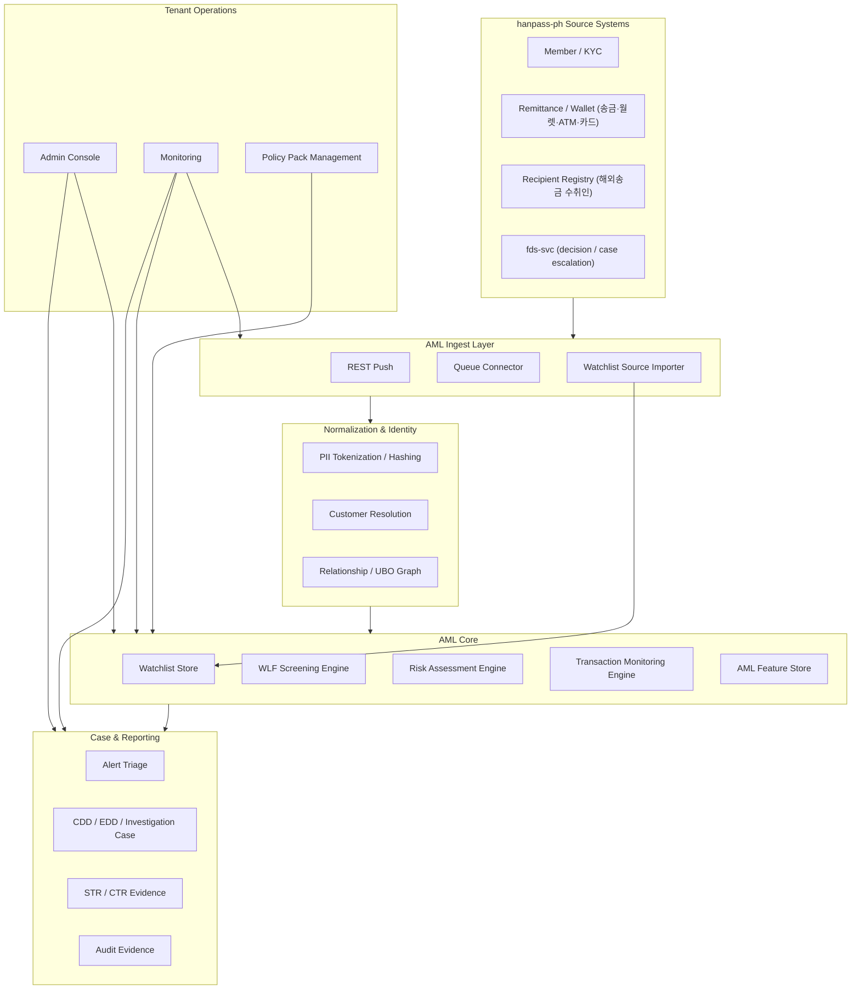
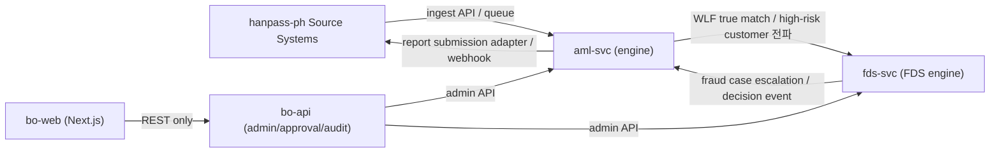
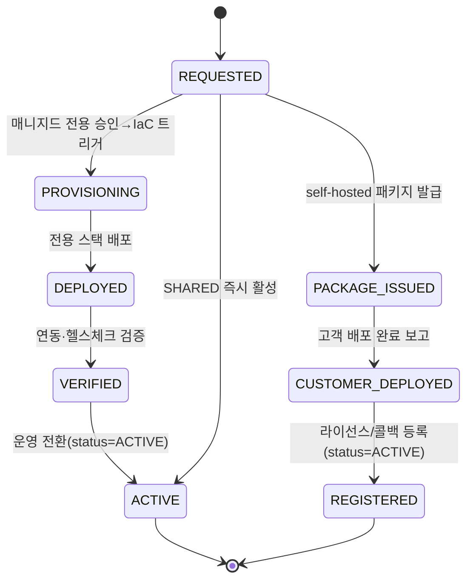
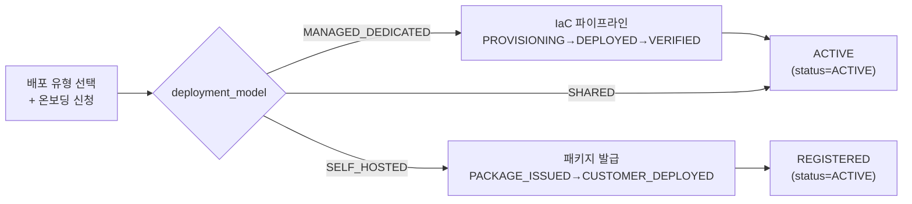

# hanpass-ph AML Service(aml-svc) 소프트웨어 아키텍처 설계서

> **본 문서 범위.** 본 설계서는 **hanpass-ph 송금 서비스의 AML(자금세탁방지) 엔진(`aml-svc`)** 소프트웨어 아키텍처 정본이다. 시스템 대상은 hanpass-ph 단일 서비스의 AML이며, 거래 유형·TM(거래 모니터링)·WLF(요주의 명단 필터링)·RA(고객위험평가)는 hanpass-ph 실제 거래(월렛충전·국내송금·해외송금·월렛결제·ATM출금·카드결제) 기준으로 기술한다. 멀티테넌트 격리 능력은 유지하나(전용 배포 기본), **운영 대상 테넌트는 hanpass-ph(`tenant_demo`)** 단일이다. 헥사고날·3-WAS 모노레포 구조는 코드(`services/aml-svc`)를 진실로 기술하며, 닫힌 enum 중 hanpass-ph가 사용하지 않는 값(advanced domain·vessel·crypto 등)은 "스키마·enum 잔존(미사용)"으로 명시한다.

## 목차

1. [문서 목적](#1-문서-목적)
2. [제품 방향](#2-제품-방향)
3. [hanpass-ph AmlSvc 참조 구현](#3-hanpass-ph-amlsvc-참조-구현)
4. [hanpass-ph 거래 유형](#4-hanpass-ph-거래-유형)
5. [핵심 설계 원칙](#5-핵심-설계-원칙)
6. [플랫폼 아키텍처](#6-플랫폼-아키텍처)
7. [공통 AML 데이터 모델](#7-공통-aml-데이터-모델)
8. [AML Canonical Event Taxonomy](#8-aml-canonical-event-taxonomy)
9. [Customer·Entity·Beneficial Owner 모델](#9-customerentitybeneficial-owner-모델)
10. [WLF·Sanctions Screening 모델](#10-wlfsanctions-screening-모델)
11. [Customer Risk Assessment 모델](#11-customer-risk-assessment-모델)
12. [Transaction Monitoring 모델](#12-transaction-monitoring-모델)
13. [CDD·EDD·Case Management](#13-cddeddcase-management)
14. [Regulatory Reporting](#14-regulatory-reporting)
15. [외부 시스템 연동 방식](#15-외부-시스템-연동-방식)
16. [SaaS 멀티테넌시](#16-saas-멀티테넌시)
17. [데이터베이스 설계 방향](#17-데이터베이스-설계-방향)
18. [도메인별 AML 적용 예시](#18-도메인별-aml-적용-예시)
19. [보안·컴플라이언스·감사](#19-보안컴플라이언스감사)
20. [운영·관측성](#20-운영관측성)
21. [구축 로드맵](#21-구축-로드맵)
22. [오픈 결정사항](#22-오픈-결정사항)
23. [참고 자료](#23-참고-자료)

---

## 1. 문서 목적

본 문서는 **hanpass-ph 송금 서비스의 AML 엔진(`services/aml-svc`)** 소프트웨어 아키텍처 정본이다. hanpass-ph는 한국→해외(필리핀 등) 송금·월렛 서비스이며, `aml-svc`는 그 고객·거래·상대방 데이터를 입력으로 다음 AML 업무를 수행한다.

- 고객확인(CDD)·강화된 고객확인(EDD)
- 고객 위험평가(RA)
- 요주의 명단 필터링(WLF) — 해외송금 sender(회원)·receiver(수취인) screening
- 제재·PEP screening
- 거래 모니터링(TM) — hanpass-ph 거래 채널·금액(phpEquivalent) 기반 시나리오
- 의심거래보고(STR) 후보 생성·검토·보고
- 고액현금거래보고(CTR) 데이터 수집·보고 보조

`fds-svc`(FDS 엔진)가 "거래 이상징후 탐지와 실시간 action"을 담당한다면, `aml-svc`는 고객·상대방·거래 패턴 중심의 자금세탁·제재·고위험고객 관리를 담당한다(§2.2). 본 문서는 hanpass-ph 단일 서비스의 AML 엔진을 기술하며, 비-hanpass 금융 도메인(카드 PG·가상자산 거래소·무역/TBML·이커머스 정산·B2B 인보이스)으로의 일반화는 본 엔진의 운영 범위가 아니다(스키마·enum에 잔존하는 미사용 값은 §4·§8·§12에서 명시).

> **멀티테넌트.** 엔진은 멀티테넌트 격리 구조(전 테이블 `tenant_id` 선두 PK, 전용 배포 기본 §16)를 코드 차원에서 유지한다. 운영 대상 테넌트는 hanpass-ph(`tenant_demo`) 단일이며, 본 문서의 거래·시나리오·명단 예시는 모두 `tenant_demo` 시드(Flyway V19/V22/V26/V28) 기준이다.

---

## 2. 제품 방향

### 2.1 엔진 정의

`aml-svc`는 hanpass-ph가 회원·거래·상대방 데이터를 연동하면 고객위험평가, 명단 필터링, 거래 모니터링, 케이스 관리, 규제 보고 증적을 제공하는 AML 엔진이다.

엔진의 핵심 가치는 단순 rule engine이 아니라 **FIU·금융감독원·내부감사 대응 증적을 자동화하는 AML RegOps**이다. hanpass-ph는 AML 의무를 수행했다는 사실을 설명 가능한 자료로 남겨야 하며, 실제 가치는 다음 질문에 즉시 답할 수 있는지에서 나온다.

- CDD/EDD가 언제, 어떤 기준과 증빙으로 수행됐는가?
- WLF match가 true match인지 false positive인지 누가 판단했는가?
- 고객위험평가(RA) 점수와 등급 산정 근거는 무엇인가?
- STR 후보가 왜 생성됐고, 왜 보고 또는 기각됐는가?
- CTR·고위험 고객 관리 증적을 기간별로 바로 제출할 수 있는가?
- 명단 import, 국가위험, RA 모델, TM scenario 변경이 4-eyes로 승인됐는가?

가장 중요한 목표는 **개발팀 의존 없이 hanpass-ph 준법감시 담당이 AML을 직접 운용할 수 있게 하는 것**이다. 개발팀의 역할은 초기 연동, 권한/IAM, 데이터 mapping, 회원·거래 event 공급, 외부 보고 adapter 구축까지로 제한한다. 이후 WLF 정책, RA 모델, CDD/EDD workflow, TM scenario, STR 후보 검토, CTR evidence, 검사 대응 자료 생성은 운영 콘솔(bo-web→bo-api)의 UI와 승인 workflow로 직접 수행한다.

이를 위해 엔진은 다음을 기본 제공한다(운영 UI는 bo-web).

- no-code WLF threshold와 false positive rule 관리
- RA factor와 risk grade 정책 편집
- CDD/EDD checklist와 periodic review 주기 설정
- TM scenario builder와 simulation
- STR 후보 생성 기준과 case workflow 관리
- CTR evidence self-service export
- 명단 import diff 확인과 승인
- policy/model version rollback
- maker-checker 기반 승인 workflow
- 개발팀 개입 없는 감사자료 생성·다운로드·재생성

### 2.2 fds-svc와 aml-svc의 관계

hanpass-ph 모노레포는 거래 fraud를 `fds-svc`, AML을 `aml-svc`로 분리한다. 두 엔진은 같은 event·feature·case·audit·4-eyes·tenant 격리 기반을 공유하되 책임이 다르다.

| 구분 | fds-svc | aml-svc |
|---|---|---|
| 핵심 목적 | 이상거래 탐지, fraud 방지, 실시간 차단 | 자금세탁·테러자금조달·제재·고위험고객 관리 |
| 판단 대상 | 거래·기기·채널·행동 패턴 | 고객·상대방(수취인)·거래 패턴 |
| 주요 결과 | ALLOW/BLOCK/HOLD/REVIEW | LOW/MEDIUM/HIGH risk, WLF match, STR/CTR candidate |
| 실시간성 | 승인 전 block/hold 중심 | 가입·수취인 등록 WLF는 실시간, RA/TM은 비동기 중심 |
| 조치 | block, hold, release, case | CDD/EDD, relationship reject, STR filing, periodic review |
| 공통점 | event ingest, feature store, case, audit, 4-eyes, tenant 격리 |

### 2.3 엔진 모듈

| 모듈 | 설명 |
|---|---|
| Data Ingest | 회원·거래·상대방 canonical event 수신(REST/queue) |
| Identity Store | 개인 회원(Customer), 관계자(Relationship)·실소유자(UBO graph) |
| Watchlist Management | 제재·PEP 명단 import·diff·apply·freshness |
| WLF Engine | 이름·생년·국적·문서번호 기반 fuzzy matching(설명 가능 score) |
| Customer Risk Assessment | 회원 위험평가(factor breakdown·grade) |
| Transaction Monitoring | hanpass-ph 거래 채널·금액(phpEquivalent) 기반 시나리오(분할·반복·고위험회랑·환류 등) |
| CDD / EDD | 고객확인, 증빙 checklist, 강화심사, 주기적 재확인 |
| Case Management | alert triage, investigation, maker-checker, escalation |
| Regulatory Reporting | STR/CTR 후보·검토·제출 증적 |
| Audit & Evidence | append-only 감사, hash chain, 장기 보존, evidence export |

> 위 모듈은 `aml-svc` 도메인·application 레이어로 구현되며(§6.2), 운영 콘솔(Admin Console)·결재 UI·고객사 관리는 `bo-api`/`bo-web`가 담당한다(§6.1). Legacy Vendor Bridge(기존 벤더 alert 병행 수신)·dual-run은 도메인(`domain/vendor`)·스키마에 존재하나 hanpass-ph 운영에서는 활성화하지 않는다(§15.5 미사용 잔존).

### 2.4 준법감시 자율 운영 원칙

`aml-svc`는 "개발팀이 만드는 규제 시스템"이 아니라 "hanpass-ph 준법감시 담당이 직접 운영하는 AML 통제 엔진"이어야 한다.

| 운영 업무 | 준법감시실 직접 수행 | 개발팀 개입 필요 여부 |
|---|---|---|
| WLF threshold 변경 | 가능 | 불필요 |
| false positive whitelist 관리 | 가능 | 불필요 |
| RA factor·가중치·등급 기준 변경 | 가능 | 불필요 |
| CDD/EDD checklist 변경 | 가능 | 불필요 |
| periodic review 주기 변경 | 가능 | 불필요 |
| TM scenario 생성·수정 | 가능 | 불필요 |
| STR 후보 검토·기각·보고 승인 | 가능 | 불필요 |
| CTR evidence 검증·export | 가능 | 불필요 |
| 명단 import 승인·rollback | 가능 | 불필요 |
| 감사자료 export | 가능 | 불필요 |
| 신규 source system 연동 | 불가 | 필요 |
| canonical schema 확장 | 제한적 | 필요 |
| 외부 보고기관 API adapter 개발 | 불가 | 필요 |

운영 UI는 개발자용 rule DSL이 아니라 준법감시 업무 언어로 제공해야 한다.

예시(hanpass-ph):

```text
회원이 고위험 국가 수취인에게 송금하거나
실소유자/수취인 확인이 미완료이고
최근 거래금액이 예상 활동 범위를 크게 초과하면
EDD_REVIEW case를 생성한다.
```

내부적으로는 TM scenario DSL 또는 model artifact로 저장하되, 운영자는 고객 속성, 국가위험, 거래금액·채널, 기간, 증빙상태, case type을 화면에서 선택한다.

---

## 3. hanpass-ph AmlSvc 참조 구현

hanpass-ph AmlSvc는 고객 위험평가(RA), 요주의 명단 필터링(WLF), CDD/EDD, 명단·국가위험 데이터 관리, 규제 리포트·감사를 단일 서비스(`services/aml-svc`)로 구현한다. 핵심 도메인은 hanpass-ph 송금·월렛 거래에 맞춰 다음과 같이 구성된다.

### 3.1 핵심 구성 요소(코드 기준)

| 요소 | 구현 위치(`com.aegis.aml`) | 설명 |
|---|---|---|
| WLF 스코어링 엔진 | `domain/screening/match`(`FuzzyMatchEngine`·`NameSimilarity`·`TextNormalizer`·`MatchRuleSet`) | 이름·생년·국적·문서 토큰 기반 설명 가능 score |
| RA 모델 | `domain/risk`(`RaScoringEngine`·`RiskModel`·`RiskScore`) | factor breakdown·grade·next review |
| CDD/EDD 케이스 | `domain/cdd`·`domain/Case` | 회원 CDD/EDD checklist·EDD trigger·case |
| 명단·국가위험 관리 | `domain/watchlist`·`domain/policy/CountryRisk` | versioned import + diff + freshness gate |
| 4-eyes 결재 | `domain/approval/ApprovalRequest`·`RunApprovalUseCase` | 모델/룰/명단/판정/보고/케이스 종결 전면 적용 |
| 감사 evidence | `domain/evidence`·`AuditEvent*` | append-only audit + hash manifest |
| FDS 핸드오프 | `adapter/in/sqs/FdsDecisionConsumer`·outbox | fds-svc decision/case escalation 수신·아웃바운드 전파 |

### 3.2 hanpass-ph 특화 입력

| 입력 | 적용 |
|---|---|
| 회원 가입·KYC | 실시간 가입 WLF screening(sender) |
| 해외송금 수취인 등록 | 수취인(receiver) WLF screening — sender+receiver를 `transactionRef`로 묶어 거래당 한 쌍으로 묶음(§13) |
| 송금·월렛 거래 behavior | RA behavior input + TM velocity/금액(phpEquivalent) feature |
| 한국 policy pack | `KR_DEFAULT` baseline(특정금융정보법 CDD/STR/CTR), §5.5 |

---

## 4. hanpass-ph 거래 유형

`aml-svc`가 모니터링하는 hanpass-ph 거래는 6개 채널(`transaction.channelType`)로 정규화된다(데모 시드 Flyway V26 기준).

| 채널(`channelType`) | hanpass-ph 거래 | AML 관점 주요 리스크 |
|---|---|---|
| `CASH_IN` | 월렛 충전 | 충전 후 즉시 출금/송금, 다계정 순환 |
| `DOMESTIC_REMIT` | 국내 송금 | 분산 송금, 반복 소액 구조화, 대포통장 후보 |
| `CROSS_BORDER_REMIT` | 해외 송금 | 고위험 corridor, 수취인 명단 hit, 목적·소득 불일치 |
| `WALLET_PAYMENT` | 월렛 결제 | 위장 결제, 환류(refund laundering) |
| `WALLET_WITHDRAWAL` | ATM/월렛 출금 | 현금화, 분산 출금 |
| `CARD_NOT_PRESENT` | 카드(비대면) 결제 | 카드 현금화, 차명 결제 |

> 거래 운반(transaction-bearing) canonical event family는 `transaction.*`와 hanpass-ph 결제 taxonomy `remit.*`/`domestic.*`/`wallet.*`이며(§8.1, `EventFamily.isTransactionBearing()`), 이들이 TM velocity 윈도우·자금 그래프 funnel에 합류한다. 위 6채널은 그 payload의 `channelType` 값이다.

### 4.1 공통 AML 질문

hanpass-ph 거래는 아래 질문으로 정규화한다.

1. 회원(고객)은 누구인가? (`customer`, `subject`)
2. 실소유자/관계자는 누구인가? (`beneficialOwner`, UBO graph)
3. 수취인(상대방)은 누구인가? (`counterparty`, `beneficiary`)
4. 자금 출처와 목적은 무엇인가? (`sourceOfFunds`, `purposeOfTransaction`)
5. 어떤 국가·통화·채널을 통과하는가? (`country`, `currency`, `channelType`)
6. 제재·PEP·고위험국가에 걸리는가? (`screeningResult`)
7. 회원의 평소 profile과 거래가 맞는가? (`expectedActivity`, `behaviorDeviation`)
8. 보고 또는 보존 의무가 있는가? (`STR`, `CTR`, `auditRetention`)
9. EDD 또는 관계거절이 필요한가? (`EDD`, `reject`)

---

## 5. 핵심 설계 원칙

### 5.1 고객·법인 중심, 거래는 증거

FDS는 거래 이벤트를 중심으로 판단하지만, AML은 고객·법인·실소유자·관계자 중심으로 위험을 축적한다. 거래는 고객 위험을 설명하는 증거이며, 케이스와 보고 판단의 근거가 된다.

### 5.2 결정론과 설명가능성을 우선

WLF, RA, TM은 규제 검사에서 설명 가능해야 한다. ML score는 보조 feature로 사용할 수 있으나, 최종 판단은 rule/model version, input snapshot, score breakdown을 저장해야 한다.

### 5.3 명단과 모델은 versioned approval

watchlist source, country risk, WLF rule, RA model, TM scenario는 모두 versioned artifact이며 4-eyes 승인 후 적용한다.

**WLF 매칭 기준 변경 통제.** WLF 가중치·불일치 감점·유사도 임계와 룰버전은 계속 **policy pack 파라미터가 단일 원장**이며, 변경은 정책팩 4-eyes(`POLICY_PACK`) 결재 절차(§14.3 parameter·effective version 규약)를 따른다. 다만 운영자가 generic Policy Pack 키를 직접 다루지 않도록 별도 설정 화면 `AML-WLF-005 WLF 엔진 조절`(`/aml/wlf-engine`, bo-web→bo-api→aml-svc)을 제공한다. 이 화면은 policy pack 안의 typed SANCTIONS/PEP profile을 버전 목록·기준 편집·시뮬레이션 구조로 투영하는 전용 facade일 뿐 별도 설정 테이블/정본이 아니다. WLF 검토 화면은 각 결과 생성 당시의 profile·검토/고신뢰 임계·ruleVersion·definitionHash를 읽기 전용으로 표시한다.

### 5.4 실시간은 onboarding·제재 중심

가입/온보딩·수취인 등록·가상자산 출금주소 등록 등 제재 risk가 큰 경로는 실시간 screening을 지원한다. 대규모 RA/TM/periodic review는 비동기 batch로 처리한다.

### 5.5 한국 policy pack 기본

한국 시장 기본 pack은 특정금융정보법상 CDD/STR/CTR, 개인정보보호법/신용정보법, 전자금융·보이스피싱 관련 운영 요구를 기준으로 한다. 국가별 확장은 별도 policy pack으로 추가한다. (가상자산사업자 신고·Travel Rule 항목은 2026-07-09 Travel Rule 전면 제거로 baseline에서 제외됐다 — aegis-aml 84997e1, aml V31.)

**기본 번들·확장 plugin 모델(필수 baseline + 토글 확장).** 한국 기본 pack(`KR_DEFAULT`)은 **필수 baseline**으로, 위 영역(CDD/STR/CTR·개인정보·전자금융 등)을 **하나의 번들로 일괄 적용**한다. 이 baseline은 AML 최소 규제 요건이므로 **비활성화하거나 개별 영역을 끌 수 없다(잠금)**. CTR 기준금액·고위험 임계 등은 baseline의 **parameter**로, effective version + 4-eyes(`POLICY_PACK`)로만 변경한다(§14.3). hanpass-ph는 `KR_DEFAULT` 단일 baseline으로 운영하며, 국가·업권 plugin 토글 구조는 향후 확장을 위한 모델로 코드(`domain/policy/PolicyPack`)에 존재한다. 이 모델은 백오피스 Policy Pack 관리 화면(AML 기능정의서 §13.2 ④·§12-A.9)의 정본이다. (FDS는 법령·관할별 규제 팩을 개별 토글하는 카탈로그 모델로, 서비스별 규제 책임 범위 차이에 따른 의도된 구조 차이다.)

---

## 6. 엔진 아키텍처


```mermaid
flowchart TB
    subgraph External["hanpass-ph Source Systems"]
        Member["Member / KYC"]
        Remit["Remittance / Wallet (송금·월렛·ATM·카드)"]
        Recipient["Recipient Registry (해외송금 수취인)"]
        FDS["fds-svc (decision / case escalation)"]
    end

    subgraph Ingest["AML Ingest Layer"]
        Push["REST Push"]
        Queue["Queue Connector"]
        ListSrc["Watchlist Source Importer"]
    end

    subgraph Normalize["Normalization & Identity"]
        PII["PII Tokenization / Hashing"]
        Entity["Customer Resolution"]
        UBO["Relationship / UBO Graph"]
    end

    subgraph Core["AML Core"]
        Watch["Watchlist Store"]
        WLF["WLF Screening Engine"]
        RA["Risk Assessment Engine"]
        TM["Transaction Monitoring Engine"]
        Feature["AML Feature Store"]
    end

    subgraph CaseReport["Case & Reporting"]
        Alert["Alert Triage"]
        Case["CDD / EDD / Investigation Case"]
        Report["STR / CTR Evidence"]
        AuditLog["Audit Evidence"]
    end

    subgraph Ops["Tenant Operations"]
        Admin["Admin Console"]
        Monitor["Monitoring"]
        Policy["Policy Pack Management"]
    end

    External --> Ingest --> Normalize --> Core --> CaseReport
    ListSrc --> Watch
    Admin --> Core
    Admin --> CaseReport
    Policy --> Core
    Monitor --> Ingest
    Monitor --> Core
    Monitor --> CaseReport
```

### 6.1 정본 아키텍처 매핑 (4서비스 모노레포)

본 설계서의 논리 컴포넌트는 정본(`.claude/skills/_shared/target-architecture.md`)의 **4서비스 모노레포**로 물리 배치된다. AML 설계서의 책임 경계는 **`aml-svc`** 이며, 운영 콘솔·결재(maker-checker)·감사 UI는 `bo-api`/`bo-web`가, 실시간 거래 fraud action은 `fds-svc`가 담당한다. FDS 설계서(`01-fdsSvc-sass.md`)와 동일한 정본·네이밍·stack을 공유한다.

| 논리 컴포넌트(본 문서) | 물리 서비스 | 비고 |
|---|---|---|
| Ingest / Normalization / Identity / WLF / RA / TM / Feature Store / Case / Reporting / Watchlist | `services/aml-svc` | AML 엔진 백엔드 (Java 25, Spring Boot 3.5.x, 헥사고날) |
| Transaction fraud 탐지·실시간 ALLOW/BLOCK/HOLD action | `services/fds-svc` | FDS 엔진. FDS fraud case escalation을 `STR_REVIEW` 후보로 aml-svc에 위임 |
| Admin Console, 결재(maker-checker), 감사·리포트 집약, IAM, evidence export 권한 | `services/bo-api` | aml-svc·fds-svc admin API를 운영자용으로 집약·인증·감사 |
| no-code WLF/RA/TM policy builder, case 화면, evidence export UI, 운영 대시보드 | `services/bo-web` | Next.js 16. bo-api 경유만 허용(엔진 직접 호출 금지) |


```mermaid
flowchart LR
    Ext["hanpass-ph Source Systems"] -->|ingest API / queue| AML["aml-svc (engine)"]
    FDS["fds-svc (FDS engine)"] -->|fraud case escalation / decision event| AML
    AML -->|WLF true match / high-risk customer 전파| FDS
    BOWEB["bo-web (Next.js)"] -->|REST only| BOAPI["bo-api (admin/approval/audit)"]
    BOAPI -->|admin API| AML
    BOAPI -->|admin API| FDS
    AML -->|report submission adapter / webhook| Ext
```

> FDS와 AML은 같은 event·feature·case·audit·4-eyes·tenant 격리 기반을 공유하되 책임이 다르다(2.2 참조). 두 엔진 간 연계는 정본의 횡단 원칙에 따라 **event 연동 우선**(오픈결정 D-07)으로 처리하며, 직접 DB 공유는 하지 않는다.

### 6.2 aml-svc 헥사고날 패키지 레이아웃 (코드 기준)

구현 패키지 루트는 **`com.aegis.aml`** 이다(target-architecture §5 — `com.aegis.{fds,aml,backoffice}`). 도메인 불변식은 `domain`, 유스케이스·트랜잭션 경계는 `application`, I/O는 `adapter`이며 의존은 domain ← application ← adapter 단방향이다. 아래 레이아웃은 실제 소스(`services/aml-svc/src/main/java/com/aegis/aml`)를 기준으로 한다.

```
com.aegis.aml
├── domain/        # 순수 ADT·불변식 (프레임워크 의존 0)
│   ├── identity/        # Customer, Entity, Relationship(UBO graph)
│   ├── screening/       # ScreeningResult, FalsePositiveWhitelist,
│   │                    #   match/(FuzzyMatchEngine·NameSimilarity·TextNormalizer·MatchRuleSet)
│   ├── risk/            # RaScoringEngine, RiskModel, RiskScore, RiskFactorInput
│   ├── tm/              # TmEvaluationEngine, TmScenarioDefinition, TmScenarioDslParser,
│   │                    #   TmCondition, TmWindow, TmVelocityAggregate, FundGraphBuilder(자금 그래프),
│   │                    #   SubjectTransaction, AlertEvidence, TmFeatureSnapshot
│   ├── cdd/            # CddProfile, EddTriggerEvaluator, PeriodicReviewPolicy
│   ├── watchlist/      # WatchlistSource, WatchlistEntry, WatchlistFreshness, WatchlistReconciliation
│   ├── policy/         # PolicyPack, CountryRisk, CddChecklistTemplate, ChecklistItem
│   ├── report/         # RegulatoryReport, ReportManifest, StrReportingStats
│   ├── approval/       # ApprovalRequest(4-eyes)
│   ├── evidence/       # EvidenceExport, EvidenceTimeline, ExportManifest
│   ├── pii/            # PiiField, PiiVaultEntry, RevealResult (vault 토큰/마스킹)
│   ├── event/          # CanonicalEvent
│   ├── registry/       # HighRiskRegistry, ReferenceList, ClassificationCriterion (HRR)
│   ├── ira/            # IraReport, IraIndicator (의심거래 internal report surface)
│   ├── tenant/         # Tenant, SourceSystem
│   ├── metering/       # UsageMetric (과금 metering)
│   ├── webhook/        # WebhookSignature
│   ├── vendor/         # DualRunComparison, VendorMigrationInventory (Legacy Bridge, 미활성)
│   ├── commerce/       # advanced domain (Phase 8 잔존, hanpass-ph 미사용)
│                        #   travelrule/ 는 제거됨(2026-07-09 Travel Rule 전면 제거, aegis-aml 84997e1 — aml V31)
│   └── enums/          # EventFamily, TmScenario, CaseType, ScreeningStatus 등 닫힌 enum
├── application/
│   ├── usecase/   # AmlEventIngestService, ScreenSubject·ReviewScreening·WhitelistFalsePositive,
│   │              #   RiskAssessmentService·RiskOverrideService, TmEvaluationService·AlertTriageService,
│   │              #   CddEddService·CaseManagementService, RegulatoryReportService,
│   │              #   ApprovalDispatchService(4-eyes), OutboxRelayService(아웃박스),
│   │              #   IdentityProjectionService·LinkRelationshipService, FdsDecisionService,
│   │              #   AlertRelatedTransactionsService(알림 발동 근거 거래 전수 조회),
│   │              #   PolicyManagementService·PolicyPackService·PolicySimulationService,
│   │              #   Watchlist/HighRiskRegistry/IraReport/PepApproval/PiiReveal/EvidenceExport …
│   ├── port/in/   # IngestAmlEventUseCase, ScreenSubjectUseCase(transactionRef로 sender+receiver 묶음),
│   │              #   AssessRiskUseCase, EvaluateTmUseCase, ManageCaseUseCase·ManageCddUseCase,
│   │              #   ManageCddEddUseCase, ManageRegulatoryReportUseCase·ReviewStrCtrUseCase,
│   │              #   ManagePolicyUseCase, RunApprovalUseCase, ImportWatchlistUseCase,
│   │              #   QueryAlertRelatedTransactionsUseCase …
│   └── port/out/  # CanonicalEventStorePort, CanonicalEventWindowPort(velocity·phpEquivalent),
│                  #   WatchlistEntry/Source/FreshnessStorePort, ScreeningResultStorePort,
│                  #   RiskModel/RiskScoreStorePort, TmScenarioStorePort, CaseRepositoryPort,
│                  #   RegulatoryReportStorePort, ApprovalRequestPort, OutboxStore/MessagingPort,
│                  #   BankingCalendarPort, PiiTokenPort·PiiVaultPort, ReportSubmissionPort,
│                  #   WebhookSenderPort, AuditEventPort …
├── adapter/
│   ├── in/rest/        # 3-plane(API §0): Public /api/v1/aml/**(ingest·screen·RA·TM·evidence),
│   │                   #   Internal /internal/v1/aml/**(screen·RA·PII reveal·FDS escalation),
│   │                   #   Admin /api/v1/admin/aml/**(watchlist·policy·tm-scenario·report·결재, bo-api 전용)
│   ├── in/sqs/         # FdsDecisionConsumer, ReportSubmissionCallbackConsumer
│   ├── in/scheduled/   # OutboxRelayScheduler, WatchlistReconciliationScheduler
│   ├── out/persistence/# aml_* 테이블 (PostgreSQL JPA) + pii/(vault)
│   ├── out/crypto/     # HmacPiiTokenAdapter, AesGcmSecretCipher
│   ├── out/messaging/  # OutboxRelay(SQS/InMemory), HighRiskOutboxAdapter
│   ├── out/submission/ # MockRegulatorSubmissionAdapter (보고 제출)
│   ├── out/feed/       # MockWatchlistFeedAdapter (명단 source)
│   ├── out/webhook/    # HttpWebhookRelayAdapter
│   └── out/policy/·out/evidence/  # ConfigWlfPolicyAdapter, LocalExportArtifactAdapter
└── global/        # tenant context, traceId 전파, PII 마스킹/토큰화, 보안/설정
```

> `adapter/in/rest`의 엔드포인트 전체 표면(Public/Internal/Admin)은 **API 명세(`docs/design/api/02-aml-api.md` §2.1~§2.7) 정본**을 참조한다. 본 레이아웃은 plane 경계만 표기하며, **Admin API는 bo-api 전용 운영 콘솔 경계**다(엔진은 저수준 데이터 API만 제공, §15.7 운영자 집계 소유 경계). report 제출·명단 feed·webhook 외부 어댑터는 hanpass-ph 운영에서 Mock/실연동 교체 지점이다(외부 실연동만 후속).
>
> **usecase ↔ port/in ↔ scope 매핑(정본 scope=API §1.1).** `ManageCddEddUseCase`·`ReviewStrCtrUseCase`·`ManagePolicyUseCase`는 case/정책 도메인의 세부 유스케이스로, 결재가 필요한 종결·제출 경로는 `ManageCaseUseCase`/`RunApprovalUseCase`로 합류한다(통합 결재 게이트). 보호 scope는 API §1.1을 정본으로 다음과 같이 매핑한다: CDD/EDD 워크플로=`aml:case:read`/`aml:case:update`(EDD 트리거·검토), STR/CTR 작성·제출=`aml:case:update` + 제출 4-eyes(`REPORTING_OFFICER`), STR 화면 조회는 정보누설금지 통제로 `COMPLIANCE` 전담 scope(§19.2a, API §2.7); CDD checklist·periodic review 정책 변경=`aml:admin:policy`(4-eyes `subjectType=CHECKLIST_CHANGE`/`PERIODIC_REVIEW_CHANGE`, §13.4); 명단=`ManageWatchlistUseCase`=`aml:admin:watchlist`; 결재=`RunApprovalUseCase`=`aml:admin:approval`. scope 코드값 전수(13종)는 API §1.1이 정본이다.

> bo-api·bo-web은 정본의 별도 레이아웃(패키지-바이-피처 / Next.js App Router)을 따르며, 본 문서의 enum·API·규칙·규제 요건을 그대로 입력으로 사용한다. WLF/RA/TM policy builder, case 화면, evidence export UI는 `bo-web`, 결재 matrix·감사·IAM은 `bo-api`에서 구현한다.

---

## 7. 공통 AML 데이터 모델

### 7.1 핵심 객체

| 객체 | 의미 | 예시 |
|---|---|---|
| Tenant | 운영 테넌트 | hanpass-ph(`tenant_demo`) |
| Source System | 데이터 원천 | member(가입/KYC), remit/wallet(거래), recipient(수취인), fds-svc |
| Customer | 개인 회원 | hanpass-ph 송금/월렛 회원 |
| Entity | 법인·사업자 | (정산 파트너 등, hanpass-ph 1차 범위에서는 제한적 사용) |
| Beneficial Owner | 실소유자 | UBO, 관계자 |
| Related Party | 관계자 | 대리인, 수취인, 연결 계정 |
| Transaction | 자금 이동 | 월렛충전·국내송금·해외송금·월렛결제·ATM출금·카드결제(§4) |
| Watchlist Entry | 요주의 대상 | sanction, PEP |
| Screening Result | WLF 결과 | match, no-match, false-positive(sender/receiver) |
| Risk Score | 고객위험평가 | low/medium/high, factor breakdown |
| Alert | 룰 또는 모델 경보 | structuring/rapid-movement/corridor alert(§12.1) |
| Case | 조사 케이스 | EDD, STR review, sanctions case |
| Report | 규제 보고 증적 | STR, CTR |

> `Entity`(법인)·`Business Document`(상업 증빙)·`Instrument`·`Account` 도메인은 스키마·enum에 존재하나 hanpass-ph 송금/월렛 운영에서는 핵심 경로가 회원(개인)·거래·수취인이며, 법인·증빙 중심 도메인은 advanced domain pack(§21 Phase 8, 미사용 잔존)에 속한다.

### 7.2 고객·관계자·실소유자 graph

AML은 단일 customer row만으로 부족하다. hanpass-ph는 회원, 대리인, 실소유자(UBO), 수취인, 연결 계정을 graph(`domain/identity/Relationship`)로 연결한다.

관계 예시(`relationship_type`):

| 관계 | 설명 |
|---|---|
| `OWNS` | 실소유자 또는 지분 보유 |
| `CONTROLS` | 실질 지배 |
| `REPRESENTS` | 대표자 또는 대리인 |
| `USES_ACCOUNT` | 계좌 또는 instrument 사용 |
| `PAYS_TO` | 반복 수취 관계(수취인) |
| `RELATED_TO` | 동일 주소/전화/기기/계좌 기반 관련성 |

### 7.3 Transaction과 AML Evidence 분리

거래는 원천 이벤트로 들어오지만, AML 판단에는 다음 증거가 함께 필요하다.

| Evidence | 설명 |
|---|---|
| KYC evidence | 신분증, 주소, 직업(회원 KYC checklist) |
| Transaction evidence | 금액, 통화, 상대방(수취인), 목적, 채널 |
| Screening evidence | 명단 후보, 유사도 score, 판정자 |
| Behavioral evidence | expected activity 대비 편차 |

---

## 8. AML Canonical Event Taxonomy

### 8.1 최상위 event family

최상위 event family는 코드 `EventFamily` enum(`com.aegis.aml.domain.enums.EventFamily`)이 정본이며 **19종**이다(2026-07-09 Travel Rule 전면 제거로 `TRAVEL_RULE` family 삭제 — aegis-aml 84997e1, aml V31). `EventFamily.fromEventType()`이 `eventType`(`<family>.<verb>`)의 prefix를 strict allow-list로 검증해, 미등재 family는 ingest에서 `REJECTED`된다(canonical store 비오염, DB family CHECK와 1:1).

방향(Direction): **IN**=외부 source가 ingest API/queue로 보내는 인바운드 canonical event, **DERIVED**=엔진 내부 파생/재생, **OUT**=아웃박스 경유 아웃바운드(fds-svc·webhook·report submission). `isExternallyIngestable()`이 `false`인 `aml.*`·`case.*`는 외부 ingest 대상이 아니다(내부 파생/아웃바운드).

| Family(코드값) | prefix | 방향 | hanpass-ph | 설명 |
|---|---|---|---|---|
| `CUSTOMER` | `customer` | IN | ✅ | 회원 생성·KYC 변경·상태 변경 |
| `ENTITY` | `entity` | IN | △ | 법인·사업자 생성·변경(제한적) |
| `BENEFICIAL_OWNER` | `beneficial-owner` | IN | ✅ | 실소유자·관계자 변경 |
| `TRANSACTION` | `transaction` | IN(거래 운반) | ✅ | 자금 이동(velocity·자금그래프 source) |
| `REMIT` | `remit` | IN(거래 운반) | ✅ | hanpass-ph 송금(`remit.transfer.requested` 등) |
| `DOMESTIC` | `domestic` | IN(거래 운반) | ✅ | hanpass-ph 국내송금(`domestic.transfer.requested`) |
| `WALLET` | `wallet` | IN(거래 운반) | ✅ | hanpass-ph 월렛(`wallet.charge`/`wallet.pay`/`wallet.withdraw`) |
| `CASE` | `case` | DERIVED/OUT | ✅ | CDD/EDD/STR case 상태. FDS feedback·webhook은 아웃바운드(`aml.case.*`) |
| `AML` | `aml` | DERIVED/OUT | ✅ | 엔진 내부 파생·아웃박스(외부 ingest 불가) |
| `VENDOR` | `vendor` | IN | ✕(미사용) | 기존 AML 벤더 alert 수신(Legacy Bridge, `IngestEvent(source_origin=VENDOR)` 흡수). hanpass-ph 미활성(§15.5) |
| `TRADE` | `trade` | IN | ✕(미사용) | advanced domain(무역/TBML, Phase 8) |
| `INVOICE` | `invoice` | IN | ✕(미사용) | advanced domain(B2B 인보이스) |
| `CRYPTO` | `crypto` | IN | ✕(미사용) | advanced domain(가상자산) |
| `SETTLEMENT` | `settlement` | IN | ✕(미사용) | advanced domain(정산) |
| `ORDER` | `order` | IN | ✕(미사용) | advanced domain(이커머스 주문) |
| `SELLER` | `seller` | IN | ✕(미사용) | advanced domain(마켓플레이스 셀러) |
| `MARKET` | `market` | IN | ✕(미사용) | advanced domain(마켓플레이스) |
| `INTERNAL` | `internal` | IN | ✕(미사용) | advanced domain(내부통제) |
| `AUDIT` | `audit` | IN | ✕(미사용) | advanced domain(내부 감사) |

> **거래 운반(transaction-bearing).** `isTransactionBearing()` ⇒ `TRANSACTION`·`REMIT`·`DOMESTIC`·`WALLET`. 이 4종만 TM velocity 윈도우·자금 그래프 funnel에 합류한다(§12, fds-svc와 대칭). hanpass-ph 6채널(§4)은 이들 거래 payload의 `channelType` 값이다.
>
> **advanced domain·vendor 잔존.** `TRADE`/`INVOICE`/`CRYPTO`/`SETTLEMENT`/`ORDER`/`SELLER`/`MARKET`/`INTERNAL`/`AUDIT`·`VENDOR`는 enum·DB family CHECK·projection 분기에 잔존하나 hanpass-ph 운영에서는 인입되지 않는다(Phase 8 advanced domain pack §21, Legacy Bridge §15.5 미활성). strict gate가 superset이어야 하므로 enum에는 유지된다. (`TRAVEL_RULE` family 는 2026-07-09 Travel Rule 전면 제거로 삭제됨 — aegis-aml 84997e1, aml V31.)

### 8.2 Canonical AML event 예시

> envelope 버전(`schemaVersion`)과 source 스키마 버전(`sourceSchemaVersion`)을 **2축으로 분리**한다(연동 §4.1 정본). `schemaVersion`은 메시지 envelope 버전(`aml.event.v1`, breaking 시 `.v2`)이고, `sourceSchemaVersion`은 원천 스키마 버전(Schema Registry 조회 키, DB `aml_source_systems.schema_version` = API §3.1 `schemaVersion` 필드와 1:1)이다.

> **교차 주석(FDS 설계서 §8.2/§8.3 대응)**: AML envelope는 `dataScope` 최상위(선택), FDS envelope는 `workspaceId` 최상위 필수로 **의도된 비대칭**이다(연동 `02-aml-integration.md`·`01-fds-integration.md` §4.1 cross-service 정책 정본). FDS→AML 핸드오프(`fds-aml-handoff`) 시 핸드오프 어댑터(aml-svc 소비 측)가 FDS `workspaceId`→AML `dataScope`로 변환한다(`default` 매핑 포함).

> envelope 필드(`tenantId`·`dataScope`·`traceId`·`payloadHash`·`payload`)는 연동 §4.1 공통 envelope 정본과 1:1 동기화한다. AML 도메인 본문(`customer`·`counterparty`·`transaction`·`screeningContext`)은 **`payload` 안에** 위치하며, `payloadHash`는 **최상위 필드(서버 자동계산, DB `payload_hash` NOT NULL)** 로 둔다. 구 `rawPayload.payloadHash` 중첩 구조와 `stored` 필드는 폐기한다(연동 §4.1).

```json
{
  "schemaVersion": "aml.event.v1",
  "tenantId": "tenant_demo",
  "dataScope": "default",
  "sourceSystem": "remit",
  "sourceSchemaVersion": "remit.v1",
  "eventId": "evt-001",
  "idempotencyKey": "remit:evt-001",
  "eventType": "transaction.completed",
  "occurredAt": "2026-06-06T10:00:00Z",
  "traceId": "00-4bf92f...-01",
  "payloadHash": "sha256:...",
  "payload": {
    "customer": {
      "customerRef": "cust_hmac_123",
      "customerType": "PERSON",
      "country": "KR",
      "riskGrade": "MEDIUM"
    },
    "counterparty": {
      "counterpartyRef": "bene_hmac_999",
      "counterpartyType": "PERSON",
      "country": "PH"
    },
    "transaction": {
      "transactionRef": "tx_123",
      "direction": "OUTBOUND",
      "amount": "9500000.00000000",
      "amountMinor": 9500000,
      "phpEquivalent": 380000,
      "currency": "KRW",
      "purpose": "REMITTANCE",
      "channelType": "CROSS_BORDER_REMIT"
    },
    "screeningContext": {
      "requiresSanctionsScreening": true
    }
  }
}
```

> hanpass-ph 해외송금 예시: 회원(sender, KR) → 수취인(receiver, PH), `channelType=CROSS_BORDER_REMIT`. `transaction.phpEquivalent`(PHP 환산 금액)는 TM 금액 임계 시나리오(§12.1, V28)의 feature이며, 부재 시 해당 시나리오는 발화하지 않는다(fail-safe). (`requiresTravelRule` 필드는 2026-07-09 Travel Rule 전면 제거로 폐기됨 — aegis-aml 84997e1, aml V31.)

---

## 9. Customer·Entity·Beneficial Owner 모델

### 9.1 Customer/Entity type (닫힌 enum, DB 정본)

`CustomerType`/`EntityType` enum(DB §3.3/§3.4)은 닫힌 집합이다. hanpass-ph 운영의 핵심은 개인 회원(`PERSON`)이며, 법인·셀러·가맹점 등은 enum·스키마에 존재하나 hanpass-ph 1차 범위에서는 사용하지 않는다(advanced domain).

| Type | 설명 | hanpass-ph |
|---|---|---|
| `PERSON` | 개인 회원 | ✅ |
| `SOLE_PROPRIETOR` | 개인사업자 | △ |
| `EMPLOYEE` | 내부 직원 | △ |
| `LEGAL_ENTITY` | 법인 | ✕(미사용) |
| `MERCHANT` | 가맹점 | ✕(미사용) |
| `SELLER` | 마켓플레이스 셀러 | ✕(미사용) |
| `VENDOR` | B2B 공급업체 | ✕(미사용) |
| `VASP_CUSTOMER` | 가상자산 거래소 회원 (→ §9.1.1: 개인=`customer_type`, 법인=`entity_type`, 동일 ref 중복 저장 금지) | ✕(미사용) |

#### 9.1.1 customer_type vs entity_type 도메인 분할 (DB 정본)

위 8종은 물리적으로 두 테이블 enum으로 분할 저장한다(DB §3.3/§3.4/§5.1 정본). API/PRD DTO는 본 분할 기준을 단일 진실로 사용한다.

| 코드 | 저장 테이블(enum) | 비고 |
|---|---|---|
| `PERSON` | `aml_customers.customer_type` | 개인 |
| `SOLE_PROPRIETOR` | `aml_customers.customer_type` | 개인사업자 |
| `EMPLOYEE` | `aml_customers.customer_type` | 내부 직원 |
| `LEGAL_ENTITY` | `aml_entities.entity_type` | 법인 |
| `MERCHANT` | `aml_entities.entity_type` | 가맹점 |
| `SELLER` | `aml_entities.entity_type` | 마켓플레이스 셀러 |
| `VENDOR` | `aml_entities.entity_type` | B2B 공급업체 |
| `VASP_CUSTOMER` | **양쪽 허용** | 개인 회원은 `customer_type`, 법인 회원은 `entity_type`. 동일 ref 중복 저장 금지(원천 주체 유형으로 단일 결정) |

> 원칙: 개인·직원 계열은 `customer_type`, 법인·가맹점·셀러·vendor 계열은 `entity_type`. `VASP_CUSTOMER`만 원천 주체가 개인/법인인지에 따라 한쪽으로 분기하며 양 테이블 중복 저장은 금지한다.

### 9.2 Entity risk attribute

| Attribute | 설명 |
|---|---|
| `industryCode` | 업종 |
| `businessModel` | 사업 모델 |
| `jurisdiction` | 설립·영업 국가 |
| `beneficialOwners` | 실소유자 목록 |
| `representatives` | 대표자·대리인 |
| `expectedMonthlyVolume` | 예상 월 거래규모 |
| `expectedCountries` | 예상 거래국가 |
| `sourceOfFunds` | 자금 출처 |
| `sourceOfWealth` | 재산 출처 |
| `merchantCategory` | MCC / marketplace category |
| `sellerPlatform` | 셀러 플랫폼 |

### 9.3 UBO graph

UBO는 단순 JSON 배열이 아니라 별도 관계 graph로 관리한다.

필수 기능:

- 지분율 변경 이력
- 대표자·실소유자 WLF 동시 screening
- 동일 UBO가 여러 법인·셀러·merchant를 운영하는 패턴 탐지
- high-risk UBO 연결 전파
- UBO 정보 미제출 또는 불일치 alert

---

## 10. WLF·Sanctions Screening 모델

### 10.1 명단 source (`WatchlistSourceType` 닫힌 enum)

`WatchlistSourceType` enum(DB §3.6)은 닫힌 집합이다. hanpass-ph는 제재·PEP를 핵심으로 운영하며, 데모 시드는 `DEMO_SANCTIONS`(SANCTIONS) source를 사용한다(V19/V26).

| Source type | 예시 | hanpass-ph |
|---|---|---|
| Sanctions | UN, OFAC, EU, 국내 제재 관련 source | ✅ |
| PEP | 국내외 정치적 주요 인물 | ✅ |
| RCA | PEP 관련자 | ✅ |
| Adverse Media | 부정 뉴스·범죄 연루 | △ |
| Internal Watchlist | 내부 요주의 대상 | △ |
| Law Enforcement List | 수사기관·금융기관 공유 목록 | △ |
| VASP / Crypto Risk | 제재 지갑, mixer, darknet exposure | ✕(미사용, 가상자산 비대상) |

### 10.2 Matching 대상

| 대상 | 필드 | hanpass-ph |
|---|---|---|
| 개인(회원·수취인) | 이름, 영문명, 생년월일, 국적, 문서번호 hash | ✅ |
| UBO | 이름, 생년, 국적, 지분율 | ✅ |
| 법인 | 법인명, 영문명, 사업자번호 hash, 주소, 대표자 | △ |
| crypto address | 지갑주소 hash, chain, risk tag | ✕(미사용) |
| vessel | 선박명, IMO/MMSI, 선적국 | ✕(미사용) |

> screening 대상 종류(`subject_kind`)는 `PERSON`/`ENTITY`/`VESSEL`/`CRYPTO_ADDRESS`로 정규화한다(DB §3.7·§5.5, 닫힌 enum). hanpass-ph는 `PERSON`(회원·수취인) 중심이며 `VESSEL`/`CRYPTO_ADDRESS`는 미사용이다.

### 10.2a 거래당 sender/receiver screening (hanpass-ph 해외송금)

해외송금(`CROSS_BORDER_REMIT`)은 sender(회원, `TargetType=CUSTOMER`)와 receiver(수취인, `TargetType=COUNTERPARTY`)를 **각각 screening**하고, `ScreenCommand.transactionRef`(송금 거래번호)로 한 쌍을 묶어 WLF 화면이 거래당 sender+receiver로 그룹핑한다(`ScreenSubjectUseCase`). 중립 거래 인입의 자동 WLF와 시뮬레이터의 명시적 `/api/v1/aml/screen` 재확인은 sender=`eventId`, receiver=`eventId:receiver` 멱등키를 공유해 역할별 물리 결과를 1행으로 유지한다. 검토 큐는 기존 재스크리닝 이력을 삭제하지 않고 거래번호+역할별 최신 결과만 현재 행으로 투영한다. 데모 시드는 sender 매치(JUAN/MARIA, V19)에 더해 수취국(PH/VN/ID) receiver 제재 엔트리 3종(V26)을 등재해 진양성을 재현한다. raw PII는 입력·저장하지 않으며 매칭 입력은 토큰/hash다(§19.2).

### 10.3 Scoring

WLF score는 설명 가능해야 한다.

| Component | 예시 |
|---|---|
| Name similarity | exact, token set, edit distance, transliteration |
| Date match | birth date/year/month partial |
| Country match | nationality, residence, incorporation country |
| Document match | hashed document reference |
| Address match | normalized address token |
| Relationship match | same UBO, representative, account |
| Negative signal | strong mismatch, verified false positive |

#### 10.3a 명단군별 typed engine profile (`AML-WLF-005`)

ACTIVE policy pack은 WLF profile 2종을 닫힌 스키마로 보유한다. 각 profile은 6개 component 상대 가중치(`NAME`/`DATE_OF_BIRTH`/`COUNTRY`/`DOCUMENT`/`ADDRESS`/`RELATIONSHIP`), `negativePenalty`, `reviewThreshold`, `highConfidenceThreshold`를 가진다. 각 값은 유한한 `0..1`이고 가중치 합이 양수여야 하며, 임계는 `0 ≤ reviewThreshold < highConfidenceThreshold ≤ 1`을 만족해야 한다. 미지 profile/weight/NaN/Infinity는 변경 상신 전에 거부한다.

| Watchlist `list_type` | 적용 profile | 비고 |
|---|---|---|
| `PEP`, `RCA` | `PEP` | PEP 본인과 관련자에 같은 정치적 노출 기준 적용 |
| `SANCTIONS`, `ADVERSE_MEDIA`, `INTERNAL`, `LAW_ENFORCEMENT`, `VASP_RISK` | `SANCTIONS` | PEP 계열 외 명단의 fail-safe 기본 profile |

초기 profile은 종전 전역 `MatchRuleSet`과 동형(이름 0.55, DOB 0.10, 국가 0.10, 문서 0.15, 주소 0.05, 관계 0.05, negative 0.20)이다. `tenant_demo`의 receiver 계약은 이름+국가만 있는 정확 일치가 `0.65`이므로 SANCTIONS/PEP `reviewThreshold=0.65`, `highConfidenceThreshold=0.92`로 bootstrap한다. 다른 tenant에서 typed 키가 아직 없으면 기존 전역 `wlf.possible-threshold`/`wlf.true-threshold`와 코드 기본값(`0.66`/`0.92`)으로 안전하게 복원한다.

screening은 요청 시작에 ACTIVE WLF 전체 정의를 1회 immutable snapshot으로 pin하고 후보 엔트리마다 `list_type` profile로 점수를 계산한 뒤 최고 confidence band(동률이면 점수, 다시 동률이면 entryId 안정 순서)의 profile 임계로 `NO_MATCH`/`POSSIBLE_MATCH`를 결정한다. **후보가 0건이면 reviewThreshold가 0이어도 평가할 match가 없으므로 status와 `confidenceBand`를 모두 `NO_MATCH`로 고정**하고, 후보가 존재할 때만 score와 profile 임계를 비교한다. 승인 commit이 평가 중간에 발생해도 한 결과 안에 ruleVersion을 섞지 않는다. `highConfidenceThreshold` 이상도 자동 `TRUE_MATCH`가 아니라 `HIGH` evidence/band가 붙은 `POSSIBLE_MATCH`다. 진성 확정은 §10.4의 분석가 4-eyes 상태머신을 계속 따른다. 결과 JSONB `score_breakdown.appliedPolicy`에는 profile·config/rule version·두 임계·definitionHash·band를 snapshot해 과거 검토를 현재 설정으로 재계산하지 않는다. 외부 응답의 `scoreBreakdown`은 기존 숫자 factor map을 유지하고 정책 snapshot은 top-level `appliedPolicy`로 분리한다.

WLF scoring parameter가 바뀔 때만 WLF config version과 definition hash 기반 ruleVersion이 증가한다. CTR 등 WLF와 무관한 policy-pack 변경은 ruleVersion을 바꾸지 않으므로 FP whitelist를 불필요하게 무효화하지 않는다. 반대로 WLF definition이 바뀌면 whitelist의 version exact-match가 끊겨 재검토된다.

변경 상신은 `expectedActiveRuleVersion`을 필수로 비교하고 policy-pack active row lock 아래 pack당 DRAFT 1건만 허용한다. 현재 적용 projection과 screening은 모두 `status=ACTIVE && active=true`를 동시에 만족하는 정확히 1개 정책팩만 사용하며 inactive ACTIVE 행을 현재값으로 추정하지 않는다. 적용 시점은 호출자가 예약/소급 지정하지 않으며 checker EXECUTED 시각을 서버가 기록한다. checker 신원은 bo-api 인증 principal과 trusted `X-User-Subject`에서만 파생하고 client `checkerId`로 대체할 수 없다. 반려된 후보는 `REJECTED`로 종결되고 다음 policy-pack version과 WLF config/ruleVersion은 각각 전체 보존 이력의 최대 번호 다음으로 할당해 서로 다른 정의가 같은 식별자를 재사용하지 않는다. 설정 화면의 버전 이력은 각 행의 SANCTIONS/PEP 전체 profile을 펼쳐 보여 checker가 DRAFT의 6가중치·negative penalty·두 임계를 hash와 함께 검토할 수 있어야 한다.

### 10.4 판정 상태

| Status | 설명 |
|---|---|
| `NO_MATCH` | 매칭 없음 |
| `POSSIBLE_MATCH` | 검토 필요 |
| `TRUE_MATCH` | 확정 매칭 |
| `FALSE_POSITIVE` | 오탐 확정 |
| `AUTO_DISCOUNTED` | 정책상 자동 낮춤 |
| `ESCALATED` | 상위 승인 필요 |

---

## 11. Customer Risk Assessment 모델

### 11.1 RA factor category

`RiskFactorCategory` enum은 닫힌 집합이며, hanpass-ph는 회원·지역·송금/월렛 거래·screening 중심 factor를 사용한다. 법인/가맹점·crypto·무역 factor는 enum에 잔존하나 미사용이다.

| Category | Factor 예시 | hanpass-ph |
|---|---|---|
| Customer | 국적, 거주지, 직업, KYC completeness | ✅ |
| Geography | 고위험국가, 제재국, corridor(수취국) | ✅ |
| Product | 송금·월렛(충전·결제·출금)·ATM | ✅ |
| Channel | 비대면, API, agent | ✅ |
| Transaction Behavior | 월 거래금액, 상대방(수취인) 수, 해외 비중 | ✅ |
| Screening | WLF match, PEP | ✅ |
| Entity Structure | UBO 복잡도, nominee 의심 | △ |
| Merchant/Seller | 업종, chargeback, refund, 정산 패턴 | ✕(미사용) |
| Crypto | wallet risk, mixer exposure | ✕(미사용) |
| Trade | invoice mismatch, high-risk goods | ✕(미사용) |

### 11.2 RA output

| Output | 설명 |
|---|---|
| `riskScore` | 0~100 |
| `riskGrade` | LOW / MEDIUM / HIGH / PROHIBITED |
| `factorBreakdown` | factor별 점수·근거 |
| `modelVersion` | 적용 모델 버전 |
| `nextReviewDueAt` | 주기적 재심사 예정일 |
| `requiredAction` | CDD update, EDD, relationship review |

### 11.3 모델 운영

- 운영 family는 `KR_DEFAULT_RA=ONBOARDING`, `KR_ONGOING_RA=ONGOING` 두 개로 고정한다. Admin REST/BFF 모두 임의 제3 family와 family-scenario 교차 지정 및 복사를 거치지 않은 임의 version 생성을 거부한다.
- scenario별 실제 ACTIVE와 적용시각을 명시적으로 조회한다(ONBOARDING/ONGOING 각각 tenant당 1개). BO는 `activeVersion`과 버전 `status=ACTIVE`가 모두 일치하는 정의의 가중치·임계·전체 parameters·hash·작성/수정/적용 메타를 읽기 전용으로 표시하며 다른 버전을 현재값으로 추정하지 않는다.
- 선택 ACTIVE/과거 버전을 서버측 다음 버전 `v{N+1}` DRAFT로 복제하고 복제 원본·작성/수정 메타데이터를 보존한다. ACTIVE·SUPERSEDED·결재대기 DRAFT는 수정할 수 없다. family에 `RA_MODEL` 결재 대기 버전이 있으면 새 복제를 거부해 pending target의 latest-version 불변식을 보존한다.
- ONBOARDING은 GEOGRAPHY/CUSTOMER/SCREENING 가중치와 `OnboardingRaParameters` 전체를, ONGOING은 TRANSACTION_BEHAVIOR/CUSTOMER 가중치와 STR/CTR/FDS `OngoingRaParameters` 전체를 서로 독립 검증·저장한다.
- ONBOARDING CUSTOMER 파생은 CDD REST 코드의 exact/default 규칙을 사용한다: `clamp((sofRisk[sourceOfFunds] + kycLevelRisk[kycLevel]) / 2 + occupationRisk[occupation])`. canonical SOF는 `SALARY/BUSINESS/SAVINGS/INVESTMENT/GIFT/OTHER`, KYC는 `NONE/SIMPLIFIED/STANDARD/ENHANCED`; 기존 `REMITTANCE/FULL`은 계약 외 legacy이며 alias하지 않는다. runtime은 기존 ACTIVE를 설명하기 위해 legacy를 읽고 copy도 허용하지만, DRAFT 저장·simulation·activation authoring validator는 SOF/KYC canonical+default, occupation 안전코드, scenario별 top-level/nested known key만 허용해 정리되지 않은 legacy/unknown 정의의 신규 활성화를 차단한다. `kycLevelRisk`는 고객확인 수행 수준의 통제 잔여위험, `occupationRisk`는 가산 조정값이다.
- CDD ONBOARDING 파생은 처음 선택한 modelCode+version을 평가 command에 pin하고 RiskAssessment가 같은 immutable version artifact의 parameters·weights·thresholds·저장 modelVersion을 끝까지 사용한다. 중간 RA_MODEL 활성화가 있어도 서로 다른 버전 정의를 한 score에 혼합하지 않는다.
- `QueryOnboardingInputCatalogUseCase`는 최근 1~365일(기본 90) `customer.cdd.completed`를 tenant+customerRef별 최종 수신 1건으로 축약하고 SOF/KYC/occupation/nationality/residence 안전 코드의 건수·최종 수신시각만 제공한다. persistence SQL이 JSON을 먼저 집계하므로 raw payload·고객/event 식별자·자유서술은 port 밖으로 나오지 않는다. 비정상 값의 고객 수는 축별 `ignoredValueCount`, 100개 표시 상한 밖 정상 distinct code 수는 `truncatedCodeCount`로 분리한다.
- ONGOING의 일/분/건수 값은 소수 절삭 없이 exact integer로 파싱하며 운영 쿼리·대상별 200-alert cap과 맞춰 `lookbackDays<=3650`, `debounceMinutes<=525600`, `countSaturation<=200`을 강제한다. baseline family는 `KR_DEFAULT_RA` 고정이다.
- 실제 tenant 비PII 입력을 scenario별로 최대 500건 재생해 같은 scenario ACTIVE와 비교한다. ONGOING은 기존 2차 score 보유자에 한정하지 않고 runtime과 같은 `TM_SCENARIO`/`FDS_ESCALATION` alert 계보(대상별 최근 200건)를 사용해 신규 trigger로 처음 영향받는 1차-only 고객도 포함한다. 결과(모집단·기간·candidate/baseline 절대 분포·grade delta·설정 diff·운영 영향·양쪽 definition hash)는 `aml_ra_model_simulations`에 보존한다.
- 활성화는 성공한 동일 definition hash의 `simulationId`를 필수로 하고, `RA_MODEL` 4-eyes payload hash에 전체 canonical 정의를 고정한다. approve 시 live 정의를 재계산해 drift를 차단한다.
- 승인 실행은 같은 tenant+scenario의 기존 ACTIVE를 SUPERSEDED하고 신규 버전을 ACTIVE로 원자 전환한다. ONBOARDING default도 함께 이전하며 이후 CDD/TM/FDS 평가가 새 `modelVersion`을 점수 이력에 기록한다. **RA_MODEL 변경 자체는** bulk 소급 재평가를 하지 않는다.
- copy/edit/상신/승인은 동일 tenant+model family transaction lock으로 직렬화하고 copy는 lock 안에서 family pending 결재 0건을 재확인한다. checker는 lock 획득 후 live full-definition hash를 다시 검산한다. 공통 approval approve/reject도 결재 행 row lock으로 직렬화해 하나의 최종 전이만 실행한다.
- COUNTRY_RISK 수동 상신은 실제 ISO alpha-2와 principal-derived maker를 강제하고 국가별 정렬 advisory lock·live pending guard·전체 버전 기반 next version을 사용한다. payload hash는 riskBand/basis를 포함한다. 승인 EXECUTED 시 변경 ISO가 국적/거주국인 고객별 최신 수신 CDD **동일 이벤트 snapshot**(SOF/KYC/occupation/국적/거주국)만 같은 트랜잭션에서 강제 ONBOARDING 재평가해 점수를 append한다. batch 시작 시 ACTIVE modelCode+version을 한 번 pin해 모든 candidate가 같은 immutable weights/parameters/threshold를 사용하며, 각 customer target lock 뒤 latest projection-complete eventId와 국가를 재조회해 후보 이후 다른 국가로 이동한 stale snapshot은 skip한다. 강제 경로는 원 CDD idempotency WLF 결과를 재사용하고 신규 screening/usage `REQUIRES_NEW` 쓰기를 만들지 않으며, 결과 부재/실패 시 국가 ACTIVE·승인 EXECUTED·RA append를 함께 rollback한다(RA_MODEL 일반 bulk 소급과 구분된 정책 영향 대상 재평가). 정상 CDD 인입도 국적/거주국 lock을 정렬 획득한 뒤 customer lock을 잡아 승인과 경합할 때 “CDD 선행→재평가 후보 포함 / 승인 선행→신규 정책으로 최초 평가” 둘 중 하나를 보장한다. 과거 3자리 country row/subject는 persistence·기존 pending read 전용으로만 rehydrate하고 신규 write는 ISO-2를 유지한다.

---

## 12. Transaction Monitoring 모델

### 12.1 TM scenario (`TmScenario` 닫힌 enum, 10종)

`TmScenario` enum(DB §5.6)은 10종으로 닫혀 있다. hanpass-ph 데모(`tenant_demo`)는 송금/월렛 거래에 맞는 시나리오를 ACTIVE로 시드한다(Flyway V19/V22/V26/V28). 시나리오 정의는 tenant별 `aml_tm_scenarios`에 version·DSL·threshold로 저장되며, `TmScenarioDslParser`(`and`/`or`/`cmp`/`velocity`)와 `TmEvaluationEngine`이 평가한다.

| Scenario(코드값) | 설명 | hanpass-ph(데모 ACTIVE) |
|---|---|---|
| `STRUCTURING` | 분할 거래(반복 소액) — `DOMESTIC_REMIT`/`CASH_IN` 채널 24h 건수 ≥ 5 (v2, V26) | ✅ |
| `HIGH_RISK_CORRIDOR` | 해외송금 단건 고액 — `CROSS_BORDER_REMIT` ∧ `phpEquivalent ≥ 280000` (v3, V26/V28) | ✅ |
| `RAPID_MOVEMENT` | 입금 후 즉시 이동 — 2h 건수 ≥ 3 ∧ `phpEquivalent ≥ 56000` (V28) | ✅ |
| `REFUND_LAUNDERING` | 반복 환류 — 7d 건수 ≥ 6 ∧ `phpEquivalent ≥ 28000` (V28) | ✅ |
| `ROUND_TRIPPING` | 순환/자기거래 — 14d 건수 ≥ 4 ∧ `phpEquivalent ≥ 112000` (V28) | ✅ |
| `MULE_NETWORK` | 다수 sender → 동일 수취인/계좌(velocity 기반) | ✅ |
| `SHELL_MERCHANT` | 허위 가맹점 거래 | ✕(미사용) |
| `TRADE_MISPRICING` | 인보이스 단가·수량 이상 | ✕(미사용) |
| `CRYPTO_OFF_RAMP` | 가상자산 → 원화 현금화 | ✕(미사용) |
| `INTERNAL_OVERRIDE_ABUSE` | 내부자 수동 승인·한도 변경 남용 | ✕(미사용) |

> **phpEquivalent 금액 feature.** 금액 기반 시나리오의 임계는 hanpass-ph PHP 환산액(`transaction.phpEquivalent`)을 사용한다. `TmEvaluationService.buildSnapshot`이 subject의 최신 거래-운반 canonical payload(`payload->>'phpEquivalent'`)에서 노출하며, 부재 시 key 미설정 ⇒ 금액 시나리오 미발화(fail-safe). count·channel cmp 노드는 금액과 무관하게 동작한다. fds-svc의 `FeatureComputeAdapter.readPhpEquivalent`와 대칭이다. `SHELL_MERCHANT`/`TRADE_MISPRICING`/`CRYPTO_OFF_RAMP`/`INTERNAL_OVERRIDE_ABUSE`는 enum 잔존이나 hanpass-ph 데모 ACTIVE 시드가 없다.

### 12.1a 사용자 정의 STR/CTR TM 룰 (v9.44)

`ConfigurableReportRule`은 법정 보고 카탈로그를 대체하지 않는 tenant별 탐지 overlay다. 헥사고날 경계는 `ManageConfigurableReportRuleUseCase`/`ConfigurableReportRuleStorePort` → `ConfigurableReportRuleService`/`ConfigurableReportRuleEvaluationService` → REST/JPA adapter이며, 정의·샘플 시뮬레이션·실거래 평가가 동일 `TmScenarioDslParser`/`TmCondition`을 사용한다.

- 수명주기: DRAFT 생성 → sampleFeatures 시뮬레이션 → `TM_SCENARIO` 4-eyes(`CUSTOM_RULE|code|version`) → ACTIVE, 기존 ACTIVE는 SUPERSEDED.
- 신뢰 경계: bo-api는 생성/활성화 요청의 브라우저 `makerId`를 사용하지 않고 인증된 principal email을 엔진 maker로 전달한다. 조회는 `aml:case:read`, 변경은 `aml:admin:policy`로 분리한다.
- 평가: `TmEvaluationService`가 built-in CTR/STR side-effect와 별도로 ACTIVE custom을 `REQUIRES_NEW` 평가한다. scalar는 `EvaluateCommand`, velocity count/sum은 `CanonicalEventWindowPort`에서 materialize하며 아직 커밋되지 않은 현재 거래는 transactionRef 존재 여부를 확인해 정확히 1회 보완한다.
- 결과: `Alert.detectTmScenario(ruleCode)` → `ux_alert_tm` 멱등 저장, evidence.trigger=`{ruleCode,ruleFamily,ruleVersion,ruleSource:CUSTOM,description,strReasonCode?}`. STR custom hit는 2차 RA trigger 신호에 포함한다.
- 규제 경계: custom은 TM alert만 생성한다. CTR 법정 DRAFT의 현금성/통화임계/영업일 누계와 STR 자동 DRAFT/사유 fold는 기존 잠금 카탈로그만 수행한다. 분석가는 custom STR alert를 트리아지 후 기존 `:recommend-str`로 보고 흐름에 연결한다.

### 12.2 TM alert lifecycle (alert_status)

`aml_alerts.status`의 정본 상태 enum·전이는 **6종으로 종결**한다(DB §5.7과 1:1, CHECK 6종). 이후 조사·보고·종결 라이프사이클은 `aml_cases.status`(§13.3a case_status)가 인계한다. alert 단계와 case 단계를 구분한다.

```text
DETECTED
  -> TRIAGED
  -> CASE_OPENED
  -> DISMISSED | ESCALATED | STR_RECOMMENDED
```

| Status | 설명 |
|---|---|
| `DETECTED` | TM 평가로 alert 생성 |
| `TRIAGED` | 1차 분류·우선순위 부여 |
| `CASE_OPENED` | case 개설 트리거(이후 `case_status`가 인계) |
| `DISMISSED` | 위험 없음으로 alert 종결 |
| `ESCALATED` | 상위 검토로 격상(case 개설) |
| `STR_RECOMMENDED` | STR 후보 권고(case 개설) |

> **alert는 6종에서 종결**하고, `CASE_OPENED`/`ESCALATED`/`STR_RECOMMENDED` 시점에 `aml_cases`가 개설되면 이후 `INVESTIGATING`/`PENDING_APPROVAL`/`REPORTED`/`CLOSED` 등 조사·보고·종결 전이는 **case_status(§13.3a, DB §5.9)** 가 영속한다. `INVESTIGATING`/`REPORTED`/`CLOSED`는 alert enum에 두지 않는다(`aml_alerts.status` CHECK 위반). DB §5.7이 물리 정본이며 본 §12.2와 1:1 정합한다.

### 12.3 FDS와의 연계

FDS는 즉시 action이 필요한 fraud risk를 담당하고, AML은 장기 패턴과 고객위험을 담당한다. 그러나 같은 이벤트와 feature를 공유한다.

연계 예시(eventType·큐 정본은 연동 §3.2/§3.3, D-07 event 우선):

| 연계 | eventType | 방향·큐 |
|---|---|---|
| FDS fraud case → AML STR 후보 전환 | `fds.case.escalated` | IN, `aml-fds-decision` |
| FDS hold/block 결정 → AML EDD 트리거 | `fds.decision.applied` | IN, `aml-fds-decision` |
| AML high-risk customer → FDS risk group 전파 | `aml.customer.high_risk` | OUT, 아웃박스 |
| AML alert STR 권고 → FDS evidence cross-ref | `aml.case.str_recommended` | OUT, 아웃박스 |
| AML WLF true match → FDS block/watchlist 전파 | `aml.screening.true_match` | OUT, 아웃박스 |

> WLF true match 전파(`aml.screening.true_match`, key: `targetRef`·`screeningId`·`watchlistSourceType`)와 RA HIGH/PROHIBITED 전파(`aml.customer.high_risk`, key: `targetRef`·`scoreId`·`riskGrade`)는 사유·트리거가 다른 **두 독립 아웃바운드 이벤트**다. WLF 사유를 high_risk로 재사용하지 않는다(정본: 연동 §3.3·§2.1).

> **action 소유 경계.** 자금 흐름 제어 action(`BLOCK_TRANSACTION`/`HOLD_FUNDS`/`SUSPEND_INSTRUMENT`/`BLOCK_WITHDRAWAL` 등 `action_type`)은 **fds-svc 소유**이며 마스터는 FDS API `ActionType` enum이다(`HOLD_FUNDS`가 정본 코드, `HOLD_TRANSACTION`은 비정본). aml-svc는 instrument·merchant·자금을 직접 정지하지 않고 **case 개설(`case_type`)·STR 권고·아웃박스 전파**로 대응한다. AML이 수신하는 `fds.decision.applied`의 FDS action 값(`HOLD_FUNDS` 등)은 FDS 정본 enum으로 해석하며, AML 내부 저장 시 case 트리거(`EDD_REVIEW` 등 `case_type`)로 환원한다. FDS 룰 서술의 별칭 `OPEN_AML_CASE`/`OPEN_COMPLIANCE_CASE`는 정본 `OPEN_CASE`(또는 `OPEN_AML_CASE`)+`case_type`으로 환원되며(FDS 설계서 §11.2a), aml-svc 측 대응 case_type은 §13.3 12종이다. aml-svc는 `action_type` 마스터 enum을 보유하지 않는다.

---

## 13. CDD·EDD·Case Management

### 13.1 CDD

CDD는 고객·법인·셀러·merchant onboarding과 주기적 갱신의 기본 workflow다.

필수 확인:

- 신원 또는 법인 실체
- 실소유자
- 거래 목적
- 자금 출처
- 예상 거래 규모
- 고위험국가·제재 관련성
- 대리인·대표자 권한

### 13.2 EDD trigger

> 코드값은 DB §5.29 `aml_cases.edd_trigger` enum(SCREAMING_SNAKE_CASE 8종)이 물리 정본이며, API §3.5 `CaseDto.eddTrigger`도 동일 8종으로 동기화한다. hanpass-ph는 `WLF_TRUE_MATCH`·`HIGH_RA_SCORE`·`HIGH_RISK_COUNTRY`·`UNUSUAL_TRANSACTION`·`COMPLEX_OWNERSHIP`를 사용하며, `TRADE_MISMATCH`·`CRYPTO_RISK`·`INTERNAL_OVERRIDE`는 닫힌 enum 잔존(advanced domain, 미사용)이다.

| Trigger(코드값) | 표시값 | 설명 |
|---|---|---|
| `WLF_TRUE_MATCH` | WLF true match | 제재·PEP·adverse media 확정 |
| `HIGH_RA_SCORE` | High RA score | 고객위험평가 HIGH |
| `HIGH_RISK_COUNTRY` | High-risk country | 고위험 국가 관련 |
| `UNUSUAL_TRANSACTION` | Unusual transaction | TM alert 상위 위험 |
| `COMPLEX_OWNERSHIP` | Complex ownership | UBO 불명확 |
| `TRADE_MISMATCH` | Trade mismatch | 무역 증빙 불일치 |
| `CRYPTO_RISK` | Crypto risk | mixer, sanctioned address |
| `INTERNAL_OVERRIDE` | Internal override | 내부 승인 우회 |

### 13.3 Case type

| Case type | 설명 |
|---|---|
| `SANCTIONS_REVIEW` | 제재 매칭 검토 | ✅ |
| `PEP_REVIEW` | PEP/RCA 검토 | ✅ |
| `EDD_REVIEW` | 강화된 고객확인 | ✅ |
| `STR_REVIEW` | 의심거래보고 후보 검토 | ✅ |
| `CTR_REVIEW` | 고액현금거래 보고 데이터 검토 | ✅ |
| `MULE_ACCOUNT_REVIEW` | 대포통장·mule 계좌 검토 | ✅ |
| `TBML_REVIEW` | 무역기반 자금세탁 검토 | ✕(미사용) |
| `MERCHANT_AML_REVIEW` | 가맹점/셀러 AML 검토 | ✕(미사용) |
| `INTERNAL_CONTROL_REVIEW` | 내부통제·직원 행위 검토 | ✕(미사용) |
| `B2B_INVOICE_REVIEW` | B2B 인보이스 검토 | ✕(미사용) |
| `ECOMMERCE_SETTLEMENT_REVIEW` | 이커머스 해외정산 검토 | ✕(미사용) |

> `case_type` 정본 enum은 위 11종(DB §5.8과 1:1, 닫힌 집합). hanpass-ph 운영은 제재/PEP/EDD/STR/CTR/대포통장 case가 핵심이며, advanced domain case(TBML·가맹점·내부통제·B2B·이커머스)는 enum 잔존이나 미사용이다(Phase 8). (`VASP_TRAVEL_RULE_REVIEW`는 2026-07-09 Travel Rule 전면 제거로 삭제됨 — aegis-aml 84997e1, aml V31.)

### 13.3a Case 상태머신 (case_status)

`aml_cases.status`의 정본 상태 enum·전이는 다음과 같다(DB §5.9와 1:1). 별도 alert lifecycle(§12.2)와 구분한다.

```text
OPEN
  -> INVESTIGATING
  -> PENDING_APPROVAL
  -> DISMISSED | REPORTED | CLOSED
```

| Status | 설명 |
|---|---|
| `OPEN` | case 생성·triage 대기 |
| `INVESTIGATING` | 조사 진행 |
| `PENDING_APPROVAL` | 종결·보고·관계거절 등 4-eyes 결재 대기 |
| `DISMISSED` | 위험 없음으로 종결 |
| `REPORTED` | STR/CTR 보고로 종결 |
| `CLOSED` | 조치 완료 종결 |

### 13.4 4-eyes

다음 작업은 4-eyes를 기본으로 한다. 각 작업은 결재 `subjectType`(API §3.7 enum 15종, DB §5.16과 1:1)에 매핑되며, API §10 4-eyes 트리거 등재표가 🔒 엔드포인트 ↔ subjectType ↔ 본 §13.4 대상을 1:1로 연결한다. (`TRAVEL_RULE_EXCEPTION`은 2026-07-09 Travel Rule 전면 제거로 삭제됨 — aegis-aml 84997e1, aml V31.)

| 4-eyes 대상 작업 | subjectType(API §3.7) |
|---|---|
| WLF true/false match 확정 | `WLF_DECISION` |
| false positive whitelist 등록 | `FP_WHITELIST` |
| RA 모델 활성화 | `RA_MODEL` |
| TM scenario 변경·활성화 | `TM_SCENARIO` |
| high-risk 등급 수동 하향(override) | `RISK_OVERRIDE` |
| EDD 승인·종결 | `EDD_CLOSE` |
| STR 제출 승인 | `STR_SUBMIT` |
| CTR 제출 승인 | `CTR_SUBMIT` |
| 명단 source import 적용 | `WATCHLIST_IMPORT` |
| country risk 변경 | `COUNTRY_RISK` |
| tenant policy pack 변경 | `POLICY_PACK` |
| source credential·webhook·API key 변경 | `SECRET_CHANGE` |
| relationship reject(관계거절·온보딩 보류 확정) | `RELATIONSHIP_REJECT` |
| CDD/EDD checklist 정책 변경 | `CHECKLIST_CHANGE` |
| periodic review 주기·기준 변경 | `PERIODIC_REVIEW_CHANGE` |

> subjectType 마스터는 **API §3.7 enum(전수 16종)** 이 정본이며 DB §5.16·연동 §8.3은 이에 동기화한다. `SELF_APPROVAL_DISABLED`(maker≠checker)는 subjectType이 아니라 전 결재 횡단 불변식이다(§13.5).

### 13.5 결재 시스템

`aml-svc`에는 hanpass-ph 준법감시 담당이 개발팀 또는 벤더 도움 없이 AML 업무를 운영하기 위한 결재 시스템이 필요하다. 결재 시스템은 case workflow와 분리된 공통 업무 통제 계층이며, WLF·RA·TM·CDD/EDD·STR/CTR·명단 관리에 모두 적용된다.

결재 필요 여부는 다음 기준으로 결정한다.

| 구분 | 예시 | 결재 |
|---|---|---|
| 조회·요약 | case 목록, WLF 결과, RA 분포, masked evidence 조회 | 불필요 |
| 초안 생성 | STR 검토 메모 초안, EDD 보고서 초안, evidence checklist | 불필요 |
| 내부 업무 생성 | case 생성, 담당자 배정 제안, 보완요청 ticket 생성 | 선택 |
| 분석 설정 | simulation, score distribution review, 영향도 분석 | 불필요 |
| 고객 영향 판정 | relationship reject, onboarding 보류 확정 | 필수 |
| 규제 보고 | STR 제출, CTR 제출 | 필수 |
| 고위험 판정 변경 | WLF true/false 확정, high-risk 하향, EDD 종결 | 필수 |
| 정책 변경 | RA 모델 활성화, TM scenario 변경, CDD checklist 변경 | 필수 |
| 명단·국가위험 | watchlist import 적용, country risk 변경, whitelist 등록 | 필수 |
| 보안 설정 | source credential, webhook, API key 변경 | 필수 |

결재 라인은 tenant별로 설정한다(approval_line enum 6종, DB §5.12 정본). `SELF_APPROVAL_DISABLED`(maker≠checker)는 결재 라인 enum 값이 아니라 전 결재에 적용되는 횡단 불변식이며 DB CHECK 제약(`maker_id <> checker_id`)으로 강제한다.

> **결재 대상(subjectType) 정본.** 각 결재 건의 대상 유형은 `aml_approvals.subject_type`(DB §5.16) / API `ApprovalDto.subjectType`(§3.7) enum **15종**이 정본이다(목록·매핑은 §13.4 표 참조): `WLF_DECISION`/`FP_WHITELIST`/`RA_MODEL`/`TM_SCENARIO`/`RISK_OVERRIDE`/`EDD_CLOSE`/`STR_SUBMIT`/`CTR_SUBMIT`/`WATCHLIST_IMPORT`/`COUNTRY_RISK`/`POLICY_PACK`/`SECRET_CHANGE`/`RELATIONSHIP_REJECT`/`CHECKLIST_CHANGE`/`PERIODIC_REVIEW_CHANGE`. (`TRAVEL_RULE_EXCEPTION`은 2026-07-09 Travel Rule 전면 제거로 삭제됨 — aegis-aml 84997e1, aml V31.)

| 결재 라인 | 사용처 |
|---|---|
| `MAKER_CHECKER` | 작성자 1명 + 승인자 1명 |
| `AML_OFFICER` | AML 담당 책임자 승인 |
| `COMPLIANCE_MANAGER` | 준법감시 책임자 승인 |
| `REPORTING_OFFICER` | STR/CTR 등 외부 보고 승인 |
| `SECURITY_ADMIN` | secret/API/webhook 변경 승인 |
| `EXECUTIVE_APPROVAL` | 대량 정책 변경, 고위험 고객 일괄 처리 |

상태 모델:

```text
DRAFT
  -> SUBMITTED
  -> APPROVED | REJECTED | CANCELLED | EXPIRED
  -> EXECUTED | EXECUTION_FAILED
```

설계 원칙:

- 결재 상신자와 최종 승인자는 같을 수 없다.
- 결재 대상 payload는 hash로 고정하고, 승인 후 payload가 바뀌면 결재를 무효화한다.
- 승인에는 사유, 만료시간, 승인 범위, 실행 가능 횟수를 포함한다.
- 결재 완료와 실제 실행은 분리 저장한다.
- AI agent는 결재 상신과 초안 생성만 할 수 있고, 결재 승인자가 될 수 없다.
- STR/CTR 등 규제 보고는 결재 완료 후에도 제출 결과와 제출 식별자를 별도 evidence로 저장한다.

결재 status 정본은 8종 상태머신이다(DB §5.13과 1:1).

```text
DRAFT -> SUBMITTED -> (APPROVED | REJECTED | CANCELLED | EXPIRED) -> (EXECUTED | EXECUTION_FAILED)
```

> `SELF_APPROVAL_DISABLED`(maker≠checker)는 결재 라인이 아니라 전 결재에 적용되는 횡단 불변식이며 DB CHECK 제약으로 강제한다(approval_line enum 6종: `MAKER_CHECKER`/`AML_OFFICER`/`COMPLIANCE_MANAGER`/`REPORTING_OFFICER`/`SECURITY_ADMIN`/`EXECUTIVE_APPROVAL`, DB §5.12).

#### 13.5.1 결재 실행과 트랜잭셔널 아웃박스

결재 `EXECUTED` 전이와 외부 부작용(report 제출·webhook·fds-feedback)은 **도메인 변경과 동일 트랜잭션**으로 `aml_outbox`에 기록하고, `OutboxDispatcher`가 poll→publish→mark 한다(at-least-once + 소비자 멱등, 연동 §8). 아웃박스 status enum은 `PENDING`/`DISPATCHING`/`DISPATCHED`/`FAILED`이며, 물리 테이블은 DB 지원 인프라(`aml_outbox`)에 정의한다(외부연동 §15.8 참조).

```text
PENDING -> DISPATCHING -> DISPATCHED
DISPATCHING -> FAILED -> (PENDING 재시도 | DLQ)
```

---

## 14. Regulatory Reporting

### 14.1 Report type

> 코드값은 DB §5.10 report_type(SCREAMING_SNAKE_CASE)이 정본이다. 표시값은 bo-web i18n 매핑.

| Report(코드값) | 표시값(권고) | 설명 |
|---|---|---|
| `STR` | STR | 의심거래보고 후보·검토·제출 증적 (✅) |
| `CTR` | CTR | 고액현금거래보고 데이터 수집·검증 (✅) |
| `EDD_REGISTER` | EDD Register | 고위험 고객·EDD 이행 현황 (✅) |
| `WLF_REGISTER` | WLF Register | 제재/PEP screening 결과 (✅) |
| `RA_REPORT` | RA Report | 고객위험평가 모델·점수·등급 분포 (✅) |
| `AUDIT_EXPORT` | Audit Export | 검사 대응용 변경·판정 감사 (✅) |

> `report_type` 정본 enum은 위 **6종**이다. `TRAVEL_RULE`은 2026-07-09 Travel Rule 전면 제거로 삭제됨(aegis-aml 84997e1, aml V31).

### 14.1a Report 상태머신 (report_status)

`aml_regulatory_reports.status`의 정본 상태 enum·전이는 다음과 같다(DB §5.11·연동 §3.4/§5.4와 1:1). `SUBMITTED`는 외부 전송 완료(회신 대기) 상태이며, 제출 콜백(`report.submission.acked`/`failed`)으로 FIU 회신 상태(`ACKNOWLEDGED`/`SUBMISSION_FAILED`)가 확정된다 — **제출 후 폐루프(closed-loop)**.

```text
DRAFT
  -> UNDER_REVIEW
  -> APPROVED (4-eyes, REPORTING_OFFICER)
  -> SUBMITTED | REJECTED | CANCELLED
SUBMITTED
  -> ACKNOWLEDGED        (FIU 접수 — 접수번호 fiu_ack_ref 저장, 종단)
  -> SUBMISSION_FAILED   (전송 실패·FIU 오류 반려 — 오류코드 submission_error_code 저장)
SUBMISSION_FAILED
  -> UNDER_REVIEW        (정정 후 재제출 RESUBMIT — 기존 :submit 4-eyes 결재 절차 재사용,
                          resubmit_count 증가·재제출 이력 보존)
```

| Status | 설명 |
|---|---|
| `DRAFT` | 보고 초안 생성 |
| `UNDER_REVIEW` | 검토·보완 진행 (재제출 정정 포함) |
| `APPROVED` | 4-eyes 승인 완료(제출 대기) |
| `SUBMITTED` | 외부 보고기관 전송 완료 — FIU 회신 대기(제출 식별자 evidence 저장) |
| `ACKNOWLEDGED` | FIU 접수 확정 — FIU 접수번호(`fiu_ack_ref`) 저장, 종단 |
| `SUBMISSION_FAILED` | 전송 실패 또는 FIU 오류 반려 — 오류코드(`submission_error_code`) 저장, 정정 후 재제출 대상 |
| `REJECTED` | 검토·제출 결재 반려 |
| `CANCELLED` | 보고 취소(CTR 제외 처리 포함, §14.3) |

> **재제출(RESUBMIT).** `SUBMISSION_FAILED` 건은 보고 본문 정정 후 `UNDER_REVIEW`로 복귀하여 **기존 제출 4-eyes 결재 절차(`:submit`, `STR_SUBMIT`/`CTR_SUBMIT`)를 그대로 재사용**한다. 재제출 횟수(`resubmit_count`)와 회차별 제출·회신 이력은 evidence로 보존한다(연동 §6.2).
>
> **기각·취소 통제(4-eyes).** STR 후보 기각/보고 취소(`REJECTED`/`CANCELLED`) 전이는 **사유 코드 필수 + 보고책임자 결재(4-eyes, `REPORTING_OFFICER`, 자기승인 금지)** 를 거친다. CTR 제외(면제) 처리(§14.3)도 동일 통제를 재사용한다.

### 14.2 STR 후보 생성

STR 후보는 hanpass-ph에서 다음 경로로 생성된다.

- WLF true match(회원·수취인)
- EDD 거래거절
- TM scenario high severity(분할·고위험회랑·급속이동 등)
- FDS fraud case escalation (`fds.case.escalated`, 연동 §3.2)
- 준법감시 담당 수동 등록

> trade document mismatch·crypto high-risk withdrawal·internal employee action 등 advanced domain STR 트리거는 코드 분기/스키마에 잔존하나 hanpass-ph 운영에서는 사용하지 않는다.

### 14.3 CTR

한국 시장 기본 policy pack은 FIU의 고액현금거래보고 제도 기준을 parameter로 관리한다. 기준금액과 보고 대상은 법령·감독규정 변경 가능성이 있으므로 tenant policy pack의 effective version으로 관리한다.

**KR_DEFAULT baseline parameter 기본값(effective version·4-eyes `POLICY_PACK`으로 변경).** 아래 수치는 한국 기본팩의 parameter 기본값이며, 화면(기능정의서 §13.2 ④·§12-A.9)·DTO·DDL이 인용하는 정본이다. 법령·고시 개정 시 effective version 갱신.

| parameter | 필드 | 기본값 | 근거 |
|---|---|---|---|
| CTR 고액현금거래 기준금액 | `ctrThreshold` | 1거래 1천만원 이상 현금거래 | 특정금융정보법 고액현금거래보고(FIU 고시) |
| RA 고위험 임계 | `raHighThreshold` | 0.75 (고위험 → EDD 자동 트리거) | 위험기반접근(RBA) 내부 기준(설계서 §5.2·§11) |
| 분할 의심 임계 | `structuringThreshold` | 9,000만원 / 7일 | 분할거래 의심 모니터링 기준 |

> `travelRuleThreshold` parameter 는 2026-07-09 Travel Rule 전면 제거로 삭제됨(aegis-aml 84997e1, aml V31).

> CTR 기준 표기는 화면·문서 전수에서 **"1거래 1천만원 이상 현금거래(정책팩 정본 기준)"** 로 통일한다(PRD·PPT 표기 혼재 제거).

**CTR 제외(면제)대상 관리.** 특정금융정보법상 CTR 보고 법정 제외대상(국가·지방자치단체와의 거래, 금융회사 간 거래 등)은 KR_DEFAULT policy pack의 **제외 규칙(exemption rule)** 으로 관리한다(effective version 종속). 제외 처리는 다음을 강제한다.

- **제외 사유 코드 필수**(`ctr_exemption_code`): 국가·지자체 거래(`GOV_ENTITY`) / 금융회사 간 거래(`FINANCIAL_INSTITUTION`) / 기타 법정 제외(`OTHER_STATUTORY`) — 코드 목록은 policy pack effective version으로 관리.
- **제외 처리 = 보고 취소 전이(§14.1a `CANCELLED`) 재사용**: 사유 코드 + 증적 + 처리자 기록, **책임자 승인(4-eyes, `REPORTING_OFFICER`)**.
- 모든 제외 처리(사유 코드·증적·처리자·승인자)는 **append-only 감사(§19.3) 대상**이며, 검사 대응 evidence pack(§19.4 'CTR 데이터 검증'의 제외·보정 사유)에 포함된다.

### 14.4 법정 보고 기한 SLA

STR/CTR은 법정 보고 기한을 SLA로 관리한다. 기한 임박·초과는 BO 화면(보고 목록 '보고 기한' 컬럼, 대시보드 '기한 임박 보고' 카드)과 metric으로 노출한다.

| 보고 | 법정 기한 | 내부 SLA | 기한 기산점 |
|---|---|---|---|
| STR | 의심 확정 후 **지체 없이**(특정금융정보법) | 보고책임자 결재(의심 확정) 후 **3영업일** | 제출 결재 승인(`APPROVED`) 시각 |
| CTR | 거래일로부터 **30일 이내** | 동일(30일) | 현금거래 발생일 |

- 보고 기한은 **화면 파생값**으로 계산한다(STR=결재 승인 시각+3영업일, CTR=거래일+30일 — 별도 물리 컬럼 없음). 기한 임박은 **D-3**, 초과는 ⚠ 경고 배지로 표시.
- 기한 초과는 metric `aml.report.sla.breached`로 관측한다(§20.1 case SLA와 동일 패턴).

---

## 15. 외부 시스템 연동 방식

> **경로 네임스페이스 정본(API §0, 3-plane).** 모든 엔드포인트는 plane으로 분리한다: 고객사 연동=Public `/api/v1/aml/...`·`/api/v1/evidence/aml/...`, 엔진 간=Internal `/internal/v1/aml/...`, 운영 콘솔(bo-api 전용)=Admin `/api/v1/admin/aml/...`. 아래 예시의 `/v1/...` 표기는 모두 `/api/v1/...`(Public) 또는 plane별 경로로 읽는다.

### 15.1 REST Push

외부 시스템이 customer/entity/transaction/screening event를 AML ingest API로 전송한다.

```http
POST /api/v1/aml/events
Tenant-Id: tenant-a
Source-System: core-banking
Idempotency-Key: core-banking:evt-001
X-Signature: hmac-sha256=...
```

요청 HMAC canonical material은 `timestamp\napiKey\nmethod\nrequestURI\n[nonblank X-User-Subject\n]rawBody`다. 운영자 Admin/Internal 호출은 인증 principal에서 파생한 `X-User-Subject`를 서명에 포함해 checker/maker actor와 payload를 함께 고정한다. actor가 없는 Public ingest는 기존 material을 유지한다.

### 15.2 Real-time Screening API

온보딩 또는 수취인 등록 시 실시간 WLF를 호출한다.

```http
POST /api/v1/aml/screen
Tenant-Id: tenant-a
Idempotency-Key: onboarding:cust-123:v1
```

응답은 회원에게 직접 노출하지 않고 호출 시스템이 보류·추가확인·거절로 해석한다.

### 15.3 Queue Connector

hanpass-ph 대량 거래·이벤트는 queue connector(SQS)로 받는다. 코드의 인입 큐 consumer는 `FdsDecisionConsumer`·`ReportSubmissionCallbackConsumer`다.

대상:

- 거래 완료 이벤트(송금·월렛·ATM·카드)
- FDS decision/case escalation event
- 보고 제출 콜백(FIU 회신)

### 15.4 Polling / Snapshot / CDC (미사용)

`ingest_mode` enum(`REST_PUSH`/`QUEUE`/`POLLING`/`CDC`/`SNAPSHOT`/`VENDOR_BRIDGE`)은 닫힌 집합으로 잔존하나, hanpass-ph 운영은 **REST Push + Queue(SQS)** 만 사용한다. polling/snapshot/CDC connector·스케줄러는 hanpass-ph 범위 밖이다(`adapter/in/scheduled`의 실제 스케줄러는 outbox relay·watchlist reconciliation).

### 15.5 Legacy Vendor Bridge (미사용 잔존)

기존 AML 벤더 alert 병행 수신(`source_origin=VENDOR`, `aml_alerts.external_alert_ref`)·dual-run 비교(`domain/vendor/DualRunComparison`·`VendorMigrationInventory`)는 도메인·스키마에 존재하나 hanpass-ph 운영에서는 활성화하지 않는다. 인입 시에는 독립 usecase 없이 `IngestEvent(source_origin=VENDOR)`로 흡수된다(연동 §3.1). 향후 기존 벤더 병행 전환이 필요할 때 활성화하는 확장 surface다.

### 15.6 Evidence Export API

검사 대응 자동화를 위해 AML evidence는 UI 다운로드와 API export를 모두 지원한다.

```http
GET /api/v1/evidence/aml/customers/{customerRef}/profile
GET /api/v1/evidence/aml/cases/{caseId}/timeline
GET /api/v1/evidence/aml/reports/str-candidates?from=2026-01-01&to=2026-01-31
POST /api/v1/evidence/aml/exports
```

export 대상:

- CDD/EDD 수행 이력과 증빙 checklist
- WLF match feature, score breakdown, analyst 판정
- RA factor snapshot, score, grade, model version
- TM alert 생성 근거와 case 처리 이력
- STR 후보 생성·기각·보고 승인 이력
- CTR evidence
- watchlist import/apply 이력
- 명단·모델·국가위험·policy 변경 승인 이력

### 15.7 Public API

hanpass-ph 내부 서비스(member·remit/wallet·recipient)와 운영 콘솔(bo-api)이 API로 사용하는 AML 엔진이다. event ingest뿐 아니라 WLF screening, RA 평가, TM alert, CDD/EDD case, STR/CTR evidence를 API로 제공한다.

API 제공 원칙:

- 모든 API는 tenant, source system, idempotency key, request signature를 기본으로 한다.
- 실시간 WLF/수취인 screening API와 비동기 AML event ingest API를 분리한다.
- AML 판단 결과는 고객에게 직접 노출하지 않고 고객사 시스템이 보류·추가확인·거절·case 생성으로 해석한다.
- 원천 PII는 최소화하고, matching에 필요한 원문은 일시 처리 후 token/hash reference만 저장한다.
- OpenAPI 문서, sandbox tenant, sample payload, conformance test kit을 제공한다.
- API 호출량, screened subject 수, monitored transaction 수, case 수, evidence export 수를 과금 단위로 사용할 수 있게 metering한다.

주요 API group:

| API group | plane | 용도 | 대표 endpoint |
|---|---|---|---|
| Ingest API | Public | 회원·거래·수취인 event 수신 | `POST /api/v1/aml/events` |
| Screening API | Public | WLF/제재/PEP 실시간 screening(sender/receiver) | `POST /api/v1/aml/screen` |
| Risk Assessment API | Public | 회원 위험평가 | `POST /api/v1/aml/risk-assessments/evaluate` |
| TM API | Public | 거래 모니터링 평가·alert 생성 | `POST /api/v1/aml/transactions/evaluate` |
| CDD/EDD API | Admin | checklist, case, periodic review 관리 (운영 콘솔, bo-api 경유) | `GET /api/v1/admin/aml/cdd/cases` |
| Regulatory Evidence API | Public | STR/CTR 증적 조회·export | `POST /api/v1/evidence/aml/exports` |
| Webhook (outbound) | OUT | screening/case/report 상태변경 콜백(서명·재시도/멱등) | `POST {customerWebhookUrl}` (계약=API §8·연동 §3.4) |
| Admin API | Admin | 명단(watchlist-sources)·RA 정책·TM scenario·country risk·case 관리·CDD/EDD·규제 보고·결재(4-eyes)·감사·data source(source-systems)·key·scope 관리 (bo-api 전용, scope `aml:admin:*`/`aml:case:*`/`aml:evidence:export` — 전수는 **API §1.1 enum 전수 13종** 정본 참조, 본 표는 약식 표기) | `GET /api/v1/admin/aml/watchlist-sources`, `GET /api/v1/admin/aml/source-systems`, `GET /api/v1/admin/aml/cdd/cases` |
| 고객사 관리 API | Admin/BO | 고객사 목록·상세, **배포 유형 선택+온보딩 신청**, 설정변경 (bo-api 소유). `deployment_model`/`onboarding_status`/`status`/`default_region`/`infra_ref` (§16.0) | `GET/POST /api/v1/bo/aml/tenants`, `GET/PUT /api/v1/bo/aml/tenants/{tenantId}` |
| 온보딩 프로비저닝 API | Admin/BO | 매니지드 전용 IaC 파이프라인 트리거 + 단계 진행 (bo-api 소유, 운영자) | `POST /api/v1/bo/aml/tenants/{tenantId}/onboarding/provision` |
| 온보딩 등록 콜백 API | Admin/BO | self-hosted 설치 인스턴스 등록 콜백(`PACKAGE_ISSUED→CUSTOMER_DEPLOYED→REGISTERED`) | `POST /api/v1/bo/aml/tenants/{tenantId}/onboarding/register` |
| 온보딩 상태 조회(읽기) | Admin/BO | `onboarding_status`·단계 이력·`infra_ref` 읽기 표시 | `GET /api/v1/bo/aml/tenants/{tenantId}/onboarding` |

> **고객사 등록 흐름 전환(v1.6).** 과거 "격리 방식(`isolation_mode`) 토글"은 폐기한다. 등록은 **`deployment_model` 선택(매니지드 전용/자체 인프라 설치형/[소규모 공유]) + 온보딩 신청**으로 한다. 매니지드 전용은 `POST .../onboarding/provision`이 IaC 파이프라인을 트리거하고 `onboarding_status`가 `PROVISIONING→DEPLOYED→VERIFIED→ACTIVE`로 진행된다(읽기 표시). self-hosted는 패키지 발급 후 `.../onboarding/register` 콜백으로 `REGISTERED`된다. **고객사 관리·온보딩 엔드포인트는 bo-api 소유**이며 aml-svc 엔진 API(`docs/design/api/02-aml-api.md`)에는 **추가하지 않는다**(운영자 집계 경계). 화면에 `isolation` 설정은 없다.
>
> **plane 정본(API §0).** CDD/EDD case 조회·변경은 운영 콘솔 기능이므로 **Admin(`/api/v1/admin/aml/cdd/cases`, scope `aml:case:read`/`aml:case:update`)** 으로만 노출하며 bo-web→bo-api 경유한다(Public 직접 호출 경로 없음). 명단(`watchlist-sources`)과 데이터 source(`source-systems`)는 별도 Admin 엔드포인트로 분리하고, country risk 관리는 정책 store + 4-eyes 결재로 처리한다.
>
> **Webhook 경계.** 아웃바운드 콜백 계약(이벤트 3종·envelope·`X-Signature` HMAC·재시도/멱등)의 정본은 API §8 및 연동 §3.4(`webhook.callback.requested`, `aml-outbox-dispatch`)이다. 본 설계서는 group으로만 명시하고 상세 계약은 해당 명세를 참조한다.
>
> **운영자 집계 API 소유 경계.** 대시보드(플랫폼·고객사별)·고객사 관리·운영자 감사 조회 등 **집계 화면은 bo-api가 소유·집약·인증**한다(`/api/v1/bo/aml/**`). aml-svc(엔진)는 저수준 데이터 API만 제공하며 엔진 API에 운영자 집계 엔드포인트(대시보드/고객사/감사)를 추가하지 않는다. PRD/PPT의 해당 화면은 호출 대상을 bo-api로 명시한다.

실시간 screening API 예시:

```http
POST /api/v1/aml/screen
Tenant-Id: tenant_demo
Source-System: member
Idempotency-Key: onboarding:customer:C20260606-0001:v1
X-Signature: hmac-sha256=...
```

응답 예시:

```json
{
  "screeningId": "aml_scr_20260606_0001",
  "status": "POSSIBLE_MATCH",
  "riskGrade": "HIGH",
  "reasonCodes": ["SANCTIONS_NAME_SIMILARITY", "DOB_MATCH"],
  "requiredActions": ["MANUAL_REVIEW", "EDD_REVIEW"],
  "expiresAt": "2026-06-06T15:30:00+09:00"
}
```

> 응답 필드는 `status`(§10.4 screening_status 정본 enum), 값은 `POSSIBLE_MATCH`이다. API 요청에서 별칭 `POTENTIAL_MATCH`를 받으면 `POSSIBLE_MATCH`로 정규화 저장한다(DB §5.5·API §3.2).

API 인증·권한:

| 방식 | 용도 |
|---|---|
| API Key + HMAC | 서버 간 기본 연동 |
| OAuth2 Client Credentials | 권한 scope 기반 중대형 고객 연동 |
| mTLS | 고위험 screening API |
| IP allowlist | 운영망 고정 |
| Webhook signature | 고객 callback 위변조 방지 (서명 입력=`timestamp+rawBody` HMAC, 계약 정본=API §8.3) |

권한 scope(정본=API §1.1 enum 전수, OAuth2/RBAC 공통, 13종):

- `aml:event:write`
- `aml:screen:evaluate`
- `aml:ra:evaluate`
- `aml:tm:evaluate`
- `aml:case:read`
- `aml:case:update`
- `aml:evidence:export`
- `aml:admin:watchlist`
- `aml:admin:source-system`
- `aml:admin:policy` (RA 모델·TM scenario 관리)
- `aml:admin:approval` (결재 큐·승인/반려)
- `aml:admin:audit` (append-only 감사 조회)
- `aml:pii:reveal` (원문/raw PII 접근, 사유+감사 `RAW_DATA_ACCESS` 필수, API §1.6)

> scope 마스터는 **API §1.1 enum(전수 13종)** 이며 본 목록은 이를 정본으로 인용한다(예시 아님). PRD §1.4도 동일 정본을 참조한다.

API 장애 원칙:

- WLF/제재 screening API 장애 시 가입·수취인 등록은 `manual-review` 또는 `fail-closed`를 기본값으로 둔다.
- 단순 batch TM ingest 장애는 replay와 reconciliation을 전제로 지연 허용할 수 있다.
- API timeout, retry, duplicate, late event는 idempotency store와 evidence completeness report에 남긴다.

### 15.8 Transactional Outbox (아웃박스)

규제 보고 제출(STR/CTR)·webhook 콜백·fds-feedback 등 외부 부작용은 도메인 변경(결재 `EXECUTED` 포함)과 **동일 트랜잭션**으로 `aml_outbox`에 적재하고, `OutboxRelayService`/`OutboxRelayScheduler`(poller, SELECT FOR UPDATE SKIP LOCKED)가 비동기 발행한다. 이중 발행 방지·재시도·DLQ로 정확히 한 번 효과를 보장한다(연동 §8).

| 항목 | 정본 |
|---|---|
| 물리 테이블 | `aml_outbox`(DB 지원 인프라). 핵심 컬럼: `tenant_id`·`outbox_id`·`data_scope`·`aggregate_type`(허용값 **6종**: `REGULATORY_REPORT`/`CASE`/`SCREENING`/`FDS_FEEDBACK`/`WEBHOOK`/`IRA_REPORT` — `IRA_REPORT`는 구현 V13에서 추가, IRA 제출 폐루프 enqueue)·`aggregate_ref`·`event_type`·`payload`(JSONB)·`payload_hash`·`status`·`attempt`·`next_attempt_at`·`trace_id`·`created_at`·`created_by`·`published_at`(공통 감사 컬럼 `created_at`·`created_by` 포함, DB §3.15·연동 §8.1 정본) |
| status enum | `PENDING` / `DISPATCHING` / `DISPATCHED` / `FAILED` |
| 멱등 | aggregate 단위 UNIQUE + 소비자 멱등(idempotencyKey) |
| 발행 큐 | `aml-outbox-dispatch`(report submit·webhook·fds-feedback), DLQ `aml-outbox-dlq` |

> `aml_outbox` 물리 테이블은 DB 설계서(`02-aml-db.md`) 지원 인프라에 정의하며, 본 설계서 §13.5.1 결재 실행 흐름과 §15.8 발행 경로의 영속 산출물이다.

---

## 16. 멀티테넌시

> **hanpass-ph 운영.** `aml-svc`는 멀티테넌트 격리 구조를 코드 차원에서 유지하나(전 테이블 `tenant_id` 선두 PK, 배포 모델·온보딩 상태머신), **현재 운영 대상 테넌트는 hanpass-ph(`tenant_demo`) 단일**이며 기본 배포 모델은 전용 배포(`MANAGED_DEDICATED`)다. 아래 배포 모델·온보딩 프로비저닝 framework는 향후 테넌트 확장을 위한 멀티테넌트 능력의 정의이며, hanpass-ph 단일 운영에서는 `tenant_demo` 1개 배포로 동작한다.
>
> **핵심 전환(v1.6, FDS §13과 동일 모델).** AML/FDS는 고객 PII·거래·제재 데이터의 규제·내부보안 요건이 커서 **테넌트별 전용 배포가 기본**이다(공유 DB 아님, 정본 target-architecture §4.1). 멀티테넌시는 ① **배포 모델(deployment topology)** + ② **온보딩 프로비저닝(IaC/설치형)** + ③ **배포 내부 분리 키(tenant/data-scope) 의미 재정의** 의 3층으로 구성된다. 격리는 화면 라디오로 즉석 선택하는 값이 아니라 **온보딩 프로비저닝 프로세스의 산출**이다. 구 §16.1 `isolation_mode`(SHARED/SCHEMA/DB) 토글은 **폐기**한다.

### 16.0 배포 모델 (deployment topology)

격리는 DB 행/스키마 토글이 아니라 **배포 단위 결정**이다. `aml_tenants.deployment_model`(구 `isolation_mode` 대체, §16.0a enum)이 정본 코드이며, **한 고객사 = 한 배포(전용 DB)** 가 기본이다(기본값 `MANAGED_DEDICATED`).

| 모델 | 의미 | 대상 | 프로비저닝 |
|---|---|---|---|
| `MANAGED_DEDICATED`(기본) | 플랫폼 클라우드에 **테넌트별 전용 DB·스택**(hanpass-ph 기본) | 핀테크·송금사업자 | 온보딩 파이프라인 **IaC(Terraform)** 자동 — 승인→프로비저닝→시크릿/DNS→배포→검증→운영전환(ops 작업, 화면 라디오 아님) |
| `SELF_HOSTED` | **고객 자체 인프라**(데이터센터/VPC)에 설치형 | 은행·고PII·내부망 요건 | **설치형 패키지(Helm/Docker/installer)** 를 고객 측이 배포. 플랫폼은 산출물·가이드·라이선스만 제공(자동 프로비저닝 불가) |
| `SHARED`(옵션) | 공유 DB + `tenant_id` 행 격리 | 소규모/체험 | 즉시(프로비저닝 없음) |

- "고객사 등록"은 격리 라디오가 아니라 **배포 유형 선택 + 온보딩 신청·상태** 관리다. 매니지드 전용은 운영자 카탈로그(bo-api), self-hosted는 고객 단독 BO로 진행한다(§15.7 tenant 등록·온보딩 API).
- 배포 메타: `aml_tenants.default_region`(예 `KR`/`kr-central`), `aml_tenants.infra_ref`(매니지드는 Terraform workspace/stack ID, self-hosted는 라이선스/설치 인스턴스 ID).

#### 16.0a deployment_model (3종) — DB §5.28 정본

`aml_tenants.deployment_model`. 정본 target-architecture §4.1·본 §16.0·D-06의 코드 정본이다(기본값 `MANAGED_DEDICATED`). 구 `isolation_mode`(SHARED/SCHEMA/DB)는 폐기하며 마이그레이션에서 컬럼을 교체한다(§17.1).

| 코드값 | 표시값(권고) | 의미 | 프로비저닝 |
|---|---|---|---|
| `MANAGED_DEDICATED` | 매니지드 전용 | 플랫폼 클라우드에 고객사별 **전용 DB·스택** (기본) | 온보딩 IaC(Terraform) 자동 프로비저닝 |
| `SELF_HOSTED` | 자체 인프라 설치형 | 고객 자체 인프라(데이터센터/VPC)에 설치형 패키지(Helm/Docker/installer) | 플랫폼은 산출물·가이드·라이선스만 제공, 고객이 배포 |
| `SHARED` | 소규모 공유 | 공유 DB + `tenant_id` 행 격리 (소규모/체험용 옵션) | 즉시(프로비저닝 없음) |

#### 16.0b onboarding_status (8종) + 상태 전이 — DB §5.28a 정본

`aml_tenants.onboarding_status`(기본값 `REQUESTED`). 고객사 등록은 격리 라디오가 아니라 **배포 유형 선택 + 온보딩 신청·상태** 관리다. 매니지드 전용은 운영자 카탈로그(bo-api)에서 IaC 파이프라인을 따라가고, self-hosted는 고객 단독 BO에서 설치형 패키지 발급·등록을 따라간다. `status`(§16.0c 운영 생명주기)와 직교한다 — onboarding이 `ACTIVE`(매니지드/공유) 또는 `REGISTERED`(self-hosted)에 도달해야 운영 `status=ACTIVE`로 전환한다.

| 코드값 | 표시값(권고) | 적용 배포 모델 | 의미 |
|---|---|---|---|
| `REQUESTED` | 온보딩 신청 | MANAGED_DEDICATED, SHARED, SELF_HOSTED | 배포 유형 선택 + 온보딩 신청 접수 |
| `PROVISIONING` | 프로비저닝중 | MANAGED_DEDICATED | IaC(Terraform) 실행: 전용 DB·스택·시크릿·DNS 생성 |
| `DEPLOYED` | 배포완료 | MANAGED_DEDICATED | aml-svc/fds-svc/bo-api 전용 스택 배포 완료, 검증 대기 |
| `VERIFIED` | 검증완료 | MANAGED_DEDICATED | connector 연동·헬스체크·스모크 검증 통과 |
| `ACTIVE` | 운영전환 | MANAGED_DEDICATED, SHARED | 운영 전환 완료(SHARED는 신청 즉시 `ACTIVE` 가능) |
| `PACKAGE_ISSUED` | 패키지발급 | SELF_HOSTED | 설치형 패키지·가이드·라이선스 발급 |
| `CUSTOMER_DEPLOYED` | 고객배포완료 | SELF_HOSTED | 고객이 자체 인프라에 배포 완료(고객 보고) |
| `REGISTERED` | 등록완료 | SELF_HOSTED | 설치 인스턴스가 라이선스/콜백으로 플랫폼에 등록 |


```mermaid
stateDiagram-v2
    [*] --> REQUESTED
    REQUESTED --> PROVISIONING: 매니지드 전용 승인→IaC 트리거
    PROVISIONING --> DEPLOYED: 전용 스택 배포
    DEPLOYED --> VERIFIED: 연동·헬스체크 검증
    VERIFIED --> ACTIVE: 운영 전환(status=ACTIVE)
    REQUESTED --> ACTIVE: SHARED 즉시 활성
    REQUESTED --> PACKAGE_ISSUED: self-hosted 패키지 발급
    PACKAGE_ISSUED --> CUSTOMER_DEPLOYED: 고객 배포 완료 보고
    CUSTOMER_DEPLOYED --> REGISTERED: 라이선스/콜백 등록(status=ACTIVE)
    ACTIVE --> [*]
    REGISTERED --> [*]
```

> 매니지드 전용 경로(`REQUESTED→PROVISIONING→DEPLOYED→VERIFIED→ACTIVE`)는 운영자 작업(ops)이며 화면 라디오가 아니다. self-hosted 경로(`PACKAGE_ISSUED→CUSTOMER_DEPLOYED→REGISTERED`)는 플랫폼이 자동 프로비저닝하지 못하므로 산출물 발급·고객 배포 보고·등록만 추적한다. `PROVISIONING` 실패는 재시도하며 감사 대상이다. 표시값은 운영 라벨 **권고치**이며 코드값·상태머신이 정본(DB §5.28a)이고 최종 표시 라벨은 bo-web i18n 키로 일원화한다.

#### 16.0c status (4종, 운영 생명주기) — DB §5.28b 정본

`aml_tenants.status`. SaaS 고객사 **운영** 생명주기다. 배포 프로비저닝 진행 단계(`onboarding_status`, §16.0b)와 직교하며, onboarding이 `ACTIVE`/`REGISTERED`에 도달하면 `status=ACTIVE`로 전환한다. FDS `fds_tenants.tenant_status` 4종과 코드값·DEFAULT 동기화(횡단 일치). 구 3종의 `OFFBOARDING`은 폐기 — 해지 **완료** 상태는 `OFFBOARDED`로 교정(진행 중 상태는 `onboarding_status` 축이 담당).

| 코드값 | 표시값(권고) | 의미 |
|---|---|---|
| `ONBOARDING` | 온보딩중 | 신규 등록·온보딩 진행 (DEFAULT) |
| `ACTIVE` | 운영중 | 정상 운영(온보딩 완료) |
| `SUSPENDED` | 일시정지 | 계약·미납·보안사유 일시 정지 |
| `OFFBOARDED` | 해지완료 | 해지·데이터 반출/파기 진행 완료 |

#### 16.0d 온보딩 프로비저닝 (onboarding provisioning)

온보딩은 `aml_tenants.onboarding_status`(§16.0b) 상태머신으로 추적한다. 배포 모델별 경로가 다르다.

| 단계(매니지드 전용) | 작업 | 담당 |
|---|---|---|
| `REQUESTED` | 배포 유형 선택 + 온보딩 신청 접수, 승인 | bo-api(운영자) |
| `PROVISIONING` | IaC(Terraform) apply: 전용 DB·스택·시크릿·DNS 생성 | onboarding 파이프라인(IaC) |
| `DEPLOYED` | aml-svc/fds-svc/bo-api 전용 스택 배포 | onboarding 파이프라인 |
| `VERIFIED` | connector 연동·헬스체크·스모크 검증 | onboarding 파이프라인 |
| `ACTIVE` | 운영 전환(`status=ACTIVE`) | bo-api(운영자) |

| 단계(self-hosted) | 작업 | 담당 |
|---|---|---|
| `REQUESTED` | 배포 유형 선택 + 온보딩 신청 | 고객 BO |
| `PACKAGE_ISSUED` | 설치형 패키지(Helm/Docker)·가이드·라이선스 발급 | 플랫폼(릴리스 산출물) |
| `CUSTOMER_DEPLOYED` | 고객이 자체 인프라에 배포 완료 보고 | 고객 |
| `REGISTERED` | 설치 인스턴스가 라이선스/콜백으로 플랫폼에 등록(`status=ACTIVE`) | 고객 인스턴스 → 플랫폼 |

`SHARED`는 신청 즉시 `REQUESTED→ACTIVE`로 활성화한다(프로비저닝 없음).


```mermaid
flowchart LR
    REQ["배포 유형 선택<br/>+ 온보딩 신청"] --> MD{deployment_model}
    MD -->|MANAGED_DEDICATED| IAC["IaC 파이프라인<br/>PROVISIONING→DEPLOYED→VERIFIED"] --> ACT["ACTIVE<br/>(status=ACTIVE)"]
    MD -->|SELF_HOSTED| PKG["패키지 발급<br/>PACKAGE_ISSUED→CUSTOMER_DEPLOYED"] --> REG["REGISTERED<br/>(status=ACTIVE)"]
    MD -->|SHARED| ACT
```

### 16.1 배포 내 데이터 분리 (deployment-internal data layout)

전용 배포가 기본이므로 "DB 격리"는 더 이상 화면 토글이 아니라 **배포 모델의 산출**이다.

| deployment_model | 배포 내부 데이터 분리 | 고객사 간 격리 보장 |
|---|---|---|
| `MANAGED_DEDICATED` | 고객사 전용 DB·스택. data_scope는 같은 전용 DB 내 운영자 권한 필터 | 전용 DB/스택 경계 |
| `SELF_HOSTED` | 고객 인프라 내 단일 설치 인스턴스의 전용 DB | 고객 인프라 경계(물리 분리) |
| `SHARED` | 공유 DB + `tenant_id` 행 파티션 + RLS(`app.current_tenant`) | `tenant_id` 행 필터(소규모/체험 한정) |

기본은 매니지드 전용(고객사별 전용 DB)으로 온보딩하며, 내부망·고PII 요건 고객은 self-hosted 설치형, 소규모/체험 고객만 공유 DB 옵션을 적용한다. 전용 배포에서 고객사 간 격리는 **배포 경계(전용 DB/스택)** 가 보장하므로 `tenant_id`는 단일 배포 내 상수이며, 고객사 간 격리를 `tenant_id` 행 필터에 의존하지 않는다.

### 16.2 Tenant별 설정

- source systems
- screening sources
- WLF thresholds
- RA model
- TM scenarios
- country risk model
- CDD/EDD workflow
- report policy
- data retention
- masking policy
- approval matrix

#### 16.2.1 배포 내부 분리 키·고객사 enum (정본 §4 반영, DB §2.1/§3.1)

정본은 모든 데이터·API에 **tenant / workspace(논리)/ data-scope** 키를 요구한다. 이 키들은 **배포 내부 분리** 용도이며, 전용 배포에서는 의미가 다음과 같이 재정의된다. `tenantId`는 더 이상 고객사 간 물리 격리 수단이 아니라(그 역할은 배포 경계가 수행) 배포의 고객사 식별·라우팅 키다.

| 키/필드 | 값 | 설명(재정의) |
|---|---|---|
| `tenant_id` | (배포의 고객사) | 전용 배포(`MANAGED_DEDICATED`/`SELF_HOSTED`)에서는 사실상 **단일 값**(배포=고객사). `SHARED`에서만 고객사 간 행 격리로 동작. 전 테이블 PK 선두 + (SHARED 한정) RLS(`app.current_tenant`). 모든 API의 `Tenant-Id` 헤더 |
| `workspace_id` | (미적용 — 결정 보류) | 정본 §4의 3-key 중 하나(고객사의 서비스/환경 예 retail/corporate·prod/sandbox)이나, **AML 1차 범위에서는 물리 컬럼으로 도입하지 않는다**(아래 결정 주석). 환경 분리는 전용 배포(전용 DB/스택) 단위로 수행하고, 같은 배포 내 서비스 구분이 필요하면 `data_scope`로 대체한다. DB §2.1·§3에 `workspace_id` 컬럼 없음과 정합 |
| `data_scope` | 영업점·법인그룹 등 (NULL=tenant 전역) | 저장 격리가 아니라 운영자 row-level **조회·조치 권한 필터**. bo-api 권한과 매핑. (같은 배포 내 서비스/환경 구분 용도까지 흡수) |
| `aml_tenants.deployment_model` | `MANAGED_DEDICATED` / `SELF_HOSTED` / `SHARED` | 배포 토폴로지(§16.0a, D-06). 구 `isolation_mode` 폐기 |
| `aml_tenants.onboarding_status` | `REQUESTED` / `PROVISIONING` / `DEPLOYED` / `VERIFIED` / `ACTIVE` / `PACKAGE_ISSUED` / `CUSTOMER_DEPLOYED` / `REGISTERED` | 온보딩 프로비저닝 상태머신(§16.0b) |
| `aml_tenants.status` | `ONBOARDING` / `ACTIVE` / `SUSPENDED` / `OFFBOARDED` | 고객사 운영 생명주기(§16.0c, 4종 — DB §5.28b 정본) |
| `aml_tenants.default_region` / `infra_ref` | `KR` 등 / Terraform stack·라이선스 ID | 배포 메타(§16.0) |
| `aml_tenants.policy_pack_code` | `KR_DEFAULT` 등 | 적용 Policy Pack(STR/CTR) |
| `aml_entities.status` | `ACTIVE` / `SUSPENDED` / `CLOSED` | 법인 상태 |
| `aml_source_systems.status` | `ACTIVE` / `DISABLED` | source 활성 상태 |

> **tenantId 라우팅 의미 재정의.** 전용 배포에서 ingest·screening·case·report 라우팅 기준은 **전용 배포(전용 DB/스택)** 다 — `tenant_id`는 단일 배포 내 상수이며 고객사 간 라우팅 분기에 쓰이지 않는다(배포 엔드포인트 자체가 고객사를 결정). `SHARED` 배포에서만 `tenant_id`가 고객사 간 행 라우팅·격리로 동작한다(§16.1).
>
> **`workspace_id` 결정(보류, doc-consistency v1.7).** 정본 target-architecture §4는 tenant/`workspace_id`/data_scope 3-key를 요구하나, AML/FDS는 **고객사별 전용 배포가 기본**(§16.0)이므로 서비스·환경 분리는 `workspace_id` 행 컬럼이 아니라 **배포 단위(전용 DB/스택)** 로 수행한다. 따라서 AML 1차 범위에서 `workspace_id`를 물리 컬럼으로 도입하지 않으며, DB §2.1·§3·온보딩 API에도 추가하지 않는다(DB 정본과 정합). 같은 배포 내 retail/corporate·prod/sandbox 구분이 필요하면 `data_scope`로 대체한다. 공유 배포 확대 등으로 배포 내 다중 환경 분리가 필요해지면 본 결정을 재검토하고 DB §2.1·§3·온보딩 API에 동시 반영한다.

### 16.3 한국 SaaS 운영 전제

| 항목 | 기본 방향 |
|---|---|
| 리전 | 한국 리전 우선 |
| 데이터 분리 | **고객사별 전용 배포(`MANAGED_DEDICATED`) 기본**(전용 DB·스택). 은행·고PII·내부망 요건은 `SELF_HOSTED` 설치형, 소규모/체험만 `SHARED` 공유 DB. 격리는 온보딩 프로비저닝 산출(§16.0) |
| 데이터 국외 이전 | tenant별 계약·동의·법무 검토 없이는 금지 |
| raw PII | 원칙적으로 미저장 또는 tenant-managed tokenization |
| 명단 source | 외부 source license와 tenant별 사용권 관리 |
| 검사 대응 | tenant별 evidence export와 access audit 제공 |

---

## 17. 데이터베이스 설계 방향

아래 DDL은 개념 설계이다. 실제 구현은 migration policy에 맞춰 additive migration으로 작성한다.

### 17.1 Tenant / source

> 아래 status·model 컬럼의 허용값(enum)은 DB 설계서가 정본이다: `aml_tenants.deployment_model` ∈ {`MANAGED_DEDICATED`,`SELF_HOSTED`,`SHARED`}(§16.0a, 구 `isolation_mode` 폐기), `aml_tenants.onboarding_status` ∈ {`REQUESTED`,`PROVISIONING`,`DEPLOYED`,`VERIFIED`,`ACTIVE`,`PACKAGE_ISSUED`,`CUSTOMER_DEPLOYED`,`REGISTERED`}(§16.0b), `aml_tenants.status` ∈ {`ONBOARDING`,`ACTIVE`,`SUSPENDED`,`OFFBOARDED`}(§16.0c, V20), `aml_source_systems.status` ∈ {`ACTIVE`,`DISABLED`}, `ingest_mode` ∈ {`REST_PUSH`,`QUEUE`,`POLLING`,`CDC`,`SNAPSHOT`,`VENDOR_BRIDGE`}(DB §5.14). 전 테이블은 `data_scope` 격리 컬럼과 RLS를 갖는다(§16.2.1).

```sql
CREATE TABLE aml_tenants (
  tenant_id VARCHAR(64) PRIMARY KEY,
  display_name VARCHAR(160) NOT NULL,
  deployment_model VARCHAR(32) NOT NULL DEFAULT 'MANAGED_DEDICATED', -- §16.0a (구 isolation_mode 대체)
  onboarding_status VARCHAR(32) NOT NULL DEFAULT 'REQUESTED',        -- §16.0b 프로비저닝 상태머신
  status VARCHAR(32) NOT NULL DEFAULT 'ONBOARDING',      -- §16.0c 운영 생명주기 ONBOARDING | ACTIVE | SUSPENDED | OFFBOARDED (DB V20)
  default_region VARCHAR(32) NOT NULL DEFAULT 'KR',      -- 배포 리전(한국 리전 우선 §16.3)
  infra_ref VARCHAR(160),                               -- 매니지드: Terraform stack/workspace ID, self-hosted: 라이선스/설치 인스턴스 ID
  policy_pack_code VARCHAR(64) NOT NULL DEFAULT 'KR_DEFAULT',
  created_at TIMESTAMPTZ NOT NULL DEFAULT now()
);
-- 마이그레이션: 구 isolation_mode(SHARED/SCHEMA/DB) 컬럼은 deployment_model로 교체 후 폐기한다.
-- SHARED→SHARED, SCHEMA/DB→MANAGED_DEDICATED 매핑 후 컬럼 DROP. onboarding_status·infra_ref 추가.

CREATE TABLE aml_source_systems (
  tenant_id VARCHAR(64) NOT NULL,
  source_system VARCHAR(64) NOT NULL,
  ingest_mode VARCHAR(32) NOT NULL,                      -- REST_PUSH | QUEUE | POLLING | CDC | SNAPSHOT | VENDOR_BRIDGE
  schema_version VARCHAR(80) NOT NULL,
  auth_mode VARCHAR(32) NOT NULL DEFAULT 'API_KEY_HMAC', -- API_KEY_HMAC | OAUTH2 | MTLS (§15.7, DB §3.2, D-13)
  secret_ref VARCHAR(256),                               -- API key/secret 참조만(원문 미저장, secret store, DB §3.2)
  failure_policy VARCHAR(32) NOT NULL DEFAULT 'MANUAL_REVIEW', -- MANUAL_REVIEW | FAIL_CLOSED | DELAY_ALLOWED (§15.7, DB §3.2, D-14)
  status VARCHAR(32) NOT NULL DEFAULT 'ACTIVE',          -- ACTIVE | DISABLED
  enabled BOOLEAN NOT NULL DEFAULT TRUE,                 -- 활성 여부(DB §3.2)
  data_scope VARCHAR(64),
  PRIMARY KEY (tenant_id, source_system)
);
```

> 규제 보고·webhook·fds-feedback 아웃박스(`aml_outbox`)는 지원 인프라 테이블로 DB 설계서(`02-aml-db.md`)에 정의한다(§13.5.1·§15.8 참조). status enum `PENDING`/`DISPATCHING`/`DISPATCHED`/`FAILED`.

> **AML `failure_policy`(`MANUAL_REVIEW`/`FAIL_CLOSED`/`DELAY_ALLOWED`)는 FDS `fds_source_systems.fail_policy`(`FAIL_CLOSED`/`FAIL_OPEN`/`CASE_ONLY`, FDS 설계서 §11.6.10·D-14)와 별도 enum — 혼동 금지.** 컬럼명·값 집합이 서로 다르며 통합하지 않는다(서비스별 장애 의미론 상이). bo-web 표시명 매핑은 bo-api에서 정의한다.

### 17.2 Customer / entity / UBO

```sql
CREATE TABLE aml_customers (
  tenant_id VARCHAR(64) NOT NULL,
  customer_ref VARCHAR(256) NOT NULL,
  customer_type VARCHAR(32) NOT NULL,
  name_hash VARCHAR(256),                                -- 이름 HMAC(WLF 매칭용, DB §3.3·§2.2 PII 처리 규약 참조)
  doc_hash VARCHAR(256),                                 -- 신분증번호 HMAC(DB §3.3·§2.2)
  country VARCHAR(8),
  kyc_status VARCHAR(32),                                -- §5.25 kyc_status(PENDING/VERIFIED/INCOMPLETE/EXPIRED/REJECTED)
  risk_grade VARCHAR(32),
  kyc_evidence JSONB NOT NULL DEFAULT '{}'::jsonb,       -- KYC checklist 상태(§7.3, 원문 아님, DB §3.3)
  source_system VARCHAR(64),                             -- 유입 원천(DB §3.3)
  onboarding_at TIMESTAMPTZ,
  next_review_due_at TIMESTAMPTZ,                        -- 주기적 재확인 예정(§11.2, DB §3.3)
  updated_at TIMESTAMPTZ NOT NULL DEFAULT now(),
  PRIMARY KEY (tenant_id, customer_ref)
);

CREATE TABLE aml_entities (
  tenant_id VARCHAR(64) NOT NULL,
  entity_ref VARCHAR(256) NOT NULL,
  entity_type VARCHAR(64) NOT NULL,
  legal_name_hash VARCHAR(256),                          -- 법인명 HMAC(DB §3.4)
  biz_no_hash VARCHAR(256),                              -- 사업자번호 HMAC(DB §3.4)
  country VARCHAR(8),
  industry_code VARCHAR(64),
  merchant_category VARCHAR(64),                         -- MCC/marketplace category(§9.2, DB §3.4)
  risk_grade VARCHAR(32),                                -- 최신 RA 등급(DB §3.4)
  kyb_evidence JSONB NOT NULL DEFAULT '{}'::jsonb,       -- KYB·UBO·대표자 checklist(§7.3, DB §3.4)
  expected_activity JSONB NOT NULL DEFAULT '{}'::jsonb,  -- 예상 거래규모/국가(§9.2, DB §3.4)
  status VARCHAR(32),                                    -- ACTIVE | SUSPENDED | CLOSED
  next_review_due_at TIMESTAMPTZ,                        -- 재확인 예정(DB §3.4)
  updated_at TIMESTAMPTZ NOT NULL DEFAULT now(),
  PRIMARY KEY (tenant_id, entity_ref)
);

CREATE TABLE aml_relationships (
  tenant_id VARCHAR(64) NOT NULL,
  relationship_id UUID NOT NULL,
  from_ref VARCHAR(256) NOT NULL,
  to_ref VARCHAR(256) NOT NULL,
  relationship_type VARCHAR(64) NOT NULL,
  ownership_percent NUMERIC(8, 4),
  is_ubo BOOLEAN NOT NULL DEFAULT FALSE,                 -- 실소유자 표식(DB §3.5)
  effective_from TIMESTAMPTZ,
  effective_to TIMESTAMPTZ,
  attributes JSONB NOT NULL DEFAULT '{}'::jsonb,         -- 추가 속성(DB §3.5)
  PRIMARY KEY (tenant_id, relationship_id)
);
```

### 17.3 Watchlist / screening

```sql
CREATE TABLE aml_watchlist_sources (
  tenant_id VARCHAR(64) NOT NULL,
  source_code VARCHAR(80) NOT NULL,
  source_type VARCHAR(64) NOT NULL,
  provider VARCHAR(128),                                 -- 제공처(UN/OFAC/internal 등, DB §3.6)
  status VARCHAR(32) NOT NULL,
  active_version VARCHAR(80),
  last_imported_at TIMESTAMPTZ,                          -- freshness 모니터링(§20.2, DB §3.6)
  PRIMARY KEY (tenant_id, source_code)
);

CREATE TABLE aml_watchlist_entries (
  tenant_id VARCHAR(64) NOT NULL,
  entry_id UUID NOT NULL,
  source_code VARCHAR(80) NOT NULL,
  list_type VARCHAR(64) NOT NULL,
  subject_kind VARCHAR(32) NOT NULL DEFAULT 'PERSON',    -- §5.24 subject_kind(PERSON/ENTITY/VESSEL/CRYPTO_ADDRESS, §10.2, DB §3.7)
  primary_name_hash VARCHAR(256),
  normalized_tokens JSONB NOT NULL,
  attributes JSONB NOT NULL,
  version VARCHAR(80) NOT NULL,
  status VARCHAR(32) NOT NULL,
  PRIMARY KEY (tenant_id, entry_id)
);

CREATE TABLE aml_screening_results (
  tenant_id VARCHAR(64) NOT NULL,
  screening_id UUID NOT NULL,
  target_ref VARCHAR(256) NOT NULL,
  target_type VARCHAR(64) NOT NULL,
  status VARCHAR(32) NOT NULL,
  score NUMERIC(8, 4),
  score_breakdown JSONB NOT NULL DEFAULT '{}'::jsonb,    -- name/dob/country/document/address/relationship 분해(§10.3, DB §3.8)
  reason_codes JSONB NOT NULL DEFAULT '[]'::jsonb,       -- reasonCodes(§15.7, DB §3.8)
  matched_entries JSONB NOT NULL DEFAULT '[]'::jsonb,
  rule_version VARCHAR(80) NOT NULL,                     -- 적용 WLF 룰/threshold 버전(NOT NULL, DB §3.8)
  decided_by VARCHAR(128),
  decided_at TIMESTAMPTZ,
  expires_at TIMESTAMPTZ,                                -- 실시간 screening 만료(§15.7, DB §3.8)
  created_at TIMESTAMPTZ NOT NULL DEFAULT now(),
  PRIMARY KEY (tenant_id, screening_id)
);
```

### 17.4 RA / TM / Case / Report

```sql
CREATE TABLE aml_risk_scores (
  tenant_id VARCHAR(64) NOT NULL,
  score_id UUID NOT NULL,
  target_ref VARCHAR(256) NOT NULL,
  target_type VARCHAR(64) NOT NULL,
  model_code VARCHAR(80) NOT NULL,
  model_version VARCHAR(80) NOT NULL,
  risk_score NUMERIC(8, 4) NOT NULL,
  risk_grade VARCHAR(32) NOT NULL,
  factor_breakdown JSONB NOT NULL,
  required_action VARCHAR(64),                           -- §5.26 required_action(CDD_UPDATE/EDD/RELATIONSHIP_REVIEW/NONE, DB §3.9)
  next_review_due_at TIMESTAMPTZ,                        -- 재심사 예정(DB §3.9)
  is_override BOOLEAN NOT NULL DEFAULT FALSE,            -- 수동 등급 조정 여부(4-eyes 대상, DB §3.9)
  evaluated_at TIMESTAMPTZ NOT NULL DEFAULT now(),
  PRIMARY KEY (tenant_id, score_id)
);

CREATE TABLE aml_alerts (
  tenant_id VARCHAR(64) NOT NULL,
  alert_id UUID NOT NULL,
  alert_type VARCHAR(64) NOT NULL,
  target_ref VARCHAR(256),
  transaction_ref VARCHAR(256),
  severity VARCHAR(32) NOT NULL,
  status VARCHAR(32) NOT NULL DEFAULT 'DETECTED'         -- §5.7 alert_status 6종 종결(§12.2, DB §3.10)
    CHECK (status IN ('DETECTED','TRIAGED','CASE_OPENED','DISMISSED','ESCALATED','STR_RECOMMENDED')),
  scenario_code VARCHAR(80),
  evidence JSONB NOT NULL,
  source_origin VARCHAR(32) NOT NULL DEFAULT 'AML',      -- §5.20 source_origin(AML/FDS/VENDOR, §15.5 dual-run, DB §3.10)
  external_alert_ref VARCHAR(256),                       -- 외부 vendor alert 식별자(source_origin=VENDOR일 때, DB §3.10·연동 §7.3)
  created_at TIMESTAMPTZ NOT NULL DEFAULT now(),
  PRIMARY KEY (tenant_id, alert_id)
);

CREATE TABLE aml_cases (
  tenant_id VARCHAR(64) NOT NULL,
  case_id UUID NOT NULL,
  case_type VARCHAR(64) NOT NULL,
  target_ref VARCHAR(256),
  origin_alert_id UUID,                                  -- 발단 alert(FK→aml_alerts, DB §3.11)
  origin_screening_id UUID,                              -- 발단 screening(FK→aml_screening_results, DB §3.11)
  origin_fds_case_ref VARCHAR(96),                       -- FDS 위임 발단 cross-ref(source_origin=FDS일 때, DB §3.11)
  status VARCHAR(32) NOT NULL,
  priority VARCHAR(32),
  assigned_to VARCHAR(128),
  edd_trigger VARCHAR(64),                               -- §13.2 EDD trigger(DB §3.11)
  timeline JSONB NOT NULL DEFAULT '[]'::jsonb,           -- 처리 timeline(evidence, §15.6, DB §3.11)
  due_at TIMESTAMPTZ,
  closed_at TIMESTAMPTZ,                                 -- 종결 시각(DB §3.11)
  created_at TIMESTAMPTZ NOT NULL DEFAULT now(),
  updated_at TIMESTAMPTZ NOT NULL DEFAULT now(),
  PRIMARY KEY (tenant_id, case_id)
);

CREATE TABLE aml_regulatory_reports (
  tenant_id VARCHAR(64) NOT NULL,
  report_id UUID NOT NULL,
  report_type VARCHAR(64) NOT NULL,
  case_id UUID,
  target_ref VARCHAR(256),
  status VARCHAR(32) NOT NULL,                           -- report_status 8종(§14.1a, DB §5.11)
  report_payload JSONB NOT NULL,
  approval_id UUID,                                      -- 결재 결과(FK→aml_approvals, §13.5, DB §3.12)
  submitted_ref VARCHAR(256),
  submitted_at TIMESTAMPTZ,
  fiu_ack_ref VARCHAR(256),                              -- FIU 접수번호(ACKNOWLEDGED 시 저장, §14.1a)
  submission_error_code VARCHAR(64),                     -- 전송 실패/FIU 반려 오류코드(SUBMISSION_FAILED 시 저장)
  resubmit_count INT NOT NULL DEFAULT 0,                 -- 재제출 횟수(RESUBMIT 이력 보존)
  ctr_exemption_code VARCHAR(64),                        -- CTR 제외(면제) 사유 코드(§14.3, CANCELLED 제외 처리 시)
  evidence_hash VARCHAR(128),                            -- 제출 manifest hash(§19.4, DB §3.12)
  created_at TIMESTAMPTZ NOT NULL DEFAULT now(),
  PRIMARY KEY (tenant_id, report_id)
);
```

### 17.5 Trade / commerce evidence

```sql
CREATE TABLE aml_business_documents (
  tenant_id VARCHAR(64) NOT NULL,
  document_ref VARCHAR(256) NOT NULL,
  document_type VARCHAR(64) NOT NULL,
  subject_ref VARCHAR(256),
  counterparty_ref VARCHAR(256),
  transaction_ref VARCHAR(256),
  amount NUMERIC(24, 8),
  amount_minor BIGINT,                                   -- 통화 최소단위 정수 병행(§0 *_amount_minor 규약, DB §3.13)
  currency VARCHAR(12),
  country_from VARCHAR(8),
  country_to VARCHAR(8),
  evidence_hash VARCHAR(128),
  attributes JSONB NOT NULL DEFAULT '{}'::jsonb,
  created_at TIMESTAMPTZ NOT NULL DEFAULT now(),
  PRIMARY KEY (tenant_id, document_ref)
);

-- aml_travel_rule_transfers 테이블은 제거됨(2026-07-09 Travel Rule 전면 제거,
--   aegis-aml 84997e1 — DROP TABLE 마이그레이션 aml V31). completeness_status/risk_status
--   enum(구 §5.22/§5.15)·관련 도메인·API 포함 전면 삭제.
```

---

## 18. hanpass-ph 거래 유형별 AML 적용

§4의 6채널(`channelType`)별 AML feature·case 매핑이다.

### 18.1 월렛 충전 (`CASH_IN`)

AML 관점 feature:

- 충전 후 즉시 출금/송금(rapid movement)
- 다계정 순환 충전
- 분할 충전(structuring)

Case: `STR_REVIEW` · `MULE_ACCOUNT_REVIEW`

### 18.2 국내 송금 (`DOMESTIC_REMIT`)

AML 관점 feature:

- 분산 송금
- 입금 후 즉시 출금
- 대포통장 후보
- 동일 수취인 다수 송금인
- 피싱 피해 신고 계좌와 연결

Case: `STR_REVIEW` · `MULE_ACCOUNT_REVIEW`

### 18.3 해외 송금 (`CROSS_BORDER_REMIT`)

AML 관점 feature:

- 고위험 corridor(수취국)
- 수취인(receiver) WLF — sender+receiver 거래당 한 쌍(§10.2a)
- 목적/직업/소득 대비 금액 불일치
- 반복 소액 송금(structuring)
- sanction/PEP hit
- 단건 고액(`phpEquivalent ≥ 280000`, §12.1)

Case: `EDD_REVIEW` · `STR_REVIEW` · `SANCTIONS_REVIEW`/`PEP_REVIEW`

### 18.4 월렛 결제 (`WALLET_PAYMENT`)

AML 관점 feature:

- 결제 후 반복 환불(refund laundering, §12.1)
- 순환/자기거래(round-tripping)

Case: `STR_REVIEW`

### 18.5 ATM/월렛 출금 (`WALLET_WITHDRAWAL`)

AML 관점 feature:

- 현금화
- 분산 출금
- 충전→즉시 출금 연계

Case: `STR_REVIEW` · `MULE_ACCOUNT_REVIEW`

### 18.6 카드(비대면) 결제 (`CARD_NOT_PRESENT`)

AML 관점 feature:

- 카드 현금화
- 차명/반복 결제

Case: `STR_REVIEW`

> 비-hanpass 도메인(코인거래소·무역대금/TBML·이커머스 정산·B2B 인보이스·은행 내부감사)은 advanced domain pack(§21 Phase 8)으로 enum·스키마에 잔존하나 hanpass-ph 운영 대상이 아니다.

---

## 19. 보안·컴플라이언스·감사

### 19.1 한국 기본 AML policy pack

| 영역 | 기본 반영 기준 |
|---|---|
| CDD | 고객확인, 실소유자 확인, 거래 목적·자금 출처 확인 |
| STR | 의심거래 후보 생성·검토·보고 증적 |
| CTR | 고액현금거래 데이터 수집·검증·보고 보조 |
| Sanctions | 제재·테러자금조달 관련 명단 필터링 |
| PEP/RCA | 정치적 주요 인물 및 관련자 위험관리 |
| Privacy | 개인정보보호법·신용정보법 기반 최소수집·목적제한 |
| Audit | 검사 대응 가능하도록 append-only 증적 보존 |

### 19.2 PII·민감정보

- 주민등록번호, 여권번호, 계좌번호, 카드번호, CI/DI 원문 저장 금지
- tenant별 keyed hash 또는 tokenization 사용
- WLF matching용 원문은 필요한 범위에서만 일시 처리 후 폐기
- raw payload는 기본 저장하지 않음
- evidence export는 권한·사유·기간 제한

### 19.2a 정보누설금지(tipping-off, 특정금융정보법 제4조의2) 통제

STR 보고·검토 사실의 누설은 특정금융정보법 제4조의2에 따라 금지된다. 플랫폼은 다음 통제를 기본 제공한다.

1. **전담 role 한정 조회** — STR 관련 케이스(`STR_REVIEW`)와 규제 보고(STR) 화면은 **준법감시 전담 role(COMPLIANCE scope)** 만 조회한다. 일반 운영·상담 role에는 해당 메뉴·검색·딥링크를 노출하지 않는다.
2. **비전담 노출 금지** — STR 진행 사실(후보 생성·검토중·제출 여부)은 일반 상담/운영 화면·고객 응대 채널·webhook payload에 STR 플래그로 노출하지 않는다(케이스 존재 자체 비표시).
3. **상시 경고 배너** — STR 후보 목록·보고 작성·제출 화면 상단에 "본 화면 정보의 외부 누설은 특정금융정보법 제4조의2 위반입니다" 경고 배너를 상시 표시한다.
4. **열람 감사** — STR 관련 화면의 열람·조회는 `aml_audit_events`에 작업자·대상·시각을 기록한다(원문 열람은 §19.2 `RAW_DATA_ACCESS` 규약 동일).

### 19.3 감사

다음은 모두 append-only audit 대상이다.

- watchlist import/apply
- WLF 판정
- false positive whitelist
- RA model 변경
- risk grade override
- TM scenario 변경
- EDD case 승인/종결
- STR/CTR report 생성·제출·취소
- raw data access
- tenant policy 변경
- CTR 제외(면제) 처리(§14.3 — 사유 코드·증적·처리자·승인자)
- STR 관련 화면 열람(§19.2a tipping-off 통제)

**법정 보존기간 (retention_class 매핑, DB §6).**

| 대상 | 보존기간 | 근거 | retention_class |
|---|---|---|---|
| STR/CTR 보고기록 (`aml_regulatory_reports`) | **5년** | 특정금융정보법 제5조의4 | `REGULATORY_LONG` |
| 고객확인(CDD/EDD) 기록 (`aml_customers`·`aml_entities`·`aml_cases`) | **5년**(거래관계 종료 시부터) | 특정금융정보법 제5조의4 | `CASE_EVIDENCE`·`IDENTITY` |
| 의심거래 관련 자료 (`aml_screening_results`·`aml_alerts`·증빙) | **5년** | 특정금융정보법 제5조의4 | `CASE_EVIDENCE` |
| 감사로그 (`aml_audit_events`) | **7년**(hash chain은 영구 보존) | 내부통제·검사 대응 기준 | `REGULATORY_LONG`(7년 override) |

### 19.4 검사 대응 자동화 산출물

`aml-svc`는 AML 의무 수행 여부를 설명 가능한 증적으로 남기는 것이 핵심 가치다. 따라서 FIU·금융감독원·내부감사·외부감사 요청에 제출 가능한 evidence pack을 자동 생성해야 한다.

기본 evidence pack:

| 산출물 | 포함 내용 |
|---|---|
| CDD/EDD 이행 현황 | 대상 고객, 수행 일시, 증빙 checklist, 미비·보완·승인 이력 |
| WLF 운영 현황 | 명단 source/version, match 후보, true/false positive 판정, whitelist |
| RA 모델·등급 현황 | 모델 version, factor, score distribution, high-risk customer |
| TM alert 처리 이력 | scenario, alert 근거, case 전환, 기각·보고 사유 |
| STR 후보·보고 증적 | 후보 생성 원인, 검토 timeline, 보고/기각 결정, 승인자 |
| CTR 데이터 검증 | 기준금액 대상 거래, 집계 기준, 제외·보정 사유 |
| 명단·국가위험 변경 | import, diff, 승인, 적용 시점, rollback |
| 개인정보 접근 | 원문 접근 사유, 승인, 조회 범위, masking/tokenization 적용 |

생성 원칙:

- evidence export는 생성자, 생성 사유, 기간, filter, row count, hash manifest를 남긴다.
- 제출 파일은 CSV/Excel/PDF를 지원하되, 각 row에 evidence id와 case id를 포함한다.
- export 파일은 재생성 가능한 query snapshot과 함께 보존한다.

---

## 20. 운영·관측성

### 20.1 주요 metric

| Metric | 설명 |
|---|---|
| `aml.ingest.received` | 수신 이벤트 |
| `aml.screening.requested` | screening 요청 |
| `aml.screening.true_match` | true match |
| `aml.screening.false_positive` | false positive |
| `aml.ra.evaluated` | RA 평가 |
| `aml.tm.alert.created` | TM alert |
| `aml.case.opened` | case 생성 |
| `aml.case.sla.breached` | SLA 위반 |
| `aml.report.created` | report 생성 |
| `aml.watchlist.import.failed` | 명단 import 실패 |

### 20.2 운영 화면

- WLF 처리량(sender/receiver)
- watchlist freshness
- RA score distribution
- high-risk customer 현황
- TM alert backlog
- case SLA
- STR/CTR 후보 현황
- connector lag
- audit export

### 20.3 traceId 관측성

정본 횡단 원칙에 따라 모든 ingest·screening·RA·TM·case·report·evidence export 경로는 `traceId`를 전파하고 경계별 진입/이탈을 구조화 로그로 남긴다.

- ingest API/queue 진입 시 `traceId`(없으면 생성)와 `tenantId`, `sourceSystem`, `idempotencyKey`를 로그·이벤트·case·report·evidence에 전파한다.
- 하나의 `screeningId`·`scoreId`·`alertId`·`caseId`·`reportId`는 동일 `traceId` 아래 timeline으로 연결되어 검사 대응 evidence와 1:1 추적 가능해야 한다.
- fds-svc ↔ aml-svc event 연계, report submission adapter 호출, legacy vendor bridge 호출도 `traceId`를 전달해 cross-service 추적을 보장한다.
- bo-api/bo-web 운영자 작업(결재 상신·승인·evidence export)도 `traceId`와 actor를 audit evidence에 기록한다.

---

## 21. 구축 로드맵

### Phase 0. 참조 구현 분석

- Hanpass `23-amlSvc.md`의 WLF/RA/CDD/EDD/명단 관리 구조 분석
- `22-1-fdsSvc-sass.md`의 domain 범위와 shared event model 정렬
- 한국 AML policy pack 요구사항 정리

### Phase 1. Tenant + identity foundation

- tenant/source registry
- customer/entity/UBO model
- schema registry
- PII tokenization
- canonical AML event store
- public API gateway skeleton
- API key, HMAC, OAuth2 scope foundation

### Phase 2. WLF MVP

- watchlist source import
- candidate index
- fuzzy matching
- screening result
- analyst review
- false positive whitelist

### Phase 3. RA + CDD/EDD

- RA model template
- factor catalog
- CDD/EDD workflow
- periodic review
- high-risk registry

### Phase 4. Transaction Monitoring

- transaction event ingest
- scenario DSL
- velocity/window
- alert lifecycle
- FDS decision 연계

### Phase 5. Regulatory reporting

- STR review
- CTR evidence
- report approval
- audit export

### Phase 6. Compliance Operations Console

- 준법감시 담당용 no-code WLF/RA/TM policy builder
- WLF threshold와 false positive self-service 관리
- CDD/EDD checklist와 periodic review 정책 편집
- STR/CTR case workflow 관리
- policy/model simulation과 영향도 분석
- maker-checker approval workflow
- 개발팀 개입 없는 evidence export

### Phase 7. Audit Evidence Hub + legacy bridge (hanpass-ph 미활성 잔존)

> 코드·스키마에 구현되어 있으나 hanpass-ph 단일 서비스 운영에서는 활성화하지 않는다(기존 벤더 병행이 없으므로). 향후 기존 벤더 병행 전환 시 활성화.

- CDD/EDD/WLF/RA/TM evidence timeline (✅ 사용)
- FIU·금융감독원·내부감사 제출용 export (✅ 사용)
- 기존 AML 벤더 alert/case ingest (✕ 미활성, §15.5)
- dual-run quality comparison (✕ 미활성)
- vendor rule/model migration inventory (✕ 미활성)
- watchlist freshness reconciliation (✅ 사용, `WatchlistReconciliationScheduler`)

### Phase 8. Advanced domain pack (hanpass-ph 미사용 잔존)

> `domain/commerce`·관련 EventFamily/CaseType/TmScenario enum·DB 컬럼에 잔존하나 **hanpass-ph 운영 대상이 아니다**(§4·§8·§12). 송금/월렛 외 금융 도메인 확장 시 활성화하는 surface. (`domain/travelrule`·Travel Rule EventFamily/CaseType/ReportType·`aml_travel_rule_transfers`는 2026-07-09 Travel Rule 전면 제거로 삭제됨 — aegis-aml 84997e1, aml V31.)

- trade payment / TBML
- cross-border ecommerce settlement
- marketplace seller AML
- crypto exchange AML
- bank internal audit
- B2B invoice payment

### Phase 9. 테넌트 productization (멀티테넌트 능력)

- 배포 모델 온보딩 kit(매니지드 전용 IaC 파이프라인 + self-hosted 설치형 패키지·라이선스, §16.0)
- 온보딩 프로비저닝 상태머신·운영자 카탈로그(`onboarding_status` 8종, §16.0b)
- connector SDK
- OpenAPI spec과 developer portal
- sandbox tenant와 conformance test kit
- tenant billing/usage metering
- 배포 모델별 데이터 분리(전용 DB/스택 = MANAGED_DEDICATED 기본, SELF_HOSTED 설치형, SHARED 옵션, §16.1)
- evidence pack
- Korean region production hardening

---

## 22. 오픈 결정사항

| 번호 | 결정 항목 | 선택지 | 권장 |
|---|---|---|---|
| D-01 | 명단 source | tenant별 자체 / SaaS 공통 / hybrid | hybrid |
| D-02 | WLF 검색엔진 | OpenSearch / PostgreSQL trigram / external vendor | OpenSearch 기본 |
| D-03 | RA DSL | 자체 factor model / JSON logic / CEL | 자체 factor model + JSON rule |
| D-04 | report 제출 | SaaS 직접 제출 / tenant system 제출 / 파일 export | tenant별 adapter |
| D-05 | raw PII 처리 | 미저장 / tokenization / tenant-managed key | tenant-managed tokenization |
| D-06 | 배포 모델(deployment topology) | MANAGED_DEDICATED / SELF_HOSTED / SHARED | **MANAGED_DEDICATED 기본**(고객사별 전용 DB·스택, IaC 온보딩) + 내부망/고PII는 SELF_HOSTED 설치형 + 소규모는 SHARED. 격리는 온보딩 프로비저닝 산출(§16.0). **결정 확정**: 구 isolation_mode(shared/schema/db) 폐기 |
| D-07 | FDS 연동 | 같은 플랫폼 내부 / event 연동 / 독립 | event 연동 우선 |
| D-08 | crypto AML | 기본 포함 / domain pack | domain pack (hanpass-ph 미사용) |
| D-09 | TBML | 기본 포함 / domain pack | advanced domain pack (hanpass-ph 미사용) |
| D-10 | 기존 벤더 병행 | 미지원 / alert ingest / dual-run / full migration | alert ingest + dual-run 우선 (hanpass-ph 미활성) |
| D-11 | evidence export | UI 다운로드 / API / 고객 GRC 연동 | UI + API + manifest hash |
| D-12 | 준법감시실 자율 운영 범위 | WLF만 / WLF+RA / WLF+RA+TM+보고 | WLF+RA+TM+보고 |
| D-13 | 외부 API 인증 | API Key / OAuth2 / mTLS / 혼합 | API Key+HMAC 기본, OAuth2/mTLS 옵션 |
| D-14 | screening API 장애 정책 | fail-open / fail-closed / manual-review | manual-review 또는 fail-closed |

---

## 23. 참고 자료

본 문서의 한국 AML 기본 policy pack은 아래 공식 자료를 기준으로 검토했다. 실제 제품화 시점에는 법무·준법 감수와 최신 고시 확인이 필요하다.

- 금융정보분석원, 자금세탁방지제도 및 주요 제도 안내: https://www.kofiu.go.kr/kor/policy/guide04.do
- 금융정보분석원, 의심거래보고 제도: https://www.kofiu.go.kr/kor/policy/amls03.do
- 금융정보분석원, 고객확인제도: https://www.kofiu.go.kr/kor/policy/amls05.do
- 금융정보분석원, 고액현금거래보고 제도: https://kofiu.go.kr/kor/policy/amls04.do
- 금융정보분석원, 소관법규: https://www.kofiu.go.kr/kor/law/law.do
- 금융정보분석원, 가상자산사업자 신고 안내: https://www.kofiu.go.kr/kor/etc/VAPopup.do

---

## 결론

`aml-svc`는 hanpass-ph 송금/월렛 서비스의 AML 엔진으로, WLF·RA·CDD/EDD·명단관리·TM·STR/CTR·감사를 헥사고날(`com.aegis.aml`) 단일 서비스로 구현한다.

핵심 설계 결정은 다음 다섯 가지다.

1. 회원·관계자·거래를 `AML Canonical Event`(`EventFamily` 19종 strict gate)와 `Customer/Relationship Graph`로 정규화한다.
2. WLF(sender/receiver), RA, TM(phpEquivalent 시나리오), CDD/EDD, STR/CTR을 같은 case/evidence 기반 위에서 운영한다.
3. 한국 특정금융정보법·전자금융·개인정보 규제 요구를 `KR_DEFAULT` baseline policy pack으로 제공한다(Travel Rule은 2026-07-09 전면 제거 — aegis-aml 84997e1, aml V31).
4. FIU·금융감독원·내부감사 대응에 필요한 `Evidence Pack`을 자동 생성한다.
5. 멀티테넌트 격리 구조를 유지하되 운영 대상은 hanpass-ph(`tenant_demo`) 단일이며, advanced domain pack·legacy vendor bridge는 enum·스키마에 잔존하나 미활성이다(Phase 7·8).

---

## 변경 이력

| 일자 | 변경 | 비고 |
|---|---|---|
| 2026-07-11 | **WLF 엔진 typed profile·전용 조절 화면 역전파.** Policy Pack 단일 원장/4-eyes를 유지한 채 AML-WLF-005가 SANCTIONS·PEP별 6가중치·negative penalty·review/high-confidence threshold를 투영·상신하도록 §5.3·§10.3a를 개정했다. PEP/RCA→PEP, 그 외→SANCTIONS 매핑, WLF-only rule version, 결과 `appliedPolicy` snapshot, HIGH의 비자동확정 의미를 확정했다. | system-architect. 코드=truth. |
| 2026-07-09 | **Travel Rule 기능 전면 제거 역전파(코드=truth, feature/remove-travel-rule, aegis-aml 84997e1 — aml V31).** (1) §5.5 KR baseline에서 가상자산사업자 신고·Travel Rule 항목 제외. (2) §6.2 헥사고날 레이아웃 `domain/travelrule` 제거. (3) §8.1 `EventFamily` **20종→19종**(`TRAVEL_RULE` family 삭제)·§8.2 예시 `requiresTravelRule` 필드 폐기. (4) §13.2 EDD trigger `CRYPTO_RISK` 설명에서 Travel Rule 문구 제거·§13.3 `case_type` **12종→11종**(`VASP_TRAVEL_RULE_REVIEW` 삭제)·§13.3a `REPORTED` 설명 정정·§13.4/§13.5 4-eyes `subjectType` **16종→15종**(`TRAVEL_RULE_EXCEPTION` 삭제). (5) §14.1 `report_type` **7종→6종**(`TRAVEL_RULE` 삭제)·§14.3 `travelRuleThreshold` parameter 삭제. (6) §16 `policy_pack_code` 설명(STR/CTR)·§17.5 `aml_travel_rule_transfers` DDL 제거 스텁. (7) §21 Phase 5 'Travel Rule evidence'·Phase 8 `domain/travelrule` 삭제 주석·결론 요약 정정. 닫힌 enum 카운트 전수 정정. | system-architect. 코드=truth. 근거=`services/aml-svc`(EventFamily 19종·ReportType 6종·CaseType 11종·ApprovalSubjectType 20종·travelrule 도메인/UseCase/Controller/persistence 삭제)·migration V31(`DROP TABLE aml_travel_rule_transfers`). CRYPTO_OFF_RAMP TM 시나리오는 유지(dsl `crypto.travelRuleGap` 조건만 제거). |
| 2026-07-04 | **알림 발동 근거 거래 전수 조회 표면 역전파(코드=truth, fix/aml-fds-spec-backprop).** §6.2 헥사고날에 in-port `QueryAlertRelatedTransactionsUseCase`(알림 발동 근거 거래 전수 페이징, API §2.4/§3.4d) + out-port `CanonicalEventWindowPort`(근거 윈도우 페이징)·`BankingCalendarPort` 추가. `adapter/in/rest` 엔드포인트 전수·응답 스키마 정본은 API §2.4/§3.4d 위임(본 레이아웃은 그룹 요약). 엔진 domain 무변경 — read-only 조회 표면. | aegis-spec. 코드=truth. 근거=aml-svc `application/port/in/QueryAlertRelatedTransactionsUseCase`·`application/usecase/AlertRelatedTransactionsService`·`application/port/out/CanonicalEventWindowPort`·`adapter/in/rest/AlertController`(`GET /alerts/{alertId}/related-transactions`). API §2.4/§3.4d 동기화. |
| 2026-06-30 | **hanpass-ph 기준 재작성(코드 truth).** 본 설계서를 SaaS 다도메인 AML 일반화 → **hanpass-ph 단일 서비스 AML 엔진(`aml-svc`)** 정본으로 재정렬. (1) 제목·§1·§2 — 시스템=hanpass-ph AML, 비-hanpass 도메인(카드 PG·crypto·trade/TBML·ecommerce·B2B) 일반화 제거, fds/aml 관계 유지. (2) §3·§4 — Hanpass 참조구현을 코드 구성요소 매핑으로 교체, "지원 금융 도메인 15종" → hanpass-ph 거래 6채널(`CASH_IN`/`DOMESTIC_REMIT`/`CROSS_BORDER_REMIT`/`WALLET_PAYMENT`/`WALLET_WITHDRAWAL`/`CARD_NOT_PRESENT`, V26). (3) §6.2 — 헥사고날 패키지 레이아웃을 실제 소스(`com.aegis.aml` domain/application/adapter) 기준으로 재작성. (4) §8.1 — event family를 코드 `EventFamily` enum **20종** 정본으로 교체(hanpass-ph `REMIT`/`DOMESTIC`/`WALLET` transaction-bearing, advanced/vendor는 미사용 잔존 명시). (5) §10.2a — 거래당 sender/receiver WLF(`transactionRef`) 신설. (6) §12.1 — `TmScenario` 10종 + 데모 ACTIVE 시나리오(phpEquivalent 임계, V19/V22/V26/V28)로 재작성. (7) §9/§10/§11/§13.3/§14.1 — 닫힌 enum의 hanpass-ph 미사용 값을 ✕ 표기. (8) §15.3~§15.5 — REST+SQS만, polling/CDC·legacy bridge 미사용 잔존. (9) §16 — 멀티테넌트 유지·운영=`tenant_demo` 단일 명시. (10) §18 — 도메인별 예시를 hanpass-ph 6채널로 교체. (11) Travel Rule/VASP·advanced domain·vendor 전수에 미사용 주석. | aegis-java-implementer. 근거=`services/aml-svc/src/main/java/com/aegis/aml`(EventFamily·TmScenario·ScreenSubjectUseCase·TmEvaluationService)·migration V19/V22/V26/V27/V28/V29. 닫힌 enum·DB 컬럼은 삭제 아닌 "잔존(미사용)" 표기 — 코드/DB 정본 보존. |
| 2026-06-21 | **코드 기준 outbox aggregate_type 정합(이격 리포트 AML).** §15.8 `aml_outbox.aggregate_type` 허용값 5종→**6종**(`IRA_REPORT` 추가 — 구현 V13, IRA 제출 폐루프 enqueue). DB §3.15·integration §8.1 동기화. | system-architect. 근거=`aml-svc/.../db/migration/V13`. 이격18 반영. |
| 2026-06-11 | QA HIGH(L118) 해소: §8.1 cross-reference 구문 "연동 §3.1이 14종으로 표기한 것은 오기" → "연동 §3.1은 15종 정본과 동기화 완료"로 교체(연동 v1.6 `vendor.*` 등재 반영 직접 확인). | system-architect |
| 2026-06-11 | QA HIGH 3건(L295·L307·L308) 해소: ① §6.2 패키지를 '설계 표기 `com.hanpass.aml` / 구현 `com.aegis.aml`' 이중 표기로 정정(FDS 설계서 §6.2 동일 패턴, target-architecture §5). ② §8.2에 FDS `workspaceId` ↔ AML `dataScope` 의도된 비대칭 교차 주석 추가(연동 §4.1 cross-service 정책 — `fds-aml-handoff` 어댑터 `workspaceId`→`dataScope` 변환). ③ §17.1에 'AML `failure_policy`(`MANUAL_REVIEW`/`FAIL_CLOSED`/`DELAY_ALLOWED`) ↔ FDS `fail_policy`(`FAIL_CLOSED`/`FAIL_OPEN`/`CASE_ONLY`) 별도 enum — 혼동 금지, bo-web 표시명 매핑=bo-api' 명문화. | system-architect |
| 2026-06-11 | doc-consistency 리포트(all-latest) **HIGH 이격 — AML 설계서 담당** 정합: ① §16.0c·§16.2.1·§17.1 `aml_tenants.status` **4종 정본**(`ONBOARDING`/`ACTIVE`/`SUSPENDED`/`OFFBOARDED`, DB §5.28b·FDS 횡단 일치) 갱신·`OFFBOARDING` 폐기. ② §17.1 DDL `DEFAULT 'ACTIVE'`→`'ONBOARDING'`(V20). ③ §6.2 scope 오기 교정 — `aml:case:write`(2건)→`aml:case:update`, `aml:approval:*`→`aml:admin:approval`(API §1.1 정본). | system-architect |
| 2026-06-10 | doc-consistency 리포트(`docs/qa/doc-consistency-report-all-latest.md`) **설계서(docs/software) 담당 이격** 정합 — design-api. (#22 MED) §6.2 port/in에 `ManageCddEddUseCase`·`ReviewStrCtrUseCase` 추가(usecase↔port/in 1:1 복원, 결재 경로는 `ManageCaseUseCase`/`RunApprovalUseCase`로 합류 명문화). (#24 MED) §6.2 port/in에 `ManagePolicyUseCase`(CDD checklist·periodic review 주기 정책 변경, API §2.7) 추가. (#25/#26 LOW) §6.2에 usecase↔port/in↔scope 매핑 주석 신설(scope 정본=API §1.1 13종): CDD/EDD=`aml:case:read`/`write`, STR/CTR 작성·제출=`aml:case:write`+제출 4-eyes(REPORTING_OFFICER)·STR 조회=COMPLIANCE 전담(§19.2a), 정책 변경=`aml:admin:policy`(4-eyes CHECKLIST_CHANGE/PERIODIC_REVIEW_CHANGE), 명단=`aml:admin:watchlist`, 결재=`aml:approval:*`. §15.7 case/정책 scope 분리는 기존 §15.7 Admin row·plane 주석(API §1.1 13종 참조)으로 이미 정합 — 재확인. 정본=API §1.1/§2.7·DB enum > target-architecture §4. | system-architect. tipping-off(§19.2a)·SLA(§14.4)·CTR 면제(§14.3)는 본 설계서가 이미 정본화(준법감시인 검토 반영분) — API/WBS 측 반영이 담당. |
| 2026-06-10 | **준법감시인 검토(높음 4건) 반영.** **(A1) §14.1a 보고 상태머신 폐루프 확장** — `SUBMITTED` 이후 `ACKNOWLEDGED`(FIU 접수·접수번호 `fiu_ack_ref` 저장, 종단)·`SUBMISSION_FAILED`(전송 실패/FIU 오류 반려·오류코드 `submission_error_code` 저장) 전이 추가, `SUBMISSION_FAILED→UNDER_REVIEW` 정정 후 재제출(RESUBMIT, 기존 `:submit` 4-eyes 재사용, `resubmit_count`·이력 보존). **(A2) §19.2a 정보누설금지(tipping-off, 특정금융정보법 §4의2) 통제 신설** — 전담 role 한정 조회·비전담 노출 금지·상시 경고 배너·열람 감사. **(A3) §14.4 법정 보고 기한 SLA 신설** — STR=의심 확정(보고책임자 결재) 후 지체 없이(내부 SLA 3영업일), CTR=거래일+30일, D-3 임박·초과 ⚠, metric `aml.report.sla.breached`. **(A4) §14.3 CTR 제외(면제)대상 관리** — 법정 제외 규칙(policy pack)·사유 코드 필수·4-eyes(REPORTING_OFFICER)·감사 대상. **(A5) §19.3 법정 보존기간 수치 명문화** — STR/CTR·CDD·의심거래 자료 5년(특금법 §5의4)·감사로그 7년, retention_class 매핑. **(A6) §5.3 WLF 임계값 변경 통제** — 임계값(0.66/0.92)·룰버전=정책팩 파라미터, 4-eyes(POLICY_PACK). **(A7) §14.1a 기각·취소(REJECTED/CANCELLED) 4-eyes 통제** — 사유 코드 필수+보고책임자 결재·자기승인 금지. | 파생 동기화 대상: DB §3.12/§5.11, API §3.6/§8.1, 연동 §3.4/§5.4/§6.2, PRD §1.7/§2.1/§9/§12-A.8, PPT v5.9. |
| 2026-06-10 | **§5.5에 정책팩 기본 번들·확장 plugin 상호작용 모델 명문화**(기능정의서 §13.2 ④·§12-A.9 정본화, doc-consistency QA #2/#3 해소): `KR_DEFAULT`는 필수 baseline으로 **번들 일괄 적용·비활성화 불가(잠금)**, CTR 기준금액·고위험 임계는 effective version+4-eyes(`POLICY_PACK`) parameter, 국가·업권 확장은 baseline **위에 plugin 토글로 추가**(4-eyes). FDS(법령·관할별 named pack 개별 토글)와의 서비스별 규제 모델 차이 명시. | 기능정의서 BR-004/005의 설계 근거(§19.x→§5.5·§19.1) 정합. 도메인 모델·DDL 변경 없음(상호작용 모델 명문화). |
| 2026-06-06 | 정본(`target-architecture.md`) 대조 후 정합화: §6.1 정본 4서비스 모노레포 매핑(aml-svc·fds-svc·bo-api·bo-web) 및 §6.2 `com.hanpass.aml` 헥사고날 패키지 레이아웃 추가, §20.3 traceId 관측성 추가. FDS 설계서(`01-fdsSvc-sass.md`) §6 구조와 정렬. 본 설계서를 AML 문서 일습(DB·API·integration·tasks·PRD·PPT) 부트스트랩의 기준 진실로 확정. | 기존 도메인 모델·enum·상태·규제 요건은 정본과 합치하여 유지(변경 없음). 기존 `docs/plan/02-aml-sass-functional-spec.md`·PPT는 본 설계서 기준으로 하위 단계에서 재생성·정합화 대상. |
| 2026-06-06 | DB 설계서 파생: `docs/design/db/02-aml-db.md` 신규 작성. §7~§19 데이터 모델·enum·규제를 `aml` 전용 스키마 물리 모델(도메인 14종+지원 4종, 멀티테넌시 RLS, PII hash/token, append-only audit, 4-eyes CHECK, 보존정책, Flyway V01~V15)로 확정. | 본 설계서 변경 없음(파생만). DB의 테이블·컬럼·enum 명칭이 API/integration/tasks의 참조 정본이 됨. |
| 2026-06-06 | API 명세서 파생: `docs/design/api/02-aml-api.md` 신규 작성. §15.7 API group과 DB §3/§5를 동기화해 3-plane(Public/Internal/Admin) 엔드포인트·DTO·scope·표준 에러(AML.*)·🔒4-eyes·OpenAPI 3.1·BO 화면 정합표 확정. | 본 설계서 변경 없음(파생만, traceability). bo-web→bo-api만·엔진 직접호출 금지·`POTENTIAL_MATCH→POSSIBLE_MATCH` 정규화 반영. integration/tasks/PRD는 본 엔드포인트·DTO·scope·에러코드를 참조한다. |
| 2026-06-06 | 개발 태스크/WBS 파생: `docs/tasks/aml/00-overview.md` + `01~21-*.md` 신규 작성. §21 로드맵·DB/API/integration 파생을 21개 태스크(T-01~T-21)·의존 그래프·BO 화면 인벤토리·BE 비대상 구분으로 분해. enum·엔드포인트·큐·식별자는 DB §3/§5·API §2/§3·integration §2/§3과 1:1. | 본 설계서 변경 없음(파생만, traceability). `aml_outbox` 물리 테이블 DB 추가를 T-16 선행 조건으로 명시(데이터 모델러 협의 권장). backoffice-planner는 본 태스크 + 설계서를 입력으로 PRD/PPT 재생성. |
| 2026-06-07 | doc-consistency(aml) 높음/중간 이격 중 **설계서(docs/software) 담당** 항목을 정본(API/DB enum·`target-architecture.md`) 기준 정합: (1) §8.2 canonical event `riskRating`→`riskGrade`, envelope `schemaVersion`(`aml.event.v1`)+`sourceSchemaVersion`(원천) 2축 분리(연동 §4.1). (2) §8.1 event family에 방향(IN/DERIVED/OUT) 컬럼 추가, `screening.*`/`case.*` 외부 ingest 비대상 명문화. (3) §9.1.1 customer_type vs entity_type 도메인 분할 표 신설(`VASP_CUSTOMER` 양쪽 허용·중복 금지). (4) §10.2 VESSEL matching 대상 + `subject_kind` 4종 명시. (5) §12.3/§14.2 FDS 연계 eventType(`fds.case.escalated`/`fds.decision.applied`/`aml.customer.high_risk`/`aml.case.str_recommended`) 형식화. (6) §13.3 case_type 12종(+MULE_ACCOUNT/B2B_INVOICE/ECOMMERCE_SETTLEMENT), §13.3a case_status 상태머신, §14.1a report_status 상태머신 승격(DB §5.8/§5.9/§5.11 1:1). (7) §13.5 approval_status 8종 상태머신·`SELF_APPROVAL_DISABLED` 횡단 불변식 주석(approval_line 6종)·§13.5.1+§15.8 트랜잭셔널 아웃박스(`aml_outbox`, status PENDING/DISPATCHING/DISPATCHED/FAILED) 신설. (8) §15 경로 네임스페이스 `/v1`→`/api/v1`(3-plane) 정정, screening 응답 `result`/`POTENTIAL_MATCH`→`status`/`POSSIBLE_MATCH`, CDD/EDD=Admin plane·watchlist-sources/source-systems 분리·Webhook=API §8 경계·**운영자 집계 API(대시보드/고객사/감사) bo-api 소유 경계** 명문화(엔진 API 미추가), scope 11종 보강. (9) §15.5 vendor alert=`aml_alerts.external_alert_ref`. (10) §16.2.1 멀티테넌시 data_scope/tenant enum, §17.1 DDL status·mode enum 주석. | system-architect. 정본=API/DB enum·`target-architecture.md`. HTTP 상태코드·webhook 상세 계약=API 명세 정본 참조. 파생(PRD/PPT)은 본 갱신 반영 대상. |
| 2026-06-07 | doc-consistency(aml) **높음 2건(설계서 담당) 정합화** + 후속 보강. (1) **§12.3 WLF true match 아웃바운드 eventType 정정** — `aml.customer.high_risk`(WLF 사유 재사용)→정본 `aml.screening.true_match`(연동 §3.3·§2.1). WLF true match(`aml.screening.true_match`)와 RA HIGH/PROHIBITED(`aml.customer.high_risk`)를 **두 독립 아웃바운드 이벤트**로 분리 주석. (2) **§12.2 alert_status 상태머신 ↔ DB §5.7 1:1 정합** — 9종(INVESTIGATING/REPORTED/CLOSED 포함)→**alert 6종 종결**(DETECTED/TRIAGED/CASE_OPENED/DISMISSED/ESCALATED/STR_RECOMMENDED)+이후 case_status(§13.3a) 인계로 교정, 상태 설명표·인계 주석 신설(DB가 물리 정본). (3) **§12.3 action 소유 경계 명문화** — 자금흐름 `action_type`(`HOLD_FUNDS`/`BLOCK_TRANSACTION`/`SUSPEND_INSTRUMENT` 등)=fds-svc 소유·FDS API `ActionType` enum 마스터(`HOLD_FUNDS` 정본, `HOLD_TRANSACTION` 비정본), aml-svc는 action_type 미보유·case_type(§13.3 12종)으로 환원, `OPEN_*_CASE`=`OPEN_CASE`/`OPEN_AML_CASE`+case_type(FDS §11.2a) 매핑 명시. (4) **§15.7 scope 13종 정본화** — `aml:pii:reveal` 추가, 'scope 예시'→'API §1.1 전수 정본 인용'. (5) §15.7 Webhook signature 행에 계약 정본=API §8.3(`timestamp+rawBody` HMAC) 부기. 운영자 집계 API(대시보드/고객사/감사) bo-api 소유 경계는 기존 §15.7 주석 유지. | system-architect. 정본=API/DB enum·`target-architecture.md`. action_type 마스터=FDS API `ActionType` enum, HTTP 상태코드·webhook 상세=API 명세. 파생(PRD/PPT)은 본 갱신 반영 대상. |
| 2026-06-08 | **고객사 격리(isolation_mode)→배포 모델(deployment topology) 재설계** (FDS §13과 동일 모델 적용, 정본 target-architecture §4.1). (1) **§16 멀티테넌시 전면 재작성** — 구 §16.1 isolation 3종(Shared/Schema/DB) 폐기, 3층 구조(배포 모델 + 온보딩 프로비저닝 IaC/설치형 + 배포 내부 분리 키 의미 재정의)로 교체. §16.0 deployment_model 3종(`MANAGED_DEDICATED` 기본/`SELF_HOSTED`/`SHARED`), §16.0a enum, §16.0b `onboarding_status` 8종(`REQUESTED`/`PROVISIONING`/`DEPLOYED`/`VERIFIED`/`ACTIVE`/`PACKAGE_ISSUED`/`CUSTOMER_DEPLOYED`/`REGISTERED`) 상태머신 신설, §16.0c `status` 3종(운영 생명주기, onboarding과 직교), §16.0d 온보딩 프로비저닝 경로(매니지드 IaC / self-hosted 설치형), §16.1 배포 내 데이터 분리표. (2) **§16.2.1 키 의미 재정의** — `tenant_id`=배포의 고객사(전용 배포=단일 값, SHARED만 행 격리), `data_scope`=권한 필터, tenantId 라우팅=전용 배포 기준 재정의 주석. (3) **§17.1 `aml_tenants` DDL** — `isolation_mode`→`deployment_model` enum + `onboarding_status` + 배포 메타(`default_region` 기본 KR·`infra_ref`), 마이그레이션 주석(SHARED→SHARED, SCHEMA/DB→MANAGED_DEDICATED 후 DROP). (4) **§15.7 운영자 API** — 고객사 관리(`GET/POST /api/v1/bo/aml/tenants`, `GET/PUT .../{tenantId}`)·온보딩 프로비저닝(`POST .../onboarding/provision`)·등록 콜백(`.../onboarding/register`)·온보딩 상태 조회(`GET .../onboarding`) 행 추가, isolation 설정 제거·bo-api 소유 경계(엔진 API 미추가) 명문화. (5) **§22 D-06** isolation_mode→deployment topology로 갱신·결정 확정. | system-architect. 정본=target-architecture §4.1·§4.1. FDS §13(이미 전환 완료)과 명칭·enum·상태머신 100% 동기화. **하위 파생 갱신 대상**: DB(`aml_tenants` 컬럼/enum), API(고객사·온보딩 엔드포인트), integration(tenantId 라우팅 의미), tasks(aml/03·aml/22 + aegis-aml P8), PRD/PPT(고객사 관리·등록 화면 '격리 방식' 라디오→'배포 유형'+'온보딩 상태'). |
| 2026-06-08 | doc-consistency 리포트(`docs/qa/doc-consistency-report-aml-latest.md`) **설계서(docs/software) 담당** 이격 정합화(상위 정본=API §3.7/§3.5·DB §5.16/§5.29·integration §3.1/§4.2/§8.1·target-architecture §4). **(1) §6.2 `IngestVendorAlert`→`IngestEvent(source_origin=VENDOR)`** 교정(연동 §3.1 v1.4 정본, vendor.* 독립 usecase 폐기·기존 ingest 경로 흡수). **(2) §6.2 port/in 2종 추가** — `ManageWatchlistUseCase`·`RunApprovalUseCase`(API §2.7 watchlist-sources·approval 대응). `adapter/in/rest`를 3-plane(Public/Internal/Admin) 경계로 재표기 + 엔드포인트 전체 표면=API §2 참조·Admin=bo-api 전용 경계 주석. **(3) §8.2 canonical event 예시** — `amountMinor: 9500000` 추가, `amount`를 NUMERIC(24,8) 문자열 `"9500000.00000000"`로 정합(연동 §4.2·DB §3 규약). **(4) §15.8 `aml_outbox`** — 핵심 컬럼에 `created_by` 추가, `aggregate_type` 허용값 5종(`REGULATORY_REPORT`/`CASE`/`SCREENING`/`FDS_FEEDBACK`/`WEBHOOK`) 명시(연동 §8.1·DB §3.15). **(5) §13.2 EDD trigger** — `코드값` 컬럼 추가, DB §5.29 SCREAMING_SNAKE_CASE 8종(`WLF_TRUE_MATCH`/`HIGH_RA_SCORE`/`HIGH_RISK_COUNTRY`/`UNUSUAL_TRANSACTION`/`COMPLEX_OWNERSHIP`/`TRADE_MISMATCH`/`CRYPTO_RISK`/`INTERNAL_OVERRIDE`) 정합. **(6) §13.4 4-eyes** — 9종 산문 목록을 subjectType(API §3.7 16종) 매핑 표로 확장(`CHECKLIST_CHANGE`·`PERIODIC_REVIEW_CHANGE`·`TM_SCENARIO`·`CTR_SUBMIT`·`TRAVEL_RULE_EXCEPTION`·`SECRET_CHANGE`·`RELATIONSHIP_REJECT` 포함, API §10 등재표와 1:1). **(7) §13.5** — 결재 대상 subjectType 16종 정본(DB §5.16/API §3.7) 참조 주석 신설(하위 추적 체인 복원). | system-architect. 상위 정본=API/DB enum·integration·target-architecture §4. subjectType 마스터=API §3.7(16종), EDD trigger 마스터=DB §5.29(8종), 금액 규약=integration §4.2/DB §3. 파생(PRD/PPT)은 본 갱신 반영 대상. |
| 2026-06-06 | 이벤트·연동 명세서 파생: `docs/design/integration/02-aml-integration.md` 신규 작성. §8 Canonical Event Taxonomy·§12 TM·§13 결재·§14 Reporting·§15 외부연동·§19 감사를 비동기 연동으로 확정: SQS 큐 토폴로지 7종, 이벤트 카탈로그, canonical envelope(JSON, DB `aml_canonical_events` 1:1), 시퀀스(ingest/screen/FDS escalation/결재→아웃박스→제출), 멱등(UNIQUE idempotency_key)·재시도·DLQ·FIFO 순서보장, 커넥터 6종(ingest_mode enum)·필드매핑(PII ref/hash), 아웃박스·결재(4-eyes) 상태머신, STR/CTR/Travel Rule 제출·재제출, 멀티테넌시 라우팅·raw PII 미전파. | 본 설계서 변경 없음(파생만, traceability). 정본·DB·API와 100% 동기화. 참조 구현 `fds-svc` `FdsEventsConsumer`(SqsListener) 헤더 규약 반영. tasks/PRD는 본 큐·이벤트·아웃박스·커넥터 명칭을 참조한다. |
| 2026-06-08 | doc-consistency 리포트(`docs/qa/doc-consistency-report-aml-latest.md`) **SW 설계서 담당 이격(17 HIGH 중 SW 항목) 정합화**(정본=연동 §4.1·§3.1·API §1.1·DB §5.5). **(#29 HIGH)** §8.2 canonical event 예시에서 `rawPayload.payloadHash` 중첩·`stored` 폐기 → **최상위 `payloadHash`(서버 자동계산)**. **(#32 MED)** §8.2 예시에 `dataScope`·`traceId`·`payload` envelope 필드 추가, AML 본문(customer/counterparty/transaction/screeningContext)을 `payload` 안으로 이동(연동 §4.1 구조 1:1). **(#30 HIGH)** §8.1 family 카운트 **15종 정본 명문화**(연동 '14종'은 vendor.* 미반영 오기, SW 기준 정합). **(#31 MED)** §8.1 `vendor.*` 행에 `IngestEvent(source_origin=VENDOR)` 흡수 처리 주석. **(#33 LOW)** §8.1 `screening.*` 큐명 직접표기 제거 → 연동 §2.1 큐 카탈로그 참조. **(#25 MED)** §6.2 usecase PascalCase 정규화(`ManageCdd/Edd`→`ManageCddEdd`, `ReviewStr/Ctr`→`ReviewStrCtr`). **(#27 LOW)** 변경이력 'IngestVendorAlert 추가' 문구를 본문(`IngestEvent(source_origin=VENDOR)` 흡수)과 일치. **(#28 LOW)** §15.7 Admin API group scope 셀에 'API §1.1 전수 13종 참조' 주석. | system-architect. 정본=연동 §4.1(payloadHash 최상위·envelope)·API §1.1(scope 13종)·SW §8.1(family 15종). 연동 '14종' 오기·`rawPayload.payloadHash` 중첩은 연동측 차기 갱신 대상(SW만 수정). |
| 2026-06-08 | doc-consistency 리포트(`docs/qa/doc-consistency-report-aml-latest.md`) **설계서(docs/software) 담당** 이격 정합화(정본=DB §3/§5·target-architecture §4). **(1) §17 DDL 9개 테이블 누락 컬럼 일괄 추가**(DB §3.2~§3.14 정본 1:1): `aml_source_systems`+auth_mode/secret_ref/failure_policy/enabled, `aml_customers`+name_hash/doc_hash/kyc_evidence/source_system/next_review_due_at, `aml_entities`+biz_no_hash/merchant_category/risk_grade/kyb_evidence/expected_activity/next_review_due_at, `aml_relationships`+is_ubo/attributes, `aml_watchlist_sources`+provider/last_imported_at, `aml_watchlist_entries`+subject_kind, `aml_screening_results`+score_breakdown/reason_codes/expires_at(rule_version NOT NULL 유지), `aml_risk_scores`+required_action/next_review_due_at/is_override, `aml_alerts`+source_origin/external_alert_ref+status CHECK 6종, `aml_cases`+origin_alert_id/origin_screening_id/origin_fds_case_ref/edd_trigger/timeline/closed_at, `aml_regulatory_reports`+approval_id/evidence_hash, `aml_business_documents`+amount_minor, `aml_travel_rule_transfers`+chain/wallet_address_hash/amount_minor/exception_reason. **(2) §14.1 report_type** 표시명 혼합→DB §5.10 코드값(`TRAVEL_RULE`/`EDD_REGISTER`/`WLF_REGISTER`/`RA_REPORT`/`AUDIT_EXPORT`)+표시값 분리. **(3) §13.5 approval_line** 표에서 `SELF_APPROVAL_DISABLED` 제거(enum 아닌 CHECK 불변식), approval_line 6종(DB §5.12)으로 명문화. **(4) §8.1** `vendor.*` family(IN, Legacy Vendor Bridge, 연동 §3.1) 행 추가. **(5) §6.2** vendor alert 수신을 `IngestEvent(source_origin=VENDOR)` 흡수 경로로 처리(독립 `IngestVendorAlert` usecase는 두지 않음 — 연동 §3.1 정합), `BuildEvidencePack`→`ExportEvidence`로 port/in(`ExportEvidenceUseCase`)과 명칭 통일. **(6) §15.7 Admin API group** 용도 설명 확장(RA 정책·TM scenario·case·CDD/EDD·규제 보고·결재·감사·source system, scope `aml:admin:*`). **(7) §16.0a/b/c** 헤더 'DB §5.1'→'DB §5.28/§5.28a/§5.28b' 정정. **(8) §16.2.1** `workspace_id` 결정 행·주석 신설(AML 1차 범위 미적용=배포 단위 분리로 대체, DB §2.1·§3 정합, 재검토 조건 명시). **(9) §9.1** VASP_CUSTOMER 행에 §9.1.1 분기 참조 주석. | system-architect. 정본=DB §3/§5 enum·컬럼·target-architecture §4. 본 설계서 §17 개념 DDL이 DB 물리 정본(§3.2~§3.14)과 컬럼·NOT NULL·CHECK 100% 정합. 파생(PRD/PPT/tasks)은 본 갱신 반영 대상. `workspace_id` 미적용은 DB 미존재와 정합(폐기 아님, 보류). |
## 24. RA 자동평가와 TM/FDS 2차 폐루프 보강 (2026-07-10)

1. CDD 인입은 canonical event/고객 projection 이후 ONBOARDING RA를 즉시 실행한다. freshness나 모델 문제는 인입 성공을 유지한 채 durable job으로 보류하고 scheduler가 재시도한다.
2. 동일 회원 재처리는 advisory transaction lock 뒤 최신 ONBOARDING 평가시각과 CDD `occurredAt`을 비교한다. 이미 반영된 이벤트는 skip하여 역사 이벤트 backfill이 중복 점수를 만들지 않는다.
3. SANCTION/PEP 검토 생성 근거는 `Derivation.forcedFloorReasons` 원본이다. `applyForcedFloor`가 등급을 실제 상향한 경우에만 생기는 `mandatoryHighRiskReasons`를 검토 근거로 사용하지 않는다.
4. SANCTION/PEP 검토 대상은 1차 점수·고위험 이벤트는 유지하되 자동 EDD를 보류한다. 운영 체크리스트 완료 후 필요 시 기존 EDD 액션을 사용한다.
5. TM과 FDS는 모두 `memberRef`를 alert window key와 risk target key로 사용한다. FDS alert scenario는 `FDS_CASE_ESCALATED|FDS_DECISION_APPLIED`; 새 alert id는 debounce 중에도 즉시 재평가되어 TM+FDS 계보가 한 ONGOING score에 합쳐진다. FDS alert/case가 커밋된 뒤 `REQUIRES_NEW` post-commit 서비스가 새 물리 트랜잭션으로 ONGOING 점수·고객 주기를 저장한다.
6. ONGOING 결과는 고객 점수/등급·CDD 기한·EDD에만 영향을 주며 FDS 거래 결정을 역으로 차단하지 않는다.
