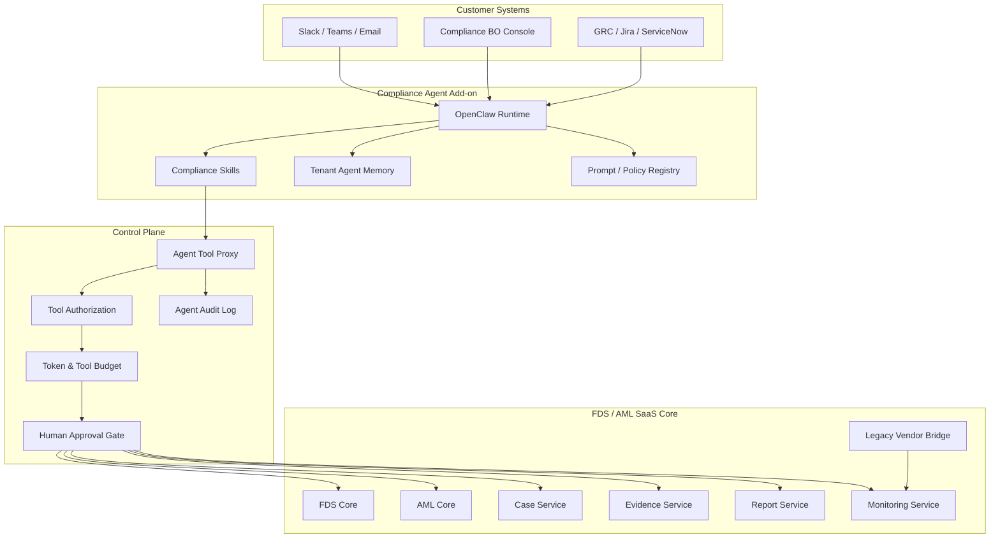
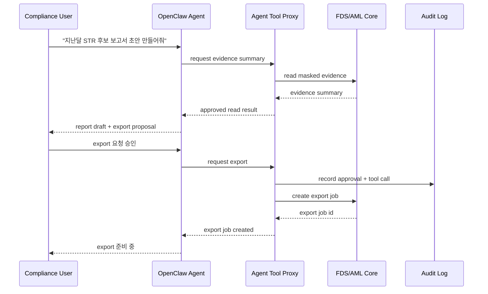

# OpenClaw 기반 Compliance Operations Agent 개발 계획

## 목차

1. [문서 목적](#1-문서-목적)
2. [제품 포지션](#2-제품-포지션)
3. [기존 FDS/AML SaaS와의 관계](#3-기존-fdsaml-saas와의-관계)
4. [OpenClaw 활용 방향](#4-openclaw-활용-방향)
5. [핵심 원칙](#5-핵심-원칙)
6. [대상 사용자와 사용 시나리오](#6-대상-사용자와-사용-시나리오)
7. [Agent 기능 범위](#7-agent-기능-범위)
8. [하면 안 되는 일](#8-하면-안-되는-일)
9. [플랫폼 아키텍처](#9-플랫폼-아키텍처)
10. [Agent 구성](#10-agent-구성)
11. [Tool 권한 모델](#11-tool-권한-모델)
12. [데이터 접근·PII 통제](#12-데이터-접근pii-통제)
13. [Human Approval Workflow](#13-human-approval-workflow)
14. [운영 모니터링 기능](#14-운영-모니터링-기능)
15. [감사대응 자동화 기능](#15-감사대응-자동화-기능)
16. [기존 벤더 병행 모니터링](#16-기존-벤더-병행-모니터링)
17. [과금 모델](#17-과금-모델)
18. [개발 단계](#18-개발-단계)
19. [데이터베이스 설계 방향](#19-데이터베이스-설계-방향)
20. [API·Tool 계약](#20-apitool-계약)
21. [보안·컴플라이언스 요구사항](#21-보안컴플라이언스-요구사항)
22. [운영 지표](#22-운영-지표)
23. [PoC 범위](#23-poc-범위)
24. [오픈 결정사항](#24-오픈-결정사항)
25. [참고 자료](#25-참고-자료)

---

## 1. 문서 목적

본 문서는 `22-1-fdsSvc-sass.md`와 `23-1-amlSvc-sass.md`에서 정의한 SaaS FDS/AML 플랫폼에 **OpenClaw 기반 AI 운영 모니터링 agent**를 add-on 상품으로 붙이기 위한 개발 계획서이다.

목표는 FDS/AML 탐지 엔진을 AI가 대체하는 것이 아니다. 핵심 목표는 **준법감시실이 개발팀 도움 없이 FDS/AML 운영 상태를 감시하고, 케이스를 우선순위화하고, 감사대응 자료를 빠르게 준비하도록 돕는 AI 운영 보조원**을 만드는 것이다.

본 문서에서 설계하는 agent는 다음을 담당한다.

- FDS/AML alert와 case backlog 상시 모니터링
- 준법감시 담당자에게 daily briefing 제공
- 미처리 case, SLA 초과, high-risk alert 우선순위 정렬
- STR/CTR/EDD/FDS case 보고서 초안 작성
- 감사대응 evidence pack 생성 요청 초안
- 기존 벤더와 SaaS 엔진의 dual-run 결과 비교
- connector 장애·누락·replay 상태 요약
- rule/model 변경 영향도와 위험 요약
- Slack, Teams, Email, BO console로 알림 전달

---

## 2. 제품 포지션

### 2.1 상품명

권장 상품명:

- Compliance Operations Agent
- FDS/AML Operations Agent
- RegOps Agent
- Audit Response Agent

본 문서에서는 `Compliance Operations Agent`로 표기한다.

### 2.2 판매 포지션

> 준법감시실이 FDS/AML을 직접 운용할 수 있게 하는 24시간 AI 운영 보조원

국내 핀테크·전자금융업자·PG·VASP·해외송금업자는 FDS/AML 솔루션을 도입하더라도 운영 인력이 alert, case, evidence, 보고자료를 계속 수작업으로 관리한다. 이 add-on은 그 수작업을 줄이는 유료 부가서비스다.

### 2.3 가격 가설

초기 가격은 월 100만원을 기본 add-on으로 둔다.

| 플랜 | 월 과금 | 포함 범위 |
|---|---:|---|
| Agent Basic | 100만원 | daily briefing, alert triage, SLA 알림, 보고서 초안 |
| Agent Pro | 200~300만원 | 실시간 모니터링, Slack/Teams, dual-run 분석, evidence 자동 생성 |
| Agent Enterprise | 별도 견적 | 전용 VPC/on-prem, 전용 model, GRC 연동, custom skill |

월 100만원은 준법감시 인력 0.2~0.5명 수준의 반복 운영 업무를 줄인다는 가치로 제안한다. 단, token 사용량과 고객별 alert volume을 제한하지 않으면 원가가 불안정해지므로 플랜별 quota가 필요하다.

---

## 3. 기존 FDS/AML SaaS와의 관계

Compliance Operations Agent는 FDS/AML core의 일부가 아니라 **운영 계층 add-on**이다.

| 계층 | 역할 |
|---|---|
| FDS SaaS | 이상거래 탐지, rule decision, action, case, evidence |
| AML SaaS | WLF, RA, TM, CDD/EDD, STR/CTR/Travel Rule, case, evidence |
| Compliance Agent | 모니터링, 요약, 우선순위화, 초안 생성, 승인 요청, 운영 알림 |

Agent는 FDS/AML 판단의 원천이 아니다. 판단 원천은 항상 FDS/AML core의 rule/model/case/evidence store다. Agent는 이를 읽고 정리하거나 초안을 만들며, 조치가 필요한 경우 준법감시실의 승인을 요청한다.

---

## 4. OpenClaw 활용 방향

OpenClaw는 self-hosted agent runtime, channel integration, model-agnostic, skill 기반 automation을 제공하는 도구로 활용한다. 공개 문서상 OpenClaw는 Slack, Teams 등 여러 채널과 연결할 수 있고, skill을 sandbox에서 실행하며, 여러 LLM 또는 local model을 사용할 수 있는 구조를 제공한다.

SaaS 제품에서는 OpenClaw를 다음 용도로 사용한다.

| OpenClaw 기능 | SaaS 제품 활용 |
|---|---|
| self-hosted runtime | tenant별 agent runtime 또는 private deployment |
| channel integration | Slack, Teams, Email, BO console 알림 |
| skill/plugin | FDS/AML tool 호출 skill 구현 |
| model agnostic | 고객 등급별 cloud model 또는 private/local model 선택 |
| sandbox | tool 실행 범위 제한 |
| long-running agent | daily briefing, scheduled monitoring, backlog watch |

중요한 제약:

- OpenClaw가 FDS/AML DB에 직접 접속하지 않는다.
- OpenClaw skill은 반드시 `Agent Tool Proxy`를 통해서만 FDS/AML SaaS API를 호출한다.
- OpenClaw의 shell/file/browser automation 기능은 금융 운영 환경에서는 기본 비활성화한다.
- 모든 agent 요청·응답·tool call은 tenant별 audit log에 저장한다.
- OpenClaw 자체 보안 취약점과 supply-chain risk를 별도 검토한다.

---

## 5. 핵심 원칙

### 5.1 AI는 운영 보조자다

AI Agent는 준법감시실의 판단을 보조한다. STR 보고, 지급정지, release, rule publish, customer reject 같은 규제·자금·고객 영향 조치는 AI가 단독 실행하지 않는다.

### 5.2 사람 승인 없는 조치 금지

Agent가 생성할 수 있는 것은 기본적으로 `summary`, `draft`, `recommendation`, `approval request`, `ticket`이다. 실제 조치는 maker-checker workflow를 통과해야 한다.

### 5.3 원천 데이터는 FDS/AML core가 보유한다

Agent runtime은 편의를 위한 cache를 가질 수 있지만, record of truth는 아니다. 모든 evidence, case, decision, report 상태는 FDS/AML core에 저장한다.

### 5.4 PII 최소 접근

Agent에는 masking/tokenization된 view를 제공한다. 주민등록번호, 계좌번호, 카드번호, CI/DI, 원문 KYC 문서, raw payload는 기본 제공하지 않는다.

### 5.5 설명 가능성

Agent가 추천한 우선순위, report draft, risk summary는 어떤 입력 데이터와 어떤 prompt/tool version으로 생성됐는지 추적 가능해야 한다.

### 5.6 비용 통제

Agent add-on은 token, tool call, schedule, monitored case 수 기준으로 quota를 둔다. tenant별 월 비용 상한과 kill switch를 제공한다.

---

## 6. 대상 사용자와 사용 시나리오

### 6.1 대상 사용자

| 사용자 | 목적 |
|---|---|
| 준법감시 담당자 | AML/FDS case 검토, STR/CTR/EDD 증적 확인 |
| 준법감시 책임자 | daily briefing, backlog, SLA, high-risk 현황 파악 |
| FDS 운영자 | 이상거래 alert triage, false positive 관리 |
| 내부감사 담당자 | 감사 요청 자료 export, 권한·조치 이력 확인 |
| 리스크관리 담당자 | rule/model 변경 영향과 고위험 그룹 추이 확인 |
| 고객사 개발팀 | connector 상태와 schema error만 확인 |

### 6.2 대표 사용 시나리오

#### Daily Briefing

매일 오전 9시 agent가 준법감시실 채널에 요약을 보낸다.

```text
어제 발생한 AML/FDS 주요 이슈입니다.

1. HIGH risk case 12건 생성, 이 중 3건 SLA 4시간 이내 만료 예정
2. 신규 WLF true-match 후보 2건, analyst 미배정
3. 국내송금 FDS rule R-102 hit rate가 평소 대비 3.4배 증가
4. 기존 AML 벤더와 SaaS TM dual-run 불일치 17건 발생
5. connector pg-settlement lag 42분 지속
```

#### Case Triage

담당자가 “오늘 먼저 봐야 할 STR 후보를 정리해줘”라고 요청하면 agent가 위험도, SLA, 금액, 반복성, WLF 여부를 기준으로 우선순위를 제안한다.

#### Evidence Draft

담당자가 “지난달 고위험 고객 EDD 이행 현황 보고서 초안 만들어줘”라고 요청하면 agent는 evidence export API를 호출해 초안을 작성하고, 다운로드 또는 제출은 사람이 승인한다.

#### Rule Impact Summary

룰 변경 전 agent가 과거 30일 데이터를 기준으로 예상 hit rate, false positive 후보, case 증가량을 요약한다.

---

## 7. Agent 기능 범위

### 7.1 Basic 기능

| 기능 | 설명 |
|---|---|
| Daily briefing | 전일/금일 alert, case, SLA, connector 상태 요약 |
| Alert triage | high-risk alert 우선순위 정렬 |
| Case backlog watch | 담당자·case type·SLA별 미처리 건수 감시 |
| Connector health summary | ingest lag, schema error, dead-letter 요약 |
| Evidence draft | 감사자료 초안과 필요한 evidence checklist 생성 |
| Report draft | 내부 보고용 문장 초안 생성 |

### 7.2 Pro 기능

| 기능 | 설명 |
|---|---|
| Real-time anomaly watch | alert 급증, 특정 rule hit rate spike 감지 |
| Dual-run analysis | 기존 벤더와 SaaS decision 차이 요약 |
| Rule impact analysis | 룰 변경 전 영향도 simulation 결과 설명 |
| STR candidate summary | STR 후보별 근거 요약과 누락 증빙 체크 |
| WLF false positive assistant | WLF 후보의 match 근거와 과거 처리 이력 정리 |
| Board report draft | 월간 준법감시/리스크관리 보고서 초안 |

### 7.3 Enterprise 기능

| 기능 | 설명 |
|---|---|
| Private agent runtime | 고객 전용 VPC 또는 on-prem OpenClaw runtime |
| Private model | 고객 전용 LLM 또는 local model 사용 |
| GRC integration | 고객 내부 GRC, Jira, ServiceNow, 그룹웨어 연동 |
| Custom skill | 고객사 업무 프로세스별 custom OpenClaw skill |
| Dedicated policy pack | 고객 업권·내부규정 기반 prompt/tool policy |

---

## 8. 하면 안 되는 일

다음 행위는 agent 단독 실행 금지다.

| 금지 행위 | 이유 |
|---|---|
| STR 자동 제출 | 규제 보고는 최종 책임자 승인 필요 |
| CTR 자동 제출 | 집계·제외·보정 검증 필요 |
| 지급정지·release 자동 실행 | 고객 자금 영향 |
| rule publish 자동 실행 | false positive와 고객 피해 가능 |
| WLF true match 자동 확정 | 오탐 가능성과 차별·서비스 거절 리스크 |
| customer reject 자동 실행 | 고객 권리 영향 |
| raw PII 자유 조회 | 개인정보보호·신용정보보호 리스크 |
| 외부 벤더 DB 직접 write | vendor schema 종속과 장애 위험 |
| shell/browser unrestricted automation | 금융 운영 환경 보안 위험 |

---

## 9. 플랫폼 아키텍처



### 9.1 구성요소

| 컴포넌트 | 설명 |
|---|---|
| OpenClaw Runtime | agent orchestration, channel integration, skill execution |
| Compliance Skills | FDS/AML 운영 업무별 skill |
| Agent Tool Proxy | OpenClaw와 SaaS core 사이의 유일한 API gateway |
| Tool Authorization | tenant, role, scope, action별 tool 권한 확인 |
| Human Approval Gate | 조치성 tool 실행 전 승인 workflow |
| Token & Tool Budget | 월 과금 quota와 비용 통제 |
| Agent Audit Log | prompt, tool call, response, approval, error 감사 |
| Tenant Agent Memory | tenant별 업무 context와 선호 설정 |
| Prompt / Policy Registry | prompt version, model config, safety policy |

---

## 10. Agent 구성

### 10.1 Agent 종류

| Agent | 역할 |
|---|---|
| Briefing Agent | daily/weekly/monthly 운영 브리핑 |
| Alert Triage Agent | high-risk alert 우선순위 정렬 |
| Case Assistant Agent | case 요약, 누락 증빙, 다음 action 제안 |
| Evidence Agent | 감사자료 초안과 evidence export 요청 생성 |
| Rule Impact Agent | 룰 변경 simulation 결과 요약 |
| Vendor Compare Agent | 기존 벤더와 SaaS dual-run 결과 비교 |
| Connector Monitor Agent | ingest lag, schema error, dead-letter 감시 |
| Report Draft Agent | STR/CTR/EDD/FDS 운영 보고서 초안 |

### 10.2 Agent별 실행 주기

| Agent | 실행 방식 |
|---|---|
| Briefing Agent | scheduled |
| Alert Triage Agent | scheduled + on-demand |
| Case Assistant Agent | on-demand |
| Evidence Agent | on-demand + approval |
| Rule Impact Agent | rule 변경 workflow 중 실행 |
| Vendor Compare Agent | daily + weekly |
| Connector Monitor Agent | near real-time |
| Report Draft Agent | monthly + on-demand |

---

## 11. Tool 권한 모델

Agent tool은 위험도에 따라 5단계로 분리한다.

| Level | 권한 | 예시 | 승인 |
|---|---|---|---|
| L0 | read masked data | case summary, alert count | 불필요 |
| L1 | generate draft | report draft, evidence checklist | 불필요 |
| L2 | create internal ticket | Jira/GRC ticket, BO task | 선택 |
| L3 | request controlled action | evidence export, case assignment proposal | 필요 |
| L4 | execute regulated action | STR submit, release hold, rule publish | agent 금지 또는 강한 승인 |

초기 MVP는 L0~L2만 허용한다. L3는 Phase 2 이후 human approval gate가 완성된 뒤 제한적으로 허용한다. L4는 제품 초기에는 제공하지 않는다.

### 11.1 결재 필요 여부 분리

OpenClaw agent가 수행하는 작업은 결재 필요 여부에 따라 분리한다. agent는 결재가 필요 없는 작업은 즉시 수행할 수 있지만, 결재가 필요한 작업은 `approval request`만 생성한다.

| 작업 유형 | Agent 직접 수행 | 결재 필요 |
|---|---|---|
| 운영 현황 요약 | 가능 | 불필요 |
| masked case 조회 | 가능 | 불필요 |
| alert 우선순위 정렬 | 가능 | 불필요 |
| 보고서 초안 작성 | 가능 | 불필요 |
| evidence checklist 생성 | 가능 | 불필요 |
| 내부 ticket 생성 | 가능 | tenant policy |
| case 담당자 변경 제안 | 상신만 가능 | 선택 또는 필수 |
| evidence export 생성 | 상신만 가능 | 필수 |
| rule publish | 상신만 가능 또는 금지 | 필수 |
| WLF true/false 확정 | 상신만 가능 | 필수 |
| STR/CTR 제출 | 상신만 가능 또는 금지 | 필수 |
| 지급정지·release | 상신만 가능 또는 금지 | 필수 |
| raw PII 접근 | break-glass 요청만 가능 | 필수 |

agent가 결재 요청을 만들 때는 다음을 포함한다.

- 요청 action
- 대상 tenant
- 대상 case/evidence/rule/report id
- 요청 사유
- agent recommendation
- 근거 evidence id 목록
- payload hash
- 만료 시간
- 필요한 결재 라인

---

## 12. 데이터 접근·PII 통제

### 12.1 Agent 전용 View

Agent에는 다음 view만 제공한다.

| View | 포함 데이터 |
|---|---|
| `agent_case_summary_view` | case id, type, risk grade, SLA, masked subject |
| `agent_alert_summary_view` | alert id, rule id, score, reason code, masked identifiers |
| `agent_evidence_index_view` | evidence id, type, period, hash, owner |
| `agent_connector_health_view` | source, lag, error count, last success |
| `agent_vendor_compare_view` | vendor decision, SaaS decision, mismatch reason |

### 12.2 금지 데이터

Agent 기본 context에 포함하지 않는다.

- 주민등록번호 원문
- 계좌번호 원문
- 카드번호 원문
- CI/DI 원문
- KYC 문서 원문 이미지
- raw payload
- 고객 연락처 원문
- 제3자 명단 raw file

### 12.3 Break-glass

원문 확인이 필요한 예외 상황은 agent가 직접 조회하지 않고, 담당자에게 break-glass 요청 ticket을 생성한다. 원문 접근은 별도 권한과 사유 입력, 승인, audit log가 필요하다.

---

## 13. Human Approval Workflow

FDS/AML SaaS의 결재 시스템은 OpenClaw agent보다 상위의 업무 통제 계층이다. agent는 결재 라인을 결정하지 않고, core approval policy API가 반환한 결재 요건에 따라 상신한다.



승인 원칙:

- 모든 조치성 tool은 approval id를 요구한다.
- approval id는 로그인 사용자, tenant, role, purpose, expiry를 포함한다.
- agent가 생성한 초안과 사람이 승인한 최종 action을 분리 저장한다.
- 승인 후 실행 결과도 agent audit log와 core audit log 양쪽에 남긴다.
- agent는 승인자가 될 수 없다.
- 결재 상신자와 승인자는 같을 수 없다.
- 결재 payload hash와 실행 payload hash가 다르면 실행하지 않는다.
- 결재 만료 후에는 동일 요청을 재상신해야 한다.

### 13.1 결재 라인 예시

| 결재 라인 | 적용 업무 | 승인자 |
|---|---|---|
| `MAKER_CHECKER` | case 상태 변경, 내부 ticket action | 같은 팀 내 승인자 |
| `COMPLIANCE_MANAGER` | FDS/AML 고위험 case 종결, evidence export | 준법감시 책임자 |
| `AML_OFFICER` | WLF true match, EDD 종결, STR 후보 기각 | AML 책임자 |
| `REPORTING_OFFICER` | STR/CTR 제출 | 보고 책임자 |
| `RISK_MANAGER` | rule/threshold 운영 변경 | 리스크관리 책임자 |
| `SECURITY_ADMIN` | API key, webhook, connector secret 변경 | 보안 관리자 |
| `EXECUTIVE_APPROVAL` | 대량 지급정지, 대량 고객 영향, 대량 정책 변경 | 임원 또는 지정 책임자 |

### 13.2 결재 정책 조회 API

agent는 tool 실행 전 결재 정책을 조회한다.

```http
POST /internal/agent/v1/approval-policy/evaluate
X-Agent-Id: evidence-agent
X-Tenant-Id: tenant-a
```

요청 예시:

```json
{
  "requestedAction": "EVIDENCE_EXPORT_CREATE",
  "resourceType": "AML_CASE",
  "resourceId": "AML-CASE-20260606-001",
  "riskGrade": "HIGH",
  "requestedBy": "agent:evidence-agent"
}
```

응답 예시:

```json
{
  "approvalRequired": true,
  "approvalLine": "COMPLIANCE_MANAGER",
  "selfApprovalAllowed": false,
  "expiresInMinutes": 60,
  "requiredReason": true
}
```

---

## 14. 운영 모니터링 기능

### 14.1 Alert Spike Detection

Agent는 다음 변화를 감시한다.

- rule hit rate 급증
- WLF true-match 후보 급증
- STR candidate 급증
- case SLA 초과 증가
- connector lag 증가
- legacy vendor와 SaaS decision mismatch 증가
- 특정 고객·가맹점·채널에 alert 집중

### 14.2 Case SLA Monitoring

출력 예시:

```text
SLA 위험 case:

1. AML-CASE-20260606-001
   - type: STR_REVIEW
   - risk: HIGH
   - SLA: 2시간 10분 남음
   - reason: WLF candidate + high-value transfer + new beneficiary

2. FDS-CASE-20260606-017
   - type: VOICE_PHISHING_REVIEW
   - risk: HIGH
   - SLA: 45분 초과
   - reason: domestic transfer velocity + mule account group
```

### 14.3 Connector Health

Agent는 개발팀이 아닌 준법감시실도 이해할 수 있게 connector 상태를 업무 영향으로 번역한다.

```text
pg-settlement connector가 42분 지연 중입니다.
현재 영향:
- PG 정산 fraud rule 3개가 최신 데이터 없이 평가될 수 있습니다.
- 오늘 14:10 이후 settlement evidence가 incomplete 상태입니다.
권장 조치:
- 개발팀 connector 담당자에게 ticket 생성
- 해당 기간 evidence export 시 incomplete flag 표시
```

---

## 15. 감사대응 자동화 기능

### 15.1 Evidence Pack Draft

Agent가 자동으로 구성할 evidence pack:

| Evidence Pack | 포함 내용 |
|---|---|
| FDS 운영현황 | decision count, action count, false positive, rule hit rate |
| AML 운영현황 | WLF, RA, TM, CDD/EDD, STR/CTR 후보 |
| Rule 변경 이력 | 변경자, 승인자, 적용일, rollback 여부 |
| Case 처리 이력 | 배정, 검토, 승인, 종결, SLA |
| Vendor 병행 이력 | vendor decision, SaaS decision, mismatch, final decision |
| Connector 상태 | lag, failure, replay, reconciliation |
| PII 접근 이력 | raw access, export, break-glass |

### 15.2 보고서 초안

Agent는 다음 보고서 초안을 생성한다.

- 일일 준법감시 briefing
- 주간 FDS/AML 운영 보고
- 월간 내부통제 보고
- 검사 대응 자료 목록
- STR 후보 검토 요약
- 고위험 고객 EDD 현황
- 기존 벤더 대체 효과 분석

초안은 항상 `DRAFT` 상태로 저장하고, 사람이 수정·승인해야 최종본이 된다.

---

## 16. 기존 벤더 병행 모니터링

OpenClaw agent는 기존 옥타솔루션 등 vendor 결과와 SaaS FDS/AML 결과를 비교해 전환 근거를 만든다.

### 16.1 비교 항목

| 비교 항목 | 설명 |
|---|---|
| alert coverage | vendor만 탐지, SaaS만 탐지, 양쪽 탐지 |
| decision mismatch | vendor allow vs SaaS review/block |
| false positive rate | analyst 최종 판단 기준 |
| case 처리 시간 | vendor 운영 대비 SaaS 운영 |
| evidence completeness | 검사 대응 자료 완성도 |
| connector stability | batch 누락, 지연, schema 오류 |

### 16.2 전환 리포트

Agent는 월간 전환 리포트를 생성한다.

```text
이번 달 dual-run 요약:

- 전체 비교 대상: 124,302건
- 양쪽 동일 판단: 121,884건 (98.1%)
- SaaS만 HIGH 탐지: 317건
- Vendor만 HIGH 탐지: 91건
- analyst 기준 SaaS 유효 탐지: 284건
- vendor DB export 누락 감지: 3회
- SaaS evidence completeness: 99.4%

권장:
1. domestic-transfer velocity rule은 SaaS 기준으로 전환 가능
2. WLF false positive whitelist는 vendor 기준과 추가 비교 필요
3. PG settlement domain은 2주 shadow 기간 연장
```

---

## 17. 과금 모델

### 17.1 Basic 월 100만원 구성

| 항목 | 포함량 |
|---|---:|
| monitored alert/case | 월 50,000건 |
| daily briefing | 1일 1회 |
| on-demand 질문 | 월 300회 |
| report draft | 월 20건 |
| evidence draft | 월 20건 |
| channel | Slack 또는 Teams 1개 |
| model | SaaS shared model |
| retention | agent audit 1년 |

### 17.2 Overage

| 항목 | 과금 기준 |
|---|---|
| 추가 alert/case | 10,000건 단위 |
| 추가 report draft | 건당 |
| 추가 channel | channel당 |
| private model | 별도 월 과금 |
| private runtime | 별도 구축비 + 월 과금 |
| custom skill | 개발비 + 유지보수 |

### 17.3 원가 통제

- tenant별 monthly token budget
- prompt caching
- summary cache
- 대량 case는 LLM에 원문 row를 넣지 않고 aggregation만 제공
- report draft는 evidence id와 summary 중심
- high-cost model은 Pro 이상에서만 허용
- agent runaway 방지를 위한 tool call limit

---

## 18. 개발 단계

### Phase 0. Feasibility & Security Review

- OpenClaw runtime 배포 방식 검토
- skill sandbox와 permission model 검증
- 금융 운영 환경에서 비활성화할 기능 정의
- supply-chain risk 검토
- tenant별 runtime 격리 방식 결정
- OpenClaw license 확인

완료 기준:

- OpenClaw를 agent runtime으로 사용할 수 있는지 기술·보안 판단
- shell/browser/file access 차단 방식 검증
- Agent Tool Proxy 설계 승인

### Phase 1. Agent Tool Proxy MVP

- FDS/AML read-only tool API 정의
- masked data view 제공
- tenant/role/scope authorization
- tool call audit log
- token budget skeleton

완료 기준:

- agent가 core DB 직접 접근 없이 case/alert/evidence summary 조회
- 모든 tool call audit 저장
- PII 원문 미노출 검증

### Phase 2. Read-only Monitoring Agent

- OpenClaw runtime 설치
- Slack/Teams channel 연동
- Daily Briefing Agent
- Alert Triage Agent
- Connector Monitor Agent
- scheduled job 구성

완료 기준:

- 매일 briefing 자동 발송
- high-risk case 우선순위 요약 가능
- connector lag를 업무 영향으로 설명

### Phase 3. Evidence & Report Draft Agent

- Evidence Agent
- Report Draft Agent
- STR/EDD/FDS 운영 보고서 template
- report draft 저장소
- export proposal 생성

완료 기준:

- evidence pack 초안 생성
- report draft와 evidence id 연결
- 최종 export는 사람 승인 없이는 불가

### Phase 4. Human Approval Gate

- approval request API
- approval id 검증
- maker-checker workflow 연동
- 승인 전후 audit 연결
- L3 tool 제한적 허용

완료 기준:

- agent가 제안한 export job을 사람이 승인해야 실행
- 승인자, 사유, 기간, 결과 audit 보존

### Phase 5. Legacy Vendor Dual-run Agent

- vendor result ingest summary
- SaaS decision 비교 view
- mismatch explanation
- monthly migration report
- false positive feedback 비교

완료 기준:

- 기존 벤더와 SaaS 결과 차이 리포트 생성
- 전환 가능 rule/domain 후보 추천

### Phase 6. SaaS Add-on Productization

- plan/quota/billing 연동
- tenant별 agent enable/disable
- channel 관리 UI
- prompt/policy version 관리 UI
- agent audit search UI
- customer-facing documentation

완료 기준:

- Basic 월 100만원 add-on 판매 가능
- tenant별 quota와 비용 제한 동작
- 준법감시실 운영자가 개발팀 없이 briefing/report/case summary 사용

### Phase 7. Enterprise Hardening

- private runtime option
- private model option
- customer VPC/on-prem 배포
- GRC/Jira/ServiceNow 연동
- custom skill SDK
- external security audit

완료 기준:

- 금융사·VASP·대형 PG 대상 enterprise 제안 가능
- 고객사 전용 격리 운영 가능

---

## 19. 데이터베이스 설계 방향

### 19.1 agent_sessions

```sql
CREATE TABLE agent_sessions (
  id BIGSERIAL PRIMARY KEY,
  tenant_id BIGINT NOT NULL,
  agent_type VARCHAR(64) NOT NULL,
  channel_type VARCHAR(32) NOT NULL,
  channel_ref VARCHAR(128),
  user_ref VARCHAR(128),
  status VARCHAR(32) NOT NULL,
  started_at TIMESTAMPTZ NOT NULL,
  ended_at TIMESTAMPTZ
);
```

### 19.2 agent_tool_calls

```sql
CREATE TABLE agent_tool_calls (
  id BIGSERIAL PRIMARY KEY,
  tenant_id BIGINT NOT NULL,
  session_id BIGINT,
  tool_name VARCHAR(128) NOT NULL,
  permission_level VARCHAR(16) NOT NULL,
  request_hash VARCHAR(128) NOT NULL,
  response_hash VARCHAR(128),
  approval_id BIGINT,
  status VARCHAR(32) NOT NULL,
  error_code VARCHAR(64),
  created_at TIMESTAMPTZ NOT NULL
);
```

### 19.3 agent_outputs

```sql
CREATE TABLE agent_outputs (
  id BIGSERIAL PRIMARY KEY,
  tenant_id BIGINT NOT NULL,
  session_id BIGINT,
  output_type VARCHAR(64) NOT NULL,
  title VARCHAR(256) NOT NULL,
  body_ref VARCHAR(512) NOT NULL,
  evidence_refs JSONB NOT NULL DEFAULT '[]',
  status VARCHAR(32) NOT NULL,
  created_by_agent VARCHAR(64) NOT NULL,
  created_at TIMESTAMPTZ NOT NULL
);
```

### 19.4 agent_approvals

```sql
CREATE TABLE agent_approvals (
  id BIGSERIAL PRIMARY KEY,
  tenant_id BIGINT NOT NULL,
  requested_by_agent VARCHAR(64) NOT NULL,
  requested_action VARCHAR(128) NOT NULL,
  approval_line VARCHAR(64) NOT NULL,
  requested_payload_hash VARCHAR(128) NOT NULL,
  approved_payload_hash VARCHAR(128),
  approver_ref VARCHAR(128),
  status VARCHAR(32) NOT NULL,
  reason TEXT,
  expires_at TIMESTAMPTZ NOT NULL,
  approved_at TIMESTAMPTZ,
  created_at TIMESTAMPTZ NOT NULL
);
```

### 19.5 agent_usage_meter

```sql
CREATE TABLE agent_usage_meter (
  id BIGSERIAL PRIMARY KEY,
  tenant_id BIGINT NOT NULL,
  usage_month CHAR(7) NOT NULL,
  metric_name VARCHAR(64) NOT NULL,
  used_count BIGINT NOT NULL DEFAULT 0,
  quota_count BIGINT,
  updated_at TIMESTAMPTZ NOT NULL,
  UNIQUE (tenant_id, usage_month, metric_name)
);
```

---

## 20. API·Tool 계약

### 20.1 Read Tool 예시

```http
GET /internal/agent/v1/cases/summary?risk=HIGH&status=OPEN
X-Agent-Id: briefing-agent
X-Tenant-Id: tenant-a
X-Tool-Scope: case:read-summary
```

응답:

```json
{
  "cases": [
    {
      "caseId": "AML-CASE-20260606-001",
      "caseType": "STR_REVIEW",
      "riskGrade": "HIGH",
      "subjectToken": "sub_91ab***",
      "slaExpiresAt": "2026-06-06T15:00:00+09:00",
      "reasonCodes": ["WLF_CANDIDATE", "HIGH_VALUE_TRANSFER"]
    }
  ]
}
```

### 20.2 Draft Tool 예시

```http
POST /internal/agent/v1/reports/drafts
X-Agent-Id: report-draft-agent
X-Tenant-Id: tenant-a
```

### 20.3 Approval Tool 예시

```http
POST /internal/agent/v1/evidence/exports/requests
X-Agent-Id: evidence-agent
X-Tenant-Id: tenant-a
```

이 API는 실제 export를 만들지 않고 approval request를 생성한다.

---

## 21. 보안·컴플라이언스 요구사항

### 21.1 OpenClaw Runtime Hardening

- tenant별 isolated runtime 또는 strict workspace 분리
- shell command skill 기본 비활성화
- file system write skill 기본 비활성화
- browser automation 기본 비활성화
- outbound network allowlist
- secret vault 연동
- skill install allowlist
- prompt injection 방어
- tool result size 제한
- audit log immutable storage

### 21.2 Prompt Injection 방어

Agent가 읽는 case memo, 고객 입력, vendor message에는 악성 지시문이 섞일 수 있다. 따라서 tool proxy는 다음을 적용한다.

- tool call은 model text가 아니라 typed API contract로만 실행
- 자연어 내 URL, instruction, hidden prompt는 실행하지 않음
- evidence 문서 내 instruction은 data로만 취급
- tool 권한은 prompt가 아니라 server-side policy로 결정
- approval gate는 model 응답과 독립적으로 검증

### 21.3 Audit

다음은 모두 감사 대상이다.

- user prompt
- agent response
- tool call request/response hash
- prompt version
- model id
- retrieved evidence id
- approval request
- approval result
- export request
- error/failure
- quota 초과와 차단

---

## 22. 운영 지표

### 22.1 고객 가치 지표

| 지표 | 목표 |
|---|---|
| daily briefing 작성 시간 | 80% 감소 |
| case triage 소요 시간 | 50% 감소 |
| 감사자료 1차 수집 시간 | 70% 감소 |
| SLA 초과 case | 30% 감소 |
| connector 장애 인지 시간 | 50% 감소 |
| 기존 벤더 전환 분석 기간 | 50% 단축 |

### 22.2 제품 운영 지표

| Metric | 설명 |
|---|---|
| `agent.sessions.started` | agent session 수 |
| `agent.tool.calls` | tool call 수 |
| `agent.tool.denied` | 권한 차단 수 |
| `agent.approval.requested` | 승인 요청 수 |
| `agent.approval.approved` | 승인 완료 수 |
| `agent.output.created` | draft/report 생성 수 |
| `agent.quota.remaining` | quota 잔량 |
| `agent.cost.estimated` | tenant별 예상 원가 |

---

## 23. PoC 범위

### 23.1 PoC 목표

1개 tenant를 대상으로 FDS/AML SaaS core 없이도 mock data와 일부 read-only API로 다음 가치를 검증한다.

- 준법감시 daily briefing 자동 생성
- high-risk case 우선순위 정렬
- connector 장애를 업무 영향으로 설명
- STR/FDS 운영 보고서 초안 생성
- OpenClaw skill -> Tool Proxy -> masked API 호출 구조 검증
- token cost와 월 100만원 가격의 마진 가능성 확인

### 23.2 PoC 제외

- STR 자동 제출
- 실제 지급정지/release 실행
- raw PII 조회
- 고객사 production DB 직접 연결
- 외부 벤더 DB write
- rule publish 자동화

### 23.3 PoC 완료 기준

- 준법감시 담당자가 하루 1회 briefing을 업무에 사용할 수 있음
- report draft가 사람이 수정 가능한 수준으로 생성됨
- 모든 tool call이 audit log에 남음
- masking/tokenization이 적용된 data만 agent에 제공됨
- 월 예상 LLM/API 원가가 Basic 가격의 20% 이하로 통제 가능함

---

## 24. 오픈 결정사항

| 번호 | 결정 항목 | 선택지 | 권장 |
|---|---|---|---|
| D-01 | OpenClaw 배포 | SaaS shared / tenant dedicated / customer VPC | Basic shared, Enterprise dedicated |
| D-02 | Model | shared cloud / tenant cloud / local model | Basic shared cloud, Enterprise 선택 |
| D-03 | Channel | BO only / Slack / Teams / Email | BO + Slack/Teams |
| D-04 | Tool 권한 | read-only / draft / approval action | MVP read-only + draft |
| D-05 | Agent memory | 없음 / tenant memory / user memory | tenant memory 제한 |
| D-06 | Raw PII | 금지 / break-glass / 허용 | 금지 + break-glass request |
| D-07 | Pricing quota | token 기준 / case 기준 / 혼합 | case + token 혼합 |
| D-08 | OpenClaw skill 배포 | SaaS 관리 / 고객 관리 / hybrid | SaaS 관리 allowlist |
| D-09 | Vendor bridge | report only / dual-run compare / migration recommendation | dual-run compare |
| D-10 | Approval | BO 승인 / Slack 승인 / 둘 다 | BO 승인 우선, Slack은 후속 |

---

## 25. 참고 자료

OpenClaw 관련 공개 자료는 제품화 전 공식 repository, license, 보안 권고, runtime 구조를 별도 검증해야 한다.

- OpenClaw documentation: https://openclawdoc.com/
- DigitalOcean, What is OpenClaw?: https://www.digitalocean.com/resources/articles/what-is-openclaw
- arXiv, A Security Analysis of the OpenClaw AI Agent Framework: https://arxiv.org/abs/2603.27517

---

## 결론

Compliance Operations Agent는 FDS/AML SaaS의 핵심 수익 add-on이 될 수 있다. 고객이 실제로 비용을 지불할 이유는 AI 자체가 아니라, 준법감시실의 반복 운영 업무와 검사 대응 준비 시간을 줄이는 데 있다.

핵심 설계 결정은 다음 다섯 가지다.

1. OpenClaw는 agent runtime으로 사용하고, FDS/AML core는 record of truth로 유지한다.
2. Agent는 DB에 직접 접근하지 않고 `Agent Tool Proxy`를 통해 masking된 API만 호출한다.
3. AI는 summary, draft, recommendation, approval request까지만 수행하고 규제·자금 영향 조치는 사람이 승인한다.
4. 월 100만원 Basic add-on은 daily briefing, triage, report draft, evidence draft 중심으로 제공한다.
5. 기존 벤더 병행 고객에게 dual-run 분석과 evidence 자동화를 제공해 점진 대체 근거를 만든다.
