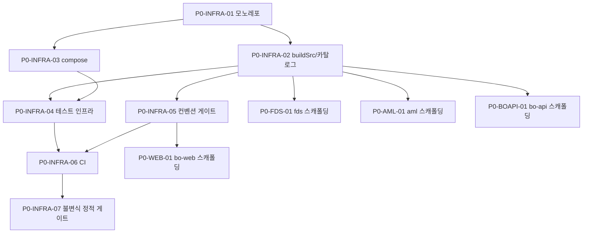

# P0 · 기반·하네스·CI

> 마스터: [00-program-overview.md](00-program-overview.md). 정본: `.claude/skills/_shared/target-architecture.md`(§2 모노레포·§3 스택·§4 횡단). 입력 정본: `docs/software/0{1,2}-*-sass.md`, `docs/design/{db,api,integration}`, `docs/plan`.
> 구현 패키지: `com.aegis.{fds,aml,backoffice}`(엔진 WBS의 `com.hanpass.*`는 설계 표기). 스켈레톤(개요 §0): 4서비스 부트 골격 + 도메인 스키마 완료 → P0 스캐폴딩 태스크는 DONE/부분완료, 나머지 TODO.

## 1. 목표·범위

- **이 단계가 끝나면**: 4서비스(`fds-svc`/`aml-svc`/`bo-api`/`bo-web`) 모노레포가 단일 `./gradlew build` + `bo-web build`로 빌드되고, path-filtered CI가 PR마다 빌드·테스트·lint·정본 정합을 게이트한다. 모든 후속 Phase가 같은 컨벤션(버전 카탈로그·헥사고날 경계·멀티테넌시 키·관측성 MDC)을 강제받는다.
- **진입 조건**: 선행 Phase 없음(프로그램 시작점). 스켈레톤 골격 존재 전제.
- **범위 포함**: buildSrc 컨벤션 플러그인, `gradle/libs.versions.toml` 단일 정본, docker-compose(Postgres·LocalStack SQS·Redis), CI 파이프라인, 테스트 인프라(Testcontainers·통합 하네스), 코드 컨벤션 게이트(Spotless/Checkstyle·ESLint/Prettier/tsc), 횡단 불변식 lint 규칙.
- **범위 제외**: 도메인 로직·엔진·화면(P1+).

## 2. 태스크 표

| ID | 제목 | 서비스 | 구분 | Effort | 의존 | DoD | Status |
|---|---|---|---|---|---|---|---|
| P0-INFRA-01 | 모노레포 레이아웃·Gradle 9.4.1·settings·서비스별 독립 배포 골격 | 공통 | 공통 | M | — | `./gradlew :services:fds-svc:build :services:aml-svc:build :services:bo-api:build` 성공, `bo-web` `pnpm build` 성공, 서비스 4개 디렉토리 `target-architecture.md` §2 구조 일치 | DONE(스캐폴딩) |
| P0-INFRA-02 | buildSrc 컨벤션 플러그인(Kotlin DSL)·헥사고날 의존 규칙·`libs.versions.toml` 단일 정본 | 공통 | 공통 | M | P0-INFRA-01 | fds/aml/bo-api 공용 convention plugin 적용, 버전 직접 명시 0건(전부 카탈로그 참조), `adapter→application→domain` 단방향 의존 검증 통과 | 부분완료 |
| P0-INFRA-03 | docker-compose 로컬 스택(Postgres·LocalStack SQS·Redis)·시드 부트스트랩 | 공통 | BE | S | P0-INFRA-01 | `docker compose up`으로 4서비스 의존 인프라 기동, 각 서비스 로컬 부팅 연결 성공 | 부분완료 |
| P0-INFRA-04 | 테스트 인프라(Testcontainers Postgres/LocalStack·통합 슬라이스 하네스·커버리지) | 공통 | BE | M | P0-INFRA-02,P0-INFRA-03 | 서비스별 통합테스트 부트(DB·SQS Testcontainer) 그린, 커버리지 리포트 산출 | TODO |
| P0-INFRA-05 | 코드 컨벤션 게이트(Spotless/Checkstyle·ESLint/Prettier/tsc strict)·pre-commit | 공통 | 공통 | S | P0-INFRA-02 | `./gradlew spotlessCheck` 통과, `bo-web` `lint`/`tsc --noEmit` 0 error, 위반 시 빌드 실패 | TODO |
| P0-INFRA-06 | path-filtered CI(`.github/workflows`)·서비스별 빌드·테스트·lint·아티팩트 | 공통 | 공통 | M | P0-INFRA-04,P0-INFRA-05 | 변경 path별 4 워크플로 동작, PR에서 빌드·테스트·lint 모두 게이트, bootJar/Next 빌드 아티팩트 업로드 | TODO |
| P0-INFRA-07 | 횡단 불변식 정적 게이트(멀티테넌시 키·PII 미저장·관측성 MDC·Flyway append-only) | 공통 | 공통 | M | P0-INFRA-06 | ArchUnit/커스텀 룰: `tenant_id` 누락 엔티티 검출, raw PII 컬럼 금칙어 검출, Flyway 기존 마이그레이션 수정 차단, traceId MDC 필터 존재 검증 | TODO |
| P0-FDS-01 | fds-svc 스캐폴딩(`com.aegis.fds` 헥사고날·boot·SQS·JPA·Flyway V1) 정합 확인 | fds-svc | BE | S | P0-INFRA-02 | fds T-01 매핑. bootJar·Decision/Rule 도메인·port·REST·Flyway V1(9테이블) 골격 존재·빌드 통과 | DONE(스캐폴딩) |
| P0-AML-01 | aml-svc 스캐폴딩(`com.aegis.aml` 헥사고날·boot·SQS·JPA·Flyway V1) 정합 확인 | aml-svc | BE | S | P0-INFRA-02 | aml T-01 매핑. bootJar·Alert/Case 도메인·`FdsDecisionConsumer`·Flyway V1(8테이블) 골격 존재·빌드 통과 | DONE(스캐폴딩) |
| P0-BOAPI-01 | bo-api 스캐폴딩(`com.aegis.backoffice` 피처·Security·OpenAPI·Flyway) 정합 확인 | bo-api | BE | S | P0-INFRA-02 | admin·audit·dashboard 피처·Spring Security·OpenAPI·Flyway(5테이블) compile 통과, 피처 패키지 구조 `target-architecture.md` §3.3 일치 | DONE(스캐폴딩) |
| P0-WEB-01 | bo-web 스캐폴딩(Next.js16/React19/TS·App Router·TenantContext·api 클라이언트) 정합 확인 | bo-web | FE | S | P0-INFRA-05 | FDS14+AML13 라우트·사이드바·KPI·`TenantContext`·api client 골격·`build` 통과, tsc strict 0 | DONE(스캐폴딩) |

## 3. 서비스별 분해

- **fds-svc / aml-svc**: 기존 WBS T-01(`../fds/01-scaffolding.md`·`../aml/01-scaffolding.md`)을 **참조**. 스켈레톤이 이미 골격을 충족하므로 P0에서는 컨벤션 플러그인 적용·헥사고날 의존 규칙·Flyway baseline 정합만 확인(Status DONE/부분완료). 패키지는 구현 레포 기준 `com.aegis.*`.
- **bo-api / bo-web / 공통(인프라·CI)**: 별도 WBS 없음 → 본 Phase에서 신규 분해(P0-BOAPI-01·P0-WEB-01·P0-INFRA-01~07). 공통 인프라/CI는 4서비스 전체에 적용되는 횡단 골격.

## 4. 설계 근거

- 모노레포·스택·레이아웃: `target-architecture.md` §2·§3, `docs/software/01-fdsSvc-sass.md` §18(Phase 0 참조구현 분석)·§17.
- 횡단 불변식: `target-architecture.md` §4, 개요 §6. PII 미저장·4-eyes·관측성·Flyway append-only.
- CI/컨벤션: 참조 레포 `hanpass-ph`(buildSrc·convention plugin 정본, `target-architecture.md` §6).

## 5. DoD / Exit

- **태스크 DoD 게이트**: 빌드 성공 + 테스트 통과 + lint 0(프론트 ESLint/Prettier/tsc) + 리뷰 높음 0 + 컨벤션 게이트 통과.
- **Phase Exit**:
  1. `./gradlew build` + `bo-web build` 그린, CI 4 워크플로 PR 게이트 동작.
  2. 버전 카탈로그 단일 정본화(버전 직접 명시 0건).
  3. 횡단 불변식 정적 게이트(P0-INFRA-07) 활성 — 이후 모든 Phase가 멀티테넌시·PII·MDC·Flyway 규칙을 자동 강제.
  4. 4서비스 스캐폴딩 Status DONE/부분완료 확인, 헥사고날·피처 경계 검증 통과.

## 6. 의존 그래프

**병렬 가능 그룹**: {P0-INFRA-03}, {P0-FDS-01, P0-AML-01, P0-BOAPI-01, P0-WEB-01}(P0-INFRA-02/05 이후 독립).

## 변경 이력
| 일자 | 변경 |
|---|---|
| 2026-06-07 | P0 기반·하네스·CI Phase 태스크 신규 작성(개요 §2 P0 정의 1:1). 인프라/CI 신규 분해 + 4서비스 스캐폴딩 정합 확인(스켈레톤 현황 반영 DONE/부분완료). |
