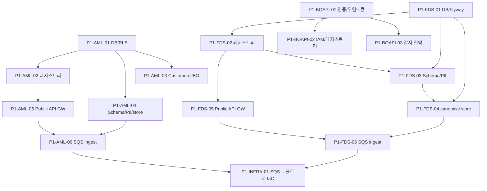

# P1 · 코어 인프라·데이터

> 마스터: [00-program-overview.md](00-program-overview.md). 정본: `target-architecture.md`. 입력: `docs/software/0{1,2}-*-sass.md` §18/§21 Phase 1, `docs/design/{db,api,integration}`, `docs/plan`.
> 매핑(개요 §3): fds T-02~T-07 / aml T-02~T-07 / bo-api auth·IAM / 공통 인프라. 마일스톤 **M1(데이터 수신)** 충족. (aml T-01 스캐폴딩은 P0-AML-01 완료, P1 범위 제외)

## 1. 목표·범위

- **이 단계가 끝나면**: 외부 source의 이벤트/고객 데이터가 Public API GW(인증 통과) 또는 SQS ingest 큐를 거쳐 **canonical/customer store에 멱등 적재**된다. DB 전체(Flyway)·격리·PII 토큰화가 동작하고 SQS 토폴로지가 선언된다. bo-api 운영자 인증/IAM 골격이 선다.
- **진입 조건**: P0 Exit(빌드·CI·컨벤션·불변식 게이트).
- **범위 포함**: Flyway 전체 마이그레이션·격리·시드 / 고객사·workspace·source 레지스트리 / Schema Registry·field mapping·PII 토큰화 / canonical event store·customer/entity/UBO·멱등 / Public API GW·인증(API Key+HMAC·OAuth2·mTLS) / SQS 토폴로지·ingest consumer·DLQ·FIFO 멱등 / bo-api 인증·IAM·고객사 레지스트리 골격.
- **범위 제외**: 룰/스크리닝 판단(P2), 화면(P5).

## 2. 태스크 표

| ID | 제목 | 서비스 | 구분 | Effort | 의존 | DoD | Status |
|---|---|---|---|---|---|---|---|
| P1-FDS-01 | DB 마이그레이션(Flyway V1~V17)·배포 모델·시드 | fds-svc | BE | L | P0-FDS-01 | fds T-02. Flyway 전 버전 적용·롤백검증, V17(`isolation_mode` DROP→`deployment_model`/`onboarding_status`/`infra_ref` 추가·백필 `SHARED→SHARED`·`SCHEMA/DB→MANAGED_DEDICATED`), append-only 검증, raw payload 미저장(`payload_hash`) | TODO |
| P1-FDS-02 | 고객사·workspace·source system 레지스트리·배포/온보딩 | fds-svc | BE+BO | M | P1-FDS-01 | fds T-03. tenant/workspace(retail/corporate/prod/sandbox)/source CRUD, `deployment_model`(3종)·`onboarding_status`(8종) 레지스트리·읽기 표시(`isolation_mode` 토글 제거), `sandbox`=shadow-only, capability 매트릭스, 전용 배포 tenantId 의미(배포=고객사 단일)·배포 내부 분리키 강제 | TODO |
| P1-FDS-03 | Schema Registry·field mapping·PII 토큰화/해시 | fds-svc | BE+BO | L | P1-FDS-01,P1-FDS-02 | fds T-04. schema 버전·field mapping config, ingest 단계 raw PII reject/tokenize(`FDS-PII-REJECTED` 422), keyed hash | TODO |
| P1-FDS-04 | Canonical event store·멱등/dedup·subject/account/instrument | fds-svc | BE | L | P1-FDS-01,P1-FDS-03 | fds T-05. canonical schema 적재, `input_event_hash` dedup 멱등, subject/account/instrument 모델, replay 재현 | TODO |
| P1-FDS-05 | Public API GW·인증(API Key+HMAC/OAuth2/mTLS)·scope·envelope | fds-svc | BE | L | P0-FDS-01,P1-FDS-02 | fds T-06. 3종 인증·scope, envelope·idempotencyKey, `Tenant-Id`·dataScope claim, rate limit `FDS-RATE-LIMIT` 429 | TODO |
| P1-FDS-06 | SQS 토폴로지·`fds-events` ingest consumer·DLQ·FIFO 멱등 | fds-svc | BE | L | P1-FDS-04,P1-FDS-05 | fds T-07. `fds-events`(FIFO) consumer, DLQ 토폴로지, FIFO dedup 멱등, DLQ depth 폴러 | TODO |
| P1-AML-01 | DB 마이그레이션(Flyway V01~V17b)·RLS·배포 모델·시드 | aml-svc | BE | L | P0-AML-01 | aml T-02. Flyway 전 버전·RLS 격리, `aml_outbox`(V16) 확정, V17a(`isolation_mode` DROP→`deployment_model`/`onboarding_status`/`infra_ref` 추가·백필 `SHARED→SHARED`·`SCHEMA/DB→MANAGED_DEDICATED`)·V17b(`isolation_mode` DROP), append-only | TODO |
| P1-AML-02 | 고객사·source system 레지스트리·배포 모델·온보딩 | aml-svc | BE+BO | M | P1-AML-01 | aml T-03. tenant/source CRUD, `deployment_model`(3종)·`onboarding_status`(8종)·`status`(운영 직교)/`policy_pack_code`/`failure_policy`, 큐 물리명 규칙(`aml-ingest-{tenantId}-{env}` 전용·`aml-ingest-{env}` SHARED), SHARED에서만 RLS(`app.current_tenant`) 행 격리, `isolation_mode` 토글 제거·온보딩 프로비저닝 파이프라인은 P8-BOAPI-01 위임 | TODO |
| P1-AML-03 | Customer·Entity·UBO graph 모델·해소 | aml-svc | BE | L | P1-AML-01 | aml T-04. customer/entity/UBO graph, entity resolution, `aml-svc` 소관 | TODO |
| P1-AML-04 | Schema Registry·PII 토큰화/해시·canonical event store | aml-svc | BE | L | P1-AML-01 | aml T-05. schema·PII tokenize, canonical store, 원문 미저장 | TODO |
| P1-AML-05 | Public API GW·인증(HMAC/JWT)·멱등·envelope | aml-svc | BE | L | P0-AML-01,P1-AML-02 | aml T-06. HMAC/JWT 인증, idempotency, envelope, scope `aml:*` | TODO |
| P1-AML-06 | SQS 토폴로지·`aml-ingest` consumer·DLQ·FIFO 멱등 | aml-svc | BE | L | P1-AML-04,P1-AML-05 | aml T-07. `aml-ingest`(+fifo) consumer, 6큐 토폴로지+`-dlq`, FIFO 멱등 | TODO |
| P1-BOAPI-01 | bo-api 운영자 인증·OAuth2 위임 토큰·세션·CORS | bo-api | BE | M | P0-BOAPI-01 | 운영자 로그인·OAuth2 발급, 엔진 Admin API 호출 시 위임 토큰·`dataScope` claim 주입, bo-web만 허용 CORS | TODO |
| P1-BOAPI-02 | bo-api IAM·RBAC·data-scope·고객사 레지스트리(집계 소유) | bo-api | BE+BO | L | P1-BOAPI-01 | 역할/권한 모델(`SFDS_*`/`AML_*` scope), data-scope 필터, 고객사 레지스트리 store, maker≠checker 식별 기반 | TODO |
| P1-BOAPI-03 | bo-api 감사 로그 집약 store·진입/이탈 구조화 로깅 | bo-api | BE | M | P1-BOAPI-01 | 운영자 행위 감사 append-only store, traceId 전파, 엔진 `audit-events` 위임 호출 골격 | TODO |
| P1-INFRA-01 | SQS 큐 토폴로지 IaC·환경별 큐 선언(`*-events/*-actions/*-handoff/*-webhook/*-vendor-ingest`+DLQ) | 공통 | BE | M | P1-FDS-06,P1-AML-06 | 개요 §4 큐 토폴로지 환경별 선언, DLQ·재처리 도구 공통화, LocalStack/실환경 동등 | TODO |

## 3. 서비스별 분해

- **fds-svc**(참조): T-02 `../fds/02-db-migration.md`, T-03 `../fds/03-tenant-workspace-source.md`, T-04 `../fds/04-schema-mapping-pii.md`, T-05 `../fds/05-canonical-event-store.md`, T-06 `../fds/06-public-api-gateway.md`, T-07 `../fds/07-sqs-ingest.md`.
- **aml-svc**(참조): T-02~T-07 `../aml/02-db-migration.md`·`03-tenant-source-registry.md`·`04-customer-entity-ubo.md`·`05-schema-pii-event-store.md`·`06-public-api-gateway.md`·`07-sqs-ingest.md`. (T-01 스캐폴딩은 P0-AML-01 완료, P1 범위 제외)
- **bo-api / 공통**(신규 분해): P1-BOAPI-01~03(인증·IAM·감사 집약, 별도 WBS 없음), P1-INFRA-01(SQS 토폴로지 IaC).

## 4. 설계 근거

- DB: `docs/design/db/01-fds-db.md` §3~§5(tenant/source/canonical/PII), `docs/design/db/02-aml-db.md` §3(tenant/source/RLS)·§3.15(outbox).
- API: `docs/design/api/01-fds-api.md` §3(인증·envelope)·§12(bo-api 경계), `docs/design/api/02-aml-api.md` §3·§9(bo-api 경계).
- Integration(SQS): `docs/design/integration/01-fds-integration.md` §2/§12(5큐), `docs/design/integration/02-aml-integration.md` §2.1(6큐).
- 소프트웨어: `docs/software/01-fdsSvc-sass.md` §18 Phase 1, `docs/software/02-amlSvc-sass.md` §21 Phase 1, §19/§22 D-01/D-06/D-13.

## 5. DoD / Exit

- **태스크 DoD**: 빌드·테스트·lint 0·리뷰 높음 0 + 정본 정합. 횡단 불변식 반영: 멀티테넌시 키 강제(모든 store), raw PII 미저장(토큰/해시), traceId MDC, Flyway append-only.
- **Phase Exit (M1)**:
  1. fds·aml 각각 이벤트/고객 ingest(Public API + SQS) → canonical/customer store 멱등 적재 확인(동일 입력 재처리 시 중복 0).
  2. 인증 3종(또는 HMAC/JWT)·DLQ·FIFO 멱등 동작.
  3. SQS 토폴로지(개요 §4) 환경별 선언 완료, 각 도메인 Phase가 발행/구독할 큐·DLQ 존재.
  4. bo-api 운영자 인증·IAM·data-scope·고객사 레지스트리·감사 집약 골격 동작(bo-web→bo-api→엔진 위임 경로 검증).

## 6. 의존 그래프

**병렬 가능 그룹**: {fds 트랙}, {aml 트랙}, {bo-api 트랙}은 서비스 독립. 트랙 내 {P1-FDS-02·P1-FDS-03 일부}, {P1-AML-02·P1-AML-03·P1-AML-04} 병렬.

## 변경 이력
| 일자 | 변경 |
|---|---|
| 2026-06-08 | **FDS 격리(isolation_mode) → 배포 모델(deployment topology) 재설계** 반영(설계서 v1.5 §13/§11.6.11/§11.6.11a/§14.1, DB v1.3 §5.1/§8, target-architecture §4.1). P1-FDS-01 제목 'tenant partition'→'배포 모델'·DoD에 Flyway V17(`isolation_mode` DROP→`deployment_model`/`onboarding_status`/`infra_ref` 추가·백필) 명시. P1-FDS-02 제목 'isolation'→'배포/온보딩'·DoD에 `deployment_model`(3종)·`onboarding_status`(8종) 레지스트리·전용 배포 tenantId 의미(배포=고객사 단일) 반영(`isolation_mode` 토글 제거). 상세 프로비저닝 파이프라인은 P8(09-phase8-saas.md) 위임. fds T-02/T-03 WBS와 정합. aml-svc(P1-AML-02)는 본 변경 범위 외(별도 정의 유지). |
| 2026-06-08 | **doc-consistency(aml:wbs-roadmap) P1 aml 이중 등재 해소** (정본=`00-program-overview.md` §3·P0-AML-01 Status=DONE). 헤더·§3 `aml T-01~T-07`→`aml T-02~T-07` 정정. T-01 스캐폴딩은 P0-AML-01 완료이므로 P1 범위 제외. | task-planner |
| 2026-06-08 | **AML 고객사 격리(isolation_mode) → 배포 모델(deployment topology) 재설계** 반영(AML DB §3.1/§5.28/§5.28a/§5.28b v1.4, API §1.1/§3.16/§5/§9, integration §2.1/§10.1/§10.3, target-architecture §4.1). **P1-AML-01** 제목 갱신·DoD에 Flyway V17a(`isolation_mode` DROP→`deployment_model`/`onboarding_status`/`infra_ref` 추가·데이터 백필)·V17b(`isolation_mode` DROP) 명시. **P1-AML-02** 제목 'isolation'→'배포 모델·온보딩'·DoD에 `deployment_model`(3종)·`onboarding_status`(8종)·큐 물리명 규칙(`aml-ingest-{tenantId}-{env}` 전용·`aml-ingest-{env}` SHARED)·`isolation_mode` 토글 제거 반영. aml T-02/T-03 WBS와 정합. |
| 2026-06-07 | P1 코어 인프라·데이터 Phase 태스크 신규 작성(개요 §2 P1·§3 매핑·M1). fds T-02~07/aml T-01~07 참조 매핑 + bo-api 인증/IAM·SQS 토폴로지 IaC 신규 분해. |
