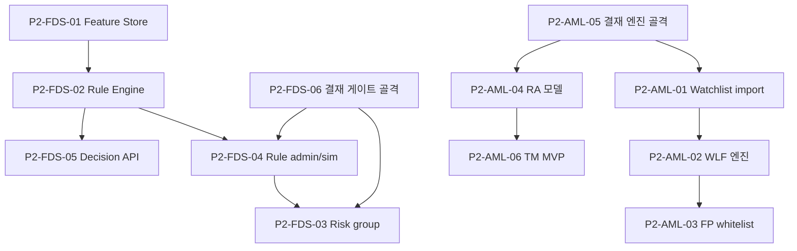

# P2 · 엔진 MVP

> 마스터: [00-program-overview.md](00-program-overview.md). 정본: `target-architecture.md`. 입력: `docs/software` §18/§21 Phase 2, `docs/design/{db,api,integration}`.
> 매핑(개요 §3): fds T-08~T-12 / aml WLF·RA·TM(T-08~T-12·T-14 일부). 마일스톤 **M2(판단 MVP)** 충족.

## 1. 목표·범위

- **이 단계가 끝나면**: FDS는 feature store→rule engine→decision API로 동기 평가가 동작하고, AML은 WLF screening·RA model·TM scenario MVP가 alert/screening을 생성한다. 룰/스크리닝 결과가 decision/alert store에 증적과 함께 저장된다.
- **진입 조건**: P1 Exit(M1, canonical/customer store·SQS·인증). 결재 게이트(P4)는 본 Phase에서는 RA 모델 활성화 등 일부 4-eyes 트리거의 **선행 엔진 골격**(fds T-15·aml T-12 stub)을 부분 도입한다 — 완성은 P4.
- **범위 포함**: FDS feature store·feature catalog·velocity / rule engine·DSL·decision store / decision API·fail policy / risk group·watchlist / rule admin·version·simulation(엔진부). AML watchlist import / WLF screening 엔진·scoring·real-time API / FP whitelist 검토 큐 / RA model·factor·simulation·override / TM scenario MVP(scenario·alert lifecycle 기본).
- **범위 제외**: 도메인 룰팩(P3), action router·case·결재 완성(P4), 화면(P5).

## 2. 태스크 표

| ID | 제목 | 서비스 | 구분 | Effort | 의존 | DoD | Status |
|---|---|---|---|---|---|---|---|
| P2-FDS-01 | Feature Store·feature catalog·velocity/window materialization | fds-svc | BE+BO | XL | P1-FDS-04 | fds T-08. catalog·velocity/window 머터리얼라이즈, no-code 빌더용 measure 노출, 멀티테넌시 키 | TODO |
| P2-FDS-02 | Rule Engine·DSL·decision store·decision reasons | fds-svc | BE | XL | P2-FDS-01 | fds T-09. DSL→`rule_json` 컴파일, decision 8종 산출, `fds_decisions` append-only 증적, replay 재현 | TODO |
| P2-FDS-03 | Risk group·watchlist/denylist·group match | fds-svc | BE+BO | M | P1-FDS-04,P2-FDS-04,P2-FDS-06 | fds T-10. `member_kind` 3종, group match, GROUP 마스터 수정 4-eyes 진입(게이트=P4) | TODO |
| P2-FDS-04 | Rule admin·version·rollback·simulation(예상 hit rate, 엔진부) | fds-svc | BE+BO | XL | P2-FDS-02 | fds T-11. 룰 버전·rollback·시뮬레이션 엔진, activate/disable/rollback 4-eyes 상신(게이트=P4) | TODO |
| P2-FDS-05 | Decision API(실시간 평가)·fail policy·reason/decision code | fds-svc | BE | L | P2-FDS-02 | fds T-12. 동기 평가 API, `fail_policy` 3종(FAIL_OPEN/FAIL_CLOSED/CASE_ONLY), `FdsDecisionCreated` webhook 발행 | TODO |
| P2-AML-01 | Watchlist source import·diff·승인·인덱스 | aml-svc | BE+BO | L | P1-AML-04,P2-AML-05 | aml T-08. source import·version diff·apply 4-eyes, GIN/OpenSearch 인덱스(D-02 기준선) | TODO |
| P2-AML-02 | WLF screening 엔진·scoring·판정·real-time API | aml-svc | BE+BO | XL | P1-AML-03,P2-AML-01 | aml T-09. fuzzy scoring breakdown, `screening_status` 6종, `POST /aml/screen`, fail 정책(MANUAL_REVIEW/FAIL_CLOSED), `aml-screening-async` 워커 | TODO |
| P2-AML-03 | False positive whitelist·analyst 검토 큐 | aml-svc | BO | M | P2-AML-02,P2-AML-05 | aml T-10. fp-whitelist·검토 큐 데이터(POSSIBLE_MATCH/ESCALATED), `screenings/{id}/decision` 4-eyes | TODO |
| P2-AML-04 | RA 모델·factor catalog·simulation·등급·override | aml-svc | BE+BO | XL | P1-AML-03,P2-AML-05 | aml T-11. factor catalog, 등급 산출, `SimulationResponse`(§3.15), 모델 activate·등급 override 4-eyes 상신 | TODO |
| P2-AML-05 | 4-eyes 결재 엔진(approval·payload_hash·실행분리) 골격 | aml-svc | BE+BO | L | P1-AML-01,P1-AML-05 | aml T-12(엔진 골격). approval 상태머신·`payload_hash`·maker≠checker, subjectType **16종** 등재(`CHECKLIST_CHANGE`·`PERIODIC_REVIEW_CHANGE` 포함, API §3.7 정본). 도메인별 실행 relay 완성=P4 | TODO |
| P2-AML-06 | Transaction Monitoring 엔진·scenario·alert lifecycle (MVP) | aml-svc | BE+BO | XL | P1-AML-06,P2-AML-04 | aml T-14(MVP 분). scenario 평가·alert lifecycle 기본(`alert_status` 포함), `{scenarioCode}:activate` 4-eyes 상신. case 연계 완성=P3/P4 | TODO |
| P2-FDS-06 | 4-eyes 결재 게이트(approval·payload_hash·실행분리) 골격 | fds-svc | BE+BO | L | P1-FDS-01,P1-FDS-05 | fds T-15(엔진 골격). `subject_kind` 8종·`approval_status` 8종·`payload_hash`, RULE/GROUP 상신 수신. action 실행 relay 완성=P4 | TODO |

## 3. 서비스별 분해

- **fds-svc**(참조): T-08 `../fds/08-feature-store.md`, T-09 `../fds/09-rule-engine.md`, T-10 `../fds/10-risk-groups.md`, T-11 `../fds/11-rule-admin-simulation.md`, T-12 `../fds/12-decision-api.md`, T-15(골격) `../fds/15-approval-gate.md`.
- **aml-svc**(참조): T-08 `../aml/08-watchlist-import.md`, T-09 `../aml/09-wlf-screening.md`, T-10 `../aml/10-fp-whitelist-review.md`, T-11 `../aml/11-risk-assessment.md`, T-12(골격) `../aml/12-approval-engine.md`, T-14(MVP) `../aml/14-transaction-monitoring.md`.
- **bo-api/bo-web**: 본 Phase는 엔진 저수준 데이터·admin API 계약 산출만(화면 연동=P5). 신규 bo-api 태스크 없음(P3에서 집약).

> 결재 엔진(fds T-15/aml T-12)은 P2에서 **골격(상태머신·payload_hash·상신 수신)** 만 도입하고, action/case 실행 relay 분리는 P4에서 완성한다(개요 §3 P4 매핑과 정합).

## 4. 설계 근거

- FDS: `docs/software/01-fdsSvc-sass.md` §10(룰 엔진)·§11.1(decision), `docs/design/db/01-fds-db.md` §5.10/§5.11/§5.16~5.18, `docs/design/api/01-fds-api.md` §4.6/§5.4/§7.
- AML: `docs/software/02-amlSvc-sass.md` §10(WLF)·§11~§13(RA/TM), `docs/design/db/02-aml-db.md` §3.8/§5.5(screening), `docs/design/api/02-aml-api.md` §2.2/§3.2/§3.15.
- Integration: `docs/design/integration/02-aml-integration.md` §2.1(`aml-screening-async`)·§5.2(WLF fail 정책).

## 5. DoD / Exit

- **태스크 DoD**: 빌드·테스트·lint·리뷰 높음 0 + 정본 정합. decision/screening append-only 증적, replay 재현, PII 토큰 매칭, 4-eyes 상신 경로 존재.
- **Phase Exit (M2)**:
  1. FDS 동기 평가 API가 입력 이벤트→decision(8종)+reason+matched rules 반환, fail policy 동작.
  2. AML WLF screening real-time API가 scoring breakdown·`screening_status`·fail 정책으로 판정 생성.
  3. RA model이 등급 산출·simulation 제공, TM scenario MVP가 alert 생성.
  4. risk group/watchlist match, rule admin 버전/시뮬레이션 엔진 동작.
  5. 결재 엔진 골격(상태머신·payload_hash·maker≠checker) 동작(실행 relay는 P4).

## 6. 의존 그래프

**병렬 가능 그룹**: {fds 트랙}·{aml 트랙} 독립. fds 내 {P2-FDS-05} P2-FDS-02 직후, aml 내 {P2-AML-01, P2-AML-04}(결재 골격 이후) 병렬.

## 변경 이력
| 일자 | 변경 |
|---|---|
| 2026-06-07 | P2 엔진 MVP Phase 태스크 신규 작성(개요 §2 P2·M2). fds T-08~12+T-15골격 / aml T-08~12+T-14MVP 참조 매핑. 결재 엔진은 P2 골격·P4 완성으로 분리 명시. |
| 2026-06-08 | #61 P2-AML-05 DoD subjectType '14종'→'**16종**'(`CHECKLIST_CHANGE`·`PERIODIC_REVIEW_CHANGE` 포함, API §3.7·설계서 §13.4/§13.5 정본). |
| 2026-06-08 | #34 P2-FDS-03 의존 칸 `P1-FDS-04,P2-FDS-04`→`P1-FDS-04,P2-FDS-04,P2-FDS-06`(WBS T-10 의존 T-05·T-15·§6 의존 그래프 정본 — 결재 게이트 골격 선행 필요). |
