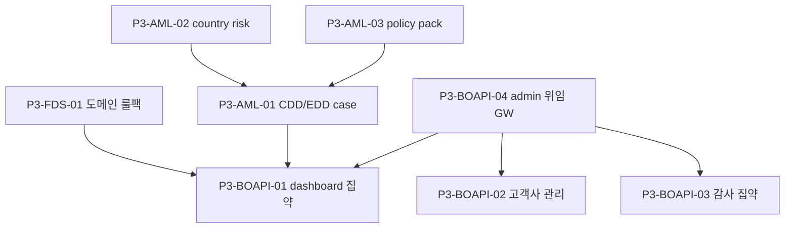

# P3 · 도메인 1차·BO API 집약

> 마스터: [00-program-overview.md](00-program-overview.md). 정본: `target-architecture.md`. 입력: `docs/software` §18/§21 Phase 3, `docs/design`, `docs/plan`.
> 매핑(개요 §3): fds T-13 / aml CDD·국가위험·명단(T-13·국가위험·CDD/EDD) / bo-api dashboard·admin·audit·위임. 마일스톤 **M3(운영 가능)** 1차.

## 1. 목표·범위

- **이 단계가 끝나면**: FDS 주요 금융 도메인 1차 룰팩(송금·월렛·카드·PG·ATM)이 동작하고, AML CDD/EDD workflow·국가위험·명단 정책이 선다. **bo-api가 dashboard·admin·audit를 집약**하고 엔진 admin API를 RestClient로 위임 호출하여 운영자 집계 데이터를 제공한다(화면은 P5, 데이터·계약은 본 Phase).
- **진입 조건**: P2 Exit(M2, 엔진 MVP). 결재 게이트 골격(P2-FDS-06/P2-AML-05) 존재.
- **범위 포함**: FDS 도메인 1차 룰팩 / AML CDD/EDD case·periodic review·country risk·watchlist 정책 운영 / bo-api dashboard 집약(`/api/v1/bo/{fds,aml}/dashboard`)·admin 위임·audit 집약·고객사 관리 API.
- **범위 제외**: action router·case 완성(P4), 전 화면 구현(P5), 규제 보고 본처리(P6).

## 2. 태스크 표

| ID | 제목 | 서비스 | 구분 | Effort | 의존 | DoD | Status |
|---|---|---|---|---|---|---|---|
| P3-FDS-01 | 주요 금융 도메인 1차 룰팩(송금·월렛·카드·PG·ATM) | fds-svc | BE+BO | XL | P2-FDS-02,P2-FDS-05 | fds T-13. 5도메인 룰팩·feature·channel scope, decision API 도메인별 동작, 룰팩 버전·시뮬레이션 | TODO |
| P3-AML-01 | CDD/EDD workflow·case 관리·periodic review·SLA | aml-svc | BE+BO | XL | P2-AML-02,P2-AML-04,P2-AML-05 | aml T-13. CDD case·checklist·`periodic-review-policy`(cadenceByGrade·gracePeriodDays)·SLA, `case_status` OPEN, 4-eyes(checklist PUT·close) | TODO |
| P3-AML-02 | 국가위험(country risk) 등급표·변경·RA 재평가 트리거 | aml-svc | BE+BO | M | P2-AML-04,P2-AML-05 | aml T-11 일부. `country-risk`·`:change` 4-eyes(COUNTRY_RISK), 실행 후 대상 RA 재평가 트리거 | TODO |
| P3-AML-03 | tenant policy pack 변경·effective version·watchlist 정책 운영 | aml-svc | BE+BO | M | P1-AML-02,P2-AML-05 | aml T-03 일부. `policy-packs:change` 4-eyes(POLICY_PACK), `aml_tenants.policy_pack_code` effective version 갱신 | TODO |
| P3-BOAPI-01 | bo-api dashboard 집약(FDS/AML)·엔진 admin RestClient 위임·fan-out | bo-api | BE+BO | L | P1-BOAPI-02,P3-FDS-01,P3-AML-01 | `GET /api/v1/bo/{fds,aml}/dashboard`·`/tenants/{id}/dashboard`, 엔진 저수준 API fan-out 집계, `dataScope` 필터 주입 | TODO |
| P3-BOAPI-02 | bo-api 고객사 관리 API(목록/상세/등록/설정·배포 유형) 집약 | bo-api | BE+BO | M | P1-BOAPI-02 | `GET/POST/PUT /api/v1/bo/{fds,aml}/tenants[/{id}]`. FDS=`deployment_model`(3종)/`onboarding_status`(8종, 읽기)/`region`/`infraRef`/`status`(`isolation_mode` 제거), **AML=`deployment_model`(3종)/`onboarding_status`(8종, 읽기)/`region`/`infraRef`/`status`/`policyPackCode`**(`isolation_mode` 제거, DB §5.28/§5.28a, API §3.16 TenantDto 정본). `deploymentModel` 변경 불가(409 `AML.TENANT_DEPLOYMENT_MODEL_IMMUTABLE`). 엔진 레지스트리 위임. 온보딩 프로비저닝 API(`/onboarding/provision`·`GET /onboarding`·`/onboarding/register`)는 P8-BOAPI-01 위임 | TODO |
| P3-BOAPI-03 | bo-api 감사 집약 API(`/audit`)·엔진 audit-events 위임 | bo-api | BE | M | P1-BOAPI-03 | `GET /api/v1/bo/{fds,aml}/audit?eventCategory&actor&from&to`, 엔진 `audit-events` 저수준 위임 + bo-api 운영자 행위 병합 | TODO |
| P3-BOAPI-04 | bo-api 엔진 admin 위임 게이트웨이(인증·scope·error 매핑·resilience) | bo-api | BE | M | P1-BOAPI-01 | RestClient 공통 위임(`/api/v1/admin/{fds,aml}/**`), 위임 토큰·scope 강제, 에러코드 패스스루, timeout/retry/circuit | TODO |

## 3. 서비스별 분해

- **fds-svc**(참조): T-13 `../fds/13-domain-rulepacks.md`.
- **aml-svc**(참조): T-13 `../aml/13-cdd-edd-case.md`, country risk·policy pack은 T-11/T-03 admin 정책분(`../aml/11-risk-assessment.md`·`03-tenant-source-registry.md`, API §2.7 admin 정책).
- **bo-api**(신규 분해): P3-BOAPI-01~04. 운영자 집계(대시보드/고객사/감사)는 **bo-api 소유·집약·인증**(개요 §4, API §12/§9). 엔진 API 명세에 운영자 집계 엔드포인트 미추가 — bo-api가 엔진 저수준 데이터 API를 RestClient 위임·fan-out.

## 4. 설계 근거

- FDS: `docs/software/01-fdsSvc-sass.md` §18 Phase 3(도메인 우선순위 5종), `docs/design/api/01-fds-api.md` §11/§12(bo-api 위임 경계), `docs/plan/01-fds-sass-functional-spec.md` §1.1(서비스 경계).
- AML: `docs/software/02-amlSvc-sass.md` §13.4/§13.5(CDD/EDD)·§2.6(country/policy), `docs/design/api/02-aml-api.md` §2.7/§3.11~§3.13/§9, `docs/design/db/02-aml-db.md` §5.9(case_status).
- bo-api 집계 경계: `docs/design/api/02-aml-api.md` §9(`/api/v1/bo/aml/**`), `docs/design/api/01-fds-api.md` §11.2/§12.

## 5. DoD / Exit

- **태스크 DoD**: 빌드·테스트·lint·리뷰 높음 0 + 정본 정합. bo-api는 엔진 직접 저장 금지(위임만), `dataScope` 필터 강제, 운영자 행위 감사 전수.
- **Phase Exit (M3 1차)**:
  1. FDS 5도메인 룰팩이 decision API로 도메인별 판정.
  2. AML CDD/EDD case·periodic review·country risk·policy pack 정책 운영(4-eyes 상신 동작, 결재 완성은 P4).
  3. bo-api가 dashboard/tenant/audit 집약 API를 제공하고 엔진 admin을 위임 호출(M4 화면 연동의 데이터 계약 확정).
  4. 운영자 집계 소유 경계(엔진 API에 집계 엔드포인트 미추가) 정합 검증.

## 6. 의존 그래프

**병렬 가능 그룹**: {P3-FDS-01}, {P3-AML-01·P3-AML-02·P3-AML-03}, {P3-BOAPI-04→(B1·B2·B3)}는 트랙 독립. BOAPI는 엔진 데이터 API 준비 후 집약.

## 변경 이력
| 일자 | 변경 |
|---|---|
| 2026-06-08 | **FDS 격리 → 배포 모델 재설계** 반영(API v1.5 §11.2, DB v1.3 §9, target-architecture §4.1). P3-BOAPI-02 고객사 관리 집약 DoD에서 FDS 측 `isolation_mode` → `deployment_model`(3종)/`onboarding_status`(8종 읽기)/`region`/`infraRef`로 교체(AML `isolation_mode`/`policy_pack_code`는 유지). 온보딩 프로비저닝 엔드포인트(`/tenants/{id}/onboarding/provision`·`GET /onboarding`·`/onboarding/register`)는 P8-BOAPI-01로 위임 명시. P8-BOAPI-01·fds T-03/T-22와 정합. |
| 2026-06-08 | **AML 고객사 격리(isolation_mode) → 배포 모델(deployment topology) 재설계** 반영(AML DB §3.1/§5.28/§5.28a·API §3.16/§4·integration §10.1, target-architecture §4.1). **P3-BOAPI-02** DoD의 AML 고객사 관리 측 `isolation_mode`/`policy_pack_code` → `deployment_model`(3종)/`onboarding_status`(8종 읽기)/`region`/`infraRef`/`status`/`policyPackCode`로 교체(`isolation_mode` 제거). `deploymentModel` 불변(409 `AML.TENANT_DEPLOYMENT_MODEL_IMMUTABLE`) 명시. API §3.16 TenantDto 정본과 1:1 정합. aml T-03 WBS·P8-BOAPI-01·aml-svc DB §5.28/§5.28a와 정합. |
| 2026-06-07 | P3 도메인 1차·BO API 집약 Phase 태스크 신규 작성(개요 §2 P3·§4 bo-api 위임·M3 1차). fds T-13/aml CDD·country·policy 참조 + bo-api dashboard·admin·audit·위임 신규 분해. |
