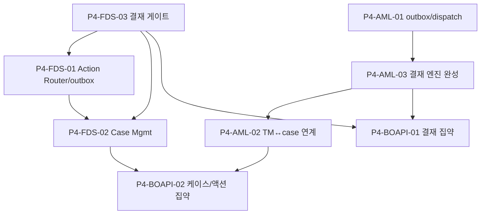

# P4 · 액션·케이스·결재(4-eyes)

> 마스터: [00-program-overview.md](00-program-overview.md). 정본: `target-architecture.md`. 입력: `docs/software` §18/§21 Phase 4, `docs/design`.
> 매핑(개요 §3): fds T-14~T-16 / aml T-12(완성)·T-13(완성분)·T-14(완성)·T-16(outbox) / bo-api 결재 집약. 마일스톤 **M3(운영 가능)** 완성.

## 1. 목표·범위

- **이 단계가 끝나면**: 탐지 결과가 **action router→outbox→relay**로 외부에 실행되고, **case management**(timeline·SLA·배정·종결)와 **4-eyes 결재 게이트**(payload_hash·실행분리)가 FDS·AML 공통으로 완성된다. 결재 승인 후에만 action/case-close/rule-activate가 relay된다.
- **진입 조건**: P2 결재 골격(P2-FDS-06/P2-AML-05), P3 도메인·bo-api 집약.
- **범위 포함**: FDS action router·outbox·capability 매트릭스·`fds-actions` relay / case management·timeline·SLA·feedback / 4-eyes 결재 게이트 완성(상신→승인→실행 relay 분리) / AML transactional outbox·dispatch / case close·reject-relationship 4-eyes / bo-api 결재 집약·결재함 API.
- **범위 제외**: bo-web 화면(P5), 규제 보고 본처리(P6).

## 2. 태스크 표

| ID | 제목 | 서비스 | 구분 | Effort | 의존 | DoD | Status |
|---|---|---|---|---|---|---|---|
| P4-FDS-01 | Action Router·아웃박스·`fds-actions` relay·capability 매트릭스 | fds-svc | BE | L | P2-FDS-02,P4-FDS-03 | fds T-14. outbox poller(`SELECT FOR UPDATE SKIP LOCKED`), `ActionType` 23종, capability 매트릭스, `FdsActionResult` ack, `fds-webhook` 공통 publisher(서명·dedup·재시도8) | TODO |
| P4-FDS-02 | Case Management·timeline·SLA·assignment·close·feedback | fds-svc | BE+BO | XL | P2-FDS-02,P4-FDS-01,P4-FDS-03 | fds T-16. `case_status` 8종·`case_priority` 4종·timeline·SLA·assign·close(4-eyes `CASE_CLOSE`)·`/feedback`, `FdsCaseOpened`/`StatusChanged` webhook | TODO |
| P4-FDS-03 | 4-eyes 결재 게이트 완성(approval·payload_hash·실행분리 relay) | fds-svc | BE+BO | L | P2-FDS-06 | fds T-15. `subject_kind` 8종·`approval_status` 8종, payload_hash 무결성(`FDS-APPROVAL-PAYLOAD-CHANGED`), maker≠checker(`FDS-APPROVAL-SELF`), 승인 후 relay 분리 실행 | TODO |
| P4-AML-01 | 트랜잭셔널 아웃박스·dispatch·report-callback 골격 | aml-svc | BE | M | P1-AML-06,P2-AML-05 | aml T-16. `aml_outbox`(V16) poller·`aml-outbox-dispatch`·`aml-report-callback` consumer, 발행 멱등 UNIQUE | TODO |
| P4-AML-02 | TM↔case 연계·alert lifecycle 완성·CDD/EDD 종결 | aml-svc | BE+BO | L | P3-AML-01,P2-AML-06 | aml T-14/T-13 완성. alert→case 전이(`alert_status` CASE_OPENED), case `:close`/`:reject-relationship` 4-eyes | TODO |
| P4-AML-03 | 4-eyes 결재 엔진 완성(실행 relay·subjectType 실행효과 분기) | aml-svc | BE+BO | L | P2-AML-05,P4-AML-01 | aml T-12 완성. subjectType **16종** 실행효과(COUNTRY_RISK→RA 재평가·POLICY_PACK→effective version·CHECKLIST_CHANGE→정책 store·PERIODIC_REVIEW_CHANGE→스케줄러·EDD_CLOSE·STR_SUBMIT·CTR_SUBMIT 등), 승인 relay outbox 연동 | TODO |
| P4-BOAPI-01 | bo-api 결재 집약 API(결재함·승인/반려 위임)·결재 라인 정책 | bo-api | BE+BO | M | P3-BOAPI-04,P4-FDS-03,P4-AML-03 | `GET /admin/{fds,aml}/approvals`·`/approve`·`/reject` 위임, 결재 라인(`approval_line`) 정책 소유, maker≠checker IAM 검증, 감사 전수 | TODO |
| P4-BOAPI-02 | bo-api 케이스·액션 집약 API(큐·배정·종결 상신 위임) | bo-api | BE+BO | M | P3-BOAPI-04,P4-FDS-02,P4-AML-02 | case 큐/상세/assign/close·action 상태 위임 집약, data-scope 필터, 종결 상신→결재함 연결 | TODO |

## 3. 서비스별 분해

- **fds-svc**(참조): T-14 `../fds/14-action-router-outbox.md`, T-15 `../fds/15-approval-gate.md`, T-16 `../fds/16-case-management.md`.
- **aml-svc**(참조): T-16 `../aml/16-transactional-outbox.md`, T-12 `../aml/12-approval-engine.md`, T-13/T-14 종결분 `../aml/13-cdd-edd-case.md`·`14-transaction-monitoring.md`.
- **bo-api**(신규 분해): P4-BOAPI-01~02. 결재 라인 정책·운영자 IAM은 bo-api 소유(API §4.9), 엔진은 게이트(`*_approval_requests`/`*_approval_steps`)만 보유. bo-web→bo-api→엔진 위임.

> `fds-webhook` 공통 publisher(서명·dedup·재시도·DLQ)는 P4-FDS-01 횡단 구현, 도메인 발행은 P2-FDS-05(decision)·P4-FDS-01(action)·P4-FDS-02(case)·P6(evidence)가 분담(fds WBS §5a).

## 4. 설계 근거

- FDS: `docs/software/01-fdsSvc-sass.md` §11.2/§12(action·case·approval), `docs/design/db/01-fds-db.md` §4.8/§4.11/§5.23(action_type/case/subject_kind), `docs/design/api/01-fds-api.md` §4.9/§5.7/§5.12/§8(approval), `docs/design/integration/01-fds-integration.md` §2/§8(outbox·webhook).
- AML: `docs/software/02-amlSvc-sass.md` §14/§19(case·outbox·approval), `docs/design/db/02-aml-db.md` §3.15(outbox)·§5.7/§5.9(alert/case status), `docs/design/api/02-aml-api.md` §10(결재 트리거), `docs/design/integration/02-aml-integration.md` §2.1(`aml-outbox-dispatch`/`aml-report-callback`).
- bo-api 결재 경계: API §4.9(approval 위임·운영자 IAM bo-api 소유).

## 5. DoD / Exit

- **태스크 DoD**: 빌드·테스트·lint·리뷰 높음 0 + 정본 정합. 4-eyes(작성자≠승인자) 강제, payload_hash 무결성, 승인↔실행 분리 저장, action relay 멱등·DLQ.
- **Phase Exit (M3 완성)**:
  1. FDS action router→outbox→`fds-actions` relay가 capability 매트릭스 따라 실행, `FdsActionResult` ack.
  2. case management(timeline·SLA·배정·종결) 동작, 종결은 4-eyes 게이트 통과.
  3. 결재 게이트(FDS·AML)가 상신→승인→실행 relay 분리로 완성, maker=checker·payload 변조 차단.
  4. AML outbox·dispatch·report-callback 골격 동작, subjectType별 실행효과 분기.
  5. bo-api 결재함·케이스·액션 집약 API로 운영자 워크플로 데이터 제공(M4 화면 연동 준비).

## 6. 의존 그래프

**병렬 가능 그룹**: {fds: F3→F1→F2}, {aml: A1→A3→A2}는 트랙 독립. bo-api(B1·B2)는 양 트랙 결재/케이스 완성 후 집약.

## 변경 이력
| 일자 | 변경 |
|---|---|
| 2026-06-07 | P4 액션·케이스·결재(4-eyes) Phase 태스크 신규 작성(개요 §2 P4·M3 완성). fds T-14~16/aml T-12·T-16·case 완성 참조 + bo-api 결재·케이스 집약 신규 분해. 결재 게이트 P2 골격→P4 완성 정합. |
| 2026-06-08 | #57 헤더 aml 매핑 T-ID 집합 `T-13·T-16`→`T-12(완성)·T-13(완성분)·T-14(완성)·T-16(outbox)`로 정정(개요 §3 P4 동기화). #61 P4-AML-03 DoD subjectType '14종'→'**16종**'(`CHECKLIST_CHANGE`·`PERIODIC_REVIEW_CHANGE` 실행효과 추가, API §3.7 정본). |
