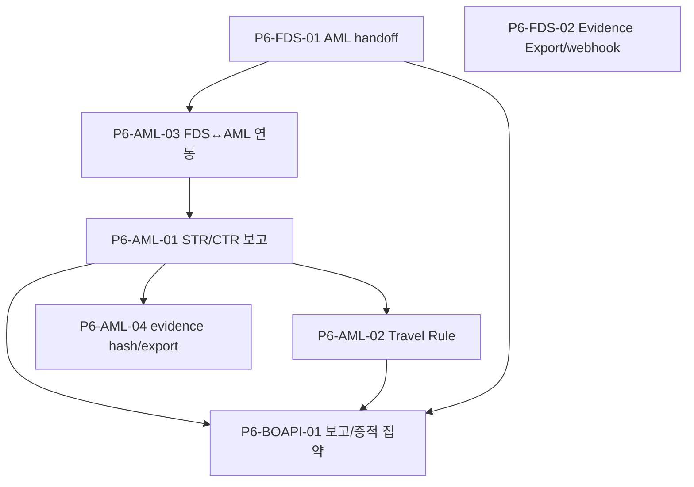

# P6 · 규제·교차연동·증적

> 마스터: [00-program-overview.md](00-program-overview.md). 정본: `target-architecture.md` §4(규제 Policy Pack=aml 소관·fds 핸드오프). 입력: FDS `docs/software/01-fdsSvc-sass.md` **§18** Phase 5~6 / AML `docs/software/02-amlSvc-sass.md` **§21** Phase 5~6, `docs/design`.
> 매핑(개요 §3): fds T-17·T-19 / aml STR/CTR/TR·report(T-15·T-17·T-18·T-19) / bo-api 보고 집약 / 공통 webhook. 마일스톤 **M5(규제 대응)**.

## 1. 목표·범위

- **이 단계가 끝나면**: 한국 Policy Pack 규제 보고(**STR/CTR/Travel Rule**)가 aml-svc에서 작성·제출·재제출되고, **FDS→AML handoff**(`fds-aml-handoff`)로 규제 후보가 위임된다. evidence export(manifest hash)·webhook callback로 검사 대응 증적 체계가 완성된다.
- **진입 조건**: P4(case·결재·outbox), P5(보고/Travel Rule 화면 흐름). 규제 본처리=aml-svc 소관.
- **범위 포함**: AML regulatory reporting(STR/CTR)·제출·재제출 / Travel Rule transfer·exception / FDS↔AML event 연동(escalation·feedback·Internal API)·`fds-aml-handoff` 발행/소비 / audit evidence hash chain·evidence export(manifest)·검사대응 pack / webhook callback(공통 publisher·dispatch) / bo-api 보고·증적 집약.
- **범위 제외**: 운영 관측성·하드닝·CD(P7), SaaS(P8), advanced domain pack(P7 fds T-18 일부는 본 Phase 밖).

## 2. 태스크 표

| ID | 제목 | 서비스 | 구분 | Effort | 의존 | DoD | Status |
|---|---|---|---|---|---|---|---|
| P6-AML-01 | Regulatory Reporting(STR/CTR)·제출·재제출 | aml-svc | BE+BO | XL | P4-AML-01,P4-AML-03,P4-AML-02 | aml T-17. STR/CTR 후보·draft·`:submit` 4-eyes·재제출, `policy_pack_code` effective version 소비, `aml-report-callback` 결과 반영 | TODO |
| P6-AML-02 | Travel Rule transfer·exception 처리 | aml-svc | BE+BO | M | P6-AML-01 | aml T-18. transfer·`riskStatus`/`completenessStatus`·`:resolve-exception` 4-eyes, 송수신 originator/beneficiary | TODO |
| P6-AML-03 | FDS↔AML event 연동(escalation 수신·feedback·Internal API) | aml-svc | BE | M | P1-AML-06,P4-AML-02 | aml T-15. `aml-fds-decision` 소비(escalation)·`aml-fds-feedback` 발행, `origin_fds_case_ref`↔`amlCaseRef` cross-ref(VARCHAR(96), FK 아님) | TODO |
| P6-AML-04 | Audit evidence hash chain·evidence export(manifest) | aml-svc | BE+BO | L | P4-AML-03,P3-AML-01 | aml T-19. evidence hash chain·manifest hash·export, 검사대응 pack, 무결성 검증 | TODO |
| P6-FDS-01 | FDS→AML 위임(`fds-aml-handoff`·`amlCaseRef`·규제 후보 발행) | fds-svc | BE | M | P4-FDS-01,P4-FDS-02 | fds T-17. `FdsAmlHandoff` 발행(`OPEN_AML_CASE`/`REGULATORY_REPORT`/`REQUEST_TRAVEL_RULE_INFO`)·`amlCaseRef` ack·cross-ref 표시 | TODO |
| P6-FDS-02 | Evidence Export·manifest hash·검사대응 pack·export webhook callback | fds-svc | BE+BO | L | P4-FDS-03,P4-FDS-02 | fds T-19. `export_kind` 6종·`export_format` 4종·`manifestHash`, 최종본 4-eyes(EXPORT), evidence export 콜백 `fds-webhook` 발행 | TODO |
| P6-BOAPI-01 | bo-api 규제 보고·Travel Rule·증적 집약 API | bo-api | BE+BO | M | P5-BOAPI-01,P6-AML-01 | 보고 후보/제출 상태·Travel Rule 예외·evidence export 집약 위임, FDS 규제 후보 cross-ref 표시(위임 흐름 읽기전용) | TODO |

## 3. 서비스별 분해

- **aml-svc**(참조): T-17 `../aml/17-regulatory-reporting.md`, T-18 `../aml/18-travel-rule.md`, T-15 `../aml/15-fds-aml-integration.md`, T-19 `../aml/19-audit-evidence-export.md`.
- **fds-svc**(참조): T-17 `../fds/17-aml-handoff.md`, T-19 `../fds/19-evidence-export.md`.
- **bo-api**(신규 분해): P6-BOAPI-01 보고·증적 집약. **규제 본처리·결재·제출은 aml-svc 소관**, FDS 화면은 위임 흐름·cross-ref만(개요 §4, PRD §1.6).
- **공통 webhook**: `fds-webhook`/`aml-outbox-dispatch` callback dispatch는 P4 publisher/poller 위에서 도메인 이벤트(보고 결과·evidence 콜백)를 발행.

## 4. 설계 근거

- AML: `docs/software/02-amlSvc-sass.md` §21 Phase 5·§16~§18(reporting/travel-rule/evidence), `docs/design/api/02-aml-api.md` §2.7(reports·travel-rule)·§3.14/§5.15/§5.22, `docs/design/db/02-aml-db.md` §3.11(`origin_fds_case_ref`), `docs/design/integration/02-aml-integration.md` §2.1/§3.4(`aml-fds-*`·webhook callback).
- FDS: `docs/software/01-fdsSvc-sass.md` §18 Phase 6·§15(handoff/evidence), `docs/design/db/01-fds-db.md` §5.13(`aml_case_id`·`ix_case_aml_ref`), `docs/design/api/01-fds-api.md` §4.5/§5.11/§9(evidence·webhook), `docs/design/integration/01-fds-integration.md` §9(handoff)·§2(`fds-aml-handoff`/`fds-webhook`).

## 5. DoD / Exit

- **태스크 DoD**: 빌드·테스트·lint·리뷰 높음 0 + 정본 정합. 4-eyes(보고 제출·evidence 최종본), evidence manifest hash 무결성, cross-ref 타입 정합(`amlCaseRef`=VARCHAR(96), FK 아님), webhook 서명·dedup·재시도.
- **Phase Exit (M5)**:
  1. AML STR/CTR 보고 작성→4-eyes→제출→callback 결과 반영, 재제출 동작.
  2. Travel Rule transfer·exception 처리, FDS→AML handoff로 규제 후보 위임 + cross-ref 진행 표시.
  3. evidence hash chain·manifest export(FDS·AML)로 검사대응 pack 자동 생성.
  4. FDS↔AML escalation/feedback Internal API·큐 연동 동작(`aml-fds-decision`/`aml-fds-feedback`).
  5. bo-api가 보고·증적 집약 제공, 규제 책임 경계(aml 소관) 정합 검증.

## 6. 의존 그래프

**병렬 가능 그룹**: {P6-FDS-01·P6-FDS-02}, {aml: A3→A1→(A2·A4)}는 핸드오프 계약 합의 후 병렬. bo-api 집약은 보고/Travel Rule 완성 후.

## 변경 이력
| 일자 | 변경 |
|---|---|
| 2026-06-07 | P6 규제·교차연동·증적 Phase 태스크 신규 작성(개요 §2 P6·§4 교차연동·M5). aml T-15·17·18·19 / fds T-17·19 참조 + bo-api 보고/증적 집약 신규 분해. 규제 본처리=aml 소관·fds 핸드오프 경계 준수. |
| 2026-06-08 | #63 헤더 입력 설계서 §번호 서비스별 분리: FDS §18 / AML §21 각각 명시(기존 `§18/§21` 혼합 표기 교정). |
