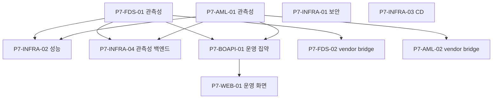

# P7 · 운영·관측성·하드닝·DevOps

> 마스터: [00-program-overview.md](00-program-overview.md). 정본: `target-architecture.md` §4(관측성). 입력: `docs/software` §18 Phase 6·§16(운영·관측성·보안)·§21(legacy vendor bridge), `docs/design`. (설계서 §18 Phase 7 'Advanced domain pack'은 범위 제외 — fds T-18은 정책 확정 후 별도, §1 범위 제외 참조.)
> 매핑(개요 §3): fds T-20·T-21 / aml 관측성·vendor(T-20·T-21) / bo-api 운영 집약 / 공통 CI/CD·보안. 마일스톤 **M6(출시 준비)**.

## 1. 목표·범위

- **이 단계가 끝나면**: 4서비스가 관측성(metric·trace·connector health)·보안·성능 기준을 충족하고, **CD 파이프라인으로 배포**된다. legacy vendor bridge(dual-run·reconciliation)로 기존 FDS/AML 벤더와 병행 운영이 가능하다.
- **진입 조건**: P6(규제·연동·증적). 핵심 도메인·화면·연동 안정화.
- **범위 포함**: 관측성·metric·connector health·운영 대시보드 데이터(FDS/AML) / legacy vendor bridge(`*-vendor-ingest`·dual-run·reconciliation) / 보안 하드닝(OWASP·시크릿·인증/인가 검증·rate limit) / 성능(부하·p95/p99·인덱스·캐시) / CD(배포 파이프라인·환경 승격·롤백)·관측성 백엔드(로그/메트릭/트레이스 수집) / bo-api 운영 집약·운영 화면 데이터.
- **범위 제외**: SaaS 제품화(P8), advanced domain pack(fds T-18은 P7 도메인 확장 범위지만 정책 확정 후 별도).

## 2. 태스크 표

| ID | 제목 | 서비스 | 구분 | Effort | 의존 | DoD | Status |
|---|---|---|---|---|---|---|---|
| P7-FDS-01 | 관측성·metric·connector health·운영 대시보드 데이터 | fds-svc | BE+BO | M | P1-FDS-06,P4-FDS-01 | fds T-20. traceId MDC·경계 구조화 로그·metric, connector health/lag, DLQ depth, 운영 대시보드용 저수준 데이터 | TODO |
| P7-FDS-02 | Legacy Vendor Bridge(`fds-vendor-ingest`·dual-run·reconciliation) | fds-svc | BE | L | P1-FDS-04,P2-FDS-05 | fds T-21. vendor result ingest·dual-run 비교·reconciliation report·rule migration inventory | TODO |
| P7-AML-01 | 관측성·metric·운영 대시보드 데이터·connector health | aml-svc | BE+BO | M | P1-AML-06,P2-AML-01 | aml T-20. traceId·metric·watchlist freshness·connector health·DLQ depth | TODO |
| P7-AML-02 | Legacy Vendor Bridge(alert ingest·dual-run·reconciliation) | aml-svc | BE | L | P1-AML-04,P2-AML-02 | aml T-21. vendor alert/decision ingest·dual-run·reconciliation | TODO |
| P7-INFRA-01 | 보안 하드닝(OWASP·시크릿 관리·인증/인가 검증·rate limit·의존성 스캔) | 공통 | 공통 | L | P6-BOAPI-01 | OWASP Top10·CWE 점검, 시크릿 외부화·회전, authz 회귀 테스트, rate limit, SCA/SAST CI 게이트 | TODO |
| P7-INFRA-02 | 성능·부하 테스트(p95/p99·인덱스·캐시·SQS backpressure) | 공통 | BE | L | P7-FDS-01,P7-AML-01 | decision/screening 동기 API p95/p99 목표, 인덱스·캐시·partition 검증, backpressure/재시도/타임아웃 | TODO |
| P7-INFRA-03 | CD 파이프라인·환경 승격·블루그린/롤백·런타임 구성 | 공통 | 공통 | L | P0-INFRA-06 | 서비스별 CD, 환경(dev/stg/prod) 승격, 롤백, Flyway 자동 적용 게이트, 무중단 배포 | TODO |
| P7-INFRA-04 | 관측성 백엔드(로그/메트릭/트레이스 수집·알람·SLO) | 공통 | BE | M | P7-FDS-01,P7-AML-01 | 중앙 수집(metric/trace/log), 경보 룰, SLO 대시보드, traceId 종단 추적 | TODO |
| P7-BOAPI-01 | bo-api 운영 집약 API(connector health·DLQ·SLO·운영 대시보드) | bo-api | BE+BO | M | P7-FDS-01,P7-AML-01 | 운영 화면 데이터 집약 위임(엔진 health/metric), 운영자 권한·data-scope, 알람 상태 | TODO |
| P7-WEB-01 | bo-web 운영 화면(connector health·DLQ·SLO·vendor 비교) | bo-web | FE | M | P7-BOAPI-01,P5-WEB-03 | 운영 대시보드·connector/DLQ 상태·dual-run 비교 화면, react-query 연동 | TODO |

## 3. 서비스별 분해

- **fds-svc**(참조): T-20 `../fds/20-observability.md`, T-21 `../fds/21-legacy-vendor-bridge.md`.
- **aml-svc**(참조): T-20 `../aml/20-observability.md`, T-21 `../aml/21-legacy-vendor-bridge.md`.
- **bo-api/bo-web/공통**(신규 분해): 보안·성능·CD·관측성 백엔드(P7-INFRA-01~04), 운영 집약/화면(P7-BOAPI-01·P7-WEB-01). 별도 WBS 없음.

## 4. 설계 근거

- 관측성: `target-architecture.md` §4(traceId·경계 로그), `docs/software/01-fdsSvc-sass.md` §18 Phase 6·§16, `docs/software/02-amlSvc-sass.md` §21 Phase 6~7·§20.
- vendor bridge: `docs/software` §(D-10 result ingest+dual-run), `docs/design/integration/01-fds-integration.md` §2(`fds-vendor-ingest`), `docs/design/integration/02-aml-integration.md`(vendor ingest).
- 보안·성능: `target-architecture.md` §4(컴플라이언스·PII), 개요 §6 횡단 불변식, `docs/design/api/*`(인증·rate limit·error).

## 5. DoD / Exit

- **태스크 DoD**: 빌드·테스트·lint·리뷰 높음 0 + 정본 정합. traceId MDC 종단 전파, 보안 스캔 게이트, 성능 목표 충족, CD 무중단·롤백 검증.
- **Phase Exit (M6)**:
  1. 4서비스 관측성(metric/trace/log·connector health·DLQ·SLO) 운영 가능, 경보 동작.
  2. legacy vendor bridge(FDS·AML)로 dual-run·reconciliation 비교 리포트 산출.
  3. 보안 하드닝(OWASP/CWE·시크릿·authz·rate limit·SCA/SAST) CI 게이트 통과.
  4. 성능 목표(p95/p99) 충족, backpressure/타임아웃/재시도 검증.
  5. CD 파이프라인으로 dev→stg→prod 승격·롤백·무중단 배포, 운영 화면(bo-web) 동작.

## 6. 의존 그래프

**병렬 가능 그룹**: {P7-FDS-01·P7-AML-01}, {P7-FDS-02·P7-AML-02}, {P7-INFRA-01·P7-INFRA-03} 독립. 성능(INFRA-02)·관측성 백엔드(INFRA-04)·운영 집약(BOAPI-01)은 관측성 태스크 후.

## 변경 이력
| 일자 | 변경 |
|---|---|
| 2026-06-07 | P7 운영·관측성·하드닝·DevOps Phase 태스크 신규 작성(개요 §2 P7·M6). fds/aml T-20·T-21 참조 + 보안/성능/CD/관측성 백엔드·bo-api 운영 집약·bo-web 운영 화면 신규 분해. |
