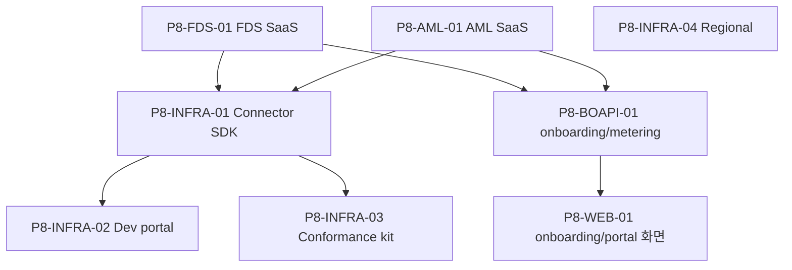

# P8 · SaaS 제품화

> 마스터: [00-program-overview.md](00-program-overview.md). 정본: `target-architecture.md` §1(SaaS 멀티테넌트). 입력: `docs/software/01-fdsSvc-sass.md` §18 Phase 8 / `02-amlSvc-sass.md` §21 Phase 9.
> 매핑(개요 §3): fds T-22 / aml T-22 / bo-api metering 집약 / bo-web onboarding UI / 공통 dev portal·SDK. 마일스톤 **M7(SaaS)**.

## 1. 목표·범위

- **이 단계가 끝나면**: 신규 고객사를 **배포/온보딩 프로비저닝**(고객사별 전용 배포 기본 — 매니지드 전용 IaC 자동 프로비저닝 / self-hosted 설치형 패키징 / 소규모 공유)으로 수용하고, connector SDK·developer portal·sandbox·conformance test kit·usage metering·regional deployment로 SaaS 제품이 완성된다. 멀티고객 운영이 가능하다.
- **진입 조건**: P7(관측성·보안·성능·CD 안정화). 코어 API(인증·SQS·보고·관측성) 안정.
- **범위 포함**: **배포/온보딩 프로비저닝 파이프라인**(IaC(Terraform) 자동 프로비저닝·self-hosted 설치형 패키징(Helm/Docker)·온보딩 상태머신 `onboarding_status`) / connector SDK(Java + OpenAPI sample, D-07) / OpenAPI spec·developer portal / sandbox tenant·conformance test kit / billing/usage metering / regional deployment·compliance evidence pack / bo-api metering 집약 / bo-web 배포유형선택·온보딩 상태·dev portal UI.
- **범위 제외**: 신규 도메인 정책(advanced domain pack은 정책 확정 후 별도 WBS).

## 2. 태스크 표

| ID | 제목 | 서비스 | 구분 | Effort | 의존 | DoD | Status |
|---|---|---|---|---|---|---|---|
| P8-FDS-01 | FDS SaaS productization(배포/온보딩 프로비저닝·connector SDK·sandbox·conformance·metering·regional) | fds-svc | BE+BO+IaC | XL | P1-FDS-02,P1-FDS-05,P6-FDS-02,P7-FDS-01 | fds T-22. 배포/온보딩 프로비저닝(IaC 파이프라인·self-hosted 설치형 패키징·`onboarding_status` 상태머신)·connector SDK·sandbox(shadow-only)·conformance kit·usage metering·regional·compliance evidence pack | TODO |
| P8-AML-01 | AML SaaS productization(배포/온보딩 프로비저닝·connector SDK·sandbox·conformance·metering·regional) | aml-svc | BE+BO+IaC | XL | P1-AML-02,P1-AML-05,P1-AML-06,P6-AML-01,P7-AML-01 | aml T-22. **배포/온보딩 프로비저닝** 3경로(MANAGED_DEDICATED IaC(Terraform) 자동·SELF_HOSTED 설치형 패키징(Helm/Docker)·SHARED 즉시)+`onboarding_status`(8종) 상태머신·`registrationToken` 검증(SELF_HOSTED 등록 콜백)·`infra_ref` 저장. 큐 프로비저닝 자동화(`aml-ingest-{tenantId}-{env}` 전용 큐 온보딩 완료 시 자동 생성). `deployment_model` 불변 원칙(409 `AML.TENANT_DEPLOYMENT_MODEL_IMMUTABLE`). connector SDK·OpenAPI/portal·sandbox·conformance·billing/usage·region hardening. API §3.16/§4/§5 정본 1:1. | TODO |
| P8-INFRA-01 | Connector SDK(Java + OpenAPI sample)·릴리스·버전 호환 | 공통 | BE | L | P8-FDS-01,P8-AML-01 | D-07. Java SDK + OpenAPI 샘플, 버전 호환 정책, 게시·문서, 양 엔진 envelope/인증 정합 | TODO |
| P8-INFRA-02 | Developer portal·OpenAPI spec 게시·sandbox 자격증명 | 공통 | BE+BO | L | P8-INFRA-01 | dev portal(API 문서·키 발급·sandbox), OpenAPI 단일 spec 게시, sandbox 자격증명 self-service | TODO |
| P8-INFRA-03 | Conformance test kit·sandbox 검증 시나리오 | 공통 | BE | M | P8-INFRA-01 | 커넥터/이벤트 적합성 테스트 kit, sandbox 회귀 시나리오, 통과 인증 | TODO |
| P8-INFRA-04 | Regional deployment·전용 큐 프로비저닝 IaC·데이터 레지던시·compliance evidence pack | 공통 | IaC | L | P7-INFRA-03 | 리전별 전용 배포 토폴로지(`MANAGED_DEDICATED` IaC), **전용 큐 `{fds,aml}-ingest-{tenantId}-{env}` 자동 생성 IaC**(온보딩 완료 트리거, integration §2.1 큐 물리명 정본), 데이터 레지던시 격리, 리전별 compliance evidence pack | TODO |
| P8-BOAPI-01 | bo-api 배포/온보딩 프로비저닝·metering·테넌트 라이프사이클 집약 API | bo-api | BE+BO | L | P3-BOAPI-02,P8-FDS-01,P8-AML-01 | 배포 유형 선택+온보딩 신청/상태 워크플로(`/tenants/{id}/onboarding/provision`·`GET /onboarding`·`/onboarding/register`)·IaC 트리거·usage/billing 집계·테넌트 활성/정지·plan 관리 집약 | TODO |
| P8-WEB-01 | bo-web 배포유형선택·온보딩 상태·dev portal·usage/billing 화면 | bo-web | FE | L | P8-BOAPI-01,P5-WEB-03 | 배포 유형 선택(매니지드 전용/자체 인프라 설치형/[소규모 공유])+온보딩 신청 마법사·온보딩 상태(읽기 표시)·dev portal·usage/billing 대시보드·sandbox 관리 화면, react-query 연동 | TODO |

## 3. 서비스별 분해

- **fds-svc**(참조): T-22 `../fds/22-saas-productization.md`(onboarding·connector SDK·dev portal·sandbox·conformance·metering·regional).
- **aml-svc**(참조): T-22 `../aml/22-saas-productization.md`(설계 §21 Phase 9 대응 — `deployment_model`/`onboarding_status` 상태머신·IaC/설치형 3경로·큐 프로비저닝·`deployment_model` 불변·API §3.16 DTO 1:1).
- **bo-api/bo-web/공통**(신규 분해): connector SDK·dev portal·conformance·regional(P8-INFRA-01~04), onboarding/metering 집약·화면(P8-BOAPI-01·P8-WEB-01). 별도 WBS 없음.

## 4. 설계 근거

- FDS: `docs/software/01-fdsSvc-sass.md` §18 Phase 8(onboarding·SDK·portal·sandbox·conformance·metering·regional), §19 D-07(connector SDK).
- AML: `docs/software/02-amlSvc-sass.md` §21 Phase 9(SaaS productization), §22.
- 멀티테넌시·sandbox: `target-architecture.md` §1/§4, `docs/design/integration/01-fds-integration.md`(sandbox shadow-only), 개요 §6(멀티테넌시 키).

## 5. DoD / Exit

- **태스크 DoD**: 빌드·테스트·lint·리뷰 높음 0 + 정본 정합. sandbox=shadow-only(outbound 미발행), 멀티테넌시 키 격리, usage metering 정확성, regional 데이터 레지던시.
- **Phase Exit (M7)**:
  1. 신규 고객사 self-service onboarding 완료 → 첫 이벤트 ingest까지 무개입.
  2. connector SDK(Java+OpenAPI)·developer portal·sandbox·conformance kit 게시·동작.
  3. usage/billing metering 집계·청구 데이터 산출.
  4. regional deployment·데이터 레지던시·compliance evidence pack 제공.
  5. bo-web onboarding·dev portal·usage 화면으로 멀티고객 운영 가능.

## 6. 의존 그래프

**병렬 가능 그룹**: {P8-FDS-01·P8-AML-01} 트랙 독립 후 {P8-INFRA-01→(02·03)}·{P8-INFRA-04}·{P8-BOAPI-01→P8-WEB-01} 병렬.

## 변경 이력
| 일자 | 변경 |
|---|---|
| 2026-06-07 | P8 SaaS 제품화 Phase 태스크 신규 작성(개요 §2 P8·M7). fds/aml T-22 참조 + connector SDK·dev portal·conformance·regional·onboarding/metering 집약·화면 신규 분해. sandbox shadow-only·멀티테넌시 격리 준수. |
| 2026-06-08 | 격리(isolation_mode) → **배포 모델(deployment topology) 재설계** 반영(설계서 §13 v1.5). onboarding 파이프라인을 **배포/온보딩 프로비저닝**으로 재정의: 매니지드 전용 IaC(Terraform) 자동 프로비저닝 + self-hosted 설치형 패키징(Helm/Docker) + `onboarding_status` 상태머신. P8-FDS-01(BE+BO+IaC)·P8-BOAPI-01(provision/onboarding/register API)·P8-WEB-01(배포 유형 선택+온보딩 상태 읽기)·P8-INFRA-04(전용 배포 IaC) 갱신. 정본=01-fdsSvc-sass §13.0/§13.0a/§11.6.11/§11.6.11a, target-architecture §4.1. |
| 2026-06-08 | **AML 고객사 격리(isolation_mode) → 배포 모델(deployment topology) 재설계** aml 해당분 보강(AML 설계서 §16.0~§16.0d/§17.1·DB §3.1/§5.28/§5.28a/§5.28b·API §1.1/§3.16/§4/§5·integration §2.1/§10.1/§10.3). **P8-AML-01** 제목·구분(BE+BO+IaC)·의존(P1-AML-02 추가)·DoD 전면 갱신: 배포/온보딩 프로비저닝 3경로(MANAGED_DEDICATED IaC·SELF_HOSTED 설치형·SHARED 즉시)+`onboarding_status`(8종) 상태머신·`registrationToken` 검증·`infra_ref` 저장·큐 프로비저닝 자동화(`aml-ingest-{tenantId}-{env}`)·`deployment_model` 불변(409) 명시. **P8-INFRA-04** DoD에 전용 큐 `{fds,aml}-ingest-{tenantId}-{env}` 자동 생성 IaC(integration §2.1 정본) 보강. §3 aml-svc 분해 참조에 `deployment_model`/`onboarding_status` 핵심 항목 추가. aml T-22 WBS·P1-AML-02·P3-BOAPI-02·P8-BOAPI-01·P8-WEB-01과 정합. |
