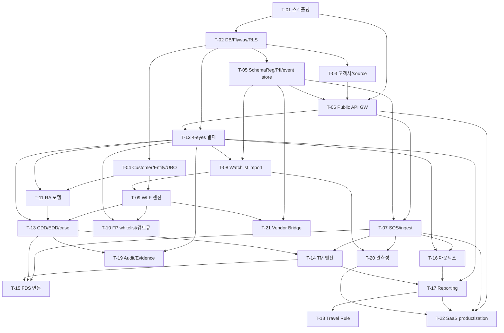

# AML 개발 태스크/WBS — Overview

> 정본: `.claude/skills/_shared/target-architecture.md`(4서비스 모노레포 · Java 25 헥사고날 · Next.js · 멀티테넌시 · PII 마스킹 · 4-eyes · Policy Pack STR/CTR/Travel Rule).
> 입력 정본 진실: 설계서 `docs/software/02-amlSvc-sass.md`. 파생 정합: DB `docs/design/db/02-aml-db.md`, API `docs/design/api/02-aml-api.md`, Integration `docs/design/integration/02-aml-integration.md`.
> 본 WBS는 `aml-svc`(엔진) 책임을 기준으로 분해하고, 운영 콘솔·결재·감사 UI는 `bo-api`/`bo-web` 연계로 표기한다. **확정된 설계 범위만 태스크화**한다.
> (설계 표기 패키지 `com.hanpass.aml`; 구현 모노레포 aegis-aml 실제 패키지 `com.aegis.aml`)

## 0. 서비스 경계·레이어

| 서비스 | 책임 | 본 WBS 범위 |
|---|---|---|
| `services/aml-svc` | AML 엔진(ingest·WLF·RA·TM·CDD/EDD·reporting·evidence·결재 실행) — `com.hanpass.aml` 헥사고날(설계 표기; 구현 `com.aegis.aml`) | 주 대상 |
| `services/bo-api` | admin API 집약·인증·결재·감사 (bo-web→bo-api만) | 연계 표기(태스크 산출물=Admin API/계약) |
| `services/bo-web` | no-code policy builder·case·evidence UI (Next.js) | backoffice-planner PRD 대상(본 WBS는 화면 목록만 전달) |
| `services/fds-svc` | 실시간 fraud action, FDS→AML escalation | 연동 경계만(Internal API/큐) |

## 1. 태스크 구분 표기

- **[BO]** 백오피스 대상(BO CRUD·임계치·시뮬레이션·감사·결재·동결) — backoffice-planner 화면 대상. Admin API(`/api/v1/admin/aml/*`)를 bo-api 경유로 노출.
- **[BE]** 백엔드 전용(SQS·아웃박스·스케줄러·RLS·인덱서) — backoffice-planner 화면 **비대상**.
- **[BE+BO]** 엔진 기능 + 운영 화면이 함께 필요.

## 2. 태스크 목록

| ID | 제목 | 서비스 | 구분 | Effort | 의존 | Due(Phase) | Status |
|---|---|---|---|---|---|---|---|
| T-01 | 모노레포·aml-svc 스캐폴딩·CI·컨벤션 | aml-svc | BE | M | — | P1 | DONE |
| T-02 | DB 마이그레이션(Flyway V01~V16, V17a/V17b 연동)·RLS·시드 | aml-svc | BE | L | T-01 | P1 | TODO |
| T-03 | 고객사·source system 레지스트리·**배포 모델(deployment_model)**·온보딩 | aml-svc/bo | BE+BO | M | T-02 | P1 | TODO |
| T-04 | Customer·Entity·UBO graph 모델·해소 | aml-svc | BE | L | T-02 | P1 | TODO |
| T-05 | Schema Registry·PII 토큰화/해시·canonical event store | aml-svc | BE | L | T-02 | P1 | TODO |
| T-06 | Public API 게이트웨이·인증(HMAC/JWT)·멱등·envelope | aml-svc | BE | L | T-01,T-03 | P1 | TODO |
| T-07 | SQS 토폴로지·ingest consumer·DLQ·FIFO 멱등 | aml-svc | BE | L | T-05,T-06 | P1 | TODO |
| T-08 | Watchlist source import·diff·승인·인덱스 | aml-svc/bo | BE+BO | L | T-05,T-12 | P2 | TODO |
| T-09 | WLF screening 엔진·scoring·판정 상태·real-time API | aml-svc | BE+BO | XL | T-04,T-08 | P2 | TODO |
| T-10 | False positive whitelist·analyst 검토 큐 | aml-svc/bo | BO | M | T-09,T-12 | P2 | TODO |
| T-11 | RA 모델·factor catalog·simulation·등급·override | aml-svc/bo | BE+BO | XL | T-04,T-12 | P2 | TODO |
| T-12 | 4-eyes 결재 엔진(approval·payload_hash·실행 분리) | aml-svc/bo | BE+BO | L | T-02,T-06 | P2(골격)/P4(완성) | TODO |
| T-13 | CDD/EDD workflow·case 관리·periodic review·SLA | aml-svc/bo | BE+BO | XL | T-09,T-11,T-12 | P3 | TODO |
| T-14 | Transaction Monitoring 엔진·scenario·alert lifecycle | aml-svc/bo | BE+BO | XL | MVP:T-07·T-11 / 완성:+T-13 | P2(MVP)/P4(완성) | TODO |
| T-15 | FDS↔AML event 연동(escalation·feedback·Internal API) | aml-svc | BE | M | T-07,T-13,T-14 | P6 | TODO |
| T-16 | 트랜잭셔널 아웃박스·dispatch·report-callback | aml-svc | BE | M | T-07,T-12 | P4 | TODO |
| T-17 | Regulatory Reporting(STR/CTR/Travel Rule)·제출·재제출 | aml-svc/bo | BE+BO | XL | T-12,T-16,T-14 | P6 | TODO |
| T-18 | Travel Rule transfer·exception 처리 | aml-svc/bo | BE+BO | M | T-17 | P6 | TODO |
| T-19 | Audit evidence hash chain·evidence export(manifest) | aml-svc/bo | BE+BO | L | T-12,T-13 | P6 | TODO |
| T-20 | 관측성·metric·운영 대시보드 데이터·connector health | aml-svc/bo | BE+BO | M | T-07,T-08 | P7 | TODO |
| T-21 | Legacy Vendor Bridge(alert ingest·dual-run·reconciliation) | aml-svc | BE | L | T-05,T-09 | P7 | TODO |
| T-22 | SaaS productization(**배포/온보딩 프로비저닝** IaC/설치형·`onboarding_status` 상태머신·connector SDK·OpenAPI/portal·sandbox·conformance·billing/usage·region hardening) | aml-svc/bo | BE+BO | XL | T-06,T-07,T-17,T-20 | P8 | TODO |

> Effort: S≈1~2d, M≈3~5d, L≈1~2w, XL≈2~4w (글로벌 effort-level-guide 기준 상대 산정).
> Phase(Due)는 WBS 착수 우선순위. 설계서 §21 Phase와 1:1이 아니며, P8=설계 Phase 9(SaaS productization)에 대응한다(설계 Phase 6 준법 콘솔은 bo-web/backoffice-planner로 위임, Phase 8 Advanced domain pack은 본 WBS 범위 밖). 매핑 주석은 §4 참조.

## 3. 의존 그래프

## 4. 착수 순서(우선순위)

1. **기반(P1)**: T-01(P0 스캐폴딩 완료·DONE; P1 착수 시 기(既)완성 전제) → T-02 → (T-03 · T-04 · T-05) → T-06 → T-07. T-12(결재 엔진)는 T-02·T-06 직후 병행 착수.
2. **WLF MVP(P2)**: T-08 → T-09 → T-10. **(P2) T-11(RA 모델)** — T-04·T-12 이후 P2 병행 착수(로드맵 P2-AML-04). T-14(TM MVP) — P2 착수(P2-AML-06, 완성은 P4).
3. **CDD/EDD(P3)**: T-13 — T-09·T-11·T-12 선행 완료 후.
4. **(P4) T-16(트랜잭셔널 아웃박스)**, T-14(TM 완성). (T-15 착수는 P6 — T-14 완성이 선행 의존, §2 Due 참조.)
5. **Reporting(P6)**: T-17 → T-18. T-19(증적) — P6 단독. FDS↔AML 연동(T-15) — P6 병행(T-15→T-17 순). P5는 bo-web 전 화면 구현 단계(서비스 WBS aml 태스크 없음).
6. **운영·전환(P7)**: T-20, T-21.
7. **SaaS 상품화(P8)**: T-22 — 코어(T-06·T-07·T-17·T-20) 안정화 후 착수. 설계 §21 Phase 9(SaaS productization)에 대응.

병렬 가능 그룹(독립): {T-03, T-04, T-05}, {T-08, T-11(T-12 이후)}, {T-19, T-20}.

> Phase 매핑: 본 WBS Due(Phase)는 **착수 우선순위 축**이며 설계서 §21 Phase 번호(0~9)와 1:1이 아니다. 설계 Phase 0(참조 구현 분석)은 사전 분석 활동으로 빌드 태스크 비대상(WBS 제외), 설계 Phase 6(준법 no-code 콘솔)은 bo-web/backoffice-planner로 위임, Phase 8(Advanced domain pack: TBML/ecommerce/marketplace/crypto/internal-audit/B2B)은 도메인 정책 확정 후 별도 WBS, Phase 9(SaaS productization)=본 WBS T-22(P8)에 대응한다. 이로써 설계 §21 Phase 0~9 전수 매핑을 명시 종결한다.

## 5. 백오피스(BO) 화면 인벤토리 → backoffice-planner 입력

API §6 BO 화면 정합표 **기반**(엔드포인트 집합은 §6과 항목 단위 일치). 모두 bo-web→bo-api 경유. **운영자 집계(대시보드)는 bo-api 소유·집약·인증**(`GET /api/v1/bo/aml/dashboard`), 엔진(aml-svc)은 `/api/v1/admin/aml/*` 저수준 데이터 API만 제공한다(엔진에 집계 엔드포인트 미추가).

| 화면 | 태스크 | 주요 API(정본 §6) |
|---|---|---|
| **고객사 관리** (목록·상세·배포유형·온보딩상태) | T-03,T-22 | bo-api `GET/POST /api/v1/bo/aml/tenants`, `GET/PUT .../tenants/{tenantId}` (§9, §3.16). 화면 '격리 방식' 라디오 없음 — `deploymentModel`(3종) + `onboardingStatus`(8종) 읽기 전용 표시. bo-web→bo-api 경유 |
| **고객사 등록(배포 유형+온보딩 신청)** | T-03,T-22 | bo-api `POST /api/v1/bo/aml/tenants` (§3.16 `TenantCreateRequest`, deploymentModel 선택 = 온보딩 신청). bo-web→bo-api 경유 |
| **온보딩 상태** (프로비저닝 트리거·self-hosted 등록·이력) | T-03,T-22 | bo-api `POST .../onboarding/provision`(매니지드 IaC 트리거), `GET .../onboarding`(상태·이력), `POST .../onboarding/register`(self-hosted 등록 콜백). 온보딩 프로비저닝 워크플로 완성=T-22(P8). bo-web→bo-api 경유 |
| WLF 검토 큐 | T-10 | `GET /admin/aml/screenings?status=POSSIBLE_MATCH`(GET 전용), `screenings/{screeningId}/decision` 🔒, `fp-whitelist` 🔒 |
| watchlist source·import 승인 | T-08 | `GET/POST /admin/aml/watchlist-sources`, `imports/{version}:apply` 🔒 |
| RA score distribution·high-risk 현황 | T-11 | 집계=bo-api `GET /api/v1/bo/aml/dashboard`; 엔진 저수준=`GET /admin/aml/ra-models`, `GET /aml/customers/{ref}/risk`(엔진 `GET /admin/aml/risk-scores` **미신설**) |
| RA 모델 활성화·등급 override | T-11 | `ra-models/{modelCode}/versions/{v}:activate` 🔒, `ra-models/{modelCode}/simulate`(응답 DTO §3.15), `risk-scores/{scoreId}/override` 🔒 |
| country risk 등급표·변경 | T-11 | `GET .../country-risk`, `country-risk:change` 🔒(COUNTRY_RISK, §2.7·§10) — 결재=T-12, 실행 후 RA 재평가 |
| CDD/EDD checklist·periodic review 정책 | T-13 | `GET/POST .../cdd/checklists`, `cdd/checklists/{id}` 🔒(PUT), `cdd/periodic-review-policy` 🔒(PUT) — 결재=T-12 |
| tenant policy pack 변경 | T-03 | `policy-packs:change` 🔒(POLICY_PACK, §2.7·§10) — 결재=T-12, 실행 후 `aml_tenants.policy_pack_code` effective version 갱신 |
| TM alert backlog·scenario 관리 | T-14 | `GET /aml/alerts/{alertId}`, `admin/aml/tm-scenarios`, `{scenarioCode}/simulate`, `{scenarioCode}:activate` 🔒 |
| case SLA·CDD/EDD 처리 | T-13 | `admin/aml/cdd/cases`, PATCH, `/timeline`, `:close` 🔒, `:reject-relationship` 🔒 (checklist·periodic review 정책은 별행) |
| STR/CTR 후보·제출 | T-17 | `admin/aml/reports`, `:submit` 🔒 |
| Travel Rule exception | T-18 | `GET .../travel-rule/transfers?riskStatus&completenessStatus&from&to`(필터/응답 DTO §3.14), `:resolve-exception` 🔒 |
| 결재 대기함 | T-12 | `admin/aml/approvals`, `:approve`, `:reject` |
| audit export·source-system 관리 | T-19,T-03 | `admin/aml/audit-events`(`ExportEvidenceUseCase`→T-19 소유), `admin/aml/source-systems` 🔒 |

> 비고: RA 분포·TM backlog 화면은 §6 지정 엔드포인트 집합과 일치한다(score distribution 집계는 bo-api 대시보드 소유). 시뮬레이션 경로는 `ra-models/{modelCode}/simulate`로 `{modelCode}` 변수를 포함하며 응답 DTO는 §3.15 `SimulationResponse`(gradeShift·falsePositiveImpact, 결재 불필요). `ExportEvidenceUseCase`(API §3.8 UseCase 정본명)는 **T-19** 소유(19-audit-evidence-export.md; SW §6.2 `BuildEvidencePack`/`ExportEvidenceUseCase` 혼용은 API §3.8 기준으로 `ExportEvidenceUseCase` 단일화).
> **admin 정책 엔드포인트(API §2.7, scope `aml:admin:policy`, `/api/v1/admin/aml/**`)**: CDD/EDD checklist(`cdd/checklists`·`{id}`🔒)·periodic review 주기(`periodic-review-policy`🔒)=T-13, country risk(`country-risk`·`:change`🔒 COUNTRY_RISK)=T-11, tenant policy pack(`policy-packs:change`🔒 POLICY_PACK)=T-03. 변경(🔒4-eyes)의 결재 상태머신·payload_hash·실행분리는 **T-12 결재 엔진**(API §10 트리거 등재표: 🔒엔드포인트↔subjectType 1:1)이 공통 처리하고, 도메인 태스크는 정책 store 조회/상신 진입점·실행 후 반영(RA 재평가/스케줄러/effective version)만 소유한다. 조회·초안(`GET`/`POST`)은 결재 불필요.

## 6. 백엔드 전용(BE) — 화면 비대상

T-01, T-02(RLS·Flyway), T-05(PII 토큰화·canonical store), T-06(GW), T-07(SQS·DLQ·FIFO), T-15(Internal API·event), T-16(아웃박스 poller `SELECT FOR UPDATE SKIP LOCKED`), T-21(vendor connector). T-22 중 connector SDK·sandbox·billing/usage 백엔드는 BE, onboarding kit·developer portal 운영 UI는 BO. 스케줄러(periodic review·watchlist freshness)는 T-13/T-08 내 BE 항목으로 표기.

### 6.1 SQS 큐(논리 6종·물리 7행) ↔ 태스크 귀속 (integration §2.1 정본)

> integration §2.1은 `aml-ingest`와 `aml-ingest.fifo`를 별도 행(물리 7행)으로 등재한다. 본 표는 논리 6종(ingest는 표준/FIFO 두 변형을 1개 논리 큐로 집계)으로 표기하되, 물리 큐 수는 7개임을 괄호로 명시한다. T-07 큐 프로비저닝 범위에 두 변형 모두 포함한다.

| 큐 | 방향 | 발행 | 구독 | 소유 태스크 |
|---|---|---|---|---|
| `aml-ingest` / `aml-ingest.fifo`(물리 2행) | in | 외부 source/connector(표준) / core-banking·정산(FIFO) | IngestEventConsumer | **T-07** |
| `aml-fds-decision` | in | fds-svc | FdsDecisionConsumer | **T-15** |
| `aml-screening-async` | internal | ScreenUseCase | ScreeningWorker(대량 재screening·watchlist 재적용) | **T-09** |
| `aml-fds-feedback` | out | aml-svc | fds-svc | **T-15** |
| `aml-outbox-dispatch` | out | outbox poller | OutboxDispatcher(report submit·**webhook callback**·fds-feedback) | **T-16** |
| `aml-report-callback` | in | 외부 보고기관/제출 adapter | ReportCallbackConsumer | **T-16** |

> 각 큐는 `<queue>-dlq` 동반(T-07이 DLQ 토폴로지·재처리 도구 공통 소유). webhook(`webhook.callback.requested`, integration §3.4)은 별도 큐가 아니라 `aml-outbox-dispatch`로 dispatch(서명·상태변경 통지) — T-16 소유. FDS escalation 콜백 수신은 `aml-fds-decision`(T-15).

## 7. 오픈 결정(설계서 §22와 정합, 신규 미정 없음)

- D-02 WLF 검색엔진: 설계서 §22 권장값은 **OpenSearch 기본**. 본 WBS는 PostgreSQL GIN(`normalized_tokens`)을 fallback/MVP 기준선으로 두되(T-08/T-09), 권장 기본(OpenSearch) 채택 시 인덱서 분리 태스크를 코어로 편입한다(범위 결정값은 T-08 착수 전 확정).
- D-06 배포 모델: **결정 확정**. `isolation_mode`(SHARED/SCHEMA/DB) 폐기. `deployment_model` 3종(`MANAGED_DEDICATED` 기본·`SELF_HOSTED`·`SHARED`)으로 전환. Flyway V17a/V17b 마이그레이션(T-02 연동·T-03 구현). 온보딩=배포 유형 선택 + `onboarding_status` 8종 상태머신(T-03·T-22). 설계서 §22 D-06 확정·target-architecture §4.1.
- D-14 screening 장애: MANUAL_REVIEW/FAIL_CLOSED. DB 컬럼 참조는 `aml_source_systems.failure_policy`(snake_case, DB §3.2 정본), DTO 표면은 `failurePolicy`(API §3.9 camelCase). T-09 소유.
- `aml_outbox` 물리 테이블: **DB §3.15 신설 확정**(Flyway V16, status enum PENDING/DISPATCHING/DISPATCHED/FAILED, 발행 멱등 UNIQUE + `ix_outbox_dispatch`). T-16 선행 이격 종결 — 더 이상 미정의 아님(이전 ⚠ 해소).

## 변경 이력

| 일자 | 변경 | 비고 |
|---|---|---|
| 2026-06-06 | AML 태스크/WBS 부트스트랩 신규 작성. 설계서 §21 로드맵·DB/API/integration 파생을 21개 태스크(T-01~T-21)·의존 그래프·BO 화면 인벤토리로 분해. | `docs/tasks/aml/` fresh. 명칭·enum·엔드포인트·큐는 DB §3/§5·API §2/§3·integration §2/§3과 1:1. |
| 2026-06-07 | doc-consistency(aml) 태스크 담당 이격 정합화(정본=`target-architecture.md`+software/db/api/integration). (1) **T-22 SaaS productization 신규(Due=P8)** — 설계 §21 Phase 9 대응, Phase=착수 우선순위축임을 §2/§4에 명시(설계 Phase와 1:1 아님). (2) `aml_outbox` 확정상태 동기화 — DB §3.15 V16 신설 확정 반영, §7 ⚠ '미정의' 해소(16-transactional-outbox.md ⚠ 선행 제거). (3) **SQS 큐(7종)↔태스크 귀속표 §6.1 신설** — `aml-screening-async`→T-09, `aml-outbox-dispatch`(webhook callback 포함)·`aml-report-callback`→T-16, `aml-fds-decision`/`aml-fds-feedback`→T-15. (4) `case_status` OPEN enum·`alert_status` CASE_OPENED 표기 DB §5.9/§5.7과 동기화. (5) BO 인벤토리(§5) API §6 정합: 엔진 `risk-scores` 목록 미신설(집계=bo-api 대시보드 소유), `screenings` GET 전용, `ra-models/{modelCode}/simulate`·`{scenarioCode}:activate` 변수 포함, alert=`GET /aml/alerts/{alertId}`. (6) D-14 `failurePolicy`(DTO)/`failure_policy`(DB 컬럼) 컨텍스트 분리, D-02 OpenSearch 권장 기준선 명시. | 운영자 집계(대시보드/고객사/감사)=bo-api 소유·집약·인증, aml-svc는 저수준 데이터 API만. action_type/subjectType 마스터=API enum, HTTP 상태코드=API 명세. | task-planner |
| 2026-06-07 | API 정본 최신본(02-aml-api.md §2.7 admin 정책 엔드포인트 신설분, scope `aml:admin:policy`, `/api/v1/admin/aml/**`) 동기화 — 태스크↔API 버전·범위 lag 예방. **(1) CDD/EDD checklist·periodic review 정책(T-13)** — `GET/POST .../cdd/checklists`·`PUT .../cdd/checklists/{id}`🔒·`PUT .../cdd/periodic-review-policy`🔒 구현 항목·참조(§2.7·§3.11·§10) 추가, 스케줄러는 `cadenceByGrade`+`gracePeriodDays` 입력. **(2) country risk(T-11)** — `GET .../country-risk`·`POST .../country-risk:change`🔒(subjectType=COUNTRY_RISK) 추가, 실행 후 관련 대상 RA 재평가 트리거(§3.12·§10). **(3) tenant policy pack(T-03)** — `POST .../policy-packs:change`🔒(subjectType=POLICY_PACK) 추가, 실행 후 `aml_tenants.policy_pack_code` effective version 갱신(§3.13·§10), reporting(T-17)이 effective version 소비. **(4) 4-eyes 결재 트리거(T-12)** — subjectType 전수 14종 명기(`COUNTRY_RISK`/`POLICY_PACK` 포함), admin 정책 결재 트리거 등재(API §10) + subject_type별 실행효과(COUNTRY_RISK→RA 재평가, POLICY_PACK→effective version)에 연결 명시. **(5) travel-rule 필터/응답 DTO(T-18)** — `GET .../travel-rule/transfers?riskStatus&completenessStatus&from&to`·§3.14 `TravelRuleTransferDto`(riskStatus 4종 §5.15·completenessStatus 4종 §5.22) 반영, simulation 응답 DTO §3.15 `SimulationResponse`(T-11) 반영. **(6) §5 BO 인벤토리** — country risk·checklist/periodic review·policy pack·travel-rule 필터 행 추가, admin 정책 엔드포인트 소유경계 주석(변경 결재=T-12 공통, 도메인은 상신/반영만) 신설. DTO 절번호는 API 정본(§3.11 checklist+periodic, §3.12 country, §3.13 policy-pack, §3.14 travel-rule, §3.15 simulation)과 1:1. | 정본=`target-architecture.md`(엔진 admin은 aml-svc 소유, bo-web은 bo-api 경유)·입력=API §2.7/§3.11~§3.15/§10·설계서 §2.6/§13.4/§13.5/§14.3/§19.1. 4-eyes 결재 트리거(COUNTRY_RISK/POLICY_PACK)는 T-12 결재 엔진과 연결. | task-planner |
| 2026-06-07 | doc-consistency(aml) 태스크 담당 잔여 이격 정합화(정본=`target-architecture.md`+software/db/api/integration). (1) **`:decision` 엔드포인트 형식 정정** — §5 BO 인벤토리 WLF 검토 큐 행을 콜론-액션 `:decision`→슬래시 세그먼트 `screenings/{screeningId}/decision`으로 API §2.7/§6 정본 형식 일치(`aml:api-tasks`). (2) **SQS 큐 개수 정정** — §6.1 헤더 '7종'→'6종'으로 정정(integration §2.1 정본 6개 큐: aml-ingest/aml-fds-decision/aml-screening-async/aml-fds-feedback/aml-outbox-dispatch/aml-report-callback, 표 본문 6행과 일치)(`aml:api-tasks`). (3) **설계 Phase 0 전수 매핑 명시** — §4 Phase 매핑 주석에 'Phase 0(참조 구현 분석)은 사전 분석 활동으로 빌드 태스크 비대상' 추가, 설계 §21 Phase 0~9 전수 매핑 종결(`aml:design-tasks`). (4) 정합 확인: T-22 SaaS productization(Due=P8) 존재, T-14 alert_status `CASE_OPENED`·T-13 case_status `OPEN`(DB §5.7/§5.9 정본) 일치, T-15 `aml_cases.origin_fds_case_ref ↔ fds_cases.aml_case_id`(VARCHAR(96), cross-ref·FK 아님, DB §3.11) 확정상태 일치, T-16 webhook(`webhook.callback.requested`)→`aml-outbox-dispatch` 큐 매핑(integration §3.4) 일치 — 변경 불요. | 운영자 집계(대시보드/고객사/감사)=bo-api 소유·집약·인증, fds-svc/aml-svc는 저수준 데이터 API만(엔진 API 명세에 운영자 집계 엔드포인트 미추가). action_type 마스터=API enum(전수), HTTP 상태코드=API 명세. | task-planner |
| 2026-06-08 | **doc-consistency(aml:wbs-roadmap·aml:sw-db-api-integration-wbs) 담당 이격 정합화** (정본=`target-architecture.md`+로드맵 Phase 파일). **(1) T-01 Status** `TODO→DONE`(스캐폴딩 완료, 로드맵 P0-AML-01 Status=DONE과 동기화). **(2) T-02 제목** `V01~V16`→`V01~V16, V17a/V17b 연동`(DB §7 V17a/V17b 확정 반영). **(3) T-11 Due** `P3→P2`(로드맵 P2-AML-04 정본 기준, T-13 선행 의존 해소). **(4) T-14 Due** `P4→P2(MVP)/P4(완성)`(로드맵 P2-AML-06 MVP·P4-AML-02 완성 분할 반영). **(5) T-16 Due** `P5→P4`(로드맵 P4-AML-01 정본 기준). **(6) T-19 Due** `P5/P7 이중표기→P6` 단일화(로드맵 P6-AML-04). **(7) T-20 Due** `P6→P7`(로드맵 P7-AML-01 정본 기준). **(8) §4 착수 순서** T-11 P2 이동·T-16 P4 이동·T-19/T-20 Phase 레이블 실태 반영으로 재작성. **(9) §5 BO 화면 인벤토리** 고객사 관리·등록·온보딩 상태 3행 추가(API §6·§9·§3.16, 태스크=T-03/T-22, bo-web→bo-api 경유). **(10) §6.1 SQS 큐** '6종'→'논리 6종·물리 7행'으로 표기 명확화(integration §2.1 aml-ingest·aml-ingest.fifo 별도행 반영, T-07 프로비저닝 범위 양 변형 포함). | task-planner |
| 2026-06-08 | **doc-consistency(aml:wbs-roadmap) 이격 정합화** (정본=로드맵 Phase 파일·`target-architecture.md`). **(1) T-15 Due** `P4→P6` 정정(07-phase6 P6-AML-03 정본). **(2) T-17 Due** `P5→P6` 정정(07-phase6 P6-AML-01 정본). **(3) T-18 Due** `P5→P6` 정정(07-phase6 P6-AML-02 정본). P5는 bo-web 전 화면 Phase(서비스 WBS aml 태스크 없음). **(4) §4 착수순서 항목 5** `Reporting(P5/P6)` 이중 표기 → `Reporting(P6)` 단일화. T-15 P6 병행 명시. | task-planner |
| 2026-06-08 | **AML 고객사 격리(isolation_mode) → 배포 모델(deployment topology) 재설계** 2층 동기화(설계서 §16/§17.1·DB §3.1/§5.28/§5.28a/§5.28b·API §1.1/§3.16/§5/§9·integration §2.1/§10.1/§10.3, target-architecture §4.1, D-06 결정 확정). **(1) T-03** 제목·목표·구현항목 전면 재작성: `isolation_mode` 폐기 → `deployment_model`(3종)/`onboarding_status`(8종 상태머신)/`status`(운영 생명주기 직교)/`infra_ref`/`default_region 'KR'`. 큐 물리명 규칙(`aml-ingest-{tenantId}-{env}` 전용 배포·`aml-ingest-{env}` SHARED). bo-api 소유 고객사·온보딩 API 5종 반영(온보딩 프로비저닝=P8 위임). Flyway V17a/V17b 마이그레이션 항목 추가. 화면 명칭 '고객사 등록(배포 유형+온보딩 신청)' 반영. 참조 §범위 확장(DB §5.28/§5.28a/§5.28b, API §3.16/§4/§5, integration §2.1/§10.1/§10.3). **(2) T-22** 제목·목표·구현항목 재작성: `isolation_mode` 폐기, 배포/온보딩 프로비저닝 3경로(MANAGED_DEDICATED IaC·SELF_HOSTED 설치형·SHARED 즉시)·`onboarding_status` 상태머신 라이프사이클·큐 프로비저닝 자동화·`deployment_model` 불변 원칙 반영. BO 화면 명칭('고객사 등록(배포 유형+온보딩 신청)'·'온보딩 상태'). 참조 §16.0~§16.0d/§17.1·API §3.16/§4·integration §10.3 추가. **(3) 태스크 표(§2) T-03·T-22** 제목 갱신. **(4) D-06(§7)** `isolation` 오픈결정 → `배포 모델 결정 확정` + `deployment_model` 3종·Flyway V17a/V17b·설계서 §22 참조 확정 처리. | task-planner |
| 2026-06-08 | **QA 리포트 이격 정합화(wbs-roadmap·7개 항목)** — T-15/T-17/T-18 Due=P6 단일화는 이전 커밋에서 완료. §4 항목 4 `T-14(TM 완성) → T-15` 표기가 P4 항목 내 T-15를 언급해 Phase 혼동 유발 → `T-14(TM 완성). (T-15 착수는 P6 — 선행 의존 명시)`로 정정, T-15 Phase=P6 단일화 일관성 확보. 나머지 6개 항목(§2 T-15/T-17/T-18/T-19 Due·§3 P4/P6 aml 매핑·§2 FDS 31·P1 aml T-02~T-07·§1 고객사 관리·§6 mermaid TNT 노드)은 이전 커밋들에서 완료 확인. | task-planner |
| 2026-06-08 | **QA 리포트(#50~#64) 태스크 문서 담당 정합화.** (1) §0 헤더에 '(설계 표기; 구현 `com.aegis.aml`)' 패키지 주석 추가(#62). (2) §0 서비스 경계 표 aml-svc 행에 동일 주석 병기(#62). (3) T-12 Due `P2`→`P2(골격)/P4(완성)` 분할(#58). (4) T-14 의존 `T-07,T-13`→`MVP:T-07·T-11 / 완성:+T-13` 분리(#59). (5) §4 착수 순서 항목 1에 T-01 P0 완료·DONE 명시(#54). (6) §5 audit export 행 `ExportEvidenceUseCase`→T-19 소유 귀속, 비고에 단일화 설명 추가(#53). | task-planner |
