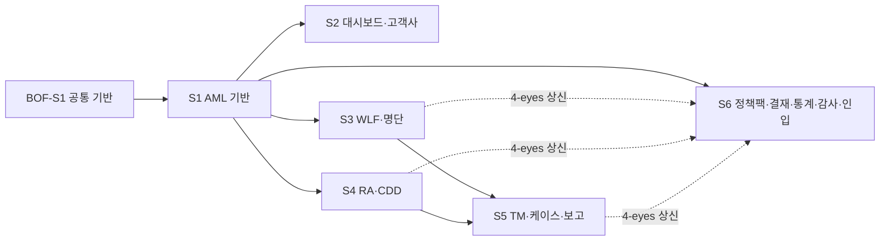

# BO-AML 개발 태스크 개요 (BO-AML-SAAS-Planning_v8.0 · 32화면)

> 대상: `aegis-aml/services/bo-web` + `services/bo-api` 의 **AML 백오피스(준법감시실 콘솔)** 구현.
> 정본 입력: PRD `docs/plan/02-aml-sass-functional-spec.md` v8.0 + PPT `docs/plan/BO-AML-SAAS-Planning_v8.0.pptx`.
> 규칙·공통 참고 문서 = `docs/tasks/README.md`. 공통 기반 = `docs/tasks/bo-fds/01-stage1-foundation.md`(BOF-S1, 공유).

## 1. 단계(Stage) 개요

| Stage | 문서 | 범위(화면) | 슬라이드 | 선행 |
|---|---|---|---|---|
| **S1 AML 기반 추가** | `01-stage1-foundation.md` | 화면 없음 — PII reveal·tipping-off 가드·AML NAV·표시 사전(부록 F) (**BOF-S1 위에 추가**) | 1~2 | BOF-S1 |
| **S2 대시보드·고객사** | `02-stage2-tenant-dashboard.md` | AML-DASH-001 · AML-TNT-001/002(4탭 — 보고기관 패널·소스 인입 신호)/003 | 3~9 | S1 |
| **S3 WLF·명단** | `03-stage3-wlf-watchlist.md` | AML-WLF-001/002/003/**004(2탭)** · AML-WL-001(3탭)/002/**003(2탭)** | 10~20 | S1 |
| **S4 RA·CDD·정책 앞단** | `04-stage4-ra-cdd-policy.md` | AML-CTRY-001(2탭) · AML-RA-001(2탭)/003(3탭) · **AML-CDD-002(2탭)** · AML-RA-002(4탭) · **AML-HRR-001(2탭)** · AML-CDD-001(3탭) | 21~38 | S1 (S3 권장 — WLF 연계 표시) |
| **S5 TM·케이스·규제 보고·TR** | `05-stage5-tm-case-report.md` | AML-TM-001(2탭)/002 · AML-CASE-001/002(4탭) · AML-REP-001(3탭)/002(3탭) · **AML-IRA-001(3탭)** · AML-TR-001(3탭) | 39~58 | S1·S3·S4 |
| **S6 정책팩·결재·통계·내부통제·감사·인입** | `06-stage6-approval-stat-audit-ingest.md` | AML-PP-001(2탭) · AML-APR-001 · **AML-STAT-001(2탭)** · **AML-EDU-001(2탭)** · AML-AUD-001(3탭) · **AML-ING-001(2탭)** | 59~70 | S1 (4-eyes 수렴점) |

## 2. 화면 → Stage·슬라이드 전수 매핑 (32화면 = PPT 슬라이드 3~70)

| 화면(기능 ID) | PPT 슬라이드 | PRD § | Stage |
|---|---|---|---|
| AML-DASH-001 종합 대시보드 | 3 | §2.1 | S2 |
| AML-TNT-001 고객사 목록 | 4 | §13.1 | S2 |
| AML-TNT-002 고객사 상세 4탭(①보고기관 패널 ③인입 신호) | 5~8 | §13.2 | S2 |
| AML-TNT-003 고객사 등록 | 9 | §13.3 | S2 |
| AML-WLF-001/002/003 WLF 검토 3탭 흐름 | 10~12 | §3.1~§3.3 | S3 |
| **AML-WLF-004 스크리닝 시뮬레이션·임의 수행 2탭** | 13~14 | **§12-B.1** | S3 |
| AML-WL-001 명단 소스·임포트 3탭 | 15~17 | §4.1 | S3 |
| AML-WL-002 변경분 디프 승인 | 18 | §12-A.2 | S3 |
| **AML-WL-003 내부 명단·오탐 면제 2탭** | 19~20 | **§12-B.5** | S3 |
| AML-CTRY-001 국가위험 2탭 | 21~22 | §12-A.3 | S4 |
| AML-RA-001 분포·고위험 2탭 | 23~24 | §5.1 | S4 |
| AML-RA-003 대상 상세 3탭 | 25~27 | §12-A.4 | S4 |
| **AML-CDD-002 고객 CDD 프로필 원장 2탭** | 28~29 | **§12-B.7** | S4 |
| AML-RA-002 모델 관리 4탭 | 30~33 | §6.1 | S4 |
| **AML-HRR-001 당연고위험 레지스트리 2탭** | 34~35 | **§12-B.6** | S4 |
| AML-CDD-001 체크리스트·재심사 3탭 | 36~38 | §12-A.5 | S4 |
| AML-TM-001 알림·시나리오 2탭 | 39~40 | §7.1 | S5 |
| AML-TM-002 시나리오 빌더 | 41 | §12-A.6 | S5 |
| AML-CASE-001 케이스 목록 | 42 | §8.1 | S5 |
| AML-CASE-002 케이스 상세 4탭 | 43~46 | §12-A.7 | S5 |
| AML-REP-001 STR/CTR 후보 3탭 | 47~49 | §9.1 | S5 |
| AML-REP-002 보고 상세 3탭(보고기관 헤더·의심유형·FIU 폐루프) | 50~52 | §12-A.8 | S5 |
| **AML-IRA-001 기관 위험평가 지표 보고 3탭** | 53~55 | **§12-B.2** | S5 |
| AML-TR-001 Travel Rule 3탭 | 56~58 | §10.1 | S5 |
| AML-PP-001 Policy Pack 2탭 | 59~60 | §12-A.9 | S6 |
| AML-APR-001 결재 대기함 | 61 | §11.1 | S6 |
| **AML-STAT-001 STR·룰 효과성 2탭** | 62~63 | **§12-B.3** | S6 |
| **AML-EDU-001 교육·자격 2탭** | 64~65 | **§12-B.4** | S6 |
| AML-AUD-001 감사·증적·소스 3탭 | 66~68 | §12.1 | S6 |
| **AML-ING-001 수신 API 카탈로그·인입 라이브 2탭** | 69~70 | **§12.2·§1.11** | S6 |

## 3. 제안 API (BE 구현 전 명세 확정 필요 — `SPEC` 태스크, 정본 = PRD 부록 E v6.0/v7.0/v8.0)

| 제안 API | 화면 | Stage |
|---|---|---|
| `POST .../screenings:simulate`·`:bulk-run` | AML-WLF-004 | S3 |
| `POST .../watchlist-sources/{code}/entries:draft`·`GET .../screenings/fp-whitelist`·`POST .../fp-whitelist/{id}:revoke`🔒 | AML-WL-003 | S3 |
| `GET/PUT .../high-risk-registry`🔒(subjectType `HIGH_RISK_REGISTRY`) | AML-HRR-001 | S4 |
| `GET /aml/customers/{ref}/profile` | AML-CDD-002 | S4 |
| `GET/POST .../ira/reports`·`PUT .../indicators`·`:submit`🔒(`IRA_SUBMIT`) | AML-IRA-001 | S5 |
| `reportingInstitution`(고객사 보고기관 정보 — 저장 위치·DTO) | AML-TNT-002 ①·AML-REP-002 ① | S2(S5 결합) |
| `GET /api/v1/bo/aml/stats/str`·`/stats/scenarios` | AML-STAT-001 | S6 |
| `GET/POST /api/v1/bo/aml/training/*`·`/certifications` | AML-EDU-001 | S6 |
| `GET /api/v1/bo/aml/ingest/catalog`·`/ingest/health` | AML-ING-001 | S6 |

> 그 외 화면은 확정 API(`docs/design/api/02-aml-api.md`) — **AML PRD 부록 A(화면↔API 전수 매핑)가 정본**.

## 4. 횡단 DoD (모든 태스크 공통 — FDS 횡단 DoD + AML 추가)

1. `bo-fds/00-overview.md` §4 횡단 DoD 전부 적용.
2. **tipping-off(특정금융정보법 §4의2)**: STR 관련 화면·메뉴·검색·딥링크·건수는 준법감시 전담 role에만 렌더링(비전담 미노출), 열람 전수 감사 — AML PRD 부록 B 하단 경계 정본.
3. **PII**: raw 미표시(토큰/hash), 원문 열람은 `aml:pii:reveal`+사유 입력+`RAW_DATA_ACCESS` 감사(S1-02).
4. 4-eyes subjectType 16종(+제안 2종)·결재 라인 표시 = AML PRD 부록 C·부록 G.
5. 표시 용어·enum = AML PRD 부록 F 사전과 1:1(i18n 키 원천).

## 5. Status 보드

| Stage | Status |
|---|---|
| S1~S6 | TODO |
