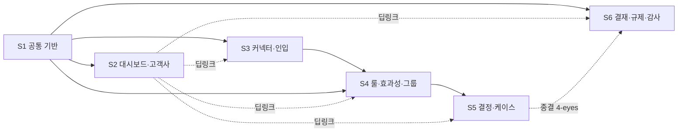

# BO-FDS 개발 태스크 개요 (BO-FDS-SASS-Planning_v7.0 · 34화면)

> 대상: `aegis-aml/services/bo-web` + `services/bo-api` 의 **FDS 백오피스** 구현.
> 정본 입력: PRD `docs/plan/01-fds-sass-functional-spec.md` v5.0 + PPT `docs/plan/BO-FDS-SASS-Planning_v7.0.pptx`.
> 규칙·공통 참고 문서 = `docs/tasks/README.md`.

## 1. 단계(Stage) 개요

| Stage | 문서 | 범위(화면) | 슬라이드 | 선행 |
|---|---|---|---|---|
| **S1 공통 기반** | `01-stage1-foundation.md` | 화면 없음 — 스캐폴딩·인증/RBAC·공통 레이아웃·API 클라이언트·프록시 골격 (**bo-aml과 공유**) | 1~2(커버·이력) | — |
| **S2 대시보드·고객사** | `02-stage2-tenant-dashboard.md` | SFDS-DASH-001/002 · SFDS-TNT-001/002(5탭)/003 | 3~11 | S1 |
| **S3 커넥터·인입·스키마** | `03-stage3-connector-ingest.md` | SFDS-CONN-001/002/003/**004(2탭)** · SFDS-MAP-001/002 | 12~18 | S1 (S2 권장) |
| **S4 룰·효과성·그룹** | `04-stage4-rule-group.md` | SFDS-RULE-001~006 · **SFDS-STAT-001(2탭)** · SFDS-GRP-001/002/003 | 19~33 | S1·S3(피처 카탈로그) |
| **S5 결정·이벤트·액션·케이스** | `05-stage5-decision-case.md` | SFDS-DEC-001/002/003 · SFDS-EVT-001 · SFDS-ACT-001/002 · SFDS-CASE-001/002(4탭) | 34~44 | S1·S4(룰 표시) |
| **S6 결재·규제·증적·감사** | `06-stage6-approval-report-audit.md` | SFDS-APPR-001 · SFDS-REG-001/002 · SFDS-EXP-001 · SFDS-AUDIT-001 | 45~49 | S1 (S2~S5의 4-eyes 동작이 본 결재함에 수렴) |

## 2. 화면 → Stage·슬라이드 전수 매핑 (34화면 = PPT 슬라이드 3~49)

| 화면(기능 ID) | PPT 슬라이드 | PRD § | Stage |
|---|---|---|---|
| SFDS-DASH-001 플랫폼 대시보드 | 3 | §2.1 | S2 |
| SFDS-DASH-002 고객사별 대시보드 | 4 | §2.2 | S2 |
| SFDS-TNT-001 고객사 목록 | 5 | §3.1 | S2 |
| SFDS-TNT-002 고객사 상세 5탭 | 6~10 | §3.2 | S2 |
| SFDS-TNT-003 고객사 등록 | 11 | §3.3 | S2 |
| SFDS-CONN-001 커넥터 목록 | 12 | §4.1 | S3 |
| SFDS-CONN-002 커넥터 상세/운영 | 13 | §4.2 | S3 |
| SFDS-CONN-003 커넥터 등록 | 14 | §4.3 | S3 |
| **SFDS-CONN-004 수신 API 카탈로그·인입 라이브 2탭** | 15~16 | **§4.0·§4.4** | S3 |
| SFDS-MAP-001 스키마 레지스트리 | 17 | §5.1 | S3 |
| SFDS-MAP-002 필드 매핑/PII 정책 | 18 | §5.2 | S3 |
| SFDS-RULE-001 룰 목록(+효과성 컬럼) | 19 | §6.1 | S4 |
| SFDS-RULE-002 룰 상세 5탭 | 20~24 | §6.2 | S4 |
| SFDS-RULE-003 룰 빌더 | 25 | §6.3 | S4 |
| SFDS-RULE-004 임계치 빠른 변경 | 26 | §6.4 | S4 |
| SFDS-RULE-005 결재·활성화·롤백 | 27 | §6.5 | S4 |
| SFDS-RULE-006 룰 시뮬레이션 | 28 | §6.6 | S4 |
| **SFDS-STAT-001 룰 효과성 통계 2탭** | 29~30 | **§6.7** | S4 |
| SFDS-GRP-001/002/003 그룹·명단 | 31~33 | §7.1~7.3 | S4 |
| SFDS-DEC-001/002/003 결정·조사 | 34~36 | §8.1~8.3 | S5 |
| SFDS-EVT-001 이벤트 조회 | 37 | §9.1 | S5 |
| SFDS-ACT-001/002 액션·Capability | 38~39 | §10.1~10.2 | S5 |
| SFDS-CASE-001 케이스 목록 | 40 | §11.1 | S5 |
| SFDS-CASE-002 케이스 상세 4탭 | 41~44 | §11.2 | S5 |
| SFDS-APPR-001 결재함 | 45 | §12.1 | S6 |
| SFDS-REG-001/002 규제 보고 | 46~47 | §13.1~13.2 | S6 |
| SFDS-EXP-001 Evidence Export | 48 | §14.1 | S6 |
| SFDS-AUDIT-001 감사 로그 | 49 | §15.1 | S6 |

## 3. 제안 API (BE 구현 전 명세 확정 필요 — `SPEC` 태스크)

| 제안 API | 화면 | 오픈결정 정본 | Stage |
|---|---|---|---|
| `GET /api/v1/bo/fds/ingest/catalog` · `/ingest/health` | SFDS-CONN-004 | PRD v5.0 변경 이력 ②(후속 API 정합) | S3 |
| `GET /api/v1/bo/fds/stats/rules` · `/stats/false-positives` | SFDS-STAT-001 | PRD v4.0 변경 이력 ①(후속 API 정합) | S4 |

> 그 외 화면은 모두 **확정 API**(`docs/design/api/01-fds-api.md`) 위임/소유 — PRD §16.1 화면↔API 매핑이 정본.

## 4. 횡단 DoD (모든 태스크 공통)

1. 빌드·테스트·lint 통과 (bo-web: `next build`+vitest / bo-api: Gradle build+JUnit).
2. 표시 용어·enum = PRD 정본과 1:1 (FDS는 본문 enum 병기·내부 코드 미노출 원칙 §1).
3. 멀티테넌시: 모든 호출에 `Tenant-Id`(+`Workspace-Id`·data-scope) 컨텍스트 전파, 크로스 고객사 데이터 미노출.
4. 4-eyes 동작(🔒)은 상신→`approvalRequestId`→결재함 흐름으로만 — 화면 직접 실행 금지(PRD §12.1).
5. raw PII 미표시(토큰/마스킹), 운영 변경은 감사 로그 기록(SFDS-AUDIT-001 조회 가능).
6. 에러 코드 → 화면 처리 = PRD §16.3 표.

## 5. Status 보드

| Stage | Status |
|---|---|
| S1~S6 | TODO |
