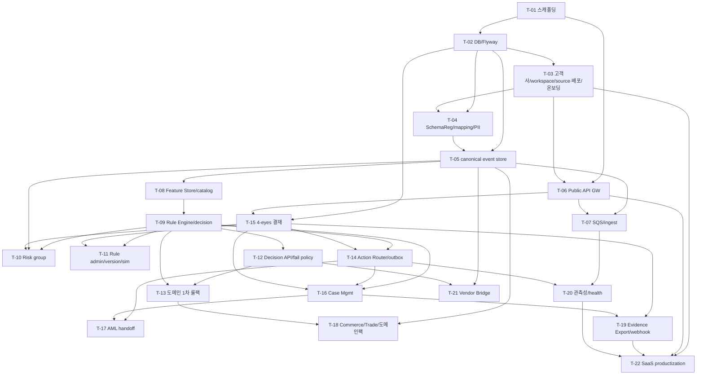

# FDS 개발 태스크/WBS — Overview

> 정본: `.claude/skills/_shared/target-architecture.md`(4서비스 모노레포 · Java 25 헥사고날 · Next.js · 멀티테넌시 tenant/workspace/data-scope · PII 마스킹 · 4-eyes · 한국 Policy Pack STR/CTR/Travel Rule).
> 입력 정본 진실: 설계서 `docs/software/01-fdsSvc-sass.md` v1.5. 파생 정합: DB `docs/design/db/01-fds-db.md` v1.3, API `docs/design/api/01-fds-api.md` v1.5, Integration `docs/design/integration/01-fds-integration.md` v1.5.
> 본 WBS는 `fds-svc`(엔진, 설계 표기 `com.hanpass.fds` — 구현 패키지 루트 `com.aegis.fds`(target-architecture §5)) 책임을 기준으로 분해하고, 운영 콘솔·결재·감사 UI는 `bo-api`/`bo-web` 연계로 표기한다. AML/STR/CTR/Travel Rule 본 처리는 `aml-svc` 위임. **확정된 설계 범위만 태스크화**한다.

## 0. 서비스 경계·레이어

| 서비스 | 책임 | 본 WBS 범위 |
|---|---|---|
| `services/fds-svc` | FDS 엔진(ingest·정규화·feature store·rule engine·decision·action router·case·결재 게이트·evidence) — 설계 표기 `com.hanpass.fds` / 구현 패키지 `com.aegis.fds`(target-architecture §5) 헥사고날 | 주 대상 |
| `services/bo-api` | admin API 집약·운영자 IAM·결재 라인 정책·감사 집약 (bo-web→bo-api만) | 연계 표기(태스크 산출물=Admin API 계약) |
| `services/bo-web` | no-code rule builder·case·evidence·결재함 UI (Next.js) | backoffice-planner PRD 대상(본 WBS는 화면 목록만 전달) |
| `services/aml-svc` | AML/STR/CTR/Travel Rule 본 케이스·sanction/PEP·규제보고 | 연동 경계만(`fds-aml-handoff` 큐 / `amlCaseRef`) |

## 1. 태스크 구분 표기

- **[BO]** 백오피스 대상(BO CRUD·임계치·룰/시뮬레이션·case·동결·감사·결재) — backoffice-planner 화면 대상. Admin API(`/api/v1/admin/fds/*`)를 bo-api 경유로 노출.
- **[BE]** 백엔드 전용(SQS·아웃박스·스케줄러·커넥터·멱등·partition) — backoffice-planner 화면 **비대상**.
- **[BE+BO]** 엔진 기능 + 운영 화면이 함께 필요.

## 2. 태스크 목록

| ID | 제목 | 서비스 | 구분 | Effort | 의존 | Due(Phase) | Status |
|---|---|---|---|---|---|---|---|
| T-01 | 모노레포·fds-svc 스캐폴딩·CI·컨벤션 | fds-svc | BE | M | — | P0 | TODO |
| T-02 | DB 마이그레이션(Flyway V1~V17)·배포 모델·시드 | fds-svc | BE | L | T-01 | P1 | TODO |
| T-03 | 고객사·workspace·source system 레지스트리·배포/온보딩(deployment_model) | fds-svc/bo | BE+BO | M | T-02 | P1 | TODO |
| T-04 | Schema Registry·field mapping·PII 토큰화/해시 | fds-svc/bo | BE+BO | L | T-02,T-03 | P1 | TODO |
| T-05 | Canonical event store·멱등/dedup·subject/account/instrument | fds-svc | BE | L | T-02,T-04 | P1 | TODO |
| T-06 | Public API 게이트웨이·인증(API Key+HMAC/OAuth2/mTLS)·scope·envelope | fds-svc | BE | L | T-01,T-03 | P1 | TODO |
| T-07 | SQS 토폴로지·`fds-events` ingest consumer·DLQ·FIFO 멱등 | fds-svc | BE | L | T-05,T-06 | P1 | TODO |
| T-08 | Feature Store·feature catalog·velocity/window materialization | fds-svc/bo | BE+BO | XL | T-05 | P2 | TODO |
| T-09 | Rule Engine·DSL·decision store·decision reasons | fds-svc | BE | XL | T-08 | P2 | TODO |
| T-10 | Risk group·watchlist/denylist·group match | fds-svc/bo | BE+BO | M | T-05,T-15 | P2 | TODO |
| T-11 | Rule admin·version·rollback·simulation(예상 hit rate) | fds-svc/bo | BE+BO | XL | T-09,T-15 | P2 | TODO |
| T-12 | Decision API(실시간 평가)·fail policy·reason/decision code | fds-svc | BE | L | T-09 | P2 | TODO |
| T-13 | 주요 금융 도메인 1차 룰팩(송금·월렛·카드·PG·ATM) | fds-svc/bo | BE+BO | XL | T-09,T-12 | P3 | TODO |
| T-14 | Action Router·아웃박스·`fds-actions` relay·capability 매트릭스 | fds-svc | BE | L | T-09,T-15 | P4 | TODO |
| T-15 | 4-eyes 결재 게이트(approval·payload_hash·실행 분리) | fds-svc/bo | BE+BO | L | T-02,T-06 | P2(골격)/P4(완성) | TODO |
| T-16 | Case Management·timeline·SLA·assignment·close·feedback | fds-svc/bo | BE+BO | XL | T-09,T-14,T-15 | P4 | TODO |
| T-17 | FDS→AML 위임(`fds-aml-handoff`·`amlCaseRef`·규제 후보) | fds-svc | BE | M | T-14,T-16 | P6 | TODO |
| T-18 | Commerce/Trade evidence(문서·주문·정산)·도메인 확장팩 | fds-svc/bo | BE+BO | XL | T-05,T-13 | —(보류: 정책 확정 후 별도 WBS, 로드맵 Phase 미배치) | TODO |
| T-19 | Evidence Export·manifest hash·검사대응 pack·export webhook callback | fds-svc/bo | BE+BO | L | T-15,T-16 | P6 | TODO |
| T-20 | 관측성·metric·connector health·운영 대시보드 데이터 | fds-svc/bo | BE+BO | M | T-07,T-14 | P7 | TODO |
| T-21 | Legacy Vendor Bridge(`fds-vendor-ingest`·dual-run·reconciliation) | fds-svc | BE | L | T-05,T-12 | P7 | TODO |
| T-22 | SaaS productization(배포/온보딩 프로비저닝·connector SDK·dev portal·sandbox·conformance·metering·regional) | fds-svc/bo+IaC | BE+BO | XL | T-03,T-06,T-19,T-20 | P8 | TODO |

> Effort: S≈1~2d, M≈3~5d, L≈1~2w, XL≈2~4w (글로벌 effort-level-guide 기준 상대 산정).
> 운영자 집계 API 경계: 대시보드·고객사 관리·감사 조회는 **bo-api 소유·집약·인증**. fds-svc/aml-svc는 저수준 데이터 API만 제공하며 엔진 API 명세(`docs/design/api`)에 운영자 집계 엔드포인트(대시보드/고객사/감사)를 추가하지 않는다. PRD/PPT 해당 화면은 호출 대상을 bo-api로 명시.

## 3. 의존 그래프

## 4. 착수 순서(우선순위)

1. **기반(P0/P1)**: T-01 → T-02 → (T-03 · T-04) → T-05 → T-06 → T-07.
2. **Rule MVP(P2)**: T-08 → T-09 → (T-10 · T-11). T-12 동기 평가 API는 T-09 직후. **T-15 결재 게이트 골격**(P2-FDS-06: `subject_kind` 8종·`approval_status` 8종·`payload_hash`·RULE/GROUP 상신 수신)도 본 단계에서 도입(완성=P4).
3. **도메인 1차(P3)**: T-13.
4. **Action+Case+결재 완성(P4)**: T-14 → T-15(완성: action 실행 relay 분리, P4-FDS-03) → T-16.
5. **규제·교차연동·증적(P6)**: T-17(FDS→AML handoff·`amlCaseRef`·규제 후보 위임, P6-FDS-01), T-19(Evidence Export·manifest·export webhook callback, P6-FDS-02).
6. **운영·관측성·전환(P7)**: T-20(관측성·connector health, P7-FDS-01), T-21(Legacy Vendor Bridge, P7-FDS-02). T-18(Commerce/Trade evidence·도메인 확장팩)은 **정책 확정 후 별도 WBS로 보류**(로드맵 advanced domain pack 정책 준수, 본 로드맵 Phase 미배치).

> **§18 Phase 7 Advanced domain pack 전체(T-18 외 포함) 보류 — 정책 확정 후 별도 WBS**: T-18 Due는 `—(로드맵 Phase 미배치)`로 처리하며, 설계서 §18 Phase 7 'Advanced domain pack' 범주 항목 전체가 대상이다. 정책 결정 이전까지 본 로드맵·서비스 WBS 어느 Phase에도 배치하지 않는다.
7. **SaaS 제품화(P8)**: T-22(배포/온보딩 프로비저닝(IaC 파이프라인·self-hosted 설치형 패키징·`onboarding_status` 상태머신)·connector SDK·dev portal·sandbox·conformance·metering·regional). 설계서 §18 Phase 8 산출물 대응. T-03/T-06/T-19/T-20 완료 후 착수.

병렬 가능 그룹(독립): {T-03, T-04}, {T-10, T-11(T-15 골격 이후)}, {T-17, T-19}, {T-20, T-21}.

> **P5(bo-web Compliance Operations Console)는 fds-svc 신규 엔진 태스크 없음**(로드맵 §3 P5 fds-svc=`—`). 엔진 기능은 P2~P4에 완료되고, 해당 BO 화면은 bo-web이 P5에 구현한다: T-11 룰 admin·simulation UI=**P5-FDS-04**(no-code 룰 빌더·시뮬레이션·activate/rollback), T-16 false positive feedback·case UI=**P5-FDS-07/P5-FDS-08**(액션·케이스·결재함). 따라서 T-11/T-16 Due는 엔진 기준 P2/P4 단일이며, P5는 별도 bo-web Phase에서 화면으로 완성된다(로드맵 06-phase5-bo-web.md 정본).

## 5. 백오피스(BO) 화면 인벤토리 → backoffice-planner 입력

API §11 BO 화면↔API 매핑을 화면 단위로 재구성(분해/병합)했으며, 모든 엔드포인트는 API §4에 실재한다. 모두 bo-web→bo-api→`/api/v1/admin/fds/*`(또는 `/api/v1/fds/*` 위임) 경유. 🔒=4-eyes 결재.
> **운영자 집계 화면(플랫폼/고객사 대시보드·고객사 관리·감사 조회)은 bo-api 소유·집약·인증**이며 엔진 API 명세에 엔드포인트를 추가하지 않는다. 해당 화면은 backoffice-planner PRD/PPT에서 호출 대상을 bo-api로 명시한다(아래 표는 fds-svc 저수준 데이터 API 호출 화면).

| 화면 | 태스크 | 주요 API |
|---|---|---|
| 실시간 판단 모니터·decision 추이 | T-12 | `GET /fds/decisions`, `GET /fds/decisions/{id}` |
| no-code rule builder·feature catalog | T-09,T-11 | `GET /admin/fds/feature-catalog`, `POST /admin/fds/rules` |
| rule 활성화·rollback·simulation | T-11 | `/rules/{ruleId}/activate` 🔒, `/rollback` 🔒, `/api/v1/admin/fds/rules/simulations` |
| watchlist/risk group 관리 | T-10 | `GET/POST /admin/fds/risk-groups`, `PUT /risk-groups/{groupId}` 🔒(GROUP, 마스터 수정/비활성·`group_id`·`group_type` immutable), `/members` 🔒 |
| Case 큐·SLA·담당자·종결·false positive feedback | T-16 | `GET /fds/cases`, PATCH, `/assign`, `/close` 🔒(내부감사·규제) |
| Case timeline 증적 | T-16 | `GET /fds/cases/{id}/events`, `GET /evidence/fds/cases/{id}/timeline` |
| 정산 보류 큐·도메인 액션 | T-13,T-18 | `POST /fds/cases/{id}/actions` 🔒(자금성) |
| 결재함(maker-checker) | T-15 | `GET /admin/fds/approvals`, `/approve`, `/reject` |
| evidence export self-service | T-19 | `POST /evidence/fds/exports` 🔒(최종본), `/download` |
| source·connector·credential 관리 | T-03,T-04,T-20,T-21 | `admin/fds/source-systems`, `PUT /source-systems/{id}` 🔒(MAPPING, capability 매트릭스), `/connectors`, `GET /connectors/{id}`, `/connectors/{id}/pause`, `/connectors/{id}/resume`, `/replay`, `/credentials` 🔒 |

## 5a. SQS 큐(논리명) → 태스크 매핑 (integration §2/§12)

integration §12 확정 5개 큐 + 각 `*-dlq`. 발행/구독 주체를 태스크에 1:1 바인딩한다.

| 큐(논리명) | 종류 | 방향 | 발행/구독 태스크 | 비고 |
|---|---|---|---|---|
| `fds-events` | FIFO | in | T-07(consumer)·T-06(envelope) | ingest consumer·DLQ·FIFO 멱등 |
| `fds-actions` | FIFO | out | T-14(아웃박스 relay·`FdsActionResult` ack 소비) | outbox poller·상태 전이 |
| `fds-aml-handoff` | FIFO | out→aml-svc | T-17(`FdsAmlHandoff` 발행·`amlCaseRef` ack) | AML 위임 |
| `fds-webhook` | Standard | out→고객 endpoint | **발행 주체 분산**: `FdsDecisionCreated`→T-12, `FdsActionResult`→T-14, `FdsCaseOpened`/`FdsCaseStatusChanged`→T-16, evidence export 콜백→T-19 | 횡단 webhook publisher(BE) · `X-Signature` · idempotencyKey dedup · 재시도 8회 |
| `fds-vendor-ingest` | Standard | in | T-21(vendor connector·dual-run) | reconciliation |

> `fds-webhook`은 단일 태스크 귀속이 아니라 **이벤트 발생 도메인 태스크가 콜백을 발행**한다. 공통 publisher(서명·dedup·재시도·DLQ `fds-webhook-dlq`)는 횡단 BE로 T-14에서 구현하고, 각 도메인 태스크(T-12/T-14/T-16/T-19)가 자기 이벤트를 발행한다. `sandbox` workspace는 outbound 큐(`fds-actions`/`fds-aml-handoff`/`fds-webhook`) 미발행(shadow-only).

## 6. 백엔드 전용(BE) — 화면 비대상

T-01, T-02(Flyway·partition), T-04(PII 토큰화 엔진부), T-05(canonical store·멱등), T-06(GW·HMAC/OAuth2/mTLS), T-07(SQS·`fds-events`·DLQ·FIFO), T-08(velocity materialization), T-12(`FdsDecisionCreated` webhook 발행), T-14(아웃박스 relay poller `SELECT FOR UPDATE SKIP LOCKED`·`FdsActionResult` ack 소비·`fds-webhook` 공통 publisher), T-16(`FdsCaseOpened`/`FdsCaseStatusChanged` webhook 발행), T-17(`fds-aml-handoff` 발행/ack), T-21(vendor connector), T-22(connector SDK·metering·sandbox conformance). 스케줄러(connector polling·DLQ depth poller PT60S·reconciliation)는 T-07/T-20 내 BE 항목으로 표기. `fds-webhook` 큐 발행/구독은 §5a 매핑 참조(공통 publisher=T-14 횡단, 도메인 발행=T-12/T-14/T-16/T-19).

## 7. 오픈 결정(설계서 §19와 정합)

- **D-01 배포 모델(deployment topology)**: 고객사별 전용 배포가 기본. `fds_tenants.deployment_model`(`MANAGED_DEDICATED` 기본=플랫폼 클라우드 전용 DB·스택 IaC 자동 프로비저닝 / `SELF_HOSTED`=고객 인프라 설치형 패키지 / `SHARED`=소규모/체험 공유 DB+tenant 행 격리). 격리는 화면 토글이 아니라 **온보딩 프로비저닝의 산출**(`onboarding_status` 8종 상태머신). 구 `isolation_mode`(SHARED/SCHEMA/DB) 폐기, 마이그레이션 Flyway V17(SHARED→SHARED·SCHEMA/DB→MANAGED_DEDICATED). 전용 배포는 배포=고객사 단일 `tenant_id`(격리=배포 경계), `SHARED`만 행 격리(T-03 레지스트리·상태 표시 / T-22 프로비저닝 파이프라인).
- **D-06 raw payload**: 미저장 기본(`payload_hash`만). ingest 단계 PII reject/tokenize(T-04/T-05).
- **D-14 실시간 판단 장애**: `fds_source_systems.fail_policy`(`FAIL_CLOSED`/`FAIL_OPEN`/`CASE_ONLY`)에 따른 평가 불가 처리(T-12).
- **AML cross-ref 확정**: `fds_cases.aml_case_id VARCHAR(96) NULL` = API/메시지 `amlCaseRef`. **DB §5.13이 정본 행으로 확정**(역조회 인덱스 `ix_case_aml_ref`), integration §9.1 동일 타입·API §5.5 매핑(FK 아님, T-17). 더 이상 '미확정/대기' 아님.
- **action_type 마스터**: 정본은 **API `ActionType` enum 23종(전수)**(`docs/design/api/01-fds-api.md` §5.7·§7·§10 OpenAPI; §1.1 명시). API §9는 Webhook 콜백 계약이라 enum 마스터 무관. DB §4.8·integration capability 매트릭스·설계서 §11.2가 이 23종으로 동기화. 설계서 §15 별칭(`OPEN_*_CASE`/`SUSPEND_MERCHANT`/`SEND_SECURITY_ALERT`/`CHALLENGE`/`REVIEW`)은 §11.2a 매핑으로 정본 `action_type`(+`case_type`)으로 환원해 저장·전송: `OPEN_*_CASE`→**`OPEN_CASE`+`case_type`**, AML 위임은 별도 enum **`OPEN_AML_CASE`**, `SUSPEND_MERCHANT`→`SUSPEND_INSTRUMENT`, `SEND_SECURITY_ALERT`→`SEND_ALERT`. `HOLD_TRANSACTION`은 비정본(→`HOLD_FUNDS`/`BLOCK_TRANSACTION`). HTTP 상태코드는 API §6 명세가 정본.
- D-03 rule DSL(자체 DSL/CEL)·D-05 ML score는 본 부트스트랩 범위에서 자체 DSL + 외부 score 전제(T-09). CEL/내장 모델 채택 시 T-09 하위 태스크 추가.

## 변경 이력

| 일자 | 변경 | 비고 |
|---|---|---|
| 2026-06-08 | **#32/#33/#35/#36 정합화(doc-consistency-report-fds-latest 담당 항목)**: (1) **#32** L5·§0표 `com.hanpass.fds`→'설계 표기 `com.hanpass.fds` — 구현 패키지 루트 `com.aegis.fds`(target-architecture §5)' 병기(2곳). (2) **#35** T-12 Due `P2/P3`→**`P2`**(로드맵 §3·Phase2 정본). (3) **#36** T-18 Due `P7(보류…)`→**`—(보류: 정책 확정 후 별도 WBS, 로드맵 Phase 미배치)`**(자기모순 해소, 로드맵 §3 정본). (4) **#33** §4 착수순서 6번 뒤에 '§18 Phase 7 Advanced domain pack 전체(T-18 외 포함) 보류 — 정책 확정 후 별도 WBS' 비고 블록 추가. |
| 2026-06-08 | **svcwbs↔roadmap Due 단일화 + §4/§5 P5 귀속 명시(doc-consistency 3-8·3-9 담당 항목)**: 로드맵(정본, `aegis-aml/00-program-overview.md` §3·06-phase5-bo-web.md)에 맞춰 (1) **T-01** Due `P0/P1`→**P0**(로드맵 P1에 T-01 없음, Phase 0 DONE). (2) **T-11** Due `P2/P5`→**P2**(로드맵 §3 P5 fds-svc=`—`, P5는 bo-web Phase). (3) §4 착수 순서에 'P5는 fds-svc 신규 엔진 태스크 없음·T-11 룰 admin/simulation UI=P5-FDS-04·T-16 false positive/case UI=P5-FDS-07/08' 주석 추가. (4) §5 BO 인벤토리 Case 행에 'false positive feedback' 명시(설계서 §18 Phase 5 feedback loop 귀속=T-16). 정본=로드맵 §3·06-phase5. | doc-consistency 3-8(design-wbs)·3-9(wbs-roadmap) WBS측 정정. |
| 2026-06-08 | **태스크 Due(Phase) 매핑 정정 — 프로그램 로드맵/Phase 파일(실태스크 배치)을 정본으로 svcwbs↔roadmap 이격 해소(doc-consistency 높음 #6~#9 + 중간 T-15)**. (1) **T-17** Due `P5/P7`→**P6**(로드맵 P6-FDS-01, 07-phase6 §2). (2) **T-20** Due `P6`→**P7**(P7-FDS-01, 08-phase7 §2). (3) **T-21** Due `P6`→**P7**(P7-FDS-02, 08-phase7 §2). (4) **T-18** Due `P7`→**P7(보류·정책 확정 후 별도 WBS)**(로드맵 advanced domain pack 정책 준수=로드맵 Phase 미배치, 두 문서 상태 동일화). (5) **T-15** Due `P4`→**P2(골격)/P4(완성)** 2분할 명시(P2-FDS-06 골격·P4-FDS-03 완성, 03-phase2 §2). (6) §4 착수 순서 재정렬(P2 결재 게이트 골격·P4 결재 완성·P6 T-17/T-19·P7 T-20/T-21·T-18 보류)·병렬 가능 그룹 동기화. T-19(P6)는 이미 로드맵 P6-FDS-02와 정합(변경 없음). 정본=`aegis-aml/00-program-overview.md` §3·07-phase6·08-phase7·03-phase2. | svcwbs↔roadmap Phase 매핑 sync. |
| 2026-06-08 | **격리(isolation_mode) → 배포 모델(deployment topology) 재설계** 2층 동기화(설계서 v1.5 §13/§11.6.11/§11.6.11a/§14.1/§12.8, DB v1.3, API v1.5, integration v1.5, target-architecture §4.1). (1) 입력 정본 버전핀 갱신(설계서 v1.3→v1.5·DB v1.2→v1.3·API v1.4→v1.5·integration v1.4→v1.5). (2) **T-02** 제목 '격리·시드'→'배포 모델·시드'(Flyway V1~V16→V1~V17, V17=`isolation_mode` DROP→`deployment_model`/`onboarding_status`/`infra_ref` 추가·백필). (3) **T-03** 제목 'isolation'→'배포/온보딩(deployment_model)', 구현 항목은 이미 `deployment_model`/`onboarding_status`/`infra_ref`·배포 유형 선택+온보딩 상태·전용 배포 tenantId 의미로 재정의됨(`isolation_mode` 토글 제거). (4) **T-22** 제목 'onboarding'→'배포/온보딩 프로비저닝'(서비스에 IaC 추가), 구현 항목은 IaC 파이프라인·self-hosted 설치형 패키징·`onboarding_status` 상태머신·bo-api 온보딩 API(provision/onboarding/register)로 재정의됨. (5) **§7 D-01** 'DB 격리(isolation_mode)'→'배포 모델(deployment topology)'(3종 enum·상태머신·전용 배포 격리=배포 경계·Flyway V17 마이그레이션). (6) 의존 그래프 T-03 노드 라벨·§4 P8 착수순서 갱신. 프로그램 로드맵 P8(09-phase8-saas.md)·과 정합. 폐기: `isolation_mode` 컬럼·enum(SHARED/SCHEMA/DB)·격리 라디오 UI. | 배포 모델 재설계 2층 sync. |
| 2026-06-07 | 입력 정본 버전핀 정정(반복 정합성 이격(중간) 해소) — L4 입력 정본 표를 각 정본 문서 변경이력 최신 버전으로 동기화. (1) **설계서 `01-fdsSvc-sass.md` v1.2→v1.3**(부록 B 변경이력 최신=v1.3, action_type/approval/Decision 응답·운영자 집계 경계 정합 반영분). (2) **DB `01-fds-db.md` v1.1→v1.2**(§11 변경이력 최신=v1.2, subject_type/case enum 추적성 보강분, action_type/case_type/subject_kind는 v1.1에서 정본 동기 완료). (3) **Integration `01-fds-integration.md` v1.2→v1.4**(§13 변경이력 최신=v1.4, eventType family↔`event_family` 정규화 매핑 완전화·`trade`/`market` 단일화 반영분). (4) **API `01-fds-api.md` v1.4 유지**(§14 최신=v1.4 확인, 변경 불필요). 번호별 태스크는 sass/db/integration 참조를 §섹션 단위로만 핀(버전 문자열 무첨부)하므로 추가 동기화 불필요. API 핀(v1.4)은 T-03·T-04·T-10·T-15·T-20에서 이미 정합. 정본=각 문서 변경이력·target-architecture. | 입력 버전핀 정정. |
| 2026-06-07 | 정본 API 최신 동기화(잔존 높음 이격 H2 GRP master + 버전핀 정체): (1) **API 버전핀 v1.3→v1.4** 갱신(L4·T-10·T-15 참조 핀). (2) **신설 그룹 마스터 수정 엔드포인트 반영** — API §4.7(v1.4) `PUT /api/v1/admin/fds/risk-groups/{groupId}`(그룹 마스터(틀) 수정·`active=false` 비활성, `display_name` 수정. `group_id`·`group_type` immutable=`FDS-VALIDATION-002`, 비활성은 멤버 0 선결=`FDS-STATE-CONFLICT` 409. `RiskGroupUpsertRequest`/`RiskGroupDto` §5.18/§5.19)를 T-10 구현 항목·참조와 §5 BO 인벤토리 risk group 행에 추가. (3) **4-eyes 결재 연결 명시** — 본 PUT은 `subjectKind=GROUP`(subjectRef=`group_id`, 기본 `RISK_MANAGER`)로 `fds_approval_requests` 생성 후 승인 relay(§8), 결재 엔진 게이트는 T-15(approval-gate)가 소유. T-15 구현 항목·참조에 GROUP 마스터 수정 게이트 추가. 정본=API §4.7/§5.18~§5.19/§8·target-architecture(bo-web→bo-api→fds-svc, 4-eyes maker≠checker). PRD 화면의 `source`/`autoEnrollOnHit`/`defaultExpiryDays`/`description`은 `fds_risk_groups` 컬럼 부재로 본 PUT 영속 대상 아님(추측 컬럼 미생성). | API v1.4 sync. |
| 2026-06-06 | FDS 태스크/WBS 부트스트랩 신규 작성. 설계서 §18 로드맵 Phase 0~8·DB/API/integration 파생을 21개 태스크(T-01~T-21)·의존 그래프·BO 화면 인벤토리로 분해. 명칭·enum·엔드포인트·큐는 DB §4/§5·API §4/§5·integration §2/§4와 1:1(`amlCaseRef`=`fds_cases.aml_case_id` 확정 반영). | `docs/tasks/fds/` fresh. |
| 2026-06-07 | 정본 API/Integration 최신 동기화(잔존 높음 이격 CONN-002/CONN-003 + 버전핀): (1) **API 버전핀 v1.2→v1.3**·**Integration 버전핀 v1.1→v1.2** 갱신(L4). (2) **신설 커넥터 운영 엔드포인트 반영** — API §4.8(v1.3) `GET /admin/fds/connectors/{id}`·`POST .../{id}/pause`·`POST .../{id}/resume`(커넥터 단건 health/일시중지/재개, offset 보존·멱등·`FDS-STATE-CONFLICT`)를 T-20 connector health 항목·§5 connector 관리 행에 추가. (3) **신설 소스시스템 capability 엔드포인트 반영** — API §4.8(v1.3) `PUT /admin/fds/source-systems/{id}`(속성·capability 매트릭스 수정, `capabilities`=`control_capability` DB §4.6 부분집합, 4-eyes `subjectKind=MAPPING` subjectRef=`source_system`, §8)를 T-03(source system CRUD)·T-04(schema mapping/capability)·§5 source 관리 행에 추가. 정본=API §4.8/§5.15~§5.17/§8·target-architecture. 운영자 집계(대시보드/고객사/감사)=bo-api 소유 경계 유지(미추가). | API v1.3 / Integration v1.2 sync. |
| 2026-06-06 | doc-consistency(fds) 정정 정본 정합화(태스크 담당 항목): (1) **Phase 8(SaaS productization) 태스크 T-22 추가**(Due=P8, 의존 T-03/T-06/T-19/T-20, 설계서 §18 산출물 대응) + 의존 그래프·착수 순서 반영. (2) **`fds-webhook` 큐→태스크 매핑** 명문화(§5a): `FdsDecisionCreated`→T-12, `FdsActionResult`→T-14, `FdsCaseOpened`/`FdsCaseStatusChanged`→T-16, evidence 콜백→T-19, 공통 publisher(서명·dedup·재시도·DLQ)=T-14 횡단. T-19 전담 귀속 해소. (3) **`aml_case_id` 확정상태 동기화**: '미확정/대기'→**DB §5.13 정본 확정 컬럼**(`VARCHAR(96) NULL`·`ix_case_aml_ref`, integration §9.1 동일, FK 아님). T-02/T-17 참조 갱신. (4) **action_type 마스터=API `ActionType` enum 23종**·`OPEN_CASE`(+`case_type`) 표기 명문화(설계서 §11.2a 별칭 환원, AML 위임=`OPEN_AML_CASE`). HTTP 상태코드=API §6 정본. (5) **운영자 집계 API 소유 경계**: 대시보드/고객사/감사=bo-api 소유·집약·인증, fds-svc는 저수준 데이터 API만(엔진 API에 운영자 집계 엔드포인트 미추가). BO 인벤토리 '1:1'→'화면 단위 재구성, 엔드포인트 §4 실재'로 정정, rule 경로 슬래시 표기 통일. | doc-consistency-report-fds-latest §③ design-task/db-task/api-task/integration-task. |
